# Linear Cryptanalysis of Reduced-Round Simon Using Super Rounds

Reham Almukhlifi and Poorvi Vora<sup>1</sup>

<sup>1</sup>Department of Computer Science The George Washington University

#### Abstract

We present attacks on 21-rounds of Simon 32/64, 21-rounds of Simon 48/96, 25-rounds of Simon 64/128, 35-rounds of Simon 96/144 and 43-rounds of Simon 128/256, often with direct recovery of the *full master key* without repeating the attack over multiple rounds. These attacks result from the observation that, after four rounds of encryption, one bit of the left half of the state of 32/64 Simon depends on only 17 key bits (19 key bits for the other variants of Simon). Further, linear cryptanalysis requires the guessing of only 16 bits, the size of a single round key of Simon 32/64. We partition the key into smaller strings by focusing on one bit of state at a time, decreasing the cost of the exhaustive search of linear cryptanalysis to 16 bits at a time for Simon 32/64. We also present other example linear cryptanalysis, experimentally verified on 8, 10 and 12 rounds for Simon 32/64.

### 1 Introduction

Lightweight cryptography is a rapidly growing area of research, emerging to fill the need for securing highly-constrained devices such as RFID tags and sensor networks. The limited hardware and software resources require that the cryptographic primitives be highly efficient. In 2013, the U.S. National Security Agency introduced two families of lightweight block ciphers for this effort: SIMON and SPECK that have a simple design and perform well on constrained software environments [1]. Since then, both block ciphers have attracted the attention of researchers and have been the subject of many security investigations.

In this paper, we propose an extension of the classical linear cryptanalytic approach which uses multiple linear approximations and Matsui's second algorithm. The standard approach, of extending the linear approximation by a single round of decryption (encryption), comes at the cost of guessing the last round (first round) key:  $O(2^n)$  for an n-bit round key for SIMON block size 2n. We propose extending the linear approximation by a super-round—which, in the case of SIMON, is four rounds with a total cost  $O(n2^b)$ , for  $b \le n$ , depending on the SIMON variant, leading to the determination of four round keys, instead of the single round key obtained through the traditional approach. Directly applying Matsui's approach by appending four rounds would require a cost of  $O(2^{4n})$ ); but this is not necessary because of the weakness in SIMON, which we express as a super round. Thus we demonstrate a simple, efficient extension of the key recovery attack using Matsui's second algorithm, and **recover multiple round keys, including the entire master key in some cases**. For this reason, we compare our results with other results in the literature that were obtained using the classical simple Matsui's second algorithm without recourse to linear hull approaches.

Approaches based on linear hulls [2, 3, 4, 5, 6] can attack a larger number of rounds than we can. An interesting future work direction would be to examine the combination of linear hulls and super rounds. Table 1 summarizes the linear hull attack results on SIMON.

<span id="page-1-0"></span>

| SIMON           | Total  | Attacked | Data        | Time                      | Reference |
|-----------------|--------|----------|-------------|---------------------------|-----------|
|                 | Rounds | Rounds   | Complexity  | Complexity                |           |
|                 |        | 21       | $2^{30.56}$ | $2^{55.56}$               | [2]       |
| CIMON 22/64     | 32     | 21       | -           | _                         | [3]       |
| Simon $32/64$   | 3∠     | 23       | $2^{30.59}$ | $2^{50}$                  | [4]       |
|                 |        | 23       | $2^{31.19}$ | $2^{61.84}A + 2^{56}E$    | [6]       |
|                 |        | 20       | $2^{44.11}$ | $2^{70.61}$               | [2]       |
| Simon $48/72$   | 36     | 23       | $2^{47.78}$ | $2^{62.10}$               | [4]       |
|                 |        | 24       | $2^{47.92}$ | $2^{67.89}A + 2^{65.34}E$ | [6]       |
|                 |        | 21       | $2^{44.11}$ | 287.11                    | [2]       |
|                 |        | 21       | -           | -                         | [3]       |
| Simon 48/96     | 36     | 24       | $2^{47.78}$ | $2^{83.10}$               | [4]       |
|                 |        | 23       | $2^{47.92}$ | $2^{92.92}$               | [5]       |
|                 |        | 25       | $2^{47.92}$ | $2^{89.89}A + 2^{88.28}E$ | [6]       |
| Simon 64/96     | 42     | 27       | $2^{62.53}$ | $2^{88.53}$               | [2]       |
| 51WON 04/50     | 42     | 30       | $2^{63.53}$ | $2^{93.62}A + 2^{88.13}E$ | [6]       |
|                 |        | 29       | $2^{62.53}$ | $2^{123.53}$              | [2]       |
| Simon $64/128$  | 44     | 29       | -           | -                         | [3]       |
|                 |        | 31       | $2^{63.53}$ | $2^{119.62}A + 2^{120}E$  | [6]       |
| Simon 96/96     | 52     | 37       | $2^{95.2}$  | $2^{67.94}A + 2^{88}E$    | [6]       |
| Simon 96/144    | 54     | 36       | $2^{94.2}$  | $2^{135.2}$               | [2]       |
| 51MON 90/144    |        | 38       | $2^{95.2}$  | $2^{98.94}A + 2^{136}E$   | [6]       |
| SIMON 128/129   | 68     | 36       | $2^{124}$   | $2^{124}$                 | [3]       |
| SIMON 128/128   | 08     | 49       | $2^{127.6}$ | $2^{87.77}A + 2^{120}E$   | [6]       |
| CIMON 100/100   |        | 48       | $2^{126.6}$ | $2^{187.6}$               | [2]       |
| SIMON 128/192   | 69     | 43       | $2^{127}$   | -                         | [3]       |
|                 |        | 51       | $2^{127.6}$ | $2^{155.77}A + 2^{184}E$  | [6]       |
| SIMON 129/256   | 72     | 50       | $2^{126.6}$ | $2^{242.6}$               | [2]       |
| SIMON $128/256$ | 12     | 53       | $2^{127.6}$ | $2^{239.77}A + 2^{248}E$  | [6]       |

Table 1: Summary of linear hull results

#### Our Contributions.

In this paper we present an attack on reduced-round SIMON, illustrating it in detail for SIMON 32/64, and providing a sketch of it for other variants. Our attack is based on the observation that, after four rounds of encryption, one bit of the left half of the state of SIMON 32/64 depends on only 17 key bits, and linear cryptanalysis requires the guessing of only 16 bits, the size of a single round key. A single bit of right half state similarly depends on 8 key bits (7 need to be guessed for linear cryptanalysis). By focusing on a single bit of the state at a time, we are able to partition the key into smaller strings, enabling us to more efficiently apply exhaustive search to perform linear cryptanalysis, doing it 16 (or 7) bits at a time. We are able to determine multiple round keys, which corresponds to a large fraction of the independent master key bits. This approach extends to other variants of SIMON as well. We summarize the approach below for SIMON 32/64.

We define the *super round*—four rounds of encryption with output limited to a single bit—and the corresponding *super key* limited to the relevant 16 (or 7) bits. For each bit of state, we extend the super round with an appropriate linear approximation with one active input bit. We carry out Matsui's second cryptanalysis using the super round instead of a single round and obtain the corresponding super key by performing an exhaustive search over 16 (or 7) bits. We do this for all 32 bits of the state. Thus, the use of the super round significantly improves the overall time complexity of linear cryptanalysis of SIMON.

We thus obtain 16 super keys of size 16 each (left half) and 16 super keys of size 7 each (right half), with considerable overlap among the key bits, as there are only 48 independent master key bits in the 4-round cipher extended by the linear approximation. Consequently, we obtain 368 related key bits representing 48 independent key bits, which allows for error correction. We can further extend the super round and the linear approximation with an additional two rounds at the end, to obtain 60 independent key bits, which can be used to obtain up to 60 master key bits.

We extend the above attack to other variants of SIMON. We also perform an experimental verification of our attack on 8, 10 and 12-round SIMON 32/64. Using the capacity-based projections of the relationship of bias to the

<sup>\* &#</sup>x27;-' means not given, A means Addition, E means Encryption

number of P/C pairs [\[7\]](#page-24-0), we predict the determination of the entire master key of 20-round Simon 32/64, with 2 <sup>32</sup> P/C pairs and time complexity 2<sup>60</sup>. We are also able to determine all 64 master key bits of 8-round Simon using a meet-in-the-middle attack with one super round of encryption and one super round of decryption, with data complexity 2<sup>5</sup>.<sup>58</sup> and time complexity 2<sup>34</sup>.<sup>58</sup> .

We need to point out that [\[8\]](#page-24-1) has an observation similar to ours: that a single bit after four rounds of encryption is affected only by 18 bits, and they use it to define a related-key attack. We had derived this result independently.

We now compare our results with those of Alizadeh et al [\[2\]](#page-23-1), which are improvements on their peer-reviewed work in [\[9\]](#page-24-2) and are currently the best peer-reviewed attacks on Simon that use the classical Matsui's second algorithm and multiple approximations. As we mentioned earlier, linear hull attacks are able to go deeper; here, we focus on our improvement on the classical approach without recourse to linear hulls. ([\[10\]](#page-24-3) claims better work than [\[2\]](#page-23-1), but is not peer-reviewed and has been criticized in the literature so we are not sure if the results hold; see section [3.](#page-5-0)) Alizadeh et al present two types of linear cryptanalysis: one using Matsui's second algorithm and the other using multiple linear cryptanalysis. They do not use both attacks simultaneously as we do in this paper. For a fair comparison with our work, we had to make changes to how the data complexity was computed in their work. As we are using multiple linear approximations, we used the capacity model [\[7\]](#page-24-0) for both our work and theirs. This generally helped improve their numbers. We computed the cost of using n approximations, each corresponding to a shift of one bit, which enabled the computation of all the key bits we were able to compute. Additionally, they present the average case complexity of their attacks: each guessed key bit involved in an XOR is counted as half a bit. In the literature, it is standard to count each key bit guessed as a single bit, whether it is included only in an ANDed expression or not. We hence present two sets of comparisons.

- 1. Table [2](#page-3-0) shows the comparisons using average case complexity in counting guessed key bits, as used in their work. Key bits in a bitwise AND operation are counted as half a bit each, whereas all other key bits are counted as a single bit each. Their argument is that when we have an expression such as k0&k1, if we guess k<sup>0</sup> as a zero there is no need to continue guessing the second bit because the ANDed value will be zero independent of the value of k1. Using this computation of the time complexity, we are able to go deeper than [\[2\]](#page-23-1) for all Simon versions.
- 2. Table [3](#page-4-0) shows a comparison of worst-case time complexity, which is the standard in the literature. Each key bit guessed is counted as a single key bit, and we recomputed their numbers in order to accurately reflect this in both our work and theirs. We are able to go deeper for Simon 32/64, Simon 64/128 and Simon 128/256, and in the other versions, even though we cryptanalyze the same number of rounds, the time complexity of their attacks is worse than brute force attacks.

Note that, in our proposed model, we only use independent linear approximations; as a result, we avoid the issue described in [\[6\]](#page-23-5), about using dependent approximations in another work on Simon. It might be worth investigating how to combine our model with more general multidimensional cryptanalysis, where approximation independency is not assumed [\[11\]](#page-24-4).

This paper is organized as follows. Section [2](#page-4-1) summarizes the Simon cipher and section [3](#page-5-0) describes related work. Section [4](#page-7-0) presents the idea of the super round and the associated super key and section [5](#page-11-0) the approximations we used. Section [6](#page-15-0) presents experimental verification, and section [7](#page-19-0) projected results. Section [9](#page-23-6) concludes. The appendix contains derivations and the linear attacks of Simon 48,Simon 64,Simon 96 and Simon 128.

<span id="page-3-0"></span>

| Average Case Computations |           |                 |                 |              |
|---------------------------|-----------|-----------------|-----------------|--------------|
| Simon                     | Number of | Data Complexity | Time Complexity | Presented In |
|                           | Rounds    |                 |                 |              |
| 32/64                     | 21-round  | 32<br>2         | 59.23<br>2      | B            |
|                           | 17-round  | 27<br>2         | 57.5<br>2       | [2]          |
| 48/72                     | 20-round  | 45.42<br>2      | 71.5<br>2       | C.1          |
|                           | 19-round  | 39.42<br>2      | 68<br>2         | [2]          |
|                           | 21-round  | 45.42<br>2      | 85.5<br>2       | C.2          |
| 48/96                     | 20-round  | 39.42<br>2      | 84.5<br>2       | [2]          |
| 64/96                     | 23-round  | 49<br>2         | 91.5<br>2       | D.1          |
|                           | 22-round  | 51<br>2         | 89<br>2         | [2]          |
| 64/128                    | 25-round  | 63<br>2         | 109<br>2        | D.2          |
|                           | 23-round  | 51<br>2         | 106<br>2        | [2]          |
| 96/144                    | 35-round  | 92.42<br>2      | 137<br>2        | E            |
|                           | 34-round  | 86.42<br>2      | 134.5<br>2      | [2]          |
| 128/192                   | 42-round  | 128<br>2        | 187.5<br>2      | F.1          |
|                           | 40-round  | 120<br>2        | 174.5<br>2      | [2]          |
| 128/256                   | 43-round  | 128<br>2        | 210<br>2        | F.2          |
|                           | 42-round  | 120<br>2        | 233.5<br>2      | [2]          |

Table 2: Comparison of previous results using Matsui's 2nd algorithm and multiple linear cryptanalysis (without recourse to linear hull) on Simon

<span id="page-4-0"></span>

| Worst Case Computations |            |                 |                 |          |
|-------------------------|------------|-----------------|-----------------|----------|
| Simon                   | Number of  | Data Complexity | Time Complexity | Key Bits |
|                         | Rounds     |                 |                 |          |
| 32/64                   | 20-round   | 32<br>2         | 60<br>2         | 7        |
|                         | * 17-round | 26<br>2         | 66<br>2         | [2]      |
|                         | 18-round   | 35.42<br>2      | 71<br>2         | C.1      |
| 48/72                   | * 18-round | 39.42<br>2      | 78<br>2         | [2]      |
|                         | 20-round   | 44.42<br>2      | 96<br>2         | C.2      |
| 48/96                   | * 20-round | 39.42<br>2      | 97<br>2         | [2]      |
| 64/96                   | 22-round   | 51<br>2         | 95<br>2         | D.1      |
|                         | * 22-round | 51<br>2         | 101<br>2        | [2]      |
| 64/128                  | 24-round   | 62<br>2         | 119<br>2        | D.2      |
|                         | 23-round   | 51<br>2         | 123<br>2        | [2]      |
| 96/144                  | 34-round   | 93.42<br>2      | 144<br>2        | E        |
|                         | * 34-round | 86.42<br>2      | 149<br>2        | [2]      |
| 128/192                 | 40-round   | 128<br>2        | 187<br>2        | F.1      |
|                         | 40-round   | 120<br>2        | 192<br>2        | [2]      |
|                         | 43-round   | 128<br>2        | 240<br>2        | F.2      |
| 128/256                 | 42-round   | 120<br>2        | 236<br>2        | [2]      |

Table 3: Comparison of previous results using Matsui's 2nd algorithm and multiple linear cryptanalysis on Simon without recourse to linear hull (\* indicates that the complexity of [\[2\]](#page-23-1) is worse than brute force attack)

# <span id="page-4-1"></span>2 Simon

Simon is a family of lightweight block ciphers designed by U.S. National Security Agency (NSA) in 2013 [\[12\]](#page-24-5), which aims to provide lightweight resource-constrained devices with needed security. It supports a variety of block and key sizes which is denoted by Simon2n/mn, where n is the word size, m is the number of key words and 2n is the block size. The following table lists other variants:

| Block size 2n | Key size mn       | word size n | key words m | Number of rounds |
|---------------|-------------------|-------------|-------------|------------------|
| Simon<br>32   | 64                | 16          | 4           | 32               |
| Simon         | 72                | 24          | 3           | 36               |
| 48            | 96                |             | 4           | 36               |
| Simon         | 96                | 32          | 3           | 42               |
| 64            | 128               |             | 4           | 44               |
| Simon         | 96                | 48          | 2           | 52               |
| 96            | 144               |             | 3           | 54               |
| Simon<br>128  | 128<br>192<br>256 | 64          | 2<br>3<br>4 | 68<br>69<br>72   |

Table 4: Simon parameters

It is designed based on a Feistel structure with the key-dependent round function:

$$(XL^{j+1}, XR^{j+1}) = R_{k^j}(XL^j, XR^j) = (XR^j \oplus F(XL^j) \oplus k^j, XL^j)$$
(1)

The specification of each block cipher is determined by the two main functions, the round function, and the key schedule. Thus, the round function F consists of three operations: bitwise XOR ⊕, bitwise AND &, and left circular shift by j bits≪ j. It can be expressed as:

$$F(XL^{j}) = [(XL^{j} \ll 1)\&(XL^{j} \ll 8)] \oplus XL^{j} \ll 2)$$
(2)

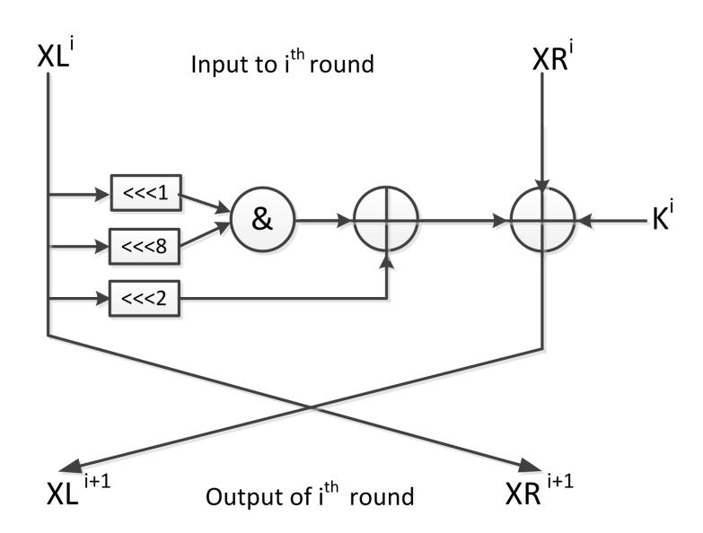

Figure 1: Simon round function

The key schedule takes the master key K as an input and generates r subkeys k 0 , k<sup>1</sup> , ....k<sup>r</sup>−<sup>1</sup> . The first w subkeys are initialized with the master key words, kw−1...k0. Depending on the number of key words w, a different procedure is applied as the following:

For w=2: 
$$k^{i+2} = k^{i} \oplus (k^{i+1} \gg 3) \oplus (k^{i+1} \gg 4) \oplus c \oplus (z_{j})_{i}$$
For w=3: 
$$k^{i+3} = k^{i} \oplus k^{i+1} \oplus (k^{i+2} \gg 3) \oplus (k^{i+1} \gg 1) \oplus (k^{i+2} \gg 4) \oplus c \oplus (z_{j})_{i}$$
For w=4: 
$$k^{i+4} = k^{i} \oplus k^{i+1} \oplus (k^{i+3} \gg 3) \oplus (k^{i+1} \gg 1) \oplus (k^{i+3} \gg 4) \oplus c \oplus (z_{j})_{i}$$

As it is shown above, the generated subkey is XOR-ed with a constant c which is equal to 2<sup>n</sup> − 4 = 0xff...f c and the i th bit of (z<sup>j</sup> ), where the choice of (z<sup>j</sup> ) depends on Simon versions. Thus, these constants are added to prevent slide attacks and eliminate circular shift symmetries. There are five constant sequences (z0),(z1),(z2),(z3), and (z4), which take the following values:

> z = [11111010001001010110000111001101111101000100101011000011100110, 10001110111110010011000010110101000111011111001001100001011010, 10101111011100000011010010011000101000010001111110010110110011, 11011011101011000110010111100000010010001010011100110100001111, 11010001111001101011011000100000010111000011001010010011101111]

# <span id="page-5-0"></span>3 Related Work

We focus in this paper on linear cryptanalysis. The best linear results on Simon are obtained using linear hulls. First introduced by [\[13\]](#page-24-6), the linear hull is a set of linear approximations with the same input and output masks. Abdelraheem et al. [\[2\]](#page-23-1) generalized the method of converting any differential characteristic to a linear characteristic for Simon, and investigated the security of Simon against different variants of linear cryptanalysis, classical, multiple and linear hull. Using linear hull, they present attacks on the reduced-round of 21, 21, 29, 36, and 50 rounds of Simon 32/64, Simon 48/96, Simon 64/128, Simon 96/144, and Simon 128/256.

Shi et al. [3] by using the method of automatic enumeration of differential and linear approximations Mixed-integer Linear Programming presented in [5], they present linear hull crytpanalysis on the reduced-round 21,21,29 rounds for Simon 32/64, Simon 48/96, Simon 64/128 respectively.

Then, Abdelraheem et al. [4] proposed a time-memory trade-off method to search for highly biased linear trails. Hence, they found 14-round and 17-round linear approximations for SIMON 32 and SIMON 48 respectively. As a result, they present 24, 23 and 24 rounds of SIMON 32/64, SIMON 48/72 and SIMON 48/96. Additionally, Sun et al. [5] present a 16-round linear hull for SIMON 48/96, which used to break up 23 rounds.

The best linear hull attacks presented in [6] by using a dynamic key-guessing technique which first proposed to improve the differential cryptanalysis in [14]. They apply the dynamic- key-guessing method to reduce the number of key bits required guessing, and they present linear hull attacks on the reduced-round 23, 25, 31, 38 and 53 for Simon 32, Simon 48, Simon 64, Simon 96 and Simon 128 respectively.

Moreover, there are other results using different attack methods such as Zero-correlation linear cryptanalysis. Bogdanov et al. [15] propose an extension of linear cryptanalysis based on linear approximations with correlation Zero, called Zero-correlation linear cryptanalysis. [16] present Zero-correlation linear cryptanalysis on all versions of Simon. Hence, they successfully present attacks on 19, 20, 22, 23, 25, 28, 33, and 34 rounds for Simon 32/64, Simon 48/72, Simon 48/96, Simon 64/96, Simon 64/128, Simon 96/144, Simon 128/192 and Simon 128/256 respectively.

Also, Wang et al.[17] present improved results using zero-correlation with the help of divide-and-conquer technique on 20, 21 and 21 rounds of Simon 32/64, Simon 48/72, Simon 48/96. Then, Sun et al.[18] improved Zero-correlation linear cryptanalysis presented in [17] on Simon 32/64, Simon 48/72, Simon 48/96 and the first to apply it on the larger variants of Simon. Hence, they attack 21,21,22,23,24,28,32 and 34 rounds of Simon 32/64, Simon 48/72, Simon 48/96, Simon 64/96, Simon 64/128, Simon 96/144, Simon 128/192 and Simon 128/256 respectively.

There are works that focused on the classical linear cryptanalysis. The first work to look at is [19] by Abed et al., where they analyze the linear properties of SIMON round function. Hence, they linearize the only non-linear part which is the bitwise AND operation, and present this linear approximation:  $[F(x)] = (x \ll 2)$ , which holds with probability 3/4, and bias  $\epsilon = 2^{-2}$ .

Moreover, following this approach they generate linear trails to a larger number of rounds and to all SIMON versions. Hence, they successfully present linear cryptanalysis of length 11,14,16,20 and 23 on SIMON 32, SIMON 48, SIMON 64, SIMON 96 and SIMON 128 respectively. Since their attack is considered Matsui's first algorithm, the required number of plaintext and ciphertext pairs is what determines the complexity of the attack. Accordingly, the required data complexity were  $2^{23}$ ,  $2^{47}$ ,  $2^{61}$ ,  $2^{95}$  and  $2^{125}$  for SIMON 32, SIMON 48, SIMON 64, SIMON 96 and SIMON 128 respectively.

Improved results in terms of covering more rounds have been presented by Alizadeh et al. in [20], where they exploit a direct connection between linear characteristics and differential characteristics. So given an r-round differential characteristic, an equivalent r-round linear characteristic can be constructed. Given this observation, they derived improved linear trails and then mounted linear cryptanalysis using Matsui's first algorithm with a reported success probability of 0.997 for 12, 15, 19, 28 and 35 rounds for SIMON 32 ,SIMON 48, SIMON 64, SIMON 96, and SIMON 128 respectively.

Because in these two works [19] and [20], they apply Matsui's first algorithm, they were only able to determine a parity bits of the subkeys, where a represents the number of approximations that have been used, which is equal to the block size 32, 48, 64, 96 and 128.

In [2], they consider the classical linear cryptanalysis and multiple linear cryptanalysis. So, they extend the previous results to cover more rounds and launch key recovery attacks using Matsui's second algorithm, and recover 27.5 key bits of Simon 32, and the average of 32.5, 41.5, 42.5, and 78 key bits for Simon 48, Simon 64, Simon 96 and Simon 128. Thus, they have successfully introduced attacks on 17, 20, 23, 34 and 42 rounds for all versions of Simon 32, Simon 48, Simon 64, Simon 96 and Simon 128 respectively. Moreover, they apply multiple linear cryptanalysis and present attacks on 18, 20, 22, 33 and 39 rounds of respective block sizes of 32, 48, 64, 96, and 128 bits respectively, and they can determine n parity bits of the subkeys.

The most recent results were presented in [10] by Ashur. They describe a new method to compute the bias of linear trails, which was then used to obtain longer linear approximations than what previous works have obtained. The literature calls into question the correctness of the results presented in this work. In particular, from [6], "it uses the correlation when all the subkeys are zero as the expected correlation under random key situations, which is not exact. Moreover, if the potential of each linear hull of the cipher is smaller than that of random permutations, then the combination of these linear hulls can not distinguish between the cipher and a random permutation."

# <span id="page-7-0"></span>4 The Cryptanalytic Model

In this section we describe the idea of a super round and its super key, and the use of this idea in linear cryptanalysis as well as for a brute force attack on 8 rounds on Simon 32/64.

We first establish some notation. Superscripts denote round number beginning with 0, and subscripts denote bit number from left to right, also beginning with 0. We denote by XL<sup>j</sup> and XR<sup>j</sup> the left and right half inputs respectively to the j th cipher round (and hence the outputs of the (j − 1)th round), and by k j i the i th bit of the j th round key. Left and right plaintext and ciphertext halves are denoted P L, P R, CL and CR respectively.

### 4.1 Central Observation

We observe that, after four rounds of Simon 32/64 encryption, one bit of the left half of the state depends on only 16 key bits—the size of one round key. One bit of the right half depends on only 7 key bits. On the other hand, the 32-bit state after four rounds of encryption depends on all 64 master key bits. Thus, by focusing on a single bit of the state, we are able to partition the key into smaller pieces. This enables us to more efficiently apply exhaustive search, doing it 16 (or 7) bits at a time.

In Matsui's second linear cryptanalysis, the first (or final) round key is determined by encryption (or decryption) with all possibilities (exhaustive search), choosing the most likely one. One would like to be able to use the same approach to determine all possible master key bits, instead of only those in the final round key. Performing an exhaustive search by encrypting multiple rounds is, however, prohibitively expensive. Using our observation, it is possible to efficiently encrypt the four first rounds (not only the first round), by focusing on a single bit of state at a time, and performing an exhaustive search over smaller pieces of the key. To extend Matsui's second linear cryptanalysis to four rounds in this manner, we would need linear cryptanalytic expressions with only a single bit of input state. The expressions and the encryption are symmetric with respect to the single bit of super round output, and we are hence able to perform this type of cryptanalysis on every bit of super round output.

An outline of the attack is as follows:

- 1. For every bit of super round output, we guess all possible combinations of the corresponding 16 key bits for the left half, or 7 for the right half, to obtain the most likely one. We do this for all 32 bits of the block.
- 2. This gives us 16 keys of size 16 each (left half) and 16 keys of size 7 each (right half), with considerable overlap among the key bits, as there are only 48 independent master key bits.
- 3. We obtain 368 related key bits representing 48 independent key bits, which allows for correcting errors.

The complexity of this attack is (16 × 2 <sup>16</sup> + 16 × 2 7 ) × N where N is the number of plaintext-ciphertext (P/C) pairs used.

### 4.2 The Super Round

We use the term super round to represent a generalization of the four-round encryption we described above.

Definition 1 (Super Rounds and Super Keys). A super round for a block cipher is a function representing s-rounds of encryption of the cipher, for some s > 1. It takes as input a full block of plaintext and the required key bits, and outputs t bits of ciphertext, where t is considerably smaller than the block size. The required key bits for a super round are referred to as a super key.

Examples: For Simon 32/64:

- A super round of the first four rounds requires a super key for the left half of length 16 and has as output a single bit of left-half ciphertext.
- A super-round of the first four rounds requires a super key for the right half of length 7 key bits and has as output a single bit of right-half ciphertext.

Figure 3.1 depicts these examples, where F<sup>S</sup> represents the super round.

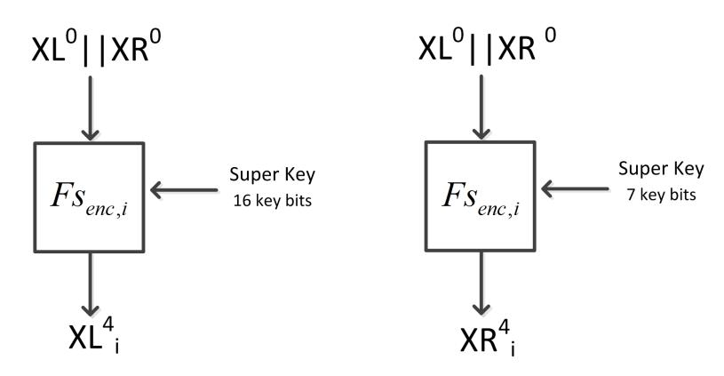

Figure 2: The Super Rounds

### 4.3 Linear Cryptanalysis with super rounds

In this section we describe the general linear cryptanalytic attack of Matsui's second algorithm with super rounds. The linear approximations we will derive in section [5](#page-11-0) are chosen so as to have a single bit of input—XL<sup>4</sup> i or XR<sup>4</sup> <sup>i</sup> which is approximately related to multiple bits of the ciphertext C (see Figure [3\)](#page-9-0). The super round itself relates this bit, exactly, (modulo a key bit absorbed into the linear approximation) to the plaintext P and the i th super key. Thus we obtain an approximate relationship between P, C and the super key bits. By performing an exhaustive search over the super key space, we obtain the super key bits. We repeat this process for all bits of the super round output.

<span id="page-8-0"></span>For each of the two super rounds (for left and right hand output halves), for each value of i, there are corresponding 16-bit and 7-bit super keys. Table [5](#page-8-0) lists the components of the super keys.

| Super-key for F senc,i, 0 ≤ i ≤ 15                              | Super-key for F senc,i, 16 ≤ i ≤ 31 |
|-----------------------------------------------------------------|-------------------------------------|
| Left half                                                       | Right half                          |
| 0<br>0<br>1<br>2<br>i+8 ⊕ k<br>i+12 ⊕ k<br>i+10 ⊕ k<br>k<br>i+8 | 0<br>1<br>i+3 ⊕ k<br>k<br>i+1       |
| 0<br>0<br>1<br>2<br>i+1 ⊕ k<br>i+5 ⊕ k<br>i+3 ⊕ k<br>k<br>i+1   | 0<br>1<br>i+10 ⊕ k<br>k<br>i+8      |
| 0<br>1<br>i+12 ⊕ k<br>k<br>i+10                                 | 0<br>k<br>i+2                       |
| 0<br>1<br>k<br>i+5 ⊕ k<br>i+3                                   | 0<br>k<br>i+3                       |
| 0<br>1<br>k<br>i+2 ⊕ k<br>i                                     | 0<br>k<br>i+10                      |
| 0<br>1<br>k<br>i+11 ⊕ k<br>i+9                                  | 0<br>k<br>i+9                       |
| 0<br>1<br>k<br>i+4 ⊕ k<br>i+2                                   | 0<br>k<br>i                         |
| 0<br>k<br>i+12                                                  |                                     |
| 0<br>k<br>i+5                                                   |                                     |
| 0<br>k<br>i+2                                                   |                                     |
| 0<br>k<br>i+11                                                  |                                     |
| 0<br>k<br>i+4                                                   |                                     |
| 0<br>k<br>i+10                                                  |                                     |
| 0<br>k<br>i+3                                                   |                                     |
| 0<br>k<br>i+8                                                   |                                     |
| 0<br>k<br>i+1                                                   |                                     |

Table 5: Super Keys

We see that each super key for the left half contains nine bits from k 0 , in the form k 0 <sup>i</sup>+<sup>m</sup> for m = 1, 2, 3, 4, 5, 8, 10, 11, 12. Thus a particular bit of k 0 , say k 0 s , appears in the super key of left half bits s − m, for m = 1, 2, 3, 4, 5, 8, 10, 11, 12.

That is, if we determine the super key for each value of i in the left half of the state, we will obtain nine copies of each bit of  $k^0$ . Similarly, the super key for the right half contains five bits of  $k^0$ . Additionally, there are other bits in the super key as well. Thus, over all sixteen bits of  $XL^4$  and  $XR^4$ , we obtain:

- 14 copies of  $k_s^0$
- 7 copies of  $k_s^0 \oplus k_{s+2}^1$
- 2 copies of  $k_s^0 \oplus k_{s+4}^0 \oplus k_{s+2}^1 \oplus k_s^2$

for s = 0, 1, 2, ..., 15.

<span id="page-9-0"></span>The redundancy above allows us to better estimate the individual key bits, and we estimate each of the 48 independent key bits by a majority vote from the corresponding multiple copies. In any experiment, we get three outcomes: correctly determined bits, incorrectly determined bits and undetermined bits (when the outcome is a tie).

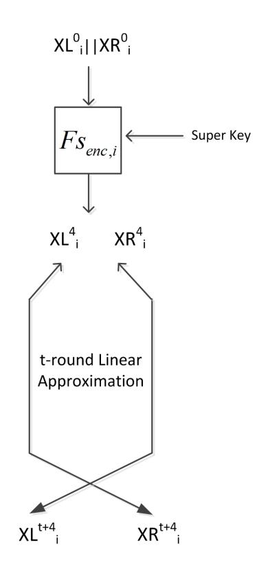

Figure 3: General form of linear attack with super rounds

Finally, we will have 16 bits of  $k^0$ , 16 bits of  $k^0_s \oplus k^1_{s+2}$ , and 16 bits of  $k^0_s \oplus k^0_{s+4} \oplus k^1_{s+2} \oplus k^2_s$ , for a total of 48 independent key bits. We may use estimates of bits of  $k^0$  to estimate bits of  $k^1$ , and then to estimate bits of  $k^2$ . We note that the error increases as we go from  $k^0$  through  $k^2$ ; not only because the number of copies of the required bits decreases, but because the error is compounded (the error in determining  $k^2$  is increased due to errors in estimating  $k^0$  and  $k^1$ ).

### 4.4 The construction of super rounds and derivations of super keys

Here, we demonstrate how the super rounds are constructed for Simon cipher, beginning with Simon 32/64 and going on to other variants. [21].

Since Simon is designed based on a Feistel structure with the key-dependent round function, one round of Simon can be expressed as:

$$(XL^{j+1}, XR^{j+1}) = R_{k^j}(XL^j, XR^j) = (XR^j \oplus F(XL^j) \oplus k^j, XL^j)$$

which implies that:

$$\begin{split} XL_i^{j+1} &= XR_i^j \oplus Z_i^j \oplus k_i^j \\ &= XL_i^{j-1} \oplus Z_i^j \oplus k_i^j \\ &= XL_i^{j-3} \oplus Z_i^{j-2} \oplus k_i^{j-2} \oplus Z_i^j \oplus k_i^j \end{split}$$

And hence that:

$$XL_i^4 = XL_i^0 \oplus Z_i^1 \oplus k_i^1 \oplus Z_i^3 \oplus k_i^3 = PL_i \oplus Z_i^1 \oplus k_i^1 \oplus Z_i^3 \oplus k_i^3$$

Similarly,

$$\begin{split} XR_i^{j+1} &= XL_i^j \\ &= XL_i^{j-2} \oplus Z_i^{j-1} \oplus k_i^{j-1} \\ &= XR_i^{j-3} \oplus Z_i^{j-3} \oplus k_i^{j-3} \oplus Z_i^{j-1} \oplus k_i^{j-1} \end{split}$$

and hence that:

$$XR_i^4 = XR_i^0 \oplus Z_i^0 \oplus k_i^0 \oplus Z_i^2 \oplus k_i^2 = PR_i \oplus Z_i^0 \oplus k_i^0 \oplus Z_i^2 \oplus k_i^2$$

Given the round function of SIMON:

$$F(XL^{j}) = [(XL^{j} \ll 1)\&(XL^{j} \ll 8)] \oplus XL^{j} \ll 2)$$

which implies that:

$$Z_i^j = (XL_{i+1}^j \& XL_{i+8}^j) \oplus XL_{i+2}^j$$

giving us:

$$Z_{i}^{0} = (PL_{i+1}\&PL_{i+8}) \oplus PL_{i+2}$$

$$Z_{i}^{1} = [(Z_{i+1}^{0} \oplus k_{i+1}^{0} \oplus PR_{i+1})\&(Z_{i+8}^{0} \oplus k_{i+8}^{0} \oplus PR_{i+8})] \oplus (Z_{i+2}^{0} \oplus k_{i+2}^{0} \oplus PR_{i+2})$$

$$Z_{i}^{2} = [(Z_{i+1}^{1} \oplus k_{i+1}^{1} \oplus XR_{i+1}^{1})\&(Z_{i+8}^{1} \oplus k_{i+8}^{1} \oplus XR_{i+8}^{1})] \oplus (Z_{i+2}^{1} \oplus k_{i+2}^{1} \oplus XR_{i+2}^{1})$$

$$= [(Z_{i+1}^{1} \oplus k_{i+1}^{1} \oplus PR_{i+1})\&(Z_{i+8}^{1} \oplus k_{i+8}^{1} \oplus PR_{i+8})] \oplus (Z_{i+2}^{1} \oplus k_{i+2}^{1} \oplus PR_{i+2})$$

$$Z_{i}^{3} = (v_{1}\&v_{2}) \oplus v_{3}$$

where:

$$v_{1} = Z_{i+1}^{2} \oplus k_{i+1}^{2} \oplus XR_{i+1}^{2} = Z_{i+1}^{2} \oplus k_{i+1}^{2} \oplus XL_{i+1}^{1} = Z_{i+1}^{2} \oplus Z_{i+1}^{0} \oplus k_{i+1}^{0} \oplus PR_{i+1} \oplus k_{i+1}^{2}$$

$$v_{2} = Z_{i+8}^{2} \oplus k_{i+8}^{2} \oplus XR_{i+8}^{2} = Z_{i+8}^{2} \oplus k_{i+8}^{2} \oplus XL_{i+8}^{1} = Z_{i+8}^{2} \oplus Z_{i+8}^{0} \oplus k_{i+8}^{0} \oplus PR_{i+8} \oplus k_{i+8}^{2}$$

$$v_{3} = Z_{i+2}^{2} \oplus k_{i+2}^{2} \oplus XR_{i+2}^{2} = Z_{i+2}^{2} \oplus k_{i+2}^{2} \oplus XL_{i+2}^{1} = Z_{i+2}^{2} \oplus Z_{i+2}^{0} \oplus k_{i+2}^{0} \oplus PR_{i+2} \oplus k_{i+2}^{2}$$

Finally,

$$XL_{i}^{4} = Z_{i}^{3} \oplus k_{i}^{3} \oplus XR_{i}^{3} = Z_{i}^{3} \oplus k_{i}^{3} \oplus XL_{i}^{2} = Z_{i}^{3} \oplus k_{i}^{3} \oplus Z_{i}^{1} \oplus k_{i}^{1} \oplus PL_{i}$$

$$XR_{i}^{4} = XL_{i}^{3} = XL_{i}^{1} \oplus Z_{i}^{2} \oplus k_{i}^{2} = PR_{i} \oplus k_{i}^{0} \oplus Z_{i}^{0} \oplus Z_{i}^{2} \oplus k_{i}^{2}$$

Recall the Simon family consists of another 9 variants of the cipher differing in their block and key sizes. All Simon variants share the same round function; hence the observation enabling us to construct super-rounds in Simon 32/64 continues to be valid. Even though the larger variants of Simon correspond to larger block and key sizes, we have found that the size of the super keys is only slightly larger than that for Simon 32/64. After 4-rounds of encryption, a single bit of the left-half of the intermediate state is influenced by only 18 key bits. On the other hand, the size of the super-key of the right half stays the same, at 7 bits.

In Simon 32/64, we have 9 bits of  $k_i^0$ , for i = 1, 2, 3, 4, 5, 8, 10, 11, 12, as shown in table 5, where in Simon 48 we have 11 bits of  $k_i^0$ , for i = 0, 1, 3, 4, 5, 8, 10, 11, 12, 17, 18, and in Simon 64 we have a similar set of bits, except instead of  $k_i^0$ , we have  $k_{i+24}^0$ . This difference arises from computing  $v_2$ , where we have the similar computations for  $v_1$ , and  $v_3$ . In larger Simon, we get:

$$v_2 = Z_{i+8}^2 \oplus k_{i+8}^2 \oplus XR_{i+8}^2$$

where,

$$Z_{i+8}^2 = \left[ (Z_{i+9}^1 \oplus k_{i+9}^1 \oplus XR_{i+9}^1) \& (Z_{(i+16)\%n}^1 \oplus k_{(i+16)\%n}^1 \oplus XR_{(i+16)\%n}^1) \right] \oplus (Z_{i+10}^1 \oplus k_{i+10}^1 \oplus XR_{i+10}^1)$$

And hence that:

$$Z_{i+9}^{1} = [(Z_{i+10}^{0} \oplus k_{i+10}^{0} \oplus PR_{i+10}) \& (Z_{(i+17)\%n}^{0} \oplus k_{(i+17)\%n}^{0} \oplus PR_{(i+17)\%n})] \oplus (Z_{i+11}^{0} \oplus k_{i+11}^{0} \oplus PR_{i+11})$$

$$Z_{(i+16)\%n}^{1} = [(Z_{i+17}^{0} \oplus k_{i+17}^{0} \oplus PR_{i+17}) \& (Z_{(i+24)\%n}^{0} \oplus k_{(i+24)\%n}^{0} \oplus PR_{(i+24)\%n})] \oplus (Z_{i+18}^{0} \oplus k_{i+18}^{0} \oplus PR_{i+18})$$

$$Z_{i+10}^{1} = [(Z_{i+11}^{0} \oplus k_{i+11}^{0} \oplus PR_{i+11}) \& (Z_{(i+18)\%n}^{0} \oplus k_{(i+18)\%n}^{0} \oplus PR_{(i+18)\%n})] \oplus (Z_{i+12}^{0} \oplus k_{i+12}^{0} \oplus PR_{i+12})$$

It is clear from the equations that in the case of n = 24, we get  $k_{i+17}^0$ ,  $k_{i+18}^0$  and  $k_i^0$  from evaluating  $Z_{i+9}^1$ ,  $Z_{i+16}^1$  and  $Z_{i+10}^1$ . Also, in the case of n = 32, we get  $k_{i+17}^0$ ,  $k_{i+18}^0$  and  $k_{i+24}^0$ .

Also,  $v_2$  affects the super key bit  $k_{i+2}^0 \oplus k_i^1$ , which becomes in the case of larger Simon,  $k_{i+18}^0 \oplus k_{i+16}^1$ . The other components of the super key for the left half, are consistent with the bits presented in table 5. See Algorithm 1 for pseudocode for our attack on Simon 32/64, using the left half system of approximation.

#### Algorithm 1 Matsui's Second Algorithm using multiple linear approximations

```
Let T be the number of plaintexts such that the linear approximation is True. for i=0,....,2^n do \qquad \qquad \qquad \qquad \qquad \qquad \qquad \qquad \qquad \qquad \qquad \qquad \qquad \qquad \qquad \qquad \qquad \qquad \qquad
```

# <span id="page-11-0"></span>5 Linear Approximations for Simon 32/64

In this section we derive linear approximations for 8, 10 and 12-round attacks on SIMON 32/64. In section 6 we describe experimental results for the proposed attacks.

We use a natural linear expression of the Simon round function, obtained by replacing the & function by 0, with a bias of  $\frac{1}{4}$  [19]. The left half is approximated as:

$$Approximation \ 1: Pr[F(XL_i^{j+1}) = XL_{i+2}^j] = \frac{3}{4}$$

Additionally, the following are linear expressions from the literature with a similar absolute bias of  $\frac{1}{4}$ :

$$\begin{split} & Approximation \ 2: Pr[F(XL_{i}^{j+1}) = XL_{i+2}^{j} \oplus XL_{i+1}^{j}] = \frac{3}{4} \\ & Approximation \ 3: Pr[F(XL_{i}^{j+1}) = XL_{i+2}^{j} \oplus XL_{i+8}^{j}] = \frac{3}{4} \\ & Approximation \ 4: Pr[F(XL_{i}^{j+1}) = XL_{i+2}^{j} \oplus XL_{i+1}^{j} \oplus XL_{i+8}^{j}] = \frac{1}{4} \end{split}$$

We use this approximation repeatedly for multiple-round attacks that relate a single bit of input to multiple output bits. The experimentally-verified success probabilities of the attacks on 8, 10 and 12 rounds are listed in Table 9.

#### 5.1 8-Round Attack

We find two 4-round linear approximations, relating a single bit of the left and right half inputs respectively to a few bits of output after four rounds. We can use a super round to obtain exactly the single bit of input from the plaintext and the super key and then concatenate it with the approximation, thus relating the plaintext, super key and ciphertext bits of eight round encryption (see Figure 4).

Beginning with a single bit of the left half plaintext,  $PL = XL^0$ , we approximate a linear relationship with bits

<span id="page-12-0"></span>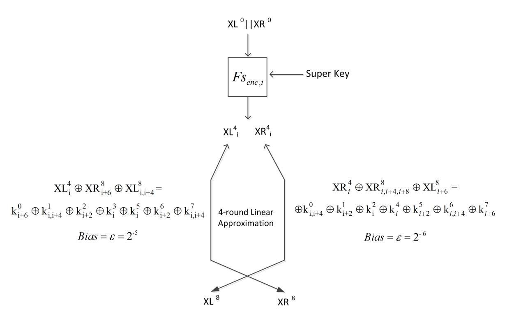

Figure 4: 8-Round Linear Attack

from the output:

<span id="page-12-1"></span>
$$PL_{i} = XL_{i}^{0} = XR_{i}^{1}$$

$$= F(XR^{2})_{i} \oplus XL_{i}^{2} \oplus k_{i}^{1}$$

$$\approx XR_{i+2}^{2} \oplus XL_{i}^{2} \oplus k_{i}^{1}$$

$$= F(XR^{3})_{i+2} \oplus XL_{i+2}^{3} \oplus k_{i+2}^{2} \oplus XL_{i}^{2} \oplus k_{i}^{1}$$

$$= F(XR^{3})_{i+2} \oplus XL_{i+2}^{3} \oplus k_{i+2}^{2} \oplus XR_{i}^{3} \oplus k_{i}^{1}$$

$$\approx XR_{i+4}^{3} \oplus XR_{i}^{3} \oplus XL_{i+2}^{3} \oplus k_{i+2}^{2} \oplus k_{i}^{1}$$

$$= XR_{i,i+4}^{3} \oplus XL_{i+2}^{3} \oplus k_{i+2}^{2} \oplus k_{i}^{1}$$

$$= XR_{i,i+4}^{3} \oplus XL_{i+2}^{3} \oplus k_{i+2}^{2} \oplus k_{i}^{1}$$

$$= F(XR^{4})_{i,i+4} \oplus XL_{i,i+4}^{4} \oplus k_{i,i+4}^{3} \oplus XL_{i+2}^{3} \oplus k_{i+2}^{2} \oplus k_{i}^{1}$$

$$= F(XR^{4})_{i,i+4} \oplus XL_{i,i+4}^{4} \oplus k_{i,i+4}^{3} \oplus XR_{i+2}^{4} \oplus k_{i+2}^{2} \oplus k_{i}^{1}$$

$$= F(XR^{4})_{i,i+4} \oplus XL_{i,i+4}^{4} \oplus XR_{i+2}^{4} \oplus k_{i,i+4}^{3} \oplus k_{i+2}^{2} \oplus k_{i}^{1}$$

$$\approx XR_{i+2,i+6}^{4} \oplus XL_{i,i+4}^{4} \oplus XR_{i+2}^{4} \oplus k_{i,i+4}^{3} \oplus k_{i+2}^{2} \oplus k_{i}^{1}$$

$$= XR_{i+6}^{4} \oplus XL_{i,i+4}^{4} \oplus k_{i,i+4}^{3} \oplus k_{i+2}^{2} \oplus k_{i}^{1}$$

Also, to produce 4-round linear approximation for the right half, we will start with a single bit of right half  $PR = XR^0$ :

<span id="page-12-2"></span>
$$PR_{i} = XR_{i}^{0} = F(XR^{1})_{i} \oplus XL_{i}^{1} \oplus k_{i}^{0}$$

$$\approx XR_{i+2}^{1} \oplus XL_{i}^{1} \oplus k_{i}^{0}$$

$$= F(XR^{2})_{i+2} \oplus XL_{i+2}^{2} \oplus k_{i+2}^{1} \oplus XR_{i}^{2} \oplus k_{i}^{0}$$

$$\approx XR_{i+4}^{2} \oplus XL_{i+2}^{2} \oplus XR_{i}^{2} \oplus k_{i+2}^{1} \oplus k_{i}^{0}$$

$$= XR_{i,i+4}^{2} \oplus XL_{i+2}^{2} \oplus k_{i+2}^{1} \oplus k_{i}^{0}$$

$$= XR_{i,i+4}^{3} \oplus XL_{i+2}^{3} \oplus k_{i+2}^{1} \oplus k_{i}^{0}$$

$$= F(XR^{3})_{i,i+4} \oplus XL_{i,i+4}^{3} \oplus k_{i,i+4}^{2} \oplus XR_{i+2}^{3} \oplus k_{i+2}^{1} \oplus k_{i}^{0}$$

$$\approx XR_{i+2,i+6}^{3} \oplus XL_{i,i+4}^{3} \oplus XR_{i+2}^{3} \oplus k_{i,i+4}^{2} \oplus k_{i+2}^{1} \oplus k_{i}^{0}$$

$$= XR_{i+6}^{3} \oplus XL_{i,i+4}^{3} \oplus k_{i,i+4}^{2} \oplus k_{i+2}^{1} \oplus k_{i}^{0}$$

$$= F(XR^{4})_{i+6} \oplus XL_{i+6}^{4} \oplus k_{i+6}^{3} \oplus XR_{i,i+4}^{4} \oplus k_{i,i+4}^{2} \oplus k_{i+2}^{1} \oplus k_{i}^{0}$$

$$\approx XR_{i,i+4,i+8}^{4} \oplus XL_{i+6}^{4} \oplus k_{i+6}^{3} \oplus k_{i,i+4}^{2} \oplus k_{i+2}^{1} \oplus k_{i}^{0}$$

$$\approx XR_{i,i+4,i+8}^{4} \oplus XL_{i+6}^{4} \oplus k_{i+6}^{3} \oplus k_{i,i+4}^{2} \oplus k_{i+2}^{1} \oplus k_{i}^{0}$$

Hence, appending the four rounds of encryption to Equations 3 and 4, we get the following expressions with biases  $2^{-5}$  and  $2^{-6}$  respectively:

$$XL_i^4 \oplus XR_{i+6}^8 \oplus XL_{i,i+4}^8 = k_{i+6}^0 \oplus k_{i,i+4}^1 \oplus k_{i+2}^2 \oplus k_i^3 \oplus k_i^5 \oplus k_{i+2}^6 \oplus k_{i,i+4}^7$$

$$\tag{5}$$

$$XR_i^4 \oplus XR_{i,i+4,i+8}^8 \oplus XL_{i+6}^8 = k_{i,i+4}^0 \oplus k_{i+2}^1 \oplus k_i^2 \oplus k_i^4 \oplus k_{i+2}^5 \oplus k_{i,i+4}^6 \oplus k_{i+6}^7$$
(6)

#### 5.2 10-Round Attack

We extend the 8-round attack by adding two more rounds of decryption at the end so we have a 10-round attack. The two rounds are added by decrypting the ciphertext bits; this comes at the cost of exhaustive search over a few more key bits. See Figure 5.

Recall single-round decryption:

$$XL^{j} = XR^{j+1}$$
 
$$XR^{j} = F(XL^{j}) \oplus XL^{j+1} \oplus k^{j} = F(XR^{j+1}) \oplus XL^{j+1} \oplus k^{j}$$

and hence two rounds decryption is:

$$XL^{j} = F(XR^{j+2}) \oplus XL^{j+2} \oplus k^{j+1}$$
$$XR^{j} = F(F(XR^{j+2}) \oplus XL^{j+2} \oplus k^{j+1}) \oplus XR^{j+2} \oplus k^{j}$$

which gives us:

$$XL^{8} = XL^{10} \oplus F(XR^{10}) \oplus k^{9}$$

$$XR^{8} = XR^{10} \oplus F(XL^{10} \oplus F(XR^{10}) \oplus k^{9}) \oplus k^{8}$$
(7)

Recall the 4-round linear approximation for the single bit in the left half:

$$XL_{i}^{4} \oplus XR_{i+6}^{8} \oplus XL_{i,i+4}^{8} = k_{i}^{5} \oplus k_{i+2}^{6} \oplus k_{i,i+4}^{7}$$

Substituting for  $X^8$ , we get:

$$XL_{i}^{4} \oplus XR_{i+6}^{10} \oplus F(XL^{10} \oplus F(XR^{10}) \oplus k^{9})_{i+6} \oplus k_{i+6}^{8} \oplus XL_{i,i+4}^{10}$$
$$\oplus F(XR^{10})_{i,i+4} \oplus k_{i,i+4}^{9} = k_{i}^{5} \oplus k_{i+2}^{6} \oplus k_{i,i+4}^{7}$$

or:

$$XL_{i}^{4} \oplus XR_{i+6}^{10} \oplus [(XL_{i+7}^{10} \oplus F(XR^{10})_{i+7} \oplus k_{i+7}^{9}) \& (XL_{i+14}^{10} \oplus F(XR^{10})_{i+14} \oplus k_{i+14}^{9})] \oplus k_{i+6}^{8} \oplus XL_{i+8}^{10} \oplus F(XR^{10})_{i+8} \oplus k_{i+8}^{9} \oplus XL_{i,i+4}^{10} \oplus [XR_{i+1}^{10} \& XR_{i+8}^{10}] \oplus XR_{i+2}^{10} \oplus [XR_{i+5}^{10} \oplus XR_{i+12}^{10}] \oplus XR_{i+6}^{10} \oplus k_{i,i+4}^{9} = k_{i}^{5} \oplus k_{i+2}^{6} \oplus k_{i,i+4}^{7}$$

or:

$$XL_{i}^{4} \oplus XR_{i+6}^{10} \oplus [(XL_{i+7}^{10} \oplus F(XR^{10})_{i+7} \oplus k_{i+7}^{9}) \& (XL_{i+14}^{10} \oplus F(XR^{10})_{i+14} \oplus k_{i+14}^{9})] \oplus k_{i+6}^{8} \oplus XL_{i+8}^{10} \oplus (XR_{i+9}^{10} \& XR_{i}^{10}) \oplus XR_{i+10}^{10} \oplus k_{i+8}^{9} \oplus XL_{i,i+4}^{10} \oplus [XR_{i+1}^{10} \& XR_{i+8}^{10}] \oplus XR_{i+2}^{10} \oplus [XR_{i+5}^{10} \& XR_{i+12}^{10}] \oplus XR_{i+6}^{10} \oplus k_{i,i+4}^{9} = k_{i}^{5} \oplus k_{i+2}^{6} \oplus k_{i,i+4}^{7}$$

and finally,

$$XL_{i}^{4} \oplus XR_{i+2,i+10}^{10} \oplus XL_{i,i+4,i+8}^{10}$$

$$\oplus [(XL_{i+7}^{10} \oplus F(XR^{10})_{i+7} \oplus k_{i+7}^{9}) \& (XL_{i+14}^{10} \oplus F(XR^{10})_{i+14} \oplus k_{i+14}^{9})] \oplus (XR_{i+9}^{10} \& XR_{i}^{10}) \oplus [XR_{i+1}^{10} \& XR_{i+8}^{10}] \oplus [XR_{i+5}^{10} \& XR_{i+12}^{10}] = k_{i}^{5} \oplus k_{i+2}^{6} \oplus k_{i,i+4}^{7} \oplus k_{i+6}^{8} \oplus k_{i,i+4,i+8}^{9}$$

Hence, two new key bits  $k_{i+7}^9$  and  $k_{i+14}^9$  (in addition to the 16 bits to compute  $XL_i^4$ ) required guessing to add the two rounds decryption.

Now recall the linear approximation for the single bit on the right side:

$$XR_i^4 \oplus XR_{i,i+4,i+8}^8 \oplus XL_{i+6}^8 = k_i^4 \oplus k_{i+2}^5 \oplus k_{i,i+4}^6 \oplus k_{i+6}^7$$

Again, substituting the expressions for  $X^8$  in terms of  $X^{10}$  we get:

$$XR_{i}^{4} \oplus XR_{i}^{10} \oplus F(XL^{10} \oplus F(XR^{10}) \oplus k^{9})_{i} \oplus k_{i}^{8} \oplus XR_{i+4}^{10} \oplus F(XL^{10} \oplus F(XR^{10}) \oplus k^{9})_{i+4} \oplus k_{i+4}^{8} \oplus XR_{i+8}^{10} \oplus F(XL^{10} \oplus F(XR^{10}) \oplus k^{9})_{i+8} \oplus k_{i+8}^{8} \oplus XL_{i+6}^{10} \oplus F(XR^{10})_{i+6} \oplus k_{i+6}^{9}$$

$$= k_{i}^{4} \oplus k_{i+2}^{5} \oplus k_{i,i+4}^{6} \oplus k_{i+6}^{7}$$

$$XR_{i}^{4} \oplus XR_{i,i+4,i+8}^{10} \oplus XL_{i+6}^{10} \oplus [(XL_{i+1}^{10} \oplus F(XR^{10})_{i+1} \oplus K_{i+1}^{9}) \& (XL_{i+8}^{10} \oplus F(XR^{10})_{i+8} \oplus k_{i+8}^{9})] \oplus XL_{i+2}^{10} \oplus F(XR^{10})_{i+2}$$

$$\oplus k_{i+1}^{9} \oplus [(XL_{i+5}^{10} \oplus F(XR^{10})_{i+5} \oplus k_{i+5}^{9}) \& (XL_{i+12}^{10} \oplus F(XR^{10})_{i+12} \oplus k_{i+12}^{9})] \oplus XL_{i+6}^{10} \oplus F(XR^{10})_{i+5} \oplus k_{i+6}^{9} \oplus [(XL_{i+9}^{10} \oplus F(XR^{10})_{i+9} \oplus k_{i+9}^{9}) \& (XL_{i}^{10} \oplus F(XR^{10})_{i} \oplus k_{i}^{9})] \oplus XL_{i+10}^{10} \oplus F(XR^{10})_{i+10} \oplus k_{i+9}^{9}) \& (XL_{i}^{10} \oplus F(XR^{10})_{i+6} = k_{i}^{4} \oplus k_{i+2}^{5} \oplus k_{i,i+4}^{6} \oplus k_{i+6}^{7} \oplus k_{i,i+4,i+8}^{8} \oplus k_{i+6}^{9}$$

$$\oplus k_{i+10}^{9} \oplus F(XR^{10})_{i+6} = k_{i}^{4} \oplus k_{i+2}^{5} \oplus k_{i,i+4}^{6} \oplus k_{i+6}^{7} \oplus k_{i,i+4,i+8}^{8} \oplus k_{i+6}^{9}$$

In this case, six new key bits (in addition to the 7 required to obtain  $XR_i^4$  from the plaintext),  $k_i^9$ ,  $k_{i+1}^9$ ,  $k_{i+5}^9$ ,  $k_{i+8}^9$ ,  $k_{i+9}^9$ ,  $k_{i+12}^9$ , are required for the decryption of the last two rounds.

<span id="page-14-0"></span>Thus, the number of key bits affecting the approximation for the left side is 18, and that for the right side is 13.

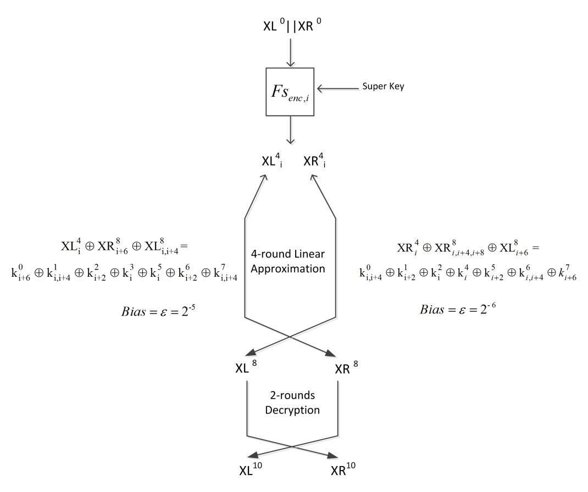

<span id="page-14-2"></span><span id="page-14-1"></span>Figure 5: 10-Round Linear Attack

### 5.3 12-Round Attack

To extend the linear attack of SIMON 32/64 to 12 rounds, we need to extract r-round linear approximations for r > 4. Therefore, we derive two 7-round linear approximations for the left half and the right half, with biases  $2^{-11}$  and  $2^{-14}$  respectively (see tables 10 and 11 for details):

$$XL_{i}^{4} \oplus XL_{i+2,i+10}^{11} \oplus XR_{i,i+8,i+12}^{11} = \begin{cases} k_{i}^{5} \oplus k_{i+2}^{6} \oplus k_{i,i+4}^{7} \\ \oplus k_{i+6}^{8} \oplus k_{i,i+4,i+8}^{9} \oplus k_{i+2,i+10}^{10} \end{cases}$$
(8)

$$XR_{i}^{4} \oplus XL_{i,i+8,i+12}^{11} \oplus XR_{i+14}^{11} = \begin{cases} k_{i}^{4} \oplus k_{i+2}^{5} \oplus k_{i,i+4}^{6} \oplus k_{i+6}^{7} \\ \oplus k_{i,i+4,i+8}^{8} \oplus k_{i+2,i+10}^{9} \oplus k_{i,i+8,i+12}^{10} \end{cases}$$
(9)

<span id="page-15-1"></span>We can extend the attack by one decryption round free of any approximations, which enables us to attack 12 rounds. See Figure [6.](#page-15-1)

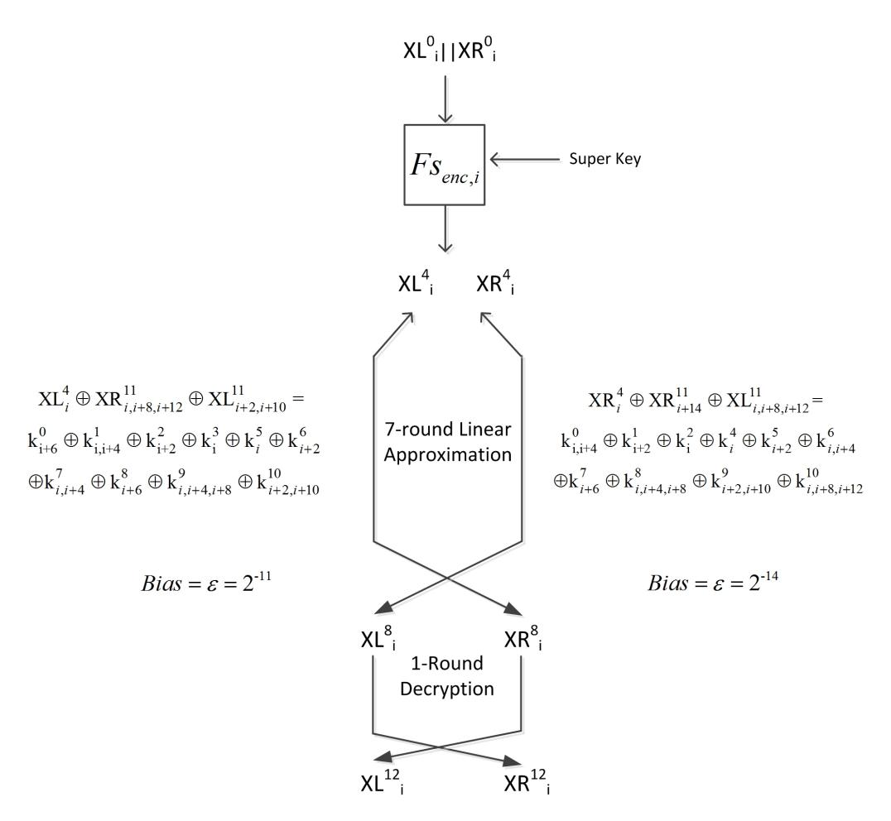

Figure 6: 12-Round Linear Attack

## <span id="page-15-0"></span>6 Experimental Verification

To validate our proposed linear cryptanalysis of Simon 32/64, we conducted a number of experiments for the 8-round, 10-round, and 12-round linear attacks, which we summarize in this section.

We will need some additional notation. As mentioned before, the super key of the left-half is of size 16 bits, each bit being in one of three forms (recall Table [5\)](#page-8-0): k 0 i , k 0 <sup>i</sup>+2 ⊕ k 1 i , or k 0 <sup>i</sup> ⊕ k 0 <sup>i</sup>+4 ⊕ k 1 <sup>i</sup>+2 ⊕ k 2 i . We denote the 16-bit strings of bits of this form (for i = 0, 1, 2, ..., 15) as Bit1, Bit2, and Bit3 respectively.

We determine Bit1, Bit2 and Bit3 from the super key estimates using a majority vote for error correction. We then compute the 48 master key bits (k 0 ,k 1 ,and k 2 ) using equation [10.](#page-15-2)

<span id="page-15-2"></span>
$$k_i^0 = Bit1_i$$

$$k_i^1 = Bit2_i \oplus Bit1_{i+2}$$

$$k_i^2 = Bit1_i \oplus Bit2_{i+2} \oplus Bit3_i$$
(10)

In all cases—8, 10 and 12 round attacks—Bit1 is determined with the greatest accuracy, then Bit2, and, last, Bit3. This is to be expected because there are more copies of Bit1 (nine) than of Bit2 (five), and Bit3 has the fewest copies (two). In all cases, k 0 is computed more accurately than k 1 , which is more accurately computed than k 2 . This is because k 0 , k <sup>1</sup> and k <sup>2</sup> are computed from one, two and three values of the estimated values of super key bits. Additionally, k 0 is computed from the most accurately estimated super key bits, Bit1; k 1 from Bit1 and Bit2; k 2 from Bit1, Bit2 and Bit3. Tables [6](#page-16-0)[,7](#page-16-1) and [8](#page-17-0) compare between the number of super key bits guessed correctly in the 8-round, 10-round and 12-round attacks respectively.

<span id="page-16-0"></span>

| Number of Rounds                | Super key bits estimated                    | Bits Correctly Guessed (out of 16 bits) | No. of<br>Experiments<br>(out of 14) |
|---------------------------------|---------------------------------------------|-----------------------------------------|--------------------------------------|
|                                 | Bit1                                        | 16                                      | 14                                   |
|                                 | Bit2                                        | 16                                      | 11                                   |
|                                 | average no. bits guessed correctly = $15.7$ | 15                                      | 2                                    |
|                                 | average no. 5165 guessed correctly = 15.1   | 14                                      | 1                                    |
| 8-round(left half)              |                                             | 16                                      | 1                                    |
|                                 | Bit3                                        | 15                                      | 6                                    |
|                                 | <i>Ditto</i>                                | 14                                      | 2                                    |
|                                 | average no. bits guessed correctly $= 13.4$ | 12                                      | 1                                    |
|                                 |                                             | 11                                      | 3                                    |
|                                 |                                             | 9                                       | 1                                    |
| 8-round (left and right halves) | Bit1                                        | 16                                      | 14                                   |
|                                 | Bit2                                        | 16                                      | 11                                   |
|                                 | average no. bits guessed correctly $= 15.8$ | 15                                      | 3                                    |
|                                 |                                             | 16                                      | 1                                    |
|                                 | Bit3                                        | 15                                      | 6                                    |
|                                 | $D\mathcal{U}\mathfrak{d}$                  | 14                                      | 2                                    |
|                                 | average no. bits guessed correctly $= 13.4$ | 12                                      | 1                                    |
|                                 |                                             | 11                                      | 3                                    |
|                                 |                                             | 9                                       | 1                                    |

Table 6: Comparison of 8-round attack results using the left half only and using both halves

<span id="page-16-1"></span>

|                         |                                             | Bits Correctly   | No. of                                           |
|-------------------------|---------------------------------------------|------------------|--------------------------------------------------|
| Number of Rounds        | Super key bits estimated                    | Guessed          | Experiments                                      |
| Trainiber of Itotalias  | Super key bros estimated                    | (out of 16 bits) | (out of 14)                                      |
|                         | Bit1                                        | 16               | 14                                               |
|                         | Bit1 $Bit2$                                 | 16               | 13                                               |
|                         | average no. bits guessed correctly = $15.8$ | 14               | 1                                                |
|                         | average no. bits guessed correctly = 15.5   | 15               | 4                                                |
|                         |                                             | 14               | 3                                                |
|                         | Bit3                                        | 13               | 3                                                |
|                         | average no. bits guessed correctly $= 13.2$ | 12               | $\frac{3}{2}$                                    |
| 10-round (left half)    | average no. blub guessed collectily = 19.2  | 11               | $\begin{bmatrix} & & 2 \\ & 1 & & \end{bmatrix}$ |
| 10 Todila (1010 Hall)   |                                             | 9                | 1                                                |
|                         |                                             | 16               | 2                                                |
|                         | D                                           | 15               | $\frac{1}{2}$                                    |
|                         | Bit4                                        | 14               |                                                  |
|                         | average no. bits guessed correctly $= 13.8$ | 13               | $\frac{1}{2}$                                    |
|                         |                                             | 12               | 5<br>2<br>2                                      |
|                         |                                             | 11               | 1                                                |
|                         | Dist                                        | 1.0              | 4.4                                              |
|                         | Bit1                                        | 16               | 14                                               |
|                         | D:40                                        | 16               | 12                                               |
|                         | Bit2                                        | 15               | 1                                                |
|                         | average no. bits guessed correctly $= 15.8$ | 14               | 1                                                |
|                         |                                             | 16               | 1                                                |
| 10-round                |                                             | 15               | 4                                                |
| (left and right halves) | Bit3                                        | 14               | 3                                                |
|                         | average no. bits guessed correctly $= 13.4$ | 13               | $\begin{bmatrix} 3 \\ 2 \\ 2 \end{bmatrix}$      |
|                         |                                             | 12               | 2                                                |
|                         |                                             | 11               | 1                                                |
|                         |                                             | 9                | 1                                                |
|                         | Bit4                                        | 16               | 11                                               |
|                         |                                             | 15               | 2                                                |
|                         | average no. bits guessed correctly $= 15.6$ | 13               | 1                                                |

Table 7: Comparison of 10-round attack results using the left half only and using both halves

<span id="page-17-0"></span>

| Number of Rounds                 | Super key bits estimated                     | Bits Correctly Guessed (out of 16 bits) | No. of<br>Experiments<br>(out of 3) |
|----------------------------------|----------------------------------------------|-----------------------------------------|-------------------------------------|
|                                  | $Bit1 \\ Bit2$                               | 16<br>16                                | 3 3                                 |
| 12-round (left half)             | Bit3 average no. bits guessed correctly = 13 | 15<br>13<br>11                          | 1<br>1<br>1                         |
| 12-round (left and right halves) | Bit1                                         | 16                                      | 3                                   |
|                                  | Bit2                                         | 16                                      | 3                                   |
|                                  | Bit3 average no. bits guessed correctly = 13 | 15<br>13<br>11                          | 1<br>1<br>1                         |

Table 8: Comparison of 12-round attack results using the left half only and using both halves

### 6.1 Experimental Results

#### 8-round Attack

We carried out 14 instances of the 8-round attack, with  $2^{14}$  P/C pairs and keys chosen at random. We observed that obtaining estimates of the super key bits corresponding to the right half of the state does not improve the estimate over using only those obtained from the left half state.

This is likely because the bias for the right half is half that of the left half, and hence the right half data is noisier and not particularly useful. Figure 7 shows the results achieved using super rounds corresponding to the left half and to the left and right halves.

<span id="page-17-1"></span>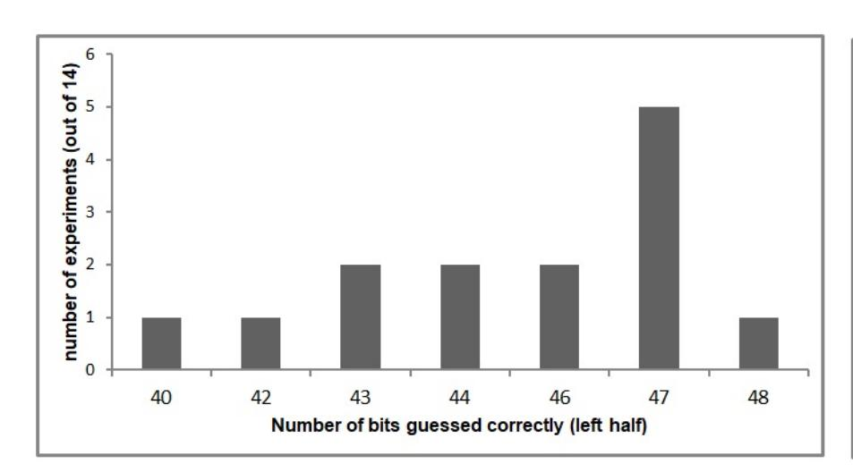

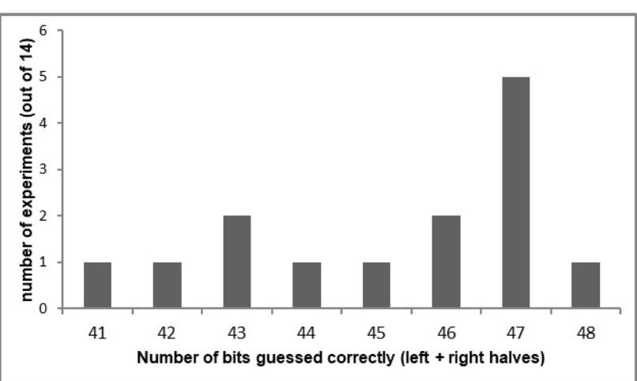

Figure 7: Number of bits guessed correctly using the left half only and using both halves in the 8-round attack

### 10-Round Attack

We carried out 14 instances of the 10-round attack, each with a key chosen at random and  $2^{14}$  plaintext/ciphertext pairs. In addition to the super keys (48 bits), we recover the last round key  $k^9$  (16-bits), which is denoted as Bit4, hence we retrieve a total of 64 key bits. We find that the last round key bits are not independent, so we do not obtain 64 independent bits.

In contrast to the 8-round attack, we obtain better overall results by using super rounds corresponding to both right and left halves, as compared to using only the left half. The improvement is especially noticeable in the estimate of  $k^9$ . The reason is that we receive 96 bits  $(16 \times 6)$  of  $k^9$  from the right half and only 32 bits  $(16 \times 2)$  from the left-half. Thus, even though the right-half attacks have a lower bias, having a larger number of copies of  $k^9$  bits results in better estimation. Figure 8 shows the improvements of the results obtained using super rounds corresponding to both right and left halves over using the left half only.

<span id="page-18-0"></span>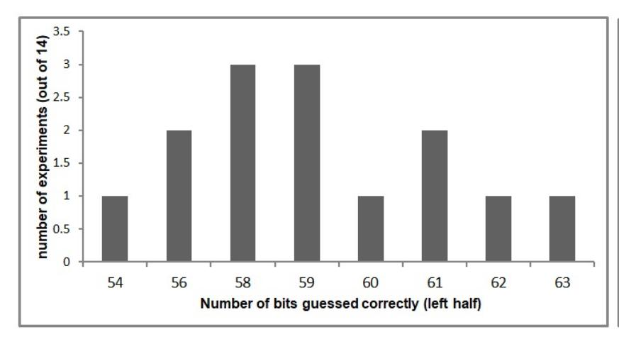

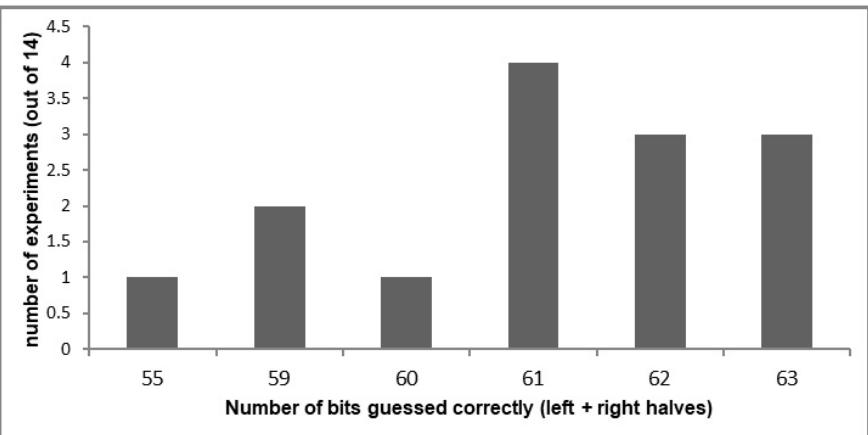

Figure 8: Number of bits guessed correctly using the left half only and using both halves in the 10-round attack

#### 12-Round Attack

We performed three instances of the 12-round attack using  $2^{25}$  plaintext and ciphertext pairs. We got similar results in the case we use the estimates of the super key bits corresponding to only the left half and in the case, we combine the estimates corresponding to both halves. As in the 8-Round attack, the right half of the state doesn't improve the overall results, hence we obtain the same results using the left half and the two halves. In the three experiments, we can determine correctly 48, 47 and 45 key bits.

# **6.2** The Deduction of $k^3$ from $k^9$

The 64-bit master key is used directly for the first four rounds; thereafter, the SIMON key schedule generates all other round keys from the 64-bit master key. We are able to express  $k^3$  in terms of  $k^0$ ,  $k^1$ ,  $k^2$ , and  $k^9$  as follows:

$$k^{3} \oplus (k^{3} \gg 4) = k^{0} \oplus (k^{0} \gg 3) \oplus (k^{0} \gg 4) \oplus (k^{0} \gg 6) \oplus (k^{0} \gg 7) \oplus (k^{0} \gg 8)$$

$$\oplus (k^{0} \gg 9) \oplus (k^{0} \gg 15) \oplus (k^{1} \gg 1) \oplus (k^{1} \gg 3) \oplus (k^{1} \gg 5) \oplus (k^{1} \gg 6)$$

$$\oplus (k^{1} \gg 10) \oplus (k^{1} \gg 12) \oplus (k^{1} \gg 15) \oplus k^{2} \oplus (k^{2} \gg 1) \oplus (k^{2} \gg 9)$$

$$\oplus (k^{2} \gg 10) \oplus (k^{2} \gg 11) \oplus (k^{2} \gg 13) \oplus k^{9} \oplus constant$$

$$(11)$$

Thus, on determining  $k^0$ ,  $k^1$ ,  $k^2$  and  $k^9$ , we obtain the 16 bit string  $k^3 \oplus (k^3 \gg 4)$ , which we denote Bit4. Note that the bits of Bit4 are not independent, because

$$Bit4_i \oplus Bit4_{i+4} \oplus Bit4_{i+8} \oplus Bit4_{i+12} = 0 \ i = 0, 1, 2, 3$$

Thus only 12 bits of Bit4 are independent, enabling us to determine up to 12 bits of  $k^3$ . For fixed values of  $k^0$ ,  $k^1$  and  $k^2$ , there is a one-to-one correspondence between  $Bit4_i$  and  $k_i^9$ . Thus, only 12 bits of  $k^9$  are independent, and all possible values of  $k^9$  will not be generated by the key schedule. Because of this, in addition to the 48 master key bits computed from the super key, we are able to deduce up to 12 bits of  $k^3$  for a total of up to 60 master key bits.

#### 6.3 8-round Attack Without Approximations

Based on the Feistel symmetry of Simon, we are able to establish a four-round decryption super round in addition to the encryption super round we describe above. This allows us to launch a meet-in-the-middle attack on 8-round Simon 32/64 without any approximations. Instead of performing an exhaustive search over a large number of master key bits, we can focus on a single bit and perform an exhaustive search over fewer key bits at a time.

The encryption super round  $Fs_{enc,i}$  takes the plaintext and 16 key bits of super key  $K_{enc,i}$  to produce a single bit of 4-round encryption  $XL_i^4$  (modulo a single key bit). The decryption super round  $Fs_{dec,i}$  takes the ciphertext and 8 key bits of super key  $K_{dec,i}$  to generate a single bit of 4-round decryption, see Figure 9. For every bit of intermediate state i, the adversary computes  $Fs_{enc,i}$  and  $Fs_{dec,i}$  for all possible values of encryption super key  $K_{enc,i}$  and decryption super key  $K_{dec,i}$  respectively. If there isn't a match between the two operations, the pair  $(K_{enc,i}, K_{dec,i})$  is discarded as a possible candidate for the correct key. As all expressions are exact, there is no need to keep a count of how many times there was a match; a single mismatch disqualifies the key pair.

<span id="page-19-2"></span>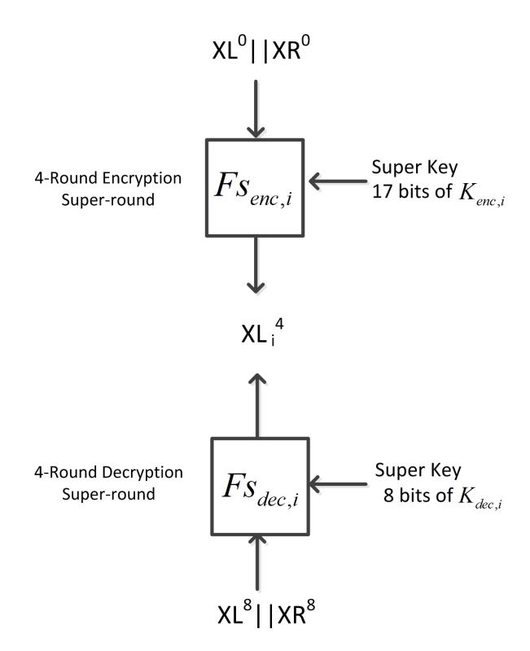

Figure 9: 8-Round Attack Without Approximations

In this meet-in-the-middle attack on 8-round Simon, we attempt to recover 112 key bits, consisting of 64 bits of one super key and 48 more bits of the second super key. We are able to determine all 64 master key bits using only 48 plaintext and ciphertext pairs. We carried out two instances of this attack.

# 6.4 Summary of Experimental Results

<span id="page-19-1"></span>Here we provide a summary of our experimental results.

| Experimental                                                         | Super Key Bits                                     | Master Key Bits                                   | Data                                       | Time                                                       | Success                   |
|----------------------------------------------------------------------|----------------------------------------------------|---------------------------------------------------|--------------------------------------------|------------------------------------------------------------|---------------------------|
| Results                                                              | Recovered                                          | Recovered                                         | Complexity                                 | Complexity                                                 | Probability               |
| 8-round<br>10-round<br>12-round<br>8-round without<br>approximations | 41-48 bits<br>55-64 bits<br>45-48 bits<br>112 bits | 43-48 bits<br>56-64 bits<br>45-48 bits<br>64 bits | 14<br>2<br>14<br>2<br>25<br>2<br>5.58<br>2 | 34.00281<br>2<br>36.044<br>2<br>45.0028<br>2<br>34.58<br>2 | 94%<br>95%<br>94%<br>100% |

Table 9: Summary of the Experimental Results

# <span id="page-19-0"></span>7 Projected results using multiple linear cryptanalysis

In this section we present projected results for the 20-round linear attack. Similar results for Simon 48 and Simon 64 ,Simon 96 and Simon 128 are presented in the Appendix [C,](#page-25-2)[D,](#page-26-1)[E,](#page-28-0) and [F,](#page-29-1) respectively. Note that by "projected" results we mean results that have not been verified experimentally but are derived analytically.

### 7.1 20-round linear attack

In this section, we describe how to recover the entire master key in a 20-round attack. First, we extend the 7-linear approximations (equations [8](#page-14-1) and [9\)](#page-14-2) into 12-round linear trails, with bias 2<sup>−</sup><sup>19</sup> for the left-half and the right-half:

$$PL_{i} \oplus CL_{i+8} = \begin{cases} k_{i}^{1} \oplus k_{i+2}^{2} \oplus k_{i,i+4}^{3} \oplus k_{i+6}^{4} \\ \oplus k_{i,i+4,i+8}^{5} \oplus k_{i+2,i+10}^{6} \oplus k_{i,i+8,i+12}^{7} \\ \oplus k_{i+14}^{8} \oplus k_{i+8,i+12}^{9} \oplus k_{i+10}^{10} \oplus k_{i+8}^{11} \end{cases}$$

$$(12)$$

$$PR_{i} \oplus CR_{i+8} = \begin{cases} k_{i}^{0} \oplus k_{i+2}^{1} \oplus k_{i,i+4}^{2} \oplus k_{i+6}^{3} \oplus k_{i,i+4,i+8}^{4} \\ \oplus k_{i+2,i+10}^{5} \oplus k_{i,i+8,i+12}^{6} \oplus k_{i+14}^{7} \\ \oplus k_{i+8,i+12}^{8} \oplus k_{i+10}^{9} \oplus k_{i+8}^{10} \end{cases}$$

$$(13)$$

Because the derived 12-round linear approximation for the left-half has one active input bit and one active output, we are able to append the super round of the 4-round encryption at the beginning and the super round of the 4-round decryption at the end, giving us a 20-round linear attack. The same is true for the right-half approximation. Tables 10 and 11 list the sequence of approximations used to produce the 12-round linear approximation.

The extended linear approximations are:

$$XL_{i}^{4} \oplus XL_{i+8}^{17} = \begin{cases} k_{i}^{5} \oplus k_{i+2}^{6} \oplus k_{i,i+4}^{7} \oplus k_{i+6}^{8} \\ \oplus k_{i,i+4,i+8}^{9} \oplus k^{1}0_{i+2,i+10} \oplus k^{1}1_{i,i+8,i+12} \\ \oplus k_{i+14}^{12} \oplus k_{i+8,i+12}^{13} \oplus k_{i+10}^{14} \oplus k_{i+8}^{15} \end{cases}$$

$$(14)$$

and

$$XR_{i}^{4} \oplus XR_{i+8}^{17} = \begin{cases} k_{i}^{4} \oplus k_{i+2}^{5} \oplus k_{i,i+4}^{6} \oplus k_{i+6}^{7} \oplus k_{i,i+4,i+8}^{8} \\ \oplus k_{i+2,i+10}^{9} \oplus k_{i,i+8,i+12}^{10} \oplus k_{i+14}^{11} \\ \oplus k_{i+8,i+12}^{12} \oplus k_{i+8}^{13} \oplus k_{i+8}^{14} \end{cases}$$
(15)

To determine the computational complexity of the 20-round attack, first, we need to determine the required number of plaintext and ciphertext pairs. To do so, we will use the fact that in our proposed linear attack, we need to evaluate 16 linear approximations for the left-half, and 16 linear approximations for the right-half, hence we have a system of multiple approximations which enables us to apply multiple linear cryptanalysis.

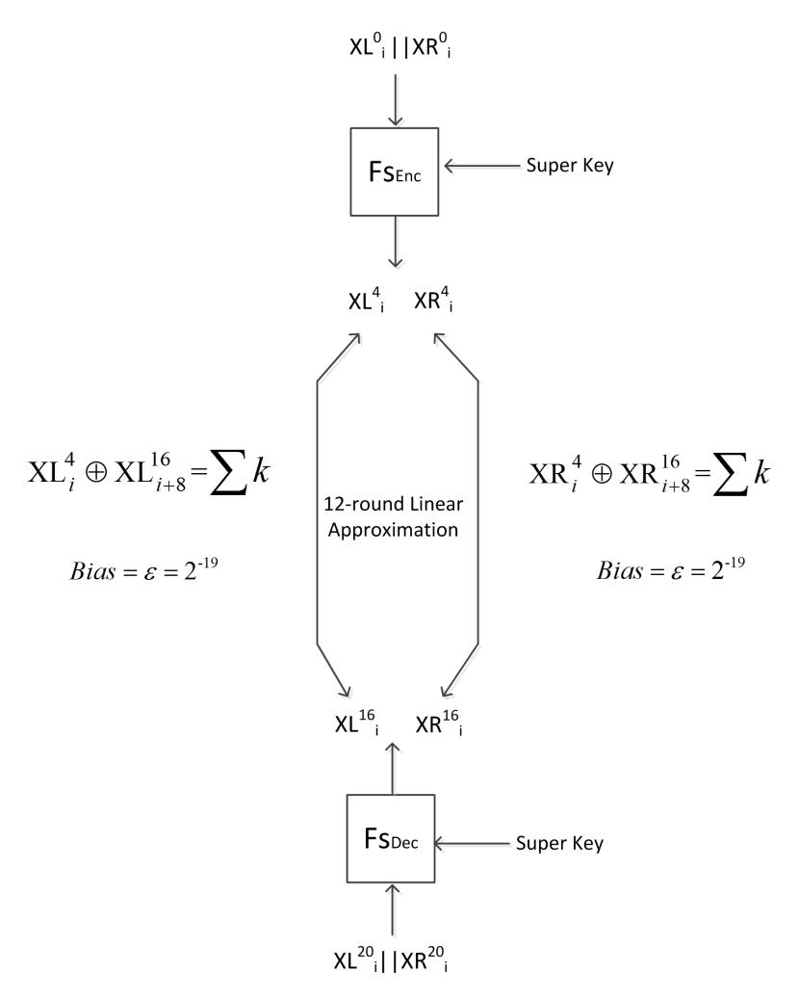

Figure 10: 20-Round Linear Attack

Multiple linear cryptanalysis was first proposed in [22], by Kaliski and Robshaw, where they show how to exploit multiple linear expressions, all including the same key bits, to reduce the required number of plaintext and ciphertext

pairs. Then Biryukov et al. [\[7\]](#page-24-0), propose a more flexible framework for using multiple linear approximations, also defining the capacity of a system of m-approximations to be:

$$\bar{c}^2 = 4 \times \sum_{i=1}^m c_i^2 = 4 \times \sum_{i=1}^m \epsilon_i^2$$
 (16)

A key recovery attack with a capacity of c <sup>2</sup> will require O( 1 c <sup>2</sup> ) plaintext and ciphertext pairs. The system of the left-half approximations has a capacity of:

$$\overline{c}^2 = 4 \times 16 \times 2^{-19 \times 2} = 2^6 \times (2^{-19})^2 = 2^{-32}$$
 (17)

Consequently, the data complexity of the 20-round linear attack may be approximated as 2<sup>32</sup>. The success probability, computed using the approach of [\[23\]](#page-24-16), and with a 4-bit advantage, is about 6%. To increase the success probability, we would need to use a multiple of N = 1 c <sup>2</sup> P/C pairs, which is not feasible in this case. If we use 2<sup>31</sup> P/C pairs, the success probability drops to 4% with a 4-bit advantage. In the literature, key recovery attacks generally have larger probability of success, but those attacks recover fewer bits of the key, while we have demonstrated recovery of the entire master key. We have a range of success probabilities, for example: 84% for the 20-round attack of Simon 48/96 and 78% for the 24-round attack of Simon 64/128.

In addition to the data complexity, we need to add the cost of guessing the key bits of the extended rounds to connect the plaintext and ciphertext with the left-half and the right-half approximations. Evaluating the left half approximations requires guessing 16 key bits for the super round of 4-round encryption and another 7 key bits for the super round of the 4-round decryption, which results in a total time complexity of 16 × 2 <sup>32</sup> × 2 <sup>16</sup> × 2 <sup>7</sup> = 2<sup>59</sup>. In the case of the right-half approximations, we need to brute force 7 key bits to append the super round of 4-round encryption, and 16 key bits for the super round of 4-round decryption which results also in 2<sup>59</sup>, hence the overall computational complexity to evaluate the two halves is 2<sup>60</sup>. In addition to the first three round keys (k 0 ,k 1 ,k 2 ), we recover the last three round keys (k 17 ,k 18 ,k <sup>19</sup>)from which we can deduce k <sup>3</sup> as described in the next section. This results in the recovery of the entire master key.

#### 7.2 k <sup>3</sup> Deduction from k 19

According to the key schedule algorithm used in Simon,k <sup>19</sup> is:

$$k^{19} = k^{15} \oplus k^{16} \oplus (k^{18} \gg 3) \oplus (k^{16} \gg 1 \oplus (k^{18} \gg 4)) \oplus c \oplus (z_0)_{15}$$
(18)

<span id="page-21-0"></span>It can be rewritten in terms of the master key bits as follows:

$$k^{19} = k^{0} \oplus (k^{0} \gg 2) \oplus (k^{0} \gg 7) \oplus (k^{0} \gg 9) \oplus (k^{0} \gg 11) \oplus (k^{0} \gg 12)$$

$$\oplus (k^{0} \gg 13) \oplus (k^{0} \gg 14) \oplus k^{1} \oplus (k^{1} \gg 1) \oplus (k^{1} \gg 3) \oplus (k^{1} \gg 4)$$

$$\oplus (k^{1} \gg 6) \oplus (k^{1} \gg 7) \oplus (k^{1} \gg 8) \oplus (k^{1} \gg 9) \oplus (k^{1} \gg 11) \oplus (k^{1} \gg 12)$$

$$\oplus (k^{1} \gg 14) \oplus (k^{1} \gg 15) \oplus (k^{2} \gg 3) \oplus (k^{2} \gg 5) \oplus (k^{2} \gg 8) \oplus (k^{2} \gg 9)$$

$$\oplus (k^{2} \gg 10) \oplus (k^{2} \gg 12) \oplus (k^{2} \gg 14) \oplus (k^{2} \gg 15)$$

$$\oplus k^{3} \oplus constant$$

$$(19)$$

It is clear from equation [19,](#page-21-0) that we are able to compute k 3 , given the first three round keys (k 0 , k 1 , k 2 ), and the last round key k 19 .

### 7.3 Summary of Projected Results

In section [6,](#page-15-0) we presented the results from the experimental verification of our approach on small numbers of rounds. Below we summarize our results for larger numbers of rounds (that cannot, obviously, be experimentally verified) on Simon32/64:

| Projected | Key Bits Recovered                               | Master             | Data       | Time       |
|-----------|--------------------------------------------------|--------------------|------------|------------|
| Results   |                                                  | Key bits           | Complexity | Complexity |
| 20-round  | 64 independent key bits<br>32 dependent key bits | 64 master key bits | 32<br>2    | 60<br>2    |

<span id="page-22-0"></span>

| Active bits<br>in the left side | Active bits<br>in the right side | Used<br>Approximation | Number of<br>Approximations |
|---------------------------------|----------------------------------|-----------------------|-----------------------------|
| 0                               | -                                |                       |                             |
|                                 | 0                                | 1                     | 1                           |
| 0                               | 2                                | 1                     | 1                           |
| 2                               | 0,4                              | 1;1                   | 2                           |
| 0,4                             | 6                                | 1                     | 1                           |
| 6                               | 0,4,8                            | 1;1;1                 | 3                           |
| 0,4,8                           | 2,10                             | 1;1                   | 2                           |
| 2,10                            | 0,8,12                           | 1;1;1                 | 3                           |
| 0,8,12                          | 14                               | 1                     | 1                           |
| 14                              | 8,12                             | 1;1                   | 2                           |
| 8,12                            | 10                               | 1                     | 1                           |
| 10                              | 8                                | 1                     | 1                           |
| 8                               | -                                |                       |                             |
| -                               | 8                                |                       |                             |

<span id="page-22-1"></span>Table 10: The sequence of approximations used to derive 12-rounds and 13-rounds linear trails for the left-half of Simon 32

| Active bits<br>in the left side | Active bits<br>in the right side | Used<br>Approximation | Number of<br>Approximations |
|---------------------------------|----------------------------------|-----------------------|-----------------------------|
| -                               | 0                                | 1                     | 1                           |
| 0                               | 2                                | 1;1                   | 2                           |
| 2                               | 0,4                              | 1                     | 1                           |
| 0,4                             | 6                                | 1;1;1                 | 3                           |
| 6                               | 0,4,8                            | 1;1                   | 2                           |
| 0,4,8                           | 2,10                             | 1;1;1                 | 3                           |
| 2,10                            | 0,8,12                           | 1                     | 1                           |
| 0,8,12                          | 14                               | 1;1                   | 2                           |
| 14                              | 8,12                             | 1                     | 1                           |
| 8,12                            | 10                               | 1                     | 1                           |
| 10                              | 8                                | 1                     | 1                           |
| 8                               | -                                | 1;1                   | 1                           |
| -                               | 8                                |                       | 2                           |
| 8                               | 0,10                             |                       |                             |

Table 11: The sequence of approximations used to derive and 13-rounds linear trails for the right-half of Simon 32

### 8 The effect of super rounds on larger variants of Simon

Although the larger variants of SIMON correspond to larger block and key sizes, we have found that the size of the super-keys is only slightly larger than that for SIMON 32/64. After 4-rounds encryption, a single bit of the left-half of the intermediate state is influenced by only 18 key bits. On the other hand, the size of the super-key of the right half stays the same, at 7 bits.

We found that, for larger variants of SIMON, the bias of linear approximations with only a single active bit in the input mask is very low. We looked for approximations with a higher bias that use a very small number of active bits in the input mask. Thus, we may not be using the linear trails with the highest bias, but we need to realize an acceptable trade-off between the bias and the number of active bits of especially the left half, because appending the super round, in this case, is more expensive.

For Simon 48, we derived linear approximations with high bias that have three active bits in the input mask, one bit for the left half and two bits of the right half. Appending three super rounds to these approximations requires the guessing of 24 key bits, the size of one round key.

For Simon 64, we derived a linear trail with four active bits of input, one of the left half and three bits of the right half, requiring the guessing of 31 key bits with appended super rounds. This is smaller than a single round key. In Simon 96, and Simon 128, we obtain linear approximations that need the guessing of 41 and 53 key bits respectively, which, in both cases, are smaller than a single round key in these variants.

# <span id="page-23-6"></span>9 Conclusion

This paper describes the novel notions of super rounds and super keys and demonstrates their efficacy through both experimental and projected theoretical linear cryptanalysis of SIMON 32/64. The feature of our attack is that we are able to apply Matsui's second algorithm in an efficient manner, especially in the forward direction, to recover the entire master key or three-fourths of it.

We were able to recover three-fourths of the master key in the 8-round and 12-round linear attacks of SIMON 32/64 with high accuracy, and we approximately recover more than 80 percent of the master key in the 10-round key recovery attack. The attack may be extended to 20 and 21-rounds revealing the full master key of size 64 bits. Similar results have been achieved and presented in the appendices for SIMON 48, SIMON 64, SIMON 96, and SIMON 128. We propose to apply our linear attack with super-rounds to other block ciphers with design similar to SIMON.

# 10 Acknowledgments

This research was sponsored in part by NSF award 1421373.

### References

- <span id="page-23-0"></span>[1] K. A. McKay, L. E. Bassham, M. S. Turan, N. W. Mouha, Report on lightweight cryptography. URL https://www.nist.gov/publications/report-lightweight-cryptography
- <span id="page-23-1"></span>[2] J. Alizadeh, H. AlKhzaimi, M. R. Aref, N. Bagheri, P. Gauravaram, M. M. Lauridsen, Improved linear crypt-analysis of round reduced SIMON, IACR Cryptology ePrint Archive 2014 (2014) 681. URL http://eprint.iacr.org/2014/681
- <span id="page-23-2"></span>[3] X. Ma, D. Shi, L. Hu, S. Sun, L. Song, K. Qiao, X. Ma, Improved linear (hull) cryptanalysis of round-reduced versions of simon (2015).
- <span id="page-23-3"></span>[4] M. A. Abdelraheem, J. Alizadeh, H. A. Alkhzaimi, M. R. Aref, N. Bagheri, P. Gauravaram, Improved linear cryptanalysis of reduced-round simon-32 and simon-48, in: A. Biryukov, V. Goyal (Eds.), Progress in Cryptology – INDOCRYPT 2015, Springer International Publishing, Cham, 2015, pp. 153–179.
- <span id="page-23-4"></span>[5] S. Sun, L. Hua, M. Wang, P. Wang, K. Qiao, X. Ma, D. Shi, K. F. Ling Song, Towards finding the best characteristics of some bit-oriented block ciphers and automatic enumeration of (related-key) differential and linear characteristics with predefined properties, Cryptology ePrint Archive, Report 2014/747 (2014).
- <span id="page-23-5"></span>[6] H. Chen, X. Wang, Improved linear hull attack on round-reduced simon with dynamic key-guessing techniques, in: T. Peyrin (Ed.), Fast Software Encryption, Springer Berlin Heidelberg, Berlin, Heidelberg, 2016, pp. 428–449.

- <span id="page-24-0"></span>[7] A. Biryukov, C. De Canni`ere, M. Quisquater, On multiple linear approximations, in: M. Franklin (Ed.), Advances in Cryptology – CRYPTO 2004, Springer Berlin Heidelberg, Berlin, Heidelberg, 2004, pp. 1–22.
- <span id="page-24-1"></span>[8] J. Lee, B. Koo, W. Kim, [Related-key linear cryptanalysis on SIMON,](http://eprint.iacr.org/2018/152) IACR Cryptology ePrint Archive 2018 (2018) 152. URL <http://eprint.iacr.org/2018/152>
- <span id="page-24-2"></span>[9] J. Alizadeh, H. A. Alkhzaimi, M. R. Aref, N. Bagheri, P. Gauravaram, A. Kumar, M. M. Lauridsen, S. K. Sanadhya, Cryptanalysis of simon variants with connections, in: N. Saxena, A.-R. Sadeghi (Eds.), Radio Frequency Identification: Security and Privacy Issues, Springer International Publishing, Cham, 2014, pp. 90–107.
- <span id="page-24-3"></span>[10] T. Ashur, [Improved linear trails for the block cipher simon,](http://eprint.iacr.org/2015/285) IACR Cryptology ePrint Archive 2015 (2015) 285. URL <http://eprint.iacr.org/2015/285>
- <span id="page-24-4"></span>[11] M. Hermelin, J. Y. Cho, K. Nyberg, [Multidimensional linear cryptanalysis,](https://doi.org/10.1007/s00145-018-9308-x) J. Cryptology 32 (1) (2019) 1–34. [doi:10.1007/s00145-018-9308-x](http://dx.doi.org/10.1007/s00145-018-9308-x). URL <https://doi.org/10.1007/s00145-018-9308-x>
- <span id="page-24-5"></span>[12] R. Beaulieu, D. Shors, J. Smith, S. Treatman-Clark, B. Weeks, L. Wingers, [The simon and speck families of](http://dblp.uni-trier.de/db/journals/iacr/iacr2013.html#BeaulieuSSTWW13) [lightweight block ciphers.,](http://dblp.uni-trier.de/db/journals/iacr/iacr2013.html#BeaulieuSSTWW13) IACR Cryptology ePrint Archive 2013 (2013) 404. URL <http://dblp.uni-trier.de/db/journals/iacr/iacr2013.html#BeaulieuSSTWW13>
- <span id="page-24-6"></span>[13] K. Nyberg, Linear approximation of block ciphers, in: A. De Santis (Ed.), Advances in Cryptology — EURO-CRYPT'94, Springer Berlin Heidelberg, Berlin, Heidelberg, 1995, pp. 439–444.
- <span id="page-24-7"></span>[14] N. Wang, X. Wang, K. Jia, J. Zhao, Differential attacks on reduced simon versions with dynamic key-guessing techniques, Science China Information Sciences 61 (9). [doi:10.1007/s11432-017-9231-5](http://dx.doi.org/10.1007/s11432-017-9231-5).
- <span id="page-24-8"></span>[15] A. Bogdanov, V. Rijmen, [Linear hulls with correlation zero and linear cryptanalysis of block ciphers,](https://doi.org/10.1007/s10623-012-9697-z) Des. Codes Cryptogr. 70 (3) (2014) 369–383. [doi:10.1007/s10623-012-9697-z](http://dx.doi.org/10.1007/s10623-012-9697-z). URL <https://doi.org/10.1007/s10623-012-9697-z>
- <span id="page-24-9"></span>[16] X. Yu, W. Wu, Z. Shi, J. Zhang, L. Zhang, Y. Wang, [Zero-correlation linear cryptanalysis of reduced-round](https://doi.org/10.1007/s11390-015-1603-5) [SIMON,](https://doi.org/10.1007/s11390-015-1603-5) J. Comput. Sci. Technol. 30 (6) (2015) 1358–1369. [doi:10.1007/s11390-015-1603-5](http://dx.doi.org/10.1007/s11390-015-1603-5). URL <https://doi.org/10.1007/s11390-015-1603-5>
- <span id="page-24-10"></span>[17] Q. Wang, Z. Liu, K. Varici, Y. Sasaki, V. Rijmen, Y. Todo, [Cryptanalysis of reduced-round SIMON32 and](https://doi.org/10.1007/978-3-319-13039-2_9) [SIMON48,](https://doi.org/10.1007/978-3-319-13039-2_9) in: W. Meier, D. Mukhopadhyay (Eds.), Progress in Cryptology - INDOCRYPT 2014 - 15th International Conference on Cryptology in India, New Delhi, India, December 14-17, 2014, Proceedings, Vol. 8885 of Lecture Notes in Computer Science, Springer, 2014, pp. 143–160. [doi:10.1007/978-3-319-13039-2\\\_9](http://dx.doi.org/10.1007/978-3-319-13039-2_9). URL [https://doi.org/10.1007/978-3-319-13039-2\\_9](https://doi.org/10.1007/978-3-319-13039-2_9)
- <span id="page-24-11"></span>[18] L. Sun, K. Fu, M. Wang, Improved zero-correlation cryptanalysis on simon, in: D. Lin, X. Wang, M. Yung (Eds.), Information Security and Cryptology, Springer International Publishing, Cham, 2016, pp. 125–143.
- <span id="page-24-12"></span>[19] F. Abed, E. List, S. Lucks, J. Wenzel, Differential cryptanalysis of round-reduced simon and speck, in: C. Cid, C. Rechberger (Eds.), Fast Software Encryption, Springer Berlin Heidelberg, Berlin, Heidelberg, 2015, pp. 525–545.
- <span id="page-24-13"></span>[20] J. Alizadeh, N. Bagheri, P. Gauravaram, A. Kumar, S. K. Sanadhya, [Linear cryptanalysis of round reduced](http://eprint.iacr.org/2013/663) [SIMON,](http://eprint.iacr.org/2013/663) IACR Cryptology ePrint Archive 2013 (2013) 663. URL <http://eprint.iacr.org/2013/663>
- <span id="page-24-14"></span>[21] J. Daemen, V. Rijmen, [Two-round AES differentials,](http://eprint.iacr.org/2006/039) IACR Cryptology ePrint Archive 2006 (2006) 39. URL <http://eprint.iacr.org/2006/039>
- <span id="page-24-15"></span>[22] B. S. Kaliski, M. J. B. Robshaw, Linear cryptanalysis using multiple approximations, in: Y. G. Desmedt (Ed.), Advances in Cryptology — CRYPTO '94, Springer Berlin Heidelberg, Berlin, Heidelberg, 1994, pp. 26–39.
- <span id="page-24-16"></span>[23] S. Samajder, P. Sarkar, [Success probability of multiple/multidimensional linear cryptanalysis under general](https://doi.org/10.1007/s12095-017-0257-2) [key randomisation hypotheses,](https://doi.org/10.1007/s12095-017-0257-2) Cryptography and Communications 10 (5) (2018) 835–879. [doi:10.1007/](http://dx.doi.org/10.1007/s12095-017-0257-2) [s12095-017-0257-2](http://dx.doi.org/10.1007/s12095-017-0257-2). URL <https://doi.org/10.1007/s12095-017-0257-2>

# A The Deduction of $k^3$ from $k^9$

Recall  $k^9$  is generated as follows:

$$k^9 = k^5 \oplus k^6 \oplus (k^8 \gg 3) \oplus (k^6 \gg 1 \oplus (k^8 \gg 4)) \oplus c \oplus (z_0)_5$$
 (20)

$$k^{9} = k^{0} \oplus (k^{0} \gg 3) \oplus (k^{0} \gg 4) \oplus (k^{0} \gg 6) \oplus (k^{0} \gg 7) \oplus (k^{0} \gg 8)$$

$$\oplus (k^{0} \gg 9) \oplus (k^{0} \gg 15) \oplus (k^{1} \gg 1) \oplus (k^{1} \gg 3) \oplus (k^{1} \gg 5) \oplus (k^{1} \gg 6)$$

$$\oplus (k^{1} \gg 10) \oplus (k^{1} \gg 12) \oplus (k^{1} \gg 15) \oplus k^{2} \oplus (k^{2} \gg 1) \oplus (k^{2} \gg 9)$$

$$\oplus (k^{2} \gg 10) \oplus (k^{2} \gg 11) \oplus (k^{2} \gg 13) \oplus k^{3} \oplus (k^{3} \gg 4) \oplus constant$$

$$(21)$$

$$Constant = \begin{cases} (c \oplus (z_0)_0) \oplus ((c \oplus (z_0)_0) \gg 3) \oplus ((c \oplus (z_0)_0) \gg 4) \oplus ((c \oplus (z_0)_0) \gg 6) \\ \oplus ((c \oplus (z_0)_0) \gg 7) \oplus ((c \oplus (z_0)_0) \gg 8) \oplus ((c \oplus (z_0)_0) \gg 9) \oplus ((c \oplus (z_0)_0) \gg 15) \oplus \\ ((c \oplus (z_0)_1) \gg 12) \oplus (c \oplus (z_0)_2) \oplus ((c \oplus (z_0)_2) \gg 1) \oplus ((c \oplus (z_0)_2) \gg 9) \oplus \\ ((c \oplus (z_0)_2) \gg 10) \oplus ((c \oplus (z_0)_2) \gg 11) \oplus ((c \oplus (z_0)_2) \gg 12) \oplus ((c \oplus (z_0)_3) \gg 6) \\ \oplus ((c \oplus (z_0)_3) \gg 8) \oplus ((c \oplus (z_0)_4) \gg 3) \oplus ((c \oplus (z_0)_4) \gg 4) \oplus (c \oplus (z_0)_5) \end{cases}$$
(22)

# <span id="page-25-0"></span>B 21-rounds linear attack on Simon 32/64

Using the 13-rounds linear approximation with bias= $2^{-19}$ , we can append a super round before and after which results in a 21-rounds linear attack. The capacity of this system is  $4 \times 16 \times 2^{-19^2} = 2^{-32}$ . Hence, the data complexity is  $2^{32}$ . The cost of appending the super rounds in average is  $2^{23}$ , as a result the time complexity to evaluate the left half approximations is  $2^4 \times 2^{32} \times 2^{23} = 2^{59}$ , additionally evaluate the right half system costs  $2^{56.5}$ . The total time complexity  $2^{59} + 2^{56.5} = 2^{59.23}$ .

### <span id="page-25-2"></span>C Linear attacks on Simon 48

In this section, we present the two projected linear attacks of 18-rounds and 20-rounds on SIMON48. In addition to the 20-rounds and 21-rounds linear attacks in the average case.

### <span id="page-25-1"></span>C.1 18-rounds and 20-rounds linear attacks on Simon 48/72

Here, we append the super rounds of 4-rounds encryption to the 12-rounds linear approximation (see table 12) and add two rounds decryption at the end to get 18-rounds linear attack. To compute the data complexity, first we need to compute the capacity of the multiple approximations.

$$c^2 = 4 \times 24 \times 2^{-19 \times 2} = 2^{6.58} \times (2^{-19})^2 = 2^{-31.42}$$

Appending 4-rounds encryption comes at the cost of guessing 23 bits of subkeys, in addition to guessing 8 key bits of  $k^{17}$ , to do two rounds decryption,  $k_1^{17}, k_8^{17}, k_{13}^{17}, k_{20}^{17}, k_{9}^{17}, k_{16}^{17}, k_{17}^{17}$ , and  $k_0^{17}$ .

Thus, the data complexity is  $16 \times (1/2^{31.42}) = 2^{35.42}$ , and the total time complexity of this attack is  $2^{4.58} \times 2^{35.42} \times 2^{31} = 2^{71}$ , with full recovery of the 72 master key bits, and with a success probability of 42% with an 8-bit advantage. If we use only  $8 \times (1/2^{31.42}) = 2^{34.42}$ , the success probability drops to 15%.

In the case, we count the key bits we need to guess on average (key bits that are involved in And operation cost guessing a half-bit), then we can go further and present a 20-rounds linear attack. First, we extend the 12-rounds linear approximation by two more rounds and get a 14-rounds linear expression with bias= $2^{-26}$  (see table 12). Here, we append 4-rounds encryption to a 14-rounds linear approximation, then add two rounds decryption at the end which results in a 20-rounds linear attack. This costs guessing 21.5 bits(16.5 bits for the encryption and 5 bits for the decryption), and data complexity = $2^{45.42}$ . The time complexity, in this case, is  $2^{71.5}$ , with a 8% success probability.

There are 10 bits of  $k^{19}$ , need guessing:  $k_1^{19}, k_8^{19}, k_5^{19}, k_{12}^{19}, k_9^{19}, k_{16}^{19}, k_{17}^{19}, k_0^{19}, k_{21}^{19}$ , and  $k_4^{19}$ . But counting these as a half bit results in guessing 5 bits in average.

### <span id="page-26-0"></span>C.2 20-rounds and 21-rounds linear attacks on Simon 48/96

By extending the 12-rounds linear approximation by one more round we get a 13-round linear trail with capacity:

$$c^2 = 4 \times 24 \times 2^{-23^2} = 2^{6.58} \times 2^{-23^2} = 2^{-39.42}$$

Appending four rounds encryption and three rounds decryption to the 13-round linear relation results in a 20-round linear attack. There are 23 key bits required guessing to add three rounds decryption: 17 bits of  $k^{19}$  at these indices: [1, 8, 9, 16, 17, 0, 12, 19, 2, 4, 11, 18, 5, 20, 3, 10, 21], and 6 bits of the sum  $k^{18} \oplus k^{19}$ :  $k_{13}^{19} \oplus k_{13}^{18}$ ,  $k_{20}^{19} \oplus k_{18}^{18}$ ,  $k_{20}^{19} \oplus k_{18}^{18}$ , and  $k_{20}^{19} \oplus k_{20}^{18}$ .

the data complexity is  $16 \times 1/2^{39.42} = 2^{43.42}$ , and the time complexity in this case is  $2^{4.58} \times 2^{43.42} \times 2^{47} = 2^{95}$ , with a success probability of about 21% with an 8-bit advantage. Also, we can increase this probability by increasing the number of plaintext and ciphertext pairs:  $32 \times 1/2^{39.42} = 2^{44.42}$ , which increases the success probability to 84%; the computational complexity rises to  $2^{96}$ .

But in the average case, we can extend the 20-rounds linear attack in section C.1 by one more round decryption to get a 21-rounds linear attack, which costs guessing 19 key bits in addition to the 16.5 bits for the four rounds encryption, hence the time complexity of the attack is  $2^{85.5}$ .

<span id="page-26-2"></span>Three rounds decryption costs in average: 8 bits of  $k^{20}$  at these indices: [2,9,16,10,17,0,18,1,8,6,13,20,7,14,22,5,12,23]. Also, 10 bits of this sum  $k^{20} \oplus k^{19}$ :  $k_3^{20} \oplus k_1^{19}$ ,  $k_{10}^{20} \oplus k_8^{19}$ ,  $k_{11}^{20} \oplus k_9^{19}$ ,  $k_{18}^{20} \oplus k_{16}^{19}$ ,  $k_{19}^{20} \oplus k_{17}^{19}$ ,  $k_7^{20} \oplus k_5^{19}$ ,  $k_2^{20} \oplus k_0^{19}$ ,  $k_{12}^{20} \oplus k_{12}^{20}$ , and  $k_6^{20} \oplus k_4^{19}$ . The success probability with an 8-bit advantage is 8%.

| Active bits      | Active bits       | Used          | Number of      |
|------------------|-------------------|---------------|----------------|
| in the left side | in the right side | Approximation | Approximations |
| 6                | 0,4               |               |                |
| 0,4              | 2                 | 1;1           | 2              |
| 2                | 0                 | 1             | 1              |
| 0                | -                 | 1             | 1              |
|                  | 0                 |               | 0              |
| 0                | 2                 | 1             | 1              |
| 2                | 0,4               | 1             | 1              |
| 0,4              | 6                 | 1;1           | 2              |
| 6                | 0,4,8             | 1             | 1              |
| 0,4,8            | 2,10              | 1;1;1         | 3              |
| 2,10             | 0,8,12            | 1;1           | 2              |
| 0,8,12           | 14                | 1;1;1         | 3              |
| 14               | 0,8,12,16         | 1             | 1              |
| 0,8,12,16        | 2,10,18           | 1;1;1;1       | 4              |
| 2,10,18          | 0,4,8,16,20       | 1;1;1         | 3              |

Table 12: The sequence of approximations used to derive 12, 13-rounds and 14-rounds linear trails for SIMON 48

## <span id="page-26-1"></span>D Linear attacks on Simon 64

Here, we describe the two linear attacks: 22-rounds and 24-rounds linear attacks on Simon 64/96 and Simon 64/128.

#### <span id="page-27-0"></span>22-rounds and 23-rounds linear attacks on Simon 64/96 D.1

We used the 16-rounds linear characteristic presented in table 13, and append 4-rounds encryption and two rounds decryption. The capacity of the system of 16-rounds linear trail:

$$c^2 = 4 \times 32 \times 2^{-28^2} = 2^7 \times 2^{-62^2} = 2^{-49}$$

The 4-rounds encryption costs guessing 31 key bits and 8 more bits of  $k^{22}$  to do two rounds decryption,  $[k_1^{22}, k_8^{22}, k_9^{22}, k_{13}^{22}, k_{20}^{22}, k_{17}^{22}, k_{24}^{22}]$ . The data complexity is  $4 \times 1/2^{-49} = 2^{51}$ , hence the time complexity is  $2^5 \times 2^{51} \times 2^{39} = 2^{95}$ , with a success probability of about 5% with an 8-bit advantage and full recovery of the master key. We can increase the probability to 10% by using  $8 \times 1/2^{-49} = 2^{52}$  plaintext and ciphertext pairs, but the time complexity increase to  $2^{96}$ .

In the average case complexity, we got a 23-rounds, which results from adding one more round decryption to the previous linear attack. This extra round costs guessing 16 more bits of  $k^{23}$ : [14, 21, 28, 17, 24, 11, 18, 25, 0, 19, 26, 2, 9, 16, 3, 10], although in average it costs 8 bits. In total, there are 25.5 bits need guessing for this attack, which results in a time complexity of  $2^{91.5}$ .

### <span id="page-27-1"></span>24-rounds and 25-rounds linear attacks on Simon 64/128

We derive an 17-rounds linear trail as presented in 13, and add 4 rounds before and 3 rounds after the linear characteristic to get a 24-rounds linear attack. The capacity of this new approximation is  $c^2 = 4 \times 32 \times 2^{-32^2} = 2^{-57}$ . Moreover, appending the extra rounds costs guessing 52 key bits, which consists of 31 for the 4-rounds encryption and 21 bits for the decryption. There are 15 bits of  $k^{24}$  at these positions: [0, 1, 8, 9, 5, 4, 16, 17, 12, 19, 11, 18, 26, 24, 25]. 6 bits of the sum  $k^{24} \oplus k^{23}$ :  $k_{13}^{24} \oplus k_{11}^{23}$ ,  $k_{20}^{24} \oplus k_{18}^{23}$ ,  $k_{5}^{24} \oplus k_{3}^{23}$ ,  $k_{12}^{24} \oplus k_{10}^{23}$ ,  $k_{19}^{24} \oplus k_{17}^{23}$  and  $k_{26}^{24} \oplus k_{24}^{23}$ . The data complexity is  $32 \times 1/2^{57} = 2^{62}$ . The time complexity is  $2^5 \times 2^{62} \times 2^{52} = 2^{119}$ , with a success probability

of about 78% with an 8-bit advantage.

In the case of counting the key bits on average, we can go deeper by using 18-rounds linear approximation and appending four rounds before and three rounds after, which results in a 25-rounds linear attack. The capacity of this system is  $c^2 = 4 \times 32 \times 2^{-35^2} = 2^{-63}$ , which makes the data complexity is  $2^{63}$ 

The four rounds encryption costs guessing 21.5 key bits in average. Also, there are 9.5 bits of  $k^{25}$ , at these positions: 17,24,2,9,16,10,6,13,20,7,14,18,25,0,19,26,27,21,28.

Additionally, there are 10 bits of the sum required guessing  $k^{25} \oplus k^{24}$ :  $k_3^{24} \oplus k_1^{23}$ ,  $k_{10}^{24} \oplus k_8^{23}$ ,  $k_{11}^{24} \oplus k_9^{23}$ ,  $k_{18}^{24} \oplus k_{16}^{23}$ ,  $k_{19}^{24} \oplus k_{17}^{23}$ ,  $k_{26}^{24} \oplus k_{24}^{23}$ ,  $k_{19}^{24} \oplus k_{19}^{23}$ , and  $k_{28}^{24} \oplus k_{26}^{23}$ . In total there are 41 key bits required guessing on average. The time complexity of this attack is  $32 \times 2^{63} \times 2^{41} = 2^{109}$ .

<span id="page-28-1"></span>

| Active bits in the left side | Active bits in the right side | Used<br>Approximation | Number of Approximations |
|------------------------------|-------------------------------|-----------------------|--------------------------|
| 14                           | 0,8,12                        |                       |                          |
| 0,8,12                       | 2,10                          | 1;1;1                 | 3                        |
| 2,10                         | 0,4,8                         | 1;1                   | 2                        |
| 0,4,8                        | 6                             | 1;1;1                 | 3                        |
| 6                            | 0,4                           | 1                     | 1 1                      |
| 0,4                          | 2                             | 1;1                   | 2                        |
| $\boxed{2}$                  | 0                             | 1                     | 1                        |
| 0                            | -                             | 1                     | 1                        |
|                              | 0                             |                       | 0                        |
| 0                            | 2                             | 1                     | 1                        |
|                              | 0,4                           | 1                     | 1                        |
| 0,4                          | 6                             | 1;1                   | 2                        |
| 6                            | 0,4,8                         | 1                     | 1                        |
| 0,4,8                        | 2,10                          | 1;1;1                 | 3                        |
| 2,10                         | 0,8,12                        | 1;1                   | 2                        |
| 0,8,12                       | 14                            | 1;1;1                 | 3                        |
| 14                           | 0,8,12,16                     | 1                     | 1                        |
| 0,8,12,16                    | 2,10,18                       | 1;1;1;1               | 4                        |
| 2,10,18                      | 0,4,8,16,20                   | 1;1;1                 | 3                        |

Table 13: The sequence of approximations used to derive 16-rounds, 17-rounds and 18-rounds linear trails for SIMON 64

### <span id="page-28-0"></span>E Simon 96

We derive a 28-rounds linear approximation presented in table 14, with bias= $2^{-50}$ . Hence,we obtain a 34-rounds linear attack by appending 4-rounds encryption at the beginning of the 28-rounds linear approximation and two rounds decryption at the end.

The capacity of this system of approximations:  $2^2 \times 2^{5.58} \times 2^{-50^2} = 2^{-92.42}$ . The 4-rounds encryption cost guessing 41 key bits, where for the two rounds decryption costs guessing 4 more key bits: $k_3^{33}$ ,  $k_{10}^{33}$ ,  $k_{11}^{33}$ ,  $k_{18}^{33}$ . Thus, the time complexity is  $2^{5.58} \times 2^{93.42} \times 2^{45} = 2^{144}$ , with a success probability of about 5% with an 8-bit advantage.

In the case of average-case complexity, we present a 35-rounds linear attack, which comes from using a 28-rounds linear approximation and appending four rounds before and three rounds after. The 4-rounds encryption costs guessing 29 bits on average. In addition to the costs of adding three rounds decryption:

- 12 bits of  $k^{34}$  at these positions [1, 8, 9, 16, 13, 20, 4, 11, 18, 12, 19, 26] but on average it costs only 6 bits.
- 4 bits of the sum  $k_{26}^{34} \oplus k_{24}^{33}$ :  $k_5^{34} \oplus k_3^{33}$ ,  $k_{13}^{34} \oplus k_{11}^{33}$ ,  $k_{12}^{34} \oplus k_{10}^{33}$  and  $k_{20}^{34} \oplus k_{18}^{33}$ .

The time complexity in this case is  $2^{5.58} \times 2^{92.42} \times 2^{39} = 2^{137}$ .

<span id="page-29-2"></span>

| Active bits<br>in the left side | Active bits<br>in the right side | Used<br>Approximation | Number of<br>Approximations |
|---------------------------------|----------------------------------|-----------------------|-----------------------------|
| 0,8,12                          | 2,10                             |                       |                             |
| 2,10                            | 0,4,8                            | 1;1                   | 2                           |
| 0,4,8                           | 6                                | 1;1;1                 | 3                           |
| 6                               | 0,4                              | 1                     | 1                           |
| 0,4                             | 2                                | 1;1                   | 2                           |
| 2                               | 0                                | 1                     | 1                           |
| 0                               | -                                | 1                     | 1                           |
|                                 | 0                                | 0                     |                             |
| 0                               | 2                                | 1                     | 1                           |
| 2                               | 0,4                              | 1                     | 1                           |
| 0,4                             | 6                                | 1;1                   | 2                           |
| 6                               | 0,4,8                            | 1                     | 1                           |
| 0,4,8                           | 2,9,10                           | 1;1;2                 | 3                           |
| 2,9,10                          | 0,8,12                           | 1;1;2                 | 3                           |
| 0,8,12                          | 8,9,14                           | 3;1;1                 | 3                           |
| 8,9,14                          | 0,8,11,12                        | 3;2;1                 | 3                           |
| 0,8,11,12                       | 2,10                             | 3;2;1;2               | 4                           |
| 2,10                            | 0,4,8                            | 1;2                   | 2                           |
| 0,4,8                           | 6                                | 1;1;1                 | 3                           |
| 6                               | 0,4                              | 1                     | 1                           |
| 0,4                             | 2                                | 1;1                   | 2                           |
| 2                               | 0                                | 1                     | 1                           |
| 0                               | -                                | 0                     |                             |
| -                               | 0                                | 1                     | 1                           |
| 0                               | 2                                | 1                     | 1                           |
| 2                               | 0,4                              | 1                     | 1                           |
| 0,4                             | 6                                | 1;1                   | 2                           |
| 6                               | 0,4,8                            | 1                     | 1                           |
| 0,4,8                           | 2,10                             | 1;1;1                 | 3                           |

Table 14: The sequence of approximations used to derive 28-rounds linear trails for Simon96

# <span id="page-29-1"></span>F Simon 128

We describe three linear attacks on the reduced round Simon 128 into: 41-rounds, 42-rounds and 43-rounds.

# <span id="page-29-0"></span>F.1 40-rounds and 42-rounds linear attacks

We derive a 35-rounds linear approximation with bias=2<sup>−</sup><sup>68</sup> and append a 4-rounds encryption and one round decryption to get a 40-rounds linear attack. The capacity of this system of approximations 2<sup>2</sup> × 2 <sup>6</sup> × 2 <sup>−</sup><sup>68</sup> = 2<sup>−</sup><sup>128</sup> . The four rounds encryption costs guessing 53 key bits, where the one round decryption is free of any extra cost.

The time complexity in this case is  $2^6 \times 2^{128} \times 2^{53} = 2^{187}$ .

In the average case, we present a 42-rounds linear attack, which comes from using a 35-rounds linear approximation and append 4 rounds before and 3 rounds after. Extending the linear approximations by three rounds decryption involves 18 bits of  $k^{41}$  which costs guessing 9 bits on average at these indices: [1, 8, 9, 16, 17, 24, 12, 19, 26, 4, 11, 18, 5, 20, 27, 34, 24, 28], in addition to 6 bits of the sum  $k_{13}^{41} \oplus k_{11}^{40}$ ,  $k_{20}^{41} \oplus k_{18}^{40}$ ,  $k_{5}^{41} \oplus k_{5}^{40}$ ,  $k_{12}^{41} \oplus k_{10}^{40}$ ,  $k_{21}^{41} \oplus k_{20}^{40}$ . The four rounds encryption costs guessing 38.5 bits on average. The capacity of this system is  $2^2 \times 2^6 \times 2^{-68} = 2^{-128}$ . Hence, the time complexity is  $64 \times 2^{128} \times 2^{53.5} = 2^{187.5}$ .

### <span id="page-30-0"></span>F.2 43-rounds linear attack

We extend the 42-round linear attack presented in section F.1 by one more round at the end, this extension comes at the cost of guessing 106 key bits in total, which results in  $2^6 \times 2^{106} \times 2^{128} = 2^{240}$ .

In the average case complexity, we have the same 43-rounds linear attack with a lower complexity. Thus, the 4-rounds before and after costs guessing 76 key bits on average. The time complexity is  $2^6 \times 2^{76} \times 2^{128} = 2^{210}$ .

The key bits we need to guess to append 4 rounds decryption at the end are as follow:

- 30 bits of  $k^{34}$  at these positions: [5, 12, 19, 6, 13, 26, 20, 27, 14, 21, 34, 28, 29, 22, 35, 42, 36, 2, 9, 16, 10, 17, 24, 18, 25, 32, 36, 7, 23, 30], these will be counted as a half bit, which results in guessing a total of 15 key bits.
- 17 bits of the sum  $k^{34} \oplus k^{33}$ :  $[k_6^{34} \oplus k_4^{33}]$ ,  $[k_{13}^{34} \oplus k_{11}^{33}]$ ,  $[k_{20}^{34} \oplus k_{18}^{33}]$ ,  $[k_{14}^{34} \oplus k_{12}^{33}]$ ,  $[k_{21}^{34} \oplus k_{19}^{33}]$ ,  $[k_{28}^{34} \oplus k_{26}^{33}]$ ,  $[k_{29}^{34} \oplus k_{27}^{33}]$ ,  $[k_{36}^{34} \oplus k_{33}^{33}]$ ,  $[k_{34}^{34} \oplus k_{17}^{33}]$ ,  $[k_{10}^{34} \oplus k_{17}^{33}]$ ,  $[k_{10}^{34} \oplus k_{17}^{33}]$ ,  $[k_{11}^{34} \oplus k_{17}^{33}]$ ,  $[k_{18}^{34} \oplus k_{17}^{33}]$ ,  $[k_{19}^{34} \oplus k_{24}^{33}]$ ,  $[k_{23}^{34} \oplus k_{21}^{33}]$ , and  $[k_{30}^{34} \oplus k_{28}^{33}]$ .
- 6 bits of this sum:  $[k_{7,3}^{34} \oplus k_5^{33} \oplus k_3^{32}], [k_{14,10}^{34} \oplus k_{12}^{33} \oplus k_{10}^{32}], [k_{15,11}^{34} \oplus k_{13}^{33} \oplus k_{11}^{32}], [k_{22,18}^{34} \oplus k_{20}^{33} \oplus k_{18}^{32}], [k_{23,19}^{34} \oplus k_{21}^{33} \oplus k_{19}^{32}],$ and  $[k_{30,26}^{34} \oplus k_{28}^{33} \oplus k_{26}^{32}].$

| Active bits<br>in the left side | Active bits<br>in the right side | Used<br>Approximation | Number of<br>Approximations |
|---------------------------------|----------------------------------|-----------------------|-----------------------------|
| 2,10,18                         | 0,8,12,16                        | 1;1;1;1               | 4                           |
| 0,8,12,16                       | 14                               | 1                     | 1                           |
| 14                              | 0,8,12                           | 1;1;1                 | 3                           |
| 0,8,12                          | 2,10                             | 1;1                   | 2                           |
| 2,10                            | 0,4,8                            | 1;1;1                 | 3                           |
| 0,4,8                           | 6                                | 1                     | 1                           |
| 6                               | 0,4                              | 1,1                   | 2                           |
| 0,4                             | 2                                | 1                     | 1                           |
| 2                               | 0                                | 1                     | 1                           |
| 0                               | -                                | 0                     | 0                           |
|                                 | 0                                | 1                     | 1                           |
| 0                               | 2                                | 1                     | 1                           |
| 2                               | 0,4                              | 1;1                   | 2                           |
| 0,4                             | 6                                | 1                     | 1                           |
| 6                               | 0,4,8                            | 1;1;2                 | 3                           |
| 0,4,8                           | 2,9,10                           | 1;1;2                 | 3                           |
| 2,9,10                          | 0,8,12                           | 3;1;1                 | 3                           |
| 0.8.12                          | 8,9,14                           | 3;2;1                 | 3                           |
| 8,9,14                          | 0,8,11,12                        | 3;2;1;2               | 4                           |
| 0,8,11,12                       | 2,10                             | 1;2                   | 2                           |
| 2,10                            | 0,4,8                            | 1;1;1                 | 3                           |
| 0,4,8                           | 6                                | 1                     | 1                           |
| 6                               | 0,4                              | 1;1                   | 2                           |
| 0,4                             | 2                                | 1                     | 1                           |
| 2                               | 0                                | 1                     | 1                           |
| 0                               | -                                | 0                     | -                           |
|                                 | 0                                | 1                     | 1                           |
| 0                               | 2                                | 1                     | 1                           |
| 2                               | 0,4                              | 1;1                   | 2                           |
| 0,4                             | 6                                | 1                     | 1                           |
| 6                               | 0,4,8                            | 1;1;1                 | 3                           |
| 0,4,8                           | 2,10                             | 1;1                   | 2                           |
| 2,10                            | 0,8,12                           | 1;1;1                 | 3                           |
| 0,8,12                          | 14                               | 1                     | 1                           |
| 14                              | 0,8,12,16                        | 1;1;1;1               | 4                           |
| 0,8,12,16                       | 2,10,18                          |                       |                             |

Table 15: The sequence of approximations used to derive 35-rounds linear trails for Simon 128