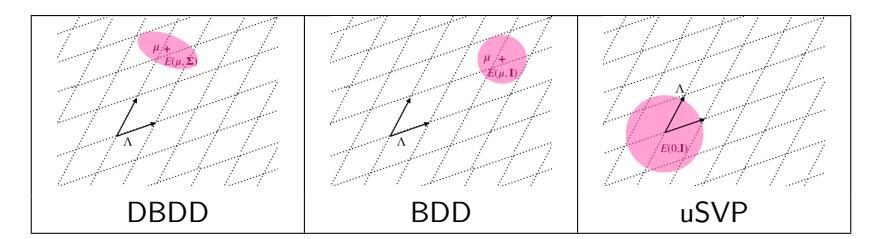
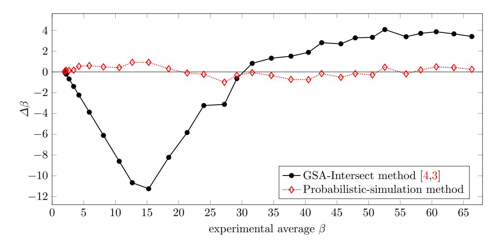
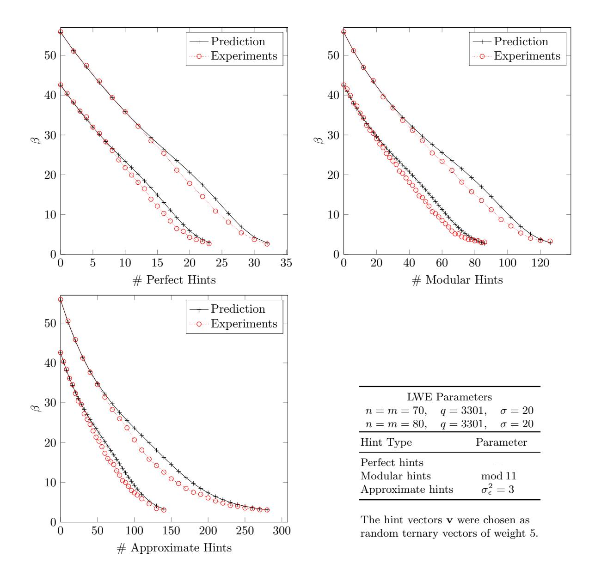
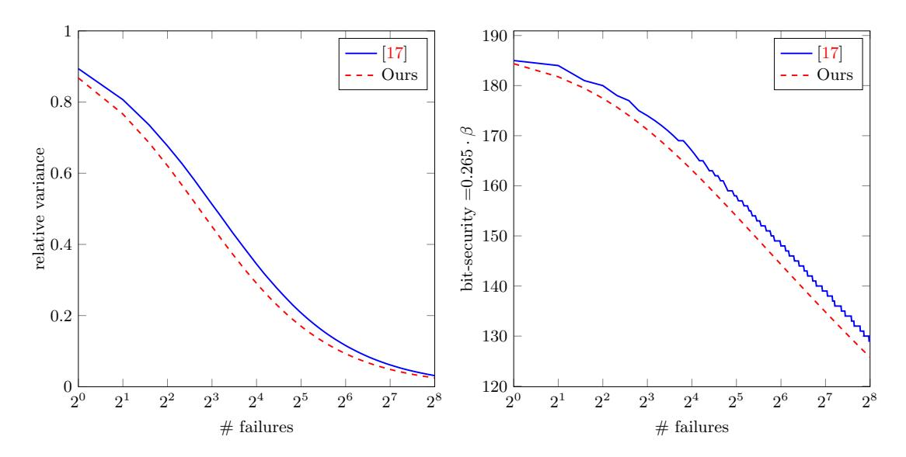

# LWE with Side Information: Attacks and Concrete Security Estimation?

Dana Dachman-Soled<sup>1</sup> and L´eo Ducas<sup>2</sup> and Huijing Gong<sup>1</sup> and M´elissa Rossi3,4,5,<sup>6</sup>

<sup>1</sup> University of Maryland, College Park, USA danadach@ece.umd.edu gong@cs.umd.edu <sup>2</sup> CWI, Amsterdam, The Netherlands <sup>3</sup> ANSSI, Paris, France <sup>4</sup> ENS Paris, CNRS, PSL University, Paris, France <sup>5</sup> Thales, Gennevilliers, France 6 INRIA, Paris, France melissa.rossi@ens.fr

Abstract. We propose a framework for cryptanalysis of lattice-based schemes, when side information in the form of "hints"— about the secret and/or error is available. Our framework generalizes the so-called primal lattice reduction attack, and allows the progressive integration of hints before running a final lattice reduction step. Our techniques for integrating hints include sparsifying the lattice, projecting onto and intersecting with hyperplanes, and/or altering the distribution of the secret vector. Our main contribution is to propose a toolbox and a methodology to integrate such hints into lattice reduction attacks and to predict the performance of those lattice attacks with side information.

While initially designed for side-channel information, our framework can also be used in other cases: exploiting decryption failures, or simply exploiting constraints imposed by certain schemes (LAC, Round5, NTRU).

We implement a Sage 9.0 toolkit to actually mount such attacks with hints when computationally feasible, and to predict their performances on larger instances. We provide several end-to-end application examples, such as an improvement of a single trace attack on Frodo by Bos et al (SAC 2018). In particular, our work can estimates security loss even given very little side information, leading to a smooth measurement/computation trade-off for side-channel attacks.

Keywords: LWE, NTRU, Lattice reduction, Cryptanalysis, Side-channels analysis, decryption failures.

## <span id="page-0-0"></span>1 Introduction

A large effort is currently underway to replace standardized public key cryptosystems, which are quantum-insecure, with newly developed "post-quantum" cryptosystems, conjectured to be secure against quantum attack. Lattice-based cryptography has been widely recognized as a foremost candidate for practical, post-quantum security and accordingly, a large effort has been made to develop and analyze lattice-based cryptosystems. The ongoing standardization process and anticipated deployment of lattice-based cryptography raises an important question: How resilient are lattices to side-channel attacks or other forms of side information? While there are numerous works addressing this question for specific cryptosystems (See [\[2,](#page-28-0)[22,](#page-29-0)[23,](#page-29-1)[40,](#page-30-0)[39,](#page-29-2)[11\]](#page-28-1) for

<sup>?</sup> The research of L. Ducas and M. Rossi was supported by the European Union's H2020 Programme under PROMETHEUS project (grant 780701). The research of M. Rossi was also supported by ANRT under the programs CIFRE N 2016/1583. It was also supported by the French Programme d'Investissement d'Avenir under national project RISQ P14158. The research of D. Dachman-Soled and H. Gong was supported in part by NSF grants #CNS-1933033, #CNS-1840893, #CNS-1453045 (CAREER), by a research partnership award from Cisco and by financial assistance award 70NANB15H328 and 70NANB19H126 from the U.S. Department of Commerce, National Institute of Standards and Technology.

$$\mathsf{LWE}/\mathsf{BDD} \xrightarrow{\mathrm{Kannan}} \mathsf{uSVP}_{A'} \xrightarrow{\mathsf{Sec 3.4}} \xrightarrow{\mathrm{Lattice}}$$

<span id="page-1-0"></span>Fig. 1. Primal attack without hints (prior art).

side channel attacks targeting lattice-based NIST candidates), these works use rather ad-hoc methods to reconstruct the secret key, requiring new techniques and algorithms to be developed for each setting. For example, the work of [\[11\]](#page-28-1) uses brute-force methods for a portion of the attack, while [\[9\]](#page-28-2) exploits linear regression techniques. Moreover, ad-hoc methods do not allow (1) to take advantage of decades worth of research and (2) optimization of standard lattice attacks. Second, most of the side-channel attacks from prior work consider substantial amounts of information leakage and show that it leads to feasible recovery of the entire key, whereas one may be interested in more precise tradeoffs in terms of information leakage versus concrete security of the scheme. The above motivates the focus of this work: Can one integrate side information into a standard lattice attack, and if so, by how much does the information reduce the cost of this attack? Given that side-channel resistance is the next step toward the technological readiness of lattice-based cryptography, and that we expect numerous works in this growing area, we believe that a general framework and a prediction software are in order.

Contributions. First, we propose a framework that generalizes the so-called primal lattice reduction attack, and allows the progressive integration of "hints" (i.e. side information that takes one of several forms) before running the final lattice reduction step. This contribution is summarized in Figures [1](#page-1-0) and [2](#page-2-0) and developed in Section [3.](#page-6-0)

Second, we implement a Sage 9.0 toolkit to actually mount such attacks with hints when computationally feasible, and to predict their performance on larger instances. Our predictions are validated by extensive experiments. Our tool and these experiments are described in Section [5.](#page-18-0) Our toolkit is open-source, available at: <https://github.com/lducas/leaky-LWE-Estimator>.

Third, we demonstrate the usefulness of our framework and tool via three example applications. Our main example (Section [6.1\)](#page-19-0) revisits the side channel information obtained from the first side-channel attack of [\[11\]](#page-28-1) against Frodo. In that article, it was concluded that a divideand-conquer side-channel template attack would not lead to a meaningful attack using standard combinatorial search for reconstruction of the secret. Our technique allows to integrate this sidechannel information into lattice attacks, and to predict the exact security drop. For example, the CCS2 parameter set very conservatively aims for 128-bits of post-quantum security (or 448 "bikz" as defined in Section [3.4\)](#page-10-0); but after the leakage of [\[11\]](#page-28-1) we predict that its security drops to 29 "bikz", i.e. that it can be broken with BKZ-29, a computation that should be more than feasible, but would require a dedicated re-implementation of our framework.

Interestingly, we note that our framework is not only useful in the side-channel scenario; we are for example also able to model decryption failures as hints fitting our framework. This allows us to reproduce some predictions from [\[17\]](#page-29-3). This is discussed in Section [6.2.](#page-24-0)

Perhaps more surprisingly, we also find a novel improvement to attack a few schemes (LAC [\[31\]](#page-29-4), Round5 [\[21\]](#page-29-5), NTRU [\[43\]](#page-30-1)) without any side-channel or oracle queries. Indeed, such schemes use ternary distribution for secrets, with a prescribed numbers of 1 and −1: this hint fits our framework, and lead to a (very) minor improvement, discussed in Section [6.3.](#page-26-0)

Lastly, our framework also encompasses and streamlines existing tweaks of the primal attack: the choice of ignoring certain LWE equations to optimize the volume-dimension trade-off, as well as the re-centering [\[37\]](#page-29-6) and isotropization [\[25,](#page-29-7)[14\]](#page-29-8) accounting for potential a-priori distortions of the secret. It also implicitly solves the question of the optimal choice of the coefficient for Kan-

```
\begin{array}{c} \mathsf{LWE}/\mathsf{BDD} \xrightarrow{\mathsf{Sec 3.2}} \mathsf{DBDD}_{\Lambda_0, \Sigma_0, \mu_0} \\ \mathsf{Sec 4} \middle\downarrow \mathsf{Hint} \\ \mathsf{DBDD}_{\Lambda_1, \Sigma_1, \mu_1} \\ \vdots \\ \mathsf{Sec 4} \middle\downarrow \mathsf{Hint} \\ \mathsf{DBDD}_{\Lambda_h, \Sigma_h, \mu_h} \xrightarrow{\mathsf{Sec 3.3}} \mathsf{uSVP}_{\Lambda'} \xrightarrow{\mathsf{Sec 3.4}} \begin{array}{c} \mathsf{Lattice} \\ \mathsf{reduction} \end{array}
```

<span id="page-2-0"></span>Fig. 2. The primal attack with hints (our work).

nan's Embedding from the Bounded Distance Decoding problem (BDD) to the unique Shortest Vector Problem (uSVP) [27] (See Remark 24).

As a side contribution, we also propose in Section 3.4 a refined method to estimate the required blocksize to solve an LWE/BDD/uSVP instance. This refinement was motivated by the inaccuracy of the standard method from the literature [3,4] in experimentally reachable blocksizes, which was making the validation of our contribution difficult. While experimentally much more accurate, this new methodology certainly deserves further scrutiny.

**Technical overview.** Our work is based on a generalization of the Bounded Distance Decoding problem (BDD) to a Distorted version (DBDD), which allows to account for the potentially non-spherical covariance of the secret vector to be found.

Each hint will affect the lattice itself, the mean and/or the covariance parameter of the DBDD instance, making the problem easier (see Figure 2). At last, we make the distribution spherical again by applying a well-chosen linear transformation, reverting to a spherical BDD instance before running the attack. Thanks to the hints, this new instance will be easier than the initial one. Let us assume that  $\mathbf{v}$ , l, k and  $\sigma$  are parameters known by the attacker. Our framework can handle four types of hints on the secret  $\mathbf{s}$  or on the lattice  $\Lambda$ .

```
- Perfect hints: \langle \mathbf{s}, \mathbf{v} \rangle = l intersect the lattice with an hyperplane.

- Modular hints: \langle \mathbf{s}, \mathbf{v} \rangle = l \mod k sparsify the lattice.

- Approximate hints: \langle \mathbf{s}, \mathbf{v} \rangle = l + \epsilon_{\sigma} decrease the covariance of the secret.

- Short vector hints: \mathbf{v} \in \Lambda project orthogonally to \mathbf{v}.
```

While the first three hints are clear wins for the performance of lattice attacks, the last one is a trade-off between the dimension and the volume of the lattice. This last type of hint is in fact meant to generalize the standard trick consisting of 'ignoring' certain LWE equations; ignoring such an equation can be interpreted geometrically as such a projection orthogonally to a so-called q-vector.

All the transformations of the lattice above can be computed in polynomial time. However, computing with general distribution in large dimension is not possible; we restrict our study to the case of Gaussian distributions of arbitrary covariance, for which such computations are also poly-time.

Some of these transformations remain quite expensive, in particular because they involve rational numbers with very large denominators, and it remains rather impractical to run them on cryptographic-grade instances. Fortunately, up to a necessary hypothesis of primitivity of the vector  $\mathbf{v}$  (with respect to either  $\Lambda$  or its dual depending on the type of hint), we can also predict the effect of each hint on the lattice parameters, and therefore run faster predictions of the attack cost.

From Leaks to Hints. At first, it may not be so clear that the types of hints above are so useful in realistic applications, in particular since they need to be linear on the secret. Of course our framework can handle rather trivial hints such as the perfect leak of a secret coefficient s<sup>i</sup> = l. Slightly less trivial is the case where the only the low-order bits leaks, a hint of the form s<sup>i</sup> = l mod 2.

We note that most of the computations done during an LWE decryption are linear: leaking any intermediate register during a matrix vector product leads to a hint of the same form (possibly modq). Similarly, the leak of a NTT coefficient of a secret in a Ring/Module variant can also be viewed as such.

Admittedly, such ideal leaks of a full register are not the typical scenario and leaks are typically not linear on the content of the register. However, such non-linearities can be handled by approximate hints. For instance, let s<sup>0</sup> be a secret coefficient (represented by a signed 16-bits integer), whose a priori distribution is supported by {−5, . . . , 5}. Consider the case where we learn the Hamming weight of s0, say H(s0) = 2. Then, we can narrow down the possibilities to s<sup>0</sup> ∈ {3, 5}. This leads to two hints:

```
– a modular hint: s0 = 1 mod 2,
```

– an approximate hint: s<sup>0</sup> = 4 + 1, where <sup>1</sup> has variance 1.

While closer to a realistic scenario, the above example remains rather simplified. A detailed example of how realistic leaks can be integrated as hint will be given in Section [6.1,](#page-19-0) based on the leakage data from [\[11\]](#page-28-1).

## Acknowlegments.

The authors would like to thank Marco Martinoli and his co-authors [\[11\]](#page-28-1) for sharing their source code. We express our gratitude to Jan-Pieter D'anvers for sharing precious insights and intuitions, guiding toward the proper formalization of decryption failures as approximate hints. We also thank John Schanck for valuable references and discussions that lead to refinements of the section on NTRU. We are also grateful to Martin Albrecht, Henri Gilbert, Ange Martinelli, Thomas Prest and Thibauld Feneuil and to the anonymous CRYPTO'2020 reviewers for valuable feedback on a preliminary version of this work.

## 2 Preliminaries

#### <span id="page-3-1"></span>2.1 Linear Algebra

We use bold lower case letters to denote vectors, and bold upper case letters to denote matrices. We use row notations for vectors, and start indexing from 0. Let I<sup>d</sup> denote the d-dimensional identity matrix. Let h·, ·i denote the inner product of two vectors of the same size. Let us introduce the row span of a matrix (denoted Span(·)) as the subspace generated by all R-linear combinations of the rows of its input.

Definition 1 (Positive Semidefinite). A n×n symmetric real matrix M is positive semidefinite if scalar xMx<sup>T</sup> ≥ 0 for all x ∈ R n ; if so we write M ≥ 0. Given two n × n real matrix A and B, we note A ≥ B if A − B is positive semidefinite.

<span id="page-3-0"></span>Definition 2. A matrix <sup>M</sup> is a square root of <sup>Σ</sup>, denoted <sup>√</sup> Σ, if

$$\mathbf{M}^T \cdot \mathbf{M} = \mathbf{\Sigma},$$

Our techniques involve keeping track of the covariance matrix  $\Sigma$  of the secret and error vectors as hints are progressively integrated. The covariance matrix may become singular during this process and will not have an inverse. Therefore, in the following we introduce some degenerate notions for the inverse and the determinant of a square matrix. Essentially, we restrict these notions to the row span of their input. For  $\mathbf{X} \in \mathbb{R}^{d \times k}$  (with any  $d, k \in \mathbb{N}$ ), we will denote  $\mathbf{\Pi}_{\mathbf{X}}$  the orthogonal projection matrix onto  $\mathrm{Span}(\mathbf{X})$ . More formally, let  $\mathbf{Y}$  be a maximal set of independent row-vectors of  $\mathbf{X}$ ; the orthogonal projection matrix is given by  $\mathbf{\Pi}_{\mathbf{X}} = \mathbf{Y}^T \cdot (\mathbf{Y} \cdot \mathbf{Y}^T)^{-1} \cdot \mathbf{Y}$ . Its complement (the projection orthogonally to  $\mathrm{Span}(\mathbf{X})$ ) is denoted  $\mathbf{\Pi}_{\mathbf{X}}^{\perp} := \mathbf{I}_d - \mathbf{\Pi}_{\mathbf{X}}$ . We naturally extend the notation  $\mathbf{\Pi}_F$  and  $\mathbf{\Pi}_F^{\perp}$  to subspaces  $F \subset \mathbb{R}^d$ . By definition, the projection matrices satisfy  $\mathbf{\Pi}_F^2 = \mathbf{\Pi}_F$ ,  $\mathbf{\Pi}_F^T = \mathbf{\Pi}_F$  and  $\mathbf{\Pi}_F \cdot \mathbf{\Pi}_F^{\perp} = \mathbf{\Pi}_F \cdot \mathbf{\Pi}_F = \mathbf{0}$ .

<span id="page-4-0"></span>Definition 3 (Restricted inverse and determinant). Let  $\Sigma$  be a symmetric matrix. We define a restricted inverse denoted  $\Sigma^{\sim}$  as

$$\mathbf{\Sigma}^{\sim} := (\mathbf{\Sigma} + \mathbf{\Pi}_{\mathbf{\Sigma}}^{\perp})^{-1} - \mathbf{\Pi}_{\mathbf{\Sigma}}^{\perp}.$$

It satisfies  $\operatorname{Span}(\Sigma^{\sim}) = \operatorname{Span}(\Sigma)$  and  $\Sigma \cdot \Sigma^{\sim} = \Pi_{\Sigma}$ .

We also denote  $rdet(\Sigma)$  as the restricted determinant defined as follows.

$$\operatorname{rdet}(\mathbf{\Sigma}) := \det(\mathbf{\Sigma} + \mathbf{\Pi}_{\mathbf{\Sigma}}^{\perp}).$$

The idea behind Definition 3 is to provide an (artificial) invertibility property to the input  $\Sigma$  by adding the missing orthogonal part and to remove it afterwards. For example, if  $\Sigma = \begin{bmatrix} \mathbf{A} & 0 \\ 0 & 0 \end{bmatrix}$  where  $\mathbf{A}$  is invertible,

$$\boldsymbol{\Sigma}^{\sim} = \left( \begin{bmatrix} \mathbf{A} & 0 \\ 0 & 0 \end{bmatrix} + \begin{bmatrix} 0 & 0 \\ 0 & 1 \end{bmatrix} \right)^{-1} - \begin{bmatrix} 0 & 0 \\ 0 & 1 \end{bmatrix} = \begin{bmatrix} \mathbf{A}^{-1} & 0 \\ 0 & 0 \end{bmatrix} \text{ and } \operatorname{rdet} \boldsymbol{\Sigma} = \operatorname{det}(\mathbf{A}).$$

#### 2.2 Statistics

Random variables, i.e. variables whose values depend on outcomes of a random phenomenon, are denoted in lowercase calligraphic letters e.g. a, b, e. Random vectors are denoted in uppercase calligraphic letters e.g. C, X, Z.

Before hints are integrated, we will assume that the secret and error vectors follow a multidimensional normal (Gaussian) distribution. Hints will typically correspond to learning a (noisy, modular or perfect) linear equation on the secret. We must then consider the altered distribution on the secret, conditioned on this information. Fortunately, this will also be a multidimensional normal distribution with an altered covariance and mean. In the following, we present the precise formulae for the covariance and mean of these conditional distributions.

**Definition 4 (Multidimensional normal distribution).** Let  $d \in \mathbb{Z}$ , for  $\mu \in \mathbb{Z}^d$  and  $\Sigma$  being a symmetric matrix of dimension  $d \times d$ , we denote by  $D^d_{\Sigma,\mu}$  the multidimensional normal distribution supported by  $\mu + \operatorname{Span}(\Sigma)$  by the following

$$\mathbf{x} \mapsto \frac{1}{\sqrt{(2\pi)^{\mathrm{rank}(\mathbf{\Sigma})} \cdot \mathrm{rdet}(\mathbf{\Sigma})}} \exp\left(-\frac{1}{2}(\mathbf{x} - \boldsymbol{\mu}) \cdot \mathbf{\Sigma}^{\sim} \cdot (\mathbf{x} - \boldsymbol{\mu})^{T}\right).$$

The following states how a normal distribution is altered under linear transformation.

**Lemma 5.** Suppose X has a  $D^d_{\Sigma,\mu}$  distribution. Let  $\mathbf{A}$  be a  $n \times d$  matrix. Then  $X\mathbf{A}^T$  has a  $D^n_{\mathbf{A}\Sigma\mathbf{A}^T,\mu\mathbf{A}^T}$  distribution.

Lemma 6 shows the altered distribution of a normal random variable conditioned on its noisy linear transformation value, following from [30, Equations (6) and (7)].

<span id="page-5-0"></span>**Lemma 6 (Conditional distribution**  $X|X\mathbf{A}^T + \mathbf{b}$  from [30]). Suppose that  $X \in \mathbb{Z}^d$  has a  $D^d_{\mathbf{\Sigma}, \boldsymbol{\mu}}$  distribution, and  $\mathbf{b} \in \mathbb{Z}^n$  has a  $D^n_{\mathbf{\Sigma}_{\boldsymbol{b}}, \mathbf{0}}$  distribution. Let us fix  $\mathbf{A}$  as a  $n \times d$  matrix and  $\mathbf{z} \in \mathbb{Z}^n$ . The conditional distribution of  $X \mid (X\mathbf{A}^T + \mathbf{b} = \mathbf{z})$  is  $D^d_{\mathbf{\Sigma}', \boldsymbol{\mu}'}$ , where

$$\mu' = \mu + (\mathbf{z} - \mu \mathbf{A}^T)(\mathbf{A} \mathbf{\Sigma} \mathbf{A}^T + \mathbf{\Sigma}_{\theta})^{-1} \mathbf{A} \mathbf{\Sigma}$$
$$\mathbf{\Sigma}' = \mathbf{\Sigma} - \mathbf{\Sigma} \mathbf{A}^T (\mathbf{A} \mathbf{\Sigma} \mathbf{A}^T + \mathbf{\Sigma}_{\theta})^{-1} \mathbf{A} \mathbf{\Sigma}.$$

<span id="page-5-1"></span>Corollary 7 (Conditional distribution  $X|\langle X, \mathbf{v} \rangle + e$ ). Suppose that  $X \in \mathbb{Z}^d$  has a  $D^d_{\Sigma, \mu}$  distribution and e has a  $D^1_{\sigma^2_e, 0}$  distribution. Let us fix  $\mathbf{v} \in \mathbb{R}^d$  as a nonzero vector and  $z \in \mathbb{Z}$ . We define the following scalars:

$$y = \langle X, \mathbf{v} \rangle + e$$
,  $\mu_2 = \langle \mathbf{v}, \boldsymbol{\mu} \rangle$  and  $\sigma_2 = \mathbf{v} \boldsymbol{\Sigma} \mathbf{v}^T + \sigma_e^2$ 

If  $\sigma_2 \neq 0$ , the conditional distribution of  $X \mid (y = z)$  is  $D^d_{\Sigma',\mu'}$ , where

$$\mu' = \mu + \frac{(z - \mu_2)}{\sigma_2} \mathbf{v} \mathbf{\Sigma}, \qquad \mathbf{\Sigma}' = \mathbf{\Sigma} - \frac{\mathbf{\Sigma} \mathbf{v}^T \mathbf{v} \mathbf{\Sigma}}{\sigma_2}.$$
 (1)

If  $\sigma_2 = 0$ , the conditional distribution of  $X \mid (y = z)$  is  $D^d_{\Sigma,\mu}$ .

Remark 8. We note that Corollary 7 is also useful to describe for  $X|\langle X, \mathbf{v} \rangle$  by letting  $\sigma_{\ell} = 0$ .

#### 2.3 Lattices

A lattice, denoted as  $\Lambda$ , is a discrete additive subgroup of  $\mathbb{R}^m$ , which is generated as the set of all linear integer combinations of n  $(m \geq n)$  linearly independent basis vectors  $\{\mathbf{b}_j\} \subset \mathbb{R}^m$ , namely,

$$\Lambda := \left\{ \sum_{j} z_j \mathbf{b}_j : z_j \in \mathbb{Z} \right\},$$

We say that m is the dimension of  $\Lambda$  and n is its rank. A lattice is full rank if n=m. A matrix  $\mathbf{B}$  having the basis vectors as rows is called a basis. The volume of a lattice  $\Lambda$  is defined as  $\operatorname{Vol}(\Lambda) := \sqrt{\det(\mathbf{B}\mathbf{B}^T)}$ . The dual lattice of  $\Lambda$  in  $\mathbb{R}^n$  is defined as follows.

$$\Lambda^* := \{ \mathbf{y} \in \mathrm{Span}(\mathbf{B}) \mid \forall \mathbf{x} \in \Lambda, \langle \mathbf{x}, \mathbf{y} \rangle \in \mathbb{Z} \}.$$

Note that,  $(\Lambda^*)^* = \Lambda$ , and  $Vol(\Lambda^*) = 1/Vol(\Lambda)$ .

<span id="page-5-2"></span>**Lemma 9 ([32, Proposition 1.3.4]).** Let  $\Lambda$  be a lattice and let F be a subspace of  $\mathbb{R}^n$ . If  $\Lambda \cap F$  is a lattice, then the dual of  $\Lambda \cap F$  is the orthogonal projection onto F of the dual of  $\Lambda$ . In other words, each element of  $\Lambda^*$  is multiplied by the projection matrix  $\Pi_F$ :

$$(\Lambda \cap F)^* = \Lambda^* \cdot \mathbf{\Pi}_F.$$

<span id="page-5-4"></span><span id="page-5-3"></span>**Lemma 10 ([32, Proposition 1.2.9]).** Let  $\Lambda$  be a lattice in  $\mathbb{R}^n$ , let F be a subspace of  $\mathbb{R}^n$  such that  $\Lambda \cap F$  is a lattice and let  $\Pi_F^{\perp}$  be the orthogonal projection onto  $F^{\perp}$ . Then

$$\operatorname{Vol}(\Lambda \cdot \Pi_F^{\perp}) = \operatorname{Vol}(\Lambda)(\operatorname{Vol}(\Lambda \cap F)^{-1}).$$

Definition 11 (Primitive vectors). A set of vector y1, . . . , y<sup>k</sup> ∈ Λ is said primitive with respect to Λ if Λ ∩ Span(y1, . . . , yk) is equal to the lattice generated by y1, . . . , yk. Equivalently, it is primitive if it can be extended to a basis of Λ. If k = 1, y1, this is equivalent to y1/i 6∈ Λ for any integer i ≥ 2.

To predict the hardness of the lattice reduction on altered instances, we must compute the volume of the final transformed lattice. We devise a highly efficient way to do this, by observing that each time a hint is integrated, we can update the volume of the transformed lattice, given only the volume of the previous lattice and information about the current hint (under mild restrictions on the form of the hint).

<span id="page-6-5"></span>Lemma 12 (Volume of a lattice slice). Given a lattice Λ with volume Vol(Λ), and a primitive vector v with respect to Λ ∗ . Let v <sup>⊥</sup> denote subspace orthogonal to v. Then Λ ∩ v <sup>⊥</sup> is a lattice with volume Vol(Λ ∩ v <sup>⊥</sup>) = kvk · Vol(Λ).

Proof. Let us denote Λ <sup>0</sup> = (Λ ∩ v <sup>⊥</sup>) = {x ∈ Λ | hx, vi = 0}. We now compute Vol(Λ 0 ) as follows

$$Vol(\Lambda') = \frac{1}{Vol(\Lambda'^*)} = \frac{1}{Vol(\Lambda^* \cdot \mathbf{\Pi}_{\mathbf{v}}^{\perp})}$$
 (2)

<span id="page-6-2"></span><span id="page-6-1"></span>
$$= \frac{\operatorname{Vol}(\Lambda^* \cap \operatorname{Span}(\mathbf{v}))}{\operatorname{Vol}(\Lambda^*)}$$
$$= \operatorname{Vol}(\Lambda^* \cap \operatorname{Span}(\mathbf{v})) \operatorname{Vol}(\Lambda),$$
 (3)

where Equation [\(2\)](#page-6-1) follows from Lemma [9,](#page-5-2) and Equation [\(3\)](#page-6-2) follows from Lemma [10.](#page-5-3) By Definition [11,](#page-5-4) v generates the one-dimensional lattice Λ <sup>∗</sup> ∩ Span(v), and Vol(Λ <sup>∗</sup> ∩ Span(v)) = kvk. Therefore we have Vol(Λ 0 ) = kvk · Vol(Λ).

<span id="page-6-6"></span>Lemma 13 (Volume of a sparsified lattice). Let Λ be a lattice, v ∈ Λ ∗ be a primitive vector of Λ ∗ , and k > 0 be an integer. Let Λ <sup>0</sup> = {x ∈ Λ | hx, vi = 0 mod k} be a sublattice of Λ. Then Vol(Λ 0 ) = k · Vol(Λ).

Proof. Because v¯ is a dual vector of Λ, we have hv¯, Λi ⊂ Z. Let ` be such that, hv¯, Λi = `Z. Note that v¯/` ∈ Λ ∗ , therefore, by primitivity of v¯, we have ` = 1. In particular, the group morphism φ : x ∈ Λ 7→ hx, v¯i mod k is surjective. Note that Λ <sup>0</sup> = ker φ, therefore we have |Λ/Λ<sup>0</sup> | = |Zk| = k. We conclude.

<span id="page-6-7"></span>Fact 14 (Volume of a projected lattice) Let Λ be a lattice, v ∈ Λ be a primitive vector of Λ. Let Λ <sup>0</sup> = Λ · Π<sup>⊥</sup> v be a sublattice of Λ. Then Vol(Λ 0 ) = Vol(Λ)/kvk. More generally, if V is a primitive set of vectors of Λ, then Λ <sup>0</sup> = Λ · Π<sup>⊥</sup> <sup>V</sup> has volume Vol(Λ 0 ) = Vol(Λ)/ p det(VV<sup>T</sup> ).

<span id="page-6-4"></span>Fact 15 (Lattice volume under linear transformations) Let Λ be a lattice in R n , and M ∈ R <sup>n</sup>×<sup>n</sup> a matrix such that kerM = Span(Λ) <sup>⊥</sup>. Then we have Vol(Λ · M) = rdet(M) Vol(Λ).

# <span id="page-6-0"></span>3 Distorted Bounded Distance Decoding

#### 3.1 Definition

<span id="page-6-3"></span>We first recall the definition of the (search) LWE problem, in its short-secret variant which is the most relevant to practical LWE-based encryption.

Definition 16 (Search LWE problem with short secrets.). Let n, m and q be positive integers, and let χ be a distribution over Z. The search LWE problem (with short secrets) for parameters (n, m, q, χ) is:

Given the pair  $(\mathbf{A} \in \mathbb{Z}_q^{m \times n}, \mathbf{b} = \mathbf{z} \mathbf{A}^T + \mathbf{e} \in \mathbb{Z}_q^m)$  where:

- A ∈ Z<sub>q</sub><sup>m×n</sup> is sampled uniformly at random,
   z ← χ<sup>n</sup>, and e ← χ<sup>m</sup> are sampled with independent and identically distributed coefficients following the distribution  $\chi$ .

Find z.

The primal attack (See for example [3]) against (search)-LWE proceeds by viewing the LWE instance as an instance of a Bounded Distance Decoding (BDD) problem, converting it to a uSVP instance (via Kannan's embedding [27]), and finally applying a lattice reduction algorithm to solve the uSVP instance. The central tool of our framework is a generalization of BDD that accounts for potential distortion in the distribution of the secret noise vector that is to be recovered.

Remark 17 (Adaptation to the dual attack). In principle, our techniques could be adapted to the dual attack as well. We focus on only one for conciseness, and the primal attack appears more pertinent and more convenient. Indeed, the dual attack is very rarely better than the primal one [1], and this despite making more simplifications in favor of the attacker. Furthermore, the dual attack has not been the object of experimental verification studies, unlike the primal one. Finally, the cost of the dual attack is not necessarily independent of the underlying SVPalgorithm: Some analyses, for example, exploit the fact that the Sieving algorithm outputs many short vectors rather than one.

<span id="page-7-0"></span>Definition 18 (Distorted Bounded Distance Decoding problem). Let  $\Lambda \subset \mathbb{R}^d$  be a lattice,  $\Sigma \in \mathbb{R}^{d \times d}$  be a symmetric matrix and  $\mu \in \text{Span}(\Lambda) \subset \mathbb{R}^{\overline{d}}$  such that

<span id="page-7-1"></span>
$$\operatorname{Span}(\mathbf{\Sigma}) \subsetneq \operatorname{Span}(\mathbf{\Sigma} + \boldsymbol{\mu}^T \cdot \boldsymbol{\mu}) = \operatorname{Span}(\Lambda). \tag{4}$$

The Distorted Bounded Distance Decoding problem  $\mathsf{DBDD}_{\Lambda,\mu,\Sigma}$  is the following problem:

Given  $\mu, \Sigma$  and a basis of  $\Lambda$ . **Find** the unique vector  $\mathbf{x} \in \Lambda \cap E(\boldsymbol{\mu}, \boldsymbol{\Sigma})$ 

where  $E(\mu, \Sigma)$  denotes the ellipsoid

$$E(\boldsymbol{\mu},\boldsymbol{\Sigma}) := \{\mathbf{x} \in \boldsymbol{\mu} + \operatorname{Span}(\boldsymbol{\Sigma}) | (\mathbf{x} - \boldsymbol{\mu}) \cdot \boldsymbol{\Sigma}^{\sim} \cdot (\mathbf{x} - \boldsymbol{\mu})^T \leq \operatorname{rank}(\boldsymbol{\Sigma}) \}.$$

We will refer to the triple  $\mathcal{I} = (\Lambda, \mu, \Sigma)$  as the instance of the DBDD<sub> $\Lambda, \mu, \Sigma$ </sub> problem.

Intuitively, Definition 18 corresponds to knowing that the secret vector  $\mathbf{x}$  to be recovered follows a distribution of variance  $\Sigma$  and average  $\mu$ . The quantity  $(\mathbf{x} - \mu) \cdot \Sigma^{\sim} \cdot (\mathbf{x} - \mu)^T$  can be interpreted as a non-canonical Euclidean squared distance  $\|\mathbf{x} - \boldsymbol{\mu}\|_{\Sigma}^2$ , and the expected value of such a distance for a Gaussian  ${\bf x}$  of variance  ${\bf \Sigma}$  and average  ${\bf \mu}$  is rank( ${\bf \Sigma}$ ). One can argue that, for such a Gaussian, there is a constant probability that  $\|\mathbf{x} - \boldsymbol{\mu}\|_{\Sigma}^2$  is slightly greater than  $\operatorname{rank}(\Sigma)$ . Since we are interested in the average behavior of our attack, we ignore this benign technical detail. In fact, we will typically interpret DBDD as the promise that the secret follows a Gaussian distribution of center  $\mu$  and covariance  $\Sigma$ .

<span id="page-7-2"></span>The ellipsoid can be seen as an affine transformation (that we call "distortion") of the centered hyperball of radius rank( $\Sigma$ ). Let us introduce a notation for the hyperball; for any  $d \in \mathbb{N}$ 

$$B_d := \{ \mathbf{x} \in \mathbb{R}^d \mid ||\mathbf{x}||_2 \le d \}. \tag{5}$$



**Fig. 3.** Graphical intuition of DBDD, BDD and uSVP in dimension two: the problem consists in finding a nonzero element of  $\Lambda$  in the colored zone. The identity hyperball is larger for uSVP to represent the fact that, during the reduction, the uSVP lattice has one dimension more than for BDD.

<span id="page-8-1"></span>One can thus write using Definition 2:

<span id="page-8-2"></span>
$$E(\boldsymbol{\mu}, \boldsymbol{\Sigma}) = B_{\text{rank}(\boldsymbol{\Sigma})} \cdot \sqrt{\boldsymbol{\Sigma}} + \boldsymbol{\mu}.$$
 (6)

From the Span inclusion in Equation (4), one can deduce that the condition is equivalent to requiring  $\boldsymbol{\mu} \notin \operatorname{Span}(\boldsymbol{\Sigma})$  and  $\operatorname{rank}(\boldsymbol{\Sigma} + \boldsymbol{\mu}^T \cdot \boldsymbol{\mu}) = \operatorname{rank}(\boldsymbol{\Sigma}) + 1 = \operatorname{rank}(\boldsymbol{\Lambda})$ . This technical detail is necessary for embedding it properly into a uSVP instance (See later in Section 3.3).

**Particular cases of Definition 18.** Let us temporarily ignore the condition in Equation (4) to study some particular cases. As shown in Figure 3, when  $\Sigma = \mathbf{I}_d$ ,  $\mathsf{DBDD}_{\Lambda, \boldsymbol{\mu}, \mathbf{I}_d}$  is  $\mathsf{BDD}$  instance. Indeed, the ellipsoid becomes a shifted hyperball  $E(\boldsymbol{\mu}, \mathbf{I}_d) = \{\mathbf{x} \in \boldsymbol{\mu} + \mathbb{R}^{d \times d} \mid \|\mathbf{x} - \boldsymbol{\mu}\|_2 \le d\} = B_d + \boldsymbol{\mu}$ . If in addition  $\boldsymbol{\mu} = 0$ ,  $\mathsf{DBDD}_{\Lambda, \mathbf{0}, \mathbf{I}_d}$  becomes a uSVP instance on  $\Lambda$ .

## <span id="page-8-0"></span>3.2 Embedding LWE into DBDD

In the typical primal attack framework (Figure 1), one directly views LWE as a BDD instance of the same dimension. For our purposes, however, it will be useful to apply Kannan's Embedding at this stage and therefore increase the dimension of the lattice by 1. While it could be delayed to the last stage of our attack, this extra fixed coefficient 1 will be particularly convenient when we integrate hints (see Remark 24 in Section 4). It should be noted that no information is lost through this transformation, since the parameters  $\mu$  and  $\Sigma$  allow us to encode the knowledge that the solution we are looking for has its last coefficient set to 1 and nothing else. In more details, the solution  $\mathbf{s} := (\mathbf{e}, \mathbf{z})$  of an LWE instance is extended to

<span id="page-8-3"></span>
$$\bar{\mathbf{s}} := (\mathbf{e}, \mathbf{z}, 1) \tag{7}$$

which is a short vector in the lattice  $\Lambda = \{(\mathbf{x}, \mathbf{y}, w) | \mathbf{x} + \mathbf{y}\mathbf{A}^{\mathrm{T}} - \mathbf{b}w = 0 \mod q \}$ . A basis of this lattice is given by the row vectors of

$$\begin{bmatrix} q\mathbf{I}_m & 0 & 0 \\ \mathbf{A}^{\mathrm{T}} & -\mathbf{I}_n & 0 \\ \mathbf{b} & 0 & 1 \end{bmatrix}.$$

Denoting  $\mu_{\chi}$  and  $\sigma_{\chi}^2$  the average and variance of the LWE distribution  $\chi$  (See Definition 16), we can convert this LWE instance to a  $\mathsf{DBDD}_{\Lambda,\mu,\Sigma}$  instance with  $\mu = [\mu_{\chi} \cdots \mu_{\chi} \ 1]$  and  $\Sigma = \begin{bmatrix} \sigma_{\chi}^2 \mathbf{I}_{m+n} \ 0 \\ 0 & 0 \end{bmatrix}$ . The lattice  $\Lambda$  is of full rank in  $\mathbb{R}^d$  where d := m+n+1, and its volume is  $q^m$ . Note that the rank of  $\Sigma$  is only d-1: the ellipsoid has one less dimension than the lattice. It then validates the requirement of Equation (4).

Remark 19. Typically, Kannan's embedding from BDD to uSVP leaves the bottom right matrix coefficient as a free parameter, say c, to be chosen optimally. The optimal value is the one maximizing

$$\frac{\|(\mathbf{z};c)\|}{\det(\varLambda)^{1/d}} = \frac{(m+n)\sigma_{\chi} + c}{(c \cdot q^m)^{1/d}},$$

namely,  $c = \sigma_{\chi}$  according to the arithmetic-geometric mean inequality. Some prior works [3,5] instead chose c = 1. While this is benign since  $\sigma_{\chi}$  is typically not too far from 1, it remains a sub-optimal choice. Looking ahead, in our DBDD framework, this choice becomes irrelevant thanks to the *isotropization* step introduced in the next section; we can therefore choose c = 1 without worwsening the attack.

## <span id="page-9-0"></span>3.3 Converting DBDD to uSVP

In this Section, we explain how a DBDD instance  $(\Lambda, \mu, \Sigma)$  is converted into a uSVP one. Two modifications are necessary. First, we need to homogeneize the problem. Let us show that the ellipsoid in Definition 18 is contained in a larger centered ellipsoid (with one more dimension) as follows:

$$E(\boldsymbol{\mu}, \boldsymbol{\Sigma}) \subset E(\mathbf{0}, \boldsymbol{\Sigma} + \boldsymbol{\mu}^T \cdot \boldsymbol{\mu}).$$
 (8)

<span id="page-9-1"></span>Using Equation (6), one can write

$$E(\boldsymbol{\mu}, \boldsymbol{\Sigma}) = B_{\text{rank}(\boldsymbol{\Sigma})} \cdot \sqrt{\boldsymbol{\Sigma}} + \boldsymbol{\mu} \subset B_{\text{rank}(\boldsymbol{\Sigma})} \cdot \sqrt{\boldsymbol{\Sigma}} \pm \boldsymbol{\mu},$$

where  $B_{\text{rank}(\Sigma)}$  is defined in Equation (5). And, with Equation (4), one can deduce  $\text{rank}(\Sigma + \mu^T \cdot \mu) = \text{rank}(\Sigma) + 1$ , then:

$$B_{\mathrm{rank}(\mathbf{\Sigma})} \cdot \sqrt{\mathbf{\Sigma}} \pm \boldsymbol{\mu} \subset B_{\mathrm{rank}(\mathbf{\Sigma})+1} \cdot \begin{bmatrix} \sqrt{\mathbf{\Sigma}} \\ \boldsymbol{\mu} \end{bmatrix}.$$

We apply Definition 2 which confirms the inclusion of Equation (8):

$$E(\boldsymbol{\mu}, \boldsymbol{\Sigma}) \subset B_{\mathrm{rank}(\boldsymbol{\Sigma})+1} \cdot \begin{bmatrix} \sqrt{\boldsymbol{\Sigma}} \\ \boldsymbol{\mu} \end{bmatrix} = E(\boldsymbol{0}, \boldsymbol{\Sigma} + \boldsymbol{\mu}^T \cdot \boldsymbol{\mu}).$$

Thus, we can homogenize and transform the instance into a centered one with  $\Sigma' := \Sigma + \mu^T \cdot \mu$ .

Secondly, to get an isotropic distribution (i.e. with all its eigenvalues being 1), one can just multiply every element of the lattice with the pseudoinverse of  $\sqrt{\Sigma'}$ . We get a new covariance matrix  $\Sigma'' = \sqrt{\Sigma'}^{\sim} \cdot \Sigma' \cdot \sqrt{\Sigma'}^{\sim T} = \Pi_{\Sigma'} \cdot \Pi_{\Sigma'}^{T}$ . And since  $\Pi_{\Sigma'} = \Pi_{\Sigma'}^{T}$  and  $\Pi_{\Sigma'}^{2} = \Pi_{\Sigma'}$  (see Section 2.1),  $\Sigma'' = \Pi_{\Sigma'} = \Pi_{\Lambda}$ , the last equality coming from Equation (4).

In summary, one must make by the two following changes:

homogenize: 
$$(\Lambda, \mu, \Sigma) \mapsto (\Lambda, \mathbf{0}, \Sigma' := \Sigma + \mu^T \cdot \mu)$$
  
isotropize:  $(\Lambda, \mathbf{0}, \Sigma') \mapsto (\Lambda \cdot \mathbf{M}, \mathbf{0}, \Pi_{\Lambda})$ 

where  $\mathbf{M} := (\sqrt{\Sigma'})^{\sim}$ . From the solution  $\mathbf{x}$  to the  $\mathsf{uSVP}_{\Lambda \cdot \mathbf{M}}$  problem, one can derive  $\mathbf{x'} = \mathbf{x}\mathbf{M}^{\sim}$  the solution to the  $\mathsf{DBDD}_{\Lambda,\mu,\Sigma}$  problem.

Remark 20. One may note that we could solve a DBDD instance without isotropization simply by including the ellipsoid in a larger ball, and directly apply lattice reduction before the second step. This leads, however, to less efficient attacks. One may also note that the first homogenization step "forgets" some information about the secret's distribution. This, however, is inherent to the conversion to a unique-SVP problem which is geometrically homogeneous, and is already present in the original primal attack.

### <span id="page-10-0"></span>3.4 Security estimates of uSVP: bikz versus bits

The attack on a uSVP instance consists of applying BKZ-β on the uSVP lattice Λ for an appropriate block size parameter β. The cost of the attack grows with β, however, modeling this cost precisely is at the moment rather delicate, as the state of the art seems to still be in motion. Numerous NIST candidates choose to underestimate this cost, keeping a margin to accommodate future improvements, and there seems to be no clear consensus on which model to use (see [\[1\]](#page-28-5) for a summary of existing cost models).

While this problem is orthogonal to our work, we still wish to be able to formulate quantitative security losses. We therefore express all concrete security estimates using the blocksize β as our measure of the level of security, and treat the latter as a measurement of the security level in a unit called the bikz. We thereby leave the question of the exact bikz-to-bit conversion estimate outside the scope of this paper, and recall that those conversion formulae are not necessarily linear, and may have small dependency in other parameters. For the sake of concreteness, we note that certain choose, for example, to claim 128 bits of security for 380 bikz, and in this range, most models suggest a security increase of one bit every 2 to 4 bikz.

Remark 21. We also clarify that the estimates given in this paper only concern the pure lattice attack via the uSVP embedding discussed above. In particular, we note that some NIST candidates with ternary secrets [\[31\]](#page-29-4) also consider the hybrid attack of [\[26\]](#page-29-12), which we ignore in this work. We nevertheless think that the compatibility with our framework is plausible, with some effort.

Predicting β from a uSVP instance The state-of-the-art predictions for solving uSVP instances using BKZ were given in [\[4](#page-28-4)[,3\]](#page-28-3). Namely, for Λ a lattice of dimension dim(Λ), it is predicted that BKZ-β can solve a uSVP<sup>Λ</sup> instance with secret s when

$$\sqrt{\beta/\dim(\Lambda)} \cdot \|\mathbf{s}\| \le \delta_{\beta}^{2\beta-\dim(\Lambda)-1} \cdot \operatorname{Vol}(\Lambda)^{1/\dim(\Lambda)}$$
(9)

where δ<sup>β</sup> is the so called root-Hermite-Factor of BKZ-β. For β ≥ 50, the Root-Hermite-Factor is predictable using the Gaussian Heuristic [\[13\]](#page-29-13):

$$\delta_{\beta} = \left( (\pi \beta)^{\frac{1}{\beta}} \cdot \frac{\beta}{2\pi e} \right)^{1/(2\beta - 2)}. \tag{10}$$

Note that the uSVP instances we generate are isotropic and centered so that the secret has covariance Σ = I (or Σ = Π<sup>Λ</sup> if Λ is not of full rank) and µ = 0. Thus, on average, we have ksk <sup>2</sup> = rank(Σ) = dim(Λ). Therefore, β can be estimated as the minimum integer that satisfies

$$\sqrt{\beta} \le \delta_{\beta}^{2\beta - \dim(\Lambda) - 1} \cdot \operatorname{Vol}(\Lambda)^{1/\dim(\Lambda)}. \tag{11}$$

While β must be an integer as a BKZ parameter, we nevertheless provide a continuous value, for a finer comparison of the difficulty of an instance. Below, we will call this method the "GSA-Intersect" method.

Remark 22. To predict security, one does not need the basis of Λ, but only its dimension and its volume. Similarly, it is not necessary to explicitly compute the isotropization matrix M of Section [3.3,](#page-9-0) thanks to Fact [15:](#page-6-4) Vol(Λ · M) = rdet(M) Vol(Λ) = rdet(Σ<sup>0</sup> ) <sup>−</sup>1/<sup>2</sup> Vol(Λ). These two shortcuts will allow us to efficiently make predictions for cryptographically large instances, in our lightweight implementation of Section [5.](#page-18-0)

Refined prediction for small blocksizes The work of [\[3\]](#page-28-3) warns about a regime where those predictions are not accurate, due to a so-called second-intersection between the predicted lengths of the Gram-Schmidt vectors and the successive projections of the secret. This phenomenon only appears for small blocksizes β, which is not relevant for cryptographically hard instances. However, we would still like to be able to make reliable predictions for small blocksizes as well, so as to test the validity of our predictions with and without hints.

Other sources of inaccuracy of this model are the so-called head and tails phenomenon [\[42,](#page-30-2)[6\]](#page-28-7), as well as the fact that one can be lucky: the projected length of the secret can vary, making it plausible that the secret will be found with a slightly smaller blocksize. For example, in [\[3\]](#page-28-3) more than 50% of the attacks were already successful by running BKZ with blocksize βpred − 5.

Furthermore, the predictions of [\[3\]](#page-28-3) work under the assumption that as soon as the projected secret vector has been detected at position d − β, it will be "pulled-back" to the front by the run of LLL that is typically executed between BKZ tours. For large block-sizes β this event is indeed very likely as argued and experimentally verified in [\[3\]](#page-28-3), but may not occur in small or intermediate dimension. In fact, the issue of double-intersection is precisely related to this assumption.

For experimental validation purposes of our work, we prefer to have accurate prediction even for small blocksizes. We therefore devise a refined strategy. First, we resort to the so called BKZsimulator [\[13\]](#page-29-13) to predict more accurately the length `<sup>i</sup> of the Gram-Schmidt vectors. Secondly, we do not assume that the projected secret πi(s) (projected orthogonally to the i−1 first vectors of the reduced basis, as in [\[3\]](#page-28-3)) has exactly length <sup>√</sup> n − i, but simply treat it as a spherical Gaussian. We can therefore compute the probability that it is detected at position i by considering the CDF of χ 2 n−i , the chi-square distribution with n − i degrees of freedom.

At last, we do not only account for the detectability of the secret vector at position i = n−β, but also check whether it is likely that the vector will be pulled to the front (not by the interleaved LLL, by BKZ itself, which is more powerful). That is, we consider the probability that:

$$E_i: \|\pi_i(\mathbf{s})\| \le \ell_i \text{ simultaneously for all } i \in \{d-\beta, d-2\beta+1, d-3\beta+2, \dots\}.$$

Those events are not perfectly independent, which makes computing the probability of the conjunction of those more painful.[7](#page-11-1) For simplicity, we only account for dependence between consecutive events E<sup>i</sup> and Ei+1 and therefore avoid having to resort to numerical computation of nested integrals. We iteratively compute the success probability for each tour of BKZ-β for increasing β, and from there deduce the average successful β.

As depicted in Figure [4,](#page-12-0) this methodology (coined Probabilistic-simulation) leads to much more satisfactory estimates compared to the model from the literature [\[3,](#page-28-3)[4\]](#page-28-4). In particular, for low blocksize the literature widely underestimates the required blocksize, which is due to only considering detectability at position d − β. For large blocksize, it somewhat overestimates it, which could be attributed to the fact that it does not account for luck. On the contrary, our new methodology seems quite precise in all regimes, making errors of at most 1 bikz. This new methodology certainly deserves further study and refinement, which we leave to future work.

# <span id="page-11-0"></span>4 Hints and their integration

In this Section, we define several categories of hints—perfect hints, modular hints, approximate hints (conditioning and a posteriori), and short vector hints—and show that these types of hints can be integrated into a DBDD instance. Hints belonging to these categories typically have the form of a linear equation in s (and possibly additional variables). As emphasized

<span id="page-11-1"></span><sup>7</sup> The expert reader may note that, for s uniformly distributed over a sphere, such conjunction correspond to a cylinder intersection, as used for pruning in enumeration [\[20\]](#page-29-14).



<span id="page-12-0"></span>Fig. 4. The difference ∆β = real−predicted, as a function of the average experimental beta β. The experiment consists in running a single tour of BKZ-β for β = 2, 3, 4, . . . until the secret short vector is found. This was averaged over 256 many LWE instances per data-point, for parameters q = 3301, σ = 20 and n = m ∈ {30, 32, 34, . . . , 88}.

in Section [1,](#page-0-0) these hints have lattice-friendly forms and their usefulness in realistic applications may not be obvious. We refer to Section [6](#page-19-1) for detailed applications of these hints.

The technical challenge, therefore, is to characterize the effect of such hints on the DBDD instance—i.e. determine the resulting (Λ 0 , µ 0 , Σ<sup>0</sup> ) of the new DBDD instance, after the hint is incorporated.

Henceforth, let I = DBDDΛ,µ,<sup>Σ</sup> be a fixed instance constructed from an LWE instance with secret s = (z, e). Each hint will introduce new constraints on s and will ultimately decrease the security level.

Non-Commutativity It should be noted that many types of hints commute: Integrating them in any order will lead to the same DBDD instance. Potential exceptions are non-smooth modular hints (See later in Section [4.2\)](#page-15-0) and aposteriori approximate hints (See later in Section [4.4\)](#page-16-0): they do not always commute with the other types of hints, and do not always commute between themselves, unless the vectors v's of those hints are all orthogonal to each other. The reason is: in these cases, the distribution in the direction of v is redefined which erases the prior information.

#### <span id="page-12-1"></span>4.1 Perfect Hints

Definition 23 (Perfect hint). A perfect hint on the secret s is the knowledge of v ∈ Z <sup>d</sup>−<sup>1</sup> and l ∈ Z, such that

$$\langle \mathbf{s}, \ \mathbf{v} \rangle = l.$$

A perfect hint is quite strong in terms of additional knowledge. It allows decreasing the dimension of the lattice by one and increases its volume. One could expect such hints to arise from the following scenarios:

– The full leak without noise of an original coefficient, or even an unreduced intermediate register since most of the computations are linear. For the second case, one may note that optimized implementations of NTT typically attempt to delay the first reduction modulo q, so leaking a register on one of the first few levels of the NTT would indeed lead to such a hint.

- A noisy leakage of the same registers, but with still a rather high guessing confidence. In that case it may be worth making the guess while decreasing the success probability of the attack.[8](#page-13-1) This could happen in a cold-boot attack scenario. This is also the case in the single trace attack on Frodo [\[11\]](#page-28-1) that we will study as one of our examples in Section [6.1.](#page-19-0)
- More surprisingly, certain schemes, including some NIST candidates offer such a hint 'by design'. Indeed, LAC, Round5 and NTRU-HPS all choose ternary secret vectors with a prescribed number of 1's and −1's, which directly induce one or two such perfect hints. This will be detailed in Section [6.3.](#page-26-0)

Integrating a perfect hint into a DBDD instance Let v ∈ Z <sup>d</sup>−<sup>1</sup> and l ∈ Z be such that hs, vi = l. Note that the hint can also be written as

<span id="page-13-3"></span><span id="page-13-2"></span>
$$\langle \bar{\mathbf{s}}, \ \bar{\mathbf{v}} \rangle = 0,$$

where ¯s is the extended LWE secret as defined in Equation [\(7\)](#page-8-3) and v¯ := (v ; −l).

<span id="page-13-0"></span>Remark 24. Here we understand the interest of using Kannan's embedding before integrating hints rather than after: it allows to also homogenize the hint, and therefore to make Λ <sup>0</sup> a proper lattice rather than a lattice coset (i.e. a shifted lattice).

Including this hint is done by modifying the DBDDΛ,µ,<sup>Σ</sup> to DBDDΛ<sup>0</sup> ,µ<sup>0</sup> ,Σ<sup>0</sup>, where:

$$\Lambda' = \Lambda \cap \left\{ \mathbf{x} \in \mathbb{Z}^d \mid \langle \mathbf{x}, \bar{\mathbf{v}} \rangle = 0 \right\} 
\Sigma' = \Sigma - \frac{(\bar{\mathbf{v}} \Sigma)^T \bar{\mathbf{v}} \Sigma}{\bar{\mathbf{v}} \Sigma \bar{\mathbf{v}}^T} 
\mu' = \mu - \frac{\langle \bar{\mathbf{v}}, \mu \rangle}{\bar{\mathbf{v}} \Sigma \bar{\mathbf{v}}^T} \bar{\mathbf{v}} \Sigma$$
(12)

We now explain how to derive the new mean µ <sup>0</sup> and the new covariance Σ<sup>0</sup> . Let *y* be the random variable h¯s, v¯i, where ¯s has mean µ and covariance Σ. Then µ 0 is the mean of ¯s conditioned on *y* = 0, and Σ<sup>0</sup> is the covariance of ¯s conditioned on *y* = 0. Using Corollary [7,](#page-5-1) we obtain the corresponding conditional mean and covariance.

We note that lattice Λ 0 is an intersection of Λ and a hyperplane orthogonal to v¯. Given B as basis of Λ, by Lemma [9](#page-5-2) a basis of Λ 0 can be computed as follows:

- 1. Let D be dual basis of B. Compute D<sup>⊥</sup> := D · Π<sup>⊥</sup> v¯ .
- 2. Apply the LLL algorithm on D<sup>⊥</sup> to eliminate linear dependencies. Then delete the first row of D<sup>⊥</sup> (which is 0 because with the hyperplane intersection, the dimension of the lattice is decremented).
- 3. Output the dual of the resulting matrix.

While polynomial time, the above computation is quite heavy, especially as there is no convenient library offering a parallel version of LLL. Fortunately, for predicting attack costs, one only needs the dimension of the lattice Λ and its volume. These can easily be computed assuming v¯ is a primitive vector (see Definition [11\)](#page-5-4) of the dual lattice: the dimension decreases by 1, and the volume increases by a factor ||v¯||. This is stated and proved in Lemma [12.](#page-6-5) Intuitively, the primitivity condition is needed since then one can scale the leak to hs, fvi = fl for any non-zero factor f ∈ R and get an equivalent leak; however there is only one factor f that can ensure that fv¯ ∈ Λ ∗ , and is primitive in it.

<span id="page-13-1"></span><sup>8</sup> One may then re-amplify the success probability by retrying the attack making guesses at different locations.

Remark 25. Note that if  $\bar{\mathbf{v}}$  is not in the span of  $\Lambda$ —as typically occurs if other non-orthogonal perfect hints have already been integrated—Lemma 12 should be applied to the orthogonal projection  $\bar{\mathbf{v}}' = \bar{\mathbf{v}} \cdot \mathbf{\Pi}_{\Lambda}$  of  $\bar{\mathbf{v}}$  onto  $\Lambda$ . Indeed, the perfect hint  $\langle \bar{\mathbf{s}}, \bar{\mathbf{v}}' \rangle = 0$  replacing  $\bar{\mathbf{v}}$  by  $\bar{\mathbf{v}}'$  is equally valid.

#### <span id="page-14-0"></span>4.2 Modular Hints

**Definition 26 (Modular hint).** A modular hint on the secret **s** is the knowledge of  $\mathbf{v} \in \mathbb{Z}^{d-1}$ ,  $k \in \mathbb{Z}$  and  $l \in \mathbb{Z}$ , such that

$$\langle \mathbf{s}, \ \mathbf{v} \rangle = l \mod k.$$

We can expect such hints to arise from several scenarios:

- obtaining the value of an intermediate register during LWE decryption would likely correspond to giving such a modular equation modulo q. This is also the case if an NTT coefficient leaks in a Ring-LWE scheme. It can also occur "by design" if the LWE secret is chosen so that certain NTT coordinates are fixed to 0 modulo q, as is the case in some instances of Order LWE [8].
- obtaining the absolute value a = |s| of a coefficient s implies  $s = a \mod 2a$ , and such a hint could be obtained by a timing attack on an unprotected implementation of a table-based sampler, in the spirit of [22].
- obtaining the Hamming weight of the string  $b_1b_2...b'_1b'_2...$  used to sample a centered binomial coefficient  $s = \sum b_i \sum b'_i$  (as done in NewHope and Kyber [41,38]) reveals in particular  $s \mod 2$ . Indeed, the latter string (or at least some parts of it) is more likely to be leaked than the Hamming weight of s.

Integrating a modular hint into a DBDD instance. Let  $\mathbf{v} \in \mathbb{Z}^{d-1}$ ;  $k \in \mathbb{Z}$  and  $l \in \mathbb{Z}$  be such that  $\langle \mathbf{s}, \mathbf{v} \rangle = l \mod k$ . Note that the hint can also be written as

<span id="page-14-1"></span>
$$\langle \bar{\mathbf{s}}, \ \bar{\mathbf{v}} \rangle = 0 \mod k \tag{14}$$

where  $\bar{\mathbf{s}}$  is the extended LWE secret as defined in Equation 7 and  $\bar{\mathbf{v}} := (\mathbf{v}; -l)$ . We refer to Remark 24 for the legitimacy of such dimension increase.

**Smooth case.** Intuitively, such a hint should only sparsify the lattice, and leave the average and the variance unchanged. This is not entirely true, this is only (approximately) true when the variance is sufficiently large in the direction of  $\mathbf{v}$  to ensure smoothness, i.e. when  $k^2 \ll \mathbf{v} \mathbf{\Sigma} \mathbf{v}^T$ ; one can refer to [35, Lemma 3.3 and Lemma 4.2] for the quality of that approximation. In this smooth case, we therefore have:

$$\Lambda' = \Lambda \cap \left\{ \mathbf{x} \in \mathbb{Z}^d \mid \langle \mathbf{x}, \bar{\mathbf{v}} \rangle = 0 \mod k \right\}$$
 (15)

$$\mu' = \mu \tag{16}$$

$$\Sigma' = \Sigma \tag{17}$$

On the other hand, if  $k^2 \gg \mathbf{v} \mathbf{\Sigma} \mathbf{v}^T$ , then the residual distribution will be highly concentrated on a single value, and one should therefore instead use a perfect  $\langle \mathbf{s}, \mathbf{v} \rangle = l + ik$  for some i.

<span id="page-15-0"></span>**General case.** In the general case, one can resort to a numerical computation of the average  $\mu_c$  and the variance  $\sigma_c^2$  of the one-dimensional centered discrete Gaussian of variance  $\sigma^2 = \mathbf{v} \mathbf{\Sigma} \mathbf{v}^T$  over the coset  $l + k\mathbb{Z}$ , and apply the corrections:

<span id="page-15-3"></span><span id="page-15-2"></span>
$$\mu' = \mu + \frac{\mu_c - \langle \bar{\mathbf{v}}, \mu \rangle}{\bar{\mathbf{v}} \Sigma \bar{\mathbf{v}}^T} \bar{\mathbf{v}} \Sigma$$
(18)

$$\mathbf{\Sigma}' = \mathbf{\Sigma} + \left(\frac{\sigma_c^2}{(\bar{\mathbf{v}}\mathbf{\Sigma}\bar{\mathbf{v}}^T)^2} - \frac{1}{\bar{\mathbf{v}}\mathbf{\Sigma}\bar{\mathbf{v}}^T}\right)(\bar{\mathbf{v}}\mathbf{\Sigma})^T(\bar{\mathbf{v}}\mathbf{\Sigma})$$
(19)

Intuitively, these formulae completely erase prior information on  $\langle \mathbf{s}, \overline{\mathbf{v}} \rangle$ , before it is replaced by the new average and variance in the adequate direction. Both can be derived using Corollary 7.

As for perfect hints, the computation of  $\Lambda'$  can be done by working on the dual lattice. More specifically:

- 1. Let **D** be dual basis of **B**.
- 2. Redefine  $\bar{\mathbf{v}} \leftarrow \bar{\mathbf{v}} \cdot \mathbf{\Pi}_{A}$ , noting that this does not affect the validity of the hint.
- 3. Append  $\bar{\mathbf{v}}/k$  to  $\mathbf{D}$  and obtain  $\mathbf{D}'$
- 4. Apply the LLL algorithm on  $\mathbf{D}'$  to eliminate linear dependencies. Then delete the first row of  $\mathbf{D}'$  (which is  $\mathbf{0}$  since we introduced a linear dependency).
- 5. Output the dual of the resulting matrix.

Also, as for perfect hints the parameters of the new lattice  $\Lambda'$  can be predicted: the dimension is unchanged, and the volume increases by a factor k under a primitivity condition, which is proved by Lemma 13.

Remark 27 (Extreme hint). Our implementation only provides the smooth case; and will return an error if k is too large; when this happens, the user should consider using a perfect hint instead, as in this case, the value  $\langle \mathbf{s}, \mathbf{v} \rangle$  can be determined exactly with overwhelming probability; not only modulo k.

#### <span id="page-15-4"></span>4.3 Approximate Hints (conditioning)

**Definition 28 (Approximate hint).** An approximate hint on the secret **s** is the knowledge of  $\mathbf{v} \in \mathbb{Z}^{d-1}$  and  $l \in \mathbb{Z}$ , such that

$$\langle \mathbf{s}, \mathbf{v} \rangle + e = l,$$

where e models noise following a distribution  $N_1(0, \sigma_e^2)$ , independent of s.

One can expect such hints from:

- any noisy side channel information about a secret coefficient. This is the case of our study in Section 6.1.
- decryption failures. In Section 6.2, we show how this type of hint can represent the information gained by a decryption failure.

To include this knowledge in the DBDD instance, we must combine this knowledge with the prior knowledge on the solution s of the instance.

<span id="page-15-1"></span><sup>&</sup>lt;sup>9</sup> We are thankful to Thibauld Feneuil for pointing out an incorrect equation in a previous version of this paper.

Integrating an approximate hint into a DBDD instance Let  $\mathbf{v} \in \mathbb{Z}^{d-1}$  and  $l \in \mathbb{Z}$  be such that  $\langle \mathbf{s}, \mathbf{v} \rangle \approx l$ . Note that the hint can also be written as

<span id="page-16-2"></span><span id="page-16-1"></span>
$$\langle \bar{\mathbf{s}}, \ \bar{\mathbf{v}} \rangle + e = 0 \tag{20}$$

where  $\bar{\mathbf{s}}$  is the extended LWE secret as defined in Equation (7),  $\bar{\mathbf{v}} := (\mathbf{v}; -l)$ , and e has  $N_1(0, \sigma_e^2)$  distribution. The unique shortest non-zero solution of  $\mathsf{DBDD}_{\Lambda, \mu, \Sigma}$ , is also the unique solution of the instance  $\mathsf{DBDD}_{\Lambda', \mu', \Sigma'}$  where

$$\Lambda' = \Lambda \tag{21}$$

$$\Sigma' = \Sigma - \frac{(\bar{\mathbf{v}}\Sigma)^T \bar{\mathbf{v}}\Sigma}{\bar{\mathbf{v}}\Sigma \bar{\mathbf{v}}^T + \sigma_e^2}$$
(22)

<span id="page-16-3"></span>
$$\mu' = \mu - \frac{\langle \bar{\mathbf{v}}, \mu \rangle}{\bar{\mathbf{v}} \Sigma \bar{\mathbf{v}}^T + \sigma_e^2} \bar{\mathbf{v}} \Sigma$$
 (23)

We note that Equation (21) comes from

$$\Lambda' := \Lambda \cap \left\{ \mathbf{x} \in \mathbb{Z}^d \mid \langle \mathbf{x}, \bar{\mathbf{v}} \rangle + e = 0, \text{ for all possible } e \sim N_1(0, \sigma_e^2) \right\} = \Lambda.$$

The new covariance and mean follow from Corollary 7.

Consistency with Perfect Hint Note that if  $\sigma_e = 0$ , we fall back to a perfect hint  $\langle \mathbf{s}, \mathbf{v} \rangle = l$ . The above computation of  $\Sigma'$  (22) (resp.  $\mu'$  (23)) is indeed equivalent to Equation (12) (resp. Equation (13)) from Section 4.1. Note however, in our implementation, that to avoid singularities, we require the span of  $\mathrm{Span}(\Sigma + \mu^T \mu) = \mathrm{Span}(\Lambda)$  (See the requirement in Equation (4)): If  $\sigma_e = 0$ , one must instead use a Perfect hint.

<span id="page-16-4"></span>Remark 29 (Extreme hint). In fact, it can even happen that for  $\sigma_e$  very close to 0, that the prediction given by an approximate hint is better than that of the similar perfect hint. This is of course absurd. Our implementation attempts to detect this corner case, and will discard the hint as being extreme.

Multi-dimensional approximate hints The formulae of [30] are even more general, and one could consider a multidimensional hint of the form  $\mathbf{sV} + \mathbf{e} = \mathbf{l}$ , where  $\mathbf{V} \in \mathbb{R}^{n \times k}$  and  $\mathbf{e}$  a gaussian noise of any covariance  $\Sigma_{\mathbf{e}}$ . However, those general formulae require explicit matrix inversion which becomes impractical in large dimension. We therefore only implemented full-dimensional (k = n) hint integration in the *super-lightweight* version of our tool, which assumes all covariance matrices to be diagonal. These will be used for hints obtained from decryption failures in Section 6.2.

#### <span id="page-16-0"></span>4.4 Approximate Hint (a posteriori)

In certain scenarios, one may more naturally obtain directly the a posteriori distribution of  $\langle \mathbf{s}, \mathbf{v} \rangle$ , rather than a hint  $\langle \mathbf{s}, \mathbf{v} \rangle + e = l$  for some error e independent of  $\mathbf{s}$ . Such a scenario is typical in template attacks, as we exemplify via the single trace attack on Frodo from [11], which we study in Section 6.1.

Given the a posteriori distribution of  $\langle \bar{\mathbf{s}}, \bar{\mathbf{v}} \rangle$ , one can derive its mean  $\mu_{\rm ap}$  and variance  $\sigma_{\rm ap}^2$  and apply the corrections to compute the new mean and covariance exactly as in Equations (18)

and (19).

$$\Lambda' = \Lambda \tag{24}$$

$$\mu' = \mu + \frac{\mu_{\rm ap} - \langle \bar{\mathbf{v}}, \mu \rangle}{\bar{\mathbf{v}} \Sigma \bar{\mathbf{v}}^T} \bar{\mathbf{v}} \Sigma$$
 (25)

$$\mathbf{\Sigma}' = \mathbf{\Sigma} + \left(\frac{\sigma_{\rm ap}^2}{(\bar{\mathbf{v}}\mathbf{\Sigma}\bar{\mathbf{v}}^T)^2} - \frac{1}{\bar{\mathbf{v}}\mathbf{\Sigma}\bar{\mathbf{v}}^T}\right)(\bar{\mathbf{v}}\mathbf{\Sigma})^T(\bar{\mathbf{v}}\mathbf{\Sigma})$$
(26)

#### <span id="page-17-0"></span>4.5 Short vector hints

**Definition 30 (Short vector hint).** A short vector hint on the lattice  $\Lambda$  is the knowledge of a short vector  $\bar{\mathbf{v}}$  such that

$$\bar{\mathbf{v}} \in \Lambda$$

Note that such hints are not related to the secret, and are not expected to be obtained by side-channel information, but rather by the very design of the scheme. In particular, the lattice  $\Lambda$  underlying LWE instance modulo q contains the so-called q-vectors, i.e. the vectors  $(q,0,0,\ldots,0)$  and its permutations. These vectors are in fact implicitly exploited in the literature on the cryptanalysis of LWE since at least [29]. Indeed, in some regimes, the best attacks are obtained by 'forgetting' certain LWE equations, which can be geometrically interpreted as a projection orthogonally to a q-vector. Note that, among all hints, the short vector hints should be the last to be integrated. In our context, we need to generalize this idea beyond q-vector because the q-vectors may simply disappear after the integration of a perfect or modular hint. For example, after the integration of a perfect hint  $\langle \mathbf{s}, (1,1,\ldots,1) \rangle = 0$ , all the q-vectors are no longer in the lattice, but  $(q, -q, 0, \ldots, 0)$  still is, and so are all its permutations.

Resolving the DBDD problem resulting from this projection will not directly lead to the original secret, as projection is not injective. However, as long as we keep n+1 dimensions out of the n+m+1 dimensions of the original LWE instance, we can still efficiently reconstruct the full LWE secret by solving a linear system over the rationals.

Integrating a short vector hint into a DBDD instance It is the case when the secret vector is short enough to be a solution after applying projection  $\Pi^{\perp}_{\bar{v}}$  on  $\mathsf{DBDD}_{\Lambda,\Sigma,\mu}$ .

$$\Lambda' = \Lambda \cdot \mathbf{\Pi}_{\bar{\mathbf{v}}}^{\perp} \tag{27}$$

$$\mathbf{\Sigma}' = (\mathbf{\Pi}_{\bar{\mathbf{v}}}^{\perp})^T \cdot \mathbf{\Sigma} \cdot \mathbf{\Pi}_{\bar{\mathbf{v}}}^{\perp} \tag{28}$$

$$\mu' = \mu \cdot \Pi_{\bar{\mathbf{v}}}^{\perp} \tag{29}$$

To compute a basis of  $\Lambda'$  one can simply apply the projection to all the vectors of its current basis, and then eliminate linear dependencies in the resulting basis using LLL.

Remark 31. Once a short vector hint  $\bar{\mathbf{v}} \in \Lambda$  has been integrated,  $\Lambda$  has been transformed into  $\Lambda'$ . And, if one has to perform another short vector hint integration  $\bar{\mathbf{v}}_1 \in \Lambda$ ,  $\bar{\mathbf{v}}_1$  should be projected onto  $\Lambda'$  with  $\bar{\mathbf{v}} \cdot \mathbf{\Pi}_{\Lambda'} \in \Lambda'$ . In our implementation however, this has been taken into account and one can simply apply the same transformation as above, replacing a single vector  $\bar{\mathbf{v}}$  by a matrix  $\mathbf{V}$ .

The dimension of the lattice decreases by one (or by k, if one directly integrates a matrix of k vectors) and the volume of the lattice also decreases according to Fact 14. One can also predict the decrease of the determinant of  $\Sigma$  via the identity:

$$rdet(\mathbf{\Sigma}') = rdet(\mathbf{\Sigma}) \cdot \frac{\|\bar{\mathbf{v}}\|^2}{\bar{\mathbf{v}}\mathbf{\Sigma}\bar{\mathbf{v}}^T}, \quad \text{or } rdet(\mathbf{\Sigma}') = rdet(\mathbf{\Sigma}) \cdot \frac{\det(\mathbf{V}\mathbf{V}^T)}{\det(\mathbf{V}\mathbf{\Sigma}\mathbf{V}^T)}.$$
 (30)

Worthiness and choice of short vector hints Integrating such a hint induces a trade-off between the dimension and the volume, and therefore it is not always advantageous to integrate.

This raises the following potentially hard problem: given a set W of short vectors of Λ (viewed as a matrix), which subset V ⊂ W of size k lead to the easiest DBDD instance? Because the hardness of the new problem grows with

$$\frac{\operatorname{rdet}(\mathbf{\Sigma}')}{\operatorname{Vol}(\Lambda')^2} = \frac{\operatorname{rdet}(\mathbf{\Sigma})}{\operatorname{Vol}(\Lambda)^2} \cdot \frac{\det(\mathbf{V}\mathbf{V}^T)^2}{\det(\mathbf{V}\mathbf{\Sigma}\mathbf{V}^T)}$$
(31)

In the case of an un-hinted DBDD instance directly obtained from the LWE problem, for V being the set of (primitive) q-vectors, the problem is easier: all subsets of size k lead to instances with the same parameters.

But this is not true anymore as soon as Σ has been altered or if the set W is arbitrary. For example, setting Σ = I, one simply wishes to minimize det(VV<sup>T</sup> ); but for an arbitrary set W the problem of finding the optimal subset V ⊂ W is NP-hard [\[28\]](#page-29-18), and remains NP-hard up to exponential approximation factors.

A natural approach to try to get an approximate solution in polynomial time consists in making sequential greedy choices. This involves computing |V|·|W| many matrix-vector products over increasingly large rationals, and appeared painfully slow in practice for making prediction on cryptographically large instances. Fortunately, in the typical cases where the vectors of W are the q-vectors, this can be made somewhat practical (See Section [6.3](#page-26-0) for example).

Remark 32. When the basis of an LWE-lattice is given in its systematic form, the q-vectors are already explicitly given to lattice reduction algorithms, and these algorithms will implicitly make use of them when they are worthy, as if we had integrated them. The reason is that lattice reduction algorithm naturally work with projected sublattices, and if a q-vector is shorter than what the algorithm can produce, those q-vectors will remain untouched at the beginning of the basis; the reduction algorithm will effectively work on the lattice projected orthogonally to them. In other words, integrating q-vectors is important to understand and predict how lattice reduction algorithm will work, but, in certain cases they may be automatically detected and exploited by lattice reduction algorithms themselves.

# <span id="page-18-0"></span>5 Implementation

## 5.1 Our Sage implementation

We propose three implementations of our framework, all following the same python/sage 9.0 API.[10](#page-18-1) More specifically, the API and some common functions are defined in DBDD generic.sage, as a class DBDD Generic. Three derived classes are then given:

1. The class DBDD (provided in DBDD.sage) is the full-fledged implementation: i.e. it fully maintains all information about a DBDD instance as one integrates hints: the lattice Λ, the covariance matrix Σ and the average µ. While polynomial time, maintaining the lattice information can be quite slow, especially since consecutive intersections with hyperplanes can lead to manipulations on rationals with large denominators. It also allows to finalize the attack, running the homogenization, isotropization and lattice reduction, based on the fplll [\[18\]](#page-29-19) library available through sage.

We note that if one were to repeatedly use perfect or modular hints, a lot of effort would be spent on uselessly alternating between the primal and the dual lattice. Instead, we implement a caching mechanism for the primal and dual basis, and only update them when necessary.

<span id="page-18-1"></span><sup>10</sup> While we would have preferred a full python implementation, we are making a heavy use of linear algebra over the rationals for which we could find no convenient python library.

- 2. The class DBDD predict (provided in DBDD predict.sage) is the lightweight implementation: it only fully maintains the covariance information, and the parameters of the lattice (dimension, volume). It must therefore work under assumptions about the primitivity of the vector v; in particular, it cannot detect hints that are redundant. If one must resort to this faster variant on large instances, it is advised to consider potential (even partial) redundancy between the given hints, and to run a comparison with the previous on small instances with similarly generated hints.
- 3. The class DBDD predict diag (provided in DBDD predict diag.sage) is the super-lightweight implementation. It maintains the same information as the above, but requires the covariance matrix to remain diagonal at all times. In particular, one can only integrate hints for which the directional vector v is colinear with a canonical vector.

## 5.2 Tests and validation

In Appendix [A,](#page-31-0) we present a demonstration of our tool with some extracts of Sage 9.0 code. We implement two tests to verify the correctness of our scripts, and more generally the validity of our predictions.

Consistency checks. Our first test (check consistency.sage) simply verifies that all three classes always agree perfectly. More specifically we run all three versions on a given instances, integrating the same random hint in all of them, and compare their hardness prediction. We first test using the full-fledged version that the primitivity condition does hold, and discard the hint if not, as we know that predictions cannot be correct on such hints. This verification passes.

Prediction verifications. We now verify experimentally the prediction made by our tool for various types of hints, by comparing those predictions to actual attack experiments (see compare usvp models.sage for the prediction without hints and prediction verifications.sage for the prediction with hints). This is done for a given set of LWE parameters, and increasing the number of hints. The details of the experiments and the results are given in Figure [5.](#page-20-0)

While our predictions seem overall accurate, we still note a minor discrepancy of up to 2 or 3 bikz in the low blocksize regime. This exceeds the error made by prediction on the attack without any hint, which was below 1 bikz, even in the same low blocksize regime. We suspected that this discrepancy is due to residual q-vectors, or small combinations of them, that are hard to predict for randomly generated hints, but would still benefit by lattice reduction. We tested that hypothesis by running similar experiments, but leaving certain coordinates untouched by hints, so to still explicitly know some q-vectors for short-vector hint integration, if they are "worthy". This didn't to improve the accuracy of our prediction, which infirms our suspected explanation. We are at the moment unable to explain this inacuracy. We nevertheless find our predictions satisfactory, considering that even without hints, previous predictions [\[3\]](#page-28-3) were much less accurate (see Figure [4\)](#page-12-0).

# <span id="page-19-1"></span>6 Applications examples

#### <span id="page-19-0"></span>6.1 Hints from side channels

W. Bos et al. [\[11\]](#page-28-1) study the feasibility of a single-trace power analysis of the Frodo Key Encapsulation Mechanism (FrodoKEM) [\[36\]](#page-29-20). Specifically, in the first approach, they analyze the possibility of a divide-and-conquer attack targeting a multiplication in the key generation. This attack was claimed unsuccessful in [\[11\]](#page-28-1) because the bruteforce phase after recovering a candidate



<span id="page-20-0"></span>Fig. 5. Experimental verification of the security decay predictions for each type of hints. Each data point was averaged over 256 samples.

for the private key was too expensive. Along with this unsuccessful result, a successful powerful extend-and-prune attack is provided in [11].

We emphasize that the purpose of this section is to exemplify our tool on a standard side-channel attack, and this is why we choose the former unsuccessful divide-and-conquer attack of [11]. The point of this section is to show that our framework can indeed lead to improvements in the algorithmic phase of a side-channel attack, once the leak has been fixed.

**FrodoKEM.** FrodoKEM is based on small-secret-LWE; we outline here some details necessary to understand the attack. Note that we use different letter notations from [36] for consistency. For parameters n and q, the private key is  $(\mathbf{z} \in \mathbb{Z}_q^n, \mathbf{e} \in \mathbb{Z}_q^n)$  where the coefficients of  $\mathbf{z}$  and  $\mathbf{e}$ , denoted  $\mathbf{z}_i$  and  $\mathbf{e}_i$ , can take several values in a small set that we denote L. The public key is  $(\mathbf{A} \in \mathbb{Z}_q^{n \times n}, \mathbf{b} = \mathbf{z}\mathbf{A} + \mathbf{e})$ . The goal of the attack is to recover  $\mathbf{z}$  by making measurements during

the multiplication between z and A when computing b in the key generation. Note that there is no multiplication involving e and thus it is not targeted in this attack. Six sets of parameters are considered: CCS1, CCS2, CCS3 and CCS4 introduced in [\[10\]](#page-28-9) and NIST1 and NIST2 introduced in [\[36\]](#page-29-20). For example, with NIST1 parameters, n = 640, q = 2<sup>15</sup> and L = {−11, · · · , 11}.

$$n = 640, \ q = 2^{15} \ {\rm and} \ L = \{-11, \cdots, 11\}.$$

Side-channel simulation. The divide-and-conquer attack provided by [\[11\]](#page-28-1) simulates sidechannel information using ELMO, a power simulator for a Cortex M0 [\[34\]](#page-29-21). This tool outputs simulated power traces using an elaborate leakage model with Gaussian noise. Thus, it is parametrized by the standard deviation of the side-channel noise. For proofs of concept, the authors of [\[34\]](#page-29-21) suggest to choose the standard deviation of the simulated noise as σSimNoise := 0.0045 for realistic leakage modeling. This standard deviation was also the one chosen in [\[11,](#page-28-1) Fig. 2b] and W. Bos et al. implemented a Matlab script that calls ELMO to simulate the side-channel information applied on Frodo. This precise side-channel simulator was provided to us by the authors of [\[11\]](#page-28-1) and we were able to re-generate all their data with Matlab, again using σSimNoise = 0.0045.

Template attack. The divide-and-conquer side-channel attack proposed by W. Bos et al. belongs in the template attack family. Template attacks were introduced in [\[12\]](#page-28-10). In a nutshell, these attacks include a profiling phase and an online phase. Let us detail the template attack for Frodo implemented in [\[11\]](#page-28-1).

1. The profiling phase consists in using a copy of the device and recording a large number of traces using many different known secret values. From these measures, the attacker can derive the multidimensional distribution of several points of interest when the traces share the same secret coefficient. More precisely, in the case of FrodoKEM, for a given index i ∈ [0, n − 1], the points of interest will be the instants in the trace when z<sup>i</sup> is multiplied by the coefficients of A (n interest points in total). Let us define

<span id="page-21-0"></span>
$$\mathbf{c}_i := (T[t_{i,0}], \dots, T[t_{i,n-1}]) \quad \mathbf{c} \in \mathbb{R}^n, \tag{32}$$

where T denotes the trace measurement and (ti,k) denotes the instants of the multiplication of z<sup>i</sup> with the coefficients Ai,k for (i, k) ∈ [0, n − 1]. The random variable vector associated to c<sup>i</sup> is denoted by *C*<sup>i</sup> . For each i ∈ [0, n − 1] and x ∈ L, the goal of the profiling phase is to learn the center of the probability distribution

$$A_{i,x}(\mathbf{c}) := P\left[C_i = \mathbf{c} \mid \mathbf{z}_i = x\right].$$

By hypothesis, for template attacks (see [\[12,](#page-28-10) Section 2.1]), Ai,x is assumed to follow a multidimenstional normal distribution of standard deviation σSimNoise · In. Thus, the attacker recovers the center of Ai,x for each i ∈ [0, n − 1] and x ∈ L by averaging all the measured c<sup>i</sup> that validate z<sup>i</sup> = x. The center of Ai,x is denoted ti,x and we call it a template. W. Bos et al. [\[11\]](#page-28-1) actually assume that ti,x depends only on x and is independent from the index i. Thus, ti,x = tx. Essentially, this common assumption implies that the index i ∈ [0, n − 1] of the target coefficient does not influence the leakage. Consequently, the attacker only has to derive t0,x, for example.

2. In a second step, the attacker knows the templates t<sup>x</sup> for all x ∈ L. She also knows the points of interest ti,k as defined above in Equation [32.](#page-21-0) She will construct a candidate z˜ for the secret z by recovering the coefficients one by one. For each unknown secret coefficient z<sup>i</sup> , she takes the measurement c<sup>i</sup> as defined in Equation [32.](#page-21-0) Using this measurement, she can

<span id="page-22-0"></span>

| <b>.</b>         |       | S     |       |       |       |       |       |       |       |       |       |       |
|------------------|-------|-------|-------|-------|-------|-------|-------|-------|-------|-------|-------|-------|
| $ \mathbf{z}_i $ | -11   | -10   | -9    | -8    | -7    | -6    | -5    | -4    | -3    | -2    | -1    | 0     |
| 0                | -4098 | -3918 | -4344 | -2580 | -3212 | -3108 | -3758 | -3155 | -3583 | -3498 | -3900 | -340  |
| 1                | -3273 | -3114 | -3491 | -1951 | -2495 | -2405 | -2972 | -2445 | -2819 | -2744 | -3098 | -365  |
|                  |       |       |       |       |       |       |       |       |       |       | -328  |       |
| -1               | -306  | -298  | -319  | -414  | -314  | -323  | -290  | -317  | -291  | -293  | -291  | -3608 |
|                  |       |       |       |       |       |       |       |       |       |       |       |       |
|                  |       | 1     | 2     | 3     | 4     | 5     | 6     | 7     | 8     | 9     | 10    | 11    |
| 0                |       | -380  | -367  | -452  | -818  | -975  | -933  | -1084 | -368  | -459  | -453  | -592  |
| 1                |       | -325  | -328  | -338  | -546  | -657  | -627  | -737  | -333  | -344  | -342  | -407  |
| -1               |       | -3079 | -3195 | -2656 | -1696 | -1461 | -1521 | -1329 | -3231 | -2648 | -2685 | -2201 |
| -1               |       | -2982 | -3097 | -2564 | -1617 | -1385 | -1444 | -1256 | -3132 | -2556 | -2593 | -2115 |

Table 1: Examples of scores associated to the secret values  $\mathbf{s}_i \in \{0, \pm 1\}$ , after the side-channel analysis of [11] for NIST1 parameters. The best score in each score table is highlighted. This best guess is correct for the first 3 score table, but incorrect for the last one.

derive an a posteriori probability distribution: With her fixed  $i \in [0, n-1]$  and measured  $\mathbf{c}_i \in \mathbb{R}$ , she computes for all  $x \in L$ ,

$$P\left[\mathbf{z}_{i} = x \mid C_{i} = \mathbf{c}_{i}\right] = \frac{P\left[\mathbf{z}_{i} = x\right]}{P\left[C_{i} = \mathbf{c}_{i}\right]} \cdot P\left[C_{i} = \mathbf{c}_{i} \mid \mathbf{z}_{i} = x\right]$$
(33)

<span id="page-22-1"></span>
$$\propto P\left[\mathbf{z}_i = x\right] \cdot \exp\left(-\frac{\|\mathbf{c}_i - \mathbf{t}_x\|_2^2}{2\sigma_{\text{SimNoise}}^2}\right)$$
 (34)

In [11], a score table, denoted  $(S_i[x])_{x\in L}$  is derived from the a posteriori distribution as follows,

$$S_i[x] := \ln\left(P\left[\mathbf{z}_i = x \mid C_i = \mathbf{c}_i\right]\right) \tag{35}$$

$$= \ln\left(P\left[\mathbf{z}_{i} = x\right]\right) - \frac{\|\mathbf{c}_{i} - \mathbf{t}_{x}\|_{2}^{2}}{2\sigma_{\text{SimNoise}}^{2}}.$$
(36)

Finally, the output candidate for  $\mathbf{z}_i$  is  $\tilde{\mathbf{z}}_i := \operatorname{argmax}_{x \in L}(S_i[x])$ .

One can use the presented attack as a "black-box" to generate the score tables using the script from [11]. As an example, using the NIST1 parameters, we show several measured scores  $(S[-11], \dots, S[11])$  corresponding to several secret coefficients in Table 1. The first line corresponds to a secret equal to 0, the second line to 1 and the third and fourth line to -1. The last line is an example of failed guessing because we see that the outputted candidate is not -1. We remark that the values having the opposite sign are assigned a very low score, we conjecture that it is because the sign is filling the register and then the Hamming weight of the register will be very far from the correct one.

With this template attack, one can recover  $\tilde{\mathbf{z}} \approx \mathbf{z}$ . However, W. Bos et al. [11] could not conclude the attack with a key recovery even though much information leaked about the secret. Frustratingly, a bruteforce phase to derive  $\mathbf{z}$  from  $\tilde{\mathbf{z}}$  did not lead to any security threat as stated in [11, Section 3]. They actually pointed out an interesting open question of whether "novel lattice reduction algorithms [can] take into account side-channel information." Our work solves this open question by combining the knowledge obtained in the divide-and-conquer template attack of [11] with our framework.

<span id="page-23-0"></span>

|    | A posteriori distribution |           |   |   |   |   |                              |   |      |    |                  |   |       |                    |
|----|---------------------------|-----------|---|---|---|---|------------------------------|---|------|----|------------------|---|-------|--------------------|
| zi |                           |           |   |   |   |   | −11 −10 −9 −8 −7 −6 −5 −4 −3 |   |      | −2 | −1               | 0 |       |                    |
| 0  | 0                         | 0         | 0 | 0 | 0 | 0 | 0                            | 0 | 0    | 0  | 0                | 1 |       |                    |
| 1  | 0                         | 0         | 0 | 0 | 0 | 0 | 0                            | 0 | 0    | 0  | 0                | 0 |       |                    |
| −1 | 0                         | 0         | 0 | 0 | 0 | 0 | 0.26                         | 0 |      |    | 0.04 0.00 0.70 0 |   |       |                    |
| −1 | 0                         | 0         | 0 | 0 | 0 | 0 | 0.56                         | 0 |      |    | 0.21 0.03 0.21 0 |   |       |                    |
|    |                           |           |   |   |   |   |                              |   |      |    |                  |   |       |                    |
|    |                           | 1         | 2 | 3 | 4 | 5 | 6                            | 7 | 8    | 9  | 10               |   |       | 11 center variance |
| 0  |                           | 0         | 0 | 0 | 0 | 0 | 0                            | 0 | 0    | 0  | 0                | 0 | 0     | 0                  |
| 1  |                           | 0.95 0.04 |   | 0 | 0 | 0 | 0                            | 0 | 0.01 | 0  | 0                | 0 | 1.05  | 0.06               |
| −1 |                           | 0         | 0 | 0 | 0 | 0 | 0                            | 0 | 0    | 0  | 0                | 0 | -2.11 | 3.11               |
| −1 |                           | 0         | 0 | 0 | 0 | 0 | 0                            | 0 | 0    | 0  | 0                | 0 | -3.68 | 2.63               |

Table 2: Probability distributions derived from Table [1,](#page-22-0) along with variances and centers.

From scores to hints. We first instantiate a DBDD instance with a chosen set of parameters. Then we assume that, for each secret coefficient z<sup>i</sup> , we are given the associated score table S<sup>i</sup> , thanks to the template attack that has already been carried out. We go back to the a posteriori distribution in Equation [34](#page-22-1) by applying the exp() function and renormalizing the score table. As an example, we show the probability distributions derived from Table [1,](#page-22-0) along with their variances and centers, in Table [2.](#page-23-0)

Finally, we use our framework to introduce n a posteriori approximate hints to our DBDD instance with the derived centers and variances for each score table. When the variance is very close to 0, we integrate perfect hints instead[11](#page-23-1) .

Results. One can reproduce this attack using the Sage 9.0 script exploiting SCA from Bos et al.sage. The experimentally derived data containing the score tables is in the folder Scores tables SCA for which, as mentioned earlier, was generated with a simulated noise variance of 0.0045. One can note that the obtained security fluctuates a bit from instance to instance, as it depends on the strength of the hints, which themselves depend on the randomness of the scheme. In the first two lines of Table [3,](#page-23-2) we show the new security with the inclusion of the approximate hints averaged on 50 tests per set of parameters.

<span id="page-23-2"></span>

|                                    |      | NIST1 NIST2 CCS1 CCS2 CCS3 CCS4 |      |      |      |      |
|------------------------------------|------|---------------------------------|------|------|------|------|
| Attack without hints<br>(bikz)     | 485  | 708                             | 269  | 448  | 492  | 584  |
| Attack with hints<br>(bikz)        | 317  | 426                             | 92   | 116  | 185  | 224  |
| Attack with hints & guesses (bikz) | 287  | 339                             | 60   | 92   | 148  | 186  |
| Number of guesses g                | 150  | 350                             | 200  | 400  | 400  | 450  |
| Success probability                | 0.71 | 0.73                            | 0.59 | 0.73 | 0.73 | 0.83 |

Table 3: Cost of the attacks without/with hints without/with guesses.

Guessing. To improve the attack further, one can note from Table [2](#page-23-0) that certain key values have a high probability of being correct, and assuming each of these values are correct, one can replace an approximate hint with a perfect one. For example, considering the second line of Table [2,](#page-23-0) the secret has a probability of 0.95 to be 1 and thus guessing it trades a perfect hint for a decrease of the success probability of the attack by 5%. This hybrid attack exploiting hints, guesses and lattice reduction, works as follows. Let g be a parameter.

<span id="page-23-1"></span><sup>11</sup> To avoid extreme hints issues, see Remark [29.](#page-16-4) The success probability is computed and stays ≈ 1 in this case.

- 1. Include all the approximate and perfect hints given by the score tables,
- 2. Order the coefficients of the secret z<sup>i</sup> according to the maximum value of their a posteriori distribution table,
- 3. Include perfect hints for the g first coefficients and then solve and check the solution.

Increasing the number of guesses g leads to a trade-off between the cost of the attack and its success probability. We have chosen here a success probability larger than 0.5, while reducing the attack cost by 24 to 87 bikz depending on the parameter set. Given that 1 bit of security corresponds roughly to 3 or 4 bikz, this is undoubtedly advantageous.

Remark 33. The refinement presented above are very recent (lastly improved on June 2020). We are grateful to the authors of [\[11\]](#page-28-1) of for helping us to reconstruct the distributions from the score table.

We remark that, with these results, the attacks with guesses on the parameters CCS1 and CCS2 seem doable in practice while it was not the case with our original results. However, some improvements of the implementation remain to be done in order to actually mount the attack. The full-fledged implementation cannot handle in reasonable time the large matrices of the original DBDD instance. We require another class of implementation which fully maintains all information about the instance, like the DBDD class, and assumes that the covariance matrix Σ is diagonal to simplify the computations, like the DBDD predict diag class. We hope to report on such an implementation in a future update of this report.

Remark 34. It should be noted that, given a single trace, one cannot naively retry the attack to boost its success probability. Indeed, the "second-best" guess may already have a much lower success probability than the first. Setting up such an hybrid attack mixing lattice reduction within our framework and key-ranking appears to be an interesting problem.

## <span id="page-24-0"></span>6.2 Hints from decryption failures

Another kind of hint our framework can model are hints provided by decryption failures. For a single-bit LWE encryption scheme, a decryption failure occurs when the random short vector w used during encryption is such that |hs, wi| ≥ t for some t, typically t = q/4.

In fact, we can even assume to know the "side" of the decryption failure, i.e. we can assume we know that hs, wi ≥ t. Indeed, this can be guessed with probability 1/2 for the first failure, and it can be deduced for subsequent failures using the fact that those sides are strongly correlated (see Section 4.3 in [\[17\]](#page-29-3) for example). For multi-bit encryption, using either ring-element or matrices for secrets, similar techniques allow to "locate" the failure, and therefore obtain information of this form.

We will here consider the case of the Chosen-Ciphertext-Attack (CCA) secure variant of such schemes, typically obtained by variants of the Fujikasi-Okamoto transform. In this case, the attacker does not control the short vector w, as it is generated following the randomness of a hash function.

Following our framework, it would be tempting to simply construct the conditional distribution of hs, wi given that |hs, wi| ≥ t, and integrate this as an a posteriori hint with v = w. However, this modeling would actually lose a lot of information. Indeed, such hints are designed in the case where one first chooses w independently of s, and then learns partial information on hs, wi. The setting here is quite different: one instead samples w following a prescribed distribution, until failure occurs. In other word, w is sampled on a prescribed distribution, and conditioned on hs, wi ≥ t. In particular it is not sampled independently of the secret s, and it carries information on s in all directions.

For the sake of simplicity, let us assume that the norm of  $\mathbf{s}$  is exactly  $\ell = \sqrt{n}\sigma$ ; making such a guess is rather inconsequential given how concentrated the norm of a high dimensional Gaussian is. Let us assume that  $\mathbf{w}$  also follows a Gaussian of covariance  $\tau^2 \mathbf{I}$ , before imposing the condition. After conditioning,  $\mathbf{w}$  decomposes as  $\mathbf{w} = \alpha \mathbf{s}/\ell + \mathbf{w}'$ , where  $\mathbf{w}'$  is a Gaussian of covariance  $\tau^2 \mathbf{\Pi}_{\mathbf{s}}^{\perp}$ , and  $\alpha$  is independent of  $\mathbf{w}'$  and follows a distribution that we denote  $G_{\tau}^{\geq t/\ell}$ , the unidimensional Gaussian of variance  $\tau^2$  conditioned on  $\alpha \geq t/\ell$ . One can check that the  $\mathbb{E}_{X \leftarrow G_{\tau}^{\geq t/\ell}}[(t/\ell - X)^2] \leq \tau^2$  for any  $t/\ell \geq 0$ . This means that we can write  $\mathbf{w} = t/\ell^2 \cdot \mathbf{s} + \mathbf{e}$  for some error  $\mathbf{e}$  of (ill-centered) covariance  $\Sigma_{\mathbf{e}} \leq \tau \mathbf{I}$ .

Rewriting the above equality, we finally obtain a full dimensional approximate hint of the form

$$\mathbf{s} = \frac{\ell^2}{t}\mathbf{w} + \mathbf{e}'$$

with an error  $\mathbf{e}' = -\frac{\ell^2}{t}\mathbf{e}$  of (uncentered) covariance  $\tau^2\ell^4/t^2\cdot\mathbf{I}$ .



<span id="page-25-0"></span>Fig. 6. Security decrease as a function of the number of failure in FRODOKEM-976.

We can now compare the results of our prediction to prior work that used several other methodologies such as [17,24,19,16]. We choose to compare with [17] on FRODOKEM-976, for which the data can be reproduced  $^{12}$ , and for which  $\mathbf{w}$  is indeed very close to Gaussian. We note that both methods use different simplications or heuristics, nevertheless they produce essentially similar predictions, as shown in Figure 6. The data using our framework has been acquired with the script exploiting\_decryption\_failures.sage.

Furthermore, one could try to refine the estimate of the average and variance of  $\mathbf{e}$ , which can improve in direction of  $\mathbf{w}$ . However, this would force us to deal with non-diagonal covariance matrices, which generically significantly slows down our script, and would require further optimizations to be doable in practice. The exploration of such improvements is left as future work.

<span id="page-26-2"></span>

|                         | LAC-128        | LAC-192        | LAC-256        |  |  |
|-------------------------|----------------|----------------|----------------|--|--|
| without hints           | 509.03         | 985.64         | 1104.83        |  |  |
| with 2 hints            | 505.94         | 982.74         | 1101.61        |  |  |
|                         | R5ND_{1}KEM_0d | R5ND_{3}KEM_0d | R5ND_{5}KEM_0d |  |  |
| without hints           | 494.39         | 658.67         | 877.71         |  |  |
| with 1 hint             | 492.94         | 657.23         | 876.24         |  |  |
|                         | ntruhps2048509 | ntruhps2048677 | ntruhps4096821 |  |  |
| without hint            | 372.58         | 515.36         | 617.71         |  |  |
| with 1 hint             | 371.23         | 513.95         | 616.39         |  |  |
| with hint $+$ 6 guesses | 365.79         | 508.47         | 611.00         |  |  |

Table 4: New security estimates in bikz (GSA-Intersect method)

<span id="page-26-3"></span>

|                          | ntruhps2048509 | ntruhps2048677 | ntruhps4096821 |
|--------------------------|----------------|----------------|----------------|
| without hints            | 379.61         | 526.17         | 631.84         |
| with 1 hint              | 378.22         | 524.74         | 630.49         |
| with hint $+ 6$ guesses  | 372.64         | 519.11         | 624.94         |
| with hint + multi-target | 367.58         | 512.68         | 618.24         |

Table 5: New security estimates in bikz (Probabilistic-Simulation method)

## <span id="page-26-0"></span>6.3 Structural hints from Design

LAC is a Ring-LWE round two candidate of the NIST post-quantum competition [31]. The secrets are two polynomials  $\mathbf{s}_0, \mathbf{s}_1$  (denoted  $\mathbf{s}$  and  $\mathbf{e}$  in the specifications) whose coefficients follow a distribution  $\psi^{n,h}$ , the uniform distribution over ternary vectors  $\{-1,0,1\}^n$  with exactly h/2 ones and h/2 minus ones. Thus, two structural perfect hints can be derived:

$$\sum_{i=0}^{n-1} \mathbf{s}_0[i] = 0 \text{ and } \sum_{i=0}^{n-1} \mathbf{s}_1[i] = 0.$$

The same structure appears in the submissions Round5, and NTRU-HPS, but yields only one perfect hint on half of the secret as they also require the number of -1 coefficients to be balanced with the number of 1 coefficients of their ternary polynomial. In fact, exploiting this information was already mentioned in the cryptanalysis of the original NTRU scheme [15]. While it is clear that each such equation it decreases the dimension by 1, its effect on the volume of the lattice seems not to have been analyzed so far; according to Lemma 12, the volume is increased by a factor  $\sqrt{n}$ .

This new knowledge has been included in the security analysis and the results are stored in Table 4. One can check the experiments by running the scripts exploiting\_design\_LAC.sage, exploiting\_design\_round5.sage and exploiting\_design\_ntru.sage. For Round5, we arbitrarily chose for our testing the parameter set R5ND\_{1,3,5}KEM\_0d.

<span id="page-26-4"></span>Remark 35. Note, however, that integrating such hints removes some q-vectors from the lattice. For NTRU-HPS and Round5, there remain half of them, and this is sufficient to find the optimal

<span id="page-26-1"></span> $<sup>^{12}~\</sup>mathtt{https://github.com/KULeuven-COSIC/PQCRYPTO-decryption-failures/}$ 

volume-dimension trade-off.[13](#page-27-0) For LAC, we note that while q-vectors are not in the lattice, a difference of 2 such vectors is still in it, for example the short vector hint (q, −q, 0, 0, . . . , 0) ∈ Λ. We iteratively integrate (q, −q, 0, 0, . . . , 0), (0, q, −q, 0, . . . , 0), (0, 0, q, −q, . . . , 0), . . . until such hints are not worthy anymore, i.e. until such hints do not decrease the cost of the attack anymore.

The case of NTRU. A first remark is that the NTRU problem is somewhat different from the BDD problem, in the sense that it is homogeneous already: there is no need to apply Kannan's embedding to make it into a short vector problem. This means, in particular, that the dimension of the input lattice is 2n and not 2n + 1. More specifically, the secret consists of two ternary elements of the cyclic convolution ring f, g ∈ Z[X]/(X<sup>n</sup> − 1) =: R, and the public key h = f /g mod q. One can directly construct the lattice Λ = (x, y) ∈ R<sup>2</sup> | x − hy = 0 mod q and search for (f, g) as a short vector in that lattice.

Secondly, the lattice enjoys a rotational symmetry of order n; in particular there is not only a single short vector in that lattice, but n linearly independent such short vectors: (f, g),(X · f, X · g),(X<sup>2</sup> · f, X<sup>2</sup> g), . . .(Xn−<sup>1</sup> · f, Xn−<sup>1</sup> · g).[14](#page-27-1)

A third remark is that, even without hints, and using the same GSA-intersect method, our tool gives about 10 extra bikz of security to NTRU-HPS compared to the analysis given in the standardization document [\[43\]](#page-30-1). The largest part of this difference can be accounted for by the fact that [\[43\]](#page-30-1) uses a lower-bound on the length of one half of the secret. Such a simplification avoids the need for an isotropization step, which would complicate an ad-hoc script, but is fully automatized by our tool.

One last remark is that while [\[43\]](#page-30-1) performs a dimension-reduction, it is not equivalent to the one discussed above. More specifically, they suggest to reduce the problem modulo Φ<sup>n</sup> where Φ<sup>n</sup> = Xn−<sup>1</sup> + Xn−<sup>2</sup> + · · · + X + 1 denotes the n-th cyclotomic polynomial for n a prime. Using the coefficient embedding to define the geometry, this decreases dimension by 1, and leaves the volume unchanged; however, such a reduction can significantly increase the length of the secret vectors to be found, when the leading coefficient of the secret polynomial (i.e. the last coefficient of the secret vector) is not 0. Fortunately, because of the rotational symmetries, there should some short vectors whose lengths are not affected by this reduction.[15](#page-27-2) A posteriori, this dimension reduction technique essentially boils down to making a guess f<sup>n</sup> = 0, knowing that this guess is likely satisfied by one of the many short secrets; in our framework this is merely a perfect hint, and we predict, as in [\[43\]](#page-30-1) that it decreases dimension by one without affecting the volume.

These remarks suggest several refinements. The first is that we can combine the integration of the hint Pf<sup>i</sup> = 0 and of a guess f<sup>n</sup> = 0. In fact, we can follow the attack of May and Silverman [\[33\]](#page-29-26), and integrate several such guesses so as to fully exploit symmetries. Roughly, given that the secrets are essentially uniform and ternary, one can hope that one of the n short vectors will satisfy log<sup>3</sup> (n) ≈ 6 equations of the form f<sup>i</sup> = 0.

Yet, we can also wonder whether making such symmetry-breaking guesses is really advantageous, as it could be that lattice reduction already internally benefits from the presence of many short vectors. Under the GSA-intersect model, this does not seem to be the case, as this model would predict that all the short vectors are detected at the same time. However, the refined

<span id="page-27-0"></span><sup>13</sup> In a previous version of this paper, we treated NTRU-HPS and Round5 in the same way as LAC, and used (q, −q)-vectors rather than q-vectors, which lead to a somewhat suboptimal attack.

<span id="page-27-1"></span><sup>14</sup> We remark that such a symmetries can also appear in Cyclotomic Ring-LWE, but at the cost of increasing the lattice dimension from 2n + 1 to 3n.

<span id="page-27-2"></span><sup>15</sup> We are grateful to John Schanck for this clarification.

method of Section [3.4](#page-10-0) can indeed the account for the accumulated probability over multiple targeted short vectors.[16](#page-28-11)

Our results are compiled in Table ?? and Table [5,](#page-26-3) and the conclusion is, according to the probabilistic simulation method, that it is seems preferable to not make any guesses, and let lattice reduction naturally exploit the presence of many short vectors. However, due to the other approximations made in [\[43\]](#page-30-1), our refined analysis does not invalidate the original security claims. We nevertheless think that this revised analysis clarify the phenomena at play during lattice attacks on NTRU.

Remark 36. A similar structure is present in the candidate NTRU-Prime in its streamlined and LPR versions [\[7\]](#page-28-12). In the secret vector, the number of ±1's is fixed to an integer w without knowing the exact number of positive and negative ones. Thus, one can include a modular hint

$$\sum_{i=0}^{n-1} \mathbf{s}_0[i] = w \mod 2.$$

The loss of security is however essentially negligible.

## References

- <span id="page-28-5"></span>1. M. R. Albrecht, B. R. Curtis, A. Deo, A. Davidson, R. Player, E. W. Postlethwaite, F. Virdia, and T. Wunderer. Estimate all the LWE, NTRU schemes! In International Conference on Security and Cryptography for Networks, pages 351–367. Springer, 2018.
- <span id="page-28-0"></span>2. M. R. Albrecht, A. Deo, and K. G. Paterson. Cold boot attacks on ring and module LWE keys under the NTT. In IACR TCHES, volume 2018, pages 173–213, Aug. 2018.
- <span id="page-28-3"></span>3. M. R. Albrecht, F. G¨opfert, F. Virdia, and T. Wunderer. Revisiting the expected cost of solving uSVP and applications to LWE. In International Conference on the Theory and Application of Cryptology and Information Security, pages 297–322. Springer, 2017.
- <span id="page-28-4"></span>4. E. Alkim, L. Ducas, T. P¨oppelmann, and P. Schwabe. Post-quantum key exchange—a new hope. In 25th USENIX Security Symposium (USENIX Security 16), pages 327–343, 2016.
- <span id="page-28-6"></span>5. S. Bai, S. Miller, and W. Wen. A refined analysis of the cost for solving LWE via uSVP. Cryptology ePrint Archive, Report 2019/502, 2019.
- <span id="page-28-7"></span>6. S. Bai, D. Stehl´e, and W. Wen. Measuring, simulating and exploiting the head concavity phenomenon in BKZ. In International Conference on the Theory and Application of Cryptology and Information Security, pages 369–404. Springer, 2018.
- <span id="page-28-12"></span>7. D. J. Bernstein, C. Chuengsatiansup, T. Lange, and C. van Vredendaal. PQC Round-2 candidate: NTRU Prime. Technical report, NIST, 2019. [https://csrc.nist.gov/projects/post-quantum-cryptography/](https://csrc.nist.gov/projects/post-quantum-cryptography/round-2-submissions) [round-2-submissions](https://csrc.nist.gov/projects/post-quantum-cryptography/round-2-submissions).
- <span id="page-28-8"></span>8. M. Bolboceanu, Z. Brakerski, R. Perlman, and D. Sharma. Order-lwe and the hardness of ring-lwe with entropic secrets. In S. D. Galbraith and S. Moriai, editors, Advances in Cryptology – ASIACRYPT 2019, pages 91–120, 2019.
- <span id="page-28-2"></span>9. J. Bootle, C. Delaplace, T. Espitau, P.-A. Fouque, and M. Tibouchi. LWE without modular reduction and improved side-channel attacks against BLISS. In International Conference on the Theory and Application of Cryptology and Information Security, pages 494–524. Springer, 2018.
- <span id="page-28-9"></span>10. J. W. Bos, C. Costello, L. Ducas, I. Mironov, M. Naehrig, V. Nikolaenko, A. Raghunathan, and D. Stebila. Frodo: Take off the ring! Practical, quantum-secure key exchange from LWE. pages 1006–1018, 2016.
- <span id="page-28-1"></span>11. J. W. Bos, S. Friedberger, M. Martinoli, E. Oswald, and M. Stam. Assessing the feasibility of single trace power analysis of frodo. In SAC, 2018.
- <span id="page-28-10"></span>12. S. Chari, J. R. Rao, and P. Rohatgi. Template attacks. In Revised Papers from the 4th International Workshop on Cryptographic Hardware and Embedded Systems, CHES '02, page 13–28, Berlin, Heidelberg, 2002. Springer-Verlag.

<span id="page-28-11"></span><sup>16</sup> To apply the probabilistic-simulation for such large parameters, we only account for the probability of detecting the vector at position d − β, so as to avoid numerical issues raised by the rest of this probability computation. However, the probability to be lifted back to the front once detected at position d − β is very close to 1 for such a large β, as already argued in [\[3\]](#page-28-3).

- <span id="page-29-13"></span>13. Y. Chen and P. Q. Nguyen. BKZ 2.0: Better lattice security estimates. In K. Kurosawa, editor, ASIACRYPT 2007, volume 4833, pages 1–20, Dec. 2011.
- <span id="page-29-8"></span>14. J. H. Cheon, D. Kim, J. Lee, and Y. Song. Lizard: Cut off the tail! A practical post-quantum public-key encryption from LWE and LWR. In International Conference on Security and Cryptography for Networks, pages 160–177. Springer, 2018.
- <span id="page-29-25"></span>15. D. Coppersmith and A. Shamir. Lattice attacks on ntru. In International Conference on the Theory and Applications of Cryptographic Techniques, pages 52–61. Springer, 1997.
- <span id="page-29-24"></span>16. J.-P. D'Anvers, M. Rossi, and F. Virdia. (One) failure is not an option: Bootstrapping the search for failures in lattice-based encryption schemes. Cryptology ePrint Archive, Report 2019/1399, 2019.
- <span id="page-29-3"></span>17. J.-P. D'Anvers, F. Vercauteren, and I. Verbauwhede. On the impact of decryption failures on the security of LWE/LWR based schemes. IACR Cryptology ePrint Archive, 2018:1089, 2018.
- <span id="page-29-19"></span>18. T. F. development team. fplll, a lattice reduction library. Available at <https://github.com/fplll/fplll>, 2016.
- <span id="page-29-23"></span>19. J.-P. D'Anvers, Q. Guo, T. Johansson, A. Nilsson, F. Vercauteren, and I. Verbauwhede. Decryption failure attacks on IND-CCA secure lattice-based schemes. In IACR International Workshop on Public Key Cryptography, pages 565–598. Springer, 2019.
- <span id="page-29-14"></span>20. N. Gama, P. Q. Nguyen, and O. Regev. Lattice enumeration using extreme pruning. In Annual International Conference on the Theory and Applications of Cryptographic Techniques, pages 257–278. Springer, 2010.
- <span id="page-29-5"></span>21. O. Garcia-Morchon, Z. Zhang, S. Bhattacharya, R. Rietman, L. Tolhuizen, J.-L. Torre-Arce, H. Baan, M.-J. O. Saarinen, S. Fluhrer, T. Laarhoven, and R. Player. Round5. Technical report, NIST, 2019.
- <span id="page-29-0"></span>22. L. Groot Bruinderink, A. H¨ulsing, T. Lange, and Y. Yarom. Flush, gauss, and reload–a cache attack on the bliss lattice-based signature scheme. In IACR TCHES, pages 323–345. Springer, 2016.
- <span id="page-29-1"></span>23. L. Groot Bruinderink and P. Pessl. Differential fault attacks on deterministic lattice signatures. In IACR TCHES, volume 2018, pages 21–43, Aug. 2018.
- <span id="page-29-22"></span>24. Q. Guo, T. Johansson, and A. Nilsson. A generic attack on lattice-based schemes using decryption errors. Cryptology ePrint Archive, Report 2019/043, 2019.
- <span id="page-29-7"></span>25. J. Hoffstein, N. Howgrave-Graham, J. Pipher, and W. Whyte. Practical lattice-based cryptography: NTRU-Encrypt and NTRUSign. In The LLL Algorithm, pages 349–390. Springer, 2009.
- <span id="page-29-12"></span>26. N. Howgrave-Graham. A hybrid lattice-reduction and meet-in-the-middle attack against NTRU. In A. Menezes, editor, CRYPTO 2007, volume 4622, pages 150–169, Aug. 2007.
- <span id="page-29-9"></span>27. R. Kannan. Minkowski's convex body theorem and integer programming. In Mathematics of operations research, volume 12, pages 415–440. INFORMS, 1987.
- <span id="page-29-18"></span>28. L. Khachiyan. On the complexity of approximating extremal determinants in matrices. volume 11, pages 138–153. Elsevier, 1995.
- <span id="page-29-17"></span>29. R. Lindner and C. Peikert. Better key sizes (and attacks) for LWE-based encryption. In A. Kiayias, editor, Topics in Cryptology – CT-RSA 2011, pages 319–339. Springer, 2011.
- <span id="page-29-10"></span>30. L.-P. Liu. Linear transformation of multivariate normal distribution: Marginal, joint and posterior, Accessed on September 2019. [http://www.cs.columbia.edu/~liulp/pdf/linear\\_normal\\_dist.pdf](http://www.cs.columbia.edu/~liulp/pdf/linear_normal_dist.pdf).
- <span id="page-29-4"></span>31. X. Lu, Y. Liu, D. Jia, H. Xue, J. He, Z. Zhang, Z. Liu, H. Yang, B. Li, and K. Wang. PQC Round-2 candidate: LAC. Technical report, NIST, 2019. [https://csrc.nist.gov/projects/post-quantum-cryptography/](https://csrc.nist.gov/projects/post-quantum-cryptography/round-2-submissions) [round-2-submissions](https://csrc.nist.gov/projects/post-quantum-cryptography/round-2-submissions).
- <span id="page-29-11"></span>32. J. Martinet. Perfect lattices in Euclidean spaces, volume 327. Springer, 2013.
- <span id="page-29-26"></span>33. A. May and J. H. Silverman. Dimension reduction methods for convolution modular lattices. In International Cryptography and Lattices Conference, pages 110–125. Springer, 2001.
- <span id="page-29-21"></span>34. D. McCann, E. Oswald, and C. Whitnall. Towards practical tools for side channel aware software engineering: 'grey box' modelling for instruction leakages. In 26th USENIX Security Symposium (USENIX Security 17), pages 199–216, Vancouver, BC, Aug. 2017. USENIX Association.
- <span id="page-29-16"></span>35. D. Micciancio and O. Regev. Worst-case to average-case reductions based on gaussian measures. volume 37, pages 267–302. SIAM, 2007.
- <span id="page-29-20"></span>36. M. Naehrig, E. Alkim, J. Bos, L. Ducas, K. Easterbrook, B. LaMacchia, P. Longa, I. Mironov, V. Nikolaenko, C. Peikert, A. Raghunathan, and D. Stebila. FrodoKEM. Technical report, National Institute of Standards and Technology, 2017. available at [https://csrc.nist.gov/projects/post-quantum-cryptography/](https://csrc.nist.gov/projects/post-quantum-cryptography/round-1-submissions) [round-1-submissions](https://csrc.nist.gov/projects/post-quantum-cryptography/round-1-submissions).
- <span id="page-29-6"></span>37. P. Nguyen. Giophanthus and \*LWR-based submissions, 2019. Comment on the NIST PQC forum, [https:](https://groups.google.com/a/list.nist.gov/d/msg/pqc-forum/nZBIBvYmmUI/J0pug16CBgAJ) [//groups.google.com/a/list.nist.gov/d/msg/pqc-forum/nZBIBvYmmUI/J0pug16CBgAJ](https://groups.google.com/a/list.nist.gov/d/msg/pqc-forum/nZBIBvYmmUI/J0pug16CBgAJ).
- <span id="page-29-15"></span>38. T. P¨oppelmann, E. Alkim, R. Avanzi, J. Bos, L. Ducas, A. de la Piedra, P. Schwabe, D. Stebila, M. R. Albrecht, E. Orsini, V. Osheter, K. G. Paterson, G. Peer, and N. P. Smart. NewHope. Technical report, NIST, 2019.
- <span id="page-29-2"></span>39. P. Ravi, M. P. Jhanwar, J. Howe, A. Chattopadhyay, and S. Bhasin. Side-channel assisted existential forgery attack on Dilithium - A NIST PQC candidate. Cryptology ePrint Archive, Report 2018/821, 2018.

- <span id="page-30-0"></span>40. P. Ravi, M. P. Jhanwar, J. Howe, A. Chattopadhyay, and S. Bhasin. Exploiting determinism in lattice-based signatures: Practical fault attacks on pqm4 implementations of nist candidates. Asia CCS '19, page 427–440. Association for Computing Machinery, 2019.
- <span id="page-30-3"></span>41. P. Schwabe, R. Avanzi, J. Bos, L. Ducas, E. Kiltz, T. Lepoint, V. Lyubashevsky, J. M. Schanck, G. Seiler, and D. Stehl´e. CRYSTALS-KYBER. Technical report, NIST, 2019.
- <span id="page-30-2"></span>42. Y. Yu and L. Ducas. Second order statistical behavior of LLL and BKZ. In International Conference on Selected Areas in Cryptography, pages 3–22. Springer, 2017.
- <span id="page-30-1"></span>43. Z. Zhang, C. Chen, J. Hoffstein, W. Whyte, J. M. Schanck, A. Hulsing, J. Rijneveld, P. Schwabe, and O. Danba. PQC Round-2 candidate: NTRU. Technical report, NIST, 2019. [https://csrc.nist.gov/](https://csrc.nist.gov/projects/post-quantum-cryptography/round-2-submissions) [projects/post-quantum-cryptography/round-2-submissions](https://csrc.nist.gov/projects/post-quantum-cryptography/round-2-submissions).

## <span id="page-31-0"></span>A Demonstration of our tool

This Section is a demonstration of our tool. We will integrate many types of hints with several versions of the implementation. The pedagogic purpose of this explanation makes the scenarios very unrealistic in terms of side information leakages. For realistic uses, we refer to Section [6.](#page-19-1)

## A.1 Demonstration of the full-fledged version

The full-fledged implementation is called when the class of the instance is DBDD. Let us create a small LWE instance and estimate its security in bikz (see Section [3.4\)](#page-10-0).

```
sage: load("../framework/instance_gen.sage")
....: n = 70
....: m = n
....: q = 3301
....: D_s = build_centered_binomial_law(40)
....: D_e = D_s
....: A, b, dbdd = initialize_from_LWE_instance(DBDD, n, q, m, D_e, D_s)
....: # In such parameter range, no need to integrate q-vectors
....: beta, delta = dbdd.estimate_attack()
```

```
Build DBDD from LWE
n= 70 m= 70 q=3301
     Attack Estimation
dim=141 δ=1.012362 β=45.40
```

Our full-fledged implementation contains an attack procedure that runs BKZ with iterating gradually the block size. It then compares the recovered secret with the actual one.

```
sage: t = cputime()
....: secret = dbdd.attack()
....: str(cputime(t)) + "CPU Seconds for the attack"
```

```
Running the Attack
Running BKZ-42 Success !
120.73061799999999 CPU Seconds for the attack
```

Here, the block size stopped at 42 while an average blocksize of 45.40 has been estimated. Let us now create four vectors v for making perfect hints (See Section [4.1\)](#page-12-1). To simulate side information, we compute the hints with the function dbdd.leak(v) that returns l = hs, vi.

```
sage: # Simulating perfect hints
....: v0 = vec([randint(0, 1) for i in range(m + n)])
....: v1 = vec([randint(0, 1) for i in range(m + n)])
....: v2 = vec([randint(0, 1) for i in range(m + n)])
....: v3 = vec([randint(0, 1) for i in range(m + n)])
....: # Computing l = <vi, s>
....: dbdd.leak(v0), dbdd.leak(v1), dbdd.leak(v2), dbdd.leak(v3)
```

```
(27, -62, -45, -47)
```

Let us now integrate the perfect hints into our instance.

```
sage: # Integrate perfect hints
....: _ = dbdd.integrate_perfect_hint(v0, 27)
....: _ = dbdd.integrate_perfect_hint(v1, -62)
....: _ = dbdd.integrate_perfect_hint(v2, -45)
....: _ = dbdd.integrate_perfect_hint(v3, -47)
```

```
integrate perfect hint u0 + u1 + u7 + u8 + u9 + ... = 27
Worthy hint ! dim=140, δ=1.01252643, β=41.93
integrate perfect hint u0 + u2 + u8 + u9 + u10 + ... = -62
Worthy hint ! dim=139, δ=1.01275412, β=38.42
integrate perfect hint u0 + u1 + u3 + u4 + u7 + ... = -45
Worthy hint ! dim=138, δ=1.01293851, β=34.78
integrate perfect hint u1 + u9 + u11 + u12 + u13 + ... = -47
Worthy hint ! dim=137, δ=1.01314954, β=30.91
```

The cost of the lattice attack has decreased by ≈ 14 bikz. Let us now create four vectors v for making modular hints (See Section [4.2\)](#page-14-0). To simulate side information, we compute the hint with the function dbdd.leak(v) with different moduli. We then get l = hs, vi mod k.

```
sage: # Simulating modular hints
....: v0 = vec([randint(0, 1) for i in range(m + n)])
....: v1 = vec([randint(0, 1) for i in range(m + n)])
....: v2 = vec([randint(0, 1) for i in range(m + n)])
....: v3 = vec([randint(0, 1) for i in range(m + n)])
....: # Computing l = <vi, s> mod k
....: dbdd.leak(v0)%2, dbdd.leak(v1)%3, dbdd.leak(v2)%4, dbdd.leak(v3)%5
```

```
(1, 1, 2, 3)
```

Let us now integrate the modular hints into our instance. We assume smoothness. In other words, the lattice is sparsified according to Equation [\(15\)](#page-14-1) but the covariance matrix and average remain the same.

```
sage: # Integrate modular hints
....: _ = dbdd.integrate_modular_hint(v0, 1, 2, True)
....: _ = dbdd.integrate_modular_hint(v1, 1, 3, True)
....: _ = dbdd.integrate_modular_hint(v2, 2, 4, True)
....: _ = dbdd.integrate_modular_hint(v3, 3, 5, True)
```

```
integrate modular hint (smooth) u2 + u3 + u4 + ... = 1 MOD 2
       Worthy hint ! dim=137, δ=1.01318729, β=30.55
integrate modular hint (smooth) u0 + u2 + u10 + ... = 1 MOD 3
       Worthy hint ! dim=137, δ=1.01319931, β=29.98
integrate modular hint (smooth) u0 + u4 + u9 + ... = 2 MOD 4
       Worthy hint ! dim=137, δ=1.01327415, β=29.24
integrate modular hint (smooth) u2 + u3 + u6 + ... = 3 MOD 5
       Worthy hint ! dim=137, δ=1.01331577, β=28.37
```

As modular hints contain less information than perfect ones, especially for low modulus, the cost of the lattice attack decreased by only 3 bikz. Let us do the same for approximate hints (See Sections [4.3](#page-15-4) and [4.4\)](#page-16-0). To simulate side information, we compute the hint with the function dbdd.leak(v) and manually change the value to represent the measurement noise. We then get l ≈ hs, vi.

```
sage: # Simulating approximate hints
....: v0 = vec([randint(0, 1) for i in range(m + n)])
....: v1 = vec([randint(0, 1) for i in range(m + n)])
....: v2 = vec([randint(0, 1) for i in range(m + n)])
....: v3 = vec([randint(0, 1) for i in range(m + n)])
....: # Computing l = <vi, s> + noise
....: dbdd.leak(v0) + 2, dbdd.leak(v1) + 1, dbdd.leak(v2) - 1, dbdd.leak(v3)
```

```
(-19, -29, -16, 1)
```

Let us now integrate the approximate hints into our instance. We assume that we want to condition the new information with the prior one (See Section [4.3\)](#page-15-4) and not to erase the previous distribution (See Section [4.4\)](#page-16-0).

```
sage: # Integrate approximate hints
....: var = 10
....: _ = dbdd.integrate_approx_hint(v0, -19, var, aposteriori=False)
....: _ = dbdd.integrate_approx_hint(v1, -29, var, aposteriori=False)
....: _ = dbdd.integrate_approx_hint(v2, -16, var, aposteriori=False)
....: _ = dbdd.integrate_approx_hint(v3, 1, var, aposteriori=False)
```

```
integrate approx hint (conditioning)
     u0 + u4 + u5 + u6 + u8 + ... = -19 + χ(σ²=10.000)
     Worthy hint ! dim=137, δ=1.01322376, β=29.74
integrate approx hint (conditioning)
    u0 + u5 + u6 + u7 + u8 + ... = -29 + χ(σ²=10.000)
    Worthy hint ! dim=137, δ=1.01329667, β=28.56
integrate approx hint (conditioning)
    u0 + u4 + u5 + u7 + u12 + ... = -16 + χ(σ²=10.000)
    Worthy hint ! dim=137, δ=1.01337366, β=27.24
integrate approx hint (conditioning)
    u1 + u2 + u3 + u4 + u5 + ... = 1 + χ(σ²=10.000)
    Worthy hint ! dim=137, δ=1.01340026, β=25.77
```

Here, the cost of the lattice reduction attack has decreased by 3 bikz. While all the hints have been integrated, we finally estimate the security and run the attack again.

```
sage: beta, delta = dbdd.estimate_attack()
....: t = cputime()
....: secret = dbdd.attack()
....: str(cputime(t)) + " CPU Seconds for the attack"
```

```
Attack Estimation
dim=137 δ=1.013400 β=25.77
      Running the Attack
Running BKZ-27 Success !
47.93729300000001 CPU Seconds for the attack
```

This time, BKZ stopped at blocksize 27 while the estimation was ≈ 26 bikz.

Remark 37. Note that, for simplicity in this example, the q-vector are not integrated. The results stay unchanged because in this range of parameters, they are always unworthy. However, for larger parameter ranges, their integration can decrease the security and they should be integrated for a finer security estimation. See the following as an example.

```
sage: load("../framework/instance_gen.sage")
....: n = 359
....: m = n
....: q = 709
....: D_s = {-1: 1/3, 0: 1/3, 1: 1/3}
....: D_e = D_s
....: A, b, dbdd = initialize_from_LWE_instance(DBDD, n, q, m, D_e, D_s)
....: beta, delta = dbdd.estimate_attack()
....: _ = dbdd.integrate_q_vectors(q, report_every=1)
```

```
Build DBDD from LWE
n=359 m=359 q=709
      Attack Estimation
dim=719 δ=1.004899 β=294.86
     Integrating q-vectors
integrate short vector hint Worthy hint ! dim=718, δ=1.00489900, β=294.83
integrate short vector hint Worthy hint ! dim=717, δ=1.00489942, β=294.80
integrate short vector hint Worthy hint ! dim=716, δ=1.00489981, β=294.77
integrate short vector hint Worthy hint ! dim=715, δ=1.00490020, β=294.74
[...]
```

## A.2 Demonstration of the lightweight version

The lightweight implementation is called when the class of the DBDD instance is DBDD predict. While the heavy basis of the lattice is not stored, only its volume and dimension are stored. Let us create an LWE instance. Before estimating the cost of the lattice reduction attack in bikz, one needs to integrate the q vectors (i.e. drop some LWE samples, see Section [4.5\)](#page-17-0). Then, the security is computed in bikz thanks to the volume and dimension of the lattice.

```
sage: load("../framework/instance_gen.sage")
....: n = 512
....: m = n
....: q = 2 ^ 15
....: D_e = {-2: 0.05, -1: 0.20, 0: 0.5, 1: 0.20, 2: 0.05}
```

```
....: D_s = D_e
....: A, b, dbdd = initialize_from_LWE_instance(DBDD_predict, n, q, m, D_e, D_s)
....: _ = dbdd.integrate_q_vectors(q, report_every=20)
....: beta, delta = dbdd.estimate_attack()
```

```
Build DBDD from LWE
n=512 m=512 q=32768
     Integrating q-vectors
[...20] integrate short vector hint
  Worthy hint ! dim=1024, δ=1.00518248, β=270.72
     Attack Estimation
dim=1016 δ=1.005183 β=270.69
```

We now create a new LWE instance (necessary because the q vectors should always been included at the end). And, we create 4 vectors and simulate side information. Here we only integrate perfect hints.

```
sage: load("../framework/instance_gen.sage")
....: A, b, dbdd = initialize_from_LWE_instance(DBDD_predict, n, q, m, D_e, D_s)
....: # Simulating hints
....: v0 = vec([1 if i < m / 2 else 0 for i in range(m + n)])
....: v1 = vec([0 if i < m / 2 else 1 for i in range(m + n)])
....: v2 = vec([1 if i < m else 0 for i in range(m + n)])
....: v3 = vec([1 if i < m / 4 else 0 for i in range(m + n)])
....: # Computing l = <vi, s>
....: dbdd.leak(v0), dbdd.leak(v1), dbdd.leak(v2), dbdd.leak(v3)
```

```
Build DBDD from LWE
n=512 m=512 q=32768
(33, 9, 56, 12)
```

The hints must be now integrated and we assess the lattice reduction cost. As seen in Remark [35,](#page-26-4) due to the shape of our vectors v, new short vector hints must be integrated.

```
sage: # Integrate hints
....: _ = dbdd.integrate_perfect_hint(v0, 33)
....: _ = dbdd.integrate_perfect_hint(v1, 9)
....: _ = dbdd.integrate_perfect_hint(v2, 56)
....: _ = dbdd.integrate_perfect_hint(v3, 12)
....: M = q * identity_matrix(n + m)
....: V = vec(M[0] - M[1])
....: i = 0
....: while dbdd.integrate_short_vector_hint(V):
....: i += 1
....: V = vec(M[i] - M[i + 1])
....: beta, delta = dbdd.estimate_attack()
```

```
integrate perfect hint u0 + u1 + u2 + u3 + u4 + ... = 33
     Worthy hint ! dim=1024, δ=1.00519338, β=269.83
integrate perfect hint u256 + u257 + u258 + u259 ... = 9
     Worthy hint ! dim=1023, δ=1.00520492, β=268.91
integrate perfect hint u0 + u1 + u2 + u3 + u4 + ... = 56
     Worthy hint ! dim=1022, δ=1.00521752, β=268.03
integrate perfect hint u0 + u1 + u2 + u3 + u4 + ... = 12
     Worthy hint ! dim=1021, δ=1.00522793, β=267.19
integrate short vector hint 32768*c0 - 32768*c1 ∈ Λ
  Not sure if in Λ, Unworthy hint, Rejected.
     Attack Estimation
dim=1021 δ=1.005228 β=267.19
```

Here, with 4 perfect hints, the cost of the lattice reduction attack has decreased by ≈ 3 bikz. The blocksize may be actually below 267.19 as there may be residual short vector hints.

## A.3 Demonstration of the super lightweight version

The super lightweight implementation is called when the class of the instance is DBDD predict diag. Here, we assume that the covariance matrix is always diagonal. Let us create an LWE instance. We integrate the q vectors (i.e. drop some LWE samples, see Section [4.5\)](#page-17-0) and compute the security in bikz.

```
sage: load("../framework/instance_gen.sage")
....: n = 512
....: m = n
....: q = 2 ^ 15
....: D_e = {-2: 0.05, -1: 0.20, 0: 0.5, 1: 0.20, 2: 0.05}
....: D_s = D_e
....: A, b, dbdd = initialize_from_LWE_instance(DBDD_predict_diag, n, q, m, D_e, D_s)
....: _ = dbdd.integrate_q_vectors(q, report_every=20)
....: beta, delta = dbdd.estimate_attack()
```

```
Build DBDD from LWE
n=512 m=512 q=32768
     Integrating q-vectors
[...20] integrate short vector hint
      Worthy hint ! dim=1024, δ=1.00518248, β=270.72
     Attack Estimation
dim=1016 δ=1.005183 β=270.69
```

We create 20 canonical (necessary to keep the covariance matrix diagonal) vectors for integrating perfect hints.

```
sage: A, b, dbdd = initialize_from_LWE_instance(DBDD_predict_diag, n, q, m, D_e, D_s)
....: # Simulating hints
....: v = [[] for _ in range(20)]
....: for i in range(20):
....: v[i] = canonical_vec(m + n, i)
```

```
Build DBDD from LWE
n=512 m=512 q=32768
```

The perfect hints are integrated into a new instance and the security is estimated.

```
sage: # Integrate hints
....: for i in range(20):
....: _ = dbdd.integrate_perfect_hint(v[i], dbdd.leak(v[i]))
....: _ = dbdd.integrate_q_vectors(q, report_every=20)
....: beta, delta = dbdd.estimate_attack()
```

```
integrate perfect hint u0 = -2
       Worthy hint ! dim=1024, δ=1.00519245, β=270.02
integrate perfect hint u1 = -1
       Worthy hint ! dim=1023, δ=1.00520080, β=269.31
integrate perfect hint u2 = 1
       Worthy hint ! dim=1022, δ=1.00520918, β=268.61
integrate perfect hint u3 = 0
       Worthy hint ! dim=1021, δ=1.00521757, β=267.91
integrate perfect hint u4 = 1
       Worthy hint ! dim=1020, δ=1.00522774, β=267.21
integrate perfect hint u5 = 1
       Worthy hint ! dim=1019, δ=1.00523618, β=266.51
integrate perfect hint u6 = 0
       Worthy hint ! dim=1018, δ=1.00524465, β=265.81
integrate perfect hint u7 = -2
       Worthy hint ! dim=1017, δ=1.00525490, β=265.11
integrate perfect hint u8 = 0
       Worthy hint ! dim=1016, δ=1.00526341, β=264.41
integrate perfect hint u9 = 0
       Worthy hint ! dim=1015, δ=1.00527195, β=263.71
integrate perfect hint u10 = 2
       Worthy hint ! dim=1014, δ=1.00528229, β=263.01
integrate perfect hint u11 = 0
       Worthy hint ! dim=1013, δ=1.00529087, β=262.32
integrate perfect hint u12 = 0
       Worthy hint ! dim=1012, δ=1.00529947, β=261.62
integrate perfect hint u13 = 2
       Worthy hint ! dim=1011, δ=1.00530810, β=260.93
integrate perfect hint u14 = 0
       Worthy hint ! dim=1010, δ=1.00531856, β=260.23
integrate perfect hint u15 = 2
       Worthy hint ! dim=1009, δ=1.00532723, β=259.54
integrate perfect hint u16 = 1
       Worthy hint ! dim=1008, δ=1.00533593, β=258.85
integrate perfect hint u17 = 0
       Worthy hint ! dim=1007, δ=1.00534647, β=258.16
integrate perfect hint u18 = -1
       Worthy hint ! dim=1006, δ=1.00535522, β=257.46
```

```
integrate perfect hint u19 = 1
       Worthy hint ! dim=1005, δ=1.00536399, β=256.77
     Integrating q-vectors
[...20] integrate short vector hint 32768*c1023 ∈ Λ
    Worthy hint ! dim=1004, δ=1.00536426, β=256.76
[...20] integrate short vector hint 32768*c1003 ∈ Λ
    Worthy hint ! dim=984, δ=1.00536755, β=256.54
     Attack Estimation
dim=979 δ=1.005368 β=256.53
```

The integration of 20 perfect hints implies here a loss of ≈ 13 bikz.