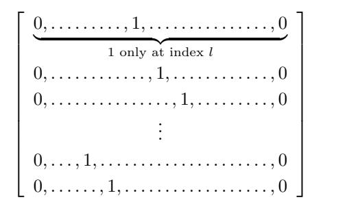
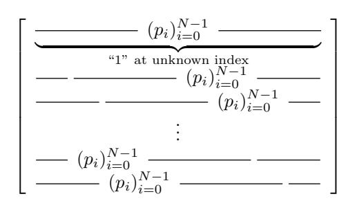
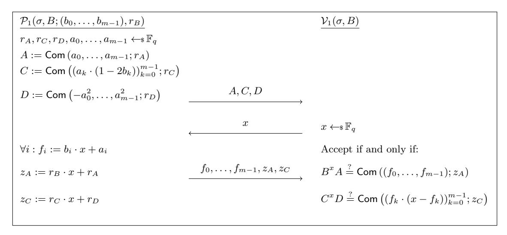
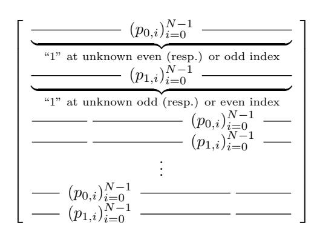

# MANY-OUT-OF-MANY PROOFS

and applications to Anonymous Zether

Benjamin E. Diamond<sup>∗</sup> J.P. Morgan AI Research [benjamin.e.diamond@jpmchase.com](mailto:benjamin.e.diamond@jpmchase.com)

#### Abstract

Anonymous Zether, proposed by B¨unz, Agrawal, Zamani, and Boneh (FC'20), is a private payment design whose wallets demand little bandwidth and need not remain online; this unique property makes it a compelling choice for resource-constrained devices. In this work, we describe an efficient construction of Anonymous Zether. Our protocol features proofs which grow only logarithmically in the size of the "anonymity sets" used, improving upon the linear growth attained by prior efforts. It also features competitive transaction sizes in practice (on the order of 3 kilobytes).

Our central tool is a new family of extensions to Groth and Kohlweiss's one-out-of-many proofs (Eurocrypt 2015), which efficiently prove statements about many messages among a list of commitments. These extensions prove knowledge of a secret subset of a public list, and assert that the commitments in the subset satisfy certain properties (expressed as linear equations). Remarkably, our communication remains logarithmic; our computation increases only by a logarithmic multiplicative factor. This technique is likely to be of independent interest.

We present an open-source, Ethereum-based implementation of our Anonymous Zether construction.

## 1 Introduction

Blockchain-based cryptocurrencies like Bitcoin [\[Nak08\]](#page-36-0) allow their mutually distrustful participants to maintain shared computational state. These systems generally encode this state—as well as the transactions which incrementally modify it—"in the clear", and so afford to these participants only cursory privacy (we refer to, e.g., Ron and Shamir [\[RS13\]](#page-37-0)).

This deficiency has impelled the development of "privacy-preserving" alternatives, most notably Zcash [\[BSCG](#page-36-1)+14] and Monero [\[NMt16\]](#page-37-1). These systems encode their state cryptographically, and define transactions which privately and securely modify this state (frequently with recourse to non-interactive zeroknowledge proofs).

Fauzi, Meiklejohn, Mercer, and Orlandi's Quisquis [\[FMMO19\]](#page-36-2) identifies an issue with these latter systems, whereby their computational state grows linearly over time. Indeed, these systems must store all TXOs (even those which have been spent); in fact, it is impossible to discern which have been consumed. Though Quisquis' state size scales linearly in its user-base, it scales only constantly in time.

A subtler issue prevents the use even of Quisquis in the most resource-constrained devices. In fact, all three systems feature a property whereby each wallet—in order to determine its user's account state—must scan through the entirety of the cryptocurrency's present state. This computational requirement demands, in practice, that wallets be stateful, and remain synchronized—so as to "amortize" this cost incrementally—as well as that they "catch up" after each period of inactivity (expending computational effort proportional to the throughput processed by the network during the period of inactivity). This burden imposes a prohibitive cost on resource-limited wallets.

<sup>∗</sup> I would like to thank Markulf Kohlweiss and Michele Ciampi for many helpful discussions and suggestions.

### 1.1 Anonymous Zether

Anonymous Zether is a paradigm for private payment, proposed in B¨unz, Agrawal, Zamani, and Boneh [\[BAZB20,](#page-35-0) §D]. Anonymous Zether features an intriguing property whereby a client—who, we presently assume, has reliable access to the blockchain's current state—may determine her own account state with only constant additional computational effort; in fact, this effort is independent of the system's overall state size, as well as of the duration elapsed since the client last synchronized. This property distinguishes Anonymous Zether from Zcash and Monero—as well as from Quisquis—and makes Anonymous Zether a compelling candidate for use in mobile, low-capacity, and low-power devices.

We pause to review the approach of Anonymous Zether. The system maintains a global table of "accounts", which associates, to each public key, an El Gamal ciphertext under that key (encrypting that key's account balance "in the exponent"). This table, we emphasize, can be queried in constant time.

To send funds, a user selects a ring containing herself and the recipient, and encrypts, under the ring's respective keys, the amounts by which she intends to alter each account's balance. The administering environment (e.g., smart contract) applies these adjustments homomorphically. Finally, the user proves that her transaction preserves all monetary invariants. These invariants are captured by the relation [\[BAZB20,](#page-35-0) (8)] (see also [\(2\)](#page-26-0) below), which encodes, in particular, that value is conserved, and flows only from some account whose secret key the prover knows, as well as that no overdrafts occur.

For example, given 8 public keys (y0, . . . , y7), each with a standing account balance of 100, the below statements do and do not, respectively, have a valid witness in the sense of [\(2\)](#page-26-0):

```
{
    y0 : Ency0
                 (g
                    0
                     ; r),
    y1 : Ency1
                 (g
                    −60; r),
    y2 : Ency2
                 (g
                    0
                     ; r),
    y3 : Ency3
                 (g
                    0
                     ; r),
    y4 : Ency4
                 (g
                    0
                     ; r),
    y5 : Ency5
                 (g
                    0
                     ; r),
    y6 : Ency6
                 (g
                    60; r),
    y7 : Ency7
                 (g
                    0
                     ; r),
}
                                                         {
                                                              y0 : Ency0
                                                                           (g
                                                                              0
                                                                               ; r),
                                                              y1 : Ency1
                                                                           (g
                                                                              −120; r),
                                                              y2 : Ency2
                                                                           (g
                                                                              0
                                                                               ; r),
                                                              y3 : Ency3
                                                                           (g
                                                                              0
                                                                               ; r),
                                                              y4 : Ency4
                                                                           (g
                                                                              10; r),
                                                              y5 : Ency5
                                                                           (g
                                                                              0
                                                                               ; r),
                                                              y6 : Ency6
                                                                           (g
                                                                              150; r),
                                                              y7 : Ency2
                                                                           (g
                                                                              0
                                                                               ; r),
                                                         }
```

Valid statement.

Invalid statement.

In particular, in the latter statement, y<sup>1</sup> overspends, excessively credits the recipient y6, alters the balance of the non-party y4, and encrypts y7's adjustment under the wrong key.

## 1.2 Anonymous Zether as a "mobile cryptocurrency"

We now sketch in further detail Anonymous Zether's unique suitability for lightweight, mobile payments.

Wallets and "light clients" in Zcash, Monero, and Quisquis present serious challenges. In these systems, account maintenance requires continual work proportional to network's throughput; worse still, this work itself requires access to the user's secrets, and cannot be easily outsourced. For example, Zcash's [reference](https://electriccoin.co/blog/zcash-reference-wallet-light-client-protocol/) [wallet](https://electriccoin.co/blog/zcash-reference-wallet-light-client-protocol/) must entrust to an external server its user's secret viewing key; this server in turn must continually filter for relevant transactions remotely (and, in the process, access the wallet's full plaintext transaction activity). A similar issue affects Monero, in that—in order to identify relevant transactions—each wallet must obtain and scan through each new transaction, using its user's private "view key". Finally, Zcash and Monero additionally demand that each wallet store linearly accumulating secret state (i.e., to remember which TXOs it owns, and which among these it has spent). In effect, each wallet in these systems must either assume a substantial resource burden (in both computation and bandwidth), or else outsource the task to an external entity (and forego its privacy).

An Anonymous Zether wallet, by contrast, need only query a constant amount of state from an untrusted full node for each payment it makes, and moreover is essentially stateless. Specifically, to determine its user's own account balance (at any given time), a wallet need only retrieve two 64-byte ciphertexts from an untrusted full node; likewise, to send funds, the wallet need only retrieve 2 · N ciphertexts, where N is the size of the transaction's anonymity set (the doubling is due to "pending" transfers; see [\[BAZB20,](#page-35-0) §3.1]). This is true regardless of network's overall throughput and size, and of offline periods of arbitrary duration. Finally, the wallet—while offline—must remember only its user's 32-byte secret key (or solicit it freshly for each payment).

Each wallet must reveal to its full node only what it also reveals to the rest of the network, except when it makes balance queries; these too can be disguised within "anonymity sets" for extra protection. To asynchronously receive funds, the wallet must share, with the full node, a list of accounts to which it would like to "subscribe". If this list is expanded so as to include the user's anonymity sets, then no privacy is lost; in this setting, the wallet must download 2 · N ciphertexts for each transaction whose anonymity set intersects its subscription list. This contrasts favorably with Zcash and Monero, for which an entity possessing the user's viewing key must process every transaction posted to the blockchain.

Though the problem of reliably obtaining blockchain state in the first place is out of scope for our purposes, we mention in particular B¨unz, Kiffer, Luu, and Zamani's FlyClient [\[BKLZ20\]](#page-36-3). FlyClient—together with standard Merkle-based proofs—could make obtaining convincingly correct state from an untrusted full node highly efficient. Our protocol could be used fruitfully in conjunction with FlyClient.

## 1.3 Choice of anonymity sets

Abstractly, Anonymous Zether furnishes Zether's RAM-like global accounts table with an atomic "multiwrite" operation, which disguises 2 simultaneous logical writes within N simultaneous physical writes (and also obscures the respective roles of the sender and receiver). It is the responsibility of each consuming application—a responsibility out of scope for this paper—to select each such set of N locations in such a way as to effectively disguise the application's logical write behavior. It remains an interesting open question whether the techniques of oblivious RAM (see e.g., Stefanov et al. [\[SDS](#page-37-2)+18]) could be applied towards the generation of such selection strategies, which in principle could convey formal privacy guarantees.

### 1.4 Technical challenges

We turn to our cryptographic construction. An efficient proof protocol for the Anonymous Zether relation [\(2\)](#page-26-0) presents a number of challenges. Importantly, it entails facts not just about two among a list of ciphertexts (namely, the sender's and receiver's, which are required to encrypt opposite amounts) but also about all of the rest (which are required to encrypt zero).

This very fact precludes an elementary application of Groth and Kohlweiss's one-out-of-many proofs [\[GK15\]](#page-36-4), whose use [\[BAZB20\]](#page-35-0) suggests. The tempting approach whereby the prover conducts [\[GK15\]](#page-36-4) N times—"handing" to the verifier, in each execution, a distinct element of the list—would be inefficient (incurring super-linear communication and super-quadratic computation). More subtly, it would prove nothing about how the N secret indices relate to each other, and in particular whether they're distinct. Indeed, the prover must deliver something like a verifiable shuffle of the input ciphertexts (so that the verifier can perform checks on the shuffled ciphertexts).

Shuffle proofs too, however, fall short of our needs (we again leave aside their inefficiency). Indeed, the adjustment ciphertexts of the relation [\(2\)](#page-26-0) are encrypted under the ring's members' heterogeneous public keys, as are the ciphertexts representing their post-adjustment balances. More subtly, shuffle proofs also deliver "more than we need". While they allow a prover to designate a full permutation of a list of ciphertexts, our prover need only distinguish two among them (namely, the sender's and receiver's); the verifier may complete the permutation arbitrarily. Our protocol fundamentally exploits this insight.

## 2 Overview of our contribution

One-out-of-many proofs, introduced by Groth and Kohlweiss [\[GK15\]](#page-36-4), allow a prover to demonstrate knowledge of a secret element among a public list of commitments, together with an opening of this commitment to 0. This important primitive has been used to construct ring signatures, zerocoin, and proofs of set membership [GK15], along with "accountable ring signatures" [BCC<sup>+</sup>15]; it has also been re-instantiated in the setting of lattices [ESS<sup>+</sup>19].

By definition, these proofs bear upon only one (secret) element of a list, and establish nothing about the others; indeed, in general the prover knows nothing about these other elements. As we have seen, however, certain applications require more flexible assertions (which, in particular, pertain to more than one element of the list). Informally,  $many-out-of-many\ proofs$  allow a prover to efficiently prove knowledge of a certain (ordered) subset of a fixed list of commitments, as well as that the elements of this subset satisfy certain properties.

We briefly sketch a representative example. Given some list  $c_0, \ldots, c_{N-1}$  of commitments, and having agreed upon some pre-specified linear map  $\Xi \colon \mathbb{F}_q^N \to \mathbb{F}_q^s$  (say), a prover might wish to demonstrate knowledge of a *secret* permutation  $K \in \mathbf{S}_N$ , as well as of openings to zero of the image points of  $(c_{K(0)}, \ldots, c_{K(N-1)})$  under  $\Xi$ . We show how this can be done, given certain restrictions on K.

This technique is powerful, with an interesting combinatorial flavor. In fact, we situate the above-described protocol within a natural family of extensions to [GK15], themselves parameterized by permutations  $\kappa \in \mathbf{S}_N$  of a certain form (namely, those whose action partitions  $\{0,1,\ldots,N-1\}$  into equal-sized orbits). In this family,  $\kappa = \mathrm{id} \in \mathbf{S}_N$  exactly recovers [GK15], whereas the above example corresponds to  $\kappa$  an N-cycle. Finally,  $\kappa = (0,2,\ldots,N-2)(1,3,\ldots,N-1)$  (for N even, and for specially chosen  $\Xi$ , described below) is used in the crucial step of Anonymous Zether (details are given in Subsection 6.3). We sketch further possible applications in Subsection 4.5. In each case, the prover proves knowledge of exactly one "ordered orbit" of  $\kappa$ , as well as that the commitments represented by this orbit satisfy prescribed linear equations.

Remarkably, our communication *remains* logarithmic (like that of [GK15]). Moreover, under mild conditions on the linear map  $\Xi$  (which hold in all of our applications), we add at most a logarithmic multiplicative factor to both the prover's and verifier's computational complexity. We thus have (see Subsection 4.3 below):

**Theorem 2.1.** There exists a sound, honest verifier zero-knowledge protocol for the many-out-of-many relation  $\mathcal{R}_2$  below, which requires  $O(\log N)$  communication, and moreover can be implemented in  $O(N\log^2 N)$  time for the prover and  $O(N\log N)$  time for the verifier.

### 2.1 Review of one-out-of-many proofs

The central technique of one-out-of-many proofs [GK15] (see also [BCC<sup>+</sup>15]) is the construction, by the prover, of certain polynomials  $P_i(X)$ ,  $i \in \{0, ..., N-1\}$ , and the efficient transmission (i.e., using only  $O(\log N)$  communication) to the verifier of these polynomials' evaluations  $p_i := P_i(x)$  at a challenge x. Importantly, each  $P_i(X)$  has "high degree" (i.e., m, where  $m = \log N$ ) if and only if i = l, where l is a secret index chosen by the prover.

The utility of the vector  $(p_i)_{i=0}^{N-1}$  resides in its use as the exponent in a multi-exponentiation. Indeed multi-exponentiating the public vector of commitments  $(c_0, \ldots, c_{N-1})$  by  $(p_i)_{i=0}^{N-1}$  "picks out", modulo lower-order terms, exactly that commitment  $c_i$  for which  $P_i(X)$  has high degree—namely,  $c_l$ —while nonetheless concealing the value of l. We provide a more thorough overview in Subsection 4.2 below.

#### 2.2 Idea of many-out-of-many proofs

Our first core idea is that, having reconstructed the vector  $(p_i)_{i=0}^{N-1}$  of evaluations, the verifier may "homomorphically permute" this vector and re-use its components in successive multi-exponentiations. In this way, the verifier will pick out secret elements among  $c_0, \ldots, c_{N-1}$  in a highly controlled way (and without necessitating additional communication).

We fix a permutation  $\kappa \in \mathbf{S}_N$  in what follows. Given the vector  $(p_i)_{i=0}^{N-1}$ , the verifier may iteratively permute its components, and so construct the *sequence* of vectors

$$\left(p_{\kappa^{-j}(i)}\right)_{i=0}^{N-1},$$

for  $j \in \{0, ..., o-1\}$  (where each  $\kappa^{-j} \in \mathbf{S}_N$  is an "inverse iterate" of  $\kappa$  and o denotes  $\kappa$ 's order in  $\mathbf{S}_N$ ).

Despite not knowing l, the verifier nevertheless knows that  $P_{\kappa^{-j}(i)}(X)$  has high degree if and only if  $i = \kappa^j(l)$ . In this way, the verifier iteratively applies  $\kappa$  to an unknown initial element  $l \in \{0, \ldots, N-1\}$ . Under the additional condition that  $\langle \kappa \rangle \subset \mathbf{S}_N$  acts freely on  $\{0, \ldots, N-1\}$ , each sequence  $(l, \kappa, \kappa^2(l), \ldots, \kappa^{o-1}(l))$  is free of repetitions (i.e., regardless of l), and these sequences never "double up". Permutations  $\kappa$  of this type thus represent a natural class for our purposes.

## 2.3 Correction terms and linear maps

Of course,  $\prod_{i=0}^{N-1} c_i^{p_i}$  does not directly yield  $c_l^{x^m}$  (where  $m=\log N$ ), but rather the sum of this element with lower-order terms which must be "cancelled out". More generally, an analogous issue holds for each  $e_j := \prod_{i=0}^{N-1} c_i^{p_{\kappa^{-j}(i)}}$  (for  $j \in \{0, \ldots, o-1\}$ ). Furthermore, there may be up to linearly many such elements (if  $o = \Theta(N)$ ), and to send correction terms for each would impose excessive communication costs.

Our compromise is to correct not each individual term  $e_j$ , but rather a "random linear combination" of these terms; this recourse evokes that used (twice) in Bulletproofs [BBB<sup>+</sup>18, §4.1]. For additional flexibility, we also interpose an arbitrary linear transformation  $\Xi \colon \mathbb{F}_q^o \to \mathbb{F}_q^s$ . The prover then sends correction terms only for the single element

$$\left[\begin{array}{cccc} 1 & v & \dots & v^{s-1} \end{array}\right] \cdot \left[\begin{array}{c} E \\ \Xi \end{array}\right] \cdot \left[\begin{array}{c} e_0 \\ e_1 \\ \vdots \\ e_{o-1} \end{array}\right],$$

where v is a random challenge chosen by the verifier (the right-hand dot is a "module product"). By interleaving v with the many-out-of-many process with appropriate delicacy, we ensure that the resulting protocol is still sound.

## <span id="page-4-1"></span>2.4 A canonical example

To illustrate these ideas, we describe an example which is essentially canonical: the case  $\kappa = (0, 1, ..., N-1)$  (we describe reductions from general  $\kappa$  to this case below). Iterating this permutation corresponds exactly to circularly rotating the vector  $(p_i)_{i=0}^{N-1}$ ; this process in turn "homomorphically increments" l modulo N. In this way, the prover sends the top row of a secret *circular shift* matrix to the verifier, who constructs the rest locally.

<span id="page-4-0"></span>



Figure 2: "Verifier's view".

The evaluation of the matrix multiplication of Fig. 2 by the vector of curve points  $(c_i)_{i=0}^{N-1}$  takes  $O(N^2)$  time, naïvely. Yet Fig. 2 is a *circulant* matrix, and this multiplication is a circular convolution; the number-theoretic transform can thus be applied (see Subsection 2.5 for additional discussion).

theoretic transform can thus be applied (see Subsection 2.5 for additional discussion). The resulting matrix product  $(e_j)_{j=0}^{N-1}$  yields, modulo lower-order terms, the *permuted* input vector  $(c_{\kappa^l(j)})_{j=0}^{N-1}$ , upon which any linear transformation  $\Xi$  (as well as the "linear combination trick") can be homomorphically applied. Supposing now, in addition, that the prover and verifier have agreed in advance upon a linear functional  $\Xi \colon \mathbb{F}_q^N \to \mathbb{F}_q$ , our general protocol (in this case) thus yields a proof of knowledge of

a secret permutation  $K \in \langle (0,1,\ldots,N-1) \rangle$ , as well as of an opening to zero of the image under  $\Xi$  of the permuted vector  $(c_{K(0)},c_{K(1)},\ldots,c_{K(N-1)})$ . Heuristically, it asserts that the "messages" of  $c_0,c_1,\ldots,c_{N-1}$  reside in some fixed hyperplane of  $\mathbb{F}_q^N$ , after being appropriately rotated.

Our communication complexity is still logarithmic; the computational complexity becomes  $O(N \log^2 N)$  for the prover and  $O(N \log N)$  for the verifier.

#### <span id="page-5-0"></span>2.5 Circular convolutions and the number-theoretic transform

We remark further upon our use of Fourier-theoretic techniques. General treatments of these ideas—such as that of Tolimieri, An and Lu [TAL97]—tend only to treat the convolution of vectors consisting of (complex) field elements. This remains true even for those surveys, like Nussbaumer's [Nus82, §8], which address also the prime field case (often called the "number theoretic transform").

We fix in what follows a commitment scheme whose commitment space is a q-torsion group (for a prime q), or in other words an  $\mathbb{F}_q$ -module (actually, a vector space). (The Pedersen and El Gamal commitment schemes satisfy this property.) Our setting, unusually, mandates that a vector of module elements (i.e., commitments) be convolved with a vector of field elements. Our important observation in this capacity is that only the module structure, and not the ring structure, of a signal's domain figures in its role throughout the fast Fourier transform and the convolution theorem, and that these techniques can be carried out "homomorphically". We thus introduce the efficient convolution of a vector of module elements with a vector of field elements (see also Remark 4.13 below). Though this observation is implicit in existing work, we have not found it stated explicitly in the literature.

## 3 Security Definitions

We recall general security definitions, deferring specialized definitions to the appropriate sections below. We will adopt the "experiment" paradigm, generally following the style of Katz and Lindell [KL15]. In particular, security definitions will be presented as experiments, or games.

We occasionally use the notation  $\mathsf{Adv}_{\mathcal{A},\Pi}^{\mathsf{E}}(\lambda)$ , called the advantage of the adversary in the experiment  $\mathsf{E}$ , to denote that quantity which  $\mathsf{E}$ 's security requires be negligible (for all  $\mathcal{A}$ ). That is,  $\mathsf{Adv}_{\mathcal{A},\Pi}^{\mathsf{E}}(\lambda)$  denotes either  $\Pr[\mathsf{E}_{\mathcal{A},\Pi}(\lambda)=1]$  or  $\Pr[\mathsf{E}_{\mathcal{A},\Pi}(\lambda)=1]-\frac{1}{2}$ , as the case may be. In this latter case—representing experiments in which  $\mathcal{A}$  must correctly output a bit b chosen by the experimenter—we also write  $\mathsf{out}_{\mathcal{A}}(\mathsf{E}_{\mathcal{A},\Pi}(\lambda))$  to denote the output of  $\mathcal{A}$  in  $\mathsf{E}_{\mathcal{A},\Pi}(\lambda)$  (as distinguished from whether  $\mathcal{A}$  actually wins the experiment).

#### 3.1 Groups

Following Katz and Lindell [KL15, §8.3.2], we let  $\mathcal{G}$  denote a group-generation algorithm, which on input  $1^{\lambda}$  outputs a cyclic group  $\mathbb{G}$ , its prime order q (with bit-length  $\lambda$ ) and a generator  $g \in \mathbb{G}$ . Moreover, we have:

**Definition 3.1** (Katz–Lindell [KL15, Def. 8.62]). The discrete-logarithm experiment  $\mathsf{DLog}_{\mathcal{A},\mathcal{G}}(\lambda)$  is defined as:

- 1. Run  $\mathcal{G}(1^{\lambda})$  to obtain  $(\mathbb{G}, q, q)$ .
- 2. Choose a uniform  $h \in \mathbb{G}$ .
- 3.  $\mathcal{A}$  is given  $\mathbb{G}, q, g, h$ , and outputs  $x \in \mathbb{F}_q$ .
- 4. The output of the experiment is defined to be 1 if  $g^x = h$ , and 0 otherwise.

We say that the discrete-logarithm problem is hard relative to  $\mathcal{G}$  if, for each probabilistic polynomial-time algorithm  $\mathcal{A}$ , there exists a negligible function negl for which  $\Pr[\mathsf{DLog}_{\mathcal{A},\mathcal{G}}(\lambda) = 1] \leq \mathsf{negl}(\lambda)$ .

We also have the decisional Diffie-Hellman assumption, which we adapt from [KL15, Def. 8.63]:

**Definition 3.2.** The *DDH experiment*  $DDH_{\mathcal{A},\mathcal{G}}(\lambda)$  is defined as:

1. Run  $\mathcal{G}(1^{\lambda})$  to obtain  $(\mathbb{G}, q, g)$ .

- 2. Choose uniform x, y, z ∈ F<sup>p</sup> and a uniform bit b ∈ {0, 1}.
- 3. Give (G, q, g, g<sup>x</sup> , g<sup>y</sup> ) to A, as well as g z if b = 0 and g xy if b = 1. A outputs a bit b 0 .
- 4. The output of the experiment is defined to be 1 if and only if b <sup>0</sup> = b.

We say that the DDH problem is hard relative to G if, for each probabilistic polynomial-time algorithm A, there exists a negligible function negl for which Pr[DDHA,G(λ) = 1] ≤ 1 <sup>2</sup> + negl(λ).

## 3.2 Commitment schemes

A commitment scheme is a pair of probabilistic algorithms (Gen, Com); given public parameters params ← Gen(1<sup>λ</sup> ) and a message m, we have a commitment com := Com(params, m; r), as well as a decommitment procedure (effected by sending m and r). For notational convenience, we often omit params.

We now present security definitions.

Definition 3.3 (Katz–Lindell [\[KL15,](#page-36-7) Def. 5.13]). The commitment binding experiment BindingA,Com(λ) is defined as:

- 1. Parameters params ← Gen(1<sup>λ</sup> ) are generated.
- 2. A is given params and outputs (m0, r0) and (m1, r1).
- 3. The output of the experiment is defined to be 1 if and only if m<sup>0</sup> 6= m<sup>1</sup> and Com(params, m0; r0) = Com(params, m1; r1).

We say that Com is computationally binding if, for each PPT adversary A, there exists a negligible function negl for which Pr[Binding<sup>A</sup>,Com(λ) = 1] ≤ negl(λ). If negl = 0, w say that Com is perfectly binding.

<span id="page-6-0"></span>Definition 3.4 (Katz–Lindell [\[KL15,](#page-36-7) Def. 5.13]). The commitment hiding experiment Hiding<sup>A</sup>,com(λ) is defined as:

- 1. Parameters params ← Gen(1<sup>λ</sup> ) are generated.
- 2. The adversary A is given input params, and outputs messages m<sup>0</sup> and m1.
- 3. A uniform bit b ∈ {0, 1} is chosen. The commitment com := Com(params, mb; r) is computed (i.e., for random r) and is given to A.
- 4. The adversary A outputs a bit b 0 . The output of the experiment is 1 if and only if b <sup>0</sup> = b.

We say that Com is computationally hiding if, for each PPT adversary A, there exists a negligible function negl for which Pr[Hiding<sup>A</sup>,Com(λ) = 1] ≤ 1 <sup>2</sup> + negl(λ). If negl = 0, we say that Com is perfectly hiding.

#### 3.2.1 An alternate notion of hiding

A commitment scheme is homomorphic if, for each params, its message, randomness, and commitment spaces are abelian groups, and the corresponding commitment function is a group homomorphism.

We now present a slightly modified version of Definition [3.4.](#page-6-0) This definition makes sense only for homomorphic schemes; it shall also better suit our purposes below. In this version, the adversary outputs two challenge commitments, as opposed to messages; one among these is then re-randomized homomorphically by the experimenter.

<span id="page-6-1"></span>Definition 3.5. The modified hiding experiment MHiding<sup>A</sup>,Com(λ) is defined as:

- 1. Parameters params ← Gen(1<sup>λ</sup> ) are generated.
- 2. The adversary A is given input params, and outputs elements c<sup>0</sup> and c<sup>1</sup> of the commitment space.
- 3. A uniform bit b ∈ {0, 1} is chosen. The commitment com := c<sup>b</sup> · Com(0) is computed and given to A.

4. The adversary  $\mathcal{A}$  outputs a bit b'. The output of the experiment is 1 if and only if b'=b.

Any scheme which is hiding in the sense of Definition 3.5 is also hiding in the classical sense of Definition 3.4. Indeed, any adversary  $\mathcal{A}$  targeting  $\mathsf{Hiding}_{\mathcal{A},\mathsf{Com}}$  yields an adversary  $\mathcal{A}'$  targeting  $\mathsf{MHiding}_{\mathcal{A}',\mathsf{Com}}$  in the obvious way. Upon receiving  $\mathcal{A}$ 's messages  $m_0$  and  $m_1$ ,  $\mathcal{A}'$  outputs  $c_0 := \mathsf{Com}(m_0; 0)$  and  $c_1 := \mathsf{Com}(m_1; 0)$ . Finally, it passes the challenge  $\mathsf{com}$  to  $\mathcal{A}$ , and returns whatever  $\mathcal{A}$  returns.

On the other hand, the reverse implication is also true, as the following lemma argues:

<span id="page-7-0"></span>Lemma 3.6. Definitions 3.4 and 3.5 are equivalent for any homomorphic commitment scheme Com.

*Proof.* It remains to convert any  $\mathcal{A}$  attacking  $\mathsf{MHiding}_{\mathcal{A},\mathsf{Com}}$  into an adversary  $\mathcal{A}'$  attacking  $\mathsf{Hiding}_{\mathcal{A}',\mathsf{Com}}$ .  $\mathcal{A}'$  operates as follows, on input params:

- 1. For a randomly chosen message r, assign  $m_0 = r$  and  $m_1 = 0$ . Output  $m_0$  and  $m_1$ .
- 2. Upon receiving the experimenter's challenge com and  $\mathcal{A}$ 's commitments  $c_0$  and  $c_1$ , select a random bit  $b \in \{0,1\}$ . Give  $c_b \cdot \text{com}$  to  $\mathcal{A}$ .
- 3. When  $\mathcal{A}$  outputs a bit b', return whether b' = b.

If the experimenter's bit is 0, then its challenge com is completely random, as is hence  $c_b \cdot \text{com}$ ; we conclude in this case that  $\mathcal{A}$ 's advantage is 0. If on the other hand the experimenter's bit is 1, then  $\mathcal{A}$ 's view exactly matches its view in  $\mathsf{MHiding}_{\mathcal{A},\mathsf{Com}}$ , and in this case  $\mathcal{A}'$  wins whenever  $\mathcal{A}$  does. We conclude that:

$$\Pr[\mathsf{Hiding}_{\mathcal{A}',\mathsf{Com}}(\lambda) = 1] - \frac{1}{2} = \frac{1}{2} \cdot (0) + \frac{1}{2} \cdot \left(\Pr[\mathsf{MHiding}_{\mathcal{A},\mathsf{Com}}(\lambda) = 1] - \frac{1}{2}\right).$$

In particular, if Com is hiding, then  $\Pr[\mathsf{MHiding}_{\mathcal{A},\mathsf{Com}}(\lambda)=1]-\frac{1}{2}$  is negligible.

**Example 3.7.** If a homomorphic commitment scheme is *perfectly* hiding in the classical sense of Definition 3.4, then it's also *perfectly* hiding in the modified sense, as the proof of Lemma 3.6 shows. For example, we have the Pedersen commitment scheme (as in e.g.  $[BCC^{+}16, \S 2.2]$ ).

<span id="page-7-1"></span>**Example 3.8.** Specializing Definition 3.5 to the El Gamal encryption scheme (as in e.g. [KL15, Cons. 11.16])—which we view as a commitment scheme—we obtain the following unusual experiment:

- 1. Parameters  $(\mathbb{G}, q, g) \leftarrow \mathcal{G}(1^{\lambda})$ , as well as a random keypair  $(y, \mathsf{sk}) \leftarrow \mathsf{Gen}(1^{\lambda})$ , are generated.
- 2.  $\mathcal{A}$  is given  $(\mathbb{G}, q, g)$  and y.  $\mathcal{A}$  outputs group-element tuples  $c_0 = (M_0, m_0)$  and  $c_1 = (M_1, m_1)$ .
- 3. A uniform bit  $b \in \{0,1\}$  is chosen. A random element  $r \leftarrow \mathbb{F}_q$  is generated, and  $(M_b \cdot y^r, m_b \cdot g^r)$  is returned to  $\mathcal{A}$ .
- 4.  $\mathcal{A}$  outputs a bit b'. The output of the experiment is defined to be 1 if and only if b' = b.

In virtue of [KL15, Thm. 11.18] and of Lemma 3.6, we conclude that, under the DDH assumption, each adversary  $\mathcal{A}$  has at most negligible advantage in this experiment.

We assume in what follows that all commitment schemes are homomorphic. We also assume that each commitment scheme has randomness space given by  $\mathbb{F}_q$ , for a  $\lambda$ -bit prime q, as well a q-torsion group for its commitment space.

#### 3.3 Zero-knowledge proofs

We present definitions for zero-knowledge arguments of knowledge, closely following [GK15] and [BCC<sup>+</sup>16]. We formulate our definitions in the "experiment-based" style of Katz and Lindell.

We posit a triple of interactive, probabilistic polynomial time algorithms  $\Pi = (\mathsf{Setup}, \mathcal{P}, \mathcal{V})$ . Given some polynomial-time-decidable ternary relation  $\mathcal{R} \subset (\{0,1\}^*)^3$ , each common reference string  $\sigma \leftarrow \mathsf{Setup}(1^\lambda)$  yields an NP language  $L_\sigma = \{x \mid \exists w : (\sigma, x, w) \in \mathcal{R}\}$ . We denote by  $\mathsf{tr} \leftarrow \langle \mathcal{P}(\sigma, x, w), \mathcal{V}(\sigma, x) \rangle$  the (random) transcript of an interaction between  $\mathcal{P}$  and  $\mathcal{V}$  on auxiliary inputs  $(\sigma, x)$  and  $(\sigma, x, w)$  (respectively). Abusing notation, we occasionally write  $b \leftarrow \langle \mathcal{P}(\sigma, x, w), \mathcal{V}(\sigma, x) \rangle$  to indicate the single validity bit of a random transcript.

We now have:

Definition 3.9. The completeness experiment CompleteA,Π,R(λ) is defined as:

- 1. A common reference string σ ← Setup(1<sup>λ</sup> ) is generated.
- 2. A is given σ and outputs (x, w) for which (σ, x, w) ∈ R.
- 3. An interaction b ← hP(σ, x, w), V(σ, x)i is carried out.
- 4. The output of the experiment is defined to be 1 if and only if b = 1.

We say that Π = (Setup,P, V) is perfectly complete if for each PPT adversary A, Pr[CompleteA,Π,R(λ)] = 1.

Fixing a 2µ + 1-move, public-coin interactive protocol Π = (Setup,P, V), we have:

Definition 3.10. The (n1, . . . , nµ)-special soundness experiment Sound(n1,...,nµ) <sup>A</sup>,<sup>X</sup> ,Π,<sup>R</sup> (λ) is defined as:

- 1. A common reference string σ ← Setup(1<sup>λ</sup> ) is generated.
- 2. A is given σ and outputs x, as well as an (n1, . . . , nµ)-tree (say tree) of accepting transcripts whose challenges are distinct.
- 3. X is given σ, x, and tree and outputs w.
- 4. The output of the experiment is designed to be 1 if and only if (σ, x, w) 6∈ R.

We say that Π = (Setup,P, V) is computationally (n1, . . . , nµ)-special sound if there exists a PPT extractor X for which, for each PPT adversary A, there exists a negligible function negl for which Pr[Sound(n1,...,nµ) <sup>A</sup>,<sup>X</sup> ,Π,<sup>R</sup> (λ) = 1] ≤ negl(λ). If negl = 0, we say that Π is perfectly (n1, . . . , nµ)-special sound.

Definition 3.11. The special honest verifier zero knowledge experiment SHVZK<sup>A</sup>,S,Π,<sup>R</sup>(λ) is defined as:

- 1. A common reference string σ ← Setup(1<sup>λ</sup> ) is generated.
- 2. A is given σ and outputs (x, w) for which (σ, x, w) ∈ R, as well as randomness ρ.
- 3. A uniform bit b ∈ {0, 1} is chosen.
  - If b = 0, tr ← hP(σ, x, w), V(σ, x)i is assigned.
  - If b = 1, tr ← S(σ, x) is assigned.
- 4. The adversary A is given tr and outputs a bit b 0 .
- 5. The output of the experiment is defined to be 1 if and only if b <sup>0</sup> = b.

We say that Π = (Setup,P, V) is computationally special honest verifier zero knowledge if there exists a PPT simulator S for which, for each PPT adversary A, there exists a negligible function negl for which Pr[SHVZK<sup>A</sup>,S,Π,<sup>R</sup>(λ) = 1] ≤ 1 <sup>2</sup> + negl(λ). If negl = 0, we say that Π is perfect special honest verifier zero knowledge.

In all of our protocols, Setup(1<sup>λ</sup> ) runs the group-generation procedure G(1<sup>λ</sup> ) and the commitment scheme setup Gen(1<sup>λ</sup> ), and then stores σ ← Setup(1<sup>λ</sup> ) = (G, q, g, params).

### 3.4 Rational function interpolation

We now recall a result on rational function interpolation, following the text of von zur Gathen and Gerhard [\[vzGG13\]](#page-37-5). We will have occasion to use the following theorem, which reformulates certain results of [\[vzGG13,](#page-37-5) §5.8]:

<span id="page-9-0"></span>**Theorem 3.12** (von zur Gathen-Gerhard [vzGG13]). Consider distinct elements  $x_0, \ldots, x_{n-1} \in \mathbb{F}_q$  and further elements  $v_0, \ldots, v_{n-1} \in \mathbb{F}_q$ . Suppose that r(X) and t(X) are polynomials for which:

$$r(x_i) = t(x_i) \cdot v_i$$
 for each  $i \in \{0, \dots, n-1\}$  and  $\deg r(X) + \deg t(X) < n$ .

Denote by  $r_j(X)$ ,  $s_j(X)$ ,  $t_j(X) \in \mathbb{F}_q[X]$  the  $j^{th}$  row obtained upon executing the Extended Euclidean Algorithm on the inputs  $m(X) := (X - x_0) \cdots (X - x_{n-1})$  and g(X), where  $g(X) \in \mathbb{F}_q[X]$  is any polynomial of degree less than n for which  $g(x_i) = v_i$  for each  $i \in \{0, \dots, n-1\}$ . Then

$$lc(r(X)) \cdot (lc(t(X)))^{-1} = lc(r_{j^*}(X)) \cdot (lc(t_{j^*}(X)))^{-1},$$

where  $j^*$  is minimal for which  $\deg r_{j^*}(X) \leq \deg r(X)$ , and  $\operatorname{lc}$  denotes a polynomial's leading coefficient.

Proof. We combine [vzGG13, Lem. 5.15], [vzGG13, Thm. 5.16] and [vzGG13, Cor. 5.18, (ii)]. By the Chinese Remainder Theorem, the assumed equalities  $r(x_i) = t(x_i) \cdot v_i = t(x_i) \cdot g(x_i)$  for  $i \in \{0, \dots, n-1\}$  imply in turn that  $r(X) \equiv t(X)g(X) \mod m(X)$ , where m(X) is as above. Obtaining  $s(X) \in \mathbb{F}_q[X]$  for which r(X) = t(X)g(X) + s(X)m(X), and applying [vzGG13, Lem. 5.15]—whose hypothesis holds, by assumption on r(X) and t(X)—we establish the existence of a nonzero  $\alpha(X) \in \mathbb{F}_q[X]$  for which:

$$r(X) = \alpha(X) \cdot r_{j^*}(X)$$
 and  $t(X) = \alpha(X) \cdot t_{j^*}(X)$ .

Taking leading coefficients of all polynomials and rearranging, we obtain the desired result.  $\Box$ 

**Remark 3.13.** A polynomial  $g(X) \in \mathbb{F}_q[X]$  for which deg g < n and  $g(x_i) = v_i$  for each  $i \in \{0, ..., n-1\}$  can be easily constructed in  $O(n^2)$  time using Lagrange interpolation; we refer to, e.g., [vzGG13, Thm. 5.1].

## 4 Many-out-of-Many Proofs

We turn to our main results. We begin with preliminaries on permutations, referring to Cohn [Coh74] for further background.

The permutation group  $\mathbf{S}_N$  consists of bijections  $\kappa: \{0, \ldots, N-1\} \to \{0, \ldots, N-1\}$ , with a group law given by composition. For a permutation  $\kappa \in \mathbf{S}_N$  of order o, and some initial element  $l \in \{0, \ldots, N-1\}$ , we mean by l's ordered orbit under  $\kappa$  the ordered sequence of elements  $(l, \kappa(l), \kappa^2(l), \ldots, \kappa^{o-1}(l))$  of  $\{0, \ldots, N-1\}$ .

**Definition 4.1.** We say that a permutation  $\kappa \in \mathbf{S}_N$  is *free* if it satisfies any, and hence all, of the following equivalent conditions:

- The natural action of  $\langle \kappa \rangle \subset \mathbf{S}_N$  on  $\{0, \dots, N-1\}$  is free.
- The natural action of  $\langle \kappa \rangle$  partitions the set  $\{0,\ldots,N-1\}$  into orbits of equal size.
- $\bullet$   $\kappa$  is a product of equal-length cycles, with no fixed points.
- For each  $l \in \{0, \ldots, N-1\}$ , the stabilizer  $\langle \kappa \rangle_l \subset \langle \kappa \rangle$  is trivial.
- For each  $l \in \{0, ..., N-1\}$ , l's ordered orbit under  $\kappa$  consists of distinct elements.

Freeness is a natural group-theoretic property, with a number of equivalent characterizations. Informally, that  $\kappa$  is free essentially entails that each of its non-identity iterates lacks fixed points.

**Example 4.2.** The identity permutation  $id \in S_N$  is trivially free, as each of its oxedered orbits are singletons.

**Example 4.3.** Each power of the N-cycle  $(0, 1, ..., N-1) \in \mathbf{S}_N$  is free.

**Example 4.4.** The permutation  $(0,1,2,3)(4,5)(6,7) \in \mathbf{S}_8$  (of order 4) is not free, as the ordered orbit of 4 (say) is (4,5,4,5).

### 4.1 Commitments to bits

We replicate in its entirety, for convenience, the "bit commitment" protocol of Bootle, Cerulli, Chaidos, Ghadafi, Groth, and Petit [\[BCC](#page-36-5)+15, Fig. 4], which we further specialize to the binary case (i.e., n = 2). This protocol improves the single-bit commitment procedure of [\[GK15,](#page-36-4) Fig. 1], and requires slightly less communication. Following [\[BCC](#page-36-5)+15], we have the relation:

$$\mathcal{R}_1 = \{ (B; (b_0, \dots, b_{m-1}), r_B) \mid \forall k, b_k \in \{0, 1\} \land B = \mathsf{Com}(b_0, \dots, b_{m-1}; r_B) \},\$$

and the protocol:

<span id="page-10-1"></span>

Figure 3: Protocol for the relation R1.

Finally, we have:

<span id="page-10-2"></span>Lemma 4.5 (Bootle et al. [\[BCC](#page-36-5)+15]). The protocol of Fig. [3](#page-10-1) is perfectly complete. If Com is (perfectly) binding, then it is (perfectly) (3)-special sound. If Com is (perfectly) hiding, then it is (perfectly) special honest verifier zero knowledge.

Proof. We refer to [\[BCC](#page-36-5)+15, Lem. 1]. We note that [\[BCC](#page-36-5)+15, Fig. 4]'s perfect SHVZK relies on its use of (perfectly hiding) Pedersen commitments; in our slightly more general setting, S must simulate C ← Com(0, . . . , 0) as a random commitment to zero. As in [\[BCC](#page-36-5)+15, Lem. 1], we observe that the remaining elements of the simulated transcript are either identically distributed to those of real ones or are uniquely determined given C. The indistinguishability of the simulation therefore reduces directly to the hiding property of the commitment scheme.

In practice, we incorporate an additional improvement due to Esgin, Zhao, Steinfeld, Liu and Liu [\[EZS](#page-36-10)<sup>+</sup>19, §1.3]. That is, we commit to all 0 th-order components in A (incorporating also D) and to all 1 st-order components in B (incorporating also C). Finally, we eliminate z<sup>C</sup> . This technique reduces the proof's size, and simplifies the verifier's checks.

## <span id="page-10-0"></span>4.2 Overview of Groth–Kohlweiss [\[GK15\]](#page-36-4)

We now review Groth and Kohlweiss [\[GK15\]](#page-36-4), incorporating also ideas from Bootle et al. [\[BCC](#page-36-5)<sup>+</sup>15]. These works describe a proof protocol for the relation:

$$\{(\sigma, (c_0, \ldots, c_{N-1}); l, r) \mid c_l = \mathsf{Com}(0; r)\};$$

in short, the prover proves that she knows an opening to 0 of a secret element c<sup>l</sup> among a public list of commitments (c0, . . . , cN−1).

We recall the proof technique, deferring to the papers for further details. The protocol of Fig. 3 above shows, in fact, that the responses  $f_{k,1} := f_k$  sent by the prover are evaluations—at the verifier's challenge x—of linear polynomials  $F_{k,1}(X) = b_k \cdot X + a_k$  whose first-order coefficients  $b_k$  are bits (chosen by the prover). In light of this fact, the quantities  $f_{k,0} := x - f_k$ , which the verifier may also compute, are in turn necessarily evaluations at x of  $F_{k,0}(X) := X - F_{k,1}(X)$ , whose first-order coefficients are also bits (in fact the logical negations of the  $b_k$ ). Finally, the verifier may set, for each  $i \in \{0, \dots, N-1\}$ ,  $p_i := \prod_{k=0}^{m-1} f_{k,(i)_k}$ , where  $(i)_k$  denotes the k<sup>th</sup> bit of i. By the same reasoning, each  $p_i$  is the evaluation at x of  $P_i(X) := \prod_{k=0}^{m-1} F_{k,(i)_k}(X)$ . The key property of the  $P_i(X)$  pertains to their degrees. In fact, by the structure of the  $F_{k,b}(X)$ ,  $P_i(X)$  is of degree m (and monic) for one and only one index i (namely that i whose binary representation is  $b_0, \dots, b_{m-1}$ ).

This fact convinces the verifier that the multi-exponentiation  $\prod_{i=0}^{N-1} c_i^{p_i}$  is equal to the group-product of  $(c_l)^{x^m}$  (for some secret l chosen by the prover) with further terms which depend on lower powers of x. The verifier allows the prover to "cancel out" these lower-order terms by sending additional group elements; the prover must send these before seeing x.

## <span id="page-11-0"></span>4.3 Main protocol

We fix commitments  $c_0, \ldots, c_{N-1}$ , a free permutation  $\kappa \in \mathbf{S}_N$  of order o, and a linear map  $\Xi \colon \mathbb{F}_q^o \to \mathbb{F}_q^s$ . Our main result in this section is a proof of knowledge of an index l, as well as of openings  $r_0, \ldots, r_{s-1}$  to 0 of the image points under  $\Xi$  of the commitments  $c_l, c_{\kappa(l)}, c_{\kappa^2(l)}, \ldots, c_{\kappa^{o-1}(l)}$  represented by l's ordered orbit. We represent  $\Xi$  as an  $s \times o$  matrix with entries in  $\mathbb{F}_q$  in what follows. We thus have the relation:

$$\mathcal{R}_2 = \left\{ \left(\sigma, (c_0, \dots, c_{N-1}), \kappa, \Xi; l, (r_0, \dots, r_{s-1})\right) \mid \left[ \begin{array}{c} \mathsf{Com}(0; r_i) \end{array} \right]_{i=0}^{s-1} = \left[ \begin{array}{c} \Xi \end{array} \right] \cdot \left[ \begin{array}{c} c_{\kappa^j(l)} \end{array} \right]_{j=0}^{o-1} \right\}.$$

In fact, our theory carries through identically even if the map  $\Xi \colon \mathbb{F}_q^o \to \mathbb{F}_q^s$  is allowed to be *affine linear*, as opposed to linear (i.e., including an additive, "0<sup>th</sup>-order" part). In order to exploit matrix notation, we suppress this fact in what follows; nonetheless, it constitutes a useful generalization of the theory.

<span id="page-11-1"></span>
$$\begin{array}{c} \mathcal{P}_{2}(\sigma,(c_{0},\ldots,c_{N-1}),\kappa,\Xi;l,(r_{0},\ldots,r_{s-1}))\\ r_{B},\rho_{0},\ldots,\rho_{m-1}\leftarrow\$\,\mathbb{F}_{q}\\ B:=\operatorname{Com}(l_{0},\ldots,l_{m-1};r_{B})\\ (A,C,D)\leftarrow\mathcal{P}_{1}(\sigma,B;(l_{0},\ldots,l_{m-1},r)) & A,B,C,D\\ & & v\leftarrow\$\,\mathbb{F}_{q}\\ \\ \vdots\\ c\\ c\\ c\\ c\\ c\\ c\\ c\\ c\\ c\\ c\\ c\\ c\\ c\\$$

Figure 4: Protocol for the relation  $\mathcal{R}_2$ .

The essential idea is, as indicated above, that the verifier may permute the components of the vector  $(p_i)_{i=0}^{N-1}$  in accordance with  $\kappa$ , and use each permuted vector in its own multi-exponentiation. Though the verifier does not know that index l for which  $\deg P_l(X) = m$ , the verifier nonetheless knows that  $\deg P_{\kappa^{-j}(i)}(X) = m$  if and only if  $i = \kappa^j(l)$ . By consequence, the verifier knows that, for each  $j \in \{0,\ldots,o-1\}$ ,  $\prod_{i=0}^{N-1} c_i^{p_{\kappa^{-j}(i)}}$  gives the group-product of  $(c_{\kappa^j(l)})^{x^m}$  with lower-order terms; likewise,  $[\Xi] \cdot \left[\prod_{i=0}^{N-1} c_i^{p_{\kappa^{-j}(i)}}\right]_{j=0}^{o-1}$  gives the group product of  $[\Xi] \cdot \left[(c_{\kappa^j(l)})^{x^m}\right]_{j=0}^{o-1}$  with lower-order terms. As before, these terms may be cancelled out by the prover.

**Example 4.6.** Setting  $\kappa = \mathrm{id} \in \mathbf{S}_N$  the identity permutation, and  $\Xi = I_1 \colon \mathbb{F}_q \to \mathbb{F}_q$  the identity map, exactly recovers the original protocol of Groth and Kohlweiss [GK15].

<span id="page-12-0"></span>**Example 4.7.** For o dividing N, we consider the iterate  $\kappa := (0, 1, ..., N-1)^{N/o}$ , and set  $\Xi = I_o$  as the identity map on  $\mathbb{F}_q^o$ . In this setting, Fig. 4 demonstrates knowledge of a secret residue class  $l \mod N/o$ , as well as of openings to 0 (say,  $r_0, ..., r_{o-1}$ ) of those commitments  $c_i$  for which  $i \equiv l \mod N/o$ .

**Example 4.8.** Subsection 2.4 sketches the choice  $\kappa := (0, 1, \dots, N-1)$  and  $\Xi \colon \mathbb{F}_q^N \to \mathbb{F}_q$  a linear functional. This setting gives a proof of knowledge of a secret permutation  $K \in \langle (0, 1, \dots, N-1) \rangle$  for which the "messages" of  $c_{K(0)}, c_{K(1)}, \dots, c_{K(N-1)}$  reside in a prespecified hyperplane of  $\mathbb{F}_q^N$ .

**Example 4.9.** Setting  $\kappa := (0, 1, \dots, N-1)$  and choosing for  $\Xi : \mathbb{F}_q^N \to \mathbb{F}_q^N$  the affine linear map  $\Xi : (m_0, m_1, \dots, m_{N-1}) \mapsto (m_0 - 1, m_1, \dots, m_{N-1})$  yields a proof that the "messages" of  $c_0, c_1, \dots, c_{N-1}$  give a standard basis vector  $\mathbf{e}_l \in \mathbb{F}_q^N$ , which moreover conceals the particular standard basis vector represented (i.e., the index l).

The protocol  $\Pi = (\mathsf{Setup}, \mathcal{P}_2, \mathcal{V}_2)$  of Fig. 4 is perfectly complete. This follows essentially by inspection; we note in particular that  $(0; \sum_{i=0}^{s-1} v^i \cdot r_i)$  opens the matrix product

$$\left[\begin{array}{cccc} 1 & v & \dots & v^{s-1} \end{array}\right] \cdot \left[\begin{array}{c} \Xi \end{array}\right] \cdot \left[\begin{array}{c} c_l \\ c_{\kappa(l)} \\ \vdots \\ c_{\kappa^{o-1}(l)} \end{array}\right],$$

by hypothesis on the  $r_0, \ldots, r_{s-1}$ .

Moreover, we have:

<span id="page-12-1"></span>**Theorem 4.10.** If Com is (perfectly) binding, then  $\Pi$  is (perfectly) (s, m+1)-special sound.

*Proof.* We describe an extractor  $\mathcal{X}$  which, given an (s, m+1)-tree of accepting transcripts, either returns a witness  $(l, (r_0, \ldots, r_{s-1}))$  or breaks the binding property of the commitment scheme Com. We suppose that  $\sigma \leftarrow \mathsf{Setup}(1^{\lambda})$  has been generated; we let u and tree be arbitrary. We essentially follow [GK15, Thm. 3], while introducing an additional (i.e., a second) Vandermonde inversion step. Details follow.

We first consider, for fixed v, accepting responses  $(f_0,\ldots,f_{m-1},z_A,z_C,z)$  to m+1 distinct challenges x. With recourse to the extractor of Lemma 4.5 and responses to 3 distinct challenges x,  $\mathcal{X}$  obtains openings  $(b_0,\ldots,b_{m-1};r_B)$  and  $(a_0,\ldots,a_{m-1};r_A)$  of B and A (respectively) for which each  $b_k \in \{0,1\}$ . The bits  $l_k := b_k$  define the witness l. Moreover, each response  $(f_k)_{k=0}^{m-1}$  either takes the form  $(b_k \cdot x + a_k)_{k=0}^{m-1}$ , or yields a violation of Com's binding property. Barring this latter contingency,  $\mathcal{X}$  may construct using  $b_k$  and  $a_k$  polynomials  $P_i(X)$ , for  $i \in \{0,\ldots,N-1\}$ —of degree m if and only if i = l—for which  $p_i = P_i(x)$  for each x (where  $p_i$  are as computed by the verifier).

Using these polynomials,  $\mathcal{X}$  may, for each x, re-write the final verification equation as:

$$\left(\prod_{j=0}^{o-1}(c_{\kappa^j(l)})^{\xi_j}\right)^{x^m}\cdot\prod_{k=0}^{m-1}(\widetilde{G}_k)^{x^k}=\operatorname{Com}(0;z),$$

for elements  $\widetilde{G}_k$  which depend only on the polynomials  $P_i(X)$  and the elements  $G_k$  (in particular, they don't depend on x). Exactly as in [GK15, Thm. 3], by inverting an  $(m+1)\times(m+1)$  Vandermonde

matrix containing the challenges x (and using the inverse's bottom row as coefficients),  $\mathcal{X}$  obtains a linear combination of the responses z, say  $z_v$ , for which:

$$\prod_{j=0}^{o-1} (c_{\kappa^j(l)})^{\xi_j} = \operatorname{Com}(0; z_v).$$

In fact, an expression of this form can be obtained for *each* challenge v. Furthermore—now using the definition of  $[\xi_0, \ldots, \xi_{o-1}]$ —we rewrite this expression's left-hand side as the matrix product:

$$\left[\begin{array}{cccc} 1 & v & \dots & v^{s-1} \end{array}\right] \cdot \left[\begin{array}{c} \Xi \end{array}\right] \cdot \left[\begin{array}{c} c_l \\ c_{\kappa(l)} \\ \vdots \\ c_{\kappa^{o-1}(l)} \end{array}\right] = \operatorname{\mathsf{Com}}\left(0; z_v\right).$$

Using expressions of this form for s distinct challenges v, and inverting a second Vandermonde matrix,  $\mathcal{X}$  obtains combinations of the values  $z_v$ , say  $r_0, \ldots, r_{s-1}$ , for which:

$$\left[\begin{array}{c} \Xi \end{array}\right] \cdot \left[\begin{array}{c} c_l \\ c_{\kappa(l)} \\ \vdots \\ c_{\kappa^{o-1}(l)} \end{array}\right] = \left[\begin{array}{c} \mathsf{Com}\left(0; r_0\right) \\ \mathsf{Com}(0; r_1) \\ \vdots \\ \mathsf{Com}(0; r_{s-1}) \end{array}\right].$$

This completes the extraction process. Finally, any adversary  $\mathcal{A}$  who wins  $\mathsf{Sound}_{\mathcal{A},\mathcal{X},\Pi,\mathcal{R}}^{(s,m+1)}(\lambda)$  can be converted into an adversary  $\mathcal{A}'$  who wins  $\mathsf{Binding}_{\mathcal{A}',\mathsf{Com}}(\lambda)$  with equal probability. Indeed, on input params,  $\mathcal{A}'$  simulates an execution of  $\mathsf{Sound}_{\mathcal{A},\mathcal{X},\Pi,\mathcal{R}}^{(s,m+1)}(\lambda)$  by including params in a common reference string  $\sigma$  and giving it to  $\mathcal{A}$ ; when  $\mathcal{A}$  outputs tree,  $\mathcal{A}'$  gives it to  $\mathcal{X}$ .  $\mathcal{A}$  wins  $\mathsf{Sound}_{\mathcal{A},\mathcal{X},\Pi,\mathcal{R}}^{(s,m+1)}(\lambda)$  if and only if its tree causes  $\mathcal{X}$  to extract a violation of the binding property; if this happens,  $\mathcal{A}'$  returns the binding violation and wins  $\mathsf{Binding}_{\mathcal{A}',\mathsf{Com}}(\lambda)$ .

Finally:

<span id="page-13-0"></span>**Theorem 4.11.** If Com is (perfectly) hiding, then  $\Pi$  is (perfectly) special honest verifier zero knowledge.

*Proof.* We describe a PPT simulator  $\mathcal{S}$  which outputs accepting transcripts. Given input  $\sigma$  and u (as well as the verifier's randomness  $\rho$ , which explicitly determines the challenges y and x),  $\mathcal{S}$  first randomly generates  $B \leftarrow \mathsf{Com}(0,\ldots,0)$ , and invokes the simulator of [BCC<sup>+</sup>15, §B.1] on B and x to obtain values  $A, C, D, z_A, z_C, f_0, \ldots, f_{m-1}$ .  $\mathcal{S}$  then randomly selects z, and, for each  $k \in \{1, \ldots, m-1\}$ , assigns to  $G_k \leftarrow \mathsf{Com}(0)$  a random commitment to 0. Finally,  $\mathcal{S}$  sets

$$G_0 := \prod_{j=0}^{o-1} \left( \prod_{i=0}^{N-1} c_i^{p_{\kappa^{-j}(i)}} \right)^{\xi_j} \cdot \prod_{k=1}^{m-1} G_k^{-x^k} \cdot \mathsf{Com}(0;-z),$$

where  $[\xi_0,\ldots,\xi_{o-1}]$  and  $(p_i)_{k=0}^{m-1}$  are computed exactly as is prescribed for the verifier.

We posit some  $\mathcal{A}$  attacking  $\mathsf{SHVZK}_{\mathcal{A},\mathcal{S},\Pi,\mathcal{R}}$ , and define an adversary  $\mathcal{A}'$  attacking  $\mathsf{MHiding}_{\mathcal{A}',\mathsf{Com}}$  (see Definition 3.5) as follows. To simplify the proof, we modify Definition 3.5 so as to give to the adversary an LR-oracle (in the sense of e.g. [KL15, Def. 11.5]); in this way, we obviate a hybrid argument.

 $\mathcal{A}'$  operates as follows. It is given input params.

- 1. Run  $\mathcal{G}(1^{\lambda})$ , and give  $(\mathbb{G}, q, g)$  and params to  $\mathcal{A}$ .
- 2. Upon receiving  $(c_0, \ldots, c_{N-1}), \kappa, \Xi, l, (r_0, \ldots, r_{s-1})$ , honestly compute the elements  $A, B, C, D, (f_k)_{k=0}^{m-1}, z_A, z_C$  as prescribed by Fig. 3 (i.e., using the witness l). Compute the polynomials  $P_i(X)$ , as well as their evaluations  $p_i$ , in the standard way. For each  $k \in \{1, \ldots, m-1\}$ , submit the pair of commitments  $\left(\prod_{j=0}^{o-1} \left(\prod_{i=0}^{N-1} c_i^{P_{\kappa-j(i),k}}\right)^{\xi_j}, \mathsf{Com}(0)\right)$  to the LR-oracle, so as to obtain the commitment  $G_k$ . Randomly generate z, and define  $G_0$  using the final verification equation, as above.

3. Give the transcript tr constructed in this way to  $\mathcal{A}$ . When  $\mathcal{A}$  outputs a bit b', return b'.

If the experimenter's hidden bit b=0, then  $\mathcal{A}$ 's view in its simulation by  $\mathcal{A}'$  exactly matches its view in an honest execution of  $\mathsf{SHVZK}_{\mathcal{A},\mathcal{S},\Pi,\mathcal{R}}$  (i.e., tr follows the distribution  $\langle \mathcal{P}(\sigma,x,w),\mathcal{V}(\sigma,u;\rho)\rangle$ ). If on the other hand b=1, then  $\mathcal{A}'$ 's transcript tr differs from the distribution  $\mathcal{S}(\sigma,u;\rho)$  only in that its commitments B and C honestly reflect  $\mathcal{A}$ 's witness l, whereas  $\mathcal{S}$ 's do not (i.e., they are simulated as prescribed by Lemma 4.5). This difference at most negligibly impacts  $\mathcal{A}$ 's advantage, as can be shown by a direct reduction to the SHVZK of Fig. 3. Finally,  $\mathcal{A}'$  wins whenever  $\mathcal{A}$  does.

## 4.4 Efficiency

We discuss the efficiency of our protocol, and argue in particular that it can be computed in quasilinear time for both the prover and the verifier. In order to facilitate fair comparison, we assume throughout that only "elementary" field, group, and polynomial operations are used (in contrast with [GK15], who rely on multi-exponentiation algorithms and unspecified "fast polynomial multiplication techniques").

### 4.4.1 Analysis of Groth–Kohlweiss [GK15]

We begin with an analysis of [GK15]. The prover and verifier may naively compute the polynomials  $P_i(X)$  and the evaluations  $p_i$  in  $O(N\log^2 N)$  and  $O(N\log N)$  time, respectively. We claim that the prover and verifier can compute  $(P_i(X))_{i=0}^{N-1}$  and  $(p_i)_{i=0}^{N-1}$  (respectively) in  $O(N\log N)$  and O(N) time. (These are clearly optimal, in light of the output sizes.) To this end, we informally sketch an efficient recursive algorithm, which closely evokes those used in  $bit\ reversal$  (see e.g., Jeong and Williams [JW90]).

Having constructed the linear polynomials  $F_{k,1}(X)$  and  $F_{k,0}(X)$  for  $k \in \{0, \ldots, m-1\}$ , the prover constructs the  $P_i(X)$  using a procedure which, essentially, arranges the "upward paths" through the  $m \times 2$  array  $F_{k,b}(X)$  into a binary tree of depth m. Each leaf i gives the product  $\prod_{k=0}^{m-1} F_{k,(i)_k}(X) = P_i(X)$ , which can be written into the i<sup>th</sup> index of a global array (the index i can be kept track of throughout the recursion, using bitwise operations). Each edge of this tree, on the other hand, represents the multiplication of an  $O(\log N)$ -degree "partial product" by a linear polynomial; we conclude that the entire procedure takes  $O(N \log N)$  time. (The m multi-exponentiations of  $c_0, \ldots, c_{N-1}$  by  $P_{i,k}$ —conducted during the construction of the  $G_k$ —also take  $O(N \log N)$  time.)

The verifier of [GK15] can be implemented O(N) time. Indeed, the same binary recursive procedure—applied now to the *evaluations*  $f_{k,b}$ —takes O(N) time, as in this setting the products don't grow as the depth increases, and each "partial product" can be extended in O(1) time.

#### 4.4.2 Efficiency analysis of many-out-of-many proofs

We turn to the protocol of Fig. 4. Its communication complexity is clearly  $O(\log N)$ , and in fact is identical to that of [BCC<sup>+</sup>15] (in its radix n=2 variant).

Its runtime, however, is somewhat delicate, and depends in particular on how the map  $\Xi$  grows with N. Indeed—even assuming that the image dimension  $s \leq o$  (which doesn't impact generality)— $\Xi$  could take as much as  $\Theta(N^2)$  space to represent; the evaluation of  $[1,v,\ldots v^{s-1}]\cdot\Xi$  could also take  $\Theta(N^2)$  time in the worst case. To eliminate these cases (which are perhaps of theoretical interest only), we insist that  $\Xi$  has only O(N) nonzero entries as N grows. This ensures that the expression  $[1,v,\ldots v^{s-1}]\cdot\Xi$  can be evaluated in linear time. (We note that the unevaluated matrix product—represented as a matrix in the indeterminate V—can be computed in advance of the protocol execution, and stored, or even "hard-coded" into the implementation; under our assumption, it will occupy O(N) space, and require O(N) time to evaluate during each protocol execution.)

This condition holds in particular if the number of rows s = O(1). Importantly, it also holds in significant applications (like in Anonymous Zether) for which  $s = \Theta(N)$ ; this latter fact makes the "linear combination" trick non-vacuous.

Even assuming this condition on  $\Xi$ , a naïve implementation of the protocol of Fig. 4 uses  $\Theta(N^2 \log N)$  time for the prover and  $\Theta(N^2)$  time for the verifier (in the worst case  $o = \Theta(N)$ ). It is therefore surprising that, imposing *only* the aforementioned assumption on  $\Xi$ , we nonetheless attain:

<span id="page-15-2"></span>**Theorem 4.12.** Suppose that the number of nonzero entries of  $\Xi$  grows as O(N). Then the protocol of Fig. 4 can be implemented in  $O(N \log^2 N)$  time for the prover and  $O(N \log N)$  time for the verifier.

Proof. We first argue that it suffices to consider only the "canonical" case  $\kappa = (0, 1, \dots, N-1)$ . To this end, we fix a  $\kappa' \in \mathbf{S}_N$ , not necessarily equal to  $\kappa$ ; we assume first that  $\kappa'$  is an N-cycle, say with cycle structure  $(\kappa'_0, \kappa'_1, \dots, \kappa'_{N-1})$ . Given desired common inputs  $(\sigma, (c_0, c_1, \dots, c_{N-1}), \kappa', \Xi)$ , and private inputs  $(l', (r_0, \dots, r_{s-1}))$ , we observe that the prover and verifier's purposes are equally served by running Fig. 4 instead on the common inputs  $(\sigma, (c_{\kappa'_0}, c_{\kappa'_1}, \dots, c_{\kappa'_{N-1}}), \kappa, \Xi)$  and private inputs  $(l, (r_0, \dots, r_{s-1}))$ , where l is such that  $\kappa'_l = l'$ .

Any arbitrary free permutation  $\kappa'' \in \mathbf{S}_N$  (with order o, say), now, is easily seen to be an iterate (with exponent N/o) of some N-cycle  $\kappa'$ ; in fact, one such  $\kappa'$  can easily be constructed in linear time by "collating" through the cycles of  $\kappa''$ . On desired inputs  $(\sigma, (c_0, c_1, \ldots, c_{N-1}), \kappa'', \Xi; l', (r_0, \ldots, r_{s-1}))$ , then, the prover and verifier may use the above reduction to execute  $(\sigma, (c_0, c_1, \ldots, c_{N-1}), \kappa', \Xi; l', (r_0, \ldots, r_{s-1}))$ ; they may then discard all "rows" except those corresponding to indices  $j \in \{0, \ldots, N-1\}$  for which  $N/o \mid j$ .

We therefore turn now to the case  $\kappa = (0, 1, \dots, N-1)$ , whose analysis, by the above, suffices for arbitrary  $\kappa$ . The verifier's bottleneck is the evaluation of the matrix action

$$\left[\begin{array}{c} e_j \end{array}\right]_{j=0}^{N-1} := \left[\begin{array}{c} p_{\kappa^{-j}(i)} \end{array}\right]_{j,i=0}^{N-1} \cdot \left[\begin{array}{c} c_i \end{array}\right]_{i=0}^{N-1}.$$

Yet by hypothesis on  $\kappa$ , the matrix  $\left[\begin{array}{c}p_{\kappa^{-j}(i)}\end{array}\right]_{j,i=0}^{N-1}$  is a circulant matrix (see e.g. [TAL97, (6.5)]), and the above equation's right-hand side is a circular convolution in the sense of [TAL97, p. 103]. (We assume here that N is a power of 2 and that  $N\mid (q-1)$ , so that the number-theoretic transform can be applied; see [Nus82, Thm. 8.2].) The verifier may thus evaluate this product in  $O(N\log N)$  time using the standard Cooley–Tukey algorithm [TAL97, Thm. 4.2] and the convolution theorem [TAL97, Thm. 6.1].

We turn to the prover, who must compute the m matrix evaluations:

$$[P_{\kappa^{-j}(i),k}]_{j,i=0}^{N-1} \cdot [c_i]_{i=0}^{N-1},$$

for each  $k \in \{0, ..., m-1\}$  (in the process of computing the  $G_k$ ). Using identical reasoning, we see that these can be computed with the aid of m parallel NTT-aided convolutions; the prover's complexity is therefore  $O(N \log^2 N)$ .

The remaining work, for both the prover and verifier, amounts to evaluating  $[\xi_0, \dots, \xi_{o-1}] := [1, v, \dots, v^{s-1}] \cdot \Xi$ . By hypothesis on  $\Xi$ , this can be done in linear time.

<span id="page-15-1"></span>**Remark 4.13.** The commitment space in which the commitments  $c_i$  reside is *not* in general isomorphic (as an  $\mathbb{F}_q$ -module) to  $\mathbb{F}_q$ , let alone efficiently computably so. Nonetheless, we observe that an  $\mathbb{F}_q$ -module structure alone on this space suffices for the application of Theorem 4.12. This fact is implicit in, say, the statement of [TAL97, Thm. 6.1], where the convolution of two vectors is expressed as a matrix product of the latter.

#### <span id="page-15-0"></span>4.5 Applications

Our main application is described in Section 6. In the remainder of this section, we sketch additional possible applications of many-out-of-many proofs.

#### 4.5.1 Ring multisignatures

Through a construction analogous to that of [GK15, §4.2], Example 4.7 straightforwardly yields a scheme whereby a user may demonstrate possession of *multiple distinct* public keys from a fixed ring. Surprisingly, the resulting "signature" is no larger than a standard ring signature on the same ring. This protocol thus yields something akin to a multisignature, which in addition conceals the signing keys.

#### 4.5.2 An application to Monero

We roughly sketch how this idea could in principle improve the efficiency of the Monero [\[NMt16\]](#page-37-1) cryptocurrency. While Monero's proofs grow logarithmically in the number of mix-ins per UTXO spent (typically 10, in recent versions of Monero), a distinct proof must nonetheless be attached for each UTXO spent. This leads to transaction sizes which effectively grow linearly in the number of UTXOs spent, and (occasionally) to large transactions in practice, as well as to unspendable "dust".

We sketch an improved strategy rooted in "ring multisignatures". A user who wishes to spend o UTXOs (let's say) can situate these UTXOs into a random list of size N := 11 · o (containing 10 · o mix-ins). Finally, the user may attach a many-out-of-many proof which demonstrates spend authority over a secret subset consisting of o among the N total TXOs. The resulting proof size will grow as O(log(o · 11)) = O(log(o)) (i.e., logarithmically in the number o of UTXOs spent). We leave further development of this idea for future work.

# 5 An Alternative Ring Signature

In this section, we describe an additional ring signature-based construction, distinct from that of the previous section. This section generalizes one-out-of-many proofs in a different direction. It demonstrates that a re-encryption protocol—targeting the same secret index—can be carried out concurrently over multiple rings, and moreover that proofs of knowledge concerning re-encrypted elements obtained in this way imply analogous knowledge regarding the original elements. Essentially, we show that the Schnorr protocol remains sound, even when it is conducted over re-encryptions.

This technique is essential in making rigorous the use of basic Zether on re-encrypted ciphertexts, and will be used in Section [6.](#page-25-0) Indeed, Anonymous Zether combines many-out-of-many proofs with the techniques of this section.

The clearest way to express this idea is to present an alternate ring signature construction. This alternate construction, informally, uses a one-out-of-many proof to anonymize and a Schnorr proof to authenticate. Importantly, the resulting construction admits flexibility not offered by the original approach of [\[GK15,](#page-36-4) §4]; in particular, it can be run concurrently over multiple rings, while ensuring that the same secret key is used throughout.

We sketch this flexibility through a basic example. Consider first the standard relation below, adapted from [\[GK15,](#page-36-4) §3]:

$$\mathcal{R}_3 = \left\{ (\sigma, (y_0, \dots, y_{N-1}); l, \mathsf{sk}) \mid y_l = g^{\mathsf{sk}} \right\}.$$

While [\[GK15,](#page-36-4) Fig. 2] easily handles R3, it's less straightforward to see how it might adapt into a proof for, say, the relation:

$$\mathcal{R}_3^* = \left\{ (\sigma, (y_{0,0}, \dots, y_{0,N-1}), (y_{1,0}, \dots, y_{1,N-1}); l, \mathsf{sk}) \mid y_{0,l} = g_0^{\mathsf{sk}} \wedge y_{1,l} = g_1^{\mathsf{sk}} \right\},$$

for bases g<sup>0</sup> and g<sup>1</sup> implicit in the reference string σ, and where, crucially, the same secret key sk must be used in both discrete logarithms. (In another closely related variant, the index l is allowed to be different in both places.) Significantly, our protocol easily adapts to this setting.

### 5.1 Security definitions

We pause to define the security of ring signature schemes, closely following the article of Bender, Katz, and Morselli [\[BKM09\]](#page-36-12). We begin with algorithms (Setup, Gen, Sign, Verify). Given parameters σ ← Setup(1<sup>λ</sup> ), Gen(1<sup>λ</sup> ) outputs a keypair (y,sk), whereas π ← Signi,sk(m, R) signs the message m on behalf of the ring R = (y0, . . . , yN−1) (where (y<sup>i</sup> ,sk) is a valid keypair); finally, VrfyR(m, π) verifies the purported signature π on m on behalf of R. We fix a polynomial N(·) in what follows.

Definition 5.1 (Bender–Katz–Morselli [\[BKM09,](#page-36-12) Def. 7]). The unforgeability with respect to insider corruption experiment UnforgeIC<sup>N</sup>(·) <sup>A</sup>,<sup>Π</sup> (λ) is defined as:

1. Parameters σ ← Setup(1<sup>λ</sup> ) are generated and given to A.

- 2. Keypairs  $(y_i, \mathsf{sk}_i)_{i=0}^{N(\lambda)-1}$  are generated using  $\mathsf{Gen}(1^\lambda)$ , and the list of public keys  $S := (y_i)_{i=0}^{N(\lambda)-1}$  is given to  $\mathcal{A}$ .
- 3. A is given access to a signing oracle  $\mathsf{Osign}(\cdot,\cdot,\cdot)$  such that  $\mathsf{Osign}(i,m,R)$  returns  $\mathsf{Sign}_{\mathsf{sk}_i}(m,R)$ , where we require  $y_i \in R$ .
- 4.  $\mathcal{A}$  is also given access to a *corrupt oracle* Corrupt(·), where Corrupt(i) outputs  $sk_i$ .
- 5.  $\mathcal{A}$  outputs  $(R^*, m^*, \pi^*)$ , and succeeds if  $\mathsf{Vrfy}_{R^*}(m^*, \pi^*) = 1$ ,  $\mathcal{A}$  never queried  $(\star, m^*, R^*)$ , and  $R^* \subset S \setminus C$ , where C is the set of corrupted users.

We say that  $\Pi = (\mathsf{Setup}, \mathsf{Gen}, \mathsf{Sign}, \mathsf{Verify})$  is unforgeable with respect to insider corruption if, for each PPT adversary  $\mathcal{A}$  and polynomial  $N(\cdot)$ , there exists a negligible function negl for which  $\Pr[\mathsf{UnforgelC}_{\mathcal{A},\Pi}^{N(\cdot)}(\lambda) = 1] \leq \mathsf{negl}(\lambda)$ .

**Definition 5.2** (Bender–Katz–Morselli [BKM09, Def. 3]). The anonymity with respect to adversarially chosen keys experiment  $\mathsf{AnonACK}_{\mathcal{A},\Pi}^{N(\cdot)}(\lambda)$  is defined as:

- 1. Parameters  $\sigma \leftarrow \mathsf{Setup}(1^{\lambda})$  are generated and given to  $\mathcal{A}$ .
- 2. Keypairs  $(y_i, \mathsf{sk}_i)_{i=0}^{N(\lambda)-1}$  are generated using  $\mathsf{Gen}(1^\lambda)$ , and the list of public keys  $S := (y_i)_{i=0}^{N(\lambda)-1}$  is given to  $\mathcal{A}$ .
- 3.  $\mathcal{A}$  is given access to a  $signing\ oracle\ \mathsf{Osign}(\cdot,\cdot,\cdot)$  such that  $\mathsf{Osign}(i,m,R)$  returns  $\mathsf{Sign}_{\mathsf{sk}_i}(m,R)$ , where we require  $y_i \in R$ .
- 4.  $\mathcal{A}$  outputs a message m, distinct indices  $i_0$  and  $i_1$ , and a ring R for which  $y_{i_0}, y_{i_1} \in R$ .
- 5. A random bit b is chosen, and  $\mathcal{A}$  is given the signature  $\pi \leftarrow \mathsf{Sign}_{\mathsf{sk}_{i_b}}(m, R)$ . The adversary outputs a bit b'.
- 6. The output of the experiment is defined to be 1 if and only if b' = b.

We say that  $\Pi = (\mathsf{Setup}, \mathsf{Gen}, \mathsf{Sign}, \mathsf{Verify})$  is anonymous with respect to adversarially chosen keys if for each PPT adversary  $\mathcal A$  and polynomial  $N(\cdot)$ , there exists a negligible function negl for which  $\Pr[\mathsf{AnonACK}_{\mathcal A,\Pi}^{N(\cdot)}(\lambda) = 1] \leq \frac{1}{2} + \mathsf{negl}(\lambda)$ .

We note that this definition is *not* the strongest formulation of anonymity given in [BKM09], and in particular does not ensure anonymity in the face of attribution attacks or full key exposure [BKM09, Def. 4]. We will argue below that this slightly weaker definition suffices for our purposes (namely, Anonymous Zether).

#### 5.2 Ring signature protocol

We continue with our protocol for the simple relation  $\mathcal{R}_3$  above. We construct our correction terms differently than do the protocols [GK15, Fig. 2] and [BCC<sup>+</sup>15, Fig. 5]; we also replace the final revelation of z by a Schnorr knowledge-of-exponent identification protocol (see e.g., [KL15, Fig. 12.2]). Explicitly:

<span id="page-18-0"></span>
$$\begin{array}{c|ccccccccccccccccccccccccccccccccccc$$

Figure 5: Interactive protocol for the relation  $\mathcal{R}_3$ 

In effect, the prover sends correction terms for both  $y_l$  and g; the prover and verifier then conduct a Schnorr protocol on the "corrected" elements  $\overline{y}$  and  $\overline{g}$ . We remark that the correction terms  $Y_k$  use the blinding scalars  $\rho_k$  in the exponent of  $y_l$ —which, in particular, depends on the witness—and not of a generic Pedersen base element (or of a global public key, as in [BCC<sup>+</sup>15]).

We define a ring signature  $\Pi=(\mathsf{Gen},\mathsf{Sign},\mathsf{Verify})$  by applying the Fiat–Shamir transform to Fig. 5 (see [KL15, Cons. 12.9]).  $\mathsf{Gen}(1^\lambda)$  runs a group generation procedure  $(\mathbb{G},q,g)\leftarrow\mathcal{G}(1^\lambda)$  and the commitment scheme setup, and chooses a function  $H\colon\{0,1\}^*\to\mathbb{F}_q$ . (In our security analyses below, we model H as a random oracle.) We then define  $x=H(m,R,A,B,C,D,(Y_k,G_k)_{k=0}^{m-1})$  as well as c=H(x,K); the complete signature of m on R consists of  $(A,B,C,D,(Y_k,G_k)_{k=0}^{m-1},x,K,c,s)$ . The verifier, given a transcript, checks also that the queries were computed correctly.

 $\Pi$  is complete, as can be seen from the completeness of the Schnorr signature, and from the discrete logarithm relation  $\overline{y} = \overline{g}^{\mathsf{sk}}$ . In fact,  $\overline{g} = g^{x^m - \sum_{k=0}^{m-1} \rho_k \cdot x^k}$  and  $\overline{y} = y_l^{x^m - \sum_{k=0}^{m-1} \rho_k \cdot x^k}$ ; the relation immediately follows. Moreover:

<span id="page-18-3"></span>**Theorem 5.3.** If Com is computationally binding and the discrete logarithm problem is hard with respect to  $\mathcal{G}$ , then  $\Pi$  is unforgeable with respect to insider corruption.

*Proof.* We adopt a game-hopping approach. We first replace the ring signature by an interactive "ring identification" scheme; we adapt [KL15, Thm. 12.10] and [KL15, Thm. 12.11] in what follows.

<span id="page-18-1"></span>Game-0: Corresponds to  $\mathsf{UnforgelC}^{N(\cdot)}_{4\ \Pi}(\lambda)$ .

<span id="page-18-2"></span>Game-1: Same as Game-0, except the ring signature is replaced with an interactive identification scheme. That is,  $\mathcal{A}$  is not given a random oracle, and  $\mathsf{Osign}(i, m, R)$  is replaced by a transcript oracle  $\mathsf{Trans}(i, R)$  which returns the transcript of a random execution of Fig. 5 (on  $(y_i)_{i=0}^{N-1} := R$ , with secret key  $\mathsf{sk}_i$ ). At some point during the experiment,  $\mathcal{A}$  outputs  $R^*$  and  $A, B, C, D, (Y_k, G_k)_{k=0}^{m-1}$ ,

and receives a uniformly random challenge x in return. At some later point,  $\mathcal{A}$  outputs  $f_0, \ldots, f_{m-1}, z_A, z_C$ , and receives a random c in return. Finally,  $\mathcal{A}$  outputs s. The experiment outputs 1 if and only if the signature  $\pi^*$  thus obtained satisfies the condition of Game-0.

- <span id="page-19-0"></span>Game-2: Same as Game-1, except the experimenter, upon procuring  $(R^*, \pi^*)$ , repeatedly reruns  $\mathcal{A}$  with the same randomness, but with different challenges x and c, so as to obtain a (2m+1,2)-tree of transcripts, and returns 0 if any of the challenges feature collisions. Finally, the experimenter imposes the winning condition of Game-1 on all  $(2m+1) \cdot 2$  leaves.
- <span id="page-19-1"></span>Game-3: Same as Game-2, except the experimenter finally runs the extractor  $\mathcal{X}$  of  $\mathcal{P}_1$ , as in Lemma 4.5, to obtain openings  $b_0, \ldots, b_{m-1}$  and  $a_0, \ldots, a_{m-1}$  of the initial commitments B and A, and also ensures, for each among the 2m+1 challenges x, that the response  $(f_k)_{k=0}^{m-1}$  satisfies  $f_k = b_k \cdot x + a_k$  for each  $k \in \{0, \ldots, m-1\}$  (aborting if any of these steps fail).
- <span id="page-19-3"></span>Game-4: Same as Game-3, except the experimenter selects a random element  $y^*$  of the initial list S, and then ultimately aborts, returning 0, unless  $R^*[l] = y^*$ , where l is given in binary by  $b_0, \ldots, b_{m-1}$ .

<span id="page-19-4"></span>Claim 5.4. For each PPT adversary  $\mathcal{A}$ , there exists a PPT adversary  $\mathcal{A}'$ , a negligible function negl, and a polynomial q for which  $\mathsf{Adv}^{\mathsf{Game-0}}_{\mathcal{A},\Pi}(\lambda) \leq q(\lambda)^2 \cdot \mathsf{Adv}^{\mathsf{Game-1}}_{\mathcal{A}',\Pi}(\lambda) + \mathsf{negl}(\lambda)$ .

*Proof.* This is an adaptation of [KL15, Thm. 12.10]. We fix an adversary  $\mathcal{A}$  targeting Game-0; we let  $q_x(\lambda)$  and  $q_c(\lambda)$  denote polynomial upper bounds on the number of random oracle queries of the forms  $H(m, R, A, B, C, D, (Y_k, G_k)_{k=0}^{m-1})$  and H(x, K), respectively, which  $\mathcal{A}$  makes during its execution.

 $\mathcal{A}'$  operates as follows, on input  $\sigma$  and  $S=(y_i)_{i=0}^{N(\lambda)-1}$ .

- 1. Choose uniformly random indices  $j_x \in \{0, \dots, q_x(\lambda) 1\}$  and  $j_c \in \{0, \dots, q_c(\lambda) 1\}$ .
- 2. Give  $\sigma$  and  $S = (y_i)_{i=0}^{N(\lambda)-1}$  to  $\mathcal{A}$ .
- 3. Respond to each  $\mathsf{Osign}(i, m, R)$  query by invoking  $\pi \leftarrow \mathsf{Trans}(i, R)$ , and giving  $\pi$  to  $\mathcal{A}$ .
- <span id="page-19-2"></span>4. When  $\mathcal{A}$  makes its  $j^{\text{th}}$  query of the type  $H(m, R, A, B, C, D, (Y_k, G_k)_{k=0}^{m-1})$ , respond as follows:
  - If  $j = j_x$ , output  $R, A, B, C, D, (Y_k, G_k)_{k=0}^{m-1}$  and receive x in return; give x to A.
  - If  $j \neq j_x$ , give  $\mathcal{A}$  a random element  $x \in \mathbb{F}_q$ .

When  $\mathcal{A}$  makes its  $j^{\text{th}}$  query of the type H(x, K),

- If  $j = j_c$ , and if x has already been obtained from the experimenter as above, then output K, receive c in return, and give c to A; it hasn't, then abort.
- If  $j \neq j_c$ , give  $\mathcal{A}$  a random element  $c \in \mathbb{F}_q$ .
- 5. When  $\mathcal{A}$  outputs  $(R^*, m^*, \pi^*)$ , check whether  $\pi^*$  is valid in the sense of Game-0, and, if it is, whether  $\pi^*$  in addition uses the  $j_x^{\text{th}}$  and  $j_c^{\text{th}}$  challenges x and c, respectively. If it does, output its final message s. Otherwise, abort.

 $\mathcal{A}$ 's view in its simulation by  $\mathcal{A}'$  differs from its view in Game-0 only in case some transcript  $\pi \leftarrow \mathsf{Trans}(i,R)$  implicitly introduces a random oracle inconsistency; this happens only if  $\pi$  is such that  $\mathcal{A}$  has already queried  $H(m,R,A,B,C,D,(Y_k,G_k)_{k=0}^{m-1})$  or H(x,K) and received some response x or c (respectively) unequal to that contained in  $\pi$ . Such  $\pi$  appear with negligible probability, say, given by negl.

Among the remaining executions,  $\mathcal{A}'$  correctly selects the indices  $j_x$  and  $j_c$  in exactly  $\frac{1}{q_x(\lambda)} \cdot \frac{1}{q_c(\lambda)}$  of those for which  $\pi^*$  is valid; moreover,  $\mathcal{A}'$  tendency to abort in step 4. impacts none of these latter executions, as each successful  $\pi^*$  must query  $H(m, R, A, B, C, D, (Y_k, G_k)_{k=0}^{m-1})$  and H(x, K) in the appropriate order. Denoting by  $q(\lambda)$  a pointwise upper bound on the polynomials  $q_x(\lambda)$  and  $q_c(\lambda)$ , we therefore have:

$$\Pr[\mathsf{Game-1}_{\mathcal{A}',\Pi}(\lambda) = 1] \geq \frac{1}{q(\lambda)^2} \cdot \left(\Pr[\mathsf{Game-0}_{\mathcal{A},\Pi}(\lambda) = 1] - \mathsf{negl}(\lambda)\right).$$

This completes the proof.

<span id="page-20-0"></span>

*Proof.* This is essentially an extended version of [KL15, Thm. 12.11]. We first note that the probability of a collision occurring in the challenges x and c is negligible (and in fact independent of  $\mathcal{A}'$ ), say given by  $\mathsf{negl}'$ . We now recall a rudimentary form of Jensen's inequality, whereby:

$$\sum_{i} a_i \cdot \varphi(b_i) \ge \varphi\left(\sum_{i} a_i \cdot b_i\right),\,$$

where  $\varphi$  is any convex function, and the  $a_i$  are positive "weights" for which  $\sum_i a_i = 1$ . In particular, we may take  $\varphi$  to be any univariate monomial.

We introduce additional notation, following [KL15, Thm. 12.11]. We denote by  $\omega$  the randomness used by both the experimenter and  $\mathcal{A}'$ , excluding the random challenges x and c, and write  $V(\omega, x, c) = 1$  if and only if  $\mathcal{A}'$ , using the randomness  $\omega$ , responds with a valid signature to the challenges x and c. We then write  $\delta_{\omega,x} := \Pr_c[V(\omega,x,c)=1]$ ; this is the probability, for fixed  $\omega$  and x, that  $\mathcal{A}'$  responds correctly to a randomly chosen challenge c. Similarly, we write  $\delta_{\omega} := \Pr_{x,\{c_j\}_{j=0}^1} \left[ \bigwedge_{j=0}^1 V(\omega,x,c_j) = 1 \right]$ ; this is the probability, for fixed  $\omega$ , that a randomly chosen x and two random challenges c yield a tree consisting of two valid signatures. We now have:

$$\begin{split} \Pr[\mathsf{Game-2}^{N(\cdot)}_{\mathcal{A}',\Pi}(\lambda) &= 1] = \Pr_{\omega,\{x_i\}_{i=0}^{2m+1},\{c_{i,j}\}_{i,j=0}^{2m+1},1} \left[ \bigwedge_{i=0}^{2m+1} \bigwedge_{j=0}^{1} V(\omega,x_i,c_{i,j}) = 1 \wedge \text{no collisions in } x \text{ or } c \right] \\ &\geq \Pr_{\omega,\{x_i\}_{i=0}^{2m+1},\{c_{i,j}\}_{i,j=0}^{2m+1},1} \left[ \bigwedge_{i=0}^{2m+1} \bigwedge_{j=0}^{1} V(\omega,x_i,c_{i,j}) = 1 \right] - \mathsf{negl}'(\lambda) \\ &= \sum_{\omega} \Pr[\omega] \cdot \left( \delta_{\omega} \right)^{2m+1} - \mathsf{negl}'(\lambda) \\ &= \sum_{\omega} \Pr[\omega] \cdot \left( \sum_{x} \Pr[x] \cdot (\delta_{\omega,x})^2 \right)^{2m+1} - \mathsf{negl}'(\lambda) \\ &\geq \sum_{\omega} \Pr[\omega] \cdot \left( \sum_{x} \Pr[x] \cdot \delta_{\omega,x} \right)^{(2m+1)\cdot 2} - \mathsf{negl}'(\lambda) \\ &\geq \left( \sum_{\omega} \Pr[\omega] \cdot \sum_{x} \Pr[x] \cdot \delta_{\omega,x} \right)^{(2m+1)\cdot 2} - \mathsf{negl}'(\lambda) \\ &= \Pr[\mathsf{Game-1}^{N(\cdot)}_{\mathcal{A}',\Pi}(\lambda) = 1]^{(2m+1)\cdot 2} - \mathsf{negl}'(\lambda), \end{split}$$

where we use Jensen's inequality iteratively in the final two inequalities. This completes the proof.  $\Box$ 

<span id="page-20-1"></span>Claim 5.6. For each PPT adversary  $\mathcal{A}'$ , there exists a PPT adversary  $\mathcal{A}''$  for which  $\mathsf{Adv}_{\mathcal{A}',\Pi}^{\mathsf{Game-2}}(\lambda) = \mathsf{Adv}_{\mathcal{A}',\Pi}^{\mathsf{Game-3}}(\lambda) + \mathsf{Adv}_{\mathcal{A}'',\Pi}^{\mathsf{Binding}}(\lambda)$ .

*Proof.* This is a direct reduction;  $\mathcal{A}''$  simply runs  $\mathsf{Game-3}^{N(\cdot)}_{\mathcal{A}',\Pi}(\lambda)$ . The latter game's failure condition is such that its satisfaction immediately results in a commitment binding violation.

 $\textbf{Claim 5.7.} \ \ \text{For each PPT adversary $\mathcal{A}'$}, \ \mathsf{Adv}^{\mathsf{Game-3}}_{\mathcal{A}',\Pi}(\lambda) = N(\lambda) \cdot \mathsf{Adv}^{\mathsf{Game-4}}_{\mathcal{A}',\Pi}(\lambda).$ 

*Proof.* Among executions of Game-3 which  $\mathcal{A}'$  wins, exactly  $\frac{1}{N(\lambda)}$  satisfy  $R^*[l] = y^*$  (recall that  $R^* \subset S$ ).

<span id="page-20-2"></span>Claim 5.8. For each PPT adversary  $\mathcal{A}'$ , there exists a PPT adversary  $\mathcal{A}'''$  for which  $\mathsf{Adv}_{\mathcal{A}',\Pi}^{\mathsf{Game-4}}(\lambda) = \mathsf{Adv}_{\mathcal{A}'',\Pi}^{\mathsf{DLog}}(\lambda)$ .

Proof. We convert an adversary  $\mathcal{A}'$  targeting Game-4 into an adversary  $\mathcal{A}'''$  which wins  $\mathsf{DLog}_{\mathcal{A}''',\mathcal{G}}(\lambda)$  with equal probability. In short, provided that  $\mathcal{A}'$  wins Game-4,  $\mathcal{A}'''$  extracts a discrete logarithm with probability one. (In fact, the argument below implicitly demonstrates that the interactive protocol Fig. 5 is (2m+1,2)-special sound for the relation  $\mathcal{R}_3$ .) The difficult part resides in this extraction. Indeed, after seeing x, the prover could in principle choose  $\mathsf{sk}$  adaptively, and the extraction of  $\log(y_{i^*})$  demands the interpolation of a rational function (generalizing the Vandermonde-based polynomial interpolation of e.g. [GK15]). We refer to Theorem 3.12 in the following construction.

We return to the construction of  $\mathcal{A}'''$ .  $\mathcal{A}'''$  works as follows, on inputs  $\mathbb{G}$ , q, g, and h.

- 1. Generate parameters  $\sigma \leftarrow \mathsf{Setup}(1^{\lambda})$  for which  $\mathbb{G}$ , q, and g are as given by the experiment input. Give  $\sigma$  to  $\mathcal{A}'$ .
- 2. Generate keys  $(y_i, \mathsf{sk}_i)_{i=0}^{N(\lambda)-1}$  using  $\mathsf{Gen}(1^\lambda)$ . For a randomly chosen  $i^* \in \{0, \dots, N(\lambda) 1\}$ , re-assign to  $y_{i^*}$  the discrete logarithm challenge h. Finally, give the modified list  $S := (y_i)_{i=0}^{N(\lambda)-1}$  to  $\mathcal{A}'$ .
- 3. Respond to each  $\mathsf{Trans}(i,R)$  query as in Fig. 5, except simulate the final Schnorr protocol.
- <span id="page-21-2"></span>4. For each query Corrupt(i) for which  $i \neq i^*$ , return  $sk_i$ ; if  $i = i^*$ , abort.
- 5. When  $\mathcal{A}'$  outputs  $(R^*, m^*, \pi^*)$ , rewind it (as in Game-2) to obtain a (2m+1,2)-tree of signatures  $\pi^*$  on  $R^*$  and  $m^*$ . If any collisions occur between the x or c challenges, then abort. If any among the  $(2m+1)\cdot 2$  signatures fails to meet the winning condition of  $\mathsf{UnforgelC}^{N(\cdot)}_{A,\Pi}$ , then abort.
- 6. By running the extractor of Lemma 4.5, obtain openings  $b_0, \ldots, b_{m-1}, a_0, \ldots, a_{m-1}$  of the initial commitments B and A for which  $b_k \in \{0,1\}$ . If for any challenge x the response  $(f_k)_{k=0}^{m-1}$  is such that  $f_k \neq b_k \cdot x + a_k$  for some  $k \in \{0, \ldots, m-1\}$ , abort.
- 7. For the index  $l \in \{0, ..., N\}$  (where  $N := |R^*|$ ) given in binary by  $b_0, ..., b_{m-1}$ , determine whether  $R^*[l] = y_{i^*}$ . If it doesn't, abort.
- <span id="page-21-1"></span>8. Use the openings  $b_k$  and  $a_k$  to recover the polynomials  $\{P_i(X)\}_{i=0}^{N-1}$ , and hence a representation, for each challenge x, of the form:

$$(\overline{y},\overline{g}) = \left(y_{i^*}^{x^m} \cdot \prod_{k=0}^{m-1} \widehat{Y_k}^{-x^k}, g^{x^m} \cdot \prod_{k=0}^{m-1} G_k^{-x^k}\right),$$

where the elements  $\widehat{Y}_k$  (and of course  $G_k$ ) are independent of x. For each particular x, meanwhile, use the standard Schnorr extractor on the two equations  $\overline{g}^s \cdot \overline{y}^{-c} = K$  to obtain some quantity  $\widehat{\mathsf{sk}}$  (possibly depending on x) for which  $\overline{g}^{\widehat{\mathsf{sk}}} = \overline{y}$ . Each such pair  $(x, \widehat{\mathsf{sk}})$  thus satisfies:

$$y_{i^*}^{x^m} \cdot \prod_{k=0}^{m-1} \widehat{Y_k}^{-x^k} = \left(g^{x^m} \cdot \prod_{k=0}^{m-1} G_k^{-x^k}\right)^{\widehat{\operatorname{sk}}}.$$

By taking the discrete logarithms with respect to g, re-express this relationship as an algebraic equation in two variables, with unknown coefficients, which each point  $(x, \widehat{\mathsf{sk}})$  satisfies:

<span id="page-21-0"></span>
$$\log(y_{i^*}) \cdot x^m - \sum_{k=0}^{m-1} \log(\widehat{Y_k}) \cdot x^k = \left(1 \cdot x^m - \sum_{k=0}^{m-1} \log(G_k) \cdot x^k\right) \cdot \widehat{\mathsf{sk}}. \tag{1}$$

Denote by r(X) and t(X) the (unknown) polynomials in the indeterminate X which appear in (1)'s left- and right-hand sides; that is, set:

$$r(X) := \log(y_{i^*}) \cdot X^m - \sum_{k=0}^{m-1} \log(\widehat{Y_k}) \cdot X^k \text{ and } t(X) := 1 \cdot X^m - \sum_{k=0}^{m-1} \log(G_k) \cdot X^k.$$

Construct a polynomial  $g(X) \in \mathbb{F}_q[X]$  for which  $g(x) = \widehat{\mathsf{sk}}$  for each among the 2m+1 satisfying pairs  $(x,\widehat{\mathsf{sk}})$  of (1), and obtain polynomials  $r_{j^*}(X)$  and  $t_{j^*}(X)$  as in the statement of Theorem 3.12 above. Finally, return  $\mathsf{sk} = \log(y_{i^*}) = \mathrm{lc}(r_{j^*}(X)) \cdot (\mathrm{lc}(t_{j^*}(X)))^{-1}$ .

We pause to argue that step 8. correctly returns  $\mathsf{sk} = \log(y_{i^*})$ . By construction, the 2m+1 satisfying pairs  $(x,\widehat{\mathsf{sk}})$  and the polynomials r(X) and t(X) above form an instance of Theorem 3.12 (with n=2m+1). The conclusion of this theorem, together with the fact that t(X) is monic, finally imply that  $\log(y_{i^*}) = \operatorname{lc}(r(X)) = \operatorname{lc}(r_{i^*}(X)) \cdot (\operatorname{lc}(t_{i^*}(X)))^{-1}$ .

We argue that  $\mathcal{A}'''$ 's tendency to abort in step 4. doesn't decrease  $\mathcal{A}'''$ 's winning probability. In fact,  $\mathcal{A}'$ 's mere attempt to call  $\mathsf{Corrupt}(i^*)$  already precludes its eventual satisfaction of the winning condition of  $\mathsf{Game-4}$ ; indeed,  $y_{i^*} \in C$  implies that  $y_{i^*} \notin R^*$  for any  $R^* \subset S \setminus C$ . Finally,  $\mathcal{A}'''$  wins whenever  $\mathcal{A}'$  does.  $\square$ 

Putting these facts together, we see that for arbitrary A, and A', negl, q, negl', A'', and A''' as above:

$$\mathsf{Adv}^{\mathsf{UnforgelC}}_{\mathcal{A},\Pi}(\lambda) \leq q(\lambda)^2 \cdot \left(N(\lambda) \cdot \mathsf{Adv}^{\mathsf{DLog}}_{\mathcal{A}''',\mathcal{G}}(\lambda) + \mathsf{Adv}^{\mathsf{Binding}}_{\mathcal{A}'',\mathsf{Com}}(\lambda) + \mathsf{negl}'(\lambda)\right)^{\frac{1}{(2m+1)\cdot 2}} + \mathsf{negl}(\lambda).$$

The result immediately follows from discrete logarithm assumption on  $\mathcal G$  and the binding property.

We turn to anonymity. We note that the interactive protocol of Fig. 5 is *not* zero-knowledge, or even witness-indistinguishable (see e.g. [GK15, Def. 8]). Indeed, having chosen a statement and candidate witnesses  $(l_0, \mathsf{sk}_0)$  and  $(l_1, \mathsf{sk}_1)$ ,  $\mathcal{A}$  (say) may simply return whichever  $b' \in \{0, 1\}$  satisfies:

$$y_{l_{b'}}^{x^m} \cdot \prod_{k=0}^{m-1} \left( Y_k \cdot (G_k)^{-\mathsf{sk}_{b'}} \right)^{x^k} \stackrel{?}{=} \prod_{i=0}^{N-1} y_i^{p_i}.$$

Analogously,  $\Pi$  is not anonymous against full key exposure (recall [BKM09, Def. 4]). Heuristically, these failures stem from the pairs  $(Y_k, G_k)$ , which are "El Gamal ciphertexts" under  $y_l$ , and can be retrospectively "decrypted" if (and only if) sk is exposed. Nonetheless, we obtain:

<span id="page-22-4"></span>**Theorem 5.9.** If Com is computationally hiding and the DDH problem is hard relative to  $\mathcal{G}$ , then  $\Pi$  is anonymous with respect to adversarially chosen keys.

*Proof.* The essential difficulty is that *both* the "messages" of the "ciphertexts"  $(Y_k, G_k)$  and the key under which they are encrypted depend on the experimenter's hidden bit  $b \in \{0,1\}$ . This makes the argument below somewhat delicate. We invoke a sequence of game hops:

- <span id="page-22-0"></span>Game-0: Corresponds to AnonACK $_{\mathcal{A}.\Pi}^{N(\cdot)}$ .
- <span id="page-22-1"></span>Game-1: Same as Game-0, except that the experimenter simulates the Schnorr proof in the final part of each signature it constructs (as in [KL15, p. 456]), and also aborts if any simulation yields an implicit clash with some prior random oracle query.
- <span id="page-22-2"></span>Game-2: Same as Game-1, except the experimenter uses a freshly sampled key  $y^*$ —instead of  $y_{i_b}$ —in its computation of the final challenge signature  $\pi$ ; that is, it computes:

$$(Y_k, G_k) := \left(\prod_{i=0}^{N-1} y_i^{P_{i,k}} \cdot (y^*)^{\rho_k}, g^{\rho_k}\right)$$

for each  $k \in \{0, ..., m-1\}$ .

<span id="page-22-3"></span>Game-3: Same as Game-2, except the experimenter simulates the commitment B in the final signature  $\pi$ , and then uses the simulator S of Lemma 4.5 to simulate the prover  $\mathcal{P}_1$ 's output; finally, the experimenter aborts if these simulations yield a random oracle clash.

<span id="page-22-5"></span>Claim 5.10. For each PPT adversary  $\mathcal{A}$ , there exists a negligible function, say negl, for which  $\mathsf{Adv}_{\mathcal{A},\Pi}^{\mathsf{Game-0}}(\lambda) \leq \mathsf{Adv}_{\mathcal{A},\Pi}^{\mathsf{Game-1}}(\lambda) + \mathsf{negl}(\lambda)$ .

*Proof.* As above, Game-1 aborts only in case the experimenter simulates some Schnorr proof using random quantities s, c for which  $\mathcal{A}$  has already queried H(x, K) (where  $K := \overline{g}^s \cdot \overline{y}^{-c}$ ) and for which  $H(x, K) \neq c$ .

This happens in at most negligibly many executions of Game-1, say negl. Barring this contingency,  $\mathcal{A}$ 's view is indistinguishable from its view in Game-0. Therefore:

$$\Pr[\mathsf{Game-1}_{\mathcal{A},\Pi}(\lambda)=1] - \frac{1}{2} \geq \Pr[\mathsf{Game-0}_{\mathcal{A},\Pi}(\lambda)=1] - \mathsf{negl}(\lambda) - \frac{1}{2}.$$

<span id="page-23-0"></span>Claim 5.11. For each PPT adversary  $\mathcal{A}$ , there exists a PPT adversary  $\mathcal{A}'$  for which  $\mathsf{Adv}_{\mathcal{A},\Pi}^{\mathsf{Game-1}}(\lambda) = \mathsf{Adv}_{\mathcal{A},\Pi}^{\mathsf{Game-2}}(\lambda) + 2 \cdot \mathsf{Adv}_{\mathcal{A}',\mathcal{G}}^{\mathsf{DDH}}(\lambda)$ .

*Proof.* It suffices to construct an adversary  $\mathcal{A}'$  for which  $\Pr[\mathsf{Game-1}_{\mathcal{A},\Pi}(\lambda)=1]$  and  $\Pr[\mathsf{Game-2}_{\mathcal{A},\Pi}(\lambda)=1]$  equal  $\Pr[\mathsf{out}_{\mathcal{A}'}(\mathsf{DDH}_{\mathcal{A}',\mathcal{G}}(\lambda))=1\mid b''=1]$  and  $\Pr[\mathsf{out}_{\mathcal{A}'}(\mathsf{DDH}_{\mathcal{A}',\mathcal{G}}(\lambda))=1\mid b''=0]$ , respectively, where b'' here refers to the DDH experimenter's hidden bit. Indeed, for any such  $\mathcal{A}'$ ,

$$\begin{split} \mathsf{Adv}^{\mathsf{Game-1}}_{\mathcal{A},\Pi}(\lambda) - \mathsf{Adv}^{\mathsf{Game-2}}_{\mathcal{A},\Pi}(\lambda) &= \Pr[\mathsf{Game-1}_{\mathcal{A},\Pi}(\lambda) = 1] - \Pr[\mathsf{Game-2}_{\mathcal{A},\Pi}(\lambda) = 1] \\ &= \Pr[\mathsf{out}_{\mathcal{A}'}\left(\mathsf{DDH}_{\mathcal{A}',\mathcal{G}}(\lambda)\right) = 1 \mid b'' = 1] - \Pr[\mathsf{out}_{\mathcal{A}'}\left(\mathsf{DDH}_{\mathcal{A}',\mathcal{G}}(\lambda)\right) = 1 \mid b'' = 0] \\ &= \Pr[\mathsf{DDH}_{\mathcal{A}',\mathcal{G}}(\lambda) = 1 \mid b'' = 1] + \Pr[\mathsf{DDH}_{\mathcal{A}',\mathcal{G}}(\lambda) = 1 \mid b'' = 0] - 1 \\ &= 2 \cdot \left(\mathsf{Adv}^{\mathsf{DDH}}_{\mathcal{A}',\mathcal{G}}(\lambda)\right). \end{split}$$

To this end, we convert an adversary  $\mathcal{A}$  which distinguishes Game-1 and Game-2 into an adversary  $\mathcal{A}'$  which attacks  $\mathsf{DDH}_{\mathcal{A}',\mathcal{G}}$ .

 $\mathcal{A}'$  works as follows. It is given  $\mathbb{G}$ , q, q,  $h_1$ ,  $h_2$ , and h' as input.

- 1. Generate parameters  $\sigma \leftarrow \mathsf{Setup}(1^{\lambda})$  for which  $\mathbb{G}$ , q, and g are as given by the experiment input. Give  $\sigma$  to  $\mathcal{A}$ .
- 2. Generate random scalars  $(\psi_i)_{i=0}^{N(\lambda)-1}$ , and set  $y_i := (h_1)^{\psi_i}$  for each  $i \in \{0,\ldots,N(\lambda)-1\}$ . Give  $S := (y_i)_{i=0}^{N(\lambda)-1}$  to  $\mathcal{A}$ .
- 3. Respond to each  $\mathsf{Osign}(\cdot, \cdot, \cdot)$  query as in Fig. 5, except simulate the final Schnorr protocol, aborting if necessary.
- 4. When  $\mathcal{A}$  outputs  $m, i_0, i_1, R$ , choose a uniform bit  $b \in \{0, 1\}$ . Construct a signature  $\pi$  on behalf of  $y_{i_b}$  exactly as specified in Fig. 5, except set:

$$(Y_k, G_k) := \left(\prod_{i=0}^{N-1} y_i^{P_{i,k}} \cdot (h')^{\psi_{i_b} \cdot \rho_k}, (h_2)^{\rho_k}\right)$$

for each  $k \in \{0, \dots, m-1\}$ . Moreover, simulate the final Schnorr protocol. Give the resulting signature to A.

5. When  $\mathcal{A}$  outputs a bit b', return whether  $b' \stackrel{?}{=} b$ .

We consider the two possible values of the DDH experimenter's hidden bit. If the experimenter's bit is 1, then  $\mathcal{A}$ 's view exactly matches its view in Game-1; if the experimenter's bit is 0, then  $\mathcal{A}$ 's view exactly matches its view in Game-2. Moreover,  $\mathcal{A}'$  outputs 1 whenever  $\mathcal{A}$  wins. This completes the construction.  $\square$ 

<span id="page-23-1"></span> $\begin{array}{l} \textbf{Claim 5.12.} \ \ \text{For each PPT adversary $\mathcal{A}$, there exists a PPT adversary $\mathcal{A}''$ and a negligible function $\mathsf{negl'}'$ for which $\mathsf{Adv}^{\mathsf{Game-2}}_{\mathcal{A},\Pi}(\lambda) \leq \mathsf{Adv}^{\mathsf{Game-3}}_{\mathcal{A},\Pi}(\lambda) + 2 \cdot \mathsf{Adv}^{\mathsf{Hiding}}_{\mathcal{A''},\mathsf{Com}}(\lambda) + \mathsf{negl'}(\lambda). \end{array}$ 

*Proof.* We describe an adversary  $\mathcal{A}''$  attacking the "LR-oracle" variant of the hiding experiment; that is,  $\mathcal{A}''$  is given access to an oracle  $\mathsf{LR}_{\mathsf{params},b''}$ , where b'' here refers to the experimenter's hidden bit.

 $\mathcal{A}''$  works as follows, on input params.

- 1. Generate parameters  $\sigma \leftarrow \mathsf{Setup}(1^{\lambda})$  for which  $\mathbb{G}$ , q, and g are as in params; give  $\sigma$  to  $\mathcal{A}$ .
- 2. Generate keys  $(y_i, \mathsf{sk}_i)_{i=0}^{N(\lambda)-1}$  and give them to  $\mathcal{A}$ .

- 3. Respond to each  $\mathsf{Osign}(\cdot, \cdot, \cdot)$  query as in Fig. 5, except simulate the final Schnorr protocol, aborting if necessary.
- 4. When  $\mathcal{A}$  outputs  $m, i_0, i_1, R$ , choose a uniform bit  $b \in \{0, 1\}$ , and assign

$$B \leftarrow \mathsf{LR}_{\mathsf{params},b^{\prime\prime}}\left((0,\ldots,0),(b_0,\ldots,b_{m-1})\right),$$

where  $b_0, \ldots, b_{m-1}$  give the binary representation of  $i_b$ . Likewise, sample scalars  $a_0, \ldots, a_{m-1}$ , and set

$$C \leftarrow \mathsf{LR}_{\mathsf{params},b''}\left((0)_{k=0}^{m-1}, (a_k \cdot (1-2b_k))_{k=0}^{m-1}\right).$$

- <span id="page-24-0"></span>5. Randomly generate  $x, (f_k)_{k=0}^{m-1}, z_A, z_C$ , and construct A, D as in Lemma 4.5. Set  $a_k := f_k - b_k x$  for each  $k \in \{0, \ldots, m-1\}$ , where  $b_k := (i_b)_k$  is the  $k^{\text{th}}$  bit of  $i_b$ , and define  $F_{k,1}(X) := b_k X + a_k$  and  $F_{k,0}(X) := X - F_{k,1}(X)$ . Finally, construct  $P_i(X) := \sum_{k=0}^m P_{i,k} \cdot X^k := \prod_{k=0}^{m-1} F_{k,i_k}(X)$  (for each  $i \in \{0, \ldots, N-1\}$ ). Define  $(Y_k, G_k)_{k=0}^{m-1}$  as in Game-2 (that is, using a random key  $y_*$  and these  $P_{i,k}$ ).
- 6. If the signature  $\pi$  constructed in this way introduces a random oracle inconsistency—that is, if  $H(m,R,A,B,C,D,(Y_k,G_k)_{k=0}^{m-1})$  was already queried, and yielded a result unequal to x—then abort. Otherwise, give  $\pi$  to  $\mathcal{A}$ .
- 7. When  $\mathcal{A}$  outputs a bit b', return whether b = b'.

The event in which  $\mathcal{A}''$  aborts occurs with negligible probability, say given by  $\mathsf{negl}'$ . Moreover, if the experimenter's bit is 1 and no abort occurs,  $\mathcal{A}$ 's view exactly matches its view in Game-2. It follows that  $\Pr[\mathsf{out}_{\mathcal{A}''}(\mathsf{DDH}_{\mathcal{A}',\mathcal{G}}(\lambda)) = 1 \mid b'' = 1] \geq \Pr[\mathsf{Game-2}_{\mathcal{A},\Pi}(\lambda) = 1] - \mathsf{negl}'(\lambda)$ . Finally, it holds trivially that  $\Pr[\mathsf{out}_{\mathcal{A}''}(\mathsf{DDH}_{\mathcal{A}',\mathcal{G}}(\lambda)) = 1 \mid b'' = 0] = \Pr[\mathsf{Game-3}_{\mathcal{A},\Pi}(\lambda) = 1]$ . The conclusion finally follows as in Claim 5.11 above.

<span id="page-24-2"></span>Claim 5.13. For each PPT adversary  $\mathcal{A}$ , there exists a PPT adversary  $\mathcal{A}'''$  for which  $\mathsf{Adv}_{\mathcal{A},\Pi}^{\mathsf{Game-3}}(\lambda) = \mathsf{Adv}_{\mathcal{A}''',\mathcal{E}}^{\mathsf{PubK}}(\lambda)$ , where the *multiple encryptions* experiment  $\mathsf{PubK}_{\mathcal{A}''',\mathcal{E}}^{\mathsf{LR-cpa}}$  is as in [KL15, Def. 11.5].

*Proof.* We describe an adversary  $\mathcal{A}'''$  who, given an algorithm  $\mathcal{A}$  targeting  $\mathsf{Game-3}^{N(\cdot)}_{\mathcal{A},\Pi}$ , attacks  $\mathsf{PubK}^{\mathsf{LR-cpa}}_{\mathcal{A}''',\mathcal{E}}$ . (We specialize this latter experiment to the El Gamal scheme.)  $\mathcal{A}'''$  operates as follows, upon receiving a public key  $y^*$ :

- 1. Generate keys  $(y_i, \mathsf{sk}_i)_{i=0}^{N(\lambda)-1}$  and give them to  $\mathcal{A}$ .
- 2. Respond to each  $\mathsf{Osign}(\cdot,\cdot,\cdot)$  query as in Fig. 5, except simulate the final Schnorr protocol, aborting if necessary.
- <span id="page-24-1"></span>3. Upon receiving  $m, i_0, i_1, R$  from  $\mathcal{A}$ , run the SHVZK simulator of Lemma 4.5 to construct quantities  $A, B, C, D, x, (f_k)_{k=0}^{m-1}, z_A, z_C$ , aborting if a random oracle clash occurs. For each  $b \in \{0, 1\}$ , proceed as in step 5. of Claim 5.12 above. That is, assign  $b_{b,k} := (i_b)_k$  (i.e., the  $k^{\text{th}}$  bit of the index  $i_b$ ) and set  $a_{b,k} := f_k - b_{b,k}x$ ; then define  $F_{b,k,1}(X) := b_{b,k}X + a_{b,k}$  and  $F_{b,k,0}(X) := X - F_{b,k,1}(X)$ . Finally, set  $P_{b,i}(X) := \sum_{k=0}^m P_{b,i,k} \cdot X^k := \prod_{k=0}^{m-1} F_{b,k,i_k}(X)$  (for each  $i \in \{0,\ldots,N-1\}$ ). For each  $k \in \{0,\ldots,m-1\}$ , submit the pair  $\left(\prod_{i=0}^{N-1} y_i^{P_{i,i,k}},\prod_{i=0}^{N-1} y_i^{P_{i,i,k}}\right)$  to the oracle  $\mathsf{LR}_{y^*,b''}$ , so as to obtain the encryption  $(Y_k, G_k)$ . Simulate the final Schnorr proof. Give the resulting signature to  $\mathcal{A}$ .
- 4. When A returns a bit b', return whatever A returns.

 $\mathcal{A}$ 's view in its simulation by  $\mathcal{A}'''$  exactly matches its view in Game-3; moreover,  $\mathcal{A}'''$  wins whenever  $\mathcal{A}$  wins. This completes the construction.

Putting these facts together, we see that for arbitrary A, and for negl, A', A'' and A''' as given above:

$$\mathsf{Adv}^{\mathsf{AnonACK}}_{\mathcal{A},\Pi}(\lambda) \leq \mathsf{negl}(\lambda) + 2 \cdot \mathsf{Adv}^{\mathsf{DDH}}_{\mathcal{A}',\mathcal{G}}(\lambda) + 2 \cdot \mathsf{Adv}^{\mathsf{Hiding}}_{\mathcal{A}'',\mathsf{Com}}(\lambda) + \mathsf{negl}'(\lambda) + \mathsf{Adv}^{\mathsf{PubK}}_{\mathcal{A}''',\mathcal{E}}(\lambda).$$

In light of [KL15, Thm. 11.18] and [KL15, Thm. 11.6],  $\mathsf{PubK}^{\mathsf{LR-cpa}}_{\mathcal{A}''',\mathcal{E}}$  is secure under the DDH assumption. The result immediately follows from the DDH assumption on  $\mathcal{G}$  and the hiding property.

## <span id="page-25-0"></span>6 Application: Anonymous Zether

We turn to our main application, Anonymous Zether.

#### 6.1 Review of basic and anonymous Zether

We briefly summarize both basic and anonymous Zether; for further details we refer to [BAZB20].

Zether's global state consists of a mapping acc from El Gamal public keys to El Gamal ciphertexts; each y's table entry contains an encryption of y's balance b (in the exponent). In other words:

$$\mathrm{acc} \colon \mathbb{G} \to \mathbb{G}^2,$$
 
$$y \mapsto \mathrm{acc}[y] = \mathrm{Enc}_y(b,r) = \left(g^b y^r, g^r\right),$$

for some randomness r which y in general does not know. (For details on the synchronization issues surrounding "epochs", we refer to [BAZB20].)

#### 6.1.1 Basic Zether

In "basic" (non-anonymous) Zether, a non-anonymous sender y may transfer funds to a non-anonymous recipient  $\overline{y}$ . To do this, y should publish the public keys y and  $\overline{y}$ , as well as a pair of ciphertexts (C, D) and  $(\overline{C}, D)$  (i.e., with the same randomness). These should encrypt, under y and  $\overline{y}$ 's keys, the quantities  $g^{-b^*}$  and  $g^{b^*}$ , respectively, for some integer  $b^* \in \{0, \dots, MAX\}$  (MAX is a fixed constant of the form  $2^n - 1$ ). To apply the transfer, the administering system (e.g., smart contract) should group-add (C, D) and  $(\overline{C}, D)$  to y and  $\overline{y}$ 's account balances (respectively). We denote by  $(C_{Ln}, C_{Rn})$  y's balance after the homomorphic deduction is performed.

Finally, the prover should prove knowledge of:

- sk for which  $g^{sk} = y$  (knowledge of secret key),
- r for which:
  - $\circ g^r = D$  (knowledge of randomness),
  - $(y \cdot \overline{y})^r = (C \cdot \overline{C})$  (ciphertexts encrypt opposite balances),
- $b^*$  and b' in  $\{0, \ldots, \mathsf{MAX}\}$  for which  $C = g^{-b^*} \cdot D$  and  $C_{Ln} = g^{b'} \cdot C_{Rn}$  (overflow and overdraft protection).

Formally, we have the relation below, which essentially reproduces [BAZB20, (2)]:

$$\begin{cases} (y,\overline{y},C_{Ln},C_{Rn},C,\overline{C},D;\mathsf{sk},b^*,b',r) \mid \\ \\ \mathsf{st}_{\mathsf{ConfTransfer}} : \\ g^{\mathsf{sk}} = y \wedge C = g^{-b^*} \cdot D^{\mathsf{sk}} \wedge C_{Ln} = g^{b'} \cdot C^{\mathsf{sk}}_{Rn} \wedge \\ D = g^r \wedge (y \cdot \overline{y})^r = C \cdot \overline{C} \wedge \\ \\ b^* \in \{0,\dots,\mathsf{MAX}\} \wedge b' \in \{0,\dots,\mathsf{MAX}\} \end{cases}.$$

#### 6.1.2 Anonymous Zether

In Anonymous Zether [BAZB20, §D], a sender may hide herself and the recipient in a larger ring  $(y_i)_{i=0}^{N-1}$ . To an observer, it should be impossible to discern which among a ring's members sent or received funds. Specifically, a sender should choose a list  $(y_i)_{i=0}^{N-1}$ , as well as indices  $l_0$  and  $l_1$  for which  $y_{l_0}$  and  $y_{l_1}$  belong to the sender and recipient, respectively. The sender should then publish this list, as well as a list of ciphertexts  $(C_i, D)_{i=0}^{N-1}$ , for which  $(C_{l_0}, D)$  encrypts  $g^{-b^*}$  under  $y_{l_0}$ ,  $(C_{l_1}, D)$  encrypts  $g^{b^*}$  under  $y_{l_1}$ , and  $(C_i, D)$  for each  $i \notin \{l_0, l_1\}$  encrypts  $g^0$  under  $y_i$ . To apply the transfer, the contract should homomorphically add  $(C_i, D)$  to  $y_i$ 's balance for each i; we denote the list of new balances by  $(C_{Ln,i}, C_{Rn,i})_{i=0}^{N-1}$ .

Finally, the prover should prove knowledge of:

- $l_0, l_1 \in \{0, \dots, N-1\}$  (sender's and recipient's secret indices),
- sk for which  $g^{sk} = y_{l_0}$  (knowledge of secret key),
- r for which:
  - $\circ g^r = D$  (knowledge of randomness),
  - $\circ (y_{l_0} \cdot y_{l_1})^r = C_{l_0} \cdot C_{l_1}$  (sender's and receiver's ciphertexts encrypt opposite balances),
  - o for each  $i \notin \{l_0, l_1\}, y_i^r = C_i$  (all ciphertexts other than the sender's and recipient's encrypt 0),
- $b^*$  and b' in  $\{0, \ldots, \mathsf{MAX}\}$  for which  $C_{l_0} = g^{-b^*} \cdot D$  and  $C_{Ln,l_0} = g^{b'} \cdot C_{Rn,l_0}$  (overflow and overdraft protection).

We group these conditions into a relation, adapting [BAZB20, (8)]. Formally:

<span id="page-26-0"></span>
$$\left\{ \left( (y_i, C_i, C_{Ln,i}, C_{Rn,i})_{i=0}^{N-1}, D, u, g_{\mathsf{epoch}}; \mathsf{sk}, b^*, b', r, l_0, l_1 \right) \mid \\ g^{\mathsf{sk}} = y_{l_0} \wedge C_{l_0} = g^{-b^*} D^{\mathsf{sk}} \wedge C_{Ln,l_0} = g^{b'} C_{Rn,l_0}^{\mathsf{sk}} \wedge \\ D = g^r \wedge (y_{l_0} \cdot y_{l_1})^r = C_{l_0} \cdot C_{l_1} \wedge \bigwedge_{i \notin \{l_0, l_1\}} y_i^r = C_i \wedge \\ g^{\mathsf{sk}}_{\mathsf{epoch}} = u \wedge b^* \in \{0, \dots, \mathsf{MAX}\} \wedge b' \in \{0, \dots, \mathsf{MAX}\} \wedge \\ N \equiv 0 \mod 2 \wedge l_0 \not\equiv l_1 \mod 2 \right\}.$$

For technical reasons (discussed in Subsection 6.3 below), we treat a slight variant of [BAZB20, (8)], in which N is required to be *even* and  $l_0$  and  $l_1$  are required to have opposite parities.

## <span id="page-26-1"></span>6.2 Insider and "rogue-key" attacks

We now turn to anonymous payment. We begin with a comment regarding the Anonymous Zether *statement*; in particular, this subsection applies equally to this work and to [BAZB20, §D].

An important aspect of the statement (2) is that the same randomness D is used in each El Gamal ciphertext  $(C_i, D)$ . Yet the appeal of [BAZB20] to Kurosawa [Kur02] (in defense of this measure) appears to misunderstand the latter work. Indeed, as Bellare, Boldyreva and Staddon [BBS03, §1.2] observe, Kurosawa's security definitions are weak, and assume in particular that each adversary is an "outsider".

In contrast, we sketch a plausible insider attack on privacy—analogous to that described in [BBS03, §4]—on any protocol following the paradigm of [BAZB20, §D] (i.e., regardless of its proof system). The attacker, targeting some honest user y, generates a rogue public key  $y^* := y^{sk^*}$  (for some secret and arbitrary  $sk^*$ ). The attacker then induces some honest user (possibly, but not necessarily, y) to include both the attacker and y in the honest user's anonymity set. The attacker finally obtains the quantity b of y's change in balance (and in particular, determines whether y was the sender, the recipient, or neither) using the following procedure. If y and  $y^*$  reside at the indices l and  $l^*$  (respectively) of the anonymity set  $(y_i)_{i=0}^{N-1}$  (and assuming for simplicity that  $y^*$  was neither the recipient nor the sender), the attacker simply determines b using  $g^b = C_l \cdot \left( (C_{l^*})^{(sk^*)^{-1}} \right)^{-1}$ . The essential mechanism is that the Diffie-Hellman elements of y and  $y^*$  with respect to D differ by the same logarithm by which y and  $y^*$  differ (namely,  $sk^*$ ).

We observe that the conduct of the attacker is completely undetectable to y. We emphasize, moreover, that y is at risk even during transactions which she does not initiate; indeed, the sender whom  $y^*$  tricks (i.e., into including y and  $y^*$ ) may be arbitrary (say, unknown to y, for example).

Finally, we note that recourse whereby separate randomnesses  $(D_i)_{i=0}^{N-1}$  are used is (even were we to leave aside its inefficiency, and in particular its almost-doubling of each transaction's size) not available. In fact, the reuse of D is critical in our cryptographic approach to Anonymous Zether, as we explain below (in Subsection 6.3).

We adopt the remedy suggested by [BBS03,  $\S1.2$ ]. That is, we require each participant to prove knowledge of her *own* public key before participating in the contract (i.e., before appearing in any anonymity set). We

implement a "registration" procedure, whereby each public key must sign a specified, fixed message before it participates. This requirement is minimally cumbersome (especially in light of the superfluity of multiple-account use in Anonymous Zether). We suggest the elimination of this requirement as a problem for future work.

We note that this issue does affect *basic* Zether, but vacuously so, in that each transaction's "insiders" (i.e., its sender and recipient) already know each other's respective roles, as well as the amount of funds sent.

## <span id="page-27-0"></span>6.3 Cryptographic approach to anonymity

We now summarize our proof protocol for Anonymous Zether; our approach uses many-out-of-many proofs in a crucial way. The most significant challenge of the Anonymous Zether relation (2) is that all N ciphertexts  $(C_i, D)_{i=0}^{N-1}$  appear; in particular, it requires not just that  $(y_{l_0} \cdot y_{l_1})^r = C_{l_0} \cdot C_{l_1}$ , but also that  $\bigwedge_{i \notin \{l_0, l_1\}} y_i^r = C_i$ , where  $g^r = D$  (and  $l_0$  and  $l_1$  are the sender's and receiver's secret indices, respectively).

We first describe our approach informally. Roughly, using standard one-out-of-many proofs, the prover may efficiently convey to the verifier two vectors of field elements  $(p_{0,i})_{i=0}^{N-1}$  and  $(p_{1,i})_{i=0}^{N-1}$ , each of which provably takes a special form (i.e., each consists of evaluations of polynomials, exactly one of which is degree-m and monic; see Subsection 4.2). Using these vectors—and standard one-out-of-many proofs—the verifier may obtain re-encryptions (i.e., same message, but different randomness) of the sender's and receiver's ciphertexts, respectively, without learning the original indices of these ciphertexts. The prover and verifier may then—using the techniques of Section 5—run a variant of basic Zether upon these re-encrypted ciphertexts, in order to certify spend authority, overdraft protection, and conservation of value (for these two ciphertexts only).

It remains only for the verifier to ensure that the *remaining* ciphertexts are encryptions of 0. This cannot be done naı̈vely—say, by using  $\Sigma$ -protocols on these remaining ciphertexts—as the verifier does not know which two indices to *exclude* from the checks (and the prover cannot reveal these indices). The verifier can, however, "iterate" through the *remaining* ciphertexts by circularly rotating the vectors  $(p_{0,i})_{i=0}^{N-1}$  and  $(p_{1,i})_{i=0}^{N-1}$ , and iteratively re-running the one-out-of-many process. The verifier may then conduct simple "proof-of-0"  $\Sigma$ -protocols on each of these further ciphertexts.

Importantly, the secret indices represented by these vectors' rotations relate to the original secret indices in a predictable way. In fact, in order to produce a perfect re-ordering of the original list, the verifier uses two-step rotations (and even N), and also ensures that the original secret indices feature opposite parities.

Put differently, the prover implicitly sends two rows of a matrix, each of which contains exactly one 1; by performing two-step rotations, the verifier constructs the N-2 remaining rows. The matrix so constructed is necessarily a permutation matrix, so long as the top two rows attain the value 1 at indices of opposite parity.

```
 \left[ \begin{array}{c} \underbrace{0, \dots, 1, \dots, 0}_{\text{1 only at index } l_0} \\ \underbrace{0, \dots, 1, \dots, 0}_{\text{1 only at index } l_1} \\ 0, \dots, 1, \dots, 0 \\ 0, \dots, 1, \dots, 0 \\ \vdots \\ 0, \dots, 1, \dots, 0 \\ 0, \dots, 1, \dots, 0 \\ 0, \dots, 1, \dots, 0 \end{array} \right]
```



Figure 7: "Verifier's view".

That the parities of  $l_0$  and  $l_1$  are indeed opposite can be checked by adapting ideas already present in [GK15] and [BCC<sup>+</sup>15], as we argue in Subsection 6.5 below.

We can also express the prover's choice of the secrets  $l_0$  and  $l_1$  group-theoretically, as that of a certain permutation. Indeed, any indices  $l_0$  and  $l_1$  with opposite parities implicitly yield in this way a permutation  $K \in \mathbf{S}_N$ , defined by setting, for any  $i \in \{0, \dots, N-1\}$ :

$$i \mapsto K(i) := \begin{cases} (l_0 + 2 \cdot k) \mod N & \text{if } i = 2 \cdot k \\ (l_1 + 2 \cdot k) \mod N & \text{if } i = 2 \cdot k + 1. \end{cases}$$

Such permutations K are exactly those residing in the subgroup of  $\mathbf{S}_N$  (of order  $\frac{N^2}{2}$ ) given by the generators  $\langle (0,1,\ldots,N-1),(0,2,\ldots,N-2)\rangle$ .

We now express this procedure as a direct application of many-out-of-many proofs, for which an efficient algorithm exists (see Theorem 4.12). The above procedure is exactly that of running many-out-of-many proofs twice, using in each case the free permutation  $\kappa = (0, 2, ..., N-2)(1, 3, ..., N-1)$ . The verifier in this way iterates over the respective ordered orbits of two secret indices  $l_0$  and  $l_1$  under  $\kappa$ . If (and only if)  $l_0$  and  $l_1$ 's parities are opposite, then these orbits are disjoint, and together exhaust  $\{0, ..., N-1\}$ . Finally, the verifier interleaves the respective rows yielded by these two executions, and sets  $\Xi$  as the  $(N-1) \times N$  matrix:

$$\Xi = \begin{bmatrix} 1 & 1 & 0 & 0 & \dots & 0 \\ 0 & 0 & 1 & 0 & \dots & 0 \\ 0 & 0 & 0 & 1 & \dots & 0 \\ \vdots & \vdots & \vdots & \vdots & \ddots & \vdots \\ 0 & 0 & 0 & 0 & \dots & 1 \end{bmatrix}.$$

This matrix controls the messages of the permuted ciphertexts  $(C_{K(0)}, D), (C_{K(1)}, D), \ldots, (C_{K(N-1)}, D)$ . Indeed, it encodes exactly that the sum  $(C_{l_0}, D) \cdot (C_{l_1}, D)$  is an encryption of 0, whereas the ciphertexts  $(C_i, D)$  for  $i \notin \{l_0, l_1\}$  individually encrypt 0. (This matrix has O(N) nonzero entries, and so satisfies the hypothesis of Theorem 4.12.)

A variant of Anonymous Zether supporting  $transaction\ fees$  immediately follows upon adding an affine part to the matrix  $\Xi$ . Indeed, for any fixed transaction fee f—a nonnegative integer—one may set:

$$\Xi: (m_0, m_1, \ldots, m_{N-1}) \mapsto (m_0 + m_1 + f, m_2, \ldots, m_{N-1}),$$

and deliver a fee of f into a designated account upon each transaction. This transformation encodes the fact that  $(C_{l_0}, D)$  and  $(C_{l_1}, D)$  respectively encrypt messages  $m_0$  and  $m_1$  for which  $-m_0 = m_1 + f$ , while all other ciphertexts encrypt 0.

We remark finally on the heterogeneity of the keys  $y_0, \ldots, y_{N-1}$  under which the ciphertexts  $(C_0, D), \ldots, (C_{N-1}, D)$  are encrypted. We accommodate this challenge using a further trick. We view each pair  $(C_i, y_i)$  as a "ciphertext" under the "public key" D (whose "private key" is r). Viewed this way, these pairs indeed are homomorphic; we thus conduct our many-out-of-many proofs on the vector  $(C_i, y_i)_{i=0}^{N-1}$ . Finally, instead of revealing its "randomness" (which the prover generally doesn't know), the prover instead argues that the final result is an encryption of 0 under the "public key" D (using a simple  $\Sigma$ -protocol). Put differently, the prover shows that the linear combination

$$\left(C_{l_0} \cdot C_{l_1} \cdot C_{l_0+2}^v \cdot C_{l_1+2}^{v^2} \cdot \cdots \cdot C_{l_1-2}^{v^{N-2}}, y_{l_0} \cdot y_{l_1} \cdot y_{l_0+2}^v \cdot y_{l_1+2}^{v^2} \cdot \cdots \cdot y_{l_1-2}^{v^{N-2}}\right)$$

is an "encryption" of 0 under the "public key" D. This fact suffices for our purposes. The indices  $l_0$  and  $l_1$  of course remain secret. In a sense, this approach directly generalizes that of basic Zether, which proves that  $(y \cdot \overline{y})^r = C \cdot \overline{C}$  (where  $g^r = D$ ).

## **6.4** Reducing prover runtime to $O(N \log N)$

We reduce the prover's runtime complexity from  $O(N \log^2 N)$  to  $O(N \log N)$  using a further trick, which we presently sketch. We exploit the special structure of the Anonymous Zether ciphertexts  $(C_i, D)_{i=0}^{N-1}$ , only O(1) (i.e., 2) of whose messages are nonzero.

We continue to view the pairs  $(C_i, y_i)$  as "encryptions" under the "public key" D. A direct application of Fig. 4 would prescribe, for each k, that the prover construct—and the verifier eliminate—the entire k<sup>th</sup>-order

part  $\prod_{\iota,j=0}^{1,\frac{N}{2}-1} \left(\prod_{i=0}^{N-1} (C_i,y_i)^{P_{\iota,i,k}}\right)^{\xi_{2\cdot j+\iota}}$  of the uncorrected many-out-of-many product. Each such correction term *alone* would require  $O(N\log N)$  time for the prover to compute (see the treatment of Theorem 4.12).

Yet the messages of  $(C_i, D)_{i=0}^{N-1}$  are nonzero only at 2 indices i (namely,  $l_0$  and  $l_1$ ), so that, for each k, a "messages-only" version of the above correction term can be computed in O(N) time (the messages of the inner expression can be accumulated in constant time for each value  $(\iota, j)$  of the outer index). The total runtime of the prover is thus  $O(N \log N)$ . Our approach is to subtract these messages alone; the resulting ciphertext is still an encryption of 0 under D (just with more complicated randomness), and so passes verification all the same.

## <span id="page-29-0"></span>6.5 The opposite parity requirement

We comment further on the requirement that  $l_0 \not\equiv l_1 \mod 2$  (whose necessity is explained by the discussion above).

#### 6.5.1 Technique

Cryptographically, we must ensure that two executions of the many-out-of-many procedure correspond to secrets  $l_0$  and  $l_1$  featuring opposite parities. We recall the two lists of polynomials  $F_{0,0}(X), \ldots, F_{0,m-1}(X)$  and  $F_{1,0}(X), \ldots, F_{1,m-1}(X)$ , corresponding respectively to the two witnesses  $l_0$  and  $l_1$ . Our technique is to require that the prover commit to the constant- and first-order parts (i.e., respectively, in separate commitments E and F) of the polynomials  $F_{0,0}(X) \cdot F_{1,0}(X)$  and  $(X - F_{0,0}(X)) \cdot (X - F_{1,0}(X))$ . These products are both a priori quadratic in X, with leading coefficients given respectively by  $b_{0,0} \cdot b_{1,0}$  and  $(1 - b_{0,0}) \cdot (1 - b_{1,0})$  (where  $b_{0,0}$  and  $b_{1,0}$  are the least-significant bits of  $l_0$  and  $l_1$ ).

The verifier's check  $F^xE \stackrel{?}{=} \mathsf{Com} ((f_{0,0} \cdot f_{1,0}, (x-f_{0,0})(x-f_{1,0})))$ , then, enforces exactly that both polynomials above are in fact *linear*, and hence that their leading coefficients are zero. This in turn exactly encodes the logical fact that both  $b_{0,0} \wedge b_{1,0} = 0$  and  $\neg b_{0,0} \wedge \neg b_{1,0} = 0$ , or in other words that  $b_{0,0} \oplus b_{1,0} = 1$  (and hence  $l_0 \not\equiv l_1 \mod 2$ ).

Methodologically, this approach naturally extends the standard bit-commitment protocol of [BCC<sup>+</sup>15, Fig. 4]. In that protocol, the check  $B^x \cdot A \stackrel{?}{=} \mathsf{Com}\left((f_{\iota,k})_{\iota,k=0}^{1,m-1}\right)$  encodes exactly the requirement that each  $F_{\iota,k}(X)$  be linear, whereas the additional check  $C^xD \stackrel{?}{=} \mathsf{Com}\left((f_{\iota,k}(x-f_{\iota,k}))_{\iota,k=0}^{1,m-1}\right)$  enforces that each  $F_{\iota,k}(X) \cdot (X-F_{\iota,k})$  is linear (and hence that  $F_{\iota,k}(X)$ 's leading coefficient  $b_{\iota,k} \in \{0,1\}$ ). Of course, as discussed above, in practice we consolidate all 0<sup>th</sup>- and 1<sup>th</sup>-order commitments, following the optimization of Esgin, Zhao, Steinfeld, Liu and Liu [EZS<sup>+</sup>19, §1.3].

#### 6.5.2 Privacy implications

The requirement that  $l_0 \not\equiv l_1 \mod 2$  decreases privacy, but only minimally so. Indeed, it decreases the cardinality of the set of possible pairs  $(l_0, l_1) \in \{0, \dots, N-1\}^2$  from  $N \cdot (N-1)$  to  $\frac{N^2}{2}$ ; put differently, it restricts the set of possible sender–receiver pairs to those represented by the edges of the *complete bipartite* directed graph on  $\{0, \dots, N-1\}$ , where the coloring is given by parity (i.e., as opposed to the *complete* directed graph).

This restricted cardinally still grows quadratically in N, and the deficit can essentially be remedied simply by picking larger anonymity sets.

#### 6.5.3 Eliminating the requirement

We briefly mention, though do not further pursue, an avenue by the aid of which the opposite parity requirement could be eliminated. The prover and verifier could run *standard* many-out-of-many proofs just once, using the "canonical" permutation  $\kappa = (0, 1, ..., N-1)$ , as well as a single secret  $l_0$  representing the sender's index. Moreover, they could set for  $\Xi$  the simple "summation" matrix

$$\Xi = \begin{bmatrix} 1 & 1 & \dots & 1 \end{bmatrix}$$

ensuring thereby that the (respective) quantities encrypted by  $(C_i, D)_{i=0}^{N-1}$  sum to 0. (In fact, this could be done independently of the many-out-of-many procedure, as this transformation is a symmetric function.) The non-trivial use of many-out-of-many proofs would arise in the protocol's range checks. Whereas standard Anonymous Zether checks the ranges only of  $(C_{Ln,l_0}, C_{Rn,l_0})$  and (the negation of)  $(C_{l_0}, D)$ , this approach would check the ranges of  $(C_{Ln,l_0}, C_{Rn,l_0})$  and of all other ciphertexts  $(C_i, D)_{i\neq l_0}$ . (We continue to use a sign representation whereby  $(C_{l_0}, D)$  encrypts a nonpositive amount and all other ciphertexts encrypt nonnegative amounts.) Effectively, the many-out-of-many proof would guide the verifier as to which adjustment ciphertext to exempt from range checking (while concealing its index in the original list). This approach would convey the additional benefit of allowing more general sorts of transactions, in which a single sender "spreads funds" to many receivers (as is possible in Quisquis [FMMO19]).

Unfortunately, these range checks would require that the N permuted ciphertexts be corrected *individually* (i.e., prior to the application of  $\Xi$ ). In effect, "being in range" is not invariant under linear transformation. Correcting each term individually would require at least  $\Omega(N)$  communication. (In fact, it could be made  $\Theta(N)$  by setting the radix of [BCC<sup>+</sup>15, Fig. 4] equal to N, and sending only 1 correction term per element.)

As this approach would require  $\Theta(N)$ -sized proofs, we consider it an inferior point in the design space. In fact, its use of Bulletproofs on N quantities (as opposed to just two) would further mandate, in addition to increased computation, a linearly-sized common reference string containing  $n \cdot N$  (in practice,  $32 \cdot N$ ) curve points. This too would be cumbersome, as contract storage is expensive.

## 6.6 Use of ring signatures

We describe how Anonymous Zether uses the ring signature of Fig 5. The relation (2) demands not just that  $y_{l_0} = g^{\mathsf{sk}}$ , but also that  $C_{l_0} = g^{b^*}D^{\mathsf{sk}}$  and  $C_{Ln,l_0} = g^{b'}C^{\mathsf{sk}}_{Rn,l_0}$ ; importantly, the same  $l_0$  and the same  $\mathsf{sk}$  must be used in all three equalities.

Roughly, our approach is as follows. The prover and verifier run the first part of Fig. 5 simultaneously on  $(y_i)_{i=0}^{N-1}$  and on  $(C_i)_{i=0}^{N-1}$ , as well as on the list of pairs  $(C_{Ln,i}, C_{Rn,i})_{i=0}^{N-1}$  (in this latter case, the prover adds appropriate correction elements to both components of each random pair  $(y_{l_0}^{\rho_k}, g^{\rho_k})$ ). In particular, they use the same values  $A, B, C, D, f_k, z_A, z_C$  in each execution, though the prover sends separate correction terms for each. The verifier obtains in this way re-encryptions  $\overline{y_0}, \overline{g}, \overline{C_0}, \overline{D}, \overline{C_{Ln}}, \overline{C_{Rn}}$ , respectively, of the elements  $y_{l_0}, g, C_{l_0}, D, C_{Ln,l_0}, C_{Rn,l_0}$ , where the index  $l_0$  is necessarily chosen consistently throughout. Finally, after conducting the Schnorr protocol for  $y_{l_0} = g^{\text{sk}}$ , as specified by Fig. 5—that is, after verifying that  $\overline{g}^{s_{\text{sk}}} \cdot \overline{y_0}^{-c} = A_y$ —the prover and verifier continue to use the same values  $k_{\text{sk}}$  and  $s_{\text{sk}}$  during the rest of the  $\Sigma$ -Bullets procedure (and perform it likewise on the re-encrypted elements). In particular, the prover sets

$$A_b := g^{k_b} \cdot \left(\overline{D}^{-z^2} \cdot \overline{C_{Rn}}^{z^3}\right)^{k_{\sf sk}}$$
, whereas the verifier checks

$$g^{-s_b} \cdot A_b \stackrel{?}{=} \left( \overline{D}^{-z^2} \cdot \overline{C_{Rn}}^{z^3} \right)^{s_{\rm sk}} \cdot \left( \overline{C_0}^{-z^2} \cdot \overline{C_{Ln}}^{z^3} \right)^{-c}.$$

This technique ensures that the same sk for which  $y_{l_0} = g^{sk}$  is used to decrypt  $(C_{l_0}, D)$  and  $(C_{Ln,l_0}, C_{Rn,l_0})$ . Explicit details are given in our security analyses below.

#### 6.7 Security definitions

We present security definitions for Anonymous Zether, adapting those of Quisquis [FMMO19, §4], as well as the original treatment of [BAZB20, §C]. We refer also to Ben-Sasson, Chiesa, Garman, Green, Miers, Tromer and Virza [BSCG<sup>+</sup>14]. Unlike [BAZB20, §C], we treat a simplified version of Anonymous Zether in which *only* transfers—and no funds or burns—exist (and in which the contract is initialized with its full capacity). This version is simpler to analyze, and evokes the approach of Quisquis [FMMO19, §4.3]. For simplicity, we also ignore the existence of epochs in our analysis, and assume that each transaction takes effect immediately.

We first recall the auxiliary algorithms:

•  $(y, \mathsf{sk}) \leftarrow \mathsf{Gen}(1^{\lambda})$  returns a random keypair (satisfying  $y = g^{\mathsf{sk}}$ ).

•  $b \leftarrow \mathsf{Read}(\mathsf{acc}, \mathsf{sk})$  decrypts  $\mathsf{acc}[y]$ , where  $y := g^{\mathsf{sk}}$ , and returns its balance b (obtained by "brute-forcing" the exponent, assumed to be in the range  $\{0, \ldots, \mathsf{MAX}\}$ ).

We now have the constituent algorithms:

- $\sigma \leftarrow \mathsf{Setup}(1^{\lambda})$  runs a group-generation algorithm  $\mathcal{G}(1^{\lambda})$  and generates commitment scheme params.
- $\mathsf{tx} := ((C_i, y_i)_{i=0}^{N-1}, D, \pi) \leftarrow \mathsf{Trans}(\mathsf{acc}, \mathsf{sk}, \overline{y}, R, b^*)$  generates a transfer transaction, given an anonymity set  $R = (y_i)_{i=0}^{N-1}$  containing both  $y := g^{\mathsf{sk}}$  and  $\overline{y}$  (at indices of opposite parity), as well as the contract's current state.
- acc  $\leftarrow$  Verify(acc, tx) verifies the transaction tx against acc. If tx =  $((C_i, y_i)_{i=0}^{N-1}, D, \pi)$  is invalid with respect to acc, Verify sets acc =  $\bot$ ; otherwise, it returns a new state acc obtained by updating acc[ $y_i$ ]  $\cdot$  =  $(C_i^{-1}, D^{-1})$  for each  $i \in \{0, ..., N-1\}$ .

We denote by  $\Pi = (\mathsf{Setup}, \mathsf{Trans}, \mathsf{Verify})$  the *payment system* defined by these algorithms. For each such  $\Pi$ , we define in addition a stateful smart contract oracle  $\mathcal{O}_{\mathsf{SC}}$ , which maintains a global state  $\mathsf{acc} \colon \mathbb{G} \to \mathbb{G}^2$ , and also accepts transactions (upon each of which it calls  $\mathsf{Verify}$ ).  $\mathcal{O}_{\mathsf{SC}}$ 's state, as well as each transaction sent to it, are visible to all adversaries defined below.

We introduce a generic experiment setup, upon which our further definitions will build:

**Definition 6.1.** The generic cryptocurrency experiment  $Crypt_{A,\Pi}(\lambda)$  is defined as:

- 1. Parameters  $\sigma \leftarrow \mathsf{Setup}\left(1^{\lambda}\right)$  are generated and given to  $\mathcal{A}$ .
- 2.  $\mathcal{A}$  outputs a list  $(b_i)_{i=0}^{N-1}$  for which each  $b_i \in \{0,\ldots,\mathsf{MAX}\}$  and  $\sum_{i=0}^{N-1} b_i = \mathsf{MAX}$ . For each  $i \in \{0,\ldots,N-1\}$ , a keypair  $(y_i,\mathsf{sk}_i) \leftarrow \mathsf{Gen}(1^\lambda)$  is generated, and  $\mathsf{acc}[y_i] := \mathsf{Enc}_{y_i}(b_i)$  is stored.  $\mathcal{O}_{\mathsf{SC}}$  is initialized using the table  $\mathsf{acc}$ , and  $S = (y_i)_{i=0}^{N-1}$  is given to  $\mathcal{A}$ .
- 3.  $\mathcal{A}$  is given access to an oracle  $\mathsf{Transact}(\cdot, \cdot, \cdot, \cdot)$ . For each particular call  $\mathsf{Transact}(i, \overline{y}, R, b^*)$  for which  $y_i$  and  $\overline{y}$  reside in R (and occupy indices of opposite parity), a transaction  $\mathsf{tx} \leftarrow \mathsf{Trans}(\mathsf{acc}, \mathsf{sk}_i, \overline{y}, R, b^*)$  is generated, and is sent to  $\mathcal{O}_{\mathsf{SC}}$  (which executes  $\mathsf{acc} \leftarrow \mathsf{Verify}(\mathsf{acc}, \mathsf{tx})$ ).
- 4.  $\mathcal{A}$  is given access to an oracle  $Insert(\cdot)$ , where Insert(tx) sends tx directly to  $\mathcal{O}_{SC}$ .

We define our security properties by adding steps to the above setup.

We first consider "overdraft safety", called "theft prevention" in Quisquis [FMMO19]. The adversary, to win, must produce a valid transaction which increases the total balance of a set of accounts she controls (or, alternatively, which siphons value from an honest account). Unlike Quisquis, we explicitly allow adversarially generated keys; in this light, we require the adversary to reveal its accounts' secret keys (mirroring the revelation of coins in [BSCG<sup>+</sup>14, Def. C.3]).

**Definition 6.2.** The *overdraft-safety experiment*  $\mathsf{Overdraft}_{\mathcal{A},\Pi}(\lambda)$  is defined by adding the following step to  $\mathsf{Crypt}_{\mathcal{A},\Pi}(\lambda)$ :

- 5.  $\mathcal{A}$  is given access to an oracle  $\mathsf{Corrupt}(\cdot)$ , where  $\mathsf{Corrupt}(i)$  returns  $\mathsf{sk}_i$ . (Denote by  $C \subset S$  the set of corrupted public keys at any particular time.)
- <span id="page-31-2"></span><span id="page-31-1"></span><span id="page-31-0"></span>6.  $\mathcal{A}$  outputs a transaction  $\mathsf{tx}^*$ , as well as a list of keypairs  $(y_i^*, \mathsf{sk}_i^*)$ . Consider the following conditions:
  - (i) There exists some i for which  $y_i \in S \setminus C$  and  $b \leftarrow \mathsf{Read}(\mathsf{acc}, \mathsf{sk}_i)$  decreases as a result of  $\mathsf{tx}^*$ .
  - (ii) The sum  $\sum_{y_i^* \notin S \setminus C} \mathsf{Read}(\mathsf{acc}, \mathsf{sk}_i^*)$  increases as a result of  $\mathsf{tx}^*$ .

The result of the experiment is defined to be 1 if (tx\* is valid and) either of these conditions hold. The result is also 1 if any of the Read calls fail to terminate (i.e., with a result  $b \in \{0, ..., MAX\}$ ). Otherwise, the result is 0.

We say that  $\Pi$  is *overdraft-safe* if, for each PPT adversary  $\mathcal{A}$ , there exists a negligible function negl for which  $\Pr[\mathsf{Overdraft}_{\mathcal{A},\Pi}(\lambda)=1] \leq \mathsf{negl}(\lambda)$ .

We now consider privacy, which we call *ledger-indistinguishability* (following [BSCG<sup>+</sup>14, Def. C.1]). Importantly, we must heed the insecurity of multi-recipient El Gamal under insider attacks, discussed for example in Bellare, Boldyreva and Staddon [BBS03, §4]. Our solution is exactly that of [BBS03, Def. 4.1]; in other words, we require that the adversary reveal the *secret* keys of all adversarially chosen accounts. In particular, this measure prevents the adversary from using a public keys whose secret key it does not know (as in the attack of Subsection 6.2).

In practice, this requirement is captured by our registration procedure, which demands that each account issue a signature on its own behalf. As [BBS03, §4] mention, we could equally well perform key extractions (i.e., from these signatures) during our security proofs; this alternative would be unenlightening and cumbersome.

We finally compare this requirement (i.e., that the secret keys be revealed) with that of step 6. of Overdraft<sub> $A,\Pi$ </sub> above. Though the two requirements are syntactically similar, that of step 5. below is more restrictive, as we explain now. Requiring that an adversary reveal the keys of those accounts whose value it inflates does not materially hinder the adversary, who needs those keys anyway to spend the accounts' funds (as the soundness property of the proof protocol guarantees). On the other hand, an adversary seeking only to distinguish two transactions could a priori use arbitrary keys—on whose behalf it does not plan to sign—with no consequence.

<span id="page-32-2"></span>**Definition 6.3.** The *ledger-indistinguishability experiment* L-IND<sub> $A,\Pi$ </sub>( $\lambda$ ) is defined by adding the following steps to Crypt<sub> $A,\Pi$ </sub>( $\lambda$ ):

- <span id="page-32-0"></span>5.  $\mathcal{A}$  outputs indices  $i_0, i_1$ , public keys  $\overline{y}_0, \overline{y}_1$ , quantities  $b_0^*, b_1^*$ , and an anonymity set  $R^*$ .  $\mathcal{A}$  also outputs a secret key  $\mathsf{sk}_i$  for  $each\ y_i \in R^* \setminus S$ . Consider the conditions:
  - (i) For each  $b \in \{0,1\}$ ,  $\overline{y}_b$  resides in  $R^*$  (and occupies an index whose parity is opposite  $i_b$ ).
  - (ii) If either  $\overline{y}_0 \not\in S$  or  $\overline{y}_1 \not\in S$ , then  $\overline{y}_0 = \overline{y}_1$  (i.e., at the same index) and  $b_0^* = b_1^*$ .

<span id="page-32-1"></span>If either of these conditions fails to hold, the result of the experiment is 0. Otherwise, the experimenter selects a random bit  $b \leftarrow \{0,1\}$  and generates  $\mathsf{tx} \leftarrow \mathsf{Trans}(\mathsf{acc}, \mathsf{sk}_{i_b}, \overline{y}_b, R^*, b_b^*)$ ; finally, it sends  $\mathsf{tx}$  to  $\mathcal{O}_{\mathsf{SC}}$ .

6. A outputs a bit b'. The output of the experiment is defined to be 1 if and only if b' = b.

We say that  $\Pi$  is ledger-indistinguishable if, for each PPT adversary  $\mathcal{A}$ , there exists a negligible function negl for which  $\Pr[\mathsf{L}\text{-}\mathsf{IND}_{\mathcal{A},\Pi}(\lambda)=1] \leq \frac{1}{2} + \mathsf{negl}(\lambda)$ .

The condition 5.(ii), inspired by Quisquis [FMMO19, §4.3], also exactly encodes the consistency condition of [BBS03, Def. 4.1] (namely that adversary's message vectors coincide over the corrupt keys).

#### 6.8 Protocol and security properties

An explicit (interactive) protocol for Anonymous Zether relation (2) is given in Appendix A. We define the algorithms Trans and Verify by applying the Fiat–Shamir heuristic to this interactive protocol. In this way, we obtain a payment system  $\Pi = (\mathsf{Setup}, \mathsf{Trans}, \mathsf{Verify})$ .

<span id="page-32-4"></span>**Theorem 6.4.** If the discrete logarithm problem is hard with respect to  $\mathcal{G}$ , then  $\Pi$  is overdraft-safe.

*Proof.* Deferred to Appendix B.  $\Box$ 

We turn to ledger-indistinguishability. We remark that the *interactive* protocol of Appendix A is *not* zero-knowledge, for the same reason that that of Fig. 5 fails to be. Yet just as Fig. 5's non-interactive version *is* anonymous with respect to adversarially chosen keys, so is Anonymous Zether ledger-indistinguishable:

<span id="page-32-3"></span>**Theorem 6.5.** If the DDH problem is hard with respect to  $\mathcal{G}$ , then  $\Pi$  is ledger-indistinguishable.

*Proof.* Deferred to Appendix C.  $\hfill\Box$ 

### 6.9 Overview of prior work

We now undertake a thorough overview of related work.

#### 6.9.1 Zerocash

Ben-Sasson, Chiesa, Garman, Green, Miers, Tromer and Virza [\[BSCG](#page-36-1)+14]'s Zerocash represents the first fully-featured, cryptographically rigorous payment system; it enhances the efficiency and security of Miers, et al.'s Zerocoin [\[MGGR13\]](#page-36-14) in a number of respects. Zerocash is currently deployed live in the cryptocurrency Zcash. Zerocash features succinct proofs and constant-time verification. Zerocash's requires a trusted setup, features a constantly growing UTXO set (cf. [\[FMMO19\]](#page-36-2)), and is not "deniable" (cf. [\[FMMO19,](#page-36-2) §1]); finally, it also does not admit an efficient, autonomous wallet. Anonymous Zether has no trusted setup, requires constant storage for full nodes, is deniable, and features an efficient wallet with no trust assumptions.

#### 6.9.2 Monero

Monero [\[NMt16\]](#page-37-1) is a live cryptocurrency which hides UTXO values; it also obscures each transaction's input UTXOs by hiding them within larger rings. Monero is deniable. On the other hand, Monero features a constantly growing UTXO set (cf. [\[FMMO19\]](#page-36-2)), moreover, it also boasts a relatively weak form of anonymity, and is vulnerable to "intersection attacks" (see [\[FMMO19,](#page-36-2) §8.3]). Monero's transaction overhead (in computation and communication) grows linearly in the number of UTXOs consumed, which may grow with the quantity of funds spent. Finally, Monero does not admit an efficient wallet. Anonymous Zether requires constant storage; it also satisfies a strong notion of anonymity (see Definition [6.3](#page-32-2) and Theorem [6.5\)](#page-32-3). Anonymous Zether's overhead is independent of the quantity of funds spent. Finally, Anonymous Zether features an efficient wallet.

#### 6.9.3 Lelantus

Jivanyan's Lelantus [\[Jiv19\]](#page-36-15) enriches Zerocoin so as to feature certain Zerocash-like functionalities—like arbitrary-denomination coins, hidden coin values, and direct payments—while nonetheless avoiding a trusted setup. Lelantus' prover and verifier time grow quasilinearly and linearly, respectively, in the size of the entire list CMList of coins, a source of inefficiency which explicitly motivated the development of Zerocash (cf. [\[BSCG](#page-36-1)+14, §1.3]). This list itself, moreover, grows linearly over time, and must be stored (cf. [\[FMMO19\]](#page-36-2)). Light clients too must store a linearly increasing list of coins. A transaction must include one separate proof for each coin spent; this overhead may grow with the quantity of funds being spent. Finally, Lelantus' direct payments require out-of-band communication over a private channel; anyone who observes this communication—including, crucially, the sender—can detect when the recipient spends her coins (cf. [\[BSCG](#page-36-1)+14, §1.3]).

Anonymous Zether's payments require no out-of-band communication, and each transaction's recipient is protected from its sender. Its storage is constant in time (per full node and per client); its overhead is also constant in time (for each particular level of anonymity) and in the quantity being spent.

#### 6.9.4 Quisquis

Fauzi, Meiklejohn, Mercer and Orlandi's Quisquis [\[FMMO19\]](#page-36-2) is a cryptocurrency design whose full nodes need retain only constant storage in time (per user). It also lacks a trusted setup, and is deniable. Quisquis nonetheless requires that wallets continually scan the blockchain for account state changes [\[FMMO19,](#page-36-2) 5.2.3]. Its constant storage property requires that users voluntarily submit DestroyAcct proofs [\[FMMO19,](#page-36-2) §5.2.4]; as the system does not economically incentivize these proofs' inclusion, it is unclear whether Quisquis' signature property would obtain in practice. Finally, Quisquis suffers from a certain race condition [\[FMMO19,](#page-36-2) §5.2.6] which could cause even honest users' transactions to fail in practice (cf. "front-running", [\[BAZB20,](#page-35-0) §3.1]).

Anonymous Zether's wallets need not scan the blockchain for incoming transactions. Its constant storage property is automatic, and does not require voluntary cooperation on the part of users. Finally, it natively protects against front-running, and honest users' transactions necessarily succeed.

#### 6.9.5 Zether

B¨unz, Agrawal, Zamani and Boneh's Zether [\[BAZB20\]](#page-35-0) introduces the account-based paradigm to private payment; it also prioritizes interoperation with Ethereum. Zether solves many practical challenges associated with account-based secure payment (such as those concerning "front-running" [\[BAZB20,](#page-35-0) §3.1] and replay protection), and also admits an efficient wallet. Zether features constant storage per-user, which moreover is automatic.

Zether is confidential (in the sense of hiding transaction amounts), but is not anonymous (in the sense of hiding participants' identities) or deniable. An appendix [\[BAZB20,](#page-35-0) §D] suggests the anonymous approach pursued by this paper. Our Anonymous Zether construction efficiently combines the attractive features of Zether with anonymity.

<span id="page-34-0"></span>The attributes of this section are summarized below.

| System       | Standard<br>Assump<br>tions and<br>No Trusted<br>Setup | Strong<br>Anonymity | Deniability | Direct<br>Payments<br>w/o Out<br>of-Band<br>Comm. | Full Node's<br>Storage is<br>Constant<br>Per User | Overhead<br>Indep. of<br>Amt. of<br>Funds<br>Spent | Honest<br>Transac<br>tions<br>Necessarily<br>Succeed | Efficient<br>Wallet |
|--------------|--------------------------------------------------------|---------------------|-------------|---------------------------------------------------|---------------------------------------------------|----------------------------------------------------|------------------------------------------------------|---------------------|
| Zcash        |                                                        | X                   |             | X                                                 |                                                   |                                                    | X                                                    |                     |
| Monero       | X                                                      |                     | X           | X                                                 |                                                   |                                                    | X                                                    |                     |
| Lelantus     | X                                                      |                     |             |                                                   |                                                   |                                                    | X                                                    |                     |
| Quisquis     | X                                                      | X                   | X           | X                                                 | ?                                                 | X                                                  |                                                      |                     |
| Basic Zether | X                                                      |                     |             | X                                                 | X                                                 | X                                                  | X                                                    | X                   |
| Anon. Zether | X                                                      | X                   | X           | X                                                 | X                                                 | X                                                  | X                                                    | X                   |

Table 1: Attributes of various anonymous cryptocurrencies.

## 6.10 Performance

We now describe our implementation of Anonymous Zether. This implementation is open-source, available at [github.com/benediamond/anonymous-zether](https://github.com/benediamond/anonymous-zether). Surprisingly, Anonymous Zether is competitive—in traditional measures of efficiency (that is, proving time, verification time, and proof size)—with the standalone cryptocurrencies Zcash, Monero and Quisquis, despite its additional advantages (see Table [1\)](#page-34-0) and the fact that it operates entirely within an Ethereum smart contract (a highly constrained computing environment).

Our implementation is fully equipped for use "today". It not only supports the generation and verification of proofs, but also includes a fully-featured, efficient wallet.

Each Anonymous Zether contract necessarily interoperates with some ERC-20-compliant token contract. Given an Anonymous Zether contract, our client may either generate a new account or "mount" an existing one (whose private key has been supplied). Mounting entails querying only 128 bytes from an untrusted full node, and furthermore takes place in constant time (i.e., it need not scan through prior transactions). Our client's "fund" and "burn" methods facilitate the transfer of ERC-20 funds (of the appropriate type) into and out of, respectively, the Anonymous Zether contract's escrow pool. Finally, our client's "transfer" method fully encapsulates the process of constructing a statement, generating a proof, dispatching both to the Anonymous Zether contract, and finally updating the wallet's local account state appropriately (if the transaction succeeds). It also asynchronously receives incoming transfers, using Ethereum's "event" system.

Our web3-based wallet is written in JavaScript; proving takes place in a Node.js module. Verification takes place in Solidity contracts. We use only native Solidity code, and do not introduce ad-hoc precompiles.

We report online performance measurements below. Each number next to "Transfer" indicates the size of the anonymity set used (including the actual sender and recipient). Our proving times were obtained on a standard MacBook Pro, with a 2.6GHz Intel Core i7 processor. The verification time given reflects the time taken by the local EVM in evaluating a read-only call to the verification contract. Our proof size assumes 32-byte field elements and 64-byte (i.e., uncompressed) points, as Ethereum's precompiled contracts require. Our transaction size reflects the size of the full Solidity ABI-encoded data payload, which itself includes both a statement and its proof. Gas used incorporates not just verification itself, but also the relevant account maintenance associated with the Zether Smart Contract; our gas measurements do incorporate EIP-1108. Our "Burn" transaction is actually a "partial burn", in contrast to that of [\[BAZB20\]](#page-35-0); in other words, it allows a user to withdraw only part of her balance (using a single range proof).

|                | Proving Time  | Verif. Time   | Proof Size  | Tx. Size | Gas Used      |
|----------------|---------------|---------------|-------------|----------|---------------|
|                | (ms)          | (ms)          | (bytes)     | (bytes)  | (units)       |
| Burn           | 820           | 45            | 1,152       | 1,380    | 2,323,693     |
| Transfer (2)   | 1,618         | 68            | 2,048       | 2,628    | 4,798,095     |
| Transfer (4)   | 1,754         | 80            | 2,624       | 3,460    | 5,626,028     |
| Transfer (8)   | 1,942         | 100           | 3,200       | 4,548    | 7,306,703     |
| Transfer (16)  | 2,478         | 152           | 3,776       | 6,148    | 10,890,953    |
| Transfer (32)  | 3,530         | 265           | 4,352       | 8,772    | 18,690,516    |
| Transfer (64)  | 5,987         | 502           | 4,928       | 13,444   | 36,152,558    |
| Transfer $(N)$ | $O(N \log N)$ | $O(N \log N)$ | $O(\log N)$ | O(N)     | $O(N \log N)$ |

We now compare our protocol concretely to others along more traditional metrics. We emphasize that Zcash and Monero *depend* on the number of input and output UTXOs consumed and produced. We thus restrict to transactions in which two (shielded) UTXOs are consumed and two are produced, and use 10 mix-ins per UTXO in Monero. We fix anonymity sets of size 16 in Quisquis and Anonymous Zether, for comparison.

A few additional factors complicate the comparison. Zcash, Monero and Quisquis use compressed (33-byte) point representations, whereas Ethereum's precompiles—and hence Anonymous Zether—do not; this "inflates" our transaction sizes. Additionally, our prover and verifier are written in JavaScript and Solidity; Zcash, Monero and Quisquis are written in C++ and Go. This language difference plausibly inflates our prover and verifier time by an order of magnitude.

|                  | Proving Time (ms) | Verification Time (ms) | Transaction Size (bytes) |
|------------------|-------------------|------------------------|--------------------------|
| Zcash            | 5,600             | 9                      | 2,757                    |
| Monero           | 982               | 46                     | 2,543                    |
| Quisquis         | 471               | 72                     | 26,060                   |
| Anonymous Zether | 2,478             | 170                    | 6,148                    |

We stress again that Zcash and Monero depend on the quantity of funds spent, whereas Quisquis and Anonymous Zether do not. For example, fixing N=16, our transactions become smaller than Monero's as soon the latter consumes 7 UTXOs or more (with the number of output UTXOs again fixed at 2). Our proving time is faster than Zcash's so long as at least 2 Sapling notes are spent.

We compare in further detail our transaction sizes with those of Quisquis. Our full transactions (i.e., each including statement and its proof) feature  $2N + 8\log(N) + 20$  group elements and  $2\log(N) + 10$  field elements (plus an additional 196 bytes used in the Solidity ABI encoding). Quisquis's (assuming the amount of recipients t=1) contain  $30N + 22\sqrt{N} + 52$  group elements and  $6N + 10\sqrt{N} + 39$  field elements. Were an uncompressed point representation used in both systems, this would amount, in the case N=16, to total transaction sizes of 6.1 kB and 45.3 kB, respectively.

### References

- <span id="page-35-0"></span>[BAZB20] Benedikt Bünz, Shashank Agrawal, Mahdi Zamani, and Dan Boneh. Zether: Towards privacy in a smart contract world. In *International Conference on Financial Cryptography and Data Security*, 2020. Full version.
- <span id="page-35-1"></span>[BBB<sup>+</sup>18] Benedikt Bünz, Jonathan Bootle, Dan Boneh, Andrew Poelstra, Pieter Wuille, and Greg Maxwell. Bulletproofs: Short proofs for confidential transactions and more. In 2018 IEEE Symposium on Security and Privacy, pages 315–334, 2018. Full version.
- <span id="page-35-2"></span>[BBS03] Mihir Bellare, Alexandra Boldyreva, and Jessica Staddon. Randomness re-use in multi-recipient encryption schemes. In *Proceedings of the 6th International Workshop on Theory and Practice in Public Key Cryptography*, pages 85–99, 2003. Full version.

- <span id="page-36-5"></span>[BCC+15] Jonathan Bootle, Andrea Cerulli, Pyrros Chaidos, Essam Ghadafi, Jens Groth, and Christophe Petit. Short accountable ring signatures based on DDH. In G¨unther Pernul, Peter Y A Ryan, and Edgar Weippl, editors, Computer Security – ESORICS 2015, volume 9326 of Lecture Notes in Computer Science, pages 243–265. Springer International Publishing, 2015.
- <span id="page-36-8"></span>[BCC+16] Jonathan Bootle, Andrea Cerulli, Pyrros Chaidos, Jens Groth, and Christophe Petit. Efficient zero-knowledge arguments for arithmetic circuits in the discrete log setting. In Marc Fischlin and Jean-S´ebastien Coron, editors, Advances in Cryptology – EUROCRYPT 2016, volume 9666 of Lecture Notes in Computer Science, pages 327–357. Springer Berlin Heidelberg, 2016.
- <span id="page-36-3"></span>[BKLZ20] Benedikt B¨unz, Lucianna Kiffer, Loi Luu, and Mahdi Zamani. Flyclient: Super-light clients for cryptocurrencies. In 2020 IEEE Symposium on Security and Privacy, pages 928–946, 2020.
- <span id="page-36-12"></span>[BKM09] Adam Bender, Jonathan Katz, and Ruggero Morselli. Ring signatures: Stronger definitions, and constructions without random oracles. Journal of Cryptology, 22:114–138, 2009.
- <span id="page-36-1"></span>[BSCG+14] Eli Ben-Sasson, Alessandro Chiesa, Christina Garman, Matthew Green, Ian Miers, Eran Tromer, and Madars Virza. Zerocash: Decentralized anonymous payments from Bitcoin. In 2014 IEEE Symposium on Security and Privacy, pages 459–474, 2014. Full version.
- <span id="page-36-9"></span>[Coh74] P.M. Cohn. Algebra, volume 1. John Wiley & Sons, 1974.
- <span id="page-36-6"></span>[ESS+19] Muhammed F. Esgin, Ron Steinfeld, Amin Sakzad, Joseph K. Liu, and Dongxi Liu. Short lattice-based one-out-of-many proofs and applications to ring signatures. In Robert H. Deng, Val´erie Gauthier-Uma˜na, Mart´ın Ochoa, and Moti Yung, editors, Applied Cryptography and Network Security, pages 67–88. Springer International Publishing, 2019.
- <span id="page-36-10"></span>[EZS+19] Muhammed F. Esgin, Raymond K. Zhao, Ron Steinfeld, Joseph K. Liu, and Dongxi Liu. Matrict: Efficient, scalable and post-quantum blockchain confidential transactions protocol. In Proceedings of the 2019 ACM SIGSAC Conference on Computer and Communications Security, CCS '19, pages 567–584, New York, NY, USA, 2019. Association for Computing Machinery.
- <span id="page-36-2"></span>[FMMO19] Prastudy Fauzi, Sarah Meiklejohn, Rebekah Mercer, and Claudio Orlandi. Quisquis: A new design for anonymous cryptocurrencies. In Steven D. Galbraith and Shiho Moriai, editors, Advances in Cryptology – ASIACRYPT 2019. Springer International Publishing, 2019.
- <span id="page-36-4"></span>[GK15] Jens Groth and Markulf Kohlweiss. One-out-of-many proofs: Or how to leak a secret and spend a coin. In Elisabeth Oswald and Marc Fischlin, editors, Advances in Cryptology – EU-ROCRYPT 2015, volume 9057 of Lecture Notes in Computer Science, pages 253–280. Springer Berlin Heidelberg, 2015.
- <span id="page-36-15"></span>[Jiv19] Aram Jivanyan. Lelantus: Towards confidentiality and anonymity of blockchain transactions from standard assumptions. Unpublished whitepaper, June 2019.
- <span id="page-36-11"></span>[JW90] J. Jeong and W. J. Williams. A fast recursive bit-reversal algorithm. In International Conference on Acoustics, Speech, and Signal Processing, volume 3, pages 1511–1514, 1990.
- <span id="page-36-7"></span>[KL15] Jonathan Katz and Yehuda Lindell. Introduction to Modern Cryptography. CRC Press, second edition, 2015.
- <span id="page-36-13"></span>[Kur02] Kaoru Kurosawa. Multi-recipient public-key encryption with shortened ciphertext. In David Naccache and Pascal Paillier, editors, Public Key Cryptography, volume 2274 of Lecture Notes in Computer Science, pages 48–63, 2002.
- <span id="page-36-14"></span>[MGGR13] Ian Miers, Christina Garman, Matthew Green, and Aviel D. Rubin. Zerocoin: Anonymous distributed E-cash from Bitcoin. In 2013 IEEE Symposium on Security and Privacy, pages 397–411, 2013.
- <span id="page-36-0"></span>[Nak08] Satoshi Nakamoto. Bitcoin: A peer-to-peer electronic cash system. 2008.

- <span id="page-37-1"></span>[NMt16] Shen Noether, Adam Mackenzie, and the Monero Research Lab. Ring confidential transactions. Ledger, 1:1–18, May 2016.
- <span id="page-37-4"></span>[Nus82] H. Nussbaumer. Fast Fourier Transform and Convolution Algorithms. Springer-Verlag, 1982.
- <span id="page-37-0"></span>[RS13] Dorit Ron and Adi Shamir. Quantitative analysis of the full Bitcoin transaction graph. In Ahmad-Reza Sadeghi, editor, *Financial Cryptography and Data Security*, pages 6–24, Berlin, Heidelberg, 2013. Springer Berlin Heidelberg.
- <span id="page-37-2"></span>[SDS<sup>+</sup>18] Emil Stefanov, Marten Van Dijk, Elaine Shi, T.-H. Hubert Chan, Christopher Fletcher, Ling Ren, Xiangyao Yu, and Srinivas Devadas. Path ORAM: An extremely simple oblivious ram protocol. *Journal of the ACM*, 65(4), Apr. 2018.
- <span id="page-37-3"></span>[TAL97] Richard Tolimieri, Myoung An, and Chao Lu. Algorithms for Discrete Fourier Transform and Convolution. Springer New York, second edition, 1997.
- <span id="page-37-5"></span>[vzGG13] Joachim von zur Gathen and Jürgen Gerhard. *Modern Computer Algebra*. Cambridge University Press, third edition, 2013.

## <span id="page-37-6"></span>A Full Anonymous Zether Protocol

We provide a detailed proof protocol for the Anonymous Zether relation (2). We denote by n that integer for which  $MAX = 2^n - 1$ , and by m that integer for which  $N = 2^m$ . All vector indices are taken modulo the size of the vector (in case of overflow). We define and make use of the following functions:

- Shift( $\mathbf{v}, i$ ) circularly shifts the vector  $\mathbf{v}$  of field elements (i.e.,  $\mathbb{F}_q$ ) by the integer i.
- $\bullet$  MultiExp( $\mathbf{V}, \mathbf{v}$ ) multi-exponentiates the vector  $\mathbf{V}$  of curve points by the vector  $\mathbf{v}$  of field elements.

We mark in blue font those steps which do not appear in [BAZB20], [BBB+18], [GK15] or [BCC+15].

```
Protocol Anonymous Zether
  1: \mathcal{P} computes...
                                                                                                                                            ▷ begin Bulletproof [BBB<sup>+</sup>18, §4]
  2:
              \alpha, \rho \leftarrow \mathbb{F}_q
              \mathbf{a}_L \in \{0,1\}^{2 \cdot n} \text{ s.t. } \left\langle \mathbf{a}_{L[:n]}, \mathbf{2}^n \right\rangle = b^*, \left\langle \mathbf{a}_{L[n:]}, \mathbf{2}^n \right\rangle = b'
  3:
              \mathbf{a}_R = \mathbf{a}_L - \mathbf{1}^{2 \cdot n}
               \mathbf{A} = h^{\alpha} \mathbf{g}^{\mathbf{a}_L} \mathbf{h}^{\mathbf{a}_R}
  5:
              \mathbf{s}_L, \mathbf{s}_R \leftarrow \mathbb{F}_a^{2 \cdot n}
  6:
              \mathbf{S} = h^{\rho} \mathbf{g}^{\mathbf{s}_L} \mathbf{h}^{\mathbf{s}_R}
  7:
              r_A, r_B \leftarrow \mathbb{F}_q
                                                                                                                                               ▶ begin many-out-of-many proof
  8:
              for all \iota \in \{0,1\}, k \in \{0,\ldots,m-1\} do
  9:
                     sample a_{\iota,k} \leftarrow_{\$} \mathbb{F}_q
10:
                     set b_{\iota,k} = (l_{\iota})_k, i.e., the k^{\text{th}} (little-endian) bit of l_{\iota}
11:
12:
              A = \mathsf{Com}\Big((a_{0,0},\ldots,a_{1,m-1}) \parallel (-a_{0,0}^2,\ldots,-a_{1,m-1}^2) \parallel (a_{0,0}\cdot a_{1,0},a_{0,0}\cdot a_{1,0}); r_A\Big)
13:
              B = \mathsf{Com}\Big((b_{0,0}, \dots, b_{1,m-1}) \parallel (a_{\iota,k}(1-2b_{\iota,k}))_{\iota,k=0}^{1,m-1} \parallel (a_{b_{0,0},0}, -a_{b_{1,0},0}); r_B\Big)
14:
                                                                                                               \triangleright the bits b_{0,0} and b_{1,0} are used as indices here.
15:
16: end \mathcal{P}
17: \mathcal{P} \to \mathcal{V} : \mathbf{A}, \mathbf{S}, A, B
18: \mathcal{V}: v \leftarrow_{\$} \mathbb{F}_q
19: V \rightarrow P : v
                                                                                                          \triangleright in what follows, we denote by i_k the k^{\text{th}} bit of i.
20: \mathcal{P} computes...
              for all \iota \in \{0,1\} do
21.
22:
                     for all k \in \{0, ..., m-1\} do
```

```
set F_{\iota,k,1}(W) := b_{\iota,k} \cdot W + a_{\iota,k}
23:
                                set F_{\iota,k,0}(W) := W - F_{\iota,k,1}(W)
24:
25:
                        for all i \in \{0, ..., N-1\} do
26:
                               set P_{\iota,i}(W) := \sum_{k=0}^{m} P_{\iota,i,k} \cdot W^k := \prod_{k=0}^{m-1} F_{\iota,k,i_k}(W)
27:
28:
                end for
29.
                (\phi_k, \chi_k, \psi_k, \omega_k)_{k=0}^{m-1} \leftarrow \mathbb{F}_q
30:
                set (\xi_0, \xi_1, \xi_2, \xi_3, \dots, \xi_{N-1}) = (1, 1, v, v^2, \dots, v^{N-2})
31:
                for all k \in \{0, ..., m-1\} do
32:
                        \widetilde{C_{Ln,k}} = \mathsf{MultiExp}\left((C_{Ln,i})_{i=0}^{N-1}, (P_{0,i,k})_{i=0}^{N-1}\right) \cdot (y_{l_0})^{\phi_k}
33:
                        \widetilde{C_{Rn,k}} = \mathsf{MultiExp}\left(\left(C_{Rn,i}\right)_{i=0}^{N-1}, \left(P_{0,i,k}\right)_{i=0}^{N-1}\right) \cdot g^{\phi_k}
34:
                        \widetilde{C_{0,k}} = \mathsf{MultiExp}\left((C_i)_{i=0}^{N-1} \,, (P_{0,i,k})_{i=0}^{N-1}\right) \cdot (y_{l_0})^{\chi_k}
35:
                        \widetilde{D_k} = g^{\chi_k}
36:
                        \widetilde{y_{0,k}} = \mathsf{MultiExp}\left((y_i)_{i=0}^{N-1}, (P_{0,i,k})_{i=0}^{N-1}\right) \cdot (y_{l_0})^{\psi_k}
37:
38:
                        \widetilde{C_{X,k}} = \prod_{\iota,j=0}^{1,\frac{N}{2}-1} \left( g^{b^* \cdot \left( -P_{\iota,l_0-2\cdot j,k} + P_{\iota,l_1-2\cdot j,k} \right)} \right)^{\xi_{2\cdot j+\iota}} \cdot D^{\omega_k}
39:
40:
                end for
41:
42: end \mathcal{P}
43: \mathcal{P} \to \mathcal{V}: \left(\widetilde{C_{Ln,k}}, \widetilde{C_{Rn,k}}, \widetilde{C_{0,k}}, \widetilde{D_k}, \widetilde{y_{0,k}}, \widetilde{g_k}, \widetilde{C_{X,k}}, \widetilde{y_{X,k}}\right)_{k=0}^{m-1}
44: V: w \leftarrow_{\$} \mathbb{F}_a
45: V \rightarrow P : w
46: \mathcal{P} computes...
                for all \iota \in \{0,1\}, k \in \{0,\ldots,m-1\} do
                        set f_{\iota,k} := F_{\iota,k,1}(w)
48.
                end for
49:
                z_A = r_B \cdot w + r_A
52: \mathcal{P} \to \mathcal{V} : (f_{\iota,k})_{\iota,k=0}^{1,m-1}, z_A
53: V: y, z \leftarrow \mathbb{F}_q
54: \mathcal{V} \to \mathcal{P}: y, z
               l(X) = (\mathbf{a}_L - z \cdot \mathbf{1}^n) + \mathbf{s}_L \cdot X
               r(X) = \mathbf{y}^n \circ (\mathbf{a}_R + z \cdot \mathbf{1}^n + \mathbf{s}_R \cdot X) + z^2 \cdot (\mathbf{2}^n \parallel \mathbf{0}^n) + z^3 \cdot (\mathbf{0}^n \parallel \mathbf{2}^n)
               t(X) = \langle l(X), r(X) \rangle = t_0 + t_1 \cdot X + t_2 \cdot X^2 \Rightarrow l \text{ and } r \text{ are elements of } \mathbb{F}_q^{2 \cdot n}[X]; t \in \mathbb{F}_q[X]
                \tau_1, \tau_2 \leftarrow \mathbb{F}_q
59:
                T_i = g^{t_i} h^{\tau_i} for i \in \{1, 2\}
61: end \mathcal{P}
62: \mathcal{P} \to \mathcal{V} : T_1, T_2
63: \mathcal{V}: x \leftarrow_{\$} \mathbb{F}_a
64: \mathcal{V} \to \mathcal{P}: x
65: \mathcal{P} computes...
               \mathbf{l} = \hat{l}(x) = \mathbf{a}_L - z \cdot \mathbf{1}^{2 \cdot n} + \mathbf{s}_L \cdot x
\mathbf{r} = r(x) = \mathbf{y}^{2 \cdot n} \circ (\mathbf{a}_R + z \cdot \mathbf{1}^{2 \cdot n} + \mathbf{s}_R \cdot x) + z^2 \cdot (\mathbf{2}^n \parallel \mathbf{0}^n) + z^3 \cdot (\mathbf{0}^n \parallel \mathbf{2}^n)
                                                                                                                                                       \triangleright l and r are elements of \mathbb{F}_q^{2 \cdot n}; \hat{t} \in \mathbb{F}_q
69: \tau_x = \tau_2 \cdot x^2 + \tau_1 \cdot x

70: \mu = \alpha + \rho \cdot x

71: \overline{C_{Rn}} = (C_{Rn,l_0})^{w^m} \cdot \left(\prod_{k=0}^{m-1} g^{-\phi_k \cdot w^k}\right)
                                                                                                                               > prover "anticipates" certain re-encryptions
```

```
72: \overline{D} = D^{w^m} \cdot g^{-\sum_{k=0}^{m-1} \chi_k \cdot w^k}
73: \overline{g} = g^{w^m - \sum_{k=0}^{m-1} \psi_k \cdot w^k}
   74:  \overline{y_X} = \prod_{\iota,j=0}^{1,\frac{N}{2}-1} \text{MultiExp}\left( (y_i)_{i=0}^{N-1}, \text{Shift}\left( (P_{\iota,i}(w))_{i=0}^{N-1}, 2 \cdot j \right) \right)^{\xi_{2 \cdot j + \iota}} \cdot \left( \prod_{k=0}^{m-1} g^{-\omega_k \cdot w^k} \right) 
75: k_{\text{sk}}, k_r, k_b, k_\tau \leftarrow_{\text{s}} \mathbb{F}_q
76: A_y = \overline{g}^{k_{\text{sk}}}
77: A_D = g^{k_r}
78: A_b = g^{k_b} \cdot \left(\overline{D}^{-z^2} \cdot \overline{C_{Rn}}z^3\right)^{k_{\text{sk}}}
79: A_X = \overline{y_X}^{k_r}
80: A_t = g^{-k_b}h^{k_\tau}
                                                                                                                                                                                                                                                                                                                                                                                                                                                                 \triangleright begin \Sigma-protocol proving
                                                                                                                                                                                                                                                                                                                                                                                                                            \triangleright in some sense, A_X replaces A_{\overline{y}}
    83: \mathcal{P} \to \mathcal{V}: \hat{t}, \mu, A_y, A_D, A_b, A_X, A_t, A_u
    84: \mathcal{V}: c \leftarrow_{\$} \mathbb{F}_a
   85: \mathcal{V} \to \mathcal{P} : c
                                            s_{\rm sk} = k_{\rm sk} + c \cdot {\rm sk}
                                            s_r = k_r + c \cdot r
                                           s_b = k_b + c \cdot w^m \cdot (b^*z^2 + b'z^3)
                                          s_{\tau} = k_{\tau} + c \cdot w^m \cdot \tau_x
  91: end \mathcal{P}
   92: \mathcal{P} \to \mathcal{V}: s_{\mathsf{sk}}, s_r, s_b, s_\tau
   93: V requires...
                                            for all \iota \in \{0,1\}, k \in \{0,\ldots,m-1\} do
   94:
   95:
                                                                 set f_{\iota,k,1} = f_{\iota,k}
                                                               set f_{\iota,k,0} = w - f_{\iota,k}

for all i \in \{0, ..., N-1\} do

set p_{\iota,i} = \prod_{k=0}^{m-1} f_{\iota,k,k_i}
   96:
   97:
                                                                end for
   99:
  100:
                                                 end for
                                                 B^w A \stackrel{?}{=} \mathsf{Com}\left((f_{0,0},\ldots,f_{1,m-1}) \left\|f_{\iota,k}\left(w-f_{\iota,k}\right)_{\iota,k=0}^{1,m-1} \left\|(f_{0,0}\cdot f_{1,0},(w-f_{0,0})(w-f_{1,0}));z_A\right)\right) + C_{\mathsf{L}} \left\|f_{0,0}\left(y_{0,0},\ldots,y_{0,0}\right)\right\|_{L^2(\mathbb{R}^n)} \left\|f_{0,0}\left(y_{0,0},\ldots,y_{0,0}\right)\right\|_{L^2(\mathbb{R}^n)} + C_{\mathsf{L}} \left\|f_{0,0}\left(y_{0,0},\ldots,y_{0,0}\right)\right\|_{L^2(\mathbb{R}^n)} + C_{\mathsf{L}} \left\|f_{0,0}\left(y_{0,0},\ldots,y_{0,0}\right)\right\|_{L^2(\mathbb{R}^n)} + C_{\mathsf{L}} \left\|f_{0,0}\left(y_{0,0},\ldots,y_{0,0}\right)\right\|_{L^2(\mathbb{R}^n)} + C_{\mathsf{L}} \left\|f_{0,0}\left(y_{0,0},\ldots,y_{0,0}\right)\right\|_{L^2(\mathbb{R}^n)} + C_{\mathsf{L}} \left\|f_{0,0}\left(y_{0,0},\ldots,y_{0,0}\right)\right\|_{L^2(\mathbb{R}^n)} + C_{\mathsf{L}} \left\|f_{0,0}\left(y_{0,0},\ldots,y_{0,0}\right)\right\|_{L^2(\mathbb{R}^n)} + C_{\mathsf{L}} \left\|f_{0,0}\left(y_{0,0},\ldots,y_{0,0}\right)\right\|_{L^2(\mathbb{R}^n)} + C_{\mathsf{L}} \left\|f_{0,0}\left(y_{0,0},\ldots,y_{0,0}\right)\right\|_{L^2(\mathbb{R}^n)} + C_{\mathsf{L}} \left\|f_{0,0}\left(y_{0,0},\ldots,y_{0,0}\right)\right\|_{L^2(\mathbb{R}^n)} + C_{\mathsf{L}} \left\|f_{0,0}\left(y_{0,0},\ldots,y_{0,0}\right)\right\|_{L^2(\mathbb{R}^n)} + C_{\mathsf{L}} \left\|f_{0,0}\left(y_{0,0},\ldots,y_{0,0}\right)\right\|_{L^2(\mathbb{R}^n)} + C_{\mathsf{L}} \left\|f_{0,0}\left(y_{0,0},\ldots,y_{0,0}\right)\right\|_{L^2(\mathbb{R}^n)} + C_{\mathsf{L}} \left\|f_{0,0}\left(y_{0,0},\ldots,y_{0,0}\right)\right\|_{L^2(\mathbb{R}^n)} + C_{\mathsf{L}} \left\|f_{0,0}\left(y_{0,0},\ldots,y_{0,0}\right)\right\|_{L^2(\mathbb{R}^n)} + C_{\mathsf{L}} \left\|f_{0,0}\left(y_{0,0},\ldots,y_{0,0}\right)\right\|_{L^2(\mathbb{R}^n)} + C_{\mathsf{L}} \left\|f_{0,0}\left(y_{0,0},\ldots,y_{0,0}\right)\right\|_{L^2(\mathbb{R}^n)} + C_{\mathsf{L}} \left\|f_{0,0}\left(y_{0,0},\ldots,y_{0,0}\right)\right\|_{L^2(\mathbb{R}^n)} + C_{\mathsf{L}} \left\|f_{0,0}\left(y_{0,0},\ldots,y_{0,0}\right)\right\|_{L^2(\mathbb{R}^n)} + C_{\mathsf{L}} \left\|f_{0,0}\left(y_{0,0},\ldots,y_{0,0}\right)\right\|_{L^2(\mathbb{R}^n)} + C_{\mathsf{L}} \left\|f_{0,0}\left(y_{0,0},\ldots,y_{0,0}\right)\right\|_{L^2(\mathbb{R}^n)} + C_{\mathsf{L}} \left\|f_{0,0}\left(y_{0,0},\ldots,y_{0,0}\right)\right\|_{L^2(\mathbb{R}^n)} + C_{\mathsf{L}} \left\|f_{0,0}\left(y_{0,0},\ldots,y_{0,0}\right)\right\|_{L^2(\mathbb{R}^n)} + C_{\mathsf{L}} \left\|f_{0,0}\left(y_{0,0},\ldots,y_{0,0}\right)\right\|_{L^2(\mathbb{R}^n)} + C_{\mathsf{L}} \left\|f_{0,0}\left(y_{0,0},\ldots,y_{0,0}\right)\right\|_{L^2(\mathbb{R}^n)} + C_{\mathsf{L}} \left\|f_{0,0}\left(y_{0,0},\ldots,y_{0,0}\right)\right\|_{L^2(\mathbb{R}^n)} + C_{\mathsf{L}} \left\|f_{0,0}\left(y_{0,0},\ldots,y_{0,0}\right)\right\|_{L^2(\mathbb{R}^n)} + C_{\mathsf{L}} \left\|f_{0,0}\left(y_{0,0},\ldots,y_{0,0}\right)\right\|_{L^2(\mathbb{R}^n)} + C_{\mathsf{L}} \left\|f_{0,0}\left(y_{0,0},\ldots,y_{0,0}\right)\right\|_{L^2(\mathbb{R}^n)} + C_{\mathsf{L}} \left\|f_{0,0}\left(y_{0,0},\ldots,y_{0,0}\right)\right\|_{L^2(\mathbb{R}^n)} + C_{\mathsf{L}} \left\|f_{0,0}\left(y_{0,0},\ldots,y_{0,0}\right)\right\|_{L^2(\mathbb{R}^n)} + C_{\mathsf{L}} \left\|f_{0,0}\left(y_{0,0},\ldots,y_{0,0}\right)\right\|_{L^2(\mathbb{R}^n)} + C_{\mathsf
  101:
                                                                                                                                                                                                                                                                                                    ▷ including opposite parity check, see Subsection 6.5
  102:
                                              \overline{C_{Ln}} = \mathsf{MultiExp}\left((C_{Ln,i})_{i=0}^{N-1}, (p_{0,k})_{i=0}^{N-1}\right) \cdot \prod_{k=0}^{m-1} \widetilde{C_{Ln,k}}^{n-1}
                                                                                                                                                                                                                                                                                                                                                                                                                                    ▶ begin comp. of re-encryptions
  103:
                                              \overline{C_{Rn}} = \mathsf{MultiExp}\left(\left(C_{Rn,i}\right)_{i=0}^{N-1}, \left(p_{0,k}\right)_{i=0}^{N-1}\right) \cdot \prod_{k=0}^{m-1} \widetilde{C_{Rn,k}}
  104:
                                           \begin{split} \overline{C_0} &= \mathsf{MultiExp}\left((C_i)_{i=0}^{N-1}, (p_{0,k})_{i=0}^{N-1}\right) \cdot \prod_{k=0}^{m-1} \widetilde{C_{0,k}}^{-w^k} \\ \overline{D} &= D^{w^m} \cdot \prod_{k=0}^{m-1} \widetilde{D_k}^{-w^k} \\ \overline{y_0} &= \mathsf{MultiExp}\left((y_i)_{i=0}^{N-1}, (p_{0,k})_{i=0}^{N-1}\right) \cdot \prod_{k=0}^{m-1} \widetilde{y_{0,k}}^{-w^k} \\ \overline{g} &= g^{w^m} \cdot \prod_{k=0}^{m-1} \widetilde{g_k}^{-w^k} \end{split}
  105:
  107:
  108:
                                               set (\xi_0, \xi_1, \xi_2, \xi_3, \dots, \xi_{N-1}) = (1, 1, v, v^2, \dots, v^{N-2})
  109:
                                              \begin{split} \overline{C_X} &= \prod_{\iota,j=0}^{1,\frac{N}{2}-1} \mathsf{MultiExp}\left((C_i)_{i=0}^{N-1}, \mathsf{Shift}\left((p_{\iota,i})_{i=0}^{N-1}, 2 \cdot j\right)\right)^{\xi_{2 \cdot j + \iota}} \cdot \prod_{k=0}^{m-1} \widetilde{C_{X,k}}^{-w^k} \\ \overline{y_X} &= \prod_{\iota,j=0}^{1,\frac{N}{2}-1} \mathsf{MultiExp}\left((y_i)_{i=0}^{N-1}, \mathsf{Shift}\left((p_{\iota,i})_{i=0}^{N-1}, 2 \cdot j\right)\right)^{\xi_{2 \cdot j + \iota}} \cdot \prod_{k=0}^{m-1} \widetilde{y_{X,k}}^{-w^k} \\ & \rhd \text{ begin } \Sigma\text{-Bullets verification, with modifications for many-out-of-many setting} \end{split}
  110:
                                             A_y \stackrel{?}{=} \overline{g}^{s_{\rm sk}} \cdot \overline{y_0}^{-c}
                            A_D \stackrel{?}{=} g^{s_r} \cdot D^{-c}
A_D \stackrel{?}{=} (\overline{D}^{s_r} \cdot D^{-c})
A_D \stackrel{?}{=} (\overline{D}^{-z^2} \cdot \overline{C_{Rn}} z^3)^{s_{\mathsf{sk}}} \cdot (\overline{C_0}^{-z^2} \cdot \overline{C_{Ln}} z^3)^{-c}
A_X \stackrel{?}{=} \overline{y_X}^{s_r} \cdot \overline{C_X}^{-c}
```

```
117: \delta(y,z) = (z-z^2) \cdot \left\langle \mathbf{1}^{2\cdot n}, \mathbf{y}^{2\cdot n} \right\rangle - \left(z^3 \cdot \left\langle \mathbf{1}^n, \mathbf{2}^n \right\rangle + z^4 \cdot \left\langle \mathbf{1}^n, \mathbf{2}^n \right\rangle \right)
118: g^{\mathbf{w}^m \cdot c \cdot \hat{t}} \cdot h^{s_\tau} \stackrel{?}{=} g^{\mathbf{w}^m \cdot c \cdot \delta(y,z)} \cdot g^{s_b} \cdot A_t \cdot \left(T_1^x \cdot T_2^{x^2}\right)^{\mathbf{w}^m \cdot c}
119: A_u \stackrel{?}{=} g^{s_{\text{sk}}}_{\text{epoch}} \cdot u^{-c}
120: \mathbf{end} \ \mathcal{V}
121: \mathbf{h}' = \left(h_0, h_1^{y^{-1}}, h_2^{y^{-2}}, \dots, h_{2\cdot n-1}^{y^{-2\cdot n+1}}\right) \qquad \qquad \triangleright \text{ complete inner product argument}
122: P = \mathbf{A} \cdot \mathbf{S}^x \cdot \mathbf{g}^{-z} \cdot \mathbf{h}'^{z \cdot \mathbf{y}^{2 \cdot n} + z^2 \cdot (\mathbf{2}^n || \mathbf{0}^n) + z^3 \cdot (\mathbf{0}^n || \mathbf{2}^n)}
123: \mathcal{P} \text{ and } \ \mathcal{V} \text{ engage in Protocol 1 of [BBB^+18] on inputs } (\mathbf{g}, \mathbf{h}', Ph^{-\mu}, \hat{t}; \mathbf{l}, \mathbf{r})
```

## <span id="page-40-0"></span>B Overdraft Safety: Proof

Proof of Theorem 6.4. We use a sequence of game hops, following the proof of Theorem 5.3 above.

- <span id="page-40-1"></span>Game-0: Corresponds to Overdraft<sub> $A,\Pi$ </sub>( $\lambda$ ).
- <span id="page-40-2"></span>Game-1: Same as Game-0, except that the Anonymous Zether protocol is replaced with an interactive scheme. That is,  $\mathcal{O}_{SC}$  implements the interactive protocol of Appendix A above, both for "honest" transactions (carried out by the experimenter, upon calls to  $\mathsf{Transact}(i, \overline{y}, R, b^*)$ ) and for direct transactions (effected through  $\mathsf{Insert}(\mathsf{tx})$ ). For the final transaction  $\mathsf{tx}^*$ , the experimenter itself randomly generates all challenges.
- <span id="page-40-3"></span>Game-2: Same as Game-1, except the experimenter, upon procuring the final (interactive) transcript (tx\*), repeatedly reruns  $\mathcal{A}$  with the same randomness, but with different challenges v, w, y, z, x, c, so as to obtain a  $(N-1, 2m+1, 2\cdot n, 4, 3, 2)$ -tree of accepting transcripts, and returns 0 if any of the challenges feature collisions. Finally, the experimenter imposes the winning condition of Game-1 on all leaves.
- <span id="page-40-4"></span>Game-3: Same as Game-2, except the experimenter finally runs the extractor  $\mathcal{X}$  of  $\mathcal{P}_1$ , as in Lemma 4.5, to obtain openings  $b_{0,0},\ldots,b_{1,m-1},\,a_{0,0},\ldots,a_{1,m-1}$  of the initial commitments B and A, and also ensures, (for each d and) each challenge w, that the response  $(f_{\iota,k})_{\iota,k=0}^{1,m-1}$  satisfies  $f_{\iota,k}=b_{\iota,k}\cdot w+a_{\iota,k}$  for each  $\iota,k$  (aborting if any of these steps fail).
- <span id="page-40-5"></span>Game-4: Same as Game-3, except that the winning condition is narrowed, so as to require in addition that  $R^*[l_0] \in S$ , where  $l_0$  is given in binary by  $b_{0,0}, \ldots, b_{0,m-1}$ .
- <span id="page-40-6"></span>Game-5: Same as Game-4, except the experimenter selects a random element  $y^*$  of the initial list S, and then ultimately aborts, returning 0, unless  $R^*[l_0] = y^*$ , where  $l_0$  is given in binary by  $b_{0,0}, \ldots, b_{0,m-1}$ .

Recalling that n denotes the bit-length of MAX, we have:

Claim B.1. For each PPT adversary  $\mathcal{A}$ , there exists a PPT adversary  $\mathcal{A}'$ , a negligible function negl, and a polynomial q for which  $\mathsf{Adv}^{\mathsf{Game-0}}_{\mathcal{A},\Pi}(\lambda) \leq q(\lambda)^{5+\log(2n)} \cdot \mathsf{Adv}^{\mathsf{Game-1}}_{\mathcal{A}',\Pi}(\lambda) + \mathsf{negl}(\lambda)$ .

*Proof.* This result is analogous to Claim 5.4. There are exactly 5 challenge—response points in the main Anonymous Zether protocol. In fact, the final Bulletproofs inner product protocol requires an  $additional \log(2n)$  rounds; recall that we aggregate two n-bit range proofs. (We suppress this fact from the description of Game-2 above.)

Abusing notation, we write N in what follows for the size of the final ring  $R^*$ , and m for its logarithm. (Strictly speaking, we should instead introduce some polynomial parameter  $N(\lambda)$  which upper-bounds the size N of the initial list  $(b_i)_{i=0}^{N-1}$ .)

*Proof.* This statement merely extends Claim 5.5 above; we iteratively apply Jensen's inequality for each level in the tree of transcripts. The quantity  $4n^2$  comes from the inner product proof. Indeed, each inner product proof (concerning vectors of length 2n) can be extracted only with the aid of an additional 4-ary tree of depth  $\log(2n)$  (see [BBB+18, §B]). These trees impose an additional multiplicative constant of

$$\underbrace{4 \cdot \dots \cdot 4}_{\log(2n)} = 4^{\log(n)+1} = 4 \cdot n^2.$$

Claim B.3. For each PPT adversary  $\mathcal{A}'$ , there exists a PPT adversary  $\mathcal{A}''$  for which  $\mathsf{Adv}_{\mathcal{A}',\Pi}^{\mathsf{Game-2}}(\lambda) = \mathsf{Adv}_{\mathcal{A}'',\Pi}^{\mathsf{Game-3}}(\lambda) + \mathsf{Adv}_{\mathcal{A}'',\Pi}^{\mathsf{Binding}}(\lambda)$ .

*Proof.* As in Claim 5.6 above, this is a direct reduction to the binding property.

<span id="page-41-1"></span>Claim B.4. Let  $\mathcal{X}$  be an extractor which—on any tree of valid transcripts  $\mathsf{tx}^* = ((C_i, y_i)_{i=0}^{N-1}, D, \pi)$  satisfying the condition of Game-3—either returns a witness  $(\mathsf{sk}, b^*, b', r, l_0, l_1)$  for which  $l_0$ 's bits are  $b_{0,0}, \ldots, b_{1,m-1}$ , or fails. Then for each PPT adversary  $\mathcal{A}'$ , there exists a PPT adversary  $\mathcal{A}'''$  for which  $\mathsf{Adv}_{\mathcal{A}'',\Pi}^{\mathsf{Game-3}}(\lambda) \leq \mathsf{Adv}_{\mathcal{A}'',\Pi}^{\mathsf{Game-4}}(\lambda) + \mathsf{Adv}_{\mathcal{A}''',\Pi}^{\mathsf{Sound}}(\lambda)$ . (The latter advantage refers to  $\mathsf{Sound}_{\mathcal{A}',\mathcal{X},\Pi,\mathcal{R}}^{(N-1,2m+1,2\cdot n,4,3,2)}(\lambda)$ .)

*Proof.* For  $\mathcal{X}$  satisfying the hypothesis of the claim, any tree satisfying the condition of Game-3 also satisfies the condition of Game-4 (unless  $\mathcal{X}$  fails). Indeed, so long as a witness  $(\mathsf{sk}, b^*, b', r, l_0, l_1)$  in the sense of (2) exists, the condition 6.(ii) implies 6.(i), which in turn implies that  $R^*[l_0] \in S \setminus C$ . The hypothesis on  $\mathcal{X}$  then implies that (if  $\mathcal{X}$  succeeds)  $l_0$ 's bits are moreover given by  $b_{0,0}, \ldots, b_{1,m-1}$ ; the condition of Game-4 follows.

Given an arbitrary adversary  $\mathcal{A}'$ ,  $\mathcal{A}'''$  may thus simulate an execution of Game-3 on  $\mathcal{A}'$ , and return the tree it obtains from  $\mathcal{A}'$ .  $\mathcal{A}'''$  wins whenever the tree satisfies Game-3 but not Game-4.

 $\textbf{Claim B.5.} \ \, \text{For each PPT adversary } \mathcal{A}', \, \mathsf{Adv}^{\mathsf{Game-4}}_{\mathcal{A}',\Pi}(\lambda) = N \cdot \mathsf{Adv}^{\mathsf{Game-5}}_{\mathcal{A}',\Pi}(\lambda).$ 

*Proof.* The event whereby  $R^*[l_0] = y^*$  occurs in exactly  $\frac{1}{N}$  of those executions of Game-4 which  $\mathcal{A}'$  wins.  $\square$ 

Claim B.6. For each PPT adversary  $\mathcal{A}'$ , there exists a PPT adversary  $\mathcal{A}''''$  for which  $\mathsf{Adv}_{\mathcal{A}',\Pi}^{\mathsf{Game-5}}(\lambda) = \mathsf{Adv}_{\mathcal{A}'''',\Pi}^{\mathsf{Dlog}}(\lambda)$ .

*Proof.* We convert an adversary  $\mathcal{A}'$  targeting Game-5 into an adversary  $\mathcal{A}''''$  which wins  $\mathsf{DLog}_{\mathcal{A}'''',\mathcal{G}}(\lambda)$  with equal probability. We follow the strategy of Claim 5.8 above.

 $\mathcal{A}''''$  works as follows, on inputs  $\mathbb{G}$ , q, g, and h.

- 1. Generate parameters  $\sigma \leftarrow \mathsf{Setup}(1^{\lambda})$  for which  $\mathbb{G}$ , q, and g are as given by the experiment input. Give  $\sigma$  to  $\mathcal{A}'$ .
- 2. Given the list  $(b_i)_{i=0}^{N-1}$ , generate a keypair  $(y_i, \mathsf{sk}_i) \leftarrow \mathsf{Gen}(1^\lambda)$  for each  $i \in \{0, \dots, N-1\}$ . For a randomly chosen index  $i^* \in \{0, \dots, N-1\}$ , overwrite  $y_{i^*} := h$ . Encrypt  $\mathsf{acc}[y_i] := \mathsf{Enc}_{y_i}(b_i)$  for each i, and initialize  $\mathcal{O}_{\mathsf{SC}}$  with  $\mathsf{acc}$ . Finally, give the modified list  $S = (y_i)_{i=0}^{N-1}$  to  $\mathcal{A}'$ .
- 3. For each oracle query  $\mathsf{Transact}(i, \overline{y}, R, b^*)$ , replace each Schnorr protocol involving  $\mathsf{sk}$  by a simulation, exactly as specified in  $\mathsf{Game-1}$ .
- <span id="page-41-0"></span>4. For each query Corrupt(i) for which  $i \neq i^*$ , return  $sk_i$ ; if  $i = i^*$ , abort.
- 5. When  $\mathcal{A}$  outputs  $\mathsf{tx}^* = \left( (C_i, y_i)_{i=0}^{N-1}, D, \pi^* \right)$ , then rewind it (as in Game-2) so as to obtain an  $(N-1, 2m+1, 2\cdot n, 4, 3, 2)$ -tree of proofs  $\pi^*$ . If any collisions occur between the challenges, then abort. If, for any among the resulting proofs, either of the conditions of step 6. fails to hold, then abort.
- 6. By running the extractor of Lemma 4.5, obtain openings  $b_{0,0}, \ldots, b_{1,m-1}, a_{0,0}, \ldots, a_{1,m-1}$  of the initial commitments B and A for which  $b_{\iota,k} \in \{0,1\}$ . If for any w it holds that  $f_{\iota,k} \neq b_{\iota,k} \cdot w + a_{\iota,k}$  for some  $\iota, k$ , abort.
- 7. Determine whether  $R^*[l_0] = y_{i^*}$ , where  $l_0$  is given in binary by  $b_{0,0}, \ldots, b_{0,m-1}$ . If it doesn't, abort.

8. Given these conditions, use the exact same procedure as in Claim 5.8, step 8. (on the first list of bits,  $b_{0,0}, \ldots, b_{0,m-1}$ ) to obtain, with probably 1, an element sk for which  $g^{sk} = y_{i^*}$ . Return sk.

 $\mathcal{A}'$ 's view in its simulation by  $\mathcal{A}''''$  exactly matches its view in Game-5 (provided that  $\mathcal{A}''''$  doesn't abort upon a call  $\mathsf{Corrupt}(i^*)$ ), and  $\mathcal{A}''''$  wins whenever  $\mathcal{A}'$  does. Finally, as in Claim 5.8,  $\mathcal{A}''''$ 's tendency to abort in step 4. doesn't impact its probability of success.

Putting these facts together, we see that for arbitrary  $\mathcal{A}$ , and for  $\mathcal{A}'$ , negl, q, negl',  $\mathcal{A}''$ ,  $\mathcal{X}$ ,  $\mathcal{A}'''$ , and  $\mathcal{A}''''$  as above,  $\mathsf{Adv}_{\mathcal{A}.\Pi}^{\mathsf{Overdraft}}(\lambda)$  is bounded from above by:

$$q(\lambda)^{5+\log(2n)} \cdot \left(N \cdot \mathsf{Adv}^{\mathsf{DLog}}_{\mathcal{A}''',\mathcal{G}}(\lambda) + \mathsf{Adv}^{\mathsf{Sound}}_{\mathcal{A}''',\Pi}(\lambda) + \mathsf{Adv}^{\mathsf{Binding}}_{\mathcal{A}'',\mathsf{Com}}(\lambda) + \mathsf{negl}'(\lambda)\right)^{\frac{1}{(N-1)\cdot(2m+1)\cdot2n\cdot24\cdot4n^2}} + \mathsf{negl}(\lambda).$$

In light of the discrete logarithm assumption on  $\mathcal{G}$  and the binding property, it remains only to construct an extractor  $\mathcal{X}$  which satisfies the hypothesis of Claim B.4 and for which  $\mathsf{Adv}^{\mathsf{Sound}}_{\mathcal{A}''',\Pi}(\lambda)$  is negligible. We defer this fact to Lemma B.8 below, which completes the proof.

Remark B.7. The looseness of this bound owes in large part to Bulletproofs, whose extractor requires a large tree (both in depth and branching factor). We increase the size of the tree only modestly, i.e., by adding two levels (with branching factors N-1 and 2m+1, respectively). A further level comes from the  $\Sigma$ -Bullets challenge c.

The following lemma shows that Anonymous Zether is sound, so long as Com is binding:

<span id="page-42-0"></span>**Lemma B.8.** There exists an extractor  $\mathcal{X}$  which satisfies the hypothesis of Claim B.4, and for which, for each PPT adversary  $\mathcal{A}'''$ , there exists an adversary  $\mathcal{A}''''$  for which  $\mathsf{Adv}^{\mathsf{Sound}}_{\mathcal{A}'''',\Pi}(\lambda) = \mathsf{Adv}^{\mathsf{Binding}}_{\mathcal{A}''''',\mathsf{Com}}(\lambda)$ .

*Proof.* It suffices to construct an extractor  $\mathcal{X}$  which satisfies the hypothesis of Claim B.4, and for which, given an arbitrary statement  $((y_i, C_i, C_{Ln,i}, C_{Rn,i})_{i=0}^{N-1}, D)$  and an arbitrary  $(N-1, 2m+1, 2\cdot n, 4, 3, 2)$ -tree of accepting transcripts, returns either a witness  $(\mathsf{sk}, b^*, b', r, l_0, l_1)$  as in (2) or a binding violation. Indeed, given such  $\mathcal{X}$  and an arbitrary adversary  $\mathcal{A}'''$ ,  $\mathcal{A}'''''$  may simply simulate an execution of  $\mathsf{Sound}_{\mathcal{A}''', \mathcal{X}, \Pi, \mathcal{R}}^{(N-1, 2m+1, 2\cdot n, 4, 3, 2)}(\lambda)$ , and return the binding violation if and only if  $\mathcal{X}$  fails.

We begin with the description of  $\mathcal{X}$ .  $\mathcal{X}$  first performs a  $\Sigma$ -Bullets extraction, as in [BAZB20, §G], modified to suit the "re-encrypted" setting. For notational convenience, we assume in what follows that each challenge  $w \neq 0$ .

For each particular assignment of values to the challenges w, y, z, x (and for arbitrarily chosen v), by using the standard Schnorr extractor on the two leaves  $c, \mathcal{X}$  obtains from the verification equation  $A_y = \overline{g}^{s_{sk}} \cdot \overline{y_0}^{-c}$  a quantity  $\widehat{sk}$  (a priori unequal to sk) for which  $\overline{g}^{\widehat{sk}} = \overline{y_0}$ . Similarly, from the two copies of the  $\Sigma$ -Bullets verification equation 115,  $\mathcal{X}$  obtains a quantity b (which we tacitly divide by  $w^m$ ) and an equality:

<span id="page-42-2"></span>
$$g^{w^m \cdot b} = \left(\overline{D}^{-\widehat{\mathsf{sk}}} \cdot \overline{C_0}\right)^{-z^2} \cdot \left(\overline{C_{Rn}}^{-\widehat{\mathsf{sk}}} \cdot \overline{C_{Ln}}\right)^{z^3} \tag{3}$$

for  $\widehat{\mathsf{sk}}$  as above. Finally, from the two copies of the Bulletproofs verification equation 118 (and again dividing throughout by  $w^m$ ),  $\mathcal{X}$  obtains a quantity  $\tau_x$ , as well as an expression:

<span id="page-42-1"></span>
$$g^{\hat{t}} \cdot h^{\tau_x} = g^{\delta(y,z)} \cdot g^b \cdot T_1^x \cdot T_2^{x^2}. \tag{4}$$

 $\mathcal{X}$  now performs a Bulletproofs extraction, essentially as in [BBB<sup>+</sup>18, §C]. For completeness, we carry through the details. For each assignment of values to the challenges w, y, z (and v as before),  $\mathcal{X}$  runs for each value x the inner product extractor, so as to obtain vectors  $\mathbf{l}$  and  $\mathbf{r}$  for which  $P = h^{\mu} \cdot \mathbf{g}^{\mathbf{l}} \cdot (\mathbf{h}')^{\mathbf{r}}$  and  $\hat{t} = \langle \mathbf{l}, \mathbf{r} \rangle$ . (Technically, our tree of transcripts should be augmented so as to incorporate, for each x, a  $\log(n)$ -depth tree containing  $O(n^2)$  further transcripts, upon which the inner product extractor may operate. For notational convenience, we suppress this matter.) Using the resulting vectors for two distinct challenges x—and the representations  $P = \mathbf{A} \cdot \mathbf{S}^x \cdot \mathbf{g}^{-z} \cdot \mathbf{h}'^{z \cdot \mathbf{y}^{2 \cdot n} + z^2 \cdot (2^n \|\mathbf{0}^n) + z^3 \cdot (\mathbf{0}^n \|\mathbf{2}^n)}$ — $\mathcal{X}$  obtains openings  $\alpha, \mathbf{a}_L, \mathbf{a}_R$  and  $\rho, \mathbf{s}_L, \mathbf{s}_R$  of A and S (respectively). If, for any x, equalities of the form of lines 66 and 67 do *not* hold,  $\mathcal{X}$  returns the corresponding binding violation of P.

Otherwise, we observe that necessarily  $\hat{t} = t(X)$  for each x, where  $t(X) := \langle l(X), r(X) \rangle$  (and l(X) and r(X) are defined as in 56 and 57 with respect to the above openings). By constructing a Vandermonde matrix in the challenges x and multiplying the vector of values  $(\hat{t}, \tau_x)$  by its inverse,  $\mathcal{X}$  obtains, in view of (4), openings for  $g^{b+\delta(y,z)}$  as well as for  $T_1$  and  $T_2$ . Barring a second binding violation, we conclude in fact that  $b + \delta(y, z) = t_0$  for each x. Indeed, both sides of this equality are (in this case) uniquely characterized as the first component of that vector whose image equals  $\hat{t}$  under each "evaluation-at-x" linear functional.

We conclude in particular from the definitions of t(X) and  $\delta(y,z)$  that:

$$b = t_0 - \delta(y, z) = \langle \mathbf{a}_L, \mathbf{y}^{2 \cdot n} \circ \mathbf{a}_R \rangle + \langle \mathbf{a}_L - \mathbf{1}^{2 \cdot n} - \mathbf{a}_R, \mathbf{y}^{2 \cdot n} \rangle \cdot z + \langle \mathbf{a}_{L[:n]}, \mathbf{2}^n \rangle \cdot z^2 + \langle \mathbf{a}_{L[n:]}, \mathbf{2}^n \rangle \cdot z^3$$

for each w, y and z. Exponentiating both sides of this equality by g (and also multiplying them by  $w^m$ ), we derive the following alternative expression for the right-hand side of (3):

$$g^{w^m \cdot \langle \mathbf{a}_L, \mathbf{y}^{2 \cdot n} \circ \mathbf{a}_R \rangle} \cdot \left( g^{w^m \cdot \langle \mathbf{a}_L - \mathbf{1}^{2 \cdot n} - \mathbf{a}_R, \mathbf{y}^{2 \cdot n} \rangle} \right)^z \cdot \left( g^{w^m \cdot \langle \mathbf{a}_{L[:n]}, \mathbf{2}^n \rangle} \right)^{z^2} \cdot \left( g^{w^m \cdot \langle \mathbf{a}_{L[n:]}, \mathbf{2}^n \rangle} \right)^{z^3}$$

We conclude immediately (i.e., after inverting a  $4 \times 4$  Vandermonde matrix in the challenges z and applying it to both representations) that  $\langle \mathbf{a}_L, \mathbf{y}^{2 \cdot n} \circ \mathbf{a}_R \rangle = 0$  and  $\langle \mathbf{a}_L - \mathbf{1}^{2 \cdot n} - \mathbf{a}_R, \mathbf{y}^{2 \cdot n} \rangle = 0$ , as well as that  $g^{-w^m \cdot b^*} = 0$  $\overline{D}^{-\widehat{\mathsf{sk}}} \cdot \overline{C_0}$  and  $g^{w^m \cdot b'} = \overline{C_{Rn}}^{-\widehat{\mathsf{sk}}} \cdot \overline{C_{Ln}}$ , where we denote  $b^* := \langle \mathbf{a}_{L[:n]}, \mathbf{2}^n \rangle$  and  $b' := \langle \mathbf{a}_{L[n:]}, \mathbf{2}^n \rangle$ . From the first two equalities at all  $2 \cdot n$  challenges y, we conclude that  $\mathbf{a}_L \in \{0, 1\}^{2 \cdot n}$ . It follows immediately that  $b^*$ and b' reside in  $\{0, \ldots, MAX\}$  (from the construction of these latter values).

 $\mathcal{X}$  continues as follows. By running the extractor of Lemma 4.5 on three values w,  $\mathcal{X}$  obtains openings  $b_{0,0},\ldots,b_{1,m-1},\ a_{0,0},\ldots,a_{1,m-1}$  of the initial commitments B and A for which  $b_{\iota,k}\in\{0,1\}$ . If for any w it holds that the response  $f_{\iota,k} \neq b_{\iota,k} \cdot w + a_{\iota,k}$  for some  $\iota, k, \mathcal{X}$  returns the corresponding binding violation of  $B^wA$ . Otherwise, it uses the bits  $b_{\iota,0},\ldots,b_{\iota,m-1}$  to determine the witness  $l_{\iota}$  (for each  $\iota\in\{0,1\}$ ). It then uses the openings  $b_{\iota,k}$  and  $a_{\iota,k}$  to reconstruct the polynomials  $P_{\iota,k}(W)$  (for each  $\iota,k$ ), and in particular representations, valid for each w, of the form:

$$(\overline{y_0}, \overline{g}) = \left(y_{l_0}^{w^m} \cdot \prod_{k=0}^{m-1} \widehat{y_{0,k}}^{-w^k}, g^{w^m} \cdot \prod_{k=0}^{m-1} \widehat{g_k}^{-w^k}\right),$$

$$(\overline{C_0}, \overline{D}) = \left(C_{l_0}^{w^m} \cdot \prod_{k=0}^{m-1} \widehat{C_{0,k}}^{-w^k}, D^{w^m} \cdot \prod_{k=0}^{m-1} \widehat{D_k}^{-w^k}\right),$$

$$(\overline{C_{Ln}}, \overline{C_{Rn}}) = \left(C_{Ln,l_0}^{w^m} \cdot \prod_{k=0}^{m-1} \widehat{C_{Ln,k}}^{-w^k}, C_{Rn,l_0}^{w^m} \cdot \prod_{k=0}^{m-1} \widehat{C_{Rn,k}}^{-w^k}\right),$$

for easily computable elements  $\left(\widehat{y_{0,k}},\widehat{C_{0,k}},\widehat{C_{Ln,k}},\widehat{C_{Rn,k}}\right)_{k=0}^{m-1}$  which don't depend on w. From the equalities  $g^{-w^m \cdot b^*} = \overline{D}^{-\widehat{\mathsf{sk}}} \cdot \overline{C_0}, \ g^{w^m \cdot b'} = \overline{C_{Rn}}^{-\widehat{\mathsf{sk}}} \cdot \overline{C_{Ln}}, \ \text{and} \ \overline{g^{\widehat{\mathsf{sk}}}} = \overline{y_0}, \ \mathcal{X} \ \text{obtains in turn the}$ relationships

$$\begin{split} y_{l_0}^{w^m} \cdot \prod_{k=0}^{m-1} \widehat{y_{0,k}}^{-w^k} &= \left( g^{w^m} \cdot \prod_{k=0}^{m-1} \widehat{g_k}^{-w^k} \right)^{\widehat{\mathsf{sk}}}, \\ \left( g^{b^*} \cdot C_{l_0} \right)^{w^m} \cdot \prod_{k=0}^{m-1} \widehat{C_{0,k}}^{-w^k} &= \left( D^{w^m} \cdot \prod_{k=0}^{m-1} \widehat{D_k}^{-w^k} \right)^{\widehat{\mathsf{sk}}}, \\ \left( g^{-b'} \cdot C_{Ln,l_0} \right)^{w^m} \cdot \prod_{k=0}^{m-1} \widehat{C_{Ln,k}}^{-w^k} &= \left( C_{Rn,l_0}^{w^m} \cdot \prod_{k=0}^{m-1} \widehat{C_{Rn,k}}^{-w^k} \right)^{\widehat{\mathsf{sk}}}. \end{split}$$

The discrete logarithms with respect to g of these equalities give three algebraic equations, with unknown coefficients, which each point (w, sk) simultaneously satisfies:

<span id="page-43-0"></span>
$$\log(y_{l_0}) \cdot w^m - \sum_{k=0}^{m-1} \log(\widehat{y_{0,k}}) \cdot w^k = \left(1 \cdot w^m - \sum_{k=0}^{m-1} \log(\widetilde{g_k}) \cdot w^k\right) \cdot \widehat{\mathsf{sk}},\tag{5}$$

<span id="page-44-2"></span><span id="page-44-1"></span>
$$\log(g^{b^*} \cdot C_{l_0}) \cdot w^m - \sum_{k=0}^{m-1} \log(\widehat{C_{0,k}}) \cdot w^k = \left(\log(D) \cdot w^m - \sum_{k=0}^{m-1} \log(\widetilde{D_k}) \cdot w^k\right) \cdot \widehat{\mathsf{sk}} \tag{6}$$

$$\log(g^{-b'} \cdot C_{Ln,l_0}) \cdot w^m - \sum_{k=0}^{m-1} \log(\widehat{C_{Ln,k}}) \cdot w^k = \left(\log(C_{Rn,l_0}) \cdot w^m - \sum_{k=0}^{m-1} \log(\widehat{C_{Rn,k}}) \cdot w^k\right) \cdot \widehat{\mathsf{sk}}. \tag{7}$$

Applying Theorem 3.12 (with n=2m+1) to the polynomials r(W) and t(W) given by (5)'s left- and right-hand sides, we conclude exactly as in Claim 5.8 that  $\mathsf{sk} := \log(y_{l_0})$  is computable using the Extended Euclidean algorithm, and in particular is given by  $\mathsf{lc}(r(W)) = \mathsf{lc}(r_{j^*}(W)) \cdot \left(\mathsf{lc}(t_{j^*}(W))\right)^{-1}$ .

In fact, the right-hand side  $\operatorname{lc}(r_{j^*}(W)) \cdot (\operatorname{lc}(t_{j^*}(W)))^{-1}$  is independent of the choice of polynomials r(W) and t(W) for which  $r(w) = t(w) \cdot \widehat{\operatorname{sk}}$  for all  $(w, \widehat{\operatorname{sk}})$ . (We note that (5), (6), and (7) simultaneously hold for all 2m+1 pairs  $(w, \widehat{\operatorname{sk}})$ .) Applying Theorem 3.12 to (6), then, we see that  $\operatorname{log}(g^{b^*} \cdot C_{l_0}) \cdot \operatorname{log}(D)^{-1} = \operatorname{lc}(r_{j^*}(W)) \cdot (\operatorname{lc}(t_{j^*}(W)))^{-1} = \operatorname{log}(y_{l_0})$ . Similarly, from (7) we see that  $\operatorname{log}(g^{-b'} \cdot C_{Ln,l_0}) \cdot \operatorname{log}(C_{Rn,l_0})^{-1} = \operatorname{log}(y_{l_0})$ . These latter facts themselves imply (respectively) that  $C_{l_0} = g^{-b^*}D^{\operatorname{sk}}$  and  $C_{Ln,l_0} = g^{b'}C^{\operatorname{sk}}_{Rn,l_0}$ , as required by (2). We continue with the operation of  $\mathcal X$ . For each assignment of values to the challenges  $v, w, \mathcal X$  uses the

We continue with the operation of  $\mathcal{X}$ . For each assignment of values to the challenges  $v, w, \mathcal{X}$  uses the equality  $A_D = g^{s_r} \cdot D^{-c}$  for two values c (and arbitrary y, z, x) to obtain an element r for which  $g^r = D$ . Exactly as in the proof of Theorem 4.10, it constructs using the  $P_{0,k}(W)$  and  $P_{1,k}(W)$  an expression:

$$(\overline{C_X}, \overline{y_X}) = \left( \left( \prod_{\iota, j=0}^{1, \frac{N}{2} - 1} C_{l_{\iota} + 2 \cdot j}^{\xi_{2 \cdot j + \iota}} \right)^{w^m} \cdot \prod_{k=0}^{m-1} \widehat{C_{X,k}}^{-w^k}, \left( \prod_{\iota, j=0}^{1, \frac{N}{2} - 1} y_{l_{\iota} + 2 \cdot j}^{\xi_{2 \cdot j + \iota}} \right)^{w^m} \cdot \prod_{k=0}^{m-1} \widehat{y_{X,k}}^{-w^k} \right),$$

where  $(\xi_0, \xi_1, \xi_2, \xi_3, \dots, \xi_{N-1}) := (1, 1, v, v^2, \dots, v^{N-2})$ , and the elements  $(\widehat{C_{X,k}}, \widehat{y_{X,k}})_{k=0}^{m-1}$  don't depend on w. From the verification equation  $A_X = \overline{y_X}^{s_r} \cdot \overline{C_X}^{-c}$ , it holds moreover that  $\overline{C_X} = \overline{y_X}^r$ , and hence that:

$$\left(\prod_{\iota,j=0}^{1,\frac{N}{2}-1} C_{l_{\iota}+2\cdot j}^{\xi_{2\cdot j+\iota}}\right)^{w^{m}} \cdot \prod_{k=0}^{m-1} \widehat{C_{X,k}}^{-w^{k}} = \left(\left(\prod_{\iota,j=0}^{1,\frac{N}{2}-1} y_{l_{\iota}+2\cdot j}^{\xi_{2\cdot j+\iota}}\right)^{w^{m}} \cdot \prod_{k=0}^{m-1} \widehat{y_{X,k}}^{-w^{k}}\right)^{r}.$$

For each v,  $\mathcal{X}$  uses copies of this equation for m+1 values w (i.e., by inverting a Vandermonde matrix in w and reading off its bottom row) to derive the equality  $\left(\prod_{l,j=0}^{1,\frac{N}{2}-1}C_{l_{\iota}+2\cdot j}^{\xi_{2\cdot j+\iota}}\right)^{r}=\prod_{l,j=0}^{1,\frac{N}{2}-1}y_{l_{\iota}+2\cdot j}^{\xi_{2\cdot j+\iota}}$ . Finally, using copies of this equation for N-1 values v (and inverting a final Vandermonde matrix, in v),  $\mathcal{X}$  obtains the individual equalities  $(y_{l_{0}}\cdot y_{l_{1}})^{r}=C_{l_{0}}\cdot C_{l_{1}}$  and  $\{(y_{l_{\iota}+2\cdot j})^{r}=C_{l_{\iota}+2\cdot j}\}_{\iota,j=0,1}^{1,\frac{N}{2}-1}$ . From the equality  $F^{w}E=\operatorname{Com}\left((f_{0,0}\cdot f_{1,0},(w-f_{0,0})(w-f_{1,0});z_{E}\right)$  at three values w, it follows that the

From the equality  $F^wE = \mathsf{Com}\left((f_{0,0}\cdot f_{1,0},(w-f_{0,0})(w-f_{1,0}));z_E\right)$  at three values w, it follows that the (a priori quadratic) polynomials  $F_{0,0,1}(W)\cdot F_{1,0,1}(W)$  and  $(W-F_{0,0,1}(W))\cdot (W-F_{1,0,1}(W))$  are both in fact linear in W, and hence that their leading coefficients—namely,  $b_{0,0}\cdot b_{1,0}$  and  $(1-b_{0,0})\cdot (1-b_{1,0})$ , respectively—are both 0. This latter fact encodes exactly that the least-significant bits  $b_{0,0}$  and  $b_{1,0}$ , respectively, of  $l_0$  and  $l_1$  satisfy  $b_{0,0}\wedge b_{1,0}$  and  $\neg b_{0,0}\wedge \neg b_{1,0}$ , or in other words  $b_{0,0}\oplus b_{1,0}=1$ , and hence that  $l_0\not\equiv l_1\mod 2$ . This in turn, together with the equalities  $\{(y_{l_\iota+2\cdot j})^r=C_{l_\iota+2\cdot j}\}_{\iota,j=0,1}^{1,\frac{N}{2}-1}$  obtained above (and a re-indexing), implies finally the equalities  $\{y_i^r=C_i\}_{i\not\in\{l_0,l_1\}}$  required by (2). This completes the extraction process.

Remark B.9. This soundness property, alongside its role in the proof of Theorem 6.4, implies in addition the a priori untrue fact that  $\mathsf{Crypt}_{\mathcal{A},\Pi}$  is well-defined, in that  $\mathcal{A}$ 's intermediate  $\mathsf{Insert}(\mathsf{tx})$  calls can't mangle honest (or even corrupt) accounts  $y_i \in S$ , and hence that each  $\mathsf{Transact}(\cdot, \cdot, \cdot, \cdot)$  query is guaranteed to yield a valid transaction. More precisely, any  $\mathcal{A}$  for which these properties fail in non-negligibly many executions of  $\mathsf{Crypt}_{\mathcal{A},\Pi}$  can be converted into an adversary  $\mathcal{A}'$  who successfully attacks  $\mathsf{Binding}_{\mathcal{A}',\mathsf{Com}}$  with respect to the Pedersen scheme.

# <span id="page-44-0"></span>C Ledger Indistinguishability: Proof

Proof of Theorem 6.5. We again use a sequence of game hops, following the proof of Theorem 5.9 above.

- <span id="page-45-1"></span>Game-0: Corresponds to L-IND<sub> $A,\Pi$ </sub>( $\lambda$ ).
- <span id="page-45-0"></span>Game-1: Same as Game-0, except that the experimenter simulates all Schnorr proofs involving sk in each transaction it constructs. That is, the experimenter randomly generates c and  $s_{sk}$ , and sets  $A_y := \overline{g}^{s_{sk}} \cdot \overline{y_0}^{-c}$ , as well as  $A_b := g^{s_b} \cdot \left(\overline{D}^{-z^2} \cdot \overline{C_{Rn}}^{z^3}\right)^{s_{sk}} \cdot \left(\overline{C_0}^{-z^2} \cdot \overline{C_{Ln}}^{z^3}\right)^{-c}$ . Finally, the experimenter aborts if any simulation yields an implicit clash with some prior random oracle query.
- <span id="page-45-2"></span>Game-2: Same as Game-1, except the experimenter uses a freshly sampled key  $y^*$ —instead of  $y_{i_b}$ —in its computation of the final challenge signature  $\mathsf{tx} \leftarrow \mathsf{Trans}(\mathsf{acc}, \mathsf{sk}_{i_b}, \overline{y}_b, R^*, b_b^*)$ ; that is, it computes:

$$\begin{split} (\widetilde{y_{0,k}},\widetilde{g_k}) &:= \left(\prod_{i=0}^{N-1} y_i^{P_{0,i,k}} \cdot (y^*)^{\psi_k}, g^{\psi_k}\right), \\ \left(\widetilde{C_{0,k}},\widetilde{D_k}\right) &:= \left(\prod_{i=0}^{N-1} C_i^{P_{0,i,k}} (y^*)^{\chi_k}, g^{\chi_k}\right), \\ \left(\widetilde{C_{Ln,k}},\widetilde{C_{Rn,k}}\right) &:= \left(\prod_{i=0}^{N-1} C_{Ln,i}^{P_{0,i,k}} \cdot (y^*)^{\phi_k}, \prod_{i=0}^{N-1} C_{Rn,i}^{P_{0,i,k}} \cdot g^{\phi_k}\right), \end{split}$$

for each  $k \in \{0, \dots, m-1\}$ .

<span id="page-45-3"></span>Game-3: Same as Game-2, except the experimenter, in the final transaction tx  $\leftarrow$  Trans(acc, sk<sub>ib</sub>,  $\overline{y}_b$ ,  $R^*$ ,  $b_b^*$ ), simulates additional zero-knowledge proofs. That is, the experimenter also simulates the quantities  $A, B, C, D, E, F, v, w, (f_{\iota,k})_{\iota,k=0}^{1,m-1}$ , using the many-out-of-many simulator of Theorem 4.11. The experimenter simulates  $A, S, y, z, T_1, T_2, x, \hat{t}, \mu$  using the Bulletproofs SHVZK simulator [BBB<sup>+</sup>18, §3]. Finally, the experimenter runs the Σ-Bullets simulator [BAZB20, §G]. In particular, the experimenter randomly generates  $s_r$ , and sets  $A_D := g^{s_r} \cdot D^{-c}$  and  $A_X := \overline{y_X}^{s_r} \cdot \overline{C_X}^{-c}$ ; the experimenter also randomly generates  $s_b$  and  $s_\tau$ , and assigns  $A_t := g^{w^m \cdot c \cdot (\hat{t} - \delta(y, z))} \cdot h^{s_\tau} \cdot \left(T_1^x \cdot T_2^{x^2}\right)^{-w^m \cdot c} \cdot g^{-s_b}$ . The experimenter aborts if any of these simulations induce random oracle inconsistencies.

Claim C.1. For each PPT adversary  $\mathcal{A}$ , there exists a negligible function, say negl, for which  $\mathsf{Adv}_{\mathcal{A},\Pi}^{\mathsf{Game-0}}(\lambda) \leq \mathsf{Adv}_{\mathcal{A},\Pi}^{\mathsf{Game-1}}(\lambda) + \mathsf{negl}(\lambda)$ .

*Proof.* All Schnorr simulations are perfect; the proof proceeds exactly as in Claim 5.10.  $\Box$ 

Claim C.2. For each PPT adversary  $\mathcal{A}$ , there exists a PPT adversary  $\mathcal{A}'$  for which  $\mathsf{Adv}_{\mathcal{A},\Pi}^{\mathsf{Game-1}}(\lambda) = \mathsf{Adv}_{\mathcal{A},\Pi}^{\mathsf{Game-2}}(\lambda) + 2 \cdot \mathsf{Adv}_{\mathcal{A},\mathcal{G}}^{\mathsf{DDH}}(\lambda)$ .

*Proof.* We proceed as in Claim 5.11. We define an algorithm  $\mathcal{A}'$  attacking  $\mathsf{DDH}_{\mathcal{A}',\mathcal{G}}(\lambda)$ , which "interpolates" between the games Game-1 and Game-2.  $\mathcal{A}'$  operates as follows, on the inputs  $\mathbb{G}$ , q, g,  $h_1$ ,  $h_2$ , and h'.

- 1. Generate parameters  $\sigma \leftarrow \mathsf{Setup}\left(1^{\lambda}\right)$  for which  $\mathbb{G}$ , q, and g are as given by the experiment input. Give  $\sigma$  to  $\mathcal{A}$ .
- 2. Given the list  $(b_i)_{i=0}^{N-1}$ , generate random scalars  $(\psi_i)_{i=0}^{N-1}$ , and set  $y_i := (h_1)^{\psi_i}$  for each  $i \in \{0, \dots, N-1\}$ . Encrypt  $\mathsf{acc}[y_i] := \mathsf{Enc}_{y_i}(b_i)$  for each i, and initialize  $\mathcal{O}_{\mathsf{SC}}$  with  $\mathsf{acc}$ . Finally, give  $S := (y_i)_{i=0}^{N-1}$  to  $\mathcal{A}$ .
- 3. For each query  $\mathsf{Transact}(i, \overline{y}, R, b^*)$ , simulate all Schnorr protocols involving  $\mathsf{sk}$ , as prescribed in  $\mathsf{Game-1}$ . Compute all other elements as specified by the protocol.
- 4. For each oracle query Insert(tx), forward tx to  $\mathcal{O}_{SC}$ .

5. When  $\mathcal{A}$  outputs  $i_0, i_1, r_0, r_1, b_0^*, b_1^*$ , and  $R^*$  (and if the conditions of step 5. hold), choose a uniform bit  $b \in \{0, 1\}$ . During the construction of the proof  $\pi$ , perform the replacements:

$$\begin{split} (\widetilde{y_{0,k}},\widetilde{g_k}) := \left(\prod_{i=0}^{N-1} y_i^{P_{0,i,k}} \cdot (h')^{\psi_{i_b} \cdot \psi_k}, (h_2)^{\psi_k}\right), \\ \left(\widetilde{C_{0,k}},\widetilde{D_k}\right) := \left(\prod_{i=0}^{N-1} C_i^{P_{0,i,k}} (h')^{\psi_{i_b} \cdot \chi_k}, (h_2)^{\chi_k}\right), \\ \left(\widetilde{C_{Ln,k}},\widetilde{C_{Rn,k}}\right) := \left(\prod_{i=0}^{N-1} C_{Ln,i}^{P_{0,i,k}} \cdot (h')^{\psi_{i_b} \cdot \phi_k}, \prod_{i=0}^{N-1} C_{Rn,i}^{P_{0,i,k}} \cdot (h_2)^{\phi_k}\right), \end{split}$$

for each  $k \in \{0, \dots, m-1\}$ . Finally, simulate the Schnorr protocols involving  $s_{sk}$ , as above.

6. When  $\mathcal{A}$  outputs b', return whether  $b' \stackrel{?}{=} b$ .

 $\mathcal{A}'$  is designed precisely so that  $\Pr[\mathsf{Game-1}_{\mathcal{A},\Pi}(\lambda)=1]=\Pr[\mathsf{out}_{\mathcal{A}'}(\mathsf{DDH}_{\mathcal{A}',\mathcal{G}}(\lambda))=1\mid b''=1]$  and  $\Pr[\mathsf{Game-2}_{\mathcal{A},\Pi}(\lambda)=1]=\Pr[\mathsf{out}_{\mathcal{A}'}(\mathsf{DDH}_{\mathcal{A}',\mathcal{G}}(\lambda))=1\mid b''=0],$  where b'' here refers to the DDH experimenter's hidden bit. The result follows exactly as in Claim 5.11.

Claim C.3. For each PPT adversary  $\mathcal{A}$ , there exists a PPT adversary  $\mathcal{A}''$  and a negligible function  $\operatorname{\mathsf{negl}}'$  for which  $\operatorname{\mathsf{Adv}}^{\mathsf{Game-2}}_{\mathcal{A},\Pi}(\lambda) \leq \operatorname{\mathsf{Adv}}^{\mathsf{Game-3}}_{\mathcal{A},\Pi}(\lambda) + 2 \cdot \operatorname{\mathsf{Adv}}^{\mathsf{Hiding}}_{\mathcal{A}'',\mathsf{Com}}(\lambda) + \operatorname{\mathsf{negl}}'(\lambda).$ 

*Proof.* The proof of this claim is analogous to that of Claim 5.12. We observe that all protocols are perfectly SHVZK except for (perhaps) the bit commitment protocol, whose reduction is discussed in Claim 5.12.  $\Box$ 

We now recall the *multi-recipient*, randomness-reusing encryption experiment of [BBS03, Def. 4.1], and in particular its specialization to the multi-recipient, randomness-reusing El Gamal scheme  $\overline{\Pi} = (\text{Setup, Gen, Enc, Dec})$ . For convenience, we reproduce this specialization below. We give also to the adversary an LR-oracle for the "both sides El Gamal" experiment sketched in Example 3.8 above, under an unrelated key (see step 4. below). Explicitly:

**Definition C.4** (Bellare–Boldyreva–Staddon [BBS03, Def. 4.1]). The multi-recipient, randomness-reusing El Gamal experiment RR-MREG $_{A,G}^{N(\cdot)}(\lambda)$  is defined as:

- 1. Parameters  $(\mathbb{G}, q, g) \leftarrow \mathcal{G}(1^{\lambda})$  are generated and given to  $\mathcal{A}$ .
- 2.  $\mathcal{A}$  outputs an integer  $N \leq N(\lambda)$ .
- 3. Keypairs  $(y_i, \mathsf{sk}_i) \leftarrow \mathsf{Gen}(1^\lambda)$  for  $i \in \{0, \dots, N-1\}$  are generated, and  $(y_i)_{i=0}^{N-1}$  is given to  $\mathcal{A}$ . A uniform bit  $b \leftarrow \{0, 1\}$  is chosen.
- <span id="page-46-0"></span>4. An extra key  $y^*$  is also generated.  $\mathcal{A}$  is given access to  $y^*$  and to an oracle  $\mathsf{LR}_{y^*,b}(\cdot,\cdot)$ , where  $\mathsf{LR}_{y^*,b}((M_0,m_0),(M_1,m_1))$  returns  $(M_b\cdot(y^*)^r,m_b\cdot g^r)$  for a fresh randomly generated element  $r\leftarrow \mathbb{F}_q$ .
- 5. At any point during the experiment,  $\mathcal{A}$  outputs vectors  $(m_{0,i})_{i=0}^{N-1}$  and  $(m_{1,i})_{i=0}^{N-1}$ , together with a vector  $(m_i)_{i=N}^{N(\lambda)-1}$  and additional keypairs  $(y_i, \mathsf{sk}_i)_{i=N}^{N(\lambda)-1}$ . For (fresh) random  $r \leftarrow \mathbb{F}_q$ ,  $\mathcal{A}$  is given  $D := g^r$ , as well as, for each  $i \in \{0, \dots, N(\lambda) 1\}$ , the element  $C_i := m_i \cdot D^{\mathsf{sk}_i}$  (where  $m_i := m_{b,i}$ ).
- 6. A outputs a bit b'. The output of the experiment is defined to be 1 if and only if b' = b.

We say that multi-recipient, randomness-reusing El Gamal is *secure* if, for each PPT adversary  $\mathcal{A}$ , there exists a negligible function negl for which  $\Pr[\mathsf{RR-MREG}^{N(\cdot)}_{\mathcal{A}}(\lambda) = 1] \leq \frac{1}{2} + \mathsf{negl}(\lambda)$ .

Finally:

Claim C.5. For each PPT adversary  $\mathcal{A}$ , there exists a PPT adversary  $\mathcal{A}'''$  for which  $\mathsf{Adv}_{\mathcal{A},\Pi}^{\mathsf{Game-3}}(\lambda) = \mathsf{Adv}_{\mathcal{A}''',\mathcal{E}}^{\mathsf{RR-MREG}}(\lambda)$ .

*Proof.* We fix an arbitrary adversary  $\mathcal{A}$  attacking Game-3; we denote by  $N(\cdot)$  a polynomial upper bound on the *sum* of the sizes of  $\mathcal{A}$ 's initial list  $(b_i)_{i=0}^{N-1}$  and of the ring  $R^*$  of step 5. (where both sizes are viewed as functions of the security parameter  $\lambda$ ). We define an adversary  $\mathcal{A}'''$  attacking RR-MREG $_{\mathcal{A}''',\mathcal{G}}^{N(\cdot)}$  (i.e., its modified version given above) as follows.  $\mathcal{A}'''$  is given inputs  $\mathbb{G}, q, g$ .

- 1. Construct parameters  $\sigma$  which are compatible with the inputs  $\mathbb{G}, q, g$ , and give  $\sigma$  to  $\mathcal{A}$ .
- 2. When  $\mathcal{A}$  outputs  $(b_i)_{i=0}^{N-1}$ , output N. Upon receiving  $S := (y_i)_{i=0}^{N-1}$ , compute  $\operatorname{acc}[y_i] := \operatorname{Enc}_{y_i}(b_i)$  for each  $y_i$  (i.e., using standard El Gamal) and initialize  $\mathcal{O}_{\mathsf{SC}}$  with  $\operatorname{acc}$ . Give S to  $\mathcal{A}$ .
- 3. Upon each oracle query  $\mathsf{Transact}(i, \overline{y}, R, b^*)$ , construct tx as follows. Use the implicit "CPA oracle" of multi-recipient El Gamal to construct the statement  $((C_i, y_i)_{i=0}^{N-1}, D)$ . When constructing the proof  $\pi$ , replace all Schnorr protocols involving sk by simulations, as specified in Game-1 above.
- 4. For each oracle query Insert(tx), forward tx to  $\mathcal{O}_{SC}$ .
- 5. When  $\mathcal{A}$  outputs  $i_0, i_1, \overline{y}_0, \overline{y}_1, b_0^*, b_1^*$ , and  $R^*$ , together with secret keys  $\mathsf{sk}_i$  for those  $y_i \in R^* \setminus S$  (and if the conditions of step 5. hold), proceed as follows. Without loss of generality—i.e., after possibly shrinking S, N, and  $N(\lambda)$ —assume that  $R^*$  takes the form  $(y_0, \ldots, y_{N-1}, y_N, \ldots, y_{N(\lambda)-1})$  (i.e., where  $y_i$  for  $i \in \{N, \ldots, N(\lambda) 1\}$  are adversarially generated). Initialize empty (i.e., identity-element) vectors  $(m_{0,i})_{i=0}^{N-1}$ ,  $(m_{1,i})_{i=0}^{N-1}$ , and  $(m_i)_{i=N}^{N(\lambda)-1}$ . Set  $m_{0,i_0} := g^{-b_0^*}$  and  $m_{1,i_1} := g^{-b_1^*}$ . If  $\overline{y}_0 \in S$  and  $\overline{y}_1 \in S$ , set  $m_{0,r_0} := g^{b_0}$  and  $m_{1,r_1} := g^{b_1^*}$ , where  $r_0$  and  $r_1$  are the indices in S of  $\overline{y}_0$  and  $\overline{y}_1$ , respectively. Otherwise, set  $m_r := g^{b^*}$ , where  $r \in \{N, \ldots, N(\lambda) 1\}$  is the index of  $\overline{y} := \overline{y}_0 = \overline{y}_1$  in  $R^*$  and  $b^* := b_0^* = b_1^*$  (we use 5.(ii) here).
- 6. Simulate the elements  $A, B, C, D, E, F, v, w, (f_{\iota,k})_{\iota,k=0}^{1,m-1}$  as prescribed by Game-3. (Note that, as in Appendix A, two executions of Fig. 3, corresponding respectively to the indices  $\iota \in \{0,1\}$ , are combined.) Using the simulated quantities w and  $(f_{0,k})_{k=0}^{m-1}$  and the candidate indices  $i_0$  and  $i_1$ , construct exactly as in step 3. of Claim 5.13 above degree-m polynomials  $P_{0,0,i}(X) = \sum_{k=0}^{m-1} P_{0,0,i,k} \cdot X^k$  and  $P_{1,0,i}(X) = \sum_{k=0}^{m-1} P_{1,0,i,k} \cdot X^k$  (for  $i \in \{0,\ldots,N(\lambda)-1\}$ ). Similarly, use  $(f_{1,k})_{k=0}^{m-1}$  and the recipient indices  $r_0$  and  $r_1$  defined above to construct  $P_{0,1,i}(X)$  and  $P_{1,1,i}(X)$ .

Assume without loss of generality the existence of  $\log(N(\lambda))$  further unused honest keys in S, say  $(\widetilde{y_{X,k}})_{k=0}^{m-1}$ . (Tacitly, we replace N with  $N+\log(N(\lambda))$  and  $N(\lambda)$  with  $N(\lambda)+\log(N(\lambda))$ ; we avoid making this explicit for notational reasons.) For each  $k\in\{0,\ldots,m-1\}$ , over the index corresponding to the key  $\widetilde{y_{X,k}}$ , write into the respective message vectors  $(m_{0,i})_{i=0}^{N-1}$  and  $(m_{1,i})_{i=0}^{N-1}$  the elements  $\prod_{\iota,j=0}^{1,\frac{N}{2}-1} \left(g^{b_0^*\cdot(-P_{0,\iota,i_0-2\cdot j,k}+P_{0,\iota,r_0-2\cdot j,k})}\right)^{\xi_{2\cdot j+\iota}}$  and  $\prod_{\iota,j=0}^{1,\frac{N}{2}-1} \left(g^{b_1^*\cdot(-P_{1,\iota,i_1-2\cdot j,k}+P_{1,\iota,r_1-2\cdot j,k})}\right)^{\xi_{2\cdot j+\iota}}.$ 

- 7. Output the (extended) vectors  $(m_{0,i})_{i=0}^{N-1}$  and  $(m_{1,i})_{i=0}^{N-1}$ , along with  $(m_i)_{i=N}^{N(\lambda)-1}$ , and  $(y_i, \mathsf{sk}_i)_{i=N}^{N(\lambda)-1}$ . In this way, obtain shared-randomness encryptions  $(C_i, D)_{i=0}^{N(\lambda)-1}$  under  $(y_i)_{i=0}^{N(\lambda)-1}$ ; from the extensions defined above, obtain "encryptions"  $(\widetilde{C}_{X,k}, D)_{k=0}^{m-1}$  (let's say) under the "public keys"  $(\widetilde{y}_{X,k})_{k=0}^{m-1}$ .
- 8. By submitting tuples  $\left(\left(\prod_{i=0}^{N-1}y_i^{P_{0,0,i,k}}, \mathrm{id}\right), \left(\prod_{i=0}^{N-1}y_i^{P_{1,0,i,k}}, \mathrm{id}\right)\right)$  to  $\mathsf{LR}_{y^*,b}$ , obtain standard El Gamal encryptions  $(\widetilde{y_{0,k}}, \widetilde{g_k})$  under  $y^*$  (i.e., for each  $k \in \{0, \dots, m-1\}$ ). Similarly, by submitting the tuples  $\left(\left(\prod_{i=0}^{N-1}C_i^{P_{0,0,i,k}}, \mathrm{id}\right), \left(\prod_{i=0}^{N-1}C_i^{P_{1,0,i,k}}, \mathrm{id}\right)\right)$ , obtain standard encryptions  $(\widetilde{C_{0,k}}, \widetilde{D_k})$  under  $y^*$ . Finally, submit tuples

$$\left(\left(\prod_{i=0}^{N-1}C_{Ln,i}^{P_{0,0,i,k}},\prod_{i=0}^{N-1}C_{Rn,i}^{P_{0,0,i,k}}\right),\left(\prod_{i=0}^{N-1}C_{Ln,i}^{P_{1,0,i,k}},\prod_{i=0}^{N-1}C_{Rn,i}^{P_{1,0,i,k}}\right)\right),$$

for  $k \in \{0, ..., m-1\}$ , to obtain the "both-sides encryptions"  $(C_{Ln,k}, C_{Rn,k})$ . In particular, these responses determine the intermediate quantities  $\overline{y_0}, \overline{g}, \overline{C_0}, \overline{D}, \overline{C_{Ln}}, \overline{C_{Rn}}$ .

9. Simulate the remaining quantities  $A_D$ ,  $A_X$ , and  $A_t$  as in Game-3. Abort if any random oracle inconsistencies occur. Give the final proof  $\pi$  to  $\mathcal{A}$ .

10. When A outputs a bit b', return the bit b'.

 $\mathcal{A}$ 's view in its simulation by  $\mathcal{A}'''$  exactly matches its view in Game-3; moreover,  $\mathcal{A}'''$  wins whenever  $\mathcal{A}$  wins. This completes the construction.

Putting these facts together, we see that for arbitrary A, and for negl, A', A'' and A''' as given above:

$$\mathsf{Adv}^{\mathsf{L-IND}}_{\mathcal{A},\Pi}(\lambda) \leq \mathsf{negl}(\lambda) + 2 \cdot \mathsf{Adv}^{\mathsf{DDH}}_{\mathcal{A}',\mathcal{G}}(\lambda) + 2 \cdot \mathsf{Adv}^{\mathsf{Hiding}}_{\mathcal{A}'',\mathsf{Com}}(\lambda) + \mathsf{negl}'(\lambda) + \mathsf{Adv}^{\mathsf{RR-MREG}}_{\mathcal{A}''',\mathcal{E}}(\lambda).$$

Under the DDH assumption, the El Gamal scheme is CPA-secure (see [KL15, Thm. 11.18]); in view of its "reproducibility" [BBS03, Lem. 7.1], we conclude from [BBS03, Thm. 6.2] that multi-recipient, randomness-reusing El Gamal is secure (i.e., under the DDH assumption). The result thus follows from the DDH assumption on  $\mathcal{G}$  and the hiding property.