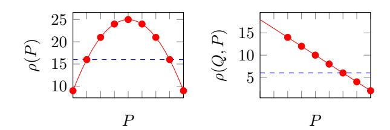
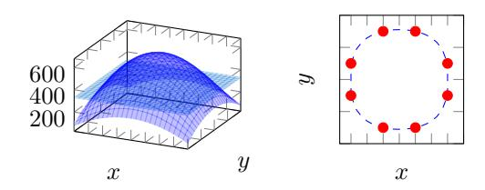
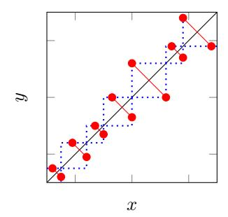
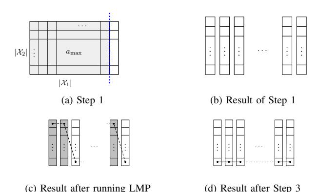

# Multidimensional Database Reconstruction from Range Query Access Patterns

Akshima, David Cash, Francesca Falzon, Adam Rivkin, Jesse Stern *Department of Computer Science University of Chicago Chicago, Illinois 60637*

*Email:* {*akshima, davidcash, ffalzon, amrivkin, jesseastern*}*@uchicago.edu*

*Abstract*—This work considers the security of systems that process encrypted multi-dimensional range queries with only *access pattern* leakage. Recent work of Kellaris et al. (CCS 2016) showed that in one dimension, an adversary could use the access patterns of several uniformly random range queries to reconstruct a plaintext column of numbers "up to reflection." We extend this attack to two dimensions and find that the situation is much more complicated: Information theoretically it is complex to describe even what is possible to recover for the adversary in general. We provide a classification of these limits under certain technical conditions. We also give a faster algorithm that works for "dense" databases that contain at least one record for each possible value. Finally we explore the implications for our classification with real data sets.

## 1. Introduction

The need to outsource large datasets to third parties has increased rapidly over recent years. In turn, this has spurred the study of untrusted storage systems and their security. Potential solutions like *order revealing encryption* have been subject to devastating attacks [\[2\]](#page-12-0), [\[4\]](#page-12-1), [\[7\]](#page-13-0), [\[14\]](#page-13-1), a fact that underscores the need to better understand the security of these schemes. General-purpose primitives like fully-homomorphic encryption and oblivious RAM provide theoretical solutions, but the state-of-the-art are still not efficiently implementable and it is not yet clear if and how well they would scale to realistic large data.

Other index-based approaches, generally referred to as encrypted databases (EDBs), provide plausibly practical, but still leaky, solutions. These systems can support a variety of query types, including subsets of SQL (e.g. [?], [\[8\]](#page-13-2)). When a query is processed by an EDB, the client learns the results of the query and the third-party storage system learns some "leakage" about the data and the query. Ideally this leakage would not be there, but varying levels of leakage are allowed in order to get more efficient systems. What sort of leakages should be allowed, however, is a question of ongoing research. EDBs are being used in academic research [\[15\]](#page-13-3), [\[16\]](#page-13-4), [\[17\]](#page-13-5) and industry [\[3\]](#page-12-2), [\[18\]](#page-13-6), and will likely continue to be used despite leakage-based attacks because they still resist other weaker attacks (e.g. a smashand-grab data breach no longer reveals an entire column of credit card information).

In this paper, we initiate the study of leakage of EDBs processing *multi-dimensional* range queries on encrypted columns. We assume only a basic form of leakage called *access patterns*, meaning that a persistent passive adversary will learn which (encrypted) records are returned for each query. Several recent works [\[5\]](#page-12-3), [\[6\]](#page-13-7), [\[9\]](#page-13-8), [\[10\]](#page-13-9), [\[11\]](#page-13-10), [\[12\]](#page-13-11), [\[13\]](#page-13-12) have considered simpler, single-dimensional, variants of this setting, in which an untrusted storage system holds a single column of strongly-encrypted numeric values, with the key stored elsewhere (for example, at a client endpoint). A client requests several range queries, meaning that for each query it wants all entries of the column with values between some given a ≤ b. Newer EDB schemes support more complex queries than these, but the implications of their leakage have not been explored in detail. Implementers may simply assume that the more complex structure of multi-dimensional queries would mitigate attacks because it defeats the explicit attacks appearing in the literature, and this paper works towards addressing that tendency by giving attacks and also illuminating the basic limitations of such possible attacks. Moreover, our work provides insight into the structure of the databases that an attacker can recover which can potentially be used to inform future techniques for mitigating these attacks.

AP LEAKAGE OF RANGE QUERIES. *Access pattern (AP) leakage*, reveals to the possibly-compromised storage server which records are returned on each query. AP leakage was previously considered in several works [\[6\]](#page-13-7), [\[9\]](#page-13-8), [\[10\]](#page-13-9), [\[11\]](#page-13-10), [\[12\]](#page-13-11), [\[13\]](#page-13-12), where under different conditions, it was shown that the entire plaintext column could essentially be recovered from the leakage with high probability, primarily when the client range queries are drawn *uniformly at random*.

We recall the formal setting for these works. In their setting, a plaintext database DB consists of a list R entries, where each each entry is a value in some ordered domain X , which is typically taken to be a set of the form X = {1, . . . , N}. A query is a pair q = (a, b) ∈ X <sup>2</sup> with a < b, and the *access pattern of* q *on* DB is the set {j ∈ [R] : a ≤ DB[j] ≤ b}. A typical attack in this setting, due to Kellaris et al. [\[9\]](#page-13-8), shows that DB can *almost* be recovered given a sequence of sets computed as AP(DB,q) for around  $N^4$  uniformly random and independently chosen queries q. We say *almost* because there is another database DB' with "reflected" values, defined by DB'[j] = N - DB[j] + 1, that will generate the same distribution of access patterns and is thus indistinguishable.

#### 1.1. Our Contributions

We consider AP leakage for *multidimensional* databases, which contain multiple numeric columns and support range queries for records that lie inside of rectangles. We state most of our results in dimension 2, where most of the complications already arise.

In more detail, suppose a plaintext database DB consists of a list R entries, where each entry is from a domain of the form  $\mathcal{D} = \mathcal{X} \times \mathcal{X}$  and  $\mathcal{X}$  is some ordered set. A range query q on DB consists of two points  $q = (\mathbf{a}, \mathbf{b})$ , where  $\mathbf{a} = (\mathbf{a}_x, \mathbf{a}_y)$  and  $\mathbf{b} = (\mathbf{b}_x, \mathbf{b}_y)$  are from  $\mathcal{D}$ , and we define the access pattern of the query, denoted  $\mathsf{AP}(\mathsf{DB}, q)$ , to be the subset of [R] defined by  $j \in \mathsf{AP}(\mathsf{DB}, q)$  iff  $\mathsf{DB}[j]$  matches the query (i.e. has x and y coordinates between the those of  $\mathbf{a}$  and  $\mathbf{b}$ ).

For most of our results we investigate to what extent DB can be recovered after observing  $AP(\mathrm{DB},q)$  for several uniformly random and independent queries q. Our first set of results shows that even defining what can information-theoretically recovered is immensely complicated to describe, in contrast to the one-dimensional case where recovery up to reflection is possible. For instance, we show that there exist families of  $O(2^R)$  different databases that are indistinguishable, and that the exact number depends on the arrangement of the points of the databases, the domain sizes in either dimension, as well as number-theoretic considerations, including the number of integral solutions to a certain Diophantine equation.

We tame this complexity for a wide class of databases by providing a classification of these indistinguishable families when the database satisfies some technical conditions. Based on this classification, we exhibit an attack using around  $|\mathcal{X}|^8$  queries (or  $|\mathcal{X}|^4$  with search pattern leakage) that recovers the entire family of indistinguishable databases, and investigate how often our technical conditions tend to hold in some datasets. We further generalize this attack from square domains to general rectangular domains, the details of which can be found in Appendix C. In addition to our attack under technical constraints, we present a heuristic approach for database reconstruction that makes no strong assumptions about the records and their properties.

We also investigate attacks when the database is *dense*, meaning that every possible value in the domain is achieved by some point in the database. This setting was studied by Lacharité et al [12] in the one-dimensional case, where they showed that about  $N^2$  random queries sufficed for recovery. We build on their ideas to give an  $N^4$  attack in two dimensions, and also show that most of the complexity of identified above disappears in the case of dense databases

(though not entirely; there are still either 1, 2, 4 or 8 indistinguishable databases rather 1 or 2).

Furthermore, we investigate the extent to which the "real" database can be recovered from among a family of indistinguishable databases given auxiliary data drawn from the same distribution as the records in the target database. For this attack, we demonstrate how mean squared error with respect to the auxiliary training data can be leveraged to correctly compute the true DB with high accuracy in all our experiments.

#### 1.2. Prior and related work

Database reconstruction from access patterns has received much attention in recent years. Kellaris et al. [9] showed that for any one-dimensional database defined on the domain [1, N], one can determine the exact record values up to reflection with  $O(N^4 \log(N))$  uniformly random queries. Moreover, reconstruction can be done with only  $O(N^2 \log N)$  queries if the database is *dense*. Informally, a dense database is one in which each domain value is associated with at least one record. In [12], improve on the dense database attack and present an algorithm that succeeds in reconstructing dense databases with  $O(N \log N)$ queries. For large N, these query complexities can quickly become impractical, so LMP additionally presented an  $\epsilon$ approximate database reconstruction ( $\epsilon$ -ADR) attack that recovers all plaintext values up to some additive  $\epsilon N$  error with only  $O(N \log \epsilon^{-1})$  queries.

Grubbs et al. [6] present a generalization of this approximation attack, called sacrificial  $\epsilon$ -ADR. Unlike LMP's attack, the GLMP attacks are scale free and, as such, the success of the algorithms are dependent only on the value of  $\epsilon$  (as opposed to both  $\epsilon$  and N). The first attack requires  $O(\epsilon^{-4}\log\epsilon^{-1})$  queries under the assumption of uniformly random range queries, and the second attack succeeds with only  $O(\epsilon^{-2}\log\epsilon^{-1})$  uniformly random queries and the additional assumption that there exists some record in the database whose value is in the range [0.2N, 0.3N] (or its reflection).

In a different line of work, Kornaropoulos et al. [11] combined access pattern leakage with search-pattern leakage, another form of leakage that is revealed in all known structured encryption (STE) schemes. Search pattern leakage reveals repeated queries through the use of search tokens. By applying statistical learning methods to this additional information, they are able to reconstruct databases for unknown query distributions.

#### <span id="page-1-0"></span>2. Preliminaries

PLAINTEXT DOMAINS AND DATABASES. We are concerned with range queries over some ordered domain  $\mathcal{X}$ . While prior work typically took  $\mathcal{X} = \{1, \dots, N\}$  for some integer N, we use *centered domains* of the form  $\mathcal{X} = \{-(N-1), \dots, 0, \dots, N-1\}$ . These domains will greatly simplify our formulae. Except for the implication that  $|\mathcal{X}|$  is odd,

this choice of domain is essentially immaterial in that an attacker can internally shift the data it recovers by the appropriate offset. We remark that all of our results hold in even size domains by taking  $\mathcal{X} = \{-N+1, -N+3, \ldots, -1, 1, \ldots, N-3, N-1\}$ , in which case our theorems will hold as stated.

A domain for a database will always be a set of the form  $\mathcal{D} = \prod_{i=1}^d \mathcal{X}_i$ , where  $\mathcal{X}_i$  are centered domains (possibly of different sizes). When the  $\mathcal{X}_i$  are all equal, we say the domain is square. We define a database DB over the domain  $\mathcal{D}$  to be an element of  $\mathcal{D}^R$ , i.e. an R tuple over the Cartesian product of centered domains  $\mathcal{X}_i$ , for some integer R. We refer to d as the dimension of DB and R as the number of records of DB. We will write  $\mathrm{DB}[j]$ ,  $1 \leq j \leq R$ , for the j-th record in DB. For  $\mathcal{S} \subseteq [R]$ , we write  $\mathrm{DB}[\mathcal{S}]$  for the set of records corresponding to  $\mathcal{S}$ , i.e.  $\{\mathrm{DB}[j]: j \in \mathcal{S}\} \subseteq \mathcal{D}$ .

When d=2, we will often write P and Q for points in  $\mathcal{X}_1 \times \mathcal{X}_2$ , and refer to the coordinates as  $P_x, P_y$  and  $Q_x, Q_y$  respectively.

Unless stated otherwise (and specifically in Section 5), we shall always assume that the records in DB are distinct. From the point of view of our attacks, it would always be easy to recognize repeated records at essentially no cost in adversary effort, as we comment later.

RANGE QUERIES AND ACCESS PATTERNS. For a d-dimensional database  $\mathrm{DB} \in \mathcal{D}^R$  over the domain  $\mathcal{D} = \prod_{i=1}^d \mathcal{X}_i$ , the set of range queries on  $\mathcal{D}$ , denoted  $\mathrm{Qrs}(\mathcal{D})$ , consists of pairs  $q = (\mathbf{a}, \mathbf{b}) \in \mathcal{D} \times \mathcal{D}$  such that  $\mathbf{a}[i] \leq \mathbf{b}[i]$  for each i. We have

$$|\mathsf{Qrs}(\mathcal{D})| = \prod_{i=1}^d \binom{|\mathcal{X}_i|+1}{2}.^1$$

We define the access pattern of range query q = (a, b) on DB as

$$\mathsf{AP}(\mathsf{DB},q) = \left\{ j \ : \ \mathsf{DB}[j] \in \prod_{i=1}^d \left\{ \mathbf{a}[i], \dots, \mathbf{b}[i] \right\} \right\} \subseteq [R].$$

Thus AP(DB, q) consists of the indexes of entries in DB that lie in the box with **a** in the "lower left" corner and **b** in the "upper right" corner.

EQUIVALENT DATABASES. As we review in the next section, Kellaris et al. observed that some distinct databases will induce the same distribution of access patterns under random queries. We abstract this notion as follows.

**Definition 1.** Fix a domain  $\mathcal{D}$  and let  $\mathcal{Q}$  be a distribution on  $Qrs(\mathcal{D})$ . We say two databases  $DB_0, DB_1$  over  $\mathcal{D}$  are equivalent under query distribution  $\mathcal{Q}$  and write  $DB_0 \stackrel{\mathcal{Q}}{\sim} DB_1$  if for all  $\mathcal{S} \subseteq [R]$ 

$$Pr[AP(DB_0, q) = S] = Pr[AP(DB_1, q) = S],$$

<span id="page-2-0"></span>1. This formula holds because in each dimension there are  $\binom{|\mathcal{X}_i|}{2}$  queries with distinct endpoints, plus another  $|\mathcal{X}_i|$  queries with the same upper and lower endpoints.

```
Game \mathsf{FDR}^{\mathcal{A}}_{\mathsf{DB},\mathcal{Q}}

Oracle \mathsf{Qry}()
q \overset{\$}{\leftarrow} \mathcal{Q}
return \mathsf{AP}(\mathsf{DB},q)

\mathsf{Fin}(\widehat{\mathsf{DB}})
\mathsf{if} \ \widehat{\mathsf{DB}} \overset{\&}{\sim} \mathsf{DB} \ \mathsf{output} \ 1\nelse \mathsf{output} \ 0
```

```
\begin{aligned} & \underline{\text{Game AllFDR}_{\mathrm{DB},\mathcal{Q}}^{\mathcal{A}}} \\ & \underline{\text{Oracle Qry}()} \\ & q \overset{\$}{\leftarrow} \mathcal{Q} \\ & \text{return AP}(\mathrm{DB},q) \\ & \text{Fin}(S) \\ & \text{if } S = \mathsf{E}(\mathrm{DB},\mathcal{Q}) \text{ output 1} \\ & \text{else output 0} \end{aligned}
```

Figure 1. Games  $\mathsf{FDR}_{\mathrm{DB},\mathcal{D}}$  and  $\mathsf{AllFDR}_{\mathrm{DB},\mathcal{D}}$ 

where q is a query drawn from distribution Q. We define the set

$$\mathsf{E}(\mathrm{DB},\mathcal{Q}) = \{\mathrm{DB}' \in \mathcal{D}^R : \mathrm{DB}' \stackrel{\mathcal{Q}}{\sim} \mathrm{DB}\}.$$

When  $\mathcal Q$  is the uniform distribution on  $\mathsf{Qrs}(\mathcal D)$  we drop it from the notation, writing  $\mathrm{DB}_0 \sim \mathrm{DB}_1$  and  $\mathsf{E}(\mathrm{DB})$  respectively.

FULL DATABASE RECONSTRUCTION ATTACKS. Let  $\mathcal{A}$  be an adversary,  $\mathcal{D}$  be a domain for a database  $\mathrm{DB} \in \mathcal{D}^R$ , and  $\mathcal{Q}$  be a distribution on  $\mathrm{Qrs}(\mathcal{D})$ . Define the *FDR advantage* of  $\mathcal{A}$  against  $\mathrm{DB}$  with query distribution  $\mathcal{Q}$  to be

$$\mathbf{Adv}^{\mathrm{fdr}}_{\mathrm{DB},\mathcal{Q}}(\mathcal{A}) = \Pr[\mathsf{FDR}^{\mathcal{A}}_{\mathrm{DB},\mathcal{Q}} = 1],$$

where the  $\mathsf{FDR}^\mathcal{A}_{\mathsf{DB},\mathcal{Q}}$  is defined in Figure 1. (Recall that in a game, following [1], an adversary  $\mathcal{A}$  is run with the oracles in the game, which in this case include Qry and a special Fin oracle. When the latter is called, the game ends and produces an output.) When  $\mathcal{Q}$  is the uniform distribution on  $\mathsf{Qrs}(\mathcal{D})$  we simply write  $\mathsf{FDR}^\mathcal{A}_{\mathsf{DB}}$  and  $\mathbf{Adv}^\mathsf{FDR}_{\mathsf{DB}}(\mathcal{A})$  respectively. We also define a related game  $\mathsf{AllFDR}^\mathcal{A}_{\mathsf{DB},\mathcal{Q}}$  in Figure 1.

We also define a related game  $\mathsf{AllFDR}_{\mathsf{DB},\mathcal{Q}}^{\mathcal{A}}$  in Figure 1. This game is the same, except to win, the adversary must output *every* database equivalent to DB. We define

$$\mathbf{Adv}^{\mathrm{all-fdr}}_{\mathrm{DB},\mathcal{Q}}(\mathcal{A}) = \Pr[\mathsf{AllFDR}^{\mathcal{A}}_{\mathrm{DB},\mathcal{Q}} = 1].$$

OUR DATASETS. We support our findings with analysis of real datasets. We use hospital records from the years 2004, 2008, and 2009 of the Healthcare Cost and Utilization Project's Nationwide Inpatient Sample (HCUP, NIS)<sup>2</sup> and seven years, 2012-2018, of Chicago crime locations from

<span id="page-2-2"></span>2. https://www.hcup-us.ahrq.gov/nisoverview.jsp. We did not deanonymize any of the data, our attacks are not designed to deanonymize medical data, and authors underwent the HCUP Data Use Agreement training and submitted signed Data Use Agreements.

the City of Chicago's data portal<sup>3</sup>. Prior works on EDBs have also used HCUP data for experimental analysis. The 2009 HCUP data was previously used for the KKNO and LMP attacks, and all three years were used in GLMP19's volume leakage paper. These years were chosen due to their prior use and changes in HCUP's sampling methodology, but other years should give similar results. Also, because our theorem opens up the possibility of reconstructing databases stored by two attributes, we explore a new setting for access pattern attacks, geographic databases indexed by longitude and latitude. We use Chicago crime data which is made publicly available by the city. Each Chicago database represents the locations of crimes within a district during a year. Chicago was re-districted in 2012, so we only use the 22 districts from years after 2012.

Each year of HCUP data contains a sample of inpatient medical records in the United States. 2004, 2008, and 2009 include data from 1004, 1056, and 1050 hospitals and 8004571, 8158381, and 7810762 records respectively. We represent a database as the records from a single hospital in a year indexed by two attributes. The NIS is the largest longitudinal hospital care collection in the United States and contains many attributes for each record. We only use a small subset of attributes which were used by prior works and come from the Core data file for our analysis. Like KKNO, we divide the age domain into two attributes for minors and adults. One problem is that while the Agency for Healthcare Research and Quality (AHRQ) provides hospitals with a format and domain for each attribute, many hospitals do not follow the AHRQ guidelines in practice. We use the AHRQ formats for our domain sizes and omit data which does not lie within the domain. We use the following attributes:

We use seven years of Chicago crime data with 22 districts, leading to a total of 154 databases. Exact longitudes and latitudes are given up to 12 decimal points, but we scale and group the latitudes and longitudes of crime data into domains of equal sizes. For an attribute i of  $a_{i_1,i_2} \in \mathbb{R}$  and some chosen domain size N, the rescaled value of i is i' = $\frac{(i-i_{min})*(2N-2)}{i} - (N-1)$  rounded to the nearest integer. We choose to scale latitudes to N = 5, 10, 20, 30, 50, 100,and 1000, and we scale longitudes to domains of size N multiplied by the ratio of longitude range to latitude range in that district. The minimum longitude was typically around  $\frac{N}{5}$  and the maximum around 3.6N. The latitudes and longitudes were only equal for 6 databases. Also, we use data with exact longitudes and latitudes as integer values by multiplying by  $10^{12}$  and then centering. The minimum number of crimes in a district across all years was 4162 and the maximum was 22434.

#### <span id="page-3-1"></span>3. Queries Densities and the KKNO Attack

QUERY DENSITIES. An insight of Kellaris et al. [9] is that, for uniformly random one-dimensional range queries, the

<span id="page-3-0"></span>https://data.cityofchicago.org/Public-Safety/Crimes-2001-to-present/ijzp-q8t2



Figure 2. Plots of  $\rho(P)$  and  $\rho(Q,P)$  for N=5 (and  $\mathcal{X}=\{-4,\dots,4\}$ ) and Q=-3. The functions are viewed as real curves with integral points marked. If the first stage of KKNO found that the minimal  $\rho$ -valued point has  $\rho(\mathrm{DB}[j^*])=16$ , then it finds  $\mathrm{DB}[j^*]=\pm 3$  in the left plot. It assumes  $\mathrm{DB}[j^*]=-3$ . Say another point  $\mathrm{DB}[j]$  is found to have  $\rho(\mathrm{DB}[j^*],\mathrm{DB}[j])=6$ . In the right plot the attack can solve and find that  $\mathrm{DB}[j]=2$ .

probability that a record belongs to a random query almost uniquely determines the value of the record. We formalize their idea via what we call a *query density*. We later generalize the notion of query densities to higher dimensions.

For a centered domain  $\mathcal{X} = \{-(N-1), \dots, N-1\}$ , and a set of points  $\mathcal{P} \subseteq \mathcal{X}$ , we define the *1-dimensional query density* function  $\rho$  by

$$\rho(\mathcal{P}) = |\{(a,b) \in \mathsf{Qrs}(\mathcal{X}) : \mathcal{P} \subseteq \{a,\dots,b\}\}|$$

Thus  $\rho(\mathcal{P})$  is the number of queries which contain  $\mathcal{P}$ , and is between 0 and  $|\mathsf{Qrs}(\mathcal{X})| = \binom{|\mathcal{X}|+1}{2}$ . The probability that a uniformly random range query contains all the points in  $\mathcal{P}$  is  $\rho(\mathcal{P})/|\mathsf{Qrs}(\mathcal{X})|$ . In one dimension, our centered domains make  $\rho$  have a simple form:

$$\rho(\mathcal{P}) = (N + \min \mathcal{P})(N - \max \mathcal{P}).$$

When  $\mathcal{P} = \{P_1, \dots, P_t\}$  we sometimes write  $\rho(P_1, \dots, P_t)$  as the formula defining  $\rho$  does not depend on the order of its arguments. So for a single point,  $\rho$  is particularly simple:

$$\rho(P) = (N+P)(N-P) = N^2 - P^2.$$

We note that  $\rho$  implicitly depends on the domain  $\mathcal{X}$ , but the domain should always be clear from context.

PRIOR ATTACK. The Kellaris et al. attack can be abstracted into two steps: The first estimates

$$\rho(\mathrm{DB}[j]) = N^2 - \mathrm{DB}[j]^2$$

for each j by collecting queries and observing the frequency with which index j appears. After an accurate estimate of  $\rho(\mathrm{DB}[j])$  is computed with high probability, the attack solves this quadratic equation, determining  $\mathrm{DB}[j]$  up to its sign. See Figure 3 for an geometric example, where on the left plot this is done by intersecting a conic and a line. At this point all points can be determined up to sign, but setting those signs arbitrarily will typically result in a database that is not equivalent to the one under attack.

To determine the signs, the attack proceeds as follows. The attack then finds the index of the point with minimal query density; call this index  $j^*$ . The attack arbitrarily fixes  $\mathrm{DB}[j^*]$  to (say) the smaller of the two possible points for

| Attributes               | Description                 | $ \mathcal{X} $ 2004 | $ \mathcal{X} $ 2008 | $ \mathcal{X} $ 2009 |  |  |
|--------------------------|-----------------------------|----------------------|----------------------|----------------------|--|--|
| AGE                      | Age in years                | 91                   | 91                   | 91                   |  |  |
| AGEDAY                   | Age in days                 | 365                  | 365                  | 365                  |  |  |
| AGE<18                   | Age < 18                    | 18                   | 18                   | 18                   |  |  |
| AGE≥18                   | $Age \ge 18$                | 73                   | 73                   | 73                   |  |  |
| LOS                      | Length of stay              | 366                  | 365                  | 365                  |  |  |
| AMONTH                   | Admission month             | 12                   | 12                   | 12                   |  |  |
| NCH                      | Number chronic conditions   | N/A                  | 16                   | 26                   |  |  |
| NDX                      | Number diagnoses            | 16                   | 16                   | 26                   |  |  |
| NPR                      | Number procedures           | 16                   | 16                   | 26                   |  |  |
| ZIPINC                   | Income quartile of zip code | 4                    | 4                    | 4                    |  |  |
| TABLE 1. HCUP ATTRIBUTES |                             |                      |                      |                      |  |  |

 $\mathrm{DB}[j^*]$ . Then there is a second phase that estimates, for all  $j \neq j^*$ ,

$$\rho(\mathrm{DB}[j^*], \mathrm{DB}[j]) = (N + \mathrm{DB}[j^*])(N - \mathrm{DB}[j]).$$

Note that this formula holds because  $\mathrm{DB}[j^*]$  is the extreme point in DB and it always "on the same side" of the  $\mathrm{DB}[j]$ . (If there were not the case then which point is minimum would depend on  $\mathrm{DB}[j]$ ; this is where the first stage is crucial.) Finally the attack solves these R-1 linear equations uniquely for all of the  $\mathrm{DB}[j]$ ,  $j\neq j^*$ . In the right plot of Figure 3 this process is done geometrically by intersecting two lines. Reversing the sign of all the points recovered results in another equivalent database.

Once standard concentration estimates are applied, the following is proved:

<span id="page-4-2"></span>**Theorem 1** ( [9]). For any centered domain  $\mathcal{X} = \{-(N-1), \ldots, N-1\}$ , there exists an adversary  $\mathcal{A}$ , issuing  $O(N^2 \log N)$  queries, such that that for all  $\mathrm{DB} \in \mathcal{X}^R$ ,

$$\mathbf{Adv}^{\mathrm{all\text{-}fdr}}_{\mathrm{DB}}(\mathcal{A}) \geq 1 - 2^{-\Omega(N)}.$$

Moreover, for any  $DB \in \mathcal{X}^R$ , E(DB) has the form  $\{DB, -DB\}$ .

We comment that the query complexity does not depend on R because we have assumed all of the records in DB are distinct, and hence  $R \leq |\mathcal{X}|$ .

Intuitively, the association between subsets  $\mathcal S$  of [R] and values of  $\rho(\mathrm{DB}[\mathcal S])$  encapsulates all of the information available to an FDR adversary. (We make this precise later in Lemma 1.) The KKNO attack can be thought of as inverting this association. More formally, view DB as a function  $f:[R]\to\mathbb R\supseteq\mathcal X$ , defined by  $f(i)=\mathrm{DB}[i]$ , and consider the following transform

$$\{f: [R] \to \mathbb{R}\} \to \{\hat{f}: 2^{[R]} \to \mathbb{R}\}$$
 
$$DB \mapsto \widehat{DB}.$$

where  $\hat{f}$  is defined by  $\hat{f}(\mathcal{S}) = \rho(\mathrm{DB}[\mathcal{S}])$ . By the attack above we see that this transform is two-to-one, unless DB consists of a single point at 0 (and otherwise DB and  $-\mathrm{DB}$  have the same transform; Another consequence of our choice of centered domains is that this relationship is simple). The KKNO attack is inverting this transform and finding the full preimage. Moreover, the attack is efficient in that it only

needs access to about 2R values from amongst the  $2^R$  values of  $\hat{f}.$ 

# <span id="page-4-1"></span>**4.** Query Densities and Equivalent Databases in Two Dimensions

Before considering an attack, we examine how the notion of equivalent databases changes in higher dimensions, and in particular dimension 2 with square domains where most of the complexities already crop up.

QUERY DENSITIES IN HIGHER DIMENSIONS. We start by directly generalizing the notion of query density to higher dimensions. For centered domains  $\mathcal{X}_i = \{-(N_i-1), \dots, N_i-1\}$  and  $\mathcal{P} \subseteq \mathcal{D} = \prod_{i=1}^d \mathcal{X}_i$ , define

$$\rho(\mathcal{P}) = \left| \left\{ (\mathbf{a}, \mathbf{b}) \in \mathsf{Qrs}(\mathcal{D}) : \mathcal{P} \subseteq \prod_{i=1}^d \{\mathbf{a}[i], \dots, \mathbf{b}[i]\} \right\} \right|$$

Similarly to before, a formula for computing  $\rho$  is

$$\rho(\mathcal{P}) = \prod_{i=1}^{d} (N_i + \min_{P \in \mathcal{P}} P[i])(N_i - \max_{P \in \mathcal{P}} P[i]).$$

Thus for a single point P,

$$\rho(P) = \prod_{i=1}^{d} (N_i + P[i])(N_i - P[i]) = \prod_{i=1}^{d} (N_i^2 - P[i]^2)$$

We will use several times that equivalence of databases is determined by equivalence of query densities. The simple relationship is akin to that of cdfs and pdfs for discrete distributions.

<span id="page-4-0"></span>**Lemma 1.** For any domain  $\mathcal{D}$  and any two databases  $DB_0, DB_1 \in \mathcal{D}^R$  with the same number of records,  $DB_0 \sim DB_1$  if and only if for all  $\mathcal{S} \subseteq [R]$ ,

$$\rho(\mathrm{DB}_0[\mathcal{S}]) = \rho(\mathrm{DB}_1[\mathcal{S}]).$$

The proof of Lemma 1 can be found in Appendix A.1.

EQUIVALENT DATABASES IN SQUARE 2-DIMENSIONAL DOMAINS. For the remainder of this section we work with a square domain of the form  $\mathcal{X}^2$ . To reduce notation, for a point  $P \in \mathcal{X}^2$ , we write  $P = (P_x, P_y)$  for its coordinates.



Figure 3. Visualization of the first stage of the KKNO algorithm in two dimensions. The left plot represents solving  $\rho(P)=a$  by intersecting a plane with a degree 4 curve in two variables. The intersection of these curves is plotted on the right, with the 8 integral points highlighted. The integrals points are obtained by applying rigid motions of the square to each other. In general there will be additional integral points not obtained in this way.

We are interested in the structure of E(DB) for DB  $\in (\mathcal{X}^2)^R$ . By examining the algebraic formula for  $\rho$  and applying Lemma 1, it is apparent that applying "rigid motions of the square" to DB will result in an equivalent database. More formally, define the functions  $\sigma((P_x,P_y))=(P_y,P_x)$  (reflection across the x=y diagonal) and  $r(P_x,P_y)=(P_x,-P_y)$  (rotation 90 degrees clockwise), and extend them to apply to databases in  $\mathcal{X}^R$  by applying them to every record. We then have that  $\sigma(\mathrm{DB})\sim\mathrm{DB}$  and  $r(\mathrm{DB})\sim\mathrm{DB}$ . Moreover, iterating r and  $\sigma$  generates 8 databases that are all equivalent.

We let  $\operatorname{Rot}(\mathcal{X}^2)$  be the set of four rotations on  $\mathcal{X}^2$  by multiples of 90 degrees. Formally,  $\operatorname{Rot}(\mathcal{X}^2) = \{r^0, r, r^2, r^3\}$ , where  $r^0$  is the identity map. It is then natural to conjecture that

$$\mathsf{E}(\mathrm{DB}) = \{ r(\mathrm{DB}), r(\sigma(\mathrm{DB})) : r \in \mathsf{Rot}(\mathcal{X}^2) \},$$

and in particular that  $|E(DB)| \le 8$ . Interestingly, this is the wrong bound in general: We show that |E(DB)| is not bounded by a constant and may even be exponential in R.

GENERALIZING KKNO TO 2-DIMENSIONS: AN ATTEMPT. Let us examine what happens we naively generalize KKNO to a square domain  $\mathcal{D} = \mathcal{X} \times \mathcal{X}$ .

The high-level plan is to first recover, up to some symmetry, the point  $\mathrm{DB}[j^*]$  which has the smallest query density. Then the attack would arbitrarily break the symmetry to fix  $\mathrm{DB}[j^*]$ , and use the joint query densities  $\rho(\mathrm{DB}[j^*], \mathrm{DB}[j])$  to fix the remaining  $\mathrm{DB}[j]$ .

The first step is to estimate  $\rho(\mathrm{DB}[j])$  for every j. After estimating these, we can attempt to implement the first step of KKNO, which previously solved for  $\mathrm{DB}[j]$  up to sign. To the ease the notation in what follows, write  $\mathrm{DB}[j] = (x,y) \in \mathcal{X}^2$  and  $\rho(\mathrm{DB}[j]) = a$ . Assume we know a, we need to solve the equation

$$a = (N^2 - x^2)(N^2 - y^2)$$
 (1)

for x,y. This is depicted in Figure 4. As a function of x and y,  $\rho$  is a degree-4 curve. Solving this involves intersecting the curve with the plane z=a, which results in the curve on right side of the figure. It is already apparent that the situation in two dimensions is dramatically different form



Figure 4. Representation of a family of equivalent databases that are not generated by the 8 rigid motions of a square. A member of the family is determined by selecting one point from of each of the diagonally connected pairs. Each member can be seen to be equivalent via Lemma 1 and checking cases. The dotted lines represent the set  $\mathcal{X}_{\pi}^2$  which must exist via Theorem 2. In this case there are  $\ell=7$  sets in the partition.

one dimension: Instead of getting two real points in this intersection, we get an infinite number of solutions.

We can partially resolve this situation by noting that the points we want on the curve must be *integral*: We are actually attempting to solve (1) over the integers. By inspection, we can see that if (x,y) is an integral solution, then we actually have eight integral solutions:  $(\pm x, \pm y), (\pm x, \mp y), (\pm y, \pm x), (\pm y, \mp x)$  (if  $x = \pm y$  then these will not be distinct). These correspond to the rigid motions discussed above and depicted on the right side of Figure 4. But there is no reason that these should be the only integral solutions. It appears that (1) may have an unbounded number of integral solutions (i.e. the number of solutions may grow with  $\mathcal{X}$ ), partitioned into groups of at most 8 by the rigid motions.

We were not able to solve the Diophantine equation (1) in general. A line of reasoning, however, is that (1) will tend to have at most 8 solutions in practice, so we may heuristically assume there are 8 and proceed.

We show, however that another type of symmetry sneaks in during the second phase. Even if we fix the point  $\mathrm{DB}[j^*]$  up to the eight unavoidable symmetries, there can still be other points  $\mathrm{DB}[j]$  that are not uniquely determined. We will show later that, under a technical condition on DB (that DB has a "dominating point", which requires that the point with minimal query density avoids some coincidences; we define this precisely below), these points are fixed up to one specific symmetry. However, we find that there may be several independent degrees of freedom in how they are fixed. The result is a family of  $8 \cdot 2^s$  equivalent databases, where s is the degrees of freedom and the 8 comes from the rigid motions of the square. For a visual example, consider the family of databases depicted and explained in Figure 4.

# <span id="page-5-0"></span>**4.1.** E(DB) over $\mathcal{X}^2$ with a Dominating Point

This section classifies the possible sets E(DB) when DB is a database over a square domain  $\mathcal{D}=\mathcal{X}^2$  and DB contains a point that is extremal in both dimensions in addition to satisfying an extra number-theoretic condition.

TECHNICAL LEMMA. We start with a lemma that begins to limit the possible symmetries within  $\mathsf{E}(\mathrm{DB})$ .

**Definition 2.** Let  $\mathcal{X}$  be a centered domain. We define the partial order  $\leq$  on  $\mathcal{X}^2$  by  $P \leq Q$  if  $P_x \leq Q_x$  and  $P_y \leq Q_y$ . We write  $P \not\leq Q$  if this does not hold.

<span id="page-6-1"></span>**Lemma 2.** Let  $P \in \mathcal{X}^2$  and  $a, b \in \mathbb{R}$ . Then the system of equations

$$\rho(\widehat{Q}) = a$$
$$\rho(P, \widehat{Q}) = b$$
$$P \leq \widehat{Q}$$

has at most 2 solutions. Moreover, if  $\widehat{Q}$  is one solution, then  $\sigma(\widehat{Q})$  is the only other possible solution, and it is the solution if and only if  $P \leq \sigma(\widehat{Q})$ .

The proof of Lemma 2 can be found in Appendix A.2. In this part we state and prove a theorem on how the family  $\mathsf{E}(\mathsf{DB})$  can be described when the point P of  $\mathsf{DB}$  with minimal query density also has the most extreme x and y coordinates, plus avoids some algebraic difficulties.

**Definition 3.** For  $a \in \mathbb{R}$ , define  $C_a$ , to be the curve generated over  $\mathbb{R}^2$  by

$$(N^2 - x^2)(N^2 - y^2) = a.$$

We say a point  $P \in DB$  is dominating (for DB) if either

$$P_x \le \min_{Q \in \mathrm{DB}} \{ T_x : T \in C_{\rho(Q)} \cap \mathbb{Z}^2 \} \text{ or }$$
$$P_x \ge \max_{Q \in \mathrm{DB}} \{ T_x : T \in C_{\rho(Q)} \cap \mathbb{Z}^2 \}$$

and if either

$$P_{y} \leq \min_{Q \in \mathrm{DB}} \{T_{y} : T \in C_{\rho(Q)} \cap \mathbb{Z}^{2}\} \text{ or }$$
$$P_{y} \geq \max_{Q \in \mathrm{DB}} \{T_{y} : T \in C_{\rho(Q)} \cap \mathbb{Z}^{2}\}.$$

The next definition describes the family of symmetries that exhibit the degrees of freedom discussed above.

**Definition 4.** A partition of  $\mathcal{X} = \{-(N-1), \dots, N-1\}$  is a tuple  $\pi = (a_0, a_1, \dots, a_\ell)$  with  $-(N-1) = a_0 < a_1 < \dots < a_{\ell-1} < a_\ell = N-1$ . For  $\pi = (a_0, \dots, a_\ell)$  a partition of  $\mathcal{X}$ , define

$$\mathcal{X}_{\pi}^{2} = \bigcup_{i=1}^{\ell} \{a_{j-1}, \dots, a_{j}\}^{2}.$$

For a bitstring  $w \in \{0,1\}^{\ell}$  we define the function

$$\lambda_{\pi,w}: \mathcal{X}_{\pi}^2 \to \mathcal{X}_{\pi}^2$$

$$P \mapsto \sigma^{w_j}(P), \quad P \in \{a_{j-1}, \dots, a_j\}^2.$$

In other words,  $\lambda_{\pi,w}$  is the identity on the square  $\{a_{j-1},\ldots,a_j\}^2$  if  $w_j=0$ , while if  $w_j=1$  it applies the reflection  $\sigma$  to this square. We define

$$\Lambda_{\pi} = \{ \lambda_{\pi, w} : w \in \{0, 1\}^{\ell} \}.$$

```
\label{eq:definition} \begin{split} & \underbrace{\text{Game AllSymFDR}_{\text{DB},\mathcal{Q}}^{\mathcal{A}}}_{\text{Oracle Qry()}} \\ & \underbrace{q \overset{\$}{\leftarrow} \mathcal{Q}}_{\text{return AP(DB},q)} \\ & \text{Fin}(\widehat{\text{DB}},\pi) \\ & \text{if E(DB)} = \text{Sym}(\widehat{\text{DB}},\pi) \text{ output 1} \\ & \text{else output 0} \end{split}
```

For a partition  $\pi$  and  $DB \in (\mathcal{X}_{\pi}^2)^R$  we define

$$\mathsf{Sym}(\mathrm{DB},\pi) = \{ r(\lambda(\mathrm{DB})) : \lambda \in \Lambda_{\pi}, r \in \mathsf{Rot}(\mathcal{X}^2) \}.$$

Figure 4 gives an example of  $\mathcal{X}_{\pi}^2$  via the dotted line boxes. The family in that example is an instance of an  $\mathsf{Sym}(\mathsf{DB},\pi)$  from the following theorem.

<span id="page-6-0"></span>**Theorem 2.** Assume  $DB \in \mathcal{X}^2$  contains a dominating point P such that  $P_x, P_y < 0$  and  $C_{\rho(P)} \cap \mathbb{Z}^2 = \{r(P), r(\sigma(P)) : r \in \mathsf{Rot}(\mathcal{X}^2)\}$ . Then there exists a partition  $\pi$  such that  $DB \in \mathcal{X}^2_\pi$  and

$$\mathsf{E}(\mathrm{DB}) = \mathsf{Sym}(\mathrm{DB}, \pi).$$

The proof of Theorem 2 can be found in Appendix A.3.

# <span id="page-6-2"></span>4.2. Attack over $\mathcal{X}^2$ with a Dominating Point

In this section we describe an attack that, given sufficiently many access patterns for random queries for a two-dimensional DB with a dominating point, recovers  $\widehat{DB}$  and  $\pi$  such that  $\mathsf{E}(DB) = \mathsf{Sym}(\widehat{DB},\pi).$  Strictly speaking this attack does not fit the syntax of the All-FDR definition, where the adversary must output  $\mathsf{E}(DB)$  itself, but this might be an exponentially large set. Thus we use the following definition instead. In the game AllSymFDR (see Figure 4.2) the adversary must find  $\widehat{DB}$  and  $\pi$  that describe  $\mathsf{E}(DB);$  We define

$$\mathbf{Adv}^{\mathrm{all\text{-}sym\text{-}fdr}}_{\mathrm{DB},\mathcal{Q}}(\mathcal{A}) = \Pr[\mathsf{AllSymFDR}^{\mathcal{A}}_{\mathrm{DB},\mathcal{Q}} = 1].$$

As usual we omit Q when it is the uniform distribution.

We next leverage Theorem 2 to develop the attack, which we first overview. First, the attack identifies and computes the value of the dominating point  $P_{\mathrm{dom}}$  by finding  $j \in [R]$  with minimum (estimated)  $\rho(\mathrm{DB}[j])$ ; Call this  $P_{\mathrm{dom}}$ . Using Lemma 2, the attack can determine  $P_i$  up to its reflection by  $\sigma$  by solving a quadratic equation. All that remains is to sort of the possible symmetries amongst these points.

Next the attack can order these possible points by ordered by their minimums, as described at the start of the proof of Theorem 2. The algorithm iteratively checks to see if the next point in the ordering,  $P_i$  for some  $i \in [R]$ , satisfies  $P_j \leq P_i$  and  $P_j \leq \sigma(P_i)$  for all j < i. If this is true, then  $P_i$  must sit in its own partition and  $\pi$  is updated to  $(a_0,\ldots,a_\ell,\alpha,N-1)$  where  $\alpha = \min\{(P_i)_x,(P_i)_y\}$ . Otherwise,  $\pi$  remains the same. The pseudocode for this attack can be found in Algorithm 1.

#### Algorithm 1 DomSquareFDR

<span id="page-7-0"></span>**Input:** A collection, aps, of subsets of [R]. **Output:** A database  $\widehat{DB}$  and a partition  $\pi$  of  $\mathcal{X}$ .

```
1: Initialize a new database \widehat{DB} with R records.
  2: Compute the dominating point P_1 (relabeling if necessary)
  3: for each i \in [R] do
  4:
             \hat{\rho}_i \leftarrow \text{ESTRHO}(\{i, i\}, \mathsf{aps})
            \hat{\rho}_{i,1} \leftarrow \text{ESTRHO}(\{i,1\}, \mathsf{aps})
Find P_i \in C_{\hat{\rho}_i} \cap C_{\hat{\rho}_{i,1}} \cap \mathbb{Z}^2
  5:
  6:
  7:
  8: Relabel points by their minimums, breaking ties arbitrarily.
  9: \pi \leftarrow (-N+1, N-1)
                                                      \triangleright \pi is set to the trivial partition.
10: for i = 2, ..., R do
             if P_j \leq P_i and P_j \leq \sigma(P_i) for all j < i then
11:
                   \alpha \leftarrow \min\{(P_i)_x, (P_i)_y\}
12:
                   \pi \leftarrow (a_0, \ldots, a_{\ell-1}, \alpha, N-1)
13:
14:
                   for j \in [R] s.t. DB[j] \in [a_{\ell-1}, a_{\ell}] \times [a_{\ell-1}, a_{\ell}] do
15:
                         \hat{\rho}_{i,j} \leftarrow \text{ESTRHO}(\{i,j\}, \text{aps})
\nif \hat{\rho}_{i,j} \neq \rho(\sigma(P_i), P_j) and \hat{\rho}_{i,j} = \rho(P_i, P_j) then
16:
17:
18:
19:
                         if \hat{\rho}_{i,j} = \rho(\sigma(P_i), P_j) and \hat{\rho}_{i,j} \neq \rho(P_i, P_j) then \widehat{DB}[i] \leftarrow \sigma(P_i)
20:
21:
23: return DB and \pi
```

For the purpose of estimating the values  $\rho(P_i,P_j)$  for  $i,j\in[R]$  we use a simple algorithm, denoted ESTRHO, which accepts a set of indices  $\mathcal{S}\subseteq[R]$  and aps, a collection of subsets of [R], as input. It outputs an estimate of  $\rho(\mathrm{DB}[\mathcal{S}])$  denoted  $\hat{\rho}_{\mathcal{S}}$ . It proceeds by computing

$$\hat{\rho}_{\mathcal{S}} \leftarrow |\{a \in \mathsf{aps} : \mathcal{S} \subseteq a\}|/|\mathsf{aps}|,$$

rounding  $\hat{\rho}_{\mathcal{S}}$  to the nearest integer multiple of  $\binom{N+1}{2}^{-2}$ , and then returning  $\hat{\rho}_{\mathcal{S}}$ .

<span id="page-7-1"></span>**Theorem 3.** Let  $DB \in (\mathcal{X}^2)^R$  be a database containing a dominating point P such that  $P_x, P_y < 0$  and  $C_{\rho(P)} \cap \mathbb{Z}^2 = \{r(P), r(\sigma(P)) : r \in \mathsf{Rot}(\mathcal{X}^2)\}$ . Assume that for all  $i, j \in [R]$ , algorithm  $\mathsf{ESTRHO}(\{i, j\}, \mathsf{aps})$  correctly returns  $\rho(P_i, P_j)$ . Then  $\mathsf{DomSquareFDR}$  outputs a database  $\widehat{DB} \in (\mathcal{X}^2)^R$  and a partition  $\pi$  of [R] such that  $\mathsf{E}(DB) = \mathsf{Sym}(\widehat{DB}, \pi)$ .

*Proof.* Relabel the records in [R] as in the proof of Theorem 2. We prove the following loop invariant: At the end of the iteration with value i of the second **for** loop that starts on line 10,  $\operatorname{Sym}((P_1,\ldots,P_i),\pi)=\operatorname{E}(P_1,\ldots,P_i)$ . Before the first loop this is holds. Next consider the  $i^{\text{th}}$  iteration. Either the **if** block starting on line 11 or the **else** statement starting on line 14 is executed. Following the proof of Theorem 2,  $\pi$  is updated with exactly the same conditions, and we can apply the inductive reasoning from that proof to establish the loop invariant.

**Theorem 4.** For any centered domain  $\mathcal{X}^2 = \{-(N-1), \ldots, N-1\}^2$ , there exists an adversary  $\mathcal{A}$ , issuing n

queries, such that for all  $DB \in (\mathcal{X}^2)^R$  containing a dominating point,

$$\mathbf{Adv}_{\mathrm{DB}}^{\mathrm{all-sym-fdr}}(\mathcal{A}) \ge 1 - 2R^2 \cdot \exp\left(\frac{-2n}{N^8}\right).$$

*Proof.* The adversary queries its oracle  $n = O(N^8 \log N)$  times and records all the unique responses it receives in a set aps. Then it runs DOMSQUAREFDR(aps) to obtain a database and partition  $(\widehat{DB}, \pi)$ . By Theorem 3 we only need to check that the outputs of ESTRHO are correct with probability given in the theorem.

For  $i \leq j \leq R$ , define the i.i.d. random variables

$$X_k = \begin{cases} 1 \text{ if } i, j \text{ are in the } k\text{-th sample of aps} \\ 0 \text{ otherwise,} \end{cases}$$

let  $\mathbb{E}(X_i) = \rho(P_i, P_j)/{\binom{N+1}{2}}^2$  and let  $A_{ij} = \sum_{k=1}^n X_k$ . ESTRHO succeeds when for all  $i,j \in [R]$ ,

$$\frac{A_{ij}}{n} \in \left[\frac{\rho(P_i, P_j)}{\binom{N+1}{2}^2} \pm \varepsilon\right].$$

for  $= \varepsilon = \frac{1}{2\binom{N+1}{2}^2} = O(N^{-4})$ . By a standard Chernoff bound, the probability that this does not happen is at most  $\exp(-2\varepsilon^2 n)$ . Taking a union bound over the  $R^2$  calls to ESTRHO, we get the claimed bound in theorem.

Once the number of queries is slightly above  $N^8$  we get an adversary with constant advantage. We note that if one additionally has *search pattern* leakage, then this can be reduced to  $N^4$  queries using the same method as [13].

In Appendix C, we extend the techniques presented in this section to non-square domains  $\mathcal{X}_1 \times \mathcal{X}_2$ .

# 4.3. Attack over $\mathcal{X}^2$ without a Dominating Point

We next give an approach for finding  $E(\mathrm{DB})$  for two-dimensional DB without a dominating point. Unlike our attack in the previous section, we cannot formally prove that it runs in polynomial time, but for practical purposes it is essentially as efficient as in the dominated case. Moreover it is still provably correct. We only present the attack over  $\mathcal{X}^2$  but it can be extended to non-square domains  $\mathcal{X}_1 \times \mathcal{X}_2$  with similar techniques to those used in Section C. We implemented this attack and found it ran in essentially the same time as our more limited algorithm above.

Our approach relies on the assumption that, while there may not be a record with more extreme coordinates than the  $\rho$  curves of every other record in the database, we can still choose a record  $P_1$  and run Algorithm 1 on the subset of records in DB that are dominated by  $P_1$ . This reconstructs a family of databases equivalent to the  $P_1$ -dominated subset of DB. From here, our algorithm incrementally adds the points undominated by  $P_1$  back into each member of this family. This second stage can, in principle, lead to an exponentially large description of the family of equivalent databases, but in our experiments the effect of this scaling was never substantial.

OUR ALGORITHM. The algorithm starts by choosing a good candidate for  $P_1$  and determining which points in the database it dominates. Although an adversary could possibly check how many points are dominated by each observed  $\rho$  curve to choose the optimal  $P_1$ , we suggest a heuristic that the record with the lowest  $\rho$  value will typically dominate the most points. For  $P_1$  fixed, we let  $\mathrm{Dom} \subseteq [R]$  be the set of indexes of points dominated by  $P_1$ .

Our attack then considers undominated points one at a time. Because we are adding points to our family which are not ordered by their minimums, we can no longer assure that records which can be reflected over the main diagonal independently from other records will be described by distinct squares; There may be any number of integral points on their  $\rho$ -curves.

For each undominated record  $P_i$ , the naive approach would be to check for each integral point on the record's  $\rho$  curve if this placement would lead to a database consistent with the observed query densities, i.e. a database DB' such that for all  $\mathcal{S} \subseteq \mathrm{Dom} \cup \{i\}$ ,  $\Pr[\mathsf{AP}(\mathsf{DB}',q)=\mathcal{S}]$  matches the estimated  $\rho$  values. Done naively, this approach requires checking  $2^{|\mathsf{Dom}|}$  constraints. We show how to avoid this with a polynomial computation. In particular we show that it is sufficient to only check the constraints for  $|\mathcal{S}| \leq 4$ . The following lemma formalizes the core of this reasoning:

<span id="page-8-0"></span>**Lemma 3.** For any database  $DB \subseteq \mathcal{X}_1 \times \mathcal{X}_2$  of size R and points  $P, P' \in \mathcal{X}^2$ , if for every  $S' \subseteq [R]$  of size at most 4 we have

$$\rho(\mathrm{DB}[\mathcal{S}'], P) = \rho(\mathrm{DB}[\mathcal{S}'], P'),$$

then the databases formed by appending either P or P' to DB are equivalent.

The proof of Lemma 3 can be found in Appendix A.4. The task of adding a single undominated point  $P_i$  back into the family of databases is significantly faster with this lemma. If the  $\rho$  function on a subset of at most four points in  $\widehat{\mathrm{DB}}$  union with  $P_i$  does not equal the observed ESTRHO value on the indices of those same five points, then  $\widehat{\mathrm{DB}}\|P_i$  cannot be equivalent to a subset of the real database. If the ESTRHO value agrees with the computed  $\rho$  value on all subsets of points in  $\widehat{\mathrm{DB}}'$  of size at most four union  $P_i$ , then by Lemma 3  $\widehat{\mathrm{DB}}\|P_i$  must be equivalent to the target  $\widehat{\mathrm{DB}}$  (restricted to points  $P_1,\ldots,P_i$ ). Thus we can add  $\widehat{\mathrm{DB}}\|P_i$  to our family of candidate databases. At the end of each j-th iteration of the **for** loop starting on line 15, the algorithm will have computed a family of equivalent databases  $\mathcal{F}$ , all of size  $|\widehat{\mathrm{DB}}|+j$ .

Pseudocode for our heuristic approach can be found in Algorithm 2. Our code uses a simple subroutine ISDOM which accepts  $\hat{\rho}_i, \hat{\rho}_j \in \mathbb{N}$  and tests if every integral point on  $\hat{\rho}_i$  dominates the integral points on  $\hat{\rho}_j$ .

CORRECTNESS. After the first stage of the algorithm, which ends on line 12, we have constructed a partition that describes the family of equivalent databases from the access patterns of records dominated by  $P_1$ . The correctness of this stage follows from the correctness of DomSquareFDR.

The algorithm then proceeds to the second stage, where it first initializes two sets:  $\mathcal{F} = \operatorname{Sym}(\widehat{DB}, \pi)$  and  $\mathcal{T} = \varnothing$ . For each integral point along  $C_{\widehat{\rho}_i}$  (i not in the dominating set) and for each database  $\operatorname{DB}' \in \mathcal{F}$ , the algorithm then proceeds to compute  $\rho$  for all subsets of points containing  $P_i$  of size at most five in  $\operatorname{DB}' \| P_i$  and check them against the values of ESTRHO on those same points. Correctness of this step follows from Lemma 3.

The following invariant is maintained at the end of the j-th iteration of the **for** loop on line 15: the databases in  $\mathcal{F}$  are all the databases equivalent to the target DB restricted to the points  $P_1,\ldots,P_j$ . This invariant follows from the fact that the algorithm brute-force tests all integral points  $P_i \in C_{\hat{\rho}_i}$  along with each each  $\mathrm{DB}' \in \mathcal{F}$ , and adds  $\mathrm{DB}' \| P_i$  to  $\mathcal{T}$  precisely when the  $\rho$  values of  $\mathrm{DB}' \| P_i$  agree with the observed ESTRHO values given aps. At the end of each j-th iteration,  $\mathcal{F}$  is updated to  $\mathcal{T}$  and  $\mathcal{T}$  is initialized to  $\varnothing$  so the process can be repeated for the next point  $P_{i+1}$  until all candidate points have been tested and added accordingly.

We experimentally find that for most real databases, the  $\pi$  computed by DOMSQUAREFDR describes relatively few partitions. As such, it is generally computationally feasible to iterate through all possible databases in the family  $\mathcal{F}$ . While we find a handful of real examples of databases where no record dominates another, they typically contain few points, allowing an adversary to run the second stage of the algorithm relatively quickly.

#### 4.4. Experimental Evaluation

Our structure theorem leaves a few issues open for empirical exploration: How often do databases have the dominating point required for an attack? How often does our heuristic method succeed in running quickly and generate a family of databases with manageable size in the absence of a dominating point? How many entries would an adversary usually observe in a partition  $\pi$ , and in the rectangular case, how many of those partition entries can be fixed? (Note that in the rectangular case, it is possible that a point's reflection across the diagonal may no longer be integral, hence reducing the number of possible symmetries. Further details can be found in Appendix C.) We explore these questions through data representative of what might realistically be stored in an encrypted database with two-dimensional range queries.

As described in Section 2, we use HCUP records and Chicago crime data. For HCUP data, we choose pairwise attributes for our indices. We attempt to choose attributes with a variety of data distributions. Also, we avoid pairs of attributes which do not logically make sense to compare (e.g. AGE by AGE\_BELOW\_18). For Chicago data we scale and group latitudes to domains of certain sizes, N, and then scale longitudes to domains of size N multiplied by the ratio of longitude to latitude in that district. Our results are in Table 2.

We observe that the number of databases with dominating points varies greatly with the domain sizes and the distributions of different attributes. Overall, we could run

| Attributes           | $ \mathcal{X} $ | # Dominated | # Heuristic | E(DB)  = 4/8/16 | Total DBs |
|----------------------|-----------------|-------------|-------------|-----------------|-----------|
| 2004 AGE & LOS       | 91x366          | 787         | 217         | 1004/0/0        | 1004      |
| 2004 AGEDAY & ZIPINC | 365x4           | 664         | 13          | 677/0/0         | 677       |
| 2004 AGE<18 & NPR    | 18x16           | 955         | 17          | 972/0/0         | 972       |
| 2004 AMONTH & ZIPINC | 12x4            | 932         | 16          | 948/0/0         | 948       |
| 2004 NDX & NPR       | 16x16           | 336         | 668         | 0/997/7         | 1004      |
| 2008 AGE≥18 & NPR    | 73x18           | 1013        | 42          | 1055/0/0        | 1055      |
| 2008 AMONTH & NCH    | 12x16           | 961         | 44          | 1005/0/0        | 1005      |
| 2008 NCH & NDX       | 16x16           | 196         | 860         | 0/1054/1        | 1056      |
| 2008 NCH & NPR       | 16x16           | 1021        | 35          | 0/1053/3        | 1056      |
| 2008 NDX & NPR       | 16x16           | 674         | 354         | 0/1052/4        | 1056      |
| 2009 AGE<18 & LOS    | 18x366          | 851         | 117         | 968/0/0         | 968       |
| 2009 AMONTH & AGEDAY | 12x365          | 597         | 47          | 644/0/0         | 644       |
| 2009 NCH & NDX       | 26x26           | 73          | 974         | 0/1043/7        | 1050      |
| 2009 NCH & NPR       | 26x26           | 991         | 54          | 0/1049/1        | 1050      |
| 2009 NDX & NPR       | 26x26           | 301         | 714         | 0/1017/3/       | 1050      |
| Chi LAT & LONG       | 5               | 149         | 5           | 154/0/0         | 154       |
| Chi LAT & LONG       | 10              | 121         | 33          | 154/0/0         | 154       |
| Chi LAT & LONG       | 20              | 56          | 98          | 154/0/0         | 154       |
| Chi LAT & LONG       | 30              | 27          | 127         | 154/0/0         | 154       |
| Chi LAT & LONG       | 50              | 26          | 128         | 154/0/0         | 154       |
| Chi LAT & LONG       | 100             | 21          | 133         | 154/0/0         | 154       |
| Chi LAT & LONG       | 1000            | 15          | 139         | 154/0/0         | 154       |

TABLE 2. EXPERIMENTAL MEASUREMENTS OF THE STRUCTURE THEOREM INSTANCES.

#### Algorithm 2 NONDOMSQUAREFDR

<span id="page-9-0"></span>**Input:** A collection, aps, of subsets of [R]. **Output:** A family of databases  $\mathcal{F}$ .

return TRUE

```
1: Initialize a new database \widehat{DB} with R records.
  2: Initialize a set Dom.
  3: Let P_1 dominate the most points (relabeled if necessary).
  4: for each i \in [R] do
  5:
             \hat{\rho}_i \leftarrow \text{ESTRHO}(\{i\}, \text{aps})
  6:
             if IsDom(\hat{\rho}_1, \hat{\rho}_i) then
                   \hat{\rho}_{i,1} \leftarrow \text{ESTRHO}(\{1,i\}, \mathsf{aps})
  7:
                   Find P_i \in C_{\hat{\rho}_i} \cap C_{\hat{\rho}_{i,1}} \cap \mathbb{Z}^2
  8:
                   \widehat{DB}[i] \leftarrow P_i
  9:
                   \text{Dom} \leftarrow \text{Dom} \cup \{i\}
10:
11: Project aps to only \{1\} \cup Dom
12: (DB, \pi) \leftarrow DomSQUAREFDR(aps)
13: \mathcal{F} \leftarrow \mathsf{Sym}(\mathrm{DB}, \pi)
14: \mathcal{T} \leftarrow \emptyset
15: for i \in [R] \setminus \text{Dom do}
             \hat{\rho}_i \leftarrow \text{ESTRHO}(\{i\}, \mathsf{aps})
16:
             for each P \in \mathcal{C}_{\hat{\rho}_i} \cap \mathbb{Z}^2 do for each \mathrm{DB}' \in \mathcal{F} do
17:
18:
                         if CHECK4(DB', P) = TRUE then
19:
                                \mathcal{T} \leftarrow \mathcal{T} \cup \{ \mathrm{DB}' || P \}
20:
             \mathcal{F} \leftarrow \mathcal{T}; \mathcal{T} \leftarrow \emptyset
22: return \mathcal{F}
23: procedure CHECK4(DB, P)
             n = |DB|
24:
             for all S \subseteq [n], |S| \le 4 do
25:
                   \hat{\rho} \leftarrow \text{ESTRHO}(\mathcal{S} \cup \{n+1\}, \text{aps})
26:
                   if \hat{\rho} \neq \rho(P, DB[S]) then
27:
                         return FALSE
28:
```

<span id="page-9-1"></span>our dominated point attack on 10767 out of the 15674 databases in our experiments, but there are attribute pairings with over 90% of databases with dominating points and attributes with less than 10%. As we increase our domain for the Chicago data, the number of databases with dominating points strictly decreases until a lower bound. Using a domain where the latitudes and longitudes are simply multiplied by  $10^{12}$  and centered to get exact reported locations of crimes, we find this lower limit to be 8 databases with dominating points.

Also, most dominated databases were partitioned into families of the minimum possible size generated by the canonical symmetries – 8 databases for square domains and 4 databases for rectangular domains. This leads to a strategy to speed up the heuristic approach for our experiments. While on lines 25-28 of Algorithm 2 we check for every undominated point P that the union of each S, |S| < 4, with P matches the observed  $\rho$  values, in practice we first attempt to run the algorithm checking only subsets  ${\cal S}$  such that  $|\mathcal{S}| < 2$ . This check is faster to compute and must return TRUE for every database where all S, |S| < 4, match the observed values. This attempt will output a superset of  $\mathcal{F}$ . If the size of this superset is the minimum size for a family of square or rectangular databases, then  $\mathcal{F}$  must be equal to the superset. Thus, we only need to run the algorithm again to check for all subsets such that  $|\mathcal{S}| \leq 4$ , in the case that the first run outputs a family of databases that is larger than the minimum.

Our heuristic attack succeeded for all of the remaining databases with similar runtimes to the dominated instances. We found the family of equivalent databases for all 4907 databases without dominating points and it was only necessary to run the heuristic a second time to check  $|\mathcal{S}| \leq 4$  for

18 instances.

The vast majority of databases were partitioned into a family of minimum size (15647 out of 15674 attackable DBs). A total of 26 databases had a family of size 16 and a single database from the HCUP 2008 NCH & NDX attributes had five partitions, leading to a family of 128 databases. Also, every group in rectangular partitions could be fixed to not be reflectable, suggesting that few real databases using these attributes would have an extremely large number of equivalent databases.

#### <span id="page-10-0"></span>5. Full DB Reconstruction with Dense Records

In this section we no longer assume that the records in DB are distinct. Recall that a database  $DB \in \mathcal{D}^R$  is *dense* if all values in  $\mathcal{D}$  are achieved by a at least one record in DB. In this section we show that E(DB) has a simple form for dense DB, in both the square and non-square cases. We also give an attack that recovers all of E(DB) using  $O(N^2 \log N)$  queries.

This attack generalizes the prior 1-dimensional attack for dense databases [9], but there is an interesting complication. We start with an overview of our attack: similar to the dense full reconstruction attack in 1-dimension [9], the first step is to sample enough queries so that the set  $\{AP(DB,q):q\in Qrs(\mathcal{D})\}$  can be accurately reconstructed (it is a set and not a multiset when DB is dense). The next step is to partition [R] according to the value of r. We do this using an algorithm of [12], which for each r finds the class

$$\left(\bigcap_{\substack{\{q\in \mathsf{Qrs}(\mathcal{D}):\\r\in \mathsf{AP}(\mathsf{DB},q)\}}}\mathsf{AP}(\mathsf{DB},q)\right) \setminus \left(\bigcup_{\substack{\{q\in \mathsf{Qrs}(\mathcal{D}):\\r\notin \mathsf{AP}(\mathsf{DB},q)\}}}\mathsf{AP}(\mathsf{DB},q)\right)$$

The appendix in [12] describes a computationally efficient method for determining the record partitions without explicitly computing set intersections and unions; We refer to this algorithm as FindEqual<sub>LMP</sub> and use it below.

From here we attempt to apply the prior dense-attack idea: Find the access pattern set  $a_{\rm max}$  corresponding to largest query AP(DB, q) that does not return every record. In one dimension, this query must leave out exactly records with one of the extreme values. But in two dimensions this is no longer true; See Figure 5. What is left out of  $a_{\rm max}$  are records corresponding to an extreme row or column. We cannot a priori know if a row or column will be omitted, but we can determine which was the case by examining the number of values achieved by the records that were left out (either  $|\mathcal{X}_1|$  or  $|\mathcal{X}_2|$ ).

We can continue as in [9] by finding the largest query strictly contained in  $a_{\rm max}$ , and so on. This is analagous to the ordering step of their algorithm and will partition the records into rows or columns. We can then apply the attack again to each row or column, and order them up to reversal. But there is one final wrinkle, in that the reversals in these rows/columns must be coordinated; Any should be reversed if and only if all are reversed. We disambiguate the reversals by locating the smallest query containing one of the extreme



<span id="page-10-1"></span>Figure 5. Visualization of the maximal query in two dimensions.

values per row/column. Since it is the smallest such query, these extreme values must the be the largest, or they all must be the smallest. In either case we learn which rows/columns to reverse, in order to obtain an equivalent database.

THE CORE OF THE ATTACK. We describe two algorithms, PARTITION and DENSEFDR. Both of these need to be given as input the full access pattern set  $\{AP(DB,q):q\in Qrs(\mathcal{D})\}$  in order to be correct. Afterwards we recall how this set can be computed via coupon-collecting.

The algorithm Partition implements the idea of [9] in two dimensions. We will actually run the same algorithm on two different types of inputs: Sometimes on the full domain, and sometimes on specific rows or columns. In the latter case it collapses essentially to the prior attack, but we state it as one algorithm for brevity and clarity of the ideas. After describing Partition we prove it correct for the different types of inputs in Lemmas 4 and 5. The pseudocode for Partition (Algorithm 4) can be found in Appendix A.3.

<span id="page-10-2"></span>**Lemma 4.** Let  $\mathcal{D}=\mathcal{X}_1\times\mathcal{X}_2$ ,  $\mathrm{DB}\in\mathcal{D}^R$  be dense, aps  $=\{\mathrm{AP}(\mathrm{DB},q):q\in\mathrm{Qrs}(\mathcal{D})\}$ . Assume algorithm FindEqual\_{\mathrm{LMP}}(|\mathcal{X}\_1|,|\mathcal{X}\_2|,\mathrm{aps}) returns a partition of [R] such that r,r' are in the same set if and only if  $\mathrm{DB}[r]=\mathrm{DB}[r']$ . Then Partition( $|\mathcal{X}_1|,|\mathcal{X}_2|,\mathrm{aps})$  outputs an array A of size  $|\mathcal{X}_b|$  for some  $b\in\{1,2\}$  with one of following properties:

1) For all 
$$i = -N_b + 1, \dots, N_b - 1$$
, 
$$A[i] = \{r \in [R] : \mathrm{DB}[r][b] = i\},$$
2) For all  $i = -N_b + 1, \dots, N_b - 1$ , 
$$A[i] = \{r \in [R] : \mathrm{DB}[r][b] = -i\}.$$

*Proof.* Fix  $\mathcal{D}$  and  $\mathrm{DB} \in \mathcal{D}^R$ . We first claim that the algorithm will output an array of size  $|\mathcal{X}_b|$ ,  $b \in \{1,2\}$ . The size of A is determined on line 4. This line depends on  $a_{\max}$  and B. The former is the largest set that is not all of U = [R], which (because  $\mathrm{DB}$  is dense) must be a query for the entire domain except one of the end "row" or "column" (say it's a row). Thus all of the elements of  $U \setminus a_{\max}$  constitute one row or column, and then FindEqualLMP will partition this set into  $|\mathcal{X}_{\overline{b}}|$  buckets for some  $\overline{b}$ , and then the algorithm computes  $N = N_b$  as the "other" dimension.

We next prove that the conclusion of the lemma holds for this DB by induction on i. For  $i=-N_b+1$ , A[i] is set to the end row outside of  $a_{\max}$ , which contains r with  $\mathrm{DB}[r][b]=\pm i$ .

Now suppose that one of the cases (say the first for simplicity) holds up to some i. Then set  $a_i$  consists of records with the first i values  $-N_b+1,...,-N_b+1+i$  in dimension b. The set  $a_{i+1}$  will correspond to the smallest query strictly containing  $a_i$  (and such a query exists because DB is dense), meaning that the corresponding query for  $a_{i+1}$  is larger by 1 in the appropriate dimension. This means that  $a_{i+1} \setminus a_i$  are the records with value  $-N_b+1+(i+1)$ , and first case holds for the next i. The second case holding is similar.

Note that the next lemma involves a non-centered (but trivial) domain.

<span id="page-11-0"></span>**Lemma 5.** Let  $\mathcal{D}=\mathcal{X}_1\times\{j\}$  for some integer j,  $\mathrm{DB}\in\mathcal{D}^R$  be dense,  $\mathrm{aps}=\{\mathrm{AP}(\mathrm{DB},q):q\in\mathrm{Qrs}(\mathcal{D})\}$ . Assume algorithm  $\mathrm{FindEqual}_{\mathrm{LMP}}(|\mathcal{X}_1|,|\mathcal{X}_2|,\mathrm{aps})$  returns a partition of [R] such that r,r' are in the same set if and only if  $\mathrm{DB}[r]=\mathrm{DB}[r']$ . Then  $\mathrm{PARTITION}(|\mathcal{X}_1|,|\mathcal{X}_2|,\mathrm{aps})$  outputs an array A of size  $|\mathcal{X}_b|$  for some  $b\in\{1,2\}$  with one of following properties:

1) For all 
$$i=-N_b+1,\ldots,N_b-1,$$
 
$$A[i]=\{r\in [R]: \mathrm{DB}[r][1]=i\},$$
 2) For all  $i=-N_b+1,\ldots,N_b-1,$  
$$A[i]=\{r\in [R]: \mathrm{DB}[r][1]=-i\}.$$

An analogous version holds when  $\mathcal{D} = \{j\} \times \mathcal{X}_2$ .

*Proof.* This lemma follows almost exactly as before. All we need to verify is that for these domains the algorithm will compute  $N=N_1$ . But this obvious since FindEqual<sub>LMP</sub> will find  $N_1$  different buckets. Since  $a_{\max}$  will consist of all records r except those with  $\mathrm{DB}[r][1]=N_1-1$  or  $-N_1+1$ , the algorithm finds D'=1 and hence  $D=|\mathcal{X}_1|$  as desired.

Next we give the algorithm DENSEFDR. This implements our strategy of first partitioning by rows or columns, then partitioning within rows or columns, and finally correcting the signs to be consistent across rows or columns. This last part is the primary deviation from prior work and is implemented on lines 8–11.

The next theorem gives a description of  $\mathsf{E}(\mathrm{DB})$  for dense DB and shows that DENSEFDR is correct.

<span id="page-11-1"></span>**Theorem 5.** For all centered domains  $\mathcal{X}_1, \mathcal{X}_2, |\mathcal{X}_1| \neq |\mathcal{X}_2|$ ,  $\mathcal{D} = \mathcal{X}_1 \times \mathcal{X}_2$  and  $\mathrm{DB} \in \mathcal{D}^R$ , if  $\mathsf{aps} = \{\mathsf{AP}(\mathrm{DB}, q) : q \in \mathsf{Qrs}(\mathcal{D})\}$ , then  $\mathsf{DENSEFDR}(|\mathcal{X}_1|, |\mathcal{X}_2|, \mathsf{aps})$  outputs a database  $\widetilde{\mathsf{DB}}$  such that

$$\widehat{\mathrm{DB}} \in \{\mathrm{DB}, \tau_1(\mathrm{DB}), \tau_2(\mathrm{DB}), \tau_1(\tau_2(\mathrm{DB}))\} = \mathsf{E}(\mathrm{DB}).$$

If on the other hand  $|\mathcal{X}_1| = |\mathcal{X}_2|$ , and the rest of the conditions are the same, then

$$\widehat{\mathrm{DB}} \in \{r(\mathrm{DB}), r(\sigma(\mathrm{DB})) : r \in \mathsf{Rot}(\mathcal{X}_1 \times \mathcal{X}_2)\} = \mathsf{E}(\mathrm{DB}).$$

#### Algorithm 3 DENSEFDR

**Input:** Domain sizes  $|\mathcal{X}_1|$ ,  $|\mathcal{X}_2|$ , collection aps of subsets of [R]. **Output:** database  $\widehat{DB}$ .

```
1: A \leftarrow \mathsf{Partition}(\mathsf{aps})
 2: Let b \in \{1, 2\} be the dimension recovered (so |A| = 2N_b - 1\})
     and b = 3 - b.
 3: Initialize \overline{DB} with R records.
 4: for j = -N_b + 1, \dots, N_b - 1 do
           for r \in A[j] do
 5:
                DB[r][b] \leftarrow j
 6:
           B_i \leftarrow \mathsf{Partition}(\{a \in \mathsf{aps} : a \subseteq A[j]\})
 8: a_{\text{ends}} \leftarrow \arg\min_{a \in \mathsf{aps}} \{|a| : \text{For all } j, \text{ either } B_j[-N_{\bar{b}}+1] \subseteq \mathbb{R} \}
     a \text{ or } B_j[N_{\bar{b}}-1]\subseteq a\}
 9: for j = -N_b + 1, \dots, N_b + 1 do
           if B_j[N_{\bar{b}}-1]\subseteq a_{\mathrm{ends}} then
10:
                Reverse B_j
12: for k \in [-N_{\bar{b}} + 1, N_{\bar{b}} - 1] do
           for each r \in B_j[k] do
13:
                DB[r][\bar{b}] \leftarrow k
15: return DB
```

*Proof.* For the first part, fix  $\mathcal{D}=\mathcal{X}_1\times\mathcal{X}_2$  with  $|\mathcal{X}_1|\neq |\mathcal{X}_2|$ , and let  $\mathrm{DB}\in\mathcal{D}^R$ . After the nested loops on lines 4–7, by Lemma 4 we have that  $\widehat{\mathrm{DB}}[r][b]=\pm\mathrm{DB}[r][b]$  for all r and one of  $b\in\{1,2\}$ , with the sign consistent across all points. By Lemma 5, we have that within each  $B_j$ ,  $\widehat{\mathrm{DB}}[r][\bar{b}]=\pm\mathrm{DB}[r][\bar{b}]$ , with the sign consistent with each  $B_j$  but possible not between them.

Next we argue that  $a_{\rm ends}$  corresponds to range query with endpoints  $-N_b+1, N_b-1$  in dimension b (i.e. the entire range) and the one-point-range consisting of only  $-N_{\bar{b}}+1$  or  $N_{\bar{b}}-1$  in dimension  $\bar{b}$ . This follows because  $a_{\rm ends}$  must contain such a query, and since it is of minimum size then it must equal such a query.

Finally we claim that after the loop on lines 9–11, the signs across all of the  $B_j$  are consistent, so the final nested for loop gives  $\widehat{\rm DB}$  with the desired property. This follows because if some  $B_i, B_j$  have different signs, then  $a_{\rm ends}$  will contain the set of records with minimum value  $-N_{\bar b}+1$  for one and records with maximum  $N_{\bar b}-1$  for the other, and in this case the algorithm will reverse the sign on one them. The consistency across all  $B_j$  follows transitively.

The case  $|\mathcal{X}_1| = |\mathcal{X}_2|$  follows similarly, except that the dimension recovered may be mislabeled, so a rotation may arise. That both of these sets are equal to E(DB) can be checked directly. The case of  $|\mathcal{X}_1| = |\mathcal{X}_2|$  also follows from Theorem 2.

PUTTING IT TOGETHER. Finally we construct an adversary  ${\cal A}$  in proof of the following theorem:

**Theorem 6.** For any centered domain  $\mathcal{X}_1 \times \mathcal{X}_2 = \{-(N_1 - 1), \dots, N_1 - 1\} \times \{-(N_2 - 1), \dots, N_2 - 1\}$ , there exists an adversary  $\mathcal{A}$ , issuing  $O(N^2 \log N)$  queries where  $N = N_1 \cdot N_2$ , such that that for all dense  $\mathrm{DB} \in (\mathcal{X}_1 \times \mathcal{X}_2)^R$ ,

$$\mathbf{Adv}_{\mathrm{DB}}^{\mathrm{all\text{-}fdr}}(\mathcal{A}) \geq 1 - 2^{-\Omega(N)}.$$

*Proof.* The adversary simply queries its oracle  $O(N^2 \log N)$  times, and records all of the unique responses it recieves in a set aps. Then it runs DENSEFDR( $|\mathcal{X}_1|, |\mathcal{X}_2|, \mathsf{aps}$ ), to get a database  $\widehat{DB}$ , and  $\mathcal{A}$  outputs appropriate the set of 4 or 8 reflected version of  $\widehat{DB}$  as indicated in Theorem 5. Also by Theorem 5, we have that  $\mathcal{A}$  correctly computes  $\mathsf{E}(\mathrm{DB})$  whenever aps consists of every unique query, and this happens with all but  $2^{-\Omega(N)}$  probability by the coupon collector bound.

## **6. Automatically Finding DB in E(DB)**

Our attacks in Sections 4, and those of prior work [9], [12] only recover  $E(\mathrm{DB})$  and not  $\mathrm{DB}$ . Indeed, this is the best one can hope for if one insists on recovering  $\mathrm{DB}$  with the same worst-case guarantee over  $\mathrm{DB}$  of Theorems 1 and 3. However in practice it is intuitive that an attacker could do better, by observing the distribution of the data recovered and applying one of the allowed symmetries to best match the expected distribution. This section formalizes this process, starting with the 1-dimensional case where there are only two possibilities in  $E(\mathrm{DB})$  and then for the 2-dimensional case where  $|E(\mathrm{DB})|$  can be much larger.

ATTACK SETTING. We assume that an attacker has run an attack that recovers  $E(\mathrm{DB})$ , and aims to determine which member of that set is the correct database. With no context this is impossible, so we assume that the adversary has auxiliary knowledge of the data distribution through a similar dataset. In our experiments below, we give the attack similar data from different hospitals, or data about a Chicago district from a prior year.

This attack setting is not totally realistic because if an attack had such auxiliary knowledge then it would probably also apply it during the initial phase that recovered  $\mathsf{E}(\mathrm{DB})$ , but doing so is an open problem that requires different ideas. For now we interpret our experiments here as determining if sometimes recovering  $\mathsf{E}(\mathrm{DB})$  essentially allows recovering  $\mathsf{DB}$  itself.

SYMMETRY BREAKING IN ONE DIMENSION. From Theorem 1, in the one dimensional case where  $\mathrm{DB} \in \mathcal{X}^R$ ,  $\mathrm{E}(\mathrm{DB}) = \{\pm \mathrm{DB}\}$ , so we only need to distinguish between DB and its reflection. We assume access to training database  $\mathrm{DB}_{\mathrm{train}}$ , which we think of as a distribution (i.e. a pmf)  $\mu_{\mathrm{train}}$  on the domain  $\mathcal{X}$ . Then we consider another database  $\mathrm{DB}_{\mathrm{test}}$ , which we again think of as a distribution  $\mu_{\mathrm{test}}$ . Let  $\mu_0 = \mu_{\mathrm{test}}$  and  $\mu_1$  be the distribution of  $-\mathrm{DB}_{\mathrm{test}}$ . Our attacker selects the reflection by using the  $\mu_b$  that minimizes the *mean squared error* with respect to  $\mu_{\mathrm{train}}$ . More formally, define

$$\mathsf{MSE}(\mu_{\mathsf{train}}, \mu_b) = \frac{1}{|\mathcal{X}|} \sum_{x \in \mathcal{X}} (\mu_{\mathsf{train}}(x) - \mu_b(x))^2.$$

The attack selects the b with smaller  $MSE(\mu_{train}, \mu_b)$ .

To experimentally test this approach, we take the overall data distribution across all hospitals for a single attribute of 2008 HCUP data as our training distribution  $\mathrm{DB}_{train}$  and use each hospital from the 2009 HCUP data for that attribute

as a  $\mathrm{DB}_{test}$ . We use use HCUP 2008 domain sizes and exclude HCUP 2009 data which exceed those domains. We present our results in Table 3. From this we can see that the reflection is typically easy to remove. For smaller domains this does not work as well. For other domains like admission month (AMONTH) where the data are fairly uniform it is harder to accurately determine the symmetry.

SYMMETRY BREAKING IN TWO DIMENSIONS. We extend this technique to two-dimensional reconstruction. While there are at most two equivalent databases in the one-dimensional case, there exist families of equivalent databases with sizes exponential in R for two dimensions. In this setting we assume we have computed  $\widehat{DB}$  and  $\pi$  such that  $\mathsf{E}(\mathsf{DB}_{\mathsf{train}}) = \mathsf{Sym}(\mathsf{DB}_{\mathsf{train}}, \pi)$  as in our attack, and we attempt to find  $\mathsf{DB}$  amongst these sets. We proceed as before, except now we have several possible  $\mu_1, \ldots, \mu_d$ , and we again choose the one that minimizes  $\mathsf{MSE}(\mu_{\mathsf{train}}, \mu_i)$ .

We again use HCUP 2008 data to train and HCUP 2009 data to test, taking attributes with equal domains across the two years and databases with a dominating point. For Chicago crime locations, we use 2012 data to train and test with all years from 2013 to 2018. We omit districts where the integeral domain for the longitude of a district is different from the training year due to differences in the longitude to latitude ratios. We present our two-dimensional results in Table 4.

We note that joint accuracy has a baseline of 1/8 = 0.125 (with one partition) in the square case and 1/4 = 0.25 (with only fixed partitions) in the rectangular case. In this table we report the accuracy of determining the rotation of the database and then for the correct rotations, the accuracy of determining the reflection for each unfixed partition. A database is accurately determined if both the rotation and all reflections are correct. From these experiments we see that it is typically possible to find DB in E(DB) with high probability.

#### References

- <span id="page-12-4"></span>[1] M. Bellare and P. Rogaway. The security of triple encryption and a framework for code-based game-playing proofs. In S. Vaudenay, editor, *Advances in Cryptology – EUROCRYPT 2006*, volume 4004 of *Lecture Notes in Computer Science*, pages 409–426, St. Petersburg, Russia, May 28 – June 1, 2006. Springer, Heidelberg, Germany.
- <span id="page-12-0"></span>[2] V. Bindschaedler, P. Grubbs, D. Cash, T. Ristenpart, and V. Shmatikov. The tao of inference in privacy-protected databases. *Proc. VLDB Endow.*, 11(11):1715–1728, July 2018.
- <span id="page-12-2"></span>[3] Ciphercloud. http://www.ciphercloud.com.
- <span id="page-12-1"></span>[4] F. B. Durak, T. M. DuBuisson, and D. Cash. What else is revealed by order-revealing encryption? In E. R. Weippl, S. Katzenbeisser, C. Kruegel, A. C. Myers, and S. Halevi, editors, ACM CCS 2016: 23rd Conference on Computer and Communications Security, pages 1155–1166, Vienna, Austria, Oct. 24–28, 2016. ACM Press.
- <span id="page-12-3"></span>[5] P. Grubbs, M.-S. Lacharité, B. Minaud, and K. G. Paterson. Pump up the volume: Practical database reconstruction from volume leakage on range queries. In D. Lie, M. Mannan, M. Backes, and X. Wang, editors, ACM CCS 2018: 25th Conference on Computer and Communications Security, pages 315–331, Toronto, ON, Canada, Oct. 15–19, 2018. ACM Press.

| Attribute         | X   | Accuracy | # Correct Hospitals | # Hospitals |
|-------------------|-----|----------|---------------------|-------------|
| LOS               | 366 | 1.00     | 1049                | 1049        |
| AGEDAY            | 365 | 0.91     | 590                 | 645         |
| AGE               | 125 | 0.99     | 1042                | 1049        |
| AGE 18 OR GREATER | 107 | 0.96     | 1012                | 1049        |
| NCHRONIC          | 16  | 1.00     | 1050                | 1050        |
| AGE BELOW 18      | 18  | 0.75     | 783                 | 1049        |
| NDX               | 16  | 0.83     | 880                 | 1050        |
| NPR               | 16  | 1.00     | 1050                | 1050        |
| AMONTH            | 12  | 0.66     | 663                 | 1000        |
| ZIPINC QRTL       | 4   | 0.72     | 763                 | 1049        |

<span id="page-13-14"></span>TABLE 3. ONE-DIMENSIONAL SYMMETRY BREAKING

| Attributes     |      | X   Accuracy Ro | Accuracy Re | Accuracy DB | Total DBs |
|----------------|------|-----------------|-------------|-------------|-----------|
|                |      | tation          | flections   |             |           |
| NCH & NDX      | 16   | 0.755           | 0.984       | 0.743       | 1048      |
| NCH & NPR      | 16   | 0.935           | 1.0         | 0.935       | 1046      |
| NDX & NPR      | 16   | 0.669           | 0.998       | 0.668       | 1048      |
| Chi LAT & LONG | 5    | 0.980           | Fixed       | 0.980       | 100       |
| Chi LAT & LONG | 10   | 1.0             | Fixed       | 1.0         | 93        |
| Chi LAT & LONG | 20   | 1.0             | Fixed       | 1.0         | 79        |
| Chi LAT & LONG | 30   | 1.0             | Fixed       | 1.0         | 69        |
| Chi LAT & LONG | 50   | 1.0             | Fixed       | 1.0         | 64        |
| Chi LAT & LONG | 100  | 1.0             | Fixed       | 1.0         | 39        |
| Chi LAT & LONG | 1000 | 1.0             | Fixed       | 1.0         | 15        |

TABLE 4. RESULTS FOR MSE SYMMETRY BREAKING IN TWO DIMENSIONS.

- <span id="page-13-7"></span>[6] P. Grubbs, M.-S. Lacharite, B. Minaud, and K. G. Paterson. Learning ´ to reconstruct: Statistical learning theory and encrypted database attacks. In *2019 IEEE Symposium on Security and Privacy*, pages 1067–1083, San Francisco, CA, USA, May 19–23, 2019. IEEE Computer Society Press.
- <span id="page-13-0"></span>[7] P. Grubbs, K. Sekniqi, V. Bindschaedler, M. Naveed, and T. Ristenpart. Leakage-abuse attacks against order-revealing encryption. In *2017 IEEE Symposium on Security and Privacy*, pages 655–672, San Jose, CA, USA, May 22–26, 2017. IEEE Computer Society Press.
- <span id="page-13-2"></span>[8] S. Kamara and T. Moataz. SQL on structurally-encrypted databases. In T. Peyrin and S. Galbraith, editors, *Advances in Cryptology – ASI-ACRYPT 2018, Part I*, volume 11272 of *Lecture Notes in Computer Science*, pages 149–180, Brisbane, Queensland, Australia, Dec. 2–6, 2018. Springer, Heidelberg, Germany.
- <span id="page-13-8"></span>[9] G. Kellaris, G. Kollios, K. Nissim, and A. O'Neill. Generic attacks on secure outsourced databases. In E. R. Weippl, S. Katzenbeisser, C. Kruegel, A. C. Myers, and S. Halevi, editors, *ACM CCS 2016: 23rd Conference on Computer and Communications Security*, pages 1329–1340, Vienna, Austria, Oct. 24–28, 2016. ACM Press.
- <span id="page-13-9"></span>[10] E. M. Kornaropoulos, C. Papamanthou, and R. Tamassia. Data recovery on encrypted databases with k-nearest neighbor query leakage. In *2019 IEEE Symposium on Security and Privacy*, pages 1033–1050, San Francisco, CA, USA, May 19–23, 2019. IEEE Computer Society Press.
- <span id="page-13-10"></span>[11] E. M. Kornaropoulos, C. Papamanthou, and R. Tamassia. The state of the uniform: Attacks on encrypted databases beyond the uniform query distribution. Cryptology ePrint Archive, Report 2019/441, 2019. [https://eprint.iacr.org/2019/441.](https://eprint.iacr.org/2019/441)
- <span id="page-13-11"></span>[12] M.-S. Lacharite, B. Minaud, and K. G. Paterson. Improved recon- ´ struction attacks on encrypted data using range query leakage. In *2018 IEEE Symposium on Security and Privacy*, pages 297–314, San Francisco, CA, USA, May 21–23, 2018. IEEE Computer Society Press.
- <span id="page-13-12"></span>[13] E. A. Markatou and R. Tamassia. Full database reconstruction with access and search pattern leakage. Cryptology ePrint Archive, Report 2019/395, 2019. [https://eprint.iacr.org/2019/395.](https://eprint.iacr.org/2019/395)

- <span id="page-13-15"></span><span id="page-13-1"></span>[14] M. Naveed, S. Kamara, and C. V. Wright. Inference attacks on property-preserving encrypted databases. In I. Ray, N. Li, and C. Kruegel, editors, *ACM CCS 2015: 22nd Conference on Computer and Communications Security*, pages 644–655, Denver, CO, USA, Oct. 12–16, 2015. ACM Press.
- <span id="page-13-3"></span>[15] A. Papadimitriou, R. Bhagwan, N. Chandran, R. Ramjee, A. Haeberlen, H. Singh, A. Modi, and S. Badrinarayanan. Big data analytics over encrypted datasets with seabed. In *OSDI*, 2016.
- <span id="page-13-4"></span>[16] R. Poddar, T. Boelter, and R. A. Popa. Arx: An encrypted database using semantically secure encryption. *Proc. VLDB Endow.*, 12(11):1664–1678, August 2019.
- <span id="page-13-5"></span>[17] R. A. Popa, C. M. S. Redfield, N. Zeldovich, and H. Balakrishnan. Cryptdb: Protecting confidentiality with encrypted query processing. In *Proceedings of the Twenty-Third ACM Symposium on Operating Systems Principles*, SOSP '11, page 85–100, New York, NY, USA, 2011. Association for Computing Machinery.
- <span id="page-13-6"></span>[18] Skyhigh Networks. [https://www.skyhighnetworks.com.](https://www.skyhighnetworks.com)
- [19] Z. Yang, S. Zhong, and R. N. Wright. Privacy-preserving queries on encrypted data. In D. Gollmann, J. Meier, and A. Sabelfeld, editors, *ESORICS 2006: 11th European Symposium on Research in Computer Security*, volume 4189 of *Lecture Notes in Computer Science*, pages 479–495, Hamburg, Germany, Sept. 18–20, 2006. Springer, Heidelberg, Germany.

# Appendix A. Supplementary Content for Section [4](#page-4-1)

## <span id="page-13-13"></span>A.1. Proof of Lemma [1](#page-4-0)

*Proof.* The forward direction is easy. For the reverse direction, fix two databases DB0, DB1. We must show that for all S ⊆ [R],

$$\Pr[\mathsf{AP}(\mathrm{DB}_0, q) = \mathcal{S}] = \Pr[\mathsf{AP}(\mathrm{DB}_1, q) = \mathcal{S}]$$

for a uniformly random query  $q \in Qrs(\mathcal{D})$ . We use induction on  $|\mathcal{S}|$ , starting at  $|\mathcal{S}| = R$  down to 0. For  $|\mathcal{S}| = R$ , we have

$$\begin{split} \Pr[\mathsf{AP}(\mathsf{DB}_0,q) &= \mathcal{S}] = |\mathsf{Qrs}(\mathcal{D})|^{-1} \rho(\mathsf{DB}_0[\mathcal{S}]) \\ &= |\mathsf{Qrs}(\mathcal{D})|^{-1} \rho(\mathsf{DB}_1[\mathcal{S}]) \\ &= \Pr[\mathsf{AP}(\mathsf{DB}_1,q) = \mathcal{S}]. \end{split}$$

For the inductive step, we have for  $b \in \{0, 1\}$ ,

$$|\mathsf{Qrs}(\mathcal{D})|^{-1}\rho(\mathsf{DB}_b[\mathcal{S}]) = \sum_{\mathcal{S}'\supseteq\mathcal{S}} \Pr[\mathsf{AP}(\mathsf{DB}_b,q) = \mathcal{S}'].$$

Using  $\rho(\mathrm{DB}_0[\mathcal{S}]) = \rho(\mathrm{DB}_1[\mathcal{S}])$  and the inductive hypothesis, all of the terms except  $\mathcal{S}' = \mathcal{S}$  on the right-hand size are equal, so we have that these remaining terms are also equal, establishing the lemma.

#### <span id="page-14-0"></span>A.2. Proof of Lemma 2

Proof. Fix some P and a,b Then if  $\widehat{Q}$  is any solution to the system,

$$a = \rho(\widehat{Q}) = (N + \widehat{Q}_x)(N + \widehat{Q}_y)(N - \widehat{Q}_x)(N - \widehat{Q}_y)$$

Since  $P \preceq \widehat{Q}$ , we know which coordinates of the points  $\{P, \widehat{Q}\}$  are minimal and maximal, and applying the formula for  $\rho$  we have

$$b = \rho(P, \hat{Q}) = (N + P_x)(N + P_y)(N - \hat{Q}_x)(N - \hat{Q}_y),$$

so

$$\frac{b}{(N+P_x)(N+P_y)} = (N-\widehat{Q}_x)(N-\widehat{Q}_y).$$

and

$$\frac{a(N+P_x)(N+P_y)}{b} = (N+\widehat{Q}_x)(N+\widehat{Q}_y).$$

These last two equations can be added and solved for  $\widehat{Q}_x\widehat{Q}_y$  and  $\widehat{Q}_x+\widehat{Q}_y$ . The sum and product uniquely determine  $\widehat{Q}_x,\widehat{Q}_y$ , and can be computed using the quadratic formula. The possible solutions are  $(\widehat{Q}_x,\widehat{Q}_y)$  and  $(\widehat{Q}_y,\widehat{Q}_x)$ .

For the backward direction, suppose that  $P \not \preceq \sigma(\widehat{Q})$ . Then the third equation would not be satisfied and the lemma follows.  $\Box$ 

#### <span id="page-14-1"></span>A.3. Proof of Theorem 2

*Proof.* The proof will be by induction on R. We begin with some simplifying assumptions. We will order the points in set  $\mathcal{X}^2$  by their minimums (i.e.  $P \in \mathcal{X}^2$  comes before  $Q \in \mathcal{X}^2$  in the ordering if  $\min\{P_x, P_y\} < \min\{Q_x, Q_y\}$ ), breaking ties arbitrarily.

For  $\mathrm{DB} = (P_1, \dots, P_R)$ , by applying  $\sigma$  and a rotation, then relabeling the subscripts, we may assume that  $P_1$  is the dominating point and that the points  $P_1, \dots, P_R$  respect the ordering described above.

For R=1 the theorem is true for the trivial partition, by our assumption the dominating point. Now assume the theorem is true for databases consisting of R-1 points

and fix some  $\mathrm{DB}=(P_1,\ldots,P_R)$  with the same assumptions as above. We will find a partition  $\pi$  that yields the claimed descriptions of DB and E(DB) as follows. By induction there exists a partition  $\pi'=(a_0,\ldots,a_\ell)$  such that  $(P_1,\ldots,P_{R-1})\in(\mathcal{X}^2_\pi)^{R-1}$ 

$$\mathsf{E}(P_1,\ldots,P_{R-1}) = \mathsf{Sym}((P_1,\ldots,P_{R-1}),\pi').$$

We let  $\alpha = \min\{(P_R)_x, (P_R)_y\}$  and take

$$\pi = \begin{cases} (a_0, \dots, a_{\ell-1}, \alpha, N-1) & \text{ if } P_j \preceq P_R \text{ and } \sigma(P_R) \\ & \text{ for all } 1 \leq j < R \\ \pi' & \text{ otherwise.} \end{cases}$$

Clearly  $DB \in (\mathcal{X}_{\pi}^2)^R$ . We claim that this  $\pi$  gives the desired description, i.e. that  $\mathsf{E}(DB) = \mathsf{Sym}(DB, \pi)$ .

Claim 1.  $E(DB) \subseteq Sym(DB, \pi)$ .

Proof of claim. Suppose  $\widehat{\mathrm{DB}} \in \mathsf{E}(\mathrm{DB}), \ \widehat{\mathrm{DB}} = (\widehat{P}_1,\dots,\widehat{P}_R)$  and write  $\widehat{\mathrm{DB}}_{R-1} = (\widehat{P}_1,\dots,\widehat{P}_{R-1}).$  By Claim 1,  $\widehat{\mathrm{DB}}_{R-1} \sim \mathrm{DB}_{R-1}$ , and then by induction we have that  $\widehat{\mathrm{DB}}_{R-1} = r(\lambda'(\mathrm{DB}_{R-1}))$  for  $\lambda' \in \Lambda_{\pi'}$  and  $r \in \mathrm{Rot}(\mathcal{X}^2).$ 

We will show  $\widehat{\mathrm{DB}} \in \operatorname{Sym}(\mathrm{DB},\pi)$  by finding  $\lambda \in \Lambda_\pi$  such that  $\widehat{\mathrm{DB}} = r(\lambda(\mathrm{DB}))$ . By induction we know that for j < R,  $\widehat{P}_j = r(\lambda'(P_j))$ . We will choose  $\lambda$  to agree with  $\lambda'$  on these points and also map  $\widehat{P}_R = r(\lambda(P_R))$ .

We start by understanding the possible values for  $\widehat{P}_R$ , last point in  $\widehat{DB}$ . Specifically, we show that  $\widehat{P}_R \in \{r(P_R), r(\sigma(P_R))\}$ . Since  $\widehat{DB} \sim DB$ , we have that

$$\rho(\widehat{P}_R) = \rho(P_R),$$
  
$$\rho(\widehat{P}_R, \widehat{P}_1) = \rho(P_R, P_1).$$

By our inductive hypothesis, the second constraint becomes

$$\rho(\widehat{P}_R, r(\sigma^{b_1}(P_1))) = \rho(P_R, P_1).$$

Since  $P_1$  is dominating,  $\rho(\widehat{P}_R, r(\sigma^{b_1}(P_1))) = \rho(\widehat{P}_R, r(P_1))$ . Also,  $\rho(P_R) = \rho(r^{-1}(P_R))$  and  $\rho(\widehat{P}_R, r(P_1)) = \rho(r^{-1}(\widehat{P}_R), P_1)$ , so the original constraints are equivalent to

$$\rho(r^{-1}(\hat{P}_R)) = \rho(P_R),$$
  
$$\rho(r^{-1}(\hat{P}_R), P_1) = \rho(P_R, P_1).$$

By Lemma 2, this system has at most two solutions Q,Q', such that  $P_1 \preceq Q$  and  $P_1 \preceq Q'$  by our assumption on the location of  $P_1$ . One of these solutions is clearly  $Q = r^{-1}(\widehat{P}_R) = P_R$ . The other is thus  $Q' = r^{-1}(\widehat{P}_R) = \sigma(P_R)$ , which proves that  $\widehat{P}_R \in \{r(P_R), r(\sigma(P_R))\}$ .

Now there are two cases to consider, depending on how  $\pi$  was formed. In the first case, where  $\pi = (a_0, \ldots, a_{\ell-1}, \alpha, N-1)$ , we are done, because we can let  $\lambda$  agree with  $\lambda'$  for all of the squares up to the last one, and then let it apply  $\sigma$  or not as needed to map  $P_R$  appropriately.

In the second case, where  $\pi=\pi'$ , we take  $\hat{\lambda}=\lambda'$ . To show that  $\widehat{DB}=r(\lambda(DB))$  we only need to show that  $\widehat{P}_R=r(\lambda(P_R))$ .

Since  $\pi$  was constructed using the second case, and by our ordering of the points in DB, we must have that exactly one of  $P_j \preceq P_R$  or  $P_j \preceq \sigma(P_R)$  for some  $1 \leq j \leq R-1$  is true. By Lemma 2,  $\rho(\sigma(P_R), P_j) \neq \rho(P_R, P_j)$ . We claim that  $\widehat{P}_R = r(\sigma^{w_\ell}(P_R))$ , where  $w_\ell \in \{0,1\}$  is the bit indicating the action of  $\lambda'$  on its last square. Since  $\widehat{DB} \sim DB$ , we have  $\rho(\widehat{P}_R) = \rho(P_R)$  and  $\rho(\widehat{P}_R, \widehat{P}_j) = \rho(P_R, P_j)$ , and the latter is equivalent to

$$\rho(\widehat{P}_R, r\sigma^{w_\ell}(P_j)) = \rho(P_R, P_j).$$

Taking  $\widehat{P}_R = r\sigma^{w_\ell}(P_R)$  satisfies this equation. The only other possible solution,  $\widehat{P}_R = r\sigma^{1-b_\ell}(P_R)$ , does not. This is because

$$\rho(r\sigma^{1-b_{\ell}}(P_R), r\sigma^{b_{\ell}}(P_i)) = \rho(\sigma^{1-b_{\ell}}(P_R), \sigma^{b_{\ell}}(P_i))$$

$$= \rho(\sigma(P_R), P_i)$$

$$\neq \rho(P_R, P_i).$$

This shows that  $\widehat{\mathrm{DB}} = r(\lambda(\mathrm{DB}))$  and establishes the claim.

We complete the proof of the theorem with the following the claim.

Claim 2. 
$$Sym(DB, \pi) \subseteq E(DB)$$
.

Proof of claim. Let  $\widehat{DB} \in \operatorname{Sym}(\operatorname{DB},\pi)$ ,  $\widehat{DB} = r(\lambda(\operatorname{DB}))$ . We aim to prove  $\widehat{DB} \sim \operatorname{DB}$ . Since  $r^{-1}(\widehat{DB}) \sim \widehat{DB}$ , it suffices to prove  $\lambda(\operatorname{DB}) = \operatorname{DB}$  for every  $\lambda \in \Lambda_{\pi}$ . By Lemma 1, we only need to show that for every  $\mathcal{S} \subseteq [R]$ ,  $\rho(\widehat{\operatorname{DB}}[\mathcal{S}]) = \rho(\lambda(\widehat{\operatorname{DB}}[\mathcal{S}])) = \rho(\operatorname{DB}[\mathcal{S}])$ . But this can been by examining the four relevant points in each case.

We have shown that  $E(DB) = Sym(DB, \pi)$  for our chosen  $\pi$ , completing the proof.

#### <span id="page-15-1"></span>A.4. Proof of Lemma 3

*Proof.* Let  $DB \subseteq \mathcal{X}_1 \times \mathcal{X}_2$   $P, P' \in \mathcal{X}_1 \times \mathcal{X}_2$ . We show that the assumption in the claim implies for every  $\mathcal{S} \subseteq [R]$  it holds that

$$\rho(\mathrm{DB}[\mathcal{S}], P) = \rho(\mathrm{DB}[\mathcal{S}], P'),$$

and then apply the previous claim. Define four (not necessarily distinct) points  $Q^{\min x}, Q^{\max x}, Q^{\min y}, Q^{\max y}$ , in  $\mathrm{DB}[\mathcal{S}]$  to be those that minimize or maximize the x and y coordinates over  $\mathrm{DB}[\mathcal{S}]$  respectively. Then

$$\rho(\mathrm{DB}[\mathcal{S}], P) = \rho(Q^{\mathrm{min}x}, Q^{\mathrm{max}x}, Q^{\mathrm{min}y}, Q^{\mathrm{max}y}, P).$$

and

$$\rho(\mathrm{DB}[\mathcal{S}], P') = \rho(Q^{\mathrm{min}x}, Q^{\mathrm{max}x}, Q^{\mathrm{min}y}, Q^{\mathrm{max}y}, P').$$

These are equal by the assumption in the claim, with set S' corresponding to the at most 4 min/max points.

# Appendix B.

# Pseudocode for PARTITION Algorithm

In this section we provide a detailed description of PARTITION. The first step is to compute the total universe of the input access patterns. In line 2, we use FindEqual<sub>LMP</sub> to compute which record ID's coincide. Once the largest query is determined lines 4 and 5 determine the domain size *not* recovered and the domain size recovered, respectively. Since the domain is centered at 0, we can determined the value of N by computing (D+1)/2. Line 8 computes the extreme row/column/point remaining after subtracting the maximum query from the universe and then lines 10-12 iteratively compute the next row/column/point,  $a_i$ , by computing the minimum superset of  $A[-N+1] \cup \cdots \cup A[i-1]$ .

The pseudo code can be found in Algorithm 4.

#### **Algorithm 4** Partition

<span id="page-15-2"></span>**Input:**  $|\mathcal{X}_1|, |\mathcal{X}_2|$ , and aps, a collection of subsets of  $\mathbb{Z}_{>0}$ . **Output:** array A

```
\begin{array}{l} 1: \ U = \cup_{a \in \mathsf{aps}} a \\ 2: \ B \leftarrow \mathsf{FindEqual_{LMP}}(\mathsf{aps}) \\ 3: \ a_{\max} \leftarrow \arg\max_{a \in \mathsf{aps}} \{|a| : a \neq U\} \\ 4: \ D' \leftarrow (|\{B(r) : r \in U \setminus a_{\max}\}| + 1)/2 \\ 5: \ D \leftarrow \{|\mathcal{X}_1|, |\mathcal{X}_2|\} \setminus \{D'\} \\ 6: \ N = (D+1)/2 \\ 7: \ \mathsf{Initialize} \ \mathsf{array} \ A \ \mathsf{with} \ D \ \mathsf{empty} \ \mathsf{sets} \\ 8: \ A[-N+1] = U \setminus a_{\max} \\ 9: \ a_{-N+1} \leftarrow a_{\max} \\ 9: \ a_{-N+1} \leftarrow a_{\max} \\ 10: \ \mathbf{for} \ i = -N+1, \ldots, N-1 \ \mathbf{do} \\ 11: \ a_i \leftarrow \arg\min_{a \in \mathsf{aps}} \{|a| : a_{i-1} \subsetneq a\} \\ 12: \ A[i] = a_i \setminus a_{i-1} \\ 13: \ \mathbf{return} \ A \end{array}
```

#### <span id="page-15-0"></span>Appendix C.

# $\mathsf{E}(\mathrm{DB})$ over $\mathcal{X}_1 \times \mathcal{X}_2$ with a Dominating Point

We extend Theorems 2 and 3 to cover non-square domains  $\mathcal{D}=\mathcal{X}_1\times\mathcal{X}_2$ . The primary complication is that  $\sigma$ , which reflects over the main diagonal, does not extend to such  $\mathcal{D}$  as stated. We can define a reflection across the diagonal geometrically (over the rationals), but even this will not typically map integral points to integral points (i.e. it will not typically give a permutation on  $\mathcal{D}$ ). Below we show our previous structure theorem on E(DB) holds as long as this reflection *does* map the points of DB to integral points of  $\mathcal{D}$ , and if not then we can eliminate some of the symmetries.

It will be convenient to use intervals of rational numbers, so for a centered domain  $\mathcal{X} = \{-N+1, \ldots, N-1\}$  we define

$$\mathcal{X}^{\mathbb{Q}} = \{ a \in \mathbb{Q} : -N+1 \le a \le N-1 \}.$$

Our definitions for AP(DB, q), query densities, equivalent databases and E(DB) all extend to elements DB  $\in \mathcal{X}_1^{\mathbb{Q}} \times \mathcal{X}_2^{\mathbb{Q}}$  as stated. It also simplifies what follows to avoid using rotations (which are not defined as stated for  $\mathcal{X}_1 \neq \mathcal{X}_2$ ) and

instead use  $\tau_1, \tau_2$  defined by  $\tau_1(P_x, P_y) = (-P_x, P_y)$  and  $\tau_2(P_x, P_y) = (P_x, -P_y)$ . Combined with a reflection across the diagonal,  $\tau_1$  and  $\tau_2$  will still generate the 8 rigid motions of the square.

Next, we define the diagonal reflection in  $\mathcal{X}_1^{\mathbb{Q}} \times \mathcal{X}_2^{\mathbb{Q}}$  as

$$\sigma_{N_1,N_2}(P_x,P_y) = (\frac{N_1}{N_2}P_y,\frac{N_2}{N_1}P_x).$$

Extend  $\tau_1, \tau_2$ , and  $\sigma_{N_1,N_2}$  to databases  $\mathrm{DB} \in \mathcal{D}^R$  pointwise as before. By examining the formula defining query densities and applying Lemma 1, we get that  $\tau_1(\mathrm{DB}) \sim \mathrm{DB}$ ,  $\tau_2(\mathrm{DB}) \sim \mathrm{DB}$ , and  $\sigma_{N_1,N_2}(\mathrm{DB}) \sim \mathrm{DB}$ , and composing these gives the 8 rigid motions of the square. As before, this is not the full set  $\mathrm{E}(\mathrm{DB})$  for the same reason; The remaining symmetries are analogous (to square domains case)  $\lambda_{\pi,w}$  symmetries, which map points of  $\mathrm{DB}$  to  $\mathcal{X}_1 \times \mathcal{X}_2 \subseteq \mathcal{X}_1^\mathbb{Q} \times \mathcal{X}_2^\mathbb{Q}$ , as we shall now prove.

The next lemma is a version of Lemma 2 but over rational non-square domains.

**Lemma 6.** Let  $\mathcal{X}_1, \mathcal{X}_2$  be centered domains. Let  $P \in \mathcal{X}_1 \times \mathcal{X}_2$  and  $a, b \in \mathbb{R}$ . Then the system of equations in Lemma 2 has at most 2 solutions. Moreover, if  $\widehat{Q} \in \mathcal{X}_1 \times \mathcal{X}_2$  is one solution, then  $\sigma(\widehat{Q})$  is the only other possible solution, and it is the solution if and only if  $P \preceq \sigma_{N_1,N_2}(\widehat{Q})$  and  $\sigma_{N_1,N_2}(\widehat{Q})$  has integral coordinates.

The proof for this lemma is similar to the proof of Lemma 2. Solutions in  $\mathcal{X}_1 \times \mathcal{X}_2$  must also be solutions over  $\mathbb{Q} \times \mathbb{Q}$ ; The two possible rational solutions for the system of equations are  $(\widehat{Q}_x, \widehat{Q}_y)$  and  $\sigma(\widehat{Q})$  The coordinates of  $\sigma_{N_1,N_2}(\widehat{Q})$  might not be integers, in which case the system only has one solution.

STRUCTURE DEFINITIONS AND THEOREM The next definition describes the family of symmetries that exhibit the additional degrees of freedom for non-square domains discussed above. Note that in the following definition, we take a single partition of one domain and "stretch" it to produce a partition of the other domain. The choice of  $\mathcal{X}_1$  is of course arbitrary.

**Definition 5.** Let  $\pi = (a_0, a_1, \dots, a_\ell)$  be a partition of  $\mathcal{X}_1^{\mathbb{Q}}$ , we define

$$\mathcal{X}_{1,\pi,j}^{\mathbb{Q}} = \{ x \in \mathcal{X}_1^{\mathbb{Q}} : a_{j-1} \le x < a_j \}.$$

and

$$\mathcal{X}_{2,\pi,j}^{\mathbb{Q}} = \{x \in \mathcal{X}_{2}^{\mathbb{Q}} \ : \ \frac{N_{2}}{N_{1}}a_{j-1} \leq x < \frac{N_{2}}{N_{1}}a_{j}\}.$$

Define

$$\mathcal{X}_{1,\pi}^{\mathbb{Q}} \times \mathcal{X}_{2,\pi}^{\mathbb{Q}} = \bigcup_{j=1}^{\ell} \mathcal{X}_{1,\pi,j}^{\mathbb{Q}} \times \mathcal{X}_{2,\pi,j}^{\mathbb{Q}}.$$

For a bitstring  $w \in \{0,1\}^{\ell}$  we define the function

$$\begin{split} \lambda_{\pi,w}: \mathcal{X}_{1,\pi}^{\mathbb{Q}} \times \mathcal{X}_{2,\pi}^{\mathbb{Q}} &\to \mathcal{X}_{1,\pi}^{\mathbb{Q}} \times \mathcal{X}_{2,\pi}^{\mathbb{Q}} \\ P &\mapsto \sigma_{N_1,N_2}^{w_j}(P), \quad P \in \mathcal{X}_{1,\pi,j}^{\mathbb{Q}} \times \mathcal{X}_{2,\pi,j}^{\mathbb{Q}}. \end{split}$$

For a database  $DB \in \mathcal{X}_{1,\pi} \times \mathcal{X}_{2,\pi}$ , we define the set  $\Lambda_{DB,\pi} \subseteq \{\lambda_{\pi,w} : w \in \{0,1\}^\ell\}$  such that all of the points of  $\lambda_{\pi,w}(DB) \in \mathcal{X}_{1,\pi}^\mathbb{Q} \times \mathcal{X}_{2,\pi}^\mathbb{Q}$  are integral. For a partition  $\pi$  and  $DB \in (\mathcal{X}_1 \times \mathcal{X}_2)^R$  we define  $\mathsf{Sym}(DB,\pi)$  to be

$$\{t(\lambda(DB)): \lambda \in \Lambda_{DB,\pi}, t \in \{id, \tau_1, \tau_2, \tau_1 \cdot \tau_2\}\}.$$

where id is the identity function.

**Theorem 7.** Assume  $DB \in \mathcal{X}_1 \times \mathcal{X}_2$  contains a dominating point P such that  $P_x, P_y < 0$  and  $C_{\rho(P)} \cap \mathbb{Z}^2 = \{t(P) : t \in \{id, \tau_1, \tau_2, \tau_1 \cdot \tau_2\}\} \cup \{\{t(\sigma(P)) : t \in \{id, \tau_1, \tau_2, \tau_1 \cdot \tau_2\} \land (\sigma(P) \in \mathbb{Z}^2)\}$ . Then there exists a partition  $\pi$  such that  $DB \in \mathcal{X}_{1,\pi} \times \mathcal{X}_{2,\pi}$  and

$$\mathsf{E}(\mathrm{DB}) = \mathsf{Sym}(\mathrm{DB}, \pi).$$

*Proof.* We only show how the proof differs from that of Theorem 2. We again use induction on R and generate the partition  $\pi$  in exactly the same fashion and claim that  $\pi$  gives  $\mathsf{E}(\mathrm{DB}) = \mathsf{Sym}(\mathrm{DB}, \pi)$ .

Proceeding in the similar manner as Theorem 2, we show  $\mathsf{E}(\mathrm{DB}) \subseteq \mathsf{Sym}(\mathrm{DB},\pi)$ . Structurally, the proof to show that  $\mathsf{E}(\mathrm{DB}) \subseteq \mathsf{Sym}(\mathrm{DB},\pi)$  proceeds as in Theorem 2 with the only difference being we use  $t \in \{\mathrm{id},\tau_1,\tau_2,\tau_1\cdot\tau_2\}$  instead of  $\mathsf{Rot}(\mathcal{X}^2)$  to generate the symmetries. Note the following properties we use for any  $r \in \mathsf{Rot}(\mathcal{X}^2)$  in the proof for Theorem 2, also hold for  $t \in \{\mathrm{id},\tau_1,\tau_2,\tau_1\cdot\tau_2\}$ :

$$\rho(P_R) = \rho(t^{-1}(P_R)),$$
  
$$\rho(\hat{P}_R, t(P_1)) = \rho(t^{-1}(\hat{P}_R), P_1).$$

and thus, the rest of the proof proceeds exactly as in Theorem 2, except in the case,  $\sigma^{b_\ell}(P) \not\in \mathbb{Z}^2$ , where we make  $w_\ell = 1 - b_\ell$ . The next step in the proof is to show that  $\mathsf{Sym}(\mathsf{DB},\pi) \subseteq \mathsf{E}(\mathsf{DB})$  and it proceeds exactly as in the proofs of Theorem 2.

To give an idea of how often  $\sigma(Q) \not\in \mathbb{Z}^2$  and the adversary would be able to discard (non-integral) solutions that satisfy  $\rho(Q) = a$  and  $\rho(P,Q) = b$  for some dominating point P, consider the following example: Lets say  $\gcd(N_1,N_2) = N_2$  where  $N_1 \neq N_2$  are positive integers. Then  $N_1 = c \cdot N_2$  for some constant integer c. Then only for  $Q_x \in \mathcal{X}_1$  that are multiples of c, we get  $\sigma_{N_1,N_2}(Q) \in \mathbb{Z}^2$  and for  $Q_x$  that are not multiples of c, the adversary can discard  $\sigma_{N_1,N_2}(Q)$  as a potential solution for the corresponding records.

The algorithm for non-square domains is the same as the algorithm for square domains except with an additional check of whether a record in a partition has been assigned non-integral values, in which case we take the reflection of the entire partition as the only possible solution for a particular candidate value of the dominating point. One way to understand the algorithm is smoothly squeeze a non-square domain into a square domain, run the algorithm for reconstruction of databases in square domain and then unsqueeze the domain to a non-square domain. However, some of the symmetric databases will assign non-integral values to the records and these databases will be discarded.