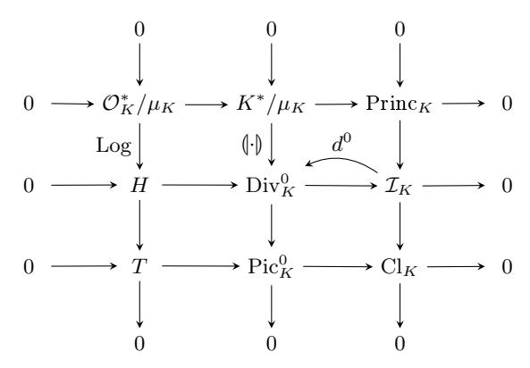

# Random Self-reducibility of Ideal-SVP via Arakelov Random Walks \*

Koen de Boer<sup>1</sup>, Léo Ducas<sup>1</sup>, Alice Pellet-Mary<sup>2</sup>, and Benjamin Wesolowski<sup>3,4</sup>

Cryptology Group, CWI, Amsterdam, The Netherlands
 imec-COSIC, KU Leuven, Belgium
 Univ. Bordeaux, CNRS, Bordeaux INP, IMB, UMR 5251, F-33400, Talence, France
 INRIA, IMB, UMR 5251, F-33400, Talence, France

**Abstract.** Fixing a number field, the space of all ideal lattices, up to isometry, is naturally an abelian group, called the *Arakelov class group*. This fact, well known to number theorists, has so far not been explicitly used in the literature on lattice-based cryptography. Remarkably, the Arakelov class group is a combination of two groups that have already led to significant cryptanalytic advances: the class group and the unit torus.

In the present article, we show that the Arakelov class group has more to offer. We start with the development of a new versatile tool: we prove that, subject to the Riemann Hypothesis for Hecke L-functions, certain random walks on the Arakelov class group have a rapid mixing property. We then exploit this result to relate the average-case and the worst-case of the Shortest Vector Problem in ideal lattices. Our reduction appears particularly sharp: for Hermite-SVP in ideal lattices of certain cyclotomic number fields, it loses no more than a  $\tilde{O}(\sqrt{n})$  factor on the Hermite approximation factor. Furthermore, we suggest that this rapid-mixing theorem should find other applications in cryptography and in algorithmic number theory.

### 1 Introduction

The task of finding short vectors in Euclidean lattices (a.k.a. the approximate Shortest Vector Problem) is a hard problem playing a central role in complexity theory. It is presumed to be hard even for quantum algorithms, and thanks to the average-case to worst-case reductions of Ajtai [1] and Regev [41], it has become the theoretical foundation for many kinds of cryptographic schemes. Furthermore, these problems appear to have resisted the quantum-cryptanalytic efforts so far; the overlying cryptosystems are therefore deemed quantum-safe, and for this reason are currently being considered for standardization.

Instantiations of these problems over ideal lattices have attracted particular attention, as they allow very efficient implementations. The Ring-SIS [31,29,39] and Ring-LWE [44,30] problems were introduced, and shown to reduce to worst-case instances of Ideal-SVP (the specialization of approx-SVP to ideal lattices).

In this work, we propose to recast algebraic lattice problems in their natural mathematical abstraction. It is well known to number theorists (e.g. [42]) that the space of all ideal lattices (up to isometry) in a given number field is naturally an abelian group, called the *Arakelov class group*. Yet, this notion has never appeared explicitly in the literature on lattice-based cryptography. The relevance of this perspective is already illustrated by some previous work which implicitly exploit Arakelov ideals [16,6] and even the Arakelov class group [40,27]. Beyond its direct result, our work aims at highlighting this powerful formalism for finer and more rigorous analysis of computational problems in ideal lattices.

#### 1.1 Our result

The first half of this work (Section 3) is dedicated to the development of a new versatile tool: we prove that, subject to the Riemann Hypothesis for Hecke L-functions, certain random walks on the Arakelov class group have a rapid mixing property. In the second half (Section 4), we exploit this result to relate the average-case

<sup>\*</sup> This paper is the full version of [7], which appeared in the proceedings of Crypto 2020.

and the worst-case of Ideal-SVP, due to the interpretation of the Arakelov class group as the space of all ideal lattices. Note that this reduction does not directly impact the security of existing schemes: apart from the historical Fully Homomorphic Encryption scheme of Gentry [17],<sup>5</sup> there exists no scheme based on the average-case version of Ideal-SVP. The value of our result lies in the introduction of a new tool, and an illustration of the cryptanalytic insights it offers.

A second virtue of our technique resides in the strong similarities it shares with a distant branch of cryptography: cryptography based on elliptic curves [23], or more generally on abelian varieties [24]. These works established that the discrete logarithm problem in a randomly chosen elliptic curve is as hard as in any other in the same isogeny class. The strategy consists in doing a random isogeny walk, to translate the discrete logarithm problem from a presumably hard curve to a uniformly random one. The core of this result is a proof that such walks are rapidly mixing within an isogeny graph (which is isomorphic to the Cayley graph of the class group of a quadratic number field). As long as the length of the random walk is polynomial, the reduction is efficient.

We proceed in a very similar way. The set of ideal lattices (up to isometry) of a given number field K can be identified with the elements of the Arakelov class group (also known as the degree zero part  $\operatorname{Pic}_K^0$  of the Picard Group). There are two ways to move within this group: given an ideal, one can obtain a new one by 'distorting' it, or by 'sparsifying' it. In both cases, finding a short vector in the target ideal also allows to find a short vector in the source ideal, up to a certain loss of shortness. This makes the length of the walk even more critical in our case than in the case of elliptic curves: it does not only affect the running time, but also the quality of the result.

Nevertheless, this approach leads to a surprisingly tight reduction. In the case of cyclotomic number fields of conductor  $m=p^k$ , under the Riemann Hypothesis for Hecke *L*-functions (which we abbreviate ERH for the Extended Riemann Hypothesis), and a mild assumption on the structure of the class groups, the loss of approximation factor is as small as  $\widetilde{O}(\sqrt{m})$ . In other words:

Main Theorem (informal). Let  $m=p^k$  be a prime power. If there exists a polynomial-time algorithm for solving Hermite-SVP with approximation factor  $\gamma$  over random ideal lattices of  $\mathbb{Q}(\zeta_m)$ , then there also exists a polynomial time algorithm that solves Hermite-SVP in any ideal lattice with approximation factor  $\gamma' = \gamma \cdot \sqrt{m} \cdot \text{poly}(\log m)$ .

In fact, this theorem generalizes to all number fields, but the loss in approximation factor needs to be expressed in more involved quantities. The precise statement is the object of Theorem 4.5.

*Prerequisites.* The authors are aware that the theory of Arakelov class groups, at the core of the present article, may not be familiar to all readers. Given space constraints, some definitions or concepts are introduced very briefly. We found Chapters I and VII of Neukirch's textbook [37] to be a good primer.

### 1.2 Overview

The Arakelov class group. Both the unit group [11] and the class group [12] have been shown to play a key role in the cryptanalysis of ideal lattice problems. In these works, these groups are exploited independently, in ways that nevertheless share strong similarities with each other. More recently, both groups have been used in combination for cryptanalytic purposes [40,27]. It therefore seems natural to turn to a unifying theory.

The Arakelov class group (denoted  $\operatorname{Pic}_K^0$ ) is a combination of the unit torus  $T = \operatorname{Log} K_{\mathbb{R}}^0/\operatorname{Log}(\mathcal{O}_K^*)$  and of the class group  $\operatorname{Cl}_K$ . The exponent 0 here refers to elements of algebraic norm 1 (i.e., modulo renormalization), while the subscript  $\mathbb{R}$  indicates that we are working in the topological completion of K. By 'a combination'

<span id="page-1-0"></span><sup>&</sup>lt;sup>5</sup> We here refer to the version of the scheme described in Chapters 16 to 19 of Gentry's PhD Thesis [17], whose security is based on the quantum worst case hardness of SIVP in ideal lattices, via a worst-case to average-case reduction (see for instance the discussion in Section 16.5 of [17]). This is different from the scheme in [18], which uses *principal* ideal lattices with a short generator, and have been broken by a later line of works [10,16,11,6].

we do not exactly mean that  $\operatorname{Pic}_K^0$  is a direct product; we mean that there is a short exact sequence

$$0 \longrightarrow T \longrightarrow \operatorname{Pic}_K^0 \longrightarrow \operatorname{Cl}_K \longrightarrow 0.$$

That is, T is (isomorphic to) a subgroup of  $\operatorname{Pic}_K^0$ , and  $\operatorname{Cl}_K$  is (isomorphic to) the quotient  $\operatorname{Pic}_K^0/T$ . The Arakelov class group is an abelian group which combines an uncountable (yet compact) part T and a finite part  $\operatorname{Cl}_K$ ; topologically, it should be thought of as  $|\operatorname{Cl}_K|$  many disconnected copies of the torus T.

A worst-case to average-case reduction for ideal-SVP. An important aspect of the Arakelov Class Group for the present work is that this group has a geometric interpretation: it can essentially be understood as the group of all ideal lattices up to K-linear isometries. Furthermore, being equipped with a metric, it naturally induces a notion of near-isometry. Such a notion gives a new handle to elucidate the question of the hardness of ideal-SVP: knowing a short vector in I, and a near-isometry from I to J, one can deduce a short vector of J up to a small loss induced by the distortion of the near-isometry. This suggests a strategy towards a worst-case to average-case reduction for ideal lattices, namely randomly distort a worst-case ideal to a random one.

However, there are two issues with this strategy: first near-isometry leaves one stuck in a fixed class of  $Cl_K$ ; i.e., one is stuck in one of the potentially many separated copies of the torus that constitute the Arakelov class group. Second, even if  $|Cl_K| = 1$ , the torus might be too large, and to reach the full torus from a given point, one may need near-isometry that are too distorted.

In the language of algebraic geometry, distortion of ideal lattices corresponds to the 'infinite places' of the field K, while we can also exploit the 'finite places', i.e., the prime ideals. Indeed, if  $\mathfrak a$  is an integral ideal of small norm and  $J = \mathfrak a I$ , then J is a sublattice of I and a short vector of J is also a somewhat short vector of I, an idea already used in [12,40].

Random walk in the Arakelov class group. The questions of whether the above strategy for the self-reducibility of ideal-SVP works out, and with how much loss in the approximation factor therefore boils down to the following question:

How fast does a random walk in the Arakelov class group converges to the uniform distribution?

More specifically, this random walk has three parameters: a set  $\mathcal{P}$  of finite places, i.e., a set of (small) prime ideals, a length N for the discrete walk on finite places, and finally a variance s for a continuous walk (e.g. a Gaussian) on infinite places. The loss in approximation factor will essentially be driven by  $B^{N/n} \cdot \exp(s)$  where B is the maximal algebraic norm of the prime ideals in  $\mathcal{P}$ , and n the rank of the number field.

Because the Arakelov class group is abelian and compact, such a study is carried out by resorting to Fourier analysis: uniformity is demonstrated by showing that all the Fourier coefficients of the distribution resulting from the random walk tend to 0 except for the coefficient associated with the trivial character. For discrete walks, one considers the Hecke operator acting on distributions by making one additional random step, and shows that all its eigenvalues are significantly smaller than 1, except for the eigenvalue associated with the trivial character. This is merely an extension to compact groups of the spectral gap theorem applied to the Cayley graph of a finite abelian group, as done in [23].

Our study reveals that the eigenvalues are indeed sufficiently smaller than 1, but only for low-frequency characters. But this is not so surprising: these eigenvalues only account for the discrete part of the walk, using finite places, which leaves discrete distributions discrete, and therefore non-uniform over a continuous group. To reach uniformity we also need a continuous walk over the infinite places, and taking a Gaussian continuous walk effectively clears out the Fourier coefficients associated to high-frequency characters.

### 1.3 Related work

Relation to recent cryptanalytic works. The general approach to this result was triggered by a heuristic observation made in [15], suggesting that the worst-case behavior of the quantum Ideal-SVP algorithm built out of [16,6,11,12] could be made not that far of the average-case behavior they studied experimentally. More

specifically, we do achieve the hoped generalization of the class-group mixing theorem of [23,24] to Arakelov class groups; but we furthermore show that this result affects all algorithms, and not only the one they studied.

We also remark that recent works [40,27] were already implicitly relying on Arakelov theory. More specifically, the lattice given in Section 3.1 of [40] is precisely the lattice of Picard-class relations between the appropriate set of (degree 0) Arakelov Divisors. In fact, our theorem also implies upper bounds for the covering radius of the those relation lattices, at least for sufficiently large factor bases, and with more effort one may be able to eliminate Heuristic 4 from [40] or Heuristic 1 of [27].

Prior self-reduction via random walks. As already mentioned, our result shares strong similarities with a technique introduced by Jao, Miller and Venkatesan [23] to study the discrete logarithm problem on elliptic curves. Just as ideal lattices can be seen as elements of the Arakelov class group, elliptic curves in certain families are in bijective correspondence with elements of the class group of a quadratic imaginary number field. In [23], Jao et al. studied (discrete) random walks in class groups, and showed that they have a rapid mixing property. They deduced that from any elliptic curve, one can efficiently construct a random isogeny (a group homomorphism) to a uniformly random elliptic curve, allowing to transfer a worst case instance of the discrete logarithm problem to an average case instance. Instead of the finite class group, we studied random walks in the infinite Arakelov class group, which led us to consequences in lattice-base cryptography, an area seemingly unrelated to elliptic curve cryptography.

Prior self-reduction for ideal lattices. Our self-reducibility result is not the first of its kind: in 2010, Gentry already proposed a self-reduction for an ideal lattice problem [19], as part of his effort of basing Fully-Homomorphic Encryption on worst-case problems [17]. Our result differs in several point:

- Our reduction does not rely on a factoring oracle, and is therefore classically efficient; this was already advertised as an open problem in [19].
- The reduction of Gentry considers the Bounded Distance Decoding problem (BDD) in ideal lattices rather than a short vector problem. Note that this distinction is not significant with respect to quantum computers [41].
- The definition of average case distribution is significantly different, and we view the one of [19] as being somewhat ad-hoc. Given that the Arakelov class group captures exactly ideal lattices up to isometry, we consider the uniform distribution in the Arakelov class group as a much more natural and conceptually simpler choice.
- The loss on the approximation factor of our reduction is much more favorable than the one of Gentry [19]. For example, in the case of cyclotomic number fields with prime-power conductor, Gentry's reduction (on BDD) seems to loose a factor at least  $\Theta(n^{4.5})$ , while our reduction (on Hermite-SVP) only loses a factor  $\tilde{O}(\sqrt{n})$  making a mild assumption on plus-part  $h^+$  of the class number.

Other Applications. Finally, we wish to emphasise that our rapid mixing theorem for Arakelov class groups appears to be a versatile new tool, which has already found applications beyond hardness proofs for ideal lattices.

One such application is the object of another work in progress. Namely, we note that many algorithms [5,4,8] rely on finding elements a in an ideal I such that  $aI^{-1}$  is easy to factor (e.g. prime, near-prime, or B-smooth). Such algorithms are analyzed only heuristically, by treating  $aI^{-1}$  as a uniformly sampled ideal, and applying know results on the density of prime or smooth ideals. Our theorem allows to adjust this strategy and make the reasoning rigorous. First, we show that if the Arakelov class of the ideal I is uniformly random, one can rigorously analyze the probability of  $aI^{-1}$  being prime or smooth. Then, our random-walk theorem allows to randomize I, while not affecting the usefulness of the recovered element a. However, due to space constraints and thematic distance, we chose to develop this application in another article.

As mentioned above, another potential application of random walk theorem may be the elimination of heuristics in cryptanalysis of ideal and module lattices [40,27].

### 2 Preliminaries

We denote by  $\mathbb{N}, \mathbb{Z}, \mathbb{Q}, \mathbb{R}$  the natural numbers, the integers, the rationals and the real numbers respectively. All logarithms are in base e. For a rational number  $p/q \in \mathbb{Q}$  with p and q coprime, we let  $\operatorname{size}(p/q)$  refer to  $\log |p| + \log |q|$ . We extend this definition to vectors of rational numbers, by taking the sum of the sizes of all the coefficients.

### 2.1 Number theory

Throughout this paper, we use a fixed number field K of rank  $n \geq 3$  over  $\mathbb{Q}$ , having ring of integers  $\mathcal{O}_K$ , discriminant  $\Delta$ , regulator R, class number h and group of roots of unity  $\mu_K$ . Minkowski's theorem [35, pp. 261–264] states that there exists an absolute constant c > 0 such that  $\log |\Delta| \geq c \cdot n$ . The number field K has n field embeddings into  $\mathbb{C}$ , which are divided in  $n_{\mathbb{R}}$  real embeddings and  $n_{\mathbb{C}}$  conjugate pairs of complex embeddings, i.e.,  $n = n_{\mathbb{R}} + 2n_{\mathbb{C}}$ . These embeddings combined yield the so-called Minkowski embedding  $\Psi: K \to K_{\mathbb{R}} \subseteq \bigoplus_{\sigma: K \hookrightarrow \mathbb{C}} \mathbb{C}$ ,  $\alpha \mapsto (\sigma(\alpha))_{\sigma}$ , where

$$K_{\mathbb{R}} = \left\{ x \in \bigoplus_{\sigma: K \hookrightarrow \mathbb{C}} \mathbb{C} \mid x_{\overline{\sigma}} = \overline{x_{\sigma}} \right\}.$$

Here,  $\overline{\sigma}$  equals the conjugate embedding of  $\sigma$  whenever  $\sigma$  is a complex embedding and it is just  $\sigma$  itself whenever it is a real embedding. Note that we index the components of the vectors in  $K_{\mathbb{R}}$  by the embeddings of K. Embeddings up to conjugation are called infinite places, denoted by  $\nu$ . With any embedding  $\sigma$  we denote by  $\nu_{\sigma}$  the associated place; and for any place we choose a fixed embedding  $\sigma_{\nu}$ .

Composing the Minkowski embedding by the component-wise logarithm of the entries' absolute values yields the logarithmic embedding, denoted by Log.

$$\operatorname{Log}: K^* \to \operatorname{Log} K_{\mathbb{R}} \subseteq \bigoplus_{\sigma: K \hookrightarrow \mathbb{C}} \mathbb{R}, \ \alpha \mapsto (\log |\sigma(\alpha)|)_{\sigma}.$$

The multiplicative group of integral units  $\mathcal{O}_K^*$  under the logarithmic embedding forms a lattice, namely the lattice  $\Lambda_K = \operatorname{Log}(\mathcal{O}_K^*) \subseteq \operatorname{Log} K_{\mathbb{R}}$ . This so-called logarithmic unit lattice has rank  $\ell = n_{\mathbb{R}} + n_{\mathbb{C}} - 1$ , is orthogonal to the all-one vector  $(1)_{\sigma}$ , and has covolume  $\operatorname{Vol}(\Lambda_K) = \sqrt{n} \cdot 2^{-n_{\mathbb{C}}/2} \cdot R$ , where the  $2^{-n_{\mathbb{C}}/2}$  factor is due to the specific embedding we use (see Lemma A.1). We denote by  $H = \operatorname{Span}(\Lambda_K)$  the hyperplane of dimension  $\ell$ , which can also be defined as the subspace of  $\operatorname{Log} K_{\mathbb{R}}$  orthogonal to the all-one vector  $(1)_{\sigma}$ . We denote by  $T = H/\Lambda_K$  the hypertorus defined by the logarithmic unit lattice  $\Lambda_K$ .

Fractional ideals of the number field K are denoted by  $\mathfrak{a}, \mathfrak{b}, \ldots$ , but the symbol  $\mathfrak{p}$  is generally reserved for integral prime ideals of  $\mathcal{O}_K$ . The group of fractional ideals of K is denoted by  $\mathcal{I}_K$ . Principal ideals with generator  $\alpha \in K^*$  are usually denoted by  $(\alpha)$ . For any integral ideal  $\mathfrak{a}$ , we define the the norm  $\mathcal{N}(\mathfrak{a})$  of  $\mathfrak{a}$  to be the number  $|\mathcal{O}_K/\mathfrak{a}|$ ; this norm then generalizes to fractional ideals and elements as well. The class-group of  $\mathcal{O}_K$ , denoted by  $\mathrm{Cl}(\mathcal{O}_K)$ , is the quotient of the group  $\mathcal{I}_K$  by the subgroup of principal ideals  $\mathrm{Princ}_K := \{(\alpha), \alpha \in K\}$ . For any fractional ideal  $\mathfrak{a}$ , we denote the ideal class of  $\mathfrak{a}$  in  $\mathrm{Cl}(\mathcal{O}_K)$  by  $[\mathfrak{a}]$ .

Extra attention is paid to the cyclotomic number fields  $K = \mathbb{Q}(\zeta_m)$ , for which we can prove sharper results due to their high structure. These results rely on the size of the class group  $h_K^+ = |\operatorname{Cl}(K^+)|$  of the maximum real subfield  $K^+ = \mathbb{Q}(\zeta_m + \bar{\zeta}_m)$  of K, which is often conjectured to be rather small [33,9]. In this paper, we make the mild assumption that  $h_K^+ \leq (\log n)^n$ .

**Extended Riemann Hypothesis** Almost all results in this paper rely heavily on the *Extended Riemann Hypothesis* (in the subsequent part of this paper abbreviated by ERH), which refers to the Riemann Hypothesis extended to Hecke *L*-functions (see [22, §5.7]). All statements that mention (ERH), such as Theorem 3.3, assume the Extended Riemann Hypothesis.

<span id="page-4-0"></span>**Prime densities** In multiple parts of this paper, we need an estimate on the number of prime ideals with bounded norm. This is achieved in the following theorem, obtained from [2, Thm. 8.7.4].

**Theorem 2.1** (ERH). Let  $\pi_K(x)$  be the number of prime integral ideals of K of norm  $\leq x$ . Then, assuming the Extended Riemann Hypothesis, there exists an absolute constant C (i.e., independent of K and x) such that

$$|\pi_K(x) - \operatorname{li}(x)| \le C \cdot \sqrt{x} \left( n \log x + \log |\Delta| \right),$$

where  $\operatorname{li}(x) = \int_2^x \frac{\mathrm{d}t}{\ln t} \sim \frac{x}{\ln x}$ .

<span id="page-5-0"></span>**Lemma 2.2 (Sampling of prime ideals,** ERH). Let a basis of  $\mathcal{O}_K$  be known and let  $\mathcal{P} = \{\mathfrak{p} \text{ prime ideal of } K \mid \mathcal{N}(\mathfrak{p}) \leq B\}$  be the set of prime ideals of norm bounded by  $B \geq \max((12 \log \Delta + 8n + 28)^4, 3 \cdot 10^{11})$ . Then one can sample uniformly from  $\mathcal{P}$  in expected time  $O(n^3 \log^2 B)$ .

*Proof.* The sampling algorithm goes as follows. Sample an integer uniformly in [0, B] and check if it is a prime. If it is, factor the obtained prime p in  $\mathcal{O}_K$  and list the different prime ideal factors  $\{\mathfrak{p}_1, \ldots, \mathfrak{p}_k\}$  that have norm bounded by B. Choose one  $\mathfrak{p}_i$  uniformly as random in  $\{\mathfrak{p}_1, \ldots, \mathfrak{p}_k\}$  and output it with probability k/n. Otherwise, output 'failure'.

Let  $\mathfrak{q} \in \mathcal{P}$  be arbitrary, and let  $\mathcal{N}(\mathfrak{q}) = q^j$  with q prime. Then, the probability of sampling  $\mathfrak{q}$  equals  $\frac{1}{nB}$ , namely  $\frac{1}{n}$  times the probability of sampling q. Therefore, the probability of sampling successfully (i.e., no failure) equals  $\frac{|\mathcal{P}|}{nB} \geq \frac{1}{2n\log B}$ , since  $|\mathcal{P}| \geq \frac{B}{2\log B}$ , by Lemma A.3.

The most costly part of the algorithm is the factorization of a prime  $p \leq B$  in  $\mathcal{O}_K$ . This can be performed

The most costly part of the algorithm is the factorization of a prime  $p \leq B$  in  $\mathcal{O}_K$ . This can be performed using the Kummer-Dedekind algorithm, which essentially amounts to factoring a degree n polynomial modulo p. Using Shoup's algorithm [43] (which has complexity  $O(n^2 + n \log p)$  [45, §4.1]) yields the complexity claim.

### 2.2 The Arakelov class group

The Arakelov divisor group is the group

$$\mathrm{Div}_K = \bigoplus_{\mathfrak{p}} \mathbb{Z} \times \bigoplus_{\nu} \mathbb{R}$$

where  $\mathfrak{p}$  ranges over the set of all prime ideals of  $\mathcal{O}_K$ , and  $\nu$  over the set of infinite primes (embeddings into the complex numbers up to possible conjugation). We write an arbitrary element in  $\mathrm{Div}_K$  as

$$\mathbf{a} = \sum_{\mathfrak{p}} n_{\mathfrak{p}} \cdot (\!(\mathfrak{p})\!) + \sum_{\nu} x_{\nu} \cdot (\!(\nu)\!),$$

with only finitely many non-zero  $n_{\mathfrak{p}}$ . We will consistently use the symbols  $\mathbf{a}, \mathbf{b}, \mathbf{e}, \ldots$  for Arakelov divisors. Denoting  $\operatorname{ord}_{\mathfrak{p}}$  for the valuation at the prime  $\mathfrak{p}$ , there is a canonical homomorphism

$$(\!(\cdot)\!\!):K^*\to \mathrm{Div}_K, \quad \alpha\longmapsto \sum_{\mathfrak{p}}\mathrm{ord}_{\mathfrak{p}}(\alpha)(\!\!(\mathfrak{p})\!\!)-\sum_{\nu}\log|\sigma_{\nu}(\alpha)|\cdot (\!\!(\nu)\!\!).$$

The divisors of the form  $(\alpha)$  for  $\alpha \in K^*$  are called *principal divisors*. Just as the ideal class group is the group of ideals quotiented by the group of principal ideals, the *Picard group* is the group of Arakelov divisors quotiented by the group of principal Arakelov divisors. In other words, the Picard group  $\operatorname{Pic}_K$  is defined by the following exact sequence.

$$0 \to K^*/\mu_K \xrightarrow{\emptyset \cdot \emptyset} \mathrm{Div}_K \to \mathrm{Pic}_K \to 0.$$

For any Arakelov divisor  $\mathbf{a} = \sum_{\mathfrak{p}} n_{\mathfrak{p}} \cdot \langle \mathfrak{p} \rangle + \sum_{\nu} x_{\nu} \cdot \langle \nu \rangle$ , we denote its Arakelov class by  $[\mathbf{a}]$ ; in the same fashion that  $[\mathfrak{a}]$  denotes the ideal class of the ideal  $\mathfrak{a}$ .

Despite the Arakelov divisor and Picard group being interesting groups, for our pursposes it is more useful to consider the *degree-zero* subgroups of these groups. The degree map is defined as follows:

$$\deg: \mathrm{Div}_K \to \mathbb{R}, \quad \sum_{\mathfrak{p}} n_{\mathfrak{p}} \cdot (\!(\mathfrak{p})\!\!) + \sum_{\nu} x_{\nu} \cdot (\!(\nu)\!\!) \mapsto \sum_{\mathfrak{p}} n_{\mathfrak{p}} \cdot \log(\mathcal{N}(\mathfrak{p})) + \sum_{\nu \text{ real}} x_{\nu} + \sum_{\nu \text{ complex}} 2 \cdot x_{\nu}.$$

<span id="page-6-0"></span>

Fig. 1: A commutative diagram of exact sequences.

The degree map sends principal divisors  $(\alpha)$  to zero; therefore, the degree map is properly defined on  $\operatorname{Pic}_K$ , as well. We subsequently define the degree-zero Arakelov divisor group  $\operatorname{Div}_K^0 = \{\mathbf{a} \in \operatorname{Div}_K^0 \mid \deg(\mathbf{a}) = 0\}$  and the Arakelov class group  $\operatorname{Pic}_K^0 = \{[\mathbf{a}] \in \operatorname{Pic}_K \mid \deg([\mathbf{a}]) = 0\}$ .

Note that by 'forgetting' the infinite part of a (degree-zero) Arakelov divisor **a**, one arrives at a fractional ideal. This projection

$$\mathrm{Div}_K^0 \to \mathcal{I}_K, \ \sum_{\mathfrak{p}} n_{\mathfrak{p}} \cdot (\mathfrak{p}) + \sum_{\nu} x_{\nu} \cdot (\mathfrak{p}) \longmapsto \prod_{\mathfrak{p}} \mathfrak{p}^{n_{\mathfrak{p}}},$$

has the hyperplane  $H \subseteq \operatorname{Log} K_{\mathbb{R}}$  as kernel under the inclusion  $H \to \operatorname{Div}_K^0, (x_{\sigma})_{\sigma} \mapsto \sum_{\nu} x_{\sigma_{\nu}}(\nu)$ . This projection morphism  $\operatorname{Div}_K^0 \to \mathcal{I}_K$  has the following section that we will use often in the subsequent part of this paper.

$$d^0: \mathcal{I}_K \to \mathrm{Div}_K^0, \ \mathfrak{a} \longmapsto \sum_{\mathfrak{p}} \mathrm{ord}_{\mathfrak{p}}(\mathfrak{a}) \cdot (\mathfrak{p}) - \frac{\log(\mathcal{N}(\mathfrak{a}))}{n} \sum_{\nu} (\mathfrak{p})$$

The groups and their relations, that are treated above, fit nicely in the diagram of exact sequences given in Figure 1, where the middle row sequence splits with the section  $d^0$ . It will be proven useful to show that the volume of the Arakelov class group roughly follows the square root of the field discriminant.

<span id="page-6-2"></span>**Lemma 2.3 (Volume of**  $\operatorname{Pic}_K^0$ ). We have  $\operatorname{Vol}(\operatorname{Pic}_K^0) = h \operatorname{Vol}(T) = hR\sqrt{n}2^{-n_{\mathbb{C}}/2}$ , and

$$\log \operatorname{Vol}(\operatorname{Pic}_K^0) \leq n \left(\frac{1}{2} \log(|\varDelta|^{1/n}) + \log \log(|\varDelta|^{1/n}) + 1\right)$$

*Proof.* The volume of the Arakelov class group follows from the above exact sequence and the volume computation of T in Lemma A.1. The bound on the logarithm is obtained by applying the class number formula [38, VII.§5, Cor 5.11] and Louboutin's bound [28] on the residue of the Dedekind zeta function at s = 1:

$$\operatorname{Vol}(\operatorname{Pic}_K^0) = hR\sqrt{n}2^{-n_{\mathbb{C}}/2} = \frac{\rho\sqrt{|\Delta|}\omega_K\sqrt{n}}{2^{n_{\mathbb{C}}}(2\sqrt{2}\pi)^{n_{\mathbb{C}}}} \leq \rho\sqrt{|\Delta|} \leq \sqrt{|\Delta|} \left(\frac{e\log|\Delta|}{n}\right)^n,$$

where  $\omega_K = |\mu_K|$  is the number of roots of unity in K. For the bound on the logarithm, use  $n \log(e \log |\Delta|/n) = n \log \log(|\Delta|^{1/n}) + n$ .

We let  $\mathcal{U}(\operatorname{Pic}_K^0) = \frac{1}{\operatorname{Vol}(\operatorname{Pic}_K^0)} \cdot \mathbf{1}_{\operatorname{Pic}_K^0}$  denote the uniform distribution over the Arakelov class group.

Fourier theory over the Arakelov class group As the Arakelov class group  $\operatorname{Pic}_K^0$  is a compact abelian group, every function in  $^6L_2(\operatorname{Pic}_K^0)=\{f:\operatorname{Pic}_K^0\to\mathbb{C}\mid\int_{\operatorname{Pic}_K^0}|f|^2<\infty\}$  can be uniquely decomposed into a character

<span id="page-6-1"></span><sup>&</sup>lt;sup>6</sup> The measure on the Arakelov class group is unique up to scaling – it is the Haar measure. By fixing the volume of  $\operatorname{Pic}_K^0$  as in Lemma 2.3, we fix this scaling as well. We use then *this* particular scaling of the Haar measure for the integrals over the Arakelov class group.

sum

$$f = \sum_{\chi \in \widehat{\operatorname{Pic}}_K^0} a_{\chi} \cdot \chi,$$

with  $a_{\chi} \in \mathbb{C}$ . In the proof of Theorem 3.3, we will make use of Parseval's identity [13, Thm. 3.4.8] in the following form.

<span id="page-7-0"></span>
$$\int_{\text{Pic}_{K}^{0}} |f|^{2} = ||f||_{2}^{2} = \frac{1}{\text{Vol}(\text{Pic}_{K}^{0})} \sum_{\chi \in \widehat{\text{Pic}_{K}^{0}}} |a_{\chi}|^{2}$$
(1)

### 2.3 Lattices

A lattice  $\Lambda$  is a discrete subgroup of a real vector space. In the following, we assume that this real vector space has dimension m and that the lattice is full-rank, i.e.,  $\operatorname{span}(\Lambda)$  equals the whole real space. A lattice can be represented by a basis  $(b_1, \cdots, b_m)$  such that  $\Lambda = \{\sum_i x_i b_i, x_i \in \mathbb{Z}\}$ . Important notions in lattice theory are the volume  $\operatorname{Vol}(\Lambda)$ , which is essentially the volume of the hypertorus  $\operatorname{span}(\Lambda)/\Lambda$  (alternatively,  $\operatorname{Vol}(\Lambda)$  is the absolute determinant of any basis of  $\Lambda$ ); the first minimum  $\lambda_1(\Lambda) = \min_{v \in \Lambda \setminus \{0\}} \|v\|$ ; and the last minimum  $\lambda_m(\Lambda)$ , which equals the minimal radius r > 0 such that  $\{v \in L \mid \|v\| \le r\}$  is of full rank m. We will be interested into the following algorithmic problem over lattices.

**Definition 2.4** ( $\gamma$ -Hermite-SVP). Given as input a basis of a rank m lattice  $\Lambda$ , the problem  $\gamma$ -Hermite-SVP consists in computing a non-zero vector v in  $\lambda$  such that

$$||v|| \le \gamma \cdot \operatorname{Vol}(\Lambda)^{1/m}$$
.

For a rank-m lattice  $\Lambda \subset \mathbb{R}^m$ , we let  $\Lambda^*$  denote its dual, that is  $\Lambda^* = \{x \in \mathbb{R}^m : \forall v \in \Lambda, \langle v, x \rangle \in \mathbb{Z}\}.$ 

### 2.4 Divisors and ideal lattices

It will be proven useful to view both ideals and Arakelov divisors as lattices in the real vector space  $K_{\mathbb{R}}$ , where  $K_{\mathbb{R}}$  has its (Euclidean or maximum) norm inherited from the complex vector space it lives in. Explicitly, the Euclidean and maximum norm of  $\alpha \in K$  are respectively defined by the rules  $\|\alpha\|_2^2 = \sum_{\sigma} |\sigma(\alpha)|^2$  and  $\|\alpha\|_{\infty} = \max_{\sigma} |\sigma(\alpha)|$ , where  $\sigma$  ranges over all embeddings  $K \to \mathbb{C}$ . By default,  $\|\alpha\|$  refers to the Euclidean norm  $\|\alpha\|_2$ .

For any ideal  $\mathfrak{a}$  of K, we define the associated lattice  $\mathcal{L}(\mathfrak{a})$  to be the image of  $\mathfrak{a} \subseteq K$  under the Minkowski embedding  $\Psi$ , which is clearly a discrete subgroup of  $K_{\mathbb{R}}$ . In particular,  $\mathcal{L}(\mathcal{O}_K)$  is a lattice and we will always assume throughout this article that we know a basis  $(b_1, \dots, b_n)$  of  $\mathcal{L}(\mathcal{O}_K)$ . For Arakelov divisors  $\mathbf{a} = \sum_{\mathbf{p}} n_{\mathfrak{p}} \cdot (\mathfrak{p}) + \sum_{\nu} x_{\nu} \cdot (\mathfrak{p})$ , the associated lattice is defined as follows.

$$\mathcal{L}(\mathbf{a}) = \left\{ (e^{x_{\nu_{\sigma}}} \cdot \sigma(\alpha))_{\sigma} \mid \alpha \in \prod \mathfrak{p}^{n_{\mathfrak{p}}} \right\} = \operatorname{diag}\left( (e^{x_{\nu_{\sigma}}})_{\sigma} \right) \cdot \mathcal{L}\left(\prod \mathfrak{p}^{n_{\mathfrak{p}}}\right) \subseteq K_{\mathbb{R}},$$

where diag denotes a diagonal matrix. Note that we have

$$\operatorname{Vol}(\mathcal{L}(\mathfrak{a})) = \sqrt{|\Delta|} \, \, \mathcal{N}(\mathfrak{a}) \ \, \text{and} \ \ \, \operatorname{Vol}(\mathcal{L}(\mathbf{a})) = \sqrt{|\Delta|} \cdot \prod_{\sigma} e^{x_{\nu_{\sigma}}} \cdot \mathcal{N}(\prod_{\mathfrak{p}} \mathfrak{p}^{n_{\mathfrak{p}}}) = \sqrt{|\Delta|} \cdot e^{\operatorname{deg}(\mathbf{a})}$$

The associated lattice  $\mathcal{L}(\mathbf{a})$  of a divisor is of a special shape, which we call *ideal lattices*, as in the following definition.

**Definition 2.5 (Ideal lattices).** An ideal lattice is an  $\mathcal{O}_K$ -module  $I \subseteq K_{\mathbb{R}}$  for which holds that there exists an invertible  $x \in K_{\mathbb{R}}$  such that  $xI = \mathcal{L}(\mathfrak{a})$  for some ideal  $\mathfrak{a}$  of  $\mathcal{O}_K$ . We let  $\mathrm{IdLat}_K$  denote the set of all ideal lattices.

Note that the lattices  $\mathcal{L}(\mathfrak{a})$  for  $\mathfrak{a} \in \mathcal{I}_K$  are special cases of ideal lattices, which we will call *fractional ideal lattices*. Since the Minkowski embedding is injective, the map  $\mathcal{L}(\cdot)$  provides a bijection between the set of fractional ideals and the set of fractional ideal lattices.

The set  $\operatorname{IdLat}_K$  of ideal lattices forms a group; the product of two ideal lattices  $I = x \mathcal{L}(\mathfrak{a})$  and  $J = y \mathcal{L}(\mathfrak{b})$  is defined by the rule  $I \cdot J = xy \mathcal{L}(\mathfrak{ab})$ . It is clear that  $\mathcal{L}(\mathcal{O}_K)$  is the unit ideal lattice and  $x^{-1} \mathcal{L}(\mathfrak{a}^{-1})$  is the inverse ideal lattice of  $x \mathcal{L}(\mathfrak{a})$ . The map  $\mathcal{L} : \operatorname{Div}_K^0 \to \operatorname{IdLat}_K$ ,  $\mathbf{a} \mapsto \mathcal{L}(\mathbf{a})$  sends an Arakelov divisor to an ideal lattice. The image under this map is the following subgroup of  $\operatorname{IdLat}_K$ .

$$\operatorname{IdLat}_{K}^{0} = \{ x \, \mathcal{L}(\mathfrak{a}) \mid \mathcal{N}(\mathfrak{a}) \prod_{\sigma} x_{\sigma} = 1 \text{ and } x_{\sigma} > 0 \text{ for all } \sigma \}.$$

**Definition 2.6 (Isometry of ideal lattices).** For two ideal lattices  $L, L' \in \operatorname{IdLat}_K^0$ , we say that L and L' are K-isometric, denoted by  $L \sim L'$ , when there exists  $(\xi_{\sigma}) \in K_{\mathbb{R}}$  with  $|\xi_{\sigma}| = 1$  such that  $(\xi_{\sigma})_{\sigma} \cdot L = L'$ .

It is evident that being K-isometric is an equivalence relation on  $\mathrm{IdLat}_K^0$  that is compatible with the group operation. Denoting  $\mathrm{Iso}_K$  for the subgroup  $\{L \in \mathrm{IdLat}_K^0 \mid L \sim \mathcal{L}(\mathcal{O}_K)\} \subset \mathrm{IdLat}_K^0$ , we have the following result.

<span id="page-8-1"></span>Lemma 2.7 (Arakelov classes are ideal lattices up to isometries). Denoting  $P: \operatorname{IdLat}_K^0 \to \operatorname{Pic}_K^0$  for the map  $x \mathcal{L}(\mathfrak{a}) \longmapsto \sum_{\mathfrak{p}} \operatorname{ord}_{\mathfrak{p}}(\mathfrak{a})[\mathfrak{p}] + \sum_{\nu} \log(x_{\sigma_{\nu}})[\nu]$  modulo principal divisors, we have the following exact sequence.

$$0 \to \mathrm{Iso}_{\mathrm{K}} \to \mathrm{IdLat}_{K}^{0} \xrightarrow{P} \mathrm{Pic}_{K}^{0} \to 0$$

Proof. This is a well-known fact (e.g., [42]), but we give a proof for completeness. It suffices to show that P is a well-defined surjective homomorphism and its kernel is  $\mathrm{Iso}_K$ . In order to be well-defined, P must satisfy  $P(x\,\mathcal{L}(\mathfrak{a})) = P(x'\,\mathcal{L}(\mathfrak{a}'))$  whenever  $x\,\mathcal{L}(\mathfrak{a}) = x'\,\mathcal{L}(\mathfrak{a}')$ . Assuming the latter, we obtain  $x^{-1}x'\,\mathcal{L}(\mathcal{O}_K) = \mathcal{L}(\mathfrak{a}')^{-1}\mathfrak{a}) = \mathcal{L}(\alpha\mathcal{O}_K)$ , for some  $\alpha \in K^*$ , as the module is a free  $\mathcal{O}_K$ -module. This implies that  $(x^{-1}x')_{\sigma} = \sigma(\eta\alpha)$  for all embeddings  $\sigma: K \to \mathbb{C}$ , for some unit  $\eta \in \mathcal{O}_K^*$ . Therefore, we have,  $P(x\,\mathcal{L}(\mathfrak{a})) - P(x'\,\mathcal{L}(\mathfrak{a}')) = \sum_{\mathfrak{p}} \mathrm{ord}_{\mathfrak{p}}(\alpha)[\mathfrak{p}] + \sum_{\nu} \log((x_{\sigma_{\nu}})^{-1}x'_{\sigma_{\nu}})[\nu] = (\eta\alpha)$ ; i.e., their difference is a principal divisor, meaning that their image in  $\mathrm{Pic}_K^0$  is the same.

One can check that P is a homomorphism, and its surjectivity can be proven by constructing an ideal lattice in the pre-image of a representative divisor  $\mathbf{a} = \sum_{\mathfrak{p}} n_{\mathfrak{p}}[\mathfrak{p}] + \sum_{\nu} x_{\nu}[\nu] \in \operatorname{Div}_{K}^{0}$  of an Arakelov class  $[\mathbf{a}]$ , e.g.,  $(e^{x_{\nu\sigma}})_{\sigma} \cdot \mathcal{L}(\prod_{\mathfrak{p}} \mathfrak{p}^{n_{\mathfrak{p}}})$ .

We finish the proof by showing that the kernel of P indeed equals Iso<sub>K</sub>. Suppose  $x\mathcal{L}(\mathfrak{a}) \in \ker(P)$ , i.e.,  $P(x\mathcal{L}(\mathfrak{a})) = \sum_{\mathfrak{p}} \operatorname{ord}_{\mathfrak{p}}(\mathfrak{a})[\mathfrak{p}] + \sum_{\nu} \log(x_{\sigma_{\nu}})[\nu] = \langle \mathfrak{a} \rangle$  is a principal divisor. This means that  $\mathfrak{a} = \alpha \mathcal{O}_K$  and  $x = (|\sigma(\alpha)|^{-1})_{\sigma}$ , i.e.,  $x\mathcal{L}(\mathfrak{a}) = (|\sigma(\alpha)|^{-1})_{\sigma}\mathcal{L}(\alpha\mathcal{O}_K) = \left(\frac{\sigma(\alpha)}{|\sigma(\alpha)|}\right)_{\sigma} \cdot \mathcal{L}(\mathcal{O}_K)$ , so  $x\mathcal{L}(\mathfrak{a}) \sim \mathcal{L}(\mathcal{O}_K)$ , implying  $x\mathcal{L}(\mathfrak{a}) \in \operatorname{Iso}_K$ . This shows that  $\ker P \subseteq \operatorname{Iso}_K$ . The reverse inclusion starts with the observation that  $x\mathcal{L}(\mathfrak{a}) \sim \mathcal{L}(\mathcal{O}_K)$  directly implies that  $\mathfrak{a} = \alpha\mathcal{O}_K$  is principal, by the fact that  $x\mathcal{L}(\mathfrak{a})$  is a free  $\mathcal{O}_K$ -module. So,  $(x_{\sigma}\sigma(\alpha))_{\sigma} \cdot \mathcal{L}(\mathcal{O}_K) = x\mathcal{L}(\alpha\mathcal{O}_K) = (\xi_{\sigma})_{\sigma} \cdot \mathcal{L}(\mathcal{O}_K)$  for some  $(\xi_{\sigma})_{\sigma} \in K_{\mathbb{R}}$  with  $|\xi_{\sigma}| = 1$ . Therefore,  $|x_{\sigma}\sigma(\eta\alpha)| = |\xi_{\sigma}| = 1$ , i.e.,  $|x_{\sigma}| = |\sigma(\eta\alpha)|^{-1}$  for some unit  $\eta \in \mathcal{O}_K^*$ . From here one can directly conclude that  $P(x\mathcal{L}(\mathfrak{a})) = P((|\sigma(\eta\alpha)|^{-1})_{\sigma}\mathcal{L}(\alpha\mathcal{O}_K)) = |\eta\alpha\rangle$ , a principal divisor.

<span id="page-8-0"></span>**Lemma 2.8.** For any ideal lattice L in  $IdLat_K$ , we have

$$\lambda_n(L) \leq \sqrt{n} \cdot \lambda_n(\mathcal{L}(\mathcal{O}_K)) \cdot \operatorname{Vol}(L)^{1/n}.$$

Moreover, it holds that  $\lambda_n(\mathcal{L}(\mathcal{O}_K)) \leq \sqrt{n} \cdot \sqrt{\Delta}$ .

*Proof.* Write  $L = x \mathcal{L}(\mathfrak{a})$  and choose a shortest element  $x\alpha \in x \mathcal{L}(\mathbf{a})$ . That means  $||x\alpha|| = \lambda_1(x \mathcal{L}(\mathbf{a}))$ . Then  $x \mathcal{L}(\mathbf{a}) \supset x \mathcal{L}(\alpha \mathcal{O}_K)$ , and therefore

$$\lambda_n(x \,\mathcal{L}(\mathbf{a})) \leq \lambda_n(x \,\mathcal{L}(\alpha \mathcal{O}_K)) \leq \|x\alpha\|_{\infty} \lambda_n(\mathcal{L}(\mathcal{O}_K)) \leq \|x\alpha\|_2 \lambda_n(\mathcal{L}(\mathcal{O}_K))$$
  
$$\leq \lambda_1(x \,\mathcal{L}(\mathbf{a})) \cdot \lambda_n(\mathcal{L}(\mathcal{O}_K)) \leq \sqrt{n} \cdot \lambda_n(\mathcal{L}(\mathcal{O}_K)) \cdot \operatorname{Vol}(x \,\mathcal{L}(\mathfrak{a}))^{1/n}$$

where the last inequality is Minkowski's theorem. The bound on  $\lambda_n(\mathcal{L}(\mathcal{O}_K))$  is proven using Minkowski's second theorem (in the infinity norm) and the fact that  $\lambda_1^{(\infty)}(\mathcal{L}(\mathcal{O}_K)) \geq 1$ .

### 2.5 The Gaussian Function and Smoothing Errors

Let n be a fixed positive integer. For any parameter s > 0, we consider the n-dimensional Gaussian function

$$\rho_s^{(n)}: \mathbb{R}^n \to \mathbb{C}, \ x \mapsto e^{-\frac{\pi \|x\|^2}{s^2}},$$

(where we drop the (n) whenever it is clear from the context), which is well known to satisfy the following basic properties.

**Lemma 2.9.** For all s>0,  $n\in\mathbb{N}$  and  $x,y\in\mathbb{R}^n$ , we have  $\int_{z\in\mathbb{R}^n}\rho_s(z)dz=s^n$ ,  $\mathcal{F}_{\mathbb{R}^n}\{\rho_s\}=\int_{y\in\mathbb{R}^n}\rho_s(y)e^{-2\pi i\langle y,\cdot\rangle}dy=s^n\rho_{1/s}$  and  $\rho_s(x)^2=\rho_{s/\sqrt{2}}(x)$ .

The following two results (and the variations we discuss below) will play an important role and will be used several times in this paper: *Banaszczyk's bound*, originating from [3], and the *smoothing parameter*, as introduced by Micciancio and Regev [32]. They allow us to control

$$\rho_s(X) := \sum_{x \in X} \rho_s(x) \,,$$

for certain discrete subsets  $X \subseteq \mathbb{R}^m$ . For ease of notation, we let

<span id="page-9-1"></span>
$$\beta_z^{(n)} := \left(\frac{2\pi e z^2}{n}\right)^{n/2} e^{-\pi z^2},$$

which decays super-exponentially in z (for fixed n). In particular, we have  $\beta_t^{(n)} \leq e^{-t^2}$  for all  $t \geq \sqrt{n}$ . The following formulation of Banaszczyk's lemma is obtained from [34, Equation (1.1)].

Lemma 2.10 (Banaszczyk's Bound). Whenever  $r/s \geq \sqrt{\frac{n}{2\pi}}$ ,

$$\rho_s((\Lambda + t) \setminus B_r) \le \beta_{r/s}^{(n)} \cdot \rho_s(\Lambda),$$

where  $B_r = B_r(0) = \{x \in \mathbb{R}^n \mid ||x||_2 < r\}.$ 

**Definition 2.11 (Smoothing parameter).** Given an  $\varepsilon > 0$  and a lattice  $\Lambda$ , the smoothing parameter  $\eta_{\varepsilon}(\Lambda)$  is the smallest real number s > 0 such that  $\rho_{1/s}(\Lambda^*) \leq \varepsilon$ . Here,  $\Lambda^*$  is the dual lattice of  $\Lambda$ .

<span id="page-9-0"></span>**Lemma 2.12 (Smoothing Error).** Let  $\Lambda \in \mathbb{R}^n$  be a full rank lattice, and let  $s \geq \eta_{\epsilon}(\Lambda)$ . Then, for any  $t \in \mathbb{R}^n$ ,

$$(1 - \epsilon) \frac{s^n}{\det \Lambda} \le \rho_s(\Lambda + t) \le (1 + \epsilon) \frac{s^n}{\det \Lambda}.$$
 (2)

We have the following two useful upper bounds for full-rank n-dimensional lattices  $\Lambda$  [32, Lemma 3.2 and 3.3]:  $\eta_{\epsilon}(\Lambda) \leq \sqrt{\log(2n(1+1/\epsilon))} \cdot \lambda_n(\Lambda)$  for all  $\epsilon > 0$  and  $\eta_1(\Lambda) \leq \eta_{2^{-n}}(\Lambda) \leq \sqrt{n}/\lambda_1(\Lambda^*) \leq \sqrt{n} \cdot \lambda_n(\Lambda)$ . The latter leads to the following corollary.

<span id="page-9-2"></span>Corollary 2.13. Let L be an ideal lattice in  $IdLat_K$ . Let  $t \in \mathbb{R}^n$  be arbitrary and  $s \geq n \cdot \lambda_n(\mathcal{L}(\mathcal{O}_K)) \cdot Vol(L)^{1/n}$ . Then it holds that

$$\left| \frac{\rho_s(L-t) \cdot \text{Vol}(L)}{s^n} - 1 \right| \le 2^{-n},\tag{3}$$

*Proof.* By the assumption on s and by Lemma 2.8, we have  $s \ge n \cdot \lambda_n(\mathcal{L}(\mathcal{O}_K)) \cdot \operatorname{Vol}(L)^{1/n} \ge \sqrt{n} \cdot \lambda_n(L) \ge \eta_{2^{-n}}(\Lambda)$ . The result follows then from Lemma 2.12.

#### 2.6 Gaussian distributions and statistical distance

Statistical distance. For two random variables X and Y, we let SD(X,Y) denote their statistical distance (or total variation distance). This distance is equal to half of the  $\ell_1$ -distance between the two corresponding distributions. In particular, if X and Y live in a countable set S, then

$$\mathrm{SD}(X,Y) = \frac{1}{2} \cdot \sum_{s \in S} |\mathbb{P}(X=s) - \mathbb{P}(Y=s)|.$$

Continuous Gaussian distribution. For a real vector space H of dimension n, a parameter s > 0 and a center  $c \in H$ , we write  $\mathcal{G}_{H,s,c}$  the continuous Gaussian distribution over H with density function  $\rho_s(x-c)/s^n$  for all  $x \in H$ . When the center c is 0, we simplify the notation as  $\mathcal{G}_{H,s}$ .

Discrete Gaussian distributions. For any lattice  $L \subset \mathbb{R}^n$ , we define the discrete Gaussian distribution over L of standard deviation s > 0 and center  $c \in \mathbb{R}^n$  by

<span id="page-10-1"></span>
$$\forall x \in L, \ \mathcal{G}_{L,s,c} = \frac{\rho_s(x-c)}{\rho_s(L-c)}.$$

When the center c is 0, we simplify the notation as  $\mathcal{G}_{L,s}$ .

Observe that we use almost the same notation for discrete Gaussian distributions and for continuous ones. What allows us to make a distinction between them are the indexes L or H (if the index is a lattice, then the distribution is discrete whereas if the index is a real vector space, then the distribution is continuous).

The following lemma states that one can sample from a distribution statistically close to a discrete Gaussian distribution over a lattice L (provided that the standard deviation s is large enough).

**Proposition 2.14 (Theorem 4.1 of [20]).** There exists a probabilistic polynomial time algorithm that takes as input a basis  $(b_1, \dots, b_n)$  of a lattice  $L \subset \mathbb{R}^n$ , a parameter  $s \geq \sqrt{n} \cdot \max_i \|b_i\|$  and a center  $c \in \mathbb{R}^n$  and outputs a sample from a distribution  $\widehat{\mathcal{G}}_{L,s,c}$  such that  $SD(\mathcal{G}_{L,s,c},\widehat{\mathcal{G}}_{L,s,c}) \leq 2^{-n}$ .

We will refer to the algorithm mentioned in Proposition 2.14 as Klein's algorithm [26]. We note that Theorem 4.1 of [20] states the result for a statistical distance negligible (i.e., of the form  $n^{-\omega(1)}$ ), but the statement and the proof can be easily adapted to other statistical distances.

### <span id="page-10-0"></span>3 Random Walk Theorem for the Arakelov Class Group

In this section, we prove Theorem 3.3, on random walks in the Arakelov class group. Starting with a point in the hyperplane  $H \subseteq \operatorname{Div}_K^0$ , sampled according to a Gaussian distribution, we prove that multiplying this point sufficiently often by small random prime ideals yields a random divisor that is very close to uniformly distributed in the Arakelov class group (i.e., modulo principal divisors). The proof of Theorem 3.3 requires various techniques, extensively treated in Sections 3.2 to 3.6, and summarised in the following.

Hecke operators. The most important tool for proving Theorem 3.3 is that of a Hecke operator, whose definition and properties are covered in Section 3.2. This specific kind of operator acts on the space of probability distributions on  $\operatorname{Pic}_K^0$ , and has the virtue of having the characters of  $\operatorname{Pic}_K^0$  as eigenfunctions.

Eigenvalues of Hecke operators. The aim of the proof is showing that applying this Hecke operator repeatedly on an appropriate initial distribution yields the uniform distribution on  $\operatorname{Pic}_K^0$ . The impact of consecutive applications of the Hecke operator can be studied by considering its eigenvalues of the eigenfunctions (which are the characters of  $\operatorname{Pic}_K^0$ ). Classical results from analytic number theory show that the eigenvalues of these characters are (in absolute value) sufficiently smaller than 1, whenever the so-called analytic conductor of the corresponding character is not too large. An exception is the unit character, which is fixed under each Hecke operation. This classical result and how to apply it in our specific setting is covered in Section 3.3.

The analytic conductor. The Hecke operator thus quickly 'damps out' all characters with small analytic conductor (except the unit character). In Section 3.4, we examine which quantities of a character of  $\operatorname{Pic}_K^0$  define the analytic conductor. It turns out that this analytic conductor is closely related to how the character acts on the hypertorus defined by the log unit lattice. The higher the frequency of this character on the hypertorus, the larger the analytic conductor. This frequency can be measured by the norm of the uniquely associated dual log unit lattice point of the character. In fact, we establish a bound on the analytic conductor of a character in terms of the norm of its associated dual lattice point.

Fourier analysis on the hypertorus. To summarize, low-frequency (non-trivial) characters on  $\operatorname{Pic}_K^0$  (i.e., with small analytic conductor) are quickly damped out by the action of the Hecke character, whereas for high-frequency characters we do not have good guarantees on the speed at which they damp out. To resolve this issue, we choose an initial distribution whose character decomposition has only a negligible portion of high-frequency oscillatory characters. An initial distribution that nicely satisfies this condition is the Gaussian distribution (on the hypertorus). To examine the exact amplitudes of the occurring characters of this Gaussian distribution, we need Fourier analysis on this hypertorus, as covered in Section 3.5.

Splitting up the character decomposition. In this last part of the proof, which is covered in Section 3.6, we write the Gaussian distribution into its character decomposition, where we seperate the high-frequency characters, the low-frequency ones and the unit character. Applying the Hecke operator often enough damps out the low-frequency ones, and as the high-frequency characters were only negligibly present anyway, one is left with (almost only) the unit character. This corresponds to a uniform distribution.

### 3.1 Main result

**Definition 3.1 (Random Walk Distribution in**  $\operatorname{Div}_K^0$ ). We denote by  $\mathcal{W}_{\operatorname{Div}_K^0}(B, N, s)$  the distribution on  $\operatorname{Div}_K^0$  that is obtained by the following random walk procedure.

Sample  $x \in H \subseteq \log K_{\mathbb{R}}$  according to a centered Gaussian distribution with standard deviation s. Subsequently, sample N ideals  $\mathfrak{p}_j$  uniformly from the set of all prime ideals with norm bounded by B. Finally, output  $x + \sum_{j=1}^{N} d^0(\mathfrak{p}_j)$ , where  $x \in \operatorname{Div}_K^0$  is understood via the injection  $H \hookrightarrow \operatorname{Div}_K^0$ .

**Definition 3.2 (Random Walk Distribution in**  $\operatorname{Pic}_K^0$ ). By  $W_{\operatorname{Pic}_K^0}(B, N, s)$ , we denote the distribution on the Arakelov class group obtained by sampling **a** from  $W_{\operatorname{Div}_K^0}(B, N, s)$  and taking the Arekalov class  $[\mathbf{a}] \in \operatorname{Pic}_K^0$ .

<span id="page-11-0"></span>Theorem 3.3 (Random Walks in the Arakelov Class Group, ERH). Let  $\varepsilon > 0$  and s > 0 be any positive real numbers and let  $k \in \mathbb{N}_{>0}$  be a positive integer. Putting  $s' = \min(\sqrt{2} \cdot s, 1/\eta_1(\Lambda_K^*))$ , there exists a bound  $B = \widetilde{O}(n^{2k}[n^2(\log\log(1/\varepsilon))^2 + n^2(\log(1/s'))^2 + (\log\Delta_K)^2])$  such that for any  $N \ge \frac{\frac{\ell}{2}\cdot\log(1/s') + \frac{1}{2}\log(\operatorname{Vol}(\operatorname{Pic}_K^0)) + \log(1/\varepsilon) + 1}{k\log n}$ , the random walk distribution  $W_{\operatorname{Pic}_K^0}(B, N, s)$  is  $\varepsilon$ -close to uniform in  $L_1(\operatorname{Pic}_K^0)$ , i.e.,

$$\left\| \mathcal{W}_{\operatorname{Pic}_{K}^{0}}(B, N, s) - \mathcal{U}(\operatorname{Pic}_{K}^{0}) \right\|_{1} \leq \varepsilon.$$

Below, we instantiate Theorem 3.3 with specific choices of  $\varepsilon$  and k that are tailored to give an optimal approximation factor in Section 4. As a consequence, the value of B in Corollary 3.4 is exponential in n. We note however that this value could be made as small as polynomial in n and  $\log \Delta$ , but at the cost of a slightly worse approximation factor for the reduction of Section 4.

<span id="page-11-1"></span>The key difference between those two instantiations is how we deal with the smoothing parameter of the dual log-unit lattice,  $\eta_1(\Lambda_K^*)$ . In the general case, we rely on works of Dobrolowski and Kessler [14,25] to lower bound the first minimum of the primal log unit lattice. In the case of cyclotomics, we obtain a sharper bound by resorting to the analysis of dual cyclotomic unit lattice from Cramer et al. [11].

Corollary 3.4 (Application to General Number Fields, ERH).

Let  $s > 1/\ell$ , there exists a bound  $B = \tilde{O}(\Delta^{1/\log n})$  such that for

$$N \ge \frac{(n - n_{\mathbb{C}})(\log n)^2}{\log(\Delta)} \left( 1 + \frac{30\log\log n}{\log n} \right) + \frac{n\log n}{\log \Delta} \left[ \frac{1}{2}\log(\Delta^{1/n}) + \log\log(\Delta^{1/n}) \right]$$

holds that the random walk distribution  $W_{Pic_{-}^{0}}(B, N, s)$  satisfies

$$SD\left(\mathcal{W}_{\operatorname{Pic}_K^0}(B, N, s), \mathcal{U}(\operatorname{Pic}_K^0)\right) \leq 2^{-n}.$$

<span id="page-12-4"></span>Corollary 3.5 (Application to Prime-Power Cyclotomic Number Fields, ERH). Let  $K = \mathbb{Q}(\zeta_{p^k})$  be a prime-power cyclotomic number field and assume  $h_K^+ = \operatorname{Cl}(K^+) \leq (\log n)^n$ . For  $s = 1/\log^2(n)$ , there exists a bound  $B = \widetilde{O}(n^{2+2\log n})$  such that, for  $N \geq \frac{n}{2\log n} \left(1/2 + \frac{8\log(\log(n))}{\log n}\right)$ , the random walk distribution  $\mathcal{W}_{\operatorname{Pic}_K^0}(B, N, s)$  satisfies

$$SD\left(\mathcal{W}_{\operatorname{Pic}_K^0}(B, N, s), \mathcal{U}(\operatorname{Pic}_K^0)\right) \leq 2^{-n}.$$

The proof of these corollaries can be found in Appendices B.1 and B.2.

### <span id="page-12-0"></span>3.2 Hecke Operators

A key tool to analyse random walks on  $\operatorname{Pic}_K^0$  are Hecke operators, which allow to transform a given distribution into a new distribution obtained by adding one random step.

**Definition 3.6 (The Hecke operator).** Let  $\mathcal{P}$  be a finite subset of prime ideals of the number field K, and let  $\operatorname{Pic}_K^0$  be the Arakelov class group. Then we define the Hecke operator  $H_{\mathcal{P}}: L^2(\operatorname{Pic}_K^0) \to L^2(\operatorname{Pic}_K^0)$  by the following rule:

$$H_{\mathcal{P}}(f)(x) := \frac{1}{|\mathcal{P}|} \sum_{\mathfrak{p} \in \mathcal{P}} f(x - [d^0(\mathfrak{p})])$$

<span id="page-12-2"></span>Lemma 3.7 (Eigenfunctions of the Hecke operator). The Hecke operator  $H_{\mathcal{P}}: L^2(\operatorname{Pic}_K^0) \to L^2(\operatorname{Pic}_K^0)$  has the characters  $\chi \in \widehat{\operatorname{Pic}_K^0}$  as eigenfunctions, with eigenvalues  $\lambda_{\chi} = \frac{1}{|\mathcal{P}|} \sum_{\mathfrak{p} \in \mathcal{P}} \overline{\chi}([d^0(\mathfrak{p})])$ , i.e.,

<span id="page-12-3"></span>
$$H_{\mathcal{P}}(\chi) = \lambda_{\chi} \chi.$$

*Proof.* We have 
$$H_{\mathcal{P}}(\chi)(x) = \frac{1}{|\mathcal{P}|} \sum_{\mathfrak{p} \in \mathcal{P}} \chi(x - [d^0(\mathfrak{p})]) = \frac{1}{|\mathcal{P}|} \sum_{\mathfrak{p} \in \mathcal{P}} \chi(x) \overline{\chi}([d^0(\mathfrak{p})])$$
. So  $H_{\mathcal{P}}(\chi) = \lambda_{\chi} \chi$  with  $\lambda_{\chi} = \frac{1}{|\mathcal{P}|} \sum_{\mathfrak{p} \in \mathcal{P}} \overline{\chi}([d^0(\mathfrak{p})])$ .

Note that  $H_{\mathcal{P}}(\mathbf{1}_{\mathrm{Pic}_{K}^{0}}) = \mathbf{1}_{\mathrm{Pic}_{K}^{0}}$ , for the trivial character  $\mathbf{1}_{\mathrm{Pic}_{K}^{0}}$ , so  $\lambda_{\mathbf{1}_{\mathrm{Pic}_{K}^{0}}} = 1$ . For any other character  $\chi$  it is evident from the above that  $|\lambda_{\chi}| \leq 1$ .

### <span id="page-12-1"></span>3.3 Bounds on Eigenvalues of Hecke Operators

Using results from analytic number theory, one can prove the following proposition.

Proposition 3.8 (Bound on the eigenvalues of the Hecke operator, ERH). Let  $\mathcal{P}$  be the set of all primes of K with norm bounded by  $B \in \mathbb{N}$ . Then the eigenvalue  $\lambda_{\chi}$  of any non-constant eigenfunction  $\chi \in \widehat{\operatorname{Pic}}_{K}^{0}$  of the Hecke operator satisfies

$$\lambda_{\chi} = O\left(\frac{\log(B)\log(B^n \cdot \Delta \cdot \mathfrak{q}_{\infty}(\chi))}{B^{1/2}}\right),\,$$

where  $\mathfrak{q}_{\infty}(\chi)$  is the infinite part of the analytic conductor of the character  $\chi$ , as in Definition 3.11 (cf. [22, Eq. (5.6)]).

The proof of this proposition can be found in Appendix B.3.

### <span id="page-13-0"></span>3.4 The Analytic Conductor

In the bounds of Section 3.3, the infinite part of the analytic conductor  $\mathfrak{q}_{\infty}(\chi)$  of a character  $\chi: \operatorname{Pic}_K^0 \to \mathbb{C}$  plays a large role. In this section, we show that this infinite part of the analytic conductor is closely related to the dual logarithmic unit lattice point  $\ell^* \in \Lambda_K^*$  that is uniquely associated with the character  $\chi|_T: T \to \mathbb{C}$ .

The infinite part of the analytic conductor can be defined using the so-called *local parameters* of the character  $\chi \in \widehat{\operatorname{Pic}}_K^0$ . To define these, we need  $F^0 = \{(a_{\nu})_{\nu} \in \bigoplus_{\nu \text{ infinite}} K_{\nu} \mid \prod_{\nu} |a_{\nu}|_{\nu} = 1\}$ , the normone subgroup of the product of the completions  $K_{\nu}$  of K with respect to the infinite place  $\nu$ . Characters  $\eta: F^0 \to \mathbb{C}$  are of the form

<span id="page-13-5"></span><span id="page-13-2"></span>
$$\eta((a_{\nu})_{\nu}) = \prod_{\nu} \left( \frac{a_{\nu}}{|a_{\nu}|} \right)^{u_{\nu}} e^{iv_{\nu} \log |a_{\nu}|_{\nu}}, \tag{4}$$

where  $v_{\nu} \in \mathbb{R}$ , and  $u_{\nu} \in \mathbb{Z}$  or  $u_{\nu} \in \{0,1\}$  depending on whether  $\nu$  is complex or real (see [36, §3.3, eq. 3.3.1]). In all these definitions, the absolute value  $|\cdot|_{\nu}$  equals  $|\cdot|_{\mathbb{C}}$  or  $|\cdot|_{\mathbb{R}}$  depending on whether  $\nu$  is complex or real.

Since there is the map  $\iota: F^0 \to \operatorname{Pic}_K^0$ ,  $(a_{\nu})_{\nu} \longmapsto \sum_{\nu} \log |a_{\nu}|_{\nu} \cdot (|\nu|)$ , we must have that  $\chi \circ \iota$  is of the form described in Equation (4) for all  $\chi \in \operatorname{Pic}_K^0$ . This leads to the following definition.

**Definition 3.9 (Local parameters of a character on**  $\operatorname{Pic}_K^0$ ). For a character  $\chi: \operatorname{Pic}_K^0 \to \mathbb{C}$ , the numbers  $k_{\nu}(\chi) = |u_{\nu}| + iv_{\nu}$  (for all infinite places  $\nu$ ) are called the local parameters of  $\chi$ , where  $u_{\nu}$  and  $v_{\nu}$  are the numbers appearing in the formula of  $\chi \circ \iota: F^0 \to \mathbb{C}$  in Equation (4).

As characters on the Arakelov class group are actually very special Hecke characters<sup>7</sup>, the local parameters are very restricted. This is described in the following lemma.

**Lemma 3.10.** Let  $\chi \in \widehat{\operatorname{Pic}}_K^0$  and let  $\ell^* \in \Lambda_K^*$  such that  $\chi|_T = \chi_{\ell^*} = e^{2\pi i \langle \ell^*, \cdot \rangle}$ . Then we have  $k_{\nu}(\chi) = 2\pi i \ell_{\sigma_{\nu}}^*$ , where  $\sigma_{\nu}$  is an embedding associated with the place  $\nu$ .

*Proof.* As the map  $\iota: F^0 \to \operatorname{Pic}_K^0$  only depends on the absolute values of  $(a_{\nu})_{\nu}$ , it is clear that  $u_{\nu} = 0$  in the decomposition of  $\chi \circ \iota$  as in Equation (4). It remains to prove that  $v_{\nu} = 2\pi i \ell_{\sigma_{\nu}}^*$ . The units  $\mathcal{O}_K^* \subseteq F^0$  map to one under  $\chi \circ \iota$ , since any principal divisor maps to one. Here, the inclusion  $\mathcal{O}_K^* \to F^0$  is defined by  $\eta \mapsto (\sigma_{\nu}(\eta))_{\nu}$ , where  $\sigma_{\nu}$  is a fixed embedding associated with the infinite place  $\nu$ . This means that

<span id="page-13-4"></span>
$$\chi \circ \iota(\eta) = \prod_{\nu} e^{iv_{\nu} \log |\sigma_{\nu}(\eta)|_{\nu}} = \exp\left(i \sum_{\sigma} v_{\nu_{\sigma}} \log |\sigma(\eta)|_{\mathbb{C}}\right) = 1 \text{ for all } \eta \in \mathcal{O}_{K}^{*}, \tag{5}$$

where the last sum is over all embeddings  $\sigma: K \to \mathbb{C}$ , where  $\nu_{\sigma}$  is the place associated with the embedding  $\sigma$ , and where  $|\cdot|_{\mathbb{C}}$  is the standard absolute value on  $\mathbb{C}$ . Vectors of the form  $(v_{\nu_{\sigma}})_{\sigma}$  satisfying Equation (5) are precisely the vectors  $(v_{\nu_{\sigma}})_{\sigma} \in 2\pi \Lambda_K^* \subseteq \log K_{\mathbb{R}}$ . By Definition 3.9, one directly obtains  $k_{\nu}(\chi) = 2\pi i \ell_{\sigma_{\nu}}^*$ .

<span id="page-13-1"></span>**Definition 3.11 (The infinite part of the analytic conductor).** Let  $\chi \in \widehat{\operatorname{Pic}}_K^0$  be a character with local parameters  $k_{\nu}(\chi)$ , where  $\nu$  ranges over the infinite places of K. Then, we define the infinite part of the analytic conductor to be

$$\mathfrak{q}_{\infty}(\chi) = \prod_{\nu \ real} (3 + |k_{\nu}|) \prod_{\nu \ complex} (3 + |k_{\nu}|)(3 + |k_{\nu} + 1|)$$

Remark 3.12. Above definition of the infinite part of the analytic conductor is obtained from [22, p. 95, eq. (5.6) with s=0], where it is described in a slightly different form. In [22], the functional equation lacks the complex L-functions  $L_{\mathbb{C}}$ . Instead, those are replaced by  $L_{\mathbb{R}}(s)L_{\mathbb{R}}(s+1)=L_{\mathbb{C}}(s)$  (see [38, Ch. 7, Prop 4.3 (iv)]. This means that the local parameters  $\kappa_{\sigma}$ ,  $\kappa_{\bar{\sigma}}$  as in [22, p. 93, eq. (5.3)] must equal  $k_{\nu}$ ,  $k_{\nu}+1$  for the embeddings  $\{\sigma,\bar{\sigma}\}$  associated with the complex place  $\nu$  (cf. [22, p. 125]).

<span id="page-13-6"></span><span id="page-13-3"></span><sup>&</sup>lt;sup>7</sup> Hecke characters of K are characters on the idèle class group of K. As the Arakelov class group is a specific quotient of the idèle class group [38, Ch. VI, pp. 360], the characters on the Arakelov class group are essentially Hecke characters whose kernel contains the kernel of the quotient map sending the idèle class group to the Arakelov class group.

**Lemma 3.13.** Let  $\mathfrak{q}_{\infty}(\chi)$  be the infinite part of the analytic conductor of the character  $\chi \in \widehat{\operatorname{Pic}}_K^0$ , and let  $\ell^* \in \Lambda_K^*$  be such that  $\chi|_T = \chi_{\ell^*}$ , where  $\Lambda_K^*$  is the dual lattice of the log-unit lattice. Then we have

$$\mathfrak{q}_{\infty}(\chi) \le \left(4 + 2\pi \left\|\ell^*\right\| / \sqrt{n}\right)^n$$

*Proof.* Let  $|\ell^*|$  denote the vector  $\ell^*$  where all entries are replaced by their absolute value. Then, by applying subsequently the triangle inequality, the inequality between  $\|\cdot\|_1$  and  $\|\cdot\|_2$  and the arithmetic-geometric mean inequality, one obtains

$$4\sqrt{n} + 2\pi \|\ell^*\|_2 \ge \|\mathbf{4} + 2\pi |\ell^*|\|_2 \ge \frac{1}{\sqrt{n}} \|\mathbf{4} + 2\pi |\ell^*|\|_1 \ge \sqrt{n} \left( \prod_{\sigma} (4 + 2\pi |\ell^*_{\sigma}|) \right)^{1/n}$$
$$> \sqrt{n} \mathfrak{q}_{\infty} (\chi_{\ell^*})^{1/n}.$$

Dividing by  $\sqrt{n}$  and raising to the power n yields the claim.

### <span id="page-14-1"></span>3.5 Fourier Analysis on the Hypertorus

**Definition 3.14.** Let  $H \subseteq \text{Log } K_{\mathbb{R}}$  be the hyperplane where the log unit lattice  $\Lambda_K = \text{Log}(\mathcal{O}_K^*)$  lives in. Recall the Gaussian function  $\rho_s: H \to \mathbb{R}, x \mapsto e^{-\pi ||x||^2/s^2}$ . Denoting  $T = H/\Lambda_K$ , we put  $\rho_s|^T: T \to \mathbb{R}, x \mapsto \sum_{\ell \in \Lambda_K} \rho_s(x + \ell)$ .

As we have (see Lemma A.2)  $\|s^{-\ell}\rho_s\|_{H,1} = \int_H s^{-\ell}\rho_s(x)dx = 1$ , and  $\|s^{-\ell}\rho_s|^T\|_{T,1} = \int_T s^{-\ell}\rho_s|^T(x)dx = 1$ , both functions  $s^{-\ell}\rho_s$  and  $s^{-\ell}\rho_s|^T$  can be seen as probability distributions on their respective domains  $\mathbb{R}^m$  and T.

<span id="page-14-2"></span>Lemma 3.15 (Fourier coefficients of the periodized Gaussian). The function  $s^{-\ell}\rho_s|^T\in L^2(T)$  satisfies

$$s^{-\ell}\rho_s|^T = \sum_{\ell^* \in \Lambda_K^*} a_{\ell^*} \chi_{\ell^*}$$

where  $a_{\ell^*} = \frac{1}{\operatorname{Vol}(T)} \rho_{1/s}(\ell^*)$ , where  $\Lambda_K^*$  is the dual lattice of the log unit lattice  $\Lambda_K$ , and where  $\chi_{\ell^*}(x) = e^{-2\pi i \langle x, \ell^* \rangle}$ .

*Proof.* Note that  $\langle \chi_{\ell_1^*}, \chi_{\ell_2^*} \rangle = \operatorname{Vol}(T) \cdot \delta_{\ell_1^*, \ell_2^*}$ . Identifying  $\hat{T}$  and  $\Lambda_K^*$  via the map  $\chi_{\ell^*} \mapsto \ell^*$ , taking a fundamental domain F of  $\Lambda_K$  and spelling out the definition of  $\rho_s|^T$ , we obtain, for all  $\ell^* \in \Lambda_K^*$ ,

$$a_{\ell^*} = \frac{1}{\operatorname{Vol}(T)} \left\langle s^{-\ell} \rho_s | ^T, \chi_{\ell^*} \right\rangle = \frac{1}{\operatorname{Vol}(T)} \int_{x \in F} \sum_{\ell \in \Lambda_K} s^{-\ell} \rho_s(x+\ell) \overline{\chi_{\ell^*}(x)} dx$$
$$= \frac{1}{\operatorname{Vol}(T)} \int_{x \in H} s^{-\ell} \rho_s(x) \overline{\chi_{\ell^*}(x)} dx = \frac{1}{\operatorname{Vol}(T)} \mathcal{F}_H(s^{-\ell} \rho_s)(\ell^*) = \frac{1}{\operatorname{Vol}(T)} \rho_{1/s}(\ell^*).$$

### <span id="page-14-0"></span>3.6 Conclusion

<span id="page-14-4"></span>**Theorem 3.16** (ERH). Let  $\mathcal{P}$  be the set of primes of K of norm at most B, and let  $H=H_{\mathcal{P}}$  the Hecke operator for this set of primes. Then, for all r,s>0 with  $rs>\sqrt{\frac{\ell}{4\pi}}$ , we have

<span id="page-14-3"></span>
$$\left\| H^N(s^{-n}\rho_s) - \frac{1}{\operatorname{Vol}(\operatorname{Pic}_K^0)} \mathbf{1}_{\operatorname{Pic}_K^0} \right\|_2^2 \le \frac{\rho_{\frac{1}{\sqrt{2}s}}(\Lambda_K^*)}{\operatorname{Vol}(T)} \left( c^{2N} + \beta_{\sqrt{2}rs}^{(\ell)} \right)$$
 (6)

with  $c = O\left(\frac{\log(B)\log(B^n \cdot \Delta \cdot (4+2\pi r/\sqrt{n})^n)}{B^{1/2}}\right)$ .

*Proof.* As  $s^{-\ell}\rho_s = \frac{1}{\operatorname{Vol}(T)} \sum_{\chi \in \widehat{T}} \rho_{1/s}(\ell^*) \chi_{\ell^*}$  (see Lemma 3.15),  $\operatorname{Vol}(\operatorname{Pic}_K^0) = h_K \operatorname{Vol}(T)$ , and every  $\chi \in \widehat{T}$  has exactly  $h_K$  extensions [13, Cor. 3.6.2] to characters on  $\operatorname{Pic}_K^0$ , we directly deduce that

$$s^{-\ell}\rho_s = \frac{1}{\operatorname{Vol}(\operatorname{Pic}_K^0)} \sum_{\chi_{\ell^*} \in \widehat{T}} \sum_{\chi'|_T = \chi_{\ell^*}} \rho_{1/s}(\ell^*) \chi',$$

where  $\chi'$  ranges over all characters of  $\operatorname{Pic}_K^0$ . Therefore, by the fact that the characters  $\chi'$  are eigenfunctions of the operator  $H = H_{\mathcal{P}}$  (see Lemma 3.7),

$$H^{N}(s^{-\ell}\rho_{s}) = \frac{1}{\operatorname{Vol}(\operatorname{Pic}_{K}^{0})} \sum_{\chi_{\ell^{*}} \in \widehat{T}} \rho_{1/s}(\ell^{*}) \sum_{\chi'|_{T} = \chi_{\ell^{*}}} \lambda_{\chi'}^{N} \chi'$$

where  $\chi'$  ranges over all characters of  $\operatorname{Pic}_K^0$ . By the fact that  $s^{-\ell}\rho_s$  is a probability distribution, we obtain that the eigenvalue of the unit character  $\mathbf{1} = \mathbf{1}_{\operatorname{Pic}_K^0}$  satisfies  $\lambda_1 = 1$ . Therefore, by Parseval's theorem (see Equation (1)) and the fact that  $\rho_{1/s}^2 = \rho_{\frac{1}{\sqrt{2s}}}$ ,

$$\left\|H^N(s^{-\ell}\rho_s) - \frac{1}{\operatorname{Vol}(\operatorname{Pic}_K^0)}\mathbf{1}\right\|_2^2 = \frac{1}{\operatorname{Vol}(\operatorname{Pic}_K^0)} \sum_{\substack{\chi_{\ell^*} \in \widehat{T}}} \rho_{\frac{1}{\sqrt{2}s}}(\ell^*) \sum_{\substack{\chi' \mid r = \chi_{\ell^*} \\ \chi' \neq 1}} |\lambda_{\chi'}|^{2N},$$

where  $\chi'$  ranges over all characters of  $\operatorname{Pic}_K^0$ . In order to bound the quantity above, we split up the sum into a part where  $\|\ell^*\| > r$ , and a part where  $\|\ell^*\| \le r$ . For the former part we can namely bound the Gaussian  $\rho_{\frac{1}{\sqrt{2}s}}(\ell^*)$  whereas for the latter part we can bound the eigenvalues  $\lambda_{\chi'}$  (see Proposition 3.8). For the part where  $\|\ell^*\| > r$ , we use the assumption  $\sqrt{2}sr > \sqrt{\ell/(2\pi)}$  to apply Banaszczyk's bound (see Lemma 2.10), and the fact that  $|\lambda_{\chi'}| \le 1$ .

<span id="page-15-0"></span>
$$\frac{1}{\operatorname{Vol}(\operatorname{Pic}_{K}^{0})} \sum_{\|\ell^{*}\| > r} \rho_{\frac{1}{\sqrt{2}s}}(\ell^{*}) \underbrace{\sum_{\chi' \mid T = \chi_{\ell^{*}}} |\lambda_{\chi'}|^{2N}}_{\leq h_{K}} \leq \frac{\rho_{\frac{1}{\sqrt{2}s}}(\Lambda_{K}^{*} \setminus r\mathcal{B})}{\operatorname{Vol}(T)} \leq \frac{\beta_{\sqrt{2}rs}^{(\ell)} \cdot \rho_{\frac{1}{\sqrt{2}s}}(\Lambda_{K}^{*})}{\operatorname{Vol}(T)} \tag{7}$$

For the part where  $\|\ell^*\| < r$ , we have, by Lemma 3.13 that  $\mathfrak{q}_{\infty}(\chi) \leq (4 + 2\pi r/\sqrt{n})^n$ , and therefore, by Proposition 3.8, we have the bound  $|\lambda_{\chi'}| \leq c = O\left(\frac{\log(B)\log(B^n \cdot \Delta \cdot (4 + 2\pi r/\sqrt{n})^n)}{B^{1/2}}\right)$ . So,

<span id="page-15-1"></span>
$$\frac{1}{\operatorname{Vol}(\operatorname{Pic}_{K}^{0})} \sum_{\|\ell^{*}\| \leq r} \rho_{\frac{1}{\sqrt{2}s}}(\ell^{*}) \underbrace{\sum_{\chi'|_{T} = \chi_{\ell^{*}}} |\lambda_{\chi'}|^{2N}}_{\leq h_{K} \cdot c^{2N}} \leq \frac{c^{2N} \cdot \rho_{\frac{1}{\sqrt{2}s}}(\Lambda_{K}^{*})}{\operatorname{Vol}(T)}$$
(8)

Combining Equations (7) and (8), we obtain the result.

Proof (of Theorem 3.3). Let  $1 > \varepsilon > 0$ , s > 0 and  $k \in \mathbb{N}_{>0}$  be given. As  $1/\tilde{s} = \max(\frac{1}{\sqrt{2}s}, \eta_1(\Lambda_K^*)) \ge \eta_1(\Lambda_K^*)$ , the smoothing parameter of  $\Lambda_K^*$ , we have

$$\rho_{\frac{1}{\sqrt{2}s}}(\Lambda_K^*)/\operatorname{Vol}(T) \le \rho_{1/\tilde{s}}(\Lambda_K^*)/\operatorname{Vol}(T) \le 2 \cdot \tilde{s}^{-\ell}. \tag{9}$$

By applying subsequently Hölder's inequality (i.e.,  $||f \cdot 1||_1 \le ||f||_2 ||1||_2$ ) and the inequality  $\rho_{1/s}(\Lambda_K^*)/\operatorname{Vol}(T) \le 2\tilde{s}^{-\ell}$  in Equation (6), we obtain (for  $rs \ge \sqrt{\frac{\ell}{4\pi}}$ )

<span id="page-15-2"></span>
$$\|H^{N}(s^{-n}\rho_{s}) - U(\operatorname{Pic}_{K}^{0})\|_{1}^{2} \leq 2\operatorname{Vol}(\operatorname{Pic}_{K}^{0}) \cdot \tilde{s}^{-\ell}(c^{2N} + \beta_{\sqrt{2}rs}^{(\ell)})$$
(10)

In the following, we will bound the two summands in Equation (10) seperately. Putting<sup>8</sup>

$$r = \frac{1}{\sqrt{2}s} \cdot \max\left(\sqrt{\ell}, \sqrt{2 + \ell \log(1/\tilde{s}) + 2\log(1/\varepsilon) + \log(\operatorname{Vol}(\operatorname{Pic}_K^0))}\right),$$

implies  $2 \cdot \text{Vol}(\text{Pic}_K^0) \cdot \tilde{s}^{-\ell} \cdot \beta_{\sqrt{2}rs}^{(\ell)} \leq \varepsilon^2/2$ . Subsequently, choose

$$B = \tilde{O}\left(n^{2k} \cdot \left[\log(\Delta)^2 + n^2 \log(1/\tilde{s})^2 + n^2 \log(\log(1/\varepsilon))^2\right]\right),\,$$

such that  $c \leq 1/n^k$ , where  $c = O\left(\frac{\log(B)\log(B^n \cdot \Delta \cdot (4+2\pi r/\sqrt{n})^n)}{B^{1/2}}\right)$ , as in Theorem 3.16. Finally, taking any  $N \geq \frac{\ell/2 \cdot \log(1/\tilde{s}) + \log(1/\varepsilon) + \frac{1}{2}\log(\operatorname{Vol}(\operatorname{Pic}_K^0)) + 1}{k \log n}$  and noting that  $c^{\frac{1}{k \log n}} \leq 1/e$ , we deduce  $2\operatorname{Vol}(\operatorname{Pic}_K^0) \cdot \tilde{s}^{-\ell}c^{2N} \leq \frac{1}{2}\varepsilon^2$ .

Combining above two bounds, we can bound the right-hand side of Equation (10) by  $\varepsilon^2$ . Taking square roots gives the final result.

### <span id="page-16-0"></span>4 Worst-Case to Average-Case Reduction

In this section, we give a worst-case to average-case reduction for approx-Hermite-SVP in fractional ideal lattices. In the case of prime power cyclotomic number fields (under the assumption that  $h_k^+ \leq (\log n)^n$ ), our reduction increases the approximation factor by a factor  $\widetilde{O}(\sqrt{n})$ . In the more general case, the approximation factor increases by a factor  $\widetilde{O}(n \cdot \Delta^{1/(2n)})$ .

Our reduction works as follows. Given as input a fractional ideal  $\mathfrak{a}$ , we randomize it using the random walk of the previous section, in order to obtain something uniform in the Arakelov class group. More formally, we multiply  $\mathfrak{a}$  by N prime ideals  $\mathfrak{p}_i$  chosen uniformly among the prime ideals of norm smaller than B (where N and B are the ones of Theorem 3.3). We then multiply the resulting ideal  $\mathfrak{a}\prod_i\mathfrak{p}_i$  by an element  $x\in K_\mathbb{R}$  sampled such that  $\mathrm{Log}(x)$  follows a Gaussian distribution of small standard deviation. Observe that this means that the coordinates of x are somehow balanced and so multiplication by x does not change the geometry of the ideal that much. Using Theorem 3.3, the obtained ideal lattice  $L = x\mathcal{L}(\mathfrak{a} \cdot \prod_i \mathfrak{p}_i)$  has a uniform class in the Arakelov class group. This will essentially be our average-case distribution for ideals.

Assume now that one can efficiently find a small vector v in the randomized ideal  $x \cdot \mathcal{L}(\mathfrak{a} \cdot \prod_i \mathfrak{p}_i)$ . Then  $x^{-1} \cdot v$  is an element of  $\mathcal{L}(\mathfrak{a})$  (because  $\mathcal{L}(\mathfrak{a} \cdot \prod_i \mathfrak{b}_i)$  is a subset of  $\mathcal{L}(\mathfrak{a})$ ). Since x does not distort the geometry too much, this element  $x^{-1} \cdot v$  is still small compared to  $\operatorname{Vol}(\mathcal{L}(\mathfrak{a} \cdot \prod_i \mathfrak{p}_i))^{1/n} = \operatorname{Vol}(\mathcal{L}(\mathfrak{a}))^{1/n} \cdot \mathcal{N}(\prod_i \mathfrak{p}_i)^{1/n}$ . The approximation factor we get is then roughly equal to  $\mathcal{N}(\prod_i \mathfrak{p}_i)^{1/n} \leq B^{N/n}$ . Using the values of N and N in Corollaries 3.4 and 3.5, we obtain the claimed upper bound on the increase of the approximation factors.

In this overview, we assumed for simplicity that the average-case distribution is the uniform distribution over ideal lattices. In reality, however, for computational reasons, we will instead use a close, 'rounded', fractional version of this uniform distribution. This is because general ideal lattices (i.e., Arakelov class group elements) can't be represented efficiently and uniquely on a computer. In order to make the reduction computable, we therefore resort to computing with fractional ideals only, which can be efficiently represented, for instance by a basis with rational coefficients. To be clear, elements of the Arakelov class group are thus only used theoretically and are never actually represented on a computer.

The first subsection below describes the average-case distribution we consider, and gives some insight on why we have to modify slightly the simple 'uniform in the Arakelov class group' distribution. In the second subsection, we show that the randomization procedure described above indeed produces an ideal of the desired average-case distribution. Finally, we prove the reduction in the last subsection.

<span id="page-16-1"></span><sup>&</sup>lt;sup>8</sup> We use the bound  $\beta_{\alpha}^{(\ell)} \leq e^{-\alpha^2}$  for  $\alpha \geq \sqrt{\ell}$ 

<span id="page-16-2"></span><sup>&</sup>lt;sup>9</sup> In this bound on B one would expect an additional  $\log(\log(\operatorname{Vol}(\operatorname{Pic}_K^0)))$ . But as it is bounded by  $\log(\log(\Delta))$  (see Lemma 2.3), it can be put in the hidden polylogarithmic factors.

<span id="page-16-3"></span><sup>&</sup>lt;sup>10</sup> One can observe that this randomization process outputs an ideal lattice instead of a fractional ideal. This will be solved by rounding the ideal lattice to a fractional lattice with close geometry.

### <span id="page-17-1"></span>**Algorithm 1** Randomized function $\operatorname{Extract}_{\varsigma,M}:\operatorname{IdLat}_K^0\to\mathcal{I}_K$

```
Require: An ideal lattice L \in \operatorname{IdLat}_K^0
Ensure: A fractional ideal lattice \mathcal{L}(\mathfrak{b})
1: Sample c = (c_{\sigma})_{\sigma} uniformly in \{(x_{\sigma})_{\sigma} : |x_{\sigma}| = M, \forall \sigma\}
2: Sample v \leftarrow \mathcal{G}_{L,\varsigma,c}.
3: return \mathcal{L}(\mathfrak{b}) = v^{-1} \cdot L \subset K_{\mathbb{R}}.
```

### 4.1 The average-case distribution

As mentioned above, the average-case distribution we would like to use is the one obtained by sampling a uniformly distributed Arakelov class [a], and then considering the associated ideal lattice L (defined up to K-isometries, see Lemma 2.7). This distribution however, suffers from the following difficulty: we don't have a nice way of representing ideal lattices. First of all, these lattices involve real numbers, which cannot be represented on a computer; but even if it was possible to represent real numbers, we do not have a canonical way of representing an ideal lattice. For instance, the natural representation of the ideal lattice  $L = x\mathcal{L}(\mathfrak{a})$  as a pair  $(x, \mathcal{L}(\mathfrak{a}))$  is highly non-unique and it may leak some information on the random walk that was performed to obtain L.

We solve both problems by introducing a specific rounding procedure, that maps an ideal lattice to a fractional ideal lattice with almost the same geometry. Once we have a fractional ideal lattice, we can compute the Hermite Normal Form (HNF) of one of its bases. This provides us a unique representation of the lattice, which can be efficiently represented by a matrix with rational coefficients.

The ideas behind the rounding procedure are the following. First, we observe that dividing L by any element  $v \in L$  provides an ideal lattice  $v^{-1} \cdot L$  which is fractional. Hence, to round the ideal lattice L, it is sufficient to find an element  $v \in L$  such that multiplication by  $v^{-1}$  does not distort too much the geometry of L (this idea was already exploited by [19]). We find such a good v by sampling it from a Gaussian distribution in L centered in  $(M, M, \dots, M)$  for some M significantly larger than the standard deviation. This choice of center ensures that v has all its coordinates close to M, hence v and  $v^{-1}$  are well balanced and so multiplication by  $v^{-1}$  does not distort the geometry too much. To conclude, we finally consider the ideal  $v^{-1}L$ , whose geometry is close to the one of L, and which is a fractional ideal.

In this subsection, our only goal is to describe the average-case distribution, from a mathematical point of view. This means that none of the functions described here needs to be efficiently computable, and none of the elements involved needs to be efficiently representable.

Let us start by describing a randomized function  $\operatorname{Extract}_{\varsigma,M}$  (parameterized by some  $\varsigma > 0$  and M > 0), that extracts from an Arakelov class  $[\mathbf{a}]$  a fractional ideal  $\mathfrak{b}$ , such that the distribution of  $\mathfrak{b}$  is independent from the representation of  $[\mathbf{a}]$ . We first describe the function  $\operatorname{Extract}_{\varsigma,M}$  from ideal lattices of norm 1 to fractional ideals, and we will later extend it to Arakelov classes.

**Lemma 4.1.** The function  $Extract_{\varsigma,M}$  described in Algorithm 1 outputs a fractional ideal lattice of the form  $\mathcal{L}(\mathfrak{b})$  for a fractional ideal  $\mathfrak{b} \subset K$ . More precisely,  $\mathfrak{b}$  is the inverse of an integral ideal and has an algebraic norm larger than  $(\sqrt{n}\varsigma + M)^{-n}$  with overwhelming probability (i.e., probability at least  $1 - 2^{-\Omega(n)}$ ).

Proof. Let us write the ideal lattice L as  $L = x\mathcal{L}(\mathfrak{c})$  for some fractional ideal  $\mathfrak{c}$ . The element v is in L, so it is of the form  $x\Psi(w)$  for some  $w \in \mathfrak{c}$ . In particular, there exists an (integral) ideal  $\mathfrak{d}$  such that  $(w) = \mathfrak{c}\mathfrak{d}$ . Putting everything together we obtain that  $v^{-1}L = \Psi(w)^{-1}\mathcal{L}(\mathfrak{c}) = \mathcal{L}(\mathfrak{d}^{-1})$ . To conclude the proof, we need an upper-bound on the algebraic norm of  $\mathfrak{d}$ . Since L in is  $\mathrm{IdLat}_K^0$ , we know that  $|\mathcal{N}(x)| \cdot \mathcal{N}(\mathfrak{c}) = 1$ . We also know that with overwhelming probability, every coordinate of v is smaller (in absolute value) than  $\sqrt{n}\varsigma + M$ , and so  $|\mathcal{N}(v)| \leq (\sqrt{n}\varsigma + M)^n$ . We conclude by using the fact that  $|\mathcal{N}(v)| = |\mathcal{N}(x)| \cdot \mathcal{N}(\mathfrak{c}) \cdot \mathcal{N}(\mathfrak{d})$ .

<span id="page-17-0"></span>Observe that contrary to the high level overview, the center c of the Gaussian distribution has been randomized (but it still holds that the sampled element v will be balanced). This is needed in Lemma 4.2, to show that the Extract<sub>s,M</sub>(·) distributions are identical when applied to K-isomorphic ideal lattices.

<span id="page-18-0"></span>Let us now show that the function  $\operatorname{Extract}_{\varsigma,M}$  is constant (as a probability distribution) over K-isometric ideal lattices.

**Lemma 4.2.** Let L and L' be two ideal lattices such that  $L \sim L'$  (i.e., there exists  $(\xi_{\sigma})_{\sigma} \in K_{\mathbb{R}}$ , with  $|\xi_{\sigma}| = 1$  for all  $\sigma$ , such that  $(\xi_{\sigma})_{\sigma} \cdot L = L'$ ). Then the two probability distributions  $Extract_{\varsigma,M}(L)$  and  $Extract_{\varsigma,M}(L')$  are identical.

Proof. Let  $\xi=(\xi_\sigma)\in K_\mathbb{R}$  be as in the lemma. Observe that the multiplication by  $\xi$  is an isometry. This means that for any  $v\in L$  and  $c\in K_\mathbb{R}$ , the probability that  $\mathcal{G}_{L,\varsigma,c}$  outputs v is the same as the one that  $\mathcal{G}_{L',\varsigma,\xi c}$  outputs  $\xi v$ . In both cases, the ideal output by the  $\mathrm{Extract}_{\varsigma,M}$  function will be  $v^{-1}\cdot L=(\xi v)^{-1}\cdot L'$ . Due to the random choice of c (uniform among  $\{(x_\sigma)_\sigma:|x_\sigma|=M\text{ for all }\sigma\}$ ), the distribution of  $\xi c$  is the same as the one of c. We then conclude that both final distributions must be identical.

Since  $\operatorname{Extract}_{\varsigma,M}$  is constant over all classes of ideal lattices modulo  $\operatorname{Iso}_K = \{L \in \operatorname{IdLat}_K^0 \mid L \sim \mathcal{L}(\mathcal{O}_K)\} \subset \operatorname{IdLat}_K^0$ , we can view it as a randomized function from  $\operatorname{IdLat}_K^0 / \operatorname{Iso}_K$  to  $\mathcal{I}_K$ . But recall that we have an isomorphism between  $\operatorname{IdLat}_K^0 / \operatorname{Iso}_K$  and  $\operatorname{Pic}_K^0$ . Using this isomorphism, we can finally define a function  $\operatorname{Extract}_{\varsigma,M}$  from  $\operatorname{Pic}_K^0$  to  $\mathcal{I}_K$ , such that for any ideal lattice L, it holds that the distributions  $\operatorname{Extract}_{\varsigma,M}(L)$  and  $\operatorname{Extract}_{\varsigma,M}(P(L))$  are identical (where  $P:\operatorname{IdLat}_K^0 \to \operatorname{Pic}_K^0$  is the map defined in Lemma 2.7).

We now describe our average-case distribution, which we will refer to as  $\mathcal{D}_{\varsigma,M}^{\text{perfect}}$  (parameterized by two parameters  $\varsigma, M > 0$ ):

$$\mathcal{D}_{\varsigma,M}^{\text{perfect}} := \text{Extract}_{\varsigma,M}(\mathcal{U}(\text{Pic}_K^0)), \tag{11}$$

where  $\mathcal{U}(\operatorname{Pic}_K^0)$  is the uniform distribution over  $\operatorname{Pic}_K^0$ . Once again, this is only the mathematical definition of the distribution  $\mathcal{D}_{\varsigma,M}^{\operatorname{perfect}}$ , and this does not provide an efficient algorithm for sampling from this distribution (in particular because we cannot sample from  $\mathcal{U}(\operatorname{Pic}_K^0)$ ). In the next subsection, we will explain how one can sample efficiently from a distribution statistically close to  $\mathcal{D}_{\varsigma,M}^{\operatorname{perfect}}$ , when the parameter  $\varsigma$  is large enough (this is possible since the output of  $\mathcal{D}_{\varsigma,M}^{\operatorname{perfect}}$  are fractional ideals of bounded algebraic norm, which can be efficiently represented).

### 4.2 Sampling from the average-case distribution

In this section, we explain how one can efficiently sample from a distribution  $\mathcal{D}_{\varsigma,M}^{\text{sample}}$  that is statistically close to the distribution  $\mathcal{D}_{\varsigma,M}^{\text{perfect}}$ . Let us start by describing a tool distribution  $\mathcal{D}^{\text{round}}$ , which should be efficiently samplable. In order to use our random walk theorem, we need to be able to sample elements  $x \in K_{\mathbb{R}}$  such that Log(x) follows a continuous Gaussian distribution of parameter s in  $H = \text{Log}(K_{\mathbb{R}}^*)$ . This distribution however cannot be sampled efficiently on a computer, as it is a continuous distribution. The objective of the distribution  $\mathcal{D}^{\text{round}}$  is to compute efficiently a rounded version of this distribution, where the output x lies in  $\Psi(K) \subset K_{\mathbb{R}}$ . This is formalized in the lemma below. The proof is rather technical and has been postponed to Appendix C.1.

<span id="page-18-2"></span>**Lemma 4.3.** For any  $\varepsilon_1, \varepsilon_2 > 0$ , there exists a deterministic function  $E_{\varepsilon_1}: H \to \Psi(K)$  such that for any  $y \in H$  it holds that

$$||E_{\varepsilon_1}(y)\cdot(e^{-y_{\sigma}})_{\sigma}-1||_{\infty}\leq \varepsilon_1.$$

Furthermore, for any s > 0, one can sample in time polynomial in n,  $\max_i \log ||b_i||$ , s,  $\log(1/\varepsilon_1)$  and  $\log(1/\varepsilon_2)$  from a distribution  $\mathcal{D}_{\varepsilon_1,\varepsilon_2,s}^{round}$  that is  $\varepsilon_2$  close in statistical distance to  $E_{\varepsilon_1}(\mathcal{G}_{H,s})$ . Here,  $(b_1, \dots, b_n)$  is a known basis of  $\mathcal{L}(\mathcal{O}_K)$ .

We can now describe the distribution  $\mathcal{D}^{\text{sample}}_{\varsigma,M,\mathfrak{a}}$ , which we will use as a samplable replacement of  $\mathcal{D}^{\text{perfect}}_{\varsigma,M}$ . Observe that the distribution  $\mathcal{D}^{\text{sample}}_{\varsigma,M,\mathfrak{a}}$  is parameterized by parameters  $\varsigma,M>0$  (the same as for  $\mathcal{D}^{\text{perfect}}_{\varsigma,M}$ ), but also by a fractional ideal  $\mathfrak{a}\subset K$ . We will show that whatever the choice of  $\mathfrak{a}$  is, the distribution

<span id="page-18-1"></span><sup>&</sup>lt;sup>12</sup> The function  $E_{\varepsilon_1}$  plays the role of the exponential function, rounded to a near element of K.

## <span id="page-19-1"></span>**Algorithm 2** Distribution $\mathcal{D}_{\varsigma,M,\mathfrak{a}}^{\text{sample}}$

**Require:** A fractional ideal  $\mathfrak{a} \subset K$  and two parameters  $\varsigma, M > 0$ .

**Ensure:** A fractional ideal lattice  $\mathcal{L}(\mathfrak{b}) \subset \Psi(K)$ .

- 1: Let  $s = 1/(\log n)^2$  and N, B be the smallest integers satisfying the conditions of Corollary 3.5 (if K is a primepower cyclotomic field) or Corollary 3.4 (in the generic case).
- 2: Sample  $\mathfrak{p}_1, \dots, \mathfrak{p}_N$  uniformly among all prime ideals of norm  $\leq B$ .
- 3: Sample  $(x_{\sigma})_{\sigma} \leftarrow \mathcal{D}_{\varepsilon_1, \varepsilon_2, s}^{\text{round}}$  for  $\varepsilon_1 = 2^{-n}/M$  and  $\varepsilon_2 = 2^{-n}$ .

- 4: Define  $L \in \operatorname{IdLat}_K$  to be  $L = (x_{\sigma})_{\sigma} \cdot \mathcal{L}(\prod_{i=1}^N \mathfrak{p}_i \cdot \mathfrak{a})$ . 5: Sample  $c = (c_{\sigma})_{\sigma}$  uniformly in  $\{(x_{\sigma})_{\sigma} : |x_{\sigma}| = M, \forall \sigma\}$ . 6: Let  $\varsigma' = \mathcal{N}(\prod_{i=1}^N \mathfrak{p}_i \cdot \mathfrak{a})^{1/n} \cdot \varsigma$  and  $c' = \mathcal{N}(\prod_{i=1}^N \mathfrak{p}_i \cdot \mathfrak{a})^{1/n} \cdot c$ .
- 7: Sample  $v \leftarrow \widehat{\mathcal{G}}_{L,\varsigma',c'}$ . 8: **return**  $\mathcal{L}(\mathfrak{b}) = v^{-1} \cdot L \subset \Psi(K)$ .

 $\mathcal{D}_{\varsigma,M,\mathfrak{a}}^{\mathrm{sample}}$  is statistically close to  $\mathcal{D}_{\varsigma,M}^{\mathrm{perfect}}$ . Looking forward, the distribution  $\mathcal{D}_{\varsigma,M,\mathfrak{a}}^{\mathrm{sample}}$  will be the one obtained by randomizing the ideal  $\mathfrak{a}$  in the worst-case to average-case reduction.

Let  $\mathfrak{a} \subset K$  be any fractional ideal and  $\varsigma, M > 0$  be some parameters. Recall that  $\widehat{\mathcal{G}}_{L,\varsigma,c}$  refers to the distribution obtained by running Klein's Gaussian sampling algorithm on lattice L with parameter  $\varsigma$  and center c (see Proposition 2.14). The distribution  $\mathcal{D}_{\varsigma,M,\mathfrak{a}}^{\mathrm{sample}}$  is obtained by running the following algorithm (Algorithm 2).

<span id="page-19-2"></span>**Theorem 4.4.** Let  $\mathfrak{a} \subset K$  be any fractional ideal and  $\varsigma \geq 2^{n+1} \sqrt{n} \cdot \Delta^{1/(2n)} \cdot \lambda_n(\mathcal{L}(\mathcal{O}_K))$ . Assume we know a basis  $(b_1, \dots, b_n)$  of  $\mathcal{L}(\mathcal{O}_K)$  and an LLL reduced basis of  $\mathcal{L}(\mathfrak{a})$ , then there exists an algorithm sampling from the distribution  $\mathcal{D}_{\varsigma,M,\mathfrak{a}}^{sample}$  in time polynomial in  $\operatorname{size}(\mathcal{N}(\mathfrak{a}))$ ,  $\log \Delta$ ,  $\max_i \log ||b_i||$ ,  $\log M$  and  $\log \varsigma$ .

Furthermore, the statistical distance between the distributions  $\mathcal{D}^{sample}_{\varsigma,M,\mathfrak{a}}$  and  $\mathcal{D}^{perfect}_{\varsigma,M}$  is at most  $2^{-cn}$  for some absolute constant c > 0.

The proof of this theorem is available in Appendix C.2.

#### The reduction 4.3

We can now prove our worst-case to average-case reduction, where the average-case distribution we consider is  $\mathcal{D}_{\varsigma,M}^{\text{perfect}}$  (for some well chosen parameters  $\varsigma$  and M).

<span id="page-19-0"></span>**Theorem 4.5.** Let  $\varsigma \geq 2^{n+1}\sqrt{n} \cdot \Delta^{1/(2n)} \cdot \lambda_n(\mathcal{L}(\mathcal{O}_K))$  and  $M \geq 2\sqrt{n}\varsigma$ . Assume we have a (randomized) algorithm  $\mathcal A$  and real numbers  $\gamma \geq 1$  and p > 0 such that  $\mathcal A$  solves  $\gamma$ -Hermite-SVP with probability at least p when given as input  $\mathcal L(\mathfrak a) \leftarrow \mathcal D^{perfect}_{\varsigma,M}$  (where the probability is taken over the choice of  $\mathfrak a$  and over the randomness of A). Let T be an upper bound on the run time of A on any input.

Then there exists a randomized algorithm A' solving  $\gamma'$ -Hermite-SVP in any fractional ideal  $\mathcal{L}(\mathfrak{a})$  with probability at least  $p-n^{-\omega(1)}$  (where the probability is taken over the randomness of  $\mathcal{A}'$ ), for an approximation factor

$$\gamma' = O(B^{N/n}) \cdot \gamma \leq \begin{cases} \widetilde{O}\left(n^{1/2}\right) \cdot \gamma & \textit{for prime power cyclotomic fields} \\ & \textit{(assuming $h_K^+ \leq (\log n)^n$)} \\ \widetilde{O}\left(n^{1-n_{\mathbb{C}}/n} \cdot \varDelta^{1/(2n)}\right) \cdot \gamma & \textit{for arbitrary number fields}. \end{cases}$$

The run time of  $\mathcal{A}'$  is bounded by  $T + poly(\log \Delta, \max_i \log ||b_i||, \operatorname{size} \mathcal{N}(\mathfrak{a}), \log \varsigma, \log M)$ , where  $(b_1, \dots, b_n)$  is a known basis of  $\mathcal{L}(\mathcal{O}_K)$ .

Remark 4.6. Observe that from Theorem 4.4, one can sample in time polynomial in  $\log \Delta$ ,  $\max_i \log ||b_i||$ ,  $\log s$  and  $\log M$  from a distribution  $\mathcal{D}_{\varsigma,M,\mathcal{O}_K}^{\text{sample}}$  whose statistical distance to  $\mathcal{D}_{\varsigma,M}^{\text{perfect}}$  is at most  $2^{-\Omega(n)}$ .

### <span id="page-20-0"></span>Algorithm 3 Algorithm A

**Require:** A fractional ideal  $\mathcal{L}(\mathfrak{a})$  (given by a basis).

**Ensure:** A vector  $w' \in \mathcal{L}(\mathfrak{a})$ .

- 1: Sample  $\mathcal{L}(\mathfrak{b}) \leftarrow \mathcal{D}_{\varsigma,M,\mathfrak{a}}^{\text{sample}}$  using Algorithm 2 and remember the elements  $x = (x_{\sigma})_{\sigma}$  and v used in the algorithm.
- 2: Run  $\mathcal{A}(\mathcal{L}(\mathfrak{b}))$  to obtain w.
- 3: **return**  $w' = w \cdot v \cdot x^{-1}$

Remark 4.7. Recall from Lemma 2.8 that  $\lambda_n(\mathcal{L}(\mathcal{O}_K)) \leq \sqrt{n\Delta}$ . Hence, if one chooses  $\varsigma$  and M minimal (still satisfying the conditions of Theorem 4.5) and if we are given an LLL reduced basis of  $\mathcal{L}(\mathcal{O}_K)$  (which can always be computed from any other basis), then the run time of Algorithm  $\mathcal{A}'$  in Theorem 4.5 is of the form  $T + \operatorname{poly}(\log \Delta, \operatorname{size}(\mathcal{N}(\mathfrak{a})))$ .

*Proof.* We construct an algorithm  $\mathcal{A}'$  using  $\mathcal{A}$  as described in Algorithm 3.

Let us first prove the bound on the run-time of  $\mathcal{A}'$ . Since  $\varsigma \geq 2^{n+1}\sqrt{n} \cdot \Delta^{1/(2n)} \cdot \lambda_n(\mathcal{L}(\mathcal{O}_K))$ , we can apply Theorem 4.4 and we know that one can sample from  $\mathcal{D}_{\varsigma,M,\mathfrak{a}}^{\text{sample}}$  in time polynomial in size( $\mathcal{N}(\mathfrak{a})$ ),  $\log \Delta$ ,  $\max_i \log |b_i|$ ,  $\log M$  and  $\log \varsigma$ . The second step of the algorithm is bounded by T by assumption and this concludes the proof on the run time of the algorithm.

Let us now prove that the algorithm is correct. First of all, we note that by choice of  $\varsigma$  and by Theorem 4.4, then  $\mathrm{SD}(\mathcal{D}^{\mathrm{sample}}_{\varsigma,M,\mathfrak{a}},\mathcal{D}^{\mathrm{perfect}}_{\varsigma,M}) \leq 2^{-\Omega(n)}$ , which shows that with probability at least  $p-2^{-\Omega(n)}$ , Algorithm 3 above computes  $w \in \mathcal{L}(\mathfrak{b})$  such that  $||w|| \leq \gamma \cdot \mathrm{Vol}(\mathcal{L}(\mathfrak{b}))^{1/n}$ .

Let us assume in the following that this is the case, and show that  $w' \in \mathcal{L}(\mathfrak{a})$  and that  $\|w'\| \leq \gamma' \cdot \operatorname{Vol}(\mathcal{L}(\mathfrak{a}))^{1/n}$ . Recall from Algorithm 2 that  $\mathcal{L}(\mathfrak{b}) = x \cdot v^{-1} \cdot \mathcal{L}(\prod_{i=1}^N \mathfrak{p}_i \cdot \mathfrak{a})$ , where the ideals  $\mathfrak{p}_i$  are integral and have algebraic norm bounded by B. Since  $w \in \mathcal{L}(\mathfrak{b})$ , then  $w' = v \cdot x^{-1} \cdot w \in \mathcal{L}(\prod_{i=1}^N \mathfrak{p}_i \cdot \mathfrak{a})$ . Moreover, as the ideals  $\mathfrak{p}_i$  are integral, then  $\prod_{i=1}^N \mathfrak{p}_i \cdot \mathfrak{a} \subset \mathfrak{a}$  and we conclude that  $w' \in \mathcal{L}(\mathfrak{a})$ .

Let us now bound the size of ||w'||. We know that

$$||w'|| = ||w \cdot v \cdot x^{-1}|| \le ||v||_{\infty} \cdot ||x^{-1}||_{\infty} \cdot ||w||$$
  
$$\le \gamma \cdot ||v||_{\infty} \cdot ||x^{-1}||_{\infty} \cdot \operatorname{Vol}(\mathcal{L}(\mathfrak{b}))^{1/n}.$$

By definition of  $\mathcal{L}(\mathfrak{b})$ , it also holds that

$$\operatorname{Vol}(\mathcal{L}(\mathfrak{b})) \leq \|x \cdot v^{-1}\|_{\infty}^{n} \cdot \prod_{i=1}^{N} \mathcal{N}(\mathfrak{p}_{i}) \cdot \operatorname{Vol}(\mathcal{L}(\mathfrak{a})).$$

Hence we obtain that  $||w'|| \leq \gamma' \cdot \text{Vol}(\mathcal{L}(\mathfrak{a}))$  for an approximation factor

$$\gamma' = \gamma \cdot ||v||_{\infty} \cdot ||v^{-1}||_{\infty} \cdot ||x||_{\infty} \cdot ||x^{-1}||_{\infty} \cdot B^{N/n}$$

Recall that v is sampled from a distribution which is statistically close to  $\mathcal{G}_{L,\varsigma',c'}$  for some ideal lattice L with  $\varsigma' = \mathcal{N}(\prod_{i=1}^N \mathfrak{p}_i \cdot \mathfrak{a})^{1/n} \cdot \varsigma$  and  $c' = (c'_{\sigma})_{\sigma}$  such that  $|c'_{\sigma}| = \mathcal{N}(\prod_{i=1}^N \mathfrak{p}_i \cdot \mathfrak{a})^{1/n} \cdot M$  for all  $\sigma$ . Recall also that we have seen in the proof of Theorem 4.4 that  $\varsigma' \geq \sqrt{n \log(n)} \cdot \lambda_n(\mathcal{L}(\mathcal{O}_K)) \cdot \operatorname{Vol}(L)^{1/n}$ . Using Lemma 2.8 as well as Lemmas 3.3 and 4.4 of [32] (instantiated at  $\epsilon = 1/2$ ), this implies that  $||v - c'|| \leq \sqrt{n} \cdot \varsigma'$ , except with probability at most  $2^{-\Omega(n)}$ . Let us assume that this is indeed the case, then, for any coordinate  $v_{\sigma}$  of v it holds that

$$|v_{\sigma} - c'_{\sigma}| \le \mathcal{N} \left( \prod_{i=1}^{N} \mathfrak{p}_{i} \cdot \mathfrak{a} \right)^{1/n} \cdot \sqrt{n} \cdot \varsigma,$$

from which we conclude that

$$|v_{\sigma}| \in \mathcal{N} \left( \prod_{i=1}^{N} \mathfrak{p}_{i} \cdot \mathfrak{a} \right)^{1/n} \cdot [M - \sqrt{n} \cdot \varsigma, M + \sqrt{n} \cdot \varsigma].$$

This gives us the following upper bound on the product  $||v||_{\infty} \cdot ||v^{-1}||_{\infty}$ :

$$||v||_{\infty} \cdot ||v^{-1}||_{\infty} \leq \frac{\mathcal{N}(\prod_{i=1}^{N} \mathfrak{p}_{i} \cdot \mathfrak{a})^{1/n} \cdot (M + \sqrt{n} \cdot \varsigma)}{\mathcal{N}(\prod_{i=1}^{N} \mathfrak{p}_{i} \cdot \mathfrak{a})^{1/n} \cdot (M - \sqrt{n} \cdot \varsigma)} = \frac{1 + \sqrt{n} \cdot \varsigma/M}{1 - \sqrt{n} \cdot \varsigma/M} \leq 3,$$

by choice of  $M \geq 2\sqrt{n} \cdot \varsigma$ .

To compute a bound on  $||x||_{\infty} \cdot ||x^{-1}||_{\infty}$ , recall that x is sampled from a distribution that is statistically close to  $E_{\varepsilon_1}(\mathcal{G}_{H,s})$ , for  $\varepsilon_1$  and s as in Algorithm 2. Let  $y=(y_{\sigma})_{\sigma}$  be sampled from  $\mathcal{G}_{H,s}$ . Recall that by Lemma 4.3, it holds that  $||E_{\varepsilon_1}(y)/e^y-1||_{\infty} \leq \varepsilon_1 \leq 1/2$ . In particular, for a fixed coordinate  $\sigma$  we have that

$$e^{y_{\sigma}}/2 \le |E_{\varepsilon_1}(y)_{\sigma}| \le 2e^{y_{\sigma}},$$

which implies

$$||E_{\varepsilon_1}(y)||_{\infty} \cdot \left| \left| \frac{1}{E_{\varepsilon_1}(y)} \right| \right|_{\infty} \le 4e^{2||y||_{\infty}}.$$

Since y is chosen from an n-dimensional continuous Gaussian distribution of parameter s, we know that  $\|y\|_{\infty} \leq (\log n)^2 \cdot s$  except with probability at most  $2^{-\Omega((\log n)^2)} = n^{-\omega(1)}$ . Using the fact that  $s \cdot (\log n)^2 \leq 1$ , we conclude that, except with probability at most  $n^{-\omega(1)}$ , it holds that

$$||x||_{\infty} \cdot ||x^{-1}||_{\infty} \le 4e^{(\log n)^2 \cdot s} \le 11.$$

We finally obtain that

$$\gamma' = 33 \cdot B^{N/n} \cdot \gamma.$$

Plugging in the values of B and N from Corollary 3.5 in the prime power cyclotomic case or the ones from Corollary 3.4 in the generic case concludes the proof.

**Acknowledgments** We are grateful to René Schoof for valuable feedback on a preliminary version of this work. We also would like to thank Wessel van Woerden for his help in simplifying the proof of Lemma A.1. Part of this work was done while the authors were visiting the Simons Institute for the Theory of Computing.

L.D. is supported by the European Union Horizon 2020 Research and Innovation Program Grant 780701 (PROMETHEUS), and by a Fellowship from the Simons Institute. K.d.B. was supported by the ERC Advanced Grant 740972 (ALGSTRONGCRYPTO) and by the European Union Horizon 2020 Research and Innovation Program Grant 780701 (PROMETHEUS). A.P. was supported in part by CyberSecurity Research Flanders with reference number VR20192203 and by the Research Council KU Leuven grant C14/18/067 on Cryptanalysis of post-quantum cryptography. Part of this work was done when A.P. was visiting CWI, under the CWI PhD internship program. Part of this work was done when B.W. was at the Cryptology Group, CWI, Amsterdam, The Netherlands, supported by the ERC Advanced Grant 740972 (ALGSTRONGCRYPTO).

### References

- <span id="page-21-0"></span>1. M. Ajtai. Generating hard instances of the short basis problem. In ICALP, pages 1-9, 1999.
- <span id="page-21-5"></span>2. E. Bach and J. O. Shallit. Algorithmic Number Theory: Efficient Algorithms, volume 1. MIT press, 1996.
- <span id="page-21-6"></span>3. W. Banaszczyk. New bounds in some transference theorems in the geometry of numbers.  $Mathematische\ Annalen$ , 296(4):625-636, 1993.
- <span id="page-21-4"></span>4. J.-F. Biasse, T. Espitau, P.-A. Fouque, A. Gélin, and P. Kirchner. Computing generator in cyclotomic integer rings. In *Eurocrypt*, pages 60–88. Springer, 2017.
- <span id="page-21-3"></span>5. J.-F. Biasse and C. Fieker. Subexponential class group and unit group computation in large degree number fields. LMS Journal of Computation and Mathematics, 17(A):385–403, 2014.
- <span id="page-21-1"></span>6. J.-F. Biasse and F. Song. A polynomial time quantum algorithm for computing class groups and solving the principal ideal problem in arbitrary degree number fields. In SODA, 2016.
- <span id="page-21-2"></span>7. K. de Boer, L. Ducas, A. Pellet-Mary, and B. Wesolowski. Random self-reducibility of ideal-SVP via Arakelov random walks. In *CRYPTO*, pages 243–272. Springer, 2020.

- <span id="page-22-15"></span>8. K. de Boer and C. Pagano. Calculating the power residue symbol and ibeta. In ISSAC, volume 68, pages 923934, 2017.
- <span id="page-22-18"></span>9. J. Buhler, C. Pomerance, and L. Robertson. Heuristics for class numbers of prime-power real cyclotomic elds,. In High primes and misdemeanours: lectures in honour of the 60th birthday of Hugh Cowie Williams, Fields Inst. Commun., pages 149157. Amer. Math. Soc., 2004.
- <span id="page-22-12"></span>10. P. Campbell, M. Groves, and D. Shepherd. Soliloquy: A cautionary tale. ETSI 2nd Quantum-Safe Crypto Workshop, 2014.
- <span id="page-22-9"></span>11. R. Cramer, L. Ducas, C. Peikert, and O. Regev. Recovering short generators of principal ideals in cyclotomic rings. In Eurocrypt, pages 559585. Springer, 2016.
- <span id="page-22-10"></span>12. R. Cramer, L. Ducas, and B. Wesolowski. Short stickelberger class relations and application to ideal-svp. In Eurocrypt, pages 324348. Springer, 2017.
- <span id="page-22-21"></span>13. A. Deitmar and S. Echterho. Principles of Harmonic Analysis. Springer Publishing Company, Incorporated, 2nd edition, 2016.
- <span id="page-22-26"></span>14. E. Dobrowolski. On a question of lehmer and the number of irreducible factors of a polynomial. Acta Arithmetica, 34(4):391401, 1979.
- <span id="page-22-13"></span>15. L. Ducas, M. Plançon, and B. Wesolowski. On the shortness of vectors to be found by the ideal-svp quantum algorithm. In CRYPTO, pages 322351. Springer, 2019.
- <span id="page-22-3"></span>16. K. Eisenträger, S. Hallgren, A. Kitaev, and F. Song. A quantum algorithm for computing the unit group of an arbitrary degree number eld. In STOC, pages 293302. ACM, 2014.
- <span id="page-22-5"></span>17. C. Gentry. A fully homomorphic encryption scheme. PhD thesis, Stanford University, 2009. [crypto.stanford.](crypto.stanford.edu/craig) [edu/craig.](crypto.stanford.edu/craig)
- <span id="page-22-11"></span>18. C. Gentry. Fully homomorphic encryption using ideal lattices. In STOC, pages 169178, 2009.
- <span id="page-22-14"></span>19. C. Gentry. Toward basing fully homomorphic encryption on worst-case hardness. In CRYPTO, pages 116137, 2010.
- <span id="page-22-24"></span>20. C. Gentry, C. Peikert, and V. Vaikuntanathan. Trapdoors for hard lattices and new cryptographic constructions. In STOC, pages 197206, 2008.
- <span id="page-22-29"></span>21. L. Grenié and G. Molteni. Explicit versions of the prime ideal theorem for dedekind zeta functions under grh. Mathematics of Computation, 85(298):889906, Oct 2015.
- <span id="page-22-19"></span>22. H. Iwaniec, E. Kowalski, and A. M. Society. Analytic Number Theory. American Mathematical Society, 2004.
- <span id="page-22-6"></span>23. D. Jao, S. D. Miller, and R. Venkatesan. Expander graphs based on GRH with an application to elliptic curve cryptography. Journal of Number Theory, 2009.
- <span id="page-22-7"></span>24. D. Jetchev and B. Wesolowski. On graphs of isogenies of principally polarizable abelian surfaces and the discrete logarithm problem. CoRR, abs/1506.00522, 2015.
- <span id="page-22-27"></span>25. V. Kessler. On the minimum of the unit lattice. Séminaire de Théorie des Nombres de Bordeaux, 3(2):377380, 1991.
- <span id="page-22-25"></span>26. P. N. Klein. Finding the closest lattice vector when it's unusually close. In SODA, pages 937941, 2000.
- <span id="page-22-4"></span>27. C. Lee, A. Pellet-Mary, D. Stehlé, and A. Wallet. An lll algorithm for module lattices. In Asiacrypt, pages 5990. Springer, 2019.
- <span id="page-22-20"></span>28. S. Louboutin. Explicit bounds for residues of dedekind zeta functions, values of l-functions at s=1, and relative class numbers. Journal of Number Theory, 2000.
- <span id="page-22-1"></span>29. V. Lyubashevsky and D. Micciancio. Generalized compact knapsacks are collision resistant. In ICALP (2), pages 144155, 2006.
- <span id="page-22-2"></span>30. V. Lyubashevsky, C. Peikert, and O. Regev. On ideal lattices and learning with errors over rings. Journal of the ACM, 60(6):43:143:35, November 2013. Preliminary version in Eurocrypt 2010.
- <span id="page-22-0"></span>31. D. Micciancio. Generalized compact knapsacks, cyclic lattices, and ecient one-way functions. Computational Complexity, 16(4):365411, 2007. Preliminary version in FOCS 2002.
- <span id="page-22-22"></span>32. D. Micciancio and O. Regev. Worst-case to average-case reductions based on gaussian measures. SIAM J. Comput., 37(1):267302, Apr. 2007.
- <span id="page-22-17"></span>33. J. C. Miller. Real cyclotomic elds of prime conductor and their class numbers. Math. Comp., 84(295):24592469, 2015.
- <span id="page-22-23"></span>34. S. D. Miller and N. Stephens-Davidowitz. Generalizations of Banaszczyk's transference theorems and tail bound. arXiv preprint arXiv:1802.05708, 2018.
- <span id="page-22-16"></span>35. H. Minkowski. Gesammelte Abhandlungen. Chelsea, New York, 1967.
- <span id="page-22-28"></span>36. T. Miyake and Y. Maeda. Modular Forms. Springer Monographs in Mathematics. Springer Berlin Heidelberg, 2006.
- <span id="page-22-8"></span>37. J. Neukirch. Algebraic number theory, volume 322. Springer Science & Business Media, 2013.

- <span id="page-23-7"></span>38. J. Neukirch and N. Schappacher. Algebraic Number Theory. Grundlehren der mathematischen Wissenschaften. Springer Berlin Heidelberg, 2013.
- <span id="page-23-1"></span>39. C. Peikert and A. Rosen. Ecient collision-resistant hashing from worst-case assumptions on cyclic lattices. In TCC, pages 145166, 2006.
- <span id="page-23-4"></span>40. A. Pellet-Mary, G. Hanrot, and D. Stehlé. Approx-svp in ideal lattices with pre-processing. In Eurocrypt, pages 685716. Springer, 2019.
- <span id="page-23-0"></span>41. O. Regev. On lattices, learning with errors, random linear codes, and cryptography. J. ACM, 56(6):140, 2009. Preliminary version in STOC 2005.
- <span id="page-23-3"></span>42. R. Schoof. Computing arakelov class groups. In Algorithmic Number Theory: Lattices, Number Fields, Curves and Cryptography, pages 447495. Cambridge University Press, 2008.
- <span id="page-23-5"></span>43. V. Shoup. A new polynomial factorization algorithm and its implementation. Journal of Symbolic Computation, 20(4):363 397, 1995.
- <span id="page-23-2"></span>44. D. Stehlé, R. Steinfeld, K. Tanaka, and K. Xagawa. Ecient public key encryption based on ideal lattices. In ASIACRYPT, pages 617635, 2009.
- <span id="page-23-6"></span>45. J. von zur Gathen and D. Panario. Factoring polynomials over nite elds: A survey. Journal of Symbolic Computation, 31(1):3 17, 2001.
- <span id="page-23-8"></span>46. L. C. Washington. Introduction to cyclotomic elds, volume 83. Springer Science & Business Media, 2012.
- <span id="page-23-9"></span>47. B. P. Wesolowski. Arithmetic and geometric structures in cryptography. PhD thesis, École Polytechnique Fédérale de Lausanne, 11 2018.

### A Number-theoretic computations

<span id="page-24-0"></span>**Lemma A.1.** Let  $\text{Log } \mathcal{O}_K^* \subseteq H \subseteq \log K_{\mathbb{R}}$  be the logarithmic unit lattice. Then the covolume of this lattice in H equals  $\sqrt{n} \cdot 2^{-n_{\mathbb{C}}/2} \cdot R$ .

*Proof.* In the literature, often one uses the embedding  $\operatorname{Log}' \mathcal{O}_K^* \subseteq H' \subseteq \mathbb{R}^{n_{\mathbb{R}}+n_{\mathbb{C}}}$ , where  $(\operatorname{Log}'(\eta))_{\sigma}$  equals  $\operatorname{log} |\sigma(\eta)|$  or  $2\operatorname{log} |\sigma(\eta)|$ , depending on whether  $\sigma$  is real or complex. The space  $H' = \{x \in \mathbb{R}^{n_{\mathbb{R}}+n_{\mathbb{C}}} \mid \sum_j x_j = 0\}$  is the equivalent hyperplane. It is evident that the linear map

$$A: \mathbb{R}^{\ell+1} \to \operatorname{Log} K_{\mathbb{R}}, \ e_{\nu} \mapsto \begin{cases} e_{\sigma_{\nu}} & \text{when } \nu \text{ is real} \\ \frac{1}{2}(e_{\sigma_{\nu}} + e_{\overline{\sigma_{\nu}}}) & \text{when } \nu \text{ is complex} \end{cases}$$

maps  $\operatorname{Log}' \mathcal{O}_K^* \subseteq H'$  to  $\operatorname{Log} \mathcal{O}_K^* \subseteq H$ .

Let  $\underline{U}$  be a basis of  $\operatorname{Log}' \mathcal{O}_K^*$ , and denote U by the same basis, but the last row removed; the determinant of U is called the regulator R of the number field K. Define  $B: \mathbb{R}^\ell \to \mathbb{R}^{\ell+1}$ ,  $e_j \mapsto e_j - e_{n_{\mathbb{R}} + n_{\mathbb{C}}}$ . By the fact that for any element in  $\operatorname{Log}' \mathcal{O}_K^*$  holds that the sum of the entries equals zero, we have  $BU = \underline{U}$ . As  $A \operatorname{maps} \operatorname{Log}' \mathcal{O}_K^*$  to  $\operatorname{Log} \mathcal{O}_K^*$ , we obtain that ABU is a basis of  $\operatorname{Log} \mathcal{O}_K^*$ . The covolume of this basis equals  $\sqrt{\det(B^TA^TAB)}\det(U) = \sqrt{\det(B^TA^TAB)}R = \sqrt{n_{\mathbb{C}}^{-n_{\mathbb{C}}/2}R}$ .

The last equality is proven by the computation of  $\det(B^TA^TAB)$  below. Note that  $A^TA = \operatorname{diag}(1, \dots, 1, 1/2, \dots, 1/2)$ , where the 1 is repeated  $n_{\mathbb{R}}$  times and the 1/2 is repeated  $n_{\mathbb{C}}$  times. Therefore,  $B^TA^TAB = J + \frac{1}{2}\mathbf{1} \cdot \mathbf{1}^T$ , where

П

$$J=\mathrm{diag}(\underbrace{1,\ldots,1}_{n_{\mathbb{R}}},\underbrace{1/2,\ldots,1/2}_{n_{\mathbb{C}}-1}).$$

and 1 is the all-one vector of dimension  $\ell$ . Using the Weinstein-Aronszajn identity, we obtain

$$\det(B^T A^T A B) = \det(J + 1/2 \cdot \mathbf{1} \cdot \mathbf{1}^T) = \det(J)(1 + 1/2 \cdot \mathbf{1}^T J^{-1} \mathbf{1})$$
$$= 2^{-n_{\mathbb{C}} + 1} (1 + \frac{1}{2} (n_{\mathbb{R}} + 2n_C - 2)) = 2^{-n_{\mathbb{C}}} \cdot n$$

<span id="page-24-2"></span>**Lemma A.2.** Let  $H \subseteq \text{Log}(K_{\mathbb{R}})$  be the hyper plane orthogonal to the all-one vector, and let  $\rho_s^{(n)}$  be the Gaussian function. Then

$$\int_{x \in H} s^{-\ell} \rho_s^{(n)}(x) dx = 1$$

*Proof.* Use the matrices A and B from the previous lemma to apply integration by substitution, observing that  $H = AB\mathbb{R}^{\ell}$ .

$$\int_{x \in AB\mathbb{R}^{\ell}} s^{-\ell} \rho_s^{(n)}(x) dx = \sqrt{\det(B^T A^T AB)} \int_{x \in \mathbb{R}^{\ell}} s^{-\ell} \rho_s^{(n)}(ABx) dx$$
$$= \sqrt{\det(D^T D)} \int_{x \in \mathbb{R}^{\ell}} s^{-\ell} e^{-\pi x^T D^T Dx/s^2} dx = \int_{x \in \mathbb{R}^{\ell}} s^{-\ell} e^{-\pi x^T x/s^2} dx = 1$$

Where  $D^TD = B^TA^TAB^T$  is the  $\ell$ -dimensional Cholesky decomposition, and the last equality follows then again by integration by substitution.

<span id="page-24-1"></span>**Lemma A.3.** Assume the Extended Riemann Hypothesis, and let  $\pi_K(y)$  the number of prime ideals in a number field K with norm bounded by y. Let furthermore  $x > \max((12 \log \Delta + 8n + 28)^4, 3 \cdot 10^{11})$ . Then

$$\pi_K(x) \ge \frac{x}{2 \cdot \log x}.$$

Proof. By simplifying an explicit result of Grenié and Molteni [21, Cor. 1.4], we obtain

$$\left| \pi_K(x) - \pi_K(3) - \int_3^x \frac{du}{\log u} \right| \le \sqrt{x} \left[ 6 \log \Delta + 4n \log x + 14 \right].$$

Therefore, we have  $\pi_K(x) \geq \int_3^x \frac{du}{\log u} - \sqrt{x} [6\log \Delta + 4n\log x + 14] \geq \frac{x}{\log x} \left(1 - \frac{\log(x)^2 (6\log \Delta + 4n + 14)}{\sqrt{x}}\right) \geq \frac{x}{2\log x}$ , where the first inequality follows from omitting  $\pi_K(3)$  and the second inequality from  $\int_3^x \frac{du}{\ln u} \geq \frac{x}{\ln x}$  and from the assumption that  $x > 2^4 \cdot (6\log \Delta + 4n + 14)^4$  and  $x > 3 \cdot 10^{11}$ . Note that with such x, we have  $\ln(x)^2/\sqrt{x} < x^{-1/4}$ , so that  $\frac{\ln(x)^2 (6\log \Delta + 4n + 14)}{\sqrt{x}} < 1/2$ .

### B Proofs from Section 3

### <span id="page-25-0"></span>B.1 Proof of Corollary 3.4

Corollary 3.4. Let  $s > 1/\ell$ , there exists a bound  $B = \tilde{O}(\Delta^{1/\log n})$  such that for

$$N \geq \frac{(n - n_{\mathbb{C}})(\log n)^2}{\log(\varDelta)} \left(1 + \frac{30\log\log n}{\log n}\right) + \frac{n\log n}{\log \varDelta} \left[\frac{1}{2}\log(\varDelta^{1/n}) + \log\log(\varDelta^{1/n})\right]$$

holds that the random walk distribution  $\mathcal{W}_{\mathrm{Pic}_{-\kappa}^0}(B,N,s)$  satisfies

$$SD\left(\mathcal{W}_{\operatorname{Pic}_K^0}(B, N, s), \mathcal{U}(\operatorname{Pic}_K^0)\right) \leq 2^{-n}.$$

*Proof.* We instantiate Theorem 3.3 with  $\epsilon = 2^{-n}$ ,  $k = \log(\Delta)/(2(\log n)^2)$  and  $s > 1/\ell$ . We assume throughout the proof that  $\ell > 1$ . By the fact that  $\eta_1(\Lambda_K^*) \leq \frac{\sqrt{\ell}}{\lambda_1(\Lambda_K)}$  [32, Lemma 3.2] and a general upper bound  $1/\lambda_1(\Lambda_K) \leq 1000\sqrt{\ell+1}\log(\ell)^3$  by Kessler [25], we obtain

$$1/s' = \max(\frac{1}{\sqrt{2}s}, \eta_1(\Lambda_K^*)) \le \max(\frac{1}{\sqrt{2}s}, \sqrt{\ell}/\lambda_1(\Lambda_K)) \le 2000\ell \log(\ell)^3.$$

The quantities  $\log(\log(1/\varepsilon))$  and  $\log(1/s')$  occurring in B of Theorem 3.3 can (as they are in  $O(\log n)$ ) therefore be put in the polylogarithmic factors. We obtain  $B = \tilde{O}(n^{2k}\log(\Delta)^2) = \tilde{O}(\Delta^{1/\log n})$ , using the instantiation  $k = \log(\Delta)/(2(\log n)^2)$ .

Putting  $\log(x) = \max(\log(\log x), 1)$ , and noting that  $\log(\ell)^{-1} \le 2\log(n)^{-1}$  for  $\ell > 1$ , we have

$$\ell \log(1/s') \le \ell[\log(\ell) + 3\log(\ell) + \log(2000)] \le \ell \log \ell \left(1 + \frac{22 \cdot \log(n)}{\log n}\right),$$

 $\log(\operatorname{Vol}(\operatorname{Pic}_K^0)) \leq \frac{n}{2}[\log \Delta^{1/n} + 2\log(\log(\Delta^{1/n})) + 2]$  and  $\log(1/\varepsilon) \leq n \leq 2\ell$ . Combining these, we obtain the sufficient lower bound

$$N \geq \frac{n - n_{\mathbb{C}}}{2k} \left[ 1 + \frac{30 \log n}{\log n} \right] + \frac{n}{2k \log n} \left[ \frac{1}{2} \log \Delta^{1/n} + \log \log \Delta^{1/n} \right].$$

This bound is obtained by simplifying the bound below by applying  $1 \leq \log(x)$  and  $\ell \leq n - n_{\mathbb{C}}$ .

$$\underbrace{\frac{\ell}{2k}}_{}[\underbrace{1+\frac{22\operatorname{llog}n}{\operatorname{log}n}}_{\ell/2\cdot\operatorname{log}(1/s')}+\underbrace{\frac{4+2/\ell}{\operatorname{log}n}}_{\operatorname{log}(1/\varepsilon)+1}]+\underbrace{\frac{n}{2k\operatorname{log}(n)}}_{\operatorname{log}(n)}[\underbrace{\frac{1}{2}\operatorname{log}\Delta^{1/n}+\operatorname{log}(\operatorname{log}(\Delta^{1/n})))+1}_{\operatorname{log}(\operatorname{Pic}_{K}^{0})/2}]$$

Instantiating  $k = \log(\Delta)/(2(\log n)^2)$  yields the result.

### <span id="page-26-0"></span>B.2 Proof of Corollary 3.5

Corollary 3.5. Let  $K = \mathbb{Q}(\zeta_{p^k})$  be a prime-power cyclotomic number field and assume  $h_K^+ = \operatorname{Cl}(K^+) \leq (\log n)^n$ . For  $s = 1/\log^2(n)$ , there exists a bound  $B = \widetilde{O}(n^{2+2\log n})$  such that, for  $N \geq \frac{n}{2\log n} \left(1/2 + \frac{8\log(\log(n))}{\log n}\right)$ , the random walk distribution  $\mathcal{W}_{\operatorname{Pic}_{p}}(B, N, s)$  satisfies

$$SD\left(\mathcal{W}_{\operatorname{Pic}_K^0}(B, N, s), \mathcal{U}(\operatorname{Pic}_K^0)\right) \leq 2^{-n}.$$

*Proof.* The proof consists of three parts. In the first part we prove stronger version of Theorem 3.3, specificially tailored to prime-power cyclotomic fields. In this stronger version, the part in N that depends on  $1/\tilde{s}$  can be made negligible, with the caveat that  $h_K^+$  (the class number of the maximum real subfield of K) pops up as an extra factor in the error analysis. In the second part we prove bounds on  $\log(1/s')$ ,  $\log(\Delta)$  and  $\log(\varepsilon)$ . In the third and last part of the proof we combine these bounds to obtain a sufficient lower bound for N. Throughout the proof we assume that n > 10.

Part 1. The group of units of a cyclotomic fields contains a subgroup of cyclotomic units, which are units that have a specific compact shape [46, Ch. 8]. One can take the Logarithmic map of these cyclotomic units, obtaining the logarithmic cyclotomic unit lattice  $C \subseteq \Lambda_K$ , for which holds  $[\Lambda_K : C] = h_K^+$  [46, Thm. 8.2]. For our purposes it is useful to look at the dual lattice  $C^* \supseteq \Lambda_K^*$ , because we have the following sequence of bounds, due to [32, Lemma 3.3] and [11, Thm. 3.1] respectively.

$$\eta_1(C^*) \le \log(4\ell)\lambda_{\ell}(C^*) \le O(\log(\ell)^{5/2} \cdot \ell^{-1/2})$$

Therefore, whenever  $1/(\sqrt{2}s) \ge O(\log(\ell)^{5/2} \cdot \ell^{-1/2})$ , we have

$$\det(\Lambda_K)\rho_{\frac{1}{\sqrt{2}s}}(\Lambda_K^*) \le h_K^+ \det(C)\rho_{\frac{1}{\sqrt{2}s}}(C^*) \le \frac{2h_K^+}{(\sqrt{2}s)^{\ell}}.$$

This means that we can apply Theorem 3.3 on cyclotomic fields with  $s' = \min(\sqrt{2}s, O(\sqrt{\ell}/\log^{5/2}(\ell)))$  and  $N \ge \frac{\ell/2 \cdot \log(1/s') + \frac{1}{2} \log(\operatorname{Vol}(\operatorname{Pic}_K^0)) + \log(1/\varepsilon) + \log(h_K^+) + 1}{k \log n}$ .

Part 2. Note that we assumed that  $s=1/\log(n)^2$ . By Part 1 of this proof and the fact that  $\ell=n/2$  for cyclotomic fields, this directly implies that  $\frac{\ell}{2}\log(1/s') \leq \frac{n}{2}\log\log(n)$ . Per definition,  $\log(1/\varepsilon) = \log(2)n$  and per assumption  $\log(h_K^+) \leq n\log\log(n)$ . By Lemma 2.3 and the fact that  $\log \Delta \leq n\log(2n)$  for cyclotomic fields, we directly obtain (assuming  $n \geq 10$ )

$$\log(\text{Vol}(\text{Pic}_K^0))/2 \le \frac{n}{2}[\log(2n)/2 + \log\log(2n) + 1] \le \frac{n}{2}[\log(n)/2 + 3\log\log(n)]$$
 (12)

Part 3. Combining all the bounds of Part 2 of this proof we deduce that the bound  $B = \tilde{O}(n^{2+2k})$  and the lower bound  $N \ge \frac{n}{2k} \left[ \frac{1}{2} + \frac{8 \log(\log(n))}{\log n} \right]$  suffice. The last bound is obtained by the following simplification

$$\frac{n}{2k\log(n)}\underbrace{[\log(\log(n))}_{\ell\log(1/s')/2} + \underbrace{\log(n)/2 + 3\log\log(n)}_{\log(\operatorname{Vol}(\operatorname{Pic}^0_K))} + \underbrace{\log(\log(n))}_{\log h_K^+} + \underbrace{\log(2)}_{\log(1/\varepsilon)} + 1]$$

$$\leq \frac{n}{2k}[1/2 + \frac{8\log\log n}{\log n}] \quad \text{for } n \geq 10.$$

Putting  $k = \log(n)$  yields the claim.

### <span id="page-27-0"></span>**B.3** Proof of Proposition 3.8

**Proposition 3.8.** Let  $\mathcal{P}$  be the set of all primes of K with norm bounded by  $B \in \mathbb{N}$ . Then the eigenvalue  $\lambda_{\chi}$  of any non-constant eigenfunction  $\chi \in \widehat{\operatorname{Pic}}_{K}^{0}$  of the Hecke operator satisfies

$$\lambda_{\chi} = O\left(\frac{\log(B)\log(B^n \cdot \varDelta \cdot \mathfrak{q}_{\infty}(\chi))}{B^{1/2}}\right),$$

where  $\mathfrak{q}_{\infty}(\chi)$  is the infinite part of the analytic conductor of the character  $\chi$ , as in Definition 3.11 (cf. [22, Eq. (5.6)]).

**Notation B.1** We denote by  $\mathcal{M}: \mathcal{I}_K \to \mathbb{N}$  the von Mangoldt function for number fields K. The value  $\mathcal{M}(\mathfrak{a})$  equals  $\log(\mathcal{N}(\mathfrak{p}))$  whenever  $\mathfrak{a}$  is a power of a prime ideal  $\mathfrak{p}$  and zero otherwise. We also define the function  $\widetilde{\mathcal{M}}: \mathcal{I}_K \to \mathbb{N}$ , for which  $\widetilde{\mathcal{M}}(\mathfrak{a}) = \log(\mathcal{N}(\mathfrak{a}))$  whenever  $\mathcal{N}(\mathfrak{a})$  is prime and zero otherwise.

In order to apply analytic number-theoretic results, we need to eliminate the non-split primes of the number field from the character sums arising in the eigenvalues of the Hecke operator. This happens in the following lemma, whose proof follows exactly the outline as in [47, Cor. 2.3.5].

<span id="page-27-3"></span>**Lemma B.2.** For any character  $\chi: \mathcal{I}_K \to \mathbb{C}$ , we have

<span id="page-27-1"></span>
$$\sum_{\mathcal{N}(\mathfrak{a}) \leq B} \chi(\mathfrak{a}) \mathcal{M}(\mathfrak{a}) - \sum_{\mathcal{N}(\mathfrak{a}) \leq B} \chi(\mathfrak{a}) \widetilde{\mathcal{M}}(\mathfrak{a}) = O(n\sqrt{B})$$
(13)

*Proof.* Any nonzero entry  $\chi(\mathfrak{a})[\mathcal{M}(\mathfrak{a}) - \widetilde{\mathcal{M}}(\mathfrak{a})]$  arise from an ideal  $\mathfrak{a}$  that is a power of a prime ideal and that does not have prime norm. As there are at most  $n = [K : \mathbb{Q}]$  prime ideals above each prime number, we see that the left side of Equation (13) must be bounded by

$$n \sum_{\substack{p^{\ell} \le B \\ \ell \ge 2}} \ln(p) \le n \sum_{\substack{p \le \sqrt{B} \\ 2 \le \ell \le \frac{\ln B}{\ln p}}} \ln(p) \le n \sum_{\substack{p \le \sqrt{B}}} \ln \ell \frac{\ln B}{\ln \ell} = n\pi(B^{1/2}) \ln B = O(nB^{1/2}),$$

where  $\pi$  is the prime counting function and where the last bound is obtained by the prime number theorem (see Theorem 2.1).

Proof (of Proposition 3.8). Assuming the Extended Riemann Hypothesis, we have the following classical analytic result<sup>13</sup> [22, Thm 5.15] for any non-trivial charakter  $\chi \in \widehat{\operatorname{Pic}}_K^0$ .

$$\sum_{N(\mathfrak{a}) < B} \mathcal{M}(\mathfrak{a}) \chi(\mathfrak{a}) = O(B^{1/2} \log(B) \log(B^n \Delta \cdot \mathfrak{q}_{\infty}(\chi))),$$

where  $\mathfrak{q}_{\infty}(\chi)$  is the infinite part of the analytic conductor of  $\chi$ , and where  $\mathcal{M}$  is the von Mangoldt function for the number field K.

According to Lemma B.2, the sums  $\sum_{\mathcal{N}(\mathfrak{a}) \leq B} \chi(\mathfrak{a}) \widetilde{\mathcal{M}}(\mathfrak{a})$  and  $\sum_{\mathcal{N}(\mathfrak{a}) \leq B} \chi(\mathfrak{a}) \mathcal{M}(\mathfrak{a})$  differ at most  $O(nB^{1/2})$ , and therefore

$$A(B) := \sum_{2 \le n \le B} a_n = \sum_{\mathcal{N}(\mathfrak{a}) \le B} \chi(\mathfrak{a}) \widetilde{\mathcal{M}}(\mathfrak{a}) = O(B^{1/2} \log(B) \log(B^n \Delta \cdot \mathfrak{q}_{\infty}(\chi)))$$

<span id="page-27-2"></span>Any character on the Arakelov class group can be seen as a Hecke character, by projecting the idèle class group to the Arakelov class group. Since characters on the Arakelov class group are necessarily defined on any ideal class, the conductor equals one. The analytic conductor  $\mathfrak{q}(\chi)$  is then equal to  $\Delta \cdot \mathcal{N}(\mathfrak{f}_{\chi}) \cdot \mathfrak{q}_{\infty}(\chi) = \Delta \cdot \mathfrak{q}_{\infty}(\chi)$ , where  $\Delta$  is the discriminant of the number field K and  $\mathfrak{q}_{\infty}(\chi)$  is the infinite part of the analytic conductor; see, for example, [22, p. 129 & Eq. (5.7)]

where  $a_n = \sum_{\mathcal{N}(\mathfrak{a})=n} \chi(\mathfrak{a})\widetilde{\mathcal{M}}(n)$  and where  $\widetilde{\mathcal{M}}(n) = \log n$  whenever n is prime and zero otherwise. Using the Abel partial summation formula, we deduce

$$\sum_{\mathcal{N}(\mathfrak{p}) \leq B} \chi(\mathfrak{p}) = \sum_{n \leq B} a_n \frac{1}{\log n} = \frac{A(B)}{\log B} + \int_2^B A(t) \frac{dt}{t \log^2(t)}$$

$$= O(B^{1/2} \log(B^n \Delta \cdot \mathfrak{q}_{\infty}(\chi))) + O\left(\int_2^B \frac{\log(t^n \Delta \cdot \mathfrak{q}_{\infty}(\chi))}{\log(t)t^{1/2}} dt\right)$$

$$= O(B^{1/2} \log(B^n \Delta \cdot \mathfrak{q}_{\infty}(\chi)))$$

where the last equality uses  $\int_2^B \frac{\log(t^n A)}{\log(t)t^{1/2}} dt \leq \log(B^n A)/\log(2) \int_2^B t^{-1/2} dt = O(\log(AB^n) \cdot \sqrt{B})$ . As  $\chi \circ [d^0(\cdot)] : \mathcal{I}_K \to \mathbb{C}$  is a Hecke character on ideals, and  $|\mathcal{P}| = \Theta(B/\log(B))$  (see Theorem 2.1), we have

$$\lambda_{\chi} = \frac{1}{|\mathcal{P}|} \sum_{\mathfrak{p} \in \mathcal{P}} \overline{\chi}(d^{0}(\mathfrak{p})) = \frac{1}{|\mathcal{P}|} O(B^{1/2} \log(B^{n} \Delta \cdot \mathfrak{q}_{\infty}(\chi)))$$
$$= O(B^{-1/2} \log(B) \log(B^{n} \Delta \cdot \mathfrak{q}_{\infty}(\chi)))$$

which finishes the proof.

### C Proofs from Section 4

### <span id="page-28-0"></span>C.1 Proof of Lemma 4.3

**Lemma 4.3.** For any  $\varepsilon_1, \varepsilon_2 > 0$ , there exists a deterministic function<sup>14</sup>  $E_{\varepsilon_1} : H \to \Psi(K)$  such that for any  $y \in H$  it holds that

$$||E_{\varepsilon_1}(y)\cdot (e^{-y_\sigma})_\sigma - 1||_\infty \le \varepsilon_1.$$

Furthermore, for any s > 0, one can sample in time polynomial in n,  $\max_i \log ||b_i||$ , s,  $\log(1/\varepsilon_1)$  and  $\log(1/\varepsilon_2)$  from a distribution  $\mathcal{D}_{\varepsilon_1,\varepsilon_2,s}^{round}$  that is  $\varepsilon_2$  close in statistical distance to  $E_{\varepsilon_1}(\mathcal{G}_{H,s})$  (recall that  $(b_1, \dots, b_n)$  is a known basis of  $\mathcal{L}(\mathcal{O}_K)$ ).

*Proof.* Algorithm 4 below describes the function  $E_{\varepsilon_1}$  and provides an efficient way of computing it. This algorithm defines three integers  $N_1, N_2$  and  $N_3$ , that represent the number of bits of precision used at different steps of the algorithm. They are chosen so that the function  $E_{\varepsilon_1}$  satisfies the desired requirement  $||E_{\varepsilon_1}(y)\cdot(e^{-y_{\sigma}})_{\sigma}-1||_{\infty}\leq \varepsilon_1$  for all  $y\in H$ .

The last two steps of the algorithm simply consists in rounding the element  $x_1 \in K_{\mathbb{R}}$  to a close element in  $\Psi(K)$ . We observe first that the algorithm indeed output an element in  $\Psi(K)$ , because  $x_2 \in \Psi(\mathcal{O}_K)$ . Also, one can see that if y has rational coefficients (so that is can be finitely represented), then Algorithm 4 computes  $E_{\varepsilon_1}(y)$  in time polynomial in n,  $||y||_{\infty}$ ,  $\operatorname{size}(y)$ ,  $\log(1/\varepsilon_1)$  and  $\max_i \log ||b_i||$ . The fact that  $E_{\varepsilon_1}$  can be efficiently computed when the input has bounded size will be used in the description of the distribution  $\mathcal{D}_{\varepsilon_1,\varepsilon_2}^{\mathrm{conf}}$ .

 $\mathcal{D}_{\varepsilon_1,\varepsilon_2,s}^{\mathrm{round}}$ . Let us now fix an arbitrary input  $y=(y_{\sigma})_{\sigma}\in H$  and compute an upper bound on  $\|E_{\varepsilon_1}(y)\cdot(e^{-y_{\sigma}})_{\sigma}-1\|_{\infty}$ . For a given embedding  $\sigma$ , we have that  $|y_{\sigma}-\widetilde{y}_{\sigma}|\leq 2^{-N_1}$ . Going to Step 2, we have that

$$\begin{aligned} |x_{1,\sigma} - e^{y_{\sigma}}| &\leq |x_{1,\sigma} - e^{\widetilde{y}_{\sigma}}| + |e^{\widetilde{y}_{\sigma}} - e^{y_{\sigma}}| \\ &\leq 2^{-N_2} + e^{y_{\sigma}} \cdot |e^{\widetilde{y}_{\sigma} - y_{\sigma}} - 1| \\ &\leq 2^{-N_2} + e^{y_{\sigma}} \cdot 2 \cdot |\widetilde{y}_{\sigma} - y_{\sigma}| \\ &\leq 2^{-N_2} + e^{y_{\sigma}} \cdot 2^{1 - N_1}, \end{aligned}$$

<span id="page-28-1"></span><sup>&</sup>lt;sup>14</sup> The function  $E_{\varepsilon_1}$  plays the role of the exponential function, rounded to a near element of K.

### <span id="page-29-0"></span>**Algorithm 4** The function $E_{\varepsilon_1}$

**Require:** An element  $y=(y_{\sigma})_{\sigma}\in H$  and a basis  $(b_1,\cdots,b_n)$  of  $\Psi(\mathcal{O}_K)$  in  $K_{\mathbb{R}}$ 

**Ensure:** An element  $x \in \Psi(K)$ .

- 1: Define  $N_2 = 2 + (\|(y_\sigma)_\sigma\|_\infty + \log(1/\varepsilon_1))/\log(2)$ ,  $N_1 = N_2 + \|(y_\sigma)_\sigma\|_\infty/\log(2) + 1$  and  $N_3 = N_2 + \log(\sum_i \|b_i\|_\infty)/\log(2)$
- 2: Compute  $\widetilde{y} = (\frac{\lfloor 2^{N_1} y_{\sigma} \rfloor}{2^{N_1}})_{\sigma}$  (rounding of y with  $N_1$  bits of absolute precision)
- 3: Compute  $x_1 \in K_{\mathbb{R}}$  to be  $(e^{\widetilde{y}_{\sigma}})_{\sigma}$  where every exponential function is computed with  $2^{N_2}$  bits of absolute precision
- 4: Write  $2^{N_3}x_1$  as  $\sum_i z_i b_i$  with  $z_i \in \mathbb{R}$  and compute  $x_2 = \sum_i \lfloor z_i \rceil b_i \in \mathcal{O}_K$  (This is Babai round-off algorithm in  $\Psi(\mathcal{O}_K)$  using the basis  $(b_i)_i$  with target  $2^{N_3}x_1$ )
- 5: Compute  $x = 2^{-N_3} \cdot x_2$
- 6: return x

where we used the fact that for any  $x \in [-1,1]$ , it holds that  $|e^x-1| \le 2 \cdot |x|$ . Using the fact that  $N_1 = N_2 + \|(y_\sigma)_\sigma\|_\infty/\log(2) + 1$ , we then have  $|x_{1,\sigma} - e^{y_\sigma}| \le 2^{-N_2+1}$  for all coordinates. Going to Step 3 and 4, we have, after Babai's rounding,  $\|x-x_1\|_\infty \le 2^{-N_3} \cdot \sum_i \|b_i\|_\infty$ . Using the equation  $N_3 = N_2 \cdot \log(\sum_i \|b_i\|_\infty)/\log(2)$  we see that the upper bound is equal to  $2^{-N_2}$ . Combining it with our previous bound  $\|x_1 - (e^{y_\sigma})_\sigma\|_\infty \le 2^{-N_2+1}$ , we obtain that

$$||x - (e^{y_{\sigma}})_{\sigma}||_{\infty} \le 2^{-N_2+2}.$$

This implies that for any coordinate  $\sigma$ , we have

$$\left| \frac{x_{\sigma}}{e^{y_{\sigma}}} - 1 \right| \le \frac{2^{-N_2 + 2}}{e^{y_{\sigma}}}.$$

Plugging in the definition of  $N_2$ , we finally obtain the desired bound.

Let us now describe the distribution  $\mathcal{D}_{\varepsilon_1,\varepsilon_2,s}^{\mathrm{round}}$ . Recall that we want this distribution to be close to the distribution  $E_{\varepsilon_1}(\mathcal{G}_{H,s})$  and to be efficiently samplable. The only thing that prevents us from sampling an element  $y \in H$  using the distribution  $\mathcal{G}_{H,s}$  and then computing  $E_{\varepsilon_1}(y)$  is the fact that the distribution  $\mathcal{G}_{H,s}$  is continuous, and so one cannot efficiently sample from this distribution (also, the element y would have real coefficients that cannot be finitely represented). In order to circumvent this difficulty, we simply sample  $\hat{y}$  from a distribution statistically close to a rounded Gaussial distribution over H. We will choose a rounded Gaussian distribution with  $\hat{N_1} > N_1$  bits of absolute precision so that the rounding to  $N_1$  bit in the second step of  $E_{\varepsilon_1}$  provides a distribution statistically close to the one we would have obtained if we had started with a continuous Gaussian distribution.

Let t>0 be such that, if y is sampled from a continuous n-dimensional Gaussian distribution of parameter s, it holds that  $\|y\|_{\infty} \leq t \cdot s$  except with probability at most  $\varepsilon_2/2$ . We know that there exists such a t bounded by  $\operatorname{poly}(n, \log(1/\varepsilon_2))$  (and it can be efficiently computed). Let  $\hat{N}_1 = 3 + (2t \cdot s + \log(1/\varepsilon_1))/\log(2)$  (this choice corresponds to the definition of the integer  $N_1$  in Algorithm 4, except that  $\|y\|_{\infty}$  has been replaced by  $t \cdot s$ ).

For a distribution D and an integer N, let us write  $\lfloor D \rfloor_N$  the distribution obtained by sampling  $y \leftarrow D$  and rounding every coordinate of y with N bits of absolute precision. Let  $\hat{D}_{\varepsilon_2,H,s,\hat{N_1}}$  be a distribution that is  $\varepsilon_2/2$  statistically close to  $\lfloor \mathcal{G}_{H,s} \rfloor_{\hat{N_1}}$ . We know that there exist such distributions  $\hat{D}_{\varepsilon_2,H,s,\hat{N_1}}$  that can be sampled in time polynomial in  $\log(1/\varepsilon_2), n, \hat{N_1}$  and s. The distribution  $\mathcal{D}_{\varepsilon_1,\varepsilon_2,s}^{\text{round}}$  is obtained as follows

Let us prove that the distribution  $\mathcal{D}_{\varepsilon_1,\varepsilon_2,s}^{\text{round}}$  is  $\varepsilon_2$  close to  $E_{\varepsilon_1}(\mathcal{G}_{H,s})$ . To do so, let us introduce the two distributions  $\hat{D}_{\varepsilon_2,H,s,\hat{N_1}}^{\text{tail-cut}}$  and  $\lfloor \mathcal{G}_{H,s} \rfloor_{\hat{N_1}}^{\text{tail-cut}}$ , which corresponds to the distributions  $\hat{D}_{\varepsilon_2,H,s,\hat{N_1}}$  and  $\lfloor \mathcal{G}_{H,s} \rfloor_{\hat{N_1}}^{\infty}$  conditioned on the output having infinity norm at most  $t \cdot s$ . Recall that  $\mathrm{SD}(\hat{D}_{\varepsilon_2,H,s,\hat{N_1}},\lfloor \mathcal{G}_{H,s} \rfloor_{\hat{N_1}}) \leq \varepsilon_2/2$ . Then, by performing rejection sampling on the two distributions and rounding the output with  $N_1$  bits of precision, we also have that  $\mathrm{SD}(\lfloor \hat{D}_{\varepsilon_2,H,s,\hat{N_1}}^{\text{tail-cut}} \rfloor_{N_1}, \lfloor \lfloor \mathcal{G}_{H,s} \rfloor_{\hat{N_1}}^{\text{tail-cut}} \rfloor_{N_1}) \leq \varepsilon_2/2$ .

## <span id="page-30-1"></span>**Algorithm 5** The distribution $\mathcal{D}_{\varepsilon_1,\varepsilon_2,s}^{\text{round}}$

**Require:** Three parameters  $\varepsilon_1, \varepsilon_2, s > 0$ 

**Ensure:** An element of  $\Psi(K)$ 

- 1: Sample  $\hat{y} \leftarrow \hat{D}_{\varepsilon_2, H, s, \hat{N_1}}$  until  $\|\hat{y}\|_{\infty} \leq t \cdot s$  (where t and  $\hat{N_1}$  are as described above)
- 2: **return**  $E_{\varepsilon_1}(\hat{y})$

Now, using the fact that  $N_1 \geq \hat{N}_1$  for an element output by the distribution  $\lfloor \mathcal{G}_{H,s} \rfloor_{\hat{N}_1}^{\text{tail-cut}}$ , one can see that the distribution  $\lfloor \lfloor \mathcal{G}_{H,s} \rfloor_{\hat{N}_1}^{\text{tail-cut}} \rfloor_{N_1}$  is the same as  $\lfloor \mathcal{G}_{H,s}^{\text{tail-cut}} \rfloor_{N_1}$ . By definition of t, we know that  $\text{SD}(\mathcal{G}_{H,s}^{\text{tail-cut}}, \mathcal{G}_{H,s}) \leq \varepsilon_2/2$ , which implies in particular that  $\text{SD}(\lfloor \mathcal{G}_{H,s}^{\text{tail-cut}} \rfloor_{N_1}, \lfloor \mathcal{G}_{H,s} \rfloor_{N_1}) \leq \varepsilon_2/2$ . Combining everything together, we finally obtain that

$$\mathrm{SD}(\lfloor \mathcal{G}_{H,s} \rfloor_{N_1}, \lfloor \hat{D}_{\varepsilon_2, H, \varepsilon, \hat{N}_1}^{\mathrm{tail-cut}} \rfloor_{N_1}) \leq \varepsilon_2.$$

The first distribution corresponds to the distribution of  $\widetilde{y}$  when computing  $E_{\varepsilon_1}(y)$  for  $y \leftarrow \mathcal{G}_{H,s}$ , whereas the second one corresponds to the distribution of  $\widetilde{y}$  when computing  $E_{\varepsilon_1}(\hat{y})$  for  $\hat{y} \leftarrow \hat{D}_{\varepsilon_2,H,s,\hat{N_1}}^{\text{tail-cut}}$ . Since the rest of the computation of  $E_{\varepsilon_1}$  only depends on  $\widetilde{y}$ , we conclude that the statistical distance between  $E_{\varepsilon_1}(\mathcal{G}_{H,s})$  and  $E_{\varepsilon_1}(\hat{D}_{\varepsilon_2,H,s,\hat{N_1}}^{\text{tail-cut}})$  is no more that  $\varepsilon_2$ . We conclude by observing that the second distribution is exactly  $\mathcal{D}_{\varepsilon_1,\varepsilon_2,s}^{\text{round}}$ .

To conclude the proof, it remains to prove that  $\mathcal{D}_{\varepsilon_1,\varepsilon_2,s}^{\text{round}}$  can be efficiently sampled. The first step of Algorithm 5 can be performed in expected time polynomial in  $\log(1/\varepsilon_2)$ , n,  $\hat{N}_1$  and s. Recall that if  $\hat{y}$  has rational coefficient (which is the case here), then  $E_{\varepsilon_1}(\hat{y})$  can be computed in time polynomial in n,  $\|\hat{y}\|_{\infty}$ ,  $\operatorname{size}(\hat{y})$ ,  $\log(1/\varepsilon_1)$  and  $\max_i \log \|b_i\|$ . Plugging in the value of  $\hat{N}_1$  and the upper bound on  $\|\hat{y}\|_{\infty}$ , we obtained the desired result.

### <span id="page-30-0"></span>C.2 Proof of Theorem 4.4

**Theorem 4.4.** Let  $\mathfrak{a} \subset K$  be any fractional ideal and  $\varsigma \geq 2^{n+1}\sqrt{n} \cdot \Delta^{1/(2n)} \cdot \lambda_n(\mathcal{L}(\mathcal{O}_K))$ . Assume we know a basis  $(b_1, \dots, b_n)$  of  $\mathcal{L}(\mathcal{O}_K)$  and an LLL reduced basis of  $\mathcal{L}(\mathfrak{a})$ , then there exists an algorithm sampling from the distribution  $\mathcal{D}_{\varsigma,M,\mathfrak{a}}^{sample}$  in time polynomial in size $(\mathcal{N}(\mathfrak{a}))$ ,  $\log \Delta$ ,  $\max_i \log ||b_i||$ ,  $\log M$  and  $\log \varsigma$ .

Furthermore, the statistical distance between the distributions  $\mathcal{D}_{\varsigma,M,\mathfrak{a}}^{sample}$  and  $\mathcal{D}_{\varsigma,M}^{perfect}$  is at most  $2^{-cn}$  for some absolute constant c>0.

Proof. Run time. We show that Algorithm 2 used above to describe the distribution  $\mathcal{D}_{\varsigma,M,\mathfrak{a}}^{\mathrm{sample}}$  also provides an efficient way of sampling it. At Step 2, we use Lemma 2.2 to sample the primes  $\mathfrak{p}_i$  in time polynomial in N and  $\log B$ . With our choice of N and B, this is polynomial in  $\log \Delta$ . In Step 3, we use the distribution  $\mathcal{D}_{\varepsilon_1,\varepsilon_2,s}^{\mathrm{round}}$  previously defined, which we have seen can be sampled in time polynomial in  $n, \log(M)$  and  $\max_i \log ||b_i||$  (where we used the fact that  $\log(1/\varepsilon_1)$  and  $\log(1/\varepsilon_2)$  are polynomial in  $n, \log(M)$  and that  $s \leq 1$ ). In Step 4, computing a basis of the ideal lattice L can be done in time polynomial in N,  $\log B$ ,  $\mathrm{size}(\mathcal{N}(\mathfrak{a}))$  and  $\mathrm{size}(x)$ . We know that the size of x is bounded by the time needed to compute it (in Step 3). By definition of N and B, we conclude that Step 4 is polynomial in  $\log \Delta$ ,  $\log(\mathfrak{a})$  and  $\max_i \log ||b_i||$ . In Step 5, sampling c can be done in time polynomial in n. Finally, Klein's algorithm can be run in time polynomial (in the size of the basis and in  $\log \varsigma$ ), and computing a basis of  $v^{-1} \cdot L$  is also polynomial in all the previous quantities. We conclude that Algorithm 2 runs in time polynomial in  $\log \Delta$ ,  $\max_i \log ||b_i||$ ,  $\mathrm{size}(\mathcal{N}(\mathfrak{a}))$  and  $\log \varsigma$  (using the fact that  $n = O(\log \Delta)$ ).

Statistical distance. Let us now fix an ideal  $\mathfrak{a}$  and a parameter  $\varsigma \geq 2^{n+1}\sqrt{n} \cdot \Delta^{1/(2n)} \cdot \lambda_n(\mathcal{L}(\mathcal{O}_K))$  and prove that the distributions  $\mathcal{D}_{\varsigma,M,\mathfrak{a}}^{\text{sample}}$  and  $\mathcal{D}_{\varsigma,M}^{\text{perfect}}$  are statistically close. We do so by introducing intermediate distributions  $D_1$  up to  $D_6$ . Let us call  $D_7 := \mathcal{D}_{\varsigma,M,\mathfrak{a}}^{\text{sample}}$  and  $D_0 = \mathcal{D}_{\varsigma,M}^{\text{perfect}}$ . We show that for  $i \in \{0, \dots, 6\}$ , the statistical distance between  $D_i$  and  $D_{i+1}$  is at most  $2^{-\Omega(n)}$ , which will conclude the proof by triangle

inequality. All the intermediate distributions that we introduce here are only used for the proof and so they do not need to be computable (the algorithms are used only to describe them and not to compute them).

Distribution  $D_1$ . Algorithm 6 below defines a distribution  $D_1$  (depending on the ideal  $\mathfrak{a}$ ). Let us show that

### <span id="page-31-0"></span>**Algorithm 6** Distribution $D_1$

**Require:** A fractional ideal  $\mathfrak{a} \subset K$  and two parameters  $\varsigma, M > 0$ 

Ensure: A fractional ideal lattice

- 1: Let  $s = 1/(\log n)^2$  and N, B be the smallest integers satisfying the conditions of Corollary 3.5 or 3.4.
- 2: Sample [a]  $\leftarrow \mathcal{W}_{\operatorname{Pic}_{\mathcal{F}}^0}(B, N, \varsigma)$
- 3: Define  $[\mathbf{a}'] = [\mathbf{a}] + [d^0(\mathfrak{a})]$
- 4: **return** Extract $_{\varsigma,M}([\mathbf{a}'])$

 $\mathrm{SD}(D_0, D_1) \leq 2^{-n}$ . Recall that  $D_0 = \mathrm{Extract}_{\varsigma,M}(\mathcal{U}(\mathrm{Pic}_K^0))$ . Hence, it is sufficient to show that the statistical distance between the distribution of [a'] in Algorithm 6 and the uniform distribution over  $\mathrm{Pic}_K^0$  is bounded by  $2^{-n}$ . This is true by Corollary 3.4 or Corollary 3.5 (thanks to our choices of B and N) and using the fact that  $\mathcal{U}(\mathrm{Pic}_K^0) + [d^0(\mathfrak{a})] = \mathcal{U}(\mathrm{Pic}_K^0)$ .

Distribution  $D_2$ . Algorithm 7 below defines a distribution  $D_2$ . This distribution is the same as  $D_1$ . Indeed,

### <span id="page-31-1"></span>Algorithm 7 Distribution $D_2$

Require: A fractional ideal  $\mathfrak{a} \subset K$  and two parameters  $\varsigma, M > 0$ 

Ensure: A fractional ideal lattice

- 1: Let  $s = 1/(\log n)^2$  and N, B be the smallest integers satisfying the conditions of Corollary 3.5 or 3.4.
- 2: Sample  $\mathbf{a} \leftarrow \mathcal{W}_{\mathrm{Div}_{K}^{0}}(B, N, \varsigma)$
- 3: Define  $\mathbf{a}' = \mathbf{a} + d^0(\mathfrak{a})$
- 4: Define  $L = \mathcal{L}(\mathbf{a}')$
- 5: **return** Extract $_{\varsigma,M}(L)$

recall that for any  $\mathbf{a} \in \operatorname{Div}_K^0$ , we have  $P(\mathcal{L}(\mathbf{a})) = [\mathbf{a}]$  (where P is defined in Lemma 2.7). Hence, by definition of  $\mathcal{W}_{\operatorname{Div}_K^0}$ ,  $\mathcal{W}_{\operatorname{Pic}_K^0}$ , it holds that P(L) in Algorithm 7 has the same distribution as  $[\mathbf{a}']$  in Algorithm 6. Using the fact that  $\operatorname{Extract}_{\varsigma,M}(P(L)) = \operatorname{Extract}_{\varsigma,M}(L)$  (as distributions), we conclude that  $D_1 = D_2$ .

Distribution  $D_3$ . Algorithm 8 below defines a distribution  $D_3$ . Distribution  $D_3$  is exactly the same as

### <span id="page-31-2"></span>Algorithm 8 Distribution $D_3$

**Require:** A fractional ideal  $\mathfrak{a} \subset K$  and two parameters  $\varsigma, M > 0$ 

Ensure: A fractional ideal lattice

- 1: Let  $s = 1/(\log n)^2$  and N, B be the smallest integers satisfying the conditions of Corollary 3.5 or 3.4.
- 2: Sample  $\mathfrak{p}_1, \dots, \mathfrak{p}_N$  uniformly among all prime ideals of norm  $\leq B$ .
- 3: Sample  $(y_{\sigma})_{\sigma} \leftarrow \mathcal{G}_{H,s}$
- 4: Define  $L \in \operatorname{IdLat}_K^0$  to be  $L = (e^{y\sigma} / \mathcal{N}(\prod_{i=1}^N \mathfrak{p}_i \cdot \mathfrak{a})^{1/n})_{\sigma} \cdot \mathcal{L}\left(\prod_{i=1}^N \mathfrak{p}_i \cdot \mathfrak{a}\right)$ .
- 5: **return** Extract $_{\varsigma,M}(L)$

Distribution  $D_2$ , except that we made explicit the definitions of  $\mathcal{W}_{\operatorname{Div}_K^0}(B, N, \varsigma)$ ,  $d^0(\cdot)$  and  $\mathcal{L}(\cdot)$ .

### <span id="page-32-0"></span>**Algorithm 9** Distribution $D_4$

**Require:** A fractional ideal  $\mathfrak{a} \subset K$  and two parameters  $\varsigma, M > 0$ 

Ensure: A fractional ideal lattice

- 1: Let  $s = 1/(\log n)^2$  and N, B be the smallest integers satisfying the conditions of Corollary 3.5 or 3.4.
- 2: Sample  $\mathfrak{p}_1, \dots, \mathfrak{p}_N$  uniformly among all prime ideals of norm  $\leq B$ .
- 3: Sample  $y := (y_{\sigma})_{\sigma} \leftarrow \mathcal{G}_{H,s}$
- 4: Define  $L \in \operatorname{IdLat}_K^0$  to be  $L = (E_{\varepsilon_1}(y)/\mathcal{N}(\prod_{i=1}^N \mathfrak{p}_i \cdot \mathfrak{a})^{1/n})_{\sigma} \cdot \mathcal{L}\left(\prod_{i=1}^N \mathfrak{p}_i \cdot \mathfrak{a}\right)$ , where  $\varepsilon_1 = 2^{-n}/M$ .
- 5: **return**  $\operatorname{Extract}_{\varsigma,M}(L)$

Distribution  $D_4$ . Algorithm 9 below defines a distribution  $D_4$ . The only difference between distributions  $D_3$  and  $D_4$  is in the definition of the lattice L. In distribution  $D_3$ , the lattice L is obtained using  $(e^{y_{\sigma}})_{\sigma}$ , whereas in distribution  $D_4$  we use  $E_{\varepsilon_1}((y_{\sigma})_{\sigma})$ .

Let us fix some ideals  $\mathfrak{p}_1, \dots, \mathfrak{p}_N$  and an element  $y \in H$ . Let us define  $L_3 = (e^{y_\sigma}/\mathcal{N}(\prod_{i=1}^N \mathfrak{p}_i \cdot \mathfrak{a})^{1/n})_\sigma \cdot \mathcal{L}\left(\prod_{i=1}^N \mathfrak{p}_i \cdot \mathfrak{a}\right)$  as in  $D_3$  and  $L_4 = (E_{\varepsilon_1}(y)/\mathcal{N}(\prod_{i=1}^N \mathfrak{p}_i \cdot \mathfrak{a})^{1/n})_\sigma \cdot \mathcal{L}\left(\prod_{i=1}^N \mathfrak{p}_i \cdot \mathfrak{a}\right)$  as in  $L_4$ . If we show that  $\mathrm{SD}(\mathrm{Extract}_{\varsigma,M}(L_3),\mathrm{Extract}_{\varsigma,M}(L_4)) \leq 2^{-n}$ , then this will hold for any choices of  $\mathfrak{p}_i$  and y, and we will have the desired result  $\mathrm{SD}(D_3,D_4) \leq 2^{-n}$ .

By definition of  $L_3$  and  $L_4$ , it holds that  $L_4 = zL_3$  for  $z = E_{\varepsilon_1}(y)/(e^{y_{\sigma}})_{\sigma}$ . Besides, by Lemma 4.3 (and by choice of  $\varepsilon_1 = 2^{-n}/M$ ), we know that

$$||z-1||_{\infty} \le 2^{-n}/M$$
.

Let us now enfold the definition of  $\operatorname{Extract}_{\varsigma,M}$ . To simplify notations, we write  $\mathcal{C} = \{(x_{\sigma})_{\sigma} \in K_{\mathbb{R}} : |x_{\sigma}| = M, \forall \sigma\}$ 

$$\begin{aligned} &\mathrm{SD}(\mathrm{Extract}_{\varsigma,M}(L_3),\mathrm{Extract}_{\varsigma,M}(L_4)) \\ &= \frac{1}{2} \cdot \sum_{\mathfrak{a} \in \mathcal{I}_K} |\Pr(\mathrm{Extract}_{\varsigma,M}(L_3) = \mathcal{L}(\mathfrak{a})) - \Pr(\mathrm{Extract}_{\varsigma,M}(L_4) = \mathcal{L}(\mathfrak{a}))| \\ &= \frac{1}{2} \cdot \sum_{\mathfrak{a} \in \mathcal{I}_K} \left| \int_{c \in \mathcal{C}} \sum_{\substack{v \in L_3: \\ \mathcal{L}(\mathfrak{a}) = v^{-1} \cdot L_3}} \Pr(\mathcal{G}_{L_3,\varsigma,c} = v) - \sum_{\substack{v \in L_4: \\ \mathcal{L}(\mathfrak{a}) = v^{-1} \cdot L_4}} \Pr(\mathcal{G}_{L_4,\varsigma,c} = v) \frac{\mathrm{d}c}{\mathrm{Vol}(\mathcal{C})} \right| \end{aligned}$$

Observe now that multiplication by z gives us a bijection between the sets  $\{v \in L_3 \text{ s.t. } \mathcal{L}(\mathfrak{a}) = v^{-1} \cdot L_3\}$  and  $\{v \in L_4 \text{ s.t. } \mathcal{L}(\mathfrak{a}) = v^{-1} \cdot L_4\}$ . Hence, we obtain

$$\mathrm{SD}(\mathrm{Extract}_{\varsigma,M}(L_3),\mathrm{Extract}_{\varsigma,M}(L_4))$$

$$= \frac{1}{2} \cdot \sum_{\mathfrak{a} \in \mathcal{I}_{K}} \left| \int_{c \in \mathcal{C}} \sum_{\substack{v \in L_{3}: \\ \mathcal{L}(\mathfrak{a}) = v^{-1} \cdot L_{3}}} \left( \Pr(\mathcal{G}_{L_{3},\varsigma,c} = v) - \Pr(\mathcal{G}_{L_{4},\varsigma,c} = zv) \right) \frac{\mathrm{d}c}{\operatorname{Vol}(\mathcal{C})} \right|$$

$$\leq \frac{1}{2} \cdot \sum_{\mathfrak{a} \in \mathcal{I}_{K}} \int_{c \in \mathcal{C}} \sum_{\substack{v \in L_{3}: \\ \mathcal{L}(\mathfrak{a}) = v^{-1} \cdot L_{3}}} \left| \Pr(\mathcal{G}_{L_{3},\varsigma,c} = v) - \Pr(\mathcal{G}_{L_{4},\varsigma,c} = zv) \right| \frac{\mathrm{d}c}{\operatorname{Vol}(\mathcal{C})}$$

$$\leq \sup_{c \in \mathcal{C}} \left( \frac{1}{2} \cdot \sum_{v \in L_{3}} \left| \Pr(\mathcal{G}_{L_{3},\varsigma,c} = v) - \Pr(\mathcal{G}_{L_{4},\varsigma,c} = zv) \right| \right)$$

$$= \sup_{c \in \mathcal{C}} \operatorname{SD}(\mathcal{G}_{L_{3},\varsigma,c}, z^{-1} \cdot \mathcal{G}_{L_{4},\varsigma,c}).$$

Let us fix an arbitrary  $c \in \mathcal{C}$ . In order to upper bound the statistical distance between the two distributions  $\mathcal{G}_{L_3,\varsigma,c}$  and  $z^{-1} \cdot \mathcal{G}_{L_4,\varsigma,c}$ , we will bound their Kullback-Leibler divergence. The Kullback-Leibler divergence of two discrete random variables X and Y over the same set S and such that  $\mathbb{P}(Y=x) > 0$  for all  $x \in S$  is defined as

$$d_{\mathrm{KL}}(X\|Y) = \sum_{s \in S} \mathbb{P}(X = s) \cdot \log \left( \frac{\mathbb{P}(X = s)}{\mathbb{P}(Y = s)} \right).$$

It satisfies the following relation with the statistical distance

<span id="page-33-0"></span>
$$SD(X,Y) \le \sqrt{\frac{1}{2}d_{KL}(X||Y)}.$$
(14)

Going back to our random variables  $\mathcal{G}_{L_3,\varsigma,c}$  and  $z^{-1} \cdot \mathcal{G}_{L_4,\varsigma,c}$ , we have

$$\begin{split} d_{\mathrm{KL}}(\mathcal{G}_{L_{3},\varsigma,c} \| z^{-1} \cdot \mathcal{G}_{L_{4},\sigma,s}) &= \sum_{v \in L_{3}} \Pr(\mathcal{G}_{L_{3},\varsigma,c} = v) \cdot \log \left( \frac{\rho_{\varsigma}(v-c)}{\rho_{\varsigma}(L_{3}-c)} \cdot \frac{\rho_{\varsigma}(L_{4}-c)}{\rho_{\varsigma}(zv-c)} \right) \\ &= \log \left( \frac{\rho_{\varsigma}(L_{4}-c)}{\rho_{\varsigma}(L_{3}-c)} \right) + \sum_{v \in L_{3}} \Pr(\mathcal{G}_{L_{3},\varsigma,c} = v) \cdot \frac{\pi(\|zv-c\|^{2} - \|v-c\|^{2})}{\varsigma^{2}} \end{split}$$

Let us bound the two terms of the sum above. We will use Corollary 2.13 to bound the first term. In order to do so, we need to have an upper bound on the volume of the lattices  $L_3$  and  $L_4$ . The volume of  $L_3$  satisfies  $\operatorname{Vol}(L_3) = \sqrt{\Delta}$  (since  $L_3 = \mathcal{L}(\mathbf{a}')$  for some  $\mathbf{a}' \in \operatorname{Div}_K^0$ ). To compute the volume of  $L_4$ , recall that  $L_4 = zL_3$  and hence

$$\operatorname{Vol}(L_4) = \prod_{\sigma} |z_{\sigma}| \cdot \operatorname{Vol}(L_3) \le (1 + 2^{-n})^n \cdot \sqrt{\Delta} \le 2 \cdot \sqrt{\Delta}.$$

We then conclude that the condition of the theorem implies  $\varsigma \ge n \cdot \lambda_n(\mathcal{L}(\mathcal{O}_K)) \cdot \max(\operatorname{Vol}(L_3)^{1/n}, \operatorname{Vol}(L_4)^{1/n})$  and so we can apply Corollary 2.13 to the lattices  $L_3$  and  $L_4$ . Doing so, we obtain

$$\log \left( \frac{\rho_{\varsigma}(L_4 - c)}{\rho_{\varsigma}(L_3 - c)} \right) \le \log \left( \frac{1 + 2^{-\Omega(n)}}{1 - 2^{-\Omega(n)}} \cdot \frac{\operatorname{Vol}(L_3)}{\operatorname{Vol}(L_4)} \right)$$

$$\le \log \left( 1 + 2^{-\Omega(n)} \right) - \sum_{\sigma} \log |z_{\sigma}|$$

$$< 2^{-\Omega(n)} + n \cdot 2\varepsilon_1 = 2^{-\Omega(n)}.$$

Let us now consider the second term  $\sum_{v \in L_3} \Pr(\mathcal{G}_{L_3,\varsigma,c} = v) \cdot \frac{\pi(\|zv - c\|^2 - \|v - c\|^2)}{\varsigma^2}$ . For any  $v \in L_3$ , is holds that

$$\begin{split} \big| & \|zv-c\|^2 - \|v-c\|^2 \big| \\ &= (\|zv-c\| + \|v-c\|) \cdot | \, \|zv-c\| - \|v-c\| \, | \\ &\leq (\|zv-zc\| + \|zc-c\| + \|v-c\|) \cdot \|zv-v\| \qquad \text{using both triangle inequalities} \\ &\leq ((\|z\|_{\infty} + 1) \cdot \|v-c\| + \|z-1\|_{\infty} \cdot \|c\|) \cdot \|z-1\|_{\infty} \cdot \|v\| \\ &\leq (3 \cdot \|v-c\| + \varepsilon_1 \|c\|) \cdot \varepsilon_1 \cdot (\|v-c\| + \|c\|) \\ &\leq \varepsilon_1 \cdot (3 \cdot \|v-c\|^2 + 4 \cdot \|v-c\| \cdot \|c\| + \varepsilon_1 \|c\|^2) \\ &\leq \varepsilon_1 \cdot (3 \cdot \|v-c\|^2 + 4\sqrt{n} \cdot M \cdot \|v-c\| + \varepsilon_1 \cdot n \cdot M^2) \\ &\leq 2^{-\Omega(n)} \cdot (\|v-c\|^2 + \|v-c\|) \qquad \text{by choice of } \varepsilon_1 \\ &\leq 2^{-\Omega(n)} \cdot (\|v-c\|^2 + 1) \end{split}$$

Going back to the sum, we obtain

$$\sum_{v \in L_3} \Pr(\mathcal{G}_{L_3,\varsigma,c} = v) \cdot \frac{\pi(\|zv - c\|^2 - \|v - c\|^2)}{\varsigma^2} \\
\leq \frac{2^{-\Omega(n)}}{\varsigma^2} \cdot \left( \sum_{v \in L_3} \Pr(\mathcal{G}_{L_3,\varsigma,c} = v) \cdot \|v - c\|^2 + \sum_{v \in L_3} \Pr(\mathcal{G}_{L_3,\varsigma,c} = v) \right) \\
= \frac{2^{-\Omega(n)}}{\varsigma^2} \cdot \left( \mathbb{E}_{v \leftarrow \mathcal{G}_{L_3,\varsigma,c}} (\|v - c\|^2) + 1 \right)$$

Using the fact that  $\varsigma \geq \sqrt{n \log(n)} \cdot \lambda_n(\mathcal{L}(\mathcal{O}_K)) \cdot \Delta^{1/(2n)}$  and Lemma 2.8, we see that  $s \geq \sqrt{\log n} \cdot \lambda_n(L)$ Combining Lemmas 3.3 and 4.3 of [32] (instantiated at  $\epsilon = 1/2$ ), we finally obtain

$$\mathbb{E}_{v \leftarrow \mathcal{G}_{L_3,\varsigma,c}}(\|v - c\|^2) \le 2n\varsigma^2.$$

Combining it with the previous bound, we finally obtain

$$\sum_{v \in L_3} \Pr(\mathcal{G}_{L_3,\varsigma,c} = v) \cdot \frac{\pi(\|zv - c\|^2 - \|v - c\|^2)}{\varsigma^2} \le 2^{-\Omega(n)},$$

which conclude the bound on the Kullback-Leibler divergence of  $\mathcal{G}_{L_3,\varsigma,c}$  and  $z^{-1}\cdot\mathcal{G}_{L_4,\varsigma,c}$ . We finally obtain a bound on the statistical distance  $\mathrm{SD}(\mathcal{G}_{L_3,\varsigma,c},z^{-1}\cdot\mathcal{G}_{L_4,\varsigma,c})\leq 2^{-\Omega(n)}$  using Equation (14), which we have seen implies  $SD(D_3, D_4) \leq 2^{-\Omega(n)}$ .

Distribution  $D_5$ . Algorithm 10 below defines a distribution  $D_5$ . The only difference between distributions

### <span id="page-34-0"></span>**Algorithm 10** Distribution $D_5$

**Require:** A fractional ideal  $\mathfrak{a} \subset K$  and two parameters  $\varsigma, M > 0$ 

Ensure: A fractional ideal lattice

- 1: Let  $s = 1/(\log n)^2$  and N, B be the smallest integers satisfying the conditions of Corollary 3.5 or 3.4.
- 2: Sample  $\mathfrak{p}_1, \dots, \mathfrak{p}_N$  uniformly among all prime ideals of norm  $\leq B$ .
- 3: Sample  $x := (x_{\sigma})_{\sigma} \leftarrow \mathcal{D}^{\text{round}}_{\varepsilon_{1}, \varepsilon_{2}, s}$  for  $\varepsilon_{1} = 2^{-n}/M$  and  $\varepsilon_{2} = 2^{-n}$ . 4: Define  $L \in \text{IdLat}_{K}^{0}$  to be  $L = (x/\mathcal{N}(\prod_{i=1}^{N} \mathfrak{p}_{i} \cdot \mathfrak{a})^{1/n})_{\sigma} \cdot \mathcal{L}(\prod_{i=1}^{N} \mathfrak{p}_{i} \cdot \mathfrak{a})$ .
- 5: **return** Extract $_{\varsigma,M}(L)$

 $D_4$  and  $D_5$  is that x is sampled as  $\mathcal{D}^{\text{round}}_{\varepsilon_1,\varepsilon_2,s}$  in  $D_5$  whereas it is sampled as  $E_{\varepsilon_1}(\mathcal{G}_{H,s})$  in  $D_4$ . We have proved in Lemma 4.3 that the statistical distance between  $\mathcal{D}_{\varepsilon_1,\varepsilon_2,s}^{\text{round}}$  and  $E_{\varepsilon_1}(\mathcal{G}_{H,s})$  is bounded by  $\varepsilon_2=2^{-n}$ . Hence we conclude that  $SD(D_4, D_5) \leq 2^{-n}$ .

Distribution  $D_6$ . Algorithm 11 below defines a distribution  $D_6$ . This distribution is the same as distribution  $D_5$  except that the lattice L has been scaled by  $\mathcal{N}(\prod_{i=1}^N \mathfrak{p}_i \cdot \mathfrak{a})^{1/n}$  (so that  $L \subset \Psi(K)$ ). The standard deviation and the center of the Gaussian distribution used in the Extract procedure have also been multiplied by  $\mathcal{N}(\prod_{i=1}^N \mathfrak{p}_i \cdot \mathfrak{a})^{1/n}$ . Hence, the distribution is unchanged, i.e., we have  $D_6 = D_5$ .

Distribution  $D_7$ . We now have our last distribution  $D_7 = \mathcal{D}^{\text{sample}}_{\varsigma,M,\mathfrak{a}}$ . The only difference between distributions  $D_6$  and  $D_7$  is that the perfect Gaussian distribution in Extract used in  $D_6$  is replaced by Klein's algorithm in  $D_7$ . Recall from Proposition 2.14 that these two distributions have statistical distance at most  $2^{-n}$  if the standard deviation  $\varsigma'$  satisfies  $\varsigma' \geq \sqrt{n} \cdot \max_i \|c_i\|$  for some known basis  $(c_1, \dots, c_n)$  of L.

### <span id="page-35-0"></span>**Algorithm 11** Distribution $D_6$

**Require:** A fractional ideal  $\mathfrak{a} \subset K$  and two parameters  $\varsigma, M > 0$ 

Ensure: A fractional ideal lattice

- 1: Let  $s = 1/(\log n)^2$  and N, B be the smallest integers satisfying the conditions of Corollary 3.5 or 3.4.
- 2: Sample  $\mathfrak{p}_1, \dots, \mathfrak{p}_N$  uniformly among all prime ideals of norm  $\leq B$ .

- 3: Sample  $x := (x_{\sigma})_{\sigma} \leftarrow \mathcal{D}^{\text{round}}_{\varepsilon_1, \varepsilon_2, s}$  for  $\varepsilon_1 = 2^{-n}/M$  and  $\varepsilon_2 = 2^{-n}$ . 4: Define  $L \in \text{IdLat}_K$  to be  $L = (x)_{\sigma} \cdot \mathcal{L}(\prod_{i=1}^N \mathfrak{p}_i \cdot \mathfrak{a})$ . 5: Let  $\varsigma' = \mathcal{N}(\prod_{i=1}^N \mathfrak{p}_i \cdot \mathfrak{a})^{1/n} \cdot \varsigma$  and  $M' = \mathcal{N}(\prod_{i=1}^N \mathfrak{p}_i \cdot \mathfrak{a})^{1/n} \cdot M$ .
- 6: **return** Extract $_{\varsigma',M'}(L)$

In order to use Klein's algorithm in  $D_7$ , we will use an LLL reduced basis of L, which can be computed in polynomial time. Such a basis  $(c_1, \dots, c_n)$  satisfies

$$\max_{i} \|c_i\| \le 2^n \lambda_n(L) \le 2^n \sqrt{n} \cdot \lambda_n(\mathcal{L}(\mathcal{O}_K)) \cdot (2 \cdot \mathcal{N}(\prod_{i=1}^N \mathfrak{p}_i \cdot \mathfrak{a}) \cdot \sqrt{\Delta})^{1/n}.$$

We conclude that Proposition 2.14 holds as long as  $\zeta \geq 2^{n+1}\sqrt{n} \cdot \Delta^{1/(2n)} \cdot \lambda_n(\mathcal{L}(\mathcal{O}_K))$ . By choice of  $\zeta$ , we then have  $SD(D_6, D_7) \leq 2^{-n}$ .

Conclusion. We have shown that  $\mathrm{SD}(D_i, D_{i+1}) \leq 2^{-\Omega(n)}$  for all  $i \in \{0, \dots, 6\}$ , with  $D_0 = \mathcal{D}^{\mathrm{perfect}}_{\varsigma, M}$  and  $D_7 = \mathcal{D}^{\mathrm{sample}}_{\varsigma, M, \mathfrak{a}}$ . We conclude by triangle inequality that  $\mathrm{SD}(\mathcal{D}^{\mathrm{perfect}}_{\varsigma, M}, \mathcal{D}^{\mathrm{sample}}_{\varsigma, M, \mathfrak{a}}) \leq 2^{-\Omega(n)}$  for any fractional ideal  $\mathfrak{a}$ . It can be checked that all the constant appearing in the  $\Omega(n)$  during the proof are absolute.  $\square$