## Hydra: Fast Isomorphic State Channels

Manuel M. T. Chakravarty<sup>1</sup> , Sandro Coretti<sup>1</sup> , Matthias Fitzi<sup>1</sup> , Peter Gaˇzi<sup>1</sup> , Philipp Kant<sup>1</sup> , Aggelos Kiayias<sup>2</sup> , and Alexander Russell<sup>3</sup>

> 1 IOHK. firstname.lastname@iohk.io. <sup>2</sup>University of Edinburgh and IOHK. akiayias@inf.ed.ac.uk. <sup>3</sup>University of Connecticut and IOHK. acr@cse.uconn.edu.

#### Abstract

State channels are an attractive layer-two solution for improving the throughput and latency of blockchains. They offer optimistic offchain settlement of payments and expedient offchain evolution of smart contracts between multiple parties without imposing any additional assumptions beyond those of the underlying blockchain. In the case of disputes, or if a party fails to respond, cryptographic evidence collected in the offchain channel is used to settle the last confirmed state onchain, such that in-progress contracts can be continued under mainchain consensus.

A serious disadvantage present in current layer-two state channel protocols is that existing layer-one smart contract infrastructure and contract code cannot be reused offchain without change.

In this paper, we introduce Hydra, an isomorphic multi-party state channel. Hydra simplifies offchain protocol and smart contract development by directly adopting the layer-one smart contract system, in this way allowing the same code to be used both on- and off-chain. Taking advantage of the extended UTxO model, we develop a fast off-chain protocol for evolution of Hydra heads (our isomorphic state channels) that has smaller round complexity than all previous proposals and enables the state channel processing to advance on-demand, concurrently and asynchronously.

We establish strong security properties for the protocol, and we present and evaluate extensive simulation results that demonstrate that Hydra approaches the physical limits of the network in terms of transaction confirmation time and throughput while keeping storage requirements at the lowest possible. Finally, our experimental methodology may be of independent interest in the general context of evaluating consensus protocols.

# 1 Introduction

Permissionless distributed ledger protocols suffer from serious scalability limitations, including high transaction latency (the time required to settle a transaction), low throughput (the number of transactions that can be settled per unit of time), and excessive storage required to maintain the state of the system and its transaction history, which can be ever growing.

Several solutions have been proposed to mitigate these problems by adapting the details of the underlying ledger protocols. Such direct adaptations for scalability are often referred to as layer-one solutions.

Layer-one solutions face an inherent limitation, however, as settlement remains a cumbersome process that involves the participation of a large, dynamic set of participants and requires exchange of significant amounts of data. An alternative approach to improve scalability, which is our emphasis in this work, is layer-two (sometimes referred to also as offchain) solutions that overlay a new protocol on top of the (layer-one) blockchain. Layer-two solutions allow parties to securely transfer funds from the blockchain into an offchain protocol instance, settle transactions in this instance (quasi) independently of the underlying chain, and safely transfer funds back to the underlying chain as needed.

Offchain solutions have the advantage that they do not require additional trust assumptions about the honesty of parties beyond those of the underlying blockchain, and that they can be very efficient in the optimistic case where all participants in the offchain protocol instance behave as expected. In particular, such an instance operates among a small number of parties that communicate with each other directly, and in a way that allows them to forget about recent transactions as soon as they respectively update (and secure) their local states.

The most prominent offchain scalability solution is the concept of payment channels [\[9,](#page-40-0) [33,](#page-42-0) [16\]](#page-41-0). A payment channel is established among two parties, allowing them to pay funds back and forth on this channel; in the optimistic case, this can take place without notifying the layer-one protocol. Payment channels have been extended to payment-channel networks, e.g., the Bitcoin Lightning Network [\[33\]](#page-42-0). Such networks, in principle, allow for offchain fund transfers among any two parties that are connected via a path of payment channels.

As a drawback, in a traditional payment-channel network a transaction between two parties that do not share a direct payment channel requires interaction among all parties on a paymentchannel path between them (so-called intermediaries), even in the optimistic case. Virtual payment channels, e.g., Perun [\[19\]](#page-41-1), address this and do not require interaction with intermediate parties (in the optimistic case).

State channels [\[5\]](#page-40-1) extend the concept of payment channels to states in order to support smart contracts. State-channel networks [\[21,](#page-41-2) [15,](#page-41-3) [29\]](#page-42-1) likewise extend the concept of state channels to networks (analogously to the network extension discussed above). Still, these networks only allow for the establishment of pairwise state channels over the network.

Multi-party state channels were introduced in [\[31\]](#page-42-2) together with a high-level description of a respective protocol. A multi-party state channel allows a set of parties to maintain a "common" state whereon they can compute without interacting with the blockchain (in the optimistic case).

In [\[18\]](#page-41-4), the notion of multi-party virtual state channels was introduced, state channels among multiple parties that can be setup without blockchain interaction (given that a connected graph of pairwise state channels among the parties already exists); and a respective protocol was presented.

Despite the above significant advances, important challenges remain, both in terms of establishing high offchain processing performance that approximates the physical limits of the underlying network as well as in the sense of imposing significant conceptual and engineering overhead over layer-one as the offchain contract state must be verified in a non-native representation; the reason is that the state of the contracts evolved in a specific state channel needs to be isolated and represented in a form that permits it to be manipulated both offchain and by the onchain smart contract scripting system in case of an offchain dispute. This lead to designs where the computations performed offchain are no longer in the representation used by the ledger itself; i.e., they are non-native. For example, the sample Solidity contract of [\[31\]](#page-42-2) serializes the state into a bytes32 array. The smart contracts themselves need to be adapted correspondingly. In other words, the scripting system of the ledger and of state channels attached to the ledger diverge in a substantial way, effectively imposing two distinct scripting systems.

Hydra. In Hydra, we tackle both problems, offchain processing performance and state representation, with the introduction of isomorphic multi-party state channels. These are state channels that are capable of expediently reusing the exact state representation of the underlying ledger and, hence, inherit the ledger's scripting system as is. Thus, state channels effectively yield parallel, offchain ledger siblings, which we call heads—the ledger becomes multi-headed. The creation of a new head follows a similar commitment scheme as is common in state channels. However, once a state channel is closed, either cooperatively or due to a dispute, the head state is seamlessly absorbed into the underlying ledger state and the same smart contract code as used offchain is now used onchain. This is possible, even without a priori registration of the contracts used in a head, because one and the same state representation and contract (binary) code is used offchain and onchain.

Not every blockchain scripting system is conducive to isomorphic state channels. Building them requires to efficiently carve out arbitrary chunks of blockchain state, process them independently, and be able at any time to efficiently merge them back in. We observe that the Bitcoin-style UTxO ledger model [\[6,](#page-40-2) [34\]](#page-42-3) is particularly well suited as a uniform representation of onchain and offchain state, while simultaneously promising increased parallelism in transaction processing inside multiparty state channels. While the main restriction of the plain UTxO model has traditionally been its limited scripting capabilities, the introduction of the Extended UTxO model (EUTxO) [\[13\]](#page-41-5) has lifted this restriction and enabled support for general state machines. Extended UTxO models form the basis for the smart contract platforms of existing blockchains, such as Cardano [\[14\]](#page-41-6) and Ergo [\[17\]](#page-41-7); hence, the work presented in this paper would also be of immediate practical relevance.

Just like the UTxO ledger representation, the EUTxO ledger representation makes all data dependencies explicitly without introducing false dependencies — in other words, two transactions do only directly or indirectly depend on each other if there is an actual data dependency between them. This avoids the over-sequentialization of systems depending on a global state. Hence, the length of the longest path through the EUTxO graph coincides with the depth complexity of the workload entailed by transaction processing and validation. This is the optimum as far as parallel transaction processing is concerned [\[10\]](#page-40-3).

Exploiting the EUTxO ledger representation, we are able to design an offchain protocol with unparalleled performance. In particular, the Hydra head protocol is capable of offchain processing asynchronously and concurrently between different members of the head, utilizing merely 3 rounds of interaction for updates. In contrast previous works in multiparty state channels either required a synchronous operation or imposed 4 rounds to facilitate sequentializing inputs and organizing the offchain state.

In more detail, in Hydra, a set of parties coordinates to commit a set of UTxOs (owned by the parties) into an offchain protocol, called the head protocol. That UTxO set constitutes the initial head state, which the parties can then evolve by handling smart contracts and transactions among themselves without blockchain interaction—in the optimistic case.

Due to the isomorphic nature of Hydra heads, transaction validation, including script execution, proceeds according to the exact same rules as onchain. In fact, the exact same validation code can be used. This guarantees that onchain and offchain semantics coincide, leading to significant engineering simplifications. In case of disputes or in case some party wishes to terminate the offchain protocol, the parties decommit the current state of the head back to the blockchain. Ultimately, a decommit will result in an updated blockchain state that is consistent with the offchain protocol evolution on the initially committed UTxO set. To reduce mainchain overhead, the mainchain is oblivious of the detailed transaction history of the head protocol that lead to the updated state. Crucially, the time required to decommit is independent of the number of parties participating in a head or the size of the head state. Moreover, the decommit process is designed such that, when the latest state in the head is very large, the head state can be decommitted in small (but parallel) chunks. Finally, Hydra allows incremental commits and decommits, i.e., UTxOs can be added to and removed from a running head without closing it.

Cross-head networking. In this paper, we focus solely on the analysis of the Hydra head protocol; nevertheless, the existence of multiple, partially overlapping heads off the mainchain can give rise to cross-head communication (as in the Lightning Network [\[33\]](#page-42-0)), using similar techniques to [\[21,](#page-41-2) [18\]](#page-41-4).

Online participation requirements. The Hydra head protocol is geared towards the scenario where the participants who are required to validate transactions are online and responsive. As in e.g. [\[33\]](#page-42-0), being offline will prevent progress, and also participation in a potential onchain dispute resolution. The scenario where a number of parties are regularly offline is also of interest but not in scope for the current version.

Performance evaluation methodology and experimental results. As transaction-processing performance is the fundamental motivation for layer-two protocols, these properties of the Hydra protocol are particularly important to establish. While transactions-per-second (TPS) is an immediate figure of merit for deployed systems, it is sensitive to changes in the underlying hardware or network; in particular, it is an unreliable means for experimentally comparing various algorithmic proposals unless the experiments precisely duplicate the computing environment which is also sensitive to user inputs. To avoid these difficulties and second-guessing specific usage scenarios, we adopt a "baseline relative" approach to establish performance guarantees, which demonstrates that Hydra achieves performance that approaches the theoretical optimum for any consensus protocol. Our experimental results are obtained by simulation, which additionally permits a high-precision exploration of the specific design choices adopted by the Hydra protocol. We consider two major types of baselines elaborated below.

The universal baseline. As mentioned above, we begin by considering a baseline reflecting the weakest obligations of any consensus algorithm. Specifically, the universal baseline merely considers the cost of processing each transaction and disseminating the transactions across the network; observe that any iterated consensus algorithm that yields full state at each node must necessarily carry out both operations. We demonstrate that Hydra achieves efficiency that rivals even this ideal for most scenarios. As this protocol-independent baseline is one against which any iterated consensus algorithm can be compared, near optimality with respect to this baseline implicitly demonstrates that Hydra is competitive with any other consensus layer. In our experiments we compare Hydra with the universal baseline for a number of different scenarios that reflect user behavior.

The unlimited baseline. The second baseline focuses on the characteristics of the protocol itself. In particular it asks how does the protocol implementation compare to an idealized execution of the protocol by a set of nodes that experience no local contention for resources. This baseline comparison is meant to be complementary to the universal baseline and helps answer the following question. Whenever there is divergence between the universal baseline and the actual consensus protocol execution in the experiment, how much of this divergence is to be attributed to the inherent cost of running the consensus protocol vs. the costs arising due to contention for resources within each node. Even good consensus protocol designs are expected to diverge from the universal baseline: after all, consensus is a difficult problem to solve. However good protocol designs should always approximate their unlimited baseline. In our experiments we demonstrate that this is the case for Hydra in all the different scenarios of our experimental setup.

Experimental results. We conducted detailed simulations of head performance under a variety of load and networking scenarios, including both geographically localized heads and heads with participants spread over multiple continents, incurring large network delays. We found that our head protocol, in the optimistic case, achieves progress that rivals the speed and throughput of the network in all configurations; this is aided by the concurrency afforded by the partial-only transaction ordering permitted by the graph-structure underlying UTxO ledgers.

Comparison to previous work. A number of previous works study state channel protocols. The protocol by Miller et al. [\[31\]](#page-42-2) allows a set of parties to initiate a smart contract instance (state) onchain and take it offchain. The state can then be evolved offchain without chain interaction in the all-honest case. By concurrently handling disputes in a shared contract, dispute resolution remains in O(∆) time, where ∆ is the settlement time for an onchain transaction. The offchain protocol proceeds in phases of 4 asynchronous rounds where a leader coordinates the confirmation of new transactions among the participants in the offchain protocol. Similarly to Hydra, the protocol allows to add/remove funds from the offchain contract while it is running.

The protocol by Dziembowski et al. [\[18\]](#page-41-4) is based on pairwise state channels and allows the instantiation of a multi-party state channel among any set of parties that are connected by paths of pairwise state channels—the instantiation of the multi-party channel does not require any interaction with the mainchain. The offchain protocol proceeds in phases of 4 synchronous rounds to confirm new transactions without the need for a coordinating leader.

The Hydra offchain protocol is fully asynchronous; in the optimistic case, transactions are confirmed in 3 (asynchronous) rounds independently of each other, and without having to involve a leader. A leader is only required for the resolution of transaction conflicts and for periodic "garbage collection" that allows the protocol to maintain state size independent of the size of the transaction history.

In comparison to prior solutions cited above, Hydra provides faster confirmation times in the offchain protocol; this is an advantage enabled by the structural organization of transactions in the EUTxO model, whereas prior protocols are hindered by a monolithic state organization. An additional advantage over [\[31\]](#page-42-2) and [\[18\]](#page-41-4) is that those fix the set of contracts that can be evolved in a given state channel at channel creation time; Hydra does not require such an a priori commitment: new contracts can be introduced in a head after creation in the native EUTxO language of the underlying blockchain. Another significant difference to [\[18\]](#page-41-4) is that their protocol calls for parties to lock funds on the mainchain on behalf of other parties—caused by asymmetries induced by the composition along paths of pairwise state channels, whereas in Hydra as well as in [\[31\]](#page-42-2), the parties only need to lock funds on behalf of themselves. Finally, Hydra is isomorphic and thus reuses the existing smart contract system and code for offchain computations. This is not the case for [\[31\]](#page-42-2) and [\[18\]](#page-41-4). For example, if we consider the sample Solidity contract of [\[31\]](#page-42-2), it would have to implement a state machine capable of executing EVM bytecode to achieve contract (system) reuse—and hence, isomorphic state channels.

We note that there is also a large number of non-peer reviewed proposals for state-channel-based solutions such as [\[28,](#page-42-4) [15,](#page-41-3) [29,](#page-42-1) [3\]](#page-40-4). These proposals come with various degrees of formal specification and provable security guarantees and their systematization is outside of our current scope; it suffices to observe that none of them provides the isomorphism property or comes with a complete formal security analysis and an experimental evaluation.

Two concepts related, but distinct, from state channels are *sidechains* (e.g., [7, 24, 26]) and *non-custodial chains* (e.g., [32, 27, 20, 4]), including plasma and rollups. Sidechains enable the transfer of assets between a mainchain and a sidechain via a pegging mechanism, with the mainchain protected from sidechain security failures by a "firewall property"; the sidechain has its own consensus rules and, contrary to a state channel, funds may be lost in case of a sidechain security collapse. Non-custodial chains, on the other hand, delegate mainchain transaction processing to an untrusted aggregator and are capable, as in state channels, to protect against a security failure. Nevertheless, the aggregator is a single-point-of-failure and its corruption, in a setting where a large number users are served by the same non-custodial chain, gives rise to the "mass-exit" problem (see e.g., [20]); note that state channels, in contrast, can scale to a large number of users via state channel networks [21] without requiring many users per channel. We note finally that work in progress on optimistic rollups, reported in [4], claims a feature similar to our isomorphic property, nevertheless without the latency benefits of our approach as their settlement still advances with the underlying mainchain.

## <span id="page-5-1"></span>2 Preliminaries

## <span id="page-5-0"></span>2.1 Multisignatures

A multisignature scheme [25, 30] is a tuple of algorithms MS = (MS-Setup, MS-KG, MS-AVK, MS-Sign, MS-ASig, MS-Verify) such that  $\Pi \leftarrow MS-Setup(1^k)$  generates public parameters; with these in place,  $(vk, sk) \leftarrow MS-KG(\Pi)$  can be used to generate fresh key pairs. Then

- $\sigma \leftarrow \mathsf{MS}\text{-}\mathsf{Sign}(\Pi,\mathsf{sk},m)$  signs a message m using key  $\mathsf{sk};$
- $\tilde{\sigma} \leftarrow \mathsf{MS-ASig}(\Pi, m, \mathcal{V}, \mathcal{S})$  aggregates a set  $\mathcal{S}$  of signatures into a single, aggregate signature  $\tilde{\sigma}$ .

The algorithm  $avk \leftarrow MS-AVK(\Pi, \mathcal{V})$  aggregates a tuple  $\mathcal{V}$  of verification keys vk into a single, aggregate verification key avk which can be used for verification:  $MS-Verify(\Pi, avk, m, \tilde{\sigma}) \in \{true, false\}$  verifies an aggregate signature under an aggregate verification key. In the following, we often make the parameter  $\Pi$  implicit in the function calls for better readability.

Intuitively, the security of a multisignature scheme guarantees that, if avk is produced from a tuple of verification keys  $\mathcal V$  via MS-AVK, then no aggregate signature  $\tilde{\sigma}$  can pass verification MS-Verify(avk,  $m, \tilde{\sigma}$ ) unless all honest parties holding keys in  $\mathcal V$  signed m. A full treatment appears in Appendix A.

#### 2.2 Extended UTxO model & state machines

The basis for our fast isomorphic state channels is Bitcoin's UTxO ledger model [6, 34]. It arranges transactions in a directed acyclic graph structure, thus making the available parallelism explicit: any two transactions that are not directly or indirectly dependent on each other can be processed independently.

<span id="page-6-0"></span>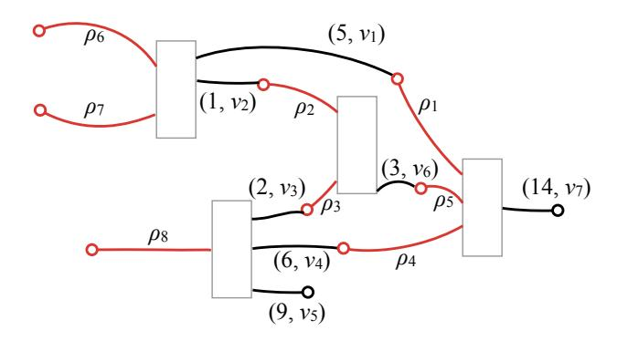

Figure 1: Example of a plain UTxO graph

UTxO. Transactions in an UTxO ledger contain a set of inputs and outputs, where outputs lock an amount of cryptocurrency, such that only authorized inputs of subsequent transactions can connect and consume those funds. This arrangement results in graphs, such as the one in Figure [1,](#page-6-0) where the boxes represent transactions with (red) inputs to the left and (black) outputs to the right.

Each output locks some cryptocurrency, which can be transferred via a subsequent transaction by consuming that output with a new input. The set of dangling (unconnected) outputs are the unspent transaction outputs (UTxOs) — there are two of those in Figure [1.](#page-6-0) In addition to the locked currency, each output also comes with a predicate ν, called its validator. In Figure [1,](#page-6-0) we use pairs (n, ν) to indicate that a given output locks n cryptocurrency with validator predicate ν.

Where outputs carry validators, each input comes with a redeemer value ρ. To determine whether a given input of the currently validated transaction tx is permitted to connect to a, as of yet, unspent output, we determine whether the validator predicate ν of that output applies for the redeemer ρ; or more formally, we check that ν(ρ, σ) = true, where the validation context σ represents some properties of the transaction that the spending input belongs to, such as the transaction's cryptographic hash value. For example, the validator may require the redeemer to be a signature on the transaction hash contained in the context σ for a specific key pair, such that only the owner of the private key can spend an output locked by that validator.

Extended UTxO. The Extended UTxO Model (EUTxO) [\[13\]](#page-41-5) preserves this structure, while adding support for more expressive smart contracts and, in particular, for multi-transaction state machines, which serve as the basis for the mainchain portion of the work presented here. This additional expressiveness is achieved by two changes to the plain UTxO scheme outlined before:

- Outputs carry, in addition to a cryptocurrency value n and a validator ν, now also a datum δ, which can, among other things, be used to maintain the state of long running smart contracts.
- The validation context σ is extended to contain the entire validated transaction tx as well as the UTxOs consumed by the inputs of that transaction.

In this extended model, evaluation of the validator predicate implies checking ν(ρ, δ, σ) = true. Besides maintaining contract state in δ, the fact that the validator can inspect the entire validated transaction tx through σ enables validators to enforce that contract invariants are maintained across entire chains of transactions.

Although formal results about EUTxO are rather recent, extended UTxO models already form the basis for the smart-contract platforms of existing blockchains — in particular, Cardano [14] and Ergo [17]. Consequently, the Hydra head protocol as presented in this paper is of immediate practical relevance to these existing systems.

User-defined tokens. In addition to the basic EUTxO extension, we generalize the currency values recorded on the ledger from integral numbers to generalized user-defined tokens [1]. Put simply (sufficient to understand the concepts in this paper), values are sets that keep track how many units of which tokens of which currency are available. For example, the value {Coin  $\mapsto$  {Coin  $\mapsto$  3},  $c \mapsto \{t_1 \mapsto 1, t_2 \mapsto 1\}$ } contains 3 Coin coins (there is only one (fungible) token Coin for a payment currency Coin), as well as (non-fungible) tokens  $t_1$  and  $t_2$ , which are both of currency c. Values can be added naturally, e.g.,

$$\begin{split} & \{\mathsf{Coin} \mapsto \{\mathsf{Coin} \mapsto 3\}, c \mapsto \{t_1 \mapsto 1, t_2 \mapsto 1\}\} \\ & + \{\mathsf{Coin} \mapsto \{\mathsf{Coin} \mapsto 1\}, c \mapsto \{t_3 \mapsto 1\}\} \\ & = \{\mathsf{Coin} \mapsto \{\mathsf{Coin} \mapsto 4\}, c \mapsto \{t_1 \mapsto 1, t_2 \mapsto 1, t_3 \mapsto 1\}\} \;. \end{split}$$

In the following,  $\varnothing$  is the empty value, and  $\{t_1, \ldots, t_n\} :: c$  is used as a shorthand for  $\{c \mapsto \{t_1 \mapsto 1, \ldots, t_n \mapsto 1\}\}$ .

The EUTxO ledger consists of transactions: Transactions are quintuples  $\operatorname{tx} = (I, O, \operatorname{val}_{\mathsf{Forge}}, r, \mathcal{K})$  comprising a set of inputs I, a list of outputs O, values of forged/burned tokens  $\operatorname{val}_{\mathsf{Forge}}$ , a slot range  $r = (r_{\mathsf{min}}, r_{\mathsf{max}})$ , and a set of public keys  $\mathcal{K}$ . Each input  $i \in I$  is a pair consisting of an output reference out-ref (consisting of a transaction ID and an index identifying an output in the transaction) and a redeemer  $\rho$  (used to supply data for validation). Each output  $o \in O$  is a triple (val,  $\nu$ ,  $\delta$ ) consisting of a value val, a validator script  $\nu$ , and a datum  $\delta$ . The slot range r indicates the slots within which tx may be confirmed and, finally,  $\mathcal{K}$  are the public keys under which tx is signed.

In order to validate a transaction tx with input set I, for each output  $o = (\mathsf{val}, \nu, \delta)$  referenced by an  $i = (\mathsf{out\text{-ref}}, \rho) \in I$ , the corresponding validator  $\nu$  is run on the following inputs:  $\nu(\mathsf{val}, \delta, \rho, \sigma)$ , where the validation context  $\sigma$  consists of tx and  $\mathit{all}$  outputs referenced by some  $i \in I$  (not just o). Ultimately, tx is valid if and only if all validators return true.

State Machines. A convenient abstraction for EUTxO smart contracts spanning a sequence of related transactions are state machines. Specifically, we adopt constraint emitting machines (CEMs) [13]. These are based on Mealy machines and consist of a set of states  $S_{CEM}$ , a set of inputs  $I_{CEM}$ , a predicate  $final_{CEM}: S_{CEM} \to Bool$  identifying final states, and a step relation  $s \xrightarrow{i} (s', tx^{\equiv})$ , which takes a state s on an input i to a successor state s' under the requirements that the constraints  $tx^{\equiv}$  are satisfied.

We implement CEMs on a EUTxO ledger (the mainchain) by representing a sequence of CEM states as a sequence of transactions. Each of these transactions has got a *state-machine input*  $i_{\text{CEM}}$  and a *state-machine output*  $o_{\text{CEM}}$ , where the latter is locked by a validator  $\nu_{\text{CEM}}$ , implementing the step relation. The only exceptions are the initial and final state, which have got no state-machine input and output, respectively.

More specifically, given two transactions tx and tx', they represent successive states under  $s \xrightarrow{i} (s', tx^{\equiv})$  iff

<span id="page-8-0"></span>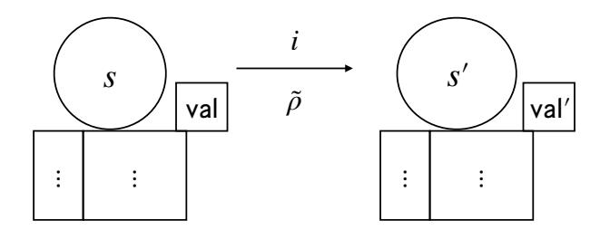

Figure 2: Transactions representing successive states in a CEM transition relation  $s \xrightarrow{i} (s', \operatorname{tx}^{\equiv})$ . Fields val and val' are the value fields of the state-machine outputs and  $\tilde{\rho}$  is the additional data.

- state-machine output  $o_{\text{CEM}} = (\text{val}, \nu_{\text{CEM}}, s)$  of tx is consumed by the state-machine input  $i'_{\text{CEM}} = (\text{out-ref}, \rho)$  of tx', whose redeemer is  $\rho = i$  (i.e., the redeemer provides the state-machine input) and
- either  $final_{\text{CEM}}(s') = \text{true}$  and tx' has no state-machine output, or  $o'_{\text{CEM}} = (\text{val}', \nu_{\text{CEM}}, s')$  and tx' meets all constraints imposed by  $tx^{\equiv}$ .

Sometimes it is useful to have additional data  $\tilde{\rho}$  provided as part of the redeemer, i.e.,  $\rho = (i, \tilde{\rho})$ . A state transition of the described type is represented by two connected transactions as shown in Fig. 2. For simplicity, state-machine inputs and outputs are not shown, with the exception of the value fields val and val' of the state-machine output.

## 3 Protocol Overview

The Hydra protocol provides functionality to lock a set of UTxOs on a blockchain, referred to as the *mainchain*, and evolve it inside a so-called offchain *head*, independently of the mainchain. At any point, the head can be closed with the effect that the locked set of UTxOs on the mainchain is replaced by the latest set of UTxOs inside the head. The protocol guarantees full wealth preservation: no generation of funds can happen offchain, and no responsive honest party involved in a head can ever lose any funds other than by consenting to give them away.

The advantage of head evolution from a liveness viewpoint is that, under good conditions, it can essentially proceed at network speed, thereby reducing latency and increasing throughput in an optimal way. At the same time, the head protocol provides the same smart-contract capabilities as the mainchain.

To avoid overloading with technical details, the main body of the paper presents a simplified version of Hydra to convey the basic concepts and ideas of the new protocol. Also in the overview, we focus on the simplified protocol and outline the differences of the full protocol in Section 3.4. A detailed description of the simplified protocol is given in Sections 4–6, and Appendix B. The full protocol is described in Appendix C.

### 3.1 The big picture

To create a head-protocol instance, any party may take the role of an *initiator* and ask a set parties (including himself), the *head members*, to participate in the head by announcing the identities of the parties.

Each party then establishes pairwise authenticated channels to all other parties or—if this is not possible—aborts the protocol setup.[1](#page-9-0)

The parties then exchange, via the pairwise authenticated channels, some public-key material. This public-key material is used both for the authentication of head-related onchain transactions that are restricted to head members (e.g., a non-member is not allowed to close the head) and for multisignature-based event confirmation in the head.

The initiator then establishes the head by submitting an initial transaction to the mainchain that contains the head parameters and forges special participation tokens identifying the head members by assigning each token to the public key distributed by the respective party during the the setup phase. The initial transaction also initializes a state machine (see Fig. [3\)](#page-10-0) for the head instance that manages the "transfer" of UTxOs between mainchain and head.

Once the initial transaction appears on the mainchain, establishing the initial state initial, each head member can attach a commit transaction, which locks (on the mainchain) the UTxOs that the party wants to commit to the head.

The commit transactions are subsequently collected by the collectCom transaction causing a transition from initial to open. Once the open state is confirmed, the head members start running the offchain head protocol, which evolves the initial UTxO set (the union over all UTxOs committed by all head members) independently of the mainchain. For the case where some head members fail to post a commit transaction, the head can be aborted by going directly from initial to final.

The head protocol is designed to allow any head member at any point in time to produce, without interaction, a certificate for the current head UTxO set. Using this certificate, the head member may advance the state machine to the closed state.

Once in closed, the state machine grants parties a contestation period, during which each party may (one single time) contest the closure by providing the certificate for a newer head UTxO set. Contesting leads back to the state closed. After the contestation period has elapsed, the state machine may proceed to the final state. The state machine enforces that the outputs of the transaction leading to final correspond exactly to the latest UTxO set seen during the contestation period.

## 3.2 The mainchain state machine

The mainchain part of the Hydra protocol fulfills two principal functions: (1) it locks the mainchain UTxOs committed to the head while the head is active and (2) it facilitates the settlement of the final head state back to the mainchain after the head is closed. In combination, these two functions effectively result in replacing the initial head UTxO set by the final head UTxO set on the mainchain in a manner that respects but does not persist the complete set of head transactions.

The state machine (Fig. [3\)](#page-10-0) implementing the mainchain protocol comprises the four states initial, open, closed, and final, where the first two realize the first function (locking the initial UTxO set) and the second two realize the second function (settling the final UTxO set on the mainchain).

State machines inherently sequentialize all actions that involve the machine state. This simplifies both reasoning about and implementing the protocol. However, steps that could otherwise be taken in parallel now need to be sequentialized, which might hurt performance. For the cases where this sequentialization would severely affect protocol performance, we employ a (to our knowledge) novel

<span id="page-9-0"></span><sup>1</sup>We generally assume that mechanisms for establishing pairwise authenticated channels are in place, e.g., by means of a public-key infrastructure.

<span id="page-10-0"></span>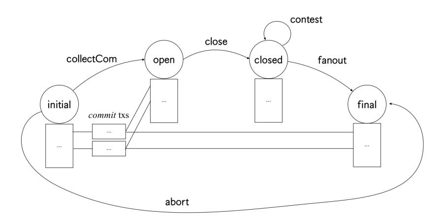

Figure 3: Mainchain state diagram for the simple version of the Hydra protocol.

technique to parallelize the progression of the state machine on the mainchain.

We use this technique to parallelize the construction of the initial UTxO set of the head. Without parallelization, all n head members would have to post their commit transactions (their portion of the initial UTxO set) in sequence, requiring a linear chain of n transactions, each for one state transition at a time. Instead, we make the state machine consume all n commit transactions in a single state transition. In Fig. [3,](#page-10-0) we represent this in the following way: the transaction representing state initial connects to the transaction representing state open not just via the collectCom state transition, but also via a set of commit transactions (one for each head member).

This requires some extra care. We want to ensure that each head member posts exactly one commit transaction and that the open transaction faithfully collects all commit transactions. We gain this assurance by issuing a single non-fungible token to each head member—we call this the participation token. This token must flow through the commit transaction of the respective head member and the open transaction, to be valid, must collect the full set of participation tokens. We may regard the participation token as representing a capability and obligation to participate in the head protocol.

### 3.3 The head protocol

The head protocol starts with an initial set U<sup>0</sup> of UTxOs that is identical to the UTxOs locked onchain.

Transactions and local UTxO state. The protocol confirms individual transactions in full concurrency by collecting and distributing multisignatures on each issued transaction separately. As soon as such a transaction is confirmed, it irreversibly becomes part of the head UTxO state evolution—the transaction's outputs are immediately spendable in the head, or can be safely transferred back onchain in case of a head closure.

Each party maintains their view of the local UTxO state L, which represents the current set of UTxOs evolved from the initial UTxO set U<sup>0</sup> by applying all transactions that have been confirmed so far in the head. As the protocol is asynchronous the parties' views of the local UTxO state generally differ.

**Snapshots.** The above transaction handling would be enough to evolve the head state. However, an eventual onchain decommit would have to transfer the full transaction history onchain as there would be no other way to evidence the correctness of the UTxO set to be restored onchain.

To minimize local storage requirements and allow for an onchain decommit that is independent of the transaction history, UTxO snapshots  $U_1, U_2, \ldots$  are continuously generated. For this, a snapshot leader requests his view of the confirmed state  $\overline{\mathcal{L}}$  to be multisigned as a new snapshot—the first head snapshot corresponding to the initial state  $U_0$ . A snapshot is considered confirmed if it is associated with a valid multisignature.

In contrast to transactions, the snapshots are generated sequentially. To have the new snapshot  $U_{i+1} = \overline{\mathcal{L}}$  multisigned, the leader does not need to send his local state  $U_{i+1}$ , but only indicate, by hashes, the set of (confirmed) transactions to be applied to  $U_i$  in order to obtain  $U_{i+1}$ .

The other participants sign the snapshot as soon as they have (also) seen the transactions confirmed that are to be processed on top of its predecessor snapshot: a party's confirmed state is always ahead of the latest confirmed snapshot.

As soon as a snapshot is seen confirmed, a participant can safely delete all transactions that have already been processed into it as the snapshot's multisignature is now evidence that this state once existed during the head evolution.

Closing the head. A party that wants to close the head decommits his confirmed state  $\overline{\mathcal{L}}$  by posting, onchain, the latest seen confirmed snapshot  $U_{\ell}$  together with those confirmed transactions that have not yet been processed by this snapshot. During the subsequent contestation period, other head members can post their own local confirmed states onchain.

## <span id="page-11-0"></span>3.4 The full protocol and further aspects

To improve on the basic protocol, we change the mainchain state machine (as described in Appendix C) to include

- incremental commits and decommits (adding UTxOs to or removing them from the head without closing),
- optimistic one-step head closure without the need for onchain contestation,
- pessimistic two-step head closure with an  $O(\Delta)$  contestation period, independent of n, where  $\Delta$  is the onchain settlement time of a transaction, and
- split onchain decommit of the final UTxO set (in case it is too large to fit into a single transaction).

These further protocol aspects are summarized in Appendix D:

- The handling of fees incentivizing parties to advance the head's state machine on the mainchain.
- The handling of time and timing issues in the (asynchronous) head protocol.
- Transaction throttling in the head to avoid the head's state becoming too large under pessimistic conditions.

# <span id="page-12-0"></span>4 Protocol Setup

In order to create a head-protocol instance, an initiator invites a set of participants {p1, . . . , pn} (himself being one of them) to join by announcing to them the protocol parameters: the list of participants, the parameters of the (multi-)signature scheme to be used, etc.

Each party then establishes pairwise authenticated channels to all other parties.

For some digital-signature scheme, each party p<sup>i</sup> generates a key pair (ki,ver, ki,sig) and sends his respective verification key ki,ver to all other parties. This "standard" digital-signature scheme will be used to authenticate mainchain transactions that are restricted to members of the head-protocol instance.

For the multisignature scheme (MS)—see Section [2.1—](#page-5-0)each party p<sup>i</sup> generates a key pair

$$(K_{i,\text{ver}}, K_{i,\text{sig}}) \leftarrow \mathsf{MS-KG}(\Pi)$$

and sends his verification key Ki,ver to all other parties.

Each party then computes his aggregate key from the received verification keys:

$$K_{\mathsf{agg}} \; := \leftarrow \; \mathsf{MS-AVK}(\Pi, (K_{j,\mathsf{ver}})_{j \in [n]}) \, .$$

The multisignature scheme will be used for the offchain confirmation (and offchain and onchain verification) of head-protocol events.

At the end of this initiation, each party p<sup>i</sup> stores his signing key and all received verification keys for the signature scheme,

$$(k_{i,\text{sig}}, \ \underline{k}_{\text{ver}} := (k_{j,\text{ver}})_{j \in [n]}) \ ,$$

and his signing key, the verification keys, and the aggregate verification key for the multisignature scheme,

$$\left(K_{i, \mathsf{sig}}, \ \underline{K}_{\mathsf{ver}} := (K_{j, \mathsf{ver}})_{j \in [n]}, \ K_{\mathsf{agg}} \right)$$
 .

If any of the above fails (or the party does not agree to join the head in the first place), the party aborts the initiation protocol and ignores any further action.[2](#page-12-1)

The initiator now posts the initial transaction onchain as described in Section [5.](#page-12-2)

# <span id="page-12-2"></span>5 Mainchain

Here we describe the details of the mainchain state machine (SM) controlling a Hydra head (see Fig. [3\)](#page-10-0). For state transitions, a formal description of the conditions in tx<sup>≡</sup> is foregone in favor of the intuitive explanations in the text and the figures.

Onchain verification algorithms. The status of the head is maintained in a variable η, which is part of the SM state and updated by so-called onchain verification (OCV) algorithms Initial, Close, Contest, and Final. In the context of the mainchain protocol, these OCV algorithms are intentionally kept as generic as possible; this keeps the mainchain SM compatible with many potential headprotocol variants. The concrete OCV algorithms for the head protocol specified in this paper are given in context of the head protocol itself as they depend on the specific head-protocol internals:

<span id="page-12-1"></span><sup>2</sup>Of course, aborting the initiation can be achieved more gracefully by explicitly notifying the initiator about one's non-participation. Techniques are even known to finish such an initiation in agreement among all parties [\[23\]](#page-41-12).

<span id="page-13-0"></span>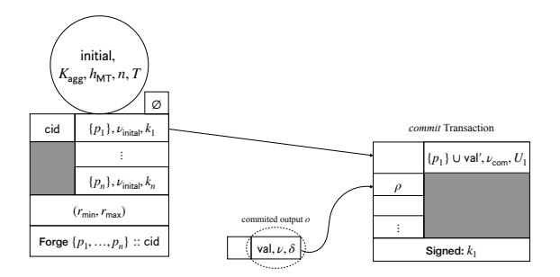

Figure 4: *initial* transaction (left) with *commit* transaction (right) attached and one of the locked outputs (center).

verification of head-protocol certificates and related onchain state updates. As such, the OCV algorithms can be seen as abstract mainchain algorithms implemented by the specific head protocol. Consequently, the OCV implementation for our head protocol is described in Section 6.3.1.

Initial state. After the setup phase of Section 4, the head initiator posts an *initial* transaction (see Fig. 4). The *initial* transaction establishes the SM's initial state (initial,  $K_{\text{agg}}$ ,  $h_{\text{MT}}$ , n, T), where initial is a state identifier,  $K_{\text{agg}}$  is the aggregated multisignature key established during the setup phase,  $h_{\text{MT}}$  is the root of a Merkle tree for the signature verification keys  $\underline{k}_{\text{ver}} = (k_1, \ldots, k_n)$  exchanged during the setup phase (identifying the head members), n is the number of head members, and T is the length of the contestation period. The *initial* transaction also forges n participation tokens  $\{p_1, \ldots, p_n\}$  :: cid, where the currency ID cid is given by the unique monetary-policy script consumed by the cid input. The script is unique as it is bound to an output and the ledger prevents double spending. Consequently, we can use cid as a unique identifier for the newly initialized head.

Crucially, the *initial* transaction has n outputs, where each output is locked by a validator  $\nu_{\text{initial}}$  and the  $i^{\text{th}}$  output has  $k_i$  in its data field. Validator  $\nu_{\text{initial}}$  ensures the following: either the output is consumed by

- 1. an SM abort transaction (see below) or
- 2. a commit transaction (identified by having validator  $\nu_{com}$  in its only output), and
  - (a) the transaction is signed and the signature verifies as valid with verification key  $k_i$ ,
  - (b) the data field of the output of the commit transaction is  $U_i = \mathsf{makeUTxO}(o_1, \ldots, o_m)$ , where the  $o_j$  are the outputs referenced by the commit transaction's inputs and  $\mathsf{makeUTxO}$  stores pairs (out-ref<sub>j</sub>,  $o_j$ ) of outputs  $o_j$  with the corresponding output reference out-ref<sub>j</sub>.

The general well-formedness and validity of the *initial* transaction is checked on the mainchain. The head members additionally check whether the head parameters match the parameters agreed on during the setup phase. In case of a mismatch the head opening is considered as failed.

Committing outputs to a head. To lock outputs for a Hydra head, the  $i^{\text{th}}$  head member will attach a *commit* transaction (see Fig. 4) to the  $i^{\text{th}}$  output of the *initial* transaction. Validator  $\nu_{\text{com}}$  ensures that the *commit* transaction correctly records the partial UTxO set  $U_i$  committed by the party.

<span id="page-14-0"></span>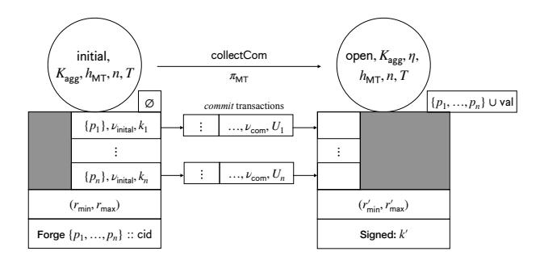

Figure 5: *initial* transaction (left) with *collectCom* transaction (right) and *commit* transactions (center).

All *commit* transactions will in turn be collected by an SM transaction—either *collectCom* or *abort* (see below).

Collecting commits. The SM transition from initial to open is achieved by posting the collect-Com transaction (see Fig. 5). All parameters  $K_{\text{agg}}$ ,  $h_{\text{MT}}$ , n, and T remain part of the state, but in addition, a value  $\eta \leftarrow \text{Initial}(U_1, \ldots, U_n)$  is stored in the state. The idea is that  $\eta$  stores information about the initial UTxO set, which is made up of the individual UTxO sets  $U_i$  collected from the commit transactions, in order to verify head-status information later (see below).

It is also required that all n participation tokens be present in the SM output of the collectCom transaction. This ensures that the collectCom transaction collects all n commit transactions. Note that since  $\nu_{\mathsf{initial}}$  does not allow an SM commit transaction to consume the outputs of the initial transaction, the only way to post the collectCom transaction is if each head member has posted a commit transaction.

Finally, note that the transition requires a proof  $\pi_{\mathsf{MT}}$  that the signer k' is in the Merkle Tree belonging to  $h_{\mathsf{MT}}$ , which ensures that only head members can post SM transactions. This will be the case for all transitions considered in this paper (and will not be pointed out any further).

Aborting a head. The *abort* transaction (see Fig. 6) allows a party to abort the creation of a head in case some parties fail to post a commit transaction. The final state does not contain any information (beyond its identifier), but it is ensured that (1) the outputs U correspond to the union of all committed UTxO sets  $U_i$  and (2) all participation tokens are burned.

Close transaction. In order to close a head, a head member may post the close transaction (see Fig. 7), which results in a state transition from the open state to the closed state. For a successful close, a head member must provide valid information  $\xi$  about (their view of) the current head state. This information is passed through OCV algorithm Close, resulting in a new OCV status  $\eta' \leftarrow \text{Close}(K_{\text{agg}}, \eta, \xi)$ . OCV algorithm Close uses the previous OCV status  $\eta$  and  $K_{\text{agg}}$  to check the head information  $\xi$ . Note that if a check fails, Close may output  $\bot$ , but in order for a close transaction to be valid,  $\eta' \neq \bot$  is required.

Once a close transaction has been posted, a contestation period begins which should last at least T slots. Hence, the last slot  $T_{\text{final}}$  of the contestation period is recorded in the state, and it is ensured that  $T_{\text{final}} \geq r'_{\text{max}} + T$ .

<span id="page-15-0"></span>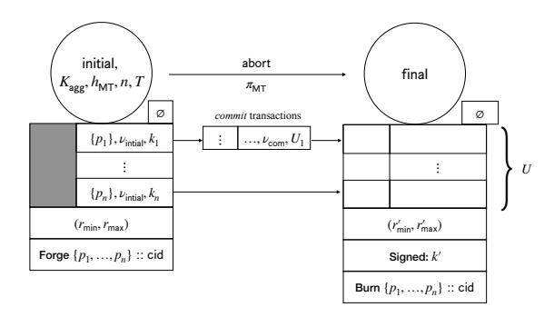

Figure 6: *initial* transaction (left) with *abort* transaction (right) and *commit* transactions (center).

<span id="page-15-1"></span>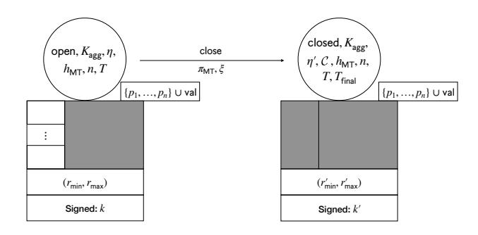

Figure 7: collectCom transaction (left) with close transaction (right).

Finally, the SM state is extended by a set  $\mathcal{C}$  initialized to the poster's signing key, i.e.,  $\mathcal{C} \leftarrow \{k'\}$ .  $\mathcal{C}$  is used to ensure that no party posts more than once during the contestation period.

Contestation. If the party first closing a head posts outdated/incomplete information about the current state of the head, any other party may post a *contest* transaction (see Fig. 8), which causes a state transition from the closed state to itself. The transition handles update information  $\xi$  by passing it through OCV algorithm Contest, resulting in a new OCV status  $\eta' \leftarrow \text{Contest}(K_{\text{agg}}, \eta, \xi)$ . OCV algorithm Contest uses the previous OCV status  $\eta$  and  $K_{\text{agg}}$  to check the update information  $\xi$ . Similarly to Close, Contest may output  $\bot$ , but in order for a *contest* transaction to be valid  $\eta' \neq \bot$  is required.

The *contest* transaction is only valid if the old set  $\mathcal{C}$  of parties who have contested (or closed) so far does not yet include the poster, i.e.,  $k' \notin \mathcal{C}$ . If this check passes, the set is extended to include the poster of the *contest* transaction, i.e.,  $\mathcal{C}' \leftarrow \mathcal{C} \cup \{k'\}$ . Furthermore, *contest* transactions may only be posted up until  $T_{\mathsf{final}}$ , i.e., it is required that  $r'_{\mathsf{max}} \leq T_{\mathsf{final}}$ .

Observe that during the contestation period, up to n-1 contest transactions may be posted (of course, the parameter T has to be chosen large enough as to allow each head member to potentially post a close/contest transaction).

**Final state.** Once the contestation phase is over, a head may be finalized by posting a *fanout* transaction, taking the SM from closed to final. The *fanout* transaction must have outputs that correspond to the most recent head state. To that end, OCV predicate Final checks the transaction's

<span id="page-16-1"></span>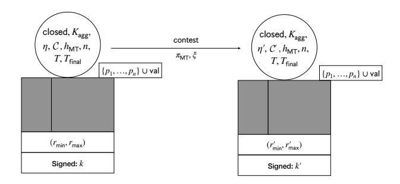

Figure 8: close/contest transaction (left); contest transaction (right)

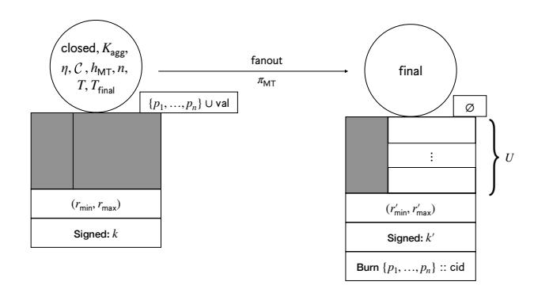

Figure 9: close/contest transaction (left); fanout transaction (right)

output set U against the information recorded in  $\eta$ . The fanout transaction is only valid if Final outputs true. Moreover, to ensure that the fanout transaction is not posted too early,  $r'_{\mathsf{min}} > T_{\mathsf{final}}$  is required. Finally, all participation tokens must be burned.

# <span id="page-16-0"></span>6 Simple Head Protocol Without Conflict Resolution

This section describes the simplified version of the head protocol, and without conflict resolution, with the goal to demonstrate the protocol basics without overloading the presentation with too many details. Conflict resolution is added to the protocol in Appendix B, and the full protocol is sketched in Appendix C.

We first introduce a security definition for the head protocol in Section 6.1. The protocol machine is described in Section 6.2, the head-specific maintenance code in Section 6.3, and a security proof for the head protocol is given in Section 6.4.

### <span id="page-16-2"></span>6.1 Security definition

#### 6.1.1 Protocol syntax

The head-protocol syntax is HP = (Prot, Initial, Close, Contest, Final). The main component is the protocol machine Prot, an instance of which is run by every head member. The other algorithms are used for setup and onchain verification and form the interface to the mainchain. In particular,

•  $\Sigma \leftarrow$  generates global parameters,

- $(K_{\mathsf{ver}}, K_{\mathsf{sig}}) \leftarrow \mathsf{MS-KG}(\Sigma)$  allows every head member to generate fresh public/private key material based on the global parameters,
- $K_{\mathsf{agg}} \leftarrow \mathsf{MS}\text{-}\mathsf{AVK}(\Sigma, (K_{\mathsf{ver},i})_i)$  aggregates public keys, and
- Initial, Close, Contest, and Final are onchain verification algorithms (cf. Section 5).

The head-protocol machine Prot has the following interface to the environment:

- input (init,  $i, \underline{K}_{ver}, K_{sig}, U_0$ ) is used to initialize the head protocol, for the party with index i, with a vector of public-key material  $\underline{K}_{ver}$ , private-key material  $K_{sig}$ , and an initial UTxO set  $U_0$ ;
- input (new, tx) is used to submit a new transaction tx;
- output (seen, tx) announces that transaction tx has been seen (by the party outputting the message);
- output (conf, tx) announces that transaction tx has been confirmed (in the view of the party outputting the message);
- input (close) is used to initiate head closure (produces a certificate  $\xi$ ); and
- input (cont,  $\eta$ ) is used to contest (produces a certificate  $\xi$ ).

### 6.1.2 Protocol security

The security definition for the head protocol guarantees the following four, intuitively stated properties:

- Consistency: No two uncorrupted parties see conflicting transactions confirmed.
- LIVENESS: If all parties remain uncorrupted and the adversary delivers all messages, then every transaction becomes confirmed at some point.
- Soundness: The final UTxO set accepted on the mainthain results from a set of seen transactions.
- Completeness: All transactions observed as confirmed by an honest party at the end of the protocol are considered on the mainchain.

**Experiment for security definition.** The security properties above are captured by considering a random experiment that involves

- an adversary  $\mathcal{A}$ ,
- a network under full scheduling control of  $\mathcal{A}$ , able to drop messages or delay them arbitrarily,
- a setup phase,
- n parties  $p_i$ , corruptible by  $\mathcal{A}$ , running the head protocol with the parameters from the setup phase and an initial UTxO set  $U_0$  chosen by  $\mathcal{A}$ , and
- an abstract maintain (mostly) controlled by A.

The experiment ends once the mainchain state machine arrives in the final state, and the adversary wins if certain conditions are not satisfied at the end of the experiment.

In more detail, the experiment proceeds as follows:

- 1. Global parameters  $\Sigma \leftarrow \mathsf{MS}\text{-}\mathsf{Setup}$  are generated, and  $\Sigma$  is passed to  $\mathcal{A}$ .
- 2. For each party  $p_i$ , key material  $(K_{\mathsf{ver},i}, K_{\mathsf{sig},i}) \leftarrow \mathsf{MS-KG}(\Sigma)$  is generated, and the vector  $\underline{K}_{\mathsf{ver}}$  of all public keys and  $K_{\mathsf{agg}} \leftarrow \mathsf{MS-AVK}(\Sigma, \underline{K}_{\mathsf{ver}})$  are passed to  $\mathcal{A}$ .
- 3. Each party  $p_i$ 's protocol machine is initialized with  $(init, i, \underline{K}_{ver}, K_{sig,i}, U_0)$ , where  $U_0$  is chosen by A.
- 4. The adversary now gets to control inputs to parties (e.g., new transactions, close/contest requests) and sees outputs (e.g., seen and confirmed transactions). The following bookkeeping takes place:
  - when an uncorrupted party  $p_i$  outputs  $\xi$  upon close command, record (close,  $i, \xi$ );
  - when uncorrupted party  $p_i$  outputs  $\xi$  upon  $(cont, \eta)$  command, record  $(cont, i, \eta, \xi)$ .

In "parallel" to the above, the experiment sets  $\mathcal{C}, H_{\mathsf{cont}} \leftarrow \emptyset$  and does the following to simulate the mainchain:

- (a) Initialize  $\eta \leftarrow (U_0, 0, \emptyset)$ .
- (b) When  $\mathcal{A}$  supplies  $(i,\xi)$ : if i is uncorrupted,  $\xi$  gets replaced by the  $\xi$  recorded in  $(\mathtt{close},i,\xi)$  and  $H_{\mathtt{cont}} \leftarrow H_{\mathtt{cont}} \cup \{i\}$ . Then,  $\eta \leftarrow \mathsf{Close}(K_{\mathtt{agg}},\eta,\xi)$  and  $\mathcal{C} \leftarrow \mathcal{C} \cup \{i\}$  is computed. If  $\mathsf{Close}$  rejects, everything in this step is discarded and the step repeated.
- (c) The adversary gets to repeatedly supply  $(i, \xi)$  for  $i \notin \mathcal{C}$ ; if i is uncorrupted,  $\xi$  gets replaced by the  $\xi$  recorded in  $(\mathtt{cont}, i, \xi)$  and  $H_{\mathtt{cont}} \leftarrow H_{\mathtt{cont}} \cup \{i\}$ . Then,  $\eta \leftarrow \mathsf{Contest}(K_{\mathtt{agg}}, \eta, \xi)$  and  $\mathcal{C} \leftarrow \mathcal{C} \cup \{i\}$  is computed. If Contest rejects, everything in this step is discarded.
- (d) When the adversary supplies  $U_{\mathsf{final}}$ ,  $b \leftarrow \mathsf{Final}(\eta, U_{\mathsf{final}})$  is computed, and the experiment ends.

Our protocol gives different security guarantees depending on the level of adversarial corruption. It provides correctness independently of both, the number of corrupted head parties and the network conditions. But the guarantee that the protocol makes progress (i.e., that new transactions get confirmed in the head) is only provided in the case that no head parties are corrupted and that the network conditions are good.

To capture this difference, we distinguish:

Active Adversary. An active adversary  $\mathcal{A}$  has full control over the protocol, i.e., he is fully unrestricted in the above security game.

Network Adversary. A network adversary  $\mathcal{A}_{\emptyset}$  does not corrupt any head parties, eventually delivers all sent network messages (i.e., does not drop any messages), and does not cause the close event. Apart from this restriction, the adversary can act arbitrarily in the above experiment.

Security events. Consider the following random variables:

- $\hat{S}_i$ : the set of transactions tx for which party  $p_i$ , while uncorrupted, output (seen, tx);
- $\overline{C}_i$ : the set of transactions tx for which party  $p_i$ , while uncorrupted, output (conf, tx);
- $H_{\mathsf{cont}}$ : the set of (at the time) uncorrupted parties who produced  $\xi$  upon close/contest request and  $\xi$  was applied to correct  $\eta$  (see above); and
- $\bullet$   $\mathcal{H}$ : the set of parties that remained uncorrupted.

The security of the head protocol is captured by considering the following events, each corresponding to one of the security properties introduced above:

- Consistency (Head): In presence of an active adversary, the following condition holds: For all  $i, j, U_0 \circ (\overline{C}_i \cup \overline{C}_j) \neq \bot$ , i.e., no two uncorrupted parties see conflicting transactions confirmed.
- LIVENESS (HEAD): In presence of a network adversary the following condition holds: For any transaction tx input via (new, tx), the following eventually holds:  $\operatorname{tx} \in \bigcap_{i \in [n]} \overline{C}_i \vee \forall i : U_0 \circ (\overline{C}_i \cup \{\operatorname{tx}\}) = \bot$ , i.e., every party will observe the transaction confirmed or every party will observe the transaction in conflict with his confirmed transactions.
- SOUNDNESS (CHAIN): In presence of an active adversary, the following condition is satisfied:  $\exists \tilde{S} \subseteq \bigcap_{i \in \mathcal{H}} \hat{S}_i : U_{\mathsf{final}} = U_0 \circ \tilde{S}$ , i.e., the final UTxO set results from a set of seen transactions.
- COMPLETENESS (CHAIN): In presence of an active adversary, the following condition holds: For  $\tilde{S}$  as above,  $\bigcup_{p_i \in H_{\text{cont}}} \overline{C}_i \subseteq \tilde{S}$ , i.e., all transactions seen as confirmed by an honest party at the end of the protocol are considered.

Note that our simplified protocol with conflict resolution and our full protocol in Appendices B and C achieve liveness in the above sense, but that our simplified protocol without conflict resolution in Section 6 only achieves a weaker notion of liveness, namely liveness in a

Conflict-Free Execution: Let  $\mathcal{N} = \{ \operatorname{tx} \mid (\operatorname{new}, \operatorname{tx}) \}$  the set of all transactions input to a new event during the execution of the head protocol. A head-protocol execution is conflict-free iff  $U_0 \circ \mathcal{N} \neq \bot$ .

Respectively, the liveness aspect of the simplified protocol without conflict resolution is captured by the following event, instead:

• CONFLICT-FREE LIVENESS (HEAD): In presence of a network adversary, a conflict-free execution satisfies the following condition: For any transaction tx input via (new, tx), tx  $\in \bigcap_{i \in [n]} \overline{C}_i$  eventually holds.

### <span id="page-19-0"></span>6.2 Protocol machine

The protocol machine Prot consists of a number of subroutines that handle inputs from the environment (e.g., the client command to issue a new transaction for confirmation, or the arrival of another party's confirmation request). The protocol is depicted in Figure 10. All relevant non-obvious notation is explained in the following paragraphs.

<span id="page-19-1"></span><sup>&</sup>lt;sup>3</sup>In particular, *liveness* expresses that the protocol makes progress under reasonable network conditions if no head parties get corrupted – implying that, given any guaranteed upper bound  $\delta$  on message delivery delay, the worst-case transaction-confirmation time is bounded in function of  $\delta$ .

#### 6.2.1 Local state representation

Every party maintains local objects to represent transactions, snapshots, and his local head-UTxO set. These objects exist in two versions, a *seen* object has been signed by the party (the party has seen and approved the event); and a *confirmed* object is associated with a valid multisignature (the party has received a valid multisignature on the object). A seen object X is denoted by  $\hat{X}$  and a confirmed object by  $\overline{X}$ .

A party's local protocol state consists of the multisignature verification keys and its own signing key, of snapshot counters  $\hat{s}$  and  $\bar{s}$ , and of variables

- $\hat{\mathcal{U}}$  and  $\overline{\mathcal{U}}$ , keeping track of the most recent seen resp. confirmed, snapshots,
- $\hat{\mathcal{L}}$  and  $\overline{\mathcal{L}}$ , keeping track of recent seen resp. confirmed UTxO sets, and
- $\hat{T}$  and  $\overline{T}$ , the sets of seen resp. confirmed, transactions that have not been considered by a snapshot yet.

Variables  $\hat{\mathcal{U}}$  and  $\overline{\mathcal{U}}$  store so-called *snapshot objects*, which are data structures keeping information about a snapshot. Specifically, a snapshot object  $\mathcal{U}$  has the following structure:

| $\mathcal{U}.s$              | snapshot number                                               |
|------------------------------|---------------------------------------------------------------|
| $\mathcal{U}.U$              | corresponding UTxO set                                        |
| $\mathcal{U}.h$              | hash of $U$                                                   |
| $\mathcal{U}.T$              | set of transactions relating this snapshot to its predecessor |
| $\mathcal{U}.S$              | signature accumulator (array of signatures)                   |
| $\mathcal{U}.\tilde{\sigma}$ | multisignature                                                |

The function  $\mathsf{snObj}(s,U,T)$  initializes a snapshot object and is explained later.

Similarly,  $\hat{\mathcal{T}}$  and  $\overline{\mathcal{T}}$  store sets of transaction objects. A transaction object tx has the following structure:

| tx.i                | index of the party issuing transaction for certification |
|---------------------|----------------------------------------------------------|
| tx.tx               | transaction                                              |
| tx.h                | hash of tx                                               |
| tx.S                | signature accumulator (array of signatures)              |
| $tx.\tilde{\sigma}$ | multisignature.                                          |

The function  $\mathsf{tx}\mathsf{Obj}(i,\mathsf{tx})$  initializes a transaction object by setting the appropriate fields to the passed values (including computing the hash of  $\mathsf{tx}$ ) and the remaining fields to  $\emptyset$  resp.  $\bot$ .

#### <span id="page-20-1"></span>6.2.2 Three-round entity confirmation

Transactions and snapshots are confirmed in an asynchronous 3-round process:<sup>4</sup>

• req: The issuer of a transaction or snapshot requests the entity to be signed by sending the entity description to every head member.

<span id="page-20-0"></span><sup>&</sup>lt;sup>4</sup>Note that, as a variant, this 3-round process (with linear communication in n) can be condensed to 2 rounds (with quadratic communication in n) by combining the last two rounds into an "all-to-all" signature notification. This variant may be preferable for small n.

- ack: The head members acknowledge the entity be replying their signatures on the entity to the issuer.
- conf: The issuer collects all signatures, combines the multisignature, and sends the multisignature to all head members.

#### 6.2.3 Code notation

Code is depicted by view of a generic head party  $p_i$ . We assume that a party only accepts messages authenticated by its claimed sender (by use of the authenticated channels established during the setup phase)—unauthenticated messages are simply treated as unseen by the recipient. For simplicity, whenever a party  $p_i$  sends a message to all head parties, it also sends the message to itself

For the transaction set  $\hat{\mathcal{T}}$  (and similarly  $\overline{\mathcal{T}}$ ),  $\hat{\mathcal{T}}[h]$  denotes  $\mathsf{tx} \in \hat{\mathcal{T}}$  such that  $\mathsf{tx}.h = h$ , i.e., the transaction object corresponding to the transaction with hash  $H(\mathsf{tx}) = h$ .

The  $\downarrow$  operator indicates the projection of an object onto a subset of its fields. For example,  $\hat{\mathcal{T}}^{\downarrow(h)}$  denotes the set of hashes corresponding to the transactions in  $\hat{\mathcal{T}}$ .

The following notation is used to describe the application of transactions to a given UTxO set.

- $U' = U \circ \text{tx}$  assigns to U' the UTxO set resulting from applying transaction tx to UTxO set U. In case that the validation fails it returns  $U' = \bot$ .
- $U' = U \circ T$  assigns to U' the UTxO set resulting from applying all transaction in the transaction set T to UTxO set U. In case that not all transactions can be applied it returns  $U' = \bot$ .

In the protocol routines of Fig. 10, by  $\mathbf{require}(P)$ , we express that predicate P must be satisfied for the further execution of a routine—while immediately terminated on  $\neg P$ . By  $\mathbf{wait}(P)$  we express a non-blocking wait for predicate P to be satisfied. On  $\neg P$ , the execution of the routine is stopped, queued, and reactivated as soon as P is satisfied. Finally, we assume the code executions of each routine to be atomic—excluding the blocks of code that may be put into the wait queue for later execution, in which case we assume the wait block to be atomic.

#### 6.2.4 Protocol flow

Initializing the head. Initially, by activation via the (init) event, the parties store their multisignature key material form the setup phase, ad set  $\overline{\mathcal{L}} = \hat{\mathcal{L}} = \overline{\mathcal{U}} = \hat{\mathcal{U}} = U_0$  where  $U_0$  is the initial UTxO set extracted from the  $\eta$ -state of the *collectCom* transaction (see Fig. 5). The initial transaction sets are empty,  $\overline{\mathcal{T}} = \hat{\mathcal{T}} = \emptyset$ , and  $\overline{s} = \hat{s} = 0$ .

#### Confirming new transactions.

(new). At any time, by calling (new,tx), a head party can (asynchronously) inject a new transaction tx to the head protocol—initiating a 3-round confirmation process for tx as described in Section 6.2.2. For this, the transaction must be well-formed (valid-tx) and applicable to the current confirmed local UTxO state:  $\overline{\mathcal{L}} \circ tx \neq \bot$ . If the checks pass, a (reqTx,tx) request is sent out to all parties.

#### Simplified Hydra Head Protocol Without Conflict Resolution

```
on (init, i, \underline{K}_{ver}, K_{sig}, U_0) from client
                                                                                                                                                 on (close) from client
                                                                                                                                                   | \quad \mathbf{return} \ (\overline{\mathcal{U}}.U, \overline{\mathcal{U}}.s, \overline{\mathcal{U}}.\tilde{\sigma}, \overline{\mathcal{T}}^{\downarrow (\mathrm{tx}, \tilde{\sigma})}) 
       \begin{array}{l} \mathcal{V} \leftarrow \underline{K}_{\mathsf{ver}} \\ \mathsf{avk} \leftarrow \mathsf{MS}\text{-}\mathsf{AVK}(\mathcal{V}) \end{array}
        \mathsf{sk} \leftarrow K_{\mathsf{sig}}
                                                                                                                                                 on (cont, \eta) from client
                                                                                                                                                        (U_{\eta}, s_{\eta}, T_{\eta}) \leftarrow \eta
        \hat{\mathcal{U}}, \overline{\mathcal{U}} \leftarrow \mathsf{snObj}(0, U_0, \emptyset)
                                                                                                                                                        if \overline{s} \leq s
                                                                                                                                                            U \leftarrow U_{\eta}
        \hat{\mathcal{L}}, \overline{\mathcal{L}} \leftarrow U_0
                                                                                                                                                                  s \leftarrow s_{\eta}
        \hat{\mathcal{T}}, \overline{\mathcal{T}} \leftarrow \emptyset
                                                                                                                                                                \tilde{\sigma} \leftarrow \varepsilon
                                                                                                                                                         else
on (new, tx) from client
                                                                                                                                                                 U \leftarrow \overline{\mathcal{U}}.U
        require valid-tx(tx) and \overline{\mathcal{L}} \circ tx \neq \bot
                                                                                                                                                                 s \leftarrow \overline{s}
        \mathbf{multicast}\ (\mathtt{reqTx},\mathtt{tx})
                                                                                                                                                                \tilde{\sigma} \leftarrow \overline{\mathcal{U}}.\tilde{\sigma}
on (newSn) for p_i
                                                                                                                                                         T' \leftarrow \mathsf{applicable}(U, \overline{\mathcal{T}}^{\downarrow(\mathsf{tx})} \cup T_{\eta}) \setminus T_{\eta}
        require leader(\overline{s} + 1) = i and \hat{\mathcal{U}} = \overline{\mathcal{U}}
                                                                                                                                                         if U = U_n
        T \leftarrow (\max \mathsf{Txos}(\overline{\mathcal{T}}))^{\downarrow (h)}
                                                                                                                                                           U \leftarrow \varepsilon
                                                                                                                                                         return
        multicast (reqSn, \bar{s} + 1, T)
                                                                                                                                                           (U, s, \tilde{\sigma}, \{t \in \overline{T}^{\downarrow(\mathrm{tx}, \tilde{\sigma})} \mid t.\mathrm{tx} \in T'\})
 \mathbf{on} \; (\mathtt{reqTx}, \mathtt{tx}) \; \mathit{from} \; \mathsf{p}_j
                                                                                                                                                  \mathbf{on} \ (\mathtt{reqSn}, s, T) \ \mathit{from} \ \mathtt{p}_j
         require valid-tx(tx) \wedge \hat{\mathcal{L}} \circ tx \neq \bot
                                                                                                                                                          require s = \overline{s} + 1 and leader(s) = j
                                                                                                                                                           wait \overline{s} = \hat{s} and T \subseteq \overline{T}^{\downarrow(h)}
           wait \overline{\mathcal{L}} \circ tx \neq \bot
                  h \leftarrow H(\mathrm{tx})
                                                                                                                                                                  \hat{s} \leftarrow \hat{s} + 1
                   \hat{\mathcal{T}}[h] \leftarrow \mathsf{txObj}(j, \mathsf{tx})
                                                                                                                                                                   \hat{\mathcal{U}} \leftarrow \mathsf{snObj}(\hat{s}, \overline{\mathcal{U}}.U, T)
                                                                                                                                                                   \sigma_i \leftarrow \mathsf{MS-Sign}(\mathsf{sk}, \hat{\mathcal{U}}.h \| \hat{s})
                   output (seen, tx)
                                                                                                                                                                   send (ackSn, \hat{s}, \sigma_i) to p_i
                   \sigma_i \leftarrow \mathsf{MS-Sign}(\mathsf{sk}, h)
                   send (ackTx, h, \sigma_i) to p_j
                                                                                                                                                  on (ackSn, s, \sigma_i) from p_i
                                                                                                                                                          require s = \hat{s} and leader(s) = i
 \mathbf{on}\ (\mathtt{ackTx}, h, \sigma_j)\ \mathit{from}\ \mathsf{p}_j
                                                                                                                                                           require \hat{\mathcal{U}}.S[j] = \varepsilon
         require \hat{\mathcal{T}}[h].i = i
                                                                                                                                                          \hat{\mathcal{U}}.S[j] \leftarrow \sigma_i
         require \hat{T}[h].S[j] = \varepsilon
                                                                                                                                                          if \forall k : \hat{\mathcal{U}}.S[k] \neq \varepsilon
         \mathcal{T}[h].S[j] \leftarrow \sigma_j
                                                                                                                                                                   \tilde{\sigma} \leftarrow \mathsf{MS\text{-}ASig}(\hat{\mathcal{U}}.h \| s, \mathcal{V}, \hat{\mathcal{U}}.S)
         if \forall k : \hat{\mathcal{T}}[h].S[k] \neq \varepsilon
                                                                                                                                                                   if \tilde{\sigma} \neq \bot
                \tilde{\sigma} \leftarrow \mathsf{MS}\text{-}\mathsf{ASig}(h, \mathcal{V}, \hat{\mathcal{T}}[h].S)
                                                                                                                                                                     multicast (confSn, s, \tilde{\sigma})
                  if \tilde{\sigma} \neq \bot
                     multicast (confTx, h, \tilde{\sigma})
                                                                                                                                                  on (confSn, s, \tilde{\sigma}) from p_i
                                                                                                                                                          require s = \hat{s} \neq \overline{s}
 on (confTx, h, \tilde{\sigma}) from p_j
                                                                                                                                                          if MS-Verify(avk, \hat{\mathcal{U}}.h\|\hat{s}, \tilde{\sigma})
         {\bf if} MS-Verify(avk, h, \tilde{\sigma})
                                                                                                                                                                   \overline{s} \leftarrow s
                  tx \leftarrow \hat{T}[h].tx
                                                                                                                                                                   \hat{\mathcal{U}}.\tilde{\sigma} \leftarrow \tilde{\sigma}
                  \overline{\mathcal{L}} \leftarrow \overline{\mathcal{L}} \circ \mathrm{tx}
                                                                                                                                                                   \overline{\mathcal{U}} \leftarrow \hat{\mathcal{U}}
                                                                                                                                                                   \overline{\mathcal{T}} \leftarrow \overline{\mathcal{T}} \setminus \mathsf{Reach}^{\overline{\mathcal{T}}}(\overline{\mathcal{U}}.T)
```

Figure 10: Head-protocol machine for the simple protocol without conflict resolution from the perspective of party  $p_i$ .

(reqTx). Upon receiving request (reqTx, tx), a signature is only issued by a party  $p_i$  if tx applies to his local seen UTxO state:  $\hat{\mathcal{L}} \circ tx \neq \bot$ . If this is the case, the party waits until his confirmed UTxO state  $\overline{\mathcal{L}}$  has "caught up": the signature is only delivered as soon as  $\overline{\mathcal{L}} \circ tx \neq \bot$ , i.e., a

transaction is only signed once it is applicable to the local confirmed state.

In case the preconditions are satisfied, a respective transaction object is allocated, initialized, and added to  $\hat{T}$ ;  $\hat{\mathcal{L}}$  is updated by applying tx, and (seen, tx) is output; and, finally, a signature on the hash of tx,  $\sigma = \mathsf{MS-Sign}(H(\mathsf{tx}))$ , is delivered back to the transaction issuer by replying with an (ackTx,  $H(\mathsf{tx})$ ,  $\sigma$ ).

(ackTx). Upon receiving acknowledgment (ackTx, h,  $\sigma_j$ ), the transaction issuer stores the received signature in the respective transaction object. If a signature from each party has been collected,  $p_i$  computes the multisignature  $\tilde{\sigma}$  and, if valid, sends it to all parties in a (confTx, h,  $\tilde{\sigma}$ ) message.

(confTx). Upon receiving confirmation (confTx,  $h, \tilde{\sigma}$ ) from the transaction issuer, containing a valid multisignature, the multisignature is stored in the respective transaction object,  $\overline{\mathcal{L}}$  is updated by applying tx, and the transaction object is moved from  $\hat{\mathcal{T}}$  to  $\overline{\mathcal{T}}$ . Finally, (conf, tx) is output.

Creating snapshots. In parallel to confirming transactions, parties generate snapshots in a strictly sequential round-robin manner. We call the party responsible for issuing the  $i^{\text{th}}$  snapshot the leader of the  $i^{\text{th}}$  snapshot. The issuance frequency of the snapshots tunes a tradeoff between the transaction space that has to maintained by the parties for storing confirmed but snapshot-unprocessed transactions against the snapshot-communication overhead in the head protocol. As the information to be exchanged among the parties for snapshot confirmation is small, such snapshots can in principle be greedily issued as soon as the next snapshot leader sees a new confirmed transaction.

(newSn). On activation by (newSn), the snapshot leader verifies whether  $\hat{\mathcal{U}} = \overline{\mathcal{U}}$  to ensure that he is not already in the process of snapshot creation. The leader  $\mathbf{p}_i$  then announces the transaction set  $\overline{\mathcal{T}}$ , the not yet snapshot-processed confirmed transactions to be applied to compute the new snapshot. However, to reduce communication overhead, only the hashes of the *maximal* transactions of  $\overline{\mathcal{T}}$  are announced which are the transactions of  $\overline{\mathcal{T}}$  not referenced by another transaction in  $\overline{\mathcal{T}}$ . This maximal set is computed by function  $T = \max \mathsf{Txos}(\overline{\mathcal{T}})^{\downarrow (h)}$ . Finally the leader sends (reqSn,  $\overline{s}+1$ , T) to all parties.

(reqSn). Upon receiving request (reqSn, s, T), party  $p_i$  checks that s is the next snapshot number and that  $p_j$  is responsible for leading its creation. Party  $p_i$  then waits until the previous snapshot is confirmed ( $\bar{s} = \hat{s}$ ) and all transactions referred in T are confirmed.

Only then,  $p_i$  increments his seen-snapshot counter  $\hat{s}$ , and allocates a new snapshot object calling function  $\mathsf{snObj}$  that performs the following steps:

- 1. It reconstructs the transaction set to be applied to the latest confirmed snapshot by calling function  $\mathsf{Reach}^{\overline{T}}(T)$  that computes all transactions in  $\overline{T}$  reachable from the transactions (with hashes) in T by following the output references (the inverse of  $\mathsf{maxTxos}$ ); and
- 2. computes the UTxO set of the new snapshot as  $\hat{\mathcal{U}}.U \leftarrow \overline{\mathcal{U}}.U \circ \mathsf{Reach}^{\overline{\mathcal{T}}}(T)$ , and
- 3. computes the hash of  $\hat{\mathcal{U}}.U$  and sets the fields for the snapshot number and the maximal transactions applied.

Finally,  $p_i$  computes a signature  $\sigma_i = \mathsf{MS-Sign}(\mathsf{sk}, H(\hat{\mathcal{U}}) \| \hat{s})$ , and replies to  $p_i$  the message (ackSn,  $\overline{s}, \sigma_i$ ).

(ackSn). Upon receiving acknowledgment (ackSn, s,  $\sigma_j$ ), the snapshot leader stores the received signature in the respective snapshot object. If a signature from each party has been collected,  $p_i$  computes the multisignature  $\tilde{\sigma}$  and, if valid, sends it to all parties in a (confSn, h,  $\tilde{\sigma}$ ) message.

(confSn). Upon receiving confirmation (confSn,  $s, \tilde{\sigma}$ ) from the snapshot leader, containing a valid multisignature,  $\mathbf{p}_i$  stores the multisignature and updates  $\overline{s} = s$  and  $\overline{\mathcal{U}} = \hat{\mathcal{U}}$ . Finally, the set of confirmed transactions is reduced by excluding the transactions that have been processed by  $\overline{\mathcal{U}}$ :  $\overline{\mathcal{T}} \leftarrow \overline{\mathcal{T}} \setminus \text{Reach}^{\overline{\mathcal{T}}}(\overline{\mathcal{U}}.T)$ .

### Closing the head.

(close). In order to close a head, a party causes the (close) event which returns the latest confirmed snapshot  $\overline{\mathcal{U}}.U$ , snapshot number  $\overline{\mathcal{U}}.s$  and the respective multisignature  $\overline{\mathcal{U}}.\tilde{\sigma}$ , together with the remaining confirmed transactions  $\overline{\mathcal{T}}^{\downarrow(\mathrm{tx},\tilde{\sigma})}$  (multisigned). These items form the certificate  $\xi$  to be posted onchain (see Section 6.3.2).

(cont). In order to contest the current state closed on the mainchain, a party causes the (cont,  $\eta$ ) event with input  $\eta$  being the latest observed head status that has been aggregated onchain for this head so far (by a sequence of *close* and *contest* transactions).

The algorithm then computes "differential" data between the current onchain head status and the contester's confirmed view: the latest confirmed snapshot (if newer than seen onchain) and the set of confirmed transactions (in his view) not yet considered by the current state  $\eta$ . These items form the certificate  $\xi$  to be posted onchain (see Section 6.3.2).

We only want to pass on the (multisigned) transactions in  $\overline{T}^{\downarrow(\mathrm{tx})} \setminus T_{\eta}$  that have not yet been processed by the latest snapshot U. This is achieved by applying function applicable that tests, for each transaction in  $\mathrm{tx} \in \overline{T}^{\downarrow(\mathrm{tx})} \cup T_{\eta}$  in appropriate order, whether  $U \circ \mathrm{tx} \neq \bot$  is still applicable. Note that the transactions in  $T_{\eta}$  have to be considered in this process as some transactions in  $\overline{T}$  may directly depend on them, and would otherwise not be detected to be applicable. As we only want to extract "differential" data, the transactions in  $T_{\eta}$  are finally removed again as they are already recorded in the (accumulative)  $\eta$  state.

#### <span id="page-24-0"></span>6.3 Head-specific mainchain functionality

On an abstract level, as described in Section 5, mainchain and head functionality are clearly separated into events that happen on chain and events that happen in the head. In particular, network participants that are not members of the head protocol only observe mainchain events.

Still, depending on the concrete implementation of the head certification process (which our abstract description of the mainchain functionality is agnostic of), some mainchain functionality has to be adapted to the specific choice made for the head protocol. This concerns two aspects:

<span id="page-24-1"></span><sup>&</sup>lt;sup>5</sup>Note that no UTxO sets have to be exchanged in this process as the parties can locally compute a new snapshot by the given transaction hashes.

<span id="page-25-1"></span>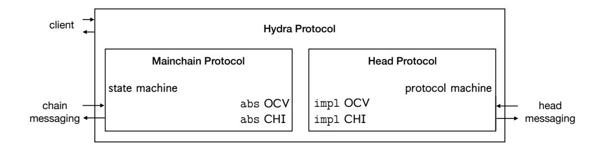

Figure 11: Hydra protocol components.

Onchain verification (OCV). The confirmation of head events by means of the multisignature scheme must be verifiable onchain; and thus, the exact workings of head certification must be known to the mainchain protocol. Now, given that the onchain portion of the mainchain protocol (i.e., state machine transition validation) is realized by EUTxO validator scripts, these scripts utilize the abstract interface of the OCV. Hence, we interpret the head OCV code as implementing the abstract mainchain OCV specification for all network participants (Fig. [11\)](#page-25-1).

Chain/head interaction (CHI). Upon observing certain onchain events, a head member's mainchain functionality must interact with the head protocol. For instance, this is the case, when a head member observes the closing of the head on the mainchain. The mainchain functionality must then query the head protocol to know whether a contest transaction must be posted.

## <span id="page-25-0"></span>6.3.1 Onchain verification (OCV)

Recall that the mainchain functionality was generically described it terms of η, the latest head state as known onchain, and ξ, a certificate posted by a head member to update η by delivering head-confirmed information.

We shortly recapitulate the abstract workings of OCV. After the processing of the collectCom transaction, the initial UTxO set is stored as η in association of the open state. Later, a party p<sup>i</sup> can

- produce a certificate ξ accepted by Close(·) to close out the head and make (his view of) the current head-UTxO set available on the mainchain, and,
- given the current state η on the mainchain, produce a certificate ξ accepted by Contest(η, ·) to contest a closure and supply an updated view of the head-UTxO set to the mainchain.

Finally, the function Final checks the UTxO set in the transaction that moves the state machine into its final state against the information stored in η.

We now instantiate the respective onchain verification (OCV) functionality for the head protocol given in this section—with its specific way of certifying head states (see Fig. [12\)](#page-26-0).

Initial. The entire initial UTxO set U<sup>0</sup> is composed from the n committed UTxO sets Up<sup>1</sup> , . . . , Up<sup>n</sup> , and returned as η = (U0, 0, ∅).

### Algorithms for Onchain Verification

```
Initial (U_{p_1},\ldots,U_{p_n})
                                                                                                                           Contest (K_{agg}, \eta, \xi)
 return (U_{p_1} \cup \cdots \cup U_{p_n}, 0, \emptyset)
                                                                                                                                   (U_{\eta}, s_{\eta}, T_{\eta}) \leftarrow \eta
                                                                                                                                   (U, s, \tilde{\sigma}, T) \leftarrow \xi
Close (K_{\mathsf{agg}}, \eta, \xi)
                                                                                                                                   if \exists (\mathsf{tx}_i, \tilde{\sigma}_i) \in T : \neg \mathsf{MS-AVerify}(K_{\mathsf{agg}}, H(\mathsf{tx}_i), \tilde{\sigma}_i)
       (U, s, \tilde{\sigma}, T) \leftarrow \xi
       if \exists (\operatorname{tx}_i, \tilde{\sigma}_i) \in T:
                                                                                                                                  if s \leq s_{\eta}
          \neg \mathsf{MS-AVerify}(K_{\mathsf{agg}}, H(\mathsf{tx}_i), \tilde{\sigma}_i)
                                                                                                                                    U_N \leftarrow U_\eta
                                                                                                                                  else
       if s = 0
                                                                                                                                          \textbf{if} \ \neg \mathsf{MS-AVerify}(K_{\mathsf{agg}}, H(U) \| s, \tilde{\sigma}) \ \mathbf{return} \ \bot
         (U,\cdot,\cdot) \leftarrow \eta
       \textbf{else if } \neg \mathsf{MS-AVerify}(K_{\mathsf{agg}}, H(U) \| s, \tilde{\sigma})
                                                                                                                                          T_{\eta} \leftarrow \mathsf{applicable}(U_N, T_{\eta})
                                                                                                                                  if U_N \circ (T_\eta \cup T^{\downarrow(\mathrm{tx})}) = \bot
       if U \circ T^{\downarrow(\mathrm{tx})} = \bot
                                                                                                                                    \rm_{return} \bot
         \mathbf{return} \perp
                                                                                                                                  return (U_N, s, T_\eta \cup T^{\downarrow (\mathrm{tx})})
       return (U, s, T^{\downarrow(\text{tx})})
                                                                                                                           Final (\eta, U)
                                                                                                                                   (U_{\eta}, s_{\eta}, T_{\eta}) \leftarrow \eta
                                                                                                                                  return (U = U_{\eta} \circ T_{\eta})
```

Figure 12: The algorithms used by the state machine for onchain verification.

Close. The state machine uses the onchain verification (OCV) algorithm Close to verify the information submitted by the party.

Recall that, when a  $p_i$  receives the close command, it simply outputs as certificate the snapshot number, the UTxO set, and the multisignatures corresponding to the most recent confirmed snapshot  $\overline{\mathcal{U}}$  as well as all confirmed transactions in  $\overline{\mathcal{T}}$  which have not yet been considered in  $\overline{\mathcal{U}}$ , along with the corresponding multisignatures.

OCV function Close (see Figure 12) verifies all multisignatures in  $\xi = (U, s, \tilde{\sigma}, T)$ , i.e., those of  $H(U) \| s$  and the transactions in T, and ensures that the transactions in T can be applied to U (or, in case of s = 0, to  $U_0$ ). The algorithm then outputs the new state  $\eta' = (U, s, T^{\downarrow(\text{tx})})$ .

Contest. The state machine uses the OCV algorithm Contest to verify the "differential" data submitted by a contesting party.

Recall that, when a  $p_i$  receives the command  $(cont, \eta)$  for  $\eta = (U_{\eta}, s_{\eta}, T_{\eta})$ , he supplies his latest snapshot  $\overline{\mathcal{U}}.U$  if it is newer than  $U_{\eta}$ , and those confirmed transactions that have not yet been considered by the latest snapshot. In case that  $U_{\eta}$  is newer than the own snapshot, the transactions yet to be delivered can be found by trying to apply them (together with  $T_{\eta}$ ) to  $U_{\eta}$ —as those already considered by  $U_{\eta}$  can no longer be applied; this computation is performed by function applicable.

Similarly to the close case, OCV function Contest, given  $\xi = (U, s, \tilde{\sigma}, T)$ , first checks all signatures.

In case that the provided snapshot U is newer than the snapshot  $U_{\eta}$  from the onchain state  $\eta$ , the set  $T_{\eta}$  is reduced to those transactions that are still applicable to the newer of both snapshots,  $U_N$ .

Finally, it is ensured that  $T_{\eta} \cup T^{\downarrow(\mathrm{tx})}$  can be applied to the newest of both snapshots, and the

### Chain/Head Interaction

```
on (clientTx, tx)
                                                                                                               on (chainCollectCom)
                                                                                                                    (U_0,\cdot,\cdot) \leftarrow \mathsf{Initial}(U_{p_1},\ldots,U_{p_n})
 head.(new, tx)
                                                                                                                    head.(init, i, \underline{K}_{ver}, K_{sig.i}, U_0)
on (clientClose)
     \xi \leftarrow \mathsf{head}.(\mathsf{close})
                                                                                                               on (chainClose)
     chain.postTx(close, \xi)
                                                                                                                     \eta' = (U', s', T') \leftarrow \mathsf{chain.Close}(K_{\mathsf{agg}}, \eta, \xi)
                                                                                                                    \begin{array}{l} \xi = (U, s, \tilde{\sigma}, T) \leftarrow \mathsf{head.}(\mathsf{cont}, \eta') \\ \text{if } s > s' \ \lor \ T \neq \emptyset \end{array}
on (chainInitial)
     require K_{\text{agg}}^{\text{chain}} = K_{\text{agg}}^{\text{setup}}
                                                                                                                      chain.postTx(contest, \xi)
     require h_{\mathsf{MT}} = H_{\mathsf{Merkle}}(\underline{k}_{\mathsf{ver}})
     chain.postTx(commit, U)
                                                                                                               on (chainContest)
                                                                                                                     \eta' = (U', s', T') \leftarrow \mathsf{chain.Contest}(K_{\mathsf{agg}}, \eta, \xi)
                                                                                                                    \begin{split} \xi &= (U, s, \tilde{\sigma}, T) \leftarrow \mathsf{head.}(\mathsf{cont}, \eta') \\ \mathbf{if} \ s &> s' \ \lor \ T \neq \emptyset \end{split}
on (chainInitialTimeOut)
     if (all members committed)
          chain.postTx(collectCom)
                                                                                                                      chain.postTx(contest, \xi)
      chain.postTx(abort)
                                                                                                               on (chainClosedTimeOut)
                                                                                                                 chain.postTx(fanout)
```

Figure 13: Chain/head interaction: Additional mainchain actions for head members.

```
new (aggregate) state \eta' = (U_N, s, T_\eta \cup T^{\downarrow(\mathrm{tx})}) is output.
```

Final. Given  $\eta = (U_{\eta}, s_{\eta}, T_{\eta})$  and U, Final checks that  $U = U_{\eta} \circ T_{\eta}$ .

#### <span id="page-27-0"></span>6.3.2 Chain/head interaction (CHI)

In Fig. 13, we summarize that part of the Hydra mainchain functionality that interacts with the head member (client) and the head protocol.

Routine clientTx handles the client's request to issue a head transaction by delegating the request to the head protocol. Routine clientClose handles the client's request to close the head. It gathers a certificate for the current local state from the head protocol, and posts this certificate onchain.

Routine chainInitial gets triggered on seeing the head's *initial* transaction onchain. It verifies the parameters recorded in the *initial* transaction against the parameters gathered during the setup phase described in Section 4: in particular, the aggregate multisignature key must match, and  $h_{\text{MT}}$  must be the Merkle-tree hash of the gathered verification keys  $\underline{k}_{\text{ver}}$ . If successful, the client's UTxO set is committed onchain.

Routine chainInitialTimeOut gets triggered once the initial commit period has expired. It then either posts a *collectCom* transaction containing all committed UTxO sets—in case that all head members committed a UTxO set—or an *abort* transaction otherwise.

Routine chainCollectCom gets triggered on seeing the head's collectCom transaction onchain. It computes, into  $U_0$ , the set of committed UTxOs, and initializes the head protocol.

Routines chainClose and chainContest get triggered by observing the head's *close* and *contest* transactions, respectively. They compare the latest onchain state  $\eta$  to the party's own head state by

calling the head protocol's **cont** function to obtain a certificate  $\xi$  for a differential onchain update to represent the portions of the local state not yet considered by  $\eta$ . If necessary, a corresponding *contest* transaction is posted onchain.

Routine chainClosedTimeOut gets triggered once the contestation period has expired. It then posts a fanout transaction containing the final UTxO set.

## <span id="page-28-0"></span>6.4 Security proof

This section proves that the head protocol presented in Section 6 satisfies Consistency, Conflict-Free Liveness, Soundness, and Completeness. The proof proceeds by establishing several invariants that facilitate proving these properties. Throughout the proof, the assumption is made that at most n-1 head members are corrupted. Moreover, assume no signatures are forged and no hashes collide; these events occur with negligible probability only. Consider the following random variables:

- SN<sub>j</sub>: the UTxO set corresponding to  $j^{\text{th}}$  snapshot, i.e., the set that gets the  $j^{\text{th}}$  multisignature on snapshots (SN<sub>0</sub> =  $U_0$ );
- $\tilde{T}_j$ : the transaction set corresponding to  $SN_j$ , formally defined via  $\tilde{T}_0 = \emptyset$ , and  $\tilde{T}_j := \tilde{T}_{j-1} \circ \mathsf{Reach}^{\overline{T}}(T)$  where T is the set proposed in  $(\mathsf{reqSn}, j, T)$ ;
- $C_{\mathsf{chain}}$ : keeps track of "transactions on chain" and is defined as follows: upon (successful) close resp. contest with  $\xi$  for  $\eta$ , let  $C_{\mathsf{chain}} \leftarrow \tilde{T}_s \cup T$ , where  $(\cdot, s, T)$  is the output of  $\mathsf{Close}(K_{\mathsf{agg}}, \eta, \xi)$  resp.  $\mathsf{Contest}(K_{\mathsf{agg}}, \eta, \xi)$ ;
- $SN_{\mathsf{cur},i}$ : latest confirmed snapshot as seen by party  $\mathsf{p}_i$ .

Lemma 1 (Consistency). The basic head protocol satisfies the Consistency property.

*Proof.* Observe that  $\overline{C}_i \cup \overline{C}_j \subseteq \hat{S}_i$  since no transaction can be confirmed without every honest party signing off on it. Since parties do not sign conflicting transactions,  $U_0 \circ \hat{S}_i \neq \bot$ . Thus,  $U_0 \circ (\overline{C}_i \cup \overline{C}_j) \neq \bot$ 

<span id="page-28-1"></span>**Invariant 1.** Consider a conflict-free execution of the basic head protocol in presence of a network adversary. Then, for any transaction tx input to the protocol via (new) the following holds with respect to any parties  $p_i$  and  $p_j$ :

$$\forall t_0: \ \overline{\mathcal{L}}_i^{(t_0)} \circ \operatorname{tx} \neq \bot \Rightarrow \exists T \geq t_0 \forall t \geq T: \ \overline{\mathcal{L}}_j^{(t)} \circ \operatorname{tx} \neq \bot \ \lor \ \operatorname{tx} \in \overline{C}_j^{(t)}$$

where the superscript  $\cdot^{(t)}$  indicates the time when the respective variable is evaluated.

*Proof.* Assume that party  $p_i$  sees tx at time  $t_0$  and  $\overline{\mathcal{L}}_i^{(t_0)} \circ \operatorname{tx} \neq \bot$ . By conflict-freeness and full delivery we get that, eventually, each party  $p_j$  holds  $\overline{C}_j^{(t)} \supseteq \overline{C}_i^{(t_0)}$ . By this time t, either  $\overline{\mathcal{L}}_j^{(t)} \circ \operatorname{tx} \neq \bot$  or  $\operatorname{tx} \in \overline{C}_j^{(t)}$  (as we have conflict-freeness, and  $\overline{C}_j^{(t)} \subseteq \mathcal{N}$ ).

**Lemma 2 (Conflict-Free Liveness).** The basic head protocol achieves Conflict-Free Liveness.

*Proof.* We demonstrate that a transaction tx issued by a player  $p_i$  will eventually be confirmed by every player  $p_j$ . By conflict-freeness, in (new, tx) we have that  $\overline{\mathcal{L}}_i \circ \operatorname{tx} \neq \bot$ .

Assume that  $\operatorname{tx} \notin \overline{C}_j$ , i.e., that  $p_j$  has not seen tx confirmed yet. As soon as  $p_j$  enters (or gets reactivated from the wait queue) (reqTx, tx) under the condition  $\overline{\mathcal{L}}_j \circ \operatorname{tx} \neq \bot$  (eventually guaranteed by Invariant 1), by conflict-freeness, also  $\hat{\mathcal{L}}_j \circ \operatorname{tx} \neq \bot$  holds, and  $p_j$  acknowledges the transaction. Thus, every  $p_j$  eventually acknowledges the transaction, and  $\operatorname{tx} \in \cap_{i \in [n]} \overline{C}_i$ .

<span id="page-29-0"></span>**Invariant 2.** Consider an arbitrary uncorrupted party  $p_i$ . Let  $\tilde{T}$  be the set corresponding to  $SN_{cur,i}$ . Then,  $\tilde{T} \cup \overline{T}_i = \overline{C}_i$ , where  $\overline{T}_i$  is the set  $\overline{T}$  of  $p_i$ .

*Proof.* Observe that the invariant is trivially satisfied at the onset of the protocol's execution. Furthermore, each time a new transaction is confirmed via confTx, both  $\overline{\mathcal{T}}_i$  and  $\overline{\mathcal{C}}_i$  grow by the newly confirmed transaction, while  $\tilde{T}$  remains unchanged.

The only other time one of the sets  $\tilde{T}$ ,  $\overline{T}_i$ , or  $\overline{C}_i$  change is when a new snapshot is confirmed via confSn. In such a case, note that  $\overline{C}_i$  stays the same while any transaction removed from  $\overline{T}_i$  is considered by the new snapshot and thus added to  $\tilde{T}$ . Hence, the invariant is still satisfied.

# <span id="page-29-1"></span>Invariant 3. $\tilde{T}_0 \subseteq \tilde{T}_1 \subseteq \tilde{T}_2 \subseteq \dots$

*Proof.* Let  $p_i$  be an honest party. It is easily seen that the set of transactions considered by a new snapshot always includes the set considered by the previous snapshot since the set of transactions T in a reqSn satisfies that  $SN_{cur,i} \circ Reach^{\overline{T}_i}(T) \neq \bot$ , (this is implied by Invariant 2).

<span id="page-29-2"></span>**Invariant 4.**  $C_{\mathsf{chain}}$  grows monotonically (w.r.t.  $\subseteq$ ).

*Proof.* Consider operation  $\mathsf{Contest}(K_{\mathsf{agg}}, \eta, \xi)$  and let  $\eta = (U_{\eta}, s_{\eta}, T_{\eta})$  and  $\xi = (U, s, \tilde{\sigma}, T)$ . Note that before the operation  $C_{\mathsf{chain}} = \tilde{T}_{s_{\eta}} \cup T_{\eta}$ . Consider now the set  $T^*$  in the output  $(\cdot, \cdot, T^*)$  of  $\mathsf{Contest}$ . Note that after the operation  $C_{\mathsf{chain}} = \tilde{T}_s \cup T^*$ . Observe that:

- Since  $s \geq s_{\eta}$ , Invariant 3 implies that a transaction  $tx \in \tilde{T}_{s_{\eta}}$  is also in  $\tilde{T}_{s}$ .
- If a transaction  $tx \in T_{\eta}$  is not in  $T^*$ , then  $s > s_{\eta}$  and the transaction is consumed by the snapshot with number s, i.e.,  $tx \in \tilde{T}_s$ .

Hence,  $C_{\mathsf{chain}}$  grows monotonically.

<span id="page-29-5"></span>Invariant 5. For all  $i \in H_{cont}$ ,  $\overline{C}_i \subseteq C_{chain}$ .

Proof. Take any honest party  $p_i$  and let  $\tilde{s}$  be the current snapshot number at  $p_i$ , i.e.,  $SN_{cur,i} = \tilde{T}_{\tilde{s}}$ . Recall that, by Invariant 2,  $\overline{C}_i = \tilde{T}_{\tilde{s}} \cup \overline{T}_i$ . Consider a close or contest operation by  $p_i$  as well as the output  $(U, s, T^*)$  of Contest, and observe that after the operation  $C_{chain} = \tilde{T}_s \cup T^*$ . By Invariant 3,  $\tilde{T}_{\tilde{s}} \subseteq \tilde{T}_s$  and, by a similar argument as in the proof of Invariant 4, if  $tx \in \overline{T}_i$  is not in  $T^*$ , it must be in  $\tilde{T}_s$ . Hence,  $\overline{C}_i \subseteq C_{chain}$ . Furthermore, since  $C_{chain}$  grows monotonically (Invariant 4), the invariant remains satisfied.

<span id="page-29-4"></span>Invariant 6. For all uncorrupted parties  $p_i$ ,  $\bigcup_{j \in [n]} \overline{C}_j \subseteq \hat{S}_i$ .

*Proof.* Honest parties will only output (conf, tx) if there exists a valid multisignature for tx, which implies that each honest party output (seen, tx) just before they signed tx.

<span id="page-29-3"></span>Invariant 7. For any j,  $\tilde{T}_j \subseteq \bigcap_{i \in \mathcal{H}} \overline{C}_i$ .

*Proof.* Only transactions that have been seen as confirmed by all honest parties can ever be included in a confirmed snapshot.  $\Box$ 

<span id="page-30-0"></span>Invariant 8.  $C_{\mathsf{chain}} \subseteq \bigcap_{i \in \mathcal{H}} \hat{S}_i$ .

*Proof.* Let  $\eta = (U, s, T)$ . Observe that  $C_{\mathsf{chain}} = \tilde{T}_s \cup T$ . Consider a transaction  $\mathsf{tx} \in C_{\mathsf{chain}}$ .

- If  $tx \in \tilde{T}_s$ , then  $tx \in \bigcap_{i \in \mathcal{H}} \overline{C}_i \subseteq \bigcap_{i \in \mathcal{H}} \hat{S}_i$  by Invariants 7 and 6.
- If  $tx \in T$ , then  $tx \in \bigcap_{i \in \mathcal{H}} \hat{S}_i$  since no transaction can be confirmed without being seen by all honest parties.

<span id="page-30-1"></span>Lemma 3 (Soundness). The basic head protocol satisfies the Soundness property.

*Proof.* Let  $\eta = (U, s, T)$  be the value of  $\eta$  just before applying Final $(\eta, U_{\mathsf{final}})$ . Clearly, the only set  $U_{\mathsf{final}}$  that will be accepted by Final is  $U_0 \circ (\tilde{T}_s \cup T)$ . By definition  $\tilde{T}_s \cup T = C_{\mathsf{chain}}$ . Soundness now follows from Invariant 8.

Lemma 4 (Completeness). The basic head protocol satisfies the Completeness property.

*Proof.* Follows from Invariant 5 and an argument similar to that in the proof of Lemma 3.  $\Box$ 

# 7 Experimental Evaluation

We will now investigate the performance of the Hydra protocol in terms of both latency (transaction settlement time) and throughput (rate of transaction processing, TPS), using timing-accurate simulations. The simulations will demonstrate that Hydra is optimal in achieving fast transaction settlement, and we employ *baselines* to systematically gain insight into the transaction-rate performance characteristics of the protocol.

In order to determine how quickly transactions settle in Hydra, and at which rate they can be processed, we have to consider the following factors:

**Opening and closing of a head.** This consists of creating and submitting the commit/decommit transactions, and waiting until they are confirmed to be in the chain.

The performance of the head protocol. Given a geographical distribution and CPU/network capacity of the head nodes, how long does it take to exchange the messages that lead to transactions and snapshots being confirmed?

**Limitations on in-flight transactions.** When a player wants to send two transactions, where one uses the change from the other, they have to defer sending the second transaction until they have confirmation for the first. Furthermore, players may want to prevent an excessive number of confirmed, but not snapshotted transactions to keep decommits smaller. Together, this limits the number of *in-flight* (submitted but not yet confirmed) transactions that any one node can have.

The value at risk. To minimize this, players may wait for some transactions to be confirmed before sending more transactions, further limiting the number of in-flight transactions.

Since the time for opening and closing a head is largely dependent on the underlying layerone protocol and can be amortized over the head's lifetime, we do not cover this aspect in our simulations. Furthermore, to simplify the simulations, we model the effect of a finite UTxO by directly limiting the number of in-flight transactions per node. Thus, we focus the simulations on the execution of the head protocol, as specified in Fig. [10.](#page-22-0)

## 7.1 Methodology

The experimental setup involves a fixed set of nodes, with a specified network bandwidth per node and geographic location of each node that determines the network latency between each pair of nodes. Each node submits transactions with a specified transaction concurrency c: it sends c transactions as fast as its resources allow, and then sends another one whenever one of the transactions it sent previously gets confirmed. This controls the number of inflight transactions to be c per node. Snapshots are performed regularly: nodes take turns to produce snapshots, and whenever the current leader has at least one confirmed transaction, it will create a snapshot with all the confirmed transactions it knows about.

In order to properly gauge the simulation results, we compare it to baseline scenarios that are sufficiently simple to facilitate optimistic performance limits exactly. We derive those limits by considering each sequence of events that has to happen in order for a number of transactions to be confirmed, and summing up the time for each event in those sequences. In particular, we have three resources that potentially limit the transaction rate:

- 1. The CPU capacity at each node determines how fast transactions can be validated, and signatures be created or verified;
- 2. The inbound and outbound network bandwidth limits how many message bytes can be received and sent by each node in a given time;
- 3. Each message between two nodes is delayed by the network latency between those nodes.

Depending on the configuration of the system, the most utilized of these resources will limit the transaction rate. This is an idealization: in a real execution of a protocol, contention effects will cause even the scarcest resource to be blocked and idle occasionally. We thus expect experimental results to be bounded by the baselines, and interpret the difference as the impact of contention effects. We consider the following baselines:

Universal Baseline: Full Trust. To quantify the price we pay for consensus in Hydra, we compare our simulations with a scenario where we assume perfect trust between all participants; i.e., we only distribute the knowledge on transactions, without trying to achieve consensus. In this scenario, nodes submit transactions (after checking that they are valid). Other nodes just acknowledge that they have seen them (without validating or signing them). We still consider the effect of having a finite transaction concurrency.

This baseline sets an upper limit for the transaction throughput of any protocol that distributes and validates transactions in a distributed system. Furthermore, for any consensus protocol, we should expect some additional overhead (which might or might not reduce the actual throughput in different regions of the parameter space).

Hydra Unlimited. This scenario resembles the head protocol, but executed under ideal circumstances, ignoring contention effects as described above. In contrast to a real execution of the protocol, where the snapshot size is an emergent property depending on how fast transactions are confirmed, in the baseline, we can directly control how many transactions are contained in a snapshot.

Sprites Unlimited. In order to compare to prior work, we also include a baseline according to an optimal execution of the off-chain protocol from [\[31\]](#page-42-2). A deciding difference to the head protocol is that in Sprites, all nodes send their inputs to a leader, which collates them and collects signatures for a whole batch of transactions. Compared to Hydra, this batching reduces the demand on CPU time and number of messages, since less signatures have to be performed and shared, at the expense of additional network roundtrips and higher network bandwidth usage at the current leader node, which has to send the batch of all transactions to every other node.

<span id="page-32-0"></span>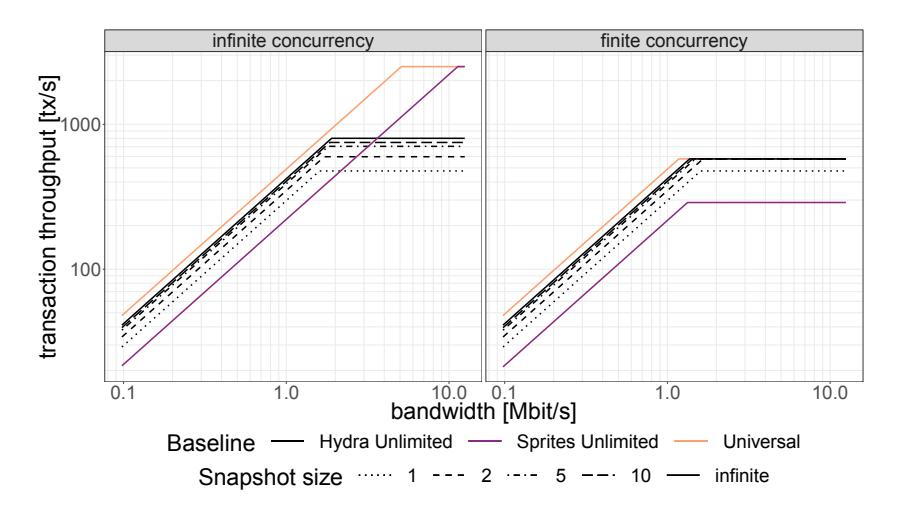

Figure 14: Example baselines scenarios, for finite and infinite transactions concurrency.

We show examples of baselines in Fig. [14.](#page-32-0) We draw the different baseline scenarios using different colours. For the Hydra Unlimited case, we have multiple lines, depending on the number of transactions in each snapshot; the more transactions are bundled in any one snapshot, the lower the overhead per transaction.

The left panel shows the limit of infinite transaction concurrency. In that case, the network roundtrip time can be perfectly amortised and is not a limiting factor. The resulting transaction rate has a knee shape: it is linear in the network bandwidth as long as that is the limiting factor, and turns constant once the limit from CPU time dominates. Comparing the Hydra Unlimited and Universal baselines, we see that there is some difference in the low bandwidth region, which is due to the multisignatures being sent in Hydra. In the region where CPU time is relevant, the difference is more pronounced, due to the computational cost of multisignatures. Looking at the Sprites Unlimited baseline, we see the tradeoff in batching transactions: the computational work is significantly reduced, by signing just a single large batch of transactions[6](#page-32-1) . This comes at the cost of increasing the network traffic at the leader node, which has to send every transaction to every

<span id="page-32-1"></span><sup>6</sup> In the limit of infinite transaction concurrency, we take the batch size in Sprites to be unlimited as well.

other node. Note that in this picture, we only used a cluster of three nodes; for larger clusters, the demand on the leader node's network bandwidth would be even higher.

To get a more realistic picture, let us turn to the right panel. Here, we have a finite transaction concurrency, and the network roundtrip time is large enough to become the limiting factor (instead of CPU time) once we have enough bandwidth. Comparing Hydra Unlimited to the Universal line, we see that both flatten at about 580 TPS. The limit from network latency is the same for both baselines, since the number of roundtrips to confirm a transaction is the same (the messages are larger for Hydra Unlimited, but this only places a higher demand on the bandwidth). Interestingly, if we make a snapshot for each single transaction, we are still limited by CPU power, but as soon as we only make a snapshot every other transaction, the overhead from producing snapshots is small enough to not matter, compared to the limit from network latency. In this picture, the Sprites Unlimited baseline is well below the others. The demands on bandwidth – particularly, the network bandwidth of the leader node – is much larger than for the other protocols, and bundling transactions centrally before sending them to each node requires an additional roundtrip.

Note that devising an unlimited baseline for a given protocol, and comparing it to a universal baseline or those of other protocols, is not only valuable for evaluating an implementation, but also as a tool to predict possible performance during the protocol design phase.

## 7.2 Implementation

In the following, we will describe how we implemented the simulations for the head protocol. The implementation is available at <https://github.com/input-output-hk/hydra-sim>.

We model the head nodes using concurrent threads which exchange the protocol messages from Fig. [10](#page-22-0) via channels. We use the io-sim library [\[2\]](#page-40-8), which allows us to write concurrent code, and then either execute it directly as threads in the Haskell runtime system, or run the same code in a simulation of the runtime system. The latter yields an execution trace of the code very quickly, as it delays a thread by just increasing a number representing the thread's clock, instead of actually pausing the thread. As we describe below, the simulations make heavy use of thread delays, so this allows us to perform simulations much more quickly. We can also manually insert trace points at relevant points in the protocol (such as when a transaction is confirmed). Measuring, for instance, the confirmation time for a message, can then be done by simply subtracting timestamps of the events "transaction is submitted" (new) and "transaction is confirmed" (confTx).

Cryptographic Operations. Instead of using real cryptographic functions for multisignatures, we use mock functions that do not perform any calculations, but instead allow for a tunable delay of the thread that is performing the operation.

Message Propagation. Before being sent across the network, each message has to be serialized and pass the networking interface, which takes time linear in the message size. So the event of a message being sent by a node does not correspond to a single point in time, but rather to a time interval. We take that into account by modeling each message by its leading and trailing edge. The time distance between leading and trailing edge—the serialization delay—of a message is determined by its size and the bandwidth of the node's networking interface. We capture this with a parameter S, giving the delay per byte. Furthermore, we take into account that the networking interface can only start sending the next message after the trailing edge of the previous message has been sent. When the network is sufficiently busy, this can be a point of contention.

We model the network by a delay G between each message edge leaving the sending node and its arrival at the target node. The parameter G is determined by the distance between the two nodes and is independent of message size.[7](#page-34-0) We use real data measured between Amazon Web Services data centers.

Once the leading edge of a message reaches the receiving node, we put its incoming networking interface into a busy state, for a time given by the size of the message and the bandwidth of this node. Finally, when the trailing edge is received, the message contents is placed into the local inbox, so that the node can start acting on the message.

If we only consider a single message, this model will just lead to a delay of the whole message determined by G, the message size, and S of the slower node. But once we have multiple messages in the system, it also correctly accounts for the contention at the outgoing and incoming connection points. The contention introduces variance, since messages may or may not have to wait at either end of the network.

<span id="page-34-1"></span>Simulation optimizations. We applied two refinements that optimize the performance without changing the security of the protocol. First, when submitting a new transaction via new, a node will validate the transaction, and then send reqTx to every party, including itself. Every party, upon receiving reqTx, will then validate the transaction again. For the sending node, this is not necessary (it just validated the same transaction), so we skip the second validation on the same node. Second, the specification of the protocol states that handlers are executed strictly one after the other. Avoiding concurrency in this way simplifies the analysis of the protocol. But there is one case where we can safely perform actions in parallel: upon receiving reqTx (and similarly reqSn), a node will validate the transaction or snapshot against its local state, and, if appropriate, sign it and reply. The action of signing does not access the state of the node, so we can safely perform it concurrently with handling subsequent events.

These are fairly trivial changes, that any concrete implementation would apply, so we felt it was appropriate to reflect them in our simulations, as well as in the baselines.

### 7.3 Experimental Results

We performed experiments for three clusters with different geographic distributions of nodes: a local deployment of three nodes within the same AWS region, a continental deployment across multiple AWS regions on the same continent (Ireland, London, and Frankfurt), and a global deployment (Oregon, Frankfurt, and Tokyo). For each of those clusters, we measured the dependency of confirmation time and transaction throughput on bandwidth and transaction concurrency, and compare with the baselines described above. The numerical results depend on a number of parameters that we set, representing the time that elementary operations within the protocol take. We use the settings described below.

Transaction size. We use two representative transaction types: (1) simple UTxO transactions with two inputs and two outputs, whose size is 265 bytes, and (2) script transactions containing larger scripts of 10 kbytes. We use transaction references of 32 bytes. For each message, we allow for a protocol-level overhead of 2 bytes.

<span id="page-34-0"></span><sup>7</sup>The messages in the Hydra protocol are small enough to ignore TCP window effects that would introduce a dependency on the message size.

<span id="page-35-0"></span>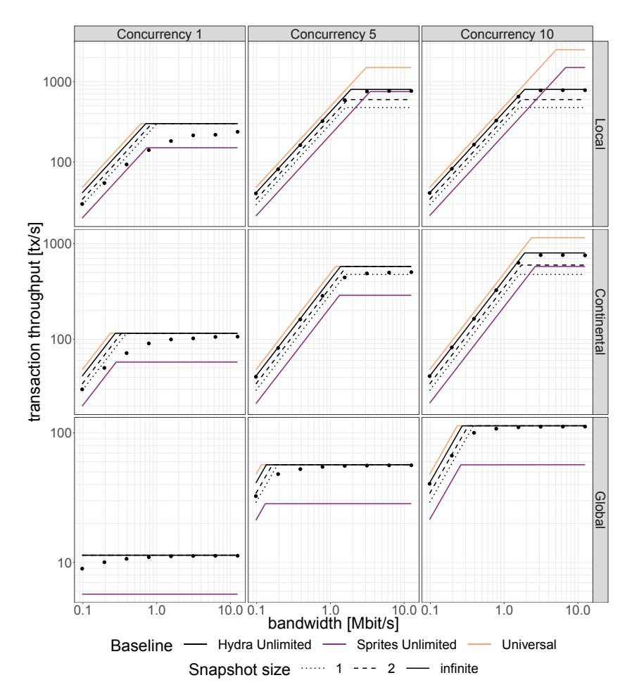

Figure 15: Transaction rates for the Hydra head protocol, compared with the baseline scenarios. Simple UTxO transactions with 2 inputs and 2 outputs.

Transaction validation time. This is the CPU time that a single node will expend in order to check the validity of a transaction. We use conservative values here: 0.4 ms for simple transactions, and 3 ms for script transactions.

Time for multisignature operations. We performed benchmarks for the multisignature scheme [\[11\]](#page-40-9) resulting in the following estimates: 0.15 ms for MS-Sign, 0.01 ms for MS-ASig, and 0.85 ms for MS-AVerify.

Transaction throughput. Figs. [15](#page-35-0) and [16](#page-36-0) display results for ordinary UTxO and script transactions, respectively. The different rows correspond to the different geographical setups of the clusters, while the columns differ in transaction concurrency.

As expected, the Universal baseline consistently gives the highest transaction rate. For Hydra Unlimited, we see three baselines, for different snapshot sizes (depicted by dotted, dashed, and solid lines). In some cases, they coincide. Those are the configurations where we are limited by the network latency: performing snapshots increases the demand on CPU time and bandwidth (for

<span id="page-36-0"></span>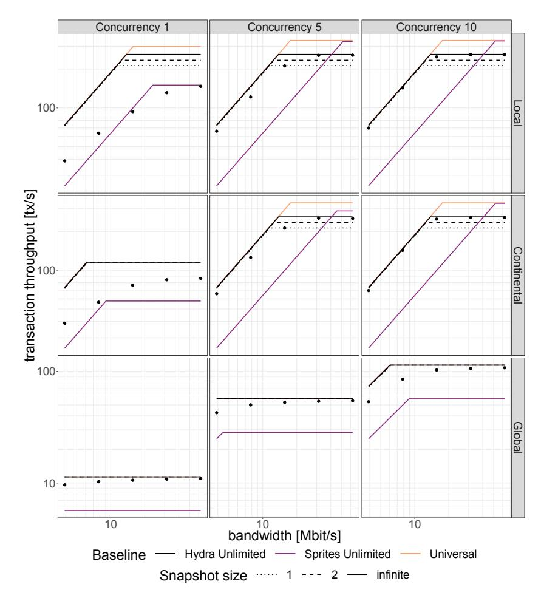

Figure 16: Transaction rates for the Hydra head protocol, compared with the baseline scenarios. Script transactions.

the additional signatures and messages), but it does not increase the number of sequential network roundtrips that have to be performed to confirm transactions (the messages for snapshots and for transactions propagate through the network concurrently).

Comparing the Universal and Hydra Unlimited baselines, we see that they are identical whenever the transaction rate is limited by the network latency. That can be explained since the difference between the two baselines differ only in their demand for CPU time (for creating and validating signatures) and bandwidth (for sending signatures). Note that for script transactions (Fig. [16\)](#page-36-0), the demands on CPU are higher anyway, so that the additional cost for the multisignatures generally has a much lower impact on the transaction rate.

Looking at the Sprites Unlimited baseline, we observe the effect of batching via a central leader: the leader needs to send all transactions to every other node, and so its networking interface is frequently a bottleneck. Also, we see the additional roundtrip between the leader and every other node reducing the TPS whenever the network latency is the limiting resource. But when we have enough concurrency to form large batches, and get to the region where we are limited by CPU time, the savings by signing batches instead of individual transactions become apparent, and the

<span id="page-37-0"></span>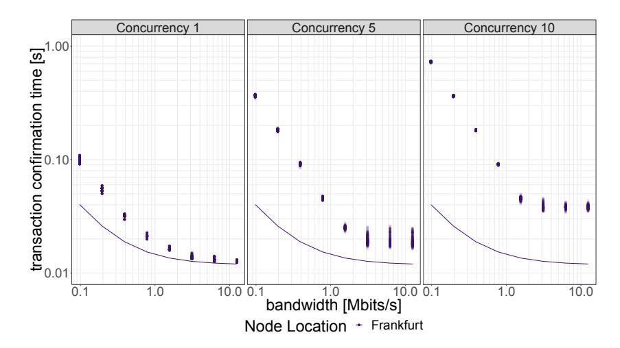

Figure 17: Confirmation times for simple UTxO transactions, in a cluster located in one AWS region. From panel to panel, we increase the transaction concurrency. The theoretically minimal confirmation time is represented by a dashed line.

Sprite baseline nearly reaches the Universal one.

Comparing the experimental results with the Hydra Unlimited baseline, we see that in most cases, the simulation of the protocol approximates the optimal curve quite well. We only get sizeable differences for low concurrency and insufficient bandwidth.

Regarding snapshots, the figures reveal that performing snapshots has a negligible impact on the transaction rate: apart from the regions where bandwidth is the limit, the baselines for different snapshot sizes only differ when we are CPU bound, which requires enough transaction concurrency to amortize the network latency. But for large concurrency, we also get large snapshots, so the overhead from snapshots per transaction is small.

Transaction confirmation times. One aspect where Hydra really shines is fast settlement: as soon as all parties have signed a transaction, and the sending node has aggregated a valid multisignature, this multisignature provides a guarantee that the transaction can be included into the ledger of the layer-one system. We can derive a minimal confirmation time by adding up the times for validating a transaction two times (once at the issuing node, once at every other node), sending the reqTx and ackTx messages across the longest path in the network, and creating and validating the aggregate signature.

Fig. 17 illustrates the conditions under which we achieve minimal confirmation time. In the first panel, we have a transaction concurrency of one. We see that, with enough bandwidth, we get very close to the minimal validation time, indicated by the line. In the other panels, we increase the concurrency. While this increases the total transaction throughput by sending transactions in parallel, individual transactions are more likely to be slowed down by congestion in the networking interfaces. Hence, confirmation time and its spread increase.

In clusters across different regions, the confirmation time generally depends on which node sent the transaction. For example, in Fig. 18, we see that the transactions from Oregon tend to get confirmed faster than those from Frankfurt or Tokyo. This is because confirmation requires a roundtrip to the farthest peer, and Frankfurt and Tokyo are farther away from one another than

<span id="page-38-0"></span>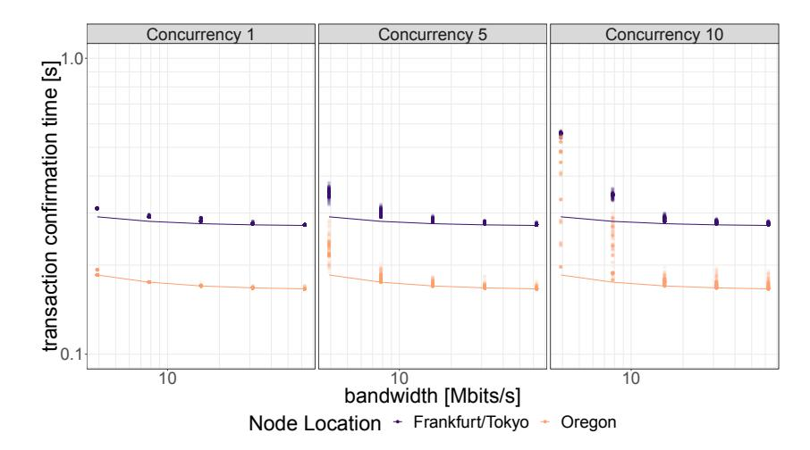

Figure 18: As Fig. 17, but for script transactions in a cluster spanning the AWS regions Oregon, Frankfurt, and Tokyo. Here, the minimal confirmation time depends on which node is sending the transaction, so we have two optimal lines.

either of them is from Oregon.

We see that even for script transactions and a globally distributed network, we consistently achieve settlement well below half a second if we provide enough bandwidth.

**Larger clusters.** In addition to three node clusters, we have also evaluated how the results depend on cluster size by running simulations with clusters of up to 100 nodes (located in the same AWS region):

- The transaction rates of a larger cluster are close to those for a three-node cluster. This is due to the fact that the amount of computation per node per transaction does not depend on the number of participants<sup>8</sup>.
- The bandwidth needed at each node to reach the maximal transaction rate *does* depend on the cluster size. This is not surprising, since each node needs to communicate with more peers.
- For the same reason, the confirmation time of transactions increases with the cluster size.

Note that these simulations still use a communication pattern where everyone sends messages to everyone, which is not optimal for large clusters. Instead, we ought to construct a graph to broadcast messages, keeping the number of peers for direct communication small for each participant. An advantage of the Hydra approach is that we can easily have different versions of the head protocol, or different implementations of the same head protocol, optimized for different cluster sizes.

<span id="page-38-1"></span><sup>&</sup>lt;sup>8</sup>Note that aggregating signatures and verifying an aggregate signature do depend on the number of participants. However, this does not impact the transaction rates in our simulations, for three reasons: i) we assume that we aggregate the verification keys once at the beginning of the head protocol, and only perform verification against the already computed aggregate verification key during the protocol, ii) even for 100 participants, combining the signatures is quicker than producing a single signature, iii) combining signatures is performed concurrently with the rest of the protocol (see Section 7.2).

### 7.4 Discussion

Due to the way that consensus is achieved by getting confirmations from every participant, we consistently achieve subsecond settlement, even for globally distributed heads. When we allocate sufficient networking resources, and choose a low concurrency, we do get optimal confirmation times.

Regarding transaction throughput, more importantly than raw numbers are the comparisons with the theoretical limits from the baselines scenarios:

- We saw that we do not pay a significant cost for creating snapshots, neither in terms of transaction throughput, nor in terms of confirmation time. This is a crucial point: compared to other state channel protocols, Hydra utilizes the UTxO parallelism to avoid having to sequentialize transactions. Snapshots are necessary for that approach, since otherwise, the decommit transactions would become unwieldy. Seeing that snapshots do not slow down the protocol in any significant way thus validates the design of Hydra.
- Comparing the Universal baseline, Hydra Unlimited, and the experimental results, we see that we approach the theoretical limits in regions where we can expect to. When the cost of achieving consensus via multisignatures is dominated by network roundtrip times and transaction validation, we get close to the Universal scenario. We see sizeable deviations from Hydra Unlimited only when we have low transaction concurrency and bandwidth.

Besides demonstrating Hydra's capability to perform efficiently, the simulations also allow operators to get a handle on the network bandwidth they should provide in order not to impact the head performance. They also show that there is a tradeoff between total transaction throughput and individual transaction settlement time when increasing concurrency.

## 7.5 A note on transaction throughput

We can see that the maximal transaction throughput rates achieved in the experiments (for simple transactions) is at around 800 transactions per second. This limit is a consequence of the assumed transaction validation time of 0.4 ms, and the verification of a multisignature, for which we allow 0.85 ms. Consequently, each transaction requires 1.25 ms of CPU time at each node[9](#page-39-0) , so we are limited to 800 transactions per second.

There are straightforward ways to increase the throughput in a live system:

- The most efficient way to scale a system with Hydra is to run multiple parallel heads. By running n heads, we achieve n times the throughput of a single head.
  - Note that for many use cases, a single head will only be used by participants in a constrained geographic region, allowing an efficient local or continental setup.
- For increasing the throughput of a single head, one can invest in more capable hardware to speed up transaction validation and signature verification.
- In the experiments, every node processes transactions sequentially. But it is possible to perform large parts of the transaction validation, and also all of the signature verification, in parallel for multiple transactions, using multiple cores on each node. This optimization can also improve the throughput of a single head.

<span id="page-39-0"></span><sup>9</sup>Note that as described in Section [7.2,](#page-34-1) we create the multisignature in a dedicated thread.

# 8 Acknowledgments

Aggelos Kiayias was supported in part by EU Project No.780477, PRIVILEDGE. We want to thank Duncan Coutts and Neil Davies for advice on technical aspects of the simulations, and Neil Davies for providing the measurements of round trip times between different AWS regions.

# References

- <span id="page-40-7"></span>[1] Extended UTXO-2 model. [https://github.com/hydra-supplementary-material/eutxo](https://github.com/hydra-supplementary-material/eutxo-spec/blob/master/extended-utxo-specification.pdf)[spec/blob/master/extended-utxo-specification.pdf](https://github.com/hydra-supplementary-material/eutxo-spec/blob/master/extended-utxo-specification.pdf).
- <span id="page-40-8"></span>[2] The io-sym library. [https://github.com/input-output-hk/ouroboros-network/tree/](https://github.com/input-output-hk/ouroboros-network/tree/master/io-sim) [master/io-sim](https://github.com/input-output-hk/ouroboros-network/tree/master/io-sim), [https://github.com/input-output-hk/ouroboros-network/tree/](https://github.com/input-output-hk/ouroboros-network/tree/master/io-sim-classes) [master/io-sim-classes](https://github.com/input-output-hk/ouroboros-network/tree/master/io-sim-classes).
- <span id="page-40-4"></span>[3] The Connext Network. [https://docs.connext.network/en/latest/background/](https://docs.connext.network/en/latest/background/architecture.html) [architecture.html](https://docs.connext.network/en/latest/background/architecture.html).
- <span id="page-40-6"></span>[4] John Adler. The why's of optimistic rollup. [https://medium.com/@adlerjohn/the-why-s](https://medium.com/@adlerjohn/the-why-s-of-optimistic-rollup-7c6a22cbb61a)[of-optimistic-rollup-7c6a22cbb61a](https://medium.com/@adlerjohn/the-why-s-of-optimistic-rollup-7c6a22cbb61a), November 2019.
- <span id="page-40-1"></span>[5] Ian Allison. Ethereum's Vitalik Buterin explains how state channels address privacy and scalability. International Business Times, 2017.
- <span id="page-40-2"></span>[6] Nicola Atzei, Massimo Bartoletti, Stefano Lande, and Roberto Zunino. A formal model of Bitcoin transactions. In Financial Cryptography and Data Security - 22nd International Conference, FC 2018, Nieuwpoort, Cura¸cao, February 26 - March 2, 2018, Revised Selected Papers, pages 541–560, 2018.
- <span id="page-40-5"></span>[7] Adam Back, Matt Corallo, Luke Dashjr, Mark Friedenbach, Gregory Maxwell, Andrew Miller, Andrew Poelstra, Jorge Tim´on, and Pieter Wuille. Enabling blockchain innovations with pegged sidechains, 2014.
- <span id="page-40-10"></span>[8] Mihir Bellare and Gregory Neven. Multi-signatures in the plain public-key model and a general forking lemma. In Ari Juels, Rebecca N. Wright, and Sabrina De Capitani di Vimercati, editors, ACM CCS 2006, pages 390–399. ACM Press, October / November 2006.
- <span id="page-40-0"></span>[9] Bitcoin Wiki. Payment channels. [Wiki article, accessed 2019-11-06.](https://web.archive.org/web/20191106110154/https://en.bitcoin.it/wiki/Payment_channels)
- <span id="page-40-3"></span>[10] Guy E. Blelloch. Programming parallel algorithms. Communications of the ACM, 39:85–97, 1996.
- <span id="page-40-9"></span>[11] Alexandra Boldyreva. Threshold signatures, multisignatures and blind signatures based on the gap-Diffie-Hellman-group signature scheme. In Yvo Desmedt, editor, PKC 2003, volume 2567 of LNCS, pages 31–46. Springer, Heidelberg, January 2003.
- <span id="page-40-11"></span>[12] Dan Boneh, Manu Drijvers, and Gregory Neven. Compact multi-signatures for smaller blockchains. In Thomas Peyrin and Steven Galbraith, editors, ASIACRYPT 2018, Part II, volume 11273 of LNCS, pages 435–464. Springer, Heidelberg, December 2018.

- <span id="page-41-5"></span>[13] Manuel M. T. Chakravarty, James Chapman, Kenneth MacKenzie, Orestis Melkonian, Michael Peyton Jones, and Philip Wadler. The extended UTxO model. In 4th Workshop on Trusted Smart Contracts, 2020. [http://fc20.ifca.ai/wtsc/WTSC2020/WTSC20\\_paper\\_](http://fc20.ifca.ai/wtsc/WTSC2020/WTSC20_paper_25.pdf) [25.pdf](http://fc20.ifca.ai/wtsc/WTSC2020/WTSC20_paper_25.pdf).
- <span id="page-41-6"></span>[14] Manuel M. T. Chakravarty, Roman Kireev, Kenneth MacKenzie, Vanessa McHale, Jann M¨uller, Alexander Nemish, Chad Nester, Michael Peyton Jones, Simon Thompson, Rebecca Valentine, and Philip Wadler. Functional blockchain contracts. [https://iohk.io/](https://iohk.io/en/research/library/papers/functional-blockchain-contracts/) [en/research/library/papers/functional-blockchain-contracts/](https://iohk.io/en/research/library/papers/functional-blockchain-contracts/), May 2019.
- <span id="page-41-3"></span>[15] Jeff Coleman, Liam Horne, and Li Xuanji. Counterfactual: Generalized state channels, 2018.
- <span id="page-41-0"></span>[16] Christian Decker and Roger Wattenhofer. A fast and scalable payment network with bitcoin duplex micropayment channels. In Symposium on Self-Stabilizing Systems, pages 3–18. Springer, 2015.
- <span id="page-41-7"></span>[17] Ergo Developers. Ergo: A resilient platform for contractual money. [https://ergoplatform.](https://ergoplatform.org/docs/whitepaper.pdf) [org/docs/whitepaper.pdf](https://ergoplatform.org/docs/whitepaper.pdf), May 2019.
- <span id="page-41-4"></span>[18] Stefan Dziembowski, Lisa Eckey, Sebastian Faust, Julia Hesse, and Kristina Host´akov´a. Multiparty virtual state channels. In Annual International Conference on the Theory and Applications of Cryptographic Techniques, pages 625–656. Springer, 2019.
- <span id="page-41-1"></span>[19] Stefan Dziembowski, Lisa Eckey, Sebastian Faust, and Daniel Malinowski. Perun: Virtual payment hubs over cryptocurrencies. In 2019 IEEE Symposium on Security and Privacy (SP), pages 106–123. IEEE, 2019.
- <span id="page-41-10"></span>[20] Stefan Dziembowski, Grzegorz Fabia´nski, Sebastian Faust, and Siavash Riahi. Lower bounds for off-chain protocols: Exploring the limits of plasma. Cryptology ePrint Archive, Report 2020/175, 2020. <https://eprint.iacr.org/2020/175>.
- <span id="page-41-2"></span>[21] Stefan Dziembowski, Sebastian Faust, and Kristina Host´akov´a. General state channel networks. In Proceedings of the 2018 ACM SIGSAC Conference on Computer and Communications Security, pages 949–966. ACM, 2018.
- <span id="page-41-13"></span>[22] Ethereum. Patricia tree, 2019. [Github Repository.](https://github.com/ethereum/wiki/wiki/Patricia-Tree)
- <span id="page-41-12"></span>[23] Matthias Fitzi, Daniel Gottesman, Martin Hirt, Thomas Holenstein, and Adam Smith. Detectable byzantine agreement secure against faulty majorities. In Aleta Ricciardi, editor, 21st ACM PODC, pages 118–126. ACM, July 2002.
- <span id="page-41-8"></span>[24] P. Gaˇzi, A. Kiayias, and D. Zindros. Proof-of-stake sidechains. In 2019 2019 IEEE Symposium on Security and Privacy (SP), pages 677–694, Los Alamitos, CA, USA, may 2019. IEEE Computer Society.
- <span id="page-41-11"></span>[25] Kazuharu Itakura and Katsuhiro Nakamura. A public-key cryptosystem suitable for digital multisignatures. NEC Research & Development, (71):1–8, 1983.
- <span id="page-41-9"></span>[26] Aggelos Kiayias and Dionysis Zindros. Proof-of-work sidechains. IACR Cryptology ePrint Archive, 2018:1048, 2018.

- <span id="page-42-6"></span>[27] Georgios Konstantopoulos. Plasma cash: Towards more efficient plasma constructions, 2019.
- <span id="page-42-4"></span>[28] Jeremy Longley and Oliver Hopton. Funfair technology roadmap and discussion, 2017.
- <span id="page-42-1"></span>[29] ScaleSphere Foundation Ltd. Celer network: Bring internet scale to every blockchain, 2018.
- <span id="page-42-7"></span>[30] Silvio Micali, Kazuo Ohta, and Leonid Reyzin. Accountable-subgroup multisignatures: Extended abstract. In Michael K. Reiter and Pierangela Samarati, editors, ACM CCS 2001, pages 245–254. ACM Press, November 2001.
- <span id="page-42-2"></span>[31] Andrew Miller, Iddo Bentov, Surya Bakshi, Ranjit Kumaresan, and Patrick McCorry. Sprites and state channels: Payment networks that go faster than lightning. In International Conference on Financial Cryptography and Data Security, pages 508–526. Springer, 2019.
- <span id="page-42-5"></span>[32] J. Poon and V. Buterin. Plasma: Scalable autonomous smart contracts. [http://plasma.io/](http://plasma.io/plasma.pdf) [plasma.pdf](http://plasma.io/plasma.pdf).
- <span id="page-42-0"></span>[33] Joseph Poon and Thaddeus Dryja. The bitcoin lightning network: Scalable off-chain instant payments, 2016.
- <span id="page-42-3"></span>[34] Joachim Zahnentferner. An abstract model of UTxO-based cryptocurrencies with scripts. IACR Cryptology ePrint Archive, 2018:469, 2018.

## <span id="page-43-0"></span>A Security of Multisignature Schemes

For convenience, our definition of a multisignature scheme given in Section 2 differs from the standard one in e.g. [8] by assuming the existence of separate algorithms MS-Sign and MS-ASig and postulating that the way to produce a multisignature is that each party creates a local signature via MS-Sign and these are then exchanged and combined using MS-ASig. This is no important deviation, as typical modern multisignature schemes (including the one we use in our simulations [11]) satisfy this pattern. Below we present a standard definition of multisignature security from [8, 12], tailored to this special case.

A secure multisignature scheme needs to satisfy two properties: completeness and unforgeability.

**Completeness.** For any n,  $\Pi \leftarrow \mathsf{MS-Setup}(1^k)$  and  $(\mathsf{vk}_i, \mathsf{sk}_i) \leftarrow \mathsf{MS-KG}(\Pi)$  for  $i = 1, \ldots, n$ , for any message m if we have  $\sigma_i \leftarrow \mathsf{MS-Sign}(\Pi, \mathsf{sk}_i, m)$ ,  $\tilde{\sigma} \leftarrow \mathsf{MS-ASig}(\Pi, m, \{\mathsf{vk}_i\}_{i=1}^n, \{\sigma_i\}_{i=1}^n)$ , and  $\mathsf{avk} \leftarrow \mathsf{MS-AVK}(\Pi, \{\mathsf{vk}_i\}_{i=1}^n)$ , then  $\mathsf{MS-Verify}(\Pi, \tilde{\sigma}, m, \mathsf{avk}) = \mathsf{true}$ .

Unforgeability. This property is defined by a three-stage game:

- 1. Setup. The challenger runs  $\Pi \leftarrow \mathsf{MS-Setup}(1^k)$ , generates the challenge key pair  $(\mathsf{vk}^*, \mathsf{sk}^*) \leftarrow \mathsf{MS-KG}(\Pi)$  and runs the adversary  $\mathcal{A}(\Pi, \mathsf{vk}^*)$ .
- 2. Signing queries.  $\mathcal{A}$  is allowed to make signing queries on any message m, i.e.,  $\mathcal{A}$  has access to the signing oracle MS-Sign( $\Pi$ , sk\*, ·).
- 3. Output. Finally,  $\mathcal{A}$  outputs a multisignature forgery  $\tilde{\sigma}^*$ , a message  $m^*$  and a set of verification keys  $\mathcal{V}^*$ .  $\mathcal{A}$  wins if  $\mathsf{vk}^* \in \mathcal{V}^*$ ,  $\mathcal{A}$  made no signing queries on  $m^*$ , and

$$\mathsf{MS}\text{-Verify}(\Pi, \mathsf{MS}\text{-AVK}(\Pi, \mathcal{V}^*), m^*, \tilde{\sigma}^*) = \mathtt{true}$$
 .

We say that  $\mathcal{A}$  is a  $(\tau, q, \varepsilon)$ -forger for a multisignature scheme  $\mathsf{MS} = (\mathsf{MS}\text{-}\mathsf{Setup}, \mathsf{MS}\text{-}\mathsf{KG}, \mathsf{MS}\text{-}\mathsf{AVK}, \mathsf{MS}\text{-}\mathsf{Sign}, \mathsf{MS}\text{-}\mathsf{ASig}, \mathsf{MS}\text{-}\mathsf{Verify})$  if it runs in time  $\tau$ , makes q signing queries, and wins the above game with probability at least  $\varepsilon$ .  $\mathsf{MS}$  is  $(\tau, q, \varepsilon)$ -unforgeable if no  $(\tau, q, \varepsilon)$ -forger exists.

# <span id="page-43-1"></span>B Simple Head Protocol with Conflict Resolution

This section explains the differences between the basic head protocol from Section 6 and the head protocol with conflict resolution; it also contains a corresponding security proof.

## <span id="page-43-2"></span>B.1 Description of the protocol

The head protocol with conflict resolution (CR) works much like the basic head protocol, except that snapshots are also used to resolve conflicts among transactions. In the basic protocol, since parties do not sign conflicting transactions, such conflicts would have to be settled on the mainchain even if no head members are corrupted.

In the CR version of the head protocol (cf. Figure 19), each head member  $p_i$  additionally maintains a set  $\hat{\mathcal{R}}$  of known transactions that conflict with a set  $T_R \subseteq \hat{\mathcal{T}}$  of transactions already signed by  $p_i$ . In the (likely) event that transactions in  $\hat{\mathcal{R}}$  have also been signed off on by at least one party, no transaction in  $T_R \cup \hat{\mathcal{R}}$  can ever become confirmed with the basic confirmation flow

#### Simplified Hydra Head Protocol With Conflict Resolution

```
\begin{array}{l} \mathbf{on} \ (\mathtt{init}, i, \underline{K}_{\mathsf{ver}}, K_{\mathsf{sig}}, U_0) \ \mathit{from} \ \mathit{client} \\ \mid \ \mathcal{V} \leftarrow \underline{K}_{\mathsf{ver}} \\ \mid \ \mathsf{avk} \leftarrow \mathsf{MS-AVK}(\mathcal{V}) \end{array}
                                                                                                                                                                                                                                                                    \mathbf{on}\ (\mathtt{close})\ \mathit{from}\ \mathit{client}
                                                                                                                                                                                                                                                                      \Big| \quad \mathbf{return} \ (\overline{\mathcal{U}}.U, \overline{\mathcal{U}}.s, \overline{\mathcal{U}}.\tilde{\sigma}, \overline{\mathcal{T}}^{\downarrow (\mathrm{tx}, \tilde{\sigma})})
          \mathbf{sk} \leftarrow K_{\mathbf{sig}}
\hat{s}, \overline{s} \leftarrow 0
                                                                                                                                                                                                                                                                    on (cont. n) from client
                                                                                                                                                                                                                                                                               (U_{\eta}, s_{\eta}, T_{\eta}) \leftarrow \eta
         \hat{\mathcal{U}}, \overline{\mathcal{U}} \leftarrow \mathsf{snObj}(0, U_0, \emptyset)
                                                                                                                                                                                                                                                                               if \overline{s} \leq s
          \hat{\mathcal{L}}, \overline{\mathcal{L}} \leftarrow U_0
                                                                                                                                                                                                                                                                                U \leftarrow U_{\eta}
                                                                                                                                                                                                                                                                                       s \leftarrow s_{\eta}
        \hat{T}, \overline{T}, \hat{R} \leftarrow \emptyset
                                                                                                                                                                                                                                                                                      \tilde{\sigma} \leftarrow \varepsilon
                                                                                                                                                                                                                                                                               else
\mathbf{on}\ (\mathtt{new},\mathtt{tx})\ \mathit{from}\ \mathit{client}
                                                                                                                                                                                                                                                                                U \leftarrow \overline{\mathcal{U}}
          \mathbf{require} \ \mathsf{valid\text{-}tx}(tx) \ \mathrm{and} \ \overline{\mathcal{L}} \circ tx \neq \bot
                                                                                                                                                                                                                                                                                       s \leftarrow \overline{s}
          \mathbf{multicast}\ (\mathtt{reqTx}, \mathtt{tx})
                                                                                                                                                                                                                                                                                \tilde{\sigma} \leftarrow \overline{\mathcal{U}}.\tilde{\sigma}
on (newSn) for p_i
                                                                                                                                                                                                                                                                              T' \leftarrow \mathsf{applicable}(U, \overline{\mathcal{T}}^{\downarrow(\mathsf{tx})} \cup T_{\eta}) \setminus T_{\eta}
          require leader(\overline{s}+1)=i and \hat{\mathcal{U}}=\overline{\mathcal{U}}
                                                                                                                                                                                                                                                                              if U = U_{\eta}
          T \leftarrow \left(\mathsf{maxTxos}(\overline{\mathcal{T}})\right)^{\downarrow(h)}
                                                                                                                                                                                                                                                                               U \leftarrow \varepsilon
          T_{\mathsf{R}} \leftarrow \left(\mathsf{conflict}\text{-}\mathsf{tx}(\hat{\mathcal{T}},\hat{\mathcal{R}})\right)^{\downarrow(h)}
                                                                                                                                                                                                                                                                             return (U, s, \tilde{\sigma}, \{t \in \overline{T}^{\downarrow(tx,\tilde{\sigma})} \mid t.tx \in T'\})
          R \leftarrow \hat{R}^{\downarrow(h)}
        multicast (reqSn, \bar{s} + 1, T, T_R, R)
  on (reqTx, tx) from p<sub>i</sub>
                                                                                                                                                                                                                                                                       on (reqSn, s, T, T_R, R) from p_j
            require valid-tx(tx) \wedge tx \notin \hat{T} \cup \hat{R}
                                                                                                                                                                                                                                                                                require s = \overline{s} + 1 and leader(s) = j
            if \hat{\mathcal{L}} \circ tx = \bot
                                                                                                                                                                                                                                                                                 wait \bar{s} = \hat{s} and T \subseteq \overline{T}^{\downarrow(h)} and T_R \cup R \subseteq (\hat{T} \cup \hat{R})^{\downarrow(h)}
             \hat{\mathcal{R}} \leftarrow \hat{\mathcal{R}} \cup \{\mathsf{txObj}(j, \mathsf{tx})\}
                                                                                                                                                                                                                                                                                          \tilde{T}_{\mathsf{R}} \leftarrow (\hat{\mathcal{T}} \cup \hat{\mathcal{R}})[T_{\mathsf{R}}]
                                                                                                                                                                                                                                                                                           \tilde{R} \leftarrow (\hat{\mathcal{T}} \cup \hat{\mathcal{R}})[R]
               h \leftarrow H(tx)
                                                                                                                                                                                                                                                                                           require \forall tx \in \tilde{T}_R : conflict(\tilde{R} \cup \{tx\})
                      \hat{T}[h] \leftarrow \mathsf{txObj}(j, \mathsf{tx})
                                                                                                                                                                                                                                                                                            \mathbf{require} \ \forall \mathrm{tx} \in \tilde{R} : \mathsf{conflict}(\tilde{T}_\mathsf{R} \cup \{\mathrm{tx}\})
                      \hat{\mathcal{L}} \leftarrow \hat{\mathcal{L}} \circ tx
                                                                                                                                                                                                                                                                                            require \neg conflict(\overline{T} \cup \tilde{T}_R)
                       wait \overline{\mathcal{L}} \circ \operatorname{tx} \neq \bot
                                                                                                                                                                                                                                                                                            \hat{s} \leftarrow \hat{s} + 1
                          \mathbf{output}\ (\mathtt{seen}, \hat{\mathcal{T}}[h])
                                                                                                                                                                                                                                                                                           forall h \in \hat{\mathcal{R}}^{\downarrow(h)} \cap T_{\mathsf{R}} do
                                \sigma_i \leftarrow \mathsf{MS-Sign}(\mathsf{sk}, h)
                                                                                                                                                                                                                                                                                             output (seen, \hat{R}[h])
                            send (ackTx, h, \sigma_i) to p_j
                                                                                                                                                                                                                                                                                            \hat{\mathcal{R}} \leftarrow \hat{\mathcal{R}} \setminus \{ \operatorname{tx} \in \hat{\mathcal{T}} \cup \hat{\mathcal{R}} \mid \operatorname{conflict}(\operatorname{tx}, \tilde{T}_{\mathsf{R}}) \}
                                                                                                                                                                                                                                                                                           \hat{\mathcal{T}} \leftarrow (\hat{\mathcal{T}} \cup \tilde{\mathcal{T}}_{\mathsf{R}}) \setminus \tilde{\mathcal{R}}
  on (ackTx, h, \sigma_j) from p_j
                                                                                                                                                                                                                                                                                           \hat{U} \leftarrow \text{snObj}(\hat{s}, \overline{U}.U, T, T_R)
            \mathbf{require}\ \hat{\mathcal{T}}[h].i=i
                                                                                                                                                                                                                                                                                            \hat{\mathcal{L}} \leftarrow \overline{\mathcal{L}} \circ \hat{\mathcal{T}}
            require \hat{T}[h].S[j] = \varepsilon
                                                                                                                                                                                                                                                                                           \sigma_i \leftarrow \mathsf{MS-Sign}(\mathsf{sk}, \hat{\mathcal{U}}.h \| \hat{s})
            \hat{\mathcal{T}}[h].S[j] \leftarrow \sigma_j
                                                                                                                                                                                                                                                                                           send (ackSn, \hat{s}, \sigma_i) to p<sub>j</sub>
            if \forall k : \hat{T}[h].S[k] \neq \varepsilon
                     \tilde{\sigma} \leftarrow \mathsf{MS-ASig}(h, \mathcal{V}, \hat{\mathcal{T}}[h].S)
                                                                                                                                                                                                                                                                      \mathbf{on}\ (\mathtt{ackSn}, s, \sigma_j)\ \mathit{from}\ \mathtt{p}_j
                                                                                                                                                                                                                                                                                require s = \hat{s} and leader(s) = i
                      \mathbf{multicast}\ (\mathtt{confTx}, h, \tilde{\sigma})
                                                                                                                                                                                                                                                                                require \hat{\mathcal{U}}.S[j] = \varepsilon
                                                                                                                                                                                                                                                                                \hat{\mathcal{U}}.S[j] \leftarrow \sigma_j
  on (confTx, h, \tilde{\sigma}) from p_i
                                                                                                                                                                                                                                                                                if \forall k : \hat{U}.S[k] \neq \varepsilon
            tx \leftarrow \hat{T}[h].tx
            \mathbf{if} \ \mathsf{MS-Verify}(\mathsf{avk}, h, \tilde{\sigma})
                                                                                                                                                                                                                                                                                           \tilde{\sigma} \leftarrow \mathsf{MS-ASig}(\hat{\mathcal{U}}.h \| s, \mathcal{V}, \hat{\mathcal{U}}.S)
                     \begin{array}{l} \mathbf{if} \ \overline{\mathcal{L}} \circ \mathrm{tx} \neq \bot \wedge \hat{\mathcal{U}} \circ \mathrm{tx} \neq \bot \\ \mid \ \overline{\mathcal{L}} \leftarrow \overline{\mathcal{L}} \circ \mathrm{tx} \end{array}
                                                                                                                                                                                                                                                                                           if \tilde{\sigma} \neq \bot
                                                                                                                                                                                                                                                                                     \begin{tabular}{ll} \hline & \mathbf{multicast} \ (\mathtt{confSn}, s, \tilde{\sigma}) \\ \hline \end{tabular}
                                  \hat{T}[h].\tilde{\sigma} \leftarrow \tilde{\sigma}
                                                                                                                                                                                                                                                                      on (confSn, s, \tilde{\sigma}) from p_j
                                  \overline{\mathcal{T}}[h] \leftarrow \hat{\mathcal{T}}[h]
                                                                                                                                                                                                                                                                                \mathbf{require}\ s = \hat{s} \neq \overline{s}
                                  \hat{\mathcal{T}} \leftarrow \hat{\mathcal{T}} \setminus \hat{\mathcal{T}}[h]
                                                                                                                                                                                                                                                                                 if MS-Verify(avk, \hat{\mathcal{U}}.h\|\hat{s}, \tilde{\sigma})
                                 output (conf.tx)
                                                                                                                                                                                                                                                                                          \hat{\mathcal{U}}.\tilde{\sigma} \leftarrow \tilde{\sigma}
                                                                                                                                                                                                                                                                                          \overline{\mathcal{U}} \leftarrow \hat{\mathcal{U}}
                                                                                                                                                                                                                                                                                           forall h \in \overline{\mathcal{U}}.T_R do
                                                                                                                                                                                                                                                                                           \begin{matrix} & \dots \\ & \mathbf{output} \ (\mathtt{conf}, (\hat{\mathcal{T}} \cup \hat{\mathcal{R}})[h]) \\ \overline{\mathcal{L}} \leftarrow \overline{\mathcal{L}} \circ \overline{\mathcal{U}}.(T_{\mathbf{R}})^{\downarrow(\mathrm{tx})} \end{matrix}
                                                                                                                                                                                                                                                                                           \overline{\mathcal{T}} \leftarrow \overline{\mathcal{T}} \setminus \mathsf{Reach}^{\overline{\mathcal{T}}}(\overline{\mathcal{U}}.T)
                                                                                                                                                                                                                                                                                           \hat{\mathcal{T}} \leftarrow \hat{\mathcal{T}} \setminus \overline{\mathcal{U}}.T_{\mathsf{R}}
```

Figure 19: Head-protocol machine with conflict resolution from the perspective of party  $p_i$ .

based on multisignatures on transactions. To avoid this, whenever  $p_i$  is snapshot leader,  $p_i$  also includes the sets of (hashes of) the transactions in  $T_R$  and  $R \leftarrow \hat{\mathcal{R}}$  in a reqSn message (in addition to the set  $\overline{\mathcal{T}}$  of already confirmed transactions not included in any snapshot so far).

The remainder of the snapshot process is changed (as compared to the basic protocol) to ensure that transactions in  $T_R$  become confirmed and transactions in R are discarded. Specifically, a party  $p_i$  receiving a snapshot request reqSn first waits until he learns all transactions referenced by the sets  $T_R$  and R received from the snapshot leader  $p_j$ . (Observe that parties may have different local sets  $\hat{T}$  and  $\hat{R}$ .) It then ensures that these sets are legitimate in that transactions in  $T_R$  and R indeed conflict. Furthermore, it checks that transactions in  $T_R$  do not conflict with already confirmed transactions. If these checks pass,  $p_i$  updates his sets  $\hat{T}$  and  $\hat{R}$  to match those of the snapshot leader  $p_j$ . Function snObj—in addition to the snapshot number, the UTxO set of the previous snapshot, and the set T of maximal confirmed transactions—now also takes as input the set  $T_R$ , and computes the UTxO set for the new snapshot  $\hat{U}$  as  $\hat{U}$ 

$$\hat{\mathcal{U}}.U \leftarrow \overline{\mathcal{U}}.U \circ (\mathsf{Reach}^{\overline{\mathcal{T}}}(T) \cup T_{\mathsf{R}}).$$

Party  $\mathbf{p}_i$  finally signs  $H(\hat{\mathcal{U}}.U)\|\hat{s}$  and sends the signature to the snapshot leader  $\mathbf{p}_i$ .

The rest of the snapshot process is very similar to the one in the basic protocol, except that in confSn, (conf, tx) is output for transactions referenced by  $T_{\rm R}$ ; these transactions are also removed form the set  $\hat{\mathcal{T}}$  and the execution of reqTx is stopped and discarded for all transactions conflicting with  $T_{\rm R}$  (such executions would be stuck in the wait command forever).

Observe that if at least one party is corrupted, the CR version of the head protocol now allows the adversary to create multisigned transactions that conflict with transactions confirmed via the snapshot process. This occurs if an honest party  $p_i$  signs a snapshot that includes in the set  $T_R$  (sent by the snapshot leader) a transaction tx' in  $p_i$ 's  $\hat{\mathcal{R}}$  set: tx' being in  $\hat{\mathcal{R}}$  means that  $p_i$  has already signed off on a transaction tx in conflict with tx'. This results in a race condition between the following two events:

- p<sub>i</sub> receives a multisignature of tx via confTx;
- $p_i$  signs off on the snapshot that includes tx'.

Crucially, only one of these events must occur. To that end, in reqSn a party checks that the set  $T_R$  does not conflict with already confirmed transactions (in the fourth require statement) and that (conf, tx) is only output before  $p_i$  signs the new snapshot (the check  $\hat{\mathcal{U}} \circ tx \neq \bot$ ), i.e., if the multisignature for tx arrives after the snapshot was signed,  $p_i$  will simply drop it. Note that, in case the above require fails for an honest party, snapshot production will stall as this snapshot will never get confirmed. However, in this case, the head can be safely closed since the snapshot leader is corrupted.

### B.2 Security proof

Consider the random variables defined at the beginning of Section 6.4. The proof proceeds along similar lines as that of the basic protocol with the additional consideration of the fact that different (honest) parties might sign off transactions that conflict with each other due to race conditions.

**Lemma 5 (Consistency).** The head protocol with CR satisfies the Consistency property.

<span id="page-45-0"></span><sup>&</sup>lt;sup>10</sup>Recall that  $\mathsf{Reach}^{\overline{T}}(T)$  returns the transactions in  $\overline{T}$  reachable (by following output references) from the transactions (with hashes) in T.

*Proof.* Consider an arbitrary uncorrupted party  $p_i$  and a transaction tx for which  $p_i$  outputs (conf, tx). Assume there exists a party  $p_j$  such that tx conflicts with some  $tx' \in \overline{C}_j$ . Consider the following cases:

- Both tx and tx' were confirmed via confTx. This cannot happen since that would imply that honest parties signed reqTx messages for conflicting transactions.
- Transaction tx was confirmed via confTx and tx' via confSn. This cannot happen since it would imply that  $p_i$  signed a snapshot conflicting with tx' before outputting (conf, tx).
- Both tx and tx' were confirmed via confSn. This cannot happen since transactions confirmed via snapshots are checked for conflicts by a party before it signs the snapshot.

<span id="page-46-0"></span>Invariant 9 (Snapshot-leader fault detection). If for any honest party, during (confTx), it holds that  $\mathcal{L} \circ tx = \bot$  or  $\hat{\mathcal{U}} \circ tx = \bot$  then there is a faulty party.

*Proof.* If  $\overline{\mathcal{L}} \circ \operatorname{tx} = \bot$  then there must have been a snapshot leader who signed tx but resolved a conflict of tx in favor of another transaction—against tx against the rule to prefer the signed transaction. This behavior is faulty. The case  $\hat{\mathcal{U}} \circ \operatorname{tx} = \bot$  implies faulty behavior of the current snapshot leader in the same way.

<span id="page-46-2"></span>Invariant 10 (Eventual mutual  $\overline{C}$  inclusion). Consider the presence of a network adversary. Then, given  $\overline{C}_i$  of party  $p_i$  at any point in time, any party  $p_j$  will eventually have  $\overline{C}_j \supseteq \overline{C}_i$ .

*Proof.* Any transaction added to  $\overline{C}_i$  during (confSn) will eventually be (or has been) added to  $\overline{C}_j$  as the only guard in (confSn) relates to signature verification.

Any transaction tx added to  $\overline{C}_i$  during (confTx) will eventually trigger (or has already triggered) a respective (confTx) for party  $p_j$ , and by the assumption that all parties are honest and by Invariant 9, tx  $\in \overline{C}_j$  holds eventually.

In the following lemma we establish that, under control of a network adversary, new snapshots continue being produced and confirmed. This property is not only required for the proof of liveness but also demonstrates that old transactions can eventually be deleted.

<span id="page-46-5"></span>**Lemma 6 (Snapshot Liveness).** Under presence of a network adversary, for any s > 0, a snapshot with snapshot number s eventually gets confirmed.

*Proof.* We have to demonstrate that for any snapshot number s and party  $p_i$ , the following conditions eventually hold when  $p_i$  enters the respective event-handler instance (reqSn, s, T,  $T_R$ , R):

- <span id="page-46-1"></span> $(1) \ T \subseteq \overline{\mathcal{T}}^{\downarrow(h)} \ \land \ T_{\mathsf{R}} \cup R \subseteq (\hat{\mathcal{T}} \cup \hat{\mathcal{R}})^{\downarrow(h)}$
- <span id="page-46-3"></span> $(2) \ \forall \mathsf{tx} \in \tilde{T}_\mathsf{R} : \mathsf{conflict}(\tilde{R} \cup \{\mathsf{tx}\}) \ \land \ \forall \mathsf{tx} \in \tilde{R} : \mathsf{conflict}(\tilde{T}_\mathsf{R} \cup \{\mathsf{tx}\})$
- <span id="page-46-4"></span> $(3) \ \neg \mathsf{conflict}(\overline{\mathcal{T}} \cup \widetilde{T}_\mathsf{R})$

On (1),  $T \subseteq \overline{T}^{\downarrow(h)}$  part. As the snapshot leader chooses  $T \subseteq \overline{T}^{\downarrow(h)}$  in (newSn) (and  $\overline{T} \subseteq \overline{C}$ ), by Invariant 10, every party  $p_i$  will eventually observe  $T \subseteq \overline{T}_i^{\downarrow(h)} \subseteq \overline{C}_i$ .

On (1),  $T_R \cup R \subseteq (\hat{T} \cup \hat{R})^{\downarrow (h)}$  part. After entering (newSn), all transactions in  $tx \in T_R \cup R$  will eventually have triggered (reqTx, tx) implying that  $T_R \cup R \subseteq (\hat{T} \cup \hat{R})^{\downarrow (h)}$ .

On (2). As shown above, we have that  $T_R \cup R \subseteq (\hat{T} \cup \hat{R})^{\downarrow(h)}$ . Once that condition is satisfied then also  $\forall tx \in \tilde{T}_R : \mathsf{conflict}(\tilde{R} \cup \{tx\}) \land \forall tx \in \tilde{R} : \mathsf{conflict}(\tilde{T}_R \cup \{tx\})$  by honesty of the snapshot leader and the way he has to pick  $T_R$  and R during (newSn).

On (3). If  $\operatorname{conflict}(\overline{\mathcal{T}} \cup \widetilde{\mathcal{T}}_R)$  then the snapshot leader resolved a conflict in favor of a transaction  $\operatorname{tx} \in \widetilde{T}_R$  such that  $\operatorname{conflict}(\overline{\mathcal{T}} \cup \{\operatorname{tx}\})$  implying that he also signed a transaction that conflicts  $\operatorname{tx}$ , in contradiction to the assumption that he is honest.

Invariant 11 (Local transaction liveness). Under presence of a network adversary, consider any transaction tx issued by a party  $p_i$  via (new). Then, eventually, either  $tx \in \overline{C}_i$ , or conflict( $tx, \overline{C}_i$ ).

Proof. After (new, tx),  $p_i$  will eventually process tx by (reqTx, tx), and tx  $\in \hat{\mathcal{T}} \cup \hat{\mathcal{R}}$  (symmetric difference). Assume that never tx  $\in \overline{C}_i$  which, by assumption that all parties are honest and by Invariant 9, implies that tx  $\in \hat{\mathcal{R}}_j$  of at least one party  $p_j$ . Consider the next snapshot produced by  $p_j$ . Since tx  $\in \hat{\mathcal{R}}_j$ , there is a transaction tx'  $\in \hat{\mathcal{T}}_j$  with conflict( $\{\text{tx}, \text{tx'}\}$ ) that he adds to  $T_R$ , and by Lemma 6, eventually tx'  $\in \overline{C}_k$  for every party  $p_k$ .

Lemma 7 (Liveness). The head protocol satisfies LIVENESS.

*Proof.* By local transaction liveness and Invariant 10.

<span id="page-47-0"></span>**Invariant 12.** Let  $\tilde{T}$  be the set corresponding to  $SN_{cur,i}$ . Then,  $\tilde{T} \cup \overline{\mathcal{T}}_i = \overline{C}_i$ , where  $\overline{\mathcal{T}}_i$  is the (random variable corresponding to the) set  $\overline{\mathcal{T}}$  of  $p_i$ .

*Proof.* Fix some party  $p_i$ . Observe that the invariant is trivially satisfied at the onset of the protocol's execution. Furthermore, each time a new transaction is confirmed via confTx, both  $\overline{\mathcal{T}}_i$  and  $\overline{C}_i$  grow by the newly confirmed transaction, while  $\tilde{T}$  remains unchanged.

The only other time one of the sets  $\tilde{T}$ ,  $\overline{T}_i$ , and  $\overline{C}_i$  change is when a new snapshot is confirmed via confSn. In such a case, note that

- any transaction removed from  $\overline{\mathcal{T}}_i$  is considered by the new snapshot and thus added to  $\tilde{T}$ , and
- any transaction added to  $\overline{C}_i$  is also considered by the new snapshot and thus added to  $\tilde{T}$ .

Hence, the invariant is still satisfied.

<span id="page-47-1"></span>Invariant 13.  $\tilde{T}_0 \subseteq \tilde{T}_1 \subseteq \tilde{T}_2 \subseteq \dots$ 

*Proof.* Let  $p_i$  be an honest party. It is easily seen that the set of transactions considered by a new snapshot always includes the set considered by the previous snapshot since the set of transactions T and  $T_R$  in a reqSn satisfy that  $SN_{cur,i} \circ (Reach^{\overline{T}_i}(T) \cup T_R) \neq \bot$ , (this is implied by Invariant 12).  $\Box$ 

<span id="page-47-2"></span>**Invariant 14.** If  $tx \in \overline{C}_i \cap C_{chain}$ , it will remain there.

*Proof.* Consider operation  $\mathsf{Contest}(K_{\mathsf{agg}}, \eta, \xi)$  and let  $\eta = (U_{\eta}, s_{\eta}, T_{\eta})$  and  $\xi = (U, s, \tilde{\sigma}, T)$ . Note that  $C_{\mathsf{chain}} = \tilde{T}_{s_{\eta}} \cup T_{\eta}$  holds before the operation. Consider now the set  $T^*$  in the output  $(\cdot, \cdot, T^*)$  of  $\mathsf{Contest}$ . Note that after the operation  $C_{\mathsf{chain}} = \tilde{T}_s \cup T^*$ . Observe that:

- Since  $s \geq s_{\eta}$ , Invariant 13 implies that a transaction  $tx \in \tilde{T}_{s_{\eta}}$  is also in  $\tilde{T}_{s}$ .
- If a transaction  $tx \in T_{\eta}$  is not in  $T^*$  but in  $\overline{C}_i$ , then  $s > s_{\eta}$  and the transaction is consumed by the snapshot with number s, i.e.,  $tx \in \tilde{T}_s$ . This is due to the fact that honest parties do not sign snapshots contradicting confirmed transactions.

# <span id="page-48-3"></span>Invariant 15. For all $i \in H_{cont}$ , $\overline{C}_i \subseteq C_{chain}$ .

Proof. Take any honest party  $p_i$  and let  $\tilde{s}$  be the current snapshot number at  $p_i$ , i.e.,  $SN_{\mathsf{cur},i} = U_0 \circ \tilde{T}_{\tilde{s}}$ . Recall that, by Invariant 12,  $\overline{C}_i = \tilde{T}_{\tilde{s}} \cup \overline{T}_i$ . Consider a close or contest operation by  $p_i$  as well as the output  $(U, s, T^*)$  of Contest, and observe that  $C_{\mathsf{chain}} = \tilde{T}_s \cup T^*$  holds after the operation. By Invariant 13,  $\tilde{T}_{\tilde{s}} \subseteq \tilde{T}_s$  and, by a similar argument as in the proof of Invariant 14, if  $\mathsf{tx} \in \overline{\mathcal{T}}_i$  is not in  $T^*$ , it must be in  $\tilde{T}_s$ . Hence,  $\overline{C}_i \subseteq C_{\mathsf{chain}}$ . Furthermore, by Invariant 14, the invariant remains satisfied.

# <span id="page-48-1"></span>Invariant 16. $\overline{C}_i \subseteq \hat{S}_i$ .

*Proof.* Honest parties will only output (conf, tx) if there exists a valid multisignature for tx, which implies that each honest party output (seen, tx) just before they signed tx.

# <span id="page-48-0"></span>Invariant 17. $\tilde{T}_j \subseteq \bigcap_{i \in \mathcal{H}} \overline{C}_i$ .

*Proof.* Only transactions that have been seen confirmed by all honest parties can ever be included in a snapshot.  $\Box$ 

# <span id="page-48-2"></span>Invariant 18. $C_{\mathsf{chain}} \subseteq \bigcap_{i \in \mathcal{H}} \hat{S}_i$ .

*Proof.* Let  $\eta = (U, s, T)$ . Observe that  $C_{\mathsf{chain}} = \tilde{T}_s \cup T$ . Consider a transaction  $\mathsf{tx} \in C_{\mathsf{chain}}$ .

- If  $tx \in \tilde{T}_s$ , then  $tx \in \bigcap_{i \in \mathcal{H}} \overline{C}_i \subseteq \bigcap_{i \in \mathcal{H}} \hat{S}_i$  by Invariants 17 and 16.
- If  $tx \in T$ , then  $tx \in \bigcap_{i \in \mathcal{H}} \hat{S}_i$  since no transaction can be confirmed without being seen by all honest parties.

# <span id="page-48-4"></span>Lemma 8. The head protocol with CR satisfies the Soundness property.

*Proof.* Let  $\eta = (U, s, T)$  be the value of  $\eta$  just before applying Final $(\eta, U_{\mathsf{final}})$ . Clearly, the only set  $U_{\mathsf{final}}$  that will be accepted by Final is  $U_0 \circ (\tilde{T}_s \cup T)$ . By definition  $\tilde{T}_s \cup T = C_{\mathsf{chain}}$ . Soundness now follows from Invariant 18.

Lemma 9. The head protocol with CR satisfies the Completeness property.

*Proof.* The lemma follows from Invariant 15 and an argument similar to that in the proof of Lemma 8.  $\Box$ 

<span id="page-49-1"></span>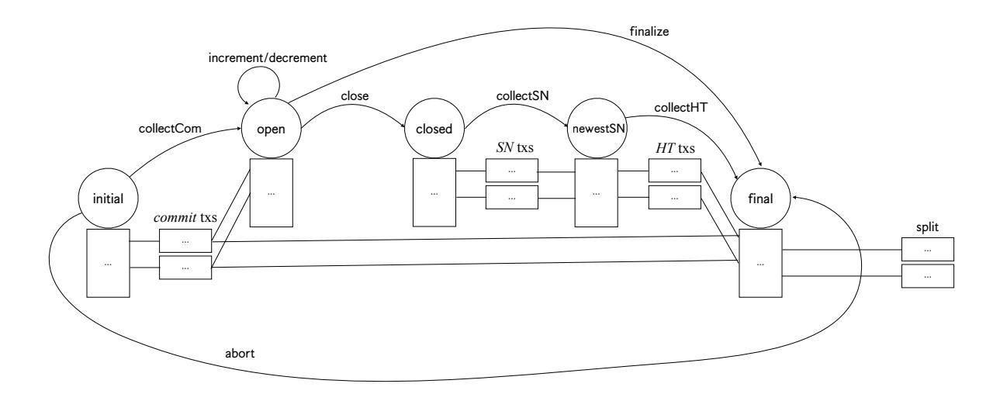

Figure 20: Mainchain state diagram with (a) incremental commits and decommits, (b) optimistic finalize, and (c) parallel contestation phase.

## <span id="page-49-0"></span>C Full Mainchain State Machine

This section outlines the following additions to the basic protocol:

- Incremental commits and decommits: These allow head members, while the head is open, to (1) commit new UTxOs to the head and (2) remove UTxOs from the head.
- An optimistic finalization procedure: If all head members agree to close a head, this procedure allows for a single-transaction head finalization.
- A more efficient way to close a head: For the cases where the head is closed due to a slow network and/or corrupted head members, this procedure allows to close the head with a short contestation period. Moreover, the new closure procedure is designed in a way that keeps the size of the mainchain transactions small.

The state diagram corresponding to the full mainchain state machine (SM) is depicted in Figure 20. The transactions used to implement the above features are explained in Section C.1 and make use of additional on-chain verification (OCV) algorithms Increment, Decrement, Finalize, Snapshot, ValidSN, ValidHT, and Fanout as well as modified Close and Final. The additional OCV algorithms as well as changes to the head protocol are explained in Section C.3, after defining a variant of so-called Merkle-Patricia trees in Section C.2.

#### <span id="page-49-2"></span>C.1 New mainchain transactions

#### C.1.1 Incremental (de)commits

In the basic protocol, UTxOs can only be committed to a head before it reaches the open state. Once the head is running, no additional UTxOs can be added to it. Similarly, the only way of freeing up UTxOs in the head and make them available for spending on the mainchain is to close

<span id="page-50-0"></span>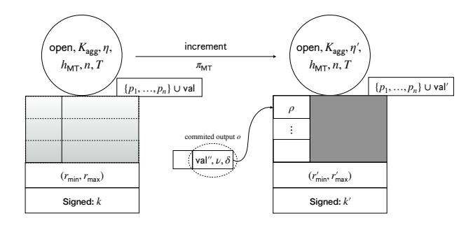

Figure 21: collectCom/increment/decrement transaction (left) with increment transaction (right).

<span id="page-50-1"></span>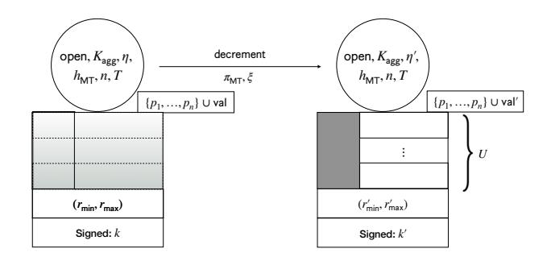

Figure 22: collectCom/increment/decrement transaction (left) with decrement transaction (right).

the head. Incremental commits and decommits allow arbitrary UTxOs to be added and removed from the head, respectively, while the head is open.

**Incremental commit.** In order to add UTxOs to the head, a head member may post an *increment* transaction (cf. Figure 21), causing a state transition from open to itself. The *increment* transaction can have any number of inputs (but at least one) that consume the newly committed outputs. Let U be the set of such outputs o; OCV function Increment processes this information and outputs an updated head status  $\eta' \leftarrow \mathsf{Increment}(\eta, U)$ .

Incremental decommit. A head member wishing to make UTxOs inside the head available on the mainchain posts a decrement transaction (cf. Figure 22), again causing a transition from open to itself. The decrement transaction can have any number of outputs (but at least one) that make the newly decommitted outputs available on the mainchain. Let U be the set of such outputs; OCV function Decrement processes this information along with a certificate  $\xi$  created by the head members to permit the decommit operation. Decrement outputs an updated head status  $\eta' \leftarrow \text{Decrement}(K_{\text{agg}}, \eta, \xi, U)$ ; it may also output  $\bot$ , but in order for a close transaction to be valid  $\eta' \neq \bot$  is required.

#### C.1.2 Optimistic head closure

If all head members agree that a head should be closed, the close/contestation phase can be foregone, and, by posting a *finalize* transaction (cf. Figure 23), the head SM can be made to go from the open

<span id="page-51-0"></span>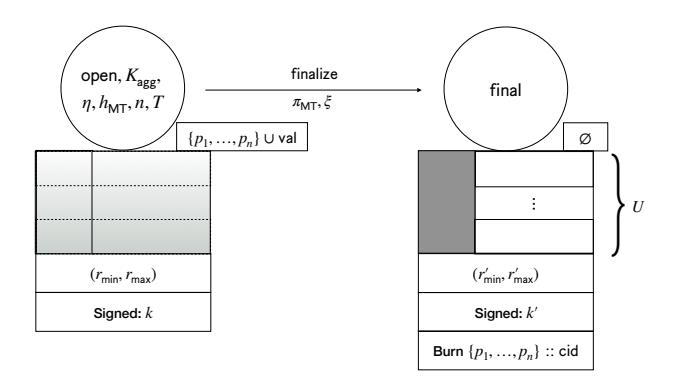

Figure 23: collectCom/increment/decrement transaction (left) with finalize transaction (right).

state to the final state right away. The final transaction must have outputs that correspond to the final head state as agreed upon by the parties. To that end, OCV predicate Finalize(η, Kagg, U, ξ) checks the transaction's output set U against a special certificate ξ provided by the redeemer and the information recorded in η. The certificate ξ consists of a multisigned value h||"final", where h is the hash of the final UTxO set. The finalize transaction is only valid if Final outputs true. Moreover, all participation tokens must be burned.

## C.1.3 Efficient contestation phase

Recall that in the simple protocol, in order to terminate a head, some party p first posts a close transaction, which also contains information about the current head state. In a subsequent sequential contestation phase, each party is given the opportunity to supply more recent information in case p's information was outdated or p is corrupted. In the worst case, this process requires a sequence of n mainchain transactions. In order to avoid this issue, a more involved parallel contestation phase can be used to close out a head.

This parallel contestation phase is tailored to the actual head protocol in use (cf. Section [6\)](#page-16-0) in that it first collects—in parallel—proposals for the most recent snapshot and thereafter—also in parallel—so-called hanging transactions, which are the confirmed head transactions that have not yet been considered by a snapshot. The reason for executing a head closure in two steps is that collecting snapshots first prevents a corrupted head member from posting a very old snapshot along with a large number of hanging transactions.

Thus, to close a head, a close transaction is posted by some head member. The close transaction has n outputs—one for each head member—to which SN transactions can be attached. An SN transaction allows a head member to post (information about) the newest snapshot to the mainchain. The subsequent transaction, the collectSN transaction, collects all SN transactions and picks the most recent snapshot. It has n outputs as well, to which each party may attach a HT transaction. Each HT transaction allows a head member to post (information about) hanging transactions. Finally, the collectHT transaction collects all HT transactions and determines the final UTxO set. The collectHT transaction also determines how to spilt the final UTxO set and provides sufficiently many outputs for split transactions to be attached, where each split transaction has as outputs a subset of the final UTxO set.

<span id="page-52-0"></span>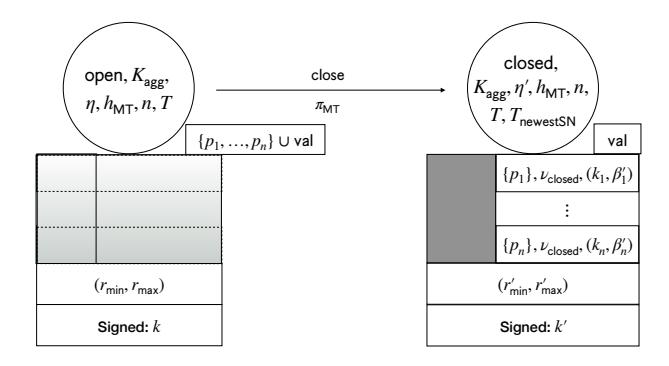

<span id="page-52-1"></span>Figure 24: collectCom/increment/decrement transaction (left) with close transaction (right).

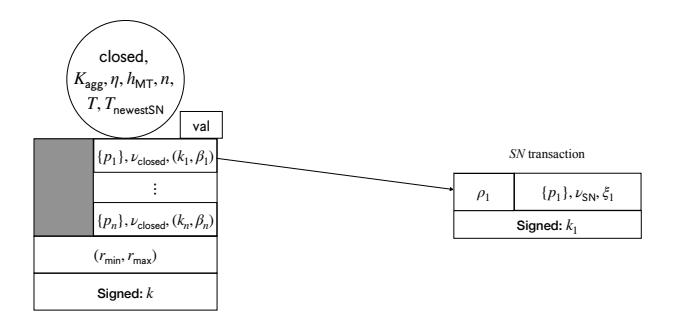

Figure 25: close transaction (left) with SN transaction (right).

Initiating head closure. In order to close a head, a head member may post the *close* transaction (cf. Figure 24), which results in a state transition from the open state to the closed state. Compared to the basic protocol, the poster is not required to provide any information about the status of the head at this point. Instead, the *close* transaction has n outputs locked by validator  $\nu_{\text{closed}}$ . The  $i^{\text{th}}$  output has  $(k_i, \beta'_i)$  in its data field, where  $k_1, \ldots, k_n$  are the public keys that are hashed in  $h_{\text{MT}}$  and the  $\beta'_i$  contain information required by OCV algorithm ValidSN to verify the SN transactions posted (see below). Specifically, they are created by OCV algorithm  $(\eta', \beta'_1, \ldots, \beta'_n) \leftarrow \text{Close}(K_{\text{agg}}, \eta)$ , which is also allowed to update the head status. Observe that the *close* transaction also places the n participation tokens in the outputs.

Validator  $\nu_{\mathsf{closed}}$  ensures the following: either the output is consumed by

- 1. an SM *collectSN* transaction (see below) or
- 2. an SN transaction (identified by having validator  $\nu_{SN}$  in its only output), and
  - (a) the transaction is signed by  $k_i$ ,
  - (b) OCV algorithm  $\mathsf{ValidSN}(\beta_i', \xi_i, \rho_i)$  returns  $\mathsf{true}$ , where  $\xi_i$  and  $\rho_i$ —in the SN transaction's output data field resp. redeemer—contain snapshot information (see below and Figure 25).

Once a close transaction has been posted, an SN-posting period begins which should last at least T slots. Hence, the last slot  $T_{\sf newestSN}$  of said period is recorded in the state, and it is ensured that  $T_{\sf newestSN} \ge r'_{\sf max} + T$ .

<span id="page-53-0"></span>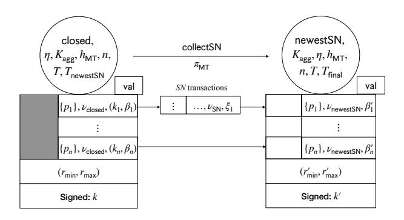

Figure 26: collectSN transaction (left) with collectHT transaction (right) and HT transactions (center).

**Providing snapshot information.** In an SN transaction (cf. Figure 25), a party simply provides information about their most recent snapshot in the redeemer  $\rho$  and the output data field  $\xi$ ;  $\rho$  contains data only relevant to verify the SN transaction itself, whereas  $\xi$  contains information relevant for the SM. Specifically,  $\xi$  contains h||s, where h is the hash and s the number of the newest snapshot, and  $\rho$  contains a multisignature on h||s. All SN transactions are collected by an SM collectSN transaction.

Collecting snapshot information. The *collectSN* transaction (cf. Figure 26) causes the SM to transition from closed to newestSN. The OCV function Snapshot is responsible for collecting the values  $\xi_i$  provided in the SN transactions and computing a new head state  $\eta'$  as  $(\eta', \beta'_1, \ldots, \beta'_n) \leftarrow \text{Snapshot}(K_{\text{agg}}, \eta, \xi_1, \ldots, \xi_n)$ , where the  $\beta'_i$  have a purpose similar to that of the  $\beta'_i$  in the *close* transaction.

The collectSN transaction has n outputs, each locked by validator  $\nu_{\sf newestSN}$ , which ensures the following: either the output is consumed by

- 1. an SM collectHT transaction (see below) or
- 2. a hanging Tx transaction (identified by having validator  $\nu_{HT}$  in its only output), and
  - (a) the transaction is signed by  $k_i$ ,
  - (b) OCV algorithm  $\mathsf{ValidHT}(\beta_i', \xi_i, \rho_i)$  returns  $\mathsf{true}$ , where  $\xi_i$  and  $\rho_i$  contain information about hanging transactions (cf. Figure 27).

Once a *collectSN* transaction has been posted, a *hangingTx-posting period* begins which should last at least T slots. Hence, the last slot  $T_{\text{final}}$  of said period is recorded in the state, and it is ensured that  $T_{\text{final}} \geq r'_{\text{max}} + T$ .

**Providing hanging transactions.** In an HT transaction (cf. Figure 27), a party simply provides information about hanging transactions not included in the most recent snapshot provided during the snapshot phase. As with SN transactions, this information is split between the redeemer and the output data field. All HT transactions are collected by an SM collectHT transaction.

<span id="page-54-1"></span>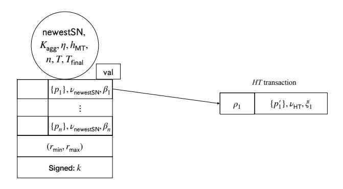

<span id="page-54-2"></span>Figure 27: collectSN transaction (left) with HT transaction (right).

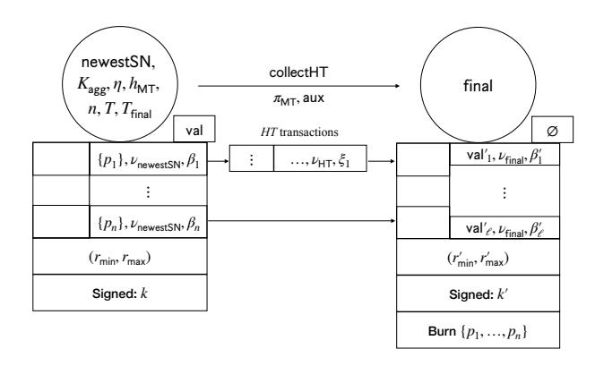

Figure 28: close transaction (left) with collectSN transaction (right) and SN transactions (center).

Collecting hanging transactions. The collectHT transaction (cf. Figure 28) collects all the information  $\xi_i$  provided by the HT transactions in order to compute the final UTxO set (i.e., the UTxO set resulting from applying all hanging transactions to the newest snapshot) and to determine how to partition the UTxO set into  $\ell$  components (in order to avoid posting large transactions on the mainchain). Specifically, the OCV function Fanout takes as input key  $K_{\text{agg}}$ ,  $\eta$ , auxiliary information aux in the redeemer, and the values  $\xi_i$  and computes  $(\text{val}_i', \beta_i')$  for  $i = 1, \ldots, \ell$ , where  $\text{val}_i'$  is the value in the  $i^{\text{th}}$  partition and  $\beta_i'$  is used to validate the corresponding split transaction. The final transaction must also burn the participation tokens  $p_1, \ldots, p_n$  and may only be posted after the HT phase is completed, i.e., only when  $r'_{\text{min}} \geq T_{\text{final}}$ .

Splitting the final UTxO set. The task of *split* transactions (cf. Figure 29) is to make the UTxOs in a particular partition (as determined by Fanout) available for consumption on the main-chain. To verify that this is done correctly, validator  $\nu_{\text{final}}$  runs OCV predicate Final( $\beta_i, U_i$ ), where  $U_i$  is the set of outputs of the *split* transaction.

#### <span id="page-54-0"></span>C.2 UTxO sets and Merkle-Patricia Trees

The head protocol and OCV algorithms for the full Hydra protocols make use of a variant of socalled  $Merkle-Patricia\ Trees\ (MPTs)\ [22]$ . Hydra's MPTs store a set of D outref/output pairs

<span id="page-55-0"></span>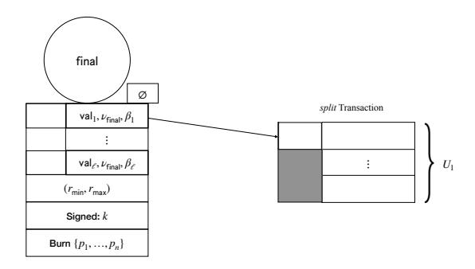

Figure 29: collectHT transaction with split transaction.

 $(\mathsf{out}\text{-}\mathsf{ref},o)$  in such a way that

- (determinism) the set D defines the tree (i.e., the order of insertions and removals have no effect on the tree's shape),
- (hashing) a tree can be hashed—i.e., a so-called root hash can be computed—in such a way that it is computationally hard to find two trees (or, equivalently, two sets D and D') with the same hash,
- (membership proofs) membership of a pair (out-ref, o) in the tree can be verified using the root hash and auxiliary information aux of size  $O(\log |D|)$ ,
- (removing and adding) given a root hash  $h_{\mathsf{root}}$  corresponding to a set D and sets  $R \subseteq D$  and A with  $A \cap D = \emptyset$ , the root hash corresponding to  $D \setminus R \cup A$  can be computed from  $h_{\mathsf{root}}$  and auxiliary information aux of size  $O(\log |D|)$ , and
- (splitting) given any number B, a tree corresponding to D can be split into subtrees corresponding to disjoint sets  $D_1, \ldots, D_\ell$  (for some  $\ell$ ) with  $D_1 \cup \ldots \cup D_\ell = D$  such that
  - the elements of each  $D_i$  have size at most B bits, and
  - the root hashes and total values corresponding to each  $D_i$  can be computed using the root hash  $h_{\text{root}}$  of D and auxiliary information aux of size B.<sup>11</sup>

**Defining MPTs.** MPTs used by Hydra have alphabet size A = 16. The MPT corresponding to a set D is defined via algorithm MPT-Build in Figure 30. Note that outrefs take on the role of "keys" and outputs o that of "values." MPTs are defined recursively, where the root node node = (pre, H, S, V) of the tree corresponding to D with D > 1 has the following fields:

- *Prefix:* The field **pre** stores the common prefix of all the keys found in D.
- Children: The array H stores the hashes of all A children nodes, where  $H[i] = \bot$  if the corresponding child is not present. The  $i^{\text{th}}$  child of node is the root of the MPT containing all elements corresponding to the set D'' computed as follows:

<span id="page-55-1"></span> $<sup>^{11}</sup>$ Observe that this only works if the trees do not exceed a certain maximum size.

- 1. Let the set D' be the set obtained by removing the prefix pre from every key out-ref in every pair (out-ref, o)  $\in D$ ; this is denoted (pre, D')  $\leftarrow \mathsf{CP}(D)$  in Figure 30.
- 2. Let D'' be the set obtained by additionally removing the character i from each out-ref; this is denoted by Proj(D', i) in Figure 30.
- Size: For each  $i \in [A]$ , S[i] records the combined size of the leaves of the subtree at the  $i^{\text{th}}$  child. The combined size of all leaves in node's subtree is  $\mathsf{Sum}(S)$ , where  $\mathsf{Sum}(S) = \sum_{i \in [A]} S[i]$ .
- Value: For each  $i \in [A]$ , V[i] records the value of the subtree at the  $i^{\text{th}}$  child. The value of node's subtree is  $\mathsf{Sum}(V)$ , where  $\mathsf{Sum}(V) = \sum_{i \in [A]} V[i]$ .

Leaf nodes leaf = (pre, o) correspond to a single-element  $D = \{(\mathsf{pre}, o)\}$ . Their size is given by  $\mathsf{Size}(\mathsf{leaf})$ , and their value is  $\mathsf{val}$ , where  $o = (\mathsf{val}, \nu, \delta)$ .

**Hashing.** The hash of an MPT is simply the hash of its root node.

Membership proofs. To provide a proof that some out-ref appears in an MPT with root hash  $h_{\text{root}}$ , it suffices to provide as auxiliary information aux the nodes on the path from the root to the leaf containing o. The corresponding verification function is denoted by MPT-VfyMemb(h, out-ref, aux).

**Removing and adding.** Similarly to membership proofs,

- for removing a pair (out-ref, o) from an MPT with root hash  $h_{\mathsf{root}}$ , the new root hash can be computed if given as auxiliary information aux the nodes on the path from the root to the node deleted, where, in cases where that node only has one sibling, that sibling has to be provided as well;
- for adding a pair (out-ref, o) to an MPT with root hash  $h_{\mathsf{root}}$ , the new root hash can be computed if given as auxiliary information aux the nodes on the path from the root to the node where out-ref diverges from the prefix traversed.

```
N[\cdot] \leftarrow \varepsilon
\mathsf{MPT}\text{-}\mathsf{Build}\,(D)
     if |D| > 1
             (\mathsf{pre}, D') \leftarrow \mathsf{CP}(D)
             H[\cdot], S[\cdot], V[\cdot] \leftarrow \varepsilon
             for i \in [A]
              \big| \quad (H[i],S[i],V[i]) \leftarrow \mathsf{MPT\text{-}Build}(\mathsf{Proj}(D',i))
             \mathsf{node} \leftarrow (\mathsf{pre}, H, S, V)
             h \leftarrow H(\mathsf{node})
             N[h] \leftarrow \mathsf{node}
             \mathbf{return}\ (h, \mathsf{Sum}(S), \mathsf{Sum}(V))
      else if |D| = 1
             \{(\mathsf{pre}, o)\} \leftarrow D
             leaf \leftarrow (pre, o)
             h \leftarrow H(\mathsf{leaf})
             N[h] \leftarrow \mathsf{leaf}
             (\mathsf{val}, \cdot, \cdot) \leftarrow o
             return (h, Size(leaf), val)
      return (\bot, 0, \emptyset)
```

Figure 30: Recursive procedure to build an MPT from a set D of outref/output pairs (out-ref, o). The algorithm stores the nodes in the array N indexed by their hashes and returns the hash of the root node as well as total size and value of the entire tree.

In order to remove an entire set  $R \subseteq D$  of outref/output pairs and subsequently add a set A with  $A \cap D = \emptyset$  (which is what happens when a transaction is applied to a UTxO set), the above operations can simply be concatenated, producing a combined auxiliary string aux. The function that computes the new root hash  $h'_{\text{root}}$  from the old root hash  $h_{\text{root}}$ , the sets R and A, and aux is denoted by  $h'_{\text{root}} \leftarrow \mathsf{MPT\text{-}CompRA}(h_{\text{root}}, R, A, \mathsf{aux})$ .

**Splitting.** To split, as described above, a tree with nodes N, first, each node node = (pre, H, S, V) whose subtree has leaves with combined size  $\sum_i S[i] > B$  is added to a list split (indexed by node hashes), which is referred to as the *split frontier*. Then, every node node  $\notin$  split with a parent in the split frontier is the root of a subtree corresponding to one of the subsets  $D_i$ . This way, the combined size of all elements in each  $D_i$  is at most B (as otherwise, node would be in the split set). Denote these root nodes by  $node_1, \ldots, node_\ell$  and call them *split nodes*.

In order to compute the hashes  $h_1, \ldots, h_\ell$  and values  $\mathsf{val}_1, \ldots, \mathsf{val}_\ell$  of the split nodes from the hash  $h_{\mathsf{root}}$  of the root node of the entire tree, aux consists simply of the split frontier split (which includes said hashes and values).

Finally, for each split node  $\mathsf{node}_i$ , define the  $\mathit{split prefix} \mathsf{pre}_i$  to be the common prefix of all outrefs in  $D_i$ . The split prefix will be needed to compute the hashes  $h_i$  given the sets  $D_i$ :  $h_i$  is obtained by computing the MPT corresponding to  $D_i$ , but by removing  $\mathsf{pre}_i$  from the prefix  $\mathsf{pre}$  in the resulting root node before hashing it.

The function computing the above values is denoted by

$$(h_1, \ldots, h_\ell, \mathsf{val}_1, \ldots, \mathsf{val}_\ell, \mathsf{pre}_1, \ldots, \mathsf{pre}_\ell) \leftarrow \mathsf{MPT\text{-}CompSpl}(h_{\mathsf{root}}, B, \mathsf{aux})$$
.

## <span id="page-57-0"></span>C.3 Head protocol and on-chain verification

In order to be used with the improved SM (cf. Figure 20), some small changes have to be made in the head protocol. This section summarizes these changes and describes on a high level how the OCV functions can be implemented to work with the improved SM.

Merkle-Patricia trees, UTxO sets and transactions. The head protocol and the OCV algorithms can be implemented in such a way that—apart from split transactions—only hashed information about snapshots and hanging transactions needs to be posted. That way, Hydra mainchain transactions remain small even if the head UTxO set becomes large or there are many hanging transactions.

Recall that a UTxO is simply a pair  $u = (\mathsf{out\text{-ref}}, o)$  of outref and output. The full head protocol maintains the current UTxO set by storing all UTxOs in an MPT as shown in Section C.2. When creating new snapshots, parties sign the root hash of the MPT (instead of a plain hash of the UTxO set).

Note that applying a transaction to a UTxO set always involves removing some UTxOs and adding some new ones. Thus, evolving the hash corresponding to a UTxO set to include a new transaction involves simple remove and add operations on the MPT.

To keep HT transactions small (see below), when confirming a transaction  $tx = (I, O, \mathsf{val}_{\mathsf{Forge}}, r, \mathcal{K})$ , tx is hashed by computing

$$H(\mathsf{ID}(\mathsf{tx}),\mathsf{out}\mathsf{-ref}_1,\ldots,\mathsf{out}\mathsf{-ref}_w,o_1,\ldots,o_{w'},h_{\mathsf{rest}})$$
,

where

- ID(tx) is the ID of tx as per the ledger rules,
- $I = \{i_1, \dots, i_w\}$  and  $i_j = (\mathsf{out}\text{-}\mathsf{ref}_j, \rho_j),$
- $O = (o_1, \ldots, o_{w'})$ , and
- $h_{\mathsf{rest}} = H(\rho_1, \dots, \rho_w, \mathsf{val}_{\mathsf{Forge}}, r, \mathcal{K})$  is the hash of the rest of the transaction.

For MPT proofs of membership/insertion/deletion, this way of hashing allows to provide only the ID ID(tx), the output references in I, the outputs O, and the hash  $h_{rest}$ , which are usually much shorter than the entire transaction.

**Onchain verification functions.** Using these MPTs, the OCV functions for the efficient decommit can be implemented as follows:

- $\eta' \leftarrow \text{Initial}(U_1, \dots, U_n)$  computes the MPT corresponding to the union of the UTxO sets  $U_i$  and stores the hash in the output  $\eta'$ .
- $(\eta', \beta'_1, \dots, \beta'_n) \leftarrow \mathsf{Close}(\eta)$  leaves  $\eta' = \eta$  unchanged and puts  $K_{\mathsf{agg}}$  into each  $\beta'_i$ .
- ValidSN( $\beta, \rho, \xi$ ) uses  $K_{agg}$  (stored in  $\beta$ ) to verify the multisignature (stored in  $\rho$ ) on the MPT hash and snapshot number (stored in  $\xi$ ). The algorithm returns true if and only if the signature verifies and the snapshot number is greater than 0.
- $(\eta', \beta'_1, \ldots, \beta'_n) \leftarrow \mathsf{Snapshot}(\eta, \xi_1, \ldots, \xi_n)$  simply picks the  $\xi_i$  with the highest snapshot number and stores the corresponding MPT root hash in  $\eta'$ . Each output  $\beta'_i$  consists of  $K_{\mathsf{agg}}$  as well as said hash. Note that if all  $\xi_i$  are empty (because no party posted a valid SN transaction), the initial hash (still in  $\eta$ ) computed in Initial is used.
- ValidHT( $\beta, \rho, \xi$ ) is somewhat more involved. Recall that this validator checks an HT transaction, via which some party posts hanging transactions—in  $\xi$ —along with corresponding multisignatures and proofs—in  $\rho$ —showing that these transactions were confirmed in the head and can be applied to the most recent snapshot, whose hash  $h_{SN}$  is stored in  $\beta$ .

Hanging transactions  $tx = (I, O, val_{Forge}, r, K)$  are provided via the values

$$\tilde{\mathrm{tx}} \ = \ (\mathsf{ID}(\mathrm{tx}), \mathsf{out\text{-}ref}_1, \ldots, \mathsf{out\text{-}ref}_w, o_1, \ldots, o_{w'}, h_{\mathsf{rest}})$$

as defined above. For each such transaction, ValidHT computes  $h \leftarrow H(\tilde{\mathrm{tx}})$  and checks, using  $K_{\mathsf{agg}}$  (stored in  $\beta$ ), that  $\rho$  contains a valid multisignature on h.

Once all transactions have been authenticated, ValidHT now processes them in topological order and checks for each transaction tx that

- either there is an  $\mathsf{out\text{-ref}}_i = (txID, txIdx)$  in tx such that txID refers to a previously processed transaction, or
- there is an MPT membership proof  $\mathsf{aux}$  in  $\rho$  such that  $\mathsf{MPT-VfyMemb}(h_{\mathsf{SN}}, \mathsf{out-ref}_i, \mathsf{aux}) = \mathsf{true}$  for some  $\mathsf{out-ref}_i$  in  $\mathsf{tx}$ .

Note that since transactions are multisigned, it suffices to check a single outref to ensure that tx is not old (i.e., not already consumed by the newest snapshot).

- $(\beta_1, \ldots, \beta_\ell, \mathsf{val}_1, \ldots, \mathsf{val}_\ell) \leftarrow \mathsf{Fanout}(\eta, \mathsf{aux}, \xi_1, \ldots, \xi_n)$  has two tasks: First, it must collect hanging transactions (stored in variables  $\xi_i$ ) and compute, using the hash  $h_{\mathsf{SN}}$  (stored in  $\eta$ ) of the most recent snapshot and auxiliary information  $\mathsf{aux}_1$  (stored in  $\mathsf{aux}$ ), the hash  $h_{\mathsf{final}}$  of the final UTxO set; this can be done by means of the function MPT-CompRA. Second, it must take auxiliary information  $\mathsf{aux}_2$  (stored in  $\mathsf{aux}$ ) and compute the split  $(h_1, \ldots, h_\ell, \mathsf{val}_1, \ldots, \mathsf{val}_\ell, \mathsf{pre}_1, \ldots, \mathsf{pre}_\ell) \leftarrow \mathsf{MPT-CompSpl}(h_{\mathsf{final}}, B, \mathsf{aux}_2)$ . Each  $\beta_i$  is set to  $(h_i, \mathsf{pre}_i)$ .
- Final( $\beta_j, U_j$ ) simply hashes  $U_j$  and checks if it matches  $\eta_j$ .

## <span id="page-59-0"></span>D Further Protocol Aspects

### D.1 Funding state-machine progress

In order for the mainchain state machine (SM) of the Hydra protocol to progress, head members need to post the corresponding transactions; this is true for both the simplified and the full protocol. However, head members might decide to wait for other head members to post these transactions in order to save on fees. It may, therefore, be necessary to offer rewards for posting some SM transactions or, at the very least, to allocate funds to cover the incurred fees.

The following examples outline how rewards could be awarded for some of the SM transactions. In general, however, it is up to the head members to decide the exact reward policy when the head is being established:

- initial: Generally, there is no need to offer rewards for posting the initial transaction, for the will of the initiator to open the head should suffice.
- commit: A party willing to participate in the head will post its commit transaction. Thus, there is no need to allocate any rewards for it.
- collectCom: Since only one collectCom transaction is posted, a party may wait to see if other head members post the transaction first, which delays the progress of the head SM. Hence, one should incentivize the posting of collectCom transactions.
- abort: If a head fails to be established due to missing commit transactions, the remaining head members have an incentive to abort the head. However, the incentive may be stronger for parties who require the locked funds immediately. Therefore, it makes sense to reward the party posting the abort transaction.

Similar arguments can be made for close, contest, and fanout transactions as well as for transactions of the full Hydra SM.

All the funds for rewards are pre-allocated in the commit transactions, which can be enforced by the initial transaction. In order to do so, the required rewards must be estimated in advance. This requires, in particular, upper bounds on the size of the head UTxO set, the maximum number of hanging transactions etc. These quantities can be made explicit as head parameters.

Transactions that take the head SM to its final state (e.g., abort or fanout) will make sure that surplus funds will be appropriately redistributed.

## D.2 Time handling in the head protocol

Recall that each transaction contains a tuple r = (rmin, rmax) that specifies the slot range [rmin, rmax] wherein the transaction must be included in the ledger to be valid. Time-critical concepts such as timed commitments are based on this construct.

In the mainchain, it is easy to agree on whether a transaction was included in the ledger within a given slot range by verifying whether the slot of its containing block lies in that slot range; and this fact will become irrevocably confirmed once the block lies sufficiently deep in the blockchain.

In contrast, the confirmation process in the head is asynchronous, and we require a different mechanism to make this decision. We thus establish the rule that a party may only sign a transaction if it has seen that transaction during its included slot range r; overall, this implies that a confirmed transaction has been seen by all honest parties "on time."[12](#page-60-0)

Now, a party may not learn about confirmation until after the slot range expired, but this is not fundamentally different than on the mainchain.

Conflict resolution. A problem arises with conflict resolution (CR) when multiple transactions with finite slot ranges (rmax < ∞) compete for redeeming the same UTxO. Such a conflict cannot always be settled by our standard CR mechanism, as a snapshot leader including his favored transaction tx, in general, cannot know whether tx has been (or will be) accepted on time; and if not, the snapshot would have to be rejected, and the head would have to be closed.

To avoid head closure due to snapshot rejection in the case of this (typically rare) event we modify CR in two ways.

Firstly, for CR, the snapshot leader includes only the subset of the transactions T<sup>R</sup> (c.f. Sec. [B.1\)](#page-43-2) that have a safe amount of time left before deadline expiry. Then, a head with only honest participants only has to be closed under extremely bad network conditions.

Secondly, we need a mechanism to handle expired transactions that have been seen, but possibly not confirmed. Assume that a party p signed a transaction txA but does not get it confirmed until after the transaction's deadline rmax; hence, p does, at this point, not know whether the transaction txA will eventually be confirmed — as some participants may have received txA too late. If at this point a second, conflicting transaction txB gets published and p is the snapshot leader, it has to make a choice for which it has insufficient information: it must reject if txA is confirmed (for consistency), but sign txB if txA is unconfirmed (for liveness).

To avoid such decisions, we extend the snapshot mechanism as follows. The snapshot leader includes into its snapshot an obituary set of transactions that it sees as expired and only partially confirmed. If any party is in possession of a multisignature for a transaction in the obituary set, it resurrects this transaction by including its multisignature into the snapshot it produces during its next turn as a snapshot leader. After a full cycle of snapshot round robin, we can thus safely accept such a transaction as confirmed if a multisignature was added during that cycle, or reject it as expired if no multisignature was delivered.

### D.3 Transaction throttling

An adversarial leader could stall the snapshot production while still allowing new transactions to get confirmed. To prevent that such an attack grows the stored transaction history beyond limits, the size of all snapshot-unprocessed transactions may only grow to a given limit. As long as this limit is reached, no new transactions are confirmed (or, alternatively, the head is closed once the limit is reached).

<span id="page-60-0"></span><sup>12</sup>Note that, although our head protocol is asynchronous, we can still rely on roughly synchronized clocks among the head participants (for example, by observing the mainchain)—as we already need to make this assumption to safely handle contestation periods during the closing of a head.