# **Slippery hill-climbing technique for ciphertext-only cryptanalysis of periodic polyalphabetic substitution ciphers**

Thomas Kaeding hippykitty@protonmail.com

2019-06-17

to appear in *Cryptologia*

We present a stochastic method for breaking general periodic polyalphabetic substitution ciphers using only the ciphertext and without using any additional constraints that might come from the cipher's structure. The method employs a hill-climbing algorithm for individual key alphabets, with occasional slipping down the hill. We implement the method with a computer and achieve reliable results for a sufficiently long ciphertext (150 characters per key alphabet). Because no constraints among the key alphabets are used, this method applies to *any* periodic polyalphabetic substitution cipher.

Keywords: periodic polyalphabetic substitution cipher, hill-climbing, slippery hill-climbing, cryptanalysis, Vigenère, Quagmire

In a monoalphabetic substitution cipher, each character of the plaintext is encrypted by the same bijective mapping between the standard alphabet (A...Z) and the key alphabet. The key alphabet is simply a permutation of the standard one. A stochastic ciphertext-only attack on the monoalphabetic substitution cipher (Jakobsen 1995) generates a "child" key from a "parent" key by swapping randomly chosen elements. The child replaces the parent if the fitness of the decrypted text improves over its predecessor, where fitness is a measure of how close a text resembles a particular language. This continues until no improvement is seen for a large number of child candidates.

The periodic polyalphabetic substitution cipher is a generalization of the monoalphabetic cipher in which there are several key alphabets. During encryption, the choice of key alphabet cycles through them, where the choice of key is given by the position in the text modulo the number of keys.

In general, the key alphabets need not be related to one another, and may even be random. Many classical ciphers, however, constrain them with simple relationships. The Vigenère cipher, for example, uses a base alphabet that is identical to the standard one, and the key alphabets are shifts of this alphabet (modulo 26). Beaufort, Porta, and Quagmire ciphers have similar constraints. Due to these constraints, the key space for these ciphers is only a tiny fraction of the space available for the general case. These constraints also allow some of these ciphers to be broken quickly, when given sufficiently long ciphertexts (typically 100 or more characters times the number of key alphabets). In the general

case, however, the key alphabets are independent of one another, and we cannot exploit such constraints.

In this paper, we present a method of a ciphertext-only attack that breaks *any* periodic polyalphabetic substitution cipher, when given a sufficiently long ciphertext (typically 150 characters times the number of key alphabets). For shorter ciphertexts (down to around 80 characters per key alphabet), the method can still succeed if tried several times. The algorithm incorporates the stochastic attack mentioned above on the monoalphabetic cipher. However, to help avoid becoming trapped at a local maximum textual fitness, each key is occasionally randomized and the hill is climbed again; hence the name "slippery." The number of key alphabets can often be discovered by cutting the ciphertext into slices of every *n* th character and calculating the index of coincidence (IoC) (Friedman 1920) for each slice. The IoC is averaged over slices for each *n* and the smallest *n* for which this average is close to the IoC of English text is taken as the number of key alphabets. The keys are set to some initial values. Then we loop through the key alphabets. For each one, we randomize it, then use the stochastic technique to climb back up. In this process, the fitness of the entire decrypted text is used, not just that of the slice. We continue to loop through the keys until no improvement is gained within a large number of steps.

The remainder of this paper explains the concepts involved in the attack and our implementation of it. We then present some experimental results on its accuracy for various periods and lengths of ciphertext.

#### **Textual fitness**

In order to determine whether one decryption of the ciphertext is better than another, we need some way to evaluate the quality of the decryption. For this, we define a *fitness* function that gives a numerical value meant to represent how well a given text resembles English. There are many choices for the definition of this function. We choose to use the average of the logarithms of the tetragram (four-letter) frequencies, where these frequencies are calculated from a large corpus of English text.

$$F(t) = (1/N) \Sigma_{\text{tetragrams}} \log f_{\text{English}}(t[i,...,i+3])$$

In pseudocode,

```
fitness = 0
for i in 1, ..., length (text) - 3 do
        fitness += log (tetragramfreq (text[i,...,i+3]))
fitness = fitness / (length (text) - 3)
```

Defined in this way, the fitness for English texts can depend slightly on the corpus used to compile the frequency table. We used a dozen British English novels, and find the average fitness for randomly selected passages to be -9.52. The variability is larger for shorter texts; we found a standard deviation of 0.34 for length 100 characters, 0.16 for length 1000, and 0.10 for length 10,000. In the limit of very long text, the fitness is

$$F(t) = \sum f \log f$$

which is simply the negative of the entropy (Shannon 1948) of our corpus of written English, as measured with tetragram frequencies.

It might be worth mentioning that using a fitness based on trigrams without word boundaries lead our algorithm to local maxima from which it did not escape. Adding word boundaries overcame that problem. However, in general, we cannot rely on knowing the positions of word boundaries in the text. When we decided on using tetragram frequencies, this problem lessened considerably. As we will see below, for sufficiently long ciphertexts (150 characters per key alphabet), we nearly always find the global maximum.

#### **Hill-climbing attack on monoalphabetic substitution ciphers**

A stochastic attack on monoalphabetic substitution ciphers uses a "child" key derived from its "parent" key (Jakobsen 1995). Initially some parent key is chosen, for example as the standard alphabet or as a random alphabet. The ciphertext is decrypted with this key and the fitness of the decryption is calculated. Then a child key is generated by swapping two randomly chosen elements of the parent key. Again the ciphertext is decrypted and the fitness is calculated. If the new fitness is higher than the parent's fitness, then the parent key is replaced by the child. This is repeated until the fitness does not improve within the last few thousand iterations. Here is some pseudocode for this algorithm:

```
parent = "ABCDEFGHIJKLMNOPQRSTUVWXYZ"
plaintext = decrypt (ciphertext, parent)
parentfit = fitness (plaintext)
count = 0
while count < LIMIT do
       child = parent
       i = random() mod 26
       j = random() mod 26
       child[i], child[j] = child[j], child[i]
       plaintext = decrypt (ciphertext, child)
       childfit = fitness (plaintext)
       if childfit > parentfit then
               parent = child
               parentfit = childfit
               count = 0
       else
               count++
output parent, decrypt (ciphertext, parent)
```

This attack will be modified and incorporated into our method.

## **Index of coincidence and the period of the cipher**

Determining the period of the polyalphabetic cipher can be done with the index of coincidence (IoC) (Friedman 1920). The IoC is a measure of the probability that any two characters in a text are identical. Because of the lack of randomness in natural languages, the IoC for meaningful texts is measurably higher than that of random strings. A concise formula for the IoC is

$$I = 26 \sum_{i=A}^{Z} n_i (n_i - 1) / N (N - 1)$$

where the summation is over the 26 letters in our alphabet, *ni* is the number of occurrences of the *i* th letter from the alphabet, and *N* is the total number of characters in the text. We normalize with a factor of 26, which is not used in the original. With this normalization, random strings have an IoC close to 1 (Mountjoy 1963), while English text has an IoC close to 1.75 (Friedman and Callimahos 1956).

To determine the period of the cipher, we can cut the ciphertext into slices and calculate the IoC for each of them. If the ciphertext contains the characters *c*0, *c*1, *c*2, ..., and if we create *m* slices, then a character *ci* is assigned to slice *i* mod *m*. To make things easier, we average the IoC over the slices. If, and only if, this average is close to the IoC of typical English text, then we conclude that the period of the cipher is *m*. Note that since the IoC as calculated in this manner for period 2*m* will be close to that for *m*, we must choose the smallest period that has an IoC near 1.75. In pseudocode:

```
found = FALSE
period = 0
while not found do
       period++
       ioc = 0
       for i in 1, ..., period do
               for j in 1, ..., length(ciphertext)/period do
                      slice[j] = ciphertext[j*period+i]
               ioc += index_of_coincidence(slice)/period
       if (ioc > THRESHOLD) then
               found = TRUE
```

## **Attacks on polyalphabetic ciphers with constraints**

Some polyalphabetic substitution ciphers with constraints can easily be broken. The Vigenère cipher, for example, is constrained to use one base alphabet (which is the standard alphabet), while key alphabets are shifted versions of the base. For period *m*, the keyspace has size 26*<sup>m</sup>* , which is much smaller that the general polyalphabetic cipher, whose keyspace is (26!)*<sup>m</sup>* . Once the period of the Vigenère cipher is found with the IoC, then a fast method of attack is to determine the shifts as those that give best matches of single-letter frequencies in each slice to the single-letter frequencies of English. The closeness of a match can be quantified with a χ 2 statistic or with the inner product in a 26 dimensional vector space. Beaufort, Porta, and other ciphers which derive their key alphabets from the standard one in simple ways can also be broken similarly.

A classification of periodic polyalphabetic ciphers that use shifted nonstandard alphabets can be found in Gaines (1956, 169-171), in which they are divided into types 1, 2, 3, and 4. These have also been called "Quagmire" ciphers (ACA 2005, 68-71). The four types share the feature that a ciphertext alphabet is shifted relative to a plaintext alphabet in a periodic, Vigenère-like manner. The distinction between types is whether the plaintext alphabet and ciphertext alphabet are the standard alphabet or a permutation of it. Using only one (or two, for type 4) permuted alphabet significantly reduces the size of the keyspace and forms the constraint on the cipher. A complete discussion of these ciphers would

comprise an article unto itself, but let's take a brief look at their structure and consider how, at least for type 1, the constraints might be exploited.

Type 1 ciphers use a permuted plaintext alphabet and a standard ciphertext alphabet. If we label the key that permutes the plaintext alphabet as *ka*, and the shifts as a Vigenère key *kv*, then the encryption function *E*1(*ka*,*kv*,*p*) acting on a plaintext *p* to produce a ciphertext *c* can be factored into a monoalphabetic substitution *S*(*ka*,·) followed by a Vigenère cipher *V*(*kv*,·):

$$c = E_1(k_a, k_v, p) = V(k_v, S(k_a, p))$$

Having only a single substitution key and a Vigenère key, the keyspace of this cipher has size (26!)26*<sup>m</sup>* . This is far less than the general polyalphabetic cipher. Because the Vigenère encryption is last to be done, it is exposed to cryptanalysis. At this point, the base alphabet is unknown, so the shifts can only be determined relative to one another. Therefore, we can unshift them only up to an overall shift that still applies for all of the *m* key alphabets. Then all that remains is to attack the monoalphabetic substitution cipher. An early implementation of this tack can be found in King (1994). Once the period is known, he finds the shifts by a relaxational technique on candidates for the base alphabet. However, we have found that a very fast way to find the shifts is to first calculate the single-letter frequencies of each slice, vary the relative shifts, and use the χ 2 statistic to choose the best choices. Then the remaining monoalphabetic substitution can be solved with the technique of Jakobsen (1995), as explained above.

Type 2 ciphers use a standard plaintext alphabet and a permuted ciphertext alphabet. Like type 1, the keyspace is (26!)26*<sup>m</sup>* , but now the encryption function is factored into a Vigenère followed by a monoalphabetic substitution:

$$c = E_2(k_a, k_v, p) = S(k_a, V(k_v, p))$$

Note that *kv* is not the same as the set of shifts that one sees in Gaines (1956) or ACA (2005) for any particular cipher; their Vigenère key is *S*(*ka*, *kv*), i.e. *kv* transformed by the substitution. Because the shifts are hidden behind a substitution, this cipher cannot be attacked in the same way as type 1. However, attempts have been made to find other methods. For example, Morelli and Walde (2006) use a genetic approach in which candidate alphabets are combined and mutated, in order to find the substitution key.

In type 3, the same permuted alphabet is used for the plaintext alphabet and the ciphertext alphabet. In this case, the shifting is sandwiched between a monoalphabetic substitution and its inverse:

$$c = E_3(k_a, k_v, p) = S(k_a, V(k_v, S^{-1}(k_a, p)))$$

Because substitutions are linear and unitary transformations, we can think of this as a Vigenère that has undergone a change of basis in a 26-dimensional vector space. Having only one permutation key and one key for the shifts, the keyspace is again (26!)26*<sup>m</sup>* . For type 4, the two substitutions use different keys:

$$c = E_4(k_{a1}, k_{a2}, k_{v}, p) = S(k_{a2}, V(k_{v}, S^{-1}(k_{a1}, p)))$$

This enlarges the keyspace to (26!)<sup>2</sup> 26*<sup>m</sup>* . While the keyspaces are constrained to be much smaller than that of the general case ((26!)*<sup>m</sup>* ), we are not aware of any attacks on type 3 or 4 ciphers that exploit

these constraints. Perhaps this can be the subject of future work. For now, however, we can generalize and simplify our approach by disregarding the constraints of the underlying cipher. This leads us to the method of this paper.

#### **Attacking the general periodic polyalphabetic cipher**

Let us consider a *general* periodic polyalphabetic substitution cipher. Now the key alphabets are unrelated to one another. We begin by using the index of coincidence to find the period, as explained above. An initial set of key alphabets is chosen. We find that running time is shortened and the chance of successful decryption is increased if we begin by setting the initial keys to match as closely as possible the single-letter frequencies of English text. So, for example, if the most common character in a slice is M, then then we assign the element in the corresponding key that encrypts E (the most common English letter) to M. (A comparison between the results of this prescription and that of random initial keys is in the next section.) Then we enter the main loop in which for each key alphabet, we randomize it, then employ the hill-climbing technique for monoalphabetic ciphers, with the modification that we calculate the fitness for the entire plaintext, not just for the slice to which the particular key applies. We loop through the set of key alphabets and do this until the fitness does not increase within a number of iterations. The decrypted plaintext with the best fitness is chosen.

Here is some pseudocode to further clarify the algorithm of the main loop, after the initial parent keys have been set:

```
plaintext = decrypt (ciphertext, parent)
bestfit = fitness (plaintext)
bigcount = 0
while bigcount < BIGLIMIT do
       for i in 1, ..., period do
               parent[i] = randomkey()
               plaintext = decrypt (ciphertext, parent)
               parentfit = fitness (plaintext)
               count = 0
               while count < LIMIT do
                       child = parent
                       j = random() mod 26
                       k = random() mod 26
                       child[i][j], child[i][k] = child[i][k], child[i][j]
                       plaintext = decrypt (ciphertext, child)
                       childfit = fitness (plaintext)
                       if childfit > parentfit then
                               parent = child
                               parentfit = childfit
                               count = 0
                       else
                               count++
                       if childfit > bestfit then
                               bestfit = childfit
                               bestkey = child
```

*bigcount* = 0 else *bigcount*++

output *bestkey*, *decrypt* (*ciphertext*, *bestkey*)

## **Implementing and testing the attack**

We implemented the algorithm in C language and tried the program on a single processor thread. Because the purpose of this work is to test the efficacy of the algorithm, we assumed perfect determination of the period. In other words, we did not want the possibility of error in determining the period to contaminate our study of the algorithm that finds the key alphabets. To that end, if we had selected only the results in which the period was correctly determined, then a bias would have been added to the data set. To avoid such a bias, we simply passed the period to the program.

Each trial used a randomly selected piece of text taken from the concatenation of three British novels from which punctuation and word separations were removed. The texts were encrypted with randomly generated keys. The output of the program was compared to the original text for accuracy. We used periods (number of key alphabets) 2, 5, 10, and 15. The length of the ciphertext was taken as a multiple of the period; these multiples were used: 50, 60, 70, 80 ,90, 100, 125, 150, 175, 200, 250, 300, 350, 400, 450, and 500. The numbers of trials for each choice of these two parameters are 1000 for period 2, 500 for period 5, 200 for period 10, and 100 for period 15.

We set the limit on the inner loop to be a constant 1000. We allowed the limit on the outer loop to vary as the square of the period divided by the length of the ciphertext. Varying this parameter allowed the program to finish quickly for small periods, and gave the program enough time to find a solution for large periods. We ran a few tests to convince ourselves that increaing this parameter would not affect our results, i.e., the success of the program.

In Figure 1 we see the fraction of the ciphertext that is decrypted correctly versus the length of the ciphertext divided by period. Rather than clutter the graph, we only present periods 2, 5, 10, and 15. There is a pronounced shoulder in the curves in the area of 125-150 characters per key alphabet. Above 150, the results are nearly flat and very good. The shoulder also becomes sharper as the period increases.

A general periodic polyalphabetic cipher is not highly constrained. Therefore, errors for infrequent letters like J and Q are probable. For that reason, we consider a decryption to be a success if at least a certain fraction of it matches the original plaintext. If that fraction is taken to be 99%, then the rate of success is plotted in Figure 2. Again, a shoulder appears between 100 and 200 characters per key alphabet, and this shoulder sharpens as the period increases. If we relax our standards of success to 98%, 95%, or even 80%, it is still likely that the correct plaintext can be ascertained. Curves for the success rates with these criteria are also presented in Figure 2.

In order to test the efficacy of our method for choosing the initial key alphabets by matching singleletter frequencies to those of English, we implemented an alternative program in which initial keys were chosen randomly. The size of the data set is the same, with the addition of periods 3 and 4: 1000 trials for each length for period 2, 700 for period 3, 500 for period 4, 500 for period 5, 200 for period 10, and 100 for period 15. The results of the two methods are compared in Figure 3. For short periods, we can see that the frequency-matched method has an advantage for the full range of ciphertext length that we investigated. The effect for texts longer than 100 periods (above the shoulder) decreases as the period increases, so that above a period of 5 it is no longer important. However, there is still some measurable advantage for texts shorter than 100 periods, for all periods examined.

Note also that because this is a stochastic approach, failure is not always final. We can run the program again if it fails the first time. For ciphertexts whose length is as short as 80 characters per key alphabet, we were able to achieve 95% correct decryptions with an average of 5 tries. For 90 characters per key alphabet, this dropped to an average of 2 tries.

A copy of the complete program, including the determination of the period by using the IoC, is in the Appendix. It comes with no warranties. Use at your own risk.

## **Concluding remarks**

We have a method for breaking general periodic substitution ciphers. It does not depend on the constraints among the key alphabets that are present in Vigenère and Quagmire ciphers (for example), and can be used for ciphers whose key alphabets are completely unrelated. It can, of course, also be used on the constrained ciphers when no faster method is available. The method is called a "slippery" hill-climbing technique because each key alphabet is occasionally randomized and the hill (whose height is the fitness of the decryption) is climbed again.

We implemented the method and tried it with randomly selected texts that were encrypted with randomly generated keys. The method gave good results for ciphertexts whose lengths were more than 150 characters per key alphabet. For shorter ciphertexts, down to 80 characters per key alphabet, we were able to get satisfactory results by trying again until the program succeeded. At 80 characters per key alphabet, an average of 5 tries were needed. As the number of key alphabets increased, the reliability of the program also improved.

#### **References**

American Cryptogram Association (ACA) (2005), "The ACA and You," http://www.cryptogram.org/ cdb/aca.info/aca.and.you/aca.and.you.pdf, archived at https://web.archive.org/web/\*/http:// www.cryptogram.org/cdb/aca.info/aca.and.you/aca.and.you.pdf. The relevant pages are also available as [http://www.cryptogram.org/downloads/aca.info/ciphers/QuagmireI.pdf, QuagmireII.pdf,](http://www.cryptogram.org/downloads/aca.info/ciphers/QuagmireI.pdf) Q[uagmireIII.pdf,](http://www.cryptogram.org/downloads/aca.info/ciphers/QuagmireI.pdf) and [QuagmireIV.pdf.](http://www.cryptogram.org/downloads/aca.info/ciphers/QuagmireI.pdf)

- W. F. Friedman (1920) The index of coincidence and its application in cryptography, Riverbank Laboratories Department of Ciphers publication 22, Geneva, Illinois.
- W. F. Friedman and L. D. Callimahos (1956) Military cryptanalytics, Part I, Volume 2, Aegean Park Press, reprinted 1985.
- H. F. Gaines (1956) *Cryptanalysis: a study of ciphers and their solution*, New York: Dover Publications.
- T. Jakobsen (1995) A fast method for cryptanalysis of substitution ciphers, **Cryptologia** 19:3, 265-274.
- J. C. King (1994) An algorithm for the complete automated cryptanalysis of periodic polyalphabetic substitution ciphers, **Cryptologia** 18:4, 332-355.
- R. Morelli and R. Walde (2006) Evolving keys for periodic polyalphabetic ciphers, Proceedings of the Nineteenth International Florida Artificial Intelligence Research Society Conference, 445-450, [http://www.aaai.org/Papers/FLAIRS/2006/Flairs06-087.pdf,](http://www.aaai.org/Papers/FLAIRS/2006/Flairs06-087.pdf) last modified July 7, 2006.
- M. Mountjoy (1963) The bar statistics, NSA Technical Journal VII (2, 4).
- C. E. Shannon (1948) A mathematical theory of communication, Bell System Technical Journal 27:3, 379-423.

#### **Appendix**

Below is a complete implementation of our slippery hill-climbing attack on periodic polyalphabetic ciphers. The algorithm is described in the text of this article. The ciphertext is input on the command line and must contain only upper-case letters and no spaces or punctuation.

We make no claims that this is the most efficient or elegant implementation of the algorithm.

```
/* slippery.c by Kaeding 2018-2019 */
/* slippery hill-climbing method for ciphertext-only attack on
 periodic polyalphabetic substution ciphers */
#include <stdlib.h>
#include <stdio.h>
#include <string.h>
#include <time.h>
#include "monograms.h" /* single-letter frequencies */
#include "tetragrams.h" /* tetragram frequencies */
#define MAXTEXTLEN 10001
#define MAXKEYLEN 100
#define IOCTHRESHOLD 1.55
char alphabet[] = "ABCDEFGHIJKLMNOPQRSTUVWXYZ";
/* the index of coincidence (IoC) for a text */
double index_of_coincidence(char* text) {
 int counts[26],total=0,i,length,numer=0;
 for (i=0;i<26;i++)
 counts[i] = 0;
 length = strlen(text);
 for (i=0;i<length;i++)
 counts[text[i]-'A']++;
 for (i=0;i<26;i++) {
 numer += counts[i]*(counts[i]-1);
 total += counts[i];
 }
 return (26.*numer)/(total*(total-1));
 }
/* the fitness of a text, based on tetragram frequencies */
double fitness(char *text) {
 int length,i,count=0;
 double result=0.;
 length = strlen(text);
 for (i=0;i<length-3;i++) {
 result += tetragrams[(text[i+0]-'A')*26*26*26
 +(text[i+1]-'A')*26*26
 +(text[i+2]-'A')*26
```

```
 +(text[i+3]-'A')];
 count++;
 }
 return result/count;
 }
/* the position of a character in a string */
int position(char c, char* s) {
 int i,length;
 length = strlen(s);
 for (i=0;i<length;i++)
 if (c == s[i])
 return i;
 return -1;
 }
/* the decryption function for the polyalphabetic cipher */
void decrypt(char* c, char* p, char s[MAXKEYLEN][26], int keylen) {
 int length,i;
 length = strlen(c);
 p[length] = '\0';
 for (i=0;i<length;i++)
 p[i] = alphabet[position(c[i],s[i%keylen])];
 return;
 }
/* find the single-letter frequencies of a text */
void monogram_frequencies(char* text, double* freqs) {
 int i,total=0,length;
 for (i=0;i<26;i++)
 freqs[i] = 0;
 length = strlen(text);
 for (i=0;i<length;i++) {
 freqs[text[i]-'A']++;
 total++;
 }
 for (i=0;i<26;i++)
 freqs[i] *= (1./total);
 return;
 }
/* swap two random characters in an alphabet */
void random_swap(char s[26]) {
 int i,j;
 char temp;
 i = j = random()%26;
 while (i == j)
 j = random()%26;
 temp = s[i];
 s[i] = s[j];
```

```
 s[j] = temp;
 return;
 }
/* randomize an alphabet */
void randomize(char s[26]) {
 int i,j;
 for (i=0;i<26;i++)
 s[i] = -1;
 for (i=0;i<26;i++) {
 j = random() % 26;
 while (s[j] != -1)
 j = random() % 26;
 s[j] = alphabet[i];
 }
 return;
 }
/* copy the set of key alphabets */
void copy_keys(char source[MAXKEYLEN][26],
 char target[MAXKEYLEN][26],int keylen) {
 int i,j;
 for (i=0;i<keylen;i++)
 for (j=0;j<26;j++)
 target[i][j] = source[i][j];
 return;
 }
int main(int argc, char** argv) {
 char c[MAXTEXTLEN]; /* the ciphertext */
 char p[MAXTEXTLEN]; /* the plaintext */
 char slice[MAXTEXTLEN]; /* one slice of ciphertext */
 char bestp[MAXTEXTLEN]; /* best plaintext so far */
 char pk[MAXKEYLEN][26]; /* the parent key alphabets */
 char ck[MAXKEYLEN][26]; /* the child key alphabets */
 char bestk[MAXKEYLEN][26]; /* best keys so far */
 double fitp; /* fitness of parent */
 double fitc; /* fitness of child */
 double bestf=-99.; /* best fitness so far */
 double ioc; /* index of coincidence */
 long int count,bigcount=0; /* counters for loops */
 int period=0; /* period of the cipher */
 int i,j,k;
 int length; /* length of the ciphertext */
 int found=0; /* have we found the period? */
 int indexf,indexr; /* used in setting initial keys */
 double maxf,maxr; /* used in setting initial keys */
 double reference[26]; /* holds reference monogram freqs */
 double freqs[MAXKEYLEN][26]; /* monogram frequencies of slice */
 strcpy(c,argv[1]);
 length = strlen(c);
```

```
 srandom(time(0));
 /* find the period and cut the ciphertext into slices */
 while (!found) {
 period++;
 ioc = 0.;
 for (i=0;i<period;i++) {
 for (j=0;j<length/period;j++) {
 slice[j] = c[period*j+i];
 }
 slice[j] = '\0';
 ioc += index_of_coincidence(slice);
 }
 ioc /= period;
 if (ioc > IOCTHRESHOLD)
 found = 1;
 }
 /* uncomment the next line if you want to tell the program
 what the period is as a parameter on the command line */
 /* period = atoi(argv[2]); */
 /* set the initial key alphabets */
 for (i=0;i<period;i++) {
 monogram_frequencies(slice,freqs[i]);
 for (j=0;j<26;j++) {
 pk[i][j] = -1.;
 reference[j] = monograms[j];
 }
 for (j=0;j<26;j++) {
 maxf = maxr = -1.;
 indexf = indexr = 0;
 for (k=0;k<26;k++) {
 if (freqs[i][k] > maxf) {
 indexf = k;
 maxf = freqs[i][k];
 }
 if (reference[k] > maxr) {
 indexr = k;
 maxr = reference[k];
 }
 }
 pk[i][indexr] = alphabet[indexf];
 freqs[i][indexf] = -1.;
 reference[indexr] = -1;
 }
 }
 while (bigcount < 5000000*period*period/length) /* main loop */
 for (j=0;j<period;j++) {
 randomize(pk[j]);
 decrypt(c,p,pk,period);
 fitp = fitness(p);
```

```
 count = 0;
 while (count < 1000) { /* inner loop */
 copy_keys(pk,ck,period);
 random_swap(ck[j]);
 decrypt(c,p,ck,period);
 fitc = fitness(p);
 if (fitc > fitp) {
 copy_keys(ck,pk,period);
 fitp = fitc;
 count = 0;
 }
 else
 count++;
 if (fitc > bestf) {
 copy_keys(ck,bestk,period);
 bestf = fitc;
 bigcount = 0;
 strcpy(bestp,p);
 }
 else
 bigcount++;
 }
 }
 /* print the results */
 printf("%s\n",bestp);
 printf("key alphabets:\n");
 for (i=0;i<period;i++) {
 printf(" [");
 for (j=0;j<26;j++)
 printf("%c",bestk[i][j]);
 printf("]\n");
 }
 printf("fitness: %8.4f\n",bestf);
 return 0;
 }
```

The file monograms.h contains an array of the single-letter frequencies of typical English text.

```
double monograms[] = {
 0.08109215,
 0.01534649,
 0.02411653,
 0.04494539,
 0.12274415,
 0.02130856,
 0.02065861,
 0.06416882,
 0.06968471,
 0.00130851,
 0.00862234,
 0.04095613,
 0.02572372,
 0.06763308,
 0.07671072,
 0.01707452,
 0.00094258,
 0.05693801,
 0.06200157,
 0.09142243,
 0.02921258,
 0.00943362,
 0.02481383,
 0.00159028,
 0.02091456,
 0.00063611
 };
```

The file tetragrams.h contains the logarithms (base 10) of the tetragram frequencies of typical English text. For values of tetragrams that were not found in the corpus, -24 is used. Only the first few and last few lines of the file are shown, since the full file has 26<sup>4</sup> entries.

```
double tetragrams[] = {
 -12.7975734948,
 -16.0934103608,
 -24.0,
 -24.0,
 -24.0,
 -24.0,
 -16.0934103608,
 -14.0139688192,
 ⁞
 -24.0,
 -24.0
 };
```

Figure 1: Fraction of ciphertext correctly decrypted. Data shown is for periods (number of key alphabets) 2, 5, 10, and 15. Each point represents the average over all trials with that period and length of ciphertext. For period 2, each point is an average of 1000 trials; for period 5, 500 trials; for period 10, 200 trials; for period 15, 100 trials.

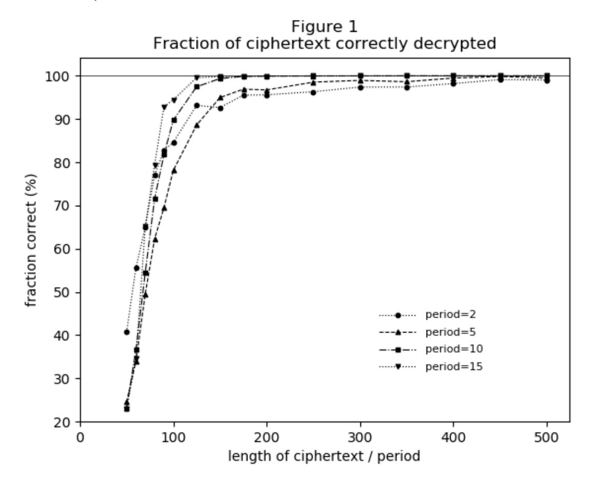

Figure 2: Rate of success. A decryption is considered a success if at least a percentage of it is correct when compared to the original plaintext. Data shown is for periods (number of key alphabets) 2, 5, 10, and 15, in parts (a), (b), (c), and (d) respectively. Each point represents the fraction of trials whose decryptions were a success under the specific criterion for a given period and length of ciphertext. Data is presented for criteria that 99%, 98%, 95%, and 80% of the decrypted plaintext matches the original. For period 2, each point represents 1000 trials; for period 5, 500 trials; for period 10, 200 trials; for period 15, 100 trials.

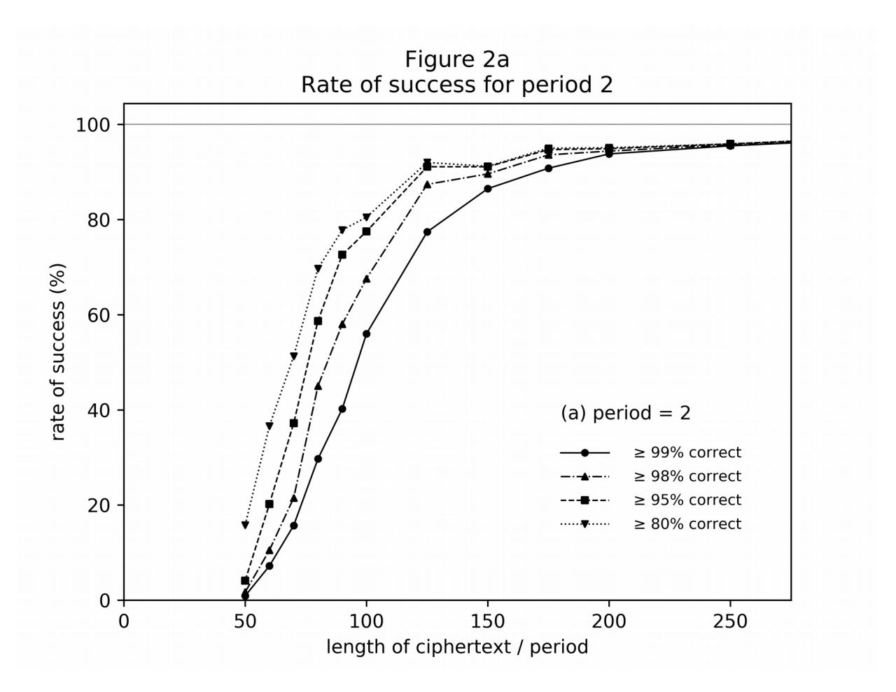

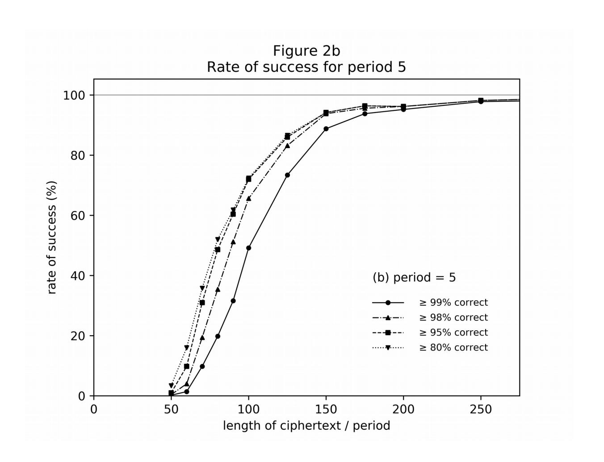

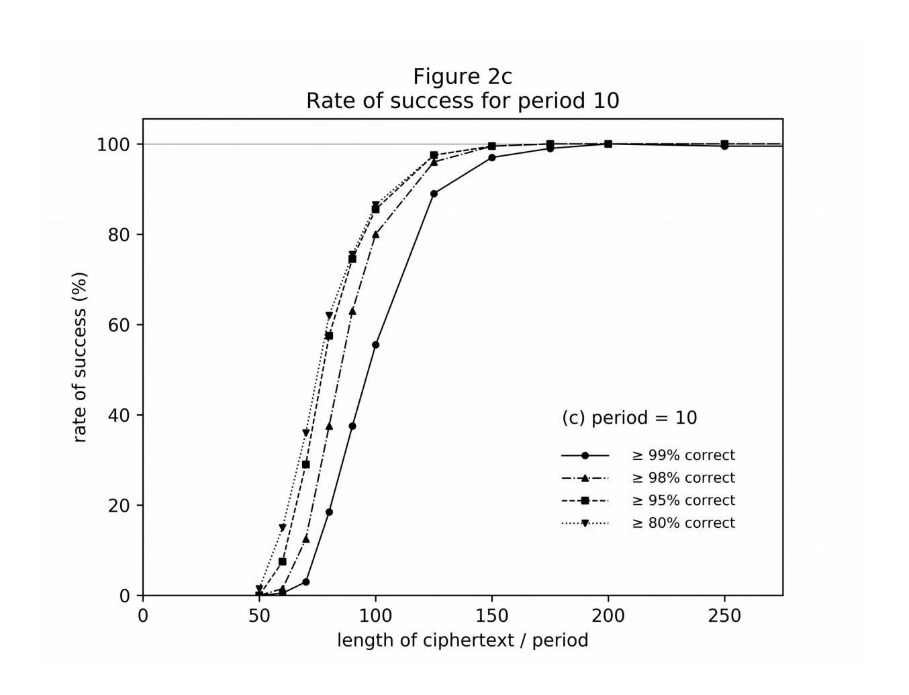

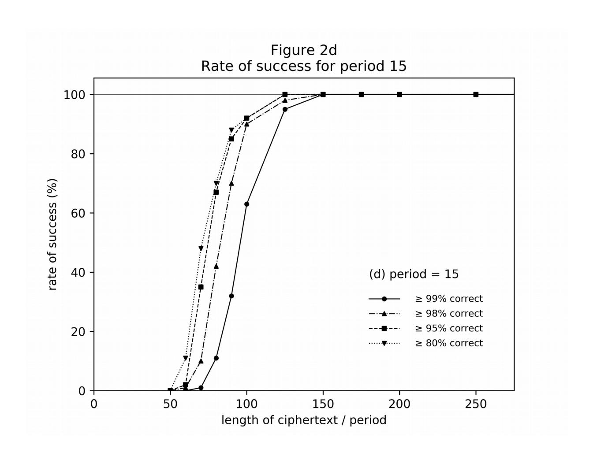

Figure 3: Comparison of methods for setting the initial key alphabets. The plot is of the fraction of the ciphertext that is correctly decrypted (compare to Figure 1). The first method ("frequency matching") is described in this article, in which initial keys are chosen so that they most closely match the singleletter frequencies of each slice of the ciphertext. The second ("random") is to choose the initial keys as random permutations of the alphabet. Data shown is for periods (number of key alphabets) 2, 3, 4, 5, 10, and 15, in parts (a), (b), (c), (d), (e), and (f) respectively. For period 2, each point represents 1000 trials; for period 3, 700 trials; for period 4, 500 trials, for period 5, 500 trials; for period 10, 200 trials; for period 15, 100 trials.

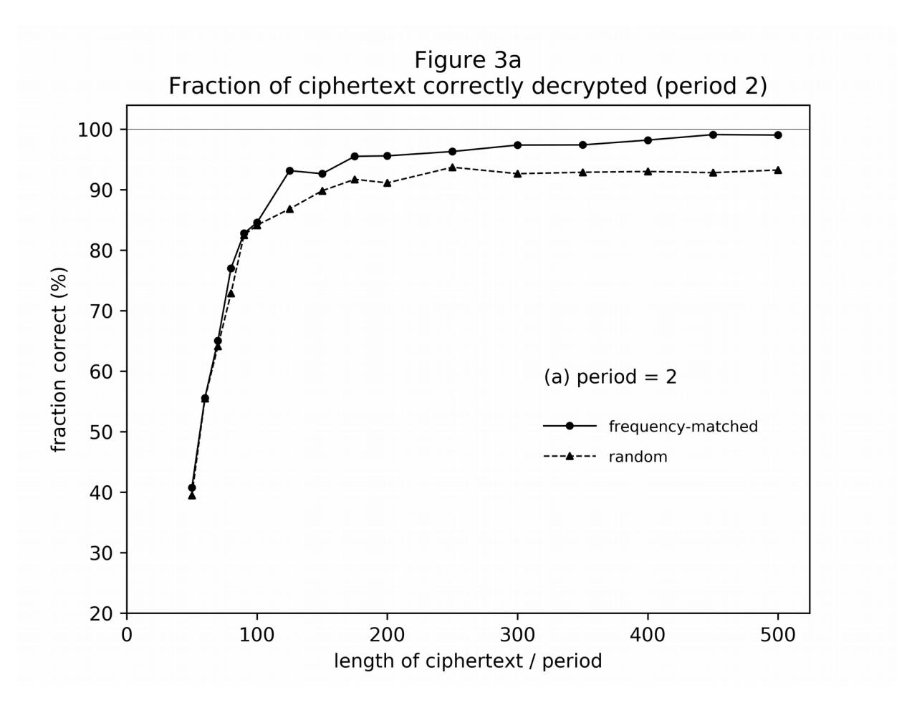

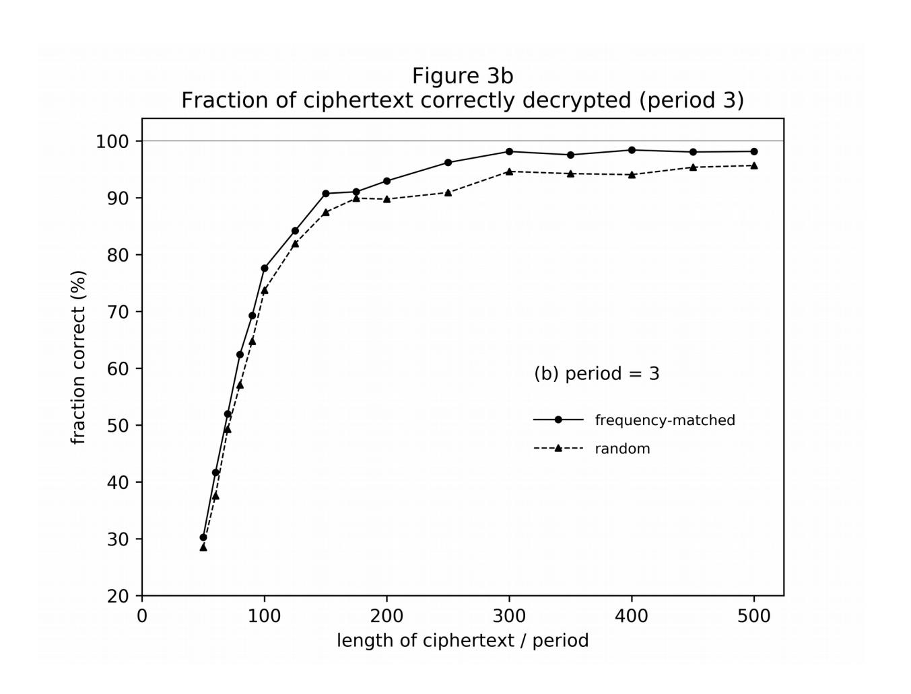

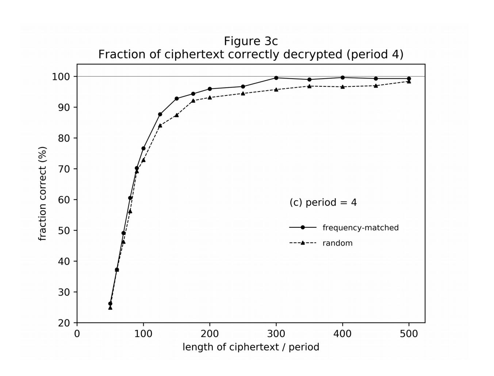

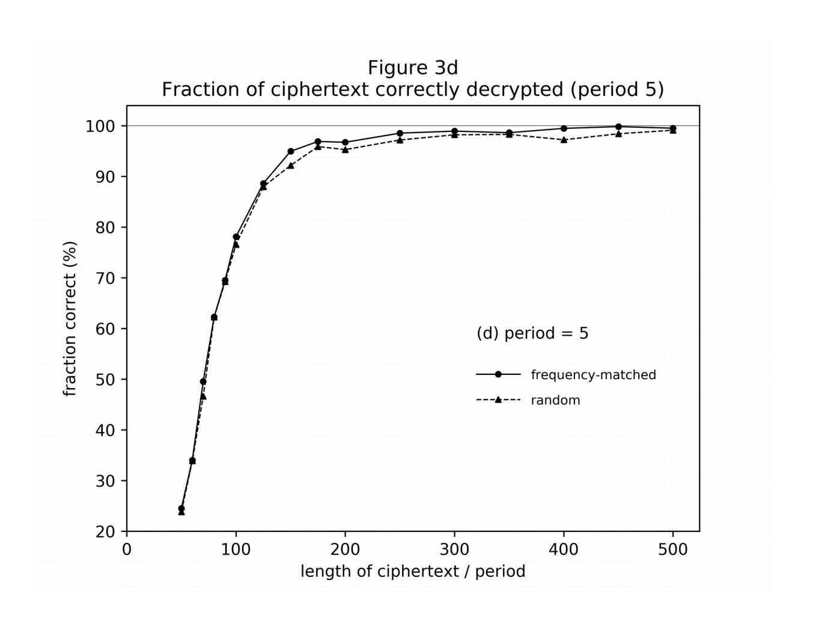

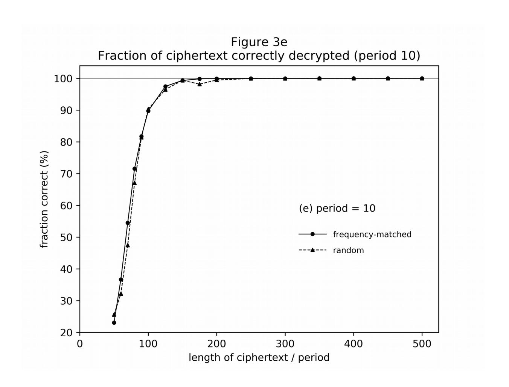

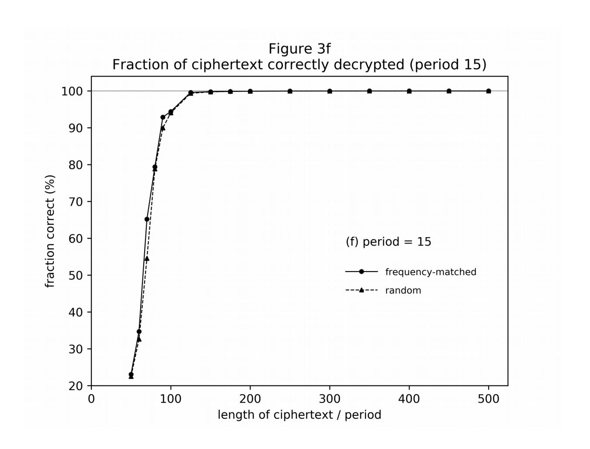