# A Quantitative Analysis of Security, Anonymity and Scalability for the Lightning Network

Sergei Tikhomirov *University of Luxembourg Esch-sur-Alzette, Luxembourg sergey.s.tikhomirov@gmail.com*

Pedro Moreno-Sanchez *TU Wien Vienna, Austria pedro.sanchez@tuwien.ac.at*

Matteo Maffei *TU Wien Vienna, Austria matteo.maffei@tuwien.ac.at*

*Abstract*—Payment channel networks have been introduced to mitigate the scalability issues inherent to permissionless decentralized cryptocurrencies such as Bitcoin. Launched in 2018, the Lightning Network (LN) has been gaining popularity and consists today of more than 5000 nodes and 35000 payment channels that jointly hold 965 bitcoins (9.2M USD as of June 2020). This adoption has motivated research from both academia and industry.

Payment channels suffer from security vulnerabilities, such as the wormhole attack [\[39\]](#page-9-0), anonymity issues [\[38\]](#page-9-1), and scalability limitations related to the upper bound on the number of concurrent payments per channel [\[28\]](#page-9-2), which have been pointed out by the scientific community but never quantitatively analyzed.

In this work, we first analyze the proneness of the LN to the wormhole attack and attacks against anonymity. We observe that an adversary needs to control only 2% of nodes to learn sensitive payment information (e.g., sender, receiver, and amount) or to carry out the wormhole attack. Second, we study the management of concurrent payments in the LN and quantify its negative effect on scalability. We observe that for micropayments, the forwarding capability of up to 50% of channels is restricted to a value smaller than the channel capacity. This phenomenon hinders scalability and opens the door for denial-of-service attacks: we estimate that a network-wide DoS attack costs within 1.6M USD, while isolating the biggest community costs only 238k USD.

Our findings should prompt the LN community to consider the issues studied in this work when educating users about path selection algorithms, as well as to adopt multi-hop payment protocols that provide stronger security, privacy and scalability guarantees.

*Index Terms*—Bitcoin, Lightning Network, privacy, security, anonymity, scalability

# 1. Introduction

Bitcoin [\[47\]](#page-9-3) is the first cryptocurrency in market capitalization and arguably the most widely deployed one. However, the decentralized nature of its consensus algorithm limits the transaction throughput to tens of transactions per second [\[20\]](#page-9-4), [\[31\]](#page-9-5), hindering its capability to cater for the growing number of users and transactions.

*The research described in this paper was partially supported by the Luxembourg National Research Fund (FNR) through CORE project FinCrypt (C17/IS/11684537).*

This issue has received prominent attention from both academia and industry. Current efforts can be roughly classified in two groups: (i) more efficient and scalable consensus algorithms (*on-chain scalability*) and (ii) protocols aiming to process the bulk of transactions off-chain resorting to on-chain transactions only to resolve disputes (*off-chain scalability*). The latter approach is backwards compatible, a crucial aspect for large scale adoption.

The Lightning Network [\[50\]](#page-9-6) (LN), the focus of this work, is an off-chain scalability solution in the form of a *payment channel network*. A *payment channel* allows two users to perform off-chain payments, using the blockchain only to open a channel and to close it (either collaboratively or through a dispute resolution mechanism). The cost of creating a payment channel prevents a user from creating a channel with every other user in the network. Instead, a user only opens channels with a few others, leveraging paths of payment channels to carry out transactions with users who are not directly connected.

While the LN has the potential to deliver a large throughput given that transactions are not stored on-chain, the number of in-flight transactions per channel is limited. Otherwise peers would not be able to close the channel, as the resulting transaction would exceed the size limit for an on-chain transaction. The LN community [\[28\]](#page-9-2) observed that this could limit the network throughput more than its capacity and lead to DoS attacks, but the impact of this limitation has never been evaluated in practice.

The LN (and off-chain protocols in general) was initially proposed not only for scalability but also as a mitigation of privacy concerns. Unlike on-chain transactions, which are stored in a publicly accessible blockchain database (and are hence available for data analysis), LN transactions are neither globally shared nor publicly stored. However, recent work has shown that LN's security and privacy guarantees can be undermined by on-path attackers. Specifically, Malavolta et al. [\[39\]](#page-9-0) described the wormhole attack where on-path adversaries prevent honest intermediaries from participating in the successful completion of a payment and steal the transaction fees originally intended for them. Another work [\[38\]](#page-9-1) showed that sender and receiver anonymity, as well as the confidentiality of transaction values, can be easily broken by observing the message payload.

These works describe the possibility of security and privacy attacks but lack a quantitative analysis to determine their likelihood and severity in the current LN. Given that, in this work we answer the following question:

*What is the quantitative impact of the aforementioned scalability, security, and privacy limitations in the current Lightning Network?*

### 1.1. Contributions

We answer the question above through a systematic evaluation of the LN based on a recent network snapshot.

First, we assess the vulnerability of the LN to the wormhole attack as well as attacks against value privacy (the attacker estimates the payment amount) and relationship anonymity (the attacker learns the pair senderreceiver for a given payment). We show that the network is vulnerable if the attacker compromises a moderate number of highly connected nodes. For instance, with selected 100 compromised nodes (less than 2% of the total number of nodes), nearly all paths are prone to value privacy attacks, around 70% are prone to anonymity attacks, and around 30% are prone to the wormhole attack. As a countermeasure, we propose path selection policies to defend against these attacks, though a fundamental tradeoff is present: a high payment success rate involves reliance on large hubs, which may become honeypots or collude to deanonymize users.

Second, we study the effect that the limited number of concurrent channel updates has on the utility and security of the LN. In particular, we show that for an average transaction amount of 550 satoshis (0.05 USD) this limitation reduces LN performance by 80%, with 50% of channels being limited by the number of in-flight payments rather than capacity. This effect is gradually decreasing for transaction amounts up to around 0.25 USD. However, micropayments where a few satoshis are transacted is one of the most compelling use cases of the LN.

This limitation opens the door to DoS attacks. Our empirical results show that an attacker can block a channel by investing only 527k satoshis (around 50 USD) and the complete Lightning Network with a cost of 164 BTC (1.6M USD). The attack cost can be significantly reduced by targeting channels with high capacity and connectivity, as well as channels between communities – highly connected network subgraphs. For instance, by blocking selected channels representing 13% of the total node count (which would cost around 238k USD), the attacker can cut off the largest community from the rest of the network.

We suggest using cryptographic techniques such as anonymous multi-hop locks (AMHL) [\[39\]](#page-9-0) to improve upon this limitation of the Lightning Network.

The rest of this paper is organized as follows. We present the required background in Section [2.](#page-1-0) We describe the datasets we use for this study in Section [3.](#page-2-0) We evaluate the proneness of LN to security and anonymity attacks in Section [4.](#page-2-1) We study the effect of the limit on concurrent LN channel updates in Section [5.](#page-5-0) We review the related work in Section [6](#page-8-0) and conclude in Section [7.](#page-8-1)

### 2. Background

The Lightning Network (LN) has emerged as the alternative to the scalability issue of Bitcoin with the highest adoption in practice [\[21\]](#page-9-7). As of June 2020, LN facilitates the off-chain exchange of over 900 BTC. The principles of the LN can be used to improve the scalability of other cryptocurrencies. For instance, similar networks operate with Litecoin [\[15\]](#page-8-2) and Ethereum [\[8\]](#page-8-3). In this section, we introduce the basic notions of the LN and refer the reader to [\[33\]](#page-9-8) for further reading.

LN nodes. A node in the LN is governed by a pair of signing and verification keys from the ECDSA signature scheme, and identified by the hashed value of the verification key. Additionally, the owner can assign a handcrafted identifier (alias) to their node. Operations from a node are authorized with a digital signature created with the corresponding signing key. Thus, whoever holds the signing key is the owner of a node. One user can potentially own several nodes.

LN channels. An LN channel (i.e., an edge) is jointly controlled by the two counterparties. Its capacity is determined by the amount of coins initially deposited. While the total capacity of the channel stays constant during its lifetime, the balance of each counterparty varies according to two operations: (i) single channel updates, where the two users agree on an updated balance; and (ii) multihop transactions, where the balance of several channels forming a path are simultaneously updated.

LN transactions. A multi-hop transaction (or simply a transaction hereby) leverages a path of channels between a sender and a receiver (who might not share a channel between them). A transaction must ensure the atomicity of the transfer: either all balances along the path are updated or none of them are. For that, the LN relies on Hash Time-Lock Contracts (HTLCs), excerpts from the Bitcoin's scripting language that permit a node (u1) to lock x coins in a channel between two nodes (u1 and u2) and release them according to the encoded conditions. The terms for the HTLC(u1, u2, y, x, t) are defined with a hash value y := H(r), where r is chosen uniformly at random, an amount x of coins, and a timeout t, as follows: (i) If u2 reveals a value r such that H(r) = y before t expires, u1 pays x to u2; (ii) if t expires, u1 receives x back.

LN relies on HTLCs to enable multi-hop transactions. All HTLCs along the path use the same hash value y = H(r) aiming to achieve atomicity expecting that none of the intermediate balances can be updated before the receiver reveals r, and all of them can be updated after that. An illustrative example of an HTLC-based transaction is depicted in Figure [1.](#page-2-2) Here, the user u1 transfers 1 bitcoin to u5 using u2, u3 and u4 as intermediaries. For that, u5 locally chooses a value r uniformly at random, computes the cryptographic challenge for the HTLC as y := H(r), and sends y to the sender (step 1). The message encoding y is called an *invoice*. Then, the payment starts with a commit phase (steps 2-5) where every pair of nodes, starting from the sender, establishes an HTLC using y. After the commit phase is finished, the transaction enters the release phase. Here, the receiver reveals r to u4 to fulfill the contract (step 6), triggering thereby the release phase where every pair of nodes fulfills their contract from the receiver to the sender (steps 6-9).

It is important to note two aspects here. First, every intermediary user charges a fee for the forwarding service provided. For instance, u2 receives 1.3 coins but only forwards 1.2 coins, getting a fee of 0.1 coins. Second, the time parameter of the contracts throughout the path is

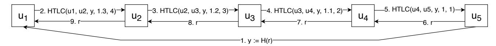

Figure 1. An HTLC-based payment in the LN. The node  $u_1$  pays  $u_5$  using  $u_2$ ,  $u_3$  and  $u_4$  as intermediaries. Here we assume that each node charges a fee of 0.1 and time is measured in days.

decreasing to ensure that no user loses coins. For instance, the HTLC between  $u_1$  and  $u_2$  sets a timeout of four days whereas the timeout in the HTLC between  $u_2$  and  $u_3$  is only three days. This facilitates that  $u_2$  has enough time to settle the contract with  $u_1$  after receiving r from  $u_3$ .

LN implementations. The development of the LN, which was originally introduced in [50], is guided by a set of request for comments (RFC) documents called "Basics of Lightning Technology" or BOLTs [12], which are then followed by several implementation teams. The three most advanced implementations available today are LND [6], c-lightning [3], and Eclair [1]. Additionally, there exist implementations at earlier stages of development: Electrum [26], [27], lit [5], lpd [36], ptarmigan [2], and rustlightning [9]. Our analysis is concerned with the definition of the LN as described in the BOLTs and thus the results apply equally to every implementation.

#### 3. Datasets

We obtained a snapshot of LN on 2020-02-25 from [30] and parsed with the code in [59]. This snapshot consists of 5929 nodes and 35233 channels. We model this data as an undirected multi-graph (i.e., may contain multiple edges between each pair of nodes), as several channels can be shared by two LN nodes. We only considered the largest connected component, which contains 5862 nodes (98.87%) and 35196 channels (99.89%). We observe that this subgraph contains a representative sample of the LN. We refer to this dataset as LN20.

Based on *LN20*, LN nodes have an average degree of 12.01 and a median degree of 3 (see Figures 2 and 3). The majority of nodes have very few channels, whereas there is a small number of nodes with many channels. In particular, there are more than 1744 nodes with degree 1, and the most connected node has 1198 channels. The capacity is also unequally distributed. These observations motivate the methodology in our experiments in Section 4.

We also derive a series of historic snapshots which represent the state of LN on the first day of each month from April 2018 to February 2020. We refer to this dataset as *LNHist* and use it in our experiments in Section 5.

**Ethical considerations.** Our analysis is based solely on publicly available data. All our calculations are based on a local representation of the LN network graph obtained from [30], without connecting to LN nodes. We do not interfere with the LN activity, nor deanonymize any node.

### 4. Security and privacy: theory and practice

As introduced in Section 2, the LN builds upon Hash Time-Lock Contracts aiming to achieve atomicity in multi-hop payments. However, [39] argues that due to the wormhole attack atomicity does not hold in LN. Another

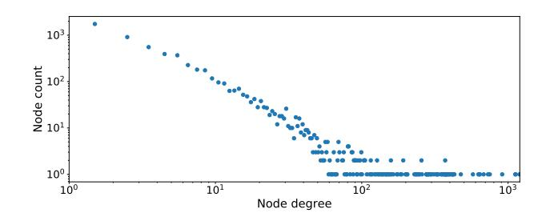

Figure 2. Node degree distribution.

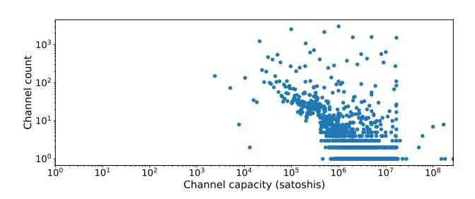

Figure 3. Channel capacity distribution.

LN study [38] shows that privacy of LN users and their transactions can be breached. While the aforementioned works demonstrate the feasibility of these attacks, their effectiveness in practice depends, among other factors, on the topology of the LN. In this experiment, we aim to identify the impact of these security and privacy issues in our snapshot of the LN.

### 4.1. Security and privacy attacks: background

Value privacy [38]. Intuitively, value privacy ensures that for a transaction involving only honest users, corrupted users outside of the path learn no information about the transaction value. This notion thus heavily relies on the existence of paths without adversarial nodes. Otherwise, an adversarial intermediary node can trivially learn the (upper bound of the) amount of a transaction that it forwards. For instance, in Figure 4 the adversary  $u_3$  forwards 1.2 coins to  $u_4$ , estimating the transaction amount at around 1 coin plus forwarding fees.

**Relationship anonymity** [38]. Intuitively, relationship anonymity ensures that given two simultaneous transactions between two pairs of nodes  $(u_1, u_2)$  and  $(u'_1, u'_2)$  routed through the same path of intermediary users  $i_1, \ldots, i_n$ , the adversary controlling some of those intermediaries cannot tell who is paying to whom with probability better than 1/2. However, this is not achieved in the LN. An adversary controlling  $i_1$  and  $i_n$  can use the cryptographic challenge included in the HTLC to determine who pays to whom. For instance, in Figure 4

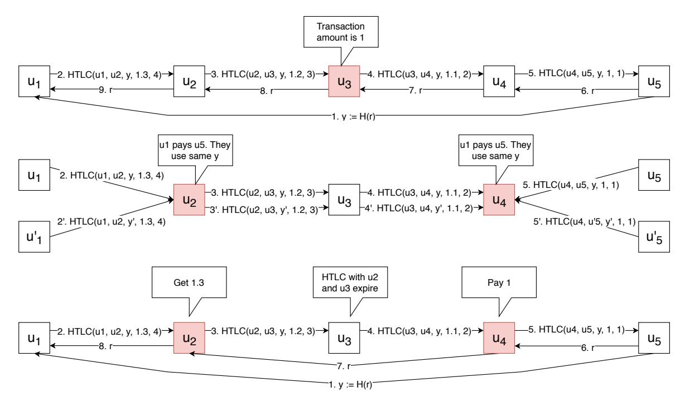

Figure 4. An illustrative example of value privacy (top), relationship anonymity (middle), and the wormhole attack (bottom).

the adversary controlling  $u_2$  and  $u_4$  can determine that  $u_1$  is transacting with  $u_5$  as the same value y is used along the whole path. Similarly,  $u_2$  and  $u_4$  can determine that  $u_1'$  is transacting with  $u_5'$  as the same y' is being used along the path.

The wormhole attack [39]. In the wormhole attack, two colluding nodes in a transaction path prevent honest intermediaries from participating in the successful completion of the payment, stealing the fees initially intended for honest intermediaries. An example of the wormhole attack is depicted in Figure 4. Here,  $u_4$  does not send the opening value r to  $u_3$  (step 7 in Figure 1) to fulfill the HTLC previously set in this channel. Instead,  $u_4$  sends the value r to  $u_2$  outside of the LN protocol, which allows  $u_2$  to settle the HTLC with  $u_1$ . As a consequence, contracts with  $u_3$  expire, simulating transaction failure and preventing  $u_3$  from participating in the successful completion of the transaction. Note that the funds in  $u_3$ 's channel are temporarily blocked, which effectively leads to a denial-of-service attack over that channel. This attack can be amplified if multiple honest intermediaries are located between the colluding adversarial nodes. Note that the funds in  $u_3$ 's channel are temporarily blocked, which effectively leads to a denial-of-service attack over that channel. This attack can be amplified if multiple honest intermediaries are located between the colluding adversarial nodes.

### 4.2. Methodology

In this section, we describe how we study the proneness of the LN to attacks with respect to the value privacy, relationship anonymity, and wormhole attack scenarios.

We first compute the paths between pairs of nodes. Given a pair of nodes  $u_1$  and  $u_2$ , we compute the list of paths that connect them with one restriction: we consider

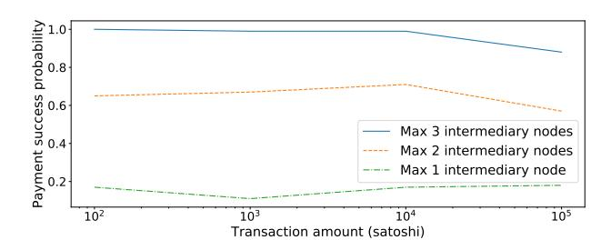

Figure 5. The share of experiment runs where paths with sufficient capacity exist between sender and receiver.

only the paths with at most three intermediary nodes. We observe that paths of this length suffice to allow more than 85% of transactions between a random pair of nodes (Figure 5). We also note that these paths allow us to exemplify all attacks that we want to study in this experiment. We note that considering longer paths would only increase the absolute number of paths considered. We leave a more exhaustive study for future work.

Let  $paths_{\langle u_1,u_2\rangle}$  be the set of paths between  $u_1$  and  $u_2$  thereby computed. We further prune the set  $paths_{\langle u_1,u_2\rangle}$  into a subset  $paths_{\langle u_1,u_2\rangle,x}$ , containing only the paths that allow to transfer at least x satoshis. For instance,  $paths_{\langle u_1,u_2\rangle,10}$  contains the paths between  $u_1$  and  $u_2$  allowing to transfer at least 10 satoshis.

For a channel to be capable of transferring x satoshis from  $u_i$  to  $u_j$ ,  $u_i$  must have a balance of at least x satoshis. However, the current balance of each counterparty in a channel is not publicly available. Thus, we consider a path suitable for a given transaction if the total capacity of every channel in the path is not lower than the transaction amount, independently of how this capacity is distributed among the two channel counterparties. This heuristic might consider a path suitable for a transaction while it is not. We nevertheless follow this heuristic as it

is also used in practice by LN nodes when selecting paths to perform payments.

As the next step, we study the effectiveness of the selected attack. For a chosen transaction amount x, we split the set  $paths_{\langle u_1,u_2\rangle,x}$  into two subsets: (i)  $paths\text{-}prone_{\langle u_1,u_2\rangle,x}$ : The subset of paths that are prone to the attack; (ii)  $paths\text{-}safe_{\langle u_1,u_2\rangle,x}$ : The subset of paths that are not susceptible to being attacked. The definition of a path of the form  $u_1 \to i_1 \to \ldots \to i_n \to u_2$  being prone to the specific attack depends on the type of the attack as described as follows:

- *Value privacy:* We say that a path is prone to the value privacy attack if any of the intermediary nodes is under adversarial control.
- Relationship anonymity: We say that a path is prone to the relationship anonymity attack if nodes  $i_1$  and  $i_n$  are under adversarial control.
- Wormhole attack: We say that a path is prone to the wormhole attack if there exist two non-neighboring intermediary nodes  $i_j$  and  $i_k$  that are under adversarial control (i.e., j < k and  $k \neq j + 1$ ).

We remark that there exist a difference in the definition of a prone path in the wormhole attack and the relationship anonymity attack. For the relationship anonymity attack we do not require that there is an honest user between the two adversarial nodes. For instance, a path of the form  $u_1 \rightarrow i_1 \rightarrow i_2 \rightarrow u_2$  where  $i_1$  and  $i_2$  are under adversarial control, would be considered prone to the relationship anonymity attack but safe against the wormhole attack.

Another aspect that we consider is which nodes are under adversarial control. We follow three strategies. First, we assume that nodes with highest degree (i.e., highly connected nodes) are colluding to carry out an attack. Highly connected nodes are interesting to study as they are the ones with the highest stake in the network. Thus, an adversary might attempt to corrupt them (e.g., by bribery or stealing the private key) to maximize the effect of the attack. Second, we assume that nodes with the highest total capacity in their adjacent channels are corrupted. Finally, we consider that random nodes in the network are colluding to carry out an attack. We model here that any node (independently of its node degree) might be corrupted. For instance, the same user might create several LN nodes and place them at strategic positions in the LN to carry out the attacks we study here.

We refine our aforementioned path datasets to consider these three attacks strategies. In particular, for each number of malicious nodes (y) and each strategy, we re-split the set  $paths-prone_{\langle u_1,u_2\rangle,x}$  between those prone to the attack and those otherwise safe. For instance, we denote by  $paths-prone_{\langle u_1,u_2\rangle,x,y-con}$  the subset of paths between  $u_1$  and  $u_2$  that allow to transfer x satoshis and that are prone to the attack if y nodes with the highest node degree are corrupted. Correspondingly, we denote by  $paths-prone_{\langle u_1,u_2\rangle,x,y-ran}$  the subset of paths between  $u_1$  and  $u_2$  that allow to transfer x satoshis and that are prone to the attack if y nodes chosen uniformly at random are corrupted.

Finally, for each attack strategy, we consider

$$\alpha_{\langle u_i,u_j\rangle} := \frac{|\textit{paths-prone}_{\langle u_i,u_j\rangle,x,y}|}{|\textit{paths-prone}_{\langle u_i,u_j\rangle,x,y}| + |\textit{paths-safe}_{\langle u_i,u_j\rangle,x,y}|}$$

the probability that a transaction between  $u_i$  and  $u_j$  is vulnerable to the attack. Averaging across all the pairs of nodes tested, we extract the final probabilities reported in Figure 6.

### 4.3. Results and discussion

In this section, we present the results shown in Figure 6 and discuss their implications.

For every attack and a given number of compromised nodes, the share of prone paths is relatively stable for all payment amounts. This indicates that the payment amount does not significantly affect the security of payments.

The three attacks differ in how quickly the share of prone paths changes as the number of compromised nodes increases. For value privacy, the effect of additional highly-connected nodes being compromised is the most profound: the share of prone paths is 50% if only the 5 most connected nodes are compromised and nearly 100% if the 100 most connected nodes are compromised. We conclude thus that an adversary needs to corrupt only 2% of the nodes to (almost) completely nullify any value privacy guarantee in the LN.

We observe that the average share of prone paths decreases for relationship anonymity. Yet, the adversary controlling the 100 most connected nodes can launch the relationship anonymity attack on about 70% of the paths. Interestingly, the adversary has fewer possibilities to launch the wormhole attack. For instance, even with 100 most connected nodes corrupted, around 30% of the paths are prone to the attack. While this is still a crucial security issue, this reduction in the effectiveness of the attack may be explained by the fact that the wormhole attack is the most restrictive on path structure, and thus it has the lowest share of vulnerable paths.

Increasing the number of compromised nodes results in fewer vulnerable paths if compromised nodes are those with the channels holding the highest capacity, as opposed to highest degree nodes. This distinction is most profound for relationship anonymity, e.g., there are around 50% for 50 highest degree corrupted nodes, but only around 25% vulnerable paths for 50 highest capacity corrupted nodes. This may be explained by the fact that routing algorithms optimize for low path length. Note that capacity of forwarding channels is not as important as good connectivity, especially for payments of small and medium amounts.

Finally, we consider random nodes compromised instead of the most connected nodes. In contrast to the previous results, we observe that less than 10% of paths are prone to value privacy and nearly no path is prone to relationship anonymity and wormhole attack. We conjecture that this is because randomly selected nodes have few connections (note the degree distribution in Figure 2), and thus their compromise does not affect routing at large.

In summary, the results of this experiment show that highly connected nodes and nodes with high capacity links have a high impact on the security and privacy of the LN. Assuming that paths are selected uniformly at random from the set of available paths, an adversary that selectively corrupts 100 (i.e., only 2%) of LN nodes can effectively learn all the transaction values, the sender and the receiver for the vast majority of transactions, as well as

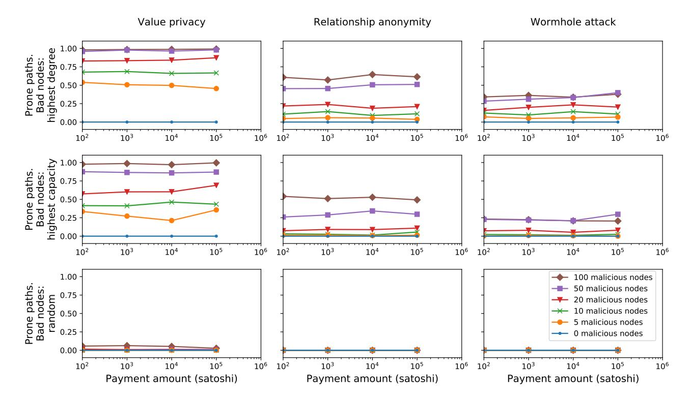

Figure 6. Share of vulnerable paths for each attack, considering that highest degree nodes are compromised (top), highest capacity nodes are compromised (middle), or random nodes are compromised (bottom).

carry out the wormhole attack in about 30% of the paths. This shows that the security and privacy attacks shown in theory are indeed crucial in practice.

Carrying out such an attack might not be infeasible in the live network. We note that a large number of highly connected LN nodes is controlled by an unknown entity under the pseudonym LNBIG. It controls 23 out of top 50 highest connected nodes [14] and 40% of the network capacity [17].

#### 4.4. Countermeasures

We assume in our study that every two nodes carry out their transactions along a subset of paths chosen uniformly at random from the set of all available paths between them. However, LN nodes might implement different routing strategies. For instance, while routing through wellconnected nodes improves the chances to reach the receiver through a short, highly liquid path, the sender might connect to low degree nodes. This would make the node degree distribution more even at the cost of connectivity and reduce the probability of choosing paths prone to the attacks studied in this experiment. We envision thus that there is a tradeoff between connectivity on the one hand and security and privacy on the other, which constitutes a venue for future work. A node may also route transactions through a trusted proxy node, thus guaranteeing that the first node in a path is not compromised. This would mitigate the relationship anonymity and wormhole attacks (if the total path length is bounded to contain at most three intermediaries). As the LN protocol is still evolving, the results of the experiments presented in this section should be considered for the next design decisions.

Routing protocols for the LN is an active research area [16], [32], [37], [48], [49], [51], [54], [56], [61]–[63]. Our results suggest that, although largely omitted so far, the security and privacy attacks here studied are a crucial variable to consider when designing routing protocols.

### 5. HTLC limit in the Lightning Network

In this section, we describe a limitation in the LN design stemming from the way it manages concurrent payments. A payment channel, even with sufficient capacity, can hold only a certain number of concurrent payments (governed by HTLCs), leading to capacity underutilization. We study the effect of this limitation. First, we evaluate how the number of concurrent payments in LN is mainly bounded by the number of concurrent HTLCs allowed at each channel. Second, we show how a malicious node can abuse this limitation to isolate parts of the network, which ultimately results in a network-wide DoS attack. We provide estimates for the cost of such an attack, showing that it is within range for a moderately resourceful attacker. We finally discuss countermeasures.

### 5.1. Background

Bitcoin Core, the reference Bitcoin implementation, imposes a 100 KB transaction size limit [4], [7]. An LN channel cannot contain more than 966 unsettled HTLCs [10]. This limit ensures that both counterparties can close the channel using one standard Bitcoin transaction. We refer to this limitation as the *HTLC limit*.

Despite the perceived focus on micropayments, LN does not fully support transactions of very small value. Every HTLC makes the potential closing transaction larger,

and the on-chain fees higher. Redeeming very small outputs on-chain can be more expensive than their value. Therefore BOLT specifications prescribe that nodes negotiate the *dust limit* before opening a channel, and do not create HTLCs for payments below this limit (see *trimmed HTLCs* [13]). Out of the three most popular LN implementations, c-lightning and Eclair use the default dust limit of 546 satoshis. LND estimates the dust limit dynamically. We thus assume 546 satoshis as dust limit.

### 5.2. The HTLC limit effect on LN scalability

In this section, we estimate the effect of the HTLC limit on the number of concurrent channel updates.

Let D be the dust limit. We only consider amounts higher than D. Let C be the total network capacity (i.e., the sum of the individual capacities of all channels). Let  $a_{avg}$  be the average transaction amount. Then, we say that the limit on concurrent updates based solely on capacity is defined as  $u_{cap} := C/a_{avg}$ . In contrast, the limit on concurrent updates considering the HTLC limit is  $u_{HTLC} = N*966$ , where N is the number of channels. We remark here that  $u_{HTLC}$  does not depend on transaction amounts.

Given those two values, we define the *effective update*  $rate\ ur_{eff}$  as the ratio between the actual limit on concurrent transactions when considering the HTLC limit and the theoretical limit based solely on capacity:

$$ur_{\textit{eff}} = \frac{min(u_{\textit{cap}}, u_{\textit{HTLC}})}{u_{\textit{cap}}}$$

Note that the effective update rate  $wr_{eff}$  depends on the average transaction amount, as shown in Figure 7. Starting from D, there is a gap between the effective number of concurrent updates and what could be theoretically possible in the absence of the HTLC limit. We observe that 2677 satoshis (0.25 USD) is the borderline amount: for higher average transaction amounts, the limiting factor for the number of concurrent channel updates is channel capacity. For amounts between D and 2677 satoshis, the limiting factor is the HTLC limit.

Affected channels. The  $ur_{eff}$  is an aggregated measurement that does not shed light on how the issue affects individual channels. Given that, we now study how many channels are affected by the HTLC limit. The number of affected channels depends on the average transaction amount  $a_{avg}$ . For high values of  $a_{avg}$ , it is more likely that the effective update rate of a channel is limited by its capacity, whereas the HTLC limit would determine the update rate cap for small values of  $a_{avg}$ . We quantify

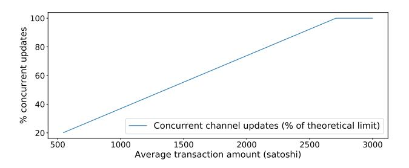

Figure 7. Ratio between the current limit on concurrent channel updates and the theoretically possible capacity-based limit.

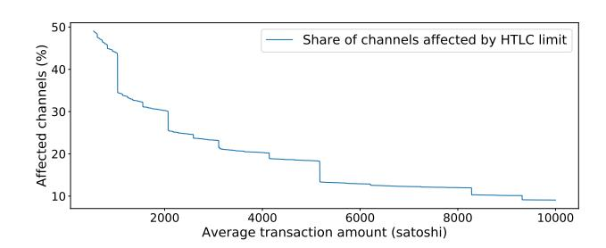

Figure 8. Share of channels affected by the HTLC limit for different transaction amounts.

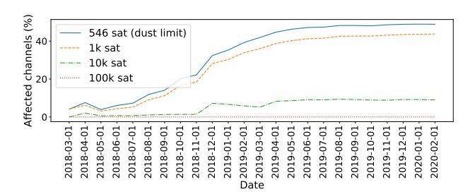

Figure 9. Historic share of HTLC-limited channels.

this as follows. Given a fixed average transaction amount  $a_{avg}$ , we consider a channel *affected* by the HTLC limit if  $u_{HTLC,a_{avg}} < u_{cap,a_{avg}}$ , i.e,  $u_{eff,a_{avg}} < 100\%$  (Figure 8).

The effect of the HTLC limit over time. We study the effect of the HTLC limit on the LN using our historical snapshots *LNHist*. For each monthly snapshot and four assumed average transaction amounts, we calculate the share of channels affected by the HTLC limit (Figure 9). As expected, the HTLC limit becomes a more pressing issue with smaller transaction amounts, if they are higher than the dust limit. We also observe that the share of affected channels has been increasing in the early months of LN and has remained stable since mid-2019.

We finally study how the *borderline amount* has changed over time. As Figure 10 shows, the HTLC limit finds its inflexion point in transaction amount at approximately 2500 satoshis, with the borderline amount stabilizing in mid-2019, after the initial growth.

#### 5.3. Depleting the Lightning Network

The HTLC limit opens up the possibility of a network-wide DoS attack. An adversary connects to both endpoints of the target channel and forwards multiple small payments to itself, but does not finalize them. After 966 HTLCs are added, the channel loses its ability to

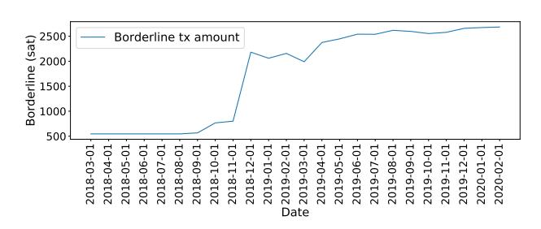

Figure 10. Historic borderline amounts.

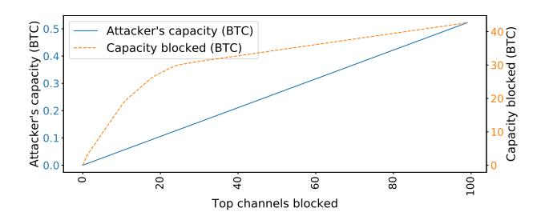

Figure 11. Effectiveness of targeting highest-capacity channels.

forward payments, until some HTLCs expire. The attacker can thereby deplete a channel, making it unusable.

The cost for this attack depends on the minimum transaction amount. We assume it equal to the dust limit of 546 satoshis (the default value in 2 out of 3 major implementations).

We calculate the total capital requirements for an attacker to block the complete LN. To block all 31084 channels, the attacker would send, in the worst case, 966 transactions of 546 satoshis to each channel. This brings the total capital requirements to approximately 163.9482 BTC (1.56M USD).

Each HTLC defines a timeout, after which the funds are returned to the sender, if the receiver provides no preimage. From our dataset, we see that HTLC timeouts are long: 75.44 blocks on average. At a block creation rate of 10 minutes per block, this implies that an average HTLC can block the capacity for around 12 hours. This implies that the attacker can render channels useless for around 12 hours using the same HTLC parameters as regular LN users. While this rough upper bound estimate suggests a rather high attack cost, the following optimizations make it more affordable.

**Targeting highest-capacity channels.** The attack impact can be maximized by targeting highest-capacity channels. For example, it requires 0.05 BTC to block 10 top channels with combined capacity of 17.91 BTC (Figure 11).

Real HTLC limit. Our calculations above are based on the maximum number of concurrent HTLCs (483) as defined by BOLT specifications. LN implementations may choose lower default values for this parameter. In particular, Eclair and c-lightning enforce a lower default HTLC limit (30). This means that in the real network the attacker needs to create fewer HTLCs to block channels between c-lightning and Eclair nodes as opposed to theoretical calculations and LND nodes (which by default support 483 concurrent HTLCs per channel). LND makes up 91% of the nodes in the network, and Eclair is another 1% [41]. That brings real average HTLC limit to 442.23 and lowers the attack cost by 8.44%.

Multi-hop transactions. The estimation above assumes single-hop transactions. An attacker can leverage multi-hop transactions to multiply the effect of the committed capital, connecting to both ends of a 20-hop [11] payment path and performing a payment to itself that never gets completed. This is similar to capacity-based griefing attacks [34], but with much lower capital requirements.

**Optimizing the attack based on communities.** The attacker may wish to prevent different parts of the network from transacting to each other. To evaluate this possibility,

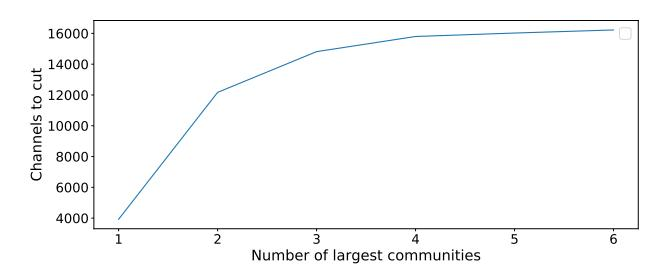

Figure 12. Number of channels to cut to isolate the largest communities.

we first divide the network into *communities* using the Clauset-Newman-Moore greedy modularity maximization algorithm [18]. Then we consider a scenario where the attacker tries to block the channels that connect communities rather than channels within communities. For a chosen number N of the largest communities, we calculate how many channels the attacker has to block to split the network into at least N+1 parts: the N largest communities and the rest of the network (Figure 12). We observe, e.g., that the attacker needs to block 4670 channels (13% of all channels) to isolate the largest community from the rest of the network, locking up 25 BTC (238k USD) – or just around 2.8% of the total LN capacity.

#### 5.4. Discussion

Our simplistic model does not fully reflect all the details of transaction handling. In particular, we do not account for the fact that transactions take multiple hops (and multiple failed paths) before succeeding, nor do we reflect the unequal forwarding ability of a unit of capacity at a well-connected node, as opposed to a poorly connected one. We also do not account for non-public channels, which may account for 28% of all channels [53]. Yet, our approach allows us to calculate the effect of the HTLC limit, as both estimations (capacity-based limit and HTLC limit) are calculated under the same assumptions. Our estimation shows that the HTLC limit reduces the number of concurrent channel updates for payments under certain average transaction amount.

The fact that the HTLC limit manifests itself at low transaction amounts negatively affects scalability and some of the potential LN applications, such as paying for online content [50], which involve transactions with small amounts. Our calculations show that for payments of 1000 satoshis (0.095 USD), the network-wide rate of concurrent channel updates is 60% lower than it could have been based solely on capacity limitations.

The low value for the default minimum transaction amount and the reduced number of in-flight transactions open a DoS attack vector with a moderate cost for the adversary. Note that the capital in the attacker's channels will be recouped after the HTLCs time out. Moreover, the unequal distribution of connectivity in the current LN paves the way for optimized attacks where the attacker focuses on high-capacity or inter-community channels to disrupt the seamless transfer of value across the network.

# 5.5. Countermeasures

One of the limiting factors for transaction throughput is the total available capacity. This limitation is overcome by opening new channels, a countermeasure that will be naturally implemented with the growing LN adoption. The issue of the HTLC limit is more challenging as it comes from the limitations of the Bitcoin and Lightning protocols themselves. Therefore, more fundamental changes are needed to reduce the information required to carry out the functionality encoded in HTLCs. One countermeasure involves replacing HTLC with AMHL [\[39\]](#page-9-0). While an HTLC requires including a digital signature, a hash value and a timelock, an AMHL contract only requires a digital signature and a timelock while providing the same functionality.

This countermeasure would reduce the number of bytes required per in-flight transaction and increase the number of payments handled concurrently. While not removing the limitation on the number of concurrent transactions, this countermeasure raises this limit, reducing its negative effect on LN scalability.

# 6. Related work

Multiple research works have shed light on various aspects of payment-channel networks, such as security [\[35\]](#page-9-26), [\[39\]](#page-9-0), [\[42\]](#page-9-27), privacy [\[34\]](#page-9-24), [\[38\]](#page-9-1), [\[45\]](#page-9-28), [\[46\]](#page-9-29), concurrency [\[38\]](#page-9-1), routing [\[37\]](#page-9-15), [\[51\]](#page-9-18), [\[54\]](#page-9-19), [\[56\]](#page-9-20), liquidity [\[23\]](#page-9-30), [\[43\]](#page-9-31), efficiency [\[24\]](#page-9-32), [\[25\]](#page-9-33), [\[57\]](#page-9-34), interoperability [\[44\]](#page-9-35) and incentive compatibility [\[29\]](#page-9-36). Most of these works lack a quantitative analysis of the impact of their findings in the current LN.

A group of papers more closely related to ours conveys experimental analyses of various aspects of the LN. Herrera-Joancomart´ı et al. [\[34\]](#page-9-24) describe an adversarial strategy to determine the current balance of a channel in the network. Tang et al. [\[58\]](#page-9-37) study the tradeoffs between balance privacy and routing effectiveness. Martinazzi [\[40\]](#page-9-38) and Seres et al. [\[55\]](#page-9-39) study the evolution of topological aspects of the LN graph. Conoscenti et al. [\[19\]](#page-9-40) study the dependency of the LN on payment hubs and the rebalancing mechanisms that ameliorate the effect of depleted channels. Tochner et al. [\[60\]](#page-9-41) analyze a DoS attack vector based on route hijacking. Perez-Sol ´ a et al. [ ` [52\]](#page-9-42) introduce the LockDown attack where the adversary prevents an LN node from transacting by depleting the capacity in all its channels. In comparison, our HTLC depletion attack achieves the same result (a victim node can not forward payments), but exploits the HTLC limit at each channel rather than its capacity. Finally, concurrently to our research, Mizrahi and Zohar [\[41\]](#page-9-23) study the HTLC limit and its effects. Their work, however, does not account for the way LN handles payments below the dust limit.

# 7. Conclusions

The Lightning Network (LN) has emerged as the most widely deployed solution for the scalability issue affecting current blockchains such as Bitcoin. Despite its conceptual appeal and growing adoption, several works [\[38\]](#page-9-1), [\[39\]](#page-9-0) have identified security, anonymity and scalability limitations. A quantitative analysis of their impact, however, is missing and this paper aims at filling this gap.

We quantitatively study for the first time the proneness of the current Lightning Network to the wormhole attack as well as attacks against value privacy and relationship anonymity. We observe that a moderately resourceful adversary controlling only 2% of the total node count can carry out these attacks with high success probability.

We also quantitatively analyze the negative effect on scalability produced by the limit on concurrent payments in the LN. We calculate that the limited concurrency in the LN implies that an adversary can block the complete LN investing around 1.6M USD (18.5% of the network capacity), and this cost can be substantially reduced by targeting highly valuable channels (e.g., high-capacity channels or those connecting the biggest communities in the network).

Acknowledgments. This work was partly supported by by the European Research Council (ERC) under the European Unions Horizon 2020 research (grant agreement No 771527-BROWSEC), by PROFET (grant agreement P31621), by the Austrian Research Promotion Agency through the Bridge-1 project PR4DLT (grant agreement 13808694); by COMET K1 SBA, ABC, by Chaincode Labs and by the Austrian Science Fund (FWF) through the Meitner program (project agreement M 2608-G27).

# References

- [1] 2017. [https://github.com/ACINQ/eclair.](https://github.com/ACINQ/eclair)
- [2] 2017. [https://github.com/nayutaco/ptarmigan.](https://github.com/nayutaco/ptarmigan)
- [3] c-lightning, 2017. [https://github.com/ElementsProject/lightning.](https://github.com/ElementsProject/lightning)
- [4] How is a "standard" bitcoin transaction defined?, 2017. [https://](https://bitcoin.stackexchange.com/q/52528/31712) [bitcoin.stackexchange.com/q/52528/31712.](https://bitcoin.stackexchange.com/q/52528/31712)
- [5] lit, 2017. [https://github.com/mit-dci/lit.](https://github.com/mit-dci/lit)
- [6] Lnd, 2017. [https://github.com/lightningnetwork/lnd.](https://github.com/lightningnetwork/lnd)
- [7] Max standard tx weight, 2017. [https://github.com/bitcoin/bitcoin/](https://github.com/bitcoin/bitcoin/blob/c536dfbcb00fb15963bf5d507b7017c241718bf6/src/policy/policy.h#L24) [blob/c536dfbcb00fb15963bf5d507b7017c241718bf6/src/policy/](https://github.com/bitcoin/bitcoin/blob/c536dfbcb00fb15963bf5d507b7017c241718bf6/src/policy/policy.h#L24) [policy.h#L24.](https://github.com/bitcoin/bitcoin/blob/c536dfbcb00fb15963bf5d507b7017c241718bf6/src/policy/policy.h#L24)
- [8] Raiden network: high speed asset transfers for Ethereum, 2017. [http://raiden.network/.](http://raiden.network/)
- [9] Rust-lightning, 2017. [https://github.com/rust-bitcoin/rust-lightning.](https://github.com/rust-bitcoin/rust-lightning)
- [10] Bolt 2: Peer protocol for channel management, 2019. [https://github.com/lightningnetwork/lightning-rfc/blob/](https://github.com/lightningnetwork/lightning-rfc/blob/78bc516f96efd7e0f8734e73e171dff57005f6bf/02-peer-protocol.md#rationale-7) [78bc516f96efd7e0f8734e73e171dff57005f6bf/02-peer-protocol.](https://github.com/lightningnetwork/lightning-rfc/blob/78bc516f96efd7e0f8734e73e171dff57005f6bf/02-peer-protocol.md#rationale-7) [md#rationale-7.](https://github.com/lightningnetwork/lightning-rfc/blob/78bc516f96efd7e0f8734e73e171dff57005f6bf/02-peer-protocol.md#rationale-7)
- [11] Bolt 4: Onion routing protocol, 2019. [https://github.com/](https://github.com/lightningnetwork/lightning-rfc/blob/master/04-onion-routing.md) [lightningnetwork/lightning-rfc/blob/master/04-onion-routing.md.](https://github.com/lightningnetwork/lightning-rfc/blob/master/04-onion-routing.md)
- [12] Lightning network specifications, 2019. [https://github.com/](https://github.com/lightningnetwork/lightning-rfc) [lightningnetwork/lightning-rfc.](https://github.com/lightningnetwork/lightning-rfc)
- [13] Bolt3 - trimmed outputs, 2020. [https:](https://github.com/lightningnetwork/lightning-rfc/blob/dcbf8583976df087c79c3ce0b535311212e6812d/03-transactions.md#trimmed-outputs) [//github.com/lightningnetwork/lightning-rfc/blob/](https://github.com/lightningnetwork/lightning-rfc/blob/dcbf8583976df087c79c3ce0b535311212e6812d/03-transactions.md#trimmed-outputs) [dcbf8583976df087c79c3ce0b535311212e6812d/03-transactions.](https://github.com/lightningnetwork/lightning-rfc/blob/dcbf8583976df087c79c3ce0b535311212e6812d/03-transactions.md#trimmed-outputs) [md#trimmed-outputs.](https://github.com/lightningnetwork/lightning-rfc/blob/dcbf8583976df087c79c3ce0b535311212e6812d/03-transactions.md#trimmed-outputs)
- [14] 1ML. Lightning nodes - top channel count, 2019. [https://1ml.com/](https://1ml.com/node?order=channelcount) [node?order=channelcount.](https://1ml.com/node?order=channelcount)
- [15] 1ML. Litecoin Lightning network, 2019. [https://1ml.com/litecoin/.](https://1ml.com/litecoin/)
- [16] Vivek Kumar Bagaria, Joachim Neu, and David Tse. Boomerang: Redundancy improves latency and throughput in payment networks. *CoRR*, abs/1910.01834, 2019.
- [17] The Block. Person behind 40% of LN's capacity: "i have no doubt in bitcoin and the lightning network", 2019. [https://bit.ly/39dDpbF.](https://bit.ly/39dDpbF)
- [18] Aaron Clauset, Mark EJ Newman, and Cristopher Moore. Finding community structure in very large networks. *Physical review E*, 70(6):066111, 2004.

- [19] Marco Conoscenti, Antonio Vetro, and Juan Carlos De Martin. ` Hubs, rebalancing and service providers in the lightning network. *IEEE Access*, 7:132828–132840, 2019.
- [20] Kyle Croman, Christian Decker, Ittay Eyal, Adem Efe Gencer, Ari Juels, Ahmed Kosba, Andrew Miller, Prateek Saxena, Elaine Shi, Emin Gun Sirer, et al. On scaling decentralized blockchains. In ¨ *Financial Cryptography and Data Security*, pages 106–125, 2016.
- [21] Leigh Cuen. Lightning labs launches beta with twitter ceo backing, 2019. [https://www.coindesk.com/](https://www.coindesk.com/a-version-of-bitcoins-lightning-network-is-ready-for-real-money) [a-version-of-bitcoins-lightning-network-is-ready-for-real-money.](https://www.coindesk.com/a-version-of-bitcoins-lightning-network-is-ready-for-real-money)
- [22] Coin Dance. Bitcoin nodes summary, 2019. [https://coin.dance/](https://coin.dance/nodes) [nodes.](https://coin.dance/nodes)
- [23] Pranav Dandekar, Ashish Goel, Ramesh Govindan, and Ian Post. Liquidity in credit networks: a little trust goes a long way. In *Conference on Electronic Commerce (EC)*, pages 147–156, 2011.
- [24] Christian Decker, Rusty Russell, and Olaoluwa Osuntokun. eltoo: A simple layer2 protocol for bitcoin. *White paper: https://blockstream. com/eltoo. pdf*, 2018.
- [25] Christoph Egger, Pedro Moreno-Sanchez, and Matteo Maffei. Atomic multi-channel updates with constant collateral in bitcoincompatible payment-channel networks. In *Conference on Computer and Communications Security, CCS*, pages 801–815, 2019.
- [26] Electrum, 2019. [https://electrum.org/.](https://electrum.org/)
- [27] Electrum. The next release of electrum will support lightning payments, 2019. [https://twitter.com/ElectrumWallet/status/](https://twitter.com/ElectrumWallet/status/1183706431473815552) [1183706431473815552.](https://twitter.com/ElectrumWallet/status/1183706431473815552)
- [28] EmelyanenkoK. Payment channel congestion via spam-attack, 2017. [https://github.com/lightningnetwork/lightning-rfc/issues/182.](https://github.com/lightningnetwork/lightning-rfc/issues/182)
- [29] Felix Engelmann, Henning Kopp, Frank Kargl, Florian Glaser, and Christof Weinhardt. Towards an economic analysis of routing in payment channel networks. In *SERIAL@Middleware*, pages 2:1– 2:6. ACM, 2017.
- [30] fiatjaf. history of the open network, 2019. [https://ln.bigsun.xyz/.](https://ln.bigsun.xyz/)
- [31] Evangelos Georgiadis. How many transactions per second can bitcoin really handle ? theoretically. Cryptology ePrint Archive, Report 2019/416, 2019. [https://eprint.iacr.org/2019/416.](https://eprint.iacr.org/2019/416)
- [32] Cyril Grunspan and Ricardo Perez-Marco. Ant routing algorithm ´ for the lightning network. *CoRR*, abs/1807.00151, 2018.
- [33] Lewis Gudgeon, Pedro Moreno-Sanchez, Stefanie Roos, Patrick McCorry, and Arthur Gervais. Sok: Off the chain transactions. Cryptology ePrint Archive, Report 2019/360, 2019. [https://eprint.](https://eprint.iacr.org/2019/360) [iacr.org/2019/360.](https://eprint.iacr.org/2019/360)
- [34] Jordi Herrera-Joancomart´ı, Guillermo Navarro-Arribas, Alejandro Ranchal Pedrosa, Cristina Perez-Sol ´ a, and Joaqu ` ´ın Garc´ıa-Alfaro. On the difficulty of hiding the balance of lightning network channels. In *AsiaCCS*, pages 602–612. ACM, 2019.
- [35] Aggelos Kiayias and Orfeas Stefanos Thyfronitis Litos. A composable security treatment of the lightning network. Cryptology ePrint Archive, Report 2019/778, 2019. [https://eprint.iacr.org/2019/778.](https://eprint.iacr.org/2019/778)
- [36] lpd. Lightning peach node in rust, 2019. [https://github.com/](https://github.com/LightningPeach/lpd) [LightningPeach/lpd.](https://github.com/LightningPeach/lpd)
- [37] Giulio Malavolta, Pedro Moreno-Sanchez, Aniket Kate, and Matteo Maffei. Silentwhispers: Enforcing security and privacy in decentralized credit networks. In *NDSS*. The Internet Society, 2017.
- [38] Giulio Malavolta, Pedro Moreno-Sanchez, Aniket Kate, Matteo Maffei, and Srivatsan Ravi. Concurrency and privacy with payment-channel networks. In *CCS*, pages 455–471, 2017.
- [39] Giulio Malavolta, Pedro Moreno-Sanchez, Clara Schneidewind, Aniket Kate, and Matteo Maffei. Anonymous multi-hop locks for blockchain scalability and interoperability. In *NDSS*, 2019.
- [40] Stefano Martinazzi. The evolution of lightning network's topology during its first year and the influence over its core values. *CoRR*, abs/1902.07307, 2019.
- [41] Ayelet Mizrahi and Aviv Zohar. Congestion attacks in payment channel networks. *CoRR*, abs/2002.06564, 2020.

- [42] Pedro Moreno-Sanchez, Aniket Kate, Matteo Maffei, and Kim Pecina. Privacy preserving payments in credit networks: Enabling trust with privacy in online marketplaces. In *Network and Distributed System Security Symposium, NDSS*, 2015.
- [43] Pedro Moreno-Sanchez, Navin Modi, Raghuvir Songhela, Aniket Kate, and Sonia Fahmy. Mind your credit: Assessing the health of the ripple credit network. In *WWW*, pages 329–338, 2018.
- [44] Pedro Moreno-Sanchez, RandomRun, Duc Viet Le, Sarang Noether, Brandon Goodell, and Aniket Kate. DLSAG: noninteractive refund transactions for interoperable payment channels in monero. *IACR Cryptol. ePrint Arch.*, 2019:595, 2019.
- [45] Pedro Moreno-Sanchez, Tim Ruffing, and Aniket Kate. Pathshuffle: Credit mixing and anonymous payments for ripple. *PoPETs*, 2017(3):110, 2017.
- [46] Pedro Moreno-Sanchez, Muhammad Bilal Zafar, and Aniket Kate. Listening to whispers of ripple: Linking wallets and deanonymizing transactions in the ripple network. *PoPETs*, 2016(4):436–453, 2016.
- [47] Satoshi Nakamoto. Bitcoin: A peer-to-peer electronic cash system. 2008.
- [48] Olaoluwa Osuntokun. Amp: Atomic multi-path payments over lightning, 2019. [https://lists.linuxfoundation.org/pipermail/](https://lists.linuxfoundation.org/pipermail/lightning-dev/2018-February/000993.html) [lightning-dev/2018-February/000993.html.](https://lists.linuxfoundation.org/pipermail/lightning-dev/2018-February/000993.html)
- [49] Rene Pickhardt. Just in time routing (jit-routing) and a channel ´ rebalancing heuristic as an add on for improved routing success in bolt 1.0, 2019. [https://lists.linuxfoundation.org/pipermail/](https://lists.linuxfoundation.org/pipermail/lightning-dev/2019-March/001891.html) [lightning-dev/2019-March/001891.html.](https://lists.linuxfoundation.org/pipermail/lightning-dev/2019-March/001891.html)
- [50] Joseph Poon and Thaddeus Dryja. The Bitcoin Lightning network: Scalable off-chain instant payments, 2016. [http://lightning.network/](http://lightning.network/lightning-network-paper.pdf) [lightning-network-paper.pdf.](http://lightning.network/lightning-network-paper.pdf)
- [51] Pavel Prihodko, Slava Zhigulin, Mykola Sahno, Aleksei Ostrovskiy, and Olaoluwa Osuntokun. Flare: An approach to routing in lightning network. 2016.
- [52] Cristina Prez-Sol, Alejandro Ranchal-Pedrosa, Jordi Herrera-Joancomart, Guillermo Navarro-Arribas, and Joaquin Garcia-Alfaro. Lockdown: Balance availability attack against lightning network channels. Cryptology ePrint Archive, Report 2019/1149, 2019. [https://eprint.iacr.org/2019/1149.](https://eprint.iacr.org/2019/1149)
- [53] BitMEX Research. Lightning network (part 7) proportion of public vs private channels, 2020. [https://blog.bitmex.com/](https://blog.bitmex.com/lightning-network-part-7-proportion-of-public-vs-private-channels/) [lightning-network-part-7-proportion-of-public-vs-private-channels/.](https://blog.bitmex.com/lightning-network-part-7-proportion-of-public-vs-private-channels/)
- [54] Stefanie Roos, Pedro Moreno-Sanchez, Aniket Kate, and Ian Goldberg. Settling payments fast and private: Efficient decentralized routing for path-based transactions. In *NDSS*, 2018.
- [55] Istvan Andr ´ as Seres, L ´ aszl ´ o Guly ´ as, D ´ aniel A. Nagy, and P ´ eter ´ Burcsi. Topological analysis of bitcoin's lightning network. *CoRR*, abs/1901.04972, 2019.
- [56] Vibhaalakshmi Sivaraman, Shaileshh Bojja Venkatakrishnan, Mohammad Alizadeh, Giulia C. Fanti, and Pramod Viswanath. Routing cryptocurrency with the spider network. In *HotNets*, pages 29–35. ACM, 2018.
- [57] Erkan Tairi, Pedro Moreno-Sanchez, and Matteo Maffei. A2l: Anonymous atomic locks for scalability and interoperability in payment channel hubs. *IACR Cryptol. ePrint Arch.*, 2019:589, 2019.
- [58] Weizhao Tang, Weina Wang, Giulia C. Fanti, and Sewoong Oh. Privacy-utility tradeoffs in routing cryptocurrency over payment channel networks. *CoRR*, abs/1909.02717, 2019.
- [59] Sergei Tikhomirov, Pedro Moreno-Sanchez, and Matteo Maffei. Project accompanying website, 2019. [https://sites.google.com/](https://sites.google.com/view/lightning-privacy) [view/lightning-privacy.](https://sites.google.com/view/lightning-privacy)
- [60] Saar Tochner, Stefan Schmid, and Aviv Zohar. Hijacking routes in payment channel networks: A predictability tradeoff. *CoRR*, abs/1909.06890, 2019.
- [61] ZmnSCPxj. Improving lightning network pathfinding latency by path splicing and other real-time strategy game techniques, 2019. [https://lists.linuxfoundation.org/pipermail/lightning-dev/](https://lists.linuxfoundation.org/pipermail/lightning-dev/2019-August/002095.html) [2019-August/002095.html.](https://lists.linuxfoundation.org/pipermail/lightning-dev/2019-August/002095.html)
- [62] ZmnSCPxj. Outsourcing route computation with trampoline payments, 2019. [https://lists.linuxfoundation.org/pipermail/](https://lists.linuxfoundation.org/pipermail/lightning-dev/2019-April/001950.html) [lightning-dev/2019-April/001950.html.](https://lists.linuxfoundation.org/pipermail/lightning-dev/2019-April/001950.html)
- [63] ZmnSCPxj. Proposal: routetricks plugin, 2019. [ZmnSCPxj.](ZmnSCPxj)