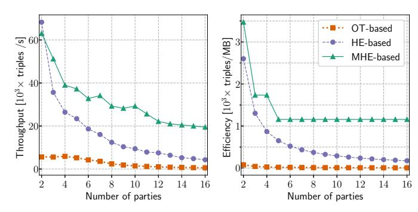

# Multiparty Homomorphic Encryption from Ring-Learning-with-Errors

Christian Mouchet, Juan Troncoso-Pastoriza, Jean-Philippe Bossuat and Jean-Pierre Hubaux Laboratory for Data Security, EPFL

firstname.lastname@epfl.ch

*Abstract*—We propose and evaluate a secure-multipartycomputation (MPC) solution in the semi-honest model with dishonest majority that is based on multiparty homomorphic encryption (MHE). To support our solution, we introduce a multiparty version of the Brakerski-Fan-Vercauteren homomorphic cryptosystem and implement it in an open-source library. MHEbased MPC solutions have several advantages: Their transcript is public, their *offline* phase is compact, and their circuit-evaluation procedure is non-interactive. By exploiting these properties, the communication complexity of MPC tasks is reduced from quadratic to linear in the number of parties, thus enabling secure computation among potentially thousands of parties and in a broad variety of computing paradigms, from the traditional peer-to-peer setting to cloud-outsourcing and smart-contract technologies. MHE-based approaches can also outperform the state-of-the-art solutions, even for a small number of parties. We demonstrate this for three circuits: *private input selection* with application to private-information retrieval, *component-wise vector multiplication* with application to private-set intersection, and *Beaver multiplication triples generation*. For the first circuit, privately selecting one input among eight thousand parties' (of 32 KB each) requires only 1.31 MB of communication per party and completes in 61.7 seconds. For the second circuit with eight parties, our approach is 8.6 times faster and requires 39.3 times less communication than the current methods. For the third circuit and ten parties, our approach generates 20 times more triples per second while requiring 136 times less communication per-triple than an approach based on oblivious transfer. We implemented our scheme in the Lattigo library and open-sourced the code at **[github.com/ldsec/lattigo](https://github.com/ldsec/lattigo)**.

# I. INTRODUCTION

*Secure Multiparty Computation* (MPC) protocols enable a group of parties to *securely* compute joint functions over their private inputs while enforcing specific security guarantees throughout the computation. The exact definition of security depends on how the adversary is modeled, but the most common requirement, *input privacy*, informally states that parties should not obtain more information about other parties' inputs than that which can be deduced from the output of the computation. Combining this strong security guarantee with a general functionality makes the study of MPC techniques highly relevant. This last decade has seen this established theoretical field evolve into an applied one, notably due to its potential for securing *data-sharing* scenarios in the financial [\[1,](#page-13-0) [2\]](#page-13-1), biomedical [\[3,](#page-13-2) [4\]](#page-13-3) and law-enforcement [\[5,](#page-13-4) [6\]](#page-13-5) sectors, as well as for protecting digital assets [\[7\]](#page-13-6). The use of passively-secure MPC techniques in such scenarios has been demonstrated to be effective and practical [\[3,](#page-13-2) [8,](#page-13-7) [9\]](#page-13-8), notably in the medical sector where data collaborations are mutually beneficial and well-regulated, yet they legally require a certain level of data-protection [\[4,](#page-13-3) [8\]](#page-13-7).

In the settings where no honest majority of parties can be guaranteed, most of the currently implemented MPC systems are based on secret-sharing [\[10\]](#page-13-9) of the input data according to some linear secret-sharing scheme (LSSS), and on interactive circuit evaluation protocols [\[11\]](#page-13-10). These approaches have two practical limitations: (i) standard protocols require many rounds of communication over private channels between the parties, which makes them inadequate for low-end devices and unreliable networks. (ii) current approaches require a per-party communication that increases linearly in the circuit size (that increases at least linearly in the number of parties). Hence, this quadratic factor quickly becomes a bottleneck for large numbers of parties.

Homomorphic encryption (HE) techniques are well-known for reducing the communication complexity of MPC [\[12,](#page-13-11) [13\]](#page-13-12), especially in their various *threshold* and *multi-key* variants that we generally refer to as *multiparty-HE* (MHE). However, in spite of several such schemes proposed by the cryptographic community, the most widely known being the MHE scheme of Asharov et al. [\[14\]](#page-13-13), no concrete MPC solution implementing a generic MHE-based MPC protocol has been built yet. Instead, the use of HE in MPC is mostly confined to the *offline* pre-computations of protocols based on linear secret-sharing schemes (LSSS) [\[15\]](#page-13-14). We argue that homomorphic encryption has reached the required level of usability to play a larger role in the online phase of MPC protocols and to enable new applications.

We propose, implement, and evaluate a new instance of the MHE-based MPC protocol in the passive-adversary with dishonest-majority model. We make the following contributions:

- We propose a novel multiparty extension of the BFV homomorphic encryption scheme (Section [IV\)](#page-3-0). We follow the blueprint of Asharov et al. [\[14\]](#page-13-13) and adapt it to the ringlearning-with-errors (RLWE) assumptions and to the BFV scheme. We also introduce novel single-round protocols for bridging between the MHE- and LSSS-based approaches and for bootstrapping a BFV ciphertext in multiparty settings.
- We instantiate our MHE scheme into a generic MPC protocol (Section [V\)](#page-7-0) and show that this approach has several advantages over their LSSS-based counterparts: Notably, its per-party communication complexity is only linear in

the circuit's inputs and outputs, and its execution does not require private party-to-party communication channels.

 We demonstrate the efficiency of the latter instantiation for three example MPC circuits (Section VI). We implemented and open-sourced our scheme in the Lattigo library [16].
 With these contributions, our work bridges the gap between the existing theoretical work on MHE-based MPC and its application as privacy-enhancing technologies.

# II. RELATED WORK

We classify N-party dishonest-majority MPC approaches in two categories: (a) Linear secret-sharing at data level (for short: LSSS-based), which is predominantly implemented in generic MPC solutions [7, 11], consists in applying secret-sharing [10] to the input data. (b) Multiparty encryption schemes (for short: MHE-based), use a homomorphic scheme to encrypt and exchange the input data, that can then be computed on non-interactively with encrypted arithmetic.

LSSS-based MPC (a). Most of the available generic MPC solutions, such as Sharemind [17] and SPDZ [15, 18, 19], apply secret-sharing to the input data. The evaluation of arithmetic circuits is generally enabled by the homomorphism of the LSSS, or by interactive protocols (when no such homomorphism is available); the most widely implemented protocol is Beaver's triple-based protocol [20]. The strength of approach (a) is to enable evaluation through only simple and efficient primitives in terms of which the circuit can be decomposed by code-to-protocol compilers, thus strengthening usability. However, this approach imposes two practical constraints: First, the interactive protocols at each multiplication gate require all parties to be online and active during the whole computation and to exchange messages with their peers at a high frequency that is determined by the round complexity of the circuit. Second, the triple-based multiplication protocol requires a prior distribution of one-time triples; this can be performed in a pre-computing phase, either by a trusted thirdparty or by the parties themselves. The latter peer-to-peer case can also be formulated as an independent, yet equivalent, MPC task (generating the triples requires multiparty multiplication). Hence, these approaches are hybrids that generate the triples by using techniques such as oblivious transfer [21], plain HE [15] or multiparty-HE [18] in an offline phase.

As a result of the aforementioned constraints, many current applications of LSSS-based MPC target the *outsourced* models where the actual computation is delegated to two parties [3, 8, 9, 22–24] that are assumed not to collude (e.g., the *two-cloud model*). Unfortunately, this assumption might not be realistic in some contexts where the parties are required to have an active role in enforcing the access control over their data (e.g., by law).

**MHE-based MPC** (b). In this approach, the parties use an HE scheme to encrypt their inputs, and the computations are performed using the scheme's homomorphic operations. To preserve the inputs' privacy, the scheme's secret key is securely distributed among the parties and the decryption requires the collaboration between the parties. We use the term *multiparty* 

encryption scheme to designate these constructions in a general way (we provide a definition in Section III-A).

The idea of reducing the volume of interaction in MPC by using threshold homomorphic-encryption can be traced back to a work by Franklin and Haber [12], later improved by Cramer et al. [13]. At that time, the lack of homomorphic schemes that preserve two distinct algebraic operations ruled out complete non-interactivity at the evaluation phase, thus rendering these approaches less attractive than approach (a). Recently, taskspecific instances that use multiparty additive-homomorphic encryption have been successful in supporting use-cases in distributed machine learning [25, 26], thus highlighting the potential that a generic and usable fully homomorphic encryption (FHE) [27] solution could have. This is the idea behind the line of work by Asharov et al. [14] and López-Alt et al. [28]. These contributions propose various multiparty schemes in which the secret-key is additively shared among the parties, and they analyze the theoretical MPC solution these schemes enable. Although of great interest, this line of work did not find as much echo in applications as approach (a) has. One possible reason was the lack of available and efficient implementations of Learning with Errors [29] (LWE) -based homomorphic schemes, in terms of which these schemes were presented. Today, multiple ongoing efforts aim at standardizing homomorphic encryption [30] and at making its implementations available to a broader public. This new generation of schemes is based mostly on the Ring Learning with Errors (RLWE) problem [31] and has brought HE from being practical to being efficient.

We argue that MHE-based approaches are now efficient and flexible enough to support more than the offline phase of LSSS-based approaches. Therefore, we bring the theoretical work on multiparty schemes [14] to RLWE cryptography and to an open-source implementation, and evaluate it as an MPC solution.

#### III. BACKGROUND

We provide a general definition of the multiparty homomorphic encryption (MHE) primitive, relate this primitive to the MPC setting and recall the plain BFV HE scheme that we extend to the MHE in Section IV. We consider an abstract security parameter  $\lambda$  and require that an adversary's advantage in attacking the schemes must be a negligible function in  $\lambda$ . HE schemes also require proper parameterization to support the evaluation of the desired circuits. We model this dependency by introducing an abstract *homomorphic capacity* parameter  $\kappa$  and require that the probability of incorrect decryption must be a negligible function in  $\kappa$ .

#### <span id="page-1-0"></span>A. Multiparty Homomorphic Encryption

Let  $\mathcal{P} = \{P_1, P_2, \dots, P_N\}$  be a set of N parties; a multiparty homomorphic encryption-scheme over  $\mathcal{P}$  is an HE scheme in which the secret-key is an N-party function  $\mathcal{S}(\mathsf{sk}_1, \mathsf{sk}_2, \dots, \mathsf{sk}_N)$ . The structure of  $\mathcal{S}$  determines the Access Structure of the MHE scheme, which we define as the set

 $S \subset \mathsf{PowerSet}(\mathcal{P})$  of all groups of parties that can collectively reconstruct the secret-key. Indeed,  $\mathcal{S}$  should never be disclosed in practice. Instead, each operation Op of the single-party scheme that requires the secret-key is expressed as a multiparty protocol  $\Pi_{\mathsf{Op}}$ .

Let  $\mathcal M$  be a plaintext space with arithmetic structure, a Multiparty HE scheme over  $\mathcal M$  is a tuple MHE = (Setup, SecKeyGen,  $\Pi_{\text{PubKeyGen}}$ , Enc,  $\Pi_{\text{Dec}}$ , Eval) of algorithms and multiparty protocols.

- **Setup**:  $pp \leftarrow \mathsf{MHE}.\mathsf{Setup}(\lambda,\kappa)$ . Takes the security and homomorphic capacity parameters and outputs a public parameterization. pp is an implicitly argument to the other procedures.
- **Key Generation**: The parties  $P_i \in \mathcal{P}$  generate  $\mathsf{sk}_i \leftarrow \mathsf{MHE}.\mathsf{SecKeyGen}()$  and take part in the multiparty protocol  $\mathsf{pk} \leftarrow \mathsf{MHE}.\Pi_{\mathsf{PubKeyGen}}(\mathsf{sk}_1,...,\mathsf{sk}_N).$  Outputs a key pair  $(\mathsf{sk}_i,\mathsf{pk})$  to each party.
- Encryption: ct  $\leftarrow$  MHE.Enc(m, pk). Given a public-key pk, and a plaintext message  $m \in \mathcal{M}$ , outputs a ciphertext encrypting m under  $\mathcal{S}(\mathsf{sk}_1, \mathsf{sk}_2, ..., \mathsf{sk}_N)$ .
- Evaluation:  $\mathsf{ct}_{res} \leftarrow \mathsf{MHE}.\mathsf{Eval}(f,\mathsf{pk},\mathsf{ct}_1,...,\mathsf{ct}_l).$  Given an arithmetic function  $f: \mathcal{M}^I \to \mathcal{M}$ , the public key  $\mathsf{pk}$  and a I-tuple of ciphertexts encrypting  $(m_1,...,m_I) \in \mathcal{M}^I$ , outputs a result ciphertext encrypting  $m_{res} = f(m_1,...,m_I).$
- **Decryption**:  $m \leftarrow \mathsf{MHE}.\Pi_{\mathsf{Dec}}(\mathsf{ct},\mathsf{sk}_1,...\mathsf{sk}_N)$ . Given a ciphertext ct encrypting m and their respective key  $\mathsf{sk}_i$ , the parties take part in the decryption multiparty protocol. Outputs m.

**Semantic Security** (informal). We require that for all adversarial subsets of parties  $\mathcal{A} \notin S$ , for any two messages  $m_1, m_2 \in \mathcal{M}$ , the advantage of the adversary in distinguishing between distributions MHE.Enc(pk,  $m_1$ ) and MHE.Enc(pk,  $m_2$ ) should be smaller than  $2^{-\lambda}$ .

Correctness We (informal). require that, for all arithmetic functions  $\mathcal{M}^I$  $\mathcal{M}$ , there exist public parametrization ppsuch that  $\mathsf{MHE}.\Pi_{\mathsf{Dec}}(\mathsf{MHE}.\mathsf{Eval}(f,\mathsf{pk},ct_1,...,\mathsf{ct}_I),\mathsf{sk}_1,...,\mathsf{sk}_N)$  $f(m_1,...,m_I)$  holds with probability larger than  $1-2^{-\kappa}$ .

**Access-structure Families**. We distinguish between two types of MHE schemes:

- In threshold [32] or distributed encryption schemes, the secret-key  $\mathcal{S}$  is set before the computation and is fixed, hence so is the access structure set  $\mathcal{S}$ . The parties provide their inputs encrypted under  $\mathcal{S}$ , hence the decryption is conditioned to the participation of the parties according to the structure of  $\mathcal{S}$  (which is often, but not necessarily, a secret-sharing scheme). We use this approach for our proposed MHE scheme.
- In *multi-key* encryption schemes [33], the secret-key does not have to be defined before the evaluation and  $\mathcal{S}$  is, instead, *dynamic*: The parties provide their inputs encrypted under their own secret-key and the evaluation of homomorphic operations  $f: \mathcal{M}^I \to \mathcal{M}$  yields a result that is encrypted under an *on-the-fly* key  $\mathcal{S}(\mathsf{sk}_1, ..., \mathsf{sk}_I)$ . Hence,

only the parties involved in a given computation are required to participate in the decryption of its output.

In their RLWE instantiations, these two types of multiparty schemes have different structures for their ciphertext and public-key material, as well as different algorithmic complexity figures for their homomorphic operations. In Section IV, we construct a distributed version of the BFV scheme [34], and compare it to the multi-key BFV scheme of Chen et al. [35] in Section IV-J.

MHE-based Generic MPC. The construction of passively secure and MHE-based generic MPC protocols is natural from the MHE correctness and semantic security properties: Given a circuit and the desired security properties, the parties can use an MHE-scheme enforcing the sought access structure to encrypt their inputs (MHE.Enc), compute the circuit homomorphically (MHE.Eval), and collectively decrypt the output (MHE. $\Pi_{Dec}$  protocol). We defer the detailed protocol description and the discussion of its features to Section V, where we instantiate it with the MHE-scheme proposed in Section IV.

#### B. Notation

We denote  $[\cdot]_q$  the reduction of an integer modulo q, and  $\lceil \cdot \rceil$ ,  $\lfloor \cdot \rfloor$ ,  $\lfloor \cdot \rceil$  the rounding to the next, previous, and nearest integer respectively. When applied to polynomials, these operations are performed coefficient-wise. We use regular letters for integers and polynomials, and boldface letters for vectors of integers and of polynomials.  $\boldsymbol{a}^T$  denotes the transpose of a vector  $\boldsymbol{a}$ . Given a probability distribution  $\alpha$  over a ring R,  $a \leftarrow \alpha$  denotes the sampling of an element  $a \in R$  according to  $\alpha$ , and  $a \leftarrow R$  implicitly denotes uniform sampling in R. For a polynomial a, we denote its infinity norm by  $\|a\|$ .

# C. The BFV Encryption Scheme

We recall the plain Brakerski-Fan-Vercauteren [34] scheme that we will extend in Section IV. It is a ring-learning-with-errors [31] scheme that supports both additive and multiplicative homomorphic operations. Due to its practicality, it has been implemented in most of the current lattice-based cryptographic libraries [16, 36, 37] and is part of the draft HE standard [30].

Scheme 1 details the most common instantiation of the BFV scheme. The ciphertext space is  $R_q = \mathbb{Z}_q[X]/(X^n+1)$ , the quotient ring of the polynomials with coefficients in  $\mathbb{Z}_q$  modulo  $(X^n+1)$ , where n is a power of 2. We use  $\left[-\frac{q}{2},\frac{q}{2}\right]$  as the set of representatives for the congruence classes modulo q. Unless otherwise stated, we consider the arithmetic in  $R_q$  and polynomial reductions are omitted in the notation. The plaintext space is the ring  $R_t = \mathbb{Z}_t[X]/(X^n+1)$  for t < q. We denote  $\Delta = \lfloor q/t \rfloor$ , the integer division of q by t.

The scheme is based on two kinds of secrets, commonly sampled from small-normed yet different distributions: The key distribution is denoted  $R_3 = \mathbb{Z}_3[X]/(X^n+1)$ , where coefficients are uniformly distributed in  $\{-1,0,1\}$ . The error distribution  $\chi$  over  $R_q$  has coefficients distributed according to a centered discrete Gaussian with standard deviation  $\sigma$ 

#### <span id="page-3-1"></span>**Scheme 1.** BFV(t, n, q, w, $\sigma$ , B)

BFV.SecKeyGen(): Sample  $s \leftarrow R_3$ . Output: sk = s

BFV.PubKeyGen(sk):

Let 
$$\mathsf{sk} = s$$
. Sample  $p_1 \leftarrow R_q$ , and  $e \leftarrow \chi$ . Output: 
$$\mathsf{pk} = (p_0, p_1) = (-sp_1 + e, p_1)$$

BFV.RelinKeyGen(sk, w):

Let 
$$\mathsf{sk} = s$$
. Sample  $\mathbf{r}_1 \leftarrow R_q^l$ ,  $\mathbf{e} \leftarrow \chi^l$ . Output: 
$$\mathsf{rlk} = (\mathbf{r}_0, \mathbf{r}_1) = (s^2 \mathbf{w} - s \mathbf{r}_1 + \mathbf{e}, \mathbf{r}_1)$$

BFV.Encrypt(pk, *m*):

Let 
$$pk = (p_0, p_1)$$
. Sample  $u \leftarrow R_3$  and  $e_0, e_1 \leftarrow \chi$ .  
Output:  $ct = (\Delta m + up_0 + e_0, up_1 + e_1)$ 

BFV.Decrypt(sk, ct):

Let 
$${\rm sk}=s,$$
  ${\rm ct}=(c_0,c_1).$  Output: 
$$m'=\lfloor\lfloor\frac{t}{q}[c_0+c_1s]_q\rceil\rfloor_t$$

and truncated support over [-B,B] where  $\sigma$  and B are two cryptosystem parameters.

The security of BFV is based on the hardness of the decisional-RLWE problem [31] that is informally stated as follows: Given a uniformly random  $a \leftarrow R_q$ , a secret  $s \leftarrow R_3$ , and an error term  $e \leftarrow \chi$ , it is computationally hard for an adversary that does not know s and e to distinguish between the distribution of (sa+e,a) and that of (b,a) where  $b \leftarrow R_q$ .

Encrypted arithmetic operations must preserve the plaintext arithmetic. We denote BFV.Add and BFV.Mul the homomorphic addition and multiplication, respectively, and we refer the reader to [34] for their implementation. The BFV.Mul operation outputs a ciphertext consisting of three  $R_q$  elements that can be seen as a *degree two* ciphertext. This higher degree ciphertext can be further operated on and decrypted. Yet it is often desirable to reduce this degree back to one, by using a BFV.Relinearize operation [34]. This operation is public but requires the generation of a specific public key, referred to as the *relinearization key* (rlk).

The decryption of a ciphertext  $(c_0, c_1)$  can be seen as a twostep process. The first step requires the secret key to compute a noisy plaintext in  $R_q$  as

<span id="page-3-3"></span>
$$[c_0 + sc_1]_q = \Delta m + e_{\mathsf{ct}},\tag{1}$$

where  $e_{\rm ct}$  is the ciphertext overall error, or *ciphertext noise*. In the second step, the message is decoded from the noisy term in  $R_q$  to a plaintext in  $R_t$ , by rescaling and rounding

<span id="page-3-2"></span>
$$\left[\left\lfloor \frac{t}{q} \left(\Delta m + e_{\mathsf{ct}}\right)\right\rceil\right]_t = \left[\left\lfloor m + at + v\right\rceil\right]_t,\tag{2}$$

where  $m \in R_t$ , a has integer coefficients, and v has coefficients in  $\mathbb{Q}$ . Provided that  $\|v\| < \frac{1}{2}$ , Eq. (2) outputs m. Hence, the correctness of the scheme is conditioned on the noise magnitude  $\|e_{\rm ct}\|$  that must be kept below  $\frac{q}{2t}$  throughout

the homomorphic computation, notably by choosing a sufficiently large q. To preserve this condition when multiplying with the rlk (as a part of BFV.Relinearize), ciphertexts are temporarily decomposed in a basis w < q and the product is performed on each element of the decomposition [34]. We write  $l = \lceil \log_w(q) \rceil$  the number of coefficients in this decomposition, and  $\mathbf{w} = (w^0, w^1, ..., w^{l-1})^T$  the base-w reconstruction vector.

# <span id="page-3-4"></span>D. Parameter Selection

Selecting the parameters for a given application constitutes a significantly more challenging task for homomorphic-encryption schemes than for traditional encryption. Although the standardization document [30] is a good basis for mapping the subset of commonly used parameter values to bit-security levels, mapping the correctness and efficiency requirements to concrete parameters in a systematic way is still an open question in FHE research: it goes beyond the scope of this work. Nowadays, we see the rise of compilers for HE [38] that will, as they evolve, automate this process.

We describe the common heuristic approach for selecting BFV parameters; the one we used for the evaluation of our work (Section VI). The task consists in finding  $(t,n,q,w,\sigma,B)$  that satisfy the required security and homomorphic-capacity parameters  $(\lambda,\kappa)$  for the set of considered homomorphic circuits. The standardization document and most implementations fix the noise standard deviation and bound to  $\sigma \approx 3.2$  and  $B \approx 20$ , respectively. Hence, only the ring degree n, plaintext-space and ciphertext-space moduli t and t0, and the decomposition basis t1 remain to be determined.

The message-space characteristics of the application usually sets t directly, by considering the bit-width of the input values. The targeted set of homomorphic circuits constrain q and n: Choosing larger q permits larger circuit depth (Equation (2)) but also reduces the hardness of the RLWE problem. Choosing larger w reduces the noise incurred by Relinearize (hence enables smaller q) and increases its computation cost and the rlk size. Choosing larger n increases the security (hence enables larger q for a fixed security level) but has a significant impact on the cost incurred by polynomial multiplication. Hence, the most common strategy is to set q and w experimentally, as an acceptable trade-off for the application, then to choose the smallest power-of-two n for the desired security level.

#### IV. THE MULTIPARTY BFV SCHEME

<span id="page-3-0"></span>We introduce a novel multiparty version of the Brakerski-Fan-Vercauteren (BFV) cryptosystem [34]. Although formulated for the BFV scheme, the introduced protocols can be straightforwardly adapted to other RLWE-based cryptosystems, such as BGV [39] or the more recent CKKS [40], which enables homomorphic approximate arithmetic. We implemented both multiparty versions for the BFV and CKKS schemes in the Lattigo open-source library [16]. Our approach follows the blueprint of the LWE-based protocols by Asharov et al. [14], and introduces several improvements to their schemes. In particular, we propose a novel procedure for the

generation of relinearization keys that adds significantly less noise in the output key. We also propose a generalization of the distributed decryption procedure, from which we derive novel protocols that bridge between the MHE-based and LSSS-based MPC protocols and that enable the practical bootstrapping of a BFV ciphertext.

In the next subsections, we reformulate all the secret-key-dependent operations of the original BFV scheme as secure N-party protocols. We refer to the original centralized scheme as  $the\ ideal\ scheme$ : the ideal centralized functionality that is emulated in a multiparty setting. By extension, we refer to  $sk = \mathcal{S}(sk_1,...,sk_N)$  as  $the\ ideal\ secret\ key$ , because it exists as such only through interaction between the parties.

#### A. Scheme Overview

Let  $\mathcal P$  be a set of N parties that have access to an authenticated channel and to a random  $common\ reference\ string$  (CRS) [41]. Our proposed multiparty BFV scheme is a tuple MBFV =  $(\Pi_{\mathsf{EncKeyGen}}, \Pi_{\mathsf{RelinKeyGen}}, \Pi_{\mathsf{KeySwitch}}, \Pi_{\mathsf{PubKeySwitch}})$  that extends the BFV scheme:

- **Setup**: Select  $pp \leftarrow (t, n, q, w, \sigma, B)$ , the parameters of the BFV scheme.
- **Key Generation**: Each party  $P_i \in \mathcal{P}$  generates its share  $\mathsf{sk}_i \leftarrow \mathsf{BFV}.\mathsf{SecKeyGen}()$  of  $\mathsf{sk}$  and takes part in the  $\mathsf{cpk} \leftarrow \mathsf{MBFV}.\Pi_{\mathsf{EncKeyGen}}(\mathsf{sk}_1,...,\mathsf{sk}_N)$  and  $\mathsf{rlk} \leftarrow \mathsf{MBFV}.\Pi_{\mathsf{RelinKeyGen}}(\mathsf{sk}_1,...,\mathsf{sk}_N)$  multiparty protocols with output  $(\mathsf{cpk},\mathsf{rlk})$ .
- **Encryption**: The usual BFV.Encrypt procedure is used to encrypt messages under sk given the cpk.
- **Evaluation**: The usual BFV.Eval set of homomorphic operations is used to evaluate functions given rlk.
- Key-switching:

ct'  $\leftarrow \Pi_{\mathsf{KeySwitch}}(\mathsf{ct},\mathsf{sk}_1',...,\mathsf{sk}_N',\mathsf{sk}_1,...,\mathsf{sk}_N)$ . Given a ciphertext ct encrypted under the ideal secret-key sk and an output ideal secret-key  $\mathsf{sk}' = \mathcal{S}'(\mathsf{sk}_1',...\mathsf{sk}_N')$ , the parties reencrypt ct under  $\mathsf{sk}'$ .

- Public-key-switching:

 $\mathsf{ct'} \leftarrow \Pi_{\mathsf{PubKeySwitch}}(\mathsf{ct}, \mathsf{pk'}, \mathsf{sk}_1, ..., \mathsf{sk}_N).$  Given a ciphertext ct under sk and an output public-key  $\mathsf{pk'}$  for secret-key  $\mathsf{sk'}$ , the parties re-encrypt ct under  $\mathsf{sk'}$ .

MBFV KeySwitch-correctness. For all arithmetic functions  $f: R_t^I \to R_t$  over the parties' inputs  $m_1, \ldots, m_I$ , there exist  $pp = (t, n, q, w, \sigma, B)$  such that for  $\mathsf{sk}' = \mathcal{S}'(\mathsf{sk}'_1, ..., \mathsf{sk}'_N)$  an output secret-key and

$$\mathsf{sk}_i \leftarrow \mathsf{BFV}.\mathsf{SecKeyGen}() \ \ i \in 1...N,$$

 $\mathsf{cpk}, \mathsf{rlk} \leftarrow \Pi_{\mathsf{EncKeyGen}}(\mathsf{sk}_1, ..., \mathsf{sk}_N), \Pi_{\mathsf{RelinKeyGen}}(\mathsf{sk}_1, ..., \mathsf{sk}_N),$ 

 $\mathsf{ct}_i \leftarrow \mathsf{BFV}.\mathsf{Enc}(\mathsf{cpk}, m_i) \ i \in 1...I,$ 

 $\mathsf{ct}_f \leftarrow \mathsf{BFV}.\mathsf{Eval}(f,\mathsf{rlk},\mathsf{ct}_1,...,\mathsf{ct}_I),$ 

 $\mathsf{ct}_f' \leftarrow \mathsf{MBFV}.\Pi_{\mathsf{KevSwitch}}(\mathsf{ct}_\mathcal{P}', \mathsf{sk}_1', ..., \mathsf{sk}_N', \mathsf{sk}_1, ..., \mathsf{sk}_N),$ 

it holds that  $\Pr[\mathsf{BFV}.\mathsf{Dec}(\mathsf{sk}',\mathsf{ct}_f')\neq f(m_1,...,m_I)]<2^{-\kappa}$ .

The PubKeySwitch-correctness property can be directly derived from the previous definition by computing a public key for sk' and replacing  $\Pi_{\text{KeySwitch}}$  by  $\Pi_{\text{PubKeySwitch}}$ .

MBFV Semantic Security. For all subsets of at most N-1 passive adversaries in  $\mathcal{P}$ , for any two messages  $m_1, m_2 \in R_t$ , the advantage of the adversary in distinguishing between distributions BFV.Enc(cpk,  $m_1$ ) and BFV.Enc(cpk,  $m_2$ ) should be smaller than  $2^{-\lambda}$ .

As a result, the security properties of the MBFV scheme is that of a *N-out-of-N threshold* encryption scheme. We now detail each of its underlying protocols.

# <span id="page-4-1"></span>B. Ideal-Secret-Key Generation

Our scheme uses an additive structure for the combined secret-key, denoted as s in the following. We denote  $s_i$  the secret key share of party  $P_i$ , thus

$$\mathsf{sk} = s = \left[\sum_{P_i \in \mathcal{P}} s_i\right]_q. \tag{3}$$

We propose a simple ideal-secret-key generation procedure in which each party samples independently its own share as  $s_i = \mathsf{BFV}.\mathsf{SecKeyGen}()$ . Thus, the ideal secret-key is generated in a non-interactive way. The norm of the resulting ideal secret key grows with  $\mathcal{O}(N)$ , which has an effect on the noise growth (analyzed in Appendix A). By using techniques such as those described in [42], it might be possible to generate ideal secret keys in  $R_3$  as if they were produced in a trusted setup (e.g., as an additive secret-sharing of a usual BFV secret-key over  $R_q$ ). However, this would introduce the need for private channels between the parties.

# C. Collective Encryption-Key Generation

The collective encryption-key generation, detailed in Protocol 1, emulates the BFV.PubKeyGen procedure. In addition to the public parameters of the cryptosystem (which we will omit in the following), the procedure requires a public polynomial  $p_1$ , uniformly sampled in  $R_q$ , to be agreed upon by all the parties. For this purpose, they sample its coefficients from the common reference string (CRS). In the passive-adversary model, the CRS can be implemented by any keyed pseudorandom function. We used BLAKE2b [43] in our implementation.

After the execution of the EncKeyGen protocol, the parties have access to the collective public key

<span id="page-4-0"></span>
$$\mathsf{cpk} = \left( \left[ \sum_{P_i \in \mathcal{P}} p_{0,i} \right]_q, \ p_1 \right) = \left( \left[ - \left( \sum_{P_i \in \mathcal{P}} s_i \right) p_1 + \sum_{P_i \in \mathcal{P}} e_i \right]_q, \ p_1 \right), \tag{4}$$

that has the same form as the ideal public key pk in Scheme 1, with larger worst-case norms  $\|s\|$  and  $\|e\|$ . The norm grows only linearly in N hence is not a concern (as shown in Appendix A), even for large number of nodes. Another notable feature of the EncKeyGen protocol is that it would apply to any kind of linear sharing of s, as long as the shares are valid RLWE secrets and the norm of the reconstruction is small enough. This includes uniformly random sharing over  $R_q$  of a traditional BFV secret key in  $R_3$ .

#### <span id="page-5-0"></span>Protocol 1. EncKeyGen

**Public Input:**  $p_1$  (common random polynomial) **Private Input** for  $P_i$ :  $s_i = \mathsf{sk}_i$  (secret key share) **Public Output:**  $\mathsf{cpk} = (p_0, p_1)$  (collect. encrypt. key)

Each party  $P_i$ :

1) samples  $e_i \leftarrow \chi$  and discloses  $p_{0,i} = -p_1 s_i + e_i$ 

**Out:** from  $p_0 = \sum_{P_j \in \mathcal{P}} p_{0,j}$ , outputs  $\mathsf{cpk} = (p_0 \;,\; p_1)$ 

# D. Relinearization-Key Generation

Protocol 2 (RelinKeyGen) emulates the centralized BFV.RelinKeyGen. Informally, it produces pseudo-encryptions of  $s^2w^b$  for each power b=0,...,l-1 of the decomposition basis parameter w. It requires a public input  ${\bf a}$ , uniformly sampled in  $R_q^l$  from the CRS. We use vector notation to express that these pseudo-encryptions are generated in parallel for every element of the decomposition base  ${\bf w}=(w^0,w^1,...,w^{l-1})^T$ .

Asharov et al. proposed a method to produce relinearization keys for multiparty schemes based on the LWE problem [14]. This method could be adapted to our scheme but results in significantly increased noise in the rlk (hence, higher noise in relinearized ciphertexts) with respect to the centralized scheme. One cause for this extra noise is the use of the public encryption algorithm to produce the mentioned pseudoencryptions. By observing that the collective encryption key is not needed for this purpose (because the secret key is collectively known), we propose Protocol 2 as an improvement over the method by Asharov et al.

After completing the RelinKeyGen protocol, the parties have access to a relinearization key of the form

<span id="page-5-2"></span>
$$rlk = (\mathbf{r}_0, \mathbf{r}_1) = (-s\mathbf{b} + s^2\mathbf{w} + s\mathbf{e}_0 + \mathbf{e}_1 + u\mathbf{e}_2 + \mathbf{e}_3, \mathbf{b}), (5)$$

where  $\mathbf{b} = s\mathbf{a} + \mathbf{e}_2$  and  $e_k = \sum_j e_{k,j}$  for k = 0, 1, 2, 3. Hence, compared to the keys generated with the approach of Asharov et al., our keys have lower error in  $\mathbf{r}_0$  and no error at all in  $\mathbf{r}_1$  (i.e., they have the same form as those of the centralized scheme). This significantly reduces the noise induced by relinearization.

A relevant feature of the proposed RelinKeyGen protocol is its independence from the actual decomposition basis w: It is compatible with other decomposition techniques, such as the one used for Type II relinearization [34], those based on the Chinese Remainder Theorem (as proposed by Bajard et al. [44] and Cheon et al. [45]), and the hybrid approach of Bossuat et al. [46] (which we use in our implementation).

# E. Collective Key-Switching Protocols

The key-switching functionality enables the oblivious reencryption operation. Given a ciphertext ct encrypted under an *input key s* along with an *output key s'*, the key-switching procedure outputs  $\mathsf{ct}' = \mathsf{Enc}(s', \mathsf{Dec}(s, \mathsf{ct}))$ . Because the first step of the plain BFV decryption (Eq. (1)) is equivalent to switching from the ideal secret-key to an output key s' = 0, this protocol generalizes the decryption protocol. The decoding

<span id="page-5-1"></span>Protocol 2. RelinKeyGen

**Public Input:**  $\mathbf{a} \in R_q^l$  and  $\mathbf{w}$  the decomposition basis

**Private Input** of  $P_i$ :  $s_i = \mathsf{sk}_i$ **Output**:  $\mathsf{rlk} = (\mathbf{r}_0, \mathbf{r}_1)$ 

Each party  $P_i$ :

1) samples  $u_i \leftarrow R_3$ ,  $\mathbf{e}_{0,i}$ ,  $\mathbf{e}_{1,i} \leftarrow \chi^l$  and discloses  $(\mathbf{h}_{0,i}, \mathbf{h}_{1,i}) = (-u_i \mathbf{a} + s_i \mathbf{w} + \mathbf{e}_{0,i}, s_i \mathbf{a} + \mathbf{e}_{1,i})$ 

2) from  $\mathbf{h}_0 = \sum_{P_j \in \mathcal{P}} \mathbf{h}_{0,j}$  and  $\mathbf{h}_1 = \sum_{P_j \in \mathcal{P}} \mathbf{h}_{1,j}$ , sample  $\mathbf{e}_{2,i}, \mathbf{e}_{3,i} \leftarrow \chi^l$  and discloses

 $(\mathbf{h}'_{0,i}, \mathbf{h}'_{1,i}) = (s_i \mathbf{h}_0 + \mathbf{e}_{2,i}, (u_i - s_i) \mathbf{h}_1 + \mathbf{e}_{3,i})$ 

**Out:** from  $\mathbf{h}_0' = \sum_{P_j \in \mathcal{P}} \mathbf{h}_{0,j}'$  and  $\mathbf{h}_1' = \sum_{P_j \in \mathcal{P}} \mathbf{h}_{1,j}'$ , outputs rlk =  $(\mathbf{h}_0' + \mathbf{h}_1'$ ,  $\mathbf{h}_1)$ 

part of the decryption (Eq. (2)) does not require the secret-key and can be performed locally.

**Smudging.** We observe that the aforementioned decryption procedure, and the MBFV key-switching procedures in general, provide the output-key owner(s) with the ciphertext noise. Because this noise depends on intermediate values in the encryption, homomorphic computation and key-switching procedures, it could be exploited as a side-channel by curious receivers (although characterizing this indirect leakage in a computational setting is still an open question). The *smudging* technique, as introduced by Asharov et al. [14], aims at making the ciphertext-noise inexploitable by flooding it with some freshly sampled noise terms in a distribution of larger-variance. In the MBFV scheme, this is achieved by sampling the relevant error terms in the key-switching protocols from a discrete Gaussian distribution  $\chi_{\rm CKS}(\sigma_{\rm ct}^2)$  of variance  $\sigma_{\rm smg}^2=2^{\lambda}\sigma_{\rm ct}^2$ where  $\sigma_{ct}^2$  is the ciphertext's noise variance (see Appendix A) and  $\lambda$  the desired security level (e.g.,  $\lambda = 128$ , see Appendix A). Hence, this technique assumes that the system keeps track of the ciphertext noise-level and has access to this property. For a ciphertext ct, we denote var(ct) the variance of its noise term (see Eq. (1)).

**Receiver.** The protocol's instantiation depends on whether the parties performing the re-encryption have a collective access to the output secret-key directly, or have only its corresponding public-key. Both these settings are relevant when instantiating the MBFV scheme as an MPC protocol, which we discuss in Section V. Therefore, we develop protocols that perform key-switching for these two settings: When s' is collectively known, the KeySwitch protocol is used. When only a public key is known, the PubKeySwitch protocol is used.

1) Collective Key-Switching: Protocol 3 (KeySwitch) details the steps for performing a key switching when the input parties collectively know the output secret key s'. This protocol can be used as a decryption protocol (s'=0) or for updating the access-structure (see Section IV-F), and it is the basis for bridging MHE-based and LSSS-based approaches, as explained in Section IV-G.

After the execution of the KeySwitch protocol on input ct =

 $(c_0, c_1)$ ,  $c_0 + sc_1 = \Delta m + e_{ct}$  where  $e_{ct}$  is the ciphertext's error, the parties have access to ct' s.t.

$$\mathsf{BFV.Dec}(s',\mathsf{ct}') = \lfloor \frac{t}{q} [c_0 + \sum_j \left( (s_j - s_j') c_1 + e_j \right) + s' c_1]_q \rceil$$

$$= \lfloor \frac{t}{q} [c_0 + (s - s') c_1 + e_{\mathsf{CKS}} + s' c_1]_q \rceil$$

$$= \lfloor \frac{t}{q} [\Delta m + e_{\mathsf{ct}} + e_{\mathsf{CKS}}]_q \rceil = m, \tag{6}$$

where  $e_{\text{CKS}} = \sum_{j} e_{j}$ , and where the last equality holds provided that  $\|e_{\text{ct}} + e_{\text{CKS}}\| < q/(2t)$ ; i.e., if the output ciphertext noise plus the protocol-induced noise remains within decryptable bounds.

The use of the KeySwitch protocol is limited to the cases where parties have collective knowledge of the output secret key s'. Yet, this might not be the case, for example, when considering an external receiver  $\mathcal{R}$  for the key-switched ciphertext (we elaborate on external receivers in Section V-A). This situation would require confidential channels between the receiver and each party in  $\mathcal{P}$ , in order either (i) to collect decryption shares from all parties, or (ii) to distribute an additive sharing of its secret key to the system. However, (i) would become expensive for a large number of parties, and (ii) would require  $\mathcal{R}$  to trust at least one party in  $\mathcal{P}$ . Furthermore, confidential point-to-point channels might not fit the system model (e.g., on smart-contract systems).

2) Collective Public-Key Switching: Protocol 4 (PubKeySwitch) details the steps for key switching when the input parties know only a public key for the output secret key s'. As it requires only public input from the receiver, the PubKeySwitch enables an *external* party (i.e., that is not part of an input access-structure) to obtain an output without the need for private channels with the parties. In Section V-B, we discuss the benefits of this property when instantiating the MBFV as an MPC solution.

Let ct =  $(c_0, c_1)$  be an input ciphertext such that  $c_0 + sc_1 = \Delta m + e_{\text{ct}}$  and  $\mathsf{pk'} = (p'_0, p'_1)$  be a public key such that  $p'_0 = -(s'p'_1 + e_{\mathsf{pk'}})$ . After the execution of the PubKeySwitch protocol on ct with output public key  $\mathsf{pk'}$ , the parties hold ct' satisfying

$$\begin{aligned} & \operatorname{Dec}(s',\operatorname{ct}') \\ &= \lfloor \frac{t}{q} [c_0 + \sum_j (s_j c_1 + u_j p_0' + e_{0,j}) + s' \sum_j (u_j p_1' + e_{1,j})]_q \rceil \\ &= \lfloor \frac{t}{q} [c_0 + s c_1 + u p_0' + s' u p_1' + e_0 + s' e_1]_q \rceil \\ &= \lfloor \frac{t}{q} [\Delta m + e_{\operatorname{ct}} + e_{\operatorname{PubKeySwitch}}]_q \rceil = m, \end{aligned} \tag{7}$$

where  $e_d = \sum_j e_{d,j}$  for  $d=0,1,\ u=\sum_j u_j$ , and the total added noise  $e_{\sf PubKeySwitch} = e_0 + s'e_1 + ue_{\sf pk}$  depends on both the protocol-induced and the target-public-key noises. If  $\|e_{\sf ct} + e_{\sf PubKeySwitch}\| < q/(2t)$ , Equation (7) holds.

#### <span id="page-6-0"></span>Protocol 3. KeySwitch

**Public input**:  $\mathsf{ct} = (c_0, c_1)$  with  $\mathsf{var}(\mathsf{ct}) = \sigma_{\mathsf{ct}}^2$ 

**Private input** for  $P_i$ :  $s_i$ ,  $s'_i$ **Public output**:  $ct' = (c'_0, c_1)$ 

Each party  $P_i$ :

1) samples  $e_i \leftarrow \chi_{\mathsf{CKS}}(\sigma^2_{\mathsf{ct}})$  and discloses  $h_i = (s_i - s_i')c_1 + e_i$ 

Out: from  $h = \sum_{P_j \in \mathcal{P}} h_j$ , outputs  $\mathsf{ct}' = (c_0', c_1) = (c_0 + h, c_1)$ 

# <span id="page-6-3"></span>Protocol 4. PubKeySwitch

**Public input**:  $pk' = (p'_0, p'_1)$ ,  $ct = (c_0, c_1)$ ,  $var(ct) = \sigma_{ct}^2$ 

**Private input** for  $P_i$ :  $s_i$ **Public output**:  $ct' = (c'_0, c'_1)$ 

Each party  $P_i$ :

1) samples  $u_i \leftarrow R_3$ ,  $e_{0,i} \leftarrow \chi_{\mathsf{CKS}}(\sigma_{\mathsf{ct}}^2)$ ,  $e_{1,i} \leftarrow \chi$  and discloses

$$(h_{0,i}, h_{1,i}) = (s_i c_1 + u_i p'_0 + e_{0,i}, u_i p'_1 + e_{1,i})$$

Out: from  $h_0 = \sum_j h_{0,j}$  and  $h_1 = \sum_{P_j \in \mathcal{P}} h_{1,j}$ , outputs  $\mathsf{ct'} = (c_0', c_1') = (c_0 + h_0, h_1)$ 

# <span id="page-6-1"></span>F. Dynamic Access-Structure

The scenario of parties joining and leaving the system corresponds to a secret-key update and is handled by the KeySwitch and PubKeySwitch protocols. More specifically, we consider the task of transferring a ciphertext from an input set of parties  $\mathcal P$  to an output set  $\mathcal P'$ . If  $\mathcal P' \subset \mathcal P$ , the parties in  $\mathcal P - \mathcal P'$  can simply use the KeySwitch protocol with output key s' = 0. Otherwise the parties use the PubKeySwitch protocol with pk' set to the collective public-key of  $\mathcal P'$ .

# <span id="page-6-2"></span>G. Bridging MPC Approaches

The flexibility of the KeySwitch protocol can be harnessed to bridge the MHE-based and LSSS-based MPC approaches. **Encryption-to-Shares** (Enc2Share). Given an encryption  $(c_0,c_1)$  of a plaintext  $m\in R_t$ , the parties can produce an additive sharing of m over  $R_t$  by masking their share in the decryption (i.e., KeySwitch with s'=0) protocol: Each party  $P_i\in\{P_2,P_N\}$  samples its own additive share  $M_i\leftarrow R_t$  and adds a  $-\Delta M_i$  term to its decryption share  $h_i$  before disclosing it. Party  $P_1$  does not disclose its decryption share  $h_1$  and derives its own additive share of m as

$$M_1 = \mathsf{BFV.Decrypt}(s_1, (c_0 + \sum_{i=2}^N h_i, c_1)) = m - \sum_{i=2}^N M_i.$$

<span id="page-6-4"></span>Shares-to-Encryption (Share2Enc). Given a secret-shared value  $m \in R_t$  such that  $m = \sum_{i=1}^N M_i$ , the parties produce an encryption  $\operatorname{ct} = (c_0, c_1)$ . To do so, each party  $P_i$  samples a from the CRS and produces a KeySwitch share for the ciphertext  $(\Delta M_i, a)$  with input key 0 and output key

s. The ciphertext centralizing the secret-shared value m is then  $\operatorname{ct} = (\sum_{i=1}^{N} c_{0,i}, a)$ . This is equivalent to a *multiparty* encryption protocol.

#### H. Collective Bootstrapping

We combine the Share2Enc and Enc2Share protocols into a multiparty bootstrapping procedure (Protocol 5, ColBootstrap) that enables the reduction of a ciphertext noise to further compute on it. This is a crucial functionality for the BFV scheme, for which the centralized bootstrapping procedure is expensive. Intuitively, the ColBootstrap protocol consists in a conversion from an encryption to secretshares and back, implemented as a parallel execution of the Enc2Share and Share2Enc protocols. It is an efficient singleround interactive protocol that the parties can use during the evaluation phase, instead of a computationally heavy bootstrapping procedure. In practice, a broad range of applications would not (or seldom) need to rely on this primitive, as the circuit complexity enabled by the practical parameters of the BFV scheme suffices. But the ColBootstrap protocol offers a trade-off between computation and communication (we demonstrate this in Section VI-C).

# I. Packed-Encoding and Rotation Keys

One of the most powerful features of RLWE-based schemes is the ability to embed vectors of plaintext values into a single ciphertext. Such techniques, commonly referred to as packing, enable arithmetic operations to be performed in a singleinstruction multiple-data fashion, where encrypted arithmetic results in element-wise plaintext arithmetic. Provided with public rotation keys, arbitrary rotations over the vector components [45] can be operated homomorphically. Generating these rotation keys (which are pseudo-encryptions of rotations of the secret-key) can be done in the multiparty scheme, by means of an RotKeyGen sub-protocol. We do not detail this protocol, as it is a straightforward adaptation of EncKeyGen. This enables a vast family of homomorphically computable linear and non-linear transformations on ciphertexts. We will make use of rotations in the input-selection example circuit in Section VI-B.

#### <span id="page-7-1"></span>J. Comparison with Multi-key-HE

Multi-key HE schemes, as introduced by López-Alt [33], enable the evaluation of homomorphic operations directly over ciphertexts encrypted under different secret-keys. The access-structure of these schemes can be seen as dynamic; they include *on-the-fly* each new party in the computation circuit. Hence, the schemes do not require the generation of a collective public encryption-key. In their current instantiation, however, they require the generation of public relinearization and rotations keys for which the size depends on the number of parties N. Furthermore, their ciphertext size and homomorphic operations complexity also grows with N. Chen et al. [35] propose multi-key extensions for the BFV and CKKS schemes for which these dependencies are reported in Table I.

#### <span id="page-7-3"></span>Protocol 5. ColBootstrap

**Public input**: a (from CRS),  $ct = (c_0, c_1) var(ct) = \sigma_{ct}^2$ 

**Private input** for  $P_i$ :  $s_i$ 

**Public output**:  $\operatorname{ct}' = (c_0', c_1')$  with noise variance  $N\sigma^2$ 

Each party  $P_i$ 

1) samples  $M_i \leftarrow R_t$ ,  $e_{0,i} \leftarrow \chi_{\mathsf{CKS}}(\sigma^2_{\mathsf{ct}})$ ,  $e_{1,i} \leftarrow \chi$  and discloses

$$(h_{0,i}, h_{1,i}) = (s_i c_1 - \Delta M_i + e_{0,i}, -s_i a + \Delta M_i + e_{1,i})$$

**Out:** from 
$$h_0=\sum_j h_{0,j}$$
 and  $h_1=\sum_j h_{1,j}$ , outputs  $(c_0',c_1')=([\lfloor \frac{t}{q}([c_0+h_0]_q)]]_t\Delta+h_1$ ,  $a)$ 

<span id="page-7-4"></span>TABLE I: Comparison with multi-key BFV: dependency in N

|           |            | Size          | Time         |        |  |
|-----------|------------|---------------|--------------|--------|--|
| Scheme    | Ciphertext | Switching-key | Mult.+Relin. | Rotate |  |
| [35]      | O(N)       | O(N)          | $O(N^2)$     | O(N)   |  |
| This Work | O(1)       | O(1)          | O(1)         | O(1)   |  |

We observe that, when *on-the-fly* computation is not required by the application (e.g., the set of nodes is known in advance), threshold schemes result in a more efficient construction. However, note that the multi-key and threshold approaches are not mutually exclusive. Hybrid constructions, where the threshold scheme is used to emulate a single key within a multi-key setting, are promising ways of tailoring the access structure to the sought security and functionality requirements. For example, in an encrypted federated learning system, a fixed group of parties could train a model under threshold encryption and enable the prediction to be evaluated *on-the-fly* under multi-key encryption.

#### V. SECURE MULTIPARTY COMPUTATION

<span id="page-7-0"></span>We discuss the instantiation of the MBFV scheme presented in Section IV in a generic secure-multiparty-computation (MPC) protocol. Using MHE schemes to achieve MPC is not new [13, 14], but each new generation of HE schemes makes this approach more efficient and flexible. However, to the best of our knowledge, no generic MPC solution has been implemented yet to exploit those ideas. We discuss how MHE-based solutions can lead to a new generation of MPC systems, not only in the traditional peer-to-peer setting but also in the outsourced one where parties are assisted by a semi-honest entity without relying on non-collusion assumptions such as those of the *two-clouds* model.

#### <span id="page-7-2"></span>A. MBFV-Based MPC Protocol

Let  $\mathcal{P}=\{P_1,P_2,\ldots,P_N\}$  be a set of N parties holding respective inputs  $(x_1,\ldots,x_N)$  and  $\mathcal{R}$  be a receiver. Let  $\mathcal{C}$  be a set of *computing parties* which may have non-empty intersection with  $\mathcal{P}\cup\{\mathcal{R}\}$ . Given a public arithmetic function f over the parties' inputs, the MHE-MPC protocol (Protocol 6) privately computes  $y=f(x_1,\ldots,x_N)$  and outputs the result to  $\mathcal{R}$ .

#### <span id="page-8-1"></span>Protocol 6. MHE-MPC

**Public input**: f the ideal functionality, pp the public parameterization,  $pk_R$  the receiver's public-key

Private input:  $x_i$  for each  $P_i \in \mathcal{P}$ Output for  $\mathcal{R}$ :  $y = f(x_1, x_2, \dots, x_N)$ 

Setup: the parties instantiate the MBFV scheme

 $\mathsf{sk}_i \leftarrow \mathsf{BFV}.\mathsf{SecKeyGen}(pp),$ 

 $\mathsf{cpk} \leftarrow \mathsf{MBFV}.\Pi_{\mathsf{EncKeyGen}}(\mathsf{sk}_1, \dots, \mathsf{sk}_N),$ 

 $\mathsf{rlk} \leftarrow \mathsf{MBFV}.\Pi_{\mathsf{RelinKeyGen}}(\mathsf{sk}_1, \dots, \mathsf{sk}_N),$ 

In: each  $P_i$  encrypts its input and sends it to C $c_i \leftarrow \mathsf{BFV}.\mathsf{Encrypt}(\mathsf{cpk}, x_i),$ 

Eval: C computes the encrypted output and sends it to the parties in P.

$$c' \leftarrow \mathsf{BFV}.\mathsf{Eval}(f, c_1, c_2, \dots, c_N),$$

Out: the parties in  $\mathcal{P}$  re-encrypt the output under the receiver's key

$$c_{\mathcal{R}}' \leftarrow \mathsf{MBFV}.\Pi_{\mathsf{PubKeySwitch}}(\mathsf{sk}_1, \dots, \mathsf{sk}_N, \mathsf{pk}_{\mathcal{R}}, c').$$

**Semantic Security** (informal). Let  $\mathcal{A} \subset (\mathcal{P} \cup \mathcal{C} \cup \mathcal{R})$  be a set of corrupted parties (*the adversary*) in the MHE-MPC protocol where  $|\mathcal{A} \cap \mathcal{P}| \leq N-1$ . We require that the adversary does not learn anything more about  $\{x_i\}_{P_i \notin \mathcal{A}}$  than that which can be learnt from its own inputs  $\{x_i\}_{P_i \in \mathcal{A}}$  and, if  $\mathcal{R} \in \mathcal{A}$ , from the output.

MHE-MPC **Protocol Overview.** The *Setup* step instantiates the MBFV scheme. It is independent from the rest of the protocol: It has to be run only once for a given set of parties and a given choice of public cryptographic parameters  $pp=(t,n,q,\sigma,B)$ . Whereas this step can resemble the *offline* phase of the LSSS-based approaches, it is fundamentally different in that it produces public-keys that can be used for an unlimited number of circuit evaluations. This implies that the Setup step does not directly depend on the number of multiplication gates in the circuit, but on the maximum circuit depth the parties want to support. This is because the encryption scheme has to be parameterized to support a sufficient *homomorphic capacity*.

The In step corresponds to the input phase: The parties use the plain BFV.Encrypt algorithm to encrypt their inputs and provide them to C for evaluation.

The *Eval* step consists in the evaluation of the circuitrepresentation of f, using the BFV.Eval set of homomorphic operations. As this step requires no secret input from the parties, it can be performed by any semi-honest entity  $\mathcal{C}$ . In purely peer-to-peer settings, the parties themselves assume the role of  $\mathcal{C}$ , either by distributing the circuit computation, or by delegating it to one designated party. In the cloud-assisted setting, a semi-honest cloud provider can assume this role. Although it is frequent to define the role of *computing party* in current MPC applications [3, 7, 9], it is usually a part of the N-party to 2-party problem reduction that introduces non-collusion assumptions. In the MHE-MPC protocol, the computing parties are not required to be part of the computation data access-structure, thus removing the need for such assumptions.

The *Out* step enables the receiver  $\mathcal{R}$  to obtain its output. This requires collaboration among the parties in  $\mathcal{P}$  to reencrypt the output under the key of  $\mathcal{R}$ . This is achieved with the PubKeySwitch protocol, which does not require online interaction between the input parties and the receiver.

MHE-MPC **Protocol Security.** Provided that the *Setup* phase correctly (see Equations (4) and (5) in Section IV) and securely (see Appendix A) generates the BFV keys, the private inputs are encrypted as valid BFV ciphertexts during the computation (the *In* and *Eval* steps). Hence, the MHE-MPC protocol security in the semi-honest model can be formulated as a composition theorem (see Theorem 2 in Appendix B).

#### <span id="page-8-0"></span>B. Feature Analysis

In the following subsections, we discuss the properties of the MHE-MPC protocol, as well as the various system models these properties enable.

1) Public Non-interactive Circuit Evaluation: Although the homomorphic operations of HE schemes are computationally more expensive than local operations of secret-shared arithmetic, the former do not require private inputs from the parties. Hence, as long as no output or collective bootstrapping is needed, the circuit evaluation procedure is non-interactive and can be performed by any semi-honest entity. This not only enables the evaluation to be efficiently distributed among the parties in the usual peer-to-peer setting but also enables new computation models for MPC:

Cloud-Outsourced Model. The homomorphic circuit evaluation can be outsourced to a cloud-like service, by providing it with the inputs and necessary evaluation keys. The parties can arbitrarily go offline during the evaluation and reconnect for the final output phase. In this model, the overhead for each input party is independent of the total number of parties. Hence, resource-constrained parties can take part in MPC tasks involving thousands of other parties. We demonstrate two instances of the cloud setting as a part of our evaluation (Sections VI-C and VI-B).

**Smart Contracts**. A special case of an outsourced MPC task is the execution of a smart contract over private data; this is feasible by means of the MHE-based MPC solution. In this scenario, the contract stakeholders (any party that has a private input to the contract) are the MHE secret-key owners, and the smart-contract platform acts as an oblivious contract evaluator.

<span id="page-8-2"></span>2) Public-Transcript Protocols: All the protocols of Section IV have public transcripts, which removes the need for direct party-to-party communication. Hence, not only the evaluation step, but the whole MHE-MPC protocol can be

executed over any public authenticated channel. This also brings new possibilities in designing MPC systems:

**Efficient Communication Patterns**. The presented protocols rely solely on the ability of the parties to publicly *disclose* their shares and to aggregate them. This gives flexibility for using efficient communication patterns: The parties can be organized in a topological way, as nodes in a tree, where each node interacts solely with its parent and children nodes. We observe that for all the protocols, the shares are always combined by computing their sum. Hence, for a given party in our protocols, a round consists in

Gen: computing its own share in the protocol,

Agg: collecting and aggregating the share of each of its children and its own share,

Out: sending the result *up the tree* to its parent, or outputting it if it is the root.

Such an execution enables the parties to compute their shares in parallel and results in a network traffic that is constant at each node. By trading-off some latency, the inbound traffic can be kept low by ensuring that the branching factor of the tree (i.e., the number of children per node) is manageable for each node. As the share aggregation can also be computed by any semi-honest third-party, the tree can contain nodes that are not part of  $\mathcal P$  (i.e., nodes that would not have input in the MPC problem and have no share of the ideal secret key) and are simply aggregating and forwarding their children's shares. We demonstrate the efficiency of the tree topology in the multiplication triple generation example benchmark in Section VI-D.

Cloud-Assisted MPC Model. The special case of a single root node that does not hold a share of the key can be mapped to a cloud-assisted setting where parties run the protocols interacting solely with a central node. This model complements the circuit evaluation outsourcing feature by removing the need for synchronous and private party-to-party communication and the need for the input parties to be online and active for the protocol to progress. Hence, the cloudassisted MHE-MPC protocol has a clear advantage in terms of tolerance to unreliable parties, which is a significant step toward large-scale MPC. We use the cloud-assisted model for the first two example circuits of Section VI and demonstrate its practicality for computations involving thousands of parties. Adapting the multiparty BFV scheme (Section IV) to a *T-out*of-N threshold scheme is a natural next step to address the challenge of parties going offline for an arbitrary amount of time; indeed, the security requirements of the application must tolerate a weaker access-structure.

#### C. Current Limitations

We discuss the current limitations of the MHE-MPC protocol and outline potential solutions. We observe that our proposed MBFV scheme is not the source of these limitations. Instead, they are current constraints of the MHE-based MPC approach that were not addressed in this work.

1) Arithmetic Circuits: A purely MHE-based MPC solution is indeed limited to computing arithmetic functions over its

plaintext space. The MBFV plaintext space,  $(R_t[X], +, \times)$ , is particularly suited for expressing vector and matrix arithmetic, due to the ability to rotate vectors of  $\mathbb{Z}_t$  elements. Furthermore, analytic functions such  $\sin(x)$  or  $e^x$  can be efficiently evaluated through polynomial approximations. Although mapping application-specific functionalities to this computing model and finding the appropriate parameters is still a fairly manual process, the current effort in HE-compilers will significantly simplify it [38].

Non-arithmetic functions such as comparisons and branching programs constitute a more fundamental limitation that also applies to LSSS-based MPC. However, the compilers of these solutions already propose workarounds either by mapping them back to an arithmetic representation or by accepting the conditional variable leakage.

As the sets of functions supported by the LSSS- and MHE-based approaches continue to grow, we expect that each system will have its own strengths and weaknesses. Hence, the ability to switch between the two representations with the Enc2Share and Share2Enc protocols is pivotal.

2) Active Adversary Model: Zero-knowledge-proof systems for lattice-based schemes are another active research topic [47, 48] which is essential to extend the MHE-MPC protocol to active security. We observe that, as the local operations of the MBFV scheme are of relatively low depth, proving their correct execution in zero-knowledge is practical. Rotaru et al. propose an actively secure distributed-key generation procedure for the BGV cryptosystem [42] that, despite its performance impact, could be adapted to BFV.

Proving the correct execution of the homomorphic execution by the abstract computing party  $\mathcal{C}$ , however, can be significantly more challenging and is circuit-dependent. As the MHE-MPC has a public transcript, a trivial solution is to publish this transcript as a proof. But this non-compact solution might be unsatisfactory in some applications.

Presently, honest-but-curious is the de-facto threat model for cloud services and passively-secure MPC provides a way of protecting sensitive client-data in these scenarios. In the peer-to-peer model, prototypes of such systems have been deployed in operational settings [4]. An example is the medical sector where data collaborations are mutually beneficial and well-regulated, yet they legally require a certain level of data-protection.

#### VI. PERFORMANCE ANALYSIS

<span id="page-9-0"></span>We implemented the multiparty BFV scheme in the Lattigo open-source library [16]. It provides Go implementations of the two most widespread RLWE homomorphic schemes: BFV and CKKS, along with their multiparty versions. The library uses state-of-the-art optimizations based on the Chinese remainder theorem [44]. In addition to around an order of magnitude acceleration, the RNS variant enables a more efficient way (i) of representing the key-switching intermediary basis w [49] and (ii) of implementing the smudging technique through RNS modular-reduction and rounding [50].

In order to analyze the performance of the MHE−MPC protocol in both the cloud-assisted and the peer-to-peer settings, we evaluate three generic yet powerful circuits. These circuits represent common building blocks for more complex functionalities (that we briefly discuss), yet they do not introduce advanced domain-specific requirements and constraints. Thus, these circuits enable a compact and reproducible comparison with a baseline system for generic MPC. For a more complex example, we refer the reader to the work of Froelicher et al., who used the CKKS implementation of our proposed scheme for machine-learning training and prediction tasks [\[51\]](#page-14-26).

In the cloud-assisted setting, we consider two example circuits: (i) A multiparty input selection circuit and its application to multiparty private-information-retrieval (Section [VI-B\)](#page-10-0). (ii) The element-wise product of integer vectors and its application as a simple multiparty private-set-intersection protocol (Section [VI-C\)](#page-11-0). We compare the performance for both circuits against a baseline system that uses a LSSS-based approach: the MP-SPDZ library implementation [\[52\]](#page-15-3) of the Overdrive protocol [\[15\]](#page-13-14) for the semi-honest, dishonest majority setting. In the peer-to-peer setting, we consider the task of generating Beaver multiplication triples (i.e., the "offline" phase of LSSSbased approaches, Section [VI-D\)](#page-11-1). We compare the performance against the SPDZ2K [\[53\]](#page-15-4) Oblivious-Transfer-based and the Overdrive [\[15\]](#page-13-14) HE-based triple-generation protocols.

# *A. Experimental Setup and Parameters*

For the cloud-assisted setting, the client-side timings were measured on a MacBook Pro with a 3.1 GHz Intel i5 processor. The server-side timings were measured on a 2.5 GHz Intel Xeon E5-2680 v3 processor (2x12 cores). For the peer-topeer setting, we run all parties on the latter machine, over the localhost interface. We measure the network-related cost in terms of number of communicated bytes (upstream + downstream), which does not account for network-introduced delays. We observe that this could slightly advantage the baseline LSSS-based system due to its non-constant number of rounds.

Cryptographic Parameters. Each experiment represents a different circuit hence uses a different set of parameters (see Section [III-D\)](#page-3-4). Therefore, we discuss the choice of parameters for each experiment. For convenience, we summarize all the parameters in Table [II,](#page-10-1) along with their security levels according to the HomomorphicEncryption.org standardization document [\[30\]](#page-14-5).

# <span id="page-10-0"></span>*B. Multiparty Input Selection*

Setting. We consider N input parties in the cloud-assisted setting. Party P<sup>1</sup> seeks to select one among N − 1 bit-string inputs x2, . . . , x<sup>N</sup> held by other parties P2, . . . , P<sup>N</sup> , while keeping the selector r private. This corresponds to the ideal functionality f(r, x2, . . . , x<sup>N</sup> ) = x<sup>r</sup> for *internal* receiver P1.

This selection circuit can be seen as a generalization of an oblivious transfer functionality to the N-party setting, and can directly implement an N-party PIR system where a *requester* party retrieves a row in a database partitioned across multiple

<span id="page-10-1"></span>TABLE II: Experimental cryptographic parameters: Overview

| Set  | log2<br>t | log2<br>n | log2<br>q | log2<br>w | σ   | sec. (bits) |
|------|-----------|-----------|-----------|-----------|-----|-------------|
| I    | 32        | 13        | 218       | 26        | 3.2 | 128         |
| II-A | 32        | 14        | 438       | 110       | 3.2 | 128         |
| II-B | 16        | 14        | 438       | 110       | 3.2 | 128         |
| II-C | 16        | 15        | 880       | 180       | 3.2 | 128         |
| III  | 32        | 13        | 218       | 55        | 3.2 | 128         |

# Algorithm 1. **InputSelection**(ctr, ct2, ..., ct<sup>N</sup> )

```
1 : for i = 2...N do
```

2 : mask<sup>i</sup> ← BFV.PlainMul(ctr, ui)

3 : for j = 1... log(d) do

4 : mask<sup>i</sup> ← BFV.Sum(maski, BFV.Rotate(maski, 2 j ))

5 : ct*out* ← BFV.Sum(ct*out*, BFV.Mul(cti, maski))

6 : return BFV.Relinearize(ct*out*)

*provider* parties. We represent inputs as d-dimensional vectors in Z d p for p a 32-bit prime and d a power of two. We denote ui the plaintext-space encoding of a vector in Z <sup>N</sup> for which all components are equal to 0, except for the i-th component which is equal to 1.

# MHE−MPC Protocol Instantiation.

Setup: The parties run EncKeyGen, RelinKeyGen and RotKeyGen to produce the encryption, relinearization and rotation keys.

In: Each *Provider* P<sup>i</sup> embeds its input in the coefficients of a polynomial in Rt, encrypts it using the cpk as ct<sup>i</sup> and sends it to the cloud.

The *Requester* generates its selector as ur, encrypts it as ct<sup>r</sup> and sends it to the cloud.

Eval: The cloud computes the output ct*out* = InputSelection(ctr, ct2, ..., ct<sup>N</sup> ) (Algorithm [1\)](#page-10-2).

Out: The *Providers* engage in the KeySwitch protocol with target ciphertext ct*out*, input key s and output key 0. By aggregating the decryption shares, the cloud computes an encryption of x<sup>r</sup> under the *Requester* secret-key (for which no decryption share was produced).

<span id="page-10-2"></span>Parameterization. We use the parameter set I in Table [II](#page-10-1) for all system sizes N (the multiplicative depth of InputSelection is 1). This set uses a 32-bits t (packing-compatible) to match the default computation domain of the baseline system [\[52\]](#page-15-3) and a modulus q enabling the depth-1 circuit.

Results. Table [III](#page-11-2) shows a comparison with the baseline system. The generation of rotation keys accounts for approximately 75% of the setup cost and is the main overhead of the protocol. For 2 parties, this setup takes more time and communication than the baseline's offline phase. For 4 parties, the MHE setup becomes faster than the triple generation but still requires 1.4 times more communication. For 8 parties, the MHE setup cost is 5.2× faster and requires 2.4× less communication. Indeed, comparing the MHE setup to the baseline's offline phase is only valid when considering a single, isolated circuit execution. This is because the MHE keys can be reused for an unlimited number of circuit evaluations

<span id="page-11-2"></span>TABLE III: Input selection: Baseline comparison (Set I)

|         |         |          |      |      |                 | -     |        |
|---------|---------|----------|------|------|-----------------|-------|--------|
|         |         | Time [s] |      |      | Com./party [MB] |       |        |
| #Partie | S       | 2        | 4    | 8    | 2               | 4     | 8      |
| [52]    | Offline | 0.35     | 1.04 | 3.56 | 6.58            | 25.74 | 101.82 |
|         | Online  | 0.02     | 0.04 | 0.07 | 1.31            | 4.72  | 17.83  |
|         | Total   | 0.37     | 1.08 | 3.66 | 7.89            | 30.46 | 119.65 |
| MHE     | Setup   | 0.59     | 0.58 | 0.69 | 42.93           | 42.93 | 42.93  |
|         | Circ.   | 0.27     | 0.28 | 0.31 | 1.31            | 1.31  | 1.31   |

<span id="page-11-3"></span>TABLE IV: Input selection: Cost for each phase (Set I)

|          | P         | arty      | Cloud                  |          |          |  |
|----------|-----------|-----------|------------------------|----------|----------|--|
|          | Time [ms] | Com. [MB] | Wall timelCPU time [s] |          |          |  |
| #Parties | indep.    | indep.    | 32                     | 64       | 128      |  |
| Setup    | 262.58    | 42.93     | 0.85                   | 1.68     | 3.38     |  |
| In       | 6.22      | 0.52      | 0.01                   | 0.01     | 0.02     |  |
| Eval     | 0.00      | 0.00      | 0.4 8.1                | 0.8 23.4 | 1.6 62.1 |  |
| Out      | 3.34      | 0.79      | 0.01                   | 0.02     | 0.02     |  |

and the cost of generating them can be amortized. When considering non-amortizable costs (Total and Circ. in Tables III), the MHE-based solution has a lower response time and a lower communication-overhead per party usage than the baseline. Moreover, the per-party communication overhead of the MHE approach does not depend on N. Table IV shows the MHE-MPC per-phase cost for larger number of parties. The parallelization of the circuit computation over multiple threads yields a very low response-time. Our choice for t enables 32.8 kilobytes of raw application data to be packed into each ciphertext (i.e., to be retrieved at each request). For the eightparty setting, this yields a plaintext throughput of 105.7 kB/s (baseline: 9.0 kB/s) and a bandwidth usage of only  $40\times$  the size of an insecure plaintext system (baseline:  $3650\times$ ). We ran the same experiment for N=8000 parties; the response time was 61.7 seconds. These results show that the MHE approach can solve large MPC problems, even for resourceconstrained clients, by delegating all the storage and the heavy computation to a cloud.

#### <span id="page-11-0"></span>C. Element-Wise Vector Product

**Setting.** We consider N input parties (with ideal secret key s) in the cloud-assisted setting. Each party holds a private integer vector  $\boldsymbol{x}_i$  of dimension  $d=2^{14}$  and they all seek to provide an *external* receiver  $\mathcal{R}$  (with secret key  $s_{\mathcal{R}}$ ) with the element-wise product (which we denote  $\odot$ ) between the N private vectors. Thus, the ideal functionality is  $f(\boldsymbol{x}_1, \boldsymbol{x}_2, \ldots, \boldsymbol{x}_N) = \boldsymbol{x}_1 \odot \boldsymbol{x}_2 \odot \cdots \odot \boldsymbol{x}_N = \boldsymbol{y}$  with *external receiver*  $\mathcal{R}$ .

# MHE-MPC Protocol Instantiation.

Setup: The parties use the EncKeyGen and RelinKeyGen protocols to produce the public encryption and relinearization keys for their joint secret key s.

In: Each input party  $P_i \in \mathcal{P}$  encodes its input vector  $x_i$  as a polynomial  $x_i$  using *packed* plaintext encoding. Then, it encrypts this vector under the collective public key and sends  $\mathsf{Enc}_s(x_i)$  to the cloud.

Eval: The cloud computes the overall product by using the BFV.Mul operation (with intermediary BFV.Relinearize operations). This results in  $\mathsf{Enc}_s(y)$ 

where y is the *packed* representation of y. The cloud sends  $Enc_s(y)$  to the input parties.

Out: The input parties use the PubKeySwitch protocol to re-encrypt  $\mathsf{Enc}_s(y)$  into  $\mathsf{Enc}_{s_{\mathcal{R}}}(y)$ .

Parameterization. This is a demanding circuit, as its multiplicative depth is equal to  $\lceil \log N \rceil$ . Therefore, the choice of parameters depends on the number of parties. For up to 8 parties (Table V), we use the parameter set II-A from Table II and compare MHE solution against the baseline system. This set uses a 32-bits t (packing-compatible) to match the default computation domain of the baseline system [52]. For up to 128 parties (Table VI), we use the parameter set II-B that differs from II-A in its smaller plaintext-space, which enables the circuit to have a depth up to 9. For 1024 parties (Table VII), a circuit of depth 10 is required. We present two approaches to this problem: (i) Increase the size of q; this forces us to increase n to preserve the security level (parameter set II-C). (ii) Keep the same parameter set II-B and use the ColBootstrap protocol to refresh the ciphertexts when reaching depth 9 in the circuit.

**Results**. Table V shows the comparison with the baseline. We observe very similar results between the MHE approach and the baseline for the two-party case and a clear advantage for the former for larger numbers of parties. Table VI shows the performance of the MHE approach for large numbers of parties. This demonstrates how re-balancing the cost of MPC toward computation time enables efficient multi-core processing and yields very low response times (e.g., < 1 sec. of end-to-end computations for 32 parties). Finally, Table VII illustrates how the ColBootstrap protocol (used with the set II-B but not with the set II-C) introduces a trade-off between network usage and CPU usage. In this case, for an additional 4.7 MB of communication per party in the online phase, refreshing ciphertexts is more cost-effective (for bandwidth and CPU, by a factor between  $4\times$  and  $5\times$ ) than using larger parameters, even if it requires one more communication round.

This circuit could be used, for example, to implement efficient multiparty private-set-intersection for very large number of parties. In its most simple instantiation, the parties could encode their sets as binary vectors and use this functionality to compute the bit-wise AND between them. By mapping the results to this application, we can compare with the special purpose multiparty PSI protocol by Kolesnikov et al. [54]. For the standard semi-honest model with dishonest majority, the set size  $2^{12}$  and 15 parties (the largest evaluated value in [54]), the MHE solution is  $1029\times$  faster (in the LAN setting) and requires  $15.3\times$  less communication to compute the intersection. However, our encoding of sets limits the application to finite sets. More advanced encodings should be investigated to match the flexibility of the approach by Kolesnikov et al.

#### <span id="page-11-1"></span>D. Multiplication Triples Generation

In a peer-to-peer setting, we apply the MHE-MPC protocol to LSSS multiplication-triples generation. We compare the per-

<span id="page-12-0"></span>TABLE V: Element-wise product: Baseline compar. (Set II-A)

|         |         | Time [s] |      |      | Com./party [MB] |       |        |
|---------|---------|----------|------|------|-----------------|-------|--------|
| #Partie | s       | 2        | 4    | 8    | 2               | 4     | 8      |
| [52]    | Offline | 0.21     | 1.19 | 5.33 | 3.42            | 29.13 | 156.06 |
|         | Online  | 0.02     | 0.04 | 0.10 | 1.05            | 6.29  | 29.36  |
|         | Total   | 0.24     | 1.24 | 5.52 | 4.47            | 35.42 | 185.42 |
| MHE     | Setup   | 0.18     | 0.20 | 0.25 | 25.17           | 25.17 | 25.17  |
|         | Circ.   | 0.29     | 0.41 | 0.64 | 4.72            | 4.72  | 4.72   |

<span id="page-12-1"></span>TABLE VI: Element-wise product: Phase costs (Set II-B)

|          | F                   | Party  | Cloud                  |          |          |  |
|----------|---------------------|--------|------------------------|----------|----------|--|
|          | Time [ms] Com. [MB] |        | Wall time CPU time [s] |          |          |  |
| #Parties | indep.              | indep. | 32                     | 64       | 128      |  |
| Setup    | 96.41               | 25.17  | 0.49                   | 0.85     | 1.99     |  |
| In       | 20.02               | 1.57   | 0.04                   | 0.04     | 0.15     |  |
| Eval     | 0.00                | 0.00   | 0.8 4.5                | 1.0 10.3 | 1.5 22.7 |  |
| Out      | 25.38               | 3.15   | 0.05                   | 0.10     | 0.21     |  |

<span id="page-12-2"></span>TABLE VII: Element-wise prod.: N=1024 parties, comparison between Set II-B+ColBootstrap and Set II-C

|       | Party         |       |           |       | Cloud               |           |
|-------|---------------|-------|-----------|-------|---------------------|-----------|
|       | CPU Time [ms] |       | Com. [MB] |       | WalllCPU Time [slm] |           |
|       | II-B          | II-C  | II-B      | II-C  | II-B                | II-C      |
| Setup | 110.2         | 467.5 | 25.2      | 121.8 | 13s                 | 57s       |
| In    | 21.6          | 78.4  | 1.6       | 6.3   | 1s                  | 3s        |
| Eval  | 202.4         | 0.0   | 18.9      | 0.0   | 6sl3.8m             | 29sl19.2m |
| Out   | 27.2          | 107.5 | 3.1       | 12.6  | 1.2s                | 4.3s      |

formance against the SPDZ2K [53] Oblivious-Transfer-based and the Overdrive [15] HE-based triple-generation protocols. We used the *Multi-Protocol SPDZ* library [52] implementation of SPDZ2K (in semi-honest mode) and implemented the HE and MHE approaches with the Lattigo library [16].

**Setting**. We consider N parties that seek to generate multiplication triples in a peer-to-peer setting. They use the tree-based communication-pattern described in Section V-B2. Let  $\mathbf{x_i} = (\mathbf{a_i}, \mathbf{b_i}) \in \mathbb{Z}_p^{n \times 2}$  be the input of party  $P_i$ , where n is the number of generated triples and p is a prime. The ideal functionality for each party  $P_i$  is  $f_i(\mathbf{x_1}, \mathbf{x_2}, \dots, \mathbf{x_N}) = \mathbf{c_i}$  such that  $\sum_{i=1}^N \mathbf{c_i} = (\sum_{i=1}^N \mathbf{a_i}) \odot (\sum_{i=1}^N \mathbf{b_i}) = \mathbf{a} \odot \mathbf{b}$ .

# MHE-MPC protocol instantiation.

Setup The parties run the RelinKeyGen protocol to generate a relinearization key rlk.

In: The parties use the Share2Enc protocol to obtain encryptions of  $\mathbf{a}$  and  $\mathbf{b}$ . Hence, the root node holds  $\mathsf{ct}_a = \mathsf{Enc}(\mathbf{a})$  and  $\mathsf{ct}_b = \mathsf{Enc}(\mathbf{b})$ .

Eval: The root computes  $\mathsf{ct}_c = \mathsf{Relin}(\mathsf{Mult}(\mathsf{ct}_a,\mathsf{ct}_b),\mathsf{rlk})$  and sends  $\mathsf{ct}_c$  down the tree.

Out: The parties use the Enc2Share protocol to obtain an additive sharing of c from Enc(c).

**Parameterization**. We target the 32-bits integers as our LSSS-computation domain, hence set t as a 32-bits prime (parameter set III for the HE and MHE methods). The OT-based generator produces  $\mathbb{Z}_{2^{32}}$  triples<sup>1</sup>.

**Results**. Figure 1 plots the results for the three techniques, with a varying number of parties. To report on the steady

<span id="page-12-4"></span>

Fig. 1: Number of generated triples per second (throughput, left) and per megabyte of communication (efficiency, right).

regime of the systems, we do not include the setup step costs of all methods in the measurements. After the MHE setup step, the parties can loop over the In-Eval-Out steps to produce a stream of triples in batches of  $n=2^{13}$ . Except for the two-party throughput, the MHE approach outperforms the HE-based and OT-based approaches.

#### E. Discussion

We observe that the main cost of MHE-based solutions is the network load of their setup phase, primarily due to the generation of evaluation keys (e.g., relinearization, rotation). Hence, in scenarios with a single evaluation of a circuit with few multiplication gates and small number of input parties, the MHE-based solution would not be as efficient as an LSSS-based approach that generates triples *on-the-fly*. However, as the MHE setup is performed only once, it is quickly amortized when considering circuits with a few thousands multiplication gates and with more than two parties; in this scenario, the cost of the LSSS-based approach is dominated by the generation of multiplication triples. Evaluating where the decision-boundary stands regarding which system to use for smaller use-cases is a crucial question to be investigated as a future work.

#### VII. CONCLUSIONS

In this work, we have introduced a novel MHE scheme based on the BFV cryptosystem, and have instantiated this scheme in an efficient and versatile MPC solution. We have observed that the public-transcript property of the MHE-MPC protocol enables new computation models for MPC. Besides the traditional peer-to-peer model, this includes outsourced cloud-assisted models that reduce the communication cost per party to be constant in the number of parties, without relying on non-collusion assumptions. We have implemented our scheme and made it available in the Lattigo open-source library [16]. We have analyzed the performance of the cloudbased solution and noticed a net improvement ranging between one and two orders of magnitude in both response time and communication complexity compared to the LSSS-based approaches. Therefore, this cloud-assisted model enables new opportunities for large scale MPC-as-a-service that we view as a promising driver for adoption of HE and MPC solutions as privacy-enhancing technologies.

<span id="page-12-3"></span><sup>&</sup>lt;sup>1</sup>At the time of writing, MP-SPDZ does not implement a benchmark for the OT-based triple-generation in a prime field.

#### ACKNOWLEDGMENTS

The authors would like to thank Henry Corrigan-Gibbs and our shepherd, Peeter Laud, for their valuable reviews and comments. This work was supported in part by the grant #2017-201 of the Strategic Focal Area "Personalized Health and Related Technologies (PHRT)" of the ETH Domain.

# REFERENCES

- <span id="page-13-0"></span>[1] P. Bogetoft, D. L. Christensen, I. Damgård, M. Geisler, T. Jakobsen, M. Krøigaard, J. D. Nielsen, J. B. Nielsen, K. Nielsen, J. Pagter, et al., "Secure multiparty computation goes live," in *International Conference on Financial Cryptography and Data Security*, Springer, 2009, pp. 325–343.
- <span id="page-13-1"></span>[2] D. Bogdanov, R. Talviste, and J. Willemson, "Deploying secure multi-party computation for financial data analysis," in *International Conference on Financial Cryptography and Data Security*, Springer, 2012, pp. 57–64.
- <span id="page-13-2"></span>[3] K. A. Jagadeesh, D. J. Wu, J. A. Birgmeier, D. Boneh, and G. Bejerano, "Deriving genomic diagnoses without revealing patient genomes," *Science*, vol. 357, no. 6352, pp. 692–695, 2017.
- <span id="page-13-3"></span>[4] J. L. Raisaro, J. Troncoso-Pastoriza, M. Misbach, J. S. Sousa, S. Pradervand, E. Missiaglia, O. Michielin, B. Ford, and J.-P. Hubaux, "MedCo: Enabling secure and privacy-preserving exploration of distributed clinical and genomic data," *IEEE/ACM transactions on computational biology and bioinformatics*, vol. 16, no. 4, pp. 1328–1341, 2018.
- <span id="page-13-4"></span>[5] D. Bogdanov, M. Jõemets, S. Siim, and M. Vaht, "How the estonian tax and customs board evaluated a tax fraud detection system based on secure multi-party computation," in *International Conference on Financial Cryptography and Data Security*, Springer, 2015, pp. 227–234.
- <span id="page-13-5"></span>[6] J. Kroll, E. Felten, and D. Boneh, "Secure protocols for accountable warrant execution," 2014.
- <span id="page-13-6"></span>[7] D. W. Archer, D. Bogdanov, Y. Lindell, L. Kamm, K. Nielsen, J. I. Pagter, N. P. Smart, and R. N. Wright, "From Keys to Databases—Real-World Applications of Secure Multi-Party Computation," *The Computer Journal*, vol. 61, no. 12, pp. 1749–1771, 2018.
- <span id="page-13-7"></span>[8] H. Cho, D. J. Wu, and B. Berger, "Secure genome-wide association analysis using multiparty computation," *Nature biotechnology*, vol. 36, no. 6, p. 547, 2018.
- <span id="page-13-8"></span>[9] A. B. Alexandru, M. Morari, and G. J. Pappas, "Cloud-based MPC with encrypted data," in *2018 IEEE Conference on Decision and Control (CDC)*, IEEE, 2018, pp. 5014–5019.
- <span id="page-13-9"></span>[10] A. Shamir, "How to share a secret," *Communications of the ACM*, vol. 22, no. 11, pp. 612–613, 1979.
- <span id="page-13-10"></span>[11] M. Hastings, B. Hemenway, D. Noble, and S. Zdancewic, "SoK: General purpose compilers for secure multi-party computation," in *Symposium on Security and Privacy (SP)*, IEEE, 2019, pp. 1220–1270.

- <span id="page-13-11"></span>[12] M. Franklin and S. Haber, "Joint encryption and message-efficient secure computation," *Journal of Cryptology*, vol. 9, no. 4, pp. 217–232, 1996.
- <span id="page-13-12"></span>[13] R. Cramer, I. Damgård, and J. B. Nielsen, "Multiparty computation from threshold homomorphic encryption," in *International Conference on the Theory and Applications of Cryptographic Techniques*, Springer, 2001, pp. 280–300.
- <span id="page-13-13"></span>[14] G. Asharov, A. Jain, A. López-Alt, E. Tromer, V. Vaikuntanathan, and D. Wichs, "Multiparty computation with low communication, computation and interaction via threshold FHE," in *Annual International Conference on the Theory and Applications of Cryptographic Techniques*, Springer, 2012, pp. 483–501.
- <span id="page-13-14"></span>[15] M. Keller, V. Pastro, and D. Rotaru, "Overdrive: making SPDZ great again," in *Annual International Conference on the Theory and Applications of Cryptographic Techniques*, Springer, 2018, pp. 158–189.
- <span id="page-13-15"></span>[16] *Lattigo v2.1.1*, Online: http://github.com/ldsec/lattigo, EPFL-LDS, Dec. 2020.
- <span id="page-13-16"></span>[17] D. Bogdanov, S. Laur, and J. Willemson, "Sharemind: A framework for fast privacy-preserving computations," in *European Symposium on Research in Computer Security*, Springer, 2008, pp. 192–206.
- <span id="page-13-17"></span>[18] I. Damgård, V. Pastro, N. Smart, and S. Zakarias, "Multiparty computation from somewhat homomorphic encryption," in *Advances in Cryptology–CRYPTO 2012*, Springer, 2012, pp. 643–662.
- <span id="page-13-18"></span>[19] I. Damgård, M. Keller, E. Larraia, V. Pastro, P. Scholl, and N. P. Smart, "Practical covertly secure MPC for dishonest majority-or: breaking the SPDZ limits," in *European Symposium on Research in Computer Security*, Springer, 2013, pp. 1–18.
- <span id="page-13-19"></span>[20] D. Beaver, "Efficient multiparty protocols using circuit randomization," in *Annual International Cryptology Conference*, Springer, 1991, pp. 420–432.
- <span id="page-13-20"></span>[21] M. Keller, E. Orsini, and P. Scholl, "Mascot: Faster malicious arithmetic secure computation with oblivious transfer," in *Proceedings of the 2016 ACM SIGSAC Conference on Computer and Communications Security*, 2016, pp. 830–842.
- <span id="page-13-21"></span>[22] V. Nikolaenko, U. Weinsberg, S. Ioannidis, M. Joye, D. Boneh, and N. Taft, "Privacy-preserving ridge regression on hundreds of millions of records," in *Security and Privacy (SP)*, 2013 IEEE Symposium on, IEEE, 2013, pp. 334–348.
- [23] P. Mohassel and Y. Zhang, "SecureML: A system for scalable privacy-preserving machine learning," in 2017 38th IEEE Symposium on Security and Privacy (SP), IEEE, 2017, pp. 19–38.
- <span id="page-13-22"></span>[24] H. Corrigan-Gibbs and D. Boneh, "Prio: Private, robust, and scalable computation of aggregate statistics," in 14th {USENIX} Symposium on Networked Systems Design and Implementation ({NSDI} 17), 2017, pp. 259–282.

- <span id="page-14-0"></span>[25] W. Zheng, R. A. Popa, J. E. Gonzalez, and I. Stoica, "Helen: Maliciously secure coopetitive learning for linear models," in *2019 IEEE Symposium on Security and Privacy (SP)*, IEEE, 2019, pp. 724–738.
- <span id="page-14-1"></span>[26] D. Froelicher, J. R. Troncoso-Pastoriza, J. S. Sousa, and J.-P. Hubaux, "Drynx: Decentralized, secure, verifiable system for statistical queries andmachine learning on distributed datasets," *IEEE Transactions on Information Forensics and Security*, pp. 1–1, 2020, ISSN: 1556-6021. DOI: [10.1109/TIFS.2020.2976612.](https://doi.org/10.1109/TIFS.2020.2976612)
- <span id="page-14-2"></span>[27] C. Gentry and D. Boneh, *A fully homomorphic encryption scheme*, 09. Stanford University Stanford, 2009, vol. 20.
- <span id="page-14-3"></span>[28] A. López-Alt, E. Tromer, and V. Vaikuntanathan, "Cloud-Assisted Multiparty Computation from Fully Homomorphic Encryption.," *IACR Cryptology ePrint Archive*, vol. 2011, p. 663, 2011.
- <span id="page-14-4"></span>[29] O. Regev, "On lattices, learning with errors, random linear codes, and cryptography," *Journal of the ACM (JACM)*, vol. 56, no. 6, p. 34, 2009.
- <span id="page-14-5"></span>[30] M. Albrecht, M. Chase, H. Chen, J. Ding, S. Goldwasser, S. Gorbunov, S. Halevi, J. Hoffstein, K. Laine, K. Lauter, S. Lokam, D. Micciancio, D. Moody, T. Morrison, A. Sahai, and V. Vaikuntanathan, "Homomorphic Encryption Security Standard," HomomorphicEncryption.org, Toronto, Canada, Tech. Rep., Nov. 2018.
- <span id="page-14-6"></span>[31] V. Lyubashevsky, C. Peikert, and O. Regev, "On ideal lattices and learning with errors over rings," in *Annual International Conference on the Theory and Applications of Cryptographic Techniques*, Springer, 2010, pp. 1–23.
- <span id="page-14-7"></span>[32] Y. G. Desmedt, "Threshold cryptography," *European Transactions on Telecommunications*, vol. 5, no. 4, pp. 449–458, 1994.
- <span id="page-14-8"></span>[33] A. López-Alt, E. Tromer, and V. Vaikuntanathan, "Onthe-fly multiparty computation on the cloud via multikey fully homomorphic encryption," in *Proceedings of the forty-fourth annual ACM symposium on Theory of computing*, ACM, 2012, pp. 1219–1234.
- <span id="page-14-9"></span>[34] J. Fan and F. Vercauteren, "Somewhat Practical Fully Homomorphic Encryption.," *IACR Cryptology ePrint Archive*, vol. 2012, p. 144, 2012.
- <span id="page-14-10"></span>[35] H. Chen, W. Dai, M. Kim, and Y. Song, "Efficient multikey homomorphic encryption with packed ciphertexts with application to oblivious neural network inference," in *Proceedings of the 2019 ACM SIGSAC Conference on Computer and Communications Security*, 2019, pp. 395–412.
- <span id="page-14-11"></span>[36] *Microsoft SEAL (release 3.2)*, [https : / / github . com /](https://github.com/Microsoft/SEAL) [Microsoft/SEAL,](https://github.com/Microsoft/SEAL) Microsoft Research, Redmond, WA., Feb. 2019.
- <span id="page-14-12"></span>[37] Y. Polyakov, K. Rohloff, and G. W. Ryan, *PALISADE lattice cryptography library*, [https://git.njit.edu/palisade/](https://git.njit.edu/palisade/PALISADE) [PALISADE,](https://git.njit.edu/palisade/PALISADE) 2018.

- <span id="page-14-13"></span>[38] A. Viand, "Sok: Fully homomorphic encryption compilers," in *IEEE Symposium on Security and Privacy*, 2021.
- <span id="page-14-14"></span>[39] Z. Brakerski, C. Gentry, and V. Vaikuntanathan, "(leveled) fully homomorphic encryption without bootstrapping," *ACM Transactions on Computation Theory (TOCT)*, vol. 6, no. 3, p. 13, 2014.
- <span id="page-14-15"></span>[40] J. H. Cheon, A. Kim, M. Kim, and Y. Song, "Homomorphic encryption for arithmetic of approximate numbers," in *International Conference on the Theory and Application of Cryptology and Information Security*, Springer, 2017, pp. 409–437.
- <span id="page-14-16"></span>[41] R. Canetti and M. Fischlin, "Universally composable commitments," in *Annual International Cryptology Conference*, Springer, 2001, pp. 19–40.
- <span id="page-14-17"></span>[42] D. Rotaru, N. P. Smart, T. Tanguy, F. Vercauteren, and T. Wood, "Actively secure setup for spdz.," *IACR Cryptol. ePrint Arch.*, vol. 2019, p. 1300, 2019.
- <span id="page-14-18"></span>[43] J.-P. Aumasson, S. Neves, Z. Wilcox-O'Hearn, and C. Winnerlein, "Blake2: Simpler, smaller, fast as md5," in *International Conference on Applied Cryptography and Network Security*, Springer, 2013, pp. 119–135.
- <span id="page-14-19"></span>[44] J.-C. Bajard, J. Eynard, M. A. Hasan, and V. Zucca, "A full RNS variant of FV like somewhat homomorphic encryption schemes," in *International Conference on Selected Areas in Cryptography*, Springer, 2016, pp. 423–442.
- <span id="page-14-20"></span>[45] J. H. Cheon, K. Han, A. Kim, M. Kim, and Y. Song, "Bootstrapping for approximate homomorphic encryption," in *Annual International Conference on the Theory and Applications of Cryptographic Techniques*, Springer, 2018, pp. 360–384.
- <span id="page-14-21"></span>[46] J.-P. Bossuat, C. Mouchet, J. Troncoso-Pastoriza, and J.-P. Hubaux, "Efficient bootstrapping for approximate homomorphic encryption with non-sparse keys," *IACR Cryptol. ePrint Arch*, p. 1203, 2020.
- <span id="page-14-22"></span>[47] J. Bootle, V. Lyubashevsky, and G. Seiler, "Algebraic techniques for short (er) exact lattice-based zeroknowledge proofs," in *Annual International Cryptology Conference*, Springer, 2019, pp. 176–202.
- <span id="page-14-23"></span>[48] R. Yang, M. H. Au, Z. Zhang, Q. Xu, Z. Yu, and W. Whyte, "Efficient lattice-based zero-knowledge arguments with standard soundness: Construction and applications," in *Annual International Cryptology Conference*, Springer, 2019, pp. 147–175.
- <span id="page-14-24"></span>[49] K. Han and D. Ki, "Better bootstrapping for approximate homomorphic encryption," in *Cryptographers' Track at the RSA Conference*, Springer, 2020, pp. 364– 390.
- <span id="page-14-25"></span>[50] L. de Castro, C. Juvekar, A. Devices, and V. Vaikuntanathan, "Fast vector oblivious linear evaluation from ring learning with errors," *IACR Cryptology ePrint Archive*, 2020.
- <span id="page-14-26"></span>[51] D. Froelicher, J. R. Troncoso-Pastoriza, A. Pyrgelis, S. Sav, J. S. Sousa, J.-P. Bossuat, and J.-P. Hubaux,

- "Scalable Privacy-Preserving Distributed Learning," *To be presented at PETS*'21, 2021.
- <span id="page-15-3"></span>[52] *MP-SPDZ*, Online: https://github.com/data61/MP-SPDZ/, Jan. 2020.
- <span id="page-15-4"></span>[53] R. Cramer, I. Damgård, D. Escudero, P. Scholl, and C. Xing, "SPD $\mathbb{Z}_{2^k}$ : Efficient mpc mod  $2^k$  for dishonest majority," in *Annual International Cryptology Conference*, Springer, 2018, pp. 769–798.
- <span id="page-15-5"></span>[54] V. Kolesnikov, N. Matania, B. Pinkas, M. Rosulek, and N. Trieu, "Practical multi-party private set intersection from symmetric-key techniques.," in ACM Conference on Computer and Communications Security, 2017, pp. 1257–1272.
- <span id="page-15-6"></span>[55] Y. Lindell, "How to simulate it—a tutorial on the simulation proof technique," in *Tutorials on the Foundations of Cryptography*, Springer, 2017, pp. 277–346.
- <span id="page-15-8"></span>[56] O. Goldreich, Foundations of Cryptography: Volume 2, Basic Applications. Cambridge University Press, 2009, pp. 636–638.

#### <span id="page-15-0"></span>**APPENDIX**

We analyze the effect that distributing the BFV cryptosystem has on the ciphertext noise. As distribution affects only the magnitude of the scheme's secrets (key and noise), the original cryptosystem analysis [34] directly applies, though with a larger worst-case error norm that we express as a function of the number of parties N in the following.

**Ideal Secret-Key and Encryption-Key**. As a result of the secret-key generation procedure, where each additive share  $s_i$  is sampled from  $R_3$  (see Section IV-B), we know that  $\|s\| \le N$ .

As a result of the EncKeyGen protocol, the collective public key noise is  $e_{\text{cpk}} = \sum_{i=1}^N e_i$  (see Eq. (4)), which implies that  $\|e_{\text{cpk}}\| \leq NB$ , where B is the worst-case norm for an error term sampled from  $\chi$ .

**Fresh Encryption**. Let  $\mathsf{ct} = (c_0, c_1)$  be a fresh encryption of a message m under a collective public key. The first step of the decryption (Eq. (1)) under the *ideal* secret key outputs  $c_0 + sc_1 = \Delta m + e_{fresh}$ , where

$$||e_{fresh}|| < B(2nN+1).$$
 (8)

Thus, for a key generated by the EncKeyGen protocol, the worst-case fresh ciphertext noise is linear in the number  ${\cal N}$  of parties.

Collective Key-Switching. Let  $\mathsf{ct} = (c_0, c_1)$  be an encryption of m under the collective secret key s, and  $\mathsf{ct}' = (c_0', c_1)$  be the output of the KeySwitch protocol on  $\mathsf{ct}$  with target key s'. Then,  $c_0' + s'c_1 = m + e_{\mathit{fresh}} + e_{\mathsf{CKS}}$  with

$$||e_{\mathsf{CKS}}|| \le B_{\mathit{smg}} N,\tag{9}$$

where  $B_{smg}$  is the bound of the smudging distribution. We observe that the additional noise does not depend on the destination key s'.

**Public Collective Key-Switching.** Let  $\operatorname{ct} = (c_0, c_1)$  be an encryption of m under the collective secret key s, and  $\operatorname{ct}' = (c_0', c_1')$  be the output of the PubKeySwitch protocol on  $\operatorname{ct}$  and target public key  $\operatorname{pk}' = (p_0', p_1')$ , such that  $p_0' = -sp_1' + e_{\operatorname{pk}'}$ . Then,  $c_0' + s'c_1' = m + e_{\operatorname{fresh}} + e_{\operatorname{PCKS}}$  with

<span id="page-15-1"></span>
$$||e_{PCKS}|| \le N(nB_{pk'} + n||s'||B + B_{smg}),$$
 (10)

where  $||e_{pk'}|| \le B_{pk'}$ , and  $B_{smg}$  is the bound on the smudging noise. Note that in this case, the smudging noise should dominate this term.

We first provide a security argument for the proposed multiparty BFV scheme in the standalone passive-adversary model (Appendix A), that we base on the decision ring-learning-witherrors assumption [31]. In Appendix B, we provide a security argument for the MHE-MPC protocol that we express as a composition theorem. We formulate these arguments in terms of the ideal/real simulation formalism [55]: We show that, for every possible adversarial subset A of P, there exists a *sim*ulator program S that can simulate A's view in the protocol, when provided only with A's input and output. To achieve semantic security, we require that A must not be able to distinguish the simulated view from the real one. We observe that, in our case, the view of the adversary is always the full transcript (public-transcript property). For a given value x, we denote  $\tilde{x}$  its simulated equivalent. Unless otherwise stated, we consider computational indistinguishability between distributions denoted  $\tilde{x} \stackrel{e}{\equiv} x$ .

# <span id="page-15-2"></span>A. Standalone MBFV Security

Let  $\mathcal{P} = \{P_1, P_2, \dots, P_N\}$  be a set of N parties in the MBFV scheme with public parameters pp:

$$\begin{split} s_i \leftarrow \mathsf{BFV}.\mathsf{SecKeyGen}(pp), \\ s_i' \leftarrow \mathsf{BFV}.\mathsf{SecKeyGen}(pp), \\ \mathsf{cpk} \leftarrow \mathsf{MBFV}.\Pi_{\mathsf{EncKeyGen}}(s_1,...,s_N), \\ \mathsf{rlk} \leftarrow \mathsf{MBFV}.\Pi_{\mathsf{RelinKeyGen}}(s_1,...,s_N). \end{split}$$

We denote view  $^{\text{EncKeyGen}}$ , view  $^{\text{RelinKeyGen}}$  and view  $^{\text{KeySwitch}}$  the transcript of the  $\Pi_{\text{EncKeyGen}}$ ,  $\Pi_{\text{RelinKeyGen}}$  and  $\Pi_{\text{KeySwitch}}$  protocols, respectively. Additionally, for ct a ciphertext encrypted under s, let

$$f_{\mathsf{KeySwitch}}(\{s_i, s_i', e_i'\}_{P_i \in \mathcal{P}}, \mathsf{ct}) = s'c_1 + \Delta \cdot \mathsf{Decrypt}(s, \mathsf{ct}) + e_{smg}$$

denote the *ideal output* of protocol  $\Pi_{\mathsf{KeySwitch}}$  where  $e_{\mathit{smg}} = \sum_{P_i \in \mathcal{P}} e_i'$ .

<span id="page-15-7"></span>**Theorem 1** (MBFV Security for semi-honest model). For each possible set of corrupted parties  $\mathcal{A} \subset \mathcal{P}$  (the adversary) where  $|\mathcal{A}| \leq N-1$ , there exist a tuple of simulator programs ( $S^{\mathsf{EncKeyGen}}, S^{\mathsf{RelinKeyGen}}, S^{\mathsf{KeySwitch}}$ ) such that

$$\begin{split} S^{\mathsf{EncKeyGen}}(\{s_i\}_{P_i\in\mathcal{A}},\mathsf{cpk}) &\stackrel{c}{\equiv} \textit{view}^{\mathsf{EncKeyGen}} \\ S^{\mathsf{RelinKeyGen}}(\{s_i\}_{P_i\in\mathcal{A}},\mathsf{rlk}) &\stackrel{c}{\equiv} \textit{view}^{\mathsf{RelinKeyGen}} \\ S^{\mathsf{KeySwitch}}(\{s_i,s_i'\}_{P_i\in\mathcal{A}},\mathsf{ct}) &\stackrel{c}{\equiv} \textit{view}^{\mathsf{KeySwitch}} \end{split}$$

and the following equation holds

$$f_{\mathsf{KeySwitch}}(\{s_i, s_i', e_i'\}_{P_i \in \mathcal{P}}, \mathsf{ct}) \stackrel{c}{\equiv} \Pi_{\mathsf{KeySwitch}}(\{s_i, s_i'\}_{P_i \in \mathcal{P}}, \mathsf{ct})$$

*Proof.* First, we observe that Theorem 1 states that there is at least one honest player that we denote  $P_h$ . The choice for  $P_h$ , among multiple honest parties, does not reduce generality. We denote  $\mathcal{H}$  the set  $\mathcal{P} \setminus (\mathcal{A} \cup \{P_h\})$  of all other honest parties. Hence, the tuple  $(\mathcal{A},\mathcal{H})$  can represent any partition of  $\mathcal{P} \setminus \{P_h\}$ . In particular, both  $\mathcal{A}$  and  $\mathcal{H}$  can be empty in the following arguments. To simplify the notation, we consider the various error terms sampled as a part of the protocols as private inputs to these protocols (as if they were sampled before the protocol starts). We proceed by constructing simulators for each sub-protocol.

We observe that the PubKeySwitch, Enc2Share, Share2Enc and ColBootstrap protocols can all be derived from the KeySwitch protocol and their associated simulators can be straightforwardly adapted from  $S^{\text{KeySwitch}}$ .

of  $S^{\mathsf{EncKeyGen}}$ . The Construction output the of  $\Pi_{\mathsf{EncKeyGen}}(\{s_i, e_i\}_{P_i \in \mathcal{P}})$ protocol (Protocol  $cpk = (p_0, p_1)$  as defined in Equation (4) and its transcript is the tuple  $(p_{0,1}, p_{0,2}, \dots, p_{0,N})$  of all the players' shares; this tuple corresponds to an additive sharing of  $p_0$ .  $S^{\text{EncKeyGen}}$ can simulate these shares by randomizing them under two constraints: (1) The simulated shares must sum up to  $p_0$ , and (2) the adversary shares must be equal to the real ones (otherwise, it could easily distinguish them). Hence,  $S^{\mathsf{EncKeyGen}}$  generates the share  $\widetilde{p}_{0,i}$  of party  $P_i$  as

$$\widetilde{p}_{0,i} = \begin{cases} [-s_i p_1 + e_i]_q & \text{if } P_i \in \mathcal{A} \\ \leftarrow R_q & \text{if } P_i \in \mathcal{H} \\ [p_0 - \sum_{P_j \in \mathcal{A} \cup \mathcal{H}} \widetilde{p}_{0,j}]_q & \text{if } P_i = P_h \end{cases}.$$

<span id="page-16-0"></span>**Lemma 1.** For the adversary as defined in Theorem 1, it holds that  $(\widetilde{p}_{0,1}, \widetilde{p}_{0,2}, \dots, \widetilde{p}_{0,N}) \stackrel{c}{=} (p_{0,1}, p_{0,2}, \dots, p_{0,N}).$ 

*Proof* (informal). We first observe that, when  $\mathcal{H}=\emptyset$ ,  $S^{\mathsf{EncKeyGen}}$  outputs the real view and the statement trivially holds. When  $\mathcal{H}\neq\emptyset$ , all  $\widetilde{p}_{0,i}P_i\in\mathcal{H}$  are uniformly random in  $R_q$  and  $\widetilde{p}_{0,h}$  is pseudo-random (because  $[\sum_{P_j\in\mathcal{H}}\widetilde{p}_{0,j}]_q$  is pseudo-random). Indeed, any polynomial-time adversary distinguishing  $(\widetilde{p}_{0,i},p_1)$  from  $(p_{0,i},p_1)$  with non-negligible probability would directly yield a distinguisher for the decision-RLWE problem.

**Construction of**  $S^{\text{RelinKeyGen}}$ . The output of the RelinKeyGen( $\{s_i, u_i, e_{0,i}, e_{1,i}, e_{2,i}, e_{3,i}\}_{P_i \in \mathcal{P}}$ ) protocol (Protocol 2) is rlk =  $(\mathbf{r}_0, \mathbf{r}_1)$ , the relinearization key defined in Eq. (5). Its transcript consist in two rounds for which each party discloses a share in  $R_q^{2 \times l}$ :  $(\mathbf{h}_1, ..., \mathbf{h}_N, \mathbf{h}_1', ..., \mathbf{h}_N')$ . These shares represent an additive sharing of values  $\mathbf{h} = (\mathbf{h}^{(0)}, \mathbf{h}^{(1)})$  and  $\mathbf{h}' = (\mathbf{h}'^{(0)}, \mathbf{h}'^{(1)})$ , with the constraints that  $\mathbf{r}_0 = \mathbf{h}'^{(0)} + \mathbf{h}'^{(1)}$  and  $\mathbf{r}_1 = \mathbf{h}^{(1)}$ . Hence, similarly as for  $S^{\text{EncKeyGen}}$ , they can be generated for the honest parties by randomizing them under these constraints. Specifically,

 $S^{\mathsf{RelinKeyGen}}$  outputs  $(\widetilde{\mathbf{h}}_1,...,\widetilde{\mathbf{h}}_N,\widetilde{\mathbf{h}}'_1,...,\widetilde{\mathbf{h}}'_N)$  where

$$\widetilde{\mathbf{h}}_i = \begin{cases} ([-u_i \mathbf{a} + s_i \mathbf{w} + \mathbf{e}_{0,i}]_q , [s_i \mathbf{a} + \mathbf{e}_{1,i}]_q) & \text{if } P_i \in \mathcal{A} \\ \leftarrow R_q^{2 \times l} & \text{if } P_i \in \mathcal{H} \\ (\leftarrow R_q^l , [\mathbf{r}_1 - \sum_{P_j \in \mathcal{A} \cup \mathcal{H}} \widetilde{\mathbf{h}}_j^{(1)}]_q) & \text{if } P_i = P_h \end{cases},$$

$$\widetilde{\mathbf{h}}_{i}' = \begin{cases} ([s_{i}\widetilde{\mathbf{h}}^{(0)} + \mathbf{e}_{2,i}]_{q} , & [(u_{i} - s_{i})\widetilde{\mathbf{h}}^{(1)} + \mathbf{e}_{3,i}]_{q}) & \text{if } P_{i} \in \mathcal{A} \\ \leftarrow R_{q}^{2 \times l} & \text{if } P_{i} \in \mathcal{H} \\ (\mathbf{b} \leftarrow R_{q}^{l} , & [\mathbf{r}_{0} - \mathbf{b} - \sum\limits_{P_{i} \in \mathcal{A} \cup \mathcal{H}} \widetilde{\mathbf{h}}_{j}'^{(1)}]_{q}) & \text{if } P_{i} = P_{h} \end{cases}$$

**Lemma 2.** For the adversary as defined in Theorem 1, it holds that

$$(\widetilde{\mathbf{h}}_1,...,\widetilde{\mathbf{h}}_N,\widetilde{\mathbf{h}}_1',...,\widetilde{\mathbf{h}}_N')\stackrel{c}{\equiv} (\mathbf{h}_1,...,\mathbf{h}_N,\mathbf{h}_1',...,\mathbf{h}_N')$$

*Proof* (informal). We first observe that, for the first round,  $(-u_i\mathbf{a}+\mathbf{e}_{0,i},\mathbf{a})$  and  $(-s_i\mathbf{a}+\mathbf{e}_{1,i},\mathbf{a})$  are two l-tuples of RLWE samples (with secrets  $s_i$  and  $u_i$ ) and the same argument as for Lemma 1 applies (l times). Therefore, they can be considered pseudo-random and can be generated by the simulator. Next, we observe that  $\mathbf{h}$ , their sum in  $R_q^{2\times l}$ , is also pseudo-random. Hence, the shares of the second round can be considered as two sets of l fresh RLWE challenges  $(s_i\mathbf{h}^{(0)}+\mathbf{e}_{2,i},\mathbf{h}^{(0)})$  and  $((u_i-s_i)\mathbf{h}^{(1)}+\mathbf{e}_{3,i},\mathbf{h}^{(1)})$ . This corresponds to the general idea that the RLWE assumption can be applied recursively to prove that, for  $s,u\leftarrow R_3,e_0,e_1\leftarrow \chi,a\leftarrow R_q$ , the distribution  $(usa+ue_0+e_1,sa+e_0,a)$  is indistinguishable from the uniform distribution in  $R_q^3$ .

**Output of**  $\Pi_{\mathsf{KeySwitch}}$ . Given a ciphertext ct =  $(c_0, c_1)$ decrypting under s, the ideal functionality of the KeySwitch protocol (Protocol 3) is to compute  $\mathsf{ct}' = (c_0', c_1)$  such that  $c'_0 + s'c_1 = \Delta \cdot \mathsf{Decrypt}(s,\mathsf{ct}) + e_{smg}$ , where  $e_{smg}$  is a *fresh* noise term sampled from an error distribution  $\chi_{smg}$ . Indeed, this noise must be fresh in order to not leak the error terms in ct to the output-key holder. Hence, the ideal output of the  $\Pi_{\mathsf{KevSwitch}}$ protocol is  $f_{\mathsf{KeySwitch}}(\{s_i, s_i', e_i'\}_{P_i \in \mathcal{P}}, \mathsf{ct}) = \hat{h}$  such that  $\mathsf{ct}' = \hat{h}$  $(c_0 + \hat{h}, c_1)$  satisfies the above equation. However, the real output of the protocol  $\Pi_{\mathsf{KeySwitch}}(\{s_i, s_i', e_i'\}_{P_i \in \mathcal{P}}, \mathsf{ct}) = h$ differs from the ideal one in that it contains the error of ct. Simulation-based proofs permit this difference, as long as it can be proven that the ideal and real outputs are undistinguishable for the adversary. We formulate the property as Lemma 3. Then, we show that, even when the adversary has access to the real output, the adversary cannot distinguish the simulated view from the real one. This is enunciated as

<span id="page-16-1"></span>**Lemma 3.** Let  $\hat{h} = f_{\mathsf{KeySwitch}}(\{s_i, s_i', e_i\}_{P_i \in \mathcal{P}}, \mathsf{ct})$  be the ideal output of the  $\Pi_{\mathsf{KeySwitch}}$  protocol and  $h = \Pi_{\mathsf{KeySwitch}}(\{s_i, s_i', e_i\}_{P_i \in \mathcal{P}}, \mathsf{ct})$  be its real output. For any adversary as defined in Theorem 1 provided with  $s' = \sum_{P_i \in \mathcal{P}} s_i'$ , it holds that  $\hat{h} \stackrel{c}{=} h$ .

*Proof (sketch)*. The adversary knowledge of s' enables the extraction of the noise of ct' as  $e_{\text{ct'}} = c'_0 + h + s'c_1 - \Delta m$ . This noise component has the form  $e_{\text{ct}} = e_{\text{ct}} + e_{smg}$  where  $e_{\text{ct}}$ 

is the noise of component after a decryption of ct with s and  $e_{smg} = \sum_{P_i \in \mathcal{P}} e_i$  is the sum of all the fresh noise terms added as a part of the  $\Pi_{\mathsf{KeySwitch}}$  protocol. Hence, for Lemma 3 to hold, the distribution of  $e_{\mathsf{ct}} + e_{smg}$  must be indistinguishable from that  $e_{smg}$ .

We observe that both  $e_{\rm ct}$  and  $e_{smg}$  follow centered Gaussian distributions of different variances that we denote  $\sigma_{\rm ct}^2$  and  $\sigma_{smg}^2$ , respectively. From the protocol definition, we know that each  $e_i$  is sampled from a  $\chi_{\rm KeySwitch}$  of variance  $2^{\lambda}\sigma_{\rm ct}^2$ . Hence, the ratio  $\sigma_{\rm ct}^2/\sigma_{\rm KeySwitch}^2$  is negligible, and  $e_{\rm ct}+e_{smg}$  is statistically indistinguishable from  $e_{smg}$  by the Smudging lemma [14]. Construction of  $S^{\rm KeySwitch}$ . The transcript of the  $\Pi_{\rm KeySwitch}$ 

Construction of  $S^{\text{KeySwitch}}$ . The transcript of the  $\Pi_{\text{KeySwitch}}$  protocol is a tuple of the parties' shares  $(h_1, h_2, ..., h_N)$  that constitute an additive sharing of h in  $R_q$ . This transcript is simulated by  $S^{\text{KeySwitch}}$  as  $(\widetilde{h}_1, \widetilde{h}_2, ..., \widetilde{h}_N)$  where

$$\widetilde{h}_i = \begin{cases} [(-s_i + s_i')c_1 + e_i']_q & \text{if } P_i \in \mathcal{A} \\ a_i \leftarrow R_q & \text{if } P_i \in \mathcal{H} \\ [h - \sum\limits_{P_i \in \mathcal{A} \cup \mathcal{H}} \widetilde{h}_i]_q & \text{if } P_i = P_H. \end{cases}$$

<span id="page-17-2"></span>**Lemma 4.** For the adversary as defined in Theorem 1, it holds that  $(\widetilde{h}_1, \widetilde{h}_2, ..., \widetilde{h}_N) \stackrel{c}{=} (h_1, h_2, ..., h_N)$ .

*Proof* (sketch). When considering the distribution of the simulated and real views alone, the usual decision-RLWE assumption suffices:  $(-s_ic_1+e_i',c_1)$  is indistinguishable from  $(a\leftarrow R_q,c_1)$  for an adversary that does not know  $s_i$  and  $e_i'$ . However, we need to jointly consider this distribution and the real output. We recall that an adversary who has access to s' can extract e+e' from the output and might be able to estimate  $e_i'$  for  $i\notin \mathcal{A}$ . Consequently, we need to make sure that the uncertainty the adversary has in estimating  $e_i'$  is sufficiently large to protect each share  $h_i$  in the KeySwitch protocol. We formalize this requirement as

<span id="page-17-3"></span>**Condition 1.** An input ciphertext  $(c_0, c_1)$  to the KeySwitch protocol is such that  $c_0 + sc_1 = \Delta m + e_{\mathsf{ct}}$  where  $e_{\mathsf{ct}} = e_{\mathcal{A}} + e_h$  includes a term  $e_h$  that is unknown to, and independent from, the adversary. Furthermore,  $e_h$  follows a distribution according to the RLWE hardness assumptions.

If Condition 1 holds, we know that  $\mathcal{A}$  can only approximate the term  $e_h$  up to an error  $e_{\mathsf{ct},h}$ ; this is enough to make  $(h_h,c_1)$  indistinguishable from  $(a \leftarrow R_q,c_1)$ . In the scope of the MHE-MPC protocol, as long as all parties provide at least one input (for which the noise will be fresh), the requirement of Condition 1 is satisfied. "

#### <span id="page-17-1"></span>B. MHE-MPC Protocol Security

Given a public arithmetic function f over the parties' inputs  $\{x_i\}_{P_i\in\mathcal{P}}$ , the ideal functionality  $f_{\mathsf{MHE-MPC}}$  of MHE-MPC protocol (Protocol 6) is to output a BFV encryption under the secret-key  $s_{\mathcal{R}}$  of  $f(\{x_i\}_{P_i\in\mathcal{P}})$  to a receiver  $\mathcal{R}$  that holds  $s_{\mathcal{R}}$ . Clearly, the correctness of the BFV scheme and of the KeySwitch protocol imply that the MHE-MPC protocol outputs its ideal functionality. Theorem 2 states that it privately does so.

<span id="page-17-0"></span>**Theorem 2** (MHE-MPC Security for semi-honest model). For each possible set of corrupted parties  $\mathcal{A} \subset \mathcal{P}$  (the adversary) where  $|\mathcal{A}| \leq N-1$ , there exists a simulator program  $S^{\text{MHE-MPC}}$  such that

$$S^{\mathsf{MHE-MPC}}(\{x_i\}_{P_i \in \mathcal{A}}, f(\{x_i\}_{P_i \in \mathcal{P}})) \stackrel{c}{\equiv} \mathsf{view}^{\mathsf{MHE-MPC}}.$$

*Proof* (*sketch*). We observe that the MHE–MPC protocol is *privately reducible* to the EncKeyGen, RelinKeyGen and KeySwitch protocols. This is, it privately computes its functionality f when provided with oracle access to  $f_{EncKeyGen}$ ,  $f_{RelinKeyGen}$  and  $f_{KeySwitch}$ . In fact, this property directly follows from the fact (a) that these functionalities have public outputs (i.e, all query-response to the corresponding oracle can be simulated) and (b) that the view of the resulting  $\Pi_{MHE-MPC}^{f_{EncKeyGen},f_{ReinKeyGen},f_{KeySwitch}}$  protocol are valid keys and ciphertexts for the single-party BFV scheme, only with highernorm secret-key (Section IV-B) and error bounds (Appendix A), which indeed preserves its semantic security. Then, the security of the MHE–MPC protocol follows from the standalone security of each protocol (Theorem 1) by applying the Composition Theorem for semi-honest model [56].