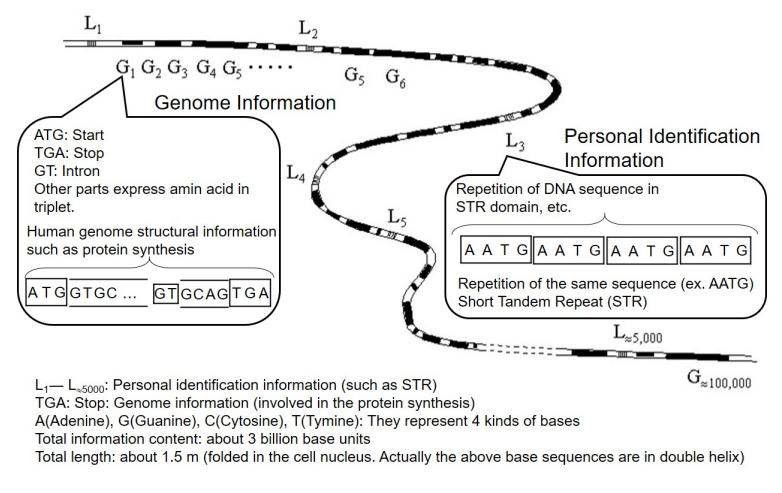
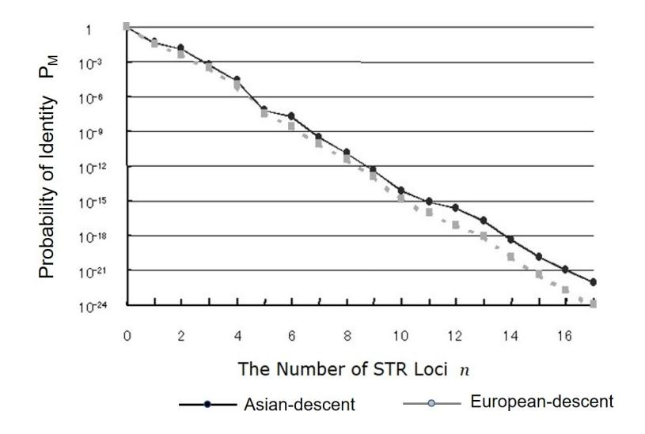
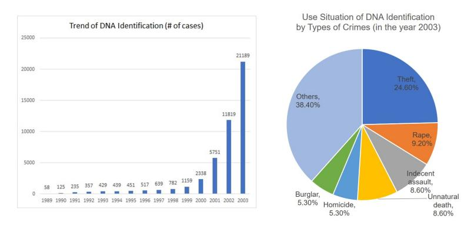
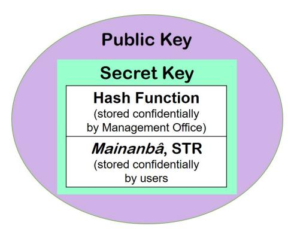
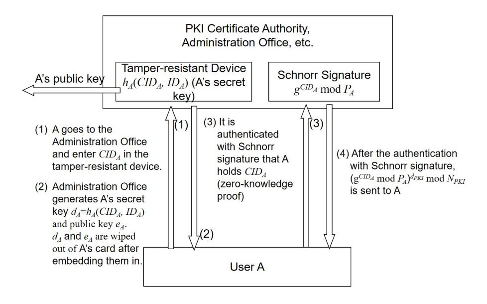
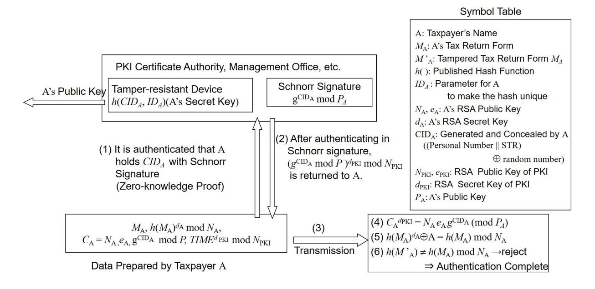

# **3-Layer Public Key Cryptosystem with Short Tandem Repeat DNA**

Shigeo Tsujii1 , Toshiaki Saisho1 , Masao Yamasawa1 , Masahito Gotaishi1 , Kou Shikata2 , Koji Sasaki3 , Nobuharu Suzuki3 , and Masaki Hashiyada4

- 1 Research and Development Initiative, Chuo University, 1-13-27 Kasuga, Bunkyo-ku, Tokyo, Nippon, tsujii@tamacc.chuo-u.ac.jp
- 2 Faculty of Law, Chuo University, 742–1 Higashi Nakano, Hachioji, Tokyo, 192–0393 Nippon,
- 3 AdIn Research, Inc., 8F Kioicho Park Bldg., 3–6 Kioicho, Chiyoda, Tokyo, 102–0094 Nippon, 4 Forensic Science Course, Kansai Medical University, 573–1010 Nippon.

**Abstract.** While the digital technology spreads through the society, reliable personal authentication is becoming an urgent issue. As shown in digital taxation (e-Tax) and blockchain, etc., high reliable link between the private key of a public key and the owner who has it in card or smartphone etc. is required. This paper proposes 3 layer public key cryptosystem in which Individual Number (a.k.a. *My Number* ) and STR (Short Tandem Repeat) as personal identification data installed. "Individual Number" is a national identification number issued by government, like social security number in USA. STR is a kind of DNA data which does not contain any subtle personal information such as inherited character and has very accurate personal identification. The proposed system satisfies requirements of integrity, soundness and zero knowledge characteristics which analog biometrics such as face authentications cannot provide.

**Keywords:** Public Key Infrastructure, Authenticity Determination, Personal Authentication, Short Tandem Repeat, Schnorr Authentication, DNA, PKI, Biometrics

## **1 Introduction**

While the digital technology spreads through the society, reliable personal authentication is becoming an urgent issue. As shown in digital taxation (e-Tax) and blockchain, etc., link between the private key (secret key of public key cryptosystem) and its corresponding person is required. The "Digital First" Act, which was enforced by Japanese government in December 2019, holds up three principles:

- 1. Digital First: Procedures be completed exclusively with IT operation.
- 2. Once Only: Once the information is submitted, the need of re-submitting it should be eliminated.
- 3. One Stop: Procedure should be finished without repetition.

Although these are excellent in convenience and efficiency, reliability of personal authenticity should be also improved. In the digital society, where unauthorized use of secret keys can jeopardize property or even life of people, prevention of theft of secret keys and countermeasures against unauthorized use to minimize the damage are required. However, currently correspondence between the ID and secret key, which is contained in the public key, is not sufficienty reliable.

In this paper, a public key cryptography of 3-layer structure where the secret key contains Individual Number and Short Tandem Repeat (STR) of DNA is proposed. STR, a digital information, is a non-genomic DNA sequence which does not contain any privacy information, remains permanently unchanged, and is able to idenity the owner uniquely out of trillions. While

the concept has been already proposed in 2000, considering the progress of digital transformation (DX), the concept of STR personal identification further secured with secret sharing and zeroknowledge proof is proposed. Its application to practical systems including taxation system (e-Tax), etc. is also proposed in this paper. In the section 2, necessity of personal identification with the inherent digital information is discussed, and subsequently, current study on STR and its current use situation are introduced. In the section 3, constitution of the proposed system is described and its application is explained, with an example of taxation system (e-Tax). In the section 4, security of the system is discussed. Protection of privacy is also discussed. In the section 5, measures in obtaining support by the society and methods of spreading the system are discussed.

# **2 Preliminaries**

#### **2.1 Terminology**

Following terms are used in this paper:

- **–** Identifiability: If the system has low FRR (False Rejection Rate), it is expressed "identifiability of the system is high."
- **–** Soundness: If the system has low FAR (False Acceptance Rate), it is expressed "soundness of the system is high."
- **–** Zero-knowledgeness: If a user of the system can prove that he/she has certain confidential information without disclosing the information itself, it is expressed "the system satisfies zero-knowledgeness."

#### **2.2 Towards Parallel Use of Analog and Digital Biometrics**

Although public key cryptography itself is designed mathematically secure, current link between public keys, which are installed on IC cards or smartphones, and owners would not be sufficiently reliable. Currently individual confirmation relies on (i) what you have (IC cards, etc.), (ii) what you know (PIN codes, etc.), or (iii) what you are (analog biometrics by face, fingerprints, etc...). Reliability of (i) and (ii) would not be sufficiently reliable. (iii) analog biometrics, which are intuitively understandable, would remain useful in the future. Although, current situation seems something like never-ending cat-and-mouse game between verification and forging technologies. As for face authentication, personal identification ratio has reportedly 99.5%. But what should be done in the 1*/*200 case of failure in authentication? If the identifiability is improved, soundness (mistakenly identifying others as the user) might be degraded. Therefore utilization of digital information including STR, which satisfies all of integrity, soundness, and zero-knowledgeness, is desired. Comparison between analog and digital biometrics is shown in Table 1. Based on the recognition of the above problem, public key cryptography with STR embedded, which was proposed around 2000 [9][10][3][1][4][2]), was improved with the parallel use of Individual Number, additional security with secret sharing, and zero-knowledge of Schnorr authentication in order to enhance identifiability and security. What STR is and its latest use situation are outlined in the next subsection.

#### **2.3 Outline of Short Tandem Repeat and the Situation of its Current Use**

Human digital bio-information is contained in STR, non-genomic DNA information, which is contained in all of the 50 to 60 trillion cell nucleus, as shown in Figure 1. There are non-genomic segments, which do not contain any genomic information such as about physical characteristics

**Table 1.** Comparison between Analog and Digital (STR) Biometrics

#### **Personal Verification**

Analog Biometrics: Fingerprint, Iris, Face, Vein... although we are well used to them... Digital Biodata: STR (Short Tandem Repeat)

|                                    | Analog | Digital |
|------------------------------------|--------|---------|
| Zero Knowledge                     | ×      | 〇       |
| Integrity                          | ×      | 〇       |
| Soundness                          | ×      | 〇       |
| Privacy Protection                 | ×      | 〇       |
| (face, etc.)                       |        |         |
| Social Recognition                 | 〇      | ×       |
| (easy to understand, friendliness) |        |         |

#### **Integrity**

Individual confirmation is performed safely (the registered information is reproduced) on digital networks

| Digital Information | Member ID (unique ID: TS system,                                      |                                                                                          |  |
|---------------------|-----------------------------------------------------------------------|------------------------------------------------------------------------------------------|--|
|                     | A Personal Identification number is given to every resident in Japan) |                                                                                          |  |
|                     | Individual Number                                                     | Possible                                                                                 |  |
|                     | STR Biometric Information                                             | Possible                                                                                 |  |
| Analog Information  |                                                                       | Manuscript signature, Official seal Not Possible (motivation of public key cryptography) |  |
|                     | Analog Biometrics                                                     | Not Possible (assisted by error correcting code?)                                        |  |

## **Soundness**

Inpersonation and forgery can be securely prevented (distinguish the person from others with 100%)

| Digital Information | Individual Number | Impossible (theft of the card, etc.                                                      |
|---------------------|-------------------|------------------------------------------------------------------------------------------|
|                     | STR Biometrics    | Possible (When in doubt, the person can be confirmed                                     |
|                     |                   | in face to face.)                                                                        |
| Analog Information  |                   | Manuscript signature, Official seal Not Possible (motivation of public key cryptography) |
|                     | Analog Biometrics | Not Possible (assisted by error correcting code?)                                        |

#### **Zero-Knowledgeness**

A person can prove to others that he/she holds the confidential authentic information *a* without disclosing it.

| Digital Information | 1) On the basis of a certain cryptographic assumption (such as the difficulty of             |  |
|---------------------|----------------------------------------------------------------------------------------------|--|
|                     | computing discrete logarithms), while ST RA (STR of the user A) itself is kept hidden,    |  |
|                     | ST RA QA := g mod p is disclosed.                                                   |  |
|                     | 2) By inserting hair root or intraoral cell, etc. in a tamper-resistant device, the user can |  |
|                     | show that QA is generated.                                                                |  |
| Analog Information  | It is impossible, since it does not have any reproductivity.                                 |  |
|                     | (it can be realized to some extent by utilizing error correction code: Hitachi)              |  |

or inherent disease, in DNA. Short Tandem Repeat (STR) is one of them. STR is constituted with about 5,000 locus, which have been inherited from remote ancestors. Each locus has tens of repetitions of a sequence, a pattern of 4 kinds of bases: Guanine, Cytosine, Adenine, Tymine (such as AATG). Since human cells are diploid, information on a locus is inherited from both mother and father. Depending on the DNA of the parents, there are cases where sequence of the same number of the repetition is inherited (homo) and cases where different repetition is inherited (hetero). Since it is impossible to determine which of a given locus has been inherited from the father or mother, If, for example, the *i*-th locus has 8 and 11 repetitions and (*i*+1)-th has 13 and 9, the personal identity code can be 08110913, if arranged in ascending order. Additionally, since loci can be arranged in any order, multiple personal IDs can be generated from one STR sequence. Consequently, by hiding or changing the order of arranging loci, precision of the security can be easily enhanced. Figure 2 indicates the probability that two people generate the same identity on Y-axis according to the number of loci chosen from about 5,000 indicated on X-axis. When the number of the loci chosen is increased, the probability that two people generate the same identity becomes small rapidly. For example, if 10 loci are chosen, then the probability is less than 10*−*12. As explained above, the characteristics of STR are:

- 1. It can identify uniquely one person out of as many as trillions with high precision.
- 2. It is permanently unchanged.
- 3. It does not include any personal information (physical characteristics or dissease, etc.).

Although there are still challenges such as cost and DNA sequencing time, as shown in Figure 4. It is expected that these challenges would be overcome as long as it becomes widespread.

**Fig. 1.** DNA Information about STR

**Fig. 2.** Number of STR Loci and Probability of Identity

**Fig. 3.** Use Condition of DNA Identification in Crime Investigations of National Police Agency

## **3 Constitution and Operation of the System**

#### **3.1 Generation of the Secret Key**

The secret key of this system is, as shown in Figure 3, constituted by cooperation between user (denoted A) and the Management Office (PKI Certification Authority, etc.). Procedure of registration by User A in person and generation of secret key is as follows (refer to Figure 4).

- 1. Management offices such as PKI's CA have tamper-resistant devices installed
- 2. The tamper-resistant device has *IDA* a parameter of the hash function corresponding to the user inside.
- 3. User A generates a secret random number *RA*.
- 4. User A visits Management Office and inserts his/her Individual Number *MNA* and intraoral cell, etc. to generate his/her secret key (generation of the key depends on the public key cryptography. For example, in RSA, appropriate constant is added to the hash value to

make it prime. Then the public modulo (composite number), secret key *dA*, and public key *eA* are genereated by the algorithm embedded in the tamper-resistant device.)

5. The secret key of User A generated in the tamper-resistant device in Management Office and User A's confidential information:

$$CID_A = (MN_A||STR_A) \oplus R_A \tag{1}$$

are entered in User A's IC card, etc. and immediately after that, User A's secret key is wiped out within the tamper-proof device. User A's public key is disclosed in Management Office.

6. In order to have the ability to confirm with zero-knowledge proof that User A really has CIDa utilizing the difficulty of discrete logarithm, Management Office saves (*g CID* mod *P*), utilizing the difficulty of discrete logarithm.

## **3.2 Process in Operation**

Operation processes are performed on networks.

- 1. User A sends (*eA, gCIDA* mod *P*) to Management Office. *eA* is User A's public key.
- 2. Management Office signs on *eA, gCIDA* (mod *P*)*,* ReceiptTime) with its secret key and send them back to User A.
- 3. User A begins communication of digital signature with

For example, taxpayer A sends [*M, h*(*M*) *dA ,*(*NA, eA, MNA*) *dpki* ] to the tax office in the current e-Tax. Here *M* is the content of tax form, *h*() is the disclosed hash function, *NA* and *eA* are Taxpayer A's Individual Number, etc. Tax Office, which received it, verifies that *NA* and *eA* are Taxpayer A's public key and confirms that the content of the tax form is not tampered, with the public key corresponding to the secret key of PKI CA. Since *MNA* is a specific secret personal information and therefore its unauthorized disclosure is strictly prohibited with the penalty of three years' imprisonment according to Japanese criminal law, although it is difficult to keep it confidential in practice.

To cope with the situation, *g CIDA* is used instead of *MNA*. *CIDA* is kept secret relying on the difficulty of discrete logarithm and its authenticity is verified by Tax Office with Schnorr authentication in the proposed scheme.

**Fig. 4.** Public Key of Three-Layer Structure, with Personal Authentication Data Embedded

**Fig. 5.** Process of Registering User A' Secret Key in Person

# **4 Discussion of Privacy Protection and Security of Secret Keys**

#### **4.1 From the Aspect of Privacy Protection**

Neither Individual Number nor STR can be strictly protected in daily life. Individual Number can be disclosed when a resident asks to issue the certificate of resident indicating Individual Number in Municipal Office, if the personnel has malicious intent. STR might be stolen in restaurants or barbershops. However, the legal system requires their protection from the aspect of protecting personal information and privacy. Multi-layer protection measures are taken also in this scheme.

- 1. Measure to Store Users' Secret Safely The system is constituted so that Random number *RA* and *CIDA* := [(*Individual Number||ST R*) *⊕ RA*] can be kept confidential and authenticity of the two can be verified in zero-knowledge with Schnorr authentication. Management Office does not have *CIDA* nor random number *RA*.
- 2. The secret key is defined as "the hash of *CIDA* and a randomly generated secret parameter unique to User A" and Management Office does not keep *CIDA* for secret decentralized management.

Therefore even if the secret key leaks out, *CID* does not. And even if *CID* leaks out, neither Individual Number nor STR does.

On the other hand, although STR of a person does not have any information on whether it was inherited from the mother or father, it would be revealed if STR of the three is inspected. Therefore, although there is no denying that STR has privacy information about parent-andchild relationship, since it is possible to randomly choose necessary number of loci from more than 5,000, in using for personal authentication, to create STR for use, thereby hiding parentand-child relationship. It should be confidential which loci were chosen and it will be used in case of lawsuit.

**Fig. 6.** Application of 3-Layer Public Key Gryptography with Individual Number Embedded in the Secret Key to Tax Payment Report

#### **4.2 Security of Secret Key**

- 1. If the secret key leaks out, since the thief does not have *CIDA* nor *RA*, If the secret key leaks out, since the thief does not have *CIDA* nor *RA* to perform Schnorr zero knowledge proof, he/she cannot be authenticated to Management Office and consequently the attempt to impersonate the user fails.
- 2. If the thief X conspires with Management Office to forge *CIDA* with (his/her Individual Number *MNx||ST Rx*) and his/her random number *Rx*, the attempt fails because Management Office does not have *CIDA* or *RA*.
- 3. If *CIDA* is stolen in registering STR to the tamper-resistant device, since *RA* is not input to the device, the thief cannot authenticate with Schnorr authentication.
- 4. The authentication process is recorded in preparation for the conspiracy between the thief and Management Office to skip Schnorr zero knowledge proof. Transaction of without Schnorr authentication be rejected.
- 5. If, in addition to the conspiracy between the thief and Management Office, the thief steals Individual Number *MNA* and *ST RA*, then it is still impossible to forge the secret key as long as *RA* is not stolen. For that purpose, it is desirable that the user manages *MNA*, *ST RA*, and *RA* with secret decentralized management.
- 6. Even if the thief X and Management Office conspires and all of *MNA*, *ST RA*, and *RA* are leaked to X, if X who has the stolen secret key is arrested, it is proved from X's intraoral cell that the key is a forgery.

In this way, advantage of this method is that ultimate personal authentication can be done in face-to-face during the at legal action stage.

## **5 Future Challenge –for the step-by-step Implementation**

#### **5.1 Analysis of the Psychological Resistance**

There was resistance among nationals in implementing Individual Numbers. It is also expected that there would be an ambiguous resistance against embedding STR in secret key. Analysis of the resistance and activity of progressing awareness in the society are the future issue. Among them, non-genomic DNA such as STR is not distinguished from genomic DNA which has privacy information under the current law about DNA. Authors expect that laws would be amended so that STR can be used for reliable personal authentication without worrying about privacy.

#### **5.2 Issues about Social System**

Related to the discussion in section 4, law amendment and preparation of insurance system would be desirable.

For example, in case the thief intrudes the system with forged identity from anywhere outside Convention on Cybercrime countries and consequently neither arresting the thief nor claiming for compensation is impossible, insurance system would be effective.

### **5.3 Stepwise Implementation**

It would be desirable that the system be implemented step-by-step, beginning with an organization with members who need personal authentication with this system, and the range is gradually spread.

## **Acknowledgment**

This study is supported by the Project 181603006 of Strategic information and COmmunications R & D Promotion programmE (SCOPE) of Ministry of Internal Affairs and Communications. Additionally, authors greatly appreciate Prof. Jinhui Chao, Graduate School of Science and Engineering, Chuo University and Prof. Wakaha Ogata of Tokyo Institute of Technology for important advices.

## **References**

- 1. Itakura, Y.: Statistical Test of DNA Information for Personal Identification. IPSJ, CSS-2000 Symposium, Oct. pp. 121–126 (2000)
- 2. Itakura, Y., Hashiyada, M., Nagashima, T., Tsujii, S.: Proposal on personal identifiers generated from the STR information of DNA. International Journal of Information Security 1(3), 149–160 (Nov 2002)
- 3. Itakura, Y., Iwata, S., Ogata, W., Kurosawa, K., Tsujii, S.: A Public-key Cryptography with DNA Information Embedded . ISEC, IEICE technical report 100(213), 137–144 (Jul 2000)
- 4. Itakura, Y., Tsujii, S.: Proposal of DNA Personal Information Management System Utilizing DNA-ID. Journal of Information Processing 42(8), 2134–2143 (Aug 2001)
- 5. Kasai, K.: The progress of forensic DNA typing methods over the last thirty years (2016)
- 6. Saisho, T., Tsujii, S.: Considerations about National Authentication Framework in Japan(NAFJA). Tech. Rep. 19, R & D Initiative, Chuo University (May 2019)
- 7. Shibata, Y., Miyaki, T., Mizuno, T., Nishigaki, M.: Key Generation from Multiple Biometric Features Using Statistical A/D Conversion with Error Correction. Journal of Information Processing 48(9), 3027–3038 (Sep 2007), https://ci.nii.ac.jp/naid/110006422983/

- 8. Shibata, Y., Nakamura, I., Mimura, M., Takahashi, K., Nishigaki, M.: A challenge-response authentication with a password extracted from a fingerprint. IPSJ Technical Report CSEC, [Computer Security] 26, 179–186 (Jul 2004), https://ci.nii.ac.jp/naid/110002664883/
- 9. Tsujii, S.: A public-key cryptography with biometric information embedded in the secret key. FAIT (Forum on Advanced Information Technology) Lecture Material (1999)
- 10. Tsujii, S., Itakura, Y., Yamaguchi, H., Kitazawa, A., Saito, S., Kasahara, M.: A Public-Key Cryptography with Biometric Information Embedded in the Secret Key. Simposium of Cryptography and Information Security 2000 (D07) 2000(7) (2000)
- 11. Tsujii, S., Saisho, T., Yamasawa, M., Shikata, H., Sasaki, K., Suzuki, N.: 3 Layers Public Key Cryptosystem with a Short Tandem Repeat DNA for Ultimate Personal Identification. In: ISEC2019-52, IEICE technical report. vol. 119, pp. 341–346
- 12. Tsujii, S., Saisho, T., Yamasawa, M., Shikata, K., Sasaki, K., Suzuki, N., Hashiyada, M.: 3 Layers Public Key Cryptosystem with a Short Tandem Repeat DNA. Simposium of Cryptography and Information Security 2020 (3A3-4) 2000 (2020)