# Leakage Assessment in Fault Attacks: A Deep Learning Perspective

Sayandeep Saha, Manaar Alam, Arnab Bag, Debdeep Mukhopadhyay, and Pallab Dasgupta

Department of Computer Science and Engineering, Indian Institute of Technology, Kharagpur

{sahasayandeep, alammanaar, arnabbag, debdeep, pallab}@iitkgp.ac.in

Abstract. Generic vulnerability assessment of cipher implementations against fault attacks (FA) is a largely unexplored research area to date. Security assessment against FA is particularly important in the context of FA countermeasures because, on several occasions, countermeasures fail to fulfil their sole purpose of preventing FA due to flawed design or implementation. In this paper, we propose a generic, simulation-based, statistical yes/no experiment for evaluating fault-assisted information leakage based on the principle of non-interference. The proposed experiment is oblivious to the structure of countermeasure/cipher under test and detects fault-induced leakage solely by observing the ciphertext distributions. Unlike a recently proposed approach [1] that utilizes t-test and its higher-order variants for detecting leakage at different moments of ciphertext distributions, in this work, we present a Deep Learning (DL) based leakage detection test. Our DL-based detection test is not specific to only moment-based leakages and thus can expose leakages in several cases where t-test based technique demands a prohibitively large number of ciphertexts. We also present a systematic approach to interpret the leakages from DL models. Apart from improving the leakage detection test, we explore two generalizations of the leakage assessment experiment itself – one for evaluating against the Statistical ineffective fault model (SIFA), and another for assessing fault-induced leakages originating from "non-cryptographic" peripheral components of a security module. Finally, we present techniques for efficiently covering the fault space of a block cipher by exploiting logic-level and cipher-level fault equivalences. The efficacy of DL-based leakage detection, as well as the proposed generalizations, has been evaluated on a rich test-suite of hardened implementations from several countermeasure classes, including open-source SIFA countermeasures and a hardware security module called Secured-Hardware-Extension (SHE).

Keywords: Fault Attack · Leakage Assessment · Deep Learning.

# Introduction

Fault attacks (FA) [2, 3] have recently gained significant attention from both industry and academia. The core idea of such fault assisted cryptanalysis is to deliberately perturb the computation or control-flow of a system and gain some

Type Description Fault Model Description Performs two computation on the same data Time/Space Corrupts a bit intermediate and compare the result. No output if fault is Bit stuck-at/flip Redundancy state ound. Code-based Corrupts multiple bits within a Redundancy using error-detection codes Nibble/byte Redundancy byte/nibble Same as time/space redundancy, but Data dependent bit-flips, Infection Biased bit-flips no explicit comparison. Randomizes useful for biased FA or SIFA the outcome upon fault detection. Bit-flips in S-Box intermediate Bit-flips in Instruction Uses redundant instructions computation. Useful for SIFA masked S-Boxe Level on masked S-Boxes Combined SCA-FA countermeasures Single/ Multi Instruction-Skip in Combined Instruction Skip CAPA, M&M microprocessors SIFA Loop abort/changing outcome Bit-level error detection/correction Control to counter ineffective faults. fault of if/else block countermeasure

Table 1: Different Countermeasure Classes and Fault Models

information about the secret through the faulty system responses. Malicious faults are easy to generate but challenging to prevent. Especially, classical fault tolerance techniques often fall prey against precisely placed and repeatable faults.

There exist several physical means of injecting faults with malicious intentions. Prominent methods include clock-glitching [4], under-powering [5], electromagnetic (EM) glitch [6], laser-based fault injection [5,7], and Rowhammer bug (for remote fault injection) [8, 9]. While the nature and precision of the faults in a system usually vary with the injection mechanisms, it is just one aspect of an FA. The key extraction process also critically depends on the underlying algorithm and its implementation. The standard way of performing an FA is to analyze the algorithm along with a logical abstraction of the faults happening in a system known as a fault model. Classically, data corruption faults having uniformly random or some statistically biased distribution (even constant valued faults) are exploited in most of the FAs. However, in a more generic scenario, one cannot rule out faults in the control-flow and faults at the instruction-level, which have also been shown to be fatal for cryptographic implementations on several occasions. Recently, attacks have been developed using ineffective faults by exploiting the dependence of such absence of faults on the underlying data. Such attacks have been used to break most of the existing hardened implementations [10,11]. Being a practical class of attack, it is imperative that fault models in FA should be practically realizable. The enormous improvement of fault injection mechanisms in the last few years [5–7] now allows even the strongest fault model assumptions to be reasonably achievable for different implementations.

In this paper, we mainly focus on FAs in the context of block ciphers. Existing block ciphers alone are not capable of throttling FAs, and suitable countermeasures are required. FA countermeasures are usually incorporated at the algorithm-level [12,13] or at a lower level of abstraction such as in the assembly instructions [14,15] or hardware circuits [16–18]. One common feature for most of these countermeasures is that they utilize some form of redundancy (time, hardware, or information redundancy) to detect/correct the presence of a fault in the computation. The most common form of countermeasures, widely referred to as detection countermeasures, deploy an explicit check operation to detect the faulty

computation and then react by either muting or randomizing the output [13,19]. In contrast, infective countermeasures avoid the explicit check operation and introduce a randomized infection function that masks a faulty ciphertext to make it useless for the adversary [12,20]. Instruction-level countermeasures implement redundancy at the granularity of assembly codes. One straightforward strategy is to incorporate redundant instructions in the code with the assumption that an attacker may not be able to bypass all of them at once, causing an effective corruption [14, 15]. With the recent advent of Statistical Ineffective Fault Analysis (SIFA), a completely new class of countermeasures have been proposed. Such SIFA countermeasures incorporate redundancy checks in a per-bit manner to detect/correct every fault (whether effective and ineffective) [16–18, 21], and thereby destroying the data-dependent statistical bias causing key leakage. Table. 1 presents a summary of countermeasures and fault models.

Unfortunately, many of these existing FA countermeasures [12, 14, 22, 23] have been found insecure even (sometimes) against the fault models they were designed to protect for. A key cause behind such design failures is that there exists no general mechanism for security assessment in the context of FAs. Unlike block ciphers, countermeasures are often engineered in-house, considering several other aspects like resource/performance constraints and time to market. They are mostly analyzed by the design team itself, or by security certification facilities as an end product, which may leave critical loopholes unobserved. Devising a generic methodology for evaluating FA is a open scope of research.

#### Our Contributions:

Deep Learning-based Leakage Detection for FA: In this paper, we introduce a Deep Learning (DL) assisted, automated, and straightforward yes/no testing methodology for assessing the security provided by an FA countermeasure called Deep Learning Fault Attack Leakage Assessment Test (DL-FALAT). In short, DL-FALAT detects potential information leakage in ciphertext (also called traces) distributions of a block cipher under the influence of faults. The root of this approach lies in the theory of non-interference [24]. The main utility of DL here is to realize a detection test for checking if two distributions are same or different. Simply put, we train and validate a DL algorithm with labelled ciphertexts resulting from fault simulations of a given implementation with two different fault/key values, which is posed as a binary classification problem. If the validation accuracy is found to be higher than that of a randomly guessing binary classifier, it is concluded that the DL model is able to distinguish between ciphertext distributions corresponding to two different fault/key values. This phenomenon implies the violation of non-interference and indicates leakage in FA. Also, we propose simple DL models which work universally irrespective of the design-under-test and fault model, enabling the leakage assessment with low ciphertext count. For FA leakage assessment, low ciphertext count is extremely important as one has to perform the test on several fault locations in a design for ensuring security. Another motivation for choosing DL for leakage assessment is that it can detect the leakage-order automatically, unlike the t-test. For FA countermeasures, the statistical order of the leakage is not known apriori (unlike SCA countermeasures, such as masking). Finally, we present a systematic flow to interpret the outcomes of the DL-based detection test. Major strengths of DL-FALAT lie in its simplicity and the feature of not depending on any nontrivial information regarding a hardened algorithm. It is supposed to be applied at a pre-deployment stage <sup>1</sup> , where an evaluator is allowed to simulate faults at different points within the implementation code and can change the keys.

Enhancing the Leakage Assessment Experiment: The second contribution of this work is to enhance the non-interference experiment (that is the generation of two different ciphertext distributions corresponding to two different fault/key values; referred as leakage assessment experiment) itself. As the first enhancement, we tailor it for detecting the so-called Statistical Ineffective Fault Analysis (SIFA). Our approach can detect the data dependency of the correct and faulted encryptions in SIFA by analyzing the ciphertexts, and thus can meaningfully interpret SIFA on different implementations. As a second enhancement, we propose a compare-with-uniform variant of the basic experiment which can be utilized for testing so-called "non-cipher" components of a security module against FAs. Most of the time, cryptographic primitives are associated with several other peripheral components such as mask generation logic or input delivery logic, which can also be targeted by an attacker leading to an exploitable leakage. Leakage of the aforementioned kind can be successfully detected by the compare-with-uniform enhancement of the leakage assessment experiment.

Covering the Fault Space: In order to handle the large fault space in block ciphers, we exploit different types of equivalences present in the fault space. More precisely, fault equivalences at gate-level circuits and the cipher-algorithm level were exploited to provide a reasonable coverage over the fault space without exhaustively testing every fault location. Such equivalences partition the fault space in several equivalence classes, and testing each class member is sufficient. The gate-level equivalences were explored with the TetraMax tool from Synopsys, and the cipher-level fault equivalences were found using an automated fault analysis tool called ExpFault [25].

The efficacy of DL-FALAT has been established over a representative set of detection, infective, instruction-level, SIFA, or combined countermeasures. To evaluate the countermeasures against instruction-level faults, in this work, we developed an easy-to-use instruction-level fault simulation mechanism based on the GNU Debugger (GDB) software. In order to evaluate the holistic leakage assessment capability of DL-FALAT on "non-cipher" components, we validate an automotive security standard called Secure Hardware Extension (SHE) for which we found non-trivial vulnerabilities.

#### Related Work:

A prior approach for leakage assessment in the context of fault attacks was proposed in [1], which used Welch's t-test for leakage detection. DL-FALAT enhances the power of the detection test over t-test in terms of data complexity,

<sup>1</sup> Leakage assessment with device-level practical faults may leave some vulnerable corner cases unexplored, as certain faults may not take place for a specific injection mechanism. We, therefore, suggest that leakage assessment should be performed with simulated faults so that different fault types can be explored.

which has been established by multiple examples in this work. In particular, t-test is limited to the detection of leakages in the moments of a distribution (which can be problematic [26–28]), where the statistical-order of the test has to be defined by the evaluator. In contrast, the DL- based detection test can automatically detect and combine necessary points in the trace for leakage detection without any user intervention, and also without any limitation on moment-based leakage. Furthermore, the work in [1] does not shed light on SIFA attacks, and the general enhancement of the leakage assessment experiment beyond cipher implementations. Finally, the work in [1] does not comment on how to reasonably test several fault locations inside a cipher so that meaningful fault coverage estimations can be made. We address the fault space exploration problem in this paper. Another recent contribution in this direction is due to [29], which presents a fault diagnosis approach specific to hardware designs for evaluating countermeasures against FAs. The approach in [29] is based on monitoring certain internal signals for detecting faults and not the ciphertexts only, and hence expects knowledge regarding the implementation details. Moreover, vulnerabilities in countermeasures are typically not limited to their fault detection modules but also depends on the recovery modules as we practically show in the case of infective and SIFA countermeasures. Hence, checking the leakage at the ciphertext seems to be a better idea as it represents the true exploit of a fault attack. Recent years have also seen several applications of DL in the context of SCA attacks including leakage detection [28,30–33]. However, the leakage in SCA [34] is significantly different from that of FA <sup>2</sup> . One of the major issues in FA leakage assessment is that one has to test several fault locations. Hence, the statistical test at each location must operate with reasonable data complexity. The DLbased flow presented in this paper is specifically tailored for that purpose, which was not required for the DL-based SCA leakage detection approach [28]. Such tailoring of the test is non-trivial, as it involves careful selection of the DL models, as well as the construction of the iterative approach proposed here. To the best of our knowledge, this work presents the first application of DL for FAs.

The paper is organized as follows. In Sec. 1, we present the concept of leakage in FA and its connection to the theory of non-interference, which is followed by the basic descriptions of the leakage assessment experiments and the t-test based detection test. Sec. 2 introduces the DL-based leakage detection test in detail. Sec. 3 outlines two enhancements to the leakage assessment experiment. The fault space exploration strategies using fault equivalence is presented in Sec. 4. Case studies on FA countermeasures are briefly outlined in Sec. 5 (with details in Appendix. B). We conclude in Sec. 6. Appendices present a background on

<sup>2</sup> The leakage function in FA varies significantly between attack strategies, fault models, ciphers and countermeasure algorithms (unlike SCA leakage functions which are usually specified by Hamming weight/distance). For example, in a typical differential fault analysis attack, the leakage function is decided by the fault propagation path up to the ciphertext, which varies with the cipher, the fault location, and the countermeasure structure.

DL (Appendix. A), detailed case studies (Appendix. B), and instruction-level fault simulation methods (Appendix. C).

# 1 Fault Attack and Leakage Assessment

In this section, we elaborate on the concept of information leakage for FA and relate it with non-interference. Subsequently, we present two basic experiments for examining leakage.

#### 1.1 Information Leakage in Fault Attacks

Leakage in fault attacks is manifested as ciphertexts (or differentials of correct and faulty ciphertexts). Formally, it is described as:

$$\mathcal{L}_{FA} = C = \mathcal{F}(f, \mathcal{P}, \mathcal{K}) \tag{1}$$

with f denoting the value of the intermediate state differential at the point of fault injection (also denoted as the value of the fault mask or simply fault value), P denoting the plaintext variable and K denoting the secret key variable. The parameter f takes value according to some fault model F. Furthermore, the function F represents the fault propagation path through the cipher computation. The observable for the adversary in FAs is the ciphertext under the influence of faults (C) (resp. the differential between the correct and the faulty ciphertext denoted as ∆C) 3 .

The plaintext P in the leakage definition (Eq. (1)) can be controlled by the adversary. For a properly protected cipher, however, the key is supposed to remain secret, and no information regarding this should be leaked. Further, as proved in [1], the fault value f at some intermediate state of the cipher computation should also be treated as a secret for protected ciphers. <sup>4</sup> In other words, the fault value should not visibly influence the ciphertexts, and the secrecy of f

<sup>3</sup> The observable definitions in fault attacks may go beyond the ciphertexts or ciphertext differentials. Later in this paper, we shall use a more general form of the observables (Sec. 3.2).

<sup>4</sup> We note that the proof in [1] implicitly considers the fault to be injected before at least the last nonlinear operation of the cipher. This follows directly from the arguments in [35]. Considering fault before or during the last non-linear operation is required for most of the FAs, as otherwise the correct key cannot be distinguished with DFA or statistical distinguishers. However, there can be a couple of exceptions, such as the safe-error attacks with stuck-at faults, which do not depend on fault locations. One may observe that even in this case the knowledge of the fault mask (that is the differential between the correct and the faulty state) leaks all information resulting in key recovery. For example, if a bit stuck-at-0 fault is injected in the state just before the last key addition operation in AES, the fault mask is f = 0, if the state value is also 0, and f = 1, otherwise. Hence, the knowledge of fault mask also exposes the intermediate value in this case. To summarize, the observation regarding the exposure of fault mask in [1] is consistent even for those fault locations which are not followed by a non-linear layer, not causing any false negatives.

is equivalent to the secrecy of the key. In the case of unprotected implementations, both the key and f leak via the faulty ciphertexts. Therefore, the only way of preventing FA is to prevent the information flow from both K and f to the ciphertexts obtained during a fault injection event. In practice, all the existing fault attack countermeasures try to achieve this. Accordingly, a countermeasure is considered to be secure if it satisfies the two following equations:

$$\mathcal{I}(C, \mathcal{K}|\mathcal{P}) = 0$$
 and  $\mathcal{I}(C, f|\mathcal{P}) = 0$  (2)

I(X, Y |Z) is the conditional mutual information between random variables X and Y given Z.

Evidently, these two definitions can be used interchangeably for leakage assessment. However, our goal is to evaluate the hardened implementations without utilizing any algorithmic details of them. Lack of algorithmic details refrain the analytical estimation of mutual information and leaves data-based statistical estimation as the only option, which is considered challenging.

The technical difficulty in estimating mutual information be circumvented by an alternative interpretation of the leakage with the theory of non-interference. In simple words, the non-interference property guarantees the absence of sensitive information flow from the input to any observable point of a system. For FA-induced leakage, non-interference between the key or the fault value with the ciphertext or ciphertext differential (or the observable, in general) implies that the attacker cannot exploit the ciphertext to extract the secret. Assessment of non-interference in programs is usually performed by assigning program variables with different security levels. In particular, some of the variables are secret (marked as 'high'), and the rest of them are public ('low'). All the program variables can be treated as random variables in case the underlying program is probabilistic.<sup>5</sup> In this setting non-interference implies that the mutual information between the 'high' input variables and the 'low' output variables must be zero, which is the same as the definition of security provided in Eq. (2) (as in a cipher program ciphertexts are typically 'low' variables and the key and the faults are 'high' variables). However, an equivalent [24], easy-to-use formulation of non-interference exists. It is based on the intuition that if the low outputs differ in two independent runs of a program having the same low inputs, but some different high inputs (h and h 0 ), then the program leaks about its high inputs. For probabilistic programs, the difference in low outputs is manifested as the difference between two distributions. We utilize this alternative notion to assess the security from simulation data.

#### 1.2 Basic Experiments in Leakage Assessment

In this subsection, we present two variants of the leakage assessment experiment, which are based on the alternative notion of non-interference presented in the

<sup>5</sup> Formally, a probabilistic program P P can be described as a routine, which contains both probabilistic and deterministic assignments, and variables, when represented in Single-Static-Assignment (SSA) form. Most generally, P P takes a joint distribution of input variables and outputs a joint distribution of output variables.

last subsection. Both the fault and the key are treated as secrets ('high' inputs). For the sake of simplicity, we keep the value of one of the secret inputs fixed during our testing, which gives rise to two experiments. The choice of the "fixed" secret is driven by the type of application being tested, and also by the fault model. Keeping the key fixed is found to be the most convenient option for the cases where fault values vary within some finite range (for example, in the case of random byte faults the range is {1, 2, · · ·, 255}). This is due to the fact that the size of the keyspace is much larger than the size of the fault space, and this size would matter in certain situations. For example, in case of code-based detection countermeasures, not every fault value or key value (considering a fixed plaintext and fault value) is leaky, as the faulty state might get detected by the error detection module causing zero leakage. In such cases, one has to exhaustively search the fault/keyspace for identifying potential leaky faults (resp. keys). While this search is fairly easy for a fault space of size 256, it may become computationally intensive for a larger keyspace. Varying the key is a viable option too, and convenient for control-flow faults, bit-flip/stuck-at faults, or instructionskip faults, where the fault can typically take a single value (e.g., a control fault may change the execution flow of a program by altering a decision from "yes" to "no". The only faulty value here is "no", and accordingly there is only one possible fault mask).

The interference experiment with fixed key and varying fault value is presented in Algorithm. 1 (which corresponds to the first equality in Eq. (2)). The algorithm takes a protected cipher C, and two fault values f<sup>1</sup> and f2, and a key k as inputs. Internally, Algorithm. 1 runs two independent simulations of C for f<sup>1</sup> and f<sup>2</sup> with fixed plaintext p and key k. One should note that C is a probabilistic algorithm which may internally generate random numbers to randomize the outcome in each run. The simulation traces (the ciphertexts), denoted as Tf<sup>1</sup> and Tf<sup>2</sup> are then subjected to a statistical test T EST(). The T EST() reasons about the equality of the distributions of the two simulation traces and returns T RUE if the distributions are unequal. If the distributions are unequal the Algorithm. 1 returns YES indicating interference. The second interference experiment (ref. Algorithm. 2) is realized similarly, but by varying the keys and keeping the fault value fixed. However, it is recommended to perform the test in Algorithm. 2 on the ciphertext differentials. This is to handle the cases when the fault has an incomplete diffusion to the ciphertext. Considering ciphertexts rather than the differentials would leave a constant difference between the instances of two classes T<sup>k</sup><sup>1</sup> and T<sup>k</sup><sup>2</sup> , which may result in false positives in T EST().

It is worth mentioning that the basic interference tests can be optimized or generalized in several ways in the context of certain countermeasure classes, fault models, and observables. One such optimization, specific to detection countermeasures has been presented in [1] (as a preprocessing step for selecting fault value pairs ((f1, f2)) causing leakage). In Sec. 3 of this paper we propose two other optimizations. In the next subsection and the subsequent section, however, we focus on the detection test T EST().

#### 1.3 t-test for Leakage Detection

One convenient way of implementing TEST() is to apply Welch's t-test as done in [1]. A t-test gives a probability to examine the validity of the null hypothesis as the samples in both sets were drawn from the same population, i.e., the two sets are not distinguishable. Large absolute values of the t-test statistic (denoted as t) returned by the test indicate that the data-sets are statistically different. A threshold of |t| > 4.5 indicates that the confidence of the test is > 0.99999.

```
Algorithm 2 TEST-INTERF-KEY
Algorithm 1 TEST-INTERF-FAULT
                                                                                    Input: Protected Cipher C, Fault value f,
                                                                                   Key k_1, k_2, Simulation counter S Output: Yes/No
Input: Protected Cipher C, Fault value f_1,
       f_2, Key k, Simulation counter S
Output: Yes/No

1: \mathcal{T}_{f_1} := \emptyset; \mathcal{T}_{f_2} := \emptyset

2: p := GEN_{PT}()
                                                                                     1: \mathcal{T}_{k_1} := \emptyset; \mathcal{T}_{k_2} := \emptyset
2: p := GEN_{PT}()
                                                                                     3: corr_1 := \mathcal{C}(p, k_1)
     for i \leq S do
\mathcal{T}_{f_1} := \mathcal{T}_{f_1} \cup \mathcal{C}(p, k, f_1)
                                                                                          corr_2 := \mathcal{C}(p, k_2)
                                                                                          for i \leq S do
            \mathcal{T}_{f_2}^1 := \mathcal{T}_{f_2}^1 \cup \mathcal{C}(p, k, f_2)
                                                                                                \mathcal{T}_{k_1} := \mathcal{T}_{k_1} \cup \{corr_1 \oplus \mathcal{C}(p, k_1, f)\}
     end for if (TEST(\mathcal{T}_{f_1}, \mathcal{T}_{f_2})) then Return Yes
                                                                                                \mathcal{T}_{k_2} := \mathcal{T}_{k_2} \cup \{corr_2 \oplus \mathcal{C}(p, k_2, f)\}
                                                                                          end for
                                                                                         if (TEST(\mathcal{T}_{k_1}, \mathcal{T}_{k_2})) then Return Yes
                                                                                      9:
 9: else
                                                                                     10:
           Return No
10:
                                                                                    11: else
11: end if
                                                                                                Return No
                                                                                     12:
                                                                                    13: end if
```

In modern block ciphers, ciphertexts are of 64, or 128 bits, and treating them as a single random variable during the t-test is impractical. One reasonable solution is to treat them as multivariate quantities. Each bit, nibble or byte of a ciphertext can be treated as a variable. The proposal is to consider both bit and byte (or nibble, if required)-level divisions separately. As the t-test is univariate, it is applied separately on each individual bit/byte location in a point-wise manner. However, information leakage may not always be manifested in this univariate setting. To see this, let us consider two variables  $V_1$  and  $V_2$ such that  $V_1 = X \oplus r$  and  $V_2 = r$ . Here X is a leakage component depending on the key and the fault value, and r is a random variable. In a univariate setting, if we run the t-test on two different instances of  $V_1$  caused by two different fault values (to be precise,  $X = X_{f_1}$  in the first distribution and  $X = X_{f_2}$  in the second one), the t-test concludes that these two distributions are equal. This is due to the presence of the random mask r. However, if one considers the joint distribution of  $V_1$  and  $V_2$ , the leakage becomes visible as the effect of the mask r gets nullified. To capture this leakage, the t-test must be performed in a multivariate setting. One approach for extending t-test to the multivariate setting is to consider the *centered product* (i.e. higher-order statistical moments) of different variables [1, 36].

In [1], the TEST() function begins with performing a univariate test (bit/byte level), and continues with d-th order testing, for  $d=1,2,\ldots,G$ , until a leakage is observed. G is to be specified by the user. The simulation time (S in Algorithm. 1, 2) increases for higher G values, and hence decides the test complexity. However, higher G values ensure stronger security guarantee.

# 2 DL-FALAT: Deep Learning based Detection Test

The t-test and its higher-order variants indeed work for realizing T EST(), but only with some critical theoretical and practical limitations. Higher-order t-test can only capture different statistical moments, which has already been shown to be sub-optimal in the context of SCA leakages [26, 27], even resulting in false negatives. Nevertheless, the application of t-test in the context of FA can also be problematic from a usability perspective. Unlike SCA countermeasures, such as masking, where maximum possible leakage order has a direct relation with the masking order, leakage order in FA does not formally relate with the countermeasure construction. Rather the multivariate and higher-order leakages are often formed due to the fault propagation and improper construction of the countermeasures (e.g., for certain infection functions in case of infective countermeasures). Consequently, no information regarding the maximum order of such leakages is available apriori to the designer or the evaluator. The security guarantee depends upon the evaluator's choice of the maximum test order G.

Both the situations (i.e. limitation of moment-based approach and the issue with test order) mentioned above can be handled if we have a detection test, which typically does not depend upon the calculation of moments. DL methods are renowned for learning in highly multivariate scenarios and can take several complex interrelations among different features (beyond moments) into consideration. Further, DL does not require any order-related information to be given from the evaluator side as it can automatically discover the dependencies between different points. Finally, during our experimentation, it was found that DL performs significantly better in noisy scenarios, and for very high leakage orders compared to the t-test based approach.

#### 2.1 DL based Leakage Testing: Main Idea and Challenges

The idea behind DL-FALAT is to train a Neural Network (NN) with two different sets of ciphertexts resulting from computations based on two different secret values. Afterwards, the classification capability of the trained model is evaluated on a validation set. The accuracy result obtained over the validation set signifies the amount of information learned by the network. A better-than-random guess over validation set indicates the existence of leakages from the countermeasure.

Although the approach stated above is fairly simple, it poses several caveats and challenges during implementation. We list them as follows:

Decision Making: One fundamental challenge in DL is to quantify the decision threshold based on which one can distinguish between a leaky and a non-leaky implementation.

Sample Size: It is always desirable that the detection test returns a consistent decision with lowest possible number of samples. The sample size becomes important here as typically one might need to test multiple fault locations, requiring several fault simulations for each of them.

Model Selection: Ideally, there should be one specific DL model that works for a large class of test scenarios. The critical question is that whether or not there exists one such single model? If not, what are the guidelines for constructing proper models? Model selection becomes even more challenging when the number of data samples is less as there may be a tendency of overfitting.

Interpretation: How to obtain meaningful insights (such as univariate or multivariate leakage, the position of leaky bytes/bits in the ciphertext, etc.) from the DL results?

We begin by addressing the first two issues simultaneously in the next subsection, as there are some interrelations between them.

#### 2.2 Iterative Training and Decision Making

If better than random learning occurs for a DL model, it implies the existence of leakage. One key insight, in this case, is that the learning need not require to be the "best". Rather even a small indication of leaning is sufficient to decide leakage. However, this indication must come with high (preferably quantifiable) statistical confidence. This insight is valuable for keeping the sample size for training and validation relatively small and also for the selection of models.

Overall Flow: There is no clear thumb-rule for determining the proper amount of data required for training in DL. Hence, we begin the training with reasonably small training and validation sets and iteratively increase their size by taking feedback from a decision-making operation, which indicates whether or not there is any leakage. The training and validation iteration continues until leakage is detected, or a user-defined size limit of the dataset has been reached. This iterative process helps us to test with the minimum possible number of samples.

The DL-based leakage assessment experiment is outlined in Algorithm. 3. The basic experiment is the same as one described in Algorithm. 1, however, the T EST() is replaced with the iterative DL-based test (an equivalent extension for Algorithm 2 is also possible). The dataset under consideration is denoted as D = Tf<sup>1</sup> ∪ Tf<sup>2</sup> (resp. Tk<sup>1</sup> ∪ Tk<sup>2</sup> ). The instances from the set Tf<sup>1</sup> (resp. Tk<sup>1</sup> ) are labeled as 0, and the instances from the set Tf<sup>2</sup> (resp. Tk<sup>2</sup> ) are labeled as 1. The training and validation begins with a reasonably small dataset size Sinit. The size of the set D is increased adaptively in each iteration by adding equal number of samples from both of its constituent sets. To represent the varying size of D, from now onward, we use the notation D<sup>t</sup> denoting the dataset at t-th iteration. The entire set D<sup>t</sup> is divided into training and validation sets T r<sup>t</sup> and V lt, respectively. At the t-th iteration the model is trained with T r<sup>t</sup> and validated over V lt. The test continues until a maximum dataset size S is reached or some leakage is detected. Table. 2 presents the parameter settings for Algorithm. 3 (decided experimentally from our testbench). In case of infective countermeasures, for which we mostly observed multivariate leakage, we propose a simple optimization for saving the total learning time for multiple iterations of Algorithm. 3, while keeping the test still reliable. For these cases, if leakage is not observed within S = 10000, we perform another single learning iteration with a large sample count as a final confirmation test. In our experiments, 200000 samples were found giving reliable results in such cases.<sup>6</sup>

<sup>6</sup> While the counts in Table. 2 are experimentally verified, for some specific cases (e.g. non-leaky cases in SIFA testing), we test until S = 10000, (though the limit is S = 5000) in this paper, just for a consistent understanding of the leakage trend.

#### Algorithm 3 DL-TEST-INTERF-FAULT

```
Input: Protected cipher C, Fault value f_1, f_2, Key k,
             Simulation counter S, Initial simulation counter S_{init}, Model \mathcal{M}
Output: Yes/No
  1: \mathcal{T}_{f_1} := \emptyset; \mathcal{T}_{f_2} := \emptyset
 p := GEN_{PT}()
 3: S_t := S_{init}
 4: leak := Null
 5: while S_t \leq S do
6: for i \leq S_{init}/2 do
                 \mathcal{T}_{f_1}^- := \mathcal{T}_{f_1} \cup \langle \mathcal{C}(p, k, f_1), 0 \rangle
                                                                                                            \triangleright Add labels to the data as 0 or 1
           \mathcal{T}_{f_2}^1 := \mathcal{T}_{f_2}^1 \cup \langle \mathcal{C}(p,k,f_2), 1 \rangle end for
 α.
           \begin{array}{l} \mathcal{D}_t := \mathcal{T}_{f_1} \cup \mathcal{T}_{f_2} \\ \langle \mathcal{D}_t^1, \mathcal{D}_t^2, \cdot \cdot \cdot, \mathcal{D}_t^K \rangle := \texttt{GEN-CROSS-VALID-SET}(\mathcal{D}_t) \end{array}
10:
                                                                                               \triangleright Generate K subsets for cross validation
11:
            A_t := \emptyset
12:
            for i \leq K do
13.
                 Tr_t^i := \bigcup_{j=0}^K \mathcal{D}_t^j
                 Vl_t^i := \mathcal{D}_t^{i \neq i}
15:
                 a_t^i := \texttt{Train-and-Validate}(\mathcal{M}, Tr_t^i, Vl_t^i)
                                                                                                                   ▷ Get the validation accuracy
16:
17:
                 A_t := A_t \cup \{a_t^i\}
            end for
18:
            if (t_{-}Test(A_t) \implies \mathcal{H}_0) then
                                                                                                                       \triangleright Perform one-tailed t-Test
19:
                 leak = False
20:
21:
                 leak=True
22:
            end if
            if leak then
                 Return Yes
25:
                 if S_t \leq S then
27:
                      S_t = S_t + S_{init}
29:
                 else
                      break
30:
31:
                 end if
           end if
32:
33: end while
34: Return No
```

**K-fold Cross Validation:** For training and validation to be robust even over small datasets, we adopt the *stratified K-fold cross-validation* approach, which is well-known for preventing overfitting [37] (line 11 to line 18 in Algorithm. 3). The K-fold cross-validation can be explained as follows. The entire dataset  $\mathcal{D}_t$  is randomly partitioned into K equal-sized subsets  $\mathcal{D}_t^1, \mathcal{D}_t^2, \cdots, \mathcal{D}_t^K$  ( $|\mathcal{D}_t^j| = \frac{|\mathcal{D}_t|}{K}$ ,  $\forall j$ ). The *stratified* feature ensures that for each  $\mathcal{D}_t^j$ , equal number of samples from both of the classes (label-0 and label-1). Next, K-1 of these subsets are used for training the model  $\mathcal{M}$ , and one subset is used as validation set. Furthermore, this process is repeated K times giving each subset one chance to be used as validation set. The main idea is to check if the model  $\mathcal{M}$  is capable of generalizing its knowledge for unseen datasets or not.

One-Sided *t*-test for Decision Making: In our testing methodology, we accumulate the validation accuracy (as fraction of correctly classified examples) for all the K validation sets in a specific iteration t (the corresponding set is denoted as  $A_t = \langle a_t^1, a_t^2, \cdots a_t^K \rangle$ , where each  $a_t^j$  denote the validation accuracy while validating on  $\mathcal{D}_t^j$ )). To check leakage, we perform following hypothesis test.

$$\mathcal{H}_0: \mu_{A_t} = 0.5, \text{ and } \mathcal{H}_1: \mu_{A_t} > 0.5.$$
 (3)

Table 2: Parameters for DL-based Leakage Detection Flow

| Sinit S |                                                                                                                    | K |
|---------|--------------------------------------------------------------------------------------------------------------------|---|
| 500     | 10000 (for infective countermeasures)<br>5000 (for time/space/information/instruction redundancy, SIFA faults)) 50 |   |
|         |                                                                                                                    |   |

Here µA<sup>t</sup> denote the mean over set At. In case of leakage, the alternative hypothesis H<sup>1</sup> is accepted. We apply one-sided t-test with significance level α = 0.0001%, and degrees of freedom K −1 (we take K = 50). The t-value threshold is t = 4.5 (i.e. t ≥ 4.5 implies leakage). The mean value (i.e. the RHS in Eq. (3)) 0.5 in the above-mentioned t-test is quite intuitive. Acceptance of the alternative hypothesis indicates that the average validation accuracy is better than random guess (i.e. 0.5), which indicates that the DL model is learning and there is leakage.

#### 2.3 Selection of the DL Model

One of the major challenges of the leakage assessment problem is to select a generalizable model (M), which should not depend upon the design under test, or the nature of leakage. As already pointed out, one advantage that we have in leakage assessment is the learning need not be the best. Any better-thanrandom validation accuracy is acceptable. This fact allows some flexibility for model selection. However, one must be careful about the overfitting of a model.

Bit and Byte Models: In this work, we use the two models shown in Listing 1.1 and 1.2. The manifestation of leakage in the ciphertext structures is interpreted as bit-level or byte-level. This choice is motivated by the structures of existing ciphers and countermeasures, which mostly follow bit/byte level structures. Hence, we use two separate models for bit (Listing 1.1) and byte (Listing 1.2) level analysis. It is worth mentioning that theoretically, any one of these two models is sufficient for detecting all classes of leakages due to fault attacks. However, depending on the underlying cipher and countermeasure structure (bit/byte), the number of ciphertexts required for detecting leakage vary between the two models. Since one of the main motivations of this work is to reduce data complexity, we propose using both models simultaneously on the data for practical purposes.

An interesting observation here is that the models are fairly simple. We found that they work equally well for all the examples considered in this paper. An added advantage of simple models is the reduced risk of overfitting, especially while we are trying to use as less data as possible. We specifically verified that none of our examples leads to overfitting even while trained with the minimum number of samples required. In Sec 5, we show that these models outperform the t-test based strategy for the considered examples.

The models have been developed using the Python-based Keras library [38], which uses TensorFlow [39] in the backend. Both the networks consist of one input layer, two fully connected (or Dense) hidden layers, and one output layer. The hidden layers in the bit-model contain 8 and 4 neurons, whereas the hidden layers in the byte-model contain 32 and 16 layers, respectively. In both the models, the output layer contains 2 neurons. The hidden layers in both the models use Rectified Linear Unit (ReLu) activation function, whereas the output layers use Softmax activation function. Also, BatchNormalization is applied between the dense layers<sup>7</sup>. As the loss function, we use *categorical cross-entropy*. The *Adam* optimizer is chosen for the learning process (mostly with default parameter settings, as per Keras).

```
Listing 1.1: Bit-Model
                                       Listing 1.2: Byte-Model
model = Sequential([
                                  model = Sequential([
Dense(8, input_dim=128,
                                  Dense (32, input_dim=16,
   activation='relu')
                                      activation='relu')
BatchNormalization()
                                  BatchNormalization()
Dense(4, activation='relu')
                                  Dense(16, activation='relu')
                                  BatchNormalization()
BatchNormalization()
Dense (2,
                                  Dense (2,
   activation='softmax')])
                                      activation='softmax')])
```

#### 2.4 Leakage Interpretation Techniques

There exist multiple approaches in the literature to interpret the decisions made by a DL model, and they have also been used previously in the context of SCA security [28,31]. However, there still exists important issues that were not clearly addressed. Firstly, for certain implementations, it may happen that the model only takes certain leaky features (i.e. ciphertext bits/bytes) into consideration while ignoring others. This is perfectly natural as the desired classification may be easily achieved by considering those features only. Exposing all leakage points thus becomes an important issue<sup>8</sup>. Secondly, in the DL-based method, it is difficult to understand whether the leakage is univariate or multivariate, especially when both kinds of leakage points are present in one trace (this is the case in some of our examples). Note that t-test based method answers this question in a reliable manner by gradually increasing the analysis order d. The motivation behind leakage interpretation is to extract such information from a DL model.

We begin with the trained network model  $\mathcal{M}$  during the leakage interpretation. Once again, we adopt an iterative approach. The very first step we perform is a Sensitivity Analysis (SA) [31], which returns the contribution of each feature in learning the leakage. Mathematically, the Sensitivity  $(Im_i)$  for each feature is computed as  $Im_i = \left|\sum_j \frac{\partial y_0}{\partial x_i} \cdot X_i^j\right|$ . Here  $x_i$  denote the *i*-th input of the model  $\mathcal{M}$ ,  $y_0$  is the first output of  $\mathcal{M}$ , and  $X_i^j$  is the value of the *i*-th input in the *j*-th ciphertext from the validation set. The partial derivative here computes how much the output  $y_0$  changes with respect to an input  $x_i$ . The sensitivity is an aggregate of the changes over the entire validation set for each input. One important distinction with the leakage detection test described in Algorithm 3 is that here we take the trained model and consider a fresh and sufficiently large validation set while computing the feature importance values. Although the required number of traces increases in this case, we suggest performing leakage

<sup>&</sup>lt;sup>7</sup> BatchNormalization decouples the learning process of the hidden layers from each other, which is useful to regularize the learning and prevent overfitting to some extent. It also speeds up the learning process [40].

<sup>&</sup>lt;sup>8</sup> Such analysis can also give valuable information on how to attack.

interpretation only for those fault locations, which show some sign of leakage. Generating more traces for a few exploitable fault locations seems reasonable.

The SA step assigns real values to individual features using which they can be ranked according to their contribution to the decision of the DL model. In our analysis, we first begin with the subset of most important features. The determination of the most important subset, which we denote as MI, is driven by a threshold T hM I . We found that the average of all Imis works well as T hM I .

Once the MI has been determined, the analysis follows two separate paths. In the first path, we eliminate all the features in MI from the actual trace by assigning them with 0. We repeat the learning once again on the modified trace and check if the model still learns the leakage. In case the model does not learn, the dataset size is increased gradually up to some predefined count. This count is kept larger than the standard leakage detection to gradually expose even the most difficult-to-detect leakage points. The feature elimination and training continues iteratively, until either all feature points are exhausted, or the model fails to learn for maximum dataset size. In the second path of our analysis, the MI set obtained in an iteration is tested to check whether the leakage is univariate or multivariate. We apply the same trick of eliminating feature points in this case. However, only one point from MI is eliminated at each step, and the training is repeated. In case of a univariate leakage, even a single point in MI would be able to classify, whereas in case of multivariate leakage the classification would surely require multiple points. Note that this mechanism can only distinguish between univariate and multivariate leakages and would not necessarily indicate the exact leakage-order. In order to achieve the exact order, one must perform the analysis for each feasible subset of MI. While this is feasible if MI is small, it would be costly to perform for larger MI sizes. We experimentally illustrate leakage interpretation in Sec. 5.

#### 2.5 Discussion

One obvious question in the context of DL-based leakage detection is that if the models chosen are good enough for detecting all classes of leakages within reasonable data complexity. We found the answer to be affirmative in all of our examples. One reason is that we do not require the best possible learning to happen. We further explore this matter by considering other relatively complex models such as Convolutional Neural Nets (CNNs). It was found that the data complexities for leakage detection in CNNs are very similar to those with our models. While this indeed depends on the nature of the data, we believe that simple networks are still a better choice than complex ones, as they are less prone to overfitting, in general. Another relevant question is whether other statisticaltests, which are not moment-dependent, work better in this context than our DL-based method. To evaluate this, we considered the χ 2 -test, which has been previously used for leakage detection [41]. It was found that in terms of data complexity, the χ 2 -test performs similarly to the DL-based test in many cases. However, there are pathological cases where the performance of the χ 2 -test is inferior to the DL-based test (one typical example is an infective countermeasure called RIMBEN, for which DL requires 20000 traces and χ 2 -test requires roughly 80000.). Most importantly, the order of test has to be specified even for χ 2 -test, which is not required for the DL-based approach. As already pointed out, this was a motivation for shifting from the t-test based approach as the leakage assessment for FA should discover the order itself. Hence, DL-based leakage detection seems clearly advantageous over other approaches.

# 3 Proposed Generalizations of Leakage Assessment Tests

So far, we have focused on improving the leakage detection test using DL. In this section, we propose two generalizations of the leakage assessment experiment itself. The first one extends the experiments for SIFA faults while the second one enhances the leakage and observable definitions for "non-cipher" components.

#### 3.1 Handling SIFA Faults

SIFA is a recently proposed fault attack technique which utilizes the fact that the activation (generation of a faulty value at the injection site) and propagation (propagation of the fault through the circuit) of a fault depends on secret intermediate values. As a result, an injected fault may remain "ineffective" for certain intermediate values, and eventually result in correct ciphertexts. As a simple example of how ineffective faults happen, consider that an attacker injects a stuck-at-0 fault to some intermediate bit of the cipher. If the actual value of the bit is 0, no alteration will take place, and a correct ciphertext can be observed. In contrast, if the actual bit value is 1, it will result in a faulty execution. Typically, SIFA attacks exploit the correct ciphertexts for key recovery instead of faulted ones, and this feature is crucial for bypassing most of the existing state-of-the-art FA countermeasures [10, 11].

The goal of this section is to tailor the test methodology in a way so that it can meaningfully capture the SIFA attacks. One straightforward approach (adopted in [29]) is to declare a countermeasure as secure only if either every fault propagates to output, or every fault gets corrected (so that ineffectivity of faults do not depend upon secrets). However, this is conservative and will lead to false positives in several cases. For example, masking provides protection against SIFA [17] for certain restricted fault models even if there is a mix of correct and faulty ciphertexts. To defeat masking with SIFA, one would require to fault certain specific points inside S-Boxes [11], which may not be feasible for every implementation. Hence, having a mix of correct and faulty ciphertexts does not necessarily mean that SIFA would take place.

SIFA Fault Models: Typically, we model the SIFA faults in two different ways. To realize biased faults, we model them in a way so that the probability of a bit b remaining unchanged during fault injection (denoted as pr0→<sup>0</sup> if b = 0 and pr1→<sup>1</sup> if b = 1) is not equal (i.e. pr0→<sup>0</sup> 6= pr1→1). An extreme example of this is the so-called stuck-at-0 (resp. stuck-at-1) fault where the probability of b remaining unchanged is 1 for b = 0, and 0 for b = 1. Such faults create correct ciphertexts dependent on intermediate state bits which is exploited by SIFA [10] . The second fault model is required for performing SIFA on masked implementations. Here we perform bit-flip faults at carefully chosen locations within S-Boxes so that the correct output becomes dependent on some unmasked intermediate value [11]. Modifications to the Basic Experiment: We now describe the modifications to the basic leakage assessment experiment. Most of the SIFA fault models use bit-level faults for which only one possible value of fault exists (i.e. if the bit is originally 0, the faulty value is 1 and vice versa). Our approach, in this case, is to vary the key instead of the fault values (that is to use Algorithm 2). The test happens with a fixed plaintext p and two chosen keys  $k_1$  and  $k_2$  (ref. Algorithm. 2). Only constraint over  $k_1$  and  $k_2$  is that if the encryption of p with  $k_1$  results in bit value 0 (or 1) in the fault injection point, then the encryption of p with  $k_2$  must result in bit value 1 (or 0) in the injection point. For masked implementations, if some shares of an intermediate bit b are targeted with a fault, it is required that b=0 (resp. b=1) for  $k_1$  and b=1 (resp. b=0)  $k_2$ . Finally, we apply a simple trick which exposes the bias in fault injection (if any) at the ciphertext level. For detection countermeasures, the faulted output (which is usually represented as a fixed string) is replaced with random strings of same length with the correct ciphertext. The reason behind this replacement is to get rid of the unwanted constant difference between the two ciphertext distributions to be tested due to fixed strings. No such replacement is required for infection countermeasures as they already output randomized ciphertexts in case a fault is detected. The leakage test is performed on the ciphertext differentials.

Why SIFA Leakage is Exposed? It is indeed a tempting question that how SIFA leakage gets exposed through the aforementioned modifications. Taking differential makes the correct ciphertexts obtained in the injection campaigns equal to zero. The differentials corresponding to the faulty ciphertexts are random. Each of the datasets corresponding to keys  $k_1$  and  $k_2$  (denoted as  $\mathcal{T}_{k_1}$  and  $\mathcal{T}_{k_2}$ ), thus contains a lot of zero-valued bit/byte strings along with some random strings. Let us denote the count of zero-valued strings as  $Cnt_0$  and random strings as  $Cnt_1$  in one of the datasets (say in  $\mathcal{T}_{k_1}$ ). The ratio  $R_{=0} = \frac{Cnt_0}{|\mathcal{T}_{k_1}|}$  roughly equals to either  $pr_{0\to 0}$  or  $pr_{1\to 1}$  depending on the value of the faulted intermediate bit b while the plaintext p is encrypted with  $k_1$ . This is because b remains unaltered either with probability  $pr_{0\to 0}$  or  $pr_{1\to 1}$  which eventually results in a correct ciphertext. Next, let us consider the two datasets  $\mathcal{T}_{k_1}$  and  $\mathcal{T}_{k_2}$ . As already mentioned, b assumes different values for  $k_1$  and  $k_2$ . One may observe that, the ratios  $R_{=0}$  for these two datasets become different. This is because in one of the cases (say for  $k_1$ ),  $R_{=0}$  equals to  $pr_{0\to 0}$ , while in the other case it equals to  $pr_{1\to 1}$ . Difference in the ratios establish the fact that the two underlying distributions in  $\mathcal{T}_{k_1}$  and  $\mathcal{T}_{k_2}$  are also different, which indicates leakage. Similar arguments can be given for the other fault model for masking implementations.

#### 3.2 Assessing "Non-Cipher" Leakages – Compare-with-Uniform

There might be situations while a fault in some non key-dependent component may indirectly cause the leakage of the key. One concrete example is a masked implementation. The security of a masked implementation strongly depends upon the availability of uniformly random bit sequences. Any deviation from uniform randomness may enable an SCA attack. An adversary may de-randomize masks by means of faults. One concrete example for hardware implementations has been shown in [42] by corrupting a random number generator (RNG) using Hardware Trojan Horses (HTH). Corrupting the input delivery logic for key/nonce/mask can be another potential use case of such a phenomenon. Algorithm. 2 is not applicable in such contexts as many such cases do not directly associate with key (such as the mask or nonce). Algorithm. 1 will also not work because leakage of fault values does not lead to any meaningful information unless faults are injected inside cipher computation.

Compare-with-Uniform Experiment: In order to generalize the leakage assessment for aforementioned situations, we first extend the notion of the observables from ciphertexts. An observable O is a set of variables which are either input or output to a cryptographic module. Apart from the ciphertexts, examples of observables include the key, mask and nonce inputs to a crypto-core. The enhancement to the non-interference test, we are going to propose now, is based on a simple principle – if the distribution assumed by an observable changes (to some non-uniform distribution) due to fault injection, then there is a chance that it may be exploitable. In order to test this, we compare any observable distribution resulting from a fault injection with a uniformly random distribution using T EST(). The fault here is simulated several times for a single fault value. We call this as a compare-with-uniform experiment. The intuition behind this test is that if the fault event results in randomizing the outcome of the target observable O, then no information can be extracted from it even by the attacker. In contrary, deviation from randomness may directly indicate chances of potential attacks caused due to randomness loss (e.g. nonce repetition, or a non-uniform mask for SCA resistance.).

An integrated test flow considering all observable definitions is presented in Algorithm. 4. For every fault injection point, it is first checked if the fault influences the observable or not (line. 6) by changing its value. Next, fault simulation is performed for a single effective fault value, and the simulation data is subject to the compare-with-uniform test. In case the test indicates no distinction from uniform random, we may safely terminate the experiment for the fault location indicating no leakage. In the other case, it suspects leakage. Further, if the observable is found key-dependent, we run one of Algorithm 1 or 2 (whichever suitable) and establish the existence of key-dependent leakage.

# 4 Handling the Fault Space

Leakage due to fault injection strongly depends upon the location of the fault as well as the fault model. In the proposed testing flow, we suggest faults to be simulated for enabling exploration of different fault models without depending on the injection mechanism. Ideally, the fault simulation and the leakage detection test should be performed for each fault location and fault model. However, there are ways to restrict the test only for a subset of fault locations, yet obtaining strong confidence regarding the security of the scheme. In this section, we outline methodologies for fault space exploration in typical block ciphers. More precisely,

#### Algorithm 4 TEST-INTERF-GENERALIZED

```
Input: Protected Cipher C, Fault value f1, f2 Target Observable O, Simulation counter S
Output: Yes/No
1: Tfm := ∅;
2: p := GENP T ()
3: k := GENKEY ()
4: Oc
     := Simulate(C, p, k, NULL)
5: Ofm := Simulate(C, p, k, fm) for m ∈ {1, 2}
6: if (Oc
       ! = Ofm) then
7: for i ≤ S do
8: Tfm := Tfm∪ Simulate(C, p, k, fm)
9: end for
10: for i ≤ S do
11: U := U ∪ GENUNIFORM()
12: end for
13: if (T EST(Tfm, U)) then . T EST is performed with the DL-based approach.
14: if (O = g(K)) then . If O is a function (g) of key.
15: if (f1! = f2) then
16: Return DL-TEST-INTERF-FAULT(C, p, f1, f2, S)
17: else
18: k1 := GENKEY ()
19: k2 := GENKEY ()
20: Return DL-TEST-INTERF-KEY(C, p, f, k1, k2, S) . f1 = f2 = f
21: end if
22: else
23: Return Yes
24: end if
25: else
26: Return No
27: end if
28: else
29: Return No
30: end if
```

we exploit certain equivalence relations (stemming both from the structures of digital circuits, as well as from the structure of block ciphers) to partition the fault space into equivalence classes. Testing for one fault from each equivalence class is sufficient to decide about the other members of the class.

#### 4.1 Fault-Equivalence at Gate-Level

Testing for stuck-at faults (bit-level) is well-studied in the domain of digital testing. Generating test vectors for a given combinational circuit with W number of nets/wires (input, internal or output) requires to consider total 2 × W faults (both stuck-at-0 and stuck-at-1 fault for each wire). Test generation for each of these faults needs solving an NP-Complete problem. While it seems challenging for large scale circuits with millions of gates, it is practical and implemented in several commercial tools. One way of handling such a huge fault space is to reduce/collapse the total fault set using equivalence relations among the faults. Tests generated over this reduced fault set with a good fault coverage guarantee similar fault coverage over the entire circuit. This is referred to as fault-collapsing.

Fault collapsing utilizes two fundamental properties called fault-equivalence and fault-dominance of digital circuits to result in a reduced fault set which covers all possible single stuck-at fault scenarios.

Definition 1 (Fault Equivalence). Let Z<sup>f</sup> denotes the input-output mapping realized by a circuit Z with a fault f induced in it (at some specific net). Two faults  $f_1$  and  $f_2$  are considered equivalent if  $Z_{f_1}(x) = Z_{f_2}(x)$ , for  $x \in I$  (I is the set of all possible inputs to the circuit).

Fault equivalence can be tracked structurally from the circuit netlist. As an example we refer to the AND gate shown in Fig. 1(a). The stuck-at-0 faults at the inputs and the output are equivalent in this case. It can be observed that the test pattern a=1;b=1 detects the stuck-at-0 faults at a or b. The same pattern detects the stuck-at-0 fault at the output y. Hence, stuck-at-0 faults at a, b and y are equivalent. From another viewpoint, a stuck-at-0 fault at any of a, b or y sets the output value y to 0. Hence, the corresponding mappings  $Z_{a,st0}$  and  $Z_{y,st0}$  are equivalent. Simulating any one of these three faults will have the same impact on the output.

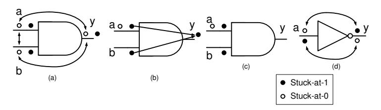

Fig. 1: Fault collapsing for AND: (a) Equivalent stuck-at-0 faults; (b) stuck-at-1 fault at y dominates the stuck-at-1 faults at the input nets; (c) Collapsed fault set; (d) Fault equivalence for NOT gate.

Fault dominance is another fault relation which is used for collapsing the set of faults to be tested.

**Definition 2 (Fault Dominance).** Let  $T_{f_1}$  be the set of all tests that detect a fault  $f_1$ . A fault  $f_2$  dominates  $f_1$  if and only if  $f_1$  and  $f_2$  are equivalent under  $T_{f_1}$ .

The idea of fault dominance is illustrated in Fig. 1(b) where the stuck-at-1 fault at y dominates the stuck-at-faults at a and b. The test vectors a=0,b=1 and a=1,b=0 detects the stuck-at-1 faults at a and b, respectively. The same test vectors can also detect stuck-at-1 fault at y. The reduced fault set after collapsing is shown in Fig. 1(c). One may observe that instead of total 6 faults, one need to test only 3 faults. A similar example of collapsing based on equivalence is shown in Fig. 1(d) for a NOT gate.

Fault Dominance and Biased Faults: One may note that dominance property only claims equivalence on a set of test vectors  $T_{f_1}$ . In practice, there can be test vectors outside  $T_{f_1}$ , which detects the fault  $f_2$ . Referring to the AND gate example in Fig. 1(b), the stuck-at-1 fault at y gets detected even with a=0,b=0, whereas none of the stuck-at-1 faults at a and b gets detected with this input. While this is not an issue for conventional ATPG, it is important to analyze if such collapsing is also appropriate in a fault attack context or not. More precisely, we want to evaluate that if no fault simulation is performed at the

fault location y (and decision regarding its exploitability is made based on fault simulations at a or b), would it result in a fault negative? As it turns out, for attacks based on random fault models (e.g. DFA), this is not an issue because such attacks require at most one input for a given fault location which can activate or propagate the fault. This is guaranteed by the definition of fault dominance. For attacks considering biased and ineffective faults, however, such dominance-based collapsing may result in slight variation in the bias. For example, the stuck-at-1 fault at the output y of the AND gate will result in correct computation for input value (a = 1, b = 1), and faulty computation for (a = 0, b = 0), (a = 0, b = 1) and (a = 1, b = 0). On the other hand, if decision regarding this fault location is made based on the stuck-at-1 fault at a, there will be faulty computation for (a = 0, b = 1) and correct computation for (a = 0, b = 0), (a = 1, b = 1) and (a = 1, b = 0). Similar observations can be made for fault simulation at b. Although this will indeed be an approximation to use the fault simulations of a or b to decide about leakage at y, one may observe that the value dependency of the fault persists. In other words, deciding about leakage due to location y based on a or b preserves the exploitability of the fault at y (if any), because the value-dependent statistical bias still exists (albeit being slightly changed). However, any value-dependent bias in fault is sufficient for attack and hence the collapsing remains sound even for FA context.

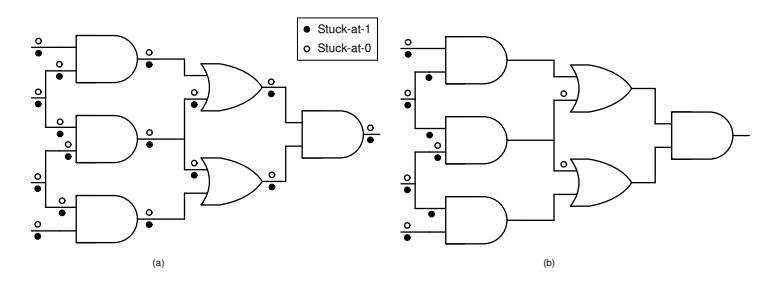

Fig. 2: Fault collapsing for a combinational circuit: (a) Uncollapsed faults (total 32); (b) Collapsed faults (total 15)

Fault collapsing at gate level provides a certain amount of reduction in the size of the fault space for single stuck-at faults. Fig. 2 shows a simple illustration of this claim. Further, Table. 3 provides the counts for the collapsed and uncollapsed fault lists for an unprotected AES implementation, as well as a TI implementation of PRESENT, and a SIFA-protected implementation of PRESENT (ref. column 2-3). The fault lists are obtained by running a complete ATPG in full-scan mode over the circuits using Synopsys TetraMAX. We have also provided the fault coverage statistics over the circuits<sup>9</sup> . The advantage of running a complete ATPG is that it rules out some of the faults which never

<sup>9</sup> Fault coverage is the ratio of detected fault count and total (collapsed) fault count. Although, in these cases, the fault coverage is 100%, in certain situations fault coverage may go below 100% as some fault may remain undetectable even after an

| Hardware           | #Uncollapsed<br>fault-list | #Collapsed<br>fault-list | %Fault-coverage | #Collapsed<br>fault-list after<br>algorithm-level<br>equivalence |
|--------------------|----------------------------|--------------------------|-----------------|------------------------------------------------------------------|
| Unprotected<br>AES | 26358                      | 23560                    | 100%            | 660                                                              |
| TI-PRESENT 22049   |                            | 17918                    | 100%            | 1051                                                             |
| ANTISIFA           | 66489                      | 54147                    | 100%            | 3182                                                             |

Table 3: Fault Collapsing with Gate-Level and Algorithm Level Equivalence

corrupts the output, hence further reducing the fault space. A fault which never corrupts the ciphertext cannot be utilized for fault attack. A full-scan ATPG converts the sequential circuit to a combinational one and labels those faults as detectable which actually reaches some register of the circuit. In a typical block cipher datapath, if a fault reaches a state register, then it also reaches the ciphertext output with high probability. Hence enlisting detectable faults based on the full-scan circuit is sound.

Handling Bit-flip Faults: So far, we have discussed bit stuck-at faults on the nets of a circuit. It is also common to consider single bit-flip faults in fault attacks. The list of bit-flip faults is decided based on the list of stuck-at faults, as the fault-list contains every feasible single-bit fault locations. This is logical, as a bit-flip fault can be expressed as the conjunction of stuck-at-0 and stuck-at-1 fault at a given net.

Handling Multi-bit Faults: Gate-level fault collapsing indeed reduces the set of single-bit faults. However, fault attacks also exploit certain multiple-bit fault models such as byte/nibble faults. Considering every possible multiple-bit fault would result in a fault space which is exponential over the single-bit fault space. Instead, we utilize certain features of the practical faults happening in devices to restrict this fault space. Most of the practical faults only corrupt certain consecutive bits in a register. Hence, we only consider faults within a byte or a nibble or (in rare cases) within multiple consecutive bytes. Further, multibit faults are captured only at the register boundaries. This is also derived from practical observations. Even certain single bit faults may fan-out to multiple bits at a register (which is the often case for glitch based fault injections). In case, there is a multiple-bit fault inside the combinational path it would eventually result in a single/multiple-bit fault at some register boundary. Overall, considering all single-bit faults in the combinational path, as well as multiple-bit faults at register boundaries, should holistically cover most of the feasible fault cases in a target implementation.

A straightforward approach for cipher evaluation would be to start with the collapsed fault list and evaluate each fault with the proposed test. Eventually, one can also test the multiple-bit faults at the register boundaries of each round. However, as we shall show in the next subsection, the fault space can further be

ATPG run. Such undetectable faults, however, do not influence the FA testing as undetectable faults can never corrupt the ciphertexts.

reduced for block cipher designs, taking advantage of their high-level structural equivalence in such ciphers.

#### 4.2 Fault Equivalence in Block Ciphers

While gate-level fault collapsing provides some reduction in the space of singlebit faults it is blind to the high-level structural features of the cipher under evaluation. Block ciphers are constructed by repeating some basic sub-blocks (such as S-Boxes and diffusion layers) several times. Such sub-blocks are found to be equivalent in terms of fault attacks with respect to the attack complexity. Such equivalence can be exploited to reduce the fault space drastically. The idea is to deduce such equivalence from an unprotected version of the cipher under test (preferably a high-level algorithmic representation as used in automated fault attack tools such as ExpFault [43]).

Unlike the previous subsection, where the equivalence of faults was defined in terms of input-output mappings of faulty functions, here we define equivalence in terms of fault attack complexity.

Definition 3 (Fault Equivalence in Block Ciphers). Two fault locations f<sup>1</sup> and f<sup>2</sup> according to a specific fault model are considered equivalent if they result in attacks with the same complexity. The attack complexity is defined as a tuple hRm, Evali where Rm denote the exhaustive key search complexity after the attack and Eval denote the complexity of associated key guessing operation.

The definition of fault attack complexity above closely follows the one defined in ExpFault. One should note that this definition mentions the fault locations and does not comment about fault values. The value part of a fault (byte/nibble faults are usually multi-valued) is taken care off by the fault model specification. For example, in a random byte fault model, every fault value at a specific location is considered to be equivalent and showing exploitability for one fault value pair is sufficient. Even for biased faults, every statistical bias in the fault distribution at a fault location is considered equivalent.

As an example of how to exploit such equivalence, we consider the AES block cipher. If a random byte fault is injected at the input of a 9th round S-Box, it results in an attack recovering 32 key bits. We used the automated fault analysis tool ExpFault [43] for exploring all byte fault locations at the input of the 9th round S-Box operation10. Every byte location is found to result in an attack that requires an exhaustive search of 2<sup>8</sup> (i.e., Rm = 2<sup>8</sup> ). For the evaluation of the keys, at most, 32 key-bits have to be guessed simultaneously, making the key guessing complexity Eval = 2<sup>32</sup>. Hence, all 16 byte locations (i.e., S-Box) inputs were considered as equivalent, and testing one of them should suffice. Similarly, any byte fault between the 8th and 9th round MixColumns is also equivalent to each other. We also note that FA countermeasures usually do not destroy the structural similarities within the original cipher structures. Hence, deciding the equivalence over an unprotected implementation and using those exploitable locations for testing the protected implementations works fine.

<sup>10</sup> There are total 16 such locations

To further illustrate the concept of cipher-level fault equivalence, we now use graphical representations of partial ciphers generated from the ExpFault tool (called Cipher Dependency Graph or CDG in ExpFault's terminology). Although such graphs are not among the normal outputs of ExpFault, they can be generated for debugging purposes from the version of the tool we used. Fig. 3 displays one such graphical representation of the last two rounds of AES. Each node here corresponds to a bit of the state. Each topological layer in the graph represents the input of a sub-operation (i.e. SubBytes, ShiftRows, MixColumns, and AddRoundKey). The S-Box and MixColumns layers are represented as complete subgraphs, and red nodes represent the key bits. The direction of the arrows is towards the ciphertext, and the last topological level represents the ciphertext.

Each topological layer (except those involving key addition) of the AES CDG contains 128 nodes. Starting from the 9th round input (as we consider the fault injection at the 9th round), the entire CDG contains four subgraphs, disconnected from each other. For the sake of representation, we place these four subgraphs, as Fig. 3(a)–(d). Without loss of generality, we consider two independent fault injection scenarios at two different byte locations in subgraph Fig. 3(b) and Fig. 3(c). The fault propagation path for Fig. 3(b) is colored blue, and the other one is colored green. The first observation here is that both the "blue" and the "green" subgraph involve the same number of key-bits from the last round, which gets extracted by this attack. Moreover, both the graphs are isomorphic to each other if we ignore few nodes from the first topological layer. It is quite evident that the complexity components Rm and Eval are the same for these two fault injections due to the isomorphic graph structures. Hence these two fault injections can be considered equivalent and analyzing one would be sufficient. The CDG structure confirms that all 16 S-Box inputs (input nodes to the 8 × 8 complete subgraphs in the first two layers) are equivalent in terms of attack complexity.

#### 4.3 Putting it All Together

Last two subsections described two independent techniques for handling the fault space in block ciphers. While the fault equivalence in block ciphers is generic and can be applied for both software and hardware implementations, the gate-level fault-collapsing is specific to hardware circuits. In case of software implementations, the faults are generated at instruction-level at specific points (such as S-Box input, output, and intermediate instructions) found by exploiting algorithm-level fault equivalence. Overall, we go by the following steps:

- Perform the cipher-level fault collapsing using ExpFault tool. Get the list of equivalent fault locations and select only a single location from the list. Such locations are described as the inputs to some sub-operation (e.g. SubBytes, ShiftRows, MixColumns) by the ExpFault tool [43].
- Select the module which implements the sub-operation specified at the previous step. For hardware implementation, perform gate-level fault collapsing for this module only, and populate the fault list. Simulate each fault from this fault list by stitching extra gates at the fault locations. For example, a bit-flip

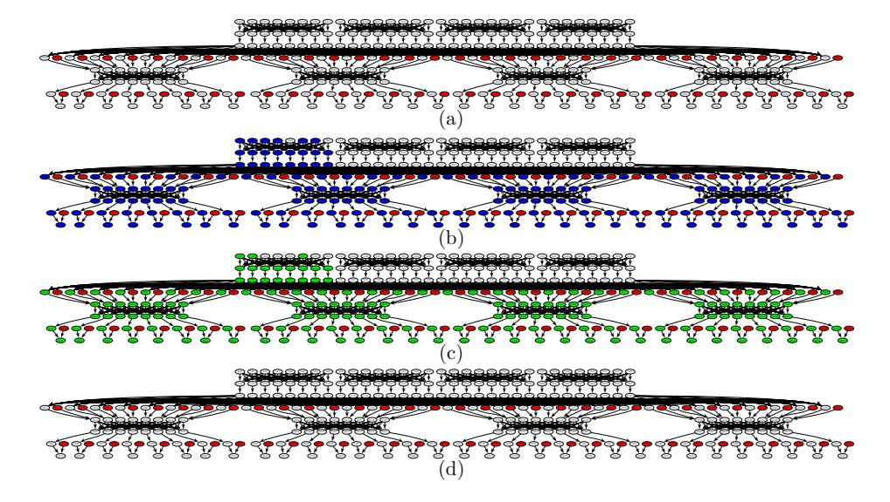

Fig. 3: Illustration: Cipher-level fault equivalence.

fault can be generated by stitching a 2-input XOR gate at the fault location. One input of the XOR gate is attached with the fault location, whereas the other input is set to 1 to flip the value at the fault location. This strategy is also used for generating stuck-at and other fault models, simply by changing the gate types. For software implementations, target every instruction within this module using the GDB-based methodology described in Appendix C.

 Acquire simulation data from target fault locations and apply the DL-based leakage detection test to decide their exploitability.

Column 4 in Table 3 illustrates the outcome of such testing in terms of fault-locations tested (for hardware implementations). One may note that testing one S-Box per round for AES and PRESENT is sufficient, and the size of the corresponding fault set is significantly small with respect to the entire fault space of the circuits.

#### 5 Case Studies

In this section, we outline the case studies used to evaluate the techniques presented in the last few sections. We only provide the summary of different test cases here, and the detailed evaluation results are given in Appendix. B. Our evaluation set contains representatives from each of the countermeasure classes described in Table. 1. Moreover, to establish the usefulness of the *compare-with-uniform* extension in Sec. 3.2, we present a scenario of mask-derandomization and evaluation of the firmware of an HSM called SHE [49]. It is worth mentioning that all the redundancy, infective, and instruction countermeasure were implemented in software. The combined SCA-FA and SIFA countermeasures

| Countermeasures                           | 1-byte<br>Fault                                  | Single<br>Inst.<br>Skip | Multi<br>Inst.<br>Skip | Skip<br>based<br>Control<br>Fault             | SIFA<br>Faults<br>(Biased<br>Bit-Flip<br>Faults)* | SIFA<br>Faults<br>(Unbiased<br>Bit-Flip<br>at Gate<br>Input) |          |
|-------------------------------------------|--------------------------------------------------|-------------------------|------------------------|-----------------------------------------------|---------------------------------------------------|--------------------------------------------------------------|----------|
|                                           | Simple time/space<br>redundancy+                 | Secure                  | Secure                 | Secure                                        | Secure                                            | Insecure                                                     | Insecure |
| Time/Space/<br>Information<br>Redundancy; | 1-bit parity [13]<br>(information<br>redundancy) |                         |                        | Insecure Insecure Insecure                    | Secure                                            | Insecure                                                     | Insecure |
| Infective                                 | Infective [12]<br>(without noise)                |                         |                        | Insecure Insecure Insecure                    |                                                   | Insecure                                                     | Insecure |
|                                           | Infective [12]<br>(with noise)                   |                         |                        | Insecure Insecure Insecure                    |                                                   | Insecure                                                     | Insecure |
|                                           | Infective [44]<br>(RIMBEN)                       |                         |                        | Insecure Insecure Insecure                    |                                                   | Insecure                                                     | Insecure |
|                                           | Infective [22]                                   | Secure                  | Secure                 | Secure                                        |                                                   | Insecure Insecure                                            | Insecure |
|                                           | Infective [45]                                   |                         |                        | Insecure Insecure Insecure                    |                                                   | Insecure                                                     | Insecure |
| Inst.<br>Level                            | Idempotent<br>Inst. [14]                         | Secure                  | Secure                 | Insecure                                      |                                                   | Insecure                                                     | Insecure |
| SCA+FA                                    | Masking [46]+<br>Classical FA<br>Countermeasure  | Secure                  | Secure                 | Secure                                        |                                                   | Secure                                                       | Insecure |
| Combined                                  | CAPA [19]                                        | Secure                  | Secure                 | Secure                                        |                                                   | Secure                                                       | Secure   |
|                                           | M&M [20]                                         | Secure                  | Secure                 | Secure                                        |                                                   | Secure                                                       | Insecure |
| SIFA                                      | AntiSIFA [47]**                                  | Secure                  | Secure                 | Secure                                        |                                                   | Secure                                                       | Secure   |
| Counter<br>measure                        | Impeccable<br>Circuits II [16]**                 | Secure                  | Secure                 | Secure                                        |                                                   | Secure                                                       | Secure   |
| Security<br>SHE Firmware [48]<br>Module   |                                                  |                         |                        | Insecure<br>for faults<br>in data<br>transfer |                                                   |                                                              |          |

Table 4: Summary of Results

were implemented in hardware, with an exception for CAPA [19] and M&M [20], which were simulated in Python. We implemented these two countermeasures for KATAN-32 [50] block cipher and tested representative fault locations at different building blocks to only verify the security claims from the papers. The SHE design is a hardware/software co-design where the crypto-core is in hardware, and the rest of the computation is running as firmware in a soft-core processor (for simplicity, we checked some parts of the firmware). Table 4 summarizes the outcomes of leakage assessment over the testbench for different fault models.

In order to reach a meaningful and practical coverage over the fault space of a block cipher, we exploit the equivalences present in the fault spaces as described in Sec. 4. Due to the presence of algorithm and cipher-level fault equivalences, we only need to simulate faults for one S-Box per round at its inputs, outputs, or intermediates points for most of our test cases involving AES and PRESENT. Gate-level fault equivalences further reduce the count of fault locations. The gate-level fault equivalence was estimated using the Synopsys TetraMAX<sup>11</sup>, whereas the algorithm-level equivalence was decided using the

<sup>\*</sup> Bit-stuck-at faults are special cases of biased bit-flip faults.

<sup>+</sup> Insecure against paired faults at the comparison and combined FA-SCA attack

<sup>\*\*</sup> Secure up to a predefined security order

<sup>11</sup> The syntheses were performed using Synopsys Design Compiler and DFT compiler (with STMicroelectronics CMOS65 – a 65nm technology library due to STMicroelec-

| Examples                 | Code Size<br>(# inst.) | #Checked<br>Insts. | Avg. Leakage<br>Detection Time /<br>fault location<br>(in seconds) | Hardware<br>Examples                          | Total Fault<br>Count<br>(in full-scan)<br>(Collapsed) |                 | Avg Leakage Detection Time / fault location (in seconds) |
|--------------------------|------------------------|--------------------|--------------------------------------------------------------------|-----------------------------------------------|-------------------------------------------------------|-----------------|----------------------------------------------------------|
| Time<br>Redundancy       | 83270                  | 532                | 564.8                                                              | Combined<br>SCA + FA                          | 17918                                                 | $1051 \times 3$ | 304.45                                                   |
| Parity [13]              | 50544                  | 597                | 425.94                                                             | AntiSIFA [17]                                 | 54147                                                 | $3182 \times 3$ | 302.63                                                   |
| Infective [12]           | 208380                 | 1170               | 620.41                                                             | Impeccable<br>Circuits II [16]<br>(3-way red) | 17731                                                 | 3744 × 1        | 300.38                                                   |
| Infective [44]           | 97519                  | 532                | 682.65                                                             | Impeccable<br>Circuits II [16]<br>(7-way red) | 88721                                                 | 13895 × 1       | 301.76                                                   |
| Infective [22]           | 166520                 | 1052               | 868.82                                                             |                                               |                                                       |                 |                                                          |
| Infective [45]           | 90491                  | 532                | 573.26                                                             |                                               |                                                       |                 |                                                          |
| Idempotent<br>Inst. [14] | 96593                  | 1127               | 426.38                                                             |                                               |                                                       |                 |                                                          |
| SHE Firmware [49]        | 205                    | 205                | 436.16                                                             |                                               |                                                       |                 |                                                          |

Table 5: Leakage Detection Time of the Examples Tested

ExpFault tool [43]. To further (reasonably) reduce the number of locations to be tested, we target only the last three rounds (six rounds for infective countermeasures [12] and [22] as dummy rounds were present) of the ciphers in most of our test cases, due to the fact that most of the fault attacks target only last few rounds of block ciphers. Although there exist attacks such as Fault Template Attacks (FTA) [51], which are also applicable for middle rounds, their working principle is the same in every round and, thus, checking the last few rounds suffice. <sup>12</sup> Our testbench consists of both software and hardware implementations. We simulated bit/byte-fault, instruction-skip, and control faults on an instruction-level abstraction of the software codes with a GDB-based fault simulator (detailed in Appendix C). We used state-of-the-art simulation tools (such as Synopsys VCS) and a simple strategy of automatically stitching Hardware Trojan Horses at desired fault locations for simulating hardware faults. A summary of implementations tested, along with timing results, is given in Table. 5. The experiments were performed on three systems with Intel Xeon processors, each having 64 processing elements. The code length here presents the total number of instructions executed (for X86-64 architecture). For instruction-skip experiments, we model up to 3 consecutive skips. We present average leakage detection time (fault simulation + learning) for each fault location for running Algorithm 3.

#### 6 Conclusion

Security evaluation of an FA-protected implementation is a problem of utmost practical importance. In this paper, we have proposed a DL-assisted leakage

tronics). No area/timing optimization was imposed during synthesis. All Synopsys tools utilized in this work are under registered trademarks of Synopsys Inc.

Only for the test cases involving Impeccable Circuits-II [16], we did not use the algorithm level equivalence as the current version of ExpFault tool does not support tweakable block ciphers. In this case, we simulate faults for different constituent modules (S-Box and MC modules in one of the redundant branches).

detection test DL-FALAT, which can validate protected block cipher implementations as well as leakages in peripheral components of security modules. It automatically detects the order of leakage, which is not straightforward to detect from the countermeasure structure in FA. The test is not only suitable for filtering out malformed designs but can also figure out the points of vulnerabilities. We have shown how a variant of this test can be utilized to evaluate against a variety of SIFA faults. Moreover, a comprehensive guideline for evaluating the fault space of a block cipher with the proposed test is also presented, which utilizes the equivalences present in fault space. Experimental validation over different countermeasure classes establishes that DL-FALAT is able to rule out flawed designs quickly. Although, in principle, a t-test based leakage detection test should also detect all the leakages given enough data, DL-FALAT detects it with significantly lower data complexity than t-test in many cases. Data complexity can be crucial for FA contexts as multiple fault locations are required to be tested. A potential future direction in this research is to adopt the test for public-key implementations.

# References

- 1. Saha, S., et. al.: ALAFA: Automatic leakage assessment for fault attack countermeasures. In: DAC. p. 136. ACM (2019)
- 2. Biham, E., Shamir, A.: Differential fault analysis of secret key cryptosystems. In: CRYPTO. pp. 513–525. Springer, Santa Barbara, USA (Aug 1997)
- 3. Tunstall, M., et. al.: Differential fault analysis of the advanced encryption standard using a single fault. In: IFIP. pp. 224–233. Springer (2011)
- 4. Agoyan, M., et. al.: When clocks fail: On critical paths and clock faults. In: CARDIS. pp. 182–193. Springer (2010)
- 5. Canivet, G., et. al.: Glitch and laser fault attacks onto a secure aes implementation on a sram-based fpga. JoC 24(2), 247–268 (2011)
- 6. Dehbaoui, A., et. al.: Electromagnetic transient faults injection on a hardware and a software implementations of aes. In: FDTC. pp. 7–15. IEEE (2012)
- 7. Agoyan, M., et. al.: How to flip a bit? In: IEEE IOLTS. pp. 235–239. IEEE (2010)
- 8. Bhattacharya, S., Mukhopadhyay, D.: Curious case of rowhammer: flipping secret exponent bits using timing analysis. In: CHES. pp. 602–624. Springer (2016)
- 9. Zhang, F., et. al.: Persistent fault analysis on block ciphers. TCHES pp. 150–172 (2018)
- 10. Dobraunig, C., et. al.: Sifa: exploiting ineffective fault inductions on symmetric cryptography. TCHES pp. 547–572 (2018)
- 11. Dobraunig, C., et. al.: Statistical ineffective fault attacks on masked aes with fault countermeasures. In: ASIACRYPT. pp. 315–342. Springer (2018)
- 12. Gierlichs, B., et. al.: Infective computation and dummy rounds: fault protection for block ciphers without check-before-output. In: LatinCrypt. pp. 305–321. Springer (2012)
- 13. Guo, X., et. al.: Security analysis of concurrent error detection against differential fault analysis. JCEN 5(3), 153–169 (Sep 2015)
- 14. Moro, N., et. al.: Formal verification of a software countermeasure against instruction skip attacks. JCEN 4(3), 145–156 (2014)

- 15. Patranabis, S., et. al.: Fault tolerant infective countermeasure for aes. HASS 1(1), 3–17 (2017)
- 16. Shahmirzadi, A.R., Rasoolzadeh, S., Moradi, A.: Impeccable circuits II. IACR Cryptology ePrint Archive 2019, 1369 (2019)
- 17. Saha, S., et. al.: A framework to counter statistical ineffective fault analysis of block ciphers using domain transformation and error correction. IEEE TIFS (2019)
- 18. Breier, J., et. al.: A countermeasure against statistical ineffective fault analysis. IACR Cryptology ePrint Archive 2019, 515 (2019), https://eprint.iacr.org/2019/515
- 19. Reparaz, O., et. al.: Capa: the spirit of beaver against physical attacks. In: CRYPTO. pp. 121–151. Springer (2018)
- 20. De Meyer, L., et. al.: M&m: Masks and macs against physical attacks. TCHES 2019(1), 25–50 (2018)
- 21. Daemen, J., et. al.: Protecting against statistical ineffective fault attacks. Tech. rep., IACR Cryptology ePrint Archive (2019)
- 22. Tupsamudre, H., et. al.: Destroying fault invariant with randomization. In: CHES. pp. 93–111. Springer (2014)
- 23. Yuce, B., et. al.: Software fault resistance is futile: Effective single-glitch attacks. In: FDTC. pp. 47–58. IEEE (2016)
- 24. Clark, D., et. al.: Quantified interference: Information theory and information flow. In: WITS'04 (2004)
- 25. Saha, S., et. al.: ExpFault: an automated framework for exploitable fault characterization in block ciphers. TCHES pp. 242–276 (2018)
- 26. Standaert, F.X.: How (not) to use welch's t-test in side-channel security evaluations. In: CARDIS. pp. 65–79. Springer (2018)
- 27. Moradi, A., et. al.: Leakage detection with the x2-test. TCHES pp. 209–237 (2018)
- 28. Wegener, F., Moos, T., Moradi, A.: DL-LA: deep learning leakage assessment: A modern roadmap for SCA evaluations. IACR Cryptology ePrint Archive 2019, 505 (2019)
- 29. Arribas, V., et. al.: Cryptographic fault diagnosis using verfi (2020)
- 30. Yang, G., Li, H., Ming, J., Zhou, Y.: Convolutional neural network based sidechannel attacks in time-frequency representations. In: CARDIS. pp. 1–17. Springer (2018)
- 31. Timon, B.: Non-profiled deep learning-based side-channel attacks with sensitivity analysis. TCHES pp. 107–131 (2019)
- 32. Kim, J., et. al.: Make some noise. unleashing the power of convolutional neural networks for profiled side-channel analysis. TCHES pp. 148–179 (2019)
- 33. Masure, L., Dumas, C., Prouff, E.: A comprehensive study of deep learning for side-channel analysis. TCHES pp. 348–375 (2020)
- 34. Cooper, J., et. al.: Test vector leakage assessment (tvla) methodology in practice. international cryptographic module conference, 2013
- 35. Sakiyama, K., et. al.: Information-theoretic approach to optimal differential fault analysis. IEEE TIFS 7(1), 109–120 (2011)
- 36. Schneider, T., Moradi, A.: Leakage assessment methodology. In: CHES. pp. 495– 513. Springer (2015)
- 37. Zeng, X., Martinez, T.R.: Distribution-balanced stratified cross-validation for accuracy estimation. Journal of Experimental & Theoretical Artificial Intelligence 12(1), 1–12 (2000)
- 38. Chollet, F., et al.: Keras documentation. keras. io (2015)

- 39. Abadi, M., et. al.: Tensorflow: A system for large-scale machine learning. In: 12th {USENIX} Symposium on Operating Systems Design and Implementation ({OSDI} 16). pp. 265–283 (2016)
- 40. Ioffe, S., Szegedy, C.: Batch normalization: Accelerating deep network training by reducing internal covariate shift. arXiv preprint arXiv:1502.03167 (2015)
- 41. Moradi, A., et. al.: Leakage detection with the x2-test. TCHES pp. 209–237 (2018)
- 42. Johnson, A.P., et. al.: Remote dynamic partial reconfiguration: A threat to internet-of-things and embedded security applications. Microprocessors and Microsystems 52, 131–144 (2017)
- 43. Saha, S., et. al.: ExpFault (2018), https://cadforassurance.org/tools/sca/exp-fault/
- 44. Wang, B., et. al.: Exploration of benes network in cryptographic processors: A random infection countermeasure for block ciphers against fault attacks. IEEE TIFS 12(2), 309–322 (2016)
- 45. Ghosh, S., et. al.: Preventing fault attacks using fault randomization with a case study on aes. In: ACISP. pp. 343–355. Springer (2015)
- 46. Poschmann, A., et. al.: Side-channel resistant crypto for less than 2,300 ge. JoC 24(2), 322–345 (2011)
- 47. Saha, S., et. al.: Transform-and-Encode: A countermeasure framework for statistical ineffective fault attacks on block ciphers. IACR Cryptology ePrint Archive 2019, 545 (2019), https://eprint.iacr.org/2019/545
- 48. Using the cryptographic service engine (cse): An introduction to the cse module (2011), http://cache.freescale.com/files/32bit/doc/app note/AN4234.pdf
- 49. memebers, H.: SHE secure hardware extension functional specification version1.1 (rev 439) (2011), www.automotive-his.de
- 50. De Canni`ere, C., Dunkelman, O., Kneˇzevi´c, M.: Katan and ktantan a family of small and efficient hardware-oriented block ciphers. In: Clavier, C., Gaj, K. (eds.) CHES. pp. 272–288. Springer Berlin Heidelberg, Berlin, Heidelberg (2009)
- 51. Saha, S., et. al.: Fault template attacks on block ciphers exploiting fault propagation. In: EUROCRYPT. pp. 612–643. Springer (2020)
- 52. Lomne, V., et. al.: On the need of randomness in fault attack countermeasuresapplication to aes. In: FDTC. pp. 85–94. IEEE (2012)
- 53. Bogdanov, A., et. al.: Present: An ultra-lightweight block cipher. In: CHES. pp. 450–466. Springer (2007)
- 54. Beierle, C., et. al.: Craft: Lightweight tweakable block cipher with efficient protection against dfa attacks. IACR Transactions on Symmetric Cryptology 2019(1), 5–45 (2019)

# Supplementary Material

#### A Background on Deep Learning

Deep Learning (DL) algorithms deal with extracting meaningful information from data by fitting mathematical models to it. The advantage of DL over traditional Machine Learning (ML) algorithms is that it does not require manual feature engineering techniques, which is a pre-requisite step in almost every ML algorithms to achieve reasonable accuracy. As a result, DL algorithms have been successfully applied in a variety of fields for efficient pattern recognition like image recognition, natural language processing, speech recognition, autonomous driving, etc. One of the most used applications of DL is in the field of data classification, where the problem is to identify the category of a new observation based on a training dataset containing observation whose category memberships are known. In this section, we first provide an outline of data classification using DL algorithms and then provide a brief introduction to Multi-Layer Perceptron (MLP) networks, which is the core of all DL algorithms.

**DL-based Data Classification:** The objective of data classification is to classify some data  $x \in \mathbb{R}^d$  based on their labels  $Lb(x) \in \mathcal{Z}$ , where d is the dimension of x and  $\mathcal{Z} = \{0, 1, \dots, L-1\}$  is a set with L number of classification labels. In most of the DL-based classification problem, the *one-hot encoding* of the labels are used, which is defined as:

$$\mathcal{B}(x)[i] = \begin{cases} 1 \text{ if } i = Lb(x) \\ 0 \text{ otherwise} \end{cases}$$

i.e.,  $\mathcal{B}$  can be seen as a vector representation of the label Lb(x). A classification algorithm can be viewed as a mapping  $\mathcal{N}: \mathbb{R}^d \to \mathbb{R}^{|\mathcal{Z}|}$ , which takes  $x \in \mathbb{R}^d$  as input to classify and produces an output vector  $y = \mathcal{N}(x) \in \mathbb{R}^{|\mathcal{Z}|}$ . In order to quantify the efficiency of the mapping  $\mathcal{N}$  for a given input x we define an error function  $\mathcal{E}: \mathbb{R}^{|\mathcal{Z}|} \to \mathbb{R}$ . Categorical-cross-entropy (CE) error function is mostly used for one-hot encoded dataset, which quantifies how far the output of  $\mathcal{N}$  is from the expected output of the label. CE is defined as:

$$CE = -\sum_{i}^{|\mathcal{Z}|} (\mathcal{B}(x)[i]) log(\mathcal{N}(x)[i])$$

In order to quantify the error of  $\mathcal{N}$  over a whole set of data, we define a loss function, which is the average over all the errors calculated using  $\mathcal{E}$ . An MLP consists of a set of trainable parameters. A detailed discussion of these trainable parameters is provided later. The loss function depends on these trainable parameters, which are tuned during a training process to improve the efficiency of the network. The training starts with initializing small random values (in a given interval) to the trainable parameters. The training process is a classic numerical optimization problem, where the goal is to find the optimal parameters minimizing the loss function. A preferred approach to train an MLP is to use the Stochastic Gradient Descent (SGD) technique to optimize the loss function. The

basic operation of SGD contains two steps. First, it calculates gradients of the loss function with respect to each parameter in the MLP. Then, it backpropagates the gradients to adjust all the parameters proportionally to the gradients. SGD maintains a single learning rate (the constant term in the proportionality) for all parameter updates, and the learning rate does not change during training. Adam optimizer is a more advanced version of SGD where a learning rate is maintained for each network parameters separately, which are adapted as the learning unfolds. The process of updating all the parameters based on the training data in a single iteration is known as an epoch. The training process is defined as the repetition of epochs for a predetermined number of times in order to minimize the loss function. The training process also depends on several hyper-parameters, such as network architecture, loss function, optimization strategy, etc., which a designer needs to select before starting the training process. Once the MLP parameters are optimized after the training, the network  $\mathcal N$  can be used to classify a data x whose corresponding label is unknown as:

$$l = \operatorname*{argmax}_{j \in \mathcal{Z}} \mathcal{N}(x)[j]$$

One point to be noted in this case is that there is a tendency in each DL algorithms to memorize information in the training dataset instead of learning generalizable features of the entire data during the training process. The phenomenon is known as overfitting of the network, which is a big challenge for every DL designer. In order to monitor whether the network is being overfitted or not, one widely used practice is to divide the complete dataset into three parts – training, validation, and testing. The network is trained with the training data, and after each epoch, it is tested with validation data to monitor both training accuracy and validation accuracy. Overfitting is manifested by a continuous rise of the training accuracy over the number of epochs while the validation accuracy begins to fall. In that case, we adjust the training hyper-parameters to get rid of such overfitting. Finally, we determine the effectiveness of the learned mapping by calculating test accuracy using the testing data.

**Multi-Layer Perceptron:** Multiple Layer Perceptron (MLP) is one of the basic types of DL architectures. MLP is a class of feed-forward neural networks composed of multiple layers, and each layer consists of basic elements, called *perceptrons* ( $\mathcal{Q}$ ) (also known as *neurons*). A perceptron,  $\mathcal{Q}: \mathbb{R}^n \to \mathbb{R}$ , takes as input a vector  $x \in \mathbb{R}^n$  and outputs a weighted sum evaluated through an *activation function* denoted by  $\mathcal{A}$  as follows:

$$Q(x) = \mathcal{A}(\sum_{i=1}^{n} w_i x_i + b)$$

 $w_i$ s are called the weights and b the bias of the perceptron unit. Popular activation functions are, for instance, the *Rectified Linear Unit*, *Hyperbolic Tangent*, *Sigmoid*, and *Softmax*. In an MLP, each perceptron output of one layer is connected to each perceptron of the next layer, which is called a *fully connected network*. An MLP consists of three different types of layers:

- Input Layer: It is an intermediate between the input data and the rest of the network. The output of the perceptrons belonging to this layer is simply the input vector itself. The number of perceptrons in the input layer is determined by the number of feature points in the input data.
- Hidden Layer: It introduces non-linearity in the network so that the MLP can fit a non-linear separable dataset. The number of perceptrons on the hidden layer or even the number of layers depends on the nonlinearity and complexity of the dataset. It has been demonstrated that the use of a huge number of perceptrons can lead to overfitting if the dataset is close to a linearly separable one. On the other hand, the use of too few perceptrons may lead to an inaccurate solution for a complex dataset.
- Output Layer: It is the last layer of the network that directly maps the output of the hidden layer to classes that the user intends to predict. Hence, the number of perceptrons in the output layer is determined by the number of classes in the input dataset.

The weights and biases of an MLP are the trainable parameters that are updated during gradient descent optimization, as discussed previously. The number of hidden layers and the number of neurons in each layer constitute a subset of hyper-parameters.

# B Detailed Case Studies

This section presents detailed case studies on a large set of countermeasures evaluated in this work. A summary of the results on this test set has already been presented Table. 4 in Sec. 5. We begin our discussion with infective, detection and instruction-level countermeasures. Next, we present case studies on SIFA, and also evaluate SIFA countermeasures and two combined countermeasures CAPA [19] and M&M [20]. Finally, we describe two instances of so-called "noncipher" leakage – for mask de-randomization in masked cipher implementations, and for a hardware security module called SHE.

#### B.1 Infective Countermeasures and Detection Countermeasures

Infective Countermeasures: In our experiments, we consider the total four infective countermeasures. This subsection presents detailed analysis on them along with parity-based detection countermeasures. To compare with the t-test, in the rest of the paper we refer to the t-test results by ALAFA.

Example 1. The first infective countermeasure considered is due to [12], which tries to randomize the outcome upon the detection of a fault with an infection function. The protected implementation executes each round of AES two times – the first one contributes in actual encryption, and the second one is redundant. Furthermore, there are (optional) random "dummy" rounds (round computations over a random state changing at each encryption). Dummy round computations randomly take place between each actual and redundant round to

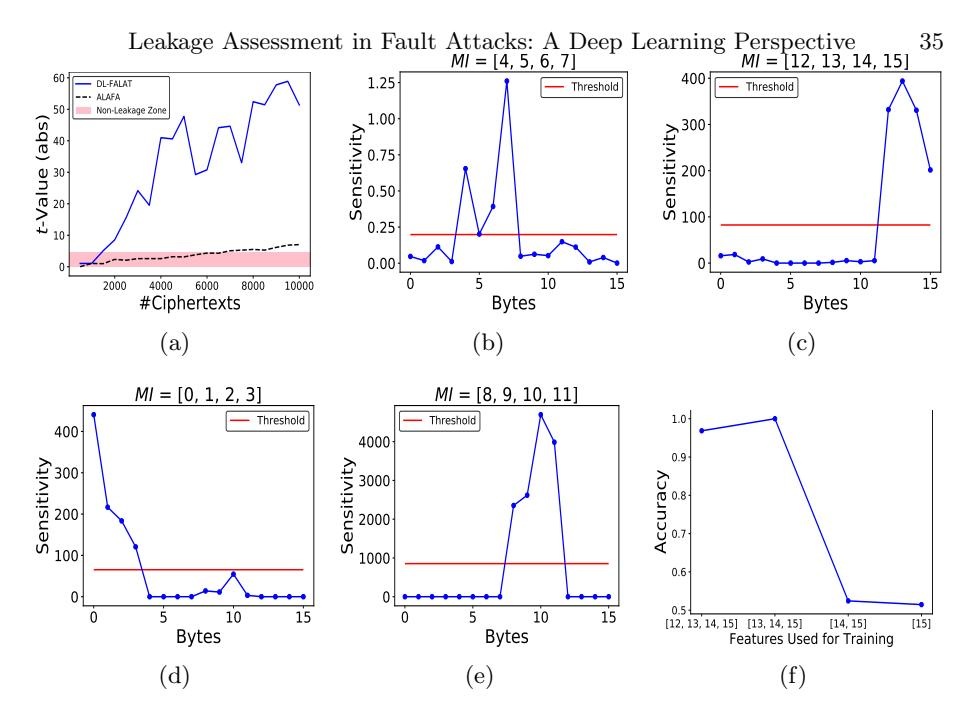

Fig. 4: Leakage of Infective countermeasure [12] single-byte fault: a) Variation of absolute t-test scores for DL-FALAT and ALAFA with respect to ciphertext count; (b) SA results for first iteration; (c) SA results for second iteration; (d) SA results for third iteration; (e) SA results for fourth iteration; (f) MI analysis for first iteration.

confuse the attacker regarding the correct fault injection round. The non-zero XOR differential between actual and redundant computation is used to "infect", the state during fault injection, which is further combined with the actual, redundant and dummy round computations, resulting in a randomized ciphertext.

Our first experiment considers the countermeasure without the dummy rounds. Without loss of generality, we describe fault injections at the 9-th round of AES state. Leakage is observed in this case. Fig. 4(a) compares the outcome from DL-FALAT to that of ALAFA [1] in terms of absolute t-values. The byte-wise testing performs better for both ALAFA and DL-FALAT in this case. The leakage has been detected roughly with 1400 ciphertexts (when the line crosses the red region at t=4.5) for DL-FALAT, while ALAFA requires almost 7000 ciphertexts.

The next step is to figure out the leakage orders for the DL-FALAT, for which we perform the SA (ref. Sec. 2.4). The first set of leaky points (i.e., the set MI) that gets exposed by the SA are the bytes [4,5,6,7] from the 16-byte ciphertext (Fig. 4(b)). MI sets are constructed using the average sensitivity of all points in the trace as threshold  $Th_{MI}$  (red lines in Fig. 4(b)-(e)), as described is Sec. 2.4. The number of ciphertexts required to expose this leakage prominently is 1400. An analysis of the MI set reveals this leakage to be multivariate (Fig. 4(f)) as at least 3 bytes in MI are required for learning the leakage. To expose all the leakage points, we iteratively continue by entirely removing the features in MI set and

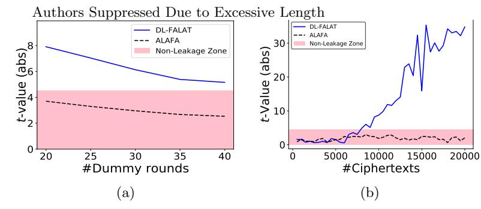

Fig. 5: Comparative analysis of DL-FALAT with ALAFA: (a) Infective countermeasure [12] with dummy rounds and a single-byte fault. The absolute values of t-statistic have been plotted for different count of dummy rounds #dum. The amount of noise increases with the increase in #dum; (b) Variation of absolute t-test scores for DL-FALAT and ALAFA in case of RIMBEN countermeasure with the count of ciphertexts.

increasing the ciphertext count. The second set of leakage points ([12, 13, 14, 15]) get exposed without requiring any further increase in the ciphertext count giving some hint that the leakage order of the first two sets might be equal (Fig. 4(c)). The next set of leakage points getting exposed are [0,1,2,3], for which 40000 ciphertexts are required (ref. Fig. 4(d)). Finally, the third leakage column gets exposed with ciphertext count of 200000 (ref. Fig. 4(e)). Leakage is multivariate for all these MI sets. The variation in ciphertext counts for different leakage sets indicates that the statistical order may not be the same for all of them, which is supported by the actual attack presented in [22]. Precisely, column [4,5,6,7] and [12,13,14,15] have (bivariate) leakage order 1, column [0,1,2,3] has an leakage order 2, and the third column has order 3.

Example 2. In this example, the leakage detection is performed on [12] with the dummy rounds included. Note that dummy rounds induce noise in fault injection as the attacker cannot determine the exact round of injection. The amount of noise depends on the dummy round count (#dum). For reasonable dummy round counts of #dum (i.e. #dum = 20, 25, 30, 35, 40) the signal probabilities are 0.256, 0.202, 0.164, 0.136 and 0.114, respectively, if we target AES 9th round. Fig. 5(a) presents the leakage profiles with respect to the number of dummy rounds for both ALAFA and DL-FALAT <sup>13</sup>. As it can be observed, DL-FALAT outperforms ALAFA by a very large margin for all the noisy cases. Even for a sufficiently large count of ciphertexts (200000), ALAFA fails to detect the leakage while DL-FALAT succeeds. The leakage interpretation results are very similar to that of the previous example.

Example 3. The third example considers a different infective countermeasure due to [44], also called RIMBEN (Random Infection based on Modified Benes Network). RIMBEN detects the presence of a fault during execution by taking

Only for this case study, we present the leakage result by varying the count of dummy rounds. For each valuation of dummy round count, the same (200000) number of ciphertexts is considered.

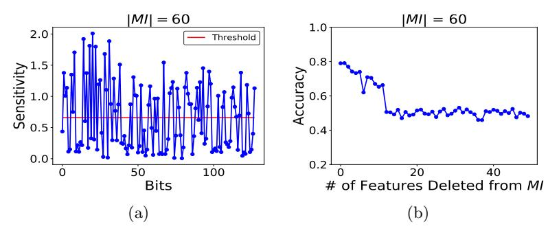

Fig. 6: Infective countermeasure RIMBEN [44] with single-byte fault: (a) SA analysis results from first iteration; (b) MI analysis results from first iteration.

the differential of a cipher and a redundant computation state at each intermediate round during encryption. The fault is then propagated through the computation, and at the end, the faulty ciphertext (C) is XOR-ed (masked) with a random bit string and returned as output. The random bit string is also generated from the fault differential  $\Delta C$ , utilizing a preprocessing logic and two consecutive Benes network. The random bitstring outputted by this construction has a Hamming Weight (HW) of  $\frac{N}{2}$ , where N denote the block size of the cipher, as well as the size of the  $N \times N$  Benes network. Standard values of N are 128 or 64. In the present context, we consider a protected AES implementation for which N=128.

The analysis results on RIMBEN have been illustrated in Fig. 5(b). Once again, in this case, we consider a fault injection at the 9th round of AES state. The analysis has been performed for both bit and byte-level abstractions of the ciphertexts, with the bit-level results being more prominent. As it can be observed, the leakage is observed by the DL-FALAT within 8000 ciphertexts. In contrast, ALAFA cannot detect any leakage even while higher orders up to 128 is considered 14. The reason behind ALAFA failing is that all 128 bits take part in decision making in this case, and leakage detection with 128-th order analysis would require an impractically large trace count.

While performing the leakage interpretation, the first step of SA reveals the set of 60 points, as shown in Fig. 6(a). However, it can also be observed that the points which do not get included in this MI also have some observable sensitivity. The size 60 of the MI set can be explained by the fact that the HW of the masking string in RIMBEN is 64. And so knowledge of roughly half (60) of the ciphertext bits reduces the entropy of the masked data sufficiently for the DL model to decide the boundary between two classes with some better-than-random accuracy. The analysis of MI shows that after removing 10 points the

<sup>&</sup>lt;sup>14</sup> Considering higher-order leakages in ALAFA requires the construction of all possible subsets up to the specific leakage order. In the present case, we need to go up to order 128. The total number of subsets to be considered up to order 128 is 2<sup>128</sup>, which is clearly infeasible to cover. So we considered the single case where the order of test is 128. The result being shown in the plots are for test order 128.

validation accuracy becomes 0.5 (Fig. 6(b)). This reveals the leakage as highly multivariate, as considering even 50 points keeps the entropy of the mask sufficiently high refraining classification.

Example 4. This example considers the infective countermeasure proposed by Tupsamundre et al. at CHES 2014 [22], which is an improvement over [12]. The main difference is that if a single/multi-byte data corruption happens in any of the cipher redundant or dummy rounds, the protected cipher is supposed to output a fresh random string instead of a randomized infected intermediate state as in [12]. The countermeasure is first tested for single-byte fault model. As it can be seen in Fig. 7 (a), no leakage is observed in this case, both by DL-FALAT and ALAFA.

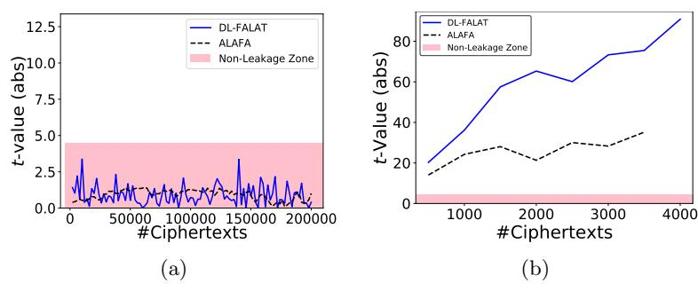

Fig. 7: (a) Infective countermeasure [22] with single-byte fault: DL-FALAT and ALAFA leakage profile with varying ciphertext count; (b) Infective countermeasure [22] instruction-skip based loop-abort: DL-FALAT and ALAFA leakage profile with varying ciphertext count.

The next interesting observation is due to a control fault. We found that an instruction-skip corrupting the loop counter variable (during last 2 rounds) creates a univariate information leakage as shown in Fig. 7(b) A careful investigation of this leaky event reveals that during such loop-abort fault injection, in several cases the cipher outputs the input of the 10-th round instead of a random string, thus leading to an attack. In [15], a similar attack was mentioned which was found by manual inspection.

Example 5. This example considers the infective countermeasure in [45], which utilizes an infection function comprising a deterministic linear diffusion function followed by a randomized nonlinear mixing function. Both ALAFA (for d=2) and DL-FALAT indicates leakage in this case for single-byte fault model (Fig. 8(a))<sup>15</sup>. The leakage is multivariate, and DL-FALAT automatically discovers that. Being interesting, here we show results from one iteration of the leakage interpretation experiment. As it can be seen in Fig. 8(b) two consecutive points attain almost the same sensitivity values. Multiple such pairs get captured in one MI set during the first iteration of the interpretation experiment. We also

<sup>&</sup>lt;sup>15</sup> Note that, for this countermeasure, leakage has been observed while the ciphertexts were considered bit-wise.

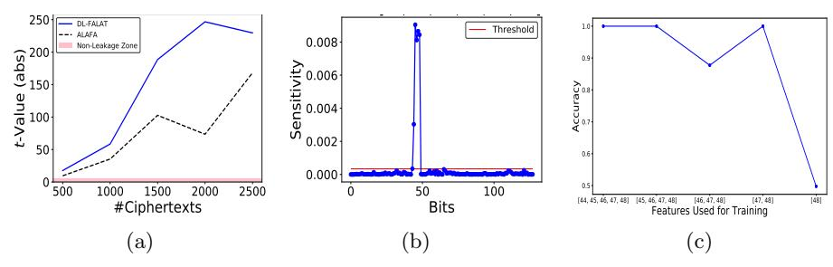

Fig. 8: Infective countermeasure [45] with single-byte fault: (a) Variation of leakage with ciphertext count for DL-FALAT and ALAFA; (b) SA for the DL-FALAT leakage for one iteration of iterative leakage interpretation; (c) Analysis of the MI set in one iteration of leakage interpretation.

found that removing features in one MI set readily exposes another set of leakage points without any increment in the dataset size. This fact indicates that the order of leakages might be the same throughout the ciphertext. Further, the results of an individual MI analysis is presented in Fig. 8(c), which clearly indicates that the leakage is multivariate.

It is worth mentioning that most of the time/space redundancy and infective countermeasures tested in this work are vulnerable against two equal faults in redundant branches (exceptions are countermeasures based on information redundancy, and CAPA, M&M described later in this section, where computations in redundant branches are different from each other). The reason is that with two equal faults, the countermeasure mechanisms get bypassed, and actual faulty ciphertexts directly reach the output causing univariate leakage. Finally, it is worth noting that the simple time/space redundancy countermeasure is vulnerable against a combined side-channel and fault attack [52]. We believe that DL-FALAT, with its observables extended with side-channel traces, will be able to detect this class of attacks.

**Detection Countermeasures:** In this class, we consider a simple time redundancy countermeasure, and an information redundancy countermeasure using 1-bit parity. Our first example utilizes simple two-way redundancy for error-detection. While considered under a one-byte fault model, this countermeasure always returns  $\bot$  as every fault gets captured. Among different fault models, here we mention the case with single-byte fault. For this case the experiment in Algorithm. 1 (and DL variant in Algorithm. 3) seems suitable. For a single-byte fault in one computation branch, we found that all faults get detected, and the constant output  $\bot$  is indistinguishable even if we consider two different fault values  $(f_1, f_2)$ . Hence, no leakage is caused for single-byte faults  $^{16}$ .

<sup>&</sup>lt;sup>16</sup> A univariate leakage can be observed if along with the byte fault an instruction-skip based control fault is utilized, to corrupt the outcome of XOR operation performing check operation at the end. However, in this paper, we did not focus on multiple cycle fault scenarios. The experiments remain unchanged even for those cases.

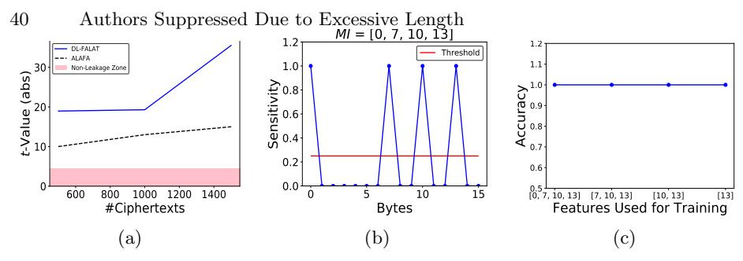

Fig. 9: Leakage analysis and leakage interpretation for the parity example: (a) Comparative leakage analysis of DL-FALAT and ALAFA with varying number of ciphertexts; (b) SA of leakage; (c) MI Analysis indicating univariate leakage.

Next, we consider 1-bit parity-based error detection on the block cipher AES. The countermeasure is bypassed for 50% of the byte faults having even parity and hence declared insecure. To quickly discover a leaky fault pair  $(f_1, f_2)$  for applying Algorithm. 1, we used the preprocessing step mentioned in [1]. Fig. 9(a) provides the leakage profile in this case. The analysis of the MI set indicates 4 leakage points and a univariate leakage (as the learning can be performed with high accuracy even with a single feature point (Fig. 9 (b), (c)). One should note that although the leakage is observed in this case, for a well-formed code based redundancy, finding out a so-called leaky fault is significantly rare. Hence, even if there will be leakage for most of the code based countermeasures, the exploitability depends on the rarity of the leaky faults, in general. We have also tested the applicability of DL-FALAT on instruction-level countermeasures with instruction-skip faults. The results are presented in Appendix. B.2.

#### **B.2** Instruction Level Countermeasures

To test the applicability of DL-FALAT for instruction-level countermeasures, we implemented the scheme proposed in [14] for an AES implementation without any algorithm-level protection. The scheme in [14] replicates some machine instructions in a code multiple times, if there is no impact of replicating these instructions on the final outcome of the code. Such instructions are called idempotent instructions. In our case, each idempotent instruction is duplicated once. The instruction-skip experiments were performed with the GDB-based tool described in Appendix, C.

The instruction-level countermeasures against FAs mainly rely on the fact that an adversary can only skip a certain number of consecutive instructions at a time. This is a reasonable assumption for certain practical fault injection setups. However, it has been shown in [23] that for clock glitch-based injections, one single glitch may affect multiple consecutive instructions which are present in the processor pipeline during the glitch event. Such an observation necessitates testing for so-called higher-order fault injections where multiple consecutive instructions are to be skipped at the same time. Our GDB-based fault simulator easily simulates such multiple consecutive fault scenarios. While performing a first-order fault injection (that is only single instruction-skip), we observed no

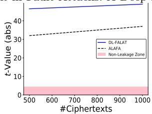

Fig. 10: Instruction-level countermeasure with duplicate idempotent instructions [14]. Two consecutive skips expose univariate leakage.

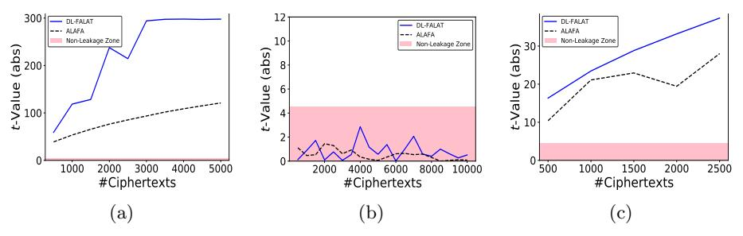

Fig. 11: (a) Variation of leakage with ciphertext count for SIFA (on AES with redundancy) with  $pr_{0\to 0}=1, pr_{1\to 1}=0$ ; (b) Variation of leakage with ciphertext count for SIFA (on AES with redundancy) with  $pr_{0\to 0}=0.5, pr_{1\to 1}=0.5$ ; (c) Variation of leakage with ciphertext count for SIFA attack on masking.

leakage. However, significant leakage can be observed if two consecutive instructions are skipped simultaneously, as shown in Fig. 10. We also performed leakage interpretation experiments which confirms that the leakage here is univariate.

#### B.3 Leakage Assessment for SIFA

In this subsection, we validate the enhancements proposed in Sec. 3.1 for assessing SIFA-related leakages. Here we first validate an FA-protected (with time redundancy) unmasked AES, followed by a combined SCA-FA protected PRESENT (hardware implementation). Next, we validate hardware implementations of two recently proposed SIFA countermeasures, namely AntiSIFA [47] and Impeccable Circuits II [16]. We also test two other combined countermeasures, namely CAPA [19] and M&M [20] against SIFA in Appendix B.4. The reason behind keeping CAPA and M&M in a separate section is that they follow a very different design strategy from the rest of the countermeasures.

**FA-protected and Combined Countermeasures** As already mentioned in Sec. 3.1, we simulate two kinds of faults to realize SIFA – 1) Biased data dependent bit-flips, 2) Unbiased bit-flips inside the S-Box computations. In our first example (FA-protected AES), we simulate a stuck-at-0 fault ( $pr_{0\to 0} = 1$ ,  $pr_{1\to 1} = 0$ ). The leakage profile for this attack is shown in Fig. 11(a), which presents the variation of (univariate) leakage with respect to ciphertext count for both ALAFA and DL-FALAT. We observed a similar leakage for  $pr_{0\to 0} = 1$ 

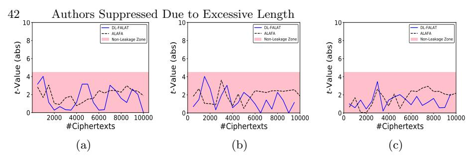

Fig. 12: Evaluating SIFA countermeasures: (a) AntiSIFA [17] with single-bit fault; (b) Impeccable Circuit II [16] with single bit error correction and 1-bit fault; (c) Impeccable Circuit II with 2-bit error correction and 2-bit fault.

0.75,  $pr_{1\to 1}=0.25$ . However, an experiment with  $pr_{0\to 0}=0.5$ ,  $pr_{1\to 1}=0.5$  (Fig. 11(b)) did not show any leakage even though there is a mix of correct and faulty ciphertexts. This is expected and shows that having many ineffective faults does not always indicate the chances of SIFA.

Next, we test a combined countermeasure that uses Threshold Implementation (TI) [46] for SCA protection, and simple time redundancy (two consecutive computation followed by a checking at the end) for FA protection realized for PRESENT block cipher [53]. With single-bit stuck-at-0 faults in the S-Box input (one share is corrupted) or linear layer input, in this case, we observed no leakage due to the presence of masking. The masking here changes the impact of a stuck-at fault similar to the situation where  $pr_{0\to 0} = 0.5$ ,  $pr_{1\to 1} = 0.5$ . However, while injecting inside TI equations (precisely, we injected single bit-flip fault in a register at the middle of the shared S-Box computation), we observe leakage (ref. Fig. 11(c)).

SIFA Countermeasures: We next focus on two SIFA countermeasures from [17] and [16]. The first countermeasure, also called AntiSIFA, incorporates fine-grained error correction in a per-bit manner with a masked implementation of PRESENT. The error-correction is performed with majority voting and is implemented with redundancy to make it fault-tolerant. The original proposal presents an example of implementation with single-bit error correction support. While tested with single-bit faults (even the one inside S-Boxes, as described in the last example), we found that the countermeasure successfully prevents the SIFA attacks by giving output only correct ciphertexts which supports the claims made in the original paper (ref. Fig. 12(a)).

The final experiment on SIFA attacks is on an open-source hardware implementation of the Impeccable-Circuits II [16]. The main idea of this countermeasure is to throttle the negative impacts of fault propagation by introducing special checkpoints within the circuit, as well as forcefully making some circuit paths independent of each other. Moreover, linear code-based (resp. majority voting based) error correction is incorporated to counter SIFA attacks. In the open-source hardware implementation, the countermeasure is implemented on a tweakable block cipher CRAFT [54] <sup>17</sup>. for single-bit error correction (3-way re-

<sup>&</sup>lt;sup>17</sup> https://github.com/emsec/ImpeccableCircuitsII

dundancy), and two-bit error correction (7-way redundancy). In the experiments, we tested for different single-bit and multi-bit faults. Here we only mention results SIFA testing with stuck-at-0/1 faults for a single round. For 3-way (resp. 7-way) redundancy we found that single-bit (resp. 2-bit) faults get corrected. The results are depicted in Fig. 12 (b) and (c), respectively, where no leakage can be observed. However, it is worth mentioning that if we go beyond these fault models (such as 2-bit faults for 3-way redundancy and 3-bit faults for the 7-way redundancy) leakage can be observed in our experiments. Overall, the experiments establish the efficacy of DL-FALAT.

#### B.4 Evaluation of CAPA and M&M

CAPA: CAPA [19] and M&M [20] are two recently proposed classes of combined countermeasures claiming security against combined SCA-FA adversary. However, in this paper, we are only interested in their FA security. CAPA adapts multiparty computation (with both active and passive security guarantees) in the context of a crypto circuit. More precisely, in CAPA, the computation is divided into tiles with each tile representing one party of the computation. The communications between tiles are kept limited and secured with the help of extra randomness (called Beaver triples). The input to be processed is first shared into d independent shares to provide SCA security. Each share is processed within a tile. The input is also multiplied with a (or multiple) randomly generated, non-zero hash key α to generate information-theoretic hashes. The hash key is also maintained in a shared manner. CAPA computes over the shared values and their corresponding hashes for each gate up to the ciphertext level. The hash check is performed during the computation of the nonlinear gates, and the computation aborts upon finding out a mismatch. The active (i.e. FA) security of the scheme stems from the fact that the hash key is changed randomly at every cipher execution. In order to bypass the hash check, an adversary must inject a fault such that the hash value of the correct and the faulty states are equal. This happens with probability 2<sup>−</sup>sm, where m is the number of hash keys and GF(2<sup>s</sup> ) is the finite field over which the cipher computation is performed.

In order to validate CAPA with DL-FALAT, we implemented the KATAN-32 [50] block cipher in Python. KATAN-32 is a 32-bit block cipher having a fairly simple round structure mostly consisting shift operations, with only 4 AND and 8 XOR operations per round. Additionally, there are 4 XOR operations in the key schedule. In our implementation of KATAN with CAPA, each basic gate is replaced with an equivalent CAPA gate. We also maintained m = 8 hash keys to maintain a practical fault detection capability. The computations are performed over the field GF(2). Faults were simulated for input, output and intermediate computation of one representative CAPA gate from each gate type within a round. CAPA was able to provide security against bit-stuck-at, bit-flip, and byte faults. Further, we perform SIFA evaluation over this implementation. SIFA evaluation is interesting here as SIFA was not explicitly mentioned in the adversary model of CAPA. It was found that CAPA provides security against the different types of SIFA faults discussed in this paper. The result of one such experiment

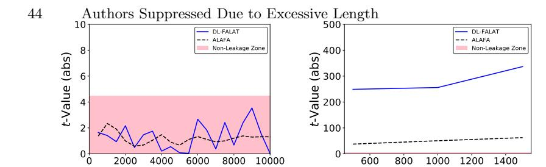

#Ciphertexts

(a)

Fig. 13: (a) CAPA [19] with bit-flip SIFA fault during an AND gate computation: DL-FALAT and ALAFA leakage profile with varying ciphertext count; (b) M&M [20] with bit-flip SIFA fault during an AND gate computation: DL-FALAT and ALAFA leakage profile with varying ciphertext count.

#Ciphertexts

(b)

is depicted in Fig 13(a). The fault model tested for this specific experiment is a single-bit flip at one of the input shares of a CAPA AND gate. In case the fault propagates through the AND gate, it would corrupt (or not corrupt) the AND output depending on the data on the other input of the AND gate (in other words, it would result in a data-dependent ineffectivity of the fault). However, no leakage is observed in this case even with such data-dependent ineffective fault. We investigated the reason behind this SIFA resistance of the scheme. The SIFA resistance stems from the way the non-linear (AND) computation is performed. More precisely, in CAPA the AND computation is performed with the help of random Beaver triples  $\langle a, b, c \rangle$ , where a, b, and c denote shares of bit variables a, b and c, respectively. For a valid Beaver triple c = ab. During the AND computation, the shares of the actual variables to be multiplied are blinded with a, b. These blinded shares are next broadcasted among all the tiles. The hash check is performed after this broadcast operation, and if the check passes, the remaining computations for the multiplication are performed. Such hash check before the multiplication prevents SIFA, as no fault values are allowed to pass through non-linear gates in this case, which is the sole cause behind attacks like SIFA and FTA. Operations until the hash check are linear. The result remains the same even for biased bit-flip faults. In a nutshell, CAPA is found secure for the fault models and locations tested in this work.

**M&M**: The M&M countermeasure adopts concepts similar to CAPA, but it is significantly lightweight from an implementation perspective. The generation and maintenance of hashes throughout the computation are similar to that of CAPA. However, instead of checking hash values at each non-linear gate, M&M performs an infective computation at the end. While it indeed makes M&M lightweight with respect to CAPA, it cannot anymore provide SIFA security. To validate this we performed the SIFA evaluation with DL-FALAT on a KATAN-32 implementation having M&M. As it is shown in Fig 13 (b), DL-FALAT indicates leakage in this case. This is, however, not surprising as the M&M paper already excludes SIFA from its security claims. Overall, M&M is also found respecting its claimed security goals.

#### B.5 Generalized leakage Assessment

An Example of Mask De-randomization: In this example, we elaborate the need of the *compare-with-uniform* experiment presented in Sec 3.2. Let us consider an SCA resistant AES implementation, which expects a fresh random mask of 128 bits for every execution. The SCA security strongly depends on the uniform random distribution of the mask. Without loss of generality, we assume a software implementation in this case, along with an instruction-skip fault model. For a target architecture having 32-bit bus width, the 128-bit mask is supplied to the AES module in chunks of 32-bits, as shown in Listing. 1.3. In this pseudocode, the mask values are assumed to originate from memory locations M11, M12, M13, M14. The observable  $\mathcal{O}$ , in this case, is the mask register of the AES. Now, an adversary may skip one or multiple of these instructions causing the mask to remain fixed for all of the executions. In this case, we assume the first 32-bit data transfer is skipped resulting in a constant mask value for that 32 bits. The procedure described in Algorithm. 4 can identify this loss of randomness in this case, by detecting a deviation from the uniform randomness. Note that there is no point in running TEST-INTERF-KEY or TEST-INTERF-FAULT in this case as the mask does not vary with the key. The result of the leakage assessment test is presented in Fig. 14 for ALAFA, and DL-FALAT. The necessity of the compare-with-uniform test is established via this example.

```
Listing 1.3: Mask Derandomization
```

```
→mov reg1, <M11>
mov reg2, <M12>
mov reg3, <M13>
mov reg4, <M14>
```

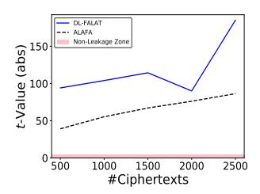

Fig. 14: Leakage results: Derandomization of mask.

Non-Cipher Leakage from SHE: Now we provide another example where the manifestation of leakage happens on some observable other than ciphertexts. We consider an automotive security standard called SHE. SHE standard recommends a hardware security module (HSM) for automotive electronic control units (ECU), which primarily includes an AES block for encryption and authentication support, as well as a True Random Number Generator (TRNG). The services provided are the secure boot, encryption with different keys, and authentication. There exist commercial microprocessors from vendors like NXP, and Fujitsu, which include dedicated blocks implementing SHE often called Cryptographic Service Engine (CSE). In such implementations, the HSM is kept almost isolated from the rest of the components. It is provided with hardware AES, private ROM, RAM and configuration registers. The master processor of the host ECU can access the HSM only through the configuration registers. In addition to this, there is another external interface connected to the secure storage, which is tamper-proof and inaccessible to the user in a normal mode of operation. This

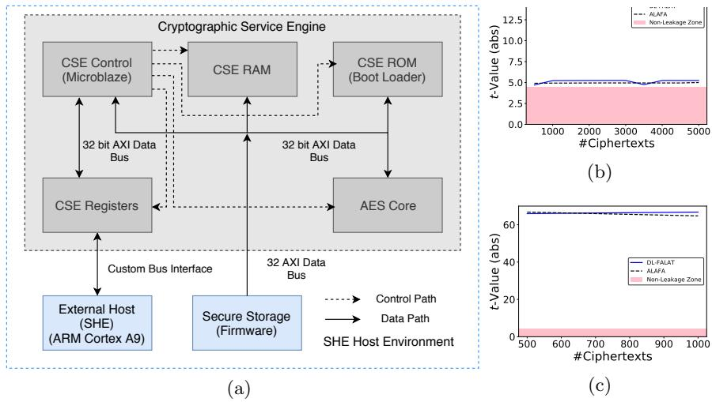

Fig. 15: (a) SHE Prototype: Basic Architecture; Leakage profile: SHE design; (b) Compare-with-uniform with DL-FALAT; (c) Leakage for two different keys.

secure storage contains the firmware(s) (which needs to be verified, securely booted, and updated if required), and the secret keys used by the ECU. All the functionalities of the HSM are controlled by a core engine which is referred to as CSE core. The purpose of this block is to execute the firmware for CSE which implements certain cryptographic protocols by using the hardware primitives provided. One reasonable approach for realizing this core is to utilize a small 32-bit processor.

In order to verify the robustness of this architecture, we implemented it according to the specifications given in [48, 49]. The basic SHE architecture is depicted in Fig. 15(a). The entire prototype has been implemented on the Zed-Board Zyng-7000 platform. A MicroBlaze softcore processor-based module serves as the CSE controller (core). CSE RAM and CSE ROM have been realized using on-chip block memory available on the Zynq-7000 FPGA device. AES core and CSE registers are purely FPGA logic-based modules. All these modules are interconnected with the CSE controller module through a 32-bit AXI data bus. For the external host, we used an ARM Core available on Zynq-7000 device. Secure storage depicted in the diagram is also realized using on-chip block memory. All the data stored in these memory blocks are stored in 32-bit word aligned format to work with 32-bit AXI bus. The control logic (i.e., the firmware) of CSE controller is written in C language (with functions from Xilinx MicroBlaze C library) which executes on the embedded MicroBlaze softcore processor. All the control and data operations are performed by memory-mapped 32-bit AXI data transfer commands (Xil\_Out32() and Xil\_In32()).

For the sake of simplicity, the main target of our verification here is the firmware code which can be targeted by an instruction-skip attacker. We consider the basic encryption support provided by CSE. The 128-bit secret key is to be copied from the RAM to the internal registers of AES in this case. The

plaintext (and mask, if required) is also supplied in a similar fashion. However, an instruction-skip based leakage is observed here during the data transfer operation. More precisely, the 32-bit bus architecture of our implementation allows the 128-bit key to be transferred to the AES core in chunks of 32-bits. Therefore, a 128-bit transfer requires four consecutive calls to the 32-bit data transfer operation of MicroBlaze as shown in Listing. 1.4 (this operation, in turn, makes a call to the 32-bit data transfer instruction of MicroBlaze ISA having opcode swi). This part(s) of the code serves as our target spot during the transfer of the secret key. KEY<sup>i</sup> , i ∈ {0, 1, 2, 3} represent the four 32 bit words of the key.

Listing 1.4: Code Snippet for AXI Data Transfer

```
Xil_Out32 ( XPAR_AESCORE_0_S00_AXI_BASEADDR , KEY0 ) ;
Xil_Out32 ( XPAR_AESCORE_0_S00_AXI_BASEADDR +4 , KEY1 ) ;
Xil_Out32 ( XPAR_AESCORE_0_S00_AXI_BASEADDR +8 , KEY2 ) ;
Xil_Out32 ( XPAR_AESCORE_0_S00_AXI_BASEADDR +12 , KEY3 ) ;
```

In our experiments, we skip one/more of these data transfer operations.One reasonable assumption here is that the AES core is reset after each execution. So, the key register is supposed to contain an all 0 value at the beginning. The observable here is the key register inside the AES core. Algorithm. 4 detects the presence of a key leakage in this case. The leakage profiles for the first and second invocation of the T EST() (Algorithm. 4) are depicted in Fig. 15(b) and (c), respectively. The compare-with-uniform test in Fig. 15(b) indicates a randomness loss for the whole key. Due to key dependency of the observable, the next test to be invoked is TEST-INTERF-KEY (as with skip we had only one fault value). Fig. 15(c) presents the result of this experiment which indicates leakage.

One important question here is the exploitability of the leakage. The DL-FALAT test itself cannot comment on that. However, for this specific example, we found the leakage exploitable. Considering that fact that the AES registers are reset to zero after each execution, the aforementioned instruction-skip results in a scenario where a significant number of key bits are fixed to zero. Skipping three consecutive data transfer operations will set 96 key bits to zero, and only 32 bits of the original key will remain intact. Upon receiving the faulty ciphertexts, the adversary can run an exhaustive search of 32 bits and recover the unaltered 32 bits in the corrupted key. Repeating this attack three more times rest of the key bits can also be recovered. The computational complexity of this attack is 2 32 .

# C Simulation of Instruction-Level Faults

Fault simulation for low-level software codes are fairly challenging. In this section, we elaborate a generic and easy-to-use methodology for simulating instruction faults. However, before describing the details of this tool-flow, let us motivate the reader why instruction-level faults deserve special attention. Firstly, an instruction-level fault, such as instruction-skip is one of the most repeatable, easy-to-generate, and consistent fault models. Secondly, their occurrence at a lower level of abstraction explicitly captures certain fault cases which are difficult to simulate at a high level. For example, certain control faults such as loop-abort or change of control-flow may be realistically generated from skipping or modifying a certain set of instructions or register values. For the purpose of illustration, let us consider the code in Listing. 1.5. The X86-64 assembly corresponding to line 5 of this code results in almost 30 instructions (some part provided in Listing. 1.6). In practice, one or more instructions from this assembly may be vulnerable. Also, there may be cases where skipping multiple consecutive instructions simultaneously, results in a desired faulty behaviour at high-level.

Listing 1.5: AddRoundKey of AES Listing 1.6: X86-64 assembly (line. 5)

```
for ( i =0; i <4; i ++)
{
for ( j =0; j <4; j ++)
{
state [ j ][ i ]^=
    RoundKey [ round * Nb *4+ i * Nb + j ];
}
}
                                                movl -8(% rbp ) , % eax
                                                cltq
                                                movl -4(% rbp ) , % edx
                                                movslq % edx , % rdx
                                                salq $2 , % rdx
                                                addq % rax , % rdx
                                                leaq state (% rip ) ,
                                                    % rax
                                                addq % rdx , % rax
                                               :
                                               :
                                                addq % rdx , % rax
                                                movb % cl , (% rax )
```

#### C.1 The GDB-based Fault Simulator

In this subsection, we introduce our automation for simulating instruction-level faults. The simulator utilizes the GDB tool, which is one of the most common debugging support available. One great advantage of using GDB is that simulating for different platforms requires almost negligible changes to be made in the simulator. Listing. 1.7 presents an example of how an instruction- skip event can be simulated using GDB. We refer to the code snippets already presented in Listing. 1.5 and 1.6 for X86-64 architecture. However, the same experiment can also be repeated for any embedded architecture like ATMega, or ARM. In this case, we assume the availability of the high-level C code of Listing. 1.5. A breakpoint is set at line number 5 of this high-level code. The breakpoint is also conditioned to be encountered only when i == 0 and j == 0. Such conditional breakpoints allow us to create the instruction-skip faults at specific loop iterations. The skip itself is realized on the very first instruction of Listing. 1.6 by executing lines 6-10 in the GDB script of Listing. 1.3. The core idea here is to change the address stored in the program counter register to the next address. Note that, GDB also allows explicit modification of program counter value and even multiple consecutive instruction-skips and instruction-modifications can be implemented using this fact. Furthermore, explicit register modification feature also allows us to simulate register faults, as well as memory faults precisely. It is worth to mention that any instruction can be targeted in this way by moving the execution to the desired point with the nexti command provided by GDB. The current implementation of our instruction-fault simulator expects the position of a skip in terms of the function name and target loop counter value (if required) as inputs. However, in the general case, it can also start from the beginning of a program and simulate skips for every instruction encountered. One important point here is that instruction-level faults are often caused by one or more architectural features of the underlying processor. For example, in [23], it was shown that due to the presence of multiple instructions within the pipeline at a single clock cycle, one clock glitch is able to corrupt multiple instructions, which in turn results in bypassing certain instruction-level countermeasures. Given the fact that our GDB based fault simulator is capable of emulating the final effect of such complex micro-architectural events, it is well suited for the current purpose and should be applicable in several other such verification contexts.

Listing 1.7: GDB snippet for instruction-skip in Listing. 1.5, 1.6

```
break main
break 5
condition 2 ( i == 0 && j == 0)
r
c
set $var1 = $instn_length ( $pc )
set $var2 = $pc + $v1
set $var3 = $instn_length ( $v2 )
set $var4 = $pc + $v3 + $v1
jump *( $var4 )
```