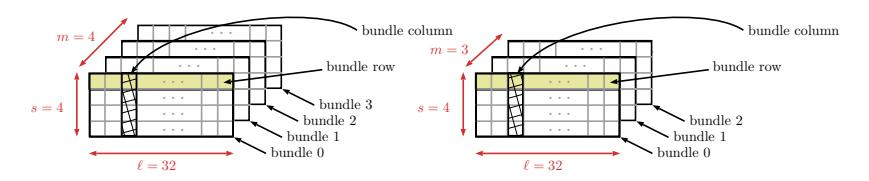
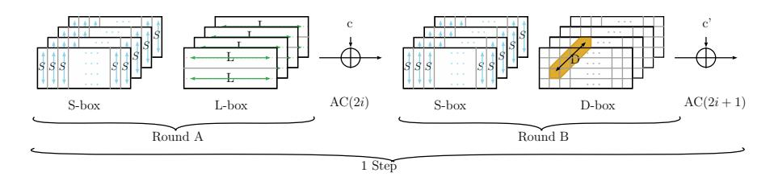
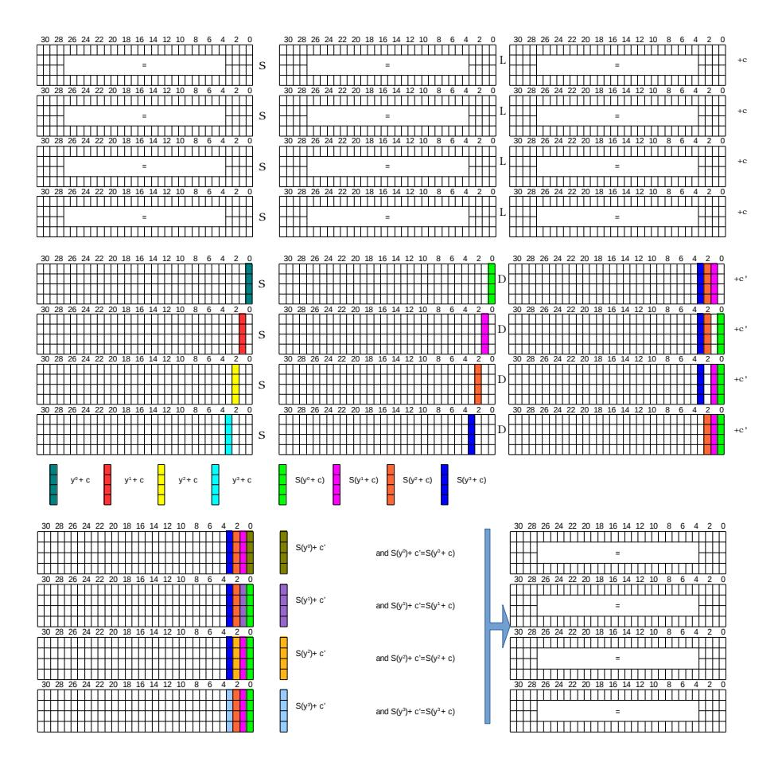
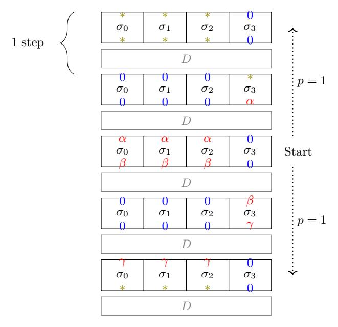
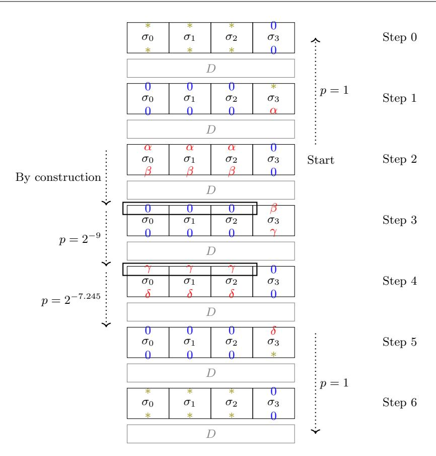
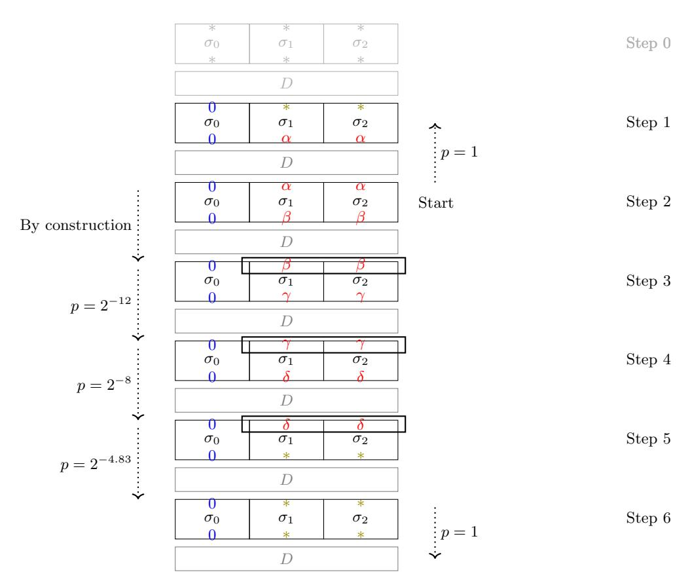
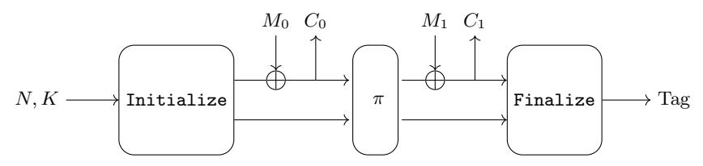
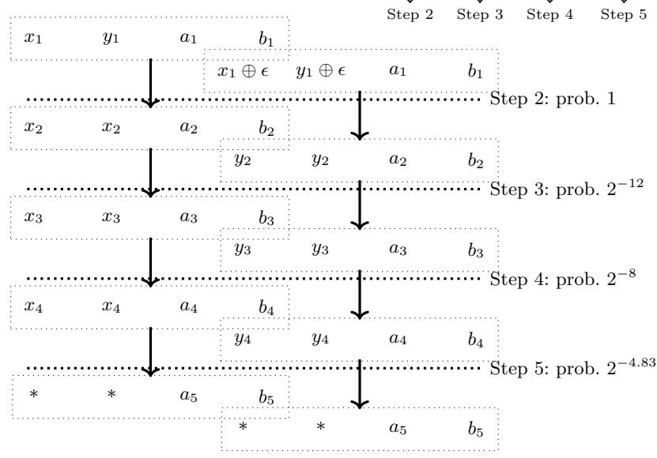
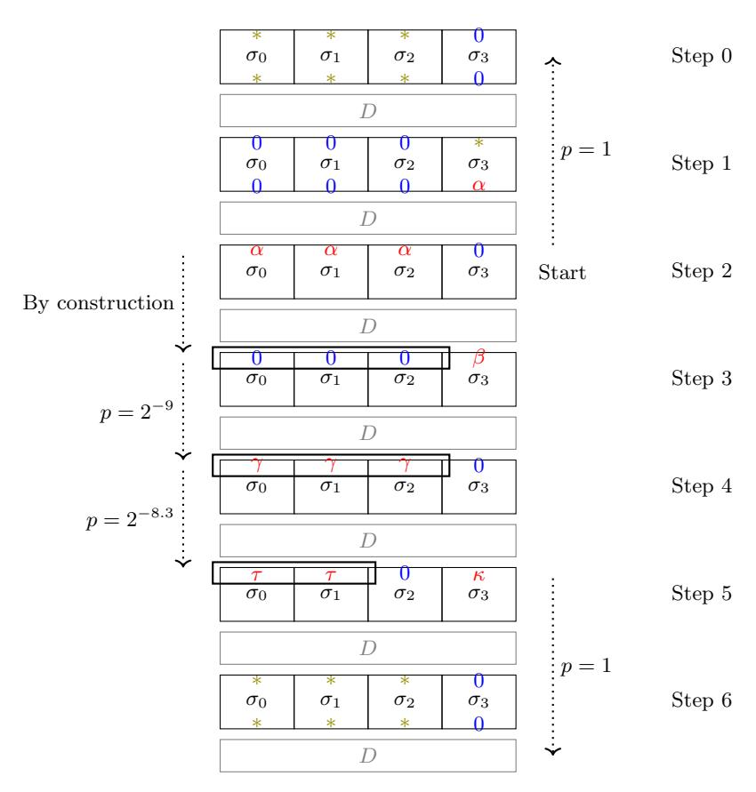

# Cryptanalysis Results on Spook Bringing Full-round Shadow-512 to the Light

Patrick Derbez<sup>1</sup> , Paul Huynh<sup>2</sup> , Virginie Lallemand<sup>2</sup> , Mar´ıa Naya-Plasencia<sup>3</sup> , L´eo Perrin<sup>3</sup> , Andr´e Schrottenloher<sup>3</sup>

<sup>1</sup> Univ Rennes, CNRS, IRISA, France patrick.derbez@irisa.fr <sup>2</sup> Universit´e de Lorraine, CNRS, Inria, LORIA, F-54000 Nancy, France firstname.name@loria.fr

Abstract. Spook [\[BBB](#page-24-0)<sup>+</sup>19] is one of the 32 candidates that has made it to the second round of the NIST Lightweight Cryptography Standardization process, and is particularly interesting since it proposes differential side channel resistance. In this paper, we present practical distinguishers of the full 6-step version of the underlying permutations of Spook, namely Shadow-512 and Shadow-384, solving challenges proposed by the designers on the permutation. We also propose practical forgeries with 4-step Shadow for the S1P mode of operation in the nonce misuse scenario, which is allowed by the CIML2 security game considered by the authors. All the results presented in this paper have been implemented.

Keywords: dedicated cryptanalysis, differential attacks, implemented attacks, Spook, round constants, lightweight primitives, distinguisher, forgery.

### 1 Introduction

The number of applications running on interconnected resource-constrained devices increased exponentially during the last decade, bringing new challenges to both the community and the industry. Sensor networks, Internet-of-Things, smart cards and healthcare are a few examples which handle sensitive data that should be protected.

These new platforms have their own specific sets of requirements, in particular in terms of implementation efficiency. As common cryptographic primitives were not designed to satisfy these specific use cases, they can be ill-suited in these contexts. A staggering number of algorithms has been proposed to fulfill such requirements, such as PRESENT [\[BKL](#page-25-0)<sup>+</sup>07] (low gate count in hardware), PRINCE [\[BCG](#page-25-1)<sup>+</sup>12] (low latency in hardware), Midori [\[BBI](#page-25-2)<sup>+</sup>15] (low power consumption), or LEA [\[HLK](#page-26-0)<sup>+</sup>14] (low ROM and cycle count on micro-controllers). Such primitives have been nicknamed lightweight. Because the corresponding devices can often be expected to be physically interacted with by an attacker, an

<sup>3</sup> Inria, Paris, France firstname.name@inria.fr

<span id="page-0-0"></span><sup>○</sup>c IACR 2020. This article is the final version submitted by the authors to the IACR and to Springer-Verlag on June 8th, 2020.

algorithm easing side channel resistance has a significant advantage. Hence many recent proposals were designed to be naturally resistant against side-channel attacks or, at least, protectable at low cost. For instance, the authenticated encryption (AE) scheme Pyjamask [\[GJK](#page-25-3)+19] was designed with a minimal number of non-linear gates to allow efficient masked implementations while the AE scheme ISAP [\[DEM](#page-25-4)+17] is resistant to differential power analysis, a powerful type of attack where the adversary try to deduce information about the secret key from power consumption.

This need for lightweight cryptographic primitives led the American National Institute of Standards and Technology (NIST) to initiate the Lightweight Cryptography Project, aiming at the standardization of hash functions and authenticated encryption algorithms suitable for constrained devices. It received 57 algorithm proposals in February 2019 and accepted 56 of them. In August 2019, 32 primitives were announced as the 2nd round candidates.

In this paper we study Spook, an Authenticated Encryption scheme with Associated Data (AEAD) which is among those 2nd round candidates. It was designed to achieve both resistance against side-channel analysis and low-energy implementations and is particularly interesting as it aims at providing strong integrity guarantees even in the presence of nonce misuse and leakage. AEAD is provided using three sub-components: the Sponge One-Pass mode of operation (S1P), the tweakable block cipher Clyde-128 and the permutation Shadow. Both Clyde and Shadow are based on simple extensions of the LS-design framework first introduced by the designers of the lightweight block ciphers Robin and Fantomas [\[GLSV15\]](#page-25-5). This strategy leads to efficient bitslicing and side-channel resistant implementations on a wide range of platforms. To further simplify the implementation, the permutation uses the round function of the tweakable block cipher as a sub-routine, effectively combining 3 or 4 parallel instances of a round-reduced cipher using a simple linear layer to construct a 384- or 512-bit permutation.

Motivation and contributions. In Section 4.3 of the specification document of Spook [\[BBB](#page-24-0)<sup>+</sup>19], the designers explicitly point out that an important requirement for the permutation in the S1P mode of operation is that it provides collision resistance with respect to the 255 bits that generate the tag and they say:

"Hence, a more specific requirement is to prevent truncated differentials with probability larger than 2 <sup>128</sup> for those 255 bits. A conservative heuristic for this purpose is to require that no differential characteristic has probability better than 2 <sup>−</sup><sup>385</sup>, which happens after twelve rounds (six steps)."

In this paper we show that this heuristic is not conservative, providing practical truncated distinguishers on Shadow, the inner permutation of Spook. We exhibit non-random behavior for up to the full version of Shadow-512. Moreover, the same technique would also distinguish Shadow-512 extended by 2 more rounds at the end. More precisely, we exhibit two particular subspaces and

of co-dimension 128 and an efficient algorithm which returns pairs of messages (m,m') such that  $m\oplus m'\in E$  and  $\operatorname{Shadow-512}(m)\oplus\operatorname{Shadow-512}(m')\in F$ . This implies in particular a practical collision on 128 bits of the output. This problem is a particular instance of the so-called *limited birthday* problem, which was first introduced by Gilbert and Peyrin when looking for known key distingushers against the AES [GP10]. As a permutation can be seen as a block cipher with a known key, it is natural to borrow distinguishers from this field. While the complexity of a generic algorithm performing this task is around  $2^{64}$  because of the birthday bound (see [IPS13] for more details), our un-optimized implementations of our distinguishers run in at most a few minutes on a regular desktop computer.

We also provide similar distinguishers targeting up to 10 (out of 12) rounds of Shadow-384, the small version of Shadow. Note that, as for Shadow-512, adding 2 more rounds at the end of the permutation would not increase its security as there would exist a similar distinguisher on the last 12 rounds (a 2-round shifted version of the proposed permutation).

As other several sponge-based lightweight algorithms <sup>1</sup>, the authors purposefully relied on a permutation for which distinguishers could exist as this allows to use fewer permutation rounds (Spook designers pointed out for instance that 12 rounds were not enough to have 512 bits of security with respect to linear distinguishers) and thus an increase in the speed of data processing. Nevertheless, our distinguishers seem to prove that the behavior of Shadow is not compatible with the requirements given by the authors on the permutation for the S1P mode of operation.

The next important question is whether these distinguishers are a threat to Spook itself, as the impact is *a priori* not clear. For Spook, we are able to leverage the results we obtained to produce practical existential forgeries for the S1P mode of operation when Shadow-512 is reduced to 8 rounds out of 12 in the nonce misuse scenario, which is allowed by the CIML2 security game considered by the authors [BPPS17].

Distinguishers on both Shadow-512 and Shadow-384 along with the forgeries on 8-step Spook have been implemented and verified against the reference implementation provided by the designers.

Paper Organization. In Section 2 we describe Shadow and introduce some cryptanalysis techniques. Then in Section 3 we make some observations on the structure of the permutation that will play a crucial role in our cryptanalysis. Finally, in Sections 4 and 5 we present the results of our analysis of both versions of Shadow, including a distinguisher on the full Shadow-512, as well as forgeries against Spook when Shadow-512 is reduced to 8 rounds.

All the analyses presented in this paper are practical and have been implemented and tested. Their source code is available at:

https://who.paris.inria.fr/Leo.Perrin/code/spook/index.html

<span id="page-2-0"></span><sup>&</sup>lt;sup>1</sup> See for instance ASCON [DEMS16], Ketje [BDP<sup>+</sup>16], or SPARKLE [BBdS<sup>+</sup>19]

Our results have been acknowledged and discussed by the designers of Spook in  $[BBB^+20]$ .

### <span id="page-3-0"></span>2 Preliminaries

The specific mode of operation we target will be described in the relevant section. Here, we present the **Shadow** family of permutations and recall the definition of differential distinguishers.

### <span id="page-3-2"></span>2.1 Specification of Shadow-384 and Shadow-512

The Spook algorithm is based on a permutation named Shadow that exists in two flavors: Shadow-384 and Shadow-512, where Shadow-512 is the one used in the primary candidate to the NIST Lightweight competition. In both cases, the internal state is seen as a collection of m two-dimensional arrays (or bundles) each of dimensions  $32 \times 4$ : as depicted in Figure 1, m=4 for Shadow-512 and m=3 for Shadow-384. The permutations have a Substitution Permutation Network (SPN) structure based on a 4-bit S-box layer and two distinct linear layers, each being used every second round.

<span id="page-3-1"></span>

Fig. 1: State Organization of Shadow-512 (left) and of Shadow-384 (right).

The full versions of the permutations iterate 6 steps. As represented in Figure 2, one step is made of two rounds, denoted round A and round B, interleaved with round constant additions. Shadow-384 and Shadow-512 only differ in the definition of the D layer.

**Round A** first applies a non-linear layer made by the application on each bundle column of the 4-bit S-box recalled in Table 1. It then applies the so-called L-box which calls the L' transformation to the first two and last two rows of each bundle. If we denote by (x,y) the input and by (a,b) the output the definition of L' is given by:

$$(a,b) = L'(x,y) = \begin{pmatrix} \operatorname{circ}(0\texttt{xec045008}) \cdot x^T \oplus \operatorname{circ}(0\texttt{x36000f60}) \cdot y^T \\ \operatorname{circ}(0\texttt{x1b0007b0}) \cdot x^T \oplus \operatorname{circ}(0\texttt{xec045008}) \cdot y^T \end{pmatrix}$$

where circ(A) stands for a circulant matrix whose first line is a row vector given by the binary decomposition of A.

<span id="page-4-0"></span>

<span id="page-4-1"></span>Fig. 2: Description of one step of Shadow-512.

Table 1: 4-bit S-box used in Shadow.

| x  0 1   | 2 3 | 4 | 5 6 | 7 | 8 9 | a | b | с | d | е | f |
|----------|-----|---|-----|---|-----|---|---|---|---|---|---|
| S(x) 0 8 | 1 f | 2 | a 7 | 9 | 4 d | 5 | 6 | е | 3 | b | c |

**Round B** starts with the same S-layer as round A but uses a different linear layer, denoted D. The purpose of D is to provide diffusion between the m bundles of the state: as depicted in Figure 2, it takes as input one bit of each bundle. It modifies them with the application of a near-MDS matrix (which previously appeared in the design of the ciphers Midori [BBI<sup>+</sup>15] and Mantis [BJK<sup>+</sup>16] for instance), respectively:

$$D(a,b,c,d) = \begin{pmatrix} 0 & 1 & 1 & 1 \\ 1 & 0 & 1 & 1 \\ 1 & 1 & 0 & 1 \\ 1 & 1 & 1 & 0 \end{pmatrix} \times \begin{pmatrix} a \\ b \\ c \\ d \end{pmatrix}$$

for Shadow-512 while for Shadow-384 we use:

$$D(a,b,c) = \begin{pmatrix} 1 & 1 & 1 \\ 1 & 0 & 1 \\ 1 & 1 & 0 \end{pmatrix} \times \begin{pmatrix} a \\ b \\ c \end{pmatrix}.$$

The **round constants** used in the permutation correspond to the internal state of a 4-bit LFSR. They are recalled in Table 2. At the end of every round (for rounds from 0 to 11), the 4-bit constant is XORed at 4 different positions, one time in each bundle: in bundle b (for b = 0, 1, 2, 3), the constant is XORed to the column number b. Without loss of generality, we hereafter position bit number 0 on the right of the state in our figures.

#### 2.2 Differential Distinguishers

As indicated in the Spook specification, the black box security analysis of the mode of operation that is used in Spook (S1P) relies on the assumption that

<span id="page-5-1"></span>Table 2: Round constants used in Shadow. Note that the LSB is on the left.

|   | Round Constant Round Constant Round Constant Round Constant |   |           |    |           |    |           |
|---|-------------------------------------------------------------|---|-----------|----|-----------|----|-----------|
| 0 | (1,0,0,0)                                                   | 1 | (0,1,0,0) | 2  | (0,0,1,0) | 3  | (0,0,0,1) |
| 4 | (1,1,0,0)                                                   | 5 | (0,1,1,0) | 6  | (0,0,1,1) | 7  | (1,1,0,1) |
| 8 | (1,0,1,0)                                                   | 9 | (0,1,0,1) | 10 | (1,1,1,0) | 11 | (0,1,1,1) |

the permutations are random. In this paper we challenge this assumption by exhibiting distinguishers for the permutations – that is, algorithms that unveil a non-random behavior.

Our distinguishers use the notion of differential, a technique that was introduced by Biham and Shamir in [\[BS91\]](#page-25-11). The idea is to find a couple of XOR differences (, ) such that if two messages differ from then with high probability their output difference after encryption is equal to .

This idea was later extended by Knudsen in 1994 to define truncated differentials [\[Knu95\]](#page-26-3), a variant in which only a portion of the difference is fixed (while the remaining part is undetermined). This technique is illustrated in Figure [5](#page-12-0) for instance, where we introduce a distinguisher that ends with a difference of the form (\*, \*, \*, 0) before the last operation: the '\*' symbol indicates that the difference between the messages is not determined over the first three bundles, while the '0' symbol indicates that the two messages are identical on the last bundle (128 bits).

# <span id="page-5-0"></span>3 Structural Observations

In this section we present the general properties we found that we will later exploit in our analysis. While our distinguisher is a truncated differential one, our method for finding right pairs does not rely on a high probability differential trail (whose very existence is disproved by the authors' wide trail argument). Instead, we exploit the similarity between the functions applied in parallel on each bundle. To better describe them, we introduce the notion of Super S-box (as it applies to Shadow) and we study the propagation of the following type of properties through the step function. Note that we next provide the details for Shadow-512 but that similar results apply to Shadow-384.

Definition 1 (-identical state). We call -identical an internal state of Shadow in which bundles are equal.

#### 3.1 Super S-box

Given the fact that in every step only the layer is mixing the bundles together, it is possible to rewrite Shadow as an SPN using four 128-bit Super S-boxes (each operating on one bundle) interleaved with a linear permutation D operating on the full state. If a,b,c and d are the 128-bit bundles, this linear permutation is represented as follows:

$$D(a,b,c,d) = \begin{pmatrix} 0 & I & I & I \\ I & 0 & I & I \\ I & I & 0 & I \\ I & I & I & 0 \end{pmatrix} \times \begin{pmatrix} a \\ b \\ c \\ d \end{pmatrix}.$$

D is an involution with branching number 4 (over 128-bit words) and it verifies that  $\forall a \in \mathbb{F}_2^{128}, D(a,a,a,0) = (0,0,0,a)$ . We denote by  $\sigma_j$  for  $j \in \{0,1,2,3\}$  the four parallel *Super S-boxes* of the

We denote by  $\sigma_j$  for  $j \in \{0, 1, 2, 3\}$  the four parallel *Super S-boxes* of the cipher. They correspond to the first four operations of the step, namely: the S-layer and the linear operation L of round A, the constant addition (that is done on a different position for each Super S-box), and the S-layer of round B.

In the following, we show that even though the four bundles of a state go through different Super S-boxes it might be possible to have a Shadow state with four equal bundles that is transformed into a Shadow state of the same form at the output of a full step.

#### <span id="page-6-1"></span>3.2 4-Identical States

In the discussion below we follow the evolution of the 4-identical property through a step and show the required conditions for it to remain in the end. This evolution is also summarized in Figure 3.

Probability of Maintaining the 4-Identical Property through a Step. We start from a 4-identical state X that we write X = (x, x, x, x). Each bundle x is made of 32 columns:  $x = (x^{31}, x^{30}, \dots, x^1, x^0)$ .

- **Application of the Super S-boxes.** The step starts with one non-linear layer followed by the L layer, applied in parallel (that is, independently) on each of the 4 bundles. Since these transformations are identical for each bundle the 4-identical property is followed with probability one up to this point and so we have  $L \circ S(X) = (y, y, y, y)$  with  $y = L \circ S(x)$ . We next have the addition of the first round constant on column j of bundle j for  $j \in \{0, 1, 2, 3\}$ , that we will call AC, and finally we apply another S-box layer. By denoting the round constant by  $c^2$  c, we obtain the following values for  $S \circ AC(2i) \circ L \circ S(X)$ :

$$\begin{array}{cccccccccccccccccccccccccccccccccccc$$

where  $B_i$  is bundle i. At this stage, the 4 bundles stop being 4-identical but differ on the value of their 4 first columns.

<span id="page-6-0"></span><sup>&</sup>lt;sup>2</sup> Recall here that the value of the round constant depends on the round index.

<span id="page-7-0"></span>

Fig. 3: Evolution of two rounds with a starting 4-identical state, where the four bundles are equal in the beginning.

- **D-box and second round constant addition.** The D layer mixes together the 4 bundles by XORing 3 of them together to form one output bundle, as described in Section 2.1. In the above representation of the state, it operates columnwise by replacing each column element with the XOR of the 3 others. The last operation is the addition of the second round constant, that we denote c', at the same positions as before (column j of bundle j for  $j \in \{0,1,2,3\}$ ). Formally, the expression of the bundles of

 $AC(2i+1) \circ D \circ S \circ AC(2i) \circ L \circ S(X)$  is the following:

$$\begin{array}{cccccccccccccccccccccccccccccccccccc$$

To ensure a 4-identical state at this point, the following 4 equations need to be satisfied:

$$\begin{cases} S(y^3 \oplus c) = & S(y^3) \oplus c' \\ S(y^2 \oplus c) = & S(y^2) \oplus c' \\ S(y^1 \oplus c) = & S(y^1) \oplus c' \\ S(y^0 \oplus c) = & S(y^0) \oplus c' \end{cases}$$

Depending on the values of c and c' – that vary with the index of the step – these 4 equations are either never verified or can be verified with a rather high probability. In fact, their number of solutions corresponds to the probability of the transition from a difference of c to a difference of c' through the S-box S. We computed the corresponding probabilities for all the steps and report the results in Table 3. Note that we experimentally verified these values.

<span id="page-8-0"></span>Table 3: Probability that an output of step s of Shadow is 4-identical knowing that the input is.

| 8           | 0 | 1 | 2 | 3         | 4        | 5 |
|-------------|---|---|---|-----------|----------|---|
| Probability | 0 | 0 | 0 | $2^{-12}$ | $2^{-8}$ | 0 |

#### <span id="page-8-2"></span>3.3 3-Identical States

A similar reasoning applies to states for which only 3 (out of 4) bundles are equal. In this case, we have one fewer S-box transition to constrain, and then the probabilities of Table 3 increase to the ones provided in Table 4.

<span id="page-8-1"></span>Table 4: Probability that an output of step s of Shadow is 3-identical knowing that the input is.

| s           | 0 | 1 | 2 | 3        | 4        | 5 |
|-------------|---|---|---|----------|----------|---|
| Probability | 0 | 0 | 0 | $2^{-9}$ | $2^{-6}$ | 0 |

We detail the equations leading to the probabilities of Table 4 in Appendix A. These probabilities do not depend on the choice of the positions of the 3 input

bundles that are identical. Instead, they are valid as soon as the 3 positions are the same in the input and in the output.

### 3.4 2-Identical States

We can follow a similar reasoning to obtain the probability of keeping a 2 identical state. We obtain two equations to solve, and the probabilities become the ones given in Table [3.](#page-8-0) Again, the position of the 2 identical bundles does not impact these probabilities but it has to be the same in the input and in the output.

<span id="page-9-3"></span>Table 5: Probability that an output of step of Shadow is 2-identical knowing that the input is.

| 𝑠           | 0 | 1 | 2 | 3   | 4       | 5 |
|-------------|---|---|---|-----|---------|---|
| Probability | 0 | 0 | 0 | 2−6 | −4<br>2 | 0 |

# <span id="page-9-0"></span>4 A Distinguisher Against Full Shadow-512 (and More)

In this section, we present a practical distinguisher which allows us to exhibit pairs (, ′ ) of 512-bit inputs of the Shadow-512 permutation such that

<span id="page-9-1"></span>
$$x \oplus x' = (*, *, *, 0)$$
 and  $\pi(x) \oplus \pi(x') = D(0, 0, 0, *)$ , (1)

for the full version and such that

<span id="page-9-2"></span>
$$x \oplus x' = (*, *, *, 0)$$
 and  $\pi(x) \oplus \pi(x') = D(*, *, *, 0)$ , (2)

for a "round-extended" version of Shadow-512 using 7 steps rather than 6. In other words, we efficiently solve a limited-birthday problem.

As proved by Iwamoto et al. [\[IPS13\]](#page-26-2), generating such pairs for a random permutation would require roughly 2<sup>64</sup> queries. However, we can produce pairs satisfying Property [\(1\)](#page-9-1) for full Shadow-512 using about 2<sup>15</sup> calls to said permutation. The exact same technique finds pairs satisfying Property [\(2\)](#page-9-2) for 7-step Shadow-512. The corresponding procedures are described in Section [4.2.](#page-11-0)

These distinguishers hinge on two properties: the propagation of 3-identical states which we described in Section [3.3,](#page-8-2) and a probability 1 truncated differential explained in Section [4.1.](#page-10-0) The latter can be used directly as a distinguisher for 10-round Shadow-512.

<span id="page-10-1"></span>

Fig. 4: A 5-step distinguisher against the 512-bit permutation Shadow.

#### <span id="page-10-0"></span>4.1 A 5-Step Truncated Differential Property

We start by devising a distinguisher of Shadow-512 reduced to 5 steps out of 6. The truncated trail we use is summarized in Figure 4. Starting from the middle, we can easily construct pairs of states such that their difference propagates with probability 1 over 2 forward and 2 backward steps.

All propagations are of probability 1, the only place where we would a priori have to pay for the cost of a transition is for the three Super S-box level transitions  $\alpha \leadsto \beta$  in step 2. However, the high similarity between the Super S-boxes provides us with a simple way to obtain three such pairs of 128-bit blocks.

Building pairs of bundles that follow the same differential for different Super S-boxes. Recall that the only difference between two Super S-boxes lies in the constant addition operation that is done right after the L linear layer. The 4-bit constant c is added to the input of only one S-box of the second non-linear layer, and the index of this S-box depends on the Super S-box index.

Thanks to this limited difference between the Super S-boxes, we can easily build an input difference  $\alpha$  so that the output difference of the S-box does not depend on its index. More precisely, this difference  $\alpha$  should be chosen so that it does not diffuse to the last 4 columns of the bundle. This simple fact is formalized in the following lemma:

**Lemma 1.** If  $x \in \mathbb{F}_2^{128}$  and  $\alpha \in \mathbb{F}_2^{128}$  are such that  $(L \circ S)(x) \oplus (L \circ S)(x \oplus \alpha) = \beta$  and if  $\beta$  is set to 0 on the 4 S-boxes that can receive the round constant c, then the value of  $\sigma_b(x) \oplus \sigma_b(x \oplus \alpha)$  does not depend on the bundle index b.

*Proof.* We denote by y and  $y \oplus \beta$  the respective values of  $(L \circ S)(x)$  and  $(L \circ S)(x \oplus \alpha)$ . By expanding these into the column notation we get:

$$\begin{array}{cccccccccccccccccccccccccccccccccccc$$

Let us first look at  $\sigma_0$ . We have that

$$\begin{array}{cccccccccccccccccccccccccccccccccccc$$

so summing these equations yields

$$\sigma_0(x) \oplus \sigma_0(x \oplus \alpha) = \gamma^{31} \cdots \gamma^4 \quad 0 \quad 0 \quad 0$$

Without loss of generality, let us now consider  $\sigma_1$ . We have

$$\begin{array}{cccccccccccccccccccccccccccccccccccc$$

As we can see we have the exact same pairs of values, and thus the same output differences, unless we look at one of the first 4-bit nibbles. However, in this case, the values in  $\sigma_1(x)$  and  $\sigma_1(x \oplus \alpha)$  are identical to one another, meaning that their difference is equal to 0 as well.

This concludes the proof since the two differences are equal.

To put it differently, this lemma allows us to build pairs of messages that follow the same differential trail over one step whatever the index of the Super S-box.

Our distinguisher for 5 steps of Shadow-512 thus works by following the process described in Algorithm 1. As depicted in Figure 4, the choice of the difference  $\beta$  ensures that the same transition is followed for the 3 first Super S-boxes of step 2. The differential pattern then propagates as expected with probability 1 through steps 1 then 0 (backward), and 3 then 4 (forward).

We have verified experimentally that this distinguisher works as predicted.

The differences in the output of the Super S-box layer of step 5 (denoted by \* in Figure 4) are a priori different from one another, meaning that this approach cannot cover more rounds. Fortunately, we can use the property studied in Section 3.3 to our advantage, as explained below.

### <span id="page-11-0"></span>4.2 A Distinguisher for 6- and 7-Step Shadow

Using the truncated trail discussed in Section 4.1 with the observation in Section 3.3, we can build a distinguisher on 6 steps of Shadow, *i.e.* on the full permutation. It would naturally extend to a distinguisher on 7 steps if we defined such a "round-extended" variant of Shadow. This distinguisher is summarized in Figure 5.

#### <span id="page-12-1"></span>Algorithm 1 A distinguisher for 5-step Shadow.

- 1. Choose  $\beta \in \mathbb{F}_2^{128}$  such that it is set to 0 on the 4 S-boxes of lowest weight 2. Choose a random  $y \in \mathbb{F}_2^{128}$  and a random  $z \in \mathbb{F}_2^{128}$  3. Compute  $x = \sigma_0^{-1}(y)$  and  $x + \alpha = \sigma_0^{-1}(y + \beta)$ ,

- 4. Set the two states at step 2 to be

$$X_2 = (x, x, x, z)$$
 and  $X'_2 = (x + \alpha, x + \alpha, x + \alpha, z)$ .

5. Invert step 1 and step 0 on  $X_2$  and  $X_2'$  to obtain a pair of states  $(X_0, X_0')$  such that  $\pi(X_0) \oplus \pi(X'_0) = D(*, *, *, 0)$ .

<span id="page-12-0"></span>

Fig. 5: A 7-step distinguisher against the 512-bit permutation Shadow.

Structure of the distinguisher. Our distinguisher works as follows.

- We first focus on the input of step 2 and build a pair of messages that differ by  $(\alpha, \alpha, \alpha, 0)$ . This difference automatically sets the input difference of step 0 to be equal to 0 on the third bundle. Our choice of the two messages must also ensure that their difference at the end of step 2 is equal to  $(0,0,0,\beta)$  and that the two output messages are 3-identical (the 3-identical property is depicted by the thick rectangle in Figure 5.).

- In step 3, we want to keep the 3-identical property in order to ease the following step. As we established before (see Table 4), this event has a probability equal to  $2^{-9}$ . The input difference at the end of step 3 is then equal to  $(\gamma, \gamma, \gamma, 0)$ .
- We next aim for a difference equal to  $(\delta, \delta, \delta, 0)$  at the output of the Super S-boxes of step 4, an event whose probability we later prove to be  $2^{-7.245}$ . When this condition is fulfilled we obtain a difference equal to  $(0,0,0,\delta)$  at the output of step 4, which automatically leads to the required difference of the form (\*,\*,\*,\*,0) at the end of step 5.

Let us now show how we can efficiently find two states that verify the conditions at the input and the output of Step 3.

Suppose that there is an  $x \in \mathbb{F}_2^{128}$  such that the following holds during step 2 for some 128-bit values  $\alpha, \beta, \epsilon$  and  $\epsilon'$ :

<span id="page-13-0"></span>
$$\begin{cases} \sigma_0(x) + \sigma_0(x + \alpha) &= \beta \\ \sigma_1(x + \epsilon) + \sigma_1(x + \epsilon + \alpha) &= \beta \\ \sigma_2(x + \epsilon') + \sigma_2(x + \epsilon' + \alpha) &= \beta \end{cases},$$
 (3)

these constraints corresponding to the differential trail at step 2 that is used in Figure 5. Such an x would allow us to run the 5-round distinguisher described in Section 4.1. However, as we explained, the property would not extend beyond the fifth step. To achieve this, we add another set of constraints:

<span id="page-13-1"></span>
$$\begin{cases}
(AC \circ D)(\sigma_0(x), \ \sigma_1(x+\epsilon), \ \sigma_2(x+\epsilon'), \ z) &= (y, \ y, \ z') \\
(AC \circ D)(\sigma_0(x+\alpha), \ \sigma_1(x+\alpha+\epsilon), \ \sigma_2(x+\alpha+\epsilon'), \ z) &= (y, \ y, \ y, \ z'+\beta) \ .
\end{cases}$$
(4)

In other words, we impose that each state we consider is 3-identical.

In this case, the difference between the states has to be equal to  $(0,0,0,\beta)$  at the input of step 3. Furthermore, each state is 3-identical. This property is carried over to the next step with some probability. Should this happen, we would have at the input of step 4 that the difference between the states is equal to  $(0,0,0,\gamma)$  for some  $\gamma \in \mathbb{F}_2^{128}$ , and that each state is 3-identical.

Finding Solutions for Properties (3) and (4). It turns out that a specific probability 1 truncated differential pattern allows us to trivially find solutions satisfying both Property (3) and Property (4).

Indeed, we remark that:

- 1. the impact of the constant additions both within the Super S-box layers and outside it (after the D layer) is limited to the S-boxes with indices in  $\{0,1,2,3\}$  (i.e. the 4 of lowest weight) within each Super S-box, and
- 2. the bits with indices 22 and 23 in each of the 4 input words of a Super S-box do not influence the output bits with indices in  $\{0, 1, 2, 3\}$ .

Using the reference implementation, we can indeed see that

```
L(0, e_{22}) = (1b880510, 6c06f000)

L(e_{22}, 0) = (36037800, 1b880510)

L(0, e_{23}) = (37100a20, d80de000)

L(e_{23}, 0) = (6c06f000, 37100a20)
```

where the 4 bits of lowest weight in each output are always equal to 0. We then define the vector space  $\nabla \subset (\mathbb{F}_2^4)^{32}$  as

$$\nabla = \{a \times e_{22} + b \times e_{23}, a \in \mathbb{F}_2^4, b \in \mathbb{F}_2^4\} ,$$

where the multiplications are done in the finite field  $\mathbb{F}_2^4$ . As a consequence of our observations, we have the following lemma.

**Lemma 2.** Let  $x \in (\mathbb{F}_2^4)^{32}$  be a 128-bit vector and let  $\alpha \in \nabla$  be a difference. Then for all steps and all bundle index i, we have that

$$\sigma_i(x) + \sigma_i(x + \alpha) = (*, *, ..., *, 0, 0, 0, 0)$$
.

As evidenced by our experimental results (see below), this approach is efficient, and with the cost of computing 1 Super-Sbox we can obtain about  $2^{16}$  internal states that verify the condition of step 2.

Description of the Full Distinguisher. Algorithm 2 details our distinguisher. Using the techniques described so far, we are able to find input differences that satisfy the truncated trail and are 3-identical where needed (see Figure 5) from the beginning of step 0 to the end of step 2. Let us now see what happens in the remaining steps.

### <span id="page-14-0"></span>Algorithm 2 Our 7-step distinguisher against Shadow.

**Output:** A pair (x,y,z,t), (x',y',z',t) such that  $\pi(x,y,z,t) \oplus \pi(x',y',z',t) = (*,*,*,0)$  with probability at least  $2^{-16.245}$  after 7-step Shadow-512.

- 1. Select a difference  $\epsilon \in \nabla$ .
- 2. Select a state  $(y_2, y_2, y_2, z_2)$  that will be a state after step 2.
- 3. Invert step 2 on  $(y_2, y_2, y_2, z_2)$ , obtaining  $(x_1, y_1, z_1, t_1)$ .
- 4. Invert step 1 on  $(x_1, y_1, z_1, t_1)$  and  $(x_1 \oplus \epsilon, y_1 \oplus \epsilon, z_1 \oplus \epsilon, t_1)$ , obtaining  $(x_0, y_0, z_0, t_0)$  and  $(x_0, y_0, z_0, t_0')$ .
- 5. Invert step 0, obtaining a pair of Shadow-512 states with a zero-difference in the last bundle.
- 6. Return this pair of state. With high probability ( $\geq 2^{-16.24}$ ), it satisfies the truncated trail in Figure 5.

- Step 3. We start from two messages that are built such that at the end of step 2 they are 3-identical, and we want that the two messages are again 3-identical at the end of step 3. With a reasoning similar to the one given in Section 3.3, we obtain 6 equations to solve, while in fact only 3 are independent (the 3 equations obtained for the second message are the same as the 3 obtained for the first message since they only differ on the last bundle), and as detailed in Table 4 the probability is equal to 2<sup>-9</sup> since this is step number 3.
- Step 4. Our objective is to obtain a difference of the form  $(0,0,0,\delta)$  for any non-zero  $\delta$  in  $\mathbb{F}_2^{128}$  at the beginning of step 5 (see Figure 5). In order for this to happen, we need to have a difference equal to  $(\delta, \delta, \delta, 0)$  at the end of step 4. To estimate the probability of this event, let us write the corresponding equations. We denote the two messages after the application of S and L of step 4 by (y, y, y, w) and (y', y', y', w) respectively. Since the input of step 4 is 3-identical,  $y^i = y'^i$  for all i > 3. The expression of the last 4 column values at the end of step 4 (i.e. after applying D and AC) is then as follows for (y, y, y, w)

```
\begin{array}{llllllllllllllllllllllllllllllllllll
```

and as follows for (y', y', y', w):

```
\begin{array}{llllllllllllllllllllllllllllllllllll
```

In order for the sum of these two states to be equal to  $(0,0,0,\delta)$  (for any non-zero  $\delta$ ), the following relations have to be satisfied:

$$S(y'^2) \oplus S(y'^2 \oplus c) = S(y^2) \oplus S(y^2 \oplus c)$$
  
$$S(y'^1) \oplus S(y'^1 \oplus c) = S(y^1) \oplus S(y^1 \oplus c)$$
  
$$S(y'^0) \oplus S(y'^0 \oplus c) = S(y^0) \oplus S(y^0 \oplus c).$$

Since we are looking at step 4, the constant c is equal to 0x5 and then each equality has a probability equal to  $2^{-2.415}$  to be verified (assuming that the value of y and y' are independent).

- **Step 5.** This last step is passed with probability one, so in the end we observe an output difference equal to (\*,\*,\*,0) with a probability at least equal to  $(2^{-2.415})^3 \times 2^{-9} = 2^{-16.245}$ .
- **Step 6.** One additional round can be added with probability one, since by inverting D we would find a difference equal to 0 in the last bundle with the same probability of  $2^{-16.245}$ .

Experimental Results. Experiments showed that the probability of the distinguisher is slightly higher than what we expected, since in fact the previously detailed trail is not the only one that leads to the required output difference (see Appendix B for a description of another valid trail). By running Algorithm 2

for  $2^{22}$  times, we obtained 124 successful pairs, a probability close to  $2^{-15}$ . Our unoptimized C++ implementation found all these pairs in less than 30 seconds on a desktop computer. Below is an example for 7 steps.

 $x_1$  $x_2$ 9c7fbdf0 4a9a3523 90bd4f15 33e12e8f b4764864 aaabc55e 2b65df83 33e12e8f 5554509d 5ea7c50d db9fd14e 8cd31faf 30d8625c 6d513db3 9024c477 8cd31faf 5f0785c3 14ce1b1f b9a7f521 336e44ba 89fb6758 5d19b594 e69ccd64 336e44ba fcf630fb 82cafa8e abf5b881 e5534b79 4f3d62a5 3e530b8b f7ccf2b7 e5534b79  $\pi(x_1) \oplus \pi(x_2)$  $x_1 \oplus x_2$ 39e368a5 03e51caf f2d7ae55 00000000 2809f594 e031f07d bbd89096 00000000 658c32c1 33f6f8be 4bbb1539 00000000 2668956a b1720999 00c93f81 00000000 d6fce29b 49d7ae8b 5f3b3845 00000000 4aed9270 2b317fb5 6f1a183b 00000000 b3cb525e bc99f105 5c394a36 00000000 d902b8fd 5c7db7c2 2ef09921 00000000

### 4.3 A Distinguisher for 6-step Shadow-384

In this section we show how to build a similar distinguisher on 6 steps of the 384-bit variant of Shadow shifted by one round (i.e. which works for steps from 1 to 6 but for no steps from 0 to 5 because of the round constants). As explained in the preliminaries, Shadow-384 is defined as a 3LS-design, and the D layer acts on three 128-bit bundles a,b,c as follows:

$$D(a,b,c) = \begin{pmatrix} I & I & I \\ I & 0 & I \\ I & I & 0 \end{pmatrix} \times \begin{pmatrix} a \\ b \\ c \end{pmatrix}$$

Interestingly, propagating identical states remains possible with this layer, more specifically for states in which the last 2 bundles are equal. Using this property, one can exhibit pairs (x,x') such that  $x \oplus x' = (0,*,*)$  at step 1 and  $\pi(x) \oplus \pi(x') = D(0,*,*)$  at the end of step 6. Note that in this case, we cannot cover step 0. Hence this is not a distinguisher on the full version of Shadow-384 for which we can cover only 5 steps. However, it shows that adding 1 more step at the end does not increase the security of Shadow-384. The distinguisher is summarized in Figure 6.

As previously described in Section 4.2, by picking an  $\alpha$  in the vector space  $\nabla = \{a \times e_{22} + b \times e_{23}, a \in \mathbb{F}_2^4, b \in \mathbb{F}_2^4\}$  we can easily find two states  $(x_1, y_1, y_1 + \epsilon)$  and  $(x_1, y_1 + \alpha, y_1 + \epsilon + \alpha)$  as inputs to step 2 that satisfy the following properties at input of step 3:

$$\begin{cases} \sigma_1(y_1) + \sigma_1(y_1 + \alpha) &= \beta \\ \sigma_2(y_1 + \epsilon) + \sigma_2(y_1 + \epsilon + \alpha) &= \beta \end{cases},$$
 (5)

and

$$\begin{cases} (AC \circ D)(x_1, \ \sigma_1(y_1), \ \sigma_2(y_1 + \epsilon)) &= (x_2, \ y_2, \ y_2) \\ (AC \circ D)(x_1, \ \sigma_1(y_1 + \alpha), \ \sigma_2(y_1 + \alpha + \epsilon)) &= (x_2, \ y_2 + \beta, \ y_2 + \beta) \ . \end{cases}$$
(6)

<span id="page-17-0"></span>

Fig. 6: A (1-step shifted) 6-step distinguisher for Shadow-384. The thick rectangles depict 2-identical states.

By inverting step 1, we obtain a difference (0, \*, \*) with probability 1.

Now at step 3, the input difference equals  $(0, \beta, \beta)$  and the last two bundles of each state are identical. With probability  $2^{-12}$  and  $2^{-8}$  respectively, the 2-identical states are preserved through step 3 and 4. Using the same notations as in Section 3.2, these probabilities are explained below.

Starting from a 2-identical state X=(x,y,y), let  $(w,z,z)=L\circ S(X)$  with  $w=L\circ S(x)$  and  $z=L\circ S(y)$ . The first round constant c is then added on column j of bundle j for  $j\in\{0,1,2\}$ , and another S-box layer is applied, and we obtain the following:

$$S \circ AC(2i) \circ L \circ S(X) = \left[ \begin{array}{cccc} \cdots & S(w^i) & \cdots & S(w^2) & S(w^1) & S(w^0 \oplus c) \\ \cdots & S(z^i) & \cdots & S(z^2) & S(z^1 \oplus c) & S(z^0) \\ \cdots & S(z^i) & \cdots & S(z^2 \oplus c) & S(z^1) & S(z^0) \end{array} \right]$$

At this stage, the last 2 bundles of each state differ only on the value of their second and third columns. After the D layer and the addition of the second round

constant c' at column j of bundle j for  $j \in \{0,1,2\}$ ) as before, the expression of the bundles of  $AC(2i+1) \circ D \circ S \circ AC(2i) \circ L \circ S(X)$  becomes:

Thus, to ensure a 2-identical state, the following 2 equations need to be satisfied:

$$S(z^2 \oplus c) = S(z^2) \oplus c', \quad S(z^1 \oplus c) = S(z^1) \oplus c'.$$

We can then compute the probability of following each step of the truncated pattern in Figure 6 starting from the end of step 2:

**Step 3:** each equation is satisfied with probability  $2^{-3}$  for one state, thus  $2^{-12}$  in total for the two states.

**Step 4:** the probability for one state becomes  $2^{-2}$ , meaning  $2^{-8}$  in total.

**Step 5:** the 2-identical property cannot be carried through because of the round constants. However, one can obtain a difference in the form (0, \*, \*) between the two states with probability  $2^{-4.83}$ , as explained below.

By inverting the D layer of step 6, we should then observe a difference equal to 0 in the first bundle with a probability equal to  $(2^{-2.415})^2 \times 2^{-8} \times 2^{-12} = 2^{-24.83}$ .

Let us now compute the probability of going through step 5. If we denote (w, z, z) and (w, z', z') the two states after the application of S and L in step 5, then the expression of the column values at the end of that step for (w, z, z) becomes

```
 \begin{array}{cccccccccccccccccccccccccccccccccccc
```

and it takes the following value for (w, z', z')

```
\begin{array}{cccccccccccccccccccccccccccccccccccc
```

For the first bundles to be equal for both states the following relations have to be satisfied:

$$\begin{split} S(z'^2) \oplus S(z'^2 \oplus c) &= S(z^2) \oplus S(z^2 \oplus c) \\ S(z'^1) \oplus S(z'^1 \oplus c) &= S(z^1) \oplus S(z^1 \oplus c) \ , \end{split}$$

which occurs with probability  $2^{-2.415}$  for each relation.

Experimental Results. Experiments showed that the probability of the distinguisher is very close to what we expected. By testing  $2^{30}$  pairs, we obtained 31 successes, a probability close to  $2^{-25}$ . Our unoptimized C++ implementation took less than 70 minutes on a desktop computer to find these pairs, i.e. about 2 minutes per pair on average. Below is an example.

| 𝑥1                         | 𝑥2                         |
|----------------------------|----------------------------|
| 62544d56 60b9af6e bd3ddabf | 62544d56 48d12ffc bb391a7d |
| 019d0421 569ad0d3 e543b03f | 019d0421 5efa911b cb4ff1e5 |
| 5f8ba283 087f4892 f7b632d8 | 5f8ba283 265b098a ffd272c0 |
| 116bb908 eef0b58d 97dc955a | 116bb908 e0d8f55f 9790d5da |
|                            |                            |
| 𝑥1<br>⊕ 𝑥2                 | 𝜋(𝑥1) ⊕ 𝜋(𝑥2)              |
| 00000000 28688092 0604c0c2 | 00000000 d7ddf0cd 87ed7095 |
| 00000000 086041c8 2e0c41da | 00000000 c4e25bec df225a5c |
| 00000000 2e244118 08644018 | 00000000 d3d67ba2 9416fab2 |

Difference with 7 Rounds. The main difference with our 7-round distinguisher on Shadow-512 is our inability to cover step 0, and it stems from . The middle rounds of the attack cannot be moved, as they depend on our ability to cancel out the constants and maintain 2-identical states. In the 7-round attack, rounds alternate between 3 and 1 active Super S-box (bundle). The inverse step 1 takes in input a difference , , , 0 and the inverse application of gives a difference 0, 0, 0, . But since this difference is active in only one bundle, we can traverse one more round and have a difference active in only three bundles. Here, we used a different path, with two active bundles at each round. The inverse step 1 takes as input a difference 0, , , the inverse of maps to a difference 0, , , but after the inverse Super S-box, we obtain two unknown differences, and we cannot traverse round 0.

# <span id="page-19-0"></span>5 Forgeries with 4-step Shadow in the Nonce Misuse Setting

In this section, we show how to use the properties exploited in the distinguishers to create existential forgeries for the S1P mode of operation [\[BBB](#page-24-0)<sup>+</sup>19], in the single user setting, when used with 4-step Shadow (out of 6) shifted of two steps (starting at step 2 instead of 0). Hence, our attack targets the "aggressive parameters" specified in [\[BBB](#page-24-0)<sup>+</sup>19, Section 5].

One interesting feature of Spook is that it provides strong integrity guarantees in the presence of nonce misuse and leakage, which are formalized as CIML2 in the unbounded leakage model [\[BPPS17\]](#page-25-6). In our attack, we do not require leakage and instead exploit the nonce control. More specifically, we require the same nonce to be used three times. Our attack then creates two different messages with the same authentication tag. In particular, we are able to build collisions on the underlying hash function, which allows us to build the forgeries.

Attack Outline. S1P is a sponge-based mode of authenticated encryption with associated data represented in Figure [7,](#page-20-0) that uses Shadow as its underlying permutation. It has a rate of size 256 bits and a capacity of size 256 bits. If we number the bundles of Shadow as in the reference implementation, bundles 0 and 1 are the rate part and bundles 2 and 3 are the capacity part.

For the sake of simplicity, we consider a version of the S1P mode of operation without associated data, and we only consider two-block messages  $M_0, M_1$ . This situation is depicted on Figure 7, where  $\pi$  is the Shadow permutation, Initialize is a procedure combining  $\pi$  and the Clyde block cipher, that produces a 512-bit state from a nonce N and the secret key K, and Finalize is a procedure that, on input a 512-bit state, produces a 128-bit authentication tag.

<span id="page-20-0"></span>

Fig. 7: S1P mode in our attack setting

Our goal is to output two plaintexts  $(M_0, M_1)$ ,  $(M'_0, M'_1)$  and a nonce N that yield the same authentication tag. In order to do that, we obtain a collision on the internal state before Finalize. This means that any pair  $(M_0, M_1, x_2, ..., x_\ell)$ ,  $(M'_0, M'_1, x_2, ..., x_\ell)$  of messages built by appending the same blocks to our colliding pair would also yield the same tag provided that the nonce is reused. We can find  $(M_0, M_1)$  and  $(M'_0, M'_1)$  thanks to the following algorithm, that we will prove later.

Let  $\pi$  be the Shadow permutation restricted to rounds 2 to 5. Informally, the first queries allow us to find the difference between the states before  $\pi$ , the second ones to figure out the difference after  $\pi$ , and the third to cancel it out. The whole attack is presented in details in Algorithm 4. Before describing it, we present its main subroutine whose success probability is given by the following lemma.

### <span id="page-20-1"></span>Algorithm 3 Algorithm to generate candidate pairs for our 4-step property.

**Output:** two pairs of  $(x_1, y_1), (x_1', y_1')$  such that  $\pi(x_1, y_1, a, b) \oplus \pi(x_1', y_1', a, b) = (*, *, 0, 0)$  with probability p.

- 1. Select a random 128-bit bundle  $w_2$ .
- 2. Invert step 2 on  $(w_2, w_2, 0, 0)$ , obtaining  $(x_1, y_1, *, *)$
- 3. Return  $(x_1, y_1), (x_1 \oplus \epsilon, y_1 \oplus \epsilon)$  where  $\epsilon \in \nabla$  (a difference that intervenes only in columns 22 and 23 of a bundle).

<span id="page-20-2"></span>**Lemma 3.** Let (\*,\*,a,b) be a **Shadow** state. Then Algorithm 3 produces 4 bundles  $(x_1,y_1),(x_1',y_1')$  such that  $\pi(x_1,y_1,a,b)\oplus\pi(x_1',y_1',a,b)=(*,*,0,0)$  with a probability  $p\simeq 2^{-24.83}$ .

In a nutshell, this property allows us to find a collision on the capacity part of the state after having applied  $\pi$ . Since we can control the differences in the rate before and after  $\pi$ , we then obtain a collision on the full 512-bit state. This is summarized in Algorithm 4. Notice that each plaintext and ciphertext "block" is comprised of two rate bundles.

<span id="page-21-0"></span>Algorithm 4 Collision attack on the S1P mode, with nonce reuse, and using 4-step Shadow.

- 1. Encrypt an arbitrary two-block (4-bundle) message, e.g. (0,0), (0,0), and obtain ciphertexts  $(d_0,d_1), (d_2,d_3)$ . Let  $x_1,y_1,a,b$  be the 4-bundle state after Initialize (immediately before step 1). Then  $d_0,d_1=x_1,y_1$ .
- 2. Use Algorithm 3 to obtain two pairs of rate bundles  $(x_1', y_1'), (x_1'', y_1'')$  such that  $\pi(x_1', y_1', a, b) \oplus \pi(x_1'', y_1'', a, b) = (*, *, 0, 0)$  with probability p.
- 3. Encrypt (with the same nonce)  $(x_1 \oplus x_1', y_1 \oplus y_1'), (0,0)$  and obtain  $(c_0', c_1'), (c_2', c_3')$ . Then  $(c_2', c_3')$  is the value of the rate after the application of  $\pi$  on  $(x_1', y_1', a, b)$ .
- 4. Encrypt (with the same nonce)  $(x_1 \oplus x_1'', y_1 \oplus y_1''), (0,0)$  and obtain  $(c_0'', c_1''), (c_2'', c_3'')$ . Then  $(c_2'', c_3'')$  is the value of the rate after the application of  $\pi$  on  $(x_1'', y_1'', a, b)$ .
- 5. Output the two 4-bundle plaintexts:  $(x_1 \oplus x_1', y_1 \oplus y_1'), (c_2', c_3')$  and  $(x_1 \oplus x_1'', y_1 \oplus y_1''), (c_2'', c_3'')$  and the nonce N that was used. Then these plaintexts, encrypted with this nonce, yield the same internal state before the Finalize procedure, and the same tag, with probability  $p \simeq 2^{-24.83}$ .

4-step Path. We will now prove Lemma 3. We are interested in pairs of 2-identical states for Shadow, where the first two bundles are equal. The following lemma stems immediately from the results in Table 5 (as both states in the pair must remain 2-identical, we take the squared probabilities).

<span id="page-21-1"></span>**Lemma 4.** Let  $t_1, t_2$  be a pair of 2-identical states with difference  $(\alpha, \alpha, 0, 0)$ . Then after a step of Shadow, they remain 2-identical with probability  $2^{-12}$  at step 3,  $2^{-8}$  at step 4 and 0 otherwise.

Using these probabilities, we can investigate Lemma 3.

*Proof* (of Lemma 3). We follow the convention of indexing bundles depending on the step that immediately precedes, i.e.  $w_2$  is a bundle after step 2. The pattern used in this proof is summarized in Figure 8.

We consider Shadow reduced to steps 2 to 5. We start with an input state  $(*, *, a_1, b_1)$ . We select a random bundle  $w_2$  and invert step 2 on  $(w_2, w_2, 0, 0)$ . We denote by  $(x_1, y_1, *, *)$  the state obtained after this inversion.

Now we consider the "mixed" state  $(x_1, y_1, a_1, b_1)$  passing through step 2. Applying the super-sboxes, D and adding the second round constant we obtain the state:  $(\sigma_2(a_1) \oplus \sigma_3(b_1) \oplus w_2, \sigma_2(a_1) \oplus \sigma_3(b_1) \oplus w_2, *, *)$  which is 2-identical.

We also consider the state  $(x_1 \oplus \epsilon, y_1 \oplus \epsilon, a_1, b_1)$ , where  $\epsilon$  belongs to the set  $\nabla$  of  $2^{16}$  differences that modify only the columns 22 and 23 of a bundle. Then, as

shown in our analysis from the previous section, the difference does not interact with the part of the state dealing with the round constant. Hence, the state after step 2 is also 2-identical and it has the same bundles in the capacity part.

We now have a pair of 2-identical states  $(x_2, x_2, a_2, b_2)$  and  $(y_2, y_2, a_2, b_2)$  in the output of step 2. It is mapped to a pair of 2-identical states  $(x_3, x_3, a_3, b_3)$  and  $(y_3, y_3, a_3, b_3)$  through step 3 with probability  $2^{-12}$  and similarly through step 4 with probability  $2^{-8}$ .

Before step 5, we have a 2-identical pair  $(x_4, x_4, a_4, b_4), (y_4, y_4, a_4, b_4)$ . Our goal is to obtain a zero-difference in the capacity part. By an analysis analogous to the one of Shadow-384, this happens with a probability approximately equal to  $2^{-4.83}$ . We then have a total probability of  $\underbrace{1}_{\times} \underbrace{2^{-12}}_{\times} \times \underbrace{2^{-8}}_{\times} \times \underbrace{2^{-4.83}}_{\times}$ .

<span id="page-22-0"></span>

Fig. 8: 4-step path

Experimental Results. Lemmas 3 and 4 have been verified independently. Furthermore, we have fully implemented the attack against S1P itself. Using the reference implementation of S1P (but taking out the two first steps) we obtained the following example for a zero-key and a zero-nonce.

- $m_1 = {\tt aaf2fbf5334fdfc6c1ee182f593cc6e1} \ {\tt a5ebc70be994a1bc8b980410a3dae96a} \\ {\tt e93257859683265f20552e381b15c621} \ {\tt eb3257859783265f23552e381b15c621}$
- $m_2 = {\tt aaf2bbf5334fdfc6c1ee182f593cc6e1~a5eb870be994a1bc8b980410a3dae96a} \\ 2f160415c118c8c174200434e93c2e83~2d160415c018c8c177200434e93c2e83~2d160415c018c8c177200434e93c2e83~2d160415c018c8c177200434e93c2e83~2d160415c018c8c177200434e93c2e83~2d160415c018c8c177200434e93c2e83~2d160415c018c8c177200434e93c2e83~2d160415c018c8c177200434e93c2e83~2d160415c018c8c177200434e93c2e83~2d160415c018c8c177200434e93c2e83~2d160415c018c8c177200434e93c2e83~2d160415c018c8c177200434e93c2e83~2d160415c018c8c177200434e93c2e83~2d160415c018c8c177200434e93c2e83~2d160415c018c8c177200434e93c2e83~2d160415c018c8c177200434e93c2e83~2d160415c018c8c177200434e93c2e83~2d160415c018c8c177200434e93c2e83~2d160415c018c8c177200434e93c2e83~2d160415c018c8c177200434e93c2e83~2d160415c018c8c177200434e93c2e83~2d160415c018c8c177200434e93c2e83~2d160415c018c8c177200434e93c2e83~2d160415c018c8c177200434e93c2e83~2d160415c018c8c177200434e93c2e83~2d160415c018c8c177200434e93c2e83~2d160415c018c8c177200434e93c2e83~2d160415c018c8c177200434e93c2e83~2d160415c018c8c177200434e93c2e83~2d160415c018c8c177200434e93c2e83~2d160415c018c8c177200434e93c2e83~2d160415c018c8c1760606060606060606060606060606060606060$
- $c_1 = 75235998b09dcbe55a97db04e29622e4\ 4e73577cdacccc3520d6d6b03b5f2f51\\000000000000000000000000000000000000$
- $c_2 = 75231998b09dcbe55a97db04e29622e4 \ 4e73177cdacccc3520d6d6b03b5f2f51\\000000000000000000000000000000000000$

After 2<sup>30</sup> trials, we obtained 41 successful collisions, with an experimental probability of success of 2−24.<sup>64</sup> which backs the theoretical 2−24.83. In practice, our un-optimized C++ implementation needs about 15 minutes to find one collision.

Possible Extensions. Although using similar properties as the previous distinguishers (keeping 2-identical states with a cancellation of constants, using a difference in ∇), our attack suffers from the fact that we cannot control the input in the capacity part. This is the main reason why we cannot consider the steps before step 2, contrary to our distinguisher on full Shadow-512.

As a trivial extension, we remark that we can extend our reduced-step Shadow by one round (i.e. half a step) at the end of our 4-step path, since this round does not traverse ; but it falls outside the scope of the actual primitive. We could attack rounds 4 to 13 of Shadow-512 instead of rounds 0 to 12.

Furthermore, the differences that we obtain at the input of step 2 are very sparse, since they belong to the space ∇. As the complexity of our attack is of the order of 2<sup>25</sup>, and the generic complexity is of 2<sup>128</sup> for a collision on the capacity, it might be possible to extend the attack 1 round at the beginning Shadow, but this seems far from trivial and would require advanced message modification techniques.

### 6 Conclusion

In this paper we have shown some new cryptanalysis results on the second round candidate of the lightweight NIST competition Spook based on the limited birthday problem. We can distinguish 5-step Shadow-512 from a random permutation using only 2 queries. If we exploit the round constants, we are able to distinguish the full (6-step) Shadow-512, and we could even distinguish 7 steps if the number of rounds was increased (and regardless of the round constant values chosen for this step). Regarding Shadow-384, we are able to efficiently distinguish the 6-step permutation if its round constants are shifted, and a round-reduced 5-step version otherwise.

Using similar ideas we could build collisions on the underlying hash function for a 4-step version of the permutation, which means we can build forgeries for the S1P mode with nonce misuse, which is allowed by the CIML2 security game considered by the authors [\[BPPS17\]](#page-25-6).

All the analyses presented are practical and have been implemented and verified. The corresponding source code is publicly available.

An interesting extension of this work would be to reach 5-step forgeries: as we presented, extending it one round is easy, but one more round for reaching 5-steps might be possible using some advanced message modification techniques. In any case, 6-steps do seem out of reach with our current techniques.

New criterion. Our analysis provides a new simple criterion for choosing the round constants in LS-designs: besides trying to avoid invariant subspaces attacks, they should be introduced in such a way that their effect in the internal symmetries cannot be canceled out.

Possible tweaks for Shadow. Though our findings do not represent a threat on the full-round authenticated encryption primitive, it is possible to tweak the permutation to counter the low complexity distinguisher and improve the security margin of Spook.

The first tweak we would suggest is to use denser constants. This change would not affect the 5-step distinguishers, but would counter the 6-step ones and the 4-step forgeries. Another option that might have the same effect as using less sparse constants is to only use one round constant per step instead of two as it is the case now. This would prevent us from canceling them out inside a step in order to build identical bundle states. This option could be more interesting than denser constants due to implementation reasons.

A second option is to change the matrix in order to break the symmetry properties between the bundles. This approach was favored by the authors of Spook. After our results, they proposed a new version, Spook v2 [\[BBB](#page-24-1)<sup>+</sup>20], in which they replace the matrix by an efficient MDS matrix (they also modify the round constants of Shadow for more efficiency). Thus, the attacks presented in this paper are a priori inapplicable to Spook v2.

Acknowledgments. The authors would like to thank the designers of Spook for many helpful discussions and useful comments. Part of this work was done during the symmetric cryptography seminars of FrisiaCrypt 2019 and Dagstuhl 2020 (Seminar 20041). This project has received funding from the European Research Council (ERC) under the European Union's Horizon 2020 research and innovation programme (grant agreement no. 714294 - acronym QUASYModo) and has been partly funded by the ANR under grant Decrypt ANR-18-CE39-0007.

### References

<span id="page-24-0"></span>BBB<sup>+</sup>19. Davide Bellizia, Francesco Berti, Olivier Bronchain, Ga¨etan Cassiers, S´ebastien Duval, Chun Guo, Gregor Leander, Ga¨etan Leurent, Itamar Levi, Charles Momin, Olivier Pereira, Thomas Peters, Fran¸cois-Xavier Standaert, and Friedrich Wiemer. Spook: Sponge-based leakage-resilient authenticated encryption with a masked tweakable block cipher. Submission to the NIST Lightweight Cryptography project. Available online [https:](https://csrc.nist.gov/CSRC/media/Projects/lightweight-cryptography/documents/round-2/spec-doc-rnd2/Spook-spec-round2.pdf) [//csrc.nist.gov/CSRC/media/Projects/lightweight-cryptography/](https://csrc.nist.gov/CSRC/media/Projects/lightweight-cryptography/documents/round-2/spec-doc-rnd2/Spook-spec-round2.pdf) [documents/round-2/spec-doc-rnd2/Spook-spec-round2.pdf](https://csrc.nist.gov/CSRC/media/Projects/lightweight-cryptography/documents/round-2/spec-doc-rnd2/Spook-spec-round2.pdf)., 2019.

<span id="page-24-1"></span>BBB<sup>+</sup>20. Davide Bellizia, Francesco Berti, Olivier Bronchain, Ga¨etan Cassiers, S´ebastien Duval, Chun Guo, Gregor Leander, Ga¨etan Leurent, Itamar Levi, Charles Momin, Olivier Pereira, Thomas Peters, Fran¸cois-Xavier Standaert, and Friedrich Wiemer. Spook: Sponge-based leakage-resistant authenticated encryption with a masked tweakable block cipher. IACR Trans. Symmetric Cryptol., Special Issue on Designs for the NIST Lightweight Standardisation Process, 2020. Available online at [https://www.spook.](https://www.spook.dev/assets/TOSC_Spook.pdf) [dev/assets/TOSC\\_Spook.pdf](https://www.spook.dev/assets/TOSC_Spook.pdf).

- <span id="page-25-9"></span>BBdS<sup>+</sup>19. Christof Beierle, Alex Biryukov, Luan Cardoso dos Santos, Johann Großsch¨adl, L´eo Perrin, Aleksei Udovenko, Vesselin Velichkov, and Qingju Wang. Schwaemm and Esch: lightweight authenticated encryption and hashing using the Sparkle permutation family. Submission to the 2nd round of the NIST lightweight process., 2019.
- <span id="page-25-2"></span>BBI<sup>+</sup>15. Subhadeep Banik, Andrey Bogdanov, Takanori Isobe, Kyoji Shibutani, Harunaga Hiwatari, Toru Akishita, and Francesco Regazzoni. Midori: A block cipher for low energy. In Tetsu Iwata and Jung Hee Cheon, editors, ASIACRYPT 2015, Part II, volume 9453 of LNCS, pages 411–436. Springer, Heidelberg, November / December 2015.
- <span id="page-25-1"></span>BCG<sup>+</sup>12. Julia Borghoff, Anne Canteaut, Tim G¨uneysu, Elif Bilge Kavun, Miroslav Kneˇzevi´c, Lars R. Knudsen, Gregor Leander, Ventzislav Nikov, Christof Paar, Christian Rechberger, Peter Rombouts, Søren S. Thomsen, and Tolga Yal¸cin. PRINCE - A low-latency block cipher for pervasive computing applications - extended abstract. In Xiaoyun Wang and Kazue Sako, editors, ASIACRYPT 2012, volume 7658 of LNCS, pages 208–225. Springer, Heidelberg, December 2012.
- <span id="page-25-8"></span>BDP<sup>+</sup>16. Guido Bertoni, Joan Daemen, Micha¨el Peeters, Gilles Van Assche, and Ronny Van Keer. CAESAR submission: Ketje v2. Submission to the CAE-SAR Competition, 2016.
- <span id="page-25-10"></span>BJK<sup>+</sup>16. Christof Beierle, J´er´emy Jean, Stefan K¨olbl, Gregor Leander, Amir Moradi, Thomas Peyrin, Yu Sasaki, Pascal Sasdrich, and Siang Meng Sim. The SKINNY family of block ciphers and its low-latency variant MANTIS. In Matthew Robshaw and Jonathan Katz, editors, CRYPTO 2016, Part II, volume 9815 of LNCS, pages 123–153. Springer, Heidelberg, August 2016.
- <span id="page-25-0"></span>BKL<sup>+</sup>07. Andrey Bogdanov, Lars R. Knudsen, Gregor Leander, Christof Paar, Axel Poschmann, Matthew J. B. Robshaw, Yannick Seurin, and C. Vikkelsoe. PRESENT: An ultra-lightweight block cipher. In Pascal Paillier and Ingrid Verbauwhede, editors, CHES 2007, volume 4727 of LNCS, pages 450–466. Springer, Heidelberg, September 2007.
- <span id="page-25-6"></span>BPPS17. Francesco Berti, Olivier Pereira, Thomas Peters, and Fran¸cois-Xavier Standaert. On leakage-resilient authenticated encryption with decryption leakages. IACR Trans. Symm. Cryptol., 2017(3):271–293, 2017.
- <span id="page-25-11"></span>BS91. Eli Biham and Adi Shamir. Differential cryptanalysis of DES-like cryptosystems. In Alfred J. Menezes and Scott A. Vanstone, editors, CRYPTO'90, volume 537 of LNCS, pages 2–21. Springer, Heidelberg, August 1991.
- <span id="page-25-4"></span>DEM<sup>+</sup>17. Christoph Dobraunig, Maria Eichlseder, Stefan Mangard, Florian Mendel, and Thomas Unterluggauer. ISAP - towards side-channel secure authenticated encryption. IACR Trans. Symmetric Cryptol., 2017(1):80–105, 2017.
- <span id="page-25-7"></span>DEMS16. Christoph Dobraunig, Maria Eichlseder, Florian Mendel, and Martin Schl¨affer. Ascon v1. 2. Submission to the CAESAR Competition, 2016.
- <span id="page-25-3"></span>GJK<sup>+</sup>19. Dahmun Goudarzi, J´er´emy Jean, Stefan K¨olbl, Thomas Peyrin, Matthieu Rivain, Yu Sasaki, and Siang Meng Sim. Pyjamask. Submission to the NIST Lightweight Cryptography project. Available online [https:](https://csrc.nist.gov/CSRC/media/Projects/lightweight-cryptography/documents/round-2/spec-doc-rnd2/pyjamask-spec-round2.pdf) [//csrc.nist.gov/CSRC/media/Projects/lightweight-cryptography/](https://csrc.nist.gov/CSRC/media/Projects/lightweight-cryptography/documents/round-2/spec-doc-rnd2/pyjamask-spec-round2.pdf) [documents/round-2/spec-doc-rnd2/pyjamask-spec-round2.pdf](https://csrc.nist.gov/CSRC/media/Projects/lightweight-cryptography/documents/round-2/spec-doc-rnd2/pyjamask-spec-round2.pdf)., 2019.
- <span id="page-25-5"></span>GLSV15. Vincent Grosso, Ga¨etan Leurent, Fran¸cois-Xavier Standaert, and Kerem Varici. LS-designs: Bitslice encryption for efficient masked software implementations. In Carlos Cid and Christian Rechberger, editors, FSE 2014, volume 8540 of LNCS, pages 18–37. Springer, Heidelberg, March 2015.

- <span id="page-26-1"></span>GP10. Henri Gilbert and Thomas Peyrin. Super-sbox cryptanalysis: Improved attacks for AES-like permutations. In Seokhie Hong and Tetsu Iwata, editors, FSE 2010, volume 6147 of LNCS, pages 365–383. Springer, Heidelberg, February 2010.
- <span id="page-26-0"></span>HLK<sup>+</sup>14. Deukjo Hong, Jung-Keun Lee, Dong-Chan Kim, Daesung Kwon, Kwon Ho Ryu, and Dong-Geon Lee. LEA: A 128-bit block cipher for fast encryption on common processors. In Yongdae Kim, Heejo Lee, and Adrian Perrig, editors, WISA 13, volume 8267 of LNCS, pages 3–27. Springer, Heidelberg, August 2014.
- <span id="page-26-2"></span>IPS13. Mitsugu Iwamoto, Thomas Peyrin, and Yu Sasaki. Limited-birthday distinguishers for hash functions - collisions beyond the birthday bound can be meaningful. In Kazue Sako and Palash Sarkar, editors, ASIACRYPT 2013, Part II, volume 8270 of LNCS, pages 504–523. Springer, Heidelberg, December 2013.
- <span id="page-26-3"></span>Knu95. Lars R. Knudsen. Truncated and higher order differentials. In Bart Preneel, editor, FSE'94, volume 1008 of LNCS, pages 196–211. Springer, Heidelberg, December 1995.

# <span id="page-26-4"></span>A Equations to Keep a 3-Identical State

Without loss of generality we consider that the 3 first bundles are identical so we start from a 3-identical state = (, , , ). The step starts with the application of the same operations to each bundle, namely and , we denote the modified state as ∘() = (, , , ). Once the other operations are applied the output becomes:

```
(31), · · · , (3 ⊕ ), (
                   2) ⊕ (
                        2 ⊕ ) ⊕ (2), (
                                      1) ⊕ (
                                           1 ⊕ ) ⊕ (1), (0) ⊕ 
                                                                     ′
(31), · · · , (3 ⊕ ), (
                   2) ⊕ (
                        2 ⊕ ) ⊕ (2), (1) ⊕ 
                                                   ′
                                                   , (
                                                        0) ⊕ (
                                                             0 ⊕ ) ⊕ (0),
(31), · · · , (3 ⊕ ), (2) ⊕ 
                                 , (
                                      1) ⊕ (
                                           1 ⊕ ) ⊕ (1), (
                                                        0) ⊕ (
                                                             0 ⊕ ) ⊕ (0),
(
  31), · · · , (
           3) ⊕ 
               ′
               , (
                              2 ⊕ ), (
                                                1 ⊕ ), (
                                                                  0 ⊕ )
```

To assure a 3-identical state the following equations have to be satisfied:

$$S(y^2\oplus c) = \quad S(y^2)\oplus c', \quad S(y^1\oplus c) = \quad S(y^1)\oplus c', \quad S(y^0\oplus c) = \quad S(y^0)\oplus c'.$$

### <span id="page-26-5"></span>B Another High Probability Characteristic over 7 Steps

The trail we describe in Section [4.2](#page-11-0) and that is represented in Figure [5](#page-12-0) is not the only one contributing to the probability of our 7-step distinguisher, as demonstrated by the fact that our experiments return a probability close to 2<sup>−</sup><sup>15</sup> while we expected 2<sup>−</sup>16.<sup>245</sup>. In this section we detail a second trail of high probability that benefits from the definition of , namely from the fact that the bits in column 2 do not diffuse to column 0, 1 and 2.

Structure of the trail. The trail is represented in Figure [5](#page-12-0) and works as follows:

- As previously, our construction at step 2 gives a pair of messages that leads with probability 1 to the desired difference (\*, \*, \*, 0) at the input of the permutation, while the states at the output of step 2 are 3-identical and differ by (0, 0, 0, ).
- With probability 2−<sup>9</sup> the two states keep their 3-identical property at the end of step 3, and their difference is (, , , 0).
- We then require that at the end of step 4 the two states are 2-identical while they share the same third bundle value. As we detail next, this event is of probability 2−8.<sup>3</sup> .
- Step 5 ends with a null difference in the last bundle with probability 1 thanks to the definition of . The distinguisher can be extended to a 7-step one for free.

The total probability of this trail is thus equal to 2<sup>−</sup>17.<sup>3</sup> . Adding it to the probability of the other trail discussed in Section [4.2](#page-11-0) we obtain something closer to what is observed experimentally: 2<sup>−</sup>17.<sup>3</sup> + 2<sup>−</sup>16.<sup>245</sup> = 2<sup>−</sup>15.<sup>678</sup>. Note that other trails add up to this probability, for instance the ones with a difference of the form (0, , , ) or (, 0, , ) at the end of step 4.

Detail of the probabilities.

- Step 3. As for the trail described in Section [4.2,](#page-11-0) the probability that the states remain 3-identical is equal to 2<sup>−</sup><sup>9</sup> .
- Step 4. At the end of step 4, we aim for a pair of messages that are 2-identical in their first 2 bundles and that have no difference in their third bundle. Formally, let us denote by (, , , ) and ( ′ , ′ , ′ , ) the two states after and . After applying the first constant addition, the second S-layer, the operation and the second constant addition, we obtain:

```
(31), · · · , (3 ⊕ ), (
                   2) ⊕ (
                        2 ⊕ ) ⊕ (2), (
                                      1) ⊕ (
                                           1 ⊕ ) ⊕ (1), (0) ⊕ 
                                                                     ′
(31), · · · , (3 ⊕ ), (
                   2) ⊕ (
                        2 ⊕ ) ⊕ (2), (1) ⊕ 
                                                   ′
                                                   , (
                                                        0) ⊕ (
                                                             0 ⊕ ) ⊕ (0),
(31), · · · , (3 ⊕ ), (2) ⊕ 
                                 , (
                                      1) ⊕ (
                                           1 ⊕ ) ⊕ (1), (
                                                        0) ⊕ (
                                                             0 ⊕ ) ⊕ (0),
(
  31), · · · , (
           3) ⊕ 
               ′
               , (
                              2 ⊕ ), (
                                                1 ⊕ ), (
                                                                  0 ⊕ )
```

and

$$S(w^{31}), \dots, S(w^{3} \oplus c), S(y'^{2}) \oplus S(y'^{2} \oplus c) \oplus S(w^{2}), S(y'^{1}) \oplus S(y'^{1} \oplus c) \oplus S(w^{1}), S(w^{0}) \oplus c',$$

$$S(w^{31}), \dots, S(w^{3} \oplus c), S(y'^{2} \oplus c) \oplus S(w^{2}), S(w^{1}) \oplus c', S(y'^{0}) \oplus S(y'^{0} \oplus c) \oplus S(w^{0}),$$

$$S(w^{31}), \dots, S(w^{3} \oplus c), S(w^{2}) \oplus c', S(y'^{1}) \oplus S(y'^{1} \oplus c) \oplus S(w^{1}), S(y'^{0}) \oplus S(y'^{0} \oplus c) \oplus S(w^{0}),$$

$$S(y'^{31}), \dots, S(y'^{3}) \oplus c', S(y'^{2} \oplus c), S(y'^{1} \oplus c), S(y'^{1} \oplus c),$$

$$S(y'^{1} \oplus c), S(y'^{1} \oplus c), S(y'^{1} \oplus c),$$

$$S(y'^{1} \oplus c), S(y'^{1} \oplus c), S(y'^{1} \oplus c),$$

In order to obtain a 2-identical state the following relations have to hold:

$$\begin{split} S(y^1) \oplus S(y^1 \oplus c) &= c', \quad S(y^0) \oplus S(y^0 \oplus c) = c', \\ S(y'^1) \oplus S(y'^1 \oplus c) &= c', \quad S(y'^0) \oplus S(y'^0 \oplus c) = c'. \end{split}$$



Fig. 9: Another trail contributing to the probability of the 7-step distinguisher of Shadow-512.

Given that we are looking at step number 4 we have = 05 and ′ = 0, so each equation is verified with probability 2<sup>−</sup><sup>2</sup> . Also, since we aim for a difference at the end of step 4 of the form (, , 0, ) with ̸= 0, we have to add the condition:

$$S(y^2) \oplus S(y^2 \oplus c) \oplus S(y'^2) \oplus S(y'^2 \oplus c) \neq 0.$$

That is verified with probability 2<sup>−</sup>0.<sup>3</sup> . Consequently, the probability of step 4 is equal to 2<sup>−</sup>8.<sup>3</sup> . Once these conditions are fulfilled, we automatically have an output difference of step 4 equal to (, , 0, ) and the actual value of is very sparse, only the second column is active:

$$\tau = (0, \cdots, 0, S(y'^2) \oplus S(y'^2 \oplus c) \oplus S(y^2) \oplus S(y^2 \oplus c), 0, 0)$$

This particular shape implies that step 5 is passed with probability 1.

Step 5. We denote the two input states by (, , , ) and ( <sup>⊕</sup> , <sup>⊕</sup> , , ′ ). Our goal is to obtain a difference equal to zero in the last bundle at the end of the step. We first remark that after applying the first S-layer to the two states, we obtain two states (, , , ) and ( ′ , ′ , , ′ ) so that again the difference between and ′ is only positioned in the second column of the bundle (simply because the S-layer modifies each column independently). We denote the new difference by = ⊕ ′ .

Due to the linearity of the next step we can further trace the evolution of through the layer: we have that () ⊕ ( ′ ) = (). Moreover, using the specification of and the same notations as in Section [4.2](#page-11-0) we observe that:

```
(2, 0) = (805101b8, 6f0006c0)
(0, 2) = (37800360, 805101b8).
```

These computations indicate that any difference positioned in column 2 does not propagate to any of the first 3 columns, and in particular that whatever the exact value of the two first bundles of each state have the same value over their 3 first columns. To see how this leads to the required equality at the end of step 5, we can look at the formal expression of the two states. After applying L, the first round constant addition and the second non-linear layer we obtain:

```
(()
    31), · · · , (()
                  3), (()
                             2), (()
                                        1), (()
                                                 0 ⊕ ),
(()
    31), · · · , (()
                  3), (()
                             2), (()
                                      1 ⊕ ), (()
                                                   0),
(( )
    31), · · · , (( )
                  3), (( )
                           2 ⊕ ), (( )
                                        1), (( )
                                                   0),
(()
    31), · · · , (()
                3 ⊕ ), (()
                             2), (()
                                        1), (()
                                                   0)
```

for the first state, and the following for the second state:

```
((
   ′
    31), · · · , ((
                   ′
                    3), ((
                              ′
                               2), ((
                                         ′
                                          1), ((
                                                   ′
                                                    0 ⊕ ),
((
    31), · · · , ((
                    3), ((
                               2), ((
                                        1 ⊕ ), ((
                                                      0),
(( )
    31), · · · , (( )
                    3), (( )
                            2 ⊕ ), (( )
                                          1), (( )
                                                      0),
((′
    31), · · · , ((′
                 3 ⊕ ), ((′
                               2), ((′
                                          1), ((′
                                                      0)
```

The difference in the last bundle at the end of step 5 is thus given by the sum of the first 3 bundles of both states (since we are passing through ). It gives:

```
0, · · · , 0, (()
             1) ⊕ (()
                       1 ⊕ ) ⊕ ((
                                    1) ⊕ ((
                                               1 ⊕ ), (()
                                                          0) ⊕ (()
                                                                    0 ⊕ ) ⊕ ((
                                                                                  0) ⊕ ((
                                                                                            0 ⊕ ).
```

We then use the previous observation which implies that ( ′ ) <sup>1</sup> = () 1 together with ( ′ ) <sup>0</sup> = () 0 to conclude that the bundle difference is null with probability 1.