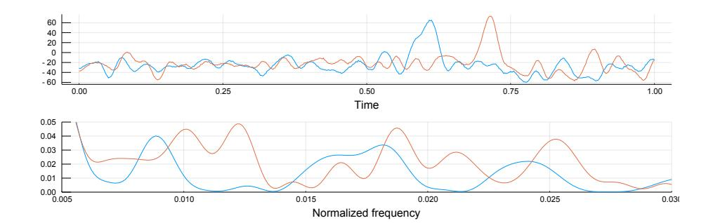
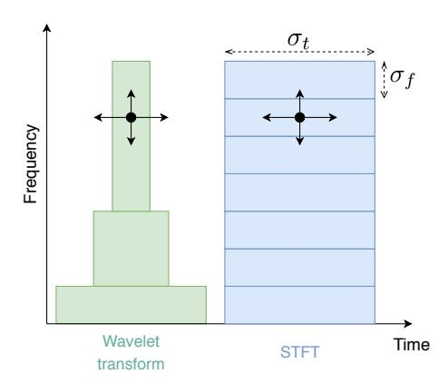
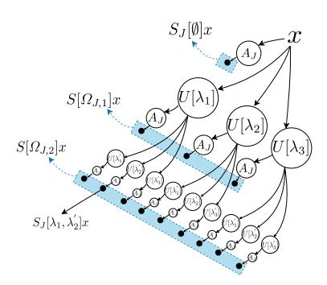
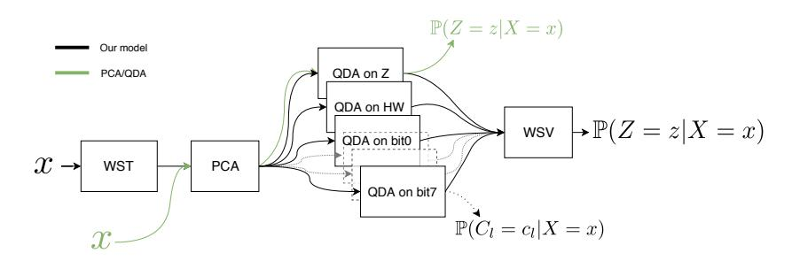
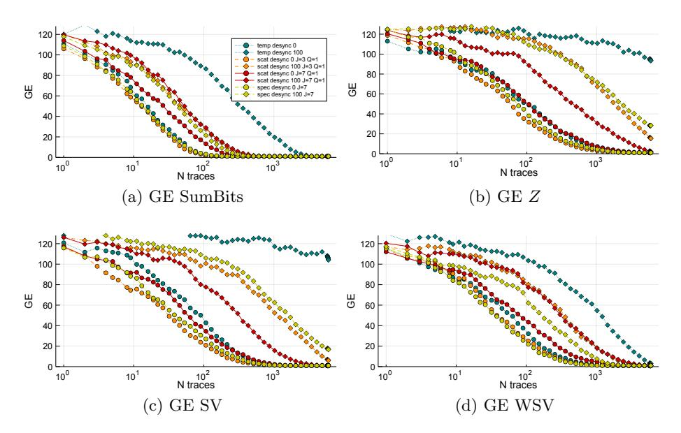
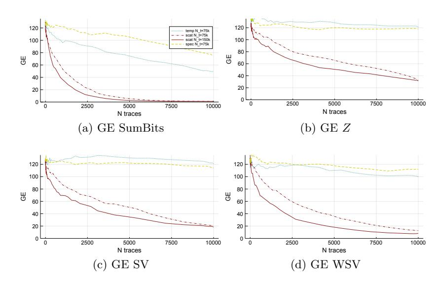
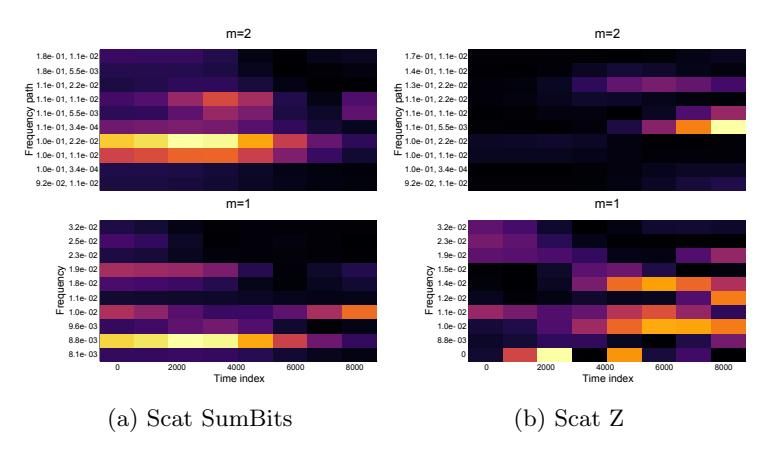

## Wavelet Scattering Transform and Ensemble Methods for Side-Channel Analysis

Gabriel Destouet1,2 , C´ecile Dumas1 , Anne Frassati1 , and Val´erie Perrier2

Abstract. Recent works in side-channel analysis have been fully relying on training classification models to recover sensitive information from traces. However, the knowledge of an attacker or an evaluator is not taken into account and poorly captured by solely training a classifier on signals. This paper proposes to inject prior information in preprocessing and classification in order to increase the performance of side-channel attacks (SCA). First we propose to use the Wavelet Scattering Transform, recently proposed by Mallat, for mapping traces into a time-frequency space which is stable under small translation and diffeomorphism. That way, we address the issues of desynchronization and deformation generally present in signals for SCA. The second part of our paper extends the canonical attacks over byte and Hamming weight by introducing a more general attack. Classifiers are trained on different labelings of the sensitive variable and combined by minimizing a cross-entropy criterion so as to find the best labeling strategy. With these two key ideas, we successfully increase the performance of Template Attacks on artificially desynchronized traces and signals from a jitter-protected implementation.

Keywords: Side-Channel Analysis, Time-Frequency Analysis, Wavelet Scattering Transforms, Machine Learning, Ensemble Methods, Template Attack

## 1 Introduction

The signal analysis of current consumption and electromagnetic radiations (EM) from electronic components can leak compromising information. A whole research area and an industry have been developed around the task of assessing the security of electronic devices. Since the first attacks, the countermeasures and conversely the attacks have been constantly improved in order to cut the leak of sensitive information to potential eavesdropper. In the community of side-channel analysis (SCA), profiled-attacks make use of open-samples so as to derive an optimal strategy to retrieve information on similar devices.

1 Univ. Grenoble Alpes, CEA, LETI, DSYS, CESTI, 38000 Grenoble, France gabriel.destouet@cea.fr,cecile.dumas@cea.fr,anne.frassati@cea.fr

2 Univ. Grenoble Alpes, CNRS, Grenoble INP??, LJK, 38000 Grenoble, France valerie.perrier@univ-grenoble-alpes.fr

?? Institute of Engineering Univ. Grenoble Alpes

These attacks are critical when cryptographic algorithms are involved. It has been shown with the first Template Attacks [1], known in machine learning as Quadratic Discriminant Analysis (QDA) [2], that cryptographic keys can be recovered by training a QDA on traces acquired during an algorithm execution. From a machine learning perspective, the attacker would like to maximize his chance to retrieve the right cryptographic key, or at least to lower the time-cost of a brute force attack by ordering potential keys according to their likelihood. He would have to choose a classification model that links signals with a sensitive information depending on the key, and to train this classifier on the open-sample with the hope that the model will generalize well on other devices with unknown keys. The training requires a search for parameters of the classifier, e.g covariances matrices and means in the case of a QDA, or weights for neural networks. This search is usually driven by optimizing a criterion that evaluates the performance of the classifier and can be helped by any prior information about the device (i.e the physical phenomena involved, a leakage model, etc.) which constraints the space of parameters or structurally modifies how the criterion is evaluated.

Given a classification model, we are interested in ways of increasing the performance of attacks by injecting prior information either during preprocessing with time-frequency analyses or during classification.

The main motivation for pushing time-frequency preprocessing is to consider bases of analysis in which traces are represented in terms of elementary signals whose characteristics are closer to emanations from physical phenomena. The usual raw temporal representation from the acquisition phase, i.e the projection of the analogous signal on a dirac basis, is inconsistent with the duration of transients in electric currents. In the case of SCA, we do not know a priori neither what form the signals leaking sensitive information have, nor at which time scales the sensitive variable are manipulated. However we know that the physical processes involved are non-stationary and lasting in time, e.g the current consumption of a CMOS during a switch. Thus it seems reasonable to analyze signals with a basis of functions which at least respect these properties. Decomposing traces into elementary signals is an intuitive process, it is usually performed in signals realignment by intercorrelating traces with selected patterns. This procedure is a projection on a basis composed of translated versions of these patterns and is a particular case of time-frequency analysis by using a custom basis of functions. But this usually needs a know-how and it becomes difficult to select patterns in deformed and translated traces from jitter-protected implementation.

In order to improve the performance of profiled attacks, most recent works have been comparing different machine learning methods for the classification of traces in SCA but only few of them have considered time-frequency preprocessing. Historically Templates attacks from [1] fit multivariate Gaussian distributions to clusters of fixed temporal points of interest. With the introduction of neural networks, most deep learning based works such as [3, 4, 5] presented networks trained on temporal representations, with the exception of the paper [6] in which a 2D spectrogram based convolutional neural network is used. Other methods such as [7] make use of histograms of amplitudes of temporal points in order to characterize patterns for realignment and attacks. This method requires a correct filtering of signals since the presence of a low frequency noise can produce a shift in histograms and do not take into account deformations of patterns. It has been early shown by [8] that EM signals of various cryptographic implementations can be analyzed (by-hand) in the Fourier domain and differential electromagnetic attacks (DEMA) can be successfully carried with carefully chosen frequency bands. Non-profiled attacks, which usually need a theoretical leakage model so as to replace the profiling phase, have proven efficiency when considering time-frequency representation. The spectrogram representation used in Differential Frequency Analysis in [9, 10, 11] transposes Differential Power analysis in the time-frequency domain: these works showed that sensitive information is more easily retrieved by decomposing traces into temporally localized Fourier atoms. Discrete wavelet transform has been used in [12] for compressing traces and improving DPA attacks with synchronized traces. The authors of [13] used it to realign traces with a simulated annealing method. The work of [14] and [15] improved it by providing more efficient methods inspired by speech recognition methods and image analysis. However, the main difficulties with spectrogram and wavelet transform are their instability respectively under small deformation and translation.

The first idea of this paper is to use the wavelet scattering transform by Mallat in [16, 17] to tackle these issues. This transform maps signals in a timefrequency space, stable under small time-shifts and deformations. This preprocessing provides an in-depth analysis of signals while being formally established to address these problems.

Side-channel attacks also depend on the classification goal we fixed for the classifier. Generally, it is not clear how a sensitive variable from a cryptographic algorithm leaks into traces and if the classifier is able to recover it.

Most works in SCA usually consider only one specific leakage model, historically the Hamming weight of sensitive variables or the variable itself. However it is known that bits are actually leaking dissymmetrically, suggesting that the leak is of complex nature, for example Suzuki et al. in [18] proposed leakage models that consider operations on bits in CMOS logic circuits to explain biases in power consumption. Schindler et al. in [19] make a linear regression of the leakage model by assuming that the deterministic part of signals can be approximated by a weighted sum of a basis of functions defined on the algorithm variables. More generally the leakage is an unknown function of the manipulated sensitive variables.

Consequently, the second idea is to act on the goal we fixed for the classifier: we propose to target partitions of the sensitive information in order to find the best strategy of attack. By combining clues retrieved on different partitions, we can reduce the number of likely values and recover the sensitive variable. The attack becomes less dependent to a specific leakage model while giving information about how subsets of values are leaking in traces. This involves combining probabilities from classifiers and refers to Ensemble method [20] in machine learning.

## Contribution

First, we propose to use the Wavelet Scattering Transform as preprocessing so as to provide a stable representation for analyzing misaligned and deformed signals, to the best of our knowledge this transform has not been used before in SCA. Then we develop a combination procedure of classifiers trained on partitions of the sensitive variable's values so as to compare and find efficient strategies of attacks.

These two approaches can be used with any type of classifiers, whose relations with traces can be arbitrary complex. We demonstrate that these steps successfully increase the performance of Template Attacks on the ASCAD database and on a jitter-protected SoC.

The paper is organized as follow: in Section 2 the problem of profiled sidechannel attacks is reminded, the Wavelet Scattering Transform and its properties are introduced for preprocessing traces in SCA in Section 3, a combination procedure for finding the leakage model is developed Section 4 and finally attack results on ASCAD and traces from jitter-protected SoC are presented in Section 5.

## 2 Problem Statement

A procedure g is computing a sensitive variable Z with a plaintext E and a key K. During its execution, the procedure is leaking signals X, or traces, e.g EM or current consumption signals. Traces have a finite size noted d, thus X ∈ R d . From the perspective of the attacker, all of these variables are considered as random and written uppercase. In the following, calligraphic letters such as X refers to the set of possible values of the random variable X. Realizations of random variable is noted with lowercase letter, thus x is a realization of X.

The procedure g( . , K) : E → Z is assumed to be surjective and maps the set of plaintexts E to the set of sensitive variables Z. A profiled attack consists of training a classifier y on signals X to recover Z, which gives clues on K given E. The training requires a set of observations labelized with their associated sensitive variable, we notes Dt the set of data acquired from the open-sample which consists of tuple Dt = {(x1, z1), ... ,(xNt , zNt )} with Nt being the size of the training set. An attack set Da ={x1, ... , xNa } of size Na has a fixed key k ∗ and allows us to evaluate the performance of the classifier. Here it is assumed that plaintexts are always known, thus for each realizations (xi , zi) ∈ Dt or xi ∈ Da a plaintext ei is associated. The classifier y is trained on Dt in order to have an approximation of  $\mathbb{P}(Z|X)$ . During an attack, we can get an estimation of the target key  $k^*$  with a realization  $x_i \in \mathcal{D}_a$ .

$$\mathbb{P}(K=k|X=x_i) \propto \mathbb{P}(Z=g(e_i,k)|X=x_i)$$
 (1)

Where  $x \propto y$  states that the two quantities x, y are proportional.

However, depending on whether g is bijective or not, or if the quality of estimations are too poor, one-shot estimation of the key k is in general not enough, i.e given an observation  $x_i$ ,  $k^* \neq \operatorname{argmax}_{\hat{k}} \mathbb{P}(K = \hat{k}|X = x_i)$ . Thus the attacker has to use many observations to obtain better predictions:

$$\mathbb{P}(K=k|\mathcal{D}_a) = \prod_{i=1}^{N_a} \mathbb{P}(Z=g(e_i,k)|X=x_i)$$
 (2)

After sorting  $\{\mathbb{P}(K=k_j|\mathcal{D}_a)\}_{k_j\in\mathcal{K}}$  in decreasing order, the rank is defined as the position of  $\mathbb{P}(K=k^*|\mathcal{D}_a)$  in the sorted list  $\mathbb{P}(K=k_i|\mathcal{D}_a) > ... > \mathbb{P}(K=k_j|\mathcal{D}_a)$ . In the following, the guessing entropy [21] is estimated by taking the empirical mean of rank values obtained for many attacks. Note that the less attack data  $N_a$  is required to have a low rank, the better is the attack.

The attack involves the task of estimating the posterior  $\mathbb{P}(Z|X)$  or the likelihood  $\mathbb{P}(X|Z)$  from the data. It requires a preprocessing of the observed traces X and a statistical learning algorithm to learn  $\mathbb{P}(Z|X)$ .

## 3 Time-Frequency Analysis with the Wavelet Scattering Transform

In this section, we will present common Time-Frequency transformations used for preprocessing traces in SCA, their limits in the case of deformed and misaligned signals, and we will introduce the Wavelet Scattering Transform of Mallat [16, 17]. In the following, we assume that the attacker acquired traces in the form of vectors  $x \in \mathbb{R}^d$ , where d is the number of temporal points.

### 3.1 Some Time-Frequency representations

Analysis in a Dirac Basis (i.e the raw temporal representation) The sampled trace x from the analogous signal  $x_a$ ,  $x(p) = x_a(pT)$  with T the sampling period, can be represented as follow, for each time index p we have:

$$x(p) = \int x_a(t)\delta(t - pT)dt = [\delta_{pT}|x_a]$$
(3)

Where [.|.] denotes the duality bracket, e.g  $[\delta_t|x] = x(t)$ . This is the projection of  $x_a$  on a Dirac basis  $\{\delta_{pT}\}_{0 \le p \le d-1}$ . The continuous approximation  $\tilde{x}$  of  $x_a$  can be represented as a sum of weighted Dirac functions:

$$\tilde{x} = \sum_{p} [\delta_{pT} | x_a] \delta_{pT} = \sum_{p} x(p) \delta_{pT} \tag{4}$$

This approximation is completely characterized by  $\{x(p)\}_{0 \le p \le d-1}$  which are assumed to be infinitely concentrated at time pT where  $F_s = 1/T$  is the sampling rate. In the following, we equivalently use either the continuous form  $\tilde{x}$  or the vector x to formulate Time-Frequency transformations.

**Discrete Fourier Transform** With the canonical inner product on  $\mathbb{C}^d$ , the Discrete Fourier Transform is the projection on periodic signals  $\{e^{2i\pi k/d}\}_{0\leq k\leq d-1}$  and reverses the analysis made in a Dirac basis, i.e instead of considering x as a sum of time-concentrated signals, the discrete Fourier Transform interprets x as being composed of periodic signals with an infinitely small frequency bandwidth. If we note  $\hat{x}$  the Discrete Fourier Transform of x we have for each time index p and frequency k:

$$\hat{x}(k) = (x|e^{2i\pi k/d}) = \sum_{p} x(p)e^{-2i\pi kp/d}$$
(5)

$$x(p) = \frac{1}{d} \sum_{k} (x|e^{2i\pi k/d})e^{2i\pi kp/d} = \frac{1}{d} \sum_{k} \hat{x}(k)e^{2i\pi kp/d}$$
 (6)

Dirac and Fourier bases interpret x as being composed of signals concentrated respectively in time and in frequency. However, the sensitive information in SCA's traces are contained in transient patterns, which are not well captured by these two transforms. Thus we would like to use this prior knowledge and to interpret x with elementary signals of finite duration and frequency bandwidth.

Short Time Fourier Transform Time-frequency representations such as the short-time Fourier transform (STFT) analyze signals with a basis  $\{w_m e^{2i\pi p/d}\}_{m,p}$  composed of modulated versions of a window function  $w_m(n) = w(n-m)$ , where n is the time index and m a translation coefficient. The temporal scale and the frequency bandwith of the window function w give the precision of analysis in the time-frequency space. It concentrates the signal energy into time-frequency boxes of fix area  $a(t, f) = \sigma_t \sigma_f$  where  $\sigma_t$  and  $\sigma_f$  are the temporal and frequency supports of w and remain constant (see Figure 2). Gabor transforms [22] optimize the concentration of the signal energy into time-frequency boxes by using Gaussian windows.

Wavelet Transform The basis used in Wavelet Transform (WT)  $\{\psi_{u,s}\}_{u,s}$  is composed of scaled and translated versions  $\psi_{u,s}(t) = \frac{1}{\sqrt{s}} \psi(\frac{t-u}{s})$  of a mother wavelet  $\psi$ , where respectively u and s are translation and dilation coefficients. In order to compute the projection over all translation coefficients u and for a given dilation coefficient s, the signal  $\tilde{x}$  is convoluted with  $\psi_s = \frac{1}{\sqrt{s}} \psi(\frac{t}{s})$ . To facilitate notation, we formulate the projection on the continuous approximation  $\tilde{x}$ :

$$(\tilde{x}|\psi_{u,s}) = \int \tilde{x}(t) \frac{1}{\sqrt{s}} \psi^*(\frac{t-u}{s}) dt = \tilde{x} * \overline{\psi_s}(u)$$
 (7)

Where  $x^*$  is the complex conjugate of x,  $\overline{x}(t) = x^*(-t)$ , \* is the convolutional operator and the inner product is defined on  $\mathbf{L}^2(\mathbb{C})$ . In order to pave the time-frequency plane, the dilation coefficient has to be varied and is usually sampled on a dyadic scale  $s = 2^{-j}$  with  $j \in \mathbb{N}$ . If we note  $f_0$  the center frequency of the mother wavelet, the center frequency of its j-th dilated version is approximately at  $f_0/2^j$ . This is due to the scaling property of the Fourier Transform:

$$\mathcal{FT}(\psi_s)(f) = \sqrt{s}\mathcal{FT}(\psi)(sf) \tag{8}$$

Where  $\mathcal{FT}$  is the Fourier Transform. When changing the dilation coefficient s the bandwidth  $\sigma_f$  inversely varies with the temporal support  $\sigma_t$ , thus allowing variations of the shape of the area  $a(t, f) = \sigma_t(t)\sigma_f(f)$  across the time-frequency plane.

Translation invariance and stability under diffeomorphism In the case of SCA, where a device can produce distorted traces and misalignment due to countermeasures such as jitter effects, we claim that a good representation  $\Phi x$  of the traces x should be stable under small translation and deformation.

Let  $x_1, x_2$  be two acquired traces, we say that  $x_1$  is a *deformed* version of  $x_2$  if there exists a diffeomorphism  $\tau(t)$  (an invertible transformation) such that  $x_1(t) = x_2(\tau(t))$ .

A practical example in SCA is given Figure 1 where two patterns from EM signals are plotted. Although both signals contain the same cryptographic information, the temporal and frequency structure of these patterns has been translated in the time-frequency space. In fact, the transformations presented above are unstable for temporal translation  $\delta_{\tau} > \sigma_{t}/2$  and frequency variation  $\delta_{f} > \sigma_{f}/2$ . In Figure 2, we have illustrated the time-frequency space coverage of the bases used in WT and STFT. WT is robust to small deformations but not translation invariant, while the spectrogram is translation invariant but not stable by deformations.

Identifying a diffeomorphism between traces is a difficult task and we better find an operator  $\Phi$  that makes the two signals "collide" in the sense that  $\Phi x \approx \Phi L_{\tau} x$  where  $L_{\tau}$  denotes the deformation operator induced by the diffeomorphism  $\tau$ . According to [16], the operator  $\Phi$  should be designed with respect to the two following properties:

-  $\Phi$  is translation invariant, i.e for  $c \in \mathbb{R}$  and  $L_c x(t) = x(t-c)$ :

$$\Phi x = \Phi L_c x$$

– Moreover,  $\Phi$  is stable by diffeomorphism, i.e it is Lipschitz continuous to the action of a  $C^2$ -diffeomorphism  $\tau$ . For  $\tau \in C^2(\mathbb{R})$ ,  $L_{\tau}x(t) = x(t - \tau(t))$  and  $C \in \mathbb{R}^+$ :

$$\|\Phi x - \Phi L_{\tau} x\| \le C \|x\| \left( \|\frac{\partial \tau}{\partial t}\|_{\infty} + \|\frac{\partial^2 \tau}{\partial t^2}\|_{\infty} \right)$$
 (9)

Wavelet Scattering transforms proposed in [16] provide these useful mathematical properties we claim relevant to analyze signals in SCA, it will be extensively used in our experiments and are presented hereafter.

Fig. 1. Jitter effect and deformation taken from Jit signals (see Section 5.2). Two temporal patterns are plotted on the top with their associated Fourier Transform on the bottom. The deformation between these patterns is characterized here by a frequency shift of some components (e.g at frequency 0.026) in the Fourier spectrum.

Fig. 2. Illustration of WT and STFT, the black spot is the frequency component we would like to capture. Under the action of translation the spot moves horizontally and under small dilation it moves verticaly. Each box is a time-frequency area sized by each elementary signal of the transform.

### 3.2 The Wavelet Scattering Transform

In order to have such properties, Mallat proposes in [16, 17] cascading continuous wavelet transforms defined here in continuous form with  $x \in \mathbf{L}^2(\mathbb{R})$ ,  $\psi \in \mathbf{L}^2(\mathbb{C})$  by:

$$W[\lambda]x(u) = x * \overline{\psi_{\lambda}} = \int x(t) \frac{1}{\sqrt{\lambda}} \psi^*(\frac{u-t}{\lambda}) dt$$
 (10)

Where \* is the convolutional operator and  $\psi$  is a mother wavelet (a zero mean function). Each wavelet  $\psi_{\lambda}$  parametrized with scales  $\lambda$  is followed by a non-linear operation  $|\cdot|$  and averaged on a time domain of  $2^J$  samples with  $A_J x = x * \phi_{2^J}$ . The windowed scattering transform  $S_J$  of a signal x over a path  $p = (\lambda_1, ..., \lambda_m)$  with  $\lambda_i > 2^{-J}$  is defined by:

$$S_{J}[p]x = |||x * \psi_{\lambda_{1}}| * \psi_{\lambda_{2}}| ... * \psi_{\lambda_{m}}| * \phi_{2^{J}}$$

$$= |W[\lambda_{m}] ... |W[\lambda_{2}] |W[\lambda_{1}]x|| * \phi_{2^{J}}$$

$$= A_{J}|W[\lambda_{m}] ... |W[\lambda_{2}] |W[\lambda_{1}]x|| |$$

$$= A_{J}U[\lambda_{m}] ... U[\lambda_{2}]U[\lambda_{1}]x$$
(11)

Fig. 3. A two-level wavelet scattering transform

With  $U[\lambda]x = |W[\lambda]x| = |x * \psi_{\lambda}|$  and  $A_Jx = x * \phi_{2^J}$ . In practice the windowed scattering transform is calculated on a path subset  $\Omega_{J,m}$  for which a maximum length m of paths  $p \in \Omega_{J,m}$  is set and with scales  $\lambda > 2^{-J}$ , meaning that the Wavelet Transform only captures frequencies superior than  $2^{-J}$  and the remaining spectral energy will be captured by  $\phi_{2^J}$ . An example of scattering is displayed on Figure 3.

While wavelet transforms provide stability under the action of small diffeomorphism, the nonlinear operation and the integration over time give translation invariance. Cascading wavelet transforms allows to recover high frequencies lost when averaging the absolute values of coefficients of previous wavelet transforms.

Depending on the spectral richness of signals we use wavelets on dyadic scales  $2^{-j}, 0 \le j < J$  or on intermediate scales  $2^{-j/Q}, 0 \le j < JQ$  where Q defines the number of wavelets used by octave of frequencies. In the following, the Wavelet Scattering Transform are implemented with the python software proposed in [23]. Morlet wavelets are used for the first and second levels, and the whole transform is characterized by three parameters: the scale  $2^J$  of averaging  $J \ge 2, J \in \mathbb{N}$ , the number of wavelets by octave  $Q \ge 1, Q \in \mathbb{N}$  and the number of levels of the scattering transform  $m \in \{1,2\}$ . To tune such parameters, we propose the following rules of thumb: choose J proportionally with the amount of translation (i.e jitter) present in signals, Q in proportion to the desired discrimination at high frequency. If J is set too high, a second level m=2 is required to retrieve the information lost.

# 4 A Combination Procedure for Ensemble Methods in SCA

For the task of classification in SCA, one label is usually considered to provide an estimation of a sensitive variable Z. Here we focus on the space of targeted class values with multiple classifiers trained on L different labelings  $\{C_l\}_{1 \leq l \leq L}$ , each labeling giving clues on the sensitive variable z with a probability  $\mathbb{P}(Z=z|C_l=c_l)$ .

Classification of the sensitive variables considered in SCA lends itself well to partition our target space  $Z \in \mathcal{Z}$  in complementary regions. We denote  $\beta_l$  the partition function that associates each z to a label  $c_l \in \mathcal{C}_l$ , such that  $\beta_l(z) = c_l$  and  $\beta(z) = (c_1, ..., c_L) = \mathbf{c} \in \mathcal{C}$ . For example, if z is the byte 0x12 and  $\beta$  is composed of labelings respectively over  $\mathbb{Z}_8$ , Hamming weight and the first big-endian bit value, then  $\beta(0x12) = (0x12, 2, 0)$ .

Here we consider the labelings  $C_l$  to be conditionally independent and note  $\Theta$  the global classifier over all  $C_l$  we have:  $\mathbb{P}(C = \mathbf{c}|X = x, \Theta) = \prod_l \mathbb{P}(C_l = c_l|X = x, \Theta)$ . For clarity's sake, we will drop the notation for the conditional dependence over the model and keep a simplified notation  $\mathbb{P}(C = \mathbf{c}|X = x)$  instead of  $\mathbb{P}(C = \mathbf{c}|X = x, \Theta)$ .

We assume here that  $\beta$  is bijective.3 Given a signal x, an estimation for z is given by:

$$\log(\mathbb{P}(Z=z|X=x)) = \log(\mathbb{P}(C=\beta(z)|X=x)) \tag{12}$$

$$= \sum_{l} \log \mathbb{P}(C_l = \beta_l(z)|X = x)) \tag{13}$$

A set of L classifiers  $\{y_1, \ldots, y_L\}$  are trained accordingly to partitions  $\beta_l$  and give predictions  $\mathbb{P}(C_l = \beta_l(z)|X = x)$ . Once each classifier is trained, their predictions can be naively summed, in which case a *soft voting* (SV) is performed; or a classifier-specific weight can be applied to each classifier depending on its

&lt;sup>3  $\beta$  is always bijective if it contains the identity.

performance, that is a weighted soft voting (WSV). Remark that SV is a particular case of WSV where weights are all equal. If we note  $y_l(z,x) = \log(\mathbb{P}(C_l = \beta_l(z)|X=x))$  the vote accorded to the classifier l for the value z of Z, and  $y(z,x) = \sum_l w_l y_l(z,x)$  the weighted vote with  $w_l \in \mathbb{R}$ . We can iteratively find a weight vector  $\boldsymbol{w} \in \mathbb{R}^L$  such that the following cross-entropy loss is minimized:

$$L_{\text{wsv}}(X,Z) = -\frac{1}{N_t} \sum_{(x_i, z_i) \in \mathcal{D}_t} \mathbb{P}(Z = z_i) y(z_i, x_i)$$

$$\tag{14}$$

$$= -\frac{1}{N_t} \sum_{(x_i, z_i) \in \mathcal{D}_t} \sum_{l} w_l \mathbb{P}(Z = z_i) \log(\mathbb{P}(C_l = \beta_l(z_i) | x = x_i))$$
 (15)

To illustrate our approach, we consider the case where signals x are Gaussian distributed with the same covariance matrix. This is equivalent to choosing Linear Discriminant Analysis as classifiers [2], we have:

$$y_l(z,x) = \log(\frac{1}{R}e^{(x-\mu_l(z))^t \Sigma(x-\mu_l(z))})$$

With R the normalization factor,  $\mu_l(z)$  the mean value of signals for the labeling l and the label value z, and  $\Sigma$  the inverse covariance matrix. We assume a balanced dataset, i.e  $\mathbb{P}(Z=z_i)=p$  is constant, and constraint weights such that  $\sum_l w_l=1$ , we get:

$$L_{\text{wsv}}(X,Z) = -\frac{p}{N_t} \sum_{(x_i, z_i) \in \mathcal{D}} \sum_l w_l \left( (x_i - \mu_l(z_i))^t \Sigma(x_i - \mu_l(z_i)) - \log(R) \right)$$
(16)

$$= -\frac{p}{N_t} \sum_{(x_i, z_i) \in \mathcal{D}} \left( (x_i - \mu^*(z_i))^t \Sigma(x_i - \mu^*(z_i)) + c_{\mu}(z_i) - \log(R) \right)$$
(17)

$$\propto \log \left( \prod_{(x_i, z_i) \in \mathcal{D}} \frac{1}{R} e^{(-(x_i - \mu^*(z_i))^t \Sigma (x_i - \mu^*(z_i)))} \right)$$
 (18)

Where  $\mu^* = \sum_l w_l \mu_l$  and  $c_\mu = \sum_l w_l \mu_l^t \Sigma \mu_l - \sum_{l,k} w_l w_k \mu_l^t \Sigma \mu_k$  that depends on estimated means  $\mu_l$ , on weights  $w_l$  and on the inverse covariance matrix  $\Sigma$ . In the Gaussian distributed case with a fixed covariance matrix, we can see that the minimization of  $L_{\text{wsv}}(X, Z)$  is equivalent to minimizing  $(x_i - \sum_l w_l \mu_l(z_i))^t \Sigma (x_i - \sum_l w_l \mu_l(z_i))$  which is a simple linear regression with parameters  $\boldsymbol{w}$ .

Our combination procedure can be seen as a generalization of the Linear Regression Analysis of *Schindler et al* [19] where no assumption is made on the linearity of the leakage model. Arbitrary complex classifiers can be used to draw relations between signals and labels and the relevance of such relation can be evaluated by minimizing the cross-entropy criterion, i.e classifiers with the highest weights are the most relevant. To obtain the overall estimation, log probabilities are linearly summed according to a simple Bayes rule, in case classifiers output scores, a logistic regression layer [2] can be added and trained to get probabilities.

As remarked Zhou in [20, Chap 4.3.5.2] the global score obtained after minimization can be worse than considering the best classifier in the model. This

procedure is interesting when no knowledge about the leakage model is available and can be iteratively improved by removing bad classifiers, i.e when their weights are too low.

In practice, classifiers are individually trained on their associated labeling Cl and their predictions are combined after minimizing (15) with the weight vector w.

## 5 Experiments

In this section, we integrate the two previous methods presented Section 3 and 4 to perform attacks on desynchronized traces from ASCAD and signals from jitter-protected SoC. Attack results are compared with other preprocessings: raw temporal signals and spectrogram of traces. We also study the effect of optimizing the weights of the combination procedure (15) on attack results.

## 5.1 Method used

We propose the method displayed on Figure 4. First, traces are preprocessed with the Wavelet Scattering Transform (WST), then a PCA is applied to reduce the dimension and finally QDA classifiers trained on predefined labelings Cl outputs predictions which are merged with a Weighted Soft Voting (WSV) (15).

The set of classifiers is trained on canonical partitions, i.e identity on z, Hamming weight and bit values:

$$\{\operatorname{Id}: z \to z, \ \operatorname{HW}: z \to \operatorname{HW}(z), \ \operatorname{Bit}_i: z \to (z \gg i) \ \& \ 1 \ \forall i \in \{0, 1, \dots, 7\}\}$$

The optimal weights of the combination procedure are found by iterating a state of the art gradient descent algorithm AMSGrad [24].

Fig. 4. Illustration of the global method in black with the Wavelet Scattering Transform (WST) and the Weighted Soft Voting (WSV) from Sections 3 and 4. We also depicted in green a standard Template Attack with PCA. We replace the WST with the modulus of a Short-Time Fourier Transform (see Section 3.1) when comparing with Spectrogram preprocessing.

#### 5.2 Datasets

The ASCAD dataset [5] is composed of EM traces emitted from a device running a masked AES implementation, an artificial jitter is simulated by randomly translating traces with an uniformly distributed random variable δN ∼ U{0, N}. Three sets of traces are available, the first one ASCAD0 is composed of aligned traces while ASCAD50 and ASCAD100 are desynchronized respectively with δ50 and δ100. We tested our model on all three sets but for purpose of clarity we present results with δ100 and δ0. The targets are the outputs of the third SBox processing of the first round of AES. Each set consists of 60, 000 traces of 700 points.

The second dataset noted Jit is composed of traces acquired from an AES hardware implementation on a modern secure smartcard with a strong jitter. The Sboxes are processed sequentially and all traces start with the processing of the first byte while the rest of the SBox processing is misaligned. In total 160, 000 traces of 8, 192 points were acquired, 150, 000 (or 75, 000) traces have random keys and are used for the training set. 10, 000 traces with a fix key are used for the attack set. The targets are the output from the second SBox processing. An example of deformations and translation in Jit signals is displayed on Figure 1.

## 5.3 Choosing the Parameters

Hyperparameters for the preprocessing with Wavelet Scattering Transform and Spectrogram are chosen accordingly to the dataset and attack results.

For ASCAD, we used 54, 000 traces for the training set and 6, 000 traces for the attack set. For the scattering transform, traces are first upsampled to 1, 024 points, we fixed Q=1 since a fine resolution between high frequency bands is not required. We obtained good results with time scales J=3 and J=7, and limited the scattering transform to one layer m=1. For Spectrogram preprocessing, traces are also upsampled to 1, 024. The best result in terms of guessing entropy is obtained with a sliding window of 128 points which corresponds to a time scale of 88 in the original traces, the overlap was set to 64.

For Jit, we considered a restrained dataset of 75, 000 since spectrogram and raw representation had too many features to fit the whole dataset in memory and to perform the PCA based dimension reduction. We managed to fit traces preprocessed with WST in memory when considering the whole training set of size 150, 000. For WST, we expected the Jit dataset to have a strong jitter so we set the following parameters J=10, Q=8, m=2 which gave preprocessed traces of size 2, 992. For spectrogram, we used a sliding window of size 1, 024 with an overlap of 512 which gave spectrogram of 7, 680 features.

For each dataset we limited the PCA to 50 components which corresponds to the number of components used for SoA template attack combined with a PCA on aligned temporal traces. When minimizing the loss function (15), we stopped the gradient descent after 200 iterations.

#### 5.4 Results

In order to evaluate our model, we performed our attack on 3 folds. For each fold an intermediate guessing entropy (GE) measure [21] is calculated by averaging 100 rank curves obtained by shuffling the order of traces in equation (2). The final guessing entropy is obtained by averaging the guessing entropy of the three folds.

In the following we use the following notations: SV and WSV (15) when respectively a soft voting and weighted soft voting is applied with all the classifiers, SumBits a soft voting with the classifiers on bits, Z when considering only the classification on the byte and HW with the hamming weight. "Temp","Spec" and "Scat" respectively denote the raw temporal representation, the Spectrogram preprocessing and the Wavelet Scattering Transform. Attack results on SumBits, Z, HW and SV are used to characterize the performance of each preprocessing. The rank gap between SV and WSV indicates the efficiency of the combination procedure (15) for merging prediction of differently performing classifiers. We displayed on Table 1, the weights obtained after optimizing the WSV and the number of attack traces required to have a guessing entropy of 40 (NGE40) when considering classifier individually (Z and HW), with SumBits, SV and WSV.

Results for ASCAD are displayed Figure 5 and on Table 1. When no desynchronization is present, preprocessings with a small time scale of analysis perform the best: attack results on SumBits are almost identical when considering WST with J=3, spectrograms and raw temporal traces; the same WST performs slightly better for Z and SV. Intriguingly the effect of desynchronization on attack results in ASCAD100 strongly varies with labelings. The large scale WST with J=7 performs the best on Z and SV and shows its robustness to desynchronization; the attack on SumBits is better with spectograms and might be due to the overlap between frames of analysis. The combination procedure resulted differently: it decreased the rank of SV of 2, 000 with spectograms preprocessing and of only 5 with WST. Globally, as expected the WSV is better than SV and makes all models converge to rank 1 except for temporal attacks on ASCAD100.

In presence of a strong jitter and deformations in Jit, spectrogram and temporal attacks indubitably fail for any classifier while preprocessing with WST provides better attack results and becomes possible on SumBits (see Figure 6 and Table 1). On Jit, the WSV performed well and decreased the rank of SV for WST of approximately 1, 600.

The weights of the WSV seem to be correlated with the guessing entropy of classifiers, e.g when considering temporal attacks we see that weights on bits are higher than weights on H or Z. On ASCAD, the weights for the WST seem to be more distributed among classifiers and could explain why the weighted soft voting did not converged as well as for Spectrogram preprocessing where the classifier over Z was heavily penalized. In other words, the iterative optimization of WSV seems to be facilitated with classifiers of unbalanced performance. We also notice the fact that bits are leaking dissymmetrically as proposed by Suzuki et al. in [18], e.g on ASCAD the classifier on bit0 has a higher weight than the average on bits (SumBits), while on Jit the weight on bit7 is higher when considering successful models (Scattering with Jit 75k and 150k).

From our results on these datasets and given QDAs as classification models, Z and HW leakage models are globally disadvantaged when looking at the guessing entropy and the weights associated. The WSV has approximated a leakage model that relies more on individual bits. The difference of performance between Sumbits, Z and HW is also explained by the number of samples required to estimate the parameters of QDAs, which makes attacks on individual bits more stable since less parameters are required. Thus a trade-off has to be made on the number of components for the PCA: while a high number of components increases the number of parameters to estimate, the attack results can be improved by selecting more eigenvectors with lower eigenvalues and better discriminating power.

Fig. 5. Guessing entropy as a function of the number of attack traces on ASCAD with classifiers trained on Z, SumBits, with naive combination of prediction (SV) and with WSV.

#### 5.5 Visualizing leakages

We previously showed results in terms of guessing entropy. Now, one could wonder how does the leakage look like in traces from the point of view of the QDA classifiers. We propose here an easy computation of a SNR score on the preprocessed traces by taking into account the covariances and means estimated

**Fig. 6.** Guessing entropy as a function of the number of attack traces on Jit with classifiers for Z, SumBits, with naive combination of prediction (SV) and with WSV.  $N_t$  is the number of traces used for training.

| Dataset              | Preprocessing |                  | Z        | Н                   | Bit0 | Bit4 | Bit7 | SumBits  | SV       | WSV         |
|----------------------|---------------|------------------|----------|---------------------|------|------|------|----------|----------|-------------|
| ASCAD 100 | Temp          | w                | < 0.01   | < 0.01              | 0.29 | 0.18 | 0.19 | 0.19     |          |             |
|                      |               | $NGE_{40}$       | $\infty$ | $\infty$            | -    | -    | -    | 485      | $\infty$ | 1465        |
|                      | Spec          | w                | 0.02     | 0.22                | 0.39 | 0.31 | 0.32 | 0.31     |          |             |
|                      |               | $NGE_{40}$       | 3527     | 3392                | -    | -    | -    | 57       | 2126     | 242         |
|                      | Scat          | w                | 0.29     | 0.15                | 0.32 | 0.23 | 0.21 | 0.20     |          |             |
|                      |               | $NGE_{40}$       | 676      | 675                 | -    | -    | -    | 70       | 428      | 423         |
| Jit 75k              | Temp          | $\boldsymbol{w}$ | < 0.01   | 0.15                | 0.34 | 0.43 | 0.34 | 0.39     |          |             |
|                      |               | $NGE_{40}$       | $\infty$ | $\infty$            | -    | -    | -    | $\infty$ | $\infty$ | $\infty$    |
|                      | Spec          | w                | 0.08     | 0.17                | 0.20 | 0.27 | 0.25 | 0.24     |          |             |
|                      |               | $NGE_{40}$       | $\infty$ | $\infty$            | -    | -    | -    | $\infty$ | $\infty$ | $\infty$    |
|                      | Scat          | w                | 0.19     | 0.18                | 0.42 | 0.48 | 0.48 | 0.47     |          |             |
|                      |               | $NGE_{40}$       | 9371     | 8851                | -    | -    | -    | 1561     | 6102     | 4513        |
| Jit 150k             | Scat          | w                | 0.11     | 0.12                | 0.41 | 0.41 | 0.48 | 0.45     |          |             |
|                      |               | $NGE_{40}$       | 7837     | $\boldsymbol{8023}$ | -    | -    | -    | 884      | 3770     | <b>2149</b> |

Table 1. For each preprocessing: number of traces for a guessing entropy of  $40~(\text{NGE}_{40})$  when considering individual classifiers with labeling over Z and H, with a soft voting over bits noted SumBits, with a overall Soft Voting SV and finally with a Weighted Soft Voting. We also indicated the weights of the classifiers obtained after optimizing the WSV for classifiers over Z, H, some individual bits and their average for SumBits. For ASCAD100: we displayed the results obtained with a WST with J=7 and Q=1. For Jit: results with training on 75,000 and 150,000 traces.

during training. It is also possible to compute a SNR score without considering classifiers with an analysis of variance (ANOVA). For each classifier l we compute a SNR score in the subspace induced by the PCA with a projection  $P \in \mathbb{R}^{d \times p}$ , where p is the number of components chosen for the PCA and d is the original dimension.4 Each QDA classifier is defined by means  $\mu_{l,i} \in \mathbb{R}^p$  and covariances matrices  $\Sigma_{l,i} \in \mathbb{R}^{p \times p}$  for each label values  $c_{l,i}$ ,  $\forall i$ . We note  $\mathrm{SNR}_l^s \in \mathbb{R}^p$  and  $\mathrm{SNR}_l^o \in \mathbb{R}^d$  respectively the SNR in the subspace and in the original space before the PCA, we have:

$$SNR_{l}^{s}[r] = \frac{\operatorname{Var}_{i} \left[ \mu_{l,i}[r] \right]}{\mathbb{E}_{i} \left[ \operatorname{Diag}(\Sigma_{l,i})[r] \right]} , r = 1, \dots, p$$

$$SNR_{l}^{o} = (P \operatorname{SNR}_{l}^{s}).^{2}$$
(19)

Where .^ defines the entry-wise power. This score (19) gives some indication on the temporal and frequency aspects of the leakage. We computed some visualizations of this score for attacks on Jit respectively in Figure 7. Remark that these analyses can be perturbed by the subspace induced by the PCA's eigenvectors. When the SNR is high we suppose that it gives some indication about how signals are leaking information. For SumBits we summed the SNR scores.

On Jit Figure 7, the SNR visualization with the scattering transform positions the leakage around time index 2,000 when considering SumBits and Z. The two-level scattering transform has proven useful, the SNR score indicates for bits that the frequency band 1.0e-01 is leaking. For Z the 1.1e0-1 frequency path gives clues about a leakage around time index 8,000, which is also shown but more discretely at the first level for z or for both level with SumBits.

#### 6 Conclusion

Independently of choosing a classification model, we proposed two ways of injecting prior information in preprocessing and classification in order to easily increase the performance of SCA.

First, we address the problem of desynchronization and deformation generally encountered in side-channel analysis by using Wavelet Scattering Transform as a preprocessing step. This transform maps traces in a time-frequency space stable under translation and small deformation. In contrast with other time-frequency representations, such as Spectrogram and Wavelet Transform, it provides robust representations which are easily implemented and configured according to jitter effects present in traces and their spectral richness.

Secondly, based on the fact that in general the leakage model is an unknown function of the sensitive variable, we proposed a way of resolving this by considering various labelings of the sensitive variable. For that, we train classifiers

&lt;sup>4 After preprocessing, wavelet scattering transform and spectrogram representations are vectorized before the PCA.

**Fig. 7.** Leakage visualization on Jit. On top the second level of the WST. Below the first level of the WST. We selected the top 10 frequency bands (and frequency paths for the second level) that contains the highest values of SNR. Amplitudes are scaled between 0 and 1

on different partitions of the sensitive variable's values and combine their predictions. Our combination method involves finding a weight vector which assesses the contribution of each classifier in the global prediction. To this end, the weights are found by iteratively minimizing a cross-entropy criterion.

These two propositions have been evaluated by integrating them in a new attack method, which successfully increased the performance of Template Attacks on artificially desynchronized traces and signals from a jitter-protected implementation. The wavelet scattering transform improves the performance of Template Attacks when jitter effects and distortion are present in traces. Although, we restricted ourself to Template Attacks as classification models, this preprocessing could be particularly interesting when followed by more complex classifiers, e.g a convolutional neural network. We argue that it could reduce the amount of data required to normally make any classifier robust under small translation and deformations. The experimental results showed that the combination procedure makes attacks successful as long as some classifiers manage to get information from partitions of the sensitive variable. While specifying a fixed leakage model constraints the classifier to a given goal, the proposed combination procedure allows an attacker to test various leakage models and quickly evaluate which ones he should focus on.

#### References

[1] Suresh Chari, Josyula R. Rao, and Pankaj Rohatgi. "Template Attacks". In: Cryptographic Hardware and Embedded Systems - CHES 2002, 4th International Workshop, Redwood Shores, CA, USA, August 13-15, 2002, Revised Papers. 2002, pp. 13–28.

- [2] Trevor Hastie, Robert Tibshirani, and Jerome Friedman. The Elements of Statistical Learning: Data Mining, Inference, and Prediction, Second Edition (Springer Series in Statistics). Springer, 2009.
- [3] Houssem Maghrebi, Thibault Portigliatti, and Emmanuel Prouff. Breaking Cryptographic Implementations Using Deep Learning Techniques. Cryptology ePrint Archive, Report 2016/921. 2016.
- [4] Eleonora Cagli, C´ecile Dumas, and Emmanuel Prouff. "Convolutional Neural Networks with Data Augmentation Against Jitter-Based Countermeasures". In: Cryptographic Hardware and Embedded Systems – CHES 2017. Ed. by Wieland Fischer and Naofumi Homma. Cham: Springer International Publishing, 2017, pp. 45–68.
- [5] Emmanuel Prouff et al. Study of Deep Learning Techniques for Side-Channel Analysis and Introduction to ASCAD Database. Cryptology ePrint Archive, Report 2018/053. 2018.
- [6] Guang Yang et al. "Convolutional Neural Network Based Side-Channel Attacks in Time-Frequency Representations". In: Smart Card Research and Advanced Applications. Ed. by Beg¨ul Bilgin and Jean-Bernard Fischer. Cham: Springer International Publishing, 2019, pp. 1–17.
- [7] Hugues Thiebeauld et al. "SCATTER: A New Dimension in Side-Channel". In: Constructive Side-Channel Analysis and Secure Design. Ed. by Junfeng Fan and Benedikt Gierlichs. Cham: Springer International Publishing, 2018, pp. 135–152.
- [8] Dakshi Agrawal et al. "The EM Side-Channel(s)". In: Cryptographic Hardware and Embedded Systems - CHES 2002. Ed. by Burton S. Kaliski, ¸cetin K. Ko¸c, and Christof Paar. Berlin, Heidelberg: Springer Berlin Heidelberg, 2003, pp. 29–45.
- [9] Thomas Plos, Michael Hutter, and Martin Feldhofer. "Evaluation of sidechannel preprocessing techniques on cryptographic-enabled HF and UHF RFID-tag prototypes". In: Workshop on RFID Security. 2008, pp. 114– 127.
- [10] Catherine H Gebotys, Simon Ho, and Chin Chi Tiu. "EM analysis of rijndael and ECC on a wireless java-based PDA". In: International Workshop on Cryptographic Hardware and Embedded Systems. Springer. 2005, pp. 250–264.
- [11] Pierre Belgarric et al. "Time-Frequency Analysis for Second-Order Attacks". In: Smart Card Research and Advanced Applications. Ed. by Aur´elien Francillon and Pankaj Rohatgi. Cham: Springer International Publishing, 2014, pp. 108–122.
- [12] Nicolas Debande et al. "Wavelet transform based pre-processing for side channel analysis". In: 2012 45th Annual IEEE/ACM International Symposium on Microarchitecture Workshops. Dec. 2012, pp. 32–38.
- [13] Xavier Charvet and Herve Pelletier. "Improving the DPA attack using Wavelet transform". In: NIST Physical Security Testing Workshop. Vol. 46. 2005.

- [14] Jasper G. J. van Woudenberg, Marc F. Witteman, and Bram Bakker. "Improving Differential Power Analysis by Elastic Alignment". In: Topics in Cryptology – CT-RSA 2011. Ed. by Aggelos Kiayias. Berlin, Heidelberg: Springer Berlin Heidelberg, 2011, pp. 104–119.
- [15] Ruben A Muijrers, Jasper GJ van Woudenberg, and Lejla Batina. "RAM: Rapid alignment method". In: International Conference on Smart Card Research and Advanced Applications. Springer. 2011, pp. 266–282.
- [16] St´ephane Mallat. "Group invariant scattering". In: Communications on Pure and Applied Mathematics 65.10 (2012), pp. 1331–1398.
- [17] Joakim And´en and St´ephane Mallat. "Deep scattering spectrum". In: IEEE Transactions on Signal Processing 62.16 (2014), pp. 4114–4128.
- [18] Daisuke Suzuki, Minoru Saeki, and Tetsuya Ichikawa. "DPA leakage models for CMOS logic circuits". In: International Workshop on Cryptographic Hardware and Embedded Systems. Springer. 2005, pp. 366–382.
- [19] Werner Schindler, Kerstin Lemke, and Christof Paar. "A Stochastic Model for Differential Side Channel Cryptanalysis". In: Cryptographic Hardware and Embedded Systems – CHES 2005. Ed. by Josyula R. Rao and Berk Sunar. Berlin, Heidelberg: Springer Berlin Heidelberg, 2005, pp. 30–46. isbn: 978-3-540-31940-5.
- [20] Zhi-Hua Zhou. Ensemble methods: foundations and algorithms. Chapman and Hall/CRC, 2012.
- [21] James L Massey. "Guessing and entropy". In: Proceedings of 1994 IEEE International Symposium on Information Theory. IEEE. 1994, p. 204.
- [22] Dennis Gabor. "Theory of communication. Part 1: The analysis of information". In: Journal of the Institution of Electrical Engineers-Part III: Radio and Communication Engineering 93.26 (1946), pp. 429–441.
- [23] Mathieu Andreux et al. "Kymatio: Scattering Transforms in Python". In: CoRR abs/1812.11214 (2018). arXiv: 1812.11214.
- [24] Sashank J. Reddi, Satyen Kale, and Sanjiv Kumar. "On the Convergence of Adam and Beyond". In: 6th International Conference on Learning Representations, ICLR 2018, Vancouver, BC, Canada, April 30 - May 3, 2018, Conference Track Proceedings. 2018.