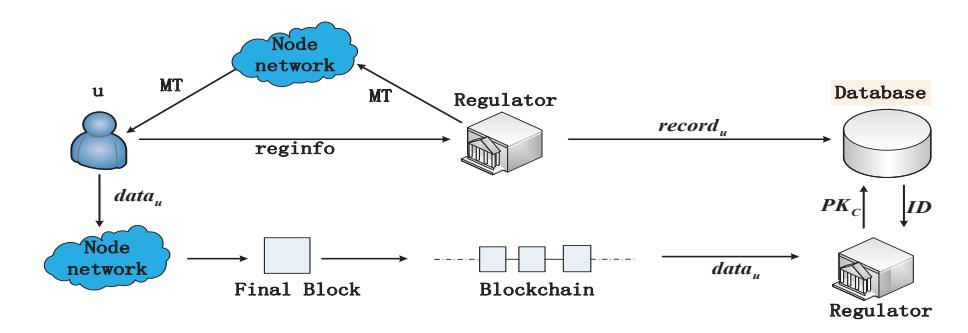
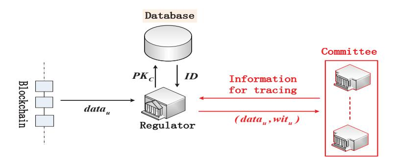

# **A Blockchain Traceable Scheme with Oversight Function**

Tianjun Ma1*,*2*,*3 , Haixia Xu1*,*2*,*3*⋆* , and Peili Li1*,*3

- 1 State Key Laboratory of Information Security, Institute of Information Engineering, CAS, Beijing, China
- 2 School of Cyber Security, University of Chinese Academy of Sciences, Beijing, China
- 3 Data Assurance and Communication Security Research Center, Chinese Academy of Sciences, Beijing, China *{*matianjun,xuhaixia,lipeili*}*@iie.ac.cn

**Abstract.** Many blockchain researches focus on the privacy protection. However, criminals can leverage strong privacy protection of the blockchain to do illegal crimes (such as ransomware) without being punished. These crimes have caused huge losses to society and users. Implementing identity tracing is an important step in dealing with issues arising from privacy protection. In this paper, we propose a blockchain traceable scheme with oversight function (BTSOF). The design of BT-SOF builds on SkyEye (Tianjun Ma et al., Cryptology ePrint Archive 2020). In BTSOF, the regulator must obtain the consent of the committee to enable tracing. Moreover, we construct a non-interactive verifiable multi-secret sharing scheme (VMSS scheme) and leverage the VMSS scheme to design a distributed multi-key generation (DMKG) protocol for the Cramer-Shoup public key encryption scheme. The DMKG protocol is used in the design of BTSOF. We provide the security definition and security proof of the VMSS scheme and DMKG protocol.

**Keywords:** blockchain *·* traceable scheme *·* oversight function *·* verifiable multi-secret sharing scheme *·* distributed multi-key generation protocol.

# **1 Introduction**

Nowadays, the blockchain that originated in Bitcoin [20] has attracted great attention from industry and academia. The reason of high concern is mainly the large-scale application scenarios of blockchain. That is, the blockchain is no longer limited to the decentralized cryptocurrencies (e.g. PPcoin [15], Litecoin [1]), and can also be applied to other fields, such as military, insurance, supply chain, and smart contracts.

In a nutshell, the blockchain can be seen as a distributed, decentralized, anonymous, and data-immutable database. The blockchain stores data in blocks. A block contains a block header and a block body. The block body stores

*⋆* The corresponding author.

data in the form of a Merkle tree. The block header contains the hash value of the block header of the previous block to form a chain. Moreover, the block header also stores information such as the time stamp, version number, and root of the Merkle tree. The blockchain uses consensus mechanism (such as proof of work (PoW) [20], proof of stake (PoS) [4, 8], or practical byzantine fault tolerance (PBFT) [6]) to guarantee nodes to reach consensus on some block. In other words, the consensus mechanism ensures that the entire network reaches a consensus on a unique blockchain.

There are many researches on the blockchain privacy protection [5,19]. However, criminals can leverage strong privacy protection of the blockchain to do illegal crimes (such as ransomware, money laundering) without being punished. These crimes have caused huge losses to society and users. CipherTraces third quarter 2019 cryptocurrency anti-money laundering report shows that the total amount of fraud and theft related to cryptocurrencies are \$4.4 billion in aggregate for 2019.

In blockchain applications, implementing identity tracing is an important step in dealing with issues arising from privacy protection. Tianjun Ma et al. proposed SkyEye [17], a blockchain traceable scheme. SkyEye can be applied in the SkyEye-friendly blockchain applications (more details about these applications are available in [17]), that is, each user in these blockchain applications has the public information generated from the private information, and the users' public information can be displayed in the blockchain data. SkyEye allows the regulator to trace the users' identities of the blockchain data. However, in Sky-Eye, there are no restrictions and oversight measures for the regulator, and the regulator can arbitrarily trace the blockchain data.

In this paper, we design oversight measures for the regulator in SkyEye to prevent the regulator from abusing tracing right, thereby constructing a blockchain traceable scheme with oversight function (BTSOF). Our main contributions are as follows:

- 1. We construct a non-interactive verifiable multi-secret sharing (VMSS) scheme based on the non-interactive verifiable secret sharing scheme proposed by Pedersen (Pedersen-VSS) [22]. We leverage the Franklin-Yung multi-secret sharing scheme [12] in the design of the VMSS scheme. In addition, we provide the security definition and security proof of the VMSS scheme.
- 2. We use the VMSS scheme to construct a distributed multi-key generation (DMKG) protocol for the Cramer-Shoup public key encryption scheme [7]. The construction of the DMKG protocol builds on the techniques of distributed key generation (DKG) protocol proposed by Gennaro et al [14]. We define the security of the DMKG protocol and prove the security of this protocol.
- 3. We propose a blockchain traceable scheme with oversight function. The design of BTSOF builds on SkyEye [17] and leverages the DMKG protocol described above and some other cryptographic primitives (e.g., non-interactive zero-knowledge). There is a committee in BTSOF. The regulator must obtain the consent of the committee to enable tracing. The regulator can trace one data, multiple data or data in multiple period.

**Paper organization.** The remainder of this paper is organized as follows. Section 2 provides the background. Section 3 provides an overview of BTSOF. Section 4 provides some definitions. Section 5 briefly describes the VMSS scheme (more details are available in Appendix A) and details the DMKG protocol. Section 6 describes the blockchain traceable scheme with oversight function. We discuss related work in Section 7 and summarize this paper in Section 8.

# **2 Background**

In this section, we describe the notation in this paper and provide an overview of SkyEye [17]. We then introduce some cryptographic building blocks.

### **2.1 Notation**

Let *p* and *q* denote two large primes such that *q|*(*p −* 1). We use Z*p* to denote a group of order *p* and Z*q* to denote a group of order *q*. Unless otherwise noted, the exponential operation performs modulo *p* operation by default. For example, *g x* denotes *g x mod p*, where *g ∈* Z*p* and *x ∈* Z*q*. Let *||* denote the concatenate symbol, such as *a||b* denotes the concatenation of *a* and *b*. Let *|·|* denote the size of some set, such as *|A|* represents the number of elements in the set *A*. We use (*pktra, sktra*) to denote the traceable public-private key pair and (*pkreg, skreg*) to denote the public-private key pair of the regulator.

### **2.2 SkyEye**

The design of SkyEye [17] uses some cryptographic primitives (e.g., chameleon hash scheme [16], which has a special property: the user who knows the chameleon hash private key can easily find collision about the chameleon hash value computed by the chameleon hash public key). SkyEye's main design idea is to add identity proofs to the blockchain data. The identity proof of each user includes the ciphertext of the user's chameleon hash public key encrypted by *pktra*. Moreover, in SkyEye, (*pkreg, skreg*) used for user registration is the same as (*pktra, sktra*) used for tracing. That is, *sktra* is obtained by the regulator. For ease of description, we use *u* to denote a user, *idu* to denote the *u*'s true identity, and *pkcu* to denote the chameleon hash public key of the user *u*. Let *CHidu* denote the chameleon hash value of identity *idu* and *MT* denote the Merkle tree. Each leaf node of *MT* stores the value of each successfully registered user, which is the concatenation of the chameleon hash public key and the chameleon hash value of the identity.

Figure 1 shows an overview of the blockchain application using SkyEye. The user *u* generates the registration information *reginfo* and sends *reginfo* to the regulator. If the verification of *reginfo* is successful, the regulator can extract some information *recordu* = (*pkcu , idu, CHidu* ) from *reginfo*, store *recordu* to the database, add *pkcu ||CHidu* to *MT*, and publish the Merkle tree MT. If the *u*'s (*pkcu ||CHidu* ) appears in the Merkle tree *MT*, the user *u* successfully registers in the regulator. Then, the user *u* can generate the blockchain data *datau* consisting of data contents and the identity proofs of users involved in data creation. Unlike

Fig. 1. An overview of the blockchain application using SkyEye.

traditional verification process in the blockchain, the verification process works as follows: (i) verifying data contents; (ii) verifying identity proofs in the data. If the verification of  $data_u$  is successful,  $data_u$  is added to the block that is generated by the verification node (e.g., miner). According to a consensus mechanism, the nodes in the network select a final block and add it to the blockchain. **The tracing process is shown as follows**: the regulator obtains  $data_u$  from the blockchain and then gets the chameleon hash public key set  $PK_C$  by decrypting each ciphertext of chameleon hash public key in  $data_u$  using the private key  $sk_{tra}$ . Finally, the regulator can obtain the users' true identity set ID corresponding to  $data_u$  by searching the database according to  $PK_C$ .

# 2.3 Cryptographic Building Blocks

The cryptographic building blocks include the following: Cramer-Shoup encryption scheme, non-interactive zero-knowledge, digital signature scheme, and multisecret sharing scheme. Below, we informally describe these notions.

**Cramer-Shoup Encryption Scheme.** The Cramer-Shoup Encryption Scheme CS = (Setup, KeyGen, Enc, Dec) is described below (more details are described in [7]).

- $Setup(\lambda) \to pp_{enc}$ . Given a security parameter  $\lambda$ , this algorithm samples  $g_1, g_2 \in \mathbb{Z}_p$  at random, where the order of  $g_1$  and  $g_2$  is q. Then, this algorithm chooses a hash function H form the family of universal one-way hash functions. Finally, Setup returns the public parameters  $pp_{enc} = (p, q, H, g_1, g_2)$ .
- $KeyGen(pp_{enc}) \rightarrow (pk, sk)$ . Given the public parameters  $pp_{enc}$ , this algorithm randomly samples  $x_1, x_2, y_1, y_2, z \in \mathbb{Z}_q$ , and computes  $c_1 = g_1^{x_1} g_2^{x_2}$ ,  $c_2 = g_1^{y_1} g_2^{y_2}$ , and  $c_3 = g_1^z$ . Finally, KeyGen returns a pair of public/private keys  $(pk, sk) = ((c_1, c_2, c_3), (x_1, x_2, y_1, y_2, z))$ .
- $Enc(pk, m) \to C$ . Given the public key pk and a message m, this algorithm first randomly samples  $r \in \mathbb{Z}_q$ . Then it computes  $u_1 = g_1^r, u_2 = g_2^r, e = c_3^r m, \alpha = H(u_1, u_2, e), v = c_1^r c_2^{r\alpha}$ . Finally, this algorithm returns  $C = (u_1, u_2, e, v)$ .
- $Dec(sk,C) \to m/\bot$ . Given the private key sk and the ciphertext C, this algorithm computes  $\alpha = H(u_1,u_2,e)$ , and checks if  $u_1^{x_1+y_1\alpha}u_2^{x_2+y_2\alpha} = v$ . If the check fails, this algorithm outputs  $\bot$ ; otherwise, it outputs  $m = e/u_1^z$ .

**Non-Interactive Zero-Knowledge.** Let  $\mathcal{R}: \{0,1\}^* \times \{0,1\}^* \longrightarrow \{0,1\}$  be an NP relation. The language for  $\mathcal{R}$  is  $\mathcal{L} = \{x \in \{0,1\}^* | \exists w \in \{0,1\}^* \ s.t. \ R(x,w) = 1\}$ . A non-interactive zero-knowledge scheme  $NIZK = (\mathcal{K}, \mathcal{P}, \mathcal{V})$  corresponds to the language  $\mathcal{L}$ , which is described below:

- $\mathcal{K}(\lambda) \to crs$ . Given a security parameter  $\lambda$ ,  $\mathcal{K}$  returns a common reference string crs.
- $\mathcal{P}(crs, x, w) \to \pi$ . Given the common reference string crs, a statement x, and a witness w,  $\mathcal{P}$  returns a proof  $\pi$ .
- $\mathcal{V}(crs, x, \pi) \to \{0, 1\}$ . Given the common reference string crs, the statement x, and the proof  $\pi$ ,  $\mathcal{V}$  returns 1 if verification succeeds, or 0 if verification fails.

A non-interactive zero-knowledge scheme satisfies three secure properties: (i) completeness; (ii) soundness; and (iii) perfectly zero knowledge. More details are available in [2].

**Digital Signature Scheme.** A digital signature scheme Sig = (KeyGen, Sign, Ver) is described below:

- $KeyGen(\lambda) \to (pk_{sig}, sk_{sig})$ . Given a security parameter  $\lambda$ , KeyGen returns a pair of public/private keys  $(pk_{sig}, sk_{sig})$ .
- $Sign(sk_{sig}, m) \to \sigma$ . Given the private key  $sk_{sig}$  and a message m, Sign returns the signature  $\sigma$  of the message m.
- $Ver(pk_{sig}, m, \sigma) \to b$ . Given the public key  $pk_{sig}$ , the message m, and the signature  $\sigma$ , Ver returns b = 1 if the signature  $\sigma$  is valid; otherwise, it outputs b = 0.

**Multi-Secret Sharing Scheme.** We use the Franklin-Yung multi-secret sharing scheme [12]. A (t - l + 1, t + 1; l, n)-multi-secret sharing scheme has two phases: distribution phase and recovery phase, where l denotes the number of secrets, t denotes the threshold, and n denotes the number of participants.

Distribution phase. The dealer D distributes a secret set  $S = \{s_1, ..., s_l\} \in \mathbb{Z}_q^l$  to n participants,  $P_1, ..., P_n$ . D first chooses a random polynomial f of degree t such that  $f(-k) = s_k$  for k = 1, ..., l and f(-k) is random for k = l + 1, ..., t + 1. Finally, D sends  $st_i = f(i)$  secretly to  $P_i$  for i = 1, ..., n.

Recovery phase. Any at least t+1 participants can compute the polynomial f via the Lagrange interpolation formula, and then reconstruct the secret set S.

The above scheme satisfies two properties: (1) any at least t+1 participants can reconstruct the secret set S; (2) any at most t-l+1 participants can not find anything about the secret set S from their shares in an information-theoretic sense.

# 3 An Overview of BTSOF

We design oversight measures for the regulator on the basis of SkyEye, so as to construct the blockchain traceable scheme with oversight function. The main design idea is shown in the Figure 2. If the regulator wants to trace the blockchain data  $data_u$ , it must send the data  $data_u$  and corresponding evidence  $wit_u$  to the committee. And if the committee agrees this tracing, it sends the information for tracing to the regulator. Finally, the regulator can trace the data  $data_u$  according to the information sent by the committee. For the encryption scheme in SkyEye,

Fig. 2. An Overview of the Blockchain Traceable Scheme with Oversight Function.

we use the Cramer-Shoup encryption scheme. The specific ideas are described as follows.

From Section 2.2, it can be seen that in SkyEye, the prerequisite for tracing by the regulator is to use the traceable private key  $sk_{tra}$  to decrypt all the chameleon hash public key ciphertexts in the blockchain data  $data_u$  to obtain the chameleon hash public key set  $PK_C$ . Therefore, we separate the generation of  $(pk_{reg}, sk_{reg})$  and  $(pk_{tra}, sk_{tra})$ . That is,  $(pk_{reg}, sk_{reg})$  is generated by the regulator and  $(pk_{tra}, sk_{tra})$  is periodically generated by the committee using the DMKG protocol which is suitable for the Cramer-Shoup encryption scheme (more details about DMKG protocol are described in Section 5). In other words, the regulator must obtain the consent of the committee to enable tracing. Without loss of generality, in this paper, we analyze the interaction between the committee and regulator in one period. Let T denote one period and  $(pk_{tra}^T, sk_{tra}^T)$  denote the traceable public-private key pair in this period.

For ease of describing the next design ideas, we assume that the committee has n participants  $P_1, ..., P_n$  where each member  $P_i$  is honest for  $i \in \{1, ...n\}$  (and in Section 6, we analyze the case of corrupted participants in the committee). Assuming that each committee member  $P_i$  has the traceable private key component  $(x_{1i}, x_{2i}, y_{1i}, y_{2i}, z_i)$  and the traceable public key component  $(c_{1i}, c_{2i}, c_{3i}) = (g_1^{x_{1i}} g_2^{x_{2i}}, g_1^{y_{1i}} g_2^{y_{2i}}, g_1^{z_i})$ . I.e., the private key  $sk_{tra}^T = (x_1 = \sum_{i \in \{1, ...n\}} x_{1i} \bmod q, x_2 = \sum_{i \in \{1, ...n\}} x_{2i} \bmod q, y_1 = \sum_{i \in \{1, ...n\}} y_{1i} \bmod q, y_2 = \sum_{i \in \{1, ...n\}} y_{2i} \bmod q, z = \sum_{i \in \{1, ...n\}} z_{i} \bmod q$ . And the public key  $pk_{tra}^T = (c_1 = \prod_{i \in \{1, ...n\}} c_{1i} = g_1^{x_1} g_2^{x_2}, c_2 = \prod_{i \in \{1, ...n\}} c_{2i} = g_1^{y_1} g_2^{y_2}, c_3 = \prod_{i \in \{1, ...n\}} c_{3i} = g_1^z$ .

Although the traceable public-private key pair  $(pk_{tra}^T, sk_{tra}^T)$  has been generated by the committee, an issue remains. When the regulator sends the data set and corresponding evidence to the committee and the committee agrees this tracing, if the committee sends the private key  $sk_{tra}^T$  directly to the regulator, this will cause the regulator to trace not only the data set that it sends, but also the data of other participants using  $pk_{tra}^T$  during the T period.

To address the above issue, we ask the committee to send the private key  $sk_{tra}^{T}$  to the regulator only when the regulator needs to trace all data of the T period. In other cases, the committee sends some information to the regulator, which allows

the regulator to trace only the data set sent to the committee. Next, we describe the design idea for the other cases. We assume that  $data_u$  only has a chameleon hash public key ciphertext  $C_u=(u_1,u_2,e,v)=(g_1^r,g_2^r,c_3^r\cdot pk_{c_u},c_1^rc_2^{r\alpha})$ , where r is a random number used for encryption and  $\alpha=H(u_1,u_2,e)$ . When the regulator sends  $(data_u,wit_u)$  to the committee, if the committee agrees this tracing, for each  $i\in\{1,...n\}$ ,  $P_i$  processes the ciphertext  $C_u$  as follows:  $u_{i1}=u_1^{(x_{1i}+y_{1i}\alpha)}=g_1^{r(x_{1i}+y_{1i}\alpha)}, u_{i2}=u_2^{(x_{2i}+y_{2i}\alpha)}=g_2^{r(x_{2i}+y_{2i}\alpha)}, u_{i3}=u_1^{z_i}=g_1^{rz_i}$ .  $P_i$  then broadcasts  $(u_{i1},u_{i2},u_{i3})$  to other members.

Next,  $P_i$  can compute  $u_{i12} = \Pi_{j \in \{1,...n\}} u_{j1} u_{j2} = u_1^{x_1 + y_1 \alpha} u_2^{x_2 + y_2 \alpha}$  and  $u_{i13} = \Pi_{j \in \{1,...n\}} u_{j3} = u_1^z$ . Finally,  $P_i$  sends  $(u_{i12}, u_{i13})$  to regulator for each  $i \in \{1,...n\}$ .

Because all committee members are honest, the regulator can choose the  $(u_{i12}, u_{i13})$  for some  $i \in \{1, ...n\}$  to decrypt  $C_u$ . The regulator first checks if  $u_{i12} = v$ . If the check passes, the regulator computes  $pk_{c_u} = e/u_{i13}$ , and then searches his database to determine the true identity  $id_u$  corresponding to the chameleon hash pubic key  $pk_{c_u}$ .

### 4 Definitions

#### 4.1 Blockchain Traceable Scheme

The definition and security of the blockchain traceable scheme is introduced by Tianjun Ma et al. [17]. A blockchain traceable scheme contains five algorithms ( $Setup, Gen_{info}, Ver_{info}, Gen_{proof}, Ver_{proof}, Trace$ ) described below. A complete formal definition can be found in [17].

- $Setup(\lambda) \to pp$ . Given a security parameter  $\lambda$ , Setup returns public parameters pp.
- $Gen_{info}(pp,id) \rightarrow reginfo$ . Given the public parameters pp and a user identity id,  $Gen_{info}$  returns the registration information reginfo.
- $Ver_{info}(pp, reginfo, sk_{reg}) \rightarrow b$ . Given the public parameters pp, registration information reginfo, and the regulator private key  $sk_{reg}$ ,  $Ver_{info}$  outputs a bit b. If b=1, reginfo is valid; otherwise, reginfo is invalid.
- $Gen_{proof}(pp, info_{proof}) \rightarrow proof_{id}$ . Given the public parameters pp and the information  $info_{proof}$  used to generate identity proof,  $Gen_{proof}$  returns the identity proof  $proof_{id}$ .
- $Ver_{proof}(pp, proof_{id}) \rightarrow b$ . Given the public parameters pp and identity proof  $proof_{id}$ .  $Ver_{proof}$  outputs a bit b. If b=1,  $proof_{id}$  is valid; otherwise,  $proof_{id}$  is invalid.
- $Trace(data_B, sk_{tra}) \rightarrow ID$ . Given the blockchain data  $data_B$  and the traceable private key  $sk_{tra}$ , Trace returns the identity set ID corresponding to  $data_B$ .

A blockchain traceable scheme is security if it satisfies two properties: *identity* proof indistinguishability and identity proof unforgeability. The former property states that no adversary can distinguish the identity proofs of the honest users, and the latter property means that the adversary cannot forge the identity proofs of the honest users. More details are available in [17].

#### 4.2 Threat Model

For the DMKG protocol, we assume that there are n probabilistic polynomialtime participants  $P_1, ... P_n$  in the DMKG protocol. These participants are in a fully synchronous network. All participants have a common broadcast channel, and there is a private point-to-point channel between the participants. The adversary  $\mathcal{A}$  is static. That is, the corrupted participants must be chosen by the adversary  $\mathcal{A}$  at the beginning of the DMKG protocol. The adversary can corrupt at most t-1 participants in any way, where t-1 < n/2. The DMKG protocol is secure with threshold t if it satisfies correctness and secrecy requirements in the presence of the adversary  $\mathcal{A}$  that corrupts at most t-1 participants (more details about correctness and secrecy requirements are available in Appendix B).

For BTSOF, the assumptions about the regulator and the blockchain data are the same as in SkyEye [17] (i.e., the regulator is trusted and the blockchain data generated by the users cannot be tampered with). From Section 3, it can be seen that BTSOF is constructed by adding oversight measures to SkyEye [17]. That is, the traceable public-private key pair is generated by the committee through the DMKG protocol, and the tracing process is achieved by the interaction between the regulator and committee. These measures only modify Setup and Trace algorithms in SkyEve. Thus, as long as it can prove that the committee is trusted and the regulator can only trace the data set sent to the committee if it obtains the consent of the committee, BTSOF satisfies identity proof indistinguishability and identity proof unforgeability. Therefore, in BTSOF, we only consider the threat model that is same as the threat model in the DMKG protocol except that the set  $(P_1,...,P_n)$  is called a committee and n is equal to 3t-2. Because the adversary controls at most t-1 committee members, the honest members are in the majority on the committee. Moreover, we assume that the regulator can receive each committee member' reply at time  $t_{rep}$ .

# 5 DMKG

VMSS scheme. For designing the DMKG protocol, we construct a VMSS scheme. The design of the VMSS scheme combines the technology of Pedersen-VSS [22] and Franklin-Yung multi-secret sharing scheme [12]. Due to space constraints, we briefly describe the VMSS scheme (more details are available in Appendix A). A dealer D distributes a secret set  $S = \{s_1, ..., s_l\}$  to some participants. D first broadcasts the commitment of each secret in S. Then, D commits to a polynomial f(x) of degree t such that  $f(-i) = s_i$ ,  $i = \{1, ..., l\}$ . Finally, D broadcasts the commitments of f(x) and secretly sends share (computed by f(x)) to each participant. Each participant can verify the share sent by D and the commitments on the secret set S according to these commitments of f(x). Next, we describe the construction and security of the DMKG protocol.

### 5.1 Construction of DMKG

We assume that a trusted authority has chosen  $g_1, h_1, g_2, h_2 \in \mathbb{Z}_p$ , where  $h_1 = g_1^{\gamma_1}$  and  $h_2 = g_2^{\gamma_2}$  for  $\gamma_1, \gamma_2 \in \mathbb{Z}_q$ . The DMKG protocol consists of two phases of

- 1. Each participant  $P_i$  performs the following operations for i = 1, ..., n:
- (a)  $P_i$  randomly chooses  $x_{1i}, x_{2i}, y_{1i}, y_{2i}, z_i \in \mathbb{Z}_q$ , and  $\beta_{0i}, \beta_{1i}, \beta_{2i}, \beta_{3i}, \beta_{4i} \in \mathbb{Z}_q$ . Then,  $P_i$  broadcasts  $E_{1i} = g_1^{x_{1i}} h_1^{\beta_{1i}}, E_{2i} = g_1^{y_{1i}} h_1^{\beta_{2i}}, E_{3i} = g_2^{x_{2i}} h_2^{\beta_{3i}}$ , and  $E_{4i} = g_2^{y_{2i}} h_2^{\beta_{4i}}$ .
- (b)  $P_{i}$  randomly chooses two polynomials  $F_{i}(x)$ ,  $F'_{i}(x) \in \mathbb{Z}_{q}[x]$  of degree t such that  $F_{i}(-1) = x_{1i}$ ,  $F_{i}(-2) = y_{1i}$ ,  $F'_{i}(-1) = \beta_{1i}$  and  $F'_{i}(-2) = \beta_{2i}$ . Let  $F_{i}(x) = a_{i0} + a_{i1}x + ... + a_{it}x^{t}$  and  $F'_{i}(x) = b_{i0} + b_{i1}x + ... + b_{it}x^{t}$ . Then,  $P_{i}$  randomly chooses two polynomials  $G_{i}(x)$ ,  $G'_{i}(x) \in \mathbb{Z}_{q}[x]$  of degree t such that  $G_{i}(-1) = x_{2i}$ ,  $G_{i}(-2) = y_{2i}$ ,  $G'_{i}(-1) = \beta_{3i}$  and  $G'_{i}(-2) = \beta_{4i}$ . Let  $G_{i}(x) = a'_{i0} + a'_{i1}x + ... + a'_{it}x^{t}$  and  $G'_{i}(x) = b'_{i0} + b'_{i1}x + ... + b'_{it}x^{t}$ . Finally,  $P_{i}$  randomly chooses two polynomials  $H_{i}(x)$ ,  $H'_{i}(x) \in \mathbb{Z}_{q}[x]$  of degree t such that  $H_{i}(0) = z_{i}$  and  $H'_{i}(0) = \beta_{0i}$ . Let  $H_{i}(x) = a''_{i0} + a''_{i1}x + ... + a''_{it}x^{t}$  and  $H'_{i}(x) = b''_{i0} + b''_{i1}x + ... + b''_{it}x^{t}$ , where  $a''_{i0} = z_{i}$  and  $b''_{i0} = \beta_{0i}$ .  $P_{i}$  broadcasts  $CM_{ik} = g_{1}^{aik}h_{1}^{bik}g_{2}^{a'ik}h_{2}^{b'ik}$  and  $cm_{ik} = g_{1}^{a'ik}h_{1}^{b'ik}$  for k = 0, ...t, where  $cm_{i0} = g_{1}^{a'i}h_{1}^{b'i0} = g_{1}^{z_{i}}h_{1}^{b_{i0}}$ .
- (c) For each i=1,...,n, Each participant  $P_j$  verifies  $E_{\tau i}$  for  $\tau=1,2,3,4$  and tests if

$$E_{\tau i}E_{\tau+2,i} = \prod_{k=0}^{t} (CM_{ik}^{(-\tau)^k}) \text{ for } \tau = 1,2$$
 (1)

If this check does not hold for an index i,  $P_i$  is marked as disqualified. Because  $E_{\tau i}$  is public for  $\tau=1,2,3,4$ , each participant can build the set of qualified participants  $Q_{tem}$ . In particular, all honest participants build the same set  $Q_{tem}$ .

- (d) For each  $i \in Q_{tem}$ ,  $P_i$  computes the shares  $sf_{ij} = F_i(j), sf'_{ij} = F'_i(j), sg_{ij} = G_i(j), sg'_{ij} = G'_i(j), sh_{ij} = H_i(j)$ , and  $sh'_{ij} = H'_i(j)$  for j = 1, ..., n. Then,  $P_i$  sends  $(sf_{ij}, sf'_{ij}, sg_{ij}, sg'_{ij}, sh_{ij}, sh'_{ij})$  secretly to participant  $P_j$  for j = 1, ..., n. (All honest participants refuse to accept the shares of these participants who are not in  $Q_{tem}$ )
- (e) Each participant  $P_j$  verifies the shares received from the other participants. For each  $i \in Q_{tem}$ ,  $P_j$  checks if

$$\begin{cases} g_1^{sf_{ij}} h_1^{sf'_{ij}} g_2^{sg_{ij}} h_2^{sg'_{ij}} = \prod_{k=0}^t (CM_{ik})^{j^k} \\ g_1^{sh_{ij}} h_1^{sh'_{ij}} = \prod_{k=0}^t (cm_{ik})^{j^k} \end{cases}$$
(2)

If the check fails for an index i,  $P_i$  broadcasts a complaint against  $P_i$ .

- (f) For each  $i \in Q_{tem}$ , if  $P_i$  received a complaint from  $P_j$ ,  $P_i$  broadcasts the values  $sf_{ij}, sf'_{ij}, sg_{ij}, sg'_{ij}, sh_{ij}, sh'_{ij}$  that satisfy Eq. 2.
- (g) A participant  $P_i$  is marked as disqualified for  $i \in Q_{tem}$ , if either of the following two conditions is satisfied:
  - the number of complaints against  $P_i$  is more than t-1 in Step 1e.
  - The values broadcast by  $P_i$  in Step 1f do not satisfy Eq. 2.
- 2. Each participant in  $Q_{tem}$  builds the final set of qualified participants  $Q_{final}$ . In particular, all honest participants build the same set  $Q_{final}$ .
- 3. For each i=1,...,n,  $P_i$  computes the shares  $sf_i=\sum_{j\in Q_{final}}sf_{ji}\ mod\ q,\ sf_i'=\sum_{j\in Q_{final}}sf_{ji}'\ mod\ q,\ sg_i=\sum_{j\in Q_{final}}sg_{ji}\ mod\ q,\ sg_i'=\sum_{j\in Q_{final}}sg_{ji}'\ mod\ q,\ sh_i=\sum_{j\in Q_{final}}sh_{ji}'\ mod\ q,\ and\ sh_i'=\sum_{j\in Q_{final}}sh_{ji}'\ mod\ q.$  The private key sk is not computed by any party, but sk is equals to  $(x_1=\sum_{i\in Q_{final}}x_{1i}\ mod\ q,x_2=\sum_{i\in Q_{final}}x_{2i}\ mod\ q,y_1=\sum_{i\in Q_{final}}y_{1i}\ mod\ q,y_2=\sum_{i\in Q_{final}}y_{2i}\ mod\ q,z=\sum_{i\in Q_{final}}z_{i}\ mod\ q).$

**Fig. 3.** Generating the private key  $sk = (x_1, x_2, y_1, y_2, z)$ 

generating the private key  $sk = (x_1, x_2, y_1, y_2, z)$  and generating the public key  $pk = (c_1 = g_1^{x_1} g_2^{x_2}, c_2 = g_1^{y_1} g_2^{y_2}, c_3 = g_1^z)$ . The above two phases are presented in detail in Figure 3 and Figure 4. The key ideas are described below.

In generating the private key sk phase, for each i=1,...,n,  $P_i$  randomly chooses the components  $x_{1i}$ ,  $x_{2i}$ ,  $y_{1i}$ ,  $y_{2i}$ ,  $z_i$  of sk in  $\mathbb{Z}_q$ . The distribution process of  $z_i$  uses the Pedersen-VSS scheme [22], which is the same as the DKG protocol [14]. That is,  $P_i$  randomly chooses a t-degree polynomial  $H_i(x)$  satisfying  $H_i(0)=z_i$  to distribute  $z_i$ . We use the VMSS protocol to distribute  $(x_{1i},x_{2i},y_{1i},y_{2i})$ . Specifically,  $P_i$  first broadcasts the commitments of  $x_{1i}$ ,  $x_{2i}$ ,  $y_{1i}$ , and  $y_{2i}$ . Then,  $P_i$  commits to two polynomials  $F_i(x)$ ,  $G_i(x)$  of degree t such that  $F_i(-1)=x_{1i}$ ,  $F_i(-2)=y_{1i}$ ,  $G_i(-1)=x_{2i}$ , and  $G_i(-2)=y_{2i}$ . Finally,  $P_i$  broadcasts the product of two polynomial commitments so that other participants can verify the shares sent by  $P_i$  and the commitments on  $x_{1i}$ ,  $x_{2i}$ ,  $y_{1i}$ , and  $y_{2i}$  (Eq. 1 and Eq. 2 in Figure 3). At the end of this phase,  $P_i$  obtains a set of qualified participants  $Q_{final}$ , and holds the values  $F_j(i)$ ,  $G_j(i)$ , and  $H_j(i)$  for  $j \in Q_{final}$ .

- 4. For each  $i \in Q_{final}$ ,  $P_i$  broadcasts  $A_{ik} = g_1^{a_{ik}} g_2^{a'_{ik}}$ ,  $A'_{ik} = g_1^{a''_{ik}}$  for k = 0, ..., t,  $c_{1i} = g_1^{x_{1i}} g_2^{x_{2i}}$ , and  $c_{2i} = g_1^{y_{1i}} g_2^{y_{2i}}$ . Let  $c_{3i} = A'_{i0} = g_1^{a''_{i0}} = g_1^{z_i}$ .

  5. For each  $j \in Q_{final}$ ,  $P_j$  goes through the following two steps to check whether the values broadcast by other participants in  $Q_{final}$  are correct.
- (a) For each  $i \in Q_{final}$ ,  $P_j$  checks if

$$c_{\tau i} = \prod_{k=0}^{t} (A_{ik}^{(-\tau)^k}) \text{ for } \tau = 1, 2$$
(3)

If the check fails for an index i,  $P_j$  broadcasts the shares  $(sf_{ij}, sg_{ij}, sh_{ij})$ . Because  $A_{ik}$  and  $c_{\tau i}$  for  $\tau = 1, 2$  are public, all honest participants broadcast the shares sent by  $P_i$ . Therefore, the number of shares exceeds the threshold t, and all honest participants can reconstruct  $(x_{1i}, x_{2i}, y_{1i}, y_{2i}, z_i)$ .

(b) If the check succeeds in 5a for an index i,  $P_i$  then checks if

$$\begin{cases} g_1^{sf_{ij}} g_2^{sg_{ij}} = \prod_{k=0}^t (A_{ik})^{j^k} \\ g_1^{sh_{ij}} = \prod_{k=0}^t (A'_{ik})^{j^k} \end{cases}$$
(4)

If the check fails for an index i,  $P_j$  complains against  $P_i$  by broadcasting  $sf_{ij}, sf'_{ij}, sg_{ij}, sg'_{ij}, sh_{ij}, sh'_{ij}$  that satisfy Eq. 2 but do not satisfy Eq. 4.

6. If there is at least one valid complaint about  $P_i$ , then the other participants in  $Q_{final}$  reconstruct  $(x_{1i}, x_{2i}, y_{1i}, y_{2i}, z_i)$ ,  $A_{ik}$ , and  $A'_{ik}$  for k = 0, ..., t. Finally, the participants in  $Q_{final}$  can obtain  $pk = (c_1 = \prod_{i \in Q_{final}} c_{1i} = g_1^{x_1} g_2^{x_2}, c_2 = \prod_{i \in Q_{final}} c_{2i} = g_1^{y_1} g_2^{y_2}, c_3 = \prod_{i \in Q_{final}} c_{3i} = g_1^z$ ).

**Fig. 4.** Generating the public key  $pk = (c_1 = g_1^{x_1} g_2^{x_2}, c_2 = g_1^{y_1} g_2^{y_2}, c_3 = g_1^z)$ 

In generating the public key pk phase, each participant  $P_i$  broadcasts the components  $c_{1i} = g_1^{x_{1i}}g_2^{x_{2i}}$ ,  $c_{2i} = g_1^{y_{1i}}g_2^{y_{2i}}$ , and  $c_{3i} = g_1^{z_i} = g_1^{H_i(0)}$  of pk for  $i \in Q_{final}$ . The verification process of  $c_{3i}$  is the same as the DKG protocol [14].  $P_i$  broadcasts the public values  $A_{ik}$  for k = 0, ..., t, so that other participants can verify  $(c_{1i}, c_{2i})$  through  $A_{ik}$ , and verify  $A_{ik}$  via the shares sent by  $P_i$  (Eq. 3 and Eq. 4 in Figure 4).

# 5.2 Security

**Theorem 1.** The DMKG protocol described in Figure 3 and Figure 4 is a secure protocol for distributed multi-key generation in the Cramer-Shoup encryption scheme. That is, it satisfies correctness and secrecy requirements in the presence of an adversary that corrupts at most t-1 participants for any t-1 < n/2.

A simulator  $\mathcal{O}$  is provided in Figure 5. We provide the proof of Theorem 1 in Appendix C.

### 6 BTSOF

#### 6.1 Construction of BTSOF

We modify the Setup and Trace algorithms in SkyEye and keep the other algorithms unchanged. We add the step of generating the common reference string crs for non-interactive zero-knowledge proof to the Setup algorithm, and leave the process of generating the traceable public-private key pair in the Setup algorithm to the committee. Let the committee use the DMKG protocol to periodically generate the traceable public-private key pair and let the regulator generate his public-private key pair used for user registration. We modify the Trace algorithm to the interaction between the committee and the regulator to ensure that the regulator only trace the data set sent to the committee. Next, we describe this interactive process.

Without loss of generality, we analyze the interaction between the committee and regulator in one period. Let T denote one period and  $(pk_{tra}^T, sk_{tra}^T)$  denote the traceable public-private key pair in this period. Let  $Q_{final}$  denote the set of qualified members in the committee's process of generating  $(pk_{tra}^T, sk_{tra}^T)$  in this period. For each  $i \in Q_{final}$ ,  $P_i$  has the public-private key pair  $(pk_{sig_i}, sk_{sig_i})$  of the signature scheme, the traceable private key component  $(x_{1i}, x_{2i}, y_{1i}, y_{2i}, z_i)$ , and the traceable public key component  $(c_{1i}, c_{2i}, c_{3i}) = (g_1^{x_{1i}} g_2^{x_{2i}}, g_1^{y_{1i}} g_2^{y_{2i}}, g_1^{z_i})$ . The operations of the committee and the regulator are presented in detail in Figure 6 and Figure 7. The key ideas are described below.

The regulator broadcasts a message to the committee to indicate the data set it wants to trace. The message has two types:

• The message  $m_{rtc} = (R, dw) = (R, (data_l, wit_l)_{l \in \{1, ..., len\}})$  indicates that the regulator wants to trace the data set with len elements, where R denotes the identifier of the regulator, and  $(data_l, wit_l)$  denotes the l-th data and the corresponding evidence for  $l \in \{1, ..., len\}$ .

Let  $corr = \{1, ..., t'\}$  denote the set of corrupted participants controlled by the adversary where  $t' \leq t - 1$  and  $uncorr = \{t' + 1, ..., n\}$  denote the set of honest participants controlled by the simulator  $\mathcal{O}$ .

Input:  $c_1 = g_1^{x_1} g_2^{x_2}, c_2 = g_1^{y_1} g_2^{y_2}, c_3 = g_1^{z_2}$ 

- 1. O performs the steps 1-2 in Figure 3 on behalf of the honest participants in the set uncorr. At the end of step 2, the following results are satisfied:
- (a)  $Q_{final}$  is correctly defined, and  $uncorr \subseteq Q_{final}$ . Moreover,  $F_i(x)$ ,  $F'_i(x)$ ,  $G_i(x), G'_i(x), H_i(x), \text{ and } H'_i(x) \text{ for } i \in uncorr \text{ are randomly chosen.}$
- (b) The view of the adversary contains  $F_i(x), F'_i(x), G_i(x), G'_i(x), H_i(x), H'_i(x)$  for  $i \in corr$ , the shares  $(sf_{ij}, sf'_{ij}, sg_{ij}, sg'_{ij}, sh_{ij}, sh'_{ij})$  for  $i \in Q_{final}, j \in corr$ , and all public values  $E_{\tau i}$ ,  $CM_{ik}$ ,  $cm_{ik}$  for  $i \in Q_{final}$ ,  $\tau = 1, 2, 3, 4, k = 0, ..., t$ .
- (c) Because  $\mathcal{O}$  receives enough consistent shares from the adversary, then  $\mathcal{O}$ can compute all polynomials of the participants in  $Q_{final}$ . Therefore, the view of  $\mathcal{O}$  consists of all shares  $(sf_{ij}, sf'_{ij}, sg_{ij}, sg'_{ij}, sh_{ij}, sh'_{ij})$ , all coefficients  $a_{ik}, b_{ik}, a'_{ik}, b'_{ik}, a''_{ik}, b''_{ik}$  and all public values  $E_{\tau i}$ ,  $CM_{ik}$ ,  $cm_{ik}$  for  $i \in Q_{final}$ ,  $j = 1, ...n, \tau = 1, 2, 3, 4, k = 0, ..., t.$
- 2. Then,  $\mathcal{O}$  performs the following steps:
- $\begin{array}{lll} \text{(a)} \ \mathcal{O} \ \text{sets} \ A_{ik}^* = A_{ik} = g_1^{a_{ik}} g_2^{a'_{ik}}, \ A_{ik}'^* = A_{ik}' = g_1^{a''_{ik}}, \ c_{1i}^* = c_{1i} = g_1^{x_{1i}} g_2^{x_{2i}}, \\ c_{2i}^* = c_{2i} = g_1^{y_{1i}} g_2^{y_{2i}}, \ \text{and} \ c_{3i}^* = A_{i0}' = g_1^{a''_{i0}} \ \text{for} \ i \in Q_{final} \setminus \{n\}, \ k = 0, ..., t. \\ \text{(b)} \ \mathcal{O} \ \text{computes} \ c_{3n}^* = c_3 \prod_{i \in Q_{final} \setminus \{n\}} c_{3i}^{-1} = g_1^{\widehat{z}_n}, \ c_{1n}^* = c_1 \prod_{i \in Q_{final} \setminus \{n\}} c_{1i}^{-1} = g_1^{\widehat{x}_{1n}} g_2^{\widehat{x}_{2n}}, \ \text{and} \ c_{2n}^* = c_2 \prod_{i \in Q_{final} \setminus \{n\}} c_{2i}^{-1} = g_1^{\widehat{y}_{1n}} g_2^{\widehat{y}_{2n}}. \ (\mathcal{O} \ \text{does not know the} \end{array}$ values  $\widehat{z}_n, \widehat{x}_{1n}, \widehat{x}_{2n}, \widehat{y}_{1n}, \widehat{y}_{2n})$
- (c)  $\mathcal{O}$  sets  $sf_{nj}^* = sf_{nj}, sg_{nj}^* = sg_{nj}$  for j = 1, ..., t 1, and  $sh_{nj}^* = sh_{nj}$  for
- (d) The point set  $((-1, \widehat{x}_{1n}), (-2, \widehat{y}_{1n}), (1, sf_{n1}^*), ..., (t-1, sf_{n,t-1}^*))$  can determine a polynomial  $F_n^*(x)$  of degree t, and the point set  $((-1,\widehat{x}_{2n}),(-2,\widehat{y}_{2n}),(1,sg_{n1}^*),...,(t\ -\ 1,sg_{n,t-1}^*)) \quad \text{can} \quad \text{also} \quad \text{determine} \quad \text{a}$ polynomial  $G_n^*(x)$  of degree t. Let  $F_n^*(x) = a_{n0}^* + a_{n1}^*x + ... + a_{nt}^*x^t$  and  $G_n^*(x) = a_{n0}^{\prime *} + a_{n1}^{\prime *} x + \dots + a_{nt}^{\prime *} x^t.$ 
  - According to the Lagrange interpolation formula, each coefficient of the polynomials  $F_n^*(x)$  and  $G_n^*(x)$  is the linear combination of  $(\widehat{x}_{1n}, \widehat{y}_{1n}, sf_{n1}^*, ..., sf_{n,t-1}^*)$  and  $(\widehat{x}_{2n}, \widehat{y}_{2n}, sg_{n1}^*, ..., sg_{n,t-1}^*)$ , respectively. Because the abscissas of the above two point sets are the same, the scalars of the two linear combinations of  $(a_{nk}, a_{nk}^{\prime*})$  are the same for k = 0, ...t. That is, if  $a_{nk} = \lambda_{k,-1} \hat{x}_{1n} + \lambda_{k,-2} \hat{y}_{1n} + \lambda_{k1} s f_{n1}^* + ... + \lambda_{k,t-1} s f_{n,t-1}^*$ , where  $\lambda_{k,-1}, \lambda_{k,-2}, \lambda_{k1}, ..., \lambda_{k,t-1}$  are corresponding scalars for k=0,...,t, then
  - $a_{nk}^{\prime*} = \lambda_{k,-1} \widehat{x}_{2n} + \lambda_{k,-2} \widehat{y}_{2n} + \lambda_{k1} s g_{n1}^* + \dots + \lambda_{k,t-1} s g_{n,t-1}^*.$ Therefore,  $\mathcal{O}$  can computes  $A_{nk}^* = \prod_{\tau=1}^2 (c_{\tau n}^*)^{\lambda_{k,-\tau}} \prod_{j=1}^{t-1} (g_1^{s f_{nj}^*} g_2^{s g_{nj}^*})^{\lambda_{kj}}$  for k = 0, ..., t.
  - The point set  $((0, \hat{z}_n), (1, sh_{n1}^*), ..., (t, sh_{nt}^*))$  can determine a polynomial  $H_n^*(x)$ . According to the Lagrange interpolation formula, each coefficient of the polynomial  $H_n^*(x)$  is a linear combination of  $(\widehat{z}_n, sh_{n1}^*, ..., sf_{nt}^*)$ . Therefore,  $\mathcal{O}$  sets  $A'^*_{n0} = c^*_{3n}$ , and computes  $A'^*_{nk} = (c^*_{3n})^{\lambda'_{k0}} \prod_{j=1}^t (g_1^{sh^*_{nj}})^{\lambda'_{kj}}$  where  $\lambda'_{k0},...,\lambda'_{kt}$  are corresponding scalars for k=1,...,t.
- (e)  $\mathcal{O}$  broadcasts  $A_{ik}, A'_{ik}$  for  $i \in Q_{final} \setminus \{n\}$  and  $A^*_{nk}, A'^*_{nk}$  for k = 0, ..., t.
- (f)  $\mathcal{O}$  performs the verifications of Eq. 3 on the values  $c_{1i}, c_{2i}, A_{ik}$  for  $i \in corr$ , k=0,...,t on behalf of all honest participants. If the verification fails for some  $i \in corr$ ,  $\mathcal{O}$  reconstructs the secrets  $(x_{1i}, x_{2i}, y_{1i}, y_{2i}, z_i)$ .
- (g)  $\mathcal{O}$  performs the verifications of Eq. 4 on the values  $A_{ik}$ ,  $A'_{ik}$  for  $i \in corr$ , k=0,...,t on behalf of each honest participant. If the verification fails for some  $i \in corr, j \in uncorr, \mathcal{O}$  broadcasts a complaint  $sf_{ij}, sf'_{ij}, sg_{ij}, sg'_{ij}, sh_{ij}, sh'_{ij}$ that satisfy Eq. 2 but do not satisfy Eq. 4.
- (h)  $\mathcal{O}$  performs the step 6 in Figure 4 on behalf of the honest participants.

For each  $i \in Q_{final}$ ,  $P_i$  performs the following steps upon receiving  $m_{rtc}$  sent by the regulator.

- 1.  $P_i$  sets num = 0;
- 2. If  $m_{rtc} = (R, dw) = (R, (data_l, wit_l)_{l \in \{1, ..., len\}})$  or  $m_{rtc} = (R, dw) =$  $(R, (T, wit_T)), P_i$  first checks the correctness of dw. If this check is successful,  $P_i$  then computes the signature  $\sigma_i = Sig.sign(sk_{sig_i}, dw)$ , sets  $m_i = (dw, \sigma_i)$ and sends  $m_i$  to the regulator.
- 3. If  $m_{rtc} = (R, (T, wit_T), sigall)$ , for each  $\sigma_j \in sigall$ ,  $P_i$  first computes b = $Sig.verify(pk_{sig_i}, dw, \sigma_i)$ , and sets num = num + 1 if b=1. Finally, if num > =2t-1,  $P_i$  publishes the share  $(sf_i, sg_i, sh_i)$ . Because the number of the honest participants is in the majority in the set  $Q_{final}$ ,  $P_i$  can receive enough correct shares to construct the private key  $sk_{tra}^{T}$  and send the message  $m_i = sk_{tra}^{T}$  to the regulator.
- 4. If  $m_{rtc} = (R, (data_l, wit_l)_{l \in \{1, ..., len\}}, sigall)$ , for each  $\sigma_j \in sigall$ ,  $P_i$  first computes  $b = Sig.verify(pk_{sig_i}, dw, \sigma_j)$ , and sets num = num + 1 if b=1. Finally, if num >= 2t - 1,  $P_i$  performs the following steps.
  - (a)  $P_i$  extracts the ciphertext of each user's chameleon hash public key from  $(data_l)_{l \in \{1,...,len\}}$  and obtains the ciphertext set C.
  - (b) For each  $C_k = (u_{k1}, u_{k2}, e_k, v_k) = (g_1^{r_k}, g_2^{r_k}, c_3^{r_k} p k_{c_k}, c_1^{r_k} c_2^{r_k \alpha_k}) \in C$ , where  $r_k$  is a random number used for encryption,  $pk_{c_k}$  is the chameleon hash public key of some user in the data set, and  $\alpha_k = H(u_{k1}, u_{k2}, e_k), P_i$ computes:

$$\begin{split} u_{ik1} &= u_{k1}^{(x_{1i} + y_{1i}\alpha_k)} = g_1^{r_k(x_{1i} + y_{1i}\alpha_k)}, \\ u_{ik2} &= u_{k2}^{(x_{2i} + y_{2i}\alpha_k)} = g_2^{r_k(x_{2i} + y_{2i}\alpha_k)}, \\ u_{ik3} &= u_{k1}^{z_i} = g_1^{r_k z_i}. \end{split}$$

Then,  $P_i$  computes  $\pi_i = NIZK.P(crs, (u_{ik1}, u_{ik2}, u_{ik3}, C_k, c_{1i}, c_{2i}, c_{3i}), (x_{1i}, c_{2i}, c_{3i}), (x_{1i}, c_{2i}, c_{3i}), (x_{1i}, c_{2i}, c_{3i}), (x_{1i}, c_{2i}, c_{3i}), (x_{1i}, c_{2i}, c_{3i}), (x_{1i}, c_{2i}, c_{3i}), (x_{1i}, c_{2i}, c_{3i}), (x_{1i}, c_{2i}, c_{3i}), (x_{1i}, c_{2i}, c_{3i}), (x_{1i}, c_{2i}, c_{3i}), (x_{1i}, c_{2i}, c_{3i}), (x_{1i}, c_{2i}, c_{3i}), (x_{1i}, c_{2i}, c_{3i}), (x_{1i}, c_{2i}, c_{3i}), (x_{1i}, c_{2i}, c_{3i}), (x_{1i}, c_{2i}, c_{3i}), (x_{1i}, c_{2i}, c_{3i}), (x_{1i}, c_{2i}, c_{3i}), (x_{1i}, c_{2i}, c_{3i}), (x_{1i}, c_{2i}, c_{3i}), (x_{1i}, c_{2i}, c_{3i}), (x_{1i}, c_{2i}, c_{3i}), (x_{1i}, c_{2i}, c_{3i}), (x_{1i}, c_{2i}, c_{3i}), (x_{1i}, c_{2i}, c_{3i}), (x_{1i}, c_{2i}, c_{3i}), (x_{1i}, c_{2i}, c_{3i}), (x_{1i}, c_{2i}, c_{3i}), (x_{1i}, c_{2i}, c_{3i}), (x_{1i}, c_{2i}, c_{3i}), (x_{1i}, c_{2i}, c_{3i}), (x_{1i}, c_{2i}, c_{3i}), (x_{1i}, c_{2i}, c_{3i}), (x_{1i}, c_{2i}, c_{3i}), (x_{1i}, c_{2i}, c_{3i}), (x_{1i}, c_{2i}, c_{3i}), (x_{1i}, c_{2i}, c_{3i}), (x_{1i}, c_{2i}, c_{3i}), (x_{1i}, c_{2i}, c_{3i}), (x_{1i}, c_{2i}, c_{3i}), (x_{1i}, c_{2i}, c_{3i}), (x_{1i}, c_{2i}, c_{3i}), (x_{1i}, c_{2i}, c_{3i}), (x_{1i}, c_{2i}, c_{3i}), (x_{1i}, c_{2i}, c_{3i}), (x_{1i}, c_{2i}, c_{3i}), (x_{1i}, c_{2i}, c_{3i}), (x_{1i}, c_{2i}, c_{3i}), (x_{1i}, c_{2i}, c_{3i}), (x_{1i}, c_{2i}, c_{3i}), (x_{1i}, c_{2i}, c_{3i}), (x_{1i}, c_{2i}, c_{3i}), (x_{1i}, c_{2i}, c_{3i}), (x_{1i}, c_{2i}, c_{3i}), (x_{1i}, c_{2i}, c_{3i}), (x_{1i}, c_{2i}, c_{3i}), (x_{1i}, c_{2i}, c_{3i}, c_{3i}), (x_{1i}, c_{2i}, c_{3i}, c_{3i}), (x_{1i}, c_{3i}, c_{3i}, c_{3i}), (x_{1i}, c_{3i}, c_{3i}, c_{3i}), (x_{1i}, c_{3i}, c_{3i}, c_{3i}, c_{3i}), (x_{1i}, c_{3i}, c_{3i}, c_{3i}, c_{3i}), (x_{1i}, c_{3i}, c_{3i}, c_{3i}, c_{3i}), (x_{1i}, c_{3i}, c_{3i}, c_{3i}, c_{3i}), (x_{1i}, c_{3i}, c_{3i}, c_{3i}, c_{3i}), (x_{1i}, c_{3i}, c_{3i}, c_{3i}, c_{3i}), (x_{1i}, c_{3i}, c_{3i}, c_{3i}, c_{3i}, c_{3i}), (x_{1i}, c_{3i}, c_{3i}, c_{3i}, c_{3i}), (x_{1i}, c_$  $(x_{2i}, y_{1i}, y_{2i}, z_i)$ ), and broadcasts (statementi,  $\pi_i$ ), where statementi =  $(u_{ik1}, u_{ik2}, u_{ik3}, C_k, c_{1i}, c_{2i}, c_{3i})$ .  $(\pi_i$  is used to prove that " $P_i$  knows  $(x_{1i}, x_{2i}, y_{1i}, y_{2i}, z_i)$  that can generate  $(u_{ik1}, u_{ik2}, u_{ik3})$  and  $(c_{1i}, c_{2i}, c_{3i})$ ".)

- (c) For  $(statement_i, \pi_i)$  broadcast by  $P_i$  for each  $j \in Q_{final}$ ,  $P_i$  first checks if  $(c_{1i}, c_{2i}, c_{3i}) \in statement_i$  matches the values received in the generating the public key phase in the DMKG protocol. If the check passes,  $P_i$  then computes  $b = NIZK.V(crs, statement_j, \pi_j)$ . If b = 0 for an index j,  $P_i$ broadcasts the shares  $(sf_{ji}, sg_{ji}, sh_{ji})$ . Because each committee member in  $Q_{final}$  checks  $(statement_j, \pi_j)$ , then if  $P_i$  is honest, the number of shares about  $P_j$  exceeds the threshold t, and all honest participants can reconstruct  $(x_{1j}, x_{2j}, y_{1j}, y_{2j}, z_j)$ . (d) For each  $C_k \in C$ ,  $P_i$  computes

$$\begin{split} u_{ik12} &= \varPi_{j \in Q_{final}} u_{jk1} u_{jk2} = \varPi_{j \in Q_{final}} g_1^{r_k(x_{1j} + y_{1j}\alpha_k)} g_2^{r_k(x_{2j} + y_{2j}\alpha_k)} \\ &= g_1^{r_k(\Sigma_{j \in Q_{final}} x_{1j} + \alpha_k \Sigma_{j \in Q_{final}} y_{1j})} g_2^{r_k(\Sigma_{j \in Q_{final}} x_{2j} + \alpha_k \Sigma_{j \in Q_{final}} y_{2j})} \\ &= g_1^{r_k(x_1 + y_1\alpha_k)} g_2^{r_k(x_2 + y_2\alpha_k)} = u_{k1}^{x_1 + y_1\alpha_k} u_{k2}^{x_2 + y_2\alpha_k}; \\ u_{ik13} &= \varPi_{j \in Q_{final}} u_{jk3} = g_1^{r_k \Sigma_{j \in Q_{final}} z_j} = g_1^{r_k z} = u_{k1}^z. \end{split}$$

(e) Finally,  $P_i$  sends  $m_i = (u_{ik12}, u_{ik13})_{k \in \{1, \dots, |C|\}}$  to the regulator.

Fig. 6. Committee Member Operations

• The message  $m_{rtc} = (R, dw) = (R, (T, wit_T))$  indicates that the regulator wants to trace all data of the T period, where R denotes the identifier of the regulator and  $wit_T$  denotes the corresponding evidence.

After receiving the above message  $m_{rtc}$ , for each  $i \in Q_{final}$ ,  $P_i$  verifies the correctness of the corresponding evidence in  $m_{rtc}$ . If the verification is successful,  $P_i$  signs dw in the message  $m_{rtc}$ , and sends the signature to the regulator.

Every time a signature is received from a committee member, the regulator verifies the signature and keeps it in the set sigall if the verification is successful. Finally, if the size of sigall is greater than or equal to 2t - 1, the regulator broadcasts the message  $m_{rtc} = (R, dw, sigall)$  to the committee.

After receiving the above message  $m_{rtc} = (R, dw, sigall)$ , each committee member in  $Q_{final}$  first verifies each signature in the set sigall, and counts the number of valid signature. If the number is greater than or equal to 2t - 1, the committee members in  $Q_{final}$  perform the following processing.

The regulator performs the following steps:

- 1. The regulator sets num = 0,  $ID = \emptyset$ ,  $Q_{rsig} = \emptyset$ ,  $Q_{rsk} = \emptyset$ , and  $sigall = \emptyset$ .
- 2. The regulator creates  $m_{rtc}=(R,dw)$ , where dw is equal to  $(T,wit_T)$  or  $(data_l,wit_l)_{l\in\{1,...,len\}}$ , and broadcasts  $m_{rtc}$  to the committee.
- 3. The regulator receives each committee member's reply about  $m_{rtc} = (R, dw)$  at time  $t_{rep}$ , and adds each reply to the set  $Q_{rsig}$ .
- 4. For each committee member's reply  $m_i = (dw, \sigma_i) \in Q_{rsig}$ , the regulator verifies the signature  $b = Sig.verify(pk_{sig_i}, dw, \sigma_i)$ . If b = 1, the regulator sets num = num + 1 and  $sigall = sigall \bigcup \sigma_i$ .
- 5. If num >= 2t 1, the regulator sets  $m_{rtc} = (R, dw, sigall)$ , and broadcasts  $m_{rtc}$  to the committee; otherwise, the regulator aborts operation.
- 6. The regulator receives each committee member's reply about  $m_{rtc} = (R, dw, sigall)$  at time  $t_{rep}$ , and adds each reply to the set  $Q_{rsk}$ .
- 7. If the number of some same value is in the majority in  $Q_{rsk}$  where the same value is denoted by  $m_f$ , the regulator continues with the following steps.
- 8. If  $m_f = (u_{ik12}, u_{ik13})_{k \in (1,...,|C|)}$  for some  $i \in Q_{final}$ , for each  $c_k = (u_{k1}, u_{k2}, e_k, v_k) \in C$ , the regulator checks if  $u_{ik12} = v_k$ . If the check passes, the regulator computes  $pk_{c_k} = e_k/u_{ik13}$ , searches his database to determine the true identity  $id_k$  corresponding to the chameleon hash pubic key  $pk_{c_k}$ , and sets  $ID = ID \bigcup id_k$ .
- 9. If  $m_f = sk_{tra}^T = (x_1, x_2, y_1, y_2, z)$ , for each  $c_k = (u_{k1}, u_{k2}, e_k, v_k) \in C$ , the regulator computes  $\alpha_k = H(u_{k1}, u_{k2}, e_k)$  and checks if  $u_{k1}^{x_1+y_1\alpha_k}u_{k2}^{x_2+y_2\alpha_k} = v_k$ . If the check passes, the regulator computes  $pk_{c_k} = e_k/u_{k1}^z$ , searches his database to determine the true identity  $id_k$  corresponding to the chameleon hash pubic key  $pk_{c_k}$ , and sets  $ID = ID \bigcup id_k$ .
- 10. Finally, the regulator obtains the users' identity set ID.

Fig. 7. Regulator Operations

- If  $m_{rtc} = (R, (T, wit_T), sigall)$ , the members in  $Q_{final}$  construct the private key  $sk_{tra}^T$ . For each  $i \in Q_{final}$ ,  $P_i$  sends the message  $m_i = sk_{tra}^T$  to the regulator.
- If  $m_{rtc} = (R, (data_l, wit_l)_{l \in \{1,...,len\}}, sigall)$ , for each  $i \in Q_{final}$ ,  $P_i$  processes the ciphertext of each user's chameleon hash public key in the data set, and sends these processed ciphertexts (that is denoted by  $m_i$ ) to the regulator.

After receiving the message  $m_i$  sent by each member  $P_i$  where  $i \in Q_{final}$ , the regulator chooses the value that is in the majority in these messages, and achieves tracing according to the value.

#### 6.2 Security of BTSOF

We briefly describe the security of the scheme. If the size of the signature set sigall provided by the regulator to the committee is greater than or equal to 2t-1 (the adversary controls at most t-1 participants), this means that the members that agree with the regulator tracing the data set are in the majority on the committee. When the regulator does not trace all data of the T period, for each  $i \in Q_{final}$ , after generating  $(u_{ik1}, u_{ik2}, u_{ik3})$ ,  $P_i$  uses non-interactive zero-knowledge technique to guarantee that other committee members can verify the correctness of  $(u_{ik1}, u_{ik2}, u_{ik3})$ , but can not obtain any information of  $(x_{1i}, x_{2i}, y_{1i}, y_{2i}, z_i)$ .

Finally, the message  $m_i = (u_{ik12}, u_{ik13})_{k \in \{1, \dots, |C|\}}$  sent by each member does not contain any information about the private key  $sk_{tra}^T$ . Therefore, the regulator only traces the data set that it sends. Moreover, because the honest members are in the majority on the committee, the regulator can choose the value that is in the majority in these messages to achieve tracing the data set.

# 7 Related Work

Blockchain research focuses primarily on privacy [5,19], efficiency [10,24], security [11], and its applications in other fields [18,23]. However, research on traceable mechanisms is limited, and is mainly concentrated in the cryptocurrencies.

Ateniese and Faonio [3] proposed a scheme for Bitcoin. In their scheme, a user is certifiable if it obtains certified Bitcoin address from a trusted certificate authority. The regulator can determine the certifiable users' identities in the Bitcoin transactions via the certificate authority. Garman, Green and Miers [13] constructed a new decentralized anonymous payment system based on Zerocash [5]. Their scheme achieves tracing by adding privacy preserving policyenforcement mechanisms.

Narula, Vasquez, and Virza [21] designed the first distributed ledger system, which is called zkLedger. zkLedger can provide strong privacy protection, public verifiability, and practical auditing. Their scheme is mainly used for auditing digital asset transactions over some banks. The ledger exists in the form of a table in zkLedger. Each user's identity corresponds to each column in the table. Therefore, the regulator can determine each user's identity according to the correspondence between each column and the identity of each user in the table.

Defrawy and Lampkins [9] proposed a proactively-private digital currency (PDC) scheme. In their scheme, the ledger is kept by a group of ledger servers. Each ledger server has two ledgers: a balance ledger and a transaction ledger. The balance ledger contains a share of each user's identity. Therefore, the regulator can trace the users' identities in transactions via these ledger servers.

Tianjun Ma et al. proposed SkyEye [17], a traceable scheme for blockchain. Their scheme can be applied to a class of blockchain applications. SkyEye allows the regulator to trace the users' identities of the blockchain data. However, the regulator can arbitrarily trace the users' identities of the blockchain data without any restrictions and oversight measures in SkyEye. We propose a blockchain traceable scheme with oversight function based on SkyEye to limit the tracing right of the regulator. The regulator must obtain the consent of the committee to enable tracing.

# **8 Conclusion**

In this paper, we propose BTSOF, a blockchain traceable scheme with oversight function, based on SkyEye. In BTSOF, the regulator must obtain the consent of the committee to enable tracing. The regulator can trace one data, multiple data or data in multiple period. Moreover, we construct a non-interactive verifiable multi-secret sharing scheme (VMSS scheme) and leverage the VMSS scheme to design a distributed multi-key generation (DMKG) protocol for the Cramer-Shoup public key encryption scheme.

**Acknowledgments.** This work was supported in part by the National Key R&D Program of China (2017YFB0802500), Beijing Municipal Science and Technology Project (No. Z191100007119007), and Shandong province major science and technology innovation project (2019JZZY020129).

# **References**

- 1. https://litecoin.org/.
- 2. S. Agrawal, C. Ganesh, and P. Mohassel. Non-interactive zero-knowledge proofs for composite statements. In *Advances in Cryptology - CRYPTO 2018 - 38th Annual International Cryptology Conference, Santa Barbara, CA, USA, August 19-23, 2018, Proceedings, Part III*, pages 643–673, 2018.
- 3. G. Ateniese, A. Faonio, B. Magri, and B. de Medeiros. Certified bitcoins. In *Applied Cryptography and Network Security - 12th International Conference, ACNS 2014, Lausanne, Switzerland, June 10-13, 2014. Proceedings*, pages 80–96, 2014.
- 4. C. Badertscher, P. Gazi, A. Kiayias, A. Russell, and V. Zikas. Ouroboros genesis: Composable proof-of-stake blockchains with dynamic availability. In *Proceedings of the 2018 ACM SIGSAC Conference on Computer and Communications Security, CCS 2018, Toronto, ON, Canada, October 15-19, 2018*, pages 913–930, 2018.
- 5. E. Ben-Sasson, A. Chiesa, C. Garman, M. Green, I. Miers, E. Tromer, and M. Virza. Zerocash: Decentralized anonymous payments from bitcoin. In *2014 IEEE Symposium on Security and Privacy, SP 2014, Berkeley, CA, USA, May 18-21, 2014*, pages 459–474, 2014.

- 6. M. Castro and B. Liskov. Practical byzantine fault tolerance. In *Proceedings of the Third USENIX Symposium on Operating Systems Design and Implementation (OSDI), New Orleans, Louisiana, USA, February 22-25, 1999*, pages 173–186, 1999.
- 7. R. Cramer and V. Shoup. A practical public key cryptosystem provably secure against adaptive chosen ciphertext attack. In *Advances in Cryptology - CRYPTO '98, 18th Annual International Cryptology Conference, Santa Barbara, California, USA, August 23-27, 1998, Proceedings*, pages 13–25, 1998.
- 8. B. David, P. Gazi, A. Kiayias, and A. Russell. Ouroboros praos: An adaptivelysecure, semi-synchronous proof-of-stake blockchain. In *Advances in Cryptology - EUROCRYPT 2018 - 37th Annual International Conference on the Theory and Applications of Cryptographic Techniques, Tel Aviv, Israel, April 29 - May 3, 2018 Proceedings, Part II*, pages 66–98, 2018.
- 9. K. E. Defrawy and J. Lampkins. Founding digital currency on secure computation. In *Proceedings of the 2014 ACM SIGSAC Conference on Computer and Communications Security, Scottsdale, AZ, USA, November 3-7, 2014*, pages 1–14, 2014.
- 10. S. Dziembowski, S. Faust, and K. Host´akov´a. General state channel networks. In *Proceedings of the 2018 ACM SIGSAC Conference on Computer and Communications Security, CCS 2018, Toronto, ON, Canada, October 15-19, 2018*, pages 949–966, 2018.
- 11. I. Eyal. The miner's dilemma. In *2015 IEEE Symposium on Security and Privacy, SP 2015, San Jose, CA, USA, May 17-21, 2015*, pages 89–103, 2015.
- 12. M. K. Franklin and M. Yung. Communication complexity of secure computation (extended abstract). In *Proceedings of the 24th Annual ACM Symposium on Theory of Computing, May 4-6, 1992, Victoria, British Columbia, Canada*, pages 699–710, 1992.
- 13. C. Garman, M. Green, and I. Miers. Accountable privacy for decentralized anonymous payments. In *Financial Cryptography and Data Security - 20th International Conference, FC 2016, Christ Church, Barbados, February 22-26, 2016, Revised Selected Papers*, pages 81–98, 2016.
- 14. R. Gennaro, S. Jarecki, H. Krawczyk, and T. Rabin. Secure distributed key generation for discrete-log based cryptosystems. In *Advances in Cryptology - EU-ROCRYPT '99, International Conference on the Theory and Application of Cryptographic Techniques, Prague, Czech Republic, May 2-6, 1999, Proceeding*, pages 295–310, 1999.
- 15. S. King and S. Nadal. PPCoin: Peer-to-Peer Crypto-Currency with Proof-of-Stake. https://peercoin.net/assets/paper/peercoin-paper.pdf, August 2012.
- 16. H. Krawczyk and T. Rabin. Chameleon hashing and signatures. *IACR Cryptology ePrint Archive*, 1998:10, 1998.
- 17. T. Ma, H. Xu, and P. Li. Skyeye: A traceable scheme for blockchain. Cryptology ePrint Archive, Report 2020/034, 2020. https://eprint.iacr.org/2020/034.
- 18. S. Matsumoto and R. M. Reischuk. IKP: turning a PKI around with decentralized automated incentives. In *2017 IEEE Symposium on Security and Privacy, SP 2017, San Jose, CA, USA, May 22-26, 2017*, pages 410–426, 2017.
- 19. I. Miers, C. Garman, M. Green, and A. D. Rubin. Zerocoin: Anonymous distributed e-cash from bitcoin. In *2013 IEEE Symposium on Security and Privacy, SP 2013, Berkeley, CA, USA, May 19-22, 2013*, pages 397–411, 2013.
- 20. S. Nakamoto. Bitcoin: A peer-to-peer electronic cash system. https://bitcoin.org/bitcoin.pdf, 2009.

- N. Narula, W. Vasquez, and M. Virza. zkledger: Privacy-preserving auditing for distributed ledgers. In 15th USENIX Symposium on Networked Systems Design and Implementation, NSDI 2018, Renton, WA, USA, April 9-11, 2018, pages 65– 80, 2018.
- T. P. Pedersen. Non-interactive and information-theoretic secure verifiable secret sharing. In Advances in Cryptology - CRYPTO '91, 11th Annual International Cryptology Conference, Santa Barbara, California, USA, August 11-15, 1991, Proceedings, pages 129–140, 1991.
- 23. A. Tomescu and S. Devadas. Catena: Efficient non-equivocation via bitcoin. In 2017 IEEE Symposium on Security and Privacy, SP 2017, San Jose, CA, USA, May 22-26, 2017, pages 393–409, 2017.
- M. Zamani, M. Movahedi, and M. Raykova. Rapidchain: Scaling blockchain via full sharding. In Proceedings of the 2018 ACM SIGSAC Conference on Computer and Communications Security, CCS 2018, Toronto, ON, Canada, October 15-19, 2018, pages 931–948, 2018.

# A Non-Interactive Verifiable Multi-Secret Sharing Scheme

In this section, we describe the definitions, construction, and security of the VMSS scheme.

#### A.1 Definitions

A VMSS scheme consists of the distribution phase, verification phase, and recovery phase. In the distribution phase, the dealer distributes the secret set and sends shares to the participants. In verification phase, the participants verify the shares sent by the dealer. In recovery phase, the participants reconstruct the secret set.

We assume that a dealer D distributes a secret set  $S = \{s_1, ..., s_l\} \in \mathbb{Z}_q^l$  to n participants,  $P_1, ..., P_n$ . Let  $Ver_{pro}$  denote the verification protocol that runs on the dealer D and participants  $P_1, ..., P_n$ . A VMSS scheme is secure with threshold t if it satisfies the following two definitions (cf. [22]).

**Definition 1** The  $Ver_{pro}$  must satisfy the following two requirements:

- 1. If the dealer and  $P_i$  follow  $Ver_{pro}$  for  $i \in \{1,...,n\}$ , and the dealer follows the distribution agreement,  $P_i$  accepts the dealer's share with a probability of 1.
- 2. For all subsets  $U_1, U_2$  of the set  $U = \{1, ..., n\}$  ( $|U_1| = |U_2| = t + 1$ ), if all participants in  $U_1$  and  $U_2$  have accepted their respective share sent by the dealer in  $Ver_{pro}$ , the secret set  $S_i$  that is reconstructed by  $U_i$  ( $i \in \{0, 1\}$ ) satisfies  $S_1 = S_2$ .

**Definition 2** For any  $A \subseteq \{1,...,n\}$  (|A| <= t - l + 1) and any  $View_A$ , the VMSS protocol has:

 $P[D \text{ has a secret set } S \mid View_A] = P[D \text{ has a secret set } S],$  where  $S = \{s_1, ...s_l\}$  and  $View_A$  denotes the view of the set A.

#### A.2 Construction

We assume that the dealer D has a secret set  $S = \{s_1, ..., s_l\} \in \mathbb{Z}_q^l$ , and a trusted authority has chosen  $g, h \in \mathbb{Z}_p$ , where  $h = g^{\gamma}, \gamma \in \mathbb{Z}_q$ . The VMSS scheme is described as following.

**Distribution phase.** The dealer D samples  $\beta_1, ..., \beta_l \in \mathbb{Z}_q$  at random, and broadcasts  $E_i = g^{s_i} h^{\beta_i}$  for i = 1, ..., l.

Then,  $P_i$  randomly chooses two polynomials  $f(x), f'(x) \in \mathbb{Z}_q[x]$  of degree t such that  $f(-k) = s_k$  and  $f'(-k) = \beta_k$  for k = 1, ..., l. Let  $f(x) = a_0 + a_1 x + ... + a_t x^t$  and  $f'(x) = b_0 + b_1 x + ... + b_t x^t$ . Then, D broadcasts  $cm_j = g^{a_j} h^{b_j}$  for j = 0, 1, ..., t. Finally, D computes  $st_i = f(i), sh_i = f'(i)$  and sends  $(st_i, sh_i)$  secretly to  $P_i$  for i = 1, ..., n.

**Verification phase.** For each  $i \in \{1,...,n\}$ ,  $P_i$  first verifies  $E_k$  for k=1,...l and checks if

$$E_k = g^{s_k} h^{\beta_k} = \prod_{j=0}^t c m_j^{(-k)^j}.$$
 (5)

If the check fails for an index k,  $P_i$  declines  $(st_i, sh_i)$ ; otherwise,  $P_i$  verifies  $(st_i, sh_i)$  and checks if

$$g^{st_i}h^{sh_i} = \prod_{j=0}^t cm_j^{i^j}.$$
 (6)

If the check fails,  $P_i$  declines  $(st_i, sh_i)$ ; otherwise,  $P_i$  accepts  $(st_i, sh_i)$ .

**Recovery phase.** Any at least t+1 participants that have accepted their shares can compute the polynomial f via the Lagrange interpolation formula, and then reconstruct the secret set S.

# A.3 Security

**Theorem 2.** If the dealer D can not compute  $\gamma$ , the VMSS scheme described in Section A.2 is secure. That is, the VMSS scheme satisfies Definition 1 and Definition 2.

We prove Theorem 2 below.

**Lemma 1.** Let  $A \subseteq \{1,...,n\}$  denote the participant set, where |A| = t + 1. If the commitment of each secret in S broadcast by the dealer D satisfies Eq. 5, and the share of each participant in A satisfies Eq. 6, then all participants in A can determine the set  $ST' = \{(s'_1, \beta'_1), ..., (s'_l, \beta'_l)\}$  that satisfies  $E_i = g^{s'_i}h^{\beta'_i}$  for i = 1, ..., l.

*Proof.* According to the conditions, all participants in A can compute two unique polynomials  $f^*, f'^*$  of degree t via the Lagrange interpolation formula. For each  $i \in A$ ,  $f^*$  and  $f'^*$  satisfy:

$$\begin{cases} f^*(i) = st_i \\ f'^*(i) = sh_i \end{cases}$$

The following result can be obtained from Eq. 6.

$$g^{f^*(i)+\gamma f'^*(i)} = g^{st_i+\gamma sh_i}, i \in A$$

That is,  $(f^* + \gamma f'^*)(x)$  is the unique t-degree polynomial that maps i to  $st_i + \gamma sh_i$ .

Because  $cm_j = g^{a_j}h^{b_j} = g^{a_j+\gamma b_j}$  for j = 0, ..., t, then  $e(x) = \sum_{j=0}^t (a_j + \gamma b_j)x^j$  satisfies  $e(i) = st_i + \gamma sh_i$  for  $i \in A$ .

Therefore,  $e(x) = (f^* + \gamma f'^*)(x)$  and  $E_i = g^{e(-i)} = g^{f^*(-i) + \gamma f'^*(-i)} = g^{f^*(-i)} h^{f'^*(-i)}$ .

Finally,  $s'_i = f^*(-i), \beta'_i = f'^*(-i)$  for i = 1, ..., l.

**Theorem 3.** Assuming that the dealer D can not compute  $\gamma$ , the verification protocol  $Ver_{pro}$  satisfies Definition 1.

*Proof.* If the dealer D and all participants follow the VMSS scheme, the secrets set S and all participants's shares satisfy Eq. 5 and 6. This means that the VMSS scheme satisfies the first requirement in Definition 1.

Let  $A, A' \subseteq \{1, ..., n\}$ , where |A| = |A'| = t + 1. All participants in A and A' have accepted their shares. Therefore, according to Lemma 1, the participants of A and A' can find  $ST = ((s_1, \beta_1), ..., (s_l, \beta_l))$  and  $ST' = ((s'_1, \beta'_1), ..., (s'_l, \beta'_l))$ , respectively, such that  $E_i = g^{s_i}h^{\beta_i} = g^{s'_i}h^{\beta'_i}$  for i = 1, ..., l.

All shares are consistent if and only if there is a polynomial f of degree t such that  $f(i) = st_i$  for i = 1, ..., n. Here, ST = ST'.

If the shares are inconsistent, there is  $k \in \{1,...n\}$  such that  $f(k) \neq st_k$ . Thus, the dealer can construct two sets  $A = \{1,...,t+1\}$  and  $A' = \{1,...t,k\}$ . This situation causes  $ST \neq ST'$ . Assuming that  $(s_j,\beta_j) \neq (s'_j,\beta'_j)$  for some  $j \in \{1,...,l\}$ , the dealer can compute  $\gamma = (s_j - s'_j)/(\beta'_j - \beta_j)$  according to  $E_j = g^{s_j}h^{\beta_j} = g^{s_j+\gamma\beta_j} = g^{s'_j}h^{\beta'_j} = g^{s'_j+\gamma\beta'_j}$ . This contradicts the assumption.

**Theorem 4.** The VMSS scheme satisfies Definition 2.

*Proof.* Let the size of A is t - l + 1. If A does not find anything about S, then neither does the set that the size is fewer than t - l + 1.

Let  $A = \{1, ..., k-l+1\}$  and  $View_A = \{E_1, ..., E_l, cm_0, ..., cm_t, (st_i, sh_i)_{i \in A}\}$ . There are two polynomials f, f' of degree t satisfying

$$\begin{cases} f(-i) = s_i, & \text{for } i = 1, ..., l \\ f(i) = st_i, & \text{for } i = 1, ..., t - l + 1 \end{cases}$$
$$\begin{cases} f'(-i) = \beta_i, & \text{for } i = 1, ..., l \\ f'(i) = sh_i, & \text{for } i = 1, ..., t - l + 1 \end{cases}$$

Let  $f(x) = a_0 + a_1x + ... + a_tx^t$  and  $f'(x) = b_0 + b_1x + ... + b_tx^t$ . According to the verification protocol, f and f' are chosen by the dealer, if f and f' satisfy

$$\begin{cases} E_i = g^{f(-i)} h^{f'(-i)} \text{ for } i = 1, ..., l \\ cm_i = g^{a_i} h^{b_i} \text{ for } i = 0, ..., t \end{cases}$$

According to Lemma 1, There is a unique polynomial e satisfy  $g^{e(-i)} = g^{f(-i)}h^{f'(-i)} = g^{s_i}h^{\beta_i}$  for i = 1, ..., l. And according to the second property of Franklin-Yung multi-secret sharing scheme, A can not get anything about the polynomial f. That is, A can not find anything about S.

According to Theorem 2, we can get the following lemma.

**Lemma 2.** The VMSS scheme satisfies the following properties in the presence of an adversary that corrupts at most t-l+1 participants and can not compute  $\gamma$ :

- 1. If the dealer is honest in the protocol, all shares owned by the honest participants can interpolate to a unique polynomial of degree t. In particular, any t+1 shares of the honest participants can effectively reconstruct the secret set  $S = \{s_1, ... s_l\}$ .
- 2. The public information generated in the protocol can be used to check the correctness of each share. Therefore, even in the presence of a malicious adversary that corrupts at most t-l+1 participants, it is possible to reconstruct the secret set S from any subset that contains at least t+1 correct shares.
- 3. The view of the adversary and the secret set S are independent of each other.

# B Security Requirements of DMKG Protocol

The DMKG protocol is used to generate the public-private key pair (pk, sk) in the Cramer-Shoup encryption scheme, where  $pk = (c_1, c_2, c_3) = (g_1^{x_1} g_2^{x_2}, g_1^{y_1} g_2^{y_2}, g_1^z)$  and  $sk = (x_1, x_2, y_1, y_2, z)$ . The DMKG protocol is secure with threshold t if it satisfies the following requirements in the presence of the adversary  $\mathcal{A}$  that corrupts at most t-1 participants (cf. [14]).

#### 1. Correctness

- (P1). Any subset of t + 1 shares provided by honest participants can determine the same private key  $sk = (x_1, x_2, y_1, y_2, z)$ .
- (P2). There is an effective algorithm that on input the participants' n shares and public messages generated by the DMKG protocol, outputs the unique private key sk, even if at most t-1 shares are generated by the corrupted participants.
- (P3). All honest participants have the same public key  $pk = (c_1, c_2, c_3) = (g_1^{x_1} g_2^{x_2}, g_1^{y_1} g_2^{y_2}, g_1^z)$ , where  $(x_1, x_2, y_1, y_2, z)$  is determined by P1.
- (P4). The values  $x_1, x_2, y_1, y_2$ , and z of the private key are uniformly distributed in  $\mathbb{Z}_q$ .

### 2. Secrecy

The adversary gets nothing about sk except for the pubic key pk. More formally, for each probabilistic polynomial-time adversary  $\mathcal{A}$  that can corrupt at most t-1 participants, there is a simulator  $\mathcal{O}$  such that on input the public key pk, the output distribution produced by the simulator  $\mathcal{O}$  is indistinguishable from the adversary's view in the real DMKG protocol that outputs the public key pk.

#### $\mathbf{C}$ Proof of Theorem 1

We need to use the following lemma about the Pedersen-VSS scheme [22] (cf. [14]) to prove Theorem 1. In the Pedersen-VSS scheme with threshold t, the dealer distributes the secret s to n participants  $P_1, ..., P_n$ . We assume that a trusted authority has chosen  $g, h \in \mathbb{Z}_p$ , where  $h = g^{\gamma}, \gamma \in \mathbb{Z}_q$  for the Pedersen-VSS scheme.

**Lemma 3.** Pedersen-VSS scheme satisfies the following properties in the presence of an adversary that corrupts at most t participants and can not compute  $\gamma$ :

- 1. If the dealer is honest in the protocol, all shares owned by the honest participants can interpolate to a unique polynomial of degree t. In particular, any t+1 shares of the honest participants can effectively reconstruct the secret
- 2. The public information generated in the protocol can be used to check the correctness of each share. Therefore, even in the presence of a malicious adversary that corrupts at most t participants, it is possible to reconstruct secret s from any subset that contains at least t+1 correct shares.
- 3. The view of the adversary and the secret s are independent of each other.

Proof of Correctness. It can been seen that according to the public broadcast information that is used to determine whether every participant is qualified, all honest participants can get the same set  $Q_{final}$ , which is defined at the end of the step 2 in Figure 3.

(P1).  $P_i$  as a dealer honestly performs the Pedersen-VSS and VMSS protocol for  $i \in Q_{final}$ . Therefore, according to the first property of Lemma 2 and Lemma 3, all honest participants use their shares of  $P_i$  to compute three polynomials  $F_i(x)$ ,  $G_i(x)$ ,  $H_i(x)$  such that  $F_i(-1) = x_{1i}$ ,  $F_i(-2) = y_{1i}$ ,  $G_i(-1) = x_{1i}$  $x_{2i}$ ,  $G_i(-2) = y_{2i}$ , and  $H_i(0) = z_i$ . Therefore, for any set  $\mathcal{R}$  of t+1 correct shares,  $x_{1i} = \sum_{j \in \mathcal{R}} \gamma_{1j} s f_{ij}$ ,  $x_{2i} = \sum_{j \in \mathcal{R}} \gamma_{1j} s g_{ij}$ ,  $y_{1i} = \sum_{j \in \mathcal{R}} \gamma_{2j} s f_{ij}$ ,  $y_{2i} = \sum_{j \in \mathcal{R}} \gamma_{2j} s g_{ij}$ , and  $z_i = \sum_{j \in \mathcal{R}} \gamma_{0j} s h_{ij}$  where  $\gamma_{0j} = \prod_{k \in \mathcal{R}, k \neq j} \frac{-k}{j-k}$ ,  $\gamma_{1j} = \prod_{k \in \mathcal{R}, k \neq j} \frac{-1-k}{j-k}$ , and  $\gamma_{2j} = \prod_{k \in \mathcal{R}, k \neq j} \frac{-2-k}{j-k}$  are the Lagrange interpolation coefficients. Finally,  $x_1$  can be generated from the shares of  $\mathcal{R}$  as follows:

$$x_1 = \sum_{i \in Q_{final}} x_{1i} = \sum_{i \in Q_{final}} \sum_{j \in \mathcal{R}} \gamma_{1j} s f_{ij} = \sum_{j \in \mathcal{R}} \gamma_{1j} \sum_{i \in Q_{final}} s f_{ij} = \sum_{j \in \mathcal{R}} \gamma_{1j} s f_{j}.$$

Similarly,  $x_2 = \sum_{j \in \mathcal{R}} \gamma_{1j} s g_j$ ,  $y_1 = \sum_{j \in \mathcal{R}} \gamma_{2j} s f_j$ ,  $y_2 = \sum_{j \in \mathcal{R}} \gamma_{2j} s g_j$ , and  $z = \sum_{j \in \mathcal{R}} \gamma_{0j} s h_j$ . (P2). The shares  $(sf_i, sg_i, sh_i)$  of  $P_i$  for  $i \in Q_{final}$  can be verified via the

following equations.

$$\begin{cases} g_1^{sf_i}g_2^{sg_i} = g_1^{\sum_{i \in Q_{final}} sf_{ij}} g_2^{\sum_{i \in Q_{final}} sg_{ij}} = \prod_{i \in Q_{final}} g_1^{sf_{ij}}g_2^{sg_{ij}} = \prod_{i \in Q_{final}} \prod_{k=0}^t (A_{ik})^{j^k}, \\ g_1^{sh_i} = g_1^{\sum_{i \in Q_{final}} sh_{ij}} = \prod_{i \in Q_{final}} g_1^{sh_{ij}} = \prod_{i \in Q_{final}} \prod_{k=0}^t (A'_{ik})^{j^k}. \end{cases}$$

The last equality of the above two equations follows Eq. 4. Therefore, Eq. 4 makes each participant to verify the correctness of share  $(sf_i, sg_i, sh_i)$ .

(P3). The public key pk is equal to  $(c_1, c_2, c_3)$ , where  $c_1 = \prod_{i \in Q_{final}} c_{1i} = g_1^{x_1} g_2^{x_2}$ ,  $c_2 = \prod_{i \in Q_{final}} c_{2i} = g_1^{y_1} g_2^{y_2}$ , and  $c_3 = \prod_{i \in Q_{final}} c_{3i} = g_1^{z}$ . Thus, We need to prove that  $c_{1i} = g_1^{x_{1i}} g_2^{x_{2i}}$ ,  $c_{2i} = g_1^{y_{1i}} g_2^{y_{2i}}$ , and  $c_{3i} = g_1^{z_i}$  for each  $i \in Q_{final}$ . If the public values  $A_{ik}$ ,  $A'_{ik}$ ,  $c_{1i}$ , and  $c_{2i}$  do not satisfy Eq. 3 or Eq. 4 for

If the public values  $A_{ik}$ ,  $A'_{ik}$ ,  $c_{1i}$ , and  $c_{2i}$  do not satisfy Eq. 3 or Eq. 4 for some  $i \in Q_{final}$  and k = 0, ..., t, other participants in  $Q_{final}$  can reconstruct the values  $x_{1i}$ ,  $x_{2i}$ ,  $y_{1i}$ ,  $y_{2i}$ ,  $z_i$  of  $P_i$  according to the steps 5a and 6 in Figure 4; otherwise, these public values satisfy Eq. 3 and Eq. 4, and the values  $A_{ik}$  for k = 0, ..., t define two polynomials  $\widehat{F}_i(x)$ ,  $\widehat{G}_i(x)$  of degree t. We use  $F_i(x)$  and  $G_i(x)$  to denote the polynomials defined by any t+1 shares of the honest participants. Then, according to the Eq. 4, it can be seen that  $\widehat{F}_i(x)$  and  $F_i(x)$  have at least t+1 common points, as do  $\widehat{G}_i(x)$  and  $G_i(x)$ . Because they are t-degree polynomials,  $\widehat{F}_i(x)$  and  $F_i(x)$  are same and so are  $\widehat{G}_i(x)$  and  $G_i(x)$ . That is,  $c_{1i} = g_1^{F_i(-1)} g_2^{G_i(-1)} = g_1^{x_{1i}} g_2^{x_{2i}}$ , and  $c_{2i} = g_1^{F_i(-2)} g_2^{G_i(-2)} = g_1^{y_{1i}} g_2^{y_{2i}}$ . Similarly,  $c_{i3} = g_1^{H_i(0)} = g_1^{z_i}$ .

(P4). For  $x_1 = \sum_{i \in Q_{final}} x_{1i}$ , as long as  $x_{1i}$  for some  $i \in Q_{final}$  is randomly selected, then it can be guaranteed that  $x_1$  is randomly chosen. According to the DMKG protocol,  $x_1$  and  $x_{1i}$  are determined by the set  $Q_{final}$ . Let  $P_i$  be a honest participant for  $i \in Q_{final}$ .  $x_{1i}$  is distributed by the  $P_i$  via VMSS protocol. According to the third property of Lemma 2,  $x_{1i}$  is uniformly random. Thus,  $x_1$  is uniformly distributed. Similarly,  $x_2$ ,  $y_1$ ,  $y_2$ , and z are also uniformly distributed.

**Proof of Secrecy.** According to the Figure 5, it can be seen that the adversary's view about the data produced by the honest participants in the real DMKG protocol consists of the shares  $(sf_{ij}, sf'_{ij}) = (F_i(j), F'_i(j)), (sg_{ij}, sg'_{ij}) = (G_i(j), G'_i(j)), (sh_{ij}, sh'_{ij}) = (H_i(j), H'_i(j))$  for  $i \in uncorr, j \in corr$ , and  $E_{\tau i}$ ,  $CM_{ik}, cm_{ik}, A_{ik}, A'_{ik}, c_{1i}, c_{2i}$  for  $i \in uncorr, \tau = 1, 2, 3, 4, k = 0, ..., t$ .

The above distribution of the values depends on the choice of the polynomials  $F_i(x), F'_i(x), G_i(x), G'_i(x), H_i(x), H'_i(x)$  for  $i \in uncorr$ . These polynomials satisfy

$$\begin{cases}
c_1 = \prod_{i \in Q_{final}} c_{1i} = \prod_{i \in Q_{final}} g_1^{F_i(-1)} g_2^{G_i(-1)} = g_1^{x_1} g_2^{x_2}, \\
c_2 = \prod_{i \in Q_{final}} c_{2i} = \prod_{i \in Q_{final}} g_1^{F_i(-2)} g_2^{G_i(-2)} = g_1^{y_1} g_2^{y_2}, \\
c_3 = \prod_{i \in Q_{final}} c_{3i} = \prod_{i \in Q_{final}} g_1^{H_i(0)} = g_1^z.
\end{cases}$$
(7)

In other words, this distribution is induced by the choice of the polynomials  $F_i(x), \ F_i'(x), \ G_i(x), \ G_i'(x), \ H_i(x), \ \text{and} \ H_i'(x) \ \text{for} \ i \in uncorr \setminus \{n\} \ \text{and} \ F_n(x), F_n'(x), G_n(x), G_n'(x), H_n(x), H_n'(x).$  The polynomials  $F_n(x), G_n(x), H_n(x)$  satisfy  $c_{1n} = g_1^{F_n(-1)}g_2^{G_n(-1)} = c_1\prod_{i\in Q_{final}\setminus \{n\}}c_{1i}^{-1}, \ c_{2n} = g_1^{F_n(-2)}g_2^{G_n(-2)} = c_2\prod_{i\in Q_{final}\setminus \{n\}}c_{2i}^{-1}, \ \text{and} \ c_{3n} = g_1^{H_n(0)} = c_3\prod_{i\in Q_{final}\setminus \{n\}}c_{3i}^{-1}.$  Moveover, this distribution depends on the set  $Q_{final}$  that is defined at the end of Step 2 in Figure 3.

Next, we prove that the probability distribution that is output by the simulator is equal to the above distribution. It can be seen that the steps 1 and 2 of the simulator  $\mathcal{O}$  are identical to the steps 1 and 2 of the real DMKG protocol. Therefore, the  $Q_{final}$  that is defined in the simulator  $\mathcal{O}$  is identical to the  $Q_{final}$  that is defined in the real DMKG protocol.

As show in Figure 5, the polynomials  $F_i^*(x)$ ,  $F_i'^*(x)$ ,  $G_i^*(x)$ ,  $G_i^*(x)$ ,  $H_i^*(x)$ , and  $H_i'^*(x)$  are identical to the polynomials  $F_i(x)$ ,  $F_i'(x)$ ,  $G_i(x)$ ,  $G_i'(x)$ ,  $H_i(x)$ , and  $H_i'(x)$ , respectively, for  $i \in uncorr \setminus \{n\}$ . For i = n, from the construction process of  $A_{nk}^*$ ,  $A_{nk}'^*$  of the simulator, it can be seen that  $F_n^*(x)$  is defined by these values  $F_n^*(-1) = \widehat{x}_{1n}$ ,  $F_n^*(-2) = \widehat{y}_{1n}$ ,  $F_n^*(j) = sf_{nj}^* = F_n(j)$  for j = 1, ..., t - 1,  $G_n^*(x)$  is defined by these values  $G_n^*(-1) = \widehat{x}_{2n}$ ,  $G_n^*(-2) = \widehat{y}_{2n}$ ,  $G_n^*(j) = sg_{nj}^* = G_n(j)$  for j = 1, ..., t - 1, and  $H_n^*(x)$  is defined by these values  $H_n^*(0) = \widehat{z}_n$ ,  $H_n^*(j) = sh_{nj}^* = H_n(j)$  for j = 1, ..., t.

Moreover, The polynomials  $F_n'^*(x)$  is defined by these values  $F_n'^*(-1) = \widehat{\beta}_{1n}$ ,  $F_n'^*(-2) = \widehat{\beta}_{2n}$ ,  $F_n'^*(j) = sf_{nj}'^* = F_n'(j)$  for j = 1, ..., t - 1,  $G_n^*(x)$  is defined by these values  $G_n'^*(-1) = \widehat{\beta}_{3n}$ ,  $G_n'^*(-2) = \widehat{\beta}_{4n}$ ,  $G_n^*(j) = sg_{nj}'^* = G_n(j)$  for j = 1, ..., t - 1, and  $H_n'^*(x)$  is defined by these values  $H_n'^*(0) = \widehat{\beta}_{0n}$ ,  $H_n^*(j) = sh_{nj}'^* = H_n(j)$  for j = 1, ..., t. The values  $\widehat{\beta}_{0n}$ ,  $\widehat{\beta}_{1n}$ ,  $\widehat{\beta}_{2n}$ ,  $\widehat{\beta}_{3n}$ ,  $\widehat{\beta}_{4n}$  satisfy  $g_1^{\widehat{z}_n}h_1^{\widehat{\beta}_{0n}} = g_1^{z_n}h_1^{\beta_{0n}}$ ,  $g_1^{\widehat{z}_{1n}}g_2^{\widehat{z}_{2n}}h_1^{\widehat{\beta}_{1n}}h_2^{\widehat{\beta}_{3n}} = g_1^{z_{1n}}g_2^{z_{2n}}h_1^{\beta_{1n}}h_2^{\beta_{3n}}$ , and  $g_1^{\widehat{y}_{1n}}g_2^{\widehat{y}_{2n}}h_1^{\widehat{\beta}_{2n}}h_2^{\widehat{\beta}_{4n}} = g_1^{y_{1n}}g_2^{y_{2n}}h_1^{\beta_{2n}}h_2^{\widehat{\beta}_{4n}}$ .

According to the above definition of these polynomials, we can know that the values  $F_i^*(j)$ ,  $F_i'^*(j)$ ,  $G_i^*(j)$ ,  $G_i'(j)$ ,  $H_i^*(j)$ , and  $H_i'^*(j)$  are identical to the values  $F_i(j)$ ,  $F_i'(j)$ ,  $G_i(j)$ ,  $G_i'(j)$ ,  $H_i(j)$ , and  $H_i'(j)$  for  $i \in uncorr$ ,  $j \in corr$ , and the coefficients of these polynomials agree with the public values  $CM_{ik}$ ,  $cm_{ik}$ ,  $A_{ik}^*$ ,  $A_{ik}'^*$  for  $i \in corr$ , k = 0, ...t. Therefore, the values received by the adversary satisfy Eq. 1, Eq. 2, Eq. 3, and Eq. 4.

The remaining task is to prove that the polynomials  $F_i^*(x)$ ,  $F_i'^*(x)$ ,  $G_i^*(x)$ ,  $G_i'^*(x)$ ,  $H_i^*(x)$ ,  $H_i'^*(x)$  for  $i \in uncorr$  are randomly chosen. Because the polynomials  $F_i(x)$ ,  $F_i'(x)$ ,  $G_i(x)$ ,  $G_i'(x)$ ,  $H_i(x)$ , and  $H_i'(x)$  are randomly chosen for  $i \in uncorr \setminus \{n\}$ , So are the polynomials  $F_i^*(x)$ ,  $F_i^{**}(x)$ ,  $G_i^{**}(x)$ ,  $G_i^{**}(x)$ ,  $H_i^{*}(x)$ , and  $H_i^{**}(x)$  for  $i \in uncorr \setminus \{n\}$ . For  $F_n^*(x)$ ,  $G_n^*(x)$  and  $H_n^*(x)$ , the values  $F_n^*(j)$ ,  $G_n^*(j)$ , and  $H_n^*(k)$  are random for j = 1, ..., t - 1, k = 1, ..., t, and the values  $F_n^*(-1)$ ,  $F_n^*(-2)$ ,  $G_n^*(-1)$ ,  $G_n^*(-2)$  and  $H_n^*(0)$  satisfy Eq. 7. Therefore,  $F_n^*(x)$ ,  $G_n^*(x)$  and  $H_n^*(x)$  are randomly chosen. Moreover, because  $F_n'(x)$ ,  $G_n'(x)$  and  $H_n'(x)$  are random polynomials, so are  $F_n^{**}(x)$ ,  $G_n^{**}(x)$  and  $H_n^{**}(x)$  according to the definition of these polynomials.