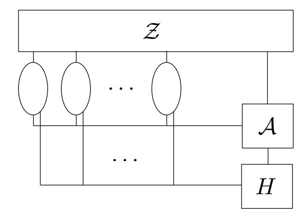
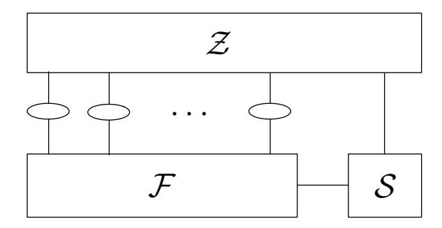

# Security analysis of SPAKE2+

Victor Shoup∗ New York University shoup@cs.nyu.edu

March 12, 2020

#### Abstract

We show that a slight variant of Protocol SPAKE2+, which was presented but not analyzed in [\[CKS08\]](#page-53-0), is a secure asymmetric password-authenticated key exchange protocol (PAKE), meaning that the protocol still provides good security guarantees even if a server is compromised and the password file stored on the server is leaked to an adversary. The analysis is done in the UC framework (i.e., a simulation-based security model), under the computational Diffie-Hellman (CDH) assumption, and modeling certain hash functions as random oracles. The main difference between our variant and the original Protocol SPAKE2+ is that our variant includes standard key confirmation flows; also, adding these flows allows some slight simplification to the remainder of the protocol.

Along the way, we also:

- provide the first proof (under the same assumptions) that a slight variant of Protocol SPAKE2 from [\[AP05\]](#page-53-1) is a secure symmetric PAKE in the UC framework (previous security proofs were all in the weaker BPR framework [\[BPR00\]](#page-53-2));
- provide a proof (under very similar assumptions) that a variant of Protocol SPAKE2+ that is currently being standardized is also a secure asymmetric PAKE;
- repair several problems in earlier UC formulations of secure symmetric and asymmetric PAKE.

## 1 Introduction

A password-authenticated key exchange (PAKE) protocol allows two users who share nothing but a password to securely establish a session key. Ideally, such a protocol prevents an adversary, even one who actively participates in the protocol (as opposed to an eavesdropping adversary), to mount an offline dictionary attack. PAKE protocols were proposed initially by Bellovin and Merrit [\[BM92\]](#page-53-3), and have been the subject of intensive research since then.

A formal model of security for PAKE protocols was first proposed by Bellare, Pointcheval, and Rogaway [\[BPR00\]](#page-53-2). We call this the BPR framework for PAKE security. The BPR framework is a "game based" security definition, as opposed to a "simulation based" security definition. A simulation-based security definition for PAKE was later given in [\[CHK](#page-53-4)+05]. We shall refer to this and similar simulation-based security definitions as the UC framework for PAKE security. Here, UC is short for "Universal Composability", as the definitions in [\[CHK](#page-53-4)+05] are couched in terms of the more general Universal Composability framework of [\[Can00\]](#page-53-5). As shown in [\[CHK](#page-53-4)+05], PAKE security in the UC framework implies PAKE security in the BPR framework. In fact, the

∗This work was supported by Apple, Inc.

UC framework for PAKE security is stronger than the BPR framework in a number of ways that we will discuss further below.

Abdalla and Pointcheval [\[AP05\]](#page-53-1) present Protocol SPAKE2, which itself is a variant of a protocol originally presented in [\[BM92\]](#page-53-3) and analyzed in [\[BPR00\]](#page-53-2). Protocol SPAKE2 is a simple and efficient PAKE protocol, and was shown in [\[AP05\]](#page-53-1) to be secure in the BPR security framework. Their proof of security is in the random oracle model under the computational Diffie-Hellman (CDH) assumption. The protocol also makes use of a common reference string consisting of two random group elements.

Protocol SPAKE2 has never been proven secure in the UC framework. As we argue below, it seems very unlikely that it can be. One of our results is to show that by adding standard key confirmation flows to Protocol SPAKE2 (which is anyway generally considered to be good security practice), the resulting protocol, which we call Protocol KC-SPAKE2, is secure in the UC framework (under the same assumptions).

Protocols SPAKE2 and KC-SPAKE2 are symmetric PAKE protocols, meaning that both parties must know the password when running the protocol. In the typical setting where one party is a client and the other a server, while the client may memorize their password, the server stores the password in some type of "password file". If this password file itself is ever leaked, then the client's password is totally compromised. From a practical security point of view, this vulnerability possibly negates any perceived benefits of using a PAKE protocol instead of a more traditional password-based protocol layered on top of a one-sided authenticated key exchange (which is still the overwhelming practice today).

In order to address this security concern, the notion of an asymmetric PAKE was studied in [\[GMR06\]](#page-54-0), where the UC framework of [\[CHK](#page-53-4)+05] is extended to capture the notion that after a password file is leaked, an adversary must still carry out an offline dictionary attack to retrieve a client's password. The paper also gives a general mechanism for transforming a secure PAKE into a secure asymmetric PAKE.[1](#page-1-0)

In [\[CKS08\]](#page-53-0), a minor variant of Protocol SPAKE2, called Protocol SPAKE2+, is introduced. This protocol is meant to be a secure asymmetric PAKE, while being a simpler and more efficient protocol than what would be obtained by directly applying the transformation in [\[GMR06\]](#page-54-0) to a protocol such as Protocol SPAKE2 or KC-SPAKE2. However, the security of Protocol SPAKE2+ was never formally analyzed.

In this paper, we propose adding standard key confirmation flows to Protocol SPAKE2+, obtaining a protocol called Protocol KC-SPAKE2+. We then show that Protocol KC-SPAKE2+ is a secure asymmetric PAKE in the UC framework (under the CDH assumption, in the random oracle model, and with a common reference string). This is our main result.

We present and justify various design choices in both the details of the protocol itself and the ideal functionality used in the security analysis.

- The protocol is very similar to, but not identical to, the one described in the IETF draft specification [\[TW20\]](#page-54-1). However, we also show that a generalization of that protocol, which we call Protocol IETF-SPAKE2+, is also a secure asymmetric PAKE, under (essentially) the same assumptions.
- The ideal functionality we use is similar to, but not identical to, the ideal functionality in [\[GMR06\]](#page-54-0). As we discuss below, some changes in the ideal functionality in [\[GMR06\]](#page-54-0) were necessary in order to obtain meaningful results. Since some changes were necessary, we also made some other changes in the name of making things simpler.

1The paper [\[GMR06\]](#page-54-0) was certainly not the first to study asymmetric PAKE protocols, nor is it the first to propose a formal security definition for such protocols.

#### 1.1 Comparison to *OPAQUE*

In [JKX18], a stronger notion of asymmetric PAKE security is introduced, wherein the adversary cannot initiate an offline dictionary attack until after the password file is leaked. None of the protocols analyzed here are secure in this stronger sense. Nevertheless, the protocols we analyze here may still be of interest. First, while an offline dictionary attack may be initiated before the password file is leaked, such a dictionary attack must be directed at a particular client. Second, the protocols we analyze here are quite simple and efficient, and unlike the OPAQUE protocol in [JKX18], they do not require hashing a password to a group element. Third, the protocols we analyze here are proved secure under the CDH assumption, while the OPAQUE protocol is proved secure under the stronger "one-more Diffie-Hellman assumption".

### 1.2 In defense of programmable random oracles

Our main results are proofs of security in the UC framework using programmable random oracles. The same is true for many other results in this area (including [JKX18]), and results in [Hes19] suggest that secure asymmetric PAKE protocols may only be possible with programmable random oracles.

Recently, results that use programmable random oracles in the UC framework have come to be viewed with some skepticism (see, for example, [CJS14, CDG+18]). We wish to argue (briefly) that such skepticism is a bit overblown (perhaps to sell a new "brand" of security) and that such results are still of considerable value.

Besides the fact that in any security analysis the random oracle model is at best a heuristic device (see, for example, [CGH04]), there is a concern that in the UC framework, essential composability properties may be lost. (In fact, this composability concern applies to any type of "programmable" set-up assumption, such as a *common reference string*, and not just to random oracles.)

While composability with random oracles is a concern, in most applications, it is not an insurmountable problem. First, the ideal functionalities we define in this paper will all be explicitly in a multi-user/multi-instance setting where a single random oracle is used for all users and user instances. Second, even if one wants to use the *same* random oracle in this and other protocols, that is not a problem, so long as all of the protocols involved coordinate on how their inputs are presented to the random oracle. Specifically, as long as all protocols present their inputs to the random oracle using some convention that partitions the oracle's input space (say, by prefixing some kind of "protocol ID" and/or "protocol instance ID"), there will be no unwanted interactions, and it will be "as if" each different protocol (or protocol instance) is using its own, independent random oracle. In the UC framework, this is all quite easily justified using the JUC theorem [CR03]. Granted, such coordination among protocols in a protocol stack may be a bit inconvenient, but is not the end of the world.

### 2 Overview

We start by considering Protocol SPAKE2, which is shown in Fig. 1, and which was first presented and analyzed in [AP05]. Here,  $\mathbb{G}$  is a group of prime order q, generated by  $g \in \mathbb{G}$ , and H is a hash function that outputs elements of the set  $\mathcal{K}$  of all possible session keys. Passwords are viewed as elements of  $\mathbb{Z}_q$ . The protocol also assumes public system parameters  $a, b \in \mathbb{G}$ , which are assumed to be random elements of  $\mathbb{G}$  that are generated securely, so that no party knows their discrete logarithms.

public system parameters: random  $a, b \in \mathbb{G}$ shared secret password:  $\pi$ 

$$P \qquad \qquad Q \\ \alpha \overset{\mathbb{R}}{\leftarrow} \mathbb{Z}_q, u \leftarrow g^{\alpha} a^{\pi} \qquad \qquad \overset{\beta \overset{\mathbb{R}}{\leftarrow} \mathbb{Z}_q, v \leftarrow g^{\beta} b^{\pi} \\ \xrightarrow{\qquad \qquad } \\ w \leftarrow (v/b^{\pi})^{\alpha} \qquad \qquad w \leftarrow (u/a^{\pi})^{\beta} \\ k \leftarrow H(\pi, id_P, id_Q, u, v, w) \qquad \qquad k \leftarrow H(\pi, id_P, id_Q, u, v, w) \\ \text{session key: } k$$

Figure 1: Protocol SPAKE2

This protocol is perfectly symmetric and can be implemented with the two flows sent in any order or even concurrently. In [AP05], it was shown to be secure in the BPR framework [BPR00], under the CDH assumption, and modeling H as a random oracle. Their security analysis, however, did not take corruption queries into account, which are needed for proving forward security. Later, [AB19] show Protocol SPAKE2 to provide forward security in the BPR framework, also in the random oracle model, but under the Gap CDH assumption. We note also that the security theorem in [AB19] only applies to so-called "weak" corruptions in the BPR framework, in which corrupting a party reveals to the adversary only its password, and not the internal state of any corresponding protocol instance.

A major drawback of Protocol *SPAKE2* is that if one of the two parties represents a server, and if the server's password file is leaked to the adversary, then the adversary immediately learns the user's password. The initial goal of this work was to analyze the security of Protocol *SPAKE2*+, shown in Fig. 2, which was designed to mitigate against such password file leakage. Protocol *SPAKE2*+ was presented in [CKS08], but only some intuition of security was given, rather than a proof. The claim in [CKS08] was that it is secure under the CDH assumption in the random oracle model, but even the security model for this claim was not specified.

The goal is to analyze such a protocol in the model where the password file may be leaked. In the case of such a leakage, the basic security goal is that the adversary cannot log into the server unless it succeeds in an *offline* dictionary attack (note that the adversary can certainly impersonate the server to a client).

In terms of formal models for this setting, probably the best available model is the UC framework for asymmetric PAKE security in [GMR06], which builds on the UC framework for ordinary (i.e., symmetric) PAKE security in [CHK+05]. Even without password file leakage, the UC framework is stronger than, and preferable to, the BPR framework in a number of important aspects.

• The UC framework models *arbitrary* password selection, where some passwords may be related, and where the choice of password can be arbitrary, rather than chosen from some assumed distribution. In contrast, the BPR framework assumes that all passwords are independently drawn from some specific distribution.

&lt;sup>2As stated, the theorem in [AB19] assumes the strongest version of the Gap CDH assumption in which the adversary has access to a DDH oracle that accepts arbitrary inputs  $(g^{\alpha}, g^{\beta}, g^{\gamma})$ , and tests if  $\gamma = \alpha \beta$ . This is not a falsifiable assumption (as defined in [Nao03]). This is in contrast to the "interactive" CDH assumption, in which  $g^{\alpha}$  is a part of the CDH challenge itself. It is conceivable that their theorem could be proven secure under the weaker "interactive" CDH assumption.

public system parameters: random 
$$a,b \in \mathbb{G}$$
 password:  $\pi$ ,  $(\phi_0,\phi_1) := F(\pi,id_P,id_Q)$ 

$$P$$

$$Q$$

$$\text{secret: } \phi_0,\phi_1 \qquad \qquad \text{secret: } \phi_0,c := g^{\phi_1}$$

$$\alpha \overset{\mathbb{R}}{\leftarrow} \mathbb{Z}_q, u \leftarrow g^{\alpha}a^{\phi_0} \qquad \qquad \beta \overset{\mathbb{R}}{\leftarrow} \mathbb{Z}_q, v \leftarrow g^{\beta}b^{\phi_0}$$

$$w \leftarrow (v/b^{\phi_0})^{\alpha}, d \leftarrow (v/b^{\phi_0})^{\phi_1} \qquad \qquad w \leftarrow (u/a^{\phi_0})^{\beta}, d \leftarrow c^{\beta}$$

$$k \leftarrow H(\phi_0,id_P,id_Q,u,v,w,d)$$

$$\text{session key: } k$$

Figure 2: Protocol SPAKE2+

- In the BPR framework, when the adversary guesses any one password, the game is over and the adversary wins. This means that in a system of 1,000,000 users, if the adversary guesses any one user's password in an online dictionary attack, there are no security guarantees at all for the remaining 999,999 users. In contrast, in the UC framework, guessing one password has no effect on the security of other passwords (to the extent, of course, that those other passwords are independent of the guessed password).
- It is not clear what the security implications of the BPR framework are for secure-channel protocols that are built on top of a secure PAKE protocol. (We will discuss this in more detail in the following paragraphs.) In contrast, PAKE security in the UC framework implies simulation-based security of any secure-channel protocol built on top of the PAKE protocol.

For these reasons, we prefer to get a proof of security in the UC framework. However, Protocol SPAKE2 itself does not appear to be secure in UC framework for symmetric PAKE (as defined in [CHK+05]), and for the same reason, Protocol SPAKE2+ is not secure in UC framework for asymmetric PAKE (as defined in [GMR06]). One way to see this is as follows. Suppose that in Protocol SPAKE2 an adversary interacts with Q, and runs the protocol honestly, making a guess that the correct password is  $\pi'$ . Now, at the time the adversary delivers the random group element u to Q, no simulator can have any idea as to the adversary's guess  $\pi'$  (even if it is allowed to see the adversary's queries to the random oracle H), and Q will respond with some v, and from Q's perspective, the key exchange protocol is over, and Q may start using the established session key kin some higher-level secure-channel protocol. For example, at some later time, the adversary might see a message together with a MAC on that message using a key derived from k. At this later time, the adversary can then query H at the appropriate input to determine whether its guess  $\pi'$ was correct or not. However, in the ideal functionality presented in [CHK+05], making a guess at a password after the key is established is not allowed. On a practical level, good security practice dictates that any reasonable ideal functionality should not allow this, as any failed online dictionary attack should be detectable by the key exchange protocol. On a more fundamental level, in any reasonable UC formulation, the simulator (or the simulator together with ideal functionality) must decide immediately, at the time a session key is established, whether it is a "fresh" key, a copy of a "fresh" key, or a "compromised" key (one that may be known to the adversary). In the above example, the simulator cannot possibly classify Q's key at the time that the key is established, because it has no way of knowing if the password  $\pi'$  that the adversary has in mind (but which at that time is completely unknown to the simulator) is correct or not. Because it might be correct, that would suggest we must classify the key as "compromised", even though it may not be. However, if the ideal functionality allowed for that, this would be an unacceptably weak notion of security, as then every interaction with the adversary would result in a "compromised" session key.

The obvious way to solve the problem noted above is to enhance Protocol SPAKE2 with extra key confirmation flows. This is anyway considered good security practice, and the IETF draft specification [\[TW20\]](#page-54-1) already envisions such an enhancement.

Note that [\[AB19\]](#page-52-0) shows that Protocol SPAKE2 provides forward security in the BPR framework [\[BPR00\]](#page-53-2). This suggests that the notion of forward security defined in [\[BPR00\]](#page-53-2) is not really very strong; in particular, it does not seem strong enough to prove anything like a simulation-based notion of a secure channel built on top of a PAKE protocol.

## 2.1 Outline

In Section [3,](#page-5-0) we introduce Protocol KC-SPAKE2, which is a variation of Protocol SPAKE2 that includes key confirmation. In Section [4](#page-7-0) we give a fairly self-contained overview of the general UC framework, and in Section [4.2,](#page-8-0) we specify the symmetric PAKE ideal functionality that we will use to analyze Protocol KC-SPAKE2 in the UC framework (discussing why we made certain changes to the UC formulation in [\[CHK](#page-53-4)+05]). In Section [5,](#page-16-0) we prove some preliminary technical results about Protocol KC-SPAKE2. In Section [6,](#page-22-0) we provide a simulator to prove the UC security of Protocol KC-SPAKE2, including an argument that this simulator is faithful to the real-world execution of the protocol, making use of the results from Section [5.](#page-16-0) In Section [7,](#page-25-0) we introduce Protocol KC-SPAKE2+, which is to Protocol KC-SPAKE2 as Protocol SPAKE2+ is to Protocol SPAKE2. In Section [8,](#page-25-1) we specify the asymmetric PAKE ideal functionality that we will use to analyze Protocol KC-SPAKE2+ in the UC framework, and we discuss why we made certain changes to the UC formulation in [\[GMR06\]](#page-54-0). In Section [9,](#page-27-0) we prove some preliminary technical results about Protocol KC-SPAKE2+. In Section [10,](#page-33-0) we provide a simulator to prove the UC security of Protocol KC-SPAKE2+, including an argument that this simulator is faithful to the real-world execution of the protocol, making use of the results from Section [9.](#page-27-0) Sections [11–](#page-37-0)[13](#page-48-0) describe and analyze Protocol IETF-SPAKE2+, which is a variant of Protocol KC-SPAKE2+ that generalizes the protocol described in the IETF draft specification [\[TW20\]](#page-54-1).

All of our security proofs will be in the random oracle model under the CDH assumption, except that the analysis of Protocol IETF-SPAKE2+ will additionally require some standard assumptions on some symmetric primitives. We will also briefly discuss alternative proofs under an "interactive" CDH assumption, which may yield much tighter reductions.

## 3 Protocol KC-SPAKE2

We begin by presenting a protocol, KC-SPAKE2 , which mitigates against an offline dictionary attack, by both passive and active adversaries. This protocol is essentially Protocol PFS-SPAKE2 presented in the paper [\[BOS19\]](#page-53-9). In that paper, this protocol was shown to provide perfect forward secrecy in the BPR framework [\[BPR00\]](#page-53-2) (under the CDH assumption in the random oracle model). Our goal here is to analyze Protocol KC-SPAKE2 in the UC model, and then to augment Protocol KC-SPAKE2 so that it is secure against secure compromise in the UC framework. Note that in the paper [\[ABC](#page-52-1)+06], a protocol that is very similar to Protocol KC-SPAKE2 was also shown to provide perfect forward secrecy in the BPR framework (also under the CDH assumption in the random oracle model).

public system parameter: random  $a \in \mathbb{G}$ shared secret password:  $\pi$ 

$$\begin{array}{cccccccccccccccccccccccccccccccccccc$$

Figure 3: Protocol KC-SPAKE2

Protocol KC-SPAKE2 makes use of a cyclic group  $\mathbb{G}$  of prime order q generated by  $g \in G$ . It also makes use of a hash function H, which we model as a random oracle, and which outputs elements of the set  $\mathcal{K} \times \mathcal{K}_{\text{auth}} \times \mathcal{K}_{\text{auth}}$ , where  $\mathcal{K}$  is the set of all possible session keys, and  $\mathcal{K}_{\text{auth}}$  is an arbitrary set of super-polynomial size, used for explicit key confirmation. The protocol has a public system parameter  $a \in \mathbb{G}$ , which is assumed to be a random element of  $\mathbb{G}$  that is generated securely, so that no party knows its discrete logarithm. Furthermore, passwords are viewed as elements of  $\mathbb{Z}_q$ . Protocol KC-SPAKE2 is described in Fig. 3. Both users compute the value  $w = g^{\alpha\beta}$ , and then compute  $(k, k_1, k_2) \leftarrow H(\pi, id_P, id_Q, u, v, w)$ . Note that P "blinds" the value  $g^{\alpha}$  by multiplying it by  $a^{\pi}$ , while Q does not perform a corresponding blinding. Also, P checks that the authentication key  $k'_1$  it receives is equal to the authentication key  $k_1$  that it computed; otherwise, P aborts without sending  $k_2$ . Likewise, Q checks that the authentication key  $k'_2$  it receives is equal to the authentication key  $k_2$  that it computed; otherwise, Q aborts. The value k is the session key.

Unlike Protocol SPAKE2, in Protocol KC-SPAKE2 it is essential that the P first sends the flow u, and then Q responds with  $v, k_1$ , and only then (if  $k_1$  is valid) does P respond with  $k_2$ . Intuitively, the fact that P does not send  $k_2$  before receiving and validating  $k_1$  is what allows us to drop the blinding on Q's side.

It is useful to think of P as the client and Q as the server. From a practical point of view, this is a very natural way to assign roles: the client presumably initiates any session with the server, and the first flow of Protocol KC-SPAKE2 can piggyback on that initial message. In addition, as we transition from Protocol KC-SPAKE2 to Protocol KC-SPAKE2+, we will also assign P the role of client and Q the role of server.

**Group membership testing.** In this protocol, as well as Protocol KC-SPAKE2+ (in Section 7), we assume that all parties validate that any value it receives that is supposed to belong to the group  $\mathbb{G}$  actually does belong to  $\mathbb{G}$  (and not, say, some larger group containing  $\mathbb{G}$  as subgroup). Specifically, P should validate that  $v \in \mathbb{G}$  and Q should validate that  $u \in \mathbb{G}$ .

**Detecting failed online dictionary attacks.** From a practical perspective, it is desirable to be able to detect a failed online dictionary attack and to take preventive action. In Protocol KC-SPAKE2, a client P can detect a (potential) failed online dictionary attack when it receives

an invalid authentication key k1 (of course, the authentication key could be invalid for other, possibly benign, reasons, such as a transmission error). Moreover, the adversary can only learn if its password guess was correct by seeing how P responds. Indeed, the adversary learns nothing at all if it does not send the second flow to P. Now consider how a server Q may detect a (potential) failed online dictionary attack. After the server sends out k1, the adversary can already check if its guess was correct. If its guess was incorrect, it cannot feasibly respond with a valid k2, and such an adversary would presumably not even bother sending k2. Thus, if Q times out waiting for k2, then to be on the safe side, Q must consider such a time-out to be a potential online dictionary attack. If, from a security perspective, it is viewed that online dictionary attacks against the server are more likely, it might be advantageous to flip the roles of P and Q, so that it is the client that sends the first authentication key. Unfortunately, in the typical setting where the client sends the first flow, this will increase the number of flows from 3 to 4. Although we do not analyze this variant or its asymmetric secure "+" variant, it should be straightforward to modify the proofs presented here to cover these variants as well. Finally, as we already mentioned above, in the original Protocol SPAKE2, which provides no explicit key confirmation, it is impossible to detect a failed online dictionary attack in the key exchange protocol itself.

## 4 Simulation-based definition of secure PAKE

Protocol KC-SPAKE2 was analyzed in [\[AP05\]](#page-53-1) in the BPR framework [\[BPR00\]](#page-53-2). Our goal is to analyze Protocol KC-SPAKE2 in the UC framework. The main motivation for doing so is that we eventually want to analyze the asymmetric Protocol KC-SPAKE2+ in the UC framework.

We give a fairly self-contained definition of a secure PAKE. Our definition is a simulation-based definition that is essentially in the UC framework of [\[Can00\]](#page-53-5). We do not strictly adhere to all of the low-level mechanics and conventions given in [\[Can00\]](#page-53-5). Indeed, it is not really possible to do so, for a couple of reasons. First, between the time of its original appearance on the eprint archive and the time of this writing, the paper [\[Can00\]](#page-53-5) has been revised a total of 14 times, with some of those revisions being quite substantial. So it is not clear what "the" definition of the UC framework is. Second, as pointed out in [\[HUMQ09\]](#page-54-6) and [\[HS15\]](#page-54-7), the definitions in the contemporaneous versions of [\[Can00\]](#page-53-5) were mathematically inconsistent. While there are more recent versions of [\[Can00\]](#page-53-5), we have not yet been able to independently validate that these newer versions actually correct the problems identified in [\[HUMQ09\]](#page-54-6) and [\[HS15\]](#page-54-7), while not introducing new problems. Our point of view, however, is that even though it is extremely difficult to get all of the details right, the core of the UC framework is robust enough so as to give meaningful security guarantees even if some of the low-level mechanics are vaguely or even inconsistently specified, and that these security guarantees are mainly independent of small changes to these low-level mechanics. In fact, it is fair to say that most papers that purport to prove results in the UC framework are written without any serious regard toward, or even knowledge of, most of these low-level mechanics.

Our definitions of security for PAKE differ from that presented in [\[CHK](#page-53-4)+05], which was the first paper to formally define secure PAKE in the UC framework. Some of these differences are due to the fact that we eventually will modify this functionality to deal with server corruptions, and so we will already modify the definition to be more compatible with this. While the paper [\[GMR06\]](#page-54-0) builds on [\[CHK](#page-53-4)+05] to model asymmetric PAKE, the paper [\[Hes19\]](#page-54-3) identifies several flaws in the model of [\[GMR06\]](#page-54-0). Thus, we have taken it upon ourselves to correct these flaws in a reasonable way.

#### 4.1 Review of the UC framework

We begin with a very brief, high-level review of the UC framework. Fig. 4 shows a picture of the "real world" execution of a Protocol  $\Pi$ . The oval shapes represent individual machines that are faithfully executing the protocol  $\Pi$ . The environment  $\mathcal{Z}$  represents higher-level protocols that use  $\Pi$  as a sub-protocol, as well as any adversary that is attacking those higher-level protocols. However, all of these details are abstracted away, and  $\mathcal{Z}$  can be quite arbitrary (although we will impose some technical restrictions below). The adversary  $\mathcal{A}$  represents an adversary attacking Protocol  $\Pi$ . Adversary  $\mathcal{A}$  communicates continuously with  $\mathcal{Z}$ , so as to coordinate its attack on  $\Pi$  with any ongoing attack on a higher-level protocol. The protocol machines receive their inputs from  $\mathcal{Z}$  and send their outputs to  $\mathcal{Z}$ . Normally, one would think of these inputs as coming from and going to a higher-level protocol. The protocol machines also send and receive messages from  $\mathcal{A}$ , but not with each other. Indeed, among other things, the adversary  $\mathcal{A}$  essentially models a completely insecure network, effectively dropping, injecting, and modifying protocol messages at will.

Fig. 4 also shows a box labeled H. In our analysis of Protocol KC-SPAKE2, we model H a random oracle. This means that in the "real world", the protocol machines and the adversary  $\mathcal{A}$  may directly query the random oracle H. The environment  $\mathcal{Z}$  does not have direct access to H; however, it can access H indirectly via  $\mathcal{A}$ .

Fig. 5 shows a picture of the "ideal world" execution. The environment  $\mathcal{Z}$  is exactly the same as before. The box labeled  $\mathcal{F}$  is an *ideal functionality* that is essentially a trusted third party that we wish we could use to run the protocol for us. The small oval shapes also represent protocol machines, but now these protocol machines are just simple "repeaters" that pass their inputs directly from  $\mathcal{Z}$  to  $\mathcal{F}$ , and their outputs directly from  $\mathcal{F}$  to  $\mathcal{Z}$ . The box labeled  $\mathcal{S}$  is called a simulator, but really it is just an adversary that happens to operate in the "ideal world". The simulator  $\mathcal{S}$  can converse with  $\mathcal{Z}$ , just as  $\mathcal{A}$  did in the "real world". The simulator  $\mathcal{S}$  can also interact with  $\mathcal{F}$ , but its influence on  $\mathcal{F}$  will typically be limited: the precise influence that  $\mathcal{S}$  can exert on  $\mathcal{F}$  is determined by the specification of  $\mathcal{F}$  itself. Typically, while  $\mathcal{S}$  cannot cause any "bad events" that would violate security, it can still determine the order in which various events occur.

Roughly speaking, we say that Protocol  $\Pi$  securely emulates ideal functionality  $\mathcal{F}$  if for every efficient adversary  $\mathcal{A}$ , there exists an efficient simulator  $\mathcal{S}$ , such that no efficient environment  $\mathcal{Z}$  can effectively distinguish between the "real world" execution and the "ideal world" execution. The precise meaning of "efficient" here is a variant of polynomial time that adequately deals with a complex, multi-party system. We suggest the definitions in [HUMQ09, HS15], but other definitions are possible as well.

In the UC framework, saying that Protocol  $\Pi$  is "secure" means that it securely emulates  $\mathcal{F}$ . Of course, what "secure" means depends on the specification of the ideal functionality  $\mathcal{F}$ .

#### 4.2 An ideal functionality for PAKE

We now give our ideal functionality for PAKE. As mentioned above, the functionality we present here is a bit different from that in [CHK+05], and some of the low-level mechanics (relating to things like "session identifiers") is a bit different from those in [Can00].

- Party P inputs: (init-client, rid,  $\pi$ )

  Intuition: This models the initialization of a client and its relationship to a particular server, including the shared password  $\pi$ .
  - We say that P is initialized as a client, where rid is its relationship ID and  $\pi$  is its password.

Figure 4: The real world

Figure 5: The ideal world

- Assumes (i) that P has not been previously initialized as either a client or server, and (ii) that no other client has been initialized with the same relation ID.[3](#page-10-0)
- The simulator is sent (init-client, P, rid).
- Note that rid is a relationship ID that corresponds to a single client/server pair. In practice (and in the protocols analyzed here), such a relationship ID is a pair rid = (idP , id Q).

# • Party Q inputs: (init-server, rid, π)

Intuition: This models the initialization of a server and its relationship to a particular client, including the shared password π.

- We say that Q is initialized as a server, where rid is its relationship ID and π is its password.
- Assumes (i) that Q has not been previously initialized at either a client or server, and (ii) that no other server has been initialized with the same relationship ID.
- Assumes that if a client and server are both initialized with the same relationship ID rid, then they are both initialized with the same password π.
- The simulator is sent (init-server, Q, rid).
- Note: for any relationship ID, there can be at most one client and one server with that ID, and we call this client and server partners.

#### • Party P inputs: (init-client-instance, iidP , π∗ )

Intuition: This models the initialization of a client instance, which corresponds to a single execution of the key exchange protocol by the client, using possibly mistyped or misremembered password π ∗ .

- Party P must have been previously initialized as a client.
- The value iidP is an instance ID, and must be unique among all instances of P.
- The simulator is sent (init-client-instance, P, iidP , type), where type := 1 if π ∗ = π, and otherwise type := 0, and where π is P's password.
- We call this instance (P, iidP ), and the ideal functionality sets the state of the instance to original.
- We call π ∗ the password of this instance, and we say that this instance is good if π ∗ = π, and bad otherwise.
- Note: a bad client instance is meant to model the situation in the actual, physical world where the human client mistypes or misremembers their password associated with the server.

## • Party Q inputs: (init-server-instance, iid Q)

Intuition: This models the initialization of a server instance, which corresponds to a single execution of the key exchange protocol by the server.

3As we describe it, the ideal functionality imposes various pre-conditions on the inputs it receives. The reader may assume that if these are not met, an "error message" back to whoever sent the input. However, see Remark [1](#page-13-0) below.

- $\circ\,$  Party Q must have been previously initialized as a server.
- $\circ$  The value  $iid_Q$  is an instance ID, and must be unique among all instances of Q.
- The simulator is sent (init-server-instance, Q,  $iid_Q$ ).
- We call this instance  $(Q, iid_Q)$ , and the ideal functionality sets the state of the instance to original.
- $\circ$  If  $\pi$  is Q's password, we also define  $\pi^* := \pi$  to be the password of this instance. Unlike client instances, server instances are always considered good.

#### • Simulator inputs: (test-pwd, X, $iid_X$ , $\pi'$ )

*Intuition:* This models an *on-line* dictionary attack, whereby an attacker makes a *single* guess at a password by interacting with a particular client/server instance.

- Assumes (i) that there is an instance  $(X, iid_X)$ , where X is either a client or server, (ii) that this is the first test-pwd for  $(X, iid_X)$ , and (iii) that the state of  $(X, iid_X)$  is either original or abort.
- $\circ$  The ideal functionality tests if  $\pi'$  is equal to the password  $\pi^*$  of instance  $(X, iid_X)$ :
  - if  $\pi' = \pi^*$ , then the ideal functionality does the following: (i) if the state of the instance is *original*, it changes the state to *correct-guess*, and (ii) sends the message (correct) to the simulator.
  - if  $\pi' \neq \pi^*$ , then the ideal functionality does the following: (i) if the state of the instance is *original*, it changes the state to *incorrect-guess*, and (ii) sends the message (incorrect) to the simulator.
- Note: if X is a server or  $(X, iid_X)$  is a good client instance, then  $\pi^* = \pi$ , where  $\pi$  is X's password.

#### • Simulator inputs: (fresh-key, X, $iid_X$ , sid)

Intuition: This models the successful termination of a protocol instance that returns to the corresponding client or server a *fresh* key, i.e., a key that is completely random and independent of all other keys and of the attacker's view, along with the given *session ID sid*. This is *not* allowed if a password guess was made against this instance.

- $\circ$  The value *sid* is a *session ID* that is to be assigned to the instance  $(X, iid_X)$ .
- $\circ$  Assumes (i) that  $(X, iid_X)$  is an *original*, good instance, where X is either a client or a server, (ii) that there is no other instance  $(X, iid'_X)$  that has been assigned the same session ID sid, (iii) that X has a partner Y, and (iv) that there is no instance  $(Y, iid_Y)$  that has been assigned the same session ID sid.
- The ideal functionality does the following: (i) assigns the session ID sid to the instance  $(X, iid_X)$ , (ii) generates a random session key k, (iii) changes the state of the instance  $(X, iid_X)$  to fresh-key, and (iv) sends the output (key,  $iid_X$ , sid, k) to X.

#### • Simulator inputs: (copy-key, X, $iid_X$ , sid)

*Intuition:* This models the successful termination of a protocol instance that returns to the corresponding client or server a *copy* of a fresh key, along with the given *session ID sid*. Note that a fresh key can be copied only once and only from an appropriate partner instance with a matching session ID. This is *not* allowed if a password guess was made against this instance.

- $\circ$  Assumes (i) that  $(X, iid_X)$  is an *original*, good instance, where X is either a client or server, (ii) that there is no other instance  $(X, iid'_X)$  that has been assigned the same session ID sid, (iii) that X has a partner Y, (iv) that there is a unique instance  $(Y, iid_Y)$  that has been assigned the same session ID sid, and (v) the state of  $(Y, iid_Y)$  is fresh-key.
- The ideal functionality does the following: (i) assigns the session ID sid to the instance  $(X, iid_X)$ , (ii) changes the state of the instance  $(X, iid_X)$  to copy-key, and (iii) sends the output  $(\text{key}, iid_X, sid, k)$  to X, where k is the key that was previously generated for the instance  $(Y, iid_Y)$ .

### • Simulator inputs: (corrupt-key, X, $iid_X$ , sid, k)

Intuition: This models the successful termination of a protocol instance that returns to the corresponding client or server a *corrupt* key, i.e., a key that is known to the adversary, along with the given *session ID sid*. This is *only* allowed if a corresponding password guess against this *particular* instance was successful.

- Assumes (i) that  $(X, iid_X)$  is a *correct-guess* instance, where X is either a client or server, (ii) that there is no other instance  $(X, iid'_X)$  that has been assigned the same session ID sid, and (iii) that if X has a partner Y, there is no instance  $(Y, iid_Y)$  that has been assigned the same session ID sid.
- $\circ$  The ideal functionality does the following: (i) assigns the session ID sid to the instance  $(X, iid_X)$ , (ii) changes the state of the instance  $(X, iid_X)$  to corrupt-key, and (iii) sends the output (key,  $iid_X$ , sid, k) to X.
- Simulator inputs: (abort, X,  $iid_X$ )

*Intuition:* This models the unsuccessful termination of a protocol instance. Note that an incorrect password guess against an instance can only lead to its unsuccessful termination.

- $\circ$  Assumes that  $(X, iid_X)$  is either an *original*, *correct-guess*, or *incorrect-guess* instance, where X is either a client or server.
- The ideal functionality does the following: (i) changes the state of the instance  $(X, iid_X)$  to *abort*, and (ii) sends the output (abort,  $iid_X$ ) to X.

#### 4.3 Well-behaved environments

In the above specification of our ideal functionality, certain pre-conditions must be met on inputs received from the environment (via the parties representing clients and servers). To this end, we impose certain restrictions on the environment itself.

We say that an environment  $\mathcal{Z}$  is **well behaved** if the inputs from clients and servers (which come from  $\mathcal{Z}$ ) do not violate any of the stated preconditions. Specifically, this means that for the init-client and init-server inputs:

- (i) no two clients are initialized with same relationship ID,
- (ii) no two servers are initialized with the same relationship ID, and
- (iii) if a client and server are initialized with the same relationship ID, then they are initialized with the same password.

and that for the init-client-instance and init-server inputs:

(iv) no two instances of a given client or server are initialized with the same instance ID.

In formulating the notion that a concrete protocol "securely emulates" the ideal functionality, one restricts the quantification over all environments to all such well-behaved environments. It is easy to verify that all of the standard UC theorems, including dummy-adversary completeness, transitivity, and composition, hold when restricted to well-behaved environments.

Remark 1. In describing our ideal functionality, in processing an input from a client, server, or simulator, we impose pre-conditions on that input. In all cases, these pre-conditions can be efficiently verified by the ideal functionality, and one may assume that if these pre-conditions are not satisfied, then the ideal functionality sends an "error message" back to whoever sent it the input.

However, it is worth making two observations. First, for inputs from a client or server, these pre-conditions cannot be "locally" validated by the given client or server; however, the assumption that the environment is well-behaved guarantees that the corresponding pre-conditions will always be satisfied (see Remark [2](#page-13-1) below for further discussion). Second, for inputs from simulator, the simulator itself has enough information to validate these pre-conditions, and so without loss of generality, we can also assume that the simulator does not bother submitting invalid inputs to the ideal functionality.

## 4.4 Liveness

In general, UC security by itself does not ensure any notion of protocol "liveness". For a PAKE protocol, it is natural to define such a notion of liveness as follows. In the real world, if the adversary faithfully delivers all messages between a good instance I of a client P and an instance J of P's partner server Q, then I and J will both output a session key and their session IDs will match. All of the protocols we examine here satisfy this notion of liveness.

With our PAKE ideal functionality, UC security implies that if an instance I of a client P and an instance J of P's partner server Q both output a session key, and their session IDs match, then one of them will hold a "fresh" session key, while the other will hold a copy of that "fresh" key.

If we also assume liveness, then UC security implies the following. Suppose that the adversary faithfully delivers all messages between a good instance I of a client P and an instance J of P's partner server Q. Then I and J will both output a session key, their session IDs will match, and one of them will hold a "fresh" session key, while the other will hold a copy of that "fresh" key. Moreover, by the logic of our ideal functionality, this implies that in the ideal world, the simulator did not make a guess at the password. See futher discussion in Remark [7](#page-15-0) below.

### 4.5 Further discussion

Remark 2. As in [\[CHK](#page-53-4)+05], our ideal functionality does not specify how passwords are chosen or how a given clients/server pair come to agree upon a shared password. All of these details are relegated to the environment. Our "matching password restriction", which says that in any wellbehaved environment (Section [4.3\)](#page-12-0), a client and server that share the same relationship ID must be initialized with the same password, really means this:

whatever the mechanism used for a client and server to agree upon a shared password, the agreed-upon password should be known to the client (resp., server) before the client (resp., server) actually runs an instance of the protocol.

This "matching password restriction" seems perfectly reasonable and making it greatly simplifies both the logic of the ideal functionality and the simulators in our proofs.

Note that the fact that client inputs this shared password to the ideal functionality during client initialization is not meant to imply that in a real protocol the client actually stores this password anywhere. Indeed, in the actual, physical world, we expect that a human client may memorize their password and not store it anywhere (except during the execution of an instance of the protocol). Our model definitely allows for this.

Also note that whatever mechanisms are used to choose a password and share it between a client and server, as well as to choose relationship IDs and instance IDs, these mechanisms must satisfy the requirements of a well-behaved environment. These requirements are quite reasonable and easy to satisfy with well-known techniques under reasonable assumptions.

Remark 3. Our formalism allows us to model the situation in the actual, physical world where a human client mistypes or misremembers their password. This is the point of having the client pass in the password π ∗ when it initializes a client instance. The "matching password restriction" (see Remark [2\)](#page-13-1) makes it easy for the ideal functionality to immediately classify a client as good or bad, according to whether or not π ∗ = π, where π is the password actually shared with the corresponding server.[4](#page-14-0) The logic of our ideal functionality implies that the only thing that can happen to a bad instance is that either: (a) the instance aborts, or (b) the adversary makes one guess at π ∗ , and if that guess is correct, the adversary makes that instance accept a "compromised" key. In particular, no instance of the corresponding server will ever share a session ID or session key with a bad client instance.

Mistyped or misremembered passwords is also modeled in [\[CHK](#page-53-4)+05] and subsequent works (such as [\[GMR06\]](#page-54-0) and [\[Hes19\]](#page-54-3)). All of these works insist on "hiding" from the adversary, to some degree or other, whether or not the client instance is bad. It is not clear what the motivation for this really is. Indeed, in [\[CHK](#page-53-4)+05], they observe that "we are not aware of any application where this is needed". Moreover, in the typical situation where a client is running a secure-channels protocol on top of a PAKE protocol, an adversary will almost inevitably find out that a client instance is bad, because it will most likely abort without a session key (or possibly, as required in [\[CHK](#page-53-4)+05], will end up with a session key that is not shared with any server instance).

So to keep things simple, and since there seems little motivation to do otherwise, our ideal simply notifies the simulator if a client instance is good or bad, and it does so immediately when the client instance is initialized. Indeed, as pointed out in [\[Hes19\]](#page-54-3), the mechanism [\[GMR06\]](#page-54-0) for dealing with mistyped or misremembered passwords was flawed. In [\[Hes19\]](#page-54-3), another mechanism is proposed, but our mechanism is much simpler and more direct.

Remark 4. One might ask: why is it necessary to explicitly model mistyped or misremembered passwords at all? Why not simply absorb bad client instances into the adversary. Indeed, from the point of view of preventing such a bad client from logging into a server, this is sufficient. However, it would not adequately model security for the client: if, say, a human client enters a password that is nearly identical to the correct password, this should not compromise the client's password in any way; however, we cannot afford to model this situation by giving this nearly-identical password to the adversary .

Note that the BPR framework [\[BPR00\]](#page-53-2) does not model mistyped or misremembered passwords at all. We are not aware of any protocols that are secure in the BPR framework that become

4Otherwise, if the corresponding server had not yet been initialized with a password π at the time this client instance had been initialized with a password π ∗ , the ideal functionality could not determine (or inform the simulator) whether or not π ∗ = π at that time. This would lead to rather esoteric complications in the logic of the ideal functionality and the simulators in our proofs.

Remark 5. In our formalism, in the real world, all instances of a given client are executed by a single client machine. This is an abstraction, and should not be taken too literally. In the real, physical world, a human client may choose to run instances of the protocol on different devices. Logically, there is nothing preventing us from mapping those different devices onto the same client

blatantly insecure if a client enters a closely related but incorrect password.

machine in our formalism.

Remark 6. In our formalism, in the real world, a server instance must be initialized (by the environment) before a protocol message can be delivered (from the adversary) to that instance. This is an abstraction, and should not be taken too literally. In practice, a client could initiate a run of the protocol by sending an initial message over the network to the server, who would then initialize an instance of the protocol and then effectively let the adversary deliver the initial message to that instance.

Remark 7. As in all UC formulations of PAKE, the simulator (i.e., ideal-world adversary) gets to make at most one password guess per protocol instance, which is the best possible, since in the real world, an adversary may always try to log in with a password guess. Moreover, as discussed above in Section [4.4,](#page-13-2) then assuming the protocol provides liveness, the simulator does not get to make any password guesses for protocol executions in which the adversary only eavesdrops. This corresponds to the "Execute" queries in the BPR framework, in which an adversary passively eavesdrops on protocol executions, and which do not increase the odds of guessing a password. Unlike the formulation in [\[CHK](#page-53-4)+05], where this property requires a proof, this property is explicitly built in to the definition.

Remark 8. Our ideal functionality is explicitly a "multi-session" functionality: it models all of the parties in the system and all runs of the protocol.

Formally, for every client/server pair (P, Q) that share a relationship ID rid, this ID will typically be of he form rid = (idP , id Q), where idP is a client-ID and id Q is a server-ID. This is how relationship IDs will be presented Protocol KC-SPAKE2, but it is not essential. In practice, the same client-ID may be associated with one user in relation to one server, and with a different user in relation to another server.

For a given party X, which may either be a client P or server Q, it will have associated with it several instances, each of which has an instance ID iid X. Note that in the formal model, identifiers like P and Q denote some kind of formal identifier, although these are never intended to be used in any real protocols. Similarly, instance IDs are also not intended to be used in any real protocols. These are all just "indices" used in the formalism to identify various participants. It is the relationship IDs and session IDs that are meant to be used by and have meaning in higher-level protocols. Looking ahead, the session IDs for KC-SPAKE2 will be the partial conversations (u, v).

Also note that every instance of a server Q in our formal model establishes sessions with instances of the same client P. In practice, of course, a "server" establishes sessions with many clients. One maps this onto our model by modeling such a "server" as a collection of several of our servers.

Remark 9. What we call a relationship ID corresponds to what is called a "session ID" in the classical UC framework [\[Can00\]](#page-53-5). Our ideal functionality explicitly models many "UC sessions" — this is necessary, as we eventually need to consider several such "UC sessions" since all of the protocols we analyze make use of common reference string and random oracles shared across many such "UC sessions". What we call a session ID actually corresponds most closely what is called a "subsession ID" in [\[CHK](#page-53-4)+05] (in the "multi-session extension" of their PAKE functionality). Note that [\[CHK](#page-53-4)+05], a client and server instance have to agree in advance on a "subsession ID". This is actually quite impractical, as it forces an extra round of communication just to establish such a "subsession ID". In contrast, our session IDs are computed as part of the protocol itself (which more closely aligns with the notion of a "session ID" in the BPR framework [\[BPR00\]](#page-53-2)).

In our model, after a session key is established, a higher-level protocol would likely use a string composed of the relationship ID, the session ID, and perhaps other elements, as a "session ID" in the sense of [\[Can00\]](#page-53-5).

Remark 10. Our ideal functionality models explicit authentication in a fairly strict sense. Note that [\[CHK](#page-53-4)+05] does not model explicit authentication at all. Futhermore, as pointed out in [\[Hes19\]](#page-54-3), the formulation of explicit authentication in [\[GMR06\]](#page-54-0) is flawed. Our ideal functionality is quite natural in that when an adversary makes an unsuccessful password guess on a protocol instance, then when that instance terminates, the corresponding party will receive an abort message. Our formulation of explicit authentication is similar to that in [\[Hes19\]](#page-54-3), but is simpler because (as discussed above in Remark [3\)](#page-14-1) we do not try to hide the fact that a client instance is bad. Another difference is that in our formulation, the simulator may first force an abort and then only later make its one password guess — this behavior does not appear to be allowed in the ideal functionality in [\[Hes19\]](#page-54-3). This difference is essential to be able to analyze KC-SPAKE2, since an adversary may start a session with a server, running the protocol with a guessed password, but after the server sends the message v, k1, the adversary can send the server some garbage, forcing an abort, and then only later, the simulator can evaluate the random oracle at the relevant point to test if its password guess is correct.

Remark 11. We do not explicitly model corrupt parties, or corruptions of any kind for that matter (although this will change somewhat when we model server compromise in the asymmetric PAKE model in Section [8\)](#page-25-1). In particular, all client and server instances in the real world are assumed to faithfully follow their prescribed protocols. This may seem surprising, but it is not a real restriction. First of all, anything a statically corrupt party could do could be done directly by the adversary, as there are no authenticated channels in our real world. In addition, because the environment manages passwords, our formulation models adaptively exposing passwords, which corresponds to the "weak corruption model" of the BPR framework [\[BPR00\]](#page-53-2). Moreover, just like the security model in [\[CHK](#page-53-4)+05], our security model implies security in the "weak corruption model" of the BPR framework.[5](#page-16-1) The proof is essentially the same as that in [\[CHK](#page-53-4)+05]. However, just like in [\[CHK](#page-53-4)+05] (as well as in [\[GMR06\]](#page-54-0) and [\[Hes19\]](#page-54-3)), our framework does not model adaptive corruptions in which an adversary may obtain the internal state of a running protocol instance.[6](#page-16-2)

# 5 Preliminary analysis of KC-SPAKE2

Before presenting a simulator for Protocol KC-SPAKE2, we first prove some concrete properties that will be useful in proving the faithfulness of the simulation. The results in this section all pertain to the execution of Protocol KC-SPAKE2 in the real world, rather than the ideal world. This real world is actually a hybrid world, in the sense that we are assuming that the random oracle H and common reference string a ∈ G are represented by ideal functionalities.

But before we prove these concrete properties, we introduce some notation and terminology.

5Actually, our framework does not model the notion in [\[BPR00\]](#page-53-2) that allows password information stored on the server to be changed. That said, we are ultimately interested asymmetric PAKE, and we are not aware of any asymmetric PAKE functionality in the literature that models this notion.

6This type of corruption would correspond to the "strong corruption model" of the BPR framework [\[BPR00\]](#page-53-2). Note that the protocol analyzed in [\[BPR00\]](#page-53-2) is itself only proven secure in the "weak corruption model".

The "Diffie-Hellman operator" operator. We introduce some notation, namely, a "Diffie-Hellman operator", which defined as follows: for  $\alpha, \beta \in \mathbb{Z}_q$ , define

$$[g^{\alpha}, g^{\beta}] = g^{\alpha\beta}.\tag{1}$$

With this notation, the **computational Diffie-Hellman (CDH)** assumption can be stated as follows: given random  $s, t \in \mathbb{G}$ , it is computationally infeasible to compute [s, t].

Note that for all  $x, y, z \in \mathbb{G}$  and all  $\mu, \nu \in \mathbb{Z}_q$ , we have

$$[x,y] = [y,x], \quad [xy,z] = [x,z][y,z], \quad \text{and} \quad [x^{\mu},y^{\nu}] = [x,y]^{\mu\nu}.$$

Also, note that  $[x, g^{\mu}] = x^{\mu}$ , so given any two group elements x and y, if we know the discrete logarithm of either one, we can efficiently compute [x, y].

Also observe that in Protocol KC-SPAKE2, the client and server evaluate the hash function H at the input  $(\pi, id_P, id_Q, u, v, w)$ , where  $w = [u/a^{\pi}, v]$ .

**Terminology: activated, linked, and unlinked instances.** We also introduce the following terminology.

- Let I be an instance of some client P. We say I is **activated** when it in receives an init-client-instance message from the environment. Recall that I is called good if its password  $\pi^*$  is the same as the password  $\pi$  of P (which is shared with P's partner Q), and otherwise, I is called bad.
- Let J be an instance of some server Q. We say J is **activated** when it receives it first message  $u \in \mathbb{G}$ .
  - $\circ$  If at some point in time prior J's activation some good client instance I of Q's partner P sent the same message u, we say that J is linked to I via u.
  - $\circ$  Otherwise, we say that J is unlinked.

Note that with overwhelming probability, if server instance J is linked, the client instance I to which it is linked is unique (simply because each client instance generates  $u \in \mathbb{G}$  at random). However, note for a given client instance I, there may be several server instances J that are linked to I (because the adversary might activate several server instances with the same u).

### 5.1 Multiple password guessing

We define the following event, MPG, which intuitively models making multiple password guesses on any instance of any server running the protocol.

**Definition 1 (event MPG).** During the course of real-world execution, we say that **event MPG** occurs if there is some unlinked instance J of some server Q such that if

- Q's password is  $\pi$ ,
- Q's relationship ID is  $(id_P, id_Q)$ ,
- the first message received by J is  $u \in \mathbb{G}$ , and
- the message sent by J is  $(v, k_1) \in \mathbb{G} \times \mathcal{K}_{\text{auth}}$ ,

then at some point in time, the adversary makes multiple "relevant" H-queries of the form

$$(\pi', id_P, id_Q, u, v, [u/a^{\pi'}, v]),$$
 (2)

where  $\pi' \neq \pi$  in the first such relevant H-query, but  $\pi' = \pi$  in some subsequent relevant H-query.

**Lemma 1.** For every poly-time environment/adversary, event MPG occurs with negligible probability under the CDH assumption.

*Proof.* Let us begin with some preliminary observations about protocol execution. Suppose that event MPG occurs at some particular unlinked instance J of some server Q.

First, observe that with overwhelming probability, no client or server instance other than J will ever evaluate H at an input of the form  $(\pi', id_P, id_Q, u, v, w')$  for any values  $\pi', w'$ . This is because the group elements chosen by all client and server instances are chosen at random, and because we are assuming that J is unlinked.

Second, observe that with overwhelming probability, the adversary will not evaluate H at any input of the form  $(\pi', id_P, id_Q, u, v, w')$  for any values  $\pi', w'$  at any point in time prior to J's activation. This is because v is a random group element not seen by the adversary prior to J's activation.

Thus, we may assume that the only parties that explicitly query H at an input of the form  $(\pi', id_P, id_Q, u, v, w')$  for any values  $\pi', w'$  are the server instance J itself, who queries H at the "right" input

$$(\pi, id_P, id_Q, u, v, [u/a^{\pi}, v]), \tag{3}$$

and the adversary, who may make such queries only subsequent to J's activation.

Now to the proof of the lemma. Suppose that for some poly-time environment/adversary, event MPG occurs with non-negligible probability. We show that there exists an algorithm A that solves the CDH problem with non-negligible probability. Algorithm A receives as input a CDH challenge  $(s,t) \in \mathbb{G}^2$ . Its goal is to compute the solution  $[s,t] \in \mathbb{G}$ .

Algorithm A begins by setting the public parameter a := s in Protocol KC-SPAKE2, and then runs the real-world execution of Protocol KC-SPAKE2 using the given poly-time environment/adversary. Algorithm A also manages the random oracle H. It also guesses at random some unlinked instance J of some server Q. The hope is that this is an instance at which event MPG occurs. Suppose that

- Q's password is  $\pi$ ,
- Q's relationship ID is  $(id_P, id_Q)$ , and
- the first message received by J is  $u \in \mathbb{G}$ .

For this instance J, Algorithm A runs things differently. Specifically, when J is activated, A sets v := t, and instead of evaluating H at (3), it simply chooses  $(k, k_1, k_2)$  at random, without evaluating H at all.

By the discussion above, H was never evaluated at (3) by any party at the time J is activated, and so choosing the output of H at the input (3) at random is consistent with the actual protocol execution. At some point in time after J's activation, the adversary (but no other party) may evaluate H at (3), and at that point in time, A's behavior will no longer be consistent with an actual run of the protocol. If that evaluation at (3) is also the *first* relevant query of the form (2), then A's guess at J was wrong, and so it does not matter; otherwise, it is too late, as the adversary

will have already made two distinct relevant queries, which, as we shall see, is enough to allow Algorithm A to compute [s,t]=[a,v].

Thus, if the event MPG occurs, and A is lucky enough to guess an unlinked server instance J where it occurs, then among all of the H-queries made by the adversary of the form  $(\pi_i, id_P, id_Q, u, v, w_i)$ , we have, for some i, j with  $\pi_i \neq \pi_j$ ,

$$w_i = [u/a^{\pi_i}, v] = [u, v][a, v]^{-\pi_i}$$

and

$$w_j = [u/a^{\pi_j}, v] = [u, v][a, v]^{-\pi_j}.$$

Dividing, we obtain

$$w_i/w_j = [a, v]^{\pi_j - \pi_i}.$$

Therefore, at the end of the protocol execution, A outputs the values

$$(w_i/w_j)^{1/(\pi_j - \pi_i)} \tag{4}$$

for all pairs i, j with  $\pi_i \neq \pi_j$ . If A's guess at J was correct, one of these will equal [s, t].  $\square$ 

A tight reduction under the ICDH assumption. The reduction to CDH in the above proof is not very tight, firstly because algorithm A guesses an instance J at which MPG occurs, and secondly, because it outputs a large list of values (4), one of which is a solution to the given CDH instance if A's guess at J was right. We can obtain a tight reduction under the **Interactive CDH** (ICDH) assumption. Under this assumption, Algorithm A is given an instance (s,t) of the CDH problem, and is also given access to a restricted DDH-oracle that determines whether or not r' = [s', t]for given  $r', s' \in \mathbb{G}$ . In this reduction, A sets a := s as before, but now (using the random-selfreducibility property of CDH), for every unlinked instance J of every server Q, it chooses  $\rho \in \mathbb{Z}_q$ at random and sets  $v := g^{\rho}t$ . Moreover, using the DDH-oracle, A can determine whenever the adversary queries H at a relevant input (2). Indeed, for any query  $(\pi', id_P, id_Q, u, v, w')$ , A can test if  $w' = [u/a^{\pi'}, v]$  by testing if r' = [s', t], where  $r' := w'/(s')^{\rho}$  and  $s' := u/a^{\pi'}$ . In particular, A can identify when the adversary queries H at the right input (3), and "back patch" the random oracle so that its output at the input (3) is set ex post facto to the random value  $(k, k_1, k_2)$  chosen when J was activated. Moreover, by keeping track of relevant oracle queries for all unlinked server instances, A can detect exactly where event MPG occurs, and if it does, can output [s,t]. Indeed, A can determine a single unlinked server instance J and a single pair of corresponding H-queries  $(\pi_1, id_P, id_Q, u, v, w_1)$  and  $(\pi_2, id_P, id_Q, u, v, w_2)$  such that

$$w_1 = [u/a^{\pi_1}, v] = [u, v][a, v]^{-\pi_1}$$

and

$$w_2 = [u/a^{\pi_2}, v] = [u, v][a, v]^{-\pi_2}$$

so that

$$w_1/w_2 = [a, v]^{\pi_2 - \pi_1} = [s, t]^{\pi_2 - \pi_1} s^{\rho(\pi_2 - \pi_1)}$$

and hence

$$[s,t] = (w_1/w_2)^{1/(\pi_2-\pi_1)}/s^{\rho}.$$

&lt;sup>7This is the same assumption used to analyze the well-known DHIES and ECIES schemes (which are essentially just "hashed" ElGamal schemes) in the random oracle model. See [ABR01], where is called the *Strong Diffie-Hellman* assumption.

#### 5.2 Passive breaks

We define the following event, PB, which intuitively models passively breaking the protocol in a specific, limited sense.

**Definition 2 (event PB).** During the course of real-world execution, we say that **event PB** occurs if there is some instance J of a server Q that is linked via  $u \in \mathbb{G}$  to a (good) instance I of Q's partner P, such that if

- Q's password is  $\pi$ ,
- Q's relationship ID is  $(id_P, id_Q)$ , and
- the message sent by J is  $v, k_1$ ,

then at some point in time, the adversary queries H at the input

$$(\pi, id_P, id_Q, u, v, [u/a^{\pi}, v]). \tag{5}$$

**Lemma 2.** For every poly-time environment/adversary, event PB occurs with negligible probability under the CDH assumption.

*Proof.* Let us begin with some preliminary observations about protocol execution. With overwhelming probability, the only parties besides J that will ever evaluate H at the right input (5) are (possibly) instance I (if it later receives a message of the form  $(v, \cdot)$ ), and (possibly) the adversary (at some point in time after J's activation).

Now to the proof of the lemma. Suppose that for some poly-time environment/adversary, event PB occurs with non-negligible probability. We show that there exists an algorithm A that solves the CDH problem with non-negligible probability. Algorithm A receives as input a CDH challenge  $(s,t) \in \mathbb{G}^2$ . Its goal is to compute the solution  $[s,t] \in \mathbb{G}$ .

Algorithm A begins by choosing  $\mu \in \mathbb{Z}_q$  at random and setting the public parameter  $a := g^{\mu}$  in Protocol KC-SPAKE2, and then runs the real-world execution of Protocol KC-SPAKE2 using the given poly-time environment/adversary. Algorithm A also manages the random oracle H. It also guesses at random some good instance I of some client P. The hope is that this is an instance of a client at which event PB occurs for some instance I of P's partner Q. When instance I is activated, Algorithm A sets u := t, and sends out u as I's first message.

Now, at a later point in time, if an instance J of Q is activated by receiving the same value u as its first message (so that J is linked to I), Algorithm A chooses  $\sigma \in \mathbb{Z}_q$  at random, sets  $v := g^{\sigma}s$  (using the random-self-reducibility property of CDH), and instead of evaluating H at the right input (5), it uses a "fake H-output"  $(k, k_1, k_2)$  generated at random. Other than that, this instance of J will follow its protocol. In particular, it will send out the message  $(v, k_1)$ . By the discussion above, H was never evaluated at (5) by any party at the time J is activated, and so choosing the output of H at the input (5) at random is consistent with the actual protocol execution. Intuitively, this behavior remains consistent with the actual protocol execution unless the adversary itself directly evaluates H at the input (5) at a later time; however, if that ever happens, Algorithm A can compute the value [s,t]. We will discuss this in greater detail below, but before we do that, we have to discuss how Algorithm A deals with the rest of instance I's logic.

Suppose instance I receives a message  $(v', k'_1)$ . This could happen at any time after instance I is activated. There are two cases to consider:

Case 1 (matching instance): v 0 = v for some instance J that is linked to I and which sent out a message (v, k1).

With overwhelming probability, this instance J is unique. Let (k, k1, k2) be the "fake Houtput" generated for J. Algorithm A runs the remainder of instance I's logic using (k, k1, k2) in place of the output for H.

It is clear that with overwhelming probability, this behavior is consistent with the actual protocol execution.

### Case 2 (non-matching instance): Otherwise.

In this case, with overwhelming probability, no other party besides the adversary evaluates H at the input at which I would evaluate H.

Algorithm A looks through the H-queries made by the adversary to find one whose output is of the form (k 0 , k0 1 , k0 2 ) for some k 0 , k0 2 and whose input is of the form (π, idP , id Q, u, v0 , w0 ) for some w 0 ∈ G.

If it finds no such query, Algorithm A makes I abort. This is clearly consistent with the actual protocol execution with overwhelming probability, since in this case, with overwhelming probability, k 0 1 is not the authentication key that I is expecting.

Otherwise, if it finds such a query, we may assume that there is only one such query, as this holds with overwhelming probability. Now Algorithm A simply guesses whether or not w 0 = [u/aπ , v0 ]. That is, with probability 1/2 it guesses that w 0 = [u/aπ , v0 ], and thereby makes I accept with session key k 0 and send out a final message k 0 2 , and with probability 1/2 it guesses that w 0 6= [u/aπ , v0 ], and thereby makes I abort.

It is clear that if Algorithm A's guess as to whether or not w 0 = [u/aπ , v0 ] is correct, then with overwhelming probability, this behavior is consistent with the actual protocol execution.

Finally, at the end of the protocol execution, Algorithm A considers each instance J linked to I. If this instance J set v := g σ s, then using the fact that a = g µ and u = t, a simple calculation shows

$$[u/a^\pi,v] = [s,t] s^{-\mu\pi} t^\sigma g^{-\mu\sigma\pi}.$$

If the adversary makes an H-query of the form (π, idP , id Q, u, v, w0 ) and w 0 = [u/aπ , v], then we have

$$[s,t] = w' \cdot s^{\mu\pi} t^{-\sigma} g^{\mu\sigma\pi}.$$

Thus, for each H-query (π, idP , id Q, u, v, w0 ) made by the adversary, Algorithm A outputs the value

$$w' \cdot s^{\mu\pi} t^{-\sigma} g^{\mu\sigma\pi}. \tag{6}$$

If Algorithm A's guess at I is correct, and its guess in the non-matching-instance case (i.e., Case 2) above is correct, then one of the values [\(6\)](#page-21-0) output by A will be equal to [s, t].

A tight reduction under the ICDH assumption. The reduction to CDH in the above proof is not very tight, firstly because algorithm A guesses an instance I at which PB occurs, secondly, because it makes an additional 1-out-of-2 guess (in the non-matching-instance case in the proof), and thirdly, because it outputs a large list of values [\(6\)](#page-21-0), one of which is a solution to the given CDH instance if A's guesses were correct. We can obtain a tight reduction under the ICDH assumption. As before, under this assumption, Algorithm A is given an instance (s, t) of the CDH problem, and is also given access to a restricted DDH-oracle that determines whether or not r 0 = [s 0 , t] for given  $r', s' \in \mathbb{G}$ . In this reduction, A sets  $a := g^{\tau}$  as before, but now, for every good client instance I, it chooses  $\tau \in \mathbb{Z}_q$  at random and sets  $u := g^{\tau}t$ . In the non-matching-instance case (i.e., Case 2) of the proof, for any good client instance I, A can use its DDH oracle to determine if  $w' = [u/a^{\pi}, v']$ , so there is no need to guess. Similarly, during the protocol execution, whenever the adversary makes an H-query  $(\pi, id_P, id_Q, u, v, w')$  that corresponds to some good client instance I and some server instance I linked to I, we have

$$[u/a^{\pi}, v] = [s, t]s^{\tau - \mu \pi} t^{\sigma} g^{\tau - \mu \sigma \pi},$$

and hence Algorithm A can compute the value

$$r' = w' \cdot s^{\mu \pi - \tau} t^{-\sigma} q^{\mu \sigma \pi - \tau}$$

and test if r' = [s, t] using its DDH-oracle; if so, it outputs r' and halts.

## 6 Proof of security for KC-SPAKE2

We now prove that KC-SPAKE2 satisfies our notion of a secure PAKE.

**Theorem 1.** Under the CDH assumption for  $\mathbb{G}$ , and modeling H as a random oracle, Protocol KC-SPAKE2 securely emulates the ideal functionality in Section 4.2 (with respect to all well-behaved environments as in Section 4.3).

In the remainder of this section, we present and analyze a simulator for KC-SPAKE2 to show that it emulates the ideal functionality in Section 4.2. Our simulator tracks what the adversary in the real world is doing — that is, the simulator internally runs the logic of the real-world adversary, preparing the adversary's inputs (as if from the environment, a real-world protocol machine, or an ideal functionality representing a random oracle or common reference string), and receiving and processing the adversary's outputs (as if to the environment, a real-world protocol machine, or an ideal functionality representing a random oracle or common reference string). The simulator itself only interacts with the environment and the ideal functionality, but we will describe it as if it is also interacting with the real-world adversary. Note that for a given client/server pair, its relationship ID is  $rid = (id_P, id_Q)$ .

The simulator starts by generating the public parameter  $a \in \mathbb{G}$ . The simulator knows the discrete log of a. The simulator will also manage the random oracle H.

The simulator then proceeds as follows:

- Upon receiving (init-client-instance, P,  $iid_P$ , type) from the ideal functionality, where P is a client, the simulator generates random  $u \in \mathbb{G}$  with known discrete log. The simulator then hands to the adversary the first flow u of the protocol for this instance of P. The simulator also uses the value type to note whether the instance  $(P, iid_P)$  is good or bad.
- Upon receiving (init-server-instance, Q,  $iid_Q$ ) from the ideal functionality, where Q is a server, the simulator hands to the adversary an appropriate control message indicating that  $(Q, iid_Q)$  is a new instance.
- Suppose the adversary sends an initial message to an instance J of a server Q, which consists of a group element  $u \in \mathbb{G}$ . The simulator generates  $v \in \mathbb{G}$  at random with known discrete log, along with a "fake H-output", which is a tuple  $(k, k_1, k_2)$  generated at random. The simulator sends  $(v, k_1)$  to the adversary, as if from J. Moreover, if u was previously generated by a good instance I of Q's partner P, which we can assume is unique, then the simulator notes that J is linked to I via u; otherwise, the simulator notes that J is unlinked.

 $\circ$  Suppose J is unlinked. The simulator will be on the lookout for an H-query at the "right" input

$$(\pi, id_P, id_Q, u, v, [u/a^{\pi}, v]), \tag{7}$$

and "backpatch" this H-query so that it is consistent with the real world execution. To this end, the simulator keeps on the lookout for any "relevant" H-query of the form

$$(\pi', id_P, id_Q, u, v, [u/a^{\pi'}, v])$$
 (8)

for any  $\pi'$ . The simulator knows the discrete logs of v and a, and therefore, given u and  $\pi'$ , can compute  $[u/a^{\pi'}, v]$ , and so can recognize such relevant H-queries. For the first such relevant query only, the simulator will test if  $\pi'$  is the correct password, using the test-pwd interface of the ideal functionality on J; if it is correct, the simulator will "backpatch" the output of H to be the "fake H-output"  $(k, k_1, k_2)$  generated previously.

- To justify that this behavior is consistent with the real world, note that with overwhelming probability, in the real world, no protocol instance besides J would evaluate H at the right input (7). The adversary could make such a query, but only after J is activated, and by Lemma 1, if its first relevant query of the form (8) is with  $\pi' \neq \pi$ , then it will not make any more such relevant queries. Thus, on the one hand, if the test-pwd query made by the simulator finds that  $\pi' = \pi$ , there is no need to make any further test-pwd queries. On the other hand, if the test-pwd query finds that  $\pi' \neq \pi$ , then there is also no need to make any more test-pwd queries, because the adversary will not make any more relevant H-queries.
- $\circ$  Suppose J is linked. In this case, the simulator does not need to be on the lookout for an H-query at the "right" input (7).
  - To justify this, suppose J is linked to an instance I via u. With overwhelming probability, besides J, the only other protocol instance in the real world that could evaluate H at the input (7) is I. Moreover, Lemma 2 says the adversary will never evaluate H at (7).
- Now suppose the adversary sends a response  $(v, k'_1) \in \mathbb{G} \times \mathcal{K}_{\text{auth}}$  to an instance I of a client P that generated some initial value  $u \in \mathbb{G}$ .
  - Suppose that there is a *matching* instance J of P's partner Q, meaning that I is *good*, J is linked to I via u, and J sent the value v. We may assume that J is unique (this happens with overwhelming probability). Let  $(k, k_1, k_2)$  be the "fake H-output" that the simulator previously generated for J.

In this case, the simulator checks if  $k'_1 = k_1$ .

If not, the simulator makes I abort.

- This behavior is clearly consistent with the real world.

Otherwise, the simulator sends a corresponding fresh-key message to the ideal functionality with sid = (u, v); moreover, upon later receiving an appropriate control message from the adversary, the simulator sends  $k_2$  to the adversary as the third flow of the protocol.

- As discussed above, since J is linked to I, by Lemma 2, the adversary will never evaluate H at the right input (7), and so generating I's session key at random is consistent with the real world.

- $\circ$  Suppose there is no such matching instance of Q.
  - In this case, the simulator will examine the relevant H-queries of the form (8) made by the adversary up until this point, and see if any of them output a tuple of the form  $(k, k'_1, k_2)$  for some  $k \in \mathcal{K}, k_2 \in \mathcal{K}_{\text{auth}}$ . The simulator can determine if it is a relevant query, since it knows the discrete logs of a and u. With overwhelming probability, there is only one such H-query. If there is such a (unique) query, the simulator makes a corresponding test-pwd query on I. If the simulator makes such a password guess, and the guess is correct, then:
    - The simulator issues a corresponding **corrupt-key** command, using the session key k and with session ID sid = (u, v); moreover, upon later receiving an appropriate control message from the adversary, the simulator generates the third flow  $k_2$ ;
      - This behavior is clearly consistent with the real world.

#### Otherwise:

- The simulator issues a corresponding abort command.
  - This behavior is consistent with the real world with overwhelming probability, since if the adversary did not query H at the right input

$$(\pi^*, id_P, id_Q, u, v, [u/a^{\pi^*}, v]),$$
 (9)

where  $\pi^*$  is instance I's password, then with overwhelming probability, the adversary cannot compute the authentication key that I is expecting.

- Suppose that an instance J of a server Q receives the third flow  $k'_2$ , with the complete conversation as seen by J being  $(u, v, k_1, k'_2)$ , and with  $(k, k_1, k_2)$  being the "fake H-output" previously generated for J.
  - $\circ$  Case 1: J is linked to a good instance I of Q's partner P.
    - Case 1a: if I previously received  $(v, k_1)$  from the adversary, and sent its response (which is  $k_2$ ), and if  $k'_2 = k_2$ , then the simulator issues a corresponding copy-key command with session ID (u, v).
      - This behavior is clearly consistent with the real world.
    - Case 1b: otherwise, the simulator issues a corresponding abort command.
      - By Lemma 2, the only way the adversary can obtain the authentication key  $k_2$  it needs (in order to make J accept) is to send  $(v, k_1)$  to I.
  - $\circ$  Case 2: J is unlinked.
    - Case 2a: if the adversary made a relevant H-query that was "backpatched" (subsequent to a correct password guess), and if  $k'_2 = k_2$ , then the simulator issues a corresponding corrupt-key command with session key k and session ID sid = (u, v).
      - This behavior is clearly consistent with the real world.
    - Case 2b: otherwise, the simulator issues a corresponding abort command.
      - As discussed above, by Lemma 1, in this case the adversary has not evaluated H at the right input (7), and so with overwhelming probability, the adversary cannot compute the authentication key that J is expecting.

$$\begin{array}{cccccccccccccccccccccccccccccccccccc$$

Figure 6: Protocol KC-SPAKE2+

#### 7 Protocol KC-SPAKE2+

We present Protocol KC-SPAKE2+ in Fig. 6. Given a password  $\pi$ , a client derives a pair  $(\phi_0, \phi_1) \in \mathbb{Z}_q^2$  using a hash function F, which we model as a random oracle. The server, on the other hand, just stores the pair  $(\phi_0, c)$ , where  $c := g^{\phi_1} \in \mathbb{G}$ . Note that unlike Protocol KC-SPAKE2, in Protocol KC-SPAKE2+, a password  $\pi$  need not be an element of  $\mathbb{Z}_q$ , as it first gets passed through the hash function F.

# 8 An ideal functionality for asymmetric PAKE

First, as we already noted, the attempt to formulate an asymmetric PAKE functionality in [GMR06] was fundamentally flawed, as was demonstrated in [Hes19]. One major problem identified in [Hes19] was that after a server is compromised, we need a good way to bound the number of "offline test" queries in the ideal world in terms of the number of "random oracle" queries in the real world. The paper [Hes19] points out that the ideal functionality suggested in [GMR06] cannot actually be realized by any protocol (including the protocol presented in [GMR06]) for which the "password file record" stored on the server is efficiently and deterministically computable from the password. However, the "fix" proposed in [Hes19] relies in an essential way on the notion of polynomial running time in the UC framework as formulated in [Can00], and as pointed out in [HUMQ09], this notion of running time is itself flawed (and may or may not have been repaired in later versions of [Can00]). Moreover, ignoring these technical problems, the "fix" in [Hes19] is not very satisfactory, as it does not yield a strict bound on the number of "offline test" queries in terms of the number "random oracle" queries. Rather, only guarantees that the simulator runs in time bounded by some polynomial in the number of bits passed to the adversary from the environment.

We propose a simple and direct way of dealing with this issue. It is a somewhat protocolspecific solution, but it gets the job done, and is hopefully of more general utility. We assume that the protocol in question makes use of a hash function F, which we model as a random oracle, and that inputs to F are of the form  $(\pi, rid)$ , where rid is a relationship ID, and  $\pi$  is a password. However, the ideal functionality for accessing this random oracle is a bit non-standard. Specifically, in the real world, the *adversary* is not allowed direct access to this random oracle. Rather, for the adversary to obtain the output value of the random oracle at some input, the *environment* must specifically instruct the random oracle functionality to give this output value to the adversary. More precisely, the environment may send an input message (oracle-query,  $\pi$ , rid) to the random oracle functionality, who responds by sending the message (oracle-query,  $\pi$ , rid,  $F(\pi$ , rid)) to the adversary.8 Note that machines representing clients and servers may access F directly.

Now, in our ideal functionality for asymmetric PAKE, when the environment sends an input (oracle-query,  $\pi$ , rid), this is sent to the asymmetric PAKE functionality, who simply forwards the message (oracle-query,  $\pi$ , rid) to the simulator. Moreover, when the simulator makes an "offline test" query to the ideal functionality, the ideal functionality will only allow such a query if there was already a corresponding oracle-query. This simple mechanism restricts the number of "offline line" test queries made against a particular rid in the ideal world strictly in terms of the number of "random oracle" queries made with the same rid in the real world.

In addition to supporting the oracle-query interface discussed above, the following changes are made to the ideal functionality in Section 4.2.

There is a new interface:

- Server *Q* inputs: (compromise-server)
  - $\circ$  The simulator is sent (compromise-server, Q).
  - $\circ$  We say that Q is compromised.

Note that in the real world, upon receiving (compromise-server), server Q sends to the adversary its "password file record" for this particular client/server pair (for Protocol KC-SPAKE2+, this would be the pair  $(\phi_0, c)$ ). However, the server Q otherwise continues to faithfully execute its protocol as normal.

There is a second new interface, which allows for "offline test" queries:

- Simulator inputs: (offline-test-pwd,  $Q, \pi'$ )
  - Assumes (i) that Q is a compromised server, and (ii) that the environment has already submitted the query (oracle-query, rid,  $\pi'$ ) to the ideal functionality, where rid is Q's relationship ID.
  - The simulator is sent (correct) if  $\pi' = \pi$ , and (incorrect) if  $\pi' \neq \pi$ .

Finally, to model the fact that once a server Q is corrupted, the simulator is always able to impersonate the server to its partner P, we modify the corrupt-key interface as follows. Specifically, condition (i), which states:

- (i) that  $(X, iid_X)$  is a *correct-guess* instance, where X is either a client or server is replaced by the following:
  - (i) that either:
  - (a)  $(X, iid_X)$  is a *correct-guess* instance, where X is either a client or server, or
  - (b)  $(X, iid_X)$  is an original, good instance and X's partner is a compromised server

&lt;sup>8Note that in the specific UC framework of [Can00], the environment sends this message to the random oracle functionality via a special "dummy" party.

&lt;sup>9This allows the simulator to "program" the random oracle.

&lt;sup>10As in [HS15], we model this type of compromise simply by a message sent from the environment, rather than the more indirect mechanism in [Can00].

## 9 Preliminary analysis of KC-SPAKE2+

Before presenting a simulator for Protocol KC-SPAKE2+, we first prove some concrete properties that will be useful in proving the faithfulness of the simulation. The results in this section all pertain to the execution of Protocol KC-SPAKE2+ in the real world, rather than the ideal world. This real world is actually a hybrid world, in the sense that we are assuming that the random oracles H and F, as well as the common reference string  $a \in \mathbb{G}$ , are represented by ideal functionalities.

We use the same notation for the "Diffie-Hellman operator" introduced in Section 5. We also use the same terminology for *linked* and *unlinked* server instances introduced in Section 5.

Observe that in Protocol KC-SPAKE2+, the client and server evaluate the hash function H at the input  $(\phi_0, id_P, id_Q, u, v, w, d)$ , where  $w = [u/a^{\phi_0}, v]$  and  $d = v^{\phi_1}$ .

## 9.1 Multiple password guessing

We define the following event, analogous to Definition 1 in Section 5.1.

**Definition 3 (event MPG).** During the course of real-world execution, we say that **event MPG** occurs if there is some unlinked instance J of some server Q such that if

- Q's password is  $\pi$ ,
- Q's relationship ID is  $(id_P, id_Q)$ ,
- $(\phi_0, \phi_1) = F(\pi, id_P, id_O)$ ,
- the first message received by J is  $u \in \mathbb{G}$ , and
- the message sent by J is  $(v, k_1) \in \mathbb{G} \times \mathcal{K}_{auth}$ ,

then at some point in time, the adversary makes multiple "relevant" H-queries of the form

$$(\phi'_0, id_P, id_Q, u, v, [u/a^{\phi'_0}, v], d'),$$
 (10)

where  $\phi_0' \neq \phi_0$  in the first such relevant H-query, but  $\phi_0' = \phi_0$  in some subsequent relevant H-query.

Analogous to Lemma 1, we have:

**Lemma 3.** For every poly-time environment/adversary, event MPG occurs with negligible probability under the CDH assumption.

*Proof.* The proof is really not that much different than the proof of Lemma 1. However, we give a self-contained proof. Note that in this proof, although H is modeled as a random oracle, F need not be.

Let us begin with some preliminary observations about protocol execution. Suppose that event MPG occurs at some particular unlinked instance J of some server Q.

First, observe that with overwhelming probability, no client or server instance other than J will ever evaluate H at an input of the form  $(\phi'_0, id_P, id_Q, u, v, w', d')$  for any values  $\phi'_0, w', d'$ . This is because the group elements chosen by all client and server instances are chosen at random, and because we are assuming that J is unlinked.

Second, observe that with overwhelming probability, the adversary will not evaluate H at any input of the form  $(\phi'_0, id_P, id_Q, u, v, w', d')$  for any values  $\phi'_0, w', d'$  at any point in time prior to J's activation. This is because v is a random group element not seen by the adversary prior to J's activation.

Thus, we may assume that the only parties that explicitly query H at an input of the form  $(\phi'_0, id_P, id_Q, u, v, w', d')$  for any values  $\phi'_0, w'$  are the server instance J itself, who queries H at the "right" input

$$(\phi_0, id_P, id_Q, u, v, [u/a^{\phi_0}, v], v^{\phi_1}), \tag{11}$$

and the adversary, who may make such queries only subsequent to J's activation.

Now to the proof of the lemma. Suppose that for some poly-time environment/adversary, event MPG occurs with non-negligible probability. We show that there exists an algorithm A that solves the CDH problem with non-negligible probability. Algorithm A receives as input a CDH challenge  $(s,t) \in \mathbb{G}^2$ . Its goal is to compute the solution  $[s,t] \in \mathbb{G}$ .

Algorithm A begins by setting the public parameter a := s in Protocol KC-SPAKE2+, and then runs the real-world execution of Protocol KC-SPAKE2+ using the given poly-time environment/adversary. Algorithm A also manages the random oracle H. It also guesses at random some unlinked instance J of some server Q. The hope is that this is an instance at which event MPG occurs. Suppose that

- Q's password is  $\pi$ ,
- Q's relationship ID is  $(id_P, id_Q)$ ,
- $(\phi_0, \phi_1) = F(\pi, id_P, id_O)$ , and
- the first message received by J is  $u \in \mathbb{G}$ .

For this instance J, Algorithm A runs things differently. Specifically, when J is activated, A sets v := t, and instead of evaluating H at (11), it simply chooses  $(k, k_1, k_2)$  at random, without evaluating H at all.

By the discussion above, H was never evaluated at (11) by any party at the time J is activated, and so choosing the output of H at the input (11) at random is consistent with the actual protocol execution. At some point in time after J's activation, the adversary (but no other party) may evaluate H at (11), and at that point in time, A's behavior will no longer be consistent with an actual run of the protocol. If that evaluation at (11) is also the *first* relevant query of the form (10), then A's guess at J was wrong, and so it does not matter; otherwise, it is too late, as the adversary will have already made two distinct relevant queries, which, as we shall see, is enough to allow Algorithm A to compute [s,t]=[a,v].

Thus, if the event MPG occurs, and A is lucky enough to guess an unlinked server instance J where it occurs, then among all of the H-queries made by the adversary of the form  $(\phi_{0i}, id_P, id_Q, u, v, w_i, d_i)$ , we have, for some i, j with  $\phi_{0i} \neq \phi_{0j}$ ,

$$w_i = [u/a^{\phi_{0i}}, v] = [u, v][a, v]^{-\phi_{0i}}$$

and

$$w_j = [u/a^{\phi_{0j}}, v] = [u, v][a, v]^{-\phi_{0j}}.$$

Dividing, we obtain

$$w_i/w_j = [a, v]^{\phi_{0j} - \phi_{0i}}.$$

Therefore, at the end of the protocol execution, A outputs the values

$$(w_i/w_j)^{1/(\phi_{0j}-\phi_{0i})} (12)$$

for all pairs i, j with  $\phi_{0i} \neq \phi_{0j}$ . If A's guess at J was correct, one of these will equal [s, t].  $\square$ 

A tight reduction under the ICDH assumption. Analogous to the discussion following Lemma 1, we can also give a tight reduction for Lemma 3 under the ICDH assumption. Indeed, one proceeds along essentially the same lines as in the prior discussion. We leave the details to the reader.

#### 9.2 Passive breaks

We define the following event, analogous to Definition 2 in Section 5.2.

**Definition 4 (event PB).** During the course of real-world execution, we say that **event PB** occurs if there is some instance J of a server Q that is linked via  $u \in \mathbb{G}$  to a (good) instance I of Q's partner P, such that if

- Q's password is  $\pi$ ,
- Q's relationship ID is  $(id_P, id_Q)$ ,
- $(\phi_0, \phi_1) = F(\pi, id_P, id_O)$ , and
- the message sent by J is  $v, k_1$ ,

then at some point in time, the adversary queries H at the input

$$(\phi_0, id_P, id_Q, u, v, [u/a^{\phi_0}, v], v^{\phi_1}). \tag{13}$$

**Lemma 4.** For every poly-time environment/adversary, event PB occurs with negligible probability under the CDH assumption.

*Proof.* The proof is really not that much different than the proof of Lemma 2. However, we give a self-contained proof. Note that in this proof, although H is modeled as a random oracle, F need not be.

Let us begin with some preliminary observations about protocol execution. With overwhelming probability, the only parties besides J that will ever evaluate H at the right input (13) are (possibly) instance I (if it later receives a message of the form  $(v, \cdot)$ ), and (possibly) the adversary (at some point in time after J's activation).

Now to the proof of the lemma. Suppose that for some poly-time environment/adversary, event PB occurs with non-negligible probability. We show that there exists an algorithm A that solves the CDH problem with non-negligible probability. Algorithm A receives as input a CDH challenge  $(s,t) \in \mathbb{G}^2$ . Its goal is to compute the solution  $[s,t] \in \mathbb{G}$ .

Algorithm A begins by choosing  $\mu \in \mathbb{Z}_q$  at random and setting the public parameter  $a := g^{\mu}$  in Protocol KC-SPAKE2+, and then runs the real-world execution of Protocol KC-SPAKE2+ using the given poly-time environment/adversary. Algorithm A also manages the random oracle H. It also guesses at random some good instance I of some client P. The hope is that this is an instance of a client at which event PB occurs for some instance I of P's partner Q. When instance I is activated, Algorithm A sets u := t, and sends out u as I's first message.

Now, at a later point in time, if an instance J of Q is activated by receiving the same value u as its first message (so that J is linked to I), Algorithm A chooses  $\sigma \in \mathbb{Z}_q$  at random, sets  $v := g^{\sigma}s$  (using the random-self-reducibility property of CDH), and instead of evaluating H at the right input (13), it uses a "fake H-output"  $(k, k_1, k_2)$  generated at random. Other than that, this instance of J will follow its protocol. In particular, it will send out the message  $(v, k_1)$ . By the discussion above, H was never evaluated at (13) by any party at the time J is activated, and

so choosing the output of H at the input (13) at random is consistent with the actual protocol execution. Intuitively, this behavior remains consistent with the actual protocol execution unless the adversary itself directly evaluates H at the input (13) at a later time; however, if that ever happens, Algorithm A can compute the value [s,t]. We will discuss this in greater detail below, but before we do that, we have to discuss how Algorithm A deals with the rest of instance I's logic.

Suppose instance I receives a message  $(v', k'_1)$ . This could happen at any time after instance I is activated. There are two cases to consider:

Case 1 (matching instance): v' = v for some instance J that is linked to I and which sent out a message  $(v, k_1)$ .

With overwhelming probability, this instance J is unique. Let  $(k, k_1, k_2)$  be the "fake H-output" generated for J. Algorithm A runs the remainder of instance I's logic using  $(k, k_1, k_2)$  in place of the output for H.

It is clear that with overwhelming probability, this behavior is consistent with the actual protocol execution.

### Case 2 (non-matching instance): Otherwise.

In this case, with overwhelming probability, no other party besides the adversary evaluates H at the input at which I would evaluate H.

Algorithm A looks through the H-queries made by the adversary to find one whose output is of the form  $(k', k'_1, k'_2)$  for some  $k' \in \mathcal{K}, k'_2 \in \mathcal{K}_{\text{auth}}$  and whose input is of the form  $(\phi_0, id_P, id_Q, u, v', w', (v')^{\phi_1})$  for some  $w' \in \mathbb{G}$ .

If it finds no such query, Algorithm A makes I abort. This is clearly consistent with the actual protocol execution with overwhelming probability, since in this case, with overwhelming probability,  $k'_1$  is not the authentication key that I is expecting.

Otherwise, if it finds such a query, we may assume that there is only one such query, as this holds with overwhelming probability. Now Algorithm A simply guesses whether or not  $w' = [u/a^{\phi_0}, v']$ . That is, with probability 1/2 it guesses that  $w' = [u/a^{\phi_0}, v']$ , and thereby makes I accept with session key k' and send out a final message  $k'_2$ , and with probability 1/2 it guesses that  $w' \neq [u/a^{\phi_0}, v']$ , and thereby makes I abort.

It is clear that if Algorithm A's guess as to whether or not  $w' = [u/a^{\phi_0}, v']$  is correct, then with overwhelming probability, this behavior is consistent with the actual protocol execution.

Finally, at the end of the protocol execution, Algorithm A considers each instance J linked to I. If this instance J set  $v := g^{\sigma}s$ , then using the fact that  $a = g^{\mu}$  and u = t, a simple calculation shows

$$[u/a^{\phi_0}, v] = [s, t]s^{-\mu\phi_0}t^{\sigma}g^{-\mu\sigma\phi_0}.$$

If the adversary makes an H-query of the form  $(\phi_0, id_P, id_Q, u, v, w', v^{\phi_1})$  and  $w' = [u/a^{\phi_0}, v]$ , then we have

$$[s,t] = w' \cdot s^{\mu\phi_0} t^{-\sigma} g^{\mu\sigma\phi_0}.$$

Thus, for each H-query  $(\phi_0, id_P, id_Q, u, v, w', v^{\phi_1})$  made by the adversary, Algorithm A outputs the value

$$w' \cdot s^{\mu\phi_0} t^{-\sigma} g^{\mu\sigma\phi_0}. \tag{14}$$

If Algorithm A's guess at I is correct, and its guess in the non-matching-instance case (i.e., Case 2) above is correct, then one of the values (14) output by A will be equal to [s,t].  $\square$ 

A tight reduction under the ICDH assumption. Analogous to the discussion following Lemma [2,](#page-20-1) we can also give a tight reduction for Lemma [4](#page-29-1) under the ICDH assumption. Indeed, one proceeds along essentially the same lines as in the prior discussion. We leave the details to the reader.

## 9.3 Post-compromise breaks

We define the following event, PCB, which intuitively models the ability to log into a server after it has been compromised, leaking the password file (φ0, c), where c = g φ1 , to the adversary, but before the adversary actually evaluates F at (π, idP , id Q).

Definition 5 (event PCB). During the course of real-world execution, we say that event PCB occurs if there is some unlinked instance J of some server Q such that if

- Q's password is π,
- Q's relationship ID is (idP , id Q),
- (φ0, φ1) = F(π, idP , id Q),
- the first message received by J is u ∈ G, and
- the message sent by J is v, k1,

then at some point in time, the adversary makes the H-query

$$(\phi_0, id_P, id_Q, u, v, [u/a^{\phi_0}, v], v^{\phi_1}), \tag{15}$$

before having made an F-query at the input (π, idP , id Q).

Lemma 5. For every poly-time environment/adversary, event PCB occurs with negligible probability under the CDH assumption.

The proof this lemma makes critical use of the Trapdoor Test from [\[CKS08\]](#page-53-0), which says that we can efficiently implement a certain type of Decision Diffie-Hellman oracle:

Lemma (Trapdoor Test [\[CKS08\]](#page-53-0)). Consider the following game played between an adversary and a challenger:

- The adversary sends u1 ∈ G to the challenger.
- The challenger chooses κ, η ∈ Zq at random, sets u2 := g κu η 1 ∈ G, and sends u2 to the adversary.
- The adversary sends v, w1, w2 ∈ G to the challenger.
- If w2 = v κw η 1 , the challenger sets b := 1; otherwise, it sets b := 0.

Then we have:

- (i) u2 is uniformly distributed over G.
- (ii) if (w1, w2) = ([u1, v], [u2, v]), then b = 1; otherwise, b = 1 with probability at most 1/q.

Proof of Lemma 5. Suppose that for some poly-time environment/adversary, event PCB occurs with non-negligible probability. We show that there exists an algorithm A that solves the CDH problem with non-negligible probability. Algorithm A receives as input a CDH challenge  $(s,t) \in \mathbb{G}^2$ . Its goal is to compute the solution  $[s,t] \in \mathbb{G}$ .

Algorithm A begins by choosing  $\mu \in \mathbb{Z}_q$  at random and setting the public parameter  $a := g^{\mu}$  in Protocol KC-SPAKE2+, and then runs the real-world execution of Protocol KC-SPAKE2+ using the given poly-time environment/adversary. Algorithm A also manages the random oracles H and F. It also guesses at some server Q. The hope is that this is a server at which event PCB occurs for some instance J of Q.

Algorithm A sets the password file ahead of time for Q to  $(\phi_0, c)$ , where c := s and  $\phi_0$  is chosen at random from  $\mathbb{Z}_q$ . If and when the adversary compromises server Q, this is the password file given to the adversary. Algorithm A will halt the protocol execution if the adversary ever tries to query F at the input  $(\pi, id_P, id_Q)$ . If this happens and event PCB has not yet occurred for some instance J of Q, then it will never occur, so there is no point in continuing.

Consider an unlinked server instance J of Q. Suppose its first message received is  $u \in \mathbb{G}$ . Algorithm A chooses  $\tau \in \mathbb{Z}_q$  at random and sets  $v := g^{\tau}t$  (using the random-self-reducibility property of CDH). Moreover, instead of evaluating H at the input (15), Algorithm A generates a "fake H-output"  $(k, k_1, k_2)$ . Otherwise, J follows its protocol. In particular, it sends out the response message  $(v, k_1)$ . This modified behavior for J will remain consistent with the actual protocol execution until the adversary evaluates H at (15); however, if that happens, Algorithm A can compute [s, t]. We will discuss this in greater detail below.

All linked instances for server Q and all bad instances of client P (where P is Q's partner) will follow the usual protocol. However, since Algorithm A is running without knowledge of  $\phi_1$ , we need to describe how Algorithm A can faithfully simulate good instances of client P.

Consider one such good instance I of client P. We shall denote by u the group element sent by I, by  $(v, k_1)$  the message it receives, and by  $k_2$  its reply. Normally, I would generate  $u := \tilde{u}a^{\phi_0}$ , where  $\tilde{u} := g^{\alpha}$  and  $\alpha \in \mathbb{Z}_q$  is chosen at random, and then evaluate H at

$$(\phi_0, id_P, id_Q, u, v, [v, \tilde{u}], [v, c]).$$
 (16)

Unfortunately, Algorithm A does not know the discrete log of c, so it cannot compute the input (16). Instead, Algorithm A will use the Trapdoor Test, so that it can at least recognize when the adversary queries H at (16), which is actually enough, as we shall see.

As in the Trapdoor Test, Algorithm A chooses  $\kappa, \eta \in \mathbb{Z}_q$  at random and sets  $\tilde{u} := g^{\kappa} c^{\eta}$ . Using the Trapdoor Test, given  $v, w, d \in \mathbb{G}$ , Algorithm A can reliably determine if  $(w, d) = ([v, \tilde{u}], [v, c])$  by testing if  $w = v^{\kappa} d^{\eta}$ . This test errs with probability at most 1/q.

When I is activated, Algorithm A generates  $\kappa, \eta, \tilde{u}$  as above, computes  $u := \tilde{u}a^{\phi_0}$  and sends out u as I's first message. Now suppose I receives the message  $(v, k_1)$ .

There are two cases to consider.

• Case 1: there is a *matching* instance J' of P's partner Q that is linked to I and which sent out a message of the form  $(v, k'_1)$  for some  $k'_1 \in \mathcal{K}_{\text{auth}}$ .

In this case, J' was executed by Algorithm A using the normal protocol, and it made an H-query that output a value  $(k', k'_1, k'_2)$ . So Algorithm A simply runs the remaining logic of I using  $(k', k'_1, k'_2)$  instead of making an H-query.

It is clear that this behavior is consistent with the normal protocol execution.

• Case 2: there is no such matching instance of P's partner Q.

In this case, the only party that could have queried H at (16) is the adversary. So Algorithm A examines the H-queries made by the adversary, looking for one whose input is of the form  $(\phi_0, id_P, id_Q, u, v, w, d)$  for some  $w, d \in \mathbb{G}$ , and whose output is of the form  $(k', k_1, k'_2)$  for some  $k' \in \mathcal{K}, k'_2 \in \mathcal{K}_{\text{auth}}$ .

If it finds no such query, it makes I abort.

If it does find such a query, with overwhelming probability, it is unique. Using the Trapdoor Test, Algorithm A checks if  $(w, d) = ([v, \tilde{u}], [v, c])$ . If so, it makes I accept the session key k' and send a response  $k'_2$ ; otherwise, it makes I abort.

It is clear that this behavior is consistent with the normal protocol execution with overwhelming probability.

Finally, at the end of the protocol execution, for each unlinked instance J of server Q, if the value it received in its first message was u, and it set  $v = g^{\tau}t$ , Algorithm A examines all of the H-queries made by the adversary of the form  $(\phi_0, id_P, id_Q, u, v, w', d')$ , and for each such query it outputs  $d'/s^{\tau}$ . Observe that if d' = [v, c], then  $d' = [s, t] \cdot s^{\tau}$ . Thus, if Algorithm A's guess at Q was correct, and event PCB occurs, one of these output values will be equal to [s, t].  $\square$ 

**Tightness of the reduction.** The reduction to CDH in the above proof is not very tight, firstly because algorithm A guesses a server Q at which PCB occurs, and secondly, because it outputs a large list of values, one of which is a solution to the given CDH instance if A's guess at Q was right. Given the nature of the proof, it does not seem that we can avoid this guessing argument, even using a stronger assumption, like ICDH (but as we only need to guess a server, and not a server instance, it is perhaps not so bad). That said, one could certainly use the ICDH assumption to make Algorithm A output just a single value, instead of a large list of values.

# 10 Proof of security for KC-SPAKE2+

We now prove that KC-SPAKE2+ satisfies our notion of a secure asymmetric PAKE.

**Theorem 2.** Under the CDH assumption for  $\mathbb{G}$ , and modeling H and F as random oracles, Protocol KC-SPAKE2+ securely emulates the ideal functionality in Section 8 (with respect to all well-behaved environments as in Section 4.3).

In the remainder of this section, we present and analyze a simulator for KC-SPAKE2+ to show that it securely emulates the ideal functionality in Section 8. The simulator is very similar to that in Section 6. While our presentation here is self-contained, the reader may find it more accessible after having read Section 6.

Our simulator tracks what the adversary in the real world is doing — that is, the simulator internally runs the logic of the real-world adversary, preparing the adversary's inputs (as if from the environment, a real-world protocol machine, or an ideal functionality representing a random oracle or common reference string), and receiving and processing the adversary's outputs (as if to the environment, a real-world protocol machine, or an ideal functionality representing a random oracle or common reference string). The simulator itself only interacts with the environment and the ideal functionality, but we will describe it as if it is also interacting with the real-world adversary. Note that for a given client/server pair, its relationship ID is  $rid = (id_P, id_Q)$ .

The simulator starts by generating the public parameter  $a \in \mathbb{G}$ . The simulator knows the discrete log of a.

The simulator will also manage the random oracles H and F. As discussed above in Section 8, in the real world, the adversary does not actually make queries to F, but rather, the environment does, with the output of the queries (along with the input) being sent to the adversary. More precisely, the environment passes an F-query request to the ideal functionality, which specifies an input to F, and the simulator will choose an output and then pass the input/output pair to the adversary.

Server compromise. We begin by describing how the simulator deals with server compromise. Suppose the simulator receives (compromise-server, Q) from the ideal functionality, where Q has relationship ID  $rid = (id_P, id_Q)$ . The simulator immediately issues offline-test-pwd queries corresponding to each F-query of the form  $(\pi', id_P, id_Q)$  made up to this point. If  $\pi' = \pi$  for one of these queries, and the output of F was  $(\phi_0, \phi_1)$ , the simulator sends to the adversary the password file record  $(\phi_0, c)$ , where  $c := g^{\phi_1}$ . Otherwise, if all of these offline-test-pwd queries fail, the simulator chooses  $(\phi_0, \phi_1)$  at random, and again sends to the adversary the password file record  $(\phi_0, c)$ , where  $c := g^{\phi_1}$ ; in addition, for every F-query in the future of the form  $(\pi', id_P, id_Q)$ , the simulator issues a corresponding offline-test-pwd query, and if this succeeds, uses the already generated value  $(\phi_0, \phi_1)$  as the output of F at this input, rather than generating the output of F at random.

**Normal protocol flow.** We now walk through the logic of the simulator for the normal protocol flows:

- Upon receiving (init-client-instance, P,  $iid_P$ , type) from the ideal functionality, where P is a client, the simulator generates random  $u \in \mathbb{G}$  with known discrete log. The simulator then hands to the adversary the first flow u of the protocol for this instance of P. The simulator also uses the value type to note whether the instance  $(P, iid_P)$  is good or bad.
- Upon receiving (init-server-instance, Q,  $iid_Q$ ) from the ideal functionality, where Q is a server, the simulator hands to the adversary an appropriate control message indicating that  $(Q, iid_Q)$  is a new instance.
- Suppose the adversary sends an initial message to an instance J of a server Q, which consists of a group element  $u \in \mathbb{G}$ . The simulator generates  $v \in \mathbb{G}$  at random with known discrete log, along with a "fake H-output", which is a tuple  $(k, k_1, k_2)$  generated at random. The simulator sends  $(v, k_1)$  to the adversary, as if from J. Moreover, if u was previously generated by a good instance I of Q's partner P, which we can assume is unique, then the simulator notes that J is linked to I via u; otherwise, the simulator notes J is unlinked.
  - $\circ$  Suppose J is unlinked. The simulator will be on the lookout for an H-query at the "right" input

$$(\phi_0, id_P, id_Q, u, v, [u/a^{\phi_0}, v], v^{\phi_1}), \tag{17}$$

and "backpatch" this H-query so that it is consistent with the real world execution. To this end, the simulator keeps on the lookout for any "relevant" H-query of the form

$$(\phi'_0, id_P, id_Q, u, v, [u/a^{\phi'_0}, v], d'),$$
 (18)

for any  $\phi'_0, d'$ . The simulator knows the discrete logs of v and a, and therefore, given u and  $\phi'_0$ , can compute  $[u/a^{\phi'_0}, v]$ , and so can recognize such relevant H-queries.

Consider the first such relevant query. At the time this query is made, the simulator checks if there was any F-query  $(\pi', id_P, id_Q)$  with an output of the form  $(\phi'_0, \phi'_1)$  for some  $\phi'_1 \in \mathbb{Z}_q$ . We may assume that there is at most one such F-query, as this happens with overwhelming probability. If there was such an F-query, the simulator tests if  $\pi'$  is the correct password by issuing an appropriate test-pwd query on J. If this password guess was correct, the simulator also checks if  $d' = v^{\phi'_1}$ , and if so, the simulator will "backpatch" the output of H to be the "fake H-output"  $(k, k_1, k_2)$  generated previously.

- Lemma 3 says that if the first  $\phi'_0$  value that appears in a query of the form (18) is "wrong", then we can ignore subsequent relevant queries with a different  $\phi'_0$  value. However, a wrinkle we have to deal with here is that the adversary can make one relevant query of the form (18) with the "right" value  $\phi'_0$  but the "wrong" value d', and can continue to make more queries with the same value  $\phi'_0$  but with different values d'.

After making the first H-query of the form (18), if that H-query was not "backpatched" as above, the simulator will continue to be on the lookout for another H-query of the form (18) that may need to be "backpatched". However, it will only look at H-queries of the form (18) with the same value  $\phi'_0$  as in the first such H-query, but with a different value d'. This is processed the same as the first H-query of the form (18), except that the corresponding test-pwd query is omitted if it has already been performed (such a query is not allowed and also not needed). The simulator may need to make such a query because between the time that the first H-query of the form (18) was made and a subsequent such query is made, there may be an F-query that yields  $(\phi'_0, \phi'_1)$  for some  $\phi'_1 \in \mathbb{Z}_q$ .

- Another wrinkle we need to deal with is the following. Suppose server Q is compromised so that the adversary obtains the corresponding password file  $(\phi_0, c)$  where  $c = g^{\phi_1}$ . If the first "relevant" H-query of the form (18) is with the "right"  $\phi'_0$  value, i.e.,  $\phi'_0 = \phi_0$ , our simulator will only recognize that an H-query needs to be "backpatched" if F is explicitly queried at the input  $(\pi, id_P, id_Q)$ . We have to argue that the simulator will not miss an H-query at the "right" input (17) if F has not been explicitly queried at this input. Lemma 5 provides exactly this guarantee: it says that unless F has already been explicitly queried at this input, then the adversary cannot make an H-query at the "right" input (17).
- $\circ$  Suppose J is linked. In this case, the simulator does not need to be on the lookout for an H-query at the "right" input (17).
  - To justify this, suppose J is linked to an instance I via u. With overwhelming probability, besides J, the only other protocol instance in the real world that could evaluate H at the right input (17) is I. Moreover, Lemma 4 says the adversary will never evaluate H at the right input (17).
- Now suppose the adversary sends a response  $(v, k'_1) \in \mathbb{G} \times \mathcal{K}_{\text{auth}}$  to an instance I of a client P that generated some initial value  $u \in \mathbb{G}$ .
  - $\circ$  Suppose that there is a *matching* instance J of P's partner Q, meaning that I is *good*, J is linked to I via u, and J sent the value v. We may assume that J is unique (this happens with overwhelming probability). Let  $(k, k_1, k_2)$  be the "fake H-output" that the simulator previously generated for J.
    - In this case, the simulator checks if  $k'_1 = k_1$ .

If not, the simulator makes I abort.

- This behavior is clearly consistent with the real world.

Otherwise, the simulator sends a corresponding fresh-key message to the ideal functionality with sid = (u, v); moreover, upon later receiving an appropriate control message from the adversary, the simulator sends  $k_2$  to the adversary as the third flow of the protocol.

- As discussed above, by Lemma 4, since J is linked to I, in this case the adversary will never evaluate H at the right input (17), and so generating I's session key at random is consistent with the real world.
- $\circ$  Suppose there is no such matching instance of Q.

In this case, the simulator will examine the relevant H-queries of the form (18) made by the adversary up until this point, and see if any of them output a tuple of the form  $(k, k'_1, k_2)$  for some  $k \in \mathcal{K}, k_2 \in \mathcal{K}_{\text{auth}}$ . The simulator can determine if it is a relevant query, since it knows the discrete logs of a and u. With overwhelming probability, there is only one such H-query. If there is such a (unique) query, the simulator does the following:

- If I is good and P's partner Q has been compromised, the simulator does the following: if (i) the simulator previously generated the password file record as  $(\phi_0, c)$ , where  $c := g^{\phi_1}$ , (ii)  $\phi'_0 = \phi_0$ , and (iii)  $d' = v^{\phi_1}$ , then simulator marks I as "spoiled".
- Otherwise, if I is bad or P's partner Q has not been compromised, the simulator does the following: it first checks if there was an F-query  $(\pi', id_P, id_Q)$  with an output of the form  $(\phi'_0, \phi'_1)$  for some  $\phi'_1 \in \mathbb{Z}_q$  (which is unique with overwhelming probability); if this is the case and  $d' = v^{\phi'_1}$ , the simulator then tests if  $\pi'$  is the correct password by issuing an appropriate test-pwd query on I; if this is the case, the simulator marks I as "spoiled".

In any case, if I has been marked "spoiled", the simulator issues a corresponding corrupt-key command, using the session key k and with session ID sid = (u, v); moreover, upon later receiving an appropriate control message from the adversary, the simulator generates the third flow  $k_2$ .

- This behavior is clearly consistent with the real world.

Otherwise, if I has not been marked "spoiled", the simulator issues a corresponding abort command.

- This behavior is consistent with the real world with overwhelming probability, since if the adversary did not query H at the "right" input

$$(\phi_0^*, id_P, id_Q, u, v, [u/a^{\phi_0^*}, v], v^{\phi_1^*}), \tag{19}$$

where  $(\phi_0^*, \phi_1^*) = F(\pi^*, id_P, id_Q)$  and  $\pi^*$  is instance I's password, then with overwhelming probability, the adversary cannot compute the authentication key that I is expecting. In the case where I is bad or Q has not been compromised, we are relying on the fact that unless F is queried at the input  $(\pi^*, id_P, id_Q)$ , then  $\phi_0' = \phi_0^*$  with negligible probability.

• Suppose that an instance J of a server Q receives the third flow  $k'_2$ , with the complete conversation as seen by J being  $(u, v, k_1, k'_2)$ , and with  $(k, k_1, k_2)$  being the "fake H-output" previously generated for J.

$$\begin{array}{cccccccccccccccccccccccccccccccccccc$$

Figure 7: Protocol IETF-SPAKE2+

- $\circ$  Case 1: J is linked to a good instance I of Q's partner P.
  - Case 1a: if I previously received  $(v, k_1)$  from the adversary, and sent its response (which is  $k_2$ ), and if  $k'_2 = k_2$ , then the simulator issues a corresponding copy-key command with session ID (u, v).
    - This behavior is clearly consistent with the real world.
  - Case 1b: otherwise, the simulator issues a corresponding abort command.
    - By Lemma 4, the only way the adversary can obtain the authentication key  $k_2$  it needs (in order to make J accept) is to send  $(v, k_1)$  to I.
- $\circ$  Case 2: J is unlinked.
  - Case 2a: if the adversary made a relevant H-query that was "backpatched" (subsequent to a correct password guess), and if  $k'_2 = k_2$ , then the simulator issues a corresponding corrupt-key command with session key k and session ID sid = (u, v).
    - This behavior is clearly consistent with the real world.
  - Case 2b: otherwise, the simulator issues a corresponding abort command.
    - As discussed above, by Lemma 3, in this case the adversary has not evaluated H at the right input (17), and so with overwhelming probability, the adversary cannot compute the authentication key that J is expecting.

#### 11 Protocol IETF-SPAKE2+

Here we describe Protocol IETF-SPAKE2+, which is generalization of the protocol called SPAKE2+ in the IETF draft specification [TW20]. The protocol is presented in Fig. 7. Unlike the previous PAKE protocols we have presented, both client and server take as input **associated data** D, and the session key is computed as (u, v, D). We will discuss below in detail the semantic significance of this associated data.

Unlike in Protocol KC-SPAKE2+, group elements received by a party may lie in some larger group  $\overline{\mathbb{G}}$  containing  $\mathbb{G}$  as a subgroup. It is assumed that parties validate membership in  $\overline{\mathbb{G}}$  (which is generally cheaper than validating membership in  $\mathbb{G}$ ). Specifically, P should validate that  $v \in \overline{\mathbb{G}}$  and Q should validate that  $u \in \overline{\mathbb{G}}$ . We also assume that the index of  $\mathbb{G}$  in  $\overline{\mathbb{G}}$  is  $\ell$ , where  $\ell$  is not divisible by q. Note that for all  $x \in \overline{\mathbb{G}}$ , we have  $x^{\ell} \in \mathbb{G}$ .

We shall denote by  $\lambda$  the image of  $\ell$  in  $\mathbb{Z}_q$ . Note that  $\lambda \neq 0$ . We will be rather careful in our notation involving exponents on group elements. Namely, on elements in  $\mathbb{G}$ , exponents will always be elements of  $\mathbb{Z}_q$ . On elements that lie in  $\overline{\mathbb{G}}$  but not necessarily in  $\mathbb{G}$ , the only exponent that will be used is the index  $\ell$ .

Unlike in Protocol KC-SPAKE2+, the functions F and H in Protocol IETF-SPAKE2+ are not modeled as random oracles; rather, they are defined as follows:

$$F(\pi, id_P, id_Q) := (\phi_0, \phi_1)$$
where  $(\phi_0, \phi_1) := F_1(f)$  and  $f := F_0(\pi, id_P, id_Q)$ . (20)

and

$$H(\phi_0, id_P, id_Q, u, v, w, d, D) := (k, k_1, k_2),$$
where  $k_1 := H_1(h; 1, u, D), \quad k_2 := H_1(h; 2, v, D)$ 
and  $(k, h) := H_0(\phi_0, id_P, id_Q, u, v, w, d).$ 

$$(21)$$

Here, the functions  $F_0, F_1, H_0, H_1$  are modeled as follows:

- $F_0$  is modeled as a random oracle producing an output  $f \in \mathcal{F}$ , where  $\mathcal{F}$  is some large finite set.
- $F_1$  is modeled as a pseudorandom generator (PRG) with seed space  $\mathcal{F}$  and output space  $\mathbb{Z}_q \times \mathbb{Z}_q$ .
- $H_0$  is modeled as a random oracle producing an output  $(k, h) \in \mathcal{K} \times \mathcal{H}$ , where  $\mathcal{H}$  is some large finite set.
- $H_1$  is modeled as a pseudorandom function (PRF) with key space  $\mathcal{H}$ , input space  $\{1,2\}\times\overline{\mathbb{G}}\times\mathcal{D}$ , and output space  $\mathcal{K}_{\text{auth}}$ . As before, we assume that the size of  $\mathcal{K}_{\text{auth}}$  is super-polynomial.

**Remark 12.** We can actually prove security under significantly weaker assumptions on  $F_1$  and  $H_1$ . See Section 12 below.  $\square$ 

**Remark 13.** The second public parameter  $b \in \mathbb{G}$  is not necessary, and all of our proofs of security hold even if the discrete log of b is fixed and/or known to the adversary. In particular, one can set b = 1.  $\square$ 

Remark 14. In the IETF draft specification [TW20], the function  $F_0$  is defined to be PBKFD, which outputs two bit strings  $p_0$  and  $p_1$ , and  $F_1(p_0, p_1) = (\phi_0, \phi_1) = (p_0 \mod q, p_1 \mod q)$ , where  $p_0$  and  $p_1$  are viewed as the binary representations of integers. Here, PBKFD is a password-based key derivation function designed to slow down brute-force attackers. Examples are Scrypt [RFC7914] and Argon2 [BDK17]. The inputs to PBKFD are encoded using a prefix-free encoding scheme. The lengths of  $p_0$  and  $p_1$  should be significantly longer than the bit length of q to ensure that  $\phi_0$  and  $\phi_1$  have distributions that are statistically close to uniform on  $\mathbb{Z}_q$ . In order to minimize the reliance on random oracles, it is also possible to incorporate the final stage of PBKFD in the function  $F_1$ .  $\square$ 

**Remark 15.** In the IETF draft specification, the function  $H_0$  is defined to be a hash function Hash, which may be SHA256 or SHA512 [RFC6234]. The inputs to Hash are encoded using a prefix-free encoding scheme. The output of Hash is a bit string  $h \parallel k$ . The computation of the function  $H_1(h; i, x, D)$ , where  $i \in \{1, 2\}, x \in \overline{\mathbb{G}}$ , and  $D \in \mathcal{D}$ , is defined as follows. First, we compute

$$(h_2 \parallel h_1) = \mathit{KDF}(\mathit{nil}, h, \texttt{"ConfirmationKeys"} \parallel D).$$

Here, KDF is a key derivation function such as HKDF [RFC5869], which takes as input a salt (here, nil), intermediate keying material (here, h), info string (here, "ConfirmationKeys"  $\parallel D$ ), as well as a derived-key-length parameter (not shown here). The output of  $H_1$  is  $MAC(h_i, x)$ , where MAC is a message authentication code, such as HMAC [RFC2104] or CMAC-AES-128 [RFC4493], which takes as input a key (here,  $h_i$ ) and a message (here, x). In the modes of operation used here, it is reasonable to view KDF as a PRF (with key h), and to view MAC (with key  $h_i$ ) as a PRF. Assuming both of these are PRFs implies that  $H_1$  itself is a PRF.  $\square$ 

**Remark 16.** We model the above implementations of  $H_0$  and  $F_0$  as independent random oracles. Ideally, this would be verified by carrying out a complete analysis in the indifferentiability framework [CDMP05]. As proved in [CDMP05], the implementation of  $H_0$  as a standard hash function, like SHA256 or SHA512, with prefix-free input encoding, is indeed a random oracle in the indifferentiability framework, under appropriate assumptions on the underlying compression function. We are not aware of an analogous analysis for the implementation of  $F_0$  as a standard password-based key derivation function, like Scrypt, or of any possible interactions between the hash functions used in both (which may be the same). Also, for  $H_0$ , it would be preferable that its inputs were prefixed with some sort of protocol ID, and that higher-level protocols that use the same hash function similarly prefix their inputs with an appropriate protocol ID. (which includes the system parameters a and b). This would ensure that there are no unwanted interactions between random oracles used in different protocols. Similarly, it would be preferable if  $F_0$  were implemented by first hashing its input using the same hash function used for  $H_0$ , but prefixed with a different protocol ID (and which includes the system parameters a and b). This would ensure no unwanted interactions between these two random oracles. Despite these recommendations, it seems highly unlikely that the current IETF draft specification [TW20] has any real weaknesses. □

**Remark 17.** The IETF draft specification allows  $id_P$  and/or  $id_Q$  to be omitted as inputs to  $H_0$  and  $F_0$  under certain circumstances. Our analysis does not cover this.  $\square$ 

Remark 18. The IETF draft specification allows the parties to negotiate a ciphersuite. Our analysis does not cover this. We assume a fixed ciphersuite is used by all parties throughout the lifetime of the protocol.  $\Box$ 

**Remark 19.** Including u and v as inputs to  $H_1$  is superfluous, and could have been omitted without any loss in security. Equivalently, in the IETF draft specification discussed above in Remark 15, we could just set  $(k_1, k_2) := (h_1, h_2)$ , and forgo the MAC entirely.  $\square$ 

Remark 20. The IETF draft specification insists that the client checks that  $v^{\ell} \neq 1$  and that the server checks that  $u^{\ell} \neq 1$ . This is superfluous. We will ignore this. Indeed, one can easily show that a protocol that makes these checks securely emulates one that does not. Note, however, that by making these checks, the "liveness property" (see Section 4.4) only holds with overwhelming probability (rather than with probability 1).  $\square$ 

**Remark 21.** The IETF draft specification allows the server to send v and  $k_1$  as separate messages. We will ignore this. Indeed, one can easily show that a protocol that sends these as separate

messages securely emulates one that does not. This is based on the fact that in the IETF draft specification, even if v and  $k_1$  are sent by the server as separate messages, they are sent by the server only after it receives u, and the client does nothing until it receives both v and  $k_1$ .  $\square$ 

### 11.1 Extending the ideal functionality to handle associated data

The only change required to deal with associated data are the init-client-instance and init-client-instance interfaces. In both cases, the associated data D is passed along as an additional input to the ideal functionality, which in turn passes it along immediately as an additional output to the simulator.

Remark 22. In practice, the value of D is determined outside of the protocol by some unspecified mechanism. The fact that D is passed as an input to init-client-instance and init-server-instance means that D must be fixed for that instance before the protocol starts. The fact that the value is sent to the simulator means that the protocol does not treat D as private data.  $\square$ 

Remark 23. Our ideal functionality for PAKE allows a client instance and a server instance to share a session key only if their session IDs are equal. For Protocol IETF-SPAKE2+, since the session ID is computed as (u, v, D), the ideal functionality will allow a client instance and a server instance to share a session key only if their associated data values are equal. In fact, as will be evident from our proof of security, in Protocol IETF-SPAKE2+, if an adversary faithfully delivers messages between a client instance and a server instance, but their associated data values do not match, then neither the client nor the server instance will accept any session key at all. Our ideal functionality does not model this stronger security property.  $\Box$ 

# 12 Preliminary analysis of IETF-SPAKE2+

Before presenting a simulator for Protocol IETF-SPAKE2+, we first prove some concrete properties that will be useful in proving the faithfulness of the simulation. The results in this section all pertain to the execution of Protocol IETF-SPAKE2+ in the real world, rather than the ideal world. This real world is actually a hybrid world, in the sense that we are assuming that the random oracles  $H_0$  and  $F_0$ , as well as the common reference strings  $a, b \in \mathbb{G}$ , are represented by ideal functionalities. As noted above in Remark 13, b is superfluous, and its discrete log may be fixed and/or known to the adversary (in particular, we may set b := 1).

We use the same notation for the "Diffie-Hellman operator" introduced in Section 5. We also use the same terminology for *linked* and *unlinked* server instances introduced in Section 5. Note that in Protocol *IETF-SPAKE2+*, we have to deal with some group elements that may be in  $\overline{\mathbb{G}}$  but not in  $\mathbb{G}$ . However, the Diffie-Hellman operator [x, y] is only defined for  $x, y \in \mathbb{G}$ .

Observe that in Protocol *IETF-SPAKE2+*, if  $u, v \in \mathbb{G}$ , the client and server evaluate the hash function  $H_0$  at the input  $(\phi_0, id_P, id_Q, u, v, w, d)$ , where  $w = [u/a^{\phi_0}, v/b^{\phi_0}]^{\lambda}$  and  $d = (v/b^{\phi_0})^{\lambda\phi_1}$ . More generally, the client computes  $w = [u/a^{\phi_0}, v^{\ell}/b^{\lambda\phi_0}]$  while the server computes  $w = [u^{\ell}/a^{\lambda\phi_0}, v/b^{\phi_0}]$ .

We also make use of specific security properties of  $H_1$  and  $F_1$ , which follow from the assumptions that  $H_1$  is a PRF and  $F_1$  is PRG (and also the assumption that  $\mathcal{K}_{\text{auth}}$  is of super-polynomial size, and that q is super-polynomial).

In the proof of Lemmas 7 and 8, as well as Theorem 3, presented below, we make use of the following security property for  $H_1$ :

Property P: if an efficient adversary chooses an input/output pair, and then a random key is chosen, the probability that H1 evaluates to the given output on the given key/input is negligible.

The reader can easily verify that this holds for any PRF with a super-polynomial sized output space. The reader can also easily verify that the following is a consequence of Property P:

Property P ∗ : the probability that an efficient adversary wins the following game is negligible:

- the following step is repeated a number of times:
  - the adversary chooses an input, and then a random key is chosen, the output of H1 on the given key/input is computed, and the adversary is given the key;
- the adversary wins the game if any two of the computed outputs are equal.

In the proof of Theorem [3,](#page-48-1) we will also need to use a stronger property for H1:

secure one-time MAC: suppose a random key is chosen, and an efficient adversary is given the output of H1 on an input of his choice; if the adversary then chooses a second input value and a second output value, then the probability that H1 evaluates to the second output value on the given key and second input value is negligible.

The reader can easily verify that this holds for any PRF with a super-polynomial sized output space, and also that the one-time MAC property implies Property P.

In the proof of Theorem [3,](#page-48-1) we make use of the following security property for F1:

Property Q: if an efficient adversary chooses a value φ0 ∈ Zq, and then a random seed is chosen, the probability that F1 evaluates to an output of the form (φ0, ·) on the given seed is negligible.

The reader can easily verify that this holds for any PRG with a super-polynomial sized output space. The reader can also easily verify that the following is a consequence of Property Q:

Property Q∗ : the probability that an efficient adversary wins the following game is negligible:

- the following step is repeated a number of times:
  - a random seed is chosen, and the output (φ0, φ1) of F1 on the given seed is computed;
- the adversary wins the game if any two of the computed φ0 values are equal.

These are the only properties of H1 and F1 that we will need, except that the proof of Lemma [8,](#page-46-0) makes fuller use of the PRG assumption on F1. [11](#page-41-0)

#### 12.1 Multiple password guessing

We define the following event, analogous to Definitions [1](#page-17-0) and [3](#page-27-3) in Sections [5.1](#page-17-1) and [9.1.](#page-27-4)

Definition 6 (event MPG). During the course of real-world execution, we say that event MPG occurs if there is some unlinked instance J of some server Q such that if

• Q's password is π,

11Even there, we could make a weaker assumption, namely, that it is infeasible for an adversary to compute [v, c], given φ0, v, and c, where c := g φ1 , (φ0, φ1) := F1(f), f ∈ F and v ∈ G are chosen at random. Combining this with results in [\[KK04\]](#page-54-8) on Diffie-Hellman problems with "short" exponents, it would be possible to work with φ0, φ1 that were not pseudorandomly distributed over Zq, but rather, over some more convenient interval.

- Q's relationship ID is  $(id_P, id_Q)$ ,
- $(\phi_0, \phi_1) = F(\pi, id_P, id_Q),$
- the first message received by J is  $u \in \overline{\mathbb{G}}$ , and
- the message sent by J is  $(v, k_1) \in \mathbb{G} \times \mathcal{K}_{auth}$

then at some point in time, the adversary makes multiple "relevant"  $H_0$ -queries of the form

$$(\phi'_0, id_P, id_Q, u, v, [u^{\ell}/a^{\lambda\phi'_0}, v/b^{\phi'_0}], d'),$$
 (22)

where  $\phi'_0 \neq \phi_0$  in the first such relevant  $H_0$ -query, but  $\phi'_0 = \phi_0$  in some subsequent relevant  $H_0$ -query.

Analogous to Lemma 3, we have:

**Lemma 6.** For every poly-time environment/adversary, event MPG occurs with negligible probability under the CDH assumption.

*Proof.* The proof is really not that much different than the proof of Lemma 3. However, we give a self-contained proof. Note that in this proof, although  $H_0$  is modeled as a random oracle,  $F_0$  need not be. We do not need any assumption on  $H_1$  and  $F_1$ . We also remind the reader that the associated data is an input to the function H, but not the random oracle  $H_0$  (see (21)).

Let us begin with some preliminary observations about protocol execution. Suppose that event MPG occurs at some particular unlinked instance J of some server Q.

First, observe that with overwhelming probability, no client or server instance other than J will ever evaluate  $H_0$  at an input of the form  $(\phi'_0, id_P, id_Q, u, v, w', d')$  for any values  $\phi'_0, w', d'$ . This is because the group elements chosen by all client and server instances are chosen at random, and because we are assuming that J is unlinked.

Second, observe that with overwhelming probability, the adversary will not evaluate  $H_0$  at any input of the form  $(\phi'_0, id_P, id_Q, u, v, w', d')$  for any values  $\phi'_0, w', d'$  at any point in time prior to J's activation. This is because v is a random group element not seen by the adversary prior to J's activation.

Thus, we may assume that the only parties that explicitly query  $H_0$  at an input of the form  $(\phi'_0, id_P, id_Q, u, v, w', d')$  for any values  $\phi'_0, w'$  are the server instance J itself, who queries  $H_0$  at the "right" input

$$(\phi_0, id_P, id_Q, u, v, [u^{\ell}/a^{\lambda\phi_0}, v/b^{\phi_0}], (v/b^{\phi_0})^{\lambda\phi_1}),$$
 (23)

and the adversary, who may make such queries only subsequent to J's activation.

Now to the proof of the lemma. Suppose that for some poly-time environment/adversary, event MPG occurs with non-negligible probability. We show that there exists an algorithm A that solves the CDH problem with non-negligible probability. Algorithm A receives as input a CDH challenge  $(s,t) \in \mathbb{G}^2$ . Its goal is to compute the solution  $[s,t] \in \mathbb{G}$ .

Algorithm A begins by setting the public parameters a := s and  $b := g^{\nu}$  for  $\nu \in \mathbb{Z}_q$  in Protocol *IETF-SPAKE2*+, and then runs the real-world execution of Protocol *IETF-SPAKE2*+ using the given poly-time environment/adversary. The value  $\nu$  can be chosen at random or in some other way (depending on the protocol specification). Algorithm A also manages the random oracle  $H_0$ . It also guesses at random some unlinked instance J of some server Q. The hope is that this is an instance at which event MPG occurs. Suppose that

• Q's password is  $\pi$ ,

- Q's relationship ID is (idP , id Q),
- (φ0, φ1) = F(π, idP , id Q), and
- the first message received by J is u ∈ G.

For this instance J, Algorithm A runs things differently. Specifically, when J is activated, A sets v := t, and instead of evaluating H0 at [\(23\)](#page-42-0), it simply chooses (k, h) at random, without evaluating H0 at all.

By the discussion above, H0 was never evaluated at [\(23\)](#page-42-0) by any party at the time J is activated, and so choosing the output of H0 at the input [\(23\)](#page-42-0) at random is consistent with the actual protocol execution. At some point in time after J's activation, the adversary (but no other party) may evaluate H0 at [\(23\)](#page-42-0), and at that point in time, A's behavior will no longer be consistent with an actual run of the protocol. If that evaluation at [\(23\)](#page-42-0) is also the first relevant query of the form [\(22\)](#page-42-1), then A's guess at J was wrong, and so it does not matter; otherwise, it is too late, as the adversary will have already made two distinct relevant queries, which, as we shall see, is enough to allow Algorithm A to compute [s, t] = [a, v].

Thus, if the event MPG occurs, and A is lucky enough to guess an unlinked server instance J where it occurs, then among all of the H0-queries made by the adversary of the form (φ0i , idP , id Q, u, v, wi , di), where wi , di ∈ G, we have, for some i, j with φ0i 6= φ0j ,

$$w_i = [u^{\ell}/a^{\lambda\phi_{0i}}, v/b^{\phi_{0i}}] = [u^{\ell}, v][a, v]^{-\lambda\phi_{0i}}(u^{\ell}a^{\lambda\phi_{0i}})^{-\nu\phi_{0i}}$$

and

$$w_j = [u^{\ell}/a^{\lambda\phi_{0j}}, v/b^{\phi_{0j}}] = [u^{\ell}, v][a, v]^{-\lambda\phi_{0j}}(u^{\ell}a^{\lambda\phi_{0j}})^{-\nu\phi_{0j}}$$

Dividing, we obtain

$$w_i/w_j = [a, v]^{\lambda(\phi_{0j} - \phi_{0i})} (u^{\ell} a^{\lambda})^{\nu(\phi_{0j} - \phi_{0i})}.$$

Therefore, at the end of the protocol execution, A outputs the values

$$\left(\frac{w_i(u^\ell a^{\lambda\phi_{0i}})^{\nu\phi_{0i}}}{w_j(u^\ell a^{\lambda\phi_{0j}})^{\nu\phi_{0j}}}\right)^{1/(\lambda(\phi_{0j}-\phi_{0i}))}$$
(24)

for all pairs i, j with φ0i 6= φ0j . If A's guess at J was correct, one of these will equal [s, t].

A tight reduction under the ICDH assumption. Analogous to the discussion following Lemma [1,](#page-18-2) we can also give a tight reduction for Lemma [6](#page-42-2) under the ICDH assumption. Indeed, one proceeds along essentially the same lines as in the prior discussion. We leave the details to the reader.

### 12.2 Passive breaks

We define the following event, analogous to Definitions [2](#page-20-2) and [4](#page-29-2) in Sections [5.2](#page-20-3) and [9.2.](#page-29-3)

Definition 7 (event PB). During the course of real-world execution, we say that event PB occurs if there is some instance J of a server Q that is linked via u ∈ G to a (good) instance I of Q's partner P, such that if

- Q's password is π,
- Q's relationship ID is (idP , id Q),

- $(\phi_0, \phi_1) = F(\pi, id_P, id_Q)$ , and
- the message sent by J is  $v, k_1$ ,

then at some point in time, the adversary queries  $H_0$  at the input

$$(\phi_0, id_P, id_Q, u, v, [u/a^{\phi_0}, v/b^{\phi_0}]^{\lambda}, (v/b^{\phi_0})^{\lambda\phi_1}).$$
(25)

**Lemma 7.** For every poly-time environment/adversary, event PB occurs with negligible probability under the CDH assumption and assuming  $H_1$  is a PRF.

*Proof.* The proof is really not that much different than the proof of Lemma 4. However, we give a self-contained proof. Note that in this proof, although  $H_0$  is modeled as a random oracle,  $F_0$  need not be. Also, the only security property we will need for  $H_1$  is Property  $\mathcal{P}$  and its consequence, Property  $\mathcal{P}^*$ — see discussion at the beginning of Section 12. We also remind the reader that the associated data is an input to the function H, but not the random oracle  $H_0$  (see (21)).

We make some preliminary observations about protocol execution. With overwhelming probability, the only parties besides J that will ever evaluate  $H_0$  at the right input (25) are (possibly) instance I (if it later receives a message of the form  $(v,\cdot)$ ), and (possibly) the adversary (at some point in time after J's activation).

Now to the proof of the lemma. Suppose that for some poly-time environment/adversary, event PB occurs with non-negligible probability. We show that there exists an algorithm A that solves the CDH problem with non-negligible probability. Algorithm A receives as input a CDH challenge  $(s,t) \in \mathbb{G}^2$ . Its goal is to compute the solution  $[s,t] \in \mathbb{G}$ .

Algorithm A begins by choosing  $\mu, \nu \in \mathbb{Z}_q$  at random and setting the public parameters  $a := g^{\mu}$  and  $b := g^{\nu}$  in Protocol *IETF-SPAKE2*+, and then runs the real-world execution of Protocol *IETF-SPAKE2*+ using the given poly-time environment/adversary. The value  $\nu$  can also be chosen in some other way (depending on the protocol specification). Algorithm A also manages the random oracle  $H_0$ . It also guesses at random some *good* instance I of some client P. The hope is that this is an instance of a client at which event PB occurs for some instance J of P's partner Q. When instance I is activated, Algorithm A sets u := t, and sends out u as I's first message.

Now, at a later point in time, if an instance J of Q is activated by receiving the same value u as its first message (so that J is linked to I), Algorithm A chooses  $\sigma \in \mathbb{Z}_q$  at random, sets  $v := g^{\sigma}s$  (using the random-self-reducibility property of CDH), and instead of evaluating  $H_0$  at the right input (25), it uses a "fake  $H_0$ -output" (k,h) generated at random. Other than that, this instance of J will follow its protocol, computing  $k_1, k_2$  using  $H_1$  as in (21) applied to u, v, and J's associated data, and sending out the message  $(v, k_1)$ . By the discussion above,  $H_0$  was never evaluated at (25) by any party at the time J is activated, and so choosing the output of  $H_0$  at the input (25) at random is consistent with the actual protocol execution. Intuitively, this behavior remains consistent with the actual protocol execution unless the adversary itself directly evaluates  $H_0$  at the input (25) at a later time; however, if that ever happens, Algorithm A can compute the value [s,t]. We will discuss this in greater detail below, but before we do that, we have to discuss how Algorithm A deals with the rest of instance I's logic.

Suppose instance I receives a message  $(v', k'_1)$ . This could happen at any time after instance I is activated. There are two cases to consider:

Case 1 (matching instance): v' = v for some instance J that is linked to I and which sent out a message  $(v, k_1)$ .

With overwhelming probability, this instance J is unique. Let (k, h) be the "fake  $H_0$ -output" generated for J. Algorithm A runs the remainder of instance I's logic also using (k, h) in place of the output for  $H_0$ .

It is clear that with overwhelming probability, this behavior is consistent with the actual protocol execution.

### Case 2 (non-matching instance): Otherwise.

In this case, with overwhelming probability, no other party besides the adversary evaluates  $H_0$  at the input at which I would evaluate  $H_0$ .

Algorithm A looks through the  $H_0$ -queries made by the adversary to find one

- whose output yields, via (21) with I's associated data, a tuple of the form  $(k', k'_1, k'_2)$  for some  $k' \in \mathcal{K}, k'_2 \in \mathcal{K}_{\text{auth}}$ , and
- whose input is of the form  $(\phi_0, id_P, id_Q, u, v', w', ((v')^{\ell}/b^{\lambda\phi_0})^{\phi_1})$  for some  $w' \in \mathbb{G}$ .

If it finds no such query, Algorithm A makes I abort. This is clearly consistent with the actual protocol execution with overwhelming probability, since in this case, by Property  $\mathcal{P}$ , with overwhelming probability,  $k'_1$  is not the authentication key that I is expecting.

Otherwise, if it finds such a query, we may assume that it is unique. This last assumption is easily justified by Property  $\mathcal{P}^*$ , and the fact that I's associated data is fixed before I generates the random group element u. This ensures that in applying Property  $\mathcal{P}^*$ , the inputs to  $F_1$  are fixed before the corresponding key (which is an output of  $H_0$ ) is chosen.

Now Algorithm A simply guesses whether or not  $w' = [u/a^{\phi_0}, (v')^{\ell}/b^{\lambda\phi_0}]$ . That is, with probability 1/2 it guesses that this holds, and thereby makes I accept with session key k' and send out a final message  $k'_2$ , and with probability 1/2 it guesses that this does not hold, and thereby makes I abort.

It is clear that if Algorithm A's guess as to whether or not  $w' = [u/a^{\phi_0}, (v')^{\ell}/b^{\lambda\phi_0}]$  is correct, then with overwhelming probability, this behavior is consistent with the actual protocol execution. Indeed, on the one hand, if  $w' = [u/a^{\phi_0}, (v')^{\ell}/b^{\lambda\phi_0}]$ , then acceptance is certainly the correct action. On the other hand, if  $w' \neq [u/a^{\phi_0}, (v')^{\ell}/b^{\lambda\phi_0}]$ , then by Property  $\mathcal{P}$ , aborting is the correct action with overwhelming probability, since the probability that  $k'_1$  is the authentication key expected by I is negligible.

Finally, at the end of the protocol execution, Algorithm A considers each instance J linked to I. If this instance J set  $v := g^{\sigma}s$ , then using the fact that  $a = g^{\mu}$ ,  $b = g^{\nu}$ , and u = t, a simple calculation shows

$$[u/a^{\phi_0}, v/b^{\phi_0}] = [s, t]s^{-\mu\phi_0}t^{\sigma-\nu\phi_0}g^{\mu\nu\phi_0^2-\mu\sigma\phi_0}.$$

If the adversary makes an  $H_0$ -query of the form  $(\phi_0, id_P, id_Q, u, v, w', (v/b^{\phi_0})^{\lambda \phi_1})$  and  $w' = [u/a^{\phi_0}, v/b^{\phi_0}]^{\lambda}$ , then we have

$$[s,t] = (w')^{1/\lambda} \cdot s^{\mu\phi_0} t^{\nu\phi_0 - \sigma} g^{\mu\sigma\phi_0 - \mu\nu\phi_0^2}$$

Thus, for each  $H_0$ -query  $(\phi_0, id_P, id_Q, u, v, w', v^{\phi_1})$  made by the adversary, with  $w' \in \mathbb{G}$ , Algorithm A outputs the value

$$(w')^{1/\lambda} \cdot s^{\mu\phi_0} t^{\nu\phi_0 - \sigma} g^{\mu\sigma\phi_0 - \mu\nu\phi_0^2}. \tag{26}$$

If Algorithm A's guess at I is correct, and its guess in the non-matching-instance case (i.e., Case 2) above is correct, then one of the values (26) output by A will be equal to [s,t].  $\square$ 

A tight reduction under the ICDH assumption. Analogous to the discussion following Lemma 2, we can also give a tight reduction for Lemma 7 under the ICDH assumption. Indeed, one proceeds along essentially the same lines as in the prior discussion. We leave the details to the reader.

## 12.3 Post-compromise breaks

Analogous to Definition 5 in Section 9.3, define the following event, PCB, which intuitively models the ability to log into a server after it has been compromised, leaking the password file  $(\phi_0, c)$ , where  $c = g^{\phi_1}$ , to the adversary, but before the adversary actually evaluates  $F_0$  at  $(\pi, id_P, id_Q)$ .

**Definition 8 (event PCB).** During the course of real-world execution, we say that **event PCB** occurs if there is some unlinked instance J of some server Q such that if

- Q's password is  $\pi$ ,
- Q's relationship ID is  $(id_P, id_Q)$ ,
- $(\phi_0, \phi_1) = F(\pi, id_P, id_O),$
- the first message received by J is  $u \in \overline{\mathbb{G}}$ , and
- the message sent by J is  $v, k_1$ ,

then at some point in time, the adversary makes the  $H_0$ -query

$$(\phi_0, id_P, id_Q, u, v, [u^{\ell}/a^{\lambda\phi_0}, v/b^{\phi_0}], (v/b^{\phi_0})^{\lambda\phi_1}), \tag{27}$$

before having made an  $F_0$ -query at the input  $(\pi, id_P, id_Q)$ .

**Lemma 8.** For every poly-time environment/adversary, event PCB occurs with negligible probability under the CDH assumption, and assuming  $F_1$  is a PRG and  $H_1$  is a PRF.

*Proof.* In this proof both  $H_0$  and  $F_0$  are modeled as random oracles. The only security property we will need for  $H_1$  is Property  $\mathcal{P}$  and its consequence, Property  $\mathcal{P}^*$  — see discussion at the beginning of Section 12.

Suppose that for some poly-time environment/adversary, event PCB occurs with non-negligible probability. We show that there exists an algorithm A that solves the CDH problem with non-negligible probability. Algorithm A receives as input a CDH challenge  $(s,t) \in \mathbb{G}^2$ . Its goal is to compute the solution  $[s,t] \in \mathbb{G}$ .

Algorithm A begins by choosing  $\mu, \nu \in \mathbb{Z}_q$  at random and setting the public parameters  $a := g^{\mu}$  and  $b := g^{\nu}$  in Protocol KC-SPAKE2+, and then runs the real-world execution of Protocol KC-SPAKE2+ using the given poly-time environment/adversary. The value  $\nu$  can also be chosen in some other way (depending on the protocol specification). Algorithm A also manages the random oracles  $H_0$  and  $F_0$ . It also guesses at some server Q. The hope is that this is a server at which event PCB occurs for some instance J of Q.

Algorithm A sets the password file ahead of time for Q to  $(\phi_0, c)$ , where c := s and  $\phi_0$  is chosen at random from  $\mathbb{Z}_q$ . If and when the adversary compromises server Q, this is the password file given to the adversary. Algorithm A will halt the protocol execution if the adversary ever tries to query  $F_0$  at the input  $(\pi, id_P, id_Q)$ . If this happens and event PCB has not yet occurred for some instance J of Q, then it will never occur, and so there is nothing lost by halting. Here, we are using

the PRG assumption for  $F_1$ , which ensures that generating  $(\phi_0, c)$  in this way is indistinguishable from the real protocol execution.

Consider an unlinked server instance J of Q. Suppose its first message received is  $u \in \overline{\mathbb{G}}$ . Algorithm A chooses  $\tau \in \mathbb{Z}_q$  at random and sets  $v := g^{\tau}t$  (using the random-self-reducibility property of CDH). Moreover, instead of evaluating  $H_0$  at the input (27), Algorithm A generates a "fake  $H_0$ -output" (k,h). Otherwise, J follows its protocol. In particular, it sends out the response message  $(v,k_1)$ , where  $k_1$  is computed via (21) using J's associated data. This modified behavior for J will remain consistent with the actual protocol execution until the adversary evaluates  $H_0$  at (27); however, if that happens, Algorithm A can compute [s,t]. We will discuss this in greater detail below.

All linked instances for server Q and all bad instances of client P (where P is Q's partner) will follow the usual protocol. However, since Algorithm A is running without knowledge of  $\phi_1$ , we need to describe how Algorithm A can faithfully simulate good instances of client P.

Consider one such good instance I of client P. We shall denote by u the group element sent by I, by  $(v, k_1)$  the message it receives, and by  $k_2$  its reply. Normally, I would generate  $u := \tilde{u}a^{\phi_0}$ , where  $\tilde{u} := g^{\alpha}$  and  $\alpha \in \mathbb{Z}_q$  is chosen at random, and then evaluate  $H_0$  at

$$(\phi_0, id_P, id_Q, u, v, [v^{\ell}/b^{\lambda\phi_0}, \tilde{u}], [v^{\ell}/b^{\lambda\phi_0}, c]).$$
 (28)

Unfortunately, Algorithm A does not know the discrete log of c, so it cannot compute the input (28). Instead, Algorithm A will use the Trapdoor Test (see Section 9.3) so that it can at least recognize when the adversary queries  $H_0$  at (28), which is actually enough, as we shall see.

As in the Trapdoor Test, Algorithm A chooses  $\kappa, \eta \in \mathbb{Z}_q$  at random and sets  $\tilde{u} := g^{\kappa} c^{\eta}$ . Using the Trapdoor Test, given  $v \in \overline{\mathbb{G}}$  and  $w, d \in \mathbb{G}$ , Algorithm A can reliably determine if  $(w, d) = ([v^{\ell}, \tilde{u}], [v^{\ell}, c])$  by testing if  $w = (v^{\ell})^{\kappa} d^{\eta}$ . This test errs with probability at most 1/q.

When I is activated, Algorithm A generates  $\kappa, \eta, \tilde{u}$  as above, computes  $u := \tilde{u}a^{\phi_0}$  and sends out u as I's first message. Now suppose I receives the message  $(v, k_1)$ .

There are two cases to consider.

• Case 1: there is a *matching* instance J' of P's partner Q that is linked to I and which sent out a message of the form  $(v, k'_1)$  for some  $k'_1 \in \mathcal{K}_{\text{auth}}$ .

In this case, J' was executed by Algorithm A using the normal protocol, and it made an  $H_0$ -query that output a value (k', h'). So Algorithm A simply runs the remaining logic of I using (k', h') instead of making an  $H_0$ -query.

It is clear that this behavior is consistent with the normal protocol execution.

- Case 2: there is no such matching instance of P's partner Q. In this case, the only party that could have queried  $H_0$  at (28) is the adversary. So Algorithm A examines the  $H_0$ -queries made by the adversary, looking for one
  - $\circ$  whose input is of the form  $(\phi_0, id_P, id_Q, u, v, w, d)$  for some  $w, d \in \mathbb{G}$ , and
  - whose output yields, via (21) with I's associated data, a tuple of the form  $(k', k_1, k'_2)$  for some  $k' \in \mathcal{K}, k'_2 \in \mathcal{K}_{\text{auth}}$ .

If it finds no such query, Algorithm A makes I abort. This is clearly consistent with the actual protocol execution with overwhelming probability, since in this case, by Property  $\mathcal{P}$ , with overwhelming probability,  $k_1$  is not the authentication key that I is expecting.

Otherwise, if it finds such a query, we may assume that it is unique. This last assumption is easily justified by Property  $\mathcal{P}^*$ , and the fact that I's associated data is fixed before I generates the random group element u.

Algorithm A checks if

I is negligible.

$$(w,d) = ([v^{\ell}/b^{\lambda\phi_0}, \tilde{u}], [v^{\ell}/b^{\lambda\phi_0}, c])$$

by using the Trapdoor Test to check if

$$(w \cdot \tilde{u}^{\nu\lambda\phi_0}, \ d \cdot c^{\nu\lambda\phi_0}) = ([v^{\ell}, \tilde{u}], [v^{\ell}, c]). \tag{29}$$

If so, it makes I accept the session key k' and send a response  $k'_2$ ; otherwise, it makes I abort. On the one hand, if (29) holds, then acceptance is certainly the correct action. On the other hand, if (29) does not hold, then by Property  $\mathcal{P}$ , aborting is the correct action with overwhelming probability, since the probability that  $k_1$  is the authentication key expected by

Finally, at the end of the protocol execution, for each unlinked instance J of server Q, if the value it received in its first message was u, and it set  $v=g^{\tau}t$ , Algorithm A examines all of the  $H_0$ -queries made by the adversary of the form  $(\phi_0, id_P, id_Q, u, v, w', d')$ , with  $w', d' \in \mathbb{G}$ , and for each such query it outputs  $(d')^{1/\lambda} s^{\nu\phi_0-\tau}$ . Observe that if  $d'=[v/b^{\phi_0}, c]^{\lambda}$ , then  $d'=[s, t]^{\lambda} s^{(\tau-\nu\phi_0)\lambda}$ . Thus, if Algorithm A's guess at Q was correct, and event PCB occurs, one of these output values will be equal to [s, t].  $\square$ 

**Tightness of the reduction.** As mentioned after the proof of Lemma 5, one could use the ICDH assumption to make Algorithm A output just a single value, instead of a large list of values.

# 13 Proof of security for IETF-SPAKE2+

We now prove that KC-SPAKE2+ satisfies our notion of a secure asymmetric PAKE.

**Theorem 3.** Under the CDH assumption for  $\mathbb{G}$ , assuming  $F_1$  is a PRG, assuming  $H_1$  is a PRF, and modeling  $H_0$  and  $F_0$  as random oracles, Protocol IETF-SPAKE2+ securely emulates the ideal functionality in Section 8 (with respect to all well-behaved environments as in Section 4.3, and with associated data modeled as in Section 11.1).

In the remainder of this section, we present and analyze a simulator for KC-SPAKE2+ to show that it securely emulates the ideal functionality in Section 8. The simulator is very similar to that in Section 10. While our presentation here is self-contained, the reader may find it more accessible after having read Section 10.

For  $H_1$ , the only security properties we will need are Property  $\mathcal{P}$  (and its consequence, Property  $\mathcal{P}^*$ ) and the one-time MAC property, and for  $F_1$ , the only security property we will need is Property  $\mathcal{Q}$  (and its consequence, Property  $\mathcal{Q}^*$ ) — see discussion at the beginning of Section 12. Note, however, we also make use of Lemma 6, which itself also relies more generally on the assumption that  $F_1$  is a PRG.

Our simulator tracks what the adversary in the real world is doing — that is, the simulator internally runs the logic of the real-world adversary, preparing the adversary's inputs (as if from the environment, a real-world protocol machine, or an ideal functionality representing a random oracle or common reference string), and receiving and processing the adversary's outputs (as if to the environment, a real-world protocol machine, or an ideal functionality representing a random oracle

or common reference string). The simulator itself only interacts with the environment and the ideal functionality, but we will describe it as if it is also interacting with the real-world adversary. Note that for a given client/server pair, its relationship ID is  $rid = (id_P, id_Q)$ .

The simulator starts by generating the public parameters  $a,b\in\mathbb{G}$ . The simulator knows the discrete logs of both a and b.

The simulator will also manage the random oracles  $H_0$  and  $F_0$ . As discussed above in Section 8, in the real world, the adversary does not actually make queries to  $F_0$ , but rather, the environment does, with the output of the queries (along with the input) being sent to the adversary. More precisely, environment passes an  $F_0$ -query request to the ideal functionality, which specifies an input to  $F_0$ , and the simulator will choose an output and then pass the input/output pair to the adversary.

Server compromise. We begin by describing how the simulator deals with server compromise. Suppose the simulator receives (compromise-server, Q) from the ideal functionality, where Q has relationship ID  $rid = (id_P, id_Q)$ . The simulator immediately issues offline-test-pwd queries corresponding to each  $F_0$ -query of the form  $(\pi', id_P, id_Q)$  made up to this point. If  $\pi' = \pi$  for one of these queries, and the output of  $F_0$  was f, the simulator sends to the adversary the password file record  $(\phi_0, c)$ , where  $c := g^{\phi_1}$  and  $(\phi_0, \phi_1) := F_1(f)$ . Otherwise, if all of these offline-test-pwd queries fail, the simulator chooses  $f \in \mathcal{F}$  at random, and again sends to the adversary the password file record  $(\phi_0, c)$ , where  $c := g^{\phi_1}$  and  $(\phi_0, \phi_1) := F_1(f)$ ; in addition, for every  $F_0$ -query in the future of the form  $(\pi', id_P, id_Q)$ , the simulator issues a corresponding offline-test-pwd query, and if this succeeds, uses the already generated value f has the output of  $F_0$  at this input, rather than generating the output of  $F_0$  at random.

**Normal protocol flow.** We now walk through the logic of the simulator for the normal protocol flows:

- Upon receiving (init-client-instance, P,  $iid_P$ , type) from the ideal functionality, where P is a client, the simulator generates random  $u \in \mathbb{G}$  with known discrete log. The simulator then hands to the adversary the first flow u of the protocol for this instance of P. The simulator also uses the value type to note whether the instance  $(P, iid_P)$  is good or bad.
- Upon receiving (init-server-instance, Q,  $iid_Q$ ) from the ideal functionality, where Q is a server, the simulator hands to the adversary an appropriate control message indicating that  $(Q, iid_Q)$  is a new instance.
- Suppose the adversary sends an initial message to an instance J of a server Q, which consists of a group element  $u \in \overline{\mathbb{G}}$ . The simulator generates  $v \in \mathbb{G}$  at random with known discrete log, along with a "fake  $H_0$ -output", which is an element  $(k,h) \in \mathcal{K} \times \mathcal{H}$  generated at random. The simulator also computes the tuple  $(k,k_1,k_2)$  via (21), using J's associated data. The simulator sends  $(v,k_1)$  to the adversary, as if from J. Moreover, if u was previously generated by a good instance I of Q's partner P, which we can assume is unique, then the simulator notes that J is linked to I via u; otherwise, the simulator notes J is unlinked.
  - $\circ$  Suppose J is unlinked. The simulator will be on the lookout for an  $H_0$ -query at the "right" input

$$(\phi_0, id_P, id_Q, u, v, [u^{\ell}/a^{\lambda\phi_0}, v/b^{\phi_0}], (v/b^{\phi_0})^{\lambda\phi_1}), \tag{30}$$

and "backpatch" this  $H_0$ -query so that it is consistent with the real world execution.

To this end, the simulator keeps on the lookout for any "relevant"  $H_0$ -query of the form

$$(\phi'_0, id_P, id_Q, u, v, [u^{\ell}/a^{\lambda\phi'_0}, v/b^{\phi'_0}], d'),$$
 (31)

for any  $\phi_0' \in \mathbb{Z}_q$ ,  $d' \in \mathbb{G}$ . The simulator knows the discrete logs of v, a, and b, and therefore, given u and  $\phi_0'$ , can compute  $[u^\ell/a^{\lambda\phi_0'}, v/b^{\phi_0'}]$ , and so can recognize such relevant  $H_0$ -queries.

Consider the first such relevant query. At the time this query is made, the simulator checks if there was any  $F_0$ -query  $(\pi', id_P, id_Q)$  with an output of the form  $(\phi'_0, \phi'_1)$  for some  $\phi'_1 \in \mathbb{Z}_q$ . By Property  $Q^*$ , we may assume that there is at most one such  $F_0$ -query, as this happens with overwhelming probability. If there was such an  $F_0$ -query, the simulator tests if  $\pi'$  is the correct password by issuing an appropriate test-pwd query on J. If this password guess was correct, the simulator also checks if  $d' = (v/b^{\phi'_0})^{\lambda \phi'_1}$ , and if so, the simulator will "backpatch" the output of  $H_0$  to be the "fake  $H_0$ -output" (k,h) generated previously.

- Lemma 6 says that if the first  $\phi'_0$  value that appears in a query of the form (31) is "wrong", then we can ignore subsequent relevant queries with a different  $\phi'_0$  value. However, a wrinkle we have to deal with here is that the adversary can make one relevant query of the form (31) with the "right" value  $\phi'_0$  but the "wrong" value d', and can continue to make more queries with the same value  $\phi'_0$  but with different values d'.

After making the first  $H_0$ -query of the form (31), if that  $H_0$ -query was not "backpatched" as above, the simulator will continue to be on the lookout for another  $H_0$ -query of the form (31) that may need to be "backpatched". However, it will only look at  $H_0$ -queries of the form (31) with the same value  $\phi'_0$  as in the first such  $H_0$ -query, but with a different value d'. This is processed the same as the first  $H_0$ -query of the form (31), except that the corresponding test-pwd query is omitted if it has already been performed (such a query is not allowed and also not needed). The simulator may need to make such a query because between the time that the first  $H_0$ -query of the form (31) was made and a subsequent such query is made, there may be an  $F_0$ -query that yields  $(\phi'_0, \phi'_1)$  for some  $\phi'_1 \in \mathbb{Z}_q$ .

- Another wrinkle we need to deal with is the following. Suppose server Q is compromised so that the adversary obtains the corresponding password file  $(\phi_0, c)$  where  $c = g^{\phi_1}$ . If the first "relevant"  $H_0$ -query of the form (31) is with the "right"  $\phi'_0$  value, i.e.,  $\phi'_0 = \phi_0$ , our simulator will only recognize that an  $H_0$ -query needs to be "backpatched" if  $F_0$  is explicitly queried at the input  $(\pi, id_P, id_Q)$ . We have to argue that the simulator will not miss an  $H_0$ -query at the "right" input (17) if  $F_0$  has not been explicitly queried at this input. Lemma 8 provides exactly this guarantee: it says that unless  $F_0$  has already been explicitly queried at this input, then the adversary cannot make an  $H_0$ -query at the "right" input (30).
- Suppose J is linked. In this case, the simulator does not need to be on the lookout for an  $H_0$ -query at the "right" input (30).
  - To justify this, suppose J is linked to an instance I via u. With overwhelming probability, besides J, the only other protocol instance in the real world that could evaluate  $H_0$  at the right input (30) is I. Moreover, Lemma 7 says the adversary will never evaluate  $H_0$  at the right input (30).

- Now suppose the adversary sends a response  $(v, k'_1) \in \overline{\mathbb{G}} \times \mathcal{K}_{\text{auth}}$  to an instance I of a client P that generated some initial value  $u \in \mathbb{G}$ .
  - $\circ$  Suppose that there is a *matching* instance J of P's partner Q, meaning that I is *good*, J is linked to I via u, and J sent the value v. We may assume that J is unique (this happens with overwhelming probability). Let (k,h) be the "fake  $H_0$ -output" that the simulator previously generated for J, and let  $(k,k_1,k_2)$  computed via (21) using J's associated data.

In this case, the simulator checks if I's and J's associated data match and  $k'_1 = k_1$ . If not, the simulator makes I abort.

- With overwhelming probability, by the one-time MAC property for  $H_1$ , this behavior is clearly consistent with the real world.

Otherwise, the simulator sends a corresponding fresh-key message to the ideal functionality with sid = (u, v, D), where D is I's associated data; moreover, upon later receiving an appropriate control message from the adversary, the simulator sends  $k_2$  to the adversary as the third flow of the protocol.

- As discussed above, by Lemma 7, since J is linked to I, in this case the adversary will never evaluate  $H_0$  at the right input (30), and so generating I's session key at random is consistent with the real world.
- $\circ$  Suppose there is no such matching instance of Q.

In this case, the simulator will examine the relevant  $H_0$ -queries of the form

$$(\phi'_0, id_P, id_Q, u, v, [u/a^{\phi'_0}, v^{\ell}/b^{\lambda\phi'_0}], d'),$$
 (32)

made by the adversary up until this point, and see if any of them output a tuple of the form (k, h) for some  $k \in \mathcal{K}, h \in \mathcal{H}$ , which yields, via (21) and I's associated data, a tuple of the form  $(k, k'_1, k_2)$  for some  $k_2 \in \mathcal{K}_{\text{auth}}$ . The simulator can determine if it is a relevant query, since it knows the discrete logs of a, b, and u. With overwhelming probability, there is only one such  $H_0$ -query (this follows from Property  $\mathcal{P}^*$ ). If there is such a (unique) query, the simulator does the following:

- If I is good and P's partner Q has been compromised, the simulator does the following: if (i) the simulator previously generated the password file record as  $(\phi_0, c)$ , where  $c := g^{\phi_1}$ , (ii)  $\phi'_0 = \phi_0$ , and (iii)  $d' = (v^{\ell}/b^{\lambda\phi_0})^{\phi_1}$ , then simulator marks I as "spoiled".
- Otherwise, if I is bad or P's partner Q has not been compromised, the simulator does the following: it first checks if there was an  $F_0$ -query  $(\pi', id_P, id_Q)$  with an output of the form  $(\phi'_0, \phi'_1)$  for some  $\phi'_1 \in \mathbb{Z}_q$  (which, by Property  $Q^*$ , is unique with overwhelming probability); if this is the case and  $d' = (v^{\ell}/b^{\lambda\phi'_0})^{\phi'_1}$ , the simulator then tests if  $\pi'$  is the correct password by issuing an appropriate test-pwd query on I; if this is the case, the simulator marks I as "spoiled".

In any case, if I has been marked "spoiled", the simulator issues a corresponding corrupt-key command, using the session key k and with session ID sid = (u, v, D), where D is I's associated data; moreover, upon later receiving an appropriate control message from the adversary, the simulator generates the third flow  $k_2$ .

- This behavior is clearly consistent with the real world.

Otherwise, if I has not been marked "spoiled", the simulator issues a corresponding abort command.

- This behavior is consistent with the real world with overwhelming probability (by Property  $\mathcal{P}$ ), since if the adversary did not query  $H_0$  at the right input

$$(\phi_0^*, id_P, id_Q, u, v, [u/a^{\phi_0^*}, v^{\ell}/b^{\lambda\phi_0^*}], ((v')^{\ell}/b^{\lambda\phi_0^*})^{\phi_1^*})), \tag{33}$$

where  $(\phi_0^*, \phi_1^*) = F(\pi^*, id_P, id_Q)$  and  $\pi^*$  is instance I's password, then with overwhelming probability, the adversary cannot compute the authentication key that I is expecting. In the case where I is bad or Q has not been compromised, we are relying on the fact that unless  $F_0$  is queried at the input  $(\pi^*, id_P, id_Q)$ , then  $\phi_0' = \phi_0^*$  with negligible probability (which follows from Property Q).

- Suppose that an instance J of a server Q receives the third flow  $k'_2$ , with the complete conversation as seen by J being  $(u, v, k_1, k'_2)$ , and with  $(k, k_1, k_2)$  being the tuple derived via (21) with J's associated data from the "fake  $H_0$ -output" (k, h) previously generated for J.
  - $\circ$  Case 1: J is linked to a good instance I of Q's partner P.
    - Case 1a: if I previously received  $(v, k_1)$  from the adversary, and its associated data matches that of J, and sent its response (which is  $k_2$ ), and if  $k'_2 = k_2$ , then the simulator issues a corresponding copy-key command with session ID (u, v, D), where D is J's associated data.
      - This behavior is clearly consistent with the real world.
    - Case 1b: otherwise, the simulator issues a corresponding abort command.
      - By Lemma 7 (and the one-time MAC property for  $H_1$ ), the only way the adversary can obtain the authentication key  $k_2$  it needs (in order to make J accept) is to send  $(v, k_1)$  to I, and to have I's and J's associated data match.
  - $\circ$  Case 2: J is unlinked.
    - Case 2a: if the adversary made a relevant  $H_0$ -query that was "backpatched" (subsequent to a correct password guess), and if  $k'_2 = k_2$ , then the simulator issues a corresponding corrupt-key command with session key k and session ID sid = (u, v, D), where D is J's associated data.
      - This behavior is clearly consistent with the real world.
    - Case 2b: otherwise, the simulator issues a corresponding abort command.
      - As discussed above, by Lemma 6, in this case the adversary has not evaluated  $H_0$  at the right input (30), and so with overwhelming probability (by the one-time MAC property for  $H_1$ ), the adversary cannot compute the authentication key that J is expecting.

#### References

- [AB19] M. Abdalla and M. Barbosa. Perfect forward security of SPAKE2. Cryptology ePrint Archive, Report 2019/1194, 2019. https://eprint.iacr.org/2019/1194.
- [ABC+06] M. Abdalla, E. Bresson, O. Chevassut, B. Möller, and D. Pointcheval. Provably secure password-based authentication in TLS. In *Proceedings of the 2006 ACM Symposium on Information, Computer and Communications Security, ASIACCS 2006*, pages 35–45, 2006. https://doi.org/10.1145/1128817.1128827.

- [ABR01] M. Abdalla, M. Bellare, and P. Rogaway. The oracle diffie-hellman assumptions and an analysis of DHIES. In Topics in Cryptology - CT-RSA 2001, The Cryptographer's Track at RSA Conference 2001, San Francisco, CA, USA, April 8-12, 2001, Proceedings, pages 143–158, 2001.
- [AP05] M. Abdalla and D. Pointcheval. Simple password-based encrypted key exchange protocols. In CT-RSA 2005, pages 191–208, 2005.
- [BDK17] A. Biryukov, D. Dinu, and D. Khovratovich. Argon2: the memory-hard function for password hashing and other applications, 2017. [https://github.com/P-H-C/]( https://github.com/P-H-C/phc-winner-argon2/blob/master/argon2-specs.pdf) [phc-winner-argon2/blob/master/argon2-specs.pdf]( https://github.com/P-H-C/phc-winner-argon2/blob/master/argon2-specs.pdf).
- [BM92] S. M. Bellovin and M. Merritt. Encrypted key exchange: password-based protocols secure against dictionary attacks. In 1992 IEEE Computer Society Symposium on Research in Security and Privacy, Oakland, CA, USA, May 4-6, 1992, pages 72–84, 1992.
- [BOS19] J. Becerra, D. Ostrev, and M. Skrobot. Forward secrecy of spake2. Cryptology ePrint Archive, Report 2019/351, 2019. <https://eprint.iacr.org/2019/351>.
- [BPR00] M. Bellare, D. Pointcheval, and P. Rogaway. Authenticated key exchange secure against dictionary attacks. Cryptology ePrint Archive, Report 2000/014, 2000. [https://](https://eprint.iacr.org/2000/014) [eprint.iacr.org/2000/014](https://eprint.iacr.org/2000/014).
- [Can00] R. Canetti. Universally composable security: A new paradigm for cryptographic protocols. Cryptology ePrint Archive, Report 2000/067, 2000. [https://eprint.iacr.](https://eprint.iacr.org/2000/067) [org/2000/067](https://eprint.iacr.org/2000/067).
- [CDG+18] J. Camenisch, M. Drijvers, T. Gagliardoni, A. Lehmann, and G. Neven. The wonderful world of global random oracles. In Advances in Cryptology - EUROCRYPT 2018 - 37th Annual International Conference on the Theory and Applications of Cryptographic Techniques, Tel Aviv, Israel, April 29 - May 3, 2018 Proceedings, Part I, pages 280–312, 2018.
- [CDMP05] J. Coron, Y. Dodis, C. Malinaud, and P. Puniya. Merkle-damg˚ard revisited: How to construct a hash function. In Advances in Cryptology - CRYPTO 2005: 25th Annual International Cryptology Conference, Santa Barbara, California, USA, August 14-18, 2005, Proceedings, pages 430–448, 2005.
- [CGH04] R. Canetti, O. Goldreich, and S. Halevi. The random oracle methodology, revisited. J. ACM, 51(4):557–594, 2004.
- [CHK+05] R. Canetti, S. Halevi, J. Katz, Y. Lindell, and P. MacKenzie. Universally composable password-based key exchange. Cryptology ePrint Archive, Report 2005/196, 2005. <https://eprint.iacr.org/2005/196>.
- [CJS14] R. Canetti, A. Jain, and A. Scafuro. Practical UC security with a global random oracle. In Proceedings of the 2014 ACM SIGSAC Conference on Computer and Communications Security, Scottsdale, AZ, USA, November 3-7, 2014, pages 597–608, 2014.
- [CKS08] D. Cash, E. Kiltz, and V. Shoup. The twin diffie-hellman problem and applications. Cryptology ePrint Archive, Report 2008/067, 2008. [https://eprint.iacr.org/2008/](https://eprint.iacr.org/2008/067) [067](https://eprint.iacr.org/2008/067).

- [CR03] R. Canetti and T. Rabin. Universal composition with joint state. In Advances in Cryptology - CRYPTO 2003, 23rd Annual International Cryptology Conference, Santa Barbara, California, USA, August 17-21, 2003, Proceedings, pages 265–281, 2003.
- [GMR06] C. Gentry, P. D. MacKenzie, and Z. Ramzan. A method for making password-based key exchange resilient to server compromise. In Advances in Cryptology - CRYPTO 2006, pages 142–159, 2006. [https://iacr.org/archive/crypto2006/41170140/41170140.](https://iacr.org/archive/crypto2006/41170140/41170140.pdf) [pdf](https://iacr.org/archive/crypto2006/41170140/41170140.pdf).
- [Hes19] J. Hesse. Separating standard and asymmetric password-authenticated key exchange. Cryptology ePrint Archive, Report 2019/1064, 2019. [https://eprint.iacr.org/](https://eprint.iacr.org/2019/1064) [2019/1064](https://eprint.iacr.org/2019/1064).
- [HS15] D. Hofheinz and V. Shoup. GNUC: A new universal composability framework. J. Cryptology, 28(3):423–508, 2015.
- [HUMQ09] D. Hofheinz, D. Unruh, and J. Mller-Quade. Polynomial runtime and composability. Cryptology ePrint Archive, Report 2009/023, 2009. [https://eprint.iacr.org/2009/](https://eprint.iacr.org/2009/023) [023](https://eprint.iacr.org/2009/023).
- [JKX18] S. Jarecki, H. Krawczyk, and J. Xu. OPAQUE: an asymmetric PAKE protocol secure against pre-computation attacks. In Advances in Cryptology - EUROCRYPT 2018 - 37th Annual International Conference on the Theory and Applications of Cryptographic Techniques, Tel Aviv, Israel, April 29 - May 3, 2018 Proceedings, Part III, pages 456– 486, 2018.
- [KK04] T. Koshiba and K. Kurosawa. Short exponent diffie-hellman problems. In Public Key Cryptography - PKC 2004, 7th International Workshop on Theory and Practice in Public Key Cryptography, Singapore, March 1-4, 2004, pages 173–186, 2004.
- [Nao03] M. Naor. On cryptographic assumptions and challenges. In Advances in Cryptology - CRYPTO 2003, pages 96–109, 2003. [https://iacr.org/archive/crypto2003/](https://iacr.org/archive/crypto2003/27290096/27290096.pdf) [27290096/27290096.pdf](https://iacr.org/archive/crypto2003/27290096/27290096.pdf).
- [TW20] T. Taubert and C. A. Wood. SPAKE2+, an Augmented PAKE. Internet-Draft draft-bar-cfrg-spake2plus-00, Internet Engineering Task Force, March 2020. [https:](https://datatracker.ietf.org/doc/draft-bar-cfrg-spake2plus/) [//datatracker.ietf.org/doc/draft-bar-cfrg-spake2plus/](https://datatracker.ietf.org/doc/draft-bar-cfrg-spake2plus/).