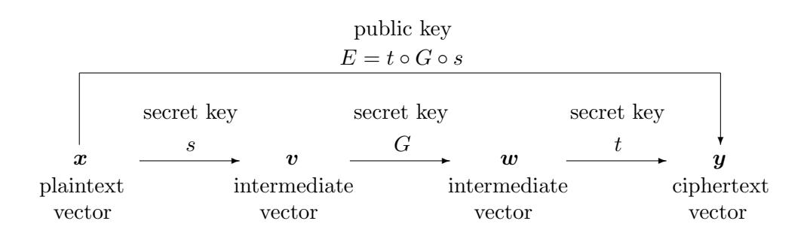
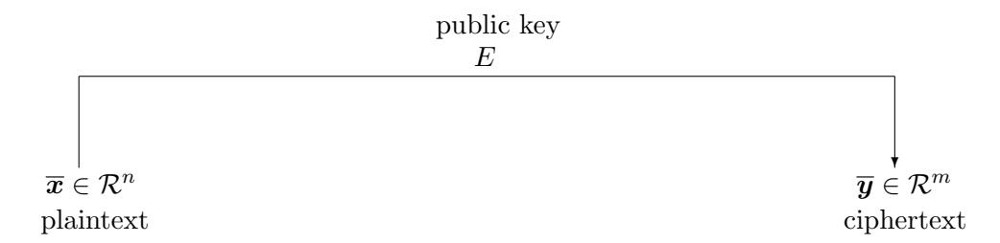
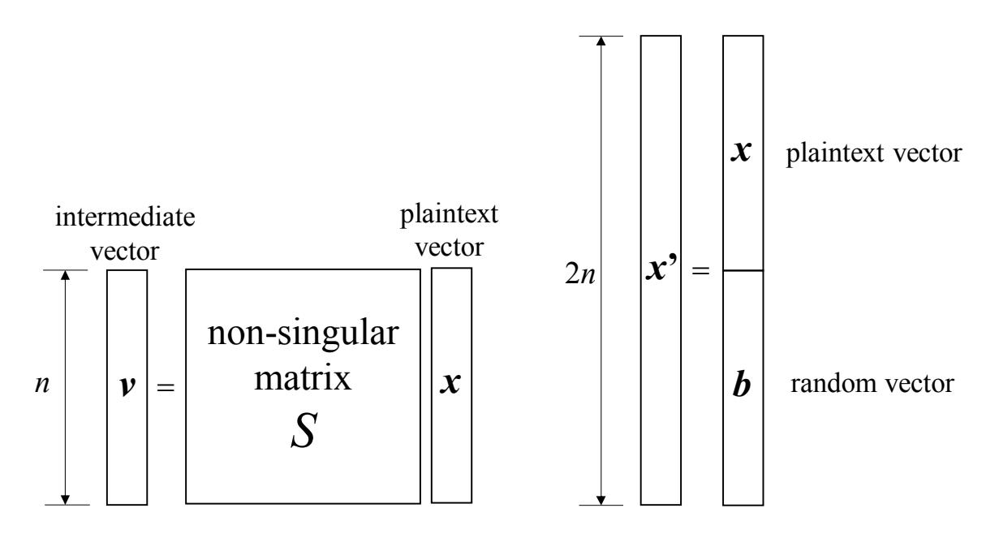
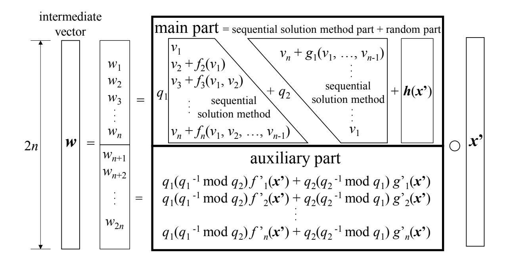
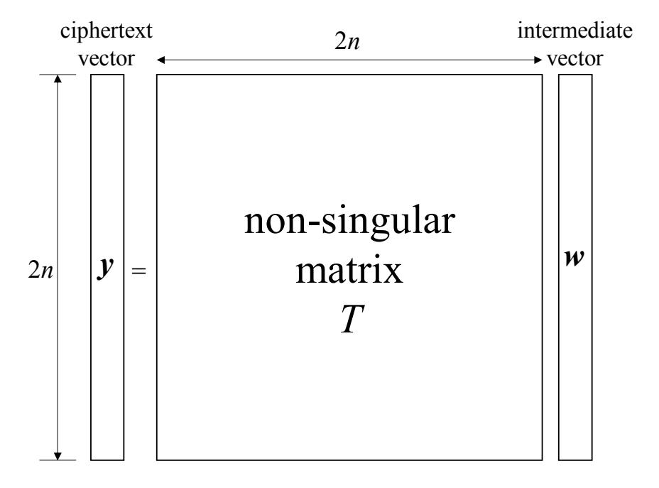

## **Proposal of Multivariate Public Key Cryptosystem Based on Modulus of Numerous Prime Numbers and CRT with Security of IND-CPA**

Shigeo Tsujii*∗†* Ryo Fujita*∗* Masahito Gotaishi*∗*

*∗* Research and Development Initiative, Chuo University 1-13-27 Kasuga, Bunkyo-ku, Tokyo, 112-8551 Japan *†* Secure IoT Platform Consortium 1–9–10 Roppongi, Minato-ku, Tokyo, 106–0032 Japan

**Abstract.** We have proposed before a multivariate public key cryptosystem (MPKC) that does not rely on the difficulty of prime factorization, and whose modulus is the product of many small prime numbers. In this system, the prime factorization by the attackers is self-trivial, and the structure of the secret key is based on CRT (Chinese Remainder Theorem). In this paper we propose MPKC with security of IND-CPA by adding random numbers to central transformation vectors in the system proposed before.

*Key words*: Post-quantum Cryptography, Multivariate Public Key Cryptosystem, Chinese Remainder Theorem, IND-CPA

## **1 Introduction**

Multivariate public key cryptography is a post-quantum cryptography proposed from Japan. First, in 1983, the Imai laboratory at Yokohama National University (at that time) proposed a multivariate public key cryptosystem known internationally as the MI (Matsumoto-Imai) cryptosystem [7, 8]. Subsequently, in 1985, Tsujii proposed a multivariate public key cryptosystem named sequential solution method [11, 12, 13]. Sequential solution method is inspired by the sequential analysis in circuit analysis. In 1993, Shamir proposed a signature scheme similar to the sequential solution method, independent of Tsujii [9]. Multivariate public key cryptography in Japan in the 1980s was not conscious of post-quantum, however, in 1994, both RSA cryptosystem and elliptic curve cryptosystem, which is now the basis of blockchain, were theoretically revealed to be broken by the practical application of quantum computers. Both the MI cryptosystem and the sequential solution method were cryptanalyzed by Gr¨obner basis attack etc., and many studies have been continued since then [3, 5, 6].

The authors first proposed the multivariate public key cryptosystem (hereinafter referred to as Without Random Vector Version [15]) that uses the product of many small prime numbers without relying on the difficulty of prime factorization for the post-quantum computer era, where prime factorization is obvious by an attacker. In the construction of the cryptosystem, the secret key is based on the CRT (Chinese Remainder Theorem) and the scheme can withstand all possible known attacks. The central map proposed in Without Random Vector Version is composed of a main part and an auxiliary part, and the main part has a form obtained by adding a random quadratic polynomial to the sequential solution type polynomial. In order to remove random quadratic polynomials from the main part in the decryption process, the auxiliary part is constructed using

Figure 1: Multivariate public key cryptosystem

CRT based on several products of subsets of primes secretly classified from a set of many primes. We confirmed the security against Gröbner basis attacks, attacks using lattice basis reduction algorithms, rank attacks, and so on. In this paper, we show that IND-CPA security is ensured by adding random vector to the central map, under the assumption that the one-wayness of Without Random Vector Version is guaranteed.

### 2 Preliminaries

### 2.1 Notation

Let  $\mathbb{Z}_q$  be an integer ring modulo q. For a prime number or its power p, let  $\mathbf{F}_p$  be a finite field of order p. A commutative ring, such as  $\mathbb{Z}_q$ ,  $\mathbf{F}_p$ , is generally expressed as  $\mathcal{R}$ . Let  $\mathcal{R}[x_1, \ldots, x_k]$  be the set of all polynomials with the coefficient ring  $\mathcal{R}$  and  $x_1, x_2, \ldots, x_k$  as variables.

For any non-empty set S and any positive integer k, l, let  $S^{k \times l}$  be the set of all  $k \times l$  matrices with elements in S, and let  $S^k$  be the set of all column vectors consisting of k elements of S. Column vectors are written in bold italics, such as p, E, X, and row vectors are written in bold (not italic), such as  $\mathbf{b}$ . For any matrix  $A \in S^{k \times l}$ , let  ${}^tA \in S^{l \times k}$  be the transposed matrix of A. Let  $O_{k,l} \in S^{k \times l}$  and  $O_k \in S^k$  be  $k \times l$  matrix and k dimensional column vector, with all elements zero, respectively.

Let

$$\boldsymbol{f} = {}^{t}(f_1,\ldots,f_m), \boldsymbol{g} = {}^{t}(g_1,\ldots,g_k)$$

be polynomial vectors in  $(\mathcal{R}[x_1,\ldots,x_k])^m$ ,  $(\mathcal{R}[x_1,\ldots,x_n])^k$ , respectively. Here,  $f_1,\ldots,f_m\in\mathcal{R}[x_1,\ldots,x_k]$  and  $g_1,\ldots,g_k\in\mathcal{R}[x_1,\ldots,x_n]$ . We define the substitution  $\boldsymbol{f}(\boldsymbol{g})\in(\mathcal{R}[x_1,\ldots,x_n])^m$  of  $\boldsymbol{g}$  for  $\boldsymbol{f}$  as

$$f(g) = {}^{t}(h_1,\ldots,h_m),$$

where each  $h_i$  is an element of  $\mathcal{R}[x_1,\ldots,x_n]$ , and can be obtained by assigning  $g_1,\ldots,g_k$  to variable  $x_1,\ldots,x_k$  of each  $f_i$ .

### 2.2 Schemes of Multivariate Public Key Cryptosystems

The general form of multivariate public key cryptosystem (Figure 1) is described below. A plaintext is represented by a column vector  $\overline{\boldsymbol{x}} = {}^t(\overline{x}_1, \dots, \overline{x}_n) \in \mathcal{R}^n$ , and a ciphertext is represented by a column vector  $\overline{\boldsymbol{y}} = {}^t(\overline{y}_1, \dots, \overline{y}_m) \in \mathcal{R}^m$ , where the components  $\overline{x}_i$  and  $\overline{y}_i$  are in  $\mathcal{R}$ . Then

Figure 2: Encryption in multivariate public key cryptosystem

$$\overline{\boldsymbol{x}} \in \mathcal{R}^n \quad \stackrel{\text{secret key}}{\longleftarrow} \quad \overline{\boldsymbol{v}} \in \mathcal{R}^n \quad \stackrel{\text{secret key}}{\longleftarrow} \quad \overline{\boldsymbol{w}} \in \mathcal{R}^m \quad \stackrel{\text{secret key}}{\longleftarrow} \quad \overline{\boldsymbol{y}} \in \mathcal{R}^m$$
 plaintext ciphertext

Figure 3: Decryption in multivariable public key cryptosystem

a polynomial vector  $\mathbf{E} \in (\mathcal{R}[x_1,\ldots,x_n])^m$  and parameters q, n, m form the public key in the cryptosystem. The encryption is given by the following transformation from  $\overline{\mathbf{x}}$  to  $\overline{\mathbf{y}}$  (Figure 2):

$$\overline{y} = E(\overline{x}).$$

The secret key is an efficient method to solve the equation  $E = \overline{y}$  on  $(x_1, \ldots, x_n)$  for any given  $\overline{y} \in \mathcal{R}^m$  (Figure 3). Thus, E has to be constructed so that, without the knowledge about this method, it is difficult to find  $\overline{x}$  for any  $\overline{y}$  in polynomial-time.

Let us consider the situation that Bob has the secret key and Alice transmits her ciphertext  $\overline{y} = E(\overline{x})$  to Bob. When Bob receives the ciphertext  $\overline{y}$ , using the secret key he can efficiently decipher it to obtain the plaintext  $\overline{x}$ . On the other hand, it is intractable for an eavesdropper, Catherine, to recover  $\overline{x}$  from  $\overline{y}$ .

In most multivariate public key cryptosystems, the public key  $E \in (\mathcal{R}[x_1,\ldots,x_n])^m$  has the following form:

$$\boldsymbol{E} = T_0 \boldsymbol{G}(S_0 \boldsymbol{x}), \tag{1}$$

where  $\mathbf{x} = {}^t(x_1, \dots, x_n) \in (\mathcal{R}[x_1, \dots, x_n])^n$ . Here  $S_0$  and  $T_0$  are non-singular matrices over  $\mathcal{R}^{n \times n}$  and  $\mathcal{R}^{m \times m}$ , respectively.  $\mathbf{G}$  is a polynomial vector in  $(\mathcal{R}[x_1, \dots, x_n])^m$  such that the components in  $\mathbf{G}$  are polynomials in  $\mathcal{R}[x_1, \dots, x_n]$ , and variables of  $\mathbf{G}$  is substituted with the polynomial vector  $S_0\mathbf{x} \in (\mathcal{R}[x_1, \dots, x_n])^n$ . Bob keeps  $S_0, T_0$ , and generally  $\mathbf{G}$  as secret, and publishes the result of organizing the right-hand side of the equation (1) as the public key  $\mathbf{E}$ .

# 3 Proposed Scheme

#### **Parameters:**

- n: number of plaintext variables.
- m=2n: number of ciphertext variables (e.g., n=100, m=200).
- $\beta$ : number of bits of prime  $p_i$ .
- $\pi$ : total number of primes  $p_i$ .

### Public key:

- $p_i$   $(i = 1, ..., \pi)$ :  $\beta$  bit primes.
- $q = \prod_{i=1}^{n} p_i$ : composite number as the modulus.
- E(x): nonlinear transformation expressed by public key polynomial tuple.

### Secret key:

- $q_1, q_2$ : product of elements of a subset of primes that is obtained by secret classification of multi prime numbers  $\{p_1, \ldots, p_{\pi}\}$ . They need to satisfy  $q = q_1q_2, q_1 \approx q_2$ , and  $q_1 < q_2$ .
- $r: \mathbf{h}' \mapsto R\mathbf{h}': (\mathbb{Z}_q)^{2n} \to (\mathbb{Z}_q)^n$ : singular linear transformation over  $\mathbb{Z}_q$ .
- $s: \mathbf{x} \mapsto S\mathbf{x}: (\mathbb{Z}_q)^n \to (\mathbb{Z}_q)^n$ : non-singular linear transformation over  $\mathbb{Z}_q$ .
- $t: \boldsymbol{w} \mapsto T\boldsymbol{w}: (\mathbb{Z}_q)^m \to (\mathbb{Z}_q)^m$ : non-singular linear transformation over  $\mathbb{Z}_q$ .

## Plaintext vector: $\boldsymbol{x} = {}^{t}(x_1, x_2, \dots, x_n)$

For i = 1, ..., n, the value of the plaintext variable  $\overline{x}_i$  are restricted so that the following condition (4) is satisfied.

## Random vector: $\boldsymbol{b} = {}^{t}(b_1, b_2, \dots, b_n)$

For i = 1, ..., n, the value of the random variable  $\bar{b}_i$  are restricted so that the following condition (4) is satisfied.

In the following, the concatenation of the plaintext vector and the random vector is denoted as  $\mathbf{x}' = {}^{t}(x_1, \ldots, x_n, b_1, \ldots, b_n)$ .

#### Random quadratic polynomial vector:

$$\mathbf{f}' = {}^{t}(f'_{1}, f'_{2}, \dots, f'_{n}) \in (\mathcal{R}[x_{1}, \dots, x_{n}, b_{1}, \dots, b_{n}])^{n},$$
  
$$\mathbf{g}' = {}^{t}(g'_{1}, g'_{2}, \dots, g'_{n}) \in (\mathcal{R}[x_{1}, \dots, x_{n}, b_{1}, \dots, b_{n}])^{n}$$

#### Intermediate vector:

• 
$$v = {}^{t}(v_{1}, v_{2}, ..., v_{n})$$

$$v = Sx$$
(2)
•  $w = {}^{t}(w_{1}, w_{2}, ..., w_{n}, w_{n+1}, ..., w_{m})$ 

$$w_{1} = q_{1}v_{1} + q_{2} \cdot (v_{n} + g_{1}(v_{1}, ..., v_{n-1})) + h_{1}$$

$$w_{2} = q_{1}(v_{2} + f_{2}(v_{1}))$$

$$+ q_{2} \cdot (v_{n-1} + g_{2}(v_{1}, ..., v_{n-2})) + h_{2}$$

$$\vdots$$

$$w_{n} = q_{1}(v_{n} + f_{n}(v_{1}, ..., v_{n-1})) + q_{2}v_{1} + h_{n}$$

$$w_{n+1} = q_{1} \cdot (q_{1}^{-1} \mod q_{2})f'_{1} + q_{2} \cdot (q_{2}^{-1} \mod q_{1})g'_{1}$$

$$\vdots$$

$$w_{m} = q_{1} \cdot (q_{1}^{-1} \mod q_{2})f'_{n} + q_{2} \cdot (q_{2}^{-1} \mod q_{1})g'_{n},$$

(a) intermediate vector *x***'** constructed by plaintext vector and random vector

Figure 4: Structure of proposing MPKC (a) intermediate vector *x 0* constructed by plaintext vector and random vector

where *h 0* = *t* (*f 0* 1 *, . . . , f0 n , g0* 1 *, . . . , g0 n* ) and *h* = *t* (*h*1*, . . . , hn*) = *Rh 0* .

Fig. 4, Fig. 5, Fig. 6 show the trapdoor structure of the central map of the proposed scheme.

**Remark 1** *In order for plaintext x to be decrypted correctly,*

$$f_i'(\overline{x'}) < q_2, \quad g_i'(\overline{x'}) < q_1$$
 (4)

*must be satisfied for all i* = 1*, . . . , n.*

**Ciphertext vector:** *y* = *t* (*y*1*, y*2*, . . . , ym*),

$$y = Tw (5)$$

**Encryption:**

$$\overline{y} = E(\overline{x'}) \tag{6}$$

**Decryption:**

1. Compute

$$\overline{\boldsymbol{w}} = T^{-1}\overline{\boldsymbol{y}}.\tag{7}$$

In the following, let

$$\overline{\boldsymbol{w}''} = {}^{t}(\overline{w}_{1}, \ldots, \overline{w}_{n}), \overline{\boldsymbol{w}'''} = {}^{t}(\overline{w}_{n+1}, \ldots, \overline{w}_{m}).$$

Figure 5: Structure of proposing MPKC (b) trapdoor structure of central map

2. Compute  $f'(\overline{x'}) = {}^t(\overline{w}_{n+1} \bmod q_2, \dots, \overline{w}_m \bmod q_2)$  and  $g'(\overline{x'}) = {}^t(\overline{w}_{n+1} \bmod q_1, \dots, \overline{w}_m \bmod q_1).$  Then,  $h'(\overline{x'}) = {}^t(f'_1(\overline{x'}), \dots, f'_n(\overline{x'}), g'_1(\overline{x'}), \dots, g'_n(\overline{x'})).$ 

3. Compute 
$$h(\overline{x'}) = Rh'(\overline{x'})$$
.

4. Compute  $\overline{v}$  from  $\overline{w''} - h(\overline{x'})$  by the sequential solution method.

5. Compute 
$$\overline{\boldsymbol{x}} = S^{-1}\overline{\boldsymbol{v}}. \tag{8}$$

Here, the meaning of using CRT is explained. In order to remove the random part from the main part, the auxiliary part is used. If the auxiliary part and the random part have a non-singular linear relationship, vulnerability to Gröbner attacks increases. However, if the polynomial in the auxiliary part is raised to the power of 2, and the polynomial in the random part is made a quartic polynomial, it will be extremely inefficient.

Therefore,

- (i) in the auxiliary part, for example, for the polynomial consisting of the addition of the  $f'_1(\mathbf{x}')$  term and  $g'_1(\mathbf{x}')$  term of the first equation,  $g'_1(\mathbf{x}')$  is deleted using CRT, leaving only the  $f'_1(\mathbf{x}')$  term,
- (ii) for polynomials consisting of  $f_2'(\mathbf{x}')$  and  $g_2'(\mathbf{x}')$  terms in the second equation, CRT is used to eliminate the  $f_2'(\mathbf{x}')$  term and leave only the  $g_2'(\mathbf{x}')$  term,

Figure 6: Structure of proposing MPKC (c) *y* = *T w*, *w00* = *t* (*w*1*, . . . , wn*), *w000* = *t* (*wn*+1*, . . . , wm*).

(iii) construct a new polynomial consisting of a linear combination of the *f 0* 1 (*x 0* ) and *g 0* 2 (*x 0* ) terms, and use it as the polynomial of the random part.

The CRT operation on the polynomial vector is such that the auxiliary part and the random part do not have a non-singular linear relationship.

Without Random Vector Version [15] is a scheme in which all the random numbers in the above proposed scheme are replaced with 0 and removed. See [15] for details.

# **4 Consideration of Security**

### **4.1 Consideration of IND-CPA Security**

In Without Random Vector Version [15], we presented the results of a study on one-wayness of our proposed scheme. It is ideal if the equivalence between solving of random quadratic multivariate equation and the proposed scheme can be proved, but this is as difficult as other public key cryptosystems. Therefore, theoretical considerations and experiments (simulations) were conducted for all possible attack methods, namely, the Gr¨obner basis attack, the Gr¨obner basis attack using CRT, the rank attack, and the attack using the lattice basis reduction algorithm. We assume one-wayness holds for Without Random Vector Version [15].

Therefore, in this paper, we have proposed a scheme that aims at IND-CPA security by adding random vector to the central polynomial of Without Random Vector Version [15] on the assumption that such one-wayness is established also for this proposed scheme. The following shows that the proposed scheme is IND-CPA secure on this assumption.

#### **IND-CPA** Game

- 1. The attacker sends plaintext  $M_1$  and  $M_2$  to the challenger.
- 2. The challenger returns  $C_a$  (ciphertext that corresponds to  $M_1$  or  $M_2$ ) to the attacker.
- 3. If the attacker cannot distinguish whether ciphertext  $C_a$  corresponds to  $M_1$  or  $M_2$  (if the probability is less than a negligible function), it is IND-CPA secure.

### In case of proposed scheme

The challenger returns to the attacker the ciphertext with the value of  $M_1$  or  $M_2$  assigned to the ciphertext polynomial. Therefore, the attacker tries to solve the following two multivariate polynomials with random numbers as variables:

- (I) Ciphertext polynomial  $C_1$  consisting of random variables with  $M_1$  assigned to plaintext variables.
- (II) Ciphertext polynomial  $C_2$  consisting of random variables with  $M_2$  assigned to plaintext variables.

If the plaintext sent by the challenger is  $M_1$ , and if the attacker has the ability to solve (I), then the correspondence between plaintext and ciphertext can be obtained, and IND-CPA security does not hold. If the plaintext sent by the challenger is  $M_2$ , there is no solution corresponding to  $C_1$ , so the attacker tries to solve  $C_2$ . If the attacker cannot solve the random polynomial for both  $C_1$  and  $C_2$ , the IND-CPA security of the proposed scheme holds based on the assumption of the one-wayness and the introduction of random vector which is different for each plaintext.

### 4.2 Attacks Using Gröbner Basis Computation

We call algebraic attack against multivariate public key cryptosystem over an integer ring to solve

$$\begin{cases}\ne_1(x_1, x_2, \dots, x_n) = \overline{y}_1 \\\ne_2(x_1, x_2, \dots, x_n) = \overline{y}_2 \\
\vdots \\\ne_m(x_1, x_2, \dots, x_n) = \overline{y}_m,
\end{cases}$$
(9)

when public key

$$\boldsymbol{E} = {}^{t}(e_{1}(\boldsymbol{x}), e_{2}(\boldsymbol{x}), \dots, e_{m}(\boldsymbol{x})) \in (\mathbb{Z}_{q}[x_{1}, \dots, x_{n}])^{m}$$

and ciphertext  $\overline{y} = {}^t(\overline{y}_1, \overline{y}_2, \dots, \overline{y}_m) \in (\mathbb{Z}_q)^m$  are given. In particular, the algebraic attack that solves the equation (9) by computing the Gröbner basis of ideal

$$I = \langle e_1 - \overline{y}_1, \dots, e_m - \overline{y}_m \rangle \subset \mathbb{Z}_q[x_1, \dots, x_n]$$
(10)

is called Gröbner basis attack.

In addition, we call the Gröbner basis attack using CRT to compute the Gröbner basis of the ideal

$$I' = \langle e_1' - \overline{y}_1', \dots, e_m' - \overline{y}_m' \rangle \subset \mathbf{F}_{p_k}[x_1, \dots, x_n]$$
(11)

over the polynomial ring  $\mathbf{F}_{p_k}[x_1,\ldots,x_n]$ , where the subfield  $\mathbf{F}_{p_k}$  of  $\mathbb{Z}_q$  is the coefficient field, in order to solve the equation (9), and to compute the solution from the obtained results using CRT.

We explain the case where the value  $\overline{x}_j$  of the plaintext variable  $x_j$  is limited by the constant c and  $c \ll q$ . First, the attacker sets a subset of  $\{p_1, \ldots, p_\pi\}$  consisting of prime factors of q to be P'. Next, a composite number q' with  $c < q' \ll q$  consisting of #P' products of  $p_i$  is selected. Then, for the prime factor  $p_i'$  of q',  $\overline{x}_j$  mod  $p_i'$  is computed by the Gröbner basis computation described above. From the obtained results, the attacker can recover  $\overline{x}_j$  mod  $q' = \overline{x}_j$  mod q with CRT.

例 1 As a small example for illustration, let  $\overline{x}_j = 23$ , and the public key of the cryptosystem be  $q = 105 = p_1 p_2 p_3$ ,  $p_1 = 3$ ,  $p_2 = 5$ ,  $p_3 = 7$ , where total number  $\pi$  of primes  $p_i$  is 3. First, the attacker sets  $p'_1 = p_2 = 5$ ,  $p'_2 = p_3 = 7$ ,  $P' = \{5,7\}$ , q' = 35. While  $\overline{x}_j < q'$ , if the attacker knows  $\overline{x}_j \mod p'_1 = 23 \mod 5 = 3$  and  $\overline{x}_j \mod p'_2 = 23 \mod 7 = 2$ , using CRT,

$$\overline{x}_j = (\overline{x}_j \mod p_1') p_2' ((p_2')^{-1} \mod p_1')$$

$$+ (\overline{x}_j \mod p_2') p_1' ((p_1')^{-1} \mod p_2')$$

$$= 3 \cdot 7 \cdot (7^{-1} \mod 5) + 2 \cdot 5 \cdot (5^{-1} \mod 7)$$

$$= 93 = 23 \mod 35$$

can be computed. In other words, the value of  $\overline{x}_j$  can be uniquely computed if the value of  $\overline{x}_j$  is limited to a certain value, without using all the prime factors of q.

### 4.3 Security against Gröbner Basis Attack Using CRT

In the following, the product of 40 primes of about 15 bits is assumed to be q. That is,  $\log q \approx 15 \times 40 = 600$ . Also, the number of bits in plaintext is the same as the number of bits in random numbers. For the proposed scheme and the case where the intermediate polynomial  $w_i$  is a random quadratic polynomial, Table 1 shows a comparison of the computation time for the Gröbner basis attack using CRT and the maximum degree of S-polynomial obtained during the computation. The experimental environment in which the computer experiment for Gröbner basis computation was performed is as follows.

• processor: 0.80GHz Intel Core M-5Y10c

• memory: 4GB RAM

• computer algebra system: Magma V2.24-6 [1]

• Gröbner basis computation algorithm:  $F_4$  [4]

• term order (monomial order): degree reverse lexicographic ordering (DRL; grevlex)

Note that options on Magma were not used.

From the Table 1, the time complexity for the Gröbner basis attack using CRT is almost the same for both the proposed scheme and the random system. It has also been confirmed that there is no difference in the maximum degree of S-polynomial obtained in Gröbner basis computations. Therefore, the proposed scheme is sufficiently secure against the Gröbner basis attacks using CRT.

| Table 1: Security | comparison | against | Gröbner  | basis | attack  | using   | CRT     |
|-------------------|------------|---------|----------|-------|---------|---------|---------|
| Table 1. Security | COMPANION  | agairis | OIODIIOI | COLLE | accacii | 0.01115 | $\circ$ |

| rasio it seeding comparison against Grosner sasis attach demo erer |                                |            |      |                 |                       |  |  |
|--------------------------------------------------------------------|--------------------------------|------------|------|-----------------|-----------------------|--|--|
|                                                                    |                                | parameters |      |                 |                       |  |  |
|                                                                    |                                | n=3,       | n=4, | n = 5, $m = 10$ | n=6,                  |  |  |
|                                                                    |                                | m=6        | m=8  | m=10            | m = 12                |  |  |
| proposed                                                           | computation time (seconds)     | 0.31       | 4    | 228             | cannot compute        |  |  |
| scheme                                                             | maximum degree of S-polynomial | 8          | 10   | 12              | due to lack of memory |  |  |
| random                                                             | computation time (seconds)     | 0.36       | 6    | 250             | cannot compute        |  |  |
| system                                                             | maximum degree of S-polynomial | 8          | 10   | 12              | due to lack of memory |  |  |

### 4.4 Security against Attacks Using Lattice Reduction Algorithms

The value of the plaintext variable  $x_i$  in the multivariate public key cryptosystem on the integer ring is limited by the constant c and may be  $c \ll q$ . Moreover, even if the public key polynomials are all quadratic polynomials for  $x_i$ , they can be regarded as linear polynomials, as in the case of the XL algorithm [2], e.g., by considering quadratic monomial  $x_1x_2$  as linear monomial  $z_{1,2}$ ,

In such a case, as described below, an attack that recovers the plaintext from such a public key polynomial and ciphertext using a lattice basis reduction algorithm can be considered. First, suppose that the term order in the public key polynomial is, for example, graded lexicographic order. For  $j=1,\ldots,m$ , the public key polynomial  $e_j$  and ciphertext  $\overline{y}_j$ , let  $\overline{e}_j=e_j-\overline{y}_j$ , and a vector consisting of the coefficients of each monomial according to the order be  $\overline{e}_j$ . In such a setting, the attacker will try to find a solution of the simultaneous quadratic equation

$$\overline{e}_j = e_j - \overline{y}_j = 0 \qquad (j = 1, \dots, m). \tag{12}$$

Let the dimension of  $\overline{e}_j$  be  $\delta$  and  $\overline{e}_j = {}^t \left( \overline{e}_j^{(1)}, \dots, \overline{e}_j^{(\delta)} \right)$ . The attacker constructs the  $(\delta + m)$  dimensional matrix B as follows:

$$B = \begin{pmatrix} 1 & & & & & & \\ & \ddots & & & & & \\ & & 1 & & & & \\ & & c & & & \gamma \overline{e}_1 & \cdots & \gamma \overline{e}_m \\ & & & \ddots & & & \\ & & & \beta & & & \\ & & & \beta & & & \\ & & & \gamma q & & \\ & & O_{m,\delta} & & & \ddots & \\ & & & & \gamma q \end{pmatrix}$$

$$= \begin{pmatrix} \mathbf{b}_1 & & & & \\ \vdots & & & & \\ \mathbf{b}_{\delta} & & & & \\ \vdots & & & & \\ \mathbf{b}_{\delta+m} \end{pmatrix}$$

and applies the lattice basis reduction algorithm to the lattice  $\mathcal{L}(B) = \left\{ \sum_{i=1}^{\delta+m} \alpha_i \mathbf{b}_i \mid \alpha_i \in \mathbb{Z} \right\}$  with

B as the basis matrix, where  $O_{m,\delta}$  is  $m \times \delta$  zero matrix, and  $\beta$ ,  $\gamma$  are weights. For  $\alpha_i \in \mathbb{Z}$   $(i = 1, ..., \delta + m)$ , the linear combination  $\alpha_1 \mathbf{b}_1 + \cdots + \alpha_{\delta} \mathbf{b}_{\delta} + \cdots + \alpha_{\delta + m} \mathbf{b}_{\delta + m}$  of the row vectors of B is

$$(\alpha_{1}, \dots, \alpha_{\delta-n-1}, c\alpha_{\delta-n}, \dots, c\alpha_{\delta-1}, \beta\alpha_{\delta},$$

$$\gamma(\alpha_{1}\overline{e}_{1}^{(1)} + \dots + \alpha_{\delta}\overline{e}_{1}^{(\delta)} + \alpha_{\delta+1}q), \dots,$$

$$\gamma(\alpha_{1}\overline{e}_{m}^{(1)} + \dots + \alpha_{\delta}\overline{e}_{m}^{(\delta)} + \alpha_{\delta+m}q))$$

$$(13)$$

and all vectors in the lattice  $\mathcal{L}(B)$  can be expressed as in the equation (13).

Suppose that the value of the  $\delta$ -th element  $\widehat{b}_{\delta}$  of the vector  $\widehat{\mathbf{b}} = (\widehat{b}_1, \dots, \widehat{b}_{\delta+m})$ , which is obtained by reducing the basis of the lattice  $\mathcal{L}(B)$ ,  $\alpha_{\delta} = 1$  and for all  $j = 1, \dots, m$ ,

$$\gamma(\alpha_1 \overline{e}_j^{(1)} + \dots + \alpha_\delta \overline{e}_j^{(\delta)} + \alpha_{\delta + j} q) = 0$$

$$\implies \alpha_1 \overline{e}_j^{(1)} + \dots + \alpha_\delta \overline{e}_j^{(\delta)} = -\alpha_{\delta + j} q$$

$$\implies \alpha_1 \overline{e}_j^{(1)} + \dots + \alpha_\delta \overline{e}_j^{(\delta)} = 0 \pmod{q}.$$
(14)

From the equation (14), it can be seen that  $\alpha = (\alpha_{\delta-n}, \dots, \alpha_{\delta-1})$  in this case is the value corresponding to the solution of (12), that is, the value corresponding to the plaintext variable  $x_1, \dots, x_n$ .  $\alpha_1, \dots, \alpha_{\delta-n-1}$  are values corresponding to quadratic monomials (e.g.,  $x_1^2, x_1 x_2, \dots$ ) for plaintext variables.

Using  $\hat{b}_{\delta-n}, \dots, \hat{b}_{\delta-1}$  and (13) in this basis vector,

$$(\widehat{b}_{\delta-n}/c,\ldots,\widehat{b}_{\delta-1}/c) = (\alpha_{\delta-n},\ldots,\alpha_{\delta-1}),$$

that is, the value obtained by dividing each element of vector  $(\hat{b}_{\delta-n}, \dots, \hat{b}_{\delta-1})$  by c, can be considered as a plaintext candidate corresponding to the ciphertext.

It has been confirmed through computer experiments that attackers cannot recover the plaintext by the attack using the above-mentioned lattice basis reduction algorithm in the proposed scheme. In the proposed scheme, it is not possible to obtain each value of the intermediate variable  $v_i$  by simply adding and subtracting multiples of each element of the intermediate variable vector  $\boldsymbol{w}$ . Therefore, it is considered to be secure against attacks using the lattice reduction algorithm, which mainly performs such operations.

# 5 Future Work — Computing on Encrypted Data Using Multivariate Public Key Cryptography

Although lattice-based cryptography, code-based cryptography, isogeny-based cryptography, and multivariate public key cryptography are candidates for post-quantum cryptography, homomorphic mapping is difficult in multivariate public key cryptography. However, based on the multi-prime method proposed in this paper, the classification of a large number of primes is kept secret, the user distributes the data in the cloud and keeps it secret, and, if necessary, it is possible to make a secret computation on encrypted data.

For example, it is assumed that secret storage is performed in four clouds A, B, C, and D, and if any one of them is damaged, there is no problem. For example, N is secretly divided into four

prime products *Na*, *Nb*, *Nc*, *Nd* of the same size as much as possible, and *Na ·Nb ·Nc* is the smallest of the four types of three products. In this case, if the variable *x* is less than or equal to *Na ·Nb ·Nc*, processing on encrypted data based on CRT becomes possible [10]. The proposed scheme is also possible to apply to digital signature, which will be explained in near future.

## **Acknowledgment**

This work was supported by the "Strategic information and COmmunications R & D Promotion programmE" (SCOPE) from the Ministry of Internal Affairs and Communications of Japan, MIC/SCOPE #181603006.

# **References**

- [1] W. Bosma, J. Cannon, and C. Playoust, "The Magma algebra system. I. The user language," Journal of Symbolic Computation, vol.24, no.3–4, pp.235–265, 1997. DOI: https://doi.org/10.1006/jsco.1996.0125
- [2] N. Courtois, A. Klimov, J. Patarin, and A. Shamir, "Efficient algorithms for solving overdefined systems of multivariate polynomial equations," *Proc. EUROCRYPT 2000*, Lecture Notes in Computer Science, vol.1807, pp.392–407, Springer, 2000. DOI: https://doi.org/10.1007/3-540- 45539-6 27
- [3] J. Ding, J. E. Gower, and D. Schmidt, Multivariate Public Key Cryptosystems, Springer, 2006.
- [4] J. C. Faug`ere, "A new efficient algorithm for computing Gr¨obner bases (*F*4)," Journal of Pure and Applied Algebra, vol.139, no.1–3, pp.61–88, June 1999. DOI: https://doi.org/10.1016/S0022-4049(99)00005-5
- [5] S. Hasegawa and T. Kaneko, "An attacking method for a public-key cryptosystem based on the difficulty of solving a system of non-linear equations," *Proc. 10th SITA*, JA5-3, November 1987. In Japanese.
- [6] M. Kasahara and R. Sakai, "A construction of public key cryptosystem for realizing ciphertext of size 100 bit and digital signature scheme," IEICE Trans. Fundamentals, vol.E87-A, no.1, pp.102-109, January 2004.
- [7] T. Matsumoto, H. Imai, H. Harashima, and H. Miyakawa, "A class of asymmetric cryptosystems using obscure representations of enciphering functions," *1983 National Convention Record on Information Systems, IECE Japan*, S8-5, 1983. In Japanese.
- [8] T. Matsumoto and H. Imai, "Public quadratic polynomial-tuples for efficient signatureverification and message-encryption," *Proc. EUROCRYPT '88*, Lecture Notes in Computer Science, vol.330, pp.419-453, Springer, 1988. DOI: https://doi.org/10.1007/3-540-45961-8 39
- [9] A. Shamir, "Efficient signature schemes based on birational permutations," *Proc. CRYPTO '93*, Lecture Notes in Computer Science, vol.773, pp.1-12, Springer, 1994. DOI: https://doi.org/10.1007/3-540-48329-2 1

- [10] T. Tsuji and M. Kasahara, "Secret sharing using the Chinese remainder theorem and its application," Technical Report of IEICE, LOIS2012-41, (2012-11), November 2012. In Japanese.
- [11] S. Tsujii, "Public key cryptosystem using nonlinear equations," *Proc. 8th SITA*, pp.156–157, December 1985. In Japanese.
- [12] S. Tsujii, K. Kurosawa, T. Itoh, A. Fujioka, and T. Matsumoto, "A public-key cryptosystem based on the difficulty of solving a system of non-linear equations," *IEICE Transactions* (D), J69-D, No.12 (1986), 1963–1970. In Japanese.
- [13] S. Tsujii, A. Fujioka, and Y. Hirayama, "Generalization of the public-key cryptosystem based on the difficulty of solving a system of non-linear equations," *IEICE Transactions* (A), J72-A, No.2 (1989), 390–397. An English translation of [13] is included in [14] as an appendix.
- [14] S. Tsujii, K. Tadaki, and R. Fujita, "Piece in hand concept for enhancing the security of multivariate type public key cryptosystems: public key without containing all the information of secret key," Cryptology ePrint Archive, Report 2004/366, Dec. 2004. http://eprint.iacr.org/
- [15] S. Tsujii, R. Fujita, and M. Gotaishi, "Proposal of multivariate public key cryptosystem based on modulus of numerous prime numbers and CRT," Technical Report of IEICE, ISEC2018-45, (2018-07), July 2018. In Japanese.
- [16] S. Tsujii, R. Fujita, and M. Gotaishi, "Proposal of multivariate public key cryptosystem based on modulus of numerous prime numbers and CRT with security of IND-CPA," Technical Report of IEICE, ISEC2019-75, (2019-11), November 2019. In Japanese.