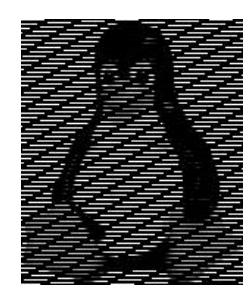

# Beyond Software Watermarking: Traitor-Tracing for Pseudorandom Functions

Rishab Goyal<sup>∗</sup> Sam Kim† Brent Waters‡ David J. Wu§

#### Abstract

Software watermarking schemes allow a user to embed an identifier into a piece of code such that the resulting program is nearly functionally-equivalent to the original program, and yet, it is difficult to remove the identifier without destroying the functionality of the program. Such schemes are often considered for proving software ownership or for digital rights management. Existing constructions of watermarking have focused primarily on watermarking pseudorandom functions (PRFs).

In this work, we revisit the definitional foundations of watermarking, and begin by highlighting a major flaw in existing security notions. Existing security notions for watermarking only require that the identifier be successfully extracted from programs that preserve the exact input/output behavior of the original program. In the context of PRFs, this means that an adversary that constructs a program which computes a quarter of the output bits of the PRF or that is able to distinguish the outputs of the PRF from random are considered to be outside the threat model. However, in any application (e.g., watermarking a decryption device or an authentication token) that relies on PRF security, an adversary that manages to predict a quarter of the bits or distinguishes the PRF outputs from random would be considered to have defeated the scheme. Thus, existing watermarking schemes provide very little security guarantee against realistic adversaries. None of the existing constructions of watermarkable PRFs would be able to extract the identifier from a program that only outputs a quarter of the bits of the PRF or one that perfectly distinguishes.

To address the shortcomings in existing watermarkable PRF definitions, we introduce a new primitive called a traceable PRF. Our definitions are inspired by similar definitions from public-key traitor tracing, and aim to capture a very robust set of adversaries: namely, any adversary that produces a useful distinguisher (i.e., a program that can break PRF security), can be traced to a specific identifier. We provide a general framework for constructing traceable PRFs via an intermediate primitive called private linear constrained PRFs. Finally, we show how to construct traceable PRFs from a similar set of assumptions previously used to realize software watermarking. Namely, we obtain a single-key traceable PRF from standard lattice assumptions and a fully collusion-resistant traceable PRF from indistinguishability obfuscation (together with injective one-way functions).

<sup>∗</sup>MIT. Email: [goyal@utexas.edu](mailto:goyal@utexas.edu). Part of this work was done while at UT Austin and the Simons Institute for the Theory of Computing. Research supported in part by an IBM PhD fellowship and the Simons-Berkeley research fellowship.

<sup>†</sup>Stanford University. Email: [skim13@cs.stanford.edu](mailto:skim13@cs.stanford.edu). Part of this work was done at the Simons Institute for the Theory of Computing. Research supported by NSF, DARPA, a grant from ONR, and the Simons Foundation.

<sup>‡</sup>UT Austin and NTT Research. Email: [bwaters@cs.utexas.edu](mailto:bwaters@cs.utexas.edu). Research supported by NSF CNS-1908611, a Simons Investigator award and a Packard Foundation Fellowship.

<sup>§</sup>UT Austin. Email: [dwu4@cs.utexas.edu](mailto:dwu4@cs.utexas.edu). Part of this work was done at the University of Virginia and while visiting the Simons Institute for the Theory of Computing. Research supported by NSF CNS-1917414, CNS-2045180, and a Microsoft Research Faculty Fellowship.

<span id="page-1-0"></span>




(a) Original (b) Encrypted (c) Recovered (pixel-level) (d) Recovered (block-level)

Figure 1: Illustration of plaintext recovery using a PRF-based encryption scheme given a circuit that computes the leading n/4 bits of the PRF. Fig. [1a](#page-1-0) shows the original image and Fig. [1b](#page-1-0) shows the image encrypted using a PRF in counter mode. Figs. [1c](#page-1-0) and [1d](#page-1-0) shows the recovered image if the image is encrypted pixel-by-pixel and block-by-block, respectively, and the adversary has a circuit that computes the n/4 most significant bits of the PRF output.

## 1 Introduction

Software watermarking is a mechanism for protecting against unauthorized re-distribution of software. In a watermarking scheme, a user can embed some special information called a "mark" into a program such that the resulting program is nearly functionally-equivalent to the original one, and moreover, it is difficult for an adversary to remove the watermarking without destroying its input/output behavior. The majority of works studying cryptographic notions of watermarking have focused primarily on watermarking pseudorandom functions (PRFs) [\[CHN](#page-44-0)+16, [BLW17,](#page-44-1) [KW17,](#page-45-0) [QWZ18,](#page-46-0) [YAL](#page-46-1)+18, [KW19,](#page-45-1) [YAL](#page-46-2)+19, [YAYX20\]](#page-46-3). Namely, the goal in each of these constructions is to embed an identifier (e.g., a user's name or a device id) into a PRF key such that (1) the marked key still preserves the input/output behavior of the original PRF; and (2) no efficient adversary is able to construct a key that both preserves the input/output behavior of the PRF on an ε-fraction of the domain and does not contain the identifier. The first requirement corresponds to "correctness" while the second corresponds to "unremovability."

The limitations of existing definitions. While these correctness and unremovability requirements seem to capture an intuitive notion of what we might desire from a watermarking scheme, they fall short of capturing meaningful notions of security in many realistic settings. For instance, take a watermarkable PRF that is secure under the above notions, and consider an adversary that takes a marked circuit C : {0, 1} <sup>n</sup> → {0, 1} <sup>n</sup> and outputs a circuit C 0 that on input x, outputs the first n/4 bits of C(x). Under existing definitions, mark-extraction is allowed to fail in this setting (since C <sup>0</sup> does not preserve the input/output behavior of the marked program). At the same time, C 0 still reveals substantial information about the original function and is often sufficient to compromise security of any cryptographic scheme that relies on the watermarked PRF. For instance, if the PRF is used to construct a symmetric encryption scheme, a circuit that outputs a quarter of the bits of the PRF completely breaks semantic security of the encryption scheme (see Fig. [1](#page-1-0) for a visual example of this). However, even though C 0 suffices to completely break semantic security of the encryption scheme, the watermarking scheme cannot recover the mark from the compromised key.

The above example highlights a limitation in existing security notions for cryptographic watermarking: namely, the existing definition only allows for a restrictive (and unrealistic) set of adversarial strategies. Indeed, none of the existing constructions [\[CHN](#page-44-0)<sup>+</sup>16, [BLW17,](#page-44-1) [KW17,](#page-45-0) [QWZ18,](#page-46-0) [YAL](#page-46-1)<sup>+</sup>18, [KW19,](#page-45-1) [YAL](#page-46-2)<sup>+</sup>19, [YAYX20\]](#page-46-3) of software watermarking remain secure if we expand the set of admissible adversarial strategies to include the simple example described above. Existing watermarking constructions all take the approach of carefully embedding the identifier in the output of the function. Such an embedding critically exploits of the assumption that the adversary must preserve much of the exact input/output behavior of the original function, in which case, most of the original outputs (that embed the identifier) are also preserved. Consequently, if the adversary constructs a circuit that does not exactly preserve the input/output behavior, then the tracing algorithm cannot recover the embedded identifier.[1](#page-2-0)

In cryptography, it is not only prudent, but oftentimes, essential for applications, to design expressive threat models that enable the broadest range of adversaries. Indeed, the very first formal security notions [\[GM84,](#page-45-2) [GGM84\]](#page-44-2) in cryptography carefully distinguished between the functionality requirements of a primitive and what the adversary would need to do to break it. In the case of semantic security [\[GM84\]](#page-45-2), it sufficed for an adversary to distinguish between encryptions of two messages, and not that the adversary be able to recover the original message. In the case of PRFs [\[GGM84\]](#page-44-2), it sufficed that the adversary could distinguish PRF evaluations from random as opposed to needing to predict the outputs of the PRF (and indeed, imposing such a restriction on the adversary would limit the usefulness of the primitive). In each of these examples, the adversary's objective is easier to achieve than emulating the exact functionality or semantic requirements of the primitive. This is the philosophy we take when designing our security definitions.

This work. Our primary goals in this work are to highlight the deficiencies of existing security notions for cryptographic watermarking and to introduce a new security framework that better models our intuitive notions of security for a watermarking scheme. Our definitions are inspired by similar notions developed in the literature on traitor tracing [\[CFN94,](#page-44-3) [BSW06,](#page-44-4) [NWZ16,](#page-46-4) [GKRW18,](#page-44-5) [GKW18\]](#page-45-3) and recent work on watermarking public-key cryptographic primitives [\[GKM](#page-44-6)+19]. We begin by introducing a new notion of a traceable PRF which both suffices to instantiate the existing applications of watermarkable PRFs and addresses the limitations of existing watermarkable PRF definitions and offers meaningful security guarantees in realistic scenarios (e.g., they can be used to construct traceable symmetric encryption schemes). We then show how to construct non-collusion-resistant traceable PRFs from private constrained PRFs [\[BLW17\]](#page-44-1) and fully collusion-resistant traceable PRFs from indistinguishability obfuscation [\[BGI](#page-43-0)+01]. We note that the assumptions needed to instantiate both of our schemes match the assumptions needed to instantiate watermarkable PRFs. This means that our new primitives can be instantiated from the same assumptions as watermarkable PRFs, and yet, provide much stronger security guarantees.

### <span id="page-2-1"></span>1.1 Our Results

Our first contribution is a new security definition that better captures the security goals in watermarkable PRFs. Here, we start from the beginning by re-examining the original motivation for building watermarkable PRFs. The original intent of watermarking PRFs is to be able to give a user a marked implementation of a PRF (e.g., for use in a symmetric encryption or authentication scheme) such that if the user later on tries to replicate the PRF functionality, there is a way to trace the replicated program back to the user's original key. The question is what constitutes a "valid" attempt at replicating the functionality. In this work, we consider any program that violates the security of the PRF (i.e., is able to distinguish PRF outputs from random) to be a "valid" attack. This definition is in part inspired by security definitions proposed in the setting of traitor tracing by Nishmaki et al. [\[NWZ16\]](#page-46-4) (and adopted by later papers [\[GKRW18,](#page-44-5) [GKW18\]](#page-45-3)). In the earlier definitions starting with [\[CFN94\]](#page-44-3), the tracing algorithm was only required to work against adversarial decoders that could successfully decrypt and recover the original message in its entirety from a ciphertext. However, [\[NWZ16\]](#page-46-4) observed that this definition can be too restrictive as it ruled out valid attacks that could extract partial information about the encrypted message (e.g., the first quarter of an encrypted video stream) or simply distinguished between different messages. Fortunately, most traitor tracing constructions developed under earlier definitions also remained secure under the strengthened definition. However, this does not appear to be the case for watermarkable PRFs.

<span id="page-2-0"></span><sup>1</sup> In some cases (e.g., [\[CHN](#page-44-0)+16]), the tracing algorithm can still partially recover the identity (e.g., a quarter of the bits) from a circuit that outputs a quarter the bits of each output. But this tracing algorithm can be defeated by an adversary which outputs a circuit that only distinguishes the output of the PRF (i.e., on input (x, y), output 1 if Eval(msk, x) = y and 0 otherwise) or a circuit that computes the parity of the bits of the PRF output.

Our notion: traceable PRFs. Since the functionality in this case is a PRF, a natural security notion is that if the adversary outputs any functionality that helps one break pseudorandomness (i.e., distinguish the outputs of the PRF from random), then it should be possible to trace the identity associated with the functionality. In this work, we require that the tracing algorithm succeeds against any distinguisher that can break weak pseudorandomness of the PRF. Specifically, any program that can distinguish the PRF outputs on random domain elements can be traced to one (or more) compromised keys. Observe that this not only captures adversarial strategies that preserve the exact input/output behavior of the PRF on an  $\varepsilon$ -fraction of the domain (as in the case of watermarking), but also the previous example of a program that outputs a quarter of the bits of the PRF. It also includes more general strategies such as a distinguisher circuit that outputs 1 if (x, y) is an input/output pair of the PRF and 0 otherwise. Under our definition, no efficient adversary can remove a mark from the program unless it produces a program that does not break weak pseudorandomness of the PRF.

It is natural to ask whether we could trace the embedded mark from any PRF distinguisher, such as a distinguisher that can adaptively choose the inputs rather than only seeing evaluations at random points. While this may seem more natural, a closer inspection shows that it is unsatisfiable. This is because under this definition, we can construct an untraceable PRF distinguisher by simply hardwiring a single PRF input-output pair (x, y) in the distinguisher. This distinguisher completely breaks pseudorandomness, but is untraceable as it contains no information about the PRF except a single input-output pair. It is crucial to observe that such a distinguisher is also useless for any adversarial applications of the PRF. This shows that the concept of traceability must be carefully defined to precisely capture the semantics of a "useful" distinguisher. We discuss this in more detail in Section 3.1. Our definition considers distinguishers for weak pseudorandomness, which means that the adversary's program necessarily contains information about the PRF on a noticeable fraction of the domain. We also note that this does not preclude a traceable PRF to satisfy pseudorandomness as a standalone primitive (and indeed, the constructions we propose in this work satisfy the usual notion of pseudorandomness). The restriction to distinguishers that break weak pseudorandomness is only in the definition of tracing security.

Traceable PRF syntax. A traceable PRF scheme consists of four algorithms: Setup, KeyGen, Eval, and Trace. The Setup algorithm samples a PRF key msk and a tracing key tk that is used for tracing. The keygeneration algorithm takes as input the PRF key msk and an identifier id and outputs a "marked" key  $sk_{id}$ . The evaluation algorithm Eval takes as input either the PRF key msk or an identity key  $sk_{id}$  and implements PRF evaluation. We require that  $Eval(sk_{id}, \cdot)$  and  $Eval(msk, \cdot)$  agree almost everywhere (i.e., on all but a negligible fraction of the domain). This property is the analog of the "correctness" or "functionality-preserving" property in the setting of watermarking schemes. Finally, there is a trace algorithm Trace that takes as input the tracing key tk and has oracle access to a distinguisher D, and outputs a set of compromised keys (if any). Our security requirement says that if the distinguisher D is able to break weak pseudorandomness of the PRF (i.e., distinguish the outputs of  $Eval(msk, \cdot)$  at random points from those of a random function), then the tracing algorithm must successfully identify a set of compromised keys used to construct D. Similar to the corresponding notions in traitor tracing (and watermarking), we can consider several variations of our basic schema and requirements:

• Collusion-resistance: We say that a traceable PRF is fully collusion-resistant if an adversary who has an arbitrary number of identity keys  $S = \{\mathsf{sk}_{\mathsf{id}_1}, \dots, \mathsf{sk}_{\mathsf{id}_k}\}$  still cannot construct a useful distinguisher D where  $\mathsf{Trace}^D(\mathsf{tk})$  does not output a non-empty set  $T \subseteq S$ . We say that a scheme satisfies bounded (resp., Q-key) collusion resistance if security only holds against adversaries that compromise an a priori bounded number of keys (resp., at most Q keys). In this work, we show how to construct a single-key traceable PRF from standard lattice assumptions<sup>3</sup> and a fully collusion resistant traceable PRF from

<span id="page-3-0"></span><sup>&</sup>lt;sup>2</sup>We cannot stipulate that T = S since the adversary might not use every compromised key when constructing the distinguisher D. The tracing algorithm can only recover the keys the adversary actually uses.

<span id="page-3-1"></span><sup>&</sup>lt;sup>3</sup>A traceable PRF bears many similarities with a *constrained* PRF [BW13, KPTZ13, BGI14], and all known constructions of collusion-resistant constrained PRFs for sufficiently complex constraints from standard lattice assumptions are secure only in the single-key setting [BV15]. Fully collusion-resistance constrained PRFs for general constraints are only known from

indistinguishability obfuscation (and injective one-way functions).

• Public tracing vs. secret tracing: We say that a traceable PRF supports public tracing if security holds even if the tracing key tk is public. Otherwise, we say the traceable PRF is in the secret tracing setting. Our basic single-key traceable PRF from lattices is secure in the secret-tracing setting, while our obfuscation-based construction is secure in the public-tracing setting.

We provide the full definition in Section [4.1.](#page-11-0)

Constructing traceable PRFs. To construct traceable PRFs, we introduce an intermediate primitive of a private linear constrained PRF. This primitive can be viewed as a symmetric analog of a "private linear broadcast encryption" (PLBE) from [\[BSW06\]](#page-44-4) and which has featured prominently in a number of subsequent traitor tracing constructions [\[GKSW10,](#page-45-5) [NWZ16,](#page-46-4) [GKW18\]](#page-45-3). First, recall that in a constrained PRF [\[BW13,](#page-44-7) [KPTZ13,](#page-45-4) [BGI14\]](#page-43-1), the holder of the PRF master secret key msk can issue a constrained key sk<sup>f</sup> for a constraint f such that the constrained key can be used to evaluate on only the inputs x that satisfy the constraint (i.e., the inputs x where f(x) = 1). Moreover, the value of the PRF at points x where f(x) = 0 remain pseudorandom even given sk<sup>f</sup> .

A private linear constrained PRF is similar in spirit to a constrained PRF for a class of linear constraints.[4](#page-4-0) In this case, the constrained keys are each associated with a κ-bit index id ∈ [0, 2 <sup>κ</sup> − 1]. Every input in the domain is associated with a private index t ∈ [0, 2 κ ] and a constrained key for index id can be used to evaluate the PRF on all inputs whose index t ≤ id. In addition to the usual Setup (for sampling the PRF key), KeyGen (for issuing constrained keys), and Eval (for evaluating the PRF), there is a fourth algorithm Samp that is used to sample domain elements with a given index t together with the PRF evaluation at the sampled point. The sampling algorithm Samp can either be public-key algorithm (in which case we obtain a publicly-traceable PRF) or a secret-key algorithm (in which case we obtain a secretly-traceable PRF). Similar to a PLBE scheme, there are three main security requirements we require on a private linear constrained PRF:

- Normal hiding: A random domain element is computationally indistinguishable from a randomlysampled domain element with index 0 (output by Samp), even given any collection of identity keys.
- Identity hiding: A randomly-sampled domain element with index i is computationally indistinguishable from a randomly-sampled domain element with index j, provided that the adversary does not have any identity keys for an index id ∈ [i, j − 1].
- Pseudorandomness: The PRF evaluations on randomly-sampled domain elements with index 2<sup>κ</sup> are computationally indistinguishable from uniform given any collection of identity keys.

Given a private linear constrained PRF satisfying the above properties, we can construct a traceable PRF using a similar type of transformation used to construct traitor tracing from PLBE. Namely, we can reduce the tracing problem to a "jump-finding" problem as follows. Let D be the decoder constructed by the adversary. By assumption, we assume that D is useful: namely, it breaks weak pseudorandomness of the encryption scheme. This means that D is able to distinguish the PRF evaluation at a randomly-sampled domain element from a uniformly random value with non-negligible advantage ε. By the normal hiding property, D must also have advantage ε when distinguishing evaluations at randomly-sampled points with index 0. Next, by the pseudorandomness property, the distinguishing advantage of D for randomly-sampled points with index 2<sup>κ</sup> must be negligible. Thus, there must be a "jump" in the decoder's distinguishing advantage on domain elements on some index 0 < t < 2 κ . By the identity-hiding property, such "jumps" can only occur on indices for which the adversary possesses an identity key. We can then identify these jumps (and correspondingly, the set of compromised keys) by either performing a linear scan over the identity space

indistinguishability obfuscation [\[BZ14\]](#page-44-9) and one-way functions. Recent work has shown how to construct indistinguishability obfuscation from the combination of multiple standard assumptions [\[JLS21\]](#page-45-6).

<span id="page-4-0"></span><sup>4</sup>As we describe more formally below, the "privacy" requirement refers to a property on the inputs to the PRF, and not the notion of constraint-privacy in the standard definition of a "private constrained PRF" from [\[BLW17\]](#page-44-1).

(when the identity space is polynomial) [\[BSW06,](#page-44-4) [GKSW10,](#page-45-5) [GKW18\]](#page-45-3) or by using a jump-finding algorithm (when the identity space is exponential) [\[NWZ16\]](#page-46-4).

Due to some technical differences between PLBE and private linear constrained PRFs, we actually have to run the tracing algorithm twice in our construction. Very briefly, the reason behind this requirement is that, unlike encryption systems where the distinguisher just receives a single ciphertext and has to output its guess, the distinguisher in the case of traceable PRFs receives a tuple consisting of both a random domain element together with its evaluation. Here, the distinguisher may stop working if it notices the tracer is changing the distribution used to sample the inputs (i.e., domain elements). This means that if the tracer only performs a single scan, such decoders may evade detection. Thus, we need to apply the underlying tracing algorithm twice to circumvent this issue. In the first scan, the tracer runs the scan with a consistent output distribution, and then it performs a second scan where the output distribution is random and essentially independent of the input distribution. We provide the full technical details in Section [4.2.](#page-13-0)

Constructing private linear constrained PRFs. In this work, we describe two constructions of private linear constrained PRFs. The first construction gives a single-key private linear constrained PRF in the secret-tracing setting and can be instantiated from LWE while the second construction is a collusion-resistant private linear constrained PRF in the public-tracing setting. Interestingly, both of our constructions rely on a similar set of building blocks as those used for watermarkable PRFs. We give a high-level sketch of our main constructions here:

• Single-key private linear constrained PRF. Our first construction combines a private constrained PRF together with an authenticated encryption scheme with pseudorandom ciphertexts (such authentication encryption schemes can be based on one-way functions). Recall first that a private constrained PRF is a constrained PRF where the constrained key sk<sup>f</sup> hides the associated constraint function f.

Let ` be the bit-length of the ciphertexts in the authenticated encryption scheme, and let sk be the secret key of the authenticated encryption scheme. The domain of our PRF will be {0, 1} ` , and a point with index t ∈ [0, 2 κ ] will be an authenticated encryption of t. A constrained key for an identity id consists of a private constrained key for the function fsk,id where fsk,id(x) = 0 whenever x is a valid encryption under sk of some index t <sup>0</sup> > id, and is 1 otherwise. The (secret-key) sampling algorithm will first encrypt the target index t under sk and output the resulting ciphertext ct<sup>t</sup> together with the PRF evaluation at ctt.

At a high-level, the security proof relies on the fact that a private constrained PRF hides the constraint function, which in this particular case, means that it hides the secret key sk. Then, normal hiding and identity hiding follows from the fact that ciphertexts are pseudorandom, and pseudorandomness follows from constrained security of the underlying constrained PRF. We give the full description and analysis in Section [5.](#page-19-0)

• Collusion-resistant private linear constrained PRF with public-tracing. Our second construction gives a fully collusion resistant private linear constrained PRF that supports public tracing from indistinguishability obfuscation and injective one-way functions. By the recent breakthrough work of Jain et al. [\[JLS21\]](#page-45-6), both assumptions hold assuming the existence of a PRG in NC<sup>0</sup> together with the LWE, LPN, and SXDH assumptions. The high-level idea is very similar to our secret-key scheme above. Namely, the domain elements are ciphertexts in a (puncturable) public-key encryption scheme [\[CHN](#page-44-0)<sup>+</sup>16], and the identity keys consist of an obfuscated program with the decryption key hard-wired within it. To publicly sample inputs/outputs of the PRF (needed for public tracing), we provide an obfuscated program with a (puncturable) PRF key hard-wired within. We provide the details and analysis in Section [6.](#page-31-0)

An application: secret-key traitor tracing. We note that our notion of traceable PRFs lends itself naturally to a secret-key traitor tracing scheme. For instance, we can take our encryption scheme to be standard nonce-based encryption with a PRF (i.e., to encrypt a message m, sample a random r ← {0, 1} n and compute the ciphertext ct = (r, m ⊕ PRF(k, r)). If we instantiate the underlying PRF with a traceable PRF, then the resulting scheme immediately gives a traitor tracing scheme. Namely, any decoder that is able to distinguish between the encryption of two messages m<sup>0</sup> and m<sup>1</sup> also necessarily is able to distinguish PRF(k, r) from uniformly random for a random choice of r ← {0, 1} <sup>n</sup>. The claim then follows by tracing security. We stress here that a similar notion would not follow if we replace PRF with a watermarkable PRF. Here, it is not clear how to translate a decoder D that is only able to distinguish between encryptions of two messages into an algorithm that is able to recover the full input/output behavior of the PRF on a noticeable fraction of the domain.

Comparison with watermarkable PRFs. One distinction between traceable PRFs and watermarkable PRFs is that in our definition of a traceable PRF, the tracing key is sampled jointly with the PRF key. In classic definitions of watermarking, it is possible to have a single (fixed) tracing key for an entire family of PRFs. This means that it is possible to sample a PRF key and decide to mark it at a later point in time. As we discuss in Section [3.1,](#page-10-0) having a tracing key that depends on the PRF key is essential to realizing the strong security notions in a traceable PRF. In most practical scenarios, if one wanted to take advantage of watermarking for software protection, it seems reasonable for them to sample the PRF key together with the marked key(s). Thus this distinction does not seem significant in practice, and we believe that the stronger and meaningful security notions achieved by traceable PRFs makes it a far more suitable primitive than a watermarkable PRF in any realistic environment.

## 1.2 Related Work

Watermarking. Barak et al. [\[BGI](#page-43-0)+01, [BGI](#page-43-2)+12] and Hopper et al. [\[HMW07\]](#page-45-7) introduced the first rigorous mathematical frameworks for software watermarking that considered arbitrary adversarial strategies (i.e., the adversary is allowed to output an arbitrary circuit that preserves the input-output behavior of the original program). Cohen et al. [\[CHN](#page-44-0)+16] provided the first construction of a watermarking scheme for PRFs using indistinguishability obfuscation. Earlier works on watermarking [\[NSS99,](#page-45-8) [YF11,](#page-46-5) [Nis13\]](#page-45-9) imposed additional restrictions on the adversary's capabilities. Several works have also studied watermarking publickey cryptographic primitives [\[CHN](#page-44-0)+16, [BKS17,](#page-43-3) [GKM](#page-44-6)+19, [Nis20\]](#page-45-10). Here, the work of Goyal et al. [\[GKM](#page-44-6)+19] expanded watermarking security definitions (in the public-key setting) to include adversaries that are able to break the "semantics" of a scheme (as opposed to just the set of adversaries that preserve exact input/output behavior).

Traitor tracing. The notion of traitor tracing was first proposed by Chor et al. [\[CFN94\]](#page-44-3) for solving the piracy problem in broadcast systems. Since then, numerous relaxations have been studied in order to achieve short ciphertexts. Broadly these can be categorized as follows: schemes where the traceability guarantees hold as long as the adversary corrupts an a priori bounded number of users and schemes where the guarantees hold as long as the adversary's decoder succeeds with probability greater than an a priori threshold. The former relaxation leads to traitor tracing schemes in the bounded collusion setting where we have numerous constructions via combinatorial tools [\[CFN94,](#page-44-3) [SW98,](#page-46-6) [CFNP00,](#page-44-10) [SSW01,](#page-46-7) [PST06,](#page-46-8) [BP08\]](#page-44-11) as well as a variety of cryptographic assumptions [\[KD98,](#page-45-11) [BF99,](#page-43-4) [KY02a,](#page-45-12) [KY02b,](#page-45-13) [CPP05,](#page-44-12) [ADM](#page-43-5)<sup>+</sup>07, [FNP07,](#page-44-13) [LPSS14,](#page-45-14) [NWZ16,](#page-46-4) [ABP](#page-43-6)<sup>+</sup>17]. The latter schemes are typically referred to as "threshold traitor tracing" [\[NP98,](#page-45-15) [CFNP00,](#page-44-10) [BN08\]](#page-44-14). In another line of work, [\[GKRW18\]](#page-44-5) considered schemes with a relaxed tracing guarantee: namely, the tracing algorithm does not need to be succeed in all cases. Recently, there has been significant progress on constructing fully collusion-resistant compact traitor tracing schemes from standard lattice assumptions [\[GKW18,](#page-45-3) [GKW19a\]](#page-45-16). Since then, a sequence of works has built new traitor tracing systems with more functionality from standard cryptographic assumptions [\[CVW](#page-44-15)<sup>+</sup>18, [GQWW19,](#page-45-17) [GKW19b,](#page-45-18) [KW20\]](#page-45-19).

## 2 Preliminaries

We write PPT to denote probabilistic polynomial-time. We denote the set of all positive integers up to n as [n] := {1, . . . , n}. Throughout this paper, unless specified otherwise, all polynomials we consider are positive polynomials. For any finite set S, x ← S denotes a uniformly random element x from the set S. Similarly, for any distribution D, x ← D denotes an element x drawn from distribution D. The distribution D<sup>n</sup> is used to represent a distribution over vectors of n components, where each component is drawn independently from the distribution D.

For (possibly randomized) algorithms A and D, we use the notation A<sup>D</sup> to denote that algorithm A has oracle access to algorithm D. Here, if the algorithm D is stateless, then on each query made by A to D, the oracle responds with a randomly drawn sample from the corresponding output distribution. If the algorithm D is stateful, then whenever A queries the oracle D, it can choose to either suspend the current execution of the oracle D or to continue executing D while it maintains its state. If D terminates after receiving an input, then it sends the final output of the computation as its query response to A.

Pseudorandom generator. A pseudorandom generator PRG: {0, 1} <sup>λ</sup> → {0, 1} ` is secure if for every PPT adversary A, there exists a negligible function negl(·) such that

$$\Pr\left[\mathcal{A}(t_b) = b \ : \quad \begin{aligned} s \leftarrow \{0,1\}^{\lambda}, t_0 \leftarrow \mathsf{PRG}(s) \\ t_1 \leftarrow \{0,1\}^{\ell}, b \leftarrow \{0,1\} \end{aligned} \right] \leq \frac{1}{2} + \mathsf{negl}(\lambda).$$

## 3 Defining Traceable PRFs

In this section, we formally introduce our notion of a traceable PRF.

Syntax. A traceable PRF scheme, with input-output space X = {Xλ,κ}λ,κ∈<sup>N</sup> and Y = {Yλ,κ}λ,κ∈<sup>N</sup> [5](#page-7-0) , consists of the following four algorithms:

Setup(1<sup>λ</sup> , 1 κ ) → (msk,tk). The setup algorithm takes as input the security parameter λ, the "'identity space" parameter κ, and outputs a master PRF key msk and a tracing key tk.

KeyGen(msk, id) → skid. The key generation algorithm takes as input the master key and an identity id ∈ {0, 1} κ . It outputs a secret key skid.

Eval(sk, x) → y. The decryption algorithm takes as input a secret key sk (which could be the master key), input x ∈ X , and outputs y ∈ Y.

TraceD(tk, 1 z ) → T ⊆ {0, 1} κ . The tracing algorithm has oracle access to a program D, it takes as input the tracing key tk, parameter z, and it outputs a set T of identities.

Weak pseudorandomness. Below we define the weak pseudorandomness property for traceable PRFs.

<span id="page-7-1"></span>Definition 3.1 (Weak pseudorandomness). A traceable PRF scheme Tr-PRF = (Setup,KeyGen, Eval,Trace) satisfies weak pseudorandomness property if for every stateful PPT adversary A, there exists a negligible function negl(·) such that for all λ ∈ N, the following holds

$$\Pr\left[\mathcal{A}^{O_b(\mathsf{msk})} = b: \begin{array}{c} 1^\kappa \leftarrow \mathcal{A}(1^\lambda), b \leftarrow \{0,1\} \\ (\mathsf{msk},\mathsf{tk}) \leftarrow \mathsf{Setup}(1^\lambda,1^\kappa) \end{array}\right] \leq \frac{1}{2} + \mathsf{negl}(\lambda),$$

where the oracle Ob(msk) is defined as follows: if b = 0, then on each evaluation query made by adversary A, the oracle samples random input x ← X and sends (x, Eval(msk, x)) to A; otherwise, if b = 1, then on

<span id="page-7-0"></span><sup>5</sup>Throughout the paper, we drop the dependence of spaces Xλ,κ and Yλ,κ on security parameter λ and identity length parameter κ whenever clear from context.

each evaluation query made by adversary A, the oracle samples random input x ← X and sends (x, f(x)) to A where f : X → Y is a random function.[6](#page-8-0)

Key-similarity property. Informally, the key-similarity property says that the marked key is functionally equivalent to the original unmarked key on all but a negligible fraction of inputs. Formally, we define the property as follows:

<span id="page-8-3"></span>Definition 3.2 (Key similarity). A traceable PRF scheme Tr-PRF = (Setup,KeyGen, Eval,Trace) satisfies key-similarity if there exists a negligible function negl(·) such that for all λ, κ ∈ N, identity id ∈ {0, 1} κ , (msk,tk) ← Setup(1<sup>λ</sup> , 1 κ ), the following holds

$$\Pr\left[\mathsf{Eval}(\mathsf{msk},x) \neq \mathsf{Eval}(\mathsf{sk}_{\mathsf{id}},x) : \begin{array}{c} \mathsf{sk}_{\mathsf{id}} \leftarrow \mathsf{KeyGen}(\mathsf{msk},\mathsf{id}) \\ x \leftarrow \mathcal{X} \end{array} \right] \leq \mathsf{negl}(\lambda).$$

We note that while the marked keys agree with the unmarked key almost everywhere, it may still be easy for an adversary to efficiently find a point on which they differ. Thus, we can consider a strengthening of the property called "key indistinguishability" which we introduce next.

Key-indistinguishability property. Informally, the key-indistinguishability property states that it should be hard for any PPT adversary to find inputs where the marked key (for an identity of the adversary's choosing) disagrees with the unmarked key. Formally, we define key indistinguishability as follows:

<span id="page-8-1"></span>Definition 3.3 (Key indistinguishability). A traceable PRF scheme Tr-PRF = (Setup,KeyGen, Eval,Trace) satisfies key indistinguishability if for every stateful PPT adversary A, there exists a negligible function negl(·) such that for all λ ∈ N, the following holds

$$\Pr\left[\mathsf{Eval}(\mathsf{msk},x) \neq \mathsf{Eval}(\mathsf{sk}^*,x) : \begin{array}{c} 1^\kappa \leftarrow \mathcal{A}(1^\lambda), (\mathsf{msk},\mathsf{tk}) \leftarrow \mathsf{Setup}(1^\lambda,1^\kappa) \\ (x,\mathsf{idx},\mathsf{id}^*) \leftarrow \mathcal{A}^{\mathsf{Eval}(\mathsf{msk},\cdot),\mathsf{KeyGen}(\mathsf{msk},\cdot)} \end{array}\right] \leq \mathsf{negl}(\lambda),$$

where sk<sup>∗</sup> is defined as

$$sk^* = \begin{cases} sk^{(idx)} & \text{if } idx \neq \bot \\ sk_{id^*} \leftarrow KeyGen(msk, id^*) & \text{otherwise}, \end{cases}$$

and sk(`) denotes the ` th key A submits to the key-generation oracle.

<span id="page-8-2"></span>Remark 3.4 (Key similarity vs. key indistinguishability). It is easy to see that key indistinguishability is a strictly stronger property than key similarity. As a result, this property is only achievable in the secret-tracing setting. As we define more formally below, our tracing algorithm only has oracle access to the adversary's distinguishing circuit. If this tracing algorithm can be run publicly, then it must be the case that the tracing algorithm must be able to efficiently find some input where the unmarked key and the marked key differ. Otherwise, it cannot distinguish between the two keys given just oracle access to the evaluation algorithm.

<span id="page-8-4"></span>Remark 3.5 (Weaker notions of key indistinguishability). Definition [3.3](#page-8-1) models a setting where no efficient adversary given any number of marked keys can find a point x where the evaluation using any of its marked keys (as well as marked keys for identities that it does not possess) differ from the master key. In some settings, we will also consider a weaker notion of key indistinguishability that requires that no efficient adversary with a marked key for an identity skid is able to find a point x where Eval(msk, x) 6= Eval(skid, x). This notion is analogous to the notion of "computational correctness" previously introduced in the setting of constrained PRFs [\[BV15\]](#page-44-8). It is easy to see that even this weaker notion of key indistinguishability is sufficient to imply key similarity.

<span id="page-8-0"></span><sup>6</sup>Note that instead of actually sampling a random function, the challenger simulates it by sampling random input-output pairs on the fly and storing them in a table.

**Secure tracing.** The secure tracing property states that if any PPT adversary creates a successful PRF distinguisher with respect to a master key, then the tracing algorithm, when provided with the PRF distinguisher, outputs the identity of at least one corrupted secret key, while never outputting the identity of an uncorrupt secret key. We define secure tracing as follows:

<span id="page-9-1"></span>**Definition 3.6** (Secure tracing). Let Tr-PRF = (Setup, KeyGen, Eval, Trace) be a traceable PRF scheme. For any nonnegligible function  $\varepsilon(\cdot)$ , polynomial  $p(\cdot)$  and PPT adversary  $\mathcal{A}$ , we define the tracing experiment ExptTPRF $_{\mathcal{A},\varepsilon}^{\mathsf{Tr-PRF}}(\lambda)$  in Fig. 2. Based on ExptTPRF $_{\mathcal{A},\varepsilon}^{\mathsf{Tr-PRF}}$ , we define the following set of (probabilistic) events and their corresponding probabilities (which are a functions of  $\lambda$  and parameterized by  $\mathcal{A}, \varepsilon$ ):

## **Experiment** ExptTPRF $_{A,\varepsilon}^{\text{Tr-PRF}}(\lambda)$

- <span id="page-9-0"></span>•  $1^{\kappa} \leftarrow \mathcal{A}(1^{\lambda})$ .
- $(\mathsf{msk}, \mathsf{tk}) \leftarrow \mathsf{Setup}(1^{\lambda}, 1^{\kappa}).$
- $\bullet \ \ D \leftarrow \mathcal{A}^{\mathsf{Eval}(\mathsf{msk},\cdot),\mathsf{KeyGen}(\mathsf{msk},\cdot),\mathsf{SplEval}(\mathsf{msk},\cdot,\cdot)}.$
- $\bullet \ T \leftarrow \mathsf{Trace}^D(\mathsf{tk}, 1^{1/\varepsilon(\lambda)}).$

Let  $S_{\mathcal{ID}}$  be the set of identities queried by  $\mathcal{A}$  to the key generation oracle  $\mathsf{KeyGen}(\mathsf{msk}, \cdot)$ . Here,  $\mathsf{SplEval}$  denotes a *special evaluation* algorithm that is defined as a randomized oracle algorithm that has  $\mathsf{msk}$  hardwired, takes as input an identity  $\mathsf{id} \in \{0,1\}^\kappa$ , a string  $x \in \mathcal{X}$ , and outputs  $y = \mathsf{Eval}(\mathsf{sk}_{\mathsf{id}}, x)$  where  $\mathsf{sk}_{\mathsf{id}} \leftarrow \mathsf{KeyGen}(\mathsf{msk}, \mathsf{id})$ . We discuss the rationale for this oracle in Remark 3.8.

Figure 2: Experiment ExptTPRF

• Good-Dis:  $\Pr\left[D^{O_b(\mathsf{msk})}(1^\lambda) = b : b \leftarrow \{0,1\}\right] \ge \frac{1}{2} + \varepsilon(\lambda)$ , where the probability is taken over the coins of D, and oracle  $O_b(\mathsf{msk})$  is exactly as defined in Definition 3.1.

Intuitively, this says that a distinguisher D is an  $\varepsilon$ -good distinguisher if D can break weak pseudorandomness of the underlying PRF with advantage  $\varepsilon = \varepsilon(\lambda)$ .

$$\operatorname{Pr}\operatorname{\mathsf{-G-D}}_{\mathcal{A},\varepsilon}(\lambda)=\operatorname{Pr}[\operatorname{\mathsf{Good-Dis}}].$$

• Cor-Tr :  $T \neq \emptyset \land T \subseteq S_{\mathcal{ID}}$ 

This event corresponds to the tracing algorithm successfully outputting one or more of the keys the adversary possesses.

$$\Pr\operatorname{\mathsf{-Cor-Tr}}_{\mathcal{A},\varepsilon}(\lambda) = \Pr[\operatorname{\mathsf{Cor-Tr}}].$$

• Fal-Tr :  $T \not\subseteq S_{\mathcal{ID}}$ 

This event corresponds to the tracing algorithm outputting a key that the adversary did not request (i.e., falsely implicating an honest user).

$$\Pr\operatorname{-Fal-Tr}_{\mathcal{A},\varepsilon}(\lambda) = \Pr[\operatorname{\mathsf{Fal-Tr}}].$$

A traceable PRF scheme Tr-PRF (with secret-key tracing) is said to satisfy secure tracing property if for every PPT adversary  $\mathcal{A}$ , polynomial  $q(\cdot)$ , and non-negligible function  $\varepsilon(\cdot)$ , there exists a negligible function  $\operatorname{negl}(\cdot)$  such that for all  $\lambda \in \mathbb{N}$  satisfying  $\varepsilon(\lambda) > 1/q(\lambda)$ , the following two properties hold:

$$\Pr{-\mathsf{Fal-Tr}_{\mathcal{A},\varepsilon}(\lambda)} \leq \mathsf{negl}(\lambda) \ \ \mathrm{and} \ \ \Pr{-\mathsf{Cor-Tr}_{\mathcal{A},\varepsilon}(\lambda)} \geq \Pr{-\mathsf{G-D}_{\mathcal{A},\varepsilon}(\lambda)} - \mathsf{negl}(\lambda).$$

Intuitively, the first property states that the tracing algorithm cannot falsely implicate an honest user with non-negligible probability and the second property requires that whenever D is a  $\varepsilon$ -good distinguisher, then the tracing algorithm correctly traces at least one corrupt user.

Remark 3.7 (Security for publicly-traceable PRFs). A traceable PRF scheme with public-tracing is defined identically to its secret-tracing counterpart, except now the adversary is additionally provided the tracing

key tk in all of the security games. In the public-tracing setting, we require the scheme to satisfy weak pseudorandomness, key similarity, and the secure public tracing property (but not key indistinguishability; see Remark [3.4\)](#page-8-2).

<span id="page-10-1"></span>Remark 3.8 (Special evaluation oracle SplEval). In our tracing experiment, we allow an attacker to not only corrupt keys for different users, but also query for PRF evaluations under keys of non-corrupt users on inputs of the adversary's choosing. Although providing access to this "special evaluation" oracle SplEval is not necessary for applications of traceable PRFs to traitor tracing systems, we include this as part of our definition to cover a broader class of adversarial strategies. For instance, this definition captures adversaries that may passively observe interactions between honest users using their respective identity keys. Our definition says that even if the adversary can see (polynomially-many) such evaluations, they cannot construct a distinguisher that evades the tracing algorithm (nor can they cause the tracing algorithm to implicate one of the honest users). Thus, by allowing the adversary access to such an oracle, the definition provides security even against these much powerful adversaries.

Also, one could possibly have a seemingly stronger mechanism for capturing the special evaluation oracle where now it will be a stateful oracle and the adversary can ask the oracle to either sample (and store) a fresh key followed by evaluation with respect to the sampled key, or answer a evaluation query with respect to a previously-sampled key. Although this might seem like a stronger definition, this is not necessary since we can always assume without loss of generality that key generation algorithm is deterministic (by using a standard PRF for derandomization).

## <span id="page-10-0"></span>3.1 Note on Weak Pseudorandomness and Other Definitional Choices

In this section, we briefly discuss and motivate the definitional choices for our traceable PRF notion.

On weak pseudorandomness. In our definitional framework above, we focus on weak pseudorandomness as the target for both PRF security as well as the class of distinguishers against which we provide the tracing guarantee. There are a few technical reasons for the above choice. First, observe that it is impossible for a traceable PRF to be a secure PRF in the standard sense (i.e., appear pseudorandom on adversarially-chosen inputs) while also providing tracing guarantees against distinguishers that only break pseudorandomness in the standard sense. This is because in such a scenario, the adversary can construct an untraceable distinguisher by simply hardwiring a single PRF input-output pair (on a random input) and use that to claim that it is a valid distinguisher. Such a distinguisher can break the standard PRF game with advantage close to 1 by querying on its hard-wired input, and yet, no tracing algorithm can succeed here (since with overwhelming probability, the single input-output pair chosen by the adversary coincides with the real PRF evaluation on that input, and thus, cannot contain any information about an embedded identity).

Another possibility could be to allow the distinguisher to make arbitrary evaluation queries to the PRF, but the challenge point would still be chosen randomly. While this is a meaningful notion, this causes problems when defining publicly-traceable PRFs. Under this definition, the tracing algorithm would need the actual code of the distinguisher, as opposed to only requiring oracle access to the distinguisher. This is because under this definition, the tracing algorithm would need a way to respond to the distinguisher's evaluation queries (in order to use the distinguisher at tracing time). But if the distinguisher can make arbitrary PRF evaluation queries that the public tracing algorithm can answer, then the tracing algorithm can be used to break pseudorandomness. Consequently, this model is only achievable in the setting where the public tracing algorithm has access to the code of the distinguisher. In this work, we focus on settings where tracing can be done just given black-box access to the decoder. Note that if we restrict ourselves to weak pseudorandomness, then there is no inherent contradiction; namely, a public tracing key only needs to provide an ability to sample random input-output evaluations of the PRF. Using indistinguishability obfuscation, we can realize this by publishing an obfuscated program that can sample input-output evaluations from a sparse pseudorandom subset of the domain and which does not compromise standard pseudorandomness.

A third possibility is to consider secure tracing against distinguishers which only break weak pseudorandomness, while requiring the PRF to achieve (regular) pseudorandomness security. Although this is not impossible (and our current constructions can be shown to satisfy this property), we decided to simply consider weak pseudorandomness security for PRF security since that yields a *unified* definitional framework and sufficed for many applications. Basically our intuition here is to avoid *unevenness* between the target pseudorandomness security for PRF security and the class of distinguishers against which we provide secure traceability.

Joint sampling of tracing and PRF keys. Lastly, our definitions assume that the tracing key is generated together with a PRF master key (via the Setup algorithm). That is, each PRF key is associated with a specific tracing key. An alternate definition could be to sample a *single* tracing key during the system setup, and then PRF keys could be sampled independent of the tracing key. This is the setting encountered in the context of watermarking PRFs [CHN+16]. However PRFs are a *symmetric-key* primitive. This means that in this scenario, the tracing algorithm would either need a description of the master PRF key to run the tracing algorithm, or the PRF setup must non-trivially depend on the tracing key itself. In the former case, it seems very restrictive since now the tracing party needs to know the full master key which may not be accessible in most applications. As to the latter case, it is not clear whether it provides any more functionality compared to our current definition. Therefore, we decided to consider a single joint setup for sampling the master PRF key as well as the tracing parameters as done in prior works on traitor tracing for public-key encryption systems [BSW06, NWZ16, GKRW18, GKW19a].

## 4 Traceable PRFs via Private Linear Constrained PRFs

In this section, we introduce an intermediate abstraction, that we call private linear constrained PRFs (PLCPRFs), towards building a traceable PRF scheme. This primitive mirrors the notion of private linear broadcast encryption (PLBE) [BSW06] from traitor tracing literature where PLBE was used as a useful abstraction for building general traitor tracing systems. We first present the syntax and security definitions for PLCPRFs, and later show that PLCPRFs lead to traceable PRFs.

## <span id="page-11-0"></span>4.1 Defining Private Linear CPRFs

**Syntax.** A private linear CPRF scheme with input-output space  $\mathcal{X} = \{\mathcal{X}_{\lambda,\kappa}\}_{\lambda,\kappa\in\mathbb{N}}$  and  $\mathcal{Y} = \{\mathcal{Y}_{\lambda,\kappa}\}_{\lambda,\kappa\in\mathbb{N}}$  consists of the following four algorithms:

Setup $(1^{\lambda}, 1^{\kappa}) \to (\mathsf{msk}, \mathsf{tk})$ . The setup algorithm takes as input the security parameter  $\lambda$ , the "identity space" parameter  $\kappa$ , and outputs a master PRF key  $\mathsf{msk}$  and a tracing key  $\mathsf{tk}$ .

 $\mathsf{KeyGen}(\mathsf{msk},\mathsf{id}) \to \mathsf{sk}_\mathsf{id}$ . The key generation algorithm takes as input the master key and an identity  $\mathsf{id} \in \{0,1\}^\kappa$ . It outputs a secret key  $\mathsf{sk}_\mathsf{id}$ .

 $\mathsf{Eval}(\mathsf{sk},x) \to y.$  The decryption algorithm takes as input a secret key  $\mathsf{sk}$  (which could be the master key), input  $x \in \mathcal{X}$ , and outputs  $y \in \mathcal{Y}$ .

 $\mathsf{Samp}(\mathsf{tk},t) \to (x,y)$ . The sampling algorithm takes as input the tracing key  $\mathsf{tk}$ , a threshold  $t \in [0,2^\kappa]$ , and it outputs a input-output pair  $(x,y) \in \mathcal{X} \times \mathcal{Y}$ .

**Key similarity and key indistinguishability.** We define key similarity and key indistinguishability for PLCPRFs to be identical to that for traceable PRFs as in Definitions 3.2 and 3.3.

<span id="page-11-1"></span><sup>&</sup>lt;sup>7</sup>As mentioned previously, we drop the dependence on  $\lambda$ ,  $\kappa$  whenever clear from context.

<span id="page-11-2"></span><sup>&</sup>lt;sup>8</sup>This could also be viewed as a "constrain" algorithm (in the language of constrained PRFs [BW13, KPTZ13, BGI14]), but there are some semantic differences. As such, we refer to this algorithm as a "key-generation" algorithm instead.

Security. We now introduce some useful security properties for PLCPRFs that will be useful for constructing traceable PRFs. Intuitively, the properties can be stated as follows. The first property is called the normal hiding property which states that for any PPT adversary, it should be hard to distinguish whether an input string x is sampled uniformly at random from the full domain  $\mathcal{X}$ , or if it is sampled uniformly at random using the sample algorithm for threshold 0 (that is, as  $(x,y) \leftarrow \mathsf{Samp}(\mathsf{tk},0)$ ). The second property is called the identity hiding property which states that an input string x should also hide the threshold t corresponding to which it is sampled as long as the adversary cannot trivially learn it by simply evaluating at x using its secret keys. Lastly, we define the pseudorandomness property which states that the PRF output on input strings sampled corresponding to threshold  $2^{\kappa}$  are pseudorandom. Formally, we define each notion similar to the corresponding set of PLBE definitions from [BSW06, GKW18, GKW19a]. However, in our setting, we allow the adversary to make an a priori unbounded number of oracle queries, which will be essential to our construction of traceable PRFs from PLCPRFs. In the public-key setting, handling a single encryption query is sufficient to construct traitor tracing.

<span id="page-12-0"></span>**Definition 4.1** (Normal hiding). A PLCPRF scheme is said to satisfy normal hiding if for every stateful PPT adversary  $\mathcal{A}$ , there exists a negligible function  $\mathsf{negl}(\cdot)$  such that for every  $\lambda \in \mathbb{N}$ , the following holds:

$$\Pr\left[ \mathcal{A}^{\mathsf{S}(\cdot),\mathsf{E}(\cdot),\mathsf{K}(\cdot),\mathsf{SIE}(\cdot,\cdot)}(x_b) = b \ : \quad \begin{array}{c} 1^{\kappa} \leftarrow \mathcal{A}(1^{\lambda}); (\mathsf{msk},\mathsf{tk}) \leftarrow \mathsf{Setup}(1^{\lambda},1^{\kappa}) \\ b \leftarrow \{0,1\}; \ x_0 \leftarrow \mathcal{X} \\ (x_1,y_1) \leftarrow \mathsf{Samp}(\mathsf{tk},0) \end{array} \right] \leq \frac{1}{2} + \mathsf{negl}(\lambda),$$

where the oracles S, E, K, SIE are defined as follows:

- $S(\cdot) = Samp(tk, \cdot)$  is the sampling oracle with tk hardwired,
- $E(\cdot) = Eval(msk, \cdot)$  is the evaluation oracle with msk hardwired,
- $K(\cdot) = \text{KeyGen}(msk, \cdot)$  is the key-generation oracle with msk hardwired, and
- $SIE(\cdot,\cdot)$  is a randomized oracle that has msk hardwired, takes as input an identity  $\mathsf{id} \in \{0,1\}^\kappa$ , a string  $x \in \mathcal{X}$ , and outputs  $y = \mathsf{Eval}(\mathsf{sk}_{\mathsf{id}}, x)$  where  $\mathsf{sk}_{\mathsf{id}} \leftarrow \mathsf{KeyGen}(\mathsf{msk}, \mathsf{id})$ .

<span id="page-12-3"></span>**Definition 4.2** (Identity hiding). A PLCPRF scheme is said to satisfy identity hiding if for every stateful PPT adversary  $\mathcal{A}$ , there exists a negligible function  $\mathsf{negl}(\cdot)$  such that for every  $\lambda \in \mathbb{N}$ , the following holds:

$$\Pr\left[ \mathcal{A}^{\mathsf{S}(\cdot),\mathsf{E}(\cdot),\mathsf{K}(\cdot),\mathsf{SIE}(\cdot,\cdot)}(x) = b \ : \begin{array}{c} 1^{\kappa} \leftarrow \mathcal{A}(1^{\lambda}); (\mathsf{msk},\mathsf{tk}) \leftarrow \mathsf{Setup}(1^{\lambda},1^{\kappa}) \\ (t_0,t_1) \leftarrow \mathcal{A}^{\mathsf{S}(\cdot),\mathsf{E}(\cdot),\mathsf{K}(\cdot),\mathsf{SIE}(\cdot,\cdot)} \\ b \leftarrow \{0,1\}; \ (x,y) \leftarrow \mathsf{Samp}(\mathsf{tk},t_b) \end{array} \right] \leq \frac{1}{2} + \mathsf{negl}(\lambda),$$

where the oracles are defined as in Definition 4.1, and  $\mathcal{A}$  must not query oracle SIE on the input-identity pair  $(x, \mathsf{id})$  where  $\mathsf{id} \in [t_0, t_1 - 1]$ , and each query  $\mathsf{id}$  made by  $\mathcal{A}$  to the key-generation oracle K must satisfy the condition that  $\mathsf{id} \notin [t_0, t_1 - 1]$ . We say the PLCPRF scheme satisfies selective identity hiding if the adversary has to commit to its challenge identities  $(t_0, t_1)$  at the beginning of the game before it makes any oracle queries. Note that selective security implies adaptive security at the expense of a sub-exponential loss in the security reduction via a technique called complexity leveraging [BB04].

<span id="page-12-2"></span>**Definition 4.3** (Pseudorandomness). A PLCPRF scheme is said to satisfy pseudorandomness if for every stateful PPT adversary  $\mathcal{A}$ , there exists a negligible function  $\mathsf{negl}(\cdot)$  such that for every  $\lambda \in \mathbb{N}$ , the following holds:

$$\Pr\left[\mathcal{A}^{\mathsf{S}(\cdot),\mathsf{E}(\cdot),\mathsf{K}(\cdot),\mathsf{SIE}(\cdot,\cdot)}(x,y_b) = b \ : \quad \frac{1^\kappa \leftarrow \mathcal{A}(1^\lambda); (\mathsf{msk},\mathsf{tk}) \leftarrow \mathsf{Setup}(1^\lambda,1^\kappa)}{b \leftarrow \{0,1\}; \ (x,y_0) \leftarrow \mathsf{Samp}(\mathsf{tk},2^\kappa); \ y_1 \leftarrow \mathcal{Y}} \ \right] \leq \frac{1}{2} + \mathsf{negl}(\lambda),$$

where the oracles are defined as in Definition 4.1,  $\mathcal{A}$  cannot query oracle SIE on the input-identity pair  $(x, 2^{\kappa})$ , and  $\mathcal{A}$  cannot query the evaluation oracle E on input x.

<span id="page-12-1"></span><sup>&</sup>lt;sup>9</sup>Here and throughout, the  $\kappa$ -bit identities are interpreted as non-negative integers between 0 and  $2^{\kappa} - 1$  for comparison.

**Remark 4.4** (Multi-challenge security). For security of PLCPRFs, we consider three properties (normal hiding, identity hiding, and pseudorandomness). Note that in each of Definitions 4.1 to 4.3, we consider a single-challenge variant which means that the adversary gets to see exactly one challenge element. For instance, in the normal hiding game it gets a single challenge  $x_b$  which is either a random input or an input sampled corresponding to threshold 0.

Consider a multi-challenge variant of these security properties where the adversary instead gets unbounded access to a challenge oracle, where the challenge oracle on each query provides a fresh sample from the corresponding challenge distribution. For instance, in the multi-challenge version of normal hiding, the adversary gets oracle access to a challenge oracle where on every query, the challenger provides a freshly sampled input  $x_b$  which is either a random input or an input sampled for threshold 0. (Here, the challenge bit b is chosen only once.) In our transformation provided in Section 4.2, we will rely on this multi-challenge variant of the security game. Note that single-challenge and multi-challenge definitions are equivalent since the adversary is given unbounded oracle access to the sampling oracle S in these games already. This follows from a standard hybrid argument.

**Remark 4.5** (Security for publicly-sampleable PLCPRFs). Similar to that for traceable PRFs, a PLCPRF with public-sampleability is defined identically to its secret-key counterpart, except now the attacker is additionally provided the tracing key tk in all the security games.

<span id="page-13-4"></span>Remark 4.6 (Single-key security). In some settings, we will consider private linear constrained PRFs where the security properties (Definitions 4.1 and 4.3) only hold against adversaries that can make a *single* key-generation query. We refer to such schemes as single-key private linear constrained PRFs. In the single-key setting, we also consider the *selective* notion of security where the adversary is required to commit to its key-generation query at the beginning of the security game (before making any oracle queries or in the case of the public-tracing setting, seeing the tracing key). Note that selective single-key security implies the standard adaptive single-key security at the expense of making a stronger sub-exponential hardness assumption via complexity leveraging [BB04].

## <span id="page-13-0"></span>4.2 Building Traceable PRFs

In this section, we show how to build a traceable PRF scheme from a private linear CPRF scheme. First, we recall the 'jump-finding' problem introduced in the work of Nishimaki et al. [NWZ16]. Later on, we describe our construction.

<span id="page-13-2"></span>**Definition 4.7** (Noisy jump finding problem [NWZ16, Definition 3.6]). The  $(N, q, \delta, \varepsilon)$ -jump-finding problem is defined as follows. An adversary chooses a set  $C \subseteq [N]$  of q unknown points. Then, the adversary provides an oracle  $P \colon [0, N] \to [0, 1]_{\mathcal{R}}$  with the following properties:

- $|P(N) P(0)| \ge \varepsilon$ .
- For any  $x, y \in [0, N]$  where x < y and  $[x + 1, y] \cap C = \emptyset$ , then  $|P(y) P(x)| < \delta$ .

The  $(N,q,\delta,\varepsilon)$ -jump finding problem is to interact with the oracle P and output an element in C. In the  $(N,q,\delta,\varepsilon)$ -noisy jump finding problem, the oracle P is replaced with a randomized oracle  $Q\colon [0,N]\to\{0,1\}$  where on input  $x\in [0,N],\ Q(x)$  outputs 1 with probability P(x). A fresh independent draw is chosen for each query to Q(x).

<span id="page-13-3"></span><span id="page-13-1"></span>**Theorem 4.8** (Noisy jump finding algorithm [NWZ16, Theorem 3.7]). There is an efficient algorithm  $\mathsf{QTrace}^Q(\lambda,N,q,\delta,\varepsilon)$  that runs in time  $t=\mathsf{poly}(\lambda,\log N,q,1/\delta)$  and makes at most t queries to Q that solves the  $(N,q,\delta,\varepsilon)$ -noisy-jump-finding problem whenever  $\varepsilon>\delta(5+2(\lceil\log N-1\rceil)q)$ . In particular,  $\mathsf{QTrace}^Q(\lambda,N,q,\delta,\varepsilon)$  will output at least one element in C with probability  $1-\mathsf{negl}(\lambda)$  and will never output an element outside C. Moreover, any element x output by  $\mathsf{QTrace}^Q(\lambda,N,q,\delta,\varepsilon)$  has the property that  $P(x)-P(x-1)>\delta$ , where  $P(x)=\Pr[Q(x)=1]$ .

**Remark 4.9** (Relaxed non-intersection property [NWZ16, Remark 3.8]). The algorithm  $\mathsf{QTrace}^Q$  in Theorem 4.8 succeeds in solving the  $(N,q,\delta,\varepsilon)$ -noisy-jump-finding problem even if the associated oracle P does not satisfy the second property in Definition 4.7: namely, there may exist x,y where  $[x+1,y]\cap C=\varnothing$  and  $|P(y)-P(x)|\geq \delta$ . As long as the property holds for all pairs x,y queried by  $\mathsf{QTrace}^Q$ , Theorem 4.8 applies.

<span id="page-14-1"></span>Construction 4.10 (Traceable PRF). Let PLCPRF = (PL.Setup, PL.KeyGen, PL.Eval, PL.Samp) be a private linear CPRF scheme with input-output space  $\mathcal{X}$  and  $\mathcal{Y}$ . Below we construct a traceable PRF scheme with identical input-output spaces. (Here we provide a transformation for PRF schemes with secret key tracing, but the construction can be easily extended to work in the public tracing setting if the special sampling algorithm in the underlying PLCPRF scheme is public key as well, that is tracing key tk is public).

- $\mathsf{Setup}(1^\lambda, 1^\kappa) \to (\mathsf{msk}, \mathsf{tk}). \text{ The setup algorithm runs the PLCPRF setup as } (\mathsf{msk}, \mathsf{tk}) \leftarrow \mathsf{PL.Setup}(1^\lambda, 1^\kappa), \text{ and outputs master secret-tracing key pair as } (\mathsf{msk}, \mathsf{tk}).$
- $KeyGen(msk,id) \rightarrow sk_{id}$ . The key generation algorithm runs the PLCPRF key generation algorithm as  $sk_{id} \leftarrow PL.KeyGen(msk,id)$ , and outputs secret key  $sk_{id}$ .
- $\mathsf{Eval}(\mathsf{sk},x) \to y.$  The evaluation algorithm runs the PLCPRF evaluation algorithm as  $y = \mathsf{PL}.\mathsf{Eval}(\mathsf{sk},x),$  and outputs y.
- $\begin{aligned} \mathsf{Trace}^D(\mathsf{tk}, 1^z, q) &\to T. \ \, \mathsf{The \ tracing \ algorithm \ runs \ the \ QTrace \ algorithm \ twice \ as} \ T^{(\mathsf{real})} \leftarrow \mathsf{QTrace}^{Q_D^{(\mathsf{real})}}(\lambda, 2^\kappa, q, \delta, \varepsilon) \\ &\text{and} \ T^{(\mathsf{rnd})} \leftarrow \mathsf{QTrace}^{Q_D^{(\mathsf{real})}}(\lambda, 2^\kappa, q, \delta, \varepsilon), \ \, \mathsf{where} \ \, \delta = \varepsilon/(5+2\kappa q), \ \, \varepsilon = 1/z, \ \, \mathsf{and \ oracles} \ \, Q_D^{(\mathsf{real})} \ \, \mathsf{and} \ \, Q_D^{(\mathsf{rnd})} \\ &\text{are \ described in Fig. 3. Finally, it \ outputs \ the set \ as} \ \, T^{(\mathsf{real})} \cup T^{(\mathsf{rnd})}. \end{aligned}$

On input  $\tau \in [0, 2^{\kappa}]$ , the oracle  $Q_D^{(\mathsf{mode})}$  proceeds as follows:

- Let  $\mathsf{comp}_{\tau}$  denote the comparison function that on input  $\mathsf{inp}$ , outputs 1 if and only if  $\mathsf{inp} \geq \tau$ .
- Run the (stateful) oracle D, where on each query made by D the oracle  $Q_D$  samples an input-output pair as  $(x,y) \leftarrow \mathsf{PL.Samp}(\mathsf{tk},\tau)$ . It samples a random output string  $y' \leftarrow \mathcal{Y}$ . If  $\mathsf{mode} = \mathsf{real}$ , it sends (x,y) as the query response to D. Otherwise, it sends (x,y') as the query response to D.
- Finally, D outputs a bit b, and oracle  $Q_D$  outputs the same bit b.

<span id="page-14-0"></span>Figure 3: The distinguishing oracle  $Q_D^{(\mathsf{mode})}$  for  $\mathsf{mode} \in \{\mathsf{real}, \mathsf{rnd}\}$ .

**Remark 4.11** (Additional parameter q). Note that here the trace algorithm takes an additional parameter q. This is not an additional restriction since one could simply run the tracing algorithm increasingly with parameter q growing as successive powers of two as long as the tracing algorithm outputs an empty set. A similar approach was taken in prior works such as [NWZ16, GKW19b].

### 4.3 Security

In this section, we prove security of our construction. Formally, we prove the following.

**Theorem 4.12** (Correctness). If the PLCPRF scheme PLCPRF = (PL.Setup, PL.KeyGen, PL.Eval, PL.Samp) satisfies the key-similarity (resp., key-indistinguishability) property (Definitions 3.2 and 3.3, respectively), then the scheme  $\mathcal{T} = (\mathsf{Setup}, \mathsf{KeyGen}, \mathsf{Eval}, \mathsf{Trace})$  from Construction 4.10 also satisfies key-similarity (resp., key-indistinguishability).

<span id="page-14-2"></span>The above theorem follows directly from our construction. Next, we prove tracing security of our scheme.

**Theorem 4.13** (Security). If the scheme PLCPRF = (PL.Setup, PL.KeyGen, PL.Eval, PL.Samp) satisfies normal hiding (Definition 4.1), identity hiding (Definition 4.2), and pseudorandomness (Definition 4.3) (resp., in the absence of SIE queries), then the scheme  $\mathcal{T} = (\text{Setup}, \text{KeyGen}, \text{Eval}, \text{Trace})$  from Construction 4.10 is a secure traceable PRF scheme as per Definition 3.6 (resp., in the absence of SIE queries).

*Proof.* We prove the theorem in two parts. First, we show that the false tracing probability is bounded by a negligible function. Next, we show the correct tracing probability is close to the probability of adversary outputting an  $\varepsilon$ -good distinguisher for some non-negligible  $\varepsilon$ .

We begin by introducing some notation for our security proof. Fix some master secret-tracing key pair (msk, tk). Given any pirate distinguisher D and threshold  $\tau \in [0, 2^{\kappa}]$ , let

$$p^{\tau,D} = \Pr\left[D^{\mathsf{PL.Samp}(\mathsf{tk},\tau)}(1^{\lambda}) = 0\right] \text{ and } q^{\tau,D} = \Pr\left[D^{\widetilde{\mathsf{PL.Samp}}(\mathsf{tk},\tau)}(1^{\lambda}) = 0,\right]$$

where the oracle algorithm PL.Samp is defined as the regular PL.Samp oracle algorithm, except the second tuple element (i.e., the output string) is sampled uniformly at random. Concretely, on each query to  $PL.Samp(tk,\tau)$ , the oracle first samples  $(x,y) \leftarrow PL.Samp(tk,\tau)$ ,  $y' \leftarrow \mathcal{Y}$ , and outputs (x,y') as the response. Here the probability is taken over the random coins of distinguisher D as well as the randomness used by the sample algorithm. Similarly, let

$$p^{\operatorname{nrml},D} = \operatorname{Pr}\left[D^{\mathsf{Real}(\mathsf{msk})}(1^{\lambda}) = 0\right] \text{ and } p^{\mathsf{rnd},D} = \operatorname{Pr}\left[D^{\mathsf{Rand}}(1^{\lambda}) = 0\right]$$

where oracle Real(msk) on each query, samples a random input  $x \leftarrow \mathcal{X}$ , and outputs (x, Eval(msk, x)) as the query response; whereas the oracle Rand is simulated by sampling by a random function  $f: \mathcal{X} \to \mathcal{Y}$ , and on each query, it samples a random input  $x \leftarrow \mathcal{X}$ , and outputs (x, f(x)) as the query response. The above probabilities are also parameterized by the PLCPRF keys, but for simplicity of notation we do not include them as they are clear from context.

<span id="page-15-0"></span>For any adversary  $\mathcal{A}$ , we define the experiment  $\mathsf{GetDist}_{\mathcal{A}}$  (see Fig. 4). The experiment is identical to the secure tracing game, except the challenger does not run the tracing algorithm at the end, and the output of the experiment is set to be the distinguisher  $D^*$ .

#### Experiment $GetDist_{\mathcal{A}}(\lambda)$

- 1. On input the security parameter  $1^{\lambda}$ , the adversary  $\mathcal{A}$  chooses a challenge identity length  $\kappa$  and sends it to the challenger.
- 2. The challenger samples a PLCPRF key pair  $(\mathsf{msk}, \mathsf{tk}) \leftarrow \mathsf{PL.Setup}(1^{\lambda}, 1^{\kappa})$ .
- 3.  $\mathcal{A}$  then makes polynomially many evaluation and key-generation queries. For every evaluation query x, the challenger sends  $\mathsf{Eval}(\mathsf{msk},x)$  as its response. For a key-generation query with identity  $\mathsf{id} \in \{0,1\}^\kappa$ , the challenger computes the secret key  $\mathsf{sk}_\mathsf{id}$  as described in the construction and sends  $\mathsf{sk}_\mathsf{id}$  as its response.
- 4. Finally,  $\mathcal{A}$  outputs a distinguisher  $D^*$ . The output of the experiment is  $D^*$ .

Figure 4: Experiment  $GetDist_{\mathcal{A}}(\lambda)$ 

**Proof idea.** We begin with a high-level sketch of the proof idea. Suppose there exists a successful attacker  $\mathcal{A}$ . That is,  $\mathcal{A}$  produces a distinguisher  $D^*$ , after making polynomially-many evaluation and key-generation queries, such that  $p^{\operatorname{nrml},D^*} - p^{\operatorname{rnd},D^*} \geq 2\varepsilon$ , and the tracing algorithm outputs either an empty set or an identity outside the set of identities queried by  $\mathcal{A}$ . Let  $\delta = \varepsilon/(5+2\kappa q)$  as used in the construction. Let  $\gamma^*$ 

<span id="page-15-1"></span><sup>&</sup>lt;sup>10</sup>Recall that if  $D^*$  is a ε-good distinguisher, then  $\Pr\left[D^{*O_b(\mathsf{msk})}(1^\lambda) = b : b \leftarrow \{0,1\}\right] \ge \varepsilon$ . This can be rewritten as  $p^{\mathsf{nrml},D^*} - p^{\mathsf{rnd},D^*} > 2\varepsilon$ .

denote the probability that the distinguisher  $D^*$  outputs 0 when given oracle access to a random function. Thus, we get that  $p^{\operatorname{nrml},D^*} \geq \gamma^* + 2\varepsilon$ . We first argue that it must also be the case that  $p^{0,D^*} > \gamma^* + 2\varepsilon - \delta$ , as otherwise we could use  $\mathcal A$  to break the PLCPRF normal hiding property. Next, we also show that for any two thresholds  $\tau_1 < \tau_2$ ,  $p^{\tau_1,D^*} - p^{\tau_2,D^*} < \delta$  and  $q^{\tau_2,D^*} - q^{\tau_1,D^*} < \delta$  as long as  $\mathcal A$  does not make any key-generation query for an identity in the range  $[\tau_1,\tau_2-1]$ . This argument relies on the identity hiding property of the PLCPRFs. Next, we argue that  $p^{2^\kappa,D^*} - q^{2^\kappa,D^*} < \delta$ , as otherwise we could break the pseudorandomness security of the PLCPRFs. Lastly, we also argue that  $q^{0,D^*} - p^{\operatorname{rnd},D^*} < \delta$ , as otherwise we could break the PLCPRF normal hiding property. Combining these statements with the guarantees provided by the noisy jump finding algorithm (Theorem 4.8), we conclude that the tracing does not output an incorrect identity. We now give the formal argument.

<span id="page-16-0"></span>**Lemma 4.14.** If PLCPRF is a private linear CPRF scheme satisfying normal hiding property, then for every admissible PPT adversary  $\mathcal{A}$  (in the secure tracing game), there exists a negligible function  $\mathsf{negl}(\cdot)$  such that for all  $\lambda \in \mathbb{N}$ ,

$$\Pr\left[p^{\operatorname{nrml},D^*} - p^{0,D^*} \geq \delta \ : \ D^* \leftarrow \mathsf{GetDist}_{\mathcal{A}}(\lambda)\right] \leq \mathsf{negl}(\lambda),$$

where  $\delta = \varepsilon/(5 + 2\kappa q)$ , and  $\varepsilon = \varepsilon(\lambda)$  denotes the success probability of distinguisher  $D^*$ , output by  $\mathcal{A}$ , in the weak pseudorandomness game, and q denotes the number of key-generation queries made by  $\mathcal{A}$ .

*Proof.* Suppose there exists an admissible adversary  $\mathcal{A}$  playing the security tracing game such that with probability at least  $\gamma$ ,  $p^{\operatorname{nrml},D^*} - p^{0,D^*} \geq \delta$ , where  $\delta = \varepsilon/(5+2\kappa q)$  for some non-negligible functions  $\varepsilon(\cdot)$ ,  $\gamma(\cdot)$ . We use  $\mathcal{A}$  to construct an algorithm  $\mathcal{B}$  that can break the normal hiding security of the underlying PLCPRF scheme:

- 1. Adversary  $\mathcal{A}$  begins by choosing a challenge identity length  $\kappa$  and sends it over to  $\mathcal{B}$ . Algorithm  $\mathcal{B}$  then sends  $\kappa$  as its challenge identity length to the challenger.
- 2. The PLCPRF challenger samples a PLCPRF key pair  $(\mathsf{msk},\mathsf{tk}) \leftarrow \mathsf{PL.Setup}(1^\lambda,1^\kappa)$ , and algorithm  $\mathcal{B}$  implicitly sets the master secret-tracing key pair to be  $(\mathsf{msk},\mathsf{tk})$ .
- 3. Adversary  $\mathcal{A}$  then makes polynomially many evaluation and key-generation queries. For every evaluation query x,  $\mathcal{B}$  forwards x to the challenger as its evaluation query, and sends the challenger's response  $y = \mathsf{Eval}(\mathsf{msk}, x)$  as its response to  $\mathcal{A}$ . The reduction algorithm  $\mathcal{B}$  answers the key-generation queries similarly; that is, for a key-generation query with identity  $\mathsf{id} \in \{0,1\}^\kappa$ ,  $\mathcal{B}$  forwards it to the PLCPRF challenger, and forwards the challenger's response  $\mathsf{sk}_\mathsf{id}$  as its response to  $\mathcal{A}$ .
- 4. Finally,  $\mathcal{A}$  outputs a distinguisher  $D^*$ , and sends it to  $\mathcal{B}$ . The reduction algorithm  $\mathcal{B}$  then first tests (using a simple counting-based estimation strategy) whether the condition  $p^{\operatorname{nrml},D^*} p^{0,D^*} \geq \delta$  is satisfied by distinguisher  $D^*$ . If  $\mathcal{B}$  succeeds then it uses  $D^*$  to directly distinguish between the challenge sampling queries. Concretely,  $\mathcal{B}$  sets  $T = \lambda/\delta$  and  $\operatorname{count}_{\operatorname{nrml}} = 0$ ,  $\operatorname{count}_0 = 0$ , and runs the distinguisher  $D^*$  (independently) as follows:
  - (a) For  $\ell=1$  to T,  $\mathcal B$  proceeds as follows: on each query made by  $D^*$ ,  $\mathcal B$  samples a random input x; then  $\mathcal B$  sends x as its evaluation query, and let  $y=\mathsf{Eval}(\mathsf{msk},x)$  be the challenger's response;  $\mathcal B$  finally gives (x,y) as the response to distinguisher  $D^*$ . If the distinguisher  $D^*$  finally outputs 0, then  $\mathcal B$  updates the count as  $\mathsf{count}_{\mathsf{nrml}} = \mathsf{count}_{\mathsf{nrml}} + 1$ .
  - (b) For  $\ell=1$  to T,  $\mathcal{B}$  proceeds as follows: on each query made by  $D^*$ ,  $\mathcal{B}$  makes a sampling query to the PLCPRF challenger for threshold 0; let (x,y) denote the challenger's response;  $\mathcal{B}$  then gives (x,y) as the response to distinguisher  $D^*$ . If the distinguisher  $D^*$  finally outputs 0, then  $\mathcal{B}$  updates the count as  $\mathsf{count}_0 = \mathsf{count}_0 + 1$ .
  - (c) If  $(\mathsf{count}_{\mathsf{nrml}} \mathsf{count}_0) < T \cdot \delta/2$ , then  $\mathcal{B}$  outputs a random bit as its guess. Otherwise,  $\mathcal{B}$  runs the distinguisher  $D^*$  as follows: on each query made by  $D^*$ ,  $\mathcal{B}$  makes a challenge sampling query to the PLCPRF challenger; let x denote the challenger's response; then  $\mathcal{B}$  sends x as its evaluation query, and let  $y = \mathsf{Eval}(\mathsf{msk}, x)$  be the challenger's response;  $\mathcal{B}$  finally gives (x, y) as the response

to distinguisher  $D^*$ . The distinguisher  $D^*$  finally outputs a bit b, and  $\mathcal{B}$  outputs the same bit as its guess.

First, note that  $\mathcal{B}$  perfectly simulates the GetDist experiment for  $\mathcal{A}$ , and also is an admissible adversary since it only queries the sampling oracle corresponding to threshold 0. As a result, if  $\mathcal{A}$  outputs a distinguisher  $D^*$  with probability at least  $\gamma$  such that  $p^{\operatorname{nrml},D^*} - p^{0,D^*} \geq \delta$  (where  $\delta$  and  $\gamma$  are non-negligible functions), then  $\mathcal{B}$  wins in the normal hiding game with advantage at least  $\frac{1}{2} + \gamma \cdot \delta - \operatorname{negl}(\lambda)$  for some negligible function  $\operatorname{negl}(\cdot)$ . Intuitively, the reduction algorithm first tests that the distinguisher  $D^*$  can distinguish between normal/regular inputs and input sampled corresponding to threshold 0. Now by applying a Chernoff bound, we get that whenever  $p^{\operatorname{nrml},D^*} - p^{0,D^*} \geq \delta$ , then  $\mathcal{B}$  (with all but negligible probability) runs the distinguisher  $D^*$  to compute its final guess. Similarly, whenever  $p^{\operatorname{nrml},D^*} - p^{0,D^*} \leq 0$ , then  $\mathcal{B}$  (with all but negligible probability) guesses randomly. This completes the proof. (The analysis of  $\mathcal{B}$ 's advantage is almost identical to that provided in the proof of [GKRW18, Claim 5.1].)

<span id="page-17-1"></span>**Lemma 4.15.** If PLCPRF is a private linear CPRF scheme satisfying normal hiding property, then for every admissible PPT adversary  $\mathcal{A}$  (in the secure tracing game), there exists a negligible function  $\mathsf{negl}(\cdot)$  such that for all  $\lambda \in \mathbb{N}$ ,

$$\Pr\left[q^{0,D^*} - p^{\mathsf{rnd},D^*} \geq \delta \ : \ D^* \leftarrow \mathsf{GetDist}_{\mathcal{A}}(\lambda)\right] \leq \mathsf{negl}(\lambda),$$

where  $\delta = \varepsilon/(5 + 2\kappa q)$ , and  $\varepsilon = \varepsilon(\lambda)$  denotes the success probability of distinguisher  $D^*$ , output by  $\mathcal{A}$ , in the weak pseudorandomness game, and q denotes the number of key-generation queries made by  $\mathcal{A}$ .

*Proof.* The proof and analysis of this lemma is identical to that of Lemma 4.14. Briefly, the only difference is that when the reduction algorithm runs the distinguisher  $D^*$ , the reduction does not compute the output string y honestly (i.e., by querying the PLCPRF evaluation oracle), but instead, the reduction samples y randomly.

<span id="page-17-0"></span>**Lemma 4.16.** If PLCPRF is a private linear CPRF scheme satisfying identity hiding property, then for every admissible PPT adversary  $\mathcal{A}$  (in the secure tracing game), there exists a negligible function  $\mathsf{negl}(\cdot)$  such that for all  $\lambda \in \mathbb{N}$ , and all thresholds  $\tau_1 < \tau_2 \in [0, 2^{\kappa}]$ ,

$$\Pr\left[p^{\tau_1,D^*} - p^{\tau_2,D^*} \geq \delta \ : \ D^* \leftarrow \mathsf{GetDist}_{\mathcal{A}}(\lambda)\right] \leq \mathsf{negl}(\lambda),$$

provided that  $\mathcal{A}$  did not make a key-generation query for identity  $\tau \in [\tau_1, \tau_2 - 1]$  in the GetDist experiment. Here  $\delta = \varepsilon/(5 + 2\kappa q)$ , and  $\varepsilon = \varepsilon(\lambda)$  denotes the success probability of distinguisher  $D^*$ , output by  $\mathcal{A}$ , in the weak pseudorandomness game, and q denotes the number of key-generation queries made by  $\mathcal{A}$ .

*Proof.* Suppose there exist thresholds  $\tau_1, \tau_2$  and an admissible adversary  $\mathcal{A}$  playing the security tracing game such that, with at least probability  $\gamma$ ,  $p^{\tau_1,D^*} - p^{\tau_2,D^*} \geq \delta$ , where  $\delta = \varepsilon/(5 + 2\kappa q)$  for some non-negligible functions  $\varepsilon(\cdot), \gamma(\cdot)$ . We use  $\mathcal{A}$  to construct an algorithm  $\mathcal{B}$  that can break the identity hiding security of the underlying PLCPRF scheme. Here the reduction algorithm is identical to that described in the proof of Lemma 4.14, except in steps 4.(a) and 4.(b) which we elaborate below:

- 4. Finally,  $\mathcal{A}$  outputs a distinguisher  $D^*$ , and sends it to  $\mathcal{B}$ . The reduction algorithm  $\mathcal{B}$  then first tests (using a simple counting-based estimation strategy) whether the condition  $p^{\tau_1,D^*} p^{\tau_2,D^*} \geq \delta$  is satisfied by distinguisher  $D^*$ . If  $\mathcal{B}$  succeeds then it uses  $D^*$  to directly distinguish between the challenge sampling queries. Concretely,  $\mathcal{B}$  sets  $T = \lambda/\delta$  and  $\operatorname{count}_{\tau_1} = 0$ ,  $\operatorname{count}_{\tau_2} = 0$ , and runs the distinguisher  $D^*$  (independently) as follows:
  - (a) For  $\ell=1$  to T,  $\mathcal{B}$  proceeds as follows: on each query made by  $D^*$ ,  $\mathcal{B}$  makes a sampling query to the PLCPRF challenger for threshold  $\tau_1$ ; let (x,y) denote the challenger's response;  $\mathcal{B}$  then gives (x,y) as the response to distinguisher  $D^*$ . If the distinguisher  $D^*$  finally outputs 0, then  $\mathcal{B}$  updates the count as  $\mathsf{count}_{\tau_1} = \mathsf{count}_{\tau_1} + 1$ .

(b) For  $\ell=1$  to T,  $\mathcal B$  proceeds as follows: on each query made by  $D^*$ ,  $\mathcal B$  makes a sampling query to the PLCPRF challenger for threshold  $\tau_2$ ; let (x,y) denote the challenger's response;  $\mathcal B$  then gives (x,y) as the response to distinguisher  $D^*$ . If the distinguisher  $D^*$  finally outputs 0, then  $\mathcal B$  updates the count as  $\mathsf{count}_{\tau_2} = \mathsf{count}_{\tau_2} + 1$ .

The analysis of  $\mathcal{B}$ 's advantage is identical to that of Lemma 4.14.

<span id="page-18-1"></span>**Lemma 4.17.** If PLCPRF is a private linear CPRF scheme satisfying identity hiding property, then for every admissible PPT adversary  $\mathcal{A}$  (in the secure tracing game), there exists a negligible function  $\mathsf{negl}(\cdot)$  such that for all  $\lambda \in \mathbb{N}$ , and all thresholds  $\tau_1 < \tau_2 \in [0, 2^{\kappa}]$ ,

$$\Pr\left[q^{\tau_2,D^*} - q^{\tau_1,D^*} \geq \delta \ : \ D^* \leftarrow \mathsf{GetDist}_{\mathcal{A}}(\lambda)\right] \leq \mathsf{negl}(\lambda),$$

provided that  $\mathcal{A}$  did not make key-generation query for identity  $\tau \in [\tau_1, \tau_2 - 1]$  in the GetDist experiment. Here  $\delta = \varepsilon/(5 + 2\kappa q)$ , and  $\varepsilon = \varepsilon(\lambda)$  denotes the success probability of distinguisher  $D^*$ , output by  $\mathcal{A}$ , in the weak pseudorandomness game, and q denotes the number of key-generation queries made by  $\mathcal{A}$ .

*Proof.* The proof and analysis of this lemma is identical to that of Lemma 4.16. Briefly, the only difference is that when the reduction algorithm runs the distinguisher  $D^*$ , it does not compute the output string y honestly (i.e., by querying the PLCPRF evaluation oracle), except it samples it randomly.

<span id="page-18-0"></span>**Lemma 4.18.** If PLCPRF is a private linear CPRF scheme satisfying pseudorandomness property, then for every admissible PPT adversary  $\mathcal{A}$  (in the secure tracing game), there exists a negligible function  $\mathsf{negl}(\cdot)$  such that for all  $\lambda \in \mathbb{N}$ ,

$$\Pr\left[p^{2^\kappa,D^*} - q^{2^\kappa,D^*} \geq \delta \ : \ D^* \leftarrow \mathsf{GetDist}_{\mathcal{A}}(\lambda)\right] \leq \mathsf{negl}(\lambda),$$

where  $\delta = \varepsilon/(5 + 2\kappa q)$ , and  $\varepsilon = \varepsilon(\lambda)$  denotes the success probability of distinguisher  $D^*$ , output by  $\mathcal{A}$ , in the weak pseudorandomness game, and q denotes the number of key-generation queries made by  $\mathcal{A}$ .

*Proof.* Suppose there exists an admissible adversary  $\mathcal{A}$  playing the security tracing game such that, with at least probability  $\gamma$ ,  $p^{2^{\kappa},D^{*}} - q^{2^{\kappa},D^{*}} \geq \delta$ , where  $\delta = \varepsilon/(5+2\kappa q)$  for some nonnegligible functions  $\varepsilon(\cdot)$ ,  $\gamma(\cdot)$ . We use  $\mathcal{A}$  to construct an algorithm  $\mathcal{B}$  that can break the pseudorandomness security of the underlying PLCPRF scheme. Here the reduction algorithm is identical to that described in the proof of Lemma 4.14, except in steps 4.(a) and 4.(b) which we elaborate below:

- 4. Finally,  $\mathcal{A}$  outputs a distinguisher  $D^*$ , and sends it to  $\mathcal{B}$ . The reduction algorithm  $\mathcal{B}$  then first tests (using a simple counting-based estimation strategy) whether the condition  $p^{2^{\kappa},D^*} q^{2^{\kappa},D^*} \geq \delta$  is satisfied by distinguisher  $D^*$ . If  $\mathcal{B}$  succeeds then it uses  $D^*$  to directly distinguish between the challenge sampling queries. Concretely,  $\mathcal{B}$  sets  $T = \lambda/\delta$  and  $\operatorname{count}_p = 0$ ,  $\operatorname{count}_q = 0$ , and runs the distinguisher  $D^*$  (independently) as follows:
  - (a) For  $\ell=1$  to T,  $\mathcal{B}$  proceeds as follows: on each query made by  $D^*$ ,  $\mathcal{B}$  makes a sampling query to the PLCPRF challenger for threshold  $2^{\kappa}$ ; let (x,y) denote the challenger's response;  $\mathcal{B}$  then gives (x,y) as the response to distinguisher  $D^*$ . If the distinguisher  $D^*$  finally outputs 0, then  $\mathcal{B}$  updates the count as  $\mathsf{count}_p = \mathsf{count}_p + 1$ .
  - (b) For  $\ell = 1$  to T,  $\mathcal{B}$  proceeds as follows: on each query made by  $D^*$ ,  $\mathcal{B}$  makes a sampling query to the PLCPRF challenger for threshold  $2^{\kappa}$ ; let (x,y) denote the challenger's response;  $\mathcal{B}$  then samples a random output string  $y' \leftarrow \mathcal{Y}$ , and then gives (x,y') as the response to distinguisher  $D^*$ . If the distinguisher  $D^*$  finally outputs 0, then  $\mathcal{B}$  updates the count as  $\mathsf{count}_q = \mathsf{count}_q + 1$ .

The analysis of  $\mathcal{B}$ 's advantage is identical to that of Lemma 4.14.

Finally, combining Lemmas 4.14 to 4.18 with Theorem 4.8 and Remark 4.9, we get that the tracing algorithm outputs an element in  $\mathcal{Q}$  (where  $\mathcal{Q}$  denotes the set of identities queried by  $\mathcal{A}$ ) whenever  $D^*$  is a  $\varepsilon$ -good distinguisher as per the secure tracing game. This is because the oracle  $Q_D^{(\mathsf{mode})}$  satisfies the following properties:

- For at least one mode  $m \in \{\text{real}, \text{rnd}\}$ , we have that  $\Pr[Q_D^{(m)}(0) = 1] \Pr[Q_D^{(m)}(2^{\kappa}) = 1] \ge \varepsilon \mathsf{negl}(\lambda)$  (by Lemmas 4.14, 4.15 and 4.18 and the fact that  $\mathcal{A}$  is an admissible adversary).
- For any  $\tau_1 < \tau_2 \in [0, 2^{\kappa}]$  queried by the adversary where  $[\tau_1, \tau_2 1] \cap \mathcal{Q} = \varnothing$ ,  $\left| Q_D^{(m)}(\tau_1) Q_D^{(m)}(\tau_2) \right| \le \delta$  for both modes  $m \in \{\text{real}, \text{rnd}\}$  (Lemmas 4.16 and 4.17).

Thus, the theorem follows.

<span id="page-19-3"></span>Remark 4.19 (Public-tracing and handling SIE oracle queries). In the proof of Theorem 4.13 above, we showed that Construction 4.10 gives a traceable PRF scheme with private tracing (which is secure in the absence of special evaluation oracle (SIE) queries), as long as the underlying PLCPRF scheme is privately-sampleable and secure in the absence of SIE queries. However, if the underlying PLCPRF scheme is either publicly-sampleable or secure in presence of SIE queries, or both, then the reduction algorithm described above easily extends to prove the construction described above to be publicly-traceable, or secure in presence of SIE queries, or both, respectively.

<span id="page-19-2"></span>Remark 4.20 (Single-key security). In the proof of Theorem 4.13, the number of key-generation queries each of the reduction algorithms needs to make to the underlying private linear constrained PRF is equal to the number of key-generation queries the tracing adversary makes. Thus, if we have a single-key private linear constrained PRF (Remark 4.6), that implies a traceable PRF with security against adversaries that can only make a single key-generation query. In Section 5, we show how to construct a single-key private linear constrained PRF from standard lattice assumptions (using single-key private constrained PRFs) as a starting point. It is an open problem to construct a many-key (i.e., collusion-resistant) private linear constrained PRF (or a traceable PRF) from standard lattice assumptions. We can construct a fully collusion-resistant private linear constrained PRF from indistinguishability obfuscation and injective one-way functions (see Section 6).

## <span id="page-19-0"></span>5 Privately-Traceable Private Linear Constrained PRFs

In this section, we show how to construct a single-key private linear constrained PRF from a private constrained PRF (for general circuit constraints) and an authenticated encryption scheme. Together with Construction 4.10, this yields a single-key traceable PRF in the private-tracing setting (and without access to the SIE) from standard lattice assumptions (namely, on the sub-exponential hardness of LWE with a sub-exponential modulus-to-noise ratio).

## 5.1 Building Blocks

We begin by reviewing the primary building blocks for our construction: authenticated encryption [BN00] and private constrained PRFs [BLW17, CC17].

#### 5.1.1 Authenticated Encryption

**Syntax.** A symmetric encryption scheme with message space  $\mathcal{M} = \{\mathcal{M}_{\kappa}\}_{\kappa \in \mathbb{N}}$  and ciphertext space  $\mathcal{C} = \{\mathcal{C}_{\lambda,\kappa}\}_{\lambda,\kappa \in \mathbb{N}}$ , where  $\mathcal{C}_{\lambda,\kappa} \subseteq \{0,1\}^{\ell}$  for some  $\ell = \ell(\lambda,\kappa)$ , consists of the following algorithms:<sup>11</sup>

<span id="page-19-1"></span><sup>&</sup>lt;sup>11</sup>Technically, the message space can be a function of both the security parameter  $\lambda$  and the message-space parameter  $\kappa$ , but we will not require this generality in this work.

Setup(1<sup>λ</sup> , 1 κ ) → k. The setup algorithm takes as input the security parameter λ and a message-space parameter κ, and outputs an encryption key k.

Enc(k, m) → ct. The encryption algorithm takes as input an encryption key k and a message m ∈ Mκ, and outputs a ciphertext ct ∈ Cλ,κ.

Dec(k, ct) → m. The decryption algorithm takes as input an encryption key k and a ciphertext ct ∈ Cλ,κ, and outputs a message m ∈ M<sup>κ</sup> ∪ {⊥}.

Correctness. A symmetric encryption scheme is correct if for every λ, κ ∈ N and m ∈ Mκ,

$$\Pr\left[\mathsf{Dec}(k,\mathsf{ct}) = m \ : \quad k \leftarrow \mathsf{Setup}(1^{\lambda},1^{\kappa}), \ \mathsf{ct} \leftarrow \mathsf{Enc}(k,m) \ \right] = 1.$$

Security. We consider two security properties on a symmetric encryption scheme: ciphertext pseudorandomness (a stronger property than CPA-security) and ciphertext integrity.

Ciphertext pseudorandomness. A symmetric encryption scheme satisfies ciphertext pseudorandomness if for every stateful PPT adversary A, there exists a negligible function negl(·) such that for every λ ∈ N, the following holds:

$$\Pr\left[ \mathcal{A}^{\mathsf{Enc}(k,\cdot)}(\mathsf{ct}_b) = b \ : \begin{array}{c} \kappa \leftarrow \mathcal{A}(1^\lambda), k \leftarrow \mathsf{Setup}(1^\lambda, 1^\kappa) \\ m \leftarrow \mathcal{A}^{\mathsf{Enc}(k,\cdot)}, \ b \leftarrow \{0,1\} \\ \mathsf{ct}_0 \leftarrow \mathsf{Enc}(k,m); \mathsf{ct}_1 \leftarrow \{0,1\}^\ell \end{array} \right] \leq \frac{1}{2} + \mathsf{negl}(\lambda).$$

CPA-security. A symmetric encryption scheme is secure against chosen-plaintext attacks (CPA-secure) if for every stateful PPT adversary A, there exists a negligible function negl(·) such that for every λ ∈ N, the following holds:

$$\Pr\left[ \mathcal{A}^{\mathsf{Enc}(k,\cdot)}(\mathsf{ct}_b) = b \ : \ \begin{array}{c} \kappa \leftarrow \mathcal{A}(1^\lambda), k \leftarrow \mathsf{Setup}(1^\lambda, 1^\kappa) \\ (m_0, m_1) \leftarrow \mathcal{A}^{\mathsf{Enc}(k,\cdot)}, \ b \leftarrow \{0, 1\} \\ \mathsf{ct}_b \leftarrow \mathsf{Enc}(k, m_b) \end{array} \right] \leq \frac{1}{2} + \mathsf{negl}(\lambda).$$

Lemma 5.1 (Ciphertext pseudorandomness implies CPA-security). If a symmetric encryption scheme satisfies ciphertext pseudorandomness, then it is also CPA-secure.

Proof. Follows by a standard hybrid argument.

Ciphertext integrity. A symmetric encryption scheme satisfies ciphertext integrity if for every stateful PPT adversary A, there exists a negligible function negl(·) such that for every λ ∈ N, the following holds:

$$\Pr\left[\mathcal{A}^{\mathsf{Enc}(k,\cdot)}(1^{\lambda}) = \mathsf{ct} \ \land \ \mathsf{Dec}(k,\mathsf{ct}) \neq \bot \ \land \ \mathsf{ct} \notin \mathcal{S}_{\mathcal{C}} \ : \ \kappa \leftarrow \mathcal{A}(1^{\lambda}), k \leftarrow \mathsf{Setup}(1^{\lambda},1^{\kappa})\right] \leq \mathsf{negl}(\lambda),$$

where S<sup>C</sup> is the set of all ciphertexts that A received from the encryption oracle Enc(k, ·).

### <span id="page-20-0"></span>5.1.2 Private Constrained PRFs

Syntax. A private constrained PRF with input space X , output-space Y, and constraint family F = {Fλ,κ}λ,κ∈<sup>N</sup> where Fλ,κ = {f : X → {0, 1}} consists of the following algorithms:

Setup(1<sup>λ</sup> , 1 κ ) → msk. The setup algorithm takes as input the security parameter λ and a constraint-family parameter κ and outputs a master PRF key msk.

Constrain(msk, f) → sk<sup>f</sup> . The constrain algorithm takes as input the master secret key msk and a constraint f ∈ Fλ,κ and outputs a constrained key sk<sup>f</sup> .

 $\mathsf{Eval}(\mathsf{sk},x) \to y$ . The evaluation algorithm takes as input a secret key  $\mathsf{sk}$  (which could be the master secret key  $\mathsf{msk}$ ) and an input  $x \in \mathcal{X}$  and outputs a value  $y \in \mathcal{Y}$ .

We now describe the correctness and security definitions for a private constrained PRF.

**Correctness.** The correctness requirement states that no PPT adversary can find an input x on which the evaluation at x using constrained key differs from that using the master secret key (provided that x satisfies the constraint associated with the constrained key). Formally, we have the following definition. A private constrained PRF is correct if for every stateful PPT adversary  $\mathcal{A}$ , there exists a negligible function  $\mathsf{negl}(\cdot)$  such that for all  $\lambda \in \mathbb{N}$ , the following holds:

$$\Pr\left[ \begin{aligned} \operatorname{Eval}(\mathsf{msk}, x) \neq \operatorname{Eval}(\mathsf{sk}_f, x) : & \begin{aligned} & (1^\kappa, f) \leftarrow \mathcal{A}(1^\lambda), \mathsf{msk} \leftarrow \operatorname{Setup}(1^\lambda, 1^\kappa) \\ & \mathsf{sk}_f \leftarrow \operatorname{Constrain}(\mathsf{msk}, f) \\ & x \leftarrow \mathcal{A}^{\operatorname{Eval}(\mathsf{msk}, \cdot)}(\mathsf{sk}_f) \end{aligned} \right] \leq \operatorname{negl}(\lambda),$$

where we require that the adversary outputs  $x \in \mathcal{X}$  such that f(x) = 1

Constrained security. A private constrained PRF satisfies constrained security if for every stateful PPT adversary  $\mathcal{A}$ , there exists a negligible function  $\mathsf{negl}(\cdot)$  such that for every  $\lambda \in \mathbb{N}$ , the following holds:

$$\Pr\left[ \mathcal{A}^{\mathsf{Eval}(\mathsf{msk},\cdot),\mathsf{Constrain}(\mathsf{msk},\cdot)}(y_b) = b \ : \begin{array}{c} 1^\kappa \leftarrow \mathcal{A}(1^\lambda), \mathsf{msk} \leftarrow \mathsf{Setup}(1^\lambda, 1^\kappa) \\ x \leftarrow \mathcal{A}^{\mathsf{Eval}(\mathsf{msk},\cdot),\mathsf{Constrain}(\mathsf{msk},\cdot)} \\ y_0 \leftarrow \mathsf{Eval}(\mathsf{msk},x); y_1 \leftarrow \mathcal{Y} \\ b \leftarrow \{0,1\} \end{array} \right] \leq \frac{1}{2} + \mathsf{negl}(\lambda),$$

where we require that  $\mathcal{A}$  never queries  $\mathsf{Eval}(\mathsf{msk},\cdot)$  on x and that it never queries  $\mathsf{Constrain}(\mathsf{msk},\cdot)$  on any constraint f where f(x)=1. We say that that scheme satisfies selective constrained security if the adversary  $\mathcal{A}$  commits to its challenge x before making any key-generation or evaluation queries. We say that the scheme satisfies single-key security if  $\mathcal{A}$  can make at most one query to the key-generation oracle.

Single-key selective privacy. A private constrained PRF satisfies single-key selective privacy if for every stateful PPT adversary  $\mathcal{A}$ , there exists a stateful PPT simulator  $\mathcal{S} = (\mathcal{S}_1, \mathcal{S}_2)$  and a negligible function  $\mathsf{negl}(\cdot)$  such that for every  $\lambda \in \mathbb{N}$ , the following holds:

$$\Pr\left[ \mathcal{A}^{O_b(\cdot)}(\mathsf{sk}_b) = b \ : \ \begin{array}{c} (1^\kappa, f) \leftarrow \mathcal{A}(1^\lambda), \mathsf{msk} \leftarrow \mathsf{Setup}(1^\lambda, 1^\kappa) \\ b \leftarrow \{0, 1\} \\ \mathsf{sk}_0 \leftarrow \mathsf{Constrain}(\mathsf{msk}, f); (\mathsf{st}_{\mathcal{S}}, \mathsf{sk}_1) \leftarrow \mathcal{S}_1(1^\lambda, 1^\kappa) \end{array} \right] \leq \frac{1}{2} + \mathsf{negl}(\lambda),$$

where the oracles are defined as  $O_0(\cdot) = \text{Eval}(\mathsf{msk}, \cdot)$  and  $O_1(\cdot) = S_2(\mathsf{st}_{\mathcal{S}}, \cdot, f(\cdot))$ .

**Instantiations.** Private constrained PRFs (for general circuit constraints) satisfying the above properties can be built assuming sub-exponential hardness of LWE (with a sub-exponential modulus-to-noise ratio) [BTVW17, PS18].

#### 5.2 Constructing a Private Linear Constrained PRF

We begin with a brief overview of our construction of a private linear constrained PRF. As discussed in Section 1.1, the domain of our PRF will be the ciphertext space  $\{0,1\}^{\ell}$  for an authenticated encryption scheme with pseudorandom ciphertexts. A point corresponding to an index  $t \in [0,2^{\kappa}]$  (as would be output by the Samp algorithm) is an authenticated encryption of t. The PRF itself is implemented using a private constrained PRF, and the marked keys in our system correspond to a constrained key. Specifically, a marked key for an identity id consists of a constrained key for the function  $f_{sk,id}$  that has the secret key sk and the

identity id hard-wired within in. The constraint fsk,id has the property that fsk,id(x) = 0 whenever x is a valid encryption under sk of some index t <sup>0</sup> > id, and is 1 otherwise.

At a high-level, the security proof relies on the fact that a private constrained PRF hides the constraint function, which in this particular case, means that it hides the secret key sk. Then, normal hiding and identity hiding follows from the fact that the ciphertexts in the underlying authenticated encryption scheme are pseudorandom, and pseudorandomness follows from constrained security of the underlying constrained PRF. We give our formal construction and security analysis below:

<span id="page-22-0"></span>Construction 5.2 (Private linear constrained PRF). Fix a security parameter λ and an identity-space parameter κ. Our private linear constrained PRF relies on the following ingredients:

- A symmetric encryption scheme (SE.Setup, SE.Enc, SE.Dec) with key-space K, message-space M = {Mκ}κ∈<sup>N</sup> where M<sup>κ</sup> = [0, 2 κ ], and ciphertext space C = {Cλ,κ}λ,κ∈<sup>N</sup> . Suppose that Cλ,κ ⊆ {0, 1} ` where ` = `(λ, κ).
- For a symmetric encryption key k ∈ K and a threshold t ∈ [0, 2 κ ], let fk,t : {0, 1} ` → {0, 1} be the following predicate:

On input ct ∈ {0, 1} ` :

- 1. Compute t <sup>0</sup> ← SE.Dec(k, ct). If SE.Dec(k, ct) does not have this form, output 1.
- 2. Output 1 if t <sup>0</sup> ≤ t and 0 otherwise.
- A private constrained PRF (PCPRF.Setup, PCPRF.Eval, PCPRF.Constrain) with input space X = {0, 1} ` , output space Y and constraint family Fλ,κ = {fk,t | k ∈ K, t ∈ [0, 2 κ ]}.

We construct a private linear constrained PRF with input space X = {0, 1} ` , output space Y as follows:

Setup(1<sup>λ</sup> , 1 κ ) → (msk,tk) The setup algorithm samples a symmetric encryption key k ← SE.Setup(1<sup>λ</sup> , 1 κ ) and a private constrained PRF key pcprf.msk ← PCPRF.Setup(1<sup>λ</sup> , 1 κ ). Then, it outputs msk = tk = (k, pcprf.msk).

KeyGen(msk, id) → skid. The key-generation algorithm takes as input a master secret key msk = (k, pcprf.msk) and an identity id ∈ [0, 2 κ ] and outputs skid ← PCPRF.Constrain(pcprf.msk, fk,id).

Eval(sk, x) → y. The evaluation algorithm takes as input a secret key sk and an input x ∈ {0, 1} ` and output y ← PCPRF.Eval(sk, x).

Samp(tk, t) → (x, y). The sampling algorithm takes as input the tracing key tk = (k, pcprf.msk) and a threshold t ∈ [0, 2 κ ]. It computes x ← SE.Enc(k, t) and y ← PCPRF.Eval(pcprf.msk, x) and outputs (x, y).

We now show that as long as the underlying private constrained PRF PCPRF is single-key secure and the underlying authenticated encryption scheme is secure, then Construction [5.2](#page-22-0) is a single-key private linear constrained PRF (see Remarks [4.6](#page-13-4) and [4.20](#page-19-2) for a discussion of single-key security).

Theorem 5.3 (Key indistinguishability). Suppose PCPRF satisfies correctness and single-key selective privacy, and that SE satisfies ciphertext integrity. Then, the private linear constrained PRF from Construction [5.2](#page-22-0) satisfies single-key selective key indistinguishability where the adversary is only able to choose idx = 1 (i.e., the adversary can only target the identity key skid it requested). This corresponds to the weaker notion of key indistinguishability from Remark [3.5.](#page-8-4)

Proof. We proceed via a hybrid argument:

- $\mathsf{Hyb_0}$ : This is the key indistinguishability experiment. The adversary begins by choosing an identity-space parameter  $\kappa$  and an identity  $\mathsf{id} \in [0, 2^\kappa]$ . Then, the challenger samples  $(\mathsf{msk}, \mathsf{tk}) \leftarrow \mathsf{Setup}(1^\lambda, 1^\kappa)$  and  $\mathsf{sk_{id}} \leftarrow \mathsf{KeyGen}(\mathsf{msk}, \mathsf{id})$ . It gives  $\mathcal A$  the marked key  $\mathsf{sk_{id}}$  as well as oracle access to the evaluation function  $\mathsf{Eval}(\mathsf{msk}, \cdot)$ . At the end of the experiment, the adversary outputs an input  $x \in \{0, 1\}^\ell$  and the output of the experiment is 1 if  $\mathsf{Eval}(\mathsf{msk}, x) \neq \mathsf{Eval}(\mathsf{sk_{id}}, x)$ .
- $\mathsf{Hyb}_1$ : Same as  $\mathsf{Hyb}_0$ , except the output of the experiment is 1 only if  $\mathsf{Eval}(\mathsf{msk},x) \neq \mathsf{Eval}(\mathsf{sk}_{\mathsf{id}},x)$  and  $f_{k,\mathsf{id}}(x) = 0$ .
- Hyb<sub>2</sub>: Same as Hyb<sub>1</sub> except the challenger uses the simulator  $\mathcal{S} = (\mathcal{S}_1, \mathcal{S}_2)$  to simulate the key  $\mathsf{sk}_{\mathsf{id}}$  and to implement the evaluation oracle  $\mathsf{Eval}(\mathsf{msk}, \cdot)$ . Specifically, after the adversary chooses the identity-space parameter  $\kappa$  and the identity  $\mathsf{id} \in [0, 2^{\kappa}]$ , the challenger samples  $k \leftarrow \mathsf{SE}.\mathsf{Setup}(1^{\lambda}, 1^{\kappa})$ ,  $(\mathsf{st}_{\mathcal{S}}, \mathsf{sk}_{\mathsf{id}}) \leftarrow \mathcal{S}_1(1^{\lambda}, 1^{\kappa})$ . It responds to evaluation queries on input  $x \in \{0, 1\}^{\ell}$  with  $\mathcal{S}_2(\mathsf{st}_{\mathcal{S}}, x, f_{k,\mathsf{id}}(x))$ . At the end of the experiment, the adversary outputs  $x \in \{0, 1\}^{\ell}$  and the output of the experiment is 1 if  $\mathcal{S}_1(\mathsf{st}_{\mathcal{S}}, x, f_{k,\mathsf{id}}(x)) \neq \mathsf{Eval}(\mathsf{sk}_{\mathsf{id}}, x)$  and  $f_{k,\mathsf{id}}(x) = 0$ .

For an experiment  $\mathsf{Hyb}_i$  and an adversary  $\mathcal{A}$ , let  $\mathsf{Hyb}_i(\mathcal{A})$  denote the output of  $\mathcal{A}$  in an execution of  $\mathsf{Hyb}_i$ .

<span id="page-23-1"></span>**Lemma 5.4.** If PCPRF is correct, then for all PPT adversaries  $\mathcal{A}$ , there exists a negligible function  $negl(\cdot)$  such that  $|\Pr[\mathsf{Hyb}_0(\mathcal{A}) = 1] - \Pr[\mathsf{Hyb}_1(\mathcal{A}) = 1]| = negl(\lambda)$ .

*Proof.* The only difference between  $\mathsf{Hyb}_0$  and  $\mathsf{Hyb}_1$  is the additional check at the end of  $\mathsf{Hyb}_1$ . Suppose there exists a PPT adversary  $\mathcal A$  such that  $\big|\Pr[\mathsf{Hyb}_0(\mathcal A)=1]-\Pr[\mathsf{Hyb}_1(\mathcal A)=1]\big|=\varepsilon$  for some non-negligible  $\varepsilon$ . This means that with probability  $\varepsilon$ , algorithm  $\mathcal A$  outputs an x such that  $\mathsf{Eval}(\mathsf{msk},x)\neq \mathsf{Eval}(\mathsf{sk}_{\mathsf{id}},x)$  and  $f_{k,\mathsf{id}}(x)=1$  (since this is the only case where the outputs of  $\mathsf{Hyb}_0(\mathcal A)$  and  $\mathsf{Hyb}_1(\mathcal A)$  differ). We use  $\mathcal A$  to construct an adversary  $\mathcal B$  that breaks correctness of PCPRF:

- After  $\mathcal{A}$  chooses an identity-space parameter  $\kappa$  and an identity  $\mathsf{id} \in [0, 2^{\kappa}]$ , algorithm  $\mathcal{B}$  samples a key  $k \leftarrow \mathsf{SE.Setup}(1^{\lambda}, 1^{\kappa})$  and sends  $\kappa$  as its constraint-family parameter and  $f_{k,\mathsf{id}}$  as its target function to the correctness challenger.
- The challenger replies with a key  $\mathsf{sk}_{\mathsf{id}}$  which  $\mathcal{B}$  forwards to  $\mathcal{A}$ . Whenever  $\mathcal{A}$  makes an evaluation query to an input  $x \in \{0,1\}^{\ell}$ , algorithm  $\mathcal{B}$  forwards x to its own evaluation oracle to obtain a reply  $y \in \mathcal{Y}$  and gives y to  $\mathcal{A}$ . At the end of the experiment,  $\mathcal{A}$  outputs an  $x \in \{0,1\}^{\ell}$ , which  $\mathcal{B}$  also outputs.

By construction, algorithm  $\mathcal{B}$  perfectly simulates an execution of  $\mathsf{Hyb}_0$  and  $\mathsf{Hyb}_1$  for  $\mathcal{A}$ . Thus, with probability at least  $\varepsilon$ , algorithm  $\mathcal{A}$  outputs  $x \in \{0,1\}^\ell$  such that  $\mathsf{Eval}(\mathsf{msk},x) \neq \mathsf{Eval}(\mathsf{sk}_{\mathsf{id}},x)$  and where  $f_{k,\mathsf{id}}(x) = 1$ . But this means that algorithm  $\mathcal{B}$  breaks correctness of PCPRF with the same advantage  $\varepsilon$ .

**Lemma 5.5.** Suppose that PCPRF satisfies single-key selective privacy. Then, for all PPT adversaries  $\mathcal{A}$ , there exists a negligible function  $negl(\cdot)$  such that  $|Pr[Hyb_1(\mathcal{A}) = 1] - Pr[Hyb_2(\mathcal{A}) = 1]| \le negl(\lambda)$ .

*Proof.* Suppose there exists a PPT adversary  $\mathcal{A}$  where  $\left|\Pr[\mathsf{Hyb}_1(\mathcal{A})=1] - \Pr[\mathsf{Hyb}_2(\mathcal{A})=1]\right| \geq \varepsilon$  for some non-negligible  $\varepsilon$ . Without loss of generality, suppose that  $\Pr[\mathsf{Hyb}_1(\mathcal{A})=1] < \Pr[\mathsf{Hyb}_2(\mathcal{A})=1]$ ; if this is not the case, we can always construct the adversary  $\mathcal{A}'$  that runs  $\mathcal{A}$  and flips the output bit. We use  $\mathcal{A}$  to construct an algorithm  $\mathcal{B}$  that wins the single-key selective privacy experiment of PCPRF with probability at least  $1/2 + \varepsilon/2$ . Algorithm  $\mathcal{B}$  works as follows:

1. When  $\mathcal{A}$  chooses the identity-space parameter  $\kappa$  and an identity  $\mathsf{id} \in [0, 2^{\kappa}]$ , algorithm  $\mathcal{B}$  samples  $k \leftarrow \mathsf{SE}.\mathsf{Setup}(1^{\lambda}, 1^{\kappa})$ , sends  $\kappa$  as its constraint-family parameter and commits to the function  $f_{k,\mathsf{id}}$  in the selective privacy game (as in  $\mathsf{Hyb}_1$  and  $\mathsf{Hyb}_2$ ). It receives a constrained key  $\mathsf{sk}_{\mathsf{id}}$ . It gives  $\mathsf{sk}_{\mathsf{id}}$  to  $\mathcal{A}$ .

<span id="page-23-0"></span><sup>&</sup>lt;sup>12</sup>Technically, the adversary outputs a triple  $(x, \mathsf{idx}, \mathsf{id^*})$ , but in the selective single-key variant we consider here (Remark 3.5),  $\mathsf{idx} = 1$  and  $\mathsf{id^*} = \bot$ . For ease of exposition, we take the adversary's output to just be the point x for the remainder of this proof.

- 2. Whenever  $\mathcal{A}$  makes an evaluation query  $\mathsf{Eval}(\mathsf{msk},\cdot)$  on an input  $x \in \{0,1\}^\ell$ , algorithm  $\mathcal{B}$  submits  $(x, f_{k,t}(x))$  to the challenger to receive y. It provides y to A.
- 3. At the end of the experiment, when  $\mathcal{A}$  outputs an input  $x \in \{0,1\}^{\ell}$ , algorithm  $\mathcal{B}$  submits  $(x, f_{k,t}(x))$ to the challenger to receive y and it outputs 1 if  $y \neq \text{Eval}(\mathsf{sk}_{\mathsf{id}}, x)$  and  $f_{k,\mathsf{id}}(x) = 0$ , and 0 otherwise.

To complete the proof, we show that  $\mathcal B$  correctly simulates either  $\mathsf{Hyb}_0$  or  $\mathsf{Hyb}_1$ . By construction, the PCPRF challenger samples a master secret key pcprf.msk  $\leftarrow$  PCPRF.Setup $(\tilde{1}^{\lambda})$  and  $\tilde{a}$  bit  $b^* \leftarrow \{0,1\}$ . On input a constraint  $f_{k,id}$ , it computes either

- $b^* = 0$ :  $\mathsf{sk}_{\mathsf{id}} \leftarrow \mathsf{PCPRF}.\mathsf{Constrain}(\mathsf{pcprf.msk}, f_{k,\mathsf{id}}),$
- $b^* = 1$ :  $(\operatorname{st}_{S}, \operatorname{sk}_{\operatorname{id}}) \leftarrow \mathcal{S}_1(1^{\lambda}, 1^{\kappa})$ .

and provides  $sk_{id}$  to  $\mathcal{B}$ . Therefore,  $sk_{id}$  is distributed exactly as in  $Hyb_1$  if  $b^* = 0$  and  $Hyb_2$  if  $b^* = 1$ . To implement Eval(msk, x), the challenger for PCPRF uses either

- $b^* = 0$ :  $y \leftarrow \text{Eval}(\text{pcprf.msk}, x)$ ,  $b^* = 1$ :  $y \leftarrow \mathcal{S}_2(\text{st}_{\mathcal{S}}, x, f_{k, \text{id}}(x))$ .

Therefore, y is distributed exactly as in  $\mathsf{Hyb}_1$  if  $b^*=0$  and  $\mathsf{Hyb}_2$  if  $b^*=1$ . This means that if  $b^*=0$ , then  $\mathcal{B}$  perfectly simulates for  $\mathcal{A}$  an execution of  $\mathsf{Hyb}_1$  and if  $b^*=1$ , then  $\mathcal{B}$  perfectly simulates an execution of  $\mathsf{Hyb}_2$ . Thus, if  $b^* = 0$ , then  $\mathcal{B}$  outputs 1 with probability  $\Pr[\mathsf{Hyb}_1(\mathcal{A}) = 1]$  and if  $b^* = 1$ , then  $\mathcal{B}$  outputs 1 with probability  $\Pr[\mathsf{Hyb}_2(\mathcal{A})=1]$ , and so the advantage of  $\mathcal{B}$  in the selective privacy game is

$$\begin{split} \frac{1}{2}\Pr[\mathcal{B} \text{ outputs } 0 \mid b^* = 0] + \frac{1}{2}\Pr[\mathcal{B} \text{ outputs } 1 \mid b^* = 1] \\ &= \frac{1}{2}\left(1 - \Pr[\mathsf{Hyb}_1(\mathcal{A}) = 1]\right) + \frac{1}{2}\Pr[\mathsf{Hyb}_2(\mathcal{A}) = 1] \\ &= \frac{1}{2} + \frac{\varepsilon}{2}. \end{split}$$

<span id="page-24-0"></span>**Lemma 5.6.** Suppose that SE satisfies ciphertext integrity. Then, for all PPT adversaries  $\mathcal{A}$ , there exists a negligible function such that  $Pr[\mathsf{Hyb}_2(\mathcal{A}) = 1] = \mathsf{negl}(\lambda)$ .

*Proof.* Suppose there exists an adversary  $\mathcal{A}$  such that  $\Pr[\mathsf{Hyb}_2(\mathcal{A})=1]=\varepsilon$  for some non-negligible  $\varepsilon$ . We use  $\mathcal{A}$  to construct an adversary  $\mathcal{B}$  that breaks ciphertext integrity of  $\mathcal{B}$ :

- 1. After  $\mathcal{A}$  chooses the identity-space parameter  $\kappa$  and an identity id  $\in [0, 2^{\kappa}]$ , algorithm  $\mathcal{B}$  sends  $\kappa$ as its message-space parameter to the ciphertext integrity challenger. It also computes  $(st_{\mathcal{S}}, sk_{id}) \leftarrow$  $S_1(1^{\lambda}, 1^{\kappa})$  and gives  $\mathsf{sk}_\mathsf{id}$  to  $\mathcal{A}$  (exactly as in  $\mathsf{Hyb}_2$ ). Algorithm  $\mathcal{B}$  also initializes an empty list  $L \leftarrow \emptyset$ .
- 2. Whenever  $\mathcal{A}$  makes an evaluation query on an input  $x \in \{0,1\}^{\ell}$ , algorithm  $\mathcal{B}$  adds x to L and replies with  $y \leftarrow \mathcal{S}_1(\mathsf{st}_{\mathcal{S}}, x, 1)$ .
- 3. At the end of the experiment, if  $\mathcal{A}$  outputs an element  $x \in \{0,1\}^{\ell}$ , algorithm  $\mathcal{B}$  adds x to  $\mathcal{L}$ .
- 4. After  $\mathcal{A}$  finishes executing (whether by outputting an input  $x \in \{0,1\}^{\ell}$  or by aborting), algorithm  $\mathcal{B}$ samples a random  $x \leftarrow L$  and outputs x as its ciphertext integrity solution.

By construction,  $\mathcal{B}$  never makes an encryption query to the ciphertext integrity challenger, so it wins the ciphertext integrity game if its output  $x \in \{0,1\}^{\ell}$  is a valid ciphertext. Let  $Q = \mathsf{poly}(\lambda)$  be the number of queries that  $\mathcal{A}$  makes. Let k be the key sampled by the ciphertext integrity challenger. We consider two

• Suppose  $\mathcal{A}$  makes an evaluation oracle query on some input  $x \in \{0,1\}^{\ell}$  where  $f_{k,id}(x) = 0$ . By definition of  $f_{k,id}$ , this means that  $\mathsf{SE.Dec}(k,x) \neq \bot$ . In this case,  $x \in L$  and algorithm  $\mathcal{B}$  outputs xwith probability at least 1/(Q+1), which is non-negligible.

• Suppose  $\mathcal{A}$  only makes evaluation oracle queries on inputs  $x \in \{0,1\}^{\ell}$  where  $f_{k,id}(x) = 1$ . In this case,  $\mathcal{B}$  simulates a perfect execution of  $\mathsf{Hyb}_2$  for  $\mathcal{A}$ . Thus, with probability at least  $\varepsilon$ , the output of  $\mathsf{Hyb}_2(\mathcal{A}) = 1$ . This means that with probability at least  $\varepsilon$ , algorithm  $\mathcal{A}$  outputs an  $x \in \{0,1\}^{\ell}$  where  $f_{k,id}(x) = 0$ . As in the previous case, this means that  $\mathsf{SE.Dec}(k,x) \neq \bot$ , and x is a valid forgery for the ciphertext integrity game. Algorithm  $\mathcal{B}$  outputs x with probability at least 1/(Q+1) in this case, and thus, breaks ciphertext integrity of  $\mathsf{SE}$  with advantage  $\varepsilon/(Q+1)$ , which is non-negligible.  $\square$ 

Combining Lemmas 5.4 to 5.6, we have that for all PPT adversaries  $\mathcal{A}$ ,  $\Pr[\mathsf{Hyb}_0(\mathcal{A}) = 1] = \mathsf{negl}(\lambda)$ , and the claim holds.

<span id="page-25-0"></span>**Theorem 5.7** (Single-key normal hiding). Suppose PCPRF satisfies single-key selective privacy, SE is correct and satisfies ciphertext integrity and ciphertext pseudorandomness. Then, the private linear constrained PRF from Construction 5.2 satisfies selective single-key normal hiding security (without SIE queries).

*Proof.* We proceed via a hybrid argument:

• Hyb<sub>0</sub>: This is the selective single-key normal hiding experiment. At the beginning of the game, the adversary chooses an identity-space parameter  $\kappa$  and commits to an identity id  $\in [0, 2^{\kappa}]$  (or  $\bot$  if it chooses not to make any key-generation queries). Then, the challenger samples the following quantities:

```
 \begin{array}{l} - \; (\mathsf{msk},\mathsf{tk}) \leftarrow \mathsf{Setup}(1^\lambda,1^\kappa), \\ - \; x_0 \leftarrow \{0,1\}^\ell, \\ - \; (x_1,y_1) \leftarrow \mathsf{Samp}(\mathsf{tk},0), \\ - \; \mathsf{sk}_{\mathsf{id}} \leftarrow \mathsf{KeyGen}(\mathsf{msk},\mathsf{id}). \end{array}
```

It samples  $b \leftarrow \{0,1\}$  and provides  $x_b$ ,  $\mathsf{sk}_{\mathsf{id}}$  to  $\mathcal{A}$ . Then, the adversary is given access to the oracles  $\mathsf{S}(\cdot) = \mathsf{Samp}(\mathsf{tk}, \cdot)$  and  $\mathsf{E}(\cdot) = \mathsf{Eval}(\mathsf{msk}, \cdot)$ . Recall that in the selective single-key security game, the adversary commits to its single key-generation query at the beginning and cannot make additional key-generation queries during the game. At the end of the experiment, the adversary outputs a guess  $b' \in \{0,1\}$ . The output of the experiment is 1 if b' = b and 0 otherwise.

•  $\mathsf{Hyb}_1$ : Same as  $\mathsf{Hyb}_0$ , except the challenger uses the simulator  $\mathcal{S} = (\mathcal{S}_1, \mathcal{S}_2)$  to simulate the keygeneration query as well as the evaluation queries. Specifically, after the adversary commits to an identity  $\mathsf{id} \in [0, 2^\kappa]$ , it samples the following:

```
\begin{array}{l} -k \leftarrow \mathsf{SE.Setup}(1^{\lambda}, 1^{\kappa}), \\ -x_0 \leftarrow \{0, 1\}^{\ell}, \\ -x_1 \leftarrow \mathsf{SE.Enc}(k, 0), \\ -(\mathsf{st}_{\mathcal{S}}, \mathsf{sk}_{\mathsf{id}}) \leftarrow \mathcal{S}_1(1^{\lambda}, 1^{\kappa}). \end{array}
```

It samples  $b \leftarrow \{0,1\}$  and gives  $x_b$ ,  $\mathsf{sk}_{\mathsf{id}}$  to  $\mathcal{A}$ . Then, the adversary is given access to oracles  $\mathsf{S}(\cdot)$  and  $\mathsf{E}(\cdot)$  defined as follows:

- $\mathsf{S}(t)$ : On input a threshold  $t \in [0, 2^{\kappa}]$ , the oracle computes  $x \leftarrow \mathsf{SE.Enc}(k, t), y \leftarrow \mathcal{S}_2(\mathsf{st}_{\mathcal{S}}, x, f_{k, \mathsf{id}}(x))$ , and outputs (x, y).
- $\mathsf{E}(x)$ : On input  $x \in \{0,1\}^{\ell}$ , the oracle outputs  $\mathcal{S}_2(\mathsf{st}_{\mathcal{S}}, x, f_{k,\mathsf{id}}(x))$ .

The rest of the experiment remains unchanged. Notably, in this experiment, nothing depends on the master secret key of the private constrained PRF, and all of the challenger's responses can be simulated given oracle access to the function  $f_{k,id}$ .

• Hyb<sub>2</sub>: Same as Hyb<sub>1</sub>, except we change how the challenger computes  $f_{k,id}(\cdot)$ . The challenger samples  $k, x_0, x_1, b$ , and  $\mathsf{sk}_{\mathsf{id}}$  as in Hyb<sub>1</sub>. In addition, it instantiates a look-up table  $\mathsf{T} \colon \{0,1\}^\ell \to [0,2^\kappa]$  that initially contains only the mapping  $(x_1 \mapsto 0)$ . Whenever the challenger needs to evaluate  $f_{k,id}(x)$  in this experiments, it uses the following procedure:

- If there is no mapping  $(x \mapsto t) \in \mathsf{T}$ , then output 1.
- Otherwise, if there is a mapping  $(x \mapsto t) \in \mathsf{T}$ , then output 1 if  $t \leq \mathsf{id}$  and 0 otherwise.

Then, the challenger answers the adversary's queries to oracles  $S(\cdot)$  and  $E(\cdot)$  as follows:

- S(t): On input a threshold  $t \in [0, 2^{\kappa}]$ , the challenger first computes  $x \leftarrow \mathsf{SE.Enc}(k, t)$  and adds the mapping  $(x \mapsto t)$  to  $\mathsf{T}$ . Then, it computes  $y \leftarrow \mathcal{S}_2(\mathsf{st}_{\mathcal{S}}, x, f_{k,\mathsf{id}}(x))$  and returns (x, y) to  $\mathcal{A}$ .
- $\mathsf{E}(x)$ : On input  $x \in \{0,1\}^{\ell}$ , the oracle outputs  $\mathcal{S}_2(\mathsf{st}_{\mathcal{S}}, x, f_{k,\mathsf{id}}(x))$ .

The rest of the experiment remains unchanged. Notably, in this experiment, the challenger's behavior can be simulated given only oracle access to  $\mathsf{SE}.\mathsf{Enc}(k,\cdot)$ .

For an experiment  $\mathsf{Hyb}_i$  and an adversary  $\mathcal{A}$ , let  $\mathsf{Hyb}_i(\mathcal{A})$  denote the output of  $\mathcal{A}$  in an execution of  $\mathsf{Hyb}_i$ .

<span id="page-26-0"></span>**Lemma 5.8.** Suppose that PCPRF satisfies single-key selective privacy. Then, for all PPT adversaries  $\mathcal{A}$ , there exists a negligible function  $\mathsf{negl}(\cdot)$  such that  $|\Pr[\mathsf{Hyb}_0(\mathcal{A}) = 1] - \Pr[\mathsf{Hyb}_1(\mathcal{A}) = 1]| \leq \mathsf{negl}(\lambda)$ .

*Proof.* Suppose there exists a PPT adversary  $\mathcal{A}$  where  $\left|\Pr[\mathsf{Hyb}_0(\mathcal{A})=1]-\Pr[\mathsf{Hyb}_1(\mathcal{A})=1]\right| \geq \varepsilon$  for some non-negligible  $\varepsilon$ . Without loss of generality, suppose that  $\Pr[\mathsf{Hyb}_0(\mathcal{A})=1]<\Pr[\mathsf{Hyb}_1(\mathcal{A})=1]$ ; if this is not the case, we can always construct the adversary  $\mathcal{A}'$  that runs  $\mathcal{A}$  and flips the output bit. We use  $\mathcal{A}$  to construct an algorithm  $\mathcal{B}$  that wins the single-key selective privacy experiment of PCPRF with probability at least  $1/2 + \varepsilon/2$ . Algorithm  $\mathcal{B}$  works as follows:

- 1. When  $\mathcal{A}$  chooses the identity-space parameter  $\kappa$  and commits to an identity  $\mathsf{id} \in [0, 2^\kappa]$ , algorithm  $\mathcal{B}$  samples  $k \leftarrow \mathsf{SE.Setup}(1^\lambda, 1^\kappa)$ ,  $x_0 \leftarrow \{0, 1\}^\ell$ , and  $x_1 \leftarrow \mathsf{SE.Enc}(k, 0)$  as in  $\mathsf{Hyb}_0$  and  $\mathsf{Hyb}_1$ . Algorithm  $\mathcal{B}$  then sends  $\kappa$  as its constraint-family parameter and commits to the function  $f_{k,\mathsf{id}}$  in the selective privacy game and receives a constrained key  $\mathsf{sk}_{\mathsf{id}}$ . It samples  $b \leftarrow \{0, 1\}$  and gives  $x_b$ ,  $\mathsf{sk}_{\mathsf{id}}$  to  $\mathcal{A}$ .
- 2. Algorithm  $\mathcal B$  simulates the oracles  $\mathsf S(\cdot)$  and  $\mathsf E(\cdot)$  as follows:
  - S(t): On input a threshold  $t \in [0, 2^{\kappa}]$ , algorithm  $\mathcal{B}$  computes  $x \leftarrow \mathsf{SE.Enc}(k, t)$  and submits  $(x, f_{k,t}(x))$  to the challenger to receive y. It provides (x, y) to  $\mathcal{A}$ .
  - $\mathsf{E}(x)$ : On input  $x \in \{0,1\}^\ell$ , algorithm  $\mathcal{B}$  submits  $(x,f_{k,t}(x))$  to the challenger to receive y. It provides y to  $\mathcal{A}$ .
- 3. When  $\mathcal{A}$  outputs its bit  $b' \in \{0,1\}$ , algorithm  $\mathcal{B}$  outputs 1 if b' = b and 0 otherwise.

To complete the proof, we show that  $\mathcal{B}$  correctly simulates either  $\mathsf{Hyb}_0$  or  $\mathsf{Hyb}_1$ . This is straightforward from the definition of the single-key selective privacy experiment of PCPRF.

Correctness of simulation. By construction, the PCPRF challenger samples a master secret key pcprf.msk  $\leftarrow$  PCPRF.Setup( $1^{\lambda}$ ) and a bit  $b^* \leftarrow \{0,1\}$ . On input a constraint  $f_{k,id}$ , it computes either

```
 \begin{split} \bullet \  \, b^* &= 0 \colon \quad \mathrm{sk_{id}} \leftarrow \mathsf{PCPRF}.\mathsf{Constrain}(\mathsf{pcprf}.\mathsf{msk}, f_{k, \mathsf{id}}), \\ \bullet \  \, b^* &= 1 \colon \quad (\mathsf{st}_{\mathcal{S}}, \mathsf{sk_{id}}) \leftarrow \mathcal{S}_1(1^{\lambda}, 1^{\kappa}), \end{split}
```

and provides  $\mathsf{sk}_{\mathsf{id}}$  to  $\mathcal{B}$ . Therefore,  $\mathsf{sk}_{\mathsf{id}}$  is distributed exactly as in  $\mathsf{Hyb}_0$  if  $b^* = 0$  and  $\mathsf{Hyb}_1$  if  $b^* = 1$ . Next, consider the oracles  $\mathsf{S}(\cdot)$  and  $\mathsf{E}(\cdot)$ . For both oracles, whenever  $\mathcal{B}$  must evaluate the PRF on an input  $x \in \{0,1\}^\ell$ , it uses the evaluation oracle in the single-key selective privacy experiment. For each of these oracle queries, challenger for PCPRF provides either

```
• b^* = 0: y \leftarrow \text{Eval}(\text{pcprf.msk}, x),
• b^* = 1: y \leftarrow \mathcal{S}_2(\text{st}_{\mathcal{S}}, x, f_{k.id}(x)).
```

Therefore, y is distributed exactly as in Hyb<sup>0</sup> if b <sup>∗</sup> = 0 and Hyb<sup>1</sup> if b <sup>∗</sup> = 1. This means that if b <sup>∗</sup> = 0, then B perfectly simulates for A an execution of Hyb<sup>0</sup> and if b <sup>∗</sup> = 1, then B perfectly simulates an execution of Hyb<sup>1</sup> . Thus, if b <sup>∗</sup> = 0, then B outputs 1 with probability Pr[Hyb<sup>0</sup> (A) = 1] and if b <sup>∗</sup> = 1, then B outputs 1 with probability Pr[Hyb<sup>1</sup> (A) = 1], and so the advantage of B in the selective privacy game is

$$\begin{split} \frac{1}{2}\Pr[\mathcal{B} \text{ outputs } 0 \mid b^* = 0] + \frac{1}{2}\Pr[\mathcal{B} \text{ outputs } 1 \mid b^* = 1] \\ &= \frac{1}{2}\left(1 - \Pr[\mathsf{Hyb}_0(\mathcal{A}) = 1]\right) + \frac{1}{2}\Pr[\mathsf{Hyb}_1(\mathcal{A}) = 1] \\ &= \frac{1}{2} + \frac{\varepsilon}{2}. \end{split}$$

<span id="page-27-0"></span>Lemma 5.9. Suppose that SE satisfies correctness and ciphertext integrity. Then, for all PPT adversaries A, there exists a negligible function negl(·) such that |Pr[Hyb<sup>1</sup> (A) = 1] − Pr[Hyb<sup>2</sup> (A) = 1]| ≤ negl(λ).

Proof. Suppose there exists an adversary A such that the output distributions of Hyb<sup>1</sup> (A) and Hyb<sup>2</sup> (A) are distinguishable with non-negligible probability ε. We first show that on all inputs x where there exists a mapping (x 7→ t) ∈ T or where SE.Dec(k, ct) = ⊥, the values of fk,id in Hyb<sup>1</sup> and Hyb<sup>2</sup> are identically distributed:

- Suppose there exists a mapping (x 7→ t) ∈ T in Hyb<sup>2</sup> . By construction, such a mapping is only added when the challenger computes x ← SE.Enc(k, t) in Hyb<sup>2</sup> . By correctness of SE, it must be the case that SE.Dec(k, x) = t. In this case then, the outputs of fk,id is identical in Hyb<sup>1</sup> and Hyb<sup>2</sup> .
- Suppose that there is no mapping (x 7→ t) ∈ T and SE.Dec(k, x) = ⊥ in Hyb<sup>2</sup> . In this case, the value of fk,id(x) is 1 in both Hyb<sup>2</sup> (since no mapping of the form (x 7→ t) exists in T) and Hyb<sup>1</sup> (since decryption failed).

By construction of Hyb<sup>2</sup> , the only time where the challenger evaluates fk,id on an input x where there is no mapping (x 7→ t) in T is in response to E queries (in all other evaluations of fk,id, the challenger first inserts a mapping of the form (x 7→ t) into T). Thus, if Hyb<sup>1</sup> (A) and Hyb<sup>2</sup> (A) are distinguishable with advantage ε, then it must be the case that A queries E on an input x where there is no mapping (x 7→ t) in T and moreover, SE.Dec(k, ct) 6= ⊥. We now use A to construct an algorithm B that wins in the ciphertext integrity experiment of SE with probability at least ε/Q, where Q = poly(λ) is the number of queries to E that algorithm A makes. Algorithm B simulates the view of A as follows:

- 1. When the adversary commits to an identity-space space parameter κ and an identity id ∈ [0, 2 κ ], algorithm B samples x<sup>0</sup> ← {0, 1} ` and the constrained key (st<sup>S</sup> ,skid) ← S1(1<sup>λ</sup> , 1 κ ). It gives κ as the message-space parameter to the ciphertext integrity challenger. Then, it submits the message 0 to its encryption oracle (in the ciphertext integrity game) to receive a ciphertext x1. Algorithm B then samples b ← {0, 1} and gives xb, skid to A. Algorithm also maintains an (initially empty) list L ← ∅.
- 2. Algorithm B simulates the oracles S(·) and E(·) as follows:
  - S(t): On input a threshold t ∈ [0, 2 κ ], algorithm B submits the message t to its encryption oracle to receive a ciphertext x. It adds the mapping (x 7→ t) to T and set y ← S2(st<sup>S</sup> , x, 1) if t ≤ id and y ← S2(st<sup>S</sup> , x, 0) if t > id.
  - E(x): On input x ∈ {0, 1} ` , algorithm B checks if there exists a mapping (x 7→ t) in T for some t ∈ [0, 2 κ ]. If no mapping exists, then it adds x to the list L and replies with S2(st<sup>S</sup> , x, 1). Otherwise, it replies with S2(st<sup>S</sup> , x, 1) if t ≤ id and S2(st<sup>S</sup> , x, 0) if t > id.
- 3. At the end of the experiment, A outputs ⊥ if L = ∅. Otherwise, it outputs a random x ← L as its forgery.

By construction,  $\mathcal{B}$  perfectly simulates an execution of  $\mathsf{Hyb}_2$  for  $\mathcal{A}$ . As argued above, the output distribution of  $\mathsf{Hyb}_2(\mathcal{A})$  is identical to that of  $\mathsf{Hyb}_1(\mathcal{A})$  unless  $\mathcal{A}$  makes a query to  $\mathsf{E}$  on an input x where there is no such mapping  $(x \mapsto t) \in \mathsf{T}$  and for which  $\mathsf{SE.Dec}(k,x) \neq \bot$ . In the above construction, any such query x would always be added to the list L. Thus, with probability at least  $\varepsilon$ , the list L at the end of the simulation contains a ciphertext x where  $\mathsf{SE.Dec}(k,x) \neq \bot$ . Moreover, since there is no mapping of the form  $(x \mapsto t) \in \mathsf{T}$ , it must be the case that  $\mathcal{B}$  never made an encryption query on x to the ciphertext integrity challenger (if it had, a mapping involving x would have been added to  $\mathsf{T}$ ). Thus, x is a valid output of the ciphertext integrity game. If  $\mathcal{A}$  makes at most Q queries to  $\mathsf{E}$ , then there are at most Q elements in L at the end of the experiment, and so  $\mathcal{B}$  is able to break ciphertext integrity with probability at least  $\varepsilon/Q$ .  $\square$ 

<span id="page-28-0"></span>**Lemma 5.10.** Suppose that SE satisfies ciphertext pseudorandomness. Then, for all PPT adversaries  $\mathcal{A}$ , there exists a negligible function  $\mathsf{negl}(\cdot)$  such that  $\Pr[\mathsf{Hyb}_2(\mathcal{A}) = 1] \leq 1/2 + \mathsf{negl}(\lambda)$ .

*Proof.* Suppose there exists an adversary  $\mathcal{A}$  where  $\Pr[\mathsf{Hyb}_2(\mathcal{A}) = 1] \geq 1/2 + \varepsilon$  for some non-negligible  $\varepsilon$ . We use  $\mathcal{A}$  to construct an algorithm  $\mathcal{B}$  that wins in the ciphertext pseudorandomness experiment of SE. Algorithm  $\mathcal{B}$  simulates the view of  $\mathcal{A}$  as follows:

- 1. When the adversary chooses an identity-space parameter  $\kappa$  and commits to an identity  $\mathsf{id} \in [0, 2^{\kappa}]$ , algorithm  $\mathcal{B}$  gives  $\kappa$  to the ciphertext pseudorandomness challenger as its message-space parameter. It also submits the message 0 to the challenger to receive  $x^*$ . It creates a lookup table  $\mathsf{T} \colon \{0,1\}^{\ell} \to [0,2^{\kappa}]$  that initially contains the mapping  $(x^* \mapsto 0)$ . It then computes  $(\mathsf{st}_{\mathcal{S}}, \mathsf{sk}_{\mathsf{id}}) \leftarrow \mathcal{S}_1(1^{\lambda})$ , and provides  $x^*$ ,  $\mathsf{sk}_{\mathsf{id}}$  to  $\mathcal{A}$ . In the following, whenever the challenger needs to compute  $f_{k,\mathsf{id}}$ , it uses the same procedure as in  $\mathsf{Hyb}_2$  (using its own table  $\mathsf{T}$ ).
- 2. Algorithm  $\mathcal B$  simulates the oracles  $\mathsf S(\cdot)$  and  $\mathsf E(\cdot)$  as follows:
  - S(t): On input  $t \in [0, 2^{\kappa}]$ , algorithm  $\mathcal{B}$  queries its encryption oracle on t to receive x. It adds the mapping  $(x \mapsto t)$  to T and computes  $y \leftarrow \mathcal{S}_2(\mathsf{st}_{\mathcal{S}}, x, f_{k, \mathsf{id}}(x))$ . It provides (x, y) to  $\mathcal{A}$ .
  - $\mathsf{E}(x)$ : On input  $x \in \{0,1\}^{\ell}$ , algorithm  $\mathcal{B}$  outputs  $\mathcal{S}_2(\mathsf{st}_{\mathcal{S}}, x, f_{k,\mathsf{id}}(x))$ .
- 3. When  $\mathcal{A}$  outputs its bit  $b' \in \{0,1\}$ , algorithm  $\mathcal{B}$  outputs the same bit b'.

To complete the proof, we show that  $\mathcal{B}$  perfectly simulates  $\mathsf{Hyb}_2$  for  $\mathcal{A}$ . By definition, the ciphertext pseudorandomness challenger samples a key  $k \leftarrow \mathsf{SE}.\mathsf{Setup}(1^\lambda)$  and a bit  $b^* \leftarrow \{0,1\}$ . On a challenge input 0, the challenger computes either

```
\begin{array}{ll} \bullet \ b^* = 0 \colon & x^* \leftarrow \mathsf{SE}.\mathsf{Enc}(k,0), \\ \bullet \ b^* = 1 \colon & x^* \leftarrow \{0,1\}^\ell, \end{array}
```

and provides  $x^*$  to  $\mathcal{B}$ . Therefore,  $x^*$  is distributed exactly as in  $\mathsf{Hyb}_2$  for  $b=b^*$ . Now, consider the way  $\mathcal{B}$  simulates the responses to  $\mathcal{A}$ 's oracle queries. When  $\mathcal{A}$  submits a query  $\mathsf{S}(t)$ , algorithm  $\mathcal{B}$  provides (x,y) to  $\mathcal{A}$  where  $x \leftarrow \mathsf{SE}.\mathsf{Enc}(k,t)$  is the output of the encryption oracle in the ciphertext pseudorandomness experiment, and  $y \leftarrow \mathcal{S}_2(\mathsf{st}_{\mathcal{S}},x,1)$  if  $t<\mathsf{id}$  and  $y \leftarrow \mathcal{S}_2(\mathsf{st}_{\mathcal{S}},x,0)$  if  $t\geq\mathsf{id}$ . Therefore,  $\mathcal{B}$  perfectly simulates oracle  $\mathsf{S}(\cdot)$ . Finally,  $\mathcal{B}$  simulates the oracle  $\mathsf{E}(\cdot)$  exactly as described in  $\mathsf{Hyb}_2$ . Thus,  $\Pr[b'=b^*]=\Pr[\mathsf{Hyb}_2(\mathcal{A})=1]=1/2+\varepsilon$ , and the lemma follows.

Combining Lemmas 5.8 to 5.10, we have that  $\Pr[\mathsf{Hyb}_0(\mathcal{A}) = 1] \leq 1/2 + \mathsf{negl}(\lambda)$ , and the theorem follows.  $\square$ 

**Theorem 5.11** (Single-key identity hiding). Suppose PCPRF satisfies single-key selective privacy, SE is correct and satisfies ciphertext integrity and CPA-security. Then, the private linear constrained PRF from Construction 5.2 satisfies selective single-key identity hiding security (without SIE queries).

*Proof.* We use a hybrid structure similar to the proof of Theorem 5.7:

•  $\mathsf{Hyb}_0$ : This is the selective single-key identity hiding experiment. At the beginning of the game, the adversary chooses an identity-space parameter  $\kappa$  and commits to an identity  $\mathsf{id} \in [0, 2^\kappa]$  (or  $\bot$  if it chooses not to make any key-generation queries). Then, the challenger samples  $(\mathsf{msk}, \mathsf{tk}) \leftarrow \mathsf{Setup}(1^\lambda, 1^\kappa)$  and gives  $\mathsf{sk}_\mathsf{id} \leftarrow \mathsf{KeyGen}(\mathsf{msk}, \mathsf{id})$  to  $\mathcal{A}$ . The adversary is also given access to the oracles  $\mathsf{S}(\cdot) = \mathsf{Samp}(\mathsf{tk}, \cdot)$  and  $\mathsf{E}(\cdot) = \mathsf{Eval}(\mathsf{msk}, \cdot)$ .

At some point,  $\mathcal{A}$  chooses two challenge indices  $(t_0, t_1)$ . In response, the challenger samples  $b \leftarrow \{0, 1\}$  and  $(x, y) \leftarrow \mathsf{Samp}(\mathsf{tk}, t_b)$ . It gives x to  $\mathcal{A}$ .

Adversary  $\mathcal{A}$  can continue making oracle queries to  $\mathsf{S}(\cdot)$  and  $\mathsf{E}(\cdot)$ . At the end of the experiment,  $\mathcal{A}$  outputs a bit b'. If b'=b, then the output of the experiment is 1, and otherwise, the output is 0.

- $\mathsf{Hyb}_1$ : Same as  $\mathsf{Hyb}_0$  except the challenger uses the simulator  $\mathcal{S} = (\mathcal{S}_1, \mathcal{S}_2)$  to simulate the keygeneration query as well as the evaluation queries. Specifically, when the adversary commits to an identity  $\mathsf{id} \in [0, 2^\kappa]$ , it samples  $k \leftarrow \mathsf{SE}.\mathsf{Setup}(1^\lambda, 1^\kappa)$  and  $(\mathsf{st}_{\mathcal{S}}, \mathsf{sk}_{\mathsf{id}}) \leftarrow \mathcal{S}_1(1^\lambda)$ . The adversary is given  $\mathsf{sk}_{\mathsf{id}}$ . Throughout the experiment, the oracles  $\mathsf{S}(\cdot)$  and  $\mathsf{E}(\cdot)$  are implemented as follows:
  - S(t): On input a threshold  $t \in [0, 2^{\kappa}]$ , the oracle computes  $x \leftarrow \mathsf{SE.Enc}(k, t), y \leftarrow \mathcal{S}_2(\mathsf{st}_{\mathcal{S}}, x, f_{k,\mathsf{id}}(x))$ , and outputs (x, y).
  - $\mathsf{E}(x)$ : On input  $x \in \{0,1\}^{\ell}$ , the oracle outputs  $\mathcal{S}_2(\mathsf{st}_{\mathcal{S}}, x, f_{k,\mathsf{id}}(x))$ .

When the adversary chooses its two challenge indices  $(t_0, t_1)$ , the challenger samples  $b \leftarrow \{0, 1\}$  and computes  $x \leftarrow \mathsf{SE}.\mathsf{Enc}(k, t_b)$ . It gives  $x_b$  to the adversary. The rest of the experiment is unchanged.

- Hyb<sub>2</sub>: Same as Hyb<sub>1</sub>, except we change how the challenger computes  $f_{k,id}(\cdot)$ . The challenger samples k, b, and  $\mathsf{sk}_{\mathsf{id}}$  as in Hyb<sub>1</sub>. In addition, it instantiates a look-up table  $\mathsf{T} \colon \{0,1\}^\ell \to [0,2^\kappa]$  that is initially empty. Whenever the challenger needs to evaluate  $f_{k,\mathsf{id}}(x)$  in this experiments, it uses the following procedure:
  - If there is no mapping  $(x \mapsto t) \in \mathsf{T}$ , then output 1.
  - Otherwise, if there is a mapping  $(x \mapsto t) \in T$ , then output 1 if t < id and 0 otherwise.

Then, the challenger answers the adversary's queries to oracles  $S(\cdot)$  and  $E(\cdot)$  as follows:

- S(t): On input a threshold  $t \in [0, 2^{\kappa}]$ , the challenger first computes  $x \leftarrow SE.Enc(k, t)$  and adds the mapping  $(x \mapsto t)$  to T. Then, it computes  $y \leftarrow S_2(st_s, x, f_{k,id}(x))$  and returns (x, y) to A.
- $\mathsf{E}(x)$ : On input  $x \in \{0,1\}^{\ell}$ , the oracle outputs  $\mathcal{S}_2(\mathsf{st}_{\mathcal{S}}, x, f_{k,\mathsf{id}}(x))$ .

When the adversary chooses its challenge indices  $(t_0, t_1)$ , the challenger samples a bit  $b \leftarrow \{0, 1\}$ , computes  $x \leftarrow \mathsf{SE}.\mathsf{Enc}(k, t_b)$ , adds a mapping  $(x \mapsto t_b)$  to T, and replies to the adversary with x. Everything else proceeds as in  $\mathsf{Hyb}_1$ . Notably, in this experiment, the challenger's behavior can be simulated given only oracle access to  $\mathsf{SE}.\mathsf{Enc}(k,\cdot)$ .

For an experiment  $\mathsf{Hyb}_i$  and an adversary  $\mathcal{A}$ , let  $\mathsf{Hyb}_i(\mathcal{A})$  denote the output of  $\mathcal{A}$  in an execution of  $\mathsf{Hyb}_i$ .

<span id="page-29-0"></span>**Lemma 5.12.** Suppose that PCPRF satisfies single-key selective privacy. Then, for all PPT adversaries  $\mathcal{A}$ , there exists a negligible function  $\mathsf{negl}(\cdot)$  such that  $|\Pr[\mathsf{Hyb}_0(\mathcal{A}) = 1] - \Pr[\mathsf{Hyb}_1(\mathcal{A}) = 1]| \leq \mathsf{negl}(\lambda)$ .

*Proof.* Follows by the same argument as in Lemma 5.8.

**Lemma 5.13.** Suppose that SE satisfies ciphertext integrity. Then, for all PPT adversaries  $\mathcal{A}$ , there exists a negligible function  $\mathsf{negl}(\cdot)$  such that  $|\Pr[\mathsf{Hyb}_1(\mathcal{A}) = 1] - \Pr[\mathsf{Hyb}_2(\mathcal{A}) = 1]| \le \mathsf{negl}(\lambda)$ .

<span id="page-29-1"></span>*Proof.* Follows by the same argument as in Lemma 5.9

**Lemma 5.14.** Suppose that SE is CPA-secure. Then, for all PPT adversaries  $\mathcal{A}$ , there exists a negligible function  $\mathsf{negl}(\cdot)$  such that  $\Pr[\mathsf{Hyb}_2(\mathcal{A}) = 1] \leq 1/2 + \mathsf{negl}(\lambda)$ .

*Proof.* Suppose there exists an adversary  $\mathcal{A}$  where  $\Pr[\mathsf{Hyb}_2(\mathcal{A}) = 1] \ge 1/2 + \varepsilon$  for some non-negligible  $\varepsilon$ . We use  $\mathcal{A}$  to construct an adversary  $\mathcal{B}$  that breaks CPA-security of SE. Algorithm  $\mathcal{B}$  works as follows:

- 1. When the adversary commits to an identity-space parameter  $\kappa$  and an identity  $\mathsf{id} \in [0, 2^{\kappa}]$ , algorithm  $\mathcal{B}$  sends  $\kappa$  as its message-space parameter to the CPA-security challenger. It then computes  $(\mathsf{st}_{\mathcal{S}}, \mathsf{sk}_{\mathsf{id}}) \leftarrow \mathcal{S}_1(1^{\lambda}, 1^{\kappa})$ . It gives  $\mathsf{sk}_{\mathsf{id}}$  to  $\mathcal{A}$ . It also initializes an empty table  $\mathsf{T} \colon \{0, 1\}^{\ell} \to [0, 2^{\kappa}]$ . Whenever the challenger needs to compute  $f_{k,\mathsf{id}}$ , it uses the same procedure as in  $\mathsf{Hyb}_2$  (using its own table  $\mathsf{T}$ ).
- 2. Algorithm  $\mathcal{B}$  simulates the oracles  $\mathsf{S}(\cdot)$  and  $\mathsf{E}(\cdot)$  as follows:
  - S(t): On input  $t \in [0, 2^{\kappa}]$ , algorithm  $\mathcal{B}$  queries its encryption oracle on t to receive x, and adds the mapping  $(x \mapsto t)$  to T. Then it computes  $y \leftarrow \mathcal{S}_2(\mathsf{st}_{\mathcal{S}}, x, f_{k,\mathsf{id}}(x))$  and returns (x, y) to  $\mathcal{A}$ .
  - $\mathsf{E}(x)$ : On input  $x \in \{0,1\}^{\ell}$ , algorithm  $\mathcal{B}$  outputs  $\mathcal{S}_2(\mathsf{st}_{\mathcal{S}}, x, f_{k,\mathsf{id}}(x))$ .
- 3. When  $\mathcal{A}$  outputs indices  $(t_0, t_1)$ , algorithm  $\mathcal{B}$  submits the pair  $(t_0, t_1)$  as its challenge to the CPA-security challenger and receives back a ciphertext  $x^*$ . It adds  $(x^* \mapsto t_0)$  to T and gives  $x^*$  to  $\mathcal{A}$ .
- 4. When  $\mathcal{A}$  outputs its bit  $b' \in \{0,1\}$ , algorithm  $\mathcal{B}$  outputs the same bit b'.

We now show that  $\mathcal{B}$  perfectly simulates for  $\mathcal{A}$  an execution of  $\mathsf{Hyb}_2$ . The CPA-security challenger begins by sampling a key  $k \leftarrow \mathsf{SE}.\mathsf{Setup}(1^\lambda)$  and a bit  $b^* \leftarrow \{0,1\}$ . The challenger responds to encryption queries t with  $x \leftarrow \mathsf{SE}.\mathsf{Enc}(k,t)$ , so  $\mathcal{B}$  correctly simulates the behavior in  $\mathsf{Hyb}_2$ . The challenge ciphertext  $x^*$  is constructed as  $x^* \leftarrow \mathsf{SE}.\mathsf{Enc}(k,t_{b^*})$ , so  $\mathcal{B}$  correctly simulates an execution of  $\mathsf{Hyb}_2$  with  $b=b^*$  for  $\mathcal{A}$ . The only difference is that algorithm  $\mathcal{B}$  adds the mapping  $(x^* \mapsto t_0)$  to  $\mathsf{T}$  after  $\mathcal{A}$  makes its challenge query, while in  $\mathsf{Hyb}_2$ , the challenger adds the mapping  $(x^* \mapsto t_{b^*})$  to  $\mathsf{T}$ . We argue that the view of the adversary is identical in these two settings. As argued above, before  $\mathcal{A}$  makes its challenge query,  $\mathcal{B}$  perfectly simulates an execution of  $\mathsf{Hyb}_2$ . It suffices only to consider the queries  $\mathcal{A}$  makes after its challenge query. The only time  $\mathcal{B}$  uses the mapping  $(x^* \mapsto t_0)$  is when  $\mathcal{B}$  needs to compute  $f_{k,\mathsf{id}}(x^*)$ . In the simulation,  $\mathcal{B}$  outputs 1 if  $t_0 \leq \mathsf{id}$  and 0 otherwise, while in the specification of  $\mathsf{Hyb}_2$ , the output is 1 if  $t_{b^*} \leq \mathsf{id}$  and 0 otherwise. By the admissibility criterion for the identity hiding game, we have that id  $\notin [t_0, t_1 - 1]$ . This means that  $t_0 \leq \mathsf{id}$  if and only if  $t_1 \leq \mathsf{id}$ . Correspondingly, this means that the value of  $f_{k,\mathsf{id}}(x^*)$  that  $\mathcal{B}$  computes is the same as the value that would have been computed using the specification in  $\mathsf{Hyb}_2$ . Thus, algorithm  $\mathcal{B}$  perfectly simulates  $\mathsf{Hyb}_2$  for  $\mathcal{A}$ , and so,  $\mathcal{B}$  breaks CPA-security of SE with advantage  $\mathsf{Pr}[b'=b] = \mathsf{Pr}[\mathsf{Hyb}_2(\mathcal{A}) = 1] = 1/2 + \varepsilon$ .

Combining Lemmas 5.12 to 5.14, we have that  $\Pr[\mathsf{Hyb}_0(\mathcal{A}) = 1] \leq 1/2 + \mathsf{negl}(\lambda)$ , and the theorem follows.  $\square$ 

**Theorem 5.15** (Single-key pseudorandomness). Suppose PCPRF satisfies constrained pseudorandomness and SE is correct and satisfies CPA-security. Then, the private linear constrained PRF from Construction 5.2 satisfies selective single-key pseudorandomness (without SIE queries).

*Proof.* The theorem follows directly from the constrained security of PCPRF. Let  $\mathcal{A}$  be an adversary that breaks selective single-key pseudorandomness with advantage  $1/2 + \varepsilon$  for some non-negligible  $\varepsilon$ . We use  $\mathcal{A}$  to construct an algorithm  $\mathcal{B}$  that breaks (selective) constrained security of PCPRF with advantage  $1/2 + \varepsilon - \text{negl}(\lambda)$ . Algorithm  $\mathcal{B}$  works as follows:

- 1. When the adversary commits to an identity-space parameter  $\kappa$  and an identity  $\mathsf{id} \in [0, 2^\kappa]$ , algorithm  $\mathcal{B}$  computes  $k \leftarrow \mathsf{SE}.\mathsf{Setup}(1^\lambda, 1^\kappa)$ , and  $x^* \leftarrow \mathsf{SE}.\mathsf{Enc}(k, 2^\kappa)$ . It submits  $\kappa$  as its constraint-family parameter to the constrained pseudorandomness challenger. It then submits  $f_{k,\mathsf{id}}$  and  $x^*$  to its challenger to receive a constrained key  $\mathsf{sk}_\mathsf{id}$  and a challenge evaluation  $y^*$ . It forwards the constrained key  $\mathsf{sk}_\mathsf{id}$  and the challenge  $(x^*, y^*)$  to  $\mathcal{A}$ .
- 2. Algorithm  $\mathcal{B}$  responds to  $\mathcal{A}$ 's oracle queries  $\mathsf{S}(\cdot)$  and  $\mathsf{E}(\cdot)$  as follows:

- S(t): On input a threshold t ∈ [0, 2 κ ], algorithm B encrypts x ← SE.Enc(k, t) and submits x as an evaluation query to its challenger. It receives an output y and sends (x, y) to A.
- E(x) On input x ∈ {0, 1} ` , algorithm B submits x as an evaluation query to its challenger. It receives an output y and sends it to A.
- 3. When A outputs its bit b <sup>0</sup> ∈ {0, 1}, algorithm B outputs the same bit b 0 for the constrained security experiment.

To complete the proof, we must verify that (1) B correctly simulates the selective single-key pseudorandomness experiment; and (2) B is an admissible adversary to the (selective) constrained security experiment of PCPRF.

Correctness of simulation. Let pcprf.msk ← PCPRF.Setup(1<sup>λ</sup> ) be the master secret key that the constrained security challenger samples at the beginning of the experiment, and let b <sup>∗</sup> ← {0, 1} be its random bit. When B submits fk,id and x ∗ to its challenger, the challenger replies with a constrained key skid ← Constrain(pcprf.msk, fk,id) and challenge y ∗ that is either

```
• b
   ∗ = 0: y
             ∗ ← PCPRF.Eval(pcprf.msk, x),
• b
   ∗ = 1: y
             ∗ ← Y.
```

By construction, skid and y ∗ is distributed exactly as in the single-key pseudorandomness experiment (for b = b ∗ ). Next, consider the way B simulates the responses to A's oracle queries. When A submits a query S(t), algorithm B replies with (x, y) to A where x ← SE.Enc(k, t), and y ← Eval(pcprf.msk, x) is the output of the evaluation oracle in the constrained security experiment. When A submits a query E(x), algorithm B provides y to A where y ← Eval(pcprf.msk, x) is the output of the evalaution oracle in the constrained security experiment. Therefore, B perfectly simulates the oracles S(·) and E(·).

Admissibility. To verify that B is an admissible adversary to the constrained security experiment, we must verify that (1) x <sup>∗</sup> ← SE.Enc(k, 2 κ ) that it generates at the beginning of the experiment satisfies fk,id(x ∗ ) = 0, and that (2) it never submits x ∗ to its evaluation oracle throughout the experiment. The first condition follows by correctness of SE and the definition of fk,id(·) for any id ∈ [0, 2 κ ].

To verify the second condition, we note that B makes evaluation queries only when simulating the oracles S(·) and E(·). For an oracle query S(t), the probability that x <sup>∗</sup> = SE.Enc(k, t) for any t ∈ [0, 2 κ ] is negligible over the randomness of the encryption algorithm.[13](#page-31-1) Therefore, B violates the admissibility condition with at most a negligible probability for each of A's S(·) query. Finally, since A is admissible for the single-key pseudorandomness experiment, it never queries E on the challenge ciphertext x ∗ .

Instantiating Construction [5.2.](#page-22-0) Combining a private constrained PRF for circuit constraints [\[BTVW17,](#page-44-18) [PS18\]](#page-46-9) with an authenticated encryption scheme with pseudorandom ciphertexts (implied by any one-way function), we obtain a private linear constrained PRF from sub-exponential hardness of LWE with a subexponential modulus-to-noise ratio (by applying complexity leveraging [\[BB04\]](#page-43-7) to the selectively secure construction above).

## <span id="page-31-0"></span>6 Publicly-Traceable Private Linear Constrained PRFs

In this section, we show how to construct a publicly-traceable private linear constrained PRF from indistinguishability obfuscation [\[BGI](#page-43-0)<sup>+</sup>01] together with a puncturable public-key encryption scheme [\[CHN](#page-44-0)<sup>+</sup>16]. Together with Construction [4.10](#page-14-1) (and Remark [4.19\)](#page-19-3), this yields a fully collusion-resistant traceable PRF with public tracing (and support for SlE queries) from indistinguishability obfuscation together with injective one-way functions (implied by most algebraic assumptions such as DDH or LWE).

<span id="page-31-1"></span><sup>13</sup>Otherwise, the encryption scheme cannot be CPA-secure.

## 6.1 Building Blocks

We begin by reviewing the core building blocks we use in our construction.

#### 6.1.1 Indistinguishability Obfuscation

First, we review the definition of an indistinguishability obfuscation scheme for general circuits [BGI<sup>+</sup>01].

**Syntax.** Let  $C = \{C_{\lambda}\}_{{\lambda} \in \mathbb{N}}$  be a circuit family where  $C_{\lambda} = \{C : \{0,1\}^n \to \{0,1\}^m\}$  for  $n = n(\lambda)$ ,  $m = m(\lambda)$ . An indistinguishability obfuscator  $i\mathcal{O}$  for C is a PPT algorithm that takes as input a circuit  $C \in C_{\lambda}$  and outputs a new circuit  $i\mathcal{O}(1^{\lambda}, C) : \{0,1\}^n \to \{0,1\}^m$ .

**Correctness.** An indistinguishability obfuscator is correct if for all  $\lambda \in \mathbb{N}$  and  $x \in \{0,1\}^n$ ,

$$\Pr[C'(x) = C(x) : C' \leftarrow i\mathcal{O}(1^{\lambda}, C)] = 1.$$

**Security.** An indistinguishability obfuscator is secure if for every stateful PPT adversary  $\mathcal{A}$ , there exists a negligible function  $\mathsf{negl}(\cdot)$  such that for all  $\lambda \in \mathbb{N}$  and all circuits  $C_0, C_1 \in \mathcal{C}_\lambda$  where  $C_0(x) = C_1(x)$  for all  $x \in \{0,1\}^n$ , we have that

$$\Pr[\mathcal{A}(C_b') = b: C_0' \leftarrow i\mathcal{O}(1^\lambda, C_0), C_1' \leftarrow i\mathcal{O}(1^\lambda, C_1), b \leftarrow \{0, 1\}] \leq \frac{1}{2} + \mathsf{negl}(\lambda).$$

### <span id="page-32-0"></span>6.1.2 Puncturable Public-Key Encryption

We now review the notion of a puncturable (public-key) encryption scheme from [CHN<sup>+</sup>16].

**Syntax.** Let n be a positive integer. A puncturable (public-key) encryption scheme with message space  $\mathcal{M} = \{\mathcal{M}_{\kappa}\}_{\kappa \in \mathbb{N}}$  and ciphertext space  $\mathcal{C} = \{\mathcal{C}_{\lambda,\kappa}\}_{\lambda \in \mathbb{N}, \kappa \in \mathbb{N}}$  where  $\mathcal{C}_{\lambda,\kappa} \subseteq \{0,1\}^{\ell}$  for some  $\ell = \ell(\lambda,\kappa)$  consists of the following algorithms:

 $\mathsf{Setup}(1^{\lambda}, 1^{\kappa}) \to (\mathsf{pk}, \mathsf{sk})$ . The setup algorithm takes as input the security parameter  $\lambda$ , the message-space parameter  $\kappa$  and outputs a public key  $\mathsf{pk}$  and a secret key  $\mathsf{sk}$ .

Puncture( $\mathsf{sk}, \mathsf{ct}_0, \mathsf{ct}_1$ )  $\to \mathsf{sk}_{\{\mathsf{ct}_0, \mathsf{ct}_1\}}$ . The puncture algorithm takes as input a secret key  $\mathsf{sk}$  and two strings  $\mathsf{ct}_0, \mathsf{ct}_1 \in \{0, 1\}^\ell$ , and outputs a punctured key  $\mathsf{sk}_{\{\mathsf{ct}_0, \mathsf{ct}_1\}}$ .

 $\mathsf{Enc}(\mathsf{pk},m) \to \mathsf{ct}$ . The encryption algorithm takes as input a public key  $\mathsf{pk}$  and a message  $m \in \mathcal{M}_{\kappa}$ , and outputs a ciphertext  $\mathsf{ct} \in \mathcal{C}_{\lambda,\kappa}$ .

 $\mathsf{Dec}(\mathsf{sk},\mathsf{ct}) \to m$ . The decryption algorithm takes as input a secret key  $\mathsf{sk}$  and a ciphertext  $\mathsf{ct} \in \{0,1\}^\ell$ , and outputs a message  $m \in \mathcal{M}_\kappa \cup \{\bot\}$ .

Correctness. A puncturable encryption scheme is said to be correct if for every  $\lambda, \kappa \in \mathbb{N}$  and  $m \in \mathcal{M}_{\kappa}$ ,

$$\Pr\left[\mathsf{Dec}(\mathsf{sk},\mathsf{ct}) = m \ : \ \begin{array}{c} (\mathsf{pk},\mathsf{sk}) \leftarrow \mathsf{Setup}(1^\lambda,1^\kappa) \\ \mathsf{ct} \leftarrow \mathsf{Enc}(\mathsf{pk},m) \end{array}\right] = 1.$$

**Punctured correctness.** A puncturable encryption scheme satisfies punctured correctness if for every  $\lambda, \kappa \in \mathbb{N}$ , strings  $\mathsf{ct}_0, \mathsf{ct}_1 \in \{0,1\}^\ell$  and  $\mathsf{ct} \in \{0,1\}^\ell \setminus \{\mathsf{ct}_0, \mathsf{ct}_1\}$ ,

$$\Pr\left[\mathsf{Dec}(\mathsf{sk},\mathsf{ct}) = \mathsf{Dec}(\mathsf{sk}_{\{\mathsf{ct}_0,\mathsf{ct}_1\}},\mathsf{ct}) \ : \ \begin{array}{c} (\mathsf{pk},\mathsf{sk}) \leftarrow \mathsf{Setup}(1^\lambda,1^\kappa) \\ \mathsf{sk}_{\{\mathsf{ct}_0,\mathsf{ct}_1\}} \leftarrow \mathsf{Puncture}(\mathsf{sk},\mathsf{ct}_0,\mathsf{ct}_1) \end{array}\right] = 1.$$

**Sparseness.** A puncturable encryption scheme is sparse if there exists a negligible function  $\mathsf{negl}(\cdot)$  such that for every  $\lambda, \kappa \in \mathbb{N}$ , the following holds:

$$\Pr\left[\mathsf{Dec}(\mathsf{sk},\mathsf{ct}) \neq \bot \ : \ (\mathsf{pk},\mathsf{sk}) \leftarrow \mathsf{Setup}(1^{\lambda},1^{\kappa}), \ \mathsf{ct} \leftarrow \{0,1\}^{\ell}\right] \leq \mathsf{negl}(\lambda).$$

**Punctured pseudorandomness.** A puncturable encryption scheme satisfies punctured pseudorandomness if for every stateful PPT adversary  $\mathcal{A}$ , there exists a negligible function  $\mathsf{negl}(\cdot)$  such that for every  $\lambda \in \mathbb{N}$ , the following holds:

$$\Pr \begin{bmatrix} \kappa \leftarrow \mathcal{A}(1^{\lambda}), (\mathsf{pk}, \mathsf{sk}) \leftarrow \mathsf{Setup}(1^{\lambda}, 1^{\kappa}) \\ m^* \leftarrow \mathcal{A}(1^{\lambda}, \mathsf{pk}) \\ \mathsf{ct}_0 \leftarrow \mathsf{Enc}(\mathsf{pk}, m^*), \mathsf{ct}_1 \leftarrow \{0, 1\}^{\ell} \\ \mathsf{sk}_{\{\mathsf{ct}_0, \mathsf{ct}_1\}} \leftarrow \mathsf{Puncture}(\mathsf{sk}, \mathsf{ct}_0, \mathsf{ct}_1) \\ b \leftarrow \{0, 1\} \end{bmatrix} \leq \frac{1}{2} + \mathsf{negl}(\lambda).$$

We say that the scheme satisfies selective punctured pseudorandomness if the adversary  $\mathcal{A}$  chooses  $m^*$  before seeing the public key pk.

**Punctured semantic security.** In our analysis, we will additionally require a notion of punctured semantic security. We say a puncturable encryption scheme satisfies punctured semantic security if for every stateful PPT adversary  $\mathcal{A}$ , there exists a negligible function  $\mathsf{negl}(\cdot)$  such that for every  $\lambda \in \mathbb{N}$ , the following holds:

$$\Pr\left[ \begin{matrix} \kappa \leftarrow \mathcal{A}(1^{\lambda}), (\mathsf{pk}, \mathsf{sk}) \leftarrow \mathsf{Setup}(1^{\lambda}, 1^{\kappa}) \\ (m_0, m_1) \leftarrow \mathcal{A}(1^{\lambda}, \mathsf{pk}) \\ \mathcal{A}(\mathsf{sk}_{\{\mathsf{ct}_0, \mathsf{ct}_1\}}, \mathsf{ct}_b, \mathsf{ct}_{1-b}) = b \ : \quad \mathsf{ct}_0 \leftarrow \mathsf{Enc}(\mathsf{pk}, m_0), \mathsf{ct}_1 \leftarrow \mathsf{Enc}(\mathsf{pk}, m_1) \\ \mathsf{sk}_{\{\mathsf{ct}_0, \mathsf{ct}_1\}} \leftarrow \mathsf{Puncture}(\mathsf{sk}, \mathsf{ct}_0, \mathsf{ct}_1) \\ b \leftarrow \{0, 1\} \end{matrix} \right] \leq \frac{1}{2} + \mathsf{negl}(\lambda).$$

We say that the scheme satisfies *selective* punctured semantic security if the adversary  $\mathcal{A}$  chooses the messages  $m_0, m_1$  before seeing the public key  $\mathsf{pk}$ .

Constructing puncturable encryption. Cohen et al. [CHN+16] showed how to construct a puncturable public-key encryption scheme satisfying correctness, punctured correctness, sparseness, and selective punctured psuedorandomness assuming the existence of indistinguishability obfuscation and injective one-way functions. Injective one-way functions are known from most standard intractability assumptions such as DDH or LWE. We recall this construction in Appendix A and show that their construction additionally satisfies the notion of selective punctured semantic security we use in our construction.

#### 6.2 Constructing Publicly-Traceable Private Linear Constrained PRFs

We now describe our construction of a publicly-traceable private linear constrained PRF from an indistinguishability obfuscation scheme for general circuits and a puncturable encryption scheme. Our construction takes the same general approach as our previous construction based on private constrained PRFs in Section 5. Namely, the domain of the PRF is the ciphertext space for a sparse (puncturable) public-key encryption scheme with pseudorandom ciphertexts.<sup>14</sup> The special points associated with an index  $t \in [0, 2^{\kappa}]$  used for tracing correspond to encryptions of t under the public-key encryption scheme. A marked key for an identity id consists of an obfuscated program that has both the decryption key hard-wired within it (needed to identify special points) as well as the master PRF key (in order to compute valid PRF evaluations on non-special points). Similarly, the public sampling algorithm consists of an obfuscated program with the

<span id="page-33-0"></span> $<sup>^{14}</sup>$ To implement the punctured programming ideas from [SW14] in the security analysis, we also adjoin a long pseudorandom string to the domain.

master PRF key hard-wired and which takes an index t and randomness r, and samples an input-output pair for the PRF. Critically, the public sampler will only be able to sample from a sparse pseudorandom subset of "special" points. In the security proof, we show that security holds as long as the public-key encryption scheme and the underlying PRF are puncturable, and the analysis is a standard application of the punctured programming paradigm of [SW14].

<span id="page-34-1"></span>Construction 6.1 (Private linear constrained PRF with public tracing). Fix a security parameter  $\lambda$  and an identity-space parameter  $\kappa$ . We rely on the following ingredients:

- A puncturable public-key encryption scheme (PE.Setup, PE.Enc, PE.Dec, PE.Puncture) with message space  $\mathcal{M} = \{\mathcal{M}_{\kappa}\}_{\kappa \in \mathbb{N}}$  where  $\mathcal{M}_{\kappa} = [0, 2^{\kappa}]$ , and ciphertext space  $\mathcal{C} = \{\mathcal{C}_{\lambda, \kappa}\}_{\lambda \in \mathbb{N}, \kappa \in \mathbb{N}}$ , where  $\mathcal{C}_{\lambda, \kappa} \subseteq \{0, 1\}^{\ell}$  for some  $\ell = \ell(\lambda, \kappa)$ . Let  $\rho = \rho(\lambda)$  be a bound on the number of bits of randomness PE.Enc takes.
- A length-doubling pseudorandom generator PRG:  $\{0,1\}^{\lambda} \to \{0,1\}^{2\lambda}$ .
- A puncturable PRF<sup>15</sup> (PPRF.Setup, PPRF.Eval, PPRF.Puncture) with domain  $\{0,1\}^{\ell+2\lambda}$  and range  $\mathcal{Y}$ .
- An indistinguishability obfuscator  $i\mathcal{O}$  for general circuits.

We construct our private linear constrained PRF family with domain  $\{0,1\}^{\ell+2\lambda}$  and range  $\mathcal{Y}$  as follows:

 $\mathsf{Setup}(1^\lambda, 1^\kappa) \to (\mathsf{msk}, \mathsf{tk})$ . Sample a public and secret key-pair (PE.pk, PE.sk)  $\leftarrow \mathsf{PE.Setup}(1^\lambda, 1^\kappa)$  and a puncturable PRF key PPRF.msk  $\leftarrow \mathsf{PPRF.Setup}(1^\lambda, 1^\kappa)$ . Let  $P_{\mathsf{Samp}}[\mathsf{PE.pk}, \mathsf{PPRF.msk}]$  be the following program:

Hard-wired: a PE public key PE.pk and a puncturable PRF key PPRF.msk

**Input:** an index  $t \in [0, 2^{\kappa}]$ , and randomness  $r \in \{0, 1\}^{\rho + \lambda}$ 

• Parse  $r = r_0 || r_1$  where  $r_0 \in \{0, 1\}^{\rho}$  and  $r_1 \in \{0, 1\}^{\lambda}$ . Compute  $\mathsf{ct} \leftarrow \mathsf{PE}.\mathsf{Enc}(\mathsf{PE}.\mathsf{pk}, t; r_0)$ , set  $z \leftarrow \mathsf{ct} || \mathsf{PRG}(r_1) \in \{0, 1\}^{\ell + 2\lambda}$ , and output  $(z, \mathsf{PPRF}.\mathsf{Eval}(\mathsf{PPRF}.\mathsf{msk}, z))$ .

Figure 5: The program  $P_{\mathsf{Samp}}[\mathsf{PE.pk}, \mathsf{PPRF.msk}]$ 

The setup algorithm outputs  $\mathsf{msk} \leftarrow (\mathsf{PE.pk}, \mathsf{PE.sk}, \mathsf{PPRF.msk})$  and  $\mathsf{tk} \leftarrow i\mathcal{O}(1^\lambda, P_{\mathsf{Samp}}[\mathsf{PE.pk}, \mathsf{PPRF.msk}])$ . Note that  $P_{\mathsf{Samp}}[\mathsf{PE.pk}, \mathsf{PPRF.msk}]$  is padded to be the maximum size of all modified  $P'_{\mathsf{Samp}}$  programs that appear in the security analysis (Theorems 6.3, 6.8 and 6.11).

 $\mathsf{KeyGen}(\mathsf{msk},\mathsf{id}) \to \mathsf{sk}_{\mathsf{id}}$ . Let  $P_{\mathsf{Eval}}[\mathsf{id},\mathsf{PE.sk},\mathsf{PPRF.msk}]$  be the following program:

**Hard-wired:** an identity  $\mathsf{id} \in \{0,1\}^\kappa$ , a PE secret key PE.sk, and a PRF key PPRF.msk **Input:** an input  $x \in \{0,1\}^{\ell+2\lambda}$ 

- Parse x as  $\mathsf{ct} \| x'$  where  $\mathsf{ct} \in \{0,1\}^\ell$  and  $x' \in \{0,1\}^{2\lambda}$ . Compute  $t' \leftarrow \mathsf{PE.Dec}(\mathsf{PE.sk}, \mathsf{ct})$ . If  $t' = \bot$ , output PPRF.Eval(PPRF.msk, x).
- Otherwise, output PPRF.Eval(PPRF.msk, x) if  $t' \leq id$  and  $\bot$  if t' > id.

Figure 6: The program  $P_{\mathsf{Eval}}[\mathsf{id}, \mathsf{PE.sk}, \mathsf{PPRF.msk}]$ 

Output  $\mathsf{sk}_{\mathsf{id}} \leftarrow i\mathcal{O}(1^{\lambda}, P_{\mathsf{Eval}}[\mathsf{id}, \mathsf{PE.sk}, \mathsf{PPRF.msk}])$ . Similar to Setup, the program  $P_{\mathsf{Eval}}[\mathsf{id}, \mathsf{PE.sk}, \mathsf{PPRF.msk}]$ 

<span id="page-34-0"></span><sup>&</sup>lt;sup>15</sup>A puncturable PRF is a constrained PRF (see Section 5.1.2) is a constrained PRF for the family of "puncturing" constraints  $\mathcal{F} = \{f_x : \mathcal{X} \to \{0,1\} : x \in \mathcal{X}\}$  where  $f_x(y) = 1$  if  $x \neq y$  and 0 if x = y. They can be built directly from one-way functions [GGM84, BW13, KPTZ13, BGI14].

is padded to be the maximum size of all modified  $P'_{\mathsf{Eval}}$  programs that appear in the security analysis (Theorems 6.3, 6.8 and 6.11).

 $\mathsf{Eval}(\mathsf{sk},x) \to y.$  If the secret key  $\mathsf{sk}$  has the form (PE.pk, PE.sk, PPRF.msk), then output PPRF. $\mathsf{Eval}(\mathsf{PPRF}.\mathsf{msk},x).$  Otherwise, if  $\mathsf{sk}_{\mathsf{id}}$  is a description of an obfuscated program, output  $\mathsf{sk}_{\mathsf{id}}(x).$ 

 $\mathsf{Samp}(\mathsf{tk},t) \to (x,y). \ \text{Sample a random} \ r \leftarrow \{0,1\}^{\rho + \lambda} \ \text{and output} \ \mathsf{tk}(t,r).$ 

**Correctness.** We now show Construction 6.1 is correct: namely, a marked key agrees with the original key on all but a negligible fraction of the domain.

<span id="page-35-1"></span>**Theorem 6.2** (Key similarity). Suppose  $i\mathcal{O}$  is correct and PE is sparse. Then, the private linear constrained PRF from Construction 6.1 satisfies key similarity.

Proof. Fix any  $\lambda, \kappa \in \mathbb{N}$  and an identity  $\mathsf{id} \in \{0,1\}^\kappa$ . Sample  $(\mathsf{msk},\mathsf{tk}) \leftarrow \mathsf{Setup}(1^\lambda,1^\kappa)$ ,  $\mathsf{sk}_\mathsf{id} \leftarrow \mathsf{KeyGen}(\mathsf{msk},\mathsf{id})$  and  $x \leftarrow \{0,1\}^{\ell+2\lambda}$ . By construction,  $\mathsf{msk} = (\mathsf{PE.pk},\mathsf{PE.sk},\mathsf{PPRF.msk})$  and  $\mathsf{sk}_\mathsf{id}$  is an obfuscation of the program  $P_\mathsf{Eval}[\mathsf{id},\mathsf{PE.sk},\mathsf{PPRF.msk}]$ . Then,  $\mathsf{Eval}(\mathsf{sk}_\mathsf{id},x)$  computes  $\mathsf{sk}_\mathsf{id}(x)$ , which by correctness of  $i\mathcal{O}$ , has value  $P_\mathsf{Eval}[\mathsf{id},\mathsf{PE.sk},\mathsf{PPRF.msk}](x)$ . Write  $x = \mathsf{ct} \| x'$  where  $\mathsf{ct} \in \{0,1\}^\ell$  and  $x' \in \{0,1\}^{2\lambda}$ . Since  $\mathsf{ct}$  is uniform over  $\{0,1\}^\ell$ , by sparsity of  $\mathsf{PE}$ ,  $\mathsf{PE.Dec}(\mathsf{PE.sk},\mathsf{ct}) = \bot$  with probability  $1 - \mathsf{negl}(\lambda)$ . In this case,  $P_\mathsf{Eval}[\mathsf{id},\mathsf{PE.sk},\mathsf{PPRF.msk}](x)$  outputs  $\mathsf{PPRF.Eval}(\mathsf{PPRF.msk},x)$ , which is precisely the output of  $\mathsf{Eval}(\mathsf{msk},x)$ . We conclude that

$$\Pr[\mathsf{Eval}(\mathsf{sk}_{\mathsf{id}}, x) = \mathsf{Eval}(\mathsf{msk}, x)] = 1 - \mathsf{negl}(\lambda). \quad \Box$$

**Security.** We next show that Construction 6.1 satisfies normal hiding, selective identity hiding, and pseudorandomness.

<span id="page-35-0"></span>**Theorem 6.3** (Normal hiding). Suppose  $i\mathcal{O}$  is a correct and secure indistinguishability obfuscator, PRG is a secure PRG, and PE satisfies correctness, sparsity, punctured correctness, and selective punctured pseudorandomness. Then, the private linear constrained PRF from Construction 6.1 satisfies normal hiding.

*Proof.* We proceed via a hybrid argument:

- Hyb<sub>0</sub>: This is the standard normal hiding game. Specifically, the adversary chooses the message-space parameter  $\kappa$ , and the challenger samples (PE.pk, PE.sk)  $\leftarrow$  PE.Setup( $1^{\lambda}, 1^{\kappa}$ ) and PPRF.msk  $\leftarrow$  PPRF.Setup( $1^{\lambda}, 1^{\kappa}$ ). It sets msk = (PE.pk, PE.sk, PPRF.msk) and tk  $\leftarrow i\mathcal{O}(1^{\lambda}, P_{\mathsf{Samp}}[\mathsf{PE.pk}, \mathsf{PPRF.msk}])$ . It then samples a bit  $b \leftarrow \{0, 1\}, x_0 \leftarrow \{0, 1\}^{\ell+2\lambda}, r \leftarrow \{0, 1\}^{\rho+\lambda}$ , and  $(x_1, y_1) \leftarrow \mathsf{tk}(0, r)$ . It gives tk and  $x_b$  to  $\mathcal{A}$ . Finally, the challenger responds to  $\mathcal{A}$ 's queries as follows:
  - E(x): On input  $x \in \{0,1\}^{\ell+2\lambda}$ , the challenger replies with the evaluation PPRF.Eval(PPRF.msk, x).
  - $\ \mathsf{K}(\mathsf{id}) \text{: On input } \mathsf{id} \in \{0,1\}^\kappa, \text{ the challenger replies with the program } i\mathcal{O}(1^\lambda, P_\mathsf{Eval}[\mathsf{id}, \mathsf{PE.sk}, \mathsf{PPRF.msk}])$
  - $\mathsf{SIE}(\mathsf{id},x)$ : On input  $\mathsf{id} \in \{0,1\}^\kappa$  and  $x \in \{0,1\}^{\ell+2\lambda}$ , the challenger first computes  $\mathsf{sk}_\mathsf{id} \leftarrow i\mathcal{O}(1^\lambda, P_\mathsf{Eval}[\mathsf{id}, \mathsf{PE.sk}, \mathsf{PPRF.msk}])$  (equivalently, the challenger can compute  $\mathsf{sk}_\mathsf{id} \leftarrow \mathsf{K}(\mathsf{id})$ ) and output  $\mathsf{sk}_\mathsf{id}(x)$ .

At the end of the experiment, the adversary outputs a guess  $b' \in \{0, 1\}$ . The output of the experiment is 1 if b' = b and 0 otherwise. Recall that in the public-tracing setting, the adversary does not need access to the sampling oracle S (since it can simulate those queries itself using the tracing key tk).

- $\mathsf{Hyb}_1$ : Same as  $\mathsf{Hyb}_0$ , except the challenger uses the following procedure to sample  $(x_1,y_1)$ . It first samples  $r_0 \leftarrow \{0,1\}^\rho$  and  $r_1 \leftarrow \{0,1\}^\lambda$  and sets  $x_1 \leftarrow \mathsf{PE.Enc}(\mathsf{PE.pk},0;r_0) \|\mathsf{PRG}(r_1)$  and  $y_1 \leftarrow \mathsf{PPRF.Eval}(\mathsf{PPRF.msk},x_0)$ . Everything else is as defined in  $\mathsf{Hyb}_0$ .
- Hyb<sub>2</sub>: Same as Hyb<sub>1</sub>, except the challenger replaces  $\mathsf{PRG}(r_1)$  in  $x_1$  with a uniformly random value. Specifically, it samples  $r_1' \leftarrow \{0,1\}^{2\lambda}$  and sets  $x_1 \leftarrow \mathsf{PE.Enc}(\mathsf{PE.pk},0;r_0) \| r_1'$ . Everything else is as defined in Hyb<sub>1</sub>.

- Hyb<sub>3</sub>: Same as Hyb<sub>2</sub> except the challenger uses a punctured decryption key PE.sk $_{\{ct_0,ct_1\}}$  in place of PE.sk when replying to K and SIE queries, where  $ct_0$  and  $ct_1$  are the first  $\ell$  bits of  $x_0$  and  $x_1$ , respectively. Namely, after sampling  $x_0$  and  $x_1$  as in Hyb<sub>2</sub>, the challenger parses  $x_0 = ct_0 || x'_0$  and  $x_1 = ct_1 || x'_1$  where  $ct_0, ct_1 \in \{0, 1\}^{\ell}$ . It then computes PE.sk $_{\{ct_0,ct_1\}} \leftarrow PE.Puncture(PE.sk, ct_0, ct_1)$  and responds to K and SIE queries as follows:
  - K(id): On input id  $\in \{0,1\}^{\kappa}$ , the challenger defines  $P'_{\mathsf{Eval}}[\mathsf{id}, \mathsf{PE.sk}_{\{\mathsf{ct}_0,\mathsf{ct}_1\}}, \mathsf{PPRF.msk}]$  as follows:

**Hard-wired:** an identity  $\mathsf{id} \in \{0,1\}^\kappa$ , a punctured key  $\mathsf{PE.sk}_{\{\mathsf{ct}_0,\mathsf{ct}_1\}}$  (we assume that the description of  $\mathsf{PE.sk}_{\{\mathsf{ct}_0,\mathsf{ct}_1\}}$  includes the set of ciphertexts  $\{\mathsf{ct}_0,\mathsf{ct}_1\} \subset \{0,1\}^\ell$ ) and a PRF key PPRF.msk

**Input:** an input  $x \in \{0,1\}^{\ell+2\lambda}$ 

- Parse x as  $\operatorname{ct} || x'$  where  $\operatorname{ct} \in \{0,1\}^{\ell}$  and  $x' \in \{0,1\}^{2\lambda}$ . If  $\operatorname{ct} \in \{\operatorname{ct}_0,\operatorname{ct}_1\}$ , output PPRF.Eval(PPRF.msk, x).
- Otherwise, compute  $t' \leftarrow \mathsf{PE.Dec}(\mathsf{PE.sk}_{\{\mathsf{ct}_0,\mathsf{ct}_1\}},\mathsf{ct}).$  If  $t' = \bot$ , output  $\mathsf{PPRF.Eval}(\mathsf{PPRF.msk},x).$
- Otherwise, output PPRF.Eval(PPRF.msk, x) if t' < id and  $\bot$  if t' > id.

Figure 7: The program  $P'_{\text{Eval}}[\text{id}, \text{PE.sk}_{\{\text{cto.ct.}\}}, \text{PPRF.msk}]$ 

It returns  $i\mathcal{O}(1^{\lambda}, P_{\mathsf{Eval}}[\mathsf{id}, \mathsf{PE.sk}_{\mathsf{ct}_0, \mathsf{ct}_1}], \mathsf{PPRF.msk}])$ .

-  $\mathsf{SIE}(\mathsf{id},x)$ : On input  $\mathsf{id} \in \{0,1\}^{\kappa}$  and  $x \in \{0,1\}^{\ell+2\lambda}$ , the challenger computes  $\mathsf{sk}_{\mathsf{id}} \leftarrow \mathsf{K}(\mathsf{id})$  and returns  $\mathsf{sk}_{\mathsf{id}}(x)$ .

Everything else is the same as  $\mathsf{Hyb}_2$ . Notably, in this experiment, everything in the adversary's view responses can be simulated using the punctured key  $\mathsf{PE.sk}_{\mathsf{\{ct_0,ct_1\}}}$ .

For an experiment  $\mathsf{Hyb}_i$  and an adversary  $\mathcal{A}$ , let  $\mathsf{Hyb}_i(\mathcal{A})$  denote the output of  $\mathcal{A}$  in an execution of  $\mathsf{Hyb}_i$ .

<span id="page-36-0"></span>**Lemma 6.4.** Suppose that  $i\mathcal{O}$  is correct. Then for all adversaries  $\mathcal{A}$ ,  $\Pr[\mathsf{Hyb}_0(\mathcal{A}) = 1] = \Pr[\mathsf{Hyb}_1(\mathcal{A}) = 1]$ .

Proof. These two experiments are identical by correctness of  $i\mathcal{O}$ . Namely, in  $\mathsf{Hyb}_0$ ,  $(x_1,y_1)$  are sampled by evaluating  $i\mathcal{O}(1^\lambda, P_{\mathsf{Samp}}[\mathsf{PE.pk}, \mathsf{PPRF.msk}])(0,r)$  where  $r \leftarrow \{0,1\}^{\rho+\lambda}$ . Write  $r = r_0 \| r_1$  for  $r_0 \in \{0,1\}^{\rho}$  and  $r_1 \in \{0,1\}^{\lambda}$ . By correctness of  $i\mathcal{O}$ ,  $(x_1,y_1) = P_{\mathsf{Samp}}[\mathsf{PE.pk}, \mathsf{PPRF.msk}](0,r)$ . By definition, this means that  $x_1 = \mathsf{PE.Enc}(\mathsf{PE.pk}, 0; r_0) \| \mathsf{PRG}(r_1)$  and  $y_1 = \mathsf{PPRF.Eval}(\mathsf{PPRF.msk}, x_1)$ . This is precisely the distribution from which  $(x_1,y_1)$  is sampled in  $\mathsf{Hyb}_1$ .

<span id="page-36-1"></span>**Lemma 6.5.** Suppose that PRG is a secure PRG. Then, for all PPT adversaries  $\mathcal{A}$ , there exists a negligible function  $\mathsf{negl}(\cdot)$  such that  $\big|\Pr[\mathsf{Hyb}_1(\mathcal{A})=1] - \Pr[\mathsf{Hyb}_2(\mathcal{A})=1]\big| \leq \mathsf{negl}(\lambda)$ .

*Proof.* The only difference between these two experiments is the adversary replaces  $PRG(r_1)$  in  $Hyb_1$  with a uniform random string  $r'_1 \leftarrow \{0,1\}^{2\lambda}$  in  $Hyb_2$ . The outputs of these two experiments are computationally indistinguishable by security of the PRG.

**Lemma 6.6.** Suppose that PE satisfies correctness, sparsity, and punctured correctness, and that  $i\mathcal{O}$  is a secure indistinguishability obfuscator. Then, for all PPT adversaries  $\mathcal{A}$ , there exists a negligible function  $\mathsf{negl}(\cdot)$  such that  $\big|\Pr[\mathsf{Hyb}_2(\mathcal{A}) = 1] - \Pr[\mathsf{Hyb}_3(\mathcal{A}) = 1]\big| \leq \mathsf{negl}(\lambda)$ .

*Proof.* By the specification of  $\mathsf{Hyb}_2$  and  $\mathsf{Hyb}_3$ , the only difference in the view of the adversary  $\mathcal A$  in the two experiments is the way the challenger answers  $\mathcal A$ 's oracle queries to  $\mathsf{K}(\cdot)$ .

• In  $\mathsf{Hyb}_2$ , on input  $\mathsf{id} \in \{0,1\}^\kappa$ , the challenger replies with  $i\mathcal{O}(1^\lambda, P_\mathsf{Eval}[\mathsf{id}, \mathsf{PE.sk}, \mathsf{PPRF.msk}])$ .

• In  $\mathsf{Hyb}_3$ , on input  $\mathsf{id} \in \{0,1\}^\kappa$ , the challenger replies with  $i\mathcal{O}(1^\lambda, P'_\mathsf{Eval}[\mathsf{id}, \mathsf{PE.sk}_{\{\mathsf{ct}_0,\mathsf{ct}_1\}}, \mathsf{PPRF.msk}])$ .

We first show that for all  $\mathsf{id} \in \{0,1\}^\kappa$ ,  $P_{\mathsf{Eval}}[\mathsf{id},\mathsf{PE.sk},\mathsf{PPRF.msk}]$  and  $P'_{\mathsf{Eval}}[\mathsf{id},\mathsf{PE.sk}_{\{\mathsf{ct}_0,\mathsf{ct}_1\}},\mathsf{PPRF.msk}]$  have identical input/output behavior with overwhelming probability. By punctured correctness of PE, the two programs  $P_{\mathsf{Eval}}[\mathsf{id},\mathsf{PE.sk},\mathsf{PPRF.msk}]$  and  $P'_{\mathsf{Eval}}[\mathsf{id},\mathsf{PE.sk}_{\{\mathsf{ct}_0,\mathsf{ct}_1\}},\mathsf{PPRF.msk}]$  for any  $\mathsf{id} \in \{0,1\}^\kappa$  behaves identically on all inputs  $\mathsf{ct} \| x' \in \{0,1\}^{\ell+2\lambda}$  where  $\mathsf{ct} \notin \{\mathsf{ct}_0,\mathsf{ct}_1\}$ . It suffices to consider their behavior on inputs  $x = \mathsf{ct} \| x'$  where  $\mathsf{ct} = \mathsf{ct}_0$  or  $\mathsf{ct} = \mathsf{ct}_1$ . Since  $x_0$  is uniform over  $\{0,1\}^{\ell+2\lambda}$  and  $x_0 = \mathsf{ct}_0 \| x'_0$ , this means that  $\mathsf{ct}_0$  is uniform over  $\{0,1\}^\ell$ . Next, since PE is sparse,  $\mathsf{Pr}[\mathsf{PE.Dec}(\mathsf{PE.sk},\mathsf{ct}_0) \neq \bot] = \mathsf{negl}(\lambda)$ , and hence with overwhelming probability,

```
\begin{split} P_{\mathsf{Eval}}[\mathsf{id},\mathsf{PE}.\mathsf{sk},\mathsf{PPRF}.\mathsf{msk}](\mathsf{ct}_0\|x') &= \mathsf{PPRF}.\mathsf{Eval}(\mathsf{PPRF}.\mathsf{msk},\mathsf{ct}_0\|x') \\ &= P'_{\mathsf{Eval}}[\mathsf{id},\mathsf{PE}.\mathsf{sk}_{\{\mathsf{ct}_0,\mathsf{ct}_1\}},\mathsf{PPRF}.\mathsf{msk}](\mathsf{ct}_0\|x') \end{split}
```

In  $\mathsf{Hyb}_2$  and  $\mathsf{Hyb}_3$ ,  $x_1 = \mathsf{ct}_1 \| r_1'$  where  $\mathsf{ct}_1 = \mathsf{PE}.\mathsf{Enc}(\mathsf{PE.pk}, 0; r_0)$  for some randomness  $r_0 \in \{0, 1\}^\rho$ . By correctness of  $\mathsf{PE}$ ,  $\mathsf{PE}.\mathsf{Dec}(\mathsf{PE.sk}, \mathsf{ct}_1) = 0 \le \mathsf{id}$  for all  $\mathsf{id} \in \{0, 1\}^\kappa$ . Correspondingly,

$$\begin{split} P_{\mathsf{Eval}}[\mathsf{id},\mathsf{PE.sk},\mathsf{PPRF.msk}](\mathsf{ct}_1\|x') &= \mathsf{PPRF.Eval}(\mathsf{PPRF.msk},\mathsf{ct}_1\|x') \\ &= P'_{\mathsf{Eval}}[\mathsf{id},\mathsf{PE.sk}_{\{\mathsf{ct}_0,\mathsf{ct}_1\}},\mathsf{PPRF.msk}](\mathsf{ct}_1\|x'). \end{split}$$

Thus, with overwhelming probability, for any identity  $\mathsf{id} \in \{0,1\}^\kappa$ , the programs  $P_{\mathsf{Eval}}[\mathsf{id}, \mathsf{PE.sk}, \mathsf{PPRF.msk}]$  and  $P'_{\mathsf{Eval}}[\mathsf{id}, \mathsf{PE.sk}_{\mathsf{ct_0},\mathsf{ct_1}}, \mathsf{PPRF.msk}]$  have identical input/output behavior. The claim then follows by security of  $i\mathcal{O}$  and a standard hybrid argument (over each query the adversary makes to K and SIE).

<span id="page-37-0"></span>**Lemma 6.7.** Suppose that PE satisfies selective punctured pseudorandomness. Then, for all PPT adversaries  $\mathcal{A}$ , there exists a negligible function  $\mathsf{negl}(\cdot)$  such that  $\Pr[\mathsf{Hyb}_3(\mathcal{A}) = 1] \leq 1/2 + \mathsf{negl}(\lambda)$ .

*Proof.* Suppose there exists a PPT adversary  $\mathcal{A}$  where  $\Pr[\mathsf{Hyb}_3(\mathcal{A}) = 1] \geq 1/2 + \varepsilon$  for some non-negligible  $\varepsilon$ . We use  $\mathcal{A}$  to construct an algorithm  $\mathcal{B}$  that breaks (selective) punctured pseudorandomness of PE with the same advantage. Algorithm  $\mathcal{B}$  simulates the view of  $\mathcal{A}$  as follows:

- 1. Algorithm  $\mathcal{A}$  starts by choosing the message-space parameter  $\kappa$ , which  $\mathcal{B}$  forwards to the selective punctured pseudorandomness challenger. Then,  $\mathcal{B}$  submits 0 to the punctured pseudorandomness challenger to obtain a challenge (PE.pk, PE.sk\*, ct\_0\*, ct\_1\*). It samples PPRF.msk  $\leftarrow$  PPRF.Setup( $1^{\lambda}, 1^{\kappa}$ ), defines  $P_{\mathsf{Samp}}[\mathsf{PE.pk}, \mathsf{PPRF.msk}]$  as in Hyb<sub>3</sub> and sets tk  $\leftarrow i\mathcal{O}(1^{\lambda}, P_{\mathsf{Samp}}[\mathsf{PE.pk}, \mathsf{PPRF.msk}])$ . Next, it samples  $r^* \leftarrow \{0,1\}^{2\lambda}$  and gives the tracing key tk and the challenge  $x^* = \mathsf{ct}_0^* \| r^*$  to  $\mathcal{A}$ .
- 2. Algorithm  $\mathcal B$  follows the exact specifications of  $\mathsf{Hyb}_3$  to simulate the oracles  $\mathsf E(\cdot),\ \mathsf K(\cdot),\ \mathsf{and}\ \mathsf{SIE}(\cdot,\cdot)$  using  $\mathsf{PE}.\mathsf{sk}^*$  as the punctured decryption key:
  - $\mathsf{E}(x)$ : On input  $x \in \{0,1\}^{\ell+2\lambda}$ , algorithm  $\mathcal{B}$  returns PPRF.Eval(PPRF.msk, x).
  - K(id): On input id  $\in \{0,1\}^{\kappa}$ , algorithm  $\mathcal{B}$  constructs the program  $P'_{\mathsf{Eval}}[\mathsf{id}, \mathsf{PE.sk}^*, \mathsf{PPRF.msk}]$  (with  $\{\mathsf{ct}_0^*, \mathsf{ct}_1^*\}$  as the ciphertexts associated with  $\mathsf{PE.sk}^*$ ). It replies with the obfuscated program  $i\mathcal{O}(1^{\lambda}, P'_{\mathsf{Eval}}[\mathsf{id}, \mathsf{PE.sk}^*, \mathsf{PPRF.msk}])$ .
  - SIE(id, x): On input id  $\in \{0,1\}^{\kappa}$  and  $x \in \{0,1\}^{\ell+2\lambda}$ , algorithm  $\mathcal{B}$  computes  $\mathsf{sk}_{\mathsf{id}} \leftarrow \mathsf{K}(\mathsf{id})$  and returns  $\mathsf{sk}_{\mathsf{id}}(x)$ .
- 3. When  $\mathcal{A}$  outputs its bit  $b' \in \{0,1\}$ , algorithm  $\mathcal{B}$  outputs the same bit b'.

To complete the proof, we show that  $\mathcal{B}$  perfectly simulates  $\mathsf{Hyb}_3$  for  $\mathcal{A}$ . By definition, the punctured pseudorandomness challenger samples ( $\mathsf{PE.pk}$ ,  $\mathsf{PE.sk}$ )  $\leftarrow \mathsf{PE.Setup}(1^\lambda)$ , two inputs  $\mathsf{ct}_0^* \leftarrow \mathsf{Enc}(\mathsf{PE.pk},0)$ ,  $\mathsf{ct}_1^* \leftarrow \{0,1\}^\ell$ , and  $\mathsf{PE.sk}^* \leftarrow \mathsf{Puncture}(\mathsf{PE.sk},\mathsf{ct}_0^*,\mathsf{ct}_1^*)$ . The challenger also samples a random bit  $b^* \leftarrow \{0,1\}$  and gives to  $\mathcal{B}$  the following tuple:

```
• b^* = 0: (PE.pk, PE.sk*, ct_0^*, ct_1^*); or
```

•  $b^* = 1$ : (PE.pk, PE.sk\*, ct<sub>1</sub>\*, ct<sub>0</sub>\*).

By construction, the programs  $P_{\mathsf{Samp}}[\mathsf{PE.pk},\mathsf{PPRF.msk}]$  and  $P'_{\mathsf{Eval}}[\mathsf{id},\mathsf{PE.sk}^*,\mathsf{PPRF.msk}]$  are constructed exactly as in  $\mathsf{Hyb}_3$ . The challenge value  $x^* = \mathsf{ct}_0^* \| r^* = x_{b^*}$  are distributed exactly as in  $\mathsf{Hyb}_3$  (for  $b = b^*$ ). Thus,  $\Pr[b' = b^*] = \Pr[\mathsf{Hyb}_3(\mathcal{A}) = 1] = 1/2 + \varepsilon$ , and the lemma follows.

Combining Lemmas 6.4 to 6.7, we have that  $\Pr[\mathsf{Hyb}_0(\mathcal{A}) = 1] \leq 1/2 + \mathsf{negl}(\lambda)$ , and the theorem follows.  $\square$ 

<span id="page-38-0"></span>**Theorem 6.8** (Identity hiding). Suppose  $i\mathcal{O}$  is a correct and secure indistinguishability obfuscator, and PE satisfies correctness, punctured correctness, and selective punctured semantic security. Then, the private linear constrained PRF from Construction 6.1 satisfies selective identity hiding.

*Proof.* We proceed with a hybrid argument:

- Hyb<sub>0</sub>: This is the selective identity hiding game where the adversary chooses the message-space parameter  $\kappa$  and then commits to its target identities  $\mathrm{id}_0, \mathrm{id}_1 \in \{0,1\}^\kappa$  at the beginning of the security game. Without loss of generality, assume that  $\mathrm{id}_0 \leq \mathrm{id}_1$ . Then, the challenger samples (PE.pk, PE.sk)  $\leftarrow$  PE.Setup( $1^\lambda, 1^\kappa$ ) and PPRF.msk  $\leftarrow$  PPRF.Setup( $1^\lambda, 1^\kappa$ ). It sets msk = (PE.pk, PE.sk, PPRF.msk) and tk  $\leftarrow i\mathcal{O}(1^\lambda, P_{\mathsf{Samp}}[\mathsf{PE.pk}, \mathsf{PPRF.msk}])$ . It then samples  $b \leftarrow \{0,1\}, \ (x_0, y_0) \leftarrow \mathsf{Samp}(\mathsf{tk}, \mathsf{id}_0)$ , and  $(x_1, y_1) \leftarrow \mathsf{Samp}(\mathsf{tk}, \mathsf{id}_1)$ . It gives tk and  $x_b$  to  $\mathcal{A}$ . Finally, the challenger responds to  $\mathcal{A}$ 's queries as follows:
  - $\mathsf{E}(x)$ : On input  $x \in \{0,1\}^{\ell+2\lambda}$ , the challenger replies with PPRF.Eval(PPRF.msk, x).
  - K(id): On input id  $\in \{0,1\}^{\kappa}$ , the challenger replies with  $i\mathcal{O}(1^{\lambda}, P_{\mathsf{Eval}}[\mathsf{id}, \mathsf{PE.sk}, \mathsf{PPRF.msk}])$ .
  - SIE(id, x): On input id  $\in \{0,1\}^{\kappa}$  and  $x \in \{0,1\}^{\ell+2\lambda}$ , the challenger first computes  $\mathsf{sk}_{\mathsf{id}} \leftarrow i\mathcal{O}(1^{\lambda}, P_{\mathsf{Eval}}[\mathsf{id}, \mathsf{PE}.\mathsf{sk}, \mathsf{PPRF}.\mathsf{msk}])$  (equivalently, the challenger can compute  $\mathsf{sk}_{\mathsf{id}} \leftarrow \mathsf{K}(\mathsf{id})$ ) and outputs  $\mathsf{sk}_{\mathsf{id}}(x)$ .
- Hyb<sub>1</sub>: Same as Hyb<sub>0</sub> except the challenger uses a punctured decryption key PE.sk<sub>{ct<sub>0</sub>,ct<sub>1</sub>}</sub> in place of PE.sk when replying to K and SIE queries, where ct<sub>0</sub> and ct<sub>1</sub> are the first  $\ell$  bits of  $x_0$  and  $x_1$ , respectively. Namely, after sampling  $x_0$  and  $x_1$  as in Hyb<sub>0</sub>, the challenger parses  $x_0 = \text{ct}_0 || x'_0$  and  $x_1 = \text{ct}_1 || x'_1$  where ct<sub>0</sub>, ct<sub>1</sub>  $\in$  {0,1} $^{\ell}$ . It the computes PE.sk<sub>{ct<sub>0</sub>,ct<sub>1</sub>}</sub>  $\leftarrow$  PE.Puncture(PE.sk, ct<sub>0</sub>, ct<sub>1</sub>) and responds to K and SIE queries as follows:
  - $\mathsf{K}(\mathsf{id})$ : On input  $\mathsf{id} \in \{0,1\}^\kappa$ , the challenger aborts the experiment (with output  $\bot$ ) if  $\mathsf{id} \in [\mathsf{id}_0,\mathsf{id}_1-1]$ . Otherwise, it defines the program  $P'_{\mathsf{Eval}}[\mathsf{id},\mathsf{PE.sk}_{\mathsf{ct}_0,\mathsf{ct}_1}]$ , PPRF.msk] as follows:

**Hard-wired:** an identity  $\mathsf{id} \in \{0,1\}^\kappa$ , a punctured key  $\mathsf{PE.sk}_{\{\mathsf{ct}_0,\mathsf{ct}_1\}}$  (we assume that the description of  $\mathsf{PE.sk}_{\{\mathsf{ct}_0,\mathsf{ct}_1\}}$  includes the set of ciphertexts  $\{\mathsf{ct}_0,\mathsf{ct}_1\} \subset \{0,1\}^\ell$ ), and a PRF key PPRF.msk

**Input:** an input  $x \in \{0,1\}^{\ell+2\lambda}$ 

- Parse x as  $\mathsf{ct} \| x'$  where  $\mathsf{ct} \in \{0,1\}^\ell$  and  $x' \in \{0,1\}^{2\lambda}$ . If  $\mathsf{ct} \in \{\mathsf{ct}_0,\mathsf{ct}_1\}$ , then output  $\mathsf{PPRF}.\mathsf{Eval}(\mathsf{PPRF}.\mathsf{msk},x)$  if  $\mathsf{id}_1 \leq \mathsf{id}$  and  $\perp$  otherwise.
- Otherwise, compute  $t' \leftarrow \mathsf{PE.Dec}(\mathsf{PE.sk}_{\{\mathsf{ct}_0,\mathsf{ct}_1\}},x)$ . If  $t' = \bot$ , output  $\mathsf{PPRF.Eval}(\mathsf{PPRF.msk},x)$ .
- Otherwise output PPRF.Eval(PPRF.msk, x) if  $t' \leq id$  and  $\perp$  if t' > id.

Figure 8: The program  $P'_{\text{Eval}}[\text{id}, \text{PE.sk}_{\{\text{ct}_0, \text{ct}_1\}}, \text{PPRF.msk}]$ 

It returns  $i\mathcal{O}(1^{\lambda}, P'_{\mathsf{Eval}}[\mathsf{id}, \mathsf{PE.sk}_{\{\mathsf{ct}_0, \mathsf{ct}_1\}}, \mathsf{PPRF.msk}])$ .

-  $\mathsf{SIE}(\mathsf{id},x)$ : On input  $\mathsf{id} \in \{0,1\}^{\kappa}$  and  $x \in \{0,1\}^{\ell+2\lambda}$ , the challenger computes  $\mathsf{sk}_{\mathsf{id}} \leftarrow \mathsf{K}(\mathsf{id})$  and returns  $\mathsf{sk}_{\mathsf{id}}(x)$ .

Everything else is the same as  $\mathsf{Hyb}_0$ . Notably, in this experiment, everything in the adversary's view can be simulated given the punctured key  $\mathsf{PE.sk}_{\mathsf{ct}_0,\mathsf{ct}_1}$ .

For an experiment  $\mathsf{Hyb}_i$  and an adversary  $\mathcal{A}$ , let  $\mathsf{Hyb}_i(\mathcal{A})$  denote the output of  $\mathcal{A}$  in an execution of  $\mathsf{Hyb}_i$ .

<span id="page-39-0"></span>**Lemma 6.9.** Suppose that PE satisfies correctness and punctured correctness, and that  $i\mathcal{O}$  is a correct and secure indistinguishability obfuscator. Then, for all admissible PPT adversaries  $\mathcal{A}$ , there exists a negligible function  $\mathsf{negl}(\cdot)$  such that  $|\mathsf{Pr}[\mathsf{Hyb}_0(\mathcal{A}) = 1] - \mathsf{Pr}[\mathsf{Hyb}_1(\mathcal{A}) = 1]| \leq \mathsf{negl}(\lambda)$ .

Proof. Since  $\mathcal{A}$  is admissible, it can never query K or SIE on an identity  $\mathsf{id} \in [\mathsf{id}_0, \mathsf{id}_1 - 1]$ . Thus, it suffices to only consider adversaries  $\mathcal{A}$  that query K and SIE on identities  $\mathsf{id} \notin [\mathsf{id}_0, \mathsf{id}_1 - 1]$ . The only difference between Hyb<sub>0</sub> and Hyb<sub>1</sub> is the challenger uses  $P_{\mathsf{Eval}}[\mathsf{id}, \mathsf{PE.sk}, \mathsf{PPRF.msk}]$  in Hyb<sub>0</sub> and  $P'_{\mathsf{Eval}}[\mathsf{id}, \mathsf{PE.sk}_{\mathsf{ct}_0,\mathsf{ct}_1}]$ , PPRF.msk] in Hyb<sub>1</sub> when responding to K (any by extension, SIE) queries. By punctured correctness of PE, the two programs for any  $\mathsf{id} \in \{0,1\}^\kappa$  behave identically on all inputs  $\mathsf{ct} \| x' \in \{0,1\}^{\ell+2\lambda}$  where  $\mathsf{ct} \notin \{\mathsf{ct}_0,\mathsf{ct}_1\}$ . It suffices to consider their behavior on inputs  $x = \mathsf{ct} \| x'$  where  $\mathsf{ct} = \mathsf{ct}_0$  or  $\mathsf{ct} = \mathsf{ct}_1$ . By construction of Samp and correctness of  $i\mathcal{O}$ ,  $\mathsf{ct}_0 = \mathsf{PE.Enc}(\mathsf{PE.pk}, \mathsf{id}_0; r_0)$  and  $\mathsf{ct}_1 = \mathsf{PE.Enc}(\mathsf{PE.pk}, \mathsf{id}_1; r_1)$ , for some choice of randomness  $r_0$  and  $r_1$ . By correctness of PE, this means that  $\mathsf{PE.Dec}(\mathsf{PE.sk}, \mathsf{ct}_0) = \mathsf{id}_0$  and  $\mathsf{PE.Dec}(\mathsf{PE.sk}, \mathsf{ct}_1) = \mathsf{id}_1$ . As argued above, we only need to consider queries for identities  $\mathsf{id} \notin [\mathsf{id}_0, \mathsf{id}_1 - 1]$ . We consider two possibilities.

• Suppose that  $id \ge id_1 \ge id_0$ . Since  $ct_0$  decrypts to  $id_0 \le id$  (under PE.sk), we have that

$$\begin{split} P_{\mathsf{Eval}}[\mathsf{id},\mathsf{PE}.\mathsf{sk},\mathsf{PPRF}.\mathsf{msk}](\mathsf{ct}_0\|x') &= \mathsf{PPRF}.\mathsf{Eval}(\mathsf{PPRF}.\mathsf{msk},\mathsf{ct}_0\|x') \\ &= P'_{\mathsf{Eval}}[\mathsf{id},\mathsf{PE}.\mathsf{sk}_{\{\mathsf{cto},\mathsf{ctt}_1\}},\mathsf{PPRF}.\mathsf{msk}](\mathsf{ct}_0\|x') \end{split}$$

The analogous relation holds for inputs of the form  $\mathsf{ct}_1 \| x'$  (since  $\mathsf{ct}_1$  decrypts to  $\mathsf{id}_1 \leq \mathsf{id}$ ).

• Suppose that  $id < id_0 \le id_1$ . Since  $x_0$  decrypts to  $id_0 > id$  (under PE.sk), we have that

$$P_{\mathsf{Eval}}[\mathsf{id},\mathsf{PE}.\mathsf{sk},\mathsf{PPRF}.\mathsf{msk}](\mathsf{ct}_0\|x') = \bot = P'_{\mathsf{Eval}}[\mathsf{id},\mathsf{PE}.\mathsf{sk}_{\{x_0,x_1\}},\mathsf{PPRF}.\mathsf{msk}](\mathsf{ct}_0\|x').$$

The analogous relation holds for inputs of the form  $\mathsf{ct}_1 \| x'$  (since  $\mathsf{ct}_1$  decrypts to  $\mathsf{id}_1 > \mathsf{id}$ ).

Thus, for all identities  $\mathsf{id} \notin [\mathsf{id}_0, \mathsf{id}_1 - 1]$ , the programs the challenger constructs in  $\mathsf{Hyb}_0$  and  $\mathsf{Hyb}_1$  have identical input/output behavior. By security of  $i\mathcal{O}$ , the challenger's response to each admissible query to K and SIE is computationally indistinguishable in  $\mathsf{Hyb}_0$  and  $\mathsf{Hyb}_1$ . All other quantities are identically distributed in the two distributions. Thus, the claim now follows by a hybrid argument (over the number of queries the adversary makes to K and SIE).

<span id="page-39-1"></span>**Lemma 6.10.** Suppose that  $i\mathcal{O}$  is correct and PE satisfies selective punctured semantic security. Then, for all PPT adversaries  $\mathcal{A}$ , there exists a negligible function  $\mathsf{negl}(\cdot)$  such that  $\Pr[\mathsf{Hyb}_1(\mathcal{A}) = 1] \leq 1/2 + \mathsf{negl}(\lambda)$ .

*Proof.* Suppose there exists a PPT adversary  $\mathcal{A}$  where  $\Pr[\mathsf{Hyb}_1(\mathcal{A}) = 1] \geq 1/2 + \varepsilon$  for some non-negligible  $\varepsilon$ . We use  $\mathcal{A}$  to construct an algorithm  $\mathcal{B}$  that breaks punctured semantic security of PE with the same advantage. Algorithm  $\mathcal{B}$  simulates the view of  $\mathcal{A}$  as follows:

- 1. At the start of the experiment, algorithm  $\mathcal{B}$  receives  $\kappa$  and  $\mathrm{id}_0, \mathrm{id}_1 \in \{0,1\}^{\kappa}$  from  $\mathcal{A}$ . It submits  $\kappa$  as its choice of message-space and messages  $\mathrm{id}_0, \mathrm{id}_1$  to the punctured semantic security challenger to obtain a challenge (PE.pk, PE.sk\*,  $\mathrm{ct}_0^*, \mathrm{ct}_1^*$ ). It samples PPRF.msk  $\leftarrow$  PPRF.Setup( $1^{\lambda}, 1^{\kappa}$ ),  $r \leftarrow \{0,1\}^{\lambda}$ , and gives  $\mathrm{tk} \leftarrow i\mathcal{O}(1^{\lambda}, P_{\mathsf{Samp}}[\mathsf{PE.pk}, \mathsf{PPRF.msk}])$  and  $x^* \leftarrow \mathrm{ct}_0^* || \mathcal{G}(r)$  to  $\mathcal{A}$ .
- 2. Algorithm  $\mathcal B$  follows the exact specifications of  $\mathsf{Hyb}_1$  to simulate the oracles  $\mathsf E(\cdot),\ \mathsf K(\cdot),\ \mathsf{and}\ \mathsf{SIE}(\cdot,\cdot)$  using  $\mathsf{PE}.\mathsf{sk}^*$  as the punctured decryption key.
  - E(x): On input  $x \in \{0,1\}^{\ell+2\lambda}$ , algorithm  $\mathcal{B}$  returns PPRF.Eval(PPRF.msk, x).

- K(id): As in Hyb<sub>1</sub>, if id  $\in$  [id<sub>0</sub>, id<sub>1</sub> 1], then  $\mathcal{B}$  aborts the experiment and outputs  $\perp$ . Otherwise, on input id  $\in$  {0,1}<sup> $\kappa$ </sup>, algorithm  $\mathcal{B}$  constructs the program  $P'_{\text{Eval}}$ [id, PE.sk\*, PPRF.msk] (with {ct<sub>0</sub>\*, ct<sub>1</sub>\*} as the set of ciphertexts associated with PE.sk\*). It replies with the obfuscated program  $i\mathcal{O}(1^{\lambda}, P'_{\text{Eval}}$ [id, PE.sk\*, PPRF.msk]).
- SIE(id, x): On input id  $\in \{0,1\}^{\kappa}$  and  $x \in \{0,1\}^{\ell+2\lambda}$ , algorithm  $\mathcal{B}$  computes  $\mathsf{sk}_{\mathsf{id}} \leftarrow \mathsf{K}(\mathsf{id})$  and returns  $\mathsf{sk}_{\mathsf{id}}(x)$ .
- 3. When  $\mathcal{A}$  outputs its bit  $b' \in \{0,1\}$ , algorithm  $\mathcal{B}$  outputs the same bit b'.

To complete the proof, we show that  $\mathcal{B}$  perfectly simulates an execution of  $\mathsf{Hyb}_1$  for  $\mathcal{A}$ . By definition, when  $\mathcal{B}$  submits challenge identities  $\mathsf{id}_0, \mathsf{id}_1 \in \{0,1\}^\kappa$ , the challenger samples  $(\mathsf{PE.pk}, \mathsf{PE.sk}) \leftarrow \mathsf{PE.Setup}(1^\lambda)$ , and ciphertexts  $\mathsf{ct}_0^* \leftarrow \mathsf{PE.Enc}(\mathsf{PE.pk}, \mathsf{id}_0), \mathsf{ct}_1^* \leftarrow \mathsf{PE.Enc}(\mathsf{PE.pk}, \mathsf{id}_1),$ and  $\mathsf{PE.sk}^* \leftarrow \mathsf{PE.Puncture}(\mathsf{PE.sk}, \mathsf{ct}_0^*, \mathsf{ct}_1^*).$  It then samples a random bit  $b^* \leftarrow \{0,1\}$  and gives to  $\mathcal{B}$  the following tuple

```
• b^* = 0: (PE.pk, PE.sk*, ct_0^*, ct_1^*); or
• b^* = 1: (PE.pk, PE.sk*, ct_1^*, ct_0^*).
```

By construction of Samp and correctness of  $i\mathcal{O}$ , when the challenger's bit b=0 in  $\mathsf{Hyb}_1$ , the challenge  $x^*$  satisfies  $x^* = \mathsf{PE.Enc}(\mathsf{PE.pk}, \mathsf{id}_0; r_0) \| G(r_1)$  where  $r_0 \leftarrow \{0,1\}^\rho$  and  $r_1 \leftarrow \{0,1\}^\lambda$ . If  $b^* = 0$ , in the above reduction, then  $\mathcal{B}$  perfectly simulates this distribution for  $\mathcal{A}$ . Similarly, when b=1 in  $\mathsf{Hyb}_1$ , the challenge is  $x^* = \mathsf{PE.Enc}(\mathsf{PE.pk}, \mathsf{id}_1; r_0) \| G(r_1)$ , which coincides with the case  $b^* = 1$ . Thus,  $\mathcal{B}$  perfectly simulates an execution of  $\mathsf{Hyb}_1$  for  $\mathcal{A}$  (with  $b=b^*$ ), we have that  $\Pr[b'=b^*] = \Pr[\mathsf{Hyb}_1(\mathcal{A})=1] = 1/2 + \varepsilon$ , and the lemma follows.

Combining Lemmas 6.9 and 6.10, we have that  $\Pr[\mathsf{Hyb}_0(\mathcal{A}) = 1] \leq 1/2 + \mathsf{negl}(\lambda)$ , and the theorem follows.  $\square$ 

<span id="page-40-0"></span>**Theorem 6.11** (Pseudorandomness). If PRG is a secure PRG, PE is correct, PPRF satisfies punctured correctness and punctured security, and  $i\mathcal{O}$  is a correct and secure indistinguishability obfuscator, then the private linear constrained PRF from Construction 6.1 satisfies pseudorandomness.

*Proof.* We proceed with a hybrid argument:

- Hyb<sub>0</sub>: This is the standard pseudorandomness game. Specifically, the adversary chooses the message-space parameter  $\kappa$  and the challenger samples (PE.pk, PE.sk)  $\leftarrow$  PE.Setup( $1^{\lambda}, 1^{\kappa}$ ) and PPRF.msk  $\leftarrow$  PPRF.Setup( $1^{\lambda}, 1^{\kappa}$ ). It sets msk = (PE.pk, PE.sk, PPRF.msk), tk  $\leftarrow i\mathcal{O}(1^{\lambda}, P_{\mathsf{Samp}}[\mathsf{PE.pk}, \mathsf{PPRF.msk}])$ ,  $(x_0, y_0) \leftarrow \mathsf{Samp}(\mathsf{tk}, 2^{\kappa})$ , and  $y_1 \leftarrow \mathcal{Y}$ . It also chooses a random bit  $b \leftarrow \{0, 1\}$  and gives the tracing key tk and the challenge  $(x_0, y_b)$  to  $\mathcal{A}$ . The challenger answers  $\mathcal{A}$ 's oracle queries as follows:
  - $\mathsf{E}(x)$ : On input  $x \in \{0,1\}^{\ell+2\lambda}$ , the challenger replies with PPRF.Eval(PPRF.msk, x).
  - $\mathsf{K}(\mathsf{id})$ : On input  $\mathsf{id} \in \{0,1\}^{\kappa}$ , the challenger replies with  $i\mathcal{O}(1^{\lambda}, P_{\mathsf{Eval}}[\mathsf{id}, \mathsf{PE.sk}, \mathsf{PPRF.msk}])$ .
  - SIE(id, x): On input id  $\in \{0,1\}^{\kappa}$  and  $x \in \{0,1\}^{\ell+2\lambda}$ , the challenger first computes  $\mathsf{sk}_{\mathsf{id}} \leftarrow i\mathcal{O}(1^{\lambda}, P_{\mathsf{Eval}}[\mathsf{id}, \mathsf{PE.sk}, \mathsf{PPRF.msk}])$  (equivalently,  $\mathsf{sk}_{\mathsf{id}} \leftarrow \mathsf{K}(\mathsf{id})$  and returns  $\mathsf{sk}_{\mathsf{id}}(x)$ .

At the end of the experiment, the adversary outputs a guess  $b' \in \{0, 1\}$ . The output of the experiment is 1 if b' = b and 0 otherwise.

- $\mathsf{Hyb}_1$ : Same as  $\mathsf{Hyb}_0$ , except the challenger uses the following procedure to sample  $(x_0,y_0)$ . It first samples  $r_0 \leftarrow \{0,1\}^\rho$  and  $r_1 \leftarrow \{0,1\}^\lambda$  and sets  $x_0 \leftarrow \mathsf{PE.Enc}(\mathsf{PE.pk},2^\kappa;r_0)\|\mathsf{PRG}(r_1)$  and  $y_0 \leftarrow \mathsf{PPRF.Eval}(\mathsf{PPRF.msk},x_0)$ . Everything else is as defined in  $\mathsf{Hyb}_0$ .
- Hyb<sub>2</sub>: Same as Hyb<sub>1</sub>, except the challenger replaces the PRG output in the challenge value with a uniformly random value. Specifically, it samples  $r_1' \leftarrow \{0,1\}^{2\lambda}$  and sets  $x_0 \leftarrow \mathsf{PE.Enc}(\mathsf{PE.pk}, 2^\kappa; r_0) \| r_1'$ . Everything else is as defined in Hyb<sub>1</sub>.

• Hyb<sub>3</sub>: Same as Hyb<sub>2</sub>, except the challenger uses a punctured PRF key (punctured at  $x_0$ ) in place of PPRF.msk when responding to the adversary's queries. Specifically, after computing  $x_0$ , it computes the key PPRF.sk $_{\{x_0\}}$   $\leftarrow$  PPRF.Puncture(PPRF.msk,  $x_0$ ). The challenger defines  $P'_{\mathsf{Samp}}[\mathsf{PE.pk},\mathsf{PPRF.sk}_{\{x_0\}}]$  as follows:

**Hard-wired:** a PE public key PE.pk and a punctured PRF key PPRF. $\mathsf{sk}_{\{x_0\}}$  (together with the punctured point  $x_0$ )

**Input:** an index  $t \in [0, 2^{\kappa}]$ , and randomness  $r \in \{0, 1\}^{\rho + \lambda}$ 

- Parse  $r = r_0 || r_1$  where  $r_0 \in \{0, 1\}^{\rho}$  and  $r_1 \in \{0, 1\}^{\lambda}$ . Compute  $\mathsf{ct} \leftarrow \mathsf{PE.Enc}(\mathsf{PE.pk}, t; r_0)$ , set  $z \leftarrow \mathsf{ct} || \mathsf{PRG}(r_1)$ , and output  $(z, \mathsf{PPRF.Eval}(\mathsf{PPRF.sk}_{\{x_0\}}, z))$ .

Figure 9: The program  $P'_{\mathsf{Samp}}[\mathsf{PE.pk}, \mathsf{PPRF.sk}_{\{x_0\}}]$ 

The challenger sets  $\mathsf{tk} \leftarrow i\mathcal{O}(1^\lambda, P'_{\mathsf{Samp}}[\mathsf{PE.pk}, \mathsf{PPRF.sk}_{\{x_0\}}])$ . The other components are constructed as in  $\mathsf{Hyb}_2$ . When responding to the adversary's oracle queries, the challenger proceeds as follows:

- $\ \mathsf{E}(x) \text{: On input } x \in \{0,1\}^{\ell+2\lambda}, \text{ the challenger returns } \mathsf{PPRF}.\mathsf{Eval}(\mathsf{PPRF}.\mathsf{sk}_{\{x_0\}},x).$
- $\mathsf{K}(\mathsf{id})$ : On input  $\mathsf{id} \in \{0,1\}^{\kappa}$ , the challenger defines the program  $P'_{\mathsf{Eval}}[\mathsf{id}, \mathsf{PE.sk}, \mathsf{PPRF.sk}_{\{x_0\}}]$  as follows:

**Hard-wired:** an identity  $\mathsf{id} \in \{0,1\}^\kappa$ , a PE key PE.sk, and a punctured PRF key PPRF.sk $_{\{x_0\}}$  (together with the punctured point  $x_0$ )

**Input:** an input  $x \in \{0,1\}^{\ell+2\lambda}$ 

- If  $x = x_0$ , output  $\perp$ .
- Otherwise, parse x as  $\operatorname{ct} \| x'$  where  $\operatorname{ct} \in \{0,1\}^{\ell}$  and  $x' \in \{0,1\}^{2\lambda}$ . Compute  $t' \leftarrow \operatorname{PE.Dec}(\operatorname{PE.sk},\operatorname{ct})$ . If  $t' = \bot$ , output  $\operatorname{PPRF.Eval}(\operatorname{PPRF.sk}_{\{x_0\}},x)$ .
- Otherwise output PPRF.Eval(PPRF.sk<sub>{ $x_0$ }</sub>, x) if  $t' \le id$  and  $\bot$  if t' > id.

Figure 10: The program  $P'_{\text{Eval}}[\text{id}, \text{PE.sk}, \text{PPRF.sk}_{\{x_0\}}]$ 

 $\text{It returns } i\mathcal{O}(1^{\lambda}, P_{\mathsf{Eval}}[\mathsf{id}, \mathsf{PE.sk}, \mathsf{PPRF.sk}_{\{x_0\}}]).$ 

-  $\mathsf{SIE}(\mathsf{id},x)$ : On input  $\mathsf{id} \in \{0,1\}^{\kappa}$  and  $x \in \{0,1\}^{\ell+2\lambda}$ , the challenger computes  $\mathsf{sk}_{\mathsf{id}} \leftarrow \mathsf{K}(\mathsf{id})$  and returns  $\mathsf{sk}_{\mathsf{id}}(x)$ .

Everything else proceeds as in  $\mathsf{Hyb}_2$ .

For an experiment  $\mathsf{Hyb}_i$  and an adversary  $\mathcal{A}$ , let  $\mathsf{Hyb}_i(\mathcal{A})$  denote the output of  $\mathcal{A}$  in an execution of  $\mathsf{Hyb}_i$ .

<span id="page-41-0"></span>**Lemma 6.12.** Suppose that  $i\mathcal{O}$  is correct. Then for all adversaries  $\mathcal{A}$ ,  $\Pr[\mathsf{Hyb}_0(\mathcal{A}) = 1] = \Pr[\mathsf{Hyb}_1(\mathcal{A}) = 1]$ .

*Proof.* Follows by an analogous argument to the proof of Lemma 6.4.

**Lemma 6.13.** Suppose that PRG is a secure PRG. Then, for all PPT adversaries  $\mathcal{A}$ , there exists a negligible function  $\mathsf{negl}(\cdot)$  such that  $\big|\Pr[\mathsf{Hyb}_1(\mathcal{A}) = 1] - \Pr[\mathsf{Hyb}_2(\mathcal{A}) = 1]\big| \leq \mathsf{negl}(\lambda)$ .

*Proof.* Follows by an analogous argument to the proof of Lemma 6.5.

**Lemma 6.14.** Suppose that  $i\mathcal{O}$  is a secure indistinguishability obfuscator, PE is correct, and PPRF satisfies punctured correctness. Then, for all admissible PPT adversaries  $\mathcal{A}$ , there exists a negligible function  $\mathsf{negl}(\cdot)$  such that  $|\Pr[\mathsf{Hyb}_2(\mathcal{A}) = 1] - \Pr[\mathsf{Hyb}_3(\mathcal{A}) = 1]| \leq \mathsf{negl}(\lambda)$ .

*Proof.* We show that each components of the adversary's view in  $\mathsf{Hyb}_2$  and  $\mathsf{Hyb}_3$  is computationally indistinguishable:

- The challenge  $(x_0, y_b)$  is identically distributed in the two hybrids.
- Consider the tracing key tk. In  $\mathsf{Hyb}_2$ , the tracing key is  $i\mathcal{O}(1^\lambda, P_\mathsf{Samp}[\mathsf{PE.pk}, \mathsf{PPRF.msk}])$  while in  $\mathsf{Hyb}_3$ , the tracing key is  $i\mathcal{O}(1^\lambda, P_\mathsf{Samp}'[\mathsf{PE.pk}, \mathsf{PPRF.sk}_{\{x_0\}}])$ . These two components are computationally indistinguishable so long as the programs  $P_\mathsf{Samp}[\mathsf{PE.pk}, \mathsf{PPRF.msk}]$  and  $P_\mathsf{Samp}'[\mathsf{PE.pk}, \mathsf{PPRF.sk}_{\{x_0\}}]$  have identical input/output behavior. We argue this holds with overwhelming probability.

By the punctured correctness of PPRF, we have PPRF.Eval(PPRF.sk $_{\{x_0\}}$ , x) = PPRF.Eval(PPRF.msk, x) for all  $x \neq x_0$ . This means that  $P_{\mathsf{Samp}}[\mathsf{PE.pk}, \mathsf{PPRF.msk}]$  and  $P'_{\mathsf{Samp}}[\mathsf{PE.pk}, \mathsf{PPRF.sk}_{\{x_0\}}]$  implement identical functionalities unless there exists some  $t \in [0, 2^\kappa]$ ,  $r_0 \in \{0, 1\}^\rho$ , and  $r_1 \in \{0, 1\}^\lambda$  such that  $x_0 = \mathsf{PE.Enc}(\mathsf{PE.pk}, t; r_0) \| \mathsf{PRG}(r_1)$ . In  $\mathsf{Hyb}_2$  and  $\mathsf{Hyb}_3$ ,  $x_0$  can be written as  $\mathsf{ct} \| r'_1$  where  $r'_1 \in \{0, 1\}^{2\lambda}$  is uniform. By a union bound, over the randomness of  $r'_1$ , the probability that there exists  $r_1 \in \{0, 1\}^\lambda$  such that  $\mathsf{PRG}(r_1) = r'_1$  is at most  $2^\lambda/2^{2\lambda} = 2^{-\lambda}$ . Thus, with overwhelming probability over the choice of  $r'_1$ , there does not exist an input on which  $P_{\mathsf{Samp}}[\mathsf{PE.pk}, \mathsf{PPRF.msk}]$  and  $P'_{\mathsf{Samp}}[\mathsf{PE.pk}, \mathsf{PPRF.sk}_{\{x_0\}}]$  differ. In this case, by security of  $i\mathcal{O}$ , the tracing key is computationally indistinguishable in the two experiments.

- Consider the challenger's responses to the E queries in the two experiments. Since the adversary is admissible, it is not allowed to query E on the challenge  $x_0$ . By punctured correctness of PPRF, the challenger's responses to admissible E queries are identically distributed in the two experiments.
- Consider the challenger's responses to the K queries in the two experiments. On input id, the adversary receives  $i\mathcal{O}(1^{\lambda}, P_{\mathsf{Eval}}[\mathsf{id}, \mathsf{PE.sk}, \mathsf{PPRF.msk}])$  in  $\mathsf{Hyb}_2$  and  $i\mathcal{O}(1^{\lambda}, P'_{\mathsf{Eval}}[\mathsf{id}, \mathsf{PE.sk}, \mathsf{PPRF.sk}_{\{x_0\}}])$  in  $\mathsf{Hyb}_3$ . It suffices to show that  $P_{\mathsf{Eval}}[\mathsf{id}, \mathsf{PE.sk}, \mathsf{PPRF.msk}]$  and  $P'_{\mathsf{Eval}}[\mathsf{id}, \mathsf{PE.sk}, \mathsf{PPRF.sk}_{\{x_0\}}]$  implement identical functionalities. Computational indistinguishability then follows by security of  $i\mathcal{O}$ .

To see that these programs compute identical functionalities, we first appeal to correctness of PPRF to conclude that the only value on which the two programs can differ is input  $x_0$ . By construction,  $P'_{\mathsf{Eval}}[\mathsf{id},\mathsf{PE.sk},\mathsf{PPRF.sk}_{\{x_0\}}](x_0) = \bot$ . Consider the value of  $P_{\mathsf{Eval}}[\mathsf{id},\mathsf{PE.sk},\mathsf{PPRF.msk}]$ . In  $\mathsf{Hyb}_2\ x_0 = \mathsf{ct}||r'_1$ , where  $\mathsf{ct} = \mathsf{PE.Enc}(\mathsf{PE.pk},2^\kappa;r_0)$  By correctness of  $\mathsf{PE}$ ,  $\mathsf{PE.Dec}(\mathsf{PE.sk},\mathsf{ct}) = 2^\kappa > \mathsf{id}$  since  $\mathsf{id} \in [0,2^\kappa-1]$ . Correspondingly,  $P_{\mathsf{Eval}}[\mathsf{id},\mathsf{PE.sk},\mathsf{PPRF.msk}](x_0)$  outputs  $\bot$ .

• Finally, both experiments implement SIE queries using the logic of oracle K. Since the output of the K queries are computationally indistinguishable in the two experiments, the same holds for the SIE queries.

We have shown that the challenge, tracing key, and the challenger's response to each of the adversary's queries in the two experiments are computationally indistinguishable. Since the adversary can make at most a polynomial number of queries, the outputs of the two experiments are computationally indistinguishable by a standard hybrid argument.

<span id="page-42-0"></span>**Lemma 6.15.** Suppose that PPRF satisfies selective punctured security. Then, for all PPT adversaries  $\mathcal{A}$ , there exists a negligible function  $\mathsf{negl}(\cdot)$  such that  $\Pr[\mathsf{Hyb}_3(\mathcal{A}) = 1] \leq 1/2 + \mathsf{negl}(\lambda)$ .

*Proof.* Suppose there exists a PPT adversary  $\mathcal{A}$  such that  $\Pr[\mathsf{Hyb}_3(\mathcal{A}) = 1] = 1/2 + \varepsilon$  for some non-negligible  $\varepsilon$ . We use  $\mathcal{A}$  to construct an adversary  $\mathcal{B}$  that breaks punctured security of PPRF with the same non-negligible advantage:

- 1. Algorithm  $\mathcal{A}$  begins by choosing the message-space parameter  $\kappa$ . Then,  $\mathcal{B}$  samples (PE.pk, PE.sk)  $\leftarrow$  PE.Setup( $1^{\lambda}, 1^{\kappa}$ ),  $r_0 \leftarrow \{0, 1\}^{\rho}$ ,  $r_1' \leftarrow \{0, 1\}^{2\lambda}$ , and sets  $x_0 = \mathsf{PE.Enc}(\mathsf{PE.pk}, 2^{\kappa}; r_0) \| r_1'$ . It gives  $x_0$  to the punctured security challenger.
- 2. The punctured security challenger replies with a punctured key PPRF.sk $_{\{x_0\}}$  and a challenge  $y^*$ . Algorithm  $\mathcal B$  defines  $P'_{\mathsf{Samp}}[\mathsf{PE.pk},\mathsf{PPRF.sk}_{\{x_0\}}]$  as in  $\mathsf{Hyb}_3$  and sets  $\mathsf{tk} \leftarrow i\mathcal O(1^\lambda,P'_{\mathsf{Samp}}[\mathsf{PE.pk},\mathsf{PPRF.sk}_{\{x_0\}}])$ . It gives  $\mathsf{tk}$  and  $(x_0,y^*)$  to  $\mathcal A$ .
- 3. Algorithm  $\mathcal{B}$  responds to all of  $\mathcal{A}$ 's oracle queries using the same procedure as in  $\mathsf{Hyb}_3$ . Notably, all of the oracle queries in  $\mathsf{Hyb}_3$  only depend on the punctured PRF key  $\mathsf{PPRF.sk}_{\{x_0\}}$  and quantities that  $\mathcal{B}$  chose itself.
- 4. When  $\mathcal{A}$  outputs a bit  $b' \in \{0,1\}$ , algorithm  $\mathcal{B}$  outputs the same bit.

Let  $b^* \leftarrow \{0,1\}$  be the bit the punctured PRF challenger chose. By construction, if  $b^* = 0$ , then  $y^* = \mathsf{PPRF.Eval}(\mathsf{PPRF.msk}, x_0)$ . This corresponds to an execution of  $\mathsf{Hyb}_3$  with the challenge bit b = 0. Conversely, if  $b^* = 1$ , then  $y^* \leftarrow \mathcal{Y}$ , which corresponds to an execution of  $\mathsf{Hyb}_3$  with the challenge bit b = 1. Thus,  $\mathcal{B}$  perfectly simulates an execution of  $\mathsf{Hyb}_3$  where the punctured PRF challenger's bit  $b^*$  coincides with the challenger's bit b in  $\mathsf{Hyb}_3$ :

$$\Pr[b' = b^*] = \Pr[\mathsf{Hyb}_3(\mathcal{A}) = 1] = 1/2 + \varepsilon.$$

Combining Lemmas 6.12 to 6.15, we have that  $\Pr[\mathsf{Hyb}_0(\mathcal{A}) = 1] \leq 1/2 + \mathsf{negl}(\lambda)$ , and the theorem follows.  $\square$ 

**Instantiating Construction 6.1.** As shown in [CHN<sup>+</sup>16], puncturable public-key encryption satisfying the required properties in Theorems 6.2, 6.3, 6.8 and 6.11 can be obtained from indistinguishability obfuscation and injective one-way functions. Injective one-way functions can be built from standard algebraic assumptions (e.g., DDH or LWE). Thus, we obtain a private linear constrained PRF with public tracing from the same set of assumptions.

### References

- <span id="page-43-6"></span>[ABP+17] Shweta Agrawal, Sanjay Bhattacherjee, Duong Hieu Phan, Damien Stehlé, and Shota Yamada. Efficient public trace and revoke from standard assumptions: Extended abstract. In *ACM CCS*, pages 2277–2293, 2017.
- <span id="page-43-5"></span>[ADM+07] Michel Abdalla, Alexander W. Dent, John Malone-Lee, Gregory Neven, Duong Hieu Phan, and Nigel P. Smart. Identity-based traitor tracing. In *PKC*, pages 361–376, 2007.
- <span id="page-43-7"></span>[BB04] Dan Boneh and Xavier Boyen. Secure identity based encryption without random oracles. In CRYPTO, pages 443–459, 2004.
- <span id="page-43-4"></span>[BF99] Dan Boneh and Matthew K. Franklin. An efficient public key traitor tracing scheme. In *CRYPTO*, pages 338–353, 1999.
- <span id="page-43-0"></span>[BGI<sup>+</sup>01] Boaz Barak, Oded Goldreich, Russell Impagliazzo, Steven Rudich, Amit Sahai, Salil P. Vadhan, and Ke Yang. On the (im)possibility of obfuscating programs. In *CRYPTO*, pages 1–18, 2001.
- <span id="page-43-2"></span>[BGI<sup>+</sup>12] Boaz Barak, Oded Goldreich, Russell Impagliazzo, Steven Rudich, Amit Sahai, Salil P. Vadhan, and Ke Yang. On the (im)possibility of obfuscating programs. *J. ACM*, 59(2):6, 2012.
- <span id="page-43-1"></span>[BGI14] Elette Boyle, Shafi Goldwasser, and Ioana Ivan. Functional signatures and pseudorandom functions. In PKC, pages 501-519, 2014.
- <span id="page-43-3"></span>[BKS17] Foteini Baldimtsi, Aggelos Kiayias, and Katerina Samari. Watermarking public-key cryptographic functionalities and implementations. In *ISC*, pages 173–191, 2017.

- <span id="page-44-1"></span>[BLW17] Dan Boneh, Kevin Lewi, and David J. Wu. Constraining pseudorandom functions privately. In PKC, pages 494–524, 2017.
- <span id="page-44-16"></span>[BN00] Mihir Bellare and Chanathip Namprempre. Authenticated encryption: Relations among notions and analysis of the generic composition paradigm. In ASIACRYPT, pages 531–545, 2000.
- <span id="page-44-14"></span>[BN08] Dan Boneh and Moni Naor. Traitor tracing with constant size ciphertext. In ACM CCS, pages 501–510, 2008.
- <span id="page-44-11"></span>[BP08] Olivier Billet and Duong Hieu Phan. Efficient traitor tracing from collusion secure codes. In ICITS, pages 171–182, 2008.
- <span id="page-44-4"></span>[BSW06] Dan Boneh, Amit Sahai, and Brent Waters. Fully collusion resistant traitor tracing with short ciphertexts and private keys. In EUROCRYPT, pages 573–592, 2006.
- <span id="page-44-18"></span>[BTVW17] Zvika Brakerski, Rotem Tsabary, Vinod Vaikuntanathan, and Hoeteck Wee. Private constrained prfs (and more) from LWE. In TCC, pages 264–302, 2017.
- <span id="page-44-8"></span>[BV15] Zvika Brakerski and Vinod Vaikuntanathan. Constrained key-homomorphic prfs from standard lattice assumptions - or: How to secretly embed a circuit in your PRF. In TCC, pages 1–30, 2015.
- <span id="page-44-7"></span>[BW13] Dan Boneh and Brent Waters. Constrained pseudorandom functions and their applications. In ASIACRYPT, pages 280–300, 2013.
- <span id="page-44-9"></span>[BZ14] Dan Boneh and Mark Zhandry. Multiparty key exchange, efficient traitor tracing, and more from indistinguishability obfuscation. In CRYPTO, pages 480–499, 2014.
- <span id="page-44-17"></span>[CC17] Ran Canetti and Yilei Chen. Constraint-hiding constrained PRFs for NC1 from LWE. In EUROCRYPT, pages 446–476, 2017.
- <span id="page-44-3"></span>[CFN94] Benny Chor, Amos Fiat, and Moni Naor. Tracing traitors. In CRYPTO, pages 257–270, 1994.
- <span id="page-44-10"></span>[CFNP00] Benny Chor, Amos Fiat, Moni Naor, and Benny Pinkas. Tracing traitors. IEEE Trans. Information Theory, 46(3):893–910, 2000.
- <span id="page-44-0"></span>[CHN+16] Aloni Cohen, Justin Holmgren, Ryo Nishimaki, Vinod Vaikuntanathan, and Daniel Wichs. Watermarking cryptographic capabilities. In STOC, pages 1115–1127, 2016.
- <span id="page-44-12"></span>[CPP05] Herv´e Chabanne, Duong Hieu Phan, and David Pointcheval. Public traceability in traitor tracing schemes. In EUROCRYPT, pages 542–558, 2005.
- <span id="page-44-15"></span>[CVW+18] Yilei Chen, Vinod Vaikuntanathan, Brent Waters, Hoeteck Wee, and Daniel Wichs. Traitortracing from LWE made simple and attribute-based. In TCC, pages 341–369, 2018.
- <span id="page-44-13"></span>[FNP07] Nelly Fazio, Antonio Nicolosi, and Duong Hieu Phan. Traitor tracing with optimal transmission rate. In ISC, pages 71–88, 2007.
- <span id="page-44-2"></span>[GGM84] Oded Goldreich, Shafi Goldwasser, and Silvio Micali. How to construct random functions (extended abstract). In FOCS, pages 464–479, 1984.
- <span id="page-44-6"></span>[GKM<sup>+</sup>19] Rishab Goyal, Sam Kim, Nathan Manohar, Brent Waters, and David J. Wu. Watermarking public-key cryptographic primitives. In CRYPTO, pages 367–398, 2019.
- <span id="page-44-5"></span>[GKRW18] Rishab Goyal, Venkata Koppula, Andrew Russell, and Brent Waters. Risky traitor tracing and new differential privacy negative results. In CRYPTO, pages 467–497, 2018.

- <span id="page-45-5"></span>[GKSW10] Sanjam Garg, Abishek Kumarasubramanian, Amit Sahai, and Brent Waters. Building efficient fully collusion-resilient traitor tracing and revocation schemes. In ACM CCS, pages 121–130, 2010.
- <span id="page-45-3"></span>[GKW18] Rishab Goyal, Venkata Koppula, and Brent Waters. Collusion resistant traitor tracing from learning with errors. In STOC, pages 660–670, 2018.
- <span id="page-45-16"></span>[GKW19a] Rishab Goyal, Venkata Koppula, and Brent Waters. Collusion resistant traitor tracing from learning with errors. SIAM Journal on Computing, (0):STOC18–94, 2019.
- <span id="page-45-18"></span>[GKW19b] Rishab Goyal, Venkata Koppula, and Brent Waters. New approaches to traitor tracing with embedded identities. In TCC, pages 149–179, 2019.
- <span id="page-45-2"></span>[GM84] S. Goldwasser and S. Micali. Probabilistic encryption. J. Comput. Syst. Sci., 28(2):270–299, 1984.
- <span id="page-45-17"></span>[GQWW19] Rishab Goyal, Willy Quach, Brent Waters, and Daniel Wichs. Broadcast and trace with nˆ ciphertext size from standard assumptions. In CRYPTO, pages 826–855, 2019.
- <span id="page-45-7"></span>[HMW07] Nicholas Hopper, David Molnar, and David A. Wagner. From weak to strong watermarking. In TCC, pages 362–382, 2007.
- <span id="page-45-6"></span>[JLS21] Aayush Jain, Huijia Lin, and Amit Sahai. Indistinguishability obfuscation from well-founded assumptions. 2021.
- <span id="page-45-11"></span>[KD98] Kaoru Kurosawa and Yvo Desmedt. Optimum traitor tracing and asymmetric schemes. In EUROCRYPT, pages 145–157, 1998.
- <span id="page-45-4"></span>[KPTZ13] Aggelos Kiayias, Stavros Papadopoulos, Nikos Triandopoulos, and Thomas Zacharias. Delegatable pseudorandom functions and applications. In ACM CCS, pages 669–684, 2013.
- <span id="page-45-0"></span>[KW17] Sam Kim and David J. Wu. Watermarking cryptographic functionalities from standard lattice assumptions. In CRYPTO, pages 503–536, 2017.
- <span id="page-45-1"></span>[KW19] Sam Kim and David J. Wu. Watermarking PRFs from lattices: Stronger security via extractable PRFs. In CRYPTO, pages 335–366, 2019.
- <span id="page-45-19"></span>[KW20] Sam Kim and David J. Wu. Collusion resistant trace-and-revoke for arbitrary identities from standard assumptions. In ASIACRYPT, 2020.
- <span id="page-45-12"></span>[KY02a] Aggelos Kiayias and Moti Yung. Traitor tracing with constant transmission rate. In EURO-CRYPT, pages 450–465, 2002.
- <span id="page-45-13"></span>[KY02b] Kaoru Kurosawa and Takuya Yoshida. Linear code implies public-key traitor tracing. In PKC, pages 172–187, 2002.
- <span id="page-45-14"></span>[LPSS14] San Ling, Duong Hieu Phan, Damien Stehl´e, and Ron Steinfeld. Hardness of k-LWE and applications in traitor tracing. In CRYPTO, pages 315–334, 2014.
- <span id="page-45-9"></span>[Nis13] Ryo Nishimaki. How to watermark cryptographic functions. In EUROCRYPT, pages 111–125, 2013.
- <span id="page-45-10"></span>[Nis20] Ryo Nishimaki. Equipping public-key cryptographic primitives with watermarking (or: A hole is to watermark). In TCC, 2020.
- <span id="page-45-15"></span>[NP98] Moni Naor and Benny Pinkas. Threshold traitor tracing. In CRYPTO, pages 502–517, 1998.
- <span id="page-45-8"></span>[NSS99] David Naccache, Adi Shamir, and Julien P. Stern. How to copyright a function? In PKC, pages 188–196, 1999.

- <span id="page-46-4"></span>[NWZ16] Ryo Nishimaki, Daniel Wichs, and Mark Zhandry. Anonymous traitor tracing: How to embed arbitrary information in a key. In EUROCRYPT, pages 388–419, 2016.
- <span id="page-46-9"></span>[PS18] Chris Peikert and Sina Shiehian. Privately constraining and programming PRFs, the LWE way. In PKC, pages 675–701, 2018.
- <span id="page-46-8"></span>[PST06] Duong Hieu Phan, Reihaneh Safavi-Naini, and Dongvu Tonien. Generic construction of hybrid public key traitor tracing with full-public-traceability. In ICALP, pages 264–275, 2006.
- <span id="page-46-0"></span>[QWZ18] Willy Quach, Daniel Wichs, and Giorgos Zirdelis. Watermarking prfs under standard assumptions: Public marking and security with extraction queries. In TCC, pages 669–698, 2018.
- <span id="page-46-7"></span>[SSW01] Jessica Staddon, Douglas R. Stinson, and Ruizhong Wei. Combinatorial properties of frameproof and traceability codes. IEEE Trans. Information Theory, 47(3):1042–1049, 2001.
- <span id="page-46-6"></span>[SW98] Douglas R. Stinson and Ruizhong Wei. Combinatorial properties and constructions of traceability schemes and frameproof codes. SIAM J. Discrete Math., 11(1):41–53, 1998.
- <span id="page-46-11"></span>[SW14] Amit Sahai and Brent Waters. How to use indistinguishability obfuscation: deniable encryption, and more. In STOC, pages 475–484, 2014.
- <span id="page-46-1"></span>[YAL+18] Rupeng Yang, Man Ho Au, Junzuo Lai, Qiuliang Xu, and Zuoxia Yu. Unforgeable watermarking schemes with public extraction. In SCN, pages 63–80, 2018.
- <span id="page-46-2"></span>[YAL+19] Rupeng Yang, Man Ho Au, Junzuo Lai, Qiuliang Xu, and Zuoxia Yu. Collusion resistant watermarking schemes for cryptographic functionalities. In ASIACRYPT, pages 371–398, 2019.
- <span id="page-46-3"></span>[YAYX20] Rupeng Yang, Man Ho Au, Zuoxia Yu, and Qiuliang Xu. Collusion resistant watermarkable prfs from standard assumptions. In CRYPTO, pages 590–620, 2020.
- <span id="page-46-5"></span>[YF11] Maki Yoshida and Toru Fujiwara. Toward digital watermarking for cryptographic data. IEICE Transactions, 94-A(1), 2011.

## <span id="page-46-10"></span>A Puncturable Public-Key Encryption Construction

In this section, we recall the puncturable public-key encryption scheme from [\[CHN](#page-44-0)+16]. We then show that the scheme satisfies puncturable semantic security (see Appendix [6.1.2\)](#page-32-0). Cohen et al. [\[CHN](#page-44-0)+16] previously showed that all of the other correctness and security properties hold. We first review the notion of an injective bit-commitment scheme (which can be constructed from any injective one-way function).

Syntax. An injective bit commitment scheme is a PPT algorithm Com that takes as input a security parameter λ, a bit b ∈ {0, 1}, and randomness r ∈ {0, 1} <sup>n</sup>(λ) and outputs a commitment com.

Computational hiding. The bit-commitment scheme is computational hiding if for every PPT adversary A, there exists a negligible function negl(·) such that for every λ ∈ N, the following holds:

$$\Pr[\mathcal{A}(1^{\lambda},\mathsf{com}) = b : b \leftarrow \{0,1\}, r \leftarrow \{0,1\}^n, \mathsf{com} \leftarrow \mathsf{Com}(1^{\lambda},\mathsf{com},r)] \leq \frac{1}{2} + \mathsf{negl}(\lambda).$$

Perfect binding. The bit-commitment scheme is perfectly binding if for all adversaries A and every λ ∈ N, it holds that

$$\Pr[\mathsf{com}_0 = \mathsf{com}_1 : r_0, r_1 \leftarrow \{0, 1\}^n, \mathsf{com}_0 \leftarrow \mathsf{Com}(1^{\lambda}, 0, r_0), \mathsf{com}_1 \leftarrow \mathsf{Com}(1^{\lambda}, 1, r_1)] = 0.$$

**Injective.** The bit-commitment scheme is injective if for every  $\lambda \in \mathbb{N}$ , the function  $\mathsf{Com}(1^{\lambda},\cdot,\cdot)$  is an injective function on  $\{0,1\} \times \{0,1\}^n$ . Note that injectivity in this case implies perfect binding.

## A.1 The Cohen et al. [CHN<sup>+</sup>16] Construction

We now give the Cohen et al. [CHN<sup>+</sup>16] of puncturable public-key encryption from indistinguishability obfuscation and injective one-way functions.

<span id="page-47-0"></span>Construction A.1 (Puncturable public-key encryption scheme [CHN<sup>+</sup>16]). Fix a security parameter  $\lambda$  and an identity-space parameter  $\kappa$ . We construct a puncturable public-key encryption scheme with message space  $\{0,1\}^n$  and ciphertext space  $\{0,1\}^\ell$  where  $n=n(\lambda,\kappa)$  and  $\ell=12n$ . The construction relies on the following ingredients:

- A length-doubling pseudorandom generator PRG:  $\{0,1\}^n \to \{0,1\}^{2n}$ .
- An injective puncturable PRF PPRF = (PPRF.Setup, PPRF.Eval, PPRF.Puncture) with domain  $\{0,1\}^{3n}$  and range  $\{0,1\}^{9n}$ .
- A puncturable PRF  $\overline{\mathsf{PPRF}} = (\overline{\mathsf{PPRF}}.\mathsf{Setup}, \overline{\mathsf{PPRF}}.\mathsf{Eval}, \overline{\mathsf{PPRF}}.\mathsf{Puncture})$  with domain  $\{0,1\}^{9n}$  and range  $\{0,1\}^n$ .
- An injective bit commitment Com using randomness in  $\{0,1\}^{9n}$  which will be used in the security analysis.
- An indistinguishability obfuscator  $i\mathcal{O}$  for general circuits.

As in [CHN<sup>+</sup>16], we assume that PPRF and  $\overline{\text{PPRF}}$  can be punctured at *multiple* points (i.e., Puncture takes a set of points as input). The puncturable public-key encryption scheme is constructed as follows:

 $\mathsf{Setup}(1^\lambda, 1^\kappa) \to (\mathsf{pk}, \mathsf{sk}). \text{ The setup algorithm samples } k \leftarrow \mathsf{PPRF}.\mathsf{Setup}(1^\lambda, 1^\kappa) \text{ and } \bar{k} \leftarrow \overline{\mathsf{PPRF}.\mathsf{Setup}}(1^\lambda, 1^\kappa).$  Let  $P_{\mathsf{Enc}}[k, \bar{k}]$  be the following program:

**Hard-wired:** puncturable PRF keys k and  $\bar{k}$ 

**Input:** a message  $m \in \{0,1\}^n$  and randomness  $r \in \{0,1\}^n$ 

- Compute  $\alpha \leftarrow \mathsf{PRG}(r), \ \beta \leftarrow \mathsf{PPRF}.\mathsf{Eval}(k, \alpha \| m), \ \mathrm{and} \ \gamma \leftarrow \overline{\mathsf{PPRF}.\mathsf{Eval}}(\bar{k}, \beta) \oplus m.$
- Output the triple  $(\alpha, \beta, \gamma)$ .

Figure 11: The program  $P_{\mathsf{Enc}}[k,\bar{k}]$ 

Let  $P_{\mathsf{Dec}}[k, \bar{k}]$  be the following program:

**Hard-wired:** puncturable PRF keys k and  $\bar{k}$ 

**Input:** a ciphertext  $\mathsf{ct} = (\alpha, \beta, \gamma)$  where  $\alpha \in \{0, 1\}^{2n}$ ,  $\beta \in \{0, 1\}^{9n}$ , and  $\gamma \in \{0, 1\}^n$ 

- Compute  $m \leftarrow \overline{\mathsf{PPRF}}.\mathsf{Eval}(\bar{k},\beta) \oplus \gamma$ .
- If  $\beta = \mathsf{PPRF}.\mathsf{Eval}(k, \alpha || m)$ , then output m. Otherwise, output  $\bot$ .

Figure 12: The program  $P_{\mathsf{Dec}}[k,\bar{k}]$ 

Output  $\mathsf{pk} \leftarrow i\mathcal{O}(1^\lambda, P_{\mathsf{Enc}}[k, \bar{k}])$  and  $\mathsf{sk} = P_{\mathsf{Dec}}[k, \bar{k}]$  (note that  $\mathsf{sk}$  is not an obfuscated program). In addition,  $P_{\mathsf{Enc}}[k, \bar{k}]$  is padded to the maximum size of all modified  $P_{\mathsf{Enc}}^{(i)}$  programs that appear in the security analysis.

Puncture( $\mathsf{sk}, \mathsf{ct}_0, \mathsf{ct}_1$ )  $\to \mathsf{sk}_{\{\mathsf{ct}_0, \mathsf{ct}_1\}}$ . Let  $P_{\mathsf{PDec}}[\{\mathsf{ct}_0, \mathsf{ct}_1\}, k, \bar{k}]$  be the following punctured decryption program (which can be derived from the secret key  $\mathsf{sk} = P_{\mathsf{Dec}}[k, \bar{k}]$ ):

**Hard-wired:** a set of ciphertexts  $\{\mathsf{ct}_0,\mathsf{ct}_1\}\subset\{0,1\}^\ell$  and puncturable PRF keys k and  $\bar{k}$ 

**Input:** a ciphertext  $\mathsf{ct} = (\alpha, \beta, \gamma)$  where  $\alpha \in \{0, 1\}^{2n}$ ,  $\beta \in \{0, 1\}^{9n}$ , and  $\gamma \in \{0, 1\}^n$ 

- If  $\mathsf{ct} \in \{\mathsf{ct}_0, \mathsf{ct}_1\}$ , output  $\perp$ .
- Otherwise, compute  $m \leftarrow \overline{\mathsf{PPRF}.\mathsf{Eval}}(\bar{k},\beta) \oplus \gamma$ .
- If  $\beta = \mathsf{PPRF}.\mathsf{Eval}(k, \alpha || m)$ , then output m. Otherwise, output  $\bot$ .

Figure 13: The program 
$$P_{\mathsf{PDec}}[\{\mathsf{ct}_0,\mathsf{ct}_1\},k,\bar{k}]$$

Output the punctured key  $\mathsf{sk}_{\{\mathsf{ct}_0,\mathsf{ct}_1\}} \leftarrow i\mathcal{O}(P_{\mathsf{PDec}}[\{\mathsf{ct}_0,\mathsf{ct}_1\},k,\bar{k}])$ . As usual, we pad the program  $P_{\mathsf{PDec}}[\{\mathsf{ct}_0,\mathsf{ct}_1\},k,\bar{k}]$  to the maximum size of all modified  $P_{\mathsf{PDec}}^{(i)}$  programs that appear in the security analysis.

 $\mathsf{Enc}(\mathsf{pk},m) \to \mathsf{ct}$ . Sample a random  $r \leftarrow \{0,1\}^n$  and output  $\mathsf{ct} \leftarrow \mathsf{pk}(m,r)$ .

 $Dec(sk, ct) \rightarrow m$ . Output sk(ct).

**Theorem A.2** (Punctured semantic security). If PPRF and  $\overline{\text{PPRF}}$  satisfy correctness and puncturing security, PRG is a secure pseudorandom generator, Com is an injective computational hiding commitment scheme,  $i\mathcal{O}$  is correct and secure, then the puncturable public-key encryption scheme from Construction A.1 satisfies selective punctured semantic security.

*Proof.* The proof proceeds via a hybrid argument similar to the proof of punctured pseudorandomness in  $[CHN^+16]$ , Theorem A.3]. We define our sequence of hybrid experiments below:

- Hyb<sub>0</sub>: This is the selective punctured semantic security game. Namely, the adversary begins by choosing the message-space parameter  $\kappa$  and two messages  $m_0, m_1 \in \{0, 1\}^n$ . The challenger then samples  $k \leftarrow \mathsf{PPRF}.\mathsf{Setup}(1^\lambda, 1^\kappa)$ ,  $\bar{k} \leftarrow \overline{\mathsf{PPRF}.\mathsf{Setup}}(1^\lambda, 1^\kappa)$ , and computes  $\mathsf{pk} \leftarrow i\mathcal{O}(P_{\mathsf{Enc}}[k, \bar{k}])$ . In addition, the challenger then samples  $r_0, r_1 \leftarrow \{0, 1\}^n$  and computes  $\mathsf{ct}_0 \leftarrow \mathsf{pk}(m_0, r_0)$  and  $\mathsf{ct}_1 \leftarrow \mathsf{pk}(m_1, r_1)$ . Next, it constructs the punctured key  $\mathsf{sk}_{\{\mathsf{ct}_0,\mathsf{ct}_1\}} \leftarrow i\mathcal{O}(P_{\mathsf{PDec}}[\{\mathsf{ct}_0,\mathsf{ct}_1\},k,\bar{k}])$ . Finally, it samples  $b \leftarrow \{0, 1\}$  and gives  $(\mathsf{pk},\mathsf{sk}_{\{\mathsf{ct}_0,\mathsf{ct}_1\}},\mathsf{ct}_b,\mathsf{ct}_{1-b})$  to  $\mathcal{A}$ . The adversary outputs a bit b' and the output of the experiment is 1 if b = b' and 0 otherwise.
- Hyb<sub>1</sub>: Same as Hyb<sub>0</sub>, except the challenger changes how ct<sub>0</sub> and ct<sub>1</sub> are computed. First, write ct<sub>0</sub> and ct<sub>1</sub> as  $\alpha_0 \|\beta_0\| \gamma_0$  and  $\alpha_1 \|\beta_1\| \gamma_1$ , respectively, where  $\alpha_0, \alpha_1 \in \{0,1\}^{2n}$ ,  $\beta_0, \beta_1 \in \{0,1\}^{9n}$ , and  $\gamma_0, \gamma_1 \in \{0,1\}^n$ . Instead of computing ct<sub>0</sub>  $\leftarrow \text{pk}(m_0, r_0)$ , the challenger instead sets  $\alpha_0 \leftarrow \text{PRG}(r_0)$ ,  $\beta_0 \leftarrow \text{PPRF.Eval}(k, \alpha_0 \| m_0)$ , and  $\gamma_0 \leftarrow \overline{\text{PPRF.Eval}(\bar{k}, \beta_0)} \oplus m_0$ . Similarly, the challenger computes  $\alpha_1 \leftarrow \text{PRG}(r_1)$ ,  $\beta_1 \leftarrow \text{PPRF.Eval}(k, \alpha_1 \| m_1)$ , and  $\gamma_1 \leftarrow \overline{\text{PPRF.Eval}(\bar{k}, \beta_1)} \oplus m_1$ . Everything else is constructed as in Hyb<sub>0</sub>.
- $\mathsf{Hyb}_2$ : Same as  $\mathsf{Hyb}_1$  except the challenger samples  $\alpha_0, \alpha_1 \leftarrow \{0,1\}^{2n}$ .
- Hyb<sub>3</sub>: Same as Hyb<sub>2</sub> except the challenger uses a punctured key  $k_{\{z_{00},z_{01},z_{10},z_{11}\}}$  in place of k in pk and  $\mathsf{sk}_{\{\mathsf{ct}_0,\mathsf{ct}_1\}}$  where  $z_{ij} = \alpha_i \| m_j \in \{0,1\}^{3n}$  for all  $i,j \in \{0,1\}$ . Namely, the challenger computes  $k_{\{z_{00},z_{01},z_{10},z_{11}\}} \leftarrow \mathsf{PPRF}.\mathsf{Puncture}(k,\{z_{00},z_{01},z_{10},z_{11}\})$  and sets  $\mathsf{pk} \leftarrow i\mathcal{O}(P_{\mathsf{Enc}}^{(1)}[k_{\{z_{00},z_{01},z_{10},z_{11}\}},\bar{k}])$ . It then computes  $\hat{\beta}_{01} \leftarrow \mathsf{PPRF}.\mathsf{Eval}(k,z_{01})$  and  $\hat{\beta}_{10} \leftarrow \mathsf{PPRF}.\mathsf{Eval}(k,z_{10})$ . Finally, it sets

$$\mathsf{sk}_{\{\mathsf{ct}_0,\mathsf{ct}_1\}} \leftarrow i\mathcal{O}(P_{\mathsf{PDec}}^{(1)}[\{\mathsf{ct}_0,\mathsf{ct}_1\}\,,k_{\{z_{00},z_{01},z_{10},z_{11}\}},\bar{k},\alpha_0,\alpha_1,m_0,m_1,\hat{\beta}_{01},\hat{\beta}_{10}]),$$

where the programs  $P_{\sf Enc}^{(1)}$  and  $P_{\sf PDec}^{(1)}$  are defined as follows:

**Hard-wired:** puncturable PRF keys  $k_{\{z_{00},z_{01},z_{10},z_{11}\}}$  and  $\bar{k}$ 

**Input:** a message  $m \in \{0,1\}^n$  and randomness  $r \in \{0,1\}^n$ 

- Compute  $\alpha \leftarrow \mathsf{PRG}(r), \beta \leftarrow \mathsf{PPRF}.\mathsf{Eval}(k_{\{z_{00}, z_{01}, z_{10}, z_{11}\}}, \alpha \| m), \text{ and } \gamma \leftarrow \overline{\mathsf{PPRF}.\mathsf{Eval}}(\bar{k}, \beta) \oplus m.$
- Output the triple  $(\alpha, \beta, \gamma)$ .

Figure 14: The program  $P_{\mathsf{Enc}}^{(1)}[k_{\{z_{00},z_{01},z_{10},z_{11}\}},\bar{k}]$ 

**Hard-wired:** a set of ciphertexts  $\{\mathsf{ct}_0,\mathsf{ct}_1\} \subset \{0,1\}^\ell$ , puncturable PRF keys  $k_{\{z_{00},z_{01},z_{10},z_{11}\}}$  and  $\bar{k}$ , messages  $m_0,m_1 \in \{0,1\}^n$ , and values  $\alpha_0,\alpha_1 \in \{0,1\}^{2n}$ ,  $\hat{\beta}_{01},\hat{\beta}_{10} \in \{0,1\}^{9n}$ 

**Input:** a ciphertext  $\mathsf{ct} = (\alpha, \beta, \gamma)$  where  $\alpha \in \{0, 1\}^{2n}$ ,  $\beta \in \{0, 1\}^{9n}$ , and  $\gamma \in \{0, 1\}^n$ 

- $\ If \ \mathsf{ct} \in \{\mathsf{ct}_0, \mathsf{ct}_1\}, \ \mathrm{output} \ \bot.$
- If  $\alpha = \alpha_0$ ,  $\beta = \hat{\beta}_{01}$ , and  $\gamma = \overline{\mathsf{PPRF.Eval}}(\bar{k}, \beta) \oplus m_1$ , output  $m_1$ .
- If  $\alpha = \alpha_1$ ,  $\beta = \hat{\beta}_{10}$ , and  $\gamma = \overline{\mathsf{PPRF.Eval}}(\bar{k}, \beta) \oplus m_0$ , output  $m_0$ .
- Compute  $m \leftarrow \overline{\mathsf{PPRF}}.\mathsf{Eval}(\bar{k},\beta) \oplus \gamma$ .
- If  $\alpha \in {\{\alpha_0, \alpha_1\}}$  and  $m \in {\{m_0, m_1\}}$ , output  $\perp$ .
- If  $\beta = \mathsf{PPRF.Eval}(k_{\{z_{00}, z_{01}, z_{10}, z_{11}\}}, \alpha || m)$ , then output m. Otherwise, output  $\perp$ .

Figure 15: The program  $P_{\mathsf{PDec}}^{(1)}[\{\mathsf{ct}_0,\mathsf{ct}_1\}\,,k_{\{z_{00},z_{01},z_{10},z_{11}\}},\bar{k},\alpha_0,\alpha_1,m_0,m_1,\hat{\beta}_{01},\hat{\beta}_{10}]$ 

- $\mathsf{Hyb}_4$ : Same as  $\mathsf{Hyb}_3$  except the challenger samples  $\beta_0,\beta_1,\hat{\beta}_{10},\hat{\beta}_{01} \leftarrow \{0,1\}^{9n}$ .
- Hyb<sub>4.1</sub> Same as Hyb<sub>4</sub> except the challenger substitutes the program  $P_{\text{PDec}}^{(2)}$  in place of  $P_{\text{PDec}}^{(1)}$  when constructing  $\mathsf{sk}_{\{\mathsf{ct}_0,\mathsf{ct}_1\}}$ . In  $P_{\text{PDec}}^{(2)}$ , the equality checks  $\beta = \hat{\beta}_{01}$  and  $\beta = \hat{\beta}_{10}$  are replaced by checking equality of *commitments* where  $\beta, \hat{\beta}_{01}, \hat{\beta}_{10}$  is used as the commitment randomness. Namely, the challenger now computes

$$\mathsf{sk}_{\{\mathsf{ct}_0,\mathsf{ct}_1\}} \leftarrow i\mathcal{O}(P_{\mathsf{PDec}}^{(2)}[\{\mathsf{ct}_0,\mathsf{ct}_1\}\,,k_{\{z_{00},z_{01},z_{10},z_{11}\}},\bar{k},\alpha_0,\alpha_1,m_0,m_1,\hat{\beta}_{01},\hat{\beta}_{10}]),$$

where the program  $P_{\mathsf{PDec}}^{(2)}$  is defined as follows:

**Hard-wired:** a set of ciphertexts  $\{\mathsf{ct}_0, \mathsf{ct}_1\} \subset \{0, 1\}^{\ell}$ , puncturable PRF keys  $k_{\{z_{00}, z_{01}, z_{10}, z_{11}\}}$  and  $\bar{k}$ , messages  $m_0, m_1 \in \{0, 1\}^n$ , and values  $\alpha_0, \alpha_1 \in \{0, 1\}^{2n}, \, \hat{\beta}_{01}, \, \hat{\beta}_{10} \in \{0, 1\}^{9n}$ 

**Input:** a ciphertext  $\mathsf{ct} = (\alpha, \beta, \gamma)$  where  $\alpha \in \{0, 1\}^{2n}$ ,  $\beta \in \{0, 1\}^{9n}$ , and  $\gamma \in \{0, 1\}^n$ 

- If  $\mathsf{ct} \in \{\mathsf{ct}_0, \mathsf{ct}_1\}$ , output  $\perp$ .
- If  $\alpha = \alpha_0$ ,  $\mathsf{Com}(1^{\lambda}, 0, \beta) = \mathsf{Com}(1^{\lambda}, 0, \hat{\beta}_{01})$ , and  $\gamma = \overline{\mathsf{PPRF.Eval}}(\bar{k}, \beta) \oplus m_1$ , output  $m_1$ .
- If  $\alpha = \alpha_1$ ,  $\mathsf{Com}(1^{\lambda}, 0, \beta) = \mathsf{Com}(1^{\lambda}, 0, \hat{\beta}_{10})$ , and  $\gamma = \overline{\mathsf{PPRF}.\mathsf{Eval}}(\bar{k}, \beta) \oplus m_0$ , output  $m_0$ .
- Compute  $m \leftarrow \overline{\mathsf{PPRF}.\mathsf{Eval}}(\bar{k},\beta) \oplus \gamma$ .
- If  $\alpha \in \{\alpha_0, \alpha_1\}$  and  $m \in \{m_0, m_1\}$ , output  $\perp$ .
- If  $\beta = \mathsf{PPRF.Eval}(k_{\{z_{00}, z_{01}, z_{10}, z_{11}\}}, \alpha \| m)$ , then output m. Otherwise, output  $\bot$ .

Figure 16: The program 
$$P_{\mathsf{PDec}}^{(2)}[\{\mathsf{ct}_0,\mathsf{ct}_1\},k_{\{z_{00},z_{01},z_{10},z_{11}\}},\bar{k},\alpha_0,\alpha_1,m_0,m_1,\hat{\beta}_{01},\hat{\beta}_{10}]$$

• Hyb<sub>4.2</sub> Same as Hyb<sub>4.1</sub>, except the challenger substitutes the program  $P_{\mathsf{PDec}}^{(3)}$  in place of  $P_{\mathsf{PDec}}^{(2)}$  when constructing  $\mathsf{sk}_{\{\mathsf{ct}_0,\mathsf{ct}_1\}}$ . In  $P_{\mathsf{PDec}}^{(3)}$ , the commitments to 0 using randomness  $\hat{\beta}_{01}$  and  $\hat{\beta}_{10}$  are replaced by commitments to 1. Namely, the challenger now computes

$$\mathsf{sk}_{\{\mathsf{ct}_0,\mathsf{ct}_1\}} \leftarrow i\mathcal{O}(P_{\mathsf{PDec}}^{(3)}[\{\mathsf{ct}_0,\mathsf{ct}_1\}\,,k_{\{z_{00},z_{01},z_{10},z_{11}\}},\bar{k},\alpha_0,\alpha_1,m_0,m_1,\hat{\beta}_{01},\hat{\beta}_{10}]),$$

where the program  $P_{\text{PDec}}^{(3)}$  is defined as follows:

**Hard-wired:** a set of ciphertexts  $\{\mathsf{ct}_0, \mathsf{ct}_1\} \subset \{0, 1\}^{\ell}$ , puncturable PRF keys  $k_{\{z_{00}, z_{01}, z_{10}, z_{11}\}}$  and  $\bar{k}$ , messages  $m_0, m_1 \in \{0, 1\}^n$ , and values  $\alpha_0, \alpha_1 \in \{0, 1\}^{2n}$ ,  $\hat{\beta}_{01}, \hat{\beta}_{10} \in \{0, 1\}^{9n}$ 

**Input:** a ciphertext  $\mathsf{ct} = (\alpha, \beta, \gamma)$  where  $\alpha \in \{0, 1\}^{2n}$ ,  $\beta \in \{0, 1\}^{9n}$ , and  $\gamma \in \{0, 1\}^n$ 

- If  $\mathsf{ct} \in \{\mathsf{ct}_0, \mathsf{ct}_1\}$ , output  $\bot$ .
- If  $\alpha = \alpha_0$ ,  $\mathsf{Com}(1^\lambda, 0, \beta) = \mathsf{Com}(1^\lambda, 1, \hat{\beta}_{01})$ , and  $\gamma = \overline{\mathsf{PPRF}.\mathsf{Eval}}(\bar{k}, \beta) \oplus m_1$ , output  $m_1$ .
- If  $\alpha = \alpha_1$ ,  $\mathsf{Com}(1^{\lambda}, 0, \beta) = \mathsf{Com}(1^{\lambda}, 1, \hat{\beta}_{10})$ , and  $\gamma = \overline{\mathsf{PPRF}}.\mathsf{Eval}(\bar{k}, \beta) \oplus m_0$ , output  $m_0$ .
- Compute  $m \leftarrow \overline{\mathsf{PPRF}.\mathsf{Eval}}(\bar{k},\beta) \oplus \gamma$ .
- If  $\alpha \in \{\alpha_0, \alpha_1\}$  and  $m \in \{m_0, m_1\}$ , output  $\perp$ .
- If  $\beta = \mathsf{PPRF.Eval}(k_{\{z_{00}, z_{01}, z_{10}, z_{11}\}}, \alpha || m)$ , then output m. Otherwise, output  $\bot$ .

Figure 17: The program 
$$P_{\mathsf{PDec}}^{(3)}[\{\mathsf{ct}_0,\mathsf{ct}_1\}\,,k_{\{z_{00},z_{01},z_{10},z_{11}\}},\bar{k},\alpha_0,\alpha_1,m_0,m_1,\hat{\beta}_{01},\hat{\beta}_{10}]$$

•  $\mathsf{Hyb}_{4.3}$  Same as  $\mathsf{Hyb}_{4.2}$  except the challenger substitutes the program  $P_\mathsf{PDec}^{(4)}$  in place of  $P_\mathsf{PDec}^{(3)}$  when constructing  $\mathsf{sk}_{\{\mathsf{ct}_0,\mathsf{ct}_1\}}$ . In  $P_\mathsf{PDec}^{(4)}$ , the checks involving the commitments are removed from the program. Namely, the challenger now computes

$$\mathsf{sk}_{\{\mathsf{ct}_0,\mathsf{ct}_1\}} \leftarrow i\mathcal{O}(P_{\mathsf{PDec}}^{(4)}[\left\{\mathsf{ct}_0,\mathsf{ct}_1\right\},k_{\{z_{00},z_{01},z_{10},z_{11}\}},\bar{k},\left\{\alpha_0,\alpha_1\right\},\left\{m_0,m_1\right\}]),$$

where the program  $P_{PDec}^{(4)}$  is defined as follows:

**Hard-wired:** a set of ciphertexts  $\{\mathsf{ct}_0,\mathsf{ct}_1\} \subset \{0,1\}^\ell$ , puncturable PRF keys  $k_{\{z_{00},z_{01},z_{10},z_{11}\}}$  and  $\bar{k}$ , a set of messages  $\{m_0,m_1\} \subset \{0,1\}^n$ , and a set of values  $\{\alpha_0,\alpha_1\} \subset \{0,1\}^{2n}$ 

**Input:** a ciphertext  $\mathsf{ct} = (\alpha, \beta, \gamma)$  where  $\alpha \in \{0, 1\}^{2n}$ ,  $\beta \in \{0, 1\}^{9n}$ , and  $\gamma \in \{0, 1\}^n$ 

- $\ \ If \ \mathsf{ct} \in \{\mathsf{ct}_0, \mathsf{ct}_1\}, \ \mathrm{output} \ \bot.$
- Compute  $m \leftarrow \overline{\mathsf{PPRF}}.\mathsf{Eval}(\bar{k},\beta) \oplus \gamma$
- If  $\alpha \in {\{\alpha_0, \alpha_1\}}$  and  $m \in {\{m_0, m_1\}}$ , output  $\perp$ .
- If  $\beta = \mathsf{PPRF.Eval}(k_{\{z_{00}, z_{01}, z_{10}, z_{11}\}}, \alpha \| m)$ , then output m. Otherwise, output  $\perp$ .

Figure 18: The program 
$$P_{\mathsf{PDec}}^{(4)}[\{\mathsf{ct}_0,\mathsf{ct}_1\},k_{\{z_{00},z_{01},z_{10},z_{11}\}},\bar{k},\{\alpha_0,\alpha_1\},\{m_0,m_1\}]$$

Importantly, the program  $P_{\mathsf{PDec}}^{(4)}$  only depends on the *set* of messages  $\{m_0, m_1\}$  and the set of values  $\{\alpha_0, \alpha_1\}$ . In the following, we will assume that the sets of bit-strings are encoded in a canonical manner (e.g., elements ordered lexicographically).

• Hyb<sub>5</sub>: Same as Hyb<sub>4.3</sub> except the challenger uses a punctured key  $\bar{k}_{\{\beta_0,\beta_1\}}$  in place of  $\bar{k}$  in pk and  $\mathsf{sk}_{\{\mathsf{ct}_0,\mathsf{ct}_1\}}$ . Namely, the challenger computes  $\bar{k}_{\{\beta_0,\beta_1\}} \leftarrow \overline{\mathsf{PPRF.Puncture}}(\bar{k},\{\beta_0,\beta_1\})$  and sets  $\mathsf{pk} \leftarrow i\mathcal{O}(P^{(2)}_{\mathsf{Enc}}[k_{\{z_{00},z_{01},z_{10},z_{11}\}},\bar{k}_{\{\beta_0,\beta_1\}}])$  and  $\mathsf{sk}_{\{\mathsf{ct}_0,\mathsf{ct}_1\}} \leftarrow i\mathcal{O}(P^{(5)}_{\mathsf{PDec}}[\{\mathsf{ct}_0,\mathsf{ct}_1\},k_{\{z_{00},z_{01},z_{10},z_{11}\}},\bar{k}_{\{\beta_0,\beta_1\}}])$ , where the programs are defined as follows:

**Hard-wired:** puncturable PRF keys  $k_{\{z_{00},z_{01},z_{10},z_{11}\}}$  and  $\bar{k}_{\{\beta_{0},\beta_{1}\}}$ 

**Input:** a message  $m \in \{0,1\}^n$  and randomness  $r \in \{0,1\}^n$ 

- Compute  $\alpha \leftarrow \mathsf{PRG}(r), \quad \beta \leftarrow \mathsf{PPRF.Eval}(k_{\{z_{00}, z_{01}, z_{10}, z_{11}\}}, \alpha \| m), \text{ and } \gamma \leftarrow \overline{\mathsf{PPRF.Eval}}(\bar{k}_{\{\beta_0, \beta_1\}}, \beta) \oplus m.$
- Output the triple  $(\alpha, \beta, \gamma)$ .

Figure 19: The program  $P_{\mathsf{Enc}}^{(2)}[k_{\{z_{00},z_{01},z_{10},z_{11}\}},\bar{k}_{\{\beta_{0},\beta_{1}\}}]$ 

**Hard-wired:** a set of ciphertexts  $\{\mathsf{ct}_0,\mathsf{ct}_1\} \subset \{0,1\}^\ell$ , puncturable PRF keys  $k_{\{z_{00},z_{01},z_{10},z_{11}\}}$  and  $\bar{k}_{\{\beta_0,\beta_1\}}$ , a set of messages  $\{m_0,m_1\} \subset \{0,1\}^n$ , and a set of values  $\{\alpha_0,\alpha_1\} \subset \{0,1\}^{2n}$ 

**Input:** a ciphertext  $\mathsf{ct} = (\alpha, \beta, \gamma)$  where  $\alpha \in \{0, 1\}^{2n}$ ,  $\beta \in \{0, 1\}^{9n}$ , and  $\gamma \in \{0, 1\}^n$ 

- If  $\mathsf{ct} \in \{\mathsf{ct}_0, \mathsf{ct}_1\}$ , output  $\bot$ .
- If  $\beta \in \{\beta_0, \beta_1\}$ , output  $\perp$ .
- $\text{ Compute } m \leftarrow \overline{\mathsf{PPRF}.\mathsf{Eval}}(\bar{k}_{\{\beta_0,\beta_1\}},\beta) \oplus \gamma.$
- If  $\alpha \in \{\alpha_0, \alpha_1\}$  and  $m \in \{m_0, m_1\}$ , output  $\perp$ .
- If  $\beta = \mathsf{PPRF.Eval}(k_{\{z_{00}, z_{01}, z_{10}, z_{11}\}}, \alpha \| m)$ , then output m. Otherwise, output  $\bot$ .

Figure 20: The program  $P_{\mathsf{PDec}}^{(5)}[\{\mathsf{ct}_0,\mathsf{ct}_1\}\,,k_{\{z_{00},z_{01},z_{10},z_{11}\}},\bar{k}_{\{\beta_0,\beta_1\}},\{\alpha_0,\alpha_1\}\,,\{m_0,m_1\}]$ 

•  $\mathsf{Hyb}_6$ : Same as  $\mathsf{Hyb}_5$  except the challenger now samples  $\gamma_0, \gamma_1 \leftarrow \{0,1\}^n$ . Notably, in this experiment, both challenge ciphertexts  $\mathsf{ct}_0$  and  $\mathsf{ct}_1$  are independently uniform over  $\{0,1\}^\ell$ .

For an experiment  $\mathsf{Hyb}_i$  and an adversary  $\mathcal{A}$ , let  $\mathsf{Hyb}_i(\mathcal{A})$  denote the output of  $\mathcal{A}$  in an execution of  $\mathsf{Hyb}_i$ .

<span id="page-52-0"></span>**Lemma A.3.** If  $i\mathcal{O}$  is correct, then for all adversaries  $\mathcal{A}$ ,  $\Pr[\mathsf{Hyb}_0(\mathcal{A}) = 1] = \Pr[\mathsf{Hyb}_1(\mathcal{A}) = 1]$ .

*Proof.* In  $\mathsf{Hyb}_1$ , the ciphertexts  $\mathsf{ct}_0$  and  $\mathsf{ct}_1$  are computed using the procedure in  $P_{\mathsf{Enc}}[k,\bar{k}]$ , so the claim follows by correctness of  $i\mathcal{O}$ .

**Lemma A.4.** If PRG is secure, then for all PPT adversaries  $\mathcal{A}$ , there exists a negligible function  $\mathsf{negl}(\lambda)$  such that  $|\Pr[\mathsf{Hyb}_1(\mathcal{A}) = 1] - \Pr[\mathsf{Hyb}_2(\mathcal{A}) = 1]| \le \mathsf{negl}(\lambda)$ .

*Proof.* The only difference between the two experiments is how the challenger samples  $\alpha_0$  and  $\alpha_1$ . In  $\mathsf{Hyb}_1$ , the challenger computes  $\alpha_0 \leftarrow \mathsf{PRG}(r_0)$  and  $\alpha_1 \leftarrow \mathsf{PRG}(r_1)$  where  $r_0, r_1 \leftarrow \{0,1\}^n$  while in  $\mathsf{Hyb}_2$ , the challenger samples  $\alpha_0, \alpha_1 \leftarrow \{0,1\}^{2n}$ . Indistinguishability follows immediately from pseudorandomness of  $\mathsf{PRG}$  (and a standard hybrid argument).

**Lemma A.5.** If  $i\mathcal{O}$  is secure and PPRF is correct, then for all PPT adversaries  $\mathcal{A}$ , there exist a negligible function  $\mathsf{negl}(\cdot)$  such that  $|\Pr[\mathsf{Hyb}_2(\mathcal{A}) = 1] - \Pr[\mathsf{Hyb}_3(\mathcal{A}) = 1]| \leq \mathsf{negl}(\lambda)$ .

*Proof.* We show that the programs  $P_{\mathsf{Enc}}$  in  $\mathsf{Hyb}_2$  and  $P_{\mathsf{Enc}}^{(1)}$  in  $\mathsf{Hyb}_3$  as well as the programs  $P_{\mathsf{PDec}}$  in  $\mathsf{Hyb}_2$  and  $P_{\mathsf{PDec}}^{(1)}$  in  $\mathsf{Hyb}_3$  compute identical input/output behavior with overwhelming probability. The claim then follows by security of  $i\mathcal{O}$ . First, by correctness of PPRF,  $\mathsf{PPRF}.\mathsf{Eval}(k,\cdot)$  and  $\mathsf{PPRF}.\mathsf{Eval}(k_{\{z_{00},z_{01},z_{10},z_{11}\}},\cdot)$  agree everywhere except possibly at the punctured points  $z_{ij} = \alpha_i \| m_j$  for  $i,j \in \{0,1\}$ .

- Consider  $P_{\mathsf{Enc}}$  and  $P_{\mathsf{Enc}}^{(1)}$ . By construction, these two programs are identical except on inputs (m,r) where  $m \in \{m_0, m_1\}$  and  $\mathsf{PRG}(r) \in \{\alpha_0, \alpha_1\}$ . In  $\mathsf{Hyb}_2$  and  $\mathsf{Hyb}_3$ ,  $\alpha_0$  is uniform over  $\{0, 1\}^{2n}$ . By a union bound over all the possible inputs  $r \in \{0, 1\}^n$ , the probability that there exists  $r \in \{0, 1\}^n$  such that  $\mathsf{PRG}(r) = \alpha_0$  is  $1/2^n = \mathsf{negl}(\lambda)$ . Similarly,  $\alpha_1$  is also uniform over  $\{0, 1\}^{2n}$ , so the probability that there exists  $r \in \{0, 1\}^n$  such that  $\mathsf{PRG}(r) = \alpha_1$  is also negligible. Thus, with overwhelming probability over the choice of  $\alpha_0$  and  $\alpha_1$ ,  $\mathsf{PRG}(r) \notin \{\alpha_0, \alpha_1\}$ , and these two programs implement identical functionalities.
- Consider  $P_{\mathsf{PDec}}$  and  $P_{\mathsf{PDec}}^{(1)}$ . Take any input  $\mathsf{ct} = (\alpha, \beta, \gamma)$ . We consider several possibilities:
  - If  $ct \in \{ct_0, ct_1\}$ , then both programs output  $\perp$ .
  - Suppose  $\alpha = \alpha_0$  and  $\beta = \hat{\beta}_{01} = \mathsf{PPRF.Eval}(k, \alpha_0 \| m_1)$ . If  $\gamma = \overline{\mathsf{PPRF.Eval}}(\bar{k}, \beta) \oplus m_1$ , then  $P_{\mathsf{PDec}}^{(1)}$  outputs  $m_1$ . In this case,  $P_{\mathsf{PDec}}$  also outputs  $m_1$ .
  - Suppose  $\alpha = \alpha_1$  and  $\beta = \hat{\beta}_{10} = \mathsf{PPRF.Eval}(k, \alpha_1 || m_0)$ . If  $\gamma = \overline{\mathsf{PPRF.Eval}}(\bar{k}, \beta) \oplus m_0$ , then  $P_{\mathsf{PDec}}^{(1)}$  outputs  $m_0$ . In this case,  $P_{\mathsf{PDec}}$  also outputs  $m_0$ .
  - Let  $m \leftarrow \overline{\mathsf{PPRF.Eval}}(\bar{k},\beta) \oplus \gamma$ . Suppose  $\alpha \in \{\alpha_0,\alpha_1\}$  and  $m \in \{m_0,m_1\}$ . If ct does not satisfy one of the above cases, then the output of  $P^{(1)}_{\mathsf{PDec}}$  is  $\bot$ . We argue that the same holds for  $P_{\mathsf{PDec}}$ . Suppose  $\alpha = \alpha_i$  and  $m = m_j$  for some  $i,j \in \{0,1\}$ . The output of  $P_{\mathsf{PDec}}$  is  $\bot$  unless  $\beta = \mathsf{PPRF.Eval}(k,\alpha_i|m_j)$ . The cases where (i,j) = (0,1) or (i,j) = (1,0) correspond to the previous two cases. The case where i=j correspond to the case where  $\mathsf{ct}=\mathsf{ct}_i$ , which is captured by the first case. Thus, if ct does not satisfy an earlier case, then the output of  $P_{\mathsf{PDec}}$  on ct is also  $\bot$ .
  - On all other inputs, either  $\alpha \notin \{\alpha_0, \alpha_1\}$  or  $m \notin \{m_0, m_1\}$ , and the programs are identical by correctness of PPRF.

We conclude that  $P_{\mathsf{PDec}}$  and  $P_{\mathsf{PDec}}^{(1)}$  compute identical functions, and the claim follows.

**Lemma A.6.** If PPRF is correct and satisfies puncturing security, then for all PPT adversaries  $\mathcal{A}$ , there exists a negligible function  $\operatorname{negl}(\cdot)$  such that  $|\operatorname{Pr}[\mathsf{Hyb}_3(\mathcal{A}) = 1] - \operatorname{Pr}[\mathsf{Hyb}_4(\mathcal{A}) = 1]| \leq \operatorname{negl}(\lambda)$ .

*Proof.* The only difference between the two experiments is how the challenger samples  $\beta_0, \beta_1, \hat{\beta}_{01}, \hat{\beta}_{10}$ . In Hyb<sub>3</sub>, they are the values of PPRF.Eval $(k,\cdot)$  on inputs  $z_{00}, z_{11}, z_{01}, z_{10}$ , respectively, while in Hyb<sub>4</sub>, they are sampled uniformly and independently over  $\{0,1\}^{9n}$ . Moreover, all other quantities in Hyb<sub>3</sub> and Hyb<sub>4</sub> can be simulated just given the punctured key  $k_{\{z_{00},z_{01},z_{10},z_{11}\}}$ . Thus, the claim follows from puncturing security of PPRF (and a standard hybrid argument).

**Lemma A.7.** If  $i\mathcal{O}$  is secure and Com is injective, then for all PPT adversaries  $\mathcal{A}$ , there exists a negligible function  $\mathsf{negl}(\cdot)$  such that  $|\Pr[\mathsf{Hyb}_4(\mathcal{A}) = 1] - \Pr[\mathsf{Hyb}_{4,1}(\mathcal{A}) = 1]| \le \mathsf{negl}(\lambda)$ .

*Proof.* Since  $\mathsf{Com}(1^\lambda,\cdot,\cdot)$  is injective,  $\beta=\hat{\beta}_{01}$  if and only if  $\mathsf{Com}(1^\lambda,0,\beta)=\mathsf{Com}(1^\lambda,0,\hat{\beta}_{01})$ , and correspondingly for  $\beta=\hat{\beta}_{10}$ . By construction, this means that the programs  $P_{\mathsf{PDec}}^{(1)}$  in  $\mathsf{Hyb}_4$  and  $P_{\mathsf{PDec}}^{(2)}$  in  $\mathsf{Hyb}_5$  compute identical functionalities. The claim now follows by security of  $i\mathcal{O}$ .

**Lemma A.8.** If Com is computationally hiding, then for all PPT adversaries  $\mathcal{A}$ , there exists a negligible function  $\mathsf{negl}(\cdot)$  such that  $|\Pr[\mathsf{Hyb}_{4.1}(\mathcal{A}) = 1] - \Pr[\mathsf{Hyb}_{4.2}(\mathcal{A}) = 1]| \le \mathsf{negl}(\lambda)$ .

*Proof.* The only difference between  $\mathsf{Hyb}_{4.1}$  and  $\mathsf{Hyb}_{4.2}$  is the challenger replaces  $\mathsf{Com}(1^\lambda,0,\hat{\beta})$  in  $\mathsf{Hyb}_{4.1}$  with  $\mathsf{Com}(1^\lambda,1,\hat{\beta})$  in  $\mathsf{Hyb}_{4.2}$  for  $\hat{\beta} \in \{\hat{\beta}_{01},\hat{\beta}_{10}\}$ . In both experiments,  $\hat{\beta}_{01}$  or  $\hat{\beta}_{10}$  are independently uniform over  $\{0,1\}^{9n}$ , and moreover, nothing else in both experiments depend on their values. The claim then follows by computational hiding of  $\mathsf{Com}$  (and a standard hybrid argument).

**Lemma A.9.** If  $i\mathcal{O}$  is secure and Com is perfectly binding, then for all PPT adversaries  $\mathcal{A}$ , there exists a negligible function  $\mathsf{negl}(\cdot)$  such that  $|\Pr[\mathsf{Hyb}_{4.2}(\mathcal{A}) = 1] - \Pr[\mathsf{Hyb}_{4.3}(\mathcal{A}) = 1]| \leq \mathsf{negl}(\lambda)$ .

*Proof.* Since Com is perfectly binding, the check  $\mathsf{Com}(1^\lambda,0,\beta) = \mathsf{Com}(1^\lambda,1,\hat{\beta}_{01})$  will never pass for all  $\beta \in \{0,1\}^{9n}$ , and likewise for  $\mathsf{Com}(1^\lambda,0,\beta) = \mathsf{Com}(1^\lambda,1,\hat{\beta}_{10})$ . This means that the programs  $P_{\mathsf{PDec}}^{(3)}$  in  $\mathsf{Hyb}_4$  and  $P_{\mathsf{PDec}}^{(4)}$  in  $\mathsf{Hyb}_5$  compute identical functionalities. The claim now follows by security of  $i\mathcal{O}$ .

**Lemma A.10.** If  $i\mathcal{O}$  is secure and  $\overline{\mathsf{PPRF}}$  is correct, then for all PPT adversaries  $\mathcal{A}$ , there exists a negligible function  $\mathsf{negl}(\cdot)$  such that  $|\Pr[\mathsf{Hyb}_{4.3}(\mathcal{A}) = 1] - \Pr[\mathsf{Hyb}_{5}(\mathcal{A}) = 1]| \leq \mathsf{negl}(\lambda)$ .

*Proof.* We show that  $P_{\mathsf{Enc}}^{(1)}$  in  $\mathsf{Hyb}_4$  and  $P_{\mathsf{Enc}}^{(2)}$  in  $\mathsf{Hyb}_5$  as well as  $P_{\mathsf{PDec}}^{(4)}$  in  $\mathsf{Hyb}_{4.3}$  and  $P_{\mathsf{PDec}}^{(5)}$  in  $\mathsf{Hyb}_5$  have identical input/output behavior with overwhelming probability. The claim then follows by security of  $i\mathcal{O}$ . First, by correctness of  $\overline{\mathsf{PPRF}}$ ,  $\overline{\mathsf{PPRF}}$ .  $\overline{\mathsf{Eval}}(\bar{k},\cdot)$  and  $\overline{\mathsf{PPRF}}$ .  $\overline{\mathsf{Eval}}(\bar{k}_{\{\beta_0,\beta_1\}},\cdot)$  agree everywhere except possibly at the punctured points  $\beta_0,\beta_1$ .

- Consider  $P_{\mathsf{Enc}}^{(1)}$  and  $P_{\mathsf{Enc}}^{(2)}$ . By construction, these two programs are identical except possibly on inputs (m,r) where  $\mathsf{PPRF}.\mathsf{Eval}(k_{\{z_{00},z_{01},z_{10},z_{11}\}},\mathsf{PRG}(r)\|m) \in \{\beta_0,\beta_1\}$ . Since  $\beta_0,\beta_1$  are uniform over  $\{0,1\}^{9n}$ , we appeal to a union bound to conclude that the probability that there exists  $m,r \in \{0,1\}^n$  where this relation holds is  $2 \cdot 2^{2n}/2^{9n} = \mathsf{negl}(\lambda)$ . Thus, with overwhelming probability over the choice of  $\beta_0,\beta_1$ , these two programs have identical input/output behavior.
- Consider  $P_{\mathsf{PDec}}^{(4)}$  and  $P_{\mathsf{PDec}}^{(5)}$ . By construction, the only inputs on which these two programs may have different behavior are inputs  $\mathsf{ct} = (\alpha, \beta, \gamma)$  where  $\beta \in \{\beta_0, \beta_1\}$ . In  $\mathsf{Hyb}_5$ ,  $P_{\mathsf{PDec}}^{(5)}$  always outputs  $\bot$  when  $\beta \in \{\beta_0, \beta_1\}$ , while in  $\mathsf{Hyb}_4$ ,  $P_{\mathsf{PDec}}^{(4)}$  could output something other than  $\bot$  if  $\beta \in \{\beta_0, \beta_1\}$  is in the image of  $\mathsf{PPRF}.\mathsf{Eval}(k_{\{z_{00}, z_{01}, z_{10}, z_{11}\}}, \cdot)$ . However, since  $\beta_0, \beta_1$  are uniform over  $\{0, 1\}^{9n}$  and the domain of  $\mathsf{PPRF}.\mathsf{Eval}(k_{\{z_{00}, z_{01}, z_{10}, z_{11}\}}, \cdot)$  is  $\{0, 1\}^{3n}$ , the probability that one of  $\beta_0, \beta_1$  is in the image of  $\mathsf{PPRF}.\mathsf{Eval}(k_{\{\alpha_0||m_0\}}, \cdot)$  is at most  $2/2^{6n} = \mathsf{negl}(\lambda)$ . Thus, with overwhelming probability over the choice of  $\beta_0, \beta_1$ , these two programs compute identical functions, and the claim follows.  $\square$

**Lemma A.11.** If  $\overline{\mathsf{PPRF}}$  is correct and satisfies puncturing security, then for all PPT adversaries  $\mathcal{A}$ , there exists a negligible function  $\mathsf{negl}(\cdot)$  such that  $|\Pr[\mathsf{Hyb}_5(\mathcal{A}) = 1] - \Pr[\mathsf{Hyb}_6(\mathcal{A}) = 1]| \leq \mathsf{negl}(\lambda)$ .

<span id="page-54-0"></span>

| <i>Proof.</i> The only difference between the two experiments is how the challenger samples $\gamma_0, \gamma_1$ . In Hyb <sub>5</sub> ,                                                                                                                                                                                                                                                                                                                                                                                        |      |
|---------------------------------------------------------------------------------------------------------------------------------------------------------------------------------------------------------------------------------------------------------------------------------------------------------------------------------------------------------------------------------------------------------------------------------------------------------------------------------------------------------------------------------|------|
| challenger computes $\gamma_0 \leftarrow \overline{PPRF}.Eval(\bar{k},\beta_0)$ and $\gamma_1 \leftarrow \overline{PPRF}.Eval(\bar{k},\beta_1)$ while in $Hyb_6$ , the challenger samples $\gamma_0 \leftarrow PPRF$ .                                                                                                                                                                                                                                                                                                          | oles |
| $\gamma_0, \gamma_1 \leftarrow \{0,1\}^n$ . Moreover, all other quantities in $Hyb_5$ and $Hyb_6$ can be simulated just given $\bar{k}_{\{\beta_0,\beta_1\}}$ . The                                                                                                                                                                                                                                                                                                                                                             | ius, |
| the claim now follows from puncturing security of $\overline{PPRF}$ (and a standard hybrid argument).                                                                                                                                                                                                                                                                                                                                                                                                                           |      |
| <b>Lemma A.12.</b> For all adversaries $\mathcal{A}$ , $\Pr[Hyb_6(\mathcal{A}) = 1] = 1/2$ .                                                                                                                                                                                                                                                                                                                                                                                                                                    |      |
| <i>Proof.</i> In $Hyb_6$ , both challenge ciphertexts $ct_0$ and $ct_1$ are independently uniform over $\{0,1\}^\ell$ . Thus, distributions of the pairs $(ct_0,ct_1)$ and $(ct_1,ct_0)$ are identical in $Hyb_6$ . Moreover, both $pk$ and $sk_{\{ct_0,ct_1\}}$ functions of the $sets$ of values $\{ct_0,ct_1\}$ and $\{m_0,m_1\}$ , and are agnostic to the order of the elements. The the distribution of $(pk,sk_{\{ct_0,ct_1\}},ct_0,ct_1)$ and $(pk,sk_{\{ct_0,ct_1\}},ct_1,ct_0)$ are identical, and the claim follows. | are  |
| Combining Lemmas A.3 to A.12, the claim follows.                                                                                                                                                                                                                                                                                                                                                                                                                                                                                |      |