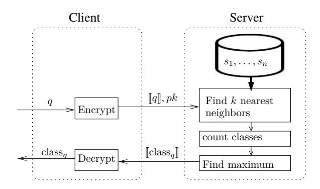
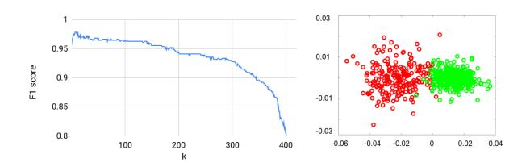
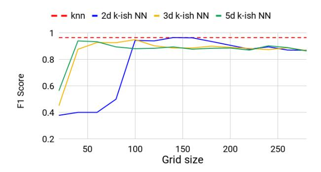
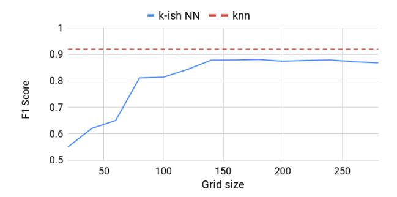
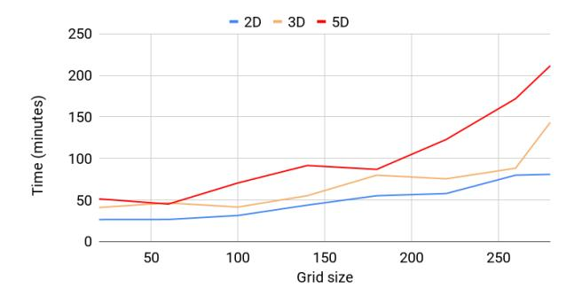
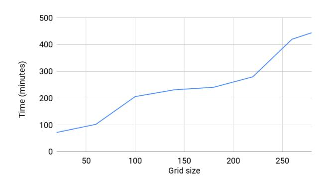
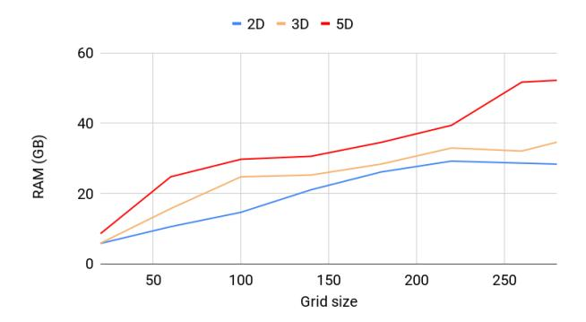
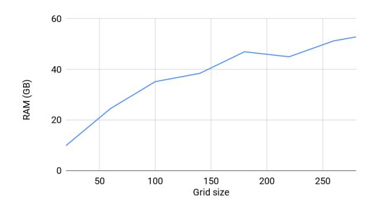
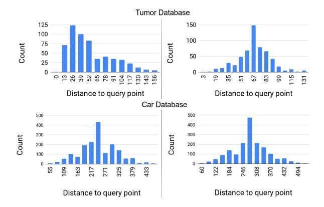
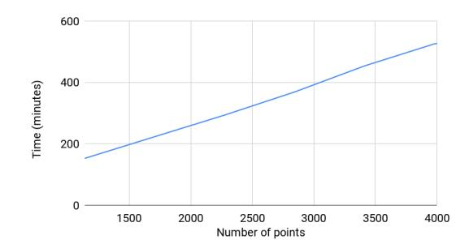

# **Secure** *k***-ish Nearest Neighbors Classifier**

Hayim Shaul<sup>1</sup> , Dan Feldman<sup>2</sup> , and Daniela Rus<sup>1</sup>

<sup>1</sup> CSAIL MIT, Cambridge, MA, USA. {hayim,rus}@csail.mit.edu <sup>2</sup> University of Haifa, Haifa, Israel. {dannyf}@csail.mit.edu

**Abstract.** The *k*-nearest neighbors (*k*NN) classifier predicts a class of a query, *q*, by taking the majority class of its *k* neighbors in an existing (already classified) database, *S*. In secure *k*NN, *q* and *S* are owned by two different parties and *q* is classified without sharing data. In this work we present a classifier based on *k*NN, that is more efficient to implement with homomorphic encryption (HE). The efficiency of our classifier comes from a relaxation we make to consider *κ* nearest neighbors for *κ* ≈ *k* with probability that increases as the statistical distance between Gaussian and the distribution of the distances from *q* to *S* decreases. We call our classifier *k*-ish Nearest Neighbors (*k*-ish NN). For the implementation we introduce *double-blinded coin-toss* where the bias and output of the toss are encrypted. We use it to approximate the average and variance of the distances from *q* to *S* in a scalable circuit whose depth is independent of |*S*|. We believe these to be of independent interest. We implemented our classifier in an open source library based on HElib and tested it on a breast tumor database. Our classifier has accuracy and running time comparable to current state of the art (non-HE) MPC solution that have better running time but worse communication complexity. It also has communication complexity similar to naive HE implementation that have worse running time.

# <span id="page-0-0"></span>**1 Introduction**

A key task in machine learning is to classify an object based on a database of previously classified objects. For example, with a database of tumors, each of them classified as malignant or benign, we wish to classify a new tumor based on the pre-classified database. Classification algorithms have been long studied. For example, *k* nearest neighbor (*k*NN) classifier [\[5\]](#page-27-0), where a classification of a new tumor is done by considering the *k* nearest neighbors (i.e. the most similar tumors, for some notion of similarity). The decision is then taken to be the majority class of those neighbors.

In some cases, we wish to perform the classification without sharing the database or the query. In our example, the database may be owned by a hospital while the query is done by a clinic. Here, sharing the database is prohibited by regulations (e.g. HIPAA [\[4\]](#page-27-1)) and sharing the query may expose the hospital and the clinic to liabilities and regulations.

In secure multi-party computation (MPC), several parties compute an output without sharing their input. Solutions such as that by Beaver [\[2\]](#page-27-2) have the

disadvantage of having a large communication complexity. Specifically it is proportional to the running time of the computation. Recently, secure-MPC techniques have been proposed based on homomorphic encryption (HE) (see Brakerski et al. [3]) that makes it possible to compute a polynomial over encrypted messages (ciphertexts). Using HE, the communication complexity becomes proportional to the size of the input and output. In our example, the clinic encrypts its query with HE and sends the encrypted query to the hospital. The polynomial the hospital applies is evaluated to output a ciphertext that can be decrypted, (only) by the clinic, to get the classification of the query. See Figure 1.



<span id="page-1-0"></span>Fig. 1. A HE-based protocol for Secure k-nearest neighbors classifier. (i) A client has a pair (sk, pk) and a query q. The client encrypts the query  $[\![q]\!] = Enc_{pk}(q)$  and sends  $[\![q]\!]$  and pk to the server. (ii) The Server securely finds the k neighbors of  $[\![q]\!]$  from  $s_1, \ldots, s_n$ . (iii) The Server securely counts the classes among the k nearest neighbors. Since these are counted with HE the result is also encrypted. (iv) The server finds the class with the maximal count and set it to  $[\![class_q]\!]$ , the class of q. (iv) The server sends the ciphertext  $[\![class_q]\!]$  to the client. (v) The client decrypts class  $q = Dec_{sk}([\![class_q]\!])$ .

The downside of using HE is the efficiency of evaluating polynomials. Although generic recipes exist that formulate any algorithm as a polynomial of its input, in practice the polynomials generated by these recipes have poor performance. The main reason for the poor performance is the lack of comparison operators. Since comparisons leak information that can be used to break the encryption, under HE we can only have a polynomial whose output is encrypted and equals 1 if the comparison holds and 0 otherwise. The second reason is an artifact of homomorphic encryption schemes: the overhead of evaluating a single operation grows with the degree of the evaluated polynomial. For many "interesting" problems it is a challenge to construct a polynomial that can be efficiently evaluated with HE.

In this paper we consider the secure classification problem. We propose a new classifier which we call k-ish nearest neighbors. In this new classifier the server considers  $\kappa$  nearest neighbors to the query where  $\kappa \approx k$  with some probability.

Relaxing the number of neighbors significantly improves the time performance of our classifier while having a small impact on the accuracy performance. Specifically, the time to compute our classifier on real breast cancer database dropped from months (estimated) to less than an hour, while the accuracy (measured by  $F_1$  score) decreased from 96% to 94%, while using 27GB of RAM. See details in Section 9.

The solution we introduce in this paper assumes the distances of the database to the query are statistically close to Gaussian distribution. Although sounding too limiting, we argue (and show empirically) otherwise. We show that many times the distribution of distances is statistically close enough to Gaussian. In future work, we intend to remove this assumption.

The efficiency of our solution comes from two new non-deterministic primitives that we introduce in this paper:

- a new approach to efficiently compute an approximation of  $1/m \sum_{i=1}^{n} f(\llbracket x_i \rrbracket)$ , where n, m are integers, f is an increasing invertible function and  $\llbracket x_1 \rrbracket, \llbracket x_2 \rrbracket, \ldots$  are ciphertexts.
- a *double-blinded* coin-tossing algorithm, where the output **and** the bias of the coin are encrypted.

We believe these two primitives are of independent interest and can be used in other algorithms as well

We built a system written in C++ and using HElib [9] to securely classify breast tumor as benign or malignant using k-ish NN classifier. Our code is given in [18]. Our classifier used the Wisconsin Diagnostic Breast Cancer Data Set [6], classified a query in less than an hour with 94% accuracy. This significantly improves over naive running times and makes secure classifications with HE a solution that is practical enough to be implemented. We also tested our classifier with car evaluation database [7] and compared it to the state of the art MPC solution shown by Elmehdwi et al. [8].

### 2 Related Work

Previous work on secure  $k{\rm NN}$  either had infeasible running time or had a large communication complexity. For example, Wong et al. [20] considered a distance recoverable encryption to have the server encrypt S. The user encrypts q and a management system computes and compares the distances. However, this scheme leaks information to an attacker knowing some of the points in S (see Xiao et al. [21]), in addition some data leaks to the management system. Hu et al. [11] proposed a scheme to traverse an R-tree where a homomorphic encryption scheme is used to compute distances and choose the next node in the traversing of the R-tree. However, this scheme is vulnerable if the attacker knows some of the points in S (see Xiao et al. [21]). In addition, the communication complexity is proportional to the height of the R-tree. Elmehdwi et al. [8] proposed a scheme that is, to the best of our knowledge, the first to guarantee the privacy of data as well as that of the query. However, this scheme requires the client to stay

active throughout the protocol (or delegate that work to a trusted server). This is a requirement not all users are able to follow. In addition, the communication overhead of this scheme is very high (proportional to the size of the database). To recap, previous works suffered either from access pattern leakage or from high communication complexity and high number of protocol rounds or the existence of two non-colluding servers.

### 3 Preliminaries

For an integer m we denote  $[m] = \{1, \dots, m\}$ . We use [msg] to denote a ciphertext that decrypts to the value msg.

The ring  $\mathbb{Z}_p$  is the set  $\{0,\ldots,p-1\}$  equipped with + and  $\cdot$  done modulo p. If p is prime then  $\mathbb{Z}_p$  is a field. We denote by  $\lceil x \rfloor$ , where  $x \in \mathbb{R}$ , the rounding of x to the nearest integer.

A database of  $\mathbb{Z}_p^d$  points of size n is the tuple  $S = (s_1, \ldots, s_n)$ , where  $s_1, \ldots, s_n \in \mathbb{Z}_p^d$ . We denote by  $\operatorname{class}(s_i) \in [c]$  the class of  $s_i$ . Let  $S = (s_1, \ldots, s_n)$  be a database of  $\mathbb{Z}_p^d$  points of size n and let  $q \in \mathbb{Z}_p^d$ . The distance distribution is the distribution of the random variable  $x = \operatorname{dist}(s_i, q)$ , where  $i \leftarrow [n]$  is drawn uniformly. We denote the distance distribution by  $\mathcal{D}_{S,q}$ .

The statistical distance between two discrete probability distribution X and Y over the finite set,  $\mathbb{Z}_p$ , denoted  $\mathrm{SD}(X,Y)$ , is defined as

$$SD(X,Y) = \max_{u \in \mathbb{Z}_p} |Pr[x=u] - Pr[y=u]|,$$

where  $x \sim X$  and  $y \sim Y$ . The cumulative distribution function (CDF) of a distribution X is defined as  $CDF_X(\alpha) = Pr[x < \alpha \mid x \sim X]$ .

The  $F_1$  Score (also called *Dice coefficient* or Sorensen coefficient) is a measure of similarity of two sets. It is given by  $F_1(A,B) = 2\frac{|A\cap B|}{|A|+|B|}$ , where A and B are sets. In the context of classifiers, the  $F_1$  score is used to measure the accuracy of a classifier by repeating the following for each class  $j \in [c]$ : take  $A_j$  to be the set of samples classified as j and  $B_j$  be the set of samples whose class is j and compute  $F_1(A_j, B_j)$ . The  $F_1$  score of the classifier is the weighted average over all  $F_1(A_j, B_j)$ .

### <span id="page-3-0"></span>3.1 Polynomial Interpolation

For a prime p and a function  $f:[0,p]\mapsto [0,p]$ , we define the polynomial  $\mathbb{P}_{f,p}:\mathbb{Z}_p\mapsto \mathbb{Z}_p$ , where  $\mathbb{P}_{f,p}(x)=\lceil f(x)\rfloor$  for all  $x\in\mathbb{Z}_p$ . When p is known from the context we simply write  $\mathbb{P}_f$ .

An explicit description of  $\mathbb{P}_{f,p}$  can be given by the interpolation

$$\mathbb{P}_{f,p}(x) = \sum_{i=0}^{p-1} \left( \lceil f(i) \rfloor \prod_{j \neq i} (x-j)(i-j)^{-1} \right).$$

Rearranging the above we can write

$$\mathbb{P}_{f,p}(x) = \sum_{i=0}^{p-1} \alpha_i x^i$$

for appropriate coefficients  $\alpha_0, \ldots, \alpha_{p-1}$  that depend on f. In this paper we use several polynomial interpolations:

$$\begin{split} &- \, \mathbb{P}_{\sqrt{\cdot}}(x) = \lceil \sqrt{x} \rfloor. \\ &- \, \mathbb{P}_{(\cdot)^2/p}(x) = x^2/p. \\ &- \, \mathbb{P}_{(\cdot=0)}(x) = 1 \text{ if } x = 0 \text{ and } 0 \text{ otherwise.} \\ &- \, \mathbb{P}_{(\sqrt{(\cdot)+p}}(x) = \sqrt{x+p}. \\ &- \, \mathbb{P}_{(\sqrt{(\cdot)p}}(x) = \sqrt{xp}. \\ &- \, \mathbb{P}_{\text{isNegative}(\cdot)}(x) = 1 \text{ if } x > p/2 \text{ and } 0 \text{ otherwise.} \end{split}$$

Comparing Two Ciphertexts. We also define a two variate function is Smaller:  $\mathbb{Z}_p \times \mathbb{Z}_p \mapsto \{0,1\}$ , where is Smaller(x,y)=1 iff x < y. In this paper we implement this two-variate function with a uni-variate polynomial is Negative:  $\mathbb{Z}_{p'} \mapsto \{0,1\}$ , where p' > 2p and is Negative(z) = 1 iff z > p'/2. The connection between these two polynomials is given by

$$isSmaller_p(x, y) = isNegative_{p'}(x - y).$$

**Computing** argmax. Using the isSmaller polynomial we construct the polynomial  $\operatorname{ArgMax}_c: \mathbb{Z}_p^c \mapsto [c]$ , where  $\operatorname{ArgMax}(C) = \operatorname{argmax}_j C(j)$ . Here we assume c < p as will be the case in our work. For completeness we note that this can be generalized to  $c \geq p$  by returning a binary vector. We follow the ideas of Çetin et al. [14] and define

$$\mathrm{ArgMax}_c(C) = \sum_{j=1}^c j \cdot \prod_{i \neq j} \mathrm{isSmaller} \big(C(i), C(j)\big).$$

Clearly,  $\prod_{i\neq j}$  is Smaller  $\left(C(i),C(j)\right)=1$  when  $C(j)=\max_i C(i)$  and is zero otherwise. It follows that  $\operatorname{ArgMax}_c(C)=\operatorname{argmax}_i C.$ 

**Computing Distances.** Our protocol can work with any implementation of a distance function. In this paper we analyze our protocol and present experiments with the  $\ell_1$  distance. We implement a polynomial  $\operatorname{dist}_{\ell_1}(a,b)$  that evaluates to  $\|a-b\|_{\ell_1}$  where  $a=(a_1,\ldots,a_d)$  and  $b=(b_1,\ldots,b_d)$ :

$$\operatorname{dist}_{\ell_1}(a,b) = \sum_{1}^{d} (1 - 2\operatorname{isSmaller}(a_i, b_i))(a_i - b_i).$$

We observe that

$$(1 - 2 \cdot \text{isSmaller}(a_i, b_i)) = \begin{cases} 1 & \text{if } a_i < b_i \\ -1 & \text{otherwise.} \end{cases}$$

and therefore  $\sum_{i} (1 - 2 \cdot isSmaller(a_i, b_i))(a_i - b_i) = \sum_{i} |a_i - b_i| = dist_{\ell_1}(a, b)$ .

**Arithmetic Circuit vs. Polynomials.** An arithmetic circuit (AC) is a directed graph G = (V, E) where for each node  $v \in V$  we have  $indegree(v) \in \{0, 2\}$ , where indegree(v) is the number of incoming edges of v. We also associate with each  $v \in V$  a value, val(v) in the following manner:

If indegree(v) = 0 then we call v an input node and we associate it with a constant or with an input variable and val(v) is set to that constant or variable.

If indegree(v) = 2 then we call v a gate and associate v with an Add operation (an add-gate) or Mult operation (a mult-gate).

Denote by  $v_1$  and  $v_2$  the nodes connected to v through the incoming edges and set  $\operatorname{val}(v) := \operatorname{val}(v_1) + \operatorname{val}(v_2)$  if v is an add-gate or  $\operatorname{val}(v) := \operatorname{val}(v_1) \cdot \operatorname{val}(v_2)$  if v is a mult-gate.

Arithmetic circuits and polynomials are closely related but do not have a one-to-one correspondence. A polynomial can be realized by different circuits. For example  $\mathbb{P}(x)=(x+1)^2$  can be realized as  $(x+1)\cdot(x+1)$  or by  $x\cdot x+2\cdot x+1$ . The first version has one mult-gate and one add-gate (here we take advantage that x+1 needs to be calculated once), while the latter has 2 mult-gates and 2 add-gates.

Looking ahead, we are going to evaluate arithmetic circuits whose gates are associated with HE operations (see below). We are therefore interested in bounding two parameters of an arithmetic circuits, C:

- size(C) is the number of mult gates in C. This relates to the number of gates needed to be evaluated hence directly affecting the running time.
- depth(C) is the maximal number of mult gates in a path in C. (We discuss below why we consider only mult gates).

Paterson et al. [17] showed that a polynomial  $\mathbb{P}_p(x): \mathbb{Z}_p \mapsto \mathbb{Z}_p$  can be realized by an arithmetic circuit C where  $\operatorname{depth}(C) = O(\log p)$  and  $\operatorname{size}(C) = O(\sqrt{p})$ . Their construction can be extended to realize multivariate polynomials, however, size of the resulting circuit grows exponentially with the number of variables. For a n-variate polynomial, such as a polynomial that evaluates to the k nearest neighbors, their construction has poor performance.

### 3.2 Homomorphic Encryption

Homomorphic encryption (HE) (see e.g. Brakerski et al. [3], see also a survey by Halevi et al. [10]) is an asymmetric encryption scheme that also supports + and  $\times$  operations on ciphertexts. More specifically, HE scheme is the tuple  $\mathcal{E} = (Gen, Enc, Dec, Add, Mult)$ , where:

- $Gen(1^{\lambda}, p)$  gets a security parameter  $\lambda$  and an integer p and generates the keys pk and sk.
- $Enc_{pk}(m)$  gets a message m and outputs a ciphertext [m].
- $Dec_{sk}(\llbracket m \rrbracket)$  gets a ciphertext  $\llbracket m \rrbracket$  and outputs a message m'.
- $-Add_{pk}(\llbracket a \rrbracket, \llbracket b \rrbracket)$  gets two ciphertexts  $\llbracket a \rrbracket, \llbracket b \rrbracket$  and outputs a ciphertext  $\llbracket c \rrbracket$ .
- $Mult_{pk}(\llbracket a \rrbracket, \llbracket b \rrbracket)$  gets two ciphertexts  $\llbracket a \rrbracket, \llbracket b \rrbracket$  and outputs a ciphertext d.

Correctness is the requirement that m = m',  $c = a + b \mod p$  and  $d = a \cdot b \mod p$ .

**Abbreviated syntax.** To make our algorithms and protocols more intuitive we use  $[\![\cdot]\!]_{pk}$  to denote a ciphertext. When pk is clear from the context we use an abbreviated syntax:

```
 \begin{split} &- \llbracket a \rrbracket + \llbracket b \rrbracket \text{ is short for } Add_{pk}(\llbracket a \rrbracket, \llbracket b \rrbracket). \\ &- \llbracket a \rrbracket \cdot \llbracket b \rrbracket \text{ is short for } Mult_{pk}(\llbracket a \rrbracket, \llbracket b \rrbracket). \\ &- \llbracket a \rrbracket + b \text{ is short for } Add_{pk}(\llbracket a \rrbracket, Enc_{pk}(b)). \\ &- \llbracket a \rrbracket \cdot b \text{ is short for } Mult_{pk}(\llbracket a \rrbracket, Enc_{pk}(b)). \end{split}
```

Given these operations any polynomial  $\mathbb{P}(x_1,\ldots)$  can be realized as an arithmetic circuit and computed on the ciphertexts  $[x_1],\ldots$  For example, in a client-server computation the client encrypts its data and sends it to the server to be processed. The polynomial the server evaluates depends on its input and the result is a ciphertext that is returned to the client. The client then decrypts the output. The semantic security of homomorphic encryption guarantees the server does not learn anything on the client's data. Similarly, the client does not learn anything from the server except for the output.

The cost of evaluating an arithmetic circuit, C, with HE is Time = overhead·size(C), where overhead is the time to evaluate one mult-gate and it varies with the underlying implementation of the HE scheme. For example, for BGV scheme [3] we have  $overhead = overhead(C) = O((depth(C))^3)$ .

#### 3.3 Threat Model

The input of the server in our protocol is n points,  $s_1, \ldots, s_n$  with their respective classes. The input of the client is a query point q. The server outputs (sends to the client) the encryption of the class of q as calculated based on the nearest neighbors of q. The output of the client is the class of q. We consider an adversarial server that is computationally-bounded and semi-honest, i.e. the adversary follows the protocol but may try to learn additional information. An active malicious server wanting to reply a wrong answer, can avoid the protocol altogether and reply a random class. We show that the server does not learn anything on the query, which stems from the semantic security of HE (see Section 8 for more details). This does not change for an active malicious server. The client learns only the classification of its query. We note that given the class of q, the client might infer something on  $s_1, \ldots, s_n$  and their classes (see e.g. Shokri et al. [19]), however, learning the class of q in the minimum required output of the protocol.

### 4 Our Contributions

**New "HE-friendly" classifier.** In this paper we introduce a new classifier that we call the k-ish nearest neighbor classifier and is a variation of the k nearest neighbors classifier (see Definition 1).

Informally, this classifier considers  $\kappa \approx k$  neighbors of a given query. This relaxation allows us to implement this classifier with an arithmetic circuit with low depth independent of the database size and has significantly better running times than the naive HE implementation of  $k{\rm NN}$ .

In this paper we implement a non-deterministic version where  $\kappa$  is the result of a probabilistic process. The probability that  $\kappa \approx k$  depends on  $\mathrm{SD}(\mathcal{D}_{S,q},\mathcal{N}(\mu,\sigma))$ , where  $\mu = E(\mathcal{D}_{S,q})$  and  $\sigma^2 = Var(\mathcal{D}_{S,q})$ . In future papers we intend to propose implementations that do not have this dependency.

System and experiments for secure *k*-ish NN classifier. We implemented our algorithms into a system that uses secure *k*-ish nearest neighbors classifier. Our code based on HElib [9] is provided for the community to reproduce our experiments, to extend our results for real-world applications, and for practitioners at industry or academy that wish to use these results for their future papers or products.

A new approximation technique. Our low-depth implementation of the k-ish NN, is due to a new approximation technique we introduce. We consider the sum  $1/m\sum_{1}^{n} f(\llbracket x_{i} \rrbracket)$ , when m and n are integers, f is an increasing invertible function and  $\llbracket x_{1} \rrbracket, \ldots, \llbracket x_{n} \rrbracket$  are ciphertexts. We show how this sum can be approximated in a polynomial of degree independent of n. Specifically, our implementation does not require a large ring size to evaluate correctly. In contrast, previous techniques for computing similar sums (e.g. for computing average by Naehrig et al. [15]), either generate large intermediate values or are realized with a deep arithmetic circuit.

A novel technique for double-blinded coin tossing. Our non-deterministic approximation relies on a new algorithm we call *double-blinded coin toss*. In a double-blinded coin toss the bias of the toss is  $[\![x]\!]/m$ , where  $[\![x]\!]$  is a ciphertext and m is a parameter. The output of the toss is also ciphertext. To the best of our knowledge, this is the first efficient implementation of a coin toss where the probability depends on a ciphertext. Since coin tossing is a basic primitive for many random algorithms, we expect our implementation of coin tossing to have a large impact on future research in HE.

### 5 Techniques Overview

We give an overview of our techniques that we used. We first describe the intuition behind the k-ish NN and then we give a set of reductions from the k-ish NN classifier to a double-blinded coin toss.

Replacing kNN with k-ish NN. Given a database S and a query q, small changes in k have small impact on the output of the kNN classifier. We therefore define the k-ish NN, where for a specified k the classifier may consider  $k/2 < \kappa < 3k/2$ . With this relaxation, our implementation applies non-deterministic algorithms (see below) to find k-ish nearest neighbors.

Reducing k-ish NN to computing moments. For the distance (discrete) distribution  $\mathcal{D}_{S,q}$ , denote  $\mu = E(\mathcal{D}_{S,q})$  and  $\sigma^2 = Var(\mathcal{D}_{S,q})$  and consider the set  $\mathcal{T} = \{s_i \mid \operatorname{dist}(s_i, q) < T\}$ , where  $T = \mu + \Phi^{-1}(k/n)\sigma$  and  $\Phi$  is the CDF of

 $\mathcal{N}(0,1)$ . For the case  $\mathcal{D}_{S,q} = \mathcal{N}(\mu,\sigma)$  we have  $|\mathcal{T}| = k$ , otherwise the difference  $|\mathcal{T}| - k$  can be expressed as a function of  $\mathrm{SD}(\mathcal{D}_{S,q},\mathcal{N}(\mu,\sigma))$ .

For distance distribution that are statistically close to Gaussian it remains to show how  $\mu$  and  $\sigma$  can be efficiently computed. We remark that  $\mu = \frac{1}{n} \sum \operatorname{dist}(s_i, q)$  and  $\sigma = \sqrt{\mu^2 - \frac{1}{n} \sum \left(\operatorname{dist}(s_i, q)\right)^2}$ , so it remains to show how the first two moments  $\frac{1}{n} \sum \operatorname{dist}(s_i, q)$  and  $\frac{1}{n} \sum \left(\operatorname{dist}(s_i, q)\right)^2$  can be efficiently computed.

Reducing computing moments to double-blinded coin-toss. We show how to compute  $\frac{1}{n} \sum f(x_i)$  for an increasing invertible function f. For an average take  $f(x_i) = x_i$  and for the second moment take  $f(x_i) = x_i^2$ . Observe that  $\frac{1}{n} \sum f(x_i) = \sum \frac{f(x_i)}{n}$  is approximated by  $\sum a_i$ , where

$$a_i = \begin{cases} 1 & \text{With probability } f(x_i)/n \\ 0 & \text{otherwise.} \end{cases}$$

Thus we reduced the problem to coin-toss with bias  $\frac{f(x_i)}{n}$  (recall that  $x_1, \ldots, x_n$  are given as a ciphertexts).

Reducing double-blind coin-toss to isSmaller polynomial. We show how to implement a double-blind coin-toss with the isSmaller polynomial. Given a ciphertext  $[\![x_i]\!]$  and a parameter n, we wish to toss a coin with bias  $\frac{f(x_i)}{n}$ . To do that, uniformly draw a random value  $r \leftarrow \{0,\ldots,n\}$  and observe that  $Pr[r < f(x_i)] = Pr[f^{-1}(r) < x_i] = f(x_i)/n$ , when f is strictly increasing. We therefore implement the coin-toss as isSmaller $(f^{-1}(r),x_i)$ .

Since coin tossing is a basic primitive for many random algorithms, we expect our implementation of coin tossing to have a large impact on future research in HE.

## 6 Protocol and Algorithms

In this section we describe the k-ish nearest neighbors protocol. We describe it from top to down, starting with the k-ish nearest neighbors protocol.

### 6.1 k-ish Nearest Neighbors

The intuition behind our new classifier is that the classification of kNN does not change "significantly" when k changes "a little". Figure 2 (left) shows how the accuracy changes with k. We therefore relax kNN into k-ish NN, where given a parameter k the classifier considers  $\kappa \approx k$ .

<span id="page-8-0"></span>**Definition 1** (k-ish Nearest Neighbors Classification). Given a database  $S = (s_1, \ldots, s_n)$ , a parameter  $0 \le k \le n$  and a query q, the k-ish Nearest Neighbors classifier sets the class of q to be the majority of classes of  $\kappa$  of its nearest neighbors, where  $f_1(k) < \kappa < f_2(k)$ .

The protocol in this paper will have  $k/2 < \kappa < 3k/2$  with probability that depends on the distance distribution.

#### 6.2 k-ish NN Classifier Protocol

We give here a high-level description of our protocol.

The protocol has two parties a client and a server. They share common parameters: a HE scheme  $\mathcal{E}$ , the security parameter  $\lambda$  and integers p,d and c. The input of the server is a database  $S = (s_1, \ldots, s_n)$  with their respective classes  $\operatorname{class}(1), \ldots, \operatorname{class}(n)$ , where  $s_i \in \mathbb{Z}_p^d$ , and  $\operatorname{class}(i) \in [c]$  is the class of  $s_i$ . The input of the client is a query  $q \in \mathbb{Z}_p^d$ .

The output of the client is  ${\rm class}_q \in [c]$ , which is the majority class of  $\kappa$  neighbors of q, where  $k/2 < \kappa < 3k/2$  with high probability. The server sends  $[\![{\rm class}_q]\!]$  to the client and has no further output.

Our solution starts by computing the set of distances  $x_i = \operatorname{dist}(s_i, q)$ . Then it computes a threshold  $T := \mu^* + \Phi^{-1}(k/n)\sigma^*$ , where  $\mu^* \approx E(\mathcal{D}_{S,q})$  and  $(\sigma^*)^2 \approx Var(\mathcal{D}_{S,q})$  (see below how  $\mu^*$  and  $\sigma^*$  are computed). With high probability we have  $k/2 < |\{s_i \mid x_i < T\}| < 3k/2$ . Comparing  $x_1, \ldots, x_n$  to T is done in parallel, which keeps the depth of the circuit low. The result of the comparison is used to count the number of neighbors of different classes.

To compute  $\mu^*$  and  $\sigma^*$  we use the identities  $\mu = 1/n \sum x_i$  and  $\sigma = \sqrt{\mu^2 - 1/n \sum x_i^2}$ , and approximate  $1/n \sum x_i$  and  $1/n \sum x_i^2$  with an algorithm we describe in Section 6.3.

**Reducing ring size.** In the naive implementation, we have a lower bound of  $\Omega(p^2)$  for the ring size. That is because  $x_1, \ldots, x_n = O(p)$  and we have the intermediate values  $(\mu^*)^2, \mu_2 = O(p^2)$ . Since the size and depth of polynomial interpolations we use depend on the ring size we are motivated to keep the ring size small. To do that we use a representation we call base-p representation.

**Definition 2 (base-p representation).** For  $p \in \mathbb{N}$  and  $v \in \{0, \ldots, p^2 - 1\}$  base-p representation of v is  $low(v) = v \mod p$  and  $high(v) = \lfloor v/p \rfloor$ . We then assign

$$\operatorname{low}(\mu_2^*) := 1/n \sum x_i^2 \mod p$$
$$\operatorname{high}(\mu_2^*) := \frac{1}{np} \sum x_i^2$$

where the modulo is done implicitly by the circuit. Similarly, we assign

$$low((\mu^*)^2) := \mu^* \cdot \mu^* \mod p,$$
  
 $high((\mu^*)^2) := \mu^* \cdot \mu^*/p,$ 

where the modulo is done implicitly by arithmetic circuit. We then assign

$$\sigma^* = \begin{cases} \sqrt{\operatorname{low} \left( (\mu^*)^2 \right) - \operatorname{low} \left( (\mu_2^*) \right)} \\ & \text{if } \operatorname{high} \left( (\mu^*)^2 \right) - \operatorname{high} (\mu_2^*) = 0, \\ \sqrt{\operatorname{low} \left( (\mu^*)^2 \right) - \operatorname{low} \left( (\mu_2^*) \right) + p} \\ & \text{if } \operatorname{high} \left( (\mu^*)^2 \right) - \operatorname{high} (\mu_2^*) - \operatorname{high} (\mu_2^*) = 1, \\ \sqrt{\left( \operatorname{high} \left( (\mu^*)^2 \right) - \operatorname{high} (\mu_2^*) \right) p} \\ & \text{otherwise.} \end{cases}$$

In Lemma 1 we prove that  $\sigma^* \approx \sqrt{(\mu^*)^2 - \mu_2^*}$ . We next give a detailed description of our protocol.

```
Protocol 1: k-ish Nearest Neighbor Classifier
     Shared Input: integers p, d, c > 1.
     Client Input: a point q \in \mathbb{Z}_p^d and a security
                              parameter \lambda.
     Server Input: integers k < n,
                               points s_1, \ldots, s_n \in \mathbb{Z}_p^d.
                               A matrix M \in \{0,1\}^{n \times c}, s.t.
                               M(i,j) = 1 iff the class(s_i) = j.
     Client Output: class<sub>q</sub> \in [c], the majority class
                                 of \kappa nearest neighbors of q where
                                  k/2 < \kappa < 3k/2 with high prob.
 1 Client performs:
         Generate keys (sk, pk) := Gen(1^{\lambda}, p)
         \llbracket q \rrbracket := Enc_{pk}(q)
         Send (pk, \llbracket q \rrbracket) to the server
 5 Server performs:
         for each i \in 1, \ldots, n do
               \llbracket x_i \rrbracket := \text{computeDist}(\llbracket q \rrbracket, s_i)
         \llbracket \mu^* \rrbracket := \text{approximate } \frac{1}{n} \sum \llbracket x_i \rrbracket
         ([[low((\mu^*)^2)], [[high((\mu^*)^2)]]) := base-p \text{ rep. of } (\mu^*)^2
         ([[low(\mu_2^*)], [[high(\mu_2^*)]]) := base-p \text{ rep. of } \frac{1}{n} \sum [[x_i]]^2
10
         \llbracket \sigma^* \rrbracket := \mathbf{approximate} \ \sqrt{(\mu^*)^2 - \mu_2^*}
         \llbracket T^* \rrbracket := \llbracket \mu^* \rrbracket + \lceil \varPhi^{-1}(\tfrac{k}{n}) \rfloor \llbracket \sigma^* \rrbracket
12
         [\![C]\!] := (0, \dots, 0)
13
        for each c \in 1, \dots, j do  [\![C(j)]\!] := \sum_{i=1}^n \mathrm{isSmaller}([\![x_i]\!], [\![(T^*)]\!]) \cdot M(i,j) 
14
15
         [\![\operatorname{class}_q]\!] := \operatorname{ArgMax}_c([\![C]\!])
16
        Send [class_q] to the client
     Client performs:
18
19
         class_q := Dec_{sk}(\|class_q\|)
```

<span id="page-10-10"></span><span id="page-10-9"></span><span id="page-10-8"></span><span id="page-10-7"></span><span id="page-10-6"></span><span id="page-10-5"></span><span id="page-10-4"></span>**Protocol Code Explained.** Protocol 1 follows the high level description given above. As a first step the client generates a key pair (sk, pk), encrypts q and sends  $(pk, \llbracket q \rrbracket)$  to the Server (Line 2-4).

The server computes the distances,  $x_1, \ldots, x_n$  (Line 7), where computeDist $(s_i, q)$  computes the distance between  $s_i$  and q.

The server then computes an approximation of the average,  $\mu^* \approx 1/n \sum x_i$ , (Line 8) by calling ProbabilisticAverage (Algorithm 2).

In Line 10 the sever computes the base-p representation of the approximation of the second moment,  $\mu_2^* = 1/n \sum x_i^2$ .

$$[\![\operatorname{low}(\mu_2^*)]\!] := \mathbf{approximate} \ \frac{1}{n} \sum [\![x_i]\!]^2 \mod p$$
 
$$[\![\operatorname{high}(\mu_2^*)]\!] := \mathbf{approximate} \ \frac{1}{np} \sum [\![x_i]\!]^2 \mod p.$$

The approximations are done by calling ProbabilisticAverage and setting  $f(x) = x^2$  and m = n and m = np respectively (see Section 6.3 for details on ProbabilisticAverage parameters). We remind that the modulo operation is performed implicitly by the HE operations.

Then in Line 9 the server computes the base-p representation of  $(\mu^*)^2$ . It sets:

$$\begin{split} & [\operatorname{low} \! \left( (\mu^*)^2 \right)] := [\![ \mu^*]\!] \cdot [\![ \mu^*]\!] \mod p \\ & [\![ \operatorname{high} \! \left( (\mu^*)^2 \right)]\!] := \mathbb{P}_{(\cdot)^2/p}(\mu^*) \end{split}$$

Next the server computes  $\sigma^*$  in Line 11 where the square root is done with  $\mathbb{P}_{\sqrt{\cdot}}$  and  $\mathbb{P}_{\sqrt{(\cdot)+/p}}$ . In Line 12 a threshold  $T^*$  is computed. Since k and n are known  $\Phi^{-1}(k/n)$  can be computed without homomorphic operations.

In Line 15 the server counts for each class j the number of nearest neighbors of that class. This is done by summing is Smaller( $[x_i], [(T^*)] \cdot M(i, j)$  for i = 1, ..., n. Since is Smaller( $[x_i], [(T^*)] = 1$  iff  $x_i < T^*$  and M(i, j) = 1 iff class(i) = j the sum in Line 15 adds up to the number of neighbors having class j, for each class  $j \in [c]$ .

The server applies the  $\operatorname{ArgMax}_c$  polynomial in Line 16 to find the index of the maximum of  $[\![C(1)]\!],\ldots,[\![C(c)]\!]$ . The index of the maximum is the majority class of the  $\kappa$  nearest neighbors of q which is assigned to  $\operatorname{class}_q$ . Then it sends  $\operatorname{class}_q$  to the client who can decrypt it and get the classification of q.

**Theorem 1.** Let  $k, p, d, c \in \mathbb{N}$  and  $S = (s_1, \ldots, s_n) \in \mathbb{Z}_p^d$ , where  $\operatorname{class}(i) \in [c]$  is a class associated with  $s_i$ , also let  $q \in \mathbb{Z}_p^d$  such that  $SD(\mathcal{D}_{S,q}, \mathcal{N}(\mu, \sigma)) = s$ , where  $(\mu, \sigma)$  are the average and standard deviation of  $\mathcal{D}_{S,q}$ . Then:
(i) The client's output in KNearestNeighbors is  $\operatorname{class}_q$  which is the majority class of  $\kappa$  nearest neighbors of q in S, where

$$\begin{split} Pr[|k-\kappa| > \delta k] < 2 \exp \Bigg( -O \bigg( \frac{\delta k (\sigma^2 + \mu^2)}{\mu + \varPhi^{-1}(k/n)\sigma} \bigg) \Bigg) \\ + 2 \exp \Bigg( -O \bigg( \frac{\mu \delta^2 k^2 \sigma}{\mu s + \sigma^2 s} \bigg) \Bigg). \end{split}$$

Let KNearestNeighbors denote the arithmetic circuit evaluated by the server in Protocol 1 and isSmaller and computeDist denote the arithmetic circuits comparing ciphertexts and computing the distance between two points, respectively. (ii) depth(KNearestNeighbors) =  $O(\text{depth(computeDist)} + \log p + \log c \cdot \text{depth(isSmaller)})$ , and (iii) size(KNearestNeighbors) =  $O(n \cdot \text{size}(\text{computeDist}) + \sqrt{p} + n \cdot \text{size}(\text{isSmaller}))$ , where isSmaller is an arithmetic circuit comparing two ciphertexts, and computeDist is an arithmetic circuit computing the distance between two vectors.

The proof of this theorem is given in Section 7.3. In the next subsection we describe how  $\mu$  and  $\mu_2$  are computed efficiently in arithmetic circuit model.

Increasing Probability that  $\kappa \approx k$ . Since our protocol includes non-deterministic elements it may choose  $\kappa$  that is too different than k with some probability. The protocol can be repeated several times such that with sufficiently high probability in the majority of times we have  $\kappa \approx k$ .

**Extension to multiple database owners.** Protocol 1 describes a protocol between a client and a server, however, it can be extended to a protocol where the database is distributed among multiple data owners. The evaluation of the arithmetic circuit can then be carried collaboratively or by a designated party.

**Extension to other distributions.** Protocol 1 assumes the distribution of the distance distribution,  $\mathcal{D}_{S,q}$ , is statistically close to Gaussian. To extend Protocol 1 to another distribution X, the protocol needs to compute the inverse of the cumulative distribution function,  $CDF_X^{-1}(k/n)$ , for any 0 < k/n < 1. The probability of failure will then depend on  $\max CDF_X'(T)$ , which intuitively bounds the change in number of nearest neighbors as T changes.

# <span id="page-12-0"></span>6.3 Algorithm for Computing $1/m \sum_{i=1}^{n} f(\llbracket d_i \rrbracket)$

In this section we show how to efficiently approximate sums of the form  $\frac{1}{m} \sum_{i=1}^{n} f(\llbracket x_i \rrbracket)$ , where n and m are integers, f is an increasing invertible function and  $x_1, \ldots, x_n$  are ciphertexts.

```
Algorithm 2: ProbabilisticAverage(\llbracket x_1 \rrbracket, \dots, \llbracket x_n \rrbracket)

Parameters: Integers, p, n, m > 0, an increasing invertible function f : [0, p - 1] \mapsto [0, m].

Input: x_1, \dots, x_n \in \mathbb{Z}_p.

Output: A number x^* \in \mathbb{Z}_p such that
Pr[|\chi - x^*| > \delta] < 2e^{-2n\delta^2},
where \chi = \lceil 1/m \sum f(x_i) \rfloor \mod p.

1 for i \in 1, \dots, n do
2 \Big| \llbracket a_i \rrbracket := \text{tos a double-blinded coin with bias } \frac{f(x_i)}{m}
3 \llbracket x^* \rrbracket := \sum_{i=1}^n \llbracket a_i \rrbracket
4 return \llbracket x^* \rrbracket
```

<span id="page-12-2"></span>**Algorithm Overview.** In Line 2 the algorithm tosses n coins with probabilities  $\frac{f(x_1)}{m}, \ldots, \frac{f(x_n)}{m}$ . The coins are tossed double-blinded, which means the bias of each coin is a ciphertext, and the output of the toss is also a ciphertext. See

Algorithm 3 to see an implementation of double-blinded coin-toss. The algorithm then returns the sum of the coin tosses,  $\sum a_i$ , as an estimation to  $\frac{1}{m} \sum f(x_i)$ .

**Theorem 2.** For any  $p, m, n \in \mathbb{N}$  and  $f : [0, p-1] \mapsto [0, m]$  an increasing invertible function Algorithm 2 describes an arithmetic circuit whose input is n integers  $d_1, \ldots, d_n \in \mathbb{Z}_p$  and output is  $\chi^*$  such that,

```
(i) Pr(|\chi^* - \chi| > \delta \chi) < 2 \exp(-\frac{\chi \delta^2}{3}), where \chi = \frac{1}{m} \sum f(x), (ii) depth(ProbabilisticAverage) = O(\text{depth(isSmaller)}), (iii) size(ProbabilisticAverage) = O(n \cdot \text{size(isSmaller)}), where isSmaller is an arithmetic circuit comparing two ciphertexts.
```

The full proof is given in Section 7.3. The intuition is to observe that  $\chi*$  is a sum of Bernoulli random variables and the bound follows from Chernoff inequality. Since each random variable is obtained by independently applying is Smaller we get that the depth and size of Probabilistic Average is as specified.

#### <span id="page-13-3"></span>6.4 Double Blinded Coin Toss

```
Algorithm 3: CoinToss(\llbracket x \rrbracket)

Parameters: Two integers p \in \mathbb{N}, m \in \mathbb{R} and an increasing invertible function f: [0, p-1] \mapsto [0, m]

Input: A number \llbracket x \rrbracket, s.t. x \in \mathbb{Z}_p.

Output: A bit \llbracket b \rrbracket, such that Pr[b=1] = f(x)/m.

1 Draw r \leftarrow [0, m]
2 r' := \lceil f^{-1}(r) \rceil
3 return isSmaller(\llbracket x \rrbracket, r')
```

<span id="page-13-2"></span><span id="page-13-1"></span>**Algorithm Overview.** The CoinToss algorithm uniformly draws a random value r (in plaintext) from [0, m] (Line 1). Since r is not encrypted, and f is increasing and invertible, it is easy to compute  $\lceil f^{-1}(r) \rceil$  (Line 2). The algorithm then returns isSmaller(x, r') which returns 1 with probability f(x)/m.

CoinToss as an Arithmetic Circuit. Algorithm 3 draws a number r from the range [0,m] and computes  $f^{-1}(r)$ , which are operations that are not defined in an arithmetic circuit. To realize CoinToss as an arithmetic circuit we think of a family of circuits: CoinToss<sub>r</sub> for  $r \in [0,m]$ . An instantiation of CoinToss is then made by drawing  $r \leftarrow [0,m]$  and taking CoinToss<sub>r</sub>.

The proofs of correctness and the size and depth bounds of the arithmetic circuit implementing Algorithm 3 are given in Section 7.1.

# 7 Analysis

In this section we prove the correctness and efficiency of our algorithms. Unlike the algorithms that were presented top-down, reducing one problem to another simpler problem, we give the proofs bottom up as analyzing the efficiency of one algorithm builds upon the efficiency of the simpler algorithm.

## <span id="page-14-0"></span>7.1 Analyzing Double Blinded Coin Toss

In this section we prove the correctness and the bounds of the CoinToss algorithm given in Section 6.4.

<span id="page-14-1"></span>**Theorem 3.** For  $p \in \mathbb{N}$ ,  $m \in \mathbb{R}$  and an increasing invertible function  $f:[0,p-1] \mapsto [0,m]$  Algorithm 3 gets an encrypted input  $[\![x]\!]$  and outputs an encrypted bit  $[\![b]\!]$  such that

- (i) Pr[b = 1] = f(x)/m.
- (ii) depth(CoinToss) = O(isSmaller), and
- (iii) size(CoinToss) = O(isSmaller), where isSmaller is a circuit that compares a ciphertext to a plaintext:  $isSmaller(\llbracket x \rrbracket, y) = 1$  if x < y and 0 otherwise.

 $Proof.\ Correctness.$  Since f is increasing and invertible

$$Pr[f(x) < r] = Pr[x < f^{-1}(r)] = Pr[x < \lceil f^{-1}(r) \rceil].$$

The last equation is true since since x is integer.

Since we pick r uniformly from [0, m] we get Pr[f(x) < r] = f(x)/m.

 $Depth\ and\ Size.$  After choosing CoinToss<sub>r</sub> by randomly picking r, that circuit embeds isSmaller and the bound on the size and depth are immediate.

The isSmaller function may be implemented differently, depending on the data representation. In this paper, we use a polynomial interpolation to compute isSmaller and therefore, depth(isSmaller) =  $O(\log p)$  and size(isSmaller) =  $O(\sqrt{p})$ . We summarize it in the following corollary:

**Corollary 1.** Let  $0 \le x < p$  be an integer,  $r \leftarrow [0, m]$  randomly drawn,  $f : [0, p-1] \mapsto [0, m]$  an increasing invertible function and is Smaller<sub>p</sub>:  $\mathbb{Z}_p \times \mathbb{Z}_p \mapsto \{0, 1\}$  a polynomial as defined in Section 3.1 then the is Smaller<sub>p</sub>( $\lceil f^{-1}(r) \rceil, x$ ) circuit realizes the CoinToss<sub>r</sub>(x) functionality with bias  $\frac{f(x)}{m}$  and has depth  $O(\log p)$  and size  $O(\sqrt{p})$ .

### 7.2 Analysis of ProbabilisticAverage

We now prove the correctness and depth and size bounds of Algorithm 2.

<span id="page-14-2"></span>**Theorem 4.** Let  $p, m \in \mathbb{N}$ ,  $x_1, \ldots, x_n \in \{0, \ldots, p-1\}$  and  $f : [0, p-1] \mapsto [0, m]$  be an increasing and invertible function. Denote  $\chi = 1/m \sum_{i=1}^{n} f(x_i) \mod p$  then:

- (i) Probabilistic Average returns  $x^*$  such that  $\Pr[|x^* - \chi| > \delta \chi] < 2\exp(-\frac{\chi \delta^2}{3})$ .
- (ii) depth(ProbabilisticAverage) = O(depth(isSmaller)).
- (iii) size(ProbabilisticAverage) =  $O(n \cdot \text{size(isSmaller)})$ .

*Proof. Correctness.* We start by proving that ProbabilisticAverage return  $x^*$  such that  $Pr[|x^* - \chi| > \delta \chi] < 2 \exp(-\frac{\chi \delta^2}{3})$ . From Theorem 3 we have

$$a_i = \begin{cases} 1 & \text{with probability } \frac{f(x_i)}{m} \\ 0 & \text{otherwise.} \end{cases}$$

Since  $a_i$  are independent Bernoulli random variables, it follows that  $E(\sum a_i) = \frac{1}{m} \sum f(x_i) = \chi$  and by Chernof we have:  $Pr(\sum a_i > (1+\delta)\chi) < \exp(-\frac{\chi\delta^2}{3})$  and  $Pr(\sum a_i < (1-\delta)\chi) < \exp(-\frac{\chi\delta^2}{2})$ , from which it immediately follows that  $Pr(|\sum a_i - \chi| > \delta\chi) < 2\exp(-\frac{\chi\delta^2}{3})$ .

Depth and Size. We analyze the depth and size of the arithmetic circuit that implements ProbabilisticAverage. Since all coin tosses are done in parallel the multiplicative depth is depth(ProbabilisticAverage) = depth(CoinToss) and the size is size(ProbabilisticAverage) =  $O(n \cdot \text{depth}(\text{CoinToss}))$ .

## <span id="page-15-0"></span>7.3 Analysis of KNearestNeighbors

In this subsection we prove the correctness and bounds of the KNearestNeighbors protocol.

**Theorem 1.** Let  $k, p, d, c \in \mathbb{N}$  and  $S = (s_1, \ldots, s_n) \in \mathbb{Z}_p^d$ , where  $\operatorname{class}(i) \in [c]$  is a class associated with  $s_i$ , also let  $q \in \mathbb{Z}_p^d$  such that  $SD(\mathcal{D}_{S,q}, \mathcal{N}(\mu, \sigma)) = s$ , where  $(\mu, \sigma)$  are the average and standard deviation of  $\mathcal{D}_{S,q}$ . Then:
(i) The client's output in KNearestNeighbors is  $\operatorname{class}_q$  which is the majority class of  $\kappa$  nearest neighbors of q in S, where

$$\begin{split} Pr[|k-\kappa| > \delta k] < 2 \exp\left(-O\left(\frac{\delta k (\sigma^2 + \mu^2)}{\mu + \Phi^{-1}(k/n)\sigma}\right)\right) \\ + 2 \exp\left(-O\left(\frac{\mu \delta^2 k^2 \sigma}{\mu s + \sigma^2 s}\right)\right). \end{split}$$

Let KNearestNeighbors denote the arithmetic circuit evaluated by the server in Protocol 1 and isSmaller and computeDist denote the arithmetic circuits comparing ciphertexts and computing the distance between two points, respectively. (ii) depth(KNearestNeighbors) =  $O(\text{depth(computeDist)} + \log p + \log c \cdot \text{depth(isSmaller)})$ , and

(iii) size(KNearestNeighbors) =  $O(n \cdot \text{size}(\text{computeDist}) + \sqrt{p} + n \cdot \text{size}(\text{isSmaller}))$ , where isSmaller is an arithmetic circuit comparing two ciphertexts, and computeDist is an arithmetic circuit computing the distance between two vectors.

*Proof. Correctness.* For lack of space we give the proof of correctness in Appendix B. In a nutshell, the proof follows these steps:

– Use Theorem 4 to prove  $\mu^* \approx \mu$  and  $\mu_2^* \approx \mu_2$  (with high probability), where  $\mu$  and  $\mu_2$  are the first two moments of  $\mathcal{D}_{S,q}$  and  $\mu^*$  and  $\mu_2^*$  are the approximations calculated using ProbabilisticAverage.

- Prove  $\sigma^* \approx \sigma$  (with high probability), where  $\sigma = \sqrt{\mu^2 \mu_2}$  and  $\sigma^*$  is the approximation calculated by KNearestNeighbors.
- Prove  $T^* \approx T$  (with high probability), where  $T = \mu + \Phi^{-1}(k/n)\sigma$  and  $T^* = \mu^* + \Phi^{-1}(k/n)\sigma^*$  as calculated by KNearestNeighbors.
- Prove  $|\{x_i \mid x_i < T^*\}| \approx |\{x_i \mid x_i < T\}|$  (with high probability), where  $\mathcal{D}_{S,q}$  is statistically close to  $\mathcal{N}(\mu, \sigma)$ .

Depth and Size. The protocol consists of 7 steps:

- <span id="page-16-2"></span>1. Compute distances  $x_1, \ldots, x_n$ .
- <span id="page-16-3"></span>2. Compute  $\mu^*$  and  $\mu_2^*$ .
- <span id="page-16-4"></span>3. Compute  $(\mu^*)^2$
- 4. Compute  $\sigma^*$ .
- <span id="page-16-5"></span>5. Compute  $T^*$ .
- <span id="page-16-6"></span>6. Compute C(0), ..., C(c).
- <span id="page-16-1"></span>7. Compute  $class_q$ .

Step 1 is done by instantiating n compute Dist sub-circuits in parallel; Step 2 is done by instantiating O(1) Probabilistic Average sub-circuits in parallel; Step 3-5 are done by instantiating O(1) polynomials in parallel; Step 6 is done by instantiating O(n) is Smaller sub-circuits in parallel, and Step 7 is done by instantiating the ArgMax<sub>c</sub> polynomial. Summing it all up we get that

$$depth(KNearestNeighbors) = O(depth(computeDist) + log p + log c \cdot depth(isSmaller)),$$

and

$$\begin{split} \text{size} & (\text{KNearestNeighbors}) = O \left( n \cdot \text{size} (\text{computeDist}) \right. \\ & + \sqrt{p} + n \cdot \text{size} (\text{isSmaller}) \right). \end{split}$$

Plugging in our implementations of is Smaller and computeDist we get this corollary.

Corollary 2. Protocol 1 can be implemented with

$$depth(KNearestNeighbors) = O(\log p \log c),$$

and

$$size(KNearestNeighbors) = O(n \cdot \sqrt{p}).$$

# <span id="page-16-0"></span>8 Security Analysis

In this section we discuss the correctness of the output and the privacy of the inputs in the presence of dishonest adversaries.

Informally, the security guarantee is that the client and the server do not learn anything beyond what is explicitly revealed by the protocol (the "leakage

profile"), i.e. the shared parameters and in the client's case its output. In addition the leakage profile includes meta-data such as the time the query was made, the time it took the server to compute and respond, and the addresses of the client and the server.

We consider two types of adversaries, a semi-honest (a.k.a. curious but honest) adversary that follows the protocol but tries to infer additional information to what is stated above and a malicious adversary that does not follow the protocol. In both cases we assume the adversaries are computationally bounded.

**Semi-honest Server.** We prove that a semi-honest server does not learn anything from the query (except for the leakage profile). That stems from the semantic security of HE.

<span id="page-17-0"></span>**Theorem 5.** Assuming the underlying encryption  $\mathcal{E}$  is semantically secure, the secure k-ish NN classifier protocol (Protocol 1) securely realizes the k-ish NN functionality (as defined above) against an semi-honest adversary controlling the server.

The proof shows that the view of a server with a real query is computationally indistinguishable from a view of a server in a simulator on a "dummy" query, therefore concluding the server cannot learn anything on the content of the query q.

*Proof.* To prove the protocol is secure against a semi-honest adversarial server we construct a simulator S whose output, when given only the server's input and output  $(1^{\lambda}, \mathcal{E}, p, d, c, k, n, S, \text{class})$ , is computationally indistinguishable from an adversarial server's view in the protocol.

The simulator operates as follows: (i) Generates a dummy query q'; (ii) Executes the k-ish NN classifier protocol on simulated client's input q' (the simulator plays the roles of both parties); (iii) Outputs the sequence of messages received by the simulated server in the k-ish NN classifier protocol. The simulator's output  $\mathcal{S}(\ldots) = \mathcal{S}(1^{\lambda}, \mathcal{E}, p, d, c, k, n, S, \text{class})$  is therefore:

$$\mathcal{S}(\ldots) = (pk', \llbracket q' \rrbracket_{pk'}, \llbracket \operatorname{class}_q' \rrbracket_{pk'}),$$

where pk' was generated by  $\text{Gen}(1^{\lambda}, p)$ ,  $[\![q']\!]_{pk'}$  was generated by  $\text{Enc}(\ldots)$  and  $[\![\text{class}'_a]\!]_{pk'}$  was generated by  $\text{Eval}(\ldots)$ .

We show that the simulator's output is computationally indistinguishable from the view of the server (assuming  $\mathcal{E}$  is semantically secure). The view of the server consists of its received messages:

$$\mathsf{view}(\mathcal{A}) = (pk, \llbracket q \rrbracket_{pk}, \llbracket \mathsf{class}_q \rrbracket_{pk}),$$

where pk was generated by  $\operatorname{Gen}(1^{\lambda}, p)$  and  $[\![q]\!]_{pk}$  was generated by  $\operatorname{Enc}(\ldots)$  and  $[\![\operatorname{class}_q]\!]_{pk}$  was generated by  $\operatorname{Eval}(\ldots)$ .

Observe that the simulator's output and the server's view are identically distributed, as they are sampled from the same distribution. Furthermore, the server's view is computationally indistinguishable from the real view by the multi-messages IND-CPA security for the HE scheme  $\mathcal{E}$ . Put together, we conclude

that the simulator's output is computationally indistinguishable from the server's view  $S(...) \equiv_c \text{view}(A)$ .

**Malicious Server.** Since the protocol involves a single round (the client sends a query and receives a reply) Theorem 5 holds even if the server is malicious. That is, the server cannot distinguish between  $[q]_{pk}$  and  $[q']_{pk'}$  (the simulated query) even if it does not follow the protocol. With a malicious server, however, there is no guarantee on the correctness of the output. In the extreme case, the server can avoid the protocol and reply a random class.

**Semi-honest and Malicious Client.** The view of the client includes only the class of its query since that is the only message it receives,  $\mathsf{view}(\mathsf{client}) = \mathsf{class}_q$ . From  $\mathsf{class}_q$  the client may infer something on S (e.g. the majority class of the neighbors of q) however, we note that learning  $\mathsf{class}_q$  is the minimum necessary since it is the output required by the problem definition.

# <span id="page-18-0"></span>9 Experimental Results

We implemented Protocol 1 and built two systems. The first system, motivated in Section 1, securely classifies breast tumors. The second system, motivated by Elmehdwi et al. [8], securely evaluates cars by classifying them into one of 4 classes. In this section we describe the details of these systems, our experimental results and a comparison to the results of Elmehdwi et al. [8].

Each of our system has two parties: the server (holding the database S) and a client wishing to classify a query q, where the server classified q without learning anything on its content. We measured the time to compute the classification and the accuracy of our classifier. The accuracy is expressed in terms of  $F_1$  score which quantifies the overlap between the predicted classes of points and their real classes.

We implemented our system using HElib [9] for HE operations and ran the server part on a standard server. Since HElib works over an integer ring we scaled and rounded the data and the query to an integer grid.

#### 9.1 The Data

We tested our classifier with a database of 569 tumor samples and with a database of 1728 car samples. We next describe the two databases.

**Tumor Data.** The breast tumor database [6] contains 569 tumor points, of which 357 are benign and 212 malignant. Each tumor is characterized by 30 features given as real numbers in floating point, such as the tumor diameter, the length of the circumference, etc. An insecure kNN classifier was already suggested for this database (e.g. [13]).

Since we expect the protocol to perform worse in higher dimensions we reduced the dimensionality by applying linear discriminant analysis (LDA) and projecting the database onto subspaces of 2,3 and 5 dimensions. This is a preprocessing step the server can apply on the database in clear-text before answering client

queries. Also, (even when using HE) a 30-dimensional encrypted query can easily be projected onto a lower dimensional space. We used the projections onto those subspaces in our experiments to compare how the performance varies with the dimension. The distribution of the points on the 2D plane can be seen in Figure [2](#page-19-0) (right).



<span id="page-19-0"></span>**Fig. 2.** Right: The 569 points in the database, representing breast tumors samples classified as benign (green) and malignant (red) after applying LDA and projecting them onto the plane. Left: The *F*<sup>1</sup> score of a *k*NN classifier as it changes as a function of *k*. The *F*<sup>1</sup> score was calculated on a database of 569 tumors in plaintext in floating point arithmetics.

Since HElib encodes integer numbers from the range {0*, . . . , p* − 1} for some *p* that is determined during key generation we scaled the data points and rounded them to the *d* dimensional grid [*g*] *d* , for some *g* and for *d* = 2*,* 3*,* 5. The choice of *g* affects the accuracy as well as the running time of our protocol. We tested our protocol with 20 *< g <* 300. The relation between *g, d* and *p* is given by *p >* 2*gd >* 2dist(*s, q*), for any *s* ∈ *S* and *q* ∈ [*g*] *d* .

**Car Evaluation Data.** To compare with the solution by Elmehdwi et al. [\[8\]](#page-28-3) we used the car evaluation database from the UCI KDD archive [\[7\]](#page-28-2). The database contains 1728 points with 6 attributes: buying price, maintenance price, door number, passenger number, size of luggage boot and safety score. The buying price and the maintenance price are given as the categories: "low", "medium", "high" and "very high". The door number is given as "2","3","4" or "5+". The passenger number is given as "2","3" or "more". The safety score and the luggage boot were given as a category with 3 options: "low", "medium" and "high" for the first and "small", "medium" and "big" for the latter. The cars are classified into 4 classes: "unacceptable", "acceptable", "good" and "very good" with 1210, 384, 69 and 65 cars respectively.

### **9.2 The System**

We implemented the protocols and algorithms in this paper in C++. We used HElib library [\[9\]](#page-28-0) for an implementation for HE based on BGV [\[3\]](#page-27-3), including its usage of SIMD (Single Instruction Multiple Data) technique. The source of our system is open under the MIT license and can be found in [\[18\]](#page-28-1). The hardware in our tests was a single off-the-shelf server with 16 2.2 GHz Intel Xeon E5-2630 cores. These cores are common in standard laptops and servers. The server also had 62GB RAM, although our code used much less than that. All the experiments we made use a security key of 80 bits. This settings is standard and can be easily changed by the client.

## **9.3 The Experiment**

**Accuracy.** To test the accuracy of Protocol [1](#page-10-0) we used leave-one-out cross validation: for each point in the database, we removed it from the database and then used the smaller database for classification. Iterating over all points we computed the *F*<sup>1</sup> score. We also tried leave-*f*-out cross validation, i.e. removing *f* additional random points (for various values of *f*). This did not change the results by much.

To classify we used *k* = 13 which for the tumor database of 568 points sets *Φ* −1 (13*/*568) ≈ 2 and for the car evaluation database of 1728 points sets *Φ* −1 (13*/*1728) ≈ 2*.*5. We calculated the *F*<sup>1</sup> score by repeating this for each of the points in the database. To test the effect of different grid sizes we scaled each database to grids between [20]*<sup>d</sup>* to [300]*<sup>d</sup>* , where *d* = 2*,* 3*,* 5 for the tumor database and *d* = 6 for the car evaluation database. The results are summarized in Figure [3](#page-20-0) for the tumor databases and in Figure [4](#page-21-0) for the cars database.



<span id="page-20-0"></span>**Fig. 3.** The *F*<sup>1</sup> score for the tumor database as a function of the grid size. The *x* axis is the size of an edge in the grid, e.g. *x* = 100 means a [100]*<sup>d</sup>* grid. The red dashed line is the baseline *F*<sup>1</sup> score of the *k*NN classifier ran on the same database in plaintext in floating point arithmetics. The lines in blue, yellow an green are for the graphs for the database projected on 2*d,* 3*d* and 5*d*, respectively.

**Time and RAM.** The time to complete the KNearestNeighbors protocol comprises of 3 parts:

- **– Client Time** is the time to execute the client steps of the protocol: (i) generating a key, (ii) encrypting a query and (iii) decrypting the reply.
- **– Communication Time** is the total time to transmit messages between the client and the server.



<span id="page-21-0"></span>**Fig. 4.** The *F*<sup>1</sup> score for the 6*d* cars database (the solid line) as a function of the grid size. The *x* axis is the size of an edge in the grid, e.g. *x* = 100 means a [100]*<sup>d</sup>* grid. The red dashed line is the baseline *F*<sup>1</sup> score of the *k*NN classifier ran on the same database in plaintext in floating point arithmetics.

**– Server Time** is the time it takes the server to evaluate the arithmetic circuit of the protocol.

In our experiments, we measured the server time, i.e. the time it took the server to evaluate the gates of the arithmetic circuit. The time we measured was the time passed between receiving the encrypted query and sending the encrypted class of the query. In some HE schemes the time to evaluate a single gate in a circuit depends on the depth of the entire circuit. Specifically, in the scheme we used (see below) the overhead to compute a single gate is *O*˜ depth(*AC*) 3 , where depth(*AC*) is the depth of the circuit.

We measured how the size of the grid affects the running time. We measured the server time to classify a query on the tumor databases on dimensions *d* = 2*,* 3*,* 5, as explained above. The results are summarized in Figure [5](#page-22-0) for the tumor database and in Figure [6](#page-22-1) for the car evaluation database. The RAM requirements are summarized in Figure [7](#page-23-0) for the tumor database and in Figure [8](#page-23-1) for the car evaluation database.

### **9.4 Results and Discussion**

*k***-ish NN vs.** *k***NN.** In Figure [2](#page-19-0) (left) we show how the choice of *k* changes the accuracy of *k*NN. The graph shows the *F*<sup>1</sup> score (*y* axis) of running *k*NN on the data with different values of *k* (*x* axis). The graph shows that for 5 ≤ *k* ≤ 20 the decrease in *F*<sup>1</sup> score is small, from 0.979 to 0.968. For 20 ≤ *k* ≤ 375 the *F*<sup>1</sup> score decreases almost linearly from 0.968 to 0.874. For larger values, 375 *< k* the *F*<sup>1</sup> score drops rapidly because the *k*NN classifier considers too many neighbors. In the extreme case, for *k* = 569 the classifier considers all data points as neighbors thus classifying all queries as benign.

**Different Distributions.** To test our classifier on various data distributions we ran experiments on the tumor database and on the car database. These two databases have different distributions. The tumor database has 569 points in



<span id="page-22-0"></span>**Fig. 5.** The time (in minutes) to compute the *k*-ish NN on a 16-CPU server as a function of the grid-size to which data was scaled and rounded to. The *x* axis is the size of an edge in the grid, e.g. *x* = 100 means a [100]*<sup>d</sup>* grid. The lines in blue, yellow and red are for the database projected on 2*d,* 3*d* and 5*d*, respectively.



<span id="page-22-1"></span>**Fig. 6.** The time (in minutes) to compute the *k*-ish NN on the 6*d* car evaluation database on a 16-CPU server as a function of the grid-size to which data was scaled and rounded to. The *x* axis is the size of an edge in the grid, e.g. *x* = 100 means a [100]<sup>6</sup> grid.

two clusters: the dense benign cluster and a less dense malignant cluster. See Figure [2](#page-19-0) (right). The car evaluation database has 1728 points for each of the 4 3 · 3 <sup>3</sup> possible options of a car's features. The points in this case are evenly distributed in that hypercube. Figure [9](#page-24-0) (above) shows 2 histograms of distances from random query points to the points in the tumor database and Figure [9](#page-24-0) (below) shows 2 histograms of distances from random query points to the points in the cars database. We show the *F*<sup>1</sup> scores for the *k*-NN classifier as a function of the grid size. We also include the *F*<sup>1</sup> score of the *k*NN classifier as a baseline to compare to. The scores for tumor database are given in Figure [3](#page-20-0) and the scores for the car evaluation databases are given in Figure [4.](#page-21-0) In both cases the *F*<sup>1</sup> score of the secure *k*-ish NN increased with the grid size (see more about this below) and it converged to a value a little lower than the score of the *k*NN: 0.91 vs. 0.97 in the tumor database and 0.86 vs. 0.91 in the car database.



<span id="page-23-0"></span>**Fig. 7.** The RAM (in GB) to compute the *k*-ish NN on the 6*d* car evaluation database on a 16-CPU server as a function of the grid-size to which data was scaled and rounded to. The *x* axis is the size of an edge in the grid, e.g. *x* = 100 means a [100]*<sup>d</sup>* grid. The lines in blue, yellow and red are for the database projected on 2*d,* 3*d* and 5*d*, respectively.



<span id="page-23-1"></span>**Fig. 8.** The RAM (in GB) to compute the *k*-ish NN on a 16-CPU server as a function of the grid-size to which data was scaled and rounded to. The *x* axis is the size of an edge in the grid, e.g. *x* = 100 means a [100]<sup>6</sup> grid. The lines in blue, yellow and red are for the database projected on 2*d,* 3*d* and 5*d*, respectively.

**Grid Size and Dimensionality.** The effects of the grid size are shown in Figure [5,](#page-22-0) [6,](#page-22-1) [3](#page-20-0) and [4.](#page-21-0) In Figure [3](#page-20-0) we show how the accuracy, measured by *F*<sup>1</sup> score, changes with the grid size on the tumor database. For *d*-dimensional data (where *d* = 2*,* 3*,* 5) the *x*-value of *g* means each point was scaled (and rounded) to a point in the *d*-dimensional grid [*g*] *d* . As a baseline (shown in dashed red line) we used the *F*<sup>1</sup> score of a *k*NN classifier.

The *F*<sup>1</sup> scores of *k*-ish NN for *d* = 2*,* 3*,* 5 are given in blue, yellow and green lines, respectively. The accuracy increases with the grid size and also with the dimensionality. For example, in 2d scaled to a 100 × 100 grid, the *F*<sup>1</sup> score was 0.943, and in 5d scaled to a [40]<sup>5</sup> grid, the *F*<sup>1</sup> score was 0.938. This follows from our analysis. The success probability of ProbabilisticAverage is *P r* (|*µ* <sup>∗</sup> − *µ*| *> δµ*) *<* 2*exp*(− *µδ*<sup>2</sup> 3 )*,* which improves as the average distance *µ*



<span id="page-24-0"></span>**Fig. 9.** Above: two histograms of distances from two random points on the plane to the 2D points in the tumor database scaled and rounded to a  $100 \times 100$  grid. Below: two histograms of distances from two random points to the points in the database scaled and rounded to the  $[140]^6$  hypercube.

grows. For fixed database and query we have  $\mu = O(gd)$ . The success probability of ProbabilisticAverage affects the success probability of KNearestNeighbors. In the example above,  $40 \cdot 5 = 100 \cdot 2$ .

In Figure 5 we show the server times on the tumor database for different grid sizes and for d=2,3,5 given in blue, yellow and green, respectively. For example, for a 2d database scaled to a  $160\times160$  grid, the running time was 50 minutes, and for a 5d database scaled to a  $[60]^5$  grid, the running time was 60 minutes. This follows from our analysis: we need  $p>2gd>2\mathrm{dist}(s,q)$ , where  $s\in S\subseteq [g]^d$  and  $q\in [g]^d$ . Since  $\mathrm{depth}(AC)=O(\log(p))$  and  $\mathrm{size}(AC)=O(\sqrt{p})$  we get, Time  $=\tilde{O}(\log^3(dg)\sqrt{dg})$ .

**Database Size.** The server time of our protocol is linear in, n = |S|. See Figure 10. This is easily explained since the depth of the arithmetic circuit does not depend on n and the number of gates is linear in n.

**Scaling.** Our protocol scales linearly with the number of cores since computing  $\mu, \mu_2, C(1), \ldots, C(c)$  and the distances,  $x_1, \ldots, x_n$  are embarrassingly parallelizable.

|                     | Rounds                    | Comm. (Ctxt)         | HE ops                    | HE depth             | Needs non-colluding servers |
|---------------------|---------------------------|----------------------|---------------------------|----------------------|-----------------------------|
| Elmehdwi et al. [8] | $O(\log p(c + k \log n))$ | $O(\log p(nk+c)+cd)$ | $O((k\log p + d)n\log p)$ | $NA^*$               | Yes                         |
| Naive               | 1                         | d                    | $O((n^2+c^2)\sqrt{p})$    | $O(\log p \log(nc))$ | No                          |
| This Work           | 1                         | d                    | $O(n\sqrt{p})$            | $O(\log p \log c)$   | No                          |

<span id="page-24-1"></span><sup>\*</sup> Not applicable to Elmehdwi et al.

Table 1. Comparing our protocol with the protocol by Elmehdwi et al. [8] and the naive solutions, where n is the database size, c is the number of classes, k is the number of neighbors to consider and p is the plaintext modulo. The columns: (1) Number of rounds the protocol makes, (2) number of ciphertexts transmitted, (3) number of HE operations, (4) depth of HE circuit and (5) whether the protocol requires two non-colluding servers.



<span id="page-25-0"></span>**Fig. 10.** The server time on a 16-CPU server as a function of the database size, *n*, as computed on the tumor database on a grid of size [100]*<sup>d</sup>* , for *d* = 2.

|                          | F1   |         | Time (sec.) Comm. (KB) |
|--------------------------|------|---------|------------------------|
| Elmehdwi et al. [8] 0.92 |      | 1,248   | 157,696                |
| Naive                    | 0.92 | months† | 111‡                   |
| This Work                | 0.87 | 13,282  | 111‡                   |

<sup>†</sup> An estimation. Running with *n* = 10 and *k* = 5 took 18 hours.

**Table 2.** Comparing our protocol with the protocol by Elmehdwi et al.[\[8\]](#page-28-3) and the naive solutions on a database of car evaluations, with *n* = 1728 and *k* = 13, *c* = 4 classes on a standard server with 6 cores. For Elmehdwi et al. we had dlog<sup>2</sup> *p*e = 6, and in our protocol we had dlog<sup>2</sup> *p*e = 9. The columns: (1) *F*<sup>1</sup> score, (2) execution time and (3) data transferred.

### **9.5 Comparison to Previous Work**

We compared our protocol with the naive HE implementation (see Appendix [A\)](#page-28-13) and with the solution by Elmehdwi et al. solution [\[8\]](#page-28-3). Table [1](#page-24-1) compares the bounds on number of rounds, number of ciphertexts transferred, number of HE operations, the depth of the circuit (not applicable for Elmehdwi et al.) and whether the protocol requires non-colluding servers. Table [2](#page-25-1) summarizes a comparison of the protocols running on the same data (cars dataset [\[7\]](#page-28-2)), with size *n* = |*S*| = 1728, dimensionality *d* = 6 and number of classes *c* = 4, on the same server with 6 CPUs and on the same LAN. The protocol by Elmehdwi et al. was implemented with Pallier cryptosystem [\[16\]](#page-28-14) with log *p* = 1024, where *p* is the plaintext ring size. The naive and our HE protocols were implemented with BGV [\[3\]](#page-27-3) with log *p* = 9. The table shows the *F*<sup>1</sup> score, the time (in seconds) to run a query and the size (in KB) of the communication. Since BGV packs multiple messages in one ciphertext we could run 890 queries when transmitting 98,790KB, so we report here the amortized size for a single query.

Our protocol is significantly faster than the naive HE solution with a little worse accuracy. With the given database and setting our solution is a little less accurate and slower than the solution of Elmehdwi et al., however our solution has better networking performance (rounds and transfer). The current

<span id="page-25-1"></span><sup>‡</sup> Amortized.

experiments were made over a LAN with low latency, where the number of rounds and the communication have a small effect on the protocol time. In real-world scenarios communication is made over links they have non-negligible latency which affects throughput (see e.g. John et al. [\[12\]](#page-28-15)) and therefore has more effect on the protocol time. In those scenarios the networking advantage of our protocol is bigger. Another advantage of our solution is it does not assume the existence of two non-colluding servers, unlike the solution by Elmehdwi et al.

We also note that since all protocols are embarrassingly parallelizable, the running time can be decreased by adding CPUs to the system and therefore the costs of each protocol is an interesting measure. For example, for the experiment described in Table [2](#page-25-1) the solution by Elmehdwi et al. needs 2 servers each with 6 CPUs for 1/3 hours with communication of 160MB, while our solution needs 1 server with 6 CPUs for 3.5 hours with communication of 0.1MB. For example, in the Amazon cloud in north Virgina a t3.2xlarge server costs \$0.3328 per hour and transmitting 1 GB costs \$0.09 [\[1\]](#page-27-5). In that case the solution by Elmehdwi et al. would cost \$0.236 while our solution would cost \$1.164. Nevertheless, real-world applications may have different needs and constraints (e.g., be bandwidth-limited), which would reflect on these cost estimates. Furthermore, we remark that the approach by Elmehdwi et al. assumes two non-colluding servers, which is not always possible.

# **10 Conclusions**

We presented a variation to *k*NN classifier which we call *k*-ish NN. In our new classifier we relax the number of neighbors used to be approximately *k*. We show that when the distribution of distances from a query, *q*, to the points in the database, *S*, is statistically close to Gaussian the *k*-ish NN can be implemented as an arithmetic circuit with low depth. Specifically the depth is independent of the database size. The depth of a circuit has a large impact when it is evaluated with HE operations. In that case, the low depth of our circuit significantly improves the time performance. This suggests that our solution is a good candidate to implement a secure classifier with HE.

We give a protocol that, classifies a query, *q*, given by a client with a database, *S*, given by a server, using *k*-ish NN. It involves a single round, in which the encryption of *q* is sent to the server who computes the (encrypted) classification. The classification is then sent to the client, who can decrypt it.

The communication complexity of our protocol is proportional to the size of the input and output of the client and is independent of the size of *S*. This improves previous work that are not based on HE and whose communication complexity is a function of |*S*|. This is also unlike the naive implementations with HE which makes our protocol the best of both worlds - having low communication complexity and low running time.

Our protocol's efficiency comes from the relaxation on the number of neighbors, which allows us to use a non-deterministic approach. We have shown how to construct a double-blinded coin toss with bias *<sup>f</sup>*(J*x*K) *<sup>m</sup>* where <sup>J</sup>*x*<sup>K</sup> is a ciphertext, *<sup>f</sup>*

is an increasing invertible function and  $m > f(\llbracket x \rrbracket)$ . We used double-blinded coin tosses to efficiently approximate sums of the form  $\frac{1}{m} \sum_{1}^{n} f(x_i)$  without generating large intermediate values, which allowed us to use a small plaintext modulo, which made our polynomial interpolations more efficient.

We implemented a system to classify real breast tumor data with our classifier. The system uses HElib as a HE implementation and runs on a standard server. Our classifier has similar  $F_1$  score as plaintext kNN, while significantly faster than naive HE implementations.

In future work we will use double-blinded coin toss to solve more machine learning problems such as training logistic regression model where the Sigmoid function is approximated by a sum of coin tosses. We plan to use a non-deterministic approach to solve other problems such as implementing a gradient descent. We believe these techniques may be of independent interest to the community. We will also improve our k-ish NN to correctly find k-ish nearest neighbors when the distribution of distances is not statistically close to Gaussian.

# 11 Acknowledgements

This material is based upon work supported by the National Science Foundation under Grant No. 1526815 and 1723943. The work of the first author was supported in part by Haifa Center for Cyber Law & Policy, BIU Cyber Center, Tel-Aviv Cyber Center, all in conjunction with the Israel National Cyber Directorate; and The Israel Science Foundation (grant No. 3380/19). The second author would like to thank the Simons Institute for the Theory of Computing and the The center for cyber, law and policy in the University of Haifa for partial funding this research. The first author would like to thank Adi Akavia for helpful discussions.

### References

- <span id="page-27-5"></span>1. Amazon. Ec2 instance pricing - amazon web services (aws). https://aws.amazon.com/ec2/pricing/on-demand/.
- <span id="page-27-2"></span>2. D. Beaver. Efficient multiparty protocols using circuit randomization. In J. Feigenbaum, editor,  $Advances\ in\ Cryptology\ --\ CRYPTO\ '91$ , pages 420–432, Berlin, Heidelberg, 1992. Springer Berlin Heidelberg.
- <span id="page-27-3"></span>3. Z. Brakerski, C. Gentry, and V. Vaikuntanathan. (leveled) fully homomorphic encryption without bootstrapping. In *Proceedings of the 3rd Innovations in Theoretical Computer Science Conference*, ITCS '12, page 309–325, New York, NY, USA, 2012. Association for Computing Machinery.
- <span id="page-27-1"></span> Centers for Medicare & Medicaid Services. The Health Insurance Portability and Accountability Act of 1996 (HIPAA). Online at http://www.cms.hhs.gov/hipaa/, 1996.
- <span id="page-27-0"></span> T. Cover and P. Hart. Nearest neighbor pattern classification. Information Theory, IEEE Transactions on, 13:21–27, 1967.
- <span id="page-27-4"></span>6. D. Dua and C. Graff. UCI machine learning repository, breast cancer wisconsin (diagnostic) dataset, 2017.

- <span id="page-28-2"></span>7. D. Dua and C. Graff. UCI machine learning repository, car evaluation dataset, 2017.
- <span id="page-28-3"></span>8. Y. Elmehdwi, B. K. Samanthula, and W. Jiang. Secure k-nearest neighbor query over encrypted data in outsourced environments. In *2014 IEEE 30th International Conference on Data Engineering*, pages 664–675, March 2014.
- <span id="page-28-0"></span>9. S. Halevi. Helib - an implementation of homomorphic encryption. https://github.com/shaih/HElib/, 2013.
- <span id="page-28-9"></span>10. S. Halevi and V. Shoup. Algorithms in helib. In *34rd Annual International Cryptology Conference, CRYPTO 2014*. Springer Verlag, 2014.
- <span id="page-28-6"></span>11. H. Hu, J. Xu, C. Ren, and B. Choi. Processing private queries over untrusted data cloud through privacy homomorphism. In *2011 IEEE 27th International Conference on Data Engineering*, pages 601–612, April 2011.
- <span id="page-28-15"></span>12. S. N. John, R. Okonigene, and A. Adelakun. Impacts of latency on throughput of a corporate computer network. In *MSV*, 2010.
- <span id="page-28-12"></span>13. kaggle.com. https://www.kaggle.com/uciml/breast-cancer-wisconsin-data.
- <span id="page-28-7"></span>14. G. S. C˛etin, Y. Doröz, B. Sunar, and E. Savas. Depth optimized efficient homomorphic sorting. In *Proceedings of the 4th International Conference on Progress in Cryptology – LATINCRYPT 2015 - Volume 9230*, page 61–80, Berlin, Heidelberg, 2015. Springer-Verlag.
- <span id="page-28-11"></span>15. M. Naehrig, K. Lauter, and V. Vaikuntanathan. Can homomorphic encryption be practical? In *Proceedings of the 3rd ACM Workshop on Cloud Computing Security Workshop*, CCSW '11, page 113–124, New York, NY, USA, 2011. Association for Computing Machinery.
- <span id="page-28-14"></span>16. P. Paillier. Public-key cryptosystems based on composite degree residuosity classes. In J. Stern, editor, *Advances in Cryptology — EUROCRYPT '99*, pages 223–238, Berlin, Heidelberg, 1999. Springer Berlin Heidelberg.
- <span id="page-28-8"></span>17. M. S. Paterson and L. J. Stockmeyer. On the number of nonscalar multiplications necessary to evaluate polynomials. *SIAM Journal on Computing*, 1973.
- <span id="page-28-1"></span>18. H. Shaul, D. Feldman, and D. Rus. Pp kish nn - an implementation of privacy preserving *k*-ish nn classifier. https://github.com/HayimShaul/ppknn/, 2020.
- <span id="page-28-10"></span>19. R. Shokri, M. Stronati, C. Song, and V. Shmatikov. Membership inference attacks against machine learning models. In *2017 IEEE Symposium on Security and Privacy (SP)*, pages 3–18, May 2017.
- <span id="page-28-4"></span>20. W. K. Wong, D. W.-l. Cheung, B. Kao, and N. Mamoulis. Secure knn computation on encrypted databases. In *Proceedings of the 2009 ACM SIGMOD International Conference on Management of Data*, SIGMOD '09, page 139–152, New York, NY, USA, 2009. Association for Computing Machinery.
- <span id="page-28-5"></span>21. B. Yao, F. Li, and X. Xiao. Secure nearest neighbor revisited. In *2013 IEEE 29th International Conference on Data Engineering (ICDE)*, pages 733–744, April 2013.

# <span id="page-28-13"></span>**A The Naive Implementation**

In this section we describe the naive *k*NN implementation and its running time. For a query *q* and a database *S* = (*s*1*, . . . , sn*) with their classes *class*(1)*, . . . , class*(*n*) the naive implementation follows these 3 steps:

- **–** Compute distances *x<sup>i</sup>* = computeDist(*s<sup>i</sup> , q*) for *i* = 1*,* 2 *. . . , n*.
- **–** Sort *x*1*, . . . , x<sup>n</sup>* in increasing order *x<sup>i</sup>*<sup>1</sup> *, . . . , x<sup>i</sup><sup>n</sup>* .
- **–** Take the majority of *class*(*i*1)*, . . . , class*(*ik*).

For the second step (sorting), we considered the work of Çetin et al. [14] who compared several sorting algorithms running with HE. The fastest algorithm found by their papers was to compute n polynomials  $\mathbb{P}_i(x_1,\ldots,x_n)$ , such that  $\mathbb{P}_i(\ldots)$  evaluates to the i-th smallest value. In their papers they gave an explicit description of  $\mathbb{P}_i(\ldots)$ . In our case we consider only the k nearest neighbors and therefore compute only  $\mathbb{P}_1,\ldots,\mathbb{P}_k$ .

The time to evaluate  $\mathbb{P}_i(x_1,\ldots,x_n)$  was too high for our parameters, n=569. With smaller parameters, for example, n=10 evaluating  $\mathbb{P}_1(x_1,\ldots,x_{10}),\ldots,\mathbb{P}_5(x_1,\ldots,x_{10})$  took 18 hours. Extrapolating to n=569 gives a running times of several months, which we were not able to run.

# <span id="page-29-1"></span>B Proof of Correctness of KNearestNeighbors

In this section we prove the correctness of Protocol 1. We first prove that  $\sigma^* \approx \sigma$  with high probability, where  $\sigma^2 = Var(\mathcal{D}_{S,q})$  and  $\sigma^*$  is the approximation as computed by Protocol 1. Then we prove that  $T^* \approx T$ , where  $T = \mu + \Phi^{-1}(k/n)\sigma$  and  $T^*$  is the approximation as computed by Protocol 1. Finally, we prove that  $|\{s_i \mid \text{dist}(s_i,q) < T^*\}| = \kappa \approx k$  with probability that depends on  $SD(\mathcal{D}_{S,q}, \mathcal{N}(\mu, \sigma))$ .

## B.1 Proving $\sigma^* \approx \sigma$

Let  $\mu = \frac{1}{n} \sum x_i$  and  $\mu_2 = \frac{1}{n} \sum x_i^2$  be the first two moments of  $\mathcal{D}_{S,q}$ , and denote  $\sigma^2 = Var(\mathcal{D}_{S,q}) = \mu_2 - \mu^2$ . Also denote by  $\mu^* < p$  and  $\mu_2^* < p^2$  the approximations of  $\mu$  and  $\mu_2$  as computed by Protocol 1 using ProbabilisticAverage, Denote  $\sigma^{\dagger} = \sqrt{(\mu^*)^2 - \mu_2^*}$  and  $\sigma^*$  be as computed by Protocol 1 from the base-p representation of  $(\mu^*)^2$  and  $\mu_2$ ,

$$\sigma^* = \begin{cases} & \text{if } \operatorname{high}((\mu^*)^2) - \operatorname{high}(\mu_2^*) \geq 2, \\ \sqrt{\left(\operatorname{high}((\mu^*)^2) - \operatorname{high}(\mu_2^*)\right)p} \\ & \text{if } \operatorname{high}((\mu^*)^2) - \operatorname{high}(\mu_2^*) = 1, \\ \sqrt{p + \left(\operatorname{low}((\mu^*)^2) - \operatorname{low}(\mu_2^*)\right)} \\ \sqrt{\operatorname{low}((\mu^*)^2) - \operatorname{low}(\mu_2^*)} & \text{otherwise.} \end{cases}$$

<span id="page-29-0"></span>Then,

Lemma 1.

$$\sigma^{\dagger} \frac{1}{\sqrt{2}} \le \sigma^* \le \sigma^{\dagger} \frac{3}{\sqrt{2}}$$

*Proof.* When  $\operatorname{high}((\mu^*)^2) - \operatorname{high}(\mu_2^*) = 0$  or  $\operatorname{high}((\mu^*)^2) - \operatorname{high}(\mu_2^*) = 1$  we have  $\sigma^* = \sigma^\dagger$ . When  $\operatorname{high}((\mu^*)^2) - \operatorname{high}(\mu_2^*) > 2$  we get  $\sigma^\dagger > 2p$ 

$$\frac{1}{2} \le \frac{(\sigma^{\dagger})^2 - p}{(\sigma^{\dagger})^2} \le \frac{(\sigma^*)^2}{(\sigma^{\dagger})^2} \le \frac{(\sigma^{\dagger})^2 + p}{(\sigma^{\dagger})^2} \le \frac{3}{2}$$

Therefore,

$$\frac{1}{\sqrt{2}}\sigma^{\dagger} \leq \sigma^* \leq \frac{3}{\sqrt{2}}\sigma^{\dagger}.$$

We thus proved that *σ* <sup>∗</sup> as computed by Protocol [1](#page-10-0) is a good approximation for *σ* † . We now prove that *σ* † is a good approximation for *σ* with good probability.

**Lemma 2.** *Let µ, µ*2*, σ and σ* † *be as above, then for any δ >* 0

$$Pr[\left|\sigma^{\dagger} - \sigma\right| < \delta\sigma] < 2e^{-\delta O(\sigma^2 + \frac{\mu^4}{\sigma^2 + \mu^2} + \mu)}$$

*.*

*Proof.* Set *δ* <sup>0</sup> = 2*δ* + (4*δ* <sup>2</sup> −6*δ*) *µ* 2 *µ*<sup>2</sup> , then *P r*[*µ*<sup>2</sup> *>* (1 +*δ* 0 )*µ*2] *<* exp(− *µ*2*δ* 02 3 ). Since, (1 + *δ* 0 )*µ*<sup>2</sup> − (1 − *δ*) 2*µ* <sup>2</sup> = (1 + 2*δ*)*µ*<sup>2</sup> − (1 + 2*δ*)*µ* 2 , we have:

$$Pr\left((\sigma^{\dagger})^2 > (1+2\delta)\sigma^2\right) < \exp\left(-\frac{\mu_2\delta'^2 + 6\mu\delta^2}{3}\right)$$

$$= \exp\left(-\delta O\left(\sigma^2 + \frac{\mu^4}{\mu_2} + \mu\right)\right).$$

Similarly, set *δ* <sup>00</sup> = *δ* − (*δ* <sup>2</sup> + 3*δ*) *µ* 2 *µ*<sup>2</sup> , then *P r*[*µ*<sup>2</sup> *<* (1 − *δ* <sup>00</sup>)*µ*2] *<* exp(− *µ*2*δ* 002 2 ). Since, (1 − *δ* <sup>00</sup>)*µ*<sup>2</sup> − (1 + *δ*) 2*µ* <sup>2</sup> = (1 − *δ*)*µ*<sup>2</sup> − (1 − *δ*)*µ* 2 , we have:

$$Pr\left[(\sigma^{\dagger})^2 < (1-\delta)\sigma^2\right] < \exp\left(-\frac{2\mu_2\delta''^2 + 3\mu\delta^2}{6}\right)$$

$$= \exp\left(-\delta O\left(\sigma^2 + \frac{\mu^4}{\mu_2} + \mu\right)\right).$$

Since <sup>√</sup> 1 + 2*δ <* 1 + *<sup>δ</sup>* and <sup>√</sup> 1 − *δ <* 1 − *δ* we get that

$$Pr[\left|\sigma^{\dagger} - \sigma\right| < \delta\sigma] < \exp(-\frac{\mu_2 \delta'^2 + 6\mu \delta^2}{3}) + \exp(-\frac{2\mu_2 \delta''^2 + 3\mu \delta^2}{6}).$$

Putting it together with Lemma [1](#page-29-0) we get,

$$Pr[|\sigma^* - \sigma| < \delta\sigma] < 2e^{-\delta O(\sigma^2 + \frac{\mu^4}{\sigma^2 + \mu^2} + \mu)}$$

.

## B.2 Proving $T^* \approx T$

Denote by  $T = \mu + \Phi^{-1}(\frac{k}{n})\sigma$ , where  $\Phi$  is the CDF function of the standard Gaussian distribution, and  $\Phi^{-1}$  is its inverse. By definition,  $k = |\{s_i \mid x_i < T\}|$ . Also denote by  $T^* = \mu^* + \Phi^{-1}(\frac{k}{n})\sigma^*$ , as computed by Protocol 1. We next show that  $T^* \approx T$  with high probability.

#### Lemma 3.

$$Pr[|T^* - T| > \delta T] < 2\exp(-\delta O(\sigma^2 + \mu^2)) + 2\exp(\frac{-\mu\delta^2}{3}).$$

*Proof.* Recall that  $x_1, \ldots, x_n \in \{0, \ldots, p\}$  are the distances  $x_i = dist(s_i, q)$  with  $\mu$  and  $\sigma$  as above. To simplify our proof we assume without loss of generality that  $\Phi^{-1}(k/n) > 0$ . This happens when  $k > \mu$ . In cases where  $k < \mu$  we replace  $x_1, \ldots, x_n$  with  $(p - x_1), \ldots, (p - x_n)$  and we replace k with k - k. By the properties of  $\Phi^{-1}$  we have  $\Phi^{-1}(\frac{n-k}{n}) = -\Phi^{-1}(\frac{k}{n})$ .

We therefore continue assuming  $\Phi(k/n) > 0$ 

By definition

$$\frac{T^*}{T} = \frac{\mu^* + \Phi^{-1}(k/n)\sigma^*}{\mu + \Phi^{-1}(k/n)\sigma}.$$

Since  $\mu, \sigma, \Phi^{-1}(k/n) \ge 0$ 

$$\begin{split} 1-\delta &= \frac{(1-\delta)\mu + (1-\delta)\varPhi^{-1}(\frac{k}{n})\sigma}{\mu + \varPhi^{-1}(\frac{k}{n})\sigma} \\ &< \frac{\mu^* + \varPhi^{-1}(\frac{k}{n})\sigma^*}{\mu + \varPhi^{-1}(\frac{k}{n})\sigma} < \frac{(1+\delta)\mu + (1+\delta)\varPhi^{-1}(\frac{k}{n})\sigma}{\mu + \varPhi^{-1}(\frac{k}{n})\sigma} \\ &= 1+\delta \end{split}$$

and therefore,

$$\begin{split} Pr[|T^* - T| &> \delta T] \\ &< Pr[|\mu^* - \mu| > \delta \mu] + Pr[|\sigma^* - \sigma| > \delta \sigma] \\ &= 2\exp(-\delta O(\sigma^2 \mu^2)) + 2\exp(\frac{-\mu \delta^2}{3}). \end{split}$$

We are now ready to prove the correctness of our protocol.

#### B.3 Proving $\kappa \approx k$

**Theorem 1.** Let  $k, p, d, c \in \mathbb{N}$  and  $S = (s_1, \ldots, s_n) \in \mathbb{Z}_p^d$ , where  $\operatorname{class}(i) \in [c]$  is a class associated with  $s_i$ , also let  $q \in \mathbb{Z}_p^d$  such that  $SD(\mathcal{D}_{S,q}, \mathcal{N}(\mu, \sigma)) = s$ , where  $(\mu, \sigma)$  are the average and standard deviation of  $\mathcal{D}_{S,q}$ . Then:

(i) The client's output in KNearestNeighbors is  ${\rm class}_q$  which is the majority class of  $\kappa$  nearest neighbors of q in S, where

$$\begin{split} Pr[|k-\kappa| > \delta k] < 2 \exp\left(-O\left(\frac{\delta k (\sigma^2 + \mu^2)}{\mu + \Phi^{-1}(k/n)\sigma}\right)\right) \\ + 2 \exp\left(-O\left(\frac{\mu \delta^2 k^2 \sigma}{\mu s + \sigma^2 s}\right)\right). \end{split}$$

Let KNearestNeighbors denote the arithmetic circuit evaluated by the server in Protocol 1 and isSmaller and computeDist denote the arithmetic circuits comparing ciphertexts and computing the distance between two points, respectively. (ii) depth(KNearestNeighbors) =  $O(\text{depth(computeDist)} + \log p + \log c \cdot \text{depth(isSmaller)})$ , and

(iii) size(KNearestNeighbors) =  $O(n \cdot \text{size}(\text{computeDist}) + \sqrt{p} + n \cdot \text{size}(\text{isSmaller}))$ , where isSmaller is an arithmetic circuit comparing two ciphertexts, and computeDist is an arithmetic circuit computing the distance between two vectors.

*Proof (Proof of (i))*. From the definition of the cumulative distribution function (CDF) we have,

$$\frac{\kappa - k}{n} = CDF(T^*) - CDF(T).$$

Since  $\mathcal{D}_{S,q}$  is a discrete distribution it follows that

$$CDF(T^*) - CDF(T) = \sum_{a=0}^{T^*} Pr[x=a] - \sum_{a=0}^{T} Pr[x=a]$$

Since  $Pr[|T^*-T|>\delta T]<2\exp\left(-\delta O(\sigma^2+\mu^2)\right)+2\exp(\frac{-\mu\delta^2}{3})$  it follows with the same probability

$$\begin{split} \sum_{a=T(1-\delta)}^{T} Pr[x=a] < \left| \sum_{a=0}^{T^*} Pr[x=a] - \sum_{a=0}^{T} Pr[x=a] \right| \\ < \sum_{a=T}^{T(1+\delta)} Pr[x=a] \end{split}$$

From the definition of the statistical distance  $d = \mathrm{SD}(\mathcal{D}_{S,q}, \mathcal{N}(\mu, \sigma))$  it follows that for  $n \sim \mathcal{N}(\mu, \sigma)$ :

$$\begin{split} \sum_{a=T}^{T(1+\delta)} & Pr[x=a] < \sum_{a=T}^{T(1+\delta)} (Pr[n=a] + d) \\ &= \sum_{a=0}^{T(1+\delta)} Pr[n=a] - \sum_{a=0}^{T} Pr[n=a] + d\delta T \\ &= \varPhi^{-1}\big(\frac{T(1+\delta) - \mu}{\sigma}\big) - \varPhi^{-1}\big(\frac{T-\mu}{\sigma}\big) + d\delta T \\ &< \frac{\sqrt{2\pi}\delta T}{\sigma} + d\delta T \end{split}$$

where the last inequality is true since (*Φ* −1 ) 0 (*x*) *<* √ 1 2*π* and therefore *Φ* −1 (*a*+*b*) *< Φ* −1 (*a*) + <sup>√</sup> *b* 2*π* . Similarly,

$$\begin{split} \sum_{a=T(1-\delta)}^T & Pr[x=a] < \sum_{a=T(1-\delta)}^T (Pr[n=a]+d) \\ &= \sum_{a=0}^T Pr[n=a] - \sum_{a=0}^{T(1-\delta)} Pr[n=a] + d\delta T \\ &= \varPhi^{-1}\big(\frac{T-\mu}{\sigma}\big) - \varPhi^{-1}\big(\frac{T(1-\delta)-\mu}{\sigma}\big) + d\delta T \\ &< \frac{\sqrt{2\pi}\delta T}{\sigma} + d\delta T \end{split}$$

where the last inequality is true since (*Φ* −1 ) 0 (*x*) *<* <sup>√</sup> 1 2*π* and therefore *Φ* −1 (*a*+*b*) *< Φ* −1 (*a*) + <sup>√</sup> *b* 2*π* . Putting it all together we get that for any *δ* <sup>0</sup> *>* 0

$$Pr[|\kappa - k| > \delta' T(d + \frac{2\sqrt{\pi}}{\sigma})] < 2\exp(-\delta' O(\sigma^2 + \mu^2)) + 2\exp(\frac{-\mu(\delta')^2}{3})$$

Substituting *δ* <sup>0</sup> = *δk T*(*d*+ √ 2*π σ* ) we get

$$Pr[|\kappa - k| > \delta k] < 2\exp\left(-O\left(\frac{\delta k}{\mu + \Phi^{-1}(k/n)\sigma}(\sigma^2 + \frac{\mu^4}{\sigma^2 + \mu^2} + \mu)\right)\right) + 2\exp\left(-O\left(\frac{\mu\delta^2k^2\sigma}{\mu s + \sigma^2s}\right)\right)$$

We have therefore shown that *κ* ≈ *k* with high probability.