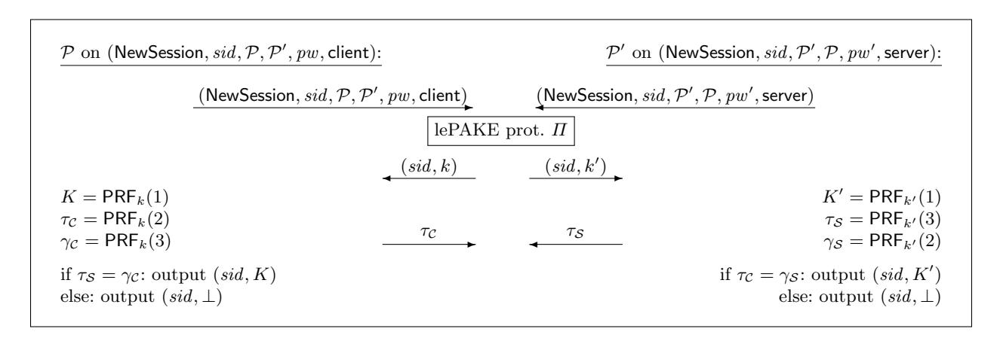
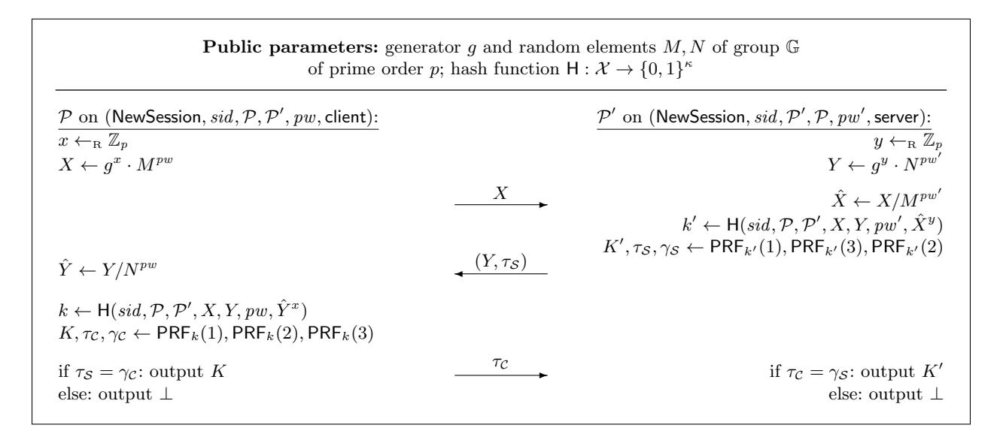

# Universally Composable Relaxed Password Authenticated Key Exchange

Michel Abdalla1,<sup>2</sup> , Manuel Barbosa<sup>3</sup> , Tatiana Bradley<sup>4</sup> , Stanis law Jarecki<sup>4</sup> , Jonathan Katz<sup>5</sup> , Jiayu Xu5,<sup>6</sup>

<sup>1</sup> DIENS, Ecole normale sup´erieure, CNRS, PSL University, Paris, France ´ [michel.abdalla@ens.fr](mailto:michel.abdalla@ens.fr) 2 INRIA, Paris, France <sup>3</sup> FCUP and INESC TEC, Porto, Portugal [mbb@fc.up.pt](mailto:mbb@fc.up.pt) <sup>4</sup> University of California, Irvine, USA [tebradle@uci.edu,](mailto:tebradle@uci.edu) [sjarecki@uci.edu](mailto:sjarecki@uci.edu) <sup>5</sup> Dept. of Computer Science, George Mason University, USA [jkatz2@gmail.com](mailto:jkatz2@gmail.com) <sup>6</sup> Dept. of Computer Science, University of Maryland, USA [jiayux@umd.edu](mailto:jiayux@uci.edu)

Abstract. Protocols for password authenticated key exchange (PAKE) allow two parties who share only a weak password to agree on a cryptographically strong key. We revisit the notion of PAKE in the framework of universal composability, and propose a relaxation of the PAKE functionality of Canetti et al. that we call lazy-extraction PAKE (lePAKE). Roughly, our relaxation allows the ideal-world adversary to postpone its password guess even until after a session is complete. We argue that this relaxed notion still provides meaningful security in the password-only setting.

As our main result, we show that several PAKE protocols that were previously only proven secure with respect to a "game-based" definition can in fact be shown to realize the lePAKE functionality in the random-oracle model. These include SPEKE, SPAKE2, and TBPEKE, the most efficient PAKE schemes currently known.

| 1 | Introduction                                               | 2  |  |  |  |  |  |
|---|------------------------------------------------------------|----|--|--|--|--|--|
|   | 1.1<br>Technical Overview                                  | 3  |  |  |  |  |  |
|   | 1.2<br>Paper Overview                                      | 5  |  |  |  |  |  |
| 2 | Relaxations of UC PAKE                                     | 5  |  |  |  |  |  |
| 3 | Security of SPAKE2                                         | 8  |  |  |  |  |  |
|   | 3.1<br>Extensions to TBPEKE, SPEKE, and their variants     | 14 |  |  |  |  |  |
| 4 | Adding Explicit Authentication                             | 14 |  |  |  |  |  |
| 5 | PAKE Relaxations and PFS                                   | 16 |  |  |  |  |  |
|   | 5.1<br>Defining PFS                                        | 16 |  |  |  |  |  |
|   | 5.2<br>Relaxed PAKE Implies PFS                            | 18 |  |  |  |  |  |
|   | 5.3<br>Lazy-Extraction PAKE Implies Weak FS                | 20 |  |  |  |  |  |
|   | 5.4<br>Practical implications                              | 20 |  |  |  |  |  |
|   | Acknowledgments<br>20                                      |    |  |  |  |  |  |
| A | Proof of Theorem 2                                         | 23 |  |  |  |  |  |
| B | Security of TBPEKE<br>26                                   |    |  |  |  |  |  |
| C | Supplementary Figures for SPAKE2 Proof<br>30               |    |  |  |  |  |  |
|   | Supplementary Material: Game-based Proofs for SPAKE2<br>35 |    |  |  |  |  |  |
|   |                                                            |    |  |  |  |  |  |

# <span id="page-1-0"></span>1 Introduction

Protocols for password authenticated key exchange (PAKE) allow two parties who share only a weak password to agree on a cryptographically strong key by communicating over an insecure network. PAKE protocols have been studied extensively in the cryptographic literature [\[6,](#page-20-0)[5,](#page-20-1)[7,](#page-20-2)[13,](#page-20-3)[23,](#page-21-0)[10,](#page-20-4)[11\]](#page-20-5), and are compelling given the widespread use of passwords for authentication. Even though the current practice is to implement passwordbased authentication by using TLS to set up a secure channel over which the password is sent, there are many arguments in favor of using PAKE protocols in conjunction with TLS [\[20\]](#page-20-6). Several PAKE protocols are currently under active consideration for standardization by the IETF [\[26\]](#page-21-1).

Defining security for PAKE protocols is made challenging by the fact that a password shared by the parties may have low entropy, and so can be guessed by an adversary with noticeable probability. This must somehow be accounted for in any security definition. Roughly speaking, the security guaranteed by a PAKE protocol is that an attacker who initiates Q online attacks—i.e., actively interferes in Q sessions of the protocol—can make at most Q password guesses (i.e., at most one per session in which it interferes) and can succeed in impersonating a party only if one of those guesses was correct. In particular, this means that offline attacks, in which an adversary merely eavesdrops on executions of the protocol, should not help the adversary in any way.

Two paradigms of PAKE security. In the cryptographic literature there are two leading paradigms for rigorously defining the above intuition. The first is the so-called "game-based" definition introduced by Bellare et al. [\[5\]](#page-20-1). In this definition, a password is chosen from a distribution with min-entropy κ, and the security experiment considers an interaction of an adversary with multiple instances of the PAKE protocol using that password. A PAKE protocol is considered secure if no probabilistic polynomial-time (PPT) attacker can distinguish a real session key from a random session key with advantage better than Q · 2 <sup>−</sup><sup>κ</sup> plus a negligible quantity.

A second approach uses a "simulation-based" definition [\[7,](#page-20-2)[10\]](#page-20-4). The most popular choice here is to work in the framework of universal composability (UC) [\[9\]](#page-20-7), and this is what we mean from now on when we refer to a simulation-based definition. This approach works by first defining an appropriate ideal functionality for PAKE; a PAKE protocol is then considered secure if it realizes that functionality. Canetti et al. [\[10\]](#page-20-4) pursued this approach, and defined a PAKE functionality that explicitly allows an adversary to make password guesses; a random session key is generated unless the adversary's password guess is correct. As argued by Canetti et al. [\[10\]](#page-20-4), this approach has a number of advantages. A definition in the UC framework is better suited for handling general correlations between passwords, e.g., when a client uses unequal but related passwords with different servers, or when two honest parties in a session use different but closely related passwords due to mistyping. A UC definition also ensures security under arbitrary protocol composition, which is useful for arguing security of protocols that use PAKE as a subroutine, e.g., for converting symmetric PAKE to asymmetric PAKE [\[12](#page-20-8)[,18\]](#page-20-9) or strong asymmetric PAKE [\[20\]](#page-20-6). This is especially important in the context of PAKE standardization, because strong asymmetric PAKE protocols can strengthen the current practice of password-over-TLS authentication while achieving optimal security in the face of server compromise.

Is there an inherent price for simulation-based security? Simulation-based security for PAKE is a desirable target. Unfortunately, the current state-of-the-art [\[10,](#page-20-4)[25,](#page-21-2)[22,](#page-21-3)[8\]](#page-20-10) suggests that this notion is more difficult to satisfy than the game-based definition. In particular, the most efficient UC PAKE protocol [\[8\]](#page-20-10) is roughly a factor of two less efficient than the most efficient game-based PAKEs such as SPEKE [\[19,](#page-20-11)[28,](#page-21-4)[17\]](#page-20-12), SPAKE2 [\[4\]](#page-20-13), or TBPEKE [\[31\]](#page-21-5).[1](#page-1-1)

Perhaps surprisingly, we show here that this "gap" can be overcome; in particular, we show that the SPEKE, SPAKE2, and TBPEKE protocols—which were previously only known to be secure with respect to the game-based notion of security—can be shown to be universally composable (in the random-oracle model). The caveat is that we prove universal composability with respect to a (slightly) relaxed version of the PAKE

<span id="page-1-1"></span><sup>1</sup> Variants of EKE [\[6\]](#page-20-0) shown to be universally composable [\[1](#page-20-14)[,8\]](#page-20-10) may appear to be exceptions, but EKE requires an ideal cipher defined over a cryptographic group, and it is not clear how that can be realized efficiently.

functionality originally considered by Canetti et al. At a high level, the main distinction is that the UC PAKE functionality of Canetti et al. [10] requires an attacker conducting an online attack against a session to make its password guess before that session is completed, whereas the relaxed functionality we consider—which we call lazy-extraction PAKE (lePAKE)—allows the attacker to delay its password guess even until after the session completes. (However, the attacker is still allowed to make only a single password guess per one actively attacked session.) On a technical level, this relaxed functionality is easier to realize because it allows the simulator to defer extraction of an attacker's password guess until a later point in the attacker's execution (see further discussion in the technical overview below). Nevertheless, the lazy-extraction PAKE functionality continues to capture the core properties expected from a PAKE protocol. In particular, as a sanity check on the proposed notion, we show that lePAKE plus key confirmation satisfies the game-based notion of PAKE with perfect forward secrecy (PFS) [5,2,3].

Implications for PAKE standardization. Recently, the Crypto Forum Research Group (CFRG), which is an IRTF (Internet Research Task Force) research group focused on the discussion and review of uses of cryptographic mechanisms, initiated a PAKE selection process with the goal of providing recommendations for password-based authenticated key establishment for IETF. Originally, 4 candidates were under consideration by the CRFG in the symmetric PAKE category, but currently only SPAKE2 and CPace remain under consideration. Our results contribute to this selection process by validating SPAKE2 as well as CPace when the latter includes additional elements such as the protocol transcript in the key derivation hash.

### <span id="page-2-0"></span>1.1 Technical Overview

There is a fundamental technical justification for an efficiency gap between known game-based-secure PAKE's and UC PAKE's. The reason is that the UC PAKE functionality, as defined by [10] and used in all subsequent works, requires the adversarial password guesses to be online (and straight-line) extractable from adversary's messages to PAKE protocol instances run by honest parties. Recall that for a PAKE to be UC secure there must exist an efficient simulator which simulates PAKE protocol instances given access to the ideal PAKE functionality, which in particular requires the simulator to specify a unique explicit password guess for each PAKE instance which the real-world adversary actively attacks. (The ideal PAKE functionality then allows the simulator, and hence the real-world adversary, to control the session key output by this instance if the provided password guess matched the password used by that PAKE instance, and otherwise the session key is random and thus secure.) The fact that the simulator must specify this explicit password before the attacked PAKE instance terminates, requires the simulator to online extract the password guess committed in adversary's messages. Moreover, this extraction must be performed straight-line, because universal composibility prohibits rewinding the adversary.

Unfortunately, online extraction cannot be done for many efficient game-based PAKE's listed above, because in these protocols each party sends a single protocol message which forms a perfectly hiding commitment to the password. Specifically, if g generates group of prime order p then in SPAKE2 each party sends a message of the form  $X = g^z \cdot (P_i)^{pw}$  where  $z \leftarrow_{\mathbb{R}} \mathbb{Z}_p$ ,  $P_1, P_2$  are random group element in the CRS, and i=1 or 2 depending on the party's role. In TBPEKE this message has the form  $X = (P_1 \cdot (P_2)^{H(pw)})^z$ , and in SPEKE it is  $X = H(pw)^z$  where H is a hash onto the group. These commitments are binding under the discrete logarithm hardness assumption (the first two are variants of Pedersen commitment [30], the third one requires ROM), and they equivocable, i.e. the simulator can "cheat" on messages sent on behalf of the honest parties, but they are perfectly hiding and thus not extractable. These commitments can be replaced with extractable ones, but it is not clear how to do so without increasing protocol costs (or resorting to ideal ciphers over a group).

**PAKE** with post-execution input extraction. However, in all the above schemes the final session key is computed by hashing the protocol transcript and the Diffie-Hellman key established by this PAKE interaction, e.g.  $Z = g^{z_1 \cdot z_2}$  in SPAKE2 or  $Z = (H(pw))^{z_1 \cdot z_2}$  in SPEKE. Since this final hash is modeled as a Random Oracle, an adversary who learns any information on the session key must query this RO hash on the proper input. If the information in this hash query suffices for the simulator to identify the unique

password to which this query corresponds, then a protocol message together with the final hash inputs do form an extractable commitment to the unique password guess the adversary makes on the attacked session.

However, the hash used in the final session key derivation is a local computation each party does in a "postprocessing" stage which can be executed after the counterpart terminates the protocol. Therefore a simulator which extracts a password guess from adversary's protocol message(s) and this local hash computation might extract it after the attacked session terminates. By the rules of the PAKE functionality of Canetti et al. [\[10\]](#page-20-4), such extraction would happen too late, because the PAKE functionality allows the simulator to test a password guess against a session but does so only when this session is still active (and has not been attacked previously e.g. on a different password guess). Indeed, it would seem counter-intuitive to allow the ideal-world adversary, i.e. the simulator, to provide the unique effective password guess after the attacked session completes. Nevertheless, this is exactly how we propose to relax the UC PAKE functionality in order to accommodate protocols where input-extraction is possible, but succeeds only from adversary's post-processing computation.

The relaxation we propose, the lazy-extraction PAKE, will require the ideal-world adversary to "interrupt" a fresh session while it is active in order to then perform the post-execution password test (we will call such tests "late" password tests). This models the UC PAKE requirement that an adversary can use an honest PAKE session as a password-testing oracle only if it actively attacks that session, and in particular it still holds that passively observed sessions do not provide any avenue for an attack. (To keep the new elements of the lazy-extraction PAKE model clear we use separate terms, resp. RegisterTest and LateTestPwd, for this new type of online session interruption and for the late password test, see Section [2.](#page-4-1)) Moreover, even if the adversary chooses this "lazy-extraction attack" route, the functionality still allows for only a single password test on an actively attacked session. This requirement effectively commits a (computationally bounded) real-world adversary to a unique password guess on each actively attacked session, because an adversary who performs the local computation related to more than one password test would not be simulatable in the model where the ideal-world adversary can submit at most one such test to the lazy-extraction PAKE functionality.

Explicit authentication and perfect forward security. To test the proposed lazy-extraction UC PAKE notion we show two further things. First, we show that any lazy-extraction UC PAKE followed by a key confirmation round upgrades lazy-extraction UC PAKE to PAKE with explicit (mutual) authentication (PAKE-EA) [\[14\]](#page-20-17), but it also realizes a stronger variant of lazy-extraction PAKE functionality which we call the relaxed UC PAKE. In the relaxed PAKE model, the adversary can still make a (single) late password test on an actively attacked session but such sessions are guaranteed to terminate with an abort. Hence, the attacker cannot use a late password test to compromise a session. Intuitively, if a lazy-extraction PAKE is followed by a key confirmation and the attacker delays its late password test until after the key confirmation is sent, then the key confirmation must fail and its counterpart will abort on such session. Hence, the "late password test" reveals if the tested passworded was correct but it cannot reveal a key of an active session.

Secondly, we show that any relaxed UC PAKE satisfies the game-based notion of PAKE with perfect forward secrecy (PFS) [\[5,](#page-20-1)[2,](#page-20-15)[3\]](#page-20-16). (A similar test was done by Canetti et al. with regard to the original UC PAKE notion [\[10\]](#page-20-4).) Intuitively, since the lazy-extraction attack avenue against a relaxed PAKE cannot be used to compromise keys of any active session, it follows that all active sessions, i.e. all sessions which terminate with a session key as opposed to an abort, are as secure in the relaxed UC PAKE model as they are in the original UC PAKE model of Canetti et al. In particular, they are secure against future password compromise.

Relation to prior work. Jarecki et al. [\[21\]](#page-20-18) recently introduced the relaxed UC PAKE model in the context of the asymmetric PAKE (aPAKE) functionality [\[12\]](#page-20-8), and showed that this relaxation is necessary to prove security of the OPAQUE protocol proposed in [\[20\]](#page-20-6). As discussed above, the lazy-extraction PAKE model goes further than the relaxed PAKE model, and this further relaxation appears to be necessary in order to model protocols like SPEKE, SPAKE2, and TBPEKE as universally composable PAKEs. (See Section [2](#page-4-1) for the precise specifications of the lazy-extraction PAKE and the relaxed PAKE models.)

Hasse and Labrique [\[15\]](#page-20-19) have recently argued that CPace [\[16\]](#page-20-20) realizes a variant of the lazy-extraction UC PAKE functionality, but the variant of this notion they consider seems unsatisfactory, e.g. it appears not to imply security of passively observed sessions, and it appears to be not realizable as stated (see Section [2](#page-4-1) for discussion). They also argue that adding a key-confirmation step suffices to convert such protocol into a standard UC PAKE, while we show that the result is still only a relaxed UC PAKE.<sup>2</sup>

## <span id="page-4-0"></span>1.2 Paper Overview

In Section 2, we introduce the two relaxations of the UC PAKE functionality, namely the lazy-extraction UC PAKE and relaxed UC PAKE functionalities, respectively abbreviated as lePAKE and rPAKE, together with the extension of the latter to explicit (mutual) authentication. In Section 3, we show that SPAKE2 scheme of [4] is a secure lePAKE under the Gap CDH assumption. In Section 4, we show that any lePAKE protocol followed by a key confirmation round is a secure rPAKE-EA, i.e. rPAKE with explicit authentication. In Section 5, we show that that every rPAKE-EA protocol satisfies the game-base notion of PAKE with perfect forward secrecy, and that every lePAKE protocol by itself already satisfies weak forward secrecy. In Appendix B, we include the proof that TBPEKE [31] is a secure lePAKE protocol under appropriate assumptions, and we explain that this proof extends to similar results regarding SPEKE [19,28,17]. Some details of the above proofs are deferred to Appendices A and C. Finally, we provide game-based proofs for SPAKE2 as supplementary material.

# <span id="page-4-1"></span>2 Relaxations of UC PAKE

In Fig. 1, we present the PAKE functionality as defined by Canetti et al. [10], and compare it with two relaxations that we refer to as relaxed PAKE (rPAKE) and lazy-extraction PAKE (lePAKE). We explain at a high level the differences between these various formulations. In the original PAKE functionality  $\mathcal{F}_{PAKE}$ , after a party initiates a session (but before the party generates a key) the attacker may try to guess the password used in that session by making a single TestPwd query. If the attacker's password guess is correct, the session is marked compromised; if not, the session is marked interrupted. When a session key is later generated for that session, the attacker is given the ability to choose the key if the session is marked compromised, but a random key is chosen otherwise. Importantly, the attacker is only allowed to make a password guess for a session before the key is generated and the session terminates.

In both the relaxed PAKE functionality  $\mathcal{F}_{\mathsf{rPAKE}}$  and the lazy-extraction PAKE functionality  $\mathcal{F}_{\mathsf{lePAKE}}$ , the attacker is given the ability to make a password guess for a session even *after* a session key is generated and that session has completed. Formally, this is allowed only if the attacker makes a RegisterTest query before the session key is generated; this indicates the attacker's intention to (possibly) make a password guess later, and models active interference with a real-world protocol execution. (Of course, the attacker also has the option of making a password guess before a key is generated as in the original  $\mathcal{F}_{\mathsf{PAKE}}$ .) Having made a RegisterTest query for a session, the attacker may then make a LateTestPwd query to that session after the session key K is generated.  $\mathcal{F}_{\mathsf{PAKE}}$  and  $\mathcal{F}_{\mathsf{lePAKE}}$  differ in what happens next:

- In  $\mathcal{F}_{\mathsf{rPAKE}}$ , the attacker is only told whether or not its password guess is correct, but learns nothing about K in either case.
- In  $\mathcal{F}_{lePAKE}$ , the attacker is given K if its password guess is correct, and given a random key otherwise.<sup>3</sup>

It is easy to see that both  $\mathcal{F}_{rPAKE}$  and  $\mathcal{F}_{lePAKE}$  are relaxations of  $\mathcal{F}_{PAKE}$ , in the sense that any protocol realizing  $\mathcal{F}_{PAKE}$  also realizes  $\mathcal{F}_{rPAKE}$  and  $\mathcal{F}_{lePAKE}$ . Although, as defined,  $\mathcal{F}_{lePAKE}$  and  $\mathcal{F}_{rPAKE}$  are incomparable, the version of  $\mathcal{F}_{lePAKE}$  in which the attacker is additionally notified whether its password guess is correct (cf. Footnote 3) is a strict relaxation of  $\mathcal{F}_{rPAKE}$ .

Following the work of Groce and Katz [14], we also consider PAKE functionalities that incorporate explicit (mutual) authentication, which we refer to as PAKE-EA.<sup>4</sup> Intuitively, in a PAKE-EA protocol a party should

<span id="page-4-2"></span><sup>&</sup>lt;sup>2</sup> In [15] this is explicitly claimed not for CPace itself but for its asymmetric (aPAKE) version called AuCPace.

<span id="page-4-3"></span><sup>&</sup>lt;sup>3</sup> Note that here the attacker is not explicitly notified whether its password guess is correct. While it is arguably more natural to notify the attacker, we obtain a slightly stronger functionality by omitting this notification.

<span id="page-4-4"></span><sup>&</sup>lt;sup>4</sup> Although Canetti et al. [10] informally suggest a way of modeling explicit authentication in PAKE, the functionality they propose seems unacceptably weak in the sense that it does not require a party to abort even when an attacker successfully interferes with its partner's session.

#### Session initiation

On (NewSession, sid,  $\mathcal{P}$ ,  $\mathcal{P}'$ , pw, role) from  $\mathcal{P}$ , ignore this query if record  $\langle sid$ ,  $\mathcal{P}$ ,  $\cdot$ ,  $\cdot$ ,  $\cdot$  already exists. Otherwise record  $\langle sid$ ,  $\mathcal{P}$ ,  $\mathcal{P}'$ , pw, role) marked fresh and send (NewSession, sid,  $\mathcal{P}$ ,  $\mathcal{P}'$ , role) to  $\mathcal{A}$ .

## Active attack

- On (TestPwd, sid,  $\mathcal{P}$ ,  $pw^*$ ) from  $\mathcal{A}$ , if  $\exists$  a fresh record  $\langle sid$ ,  $\mathcal{P}$ ,  $\mathcal{P}'$ , pw,  $\cdot \rangle$  then:
  - If  $pw^* = pw$  then mark it compromised and return "correct guess";
  - If  $pw^* \neq pw$  then mark it interrupted and return "wrong guess".
- On (RegisterTest, sid,  $\mathcal{P}$ ) from  $\mathcal{A}$ , if  $\exists$  a fresh record  $\langle sid$ ,  $\mathcal{P}$ ,  $\mathcal{P}'$ ,  $\cdot$ ,  $\cdot \rangle$  then mark it interrupted and flag it tested.
- On (LateTestPwd, sid,  $\mathcal{P}$ ,  $pw^*$ ) from  $\mathcal{A}$ , if  $\exists$  a record  $\langle sid$ ,  $\mathcal{P}$ ,  $\mathcal{P}'$ , pw,  $\cdot$ ,  $K\rangle$  marked completed with flag tested then remove this flag and do:
  - If pw\* = pw then return K ["correct guess"] to A;
    If pw\* ≠ pw then return K ←<sub>R</sub> {0,1}<sup>κ</sup> | "wrong guess" to A.

#### Key generation

On (NewKey, sid,  $\mathcal{P}$ ,  $K^*$ ) from  $\mathcal{A}$ , if  $\exists$  a record  $\langle sid$ ,  $\mathcal{P}$ ,  $\mathcal{P}'$ , pw, role $\rangle$  not marked completed then do:

- If the record is compromised, or either  $\mathcal{P}$  or  $\mathcal{P}'$  is corrupted, then set  $K := K^*$ .
- If the record is fresh and ∃ a completed record  $\langle sid, \mathcal{P}', \mathcal{P}, pw, \mathsf{role}', K' \rangle$  with  $\mathsf{role}' \neq \mathsf{role}$  that was fresh when  $\mathcal{P}'$  output (sid, K'), then set K := K'.
- In all other cases pick  $K \leftarrow_{\mathbb{R}} \{0,1\}^{\kappa}$ .

Finally, append K to record  $(sid, \mathcal{P}, \mathcal{P}', pw, \mathsf{role})$ , mark it completed, and output (sid, K) to  $\mathcal{P}$ .

<span id="page-5-0"></span>Fig. 1. UC PAKE variants: The original PAKE functionality  $\mathcal{F}_{PAKE}$  of Canetti et al. [10] is the version with all gray text omitted. The relaxed PAKE functionality  $\mathcal{F}_{rPAKE}$  includes the gray text but omits the boxed portions; the lazy-extraction PAKE functionality  $\mathcal{F}_{lePAKE}$  includes the gray text but omits the dashed portions.

#### Session initiation

On (NewSession, sid,  $\mathcal{P}$ ,  $\mathcal{P}'$ , pw, role) from  $\mathcal{P}$ , ignore this query if record  $\langle sid$ ,  $\mathcal{P}$ ,  $\cdot$ ,  $\cdot$ ,  $\cdot$  already exists. Otherwise record  $\langle sid$ ,  $\mathcal{P}$ ,  $\mathcal{P}'$ , pw, role) marked fresh and send (NewSession, sid,  $\mathcal{P}$ ,  $\mathcal{P}'$ , role) to  $\mathcal{A}$ .

## Active attack

- − On (TestPwd, sid,  $\mathcal{P}$ ,  $pw^*$ ) from  $\mathcal{A}$ , if  $\exists$  a fresh record  $\langle sid$ ,  $\mathcal{P}$ ,  $\mathcal{P}'$ , pw,  $\cdot$  $\rangle$  then:
  - If  $pw^* = pw$  then mark it compromised and return "correct guess";
  - If  $pw^* \neq pw$  then mark it interrupted and return "wrong guess".
- On (RegisterTest, sid,  $\mathcal{P}$ ) from  $\mathcal{A}$ , if  $\exists$  a fresh record  $\langle sid$ ,  $\mathcal{P}$ ,  $\mathcal{P}'$ ,  $\cdot$ ,  $\cdot \rangle$  then mark it interrupted and flag it tested.
- On (LateTestPwd, sid,  $\mathcal{P}$ ,  $pw^*$ ) from  $\mathcal{A}$ , if  $\exists$  a record  $\langle sid$ ,  $\mathcal{P}$ ,  $\mathcal{P}'$ , pw,  $\cdot$ ,  $K\rangle$  marked completed with flag tested then remove this flag and do:
  - If  $pw^* = pw$  then return "correct guess" to A.
  - If  $pw^* \neq pw$  then return "wrong guess" to A.

# Key generation and explicit authentication

- On (GetReady, sid,  $\mathcal{P}$ ) from  $\mathcal{A}$ , if  $\exists$  a record  $\langle sid$ ,  $\mathcal{P}$ ,  $\mathcal{P}'$ , pw, role $\rangle$  marked fresh then re-label it ready.
- On (NewKey, sid,  $\mathcal{P}$ ,  $K^*$ ) from  $\mathcal{A}$ , if  $\exists$  a record  $\langle sid$ ,  $\mathcal{P}$ ,  $\mathcal{P}'$ , pw, role $\rangle$  not marked completed then do:
  - If the record is compromised, or  $\mathcal{P}$  or  $\mathcal{P}'$  is corrupted,  $\overline{\text{or } K^* = \bot}$ , then set  $K := K^*$ .
  - Else, if the record is fresh or ready, and  $\exists$  a record  $\langle sid, \mathcal{P}', \mathcal{P}, pw, \mathsf{role}' \rangle$  marked ready s.t.  $\mathsf{role}' \neq \mathsf{role}$  then pick  $K \leftarrow_{\mathsf{R}} \{0,1\}^{\kappa}$ .
  - Else, if the record is ready and  $\exists$  a completed record  $\langle sid, \mathcal{P}', \mathcal{P}, pw, \mathsf{role}', K' \rangle$  with  $\mathsf{role}' \neq \mathsf{role}$  that was fresh when  $\mathcal{P}'$  output (sid, K'), then set K := K'.
  - In all other cases, set  $K := \bot$

Finally, append K to record  $\langle sid, \mathcal{P}, \mathcal{P}', pw, \mathsf{role} \rangle$ , mark it completed, and output (sid, K) to  $\mathcal{P}$ .

<span id="page-6-0"></span>Fig. 2. The  $\mathcal{F}_{rPAKE-EA}$  functionality for relaxed PAKE-EA. The original PAKE-EA of Groce and Katz [14] corresponds to the version with gray text omitted. The boxed text highlights the differences from  $\mathcal{F}_{rPAKE}$ .

abort if it did not establish a matching session key with its intended partner. As in the case of PAKE, the original PAKE-EA functionality introduced by Groce and Katz required the attacker to make its password guess before the session key is generated, while we introduce a relaxed version of the PAKE-EA functionality, denoted  $\mathcal{F}_{rPAKE-EA}$  and shown in Fig. 2, that allows the attacker to delay its password guess until after the session has completed.<sup>5</sup> If the attacker's guess is correct, it is notified of that fact; our relaxation thus parallels that of  $\mathcal{F}_{rPAKE}$ . Note that such late password guess can only be performed on aborted sessions, since the attacker must send a RegisterTest query before the session completes, which marks the session interrupted, and by the rule of explicit authentication, an interrupted session must result in aborting.

Besides the intuitive appeal of our relaxed definitions, we justify these relaxations by showing that it is easy to realize  $\mathcal{F}_{rPAKE-EA}$  in the  $\mathcal{F}_{lePAKE}$ -hybrid world (Section 4), that any protocol realizing  $\mathcal{F}_{rPAKE}$  satisfies perfect forward secrecy (Section 5), and that any protocol realizing  $\mathcal{F}_{lePAKE}$  satisfies weak forward secrecy (Section 5.3).

Note on the relaxed PAKE functionality used in [15]. A preliminary version of the lazy-extraction PAKE functionality, referred as "relaxed PAKE" therein, appeared in an early version of [21] and was adopted by [15] as a model for the CPace protocol. This version is imprecise in several respects: First, it does not require the adversary to explicitly attack an online session via a RegisterTest query before issuing a LateTestPwd query on a completed session. This appears too weak, e.g. because it allows an adversary to issue LateTestPwd queries even on passively observed sessions. On the other hand, it restricts the adversary from making a LateTestPwd query upon completion of the matching counterpart's session (with a matching sid but not necessarily a matching password), which appears too strong, because a man-in-the-middle attacker can make  $\mathcal{P}'$  complete with a random key or an abort, and this does not affect its capabilities regarding party  $\mathcal{P}$ . Our lazy-extraction PAKE functionality makes this notion more precise, and in Appendix B we show that TBPEKE [31] and SPEKE [19] realize the lePAKE fuctionality under (Gap) CDH and SDH assumptions. Since CPace [15,16] is a close variant of SPEKE these results will therefore apply also to CPace if its key derivation hash is modified to include additional elements such as the protocol transcript (see Section 3.1).

# <span id="page-7-0"></span>3 Security of SPAKE2

We consider SPAKE2 as a motivating example for our work. SPAKE2 was proposed by Abdalla and Pointcheval [4] and shown secure in the game-based PAKE model [5] under the CDH assumption in the ROM. SPAKE2 is, to the best of our knowledge, the most efficient PAKE protocol which does not assume ideal cipher over a group. Its costs are 2 fixed-base and 1 variable-base exponentiations per party, and it is round-minimal because it can be executed in a single simultaneous round of bi-directional communication.

We give independent proofs that SPAKE2 realizes lazy-extraction UC PAKE and that it meets the game-based PFS definition, which was not considered in [4]. The lazy-extraction UC PAKE result is tight with respect to Gap CDH, but the game-based PFS result is not: we require a special assumption introduced in [4] for which a reduction to Gap CDH is known, but this is not tight. Still, since we do not know that lazy-extraction UC PAKE security implies PFS security, this result is the only one we have for the PFS security of (raw) SPAKE2.<sup>6</sup> Below, we only include the proof that SPAKE2 realizes the lazy-extraction UC PAKE functionality. The direct proofs that SPAKE2 realizes the game-based PAKE (with tight reduction) and game-based PAKE with PFS (with security degradation) are included as supplementary material.

We recall the two-flow, simultaneous round SPAKE2 protocol of [4] in Fig. 3, with some notational choices adjusted to the UC setting.

<span id="page-7-3"></span><span id="page-7-1"></span><sup>&</sup>lt;sup>5</sup> While relaxing the Groce-Katz functionality, we also make some minor changes to their original: (1) we make the parties symmetric, and do not require the server to generate a session key first, and (2) we allow the adversary to force a party to abort by sending a (NewKey, sid,  $\mathcal{P}$ ,  $\perp$ ) message. (This second modification is required, and its omission appears to be an oversight of Groce and Katz.)

<span id="page-7-2"></span><sup>&</sup>lt;sup>6</sup> Note that the combined results of Sections 4 and 5 show that SPAKE2 followed by a key confirmation round is PFS secure with tight security with respect to Gap CDH.

# Public parameters: generator g and random elements M, N of group $\mathbb{G}$ of prime order p; hash function $\mathsf{H}: \mathcal{X} \to \{0,1\}^\kappa$ $\frac{\mathcal{P} \text{ on (NewSession}, sid, \mathcal{P}, \mathcal{P}', pw, \text{client}):}{x \leftarrow_{\mathbb{R}} \mathbb{Z}_p}$ $X \leftarrow g^x \cdot M^{pw}$ $\hat{Y} \leftarrow Y/N^{pw}$ $K \leftarrow \mathsf{H}(sid, \mathcal{P}, \mathcal{P}', X, Y, pw, \hat{Y}^x)$ output K $\frac{\mathcal{P}' \text{ on (NewSession}, sid, \mathcal{P}', \mathcal{P}, pw', \text{server}):}{y \leftarrow_{\mathbb{R}} \mathbb{Z}_p}$ $Y \leftarrow g^y \cdot N^{pw'}$ $\hat{X} \leftarrow X/M^{pw'}$ $K' \leftarrow \mathsf{H}(sid, \mathcal{P}, \mathcal{P}', X, Y, pw', \hat{X}^y)$ output K'

<span id="page-8-0"></span>Fig. 3. SPAKE2 protocol of [4]

**Theorem 1.** SPAKE2 realizes the Lazy-Extraction PAKE functionality  $\mathcal{F}_{\mathsf{lePAKE}}$  in ROM under the Gap-CDH assumption.

**CDH and Gap CDH assumptions.** Recall that the Computational Diffie-Hellman (CDH) assumption states that, given generator g and two random elements  $X = g^a$ , and  $Y = g^b$  in a cyclic group of prime order, it is hard to find  $Z = \text{CDH}_g(X,Y) = g^{ab}$ . In the gap version, the problem must remain hard even if the adversary has access to a Decisional Diffie-Hellman oracle.

**Simulator for SPAKE2.** The UC simulator SIM for SPAKE2, given in full in Fig. 4, acts as the ideal adversary, with access to the ideal functionality  $\mathcal{F}_{\mathsf{lePAKE}}$  (shortened to  $\mathcal{F}$  in the subsequent discussion and proof). The goal is to emulate (except for negligible probability), the real-world interactions between the environment  $\mathcal{Z}$ , any real adversary  $\mathcal{A}$ , and the real SPAKE2 protocol.

Thus, SIM must simulate messages that appear to come from the real players, respond appropriately to adversarial messages, and answer random oracle queries consistently. SIM has access to the  $\mathcal{F}$  interface, but not the secret inputs (i.e, the passwords) of the honest players.

We briefly describe how SIM simulates client  $\mathcal{P}$ 's interaction with  $\mathcal{Z}/\mathcal{A}$ ; the server case is similar since the protocol is symmetric. SIM first embeds trapdoors into the CRS, i.e., it picks  $m, n \leftarrow_{\mathbb{R}} \mathbb{Z}_p$  and sets  $M = g^m$  and  $N = g^n$ . To simulate the protocol message X, SIM picks  $z \leftarrow_{\mathbb{R}} \mathbb{Z}_p$  and sets  $X = g^z$ . Since X is also uniformly distributed in the real protocol, the environment cannot tell the difference. When  $\mathcal{A}$  queries the random oracle  $\mathsf{H}(sid,\mathcal{P},\mathcal{P}',X,Y',pw,W)$ , SIM decides whether it corresponds to a valid password guess: SIM first computes the exponent  $\hat{x}$  such that  $X = g^{\hat{x}} \cdot M^{pw}$ , using the CRS trapdoor m, and then checks if  $W = (Y'/N^{pw})^{\hat{x}}$ . If so, then SIM stores (Y',pw). If  $\mathcal{A}$  later sends a protocol message Y' aimed at  $\mathcal{P}$ , then this is an online attack: when  $\mathcal{A}$  makes the RO query, SIM picks a random string K as the output, and stores K together with (Y',pw). Then, when  $\mathcal{A}$  sends Y', SIM sends (TestPwd,  $sid,\mathcal{P},pw$ ) to  $\mathcal{F}$ , and if  $\mathcal{F}$  replies "correct guess," then SIM sets  $\mathcal{P}$ 's key to K by sending (NewKey,  $sid,\mathcal{P},K$ ) to  $\mathcal{F}$ ; if  $\mathcal{F}$  replies "wrong guess," then SIM sends (NewKey,  $sid,\mathcal{P},0^{\kappa}$ ) to  $\mathcal{F}$  (and  $\mathcal{F}$  will set  $\mathcal{P}$ 's key to a random string). On the other hand, if  $\mathcal{A}$  makes the RO query after sending Y', then this is a postponed attack, so SIM sends (RegisterTest,  $sid,\mathcal{P}$ ) to  $\mathcal{F}$  when  $\mathcal{A}$  sends Y', and later sends (LateTestPwd,  $sid,\mathcal{P},pw$ ) to  $\mathcal{F}$  when  $\mathcal{A}$  makes the RO query; upon  $\mathcal{F}$  replying a key K, SIM "programs" the RO output as K.

Record keeping. For each party identifier  $\mathcal{P}$  and session identifier sid, the simulator SIM stores a state  $\pi_{\mathcal{P}}^{sid}$  containing the following values:

- The role  $role \in \{client, server\}\ of\ \mathcal{P}\ in\ this\ session.$
- The private exponent exp used in the network messages, x for  $\mathcal{C}$  and y for  $\mathcal{S}$ . In the first few games, this exponent has the same meaning as in the protocol, however, in the final simulator, it is the actual discrete log of the simulated network message.
- The transcript of the session includes variables  $(C, S, X, Y, X^*, Y^*)$ , where C, S are party identifiers for client and server respectively, X, Y are simulated messages, and  $X^*, Y^*$  are adversarial messages. Note

that SIM only directly stores messages X and  $Y^*$  for clients (copying Y from the server if it exists), and symmetrically stores Y and  $X^*$  for servers (copying X from the client if it exists). Unknown values are set to  $\bot$ .

- The password pw of the party. This value is only set and used in intermediate games when the simulator knows the parties' passwords and needs to directly verify password guesses.
- A table guesses mapping values  $Z^*$  to tuples (pw, k\*), representing potential password guesses, and corresponding keys, made by the adversary using the random oracle H. If an adversarial network message  $Z^*$  is received, the simulator can then look up the corresponding password pw, which it sends to  $\mathcal{F}$  to test; if the guess is correct, SIM instructs  $\mathcal{F}$  to set the final key as  $k^*$ , and otherwise lets  $\mathcal{F}$  pick a random key.
- A flag waiting set to T if no adversarial message  $Z^*$  has been received for this party and sid, and F otherwise. This flag ensures that the first adversarial message for each  $(\mathcal{P}, sid)$  pair is processed, and all others are ignored.

The simulator additionally stores a global value  $q_s$  which is the maximum number of paired sessions, upper bounded by the total number of values  $Z^*$  sent by  $\mathcal{A}$ .

Let  $\mathbf{Real}_{\mathcal{Z},\mathcal{A},\mathsf{SPAKE2}}$  be the probability of the event that environment  $\mathcal{Z}$  with adversary  $\mathcal{A}$  outputs 1 in the real world, and  $\mathbf{Ideal}_{\mathcal{Z},\mathsf{SIM},\mathsf{SPAKE2}}$  be the corresponding probability in the ideal world. The goal is to show that  $|\mathbf{Real}_{\mathcal{Z},\mathcal{A},\mathsf{SPAKE2}} - \mathbf{Ideal}_{\mathcal{Z},\mathsf{SIM},\mathsf{SPAKE2}}|$  is negligible.

We use the well-known sequence-of-games proof strategy to show that we may move from the real game to the simulator in a manner indistinguishable to the environment, except for negligible probability. We begin with Game 0, the real game, and move through a series of steps, each of which we show to be indistinguishable from the previous, to the final simulator. The full code of intermediate Games 1-4 is illustrated in Appendix C. Throughout the proof,  $\mathbf{Gi}$  denotes the probability that  $\mathcal Z$  outputs 1 while interacting with Game i.

### Proof of Theorem 1.

Game 0. This is the real world, in which  $\mathcal{A}$  interacts with real players, and may view, modify, and/or drop network messages.

$$\mathbf{Real}_{\mathcal{Z},\mathcal{A},\mathsf{SPAKE2}} = \Pr[\mathbf{G0}].$$

GAME 1. (Simulate real world with trapdoors) We now simulate the behavior of the real players and the random oracle. The simulation is exactly as the real game, except for the inclusion of record keeping, and embedding of trapdoors in M and N, i.e, setting  $M = g^m$ ;  $N = g^n$  for known m and n. The embedding of trapdoors is not noticeable to the environment as M, N are still drawn from from the same distribution as before, thus:

$$Pr[G1] = Pr[G0].$$

GAME 2. (Random key if adversary is passive) If the adversary passes a simulated Z message sent to  $(sid, \mathcal{P})$  without modification, output a random key for  $\mathcal{P}$  instead of the true random oracle output. The environment notices this change only if  $\mathcal{A}$  makes a hash query that would result in an inconsistency, namely  $\mathsf{H}(sid, \mathcal{C}, \mathcal{S}, X', Y', pw, W = g^{xy})$ , where  $X' = g^x M^{pw}, Y' = g^y N^{pw}$  are the simulated messages. We check for such queries, and abort if any occur.

We may reduce this event to Gap-CDH as follows: Consider an adversary  $\mathcal{B}_2$  against Gap-CDH. On generalized CDH challenge<sup>7</sup>  $(A_1 = g^{a_1}, \cdots, A_{q_s} = g^{a_{q_s}}, B_1 = g^{b_1}, \cdots, B_{q_s} = g^{b_{q_s}})$ , the reduction indexes sessions  $(sid, \mathcal{P}, \mathcal{P}')$ , and embeds  $X_i = A_i \cdot M^{pw_i}$ ,  $Y = B_i \cdot N^{pw_i}$  when generating the simulated messages for the *i*th session. The reduction can re-use the code of  $\mathbf{G2}$ , except for the cases where it requires the secret exponents  $a_i$  and  $b_i$ : (1) to generate  $K \leftarrow \mathsf{H}(sid, \mathcal{C}, \mathcal{S}, X, Y, pw, \hat{Y}^{a_i} \{ \text{or } \hat{X}^{b_i} \})$  and (2) to check for the "bad event" of an inconsistency in the hash response. To handle case (1), the reduction stores an additional value K for each session  $(sid, \mathcal{C}, \mathcal{S})$  which is set randomly when either the reduction must handle case (1), or when  $\mathcal{A}$  queries  $\mathsf{H}(sid, \mathcal{C}, \mathcal{S}, X', Y', pw, W)$  such that the password is correct and  $\mathsf{DDH}(X', Y', W)$  holds (checked via the DDH oracle): if either of these events happens again the same value of K is used. The check of case

<span id="page-9-0"></span><sup>&</sup>lt;sup>7</sup> The generalized CDH problem is tightly equivalent to the CDH problem by random-self reducibility.

```
generate CRS
\overline{M \leftarrow g^m; N \leftarrow g^n} for (m, n) \leftarrow_{\mathbb{R}} \mathbb{Z}_p
return M, N
on (NewSession, sid, \mathcal{P}, \mathcal{P}', role) from \mathcal{F}
if \pi_{\mathcal{P}}^{sid} \neq \bot: return \bot
(X,Y) \leftarrow (\bot,\bot)
if role = client :
        (\mathcal{C}, \mathcal{S}) \leftarrow (\mathcal{P}, \mathcal{P}')
        z \leftarrow_{\mathbf{R}} \mathbb{Z}_p; X \leftarrow M^z; Z \leftarrow X
        if \pi_{\mathcal{P}'}^{sid} \neq \bot and \pi_{\mathcal{P}'}^{sid} role \neq client: Y \leftarrow \pi_{\mathcal{P}'}^{sid}.Y; \pi_{\mathcal{P}'}^{sid}.X \leftarrow X
else if role = server :
        (\mathcal{C},\mathcal{S}) \leftarrow (\mathcal{P}',\mathcal{P})
       \begin{array}{l} z \leftarrow_{\mathrm{R}} \mathbb{Z}_p; Y \leftarrow N^z; Z \leftarrow Y \\ \text{if } \pi^{sid}_{\mathcal{P}'} \neq \bot \text{ and } \pi^{sid}_{\mathcal{P}'}.\mathsf{role} \neq \mathsf{server} \colon X \leftarrow \pi^{sid}_{\mathcal{P}'}.X; \pi^{sid}_{\mathcal{P}'}.Y \leftarrow Y \end{array}
\pi_{\mathcal{P}}^{sid} \leftarrow (\mathsf{role}, z, \mathcal{C}, \mathcal{S}, X, Y, \bot, \bot, \bot, \bot, \bot, \mathsf{T})
send Z from \mathcal{P} to \mathcal{A}
on Z^* from \mathcal{A} as msg to (sid, \mathcal{P})
if \pi_{\mathcal{P}}^{sid} = \bot or \pi_{\mathcal{P}}^{sid}.waiting = F: return \bot
(\mathsf{role}, \cdot, \mathcal{C}, \mathcal{S}, X, Y, \cdot, \cdot, \cdot, \mathsf{guesses}, \cdot) \leftarrow \pi_{\mathcal{P}}^{sid}
K \leftarrow 0^{\kappa}
if role = client :
        \pi_{\mathcal{D}}^{sid}.Y^* \leftarrow Z^*
        if Z^* = Y: jump to end
else if role = server:
        \pi_{\mathcal{P}}^{sid}.X^* \leftarrow Z^*
        if Z^* = X: jump to end
if \pi_{\mathcal{P}}^{sid}.guesses[Z^*] = (pw, k^*):
        \mathsf{reply} \leftarrow (\mathsf{TestPwd}, sid, \mathcal{P}, pw) \text{ to } \mathcal{F}
        if reply = "correct": K \leftarrow k^*
else: send (RegisterTest, sid, \mathcal{P}) to \mathcal{F}
end: \pi^{sid}_{\mathcal{D}}.waiting = F
           send (NewKey, sid, \mathcal{P}, K) to \mathcal{F}
on \mathsf{H}(sid, \mathcal{C}, \mathcal{S}, X', Y', pw, W) from \mathcal{A}:
if T_H[sid, C, S, X', Y', pw, W] = \bot:
        K \leftarrow_{\mathbb{R}} \{0,1\}^{\kappa}; (\hat{x},\hat{y}) \leftarrow (\bot,\bot)
        if \pi_{\mathcal{C}}^{sid} \neq \perp : \hat{x} \leftarrow m \cdot \pi_{\mathcal{C}}^{sid}. \exp(-m \cdot pw)
        if \pi_{\mathcal{S}}^{sid} \neq \bot: \hat{y} \leftarrow n \cdot \pi_{\mathcal{S}}^{sid}.exp-n \cdot pw
        if \pi_{\mathcal{C}}^{sid}.X = X' and \pi_{\mathcal{S}}^{sid}.Y = Y' and W = g^{\hat{x}\hat{y}}: abort
        else if \pi_{\mathcal{C}}^{sid}.X = X' and W = (Y'/N^{pw})^{\hat{x}}:
                if Y' = \pi_{\mathcal{C}}^{sid}.Y^*: \mathcal{P} \leftarrow \mathcal{C}; jump to late_test_pw
        else: \pi_{\mathcal{S}}^{sid}.guesses[Y'] \leftarrow (pw, K) else if \pi_{\mathcal{S}}^{sid}.Y = Y' and W = (X'/M^{pw})^{\hat{y}}:
                 if X' = \pi_{\mathcal{S}}^{sid}.X^*: \mathcal{P} \leftarrow \mathcal{S}; jump to late_test_pw
                 else: \pi_{\mathcal{S}}^{sid}.guesses[X'] \leftarrow (pw, K)
        jump to end
        late_test_pw: reply \leftarrow (LateTestPwd, sid, \mathcal{P}, pw) to \mathcal{F}
                                          K \leftarrow \mathsf{reply}; \text{ if no reply, abort}
        end: \mathsf{T}_\mathsf{H}[sid, \mathcal{C}, \mathcal{S}, X', Y', pw, W] \leftarrow K
send \mathsf{T}_\mathsf{H}[sid,\mathcal{C},\mathcal{S},X',Y',pw,W] to \mathcal{A}
```

<span id="page-10-0"></span>Fig. 4. UC Simulator for SPAKE2.

(2) can be done via the DDH oracle, i.e., by querying  $DDH(A_i, B_i, W)$ : if the bad event occurs,  $\mathcal{B}_2$  solves the CDH challenge with answer W. Thus:

$$|\Pr\left[\mathbf{G2}\right] - \Pr\left[\mathbf{G1}\right]| \leq \mathbf{Adv}_{\mathcal{B}_2}^{\mathsf{GCDH}}.$$

GAME 3. (Random simulated messages) On (NewSession, sid,  $\mathcal{P}$ ,  $\mathcal{P}'$ , role), if this is the first NewSession for  $(sid, \mathcal{P})$ , set  $Z \leftarrow g^z$  for  $z \leftarrow_{\mathbb{R}} \mathbb{Z}_p$ , and send Z to  $\mathcal{A}$  as a message from  $\mathcal{P}$  to  $(\mathcal{P}', sid)$ . Note that we may now compute the original exponents via:  $\hat{x} = m \cdot \pi_{\mathcal{C}}^{sid}.\exp{-m \cdot pw}$  and  $\hat{y} = n \cdot \pi_{\mathcal{S}}^{sid}.\exp{-n \cdot pw}$ . This change is not observable to the environment, as it is merely a syntactic change in the calculation of the exponents:

$$\Pr\left[\mathbf{G3}\right] = \Pr\left[\mathbf{G2}\right].$$

GAME 4. (Random keys if adversary does not correctly guess password) We now detect when an adversarial hash query corresponds to a password guess. We can detect this event by inspecting the X', Y', pw and W values provided to the hash oracle. Let us assume the adversary is guessing the client's password (the server case is symmetric). To make a password guess against the client, the adversary must set  $X' = \pi_{\mathcal{C}}^{sid}.X$ , i.e., use the simulated message sent by the client. The adversary can use any choice of Y', but to correspond with a specific password guess, the following must hold:  $W = (Y'/N^{pw})^{\hat{x}}$  (where  $\hat{x}$  is the exponent such that  $\pi_{\mathcal{C}}^{sid}.X = g^{\hat{x}}M^{pw}$ ). In other words, W must be the value that would be used by a real client if Y' were sent as the server's message. If such a password guess query is detected, we check if Y' was previously sent as an adversarial message on behalf of the server: if so, and if the password guess is correct, we program the random oracle to match the previously sent key. If Y' was not previously sent, we note the values Y', pw queried by the adversary and the random key K output by the RO. If Y' is later sent as the adversarial message, and the password is correct, we output the stored key K. If the password is incorrect, we output a random key independent of the RO table. If at any point a second password guess (correct or incorrect) is detected for the same sid and party, we abort the game.

This change is noticeable to the environment only in the abort case, i.e, the case where the adversary makes two password guesses with a single (X', Y') transcript, i.e.:

$$\mathsf{H}(sid, \mathcal{P}, \mathcal{P}', X', Y', pw, Z)$$
 and  $\mathsf{H}(sid, \mathcal{P}, \mathcal{P}', X', Y', pw', Z')$ ,

such that  $pw \neq pw'$ , and

$$\mathsf{CDH}(g^{mx}/M^{pw}, g^{ny}/N^{pw}) = Z \text{ and } \mathsf{CDH}(g^{mx}/M^{pw'}, g^{ny}/N^{pw'}) = Z'.$$

Call this event  $bad_4$ . It can be split into two cases: 1) for one of the passwords  $pw^* \in \{pw, pw'\}$  it holds that  $X' = M^{pw^*}$  or  $Y' = N^{pw^*}$ , i.e., there is a collision between the guessed password  $pw^*$  and the secret exponent x or y or 2) there is no such collision. Case 2, which we denote  $bad_4^1$ , can be reduced to Gap-CDH, as shown in Lemma 1. Case 1 can be reduced to Gap-DL as follows: Adversary  $\mathcal{B}_{4.2}$  on Gap DL challenge  $A = g^a$ , sets simulated messages as:  $X_i = A \cdot g^{\Delta_{i,x}}$  and  $Y_i = A \cdot g^{\Delta_{i,y}}$ , picking a fresh random  $\Delta_{i,x}$  and  $\Delta_{i,y}$  for each session  $(sid, \mathcal{P}, \mathcal{P}')$ . In the ith session (for every i),  $\mathcal{B}_{4.2}$  uses the DDH oracle to check for  $bad_4$ . If true,  $\mathcal{B}_{4.2}$  further checks if  $Y' = N^{pw^*}$  or  $X' = M^{pw^*}$  for one of the passwords: in the former case this means that  $Y' = N^{pw} = A \cdot g^{\Delta_{i,y}}$ , so  $npw = a + \Delta_{i,y}$ , and  $\mathcal{B}_{4.2}$  can output the DL solution is  $a = npw/\Delta_{i,y}$ , and the latter case is symmetric. We have that

$$|\mathrm{Pr}\;[\mathbf{G4}] - \mathrm{Pr}\;[\mathbf{G3}]| \leq \mathbf{Adv}^{\mathsf{GDL}}_{\mathcal{B}_{4.1}} + \mathbf{Adv}^{\mathsf{GCDH}}_{\mathcal{B}_{4.2}}.$$

Game 5. (Use  $\mathcal{F}_{\mathsf{lePAKE}}$  interface) In the final game, we modify the challenger so that it uses the RegisterTest, TestPwd and LateTestPwd interfaces to check passwords, and the NewKey interface to set keys. This is an internal change that is not noticeable to the environment, thus

$$\Pr\left[\mathbf{G5}\right] = \Pr\left[\mathbf{G4}\right].$$

In addition, this simulator perfectly mimics the ideal world except for the cases where it aborts, which we have already shown to happen with negligible probability, so:

$$Ideal_{\mathcal{Z},SIM,SPAKE2} = Pr [G5].$$

Thus the distinguishing advantage of  $\mathcal{Z}$  between the real world and the ideal world is:

$$|\mathbf{Ideal}_{\mathcal{Z},\mathsf{SIM},\mathsf{SPAKE2}} - \mathbf{Real}_{\mathcal{Z},\mathcal{A},\mathsf{SPAKE2}}| \leq \mathbf{Adv}_{\mathcal{B}_2}^{\mathsf{GCDH}} + \mathbf{Adv}_{\mathcal{B}_{4,1}}^{\mathsf{GDL}} + \mathbf{Adv}_{\mathcal{B}_{4,2}}^{\mathsf{GCDH}}$$

<span id="page-12-0"></span>which is negligible if Gap-CDH is hard.

**Lemma 1.** For every attacker A, there exists an attacker  $\mathcal{B}_{4.1}$  (whose running time is linear in the running time of A) such that:

$$\Pr[\mathbf{G4} \to bad_4^1] \leq \mathbf{Adv}_{\mathcal{B}_{4,1}}^{\mathsf{GCDH}}$$

*Proof.* Consider an attacker  $\mathcal{B}_{4.1}$  against GCDH. It receives a challenge  $(M = g^m, N = g^n)$  and wants to find CDH $(M, N) = g^{mn}$ . The attacker emulates **G4**, except for setting the CRS values as M, N from the challenge instead of randomly. It uses the DDH oracle to carry out the three checks in the if/else if/else if structure of the hash response, and for detecting the bad event.

In particular, it detects the bad event  $bad_4^1$  when it sees two hash queries (sid, X', Y', pw, Z) and (sid, X', Y', pw', Z') such that  $pw \neq pw'$ , and both of the following hold, where either x or y is known (i.e, chosen by the attacker as the exponent for a simulated message):

<span id="page-12-1"></span>
$$\mathsf{CDH}(g^{mx}/M^{pw}, g^{ny}/N^{pw}) = Z \tag{1}$$

<span id="page-12-2"></span>
$$\mathsf{CDH}(g^{mx}/M^{pw'}, g^{ny}/N^{pw'}) = Z' \tag{2}$$

The attacker can then solve for the CDH response,  $g^{nm}$ , as follows.

First, write  $Z = g^z$ ;  $Z' = g^{z'}$  for unknown  $z, z' \in \mathbb{Z}_p$ . Considering only the exponents in Eqs. (1) and (2), we have that:

<span id="page-12-3"></span>
$$m(x - pw) \cdot n(y - pw) = z \tag{3}$$

<span id="page-12-4"></span>
$$m(x - pw') \cdot n(y - pw') = z' \tag{4}$$

Assume that the attacker knows the exponent x (the other case is symmetric). Scaling Eqs. (3) and (4) by resp. (x - pw') and (x - pw), gives:

<span id="page-12-6"></span>
$$m(x - pw')(x - pw) \cdot n(y - pw) = z \cdot (x - pw')$$

$$(5)$$

<span id="page-12-5"></span>
$$m(x - pw)(x - pw') \cdot n(y - pw') = z' \cdot (x - pw)$$

$$(6)$$

Subtracting Eq. (6) from Eq. (5) allows us to remove the unknown y term:

$$mn(x - pw)(x - pw')(pw' - pw) = z \cdot (x - pw') - z' \cdot (x - pw)$$
(7)

Finally, we may solve for the desired CDH value:

$$g^{mn} = (Z^{(x-pw')} \cdot Z'^{(pw-x)})^{1/(x-pw)(x-pw')(pw-pw')}$$

This is possible as long as we are not dividing by zero, i.e., if  $pw \neq x$  and  $pw' \neq x$ , which is explicitly excluded in the definition of event  $bad_4^1$  (see Case 2 of **G4** for handling of this case).

Remark. The proof relies on the gap version of CDH [29], and it seems hard to prove security from the standard CDH assumption. The Decision Diffie-Hellman oracle is used throughout the proof to maintain consistency of answers to RO queries, and that this is needed even to deal with sessions in which the adversary is passive: the reduction still needs to be able to consistently deal with the sessions where the attacker is active and the attacker may adaptively decide to launch an active attack after seeing one of the protocol messages. The same happens for all the other PAKE protocols we describe next.

#### <span id="page-13-0"></span>3.1 Extensions to TBPEKE, SPEKE, and their variants

In Appendix B, we prove that the TBPEKE protocol proposed by Pointcheval and Wang [31] also realizes the lazy-extraction PAKE functionality under the same assumptions which were used to prove its game-based security. Moreover, since TBPEKE is a representative example of a class of protocols which includes SPEKE [19,28,17] and CPace [15,16], the same holds for these other protocols as well, or for their close variants. These additional examples show that the lazy-extraction PAKE model captures a broad class of practical PAKE protocols.

The proof that TBPEKE is a secure lazy-extraction PAKE follows the same structure as the one we give for SPAKE2, but a stronger computational assumption is required to exclude the possibility that an attacker can place multiple consistent queries to the Random Oracle (see Appendix B). It is straightforward to adapt our security proof for TBPEKE to show that lazy-extraction UC PAKE functionality is realized under the same assumptions also by SPEKE. Since CPace is a close variant of SPEKE, this holds also for CPace if additional elements, such as the protocol transcript, are included in the key derivation hash.

# <span id="page-13-1"></span>4 Adding Explicit Authentication

We will show that any protocol that securely realizes the lazy-extraction UC PAKE functionality  $\mathcal{F}_{\mathsf{lePAKE}}$ , followed by a key confirmation round, is a secure realization of the relaxed UC PAKE-EA functionality  $\mathcal{F}_{\mathsf{rPAKE-EA}}$ . (See Section 2 for the definition of these functionalities.) This protocol compiler construction is shown in Fig. 5.



<span id="page-13-5"></span>**Fig. 5.** Compiler from lePAKE protocol  $\Pi$  to rPAKE-EA protocol  $\Pi'$ .

<span id="page-13-2"></span>**Theorem 2.** Protocol  $\Pi'$  shown in Fig. 5 realizes the Relaxed PAKE-EA functionality  $\mathcal{F}_{\mathsf{rPAKE-EA}}$  if  $\Pi$  realizes the Lazy-Extraction PAKE functionality  $\mathcal{F}_{\mathsf{lePAKE}}$  and PRF is a secure PRF.

Figure 6 shows the simulator used in the proof of Theorem 2, but the full proof of this theorem is deferred to Appendix A.

Compiler from PAKE to PAKE with entity authentication. If we replace the lazy-extraction PAKE functionality with the (standard) PAKE, then the same compiler construction realizes the (standard) PAKE

<span id="page-13-3"></span><sup>&</sup>lt;sup>8</sup> For instance, in the case of SPEKE (in which g = G(pw)), one can adapt the proof for TBPEKE by simulating the random oracle G as  $U \cdot V^{\mathsf{P}(pw)}$ .

<span id="page-13-4"></span><sup>&</sup>lt;sup>9</sup> In CPace [15] the key derivation hash includes only the session ID and the Diffie-Hellman key, while our proof of TBPEKE security assumes that it includes also party IDs, the password-dependent base, and the transcript.

```
On (NewSession, sid, \mathcal{P}, \mathcal{P}', role) from \mathcal{F}
If there is no record \langle sid, \mathcal{P}, \ldots \rangle then:
     Send (NewSession, sid, \mathcal{P}, \mathcal{P}', role) to \mathcal{A} and store \langle sid, \mathcal{P}, \mathcal{P}', role\rangle marked fresh.
On (TestPwd, sid, P, pw^*) from A
If there is a fresh record \langle sid, \mathcal{P}, \ldots \rangle then:
     Send (TestPwd, sid, \mathcal{P}, pw^*) to \mathcal{F};
     If \mathcal{F} replies "correct guess" then pass it to \mathcal{A} and mark this record compromised.
     If \mathcal{F} replies "wrong guess" then pass it to \mathcal{A} and mark this record interrupted.
On (RegisterTest, sid, P) from A
If there is a fresh record \langle sid, \mathcal{P}, \ldots \rangle then:
     Mark this record interrupted and flag it tested.
On (NewKey, sid, \mathcal{P}, k^*) from \mathcal{A}
If there is a record \langle sid, \mathcal{P}, \mathcal{P}', \mathsf{role} \rangle not completed then:
     Define k as follows:
           If this record is compromised, or \mathcal{P} or \mathcal{P}' is corrupted, then set k := k^*.
           Else if this record is interrupted (tested or not), then set k \leftarrow_{\mathbb{R}} \{0,1\}^{\kappa}.
           Else set k := \bot.
     If k \neq \perp then:
           If role = client then set \tau := \mathsf{PRF}_k(2) and \gamma := \mathsf{PRF}_k(3);
           If role = server then set \tau := \mathsf{PRF}_k(3) and \gamma := \mathsf{PRF}_k(2);
     Else, i.e., if k = \bot, pick \tau \leftarrow_{\mathbb{R}} \{0,1\}^{\kappa}, set \gamma := \bot, and send (GetReady, sid, \mathcal{P}) to \mathcal{F};
     Mark record \langle sid, \mathcal{P}, \mathcal{P}', \mathsf{role} \rangle "completed with key k and tag \gamma";
     Send \tau to \mathcal{A} as the authenticator from \mathcal{P} to \mathcal{P}'.
On delivery of an authenticator from A
\overline{\text{If record } \langle sid, \mathcal{P}, \mathcal{P}', \text{role} \rangle} is marked "completed with key k and tag \gamma", and \mathcal{A} sends a purported authenticator,
denoted \tau^*, to protocol instance (sid, \mathcal{P}) then:
     If \langle sid, \mathcal{P}, \mathcal{P}', \mathsf{role} \rangle is flagged tested:
           Send (RegisterTest, sid, \mathcal{P}) to \mathcal{F}.
     If k \neq \perp then:
           If \tau^* = \gamma then send (NewKey, sid, \mathcal{P}, \mathsf{PRF}_k(1)) to \mathcal{F}.
           If \tau^* \neq \gamma then send (NewKey, sid, \mathcal{P}, \perp) to \mathcal{F}.
     If k = \bot (i.e., the record was fresh right before it became completed) then:
           If there is a completed record \langle sid, \mathcal{P}', \mathcal{P}, \mathsf{role}' \rangle for \mathsf{role}' \neq \mathsf{role}, which was
                 marked fresh right before it became completed, and which sent out
                 authenticator \tau' s.t. \tau^* = \tau', then send (NewKey, sid, \mathcal{P}, 0^{\kappa}) to \mathcal{F}.
           Else send (NewKey, sid, \mathcal{P}, \perp) to \mathcal{F}.
On (LateTestPwd, sid, \mathcal{P}, pw^*) from \mathcal{A}
If there is a record \langle sid, \mathcal{P}, \ldots \rangle marked "completed with key k", and flagged tested:
      Remove the tested flag from this record;
     If \mathcal{A} did not send an authenticator to protocol instance (sid, \mathcal{P}) then send
           (TestPwd, sid, \mathcal{P}, pw^*) to \mathcal{F};
      Else send (LateTestPwd, sid, \mathcal{P}, pw^*) to \mathcal{F};
     If \mathcal{F} replies "correct guess" then send k to \mathcal{A}.
     If \mathcal{F} replies "wrong guess" then send k^{\$} \leftarrow_{\mathbb{R}} \{0,1\}^{\kappa} to \mathcal{A}.
```

<span id="page-14-0"></span>Fig. 6. Simulation for relaxed PAKE-EA protocol in Figure 5.

with explicit authentication functionality. In other words, by dropping the "laziness" of the underlying PAKE protocol, we get a compiler from PAKE to PAKE with explicit authentication. While technically not a corollary of Theorem 2, it is clear that the proof of Theorem 2 can be slightly modified to prove this conclusion: In that proof, the simulator SIM sends a password test (i.e., send a LateTestPwd message to  $\mathcal{F}_{rPAKE-EA}$ ) only if  $\mathcal{A}$  does so (i.e., sends LateTestPwd message aimed at  $\mathcal{F}_{lePAKE}$  played by SIM); therefore, if both SIM and  $\mathcal{A}$  are not allowed to do a late password test, the simulation will still succeed.

While the fact that PAKE plus "key confirmation" yields PAKE with explicit authentication is well known, to the best of our knowledge, there has been no proof of this in the UC setting.

**SPAKE2** with key confirmation. An immediate corollary of Theorems 1 and 2 is that SPAKE2 with key confirmation realizes the relaxed UC PAKE-EA functionality  $\mathcal{F}_{rPAKE-EA}$  under the Gap-CDH assumption in ROM. Fig. 7 shows the resulting 3-flow protocol with the client as the initiator.



<span id="page-15-2"></span>Fig. 7. SPAKE2 with key confirmation.

## <span id="page-15-0"></span>5 PAKE Relaxations and PFS

In this section we prove that any protocol that realizes the Relaxed PAKE functionality satisfies the standard game-based notion of security for PAKE protocols offering perfect forward secrecy (PFS). This is an important sanity check for the definition, as it shows that the extra power given to the ideal-world adversary by the late test feature does not weaken the security guarantee for PAKE sessions that are completed before passwords are corrupted. We show that a similar argument can be used to show that the weaker Lazy-Extraction PAKE definition implies a weak form of PFS, referred to as weak FS, where security in the presence of password leakage is only guaranteed with respect to passive attackers [24,27].

#### <span id="page-15-1"></span>5.1 Defining PFS

We recall the standard game-based notion of security for PAKE protocols and which follows from a series of works [2,3] that refined the security notion proposed by Bellare, Pointcheval and Rogaway in [5]. Section 3 and supplementary material include the full details.

The definition is based on an experiment in which a challenger emulates a scenario where a set of parties  $\mathcal{P}_1, \ldots, \mathcal{P}_n$ , each running an arbitrary number of PAKE sessions, relies on a trusted setup procedure to establish pre-shared long-term (low-entropy) passwords for pairwise authentication. Passwords for each pair  $(\mathcal{P}_i, \mathcal{P}_j)$  are sampled from a distribution over a dictionary  $\mathcal{D}$ ; we assume here the case where  $\mathcal{D}$  is any set of cardinality greater than one, and each password is sampled independently and uniformly at random from this set.<sup>10</sup> A ppt adversary  $\mathcal{A}$  is challenged to distinguish established session keys from truly random ones with an advantage that is better than password guessing.

The security experiment goes as follows. The challenger first samples passwords for all pairs of parties, generates any global public parameters (CRS) that the protocol may rely on and samples a secret bit b. The challenger manages a set of instances  $\pi_i^j$ , each corresponding to the state of session instance j at party  $P_i$ , according to the protocol definition. The adversary is then executed with the CRS as input; it may interact with the following set of oracles, to which it may place multiple adaptive queries:

EXECUTE: Given a pair of party identities  $(\mathcal{P}_i, \mathcal{P}_j)$  this oracle animates an honest execution of a new PAKE session established between the two parties and returns the communications trace to the attacker. This gives rise to two new session instances  $\pi_i^k$  and  $\pi_j^l$ , which for correct protocols will have derived the same established session key.

SEND: Given a party identity  $P_i$ , an instance j and a message m, this oracle processes m according to the state of instance  $\pi_i^j$  (or creates this state if the instance was not yet initialized) and returns any outgoing messages to the attacker.

CORRUPT: Given a pair of party identities  $(\mathcal{P}_i, \mathcal{P}_j)$ , this oracle returns the corresponding pre-shared password.

REVEAL: Given a party identity  $\mathcal{P}_i$  and an instance j, this oracle checks  $\pi_i^j$  and, if this session instance has completed as defined by the protocol, the output of the session (usually either a secret key or an abort symbol) is returned to the attacker.

RoR: Given a party identity  $\mathcal{P}_i$  and an instance j, this oracle checks  $\pi_i^j$  and, if this session instance has completed as defined by the protocol and this session instance is fresh, the adversary is challenged on guessing bit b: if b = 0 then the derived key is given to the attacker; otherwise a new random key is returned.<sup>11</sup>

Eventually the adversary terminates and outputs a guess bit b'. The definition of advantage excludes trivial attacks via the notion of session freshness used in the RoR oracle. Formal definitions are given in the supplementary material, here we give an informal description. Two session instances are partnered if their views match with respect to the identity of the peer, exchanged messages and derived secret keys—the first two are usually interpreted as a session identifier. A session is fresh if: a) the instance completed; b) the instance was not queried to Ror or Reveal before; c) at least one of the following four conditions holds: i. the instance accepted during a query to Execute; ii. there exists more than one partner instance; iii. no partner instance exists and the associated password was not corrupted prior to completion; iv. a unique fresh partner instance exists (implies not revealed).

A PAKE protocol is secure if, for any ppt attacker interacting with the above experiment and placing at most  $q_s$  queries to the SEND oracle, we have that

$$|\Pr[b'=b] - 1/2| \le q_s/|\mathcal{D}| + \epsilon,$$

<span id="page-16-0"></span>This assumption is standard for the corruption model captured by this game-based definition. If correlated passwords were allowed, then corrupting one password might reveal information that allows the attacker to trivially infer another one; preventing trivial attacks in this setting leads to a definition in the style of [5], where the corruption of a password must invalidate RoR queries associated with all correlated passwords; this means the whole dictionary if no restrictions is imposed on the distribution. The finer-grained definition of password corruption we adopt here does not easily extend to the case of arbitrary correlations between passwords. See the supplementary material for a discussion. The UC definition covers arbitrary password sampling distributions and the results we prove in this section should extend to any reasonable game-based definition that deals with more complex password distributions. This is clearly the case for the concrete distributions discussed in the supplementary material.

<span id="page-16-1"></span><sup>&</sup>lt;sup>11</sup> We use RoR (Real-or-Random) for this oracle rather than the standard Test oracle designation to avoid confusion with the test and late test requests that are included in the UC PAKE ideal functionality definitions.

where  $\epsilon$  is a negligible term.

The original definition proposed by Bellare, Pointcheval and Rogaway [5] allows for stronger corruption models—fixing the corrupt password maliciously and revealing the internal state of session instances—which we omit here; it is straightforward to adapt our proof to the case of malicious password setting. We also do not deal with the asymmetry between client and server (also known as augmented PAKE) as this is outside the scope of this paper.

Known results for UC PAKE. Canetti et al. [10] introduced the notion of UC-secure PAKE and proved that this definition implies game-based security of the protocol as defined in [5]. Our proof that Relaxed PAKE implies game-based PAKE with PFS follows along the same lines and relies on two auxiliary results from that original proof that we recover here; the first result concerns a generic mechanism for the handling of session identifiers called *SID-enhancement* and the second one is a general result for security against eavesdroppers.

Given a two-party protocol  $\Pi$ , its SID-enhancement  $\Pi'$  is defined as the protocol that has the parties exchange nonces and then uses the concatenation of these nonces as SID. This transformation converts any protocol  $\Pi$  that assumes SIDs provided by an external environment as the means to define matching sessions, into another one that generates the SID on-the-fly as required by the syntax of the game-based security definition. Both the original proof and the one we give here show that the UC security of  $\Pi$  implies the game-based security of  $\Pi'$ . Intuitively, an environment simulating the PFS-game above can wait until the SID for the enhanced protocol is defined before calling NewSession to initiate the session of the parties in the UC setting.

For security against eavesdroppers, Canetti et al. show that no successful ideal world adversary can place TestPwd queries on sessions for which the environment  $\mathcal{Z}$  instructed the adversary to pass messages between the players unmodified (i.e., to only eavesdrop on the session). We give here the intuition on why this is the case and refer the interested reader to [10] for a detailed proof.

The crucial observation is that, for eavesdropped sessions, the ideal-world adversary generates all the trace and hence has no side information on the password; this means that for every environment  $\mathcal{Z}$  for which the ideal-world attacker might place such a query, there exists an environment  $\mathcal{Z}'$  that can catch the simulator;  $\mathcal{Z}'$  operates as  $\mathcal{Z}$ , but it uses a high-entropy password for the problematic session: in the real-world a session the two honest parties will end-up with matching keys with probability 1—one assumes perfect correctness here for simplicity—whereas an ideal-world adversary placing a TestPwd can never match the same behaviour. Indeed, querying a wrong password to TestPwd leads to mismatching keys with overwhelming probability in the ideal world and the ideal-world adversary cannot guess the password correctly except with small probability.

This argument extends trivially to LateTestPw queries, as these must be preceded by a RegisterTest query prior to session completion that also leads to mismatching keys with overwhelming probability. Furthermore, the above reasoning also applies when the ideal-world adversary may have the extra power of simulating an ideal object, i.e., the UC-secure PAKE protocol is defined in an  $\mathcal{F}$ -hybrid model. Indeed, whatever environment  $\mathcal{Z}$  may have leaked to the ideal-world adversary via calls to  $\mathcal{F}$ , there exists an environment  $\mathcal{Z}'$  that catches  $\mathcal{S}$  as above.

## <span id="page-17-0"></span>5.2 Relaxed PAKE Implies PFS

**Theorem 3.** Let  $\mathcal{F}$  be an ideal object such as a random-oracle or an ideal-cipher. If  $\Pi$  securely realizes  $\mathcal{F}_{rPAKE}$  without explicit authentication, in the  $(\mathcal{F}_{CRS}, \mathcal{F})$ -hybrid model, then its SID-enhanced version  $\Pi'$  is PFS-secure according to the game-based definition given above.

*Proof.* (Sketch) The overall structure of the proof matches that given in [10].

Fix some dictionary  $\mathcal{D}$  with  $|\mathcal{D}| > 1$  and any ppt adversary  $\mathcal{A}'$  attacking  $\Pi'$  in the game-based setting and placing at most  $q_s$  queries to the SEND oracle. Construct an environment  $\mathcal{Z}$  that either interacts with the "canonical" (dummy) real world adversary  $\mathcal{A}$  or with the ideal-world adversary  $\mathcal{S}$  and  $\mathcal{F}_{\mathsf{rPAKE}}$ . This environment runs  $\mathcal{A}'$  as a subroutine and emulates the entire PFS game for it; in particular, it creates all

the pre-sampled passwords itself, as well as the secret bit b. The CRS is initially obtained via the real/ideal world adversary, and it is provided to  $\mathcal{A}'$ . The oracle queries placed by  $\mathcal{A}'$  are answered as follows:

- EXECUTE and SEND queries are answered by first instructing the real/ideal world adversary to perform the necessary message exchanges, and then providing the observable trace or response to  $\mathcal{A}'$ . We omit here the details on how to handle SIDs, which we handle as in [10]:  $\mathcal{Z}$  can wait until the SID is fixed in  $\Pi'$  before calling NewSession and then proceed as stated for subsequent steps in the protocol.
- CORRUPT queries are simply answered by giving the password to  $\mathcal{A}'$ .
- Reveal and RoR queries are answered by looking at the output tape of the corresponding party session to obtain the generated session key, and then proceeding as in the game-based definition.
- $-\mathcal{F}$  queries are passed on to the real/ideal-world adversary and the answer is returned back to  $\mathcal{A}'$ .

When the adversary terminates,  $\mathcal{Z}$  returns 1 if and only if b = b'. In short, the environment is constructed such that the probability that  $\mathcal{Z}$  outputs 1 when interacting with  $\mathcal{A}$  in the real world is identical to the probability that the game-based PFS experiment returns 1 when interacting with  $\mathcal{A}'$ .

Let us now look at the ideal world. The UC security of the protocol guarantees the existence of an ideal world adversary  $\mathcal{S}$  that presents a view to  $\mathcal{Z}$  that is computationally close to that which is observable in the real world. We consider the setting of  $\mathbb{Z}$  running  $\mathcal{A}'$  as a subroutine and interacting with this  $\mathcal{S}$ .

The first observation is that here the PFS attacker  $\mathcal{A}'$  only gets information on the hidden bit b when querying RoR on a session declared fresh by the PFS experiment. We will show that the PFS attacker has no information on the derived keys for such fresh sessions for four different cases: 1) all sessions created by Execute queries placed by PFS attacker  $\mathcal{A}'$ ; 2) sessions where the PFS attacker was active and  $\mathcal{S}$  placed a LateTestPw query after the session completed; 3) sessions where the PFS attacker was active and  $\mathcal{S}$  did not place a TestPw query before the session completed; and 4) sessions where the PFS attacker was active and  $\mathcal{S}$  placed a TestPw before the session completed for an incorrect password. Note that this leaves a fifth case yet untreated, which is the same as the fourth one, except that password is correct. We handle this case at the end of the proof.

Case 1. Let us first consider sessions established as a result of EXECUTE queries placed by  $\mathcal{A}'$ . Recall all such sessions are fresh unless the session key is explicitly revealed to  $\mathcal{A}'$ . Here we apply the argument stated for eavesdroppers by Canetti et al, which excludes any TestPwd or LateTestPwd queries. Note that in this case, the session key output by the ideal functionality can only be revealed to  $\mathcal{A}'$  by  $\mathbb{Z}$  through a reveal query. However, if this occurred for either of the partner sessions, the freshness condition would not hold. This means that the session key established for a created via an EXECUTE query is totally hidden from  $\mathcal{A}'$  in the ideal world.

Case 2. Note that all sessions not captured in the previous case were established as a consequence of Send queries placed by the PFS adversary and recall that at most  $q_s$  such sessions can occur.

We next show that, for these sessions, if  $\mathcal{S}$  placed a LateTestPwd query, this does not help  $\mathcal{S}$  and  $\mathcal{A}'$  in obtaining information about a key that is used by the RoR oracle. To see this, note that any session that is late-tested gives rise to an independent session key in the ideal world that cannot be fixed via TestPwd; moreover, LateTestPwd reveals nothing about this key to  $\mathcal{S}$ . Again, any session that is declared fresh by the game-based experiment cannot have been revealed explicitly to  $\mathcal{A}'$ , which means the session key is information-theoretically hidden from it. Note that the above argument holds independently of the fact that the password might have been corrupted prior to session acceptance and somehow included in a query to  $\mathcal{F}$ .

Cases 3 and 4. For remaining cases of fresh sessions where  $\mathcal{A}'$  might get information about b, we cannot exclude that the ideal-world adversary  $\mathcal{S}$  has made a successful TestPwd query prior to session acceptance. However, it is clear that, if such a query is *not* placed, then the same argument we used for the previous cases applies and the established key is also information-theoretically hidden from the adversary  $\mathcal{A}'$ , which covers case 3. For Case 4, we note that the same argument still applies if the TestPwd query is placed with a wrong password, as in this case  $\mathcal{S}$  can get no side-information on the session key via the functionality.

We can now conclude the proof as in [10]. We have shown that all secret keys on which  $\mathcal{A}'$  can be challenged in the ideal world are information theoretically from it hidden from  $\mathcal{A}'$ , unless  $\mathcal{S}$  is able to make a successful TestPwd query on a session that was established as a result of a SEND query placed by the PFS adversary. We know that there are at most  $q_s$  such sessions. We argue that the overall probability that  $\mathcal{S}$  makes such a TestPwd query is at most  $q_s/|\mathcal{D}|$ . This is because, for those sessions to be fresh, the associated password was not corrupted by  $\mathcal{A}'$  before session completion, and hence cannot have been leaked to  $\mathcal{S}$  before the TestPwd query was placed. Note that this argument holds for any possible because all prior communication between  $\mathbb{Z}$  and  $\mathcal{S}$  that could transfer information on the password to  $\mathcal{S}$  (both protocol messages and calls to  $\mathcal{F}$ ) are created by  $\mathcal{A}'$ , and  $\mathcal{A}'$  cannot have information on the password if the session is fresh.

This means that an up-to-bad argument can be used to show that the ideal-world view of  $\mathcal{Z}$  is  $q_s/|\mathcal{D}|$ close to that of a modified experiment in which  $\mathcal{Z}$  outputs 1 with probability exactly 1/2. Combining the
various terms one derives that the game-based advantage is upper-bounded by  $q_s/|\mathcal{D}| + \epsilon$ , where  $\epsilon$  is the
distinguishing advantage of  $\mathcal{Z}$ .

# <span id="page-19-0"></span>5.3 Lazy-Extraction PAKE Implies Weak FS

The proof of the above theorem can be adapted to show that any protocol that realizes the Lazy-Extraction UC PAKE functionality is secure under a weak form of game-based security: the attacker is not allowed to corrupt the passwords of sessions against which it launches an active attack. This notion of game-based security for PAKE is sometimes called weak FS. We summarize how the proof can be adapted.

The first step is to notice that the same argument that excludes any simulator that places TestPwd or LateTestPwd queries for eavesdropped sessions under the relaxed UC PAKE definition still applies in the lazy extraction setting. This means that all cases in the proof except for case 2) can be handled as before: case 1) concerns eavesdropped sessions, whereas all other cases are related with the TestPwd query, for which the behavior of the ideal functionality is the same as in the theorem. This leaves LateTestPwd queries.

The important observation here is that LateTestPwd can be handled exactly as TestPwd queries: under weak FS the attacker  $\mathcal{A}'$  can no longer corrupt a password for an actively attacked session, and hence the relevant password is hidden from the simulator during the entire execution. The probability that the simulator gets the password right is therefore  $1/|\mathcal{P}|$  in each LateTestPwd query. On the other hand, if the simulator guesses wrong, it receives no information about the correct session key (it gets a random string from the lazy-extraction UC PAKE functionality). Since we know that the ideal world adversary can place at most one LateTestPwd or TestPwd query, and that at most  $q_s$  actively attacked sessions exist, the implication follows from the same up-to-bad reasoning and holds with the same bound.

## <span id="page-19-1"></span>5.4 Practical implications

Putting together the results in Section 3 and Section 4 we obtain positive results for rPAKE secure protocols in the Universal Composability framework, namely SPAKE2, TBPEKE, CPACE and SPEKE, followed by a round of key confirmation (although we did not give a detailed proof for the latter two, and regarding CPACE we expect that the proof will require that additional elements, such as the protocol transcript, are included in the key derivation hash). The result in this section shows that all such protocols are also PFS secure in the game-based setting. The caveat here is that this proof involves modifying the protocol to deal with session identifiers: The UC PAKE model requires a unique session identifier as an input of the protocol, while in practice agreeing on such identifier before the protocol starts can add extra communication rounds to the protocol. For completeness, we include a direct proof that SPAKE2 with key confirmation provides game-based PFS with a tight reduction to Gap CDH in ROM as supplementary material.

<span id="page-19-2"></span>**Acknowledgments.** Michel Abdalla was supported in part by the ERC Project aSCEND (H2020 639554) and by the French ANR ALAMBIC Project (ANR-16-CE39-0006). Manuel Barbosa was supported in part by the grant SFRH/BSAB/143018/2018 awarded by FCT, Portugal, and by the ERC Project aSCEND (H2020 639554). Stanisław Jarecki and Tatiana Bradley were supported by the NSF SaTC award 1817143. Work of

Jonathan Katz and Jiayu Xu was supported in part under financial assistance award 70NANB15H328 from the U.S. Department of Commerce, National Institute of Standards and Technology.

# References

- <span id="page-20-14"></span>1. Abdalla, M., Catalano, D., Chevalier, C., Pointcheval, D.: Efficient two-party password-based key exchange protocols in the UC framework. In: Malkin, T. (ed.) CT-RSA 2008. LNCS, vol. 4964, pp. 335–351. Springer, Heidelberg (Apr 2008)
- <span id="page-20-15"></span>2. Abdalla, M., Fouque, P.A., Pointcheval, D.: Password-based authenticated key exchange in the three-party setting. In: Vaudenay, S. (ed.) PKC 2005. LNCS, vol. 3386, pp. 65–84. Springer, Heidelberg (Jan 2005)
- <span id="page-20-16"></span>3. Abdalla, M., Fouque, P.A., Pointcheval, D.: Password-based authenticated key exchange in the three-party setting. IEE Proceedings — Information Security 153(1), 27–39 (Mar 2006)
- <span id="page-20-13"></span>4. Abdalla, M., Pointcheval, D.: Simple password-based encrypted key exchange protocols. In: Menezes, A. (ed.) CT-RSA 2005. LNCS, vol. 3376, pp. 191–208. Springer, Heidelberg (Feb 2005)
- <span id="page-20-1"></span>5. Bellare, M., Pointcheval, D., Rogaway, P.: Authenticated key exchange secure against dictionary attacks. In: Preneel, B. (ed.) EUROCRYPT 2000. LNCS, vol. 1807, pp. 139–155. Springer, Heidelberg (May 2000)
- <span id="page-20-0"></span>6. Bellovin, S.M., Merritt, M.: Encrypted key exchange: Password-based protocols secure against dictionary attacks. In: IEEE Symposium on Security and Privacy – S&P 1992. pp. 72–84. IEEE (1992)
- <span id="page-20-2"></span>7. Boyko, V., MacKenzie, P.D., Patel, S.: Provably secure password-authenticated key exchange using Diffie-Hellman. In: Preneel, B. (ed.) EUROCRYPT 2000. LNCS, vol. 1807, pp. 156–171. Springer, Heidelberg (May 2000)
- <span id="page-20-10"></span>8. Bradley, T., Camenisch, J., Jarecki, S., Lehmann, A., Neven, G., Xu, J.: Password-authenticated public-key encryption. In: Deng, R.H., Gauthier-Uma˜na, V., Ochoa, M., Yung, M. (eds.) ACNS 19. LNCS, vol. 11464, pp. 442–462. Springer, Heidelberg (Jun 2019)
- <span id="page-20-7"></span>9. Canetti, R.: Universally composable security: A new paradigm for cryptographic protocols. In: 42nd FOCS. pp. 136–145. IEEE Computer Society Press (Oct 2001)
- <span id="page-20-4"></span>10. Canetti, R., Halevi, S., Katz, J., Lindell, Y., MacKenzie, P.D.: Universally composable password-based key exchange. In: Cramer, R. (ed.) EUROCRYPT 2005. LNCS, vol. 3494, pp. 404–421. Springer, Heidelberg (May 2005)
- <span id="page-20-5"></span>11. Gennaro, R.: Faster and shorter password-authenticated key exchange. In: Canetti, R. (ed.) TCC 2008. LNCS, vol. 4948, pp. 589–606. Springer, Heidelberg (Mar 2008)
- <span id="page-20-8"></span>12. Gentry, C., MacKenzie, P., Ramzan, Z.: A method for making password-based key exchange resilient to server compromise. In: Dwork, C. (ed.) CRYPTO 2006. LNCS, vol. 4117, pp. 142–159. Springer, Heidelberg (Aug 2006)
- <span id="page-20-3"></span>13. Goldreich, O., Lindell, Y.: Session-key generation using human passwords only. Journal of Cryptology 19(3), 241–340 (Jul 2006)
- <span id="page-20-17"></span>14. Groce, A., Katz, J.: A new framework for efficient password-based authenticated key exchange. In: Al-Shaer, E., Keromytis, A.D., Shmatikov, V. (eds.) ACM CCS 2010. pp. 516–525. ACM Press (Oct 2010)
- <span id="page-20-19"></span>15. Haase, B., Labrique, B.: AuCPace: Efficient verifier-based PAKE protocol tailored for the IIoT. Cryptology ePrint Archive, Report 2018/286 (2018), <https://eprint.iacr.org/2018/286>
- <span id="page-20-20"></span>16. Haase, B., Labrique, B.: AuCPace: Efficient verifier-based PAKE protocol tailored for the IIoT. IACR TCHES 2019(2), 1–48 (2019), <https://tches.iacr.org/index.php/TCHES/article/view/7384>
- <span id="page-20-12"></span>17. Hao, F., Shahandashti, S.F.: The SPEKE protocol revisited. Cryptology ePrint Archive, Report 2014/585 (2014), <http://eprint.iacr.org/2014/585>
- <span id="page-20-9"></span>18. Hwang, J.Y., Jarecki, S., Kwon, T., Lee, J., Shin, J.S., Xu, J.: Round-reduced modular construction of asymmetric password-authenticated key exchange. In: Catalano, D., De Prisco, R. (eds.) SCN 18. LNCS, vol. 11035, pp. 485– 504. Springer, Heidelberg (Sep 2018)
- <span id="page-20-11"></span>19. Jablon, D.P.: Extended password key exchange protocols immune to dictionary attacks. In: 6th IEEE International Workshops on Enabling Technologies: Infrastructure for Collaborative Enterprises (WETICE 1997). pp. 248–255. IEEE Computer Society, Cambridge, MA, USA (Jun 18–20, 1997)
- <span id="page-20-6"></span>20. Jarecki, S., Krawczyk, H., Xu, J.: OPAQUE: An asymmetric PAKE protocol secure against pre-computation attacks. In: Nielsen, J.B., Rijmen, V. (eds.) EUROCRYPT 2018, Part III. LNCS, vol. 10822, pp. 456–486. Springer, Heidelberg (Apr / May 2018)
- <span id="page-20-18"></span>21. Jarecki, S., Krawczyk, H., Xu, J.: OPAQUE: An asymmetric PAKE protocol secure against pre-computation attacks. Cryptology ePrint Archive, Report 2018/163 (2018), <https://eprint.iacr.org/2018/163>

- <span id="page-21-3"></span>22. Jutla, C.S., Roy, A.: Dual-system simulation-soundness with applications to UC-PAKE and more. In: Iwata, T., Cheon, J.H. (eds.) ASIACRYPT 2015, Part I. LNCS, vol. 9452, pp. 630–655. Springer, Heidelberg (Nov / Dec 2015)
- <span id="page-21-0"></span>23. Katz, J., Ostrovsky, R., Yung, M.: Efficient password-authenticated key exchange using human-memorable passwords. In: Pfitzmann, B. (ed.) EUROCRYPT 2001. LNCS, vol. 2045, pp. 475–494. Springer, Heidelberg (May 2001)
- <span id="page-21-8"></span>24. Katz, J., Ostrovsky, R., Yung, M.: Forward secrecy in password-only key exchange protocols. In: Cimato, S., Galdi, C., Persiano, G. (eds.) SCN 02. LNCS, vol. 2576, pp. 29–44. Springer, Heidelberg (Sep 2003)
- <span id="page-21-2"></span>25. Katz, J., Vaikuntanathan, V.: Round-optimal password-based authenticated key exchange. In: Ishai, Y. (ed.) TCC 2011. LNCS, vol. 6597, pp. 293–310. Springer, Heidelberg (Mar 2011)
- <span id="page-21-1"></span>26. Krawczyk, H.: The OPAQUE asymmetric PAKE protocol, [https://www.ietf.org/id/](https://www.ietf.org/id/draft-krawczyk-cfrg-opaque-03.txt) [draft-krawczyk-cfrg-opaque-03.txt](https://www.ietf.org/id/draft-krawczyk-cfrg-opaque-03.txt) (Oct 2019)
- <span id="page-21-9"></span>27. Krawczyk, H.: HMQV: A high-performance secure Diffie-Hellman protocol. In: Shoup, V. (ed.) CRYPTO 2005. LNCS, vol. 3621, pp. 546–566. Springer, Heidelberg (Aug 2005)
- <span id="page-21-4"></span>28. MacKenzie, P.: On the security of the SPEKE password-authenticated key exchange protocol. Cryptology ePrint Archive, Report 2001/057 (2001), <http://eprint.iacr.org/2001/057>
- <span id="page-21-7"></span>29. Okamoto, T., Pointcheval, D.: The gap-problems: A new class of problems for the security of cryptographic schemes. In: Kim, K. (ed.) PKC 2001. LNCS, vol. 1992, pp. 104–118. Springer, Heidelberg (Feb 2001)
- <span id="page-21-6"></span>30. Pedersen, T.P.: Non-interactive and information-theoretic secure verifiable secret sharing. In: Feigenbaum, J. (ed.) CRYPTO'91. LNCS, vol. 576, pp. 129–140. Springer, Heidelberg (Aug 1992)
- <span id="page-21-5"></span>31. Pointcheval, D., Wang, G.: VTBPEKE: Verifier-based two-basis password exponential key exchange. In: Karri, R., Sinanoglu, O., Sadeghi, A.R., Yi, X. (eds.) ASIACCS 17. pp. 301–312. ACM Press (Apr 2017)

## <span id="page-22-0"></span>A Proof of Theorem 2

Proof. We construct a simulator SIM as in Fig. 6, which interacts with functionality  $\mathcal{F}_{rPAKE-EA}$  and an environment  $\mathcal{Z}$ , and we show that for any efficient environment  $\mathcal{Z}$  and any real-world adversary  $\mathcal{A}$ ,  $\mathcal{Z}$  cannot distinguish the ideal-world execution, created by SIM in interaction with  $\mathcal{F}_{rPAKE-EA}$ , from the real-world execution, created by  $\mathcal{A}$  in interaction with real-world parties executing protocol  $\Pi'$ . However, since we assume that sub-protocol  $\Pi$  realizes functionality  $\mathcal{F}_{lePAKE}$ , the real-world adversary can be without loss of generality replaced by a hybrid-world adversary, where the lazy-extraction PAKE sub-protocol  $\Pi$  executed by the real-world parties within protocol  $\Pi$  is replaced by the ideal functionality  $\mathcal{F}_{lePAKE}$ . Indeed, in the proof we assume that  $\mathcal{A}$  is operates in such  $\mathcal{F}_{lePAKE}$ -hybrid world, although to simplify the terminology we persist in calling  $\mathcal{A}$  a "real-world" adversary. Also for notational simplicity, we denote functionality  $\mathcal{F}_{rPAKE-EA}$  throughout the proof as simply  $\mathcal{F}$ . Finally, as is standard, without loss of generality we assume that the adversary  $\mathcal{A}$  is a "dummy" adversary who merely passes all messages and computation to  $\mathcal{Z}$ .

The proof goes by a sequence of games, starting from the real world and ending at the simulated world; and we prove that  $\mathcal{Z}$ 's views in any pair of adjacent games are indistinguishable. In all of these games we divide all possible scenarios into several cases (which are unchanged throughout the sequence of games), according to whether  $\mathcal{A}$  performs an online attack on party  $\mathcal{P}$ 's rPAKE session, and if so, whether it is an online attack or a postponed attack on  $\mathcal{P}$ 's lePAKE session. Throughout the argument below we assume that  $\mathcal{P}$ 's role is client; the other case, i.e.,  $\mathcal{P}$ 's role is server, can be argued similarly. Let  $\mathcal{P}$ 's counterpart be  $\mathcal{P}'$ , and  $\mathcal{P}'$ 's password be pw'.

Case 1 (online attack on lePAKE  $\rightarrow$  online attack on rPAKE): A sends (TestPwd, sid,  $\mathcal{P}$ ,  $pw^*$ ) to  $\mathcal{F}_{\mathsf{lePAKE}}$  when  $\mathcal{P}$ 's lePAKE session is fresh. There are two sub-cases:

```
Case 1a (correct guess): pw^* = pw (thus \mathcal{P}'s lePAKE session becomes compromised). Case 1b (wrong guess): pw^* \neq pw (thus \mathcal{P}'s lePAKE session becomes interrupted).
```

Case 2 (postponed attack on lePAKE  $\rightarrow$  online attack on rPAKE):  $\mathcal{A}$  sends (RegisterTest, sid,  $\mathcal{P}$ ) when  $\mathcal{P}$ 's lePAKE session is fresh, followed by (NewKey, sid,  $\mathcal{P}$ ,  $k^*$ ); and then sends (LateTestPwd, sid,  $\mathcal{P}$ ,  $pw^*$ ) to  $\mathcal{F}_{lePAKE}$  (cauing  $\mathcal{P}$ 's rPAKE session to complete) before sending a tag  $\tau^*$  to  $\mathcal{P}$ . There are two sub-cases:

```
Case 2a (correct guess): pw^* = pw.
Case 2b (wrong guess): pw^* \neq pw.
```

Case 3 (postponed attack on lePAKE  $\rightarrow$  postponed attack on rPAKE): This is the complementary case of Case 2, i.e.,  $\mathcal{A}$  sends (RegisterTest, sid,  $\mathcal{P}$ ) when  $\mathcal{P}$ 's lePAKE session is fresh, followed by (NewKey, sid,  $\mathcal{P}$ ,  $\star$ ); and then an tag  $\tau^*$  to  $\mathcal{P}$  before sending any (LateTestPwd, sid,  $\mathcal{P}$ ,  $pw^*$ ) message to  $\mathcal{F}_{\mathsf{lePAKE}}$ . (Eventually  $\mathcal{A}$  may or may not send LateTestPwd.)

Case 4 (no attack on lePAKE):  $\mathcal{A}$  sends neither a (TestPwd, sid,  $\mathcal{P}$ ,  $\star$ ) nor a (RegisterTest, sid,  $\mathcal{P}$ ) query to  $\mathcal{F}_{lePAKE}$  when  $\mathcal{P}$ 's lePAKE session is fresh (thus  $\mathcal{P}$ 's lePAKE session remains fresh until it becomes completed). There are two sub-cases:

Case 4a (no attack on counterpart, passwords match):  $\mathcal{P}'$ 's lePAKE session is completed when  $\mathcal{A}$  sends  $\tau^*$  aimed at  $\mathcal{P}$ , and  $\mathcal{P}'$ 's lePAKE session was also fresh right before it becomes completed. Furthermore, pw' = pw (i.e.,  $\mathcal{P}$  and  $\mathcal{P}'$ 's passwords match).

Case 4b: This is the complementary case of Case 4a.

GAME 0. This is the real world, in which A interacts with real players, and may view, modify, and/or drop network messages.

<span id="page-22-1"></span><sup>&</sup>lt;sup>12</sup> Note that each rPAKE session runs a lePAKE session as a subprotocol, and these two sessions should not be confused. When we mention a party's session, we always explicitly point out which one it refers to. Similarly, each party has a lePAKE output (which is always a string) and a PAKE output (which is either a string derived from its lePAKE output or  $\bot$ ).

GAME 1. In Cases 1b, 2b and 4 (except for the subcase of Case 4a that  $\mathcal{P}$  outputs after  $\mathcal{P}'$  does), set  $K, \tau, \gamma \leftarrow_{\mathbb{R}} \{0, 1\}^{\kappa}$  (instead of  $K = \mathsf{PRF}_k(1), \tau = \mathsf{PRF}_k(2)$  and  $\gamma = \mathsf{PRF}_k(3)$ ).

Note that in all these cases, k is a random string in  $\{0,1\}^{\kappa}$ , and is only used in computing K,  $\tau$  and  $\gamma$ . (That is, k is never revealed to  $\mathcal{Z}$ , and is never used in  $\mathcal{P}'$ 's algorithm.) Therefore, any environment  $\mathcal{Z}$  which distinguishes between Game 0 and Game 1 can be turned into an adversary  $\mathcal{B}_1$  against the security of PRF:  $\mathcal{B}_1$ , given access to an oracle  $\mathcal{O}(\cdot)$  (which computes either  $\mathsf{PRF}_k(\cdot)$  or a random function), runs the code of Game 0, except that (1) it aborts if the condition of Game 1 does not hold, and (2) if the condition of Game 1 holds, it sets  $K = \mathcal{O}(1)$ ,  $\tau = \mathcal{O}(2)$  and  $\gamma = \mathcal{O}(3)$  instead of  $K = \mathsf{PRF}_k(1)$ ,  $\tau = \mathsf{PRF}_k(2)$  and  $\gamma = \mathsf{PRF}_k(3)$ . Then  $\mathcal{B}_1$  copies  $\mathcal{Z}$ 's output. We have that

$$|\mathrm{Pr}\;[G1] - \mathrm{Pr}\;[G0]| \leq A \mathbf{d} \mathbf{v}_{\mathcal{B}_1}^{\mathsf{PRF}}.$$

GAME 2. In the subcase of Case 4a that  $\mathcal{P}$  outputs after  $\mathcal{P}'$  does, set K = K' and  $\tau \leftarrow_{\mathbb{R}} \{0,1\}^{\kappa}$  (instead of  $K = \mathsf{PRF}_k(1)$  and  $\tau = \mathsf{PRF}_k(2)$ ).

Note that in this case  $K = K' = \mathsf{PRF}_k(1)$ , so redefining K = K' does not change  $\mathcal{Z}$ 's view. k is a random string in  $\{0,1\}^\kappa$ , and is only used in computing  $K, K', \tau$  and  $\gamma$ . (That is, k is never revealed to  $\mathcal{Z}$ .) Therefore, any environment  $\mathcal{Z}$  which distinguishes between Game 1 and Game 2 can be turned into an adversary  $\mathcal{B}_2$  against the security of  $\mathsf{PRF}$ :  $\mathcal{B}_2$ , given access to an oracle  $\mathcal{O}(\cdot)$ , runs the code of Game 1, except that (1) it aborts if the condition of Game 2 does not hold, and (2) if the condition of Game 2 holds, it sets  $\tau = \mathcal{O}(2)$  instead of  $\tau = \mathsf{PRF}_k(2)$ . Then  $\mathcal{B}_2$  copies  $\mathcal{Z}$ 's output. We have that

$$|\Pr\left[\mathbf{G2}\right] - \Pr\left[\mathbf{G1}\right]| \leq \mathbf{Adv}_{\mathcal{B}_2}^{\mathsf{PRF}}.$$

GAME 3. In Case 3, let  $\mathcal{P}$  output  $(sid, \perp)$ .

In Game 2  $\mathcal{P}$  outputs  $(sid, \perp)$  in Case 3 unless  $\tau^* = \gamma = \mathsf{PRF}_k(3)$ . Therefore,  $\mathcal{Z}$ 's views in Game 2 and Game 3 are identical unless  $\tau^* = \mathsf{PRF}_k(3)$  in Case 3. Denote this event bad. Note that at the time when  $\mathcal{A}$  sends  $\tau^*$ , k is a random string in  $\{0,1\}^{\kappa}$ , and is only used in computing  $\tau = \mathsf{PRF}_k(2)$ . Therefore, any environment  $\mathcal{Z}$  which causes bad to happen can be turned into an adversary  $\mathcal{B}_3$  against the security of  $\mathsf{PRF}$ :  $\mathcal{B}_3$ , given access to an oracle  $\mathcal{O}(\cdot)$ , runs the code of Game 2, except that (1) it aborts if Case 3 does not happen, (2) in Cases 3, it sets  $\tau = \mathcal{O}(2)$  instead of  $\tau = \mathsf{PRF}_k(2)$ . Then  $\mathcal{B}_3$  outputs 1 if  $\tau^* = \mathcal{O}(3)$ , and 0 otherwise (and breaks the game). We have that

$$\mathbf{Adv}_{\mathcal{B}_3}^{\mathsf{PRF}} = \left| \Pr[\mathit{bad}] - \frac{1}{2^{\kappa}} \right|,$$

so

$$|\Pr\left[\mathbf{G3}\right] - \Pr\left[\mathbf{G2}\right]| \leq \Pr[\mathit{bad}] \leq \mathbf{Adv}_{\mathcal{B}_3}^{\mathsf{PRF}} + \frac{1}{2^{\kappa}}.$$

GAME 4. In Cases 1b, 2b and 4b, let  $\mathcal{P}$  output  $(sid, \perp)$ .

In Game 3  $\mathcal{P}$  outputs  $(sid, \perp)$  in Cases 1b, 2b and 4b unless  $\tau^* = \gamma \leftarrow_{\mathbb{R}} \{0, 1\}^{\kappa}$ . Therefore,  $\mathcal{Z}$ 's views in Game 3 and Game 4 are identical unless  $\tau^* = \gamma$  in Cases 1b, 2b and 4b. Since  $\gamma$  is independent of everything else, this probability is at most  $1/2^{\kappa}$ . We have that

$$|\operatorname{Pr}\left[\mathbf{G4}\right] - \operatorname{Pr}\left[\mathbf{G3}\right]| \le \frac{1}{2^{\kappa}}.$$

GAME 5. In Cases 1b and 2b, set  $\tau := \mathsf{PRF}_k(2)$  where  $k \leftarrow_{\mathsf{R}} \{0,1\}^{\kappa}$  (instead of  $\tau \leftarrow_{\mathsf{R}} \{0,1\}^{\kappa}$ ).

Any environment  $\mathcal{Z}$  which distinguishes between Game 4 and Game 5 can be turned into an adversary  $\mathcal{B}_4$  against the security of PRF:  $\mathcal{B}_4$ , given access to an oracle  $\mathcal{O}(\cdot)$ , runs the code of Game 4, except that (1) it aborts if neither of Cases 1b and 2b happens, and (2) in Cases 1b and 2b, it sets  $\tau = \mathcal{O}(2)$  instead of  $\tau \leftarrow_{\mathbb{R}} \{0,1\}^{\kappa}$ . Then  $\mathcal{B}_4$  copies  $\mathcal{Z}$ 's output. We have that

$$|\mathrm{Pr}\;[\mathbf{G5}] - \mathrm{Pr}\;[\mathbf{G4}]| \leq \mathbf{Adv}_{\mathcal{B}_4}^{\mathsf{PRF}}.$$

We now argue, case by case, that Z's views in Game 5 and the ideal world are identical.

#### Case 1a:

- Game 5: In this case there is no change from Game 0 to Game 5. Therefore,  $\mathcal{Z}$ 's view consists of "correct guess" when  $\mathcal{A}$  sends (TestPwd, sid,  $\mathcal{P}$ ,  $pw^* = pw$ ) to  $\mathcal{F}_{\mathsf{lePAKE}}$ ,  $\tau = \mathsf{PRF}_{k^*}(2)$  when  $\mathcal{A}$  sends (NewKey, sid,  $\mathcal{P}$ ,  $k^*$ ) to  $\mathcal{F}_{\mathsf{lePAKE}}$ , and (sid,  $K = \mathsf{PRF}_{k^*}(1)$ ) if  $\mathcal{A}$  sends  $\tau^* = \mathsf{PRF}_{k^*}(3)$  and (sid,  $\perp$ ) otherwise.
- − Ideal world: When  $\mathcal{A}$  sends (TestPwd, sid,  $\mathcal{P}$ , pw) aimed at  $\mathcal{F}_{\mathsf{lePAKE}}$ , SIM passes this message to  $\mathcal{F}$ ; when  $\mathcal{F}$  replies "correct guess," SIM passes this message to  $\mathcal{A}$ . At this time  $\mathcal{P}$ 's lePAKE session (kept in SIM) and rPAKE session (kept in  $\mathcal{F}$ ) are both compromised. Then when  $\mathcal{A}$  sends (NewKey, sid,  $\mathcal{P}$ ,  $k^*$ ) aimed at  $\mathcal{F}_{\mathsf{lePAKE}}$ , SIM sets  $k := k^*$  and sends  $\tau := \mathsf{PRF}_k(2)$  to  $\mathcal{A}$ ; when  $\mathcal{A}$  sends  $\tau^*$ , if  $\tau^* = \mathsf{PRF}_{k^*}(3)$  then SIM sends (NewKey, sid,  $\mathcal{P}$ ,  $K := \mathsf{PRF}_k(1)$ ) to  $\mathcal{F}$ , and  $K := \mathsf{FRF}_k(1)$  to  $K := \mathsf{FRF}_k(1)$  to  $K := \mathsf{FRF}_k(1)$  to  $K := \mathsf{FRF}_k(1)$  to  $K := \mathsf{FRF}_k(1)$  to  $K := \mathsf{FRF}_k(1)$  to  $K := \mathsf{FRF}_k(1)$  to  $K := \mathsf{FRF}_k(1)$  to  $K := \mathsf{FRF}_k(1)$  to  $K := \mathsf{FRF}_k(1)$  to  $K := \mathsf{FRF}_k(1)$  to  $K := \mathsf{FRF}_k(1)$  to  $K := \mathsf{FRF}_k(1)$  to  $K := \mathsf{FRF}_k(1)$  to  $K := \mathsf{FRF}_k(1)$  to  $K := \mathsf{FRF}_k(1)$  to  $K := \mathsf{FRF}_k(1)$  to  $K := \mathsf{FRF}_k(1)$  to  $K := \mathsf{FRF}_k(1)$  to  $K := \mathsf{FRF}_k(1)$  to  $K := \mathsf{FRF}_k(1)$  to  $K := \mathsf{FRF}_k(1)$  to  $K := \mathsf{FRF}_k(1)$  to  $K := \mathsf{FRF}_k(1)$  to  $K := \mathsf{FRF}_k(1)$  to  $K := \mathsf{FRF}_k(1)$  to  $K := \mathsf{FRF}_k(1)$  to  $K := \mathsf{FRF}_k(1)$  to  $K := \mathsf{FRF}_k(1)$  to  $K := \mathsf{FRF}_k(1)$  to  $K := \mathsf{FRF}_k(1)$  to  $K := \mathsf{FRF}_k(1)$  to  $K := \mathsf{FRF}_k(1)$  to  $K := \mathsf{FRF}_k(1)$  to  $K := \mathsf{FRF}_k(1)$  to  $K := \mathsf{FRF}_k(1)$  to  $K := \mathsf{FRF}_k(1)$  to  $K := \mathsf{FRF}_k(1)$  to  $K := \mathsf{FRF}_k(1)$  to  $K := \mathsf{FRF}_k(1)$  to  $K := \mathsf{FRF}_k(1)$  to  $K := \mathsf{FRF}_k(1)$  to  $K := \mathsf{FRF}_k(1)$  to  $K := \mathsf{FRF}_k(1)$  to  $K := \mathsf{FRF}_k(1)$  to  $K := \mathsf{FRF}_k(1)$  to  $K := \mathsf{FRF}_k(1)$  to  $K := \mathsf{FRF}_k(1)$  to  $K := \mathsf{FRF}_k(1)$  to  $K := \mathsf{FRF}_k(1)$  to  $K := \mathsf{FRF}_k(1)$  to  $K := \mathsf{FRF}_k(1)$  to  $K := \mathsf{FRF}_k(1)$  to  $K := \mathsf{FRF}_k(1)$  to  $K := \mathsf{FRF}_k(1)$  to  $K := \mathsf{FRF}_k(1)$  to  $K := \mathsf{FRF}_k(1)$  to  $K := \mathsf{FRF}_k(1)$  to  $K := \mathsf{FRF}_k(1)$  to  $K := \mathsf{FRF}_k(1)$  to  $K := \mathsf{FRF}_k(1)$  to  $K := \mathsf{FRF}_k(1)$  to  $K := \mathsf{FRF}_k(1)$  to  $K := \mathsf{FRF}_k(1)$  to  $K := \mathsf{FRF}_k(1)$  to  $K := \mathsf{FRF}_k(1)$  to  $K := \mathsf{FRF}_k$

According to the analysis above, we can see that  $\mathcal{Z}$ 's views in Game 5 and the ideal world are identical in this case.

## Case 1b:

- Game 5: In this case the changes from Game 0 are done in Game 1, Game 4 and Game 5.  $\mathcal{Z}$ 's view consists of "wrong guess" when  $\mathcal{A}$  sends (TestPwd, sid,  $\mathcal{P}$ ,  $pw^*$ ) to  $\mathcal{F}_{\mathsf{lePAKE}}$ ,  $\tau = \mathsf{PRF}_k(2)$  (where  $k \leftarrow_{\mathsf{R}} \{0,1\}^{\kappa}$ ) when  $\mathcal{A}$  sends (NewKey, sid,  $\mathcal{P}$ ,  $k^*$ ) to  $\mathcal{F}_{\mathsf{lePAKE}}$ , and (sid,  $\perp$ ) when  $\mathcal{A}$  sends  $\tau^*$ .
- Ideal world: When  $\mathcal{A}$  sends (TestPwd, sid,  $\mathcal{P}$ ,  $pw^*$ ) aimed at  $\mathcal{F}_{lePAKE}$ , SIM passes this message to  $\mathcal{F}$ ; when  $\mathcal{F}$  replies "wrong guess," SIM passes this message to  $\mathcal{A}$ . At this time  $\mathcal{P}$ 's lePAKE session (kept in SIM) and rPAKE session (kept in  $\mathcal{F}$ ) are both interrupted. Then when  $\mathcal{A}$  sends (NewKey, sid,  $\mathcal{P}$ ,  $k^*$ ) aimed at  $\mathcal{F}_{lePAKE}$ , SIM picks  $k \leftarrow_{\mathbb{R}} \{0,1\}^{\kappa}$  and sends  $\tau := \mathsf{PRF}_k(2)$  to  $\mathcal{A}$ ; when  $\mathcal{A}$  sends  $\tau^*$ , SIM sends (NewKey, sid,  $\mathcal{P}$ ,  $\star$ ) to  $\mathcal{F}$ , and  $\mathcal{F}$  sends (sid,  $\bot$ ) to  $\mathcal{P}$  (who outputs this message). (Note that  $\mathcal{P}$ 's rPAKE session is interrupted, so  $\mathcal{F}$  always sends (sid,  $\bot$ ) to  $\mathcal{P}$  when SIM sends NewKey.)

According to the analysis above, we can see that Z's views in Game 5 and the ideal world are identical in this case.

Case 2a: This case is the same with Case 1a, except that  $\mathcal{A}$ 's message sequence TestPwd and NewKey is replaced by RegisterTest, NewKey and LateTestPwd. With an argument similar to Case 1a (we omit the details),  $\mathcal{Z}$ 's views in Game 5 and the ideal world are identical in this case.

Case 2b: Again, this case is the same with Case 1b, except that  $\mathcal{A}$ 's message sequence TestPwd and NewKey is replaced by RegisterTest, NewKey and LateTestPwd. With an argument similar to Case 1b (we omit the details),  $\mathcal{Z}$ 's views in Game 5 and the ideal world are identical in this case.

# Case 3:

- Game 5: In this case the changes from Game 0 are done in Game 3.  $\mathcal{Z}$ 's view consists of  $\tau = \mathsf{PRF}_k(2)$  (where  $k \leftarrow_{\mathsf{R}} \{0,1\}^{\kappa}$ ) when  $\mathcal{A}$  sends (NewKey,  $sid, \mathcal{P}, k^*$ ) to  $\mathcal{F}_{\mathsf{lePAKE}}$ ,  $(sid, \bot)$  when  $\mathcal{A}$  sends  $\tau^*$ , and k if  $\mathcal{A}$  sends (LateTestPwd,  $sid, \mathcal{P}, pw^* = pw$ ) to  $\mathcal{F}_{\mathsf{lePAKE}}$  and  $k^{\$} \leftarrow_{\mathsf{R}} \{0,1\}^{\kappa}$  otherwise.
- Ideal world: When  $\mathcal{A}$  sends (RegisterTest, sid,  $\mathcal{P}$ ) aimed at  $\mathcal{F}_{\mathsf{lePAKE}}$ , SIM passes this message to  $\mathcal{F}$ . At this time  $\mathcal{P}$ 's lePAKE session (kept in SIM) and rPAKE session (kept in  $\mathcal{F}$ ) are both interrupted and flagged tested. Then when  $\mathcal{A}$  sends (NewKey, sid,  $\mathcal{P}$ ,  $k^*$ ) aimed at  $\mathcal{F}_{\mathsf{lePAKE}}$ , SIM picks  $k \leftarrow_{\mathsf{R}} \{0,1\}^{\kappa}$  and sends  $\tau := \mathsf{PRF}_k(2)$  to  $\mathcal{A}$ ; when  $\mathcal{A}$  sends  $\tau^*$ , SIM sends (NewKey, sid,  $\mathcal{P}$ ,  $\star$ ) to  $\mathcal{F}$ , and  $\mathcal{F}$  sends (sid,  $\bot$ ) to  $\mathcal{P}$  (who outputs this message). (Note that  $\mathcal{P}$ 's rPAKE session is interrupted, so  $\mathcal{F}$  always sends (sid,  $\bot$ ) to  $\mathcal{P}$  when SIM sends NewKey.) Finally, when  $\mathcal{A}$  sends (LateTestPwd, sid,  $\mathcal{P}$ ,  $pw^*$ ) aimed at  $\mathcal{F}_{\mathsf{lePAKE}}$ , SIM passes this message to  $\mathcal{F}$  and removes the tested flag; if  $pw^* = pw$ , then  $\mathcal{F}$  replies "correct guess," and SIM sends k to  $\mathcal{A}$ ; if  $pw^* \neq pw$ , then  $\mathcal{F}$  replies "wrong guess," and SIM sends  $k^* \leftarrow_{\mathsf{R}} \{0,1\}^{\kappa}$  to  $\mathcal{A}$ .

According to the analysis above, we can see that Z's views in Game 5 and the ideal world are identical in this case.

## Case 4a, $\mathcal{P}$ outputs before $\mathcal{P}'$ does:

- Game 5: In this case the changes from Game 0 are done in Game 1.  $\mathcal{Z}$ 's view consists of  $\tau \leftarrow_{\mathbb{R}} \{0,1\}^{\kappa}$  when  $\mathcal{A}$  sends (NewKey, sid,  $\mathcal{P}$ ,  $k^*$ ) to  $\mathcal{F}_{\mathsf{lePAKE}}$ , and (sid,  $K \leftarrow_{\mathbb{R}} \{0,1\}^{\kappa}$ ) if  $\mathcal{A}$  sends  $\tau^* = \gamma = \tau'$  and (sid,  $\perp$ ) otherwise.
- Ideal world: When  $\mathcal{A}$  sends (NewKey, sid,  $\mathcal{P}$ ,  $k^*$ ) to  $\mathcal{F}_{\mathsf{lePAKE}}$ , SIM picks  $\tau \leftarrow_{\mathsf{R}} \{0,1\}^{\kappa}$ , sets  $\gamma := \bot$ , and sends (GetReady, sid,  $\mathcal{P}$ ) to  $\mathcal{F}$ ;  $\mathcal{F}$  marks  $\mathcal{P}$ 's rPAKE session ready. When  $\mathcal{A}$  sends  $\tau^*$ , if  $\tau^* = \tau$ , then SIM sends (NewKey, sid,  $\mathcal{P}$ ,  $0^{\kappa}$ ) to  $\mathcal{F}$ , and  $\mathcal{F}$  sends (sid,  $K \leftarrow_{\mathsf{R}} \{0,1\}^{\kappa}$ ) to  $\mathcal{P}$  (who outputs this message); if  $\tau^* \neq \tau$ , then SIM sends (NewKey, sid,  $\mathcal{P}$ ,  $\bot$ ) to  $\mathcal{F}$ , and  $\mathcal{F}$  sends (sid,  $\bot$ ) to  $\mathcal{P}$  (who outputs this message).

According to the analysis above, we can see that Z's views in Game 5 and the ideal world are identical in this case.

Case 4a,  $\mathcal{P}$  outputs after  $\mathcal{P}'$  does: This case is the same with the subcase of Case 4a that  $\mathcal{P}$  outputs before  $\mathcal{P}'$  does, except that  $K \leftarrow_{\mathbb{R}} \{0,1\}^{\kappa}$  is replaced by K = K'. With an argument similar to Case 1b (we omit the details),  $\mathcal{Z}$ 's views in Game 5 and the ideal world are identical in this case.

#### Case 4b:

- Game 5: In this case the changes from Game 0 are done in Game 1 and Game 4.  $\mathcal{Z}$ 's view consists of  $\tau \leftarrow_{\mathbb{R}} \{0,1\}^{\kappa}$  when  $\mathcal{A}$  sends (NewKey, sid,  $\mathcal{P}$ ,  $k^*$ ) to  $\mathcal{F}_{\mathsf{lePAKE}}$ , and  $(sid, \bot)$  when  $\mathcal{A}$  sends  $\tau^*$ .
- Ideal world: When  $\mathcal{A}$  sends (NewKey, sid,  $\mathcal{P}$ ,  $k^*$ ) to  $\mathcal{F}_{lePAKE}$ , SIM picks  $\tau \leftarrow_{\mathbb{R}} \{0,1\}^{\kappa}$ , sets  $\gamma := \bot$ , and sends (GetReady, sid,  $\mathcal{P}$ ) to  $\mathcal{F}$ ;  $\mathcal{F}$  marks  $\mathcal{P}$ 's rPAKE session ready. When  $\mathcal{A}$  sends  $\tau^*$ , SIM sends (NewKey, sid,  $\mathcal{P}$ ,  $\bot$ ) to  $\mathcal{F}$ , and  $\mathcal{F}$  sends (sid,  $\bot$ ) to  $\mathcal{P}$  (who outputs this message).

According to the analysis above, we can see that Z's views in Game 5 and the ideal world are identical in this case.

Combining all results above, we conclude that  $\mathcal{Z}$ 's views in the real world and the ideal world are indistinguishable. This concludes the proof.<sup>13</sup>

## <span id="page-25-0"></span>B Security of TBPEKE

We recall the two-flow, simultaneous round TBPEKE protocol [31] in Fig. 8, with some notational choices adjusted to the UC setting.

The proof that TBPEKE is lazy-extraction UC PAKE secure is structurally similar to that of SPAKE2. In particular, the simulator adopts the same high-level strategy for dealing with passive and active attacks, while simulating the random oracle that is used for key derivation by taking advantage of knowing the CRS. (Random oracle P is trivially simulated, excluding collisions to avoid ambiguity between passwords.) The sequence of games that justifies the simulation also follows the same pattern. The only significant difference lies in the step where one must exclude the possibility that the adversary places two random-oracle queries for two different passwords that are consistent with the same protocol trace, which would prevent the simulator from maintaining consistency. In the SPAKE2 proof, this event can be reduced to Gap CDH. For TBSPEKE, the reduction to Gap CDH does not work and the stronger Gap SDH assumption, which we state here, is needed as in [31].

**SDH** and **Gap SDH** assumptions. The Simultaneous Diffie-Hellman (SDH) assumption states that, given three random elements X,  $g = X^a$ , and  $h = X^b$  in a cyclic group of prime order, it is hard to find  $Y \neq 1$  and R, S that simultaneously satisfy  $R = \mathsf{CDH}_g(X,Y) = Y^{1/a}$  and  $S = \mathsf{CDH}_h(X,Y) = Y^{1/b}$ . In the gap version, the problem must remain hard even if the adversary has access to a Decisional Diffie-Hellman oracle.

<span id="page-25-2"></span><span id="page-25-1"></span><sup>&</sup>lt;sup>13</sup> The proof is done in the single-session setting, i.e., we assume that there is only one sid. By a standard hybrid argument, we can extend the result to the multi-session setting: If  $\mathcal{Z}$ 's distinguishing advantage is  $\epsilon$  for a single session, then it is  $q\epsilon$  for q sessions.

Public parameters: Random elements 
$$U, V$$
 of group  $\mathbb G$  of prime order  $p$ ; hash function  $\mathsf{H}: \mathcal X \to \{0,1\}^\kappa$ ; hash function  $\mathsf{P}: \mathcal X \to \mathbb Z_p$ 

$$\frac{\mathcal P \text{ on (NewSession, } sid, \mathcal P, \mathcal P', pw, \text{client}):}{g_{pw} \leftarrow U \cdot V^{\mathsf P(pw)}} \\ x \leftarrow_{\mathsf{R}} \mathbb Z_p \\ X \leftarrow g_{pw}^x \\ X \leftarrow g_{pw}^y \\ K \leftarrow \mathsf H(sid, \mathcal P, \mathcal P', g_{pw}, X, Y, Y^x) \\ \text{output } K$$

$$\frac{\mathcal P' \text{ on (NewSession, } sid, \mathcal P', \mathcal P, pw', \text{server}):}{g_{pw'} \leftarrow U \cdot V^{\mathsf P(pw')}} \\ y \leftarrow_{\mathsf{R}} \mathbb Z_p \\ Y \leftarrow g_{pw'}^y \\ K' \leftarrow \mathsf H(sid, \mathcal P, \mathcal P', g_{pw'}, X, Y, X^y) \\ \text{output } K'$$

<span id="page-26-0"></span>Fig. 8. TBPEKE protocol of [31], which uses an additional random oracle P for deriving the generator  $g_{pw}$ .

**Theorem 4.** TBPEKE realizes the Lazy-Extraction PAKE functionality  $\mathcal{F}_{lePAKE}$  in ROM under the Gap-CDH and Gap Simultaneous Diffie-Hellman (Gap-SDH) assumptions.

**Simulator for TBPEKE.** As for SPAKE2, for each party identifier  $\mathcal{P}$  and session identifier sid, the simulator SIM for TBPEKE stores a state  $\pi_{\mathcal{P}}^{sid}$  containing the following values:

- The role  $role \in \{client, server\}$  of P in this session.
- The private exponent exp used in the network messages, x for C and y for S.
- The transcript of the session includes variables  $(C, S, X, Y, X^*, Y^*)$ , where C, S are party identifiers for client and server respectively, X, Y are simulated messages, and  $X^*, Y^*$  are adversarial messages.
- The password **pw** of the party.
- The key k sent in the NewKey query on behalf of the party.
- A table guesses mapping values  $Z^*$  to tuples (pw,  $k^*$ ), representing potential password guesses, and corresponding keys, made by the adversary using the random oracle H.
- A flag waiting set to T if no adversarial message  $Z^*$  has been received for this party and sid, and F otherwise.

Let  $\mathbf{Real}_{\mathcal{Z},\mathcal{A},\mathsf{TBPEKE}}$  be the event that environment  $\mathcal{Z}$  with adversary  $\mathcal{A}$  outputs 1 in the real world, and  $\mathbf{Ideal}_{\mathcal{Z},\mathsf{SIM},\mathsf{TBPEKE}}$  be the corresponding event in the ideal world. The goal is to show that the difference in the probability of these events is negligible.

#### Proof of Theorem 4.

Game 0. This is the real world, in which  $\mathcal{A}$  interacts with real players, and may view, modify, and/or drop network messages.

$$\mathbf{Real}_{\mathcal{Z},\mathcal{A},\mathsf{TBPEKE}} = \Pr[\mathbf{G0}].$$

Game 1. (Emulate real world with trapdoors) We now emulate the behavior of the real players and the random oracle. This game is exactly as the real game, except for the inclusion of record keeping, and embedding of trapdoors in U and V, i.e, setting  $U = g^u; V = g^v$  for known u and v. The embedding of trapdoors is not noticeable to the environment as U and V are still drawn from the same distribution as before, thus:

$$Pr[G1] = Pr[G0].$$

GAME 2. (Remove P collisions) We now abort whenever there is a collision on the output of the random oracle P. Let  $q_{\rm P}$  denote the number of queries to P. Clearly, this bad event can be upper bounded by  $q_{\rm P}^2/p$  using the birthday bound. Thus:

$$|\Pr[\mathbf{G2}] - \Pr[\mathbf{G1}]| \le q_{\rm P}^2/p.$$

```
\overline{U \leftarrow g^u; V \leftarrow} g^v \text{ for } (u, v) \leftarrow_{\mathbb{R}} \mathbb{Z}_p
return U, V
on (NewSession, sid, \mathcal{P}, \mathcal{P}', role) from \mathcal{P}
if \pi_{\mathcal{P}}^{sid} \neq \bot: return \bot
(X,Y) \leftarrow (\bot,\bot)
if role = client :
         (\mathcal{C},\mathcal{S}) \leftarrow (\mathcal{P},\mathcal{P}')
         z \leftarrow_{\mathbb{R}} \mathbb{Z}_p; X \leftarrow g^z; Z \leftarrow X
         if \pi_{\mathcal{P}'}^{sid} \neq \bot and \pi_{\mathcal{P}'}^{sid} role \neq client: Y \leftarrow \pi_{\mathcal{P}'}^{sid} \cdot Y; \pi_{\mathcal{P}'}^{sid} \cdot X \leftarrow X
else if role = server:
        (\mathcal{C}, \mathcal{S}) \leftarrow (\mathcal{P}', \mathcal{P})z \leftarrow_{\mathbb{R}} \mathbb{Z}_p; Y \leftarrow g^z; Z \leftarrow Y
         if \pi_{\mathcal{P}'}^{sid} \neq \bot and \pi_{\mathcal{P}'}^{sid} role \neq server: X \leftarrow \pi_{\mathcal{P}'}^{sid}.X; \pi_{\mathcal{P}'}^{sid}.Y \leftarrow Y
\pi_{\mathcal{P}}^{sid} \leftarrow (\mathsf{role}, z, \mathcal{C}, \mathcal{S}, X, Y, \bot, \bot, \bot, \bot, \bot, \mathsf{T})
send Z from \mathcal{P} to \mathcal{A}
on Z^* from \mathcal{A} as msg to (sid, \mathcal{P})
if \pi_{\mathcal{P}}^{sid} = \bot or \pi_{\mathcal{P}}^{sid}.waiting = F: return \bot
(\mathsf{role}, \cdot, \mathcal{C}, \mathcal{S}, X, Y, \cdot, \cdot, \cdot, \mathsf{guesses}, \cdot) \leftarrow \pi_{\mathcal{D}}^{sid}
K \leftarrow 0^{\kappa}
if role = client :
         \pi_{\mathcal{P}}^{sid}.Y^* \leftarrow Z^*
         if Z^* = Y: jump to end
else if role = server:
         \pi_{\mathcal{D}}^{sid}.X^* \leftarrow Z^*
         if Z^* = X: jump to end
if \pi_{\mathcal{P}}^{sid}.guesses[Z^*] = (pw, \mathsf{k}^*):
         \mathsf{reply} \leftarrow (\mathsf{TestPwd}, sid, \mathcal{P}, pw) \ \mathsf{to} \ \mathcal{F}
         if reply = "correct": K \leftarrow k^*
else: send (RegisterTest, sid, \mathcal{P}) to \mathcal{F}
end: \pi_{\mathcal{P}}^{sid}.waiting = F
            send (NewKey, sid, \mathcal{P}, K) to \mathcal{F}
on \mathsf{H}(sid,\mathcal{C},\mathcal{S},g_{pw},X',Y',W) from \mathcal{A}:
if \mathsf{T}_{\mathsf{H}}[sid, \mathcal{C}, \mathcal{S}, g_{pw}, X', Y', W] = \bot:
         K \leftarrow_{\mathbf{R}} \{0,1\}^{\kappa}
         find pw \in \mathsf{T}_\mathsf{P} s.t. \mathsf{T}_\mathsf{P}[pw] = g_{pw}; if none found, jump to end
         (\hat{x}, \hat{y}) \leftarrow (\bot, \bot)
        if \pi_{\mathcal{C}}^{sid} \neq \perp: \hat{x} \leftarrow \pi_{\mathcal{C}}^{sid}.exp/(u + v \cdot pw)
\nif \pi_{\mathcal{S}}^{sid} \neq \perp: \hat{y} \leftarrow \pi_{\mathcal{S}}^{sid}.exp/(u + v \cdot pw)
\nif \pi_{\mathcal{C}}^{sid} \cdot X = X' and \pi_{\mathcal{S}}^{sid} \cdot Y = Y' and W = g_{pw}^{\hat{x}\hat{y}}: abort
         else if \pi_{\mathcal{C}}^{sid}.X = X' and W = (Y')^{\hat{x}}:
                  if Y^{'} = \pi_{\mathcal{C}}^{sid}.Y^{*} \colon \mathcal{P} \leftarrow \mathcal{C}; \text{ jump to late\_test\_pw}
                  else: \pi_{\mathcal{C}}^{sid}.guesses[Y'] \leftarrow (pw, K)
         else if \pi_{\mathcal{S}}^{sid}.Y = Y' and W = (X')^{\hat{y}}:
                  if X' = \pi_{\mathcal{S}}^{sid}.X^*: \mathcal{P} \leftarrow \mathcal{S}; jump to late_test_pw
                  else: \pi_S^{sid}.guesses[X'] \leftarrow (pw, K)
         jump to end
         late_test_pw: reply \leftarrow (LateTestPwd, sid, \mathcal{P}, pw) to \mathcal{F}
                                            K \leftarrow \mathsf{reply}; \text{ if no reply, abort}
         end: \mathsf{T}_\mathsf{H}[sid, \mathcal{C}, \mathcal{S}, g_{pw}, X', Y', W] \leftarrow K
send T_H[sid, \mathcal{C}, \mathcal{S}, g_{pw}, X', Y', W] to \mathcal{A}
on P(pw) from A:
if \mathsf{T}_{\mathsf{P}}[pw] = \bot:
         \hat{p} \leftarrow_{\mathbb{R}} \mathbb{Z}_p; if \hat{p} \in \mathsf{T}_{\mathsf{P}}.values: abort
                                                                                                                             28
         \mathsf{T}_{\mathsf{P}}[pw] \leftarrow \hat{p}
send T_{P}[pw] to A
```

Fig. 9. UC Simulator for TBPEKE.

GAME 3. (Random key if adversary is passive) If the adversary passes a simulated Z message to  $(sid, \mathcal{P})$  without modification, output a random key for  $\mathcal{P}$  instead of the true random-oracle output. The environment notices this change only if  $\mathcal{A}$  makes a hash query that would result in an inconsistency, namely  $\mathsf{H}(sid,\mathcal{C},\mathcal{S},g_{pw},X,Y,W=g_{pw}^{xy})$ , where  $g_{pw}=g^{(u+\mathsf{P}(pw)\cdot v)},~X=g_{pw}^{x},Y=g_{pw}^{y}$  are the simulated messages. We check for such queries, and abort if any occurs.

We may reduce this event to Gap-CDH as follows. Consider an adversary  $\mathcal{B}_3$  against Gap-CDH. On challenge  $(A=g^a,B=g^b)$ , it first chooses u and v at random and sets  $U=g^u$  and  $V=g^v$ . Then, it embeds A in  $X=A^{\alpha_{sid}(u+\mathsf{P}(pw)\cdot v)}$ , for a random known value  $\alpha_{sid}$  whenever it simulates a client message in session  $sid.^{14}$ Likewise, it embeds B in  $Y=B^{\beta_{sid}(u+\mathsf{P}(pw)\cdot v)}$  for a random known value  $\beta_{sid}$  whenever it simulates a server message in session sid. Next, whenever a party  $\mathcal P$  receives a message Z from the adversary, it checks whether Z was received without modification.

In the case where Z was not modified, then  $\mathcal{B}_3$  checks whether a query  $(sid, \mathcal{C}, \mathcal{S}, g_{pw}, X, Y, W)$  has been asked to H, where  $g_{pw} = g^{(u+P(pw)\cdot v)}$ . If no such queries exist or if  $\mathsf{DDH}(X,Y,W^{(u+P(pw)\cdot v)})$  does not hold for all such queries, then  $\mathcal{B}_3$  chooses K at random in  $\{0,1\}^\kappa$ , sets  $\mathsf{T}_H[sid,\mathcal{C},\mathcal{S},g_{pw},X,Y,\bot]=K$ , and returns K to the adversary. If  $\mathsf{DDH}(X,Y,W^{(u+P(pw)\cdot v)})$  holds for one such query, then  $\mathcal{B}_3$  outputs  $W^{1/[\alpha_{sid}\beta_{sid}(u+P(pw)\cdot v)]}$  as the solution to the Gap-CDH problem<sup>15</sup>.

In the case where Z was modified and  $\mathcal{P}$  is a client, then  $\mathcal{B}_3$  checks whether a query  $(sid, \mathcal{C}, \mathcal{S}, g_{pw}, X, Z, W)$  has been asked to  $\mathsf{H}$ , using its state information, where  $g_{pw} = g^{(u+\mathsf{P}(pw)\cdot v)}$ . If any such query exists and  $\mathsf{DDH}(X,Z,W^{(u+\mathsf{P}(pw)\cdot v)})$  holds, then  $\mathcal{B}_3$  returns  $\mathsf{T}_\mathsf{H}[sid,\mathcal{C},\mathcal{S},g_{pw},X,Z,W]$  to the adversary<sup>16</sup>. Otherwise,  $\mathcal{B}_3$  chooses K at random in  $\{0,1\}^\kappa$ , sets  $\mathsf{T}_\mathsf{H}[sid,\mathcal{C},\mathcal{S},g_{pw},X,Z,\bot] = K$ , and returns K to the adversary.

Next, whenever the adversary queries H on input  $(sid, \mathcal{C}, \mathcal{S}, g_{pw}, X, Y, W)$ ,  $\mathcal{B}_3$  returns  $K = \mathsf{T}_{\mathsf{H}}[sid, \mathcal{C}, \mathcal{S}, g_{pw}, X, Y, W]$  if  $K \neq \bot$ . If  $\mathsf{T}_{\mathsf{H}}[sid, \mathcal{C}, \mathcal{S}, g_{pw}, X, Y, W] = \bot$ ,  $\mathcal{B}_3$  then checks whether there exists an entry such  $\mathsf{T}_{\mathsf{H}}[sid, \mathcal{C}, \mathcal{S}, g_{pw}, X, Y, \bot] \neq \bot$ . If no such query exists, then  $\mathcal{B}_3$  chooses K at random in  $\{0,1\}^\kappa$ , sets  $\mathsf{T}_{\mathsf{H}}[sid, \mathcal{C}, \mathcal{S}, g_{pw}, X, Y, W] = K$ , and returns K to the adversary. If such a query exists and both K and K are simulated, then K and outputs  $K^{1/[(\alpha_{sid}\beta_{sid})(u+pw\cdot v)]}$  as the solution to the Gap-CDH problem if  $\mathsf{DDH}(X,Y,W^{(u+\mathsf{P}(pw)\cdot v)})$  holds. If such a query exists but only K is simulated, then K outputs K if K is true and updates the table entry by replacing K with K. The case in which only K is simulated is similar. Finally, if neither K or K is simulated or if the DDH oracle returns false, K achooses K at random in  $\{0,1\}^\kappa$ , sets  $\mathsf{T}_{\mathsf{H}}[sid, \mathcal{C}, \mathcal{S}, g_{pw}, X, Y, W] = K$ , and returns K to the adversary.

Since  $\mathcal{B}_3$  solves the CDH challenge whenever the bad event occurs, we have:

$$|\mathrm{Pr}\;[\mathbf{G3}] - \mathrm{Pr}\;[\mathbf{G2}]| \leq \mathbf{Adv}_{\mathcal{B}_3}^{\mathsf{GCDH}}.$$

GAME 4. (Random simulated messages) On (NewSession, sid,  $\mathcal{P}$ ,  $\mathcal{P}'$ , role), if this is the first NewSession for  $(sid, \mathcal{P})$ , set  $Z \leftarrow g^z$  for  $z \leftarrow_{\mathbb{R}} \mathbb{Z}_p$ , and send Z to  $\mathcal{A}$  as a message from  $\mathcal{P}$  to  $(\mathcal{P}', sid)$ . Note that we may now compute the original exponents via  $\hat{z} = \pi_{\mathcal{P}}^{sid}.\exp/(u + \mathsf{P}(pw) \cdot v)$ . This change is not observable to the environment, as it is merely a syntactic change in the calculation of the exponents:

$$Pr [G4] = Pr [G3].$$

GAME 5. (Random keys if adversary does not correctly guess password) We now detect when an adversarial hash query corresponds to a password guess. We can detect this event by inspecting the  $X^*$ ,  $Y^*$ ,  $g_{pw}$  and W values provided to the hash oracle H and the pw values provided to the hash oracle P. Let us assume the adversary is guessing the client's password (the server case is symmetric). To make a password guess against the client, the adversary must set  $X^* = \pi_c^{sid}.X$ , i.e., use the simulated message sent by the client.

<span id="page-28-0"></span><sup>&</sup>lt;sup>14</sup> For simplicity, we assume that  $u + \mathsf{P}(pw) \cdot v \neq 0$ , since this event happens with negligible probability due to the use of the random oracle  $\mathsf{P}$ .

<span id="page-28-1"></span><sup>&</sup>lt;sup>15</sup> For simulated values,  $X = A^{\alpha_{sid}(u + \mathsf{P}(pw) \cdot v)} = g_{pw}^{a\alpha_{sid}}$  and  $Y = B^{\beta_{sid}(u + \mathsf{P}(pw) \cdot v)} = g_{pw}^{b\beta_{sid}}$ . Hence, to pass the test, the correct value for W should be  $g_{pw}^{[a\alpha_{sid}] \cdot [b\beta_{sid}]} = g^{a\alpha_{sid}b\beta_{sid}(u + \mathsf{P}(pw) \cdot v)}$  and  $W^{1/[\alpha_{sid}\beta_{sid}(u + \mathsf{P}(pw) \cdot v)]} = g^{ab}$ .

<span id="page-28-2"></span>When X is simulated,  $X = A^{\alpha_{sid}(u+P(pw)\cdot v)} = g_{pw}^{a\alpha_{sid}}$ . Let  $Z = g^z = g_{pw}^{z/(u+P(pw)\cdot v)}$ . Hence, in order to pass the test, W should be  $g_{pw}^{[a\alpha_{sid}][z/(u+P(pw)\cdot v)]} = g^{a\alpha_{sid}z}$ , which can be verified via  $\mathsf{DDH}(X, Z, W^{(u+P(pw)\cdot v)})$ 

The adversary can use any choice of  $Y^*$ , but to correspond with a specific password guess, the following condition must hold:  $W = (Y^*)^{\hat{x}}$  (where  $g_{pw} = U \cdot V^{\mathsf{P}(pw)}$  and  $\hat{x}$  is the exponent such that  $X = g_{pw}^{\hat{x}}$ ). In other words, W must be the value that would be used by a real client if  $Y^*$  were sent as the server's message. If such a password guess query is detected, we check if  $Y^*$  was previously sent as an adversarial message on behalf of the server: if so, and if the password guess is correct, we program the random oracle to match the previously sent key. If  $Y^*$  was not previously sent, we note the values  $Y^*$ ,  $g_{pw}$  queried by the adversary and the random key K output by the random oracle H. If  $Y^*$  is later sent as the adversarial message, and the password is correct, we output the stored key K. If the password is incorrect, we output a random key independent of the RO table for H. If at any point a second password guess (correct or incorrect) is detected for the same sid and party, we abort the game.

This change is noticeable to the environment only in the abort case, i.e, the case where the adversary makes two hash queries that represent a password guess for the same values of  $X^*, Y^*$ . We may reduce the latter event to the Gap Simultaneous Diffie-Hellman (Gap-SDH) problem as follows.

Consider an adversary  $\mathcal{B}_5$  against Gap-SDH. On challenge  $(A, G_1 = A^{a_1}, G_2 = A^{a_2})$ , it first chooses two random values  $p_1$  and  $p_2$  at random from  $\mathbb{Z}_p$  and sets  $V \leftarrow (G_1/G_2)^{1/(p_1-p_2)}$  and  $U \leftarrow G_1/V^{p_1}$ . Using this setting, we have  $U \cdot V^{p_i} = G_i$  for i = 1, 2. Let us assume the adversary is guessing the client's password (the server case is symmetric). The idea of the reduction is to program the random oracle P so that  $P(pw_i) = p_i$  for i = 1, 2, where  $pw_1$  and  $pw_2$  are the two password guesses. Since we do not know in advance the values of  $pw_1$  and  $pw_2$ , we just guess the respective queries to the random oracle P and abort if our guess is incorrect. Moreover, whenever we need to compute a client message X in session sid, we choose  $\alpha_{sid}$  at random from  $\mathbb{Z}_p$  and set  $X \leftarrow A^{\alpha_{sid}}$ . Finally, if the bad event happens and our guesses for  $pw_1$  and  $pw_2$  are correct, which happens with probability  $1/q_P^2$ , then we know that  $(X^*, Y^*, W_i)$  is valid DDH tuple with respect to the generator  $G_i$  for i = 1, 2, which can be checked with the DDH oracle. Let  $\alpha_{sid}$  be the value used in the computation of  $X^*$ . Then, it follows that  $(Y^*, W_1^{1/\alpha_{sid}}, W_2^{1/\alpha_{sid}})$  is a valid solution to the Gap-SDH problem. Thus,

$$|\Pr[\mathbf{G5}] - \Pr[\mathbf{G4}]| \le q_{\mathrm{P}}^2 \cdot \mathbf{Adv}_{\mathcal{B}_5}^{\mathsf{GSDH}}.$$

GAME 6. (Use  $\mathcal{F}_{\mathsf{lePAKE}}$  interface) In the final step, we modify the game so that it uses the RegisterTest, TestPwd and LateTestPwd interfaces to check passwords, and the NewKey interface to set keys. This is an internal change that is not noticeable to the environment, thus

$$\Pr [G6] = \Pr [G5].$$

In addition, this game behaves exactly as the ideal-world simulator, so:

$$\Pr\left[\mathbf{G6}\right] = \mathbf{Ideal}_{\mathcal{Z},\mathsf{SIM},\mathsf{TBPEKE}}.$$

Thus the total advantage of  $\mathcal{Z}$  is:

$$|\mathbf{Ideal}_{\mathcal{Z},\mathsf{SIM},\mathsf{TBPEKE}} - \mathbf{Real}_{\mathcal{Z},\mathcal{A},\mathsf{TBPEKE}}| \leq \mathbf{Adv}_{\mathcal{B}_3}^{\mathsf{GCDH}} + q_{\mathrm{P}}^2 \cdot \mathbf{Adv}_{\mathcal{B}_5}^{\mathsf{GCDH}} + q_{\mathrm{P}}^2/p,$$

which is negligible if Gap-CDH and Gap-SDH are hard.

# <span id="page-29-0"></span>C Supplementary Figures for SPAKE2 Proof

This section contains figures illustrating the explicit game changes that occur in the proof of Theorem 1. Blue text indicates modifications from the previous game.

```
generate CRS
\overline{M \leftarrow g^m; N \leftarrow g^n} for (m, n) \leftarrow_{\mathbb{R}} \mathbb{Z}_p
return M, N
on (NewSession, sid, \mathcal{P}, \mathcal{P}', pw, role) from \mathcal{P}
if \pi_{\mathcal{P}}^{sid} \neq \bot: return \bot
(X,Y) \leftarrow (\bot,\bot)
if role = client :
         (\mathcal{C}, \mathcal{S}) \leftarrow (\mathcal{P}, \mathcal{P}')
         z \leftarrow_{\mathbb{R}} \mathbb{Z}_p; X \leftarrow g^z M^{pw}; Z \leftarrow X
        if \pi_{\mathcal{P}'}^{sid} \neq \bot and \pi_{\mathcal{P}'}^{sid} role \neq client: Y \leftarrow \pi_{\mathcal{P}'}^{sid}.Y; \pi_{\mathcal{P}'}^{sid}.X \leftarrow X
else if role = server:
        (\mathcal{C}, \mathcal{S}) \leftarrow (\mathcal{P}', \mathcal{P})z \leftarrow_{\mathbf{R}} \mathbb{Z}_p; Y \leftarrow g^z N^{pw}; Z \leftarrow Y
        if \pi_{\mathcal{P}'}^{sid} \neq \bot and \pi_{\mathcal{P}'}^{sid} role \neq server: X \leftarrow \pi_{\mathcal{P}'}^{sid}.X; \pi_{\mathcal{P}'}^{sid}.Y \leftarrow Y
\pi_{\mathcal{P}}^{sid} \leftarrow (\mathsf{role}, z, \mathcal{C}, \mathcal{S}, X, Y, \bot, \bot, pw,, \bot, \mathtt{T})
send Z from \mathcal{P} to \mathcal{A}
on Z^* from \mathcal{A} as msg to (sid, \mathcal{P})
if \pi_{\mathcal{P}}^{sid} = \bot or \pi_{\mathcal{P}}^{sid}.waiting = F: return \bot
(\mathsf{role}, z, \mathcal{C}, \mathcal{S}, X, Y, \cdot, \cdot, pw, \mathsf{guesses}, \cdot) \leftarrow \pi_{\mathcal{P}}^{sid}
if role = client :
        \hat{Y} \leftarrow Z^*/N^{pw}; \, \pi_{\mathcal{P}}^{sid}.Y^* \leftarrow Z^*
        K \leftarrow \mathsf{H}(sid, \mathcal{C}, \mathcal{S}, Z^*, Y, pw, \hat{X}^z)
else if role = server:
        \hat{X} \leftarrow Z^*/M^{pw}; \, \pi_{\mathcal{P}}^{sid}.X^* \leftarrow Z^*
        K \leftarrow \mathsf{H}(sid, \mathcal{C}, \mathcal{S}, X, Z^*, pw, \hat{Y}^z)
\pi^{sid}_{\mathcal{P}}.\mathsf{waiting} = \mathsf{F}
output K
on \mathsf{H}(sid,\mathcal{C},\mathcal{S},X',Y',pw,W) from \mathcal{A}:
if \mathsf{T}_{\mathsf{H}}[sid, \mathcal{C}, \mathcal{S}, X', Y', pw, W] = \bot:
        K \leftarrow_{\mathbf{R}} \{0,1\}^{\kappa}
         \mathsf{T}_\mathsf{H}[\mathit{sid},\mathcal{C},\mathcal{S},X',Y',\mathit{pw},W] \leftarrow \mathit{K}
send \mathsf{T}_\mathsf{H}[sid,\mathcal{C},\mathcal{S},X',Y',pw,W] to \mathcal{A}
```

Fig. 10. Perfect emulation of real-world interaction, with record keeping and trapdoors (Game 1).

```
Game 2
generate CRS
(omitted - identical to previous game)
on (NewSession, sid, \mathcal{P}, \mathcal{P}', pw, role) from \mathcal{P}
(omitted - identical to previous game)
on Z^* from \mathcal A as msg to (sid, \mathcal P)
if \pi_{\mathcal{P}}^{sid} = \bot or \pi_{\mathcal{P}}^{sid}.waiting = F: return \bot
\left(\mathsf{role}, z, \mathcal{C}, \mathcal{S}, X, Y, \cdot, \cdot, pw, \mathsf{guesses}, \cdot\right) \leftarrow \pi_{\mathcal{P}}^{sid}
K \leftarrow \{0,1\}^{\kappa}
if role = client :
        \hat{Y} \leftarrow Z^*/N^{pw}; \, \pi^{sid}_{\mathcal{P}}.Y^* \leftarrow Z^*
         if Z^* = Y: jump to end
         else: K \leftarrow \mathsf{H}(sid, \mathcal{C}, \mathcal{S}, X, Z^*, pw, \hat{Y}^z)
else if role = server :
         \hat{X} \leftarrow Z^*/M^{pw}; \, \pi^{sid}_{\mathcal{P}}.X^* \leftarrow Z^*
        if Z^* = X: jump to end
         else: K \leftarrow \mathsf{H}(sid, \mathcal{C}, \mathcal{S}, Z^*, Y, pw, \hat{X}^z)
end: \pi^{sid}_{\mathcal{P}}.waiting = F
            output K
on \mathsf{H}(sid,\mathcal{C},\mathcal{S},X',Y',pw,W) from \mathcal{A}:
if \mathsf{T}_{\mathsf{H}}[sid, \mathcal{C}, \mathcal{S}, X', Y', pw, W] = \bot:
        K \leftarrow_{\mathbf{R}} \{0,1\}^{\kappa}; (x,y) \leftarrow (\bot,\bot) if \pi_{\mathcal{C}}^{cid} \neq \bot: x \leftarrow \pi_{\mathcal{C}}^{sid}.exp if \pi_{\mathcal{S}}^{sid} \neq \bot: y \leftarrow \pi_{\mathcal{S}}^{sid}.exp if \pi_{\mathcal{C}}^{sid} \neq \bot: y \leftarrow \pi_{\mathcal{S}}^{sid}.exp if \pi_{\mathcal{C}}^{sid} \times X = X' and \pi_{\mathcal{S}}^{sid} \times Y = Y' and W = g^{xy}: abort
\mathsf{T}_{\mathsf{H}}[sid,\mathcal{C},\mathcal{S},X',Y',pw,W] \leftarrow K send \mathsf{T}_{\mathsf{H}}[sid,\mathcal{C},\mathcal{S},X',Y',pw,W] to \mathcal{A}
```

Fig. 11. Game 2 in SPAKE2 proof.

```
Game 3
generate CRS
(omitted - identical to previous game)
on (NewSession, sid, \mathcal{P}, \mathcal{P}', pw, role) from \mathcal{P}
if \pi_{\mathcal{P}}^{sid} \neq \bot: return \bot
(X,Y) \leftarrow (\bot,\bot)
if role = client :
         (\mathcal{C}, \mathcal{S}) \leftarrow (\mathcal{P}, \mathcal{P}')
         z \leftarrow_{\mathbb{R}} \mathbb{Z}_p; X \leftarrow M^z; Z \leftarrow X
        if \pi_{\mathcal{P}'}^{sid} \neq \bot and \pi_{\mathcal{P}'}^{sid} role \neq client: Y \leftarrow \pi_{\mathcal{P}'}^{sid}.Y; \pi_{\mathcal{P}'}^{sid}.X \leftarrow X
else if role = server:
        (\mathcal{C},\mathcal{S}) \leftarrow (\mathcal{P}',\mathcal{P})
         z \leftarrow_{\mathbb{R}} \mathbb{Z}_p; Y \leftarrow N^z; Z \leftarrow Y
        if \pi_{\mathcal{P}'}^{sid} \neq \bot and \pi_{\mathcal{P}'}^{sid} role \neq server: X \leftarrow \pi_{\mathcal{P}'}^{sid} X; \pi_{\mathcal{P}'}^{sid} Y \leftarrow Y
\pi_{\mathcal{P}}^{sid} \leftarrow (\mathsf{role}, z, \mathcal{C}, \mathcal{S}, X, Y, \bot, \bot, pw, \bot, \mathtt{T})
send Z from \mathcal{P} to \mathcal{A}
on Z^* from \mathcal{A} as msg to (sid, \mathcal{P})
if \pi_{\mathcal{P}}^{sid} = \bot or \pi_{\mathcal{P}}^{sid}.waiting = F: return \bot
(\mathsf{role}, z, \mathcal{C}, \mathcal{S}, X, Y, \cdot, \cdot, pw, \mathsf{guesses}, \cdot) \leftarrow \pi_{\mathcal{P}}^{sid}
K \leftarrow \{0,1\}^{\kappa}
if role = client :
        \hat{x} = mz - mpw; \, \pi_{\mathcal{D}}^{sid}.Y^* \leftarrow Z^*
        if Z^* = Y: jump to end
         else: K \leftarrow \mathsf{H}(sid, \mathcal{C}, \mathcal{S}, X, Z^*, pw, \hat{Y}^{\hat{x}})
else if role = server:
         \hat{y} = nz - npw; \ \pi_{\mathcal{P}}^{sid}.X^* \leftarrow Z^*
         if Z^* = X: jump to end
         else: K \leftarrow \mathsf{H}(sid, \mathcal{C}, \mathcal{S}, Z^*, Y, pw, \hat{X}^{\hat{y}})
\mathtt{end}:\pi^{sid}_{\mathcal{P}}.\mathsf{waiting}=\mathtt{F}
            output K
on \mathsf{H}(sid,\mathcal{C},\mathcal{S},X',Y',pw,W) from \mathcal{A}:
\overline{\text{if }\mathsf{T}_\mathsf{H}[sid,\mathcal{C},\mathcal{S},X',Y',pw,W]} = \bot :
        \begin{split} &K \leftarrow_{\mathbf{R}} \{0,1\}^{\kappa}; \ (\hat{x},\hat{y}) \leftarrow (\bot,\bot) \\ &\text{if } \pi_{\mathcal{C}}^{sid} \neq \bot \colon \hat{x} \leftarrow m \cdot \pi_{\mathcal{C}}^{sid}. \text{exp} - m \cdot pw \\ &\text{if } \pi_{\mathcal{S}}^{sid} \neq \bot \colon \hat{y} \leftarrow n \cdot \pi_{\mathcal{S}}^{sid}. \text{exp} - n \cdot pw \end{split}
         if \pi_{\mathcal{C}}^{sid}.X = X' and \pi_{\mathcal{S}}^{sid}.Y = Y' and W = g^{\hat{x}\hat{y}}: abort
         \mathsf{T}_\mathsf{H}[sid, \mathcal{C}, \mathcal{S}, X', Y', pw, W] \leftarrow K
send \mathsf{T}_{\mathsf{H}}[sid, \mathcal{C}, \mathcal{S}, X', Y', pw, W] to \mathcal{A}
```

Fig. 12. Game 3 in SPAKE2 proof.

```
Game 4
generate CRS
(omitted - identical to previous game)
on (NewSession, sid, \mathcal{P}, \mathcal{P}', pw, role) from \mathcal{P}
(parts omitted - identical to previous game)
\pi_{\mathcal{P}}^{sid} \leftarrow (\mathsf{role}, z, \mathcal{C}, \mathcal{S}, X, Y, \bot, \bot, \bot, \bot, \bot, \bot)
send Z from \mathcal{P} to \mathcal{A}
on Z^* from \mathcal{A} as msg to (sid, \mathcal{P})
if \pi_{\mathcal{P}}^{sid} = \bot or \pi_{\mathcal{P}}^{sid}.waiting = F: return \bot
(\mathsf{role}, z, \mathcal{C}, \mathcal{S}, X, Y, \cdot, \cdot, \bot, \mathsf{guesses}, \cdot) \leftarrow \pi_{\mathcal{P}}^{sid}
K \leftarrow \{0,1\}^{\kappa}
if role = client :
       \hat{x} = mz - mpw; \ \pi_{\mathcal{D}}^{sid}.Y^* \leftarrow Z^*
       if Z^* = Y: jump to end
        else: K \leftarrow \mathsf{H}(sid, \mathcal{C}, \mathcal{S}, X, Z^*, pw, \hat{Y}^{\hat{y}})
else if role = server:
       \hat{y} = nz - npw; \, \pi_{\mathcal{P}}^{sid}.X^* \leftarrow Z^*
       if Z^* = X: jump to end
        else: K \leftarrow \mathsf{H}(sid, \mathcal{C}, \mathcal{S}, Z^*, Y, pw, \hat{X}^{\hat{y}})
if \pi^{sid}_{\mathcal{P}} guesses[Z^*] = (pw, \mathsf{k}^*): K \leftarrow \mathsf{k}^*
end: \pi_{\mathcal{P}}^{sid}.waiting = F
          output K
on \mathsf{H}(sid, \mathcal{C}, \mathcal{S}, X', Y', pw, W) from \mathcal{A}:
if \mathsf{T}_{\mathsf{H}}[sid, \mathcal{C}, \mathcal{S}, X', Y', pw, W] = \bot:
        K \leftarrow_{\mathbf{R}} \{0,1\}^{\kappa}; \, (\hat{x},\hat{y}) \leftarrow (\bot,\bot)
        if \pi_{\mathcal{C}}^{sid} \neq \bot: \hat{x} \leftarrow m \cdot \pi_{\mathcal{C}}^{sid}.exp-m \cdot pw
       if \pi_{\mathcal{S}}^{sid} \neq \bot: \hat{y} \leftarrow n \cdot \pi_{\mathcal{S}}^{sid}.exp-n \cdot pw if \pi_{\mathcal{C}}^{sid}.X = X' and \pi_{\mathcal{S}}^{sid}.Y = Y' and W = g^{\hat{x}\hat{y}}: abort
        else if \pi_{\mathcal{C}}^{sid}.X = X' and W = (Y'/N^{pw})^{\hat{x}}:
               if Y' = \pi_{\mathcal{C}}^{sid}.Y^*: \mathcal{P} \leftarrow \mathcal{C}; jump to late_test_pw
       else: \pi^{sid}_{\mathcal{S}}.guesses[Y'] \leftarrow (pw,K) else if \pi^{sid}_{\mathcal{S}}.Y = Y' and W = (X'/M^{pw})^{\hat{y}}:
               if X' = \pi_{\mathcal{S}}^{sid}.X^* \colon \mathcal{P} \leftarrow \mathcal{S}; \text{ jump to late\_test\_pw}
               else: \pi_{\mathcal{S}}^{sid}.guesses[X'] \leftarrow (pw, K)
       jump to end
        late_test_pw: if late_test_pw has already been called, abort;
                                       else if \pi_{\mathcal{P}}^{sid}.guesses[Z^*] = (pw, \mathsf{k}^*): K \leftarrow \mathsf{k}^*
        end: \mathsf{T}_\mathsf{H}[sid, \mathcal{C}, \mathcal{S}, X', Y', pw, W] \leftarrow K
send \mathsf{T}_\mathsf{H}[sid,\mathcal{C},\mathcal{S},X',Y',pw,W] to \mathcal{A}
```

<span id="page-33-0"></span>Fig. 13. Game 4 in SPAKE2 proof.

# Supplementary Material: Game-based Proofs for SPAKE2

| 1 | Overview                                                    | 1  |
|---|-------------------------------------------------------------|----|
|   | Preliminaries                                               |    |
| 3 | SPAKE2                                                      | 1  |
|   | Security Model                                              |    |
| 5 | Assumptions                                                 | 3  |
| 6 | Perfect Forward Security Proof                              | 5  |
| 7 | Security with Key Confirmation                              | 11 |
| 8 | Implications                                                | 16 |
| A | Games and adversaries for the proof of Theorems 6.1 and 6.2 | 18 |
| В | Games and adversary for the proof of Theorem 7.1            | 23 |
|   |                                                             |    |

## 1 Overview

In this supplementary material, we provide further security analyses for SPAKE2 [AP05,LK19]. More precisely, we demonstrate that SPAKE2 achieves perfect forward security even without key confirmation. Our proof of security is based on the Gap Diffie-Hellman assumption [OP01] in the random-oracle model [BR93]. Note that this does *not* contradict the impossibility result about the perfect forward security of 2-message key-exchange protocols in in the HMQV [Kra05] paper since the SPAKE2 protocol assumes the pre-existence of secure shared state between parties which is the password itself. We also include an analysis of the protocol when key confirmation is added, which yields a better bound.

Finally, our proofs also demonstrate that SPAKE2 is flexible with respect to the generation of its global parameters M and N. This includes the cases where M is a uniform group element and M=N or the case where M and N are chosen as the output of a random oracle.

# 2 Preliminaries

NOTATION. We write  $x \leftarrow y$  for the action of assigning the value y to the variable x. We write  $x_1, \ldots, x_n \leftarrow X$  for sampling  $x_1, \ldots, x_n$  from a finite set X uniformly at random. If A is a probabilistic algorithm we write  $y_1, \ldots, y_n \leftarrow A(x_1, \ldots, x_n)$  for the action of running A on inputs  $x_1, \ldots, x_n$  with independently chosen coins, and assigning the result to  $y_1, \ldots, y_n$ . PPT as usual abbreviates probabilistic polynomial-time. We use notation T[x] to denote access to a dictionary/table T at index x, and X to denote the empty table. We abuse notation and use T to also represent the set of assigned indices in table T.

Games. We use the code-based game-playing language [BR04]. Each game has an Initialize and a Finalize procedure. It also has specifications of procedures to respond to an adversary's various queries. A game is run with an adversary  $\mathcal A$  as follows. First Initialize runs and its outputs are passed to  $\mathcal A$ . Then  $\mathcal A$  runs and its oracle queries are answered by the procedures of the game. When  $\mathcal A$  terminates, its output is passed to Finalize which returns the outcome of the game.

#### 3 SPAKE2

Fig. 1 shows a SPAKE2 protocol execution between a user U and a server S.

$$\begin{array}{c} \underline{\mathrm{Client}} & \underline{\mathrm{Server}} \\ \\ \mathrm{pw} \in \mathcal{P}, M, N \in G \\ \\ \mathrm{accept} \leftarrow \mathrm{F} & \mathrm{accept} \leftarrow \mathrm{F} \\ \\ x \leftarrow \mathrm{s} \, \mathbb{Z}_q & y \leftarrow \mathrm{s} \, \mathbb{Z}_q \\ X \leftarrow g^x & Y \leftarrow g^y \\ X^* \leftarrow X \cdot M^{\mathrm{pw}} & \underbrace{U, X^*}_{S, Y^*} & X \leftarrow X^* / M^{\mathrm{pw}} \\ Y \leftarrow Y^* / N^{\mathrm{pw}} & \underbrace{V, X^*}_{S, Y^*} & Y^* \leftarrow Y \cdot N^{\mathrm{pw}} \\ K \leftarrow \mathrm{H}(U, S, X^*, Y^*, \mathrm{pw}, Y^x) & K \leftarrow \mathrm{H}(U, S, X^*, Y^*, \mathrm{pw}, X^y) \\ \\ \mathrm{accept} \leftarrow \mathrm{T} & \mathrm{accept} \leftarrow \mathrm{T} \\ \end{array}$$

Fig. 1. The SPAKE2 protocol [AP05].

# 4 Security Model

Our proof of security uses the indistinguishability-based model by Bellare, Pointcheval, and Rogaway [BPR00] and its extension to multiple Test queries proposed by Abdalla, Fouque, and Pointcheval (AFP) [AFP05, AFP06]. In the latter, all Test queries are answered with the same challenge bit b.

The security game already instantiated with SPAKE2 can be seen as  $G_1$  in Fig. 3. The name spaces for servers  $\mathcal{S}$  and users  $\mathcal{U}$  are assumed to be disjoint; oracles reject queries inconsistent with these name spaces.

In the following, we describe more precisely the state of a party instance, the notion of partnering, and the freshness condition used in the proof.

**Definition 4.1 (Instance state).** The state of an instance i at party P, denoted  $\pi_P^i$  is a tuple of the form (e, tr, K, ac) where

- e is the secret exponent (x or y) chosen by the party in that instance
- tr is a session trace of the form  $(U, S, X^*, Y^*)$
- K is the accepted session key
- ac is a boolean flag that indicates whether the instance accepted (ac = T) or is expecting a response (ac = F)

We will use  $\pi_P^i$ .e,  $\pi_P^i$ .tr,  $\pi_P^i$ .K,  $\pi_P^i$ .ac to denote the individual components of the state.

**Definition 4.2 (Partnering).** A server instance  $\pi_S^i$  and a user instance  $\pi_U^j$  are partnered iff

$$\pi_S^i.\mathsf{ac} = \mathsf{T}\,\wedge\,\pi_U^j.\mathsf{ac} = \mathsf{T}\,\wedge\,\pi_S^i.\mathsf{tr} = \pi_U^j.\mathsf{tr}$$

Two user instances are never partnered. Two server instances are never partnered.

This is a definition in the style of matching-conversations. Note that partnering together with correctness implies that the the associated keys are the same.

**Definition 4.3 (Freshness).** Instance i at party P is fresh, written Fresh(P, i) if and only if all the following conditions hold:

- 1. the instance accepted;
- 2. the instance was not queried to Test or Reveal before;

- 3. At least one of the following conditions holds:
  - (a) The instance accepted during a query to Execute;
  - (b) There exists more than one partner instance;
  - (c) No partner instance exists and Corrupt(U, S) was not called prior to acceptance;
  - (d) A unique fresh partner instance exists.

# 5 Assumptions

The perfect forward security of SPAKE2 is based on the difficulty of solving the Computational Diffie-Hellman (CDH) problem by attackers that have access to a Decisional Diffie-Hellman (DDH) oracle. This is usually known as the Gap Diffie-Hellman problem (GCDH) [OP01].

The proof is carried out in the Random-Oracle (RO) model and, to prove perfect forward secret, we need to restrict our attention to algebraic adversaries [FKL18]. Note that the GCDH problem has been shown to be equivalent to the standard discrete logarithm problem (DL) in the Algebraic and Generic Group models [FKL18, Los19] so, our proof implies reductions to the DL problem in these idealized models of computation.<sup>1</sup>

Our proof is structured to highlight which problem an attacker would need to solve to break the protocol. On the one hand, we give tight reductions to well-known computational assumptions. On the other hand, it follows sequence of hops that clarifies how the assumptions map to the generation of SPAKE2 global parameters and runtime operation. We show that, as expected, passive behavior by the attacker implies that it needs to solve the standard Gap CDH problem to break the established session. Intuitively attackers have access to a DDH oracle by comparing random oracle outputs to the keys revealed by the game. Active attackers that may try to take advantage of leaked passwords must compute the CDH of the global parameters M and N or at least compute the squared version of this problem CDH(M, M), with the help of a DDH oracle. We show that the protocol is flexible with respect to the generation procedure, provided that the previous problem is hard to solve. This includes, in particular, the case where M is a uniform group element and M = N.

To this end, we formalize a family of assumptions parametrized by a distribution  $\mathcal{D}$  that outputs a pair of elements in  $\mathbb{Z}_q$ , where q is a large prime. The assumptions are stated with respect to a group G of order q and generator g.

**Definition 5.1 (Gap Computational Diffie-Hellman (\mathcal{D}-GCDH)).** The  $\mathcal{D}$ -GCDH assumption states that, for any ppt adversary  $\mathcal{A}$ , the following probability is small.

$$\mathsf{Adv}^{\mathsf{GCDH}}_{\mathcal{A}} := \Pr \left[ \, Z = g^{xy} \, : \, Z \leftarrow_{^{s}} \mathcal{A}^{\mathsf{DDH}(\cdot,\cdot,\cdot)}(g^{x},g^{y}); \, x \leftarrow_{^{s}} \mathbb{Z}_{q}; \, y \leftarrow_{^{s}} \mathcal{D}(x) \, \right]$$

The standard GCDH assumption is a particular case when  $\mathcal{D}$  is the uniform distribution over  $\mathbb{Z}_q$ . We denote this by  $\mathcal{U}$ -GCDH. The Gap Squared Diffie-Hellman (GSqDH) assumption is another particular case, when we restrict the previous case to  $\mathcal{D}$  outputting x=y. For simplicity, in our analysis, we will restrict our attention to global parameter sampling operations where we exclude the possibility that x=0 or y=0. This means that the bound for our proof includes an extra statistical when we remove this restriction (this will be of the form  $(q_s+q_e)/q$  for standard GCDH). We will also rely on the weaker Gap Discrete Logarithm assumption.

<sup>&</sup>lt;sup>1</sup> There is a subtlety here which further justifies our presentation with gap assumptions. Our proof in the algebraic model uses the gap oracles on values queried by attackers to a random oracle. As random oracles are an abstraction of local computation, it is perhaps unreasonable to ask that the algebraic adversary provides us with representations of those values. If this is not required from the adversary, then our proof does not necessarily imply a reduction to DL for algebraic attackers, and we must rely on the gap assumptions. For this reason, in our proof we only make explicit use of the algebraic nature of the adversary on messages that it explicitly delivers.

**Definition 5.2 (Gap Discrete Logarithm (GDL)).** The GDL assumption states that, for any ppt adversary A, the following probability is small.

$$\mathsf{Adv}^{\mathsf{GDL}}_{\mathcal{A}} := \Pr\left[\, x' = x \,:\, x' \leftarrow \!\! {}^{\mathsf{s}} \mathcal{A}^{\mathsf{DDH}(\cdot,\cdot,\cdot)}(g^x);\, x \leftarrow \!\! {}^{\mathsf{s}} \mathbb{Z}_q \,\right]$$

Finally, for the version of our result where we do not rely on the assumption that the adversary is algebraic, we require the following assumption introduced in [AP05], which we extend to the gap version.

Definition 5.3 (Gap Discrete Logarithm Password-based Chosen-basis Computational Diffie-Hellman assumption (GPCCDH)). The  $\mathcal{D}$ -GPCCDH assumption states that, for any ppt adversary  $\mathcal{A}$ , the following probability is small.

$$\mathsf{Adv}^{\mathcal{D}\text{-}\mathsf{GPCCDH}}_{\mathcal{A}} := \Pr \left[ C = \mathsf{CDH}(A_1/B_1^\mathsf{pw}, A_2/B_2^\mathsf{pw}) \middle| \begin{matrix} b_1 \leftarrow \mathfrak{s}\mathbb{Z}_q; b_2 \leftarrow \mathfrak{s}\mathcal{D}(b_1) \\ A_1 \leftarrow \mathfrak{s}G; B_1 \leftarrow g^{b_1}; B_2 \leftarrow g^{b_2} \\ (A_2, \mathsf{st}) \leftarrow \mathcal{A}_2^\mathsf{GPCCDH}(\cdot, \cdot, \cdot) \\ \mathsf{pw} \leftarrow \mathfrak{s}\mathcal{P} \\ C \leftarrow \mathcal{A}_2^\mathsf{GPCCDH}(\cdot, \cdot, \cdot) \\ (\mathsf{pw}, \mathsf{st}) \end{matrix} \right]$$

It was shown in [AP05] that the assumption above without the DDH oracle is implied by the standard CDH problem. The proof extends naturally to gap versions of the problems, so we have the following.

**Lemma 5.4** ([AP05], Lemma 3.4). For all GPCCDH adversaries  $\mathcal{A}$  there exists an adversary  $\mathcal{B}$  such that:

$$\frac{2}{|\mathcal{P}|} \geq \mathsf{Adv}_{\mathcal{A}}^{\mathcal{D}\text{-}\mathsf{GPCCDH}} \geq \frac{1}{|\mathcal{P}|} + \epsilon \Longrightarrow \mathsf{Adv}_{\mathcal{B}}^{\mathcal{D}\text{-}\mathsf{GCDH}} \geq \frac{|\mathcal{P}|}{128} \cdot \epsilon^3 \,.$$

Here we present the lemma for the version where  $1/|\mathcal{P}|$  is large when compared to  $\epsilon$ , i.e., we are dealing with passwords with significantly lower entropy than the security parameter.

In the proof of SPAKE2 with key confirmation, we will assume that the Key Derivation Function (KDF) is a Pseudorandom-Function (PRF). This assumption is implied by the standard notions of security for KDFs [Kra10].

**Definition 5.5 (Pseudorandom Function).** A Key Derivation Function KDF with key space K, domain D and range R is PRF-secure if, for any ppt adversary A, the following advantage term is small.

$$\mathsf{Adv}^{\mathsf{PRF}}_{\mathcal{A}} := \left| \Pr \left[ \, b = 1 \, : \, b \leftarrow_{{}^{\mathit{S}}} \mathcal{A}^{\mathsf{KDF}(K, \cdot)}(\,); K \leftarrow_{{}^{\mathit{S}}} \mathcal{K} \, \right] - \Pr \left[ \, b = 1 \, : \, b \leftarrow_{{}^{\mathit{S}}} \mathcal{A}^{F(\cdot)}(\,); \, F \leftarrow_{{}^{\mathit{S}}} \mathcal{F} \, \right] \right|$$

Here  $\mathcal{F}$  is the set of all functions with domain  $\mathcal{D}$  and range  $\mathcal{R}$ .

In our proof, we actually only require a PRF that is pseudorandom for one input per key, and we will denote this weaker requirement by 1PRF.

Finally, in the proof of SPAKE2 with key confirmation, we require the standard unforgeability property for a one-time MAC.

**Definition 5.6 (One-time MAC security).** A MAC scheme with key space K and domain D is one-time unforgeable if, for any ppt adversary A, the following advantage term is small.

$$\mathsf{Adv}^{\mathsf{1UF}}_{\mathcal{A}} := \Pr \left[ \, t = \mathsf{MAC}(K,m) \, : \, (m,t) \leftarrow_{{}^{\mathrm{g}}} \! \mathcal{A}(\,); K \leftarrow_{{}^{\mathrm{g}}} \! \mathcal{K} \, \right]$$

## 6 Perfect Forward Security Proof

**Theorem 6.1.** SPAKE2 is tightly PFS-secure in the random-oracle model under the Gap Squared Diffie-Hellman assumption. More precisely, for every algebraic attacker  $\mathcal{A}$  against SPAKE2, there exist attackers  $\mathcal{B}_1$  and  $\mathcal{B}_3$  against the Gap Diffie-Hellman problem, attacker  $\mathcal{B}_2$  against the Gap Discrete Logarithm problem, and attacker  $\mathcal{B}_4$  against the Gap Squared Diffie-Hellman problem such that

$$\mathsf{Adv}_{\mathcal{A}}^{\mathsf{SPAKE2}}(\,) \leq \frac{2q_s}{|\mathcal{P}|} + \mathsf{Adv}_{\mathcal{B}_1}^{\mathcal{U}\text{-}\mathsf{GCDH}}(\,) + \mathsf{Adv}_{\mathcal{B}_2}^{\mathsf{GDL}}(\,) + \mathsf{Adv}_{\mathcal{B}_3}^{\mathcal{D}^{\star}\text{-}\mathsf{GCDH}}(\,) + \mathsf{Adv}_{\mathcal{B}_4}^{\mathsf{GSqDH}}(\,) + \frac{(q_s + q_e)^2}{2q}$$

Here there is an extra  $q_s/|\mathcal{P}|$  term that is a consequence of our game hopping strategy, which has been chosen for clarity by separating the weak forward secrecy property from the strong one that relies on algebraic adversaries. Using a different sequence of hops, one can remove the extra term by aggregating the two bad events that give rise to these terms into a single one.

**Theorem 6.2.** SPAKE2 is PFS-secure in the random-oracle model under the Gap Computational Diffie-Hellman assumption. More precisely, for every attacker A against SPAKE2, there exist attackers  $\mathcal{B}_1$  and  $\mathcal{B}_3$  against the Gap Diffie-Hellman problem, attacker  $\mathcal{B}_2$  against the Gap Discrete Logarithm problem, and attacker  $\mathcal{B}_4$  against the Gap GPCCDH Diffie-Hellman problem such that

$$\mathsf{Adv}_{\mathcal{A}}^{\mathsf{SPAKE2}}(\,) \leq \frac{q_s}{|\mathcal{P}|} + \mathsf{Adv}_{\mathcal{B}_1}^{\mathcal{U}\text{-}\mathsf{GCDH}}(\,) + \mathsf{Adv}_{\mathcal{B}_2}^{\mathsf{GDL}}(\,) + \mathsf{Adv}_{\mathcal{B}_3}^{\mathcal{D}^\star\text{-}\mathsf{GCDH}}(\,) + 2q_s \cdot \mathsf{Adv}_{\mathcal{B}_5}^{\mathsf{GPCCDH}}(\,) + \frac{(q_s + q_e)^2}{2q}$$

Note that in the above bound there exists an extra  $2q_s/|\mathcal{P}|$  within the GPCCDH advantage, since we only have guarantees based on GCDH once that advantage term grows above this limit, so this bound is worse than the one in Theorem 6.1.

We give a joint proof for both theorems, since they only differ in the proof of the last game hop. The code of all games and adversaries is given in Appendix A.

*Proof.* We prove the security of SPAKE2 using a sequence of games shown in Figs. 3 to 5. In Table 1 we give a summary of the meaning of bad events in each game.

GAME  $G_1$ . This is the initial security game, so we have:

$$\mathsf{Adv}^{\mathrm{SPAKE2}}_{\mathcal{A}}(\,) = |\Pr[\,\mathsf{G}_1 \Rightarrow \mathsf{T}\,] - 1/2\,|$$

Game  $G_2$ . From game  $G_1$  to game  $G_2$  we introduce a bad flag  $\mathsf{bad}_2$ . The  $\mathsf{bad}_2$  flag is set whenever

- a session is about to be accepted on the server side that collides on  $(U, S, X^*, Y^*)$  with any previously accepted session;
- a session is about to be accepted on the user side that collides on  $(U, S, X^*, Y^*)$  with any previously accepted user session.

If bad<sub>2</sub> is set, then the oracle call is ignored and the session is not accepted.

Note that this implies that all accepted sessions on the server (resp. client) side are unique and that no session can have more than one partner. The two games are identical until bad occurs, and this event can be bound by a statistical term. More precisely, for an attacker placing at most  $q_e$  queries to EXECUTE and  $q_s$  queries to the SEND oracles, we have for large q denoting the order of the group:

$$|\Pr[\mathsf{G}_1 \Rightarrow \mathsf{T}] - \Pr[\mathsf{G}_2 \Rightarrow \mathsf{T}]| \le \frac{(q_e + q_s)^2}{2q}$$

Here,  $q_e + q_s$  denotes the maximum number of accepted sessions (we count passively partnered sessions as one here) and this is a birthday bound computed pessimistically for an attacker that makes accepted

sessions collide by fixing the user, server and one of the transmitted group elements in all accepted sessions.

Game G3. In this game we take advantage of the fact that accepted sessions have unique traces (modulo partnering) to make the freshness condition explicit in the game (we extend the state of sessions to keep track of freshness with a new field fr). We also remove the code that refers to bad2. Since nothing changes, we have

$$\Pr[\,\mathsf{G}_3\Rightarrow\mathsf{T}\,]=\Pr[\,\mathsf{G}_2\Rightarrow\mathsf{T}\,]$$

Game G4. In this game we make the keys of sessions accepted as a result of calls to Execute independent from the random oracle accessible to the attacker. These sessions obtain keys from a new random oracle T<sup>e</sup> that is indexed by the session trace (U, S, X? , Y ? ). Note that, due to the guarantee of session uniqueness on the server and client sides, there is no room for ambiguity. We set a bad flag bad<sup>4</sup> if ever the answers given to the attacker could be inconsistent with the previous game: either because a new accepted session in Execute collides with a previous call to H, or because a new call to H collides with a previously accepted session in Execute. The games are identical until bad occurs, so we have:

$$|\Pr[\,\mathsf{G}_3\Rightarrow\mathsf{T}\,]-\Pr[\,\mathsf{G}_4\Rightarrow\mathsf{T}\,]\,|\leq\Pr[\,\mathsf{G}_4\Rightarrow\mathsf{bad}_4\,]$$

The probability of bad<sup>4</sup> occurring in G<sup>4</sup> can be tightly reduced to the standard Gap CDH problem,which means that:

$$\Pr[\,\mathsf{G}_4\Rightarrow\mathsf{bad}_4\,]\leq\mathsf{Adv}^{\mathcal{U}\text{-}\mathsf{GCDH}}_{\mathcal{B}_1}(\,)$$

The reduction to Gap CDH is given in Lemma 6.4.

Game G5. In game G<sup>5</sup> we again rearrange code in preparation for the next hop. We remove the code that deals with bad events, and we change Execute so that nothing depends on passwords. We can do this because the random oracle that generates these keys only depend on the trace, which can be sampled independently of passwords. We have

$$\Pr[\mathsf{G}_5 \Rightarrow \mathsf{T}] = \Pr[\mathsf{G}_4 \Rightarrow \mathsf{T}]$$

Game G6. In this game we change the way in which we generate keys for Send queries. We treat corrupt sessions, for which the attacker may trivially compute the key, as before. The remaining keys are derived using an independent random oracle Ts. We set a bad flag bad<sup>6</sup> if ever there could be an inconsistency with the main random oracle. As before, this means that:

$$|\Pr[\,\mathsf{G}_5\Rightarrow\mathsf{T}\,]-\Pr[\,\mathsf{G}_6\Rightarrow\mathsf{T}\,]\,|\leq\Pr[\,\mathsf{G}_6\Rightarrow\mathsf{bad}_6\,]$$

We also observe that, since all fresh sessions that can be tested now have keys derived using random oracles independent from H, accepted keys of fresh sessions are independently distributed from anything else in the game. This means that the attacker has no information on bit b and has therefore 0 advantage in this game. From the previous equations we can derive that:

$$\mathsf{Adv}_{\mathcal{A}}^{\mathrm{SPAKE2}}(\,) \leq \frac{(q_s + q_e)^2}{2q} + \mathsf{Adv}_{\mathcal{B}_1}^{\mathcal{U}\text{-}\mathsf{GCDH}}(\,) + \Pr[\,\mathsf{G}_6 \Rightarrow \mathsf{bad}_6\,]$$

To bound the probability of bad<sup>6</sup> we need to continue our sequence of hops.

Game G7. We modify the way in which X? and Y ? are generated, removing the component that depends on the password. The distribution of the X? and Y ? values does not change with respect to the previous game, but we need to adapt the way in which the Diffie-Hellman tuples are computed, to make sure we obtain the same values as in the previous game. After we make this change, passwords associated with fresh sessions are still (and only) used to check for the bad event bad6. We add a flag bad<sup>7</sup> to account for the unlikely case that a password occurring in the game (either queried by the adversary or sampled by the challenger) collides with the secret exponents used in  $X^*$  and  $Y^*$  sampled by the challenger. If this happens, we reset  $\mathsf{bad}_6$  at the end of the game. The probability of this event occurring can be easily reduced to the GDL problem, as shown in Lemma 6.5. We therefore have:

$$\Pr[\,\mathsf{G}_6\Rightarrow\mathsf{bad}_6\,]\leq\Pr[\,\mathsf{G}_7\Rightarrow\mathsf{bad}_6\,]+\mathsf{Adv}_{\mathcal{B}_2}^{\mathsf{GDL}}(\,)$$

GAME  $G_8$ . We now change the checking of  $\mathsf{bad}_6$  to allow delaying all password samplings as late as possible in the game: upon corruption or at the end of the game. This means we stop verifying password equality when checking for  $\mathsf{bad}_6$  in the SEND oracles (there is no impact in the random oracle simulation because the attacker provides the password explicitly there). Without additional changes, we might not be able to tightly relate the probability of  $\mathsf{bad}_6$  in this new game to its probability in the previous game, since we have relaxed the check that detects it. We therefore need to add additional checks that allow us to continue the proof. There are two important cases to distinguish:

- the attacker causes bad<sub>6</sub> for a password that has not been generated yet (this includes all occurrences in the SEND oracles and some in the random oracle simulation).
- the attacker causes bad<sub>6</sub> by querying the random oracle on the correct password *after* the password has been corrupted (intuitively it does not need to guess the password in this case);

For the second case we set a bad flag  $bad_8^2$  and no longer set  $bad_6$ .

For the other cases we add the potentially problematic random oracle entries to a list  $T_{\mathsf{bad}}$ , so that we can delay the analysis of potential inconsistencies until the end of the game. At the end of the game we split the checking of  $\mathsf{bad}_6$  into two cases. We set a bad flag  $\mathsf{bad}_8^1$  if in the  $T_{\mathsf{bad}}$  log of problematic H calls there are two entries consistent with a single entry in  $T_s$ , i.e., with different passwords; in this case we no longer set  $\mathsf{bad}_6$ . Finally, we check for  $\mathsf{bad}_6$  simply by going through the list of problematic entries and checking whether there is a password match.

The combined actions of the three bad flags in this game account for all possible cases in which  $bad_6$  can occur in game  $G_7$ , so we can write:

$$\Pr[\,\mathsf{G}_6\Rightarrow\mathsf{bad}_7\,]\leq\Pr[\,\mathsf{G}_8\Rightarrow\mathsf{bad}_6\,]+\Pr[\,\mathsf{G}_8\Rightarrow\mathsf{bad}_8^1\,]+\Pr[\,\mathsf{G}_8\Rightarrow\mathsf{bad}_8^2\,]$$

The probability of  $\mathsf{bad}_8^1$  occurring in  $\mathsf{G}_8$  can be tightly reduced to Gap CDH, where we use here the generalized version for any parameter distribution  $\mathcal{D}$  where the CDH problem is hard to compute with the help of a DDH oracle;<sup>2</sup> the reduction is given in Lemma 6.6.

We complete the analysis of this game by further observing that the probability of  $\mathsf{bad}_6$  happening is easy to bound. Indeed, the size of the log in which  $\mathsf{bad}_6$  is checked has size at most  $q_s$  (since there can be no duplicates for the same trace) and all entries are added to this set before the corresponding password is sampled. We therefore have

$$\Pr[\,\mathsf{G_8}\Rightarrow\mathsf{bad}_6\,] \leq \frac{q_s}{|\mathcal{P}|}$$

Putting these results together, we obtain:

$$\begin{array}{l} \Pr[\,\mathsf{G}_7 \Rightarrow \mathsf{bad}_6\,] \leq \Pr[\,\mathsf{G}_8 \Rightarrow \mathsf{bad}_6\,] + \Pr[\,\mathsf{G}_8 \Rightarrow \mathsf{bad}_8^1\,] + \Pr[\,\mathsf{G}_8 \Rightarrow \mathsf{bad}_8^2\,] \\ \leq \frac{q_s}{|\mathcal{P}|} + \mathsf{Adv}_{\mathcal{B}_3}^{\mathcal{D}^\star \text{-}\mathsf{GCDH}}(\,) + \Pr[\,\mathsf{G}_8 \Rightarrow \mathsf{bad}_8^2\,] \end{array}$$

To complete the proof we need to bound the probability of  $\mathsf{bad}_8^2$  occurring in  $\mathsf{G}_8$ , and so we continue our sequence of hops.

GAME  $G_9$ . For clarity of presentation, in game  $G_9$  we perform a cleanup, removing all code unrelated to  $\mathsf{bad}_8^2$ . We also add the possibility that the attacker passes an additional parameter  $\mathsf{alg}$  when it delivers a message. This additional parameter is ignored for now, so clearly

<sup>&</sup>lt;sup>2</sup> Note that this does not weaken our result, as one can take  $\mathcal{D}$  to be the uniform distribution. On the other hand, it makes it clear that different parameter generation procures can be used and our proof stil applies.

$$\Pr[\,\mathsf{G}_8\Rightarrow\mathsf{bad}_8^2\,]=\Pr[\,\mathsf{G}_9\Rightarrow\mathsf{bad}_8^2\,]$$

To complete the proof for Theorem 6.2 we give in Lemma 6.8 a reduction of the above probability to GPCCDH, which yields the desired bound:

$$\mathsf{Adv}_{\mathcal{A}}^{\mathsf{SPAKE2}}(\,) \leq \frac{q_s}{|\mathcal{P}|} + \mathsf{Adv}_{\mathcal{B}_1}^{\mathcal{U}\mathsf{-\mathsf{GCDH}}}(\,) + \mathsf{Adv}_{\mathcal{B}_2}^{\mathsf{GDL}}(\,) + \mathsf{Adv}_{\mathcal{B}_3}^{\mathcal{D}^{\star}\mathsf{-\mathsf{GCDH}}}(\,) + 2q_s \cdot \mathsf{Adv}_{\mathcal{B}_5}^{\mathsf{GPCCDH}}(\,) + \frac{(q_s + q_e)^2}{2q_s} + \frac{(q_s + q_e)^2}{2q_s} + \frac{(q_s + q_e)^2}{2q_s} + \frac{(q_s + q_e)^2}{2q_s} + \frac{(q_s + q_e)^2}{2q_s} + \frac{(q_s + q_e)^2}{2q_s} + \frac{(q_s + q_e)^2}{2q_s} + \frac{(q_s + q_e)^2}{2q_s} + \frac{(q_s + q_e)^2}{2q_s} + \frac{(q_s + q_e)^2}{2q_s} + \frac{(q_s + q_e)^2}{2q_s} + \frac{(q_s + q_e)^2}{2q_s} + \frac{(q_s + q_e)^2}{2q_s} + \frac{(q_s + q_e)^2}{2q_s} + \frac{(q_s + q_e)^2}{2q_s} + \frac{(q_s + q_e)^2}{2q_s} + \frac{(q_s + q_e)^2}{2q_s} + \frac{(q_s + q_e)^2}{2q_s} + \frac{(q_s + q_e)^2}{2q_s} + \frac{(q_s + q_e)^2}{2q_s} + \frac{(q_s + q_e)^2}{2q_s} + \frac{(q_s + q_e)^2}{2q_s} + \frac{(q_s + q_e)^2}{2q_s} + \frac{(q_s + q_e)^2}{2q_s} + \frac{(q_s + q_e)^2}{2q_s} + \frac{(q_s + q_e)^2}{2q_s} + \frac{(q_s + q_e)^2}{2q_s} + \frac{(q_s + q_e)^2}{2q_s} + \frac{(q_s + q_e)^2}{2q_s} + \frac{(q_s + q_e)^2}{2q_s} + \frac{(q_s + q_e)^2}{2q_s} + \frac{(q_s + q_e)^2}{2q_s} + \frac{(q_s + q_e)^2}{2q_s} + \frac{(q_s + q_e)^2}{2q_s} + \frac{(q_s + q_e)^2}{2q_s} + \frac{(q_s + q_e)^2}{2q_s} + \frac{(q_s + q_e)^2}{2q_s} + \frac{(q_s + q_e)^2}{2q_s} + \frac{(q_s + q_e)^2}{2q_s} + \frac{(q_s + q_e)^2}{2q_s} + \frac{(q_s + q_e)^2}{2q_s} + \frac{(q_s + q_e)^2}{2q_s} + \frac{(q_s + q_e)^2}{2q_s} + \frac{(q_s + q_e)^2}{2q_s} + \frac{(q_s + q_e)^2}{2q_s} + \frac{(q_s + q_e)^2}{2q_s} + \frac{(q_s + q_e)^2}{2q_s} + \frac{(q_s + q_e)^2}{2q_s} + \frac{(q_s + q_e)^2}{2q_s} + \frac{(q_s + q_e)^2}{2q_s} + \frac{(q_s + q_e)^2}{2q_s} + \frac{(q_s + q_e)^2}{2q_s} + \frac{(q_s + q_e)^2}{2q_s} + \frac{(q_s + q_e)^2}{2q_s} + \frac{(q_s + q_e)^2}{2q_s} + \frac{(q_s + q_e)^2}{2q_s} + \frac{(q_s + q_e)^2}{2q_s} + \frac{(q_s + q_e)^2}{2q_s} + \frac{(q_s + q_e)^2}{2q_s} + \frac{(q_s + q_e)^2}{2q_s} + \frac{(q_s + q_e)^2}{2q_s} + \frac{(q_s + q_e)^2}{2q_s} + \frac{(q_s + q_e)^2}{2q_s} + \frac{(q_s + q_e)^2}{2q_s} + \frac{(q_s + q_e)^2}{2q_s} + \frac{(q_s + q_e)^2}{2q_s} + \frac{(q_s + q_e)^2}{2q_s} + \frac{(q_s + q_e)^2}{2q_s} + \frac{(q_s + q_e)^2}{2q_s} + \frac{(q_s + q_e)^2}{2q_s} + \frac{(q_s + q_e)^2}{2q_s} + \frac{(q_s + q_e)^2}{2q_s} + \frac{(q_s + q_e)^2}{2q_s} + \frac{(q_s + q_e)^2}{2q$$

We proceed with a final game hop to complete the proof for Theorem 6.1.

GAME  $G_{10}$ . This is our final game. Here we restrict our attention to algebraic adversaries. This means that, when performing an active attack, the adversary provides an additional input alg to the SEND oracles that gives a representation of the group element it is producing in terms of the other group elements it observed in the game. These elements include g, M, N and all the honestly generated  $X^* = M^x$  and  $Y^* = N^y$ . We note that this means that any group element produced by  $\mathcal{A}$  can be rewritten as a representation of the form  $alg = [(g^a), (M^b), (N^c)]$ .

We now add a bad flag  $\mathsf{bad}_{10}$  that excludes some password guessing events related to  $\mathsf{bad}_8^2$ . When these happen, we no longer set  $\mathsf{bad}_8^2$ , whereas this would have been set in the previous game. This means that:

$$\Pr[\,\mathsf{G}_9\Rightarrow\mathsf{bad}_8^2\,]\leq\Pr[\,\mathsf{G}_{10}\Rightarrow\mathsf{bad}_8^2\,]+\Pr[\,\mathsf{G}_{10}\Rightarrow\mathsf{bad}_{10}\,]$$

Event  $\mathsf{bad}_{10}$  is detected whenever a password is sampled at the moment of corruption, and it hits an already fixed representation of a group element produced by the attacker. The offending values are  $b + \lambda(c - \mathsf{pw})$  for group elements delivered at SendTerm and  $b - \mathsf{pw} + \lambda c$  for group elements delivered at SendResp. If this event is detected, then we never set  $\mathsf{bad}_8^2$ , so in this game the analysis of  $\mathsf{bad}_8^2$  can proceed under the assumption that  $\mathsf{bad}_{10}$  did not occur. The probability of this event is easy to bound as

$$\Pr[\mathsf{G}_{10}\Rightarrow\mathsf{bad}_{10}]\leq\frac{q_s}{|\mathcal{P}|}$$

The remaining cases where we set  $\mathsf{bad}_8^2$  can be reduced to the Gap Squared Diffie-Hellman problem (GSqDH), as shown in Lemma 6.7. This completes the proof and yields the bound.

$$\mathsf{Adv}_{\mathcal{A}}^{\mathsf{SPAKE2}}(\,) \leq \frac{2q_s}{|\mathcal{P}|} + \mathsf{Adv}_{\mathcal{B}_1}^{\mathcal{U}\text{-}\mathsf{GCDH}}(\,) + \mathsf{Adv}_{\mathcal{B}_2}^{\mathsf{GDL}}(\,) + \mathsf{Adv}_{\mathcal{B}_3}^{\mathcal{D}^{\star}\text{-}\mathsf{GCDH}}(\,) + \mathsf{Adv}_{\mathcal{B}_4}^{\mathsf{GSqDH}}(\,) + \frac{(q_s + q_e)^2}{2q}$$

A different sequence of games permits removing a  $q_s/|\mathcal{P}|$  term, yielding the expected bound for PAKE.

**Corollary 6.3.** SPAKE2 is weak PFS-secure in the random-oracle model under the Gap Computational Diffie-Hellman assumption. More precisely, for every attacker  $\mathcal{A}$  against SPAKE2, there exist attackers  $\mathcal{B}_1$  and  $\mathcal{B}_3$  against the Gap Diffie-Hellman problem and attacker  $\mathcal{B}_2$  against the Gap Discrete Logarithm problem such that

$$\mathsf{Adv}_{\mathcal{A}}^{\mathrm{SPAKE2}}(\,) \leq \frac{q_s}{|\mathcal{P}|} + \mathsf{Adv}_{\mathcal{B}_1}^{\mathcal{U}\text{-}\mathsf{GCDH}}(\,) + \mathsf{Adv}_{\mathcal{B}_2}^{\mathsf{GDL}}(\,) + \mathsf{Adv}_{\mathcal{B}_3}^{\mathcal{D}^{\star}\text{-}\mathsf{GCDH}}(\,) + \frac{(q_s + q_e)^2}{2q}$$

*Proof.* In the weak forward secrecy model, corruption of password  $pw_{US}$  makes all fresh session where the adversary was active immediately unfresh and, furthermore, corruption is not allowed if such a session was already tested. It is easy to see that a simple adaptation of the previous proof can be done for this setting, where the probability of event  $bad_8^2$  occurring is 0 and the advantage of the adversary is still 0: for such cases where the event would occur we simply return  $T_s[tr]$  as the answer to the problematic H query.

We now prove the auxiliary lemmas supporting the proofs of Theorems 6.1 and 6.2.

**Lemma 6.4.** For every attacker A, there exists an attacker  $B_1$ , such that

$$\Pr[\mathsf{G}_4 \Rightarrow \mathsf{bad}_4] \leq \mathsf{Adv}_{\mathcal{B}_1}^{\mathcal{U}\text{-}\mathsf{GCDH}}()$$

*Proof.* Let us consider the GCDH attacker  $\mathcal{B}_1$  in Fig. 6. It gets a generalized challenge of the form  $(X_1,\ldots,X_{q_e},Y_1,\ldots,Y_{q_e})$  and finds  $\mathsf{CDH}(X_i,Y_j)$ , for some  $1 \leq i,j \leq q_e$ . This problem is tightly equivalent to  $\mathcal{U}$ -GCDH by random self-reducibility. The attacker embeds  $X_i$  and  $Y_j$  in traces for protocol executions that result from calls to EXECUTE. For all calls to SEND oracles, the attacker runs everything as in  $\mathsf{G}_4$ . The DDH oracle is used to check for the bad event, in which case a solution to the GCDH problem was found. It uses the DDH oracle whenever the rules of the game require it, and it can also use it to check if  $\mathsf{bad}_4$  occurred, in which case it can solve the Gap CDH challenge.<sup>3</sup>

**Lemma 6.5.** For every attacker A, there exists an attacker  $B_2$ , such that

$$\Pr[\,\mathsf{G}_7\Rightarrow\mathsf{bad}_7\,]\leq\mathsf{Adv}_{\mathcal{B}_2}^\mathsf{GDL}(\,)$$

*Proof.* Let us consider a GDL attacker  $\mathcal{B}_2$  in Fig. 6. It gets a challenge of the form A and finds DL(A). The attacker uses A in SEND queries to compute  $X^* = A \cdot g^{\Delta}$  and  $Y^* = A \cdot g^{\Delta}$ . Note that the distribution of these values is correct. The checking of CDH tuples, which is needed for correctly maintaining random-oracle consistency, is carried out using the DDH oracle.

If  $\mathsf{bad}_7$  occurs, our reduction recovers the discrete logarithm of A offset by a known quantity. Indeed, suppose the attacker guessed  $\mathsf{pw} = x$  or  $\mathsf{pw} = y$  in game  $\mathsf{G}_7$ , which means we have  $X^\star = g^{m\mathsf{pw}}$  or  $Y^\star = g^{n\mathsf{pw}}$ . In our reduction we program both  $X^\star$  and  $Y^\star$  as  $g^{a+\Delta}$ , where a is the unknown discrete logarithm, and we know all of m,  $\mathsf{pw}$  and  $\Delta$ . This means that, if the guess was successful, we can compute the discrete logarithm as  $a = m\mathsf{pw} - \Delta$  or  $a = n\mathsf{pw} - \Delta$ .

**Lemma 6.6.** For every attacker A, there exists an attacker  $B_3$ , such that

$$\Pr[\,\mathsf{G}_7\Rightarrow\mathsf{bad}_8^1\,]\leq\mathsf{Adv}_{\mathcal{B}_3}^{\mathcal{D}^\star\text{-}\mathsf{GCDH}}(\,)$$

*Proof.* Let us consider a  $\mathcal{D}^*$ -GCDH attacker  $\mathcal{B}_3$  in Fig. 6. It gets a challenge of the form (M, N) and finds CDH(M, N). The attacker uses (M, N) as the variables of the same name in game  $\mathsf{G}_8$ . The checking of CDH tuples, which is needed for correctly maintaining random-oracle consistency and detecting bad events, is carried out using the DDH oracle.

Once the game terminates, the attacker checks for the occurrence of  $\mathsf{bad}_8^1$  and if offending entries exist, it recovers  $(X^\star, Y^\star, \mathsf{pw}, Z)$  and  $(X^\star, Y^\star, \mathsf{pw}', Z')$  such that  $\mathsf{pw} \neq \mathsf{pw}'$  and the following holds for known x or known y, and known  $\mathsf{pw}$  and  $\mathsf{pw}'$ :

$$\mathsf{CDH}(g^{mx}/M^{\mathsf{pw}}, g^{ny}/N^{\mathsf{pw}}) = Z \, \wedge \, \mathsf{CDH}(g^{mx}/M^{\mathsf{pw}'}, g^{ny}/N^{\mathsf{pw}'}) = Z'$$

Letting  $Z = g^z$ ,  $Z' = g^{z'}$ , we can rewrite these equations as

$$\begin{cases} m(x - \mathsf{pw}) \cdot n(y - \mathsf{pw}) = z \\ m(x - \mathsf{pw}') \cdot n(y - \mathsf{pw}') = z' \end{cases}$$

Let us assume that the attacker knows x (the other case is symmetric). We scale the equations and rearrange the formula as follows:

$$\left\{ \begin{array}{l} m(x-\mathsf{pw})(x-\mathsf{pw}') \cdot n(y-\mathsf{pw}) = z \cdot (x-\mathsf{pw}') \\ m(x-\mathsf{pw}')(x-\mathsf{pw}) \cdot n(y-\mathsf{pw}') = z' \cdot (x-\mathsf{pw}) \end{array} \right.$$

<sup>&</sup>lt;sup>3</sup> Note that it actually suffices to have a restricted DDH oracle in which one of the inputs is fixed as in the Strong Diffie-Hellman (SDH) problem [ABR01], so a tight reduction to SDH is also possible. Furthermore, storing all possible values that cause the bad event and returning one at random gives a reduction to CDH that loses a linear factor in the maximum size of the random-oracle table.

Subtracting the two equations, we get

$$z(x - \mathsf{pw'}) - z'(x - \mathsf{pw}) = mn(x - \mathsf{pw})(x - \mathsf{pw'})(\mathsf{pw'} - \mathsf{pw})$$

And we can derive a formula for the desired CDH:

$$g^{mn} = \left(Z^{x-\mathsf{pw}'} \cdot Z'^{\mathsf{pw}-x}\right)^{\frac{1}{(x-\mathsf{pw})(x-\mathsf{pw}')(\mathsf{pw}'-\mathsf{pw})}}$$

This formula can be computed by the attacker, provided that  $x \neq pw$  and  $x \neq pw'$ , which we know to be the case as otherwise the bad event would not have occurred due to the action of bad<sub>7</sub>.

**Lemma 6.7.** For every algebraic attacker A, there exists an attacker  $B_4$ , such that

$$\Pr[\,\mathsf{G}_{10}\Rightarrow\mathsf{bad}_8^2\,]\leq\mathsf{Adv}_{\mathcal{B}_4}^{\mathsf{GSqDH}}(\,)$$

*Proof.* The reduction is given in Fig. 7. In the unlikely event that M=1 there is nothing to do, as the problem is trivial to solve. We can also assume that the conditions checked to activate  $\mathsf{bad}_7$  all failed, as otherwise  $\mathsf{bad}_8^2$  would have been reset. This implies, in particular, that there are no entries in  $T_s$  such that the secret exponent x or y collides with the password  $\mathsf{pw}_{\mathrm{US}}$ .

Given M, the reduction sets  $N = M^{\lambda}$ , for random non-zero  $\lambda$ , which yields correctly distributed global parameters. Similarly to what happened in the proof of Lemma 6.6, we use the DDH oracle to ensure the simulation is perfect, so it remains to show that our reduction can compute  $\mathrm{CDH}(M,M)$  whenever  $\mathsf{bad}_8^2$  occurs. There are two cases to consider, depending on whether we are dealing with a session accepted by a user or by a server.

SESSIONS ACCEPTED IN SENDTERM. We know that the following equation holds.

$$Z = \mathrm{CDH}\left(\frac{M^x}{M^\mathrm{pw}}, \frac{g^a M^b N^c}{N^\mathrm{pw}}\right)$$

This can be rewritten as:

$$Z = \mathsf{CDH}(M^{x-\mathsf{pw}}, g^a M^b N^{c-\mathsf{pw}}) \Leftrightarrow \frac{Z}{M^{a(x-\mathsf{pw})}} = \mathsf{CDH}(M^{x-\mathsf{pw}}, M^b N^{c-\mathsf{pw}})$$

Replacing  $N = M^{\lambda}$  and rearranging the exponents we get

$$\frac{Z}{M^{a(x-\mathrm{pw})}} = \mathsf{CDH}(M,M)^{(x-\mathrm{pw})(b+\lambda(c-\mathrm{pw}))}$$

We can therefore recover the desired SqDH provided that  $(x - pw)(b + \lambda(c - pw)) \neq 0$ . So see that this can never happen, note  $b + \lambda(c - pw) \neq 0$ , as otherwise  $bad_{10}$  would have happened and this entry would not be in the list, and we also excluded x = pw above. This means that we can compute the SqDH.

SESSIONS ACCEPTED IN SENDRESP. In this case we know that the following equation holds.

$$Z = \mathsf{CDH}\left(\frac{g^a M^b N^c}{M^{\mathsf{pw}}}, \frac{N^y}{N^{\mathsf{pw}}}\right)$$

This can be rewritten as:

$$Z = \mathsf{CDH}(q^a M^{b-\mathsf{pw}} N^c, N^{y-\mathsf{pw}})$$

Replacing  $N = M^{\lambda}$  and rearranging the exponents we get

$$Z = \mathsf{CDH}(g^a M^{b - \mathsf{pw} + \lambda c}, M^{\lambda(y - \mathsf{pw})}) \Leftrightarrow \frac{Z}{M^{a\lambda(y - \mathsf{pw})}} = \mathsf{CDH}(M, M)^{(b - \mathsf{pw} + \lambda c)(y - \mathsf{pw})}$$

We can therefore recover the desired SqDH provided that  $(b - pw + \lambda c)(y - pw) \neq 0$ . So see that this can never happen, note that we know that  $y - pw \neq 0$  and it must be the case that  $b - pw + \lambda c \neq 0$ , as otherwise  $bad_{10}^2$  would have happened and this entry would not be in the list. This means that the SqDH can be computed.

**Lemma 6.8.** For every attacker A, there exists an attacker  $B_5$ , such that

$$\Pr[\mathsf{G}_9 \Rightarrow \mathsf{bad}_8^2] \le 2q_s \cdot \mathsf{Adv}_{\mathcal{B}_5}^{\mathsf{GPCCDH}}()$$

Proof. The reduction is given in Fig. 7. Our adversary  $\mathcal{B}_5$  guesses a query in the range  $[0..q_s-1]$  and chooses a role uniformly at random to guess whether the challenge should be injected on the responder side or on the initiator side. The behavior conditioned on these guesses is shown in the figure as two different versions of  $\mathcal{B}_5$ , one for initiator side and another for responder side. Similarly to what happened in the proof of Lemma 6.6, we use the DDH oracle to ensure the simulation is perfect, and the correct result is produced as long as the guesses are correct. On the initiator side, the reduction is slightly more intricate as one needs to embed  $A_1$  in all possible initiator sessions that might lead to the bad event. The bound on the theorem follows from the fact that the reduction only works if our attackers guesses are correct.

# 7 Security with Key Confirmation

The result we obtained in the previous section provides guarantees even if the derived secret keys are used before a key confirmation step. However, in most practical settings a key confirmation step exists and, in this case, a much better security bound can be proved. This is what we do in this section. We show the modified protocol in Fig. 2. Note that a one-time secure MAC suffices.

$$\begin{array}{c|c} \underline{\mathrm{Client}} & \underline{\mathrm{Server}} \\ & \mathrm{pw} \in \mathcal{P}, M, N \in G \\ \\ & \mathrm{accept} \leftarrow \mathrm{F} \\ & \mathrm{accept} \leftarrow \mathrm{F} \\ & X \leftarrow \mathrm{s} \, \mathbb{Z}_q \\ & X \leftarrow g^x \\ & X^* \leftarrow X \cdot M^{\mathrm{pw}} \\ & & \underbrace{ \begin{array}{c} y \leftarrow \mathrm{s} \, \mathbb{Z}_q \\ & Y \leftarrow g^y \\ & X \leftarrow X^* / M^{\mathrm{pw}} \\ & Y^* \leftarrow Y \cdot N^{\mathrm{pw}} \\ & & (K_a, K_e) \leftarrow \mathrm{H}(U, S, X^*, Y^*, \mathrm{pw}, X^y) \\ & & (K_U, S, K_{S,U}) \leftarrow \mathrm{KDF}(K_a, \mathrm{const}) \\ \\ & (K_U, S, K_{S,U}) \leftarrow \mathrm{KDF}(K_a, \mathrm{const}) \\ \\ & (K_U, S, K_S, U) \leftarrow \mathrm{KDF}(K_a, \mathrm{const}) \\ \\ & (K_U, S, K_S, U) \leftarrow \mathrm{KDF}(K_a, \mathrm{const}) \\ \\ & (K_U, S, K_S, U) \leftarrow \mathrm{KDF}(K_a, \mathrm{const}) \\ \\ & (K_U, S, K_S, U) \leftarrow \mathrm{KDF}(K_a, \mathrm{const}) \\ \\ & (K_U, S, K_S, U) \leftarrow \mathrm{KDF}(K_a, \mathrm{const}) \\ \\ & (K_U, S, K_S, U) \leftarrow \mathrm{KDF}(K_a, \mathrm{const}) \\ \\ & (K_U, S, K_S, U) \leftarrow \mathrm{KDF}(K_a, \mathrm{const}) \\ \\ & (K_U, S, K_S, U) \leftarrow \mathrm{KDF}(K_a, \mathrm{const}) \\ \\ & (K_U, S, K_S, U) \leftarrow \mathrm{KDF}(K_a, \mathrm{const}) \\ \\ & (K_U, S, K_S, U) \leftarrow \mathrm{KDF}(K_a, \mathrm{const}) \\ \\ & (K_U, S, K_S, U) \leftarrow \mathrm{KDF}(K_a, \mathrm{const}) \\ \\ & (K_U, S, K_S, U) \leftarrow \mathrm{KDF}(K_a, \mathrm{const}) \\ \\ & (K_U, S, K_S, U) \leftarrow \mathrm{KDF}(K_a, \mathrm{const}) \\ \\ & (K_U, S, K_S, U) \leftarrow \mathrm{KDF}(K_a, \mathrm{const}) \\ \\ & (K_U, S, K_S, U) \leftarrow \mathrm{KDF}(K_a, \mathrm{const}) \\ \\ & (K_U, S, K_S, U) \leftarrow \mathrm{KDF}(K_a, \mathrm{const}) \\ \\ & (K_U, S, K_S, U) \leftarrow \mathrm{KDF}(K_a, \mathrm{const}) \\ \\ & (K_U, S, K_S, U) \leftarrow \mathrm{KDF}(K_a, \mathrm{const}) \\ \\ & (K_U, S, K_S, U) \leftarrow \mathrm{KDF}(K_B, U, \mathrm{const}) \\ \\ & (K_U, S, K_S, U) \leftarrow \mathrm{KDF}(K_B, U, U, U, U, U, U, U, U, U, U, U, U, U,$$

**Fig. 2.** The SPAKE2 protocol [AP05] with key confirmation. Here, **const** is a fixed point in the domain of the KDF,  $sid = (U, S, X^*, Y^*)$  and  $K_e$  is the accepted session key.

| G2 | bad2          | Accepted trace on responder side collides with any previously accepted trace or accepted trace on ini<br>tiator side collides with trace of any previously accepted initiator session. Bounded by a statistical term.                                                                                                                                                                                                                                                                                                 |
|----|---------------|-----------------------------------------------------------------------------------------------------------------------------------------------------------------------------------------------------------------------------------------------------------------------------------------------------------------------------------------------------------------------------------------------------------------------------------------------------------------------------------------------------------------------|
| G4 | bad4          | Random oracle query consistent with the trace accepted as a result of a query to Execute. Such an<br>event would allow attacker to detect an inconsistency between the outputs of Test or Reveal and the<br>random oracle. Bounded by a tight reduction to GCDH.                                                                                                                                                                                                                                                      |
| G6 | bad6          | Random oracle query consistent with the trace accepted as a result of a query to one of the Send<br>oracles and declared fresh. Such an event would allow attacker to detect an inconsistency between the<br>outputs of Test or Reveal and the random oracle. Adversary's view is independent of b in this game,<br>but bad6 is hard to bound.                                                                                                                                                                        |
| G7 | bad6          | The meaning is the same as in the previous game, but it now is only triggered in cases where the other<br>bad event in this game does not occur.                                                                                                                                                                                                                                                                                                                                                                      |
|    | bad7          | Either there is a call to the random oracle with pw = x or pw = y, where x or y is one of the random<br>values sampled in the game. Or a password was sampled by the game that also collides with one of<br>these values. Bounded by a tight reduction to GDL.                                                                                                                                                                                                                                                        |
| G8 | bad6          | The meaning is the same as in the previous games, but it now is only triggered in cases where the<br>other bad event in this game does not occur. At this point this event can only happen for random<br>oracle queries placed before the associated password was sampled in the game. Furthermore, we know<br>there can be at most qs entries, which results in a q/ P  term.                                                                                                                                        |
|    | bad1<br>8     | The attacker made two different random oracle queries consistent with the trace of the same fresh<br>session, i.e. with different passwords, before the corresponding password was sampled. Bounded by a<br>tight reduction to GCDH.                                                                                                                                                                                                                                                                                  |
|    | bad2<br>8     | The attacker made a random oracle query consistent with the trace of a fresh session, after the<br>corresponding password was corrupted and hence sampled by the game. We delay bounding the<br>probability of this event until game G9 for clarity.                                                                                                                                                                                                                                                                  |
| G9 | bad2<br>8     | Same meaning as in the previous game and same probability of occurrence. We fork here the proofs<br>of Theorems 6.1 and 6.2. For the latter we immediately bound the event with a tight reduction to<br>GPCCDH, which yields a loose reduction to GCDH via the splitting lemma of [PS00, AP05]. For<br>Theorem 6.2 we delay bounding this event until G10.                                                                                                                                                            |
|    | G10 bad2<br>8 | Same meaning as in the previous game, but now only set when the other bad flag in this game is not<br>set. Bound using a reduction to GSqDH assuming an algebraic adversary.                                                                                                                                                                                                                                                                                                                                          |
|    | bad10         | The adversary commited to a representation of a group element in a Send query that predicts a password<br>sampled later in the game. The probability of this event occurring can be easily bound as qs/ P .<br>We also note here that the set of traces for which this event needs to be checked is disjoint from<br>the set of traces for which bad6 needs to be checked in game G8. This is why the bound we give for<br>Theorem 6.1 can be improved by removing a qe/ P  term using a different sequence of games. |

Table 1. Meaning of the bad events in the different games.

**Theorem 7.1.** SPAKE2 with key confirmation is tightly PFS-secure in the random-oracle model under the GCDH assumption. More precisely, for every attacker  $\mathcal{A}$  against SPAKE2, there exist attackers  $\mathcal{B}_6$  and  $\mathcal{B}_3$  against the Gap Diffie-Hellman problem, attacker  $\mathcal{B}_2$  against the Gap Discrete Logarithm problem, attacker  $\mathcal{B}_7$  against the pseudorandomness of KDF and attacker  $\mathcal{B}_8$  against the unforgeability of the MAC scheme such that

$$\mathsf{Adv}_{\mathcal{A}}^{\mathsf{SPAKE2}}(\,) \leq \frac{q_s}{|\mathcal{P}|} + \mathsf{Adv}_{\mathcal{B}_6}^{\mathcal{U}\text{-}\mathsf{GCDH}}(\,) + \mathsf{Adv}_{\mathcal{B}_2}^{\mathsf{GDL}}(\,) + \mathsf{Adv}_{\mathcal{B}_3}^{\mathcal{D}^{\star}\text{-}\mathsf{GCDH}}(\,) + q_s \cdot \left(\mathsf{Adv}_{\mathcal{B}_7}^{\mathsf{1PRF}}(\,) + \mathsf{Adv}_{\mathcal{B}_8}^{\mathsf{1UF}}(\,)\right) + \frac{(q_s + q_e)^2}{2q}$$

*Proof.* Again we use a sequence of hops, but we explain here only the differences to the proofs in the previous section. We give the games in Figs. 8 to 10 in Appendix B.

The hops up to game  $G_4$  are identical to those for the proofs in the previous section. In game  $G_4$ , as before, we exclude the possibility of the adversary breaking a session where it behaved passively but, in addition to EXECUTE queries, we handle also the sequences of SEND queries where the adversary establishes sessions with traces  $(U, S, X^*, Y^*)$  where the messages were generated by the game. We give a modified reduction to deal with this case in Lemma 7.3 and note that here the gap oracle is not only used to detect the correct CDH answer, but to maintain consistency of all other sessions where the attacker is active.

We now carry on the the discussion of the following hops in detail from game  $G_6$ .

Game  $G_6$ . This game introduces an independent random oracle for keys derived for (possibly aborted) fresh sessions. Flag  $bad_6$  corresponds to the attacker observing an inconsistency in the hash queries for H. As in the previous proof, we have

$$\mathsf{Adv}_{\mathcal{A}}^{\mathrm{SPAKE2}}(\,) \leq \frac{(q_s + q_e)^2}{2q} + \mathsf{Adv}_{\mathcal{B}_6}^{\mathcal{U}\text{-}\mathsf{GCDH}}(\,) + \mathsf{Adv}_{\mathcal{B}_2}^{\mathsf{GDL}}(\,) + \Pr[\,\mathsf{G}_7 \Rightarrow \mathsf{bad}_6\,],$$

where the term corresponding to  $\mathcal{B}_6$  highlights the fact that the reduction that deals with passive sessions is the one given in Lemma 7.3. Furthermore, as before, the adversary's view in this game is independent of the secret bit b and it only remains to bound the probability of  $\mathsf{bad}_6$  occurring. Let us take a closer look at game  $\mathsf{G}_6$  to confirm that this is the case.

First of all, let us confirm that all the session keys corresponding to fresh accepted sessions have been moved to an independent random oracle, whereas all revealable (accepted) non-fresh keys have not. Notice that random oracle queries are added to  $T_s$  rather than T in two occasions:

- When a Send query starts a responder session for an uncorrupted password; this session may or may not turn out to be accepted and, if it is, it may or may not be fresh.
- When a SEND query is about to conclude a fresh initiator session (such an entry has not yet been previously added to  $T_s$  since we never do this for sessions where the attacker is passive); this session may or may not be accepted due to MAC verification.

For the latter type of entries, if the MAC verification passes, then the session will be accepted as fresh, so we must ensure that such an entry is never removed from  $T_s$  in this case. Removal could only occur in the CORRUPT oracle, but here the check performed guarantees that entries are only removed from  $T_s$  when no accepted fresh session with that trace exists.

For the first type of entry, we must ensure that the entry is removed from  $T_s$  whenever it might be accepted as unfresh. This is ensured by the corruption oracle: it removes any such entries upon corruption and reprograms the global random oracle with the corresponding key material when corruption occurs before any session with that trace is accepted.

Note further that the corrupt oracle also cleans up any entries in  $T_s$  corresponding to traces of potentially fresh sessions that the attacker failed to conclude before corruption (e.g., by delivering an inconsistent MAC). This means that, after corruption of  $pw_{US}$ , the only entries that remain in  $T_s$  corresponding to (U, S) interactions must correspond to at least one fresh accepted session.

Now let us confirm that any inconsistencies detected by the adversary in its queries to the global random oracle (because it has observed in the game the output of the independent random oracle or some usage of it) are correctly signalled by activating the bad<sup>6</sup> flag.

The attacker may observe the action of the independent random oracle via the following oracle queries:

- Reveal or Test queries to accepted fresh sessions.
- MAC values computed using keys derived from entries in T<sup>s</sup> rather than the global random oracle.

For all entries added and never removed from Ts, the bad<sup>6</sup> flag is activated if a matching entry is ever queried to H in the game. This covers the first class of observations. MAC checks and computations for such sessions are handled similarly.

The possibility remains, however, that the attacker might observe a MAC value related to an entry in T<sup>s</sup> that is later moved to T. If the query to H that causes the inconsistency comes while the offending entry is in Ts, then bad<sup>6</sup> is activated as before. Otherwise, note that entries moved from T<sup>s</sup> to T retain the key material, so subsequent queries to H will actually be consistent.

Game G7. The intuition of this hop is identical to that for game G<sup>7</sup> in the proofs of the previous section: we change the way we generate messages in Send queries and set a bad flag if, due to some unlikely event, one of the random exponents generated by the game to do this occurs as a password in the game. This event can be bounded by a reduction to GDL, as shown in Lemma 6.5, so we have:

$$\mathsf{Adv}_{\mathcal{A}}^{\mathrm{SPAKE2}}(\,) \leq \frac{(q_s + q_e)^2}{2q} + \mathsf{Adv}_{\mathcal{B}_1}^{\mathcal{U}\text{-}\mathsf{GCDH}}(\,) + \mathsf{Adv}_{\mathcal{B}_2}^{\mathsf{GDL}}(\,) + \Pr[\,\mathsf{G}_7 \Rightarrow \mathsf{bad}_6\,]$$

Game G8. In this game we reject any tags submitted by the attacker to a Send oracle that would result in a new fresh session being accepted, when it has no information on the corresponding authentication key. More in detail:

- If a fresh session is about to be accepted on the initiator side, and there does not exist a matching session on the responder side, then the attacker has never observed any computation based on the corresponding T<sup>s</sup> entry.
- If a fresh session is about to be accepted on the responder side, and there does not exist a matching session on the initiator side, then the attacker may have observed a MAC computed with KS,U , but it has no information about KU,S.

Note that, by rejecting these sessions, the attacker can now only complete fresh sessions by behaving passively.<sup>4</sup> We add a bad flag bad<sup>8</sup> to deal with cases where the tag would have been accepted in the previous game and, when this flag is activated, the potentially fresh session is forgotten and removed from the independent random oracle. This also means that, in this game, bad<sup>6</sup> can now only occur after corruption for sessions where the attacker behaved passively, which is why we can further restrict the setting of the bad fact to non-corrupted passwords. To see that this is indeed the case, observe that bad<sup>6</sup> happens while entries are in Ts, but in this game we remove from T<sup>s</sup> traces corresponding to active behaviour before the corresponding password is corrupted (as otherwise these sessions would not lead to fresh sessions anyway).

The probability of bad<sup>8</sup> occurring can be bounded using the PRF property of KDF and the standard (one-time) unforgeability of the MAC scheme. A formal proof is given in Lemma 7.4. Therefore we have

$$\Pr[\,\mathsf{G}_7\Rightarrow\mathsf{bad}_6\,]\leq\Pr[\,\mathsf{G}_8\Rightarrow\mathsf{bad}_6\,]+q_s\cdot\left(\mathsf{Adv}_{\mathcal{B}_7}^{\mathsf{1PRF}}(\,)+\mathsf{Adv}_{\mathcal{B}_8}^{\mathsf{1UF}}(\,)\right)$$

Game G9. In this game we introduce changes similar to those we introduced in G<sup>8</sup> of the proofs of Theorems 6.1 and 6.2 in moving all password-related checks to the end of the game. However, unlike

<sup>4</sup> Forging MACs that result the same trace being accepted as in passive behaviour is not considered an active attack. This maps to the standard existential unforgeability notion.

in the previous section, we can now move all occurrences of  $\mathsf{bad}_6$  to the end, since we handled the problematic queries placed after corruption in the previous game hops. We move checks to the end by introducing a  $T_{\mathsf{bad}}$  list, and a final bad event  $\mathsf{bad}_9$  for executions where the attacker is able to construct two different consistent entries in this list for the same trace and different passwords.

Analysis of  $\mathsf{bad}_9$  and  $\mathsf{bad}_6$  in game  $\mathsf{G}_9$  are identical to the analyses of  $\mathsf{bad}_6$  and  $\mathsf{bad}_8^1$  in game  $\mathsf{G}_8$  of the proofs in the previous section:  $\mathsf{bad}_6$  is the probability of passwords guessing, whereas  $\mathsf{bad}_{10}$  can be reduced to GCDH as proved in Lemma 6.6. We therefore have

$$\Pr[\,\mathsf{G}_8\Rightarrow\mathsf{bad}_6\,]\leq\Pr[\,\mathsf{G}_9\Rightarrow\mathsf{bad}_6\,]+\Pr[\,\mathsf{G}_9\Rightarrow\mathsf{bad}_9\,]\leq\frac{q_e}{|\mathcal{P}|}+\mathsf{Adv}_{\mathcal{B}_3}^{\mathsf{GCDH}}(\,)$$

This concludes the proof.

The above proof also establishes that SPAKE2 with key confirmation provides explicit authentication defined formally as:

- if a client U accepts a session with server S, then S has a pending unique session where it has derived the same key and session identifier  $(U, S, X^*, Y^*)$ ;
- if a server S accepts a session with client U, then U has already accepted a unique session with the same key and session identifier  $(U, S, X^*, Y^*)$ .

We state this as the following corollary, which shows that impersonation can only be achieved with negligible probability beyond guessing the password.

Corollary 7.2. SPAKE2 with key confirmation provides explicit authentication.

*Proof.* The proof follows the same sequence of hops as that of Theorem 7.1. We can observe that in the final game a session is accepted only if the adversary behaved passively, which means that explicit authentication is guaranteed with the same bound. More precisely, the attacker can break explicit authentication with probability at most

$$\frac{q_s}{|\mathcal{P}|} + \mathsf{Adv}_{\mathcal{B}_6}^{\mathcal{U}\text{-}\mathsf{GCDH}}(\,) + \mathsf{Adv}_{\mathcal{B}_2}^{\mathsf{GDL}}(\,) + \mathsf{Adv}_{\mathcal{B}_3}^{\mathcal{D}^\star\text{-}\mathsf{GCDH}}(\,) + q_s \cdot \left(\mathsf{Adv}_{\mathcal{B}_7}^{\mathsf{1PRF}}(\,) + \mathsf{Adv}_{\mathcal{B}_8}^{\mathsf{1UF}}(\,)\right) + \frac{(q_s + q_e)^2}{2q}$$

REMARK. We note that the proof strategy we use here for dealing with sessions where the attacker behaves passively actually shows that SPAKE2 is secure in a stronger model where the adversary does not have access to the EXECUTE oracle and can instead adaptively decide how to orchestrate a bounded number of  $q_e$  passive attacks concurrently with a bounded number of  $q_s$  active attacks. For this, the use of the gap oracle is essential in the proof step that handles passive attacks. The strategy we used in the previous section does not use this strategy for clarity, but the same observations apply.

**Lemma 7.3.** For every attacker A, there exists an attacker  $\mathcal{B}_6$ , such that

$$\Pr[\,\mathsf{G}_4\Rightarrow\mathsf{bad}_4\,]\leq\mathsf{Adv}^{\mathcal{U}\text{-}\mathsf{GCDH}}_{\mathcal{B}_6}(\,)$$

Proof. Let us consider the GCDH attacker  $\mathcal{B}_6$  in Fig. 11. It gets a generalized challenge of the form  $(X_1,\ldots,X_{q_e+q_s},Y_1,\ldots,Y_{q_e+q_s})$  and finds  $\mathsf{CDH}(X_i,Y_j)$ , for some  $1\leq i,j\leq q_e$ . This problem is tightly equivalent to  $\mathcal{U}\text{-GCDH}$  by random self-reducibility. The attacker embeds  $X_{k_x}$  and  $Y_{k_y}$  in all gamegenerated  $X^*$  and  $Y^*$ , which means that it cannot compute the CDH for any session. However, it can use the DDH oracle to check when H queries for a given group element Z match traces where  $\mathsf{CDH}(X,Y)=Z$ . Additionally, the DDH oracle is used to check for the bad event, in which case a solution to the GCDH problem was found.

**Lemma 7.4.** For every attacker A, there exist attackers  $B_7$  and  $B_8$ , such that

$$\Pr[\,\mathsf{G}_8\Rightarrow\mathsf{bad}_8\,]\leq q_s\cdot\left(\mathsf{Adv}_{\mathcal{B}_7}^{\mathsf{1PRF}}(\,)+\mathsf{Adv}_{\mathcal{B}_8}^{\mathsf{1UF}}(\,)\right)$$

Proof. Consider the modified version of game  $G_8$  we present in Figure 11 (game  $G_{8'}^c$ ) and let us consider for now the behaviour of this game when c = F. In this case, the only difference between the two games is that game  $G_{8'}^F$  only sets  $\mathsf{bad}_8$  in one special  $\ell$ -th query to SEND, while the original version of  $G_8$  might set the flag in many SEND queries. However, this special query is chosen uniformly at random and is outside of the adversary's view, so it must be the case that, conditioning on the probability that the randomly chosen  $\ell$  correctly guesses the query that causes the first occurrence of  $\mathsf{bad}_8$  in game  $G_8$ , the probability of  $\mathsf{bad}_8$  occurring in the two games is the same. This implies,

$$\Pr[\,\mathsf{G}_8\Rightarrow\mathsf{bad}_8\,]=\Pr[\,\mathsf{G}_{8'}^\mathsf{F}\Rightarrow\mathsf{bad}_8\,|\ell\;\mathrm{is\;correct}]\leq q_s\Pr[\,\mathsf{G}_{8'}^\mathsf{F}\Rightarrow\mathsf{bad}_8\,]$$

We can now focus on game  $G_{8'}$ . Observe that parameter c=T replaces the keys produced by the KDF with random ones for the  $\ell$ -th query. This means that it is easy to construct an attacker  $\mathcal{B}_i$  such that

$$\mathsf{Adv}_{\mathcal{B}_7}^{\mathsf{1PRF}}(\,) \, = \, \left| \Pr[\,\mathsf{G}_{8'}^{\mathsf{F}} \Rightarrow \mathsf{bad}_8 \,] - \Pr[\,\mathsf{G}_{8'}^{\mathsf{T}} \Rightarrow \mathsf{bad}_8 \,] \, \right|$$

We omit the details of this reduction. At this point, it suffices to bound the probability of  $\mathsf{bad}_8$  in game  $\mathsf{G}_{8'}^\mathsf{T}$ . We do this via a direct reduction to the one-time unforgeability property of the MAC scheme. This is shown in Figure 11 as attacker  $\mathcal{B}_8$ . Again the reduction is simple: for the critical  $\ell$ -th query, the attacker fixes the authentication key that causes  $\mathsf{bad}_8$  implicitly as the external MAC key for which it is trying to forge. When  $\mathsf{bad}_8$  occurs, it returns the offending trace and authenticator as a forgery.  $\square$ 

# 8 Implications

NOTHING-UP-YOUR-SLEEVE GLOBAL PARAMETERS. Our security proof applies without change to any distribution of the global parameters (M,N) under which computing the CDH between the two with the help of a DDH oracle is assumed to be hard. This means that simply sampling (M,N) uniformly at random is a good choice when the GCDH assumption holds, and so is choosing  $M = \mathsf{H}(K)$  and  $N = \mathsf{H}(K')$  when  $\mathsf{H}$  is modeled as a random oracle. Here the choice of  $K \neq K'$  means one is relying on the standard GCDH assumption, whereas K = K' leads to M = N, which means relying on the squared GCDH problem.

REMOVING THE GLOBAL PARAMETERS. Our proof extends to a variant of SPAKE2 where (M,N) are not generated in a global setup. Instead one can use  $(M,N)=\mathsf{H}(U,S)$  and  $N=\mathsf{H}(S,U)$ , where different values of these parameters are precomputed for each user-server pair. The online efficiency of the protocol is not affected. Modeling H as a random oracle, this means that each (U,S) pair now poses an independent GCDH challenge to the active attacker. Our proof can be easily modified to cover this case with the same bound by observing that bad events that involve multiple sessions are always defined between sessions established for the same user-server (U,S).

REUSING PASSWORDS. Our model assumes that user passwords are sampled independently for each pair (U, S). The simple case of password reuse, where passwords are either repeats or they are sampled independently can be easily addressed by extending the corrupt oracle to exclude additional trivial attacks: it should declare as corrupt all (U', S') pairs that use the same password. The same proof applies and the bound is not affected in this case, as the entropy of non-repeat passwords is assumed to be unaffected.

The treatment of more complex distributions follows in the same lines as described in [KOY09, Section 2.2.1].

# References

- ABR01. M. Abdalla, M. Bellare, and P. Rogaway. The oracle Diffie-Hellman assumptions and an analysis of DHIES. In CT-RSA 2001, LNCS 2020, pages 143–158. Springer, Heidelberg, April 2001.
- AFP05. M. Abdalla, P.-A. Fouque, and D. Pointcheval. Password-based authenticated key exchange in the three-party setting. In PKC 2005, LNCS 3386, pages 65–84. Springer, Heidelberg, January 2005.
- AFP06. M. Abdalla, P.-A. Fouque, and D. Pointcheval. Password-based authenticated key exchange in the three-party setting. IEE Proceedings — Information Security, 153(1):27–39, March 2006.
- AP05. M. Abdalla and D. Pointcheval. Simple password-based encrypted key exchange protocols. In CT-RSA 2005, LNCS 3376, pages 191–208. Springer, Heidelberg, February 2005.
- BPR00. M. Bellare, D. Pointcheval, and P. Rogaway. Authenticated key exchange secure against dictionary attacks. In EUROCRYPT 2000, LNCS 1807, pages 139–155. Springer, Heidelberg, May 2000.
- BR93. M. Bellare and P. Rogaway. Random oracles are practical: A paradigm for designing efficient protocols. In ACM CCS 93, pages 62–73. ACM Press, November 1993.
- BR04. M. Bellare and P. Rogaway. Code-based game-playing proofs and the security of triple encryption. Cryptology ePrint Archive, Report 2004/331, 2004. http://eprint.iacr.org/2004/331.
- FKL18. G. Fuchsbauer, E. Kiltz, and J. Loss. The algebraic group model and its applications. In CRYPTO 2018, Part II, LNCS 10992, pages 33–62. Springer, Heidelberg, August 2018.
- KOY09. J. Katz, R. Ostrovsky, and M. Yung. Efficient and secure authenticated key exchange using weak passwords. J. ACM, 57(1):3:1–3:39, 2009.
- Kra05. H. Krawczyk. HMQV: A high-performance secure Diffie-Hellman protocol. In CRYPTO 2005, LNCS 3621, pages 546–566. Springer, Heidelberg, August 2005.
- Kra10. H. Krawczyk. Cryptographic extraction and key derivation: The HKDF scheme. In CRYPTO 2010, LNCS 6223, pages 631–648. Springer, Heidelberg, August 2010.
- LK19. W. Ladd and B. Kaduk. SPAKE2, a PAKE. Internet-Draft draft-irtf-cfrg-spake2-09, IRTF, October 2019.
- Los19. J. Loss. New techniques for the modular analysis of digital signature schemes. PhD Thesis, Ruhr-Universit¨at Bochum, Universit¨atsbibliothek, 2019.
- OP01. T. Okamoto and D. Pointcheval. The gap-problems: A new class of problems for the security of cryptographic schemes. In PKC 2001, LNCS 1992, pages 104–118. Springer, Heidelberg, February 2001.
- PS00. D. Pointcheval and J. Stern. Security arguments for digital signatures and blind signatures. Journal of Cryptology, 13(3):361–396, June 2000.

A Games and adversaries for the proof of Theorems 6.1 and 6.2

```
\begin{array}{l} \underline{\text{proc Initialize}()} \\ b \leftarrow \$ \left\{ 0, 1 \right\}; \ C \leftarrow \left\{ \right\}; \ T \leftarrow \left\{ \right\} \\ m \leftarrow \$ \mathbb{Z}_q^k : n \leftarrow \$ \mathcal{D}^k(m); \ M \leftarrow g^m; \ N \leftarrow g \\ \text{For } U \in \mathcal{U}, S \in \mathcal{S} \text{ do pw}_{\text{US}} \leftarrow \$ \mathcal{P}; \text{Tst} = \left\{ \right\} \\ \text{Return } (M, N) \end{array}
                                                                                                                                                                                                                                                                                                                                                                                                                                                                                                                                          \begin{array}{l} \underline{\operatorname{proc\ Intilalize}()} \\ b \leftarrow \$ \left\{ 0, 1 \right\}; \ C \leftarrow \left\{ \right\}; \ T \leftarrow \left\{ \right\}; \ \mathsf{Tst} = \left\{ \right\}; \ T_c \leftarrow \left\{ \right\} \\ m \leftarrow \$ \mathbb{Z}_q^k; \ n \leftarrow \$ \ \mathcal{D}^*(m); \ M \leftarrow g^m; \ N \leftarrow g^n \\ \\ \operatorname{For\ } U \in \mathcal{U}, S \in S \ \operatorname{dop}_{\mathsf{WUS}} \leftarrow \$ \ \mathcal{P}; \ \operatorname{bad}_4 \leftarrow \mathsf{F} \\ \operatorname{Return\ } (M, N) \end{array}
 \begin{array}{l} \underline{\text{Proc Intrialize()}} \\ b \leftarrow \$ \left\{ 0, 1 \right\}; \ C \leftarrow \left\{ \right\}; \ T \leftarrow \left\{ \right\}; \ \text{bad}_{2} \leftarrow \mathsf{F} \\ m \leftarrow \$ \mathbb{Z}_{q}^{\#}; \ n \leftarrow \$ \ \mathcal{D}^{\#}(m); \ M \leftarrow g^{m}; \ N \leftarrow g^{n} \\ \hline \text{For } U \in \mathcal{U}, S \in \mathcal{S} \ \text{do pw}_{\text{US}} \leftarrow \$ \ \mathcal{P}; \ \text{Tst} = \left\{ \right\} \end{array}
  Return (M, N)
                                                                                                                                                                                                                                                                         \underline{\operatorname{proc SendInit}(U,i,S)}
                                                                                                                                                                                                                                                                                                                                                                                                                                                                                                                                               proc SendInit(U, i, S)
 {\tt proc SendInit}(U,\,i,\,S)
 \begin{array}{l} \text{If } \pi_U^i \neq \perp \text{ Return } \perp \\ x \leftarrow \$ \mathbb{Z}_q; \ X^\star \leftarrow g^x \cdot M^{\mathsf{pw}_{\mathrm{US}}} \end{array}
                                                                                                                                                                                                                                                                       If \pi_U^i \neq \perp \text{Return } \perp x \leftarrow \$ \mathbb{Z}_q; \ X^* \leftarrow g^x \cdot M^{\mathsf{pw}_{\text{US}}}
                                                                                                                                                                                                                                                                                                                                                                                                                                                                                                                                           If \pi_U^i \neq \perp \text{Return } \perp

x \leftarrow \mathbb{Z}_q; X^* \leftarrow g^x \cdot M^{\text{pw}_{\text{US}}}
                                                                                                                                                                                                                                                                       \begin{aligned} & \pi_U^i \leftarrow q & \leftarrow q & \cdot M^{\text{r-US}} \\ & \pi_U^i \leftarrow (x, (U, S, X^\star, \bot), \bot, \mathsf{F}, \mathsf{F}) \\ & \text{Return } (U, X^\star) \end{aligned} 
                                                                                                                                                                                                                                                                                                                                                                                                                                                                                                                                            \begin{array}{l} \boldsymbol{\pi}_{U}^{i} \leftarrow \boldsymbol{q}, \; \boldsymbol{\Xi} \leftarrow \boldsymbol{g}^{-} \cdot \boldsymbol{M}^{\text{PPUS}} \\ \boldsymbol{\pi}_{U}^{i} \leftarrow (\boldsymbol{x}, (\boldsymbol{U}, \boldsymbol{S}, \boldsymbol{X}^{\star}, \boldsymbol{\bot}), \boldsymbol{\bot}, \mathsf{F}, \mathsf{F}) \\ \text{Return} \; (\boldsymbol{U}, \boldsymbol{X}^{\star}) \end{array} 
    \pi_{I_{I}}^{i} \leftarrow (x, (U, S, X^{\star}, \bot), \bot, \mathsf{F})
  Return (U, X^*)
                                                                                                                                                                                                                                                                       \texttt{proc SendResp}(S,\,i,\,U,\,X^{\,\star})
  \underline{\operatorname{proc SendResp}(S,i,U,X^{\star})}
                                                                                                                                                                                                                                                                                                                                                                                                                                                                                                                                            proc SendResp(S, i, U, X^*)
If \pi_S^i \neq \perp \text{Return } \perp

y \leftarrow \$ \mathbb{Z}_q; Y^* \leftarrow g^y \cdot N^{\mathsf{pw}_{\text{US}}}
                                                                                                                                                                                                                                                                       If \pi_S^i \neq \perp \text{Return } \perp

y \leftarrow \$\mathbb{Z}_q; Y^* \leftarrow g^y \cdot N^{\mathsf{pw}_{\text{US}}}
                                                                                                                                                                                                                                                                                                                                                                                                                                                                                                                                             \begin{array}{cccccccccccccccccccccccccccccccccccc
                                                                                                                                                                                                                                                                       If \exists P \in \mathcal{S} \cup \mathcal{U}, (U, S, X^{\star}, Y^{\star}) = \pi_{P}^{j}.tr
                                                                                                                                                                                                                                                                                                                                                                                                                                                                                                                                            If \exists P \in \mathcal{S} \cup \mathcal{U}, (U, S, X^*, Y^*) = \pi_D^j.tr
 If \exists P \in \mathcal{S} \cup \mathcal{U}, (U, S, X^{\star}, Y^{\star}) = \pi_{P}^{j}. \text{tr}
                                                                                                                                                                                                                                                                                                                                                                                                                                                                                                                                           \begin{aligned} & \text{Return } \bot \\ & \text{fr} \leftarrow (U,S) \notin C \\ & X \leftarrow X^* / M^{\text{pW}_{\text{US}}} \\ & K \leftarrow \text{H}(U,S,X^*,Y^*,\text{pw}_{\text{US}},X^y) \\ & \pi_S^i \leftarrow (y,(U,S,X^*,Y^*),K,\mathsf{T},\text{fr}) \\ & \text{Return } (S,Y^*) \end{aligned}
                                                                                                                                                                                                                                                                       Return \perp

fr \leftarrow (U, S) \notin C

X \leftarrow X^* / M^{pw_{US}}
 \begin{array}{l} \mathsf{bad}_2 = \mathsf{T}; \, \mathsf{Return} \perp \\ X \leftarrow X^\star \, / \, M^{\mathsf{pw}_{\mathsf{US}}} \\ K \leftarrow \mathsf{H}(U, S, X^\star, Y^\star, \mathsf{pw}_{\mathsf{US}}, X^\mathcal{Y}) \end{array}
                                                                                                                                                                                                                                                                       \begin{array}{l} X \leftarrow X^* / M^{\text{PMOS}} \\ K \leftarrow \text{H}(U, S, X^*, Y^*, \text{pw}_{\text{US}}, X^y) \\ \pi_S^i \leftarrow (y, (U, S, X^*, Y^*), K, \mathsf{T}, \text{fr}) \\ \text{Return } (S, Y^*) \end{array}
    \pi_S^i \leftarrow (y, (U, S, X^*, Y^*), K, \mathsf{T})
 Return (S, Y^*)
                                                                                                                                                                                                                                                                       \frac{\text{proc SENDTERM}(U,i,S,Y^{\star})}{\text{If }\pi_{U}^{i}\neq(x,(U,S,X^{\star},\bot),\bot,\mathsf{F},\mathsf{F})\text{ Return }\bot}
                                                                                                                                                                                                                                                                                                                                                                                                                                                                                                                                            \underline{\text{proc SendTerm}(U,i,S,Y^{\bigstar})}
  proc SendTerm(U, i, S, Y^*)
                                                                                                                                                                                                                                                                                                                                                                                                                                                                                                                                            If \overline{\pi_U^i \neq (x,(U,S,X^\star,\perp)},\perp,\mathsf{F},\mathsf{F}) Return \perp
  If \pi_{II}^i \neq (x, (U, S, X^*, \bot), \bot, F) Return \bot
                                                                                                                                                                                                                                                                                                                                                                                                                                                                                                                                           If \exists P \in \mathcal{U}, (U, S, X^*, Y^*) = \pi_P^j.tr
 If \exists P \in \mathcal{U}, (U, S, X^{\star}, Y^{\star}) = \pi_{P}^{j}.tr
                                                                                                                                                                                                                                                                       If \exists P \in \mathcal{U}, (U, S, X^{\star}, Y^{\star}) = \pi_{P}^{j}. \text{tr}
 \begin{array}{l} \operatorname{If} \exists P \in \mathcal{U}, (0, S, X^{-}, 1^{-}) = P \\ \operatorname{bad}_{2} = \mathsf{T}; \operatorname{Return} \perp \\ Y \leftarrow Y^{\star} / N^{\mathsf{PW}_{\mathrm{US}}} \\ K \leftarrow \mathsf{H}(U, S, X^{\star}, Y^{\star}, \mathsf{pw}_{\mathrm{US}}, Y^{x}) \end{array}
                                                                                                                                                                                                                                                                                                                                                                                                                                                                                                                                                         Return \( \preceq \)
                                                                                                                                                                                                                                                                                  Return 1
                                                                                                                                                                                                                                                                         fr \leftarrow \exists j, (U, S, X^{\star}, Y^{\star}) = \pi_S^j. \text{tr} \wedge \pi_S^j. \text{fr} = \mathsf{T}
                                                                                                                                                                                                                                                                                                                                                                                                                                                                                                                                            \mathsf{fr} \leftarrow \exists j, (U, S, X^{\bigstar}, Y^{\bigstar}) = \pi_S^j.\mathsf{tr} \wedge \pi_S^j.\mathsf{fr} = \mathsf{T}
                                                                                                                                                                                                                                                                                                                                                                                                                                                                                                                                           \begin{array}{l} \text{if } \leftarrow \text{JJ}, (U, S, X, \textbf{A}, \textbf{I}') = \pi_{S}'.\text{tr} \land S \\ \text{fr} \leftarrow \text{fr} \lor (U, S) \notin C \\ Y \leftarrow Y^{*} / N^{\text{PW}_{\text{US}}} \\ K \leftarrow \text{H}(U, S, X^{*}, Y^{*}, \text{pw}_{\text{US}}, Y^{x}) \\ \pi_{U}^{i} \leftarrow (x, (U, S, X^{*}, Y^{*}), K, \textbf{T}, \text{fr}) \end{array}
                                                                                                                                                                                                                                                                      \begin{array}{l} \text{If } \leftarrow 2J, (\mathsf{C}, \mathsf{S}, \mathsf{X}^-, \mathsf{I}^-) = {}^{\mathsf{K}} \mathsf{S}^-, \mathsf{U}^-, \mathsf{Y}^-, \mathsf{Y}^-, \mathsf{Y}^-, \mathsf{Y}^-, \mathsf{Y}^-, \mathsf{Y}^-, \mathsf{Y}^-, \mathsf{Y}^-, \mathsf{Y}^-, \mathsf{Y}^-, \mathsf{Y}^-, \mathsf{Y}^-, \mathsf{Y}^-, \mathsf{Y}^-, \mathsf{Y}^-, \mathsf{Y}^-, \mathsf{Y}^-, \mathsf{Y}^-, \mathsf{Y}^-, \mathsf{Y}^-, \mathsf{Y}^-, \mathsf{Y}^-, \mathsf{Y}^-, \mathsf{Y}^-, \mathsf{Y}^-, \mathsf{Y}^-, \mathsf{Y}^-, \mathsf{Y}^-, \mathsf{Y}^-, \mathsf{Y}^-, \mathsf{Y}^-, \mathsf{Y}^-, \mathsf{Y}^-, \mathsf{Y}^-, \mathsf{Y}^-, \mathsf{Y}^-, \mathsf{Y}^-, \mathsf{Y}^-, \mathsf{Y}^-, \mathsf{Y}^-, \mathsf{Y}^-, \mathsf{Y}^-, \mathsf{Y}^-, \mathsf{Y}^-, \mathsf{Y}^-, \mathsf{Y}^-, \mathsf{Y}^-, \mathsf{Y}^-, \mathsf{Y}^-, \mathsf{Y}^-, \mathsf{Y}^-, \mathsf{Y}^-, \mathsf{Y}^-, \mathsf{Y}^-, \mathsf{Y}^-, \mathsf{Y}^-, \mathsf{Y}^-, \mathsf{Y}^-, \mathsf{Y}^-, \mathsf{Y}^-, \mathsf{Y}^-, \mathsf{Y}^-, \mathsf{Y}^-, \mathsf{Y}^-, \mathsf{Y}^-, \mathsf{Y}^-, \mathsf{Y}^-, \mathsf{Y}^-, \mathsf{Y}^-, \mathsf{Y}^-, \mathsf{Y}^-, \mathsf{Y}^-, \mathsf{Y}^-, \mathsf{Y}^-, \mathsf{Y}^-, \mathsf{Y}^-, \mathsf{Y}^-, \mathsf{Y}^-, \mathsf{Y}^-, \mathsf{Y}^-, \mathsf{Y}^-, \mathsf{Y}^-, \mathsf{Y}^-, \mathsf{Y}^-, \mathsf{Y}^-, \mathsf{Y}^-, \mathsf{Y}^-, \mathsf{Y}^-, \mathsf{Y}^-, \mathsf{Y}^-, \mathsf{Y}^-, \mathsf{Y}^-, \mathsf{Y}^-, \mathsf{Y}^-, \mathsf{Y}^-, \mathsf{Y}^-, \mathsf{Y}^-, \mathsf{Y}^-, \mathsf{Y}^-, \mathsf{Y}^-, \mathsf{Y}^-, \mathsf{Y}^-, \mathsf{Y}^-, \mathsf{Y}^-, \mathsf{Y}^-, \mathsf{Y}^-, \mathsf{Y}^-, \mathsf{Y}^-, \mathsf{Y}^-, \mathsf{Y}^-, \mathsf{Y}^-, \mathsf{Y}^-, \mathsf{Y}^-, \mathsf{Y}^-, \mathsf{Y}^-, \mathsf{Y}^-, \mathsf{Y}^-, \mathsf{Y}^-, \mathsf{Y}^-, \mathsf{Y}^-, \mathsf{Y}^-, \mathsf{Y}^-, \mathsf{Y}^-, \mathsf{Y}^-, \mathsf{Y}^-, \mathsf{Y}^-, \mathsf{Y}^-, \mathsf{Y}^-, \mathsf{Y}^-, \mathsf{Y}^-, \mathsf{Y}^-, \mathsf{Y}^-, \mathsf{Y}^-, \mathsf{Y}^-, \mathsf{Y}^-, \mathsf{Y}^-, \mathsf{Y}^-, \mathsf{Y}^-, \mathsf{Y}^-, \mathsf{Y}^-, \mathsf{Y}^-, \mathsf{Y}^-, \mathsf{Y}^-, \mathsf{Y}^-, \mathsf{Y}^-, \mathsf{Y}^-, \mathsf{Y}^-, \mathsf{Y}^-, \mathsf{Y}^-, \mathsf{Y}^-, \mathsf{Y}^-, \mathsf{Y}^-, \mathsf{Y}^-, \mathsf{Y}^-, \mathsf{Y}^-, \mathsf{Y}^-, \mathsf{Y}^-, \mathsf{Y}^-, \mathsf{Y}^-, \mathsf{Y}^-, \mathsf{Y}^-, \mathsf{Y}^-, \mathsf{Y}^-, \mathsf{Y}^-, \mathsf{Y}^-, \mathsf{Y}^-, \mathsf{Y}^-, \mathsf{Y}^-, \mathsf{Y}^-, \mathsf{Y}^-, \mathsf{Y}^-, \mathsf{Y}^-, \mathsf{Y}^-, \mathsf{Y}^-, \mathsf{Y}^-, \mathsf{Y}^-, \mathsf{Y}^-, \mathsf{Y}^-, \mathsf{Y}^-, \mathsf{Y}^-, \mathsf{Y}^-, \mathsf{Y}^-, \mathsf{Y}^-, \mathsf{Y}^-, \mathsf{Y}^-, \mathsf{Y}^-, \mathsf{Y}^-, \mathsf{Y}^-, \mathsf{Y}^-, \mathsf{Y}^-, \mathsf{Y}^-, \mathsf{Y}^-, \mathsf{Y}^-, \mathsf{Y}^-, \mathsf{Y}^-, \mathsf{Y}^-, \mathsf{Y}^-, \mathsf{Y}^-, \mathsf{Y}^-, \mathsf{Y}^-, \mathsf{Y}^-, \mathsf{Y}^-, \mathsf{Y}^-, \mathsf{Y}^-, \mathsf{Y}^-, \mathsf{Y}^-, \mathsf{Y}^-, \mathsf{Y}^-, \mathsf{Y}^-, \mathsf{Y}^-, \mathsf{Y}^-, \mathsf{Y}^-, \mathsf{Y}^-, \mathsf{Y}^-, \mathsf{Y}^-, \mathsf{Y}^-, \mathsf{Y}^-, \mathsf{Y}^-, \mathsf{Y}^-, \mathsf{Y}^-, \mathsf{Y}^-, \mathsf{Y}^-, \mathsf{Y}^-, \mathsf{Y}^-, \mathsf{Y}^-, \mathsf{Y}^-, \mathsf{Y}^-, \mathsf{Y}^-, \mathsf{Y}^-, \mathsf{Y}^-, \mathsf{Y}^-, \mathsf{Y}^-, \mathsf{Y}^-, \mathsf{Y}^-, \mathsf{Y}^-, \mathsf{Y}^-, \mathsf{Y}^-, \mathsf{Y}^-, \mathsf{Y}^-, \mathsf{Y}^-, \mathsf{Y}^-, \mathsf{Y}^-, \mathsf{Y}^-, \mathsf{Y}^-, \mathsf{Y}^-, \mathsf{Y}^-, \mathsf
    \pi_{U}^{i} \leftarrow (x, (U, S, X^{\star}, Y^{\star}), K, \mathsf{T})
 {\tt proc}\ {\tt Exec}(U,S,i,j)
                                                                                                                                                                                                                                                                       \underline{\operatorname{proc}}\; \underline{\operatorname{Exec}(U,S,i,j)}
                                                                                                                                                                                                                                                                                                                                                                                                                                                                                                                                            \underline{\operatorname{proc}\ \operatorname{Exec}(U,S,i,j)}
 \begin{array}{l} \text{If } \pi_U^i \neq \perp \vee \pi_S^j \neq \perp \text{ Return } \perp \\ x \leftarrow \$ \mathbb{Z}_q; \ X^\star \leftarrow g^x \cdot M^{\mathsf{PW}_{\mathrm{US}}} \\ y \leftarrow \$ \mathbb{Z}_q; \ Y^\star \leftarrow g^y \cdot N^{\mathsf{PW}_{\mathrm{US}}} \end{array}
                                                                                                                                                                                                                                                                        \begin{array}{c|ccccccccccccccccccccccccccccccccccc
                                                                                                                                                                                                                                                                                                                                                                                                                                                                                                                                            \begin{array}{cccccccccccccccccccccccccccccccccccc
 If \exists P \in \mathcal{S} \cup \mathcal{U}, (U, S, X^{\star}, Y^{\star}) = \pi_{P}^{j}.tr
                                                                                                                                                                                                                                                                       If \exists P \in \mathcal{S} \cup \mathcal{U}, (U, S, X^{\star}, Y^{\star}) = \pi_{P}^{j}.tr
                                                                                                                                                                                                                                                                                                                                                                                                                                                                                                                                            If \exists P \in \mathcal{S} \cup \mathcal{U}, (U, S, X^{\star}, Y^{\star}) = \pi_{P}^{j}.\mathsf{tr}
 \begin{array}{l} \mathsf{bad}_2 = \mathsf{T}; \; \mathsf{Return} \perp \\ K \leftarrow \mathsf{H}(U, S, X^\star, Y^\star, \mathsf{pw}_{\mathsf{US}}, X^y) \end{array}
                                                                                                                                                                                                                                                                                                                                                                                                                                                                                                                                            \begin{array}{l} \text{Return } \bot \\ \text{Return } \bot \\ \text{If } (U, S, X^*, Y^*, \mathsf{pw}_{\text{US}}, Y^x) \in T \text{ do bad}_4 \leftarrow \mathsf{T} \\ T_e \leftarrow T_e \cup \{(U, S, X^*, Y^*, \mathsf{pw}_{\text{US}}, Y^x)\} \\ K \leftarrow \leftarrow \$ \mathcal{K} \end{array}
                                                                                                                                                                                                                                                                       K \leftarrow \mathsf{H}(U, S, X^{\star}, Y^{\star}, \mathsf{pw}_{\mathrm{US}}, X^{y})
                                                                                                                                                                                                                                                                                                                                                                                                                                                                                                                                               \pi_{U}^{i} \leftarrow (x, (U, S, X^{*}, Y^{*}), K, \mathsf{T}, \mathsf{T}) 
 \pi_{S}^{i} \leftarrow (y, (U, S, X^{*}, Y^{*}), K, \mathsf{T}, \mathsf{T}) 
  \pi_{II}^i \leftarrow (x, (U, S, X^{\star}, Y^{\star}), K, \mathsf{T})
                                                                                                                                                                                                                                                                       \begin{split} \pi_{\tilde{U}}^{\tilde{U}} &\leftarrow (x, (U, S, X^{\star}, Y^{\star}), K, \mathsf{T}, \mathsf{T}) \\ \pi_{\tilde{S}}^{\tilde{L}} &\leftarrow (y, (U, S, X^{\star}, Y^{\star}), K, \mathsf{T}, \mathsf{T}) \\ \text{Return } (U, X^{\star}, S, Y^{\star}) \end{split}
\pi_S^U \leftarrow (y, (U, S, X^*, Y^*), K, \mathsf{T})
Return (U, X^*, S, Y^*)
                                                                                                                                                                                                                                                                                                                                                                                                                                                                                                                                              Return (U, X^*, S, Y^*)
                                                                                                                                                                                                                                                                                                                                                                                                                                                                                                                                          \begin{array}{l} \operatorname{proc} \operatorname{H}(U,S,X^{\star},Y^{\star},\operatorname{pw},Z) \\ \operatorname{If} \exists (U,S,X^{\star},Y^{\star},\operatorname{pw}_{\operatorname{US}},Z) \in T_{\mathcal{C}} \text{ do bad}_{4} \leftarrow \operatorname{T} \\ \operatorname{If} T[U,S,X^{\star},Y^{\star},\operatorname{pw},Z] = K \neq \perp \operatorname{Return} K \\ T[U,S,X^{\star},Y^{\star},\operatorname{pw},Z] \leftarrow \operatorname{K} \\ \operatorname{Return} T[U,S,X^{\star},Y^{\star},\operatorname{pw},Z] \end{array}
 \underline{\operatorname{proc}\,\mathsf{H}(U,S,X^{\,\bigstar}\,,Y^{\,\bigstar}\,,\mathsf{pw},Z)}
                                                                                                                                                                                                                                                                       \texttt{proc}\;\mathsf{H}(U,S,X^{\,\bigstar}\,,Y^{\,\bigstar}\,,\mathsf{pw},Z)
\begin{array}{l} \text{If } T[U,S,X^{\star},Y^{\star},\mathsf{pw},Z] = K \neq \perp \text{ Return } K \\ T[U,S,X^{\star},Y^{\star},\mathsf{pw},Z] \leftarrow \hspace{-0.5cm} \$ \hspace{0.5cm} \mathcal{K} \\ \text{Return } T[U,S,X^{\star},Y^{\star},\mathsf{pw},Z] \end{array}
                                                                                                                                                                                                                                                                      \begin{array}{l} \text{If } T[U,S,X^{\star},Y^{\star},\mathsf{pw},Z] = K \neq \perp \text{ Return } K \\ T[U,S,X^{\star},Y^{\star},\mathsf{pw},Z] \leftarrow \$ \, \mathcal{K} \\ \text{Return } T[U,S,X^{\star},Y^{\star},\mathsf{pw},Z] \end{array}
 \frac{\text{proc CORRUPT}(U,S)}{C \leftarrow C \cup \{(U,S)\}} Return \text{pw}_{\text{US}}
                                                                                                                                                                                                                                                                       \frac{\text{proc Corrupt}(U, S)}{C \leftarrow C \cup \{(U, S)\}}
                                                                                                                                                                                                                                                                                                                                                                                                                                                                                                                                            \frac{\text{proc Corrupt}(U, S)}{C \leftarrow C \cup \{(U, S)\}}
                                                                                                                                                                                                                                                                       Return pwus
                                                                                                                                                                                                                                                                                                                                                                                                                                                                                                                                            Return pw_{\mathrm{US}}
  proc Reveal(P, i)
                                                                                                                                                                                                                                                                       {\tt proc}\ {\tt REVEAL}(P,\,i)
                                                                                                                                                                                                                                                                                                                                                                                                                                                                                                                                              proc Reveal(P, i)
 If \overline{\pi_P^i} ac \neq T \vee (P,i) \in Tst Return \bot
                                                                                                                                                                                                                                                                         \overline{\text{If } \pi_P^i.ac \neq T \lor (P,i)} \in \text{Tst Return } \bot
                                                                                                                                                                                                                                                                                                                                                                                                                                                                                                                                              \overline{\text{If } \pi_{P}^{i}.ac \neq T \lor (P, i)} \in \text{Tst Return } \bot
                                                                                                                                                                                                                                                                         \forall (j,Q) \text{ s.t. } \pi_Q^j.\mathsf{tr} = \pi_P^i.\mathsf{tr} \text{ do } \pi_Q^j.\mathsf{fr} = \mathsf{F}
                                                                                                                                                                                                                                                                                                                                                                                                                                                                                                                                              \forall (j,Q) \text{ s.t. } \pi_Q^j.\mathsf{tr} = \pi_P^i.\mathsf{tr} \text{ do } \pi_Q^j.\mathsf{fr} = \mathsf{F}
                                                                                                                                                                                                                                                                       Return \pi_P^i.K
                                                                                                                                                                                                                                                                                                                                                                                                                                                                                                                                            Return \pi_P^i.K
 proc Test(P, i)
                                                                                                                                                                                                                                                                                                                                                                                                                                                                                                                                            \begin{aligned} & \frac{\text{proc Test}(P, i)}{\text{If } \pi_P^i.\text{fr} = \mathsf{F} \text{ Return } \bot \\ & K_0 \leftarrow \text{Reveal}(P, i); \ K_1 \leftarrow \$ \, \mathcal{K} \\ & \mathsf{Tst} \leftarrow \mathsf{Tst} \cup (P, i); \text{ Return } K_b \end{aligned}
                                                                                                                                                                                                                                                                       \underline{\operatorname{proc}\ \operatorname{Test}(P,i)}
\begin{array}{l} \underbrace{K_{0} \leftarrow K_{1} \cdot K_{1} \cdot K_{2}} \\ \text{If } \mathsf{Fresh}(\pi_{P}^{i}) = \mathsf{F} \ \text{Return} \ \bot \\ K_{0} \leftarrow \mathsf{REVEAL}(P,i); \ K_{1} \leftarrow \$ \ \mathcal{K} \\ \mathsf{Tst} \leftarrow \mathsf{Tst} \cup (P,i); \ \mathsf{Return} \ K_{b} \end{array}
                                                                                                                                                                                                                                                                       \begin{array}{l} \text{If } \pi_P^i.\text{fr} = \texttt{F} \text{ Return } \bot \\ K_0 \leftarrow \text{REVEAL}(P,i); \ K_1 \leftarrow \$ \, \mathcal{K} \\ \texttt{Tst} \leftarrow \texttt{Tst} \cup (P,i); \ \text{Return } K_b \end{array}
 \frac{\text{proc Finalize}(b')}{\text{Return } b = b'}
                                                                                                                                                                                                                                                                      \frac{\text{proc Finalize}(b')}{\text{Return } b = b'}
                                                                                                                                                                                                                                                                                                                                                                                                                                                                                                                                            \frac{\text{proc Finalize}(b')}{\text{Return } b = b'}
```

Fig. 3. Security proof for SPAKE2. Games 1 to 4.

```
\begin{array}{l} \operatorname{proc\ INITIALIZE}() & \mathsf{G_7} \\ \overline{b} \leftarrow \$ \left\{ 0, 1 \right\}; \ \overline{C} \leftarrow \{ \ \}; \ T \leftarrow \{ \ \}; \ T_{\mathrm{S}} \leftarrow \{ \ \}; \ \mathsf{Ts} = \{ \ \} \\ m \leftarrow \$ \mathbb{Z}_q^k; \ n \leftarrow \$ \mathcal{D}^k(m); \ M \leftarrow g^m; \ N \leftarrow g^n \\ \operatorname{For\ } U \in \mathcal{U}, S \in \mathcal{S} \ \operatorname{dop\ pw}_{\mathrm{US}} \leftarrow \$ \, \mathcal{P}; \ \operatorname{bad}_6 \leftarrow \mathsf{F}; \ \operatorname{bad}_7 \leftarrow \mathsf{F} \\ \operatorname{Return\ } (M, N) \end{array}
 \begin{array}{l} \frac{\text{proc Initialize()}}{b \leftarrow \$ \left\{0,1\right\}; \ C \leftarrow \left\{\right.\}; \ T \leftarrow \left\{\right.\}\\ m \leftarrow \$ \left\{2_{q}^{+}; \ n \leftarrow \$ \left.\mathcal{D}^{*}\left(m\right); \ M \leftarrow g^{m}; \ N \leftarrow g^{n} \right.\\ \text{For } U \in \mathcal{U}, S \in S \text{ do pw}_{\text{US}} \leftarrow \$ \left.\mathcal{P}; \ \text{Tst} = \left\{\right.\}\\ \text{Return} \left(M,N\right) \end{array}
                                                                                                                                                                                                              \begin{array}{l} \operatorname{proc\ Initialize}() \\ b \leftarrow \$ \left\{ 0, 1 \right\}; \ C \leftarrow \left\{ \right\}; \ T \leftarrow \left\{ \right\}; \ \mathsf{Tst} = \left\{ \right\}; \ T_{\mathcal{S}} \leftarrow \left\{ \right\} \\ m \leftarrow \$ \mathbb{Z}_q^{\pm}; \ n \leftarrow \$ \ \mathcal{D}^{\star}(m); \ M \leftarrow g^m; \ N \leftarrow g^n \\ \mathsf{For} \ U \in \mathcal{U}, S \in \mathcal{S} \ \operatorname{dop}_{\mathsf{W}_{\mathrm{US}}} \leftarrow \$ \mathcal{P}; \ \operatorname{bad}_6 \leftarrow \mathsf{F} \\ \mathsf{Return\ }(M, N) \end{array}
                                                                                                                                                                                                                                                                                                                                                                                                                                                        \frac{\text{proc SendInit}(U, i, S)}{\text{If } \pi_U^i \neq \perp \text{ Return } \perp} \\ x \leftarrow \$ \mathbb{Z}_q; \ X^* \leftarrow M^x
                                                                                                                                                                                                                \operatorname{proc}\ \operatorname{SENDINIT}(U,i,S)
  \operatorname{proc}\ \operatorname{SendInit}(U,i,S)
 \begin{array}{l} \underbrace{\text{If } \pi_U^i \neq \perp \text{ Return } \bot} \\ \text{If } x_U^i \neq \perp \text{ Return } \bot \\ x \leftarrow \$ \mathbb{Z}_q; \ X^\star \leftarrow g^x \cdot M^{\mathsf{pw}_{\mathsf{US}}} \end{array}
                                                                                                                                                                                                               \begin{array}{l} \mathbf{f} \ \pi_{U}^{i} \neq \perp \ \mathrm{Return} \ \bot \\ x \leftarrow \$ \mathbb{Z}_{q}; \ X^{\star} \leftarrow g^{x} \cdot M^{\mathrm{pw}_{\mathrm{US}}} \\ \pi_{U}^{i} \leftarrow (x, (U, S, X^{\star}, \bot), \bot, \mathsf{F}, \mathsf{F}) \end{array}
 \begin{array}{ll} \pi_U^i \leftarrow (x, (U, S, X^\star, \bot), \bot, \mathsf{F}, \mathsf{F}) \\ \text{Return } (U, X^\star) \end{array}
                                                                                                                                                                                                                                                                                                                                                                                                                                                         \pi_U^i \leftarrow (x, (U, S, X^\star, \bot), \bot, \mathsf{F}, \mathsf{F}) Return (U, X^\star)
                                                                                                                                                                                                                 Return (U, X^*)
                                                                                                                                                                                                                proc SendResp(S, i, U, X^*)
                                                                                                                                                                                                                                                                                                                                                                                                                                                         proc SendResp(S, i, U, X^*)
  \underline{\text{proc SendResp}(S,i,U,X^{\star})}
                                                                                                                                                                                                               If \pi_S^i \neq \bot Return \bot

y \leftarrow \$ \mathbb{Z}_q; Y^* \leftarrow g^y \cdot N^{\mathsf{pw}_{\mathrm{US}}}

\frac{1}{\text{If } \pi_S^i \neq \bot \text{ Return } \bot} \\
y \leftarrow \$ \mathbb{Z}_q; Y^* \leftarrow N^y

 If \pi_S^i \neq \perp \text{Return } \perp

y \leftarrow \$ \mathbb{Z}_q; Y^* \leftarrow g^y \cdot N^{\text{pw}_{\text{US}}}
                                                                                                                                                                                                               If \exists P \in \mathcal{S} \cup \mathcal{U}, (U, S, X^{\star}, Y^{\star}) = \pi_{D}^{j}.tr
                                                                                                                                                                                                                                                                                                                                                                                                                                                        If \exists P \in \mathcal{S} \cup \mathcal{U}, (U, S, X^{\star}, Y^{\star}) = \pi_{P}^{j}.tr
 If \exists P \in \mathcal{S} \cup \mathcal{U}, (U, S, X^{\star}, Y^{\star}) = \pi_{P}^{j}.tr
                                                                                                                                                                                                               Return \perp
fr \leftarrow (U, S) \notin C
If \negfr
                                                                                                                                                                                                                                                                                                                                                                                                                                                       Return \perp fr \leftarrow (U, S) \notin C If \negfr
 \begin{array}{c} \operatorname{Return} \ \bot \\ \operatorname{fr} \leftarrow (U,S) \not \in C \end{array}
                                                                                                                                                                                                                           \begin{matrix} \neg \text{tf} \\ X \leftarrow X^{\star} / M^{\text{pw}_{\text{US}}} \\ K \leftarrow \text{H}(U, S, X^{\star}, Y^{\star}, \text{pw}_{\text{US}}, X^{\mathcal{Y}}) \end{matrix} 
                                                                                                                                                                                                                                                                                                                                                                                                                                                                   \begin{array}{l} \neg \text{tr} \\ X \leftarrow X^{\star} \, / \, M^{\text{pw}_{\text{US}}}; \; \hat{y} \leftarrow ny - n \text{pw}_{\text{US}} \\ K \leftarrow \text{H}(U, S, X^{\star}, Y^{\star}, \text{pw}_{\text{US}}, X^{\hat{y}}) \end{array} 
  \begin{array}{l} X \leftarrow X^{\star} \, / \, M^{\mathsf{pw}_{\mathrm{US}}} \\ K \leftarrow \mathsf{H}(U, S, X^{\star}, Y^{\star}, \mathsf{pw}_{\mathrm{US}}, X^{\mathcal{Y}}) \end{array}
                                                                                                                                                                                                                       lse If \exists (U, S, X^\star, Y^\star, \mathsf{pw}, Z) \in T \land \mathsf{pw} = \mathsf{pw}_{\mathrm{US}} X \leftarrow X^\star / M^{\mathsf{pw}} If Z = X^{\mathcal{Y}} do \mathsf{bad}_6 \leftarrow \mathsf{T}
                                                                                                                                                                                                                                                                                                                                                                                                                                                                lise  \begin{split} &\text{If } \exists (U,S,X^\star,Y^\star,\mathsf{pw},Z) \in T \ \land \ \mathsf{pw} = \mathsf{pw}_{\mathrm{US}} \\ & X \leftarrow X^\star / M^{\mathsf{pw}}; \ \hat{y} \leftarrow ny - n\mathsf{pw} \\ &\text{If } Z = X^{\hat{y}} \ \text{do bad}_{\hat{\mathbf{G}}} \leftarrow \mathsf{T} \\ & K \leftarrow \$K \end{split} 
                                                                                                                                                                                                                                                                                                                                                                                                                                                         \begin{array}{l} \boldsymbol{\pi} \xleftarrow{\quad \  \  \, \leftarrow \  \  \, > \  \  \, } \boldsymbol{\Lambda} & \leftarrow \boldsymbol{\pi}_{S} [U,S,X^{\star},Y^{\star}] \leftarrow (S,y,K) \\ \boldsymbol{\pi}_{S}^{i} \leftarrow (y,(U,S,X^{\star},Y^{\star}),K,\mathbf{T},\mathbf{fr}) \\ \mathbf{Return} \ (S,Y^{\star}) \end{array} 
                                                                                                                                                                                                               \begin{array}{l} T_S[U,S,X^{\star},Y^{\star}] \leftarrow (S,y,K) \\ \pi_S^i \leftarrow (y,(U,S,X^{\star},Y^{\star}),K,\mathsf{T},\mathsf{fr}) \\ \mathrm{Return}\ (S,Y^{\star}) \end{array}
   \pi_S^i \leftarrow (y, (U, S, X^*, Y^*), K, \mathsf{T}, \mathsf{fr})
 Return (S, Y^*)
                                                                                                                                                                                                                                                                                                                                                                                                                                                         proc SendTerm(U, i, S, Y^*)
                                                                                                                                                                                                                proc SendTerm(U, i, S, Y^*)
  \texttt{proc SendTerm}(\textit{U}, \textit{i}, \textit{S}, \textit{Y}^{\, \bigstar})
                                                                                                                                                                                                                                                                                                                                                                                                                                                         If \pi_U^i \neq (x, (U, S, X^*, \bot), \bot, F, F) Return \bot
 If \pi_U^i \neq (x, (U, S, X^*, \bot), \bot, \mathsf{F}, \mathsf{F}) Return \bot
                                                                                                                                                                                                                \overline{\text{If }\pi_U^i\neq(x,(U,S,X^\star,\bot)},\bot,\mathsf{F},\mathsf{F}) \text{ Return }\bot
                                                                                                                                                                                                                                                                                                                                                                                                                                                        If \exists P \in \mathcal{U}, (U, S, X^{\star}, Y^{\star}) = \pi_{P}^{j}.tr
 If \exists P \in \mathcal{U}, (U, S, X^{\star}, Y^{\star}) = \pi_P^j.tr
                                                                                                                                                                                                               If \exists P \in \mathcal{U}, (U, S, X^{\star}, Y^{\star}) = \pi_{D}^{j}.tr
                                                                                                                                                                                                                                                                                                                                                                                                                                                                  Return ⊥
                                                                                                                                                                                                                       Return |
       Return ⊥
                                                                                                                                                                                                                                                                                                                                                                                                                                                         \text{fr} \leftarrow \exists j, (U, S, X^{\star}, Y^{\star}) = \pi_{S}^{j}. \text{tr} \wedge \pi_{S}^{j}. \text{fr} = \mathbf{T}
                                                                                                                                                                                                               \begin{array}{l} \text{fr} \leftarrow \exists j, (U,S,X^{\star},Y^{\star}) = \pi_{S}^{j}. \text{tr} \wedge \pi_{S}^{j}. \text{fr} = \mathsf{T} \\ \text{fr} \leftarrow \text{fr} \ \lor \ (U,S) \not \in C \end{array}
  \mathsf{fr} \leftarrow \exists j, (U, S, X^{\, \bigstar}, Y^{\, \bigstar}) = \pi_S^j.\mathsf{tr} \wedge \pi_S^j.\mathsf{fr} = \mathsf{T}
                                                                                                                                                                                                                                                                                                                                                                                                                                                          \mathsf{fr} \leftarrow \mathsf{fr} \, \vee \, (U,S) \not\in C
  \mathsf{fr} \leftarrow \mathsf{fr} \, \vee \, (U,S) \not \in C
                                                                                                                                                                                                                                                                                                                                                                                                                                                                   Y \leftarrow Y^* / N^{\mathsf{pw}_{\mathrm{US}}}; \ \hat{x} \leftarrow mx - m_{\mathsf{pw}_{\mathrm{US}}}
                                                                                                                                                                                                               \begin{split} & \text{If} \neg \text{fr} \\ & Y \leftarrow Y^{\star} / N^{\text{PW}\text{US}} \\ & K \leftarrow \text{H}(U, S, X^{\star}, Y^{\star}, \text{pw}_{\text{US}}, Y^{x}) \\ & \text{Else If } (U, S, X^{\star}, Y^{\star}) \in T_{S} \\ & (S, y, K) \leftarrow T_{S}[U, S, X^{\star}, Y^{\star}] \end{split}
 \begin{array}{l} Y \leftarrow Y^{\star} \, / \, N^{\mathsf{pw}_{\mathrm{US}}} \\ K \leftarrow \mathsf{H}(U, S, X^{\star}, Y^{\star}, \mathsf{pw}_{\mathrm{US}}, Y^{x}) \end{array}
                                                                                                                                                                                                                                                                                                                                                                                                                                                        K \leftarrow H(U, S, X^*, Y^*, p_{W_{US}}, Y^{\hat{x}})

Else If (U, S, X^*, Y^*) \in T_S

(S, y, K) \leftarrow T_S[U, S, X^*, Y^*]
                                                                                                                                                                                                                                                                                                                                                                                                                                                        \begin{split} &(S,y,K) \leftarrow T_S[U,S,X^\star,Y^\star] \\ \text{Else} & \text{If } \exists (U,S,X^\star,Y^\star,\mathsf{pw},Z) \in T \, \land \, \mathsf{pw} = \mathsf{pw}_{\text{US}} \\ & Y \leftarrow Y^\star / \, N^\mathsf{pw}; \, \hat{x} \leftarrow mx - mpw \\ & \text{If } Z = Y^{\hat{x}} \, \text{do bad}_6 \leftarrow T \\ & K \leftarrow \$ \, \mathcal{K} \\ & T_S[U,S,X^\star,Y^\star] \leftarrow (U,x,K) \\ & \pi_U^i \leftarrow (x,(U,S,X^\star,Y^\star),K,\mathsf{T},\mathsf{fr}) \\ & \text{Return } \mathsf{T} \end{split} 
                                                                                                                                                                                                                      lse  \begin{split} &\text{Ilse} & &\text{IIf } \exists (U,S,X^*,Y^*,\mathsf{pw},Z) \in T \ \land \ \mathsf{pw} = \mathsf{pw}_{\mathrm{US}} \\ & & \quad Y \leftarrow Y^* / N^{\mathsf{pw}} \\ & \quad \text{If } Z = Y^{\mathcal{Z}} \ \text{do bad}_6 \leftarrow \mathsf{T} \\ & \quad K \leftarrow \$ \mathcal{K} \end{split} 
                                                                                                                                                                                                                \begin{array}{l} T_{S}[U,S,X^{\star},Y^{\star}] \leftarrow (U,x,K) \\ \pi_{U}^{i} \leftarrow (x,(U,S,X^{\star},Y^{\star}),K,\mathsf{T},\mathsf{fr}) \\ \mathrm{Return}\;\mathsf{T} \end{array}
   \pi_{U}^{i} \leftarrow (x, (U, S, X^{\star}, Y^{\star}), K, \mathsf{T}, \mathsf{fr})
                                                                                                                                                                                                                                                                                                                                                                                                                                                        \mathtt{proc}\ \mathtt{Exec}(U,S,i,j)
  proc Exec(U, S, i, j)
                                                                                                                                                                                                                proc Exec(U, S, i, j)
                                                                                                                                                                                                                                                                                                                                                                                                                                                         \begin{array}{c|ccccccccccccccccccccccccccccccccccc
  \begin{array}{c|c} \hline & \overrightarrow{x_U} \neq \bot & \vee \overrightarrow{x_S^j} \neq \bot \\ \text{If } \overrightarrow{\pi_U^i} \neq \bot & \vee \overrightarrow{x_S^j} \neq \bot \\ x \leftarrow \$ \mathbb{Z}_q; \ X^* \leftarrow g^x \\ y \leftarrow \$ \mathbb{Z}_q; \ Y^* \leftarrow g^y \\ \end{array} 
                                                                                                                                                                                                               If \pi_U^i \neq \perp \vee \pi_S^j \neq \perp Return \perp x \leftarrow \mathbb{S} \mathbb{Z}_q; X^* \leftarrow g^x y \leftarrow \mathbb{S} \mathbb{Z}_q; Y^* \leftarrow g^y
                                                                                                                                                                                                                                                                                                                                                                                                                                                        If \exists P \in \mathcal{S} \cup \mathcal{U}, (U, S, X^{\star}, Y^{\star}) = \pi_{\mathcal{P}}^{j}. \text{tr}
  If \exists P \in \mathcal{S} \cup \mathcal{U}, (U, S, X^{\star}, Y^{\star}) = \pi_{D}^{j}.tr
                                                                                                                                                                                                               If \exists P \in \mathcal{S} \cup \mathcal{U}, (U, S, X^*, Y^*) = \pi_P^j.tr
                                                                                                                                                                                                                                                                                                                                                                                                                                                                 Return |
  \begin{array}{c} \operatorname{Return} \perp \\ K \leftarrow \leftarrow \$ \, \mathcal{K} \end{array}
                                                                                                                                                                                                                         Return ⊥
                                                                                                                                                                                                                                                                                                                                                                                                                                                        \begin{split} \pi_U^i &\leftarrow (x, (U, S, X^\star, Y^\star), K, \mathsf{T}, \mathsf{T}) \\ \pi_S^i &\leftarrow (y, (U, S, X^\star, Y^\star), K, \mathsf{T}, \mathsf{T}) \\ \text{Return } (U, X^\star, S, Y^\star) \end{split}
                                                                                                                                                                                                               K \leftarrow \leftarrow \$ K
\pi_U^i \leftarrow (x, (U, S, X^*, Y^*), K, \mathsf{T}, \mathsf{T})
  \pi_{U}^{i} \leftarrow (x, (U, S, X^{\star}, Y^{\star}), K, \mathsf{T}, \mathsf{T})
                                                                                                                                                                                                              \pi_{S}^{i} \leftarrow (y, (U, S, X^{*}, Y^{*}), K, T, T)
Return (U, X^{*}, S, Y^{*})
  \pi_U^i \leftarrow (U, (U, S, X^*, I^*), K, T, T)
\pi_S^i \leftarrow (y, (U, S, X^*, Y^*), K, T, T)
Return (U, X^*, S, Y^*)
                                                                                                                                                                                                                                                                                                                                                                                                                                                      \begin{array}{l} \operatorname{proc} \ \mathsf{H}(U,S,X^*,Y^*,\operatorname{pw},Z) \\ \operatorname{If} \ T[U,S,X^*,Y^*,\operatorname{pw},Z] = K \neq \perp \ \operatorname{Return} \ K \\ \operatorname{If} \ (U,S,X^*,Y^*) \in T_S \wedge \operatorname{pw} = \operatorname{pw}_{\mathrm{US}} \\ \operatorname{If} \ T_S[U,S,X^*,Y^*] = (U,x,K) \\ Y \leftarrow Y^* / N^{\operatorname{pw}}; \ \hat{x} \leftarrow \operatorname{mx} - \operatorname{mpw}; \ Z' \leftarrow Y^{\hat{x}} \\ \operatorname{If} \ T_S[U,S,X^*,Y^*] = (S,y,K) \\ X \leftarrow X^* / M^{\operatorname{pw}}; \ \hat{y} \leftarrow \operatorname{my} - \operatorname{npw}; \ Z' \leftarrow X^{\hat{y}} \\ \operatorname{If} \ Z' = Z \ \operatorname{do} \operatorname{bd6} \leftarrow \mathsf{T} \\ T[U,S,X^*,Y^*,\operatorname{pw},Z] \leftarrow \$ \ \mathcal{K} \\ \operatorname{Return} \ T[U,S,X^*,Y^*,\operatorname{pw},Z] \end{array}
 \texttt{proc}\;\mathsf{H}(U,S,X^{\,\bigstar},Y^{\,\bigstar},\mathsf{pw},Z)
                                                                                                                                                                                                                \underline{\operatorname{proc}\,\mathsf{H}(U,S,X^{\star},Y^{\star},\operatorname{pw},Z)}
                                                                                                                                                                                                              \begin{array}{|c|c|c|c|}\hline & & & & & \\\hline & & & & & \\\hline & & & & & \\\hline & & & &
If T[U, S, X^*, Y^*, pw, Z] = K \neq \bot Return K
 \begin{array}{l} T[U,S,X^{\bigstar},Y^{\bigstar},\mathsf{pw},Z] \leftarrow \$ \; \mathcal{K} \\ \mathrm{Return} \; T[U,S,X^{\bigstar},Y^{\bigstar},\mathsf{pw},Z] \end{array}
                                                                                                                                                                                                                                                                                                                                                                                                                                                         \frac{\text{proc Corrupt}(U, S)}{C \leftarrow C + C + C + C}
                                                                                                                                                                                                                                                                                                                                                                                                                                                         C \leftarrow C \cup \{(U, S)\}
Return pw_{US}
  \frac{\text{proc Corrupt}(U, S)}{C \leftarrow C \cup \{(U, S)\}}
                                                                                                                                                                                                               \underline{\operatorname{proc}\ \operatorname{Corrupt}(U,\,S)}
                                                                                                                                                                                                                 C \leftarrow C \cup \{(U, S)\}
  Return pw<sub>US</sub>
                                                                                                                                                                                                                                                                                                                                                                                                                                                        \operatorname{proc}\,\operatorname{REVEAL}(P,\,i)
                                                                                                                                                                                                                                                                                                                                                                                                                                                        \overline{\text{If } \pi_P^i.\mathsf{ac} \neq \mathsf{T} \vee (P,i)} \in \mathsf{Tst} \ \mathrm{Return} \ \bot
  \underline{\operatorname{proc}\ \operatorname{REVEAL}(P,i)}
                                                                                                                                                                                                                 proc Reveal(P, i)
                                                                                                                                                                                                                                                                                                                                                                                                                                                        \forall (j,Q) \text{ s.t. } \pi_Q^j.\mathsf{tr} = \pi_P^i.\mathsf{tr} \text{ do } \pi_Q^j.\mathsf{fr} = \mathsf{F}
                                                                                                                                                                                                               \begin{array}{l} \text{If } \pi_P^i \text{ ac} \neq \text{T} \ \lor (P,i) \in \text{Tst Return} \ \bot \\ \forall (j,Q) \text{ s.t. } \pi_Q^j \text{.tr} = \pi_P^i \text{.tr do } \pi_Q^j \text{.fr} = \text{F} \end{array}
 If \pi_P^i ac \neq T \vee (P, i) \in Tst Return \bot
 \forall (j,Q) \text{ s.t. } \pi_Q^j. \text{tr} = \pi_P^i. \text{tr do } \pi_Q^j. \text{fr} = \mathsf{F}
                                                                                                                                                                                                                                                                                                                                                                                                                                                         Return \pi_P^i.K
  Return \pi_P^i.K
                                                                                                                                                                                                               Return \pi_P^i.K
                                                                                                                                                                                                                                                                                                                                                                                                                                                        proc Test(P, i)
                                                                                                                                                                                                                                                                                                                                                                                                                                                       \begin{array}{l} \underbrace{\text{If } \pi_P^i.\text{fr} = \texttt{F} \text{ Return } \bot}_{K_0 \leftarrow \text{REVEAL}(P,\,i); \ K_1 \leftarrow \$ \, \mathcal{K}} \\ \text{Tst} \leftarrow \text{Tst} \cup (P,\,i); \ \text{Return } K_b \end{array}
 proc Test(P, i)
                                                                                                                                                                                                                \underline{\text{proc Test}}(P, i)
 If \pi_P^i.fr = F Return \perp
                                                                                                                                                                                                               \begin{array}{l} \overbrace{\text{If } \pi_P^i.\text{fr} = \texttt{F} \text{ Return } \bot} \\ K_0 \leftarrow \text{REVEAL}(P,i); \ K_1 \leftarrow \$ \, \mathcal{K} \\ \text{Tst} \leftarrow \text{Tst} \cup (P,i); \ \text{Return } K_b \end{array}
  K_0 \leftarrow \text{REVEAL}(P, i); K_1 \leftarrow \$ \mathcal{K}

\mathsf{Tst} \leftarrow \mathsf{Tst} \cup (P, i); \text{Return } K_b
                                                                                                                                                                                                                                                                                                                                                                                                                                                         proc Finalize(b')
                                                                                                                                                                                                                                                                                                                                                                                                                                                      \begin{array}{l} \underbrace{\text{FISALIZE}(O\ )}_{\text{If}\ \exists\ US,\ (\star,\ \mathsf{pw}_{\text{US}},\ \star)\in\ T_{S}\ \text{do}\ \text{bad}_{7}\leftarrow\mathsf{T}}_{\text{If}\ \exists\ D^{\mathsf{w}},\ (\star,\ \mathsf{pw},\ \star)\in\ T_{S}\ \land\ (\star,\ \star,\ \star,\ \star,\ \mathsf{pw},\ \star)\in\ T}_{\text{bad}_{7}\leftarrow\mathsf{T}}\\ \underbrace{\text{If}\ \mathsf{bad}_{7}\leftarrow\mathsf{T}\ \text{do}\ \mathsf{bad}_{6}\leftarrow\mathsf{F}}_{\text{Return}\ b=b'} \end{array}
 _{\rm proc\ Finalize}(b')
                                                                                                                                                                                                               proc Finalize(b')
 Return b = b'
                                                                                                                                                                                                               Return b = b'
```

Fig. 4. Security proof for SPAKE2. Games 5 to 7.

```
\begin{array}{l} \underline{\text{proc Initialize()}} \\ \overline{b} \leftarrow \$ \left\{0,1\right\}; \stackrel{C}{C} \leftarrow \Set{}; T \leftarrow \Set{}; T_S \leftarrow \Set{}; \mathsf{Tst} = \Set{} \end{array}
                                                                                                                                                                                                                                                                                                                                                                                                                                                                                                                                                                                                                                                                                                                                                                                                                                    \begin{array}{l} \underline{\text{proc Initialize()}} \\ \overline{b \leftarrow \$\left\{0,1\right\}; \ C} \leftarrow \set{\}; \ T \leftarrow \set{\}; \ T_s} \leftarrow \set{\}; \ \mathsf{Tst} = \set{}} \\ m \leftarrow \$\mathbb{Z}_q^t; \ n \leftarrow \$\mathbb{D}^\star(m); \ M \leftarrow g^m; \ N \leftarrow g^n \end{array}
     \frac{\text{proc Initialize()}}{b \leftarrow \$ \{0, 1\}; C} \leftarrow \{\}; T \leftarrow \{\}; T_s \leftarrow \{\}; \mathsf{Tst} = \{\}
                                                                                                                                                                                                                                                                                                                                                                                                                                     b \leftarrow \{0, 1\}; 0 \leftarrow \{f; 1 \leftarrow \{f; 1_s \leftarrow \{f; 1_s \leftarrow \{f; 1_s \leftarrow \{f; 1_s \leftarrow \{f; 1_s \leftarrow \{f; 1_s \leftarrow \{f; 1_s \leftarrow \{f; 1_s \leftarrow \{f; 1_s \leftarrow \{f; 1_s \leftarrow \{f; 1_s \leftarrow \{f; 1_s \leftarrow \{f; 1_s \leftarrow \{f; 1_s \leftarrow \{f; 1_s \leftarrow \{f; 1_s \leftarrow \{f; 1_s \leftarrow \{f; 1_s \leftarrow \{f; 1_s \leftarrow \{f; 1_s \leftarrow \{f; 1_s \leftarrow \{f; 1_s \leftarrow \{f; 1_s \leftarrow \{f; 1_s \leftarrow \{f; 1_s \leftarrow \{f; 1_s \leftarrow \{f; 1_s \leftarrow \{f; 1_s \leftarrow \{f; 1_s \leftarrow \{f; 1_s \leftarrow \{f; 1_s \leftarrow \{f; 1_s \leftarrow \{f; 1_s \leftarrow \{f; 1_s \leftarrow \{f; 1_s \leftarrow \{f; 1_s \leftarrow \{f; 1_s \leftarrow \{f; 1_s \leftarrow \{f; 1_s \leftarrow \{f; 1_s \leftarrow \{f; 1_s \leftarrow \{f; 1_s \leftarrow \{f; 1_s \leftarrow \{f; 1_s \leftarrow \{f; 1_s \leftarrow \{f; 1_s \leftarrow \{f; 1_s \leftarrow \{f; 1_s \leftarrow \{f; 1_s \leftarrow \{f; 1_s \leftarrow \{f; 1_s \leftarrow \{f; 1_s \leftarrow \{f; 1_s \leftarrow \{f; 1_s \leftarrow \{f; 1_s \leftarrow \{f; 1_s \leftarrow \{f; 1_s \leftarrow \{f; 1_s \leftarrow \{f; 1_s \leftarrow \{f; 1_s \leftarrow \{f; 1_s \leftarrow \{f; 1_s \leftarrow \{f; 1_s \leftarrow \{f; 1_s \leftarrow \{f; 1_s \leftarrow \{f; 1_s \leftarrow \{f; 1_s \leftarrow \{f; 1_s \leftarrow \{f; 1_s \leftarrow \{f; 1_s \leftarrow \{f; 1_s \leftarrow \{f; 1_s \leftarrow \{f; 1_s \leftarrow \{f; 1_s \leftarrow \{f; 1_s \leftarrow \{f; 1_s \leftarrow \{f; 1_s \leftarrow \{f; 1_s \leftarrow \{f; 1_s \leftarrow \{f; 1_s \leftarrow \{f; 1_s \leftarrow \{f; 1_s \leftarrow \{f; 1_s \leftarrow \{f; 1_s \leftarrow \{f; 1_s \leftarrow \{f; 1_s \leftarrow \{f; 1_s \leftarrow \{f; 1_s \leftarrow \{f; 1_s \leftarrow \{f; 1_s \leftarrow \{f; 1_s \leftarrow \{f; 1_s \leftarrow \{f; 1_s \leftarrow \{f; 1_s \leftarrow \{f; 1_s \leftarrow \{f; 1_s \leftarrow \{f; 1_s \leftarrow \{f; 1_s \leftarrow \{f; 1_s \leftarrow \{f; 1_s \leftarrow \{f; 1_s \leftarrow \{f; 1_s \leftarrow \{f; 1_s \leftarrow \{f; 1_s \leftarrow \{f; 1_s \leftarrow \{f; 1_s \leftarrow \{f; 1_s \leftarrow \{f; 1_s \leftarrow \{f; 1_s \leftarrow \{f; 1_s \leftarrow \{f; 1_s \leftarrow \{f; 1_s \leftarrow \{f; 1_s \leftarrow \{f; 1_s \leftarrow \{f; 1_s \leftarrow \{f; 1_s \leftarrow \{f; 1_s \leftarrow \{f; 1_s \leftarrow \{f; 1_s \leftarrow \{f; 1_s \leftarrow \{f; 1_s \leftarrow \{f; 1_s \leftarrow \{f; 1_s \leftarrow \{f; 1_s \leftarrow \{f; 1_s \leftarrow \{f; 1_s \leftarrow \{f; 1_s \leftarrow \{f; 1_s \leftarrow \{f; 1_s \leftarrow \{f; 1_s \leftarrow \{f; 1_s \leftarrow \{f; 1_s \leftarrow \{f; 1_s \leftarrow \{f; 1_s \leftarrow \{f; 1_s \leftarrow \{f; 1_s \leftarrow \{f; 1_s \leftarrow \{f; 1_s \leftarrow \{f; 1_s \leftarrow \{f; 1_s \leftarrow \{f; 1_s \leftarrow \{f; 1_s \leftarrow \{f; 1_s \leftarrow \{f; 1_s \leftarrow \{f; 1_s \leftarrow \{f; 1_s \leftarrow \{f; 1_s \leftarrow \{f; 1_s \leftarrow \{f; 1_s \leftarrow \{f; 1_s \leftarrow \{f; 1_s \leftarrow \{f; 1_s \leftarrow \{f; 1_s \leftarrow \{f; 1_s \leftarrow \{f; 1_s \leftarrow \{f; 1_s \leftarrow \{f; 1_s \leftarrow \{f; 1_s \leftarrow \{f; 1_s \leftarrow \{f; 1_s \leftarrow \{f; 1_s \leftarrow \{f; 1_s \leftarrow \{f; 1_s \leftarrow \{f; 1_s \leftarrow \{f; 1_s \leftarrow \{f; 1_s \leftarrow \{f; 1_s \leftarrow \{f; 1_s \leftarrow \{f; 1_s \leftarrow \{f; 1_s \leftarrow \{f; 1_s \leftarrow \{f; 1_s \leftarrow \{f; 1_s \leftarrow \{f; 1_s \leftarrow \{f; 1_s \leftarrow \{f; 1_s \leftarrow \{f; 1_s \leftarrow \{f; 1_s \leftarrow \{f; 1_s \leftarrow \{f; 1_s \leftarrow \{f; 1_s \leftarrow \{f; 1_s \leftarrow \{f; 1_s \leftarrow \{f; 1_s \leftarrow \{f; 1_s \leftarrow \{f; 1_s \leftarrow \{f; 1_s \leftarrow \{f; 1_s \leftarrow \{f; 1_s \leftarrow \{f; 1_s \leftarrow \{f; 1_s \leftarrow \{f; 1_s \leftarrow \{f; 1_s \leftarrow \{f; 1_s \leftarrow \{f; 1_s \leftarrow \{f; 1_s \leftarrow \{f; 1_s \leftarrow \{f; 1_s \leftarrow \{f; 1_s \leftarrow \{f; 1_s \leftarrow \{f; 1_s \leftarrow \{f; 1_s \leftarrow 
   \begin{array}{l} \mathsf{bad}_6 \leftarrow \mathsf{F}; \mathsf{bad}_7 \leftarrow \mathsf{F}; T_{\mathsf{bad}} \leftarrow \mathsf{F}; \mathsf{bad}_8 \leftarrow \mathsf{F}; \mathsf{bad}_8^{\mathsf{g}} \leftarrow \mathsf{F} \\ m \leftarrow \$ \mathbb{Z}_q^{\mathsf{g}}; n \leftarrow \$ \mathcal{D}^{\star}(m); M \leftarrow g^m; N \leftarrow g^n \\ \mathsf{Return} (M, N) \end{array}
                                                                                                                                                                                                                                                                                                                                                                                                                                                                                                                                                                                                                                                                                                                                                                                                                                    \begin{array}{c} q & \longrightarrow & \longleftarrow & \longleftarrow & \longleftarrow & \longleftarrow & \longleftarrow & \longleftarrow \\ \mathsf{bad}_7 & \leftarrow & \mathsf{F}; \; \mathsf{bad}_8 & \leftarrow & \mathsf{F}; \; \mathsf{bad}_{10} & \leftarrow & \mathsf{F}; \; \lambda & \longleftarrow & n/m \\ \mathsf{Return} \; (M,N) & & & & & & & & & & & & & & & & & & &
                                                                                                                                                                                                                                                                                                                                                                                                                                     {\tt proc SendInit}(U,\,i,\,S)
                                                                                                                                                                                                                                                                                                                                                                                                                                                                                                                                                                                                                                                                                                                                                                                                                                     proc SendInit(U, i, S)
     \underline{\text{proc SendInit}(U,i,S)}
                                                                                                                                                                                                                                                                                                                                                                                                                                     \begin{array}{l} \overline{H} \pi_{U}^{\underline{t}} \neq \underline{L} \text{ Return } \underline{L} \\ x \in \mathbb{S} \mathbb{Z}_q; \ X^{\star} \leftarrow M^x \\ \pi_{U}^{\underline{t}} \leftarrow (x, (U, S, X^{\star}, \bot), \bot, \mathsf{F}, \mathsf{F}) \end{array}
                                                                                                                                                                                                                                                                                                                                                                                                                                                                                                                                                                                                                                                                                                                                                                                                                                    \begin{array}{l} \overline{H} \pi_{U}^{\underline{t}} \neq \underline{L} \text{ Return } \underline{L} \\ x \in \mathbb{S} \mathcal{Q}_{\underline{t}}; X^{\underline{\star}} \leftarrow M^{x} \\ \pi_{U}^{\underline{t}} \leftarrow (x, (U, S, X^{\underline{\star}}, \underline{L}), \underline{L}, F, F) \end{array}
   If \pi_U^i \neq \perp \text{Return } \perp x \leftarrow \$ \mathbb{Z}_q; X^* \leftarrow M^x
   x \leftarrow \mathbb{A} \mathbb{Z}_q; X^{\leftarrow} \leftarrow M^{-}
\pi_U^i \leftarrow (x, (U, S, X^{\star}, \bot), \bot, \mathsf{F}, \mathsf{F})
Return (U, X^{\star})
                                                                                                                                                                                                                                                                                                                                                                                                                                                        eturn (U, X^*)
                                                                                                                                                                                                                                                                                                                                                                                                                                                                                                                                                                                                                                                                                                                                                                                                                                     Return (U, X^*)
                                                                                                                                                                                                                                                                                                                                                                                                                                                                                                                                                                                                                                                                                                                                                                                                                                    \begin{array}{l} \underline{\text{proc SendResp}(S,i,U,X^{\,\star},\mathsf{alg})} \\ \text{If } \pi_S^i \neq \bot \text{ Return } \bot \\ y \leftarrow \$\,\mathbb{Z}_q;\,Y^{\,\star} \leftarrow N^y \end{array}
                                                                                                                                                                                                                                                                                                                                                                                                                                     \begin{aligned} & \frac{\text{proc SendResp}(S, i, U, X^{\star}, \text{alg})}{\text{If } \pi_{S}^{i} \neq \perp \text{ Return } \perp} \\ & y \leftarrow & \mathbb{Z}q; \ Y^{\star} \leftarrow N^{y} \end{aligned}
     proc SendResp(S, i, U, X^*)
    \begin{array}{c} \overline{\text{If } \pi_S^i \neq \perp \text{ Return } \perp} \\ y \leftarrow \$ \mathbb{Z}_q; \ Y^{\star} \leftarrow N^y \end{array} 
                                                                                                                                                                                                                                                                                                                                                                                                                                     If \exists P \in \mathcal{S} \cup \mathcal{U}, (U, S, X^{\star}, Y^{\star}) = \pi_{P}^{j}.tr
                                                                                                                                                                                                                                                                                                                                                                                                                                                                                                                                                                                                                                                                                                                                                                                                                                     If \exists P \in \mathcal{S} \cup \mathcal{U}, (U, S, X^{\star}, Y^{\star}) = \pi_{P}^{j}.tr
   If \exists P \in \mathcal{S} \cup \mathcal{U}, (U, S, X^*, Y^*) = \pi_P^j.tr Return \bot
                                                                                                                                                                                                                                                                                                                                                                                                                                                    Return 1
                                                                                                                                                                                                                                                                                                                                                                                                                                                                                                                                                                                                                                                                                                                                                                                                                                                 Return 1
   \operatorname{fr} \leftarrow (U,S) \notin C
If \neg \operatorname{fr}
                                                                                                                                                                                                                                                                                                                                                                                                                                     Return \bot

fr \leftarrow (U, S) \notin C

If \neg fr

X \leftarrow X^* / M^{\text{pw}_{\text{US}}}; \hat{y} \leftarrow ny - n_{\text{pw}_{\text{US}}}

K \leftarrow \text{H}(U, S, X^*, Y^*, \text{pw}_{\text{US}}, X^{\hat{y}})
                                                                                                                                                                                                                                                                                                                                                                                                                                                                                                                                                                                                                                                                                                                                                                                                                                    Return \bot

fr \leftarrow (U, S) \notin C

If \neg fr

X \leftarrow X^* / M^{\text{pw}_{\text{US}}}; \ \hat{y} \leftarrow ny - n_{\text{pw}_{\text{US}}}

K \leftarrow \text{H}(U, S, X^*, Y^*, \text{pw}_{\text{US}}, X^{\hat{y}})
                  \begin{array}{l} \textbf{T} \rightarrow \textbf{Tr} \\ X \leftarrow X^{\star} \ / \ M^{\text{PW}_{\text{US}}}; \ \hat{y} \leftarrow ny - n \text{pw}_{\text{US}} \\ K \leftarrow \textbf{H}(U, S, X^{\star}, Y^{\star}, \text{pw}_{\text{US}}, X^{\hat{y}}) \end{array} 
                  \begin{array}{l} \text{ise} \\ \text{For all } (U,S,X^\star,Y^\star,\mathsf{pw},Z) \in T \\ X \leftarrow X^\star / M^{\mathsf{pw}}; \; \hat{y} \leftarrow ny - n\mathsf{pw} \\ \text{if } Z = X^{\hat{y}} \; \text{do} \; T_{\mathsf{bad}} \leftarrow T_{\mathsf{bad}} \cup \{U,S,X^\star,Y^\star,\mathsf{pw},Z\} \\ K \leftarrow \$ \mathcal{K} \\ \text{or the } x \rightarrow x^\star \\ \end{array} 
                                                                                                                                                                                                                                                                                                                                                                                                                                                                                                                                                                                                                                                                                                                                                                                                                                                   K ←$ K
                                                                                                                                                                                                                                                                                                                                                                                                                                                                                                                                                                                                                                                                                                                                                                                                                                    \begin{array}{l} K \leftarrow \hspace{-0.1cm} + \hspace{-0.1cm} + \hspace{-0.1cm} + \hspace{-0.1cm} + \hspace{-0.1cm} + \hspace{-0.1cm} + \hspace{-0.1cm} + \hspace{-0.1cm} + \hspace{-0.1cm} + \hspace{-0.1cm} + \hspace{-0.1cm} + \hspace{-0.1cm} + \hspace{-0.1cm} + \hspace{-0.1cm} + \hspace{-0.1cm} + \hspace{-0.1cm} + \hspace{-0.1cm} + \hspace{-0.1cm} + \hspace{-0.1cm} + \hspace{-0.1cm} + \hspace{-0.1cm} + \hspace{-0.1cm} + \hspace{-0.1cm} + \hspace{-0.1cm} + \hspace{-0.1cm} + \hspace{-0.1cm} + \hspace{-0.1cm} + \hspace{-0.1cm} + \hspace{-0.1cm} + \hspace{-0.1cm} + \hspace{-0.1cm} + \hspace{-0.1cm} + \hspace{-0.1cm} + \hspace{-0.1cm} + \hspace{-0.1cm} + \hspace{-0.1cm} + \hspace{-0.1cm} + \hspace{-0.1cm} + \hspace{-0.1cm} + \hspace{-0.1cm} + \hspace{-0.1cm} + \hspace{-0.1cm} + \hspace{-0.1cm} + \hspace{-0.1cm} + \hspace{-0.1cm} + \hspace{-0.1cm} + \hspace{-0.1cm} + \hspace{-0.1cm} + \hspace{-0.1cm} + \hspace{-0.1cm} + \hspace{-0.1cm} + \hspace{-0.1cm} + \hspace{-0.1cm} + \hspace{-0.1cm} + \hspace{-0.1cm} + \hspace{-0.1cm} + \hspace{-0.1cm} + \hspace{-0.1cm} + \hspace{-0.1cm} + \hspace{-0.1cm} + \hspace{-0.1cm} + \hspace{-0.1cm} + \hspace{-0.1cm} + \hspace{-0.1cm} + \hspace{-0.1cm} + \hspace{-0.1cm} + \hspace{-0.1cm} + \hspace{-0.1cm} + \hspace{-0.1cm} + \hspace{-0.1cm} + \hspace{-0.1cm} + \hspace{-0.1cm} + \hspace{-0.1cm} + \hspace{-0.1cm} + \hspace{-0.1cm} + \hspace{-0.1cm} + \hspace{-0.1cm} + \hspace{-0.1cm} + \hspace{-0.1cm} + \hspace{-0.1cm} + \hspace{-0.1cm} + \hspace{-0.1cm} + \hspace{-0.1cm} + \hspace{-0.1cm} + \hspace{-0.1cm} + \hspace{-0.1cm} + \hspace{-0.1cm} + \hspace{-0.1cm} + \hspace{-0.1cm} + \hspace{-0.1cm} + \hspace{-0.1cm} + \hspace{-0.1cm} + \hspace{-0.1cm} + \hspace{-0.1cm} + \hspace{-0.1cm} + \hspace{-0.1cm} + \hspace{-0.1cm} + \hspace{-0.1cm} + \hspace{-0.1cm} + \hspace{-0.1cm} + \hspace{-0.1cm} + \hspace{-0.1cm} + \hspace{-0.1cm} + \hspace{-0.1cm} + \hspace{-0.1cm} + \hspace{-0.1cm} + \hspace{-0.1cm} + \hspace{-0.1cm} + \hspace{-0.1cm} + \hspace{-0.1cm} + \hspace{-0.1cm} + \hspace{-0.1cm} + \hspace{-0.1cm} + \hspace{-0.1cm} + \hspace{-0.1cm} + \hspace{-0.1cm} + \hspace{-0.1cm} + \hspace{-0.1cm} + \hspace{-0.1cm} + \hspace{-0.1cm} + \hspace{-0.1cm} + \hspace{-0.1cm} + \hspace{-0.1cm} + \hspace{-0.1cm} + \hspace{-0.1cm} + \hspace{-0.1cm} + \hspace{-0.1cm} + \hspace{-0.1cm} + \hspace{-0.1cm} + \hspace{-0.1cm} + \hspace{-0.1cm} + \hspace{-0.1cm} + \hspace{-0.1cm} + \hspace{-0.1cm} + \hspace{-0.1cm} + \hspace{-0.1cm} + \hspace{-0.1cm} + \hspace{-0.1cm} + \hspace{-0.1cm} + \hspace{-0.1cm} + \hspace{-0.1cm} + \hspace{-0.1cm} + \hspace{-0.1cm} + \hspace{-0.1cm} + \hspace{-0.1cm} + \hspace{-0.1cm} + \hspace{-0.1cm} + \hspace{-0.1cm} + \hspace{-0.1cm} + \hspace{-0.1cm} + \hspace{-0.1cm} + \hspace{-0.1cm} + \hspace{-0.1cm} + \hspace{-0.1cm} + \hspace{-0.1cm} + \hspace{-0.1cm} + \hspace{-0.1cm} + \hspace{-0.1cm} + \hspace{-0.1cm} + \hspace{-0.1cm} + \hspace{-0.1cm} + \hspace{-0.1cm} + \hspace{-0.1cm} + \hspace{-0.1cm} + \hspace{-0.1cm} + \hspace{-0.1cm} + \hspace{-0.1cm} + \hspace{-0.1cm} + \hspace{-0.1cm} + \hspace{-0.1c
                                                                                                                                                                                                                                                                                                                                                                                                                                                 \begin{array}{l} K \leftarrow \$ \, \mathcal{K} \\ \text{If } \exists (U,S,\star,\star,y,\star) \in T \text{ do bad}_7 \leftarrow \mathsf{T} \\ T_S[U,S,X^\star,Y^\star] \leftarrow (S,y,K,\mathsf{alg}) \\ \vdots \\ S \leftarrow (y,(U,S,X^\star,Y^\star),K,\mathsf{T},\mathsf{fr}) \end{array}
           K \leftarrow \$K
T_{S}[U, S, X^{*}, Y^{*}] \leftarrow (S, y, K)
\tau_{S}^{i} \leftarrow (y, (U, S, X^{*}, Y^{*}), K, \mathsf{T}, \mathsf{fr})
                                                                                                                                                                                                                                                                                                                                                                                                                                                                                                                                                                                                                                                                                                                                                                                                                                    \frac{\text{proc SENDTERM}(U,i,S,Y^{\star},\mathsf{alg})}{\text{If }\pi_{U}^{i}\neq(x,(U,S,X^{\star},\bot),\bot,\mathsf{F},\mathsf{F})\text{ Return }\bot}
   Return (S, Y*)
                                                                                                                                                                                                                                                                                                                                                                                                                                     Return (S, Y^*)
     proc SendTerm(U, i, S, Y^*)
                                                                                                                                                                                                                                                                                                                                                                                                                                                                                                                                                                                                                                                                                                                                                                                                                                    If \exists P \in \mathcal{U}, (U, S, X^{\star}, Y^{\star}) = \pi_{\mathcal{P}}^{j}.tr
                                                                                                                                                                                                                                                                                                                                                                                                                                     \frac{\text{proc SendTerm}(U,i,S,Y^{\star},\mathsf{alg})}{\text{If }\pi_{U}^{i}\neq(x,(U,S,X^{\star},\bot),\bot,\mathsf{F},\mathsf{F})\text{ Return }\bot}
     If \pi_{IJ}^i \neq (x, (U, S, X^*, \bot), \bot, \mathsf{F}, \mathsf{F}) Return \bot
                                                                                                                                                                                                                                                                                                                                                                                                                                                                                                                                                                                                                                                                                                                                                                                                                                                   Return |
   If \exists P \in \mathcal{U}, (\mathcal{U}, S, X^*, Y^*) = \pi_P^j tr Return \bot
                                                                                                                                                                                                                                                                                                                                                                                                                                                                                                                                                                                                                                                                                                                                                                                                                                    \begin{array}{l} \text{fr} \leftarrow \exists j, (U,S,X^{\,\star},Y^{\,\star}) = \pi_S^j. \\ \text{fr} \leftarrow \text{fr} \ \lor \ (U,S) \not\in C \end{array}
                                                                                                                                                                                                                                                                                                                                                                                                                                     If \exists P \in \mathcal{U}, (U, S, X^*, Y^*) = \pi_P^j.tr
   \text{fr} \leftarrow \exists j, (U, S, X^{\star}, Y^{\star}) = \pi_{S}^{j}.\text{tr} \wedge \pi_{S}^{j}.\text{fr} = \mathsf{T}
                                                                                                                                                                                                                                                                                                                                                                                                                                                   Return ⊥
                                                                                                                                                                                                                                                                                                                                                                                                                                                                                                                                                                                                                                                                                                                                                                                                                                    If ¬fr
                                                                                                                                                                                                                                                                                                                                                                                                                                                                                                                                                                                                                                                                                                                                                                                                                                    \begin{split} &\text{If} \neg \text{fr} \\ &Y \leftarrow Y^{\star} / N^{\text{PW}_{\text{US}}}; \ \hat{x} \leftarrow mx - m_{\text{PW}_{\text{US}}} \\ &K \leftarrow \text{H}(U, S, X^{\star}, Y^{\star}, \text{pw}_{\text{US}}, Y^{\hat{x}}) \\ &\text{Else If } (U, S, X^{\star}, Y^{\star}) \in T_{S} \\ &(S, y, K, \text{alg}) \leftarrow T_{S}[U, S, X^{\star}, Y^{\star}] \\ &\text{Else} \\ &K \leftarrow \$ \ K \end{split}
                                                                                                                                                                                                                                                                                                                                                                                                                                     \mathsf{fr} \leftarrow \exists j, (U,S,X^{\, \star}\,,Y^{\, \star}) = \pi_S^j.\mathsf{fr} \wedge \pi_S^j.\mathsf{fr} = \mathsf{T}
     \mathsf{fr} \leftarrow \mathsf{fr} \lor (U,S) \notin C
 \begin{split} & \text{If } \neg \text{fr} \\ & Y \leftarrow Y^{\star} / N^{\text{PW}} \text{US}; \ \hat{x} \leftarrow mx - m \text{pw}_{\text{US}} \\ & K \leftarrow \text{H}(U, S, X^{\star}, Y^{\star}, \text{pw}_{\text{US}}, Y^{\hat{x}}) \\ & \text{Else If } (U, S, X^{\star}, Y^{\star}) \in T_{\mathcal{S}} \\ & (S, y, K) \leftarrow T_{\mathcal{S}}[U, S, X^{\star}, Y^{\star}] \\ & \text{Else} \end{split}
                                                                                                                                                                                                                                                                                                                                                                                                                                         \mathsf{fr} \leftarrow \mathsf{fr} \ \lor \ (U,S) \notin C
                                                                                                                                                                                                                                                                                                                                                                                                                                     If \neg \text{fr}
Y \leftarrow Y^* / N^{\text{PW}_{\text{US}}}; \hat{x} \leftarrow mx - m_{\text{PW}_{\text{US}}}
Y \leftarrow Y^* / N^{\text{PW}_{\text{US}}}; \hat{x} \leftarrow mx - m_{\text{PW}_{\text{US}}}
                                                                                                                                                                                                                                                                                                                                                                                                                                   \begin{array}{l} \text{I } & \text{I } & \text{I } & \text{IV }^{\text{TUS}}; \ \bar{x} \leftarrow mx - m \text{pw}, \\ K \leftarrow \text{H}(U, S, X^\star, Y^\star, \text{pw}_{\text{US}}, Y^{\hat{x}}) \\ \text{Else If } & (U, S, X^\star, Y^\star) \in T_S \\ & (S, y, K, \text{alg}') \leftarrow T_S[U, S, X^\star, Y^\star] \\ \text{Else} \end{array}
                 Ise \begin{aligned} & \text{For all } (U,S,X^\star,Y^\star,\mathsf{pw},Z) \in T \\ & Y \leftarrow Y^\star/N^\mathsf{pw}; \ \hat{x} \leftarrow mx - m\mathsf{pw} \\ & \text{if } Z = Y^{\hat{x}} \ \text{do } T_\mathsf{bad} \leftarrow T_\mathsf{bad} \cup \{U,S,X^\star,Y^\star,\mathsf{pw},Z\} \\ & K \leftarrow \$\mathcal{K} \\ & \text{The } S^\star \in \mathbb{R}^* \end{aligned}
                                                                                                                                                                                                                                                                                                                                                                                                                                                                                                                                                                                                                                                                                                                                                                                                                                    \begin{array}{l} \overset{\mathbf{K}}{\leftarrow} \overset{\mathbf{a}}{\rightarrow} \overset{\mathbf{K}}{\wedge} \\ T_{S}\left[U,S,X^{\star},Y^{\star}\right] \leftarrow \left(U,x,K,\operatorname{alg}\right) \\ \pi^{i}_{U} \leftarrow \left(x,\left(U,S,X^{\star},Y^{\star}\right),K,\operatorname{T},\operatorname{fr}\right) \\ \operatorname{Return} \operatorname{T} \end{array}
                                                                                                                                                                                                                                                                                                                                                                                                                                                                                                                                                                                                                                                                                                                                                                                                                                     proc Exec(U, S, i, j)
      K \leftarrow \$ \mathcal{K}
T_S[U, S, X^*, Y^*] \leftarrow (U, x, K)
\pi_U^i \leftarrow (x, (U, S, X^*, Y^*), K, \mathsf{T}, \mathsf{fr})
                                                                                                                                                                                                                                                                                                                                                                                                                                                    K \leftarrow \$ K
                                                                                                                                                                                                                                                                                                                                                                                                                                                                                                                                                                                                                                                                                                                                                                                                                                    If \pi_U^i \neq \perp \vee \pi_S^j \neq \perp Return \perp x \leftarrow \mathbb{Z}_q; X^* \leftarrow g^x y \leftarrow \mathbb{Z}_q; Y^* \leftarrow g^y
                                                                                                                                                                                                                                                                                                                                                                                                                                          \begin{array}{l} \overset{\mathbf{\Lambda}}{T_S} \overset{\leftarrow \mathfrak{d}}{\sim} \overset{\mathbf{\Lambda}}{\sim} \\ T_S[U,S,X^\star,Y^\star] \leftarrow (U,x,K,\mathsf{alg}) \\ \pi_U^i \leftarrow (x,(U,S,X^\star,Y^\star),K,\mathsf{T},\mathsf{fr}) \end{array} 
   Return T
                                                                                                                                                                                                                                                                                                                                                                                                                                                                                                                                                                                                                                                                                                                                                                                                                                    If \exists P \in \mathcal{S} \cup \mathcal{U}, (U, S, X^*, Y^*) = \pi_P^j.tr
     proc Exec(U, S, i, j)
                                                                                                                                                                                                                                                                                                                                                                                                                                     \underline{\operatorname{proc}\ \operatorname{Exec}(U,S,i,j)}
   \frac{-}{\text{If }\pi_U^i\neq\perp\vee\pi_S^j\neq\perp\text{ Return }\perp}
                                                                                                                                                                                                                                                                                                                                                                                                                                                                                                                                                                                                                                                                                                                                                                                                                                                   Return ⊥
                                                                                                                                                                                                                                                                                                                                                                                                                                                                                                                                                                                                                                                                                                                                                                                                                                     K \leftarrow \leftarrow \$ K
   x \leftarrow \mathbb{Z}_q; X^* \leftarrow g^x
y \leftarrow \mathbb{Z}_q; Y^* \leftarrow g^y
                                                                                                                                                                                                                                                                                                                                                                                                                                      \begin{array}{c|ccccccccccccccccccccccccccccccccccc
                                                                                                                                                                                                                                                                                                                                                                                                                                                                                                                                                                                                                                                                                                                                                                                                                                     \begin{split} \pi_U^i &\leftarrow (x, (U, S, X^\star, Y^\star), K, \mathsf{T}, \mathsf{T}) \\ \pi_S^i &\leftarrow (y, (U, S, X^\star, Y^\star), K, \mathsf{T}, \mathsf{T}) \\ \text{Return } (U, X^\star, S, Y^\star) \end{split} 
   If \exists P \in \mathcal{S} \cup \mathcal{U}, (U, S, X^*, Y^*) = \pi_P^j.tr
                                                                                                                                                                                                                                                                                                                                                                                                                                     If \exists P \in \mathcal{S} \cup \mathcal{U}, (U, S, X^{\star}, Y^{\star}) = \pi_{P}^{j}.tr
   Return \bot

K \leftarrow \leftarrow \$ K
                                                                                                                                                                                                                                                                                                                                                                                                                                                                                                                                                                                                                                                                                                                                                                                                                                    \begin{array}{l} \operatorname{proc} \ \operatorname{H}(U,S,X^{\star},Y^{\star},\operatorname{pw},Z) \\ \operatorname{If} \ T[U,S,X^{\star},Y^{\star},\operatorname{pw},Z] = K \neq \perp \ \operatorname{Return} \ K \\ \operatorname{If} \ (U,S,X^{\star},Y^{\star}) \in T_{S} \\ \operatorname{If} \ T_{S}[U,S,X^{\star},Y^{\star}) = (U,x,K,\operatorname{alg}) \end{array}
                                                                                                                                                                                                                                                                                                                                                                                                                                       K \leftarrow \leftarrow \$ K
      \pi_U^i \leftarrow (x, (U, S, X^{\star}, Y^{\star}), K, \mathsf{T}, \mathsf{T})
                                                                                                                                                                                                                                                                                                                                                                                                                                       \pi_{II}^i \leftarrow (x, (U, S, X^{\star}, Y^{\star}), K, \mathsf{T}, \mathsf{T})
   \pi_S^i \leftarrow (y, (U, S, X^\star, Y^\star), K, \mathsf{T}, \mathsf{T})
Return (U, X^\star, S, Y^\star)
                                                                                                                                                                                                                                                                                                                                                                                                                                     \begin{array}{l} \text{If } T_{8}[U,S,X^{\star},Y^{\star}] = (U,x,K,\text{alg}) \\ Y \leftarrow Y^{\star} / N^{\text{pw}}; \ \hat{x} \leftarrow mx - m \text{pw}; \ Z' \leftarrow Y^{\hat{x}} \\ \text{If } T_{8}[U,S,X^{\star},Y^{\star}] = (S,y,K,\text{alg}) \\ X \leftarrow X^{\star} / M^{\text{pw}}; \ \hat{y} \leftarrow my - n \text{pw}; \ Z' \leftarrow X^{\hat{y}} \\ \text{If } Z' = Z \wedge \text{bad}_{10} = \mathbb{F}: \\ \text{If } (U,S) \in C \wedge \text{pw} = \text{pw}_{\text{US}} \text{ do bad}_{8}^{2} \leftarrow \text{T} \\ T[U,S,X^{\star},Y^{\star},pw,Z] - \$K \\ \text{Return } T[U,S,X^{\star},Y^{\star},\text{pw},Z] \end{array}
   \begin{array}{l} \operatorname{proc}\;\mathsf{H}(U,S,X^{\star},Y^{\star},\operatorname{pw},Z) \\ \operatorname{If}\;T[U,S,X^{\star},Y^{\star},\operatorname{pw},Z]=K\neq \perp \; \operatorname{Return}\;K \\ \operatorname{If}\;(U,S,X^{\star},Y^{\star})\in T_{S} \\ \operatorname{If}\;T_{S}[U,S,X^{\star},Y^{\star}]=(U,x,K) \end{array}
                                                                                                                                                                                                                                                                                                                                                                                                                                   \begin{array}{l} \operatorname{proc} \ \operatorname{H}(U,S,X^{\star},Y^{\star},\operatorname{pw},Z) \\ \operatorname{If} \ T[U,S,X^{\star},Y^{\star},\operatorname{pw},Z] = K \neq \perp \ \operatorname{Return} \ K \\ \operatorname{If} \ (U,S,X^{\star},Y^{\star}) \in T_{S} \\ \operatorname{If} \ T_{S}[U,S,X^{\star},Y^{\star}] = (U,x,K,\operatorname{alg}) \\ Y \leftarrow Y^{\star} \ / \ N^{\operatorname{pw}}, \ \hat{x} \leftarrow mx - m\operatorname{pw}; \ Z' \leftarrow Y^{\hat{x}} \\ \operatorname{If} \ T_{S}[U,S,X^{\star},Y^{\star}] = (S,y,K,\operatorname{alg}) \\ Y \leftarrow Y^{\star} \ / \ N^{\operatorname{pw}}, \ \hat{x} \leftarrow mx - n\operatorname{pw}; \ Z' \leftarrow X^{\hat{y}} \end{array}
                 \begin{split} &\text{If } I_{\mathcal{S}[U,S,\Lambda^{\wedge},Y^{\wedge}]} = (U,x,K) \\ &Y \leftarrow Y^{\star} / N^{\mathsf{PW}}; \ \hat{x} \leftarrow mx - m\mathsf{pw}; \ Z' \leftarrow Y^{\hat{x}} \\ &If \ T_{\mathcal{S}}[U,S,X^{\star},Y^{\star}] = (S,y,K) \\ &X \leftarrow X^{\star} / M^{\mathsf{pW}}; \ \hat{y} \leftarrow my - n\mathsf{pw}; \ Z' \leftarrow X^{\hat{y}} \\ &If \ Z' = Z; \end{split}
                                                                                                                                                                                                                                                                                                                                                                                                                                                   X \leftarrow X^* / M^{pw}; \ \hat{y} \leftarrow my - npw; \ Z' \leftarrow X^{\hat{y}}
If Z' = Z:
                                                                                                                                                                                                                                                                                                                                                                                                                                                                                                                                                                                                                                                                                                                                                                                                                                     proc Corrupt(U, S)
   \begin{array}{l} \text{If } Z = Z \colon\\ \text{ If } (U,S) \in C \land \mathsf{pw} = \mathsf{pw}_{\mathsf{US}} \text{ do } \mathsf{bad}_{\mathsf{g}}^2 \leftarrow \mathsf{T}\\ \text{ If } (U,S) \notin C \text{ do } T_{\mathsf{bad}} \leftarrow T_{\mathsf{bad}} \cup \{U,S,X^\star,Y^\star,\mathsf{pw},Z\}\\ T[U,S,X^\star,Y^\star,\mathsf{pw},Z] \leftarrow \mathsf{S} \, \mathcal{K}\\ \text{Return } T[U,S,X^\star,Y^\star,\mathsf{pw},Z] \end{array}
                                                                                                                                                                                                                                                                                                                                                                                                                                                                                                                                                                                                                                                                                                                                                                                                                                    proc CORRPT(U, S)

C \leftarrow C \cup \{(U, S)\}; pw_{US} \leftarrow \$ \mathcal{P}

For all (U, S, X^*, Y^*) \in T_S

If T_S[U, S, X^*, Y^*] = (U, x, K, alg)

Rewrite alg = [(g, a), (M, b), (N, c)]

If b - pw_{US} + \lambda c = 0 do bad<sub>10</sub> ← T

If T_S[U, S, X^*, Y^*] = (S, y, K, alg)

Rewrite alg = [(g, *), (M, b), (N, *)]

If b + \lambda(c - pw_{US}) = 0 do bad<sub>10</sub> ← T

Return pw_{US}
                                                                                                                                                                                                                                                                                                                                                                                                                                                                  If (U, S) \in C \land \mathsf{pw} = \mathsf{pw}_{\mathrm{US}} \text{ do } \mathsf{bad}_{8}^{2} \leftarrow \mathsf{T}
                                                                                                                                                                                                                                                                                                                                                                                                                                     T[U, S, X^{\star}, Y^{\star}, \mathsf{pw}, Z] \leftarrow \$ \mathcal{K}
Return T[U, S, X^{\star}, Y^{\star}, \mathsf{pw}, Z]
   \frac{\text{proc Corrupt}(U, S)}{C \leftarrow C \cup \{(U, S)\}; \text{ pw}_{\text{US}} \leftarrow \$ \mathcal{P}}
                                                                                                                                                                                                                                                                                                                                                                                                                                     \frac{\text{proc Corrupt}(U,S)}{C \leftarrow C \cup \{(U,S)\};} \; \text{pw}_{\text{US}} \; \leftarrow \$ \; \mathcal{P}
   Return pw<sub>US</sub>
                                                                                                                                                                                                                                                                                                                                                                                                                                     Return pw<sub>US</sub>
                                                                                                                                                                                                                                                                                                                                                                                                                                                                                                                                                                                                                                                                                                                                                                                                                                     Return pw_{US}
     proc Reveal(P, i)
     \overline{\text{If }\pi_{P}^{i}.ac \neq \mathsf{T}\ \lor\ (P,i)} \in \mathsf{Tst}\ \mathrm{Return}\ \bot
                                                                                                                                                                                                                                                                                                                                                                                                                                     proc Reveal(P, i)
                                                                                                                                                                                                                                                                                                                                                                                                                                                                                                                                                                                                                                                                                                                                                                                                                                     \operatorname{proc} \operatorname{REVEAL}(P, i)
                                                                                                                                                                                                                                                                                                                                                                                                                                     \frac{1}{\text{If } \pi_{P}^{i}.\mathsf{ac} \neq \mathsf{T} \lor (P,i) \in \mathsf{Tst} \; \mathsf{Return} \; \bot
                                                                                                                                                                                                                                                                                                                                                                                                                                                                                                                                                                                                                                                                                                                                                                                                                                     \overline{\text{If } \pi_{\mathbf{p}}^{i}.\mathsf{ac} \neq \mathsf{T} \vee (P,i)} \in \mathsf{Tst} \; \mathrm{Return} \; \perp
     \forall (j,Q) \text{ s.t. } \pi_Q^j.\mathsf{tr} = \pi_P^i.\mathsf{tr} \text{ do } \pi_Q^j.\mathsf{fr} = \mathsf{F}
                                                                                                                                                                                                                                                                                                                                                                                                                                                                                                                                                                                                                                                                                                                                                                                                                                     \forall (j,Q) \text{ s.t. } \pi_Q^j.\mathsf{tr} = \pi_P^i.\mathsf{tr} \text{ do } \pi_Q^j.\mathsf{fr} = \mathsf{F}
                                                                                                                                                                                                                                                                                                                                                                                                                                     \forall (j,Q) \text{ s.t. } \pi_Q^j.\mathsf{tr} = \pi_P^i.\mathsf{tr} \text{ do } \pi_Q^j.\mathsf{fr} = \mathsf{F}
   Return \pi_P^i.K
                                                                                                                                                                                                                                                                                                                                                                                                                                     Return \pi_P^i.K
                                                                                                                                                                                                                                                                                                                                                                                                                                                                                                                                                                                                                                                                                                                                                                                                                                    Return \pi_P^i.K
     \underline{\text{proc Test}}(P, i)
                                                                                                                                                                                                                                                                                                                                                                                                                                                                                                                                                                                                                                                                                                                                                                                                                                     \underline{\text{proc Test}}(P, i)
                                                                                                                                                                                                                                                                                                                                                                                                                                     \underline{\text{proc Test}}(P,i)
   \begin{array}{l} \overbrace{\text{If } \pi_P^i.\text{fr} = \text{F Return } \bot} \\ K_0 \leftarrow \text{REVEAL}(P,i); \ K_1 \leftarrow \$ \ \mathcal{K} \\ \text{Tst} \leftarrow \text{Tst} \cup (P,i); \ \text{Return } K_b \end{array}
                                                                                                                                                                                                                                                                                                                                                                                                                                     \begin{array}{l} \overbrace{\operatorname{If}\ \pi_P^i.\operatorname{fr}=\operatorname{\mathsf{F}}\ \operatorname{Return}\ \bot} \\ K_0 \leftarrow \operatorname{Reveal}(P,i);\ K_1 \leftarrow \$\ \mathcal{K} \\ \operatorname{\mathsf{Tst}} \leftarrow \operatorname{\mathsf{Tst}} \cup (P,i);\ \operatorname{Return}\ K_b \end{array}
                                                                                                                                                                                                                                                                                                                                                                                                                                                                                                                                                                                                                                                                                                                                                                                                                                    \begin{array}{l} \overbrace{\operatorname{If}\ \pi_P^i.\operatorname{fr}=\operatorname{\mathsf{F}}\ \operatorname{Return}\ \bot} \\ K_0 \leftarrow \operatorname{Reveal}(P,i);\ K_1 \leftarrow \$\,\mathcal{K} \\ \operatorname{\mathsf{Tst}} \leftarrow \operatorname{\mathsf{Tst}} \cup (P,i);\ \operatorname{Return}\ K_b \end{array}
\begin{split} & \underset{\text{For }(U,S) \in (U \times S) \setminus C}{\text{Por }(U,S) \in (U \times S) \setminus C} \text{ do } \mathsf{pw}_{\text{US}} \leftarrow \$ \, \mathcal{P} \\ & \text{If } \exists \, U \, S, \, (\star, \mathsf{pw}_{\text{US}}, \star) \in T_S \text{ do } \mathsf{bad}_7 \leftarrow \mathsf{T} \\ & \text{If } \exists \, \mathsf{pw}, \, (\star, \star, \mathsf{pw}, \star) \in T_S \, \wedge \, (\star, \star, \star, \star, \mathsf{pw}, \star) \in T \\ & \mathsf{bad}_7 \leftarrow \mathsf{T} \\ & \text{If } \mathsf{bad}_7 = \mathsf{F} \\ & \text{If } \exists \mathsf{pw} \neq \mathsf{pw}', \\ & (U,S,X^\star,Y^\star,\mathsf{pw},Z) \in T_{\mathsf{bad}} \, \wedge \\ & (U,S,X^\star,Y^\star,\mathsf{pw}',Z') \in T_{\mathsf{bad}} \text{ do } \mathsf{bad}_8^1 \leftarrow \mathsf{T} \\ & \text{Else} \end{split}
                                                                                                                                                                                                                                                                                                                                                                                                                                                                                                                                                                                                                                                                                                                                                                                                                                    \begin{array}{l} \operatorname{Proc\ Finalize}(b') \\ \overline{\operatorname{For\ }}(U,S) \in (\overline{U} \times S) \setminus C \ \operatorname{do\ pw}_{\operatorname{US}} \leftarrow \$ \ \mathcal{P} \\ \operatorname{If\ } \exists \ U \ S, \ (\star,\operatorname{pw},\star) \in T_S \ \operatorname{do\ bad}_7 \leftarrow \mathsf{T} \\ \operatorname{If\ } \exists \ \operatorname{pw}, \ (\star,\operatorname{pw},\star) \in T_S \ \wedge \ (\star,\star,\star,\star,\operatorname{pw},\star) \in T \\ \operatorname{bad}_7 \leftarrow \mathsf{T} \end{array}
                                                                                                                                                                                                                                                                                                                                                                                                                                   \begin{array}{l} For\;(U,S)\in(U\times S)\setminus C\;\;\mathrm{do\;pw_{US}}\leftarrow \$\;\mathcal{P}\\ \text{If}\;\exists U\;S,\;(\star,\mathsf{pw}_{US},\star)\in T_S\;\;\mathrm{do\;bad_7}\leftarrow \mathsf{T}\\ \text{If}\;\exists\;\mathsf{pw},(\star,\mathsf{pw},\star)\in T_S\;\wedge\;(\star,\star,\star,\star,\mathsf{pw},\star)\in T\\ \text{bad}_7\leftarrow\mathsf{T} \end{array}
                                                                                                                                                                                                                                                                                                                                                                                                                                                                                                                                                                                                                                                                                                                                                                                                                                     If \mathsf{bad}_7 = \mathsf{F} \; \mathsf{do} \; \mathsf{bad}_8^2 \leftarrow \mathsf{F}
                                                                                                                                                                                                                                                                                                                                                                                                                                                                                                                                                                                                                                                                                                                                                                                                                                    Return b = b
                 Else \text{If } (U,S,\star,\star,\mathsf{pw}_{\mathrm{US}},\star) \in T_{\mathsf{bad}} \text{ do } \mathsf{bad}_{6} \leftarrow \mathsf{T}
                                                                                                                                                                                                                                                                                                                                                                                                                                     \begin{array}{l} \text{If } \mathsf{bad}_7 = \mathsf{F} \text{ do } \mathsf{bad}_8^2 \leftarrow \mathsf{F} \\ \mathsf{Return} \ b = b' \end{array}
     Return b - b'
```

Fig. 5. Security proof for SPAKE2. Games 8 to 10.

```
Adversary B_1
                                                                                                                                                                                                                                                                   ADVERSARY Bo
                                                                                                                                                                                                                                                                                                                                                                                                                                                                                                                                                                                            Adversary B3
\begin{array}{l} \operatorname{proc\ Initialize}(X_1,\ldots,X_{qe},Y_1,\ldots,Y_{qe}) \\ b \leftarrow \$ \left\{ 0,1 \right\}; \ C \leftarrow \left\{ \right\}; \ T \leftarrow \left\{ \right\}; \ T_e \leftarrow \left\{ \right\} \\ m \leftarrow \$ \mathbb{Z}_q^{\star}; \ n \leftarrow \$ \mathcal{D}^{\star}(m); \ M \leftarrow g^m; \ N \leftarrow g \\ \text{For } U \in \mathcal{U}, S \in \mathcal{S} \text{ do } \operatorname{pw}_{\mathrm{US}} \leftarrow \$ \mathcal{P}; \ \mathrm{Tst} = \left\{ \right\} \end{array}
                                                                                                                                                                                                                                                                   \begin{array}{l} \underset{b \leftarrow \$\left\{0,1\right\}; \ C \leftarrow \left\{\right.\right\}; \ T \leftarrow \left\{\right.\right\}; \ T_s \leftarrow \left\{\right.\right\}\\ m \leftarrow \$\left.\mathbb{Z}_{q}^{+}; \ n \leftarrow \$\left.\mathbb{D}^{*}\left(m\right); \ M \leftarrow g^{m}; \ N \leftarrow g^{n}\\ For \ U \in \mathcal{U}, S \in S \ \text{do pw}_{\text{US}} \leftarrow \$\left.\mathbb{P}; \ \text{Tst} = \left\{\right.\right\}\\ \text{Return} \ (M,N) \end{array}
                                                                                                                                                                                                                                                                                                                                                                                                                                                                                                                                                                                         \begin{array}{l} \operatorname{proc\ Initialize}(M,N) \\ b \leftarrow \$\left\{0,1\right\};\ C \leftarrow \left\{\right\};\ T \leftarrow \left\{\right\};\ T_{s} \leftarrow \left\{\right\};\ \mathsf{Tst} = \left\{\right\} \\ \mathsf{Tbad} \leftarrow \left\{\right\};\ \mathsf{bad}_{7} \leftarrow \mathsf{F} \\ \mathsf{Return}\ (M,N) \end{array}
                                                                                                                                                                                                                                                                                                                                                                                                                                                                                                                                                                                            \underline{\operatorname{proc}} SendInit(U, i, S)

\frac{\text{If } \pi_U^i \neq \perp \text{ Return } \perp}{x \leftarrow \$ \, \mathbb{Z}_q; \, X^{\star} \leftarrow M^x}

                                                                                                                                                                                                                                                                   \underline{\operatorname{proc}}\ \operatorname{SENDINIT}(U,i,S)
    proc SendInit(U, i, S)
                                                                                                                                                                                                                                                                   If \overline{\pi_U^i \neq \perp \text{Return } \perp}
  \begin{array}{l} \overline{\operatorname{If}} \ \pi_{U}^{i} \neq \bot \ \operatorname{Return} \ \bot \\ x \leftarrow \$ \ \mathbb{Z}_{q}; \ X^{\star} \leftarrow g^{x} \cdot M^{\mathsf{pw}_{\mathrm{US}}} \\ \pi_{U}^{i} \leftarrow (x, (U, S, X^{\star}, \bot), \bot, \mathsf{F}, \mathsf{F}) \end{array} 
                                                                                                                                                                                                                                                                  x \leftarrow \$\mathbb{Z}_q; \ X^* \leftarrow A \cdot g^{\Delta}
\pi_U^i \leftarrow (\Delta, (U, S, X^*, \bot), \bot, \mathsf{F}, \mathsf{F})
                                                                                                                                                                                                                                                                                                                                                                                                                                                                                                                                                                                             \pi_U^i \leftarrow (x, (U, S, X^*, \bot), \bot, \mathsf{F}, \mathsf{F})
                                                                                                                                                                                                                                                                                                                                                                                                                                                                                                                                                                                          Réturn (U, X^*)
                                                                                                                                                                                                                                                                   Return (U, X^*)
  Return (U, X^*)
                                                                                                                                                                                                                                                                                                                                                                                                                                                                                                                                                                                          \texttt{proc SendResp}(S,\,i,\,U,\,X^{\,\star}\,)
                                                                                                                                                                                                                                                                                                                                                                                                                                                                                                                                                                                          \begin{array}{c} \overline{\text{If } \pi_S^i \neq \perp \text{ Return } \perp} \\ y \leftarrow \$ \mathbb{Z}_q; \ Y^{\star} \leftarrow N^y \end{array} 
                                                                                                                                                                                                                                                                   proc SendResp(S, i, U, X*)
  \texttt{proc SendResp}(S, i, U, X^{\, \bigstar})

\frac{1}{\text{If } \pi_S^i \neq \bot \text{ Return } \bot} \\
y \leftarrow \$ \mathbb{Z}_q; Y^* \leftarrow A \cdot g^{\Delta}

  If \exists P \in \mathcal{S} \cup \mathcal{U}, (U, S, X^*, Y^*) = \pi_P^j.tr Return \bot
                                                                                                                                                                                                                                                                                                                                                                                                                                                                                                                                                                                          \operatorname{fr} \leftarrow (U, S) \notin C
If \neg \operatorname{fr}
                                                                                                                                                                                                                                                                   If \exists P \in \mathcal{S} \cup \mathcal{U}, (U, S, X^{\star}, Y^{\star}) = \pi_{D}^{j}.tr
 If \exists P \in \mathcal{S} \cup \mathcal{U}, (U, S, X^*, Y^*) = \pi_P^j.tr
                                                                                                                                                                                                                                                                                                                                                                                                                                                                                                                                                                                                     \begin{array}{l} \exists \  \, \text{fir} \\ X \leftarrow X^{\star} / M^{\text{pw}_{\text{US}}}; \ Y \leftarrow Y^{\star} / N^{\text{pw}_{\text{US}}} \\ \text{If } \exists (U, S, X^{\star}, Y^{\star}, \text{pw}_{\text{US}}, Z) \in T \text{ s.t. } \text{DDH}(X, Y, Z) = \mathsf{T} \\ K \leftarrow T[U, S, X^{\star}, Y^{\star}, \text{pw}_{\text{US}}, Z] \\ \text{Else } K \leftarrow \$K; \ T[U, S, X^{\star}, Y^{\star}, \text{pw}_{\text{US}}, (X, Y)] \leftarrow K \end{array} 
                                                                                                                                                                                                                                                                 Return \perp
fr \leftarrow (U, S) \notin C
If \negfr
              Return ⊥
\begin{aligned} & \text{Return } \bot \\ & \text{f} \leftarrow (U, S) \notin C \\ & X \leftarrow X^* / M^{\text{PW}_{\text{US}}} \\ & K \leftarrow \text{H}(U, S, X^*, Y^*, \text{pw}_{\text{US}}, X^y) \\ & \pi_S^i \leftarrow (y, (U, S, X^*, Y^*), K, \mathsf{T}, \text{fr}) \\ & \mathbb{R}^{\text{symmetry}} (S, Y^*) \end{aligned}
                                                                                                                                                                                                                                                                               \begin{array}{l} \neg \mathsf{fr} \\ X \leftarrow X^\star / M^{\mathsf{pW}}\mathsf{us} \,; \, Y \leftarrow Y^\star / N^{\mathsf{pW}}\mathsf{us} \\ \mathrm{If} \ \exists (U, S, X^\star, Y^\star, \mathsf{pw}_{\mathsf{US}}, Z) \in T \ \mathrm{s.t.} \ \mathsf{DDH}(X, Y, Z) = \mathsf{T} \\ K \leftarrow T[U, S, X^\star, Y^\star, \mathsf{pw}_{\mathsf{US}}, Z] \\ \mathrm{Else} \ K \leftarrow \$K; \, T[U, S, X^\star, Y^\star, \mathsf{pw}_{\mathsf{US}}, (X, Y)] \leftarrow K \end{array} 
                                                                                                                                                                                                                                                                                                                                                                                                                                                                                                                                                                                          Else
                                                                                                                                                                                                                                                                                                                                                                                                                                                                                                                                                                                                     lse For all (U, S, X^\star, Y^\star, \mathsf{pw}, Z) \in T X \leftarrow X^\star / M^{\mathsf{pw}}, Y \leftarrow Y^\star / N^{\mathsf{pw}} If \mathsf{DDH}(X, Y, Z) = T T_{\mathsf{bad}} \leftarrow T_{\mathsf{bad}} \cup \{U, S, X^\star, Y^\star, \mathsf{pw}, Z\} K \leftarrow \$ K
  Return (S, Y^*)
 \frac{\text{proc SENDTERM}(U,i,S,Y^{\star})}{\text{If }\pi_{U}^{i}\neq(x,(U,S,X^{\star},\bot),\bot,\mathsf{F},\mathsf{F})\text{ Return }\bot}
                                                                                                                                                                                                                                                                  \begin{array}{l} \overset{\leftarrow}{T_S[U,S,X^\star,Y^\star]} \leftarrow (S,\Delta,K) \\ \pi_S^i \leftarrow (y,(U,S,X^\star,Y^\star),K,\mathsf{T},\mathsf{fr}) \\ \mathrm{Return}\ (S,Y^\star) \end{array} 
                                                                                                                                                                                                                                                                                                                                                                                                                                                                                                                                                                                         \begin{array}{l} n \leftarrow \delta \, \mathcal{K} \\ T_S[U,S,X^\star,Y^\star] \leftarrow (S,y,K) \\ \pi_S^i \leftarrow (y,(U,S,X^\star,Y^\star),K,\mathsf{T},\mathsf{fr}) \\ \text{Return } (S,Y^\star) \end{array}
 If \exists P \in \mathcal{U}, (U, S, X^{\star}, Y^{\star}) = \pi_{P}^{j}.tr
          Return ⊥
  \text{fr} \leftarrow \exists j, (U, S, X^\star, Y^\star) = \pi_S^j. \text{tr} \wedge \pi_S^j. \text{fr} = \mathsf{T}
                                                                                                                                                                                                                                                                  \frac{\text{proc SendTerm}(U,i,S,Y^{\star})}{\text{If }\pi_{U}^{i}\neq(\Delta,(U,S,X^{\star},\bot),\bot,\mathsf{F},\mathsf{F})\text{ Return }\bot}
 \begin{split} & \text{fr} \leftarrow \exists j, (U, S, X^*, Y^*) = \pi_S^*. \text{fr} \land \delta \\ & \text{fr} \leftarrow \text{fr} \lor (U, S) \notin C \\ & Y \leftarrow Y^* / N^{\text{pW}_{\text{US}}} \\ & K \leftarrow \text{H}(U, S, X^*, Y^*, \text{pw}_{\text{US}}, Y^x) \\ & \pi_U^i \leftarrow (x, (U, S, X^*, Y^*), K, \mathsf{T}, \text{fr}) \end{split}
                                                                                                                                                                                                                                                                                                                                                                                                                                                                                                                                                                                          proc SendTerm(U, i, S, Y^*)
                                                                                                                                                                                                                                                                                                                                                                                                                                                                                                                                                                                          If \pi_{IJ}^i \neq (x, (U, S, X^*, \bot), \bot, \mathsf{F}, \mathsf{F}) Return \bot
                                                                                                                                                                                                                                                                  If \exists P \in \mathcal{U}, (U, S, X^{\star}, Y^{\star}) = \pi_{P}^{j}.tr
                                                                                                                                                                                                                                                                                                                                                                                                                                                                                                                                                                                         If \exists P \in \mathcal{U}, (U, S, X^*, Y^*) = \pi_P^j tr Return \bot
                                                                                                                                                                                                                                                                              Return \perp
                                                                                                                                                                                                                                                                   \mathsf{fr} \leftarrow \exists j, (U, S, X^{\star}, Y^{\star}) = \pi_{S}^{j}.\mathsf{tr} \wedge \pi_{S}^{j}.\mathsf{fr} = \mathsf{T}
                                                                                                                                                                                                                                                                                                                                                                                                                                                                                                                                                                                          \mathsf{fr} \leftarrow \exists j, (U, S, X^{\star}, Y^{\star}) = \pi_S^j.\mathsf{fr} \wedge \pi_S^j.\mathsf{fr} = \mathsf{T}
                                                                                                                                                                                                                                                                   \mathsf{fr} \leftarrow \mathsf{fr} \, \vee \, (U,S) \not \in C
                                                                                                                                                                                                                                                                                                                                                                                                                                                                                                                                                                                            fr \leftarrow fr \lor (U, S) \notin C
    proc Exec(U, S, i, j)
                                                                                                                                                                                                                                                                 \begin{split} &\text{If } \neg \text{fr} \\ &X \leftarrow X^{\star} / M^{\text{PW}_{\text{US}}}; \ Y \leftarrow Y^{\star} / N^{\text{PW}_{\text{US}}} \\ &\text{If } \exists (U, S, X^{\star}, Y^{\star}, \text{pw}_{\text{US}}, Z) \in T \text{ s.t. } \text{DDH}(X, Y, Z) = \mathsf{T} \\ &K \leftarrow T[U, S, X^{\star}, Y^{\star}, \text{pw}_{\text{US}}, Z] \\ &\text{Else } K \leftarrow \$K; \ T[U, S, X^{\star}, Y^{\star}, \text{pw}_{\text{US}}, (X, Y)] \leftarrow K \\ &\text{Else } \text{If } (U, S, X^{\star}, Y^{\star}) \in T_{\text{S}} \\ &(S, \Delta, K) \leftarrow T_{\text{S}}[U, S, X^{\star}, Y^{\star}] \\ &\text{Else} \\ &K \leftarrow \$K \\ &T_{\text{S}}[U, S, X^{\star}, Y^{\star}] \leftarrow (U, \Delta, K) \\ &\pi_{\tilde{U}}^{\dagger} \leftarrow (\Delta, (U, S, X^{\star}, Y^{\star}), K, \mathsf{T}, \mathsf{fr}) \\ &\text{Return T} \end{split}
                                                                                                                                                                                                                                                                   If ¬fr
                                                                                                                                                                                                                                                                                                                                                                                                                                                                                                                                                                                         \begin{array}{l} \text{If } \neg \text{fr} \\ X \leftarrow X^{\star} / M^{\text{DW} \cup S}; \ Y \leftarrow Y^{\star} / N^{\text{DW} \cup S} \\ \text{If } \exists (U, S, X^{\star}, Y^{\star}, \mathsf{pw}_{\cup S}, Z) \in T \text{ s.t. } \mathsf{DDH}(X, Y, Z) = \mathsf{T} \\ K \leftarrow T[U, S, X^{\star}, Y^{\star}, \mathsf{pw}_{\cup S}, Z] \\ \text{Else } K \leftarrow \$ K; \ T[U, S, X^{\star}, Y^{\star}, \mathsf{pw}_{\cup S}, (X, Y)] \leftarrow K \\ \text{Else } \text{If } (U, S, X^{\star}, Y^{\star}) \in T_{S} \\ (S, y, K) \leftarrow T_{S}[U, S, X^{\star}, Y^{\star}] \end{array} 
 If \pi_U^i \neq \perp \vee \pi_S^j \neq \perp Return \perp
  If \exists P \in \mathcal{S} \cup \mathcal{U}, (U, S, X^{\star}, Y^{\star}) = \pi_{\mathcal{P}}^{j}. \text{tr}
Return \bot

If (U, S, X^*, Y^*, \mathsf{pw}_{\mathsf{US}}, Z) \in T

If (U, S, X^*, Y^*, \mathsf{pw}_{\mathsf{US}}, Z) \in T

(\mathsf{T})\mathsf{DPH}(X_k, Y_k, Z) = \mathsf{T}

(\mathsf{Call}\ \mathsf{Finalize}(Z); \mathsf{stop}

T_e \leftarrow T_e \cup \{(U, S, X^*, Y^*, \mathsf{pw}_{\mathsf{US}}, k)\}

K_i \leftarrow -\$ K
                                                                                                                                                                                                                                                                                                                                                                                                                                                                                                                                                                                                      \begin{array}{l} \text{Ise} \\ \text{For all } (U,S,X^\star,Y^\star,\mathsf{pw},Z) \in T \\ X \leftarrow X^\star / M^{\mathsf{pw}}; \ Y \leftarrow Y^\star / N^{\mathsf{pw}} \\ \text{If } \mathsf{DDH}(X,Y,Z) = \mathsf{T} \\ T_{\mathsf{bad}} \leftarrow T_{\mathsf{bad}} \cup \{U,S,X^\star,Y^\star,\mathsf{pw},Z\} \\ K \leftarrow \$^K \\ \end{array} 
                                                                                                                                                                                                                                                                                                                                                                                                                                                                                                                                                                                          \begin{array}{c} \mathbf{R} \leftarrow \delta \, \mathcal{K} \\ T_S \left[ U, S, X^\star, Y^\star \right] \leftarrow \left( U, x, K \right) \\ \pi_U^i \leftarrow \left( x, \left( U, S, X^\star, Y^\star \right), K, \mathsf{T}, \mathsf{fr} \right) \\ \mathrm{Return} \ \mathsf{T} \end{array} 
  \begin{aligned} \pi_U^i &\leftarrow (x, (U, S, X^\star, Y^\star), K, \mathsf{T}, \mathsf{T}) \\ \pi_S^i &\leftarrow (y, (U, S, X^\star, Y^\star), K, \mathsf{T}, \mathsf{T}) \\ \text{Return } (U, X^\star, S, Y^\star) \end{aligned}
                                                                                                                                                                                                                                                                   \underline{\operatorname{proc}\ \operatorname{Exec}(U,S,i,j)}
                                                                                                                                                                                                                                                                   \begin{array}{cccccccccccccccccccccccccccccccccccc
 \frac{\text{proc H}(U, S, X^*, Y^*, \text{pw}, Z)}{\text{If } \exists (U, S, X^*, Y^*)}
                                                                                                                                                                                                                                                                                                                                                                                                                                                                                                                                                                                            proc Exec(U, S, i, j)
 \begin{aligned} & \operatorname{proc} & H(U,S,X^*,Y^*,\operatorname{pw},Z) \\ & \operatorname{If} & \exists (U,S,X^*,Y^*,\operatorname{pw}_{US},k) \in T_{\mathcal{C}} \\ & \operatorname{If} & \operatorname{DDH}(X_k,Y_k,Z) = T \\ & \operatorname{call} & \operatorname{FINALIZE}(Z); & \operatorname{stop} \\ & \operatorname{If} & T[U,S,X^*,Y^*,\operatorname{pw},Z] = K \neq \bot & \operatorname{Return} & K \\ & T[U,S,X^*,Y^*,\operatorname{pw},Z] \leftarrow \$ & \mathcal{K} \\ & \operatorname{Return} & T[U,S,X^*,Y^*,\operatorname{pw},Z] \end{aligned}
                                                                                                                                                                                                                                                                   If \exists P \in \mathcal{S} \cup \mathcal{U}, (U, S, X^{\star}, Y^{\star}) = \pi_{P}^{j}.tr; Return \bot
                                                                                                                                                                                                                                                                                                                                                                                                                                                                                                                                                                                         If \pi_U^i \neq \perp \vee \pi_S^j \neq \perp Return \perp x \leftarrow \mathbb{Z}_q ; X^* \leftarrow g^x

y \leftarrow \mathbb{Z}_q ; Y^* \leftarrow g^y
                                                                                                                                                                                                                                                                   K \leftarrow \leftarrow \$ K
                                                                                                                                                                                                                                                                   \begin{aligned} & \pi_U^i \leftarrow (x, (U, S, X^\star, Y^\star), K, \mathsf{T}, \mathsf{T}) \\ & \pi_U^i \leftarrow (y, (U, S, X^\star, Y^\star), K, \mathsf{T}, \mathsf{T}) \\ & \text{Return } (U, X^\star, S, Y^\star) \end{aligned} 
                                                                                                                                                                                                                                                                                                                                                                                                                                                                                                                                                                                         If \exists P \in \mathcal{S} \cup \mathcal{U}, (U, S, X^{\star}, Y^{\star}) = \pi_{P}^{j}. \text{tr}; \text{ Return } \bot
                                                                                                                                                                                                                                                                 \begin{array}{l} \operatorname{proc} \ \operatorname{H}(U,S,X^{\star},Y^{\star},\operatorname{pw},Z) \\ \operatorname{If} \ T[U,S,X^{\star},Y^{\star},\operatorname{pw},Z] = K \neq \perp \ \operatorname{Return} \ K \\ \operatorname{If} \ \exists (U,S,X^{\star},Y^{\star},\operatorname{pw},(X,Y)) \in T \ \operatorname{s.t.} \ \operatorname{DDH}(X,Y,Z) = K \\ \operatorname{Return} \ T[U,S,X^{\star},Y^{\star},\operatorname{pw},Z] \\ \operatorname{Return} \ T[U,S,X^{\star},Y^{\star},\operatorname{pw},Z] \\ \operatorname{Return} \ T[U,S,X^{\star},Y^{\star},\operatorname{pw},Z] \end{array}
                                                                                                                                                                                                                                                                                                                                                                                                                                                                                                                                                                                         \begin{split} \pi_{\tilde{U}}^i &\leftarrow (x, (U, S, X^\star, Y^\star), K, \mathsf{T}, \mathsf{T}) \\ \pi_{\tilde{S}}^i &\leftarrow (y, (U, S, X^\star, Y^\star), K, \mathsf{T}, \mathsf{T}) \\ \text{Return } (U, X^\star, S, Y^\star) \end{split}
 \frac{\text{proc CORRUPT}(U,S)}{C \leftarrow C \cup \{(U,S)\}}
                                                                                                                                                                                                                                                                                                                                                                                                                                                                                                                                                                                      \begin{aligned} & \text{Proc H}(U, S, X^*, Y^*, \text{pw}, Z) \\ & \text{If } T[U, S, X^*, Y^*, \text{pw}, Z] = K \neq \perp \text{ Return } K \\ & \text{If } (U, S, X^*, Y^*) \in T_S \\ & X \leftarrow X^* / M^{\text{pw}}; Y \leftarrow Y^* / N^{\text{pw}} \\ & \text{If } DDH(X, Y, Z) = T \\ & \text{If } (U, S) \in C \land \text{pw} = \text{pw}_{\text{US}} \text{ then Skip} \\ & \text{If } (U, S) \notin C \land \text{d} T_{\text{bad}} \leftarrow T_{\text{bad}} \cup \{U, S, X^*, Y^*, \text{pw}, Z\} \\ & \text{If } \exists (U, S, X^*, Y^*, \text{pw}, (X, Y)) \in T \text{ s.t. } \text{DDH}(X, Y, Z) = T \\ & \text{Return } T[U, S, X^*, Y^*, \text{pw}, (X, Y)] \\ & T[U, S, X^*, Y^*, \text{pw}, Z] \leftarrow \$K \\ & \text{Return } T[U, S, X^*, Y^*, \text{pw}, Z] \end{aligned}
 If \pi_{P}^{i}.\mathsf{ac}\ \overline{\neq\mathsf{T}\ \lor\ (}P,i)\in\mathsf{Tst}\ \mathsf{Return}\ \bot
                                                                                                                                                                                                                                                                  \frac{\text{proc CORRUPT}(U,S)}{C \leftarrow C \cup \{(U,S)\};} \; \mathsf{pw}_{\mathrm{US}} \leftarrow \$ \; \mathcal{P}; \; \text{Return pw}_{\mathrm{US}}
 \forall (j,Q) \text{ s.t. } \pi_Q^j.\mathsf{tr} = \pi_P^i.\mathsf{tr} \text{ do } \pi_Q^j.\mathsf{fr} = \mathsf{F}
 Return \pi_D^i.K
                                                                                                                                                                                                                                                                  \frac{\text{proc Reveal}(P,i)}{\text{If } \pi_P^i.\mathsf{ac} \neq \mathsf{T} \ \lor \ (P,i) \in \mathsf{Tst Return} \ \bot
 \begin{array}{l} \overbrace{\text{If } \pi_P^i.\text{fr} = \texttt{F} \text{ Return } \bot} \\ K_0 \leftarrow \text{REVEAL}(P,i); \ K_1 \leftarrow \$ \, \mathcal{K} \\ \text{Tst} \leftarrow \text{Tst} \cup (P,i); \ \text{Return } K_b \end{array}
                                                                                                                                                                                                                                                                   \forall (j,Q) \text{ s.t. } \pi_Q^j.\mathsf{tr} = \pi_P^i.\mathsf{tr} \text{ do } \pi_Q^j.\mathsf{fr} = \mathsf{F}
                                                                                                                                                                                                                                                                  Return \pi_P^i.K
 \frac{\text{proc Finalize}(b')}{\text{Stop.}}
                                                                                                                                                                                                                                                                                                                                                                                                                                                                                                                                                                                          \frac{\text{proc Corrupt}(U,S)}{C \leftarrow C \cup \{(U,S)\}; \text{ pw}_{\text{US}} \leftarrow \$ \, \mathcal{P}; \text{ Return pw}_{\text{US}}
                                                                                                                                                                                                                                                                   proc Test(P, i)
                                                                                                                                                                                                                                                                  \begin{array}{l} \underline{\text{If } \pi_{P}^{i}.\text{fr} = \texttt{F} \text{ Return } \bot} \\ K_{0} \leftarrow \texttt{REVEAL}(P,i); \ K_{1} \leftarrow \$ \, \mathcal{K} \\ \mathsf{Tst} \leftarrow \mathsf{Tst} \cup (P,i); \ \mathsf{Return } K_{b} \end{array}
                                                                                                                                                                                                                                                                                                                                                                                                                                                                                                                                                                                         \overline{\text{If }\pi_{P}^{i}.\mathsf{ac}\neq \mathsf{T}\,\vee\,\left(P,\,i\right)}\in \mathsf{Tst}\,\,\mathrm{Return}\,\,\bot
                                                                                                                                                                                                                                                               \begin{aligned} & \text{proc Finalize}(b') \\ & \text{If } \exists U.S. \ T_S[U,S,\star,Y^\star] = (S,\Delta,\star) \ \land \ Y^\star = g^{n \text{pw}_{\text{US}}} \\ & \text{call Finalize}(n \text{pw}_{\text{US}} - \Delta) \\ & \text{If } \exists U.S. \ T_S[U,S,X^\star,\star] = (U,\Delta,\star) \ \land \ X^\star = g^{m \text{pw}_{\text{US}}} \\ & \text{call Finalize}(m \text{pw}_{\text{US}} - \Delta) \\ & \text{If } \exists p \text{w}, (\star,\star,\star,\star,p \text{w},\star) \in T \\ & \land T_S[\star,\star,\star,Y^\star] = (S,\Delta,\star) \ \land \ Y^\star = g^{n \text{pw}} \\ & \text{call Finalize}(n \text{pw} - \Delta) \\ & \text{If } \exists \text{pw}, (\star,\star,\star,\star,p \text{w},\star) \in T \\ & \land T_S[\star,\star,\star,X^\star,\star] = (U,\Delta,\star) \ \land \ X^\star = g^{m \text{pw}} \\ & \text{call Finalize}(m \text{pw} - \Delta) \end{aligned}
                                                                                                                                                                                                                                                                                                                                                                                                                                                                                                                                                                                          \forall (j,Q) \text{ s.t. } \pi_Q^j.\mathsf{tr} = \pi_P^i.\mathsf{tr} \text{ do } \pi_Q^j.\mathsf{fr} = \mathsf{F}
                                                                                                                                                                                                                                                                                                                                                                                                                                                                                                                                                                                            Return \pi_P^i.K
                                                                                                                                                                                                                                                                                                                                                                                                                                                                                                                                                                                          \underline{\text{proc Test}(P, i)}
                                                                                                                                                                                                                                                                                                                                                                                                                                                                                                                                                                                          \begin{array}{l} \overbrace{\text{If } \pi_P^i.\text{fr} = F \text{ Return } \bot} \\ K_0 \leftarrow \text{REVEAL}(P,i); \ K_1 \leftarrow \$ \ \mathcal{K} \\ \text{Tst} \leftarrow \text{Tst} \cup (P,i); \ \text{Return } K_b \end{array}
                                                                                                                                                                                                                                                                                                                                                                                                                                                                                                                                                                                      \begin{split} & \underset{\text{For } (U,S) \in (U \times S) \setminus C}{\text{For } (U,S) \in (U \times S) \setminus C} \text{ do } \mathsf{pw}_{\mathsf{US}} \leftarrow \$ \, \mathcal{P} \\ & \text{If } \exists \, U \, S, \, (\star, \mathsf{pw}, \star) \in T_S \text{ do } \mathsf{bad}_7 \leftarrow \mathsf{T} \\ & \text{If } \exists \, \mathsf{pw}, \, (\star, \mathsf{pw}, \star) \in T_S \wedge (\star, \star, \star, \star, \mathsf{pw}, \star) \in T \text{ do } \mathsf{bad}_7 \leftarrow \mathsf{T} \\ & \text{If } \mathsf{bad}_7 = \mathsf{F} \\ & \text{If } \exists \mathsf{pw} \neq \mathsf{pw}', \\ & (U,S, X^\star, Y^\star, \mathsf{pw}, Z) \in T_{\mathsf{bad}} \wedge \\ & (U,S, X^\star, Y^\star, \mathsf{pw}', Z') \in T_{\mathsf{bad}} \wedge \\ & u \leftarrow ((x - \mathsf{pw})(x - \mathsf{pw}')(\mathsf{pw}' - \mathsf{pw})) - 1 \\ & \text{call } \mathsf{FinAlize}((Z^{x - \mathsf{pw}'}, Z'^{\mathsf{pw} - x})^{u}) \\ & \mathsf{Ston.} \end{split}
```

Fig. 6. Security proof for SPAKE2. GCDH and GDL attackers.

B Games and adversary for the proof of Theorem 7.1

```
Adversary \mathcal{B}_{\pi}^{\mathsf{F}}, i
    Adversary B<sub>A</sub>
                                                                                                                                                                                                                                                                                                                                                                                                                                                                                                                                                                                                                                                                                                                                                                                                                                 ADVERSARY \mathcal{B}_{\pi}^{\mathsf{T},i}
 \begin{array}{l} \underset{b \leftarrow \$ \left\{0,1\right\}; \ C \leftarrow}{\text{Proc Initialize}(M)} \\ b \leftarrow \$ \left\{0,1\right\}; \ C \leftarrow\\ b \text{ad}_{T} \leftarrow \texttt{F}; \ \text{bad}_{10} \leftarrow \texttt{F} \\ m \leftarrow \$ \mathbb{Z}_{q}; \ n \leftarrow \$ \ \mathcal{D}^{\star}(m); \ \lambda \leftarrow n/m; \ N \leftarrow M^{\lambda} \\ \text{Return} \left(M,N\right) \end{array}
                                                                                                                                                                                                                                                                                                                                                                                                                                                                                                                                                                                                                                                                                                                                                                                                                              \begin{array}{l}                                    
                                                                                                                                                                                                                                                                                                                                                                                                                       \frac{\text{proc Initialize}(B_1,B_2,A_1)}{b \leftarrow \$ \left\{0,1\right\}; \ C \leftarrow \left\{\ \right\}; \ T \leftarrow \left\{\ \right\}; \ T_S \leftarrow \left\{\ \right\}; \ \mathsf{Tst} = \left\{\ \right\}
                                                                                                                                                                                                                                                                                                                                                                                                                       bad<sub>7</sub> \leftarrow F

M \leftarrow B_1; N \leftarrow B_2; k \leftarrow 0; \text{tr} \leftarrow \bot

Return (M, N)
    \frac{\text{proc SendInit}(U, i, S)}{\text{If } \pi_U^i \neq \perp \text{ Return } \perp \\ x \leftarrow \$ \mathbb{Z}_q; \ X^* \leftarrow M^x}
                                                                                                                                                                                                                                                                                                                                                                                                                       \operatorname{proc} \, \operatorname{SENDINIT}(U,\,i,\,S)
                                                                                                                                                                                                                                                                                                                                                                                                                                                                                                                                                                                                                                                                                                                                                                                                                               proc SendInit(U, i, S)

\frac{1}{\text{If } \pi_U^i \neq \bot \text{ Return } \bot} \\
x \leftarrow \$ \mathbb{Z}_q; X^* \leftarrow M^x

                                                                                                                                                                                                                                                                                                                                                                                                                       \begin{array}{l} \text{If } \pi_U^i \neq \perp \text{ Return } \perp \\ x \leftarrow \$ \mathbb{Z}_q; \ X^\star \leftarrow A_1 \cdot g^x \\ \pi_U^i \leftarrow (x, (U, S, X^\star, \perp), \perp, \mathsf{F}, \mathsf{F}) \end{array}
      \pi_U^i \leftarrow (x, (U, S, X^\star, \bot), \bot, \mathsf{F}, \mathsf{F})
                                                                                                                                                                                                                                                                                                                                                                                                                                                                                                                                                                                                                                                                                                                                                                                                                                 \pi_{U}^{i} \leftarrow (x, (U, S, X^{*}, \bot), \bot, F, F)
k \leftarrow k + 1; \text{ Return } (U, X^{*})
    Return (U, X*)
                                                                                                                                                                                                                                                                                                                                                                                                                                           -k + 1; Return (U, X^*)
    \underline{\operatorname{proc}}\; \underline{\operatorname{SendResp}}(S,i,U,X^{\, \bigstar},\mathsf{alg})
                                                                                                                                                                                                                                                                                                                                                                                                                       \texttt{proc SendResp}(S, i, U, X^{\, \bigstar}, \mathsf{alg})
                                                                                                                                                                                                                                                                                                                                                                                                                                                                                                                                                                                                                                                                                                                                                                                                                                 proc SendResp(S, i, U, X^*, alg)
   \begin{array}{l} \vdots\\ \exists f \ \pi_S^i \neq \bot \ \text{Return} \ \bot\\ y \leftarrow \$ \mathbb{Z}_q \colon Y^\star \leftarrow N^y\\ \text{If} \ \exists P \in \mathcal{S} \cup \mathcal{U}, (U, S, X^\star, Y^\star) = \pi_P^j. \text{tr} \end{array}

\frac{1}{\text{If } \pi_S^i \neq \bot \text{ Return } \bot} \\
y \leftarrow \$ \mathbb{Z}_q; Y^* \leftarrow N^y

\frac{\text{If } \pi_S^i \neq \perp \text{ Return } \perp}{y \leftarrow \$ \mathbb{Z}_q; \ Y^{\star} \leftarrow N^y}

                                                                                                                                                                                                                                                                                                                                                                                                                       If \exists P \in \mathcal{S} \cup \mathcal{U}, (U, S, X^{\star}, Y^{\star}) = \pi_{P}^{j}. \text{tr}
                                                                                                                                                                                                                                                                                                                                                                                                                                                                                                                                                                                                                                                                                                                                                                                                                               If \exists P \in \mathcal{S} \cup \mathcal{U}, (U, S, X^{\star}, Y^{\star}) = \pi_{P}^{j}.tr
   Return \perp fr \leftarrow (U, S) \notin C If \negfr
                                                                                                                                                                                                                                                                                                                                                                                                                                       Return 1
                                                                                                                                                                                                                                                                                                                                                                                                                                                                                                                                                                                                                                                                                                                                                                                                                                             Return ⊥
                                                                                                                                                                                                                                                                                                                                                                                                                         fr \leftarrow (U, S) \notin C
                                                                                                                                                                                                                                                                                                                                                                                                                                                                                                                                                                                                                                                                                                                                                                                                                               \mathsf{fr} \leftarrow (U,S) \not\in C
               \begin{array}{l} \mathbf{f} - \mathbf{fr} \\ X \leftarrow X^{\star} / M^{\mathsf{pw}_{\mathrm{US}}}; \ Y \leftarrow Y^{\star} / N^{\mathsf{pw}_{\mathrm{US}}} \\ \mathbf{f} \ \exists (U, S, X^{\star}, Y^{\star}, \mathsf{pw}_{\mathrm{US}}, Z) \in T \ \text{s.t.} \ \mathsf{DDH}(X, Y, Z) = \mathsf{T} \\ K \leftarrow T[U, S, X^{\star}, Y^{\star}, \mathsf{pw}_{\mathrm{US}}, Z] \\ \mathsf{Else} \ K \leftarrow \$ \ \mathcal{K}; \ T[U, S, X^{\star}, Y^{\star}, \mathsf{pw}_{\mathrm{US}}, (X, Y)] \leftarrow K \end{array} 
                                                                                                                                                                                                                                                                                                                                                                                                                       If ¬fr
                                                                                                                                                                                                                                                                                                                                                                                                                                                                                                                                                                                                                                                                                                                                                                                                                                 If ¬fr
                                                                                                                                                                                                                                                                                                                                                                                                                                   \begin{array}{l} \exists \  \, \text{fir} \\ X \leftarrow X^{\star} / M^{\text{pw}_{\text{US}}}; \ Y \leftarrow Y^{\star} / N^{\text{pw}_{\text{US}}} \\ \text{If } \exists (U, S, X^{\star}, Y^{\star}, \text{pw}_{\text{US}}, Z) \in T \ \text{s.t. } \text{DDH}(X, Y, Z) = T \\ K \leftarrow T[U, S, X^{\star}, Y^{\star}, \text{pw}_{\text{US}}, Z] \\ \text{Else } K \leftarrow \$K; T[U, S, X^{\star}, Y^{\star}, \text{pw}_{\text{US}}, (X, Y)] \leftarrow K \end{array} 
                                                                                                                                                                                                                                                                                                                                                                                                                                                                                                                                                                                                                                                                                                                                                                                                                                             \begin{array}{l} \neg \text{fr} \\ X \leftarrow X^{\star} / M^{\text{pw}_{\text{US}}}; \ Y \leftarrow Y^{\star} / N^{\text{pw}_{\text{US}}} \\ \text{If } \exists (U, S, X^{\star}, Y^{\star}, p_{\text{w}_{\text{US}}}, Z) \in T \text{ s.t. } \text{DDH}(X, Y, Z) = \mathsf{T} \\ K \leftarrow T[U, S, X^{\star}, Y^{\star}, p_{\text{w}_{\text{US}}}, Z] \\ \text{Else } K \leftarrow \$K; T[U, S, X^{\star}, Y^{\star}, p_{\text{w}_{\text{US}}}, (X, Y)] \leftarrow K \end{array} 
                                                                                                                                                                                                                                                                                                                                                                                                                  Else K \leftarrow S \leftarrow S \leftarrow S \leftarrow S \leftarrow S \leftarrow S \leftarrow S \leftarrow S \leftarrow S \leftarrow S \leftarrow S \leftarrow S \leftarrow S \leftarrow S \leftarrow S \leftarrow S \leftarrow S \leftarrow S \leftarrow S \leftarrow S \leftarrow S \leftarrow S \leftarrow S \leftarrow S \leftarrow S \leftarrow S \leftarrow S \leftarrow S \leftarrow S \leftarrow S \leftarrow S \leftarrow S \leftarrow S \leftarrow S \leftarrow S \leftarrow S \leftarrow S \leftarrow S \leftarrow S \leftarrow S \leftarrow S \leftarrow S \leftarrow S \leftarrow S \leftarrow S \leftarrow S \leftarrow S \leftarrow S \leftarrow S \leftarrow S \leftarrow S \leftarrow S \leftarrow S \leftarrow S \leftarrow S \leftarrow S \leftarrow S \leftarrow S \leftarrow S \leftarrow S \leftarrow S \rightarrow S \rightarrow S \rightarrow S \rightarrow S \rightarrow S \rightarrow S \rightarrow S \rightarrow S \rightarrow S \rightarrow S \rightarrow S \rightarrow S \rightarrow S \rightarrow S \rightarrow S \rightarrow S \rightarrow S \rightarrow S \rightarrow S \rightarrow S \rightarrow S \rightarrow S \rightarrow S \rightarrow S \rightarrow S \rightarrow S \rightarrow S \rightarrow S \rightarrow S \rightarrow S \rightarrow S \rightarrow S \rightarrow S \rightarrow S \rightarrow S \rightarrow S \rightarrow S \rightarrow S \rightarrow S \rightarrow S \rightarrow S \rightarrow S \rightarrow S \rightarrow S \rightarrow S \rightarrow S \rightarrow S \rightarrow S \rightarrow S \rightarrow S \rightarrow S \rightarrow S \rightarrow S \rightarrow S \rightarrow S \rightarrow S \rightarrow S \rightarrow S \rightarrow S \rightarrow S \rightarrow S \rightarrow S \rightarrow S \rightarrow S \rightarrow S \rightarrow S \rightarrow S \rightarrow S \rightarrow S \rightarrow S \rightarrow S \rightarrow S \rightarrow S \rightarrow S \rightarrow S \rightarrow S \rightarrow S \rightarrow S \rightarrow S \rightarrow S \rightarrow S \rightarrow S \rightarrow S \rightarrow S \rightarrow S \rightarrow S \rightarrow S \rightarrow S \rightarrow S \rightarrow S \rightarrow S \rightarrow S \rightarrow S \rightarrow S \rightarrow S \rightarrow S \rightarrow S \rightarrow S \rightarrow S \rightarrow S \rightarrow S \rightarrow S \rightarrow S \rightarrow S \rightarrow S \rightarrow S \rightarrow S \rightarrow S \rightarrow S \rightarrow S \rightarrow S \rightarrow S \rightarrow S \rightarrow S \rightarrow S \rightarrow S \rightarrow S \rightarrow S \rightarrow S \rightarrow S \rightarrow S \rightarrow S \rightarrow S \rightarrow S \rightarrow S \rightarrow S \rightarrow S \rightarrow S \rightarrow S \rightarrow S \rightarrow S \rightarrow S \rightarrow S \rightarrow S \rightarrow S \rightarrow S \rightarrow S \rightarrow S \rightarrow S \rightarrow S \rightarrow S \rightarrow S \rightarrow S \rightarrow S \rightarrow S \rightarrow S \rightarrow S \rightarrow S \rightarrow S \rightarrow S \rightarrow S \rightarrow S \rightarrow S \rightarrow S \rightarrow S \rightarrow S \rightarrow S \rightarrow S \rightarrow S \rightarrow S \rightarrow S \rightarrow S \rightarrow S \rightarrow S \rightarrow S \rightarrow S \rightarrow S \rightarrow S \rightarrow S \rightarrow S \rightarrow S \rightarrow S \rightarrow S \rightarrow S \rightarrow S \rightarrow S \rightarrow S \rightarrow \rightarrow S \rightarrow S \rightarrow S \rightarrow S \rightarrow S \rightarrow S \rightarrow S \rightarrow S \rightarrow S \rightarrow S \rightarrow S \rightarrow S \rightarrow S \rightarrow S \rightarrow S \rightarrow S 
   Else K \leftarrow S \mathcal{K}; I[U,S,X^{\star},I^{\star}] pw

Else K \leftarrow S \mathcal{K}

T_S[U,S,X^{\star},Y^{\star}] \leftarrow (S,y,K,\text{alg})

\pi_S^i \leftarrow (y,(U,S,X^{\star},Y^{\star}),K,\mathsf{T},\mathsf{fr})
                                                                                                                                                                                                                                                                                                                                                                                                                                                                                                                                                                                                                                                                                                                                                                                                                                 Else
                                                                                                                                                                                                                                                                                                                                                                                                                                                                                                                                                                                                                                                                                                                                                                                                                                            \begin{array}{l} \text{ If } k = i \\ Y^{\star} \leftarrow A_1; \text{ tr} \leftarrow (U, S, X^{\star}, Y^{\star}) \\ \text{Output } X^{\star} \text{ to get pw}_{U, S} \end{array}
                                                                                                                                                                                                                                                                                                                                                                                                                                                                                                                                                                                                                                                                                                                                                                                                                               K \leftarrow \$K
T_S[U, S, X^*, Y^*] \leftarrow (S, y, K, \mathsf{alg})
\pi_S^i \leftarrow (y, (U, S, X^*, Y^*), K, \mathsf{T}, \mathsf{fr})
k \leftarrow k + 1; \text{ Return } (S, Y^*)
    proc SendTerm(U, i, S, Y^*, alg)
                                                                                                                                                                                                                                                                                                                                                                                                                       \frac{\text{proc SendTerm}(U,i,S,Y^{\,\star}\,,\mathsf{alg})}{\text{If }\pi_U^i\neq(x,(U,S,X^{\,\star},\bot),\bot,\mathsf{F},\mathsf{F})\text{ Return }\bot}
    If \pi_{IJ}^i \neq (x, (U, S, X^*, \bot), \bot, \mathsf{F}, \mathsf{F}) Return \bot
   If \exists P \in \mathcal{U}, (U, S, X^*, Y^*) = \pi_P^j.tr
                                                                                                                                                                                                                                                                                                                                                                                                                       If \exists P \in \mathcal{U}, (U, S, X^*, Y^*) = \pi_P^j.tr
                                                                                                                                                                                                                                                                                                                                                                                                                                                                                                                                                                                                                                                                                                                                                                                                                                 proc SendTerm(U, i, S, Y^*, \mathsf{alg})
                                                                                                                                                                                                                                                                                                                                                                                                                                Return ⊥
                                                                                                                                                                                                                                                                                                                                                                                                                                                                                                                                                                                                                                                                                                                                                                                                                                 If \pi_{IJ}^i \neq (x, (U, S, X^*, \bot), \bot, \mathsf{F}, \mathsf{F}) Return \bot
                                                                                                                                                                                                                                                                                                                                                                                                                       \text{fr} \leftarrow \exists j, (U, S, X^\star, Y^\star) = \pi_S^j. \\ \text{tr} \wedge \pi_S^j. \\ \text{fr} = \\ \\ \text{T}
    \mathsf{fr} \leftarrow \exists j, (U, S, X^{\star}, Y^{\star}) = \pi_S^j.\mathsf{tr} \wedge \pi_S^j.\mathsf{fr} = \mathsf{T}
                                                                                                                                                                                                                                                                                                                                                                                                                                                                                                                                                                                                                                                                                                                                                                                                                                 If \exists P \in U, (U, S, X^*, Y^*) = \pi_D^j.tr
   \mathsf{fr} \leftarrow \mathsf{fr} \, \vee \, (U,S) \not \in C
                                                                                                                                                                                                                                                                                                                                                                                                                         \mathsf{fr} \leftarrow \mathsf{fr} \lor (U,S) \notin C
                                                                                                                                                                                                                                                                                                                                                                                                                                                                                                                                                                                                                                                                                                                                                                                                                                            Return |
    \begin{array}{l} \text{If} \neg \text{fr} \\ X \leftarrow X^{\star} / M^{\text{pW}} \text{us} \, ; \, Y \leftarrow Y^{\star} / N^{\text{pW}} \text{us} \\ \text{If} \ \exists (U, S, X^{\star}, Y^{\star}, \mathsf{pw}_{\text{US}}, Z) \in T \, \text{ s.t. DDH}(X, Y, Z) = T \\ K \leftarrow T[U, S, X^{\star}, Y^{\star}, \mathsf{pw}_{\text{US}}, Z] \\ \text{Else} \ K \leftarrow \$ K \, ; \, T[U, S, X^{\star}, Y^{\star}, \mathsf{pw}_{\text{US}}, (X, Y)] \leftarrow K \\ \text{Else} \ \text{If} \ (U, S, X^{\star}, Y^{\star}) \in T_{S} \\ \end{array} 
                                                                                                                                                                                                                                                                                                                                                                                                                       \begin{split} & \text{If} \neg \text{fr} \\ & X \leftarrow X^{\star} / M^{\text{DW}_{\text{US}}}; \ Y \leftarrow Y^{\star} / N^{\text{DW}_{\text{US}}} \\ & \text{If} \ \exists (U, S, X^{\star}, Y^{\star}, \mathsf{pw}_{\text{US}}, Z) \in T \ \text{s.t.} \ \mathsf{DDH}(X, Y, Z) = \mathsf{T} \\ & K \leftarrow T[U, S, X^{\star}, Y^{\star}, \mathsf{pw}_{\text{US}}, Z] \\ & \text{Else} \ K \leftarrow \$ K; \ T[U, S, X^{\star}, Y^{\star}, \mathsf{pw}_{\text{US}}, (X, Y)] \leftarrow K \\ & \text{Else} \ \text{If} \ (U, S, X^{\star}, Y^{\star}) \in T_{S} \\ & (S, y, K, \mathsf{alg}') \leftarrow T_{S}[U, S, X^{\star}, Y^{\star}] \end{split} 
                                                                                                                                                                                                                                                                                                                                                                                                                                                                                                                                                                                                                                                                                                                                                                                                                               \text{fr} \leftarrow \exists j, (U, S, X^{\star}, Y^{\star}) = \pi_{S}^{j}. \text{tr} \wedge \pi_{S}^{j}. \text{fr} = \mathbf{T}
                                                                                                                                                                                                                                                                                                                                                                                                                                                                                                                                                                                                                                                                                                                                                                                                                                 fr \leftarrow fr \lor (U, S) \notin C
                                                                                                                                                                                                                                                                                                                                                                                                                                                                                                                                                                                                                                                                                                                                                                                                                               \begin{split} & \text{If } \neg \text{fr} \\ & X \leftarrow X^* \ / \ M^{\text{PW}} \text{US}; \ Y \leftarrow Y^* \ / \ N^{\text{PW}} \text{US} \\ & \text{If } \exists (U, S, X^*, Y^*, \mathsf{pw}_{\text{US}}, Z) \in T \text{ s.t. } \mathsf{DDH}(X, Y, Z) = \mathsf{T} \\ & K \leftarrow T[U, S, X^*, Y^*, \mathsf{pw}_{\text{US}}, Z] \\ & \text{Else } K \leftarrow \$ K; \ T[U, S, X^*, Y^*, \mathsf{pw}_{\text{US}}, (X, Y)] \leftarrow K \\ & \text{Else } \text{If } (U, S, X^*, Y^*) \in T_S \\ & (S, y, K, \mathsf{alg}') \leftarrow T_S[U, S, X^*, Y^*] \end{split} 
                 (S,y,K,\mathsf{alg}') \leftarrow T_S[U,S,X^\star,Y^\star]
                 K \leftarrow SK
                                                                                                                                                                                                                                                                                                                                                                                                                                  Ise If k = i tr \leftarrow (U, S, X^*, Y^*) Output Y^* to get pw_{U,S}
    \begin{array}{l} T_S[U,S,X^\star,Y^\star] \leftarrow (U,x,K,\mathsf{alg}) \\ \pi_U^i \leftarrow (x,(U,S,X^\star,Y^\star),K,\mathsf{T},\mathsf{fr}) \\ \mathrm{Return}\;\mathsf{T} \end{array} 
                                                                                                                                                                                                                                                                                                                                                                                                                                                                                                                                                                                                                                                                                                                                                                                                                               Else K \leftarrow \$ K
                                                                                                                                                                                                                                                                                                                                                                                                                       K \leftarrow \$K
T_S[U, S, X^*, Y^*] \leftarrow (U, x, K, \mathsf{alg})
\pi_U^i \leftarrow (x, (U, S, X^*, Y^*), K, \mathsf{T}, \mathsf{fr})
k \leftarrow k + 1; \text{ Return } \mathsf{T}
                                                                                                                                                                                                                                                                                                                                                                                                                                                                                                                                                                                                                                                                                                                                                                                                                                \begin{array}{l} \boldsymbol{\Pi} \xleftarrow{\ \ \ \ \ \ \ \ \ \ \ \ \ \ \ \ \ \ \
    \frac{\text{proc EXEC}(U, S, i, j)}{\text{Unchanged}}
\begin{array}{l} \operatorname{proc} \, \mathsf{H}(U,S,X^{\star},Y^{\star},\operatorname{pw},Z) \\ \operatorname{If} \, T[U,S,X^{\star},Y^{\star},\operatorname{pw},Z] = K \neq \perp \, \operatorname{Return} \, K \\ \operatorname{If} \, (U,S,X^{\star},Y^{\star}) \in T_{S} \\ X \leftarrow X^{\star} / M^{\operatorname{PW}}; Y \leftarrow Y^{\star} / N^{\operatorname{pW}} \\ \operatorname{If} \, \operatorname{DDH}(X,Y,Z) = \mathsf{T} \, \wedge \, (U,S) \in C \, \wedge \, \operatorname{pw} = \operatorname{pw}_{\mathrm{US}} \, \wedge \, \operatorname{bad}_{10} = \mathsf{F} \\ \operatorname{Call} \, \operatorname{Finalize}(\operatorname{CDH}(M,M)) \\ \operatorname{If} \, \exists (U,S,X^{\star},Y^{\star},\operatorname{pw},(X,Y) \in T \, \text{s.t.} \, \operatorname{DDH}(X,Y,Z) = \mathsf{T} \\ \operatorname{Return} \, T[U,S,X^{\star},Y^{\star},\operatorname{pw},(X,Y)] \\ \operatorname{Return} \, T[U,S,X^{\star},Y^{\star},\operatorname{pw},Z] \leftarrow \$K \\ \operatorname{Return} \, T[U,S,X^{\star},Y^{\star},\operatorname{pw},Z] \end{array}
                                                                                                                                                                                                                                                                                                                                                                                                                                                                                                                                                                                                                                                                                                                                                                                                                                 proc Exec(U, S, i, j)
                                                                                                                                                                                                                                                                                                                                                                                                                      \begin{array}{c} \overline{\prod_{f} \pi_{U}^{i} \neq \perp \vee \pi_{S}^{j} \neq \perp} & \text{Return } \bot \\ x \leftarrow \$ \mathbb{Z}_{q} \colon X^{\star} \leftarrow g^{x} \\ y \leftarrow \$ \mathbb{Z}_{q} \colon Y^{\star} \leftarrow g^{y} \end{array}
                                                                                                                                                                                                                                                                                                                                                                                                                                                                                                                                                                                                                                                                                                                                                                                                                              \begin{array}{c|c} \hline \\ \mathbf{If} \ \pi_U^i \neq \perp \ \vee \ \pi_S^j \neq \perp \ \mathbf{Return} \ \perp \\ x \leftarrow \$ \ \mathbb{Z}_q; \ X^\star \leftarrow g^x \\ y \leftarrow \$ \ \mathbb{Z}_q; \ Y^\star \leftarrow g^y \end{array}
                                                                                                                                                                                                                                                                                                                                                                                                                       If \exists P \in \mathcal{S} \cup \mathcal{U}, (U, S, X^{\star}, Y^{\star}) = \pi_{P}^{j}.tr
                                                                                                                                                                                                                                                                                                                                                                                                                                                                                                                                                                                                                                                                                                                                                                                                                               If \exists P \in \mathcal{S} \cup \mathcal{U}, (U, S, X^{\star}, Y^{\star}) = \pi_{P}^{j}. \text{tr}
                                                                                                                                                                                                                                                                                                                                                                                                                                    Return \bot

\leftarrow \leftarrow \$ K
                                                                                                                                                                                                                                                                                                                                                                                                                                                                                                                                                                                                                                                                                                                                                                                                                                            Return ⊥
                                                                                                                                                                                                                                                                                                                                                                                                                                                                                                                                                                                                                                                                                                                                                                                                                               K \leftarrow \leftarrow \$ K
                                                                                                                                                                                                                                                                                                                                                                                                                         \boldsymbol{\pi}_{U}^{i} \leftarrow (\boldsymbol{x}, (\boldsymbol{U}, \boldsymbol{S}, \boldsymbol{X}^{\star}, \boldsymbol{Y}^{\star}), \boldsymbol{K}, \mathsf{T}, \mathsf{T})
                                                                                                                                                                                                                                                                                                                                                                                                                                                                                                                                                                                                                                                                                                                                                                                                                                 \pi_{IJ}^i \leftarrow (x, (U, S, X^\star, Y^\star), K, \mathsf{T}, \mathsf{T})
                                                                                                                                                                                                                                                                                                                                                                                                                      \pi_{S}^{i} \leftarrow (y, (U, S, X^{*}, Y^{*}), K, T, T)
Return (U, X^{*}, S, Y^{*})
                                                                                                                                                                                                                                                                                                                                                                                                                                                                                                                                                                                                                                                                                                                                                                                                                               \pi_S^i \leftarrow (y, (U, S, X^*, Y^*), K, \mathsf{T}, \mathsf{T})
Return (U, X^*, S, Y^*)
    \frac{\text{proc Corrupt}(U, S)}{C \leftarrow C + C + C + C + C}
 \begin{array}{l} \text{proc CORRUPT}(U,S) \\ C \leftarrow C \cup \{(U,S)\}; \ \mathsf{pw}_{\text{US}} \leftarrow \$ \ \mathcal{P} \\ \text{For all } (U,S,X^*,Y^*) \in T_S \\ \text{If } T_S[U,S,X^*,Y^*] = (U,x,K,\mathsf{alg}) \\ \text{Rewrite alg} = [[g,a),(M,b),(N,c)] \\ \text{If } b - \mathsf{pw}_{\text{US}} + \lambda c = 0 \ \text{do bad}_{10} = \mathsf{T} \\ \text{If } T_S[U,S,X^*,Y^*] = (S,y,K,\mathsf{alg}) \\ \text{Rewrite alg} = [(g,a),(M,b),(N,c)] \\ \text{If } b + \lambda (c - \mathsf{pw}_{\text{US}}) = 0 \ \text{do bad}_{10} = \mathsf{T} \\ \text{Return } \mathsf{pw}_{\text{US}} \end{array}
                                                                                                                                                                                                                                                                                                                                                                                                                                                                                                                                                                                                                                                                                                                                                                                                                            \begin{aligned} & \text{proc } \mathbf{H}(U, S, X^*, Y^*, \mathsf{pw}, Z) \\ & \text{If } T[U, S, X^*, Y^*, \mathsf{pw}, Z] = K \neq \bot \text{ Return } K \\ & \text{If } (U, S, X^*, Y^*) \in T_S \\ & X \leftarrow X^* / M^{\mathsf{pv}}; Y \leftarrow Y^* / N^{\mathsf{pw}} \\ & \text{If } \text{DDH}(X, Y, Z) = \mathsf{T} \land (U, S) \in C \land \mathsf{pw} = \mathsf{pw}_{\mathsf{US}} \\ & \text{If } \mathbf{tr} \neq (U, S, X^*, Y^*) \text{ do Abort} \\ & \text{Else Output } Z \\ & \text{If } \exists (U, S, X^*, Y^*, \mathsf{pw}, (X, Y) \in T \text{ s.t. } \mathsf{DDH}(X, Y, Z) = \mathsf{T} \\ & \text{Return } T[U, S, X^*, Y^*, \mathsf{pw}, (X, Y)] \\ & T[U, S, X^*, Y^*, \mathsf{pw}, Z] \leftarrow \$K \\ & \text{Return } T[U, S, X^*, Y^*, \mathsf{pw}, Z] \end{aligned}
                                                                                                                                                                                                                                                                                                                                                                                                                       \underline{\mathrm{proc}\;\mathsf{H}(U,S,X^{\bigstar},Y^{\bigstar},\mathsf{pw},Z)}
                                                                                                                                                                                                                                                                                                                                                                                                                    \begin{array}{l} \operatorname{proc} \ \operatorname{H}(U,S,X^{\star},Y^{\star},\operatorname{pw},Z) \\ \operatorname{If} \ T(U,S,X^{\star},Y^{\star}),\operatorname{pw},Z] = K \neq \perp \operatorname{Return} \ K \\ \operatorname{If} \ (U,S,X^{\star},Y^{\star}),\operatorname{br}_{S} \\ X \leftarrow X^{\star}/M^{\operatorname{pw}}; \ Y \leftarrow Y^{\star}/N^{\operatorname{pw}} \\ \operatorname{If} \ \operatorname{DDH}(X,Y,Z) = \operatorname{T} \wedge (U,S) \in C \wedge \operatorname{pw} = \operatorname{pw}_{\operatorname{US}} \\ \operatorname{If} \ \ \ \ \ \ \ \ \ \ \ \ \ \ \ \ \ \ \
   \overline{\text{If }\pi_{P}^{i}.\mathsf{ac}\neq \mathsf{T}\,\vee\,(P,i)}\in \mathsf{Tst}\,\,\mathrm{Return}\,\,\bot
    \forall (j,Q) \text{ s.t. } \pi_Q^j. \text{tr} = \pi_P^i. \text{tr do } \pi_Q^j. \text{fr} = \mathsf{F}
                                                                                                                                                                                                                                                                                                                                                                                                                                                                                                                                                                                                                                                                                                                                                                                                                               \frac{\text{proc Corrupt}(U, S)}{C \leftarrow C \cup \{(U, S)\}}
                                                                                                                                                                                                                                                                                                                                                                                                                       \frac{C \leftarrow C \cup \{(U, S)\}}{C + C \cup \{(U, S)\}}
If \text{tr} \neq (U, S, \star, \star) \text{ do } \text{pw}_{\text{US}} \leftarrow \mathcal{P}
                                                                                                                                                                                                                                                                                                                                                                                                                                                                                                                                                                                                                                                                                                                                                                                                                               If tr \neq (U, S, \star, \star) do pw<sub>US</sub> \leftarrow \$ \mathcal{P}
    proc Test(P, i)
   \begin{array}{l} \underline{\text{If } \pi_P^i.\text{fr} = \text{F Return } \bot} \\ K_0 \leftarrow \text{Reveal}(P,i); \ K_1 \leftarrow \$ \, \mathcal{K} \\ \text{Tst} \leftarrow \text{Tst} \cup (P,i); \ \text{Return } K_b \end{array}
                                                                                                                                                                                                                                                                                                                                                                                                                                                                                                                                                                                                                                                                                                                                                                                                                               proc Reveal(P, i)
                                                                                                                                                                                                                                                                                                                                                                                                                                                                                                                                                                                                                                                                                                                                                                                                                               \begin{array}{l} \overbrace{\operatorname{If}\ \pi_P^i.\operatorname{ac}\neq\operatorname{T}\ \vee\ (P,i)\in\operatorname{Tst}\ \operatorname{Return}\ \bot} \\ \forall (j,Q)\ \operatorname{s.t.}\ \pi_Q^j.\operatorname{tr}=\pi_P^i.\operatorname{tr}\ \operatorname{do}\ \pi_Q^j.\operatorname{fr}=\operatorname{F} \end{array}
                                                                                                                                                                                                                                                                                                                                                                                                                       \overline{\text{If }\pi_{P}^{i}.\text{ac}\neq\text{T}\,\vee\,(P,i)}\in\text{Tst Return}\,\,\bot
                                                                                                                                                                                                                                                                                                                                                                                                                       \forall (j,Q) \text{ s.t. } \pi_Q^j.\mathsf{tr} = \pi_P^i.\mathsf{tr} \text{ do } \pi_Q^j.\mathsf{fr} = \mathsf{F}
 \begin{array}{l} \operatorname{proc} \ \operatorname{Finalize}(b') \\ \operatorname{For} \ (\overline{U},S) \in (\overline{U} \times S) \setminus C \ \operatorname{do} \ \operatorname{pw}_{\operatorname{US}} \leftarrow \$ \ \mathcal{P} \\ \operatorname{If} \ \exists \ U \ S, \ (\star,\operatorname{pw}_{\operatorname{US}},\star) \in T_S \ \operatorname{do} \ \operatorname{bad}_7 \leftarrow \mathsf{T} \\ \operatorname{If} \ \exists \ \operatorname{pw}, \ (\star,\operatorname{pw},\operatorname{w}) \in T_S \ \wedge \ (\star,\star,\star,\star,\operatorname{pw},\star) \in T \\ \operatorname{bad}_7 \leftarrow \mathsf{T} \end{array}
                                                                                                                                                                                                                                                                                                                                                                                                                       Return \pi_P^i.K
                                                                                                                                                                                                                                                                                                                                                                                                                                                                                                                                                                                                                                                                                                                                                                                                                                 Return \pi_P^i.K
                                                                                                                                                                                                                                                                                                                                                                                                                      \operatorname{proc} \, \operatorname{Test}(P, \, i)
                                                                                                                                                                                                                                                                                                                                                                                                                                                                                                                                                                                                                                                                                                                                                                                                                               proc Test(P, i)
                                                                                                                                                                                                                                                                                                                                                                                                                                                                                                                                                                                                                                                                                                                                                                                                                              \begin{array}{l} \underbrace{\text{If } \pi_P^i.\text{fr} = \texttt{F} \text{ Return } \bot}_{K_0 \leftarrow \text{REVEAL}(P,\,i); \ K_1 \leftarrow \$ \, \mathcal{K}} \\ \text{Tst} \leftarrow \text{Tst} \cup (P,\,i); \text{ Return } K_b \end{array}
                                                                                                                                                                                                                                                                                                                                                                                                                       \begin{array}{l} \text{If } \pi_P^i. \text{fr} = \texttt{F} \ \text{Return} \ \bot \\ K_0 \leftarrow \text{REVEAL}(P,i); \ K_1 \leftarrow \$ \ \mathcal{K} \\ \text{Tst} \leftarrow \text{Tst} \cup (P,i); \ \text{Return} \ K_b \end{array}
                                                                                                                                                                                                                                                                                                                                                                                                                  \begin{split} & \text{proc Finalize}(b') \\ & \text{For } (U,S) \in (\mathcal{U} \times \mathcal{S}) \setminus C \text{ do } \mathsf{pw}_{\mathsf{US}} \leftarrow \$\,\mathcal{P} \\ & \text{If } \exists\, US, \, (\star,\mathsf{pw}_{\mathsf{US}},\star) \in T_S \text{ do } \mathsf{bad}_7 \leftarrow \mathsf{T} \\ & \text{If } \exists\, \mathsf{pw}, \, (\star,\mathsf{pw},\star) \in T_S \wedge \, (\star,\star,\star,\star,\mathsf{pw},\star) \in T \\ & \mathsf{bad}_7 \leftarrow \mathsf{T} \end{split}
                                                                                                                                                                                                                                                                                                                                                                                                                                                                                                                                                                                                                                                                                                                                                                                                                              \begin{split} & \operatorname{proc} \operatorname{Finalize}(b') \\ & \operatorname{For} \ (U,S) \in (U \times S) \setminus C \ \operatorname{do} \ \operatorname{pw}_{\mathrm{US}} \leftarrow \$ \ \mathcal{P} \\ & \operatorname{If} \ \exists \ U_S, \ (\star, \operatorname{pw}_{\mathrm{US}}, \star) \in T_S \ \operatorname{do} \ \operatorname{bad}_7 \leftarrow \mathsf{T} \\ & \operatorname{If} \ \exists \operatorname{pw}, (\star, \operatorname{pw}, \star) \in T_S \ \land \ (\star, \star, \star, \star, \operatorname{pw}, \star) \in T \\ & \operatorname{bad}_7 \leftarrow \mathsf{T} \end{split}
```

Fig. 7. Security proof for SPAKE2. Algebraic reduction to GCDH and alternative reduction to GPCCDH.

```
\begin{array}{l}                                    
                                                                                                                                                                                                                                                                                                                                                                                                                                                                                                                                                                          \begin{array}{l} \operatorname{proc\ Initialize}() & \mathsf{G}_4 \\ b \leftarrow \$\{0,1\}; \ C \leftarrow \{\ \}; \ T \leftarrow \{\ \}; \ \mathsf{Tst} = \{\ \} \\ \operatorname{For\ } U \in \mathcal{U}, S \in \mathcal{S} \ \operatorname{dop} \mathsf{w}_{\mathrm{US}} \leftarrow \$\mathcal{P}; \ \operatorname{bad}_4 \leftarrow \mathsf{F}; \ T_p \leftarrow \{\ \} \\ m \leftarrow \$\mathbb{Z}_q^{\mathsf{x}}; \ n \leftarrow \$\mathcal{D}^{\mathsf{x}}(m); \ M \leftarrow g^m; \ N \leftarrow g^n \end{array} Return (M,N)
 \begin{array}{l} \operatorname{proc\ Initialize()} \\ b \leftarrow \$ \left\{ 0,1 \right\}; \ C \leftarrow \left\{ \right. \}; \ T \leftarrow \left\{ \right. \}; \ \mathsf{Tst} = \left\{ \right. \right\} \\ \operatorname{For\ } U \in \mathcal{U}, \ S \in S \ \operatorname{dop\ pw_{\mathrm{US}}} \leftarrow \$ \ \mathcal{P}; \ \operatorname{bad}_2 \leftarrow \mathsf{F} \\ m \leftarrow \$ \mathbb{Z}_q^b; \ n \leftarrow \$ \mathcal{D}^\star(m); \ M \leftarrow g^m; \ N \leftarrow g^n \\ \operatorname{Return\ } (M,N) \end{array}
                                                                                                                                                                                                                              G<sub>1</sub>, G<sub>2</sub>
                                                                                                                                                                                                                                                                                                                                                                                                                                                                                                                                                                                                                                                                                                                                                                                                                                        G_4
  \operatorname{proc}\ \operatorname{SENDINIT}(U,i,S)
                                                                                                                                                                                                                                                                                    \operatorname{proc}\ \operatorname{SENDINIT}(U,i,S)
                                                                                                                                                                                                                                                                                                                                                                                                                                                                                                                                                                             \operatorname{proc}\ \operatorname{SENDINIT}(U,i,S)
 \begin{array}{l} \mathbf{If} \ \pi_U^i \neq \perp \ \mathbf{Return} \ \bot \\ \mathbf{x} \leftarrow \$ \mathbb{Z}_q; \ X^\star \leftarrow g^x \cdot M^{\mathsf{pw}_{\mathrm{US}}} \\ \pi_U^i \leftarrow (x, (U, S, X^\star, \bot), \bot, \mathsf{F}) \end{array}
                                                                                                                                                                                                                                                                                 \begin{array}{l} \overline{1} \ \pi_U^i \neq \perp \ \text{Return } \perp \\ x \leftarrow \$ \mathbb{Z}_q; \ X^\star \leftarrow g^x \cdot M^{\text{PW}_{\text{US}}} \\ \pi_U^i \leftarrow (x, (U, S, X^\star, \perp), \perp, \mathsf{F}, \mathsf{F}) \\ \text{Return } (U, X^\star) \end{array}
                                                                                                                                                                                                                                                                                                                                                                                                                                                                                                                                                                           \begin{array}{l} \mathbf{\widehat{f}} \ \pi_U^i \neq \perp \ \mathrm{Return} \ \bot \\ x \leftarrow \$ \mathbb{Z}_q ; \ X^\star \leftarrow g^x \cdot M^{\mathsf{PW}_{\mathrm{US}}} \\ \pi_U^i \leftarrow (x, (U, S, X^\star, \bot), \bot, \mathsf{F}, \mathsf{F}) \\ \mathrm{Return} \ (U, X^\star) \end{array}
   Return (U, X*)
  proc SendResp(S, i, U, X^*)
                                                                                                                                                                                                                                                                                    proc SendResp(S, i, U, X^*)
                                                                                                                                                                                                                                                                                                                                                                                                                                                                                                                                                                             \texttt{proc SendResp}(S, i, U, X^{\star})
                                                                                                                                                                                                                                                                                  If \pi_S^i \neq \bot Return \bot

y \leftarrow \$ \mathbb{Z}_q; Y^* \leftarrow g^y \cdot N^{\mathsf{pw}_{\text{US}}}
\begin{array}{l} \exists f \ \pi_S^i \neq \bot \ \text{Return } \bot \\ y \leftarrow \$ \mathbb{Z}_q \colon Y^* \leftarrow g^y \cdot N^{\mathsf{pw}_{\mathrm{US}}} \\ \exists f \ \exists P \in \mathcal{S} \cup \mathcal{U}, (U, S, X^*, Y^*) = \pi_P^j. \text{tr} \end{array}
                                                                                                                                                                                                                                                                                                                                                                                                                                                                                                                                                                           If \pi_S^i \neq \bot Return \bot

y \leftarrow \$ \mathbb{Z}_q; Y^* \leftarrow g^y \cdot N^{\mathsf{pw}_{\mathrm{US}}}
                                                                                                                                                                                                                                                                                  If \exists P \in \mathcal{S} \cup \mathcal{U}, (U, S, X^{\star}, Y^{\star}) = \pi_{P}^{j}.tr
                                                                                                                                                                                                                                                                                                                                                                                                                                                                                                                                                                           If \exists P \in \mathcal{S} \cup \mathcal{U}, (U, S, X^{\star}, Y^{\star}) = \pi_{D}^{j}.tr
                                                                                                                                                                                                                                                                                                                                                                                                                                                                                                                                                                           Return \perp

X \leftarrow X^* / M^{pw}_{US}
 bad_2 = T; Return \perp X \leftarrow X^* / M^{pw}US
                                                                                                                                                                                                                                                                                  \begin{array}{c} \operatorname{\mathbf{Return}} \perp \\ X \leftarrow X^{\star} / M^{\mathsf{pw}_{\mathrm{US}}} \end{array}
                                                                                                                                                                                                                                                                                                                                                                                                                                                                                                                                                                         \begin{array}{l} X \leftarrow X^{\star} \ / \ M^{\text{pw}_{\text{US}}} \\ \text{If } \exists j, \pi_{U}^{j} = (x, (U, S, X^{\star}, \bot), \bot, \mathsf{F}, \mathsf{F}) \\ \text{If } (U, S, X^{\star}, Y^{\star}, \mathsf{pw}_{\text{US}}, Y^{x}) \in T \ \text{do} \ \text{bad}_{4} \leftarrow \mathsf{T} \\ (K_{a}, K_{e}) \leftarrow \$ \mathcal{K} \times \mathcal{K} \\ T_{p}[U, S, X^{\star}, Y^{\star}, \mathsf{pw}_{\text{US}}, Y^{x}] = (K_{a}, K_{e}) \\ \text{Else } (K_{a}, K_{e}) \leftarrow \mathsf{H}(U, S, X^{\star}, Y^{\star}, \mathsf{pw}_{\text{US}}, X^{y}) \\ (K_{U, S}, K_{S, U}) \leftarrow \mathsf{KDF}(K_{a}, \mathsf{const}) \\ \text{tag} \leftarrow \mathsf{MAC}(K_{S, U}, (U, S, X^{\star}, Y^{\star})) \end{array}
  \begin{array}{l} (K_a, K_e) \leftarrow \mathrm{H}(U, S, X^\star, Y^\star, \mathrm{pw}_{\mathrm{US}}, X^y) \\ (K_{U,S}, K_{S,U}) \leftarrow \mathrm{KDF}(K_a, \mathrm{const}) \\ \mathrm{tag} \leftarrow \mathrm{MAC}(K_{S,U}, (U, S, X^\star, Y^\star)) \end{array} 
                                                                                                                                                                                                                                                                                   \begin{array}{l} (K_a, K_e) \leftarrow \mathrm{H}(U, S, X^\star, Y^\star, \mathrm{pw}_{\mathrm{US}}, X^y) \\ (K_{U,S}, K_{S,U}) \leftarrow \mathrm{KDF}(K_a, \mathrm{const}) \\ \mathrm{tag} \leftarrow \mathrm{MAC}(K_{S,U}, (U, S, X^\star, Y^\star)) \end{array} 
                                                                                                                                                                                                                                                                                 \pi_S^i \leftarrow (y, (U, S, X^*, Y^*), (K_a, K_e), \mathsf{F})
Return (S, Y^*, \mathsf{tag})
                                                                                                                                                                                                                                                                                                                                                                                                                                                                                                                                                                           \pi_{S}^{i} \leftarrow (y, (U, S, X^{\star}, Y^{\star}), (K_{a}, K_{e}), \mathsf{F}, \mathsf{F}) Return (S, Y^{\star}, \mathsf{tag})
 \texttt{proc} \,\, \underline{\texttt{SENDTERMINIT}}(U,\, i,\, S,\, Y^{\, \bigstar}\,,\, \mathsf{tag})
                                                                                                                                                                                                                                                                                  \texttt{proc SendTermInit}(\textit{U}, \textit{i}, \textit{S}, \textit{Y}^{\, \bigstar}, \mathsf{tag})
                                                                                                                                                                                                                                                                                                                                                                                                                                                                                                                                                                             proc SendTermInit(U, i, S, Y^*, tag)
  \overline{\text{If }\pi_U^i\neq (x,(U,S,X^\star,\bot),\bot,\mathsf{F})\text{ Return }\bot}
                                                                                                                                                                                                                                                                                  If \pi_U^i \neq (x, (U, S, X^*, \bot), \bot, F, F) Return \bot
                                                                                                                                                                                                                                                                                                                                                                                                                                                                                                                                                                             If \pi_U^i \neq (x, (U, S, X^*, \bot), \bot, F, F) Return \bot
 If \exists P \in \mathcal{U}, (U, S, X^{\star}, Y^{\star}) = \pi_{P}^{j}.tr
                                                                                                                                                                                                                                                                                  If \exists P \in \mathcal{U}, (U, S, X^{\star}, Y^{\star}) = \pi_{D}^{j}.tr
                                                                                                                                                                                                                                                                                                                                                                                                                                                                                                                                                                             If \exists P \in \mathcal{U}, (U, S, X^{\star}, Y^{\star}) = \pi_{P}^{j}.tr
            \mathsf{bad}_2 = \mathsf{T}; \; \mathsf{Return} \perp
                                                                                                                                                                                                                                                                                            Return ⊥
                                                                                                                                                                                                                                                                                  \label{eq:free_state} \begin{array}{l} - \\ \text{fr} \leftarrow \exists j, (U, S, X^\star, Y^\star) = \pi_S^j. \\ \text{fr} \leftarrow \text{fr} \vee (U, S) \not\in C \\ Y \leftarrow Y^\star / N^{\text{PW}_{\text{US}}} \end{array}
                                                                                                                                                                                                                                                                                                                                                                                                                                                                                                                                                                                     Return ⊥
                                                                                                                                                                                                                                                                                                                                                                                                                                                                                                                                                                           \begin{array}{l} \text{fr} \leftarrow \exists j, (V, S, X^{\star}, Y^{\star}) = \pi_{S}^{j}. \\ \text{tr} \wedge \pi_{S}^{j}. \\ \text{fr} \leftarrow \text{fr} \vee (U, S) \notin C \\ Y \leftarrow Y^{\star} / N^{\text{PW}_{\text{US}}} \end{array}
 Y \leftarrow Y^* / N^{\mathsf{pw}_{\mathrm{US}}}
                                                                                                                                                                                                                                                                                                                                                                                                                                                                                                                                                                            \begin{array}{l} I \leftarrow I \\ I \neq J, \quad K^{S} = (y, (U, S, X^{\star}, Y^{\star}), (K_{a}, K_{e}), \mathsf{F}, \mathsf{F}) \\ (K_{a}, K_{e}) \leftarrow T_{p}[U, S, X^{\star}, Y^{\star}, \mathsf{pw}_{\mathrm{US}}, Y^{x}] \\ \mathrm{Else} \ (K_{a}, K_{e}) \leftarrow \mathsf{H}(U, S, X^{\star}, Y^{\star}, \mathsf{pw}_{\mathrm{US}}, X^{y}) \\ (K_{U}, S, K_{S}, U) \leftarrow \mathsf{KDF}(K_{a}, \mathsf{const}) \end{array} 
  \begin{array}{l} (K_a, K_e) \leftarrow \mathrm{H}(U, S, X^\star, Y^\star, \mathrm{pw}_{\mathrm{US}}, Y^x) \\ (K_{U,S}, K_{S,U}) \leftarrow \mathrm{KDF}(K_a, \mathrm{const}) \\ \mathrm{If} \ \mathrm{tag} \neq \mathrm{MAC}(K_{S,U}, (U, S, X^\star, Y^\star)) \end{array} 
                                                                                                                                                                                                                                                                                  \begin{array}{l} (K_a, K_e) \leftarrow \mathrm{H}(U, S, X^\star, Y^\star, \mathrm{pw}_{\mathrm{US}}, Y^x) \\ (K_{U,S}, K_{S,U}) \leftarrow \mathrm{KDF}(K_a, \mathrm{const}) \\ \mathrm{If} \ \mathrm{tag} \neq \mathrm{MAC}(K_{S,U}, (U, S, X^\star, Y^\star)) \end{array} 
                                                                                                                                                                                                                                                                                           \pi_U^i \leftarrow \text{aborted; Return} \perp
                                                                                                                                                                                                                                                                                                                                                                                                                                                                                                                                                                             If  \mathsf{tag} \neq \mathsf{MAC}(K_{S,U}, (U, S, X^\star, Y^\star)) 
           \pi_U^i \leftarrow \text{aborted}; \, \text{Return} \perp
                                                                                                                                                                                                                                                                                                                                                                                                                                                                                                                                                                                     \pi_U^i \leftarrow \text{aborted; Return } \bot
  \begin{aligned} & \pi_U^i \leftarrow (x, (U, S, X^\star, Y^\star), K_e, \mathsf{T}) \\ & \mathsf{tag} \leftarrow \mathsf{MAC}(K_{U,S}, (U, S, X^\star, Y^\star)) \end{aligned} 
                                                                                                                                                                                                                                                                                  \begin{aligned} & \pi_U^i \leftarrow (x, (U, S, X^\star, Y^\star), K_e, \mathsf{T}, \mathsf{fr}) \\ & \mathsf{tag} \leftarrow \mathsf{MAC}(K_{U,S}, (U, S, X^\star, Y^\star)) \end{aligned} 
                                                                                                                                                                                                                                                                                                                                                                                                                                                                                                                                                                            \begin{aligned} & u & \leftarrow \text{Ideal} & \text{Ideal} & \text{Ideal} & \text{Ideal} & \text{Ideal} & \text{Ideal} & \text{Ideal} & \text{Ideal} & \text{Ideal} & \text{Ideal} & \text{Ideal} & \text{Ideal} & \text{Ideal} & \text{Ideal} & \text{Ideal} & \text{Ideal} & \text{Ideal} & \text{Ideal} & \text{Ideal} & \text{Ideal} & \text{Ideal} & \text{Ideal} & \text{Ideal} & \text{Ideal} & \text{Ideal} & \text{Ideal} & \text{Ideal} & \text{Ideal} & \text{Ideal} & \text{Ideal} & \text{Ideal} & \text{Ideal} & \text{Ideal} & \text{Ideal} & \text{Ideal} & \text{Ideal} & \text{Ideal} & \text{Ideal} & \text{Ideal} & \text{Ideal} & \text{Ideal} & \text{Ideal} & \text{Ideal} & \text{Ideal} & \text{Ideal} & \text{Ideal} & \text{Ideal} & \text{Ideal} & \text{Ideal} & \text{Ideal} & \text{Ideal} & \text{Ideal} & \text{Ideal} & \text{Ideal} & \text{Ideal} & \text{Ideal} & \text{Ideal} & \text{Ideal} & \text{Ideal} & \text{Ideal} & \text{Ideal} & \text{Ideal} & \text{Ideal} & \text{Ideal} & \text{Ideal} & \text{Ideal} & \text{Ideal} & \text{Ideal} & \text{Ideal} & \text{Ideal} & \text{Ideal} & \text{Ideal} & \text{Ideal} & \text{Ideal} & \text{Ideal} & \text{Ideal} & \text{Ideal} & \text{Ideal} & \text{Ideal} & \text{Ideal} & \text{Ideal} & \text{Ideal} & \text{Ideal} & \text{Ideal} & \text{Ideal} & \text{Ideal} & \text{Ideal} & \text{Ideal} & \text{Ideal} & \text{Ideal} & \text{Ideal} & \text{Ideal} & \text{Ideal} & \text{Ideal} & \text{Ideal} & \text{Ideal} & \text{Ideal} & \text{Ideal} & \text{Ideal} & \text{Ideal} & \text{Ideal} & \text{Ideal} & \text{Ideal} & \text{Ideal} & \text{Ideal} & \text{Ideal} & \text{Ideal} & \text{Ideal} & \text{Ideal} & \text{Ideal} & \text{Ideal} & \text{Ideal} & \text{Ideal} & \text{Ideal} & \text{Ideal} & \text{Ideal} & \text{Ideal} & \text{Ideal} & \text{Ideal} & \text{Ideal} & \text{Ideal} & \text{Ideal} & \text{Ideal} & \text{Ideal} & \text{Ideal} & \text{Ideal} & \text{Ideal} & \text{Ideal} & \text{Ideal} & \text{Ideal} & \text{Ideal} & \text{Ideal} & \text{Ideal} & \text{Ideal} & \text{Ideal} & \text{Ideal} & \text{Ideal} & \text{Ideal} & \text{Ideal} & \text{Ideal} & \text{Ideal} & \text{Ideal} & \text{Ideal} & \text{Ideal} & \text{Ideal} & \text{Ideal} & \text{Ideal} & \text{Ideal} & \text{Ideal} & \text{Ideal} & \text{Ideal} & \text{Ideal} & \text{Ideal} & \text{Ideal} & \text{Ideal} & \text{Ideal} & \text{Ideal} & \text{Ideal} & \text{Ideal} & \text{Ideal} & \text{Ideal} & \text{Ideal} & \text{Ideal} & \text{Ideal} & \text{Ideal} & \text{Ideal} & \text{Ideal} & \text{Ideal} & \text{Ideal} & \text{Ideal} & \text{Ideal} & \text{Ideal} & \text{Ideal} & \text{Ideal} & \text{Ideal} & \text{Ideal} & \text{Ideal} & \text{Ideal} & \text{Ideal} & \text{Ideal} & \text{Ideal} & \text{Ideal} & \text{Ideal} & \text{Ideal} & \text{Ideal} 
 Return tag
                                                                                                                                                                                                                                                                                  Return tag
 {\tt proc} \; {\tt SENDTERMRESP}(S, \, i, \, U, \, {\sf tag})
                                                                                                                                                                                                                                                                                  {\tt proc \; SendTermResp}(S,\,i,\,U,{\tt tag})
                                                                                                                                                                                                                                                                                  \begin{aligned} & \text{fif } \pi_{D}^{F} \neq (y, (U, S, X^{\star}, Y^{\star}), (K_{a}, K_{e}), \mathsf{F}, \mathsf{F}) \text{ Return } \bot \\ & \text{fif } \pi_{D}^{F} \neq (y, (U, S, X^{\star}, Y^{\star}), (K_{a}, K_{e}), \mathsf{F}, \mathsf{F}) \text{ Return } \bot \\ & \text{fif } \leftarrow \exists j, (U, S, X^{\star}, Y^{\star}) = \pi_{U}^{j}. \text{tr } \wedge \pi_{U}^{j}. \text{fif } = \mathsf{T} \\ & \text{fif } \leftarrow \mathsf{fif } \vee (U, S) \notin \mathcal{C} \\ & (K_{U}, S, K_{S,U}) \leftarrow \mathsf{KDF}(K_{a}, \mathsf{const}) \\ & \text{If } \tan \neq \mathsf{MAC}(K_{U,S}, (U, S, X^{\star}, Y^{\star})) \end{aligned} 
                                                                                                                                                                                                                                                                                                                                                                                                                                                                                                                                                                             proc SendTermResp(S, i, U, tag)
 If \pi_S^i \neq (y, (U, S, X^*, Y^*), (K_a, K_e), F) Return \bot
                                                                                                                                                                                                                                                                                                                                                                                                                                                                                                                                                                              \overline{\text{If }\pi_S^i\neq (y,(U,S,X^\star,Y^\star),(K_a,K_e),\mathsf{F},\mathsf{F})\text{ Return }\bot}
                                                                                                                                                                                                                                                                                                                                                                                                                                                                                                                                                                             \mathrm{fr} \leftarrow \exists j, (U,S,X^{\star},Y^{\star}) = \pi_{U}^{j}.\mathrm{tr} \wedge \pi_{U}^{j}.\mathrm{fr} = \mathrm{T}
  \begin{array}{l} (K_{U,S},K_{S,U}) \leftarrow \mathsf{KDF}(K_a,\mathsf{const}) \\ \text{If } \mathsf{tag} \neq \mathsf{MAC}(K_{U,S},(U,S,X^\star,Y^\star)) \end{array} 
                                                                                                                                                                                                                                                                                                                                                                                                                                                                                                                                                                           \begin{array}{l} \text{fr} \leftarrow \text{fr} \ \lor \ (U,S) \not \in C \\ (K_{U,S},K_{S,U}) \leftarrow \text{KDF}(K_a,\text{const}) \end{array}
         \pi_S^i \leftarrow \text{aborted; Return } \bot
                                                                                                                                                                                                                                                                                           \pi_S^i \leftarrow \text{aborted}; \text{Return} \perp
                                                                                                                                                                                                                                                                                                                                                                                                                                                                                                                                                                             If tag \neq \mathsf{MAC}(K_{U,S}, (U, S, X^\star, Y^\star))
                                                                                                                                                                                                                                                                                                                                                                                                                                                                                                                                                                                    \pi_S^i \leftarrow \text{aborted; Return } \bot
                     \leftarrow (y, (U, S, X^*, Y^*), K_e, \mathsf{T})
                                                                                                                                                                                                                                                                                                     \leftarrow (y, (U, S, X^{\star}, Y^{\star}), K_e, \mathsf{T}, \mathsf{fr})
  Return T
                                                                                                                                                                                                                                                                                                                                                                                                                                                                                                                                                                           Return T
  proc \text{Exe}(U, S, i, j)
                                                                                                                                                                                                                                                                                    proc \text{Exe}(U, S, i, j)
                                                                                                                                                                                                                                                                                 \begin{array}{c|ccccccccccccccccccccccccccccccccccc
                                                                                                                                                                                                                                                                                                                                                                                                                                                                                                                                                                             \operatorname{proc}\, \operatorname{Exec}(U,S,i,j)
 \begin{array}{l} \text{If } \pi_{U}^{i} \neq \perp \vee \pi_{S}^{j} \neq \perp \text{ Return } \perp \\ x \leftarrow \$ \mathbb{Z}_{q}; \ X^{\star} \leftarrow g^{x} \cdot M^{\mathsf{PW}_{\mathrm{US}}} \\ y \leftarrow \$ \mathbb{Z}_{q}; \ Y^{\star} \leftarrow g^{y} \cdot N^{\mathsf{PW}_{\mathrm{US}}} \end{array}
                                                                                                                                                                                                                                                                                                                                                                                                                                                                                                                                                                           If \pi_U^i \neq \bot \lor \pi_S^j \neq \bot Return \bot x \leftarrow \mathbb{Z}_q; X^* \leftarrow g^x \cdot M^{\mathsf{PW}_{\mathrm{US}}} y \leftarrow \mathbb{Z}_q; Y^* \leftarrow g^y \cdot N^{\mathsf{PW}_{\mathrm{US}}}
 If \exists P \in \mathcal{S} \cup \mathcal{U}, (U, S, X^{\star}, Y^{\star}) = \pi_{P}^{j}.tr
                                                                                                                                                                                                                                                                                  If \exists P \in \mathcal{S} \cup \mathcal{U}, (U, S, X^{\star}, Y^{\star}) = \pi_{P}^{j}. \text{tr}
                                                                                                                                                                                                                                                                                                                                                                                                                                                                                                                                                                             If \exists P \in \mathcal{S} \cup \mathcal{U}, (U, S, X^{\star}, Y^{\star}) = \pi_{P}^{j}. \text{tr}
             bad<sub>2</sub> = T; Return ⊥
                                                                                                                                                                                                                                                                                               Return 1
                                                                                                                                                                                                                                                                                                                                                                                                                                                                                                                                                                           \begin{array}{l} \operatorname{Return} \perp & P \\ \operatorname{If} \left( U, S, X^{\star}, Y^{\star}, \mathsf{pw}_{\mathrm{US}}, Y^{x} \right) \in T \text{ do bad}_{4} \leftarrow \mathsf{T} \\ T_{p} \leftarrow T_{p} \cup \{ (U, S, X^{\star}, Y^{\star}, \mathsf{pw}_{\mathrm{US}}, Y^{x}) \} \\ \left( K_{a}, K_{e} \right) \leftarrow \$ \, \mathcal{K} \times \mathcal{K} \end{array}
 \begin{split} & (K_a, K_e) \leftarrow \mathsf{H}(U, S, X^\star, Y^\star, \mathsf{pw}_{\mathsf{US}}, X^y) \\ & (K_{U,S}, K_{S,U}) \leftarrow \mathsf{KDF}(K_a, \mathsf{const}) \\ & \mathsf{tag}_1 \leftarrow \mathsf{MAC}(K_{U,S}, (U, S, X^\star, Y^\star)) \\ & \mathsf{tag}_2 \leftarrow \mathsf{MAC}(K_{S,U}, (U, S, X^\star, Y^\star)) \\ & \\ \end{split} 
                                                                                                                                                                                                                                                                                  \begin{split} & (K_a, K_e) \leftarrow \mathsf{H}(U, S, X^\star, Y^\star, \mathsf{pw}_{\mathsf{US}}, X^y) \\ & (K_{U,S}, K_{S,U}) \leftarrow \mathsf{KDF}(K_a, \mathsf{const}) \\ & \mathsf{tag}_1 \leftarrow \mathsf{MAC}(K_{U,S}, (U, S, X^\star, Y^\star)) \\ & \mathsf{tag}_2 \leftarrow \mathsf{MAC}(K_{S,U}, (U, S, X^\star, Y^\star)) \\ & \mathsf{tag}_3 \leftarrow \mathsf{MAC}(K_{S,U}, (U, S, X^\star, Y^\star)) \end{split} 
                                                                                                                                                                                                                                                                                                                                                                                                                                                                                                                                                                            \begin{array}{l} (\mathsf{K}_{a}, \mathsf{K}_{e}) \leftarrow \delta \times \delta \times \\ (\mathsf{K}_{U,S}, \mathsf{K}_{S,U}) \leftarrow \mathsf{KDF}(\mathsf{K}_{a}, \mathsf{const}) \\ \mathsf{tag}_{1} \leftarrow \mathsf{MAC}(\mathsf{K}_{U,S}, (U, S, X^{\star}, Y^{\star})) \\ \mathsf{tag}_{2} \leftarrow \mathsf{MAC}(\mathsf{K}_{S,U}, (U, S, X^{\star}, Y^{\star})) \end{array} 
 \begin{split} & \pi_U^i \leftarrow (x, (U, S, X^\star, Y^\star), K_e, \mathsf{T}) \\ & \pi_S^i \leftarrow (y, (U, S, X^\star, Y^\star), K_e, \mathsf{T}) \\ & \text{Return } (U, X^\star, S, Y^\star, \mathsf{tag}_1, \mathsf{tag}_2) \end{split}
                                                                                                                                                                                                                                                                                 \begin{split} &\pi_U^i \leftarrow (x, (U, S, X^\star, Y^\star), K_e, \mathsf{T}, \mathsf{T}) \\ &\pi_S^i \leftarrow (y, (U, S, X^\star, Y^\star), K_e, \mathsf{T}, \mathsf{T}) \\ &\mathrm{Return}\ (U, X^\star, S, Y^\star, \mathsf{tag}_1, \mathsf{tag}_2) \end{split}
                                                                                                                                                                                                                                                                                                                                                                                                                                                                                                                                                                            \begin{aligned} & \pi_U^i \leftarrow (x, (U, S, X^\star, Y^\star), K_e, \mathsf{T}, \mathsf{T}) \\ & \pi_S^i \leftarrow (y, (U, S, X^\star, Y^\star), K_e, \mathsf{T}, \mathsf{T}) \\ & \text{Return } (U, X^\star, S, Y^\star, \mathsf{tag}_1, \mathsf{tag}_2) \end{aligned} 
                                                                                                                                                                                                                                                                                                                                                                                                                                                                                                                                                                          \begin{array}{l} \operatorname{proc} \mathsf{H}(U,S,X^\star,Y^\star,\operatorname{pw},Z) \\ \operatorname{If} \exists (U,S,X^\star,Y^\star,\operatorname{pw}_{\mathsf{US}},Z) \in T_p \text{ do bad}_4 \leftarrow \mathsf{T} \\ \operatorname{If} T[U,S,X^\star,Y^\star,\operatorname{pw},Z] = K \neq \perp \operatorname{Return} K \\ T[U,S,X^\star,Y^\star,\operatorname{pw},Z] \leftarrow \$K \times K \\ \operatorname{Return} T[U,S,X^\star,Y^\star,\operatorname{pw},Z] \end{array}
  \texttt{proc}\ \mathsf{H}(U,S,X^{\,\bigstar}\,,Y^{\,\bigstar}\,,\mathsf{pw},Z)
                                                                                                                                                                                                                                                                                    \operatorname{proc} \mathsf{H}(U,S,X^{\, \!\!\!\!\!\!\!\!\!\!\!\!\!\!\!\!\!\!\!\!\!\!\!\!\!\!\!\!\!\!\!\!\!\!\!\!
 If T[U, S, X^\star, Y^\star, \mathsf{pw}, Z] = K \neq \perp \text{Return } K

T[U, S, X^\star, Y^\star, \mathsf{pw}, Z] \leftarrow \$ \, \mathcal{K} \times \mathcal{K}

Return T[U, S, X^\star, Y^\star, \mathsf{pw}, Z]
                                                                                                                                                                                                                                                                                 \begin{array}{l} \text{If } T[U,S,X^{\star},Y^{\star},\mathsf{pw},Z] = K \neq \perp \text{ Return } K \\ T[U,S,X^{\star},Y^{\star},\mathsf{pw},Z] \leftarrow \$ \, \mathcal{K} \times \mathcal{K} \\ \text{Return } T[U,S,X^{\star},Y^{\star},\mathsf{pw},Z] \end{array}
 \frac{\text{proc Corrupt}(U, S)}{C \leftarrow C \cup \{(U, S)\}}
                                                                                                                                                                                                                                                                                    proc Corrupt(U, S)
                                                                                                                                                                                                                                                                                                                                                                                                                                                                                                                                                                             \operatorname{proc}\ \operatorname{Corrupt}(U,S)
                                                                                                                                                                                                                                                                                                                                                                                                                                                                                                                                                                           C \leftarrow C \cup \{(U, S)\}
Return pw_{US}
                                                                                                                                                                                                                                                                                     C \leftarrow C \cup \{(U, S)\}
  \underline{\operatorname{proc}\ \operatorname{REVEAL}(P,i)}
                                                                                                                                                                                                                                                                                    proc Reveal(P, i)
                                                                                                                                                                                                                                                                                                                                                                                                                                                                                                                                                                             \operatorname{proc} \operatorname{REVEAL}(P, i)
                                                                                                                                                                                                                                                                                                                                                                                                                                                                                                                                                                           \overline{\text{If }\pi_{P}^{i}.\text{ac} \neq \text{T} \vee (P,i)} \in \text{Tst Return} \perp
                                                                                                                                                                                                                                                                                  If \pi_P^i.\mathsf{ac} \neq \mathsf{T} \ \overline{\vee \ (P,i)} \in \mathsf{Tst} \ \mathsf{Return} \ \bot
                                                                                                                                                                                                                                                                                    \forall (j,Q) \text{ s.t. } \pi_Q^j. \text{tr} = \pi_P^i. \text{tr do } \pi_Q^j. \text{fr} = \mathsf{F}
  Return \pi_P^i.K
                                                                                                                                                                                                                                                                                    Return \pi_P^i.K
                                                                                                                                                                                                                                                                                                                                                                                                                                                                                                                                                                             Return \pi_P^i.K
  proc Test(P, i)
                                                                                                                                                                                                                                                                                  {\tt proc} \,\, {\tt Test}(P,\, i)
 \begin{array}{l} F^{\text{resh}}(\pi_P^i) = \mathsf{F} \ \operatorname{Return} \ \bot \\ K_0 \leftarrow \operatorname{REVEAL}(P,i); \ K_1 \leftarrow \$ \, \mathcal{K} \\ \operatorname{Tst} \leftarrow \operatorname{Tst} \cup (P,i); \ \operatorname{Return} \ K_b \end{array}
                                                                                                                                                                                                                                                                                  \begin{array}{l} \text{If } \pi_P^i \text{.fr} = \texttt{F} \text{ Return } \bot \\ K_0 \leftarrow \text{REVEAL}(P,i); \ K_1 \leftarrow \$ \, \mathcal{K} \\ \text{Tst} \leftarrow \text{Tst} \cup (P,i); \ \text{Return } K_b \end{array}
                                                                                                                                                                                                                                                                                                                                                                                                                                                                                                                                                                            \begin{array}{l} \overbrace{\text{If } \pi_P^i.\text{fr} = \text{F Return } \bot} \\ K_0 \leftarrow \text{Reveal}(P,i); \ K_1 \leftarrow \$\mathcal{K} \\ \text{Tst} \leftarrow \text{Tst} \cup (P,i); \ \text{Return } K_b \end{array} 
   proc Finalize(b')
                                                                                                                                                                                                                                                                                    proc Finalize(b')
                                                                                                                                                                                                                                                                                                                                                                                                                                                                                                                                                                           \frac{\text{proc Finalize}(b')}{\text{Return }b=b'}
   Return b = b'
                                                                                                                                                                                                                                                                                    Return b = b'
```

Fig. 8. Security proof for SPAKE2 with confirmation. Games 1 to 4.

```
\begin{array}{l} \operatorname{proc\ Initialize}(\ ) \\ b \leftarrow \$ \left\{ 0,1 \right\};\ C \leftarrow \{\ \};\ T \leftarrow \{\ \};\ \mathsf{Tst} = \{\ \};\ T_s \leftarrow \{\ \} \\ \operatorname{For\ } U \in \mathcal{U}, S \in \mathcal{S}\ \operatorname{do\ pw}_{\mathrm{US}} \leftarrow \$ \mathcal{P};\ \operatorname{bad}_6 \leftarrow \mathsf{F};\ \operatorname{bad}_7 \leftarrow \mathsf{F} \\ m \leftarrow \$ \mathbb{Z}_q^{\sharp};\ n \leftarrow \$ \mathcal{D}^{\star}(m);\ M \leftarrow g^m;\ N \leftarrow g^n \end{array} Return (M,N)
                                                                                                                                                                                                                                                                                                                                                                                                                                  \begin{array}{l} \operatorname{proc\ Initialize}() \\ b \leftarrow \$ \left\{0,1\right\}; \ C \leftarrow \left\{\ \right\}; \ T \leftarrow \left\{\ \right\}; \ \mathsf{Tst} = \left\{\ \right\}; \ T_S \leftarrow \left\{\ \right\} \\ \operatorname{For\ } U \in \mathcal{U}, S \in S \ \operatorname{do\ pw}_{\mathsf{US}} \leftarrow \$ \ \mathcal{P}; \ \operatorname{bad}_6 \leftarrow \mathsf{F} \\ m \leftarrow \$ \ \mathbb{Z}_q^*; \ n \leftarrow \$ \ \mathcal{D}^*(m); \ M \leftarrow g^m; \ N \leftarrow g^n \\ \operatorname{Return\ } (M,N) \end{array}
      \begin{array}{l} \operatorname{proc\ Initialize(\,)} \\ b \leftarrow \$\,\{0,1\};\ C \leftarrow \{\,\};\ T \leftarrow \{\,\};\ \mathsf{Tst} = \{\,\} \\ \operatorname{For}\ U \in \mathcal{U},\ S \in S\ \operatorname{dop}\ \mathsf{w}_{\mathsf{US}} \leftarrow \$\,\mathcal{P} \\ m \leftarrow \$\,\mathbb{Z}_q^{\,2};\ n \leftarrow \$\,\mathcal{P}^{\,\mathsf{x}}\,(m);\ M \leftarrow g^{\,m};\ N \leftarrow g^{\,n} \\ \operatorname{Return}\ (M,N) \end{array}
                                                                                                                                                                                                                                                                                                                                                                                                                                                                                                                                                                                                                                                                                                                                                                                                                                                                  \begin{array}{l} \text{proc SendInit}(U, i, S) \\ \text{If } \pi_U^i \neq \perp \text{ Return } \perp \\ x \leftarrow \$ \mathbb{Z}_q; \ X^* \leftarrow M^x \end{array}
        \begin{array}{l} \underline{\text{proc SendInit}(U,i,S)} \\ \text{If } \pi_U^i \neq \perp \text{ Return } \perp \\ x \leftarrow \$ \mathbb{Z}_q; \ X^* \leftarrow g^x \cdot M^{\text{pw}_{\text{US}}} \end{array}
                                                                                                                                                                                                                                                                                                                                                                                                                                    proc SendInit(U, i, S)
                                                                                                                                                                                                                                                                                                                                                                                                                                   \begin{array}{c} \overline{\text{If } \pi_U^i \neq \perp \text{ Return } \perp} \\ x \leftarrow \$ \mathbb{Z}_q; \ X^\star \leftarrow g^x \cdot M^{\mathsf{pw}_{\mathrm{US}}} \\ \end{array} 
      \begin{array}{cccccccccccccccccccccccccccccccccccc
                                                                                                                                                                                                                                                                                                                                                                                                                                                                                                                                                                                                                                                                                                                                                                                                                                                                    \pi_U^i \leftarrow (x, (U, S, X^*, \bot), \bot, F, F)
                                                                                                                                                                                                                                                                                                                                                                                                                                      \pi_{II}^i \leftarrow (x, (U, S, X^{\star}, \bot), \bot, \mathsf{F}, \mathsf{F})
                                                                                                                                                                                                                                                                                                                                                                                                                                                                                                                                                                                                                                                                                                                                                                                                                                                                  Return (U, X^*)
                                                                                                                                                                                                                                                                                                                                                                                                                                                                                                                                                                                                                                                                                                                                                                                                                                                                  proc SendResp(S, i, U, X^*)
                                                                                                                                                                                                                                                                                                                                                                                                                                      proc SendResp(S, i, U, X^*)
        proc SendResp(S, i, U, X^*)
                                                                                                                                                                                                                                                                                                                                                                                                                                                                                                                                                                                                                                                                                                                                                                                                                                                                  If \pi_S^i \neq \perp Return \perp y \leftarrow \$ \mathbb{Z}_q; Y^* \leftarrow N^y
        If \pi_S^i \neq \perp \text{Return } \perp

y \leftarrow \$ \mathbb{Z}_q; Y^* \leftarrow g^y \cdot N^{\mathsf{pw}_{\mathrm{US}}}
                                                                                                                                                                                                                                                                                                                                                                                                                                  If \pi_S^i \neq \perp \text{Return } \perp y \leftarrow \$ \mathbb{Z}_q; \ Y^* \leftarrow g^y \cdot N^{\mathsf{pw}_{\text{US}}}
                                                                                                                                                                                                                                                                                                                                                                                                                                                                                                                                                                                                                                                                                                                                                                                                                                                                If \exists P \in \mathcal{S} \cup \mathcal{U}, (U, S, X^*, Y^*) = \pi_P^j.tr Return \bot
                                                                                                                                                                                                                                                                                                                                                                                                                                      If \exists P \in \mathcal{S} \cup \mathcal{U}, (U, S, X^*, Y^*) = \pi_{\mathcal{P}}^j.tr Return \bot
        If \exists P \in \mathcal{S} \cup \mathcal{U}, (U, S, X^{\star}, Y^{\star}) = \pi_{P}^{j}.tr Return \bot
                                                                                                                                                                                                                                                                                                                                                                                                                                                                                                                                                                                                                                                                                                                                                                                                                                                                If \exists j, \pi_U^j = (x, (U, S, X^*, \bot), \bot, \mathsf{F}, \mathsf{F})
(K_a, K_e) \leftarrow \mathsf{S} \times \times \kappa
                                                                                                                                                                                                                                                                                                                                                                                                                                  If \exists j, \pi_U^j = (x, (U, S, X^*, I) - \pi_P). Item If \exists j, \pi_U^j = (x, (U, S, X^*, \bot), \bot, F, F) (K_a, K_e) \leftarrow \$K \times K Else If (U, S) \in C X \leftarrow X^* / M^{\text{PWUS}} (K_a, K_e) \leftarrow \mathsf{H}(U, S, X^*, Y^*, \mathsf{pw}_{\text{US}}, X^y)
      If \exists j, \pi_U^j = (x, (U, S, X^*, \bot), \bot, \mathsf{F}, \mathsf{F})

(K_a, K_e) \leftarrow \$ \, \mathcal{K} \times \mathcal{K}
                                                                                                                                                                                                                                                                                                                                                                                                                                                                                                                                                                                                                                                                                                                                                                                                                                                                 \begin{array}{l} (K_{a}, K_{e}) \leftarrow \$\mathcal{K} \times \mathcal{K} \\ \text{Else if } (U, S) \in C \\ X \leftarrow X \times^{*} / M^{\text{PWUS}}, \ \hat{y} \leftarrow ny - n\text{pw}_{\text{US}} \\ (K_{a}, K_{e}) \leftarrow \text{H}(U, S, X^{*}, Y^{*}, \text{pw}_{\text{US}}, X^{\hat{\mathcal{Y}}}) \end{array} 
 \begin{array}{l} (K_{A},K_{E}) \leftarrow \circ \wedge \wedge \cdot \cdot \\ \mathrm{Else} \\ X \leftarrow X^{\star} / M^{\mathrm{PW}_{\mathrm{U}}} \\ (K_{a},K_{e}) \leftarrow \mathrm{H}(U,S,X^{\star},Y^{\star},\mathrm{pw}_{\mathrm{US}},X^{y}) \\ \mathrm{tag} \leftarrow \mathrm{MAC}(K_{S,U},(U,S,X^{\star},Y^{\star})) \\ \pi^{i}_{S} \leftarrow (y,(U,S,X^{\star},Y^{\star}),(K_{a},K_{e}),\mathrm{F},\mathrm{F}) \\ \mathrm{Return} \ (S,Y^{\star},\mathrm{tag}) \end{array} 
                                                                                                                                                                                                                                                                                                                                                                                                                                                                                                                                                                                                                                                                                                                                                                                                                                                              \begin{split} & (K_{a}, K_{e}) \leftarrow \mathsf{H}(U, S, X^{*}, Y^{*}, \mathsf{pw}_{\mathsf{US}}, X^{\mathcal{Y}}) \\ & \mathsf{Else} \\ & \mathsf{If} \ \exists (U, S, X^{*}, Y^{*}, \mathsf{pw}, Z) \in T \ \land \mathsf{pw} = \mathsf{pw}_{\mathsf{US}} \\ & X \leftarrow X^{*} / M^{\mathsf{pw}}, \ \mathcal{Y} \leftarrow n \mathsf{pv} \\ & \mathsf{If} \ Z = X^{\mathcal{Y}} \ \mathsf{do} \ \mathsf{bad}_{6} \leftarrow T \\ & (K_{a}, K_{c}) \leftarrow \$ K \times \mathcal{K} \\ & T_{S}[U, S, X^{*}, Y^{*}] \leftarrow (S, y, (K_{a}, K_{e})) \\ & (K_{U,S}, K_{S,U}) \leftarrow \mathsf{KDF}(K_{a}, \mathsf{const}) \\ & \mathsf{tag} \leftarrow \mathsf{MAC}(K_{S,U}, (U, S, X^{*}, Y^{*})) \\ & \stackrel{\mathsf{i.}}{=} \mathsf{tot} (U, S, X^{*}, X^{*}, Y^{*}) \end{split} 
                                                                                                                                                                                                                                                                                                                                                                                                                                  \begin{split} & (K_{a}, K_{e}) \leftarrow \mathsf{In}(\mathsf{v}, \mathsf{v}, \dots) \\ & \mathsf{Else} \\ & \mathsf{If} \ \exists (U, S, X^{\star}, Y^{\star}, \mathsf{pw}, \mathsf{pw}, Z) \in T \ \land \ \mathsf{pw} = \mathsf{pw}_{\mathsf{US}} \\ & X \leftarrow X^{\star} / M^{\mathsf{pw}} \\ & \mathsf{If} \ Z = X^{y} \ \mathsf{dobad}_{6} \leftarrow \mathsf{T} \\ & (K_{a}, K_{e}) \leftarrow \$ \, \mathcal{K} \times \mathcal{K} \\ & T_{8}[U, \$, X^{\star}, Y^{\star}] \leftarrow (S, y, (K_{a}, K_{e})) \end{split} 
                                                                                                                                                                                                                                                                                                                                                                                                                               \begin{split} & T_{S}[U,S,X^{\star},Y^{\star}] \leftarrow (S,y,(K_{a},K_{e})) \\ & (K_{U,S},K_{S,U}) \leftarrow \text{KDF}(K_{a},\text{const}) \\ & \text{tag} \leftarrow \text{MAC}(K_{S,U},(U,S,X^{\star},Y^{\star})) \\ & \pi_{S}^{i} \leftarrow (y,(U,S,X^{\star},Y^{\star}),(K_{a},K_{e}),\text{F,F}) \\ & \text{Return} \ (S,Y^{\star},\text{tag}) \end{split}
        \frac{\text{proc SendTermInit}(U,i,S,Y^{\star},\text{tag})}{\text{If }\pi_{II}^{i}\neq(x,(U,S,X^{\star},\bot),\bot,\mathsf{F},\mathsf{F})\text{ Return }\bot}
        If \exists P \in \mathcal{U}, (U, S, X^*, Y^*) = \pi_P^j tr Return \bot
                                                                                                                                                                                                                                                                                                                                                                                                                                                                                                                                                                                                                                                                                                                                                                                                                                                                 \begin{aligned} \pi_{S}^{i} &\leftarrow (y, (U, S, X^{\star}, Y^{\star}), (K_{a}, K_{e}), \mathsf{F}, \mathsf{F}) \\ \text{Return } (S, Y^{\star}, \mathsf{tag}) \end{aligned} 
      \begin{array}{l} \text{fr} \leftarrow \exists j, (U,S,X^*,Y^*) = \pi_S^j. \text{tr} \wedge \pi_S^j. \text{fr} = \mathsf{T} \\ \text{fr} \leftarrow \exists j, (U,S,Z^*,Y^*) = \pi_S^j. \text{tr} \wedge \pi_S^j. \text{fr} = \mathsf{T} \\ \text{fr} \leftarrow \mathsf{fr} \vee (U,S) \notin \mathcal{C} \\ \text{If} \ \exists j, \pi_S^j = (y,(U,S,X^*,Y^*),(K_a,K_e),\mathsf{F},\mathsf{F}) \end{array}
                                                                                                                                                                                                                                                                                                                                                                                                                                                                                                                                                                                                                                                                                                                                                                                                                                                                  \texttt{proc SendTermInit}(U, i, S, Y^{\star}, \mathsf{tag})
                                                                                                                                                                                                                                                                                                                                                                                                                                      proc SendTermInit(U, i, S, Y^*, tag)
                                                                                                                                                                                                                                                                                                                                                                                                                                                                                                                                                                                                                                                                                                                                                                                                                                                                  If \pi_{II}^i \neq (x, (U, S, X^*, \bot), \bot, F, F) Return \bot
                                                                                                                                                                                                                                                                                                                                                                                                                                    If \pi_U^i \neq (x, (U, S, X^*, \bot), \bot, F, F) Return \bot
                    (K_a, K_e) \leftarrow \pi_S^j.K
                                                                                                                                                                                                                                                                                                                                                                                                                                    If \exists P \in \mathcal{U}, (U, S, X^{\star}, Y^{\star}) = \pi_{P}^{j}.tr Return \bot
                                                                                                                                                                                                                                                                                                                                                                                                                                                                                                                                                                                                                                                                                                                                                                                                                                                                If \exists P \in \mathcal{U}, (U, S, X^{\star}, Y^{\star}) = \pi_{P}^{j}.tr Return \bot
  \begin{array}{c} (K_a, \kappa_e, \\ Esc \\ Y \leftarrow Y^* / N^{\mathrm{PW}\mathrm{US}} \\ (K_a, K_e) \leftarrow \mathrm{H}(U, S, X^*, Y^*, \mathrm{pw}_{\mathrm{US}}, X^y) \\ (K_{U,S}, K_{S,U}) \leftarrow \mathrm{KDF}(K_a, \mathrm{const}) \\ \mathrm{If} \ \mathrm{tag} \neq \mathrm{MAC}(K_{S,U}, (U, S, X^*, Y^*)) \\ -i \leftarrow \mathrm{aborted}; \ \mathrm{Return} \ \bot \\ \vdots \\ \vdots \\ \cdot \cdot \cdot \cdot \times K_e, \mathsf{T}, \mathrm{fr}) \end{array} 
                                                                                                                                                                                                                                                                                                                                                                                                                                                                                                                                                                                                                                                                                                                                                                                                                                                                \operatorname{fr} \leftarrow \exists j, (U, S, X^{\star}, Y^{\star}) = \pi_{S}^{j} . \operatorname{fr} \wedge \pi_{S}^{j} . \operatorname{fr} = \operatorname{T}
                                                                                                                                                                                                                                                                                                                                                                                                                                      \mathsf{fr} \leftarrow \exists j, (U, S, X^{\star}, Y^{\star}) = \pi_{S}^{j}.\mathsf{tr} \wedge \pi_{S}^{j}.\mathsf{fr} = \mathsf{T}
                                                                                                                                                                                                                                                                                                                                                                                                                                                                                                                                                                                                                                                                                                                                                                                                                                                                  \mathsf{fr} \leftarrow \mathsf{fr} \ \lor \ (U,S) \not\in C
                                                                                                                                                                                                                                                                                                                                                                                                                                    fr \leftarrow fr \lor (U, S) \notin C
                                                                                                                                                                                                                                                                                                                                                                                                                                                                                                                                                                                                                                                                                                                                                                                                                                                                If \exists j, \pi_S^j = (y, (U, S, X^*, Y^*), (K_a, K_e), F, F)
                                                                                                                                                                                                                                                                                                                                                                                                                                    If \exists j, \pi_S^j = (y, (U, S, X^{\bigstar}, Y^{\bigstar}), (K_a, K_e), \mathsf{F}, \mathsf{F})
                                                                                                                                                                                                                                                                                                                                                                                                                                                                                                                                                                                                                                                                                                                                                                                                                                                                             (K_a, K_e) \leftarrow \pi_S^j.K
                                                                                                                                                                                                                                                                                                                                                                                                                                                                                                                                                                                                                                                                                                                                                                                                                                                              \begin{split} &(K_a,K_e) \leftarrow \pi_S^J.K \\ & \text{Else If } \neg \text{fr} \\ & Y \leftarrow Y^* / N^{\text{PW}_{\text{US}}}; \ \hat{x} \leftarrow mx - m \text{pw}_{\text{US}} \\ & (K_a,K_e) \leftarrow \text{H}(U,S,X^*,Y^*,\text{pw}_{\text{US}},Y^{\hat{x}}) \\ & \text{Else (cannot be in } T_S) \\ & \text{If } \exists (U,S,X^*,Y^*,\text{pw},Z) \in T \land \text{pw} = \text{pw}_{\text{US}} \\ & Y \leftarrow Y^* / N^{\text{pw}}; \ \hat{x} \leftarrow mx - m \text{pw} \\ & \text{If } Z = Y^{\hat{x}} \ \text{do badg} \leftarrow T \\ & K_a \times K_e \leftarrow \$ K \times K \\ & T_S[U,S,X^*,Y^*] \leftarrow (U,x,(K_a,K_e)) \\ & (K_{U,S},K_{S,U}) \leftarrow \text{KDF}(K_a,\text{const}) \\ & \text{If } \text{tag} \neq \text{MAC}(K_{S,U},(U,S,X^*,Y^*)) \\ & \pi_S^2 \leftarrow \text{aborted: Return } \bot \end{split} 
                                                                                                                                                                                                                                                                                                                                                                                                                                               (K_a, K_e) \leftarrow \pi_S^j.K
         \begin{aligned} & \pi_U^i \leftarrow \text{aborted; Return } \bot \\ & \pi_U^i \leftarrow (x, (U, S, X^\star, Y^\star), K_e, \mathsf{T}, \mathsf{fr}) \\ & \text{tag} \leftarrow \mathsf{MAC}(K_{U,S}, (U, S, X^\star, Y^\star)) \end{aligned} 
                                                                                                                                                                                                                                                                                                                                                                                                                                  Else If \neg fr
Y \leftarrow Y^* / N^{pw}_{US}
                                                                                                                                                                                                                                                                                                                                                                                                                                                    (K_a, K_e) \leftarrow \mathsf{H}(U, S, X^{\star}, Y^{\star}, \mathsf{pw}_{\mathsf{US}}, Y^x)
                                                                                                                                                                                                                                                                                                                                                                                                                                  \begin{split} (K_a,K_e) &\leftarrow \mathsf{H}(U,S,X^\circ,Y^\circ,\mathsf{pw}_{\mathsf{US}},Y^\circ) \\ \mathsf{Else} \ (\mathsf{cannot} \ \mathsf{be} \ \mathsf{in} \ T_S) \\ \mathsf{If} \ \exists (U,S,X^\star,Y^\star,\mathsf{pw},\mathsf{pw},Z) \in T \ \land \mathsf{pw} = \mathsf{pw}_{\mathsf{US}} \\ Y &\leftarrow Y^\star \ / \ \mathsf{N}^{\mathsf{pw}} \\ \mathsf{If} \ Z &= Y^x \ \mathsf{do} \ \mathsf{bad}_6 \leftarrow \mathsf{T} \\ K_a &\times K_e \leftarrow \$ K \times K \\ T_S(U,S,X^\star,Y^\star) &\leftarrow (U,x,(K_a,K_e)) \\ (K_U,S,K_S,U) \leftarrow \mathsf{KDF}(K_a,\mathsf{const}) \\ \mathsf{If} \ \mathsf{tag} \not= \mathsf{MAC}(K_{S,U},(U,S,X^\star,Y^\star)) \\ &\stackrel{-i}{\longrightarrow} \ ' \rightarrow \mathsf{botted}, \ \mathsf{Return} \ \ \mathsf{L} \end{split} 
        Return tag
        proc SendTermResp(S, i, U, tag)
        If \pi_S^i \neq (y, (U, S, X^*, Y^*), (K_a, K_e), F, F) Return \bot
        \text{fr} \leftarrow \exists j, (U, S, X^\star, Y^\star) = \pi_U^j. \text{tr} \wedge \pi_U^j. \text{fr} = \mathsf{T}
        \begin{array}{l} (X-J), (X,J,X,Y) = K_U \cdot (X+J) \cdot (X+J) \cdot (X+J) \cdot (X+J) \cdot (X+J) \cdot (X+J) \cdot (X+J) \cdot (X+J) \cdot (X+J) \cdot (X+J) \cdot (X+J) \cdot (X+J) \cdot (X+J) \cdot (X+J) \cdot (X+J) \cdot (X+J) \cdot (X+J) \cdot (X+J) \cdot (X+J) \cdot (X+J) \cdot (X+J) \cdot (X+J) \cdot (X+J) \cdot (X+J) \cdot (X+J) \cdot (X+J) \cdot (X+J) \cdot (X+J) \cdot (X+J) \cdot (X+J) \cdot (X+J) \cdot (X+J) \cdot (X+J) \cdot (X+J) \cdot (X+J) \cdot (X+J) \cdot (X+J) \cdot (X+J) \cdot (X+J) \cdot (X+J) \cdot (X+J) \cdot (X+J) \cdot (X+J) \cdot (X+J) \cdot (X+J) \cdot (X+J) \cdot (X+J) \cdot (X+J) \cdot (X+J) \cdot (X+J) \cdot (X+J) \cdot (X+J) \cdot (X+J) \cdot (X+J) \cdot (X+J) \cdot (X+J) \cdot (X+J) \cdot (X+J) \cdot (X+J) \cdot (X+J) \cdot (X+J) \cdot (X+J) \cdot (X+J) \cdot (X+J) \cdot (X+J) \cdot (X+J) \cdot (X+J) \cdot (X+J) \cdot (X+J) \cdot (X+J) \cdot (X+J) \cdot (X+J) \cdot (X+J) \cdot (X+J) \cdot (X+J) \cdot (X+J) \cdot (X+J) \cdot (X+J) \cdot (X+J) \cdot (X+J) \cdot (X+J) \cdot (X+J) \cdot (X+J) \cdot (X+J) \cdot (X+J) \cdot (X+J) \cdot (X+J) \cdot (X+J) \cdot (X+J) \cdot (X+J) \cdot (X+J) \cdot (X+J) \cdot (X+J) \cdot (X+J) \cdot (X+J) \cdot (X+J) \cdot (X+J) \cdot (X+J) \cdot (X+J) \cdot (X+J) \cdot (X+J) \cdot (X+J) \cdot (X+J) \cdot (X+J) \cdot (X+J) \cdot (X+J) \cdot (X+J) \cdot (X+J) \cdot (X+J) \cdot (X+J) \cdot (X+J) \cdot (X+J) \cdot (X+J) \cdot (X+J) \cdot (X+J) \cdot (X+J) \cdot (X+J) \cdot (X+J) \cdot (X+J) \cdot (X+J) \cdot (X+J) \cdot (X+J) \cdot (X+J) \cdot (X+J) \cdot (X+J) \cdot (X+J) \cdot (X+J) \cdot (X+J) \cdot (X+J) \cdot (X+J) \cdot (X+J) \cdot (X+J) \cdot (X+J) \cdot (X+J) \cdot (X+J) \cdot (X+J) \cdot (X+J) \cdot (X+J) \cdot (X+J) \cdot (X+J) \cdot (X+J) \cdot (X+J) \cdot (X+J) \cdot (X+J) \cdot (X+J) \cdot (X+J) \cdot (X+J) \cdot (X+J) \cdot (X+J) \cdot (X+J) \cdot (X+J) \cdot (X+J) \cdot (X+J) \cdot (X+J) \cdot (X+J) \cdot (X+J) \cdot (X+J) \cdot (X+J) \cdot (X+J) \cdot (X+J) \cdot (X+J) \cdot (X+J) \cdot (X+J) \cdot (X+J) \cdot (X+J) \cdot (X+J) \cdot (X+J) \cdot (X+J) \cdot (X+J) \cdot (X+J) \cdot (X+J) \cdot (X+J) \cdot (X+J) \cdot (X+J) \cdot (X+J) \cdot (X+J) \cdot (X+J) \cdot (X+J) \cdot (X+J) \cdot (X+J) \cdot (X+J) \cdot (X+J) \cdot (X+J) \cdot (X+J) \cdot (X+J) \cdot (X+J) \cdot (X+J) \cdot (X+J) \cdot (X+J) \cdot (X+J) \cdot (X+J) \cdot (X+J) \cdot (X+J) \cdot (X+J) \cdot (X+J) \cdot (X+J) \cdot (X+J) \cdot (X+J) \cdot (X+J) \cdot (X+J) \cdot (X+J) \cdot (X+J) \cdot (X+J) \cdot (X+J) \cdot (X+J) \cdot (X+J) \cdot (X+J) \cdot (X+J) \cdot (X+J) \cdot (X+J) \cdot (X+J) \cdot (X+J) \cdot (X+J) \cdot (X+J) \cdot (X+J) \cdot (X+J) \cdot (X+J) \cdot (X+J) \cdot (X+J) \cdot (X+J) \cdot (X+J) \cdot (X+J) \cdot (X+J) \cdot (X+J) \cdot (X+J) \cdot (X+J) \cdot (X+J) \cdot (X+J) \cdot (X+J) \cdot (X+J) \cdot (X+J) \cdot (X+J) \cdot (X+J) \cdot (X+J) \cdot (X+J) \cdot (X+J) \cdot (X+J) \cdot (X+J) \cdot (X+J) \cdot (X+J) \cdot (X+J) \cdot (X+J) \cdot (X+J) \cdot (X+J) \cdot (X+J) \cdot (X+J) \cdot (X+J) \cdot (X+J) \cdot (X+J) \cdot (X+J) \cdot (X+J) \cdot (X+J) 
                                                                                                                                                                                                                                                                                                                                                                                                                                     \begin{aligned} \pi_U^i \leftarrow \text{aborted; Return } \bot \\ \pi_U^i \leftarrow (x, (U, S, X^\star, Y^\star), K_e, \mathsf{T}, \mathsf{fr}) \\ \text{tag} \leftarrow \mathsf{MAC}(K_{U,S}, (U, S, X^\star, Y^\star)) \end{aligned} 
                                                                                                                                                                                                                                                                                                                                                                                                                                                                                                                                                                                                                                                                                                                                                                                                                                                                 \begin{aligned} \pi_U^i \leftarrow \text{aborted}, & \text{Return} \perp \\ \pi_U^i \leftarrow & \text{aborted}, & \text{Return} \perp \\ \pi_U^i \leftarrow & (x, (U, S, X^\star, Y^\star), K_e, \mathsf{T}, \mathsf{fr}) \\ \text{tag} \leftarrow & \text{MAC}(K_{U,S}, (U, S, X^\star, Y^\star)) \end{aligned} 
                   \pi_S^i \leftarrow \mathsf{aborted}; \, \mathsf{Return} \perp
        \pi_{S}^{i} \leftarrow (y, (U, S, X^{\star}, Y^{\star}), K_{e}, \mathsf{T}, \mathsf{fr}) Return T
        \texttt{proc}\ \texttt{Exec}(U,S,i,j)
                                                                                                                                                                                                                                                                                                                                                                                                                                      \texttt{proc} \; \texttt{SendTermResp}(S, i, U, \mathsf{tag})
                                                                                                                                                                                                                                                                                                                                                                                                                                                                                                                                                                                                                                                                                                                                                                                                                                                                  \operatorname{proc} SENDTERMRESP(S, i, U, \operatorname{\mathsf{tag}})
                                                                                                                                                                                                                                                                                                                                                                                                                                  \begin{split} &\operatorname{Form}_{SEAD LERAINESP(S, Y, U, \operatorname{tog})} \\ &\operatorname{If} \ \pi_S^T \neq (y, (U, S, X^\star, Y^\star), (K_a, K_e), \operatorname{F}, \operatorname{F}) \ \operatorname{Return} \ \bot \\ &\operatorname{fr} \leftarrow \exists j, (U, S, X^\star, Y^\star) = \pi_U^j. \operatorname{tr} \wedge \pi_U^j. \operatorname{fr} = \operatorname{T} \\ &\operatorname{fr} \leftarrow \operatorname{fr} \vee (U, S) \notin \mathcal{C} \\ &(K_{U,S}, K_{S,U}) \leftarrow \operatorname{KDF}(K_a, \operatorname{const}) \\ &\operatorname{If} \ \operatorname{tag} \neq \operatorname{MAC}(K_{U,S}, (U, S, X^\star, Y^\star)) \end{split}
         \begin{array}{cccccccccccccccccccccccccccccccccccc
                                                                                                                                                                                                                                                                                                                                                                                                                                                                                                                                                                                                                                                                                                                                                                                                                                                               \begin{array}{l} \operatorname{Frot}_{SEMDI} \operatorname{Erkinkset}(S, I, V, \operatorname{disj}) \\ \operatorname{If} \pi_{S}^{j} \in \mathcal{V}_{J}(U, S, X^{\star}, Y^{\star}), (K_{a}, K_{e}), \mathsf{F}, \mathsf{F}) \operatorname{\ Return\ } \bot \\ \operatorname{fr} \leftarrow \exists j, (U, S, X^{\star}, Y^{\star}) = \pi_{U}^{j}.\operatorname{tr} \wedge \pi_{U}^{j}.\operatorname{fr} = \mathsf{T} \\ \operatorname{fr} \leftarrow \operatorname{fr} \vee (U, S) \not\in C \\ (K_{U, S}, K_{S, U}) \leftarrow \operatorname{\mathsf{KDF}}(K_{a}, \operatorname{const}) \\ \operatorname{If} \operatorname{tag} \not= \operatorname{\mathsf{MAC}}(K_{U, S}, (U, S, X^{\star}, Y^{\star})) \end{array}
        If \exists P \in \mathcal{S} \cup \mathcal{U}, (U, S, X^{\star}, Y^{\star}) = \pi_{P}^{j}. \text{tr}
    Return \bot (K_a, K_e) \leftarrow \S X \times X (K_U, S, K_S, U) \leftarrow \mathsf{KDF}(K_a, \mathsf{const}) \mathsf{tag}_1 \leftarrow \mathsf{MAC}(K_U, S, (U, S, X^*, Y^*)) \mathsf{tag}_2 \leftarrow \mathsf{MAC}(K_S, U, (U, S, X^*, Y^*)) \check{\tau}_U^i \leftarrow (x, (U, S, X^*, Y^*), K_e, \mathsf{T}, \mathsf{T}) \check{\tau}_L^i \leftarrow (u, (U, S, X^*, Y^*), K_e, \mathsf{T}, \mathsf{T})
                                                                                                                                                                                                                                                                                                                                                                                                                                                 \pi_S^i \leftarrow \text{aborted}; \text{Return} \perp
                                                                                                                                                                                                                                                                                                                                                                                                                                                                                                                                                                                                                                                                                                                                                                                                                                                                     \pi_S^i \leftarrow \text{aborted; Return } \perp
\pi_S^i \leftarrow (y, (U, S, X^*, Y^*), K_e, \mathsf{T}, \mathsf{fr})
                                                                                                                                                                                                                                                                                                                                                                                                                                                              \leftarrow (y, (U, S, X^{\star}, Y^{\star}), K_e, \mathsf{T}, \mathsf{fr})
                                                                                                                                                                                                                                                                                                                                                                                                                                    \pi_S^i \leftarrow (y
Return T
                                                                                                                                                                                                                                                                                                                                                                                                                                                                                                                                                                                                                                                                                                                                                                                                                                                                  Return T
                                                                                                                                                                                                                                                                                                                                                                                                                                 \begin{array}{l} \operatorname{proc} \ \mathsf{H}(U,S,X^{\star},Y^{\star},\operatorname{pw},Z) \\ \operatorname{If} \ T[U,S,X^{\star},Y^{\star},\operatorname{pw},Z] = K \neq \perp \operatorname{Return} \ K \\ \operatorname{If} \ (U,S,X^{\star},Y^{\star}) \in T_{S} \wedge \operatorname{pw} = \operatorname{pw}_{\mathrm{US}} \\ \operatorname{If} \ T_{S}[U,S,X^{\star},Y^{\star}] = (U,x,K) \\ Y \leftarrow Y^{\star} / N^{\operatorname{pw}}; Z' \leftarrow Y^{x} \\ \operatorname{If} \ T_{S}[U,S,X^{\star},Y^{\star}] = (S,y,K) \\ X \leftarrow X^{\star} / M^{\operatorname{pw}}; Z' \leftarrow X^{y} \\ \operatorname{If} \ Z' = Z \ \operatorname{do} \operatorname{bd_{6}} \leftarrow \mathsf{T} \\ T[U,S,X^{\star},Y^{\star},\operatorname{pw},Z] \leftarrow \$ K \times K \\ \operatorname{Return} \ T[U,S,X^{\star},Y^{\star},\operatorname{pw},Z] \end{array}
                                                                                                                                                                                                                                                                                                                                                                                                                                                                                                                                                                                                                                                                                                                                                                                                                                                                \begin{array}{l} \operatorname{proc} \ \operatorname{H}(U,S,X^{\star},Y^{\star},\operatorname{pw},Z) \\ \overline{\operatorname{If}} \ T[U,S,X^{\star},Y^{\star},\operatorname{pw},Z] = K \neq \perp \operatorname{Return} \ K \\ \operatorname{If} \ (U,S,X^{\star},Y^{\star}) \in T_{\mathcal{S}} \wedge \operatorname{pw} = \operatorname{pw}_{\operatorname{US}} \\ \overline{\operatorname{If}} \ T_{\mathcal{S}}[U,S,X^{\star},Y^{\star}) = (U,x,K) \end{array}
        \pi_{S}^{i} \leftarrow (y, (U, S, X^{*}, Y^{*}), K_{e}, T, T)

Return (U, X^{*}, S, Y^{*}, tag_{1}, tag_{2})
      \begin{array}{l} \operatorname{proc} \ \operatorname{H}(U,S,X^{\star},Y^{\star},\operatorname{pw},Z) \\ \operatorname{If} \ T[U,S,X^{\star},Y^{\star},\operatorname{pw},Z] = K \neq \perp \ \operatorname{Return} \ K \\ T[U,S,X^{\star},Y^{\star},\operatorname{pw},Z] + \$ \, \mathcal{K} \times \mathcal{K} \\ \operatorname{Return} \ T[U,S,X^{\star},Y^{\star},\operatorname{pw},Z] \end{array}
                                                                                                                                                                                                                                                                                                                                                                                                                                                                                                                                                                                                                                                                                                                                                                                                                                                               If T_S[U, S, X^*, Y^*] = (U, x, K)
Y \leftarrow Y^* / N^{pw}; \hat{x} \leftarrow mx - mpw; Z' \leftarrow Y^{\hat{x}}
If T_S[U, S, X^*, Y^*] = (S, y, K)
X \leftarrow X^* / M^{pw}; \hat{y} \leftarrow ny - npw; Z' \leftarrow X^{\hat{y}}
If Z' = Z do bad<sub>6</sub> \leftarrow T
T[U, S, X^*, Y^*, pw, Z] \leftarrow \mathbb{K} \times K
Return T[U, S, X^*, Y^*, pw, Z]
        \frac{\text{proc Corrupt}(U, S)}{C \leftarrow C \cup \{(U, S)\}}
                                                                                                                                                                                                                                                                                                                                                                                                                                                                                                                                                                                                                                                                                                                                                                                                                                                             \begin{aligned} & \operatorname{proc\ Corrupt}(U,S) \\ & C \leftarrow C \cup \{(U,S)\} \\ & \operatorname{For\ all\ }(U,S,X^{\star},Y^{\star}) \in T_{S} \\ & \operatorname{If\ } \sharp j\, P,\, \pi_{j}^{j}.\operatorname{tr\ } = (U,S,X^{\star},Y^{\star}) \wedge \pi_{p}^{j}.\operatorname{ac} = \mathbb{T} \\ & \operatorname{If\ } T_{S}[U,S,X^{\star},Y^{\star}] = (U,x,K) \\ & Y \leftarrow Y^{\star} / N^{\operatorname{pW}_{US}};\, \mathring{x} \leftarrow mx - mpw;\, Z \leftarrow Y^{\mathring{x}} \\ & \operatorname{If\ } T_{S}[U,S,X^{\star},Y^{\star}] = (S,y,K) \\ & X \leftarrow X^{\star} / M^{\operatorname{pW}_{US}};\, \mathring{y} \leftarrow ny - npw;\, Z \leftarrow X^{\mathring{y}} \\ & T[U,S,X^{\star},Y^{\star},\operatorname{pw}_{US},Z] \leftarrow (K_{a},K_{e}) \\ & \operatorname{Return\ } \operatorname{pw}_{US} \end{aligned}
        {\rm Return}\ {\rm pw}_{\rm US}
                                                                                                                                                                                                                                                                                                                                                                                                                                    For all (U, S, X^*, Y^*) \in T_S
        \underline{\operatorname{proc}\ \operatorname{Reveal}(P,i)}
                                                                                                                                                                                                                                                                                                                                                                                                                                              or all (U, S, X^*, Y^*) \in T_S If \#jP, \pi_P^j. tr = (U, S, X^*, Y^*) \land \pi_P^j. ac = T If T_S[U, S, X^*, Y^*] = (U, x, K) Y \leftarrow Y^* / N^{\mathrm{PW}_{\mathrm{US}}}, Z \leftarrow Y^x If T_S[U, S, X^*, Y^*] = (S, y, K) X \leftarrow X^* / M^{\mathrm{PW}_{\mathrm{US}}}, Z \leftarrow X^y T[U, S, X^*, Y^*, \mathrm{pw}_{\mathrm{US}}, Z] \leftarrow (K_a, K_e) T_S[U, S, X^*, Y^*, \mathrm{pw}_{\mathrm{US}}, Z] \leftarrow (K_a, K_e) T_S[U, S, X^*, Y^*] \leftarrow \bot Leturn \mathrm{pw}_{\mathrm{US}}
        If \overline{\pi_{P}^{i}.ac \neq \top \lor (P,i)} \in \mathsf{Tst} \; \mathsf{Return} \; \bot
        \forall (j,Q) \text{ s.t. } \pi_Q^j. \text{tr} = \pi_P^i. \text{tr do } \pi_Q^j. \text{fr} = \mathsf{F}
        Return \pi_D^i.K
        proc Test(P, i)
      \begin{array}{l} \overline{\operatorname{If}\ \pi_P^i. \operatorname{fr} = \operatorname{\mathsf{F}}\ \operatorname{Return}\ \bot} \\ K_0 \leftarrow \operatorname{Reveal}(P,i);\ K_1 \leftarrow \$\ \mathcal{K} \\ \operatorname{\mathsf{Tst}} \leftarrow \operatorname{\mathsf{Tst}} \cup (P,i);\ \operatorname{Return}\ K_b \end{array}
                                                                                                                                                                                                                                                                                                                                                                                                                                    \operatorname{Return} \, \operatorname{\mathsf{pw}}_{\operatorname{US}}
                                                                                                                                                                                                                                                                                                                                                                                                                                                                                                                                                                                                                                                                                                                                                                                                                                                                \operatorname{Return} \, \mathsf{pw}_{\operatorname{US}}
                                                                                                                                                                                                                                                                                                                                                                                                                                    proc Finalize(b')
                                                                                                                                                                                                                                                                                                                                                                                                                                                                                                                                                                                                                                                                                                                                                                                                                                                               \begin{array}{l} \underline{\operatorname{proc}\ \operatorname{Finalize}(b')} \\ \overline{\operatorname{If}\ \exists\ U\ S,\ (\star,\operatorname{pw}_{\operatorname{US}},\star) \in T_S\ \operatorname{do}\ \operatorname{bad}_7 \leftarrow \operatorname{T} } \\ \overline{\operatorname{If}\ \exists\ pw,(\star,\operatorname{pw},\star) \in T_S\ } \wedge\ (\star,\star,\star,\star,\operatorname{pw},\star) \in T\ \operatorname{do}\ \operatorname{bad}_7 \leftarrow \operatorname{T} \\ \overline{\operatorname{If}\ \operatorname{bad}_7} = T\ \operatorname{do}\ \operatorname{bad}_6 \leftarrow \operatorname{F} \\ \operatorname{Return}\ b = b' \end{array}
        \frac{\text{proc Finalize}(b')}{\text{Return } b = b'}
                                                                                                                                                                                                                                                                                                                                                                                                                                    Return b = b'
                                                                                                                                                                                                                                                                                                                                                                                                                                    procs Exec, Reveal, Test unchanged
                                                                                                                                                                                                                                                                                                                                                                                                                                                                                                                                                                                                                                                                                                                                                                                                                                                               procs Exec, Reveal, Test unchanged
```

Fig. 9. Security proof for SPAKE2 with confirmation. Games 5 to 7.

```
\begin{array}{l} \operatorname{proc\ Initialize(\ )} \\ b \leftarrow \$ \left\{0,1\right\}; \ C \leftarrow \left\{\ \right\}; \ T \leftarrow \left\{\ \right\}; \ T_8 \leftarrow \left\{\ \right\}; \ \mathsf{Tst} = \left\{\ \right\} \\ \operatorname{For\ } U \in \mathcal{U}, \ S \in \mathcal{S} \ \operatorname{dop}_{\mathsf{WUS}} \leftarrow \$ \ \mathcal{P}; \ \operatorname{bad}_6 \leftarrow \mathsf{F}; \ \operatorname{bad}_7 \leftarrow \mathsf{F} \\ m \leftarrow \$ \mathbb{Z}_q^k, \ n \leftarrow \$ \mathcal{D}^k(m); \ M \leftarrow g^m; \ N \leftarrow g^n; \ \operatorname{bad}_8 \leftarrow \mathsf{F} \\ \operatorname{Return\ } (M,N) \end{array}
                                                                                                                                                                                                                                                                                                                                                                                     \begin{array}{l} \operatorname{proc\ Initialize}() \\ b \leftarrow \$ \left\{ 0,1 \right\}; \ C \leftarrow \left\{ \right\}; \ T \leftarrow \left\{ \right\}; \ T_{s} \leftarrow \left\{ \right\}; \ \mathsf{Tst} = \left\{ \right. \right\} \\ \mathsf{bad}_{6} \leftarrow \mathsf{F}; \ \mathsf{bad}_{7} \leftarrow \mathsf{F}; \ \mathsf{bad}_{9}; \ T_{\mathsf{bad}} \leftarrow \left\{ \right\} \\ m \leftarrow \$ \mathbb{Z}_{q}^{s}; \ n \leftarrow \$ \mathcal{D}^{\star}(m); \ M \leftarrow g^{m}; \ N \leftarrow g^{n} \\ \mathsf{Return}\left( M, N \right) \end{array}
                                                                                                                                                                                                                                                                                                                                                                                       \begin{array}{l} \operatorname{proc \ SendInit}(U,i,S) \\ \operatorname{If} \ \pi_U^i \neq \perp \ \operatorname{Return} \ \bot \\ x \leftarrow \$ \ \mathbb{Z}_q; \ X^\star \leftarrow M^x \end{array}
    {\tt proc SendInit}(U,\,i,\,S)
  If \pi_U^i \neq \perp Return \perp
 x \leftarrow \$ \mathbb{Z}_q; X^* \leftarrow M^x
       \pi_U^i \leftarrow (x, (U, S, X^*, \bot), \bot, \mathsf{F}, \mathsf{F})
                                                                                                                                                                                                                                                                                                                                                                                         \pi_U^i \leftarrow (x, (U, S, X^*, \bot), \bot, \mathsf{F}, \mathsf{F})
                                                                                                                                                                                                                                                                                                                                                                                       Return (U, X^*)
    Return (U, X^*)
     proc SendResp(S, i, U, X^*)
                                                                                                                                                                                                                                                                                                                                                                                       \texttt{proc SendResp}(S, i, U, X^{\, \bigstar})

\frac{1}{\text{If } \pi_S^i \neq \bot \text{ Return } \bot} \\
y \leftarrow \$ \mathbb{Z}_q; \ Y^* \leftarrow N^y

\frac{1}{\text{If } \pi_S^i \neq \bot \text{ Return } \bot} \\
y \leftarrow \$ \mathbb{Z}_q; Y^* \leftarrow N^y

                                                                                                                                                                                                                                                                                                                                                                                       If \exists P \in \mathcal{S} \cup \mathcal{U}, (U, S, X^*, Y^*) = \pi_P^j.tr Return \bot
    If \exists P \in \mathcal{S} \cup \mathcal{U}, (U, S, X^*, Y^*) = \pi_P^j.tr Return \bot
 \begin{array}{l} \text{If } \exists j, \, \pi_U^j = (x, (U, S, X^\star, \bot), \bot, \mathsf{F}, \mathsf{F}) \\ (K_a, K_e) \leftarrow \$ \, \mathcal{K} \times \mathcal{K} \\ \text{Else If } (U, S) \in \mathcal{C} \\ X \leftarrow X^\star \, / \, M^{\mathsf{PW}_{\mathrm{US}}}; \, \hat{y} \leftarrow ny - n\mathsf{pw}_{\mathrm{US}} \end{array}
                                                                                                                                                                                                                                                                                                                                                                                     If \exists j, \pi_U^j = (x, (U, S, X^*, \bot), \bot, \mathsf{F}, \mathsf{F})
                                                                                                                                                                                                                                                                                                                                                                                      \begin{array}{c} (K_{a},K_{e}) \leftarrow \$K \times K \\ \text{Else If } (U,S) \in C \\ X \leftarrow X \times M^{\text{PWUS}}; \ \hat{y} \leftarrow ny - npw_{\text{US}} \\ (K_{a},K_{e}) \leftarrow \text{H}(U,S,X^{*},Y^{*},\text{pw}_{\text{US}},X^{\hat{y}}) \end{array} 
                  (K_a, K_e) \leftarrow \mathsf{H}(U, S, X^\star, Y^\star, \mathsf{pw}_{\mathrm{US}}, X^{\hat{y}})
                                                                                                                                                                                                                                                                                                                                                                                   \begin{split} & (K_a, K_e) \leftarrow \mathsf{H}(U, S, X^\star, Y^\star, \mathsf{pw}_{\mathsf{US}}, \mathbf{A}^\sigma) \\ & \mathsf{Else} \\ & \mathsf{For all} \ (U, S, X^\star, Y^\star, \mathsf{pw}, Z) \in T \\ & X \leftarrow X^\star / M^{\mathsf{pw}}; \ \hat{y} \leftarrow ny - n\mathsf{pw} \\ & \mathsf{If} \ Z = X^{\hat{y}} \ \mathsf{do} \ T_{\mathsf{bad}} \cup \{(U, S, X^\star, Y^\star, \mathsf{pw}, Z)\} \\ & K_a \times K_e \leftarrow \$K \times K \\ & T_S[U, S, X^\star, Y^\star] \leftarrow (S, y, (K_a, K_e)) \\ & (K_{U,S}, K_{S,U}) \leftarrow \mathsf{KDF}(K_a, \mathsf{const}) \\ & \mathsf{tag} \leftarrow \mathsf{MAC}(K_{S,U}, (U, S, X^\star, Y^\star)) \\ & i \quad \cdot \quad (u, U, S, Y^\star, Y^\star) \setminus (K_a, K_e), \mathsf{F}, \mathsf{F}) \end{split} 
 \begin{aligned} &(K_{a},K_{e}) \leftarrow \mathsf{H}(U,S,X^{\wedge},Y^{\wedge},\mathsf{pw}_{\mathsf{US}},\Lambda^{\sigma}) \\ &\mathsf{Else} \\ &\mathsf{If} \ \exists (U,S,X^{\star},Y^{\star},\mathsf{pw},Z) \in T \ \land \mathsf{pw} = \mathsf{pw}_{\mathsf{US}} \\ &X \leftarrow X^{\star} / M^{\mathsf{pw}}; \ \dot{y} \leftarrow ny - np\mathsf{w} \\ &\mathsf{If} \ Z = X^{\dot{y}} \ \mathsf{do} \ \mathsf{boda}_{\mathsf{d}} \leftarrow T \\ &K_{a} \times K_{e} \leftarrow \$ K \times K \\ &T_{S}[U,S,X^{\star},Y^{\star}] \leftarrow (S,y,(K_{a},K_{e})) \\ &(K_{U,S},K_{S,U}) \leftarrow \mathsf{KDF}(K_{a},\mathsf{const}) \\ &\mathsf{tag} \leftarrow \mathsf{MAC}(K_{S,U},(U,S,X^{\star},Y^{\star})) \\ &\overset{i}{\cdot} \cdot \cdot \cdot \cdot \cdot \cdot \cdot \cdot \mathsf{US} \leq Y \times Y^{\star}) \ (K_{C},K_{a}),\mathsf{F}. \end{aligned} 
    \begin{aligned} \pi_S^i &\leftarrow (y, (U, S, X^\star, Y^\star), (K_a, K_e), \mathsf{F}, \mathsf{F}) \\ \text{Return } (S, Y^\star, \mathsf{tag}) \end{aligned}
                                                                                                                                                                                                                                                                                                                                                                                        \begin{aligned} \pi_{S}^{i} &\leftarrow (y, (U, S, X^{\star}, Y^{\star}), (K_{a}, K_{e}), \mathsf{F}, \mathsf{F}) \\ \text{Return } (S, Y^{\star}, \mathsf{tag}) \end{aligned} 
    proc SendTermInit(U, i, S, Y^*, tag)
                                                                                                                                                                                                                                                                                                                                                                                     \texttt{proc SendTermInit}(\textit{U}, \textit{i}, \textit{S}, \textit{Y}^{\, \bigstar}, \mathsf{tag})
    \overline{\text{If }\pi_U^i\neq(x,(U,S,X^\star,\bot),\bot,\mathsf{F},\mathsf{F})} \text{ Return }\bot
                                                                                                                                                                                                                                                                                                                                                                                       If \pi_{II}^i \neq (x, (U, S, X^*, \bot), \bot, F, F) Return \bot
                                                                                                                                                                                                                                                                                                                                                                                       If \exists P \in \mathcal{U}, (U, S, X^*, Y^*) = \pi_P^j.tr Return \bot
  If \exists P \in \mathcal{U}, (U, S, X^{\star}, Y^{\star}) = \pi_{P}^{j}.tr Return \bot
                                                                                                                                                                                                                                                                                                                                                                                       \mathsf{fr} \leftarrow \exists j, (U, S, X^{\star}, Y^{\star}) = \pi_{S}^{j}.\mathsf{tr} \wedge \pi_{S}^{j}.\mathsf{fr} = \mathsf{T}
  \text{fr} \leftarrow \exists j, (U, S, X^{\star}, Y^{\star}) = \pi_{S}^{j}.\text{tr} \wedge \pi_{S}^{j}.\text{fr} = \mathbf{T}
     fr \leftarrow fr \lor (U, S) \notin C
                                                                                                                                                                                                                                                                                                                                                                                       \mathsf{fr} \leftarrow \mathsf{fr} \, \vee \, (U,S) \not \in C
    If \exists j, \pi_S^j = (y, (U, S, X^{\star}, Y^{\star}), (K_a, K_e), \mathsf{F}, \mathsf{F})
                                                                                                                                                                                                                                                                                                                                                                                     If \exists j, \pi_S^j = (y, (U, S, X^*, Y^*), (K_a, K_e), F, F)
                                                                                                                                                                                                                                                                                                                                                                                                  (K_a, K_e) \leftarrow \pi_S^j.K
               (K_a, K_e) \leftarrow \pi_S^j.K
    Else If \negfr
Y \leftarrow Y^* / N^{\mathsf{pw}_{\mathrm{US}}}; \ \hat{x} \leftarrow mx - m_{\mathsf{pw}_{\mathrm{US}}}
                                                                                                                                                                                                                                                                                                                                                                                     Else If \neg \text{fr}
Y \leftarrow Y^* / N^{\text{pw}_{\text{US}}}; \hat{x} \leftarrow mx - m_{\text{pw}_{\text{US}}}
                                                                                                                                                                                                                                                                                                                                                                                    \begin{split} Y \leftarrow Y^{\star} / N^{\text{PWUS}}; \hat{x} \leftarrow mx - m \text{pw}_{\text{US}} \\ (K_a, K_e) \leftarrow \text{H}(U, S, X^{\star}, Y^{\star}, \text{pw}_{\text{US}}, Y^{\hat{x}}) \\ \text{Else (cannot be in } T_s) \\ \text{For all } (U, S, X^{\star}, Y^{\star}, \text{pw}, Z) \in T \\ Y \leftarrow Y^{\star} / N^{\text{PW}}; \hat{x} \leftarrow mx - m \text{pw} \\ \text{If } Z = Y^{\hat{x}} \text{ do } T_{\text{bad}} \leftarrow T_{\text{bad}} \cup \{(U, S, X^{\star}, Y^{\star}, \text{pw}, Z)\} \\ K_a \times K_e \leftarrow \$ K \times K \\ T_s[U, S, X^{\star}, Y^{\star}] \leftarrow (U, x, (K_a, K_e)) \\ (K_{U,S}, K_{S,U}) \leftarrow \text{KDF}(K_a, \text{const}) \\ \text{If } \text{tag} \neq \text{MAC}(K_{S,U}, (U, S, X^{\star}, Y^{\star})) \\ \hat{x}_{L}^{\hat{x}} \leftarrow \text{aborted} \cdot \text{Betturn} \end{split}
                  (K_a, K_e) \leftarrow \mathsf{H}(U, S, X^\star, Y^\star, \mathsf{pw}_{\mathrm{US}}, Y^{\hat{x}})
  \begin{split} &(K_a,K_e) \leftarrow \mathsf{H}(U,S,X^\star,Y^\star,\mathsf{pw}_{\mathsf{US}},Y^\omega) \\ &\mathsf{Else} \ (\mathsf{cannot} \ \mathsf{be} \ \mathsf{in} \ T_S) \\ &\mathsf{If} \ \exists (U,S,X^\star,Y^\star,\mathsf{pw},\mathsf{pw},Z) \in T \ \land \mathsf{pw} = \mathsf{pw}_{\mathsf{US}} \\ &Y \leftarrow Y^\star / N^{\mathsf{pw}}; \ \hat{x} \leftarrow mx - m\mathsf{pw} \\ &\mathsf{If} \ Z = Y^{\hat{x}} \ \mathsf{do} \ \mathsf{bad}_6 \leftarrow T \\ &K_a \times K_e \leftarrow \$ K \times K \\ &T_S(U,S,X^\star,Y^\star) \vdash (U,x,(K_a,K_e)) \\ &(K_{U,S},K_{S,U}) \leftarrow \mathsf{KDF}(K_a,\mathsf{const}) \\ &\mathsf{If} \ \mathsf{tag} \not= \mathsf{MAC}(K_{S,U},(U,S,X^\star,Y^\star)) \\ &\stackrel{-i}{\longrightarrow} \ \mathsf{bacted}, \ \mathsf{Batturn}, \ \mathsf{bacted}, \ \mathsf{Batturn}, \ \mathsf{bacted}, \ \mathsf{bacture}, \ \mathsf{bacture}, \ \mathsf{bacture}, \ \mathsf{bacture}, \ \mathsf{bacture}, \ \mathsf{bacture}, \ \mathsf{bacture}, \ \mathsf{bacture}, \ \mathsf{bacture}, \ \mathsf{bacture}, \ \mathsf{bacture}, \ \mathsf{bacture}, \ \mathsf{bacture}, \ \mathsf{bacture}, \ \mathsf{bacture}, \ \mathsf{bacture}, \ \mathsf{bacture}, \ \mathsf{bacture}, \ \mathsf{bacture}, \ \mathsf{bacture}, \ \mathsf{bacture}, \ \mathsf{bacture}, \ \mathsf{bacture}, \ \mathsf{bacture}, \ \mathsf{bacture}, \ \mathsf{bacture}, \ \mathsf{bacture}, \ \mathsf{bacture}, \ \mathsf{bacture}, \ \mathsf{bacture}, \ \mathsf{bacture}, \ \mathsf{bacture}, \ \mathsf{bacture}, \ \mathsf{bacture}, \ \mathsf{bacture}, \ \mathsf{bacture}, \ \mathsf{bacture}, \ \mathsf{bacture}, \ \mathsf{bacture}, \ \mathsf{bacture}, \ \mathsf{bacture}, \ \mathsf{bacture}, \ \mathsf{bacture}, \ \mathsf{bacture}, \ \mathsf{bacture}, \ \mathsf{bacture}, \ \mathsf{bacture}, \ \mathsf{bacture}, \ \mathsf{bacture}, \ \mathsf{bacture}, \ \mathsf{bacture}, \ \mathsf{bacture}, \ \mathsf{bacture}, \ \mathsf{bacture}, \ \mathsf{bacture}, \ \mathsf{bacture}, \ \mathsf{bacture}, \ \mathsf{bacture}, \ \mathsf{bacture}, \ \mathsf{bacture}, \ \mathsf{bacture}, \ \mathsf{bacture}, \ \mathsf{bacture}, \ \mathsf{bacture}, \ \mathsf{bacture}, \ \mathsf{bacture}, \ \mathsf{bacture}, \ \mathsf{bacture}, \ \mathsf{bacture}, \ \mathsf{bacture}, \ \mathsf{bacture}, \ \mathsf{bacture}, \ \mathsf{bacture}, \ \mathsf{bacture}, \ \mathsf{bacture}, \ \mathsf{bacture}, \ \mathsf{bacture}, \ \mathsf{bacture}, \ \mathsf{bacture}, \ \mathsf{bacture}, \ \mathsf{bacture}, \ \mathsf{bacture}, \ \mathsf{bacture}, \ \mathsf{bacture}, \ \mathsf{bacture}, \ \mathsf{bacture}, \ \mathsf{bacture}, \ \mathsf{bacture}, \ \mathsf{bacture}, \ \mathsf{bacture}, \ \mathsf{bacture}, \ \mathsf{bacture}, \ \mathsf{bacture}, \ \mathsf{bacture}, \ \mathsf{bacture}, \ \mathsf{bacture}, \ \mathsf{bacture}, \ \mathsf{bacture}, \ \mathsf{bacture}, \ \mathsf{bacture}, \ \mathsf{bacture}, \ \mathsf{bacture}, \ \mathsf{bacture}, \ \mathsf{bacture}, \ \mathsf{bacture}, \ \mathsf{bacture}, \ \mathsf{bacture}, \ \mathsf{bacture}, \ \mathsf{bacture}, \ \mathsf{bacture}, \ \mathsf{bac
               \pi_U^i \leftarrow \text{aborted; Return } \bot
                                                                                                                                                                                                                                                                                                                                                                                                   \pi_U^i \leftarrow \text{aborted; Return } \bot
  If fr \land \ \ \ \ \ \ \ \ \ \ \ \ \ \ \ \ \ \ 
                                                                                                                                                                                                                                                                                                                                                                                       If fr \land \nexists j, (U, S, X^{\star}, Y^{\star}) = \pi_{S}^{j}.tr (implies (U, S) \notin C)
  bads \leftarrow T; T_S[U, S, X^*, Y^*] \leftarrow 1; \pi_U^i \leftarrow aborted; Return \perp \pi_U^i \leftarrow (x, (U, S, X^*, Y^*), K_e, T, \text{fr}) tag \leftarrow MAC(K_{U,S}, (U, S, X^*, Y^*))
                                                                                                                                                                                                                                                                                                                                                                                       T_{S}[U,S,X^{\star},Y^{\star}] \leftarrow 1; \pi_{U}^{\star} \leftarrow \text{aborted}; \text{Return} \perp \pi_{U}^{t} \leftarrow (x,(U,S,X^{\star},Y^{\star}),K_{e},\mathsf{T},\mathsf{fr}) 
\text{tag} \leftarrow \mathsf{MAC}(K_{U,S},(U,S,X^{\star},Y^{\star}))
                                                                                                                                                                                                                                                                                                                                                                                        Return tag
    Return tag
                                                                                                                                                                                                                                                                                                                                                                                       \frac{\text{proc SENDTERMRESP}(S, i, U, \text{tag})}{\text{If } \pi_{S}^{i} \neq (y, (U, S, X^{\star}, Y^{\star}), (K_{a}, K_{e}), \mathsf{F}, \mathsf{F}) \text{ Return } \bot}
    proc SendTermResp(S, i, U, tag)
    \overline{\text{If }\pi_{S}^{i}\neq(y,(U,S,X^{\star},Y^{\star}),(K_{a},K_{e})},\mathsf{F},\mathsf{F})\text{ Return }\bot
                                                                                                                                                                                                                                                                                                                                                                                     \begin{split} & \text{if } \mathbf{f} \leftarrow \exists j, (U, S, X^\star, Y^\star) = \pi_U^j. \\ & \text{if } \mathbf{f} \leftarrow \forall (U, S) \notin \mathcal{C} \\ & (K_{U,S}, K_{S,U}) \leftarrow \text{KDF}(K_a, \text{const}) \\ & \text{If } \text{tag} \neq \text{MAC}(K_{U,S}, (U, S, X^\star, Y^\star)) \end{split}
    \text{fr} \leftarrow \exists j, (U, S, X^{\star}, Y^{\star}) = \pi_U^j. \text{tr} \wedge \pi_U^j. \text{fr} = \mathsf{T}
  \begin{array}{l} \text{fr} \leftarrow \text{fr} \vee (U,S) \not \in C \\ (K_{U,S},K_{S,U}) \leftarrow \text{KDF}(K_a, \text{const}) \\ \text{If } \text{tag} \neq \text{MAC}(K_{U,S},(U,S,X^\star,Y^\star)) \end{array}
                                                                                                                                                                                                                                                                                                                                                                                                  \pi_S^i \leftarrow \text{aborted}; \text{Return} \perp
                 \pi_S^i \leftarrow \mathsf{aborted}; \, \mathsf{Return} \perp
                                                                                                                                                                                                                                                                                                                                                                                       If fr \land \nexists j, (U, S, X^*, Y^*) = \pi_U^j.tr (implies (U, S) \notin C)
    If fr \land \nexists j, (U, S, X^{\star}, Y^{\star}) = \pi_{U}^{j}.tr (implies (U, S) \notin C)
                                                                                                                                                                                                                                                                                                                                                                                       \begin{array}{cccccccccccccccccccccccccccccccccccc
                 \mathsf{bad}_8 \leftarrow \mathsf{T}; \ T_{\mathcal{S}}[U,S,X^\star,Y^\star] \leftarrow \perp; \ \pi_S^i \leftarrow \mathsf{aborted}; \ \mathsf{Return} \ \perp
    \pi_S^i \leftarrow (y, (U, S, X^*, Y^*), K_e, \mathsf{T}, \mathsf{fr})
Return \mathsf{T}
                                                                                                                                                                                                                                                                                                                                                                                    \begin{array}{l} \operatorname{proc} \ \operatorname{H}(U,S,X^{\star},Y^{\star},\operatorname{pw},Z) \\ \operatorname{If} \ T[U,S,X^{\star},Y^{\star},\operatorname{pw},Z] = K \neq \perp \ \operatorname{Return} \ K \\ \operatorname{If} \ (U,S,X^{\star},Y^{\star}) \in T_{S} \\ \operatorname{If} \ T_{S}[U,S,X^{\star},Y^{\star}] = (U,x,K) \\ Y \leftarrow Y^{\star} / N^{\operatorname{pw}}, \hat{x} \leftarrow mx - m\operatorname{pw}; \ Z' \leftarrow Y^{\hat{x}} \\ \operatorname{If} \ T_{S}[U,S,X^{\star},Y^{\star}] = (S,y,K) \\ X \leftarrow X^{\star} / M^{\operatorname{pw}}; \hat{y} \leftarrow ny - \operatorname{npw}; \ Z' \leftarrow X^{\hat{y}} \\ \operatorname{If} \ Z' = Z \wedge (U,S) \notin C \\ T_{\operatorname{bd}} \leftarrow T_{\operatorname{bd}} \cup \{(U,S,X^{\star},Y^{\star},\operatorname{pw},Z)\} \\ T[U,S,X^{\star},Y^{\star},\operatorname{pw},Z] + \$ K \times K \\ \operatorname{Return} \ T[U,S,X^{\star},Y^{\star},\operatorname{pw},Z] \end{array}
 \begin{array}{l} \frac{\text{proc } \mathsf{H}(U,S,X^{\star},Y^{\star},\mathsf{pw},Z)}{\text{If } T[U,S,X^{\star},Y^{\star},\mathsf{pw},Z] = K \neq \perp \text{ Return } K} \\ \text{If } (U,S,X^{\star},Y^{\star}) \in T_{\mathcal{S}} \wedge \mathsf{pw} = \mathsf{pw}_{\mathsf{US}} \\ \text{If } T_{\mathcal{S}}[U,S,X^{\star},Y^{\star}] = (U,x,K) \\ Y \leftarrow Y^{\star}/N^{\mathsf{pw}}; \hat{x} \leftarrow mx - m\mathsf{pw}; Z' \leftarrow Y^{\hat{\mathcal{D}}} \\ \text{If } T_{\mathcal{S}}[U,S,X^{\star},Y^{\star}] = (S,y,K) \end{array}
 \begin{array}{ll} & \text{If } I_S[U,O,A,T] = (G,\mathcal{Y},K) \\ & X \leftarrow X^* \mid M^{\text{pri}}, \ \hat{y} \leftarrow ny - npw; \ Z' \leftarrow X^{\hat{\mathcal{Y}}} \\ & \text{if } Z' = Z \land (U,S) \not\in C \ \text{do bad}_6 \leftarrow \mathsf{T} \\ & \text{T}[U,S,X^*,Y^*,pw,Z] \leftarrow \$\mathcal{K} \times \mathcal{K} \\ & \text{Return } T[U,S,X^*,Y^*,pw,Z] \end{array}
                                                                                                                                                                                                                                                                                                                                                                                  \begin{split} & \text{proc Finalize}(b') \\ & \text{For } (U,S) \in (\mathcal{U} \times \mathcal{S}) \setminus C \text{ do } \mathsf{pw}_{\mathsf{US}} \leftarrow \$ \, \mathcal{P} \\ & \text{If } \exists \, U \, \mathcal{S}, \, (\star, \mathsf{pw}_{\mathsf{US}}, \star) \in T_{\mathcal{S}} \text{ do } \mathsf{bad}_{7} \leftarrow \mathsf{T} \\ & \text{If } \exists \, \mathsf{pw}, \, (\star, \mathsf{pw}, \star) \in T_{\mathcal{S}} \wedge (\star, \star, \star, \star, \mathsf{pw}, \star) \in T \text{ do } \mathsf{bad}_{7} \leftarrow \mathsf{T} \\ & \text{If } \mathsf{bad}_{7} = \mathsf{F} \\ & \text{If } \exists \, \mathsf{pw} \neq \mathsf{pw}', \\ & (U,S,X^{\star},Y^{\star},\mathsf{pw},Z) \in T_{\mathsf{bad}} \wedge \\ & (U,S,X^{\star},Y^{\star},\mathsf{pw}',Z') \in T_{\mathsf{bad}} \text{ do } \mathsf{bad}_{9} \leftarrow \mathsf{T} \end{split}
  \begin{array}{l} \underline{\text{proc Finalize}(b')} \\ \overline{\text{If } \exists U \: S, \: (\star, \mathsf{pw}_{\text{US}}, \star) \in T_S \: \: \text{do bad}_7 \: \leftarrow \mathsf{T}} \\ \overline{\text{If } \exists \mathsf{pw}, (\star, \mathsf{pw}, \star) \in T_S \: \land \: (\star, \star, \star, \star, \mathsf{pw}, \star) \in T \: \: \text{do bad}_7 \: \leftarrow \mathsf{T}} \\ \overline{\text{If bad}_7 = T \: \: \text{do bad}_6 \: \leftarrow \mathsf{F}} \\ \overline{\text{Return } b = b'} \end{array}
                                                                                                                                                                                                                                                                                                                                                                                       Else If (U, S, \star, \star, \mathsf{pw}_{\mathrm{US}}, \star) \in T_{\mathsf{bad}} do \mathsf{bad}_6 \leftarrow \mathsf{T} Return b = b'
     procs Exec, Reveal, Test, Corrupt unchanged
                                                                                                                                                                                                                                                                                                                                                                                  procs Exec, Reveal, Test, Corrupt unchanged
```

Fig. 10. Security proof for SPAKE2 with confirmation. Games 8 to 9.

```
\begin{array}{c} \mathsf{G}_{8'}^{c} \\ b \leftarrow \$\left\{0,1\right\}; \, C, T, T_{\mathcal{S}}, \mathsf{Tst} \leftarrow \{\;\}; \, \ell \leftarrow \$\left\{0..q_{\mathcal{S}}-1\right\}; \, k \leftarrow 0 \\ \mathsf{For} \,\, U \in \mathcal{U}, \, S \in S \,\, \mathsf{dop}_{\mathsf{W}_{\mathsf{US}}} \leftarrow \$\mathcal{P}; \, \mathsf{bad}_{6} \leftarrow \mathsf{F}; \, \mathsf{bad}_{7} \leftarrow \mathsf{F}; \, \mathsf{tr}_{\ell} \leftarrow \bot \\ m \leftarrow \$\mathbb{Z}_{q}^{k}, \, n \leftarrow \$\mathcal{D}^{\star}(m); \, M \leftarrow g^{m}; \, N \leftarrow g^{n}; \, \mathsf{bad}_{8} \leftarrow \mathsf{F} \end{array} Return (M, N)
                                                                                                                                                                                                                                                                                                                                                                                                                              proc Initialize()
                                                                                                                                                                                                                                                                                                                                                                                                                                                                                                                                                                                                                                                                                                                                                                                                                                                                ADVERSARY Bo
    Adversary B6
                                                                                                                                                                                                                                                                                                                                                                                                                                                                                                                                                                                                                                                                                                                                                                                                                                                             \begin{array}{l} \underline{\operatorname{proc\ Initialize}(\ )} \\ b \leftarrow \$ \left\{ 0,1 \right\};\ C \leftarrow \{\ \};\ T,T_S,\mathsf{Tst} = \{\ \};\ \ell \leftarrow \$ \left\{ 0..q_S - 1 \right\} \\ \mathrm{For\ } U \in \mathcal{U},S \in \mathcal{S}\ \operatorname{dop}_{\mathsf{WUS}} \leftarrow \$\ \mathcal{P};\ \operatorname{badg} \leftarrow \mathsf{F};\ \operatorname{badg} \leftarrow \mathsf{F} \\ m \leftarrow \$\ \mathbb{Z}_q^*;\ n \leftarrow \$\ \mathcal{D}^\star(m);\ M \leftarrow g^m;\ N \leftarrow g^n;\ k \leftarrow 0;\ \operatorname{tr}_\ell = \bot \\ \mathrm{Return\ } (M,N) \end{array}
   \begin{array}{l} \text{proc Initialize}(X_1,\ldots,X_{q_e+q_s},Y_1,\ldots,Y_{q_e+q_s}) \\ b \leftarrow \$ \left\{0,1\right\}; \ C \leftarrow \left\{\right\}; \ T \leftarrow \left\{\right\}; \ T_p \leftarrow \left\{\right\} \\ m \leftarrow \$ \, \mathbb{Z}_q^{\star}; \ n \leftarrow \$ \, \mathcal{D}^{\star}(m); \ M \leftarrow g^{m!}; \ N \leftarrow g^n \\ \text{For } U \in \mathcal{U}, S \in \mathcal{S} \text{ do pw}_{\text{US}} \leftarrow \$ \, \mathcal{P}; \ \text{Tst} = \left\{\right.\right\} \\ \vdots \\ \vdots \\ \vdots \\ \vdots \\ \vdots \\ \vdots \\ \vdots \\ \vdots \\ \vdots \\ 
                                                                                                                                                                                                                                                                                                                                                                                                                            proc SendInit(U, i, S)
                                                                                                                                                                                                                                                                                                                                                                                                                          If \pi_U^i \neq \bot Return \bot

x \leftarrow \$ \mathbb{Z}_q; X^* \leftarrow M^x

\pi_U^i \leftarrow (x, (U, S, X^*, \bot), \bot, F, F)
    k_x, k_y \leftarrow 1
Return (M, N)
                                                                                                                                                                                                                                                                                                                                                                                                                                                                                                                                                                                                                                                                                                                                                                                                                                                               proc SendInit(U, i, S)
                                                                                                                                                                                                                                                                                                                                                                                                                                                                                                                                                                                                                                                                                                                                                                                                                                                             If \pi_U^i \neq \perp Return \perp x \leftarrow \$ \mathbb{Z}_q; X^* \leftarrow M^x
    proc SendInit(U, i, S)
                                                                                                                                                                                                                                                                                                                                                                                                                                              \leftarrow k + 1; Return (U, X)^*
    If \pi_U^i \neq \perp Return \perp
                                                                                                                                                                                                                                                                                                                                                                                                                                                                                                                                                                                                                                                                                                                                                                                                                                                               \pi_U^i \leftarrow (x, (U, S, X^*, \bot), \bot, \mathsf{F}, \mathsf{F})

k \leftarrow k + 1; Return (U, X^*)
     \begin{array}{l} \boldsymbol{X}^{\star} \overset{\leftarrow}{\leftarrow} \boldsymbol{X}_{k_{x}} \cdot \boldsymbol{M}^{\mathsf{PW}_{\mathrm{US}}} \\ \boldsymbol{\pi}_{\boldsymbol{U}}^{i} \leftarrow (k_{x}, (\boldsymbol{U}, \boldsymbol{S}, \boldsymbol{X}^{\star}, \bot), \bot, \mathsf{F}, \mathsf{F}); \ k_{x} \leftarrow k_{x} + 1 \\ \mathrm{Return} \ (\boldsymbol{U}, \boldsymbol{X}^{\star}) \end{array} 
                                                                                                                                                                                                                                                                                                                                                                                                                              proc SendResp(S, i, U, X^*)
                                                                                                                                                                                                                                                                                                                                                                                                                            If \pi_S^i \neq \perp \text{Return } \perp y \leftarrow \$ \mathbb{Z}_q; \ Y^* \leftarrow N^y
                                                                                                                                                                                                                                                                                                                                                                                                                                                                                                                                                                                                                                                                                                                                                                                                                                                             \texttt{proc SendResp}(S, i, U, X^{\, \bigstar})
                                                                                                                                                                                                                                                                                                                                                                                                                                                                                                                                                                                                                                                                                                                                                                                                                                                             If \pi_S^i \neq \perp Return \perp
 y \leftarrow \mathbb{Z}_q; Y^* \leftarrow N^y
                                                                                                                                                                                                                                                                                                                                                                                                                            If \exists P \in \mathcal{S} \cup \mathcal{U}, (U, S, X^{\star}, Y^{\star}) = \pi_{P}^{j}. \text{tr Return } \bot
    \texttt{proc SendResp}(S, i, U, X^{\star})
                                                                                                                                                                                                                                                                                                                                                                                                                          \begin{array}{c} P \\ \text{If } \exists j, \pi_U^j = (x, (U, S, X^\star, \bot), \bot, \mathsf{F}, \mathsf{F}) \\ (K_a, K_e) \leftarrow \$ \, \mathcal{K} \times \mathcal{K} \\ \text{Else If } (U, S) \in \mathcal{C} \\ X \leftarrow X^\star / M^{\mathsf{PW}_{\mathrm{US}}}; \, \hat{y} \leftarrow ny - n\mathsf{pw}_{\mathrm{US}} \end{array}
   \begin{array}{c} \underbrace{\text{If } \pi_S^i \neq \perp \text{ Return } \perp}_{Y^{\bigstar} \leftarrow Y_{k_y} \cdot N^{\mathsf{pw}_{\text{US}}}} \end{array}
                                                                                                                                                                                                                                                                                                                                                                                                                                                                                                                                                                                                                                                                                                                                                                                                                                                             If \exists P \in \mathcal{S} \cup \mathcal{U}, (U, S, X^*, Y^*) = \pi_P^j.tr Return \bot
                                                                                                                                                                                                                                                                                                                                                                                                                                                                                                                                                                                                                                                                                                                                                                                                                                                            \begin{split} &\text{If } \exists j, \ q_j = (x, (U, S, X^*, \bot), \bot, F, F) \\ &(K_a, K_e) \leftarrow \$ \, \mathcal{K} \times \mathcal{K} \\ &\text{If } (U, S) \in C \\ &X \leftarrow X^* / M^{\text{PW}_{\text{US}}}; \ \hat{y} \leftarrow ny - np_{\text{W}_{\text{US}}} \\ &(K_a, K_e) \leftarrow \texttt{H}(U, S, X^*, Y^*, pw_{\text{US}}, X^{\hat{y}}) \end{split}
    If \exists P \in \mathcal{S} \cup \mathcal{U}, (U, S, X^{\star}, Y^{\star}) = \pi_{P}^{j}.\mathsf{tr}
    Return \perp
 X \leftarrow X^* / M^{pw_{US}}; Y \leftarrow Y^* / N^{pw_{US}}
                                                                                                                                                                                                                                                                                                                                                                                                                                            (K_a, K_e) \leftarrow \mathsf{H}(U, S, X^\star, Y^\star, \mathsf{pw}_{\mathrm{US}}, X^{\hat{y}})
                                                                                                                                                                                                                                                                                                                                                                                                                          \begin{split} & (K_a,K_e) \leftarrow \mathsf{H}(U,S,X^\star,Y^\star,\mathsf{pw}_{\mathsf{US}},X^y) \\ & \text{Else} \\ & \text{If } \exists (U,S,X^\star,Y^\star,\mathsf{pw},Z) \in T \land \mathsf{pw} = \mathsf{pw}_{\mathsf{US}} \\ & X \leftarrow X^\star / M^{\mathsf{pw}}; \ \hat{y} \leftarrow ny - n\mathsf{pw} \\ & \text{If } Z = X^{\hat{y}} \text{ do bad}_6 \leftarrow T \\ & K_a \times K_e \leftarrow \$K \times K \\ & T_s[U,S,X^\star,Y^\star] \leftarrow (S,y,(K_a,K_e)) \\ & (K_{U,S},K_{S,U}) \leftarrow \mathsf{KDF}(K_a,\mathsf{const}) \\ & \text{If } k = \ell \text{ do } t_\ell \leftarrow (U,S,X^\star,Y^\star) \\ & \text{If } k = \ell \land c = \mathsf{T} \text{ do } (K_{U,S},K_{S,U}) \leftarrow \$K \times K \\ & \text{tag} \leftarrow \mathsf{MAC}(K_{S,U},(U,S,X^\star,Y^\star)) \\ & \tau^{\hat{t}} \leftarrow (n,(U,S,X^\star,Y^\star),(K_a,K_e),\mathsf{F},\mathsf{F}) \end{split} 
\begin{split} X \leftarrow X^{\star} / M^{\text{PW}_{\text{US}}}; \ Y \leftarrow Y^{\star} / N^{\text{PW}_{\text{US}}} \\ \text{If } \exists j, \pi_{J}^{J} = (k_{x}, (U, S, X^{\star}, \bot), \bot, \mathsf{F}, \mathsf{F}) \\ \text{If } (U, S, X^{\star}, Y^{\star}, \mathsf{pw}_{\text{US}}, Z) \in T \land \mathsf{DDH}(X, Y, Z) = \mathsf{T} \\ \text{Call Terminate}(X, Y, Z) \\ (K_{a}, K_{e}) \leftarrow \$ \mathcal{K} \times \mathcal{K} \\ T_{p}[U, S, X^{\star}, Y^{\star}, \mathsf{pw}_{\text{US}}, (X, Y)] = (K_{a}, K_{e}) \\ \text{Else } (K_{a}, K_{e}) \leftarrow \mathsf{H}(U, S, X^{\star}, Y^{\star}, \mathsf{pw}_{\text{US}}, (X, Y)) \\ (K_{U,S}, K_{S,U}) \leftarrow \mathsf{KDF}(K_{a}, \mathsf{const}) \\ \text{tag} \leftarrow \mathsf{MAC}(K_{S,U}, (U, S, X^{\star}, Y^{\star})) \\ \pi_{S}^{t} \leftarrow (k_{y}, (U, S, X^{\star}, Y^{\star}), (K_{a}, K^{-}) \mid \mathsf{F} \mid \mathsf{F} \mid \mathsf{F} \mid \mathsf{F} \mid \mathsf{F} \mid \mathsf{F} \mid \mathsf{F} \mid \mathsf{F} \mid \mathsf{F} \mid \mathsf{F} \mid \mathsf{F} \mid \mathsf{F} \mid \mathsf{F} \mid \mathsf{F} \mid \mathsf{F} \mid \mathsf{F} \mid \mathsf{F} \mid \mathsf{F} \mid \mathsf{F} \mid \mathsf{F} \mid \mathsf{F} \mid \mathsf{F} \mid \mathsf{F} \mid \mathsf{F} \mid \mathsf{F} \mid \mathsf{F} \mid \mathsf{F} \mid \mathsf{F} \mid \mathsf{F} \mid \mathsf{F} \mid \mathsf{F} \mid \mathsf{F} \mid \mathsf{F} \mid \mathsf{F} \mid \mathsf{F} \mid \mathsf{F} \mid \mathsf{F} \mid \mathsf{F} \mid \mathsf{F} \mid \mathsf{F} \mid \mathsf{F} \mid \mathsf{F} \mid \mathsf{F} \mid \mathsf{F} \mid \mathsf{F} \mid \mathsf{F} \mid \mathsf{F} \mid \mathsf{F} \mid \mathsf{F} \mid \mathsf{F} \mid \mathsf{F} \mid \mathsf{F} \mid \mathsf{F} \mid \mathsf{F} \mid \mathsf{F} \mid \mathsf{F} \mid \mathsf{F} \mid \mathsf{F} \mid \mathsf{F} \mid \mathsf{F} \mid \mathsf{F} \mid \mathsf{F} \mid \mathsf{F} \mid \mathsf{F} \mid \mathsf{F} \mid \mathsf{F} \mid \mathsf{F} \mid \mathsf{F} \mid \mathsf{F} \mid \mathsf{F} \mid \mathsf{F} \mid \mathsf{F} \mid \mathsf{F} \mid \mathsf{F} \mid \mathsf{F} \mid \mathsf{F} \mid \mathsf{F} \mid \mathsf{F} \mid \mathsf{F} \mid \mathsf{F} \mid \mathsf{F} \mid \mathsf{F} \mid \mathsf{F} \mid \mathsf{F} \mid \mathsf{F} \mid \mathsf{F} \mid \mathsf{F} \mid \mathsf{F} \mid \mathsf{F} \mid \mathsf{F} \mid \mathsf{F} \mid \mathsf{F} \mid \mathsf{F} \mid \mathsf{F} \mid \mathsf{F} \mid \mathsf{F} \mid \mathsf{F} \mid \mathsf{F} \mid \mathsf{F} \mid \mathsf{F} \mid \mathsf{F} \mid \mathsf{F} \mid \mathsf{F} \mid \mathsf{F} \mid \mathsf{F} \mid \mathsf{F} \mid \mathsf{F} \mid \mathsf{F} \mid \mathsf{F} \mid \mathsf{F} \mid \mathsf{F} \mid \mathsf{F} \mid \mathsf{F} \mid \mathsf{F} \mid \mathsf{F} \mid \mathsf{F} \mid \mathsf{F} \mid \mathsf{F} \mid \mathsf{F} \mid \mathsf{F} \mid \mathsf{F} \mid \mathsf{F} \mid \mathsf{F} \mid \mathsf{F} \mid \mathsf{F} \mid \mathsf{F} \mid \mathsf{F} \mid \mathsf{F} \mid \mathsf{F} \mid \mathsf{F} \mid \mathsf{F} \mid \mathsf{F} \mid \mathsf{F} \mid \mathsf{F} \mid \mathsf{F} \mid \mathsf{F} \mid \mathsf{F} \mid \mathsf{F} \mid \mathsf{F} \mid \mathsf{F} \mid \mathsf{F} \mid \mathsf{F} \mid \mathsf{F} \mid \mathsf{F} \mid \mathsf{F} \mid \mathsf{F} \mid \mathsf{F} \mid \mathsf{F} \mid \mathsf{F} \mid \mathsf{F} \mid \mathsf{F} \mid \mathsf{F} \mid \mathsf{F} \mid \mathsf{F} \mid \mathsf{F} \mid \mathsf{F} \mid \mathsf{F} \mid \mathsf{F} \mid \mathsf{F} \mid \mathsf{F} \mid \mathsf{F} \mid \mathsf{F} \mid \mathsf{F} \mid \mathsf{F} \mid \mathsf{F} \mid \mathsf{F} \mid \mathsf{F} \mid \mathsf{F} \mid \mathsf{F} \mid \mathsf{F} \mid \mathsf{F} \mid \mathsf{F} \mid \mathsf{F} \mid \mathsf{F} \mid \mathsf{F} \mid \mathsf{F} \mid \mathsf{F} \mid \mathsf{F} \mid \mathsf{F} \mid \mathsf{F} \mid \mathsf{F} \mid \mathsf{F} \mid \mathsf{F} \mid \mathsf{F} \mid \mathsf{F} \mid \mathsf{F} \mid \mathsf{F} \mid \mathsf{F} \mid \mathsf{F} \mid \mathsf{F} \mid \mathsf{F} \mid \mathsf{F} \mid \mathsf{F} \mid \mathsf{F} \mid \mathsf{F} \mid \mathsf{F} \mid \mathsf{F} \mid \mathsf{F} \mid \mathsf{F} \mid \mathsf{F} \mid \mathsf{F} \mid \mathsf{F} \mid \mathsf{F} \mid \mathsf{F} \mid \mathsf{F} \mid \mathsf{F} \mid \mathsf{F} \mid \mathsf{F} \mid \mathsf{F} \mid \mathsf{F} \mid \mathsf{
                                                                                                                                                                                                                                                                                                                                                                                                                                                                                                                                                                                                                                                                                                                                                                                                                                                             \begin{split} & (K_a,K_e) \leftarrow \mathsf{H}(U,S,X^\star,Y^\star,\mathsf{pw}_{\mathrm{US}},X^s) \\ & \text{Else} \\ & \text{If } \exists (U,S,X^\star,Y^\star,\mathsf{pw},Z) \in T \land \mathsf{pw} = \mathsf{pw}_{\mathrm{US}} \\ & X \leftarrow X^\star / M^{\mathsf{pw}}; \ \hat{y} \leftarrow ny - n\mathsf{pw} \\ & \text{If } Z = X^{\hat{y}} \text{ do bad}_{\hat{g}} \leftarrow T \\ & K_a \times K_e \leftarrow \$K \times K \\ & T_s[U,S,X^\star,Y^\star] \leftarrow (S,y,(K_a,K_e)) \\ & (K_{U,S},K_{S,U}) \leftarrow \mathsf{KDF}(K_a;\mathsf{const}) \\ & \text{If } k = \ell \text{ do } t_\ell \leftarrow (U,S,X^\star,Y^\star) \\ & \text{If } k = \ell \text{ do } K_{S,U} \leftarrow \$K (K_{U,S} \text{ is the external MAC key}) \\ & \text{tag} \leftarrow \mathsf{MAC}(K_{S,U},(U,S,X^\star,Y^\star)) \\ & \neg^{\hat{\iota}} = \iota_{\ell} \text{ } (II \text{ } S.X^\star,Y^\star). \\ & (K_a,K_e),\mathsf{F},\mathsf{F}) \end{split} 
     \begin{aligned} &\pi_S^i \leftarrow (k_y, (U, S, X^\star, Y^\star), (K_a, K_e), \mathsf{F}, \mathsf{F}); \ k_y \leftarrow k_y + 1 \\ &\mathrm{Return} \ (S, Y^\star, \mathsf{tag}) \end{aligned} 
                                                                                                                                                                                                                                                                                                                                                                                                                             \begin{aligned} & \pi_S^i \leftarrow (y, (U, S, X^\star, Y^\star), (K_a, K_e), \mathsf{F}, \mathsf{F}) \\ & k \leftarrow k+1; \; \text{Return} \; (S, Y^\star, \mathsf{tag}) \end{aligned} 
    \frac{\text{proc SendTermInit}(U, i, S, Y^{\star}, \text{tag})}{\text{If } \pi_{U}^{i} \neq (k_{x}, (U, S, X^{\star}, \bot), \bot, \digamma, \digamma, \digamma) \text{ Return } \bot}
                                                                                                                                                                                                                                                                                                                                                                                                                                                                                                                                                                                                                                                                                                                                                                                                                                                               \pi_S^i \leftarrow (y, (U, S, X^*, Y^*), (K_a, K_e), F, F)

k \leftarrow k + 1; Return (S, Y^*, \mathsf{tag})
                                                                                                                                                                                                                                                                                                                                                                                                                            proc SendTermInit(U, i, S, Y^*, tag)
                                                                                                                                                                                                                                                                                                                                                                                                                            If \pi_U^i \neq (x, (U, S, X^*, \bot), \bot, \mathsf{F}, \mathsf{F}) Return \bot
    If \exists P \in \mathcal{U}, (U, S, X^{\star}, Y^{\star}) = \pi_{P}^{j}.tr
                                                                                                                                                                                                                                                                                                                                                                                                                                                                                                                                                                                                                                                                                                                                                                                                                                                               \texttt{proc SendTermInit}(U, i, S, Y^{\star}, \mathsf{tag})
                                                                                                                                                                                                                                                                                                                                                                                                                            If \exists P \in \mathcal{U}, (U, S, X^{\star}, Y^{\star}) = \pi_{P}^{j}.tr Return \bot
                  Return ⊥
                                                                                                                                                                                                                                                                                                                                                                                                                          \text{fr} \leftarrow \exists j, (U, S, X^\star, Y^\star) = \pi_S^j. \text{tr} \wedge \pi_S^j. \text{fr} = \mathsf{T} \text{fr} \leftarrow \mathsf{fr} \vee (U, S) \not\in C
                                                                                                                                                                                                                                                                                                                                                                                                                                                                                                                                                                                                                                                                                                                                                                                                                                                             If \pi_U^i \neq (x, (U, S, X^*, \bot), \bot, F, F) Return \bot If \exists P \in \mathcal{U}, (U, S, X^*, Y^*) = \pi_P^j.tr Return \bot
      \mathsf{fr} \leftarrow \exists j, (U,S,X^{\, \bigstar},Y^{\, \bigstar}) = \pi_S^j.\mathsf{fr} \wedge \pi_S^j.\mathsf{fr} = \mathsf{T}
   fr \leftarrow fr \lor (U, S) \notin C

Y \leftarrow Y^*/N^{\mathsf{pw}_{\mathsf{US}}}; X \leftarrow X^*/M^{\mathsf{pw}_{\mathsf{US}}}
                                                                                                                                                                                                                                                                                                                                                                                                                                                                                                                                                                                                                                                                                                                                                                                                                                                                \text{fr} \leftarrow \exists j, (U, S, X^\star, Y^\star) = \pi_S^j. \text{fr} \wedge \pi_S^j. \text{fr} = \mathsf{T}
                                                                                                                                                                                                                                                                                                                                                                                                                              If \exists j, \pi_S^j = (y, (U, S, X^*, Y^*), (K_a, K_e), F, F)
   \begin{split} & \mathbf{I} = \mathbf{I} / N, & \text{ is } ; \mathbf{X} \leftarrow \mathbf{A} / M, \\ & \mathbf{I} = \mathbf{J}_{I}, \mathbf{\pi}_{S}^{L} = (\mathbf{k}_{\mathcal{Y}}, (U, S, X^{*}, Y^{*}, (K_{a}, K_{e}), \mathsf{F}, \mathsf{F}) \\ & (K_{a}, K_{e}) \leftarrow T_{p}[U, S, X^{*}, Y^{*}, \mathsf{pw}_{\mathsf{US}}, (X, Y)] \\ & \mathbf{Else} \ (K_{a}, K_{e}) \leftarrow \mathsf{H}(U, S, X^{*}, Y^{*}, \mathsf{pw}_{\mathsf{US}}, (X, Y)) \\ & (K_{U, S}, K_{S, U}) \leftarrow \mathsf{KDF}(K_{a}, \mathsf{cost}) \\ & \mathbf{If} \ \mathsf{tag} \neq \mathsf{MAC}(K_{S, U}, (U, S, X^{*}, Y^{*})) \end{split}
                                                                                                                                                                                                                                                                                                                                                                                                                                                                                                                                                                                                                                                                                                                                                                                                                                                             \begin{aligned} & \text{fr} \leftarrow \text{fr} \vee (U,S) \not\in C \\ & \text{If } \exists j, \pi_S^j = (y,(U,S,X^\star,Y^\star),(K_a,K_e),\mathsf{F},\mathsf{F}) \end{aligned}
                                                                                                                                                                                                                                                                                                                                                                                                                                           (K_a, K_e) \leftarrow \pi_S^j.K
                                                                                                                                                                                                                                                                                                                                                                                                                            Else If \neg \text{fr}
Y \leftarrow Y^* / N^{\text{pw}_{\text{US}}}; \hat{x} \leftarrow mx - m_{\text{pw}_{\text{US}}}
                                                                                                                                                                                                                                                                                                                                                                                                                                                                                                                                                                                                                                                                                                                                                                                                                                                                            (K_a, K_e) \leftarrow \pi_S^j.K
                                                                                                                                                                                                                                                                                                                                                                                                                         \begin{split} Y \leftarrow Y^{\star} / N^{\text{DW}_{\text{US}}}; \hat{x} \leftarrow mx - mpw_{\text{US}} \\ (K_{\alpha}, K_{e}) \leftarrow \text{H}(U, S, X^{\star}, Y^{\star}, \text{pw}_{\text{US}}, Y^{\hat{x}}) \\ \text{Else (cannot be in } T_{S}) \\ \text{If } \exists (U, S, X^{\star}, Y^{\star}, \text{pw}, Z) \in T \land \text{pw} = \text{pw}_{\text{US}} \\ Y \leftarrow Y^{\star} / N^{\text{pw}}; \hat{x} \leftarrow mx - mpw \\ \text{If } Z = Y^{\hat{x}} \text{ do bad}_{\mathcal{G}} \leftarrow T \\ K_{\alpha} \times K_{e} \leftarrow \$ K \times K \\ T_{S}[U, S, X^{\star}, Y^{\star}] \leftarrow (U, x, (K_{\alpha}, K_{e})) \\ (K_{U, S}, K_{S}, U) \leftarrow \text{KDF}(K_{\alpha}, \text{const}) \\ \text{If } k = \ell \land c = T \text{ do } (K_{U, S}, K_{S}, U) \leftarrow \$ K \times K \\ \text{If tag} \not= \text{MAC}(K_{S}, U, (U, S, X^{\star}, Y^{\star})) \\ \pi^{\frac{1}{2}} \leftarrow \text{aborted: Return } \downarrow \end{split}
                                                                                                                                                                                                                                                                                                                                                                                                                                                                                                                                                                                                                                                                                                                                                                                                                                                               Else If \negfr
Y \leftarrow Y^* / N^{\mathsf{pw}_{\mathrm{US}}}; \hat{x} \leftarrow mx - m_{\mathsf{pw}_{\mathrm{US}}}
                                                                                                                                                                                                                                                                                                                                                                                                                                                                                                                                                                                                                                                                                                                                                                                                                                                          \begin{array}{l} Y \leftarrow Y^* \ / \ N^{\mathsf{pw}_{\mathrm{US}}}, \ \hat{x} \leftarrow mx - m\mathsf{pw}_{\mathrm{US}} \\ (K_{\alpha}, K_{e}) \leftarrow \mathsf{H}(U, S, X^*, Y^*, \mathsf{pw}_{\mathrm{US}}, Y^{\hat{x}}) \\ \text{Else (cannot be in } T_s) \\ \text{If } \exists (U, S, X^*, Y^*, \mathsf{pw}, Z) \in T \land \mathsf{pw} = \mathsf{pw}_{\mathrm{US}} \\ Y \leftarrow Y^* \ / \ \mathsf{pw}, \ \hat{x} \leftarrow mx - m\mathsf{pw} \\ \text{If } Z = Y^{\hat{x}} \ \text{do ba}_6 \leftarrow T \\ K_{\alpha} \times K_{e} \leftarrow \$K \times K \\ T_{S}[U, S, X^*, Y^*] \leftarrow (U, x, (K_{\alpha}, K_{e})) \\ (K_{U,S}, K_{S,U}) \leftarrow \mathsf{KDF}(K_{\alpha}, \mathsf{const}) \\ \text{If } k = \ell \ \text{do } K_{U,S} \leftarrow \$K \ (K_{S,U} \ \text{is the external MAC key}) \\ \text{If } k \neq \ell \land \mathsf{tag} \neq \mathsf{MAC}(K_{S,U}, (U, S, X^*, Y^*)) \\ \pi_{1}^{*}, \leftarrow \mathsf{aborted}; \ \mathsf{Return} \ \bot \end{array}
     \begin{aligned} & \pi_U^i \leftarrow \text{aborted; Return } \bot \\ & \pi_U^i \leftarrow (x, (U, S, X^\star, Y^\star), K_e, \mathsf{T}, \mathsf{fr}) \\ & \text{tag} \leftarrow \mathsf{MAC}(K_{U,S}, (U, S, X^\star, Y^\star)) \end{aligned} 
    Return tag
    \texttt{proc SendTermResp}(S,\,i,\,U,\,\mathsf{tag})
    If \pi_S^i \neq (y, (U, S, X^{\star}, Y^{\star}), (K_a, K_e), \mathsf{F}, \mathsf{F}) Return \bot
 \begin{array}{l} \dots_{S} \neq (y,(\mathbf{v},S,X^*,Y^*)) \ (K_a,K_e),\mathsf{F},\mathsf{F}) \ \mathsf{R} \\ \mathsf{fr} \leftarrow \exists j, (U,S,X^*,Y^*) = \pi_U^j.\mathsf{tr} \wedge \pi_U^j.\mathsf{fr} = \mathsf{T} \\ \mathsf{fr} \leftarrow \mathsf{fr} \vee (U,S) \notin \mathcal{C} \\ (K_{U,S},K_{S,U}) \leftarrow \mathsf{KDF}(K_a,\mathsf{const}) \\ \mathsf{If} \ \mathsf{tag} \neq \mathsf{MAC}(K_{U,S},(U,S,X^*,Y^*)) \\ \pi_S^i \leftarrow \mathsf{aborted}; \ \mathsf{Return} \perp \\ \pi_s^i \leftarrow (y,U,S,X^*,Y^*) \end{array}
                                                                                                                                                                                                                                                                                                                                                                                                                                            \pi_U^i \leftarrow \text{aborted; Return } \bot
                                                                                                                                                                                                                                                                                                                                                                                                                            If k = \ell \wedge \text{fr} \wedge \nexists j, (U, S, X^{\star}, Y^{\star}) = \pi_S^j.\text{tr}
                                                                                                                                                                                                                                                                                                                                                                                                                                                                                                                                                                                                                                                                                                                                                                                                                                                                              \pi_{IJ}^i \leftarrow \text{aborted}; \text{Return} \perp
                                                                                                                                                                                                                                                                                                                                                                                                                                         \mathsf{bad}_8 \leftarrow \mathsf{T}; \ T_{\mathcal{S}}[U,S,X^\star,Y^\star] \leftarrow \perp; \ \pi_U^i \leftarrow \mathsf{aborted}; \ \mathsf{Return} \ \bot
                                                                                                                                                                                                                                                                                                                                                                                                                                                                                                                                                                                                                                                                                                                                                                                                                                                             \begin{array}{l} \text{If } k = \ell \wedge \text{fr} \wedge \nexists j, (U,S,X^\star,Y^\star) = \pi_S^j. \text{tr} \\ \text{Call Terminate(teg,} (U,S,X^\star,Y^\star)) \\ \pi_U^i \leftarrow (x,(U,S,X^\star,Y^\star),K_e,\mathsf{T},\text{fr}) \\ \text{tag} \leftarrow \text{MAC}(K_{U,S},(U,S,X^\star,Y^\star)) \\ \end{array}
                                                                                                                                                                                                                                                                                                                                                                                                                          \pi_U^i \leftarrow (x, (U, S, X^\star, Y^\star), K_e, \mathsf{T}, \mathsf{fr}) \\ \mathsf{tag} \leftarrow \mathsf{MAC}(K_{U,S}, (U, S, X^\star, Y^\star))
    \begin{array}{cccccccccccccccccccccccccccccccccccc
    proc Exec(U, S, i, j)
                                                                                                                                                                                                                                                                                                                                                                                                                            \texttt{proc SendTermResp}(S, i, U, \mathsf{tag})
                                                                                                                                                                                                                                                                                                                                                                                                                                                                                                                                                                                                                                                                                                                                                                                                                                                                k \leftarrow k + 1; Return tag
    \begin{array}{l} \text{If } \pi_{U}^{i} \neq \perp \vee \pi_{S}^{j} \neq \perp \text{ Return } \perp \\ X^{\star} \leftarrow k_{x} \cdot M^{\mathsf{pw}_{\mathsf{US}}}; \ k_{x} \leftarrow k_{x} + 1 \\ Y^{\star} \leftarrow k_{y} \cdot N^{\mathsf{pw}_{\mathsf{US}}}; \ k_{y} \leftarrow k_{y} + 1 \end{array}
                                                                                                                                                                                                                                                                                                                                                                                                                          If \pi_S^i \neq (y, (U, S, X^*, Y^*), (K_\alpha, K_e), F, F) Return \bot fr \leftarrow \exists j, (U, S, X^*, Y^*) = \pi_U^j.tr \land \pi_U^j.fr = \mathsf{T}
                                                                                                                                                                                                                                                                                                                                                                                                                                                                                                                                                                                                                                                                                                                                                                                                                                                               {\tt proc \; SendTermResp}(S,\,i,\,U,{\tt tag})
                                                                                                                                                                                                                                                                                                                                                                                                                            \begin{array}{l} \text{if } -\exists j, (\mathcal{O}, \mathcal{S}, X^{+}, Y^{+}) = \pi_{U}^{*}.\text{tr} \wedge \pi \\ \text{fr} \leftarrow \text{fr} \vee (U, S) \notin C \\ (K_{U,S}, K_{S,U}) \leftarrow \text{KDF}(K_{a}, \text{const}) \\ \text{If } \text{tag} \neq \text{MAC}(K_{U,S}, (U, S, X^{\star}, Y^{\star})) \end{array}
                                                                                                                                                                                                                                                                                                                                                                                                                                                                                                                                                                                                                                                                                                                                                                                                                                                               \overline{\text{If }\pi_S^i\neq (y,(U,S,X^\star,Y^\star),(K_a,K_e),\mathsf{F},\mathsf{F})\text{ Return }\bot}
    If \exists P \in \mathcal{S} \cup \mathcal{U}, (\mathcal{U}, \mathcal{S}, X^*, Y^*) = \pi_P^j.tr
                                                                                                                                                                                                                                                                                                                                                                                                                                                                                                                                                                                                                                                                                                                                                                                                                                                               \text{fr} \leftarrow \exists j, (U, S, X^{\star}, Y^{\star}) = \pi_{U}^{j}.\text{tr} \wedge \pi_{U}^{j}.\text{fr} = \mathsf{T}
 \begin{split} &\text{If } \exists P \in S \cup U_i, (U, S, X^*, Y^*) = \pi_P^J. \text{tr} \\ &\text{Return} \quad \bot \\ &\text{If } (U, S, X^*, Y^*, \mathsf{pw}_{\text{US}}, Z) \in T \land \mathsf{DDH}(X, Y, Z) = \mathsf{T} \\ &\text{Call } \texttt{TERMINATE}(X, Y, Z) \\ &T_P \leftarrow T_P \cup \{(U, S, X^*, Y^*, \mathsf{pw}_{\text{US}}, (X, Y))\} \\ &(K_a, K_e) \vdash \$K \times K \\ &(K_U, S, K_S, U) \leftarrow \mathsf{KDF}(K_a, \mathsf{const}) \\ &\text{tag}_1 \leftarrow \mathsf{MAC}(K_U, S, (U, S, X^*, Y^*)) \\ &\text{tag}_2 \leftarrow \mathsf{MAC}(K_S, U, (U, S, X^*, Y^*)) \\ &\overset{i}{\to} (K_S, U, Y, X^*, Y, Y, Y, Y, Y, Y, Y, Y, Y, Y, Y, Y, Y,
                                                                                                                                                                                                                                                                                                                                                                                                                                                                                                                                                                                                                                                                                                                                                                                                                                                               \begin{array}{l} \text{fr} \leftarrow \text{fr} \ \lor \ (U,S) \not \in C \\ (K_{U,S},K_{S,U}) \leftarrow \text{KDF}(K_a,\text{const}) \end{array}
                                                                                                                                                                                                                                                                                                                                                                                                                                      \pi_S^i \leftarrow \text{aborted; Return } \bot
                                                                                                                                                                                                                                                                                                                                                                                                                                                                                                                                                                                                                                                                                                                                                                                                                                                             If \operatorname{tr}_S^i \neq \operatorname{tr}_\ell \, \wedge \, \operatorname{tag} \neq \operatorname{MAC}(K_{U,S}, (U,S,X^\star,Y^\star))
                                                                                                                                                                                                                                                                                                                                                                                                                              If \operatorname{tr}_{S}^{S} = \operatorname{tr}_{\ell} \wedge \operatorname{fr} \wedge \nexists j, (U, S, X^{\star}, Y^{\star}) = \pi_{U}^{j}.\operatorname{tr}
                                                                                                                                                                                                                                                                                                                                                                                                                              \begin{array}{cccccccccccccccccccccccccccccccccccc
                                                                                                                                                                                                                                                                                                                                                                                                                                                                                                                                                                                                                                                                                                                                                                                                                                                                               \pi_S^i \leftarrow \text{aborted}; \text{Return} \perp
                                                                                                                                                                                                                                                                                                                                                                                                                                                                                                                                                                                                                                                                                                                                                                                                                                                             If \begin{aligned} \mathbf{r}_{S}^{s} &= \mathbf{r}_{\ell} \wedge \mathbf{fr} \wedge \nexists_{J}, (U, S, X^{\star}, Y^{\star}) = \pi_{U}^{j}.\mathbf{tr} \\ &\text{Call Terminate(tag, } (U, S, X^{\star}, Y^{\star})) \\ &\pi_{S}^{i} \leftarrow (y, (U, S, X^{\star}, Y^{\star}), K_{e}, \mathsf{T}, \mathsf{fr}) \\ &k \leftarrow k + 1; \text{ Return } \mathsf{T} \end{aligned}
                                                                                                                                                                                                                                                                                                                                                                                                                         \begin{array}{l} \text{Proc } \mathbf{H}(U,S,X^{\star},Y^{\star},\mathsf{pw},Z) \\ \text{If } T[U,S,X^{\star},Y^{\star},\mathsf{pw},Z] = K \neq \perp \text{Return } K \\ \text{If } (U,S,X^{\star},Y^{\star}) \in T_{S} \wedge \mathsf{pw} = \mathsf{pw}_{\mathrm{US}} \\ \text{If } T_{S}[U,S,X^{\star},Y^{\star}] = (U,x,K) \\ Y \leftarrow Y^{\star} / N^{\mathsf{pw}}, \hat{x} \leftarrow mx - m\mathsf{pw}; Z' \leftarrow Y^{\hat{x}} \\ \text{If } T_{S}[U,S,X^{\star},Y^{\star}] = (S,y,K) \\ X \leftarrow X^{\star} / M^{\mathsf{pw}}; \hat{y} \leftarrow ny - n\mathsf{pw}; Z' \leftarrow X^{\hat{y}} \\ \text{If } Z' = Z \wedge (U,S) \notin \mathcal{C} \text{ do bad}_{6} \leftarrow \mathsf{T} \\ T[U,S,X^{\star},Y^{\star},\mathsf{pw},Z] \leftarrow \$ \mathcal{K} \times \mathcal{K} \\ \text{Return } T[U,S,X^{\star},Y^{\star},\mathsf{pw},Z] \end{array}
     \begin{aligned} & \pi_U^U \leftarrow (x, (U, S, X^\star, Y^\star), K_e, \mathsf{T}, \mathsf{T}) \\ & \pi_S^U \leftarrow (y, (U, S, X^\star, Y^\star), K_e, \mathsf{T}, \mathsf{T}) \\ & \text{Return } (U, X^\star, S, Y^\star, \mathsf{tag}_1, \mathsf{tag}_2) \end{aligned} 
                                                                                                                                                                                                                                                                                                                                                                                                                                                                                                                                                                                                                                                                                                                                                                                                                                                          \begin{aligned} &\text{proc } H(U,S,X^*,Y^*,\text{pw},Z) \\ &\text{If } T[U,S,X^*,Y^*,\text{pw},Z] = K \neq \perp \text{ Return } K \\ &\text{If } (U,S,X^*,Y^*) \in T_S \wedge \text{pw} = \text{pw}_{\text{US}} \\ &\text{If } T_S[U,S,X^*,Y^*] = (U,x,K) \\ &\text{} Y \leftarrow Y^* \mid N^{\text{pw}}; \hat{x} \leftarrow mx - m\text{pw}; Z' \leftarrow Y^{\hat{x}} \\ &\text{If } T_S[U,S,X^*,Y^*] = (S,y,K) \\ &\text{} X \leftarrow X^* \mid M^{\text{pw}}; \hat{y} \leftarrow ny - n\text{pw}; Z' \leftarrow X^{\hat{y}} \\ &\text{} \text{If } Z' = Z \wedge (U,S) \notin C \text{ do bad}_6 \leftarrow T \\ &T[U,S,X^*,Y^*,\text{pw},Z] \leftarrow X \times K \\ &\text{Return } T[U,S,X^*,Y^*,\text{pw},Z] \end{aligned}
 \begin{array}{l} \operatorname{proc} \ \operatorname{H}(U,S,X^{\star},Y^{\star},\operatorname{pw},Z) \\ \operatorname{If} \ \exists (U,S,X^{\star},Y^{\star},\operatorname{pw}_{\operatorname{US}},(X,Y)) \in T_{p} \ \land \ \operatorname{DDH}(X,Y,Z) = \operatorname{T} \\ \operatorname{Call} \ \operatorname{Terminate}(X,Y,Z) \\ \operatorname{If} \ (U,S,X^{\star},Y^{\star},\operatorname{pw}_{\operatorname{US}},(X,Y)) \in T \land \ \operatorname{DDH}(X,Y,Z) = \operatorname{T} \\ \operatorname{Return} \ T[U,S,X^{\star},Y^{\star},\operatorname{pw}_{\operatorname{US}},(X,Y)] \\ \operatorname{If} \ T[U,S,X^{\star},Y^{\star},\operatorname{pw},Z] = K \neq \perp \ \operatorname{Return} \ K \\ T[U,S,X^{\star},Y^{\star},\operatorname{pw},Z] + \operatorname{S} K \times K \\ \operatorname{Return} \ T[U,S,X^{\star},Y^{\star},\operatorname{pw},Z] \end{array}
                                                                                                                                                                                                                                                                                                                                                                                                                          \begin{array}{l} \overline{I} \ \overline{J} \ \overline{U} \ S, \ (\star, \mathsf{pw}_{\mathsf{IS}}, \star) \in T_S \ \text{do bad}_7 \leftarrow \mathsf{T} \\ \overline{I} \ \overline{J} \ \overline{\mathsf{pw}}, \ (\star, \mathsf{pw}, \star) \in T_S \ \land \ (\star, \star, \star, \star, \mathsf{pw}, \star) \in T \ \text{do bad}_7 \leftarrow \mathsf{T} \\ \overline{I} \ \overline{\mathsf{f}} \ \overline{\mathsf{bad}}_7 = \mathsf{T} \ \text{do bad}_6 \leftarrow \mathsf{F} \\ \overline{\mathsf{Return}} \ b = b' \end{array}
                                                                                                                                                                                                                                                                                                                                                                                                                                                                                                                                                                                                                                                                                                                                                                                                                                                               proc Finalize(b')
    \frac{\text{proc Finalize}(b')}{\text{Return } b = b'}
    procs Reveal, Test, Corrupt unchanged
                                                                                                                                                                                                                                                                                                                                                                                                                                                                                                                                                                                                                                                                                                                                                                                                                                                             procs Exec, Reveal, Test, Corrupt unchanged
                                                                                                                                                                                                                                                                                                                                                                                                                          procs Exec, Reveal, Test, Corrupt unchanged
```

Fig. 11. Security proof for SPAKE2 with confirmation. Query guess game and adversaries.