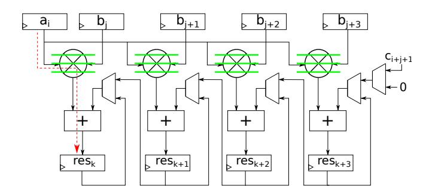
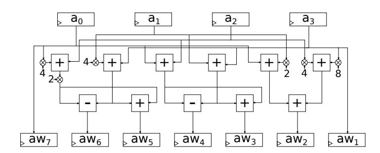
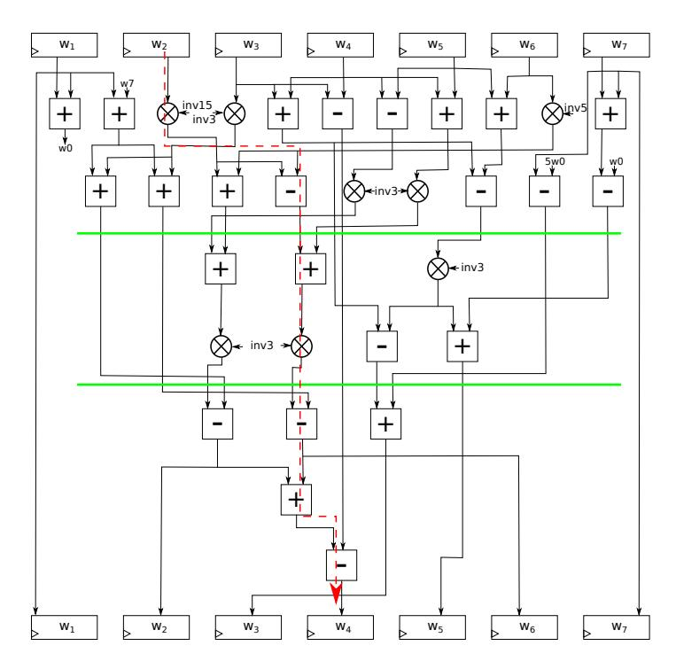
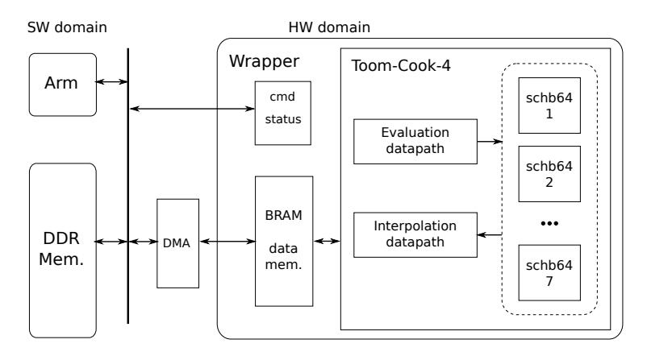

# Compact domain-specific co-processor for accelerating module lattice-based key encapsulation mechanism

-author's version-

Jose Maria Bermudo Mera<sup>1</sup> , Furkan Turan<sup>1</sup> , Angshuman Karmakar<sup>1</sup> , Sujoy Sinha Roy<sup>2</sup> , Ingrid Verbauwhede<sup>1</sup>

1 imec-COSIC, KU Leuven Kasteelpark Arenberg 10, Bus 2452, B-3001 Leuven-Heverlee, Belgium Jose.Bermudo,Furkan.Turan,Angshuman.Karmakar,Ingrid.Verbauwhede@esat.kuleuven.be <sup>2</sup> School of Computer Science, University of Birmingham, United Kingdom s.sinharoy@cs.bham.ac.uk

Abstract. We present a domain-specific co-processor to speed up Saber, a post-quantum key encapsulation mechanism competing on the NIST Post-Quantum Cryptography standardization process. Contrary to most lattice-based schemes, Saber doesn't use NTT-based polynomial multiplication. We follow a hardware-software co-design approach: the execution is performed on an ARM core and only the most computationally expensive operation, i.e., polynomial multiplication, is offloaded to the co-processor to obtain a compact design. We exploit the idea of distributed computing at micro-architectural level together with novel algorithmic optimizations to achieve approximately a 6 times speedup with respect to optimized software at a small area cost.

Keywords: Domain-specific co-processor, post-quantum cryptography, latticebased cryptography, Saber

# 1 Introduction

Currently deployed public key cryptography is based on number theoretic problems that can be easily solved by a quantum computer using Shor's algorithm [Sho97] thus putting our privacy at risk. Fortunately, there are computational problems that will remain hard to solve even by a quantum computer and, therefore, they can be used to construct secure post-quantum cryptography (PQC). In order to anticipate the threat of a quantum computer powerful enough to break the existing protocols, the National Institute of Standards and Technology (NIST) has launched a standardization process for quantum-resistant public-key cryptography [CJL<sup>+</sup>16]. Among the submissions that have advanced to the second round of the standardization process [AASA<sup>+</sup>19], cryptosystems based on lattice problems are a popular solution for KEMs.

State of the art: Over the last decade, the theory of lattice-based cryptography has shown significant developments [Pei16]. In addition to the theoretical developments, significant effort has been devoted for efficient implementations [How18] [NDR<sup>+</sup>19]. In the most recent literature we can find hardware implementations of FrodoKEM [HOKG18], NewHope [KLC<sup>+</sup>17] and Kyber [BUC19]. All of them are KEMs in the second round of the standardization contest run by NIST. However, we can observe a certain bias towards implementing schemes that can perform the polynomial multiplication using the Number Theoretic Transform (NTT) due to its efficiency. When it comes to hardware implementations, non NTT versions as used in the module Learning With Rounding (module-LWR) KEM Saber have received little attention in literature. This is the focus of our paper.

Our contributions in this paper can be summarized as follows:

- 1. We provide the first hardware implementation of a polynomial multiplier using Toom-Cook algorithm. In the existing literature, only NTT-based multipliers and systolic array implementations are considered.
- 2. We illustrate the efficiency of Toom-Cook by showing a very compact and fast co-processor for accelerating Saber. Saber is a lattice-based KEM and a strong candidate for the NIST post-quantum standard. Benchmarking it on hardware platforms is important for the standardization effort.
- 3. We show that polynomial multipliers based on generic algorithms can be competitive with NTT-based polynomial multiplication when implemented on hardware platforms. This can impact the design considerations of latticebased schemes.

#### 2 Preliminaries

In this section, we provide the necessary background for understanding the rest of the paper.

#### 2.1 From LWE to module-LWR

The LWE problem [Reg05] states that, given a randomly selected  $a \in \mathbb{Z}_q^n$ , it is hard to distinguish between n uniformly random samples drawn from  $\mathbb{Z}_q^n \times \mathbb{Z}_q$  and the same number of samples drawn as in Equation 1 where  $s \in \mathbb{Z}_q^n$  is the fixed secret and  $e \in \mathbb{Z}_q$  is the freshly generated error term.

$$\left(a, b = \langle a, s \rangle + e\right) \in \mathbb{Z}_q^n \times \mathbb{Z}_q \tag{1}$$

Instantiations of LWE schemes differ in the dimension of the problem n, the modulus q, the way of generating the public matrix A and the statistic distributions, e.g., uniform, binomial, discrete Gaussian, from where the vectors s, e are sampled. Notwithstanding the design choices, the most complex operation of LWE schemes, and hence the bottleneck, remains the matrix vector multiplication.

In the algebraic version of LWE, ring-LWE [LPR13], the samples are drawn as polynomials in the ring R<sup>q</sup> = Zq[x]/(x <sup>n</sup>+1) as shown in Equation 2. Thus, the core operation becomes a convolution, which can be implemented more efficiently utilizing the Fast Fourier Transform (FFT) with the proper choice of parameters. Moreover, n is usually taken as a power of 2 and q as a prime such that q ≡ 1 mod 2n so that a variant of the FFT that requires exclusively integer arithmetic, namely the Number Theoretic Transform (NTT), can be used to carry out the convolution. However, ring-LWE raises some concerns about its security when compared to LWE.

$$\left(a, t = a * s + e\right) \in R_q \times R_q \tag{2}$$

To benefit from the increased efficiency of ring-LWE while providing a higher confidence in the security level, module-LWE [BDK+17] drafts a small matrix of dimension l × l composed by ring polynomials. These polynomials have a lower degree than in the ring-LWE setting and, additionally, the convolution operations can be parallelized. Last but not least, the efficiency of the scheme can be improved by introducing the error term with a rounding operation instead of drawing it from a random distribution. This variant is called Learning With Rounding [AKPW13]. The samples for this problem are as shown in Equation 3. Modulo-LWR combines modulo-LWE with the use of rounding to introduce errors.

$$\left(a, b = \left\lfloor \frac{p}{q} \langle a, s \rangle \right\rceil_p \right) \in \mathbb{Z}_q^n \times \mathbb{Z}_p \tag{3}$$

#### 2.2 Parameter choices

Not only for ring-LWE but for module-LWE and module-LWR schemes, system parameters can be grouped into two classes:

- 1. Parameters that allow the use of the NTT for the polynomial multiplication. Straightforward polynomial multiplication algorithm has a complexity O(n 2 ) while using the NTT one can change the domain, perform a pointwise multiplication and reverse the NTT to get the result with a complexity O(n log n).
- 2. Parameters that do not allow the use of the NTT for the polynomial multiplication. The main reason to select parameters belonging to this set is to avoid the expensive modular reduction by a prime. Hence, the modulus q is chosen as a power of 2 for a free reduction since modular reduction by 2<sup>k</sup> is equivalent to keep only the k least significant bits.

Software implementations [KMRV18] have proven that NTT can be outperformed by theoretically costlier multiplication algorithms due to the penalization suffered by non-uniform memory accesses, non-trivial modular reduction and the inversion of the NTT. However, all these issues could be overcome with custom memory accesses and dedicated circuitry in hardware, so it remains an

```
Algorithm 1: Saber.KeyGen()
1 seedA ← U({0, 1}
                   256)
2 A ← gen(seedA) ∈ R
                      l×l
                      q
3 s ← βµ(R
           l×1
           q )
4 b = bits(As + h, q, p) ∈ R
                             l×1
                             p
5 return (pk := (b, seedA), sk := s)
```

```
Algorithm 2: Saber.Encaps(pk = (b, seedA))
1 m ← U({0, 1}
                256); (K, r ˆ ) = G(pk, m)
2 A ← gen(seedA) ∈ R
                       l×l
                       q
3 s
   0 ← βµ(R
             l×1
             q )
4 b
   0 = bits(A
              T
                s
                 0 + h, q, p) ∈ R
                                  l×1
                                  p
5 v
   0 = b
        T
          bits(s
                0
                 , p, p) + h1 ∈ Rp
6 cm = bits(v
               0 + 2p−1m, p, t + 1) ∈ R2t
7 return (c := (cm, b0
                       ), K := H(K, c ˆ ))
```

open challenge if schemes that pick parameters from this set can be competitive with NTT-friendly schemes on hardware platforms. Furthermore, a generic polynomial multiplier could still be adapted to accelerate cryptosystems with NTT-friendly parameters.

#### 2.3 Saber

Saber is an IND-CCA KEM with three operations: key generation, encapsulation and decapsulation [DKRV18]. During key generation, summarized in Alg. 1, the public matrix A is constructed from a 256-bit seed using the extendable output function SHAKE-128. The seed is publicly known but it must be randomly sampled from an uniform distribution to preserve the security. The secret vector s is sampled from a centered binomial distribution β<sup>µ</sup> with parameter µ = 8. Matrix-vector multiplication A · s is followed by the rounding operation to generate the vector b. The seed used to generate A and the vector b constitute the public key, while s constitutes the secret key.

Encapsulation is described in Alg. 2. G and H are two secure hash functions implemented using Keccak. First, G is used to generate the session key from a random seed. Then, similarly to key generation, A is regenerated from the public seed, another secret vector s 0 is sampled and the vector b 0 is calculated using A<sup>T</sup> ·s 0 . Subsequently, a vector-vector multiplication is performed between b <sup>T</sup> and s 0 . The ciphertext consists of b 0 ,reconciliation information c<sup>m</sup> [DKRV18] and the hash of the session key and the ciphertext.

Decapsulation is described in Alg. 3. Vector-vector multiplication followed by the bit selection function named bits is used to recover the message. Then, this message is encrypted again. If the resulting ciphertext is the same as the

```
Algorithm 3: Saber.Decaps(sk = s, c, K, pk)
1 v = b
       0T
         bits(s, p, p) + h1 ∈ Rp
2 m0 = bits(v − 2
                   p−t−1
                          cm + h2, p, 1) ∈ R2
3 (Kˆ 0
      , r0
        ) = G(pk, m0
                     )
4 c
   0 = Saber.Enc(pk, m0
                        ; r
                          0
                           )
5 if c = c
          0
           then
6 return K := H(Kˆ 0
                          , c) else K := H(z, c)
```

received one, the key will be established correctly. Otherwise, a random value is output without disclosing information about the failure.

In Saber, the ring-dimension n = 256 and the two moduli to p = 2<sup>10</sup> and q = 2<sup>13</sup> are fixed. The dimension of the matrices and vectors, l, is used to tune the security level. The specifications define l = 2 for lightweight cryptography, l = 3 as the standard security level and l = 4 for a long-term high security level. Our co-processor supports all security levels, but for concretion we refer to the case l = 3 in the rest of the paper. The number of polynomial multiplications is l 2 for key generation, l <sup>2</sup> + l for encapsulation and l <sup>2</sup> + 2l for decapsulation.

# 3 Algorithmic optimizations

In this section, we describe the rationale behind the partition between software and hardware in our system as well as the selected polynomial multiplication algorithm and the optimizations to achieve our goal.

### 3.1 HW/SW boundaries

The domain-specific accelerator is designed following a hardware-software codesign approach in order to: (1) take advantage of the custom logic that can be implemented in an FPGA to accelerate the scheme, (2) maintain the flexibility offered by a micro-controller for controlling the execution flow and (3) keep the resource utilization low by offloading to hardware only the most computationally expensive operations. As explained in Section 2.3, the most expensive operation is the multiplication of polynomials with 256 coefficients, which has to be executed l 2 times during matrix-vector multiplication, so its computation is offloaded to hardware. Polynomials are generated from a seed using a hash function, which could also be accelerated in hardware. However, Keccak is costly in terms of area. Instead, we exploit parallelism at system level by generating the polynomials needed for the next multiplication in software while the hardware performs the arithmetic on the previous operands. This approach pipelines the generation of the polynomials with the arithmetic operations, improving the performance as well as the utilization of the available resources.

#### 3.2 Polynomial multiplication

The polynomial arithmetic in Saber is performed in the ring  $R_q = \mathbb{Z}_q[x]/(x^n+1)$  where n=256 and  $q=2^{13}$ . This choice does not allow the use of the NTT to perform polynomial multiplication which makes accelerating this operation a challenging task. Instead, we apply Toom-Cook 4-way to divide a multiplication of polynomials with 256 coefficients into seven multiplications of polynomials with 64 coefficients. These seven multiplications are independent and, hence, can be run in parallel by small multipliers in a distributed computing fashion.

Toom-Cook k-way is a generalization of Karatsuba where a polynomial a(x) with n coefficients is split into k polynomials  $a_1 \cdots a_{k-1}$  each with n/k coefficients such that  $a(y) = a_0 + a_1 y + \ldots + a_{k-1} y^{k-1}$  where  $y = x^{n/k}$ . It works in three steps: evaluation, multiplication and interpolation. First, these k polynomials are used to generate the so-called weighted polynomials, which represent the evaluation of the original polynomial in 2k-1 different points. Then, point-wise multiplication is computed as the product between the weighted polynomials. Lastly, interpolation is opposite of evaluation step which combines the results from these multiplications to get the final result. During evaluation and interpolation steps, a number of additions and subtractions are required creating a trade-off between the reduction obtained in the number of multiplications that must be performed and the overhead introduced by these operations.

Polynomials are evaluated on  $\{0, 1, -1, \frac{1}{2}, -\frac{1}{2}, 2, \infty\}$ . This choice will simplify the hardware for the evaluation since scaling a coefficient by a power of 2 with positive or negative exponent means shifting the bits to the left or to the right that many positions, respectively. To improve the memory access pattern of the evaluation, we use a vertical coefficient scanning to generate all weighted polynomials in-place as shown in Alg. 4.

Both evaluation and interpolation are linear transformations that are inverse of each other. Hence, they are additively homomorphic. Let's assume we want to compute  $s = s_1 + s_2$  where  $s_1 = a_1 * b_1$  and  $s_2 = a_2 * b_2$  and  $a_i,b_i$  are polynomials of a certain degree. Denoting evaluation as TC and interpolation  $TC^{-1}$ , we can write  $s_i = TC^{-1}(TC(a_i) * TC(b_i))$ . Using the additive homomorphic property of linear transformations we can also write s as  $s = TC^{-1}((TC(a_1) * TC_ib_1)) + (TC(a_2) * TC_ib_2))$  In Saber, due to module structure, we need to add results of multiple polynomial multiplications during matrix-vector and vector-vector multiplication. Hence, this method can be used to reduce the number of interpolations and evaluations as has been shown recently in [MKV20]. We also apply this method in our implementation. The matrix equation for interpolation is shown in (4). Every division by an odd number is equivalent to a multiplication by the inverse modulo  $q=2^{13}$ . However, divisions by powers of 2 become shift operations that could cause a loss of precision that leads to a wrong result. Since the highest division is by  $8 = 2^3$ , three extra bits of precision are required and, therefore, the data width of the co-processor

```
Algorithm 4:
                      Evaluation for Toom-Cook-4 with vertical
  ning [KMRV18]
   Input: a(x) with n = 256 coefficients
   Output: \{aw_1, ..., aw_7\} with 64 coefficients each
 1 for ai0 to 63 do
       r_0=a_0[i];\, r_1=a_1[i];\, r_2=a_2[i];\, r_3=a_3[i];
 2
 3
 4
 5
 6
        aw_3[i] = r_6; aw_4[i] = r_7;
 7
       r_4 = 2 * (r_0 * 4 + r_2);
 8
10
11
        r_7 = r_4 - r_5;
       aw_5[i] = r_6; \ aw_6[i] = r_7;
12
       r_4 = 8 * r_3 + 4 * r_2 + 2 * r_1 + r_0;
13
       aw_2[i] = r_4; \ aw_7[j] = r_0; \ aw_1[i] = r_3;
14
```

must be of at least 16 bits.

$$\begin{pmatrix} c_0 \\ c_1 \\ c_2 \\ c_3 \\ c_4 \\ c_5 \\ c_6 \end{pmatrix} = \begin{pmatrix} 1 & 0 & 0 & 0 & 0 & 0 & 0 \\ -2 & \frac{2}{45} & -\frac{2}{3} & -\frac{2}{9} & \frac{1}{36} & \frac{1}{60} & -2 \\ -\frac{5}{4} & 0 & \frac{2}{3} & \frac{2}{3} & -\frac{1}{24} & -\frac{1}{24} & 4 \\ \frac{5}{2} & -\frac{1}{18} & \frac{3}{2} & -\frac{7}{18} & -\frac{1}{18} & 0 & \frac{5}{2} \\ \frac{1}{4} & 0 & -\frac{1}{6} & -\frac{1}{6} & \frac{1}{24} & \frac{1}{24} & -5 \\ -\frac{1}{2} & \frac{1}{90} & -\frac{1}{3} & \frac{1}{9} & \frac{1}{36} & -\frac{1}{60} & -\frac{1}{2} \\ 0 & 0 & 0 & 0 & 0 & 1 \end{pmatrix} \begin{pmatrix} c(\infty) \\ c(2) \\ c(1) \\ c(-1) \\ c(\frac{1}{2}) \\ c(\frac{-1}{2}) \\ c(0) \end{pmatrix}$$

# 4 Hardware architecture

In this section, we describe the hardware architecture following a bottom-up approach.

#### 4.1 64-coefficient polynomial multiplier

This unit is responsible for computing the 64-coefficients polynomial multiplications during Toom-Cook point-wise product. It will be instantiated seven times in parallel, so it is necessary to keep it simple to lower the area requirements of the overall design. For this reason, we choose straightforward schoolbook polynomial multiplication. We exploit parallelism once again and propose the generic architecture depicted in Fig. 1. First, there is a loading stage where  $n_m = 4$  coefficients from b are loaded into the rightmost inputs of the multipliers, implemented with fabric DSPs. Then, all 64 coefficients in a are loaded consecutively into the other register. During this phase, one coefficient of the result is produced

each clock cycle in the leftmost output register, while the rest of the accumulated intermediate values shift to the left. After this, n<sup>m</sup> additional coefficients are produced while the datapath is flushed. Then, the next n<sup>m</sup> coefficients in b are loaded and the process repeats until the full multiplication has been computed. The pipeline strategy is not trivial due to data dependencies between the accumulation and the previous result generated in the immediate right MAC. The critical path is shown in Fig. 1 with a red dashed line. To break it down without altering the dataflow, pipeline registers are included only in the multiplier. These pipeline registers are represented as green lines.



Fig. 1. Architecture for the 64 × 64 polynomial multiplier utilizing 4 DSP units, including the critical path and the pipeline registers that break it down

Since fabric LUTs have a depth of 64 bits, which matches the length of the polynomials, the distributed memory is implemented as LUT-based memory. Operand a is accessed sequentially, so a single port RAM is enough to store it. To halve the latency of the loading stage, operand b is stored in a dual port RAM. To allow simultaneous read and write operations, the result is stored in a dual port RAM. The data width is 16 bits as explained in Sec. 3.2.

To conclude the design-space exploration of this module, we show the impact of changing the number of DSPs, nm. In our design, n<sup>m</sup> affects the latency as in (5). The four terms in the equation correspond to (1) loading the n<sup>m</sup> coefficients from b, (2) filling up the datapath, (3) performing the computation and (4) flushing the datapath between iterations. For a compact design we have chosen n<sup>m</sup> = 4, i.e., 1168 clock cycles. It is the smallest option that allows our multiplier to be competitive with NTT, e.g., 1289 clock cycles [BUC19]. For a high-performance implementation n<sup>m</sup> = 8, 16 can be considered.

$$d = \frac{64}{n_m} \left( \frac{n_m}{2} + 4 + 64 + (n_m - 1) \right) = \frac{4288}{n_m} + 96$$
 (5)

#### 4.2 Toom-Cook multiplier

The three steps of Toom-Cook are implemented on different datapaths with independent control. The memory requirements of this module depend exclusively on how evaluation and interpolation are implemented. In particular, the reading throughput of the system memory imposes a performance limitation on the evaluation hardware while the interpolation hardware must accommodate to the writing pattern. Sec. 4.3 details the memory requirements, the access pattern, the address generation and the memory layout. In the following we focus on the evaluation and interpolation circuits.

Evaluation hardware The evaluation datapath is derived from Alg. 4 as shown in Fig. 2. The same datapath is used to perform the evaluation for both operands, a and b, one immediately after the other. The weighted polynomials are directly stored in the distributed memory of the seven small polynomial multipliers. The delay introduced by two 16-bit adders is not big enough to require pipeline. The latency of the entire evaluation step is 128 clock cycles, which corresponds to reading the two 256-coefficient multiplicands in chunks of four coefficients per clock cycle.



Fig. 2. Datapath for the evaluation step

Interpolation hardware Building the hardware to execute the interpolation step is a challenging task because a direct mapping of (4) as for evaluation would result in a very asymmetric datapath with a long critical path. Instead, we identify certain symmetries in the interpolation matrix together with a trial and error approach to derive the circuit in Fig. 3. The critical path, indicated with a red dashed line, is broken down with pipeline registers, represented as horizontal green lines to allow a higher clock frequency. The interpolation hardware can read seven coefficients in parallel coming from the seven small polynomial multipliers but write operations can only be done at the clock rate due to the irregular memory accesses. Thus, memory operations become the bottleneck for interpolation. Irregular memory accesses are caused by the polynomial indexing. Interpolation outputs seven coefficients that must be written with offsets equal to  $\{0,64,128,192,256,320,384\}$ . The six least significant bits of the iteration counter can be used to generate the base address of the corresponding iteration while the offsets set the most significant bits of the writing address. However,

the 127 iterations will end up mismatching the offsets and making inefficient a possible memory alignment to increase the writing throughput.



 ${\bf Fig.\,3.}$  Datapath for the interpolation step including the critical path and the pipeline registers that break it down

#### 4.3 On-chip memory

System memory is implemented using dedicated block RAM primitives called BRAM36K which can store up to 1024 words of 36 bits. For 64-bit words required required by the evaluation stage, 2 BRAMs are needed. The memory is configured as dual port to allow simultaneous read and write operations, and with asymmetric read and write operations for the same port since read operations are performed on 64-bit words while write operations are performed on 16-bit words. One of the ports is also multiplexed between the HW/SW interfacing and the accelerator. Regarding the memory layout, the four coefficients that evaluation reads every clock cycle are not consecutive but offset with 0, 64, 128 and 192. Then, coefficients must be aligned as in Fig. 4. Besides the coefficient alignment, polynomials are also aligned to 64 words, which is the natural alignment for 256-coefficient polynomials but not for 512-coefficient polynomials as shown in the same figure.

This memory layout can be created with almost no overhead when realizing the data transfer from software as it just requires a fixed offset on the indexing of the array. Since the memory is accessed asymmetrically for read and write operations, address translation is needed for computing the real writing address. When addressing the memory as a 16-bit word RAM, the least significant word of figure's address 0 corresponds to address 0, the next 16-bit word of figure's address 0 corresponds to address 1, etc. until the least significant 16-bit of figure's address 1, which corresponds to address 4 and so on. Since the memory is aligned to 256-coefficient polynomials, only the eight least significant bits of address need to be translated. Rewiring the two most significant bits from the coefficient index, which has a length of eight bits, to the two least significant bits of the address and shifting the other six two positions to the left gives the corresponding writing address for the coefficient.

| a0   |      |      |      |  |  |  |
|------|------|------|------|--|--|--|
|      | a64  | a128 | a192 |  |  |  |
| a1   | a65  | a129 | a193 |  |  |  |
| a2   | a66  | a130 | a194 |  |  |  |
|      |      |      |      |  |  |  |
| b0   | b64  | b128 | b192 |  |  |  |
| b1   | b65  | b129 | b193 |  |  |  |
|      |      |      |      |  |  |  |
| c0   | c64  | c128 | c192 |  |  |  |
| c1   | c65  | c129 | c193 |  |  |  |
|      |      |      |      |  |  |  |
| c319 | c383 | c447 | c511 |  |  |  |
|      |      |      |      |  |  |  |

Fig. 4. Coefficient alignment used in the system memory

#### 4.4 HW/SW Interfacing

Fig. 5 shows an overview of the system architecture. We implemented our hardware co-processor on a Xilinx Zynq device which integrates FPGA to ARM processors. Zynq devices support an AXI based communication interface for the interaction of ARM cores and any hardware module in FPGA. Additionally, Xilinx DMA offers the highest performance for bulky data transfers between memory and the modules. Hence, we tailored our interfacing mechanism for proficient use of them. We kept the data word size 64-bit for handling the coefficients both in the ARM side software and in the BRAM. As a result, the software stores the polynomials as array of 64-bit data words. The BRAM uses also the same data word length, hence we configured the DMA for transferring polynomial arrays from memory to BRAM directly. When performing these transfers, the DMA accesses the array with its memory address, and delivers it over (or



Fig. 5. High-level architecture and interfacing of hardware and software.

receives from) the wrapper as a stream, i.e., one data word at each clock cycle. This stream is free from address information, hence our wrapper associates data words with an address in the BRAM. For associating the right address, the wrapper is informed with the transfer's base address by a command prior to the transfer's start. A register unit is used to support the interfacing with command and status registers. This approach makes the software side the master of our architecture, responsible of sending commands to the co-processor, observing its execution status and handling data transfers. Currently, commands for data transfers, evaluation, multiplication, MAC and interpolation are supported. The instruction-set architecture (ISA) is quite flexible leaving room for the inclusion of new commands or even the integration of more modules to accelerate other operations utilizing the same co-processor.

# 5 Results

We have implemented our domain-specific co-processor in the Xilinx ZedBoard Zynq-7000 ARM/FPGA SoC Development Board. Software has been adapted from [KMRV18] by substituting their custom assembly optimizations by C code compiled with the GCC version available in the Xilinx SDK development tool. Hardware has been synthesized, placed and routed using Vivado 2018.1. Although different synthesis and implementation strategies can be explored for a fine-grained optimized design, all results reported correspond to default configurations where the hardware co-processor runs at 125 MHz and the ARM processor runs at 666 MHz.

#### 5.1 Performance results

Table 1 presents the performance of key generation, encapsulation, decapsulation and polynomial multiplication measured from software. Columns show the

Table 1. Execution time (measured in million CPU cycles)

|                  |        |       | only SW SW/HW Improvement |
|------------------|--------|-------|---------------------------|
| Key Generation   | 11.761 | 2.180 | 5.4                       |
| Encapsulation    | 14.944 | 2.762 | 5.4                       |
| Decapsulation    | 17.983 | 2.560 | 7.0                       |
| Polynomial Mult. | 1.097  | 0.041 | 26.7                      |

execution time when using only software and the full co-processor. Saber becomes between 5.4 and 7 times faster while polynomial multiplication is almost 27 times faster. The execution time of the multiplication includes the overhead due to data transfers. In practice, many of these transfers are not necessary because we are performing matrix-vector multiplication instead of a standalone polynomial multiplication. Arithmetic operations only take 11835 clock cycles, which is 91 times faster than software even though the hardware is clocked more than five times slower than the software.

The overhead introduced by the commands sent from software to hardware is negligible due to the parallel transfer. However, this is not the case for the data transfers to the BRAM. Sending a polynomial, i.e., 512 bytes, from ARM to the co-processor takes 1816 clock cycles. Sending two polynomials, i.e., 1024 bytes, takes 2908 clock cycles. Larger data transfers are not of interest in our use case since polynomials are generated just-in-time on the CPU while the hardware runs the multiplication with the previous operands. Transfers in the other direction have almost the same execution times.

# 5.2 Resource utilization and comparisons with other works

The utilization of a single 64-coefficient polynomial multiplier including the LUT-based memory is of 342 LUTs, 155 FFs and 4 DSPs. This module is instantiated seven times and constitutes the core of arithmetic operations. The full hardware co-processor, including Toom-Cook multiplier, system memory and command decoding is implemented using 2927 LUTs, 1279 FFs, 2 BRAMs and 38 DSPs, which is quite a compact design.

Table 2 shows a comparison of our co-processor with other hardware implementations of NIST PQC second round candidates. For our work, we report the utilization of the full system including the processing system and the HW/SW interfacing. We can observe that module-LWR offers a trade-off between LWE, e.g., Frodo, and ring-LWE, e.g., NewHope. Comparison to an ASIC implementation is more difficult but Kyber is a more similar scheme to Saber. The implementation of [DFAG19] is a high-performance implementation of Saber on a superior FPGA technology.

Table 2. Comparison with state-of-the-art.

| Scheme                        | Platform    | $\begin{array}{l} \text{Time } [\mu s] \\ \text{KeyGen/Encaps/} \\ \text{Decaps} \end{array}$ | Freq<br>[MHz] | BRAM/<br>DSP | FF/<br>LUT     |
|-------------------------------|-------------|-----------------------------------------------------------------------------------------------|---------------|--------------|----------------|
| Kyber [BUC19]                 | ASIC        | 1548/2465/<br>1646                                                                            | 72            | -            | -              |
| Saber [DFAG19]                | UltraScale+ | - /60/<br>65                                                                                  | 322           | 4 / 256      | 11619/ $12566$ |
| Frodo [HOKG18]                | Artix-7     | 45454/45454/<br>47619                                                                         | 167           | 24 / 1       | 3559/<br>7773  |
| NewHope $[KLC^+17]^{\dagger}$ | Artix-7     | 51.9/78.6/<br>21.1                                                                            | 133           | 14 / 8       | 9975/20826     |
| Saber [This]                  | Artix-7     | 3273/4147/<br>3844                                                                            | 125           | 2 / 28       | 7331/<br>7400  |
|                               | 4           |                                                                                               |               |              |                |

 $<sup>^{\</sup>dagger}$ Implements only CPA secure NewHope

#### 6 Conclusions

Domain-specific accelerators and hardware-software co-design approaches are becoming more important nowadays. In this paper, we have presented a compact domain-specific accelerator for Saber. Moreover, efficiency on hardware platforms is a crucial evaluation criteria for NIST PQC standardization. NTT-friendly lattice-based cryptography has been studied well in the past, but there exists less research on alternative polynomial multiplication algorithms for hardware acceleration. We believe our design will rekindle interest in such designs.

# Acknowledgment

This work was partly supported by the Research Council KU Leuven: C16/15/058, and also by the European Commission through the Horizon 2020 research and innovation programme under agreement Cathedral ERC Advanced Grant 695305 and by EU H2020 project FENTEC Grant 780108.

#### References

[AASA<sup>+</sup>19] Gorjan Alagic, Jacob Alperin-Sheriff, Daniel Apon, David Cooper, Quynh Dang, Yi-Kai Liu, Carl Miller, Dustin Moody, Rene Peralta, Ray Perlner, Angela Robinson, and Daniel Smith-Tone. Nistir 8240 - status report on the first round of the nist post-quantum cryptography standardization process, jan 2019.

[AKPW13] Joël Alwen, Stephan Krenn, Krzysztof Pietrzak, and Daniel Wichs. Learning with rounding, revisited - new reduction, properties and applications.

- In Advances in Cryptology CRYPTO 2013 33rd Annual Cryptology Conference, Santa Barbara, CA, USA, August 18-22, 2013. Proceedings, Part I, pages 57–74, 2013.
- [BDK<sup>+</sup>17] Joppe W. Bos, L´eo Ducas, Eike Kiltz, Tancr`ede Lepoint, Vadim Lyubashevsky, John M. Schanck, Peter Schwabe, and Damien Stehl´e. CRYSTALS - kyber: a cca-secure module-lattice-based KEM. IACR Cryptology ePrint Archive, 2017:634, 2017.
- [BUC19] Utsav Banerjee, Tenzin S. Ukyab, and Anantha P. Chandrakasan. Sapphire: A configurable crypto-processor for post-quantum lattice-based protocols. IACR Trans. Cryptogr. Hardw. Embed. Syst., 2019(4):17–61, 2019.
- [CJL<sup>+</sup>16] Lily Chen, Stephen Jordan, Yi-Kai Liu, Dustin Moody, Rene Peralta, Ray Perlner, and Daniel Smith-Tone. Nistir 8105 - report on post-quantum cryptography, apr 2016.
- [DFAG19] Viet B. Dang, Farnoud Farahmand, Michal Andrzejczak, and Kris Gaj. Implementing and benchmarking three lattice-based post-quantum cryptography algorithms using software/hardware codesign. In International Conference on Field-Programmable Technology, FPT 2019, Tianjin, China, December 9-13, 2019, pages 206–214, 2019.
- [DKRV18] Jan-Pieter D'Anvers, Angshuman Karmakar, Sujoy Sinha Roy, and Frederik Vercauteren. Saber: Module-lwr based key exchange, cpa-secure encryption and cca-secure KEM. IACR Cryptology ePrint Archive, 2018:230, 2018.
- [HOKG18] James Howe, Tobias Oder, Markus Krausz, and Tim G¨uneysu. Standard lattice-based key encapsulation on embedded devices. IACR Trans. Cryptogr. Hardw. Embed. Syst., 2018(3):372–393, 2018.
- [How18] James Howe. PQCzoo, 2018.
- [KLC<sup>+</sup>17] Po-Chun Kuo, Wen-Ding Li, Yu-Wei Chen, Yuan-Che Hsu, Bo-Yuan Peng, Chen-Mou Cheng, and Bo-Yin Yang. High performance post-quantum key exchange on fpgas. Cryptology ePrint Archive, Report 2017/690, 2017. https://eprint.iacr.org/2017/690.
- [KMRV18] Angshuman Karmakar, Jose M. Bermudo Mera, Sujoy Sinha Roy, and Ingrid Verbauwhede. Saber on ARM cca-secure module lattice-based key encapsulation on ARM. IACR Trans. Cryptogr. Hardw. Embed. Syst., 2018(3):243–266, 2018.
- [LPR13] Vadim Lyubashevsky, Chris Peikert, and Oded Regev. On ideal lattices and learning with errors over rings. J. ACM, 60(6):43:1–43:35, 2013.
- [MKV20] Jose Maria Bermudo Mera, Angshuman Karmakar, and Ingrid Verbauwhede. Time-memory trade-off in toom-cook multiplication: an application to module-lattice based cryptography. Cryptology ePrint Archive, Report 2020/268, 2020. https://eprint.iacr.org/2020/268.
- [NDR<sup>+</sup>19] Hamid Nejatollahi, Nikil Dutt, Sandip Ray, Francesco Regazzoni, Indranil Banerjee, and Rosario Cammarota. Post-quantum lattice-based cryptography implementations: A survey. ACM Comput. Surv., 51(6):129:1–129:41, 2019.
- [Pei16] Chris Peikert. A decade of lattice cryptography. Foundations and Trends in Theoretical Computer Science, 10(4):283–424, 2016.
- [Reg05] Oded Regev. On lattices, learning with errors, random linear codes, and cryptography. In Proceedings of the Thirty-seventh Annual ACM Symposium on Theory of Computing, STOC '05, pages 84–93, 2005.

[Sho97] Peter W. Shor. Polynomial-time algorithms for prime factorization and discrete logarithms on a quantum computer. SIAM J. Comput., 26(5):1484– 1509, 1997.