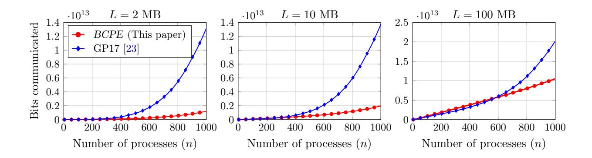

# Optimal and Error-Free Multi-Valued Byzantine Consensus Through Parallel Execution<sup>∗</sup>

Andrew Loveless, Ronald Dreslinski, and Baris Kasikci

University of Michigan, Ann Arbor, MI {loveless, rdreslin, and barisk} @umich.edu

### Abstract

Multi-valued Byzantine Consensus (BC), in which n processes must reach agreement on a single L-bit value, is an essential primitive in the design of distributed cryptographic protocols and fault-tolerant distributed systems. One of the most desirable traits for a multi-valued BC protocol is to be error-free. In other words, have zero probability of producing incorrect results.

The most efficient error-free multi-valued BC protocols are built as extension protocols, which reduce agreement on large values to agreement on small sequences of bits whose lengths are independent of L. The best extension protocols achieve O(Ln) communication complexity, which is optimal, when L is large relative to n. Unfortunately, all known error-free and communicationoptimal BC extension protocols require each process to broadcast at least n bits with a binary Byzantine Broadcast (BB) protocol. This design limits the scalability of these protocols to many processes, since when n is large, the binary broadcasts significantly inflate the overall number of bits communicated by the extension protocol.

In this paper, we present Byzantine Consensus with Parallel Execution (BCPE), the first error-free and communication-optimal BC extension protocol in which each process only broadcasts a single bit with a binary BB protocol. BCPE is a synchronous and deterministic protocol, and tolerates f < n/3 faulty processes (the best resilience possible). Our evaluation shows that BCPE's design makes it significantly more scalable than the best existing protocol by Ganesh and Patra. For 1,000 processes to agree on 2 MB of data, BCPE communicates 10.92× fewer bits. For agreement on 10 MB of data, BCPE communicates 6.97× fewer bits. BCPE also matches the best existing protocol in all other standard efficiency metrics.

<sup>∗</sup>Submitted to the ACM Symposium on Principles of Distributed Computing (PODC) 2020

## <span id="page-1-0"></span>1 Introduction

In the Byzantine Consensus (BC) problem, a set of processes must reach agreement on a single common value. However, some processes may be faulty and can try to disrupt agreement between the other processes. BC is one of the most important problems in distributed computing [\[21,](#page-18-0) [58\]](#page-20-0). Protocols that solve it are essential to the construction of many distributed cryptographic protocols, like those for secure multi-party computation [\[20,](#page-18-1) [4,](#page-16-0) [28\]](#page-18-2), distributed key generation [\[34,](#page-19-0) [38\]](#page-19-1), and electronic voting [\[32,](#page-18-3) [21\]](#page-18-0). They are also essential to techniques for constructing reliable distributed services, such as state machine replication [\[41,](#page-19-2) [58\]](#page-20-0).

In practice, the most common form of BC is multi-valued BC, in which the value that the processes must agree on is a (possibly very long) sequence of bits [\[21,](#page-18-0) [53\]](#page-20-1). For example, in state machine replication, processes must agree on batches of client requests, which can be hundreds of kilobytes to a few megabytes [\[63,](#page-20-2) [52\]](#page-20-3). In cryptocurrencies, processes must agree on blocks of transactions, which can be several megabytes each [\[26,](#page-18-4) [37\]](#page-19-3). In electronic voting protocols, processes must agree on the votes that were cast, which can total hundreds of megabytes or even gigabytes [\[32,](#page-18-3) [21\]](#page-18-0).

One simple approach for solving multi-valued BC on an L-bit value is to execute L separate instances of a binary BC protocol, each used to reach agreement on a single bit [\[49\]](#page-20-4). However, since n processes must communicate at least Ω(n 2 ) total bits in order to agree on a single bit [\[18\]](#page-17-0), this approach requires the communication of at least Ω(Ln<sup>2</sup> ) bits [\[21\]](#page-18-0) overall, which is prohibitively expensive when L is large [\[23\]](#page-18-5).

Randomization can be used to overcome the Ω(n 2 ) complexity bound for binary agreement [\[36,](#page-19-4) [35\]](#page-19-5), and thus to improve on the Ω(Ln<sup>2</sup> ) bound of the simple bit-by-bit approach [\[23\]](#page-18-5). However, this improved efficiency comes at the expense of having a nonzero error probability that depends on the number of processes [\[23\]](#page-18-5).

Another way to overcome the Ω(Ln<sup>2</sup> ) bound is to construct multi-valued BC protocols as extension protocols [\[21,](#page-18-0) [4,](#page-16-0) [45,](#page-19-6) [53,](#page-20-1) [23,](#page-18-5) [55,](#page-20-5) [54,](#page-20-6) [61,](#page-20-7) [14,](#page-17-1) [31,](#page-18-6) [13\]](#page-17-2). These protocols still rely on binary agreement protocols, but only use them to agree on small sequences of bits whose lengths are independent of L [\[14\]](#page-17-1). In this way, extension protocols reduce agreement on long values to agreement on shorter values [\[51\]](#page-20-8). The most efficient extension protocols achieve O(Ln) communication complexity, which is proven to be optimal [\[21\]](#page-18-0), when L is sufficiently large relative to n. What constitutes "sufficiently large" depends on the choice of binary agreement protocol and how often it is used [\[23\]](#page-18-5).

One of the most desirable traits for a BC extension protocol is to be error-free (i.e. perfectly correct) [\[45,](#page-19-6) [53,](#page-20-1) [15\]](#page-17-3). This means that, for all possible ways the faulty processes can behave (no matter how unlikely), the protocol is guaranteed to be correct. Unlike computationally correct (i.e. cryptographic) protocols [\[12\]](#page-17-4), the correctness of error-free protocols does not rely on the assumed (but unproven) hardness of computational problems, such as integer factorization, or on the assumed limited computing power of the adversary [\[64\]](#page-21-0). Thus, error-free protocols are immune to advances in cryptoanalysis and increases in computing power that invalidate these assumptions [\[43\]](#page-19-7).

Error-free protocols also have advantages over statistically correct (i.e. information-theoretic) protocols [\[21\]](#page-18-0). Both tolerate computationally unbounded adversaries. However, while statistically correct protocols have some probability of producing incorrect results, error-free protocols have zero error probability. Moreover, the communication complexities of statistically correct protocols grow with the desired probability that they are correct (based on a security parameter) [\[33,](#page-18-7) [1,](#page-16-1) [21\]](#page-18-0), while the complexities of error-free protocols do not [\[45,](#page-19-6) [43\]](#page-19-7).

Unfortunately, one shortcoming of all known communication-optimal and error-free BC extension protocols [\[53,](#page-20-1) [45,](#page-19-6) [23,](#page-18-5) [44,](#page-19-8) [46\]](#page-19-9) is that they require each process to broadcast at least n bits with a binary Byzantine Broadcast (BB) protocol, a primitive which guarantees all non-faulty processes agree on each broadcasted bit. This design limits the scalability of these protocols to many processes (where L is not as large relative to n), since executing a binary BB protocol is expensive. Even the most communication-efficient error-free binary BB protocols communicate O(n 2 ) bits (with sizable constants) to broadcast a single bit [\[7,](#page-17-5) [16\]](#page-17-6). Protocols with other desirable traits, like optimal round complexity, communicate O(n 4 log n) bits or more [\[39,](#page-19-10) [24,](#page-18-8) [5\]](#page-17-7). Thus, for large systems, the binary broadcasts contribute significantly to the overall number of bits communicated by the extension protocol.

In this paper, we present Byzantine Consensus with Parallel Execution (BCPE), the first BC extension protocol that is simultaneously (1) communication-optimal (i.e. communicating O(Ln) bits for large L), (2) error-free, and (3) only requires processes to broadcast a constant number of bits with a binary BB protocol (just 1 bit). BCPE is synchronous, deterministic, and tolerates f < n/3 faulty processes — the best resilience possible for an error-free protocol [\[56\]](#page-20-9). As we shown in §[2,](#page-2-0) BCPE also matches the round complexity of the best existing protocol [\[23\]](#page-18-5).

The key idea behind BCPE is a novel parallel execution approach. One intuitive method for constructing a BC extension protocol, as presented in prior work [\[21\]](#page-18-0), is to (1) identify a (sufficiently large) set of processes that possess the same value, then (2) use these processes to distribute the value to processes that do not possess the value. However, distributing the value after the fact requires additional rounds of communication, and makes it difficult to achieve communication optimality while remaining error-free. To overcome these challenges, BCPE performs both of these tasks simultaneously in parallel "tracks". The results of the first track are used to correct the results of the second.

To make this design possible, we construct BCPE on top of two novel communication primitives, Byzantine Consistent Exchange (BCE) and Byzantine Consistent Broadcast (BCB), which solve modified versions of multi-valued BC and BB, respectively. We describe these primitives in detail in §[4.2](#page-5-0) and §[4.3.](#page-8-0)

Overall, we make the following contributions:

- We describe BCPE, the first communication-optimal and error-free BC extension protocol in which each process broadcasts a constant number of bits with a binary BB protocol (just 1 bit). BCPE also matches the round complexity of the best existing protocol by Ganesh and Patra [\[23\]](#page-18-5) (§[4,](#page-5-1) §[5,](#page-9-0) and §[6\)](#page-13-0).
- We show that BCPE communicates significantly fewer bits than the best existing protocol [\[23\]](#page-18-5) when scaled to many processes (§[7\)](#page-14-0). When both protocols are instantiated with Berman et al.'s bit-optimal binary protocol [\[7\]](#page-17-5), BCPE communicates 10.92× fewer bits for 1,000 processes to agree on 2 MB of data. For agreement on 10 MB of data, BCPE communicates 6.97× fewer bits.

## <span id="page-2-0"></span>2 Related Work

The efficiency of BC extension protocols is traditionally quantified using four metrics [\[22,](#page-18-9) [23\]](#page-18-5): (1) communication complexity, the maximum number of bits communicated by non-faulty processes [\[65\]](#page-21-1), (2) seed communication complexity, the total number of bits that the non-faulty processes broadcast with a binary BB protocol, (3) round complexity, the number of rounds taken by the protocol, and (4) seed round complexity, the number of sequential times that each non-faulty process executes a binary BB protocol [\[22,](#page-18-9) [23\]](#page-18-5).

Turpin and Coan presented the first BC extension protocol [\[62\]](#page-20-10), which communicates O(Ln<sup>2</sup> ) bits and thus is not communication optimal [\[21\]](#page-18-0). Fitzi and Hirt presented the first protocol to

<span id="page-3-2"></span>Table 1: The best existing error-free BC extension protocols. All tolerate f < n/3 faulty processes. Our evaluation (§7) shows that BCPE communicates significantly fewer bits than GP17 when n is sufficiently large, even when both protocols use a bit-optimal binary BB protocol [7] in its most communication-efficient configuration.

| Protocol          | Communication<br>Complexity           | Seed Communication<br>Complexity | Round<br>Complexity | Seed Round<br>Complexity |
|-------------------|---------------------------------------|----------------------------------|---------------------|--------------------------|
| Pat11 [53]        | $\mathcal{O}(Ln + (5n^2 + n)B)$       | $5n^2 + n$                       | 2R+2                | 2                        |
| GP17 [23]         | $\mathcal{O}(Ln+n^2B)$                | $n^2$                            | R+2                 | 1                        |
| BCPE (This paper) | $\mathcal{O}(Ln + nB + n^4)$ , see §6 | n                                | R+2                 | 1                        |

communicate  $\mathcal{O}(Ln)$  bits for sufficiently large L [21]. However, this protocol takes more rounds than Turpin and Coan's protocol and has nonzero error probability. Liang and Vaidya presented several error-free protocols that communicate  $\mathcal{O}(Ln)$  bits [45, 44, 46]. However, they all have round, seed communication, and seed round complexities that increase with L. Patra presented the first error-free protocol to communicate  $\mathcal{O}(Ln)$  bits with round, seed communication, and seed round complexities that do not depend on L [53]. Recently, Ganesh and Patra presented a protocol that improves on the round, seed communication, and seed round complexities of Patra's earlier protocol by a constant factor [23].

BCPE achieves an  $n \times improvement$  in seed communication complexity over Ganesh and Patra's protocol, which we denote GP17, without sacrificing any of the other efficiency metrics. As we show in §7, this means that, if BCPE and GP17 are both instantiated with the same binary BB protocol, and used to agree on the same L-bit value, then BCPE communicates significantly fewer bits than GP17 when the number of processes is sufficiently large.

Besides increased scalability, BCPE's lower seed communication complexity gives it two practical advantages over GP17. First, it allows BCPE to use binary BB protocols that take fewer rounds, but must communicate more bits, while still achieving  $\mathcal{O}(Ln)$  communication complexity. For example, with  $L = \mathcal{O}(n^4 \log n)$ , GP17 must use a binary BB protocol that transmits  $\mathcal{O}(n^3 \log n)$  or fewer bits. Few such error-free protocols exist with optimal resilience [7, 16, 6], and to our knowledge, none take an optimal number of rounds [19]. In contrast, BCPE can use Kowalski and Mostéfaoui's binary protocol [39], which transmits  $\mathcal{O}(n^4 \log n)$  bits<sup>1</sup>, but is round-optimal [19]<sup>2</sup>. Second, when both BCPE and GP17 are instantiated with a round optimal binary protocol, BCPE can achieve  $\mathcal{O}(Ln)$  communication complexity for smaller values of L than GP17 can. For example, again using Kowalski and Mostéfaoui's round-optimal protocol [39], GP17 requires that  $L = \Omega(n^5 \log n)$ , while BCPE only requires that  $L = \Omega(n^4 \log n)$ .

Table 1 shows how BCPE's efficiency compares to the best existing error-free BC extension protocols. We use B to denote the number of bits that the binary BB protocol communicates in order to broadcast 1 bit. We use R to denote the number of rounds that the binary BB protocol takes in order to broadcast 1 bit. We assume the binary BB protocol is deterministic and error-free [7, 16, 39, 42].

<span id="page-3-0"></span>Note that we calculate round complexity slightly differently than past work [23, 22]. Any

<sup>&</sup>lt;sup>1</sup>Kowalski and Mostéfaoui present the communication complexity of their protocol as  $\mathcal{O}(n^3 \log n)$ , but count each single bit broadcast as communicating O(1) bits. To adhere to our definition of communication complexity, we say the same broadcast communicates  $\mathcal{O}(n)$  bits.

<span id="page-3-1"></span><sup>&</sup>lt;sup>2</sup>The binary BB protocols referenced above [39, 7, 16] are actually BC protocols, but are commonly converted to BB protocols using the standard reduction from BC to BB [48, 23, 53]. The resulting BB protocols have the same communication complexities as the BC protocols, but take 1 extra round.

deterministic binary BB protocol must take at least R = f + 1 rounds [\[19\]](#page-17-9). However, past work counts each sequential execution of the binary BB protocol as a single round [\[23\]](#page-18-5). This convention works fine when the binary BB protocol is executed on its own. However, in BCPE, binary BB is executed in parallel with other parts of the protocol, which themselves take multiple rounds. If we counted an execution of the binary BB protocol as a single round, the rounds executed in parallel would also be counted as a single round, which does not make sense.

## <span id="page-4-1"></span>3 Preliminaries

In this section, we describe our system and failure models and formalize the multi-valued BC problem. Our models and problem definition are the same as those in prior work [\[53,](#page-20-1) [23,](#page-18-5) [45,](#page-19-6) [21\]](#page-18-0).

### 3.1 Models

### 3.1.1 System Model

We assume a standard synchronous system with processes connected by a network. By synchronous, we mean that there are known bounds on processing speed and network delay, and that the processes are synchronized within a bounded skew [\[29,](#page-18-10) [2,](#page-16-2) [42\]](#page-19-11).

The processes communicate in a series of rounds, with each new round starting only after the previous round has completed [\[40\]](#page-19-13). Processes send messages at the start of each round, and read messages at the end of each round. All messages sent at the beginning of a round are received by the end of that round.

Processes communicate through point-to-point channels, with each process connected to every other process. We assume channels are reliable and authenticated. By reliable, we mean that a channel cannot drop, corrupt, or create messages [\[48\]](#page-19-12). By authenticated, we mean that a process can identify the sender of any message it receives. Otherwise a single faulty process could mimic the entire system [\[9\]](#page-17-10). However, we do not assume a public-key infrastructure or make any cryptographic assumptions [\[21,](#page-18-0) [53\]](#page-20-1).

### 3.1.2 Failure Model

We assume a computationally unbounded Byzantine adversary A that controls up to f of the processes and has complete knowledge of the protocol and the state of the system (i.e. the fullinformation model [\[27\]](#page-18-11)). We refer to processes controlled by A as faulty, and all other processes as non-faulty. Non-faulty processes follow the protocol, while faulty processes can behave in any way. This includes sending conflicting messages to other processes, lying about messages they receive, and even colluding with one another [\[59\]](#page-20-11). Moreover, faulty processes can alternate between correct and incorrect behavior arbitrarily.

### <span id="page-4-0"></span>3.2 Problem Definition

We now formalize the multi-valued BC problem. BC is also sometimes referred to as Byzantine Agreement [\[23,](#page-18-5) [53,](#page-20-1) [54\]](#page-20-6).

BC is executed by a set of n processes, which we denote P1, ..., Pn. Each process starts with an L bit value, which it proposes to the other processes. As a result of executing a BC protocol, each process decides on a (possibly new) value. To solve the problem, the protocol must satisfy the following conditions when up to f processes are faulty [\[59,](#page-20-11) [8\]](#page-17-11).

- BC-Validity: If all non-faulty processes propose v, all non-faulty processes decide on v.
- BC-Agreement: All non-faulty processes decide on the same value.
- BC-Termination: All non-faulty processes decide on a value in an a priori known number of rounds.

The Agreement condition is also sometimes referred to as Consistency [\[21,](#page-18-0) [45\]](#page-19-6).

## <span id="page-5-1"></span>4 Building Blocks

BCPE uses Reed-Solomon (RS) coding [\[57\]](#page-20-12), and is built on top of two novel communication primitives. In this section, we describe RS coding and our primitives in detail.

### <span id="page-5-3"></span>4.1 Reed-Solomon Coding

RS coding is an error correction technique that encodes a data block as a vector of symbols, called a codeword. Even if a subset of the symbols becomes lost or corrupted, the codeword can be decoded to recover the original data block. Below, we describe the coding functions used in our protocol. We use the same naming convention for our functions as Ganesh and Patra [\[23,](#page-18-5) [53\]](#page-20-1).

Let ENC(data, h, k), denote an encoding function, where h ≥ k ≥ 1, data is the data block to encode, h is the number of symbols to include in the resulting codeword, and k − 1 is the degree of the polynomial to use to encode data.

First, ENC() divides data into k fragments d1,...,dk, each one an element of Galois Field GF(2<sup>t</sup> ), where t = m/k and m is the length of data in bits. For simplicity, we assume that m divides evenly by k, and that h ≤ 2 <sup>t</sup> − 1. Both assumptions are consistent with prior work [\[23,](#page-18-5) [53,](#page-20-1) [45,](#page-19-6) [61,](#page-20-7) [43\]](#page-19-7) [3](#page-5-2) .

Next, ENC() constructs a k − 1 degree polynomial f(x) = d<sup>1</sup> + d2x+...+dkx <sup>k</sup>−<sup>1</sup> and calculates the codeword code such that code[i] = f(i) [\[23\]](#page-18-5). If k = 1, then each code[i] is simply a copy of d1. Since any k evaluations of a k − 1 degree polynomial uniquely describe that polynomial [\[10\]](#page-17-12), the polynomial can be recovered from any k correct symbols in code. ENC() then returns the codeword.

Let DEC(code, h, k) denote a decoding function, where code is the codeword to decode, h is the number of symbols in the codeword, and k − 1 is the degree of the polynomial that was used to generate code. We use a special ⊥ symbol in code to signify that the symbol at the corresponding index is missing (i.e. an erasure).

DEC() finds a k − 1 degree polynomial f(x) = d<sup>1</sup> + d2x+...+dkx k−1 such that code[i] = f(i) for as many symbols as possible [\[30\]](#page-18-12). It then concatenates d1,...,d<sup>k</sup> to form data block data, then returns data. We note that, as long as 2α + γ ≤ h − k, where α symbols are corrupt and γ symbols are missing, DEC() is guaranteed to succeed and return the correct data block [\[30\]](#page-18-12).

Lastly, let SYN(code1, code2) denote a function used to compare two h-dimension codewords. SYN() calculates an h-dimension binary vector syndrome as follows. For each i = 1, ..., h, it checks whether code1[i] = code2[i]. If so, it sets syndrome[i] to True. Otherwise, it sets syndrome[i] to False.

### <span id="page-5-0"></span>4.2 Primitive 1: Byzantine Consistent Exchange

In this section, we describe the first communication primitive used to construct BCPE. We call it Byzantine Consistent Exchange (BCE). BCE solves a modified version of BC that is inspired by

<span id="page-5-2"></span><sup>3</sup>We note that if these assumptions were not satisfied, ENC() could be adjusted to pad data with zero bits before encoding until they were satisfied. The padding could then be stripped by DEC() after decoding.

Dolev's Crusader Agreement [17], as well as several asynchronous broadcast protocols from prior work [60, 9, 50, 11]<sup>4</sup>. The name is inspired by Cachin et al.'s consistent broadcast protocol [11].

### 4.2.1 BCE Definition

BCE is executed by a set of  $\tilde{n}$  processes, which we denote  $P_1, ..., P_{\tilde{n}}$ . Like in BC, each process starts with an  $\tilde{L}$ -bit value, which it proposes to the other processes. As a result of executing a BCE protocol, each process decides on a value. However, unlike in BC, each process can only decide on (1) the value it initially proposed, or (2) on no value, which we denote with  $\perp$ . Moreover, instead of requiring all non-faulty processes to agree, BCE only requires agreement between non-faulty processes that decide on non- $\perp$  values. Specifically, a BCE protocol must satisfy the following conditions when up to  $\tilde{f}$  processes are faulty.

- BCE-Validity: If all non-faulty processes propose v, all non-faulty processes decide on v.
- $\bullet$  BCE-No-Duplicity: No two non-faulty processes decide on different non- $\bot$  values.
- BCE-Equivalence: A non-faulty process decides on non- $\perp$  value v only if it proposed v.
- BCE-Termination: All non-faulty processes decide on a value in an a priori known number of rounds.

Let  $\mathsf{BCE\_Propose}(v)$  denote a function called by each process to begin executing BCE, where v is the process' value to propose. Let  $\mathsf{BCE\_Decide}()$  denote a function called by each process to obtain the decision value, which may be  $\bot$ .

### 4.2.2 BCE Protocol

In Protocol 1, we present a protocol that solves BCE in 2 rounds, given that  $\tilde{n} > 3\tilde{f}$ . We use NX to label each round, where N is the round number and X denotes the start (S) or end (E) of the round.

Each process possesses a variable Input and three  $\tilde{n}$ -dimension vectors InSymbols, Symbols, and Syndromes. Input is initialized to the process' initial value. All elements of InSymbols, Symbols, and Syndromes are initialized to  $\bot$  to denote that those elements are missing at the start of the protocol. We use index 1 to denote the first element of a vector, and n to denote the last element.

Let  $C_{bce}(\tilde{n}, \tilde{f}, \tilde{L})$  denote the number of bits communicated by Protocol 1. In round 1, each process sends one  $\frac{\tilde{L}}{\tilde{n}-2\tilde{f}}$ -bit symbol to every other process. In round 2, each process sends an  $\tilde{n}$ -bit syndrome to every other process. Thus, the total number of bits communicated is:

<span id="page-6-1"></span>
$$C_{bce}(\tilde{n}, \tilde{f}, \tilde{L}) = \tilde{L}\frac{\tilde{n}(\tilde{n}-1)}{\tilde{n}-2\tilde{f}} + \tilde{n}^2(\tilde{n}-1)$$
(1)

#### <span id="page-6-3"></span>4.2.3 BCE Correctness

We now prove the correctness of Protocol 1.

To simplify the presentation, we say that element V[i] of some vector V is *common* if all non-faulty processes possess the same V[i]. In other words, all non-faulty processes possess the same symbol (or syndrome), or all possess  $\bot$ . We call an element that is not common noncommon.

<span id="page-6-2"></span>**Lemma 4.1.** Protocol 1 satisfies all conditions for BCE besides BCE-No-Duplicity.

<span id="page-6-0"></span><sup>&</sup>lt;sup>4</sup>The key difference between BCE and these other formulations is the inclusion of the *BCE-Equivalence* condition.

#### <span id="page-7-0"></span>Protocol 1: A BCE Protocol

Each process  $P_i$  executes the following:

- 1S. Set  $InSymbols \leftarrow \textbf{ENC}(Input, \, \tilde{n}, \, \tilde{n} 2\tilde{f})$ , the codeword describing Input Send InSymbols[i] to all processes
- 1E. Set  $Symbols[j] \leftarrow$  the symbol sent by  $P_j$  (if any)
- 2S. Send SYN(InSymbols, Symbols) to all processes
- 2E. Set  $Syndromes[j] \leftarrow$  the syndrome sent by  $P_j$  (if any)

If there exists a set of  $\tilde{n}-\tilde{f}$  syndromes in Syndromes, which must include Syndromes[i], such that  $\tilde{n}-\tilde{f}$  of the same bits are True in all syndromes, then:

Decide on Input

Else: Decide on  $\perp$ 

*Proof.* First, consider BCE-Validity. In round 1, all non-faulty processes encode the same value v, store the codeword in InSymbols, and send one symbol that describes v to all processes. Each non-faulty process stores the symbols it receives in Symbols. Up to  $\tilde{f}$  processes are faulty, Thus, at the end of round  $1, \geq \tilde{n} - \tilde{f}$  symbols in Symbols are common and correctly describe v. Next, each non-faulty process calculates a syndrome comparing InSymbols and Symbols. Since all non-faulty processes started with v, and  $\geq \tilde{n} - \tilde{f}$  symbols in Symbols are common and describe  $v, \geq \tilde{n} - \tilde{f}$  of the same bits must be **True** in the syndromes of all non-faulty processes.

Each non-faulty process sends its syndrome to all processes. Each non-faulty process stores the syndromes it receives in Syndromes. Thus, at the end of round 2, each non-faulty process possess  $\geq \tilde{n} - \tilde{f}$  syndromes from non-faulty processes (including its own). Recall that  $\geq \tilde{n} - \tilde{f}$  of the same bits are True in the syndromes of all non-faulty processes. Thus, each non-faulty process decides on Input, which contains v. Thus, BCE-Validity is satisfied.

Next, consider BCE-Equivalence. The only way for a non-faulty process to decide on a non- $\bot$  value is to decide on Input. Input contains a process' initial value, and is never changed during correct execution of the protocol. Thus, BCE-Equivalence is satisfied.

Lastly, consider BCE-Termination. All non-faulty processes execute the protocol for 2 rounds. At the end of round 2, each non-faulty process either decides on its initial value, or on  $\bot$ . Thus, BCE-Termination is satisfied.

#### <span id="page-7-1"></span>Lemma 4.2. Protocol 1 satisfies BCE-No-Duplicity.

*Proof.* In round 2, each non-faulty process sends its syndrome to all processes. Each non-faulty process stores the syndromes it receives in Syndromes. Up to  $\tilde{f}$  processes are faulty. Thus, at the end of round  $2, \geq \tilde{n} - \tilde{f}$  syndromes in Syndromes are common and originated from non-faulty processes, and  $\leq \tilde{f}$  syndromes in Syndromes are noncommon and originated from faulty processes.

We now make the proof by contradiction. Say that two non-faulty processes  $P_i$  and  $P_j$  decide on different non- $\bot$  values. To decide on non- $\bot$  values,  $P_i$  and  $P_j$  must each possess a set of  $\tilde{n} - \tilde{f}$  syndromes in Syndromes, one of which is their own, such that  $\tilde{n} - \tilde{f}$  of the same bits are True in all syndromes. For ease of presentation, we say these syndromes are consistent. In the worst case,  $P_i$  and  $P_j$ 's sets of consistent syndromes each contain  $\tilde{f}$  noncommon syndromes that came from faulty processes. Thus, the two sets each contain  $\geq (\tilde{n} - \tilde{f}) - \tilde{f} = \tilde{n} - 2\tilde{f}$  syndromes that are common and came from non-faulty processes. Since  $\geq \tilde{n} - \tilde{f}$  syndromes in Syndromes are common and came from non-faulty processes, there are  $\geq 2(\tilde{n} - 2\tilde{f}) - (\tilde{n} - \tilde{f}) = \tilde{n} - 3\tilde{f}$  syndromes that are common,

came from non-faulty processes, and exist in both sets. In the worst case, when  $\tilde{n}=3\tilde{f}+1$ , there is just  $(3\tilde{f}+1)-3\tilde{f}=1$  such syndrome.

First, say this syndrome came from  $P_j$  itself. Since  $P_j$ 's syndrome is in  $P_i$ 's set of consistent syndromes,  $P_i$  sees  $\geq \tilde{n} - \tilde{f}$  bits that are True in both its own syndrome and  $P_j$ 's syndrome. Since  $P_j$  is non-faulty, the syndrome  $P_i$  possesses from  $P_j$  actually is  $P_j$ 's syndrome. Thus,  $P_i$  and  $P_j$  each saw the same  $\geq \tilde{n} - \tilde{f}$  symbols in Symbols as matching its original InSymbols vector. In the worst case,  $\tilde{f}$  of these symbols originated from faulty processes in round 1, and thus are noncommon. Thus,  $\geq (\tilde{n} - \tilde{f}) - \tilde{f} = \tilde{n} - 2\tilde{f}$  of these symbols are common. In other words,  $P_i$  and  $P_j$ 's InSymbols vectors contain  $\geq \tilde{n} - 2\tilde{f}$  of the same symbols.  $\tilde{n} - 2\tilde{f}$  symbols uniquely describe an  $\tilde{n} - 2\tilde{f} - 1$  degree polynomial. Thus,  $P_i$  and  $P_j$ 's InSymbols vectors came from the same polynomial, which means they encoded the same value. Thus,  $P_i$  and  $P_j$  both possess the same Input.

Next say that this syndrome came from a third non-faulty process  $P_k$ . The same argument used above with  $P_i$  and  $P_j$  now applies to  $P_i$  and  $P_k$ . Thus,  $P_i$  and  $P_k$  both possess the same Input. Similarly,  $P_j$  and  $P_k$  both possess the same Input. Since  $P_i$  and  $P_k$  have the same Input, and  $P_j$  and  $P_k$  have the same Input,  $P_i$  and  $P_j$  have the same Input.

The only way to decide on a non- $\bot$  value is to decide on Input. Thus, for  $P_i$  and  $P_j$  to both decide on non- $\bot$  values, they must decide on Input. Thus  $P_i$  and  $P_j$  both decide on the same value, which is a contradiction.

### <span id="page-8-0"></span>4.3 Primitive 2: Byzantine Consistent Broadcast

In this section, we describe the second communication primitive used to construct *BCPE*, which is a broadcast version of BCE. For consistency, we call it *Byzantine Consistent Broadcast (BCB)*. The problem definition for BCB is the same as for *Crusader Agreement* [17].

#### 4.3.1 BCB Definition

BCB is executed by a set of  $\hat{n}$  processes. One process is designated as the *source*, and the others as *receivers*. The source starts with an  $\hat{L}$ -bit value, which it broadcasts to all processes. As a result of executing a BCB protocol, each process delivers either (1) the source's value, or (2) no value (again denoted with  $\perp$ ). Like in BCE, the goal is to ensure agreement between all non-faulty processes that deliver non- $\perp$  values [50, 11]. Specifically, a BCB protocol must satisfy the following conditions when up to  $\hat{f}$  processes are faulty.

- BCB-Validity: If the source is non-faulty and broadcasts v, all non-faulty processes deliver v.
- BCB-No-Duplicity: No two non-faulty processes deliver different non- $\perp$  values.
- BCB-Termination: All non-faulty processes deliver a value in an a priori known number of rounds.

Let  $BCB\_Broadcast(v)$  denote a function called by the source to broadcast value v. Let  $BCB\_Deliver()$  denote a function called by each process (including the source) to obtain the delivered value, which may be  $\bot$ .

#### 4.3.2 BCB Protocol

In Protocol 2, we present a protocol that solves BCB in 3 rounds, given that  $\hat{n} > 3\hat{f}$ . It is built on top of the BCE protocol from Protocol 1. We use the same convention for labeling rounds as in Protocol 1.

#### <span id="page-9-1"></span>Protocol 2: A BCB Protocol

The source executes the following:

18. Send *Input* to all receivers

Each receiver executes the following:

1E. Set  $Input \leftarrow$  the value sent by the source (if any)

Each process executes the following (including the source):

- 2S. Consistently exchange Input with all processes using BCE\_Propose(Input)
- 3E. Deliver BCE\_Decide(), the decision value from the consistent exchange

Each process possesses one variable Input. On the source, Input is initialized to the source's initial value. On each receiver, Input is initialized to a predetermined default value  $\mathcal{D}$ .

Let  $C_{bcb}(\hat{n}, \hat{f}, \hat{L})$  denote the number of bits communicated by Protocol 2. In round 1, the source sends its  $\hat{L}$ -bit value to each receiver. In rounds 2–3, the processes execute BCE to exchange the source's value. Thus, using Equation 1, the total number of bits communicated is:

<span id="page-9-3"></span>
$$C_{bcb}(\hat{n}, \hat{f}, \hat{L}) = \hat{L}(\hat{n} - 1) + C_{bce}(\hat{n}, \hat{f}, \hat{L})$$
 (2)

#### 4.3.3 BCB Correctness

We now prove the correctness of Protocol 2.

<span id="page-9-2"></span>Lemma 4.3. Protocol 2 satisfies all conditions for BCB.

*Proof.* First, consider BCB-Validity. Since the source is non-faulty, it correctly sends its value v to all receivers. Each non-faulty receiver stores the value it receives from the source in Input. Next, the processes execute BCE, with each non-faulty process proposing v. Since  $\hat{n} > 3\hat{f}$ , and all processes execute BCE, Lemma 4.1 implies that BCE-Validity holds. Thus, each non-faulty process decides on v, which it then delivers. Thus, BCB-Validity is satisfied.

Next, consider BCB-No-Duplicity. The processes execute BCE in rounds 2–3. Since  $\hat{n} > 3\hat{f}$ , and all processes execute BCE, Lemma 4.2 implies that BCE-No-Duplicity holds. Thus, all non-faulty processes that do not decide  $\bot$  decide on the same value. Each non-faulty process delivers its decision value from BCE. Thus, BCB-No-Duplicity is satisfied.

Lastly, consider BCB-Termination. All non-faulty processes begin executing BCE at the start of round 2. Since BCE is implemented with Protocol 1, and Protocol 1 terminates in 2 rounds, each non-faulty process delivers a value at the end of round 3. Thus BCB-Termination is satisfied.  $\square$ 

## <span id="page-9-0"></span>5 Byzantine Consensus with Parallel Execution

We are now ready to describe our BC protocol, Byzantine Consensus with Parallel Execution (BCPE). BCPE is built on top of the BCE and BCB protocols from Protocols 1 and 2, as well as a binary BB protocol. Any error-free and deterministic binary BB protocol with f < n/3 resilience can be used [7, 16, 39, 42]. BCPE satisfies all conditions for BC when n > 3f (see §3.2), and terminates in R + 2 rounds, where R is the number of rounds taken by the binary BB protocol.

The protocol is presented in Protocol 3. We use the same NX convention for labeling rounds as in Protocols 1 and 2, except we now set the round number N to L to denote the last round, round R+2.

Each process possesses two variables Input and MyStatus, and four n-dimension vectors Status, InSymbols, Symbols, and Syndromes. Input is initialized to the process' initial value. MyStatus is initialized to False, and all elements of Status are initialized to False. All elements of InSymbols, Symbols, and Syndromes are initialized to ⊥, again to indicate that they are missing. We use index 1 to denote the first element of a vector, and n to denote the last element.

BCPE is organized into two "tracks" that execute simultaneously. In track 1, the processes execute BCE to exchange their initial values. Each process then uses the binary BB protocol to broadcast 1 bit indicating whether it obtained a non-⊥ value from BCE (True) or not (False). In track 2, each process uses BCB to broadcast one symbol describing its initial value. Then, each process that obtained a non-⊥ value from BCE (in track 1), sends a syndrome to all other processes comparing its initial value to each of the consistently broadcasted symbols. Each True bit in the syndrome is an "endorsement" that a given symbol correctly describes the process' initial value.

For simplicity, we assume that all messages sent from one process to another process in the same round are combined into a single larger message with a well-defined structure. Thus, each non-faulty process sends at most one message to each other process in each round. Additionally, the receiving process can identify which parts of the message correspond to different parts of the protocol (e.g. track 1 or 2).

We note that since we assume the full-information model (§[3\)](#page-4-1), the adversary cannot learn any new information from concurrent executions of the primitives or binary BB protocol that it does not already possess. Moreover, since the primitives and binary BB protocol are error-free, the adversary could not use any such information to defeat them without exceeding the threshold on faulty processes [\[47\]](#page-19-14).

After both tracks are completed, each process checks how many processes claimed to have obtained a non-⊥ value from BCE in track 1. If there is an insufficient number, the process "aborts" and decides on a default value D. Otherwise, it continues the protocol. If the process did not obtain ⊥ from BCE, it decides on its initial value. Otherwise, it decodes the consistently broadcasted symbols and decides on the resulting value. However, when decoding, the process only uses symbols that were endorsed by a sufficient number of other processes. All other symbols are ignored.

Intuitively, track 1 is used to determine the number of non-faulty processes that possess the same value at the start of the protocol. Track 2 is used to distribute that value to processes that may not possess it. However, the results of track 2 are only used if enough non-faulty processes are found to have started with the same value in track 1, thus guaranteeing that track 2 is successful. If all non-faulty processes start with the same value, then they all decide on it as a result of executing track 1, and track 2 serves no purpose.

### 5.0.1 BCPE Correctness

We now prove the correctness of BCPE (see §[3.2\)](#page-4-0). For ease of presentation, we use the same definition for common as in §[4.2.3.](#page-6-3)

### <span id="page-10-0"></span>Lemma 5.1. BCPE satisfies BC-Validity.

Proof. The processes execute BCE in rounds 1 and 2, with each non-faulty process proposing the same value v (stored in Input). Since n > 3f, and all processes execute BCE, Lemma [4.1](#page-6-2) implies that BCE-Validity holds. Thus, each non-faulty process P<sup>i</sup> obtains v from BCE and sets MyStatus to True. At the start of round 3, each non-faulty process P<sup>i</sup> uses the binary BB protocol to broadcast MyStatus to all processes. Each non-faulty process stores the status bit broadcasted by each process in Status. Binary BB guarantees that if a non-faulty process broadcasts True, all

## <span id="page-11-0"></span>Protocol 3: The BC Protocol, BCPE Each process P<sup>i</sup> executes the following (track 1): 1S. Consistently exchange Input with all processes using BCE Propose(Input) 2E. If BCE Decide(), the decision value from the consistent exchange, 6= ⊥, then: —- Set MyStatus ← True 3S. Byzantine Broadcast MyStatus to all processes using BB Broadcasti(MyStatus) LE. Set Status[j] ← BB Deliverj(), the bit Byzantine broadcasted by P<sup>j</sup> Each process P<sup>i</sup> executes the following (track 2): 1S. Set InSymbols ← ENC(Input, n, n − 2f), the codeword describing Input Consistently broadcast InSymbols[i] to all processes using BCB Broadcasti(InSymbols[i]) —- ∗ Note that ENC() is also performed as a part of BCE in track 1. Thus, it does not —- ∗ need to be repeated here. Moreover, InSymbols[i] is sent to all other processes in round —- ∗ 1 of BCE in track 1. Thus, it does not need to be sent again in round 1 of BCB. 3E. Set Symbols[j] ← BCB Deliverj(), the symbol consistently broadcasted by P<sup>j</sup> 4S. If MyStatus = True, then: —- Send SYN(InSymbols, Symbols) to all other processes 4E. Set Syndromes[j] ← the syndrome sent by P<sup>j</sup> (if any) Each process P<sup>i</sup> executes the following (after tracks 1 and 2): LE. If < n − f bits in Status are True, then: —- Decide on default value D Else if MyStatus = T rue, then: —- Decide on Input Else:

```
—- Decide on DEC(Symbols, n, n − 2f), the value obtained from decoding Symbols
```

—- —- If < f + 1 syndromes in Syndromes have True as the jth bit, then:

—- For each j = 1, ..., n, do:

—- —- —- Set Symbols[j] ← ⊥

non-faulty processes deliver True [\[56,](#page-20-9) [49,](#page-20-4) [25\]](#page-18-13). Thus, since there are ≥ n − f non-faulty processes and each non-faulty process broadcasted True, Status contains ≥ n−f True bits for all non-faulty processes at the end of the protocol. Thus, none of the non-faulty processes abort. Also recall that in round 2, each non-faulty process P<sup>i</sup> set MyStatus to True. Thus, all non-faulty processes decide on Input, which contains v. Thus, BC-Validity is satisfied.

Before proving that BCPE satisfies BC-Agreement, we need the following lemmas. For ease of presentation, let P<sup>M</sup> denote a set containing each non-faulty process P<sup>i</sup> for which MyStatus = True at the end of round 2.

<span id="page-11-1"></span>Lemma 5.2. At the end of the protocol, either all non-faulty processes abort, or none of the nonfaulty processes abort.

Proof. At the start of round 3, each process uses the binary BB protocol to broadcast MyStatus to all processes. Each non-faulty process stores the bit broadcasted by each process in Status. Binary BB guarantees that all non-faulty processes deliver the same bit, even if the sender is faulty [\[56,](#page-20-9) [49,](#page-20-4) [25\]](#page-18-13). Thus, at the conclusion of the protocol, Status is the same for all non-faulty processes. Since all non-faulty processes perform the same < n − f check on the same vector, they either all abort and decide on D, or none abort.

<span id="page-12-0"></span>Lemma 5.3. All P<sup>i</sup> ∈ P<sup>M</sup> possess the same value in Input, which we denote as DecV al.

Proof. The processes execute BCE in rounds 1 and 2. Since n > 3f, and all processes execute BCE, Lemma [4.2](#page-7-1) implies that BCE-No-Duplicity holds. Thus, at the end of round 2, all P<sup>i</sup> ∈ P<sup>M</sup> obtain the same value from BCE. Moreover, Lemma [4.1](#page-6-2) implies that BCE-Equivalence holds. Thus, all P<sup>i</sup> ∈ P<sup>M</sup> possess the same value in Input.

<span id="page-12-1"></span>Lemma 5.4. If the non-faulty processes do not abort, then |PM| ≥ n − 2f.

Proof. To avoid aborting, ≥ n−f bits in Status must be True at the end of the protocol. Since ≤ f processes are faulty, ≥ (n − f) − f = n − 2f of the True bits originated from non-faulty processes. Each bit in Status was broadcasted with the binary BB protocol. Binary BB guarantees that if a non-faulty process broadcasts a bit, all non-faulty processes deliver that bit [\[56,](#page-20-9) [49,](#page-20-4) [25\]](#page-18-13). Thus, ≥ n − 2f non-faulty processes broadcasted True. Thus, |PM| ≥ n − 2f.

Now, let P<sup>Y</sup> denote a set containing each non-faulty process P<sup>i</sup> for which MyStatus = True at the end of the protocol. Let P<sup>N</sup> denote a set containing each non-faulty process P<sup>i</sup> ∈ P/ <sup>Y</sup> .

<span id="page-12-2"></span>Lemma 5.5. If the non-faulty processes do not abort, then at the end of the protocol, all P<sup>i</sup> ∈ P<sup>Y</sup> decide on DecV al.

Proof. The contents of MyStatus does not change after round 2 for non-faulty processes. Thus, each P<sup>i</sup> ∈ P<sup>Y</sup> , set MyStatus = True at the end of round 2. Thus, by Lemma [5.3,](#page-12-0) P<sup>i</sup> possesses DecV al in Input. Thus, since P<sup>i</sup> decides on Input, it decides on DecV al.

<span id="page-12-3"></span>Lemma 5.6. If the non-faulty processes do not abort, then at the end of the protocol, all P<sup>i</sup> ∈ P<sup>N</sup> decide on DecV al.

Proof. Each P<sup>i</sup> ∈ P<sup>N</sup> decides on the value it obtains from decoding Symbols.

First, we prove that when P<sup>i</sup> decodes, Symbols contains ≥ n − 2f total symbols. By Lemma [5.3,](#page-12-0) all P<sup>i</sup> ∈ P<sup>M</sup> possess DecV al in Input. Thus, in round 1, each P<sup>i</sup> ∈ P<sup>M</sup> used BCB to broadcast a symbol describing DecV al to all processes. In round 3, each non-faulty process stores the symbol broadcasted by each process in Symbols. Since n > 3f, and all processes execute each instance of BCB, Lemma [4.3](#page-9-2) implies that BCB-Validity holds. By Lemma [5.4,](#page-12-1) |PM| ≥ n − 2f. Thus, at the end of round 3, ≥ n − 2f symbols in Symbols are common and correctly describe DecV al. Let I denote a set containing the indices of these symbols in Symbols.

In round 4, each P<sup>i</sup> ∈ P<sup>M</sup> computes a syndrome comparing the codeword describing DecV al to Symbols. Since each symbol Symbols[j], where j ∈ I, is common and correctly describes DecV al, the syndrome is True at each index j ∈ I. Each P<sup>i</sup> ∈ P<sup>M</sup> sends its syndrome to all other processes, and each non-faulty process stores the syndromes it receives in Syndromes. Thus, at the end of round 4, each P<sup>i</sup> ∈ P<sup>N</sup> possesses ≥ n − 2f syndromes that are True at each index j ∈ I. In the worst case, when n = 3f + 1, there are (3f + 1) − 2f = f + 1 such syndromes. Moreover, each P<sup>i</sup> ∈ P<sup>N</sup> possess a symbol Symbols[j] at each j ∈ I, since those symbols are common. Since each P<sup>i</sup> ∈ P<sup>N</sup> possesses ≥ f + 1 syndromes that are True at each index j ∈ I, it does not replace any symbol Symbols[j], where j ∈ I, with ⊥. Thus, since |I| ≥ n−2f, each P<sup>i</sup> ∈ P<sup>N</sup> possesses ≥ n−2f symbols in Symbols when decoding.

Second, we prove that when each  $P_i \in \mathcal{P}_{\mathcal{N}}$  decodes, each symbol it possesses in Symbols correctly describes DecVal. In round 4, each non-faulty process stores syndromes sent by other processes in Syndromes. Each syndrome originates from a process that claims to possess DecVal. Each True bit in a syndrome is an endorsement from the sending processes that the symbol at the corresponding index in Symbols correctly describes DecVal. Before decoding, each  $P_i \in \mathcal{P}_{\mathcal{N}}$  replaces each symbol in Symbols that has  $f_i \in \mathcal{P}_{\mathcal{N}}$  replaces each symbol only contains symbols endorsed by  $f_i \in \mathcal{P}_{\mathcal{N}}$  of the processes.

Let Symbols[j] be one of these symbols. In the worst case, f endorsements originate from faulty processes. Thus,  $\geq 1$  endorsement must originate from a non-faulty process. A non-faulty process  $P_k$  only endorses symbol Symbols[j] if  $P_k \in \mathcal{P}_{\mathcal{M}}$  and its Symbols[j] correctly describes DecVal. Each symbol in Symbols was broadcasted by a process using BCB in round 1. Since n > 3f, and all processes execute each instance of BCB, Lemma 4.3 implies that BCB-No-Duplicity holds. Thus, Symbols[j] is the same for both  $P_i$  and  $P_k$ . Thus, Symbols[j] for  $P_i$  correctly describes DecVal.

Thus, when each  $P_i \in \mathcal{P}_{\mathcal{N}}$  decodes, Symbols contains no corrupt symbols and  $\leq n - (n-2f) = 2f$  missing symbols. Thus, decoding is guaranteed to succeed and recover DecVal (see §4.1). Thus all  $P_i \in \mathcal{P}_{\mathcal{N}}$  decide on DecVal.

### **Theorem 5.1.** BCPE satisfies all conditions for BC (see §3.2).

*Proof.* First consider BC-Agreement. Lemma 5.2 implies that either all non-faulty processes abort at the end of the protocol, or none abort. If all non-faulty processes abort, then they all decide on  $\mathcal{D}$ . Thus, BC-Agreement is satisfied in this case. Now consider the case where the non-faulty processes do not abort. Lemma 5.5 implies that all  $P_i \in \mathcal{P}_{\mathcal{Y}}$  decide on the same value DecVal. Lemma 5.6 implies that all  $P_i \in \mathcal{P}_{\mathcal{N}}$  also decide on DecVal. Since  $\mathcal{P}_{\mathcal{Y}} \cup \mathcal{P}_{\mathcal{N}}$  is the set of all non-faulty processes, BC-Agreement is satisfied.

Next, consider BC-Termination. In track 1, the non-faulty processes execute BCE (using Protocol 1), then each broadcast 1 bit with the binary BB protocol. Thus, track 1 takes R+2 total rounds, where R is the number of rounds taken by the binary BB protocol. In track 2, the non-faulty processes each broadcast a symbol with BCB (using Protocol 2), then exchange syndromes with one another. Thus, track 2 takes 4 rounds. Since any deterministic binary BB protocol takes a minimum of f+1 rounds [19], and  $f \geq 1$ , track 2 never takes more rounds than track 1. Each non-faulty process decides on a value at the end of round R+2. Thus, BC-Termination is satisfied. Lemma 5.1 implies that BC-Validity is satisfied.

## <span id="page-13-0"></span>6 Communication Complexity

In this section, we calculate BCPE's communication complexity [65]. We only consider bits transmitted by non-faulty processes, since faulty processes can transmit any number of bits. This approach is consistent with prior work [45, 43, 23, 22, 21].

- In track 1, the processes execute BCE to exchange their initial values. Each process then broadcasts 1 bit to all processes with a binary BB protocol. Thus, using Equation 1, the total number of bits communicated is  $C_{bce}(n, f, L) + nB$ , where B is the number of bits communicated by the BB protocol to broadcast 1 bit.
- In track 2, each process uses BCB to broadcast an  $\frac{L}{n-2f}$ -bit symbol to all processes. However, as noted in Protocol 3, round 1 of BCB is redundant with round 1 of BCE in track 1. Thus, round 1 of BCB does not contribute to the number of bits communicated by the protocol. In the worst case, each process then sends an n-bit syndrome to every other process. Thus, using Equation 2, the total number of bits communicated is  $n(C_{bce}(n, f, \frac{L}{n-2f})) + n^2(n-1)$ .

BCPE communicates the most bits when f is large. Setting f to <sup>n</sup>−<sup>1</sup> 3 (the maximum possible f), and summing the above equations, we obtain the following.

$$= L \frac{12n^3 - 6n^2 - 6n}{(n+2)^2} + nB + n^4 + n^3 - 2n^2$$
  
=  $\mathcal{O}(Ln + nB + n^4) = \mathcal{O}(Ln)$  for large L

As noted in §[2,](#page-2-0) depending on the configuration, BCPE can achieve O(Ln) complexity for a wider variety of binary protocols and for smaller values of L than the best existing protocol [\[23\]](#page-18-5). As we show in §[7,](#page-14-0) BCPE also communicates fewer bits than the best existing protocol [\[23\]](#page-18-5) when scaled to many processes.

## <span id="page-14-0"></span>7 Evaluation

In this section, we demonstrate how BCPE scales with respect to the number of processes. In particular, we show that BCPE communicates significantly fewer bits than the best existing protocol by Ganesh and Patra [\[23\]](#page-18-5), which we denote GP17, when n is sufficiently large. To our knowledge, GP17 is the only other error-free BC extension protocol with optimal communication complexity, constant round complexity, and only a single seed round (see §[2\)](#page-2-0).

We built a Python program that simulates both protocols in approximately 500 lines of code. For each n from 4 to 1,000, the program calculates the number of bits each protocol communicates when configured to tolerate the maximum of b n−1 3 c faulty processes. We performed the calculations for agreement on L = 2 MB, 10 MB, and 100 MB of data. The range of L was chosen to reflect the wide variety of applications that use BC (see §[1\)](#page-1-0). The range of n was chosen to demonstrate BCPE's improvement over GP17, while still keeping L large relative to n. If L is not large relative to n, then communication-optimal extension protocols (like BCPE and GP17) offer no benefit over Turpin and Coan's original BC extension protocol [\[62\]](#page-20-10), or over the simple approach of agreeing on each bit individually [\[14\]](#page-17-1).

BCPE and GP17 both use Reed-Solomon coding. In cases where some conditions must be satisfied to make encoding possible, such as a data block dividing evenly into n fragments, we padded the data block with extra bits until the conditions were met. Since L was large compared to n, the overhead added from padding was generally small. For example, the maximum padding for a 10 MB block was under 40 bytes. We also note that, while BCPE uses two layers of encoding, in which coded symbols are encoded for a second time (see §[5,](#page-9-0) in track 2), GP17 uses only one layer of encoding. Thus, the total overhead from padding is higher for BCPE than it is for GP17.

We instantiated BCPE and GP17 with Berman et al.'s Recursive Phase King binary agreement protocol [\[7\]](#page-17-5), which we denote BGP92. BGP92 was chosen because it is one of only a few existing bit-optimal (communicating O(n 2 ) bits) error-free protocols with optimal resilience [\[16,](#page-17-6) [6\]](#page-17-8). Thus, it minimizes BCPE's improvement over GP17.

BGP92 is actually a binary BC protocol. To convert it to a binary BB protocol, as is needed for BCPE and GP17, we used the standard reduction from BC to BB, in which: (1) a source process sends its bit to all processes, and (2) the processes run the binary BC protocol to agree on the bit [\[48,](#page-19-12) [23,](#page-18-5) [53\]](#page-20-1).

BGP92 achieves low communication complexity by recursively splitting the processes into groups called committees. Once the committees are sufficiently small, i.e. ≤ some cutoff M, the recursion stops and a round-optimal binary protocol is executed in each committee. Thus, even though the round-optimal protocol communicates a large number of bits, its use is limited to a small number



<span id="page-15-1"></span>Figure 1: Number of bits communicated by BCPE and GP17 [\[23\]](#page-18-5) when instantiated with BGP92 [\[7\]](#page-17-5) and used to agree on 2 MB, 10 MB, and 100 MB of data. BGP92 uses a cutoff M of 7, maximizing its communication efficiency at the expense of taking considerably more rounds than is optimal.

of processes at a time. We used Kowalski and Most´efaoui's binary BC protocol [\[39\]](#page-19-10) as the roundoptimal protocol, since, to our knowledge, it communicates fewer bits than any such error-free protocol.

The choice of cutoff M provides a trade-off between BGP92's communication and round efficiency. The smaller the M, the fewer bits BGP92 communicates, but the more rounds it takes. To make BGP92 as communication-efficient as possible, we used an M of 7, the smallest M can be while ensuring the committees in the base case are large enough to execute the round-optimal protocol (i.e. they have at least 4 processes)[5](#page-15-0) . This configuration results in BGP92 taking considerably more rounds than is optimal when n is large. For example, when n = 100, BGP92 takes roughly 3.8× more rounds than is optimal. When n = 250, BGP92 takes roughly 5.5× more rounds than is optimal.

Fig. [1](#page-15-1) shows the number of bits communicated by BCPE and GP17 when instantiated with BGP92 and used to agree on L = 2 MB, 10 MB, and 100 MB of data.

Since BCPE requires processes to broadcast n× fewer bits with a binary BB protocol than GP17, BCPE communicates significantly fewer bits than GP17 when n is sufficiently large. The smaller the value of L, the more the binary BB protocol contributes to the extension protocol's overall communication complexity, and the greater the improvement. For example, for agreement on L = 2 MB of data, BCPE communicates 5.58× fewer bits when n = 500, 9.06× fewer bits when n = 750, and 10.92× fewer bits when n = 1,000. When L = 10 MB, BCPE communicates 2.19× fewer bits when n = 500, 4.49× fewer bits when n = 750, and 6.97× fewer bits when n = 1,000. When L is increased to 100 MB, BCPE communicates 1.28× fewer bits when n = 750, and 1.91× fewer bits when n = 1,000.

Though not shown in Fig. [1,](#page-15-1) we note that, if n continues to increase, then the number of bits communicated by BCPE converges to be approximately 13× fewer than that communicated by GP17. This holds for all three values of L. However, the smaller L is, the faster this convergence occurs.

Also, we stress that BCPE's improvement over GP17, as shown in Fig. [1,](#page-15-1) is conservative. Our calculations were performed with BGP92 in its most communication-efficient, and thus least round-efficient, configuration. More often, BGP92 is configured to balance communication and

<span id="page-15-0"></span><sup>5</sup> If committees in the base case contained < 4 processes, KM13 would execute for only 1 round (with each process sending its value to every other process), and the choice of round-optimal protocol would be meaningless.

round efficiency by setting the cutoff M to a larger quantity (e.g. some function of n) [\[7,](#page-17-5) [6\]](#page-17-8). In this case, BGP92 would communicate more bits, and since BCPE broadcasts fewer bits with a binary BB protocol than GP17 does, BCPE's improvement over GP17 would increase.

Similarly, BCPE's improvement over GP17 would increase if both protocols were instantiated with a less communication-efficient binary BB protocol. Many binary protocols achieve low round complexity by sacrificing communication efficiency [\[39,](#page-19-10) [25,](#page-18-13) [3,](#page-16-3) [42,](#page-19-11) [5\]](#page-17-7). For example, the most communication-efficient round-optimal binary protocol [\[39\]](#page-19-10) communicates O(n 2 log n) times more bits than BGP92. If one of these protocols was used, BCPE's lower reliance on binary BB would result in more communication savings. Additionally, as long as the binary protocol is not bit-optimal, BCPE's improvement over GP17 will continue to grow as n increases (i.e. it will not converge to a constant).

Moreover, we note that in all of the above cases, BCPE communicates significantly fewer bits than the simple approach of running BGP92 on each bit individually For example, when L = 10 MB, BCPE communicates 485.74× fewer bits when n = 500, and 528.49× fewer bits when n = 1,000. It is also communicates significantly fewer bits than Turpin and Coan's original protocol [\[62\]](#page-20-10). For example, when L = 10 MB, BCPE communicates 37.19× fewer bits when n = 500, and 40.56× fewer bits when n = 1,000.

## 8 Conclusion

All existing BC extension protocols that are communication-optimal and error-free require each process to broadcast at least n bits with a binary BB protocol for agreement between n processes. Unfortunately, this high reliance on binary BB results in poor scalability to many processes. In this paper, we described BCPE, the first communication-optimal and error-free BC extension protocol in which processes broadcast only a single bit with a binary BB protocol. We showed that this design enables BCPE to communicate significantly fewer bits than the best existing protocol when n is large. BCPE also matches the best existing protocol in all other standard efficiency metrics.

## References

- <span id="page-16-1"></span>[1] Marcin Andrychowicz, Stefan Dziembowski, and Sebastian Faust. Circuit Compilers with O(1/log(n)) Leakage Rate. In Marc Fischlin and Jean-S´ebastien Coron, editors, Advances in Cryptology – EUROCRYPT 2016, Lecture Notes in Computer Science, pages 586–615, Berlin, Heidelberg, 2016. Springer.
- <span id="page-16-2"></span>[2] M. H. Azadmanesh and R. M. Kieckhafer. Exploiting Omissive Faults in Synchronous Approximate Agreement. IEEE Transactions on Computers, 49(10):1031–1042, October 2000.
- <span id="page-16-3"></span>[3] Amotz Bar-Noy, Danny Dolev, Cynthia Dwork, and H. Raymond Strong. Shifting Gears: Changing Algorithms on the Fly to Expedite Byzantine Agreement. In Proceedings of the Sixth Annual ACM Symposium on Principles of Distributed Computing, PODC '87, pages 42–51, New York, NY, USA, 1987. ACM.
- <span id="page-16-0"></span>[4] Zuzana Beerliov´a-Trub´ıniov´a and Martin Hirt. Perfectly-secure MPC with Linear Communication Complexity. In Proceedings of the 5th Conference on Theory of Cryptography, TCC'08, pages 213–230, Berlin, Heidelberg, 2008. Springer-Verlag.

- <span id="page-17-7"></span>[5] Piotr Berman and Juan A. Garay. Efficient Distributed Consensus with N = (3 + Epsilon) T Processors (Extended Abstract). In Proceedings of the 5th International Workshop on Distributed Algorithms, WDAG '91, pages 129–142, Berlin, Heidelberg, 1992. Springer-Verlag.
- <span id="page-17-8"></span>[6] Piotr Berman and Juan A. Garay. Fast Consensus in Networks of Bounded Degree. Distributed Computing, 7(2):67–73, December 1993.
- <span id="page-17-5"></span>[7] Piotr Berman, Juan A. Garay, and Kenneth J. Perry. Bit Optimal Distributed Consensus. In Ricardo Baeza-Yates and Udi Manber, editors, Computer Science: Research and Applications, pages 313–321. Springer US, Boston, MA, 1992.
- <span id="page-17-11"></span>[8] Gabriel Bracha. Asynchronous Byzantine Agreement Protocols. Information and Computation, 75(2):130–143, November 1987.
- <span id="page-17-10"></span>[9] Gabriel Bracha and Sam Toueg. Resilient Consensus Protocols. In Proceedings of the Second Annual ACM Symposium on Principles of Distributed Computing, PODC '83, pages 12–26, New York, NY, USA, 1983. ACM.
- <span id="page-17-12"></span>[10] Bruce Maggs. Reed-Solomon Codes. Technical report, Duke University, 2010.
- <span id="page-17-14"></span>[11] Christian Cachin, Klaus Kursawe, Frank Petzold, and Victor Shoup. Secure and Efficient Asynchronous Broadcast Protocols. In Joe Kilian, editor, Advances in Cryptology — CRYPTO 2001, Lecture Notes in Computer Science, pages 524–541. Springer Berlin Heidelberg, 2001.
- <span id="page-17-4"></span>[12] Miguel Castro and Barbara Liskov. Practical Byzantine Fault Tolerance. In Proceedings of the Third Symposium on Operating Systems Design and Implementation, OSDI '99, pages 173–186, Berkeley, CA, USA, 1999. USENIX Association.
- <span id="page-17-2"></span>[13] Wutichai Chongchitmate and Rafail Ostrovsky. Information-Theoretic Broadcast with Dishonest Majority for Long Messages. In Amos Beimel and Stefan Dziembowski, editors, Theory of Cryptography, Lecture Notes in Computer Science, pages 370–388. Springer International Publishing, 2018.
- <span id="page-17-1"></span>[14] Ashish Choudhury. Multi-valued Asynchronous Reliable Broadcast with a Strict Honest Majority. In Proceedings of the 18th International Conference on Distributed Computing and Networking, ICDCN '17, pages 1:1–1:9, New York, NY, USA, 2017. ACM.
- <span id="page-17-3"></span>[15] Ashish Choudhury, Martin Hirt, and Arpita Patra. Asynchronous Multiparty Computation with Linear Communication Complexity. In Yehuda Afek, editor, Distributed Computing, Lecture Notes in Computer Science, pages 388–402, Berlin, Heidelberg, 2013. Springer.
- <span id="page-17-6"></span>[16] Brian A. Coan and Jennifer L. Welch. Modular Construction of a Byzantine Agreement Protocol with Optimal Message Bit Complexity. Information and Computation, 97(1):61–85, March 1992.
- <span id="page-17-13"></span>[17] Danny Dolev. The Byzantine Generals Strike Again. Journal of Algorithms, 3(1):14–30, March 1982.
- <span id="page-17-0"></span>[18] Danny Dolev and R¨udiger Reischuk. Bounds on Information Exchange for Byzantine Agreement. J. ACM, 32(1):191–204, January 1985.
- <span id="page-17-9"></span>[19] Michael J. Fischer and Nancy A. Lynch. A Lower Bound for the Time to Assure Interactive Consistency. Inf. Process. Lett., 14:183–186, 1982.

- <span id="page-18-1"></span>[20] Matthias Fitzi, Nicolas Gisin, Ueli Maurer, and Oliver von Rotz. Unconditional Byzantine Agreement and Multi-party Computation Secure against Dishonest Minorities from Scratch. In Lars R. Knudsen, editor, Advances in Cryptology — EUROCRYPT 2002, Lecture Notes in Computer Science, pages 482–501, Berlin, Heidelberg, 2002. Springer.
- <span id="page-18-0"></span>[21] Matthias Fitzi and Martin Hirt. Optimally Efficient Multi-Valued Byzantine Agreement. In Proceedings of the 25th Annual ACM Symposium on Principles of Distributed Computing, PODC '06, pages 163–168, New York, NY, USA, July 2006. ACM.
- <span id="page-18-9"></span>[22] Chaya Ganesh and Arpita Patra. Broadcast Extensions with Optimal Communication and Round Complexity. In Proceedings of the 2016 ACM Symposium on Principles of Distributed Computing, PODC '16, pages 371–380, New York, NY, USA, 2016. ACM.
- <span id="page-18-5"></span>[23] Chaya Ganesh and Arpita Patra. Optimal Extension Protocols for Byzantine Broadcast and Agreement. IACR Cryptology ePrint Archive, 2017.
- <span id="page-18-8"></span>[24] J. Garay and Y. Moses. Fully Polynomial Byzantine Agreement for Processors in Rounds. SIAM Journal on Computing, 27(1):247–290, February 1998.
- <span id="page-18-13"></span>[25] Juan A. Garay and Yoram Moses. Fully Polynomial Byzantine Agreement in t + 1 Rounds. In Proceedings of the Twenty-fifth Annual ACM Symposium on Theory of Computing, STOC '93, pages 31–41, New York, NY, USA, 1993. ACM.
- <span id="page-18-4"></span>[26] Yossi Gilad, Rotem Hemo, Silvio Micali, Georgios Vlachos, and Nickolai Zeldovich. Algorand: Scaling Byzantine Agreements for Cryptocurrencies. In Proceedings of the 26th Symposium on Operating Systems Principles, SOSP '17, pages 51–68, New York, NY, USA, 2017. ACM.
- <span id="page-18-11"></span>[27] O. Goldreich, S. Goldwasser, and N. Linial. Fault-tolerant Computation in the Full Information Model. In Proceedings 32nd Annual Symposium of Foundations of Computer Science, pages 447–457, October 1991.
- <span id="page-18-2"></span>[28] Shafi Goldwasser and Yehuda Lindell. Secure Multi-Party Computation without Agreement. Journal of Cryptology, 18(3):247–287, July 2005.
- <span id="page-18-10"></span>[29] Vassos Hadzilacos and Sam Toueg. A Modular Approach to Fault-Tolerant Broadcasts and Related Problems. Technical report, 1994.
- <span id="page-18-12"></span>[30] Henry Pfister. An Introduction to Reed-Solomon Codes. Technical report, Duke University, 2006.
- <span id="page-18-6"></span>[31] Martin Hirt and Pavel Raykov. Multi-valued Byzantine Broadcast: The t<n Case. In Advances in Cryptology – ASIACRYPT 2014, Lecture Notes in Computer Science, pages 448–465. Springer Berlin Heidelberg, 2014.
- <span id="page-18-3"></span>[32] Martin Hirt and Kazue Sako. Efficient Receipt-Free Voting Based on Homomorphic Encryption. In Bart Preneel, editor, Advances in Cryptology — EUROCRYPT 2000, Lecture Notes in Computer Science, pages 539–556, Berlin, Heidelberg, 2000. Springer.
- <span id="page-18-7"></span>[33] Yuval Ishai, Eyal Kushilevitz, Sigurd Meldgaard, Claudio Orlandi, and Anat Paskin-Cherniavsky. On the Power of Correlated Randomness in Secure Computation. In Amit Sahai, editor, Theory of Cryptography, Lecture Notes in Computer Science, pages 600–620, Berlin, Heidelberg, 2013. Springer.

- <span id="page-19-0"></span>[34] Aniket Kate, Yizhou Huang, and Ian Goldberg. Distributed Key Generation in the Wild. IACR Cryptology ePrint Archive, 2012.
- <span id="page-19-5"></span>[35] Valerie King and Jared Saia. From Almost Everywhere to Everywhere: Byzantine Agreement with O(nˆ3/2) Bits. In Idit Keidar, editor, Distributed Computing, Lecture Notes in Computer Science, pages 464–478, Berlin, Heidelberg, 2009. Springer.
- <span id="page-19-4"></span>[36] Valerie King and Jared Saia. Breaking the O(nˆ2) Bit Barrier: Scalable Byzantine Agreement with an Adaptive Adversary. In Proceedings of the 29th ACM SIGACT-SIGOPS Symposium on Principles of Distributed Computing, PODC '10, pages 420–429, Zurich, Switzerland, July 2010. ACM.
- <span id="page-19-3"></span>[37] Eleftherios Kokoris-Kogias, Philipp Jovanovic, Nicolas Gailly, Ismail Khoffi, Linus Gasser, and Bryan Ford. Enhancing Bitcoin Security and Performance with Strong Consistency via Collective Signing. arXiv:1602.06997 [cs], August 2016.
- <span id="page-19-1"></span>[38] Eleftherios Kokoris-Kogias, Alexander Spiegelman, Dahlia Malkhi, and Ittai Abraham. Bootstrapping Consensus Without Trusted Setup: Fully Asynchronous Distributed Key Generation. Technical Report 1015, 2019.
- <span id="page-19-10"></span>[39] Dariusz R. Kowalski and Achour Most´efaoui. Synchronous Byzantine Agreement with Nearly a Cubic Number of Communication Bits. In Proceedings of the 2013 ACM Symposium on Principles of Distributed Computing, PODC '13, pages 84–91, New York, NY, USA, 2013. ACM.
- <span id="page-19-13"></span>[40] Eyal. Kushilevitz, Yehuda. Lindell, and Tal. Rabin. Information-Theoretically Secure Protocols and Security under Composition. SIAM Journal on Computing, 39(5):2090–2112, January 2010.
- <span id="page-19-2"></span>[41] J. H. Lala and R. E. Harper. Architectural Principles for Safety-Critical Real-Time Applications. Proceedings of the IEEE, 82(1):25–40, January 1994.
- <span id="page-19-11"></span>[42] Leslie Lamport, Robert Shostak, and Marshall Pease. The Byzantine Generals Problem. ACM Trans. Program. Lang. Syst., 4(3), July 1982.
- <span id="page-19-7"></span>[43] G. Liang, B. Sommer, and N. Vaidya. Experimental Performance Comparison of Byzantine Fault-Tolerant Protocols for Data Centers. In 2012 Proceedings IEEE INFOCOM, pages 1422– 1430, March 2012.
- <span id="page-19-8"></span>[44] Guanfeng Liang and Nitin Vaidya. Deterministic Consensus Algorithm with Linear Per-Bit Complexity. arXiv:1008.4551 [cs], August 2010.
- <span id="page-19-6"></span>[45] Guanfeng Liang and Nitin Vaidya. Error-Free Multi-Valued Consensus with Byzantine Failures. In Proceedings of the 30th Annual ACM SIGACT-SIGOPS Symposium on Principles of Distributed Computing, PODC '11, pages 11–20, New York, NY, USA, 2011. ACM.
- <span id="page-19-9"></span>[46] Guanfeng Liang and Nitin Vaidya. New Efficient Error-Free Multi-Valued Consensus with Byzantine Failures. arXiv:1106.1846 [cs], June 2011.
- <span id="page-19-14"></span>[47] Yehuda Lindell, Anna Lysyanskaya, and Tal Rabin. On the Composition of Authenticated Byzantine Agreement. Journal of the ACM (JACM), 53(6):881–917, November 2006.
- <span id="page-19-12"></span>[48] Nancy A. Lynch. Distributed Algorithms. Elsevier, 1996.

- <span id="page-20-4"></span>[49] Nancy A. Lynch, Michael J. Fischer, and Robrt J. Fowler. A Simple And Efficient Byzantine Generals Algorithm. 1982.
- <span id="page-20-14"></span>[50] Achour Most´efaoui and Michel Raynal. Signature-Free Broadcast-Based Intrusion Tolerance: Never Decide a Byzantine Value. In Principles of Distributed Systems, Lecture Notes in Computer Science, pages 143–158. Springer Berlin Heidelberg, 2010.
- <span id="page-20-8"></span>[51] Achour Most´efaoui and Michel Raynal. Signature-Free Asynchronous Byzantine Systems: From Multivalued to Binary Consensus with t < n/3, O(nˆ2) Messages, and Constant Time. Acta Informatica; Heidelberg, 54(5):501–520, August 2017.
- <span id="page-20-3"></span>[52] Faisal Nawab, Divyakant Agrawal, and Amr El Abbadi. DPaxos: Managing Data Closer to Users for Low-Latency and Mobile Applications. In Proceedings of the 2018 International Conference on Management of Data, SIGMOD '18, pages 1221–1236, New York, NY, USA, 2018. ACM.
- <span id="page-20-1"></span>[53] Arpita Patra. Error-free Multi-valued Broadcast and Byzantine Agreement with Optimal Communication Complexity. In Principles of Distributed Systems, Lecture Notes in Computer Science, pages 34–49. Springer Berlin Heidelberg, 2011.
- <span id="page-20-6"></span>[54] Arpita Patra and C Rangan. Communication Optimal Multi-valued Asynchronous Byzantine Agreement with Optimal Resilience. pages 206–226, January 2011.
- <span id="page-20-5"></span>[55] Arpita Patra and C. Pandu Rangan. Communication Optimal Multi-valued Asynchronous Broadcast Protocol. In Michel Abdalla and Paulo S. L. M. Barreto, editors, Progress in Cryptology – LATINCRYPT 2010, Lecture Notes in Computer Science, pages 162–177. Springer Berlin Heidelberg, 2010.
- <span id="page-20-9"></span>[56] M. Pease, R. Shostak, and L. Lamport. Reaching Agreement in the Presence of Faults. J. ACM, 27(2):228–234, April 1980.
- <span id="page-20-12"></span>[57] I. Reed and G. Solomon. Polynomial Codes Over Certain Finite Fields. Journal of the Society for Industrial and Applied Mathematics, 8(2):300–304, June 1960.
- <span id="page-20-0"></span>[58] Ling Ren, Kartik Nayak, Ittai Abraham, and Srinivas Devadas. Practical Synchronous Byzantine Consensus. IACR Cryptology ePrint Archive, 2017.
- <span id="page-20-11"></span>[59] Mukesh Singhal and Niranjan G. Shivaratri. Advanced Concepts in Operating Systems. McGraw-Hill, Inc., New York, NY, USA, 1994.
- <span id="page-20-13"></span>[60] Sam Toueg. Randomized Byzantine Agreements. In Proceedings of the Third Annual ACM Symposium on Principles of Distributed Computing, PODC '84, pages 163–178, New York, NY, USA, 1984. ACM.
- <span id="page-20-7"></span>[61] Lewis Tseng and Nitin Vaidya. Byzantine Broadcast Under a Selective Broadcast Model for Single-hop Wireless Networks. arXiv:1502.00075 [cs], January 2015.
- <span id="page-20-10"></span>[62] Russell Turpin and Brian A. Coan. Extending Binary Byzantine Agreement to Multivalued Byzantine Agreement. Information Processing Letters, 18(2):73–76, February 1984.
- <span id="page-20-2"></span>[63] Benjamin Wester, James Cowling, Edmund B. Nightingale, Peter M. Chen, Jason Flinn, and Barbara Liskov. Tolerating latency in replicated state machines through client speculation. In Proceedings of the 6th USENIX symposium on Networked systems design and implementation, NSDI'09, pages 245–260, Boston, Massachusetts, April 2009. USENIX Association.

- <span id="page-21-0"></span>[64] Stefan Wolf. Unconditional Security in Cryptography. In Ivan Bjerre Damg˚ard, editor, Lectures on Data Security: Modern Cryptology in Theory and Practice, Lecture Notes in Computer Science, pages 217–250. Springer, Berlin, Heidelberg, 1999.
- <span id="page-21-1"></span>[65] Andrew Chi-Chih Yao. Some Complexity Questions Related to Distributive Computing (Preliminary Report). In Proceedings of the Eleventh Annual ACM Symposium on Theory of Computing, STOC '79, pages 209–213, New York, NY, USA, 1979. ACM.