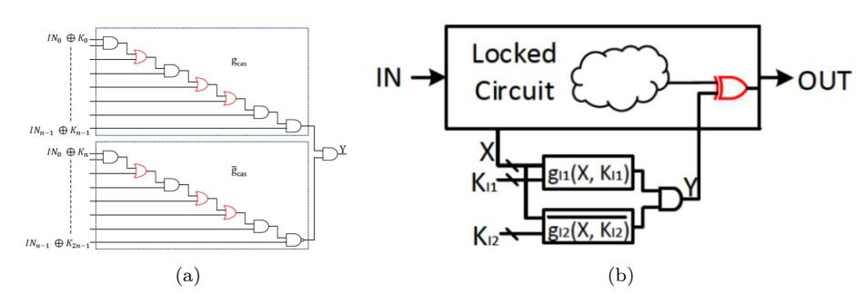

# Defeating CAS-Unlock

Bicky Shakya bshakya@ufl.edu Xiaolin Xu \* xiaolin8@uic.edu

Mark Tehranipoor, Domenic Forte {tehranipoor,dforte}@ece.ufl.edu

ECE Department, University of Florida \* ECE Department, University of Illinois at Chicago

### **1 Abstract**

Recently, a logic locking approach termed 'CAS-Lock' was proposed to simultaneously counter Boolean satisfiability (SAT) and bypass attacks. The technique modifies the AND/OR tree structure in Anti-SAT to achieve non-trivial output corruptibility while maintaining resistance to both SAT and bypass attacks. An attack against CAS-Lock (dubbed 'CAS-Unlock') was also recently proposed on a naive implementation of CAS-Lock. It relies on setting key values to all 1's or 0's to break CAS-Lock. In this short paper, we evaluate this attack's ineffectiveness and describe a misinterpretation of CAS-Lock's implementation.

Figure 1: (a) Gate-level Structure of CAS-Lock (b) CAS-Lock integration into a design.

### **2 CAS-Lock**

With the globalization of the semiconductor industry, the fabrication of most integrated circuits (ICs) is being outsourced to untrusted and off-shore foundries. To mitigate the hardware vulnerabilities caused by this new business model, logic locking has been proposed as a solution. Most existing logic locking schemes are implemented by inserting extra *key-gates* into the netlist of the original circuit design. As a result, the locked circuit works correctly only when the correct key is provided. However, recent work has shown that most locking techniques are vulnerable to the so-called *Boolean satisfiability (SAT) based attacks* [1]. In the SAT attack, a set of *distinguishing input patterns (DIPs)* are collected from the locked circuit to rule out incorrect keys that do not satisfy the DIPs and the corresponding known-good responses from an unlocked IC.

Recently, two logic locking methods: Anti-SAT [2] and CAS-Lock [3] have been proposed to mitigate the threats from SAT attacks. Both Anti-SAT and CAS-Lock use two complementary logical blocks: *g* and ¯*g*, which share a common input *X* but are locked by two different keys *Kl*1 and *Kl*2 . These two blocks *g* and ¯*g* are used to flip the outputs if a wrong key is applied. Bypass attack [4] has also been proposed against Anti-SAT and other similar SAT resistant locking schemes. In this attack, extra logic is embedded into the locked circuit to nullify output corruptibility from a wrong key. In addition, removal attacks [5] have also been proposed against regular and SAT-attack resistant locking schemes. They exploit the gate-level implementation of these techniques, by identifying structural features such as signal probability skew (SPS).

The basic gate-level structure of CAS-Lock is shown in Figure 1a. It only differs from Anti-SAT [2] based on how the complementary logical blocks *gcas* and ¯*gcas* are constructed, i.e., the AND/OR gates are daisy-chained or cascaded together instead of being connected in a tree structure. This logical structure gives CAS-Lock its SAT attack resistance and also resistance against bypass and removal attacks [4]. More proofs and technical details on how these properties are achieved can be found in [3]. Here, we note that CAS-Lock varies from Anti-SAT **only** in the logical structure of *gcas* and ¯*gcas*. The XOR/XNOR of the key bits (*K*0*, K*2*n*−1) with the primary inputs **IN** of the circuit can be followed in the same way as Anti-SAT.

# **3 Defeating CAS-Unlock**

The adversarial model of SAT-attack is defined in [1], in which an attacker has access to (a) *A locked netlist*: This can either be obtained from a malicious foundry or through reverse-engineering a chip obtained from the open market. (b) *Unlocked IC*: An unlocked 'golden' IC can be purchased from the open market or obtained through a malicious insider in the design house. Such a chip can be used by the attacker to check whether the output for a given key from the locked netlist is correct, i.e., he/she can perform chip-level functional/structural tests to obtain golden responses. The goal of the attacker is to find the correct key by inquiring the least number of input patterns from the unlocked IC. Without loss of generality, most of the recently proposed countermeasures, including both Anti-SAT and CAS-Lock, use the same threat model from [1]. In CAS-Lock, a logic block comprising of a cascade of key controlled AND/OR gates is stitched into the original circuit. The block exponentially increases the complexity of SAT attacks while simultaneously allowing the locked design to maintain non-trivial output corruptibility for defeating bypass removal attacks. Removal attacks, such as SPS-based, are prevented by increasing corruptibility from the *gcas* / ¯*gcas* function, as well as by modifying the original logic circuit.

CAS-Unlock has been recently proposed as a trivial yet highly effective attack against CAS-Lock [6]. It specifically exploits the way the XOR/XNOR of the 2*n*-length key is performed with the *n* primary inputs. In CAS-Unlock, the following adversarial model is assumed:

- The attacker *does not* have access to the gate-level netlist of the locked design, which has been re-synthesized after application of CAS-Lock.
- The attacker *does not* have access to an unlocked IC, unlike SAT attacks. Therefore, no oracle exists or is needed to query correct input patterns.
- The attacker only loads key values into the design, through key registers. The goal is to simply set the key that nullifies the effect of locking.

Thus, CAS-Unlock claims to break CAS-Lock under the strongest adversarial model that has been proposed so far in all logic locking literature, i.e., *the attacker ONLY needs to load keys into the design*.

From the construction of CAS-Lock, it is clear that such an attack would work *if and only if* all bits of the input and key were only XOR'ed with each other. A trivial attack would then work by setting both the *gcas* and ¯*gcas* keys to all 0's or all 1's. As a result, the output of both *gcas* and ¯*gcas* would always be complementary, leading to an output of *Y* = 0 for all input patterns. Therefore, once integrated into the circuit, the CAS-Lock block would never flip the correct output of the circuit for any input pattern, which would effectively invalidate CAS-Lock. The same effect can be seen when *only* XNOR of the key and input bits is used in both *gcas* and ¯*gcas*. In either case, note that the attacker merely needs to set the key to all 0's or all 1's. No further effort is claimed to be needed to break CAS-Lock with CAS-Unlock.

It should be noted that this property is true of both CAS-Lock and Anti-SAT [2]. If the output of *gcas* is never equal to that of ¯*gcas*, no input patterns will be corrupted. In other words, if the inputs (XOR'ed result of the key and the primary inputs) to both *gcas* and ¯*gcas* are the same, the output will always be 0, since *gcas* and ¯*gcas* are complementary. *Thus, it is required that both CAS-Lock and Anti-SAT use a combination of randomly chosen XOR/XNORs*, so that (1) the key for *gcas* is never equal to that of ¯*gcas*, or (2) the keys for *gcas* and ¯*gcas* are not a string of all 1's or 0's. This is because of the inherent characteristic of XOR/XNOR functions, and the fact that *gcas* and ¯*gcas* are logically complementary. Thus, *any implementation or interpretation* *of CAS-Lock/Anti-SAT that does not include XOR+XNORs of key bits with the input bits would be incorrect* 1 . Once XOR/XNORs are applied, CAS-Unlock would be defeated, *as a key of all 0's or all 1's is no longer able to provide a functionally correct circuit*, as the correct key bits for *gcas* and ¯*gcas* are no longer the same. In fact, even if one single XOR gates was changed to an XNOR, CAS-Unlock would be nullified. Of course, an attacker could try to figure out the mapping of XOR/XNORs between *gcas* and *g*¯*cas*, so that the outputs of both blocks are always complementary. However, such an attack requires access to the gate-level netlist, which is *not covered* under the CAS-Unlock adversarial model. Further, re-synthesis of the netlist prevents such an attack, as detailed in [3].

## **4 Conclusion**

In summary, the requirement of using asymmetric key gates or a combination of XOR/XNORs for *gcas* and ¯*gcas* was clearly established in Anti-SAT [2], and further re-iterated in CAS-Lock [3]. Using all XORs or XNORs for the inputs to *gcas* and ¯*gcas* creates a naive attack vector, which can (and in fact, must be) prevented by using a combination of random XOR/XNORs. Therefore, we hope future papers that target on attacking any existing solutions comprehensively understand the correct implementation of the scheme first; otherwise, misunderstandings about its susceptibility to attacks might be propagated.

#### **References**

- [1] Pramod Subramanyan, Sayak Ray, and Sharad Malik. Evaluating the security of logic encryption algorithms. In *2015 IEEE International Symposium on Hardware Oriented Security and Trust (HOST)*, pages 137–143. IEEE, 2015.
- [2] Yang Xie and Ankur Srivastava. Mitigating sat attack on logic locking. In *International Conference on Cryptographic Hardware and Embedded Systems*, pages 127–146. Springer, 2016.
- [3] Bicky Shakya, Xiaolin Xu, Mark Tehranipoor, and Domenic Forte. Caslock: A security-corruptibility trade-off resilient logic locking scheme. *IACR Transactions on Cryptographic Hardware and Embedded Systems*, pages 175– 202, 2020.

1The security proofs outlined in [3] regarding CAS-Lock, which illustrate XOR'ing of the key bits with the primary inputs, are only shown for simplicity of explanation. Usage of XORs, XNORs or a combination of both, only results in the permutation of the truth tables for *gcas* and ¯*gcas*. The security claims made in Lemmas 1 to 3 regarding SAT attack resistance still hold. Bypass attack resistance is also maintained as either XOR or XNOR maintains the same 0.5 probability at the inputs of *gcas* and ¯*gcas*.

- [4] Xiaolin Xu, Bicky Shakya, Mark M Tehranipoor, and Domenic Forte. Novel bypass attack and bdd-based tradeoff analysis against all known logic locking attacks. In *International Conference on Cryptographic Hardware and Embedded Systems*, pages 189–210. Springer, 2017.
- [5] Muhammad Yasin, Bodhisatwa Mazumdar, Ozgur Sinanoglu, and Jeyavijayan Rajendran. Security analysis of anti-sat. In *2017 22nd Asia and South Pacific Design Automation Conference (ASP-DAC)*, pages 342–347. IEEE, 2017.
- [6] Abhrajit Sengupta and Ozgur Sinanoglu. Cas-unlock: Unlocking cas-lock without access to a reverse-engineered netlist.