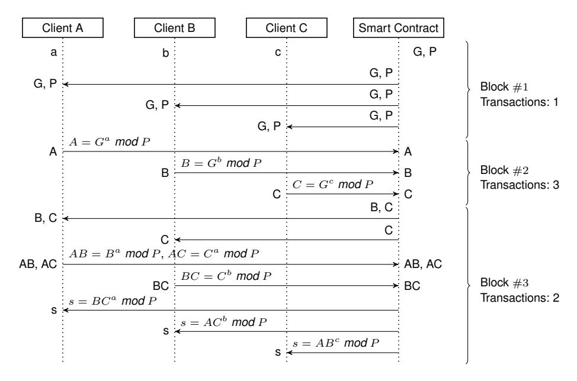
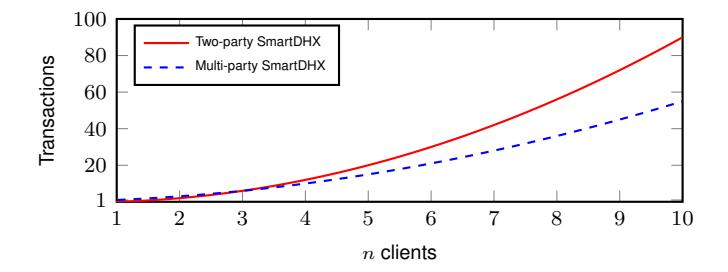

# SmartDHX: Diffie–Hellman Key Exchange with Smart Contracts

Robert Muth and Florian Tschorsch *Technische Universitat Berlin, Germany ¨* {*muth, florian.tschorsch*}*@tu-berlin.de*

*Abstract*—Blockchain technologies enable decentralized applications (DApps) that run on distributed infrastructures without any central authority. All transactions for communication and data storage are public and can be verified by all participants. DApps interacting with a smart contract typically require clientside code, which is not part of the smart contract, and therefore do not hold the same verifiability properties. Following the vision of a verifiable DApp, we propose SmartDHX, a Diffie-Hellman key exchange (DHKE) scheme, fully implemented as a smart contract. That is, SmartDHX communicates only via the Ethereum blockchain and provides both backend *and* client-side code with the smart contract. The application code can therefore be verified and deployed without external trust requirements. By executing DHKE on-chain, we gain a number of properties, including asynchronicity as well as message integrity and authenticity. We generalize the two-party SmartDHX to emphasize that our approach is able to handle complex cryptographic protocols. In our analysis, we expose an efficiency tradeoff when executed on chain. In particular, we provide a proof-of-concept implementation and analyze the runtime and transaction fees. Since DHKE is used by many cryptographic algorithms, Smart-DHX contributes a fundamental building block in the domain of DApps.

*Index Terms*—Key Exchange, Decentralized Application, Smart Contract, Implementation, Blockchain

# I. INTRODUCTION

Diffie-Hellman key exchange (DHKE) is a building block for many cryptographic algorithms that is used in order to establish a shared secret over an open channel. For example, to facilitate secure web browsing, a client uses DHKE to negotiate a secret key with a web server to encrypt subsequent communication. Even a (passive) eavesdropper cannot reconstruct the secret key when DHKE is employed.

In this paper, we propose *SmartDHX*, a blockchain-based DHKE scheme with multi-party capabilities. In SmartDHX, *all* cryptographic operations are implemented in a smart contract, without any client-side modifications or any additional libraries. This enables participants to load the code directly from the blockchain and to execute a DHKE verifiably onchain. With our scheme, clients load runtime code from the SmartDHX smart contract and execute it locally in a Web3 JavaScript environment. Consequentially, the runtime code handles the interaction with the smart contract. In order to secure the key generation, a random seed is necessary. We therefore utilize JavaScript for generating a random number locally, without revealing it to the blockchain. We generalize the two-party protocol and also provide a multi-party SmartDHX, which clearly shows that our approach is able to handle complex cryptographic logic.

Due to the underlying blockchain infrastructure, the presented approach comes with a number of interesting properties: First, we can execute DHKE asynchronously as exchanged messages are stored on-chain, which enables DHKE for participants who cannot be online simultaneously. Since DHKE is designed to be secure in public networks, it will also remain secure in a blockchain setting. Second, message integrity and authenticity are provided by the blockchain, therefore effectively mitigating Man-in-the-Middle (MitM) attacks.

The main contribution of this paper is to show that all logic for DHKE can be implemented in a smart contract without any modifications to the Ethereum client. For this, we provide an implementation of SmartDHX as Proof-of-Concept (PoC). To this end, we implemented the cryptographic logic in Solidity with the Truffle framework and evaluated the approach using Ethereum's test network. With our PoC, we provide unit tests, which verify that multiple participants can exchange a secret key without storing it on-chain. The implementation can be tested locally. While feasible, the key exchange requires additional time due to the blockchain overhead. We also show that multi-party DHKE reduces the number of transactions but involves computationally expensive operations due to the key distribution logic in the smart contracts.

In general, our approach contributes to a larger vision of truly decentralized applications (DApp) which store their logic on-chain without separating between a client and blockchain side. At the moment, DApps are typically divided into client-side code (frontend), and the smart contract in the blockchain (backend). Taking this one step further, our approach enables new cryptographical use cases, e.g., DApps which are completely stored on-chain, but can communicate with each other encrypted. That said, we deliberately refrain from framing SmartDHX in a specific use case or application domain, and consider it as fundamental cryptographic building block and feasibility study, instead.

The remainder of this paper is structured as follows. In Section II, we discuss related work. In Section III, we introduce SmartDHX, its multi-party capabilities, and outline our PoC. In Section IV, we analyze its performance, security, and discuss feasibility. Section V concludes the paper and gives an outlook on future work.

# II. RELATED WORK

Similar to our paper, McCorry et al. [1] utilize Bitcoin for authenticated DHKE. To this end, the authors modified the Bitcoin Core client and implemented the DHKE logic as remote procedure commands, which are stored and executed off-chain. In [2], Schindler et al. developed a distributed key generation (DKG) scheme based on the Ethereum blockchain. The approach is implemented as smart contract and uses Shamir's secret sharing [3] to realize DKG. Similar to [2], the Orbs Network project provides a DKG smart contract implementation using threshold signatures [4]. In the area of IoT, Owoh and Singh [5] proposed to use DHKE to secure the exchange of sensor data. Here, edge devices run a blockchain as underlying IoT infrastructure, but clients perform DHKE completely off-chain. While all previously mentioned contributions exhibit some (methodical) similarities, to the best of our knowledge, our paper is the first PoC that implements DHKE on-chain as a smart contract in Ethereum.

# III. SMARTDHX

In this section, we introduce SmartDHX, address the challenge of seeding it with a random number, and present our PoC smart contract implementation.

# *A. Two-Party SmartDHX*

Two-party Diffie-Hellman key exchange allows to establish a secret key between two participants for subsequent encryption without revealing the key on the communication channel [6]. The security is not compromised as long as someone is passively listening. In order to exchange a secret key, the participants have to agree on a prime number P and a generator number G. Certain properties on the numbers have a direct effect on the security of the whole cryptographical computations [7], which we do not discuss further for the sake of simplicity. There are also different cryptographic techniques for making DHKE more secure, e.g., by using elliptic curve cryptography [8]. After agreeing on P and G, the participants choose private keys a, b randomly, and publicly exchange their

```
// Globals
uint public G, P, B; // set during initialization
// Call for generating private, random a and public A
    based on a secret seed
function generateA(uint[] memory secretSeed) public
    view returns (uint a, uint A) {
  a = uint(keccak256(abi.encodePacked(secretSeed)));
  A = G.bigMod(a, P); // RPC modulo
}
// Send transaction for transmitting public A to other
    SmartDHX contract (as B)
function sendA(DHX other, uint A) public {
  other.setB(A);
}
// Call for calculating secret key s
function calcS(uint a) public view returns (uint) {
  s = B.bigMod(a, P);
}
```

Listing 1. Two-party DHKE implementation in Solidity.

results of A = G<sup>a</sup> *mod* P and B = G<sup>b</sup> *mod* P, which we call public keys. Finally, the participants calculate the secret key s = (GB) <sup>a</sup> *mod* P = (GA) <sup>b</sup> *mod* P independently, however retrieving the same result.

Listing 1 shows how to generate a and A for one party in Solidity, how to send the public key A to another smart contract as a transaction, and how to retrieve the final secret key s. For the sake of simplicity, we assume that the seed is given. Later, we will provide a solution to generate a random seed locally and securely without any additional requirements. Under this assumption, a passive adversary is unable to compute s, because she has neither learned a nor b from any of the transactions. Only active MitM adversaries or weak cryptographic parameters can weaken the security. Hence, as long as the discrete logarithm problem is considered difficult [7], DHKE—and therefore also SmartDHX—can be used via untrusted channels such as blockchains.

For a deeper understanding of SmartDHX, it is important to notice the difference between calling a smart contract function locally and sending a transaction with a function call. All functions which use the private key a are executed *locally* (cf. contract.method.call(. . .)). By calling a function locally, no transaction will be broadcasted, and thus nobody can see that the function has been called, nor will the parameters be disclosed. Likewise, any changes on the blockchain's storage variables will be discarded without persistent change. The function can, however, return a value based on the blockchain's current storage. We use this feature to generate the public key A (without revealing the private key a) and to generate the secret key s. That way, we can store protocol logic in the blockchain without revealing any processed data. In contrast, "transmitting" the public A will be executed as a transaction (cf. contract.method(. . .)) and therefore permanently written into the blockchain. Please note, both parties involved in the DHKE have the exact same view on the deployed smart contract, using the exact same function for making their public key available to the other party's contract.

#### *B. Multi-Party SmartDHX*

DHKE can also be used for exchanging a single secret key between more than two parties. Of course, all parties could exchange keys bilaterally and then derive a common secret. Alternatively, all parties could use multi-party DHKE to agree on a shared secret key. In the following, we present multiparty SmartDHX, which generalizes the two-party approach.

For multi-party SmartDHX, we follow the same philosophy and implemented the complete logic to perform the key exchange in a smart contract. Specifically, the logic to provide prime P and generator G, and the logic for calculating the random private keys a, b, c, . . . (with a random seed), the public keys A, B, C, . . ., and the secret key s = G(A·B·C·...) *mod* P are implemented in a smart contract. Since we need to coordinate the message exchange between all parties, we implemented an extra "control" smart contract.



Figure 1. Multi-party SmartDHX for n=3. Lower-case values remain secret, upper-case values are publicly stored in the blockchain.

Figure 1 shows an example for a three-party SmartDHX, including all calculations and smart contract interactions required to compute the secret key s. The first block contains the smart contract deployment, and thus the runtime code as well as the common parameters P and G. The arrows leading from the smart contract to the clients (right to left) indicate a local execution. Inversely, arrows pointing towards the smart contract (left to right) represent persisting transactions. The annotations on the right summarize the number of required transactions. Please note that a block can hold multiple transactions issued by different parties.

Even though the control smart contract could act as a MitM, it is unable to obtain (or derive) the secret key. While the smart contract could actually manipulate the exchanged messages between parties, all transactions are publicly available in the blockchain. Each party can therefore verify the correct execution of the smart contract. Thus, as long as all transactions are executed correctly and the program code of the smart contract is not malicious, a MitM attack is not possible.

#### C. Seeding SmartDHX

In order to generate a private key for DHKE, a client has to generate a secret random number, which is not trivial to achieve when accepting smart contract inherent code only. For one, the fundamental requirement of the Ethereum Virtual Machine (EVM) is a deterministic execution of all commands. Consequentially, Solidity does not offer a pseudo random number generator (PRNG). Smart contract developers instead retrieve a random number usually by using hash values of previous blocks or implement a commit-reveal scheme [9]. Such a random number, however, would not be secret anymore and therefore is not usable for DHKE.

Our solution to the problem is to use JavaScript's PRNG. In particular, we deliver a JavaScript snippet with the smart contract that generates a 256 bit random number (as shown in Listing 2). Since this snippet is executed *locally*, it will not disclose the random number to the blockchain. For improved security, it would also be possible to import an NPM library with a cryptographically secure PRNG, because the JavaScript is actually executed in a Web3/Node.js environment.

## D. Proof-of-Concept

We implemented SmartDHX in Solidity 5.8 with the Truffle framework 5.0.22 and make the code publicly available on GitHub<sup>1</sup>. The implementation's purpose is to showcase and analyze SmartDHX's feasibility only and does not implement any additional security measures against hijacking the smart contracts. In order to initiate the key exchange, each party deploys SmartDHX and executes JavaScript code locally, which is stored in and retrieved from the smart contract as shown in Listing 2. This script is executed in a Web3 environment during a Truffle migration and invoked by JavaScript's runtime evaluation command eval (...) as shown in Listing 3. After all parties executed the script, it returns the exchanged secret key. The main advantage of storing the key exchange script in a smart contract is that no third-party is needed, e.g., a web server, that provides the script. This makes the program code verifiable and has the potential to improve user experience, because no additional client software is required.

#### IV. ANALYSIS

In this section, we analyze the performance and security aspects of SmartDHX and discuss its feasibility including exemplary application areas.

<sup>&</sup>lt;sup>1</sup>https://github.com/robmuth/smart-dhx

```
// Generate local secret seed (32 byte == uint256)
let secretSeed = [...Array(32)].map(() =>
    parseInt(Math.random() * 256));

// Generate private a and public A (local call)
let dhxKeys = await dhx.generateA.call(secretSeed);

// Send public A to other participant via blockchain (transaction)
await dhx.sendA(dhxPartner.address, dhxKeys.A);

// Calculate secret key (local call)
return await dhx.calcS.call(dhxKeys.a);
Listing 2. Two-party key exchange implemented in JavaScript. The script
```

Listing 2. Two-party key exchange implemented in JavaScript. The script is loaded from the SmartDHX smart contract, handles the blockchain communication, and returns the exchanged secret key.

## A. Performance

In the following, we analyze blockchain specific metrics instead of network metrics like latencies or bandwidths. Accordingly, we do not compare the execution time of off-chain DHKE with SmartDHX, as mining can be expected to induce significant delays.

In Table I, the number of exchanged secret keys, issued transactions, and blocks are compared between two-party and multi-party SmartDHX. In order to exchange bilateral keys between n clients, two-party SmartDHX needs at least  $\binom{n}{2}$  secret keys and twice as many transactions, i.e., n (n-1). Since all key exchanges can run independently from each other, two-party SmartDHX can be completed in a minimum of three blocks (one block for the deployment and two blocks for the two-way handshake between clients).

For multi-party SmartDHX, let us revisit Figure 1. The deployment of the smart contract and providing P and G requires one block. In the following blocks, the key exchange will be step-by-step completed by each client, always adding another public key. For example as shown in the figure, the public keys A, B, C are exchanged in Block #2. Next, clients can calculate the public keys AB, AC, BC, and publish them in Block #3. In each round, another client terminates, because of the redundancy in the public keys, which eventually leads to a decreasing number of transactions every block. For example in Block #3, Client C could calculate AC and BC, but they are also calculated by Client A and B. As a result, multi-party SmartDHX needs a minimum of n+1 blocks and  $\sum_{k=1}^{n} k$  transactions.

In a best-case scenario, two-party SmartDHX can exchange secret keys faster than multi-party SmartDHX for more than two clients, if all transactions are mined in the minimum number of blocks. Multi-party SmartDHX, however, needs less transactions, but the number of blocks increases by 1 per participant.

The overall time for a key exchange with SmartDHX depends on the average block generation rate. That is, for a number of blocks  $\beta$  and the average block rate  $\lambda_{\beta}$ , the execution time t is given by  $t=\beta\cdot\lambda_{\beta}$ . In terms of economic performance, however, the number of transactions might be more interesting than blocks: With an increasing number of clients, two-party SmartDHX requires more transactions than

```
// SmartDHX deployment
let dhx = await deployer.deploy(SmartDiffieHellman);
let dhxPartner = await SmartDiffieHellman.at(0x...);

// Generate secret and exchange public A with
```

Listing 3. Two-party SmartDHX Truffle migration script.

multi-party SmartDHX, which can be seen in Figure 2. In case of Ethereum, more transactions do not necessarily lead to higher total costs, because transaction fees depend on the computational complexity. Even though the number of transactions for two-party SmartDHX surpasses multi-party SmartDHX, the overall gas price for our PoC multi-party SmartDHX is higher (cf. Table I). The reason are the many on-chain key distributions (i.e., write operations) in the smart contract. In the end, there are two axis that influence the decision: First, one has to decide whether parties should exchange separate keys or a single shared key. Second, we need to tradeoff speed (i.e., number of required blocks) and costs (i.e., number of required transactions).

#### B. Security

Besides the security of "plain" DHKE, as described in [6, 7, 8], the blockchain's security also directly influences the secrecy of the final exchanged key. We already pointed out that DHKE is safe as long as no MitM can actively and secretly manipulate the communication between the participants. But permissionless blockchains with longest-chain consensus rules can be attacked with the so-called 51%attack [10], which allows changes in the blockchain retrospectively. That way, an attacker could actively change blockchain transactions, which is the worst-case scenario for DHKE. Fortunately, an attacker cannot manipulate transactions without also tampering the sender's identity or transactions signature. With the identity management of blockchains, transactions can be authenticated as shown by McCorry et al. [1]. They analyzed the security of DHKE via Bitcoin, that can also be applied to Ethereum's transaction authentication. For that, they sketched proofs in their security analysis for the private key security and session key security, which also applies to our approach. So, as long as all participants can trust and verify each other's transaction signatures a 51%-attack does not threaten the SmartDHX security.

#### C. Discussion and Application Areas

We generally observe that SmartDHX is executable in a reasonable amount of time and offers some very interesting properties, including asynchronicity as well as message integrity and authenticity. By establishing a secure channel,

|                    | SmartDHX       |                                    |
|--------------------|----------------|------------------------------------|
|                    | Two-party      | Multi-party                        |
| Secret keys        | $\binom{n}{2}$ | 1                                  |
| Transactions       | n(n-1)         | $\sum_{\substack{k=1\\1+n}}^{n} k$ |
| Blocks (minimum)   | 3              | $\frac{-1}{1+n}$                   |
| PoC runtime, $n=2$ | 75 s           | 165 s                              |
| PoC runtime, $n=9$ | 1,275 s        | 375 s                              |
| PoC fees, $n=2$    | 2,813,350 gas  | 7,184,970 gas                      |
| PoC fees, $n=9$    | 11,443,649 gas | 125,366,493 gas                    |



Figure 2. Number of transactions for two-party and multi-party SmartDHX.

SmartDHX enables encrypted on-chain communication. As described in [1], this can be used to provide end-to-end encrypted communication for post-payment scenarios. Another potential application, which emphasizes a feature of our approach, might be plausible deniability as in Off-the-Record Messaging [11]. In addition to encrypted on chain communication, the blockchain can be used to disclose a user's MAC keys to a wider audience.

Likely, the costs to perform DHKE on-chain become an issue. In particular the costs for multi-party SmartDHX seem high. Depending on the use case, the additional costs can be negligible, e.g., exchanging a shared key to enable an encrypted broadcasting. For instance, in situations where many users receive encrypted data as broadcast messages, it could be beneficial to have a single shared key. With a shared key and using the blockchain as a broadcast medium, only a single transaction is needed for broadcasting an encrypted message to many recipients. Therefore, transactions fees can be reduced and might compensate (break even) for the expensive key exchange.

While many other application areas, including on-chain voting, offer interesting opportunities as well, we consider SmartDHX as a building block and a step towards fully verifiable DApps. Our PoC and our results confirm the general feasibility.

#### V. CONCLUSION

In this paper, we presented SmartDHX. We showed that it is possible to implement DHKE completely in an Ethereum smart contract, enabling participants to establish a secure communication channel via blockchains. To this end, we did not only implement the cryptographic logic in Solidity, but

also the client-side logic for interacting with the smart contracts. With our proposed scheme, clients fetch their program logic from the smart contract directly and execute it locally in a Web3 environment. Thus, we provide a building block that contributes to the vision of storing DApps completely in smart contracts without dividing them into blockchain-side and client-side code. In the future, we are going to investigate secure and verifiable DApps further. In particular, we envisage a framework for fetching generic DApp logic from a smart contract to establish secure communication channels for arbitrary applications. Additionally, we are interested in making SmartDHX production ready, which involves improving the security by using Elliptic-curve Diffie-Hellman (ECDH).

#### REFERENCES

- [1] P. McCorry, S. F. Shahandashti, D. Clarke, and F. Hao, "Authenticated key exchange over Bitcoin," in SSR '15: International Conference on Research in Security Standardisation, 2015.
- [2] P. Schindler, A. Judmayer, N. Stifter, and E. Weippl, "Distributed key generation with Ethereum smart contracts," in *CIW '19: Cryptocurrency Implementers' Workshop*, 2019.
- [3] A. Shamir, "How to share a secret," *Communications of the ACM*, 1979.
- [4] Orbs-Network, "DKG for BLS threshold signature scheme on the EVM using solidity," github.com/orbs-network/dkg-on-evm, 2018, accessed: 2019-06-13.
- [5] N. P. Owoh and M. M. Singh, "Applying Diffie-Hellman algorithm to solve the key agreement problem in mobile blockchain-based sensing applications," 2019.
- [6] W. Diffie and M. E. Hellman, "New directions in cryptography," *IEEE Transactions on Information Theory*, 1976.
- [7] B. den Boer, "Diffie-Hellman is as strong as discrete log for certain primes," in *CRYPTO '88: Advances in Cryptology*, 1988.
- [8] V. S. Miller, "Use of elliptic curves in cryptography," in *CRYPTO '85: Advances in Cryptology*, 1985.
- [9] I. Damgård and J. Nielsen, "Commitment schemes and zero-knowledge protocols (2007)," *LNCS '08: Lecture Notes in Computer Science*, 2008.
- [10] J. A. Kroll, I. C. Davey, and E. W. Felten, "The economics of Bitcoin mining, or Bitcoin in the presence of adversaries," in WEIS '13: Workshop on the Economics of Information Security, 2013.
- [11] N. Borisov, I. Goldberg, and E. A. Brewer, "Off-therecord communication, or, why not to use PGP," in WPES '04: ACM Workshop on Privacy in the Electronic Society, 2004.