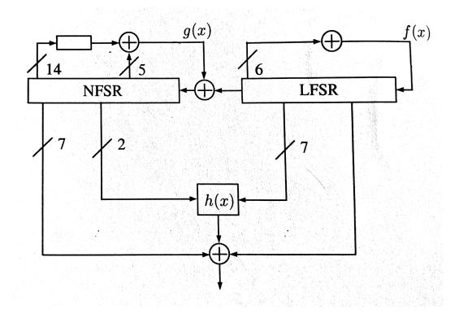
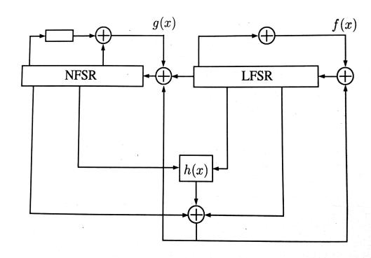
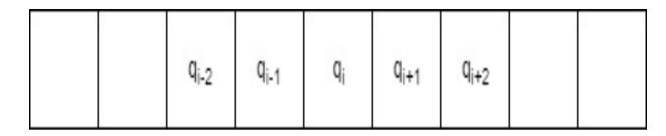
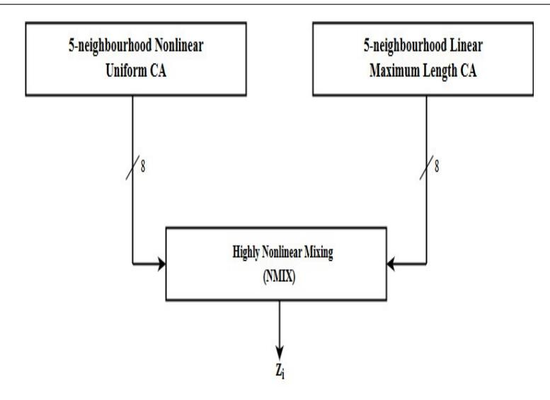
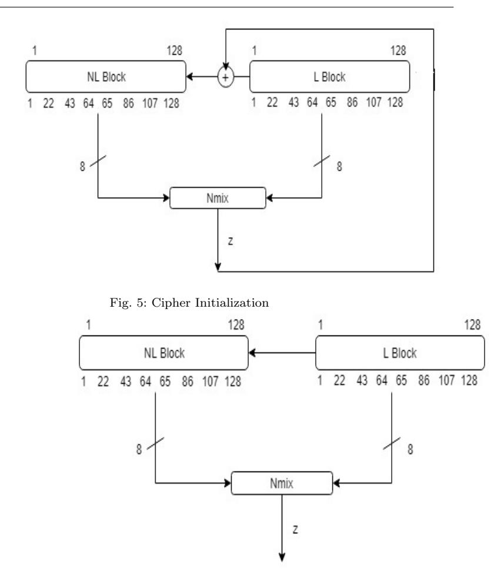

#### Noname manuscript No. (will be inserted by the editor)

On the design of stream ciphers with Cellular Automata having radius = 2

Anita John · Rohit Lakra · Jimmy Jose

Received: October 10, 2019/ Accepted:

Abstract Cellular Automata (CA) have recently evolved as a good cryptographic primitive. It plays an important role in the construction of new fast, efficient and secure stream ciphers. Several studies have been made on CA based stream ciphers and we observe that the cryptographic strength of a CA based stream cipher increases with the increase in the neighbourhood radii if appropriate CA rules are employed. The current work explores the cryptographic feasibility of 5-neighbourhood CA rules also referred to as pentavalent rules. A new CA based stream cipher, CARPenter, which uses pentavalent rules have been proposed. The cipher incorporates maximum length null-boundary linear CA and a non-linear CA along with a good non-linear mixing function. This is implemented in hardware as well as software and exhibits good cryptographic properties which makes the cipher resistant to almost all attacks on stream ciphers, but with the cost of additional computing requirements. This cipher uses 16 cycles for initialization, which is the least number of cycles when compared to other existing stream ciphers.

Keywords Stream Ciphers · Cellular Automata · 5-neighborhood CA · Grain

## 1 Introduction

In cryptography, the encryption schemes are generally classified as symmetric key encryption and asymmetric key encryption. Stream ciphers are an important class of symmetric key encryption schemes. They encrypt individual characters (usually binary digits) of a plaintext message one at a time, using an

Department of Computer Science and Engineering, National Institute of Technology, Calicut Calicut, India

E-mail: {anita p170007cs, jimmy}@nitc.ac.in, iamrohitlakra@gmail.com

encryption transformation which varies with time. By contrast, block ciphers, another class of symmetric key encryption schemes, tend to simultaneously encrypt groups of characters of a plaintext message using a fixed encryption transformation. Stream ciphers are generally faster than block ciphers in hardware, and have less complex hardware circuitry [1]. A stream cipher takes a key and Initialization Vector (IV) as inputs and generates a key stream which is XORed with the plaintext to produce the ciphertext. So, the security of any stream cipher lies in the keystream that is generated. The unpredictability of the keystream influences the strength of the cipher. Generally stream ciphers are faster than block ciphers in hardware and have a less complex hardware circuitry. The eSTREAM project [2] was started as part of eCRYPT [3] to promote the design of efficient stream ciphers. The finalists in eSTREAM were classified under two profiles namely, profile 1 and profile 2. The ciphers in profile 1 were intended to give excellent throughput when implemented in software whereas the ciphers in profile 2 were intended to be efficient in terms of the physical resources required when implemented in hardware. Two widely studied ciphers Grain [4] and Trivium [6] belong to profile 2. We discuss the working of Grain-128 in the next subsection.

c

#### 1.1 Overview of Grain-128

Grain-128 [4], one of the eSTREAM finalists was a lightweight stream cipher.The cipher consists of a Linear Feedback Shift Register (LFSR), a Nonlinear Feedback Shift Register (NFSR) and a non-linear filter. The cipher takes 128-bit key and 96-bit IV as inputs. The feedback polynomial of the LFSR is denoted by f(x). It is defined as

$$f(x) = 1 + x^{32} + x^{47} + x^{58} + x^{90} + x^{121} + x^{128}$$

The non-linear feedback polynomial of the NFSR, g(x) is the sum of one linear and one bent function. It is defined as

$$g(x) = 1 + x^{32} + x^{37} + x^{72} + x^{102} + x^{128} + x^{44}x^{60} + x^{61}x^{125} + x^{63}x^{67} + x^{69}x^{101} + x^{80}x^{88} + x^{110}x^{111} + x^{115}x^{117}$$

The non-linear filter function is defined as

$$h(x) = x_0 x_1 + x_2 x_3 + x_4 x_5 + x_6 x_7 + x_0 x_4 x_8$$

where the variables x0, x1, x2, x3, x4, x5, x6, x<sup>7</sup> and x<sup>8</sup> correspond to the tap positions from both LFSR and NFSR [4].

#### Key and IV initialization

The 128 NFSR elements are loaded with the 128-bit key and the 128 LFSR elements are loaded with the 96-bit IV. The last 32 elements in the LFSR will be loaded with all ones. After loading the key and IV bits, the cipher is cycled 256 times without producing any keystream. Instead, the output function is fed back and XORed with the input, both to the LFSR and the NFSR. Figure 1 and Figure 2 show the overview and key initialization phase of the cipher.



Fig. 1: Grain-128 cipher



Fig. 2: Grain-128 Key initialization

Trivium which was another e-STREAM finalist is a synchronous stream cipher. The cipher works on 80-bit secret key and 80-bit Initialization Vector (IV). It takes 1152 rounds to initialize itself. The keystream bits are output only after this initialization phase is over. The cipher operates in two phases, initialization and keystream generation. Both phases execute the same algorithm. A number of attacks like linearization, correlation attacks , scan attacks, algebraic attacks were reported on Trivium.

LFSR and NFSR are the basic building blocks in Grain and Trivium. The output sequences of LFSR are linear and are easily predictable. In addition, a fault attack on NFSR was proposed in [5]. So, stream ciphers based on CA gained importance. CA are self-evolving cells where each cell gets updated based on the values of its neighbouring cells. The number of cells involved in the updation decides the neighbourhood radius of the cell. The functions used for updating the cells are called CA rules. It was introduced by Stephen Wolfram [38]. In shift registers, the bits are only shifted whereas in a CA, parallel transformations take place and almost all the bits are involved in the CA rule of transformation. So CA has evolved as a good pseudorandom generator.

Several CA based stream ciphers have been studied and Section 1.2 gives an overview of the CA based stream ciphers. Parallel transformations of stream cipher can be achieved using CA and this provides high throughput which is beneficial in the case of stream ciphers.

# 1.2 CA based stream ciphers

CAvium [8], a stream cipher was a CA based modification of Trivium. Basically, CAvium replaced only the shift registers of Trivium with a hybrid < 30, 60, 90, 120, 150, 180, 210, 240 > CA. It had better cryptographic properties like non-linearity, resiliency and algebraic degree when compared to Trivium and achieved comparable values in less number of cycles. Another CA based stream cipher was CAR30 [9] which made use of 3-neighbourhood CA rule and was inspired by Grain-128 [4]. CAR30 replaced the LFSR and NFSR with linear and non-linear 3-neighbourhood CA respectively. The cipher could be scaled up and down easily. The cipher was secure and could be implemented easily in both hardware and software.

CASTREAM [10], another CA based stream cipher was proposed which was suitable in both hardware and software. This cipher incorporated the idea of S-box generation to generate the non-linear block. The non-linear block made use of CA based non-linear generators with CA based mixing among them. Another CA based stream cipher was FResCA [11]. This cipher resisted fault attacks due to its design and was also inspired by the design of Grain. While all other CA based stream ciphers made use of 3-neighbourhood CA, FresCA used a combination of 3- and 4-neighbourhood CA. NOCAS [12], another CA based stream cipher was developed based on hybrid non-linear 3-neighbourhood CA. The cipher was inspired by the design of Grain and was a cryptographically robust cipher due to its strong cryptographic properties like algebraic degree, balancedness and resiliency. Hiji-bij-bij(HBB) [13] was another stream cipher based on CA. The cipher employed CA in one of its linear blocks and used AES S-box for non-linearity.

All the stream ciphers mentioned above, except CAvium and HBB had their inspiration from the design of Grain-128, a lightweight stream cipher which had high throughput and fast initialization. Most of the ciphers used 3-neighbourhood CA except FresCA which used a combination of both 3 and 4-neighbourhood CA rules. All these ciphers were analyzed based on their cryptographic strength and were resistant to almost all attacks. Almost all the attacks on stream ciphers exploited either the algebraic degree or the linearity properties of the cipher. But in CA based stream ciphers, these properties are stronger than other shift register based ciphers. It was also found that CA based stream ciphers are strong against fault attacks [14].

The cryptographic properties of a CA based stream cipher increase with the increase in neighbourhood radii when appropriate CA rules are employed. This is because as the radius increases, the diffusion and randomness properties increase [15]. This motivated us to the use of 5-neighbourhood linear and non-linear rules to develop a new CA based stream cipher as a successor of the previous ciphers.

The rest of the paper is organized as follows. Section 2 recalls basic definitions and terminologies related to CA as well as the cryptographic properties of Boolean functions. Section 3 discusses five-neighbourhood CA and the linear and non-linear rules associated with it. In Section 4, we give the description of our stream cipher - CARPenter. Section 5 discusses the properties of CAR-Penter with proofs to support them. Section 6 analyzes the security properties of the cipher. Section 8 discusses the implementation aspects of CARPenter for both hardware and software. Finally a comparison is made with CAR30, NOCAS and Grain-128.

This paper is an extended version of [16].

#### 2 Preliminaries

In this section, we discuss some basic definitions and terminologies related to CA. The cryptographic properties of Boolean functions are also defined here.

## 2.1 Cellular Automata

A Cellular Automaton is a collection of cells and each cell is capable of storing a value and a next state computation function (CA rule). Rules determine the behaviour of cellular automata. The state of each cell of a CA together at any instant t defines the current state of the CA. The next state of the  $i^{th}$  cell of a 3-neighbourhood CA at any instant t is given by

$$S_i^{t+1} = f(S_{i-1}^t, S_i^t, S_{i+1}^t).$$

 $S_i^{t+1} \! = \! f(S_{i-1}^t,\, S_i^t,\, S_{i+1}^t).$  The next state of the  $i^{th}$  cell of a five neighbourhood CA at any instant tis given by

$$S_i^{t+1} = f(S_{i-2}^t, S_{i-1}^t, S_i^t, S_{i+1}^t, S_{i+2}^t).$$

where f is the next state function or rule,  $S_i^{t+1}$  denotes the next state of the  $i^{th}$  cell,  $S_{i-2}^t$  is the current state of second left-neighbour,  $S_{i-1}^t$  is the current state of first left-neighbour,  $S_i^t$  is the current state of the cell to be updated,  $S_{i+1}^t$  is the current state of first right-neighbour and  $S_{i+2}^t$  is the current state of second right-neighbour. In general, the number of cells n that participate in a CA cell update is given by n = 2a + 1, where a is the radius of the neighbourhood [18].

CA with null-boundary is the one in which the left-neighbour of the leftmost cell and the right-neighbour of the rightmost cell are zeroes [20]. Hybrid CA is a CA where more than one rule is involved in the generation of the next state [20]. If a CA of n bits (where n is an integer) evolves  $2^n$ -1 different states before getting back to the initial state, then it is called as maximum length

There are  $2^{2^3} = 256$  and  $2^{2^5} = 4,294,967,296$  such Boolean functions or rules possible for 3-neighbourhood CA and 5-neighbourhood CA respectively. Rules are named as decimal equivalent of the binary number that is formed by applying that rule to all  $2^n$  possibilities of the neighbourhood of a n-neighbourhood CA. In the truth table of the Boolean function corresponding to a given rule, the last combination with all ones becomes the most significant bit and first combination with all zeroes becomes the least significant bit.

## 2.2 Cryptographic Properties of Boolean Functions

A Boolean function of n variables is a function from  $F_2$ <sup>n</sup> into  $F_2$  where  $F_2$ indicates a finite field. Its value vector is the binary vector  $v_f$  of length  $2^n$ composed of all f(x) when  $x \in F_2^n$  [17]. Since most of the cryptanalytic attacks arise from the weaknesses of the underlying Boolean functions, we need to be aware of the properties to be satisfied by a Boolean function to make it suitable for any cryptographic application. A detailed description of these properties can be found in [19]. To better understand these properties we provide the basic definitions below:

- Affine Function: A Boolean function which can be represented as the XOR of some or all of its inputs and a Boolean constant is called an affine function.
- Hamming Weight: The number of ones in the truth table representation of a Boolean function is called its *Hamming weight*.

– Hamming distance: The Hamming distance between two given functions is the Hamming weight of the XOR of the two functions.

Now, we discuss certain cryptographic properties.

- •Balancedness Balanced Boolean functions have equal number of zeroes and ones in their truth table. Balancedness should be satisfied by all the Boolean functions used in cryptographic applications. The statistical bias present in the unbalanced Boolean function can be exploited for differential and linear cryptanalysis[19].
- •Algebraic Degree The algebraic degree is the maximum number of distinct variables present in an AND term among all the AND terms of a given Boolean function in Algebraic Normal Form (ANF) . Linear complexity is one of the measures used to assess the complexity of the sequence of bits generated. It is defined as the length of the shortest LFSR that can mimic the same sequence as generated by the original keystream generator. The linear complexity should be high for a good cipher [41]. Higher algebraic degree is necessary in order to have higher linear complexity [19].
- •Non-linearity The non-linearity of a Boolean function of n variables is given as the minimum Hamming distance of the given Boolean function to the linear affine functions of n variables [19].
- •Correlation Immunity A Boolean function is k th order correlationimmune if the output of the given Boolean function is independent of atmost k input variables [19].
- •Resiliency A Boolean function which is both balanced and k th order correlation immune is called k−resilient. If a Boolean function is not k−resilient, then the output depends on at most k input variables, which can be exploited to recover the initial state of k inputs. [19].

## 3 Five-Neighbourhood CA

In most of the CA based stream ciphers deiscussed in Section 1, one dimensional 3-neighbourhood CA are used. In [15], 4-neighbourhood nonlinear CA were studied and shown to provide good randomness and less correlation. In [18], Cattell and Muzio have given a method to synthesize a 3-neighbourhood Linear Hybrid CA. Based on this, Maiti and Roy Chowdhury in [21] have proposed an algorithm to synthesize a 5-neighbourhood null boundary Linear Hybrid CA (LHCA) using two linear rules. Figure 3 shows the neighbours of a cell q<sup>i</sup> of a 5-neighbourhood CA. The randomness and diffusion properties of 3-, 4- and 5-neighbourhood rules were analysed and it can be seen that, by employing appropriate CA rules, the strength of the CA in various cryptographic applications can be improved with the increase in neighbourhood radius of the CA cell. The diffusion rate of 5-neighbourhood CA is high and hence it is found to be suitable for high speed applications. The improvement comes at the cost of increased computation.



Fig. 3: 5-Neighbourhood CA

## 3.1 Five Neighbourhood Linear Rules

Based on [21], we have found a 128-bit 5-neighbourhood Linear Hybrid CA rule vector. Out of the possible  $2^{2^5}$ 5-neighbourhood rules, only  $2^5=32$  rules are linear. Out of these 32 rules, only  $2^3=8$  are of exactly 5-neighbourhood [21]. The combination of rule R0 and rule R1 given below gives the largest number of rule vectors (8) for 5-bit maximum length 5-neighbourhood CA [21]. Hence, these two rules are considered for finding 128-bit 5-neighbourhood maximum length CA. These two rules are given as

$$\begin{array}{l} \mathbf{R0}: S_{i}^{t+1} \!\!=\!\! S_{i-2}^{t} \oplus S_{i-1}^{t} \oplus S_{i+1}^{t} \oplus S_{i+2}^{t} \\ \mathbf{R1}: S_{i}^{t+1} \!\!=\!\! S_{i-2}^{t} \oplus S_{i-1}^{t} \oplus S_{i}^{t} \oplus S_{i+1}^{t} \oplus S_{i+2}^{t} \end{array}$$

where  $S_i^{t+1}$  denotes the next state of the  $i^{th}$  cell,  $S_{i-2}^t$  is the current state of second left neighbour,  $S_{i-1}^t$  is the current state of first left neighbour,  $S_i^t$  is the current state of the cell to be updated,  $S_{i+1}^t$  is the current state of first right neighbour,  $S_{i+2}^t$  is the current state of second right neighbour.

R0 and R1 are in resemblance to linear rules 90 and 150 respectively of 3-neighbourhood CA. Rules 90 and 150 are used in [18] to synthesize a maximum length 3-neighbourhood hybrid CA. The state transition function of the  $i^{th}$  cell of 5-neighbourhood CA using the rules R0 and R1 can be expressed as:

$$S_i^{t+1} = S_{i-2}^t \oplus S_{i-1}^t \oplus d_i.S_i^t \oplus S_{i+1}^t \oplus S_{i+2}^t$$

where  $d_i=0$  if R0 is used and  $d_i=1$  if rule R1 is used [21].

An n-cell 5-neighbourhood CA can be represented as a combination of these two rules as an n-tuple  $[d_1, d_2, ..., d_n]$  called as rule vector. A 5-neighbourhood CA is represented by a characteristic matrix over GF(2) and the characteristic matrix has a characteristic polynomial [21]. A characteristic polynomial is a degree n polynomial, where n is the length of rule vector of CA. A CA is maximum length if and only if its characteristic polynomial is primitive [22].

Theorem 1 [21] has been used to derive the characteristic polynomial of CA.

**Theorem 1** Let  $\triangle_n$  be the characteristic polynomial of an n-cell null boundary 5-Neighbourhood CA with rule vector  $[d_1, d_2, \cdots, d_n]$ .  $\triangle_n$  satisfies the following relation:

$$\triangle_n = (x+d_n)\triangle_{n-1} + \triangle_{n-2} + (x+d_{n-1})\triangle_{n-3} + \triangle_{n-4}, \ n>0$$
  
Initially  $\triangle_{-3} = 0, \ \triangle_{-2} = 0, \ \triangle_{-1} = 0, \ \triangle_{0} = 1.$ 

Theorem 1 provides an efficient algorithm to compute the characteristic polynomial of a CA. We found a 128-bit maximum length null boundary CA rule vector  $[0,\,0,\,\cdots,\,0,\,1,\,0,\,0,\,0,\,0,\,1,\,0]$  and its primitive characteristic polynomial (CP) is

```
\begin{aligned} \text{CP} &= x^{128} + x^{127} + x^{125} + x^{122} + x^{120} + x^{119} + x^{117} + x^{115} + x^{113} + x^{112} + x^{111} + \\ x^{110} + x^{106} + x^{104} + x^{103} + x^{94} + x^{90} + x^{89} + x^{88} + x^{87} + x^{85} + x^{84} + x^{83} + x^{82} + \\ x^{79} + x^{78} + x^{76} + x^{75} + x^{72} + x^{71} + x^{69} + x^{67} + x^{65} + x^{64} + x^{62} + x^{58} + x^{57} + x^{56} + \\ x^{53} + x^{51} + x^{49} + x^{48} + x^{44} + x^{43} + x^{42} + x^{39} + x^{37} + x^{36} + x^{35} + x^{34} + x^{30} + x^{26} + \\ x^{25} + x^{24} + x^{23} + x^{21} + x^{20} + x^{19} + x^{18} + x^{15} + x^{14} + x^{10} + x^{8} + x^{4} + x^{2} + x + 1. \end{aligned}
```

Proof:

Rule Vector:

$$[d_1,\,d_2,...,\,d_{118},\,d_{119},\,d_{120},\,d_{121},\,d_{122},\,d_{123},\,d_{124},\,d_{125},\,d_{126},\,d_{127},\,d_{128}] \\ = [0,\,0,\,\cdots,\,0,\,1,\,0,\,1,\,0,\,0,\,0,\,0,\,1,\,0]$$

Derivation of the characteristic polynomial:-

Initially 
$$\triangle_{-3}=0$$
,  $\triangle_{-2}=0$ ,  $\triangle_{-1}=0$ ,  $\triangle_{0}=1$ .  
 $\triangle_{1}=(\mathbf{x}+d_{1})\triangle_{0}+\triangle_{-1}+(\mathbf{x}+d_{0})\triangle_{-2}+\triangle_{-3}$   
 $=x$   
 $\triangle_{2}=(\mathbf{x}+d_{2})\triangle_{1}+\triangle_{0}+(\mathbf{x}+d_{1})\triangle_{-1}+\triangle_{-2}$   
 $=x^{2}+1$ 

.

 $\begin{array}{l} \triangle_{128} = (\mathbf{x} + d_{128}) \triangle_{127} + \triangle_{126} + (\mathbf{x} + d_{127}) \triangle_{125} + \triangle_{124} \\ = x^{128} + x^{127} + x^{125} + x^{122} + x^{120} + x^{119} + x^{117} + x^{115} + x^{113} + x^{112} + x^{111} + x^{110} + x^{106} + x^{104} + x^{103} + x^{94} + x^{90} + x^{89} + x^{88} + x^{87} + x^{85} + x^{84} + x^{83} + x^{82} + x^{79} + x^{78} + x^{76} + x^{75} + x^{72} + x^{71} + x^{69} + x^{67} + x^{65} + x^{64} + x^{62} + x^{58} + x^{57} + x^{56} + x^{53} + x^{51} + x^{49} + x^{48} + x^{44} + x^{43} + x^{42} + x^{39} + x^{37} + x^{36} + x^{35} + x^{34} + x^{30} + x^{26} + x^{25} + x^{24} + x^{23} + x^{21} + x^{20} + x^{19} + x^{18} + x^{15} + x^{14} + x^{10} + x^{8} + x^{4} + x^{2} + x^{1} + 1 \end{array}$ 

The detailed derivation of the characteristic polynomial which includes  $\triangle_1$  to  $\triangle_{128}$  is given in the Appendix.

 $\triangle_{128}$  represents a characteristic polynomial (CP). Test for primitivity of obtained CP is done by using a primitive polynomial search program(ppsearch256) given in [39].

## 3.2 Five-Neighborhood Non-Linear Rules

In [23], A.Leporati and L.Mariot investigated bipermutive rules of a given radius and a set of 5-neighbourhood non-linear rules have been explored. All the rules have been studied taking Rule 30 as the benchmark. Based on the test results obtained from NIST [24] and ENT [26] tests, the following three rules have performed better than others [23]

$$\begin{aligned} & \text{Rule } 1452976485 \colon S_i^{t+1} = (\neg S_{i-2}^t \ . \ \neg S_{i}^t \ . \ \neg S_{i+1}^t \ . \ \neg S_{i+2}^t) + (\neg S_{i-2}^t \ . \ \neg S_{i-1}^t \\ . \ S_{i+1}^t \ . \ \neg S_{i+2}^t) + (\neg S_{i-2}^t \ . \ S_{i-1}^t \ . \ S_{i+1}^t \ . \ S_{i+2}^t) + (S_{i-2}^t \ . \ \neg S_{i+1}^t \ . \ S_{i+2}^t) + (S_{i-2}^t \ . \ \neg S_{i+1}^t \ . \ S_{i+2}^t) + (S_{i-2}^t \ . \ \neg S_{i+1}^t \ . \ S_{i+2}^t) + (S_{i-2}^t \ . \ \neg S_{i-1}^t \ . \ S_{i+1}^t \ . \ S_{i+2}^t) + (S_{i-2}^t \ . \ \neg S_{i-1}^t \ . \ S_{i+1}^t \ . \ S_{i+2}^t) + (S_{i-2}^t \ . \ \neg S_{i-1}^t \ . \ S_{i+1}^t \ . \ S_{i+2}^t) \end{aligned}$$

Rule 1520018790: 
$$S_i^{t+1} = (\neg S_{i-2}^t \ . \ \neg S_{i-1}^t \ . \ \neg S_{i+1}^t \ . \ \neg S_{i+2}^t) + (\neg S_{i-2}^t \ . \ \neg S_{i-1}^t \ . \ \neg S_{i+1}^t \ . \ \neg S_{i+2}^t) + (\neg S_{i-2}^t \ . \ S_{i+1}^t \ . \ \neg S_{i+2}^t) + (S_{i-2}^t \ . \ \neg S_{i+1}^t \ . \ \neg S_{i+1}^t \ . \ \neg S_{i+1}^t \ . \ \neg S_{i+1}^t \ . \ S_{i+1}^t \ . \ S_{i+2}^t) + (S_{i-2}^t \ . \ \neg S_{i+1}^t \ . \ S_{i+2}^t) + (S_{i-2}^t \ . \ S_{i+2}^t) + (S_{i-2}^t \ . \ S_{i+2}^t) + (S_{i-2}^t \ . \ S_{i+2}^t) + (S_{i-2}^t \ . \ S_{i+2}^t) + (S_{i-2}^t \ . \ S_{i+2}^t) + (S_{i-2}^t \ . \ S_{i+2}^t) + (S_{i-2}^t \ . \ S_{i+2}^t) + (S_{i-2}^t \ . \ S_{i+2}^t) + (S_{i-2}^t \ . \ S_{i+2}^t) + (S_{i-2}^t \ . \ S_{i+2}^t) + (S_{i-2}^t \ . \ S_{i+2}^t)$$

$$\begin{array}{l} \text{Rule } 2778290790: S_{i}^{t+1} = (\neg S_{i-2}^{t} . \neg S_{i-1}^{t} . \neg S_{i}^{t} . \neg S_{i+2}^{t} ) + (\neg S_{i-2}^{t} . S_{i-1}^{t} . \\ \neg S_{i+1}^{t} . \neg S_{i+2}^{t} ) + (\neg S_{i-2}^{t} . \neg S_{i-1}^{t} . S_{i}^{t} . S_{i+2}^{t} ) + (S_{i-2}^{t} . \neg S_{i-1}^{t} . \neg S_{i}^{t} . S_{i+2}^{t} ) \\ + (S_{i-2}^{t} . \neg S_{i-1}^{t} . S_{i}^{t} . \neg S_{i+2}^{t} ) + (\neg S_{i-2}^{t} . S_{i-1}^{t} . S_{i+1}^{t} . S_{i+2}^{t} ) + (S_{i-2}^{t} . S_{i-1}^{t} . S_{i+1}^{t} . \\ \neg S_{i+1}^{t} . S_{i+2}^{t} ) + (S_{i-2}^{t} . S_{i-1}^{t} . S_{i+1}^{t} . \neg S_{i+2}^{t} ) \end{array}$$

where '+' and '.' and  $\neg$  represents OR, AND and NOT Boolean operations respectively.

# 4 Description of CARPenter: Cellular Automata based Resilient Pentavalent Stream Cipher

The construction of the stream cipher is shown in Figure 4. The cipher consists of 3 blocks namely, linear block (L-Block), non-linear block(NL Block) and non-linear mixing block. The length of linear and non-linear blocks are 128 bits and are realized with 5-neighbourhood CA. We use Nmix [27] for the non-linear mixing block.



Fig. 4: CARPenter Block Diagram

Linear Block The cells of the linear block are updated using a 5-neighbourhood null-boundary Linear Hybrid CA rule vector which has been realized using two linear rules R0 and R1 discussed in Section 3.1. The cell positions 2, 8 and 10 use rule R0 and all the remaining 125 positions use rule R1 to realize the maximum length CA.

Non-Linear block The cells of the non-linear block are updated using one of the 5-neighbourhood non-linear rules (Rule 1452976485, Rule 1520018790, Rule 2778290790).

## Non-Linear Mixing Block

Nmix is a Boolean function which is non-linear, balanced and reversible [27]. It is a good key mixing function and resists differential attacks. The Nmix function is defined for two n-bit inputs. If the input is X = x1, . . . , x<sup>n</sup> and Y = y1, . . . , y<sup>n</sup> and output is Z = z1, . . . , z<sup>n</sup> then the i th output bit for Nmix is defined as follows:

```
zi = xi ⊕ yi ⊕ ci−1
ci = x0.y0 ⊕ · · · ⊕ xi
                     .yi ⊕ xi−1.xi ⊕ yi−1.yi
and x−1 = y−1 = c−1 = 0, 0 ≤ i ≤ n − 1
```

In this cipher, 8 bits each from the linear and non-linear blocks are fed to the non-linear mixing block. The bits are selected in such a way that they are equidistant. The selected bits are 1, 22, 43, 64, 65, 86, 107 and 128.

The cipher has an initialisation phase and a keystream generation phase. During the initialisation phase, the non-linear block is initialised with the 128 bit key and the linear block is initialised with the 128-bit Initialization Vector. The initialization of the cipher takes 16 cycles.

Let us denote the non-linear state bits as a1, . . . , a128, the linear state bits as b1, . . . , b128, the key bits as K = k1, . . . , k<sup>128</sup> and IV bits as V = v1, . . . , v128. Let KS = ks1, . . . , ks<sup>n</sup> denote the keystream generated. At initialisation, the system is iterated 16 cycles without producing any keystream bit.

The key-IV loading takes place as follows:

$$(a_1,\ldots,a_{128}) \leftarrow (k_1,\ldots,k_{128})$$

$$(b_1,\ldots,b_{128}) \leftarrow (v_1,\ldots,v_{128})$$

During each clock cycle, the cells in both the blocks are updated according to the 5-neighbourhood rules and are input to the Nmix block. The output of the Nmix block is suppressed for 16 cycles. At the end of each clock cycle, the most significant bit (MSB) of the Nmix output is XORed with the 1st bit of the linear block. This XORed value acts as the rightmost neighbours of 127th and 128th cells of the non-linear block in the next cycle. The significance of MSB is that all the input bits are present in the computation of the MSB of Nmix and this provides good diffusion.

The keystream generation phase starts after 16 cycles of initialization. From 17th cycle, the feedback line from the Nmix block is removed and the MSB of Nmix serves as the keystream bits of CARPenter.

The linear block has a null-boundary condition, i.e.,the first-left and second left neighbours of the extreme left and first-right and second-right neighbours of the extreme right cells are assigned logic zeroes respectively. In the non-linear block, the 1st and 2nd cells take 0's as their first-left and second-left neighbours and 127th and 128th cells take the XORed output of the MSB of Nmix and 1 st bit of linear block as their first-right and second-right neighbours. In this way, the linear bits directly affect the non-linear bits.

Figure 5 shows the initialization of the cipher and Figure 6 shows the generation of keystream bits. Both the linear and non-linear blocks are realised with 5-neighbourhood CA and together form the 256-bit state of the cipher. The output stream is produced by the Nmix block after performing non-linear mixing.



Fig. 6: Key-stream generation

#### 5 Properties of CARPenter

Grain [4] was an eSTREAM finalist, but was subjected to many attacks that were inherent to stream ciphers with shift registers. But the replacement of LFSR and NFSR by CA has given additional strength to the CA based stream ciphers inspired by Grain. This is because in CA, all the bits undergo transformations in parallel. But, even the non-linear Rule 30 which was considered as a powerful non-linear function was shown vulnerable due to the partial linearity of the rule which was exploited by Meier and Staffelbach [29]. The generation of the keystream bits by directly taking one or more bits of the current state makes cryptanalysis easy. So, it is good to filter the state bits using a highly non-linear and resilient Boolean function [43]. CARPenter achieves this by using the non-linear mixing block, Nmix. In addition, we strengthen our cipher by performing an XOR operation of the first bit of the linear block with the MSB of the Nmix output and the result thus obtained serves as neighbours of the non-linear bits  $a_{127}$  and  $a_{128}$ .

We have chosen bits from positions 1, 22, 43, 64, 65, 86, 107 and 128 from both linear and non-linear blocks as input to the Nmix function. These bit positions are equidistant and all the 256 state bits are involved during the transition of these bits over the 16 cycles. In CARPenter, each CA transformation involves 5 bits. So to get enough security, we just need to run the cipher a few cycles and all the bits get involved in the keystream generation. This is the reason why we were able to restrict our initialization phase to 16 cycles which is lesser than the number of cycles used in other CA based stream ciphers. Here, we have traded off the cost incurred due to the increase in number of bits in favour of the security achieved with limited number of cycles.

We state some theorems with proofs that will formally state how CAR-Penter is strong even in limited number of cycles. In the case of CARPenter, each output bit depends on 65 input bits at the end of initialization phase, i.e., the Boolean function representing the output after 16 cycles contains 65 variables.

**Theorem 2** For non-linear n-cell 5-neighbourhood CA transformation with the non-linear rule running for p cycles (p < n/2), each state bit depends non-linearly on 4p + 1 neighbouring bits, provided the bits exist.

Proof:

We will prove the above theorem by induction.

Let  $q_i^t$  denote the current state of the  $i^{th}$  bit at instant t and  $q_i^{t+p}$  denote the state of  $i^{th}$  bit after  $p^{th}$  cycle.

Base case p=1: If p=1, then  $q_i^{t+1}$  depends non-linearly on all the bits from  $q_{i-2}^t$  to  $q_{i+2}^t$ . So, the theorem holds when p=1.

Inductive hypothesis: Suppose the theorem holds for all values of p up to some  $k, k \ge 1$ .

Assume the following at  $p^{th}$  (p < n/2) cycle on a non-linear 5-neighbourhood CA with uniform non-linear Rule 1452976485.

1.  $q_i^{t+p}$  depends non-linearly on 4p+1 bits which are all bits from  $q_{i-2p}^t$  to  $q_{i+2p}^t$ .

Due to symmetric nature, this implies

2.  $q_{i-1}^{t+p}$  depends non-linearly on 4p+1 bits from  $q_{i-1-2p}^{t}$  to  $q_{i-1+2p}^{t}$ 

- 3.  $q_{i-2}^{t+p}$  depends non-linearly on 4p+1 bits from  $q_{i-2-2p}^t$  to  $q_{i-2+2p}^t$
- 4.  $q_{i+1}^{t+p}$  depends non-linearly on 4p+1 bits from  $q_{i+1-2p}^t$  to  $q_{i+1+2p}^t$
- 5.  $q_{i+2}^{t+p}$  depends non-linearly on 4p+1 bits from  $q_{i+2-2p}^t$  to  $q_{i+2+2p}^t$

Inductive step: Let p = k + 1. We need to prove that the assumptions hold good when p = p + 1. Now,

$$\begin{array}{l} q_i^{t+p+1} = (\neg q_{i-2}^{t+p} \ . \ \neg q_{i+1}^{t+p} \ . \ \neg q_{i+2}^{t+p} \ . \ \neg q_{i+2}^{t+p}) + (\neg q_{i-2}^{t+p} \ . \ \neg q_{i-1}^{t+p} \ . \ q_{i+1}^{t+p} \ . \ \neg q_{i+2}^{t+p}) \\ + (\neg q_{i-2}^{t+p} \ . \ q_{i}^{t+p} \ . \ q_{i+1}^{t+p} \ . \ q_{i+2}^{t+p}) + (q_{i-2}^{t+p} \ . \ \neg q_{i+1}^{t+p} \ . \ \neg q_{i+1}^{t+p} \ . \ q_{i+2}^{t+p}) + (q_{i-2}^{t+p} \ . \ q_{i+2}^{t+p}) \\ \neg q_{i+1}^{t+p} \ . \ \neg q_{i+2}^{t+p}) + (\neg q_{i-2}^{t+p} \ . \ q_{i-1}^{t+p} \ . \ q_{i+2}^{t+p}) + (q_{i-2}^{t+p} \ . \ \neg q_{i+1}^{t+p} \ . \ q_{i+1}^{t+p} \ . \ q_{i+2}^{t+p}) \\ (q_{i-2}^{t+p} \ . \ q_{i+1}^{t+p} \ . \ q_{i+1}^{t+p} \ . \ \neg q_{i+2}^{t+p}) \end{array}$$

- First,  $q_{i-2}^{t+p}$  brings in 2 additional bits according to Assumption 3. i.e,  $q_{i-2-p}$  and  $q_{i-2-2p}$  which are not present in any other terms according to assumptions 1, 2, 4 and 5.  $(q_{i-2-2p}$  can also be written as  $q_{i-2(p+1)})$ ,
- $-q_{i-1}^{t+p}$  depends on all bits from  $q_{i-1-p}$  to  $q_{i-1-2p}$ .  $(q_{i-1-p}$  can be written as  $q_{i-(p+1)}$  and  $q_{i-1-2p}$  can be written as  $q_{i-(2p+1)}$ )
- $q_i^{t+p}$  depends on all bits from  $q_{i-2p}^t$  to  $q_{i+2p}^t$
- $-q_{i+1}^{t+p}$  depends on all bits from  $q_{i+1-2p}$  to  $q_{i+1+2p}$
- $-\ q_{i+2}^{t+p}$  depends on all bits from  $q_i^{t+p}$  to  $q_{i+2+2p}$   $(q_{i+2+2p}$  can also be written as  $q_{i+2(p+1)})$

Now, from the above analysis, we can observe that four new bits are added in the overall expression of  $q_i^{t+p+1}$ , which are  $q_{i-2-2p}$ ,  $q_{i-2-p}$ ,  $q_{i+2+p}$  and  $q_{i+2+2p}$ .

i.e. it depends non-linearly on all bits from  $q_{i-2(p+1)}$  to  $q_{i+2(p+1)}$  which is 4(p+1)+1 bits. Due to symmetry, the assumptions from 1 to 5 are valid when the number of cycles is p+1. Hence the assumptions are valid for all p < n/2. So our theorem holds for p=k+1.

By the principle of mathematical induction, the theorem holds for all p < n/2.

**Lemma 1** The algebraic degree of the state bits with respect to the previous state bits, when the n-cell 5-neighbourhood CA with any non-linear rule that runs for p cycles (p < n/2) is 4p + 1.

Proof:

On  $p^{th}$  cycle,  $q_i^{t+p}$  gets multiplied by 4 new bits, 2 from the left side and 2 from the right side. These new bits increase the algebraic degree by 4. This implies that all bits from  $q_{i-2p}^t$  to  $q_{i+2p}^t$  will be contained in the highest algebraic degree term as we move from  $1^{st}$  cycle to  $p^{th}$  cycle.

On the  $(p+1)^{th}$  cycle, the expression for the bit  $q_i^{t+p+1}$  will have a multiplication between the highest algebraic terms of  $q_{i-2}^{t+p-1}$ ,  $q_{i-1}^{t+p-1}$ ,  $q_i^{t+p-1}$ ,  $q_{i+1}^{t+p-1}$ ,  $q_{i+1}^{t+p-1}$ . This multiplication increases the degree from 5 to 9, then to 13 and this continues. At every cycle, 4 bits get added to the highest algebraic degree term. So after p cycles, the algebraic degree is 4p+1.

**Lemma 2** For a linear CA employing rules R0 and R1, the Boolean expression of the  $i^{th}$  output bit after  $p^{th}(p < n/2)$  cycle contains (i-2p), (i-p), (i+p) and  $(i+2p)^{th}$  bits.

Proof The linear rules R0 and R1 in the linear block performs XOR with both two left and two right neighbours. So, every bit moves two bits to the right and to the left via XOR at every cycle. After p cycles, the  $(i+2p)^{th}$  bit will move 2p bits to left and  $(i-2p)^{th}$  bit will move 2p bits to right where the XOR will be performed only once. Hence these 4 bits will not cancel out at  $p^{th}$  cycle in the Boolean expression.

## Property 1

At the end of initialization phase, i.e. when the non-linear CA transformation, linear CA transformation and mixing between the two are performed and fed back as neighbours to non-linear block, (for 16 cycles), each non-linear state bit depends on 65 linear previous state bits and 65 non-linear previous state bits.

#### Property 2

When each CA runs for 16 cycles, the algebraic degree of the keystream bits with respect to the state bits is 65 provided the bits exist.

**Theorem 3** At the end of initialization phase in CARPenter, each state bit depends non-linearly on all the key and IV bits within 16 cycles provided the bits exist.

Proof:

In each iteration, each bit in the linear as well as non-linear block changes its state based on the 5-neighbourhood rules. Eight taps are taken from each of the non-linear and linear block so that the number of inputs to Nmix function

is 16. The tap positions are spaced equally other than the two central taps so that the output is influenced by all the bits in less iterations.

Also, after each cycle, the Most Significant Bit (MSB) of the output of Nmix function is XORed with the 1st bit of linear block and it acts as the second right neighbour of 127th bit and as the first-right and second-right neighbours of the 128th bit in the non-linear block.

Here, the number of cycles is restricted to 16 because they ensure that all the 256 state bits influence the input to Nmix function and thereby influencing the output of Nmix. i.e. each keystream bit is influenced by all the 256 state bits. So the keystream bit generated is influenced by both key and IV bits during the initialization phase itself in just 16 cycles. ut

Here, we observe that CARPenter achieves the properties of other Grain inspired CA based stream ciphers like FResCA, CAR30 and NOCAS in lesser number of cycles.

# 6 Security Analysis

Here we analyse the security of the cipher and show how it resists different attacks mounted against stream ciphers.

## 6.1 NIST Statistical Test

National Institute of Standards and Technology (NIST) has developed a statistical test suite known as NIST-statistical test suite [24]. This test suite is used to test the quality of pseudorandom numbers of arbitrary length. There are 15 tests in the package. Each test computes the Chi-square statistic of a particular parameter. This is done by comparing this parameter for the generated bit stream with the udeal value of that parameter. The ideal value will be the one that is obtained from the theoretical results of such an identical sequence of bits. This chi square value is converted to a random probability value called P-value. An output file will be generated by the test suite with relevant intermediate values, such as test statistics, and P-values for each statistical test. The P-values generated help to analyze the randomness property of the newly generated sequence. [24]

To test the randomness of CARPenter, a bitstream of length 0.1 billion bits has been generated and fed to the NIST test suite. The input bitstream is divided into 100 keystreams of 1 million bits each by the NIST test suite. The keystream generated by CARPenter showed good pass rates as shown in table 1.

Now, we show that CARPenter can be reduced to Grain-128 stream cipher. Grain-128 is still considered as an ideal stream cipher for hardware environments. The structure of Grain is utilized in CARPenter except that the LFSR

Non-Linear Rule - 1 Non Linear Rule - 2 SI.No Test Name P-value Status P-value Status 1 Frequency test 0.955835 Pass 0.657933 Pass 2 Block Frequency test 0.494392 Pass 0.289667 Pass 3 Cumulative Sums test 0.595549 Pass 0.108791 Pass 4 Runs test 0.616305 Pass 0.955835 Pass 5 Longest Runs test 0.171867 Pass 0.534146 Pass 6 Rank test 0.739918 Pass 0.191687 Pass 7 FFT test 0.153763 Pass 0.616305 Pass 8 Non overlapping template test 0.595549 Pass 0.289667 Pass 9 Overlapping template test 0.834308 Pass 0.595549 Pass 10 Universal 0.419021 Pass 0.334538 Pass 11 Approximate Entropy 0.115387 Pass 0.419021 Pass 12 Random Excursions 0.178278 Pass 0.026648 Pass 13 Random Excursions Variant 0.706149 Pass 0.723129 Pass 14 Serial 0.759756 Pass 0.319084 Pass 15 Linear Complexity 0.994250 Pass 0.202268 Pass

Table 1: NIST test result

and NFSR are replaced by CA rules of radius-2. So trying to find an equivalence with Grain-128 just adds to the strength of our cipher which motivates the use of higher neighbourhood CA rules in stream ciphers.

Proposition 1 CARPenter can be modelled equivalently with the stream cipher Grain.

# Proof :-

Here, we will show that all the component functions of CARPenter are cryptographically equivalent to the functions of Grain. During each cycle, the non-linear CA and the linear CA generate a Boolean function. The non-linear CA can be mapped to NFSR feedback function g(x) and the linear CA can be mapped to LFSR feed back function f(x) of Grain. In Grain, we have a filter function h(x) that takes 5 inputs and gives a single output. The Nmix function in CARPenter which takes 8 bits each from linear and non-linear blocks for non-linear mixing corresponds to h(x).

As we can see in Figure 4, every keystream bit is generated after a nonlinear transformation that occurs in the non-linear block, a linear transformation that occurs in the linear block and finally eight bits from both the blocks are mixed by a non-linear mixing function Nmix. CA can be considered as a special type of feedback shift registers, i.e., linear CA can be treated as LFSR and non-linear CA can be treated as NFSR. So, the whole cipher can be reduced to Grain family of stream ciphers with parallel transformation of each bit.

Now, we show that the function f(x) of Grain is equivalent to linear CA running for 16 cycles. For each individual bit, it can be argued that there is no difference between LFSR and CA in terms of cryptographic properties except in the number of taps. In CARPenter, the output equation of a particular bit for the maximum length 5-N CA running for 16 cycles will depend on 65 bits (Theorem 2), but will contain approximately 38 bits in the Boolean equation as almost 27 will be XORed even number of times. ut

#### 7 Statistical Tests

## 7.1 Period

In this cipher, the linear block, which is a maximum length hybrid CA, guarantees large period. The maximum period of the LFSR for a feedback polynomial [1] of degree n is 2<sup>n</sup> −1, if the feedback polynomial is primitive. The linear CA (which has a direct mapping with LFSR) is running for 16 cycles and hence the period is atleast (2128-1)/16. The non-linear CA do not have maximum length period. The equidistant taps from both linear and non-linear blocks are non-linearly mixed and the MSB of its output is XORed with the 1st bit of linear block, which serves as the rightmost neighbours of 127th and 128th bits of the non-linear block. This compensates for the period of non-linear CA.

# 7.2 Correlation Immunity

From [23], the non-linear rules used in CARPenter are bipermutive rules and are atleast 2-resilient. They also reach both Siegenthaler's and Tarannikov's bounds. Siegenthaler proved that the algebraic degree of a k-resilient Boolean function in m variables can be atmost m − k − 1 [40] , while Tarannikov showed that the maximum non-linearity obtainable in k-resilient functions (k < m-2) is 2m−<sup>1</sup> − 2 <sup>k</sup>+1 [25].

Since CARPenter can be modelled as Grain, the arguments that stand for the prevention of correlation attacks against Grain is applicable here even with more vigour since instead of LFSR and NFSR we use linear and non-linear CA respectively.

Let Ag(x) and Ah(x) be two linear approximation functions for g(x) and h(x) with biases <sup>g</sup> and <sup>h</sup> respectively. As mentioned in [4], there exists a time invariant linear equation with keystream bits and the LFSR bits in a Grain like structure with a bias:

$$\epsilon = 2^{\eta(A_g) + \eta(A_h) - 1} \cdot \epsilon_g^{\eta(A_g)} \cdot \epsilon_h^{\eta(A_h)}$$

Where η(Ag) and η(Ah) denote the number of NFSR bits involved. In our case, instead of NFSR, we use non-linear CA bits.

With Proposition 1, we say that such an equation exists in the case of CARPenter also concerning the key bits and linear CA bits. We need to design the functions with good security properties. With the inherent properties of CA rules, they prove to be strong against correlation attacks.

## 7.3 Algebraic attack

Algebraic attack [32] is a known-plaintext attack. The basic idea behind algebraic attacks is to find a system of equations and solving them. In CAR-Penter, a non-linear state update function and a non-linear mixing function are used to produce the keystreams. The algebraic degree of the non-linear 5-neighbourhood rule after 16 cycles is 65. In every iteration, additional 4 variables get added to the function and this increases the algebraic degree, thereby making the algebraic relationship more complex. The number of linear equations of 256 state bit variables with degree 65 is P 65 i=0 256 i . These equations cannot be solved with complexity less than 2128. As the number of input bits that constitute the Boolean variable increases, the algebraic immunity also becomes high. Each output bit depends on almost all the key and IV bits and hence the possibility of algebraic attacks is negligible.

#### 7.4 Cube Attack

Cube attack is an algebraic cryptanalysis tool developed by Dinur and Shamir [35]. They work on any cryptosystem where the output bit is a multivariate polynomial of public and secret variables. Here we consider the cryptosystem as a black box. The attack consists of 2 phases namely preprocessing phase and online phase During the preprocessing phase, we try to find the maxterms and their superpolys and in the online phase we evaluate the superpolys by querying the black box and solve the system of equations. The complexity of cube attacks depend on the algebraic degree of the output bit polynomials of the cryptosystem. In CARPenter, the size of the key and IV is 128 bits each. Also, the algebraic degree is 65 at the end of 16 cycles. The key generation starts from the 17th cycle onwards. This increases the complexity of finding the maxterms in the preprocessig phase. So CARPenter is resistant to fault attacks.

#### 7.5 Inversion Attack

The inversion attack is a known-plaintext attack on some particular filter generators proposed by Goli´c [31]in 1996. Later, a generalization to any filter was presented known as generalised inversion attack [33]. Both the techniques aim at recovering the initial state of LFSR from a segment of the running key when the LFSR polynomial, tapping sequence and the filtering function are known. It is based on the memory size of the generator which corresponds to the largest spacing between two taps. The tapping sequence should be such that the memory size is large in order to make this attack infeasible.

In CARPenter, as shown in Theorem 2, after 16 cycles, the non-linear CA and linear CA will filter 65 non-linear and linear state bits respectively into a single keystream bit. In addition, the Nmix function non-linearly mixes 8 bits each from both linear and non-linear blocks and the MSB of the output is XORed with the first bit of the linear block. This bit affects the states of the non-linear CA in each of the 16 cycles. The selection of the bit positions in both linear and non-linear CA will bring dependency on all the 128 bits in both the CA. This is because, if we consider the bits in the non-linear block denoted as a1, . . . , a128, a<sup>1</sup> has dependency with bits a<sup>2</sup> and a<sup>33</sup> ; a<sup>22</sup> has dependency from a<sup>1</sup> to a<sup>54</sup> and so on. So the bit positions are selected in such a way that these selected bits are really affected by almost all the 128 key bits. This is applicable for the linear block also. So for the keystream bits, the Nmix output will have the effect of all the key and IV bits. i.e. a total of 256 state bits. This makes inversion attack impossible for any bit position.

# 7.6 Meier and Staffelbach attack

Meier and Staffelbach attacked the Rule 30 based stream cipher [29] designed by Wolfram. Rule 30, as suggested by Wolfram himself [7], functions as a pseudorandom sequence generator. This takes the central bit from an n-cell CA which changes state with Rule 30 after m steps. This pseudorandom sequence is known as the temporal sequence. The state of the i th cell from time t to t + m (temporal sequence) is known to the attacker. This attack tries to guess the right-half of the initial state of the cipher and then tries to generate the right-adjacent neighbour of the temporal sequence. Since there is a many-toone mapping from the right half to the temporal sequence or right adjacent sequence, a guessed right-side value may give correct right adjacent sequence. This is because of the relation between input and output bit of Rule 30 [28].

In CARPenter, to compute the right-adjacent neighbour of the temporal sequence, knowledge of the state of the left neighbour is required because of the use of 5-neighbourhood CA. Random values cannot be assigned to the left hand side of the temporal sequence, because there is no many-to-one mapping from left hand side to the temporal sequence. Also, here the crucial point is that we cannot find a relation between the input and output as in Rule 30 since we mix the bits from both linear and non-linear blocks. After running the CA for 16 cycles, the uncertainty of the right adjacent sequence given the temporal sequence is large. Hence CARPenter can resist Meier-Staffelbach attack.

#### 7.7 Time/Memory/Data Tradeoff Attack

The complexity of time/memory/data tradeoff attacks on stream ciphers is O(2n/<sup>2</sup> ), where n is the number of internal states of the stream cipher [30]. Since in CARPenter, the total number of internal states is 256 bits, it is difficult to perform this attack. One such attack was proposed in Grain [34]. The sampling resistance of Grain is low since some of the LFSR and NFSR bits of Grain do not vary on each successive step. But with the replacement of shift registers with CA, this assumption is no longer valid. CA applies local transformation in each bit with every cycle. So it is extremely difficult to fix them in each of these steps. So this attack cannot be performed with complexity less than brute force.

# 7.8 Fault Attack

Fault attack [42] is an active attack on a cryptosystem. Here the attacker either is in possession of the physical device or has access to the internal state of the cipher. In both the cases, he can control the cipher or the device and can introduce faults in a controlled manner. Now the attacker can compare the faulty output with the correct expected output or just analyze the behaviour of the cipher thereby trying to get some facts about the key. The stream ciphers that use Cellular Automata in their implementation has a natural immunity towards fault attacks. This is because, it diffuses the fault into the stream so fast that it makes it difficult to track. [14].

In CARPenter, since we have a 5-neighbourhood CA, each keystream bit depends on all the key and IV bits at the end of 16 cycles. The algebraic degree of the keystream bit will be 65 and it will definitely be infeasible for the attacker to perform a fault attack.

# 7.9 Side Channel Attacks

Side channel attacks (SCA) are attacks on the implementation of the system. Here the attacker has the device on which the cryptographic algorithm is executed. He tries to collect information from the device while it executes the algorithm. This may include power consumption, emission of electromagnetic radiations etc. Karmakar and Chowdhury [37] suggested a method of leakage squeezing for preventing SCA attacks on cryptographic implementations. They suggest that certain cryptographic properties like algebraic degree, resiliency and non-linearity prevents leakage of data as part of side channel attacks. It has also been suggested that the effect of randomness has significant impact on the countermeasures to SCA attacks. In CARPenter, we have a non-linear CA that has excellent cryptographic properties mentioned above. Also, CA by nature is a good pseudorandom number generator.These facts support the strength of the cipher against SCA attacks.

#### 8 Implementation of the Cipher

Here we discuss about the implementation aspects of CARPenter. It can be implemented efficiently in hardware and software. The following subsections discuss the hardware architecture and software implementation of the cipher.

## 8.1 Hardware Architecture

The cipher is synthesized on Xilinx Spartan 3E FPGA. The hardware resources on an FPGA are indicated by the number of slices that FPGA has, where a slice is comprised of look-up tables (LUTs) and flip flops. The number of LUTs and flip flops that Xilinx defines to make up a single slice is different based on the family of the chip.

The hardware requirements for the synthesis of CARPenter are number of LUTs: 354 and the number of bonded (Input/Otput Blocks) IOBs:358. The total number of slices required was 202 for running the cipher for one cycle. The cipher shows better results than that of CAR 30, NOCAS and Grain-128.

#### 8.2 Software implementation

Here, we analyse the software performance of CARPenter when implemented in 64-bit architecture. The cipher code was coded in C and was compiled and run using Intel i5 processor 4570T @ 2.9GHz. The cipher took approximately 360 seconds to generate 10<sup>8</sup> bits of keystream. The time taken for keystream generation is more when compared to CAR30 and Grain, but is a trade off with increased levels of security.

## 9 Comparison with CAR30 and NOCAS

Here, we compare CARPenter with its contemporaries CAR30, NOCAS and Grain-128 [9, 12]. The values shown in the table will vary slightly due to the difference in implementation. The values point out the merits and demerits of our cipher. The main highlight of our cipher is the decrease in the number of initialisation cycles but still achieving the same properties as that of other ciphers.

Cipher Grain-128 CAR30 NOCAS CARPenter No. of LUTs 278 936 562 354 Initialization Cycles 256 32 64 16 Key Length 128 128 128 128 IV Length 96 120 128 128 State Size 256 256 256 256

Table 2: Comparison with Grain-128, CAR30 and NOCAS

# 10 Conclusion

This paper proposes a new stream cipher based on 5-neighbourhood CA. The cipher uses both linear and non-linear 5-neighbourhood rules. We have used the maximum length null-boundary hybrid CA with two linear rules which resemble Rule 90 and Rule 150 of the 3-neighbourhood CA. They provide good diffusion and pseudo-randomness. In addition, we have used an efficient nonlinear rule along with a highly non-linear, balanced and reversible Boolean function Nmix for performing non-linear mixing of the key and IV bits. The cipher shows resistance to different attacks on stream ciphers and shows good cryptographic properties at the end of 16 cycles of initialization. The hardware and software resources needed for the implementation of CARPenter are comparable to that used by other CA based ciphers like NOCAS and CAR30.

#### Appendix

Derivation of the characteristic polynomial of n-cell null-boundary 5-neighbourhood CA:-

Initially 
$$\triangle_{-3}=0$$
,  $\triangle_{-2}=0$ ,  $\triangle_{-1}=0$ ,  $\triangle_{0}=1$ .  
 $\triangle_{1}=(\mathbf{m}+d_{1})\triangle_{0}+\triangle_{-1}+(\mathbf{m}+d_{0})\triangle_{-2}+\triangle_{-3}$   
 $=m$   
 $\triangle_{2}=(\mathbf{m}+d_{2})\triangle_{1}+\triangle_{0}+(\mathbf{m}+d_{1})\triangle_{-1}+\triangle_{-2}$   
 $=m^{2}+1$   
 $\triangle_{3}=(\mathbf{m}+d_{3})\triangle_{2}+\triangle_{1}+(\mathbf{m}+d_{2})\triangle_{0}+\triangle_{-1}$   
 $=m^{3}+m$   
 $\triangle_{4}=(\mathbf{m}+d_{4})\triangle_{3}+\triangle_{2}+(\mathbf{m}+d_{3})\triangle_{1}+\triangle_{0}$   
 $=m^{4}+m^{2}$   
 $\triangle_{5}=(\mathbf{m}+d_{5})\triangle_{4}+\triangle_{3}+(\mathbf{m}+d_{4})\triangle_{2}+\triangle_{1}$   
 $=m^{5}+m^{3}+m$   
 $\triangle_{6}=(\mathbf{m}+d_{6})\triangle_{5}+\triangle_{4}+(\mathbf{m}+d_{5})\triangle_{3}+\triangle_{2}$   
 $=m^{6}+m^{4}+1$   
 $\triangle_{7}=(\mathbf{m}+d_{7})\triangle_{6}+\triangle_{5}+(\mathbf{m}+d_{6})\triangle_{4}+\triangle_{3}$   
 $=m^{7}+m^{5}+m^{3}+m^{1}$   
 $\triangle_{8}=(\mathbf{m}+d_{8})\triangle_{7}+\triangle_{6}+(\mathbf{m}+d_{7})\triangle_{5}+\triangle_{4}$ 

```
= m8 + m6 + m2 + 1
49= (m+d9)48 + 47 + (m+d8)46 + 45
  = m9 + m7 + m5 + m3
410= (m+d10)49 + 48 + (m+d9)47 + 46
  = m10 + m8 + m4
411= (m+d11)410 + 49 + (m+d10)48 + 47
  = m11 + m9 + m7 + m5 + m3
412= (m+d12)411 + 410 + (m+d11)49 + 48
  = m12 + m10 + m6 + m4 + m2 + 1
413= (m+d13)412 + 411 + (m+d12)410 + 49
  = m13 + m11 + m9 + m7 + m3 + m1
414= (m+d14)413 + 412 + (m+d13)411 + 410
  = m14 + m12 + m8 + 1
415= (m+d15)414 + 413 + (m+d14)412 + 411
  = m15 + m13 + m11 + m9 + m7 + m3 + m1
416= (m+d16)415 + 414 + (m+d15)413 + 412
  = m16 + m14 + m10 + m8 + m6 + m4 + m2
417= (m+d17)416 + 415 + (m+d16)414 + 413
  = m17 + m15 + m13 + m11 + m7 + m5 + m3 + m1
418= (m+d18)417 + 416 + (m+d17)415 + 414
  = m18 + m16 + m12 + m4 + m2 + 1
419= (m+d19)418 + 417 + (m+d18)416 + 415
  = m19 + m17 + m15 + m13 + m11 + m7 + m5 + m1
420= (m+d20)419 + 418 + (m+d19)417 + 416
  = m20 + m18 + m14 + m12 + m10 + m8 + m6 + m4 + 1
421= (m+d21)420 + 419 + (m+d20)418 + 417
  = m21 + m19 + m17 + m15 + m11 + m9 + m7
422= (m+d22)421 + 420 + (m+d21)419 + 418
  = m22 + m20 + m16 + m8
423= (m+d23)422 + 421 + (m+d22)420 + 419
  = m23 + m21 + m19 + m17 + m15 + m11 + m9 + m7
424= (m+d24)423 + 422 + (m+d23)421 + 420
  = m24 + m22 + m18 + m16 + m14 + m12 + m10 + m6 + m4 + 1
425= (m+d25)424 + 423 + (m+d24)422 + 421
  = m25 + m23 + m21 + m19 + m15 + m13 + m11 + m9 + m7 + m5 + m1
426= (m+d26)425 + 424 + (m+d25)423 + 422
  = m26 + m24 + m20 + m12 + m10 + m8 + m4 + m2 + 1
427= (m+d27)426 + 425 + (m+d26)424 + 423
  = m27 + m25 + m23 + m21 + m19 + m15 + m13 + m9 + m7 + m5 + m3 + m1
428= (m+d28)427 + 426 + (m+d27)425 + 424
  = m28 + m26 + m22 + m20 + m18 + m16 + m14 + m12 + m8 + m6 + m4 + m2
429= (m+d29)428 + 427 + (m+d28)426 + 425
  = m29 + m27 + m25 + m23 + m19 + m17 + m15 + m7 + m3 + m1
430= (m+d30)429 + 428 + (m+d29)427 + 426
  = m30 + m28 + m24 + m16 + 1
431= (m+d31)430 + 429 + (m+d30)428 + 427
```

```
= m31 + m29 + m27 + m25 + m23 + m19 + m17 + m15 + m7 + m3 + m1
432= (m+d32)431 + 430 + (m+d31)429 + 428
  = m32 + m30 + m26 + m24 + m22 + m20 + m18 + m14 + m12 + m8 + m6 + m4 + m2 + 1
433= (m+d33)432 + 431 + (m+d32)430 + 429
  = m33 +m31 +m29 +m27 +m23 +m21 +m19 +m17 +m15 +m13 +m9 +m7 +m5 +m3
434= (m+d34)433 + 432 + (m+d33)431 + 430
  = m34 + m32 + m28 + m20 + m18 + m16 + m12 + m10 + m8 + m4
435= (m+d35)434 + 433 + (m+d34)432 + 431
  = m35+m33+m31+m29+m27+m23+m21+m17+m15+m13+m11+m9+m7+m5+m3
436= (m+d36)435 + 434 + (m+d35)433 + 432
  = m36+m34+m30+m28+m26+m24+m22+m20+m16+m14+m12+m10+m6+m2+1
437= (m+d37)436 + 435 + (m+d36)434 + 433
  = m37 + m35 + m33 + m31 + m27 + m25 + m23 + m15 + m11 + m9 + m7 + m5 + m3 + m1
438= (m+d38)437 + 436 + (m+d37)435 + 434
  = m38 + m36 + m32 + m24 + m8 + m6 + m4 + 1
439= (m+d39)438 + 437 + (m+d38)436 + 435
  = m39 +m37 +m35 +m33 +m31 +m27 +m25 +m23 +m15 +m11 +m9 +m5 +m3 +m1
440= (m+d40)439 + 438 + (m+d39)437 + 436
  = m40+m38+m34+m32+m30+m28+m26+m22+m20+m16+m14+m12+m10+m4+m2
441= (m+d41)440 + 439 + (m+d40)438 + 437
  = m41 + m39 + m37 + m35 + m31 + m29 + m27 + m25 + m23 + m21 + m17 + m15 + m13 +
m11 + m9 + m3 + m1
442= (m+d42)441 + 440 + (m+d41)439 + 438
  = m42 + m40 + m36 + m28 + m26 + m24 + m20 + m18 + m16 + m12 + m10 + m8 + m2 + 1
443= (m+d43)442 + 441 + (m+d42)440 + 439
  = m43 + m41 + m39 + m37 + m35 + m31 + m29 + m25 + m23 + m21 + m19 + m17 + m15 +
m13 + m9 + m1
444= (m+d44)443 + 442 + (m+d43)441 + 440
  = m44 + m42 + m38 + m36 + m34 + m32 + m30 + m28 + m24 + m22 + m20 + m18 + m14 +
m12 + m8 + 1
445= (m+d45)444 + 443 + (m+d44)442 + 441
  = m45 + m43 + m41 + m39 + m35 + m33 + m31 + m23 + m19 + m17 + m15
446= (m+d46)445 + 444 + (m+d45)443 + 442
  = m46 + m44 + m40 + m32 + m16
447= (m+d47)446 + 445 + (m+d46)444 + 443
  = m47 + m45 + m43 + m41 + m39 + m35 + m33 + m31 + m23 + m19 + m17 + m15
448= (m+d48)447 + 446 + (m+d47)445 + 444
  = m48 + m46 + m42 + m40 + m38 + m36 + m34 + m30 + m28 + m24 + m22 + m20 + m18 +
m16 + m14 + m12 + m8 + 1
449= (m+d49)448 + 447 + (m+d48)446 + 445
  = m49 + m47 + m45 + m43 + m39 + m37 + m35 + m33 + m31 + m29 + m25 + m23 + m21 +
m19 + m15 + m13 + m9 + m1
450= (m+d50)449 + 448 + (m+d49)447 + 446
  = m50+m48+m44+m36+m34+m32+m28+m26+m24+m20+m12+m10+m8+m2+1
451= (m+d51)450 + 449 + (m+d50)448 + 447
```

= m<sup>51</sup> + m<sup>49</sup> + m<sup>47</sup> + m<sup>45</sup> + m<sup>43</sup> + m<sup>39</sup> + m<sup>37</sup> + m<sup>33</sup> + m<sup>31</sup> + m<sup>29</sup> + m<sup>27</sup> + m<sup>25</sup> + m<sup>23</sup> +

```
m21 + m19 + m15 + m13 + m11 + m9 + m3 + m1
452= (m+d52)451 + 450 + (m+d51)449 + 448
  = m52 + m50 + m46 + m44 + m42 + m40 + m38 + m36 + m32 + m30 + m28 + m26 + m22 +
m18 + m16 + m14 + m12 + m10 + m4 + m2
453= (m+d53)452 + 451 + (m+d52)450 + 449
  = m53 + m51 + m49 + m47 + m43 + m41 + m39 + m31 + m27 + m25 + m23 + m21 + m19 +
m17 + m15 + m11 + m9 + m5 + m3 + m1
454= (m+d54)453 + 452 + (m+d53)451 + 450
  = m54 + m52 + m48 + m40 + m24 + m22 + m20 + m16 + m8 + m6 + m4 + 1
455= (m+d55)454 + 453 + (m+d54)452 + 451
  = m55 + m53 + m51 + m49 + m47 + m43 + m41 + m39 + m31 + m27 + m25 + m21 + m19 +
m17 + m15 + m11 + m9 + m7 + m5 + m3 + m1
456= (m+d56)455 + 454 + (m+d55)453 + 452
  = m56 + m54 + m50 + m48 + m46 + m44 + m42 + m38 + m36 + m32 + m30 + m28 + m26 +
m20 + m18 + m14 + m12 + m10 + m6 + m2 + 1
457= (m+d57)456 + 455 + (m+d56)454 + 453
  = m57 + m55 + m53 + m51 + m47 + m45 + m43 + m41 + m39 + m37 + m33 + m31 + m29 +
m27 + m25 + m19 + m17 + m15 + m13 + m11 + m9 + m7 + m5 + m3
458= (m+d58)457 + 456 + (m+d57)455 + 454
  = m58 + m56 + m52 + m44 + m42 + m40 + m36 + m34 + m32 + m28 + m26 + m24 + m18 +
m16 + m12 + m10 + m8 + m4
459= (m+d59)458 + 457 + (m+d58)456 + 455
  = m59 + m57 + m55 + m53 + m51 + m47 + m45 + m41 + m39 + m37 + m35 + m33 + m31 +
m29 + m25 + m17 + m15 + m13 + m9 + m7 + m5 + m3
460= (m+d60)459 + 458 + (m+d59)457 + 456
  = m60 + m58 + m54 + m52 + m50 + m48 + m46 + m44 + m40 + m38 + m36 + m34 + m30 +
m28 + m24 + m16 + m14 + m12 + m8 + m6 + m4 + m2 + 1
461= (m+d61)460 + 459 + (m+d60)458 + 457
  = m61+m59+m57+m55+m51+m49+m47+m39+m35+m33+m31+m15+m7+m3+m1
462= (m+d62)461 + 460 + (m+d61)459 + 458
  = m62 + m60 + m56 + m48 + m32 + 1
463= (m+d63)462 + 461 + (m+d62)460 + 459
  = m63 + m61 + m59 + m57 + m55 + m51 + m49 + m47 + m39 + m35 + m33 + m31 + m15 +
m7 + m3 + m1
464= (m+d64)463 + 462 + (m+d63)461 + 460
  = m64 + m62 + m58 + m56 + m54 + m52 + m50 + m46 + m44 + m40 + m38 + m36 + m34 +
m32 + m30 + m28 + m24 + m16 + m14 + m12 + m8 + m6 + m4 + m2
465= (m+d65)464 + 463 + (m+d64)462 + 461
  = m65 + m63 + m61 + m59 + m55 + m53 + m51 + m49 + m47 + m45 + m41 + m39 + m37 +
m35 + m31 + m29 + m25 + m17 + m15 + m13 + m9 + m7 + m5 + m3 + m1
466= (m+d66)465 + 464 + (m+d65)463 + 462
  = m66 + m64 + m60 + m52 + m50 + m48 + m44 + m42 + m40 + m36 + m28 + m26 + m24 +
m18 + m16 + m12 + m10 + m8 + m4 + m2 + 1
467= (m+d67)466 + 465 + (m+d66)464 + 463
  = m67 + m65 + m63 + m61 + m59 + m55 + m53 + m49 + m47 + m45 + m43 + m41 + m39 +
m37 +m35 +m31 +m29 +m27 +m25 +m19 +m17 +m15 +m13 +m11 +m9 +m7 +m5 +m1
```

```
468= (m+d68)467 + 466 + (m+d67)465 + 464
  = m68 + m66 + m62 + m60 + m58 + m56 + m54 + m52 + m48 + m46 + m44 + m42 + m38 +
m34 + m32 + m30 + m28 + m26 + m20 + m18 + m14 + m12 + m10 + m6 + m4 + 1
469= (m+d69)468 + 467 + (m+d68)466 + 465
  = m69 + m67 + m65 + m63 + m59 + m57 + m55 + m47 + m43 + m41 + m39 + m37 + m35 +
m33 + m31 + m27 + m25 + m21 + m19 + m17 + m15 + m11 + m9 + m7
470= (m+d70)469 + 468 + (m+d69)467 + 466
  = m70 + m68 + m64 + m56 + m40 + m38 + m36 + m32 + m24 + m22 + m20 + m16 + m8
471= (m+d71)470 + 469 + (m+d70)468 + 467
  = m71 + m69 + m67 + m65 + m63 + m59 + m57 + m55 + m47 + m43 + m41 + m37 + m35 +
m33 + m31 + m27 + m25 + m23 + m21 + m19 + m17 + m15 + m11 + m9 + m7
472= (m+d72)471 + 470 + (m+d71)469 + 468
  = m72 + m70 + m66 + m64 + m62 + m60 + m58 + m54 + m52 + m48 + m46 + m44 + m42 +
m36 + m34 + m30 + m28 + m26 + m22 + m18 + m16 + m14 + m12 + m10 + m8 + m6 + m4 + 1
473= (m+d73)472 + 471 + (m+d72)470 + 469
  = m73+m71+m69+m67+m63+m61+m59+m57+m55+m53+m49+m47+m45+m43+
m41+m35+m33+m31+m29+m27+m25+m23+m21+m19+m15+m13+m11+m7+m5+m1
474= (m+d74)473 + 472 + (m+d73)471 + 470
  = m74 + m72 + m68 + m60 + m58 + m56 + m52 + m50 + m48 + m44 + m42 + m40 + m34 +
m32 + m28 + m26 + m24 + m20 + m12 + m4 + m2 + 1
475= (m+d75)474 + 473 + (m+d74)472 + 471
  = m75+m73+m71+m69+m67+m63+m61+m57+m55+m53+m51+m49+m47+m45+
m41 +m33 +m31 +m29 +m25 +m23 +m21 +m19 +m15 +m13 +m11 +m7 +m5 +m3 +m1
476= (m+d76)475 + 474 + (m+d75)473 + 472
  = m76+m74+m70+m68+m66+m64+m62+m60+m56+m54+m52+m50+m46+m44+
m40 +m32 +m30 +m28 +m24 +m22 +m20 +m18 +m16 +m14 +m10 +m8 +m6 +m4 +m2
477= (m+d77)476 + 475 + (m+d76)474 + 473
  = m77 + m75 + m73 + m71 + m67 + m65 + m63 + m55 + m51 + m49 + m47 + m31 + m23 +
m19 + m17 + m15 + m13 + m11 + m9 + m7 + m3 + m1
478= (m+d78)477 + 476 + (m+d77)475 + 474
  = m78 + m76 + m72 + m64 + m48 + m16 + m14 + m12 + m8 + 1
479= (m+d79)478 + 477 + (m+d78)476 + 475
  = m79 + m77 + m75 + m73 + m71 + m67 + m65 + m63 + m55 + m51 + m49 + m47 + m31 +
m23 + m19 + m17 + m13 + m11 + m9 + m7 + m3 + m1
480= (m+d80)479 + 478 + (m+d79)477 + 476
  = m80 + m78 + m74 + m72 + m70 + m68 + m66 + m62 + m60 + m56 + m54 + m52 + m50 +
m48 + m46 + m44 + m40 + m32 + m30 + m28 + m24 + m22 + m20 + m18 + m16 + m12 +
m10 + m6 + m4 + m2 + 1
481= (m+d81)480 + 479 + (m+d80)478 + 477
  = m81+m79+m77+m75+m71+m69+m67+m65+m63+m61+m57+m55+m53+m51+
m47 +m45 +m41 +m33 +m31 +m29 +m25 +m23 +m21 +m19 +m11 +m9 +m7 +m5 +m3
482= (m+d82)481 + 480 + (m+d81)479 + 478
  = m82 + m80 + m76 + m68 + m66 + m64 + m60 + m58 + m56 + m52 + m44 + m42 + m40 +
m34 + m32 + m28 + m26 + m24 + m20 + m10 + m8 + m4
483= (m+d83)482 + 481 + (m+d82)480 + 479
  = m83 + m81 + m79 + m77 + m75 + m71 + m69 + m65 + m63 + m61 + m59 + m57 + m55 +
```

```
m53 + m51 + m47 + m45 + m43 + m41 + m35 + m33 + m31 + m29 + m27 + m25 + m23 +
m21 + m19 + m9 + m7 + m5 + m3
484= (m+d84)483 + 482 + (m+d83)481 + 480
  = m84+m82+m78+m76+m74+m72+m70+m68+m64+m62+m60+m58+m54+m50+
m48+m46+m44+m42+m36+m34+m30+m28+m26+m22+m18+m16+m8+m6+m2+1
485= (m+d85)484 + 483 + (m+d84)482 + 481
  = m85 + m83 + m81 + m79 + m75 + m73 + m71 + m63 + m59 + m57 + m55 + m53 + m51 +
m49 + m47 + m43 + m41 + m37 + m35 + m33 + m31 + m27 + m25 + m23 + m21 + m19 +
m17 + m7 + m5 + m3 + m1
486= (m+d86)485 + 484 + (m+d85)483 + 482
  = m86 + m84 + m80 + m72 + m56 + m54 + m52 + m48 + m40 + m38 + m36 + m32 + m24 +
m22 + m20 + m16 + m6 + m4 + 1
487= (m+d87)486 + 485 + (m+d86)484 + 483
  = m87+m85+m83+m81+m79+m75+m73+m71+m63+m59+m57+m53+m51+m49+
m47+m43+m41+m39+m37+m35+m33+m31+m27+m25+m21+m19+m17+m5+m3+m1
488= (m+d88)487 + 486 + (m+d87)485 + 484
  = m88 + m86 + m82 + m80 + m78 + m76 + m74 + m70 + m68 + m64 + m62 + m60 + m58 +
m52 +m50 +m46 +m44 +m42 +m38 +m34 +m32 +m30 +m28 +m26 +m20 +m18 +m4 +m2
489= (m+d89)488 + 487 + (m+d88)486 + 485
  = m89 + m87 + m85 + m83 + m79 + m77 + m75 + m73 + m71 + m69 + m65 + m63 + m61 +
m59 + m57 + m51 + m49 + m47 + m45 + m43 + m41 + m39 + m37 + m35 + m31 + m29 +
m27 + m25 + m19 + m17 + m3 + m1
490= (m+d90)489 + 488 + (m+d89)487 + 486
  = m90 + m88 + m84 + m76 + m74 + m72 + m68 + m66 + m64 + m60 + m58 + m56 + m50 +
m48 + m44 + m42 + m40 + m36 + m28 + m26 + m24 + m18 + m16 + m2 + 1
491= (m+d91)490 + 489 + (m+d90)488 + 487
  = m91 + m89 + m87 + m85 + m83 + m79 + m77 + m73 + m71 + m69 + m67 + m65 + m63 +
m61 + m57 + m49 + m47 + m45 + m41 + m39 + m37 + m35 + m31 + m29 + m25 + m17 + m1
492= (m+d92)491 + 490 + (m+d91)489 + 488
  = m92 + m90 + m86 + m84 + m82 + m80 + m78 + m76 + m72 + m70 + m68 + m66 + m62 +
m60 +m56 +m48 +m46 +m44 +m40 +m38 +m36 +m34 +m32 +m30 +m28 +m24 +m16 + 1
493= (m+d93)492 + 491 + (m+d92)490 + 489
  = m93 + m91 + m89 + m87 + m83 + m81 + m79 + m71 + m67 + m65 + m63 + m47 + m39 +
m35 + m33 + m31
494= (m+d94)493 + 492 + (m+d93)491 + 490
  = m94 + m92 + m88 + m80 + m64 + m32
495= (m+d95)494 + 493 + (m+d94)492 + 491
  = m95 + m93 + m91 + m89 + m87 + m83 + m81 + m79 + m71 + m67 + m65 + m63 + m47 +
m39 + m35 + m33 + m31
496= (m+d96)495 + 494 + (m+d95)493 + 492
  = m96+m94+m90+m88+m86+m84+m82+m78+m76+m72+m70+m68+m66+m64+
m62 +m60 +m56 +m48 +m46 +m44 +m40 +m38 +m36 +m34 +m30 +m28 +m24 +m16 + 1
497= (m+d97)496 + 495 + (m+d96)494 + 493
  = m97 + m95 + m93 + m91 + m87 + m85 + m83 + m81 + m79 + m77 + m73 + m71 + m69 +
m67 + m63 + m61 + m57 + m49 + m47 + m45 + m41 + m39 + m37 + m35 + m33 + m31 +
m29 + m25 + m17 + m1
```

```
498= (m+d98)497 + 496 + (m+d97)495 + 494
  = m98 + m96 + m92 + m84 + m82 + m80 + m76 + m74 + m72 + m68 + m60 + m58 + m56 +
m50 +m48 +m44 +m42 +m40 +m36 +m34 +m32 +m28 +m26 +m24 +m18 +m16 +m2 + 1
499= (m+d99)498 + 497 + (m+d98)496 + 495
  = m99 + m97 + m95 + m93 + m91 + m87 + m85 + m81 + m79 + m77 + m75 + m73 + m71 +
m69 + m67 + m63 + m61 + m59 + m57 + m51 + m49 + m47 + m45 + m43 + m41 + m39 +
m37 + m33 + m31 + m29 + m27 + m25 + m19 + m17 + m3 + m1
4100= (m+d100)499 + 498 + (m+d99)497 + 496
  = m100 + m98 + m94 + m92 + m90 + m88 + m86 + m84 + m80 + m78 + m76 + m74 +
m70 + m66 + m64 + m62 + m60 + m58 + m52 + m50 + m46 + m44 + m42 + m38 + m36 +
m32 + m30 + m28 + m26 + m20 + m18 + m4 + m2
4101= (m+d101)4100 + 499 + (m+d100)498 + 497
  = m101 + m99 + m97 + m95 + m91 + m89 + m87 + m79 + m75 + m73 + m71 + m69 +
m67 + m65 + m63 + m59 + m57 + m53 + m51 + m49 + m47 + m43 + m41 + m39 + m31 +
m27 + m25 + m21 + m19 + m17 + m5 + m3 + m1
4102= (m+d102)4101 + 4100 + (m+d101)499 + 498
  = m102 + m100 + m96 + m88 + m72 + m70 + m68 + m64 + m56 + m54 + m52 + m48 +
m40 + m24 + m22 + m20 + m16 + m6 + m4 + 1
4103= (m+d103)4102 + 4101 + (m+d102)4100 + 499
  = m103 + m101 + m99 + m97 + m95 + m91 + m89 + m87 + m79 + m75 + m73 + m69 +
m67 + m65 + m63 + m59 + m57 + m55 + m53 + m51 + m49 + m47 + m43 + m41 + m39 +
m31 + m27 + m25 + m23 + m21 + m19 + m17 + m7 + m5 + m3 + m1
4104= (m+d104)4103 + 4102 + (m+d103)4101 + 4100
  = m104 + m102 + m98 + m96 + m94 + m92 + m90 + m86 + m84 + m80 + m78 + m76 +
m74 + m68 + m66 + m62 + m60 + m58 + m54 + m50 + m48 + m46 + m44 + m42 + m40 +
m38 + m36 + m32 + m30 + m28 + m26 + m22 + m18 + m16 + m8 + m6 + m2 + 1
4105= (m+d105)4104 + 4103 + (m+d104)4102 + 4101
  = m105 + m103 + m101 + m99 + m95 + m93 + m91 + m89 + m87 + m85 + m81 + m79 +
m77 +m75 +m73 +m67 +m65 +m63 +m61 +m59 +m57 +m55 +m53 +m51 +m47 +m45 +
m43 +m39 +m37 +m33 +m31 +m29 +m27 +m25 +m23 +m21 +m19 +m9 +m7 +m5 +m3
4106= (m+d106)4105 + 4104 + (m+d105)4103 + 4102
  = m106+m104+m100+m92+m90+m88+m84+m82+m80+m76+m74+m72+m66+m64+
m60 +m58 +m56 +m52 +m44 +m36 +m34 +m32 +m28 +m26 +m24 +m20 +m10 +m8 +m4
4107= (m+d107)4106 + 4105 + (m+d106)4104 + 4103
  = m107 + m105 + m103 + m101 + m99 + m95 + m93 + m89 + m87 + m85 + m83 + m81 +
m79 +m77 +m73 +m65 +m63 +m61 +m57 +m55 +m53 +m51 +m47 +m45 +m43 +m39 +
m37 + m35 + m33 + m31 + m29 + m25 + m23 + m21 + m19 + m11 + m9 + m7 + m5 + m3
4108= (m+d108)4107 + 4106 + (m+d107)4105 + 4104
  = m108 +m106 +m102 +m100 +m98 +m96 +m94 +m92 +m88 +m86 +m84 +m82 +m78 +
m76 +m72 +m64 +m62 +m60 +m56 +m54 +m52 +m50 +m48 +m46 +m42 +m40 +m38 +
m36 + m34 + m30 + m28 + m24 + m22 + m20 + m18 + m16 + m12 + m10 + m6 + m4 + m2 + 1
4109= (m+d109)4108 + 4107 + (m+d108)4106 + 4105
  = m109 + m107 + m105 + m103 + m99 + m97 + m95 + m87 + m83 + m81 + m79 + m63 +
m55 + m51 + m49 + m47 + m45 + m43 + m41 + m39 + m35 + m33 + m31 + m23 + m19 +
m17 + m13 + m11 + m9 + m7 + m3 + m1
4110= (m+d110)4109 + 4108 + (m+d109)4107 + 4106
```

```
= m110+m108+m104+m96+m80+m48+m46+m44+m40+m32+m16+m14+m12+m8+1
4111= (m+d111)4110 + 4109 + (m+d110)4108 + 4107
  = m111 + m109 + m107 + m105 + m103 + m99 + m97 + m95 + m87 + m83 + m81 + m79 +
m63 + m55 + m51 + m49 + m45 + m43 + m41 + m39 + m35 + m33 + m31 + m23 + m19 +
m17 + m15 + m13 + m11 + m9 + m7 + m3 + m1
4112= (m+d112)4111 + 4110 + (m+d111)4109 + 4108
  = m112+m110+m106+m104+m102+m100+m98+m94+m92+m88+m86+m84+m82+
m80+m78+m76+m72+m64+m62+m60+m56+m54+m52+m50+m48+m44+m42+m38+
m36+m34+m32+m30+m28+m24+m22+m20+m18+m16+m14+m10+m8+m6+m4+m2
4113= (m+d113)4112 + 4111 + (m+d112)4110 + 4109
  = m113+m111+m109+m107+m103+m101+m99+m97+m95+m93+m89+m87+m85+
m83 +m79 +m77 +m73 +m65 +m63 +m61 +m57 +m55 +m53 +m51 +m43 +m41 +m39 +
m37 +m35 +m31 +m29 +m25 +m23 +m21 +m19 +m15 +m13 +m11 +m7 +m5 +m3 +m1
4114= (m+d114)4113 + 4112 + (m+d113)4111 + 4110
  = m114 + m112 + m108 + m100 + m98 + m96 + m92 + m90 + m88 + m84 + m76 + m74 +
m72 + m66 + m64 + m60 + m58 + m56 + m52 + m42 + m40 + m36 + m28 + m26 + m24 +
m20 + m12 + m4 + m2 + 1
4115= (m+d115)4114 + 4113 + (m+d114)4112 + 4111
  = m115 +m113 +m111 +m109 +m107 +m103 +m101 +m97 +m95 +m93 +m91 +m89 +
m87 + m85 + m83 + m79 + m77 + m75 + m73 + m67 + m65 + m63 + m61 + m59 + m57 +
m55 + m53 + m51 + m41 + m39 + m37 + m35 + m31 + m29 + m27 + m25 + m23 + m21 +
m19 + m15 + m13 + m11 + m7 + m5 + m1
4116= (m+d116)4115 + 4114 + (m+d115)4113 + 4112
  = m116 +m114 +m110 +m108 +m106 +m104 +m102 +m100 +m96 +m94 +m92 +m90 +
m86+m82+m80+m78+m76+m74+m68+m66+m62+m60+m58+m54+m50+m48+m40+
m38+m34+m32+m30+m28+m26+m22+m18+m16+m14+m12+m10+m8+m6+m4+1
4117= (m+d117)4116 + 4115 + (m+d116)4114 + 4113
  = m117+m115+m113+m111+m107+m105+m103+m95+m91+m89+m87+m85+m83+
m81 +m79 +m75 +m73 +m69 +m67 +m65 +m63 +m59 +m57 +m55 +m53 +m51 +m49 +
m39 +m37 +m35 +m33 +m31 +m27 +m25 +m23 +m21 +m19 +m17 +m15 +m11 +m9 +m7
4118= (m+d118)4117 + 4116 + (m+d117)4115 + 4114
  = m118 + m116 + m112 + m104 + m88 + m86 + m84 + m80 + m72 + m70 + m68 + m64 +
m56 + m54 + m52 + m48 + m38 + m36 + m32 + m24 + m22 + m20 + m16 + m8
4119= (m+d119)4118 + 4117 + (m+d118)4116 + 4115
  = m119 + m118 + m117 + m116 + m115 + m113 + m112 + m111 + m107 + m105 + m104 +
m103 + m95 + m91 + m89 + m88 + m86 + m85 + m84 + m83 + m81 + m80 + m79 + m75 +
m73 + m72 + m71 + m70 + m69 + m68 + m67 + m65 + m64 + m63 + m59 + m57 + m56 +
m54 + m53 + m52 + m51 + m49 + m48 + m38 + m37 + m36 + m35 + m33 + m32 + m31 +
m27 + m25 + m24 + m22 + m21 + m20 + m19 + m17 + m16 + m15 + m11 + m9 + m8 + m7
4120= (m+d120)4119 + 4118 + (m+d119)4117 + 4116
  = m120 + m119 + m118 + m115 + m114 + m112 + m111 + m110 + m108 + m107 + m106 +
m103 + m102 + m100 + m96 + m95 + m94 + m92 + m91 + m90 + m84 + m83 + m82 + m79 +
m78 + m76 + m75 + m74 + m71 + m70 + m67 + m66 + m64 + m63 + m62 + m60 + m59 +
m58 + m52 + m51 + m50 + m36 + m35 + m34 + m31 + m30 + m28 + m27 + m26 + m20 +
m19 + m18 + m15 + m14 + m12 + m11 + m10 + m7 + m6 + m4 + 1
4121= (m+d121)4120 + 4119 + (m+d120)4118 + 4117
```

```
= m121 + m117 + m114 + m112 + m110 + m109 + m106 + m105 + m102 + m101 + m100 +
m97 + m94 + m93 + m90 + m89 + m88 + m86 + m84 + m82 + m81 + m78 + m77 + m74 +
m73 + m69 + m66 + m64 + m62 + m61 + m58 + m57 + m56 + m54 + m52 + m50 + m49 +
m48 + m38 + m36 + m34 + m33 + m30 + m29 + m26 + m25 + m24 + m22 + m20 + m18 +
m17 + m14 + m13 + m10 + m9 + m6 + m5 + m4 + m1 + 1
4122= (m+d122)4121 + 4120 + (m+d121)4119 + 4118
  = m122 + m119 + m118 + m116 + m115 + m113 + m111 + m107 + m106 + m104 + m103 +
m101 + m100 + m98 + m95 + m91 + m90 + m89 + m86 + m85 + m83 + m82 + m80 + m79 +
m75 + m74 + m72 + m71 + m70 + m68 + m67 + m65 + m63 + m59 + m58 + m57 + m54 +
m53 + m51 + m50 + m49 + m38 + m37 + m35 + m34 + m32 + m31 + m27 + m26 + m25 +
m22 + m21 + m19 + m18 + m16 + m15 + m11 + m10 + m8 + m7 + m5 + m4 + m2 + m1 + 1
4123= (m+d123)4122 + 4121 + (m+d122)4120 + 4119
  = m123 + m119 + m118 + m117 + m116 + m110 + m107 + m106 + m105 + m104 + m101 +
m100 + m99 + m94 + m91 + m87 + m86 + m83 + m82 + m81 + m80 + m78 + m75 + m74 +
m73 + m72 + m71 + m70 + m69 + m68 + m62 + m59 + m55 + m54 + m51 + m39 + m38 +
m35 + m34 + m33 + m32 + m30 + m27 + m23 + m22 + m19 + m18 + m17 + m16 + m14 +
m11 + m10 + m9 + m8 + m5 + m4 + m3 + m2 + m1 + 1
4124= (m+d124)4123 + 4122 + (m+d123)4121 + 4120
  = m124 + m119 + m117 + m116 + m115 + m114 + m112 + m105 + m104 + m103 + m102 +
m101 + m100 + m96 + m91 + m90 + m88 + m86 + m81 + m80 + m73 + m71 + m69 + m68 +
m67 + m66 + m64 + m59 + m58 + m56 + m54 + m51 + m50 + m40 + m38 + m33 + m32 +
m27 + m26 + m24 + m22 + m17 + m16 + m9 + m8 + m7 + m6 + m5 + m4 + m3 + m2 + m1
4125= (m+d125)4124 + 4123 + (m+d124)4122 + 4121
  = m125 +m121 +m116 +m115 +m113 +m109 +m108 +m106 +m104 +m103 +m102 +m96 +
m93 +m91 +m88 +m87 +m86 +m82 +m77 +m76 +m74 +m73 +m72 +m68 +m67 +m65 +
m61 +m59 +m56 +m55 +m54 +m52 +m51 +m49 +m48 +m41 +m39 +m38 +m34 +m29 +
m27 + m24 + m23 + m22 + m18 + m13 + m12 + m10 + m8 + m7 + m6 + m4 + m3 + m2 + m1
4126= (m+d126)4125 + 4124 + (m+d125)4123 + 4122
  = m126+m120+m119+m117+m116+m113+m112+m110+m109+m108+m107+m105+
m104+m103+m101+m100+m98+m97+m96+m94+m88+m85+m84+m83+m78+m77+
m76+m75+m74+m73+m71+m69+m68+m65+m64+m62+m56+m50+m42+m40+m37+
m36+m35+m30+m24+m21+m20+m19+m14+m13+m12+m11+m9+m8+m7+m3+m1+1
4127= (m+d127)4126 + 4125 + (m+d126)4124 + 4123
  = m127 + m126 + m123 + m120 + m118 + m114 + m112 + m111 + m110 + m109 + m108 +
m104 + m103 + m102 + m97 + m95 + m93 + m92 + m91 + m87 + m86 + m82 + m80 + m79 +
m78 + m77 + m76 + m75 + m74 + m73 + m70 + m66 + m64 + m63 + m61 + m60 + m59 +
m55 + m50 + m49 + m48 + m43 + m42 + m41 + m40 + m39 + m38 + m34 + m32 + m31 +
m29 + m28 + m27 + m23 + m22 + m18 + m16 + m15 + m14 + m13 + m12 + m8 + m7
```

# References

1. A. Menezes, P. Van Oorschot, Scott Vanstone, Handbook of Applied Cryptography 1st Edition,CRC Press, Inc. Boca Raton, FL, USA 1996 ISBN:0849385237

- 2. The eSTREAM project, http://www.ecrypt.eu.org/stream/project.html, Accessed: 2019-02-18
- 3. European network of excellence for cryptography., http://www.ecrypt.eu.org/, Accessed: 2019-02-18
- 4. M. Hell and T. Johansson and A. Maximov and W. Meier, 2006 IEEE International Symposium on Information Theory, A Stream Cipher Proposal: Grain-128, July 2006, 1614-1618
- 5. S.Karmakar , D. Roy Chowdhury, Fault Analysis of Grain-128 by Targeting NFSR, In: Nitaj A., Pointcheval D. (eds) Progress in Cryptology AFRICACRYPT 2011. AFRICACRYPT 2011. Lecture Notes in Computer Science, vol 6737. Springer, Berlin, Heidelberg
- 6. C. De Canniere and B. Preneel, Trivium Specifications, New Stream Cipher Designs The eSTREAM Finalists, 244–266, 2008
- 7. Stephen Wolfram, Random sequence generation by cellular automata, Advances in Applied Mathematics, 7, 2, 123–169, 1986, Elsevier
- 8. Sandip Karmakar, Depdeep Mukhopadhyay, D Roy Chowdhury, CAvium-Strengthening Trivium Stream Cipher Using Cellular Automata, Journal of Cellular Automata, 7, 2, 179–197, 2012
- 9. Sourav Das, D Roy Chowdhury, CAR30: A new scalable stream cipher with rule 30, Cryptography and Communications, 5, 2, 137–162, 2013, Springer
- 10. Sourav Das , D Roy Chowdhury, CASTREAM: A new stream cipher suitable for both hardware and software, International Conference on Cellular Automata, 601–610 2012, Springer
- 11. Jimmy Jose, D Roy Chowdhury, FResCA: A Fault-Resistant Cellular Automata Based Stream Cipher International Conference on Cellular Automata, 24–33, 2016, Springer
- 12. Sandip Karmakar and D Roy Chowdhury, NOCAS: A nonlinear cellular automata based stream cipher, Discrete Mathematics and Theoretical Computer Science, 135–146, 2010
- 13. Palash Sarkar, Hiji-bij-bij: A New Stream Cipher with a Self-synchronizing Mode of Operation, Progress in Cryptology - INDOCRYPT 2003, 4th International Conference on Cryptology in India, New Delhi, India, December 8-10, 2003, Proceedings, 36–51, 2003
- 14. Jimmy Jose ,Sourav Das and D Roy Chowdhury, Prevention of Fault Attacks in Cellular Automata Based Stream Ciphers., Journal of Cellular Automata, 12, 1-2, 141–157, 2016
- 15. Jimmy Jose and D Roy Chowdhury, Investigating four neighbourhood cellular automata as better cryptographic primitives, Journal of Discrete Mathematical Sciences and Cryptography, 20, 8, 1675-1695, 2017
- 16. Rohit Lakra , Anita John, Jimmy Jose, CARPenter: A Cellular Automata Based Resilient Pentavalent Stream Cipher, Cellular Automata - 13th International Conference on Cellular Automata for Research and Industry, ACRI 2018, Como, Italy, September 17-21, 2018, Proceedings, 352–363, 2018
- 17. Anne Canteaut, Lecture notes on Cryptographic Boolean Functions Inria, Paris, France, 2016

- 18. K. Cattell and J. C. Muzio, Synthesis of one-dimensional linear hybrid cellular automata, IEEE Transactions on Computer-Aided Design of Integrated Circuits and Systems, 15, 3, 325-335, Mar 1996
- 19. C. Wu, D. Feng, Boolean Functions and Their Applications in Cryptography, Springer-Verlag Berlin Heidelberg, 2016, First edition
- 20. P P Chaudhuri, D Roy Chowdhury, S Nandi, S Chattopadhyay, Additive Cellular Automata Theory and Application, IEEE Computer Society Press, 1997, First Edition
- 21. Swapan Maiti and D Roy Chowdhury, Study of Five-Neighborhood Linear Hybrid Cellular Automata and Their Synthesis, Mathematics and Computing, 2017, Springer Singapore, Singapore, 68–83
- 22. R. J. McEliece, Finite Fields for Computer Scientists and Engineers, Springer US, 1987, 10.1007/978-1-4613-1983-2, First Edition
- 23. Alberto Leporati and Luca Mariot, Cryptographic Properties of Bipermutive Cellular Automata Rules, Journal of Cellular Automata, 9, 437-475 2014
- 24. NIST Statistical Test Suite, https://csrc.nist.gov/projects/random-bitgeneration/documentation-and-software, Accessed: 2019-02-18
- 25. Yuriv V Tarannikov, On resilient Boolean functions with maximal possible nonlinearity, International Conference on Cryptology in India, 19–30, 2000, Springer
- 26. John Walker, ENT: a pseudorandom number sequence test program, Software and documentation available at/www. fourmilab. ch/random/S, 2008
- 27. Jaydeb Bhaumik and D Roy Chowdhury, Nmix: An Ideal Candidate for Key Mixing, SECRYPT 2009, Proceedings of the International Conference on Security and Cryptography, Milan, Italy, July 7-10, 2009, SECRYPT is part of ICETE - The International Joint Conference on e-Business and Telecommunications, 285–288, INSTICC Press, 2009
- 28. Bruno Martin, A Walsh exploration of elementary CA rules International Workshop on Cellular Automata, 25–30, 2006, Hiroshima University
- 29. Willi Meier and Othmar Staffelbach, Analysis of Pseudo Random Sequences Generated by Cellular Automata, Advances in Cryptology — EUROCRYPT '91, 1991, Springer Berlin Heidelberg, Berlin, Heidelberg, 186–199
- 30. Alex Biryukov and Adi Shamir, Cryptanalytic time/memory/data tradeoffs for stream ciphers, International Conference on the Theory and Application of Cryptology and Information Security, 1–13, 2000, Springer
- 31. Goli´c, Jovan Dj, On the security of nonlinear filter generators, International Workshop on Fast Software Encryption, 173–188, 1996, Springer
- 32. N.T. Courtois ,W. Meier , Algebraic Attacks on Stream Ciphers with Linear Feedback. In: Biham E. (eds) Advances in Cryptology EUROCRYPT 2003. EUROCRYPT 2003. Lecture Notes in Computer Science, vol 2656. Springer, Berlin, Heidelberg
- 33. Goli´c, Jovan Dj and Clark, Andrew and Dawson, Ed, Generalized inversion attack on nonlinear filter generators, IEEE Transactions on computers, 49, 10, 1100–1109, 2000, IEEE
- 34. Bjørstad, TE, Cryptanalysis of Grain using time/memory/data tradeoffs Citeseer 2013

- 35. Itai Dinur and Adi Shamir, Cube attacks on tweakable black box polynomials, Annual International Conference on the Theory and Applications of Cryptographic Techniques, 278–299, 2009, Springer
- 36. Fischer W., Gammel B.M., Kniffler O., Velten J., Differential Power Analysis of Stream Ciphers. In: Abe M. (eds) Topics in Cryptology CT-RSA 2007. CT-RSA 2007. Lecture Notes in Computer Science, vol 4377. Springer, Berlin, Heidelberg
- 37. Sandip Karmakar and D Roy Chowdhury, Leakage squeezing using cellular automata International Workshop on Cellular Automata and Discrete Complex Systems, 98–109, 2013, Springer
- 38. Stephen Wolfram, Cryptography with cellular automata, Conference on the Theory and Application of Cryptographic Techniques, 429–432, 1985, Springer
- 39. A Primitive Polynomial Search Program, notabs.org/primitivepolynomials/ primitivepolynomials.htm, Accessed: 2019-02-18
- 40. Thomas Siegenthaler, Correlation-immunity of nonlinear combining functions for cryptographic applications, IEEE Transactions on Information theory, 30, 5, 776–780, 1984, IEEE
- 41. shodhganga.inflibnet.ac.in/bitstream/10603/71671/4/10 chapter 3-Stream Ciphers.pdf
- 42. Jonathan J Hoch and Adi Shamir, Fault analysis of stream ciphers, International Workshop on Cryptographic Hardware and Embedded Systems, 240–253, 2004, Springer
- 43. Mihaljevi´c, Miodrag J, An improved key stream generator based on the programmable cellular automata, International Conference on Information and Communications Security, 181–191, 1997, Springer