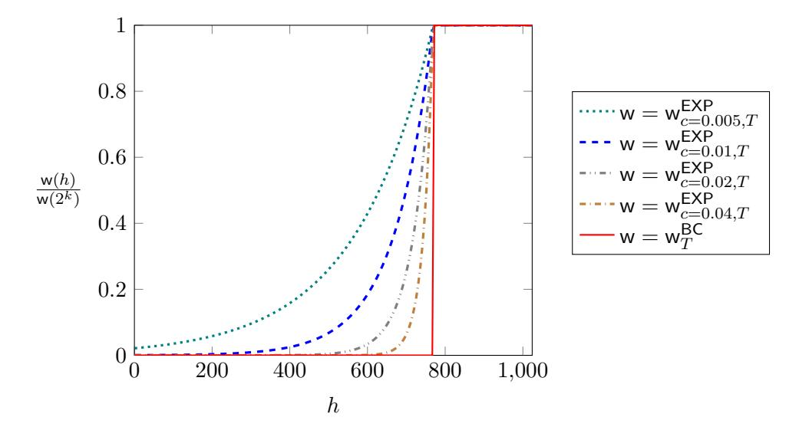

# **Weight-Based Nakamoto-Style Blockchains**

Simon Holmgaard Kamp1 , Bernardo Magri1 , Christian Matt2 , Jesper Buus Nielsen1 , Søren Eller Thomsen1 , and Daniel Tschudi2

1Concordium Blockchain Research Center, Aarhus University, Denmark {[kamp](mailto:kamp@cs.au.dk), [magri](mailto:magri@cs.au.dk), [jbn](mailto:jbn@cs.au.dk), [sethomsen](mailto:sethomsen@cs.au.dk)}@cs.au.dk 2Concordium, Zurich, Switzerland {[cm](mailto:cm@concordium.com), [dt](mailto:dt@concordium.com)}@concordium.com

July 22, 2021

#### **Abstract**

We propose a framework for building Nakamoto-style proof-of-work blockchains where blocks are treated differently in the "longest chain rule". The crucial parameter is a *weight function* assigning different weights to blocks according to their hash value. Our framework enables the analysis of different weight functions while proving all statements at the appropriate level of abstraction. This allows us to quickly derive protocol guarantees for different weight functions. We exemplify the usefulness of our framework by capturing the classical Bitcoin protocol as well as exponentially growing functions as special cases. We show the typical properties—chain growth, chain quality and common prefix—for both, and further show that the latter provide an additional guarantee, namely a weak form of *optimistic responsiveness*. More precisely, we prove for a certain class of exponentially growing weight functions that in periods without corruption, the confirmation time only depends on the unknown actual network delay instead of the known upper bound.

## **1 Introduction**

In classical blockchains such as Nakamoto's Bitcoin [\[8\]](#page-28-0), the parties run a distributed "lottery" to decide who is allowed to append the next block to the existing chain. When there is a winner of the lottery, a block is produced and disseminated to the other parties, that will perform a series of checks to guarantee that the block is valid and that the party that produced the block actually won the lottery. If all the checks are correct, the parties append the new block to their local view of the chain. Classical blockchains (also called Nakamoto-style, or NSB for short) usually assume the majority of the resources (e.g., computational power or stake) to be trusted, from which they can achieve totally ordered broadcast.

Bitcoin is a NSB based on proof-of-work (PoW) where a block is only considered valid and allowed to be appended to the chain if its hash value is below some threshold value *T*. The probability of this is proportional to *T*. The value *T* is computed in real time by the network such that a single valid block is created, on average, every 10 minutes. In a period where *T* is fixed[1](#page-0-0) the "best-chain" rule for Bitcoin is determined by how many blocks are on the chain. Previous analyses of the Bitcoin protocol [\[4,](#page-28-1) [5,](#page-28-2) [10,](#page-28-3) [13,](#page-28-4) [9\]](#page-28-5) show that under certain network

1For simplicity, in this work we only consider the case of fixed participation. We leave the case of adaptive *T* as future work.

assumptions, Bitcoin satisfies the properties of chain growth, chain quality and common prefix (introduced by [\[4\]](#page-28-1)) for some choice of parameters.

The *block time* of a NSB is the average time between blocks. Existing analyses use at their core the fact that the block time is longer than the average network delay. This allows for honest block winners to typically having seen all previous honest blocks when they add a new block. This allows the longest chain to grow by one block when there is an honest winner. If blocks are produced faster than they propagate, then all "bets are off". Therefore the block time of existing NSB needs to be set conservatively to some worst case value. At a conceptual level, our study is motivated by the simple observation that on existing NSBs, whenever the block time is fixed to a constant, the protocols do not respond with higher throughput when the network is in fact much faster than the worst case assumed. At a technical level, our study departs from the observation that not all types of blocks are equal. In Bitcoin there are two types of blocks, those above the threshold *T*, which do not count at all, and those below *T*, which count as one block. However, blocks with hash below *T /m* for some integer *m* have average block time about *m* times as long as blocks with hash below *T*. Therefore, one could for instance consider counting blocks with hash below *T /m* with "weight" *m* or "weight" 2 *m*. That is, we can consider different *weight functions* assigning weights to blocks based on their hash values. This raises the following question:

*Can we get better guarantees for NSBs if we assign different weights to the blocks?*

In that vein, we provide a general framework to analyze PoW protocols under different weight functions. The main goal of the framework is to provide useful tools where one can easily explore and analyze the impact of different weight functions applied to a Bitcoin-like protocol. As a sanity check, we first instantiate the (standard) Bitcoin weight function in our framework (Section [5.2.1\)](#page-22-0) and show similar bounds as previous work.

As evidence of the usefulness of our framework in exploring different weight functions, we show that a large class of weight functions achieves a weak form of "optimistic responsiveness" (c.f. [\[12\]](#page-28-6)). In a nutshell, we show that in periods without corruption, the time it takes for blocks to be in a common prefix only depends on the actual network delay instead of a known upper bound.

### **1.1 Overview of our results**

Our contributions are twofold: (1) We provide a general framework for easy exploration and design of protocols with different weight functions and (2) we show that there are weight functions that are strictly better than the traditional longest chain rule of Bitcoin. We detail our contributions next:

**Generic framework.** Our framework constitutes the backbone of a PoW blockchain where its valid block predicate and best-chain rule rely on a weight function that establishes a numerical value (i.e., weight) to each individual block in the chain. The best chain at any given time is the chain with more accumulated weight over all its blocks. We provide general lemmas for several bounds on the produced weight of a PoW protocol instantiated with any weight function. Furthermore, we derive for any weight function the concrete bounds that are needed for the main blockchain properties of growth, quality and common-prefix to be guaranteed, and calculate how these bounds translate into guarantees for the protocol. The main goal of our generic framework is that any weight function can be "plugged-in" to the framework and the parameters needed for the desired levels of guarantees can be obtained almost directly. This enables an easy exploration and design of protocols without needing to redo a series of complex and potentially error-prone proofs.

Weakly optimistically responsive protocol. We introduce in Section 5 the class of T-capped weight functions, which are monotonically increasing weight functions that are constant if the input is larger than a threshold T. We show that a PoW blockchain that employs a particular weight function from such a class achieves chain growth, chain quality and common-prefix parameters similar to the ones achieved by Bitcoin in previous works [4, 5]. We also note that instantiating a PoW protocol with a particular T-capped weight function can make it weakly optimistically responsive, i.e., under no corruption we show common-prefix guarantees for the protocol that are based on the real network delay, and not on the known upper bound.

Intuitively, a weight function needs to satisfy two properties: First, blocks produced at a good frequency with respect to the actual network delay should get enough weight to cancel out the weight of blocks that are produced too fast. Secondly, it should be difficult for the adversary to produce extremely heavy blocks as these can be used to cause huge rollbacks and violate common prefix. To satisfy both conditions, we let the weight functions grow exponentially until they reach a threshold, which is determined by the known upper bound  $\Delta_{\mathsf{Net}}$  on the network delay; above the threshold the weight remains constant. The cap ensures that the adversary cannot cause rollbacks longer than this upper bound with a single block. Growing exponentially below the threshold gives us responsiveness in the all-honest setting: Assume the actual network delay  $\Delta_{\text{Net}}$  is much lower than the known upper bound  $\Delta_{\text{Net}}$ . Blocks produced at the right frequency with respect to  $\Delta_{\mathsf{Net}}$  are weighted much heavier than more frequent blocks. Thus, the honest parties essentially build a chain just with these blocks, and the lighter ones are negligible in comparison. It is not necessary to wait for even heavier blocks up to the threshold to get the desired properties. Note that this only provides responsiveness if there are no corrupted parties: A single dishonest party can with non-negligible probability produce a block with maximal possible weight, and thus cause a roll-back of honest blocks produced in  $\hat{\Delta}_{Net}$  time.

While this may seem not particularly useful, the responsiveness can still greatly improve the throughput of the chain when the protocol is combined with a finality layer such as Casper the Friendly Finality Gadget [2], GRANDPA [15], or Afgjort [3], where blocks are declared as final (and cannot be rolled back) as soon as they are in the common-prefix of honest users. In that case, the time it takes for blocks to be in the common prefix in periods without corruption only depends on the actual network delay, and finalization ensures that all users know which blocks to trust. We leave it as interesting future work to analyze the feasibility of responsiveness in the face of active corruption.

#### 1.2 Related Work

The first formal analysis of NSB blockchains was given in the seminal paper [4] for a fixed threshold T, which was later extended to a variable threshold in [5], and to a different setting with more variable message delivery times, adaptive corruption, and spawning of new players in [10]. Ren [13] gives a simpler analysis of the standard Bitcoin protocol under the assumption that mining on Bitcoin can be modeled as a Poisson process.

Responsiveness was defined by Pass and Shi [11] as the property of a blockchain that achieves a liveness parameter expressed in terms of the actual network delay, independent of the conservative upper bound on the network delay used to instantiate the protocol. They show that a protocol tolerating up to a  $\frac{1}{3}$  corruption can achieve responsiveness, and that this bound is tight. They later show in [12] that assuming only honest majority (and a delay for the corruption of parties) it is possible to obtain the weaker property of optimistic responsiveness, i.e., responsiveness under some additional "goodness" condition, while still providing security in the worst case. In particular, they show responsiveness in the case of more than  $\frac{3}{4}$  honest computing power and an additional assumption of an honest accelerator. In [14] a lower bound

is given for the latency in the *optimistic* setting of [12] alongside a protocol achieving this within a constant factor of the actual network delay.

Since [12] and [14] both require a committee and an accelerator, their results only hold assuming considerably delayed corruption, allowing the accelerator to make progress. Our generic weighted protocol, on the other hand, can tolerate immediate adaptive corruptions, as desired in the permissionless setting. However, our result is weaker with respect to the "goodness" condition since we only achieve responsiveness in the case of no corruption. Whether one can get responsiveness with non-zero fully adaptive corruption in the permissionless setting remains an open problem.

The concept of assigning different weights to blocks based on their hash value has already been considered in the context of proofs of proof of work [6, 7]. The purpose there, and consequently the analysis, was completely different: Heavy blocks are used to link to older blocks in addition to the direct parents, to allow for faster verification of recent transactions without verifying the whole chain.

### 2 Preliminaries

The set of natural numbers is denoted by  $\mathbb{N} = \{0, 1, 2, \ldots\}$ , the set of real numbers is denoted by  $\mathbb{R}$  and the set of non-negative real numbers is denoted  $\mathbb{R}_{\geq 0}$ . We denote the probability of an event E by  $\Pr[E]$  and the expected value of a random variable X by  $\mathbb{E}[X]$ .

We will use the following bounds in our proofs.

**Lemma 1** (Chernoff bound). Let  $X_1, \ldots, X_n$  be independent random variables with  $X_i \in \{0, 1\}$  for all i, and let  $\mu := \mathbb{E}\left[\sum_{i=1}^n X_i\right]$ . We then have for all  $\delta \in [0, 1]$ ,

$$\Pr\left[\sum_{i=1}^{n} X_i \le (1-\delta)\mu\right] \le e^{-\frac{\delta^2\mu}{2}} \quad and \quad \Pr\left[\sum_{i=1}^{n} X_i \ge (1+\delta)\mu\right] \le e^{-\frac{\delta^2\mu}{3}}.$$

**Lemma 2** (Hoeffding's inequality). Let  $X_1, \ldots, X_n$  be independent random variables with  $X_i \in [a, b]$  for all i. We then have for all  $t \geq 0$ ,

$$\Pr\left[\frac{1}{n}\sum_{i=1}^{n}(X_{i} - \mathbb{E}[X_{i}]) \ge t\right] \le e^{-\frac{2nt^{2}}{(b-a)^{2}}} \quad and \quad \Pr\left[\frac{1}{n}\sum_{i=1}^{n}(X_{i} - \mathbb{E}[X_{i}]) \le -t\right] \le e^{-\frac{2nt^{2}}{(b-a)^{2}}}.$$

# 3 Our Generic Framework for Weight-Based Analysis

In this section we formally describe our generic framework and we introduce the concept of weight functions for PoW blockchains. In Sections 3.3 and 3.5 we provide generic definitions and tools that will be used to show the properties of chain growth, chain quality and common prefix for PoW blockchains that leverages weight functions (in Section 4). Our analysis builds upon the ideas of previous work [4, 13] and extends those to the more general setting of weighted blocks. We start by describing the blockchain model that we consider for our framework.

#### 3.1 Blockchain Model

**Network and Time.** We assume that time is divided into *rounds* which correspond to the smallest unit of time of interest. We assume a network with bounded delay, which is parameterized by an upper bound  $\Delta_{\text{Net}}$  on the network delivery time. It allows parties to multicast messages. That is, any message sent by an honest party in round r is guaranteed to

arrive at all honest parties until round  $r + \Delta_{\text{Net}}$ . As in, e.g., [10], we assume a gossip network, which ensures that all messages (sent by a dishonest sender and) received by an honest party in round r are received by all honest parties until round  $r + \Delta_{\text{Net}}$ . Note that the latter can be achieved by resending all freshly received messages. The actual delay of messages (per message and party) can be set by the adversary (within  $\Delta_{\text{Net}}$ ). The delay  $\Delta_{\text{Net}}$  is *not* known to the honest parties. However, we assume that honest parties know a rough upper bound  $\hat{\Delta}_{\text{Net}}$ , potentially much larger than  $\Delta_{\text{Net}}$ , on the network delay.

**Random Oracle.** Following [10], we assume every "party" can make at most one query to a random oracle in each round. The idea is that one round corresponds to the time it takes to evaluate the hash function on one CPU and is the smallest unit of time of interest. To model real-world parties with different amounts of computing power, one can assume that they control different amounts of these "one-query-per-round" parties. As in [4, 1, 10], we allow the corrupted parties to make their queries sequentially, while honest parties have to make the queries in parallel. We assume the range of the random oracle to be  $\mathcal{H} := \{1, \ldots, 2^k\}$ .

In the remainder of the paper, we let  $q \in \mathbb{N}$  denote the number of parties in the protocol. As each party has one query this is also the maximal amount of queries that can be made to the oracle in each round.

Corruptions. We allow the adversary to adaptively corrupt up to a  $\beta < \frac{1}{2}$  fraction of all parties before each round. Newly corrupted parties are then fully under the adversary's control from that round on. We denote by  $\alpha := 1 - \beta$  the minimal fraction of participating parties that are honest at any time. Note that by our definition of the random oracle, there can be at most  $q\beta$  random-oracle queries by corrupted parties in each round, and there are at least  $q\alpha$  queries by honest parties in each round (since honest parties in our protocol query the random oracle in each round, c.f. Section 3.2). We will thus for most of the paper only consider these upper and lower bounds on the numbers of dishonest and honest queries, and not explicitly map these to parties.

#### 3.2 Blockchain Protocol

Our protocol is similar to Bitcoin [8] and the following description assumes at least some basic prior knowledge of the Bitcoin protocol. We deviate from the original Bitcoin protocol in two important aspects; we change the best chain rule and the valid block predicate. While the valid block predicate is used to decide what blocks should be considered valid, the best chain rule decides where parties need to append new blocks to. Our notation follows closely the one from [4].

Mining. As in Bitcoin, miners in our protocol continuously take what they currently consider the best chain and try to extend it with a new block. The proof of work aspect corresponds to miners finding an input to a hash function with certain properties. In the Bitcoin protocol a valid block must satisfy (among others things) that its hash is smaller than some threshold T. The challenge of finding a nonce which makes the block hash small enough is what makes Bitcoin a proof-of-work blockchain. The threshold T is adjusted such that the block-production rate is approximately constant. The constant is chosen as a trade-off between performance and security. The block validity predicate of Bitcoin thus consists of checking the block hash along with some (for our purposes unimportant) syntactic well-formedness conditions on the block and its contents. In our protocol blocks are considered valid independent of their hash value. Instead, the hash of a block determines how much the block weighs when selecting the best-chain. To

avoid having many low-weight blocks swarm the network we can use a *cutoff*. Since it does not impact the security of the protocol but merely a parameter that can be optimized for throughput, we will ignore it in this paper.

We define the round in which a block was mined to be the round in which the corresponding query to the random oracle was made.

**Best chain.** In Bitcoin (with fixed difficulty), the length of the chain is what decides how "good" a chain is [\[8,](#page-28-0) [4\]](#page-28-1). Thus, in Bitcoin, chains with more blocks are considered better. In our protocol we use a best-chain rule that is based on the accumulated weight of the blocks in a chain, i.e., the heavier a chain is, the better, as in bitcoin with variable difficulty [\[5\]](#page-28-2).

**No insertions, copies, and predictions.** To simplify our analysis and following [\[4\]](#page-28-1), we assume throughout the paper that it never happens that a new block is added between two existing blocks (*insertion*), the same block occurs in two different positions (*copy*), or a block extends a block that is mined in a later round (*prediction*). As shown in [\[4\]](#page-28-1), insertions and copies can only occur if there is a collision in the random oracle linking blocks together, which has negligible probability, and the probability of guessing a block is negligible as well.

## **3.3 Basic Definitions**

In this section, we first present some basic definitions for the weight of a chain and the weight of a block. Then we present a categorization for certain good events which are important for the analysis, and finally we introduce the notation for upper and lower bounds on the weight produced.

#### **3.3.1 Weight**

We define the chain of a block *B* denoted Chain(*B*) to be the list of all blocks one gets by following the pointers in the chain from *B* up to the genesis block. We next define the concept of weight for blocks and chains.

**Definition 1** (Weight functions, weight of blocks and chains)**.** We define a *weight function* to be a function of type H → **R**≥0. Let w be a weight function. We then define the weight of a block *B* to be Weightw(*B*) = w(Hash(*B*))*,* and the weight of a chain *C* to be Weightw(*C*) = P *B*∈*C* Weightw(*B*) *.*

Next, we define the weight range, that is analogous to the depth of a block in Bitcoin.

**Definition 2** (Weight range)**.** Given a weight function w, we define the *start weight* of a block *B* to be

$$\mathsf{StartWeight}_{\mathsf{w}}(B) \coloneqq \mathsf{Weight}_{\mathsf{w}}(\mathsf{Chain}(B)) - \mathsf{Weight}_{\mathsf{w}}(B)$$

and the *end weight* to be

$$\mathsf{EndWeight}_{\mathsf{w}}(B) \coloneqq \mathsf{Weight}_{\mathsf{w}}(\mathsf{Chain}(B)).$$

We also define the weight range of a block *B* to be

$$\mathsf{WeightRange}_{\mathsf{w}}(B) \coloneqq (\mathsf{StartWeight}_{\mathsf{w}}(B), \mathsf{EndWeight}_{\mathsf{w}}(B)].$$

Consequently,

$$|\mathsf{WeightRange}_{\mathsf{w}}(B)| = \mathsf{Weight}_{\mathsf{w}}(B).$$

#### **3.3.2 Good Events**

Previous analyses [\[13,](#page-28-4) [4,](#page-28-1) [10,](#page-28-3) [9\]](#page-28-5) are based on the fact that in a certain amount of rounds a block is produced that has enough time to propagate to all honest parties before a new block is mined. Ren [\[13\]](#page-28-4) takes a slightly different approach and defines this in terms of blocks rather than rounds. More concretely, he defines a "non-tailgater" to be an honest block mined at time *t* such that no other honest block is mined between time *t* − ∆Net and *t*. We believe that this is closer to the intuition for the proof, namely that once in a while an honest party mines a block that has enough time to propagate. In his analysis, mining is assumed to be a Poisson process and therefore no mining events occur simultaneously with positive probability. In our model, however, it can happen that several blocks are mined in the same round. If several blocks are mined in a round after ∆Net empty rounds, we can count one of them as a "good" block.

To leverage this in the analysis, we introduce an order in the mined blocks that we call "proof-order". With the order fixed, one can choose, e.g., the first of these blocks as the "good" block.[2](#page-6-0) More formally, we introduce an arbitrary but fixed total order on all blocks produced in the protocol. We order blocks lexicographically first based on the production round (i.e., the round the block was created) and secondly on the party that made the query to the random oracle. Note that the production time of a block is well-defined, even for adversarial blocks as they also need to make a query to the random oracle in some round. We stress that this enumeration and induced order of blocks is completely unrelated to the total order of blocks that the protocol achieves, and only needed as an artifact of our proofs. To avoid confusion will we refer to the above as the *proof-order*.

We now use this order on blocks to precisely categorize certain "good" events (blocks mined with sufficient time between them). We further generalize previous notions to our setting with different weights, i.e., instead of requiring that no blocks are mined within a propagation period, we only require that no blocks above a certain threshold are mined within this period.

**Definition 3** (*h*-(left-)isolation)**.** Let *h* ∈ H, and let *B* be a block mined in round *r* ∈ **N**. We say *B* is *h-left-isolated* if *B* is honest, Hash(*B*) *> h*, and there is no block left of *B* in the proof-order with hash above *h* mined in rounds [*r* − ∆Net*, r*]. If *B* is honest, Hash(*B*) *> h*, and no other blocks with hash above *h* are mined in rounds [*r* − ∆Net*, r* + ∆Net], we say *B* is *h-isolated*.

Note that we define *h*-(left-)isolation with respect to the unknown upper bound ∆Net on the network delay, not on the known bound ∆ˆ Net.

*Remark* 1*.* Similar notions have been defined in previous work [\[13,](#page-28-4) [9,](#page-28-5) [4,](#page-28-1) [10\]](#page-28-3). We deviate from these definitions by defining (resp. left-) isolation to require that *no* blocks are mined on either side (resp. to the left) of a block, whereas earlier work had the requirement that no other *honest* block was mined within that period. We use the stricter definition because it simplifies some of the arguments (especially with respect to adaptive corruptions). Only considering honest blocks may potentially allow to prove tighter bounds, though. Note that we define the round in which a block was mined to be the round in which the corresponding query to the random oracle was made, so this is also well-defined for corrupted parties, who may send their block in a later round.

Left-isolated blocks are called "non-tailgaters" and isolated blocks are called "loners" by Ren [\[13\]](#page-28-4). Analogous notions to that of a round with a left-isolated block has in previous work been called an "effective-round" [\[9\]](#page-28-5) and "isolated successful round" [\[4\]](#page-28-1). The event of a isolated block has in previous work been called "convergence opportunity" [\[10\]](#page-28-3), "uniquely effective

2The proof-order could be defined to take the block with maximal weight in each round instead of ordering them by the parties. This would give a slightly tighter analysis as there then would be slightly more "good" weight. For simplicity, have we chosen not to take this approach.

round" [9] and an "uniquely isolated successful round" [4]. We chose the terms "left-isolated" and "isolated" as we believe them to be more intuitive.

### 3.4 Bounds on Produced Weight

We now introduce some definitions for weight functions describing different bounds on weight that can be produced with a specific weight function. We start with the upper-bounds on how much weight a certain number of queries can produce. We will later use this fact to reason about how much weight any adversary can produce.

We say a weight function is  $(\hat{W}_g, \hat{p}_g)$ -upper-bounding for some parameter  $g \leq q$  if the weight of all blocks mined in r rounds (for all  $r \in \mathbb{N}$ ) with at most g queries (honest or dishonest) per round is at most  $\hat{W}_g(r)$ , except with probability  $\hat{p}_g(r)$ . Similarly, we introduce  $(\hat{W}_g^{\leq h_0}, \hat{p}_g^{\leq h_0})$ -below-threshold-upper-bounding to bound the weight produced by blocks with hash value at most  $h_0$ , and  $(\hat{W}_g^{>h_0}, \hat{p}_g^{>h_0})$ -above-threshold-upper-bounding to bound the weight produced by blocks with hash value more than  $h_0$ .

**Definition 4.** Let w be a weight function, let  $g \in \mathbb{N}$ ,  $h_0 \in \mathcal{H}$ , let  $\hat{W}_g, \hat{W}_g^{\leq h_0}, \hat{W}_g^{>h_0} \colon \mathbb{N} \to \mathbb{R}$ , and let  $\hat{p}_g, \hat{p}_g^{\leq h_0}, \hat{p}_g^{>h_0} \colon \mathbb{N} \to [0, 1]$  be monotonically decreasing. Further, let  $W_{g,r}$  for  $r \in \mathbb{N}$  be the random variable corresponding to the total weight of all blocks weighted with w mined in r consecutive rounds with at most g queries in each round, and similarly  $W_{g,r}^{\leq h_0}$  ( $W_{g,r}^{>h_0}$ ) for  $r \in \mathbb{N}$  be the random variable corresponding to the total weight of all blocks with hash value at most  $h_0$  (more than  $h_0$ ) weighted with w mined in r consecutive rounds with at most g queries in each round. We say w is  $(\hat{W}_g, \hat{p}_g)$ -upper-bounding if for all  $r \in \mathbb{N}$ ,

$$\Pr[W_{g,r} \ge \hat{W}_g(r)] \le \hat{p}_g(r),$$

w is  $(\hat{W}_g^{\leq h_0}, \hat{p}_g^{\leq h_0})$ -below-threshold-upper-bounding if for all  $r \in \mathbb{N}$ ,

$$\Pr\left[W_{g,r}^{\leq h_0} \geq \hat{W}_g^{\leq h_0}(r)\right] \leq \hat{p}_g^{\leq h_0}(r),$$

and w is  $(\hat{W}_g^{>h_0}, \hat{p}_g^{>h_0})$ -above-threshold-upper-bounding if for all  $r \in \mathbb{N}$ ,

$$\Pr\left[W_{g,r}^{>h_0} \ge \hat{W}_g^{>h_0}(r)\right] \le \hat{p}_g^{>h_0}(r).$$

Next, we introduce the definition for lower-bounds on the amount of (left-) isolated weight, i.e., on how much weight is produced by honest parties with sufficient time in between. By our definition of (left-)isolated blocks, only honest blocks can be left-isolated. We therefore do not use a parameter g here, but always consider q queries in each round in total, with at least  $q\alpha$  queries from honest parties. We introduce the notion of a  $\left(\check{W}_{\mathsf{lso}^h},\check{p}_{\mathsf{lso}^h}\right)$ -isolated-lower-bounding weight function. It means that the total weight of all h-isolated blocks mined in r consecutive rounds is at least  $\check{W}_{\mathsf{lso}^h}(r)$ , except with probability  $\check{p}_{\mathsf{lso}^h}(r)$ . Left-isolated-lower-bounding weight functions are defined analogously.

**Definition 5.** Let w be a weight function, and let  $h_0 \in \mathcal{H}$ ,  $\check{W}_{\mathsf{lso}^{h_0}}$ ,  $\check{W}_{\mathsf{Leftlso}^{h_0}} \colon \mathbb{N} \to \mathbb{R}$ , and let  $\check{p}_{\mathsf{lso}^{h_0}}$ ,  $\check{p}_{\mathsf{Leftlso}^{h_0}} \colon \mathbb{N} \to [0,1]$  be monotonically decreasing. Further let  $W_{r,\mathsf{lso}^{h_0}}$  for  $r \in \mathbb{N}$  be the random variable corresponding to the total weight of all h-isolated blocks weighted with w mined in r consecutive rounds, and let  $W_{r,\mathsf{Leftlso}^{h_0}}$  for  $r \in \mathbb{N}$  be the random variable corresponding to the total weight of all h-left-isolated blocks weighted with w mined in r consecutive rounds. We say w is  $(\check{W}_{\mathsf{lso}^{h_0}}, \check{p}_{\mathsf{lso}^{h_0}})$ -isolated-lower-bounding if for all  $r \in \mathbb{N}$ ,

$$\Pr \Big[ W_{r,\mathsf{Iso}^{h_0}} \leq \check{W}_{\mathsf{Iso}^{h_0}}(r) \Big] \leq \check{p}_{\mathsf{Iso}^{h_0}}(r),$$

and w is  $(\check{W}_{\mathsf{Leftlso}^{h_0}}, \check{p}_{\mathsf{Leftlso}^{h_0}})$ -left-isolated-lower-bounding if for all  $r \in \mathbb{N}$ ,

$$\Pr\!\left[W_{r,\mathsf{LeftIso}^{h_0}} \leq \check{W}_{\mathsf{LeftIso}^{h_0}}(r)\right] \leq \check{p}_{\mathsf{LeftIso}^{h_0}}(r).$$

## 3.5 Proving Bounds from Properties of the Weight Functions

In this section, we show how to derive some of the thresholds defined in Section 3.4. Additional derivations, which may be useful for other weight functions than the ones considered in this paper, are provided in Appendix B.

**Notation.** In the remainder of the paper we define  $p_{\leq h_0} \coloneqq \frac{h_0}{2^k}$  to be the probability that a single random oracle query returns a value at most  $h_0$ , and  $\mathsf{w}_{\max \leq h_0} \coloneqq \max_{h \in \{1, \dots, h_0\}} \mathsf{w}(h)$ ,  $\mathsf{w}_{\max > h_0} \coloneqq \max_{h \in \{h_0 + 1, \dots, 2^k\}} \mathsf{w}(h)$ , and  $\mathsf{w}_{\min > h_0} = \min_{h \in \{h_0 + 1, \dots, 2^k\}} \mathsf{w}(h)$  (for the weight function that is clear from the context).

First, we provide a simple upper-bound for the total weight above and below a threshold.

**Lemma 3** (Weight above and below a threshold). Let w be a weight function, let  $g \in \mathbb{N}$ , and  $h_0 \in \mathcal{H}$ . Then, for all  $\delta \in (0,1)$ , w is

(i)  $(\hat{W}_g^{\leq h_0}, \hat{p}_g^{\leq h_0})$ -below-threshold-upper-bounding with

$$\hat{W}_q^{\leq h_0} = \mathsf{w}_{\max \leq h_0} \cdot (1+\delta) \cdot g \cdot r \cdot p_{\leq h_0}, \qquad \qquad \hat{p}_q^{\leq h_0} = e^{-\frac{\delta^2 \cdot g \cdot r \cdot p_{\leq h_0}}{3}},$$

(ii) and  $(\hat{W}_g^{>h_0}, \hat{p}_g^{>h_0})$ -above-threshold-upper-bounding with

$$\hat{W}_g^{>h}(r) = \mathsf{w}_{\max>h_0} \cdot (1+\delta) \cdot g \cdot r \cdot (1-p_{\leq h_0}), \qquad \hat{p}_g^{>h}(r) = e^{-\frac{\delta^2 \cdot g \cdot r \cdot (1-p_{\leq h_0})}{3}}.$$

*Proof.* The probability to get a block below a threshold in just one query is  $p_{\leq h_0}$  and above a threshold is  $1 - p_{\leq h_0}$ . The amount of blocks below/above a threshold can be upper bounded with Chernoff (Lemma 1). Each block below contributes with weight at most  $w_{\max \leq h_0}$ , and blocks above with weight at most  $w_{\max > h_0}$ .

We next prove bounds on the number of (left-)isolated blocks and afterwards use this for a simple bound on the amount of (left-)isolated weight. The proof follows some ideas from Ren [13]. At a very high level, we proceed by first applying the Chernoff bound to obtain a bound on the number of blocks with hash above  $h_0$ , and then using Chernoff again to bound how many of these blocks are (left-)isolated. The main difficulty lies in proving independence of the involved variables as needed for the Chernoff bound.

**Lemma 4** (Amount of (left-)isolated blocks). Let r be a number of consecutive rounds, let  $h_0 \in \mathcal{H}$ , let  $N_{r,\mathsf{LeftIso}^{h_0}}$  denote the number of  $h_0$ -left-isolated blocks produced, and let  $N_{r,\mathsf{Iso}^{h_0}}$  denote the number of  $h_0$ -isolated blocks produced during these r rounds. We then have for any  $\delta \in (0,1)$ ,

$$\Pr \Big[ N_{r,\mathsf{LeftIso}^{h_0}} \leq (1-\delta) \cdot \alpha q r \cdot (1-p_{\leq h_0}) \cdot p_{\leq h_0}^{q\Delta_{\mathsf{Net}}} \Big] \leq 2e^{-\frac{\delta^2 \cdot \alpha q r \cdot \left(1-p_{\leq h_0}\right) \cdot p_{\leq h_0}^{q\Delta_{\mathsf{Net}}}}{16}}, \tag{1}$$

$$\Pr\!\left[N_{r,\mathsf{Iso}^{h_0}} \leq (1-\delta) \cdot \alpha q r \cdot (1-p_{\leq h_0}) \cdot p_{\leq h_0}^{2 \cdot q \Delta_{\mathsf{Net}}}\right] \leq 3e^{-\frac{\delta^2 \cdot \alpha q r \cdot \left(1-p_{\leq h_0}\right) \cdot p_{\leq h_0}^{2q \Delta_{\mathsf{Net}}}}{108}}. \tag{2}$$

Proof. To prove the lemma, we start by lower-bounding the amount of left-isolated blocks within any sequence of consecutive honest blocks. For any n we look at the first (according to the proof-order) n honest blocks with a hash above  $h_0$  produced since the start of the r considered rounds. The probability that block i is left-isolated is given by the probability that all of the blocks in  $\Delta_{\text{Net}}$  time before and to the left (with respect to the proof-order) of the block in the same round do not result in a winning event with hardness above  $h_0$ . In the worst case, the considered block is the last one in its round, i.e., there are q-1 to the left of block i in that round. Hence, there are at most  $q \cdot (\Delta_{\text{Net}} - 1) + (q-1)$  queries to be considered. Note that if the corrupted parties make less queries, this can only increase the probability of left-isolated blocks. The probability that block i is left-isolated is thus at least the probability that all these queries result in a hash value at most  $h_0$ . We define  $Y_i = 1$  if the ith honest block is  $h_0$ -left-isolated. Then,

$$\Pr[Y_i = 1] \ge p_{< h_0}^{q \cdot (\Delta_{\mathsf{Net}} - 1) + (q - 1)} \ge p_{< h_0}^{q \Delta_{\mathsf{Net}}}.$$

We further define  $N_{\mathsf{Leftlso}^{h_0}}(n) \coloneqq \sum_{i=1}^n Y_i$ , i.e., the number of left isolated blocks of the n honest blocks above  $h_0$ . The above implies

$$\mathbb{E} \Big[ N_{\mathsf{LeftIso}^{h_0}}(n) \Big] \geq n \cdot p_{\leq h_0}^{q\Delta_{\mathsf{Net}}}.$$

Note that  $Y_i = 1$  if and only if the inter-arrival time between the (i-1)th and the *i*th honest block with hash above  $h_0$  is at least  $q \cdot (\Delta_{\text{Net}} - 1) + (q-1)^3$ . Since the inter-arrival times of independent Bernoulli trials are independent, the  $Y_i$  are also independent. We can therefore use the Chernoff bound (Lemma 1) for  $\delta_1 \in (0,1)$  to obtain

$$\Pr\left[N_{\mathsf{LeftIso}^{h_0}}(n) \le (1 - \delta_1) \cdot n \cdot p_{\le h_0}^{q\Delta_{\mathsf{Net}}}\right] \le e^{-\frac{\delta_1^2 \cdot n \cdot p_{\le h_0}^{q\Delta_{\mathsf{Net}}}}{2}}.$$
(3)

We now bound the number of honest blocks with hash above  $h_0$  produced during the R considered rounds. Let  $X_i = 1$  if the i'th honest query results in a hash above  $h_0$ . We note that  $\Pr[X_i = 1] = 1 - p_{\leq h_0}$ . Let  $N_{\alpha qr, > h_0} := \sum_{i=1}^{\alpha qr} X_i$  and note that  $\mathbb{E}[N_{\alpha qr, > h_0}] \geq \alpha qr \cdot (1 - p_{\leq h_0})$  as  $\alpha qr$  is a lower bound on the amount of honest queries. The Chernoff bound (Lemma 1) for  $\delta_2 \in (0, 1)$  then implies

$$\Pr[N_{\alpha qr, > h_0} \le (1 - \delta_2) \cdot \alpha qr \cdot (1 - p_{\le h_0})] \le e^{-\frac{\delta_2^2 \alpha qr \cdot (1 - p_{\le h_0})}{2}}.$$
 (4)

Note that  $N_{r,\mathsf{LeftIso}^{h_0}} = N_{\mathsf{LeftIso}^{h_0}}(N_{\alpha qr,>h_0})$ . We set  $\delta_1 := \delta_2 := \frac{\delta}{2}$ . We then have  $\delta_1, \delta_2 \in (0,1)$  and  $(1-\delta_1)(1-\delta_2) \geq (1-\delta)$ . Together with equations (3), (4), and using that  $N_{\alpha qr,>h_0} \in \mathbb{N}$ , we can conclude that

$$\begin{split} &\Pr \Big[ N_{r,\mathsf{LeftIso}^{h_0}} \leq (1-\delta) \cdot \alpha q r \cdot (1-p_{\leq h_0}) \cdot p_{\leq h_0}^{q\Delta_{\mathsf{Net}}} \Big] \\ &\leq e^{-\frac{\delta^2 \cdot \alpha q r \cdot \left(1-p_{\leq h_0}\right)}{8}} + e^{-\frac{\delta^2 \cdot (1-\delta_2) \cdot \alpha q r \cdot \left(1-p_{\leq h_0}\right) \cdot p_{\leq h_0}^{q\Delta_{\mathsf{Net}}}}{8}} \\ &\leq 2 e^{-\frac{\delta^2 \cdot \alpha q r \cdot \left(1-p_{\leq h_0}\right) \cdot p_{\leq h_0}^{q\Delta_{\mathsf{Net}}}}{16}}, \end{split}$$

where we used  $1 - \delta_2 = 1 - \frac{\delta}{2} \ge \frac{1}{2}$  in the last step. This concludes the proof of equation (1).

&lt;sup>3We are slightly abusing notation since for i = 1, the (i - 1)th block is not part of the n considered blocks, but last the honest block with hash above  $h_0$  before  $Y_1$ . Note that if such (i - 1)th block does not exist in the chain,  $Y_i = 1$  with probability 1, and therefore  $Y_i$  and the other  $Y_i$  are independent.

To prove equation (2), we again first bound how many isolated blocks we get within a sequence of n blocks. As above, we use the proof order to enumerate the first n honest blocks since the start of the R considered rounds with hash above  $h_0$ . We define  $Z_i = 1$  if the ith block is  $h_0$ -isolated, and  $Z_i = 0$  otherwise. We note that  $Z_i = Y_i \cdot Y_{i+1}$  as i + 1 is the winning event that happened the shortest time after i, and there are more than  $\Delta_{\text{Net}}$  rounds between these if and only if the latter is left-isolated. Since  $Y_i$  and  $Y_{i+1}$  are independent, we have

$$\Pr[Z_i = 1] = \Pr[Y_i = 1 \land Y_{i+1} = 1] = \Pr[Y_i = 1] \cdot \Pr[Y_{i+1} = 1] \ge p_{\le h_0}^{2 \cdot q \Delta_{\mathsf{Net}}}.$$

Note that  $Z_i$  and  $Z_{i+1}$  are not independent since they both depend on  $Y_{i+1}$ , but  $Z_i$  and  $Z_{i+2}$  are independent. We therefore write  $N_{\mathsf{lso}^{h_0}}(n) = \sum_{i \in \{1, \dots, n\} \land \mathsf{Odd}(i)} Z_i + \sum_{i \in \{1, \dots, n\} \land \mathsf{Even}(i)} Z_i$ . Let  $N_{\mathsf{Odd}}(n)$  be the number of odd  $i \in \{1, \dots, n\}$ , and let  $N_{\mathsf{Even}}(n)$  be the number of even  $i \in \{1, \dots, n\}$ . Since  $\mathbb{E}\left[\sum_{i \in \{1, \dots, n\} \land \mathsf{Odd}(i)} Z_i\right] \geq N_{\mathsf{Odd}} \cdot p_{\leq h_0}^{2 \cdot q \Delta_{\mathsf{Net}}}$ , we can apply the Chernoff bound (Lemma 1) for  $\delta_3 \in (0, 1)$  to obtain

$$\Pr\left[\sum_{i\in\{1,\dots,n\}\land\mathsf{Odd}(i)}Z_i\leq (1-\delta_3)N_{\mathsf{Odd}}(n)\cdot p_{\leq h_0}^{2\cdot q\Delta_{\mathsf{Net}}}\right]\leq e^{-\frac{\delta_3^2\cdot N_{\mathsf{Odd}}(n)\cdot p_{\leq h_0}^{2\cdot q\Delta_{\mathsf{Net}}}}{2}}.$$

We can also apply the Chernoff bound for  $\delta_4 \in (0,1)$  to the even case and together with the above obtain

$$\begin{split} \Pr \Big[ N_{\mathsf{Iso}^{h_0}}(n) &\leq ((1-\delta_3) N_{\mathsf{Odd}}(n) + (1-\delta_4) N_{\mathsf{Even}}(n)) \cdot p_{\leq h_0}^{2 \cdot q \Delta_{\mathsf{Net}}} \Big] \\ &\leq e^{-\frac{\delta_3^2 \cdot N_{\mathsf{Odd}}(n) \cdot p_{\leq h_0}^{2 \cdot q \Delta_{\mathsf{Net}}}}{2}} + e^{-\frac{\delta_4^2 \cdot N_{\mathsf{Even}}(n) \cdot p_{\leq h_0}^{2 \cdot q \Delta_{\mathsf{Net}}}}{2}}. \end{split}$$

Let  $\delta_4 = \delta_3$  and note that if n is even then  $N_{\mathsf{Odd}}(n) = N_{\mathsf{Even}}(n) = \frac{n}{2}$  and we obtain

$$\Pr\left[N_{\mathsf{Iso}^{h_0}}(n) \le (1 - \delta_3) \cdot n \cdot p_{\le h_0}^{2 \cdot q \Delta_{\mathsf{Net}}}\right] \le 2e^{-\frac{\delta_3^2 \cdot n \cdot p_{\le h_0}^{2 \cdot q \Delta_{\mathsf{Net}}}}{4}}.$$
 (5)

Note that  $N_{r,\mathsf{lso}^{h_0}} = N_{\mathsf{lso}^{h_0}}(N_{\alpha qr,>h_0})$ , and by equation (4), we have  $N_{\alpha qr,>h_0} > (1-\delta_2) \cdot \alpha qr \cdot (1-p_{\leq h_0})$  except with small probability. There exists  $\delta_2 \in \left(\frac{\delta}{3},\frac{2\delta}{3}\right)$  such that  $(1-\delta_2) \cdot \alpha qr \cdot (1-p_{\leq h_0})$  is even if

$$\left(1 - \frac{\delta}{3}\right) \cdot \alpha q r \cdot (1 - p_{\leq h_0}) - \left(1 - \frac{2\delta}{3}\right) \cdot \alpha q r \cdot (1 - p_{\leq h_0}) > 2$$

$$\iff \frac{\delta}{3} \cdot \alpha q r \cdot (1 - p_{\leq h_0}) > 2$$

$$\iff \alpha q r > \frac{6}{\delta \cdot (1 - p_{\leq h_0})}.$$
(6)

First assume that equation (6) is satisfied. We then pick  $\delta_2 \in \left(\frac{\delta}{3}, \frac{2\delta}{3}\right)$  accordingly and  $\delta_3 := \delta - \delta_2$ . We have

$$(1 - \delta_2) \cdot (1 - \delta_3) = 1 - \delta + \delta_2 \delta - \delta_2^2 \ge 1 - \delta.$$

Note that we further have  $\delta_3 \in \left(\frac{\delta}{3}, \frac{2\delta}{3}\right)$ . Together with equations (4) and (5) and using that  $1 - \delta_2 \ge \frac{1}{3}$  and  $\delta_2^2, \delta_3^2 \ge \frac{\delta^2}{9}$ , we can conclude that

$$\begin{split} &\Pr \Big[ N_{r, \mathsf{Iso}^{h_0}} \leq (1-\delta) \cdot \alpha q r \cdot (1-p_{\leq h_0}) \cdot p_{\leq h_0}^{2 \cdot q \Delta_{\mathsf{Net}}} \Big] \\ &\leq e^{-\frac{\delta_2^2 \alpha q r \cdot \left(1-p_{\leq h_0}\right)}{2}} + 2e^{-\frac{\delta_3^2 \cdot (1-\delta_2) \cdot \alpha q r \cdot \left(1-p_{\leq h_0}\right) \cdot p_{\leq h_0}^{2 \cdot q \Delta_{\mathsf{Net}}}}{4} \\ &< 3e^{-\frac{\delta^2 \cdot \alpha q r \cdot \left(1-p_{\leq h_0}\right) \cdot p_{\leq h_0}^{2 \cdot q \Delta_{\mathsf{Net}}}}{108}}. \end{split}$$

We finally consider the case where condition (6) is not satisfied. Then  $\alpha qr \leq \frac{6}{\delta \cdot (1-p_{\leq h_0})}$ , which implies that

$$3e^{-\frac{\delta^2\cdot \alpha qr\cdot \left(1-p\leq h_0\right)\cdot p^{2\cdot q\Delta_{\mathsf{Net}}}_{\leq h_0}}{108}}\geq \frac{3}{e}\geq 1.$$

In this case, equation (2) is therefore trivially satisfied.

**Lemma 5.** Let w be a weight function and  $h_0 \in \mathcal{H}$ . Then, for all  $\delta \in (0,1)$ ,

$$(i) \text{ w } is \left( \check{W}_{\mathsf{LeftIso}^{h_0}}, \check{p}_{\mathsf{LeftIso}^{h_0}} \right) \text{-} left\text{-} is olated\text{-} lower\text{-} bounding with }$$

$$\begin{split} & \check{W}_{\mathsf{LeftIso}^h}(r) = \mathsf{w}_{\min > h_0} \cdot (1 - \delta) \cdot \alpha q r \cdot (1 - p_{\leq h_0}) \cdot (p_{\leq h_0})^{q \Delta_{\mathsf{Net}}}, \\ & \check{p}_{\mathsf{LeftIso}^h}(r) = 2e^{-\frac{\delta^2 \cdot \alpha q r \cdot (1 - p_{\leq h_0}) \cdot (p_{\leq h_0})^{q \Delta_{\mathsf{Net}}}}{16}}, \end{split}$$

(ii) and w is 
$$(\check{W}_{\mathsf{lso}^{h_0}}, \check{p}_{\mathsf{lso}^{h_0}})$$
-isolated-lower-bounding with

$$\begin{split} & \check{W}_{\mathsf{Iso}^h}(r) = \mathsf{w}_{\min>h_0} \cdot (1-\delta) \cdot \alpha q r \cdot (1-p_{\leq h_0}) \cdot (p_{\leq h_0})^{2q\Delta_{\mathsf{Net}}}, \\ & \check{p}_{\mathsf{Iso}^h}(r) = 3 \cdot e^{-\frac{\delta^2 \cdot \alpha q r \cdot (1-p_{\leq h_0}) \cdot (p_{\leq h_0})^{2q\Delta_{\mathsf{Net}}}}{108}}. \end{split}$$

*Proof.* Each (left-)isolated block contributes at least  $w_{\min>h_0}$  weight. Hence, the bounds on the amount of (left-)isolated blocks from Lemma 4 directly imply the lower bounds on (left-)isolated weight.

## 4 Proving Chain Properties

In this section we prove the standard properties of chain growth, chain quality, and common prefix for our generic framework by only assuming bounds on the produced weight, as introduced in Section 3. We consider a fixed weight function w for the entire section so we leave it out of the notations.

We warm-up with some fundamental lemmas that will be used as building blocks when proving the more complex theorems of the chain properties.

The following lemma is a generalization of Lemma 5 (i) in [13]. It intuitively says that if we only consider blocks above a certain hash, and enough time has passed since an honest block was mined, then a new honest block will have a different position in the chain than the previous block.

**Lemma 6.** Let  $h \in \mathcal{H}$  and let  $B \neq B'$  be h-left-isolated blocks. Then, B and B' have disjoint weight ranges.

*Proof.* We assume without loss of generality that B is mined first. The party P' who mines B' receives B within  $\Delta_{\mathsf{Net}}$  rounds, which is by definition of h-left-isolation before B' is mined. After receiving B, P' only extends chains with weight at least  $\mathsf{EndWeight}(B)$ . Hence,  $\mathsf{EndWeight}(B) \leq \mathsf{StartWeight}(B')$ , and thus,  $\mathsf{WeightRange}(B) \cap \mathsf{WeightRange}(B') = \emptyset$ .

The next lemma is a generalization of Lemma 5 (ii) in [13]. The lemma says that if we only consider honest blocks above a certain hash, then if such a block has had enough time to propagate before the next block is produced and no other block was mined in a period before, then this block will not share a position in the chain with any other block.

**Lemma 7.** Let  $h \in \mathcal{H}$  and let B be a h-isolated block. Further let  $B' \neq B$  be an honest block with  $\mathsf{Hash}(B') > h$ . Then, B and B' have disjoint weight ranges.

*Proof.* Let  $B_0 \in \{B, B'\}$  be the block which is mined first. By definition of h-isolation, the other block is mined more than  $\Delta_{\text{Net}}$  rounds later. As in the proof of Lemma 6, we can thus conclude that the party mining the second block knows  $B_0$  beforehand and thus extends a chain with weight at least  $\text{EndWeight}(B_0)$ . Hence,  $\text{WeightRange}(B) \cap \text{WeightRange}(B') = \emptyset$ .

#### 4.1 Chain Growth

The chain growth property intuitively says that a chain will increase its weight by at least a fixed bound at every round. We give a formal definition of our weight-based chain growth property next.

**Definition 6** (Chain Growth). Let w be a weight function. The chain growth property with parameters  $\rho \in \mathbb{N}$  and  $\tau \in \mathbb{R}$ , states that for any honest party P that has a chain  $C_1$ , it holds that after any  $\rho$  consecutive rounds P adopts a chain  $C_2$  such that  $\mathsf{Weight}(C_2) \geq \mathsf{Weight}(C_1) + (\rho \cdot \tau)$  for  $\tau > 0$ .

Next, we show that the accumulated weight of the chain grows at least by the accumulated weight of the left-isolated blocks at each round, and therefore satisfies the property of Definition 6. We show a slightly more general version of chain growth as this is useful for proving chain quality later.

**Theorem 1** (Chain Growth). Let  $C_1$  be the best chain of  $P_1$  in round  $r_1$  and let  $C_2$  be the best chain of  $P_2$  in round  $r_2$ , where  $r_1 \leq r_2 - 2\Delta_{\mathsf{Net}} + 1$ . For any  $h_0 \in \mathcal{H}$  such that the weight function is  $(\check{W}_{\mathsf{Leftlso}^{h_0}}, \check{p}_{\mathsf{Leftlso}^{h_0}})$ -left-isolated-lower-bounding, we have

$$\begin{split} \Pr \Big[ \mathsf{Weight}(C_2) < \mathsf{Weight}(C_1) + \check{W}_{\mathsf{LeftIso}^{h_0}}(r_2 - r_1 - 2\Delta_{\mathsf{Net}} + 1) \Big] \\ & \leq \check{p}_{\mathsf{LeftIso}^{h_0}}(r_2 - r_1 - 2\Delta_{\mathsf{Net}} + 1). \end{split}$$

Proof. Let  $\mathcal{B}_{\mathrm{li}}^{h_0}$  be the set of all  $h_0$ -left-isolated blocks mined in  $[r_1 + \Delta_{\mathrm{Net}}, r_2 - \Delta_{\mathrm{Net}}]$ . Any block seen by  $P_1$  in round  $r_1$ , will be seen by any honest party until round  $r_1 + \Delta_{\mathrm{Net}}$ . This is specifically true for all blocks in  $C_1$  and thus,  $\mathsf{StartWeight}(B) \geq \mathsf{EndWeight}(C_1)$  for all  $B \in \mathcal{B}_{\mathrm{li}}^{h_0}$ . Moreover, all blocks in  $\mathcal{B}_{\mathrm{li}}^{h_0}$  have disjoint weight ranges by Lemma 6. As all these blocks had enough time to propagate to  $P_2$  in round  $r_2$ ,  $P_2$  will have at least one chain  $C_2'$  with  $\mathsf{Weight}(C_2') \geq \mathsf{Weight}(C_1) + \sum_{B \in \mathcal{B}_{\mathrm{li}}^{h_0}} \mathsf{Weight}(B)$ . Note that  $\mathsf{Weight}(C_2) \geq \mathsf{Weight}(C_2')$  as  $C_2$  is  $P_2$ 's best chain in round  $r_2$  and  $\sum_{B \in \mathcal{B}_{\mathrm{li}}^{h_0}} \mathsf{Weight}(B) \geq \check{W}_{\mathsf{LeftIso}^{h_0}}(r_2 - r_1 - 2\Delta_{\mathsf{Net}} + 1)$  except with probability  $\check{p}_{\mathsf{LeftIso}^{h_0}}(r_2 - r_1 - 2\Delta_{\mathsf{Net}} + 1)$ .

When this theorem is instantiated with  $P_1=P_2$ , we obtain chain growth for  $\rho>2\Delta_{\mathsf{Net}}$  and  $\tau=\frac{\check{W}_{\mathsf{LeftIso}^{h_0}(\rho-2\Delta_{\mathsf{Net}})}}{\rho}$  except with probability  $\check{p}_{\mathsf{LeftIso}^{h_0}}(\rho-2\Delta_{\mathsf{Net}})$ .

#### 4.2 Chain Quality

The chain quality property intuitively says that within any consecutive chunk of blocks of an honest party's chain, at least a ratio of the blocks was produced by honest parties. We give a formal definition next.

**Definition 7** (Chain Quality). The chain quality property with parameters  $\Lambda \in \mathbb{R}$  and  $\mu \in \mathbb{R}$ , states that for any honest party P that has a chain C as their best chain, it holds that for any sequence of consecutive blocks with a weight range of size at least  $\Lambda$  in C, it holds that the ratio of honest weight is at least  $\mu$ .

We believe that it is more intuitive to reason about the chain quality property in terms of *elapsed time* instead of weight. Hence, we present our results for a "timed" version of the chain quality property,4 which intuitively ensures that a fraction of honest weight is contained in a sequence of blocks that are mined within some time-period.

**Theorem 2** (Chain quality). Let P be an honest party with best chain  $C = B_1B_2...B_n$  and let  $R = B_i...B_j$  be any consecutive list of blocks in C with  $1 \le i < j \le n$  where block  $B_i$  was mined in round  $r_i$ ,  $B_j$  in round  $r_j$ , and  $r_j - r_i \ge 2\Delta_{\text{Net}}$ . Further let  $h_0 \in \mathcal{H}$  and  $X \in \mathbb{R}$  such that the weight function is  $(\check{W}_{\text{LeftIso}^{h_0}}, \check{p}_{\text{LeftIso}^{h_0}})$ -left-isolated-lower-bounding and  $(\hat{W}_{q\beta}, \hat{p}_{q\beta})$ -upper-bounding such that for any  $\rho \ge r_j - r_i$ , we have  $\check{W}_{\text{LeftIso}^{h_0}}(\rho - 2\Delta_{\text{Net}} + 1) \ge \hat{W}_{q\beta}(\rho) + X$ . Finally let  $p_{\text{bad}}$  be the probability that the fraction of honest weight in R is less than  $\frac{X}{\text{Weight}(R)}$ . Then,

$$p_{\mathsf{bad}} \leq \check{p}_{\mathsf{LeftIso}^{h_0}}(r_j - r_i - 2\Delta_{\mathsf{Net}} + 1) + \hat{p}_{q\beta}(r_j - r_i).$$

*Proof.* Let  $\hat{\imath}$  be the largest value such that  $\hat{\imath} \leq i$  and  $B_{\hat{\imath}}$  was mined by an honest party5. This is well defined as the genesis block  $B_1$  is honest by definition. Let  $\hat{\jmath}$  be the smallest value such that  $\hat{\jmath} \geq j$  and there exists a round such that an honest player had that  $B_1 \dots B_{\hat{\jmath}}$  was his best chain. Now let  $r_{\hat{\imath}}$  be the round that  $B_{\hat{\imath}}$  was created and let  $r_{\hat{\jmath}}$  be the first round that an honest player had  $B_1 \dots B_{\hat{\jmath}}$  as his best chain. This is well defined as  $B_n$  is actually the head of the best chain of an honest party.

Note that in round  $r_i$  was  $B_1 \dots B_i$  actually the best chain of the honest party who baked this block. By Lemma 1 do we thus know that

$$\Pr\left[\mathsf{Weight}_{\mathsf{w}}(B_{\hat{\imath}}\dots B_{\hat{\jmath}}) < \check{W}_{\mathsf{LeftIso}^{h_0}}(r_{\hat{\jmath}} - r_{\hat{\imath}} - 2\Delta_{\mathsf{Net}} + 1)\right] \leq \check{p}_{\mathsf{LeftIso}^{h_0}}(r_{\hat{\jmath}} - r_i - 2\Delta_{\mathsf{Net}} + 1),$$

as  $B_1 
ldots B_{\hat{j}}$  could otherwise not be the best chain of any honest party in round  $r_{\hat{j}}$ . On the other hand is the probability that the adversary him self have been able to generate more than  $\hat{W}_{q\beta}(r_{\hat{j}}-r_{\hat{i}})$  weight less than  $\hat{p}_{q\beta}(r_{\hat{j}}-r_{\hat{i}})$ . As  $\hat{i} < i$  and  $\hat{j} < j$  implies that  $B_{\hat{i}+1} \dots B_i$  and  $B_j \dots B_i$  are all dishonest blocks, does this imply that at least X honest weight will be in R unless with probability  $\check{p}_{\mathsf{Leftlso}^{h_0}}(r_{\hat{j}}-r_{\hat{i}}-2\Delta_{\mathsf{Net}}+1)+\hat{p}_{q\beta}(r_{\hat{j}}-r_{\hat{i}})$ . The statement now follows from the fact that the probability functions are monotonically decreasing and that  $r_{\hat{j}}-r_{\hat{i}} \geq r_{\hat{j}}-r_{\hat{i}}$ .

In Appendix A we state a weighted version of the chain quality as a corollary of Theorem 2 together with the fact that the amount of weight produced during a time period is bounded.

#### 4.3 Common Prefix

The common prefix property arguably the most important property of blockchains. It informally says that the chains of honest parties are always a common prefix of each other after removing some blocks on the chain. Next, we define our two variants of the common prefix property. The first variant is with respect to the absolute number of rounds, where it states that for any pair of honest parties that adopted chains at different rounds, the oldest chain is a prefix of the most recent chain. The second variant is analogous, but with respect to the accumulated weight.

&lt;sup>4We omit the formal definition here as it can be easily derived from Definition 7.

&lt;sup>5Note that instead of defining  $\hat{\imath}$  such that  $B_{\hat{\imath}}$  is an honest block it could also have been defined as the largest index less than i such that there existed an honest party that had  $B_{\hat{\imath}}$  as the head of his best chain. Even though that this does gives an  $\hat{\imath}$  "closer" to  $\hat{\imath}$ , this does not increase our bounds.

**Definition 8** (Pruning). Let C be a chain,  $w \in \mathbb{R}$  be a weight, and let  $r \in \mathbb{N}$  be a round. We define  $C^{W \lceil w \rceil}$  to be the longest prefix of C such that  $Weight(C^{W \lceil w \rceil}) \leq Weight(C) - w$ , i.e., blocks with total weight at least w are removed from the end of C. We further define  $C^{\mathbb{R}>\lceil r \rceil}$  to be the chain containing all blocks from C that were mined until round r, i.e., all blocks mined after round r are removed from C.

**Definition 9** (Common Prefix). For parameter  $\rho \in \mathbb{N}$ , let  $C_1$  be the best chain of honest party  $P_1$  in round  $r_1$ , and let  $C_2$  be the best chain of honest party  $P_2$  in round  $r_2$  for  $r_1 \leq r_2$ . The common-prefix property says that  $C_1^{\mathbb{R} > \lceil r_1 - \rho \rceil} \leq C_2$ .

Similarly to [4] we prove our common prefix property in two steps. First, in Lemma 8, we show a weaker version of the property that says that the best chain of any pair of honest players at the same round must be a prefix of each other. Then, in Theorem 3 we prove Definition 9 by extending the proof to capture the case where the honest parties might be at different rounds.

**Lemma 8** (Common-prefix lemma). Let r be some round and let  $P_1$  be some honest party with best chain  $C_1$  in round r. Let  $p_{bad}$  be the probability that there is some chain  $C_2$  such that all blocks on  $C_2$  have been mined until round r, Weight $(C_2) \geq \text{Weight}(C_1)$ , and the deepest honest common block  $\hat{B}_0$  in  $C_1$  and  $C_2$  is mined in some round  $r_0 \leq r - 2\Delta_{\mathsf{Net}} + 1$ . We then have the following two properties.

(i) For all  $h_0 \in \mathcal{H}$  such that the weight function is  $(\check{W}_{\mathsf{Leftlso}^{h_0}}, \check{p}_{\mathsf{Leftlso}^{h_0}})$ -left-isolated-lowerbounding and  $(\hat{W}_q, \hat{p}_q)$ -upper-bounding with

$$2 \cdot \check{W}_{\mathsf{LeftIso}^{h_0}}(r - r_0 - 2\Delta_{\mathsf{Net}} + 1) \ge \hat{W}_q(r - r_0),$$

we have

$$p_{\mathsf{bad}} \leq \check{p}_{\mathsf{LeftIso}^{h_0}}(r - r_0 - 2\Delta_{\mathsf{Net}} + 1) + \hat{p}_q(r - r_0).$$

(ii) For all  $h_0 \in \mathcal{H}$  such that the weight function is  $(\hat{W}_q^{\leq h_0}, \hat{p}_q^{\leq h_0})$ -below-threshold-upperbounding,  $(\hat{W}_{q\beta}^{>h_0}, \hat{p}_{q\beta}^{>h_0})$ -upper-bounding, and  $(\check{W}_{lso^{h_0}}, \check{p}_{lso^{h_0}})$ -isolated-lower-bounding with

$$\check{W}_{\mathsf{Iso}^{h_0}}(r-r_0-2\Delta_{\mathsf{Net}}+1) \geq \hat{W}_q^{\leq h_0}(r-r_0) + \hat{W}_{q\beta}^{>h_0}(r-r_0),$$

we have

$$p_{\mathsf{bad}} \leq \check{p}_{\mathsf{lso}^{h_0}}(r - r_0 - 2\Delta_{\mathsf{Net}} + 1) + \hat{p}_q^{\leq h_0}(r - r_0) + \hat{p}_{q\beta}^{>h_0}(r - r_0).$$

*Proof.* Assume a chain  $C_2$  as described exists and let  $B_0$  be the deepest common block in  $C_1$ and  $C_2^6$ . Let  $\mathcal{B}_{li}^{h_0}$  and  $\mathcal{B}_{iso}^{h_0}$  be the set of all  $h_0$ -left-isolated blocks and the set of all  $h_0$ -isolated blocks mined in some round in  $[r_0 + \Delta_{\mathsf{Net}}, r - \Delta_{\mathsf{Net}}]$ , respectively. Further let  $\mathcal{B}_{\mathsf{nli}}^{h_0}, \, \mathcal{B}_{\mathsf{hon}}^{\leq h_0}$ , and  $\mathcal{B}_{\text{dis}}$  be the sets of all non- $(\Delta_{\text{Net}}, h_0)$ -left-isolated blocks, all honest blocks with hash value at most  $h_0$ , and all dishonest blocks mined in some round in  $(r_0, r]$ , respectively. We define  $W_{\text{li}}^{h_0} := \bigcup_{B \in \mathcal{B}_{\text{li}}^{h_0}}$  WeightRange(B),  $W_{\text{nli}}^{h_0} := \bigcup_{B \in \mathcal{B}_{\text{nli}}^{h_0}}$  WeightRange(B),  $W_{\text{nli}}^{h_0} := \bigcup_{B \in \mathcal{B}_{\text{nli}}^{h_0}}$  WeightRange(B),  $W_{\mathrm{hon}}^{\leq h_0^{"}} \coloneqq \bigcup_{B \in \mathcal{B}_{\mathrm{hon}}^{\leq h_0}} \mathsf{WeightRange}(B), \text{ and } W_{\mathrm{dis}} \coloneqq \bigcup_{B \in \mathcal{B}_{\mathrm{dis}}} \mathsf{WeightRange}(B) \text{ to be the sets of all } W_{\mathrm{dis}} \coloneqq U_{\mathrm{dis}} = U_{\mathrm{dis}} = U_{\mathrm{dis}}$ weight depths in the weight ranges of the corresponding blocks. We claim that

$$W_{\rm li}^{h_0} \subseteq W_{\rm nli}^{h_0},\tag{7}$$

$$W_{\text{li}}^{h_0} \subseteq W_{\text{nli}}^{h_0}, \tag{7}$$

$$W_{\text{iso}}^{h_0} \subseteq W_{\text{hon}}^{\leq h_0} \cup W_{\text{dis}}. \tag{8}$$

&lt;sup>6Note that if  $B_0$  is honest, we have  $\hat{B}_0 = B_0$ . The reason for considering  $\hat{B}_0$  in addition to  $B_0$  is that only honest parties are guaranteed to broadcast blocks they mine immediately. Hence, for an honest  $\hat{B}_0$ , we know that other honest parties will know that block at most  $\Delta_{Net}$  rounds after it was mined.

To prove these claims, we first show that

$$W_{\mathrm{li}}^{h_0}, W_{\mathrm{iso}}^{h_0} \subseteq (\mathsf{EndWeight}(\hat{B}_0), \mathsf{EndWeight}(C_1)]$$
.

All honest parties mining blocks in round  $r_0 + \Delta_{\mathsf{Net}}$  or later know about  $\hat{B}_0$  and will therefore only extend chains with weight at least  $\mathsf{EndWeight}(\hat{B}_0)$ . Likewise, if some honest block with weight depth more than  $\mathsf{EndWeight}(C_1)$  was mined until round  $r - \Delta_{\mathsf{Net}}$ , no honest party would consider  $C_1$  the best chain in round r.

We next show that descendants of  $\hat{B}_0$  on  $C_1$  or  $C_2$  are mined in some round in  $(r_0, r]$ . Since  $\hat{B}_0$  is honest, it is not known to any party before  $r_0$ . All descendants of  $\hat{B}_0$  are thus mined after round  $r_0$ .7 Furthermore, honest parties only adopt chains containing blocks they know, which means all blocks on  $C_1$  are mined until round r. The same holds for  $C_2$  by assumption. We finally prove equations (7) and (8). To this end, let  $w \in W_{\text{li}}^{h_0}$  or  $w \in W_{\text{iso}}^{h_0}$ . We consider the following cases:

- $w \in (\mathsf{EndWeight}(\hat{B}_0), \mathsf{EndWeight}(B_0)]$ : There is a block on the chain from  $\hat{B}_0$  to  $B_0$  (excluding  $\hat{B}_0$ ) whose weight range includes w. Since all these blocks are dishonest, they are in particular non- $h_0$ -left-isolated. Furthermore, they are descendants of  $\hat{B}_0$  and are on  $C_1$  and are thus mined in some round in  $(r_0, r]$ . Hence,  $w \in W_{\mathrm{dis}} \subseteq W_{\mathrm{nli}}^{h_0}$ .
- $w \in (\mathsf{EndWeight}(B_0), \mathsf{EndWeight}(C_1)]$ : There are blocks both on  $C_1$  and on  $C_2$  (and potentially more) that cover w. If  $w \in W_{\mathrm{li}}^{h_0}$ , Lemma 6 implies that there is a non- $h_0$ -left-isolated block B' covering w on at least one of these chains. If  $w \in W_{\mathrm{iso}}^{h_0}$ , Lemma 7 implies that there is a block B' on one of these chains that is not both honest and has a hash value above  $h_0$ . Since B' in both cases is a descendant of  $\hat{B}_0$  and on  $C_1$  or  $C_2$ , it was mined in some round in  $(r_0, r]$ . We can therefore conclude that  $w \in W_{\mathrm{nli}}^{h_0}$  in the first case, and  $w \in W_{\mathrm{hon}}^{\leq h_0} \cup W_{\mathrm{dis}}$  in the latter case.

All cases together imply equations (7) and (8).

We now prove claim (i) of the lemma. Since left-isolated blocks have disjoint weight ranges by Lemma 6, equation (7) implies

$$w_{\mathrm{li}} \coloneqq \sum_{B \in \mathcal{B}_{\mathrm{li}}^{h_0}} \mathsf{Weight}(B) \le \sum_{B \in \mathcal{B}_{\mathrm{nli}}^{h_0}} \mathsf{Weight}(B) \eqqcolon w_{\mathrm{nli}}.$$

Let w be the total weight of all blocks mined in some round in  $(r_0, r]$ . Recall that  $\mathcal{B}_{\text{li}}^{h_0}$  are all  $h_0$ -left-isolated blocks mined in some round in  $[r_0 + \Delta_{\text{Net}}, r - \Delta_{\text{Net}}]$ , and  $\mathcal{B}_{\text{nli}}^{h_0}$  are all non- $(\Delta_{\text{Net}}, h_0)$ -left-isolated blocks mined in some round in  $(r_0, r]$ . Since  $[r_0 + \Delta_{\text{Net}}, r - \Delta_{\text{Net}}] \subseteq (r_0, r]$ , we have  $w_{\text{nli}} \leq w - w_{\text{li}}$ . Hence,

$$2w_{\rm li} \leq w$$
.

By assumption on the weight function,  $w_{\text{li}} > \check{W}_{\text{LeftIso}^{h_0}}(r - r_0 - 2\Delta_{\text{Net}} + 1)$  and  $w < \hat{W}_q(r - r_0)$ , except with probability  $\check{p}_{\text{LeftIso}^{\Delta_{\text{Net}}}} h_0(r - r_0 - 2\Delta_{\text{Net}} + 1) + \hat{p}_q(r - r_0)$ . We can thus conclude by our assumptions on these quantities that the inequality  $2w_{\text{li}} \leq w$  can only hold with at most this probability, which concludes the proof of (i).

We finally prove claim (ii). By Lemma 7, isolated blocks have disjoint weight ranges. Hence, equation (8) implies

$$w_{\rm iso} \le w_{\rm hon}^{\le h_0} + w_{\rm dis},$$

&lt;sup>7Assuming there are no collisions in the random oracle, in which case a dishonest party could extend  $\hat{B}_0$  before it is mined by an honest party.

for  $w_{\mathrm{iso}} \coloneqq \sum_{B \in \mathcal{B}_{\mathrm{iso}}^{h_0}} \mathsf{Weight}(B), \ w_{\mathrm{hon}}^{\leq h_0} \coloneqq \sum_{B \in \mathcal{B}_{\mathrm{hon}}^{\leq h_0}} \mathsf{Weight}(B), \ \mathrm{and} \ w_{\mathrm{dis}} \coloneqq \sum_{B \in \mathcal{B}_{\mathrm{dis}}} \mathsf{Weight}(B).$  The dishonest blocks can be split up into the dishonest blocks with a hash below  $h_0$  which we denote  $\mathcal{B}_{\mathrm{dis}}^{\leq h_0}$  and the blocks above which we denote  $\mathcal{B}_{\mathrm{dis}}^{> h_0}$ . We let  $w_{\mathrm{dis}}^{\leq h_0} \coloneqq \sum_{B \in \mathcal{B}_{\mathrm{dis}}^{\leq h_0}} \mathsf{Weight}(B)$  and  $w_{\mathrm{dis}}^{> h_0} \coloneqq \sum_{B \in \mathcal{B}_{\mathrm{dis}}^{> h_0}} \mathsf{Weight}(B), \ \text{which gives us that} \ w_{\mathrm{dis}} = w_{\mathrm{dis}}^{\leq h_0} + w_{\mathrm{dis}}^{> h_0}. \ \text{We note that} \ w_{\mathrm{hon}}^{\leq h_0} + w_{\mathrm{dis}}^{\leq h_0} \ \text{is upper-bounded by} \ \hat{W}_q^{\leq h_0} \ \text{except with probability} \ \hat{p}_q^{\leq h_0}. \ \text{Together with the} \ \text{assumptions on} \ \check{W}_{\mathrm{lso}^{h_0}}, \ \text{and} \ \hat{W}_{q\beta}^{> h_0}, \ \text{claim} \ \text{(ii) follows.}$ 

**Theorem 3** (Common prefix). Let  $\rho \geq 2\Delta_{\mathsf{Net}} - 1$ , let  $P_1, P_2$  be (not necessarily different) honest parties, let  $r_1 \leq r_2$  be rounds, and let  $C_1$  be the best chain of  $P_1$  in round  $r_1$ . Further let  $p_{\mathsf{bad}}$  be the probability that  $P_2$  has a best chain  $C_2$  in round  $r_2$  with  $C_1^{\mathsf{R}>\lceil r_1-\rho} \not \leq C_2$ . We have

(i) For all  $h_0 \in \mathcal{H}$  such that the weight function is  $(\check{W}_{\mathsf{LeftIso}^{h_0}}, \check{p}_{\mathsf{LeftIso}^{h_0}})$ -left-isolated-lower-bounding and  $(\hat{W}_q, \hat{p}_q)$ -upper-bounding, and for all  $\rho' \geq \rho$ 

$$2 \cdot \check{W}_{\mathsf{LeftIso}^{h_0}}(\rho' - 2\Delta_{\mathsf{Net}} + 1) \geq \hat{W}_q(\rho'),$$

we have

$$p_{\mathsf{bad}} \leq 2\check{p}_{\mathsf{LeftIso}^{h_0}}(\rho - 2\Delta_{\mathsf{Net}} + 1) + 2\hat{p}_q(\rho).$$

(ii) For all  $h_0 \in \mathcal{H}$  such that the weight function is  $(\hat{W}_q^{\leq h_0}, \hat{p}_q^{\leq h_0})$ -below-threshold-upper-bounding,  $(\hat{W}_{q\beta}^{>h_0}, \hat{p}_{q\beta}^{>h_0})$ -upper-bounding, and  $(\check{W}_{\mathsf{lso}^{h_0}}, \check{p}_{\mathsf{lso}^{h_0}})$ -isolated-lower-bounding, and for all  $\rho' \geq \rho$ 

$$\check{W}_{\mathsf{Iso}^{h_0}}(\rho' - 2\Delta_{\mathsf{Net}} + 1) \ge \hat{W}_q^{\le h_0}(\rho') + \hat{W}_{q\beta}^{>h_0}(\rho'),$$

we have

$$p_{\mathsf{bad}} \leq 2 \check{p}_{\mathsf{Iso}^{h_0}} (\rho - 2\Delta_{\mathsf{Net}} + 1) + 2 \hat{p}_q^{\leq h_0}(\rho) + 2 \hat{p}_{q\beta}^{>h_0}(\rho).$$

*Proof.* Assume the best chain  $C_2$  of  $P_2$  in round  $r_2$  is such that  $C_1^{\mathbb{R}>\lceil r_1-\rho} \not\preceq C_2$ , and let  $r \leq r_2$  be the first round with  $r \geq r_1$  in which some honest party  $P_2'$  (not necessarily  $P_1$  or  $P_2$ ) adopted a chain  $C_2'$  with  $C_1^{\mathbb{R}>\lceil r_1-\rho} \not\preceq C_2'$ . We distinguish two cases:

Case 1:  $r = r_1$ . In this case, all blocks on  $C_2'$  have been mined until round  $r_1$ . Let  $r_0$  be the round in which the deepest honest common block in  $C_1$  and  $C_2'$  has been mined. Since  ${C_1}^{\mathsf{R}>\lceil r_1-\rho} \not\preceq C_2'$ , we have  $r_0 \leq r_1-\rho \leq r_1-2\Delta_{\mathsf{Net}}+1$ . Now let  $C_1^\star \in \{C_1,C_2'\}$  be the chain with the smaller or equal EndWeight, and let  $C_2^\star$  be the other one. Note that  $C_1^\star$  is the best chain of some honest party in round r, and all blocks on  $C_2^\star$  have been mined until round r. We can thus apply Lemma 8 to obtain that the probability of this case for claim (i) is at most

$$\check{p}_{\mathsf{LeftIso}^{h_0}}(r-r_0-2\Delta_{\mathsf{Net}}+1)+\hat{p}_q(r-r_0) \leq \check{p}_{\mathsf{LeftIso}^{h_0}}(\rho-2\Delta_{\mathsf{Net}}+1)+\hat{p}_q(\rho),$$

and for claim (ii)

$$\begin{split} \check{p}_{\mathsf{Iso}^{h_0}}(r - r_0 - 2\Delta_{\mathsf{Net}} + 1) + \hat{p}_q^{\leq h_0}(r - r_0) + \hat{p}_{q\beta}^{>h_0}(r - r_0) \\ &\leq \check{p}_{\mathsf{Iso}^{h_0}}(\rho - 2\Delta_{\mathsf{Net}} + 1) + \hat{p}_q^{\leq h_0}(\rho) + \hat{p}_{q\beta}^{>h_0}(\rho), \end{split}$$

where we used  $r - r_0 \ge \rho$  and the monotonicity of the probabilities.

Case 2:  $r > r_1$ . Let  $C'_1$  be the best chain of  $P'_2$  in round  $r-1 \ge r_1$ . We then have  $C_1^{R>\lceil r_1-\rho} \le C'_1$ . This implies that  $C'_2$  cannot result from extending  $C'_1$ , and therefore,  $C'_2$  must have been sent to  $P'_2$  from another party. Hence, all blocks in  $C'_2$  have been mined until round r-1. Since  $P'_2$  adopts  $C'_2$ , we further have  $\text{Weight}(C'_2) > \text{Weight}(C'_1)$ . We claim that  $C'_1^{R>\lceil r_1-\rho} \not \le C'_2$ . If this was not the case,  $C'_1$  and  $C'_2$  would agree on all blocks mined until round  $r_1-\rho$ . Since  $C_1^{R>\lceil r_1-\rho} \le C'_1$ ,  $C'_1$  also agrees with  $C_1$  on all such blocks. That would imply  $C_1^{R>\lceil r_1-\rho} \le C'_2$ , contradicting the definition of  $C'_2$ . We therefore have  $C'_1^{R>\lceil r_1-\rho} \not \le C'_2$ . Let  $r_0$  be the round in which the deepest honest common block in  $C'_1$  and  $C'_2$  was mined. We have  $r_0 \le r_1-\rho \le (r-1)-2\Delta_{\text{Net}}+1$ . We can therefore apply Lemma 8 with chains  $C'_1$  and  $C'_2$  in round r-1. For claim (i), we obtain that the given situation can only occur with probability at most

$$\check{p}_{1,\text{eftIso}^{h_0}}(r-1-r_0-2\Delta_{\text{Net}}+1)+\hat{p}_q(r-1-r_0).$$

Using  $(r-1) - r_0 \ge r_1 - r_0 \ge r_1 - (r_1 - \rho) = \rho$  and the monotonicity of the probabilities, this probability can be upper bounded by  $\check{p}_{\mathsf{LeftIso}^{h_0}}(\rho - 2\Delta_{\mathsf{Net}} + 1) + \hat{p}_q(\rho)$ .

For claim (ii), we obtain that the given situation can only occur with probability at most

$$\begin{split} \check{p}_{\mathsf{Iso}^{h_0}}(r-1-r_0-2\Delta_{\mathsf{Net}}+1) + \hat{p}_q^{\leq h_0}(r-1-r_0) + \hat{p}_{q\beta}^{>h_0}(r-1-r_0) \\ &\leq \check{p}_{\mathsf{Iso}^{h_0}}(\rho-2\Delta_{\mathsf{Net}}+1) + \hat{p}_q^{\leq h_0}(\rho) + \hat{p}_{q\beta}^{>h_0}(\rho). \end{split}$$

We can conclude that the probability that case 1 or case 2 occurs is at most the sum of the two probabilities derived in these cases.  $\Box$ 

In Appendix A we prove a weighted version of the common-prefix property as a corollary of Theorem 3.

# 5 Applying the Framework to Capped Weight Functions

Our framework allows the exploration of infinitely many different weight functions. Intuitively, good weight functions should ensure that a majority of weight is produced by honest parties that have a nearly complete view of all other honest blocks, i.e., the winning events that produce most of the weight should on average occur so rarely that they have enough time to propagate before the next time such a rare event occurs. On the other hand the weight difference between such winning events should not be too large as this increases the variance and thus gives worse bounds on the probabilities.

These considerations led us to focus on a special class of functions which we call *capped weight* functions that we use our framework to analyze in this section. We first prove general conditions that ensures common prefix for this class of functions using only very loose bounds. Next, we derive a condition that such functions should satisfy to additionally provide a weak form of optimistic responsiveness. We then discuss how to pick such functions, and how additionally combining such a function with a finality layer provides very fast confirmation. Finally, we show how previous analyses of Bitcoin are subsumed by our framework, and present a weight function that is strictly better than the Bitcoin function with respect to the properties presented in this work.

#### 5.1 Definitions and General Results

To derive concrete equations for the bounds the weight functions should satisfy, we instantiate Theorem 3 with the *loose* bounds from Section 3.5. The specific conditions we achieve for *any* weight function are captured by the lemma below.

**Lemma 9.** Let w be a weight-function. Further let  $h_0 \in \mathcal{H}$ . We assume that  $w_{\min > h_0} > 0$ . Let  $\delta \in (0,1)$  and  $\rho > 2\Delta_{\mathsf{Net}} - 1$  such that

$$\begin{split} &\alpha \cdot (1-\delta) \cdot (1-p_{\leq h_0}) \cdot (p_{\leq h_0})^{2q\Delta_{\mathsf{Net}}} \\ &\geq \frac{\rho}{\rho - 2\Delta_{\mathsf{Net}} + 1} \bigg( \frac{\mathsf{w}_{\max \leq h_0}}{\mathsf{w}_{\min > h_0}} \cdot p_{\leq h_0} + \frac{\mathsf{w}_{\max > h_0}}{\mathsf{w}_{\min > h_0}} \cdot \beta \cdot (1-p_{\leq h_0}) \bigg). \end{split}$$

Let  $P_1, P_2$  be (not necessarily different) honest parties, let  $r_1 \leq r_2$  be rounds, and let  $C_1$  be the best chain of  $P_1$  in round  $r_1$ . Finally let  $p_{\mathsf{bad}}$  be the probability that  $P_2$  has a best chain  $C_2$  in round  $r_2$  with  $C_1^{\mathsf{R}>\lceil r_1-\rho} \not\preceq C_2$ . We then have

(i) for any  $\beta$ 

$$p_{\mathsf{bad}} \leq 10e^{-\frac{\delta^2 \cdot q\beta \cdot (\rho - 2\Delta_{\mathsf{Net}} + 1) \cdot (1 - p_{\leq h_0}) \cdot (p_{\leq h_0})^{2q\Delta_{\mathsf{Net}}}}{432}},$$

(ii) and for  $\beta = 0$ 

$$p_{\mathsf{bad}} \leq 8e^{-\frac{\delta^2 \cdot q \cdot (\rho - 2\Delta_{\mathsf{Net}} + 1) \cdot (1 - p_{\leq h_0}) \cdot (p_{\leq h_0})^{2q\Delta_{\mathsf{Net}}}}{432}}.$$

Proof. We want to use Theorem 3 (ii), and to this end, we show that the weight function satisfies

$$\check{W}_{\mathsf{Iso}^{h_0}}(\rho - 2\Delta_{\mathsf{Net}} + 1) \ge \hat{W}_q^{\le h_0}(\rho) + \hat{W}_{q\beta}^{>h_0}(\rho).$$
(9)

Let  $\delta' \coloneqq \frac{\delta}{2}$ . Lemma 5 (ii) implies that  ${\sf w}$  is  $\left(\check{W}_{\mathsf{lso}^{h_0}},\check{p}_{\mathsf{lso}^{h_0}}\right)$ -isolated-lower-bounding with

$$\begin{split} & \check{W}_{\mathsf{Iso}^{h_0}}(\rho - 2\Delta_{\mathsf{Net}} + 1) \\ &= \mathsf{w}_{\min>h_0} \cdot (1 - \delta') \cdot q\alpha \cdot (\rho - 2\Delta_{\mathsf{Net}} + 1) \cdot (1 - p_{\leq h_0}) \cdot (p_{\leq h})^{2q\Delta_{\mathsf{Net}}}, \\ & \check{p}_{\mathsf{Iso}^{h_0}}(\rho - 2\Delta_{\mathsf{Net}} + 1) = 3 \cdot e^{-\frac{(\delta')^2 \cdot q\alpha \cdot (\rho - 2\Delta_{\mathsf{Net}} + 1) \cdot (1 - p_{\leq h_0}) \cdot (p_{\leq h_0})^{2q\Delta_{\mathsf{Net}}}}{108}. \end{split}$$

Lemma 3 (i) yields using  $\alpha + \beta = 1$  and  $\alpha > \beta$ , that w is  $(\hat{W}_q^{\leq h_0}, \hat{p}_q^{\leq h_0})$ -below-threshold-upper-bounding with

$$\begin{split} \hat{W}_q^{\leq h_0} &= \mathsf{w}_{\max \leq h_0} \cdot (1 + \delta') \cdot q \cdot \rho \cdot p_{\leq h_0} \\ \hat{p}_q^{\leq h_0}(\rho) &= e^{-\frac{(\delta')^2 \cdot q \cdot \rho \cdot p_{\leq h_0}}{3}} \leq e^{-\frac{(\delta')^2 \cdot \beta q \cdot \rho \cdot p_{\leq h_0}}{3}} \end{split}$$

Finally, Lemma 3 (ii) implies that w is  $(\hat{W}_{q\beta}^{>h_0}, \hat{p}_{q\beta}^{>h_0})$ -above-threshold-upper-bounding with

$$\begin{split} \hat{W}_{q\beta}^{>h_0}(\rho) &= \mathsf{w}_{\max>h_0} \cdot (1+\delta') \cdot q\beta \cdot \rho \cdot (1-p_{\leq h_0}), \\ \hat{p}_{a\beta}^{>h_0}(\rho) &= e^{-\frac{(\delta')^2 \cdot q\beta \cdot \rho \cdot (1-p_{\leq h_0})}{3}}. \end{split}$$

We can conclude that condition (9) is satisfied if

$$\begin{split} \mathsf{w}_{\min>h_0} \cdot (1-\delta') \cdot q\alpha \cdot (\rho - 2\Delta_{\mathsf{Net}} + 1) \cdot (1-p_{\leq h_0}) \cdot (p_{\leq h})^{2q\Delta_{\mathsf{Net}}} \\ & \geq \mathsf{w}_{\max \leq h_0} \cdot (1+\delta') \cdot q \cdot \rho \cdot p_{\leq h_0} + \mathsf{w}_{\max > h_0} \cdot (1+\delta') \cdot q\beta \cdot \rho \cdot (1-p_{\leq h_0}). \end{split}$$

This is equivalent to

$$\begin{split} & \frac{1-\delta'}{1+\delta'} \cdot \alpha \cdot (1-p_{\leq h_0}) \cdot (p_{\leq h_0})^{2q\Delta_{\mathsf{Net}}} \\ & \geq \frac{\rho}{\rho - 2\Delta_{\mathsf{Net}} + 1} \bigg( \frac{\mathsf{w}_{\max \leq h_0}}{\mathsf{w}_{\min > h_0}} \cdot p_{\leq h_0} + \frac{\mathsf{w}_{\max > h_0}}{\mathsf{w}_{\min > h_0}} \cdot \beta \cdot (1-p_{\leq h_0}) \bigg). \end{split}$$

Note that  $\frac{1-\delta'}{1+\delta'} \geq 1-\delta$  because  $\delta' = \frac{\delta}{2}$ . Hence this condition is satisfied by the assumption in the lemma statement. Further note that  $\frac{\rho}{\rho-2\Delta_{\mathsf{Net}}+1}$  is monotonically decreasing in  $\rho$ , and thus the condition is also satisfied for all  $\rho' \geq \rho$ . We can therefore apply Theorem 3 (ii) to obtain

$$\begin{split} p_{\mathsf{bad}} & \leq 6e^{-\frac{(\delta')^2 \cdot q\alpha \cdot (\rho - 2\Delta_{\mathsf{Net}} + 1) \cdot (1 - p_{\leq h_0}) \cdot (p_{\leq h_0})^{2q\Delta_{\mathsf{Net}}}}{108}} + 2e^{-\frac{(\delta')^2 \cdot q\beta \cdot \rho \cdot p_{\leq h_0}}{3}} \\ & + 2e^{-\frac{(\delta')^2 \cdot q\beta \cdot \rho \cdot (1 - p_{\leq h_0})}{3}} \\ & = 6e^{-\frac{\delta^2 \cdot q\alpha \cdot (\rho - 2\Delta_{\mathsf{Net}} + 1) \cdot (1 - p_{\leq h_0}) \cdot (p_{\leq h_0})^{2q\Delta_{\mathsf{Net}}}}{432}} + 2e^{-\frac{\delta^2 \cdot q\beta \cdot \rho \cdot p_{\leq h_0}}{12}} + 2e^{-\frac{\delta^2 \cdot q\beta \cdot \rho \cdot (1 - p_{\leq h_0})}{12}} \\ & \leq 10e^{-\frac{\delta^2 \cdot q\beta \cdot (\rho - 2\Delta_{\mathsf{Net}} + 1) \cdot (1 - p_{\leq h_0}) \cdot (p_{\leq h_0})^{2q\Delta_{\mathsf{Net}}}}{432}}. \end{split}$$

This concludes the proof of part (i).

For part (ii), note that if  $\beta = 0$  and  $\alpha = 1$ , then  $\hat{W}_{q\beta}^{>h_0}(\rho) = 0$ , and thus  $\hat{p}_{q\beta}^{>h_0}(\rho)$  does not contribute to the probabilities. Hence, we obtain in this case

$$\begin{split} p_{\mathsf{bad}} & \leq 6e^{-\frac{\delta^2 \cdot q \cdot (\rho - 2\Delta_{\mathsf{Net}} + 1) \cdot (1 - p_{\leq h_0}) \cdot (p_{\leq h_0})^{2q\Delta_{\mathsf{Net}}}}{432}} + 2e^{-\frac{\delta^2 \cdot q \cdot \rho \cdot p_{\leq h_0}}{12}} \\ & \leq 8e^{-\frac{\delta^2 \cdot q \cdot (\rho - 2\Delta_{\mathsf{Net}} + 1) \cdot (1 - p_{\leq h_0}) \cdot (p_{\leq h_0})^{2q\Delta_{\mathsf{Net}}}}{432}} \,. \end{split}$$

We now introduce the notion of a *capped-weight-function* to encapsulate the intuition for the properties a useful weight function should have.

**Definition 10** (Capped weight functions). Let w be a weight function, and  $T \in \mathcal{H}$ . We say that w is T-capped if for all  $h, h' \in \mathcal{H}$ , with h, h' > T, we have w(h) = w(h').

Using this definition we consider two special cases of the general common-prefix property: What should be satisfied to ensure common prefix under the worst case conditions and how fast do we achieve common prefix in the best case where the adversary only controls the network delay?

We next show one way to pick T such that the common-prefix property holds for the special case where w is T-capped weight function. To this end, we use Lemma 9 with  $h_0 = T$ . The specific conditions we achieve are captured by the lemma below.

**Lemma 10.** Let  $P_1, P_2$  be (not necessarily different) honest parties, let  $r_1 \leq r_2$  be rounds, let  $\epsilon_c := \alpha - \beta > 0$ , let  $\delta \in (0,1)$ , and let  $C_1$  be the best chain of  $P_1$  in round  $r_1$ . Finally let  $P_{\mathsf{bad}}$  be the probability that  $P_2$  has a best chain  $C_2$  in round  $r_2$  with  $C_1^{\mathsf{R}>\lceil r_1-\rho} \not\preceq C_2$ . If  $\rho > 2\hat{\Delta}_{\mathsf{Net}} - 1$  and  $\mathsf{w}$  is a T-capped-weight-function that satisfies

$$T \ge \left(\frac{\beta \cdot \rho}{\left(\beta + \frac{\epsilon_{\mathsf{c}}}{2}\right) (1 - \delta)(\rho - 2\hat{\Delta}_{\mathsf{Net}} + 1)}\right)^{\frac{1}{2q\hat{\Delta}_{\mathsf{Net}}}} \cdot 2^{k},\tag{10}$$

and

$$\frac{1}{2\hat{\Delta}_{\mathsf{Net}}} \cdot (1 - \delta) \cdot \frac{\epsilon_{\mathsf{c}}}{2} \cdot (1 - p_{\leq T}) \cdot (p_{\leq T})^{2q\hat{\Delta}_{\mathsf{Net}} - 1} \ge \frac{\mathsf{w}_{\max \leq T}}{\mathsf{w}_{\min > T}},\tag{11}$$

then

$$p_{\mathsf{bad}} \le 10e^{-\frac{\delta^2 \cdot q\beta^2 \cdot \rho \cdot (1 - p_{\le T})}{432\left(\beta + \frac{\epsilon_{\mathsf{C}}}{2}\right)(1 - \delta)}}.$$
 (12)

Furthermore, if  $\rho > 2\Delta_{Net} - 1$ ,  $\alpha = 1$ ,  $\beta = 0$ , and for all  $h_0 \leq T$ 

$$\frac{1}{2\hat{\Delta}_{\text{Net}}} \cdot \frac{(1-\delta)}{e \cdot 2q\hat{\Delta}_{\text{Net}}} \ge \frac{\mathsf{w}_{\max \le h_0}}{\mathsf{w}_{\min > h_0}},\tag{13}$$

then

$$p_{\mathsf{bad}} \le 8e^{-\frac{\delta^2 \cdot q \cdot (\rho - 2\Delta_{\mathsf{Net}} + 1)}{432 \cdot e \cdot (2q\Delta_{\mathsf{Net}} + 1)}}. \tag{14}$$

*Proof.* We note that the condition in Lemma 9 is implied by the following two conditions:

$$(1 - \delta) \cdot \frac{\epsilon_{\mathsf{c}}}{2} \cdot (1 - p_{\leq T}) \cdot (p_{\leq T})^{2q\Delta_{\mathsf{Net}}} \ge \frac{\rho}{\rho - 2\Delta_{\mathsf{Net}} + 1} \cdot \frac{\mathsf{w}_{\mathsf{max} \leq T}}{\mathsf{w}_{\mathsf{min} > T}} \cdot p_{\leq T}$$

$$\iff \frac{\rho - 2\Delta_{\mathsf{Net}} + 1}{\rho} \cdot (1 - \delta) \cdot \frac{\epsilon_{\mathsf{c}}}{2} \cdot (1 - p_{\leq T}) \cdot (p_{\leq T})^{2q\Delta_{\mathsf{Net}} - 1} \ge \frac{\mathsf{w}_{\mathsf{max} \leq T}}{\mathsf{w}_{\mathsf{min} > T}}$$
(15)

and

$$(1 - \delta) \cdot (\beta + \frac{\epsilon_{\mathbf{c}}}{2}) \cdot (1 - p_{\leq T}) \cdot (p_{\leq T})^{2q\Delta_{\mathsf{Net}}} \ge \frac{\rho}{\rho - 2\Delta_{\mathsf{Net}} + 1} \cdot \frac{\mathsf{w}_{\mathsf{max} > T}}{\mathsf{w}_{\mathsf{min} > T}} \cdot \beta \cdot (1 - p_{\leq T})$$

$$\iff (1 - \delta) \cdot (\beta + \frac{\epsilon_{\mathbf{c}}}{2}) \cdot (p_{\leq T})^{2q\Delta_{\mathsf{Net}}} \ge \frac{\rho}{\rho - 2\Delta_{\mathsf{Net}} + 1} \cdot \frac{\mathsf{w}_{\mathsf{max} > T}}{\mathsf{w}_{\mathsf{min} > T}} \cdot \beta. \tag{16}$$

It is enough to show equation (15) for the upper bound on the network delay  $\Delta_{\text{Net}}$ , and  $\rho = 2\hat{\Delta}_{\mathsf{Net}}$  as  $\frac{\rho - 2\hat{\Delta}_{\mathsf{Net}} + 1}{\rho}$  is monotonously increasing in  $\rho$ . For any T-capped weight function  $\mathsf{w}$ , we have

$$\min_{h \in \{T+1,\dots,2^k\}} \mathsf{w}(h) = \max_{h \in \{T+1,\dots,2^k\}} \mathsf{w}(h).$$

Combining this with equation (16) and inserting the upper bound on the network delay derives the following two conditions:

$$\frac{1}{2\hat{\Delta}_{\mathsf{Net}}} \cdot (1 - \delta) \cdot \frac{\epsilon_{\mathsf{c}}}{2} \cdot (1 - p_{\leq T}) \cdot (p_{\leq T})^{2q\hat{\Delta}_{\mathsf{Net}} - 1} \ge \frac{\mathsf{w}_{\max \leq T}}{\mathsf{w}_{\min > T}},\tag{17}$$

and

$$\frac{\rho - 2\hat{\Delta}_{\mathsf{Net}} + 1}{\rho} \cdot (1 - \delta) \cdot (p_{\leq T})^{2q\hat{\Delta}_{\mathsf{Net}}} \ge \frac{\beta}{\beta + \frac{\epsilon_{\mathsf{c}}}{2}}.$$
 (18)

Fulfilling these two equations will give us common prefix except with the probability stated in Lemma 9. One way to satisfy equation (18) is to derive a condition for picking T. Recall that  $p_{\leq T} = \frac{T}{2^k}$ . Hence, the condition is satisfied for

$$T \ge \left(\frac{\beta \cdot \rho}{\left(\beta + \frac{\epsilon_{\mathsf{c}}}{2}\right) (1 - \delta)(\rho - 2\hat{\Delta}_{\mathsf{Net}} + 1)}\right)^{\frac{1}{2q\hat{\Delta}_{\mathsf{Net}}}} \cdot 2^{k}. \tag{19}$$

If a T-capped-weight-function satisfies these two conditions it provides common prefix except with the probability given by Lemma 9 (i). Using equation (18), this can be simplified to

$$p_{\text{bad}} \le 10e^{-\frac{\delta^2 \cdot q\beta^2 \cdot \rho \cdot (1 - p_{\le T})}{432\left(\beta + \frac{\epsilon_{\text{c}}}{2}\right)(1 - \delta)}},\tag{20}$$

for any sufficiently large  $\rho$ .

We now consider the case when all parties are honest and analyze what conditions need to be satisfied for getting common prefix. Let w be a weight-function. The condition in Lemma 9, when instantiated with  $\alpha = 1$  and  $\beta = 0$ , becomes

$$(1 - \delta) \cdot (1 - p_{\leq h_0}) \cdot (p_{\leq h_0})^{2q\Delta_{\mathsf{Net}} - 1} \geq \frac{\rho}{\rho - 2\Delta_{\mathsf{Net}} + 1} \cdot \frac{\mathsf{w}_{\max \leq h_0}}{\mathsf{w}_{\min > h_0}}$$

$$\iff \frac{\rho - 2\Delta_{\mathsf{Net}} + 1}{\rho} \cdot (1 - \delta) \cdot (1 - p_{\leq h_0}) \cdot (p_{\leq h_0})^{2q\Delta_{\mathsf{Net}} - 1} \geq \frac{\mathsf{w}_{\max \leq h_0}}{\mathsf{w}_{\min > h_0}}.$$
(21)

Let  $\xi := 2q\Delta_{\text{Net}}$ . We pick  $h_0$  such that  $(1 - p_{\leq h_0}) \cdot (p_{\leq h_0})^{\xi}$  is maximized (as this occurs in the probability  $p_{\text{bad}}$  of Lemma 9 (ii)), which is the case for

$$p_{\leq h_0} = \frac{\xi}{\xi+1} = \frac{2q\Delta_{\mathsf{Net}}}{2q\Delta_{\mathsf{Net}}+1} \quad \Longleftrightarrow \quad h_0 = 2^k \bigg(\frac{2q\Delta_{\mathsf{Net}}}{2q\Delta_{\mathsf{Net}}+1}\bigg).^8$$

For this particular choice of  $h_0$  we note that

$$(1 - p_{\leq h_0}) \cdot (p_{\leq h_0})^{2q\Delta_{\text{Net}}} = \frac{\left(\frac{\xi}{\xi + 1}\right)^{\xi}}{\xi + 1} = \frac{\frac{1}{\left(1 + \frac{1}{\xi}\right)^{\xi}}}{\xi + 1} \ge \frac{1}{(\xi + 1) \cdot e}.$$
 (22)

Hence, condition (21) is satisfied if

$$\frac{\rho - 2\Delta_{\mathsf{Net}} + 1}{\rho} \cdot \frac{(1 - \delta)}{(\xi + 1)e \cdot p_{\leq h_0}} = \frac{\rho - 2\Delta_{\mathsf{Net}} + 1}{\rho} \cdot \frac{(1 - \delta)}{e \cdot \xi} \geq \frac{\mathsf{w}_{\max \leq h_0}}{\mathsf{w}_{\min > h_0}}.$$

Note that  $\frac{\rho-2\Delta_{\mathsf{Net}}+1}{\rho}$  and  $\frac{1}{e\cdot\xi}$  are monotonously decreasing in  $\Delta_{\mathsf{Net}} \leq \hat{\Delta}_{\mathsf{Net}}$ , and  $\frac{\rho-2\Delta_{\mathsf{Net}}+1}{\rho}$  is monotonously increasing in  $\rho \geq 2\Delta_{\mathsf{Net}}$ . This implies that it is sufficient to satisfy this equation for  $\Delta_{\mathsf{Net}} = \hat{\Delta}_{\mathsf{Net}}$  and  $\rho = 2\hat{\Delta}_{\mathsf{Net}}$ :

$$\frac{1}{2\hat{\Delta}_{\mathsf{Net}}} \cdot \frac{(1-\delta)}{e \cdot 2q\hat{\Delta}_{\mathsf{Net}}} \ge \frac{\mathsf{w}_{\max \le h_0}}{\mathsf{w}_{\min > h_0}}.$$
 (23)

This condition can be satisfied by again making the weight function grow fast enough such that  $\frac{\mathsf{w}_{\max} \leq h_0}{\mathsf{w}_{\min} > h_0}$  is sufficiently small for all  $h_0 \leq T$ . If (23) is satisfied then we obtain by Lemma 9 (ii) and using (22) that the probability of a common-prefix violation is at most

$$p_{\mathsf{bad}} \leq 8e^{-\frac{\delta^2 \cdot q \cdot (\rho - 2\Delta_{\mathsf{Net}} + 1) \cdot (1 - p_{\leq h_0}) \cdot (p_{\leq h_0})^{2q\Delta_{\mathsf{Net}}}}{432}} \leq 8e^{-\frac{\delta^2 \cdot q \cdot (\rho - 2\Delta_{\mathsf{Net}} + 1)}{432 \cdot e \cdot (2q\Delta_{\mathsf{Net}} + 1)}}.$$

#### 5.1.1 Choosing a weight function

In order to instantiate a T-capped weight function we suggest the following approach. Pick T such that it satisfies equation (10) for a sufficiently large  $\rho$ . Next pick the function such that it additionally ensures the condition from equation (11). For monotone functions this can simply be done by increasing the growth of the function such that  $\frac{w_{\text{max}} \leq T}{w_{\text{min}} > T}$  is sufficiently small. When a

8As  $h_0$  needs to be in  $\mathcal{H}$ , it can most likely not be set to exactly this value. Instead one can choose it as  $h_0 = \left\lceil 2^k \frac{\xi}{\xi+1} \right\rceil$ , which ensures that  $\frac{\xi}{\xi+1} \le p_{\le h_0} \le \frac{\xi}{\xi+1} + \frac{1}{2^k}$ . This does not influence the conclusion and we ignore this for ease of presentation.

T-capped weight function is instantiated like this, it provides common prefix except with the probability given by (12). To further satisfy equation (13) one can additionally increase the growth of the function until it is true for all  $h_0 \leq T$ .

Waiting time for common prefix. To ensure that parties are on a common prefix except with negligible probability, one has to wait until  $p_{\mathsf{bad}}$  is negligible. If  $\kappa$  is the security parameter, this means that one has to wait  $\rho$  rounds such that  $\rho \cdot q(1 - p_{\leq T}) = \Omega(\kappa)$ . Note that  $q(1 - p_{\leq T})$  is the expected number of blocks with hash above the threshold T produced in each round. This means one needs to wait for  $\Omega(\kappa)$  blocks above the threshold. This matches the bounds derived for the plain Bitcoin backbone, e.g., in [4].

In the case without corruption, one has to wait  $\rho$  rounds such that  $\rho \cdot \frac{1}{\Delta_{\text{Net}}} = \Omega(\kappa)$ . Note that this only depends on  $\Delta_{\text{Net}}$ , not on  $\hat{\Delta}_{\text{Net}}$ . Hence, the protocol is responsive in this case!

Chain growth and chain quality. Note that this approach automatically ensures some chain growth and chain quality as the preconditions for Theorem 1 and Theorem 2 are weaker than the precondition for Theorem 3. One can also obtain tighter bounds by optimizing for this, but we leave that for future work.

Finality layers. A practical issue of the responsiveness that is provided by Lemma 10 is that it is hard to know whether there are actively corrupted nodes or not. This means that even in the good case without corruption, where all parties quickly agree on blocks, parties typically do not know for sure that there is no corruption, and thus cannot confirm transactions quickly. As a solution to this issue, we propose to use a finality layer, such as Casper the Friendly Finality Gadget [2], GRANDPA [15], or Afgjort [3]. These act as an additional layer on top of a NSB, where a committee votes on blocks to become final, and finalized blocks are never rolled back by adjusting the chain-selection rule to prefer chains with more finalized blocks. In such finality layers, a block can be declared final as soon as enough committee members vote for that block. In the optimistic case, this happens as fast as the actual network conditions allow in our responsive blockchain, as all honest parties will in fact have the same common-prefix and thus vote for the same. And given the decision from the finalization committee, one can immediately trust these finalized blocks, yielding a high overall efficiency.

#### 5.2 Examples of Capped Weight Functions

In this section, we provide two concrete instantiations of weight functions using our framework. For means of comparison, we first instantiate the standard Bitcoin weight function and afterwards a capped-exponential weight function, which we compare to the Bitcoin protocol. See Figure 1 for plots of the considered weight functions.

#### 5.2.1 Bitcoin Weight

The Bitcoin protocol originally considers the best chain to be the one that is the longest. Each block added to a chain can therefore be considered as incrementing the weight of the chain

&lt;sup>9In our analysis, we need to set  $\frac{w_{\max} \leq h_0}{w_{\min} > h_0}$  sufficiently small to satisfy both conditions (11) and (13). Note that no condition places a lower bound on this fraction. This means the weight function can be chosen to grow arbitrarily fast.

The trade-off that is hidden in our analysis is that faster growing functions lead to less responsiveness if there is some corruption. That is because it becomes easier to produce very heavy blocks that can roll back a huge number of lighter blocks. The growth of the function should thus not be set higher than necessary. We leave exploring this trade-off for future work.

Figure 1: Plots of  $\mathsf{w}_T^{\mathsf{BC}}$  and  $\mathsf{w}_{c,T}^{\mathsf{EXP}}$  normalized with the maximal weight for  $k=10,\,T=\frac{3}{4}\cdot 2^k,$  and different values of c. The values are chosen very small for illustrative purposes. Note that the larger c is, the closer the form of  $\mathsf{w}_{c,T}^{\mathsf{EXP}}$  is to  $\mathsf{w}_T^{\mathsf{BC}}$ . This plot depicts the intuition that c can be picked so large that there is no security degradation by choosing  $\mathsf{w}_{c,T}^{\mathsf{EXP}}$  over  $\mathsf{w}_T^{\mathsf{BC}}$ , even though an adversary can potentially control the honest weight produced below T through network delays.

with 1. If a block is invalid it does not change the weight of a chain and it can thus be thought of as having weight 0. With this interpretation, the Bitcoin weight function with threshold T can be defined as  $^{10}$ 

$$\mathbf{w}_T^{\mathsf{BC}}(h) := \begin{cases} 0, & \text{if } h \le T, \\ 1, & \text{else.} \end{cases}$$

This is clearly an instance of a T-capped-weight-function. Thus, the approach from Section 5.1 can be applied for picking T, i.e., simply set T such that (10) is an equality.

For  $w = w_T^{BC}$ , we have  $w_{\min > T} = 1$  and  $w_{\max \le T} = 0$ . Hence, equation (11) is trivially satisfied and (12) thus provides the probability bound for the common-prefix violations. As explained in Section 5.1, this matches known bounds.

There only exists a single  $h_0$  such that condition (13) is satisfied, namely  $h_0 = T$ . This matches well with the intuition: Bitcoin is clearly not reactive as T needs to be set based on the worst case network delay to ensure security.

#### 5.2.2 Capped Exponential Weight

We now provide an example weight function that can be instantiated such that we obtain an optimistically responsive protocol. For some parameter  $c \in \mathbb{R}$  and a threshold  $T \in \mathcal{H}$ , we define

$$\mathbf{w}_{c,T}^{\mathsf{EXP}}(h) \coloneqq \begin{cases} e^{hc}, & \text{if } h \leq T, \\ e^{(T+1)c}, & \text{else.} \end{cases}$$

Let  $h \in \mathcal{H}$ ,  $h \leq T$ . We then have for  $w = w_{c,T}^{\mathsf{EXP}}$ ,

$$\frac{\mathsf{w}_{\max \leq h}}{\mathsf{w}_{\min > h}} = \frac{\mathsf{w}_{c,T}^{\mathsf{EXP}}(h)}{\mathsf{w}_{c,T}^{\mathsf{EXP}}(h+1)} = \frac{e^{hc}}{e^{(h+1)c}} = e^{-c}.$$

&lt;sup>10To adapt to our framework we negate the condition on the valid block predicate. Note that this is without loss of generality.

Again we pick T such that (10) is an equality. We now pick c such that both equation (11) and equation (13) are satisfied for all  $h_0$ . In other words, we pick c such that both

$$e^{-c} = \frac{\mathsf{w}_{\max \leq T}}{\mathsf{w}_{\min > T}} \leq \frac{1}{2\hat{\Delta}_{\mathsf{Net}}} \cdot (1 - \delta) \cdot \frac{\epsilon_{\mathsf{c}}}{2} \cdot (1 - p_{\leq T}) \cdot (p_{\leq T})^{2q\hat{\Delta}_{\mathsf{Net}} - 1},$$

and

$$e^{-c} = \frac{\mathsf{w}_{\max \le h_0}}{\mathsf{w}_{\min > h_0}} \le \frac{1}{2\hat{\Delta}_{\mathsf{Net}}} \cdot \frac{(1 - \delta)}{e \cdot 2q\hat{\Delta}_{\mathsf{Net}}},$$

are satisfied. Such a c exists as both right hand sides are constant and  $e^{-c}$  drops exponentially in c. Instantiating w in this way provides a protocol that under worst case conditions performs as the Bitcoin protocol but in good conditions is perfectly responsive to the actual network delay.

## 6 Conclusions and Directions for Future Work

We have provided a framework for analyzing blockchain protocols with different weight functions. Using this framework, we have shown how to obtain a protocol that is responsive during periods without corruption. After this first step introducing the relevant concepts, several interesting questions remain open: Are there other weight functions with even better guarantees? Is it possible to achieve graceful degradation with respect to responsiveness under some corruption? How can our analysis be extended to variable thresholds to handle changing participation? We believe that our framework provides the right tools for investigating these and further questions.

## Appendix A Weight-based Chain Quality and Common Prefix

In this section we state the weighted variant of the chain quality and common prefix theorems. We start with chain quality and we use Theorem 2 together with the fact that the amount of weight produced during a time period is bounded; moreover, we use the collective mining rate to do this mapping, which is by no means a tight bound.

Corollary 1 (Weighted chain quality). Let P be an honest party, let R be any consecutive list of blocks from the best chain of this party, and let  $\rho \in \mathbb{N}$ ,  $\rho \geq 2\Delta_{\mathsf{Net}}$  be the largest value such that  $\hat{W}_q(\rho) \leq \mathsf{Weight}(R)$ . Further, let  $h_0 \in \mathcal{H}$  and  $X \in \mathbb{R}$  such that the weight function is  $(\check{W}_{\mathsf{Leftlso}^{h_0}}, \check{p}_{\mathsf{Leftlso}^{h_0}})$ -left-isolated-lower-bounding and  $(\hat{W}_{q\beta}, \hat{p}_{q\beta})$ -upper-bounding such that for any  $\rho' \geq \rho$ , we have  $\check{W}_{\mathsf{Leftlso}^{h_0}}(\rho' - 2\Delta_{\mathsf{Net}} + 1) \geq \hat{W}_{q\beta}(\rho') + X$ . Let  $p_{\mathsf{bad}}$  be the probability that the fraction of honest weight in R is less than  $\frac{X}{\mathsf{Weight}(R)}$ . Then,

$$p_{\mathsf{bad}} \leq \check{p}_{\mathsf{LeftIso}^{h_0}}(\rho - 2\Delta_{\mathsf{Net}} + 1) + \hat{p}_{q\beta}(\rho) + \hat{p}_q(\rho).$$

*Proof.* By our assumption on the weight function, it took at least  $\rho$  rounds to produce R, except with probability  $\hat{p}_q(\rho)$ . We can thus apply Theorem 2 to conclude the proof of the corollary.  $\square$ 

We next show the weighted common-prefix property.

Corollary 2 (Weighted common prefix). Let  $\omega \in \mathbb{R}$ , and let  $\rho \in \mathbb{N}$  be the largest value such that  $\hat{W}_q(\rho) \leq \omega$  and  $\rho \geq 2\Delta_{\mathsf{Net}} - 1$ . Further let  $h_0 \in \mathcal{H}$  such that the weight function is  $(\check{W}_{\mathsf{Leftlso}^{h_0}}, \check{p}_{\mathsf{Leftlso}^{h_0}})$ -left-isolated-lower-bounding and  $(\hat{W}_q, \hat{p}_q)$ -upper-bounding, and for all  $\rho' \geq \rho$ , we have  $2 \cdot \check{W}_{\mathsf{Leftlso}^{h_0}}(\rho' - 2\Delta_{\mathsf{Net}} + 1) \geq \hat{W}_q(\rho')$ . Let  $P_1, P_2$  be (not necessarily different)

honest parties, let  $r_1 \leq r_2$  be rounds, and let  $C_1$  be the best chain of  $P_1$  in round  $r_1$ . Then, the probability that  $P_2$  has a best chain  $C_2$  in round  $r_2$  with  $C_1^{W_{\lceil \omega}} \not\preceq C_2$  is at most

$$2\check{p}_{\mathsf{LeftIso}^{h_0}}(\rho - 2\Delta_{\mathsf{Net}} + 1) + 2\hat{p}_q(\rho).$$

*Proof.* By our assumption on the weight function, there is at most  $\hat{W}_q(\rho) < \omega$  weight produced in  $\rho$  rounds, except with probability  $\hat{p}_q(\rho)$ . In this case, all blocks on  ${C_1}^{W \lceil \omega}$  are mined before round  $r_1 - \rho$ , i.e.,  ${C_1}^{W \lceil \omega} \preceq {C_1}^{R > \lceil r_1 - \rho}$ . Therefore, we have  ${C_1}^{R > \lceil r_1 - \rho} \not\preceq C_2$ . We can thus apply Theorem 3 to conclude the proof of the theorem.

## Appendix B Additional Bounds for Produced Weight

We here provide some additional bounds that may be useful for analyzing other weight functions than the ones considered in this work.

**Lemma 11.** Let w be a weight function and let a < b and  $S \in \mathbb{R}$  such that  $a \le w(h) \le b$  for all  $h \in \mathcal{H}$  and  $\sum_{h \in \mathcal{H}} w(h) \le S$ . Then, for all  $\delta \ge 0$ , w is  $(\hat{W}_q, \hat{p}_q)$ -upper-bounding with

$$\hat{W}_q(r) = (1+\delta)qr \cdot 2^{-k}S$$
 and  $\hat{p}_q(r) = e^{-\frac{2qrS^2\delta^2}{2^{2k}(b-a)^2}}$ .

*Proof.* Let  $r \in \mathbb{N}$  and let  $W_{q,r}$  be the random variable corresponding to the total weight of all blocks weighted with w mined in r consecutive rounds with q queries in each round. Note that  $W_{q,r}$  is the sum of  $W^{(1)}, \ldots, W^{(qr)}$ , where  $W^{(i)}$  corresponds to the weight of the ith produced block. We have

$$\mathbb{E}[W^{(i)}] = \sum_{h \in \mathcal{H}} 2^{-k} \cdot \mathsf{w}(h) \le 2^{-k} \cdot S.$$

Hence, we can apply Hoeffding's inequality (cf. Lemma 2), which implies for any  $t \geq 0$ ,

$$\begin{split} \Pr\Big[W_{q,r} \geq qr \cdot 2^{-k}S + qrt\Big] &\leq \Pr\Big[W_{q,r} \geq qr\mathbb{E}\big[W^{(1)}\big] + qrt\Big] \\ &= \Pr\bigg[\frac{1}{qr}\sum_{i=1}^{qr}\big(W^{(i)} - \mathbb{E}\big[W^{(i)}\big]\big) \geq t\bigg] \\ &\leq e^{-\frac{2qrt^2}{(b-a)^2}}. \end{split}$$

Now set  $t := \delta \cdot 2^{-k}S$ . Then, we can conclude that

$$\Pr[W_{q,r} \ge (1+\delta)qr \cdot 2^{-k}S] = \Pr[W_{q,r} \ge qr \cdot 2^{-k}S + qrt] \le e^{-\frac{2qrS^2\delta^2}{2^{2k}(b-a)^2}}.$$

**Lemma 12.** Let w be a weight function, and let  $q \in \mathbb{N}$ , and  $h_0 \in \mathcal{H}$ . Let  $b, S \in \mathbb{R}$  such that  $w(h) \leq b$  for all  $h \in \mathcal{H}$  with  $h \leq h_0$ , and  $\sum_{h=1}^{h_0} w(h) \leq S$ . Then, for all  $\delta \in (0,1)$ , w is  $(\hat{W}_q^{\leq h_0}, \hat{p}_q^{\leq h_0})$ -below-threshold-upper-bounding with

$$\hat{W}_q^{\leq h_0}(r) = (1+\delta)qr \cdot 2^{-k}S$$
 and  $\hat{p}_q^{\leq h_0}(r) = e^{-\frac{2qrS^2\delta^2}{2^{2k}b^2}}$ .

*Proof.* We let

$$\mathsf{w}'(h) := \begin{cases} \mathsf{w}(h), & \text{if } h \le h_0, \\ 0, & \text{else,} \end{cases}$$

and note that w is  $(\hat{W}_{h_0}^{\leq q}, \hat{p}_{h_0}^{\leq q})$ -below-threshold-upper-bounding if (and only if) w' is  $(\hat{W}_{h_0}^{\leq q}, \hat{p}_{h_0}^{\leq q})$ -below-threshold-upper-bounding as w and w' are equal for  $h \in \{1, \dots, h_0\}$ .

Let  $r \in \mathbb{N}$ , let  $W_{q,r}$  be the random variable corresponding to the total weight of all blocks weighted with w' mined in r consecutive rounds with q queries in each round, and let  $W_{q,r \leq h_0}$  be the random variable corresponding to the weight from hashes below  $h_0$  in the same period of time. As there is zero weight contribution above  $h_0$ ,  $W_{q,r} = W_{q,r < h_0}$ . Note that

$$\sum_{h \in \mathcal{H}} \mathsf{w}'(h) = \left(\sum_{h=1}^{h_0} \mathsf{w}'(h) + \sum_{h=h_0+1}^{2^k} \mathsf{w}'(h)\right) \leq S,$$

and as  $w'(h) \in [0, b]$  for all  $h \in \mathcal{H}$ , Lemma 11 implies

$$\Pr[W_{q,r} \ge (1+\delta)qr \cdot 2^{-k}S] \le e^{-\frac{2qrS^2\delta^2}{2^{2k}b^2}}.$$

**Lemma 13.** Let w be a weight function and  $h_0 \in \mathcal{H}$ . Let a < b and  $S \in \mathbb{R}$  such that  $a \le \mathsf{w}(h) \le b$  for all  $h \in \{h_0 + 1, \dots 2^k\}$  and  $\sum_{h=h_0+1}^{2^k} \mathsf{w}(h) \ge S$ . Then, for all  $\delta \in (0,1)$ , w is

 $(i) \ \left(\check{W}_{\mathsf{Leftlso}^{h_0}}, \check{p}_{\mathsf{Leftlso}^{h_0}}\right) \text{-} \textit{left-isolated-lower-bounding with}$ 

$$\begin{split} & \check{W}_{\mathsf{LeftIso}^h}(r) = (1-\delta) \cdot \alpha q r \cdot 2^{-k} S \cdot (p_{\leq h_0})^{q \Delta_{\mathsf{Net}}}, \\ & \check{p}_{\mathsf{LeftIso}^h}(r) = 2 e^{-\frac{\delta^2 \cdot \alpha q r \cdot (1-p_{\leq h_0}) \cdot (p_{\leq h_0})^{q \Delta_{\mathsf{Net}}}}{64}} + e^{-\frac{\delta^2 S^2 \cdot \alpha q r \cdot (p_{\leq h_0})^{q \Delta_{\mathsf{Net}}}}{4 \cdot 2^k (2^k - h_0)(b - a)^2}} \end{split}$$

(ii) and  $(\check{W}_{\mathsf{Iso}^{h_0}}, \check{p}_{\mathsf{Iso}^{h_0}})$ -isolated-lower-bounding with

$$\begin{split} & \check{W}_{\mathrm{Iso}^h}(r) = (1-\delta) \cdot \alpha q r \cdot 2^{-k} S \cdot (p_{\leq h_0})^{2q\Delta_{\mathrm{Net}}}, \\ & \check{p}_{\mathrm{Iso}^h}(r) = 3 e^{-\frac{\delta^2 \cdot \alpha q r \cdot (1-p_{\leq h_0}) \cdot (p_{\leq h_0})^{2q\Delta_{\mathrm{Net}}}}{432}} + e^{-\frac{\delta^2 S^2 \cdot \alpha q r \cdot (p_{\leq h_0})^{2q\Delta_{\mathrm{Net}}}}{4 \cdot 2^k (2^k - h_0)(b - a)^2}}. \end{split}$$

Proof. Let  $r \in \mathbb{N}$ , let  $N_{\alpha qr, \mathsf{Leftlso}^{h_0}}$  denote the number of  $h_0$ -left-isolated blocks mined in r consecutive rounds with q queries in each round, and let  $W_{r, \mathsf{Leftlso}^{h_0}}$  be the random variable corresponding to the total weight of these blocks weighted with w. Further let  $\delta' \coloneqq \frac{\delta}{2}$ , and let  $N \coloneqq \lceil (1 - \delta') \cdot \alpha qr \cdot (1 - p_{\leq h_0}) \cdot (p_{\leq h_0})^{q\Delta_{\mathsf{Net}}} \rceil$ . We then have by Lemma 4 that

$$N_{\alpha qr, \mathsf{LeftIso}^{h_0}} \geq (1 - \delta') \cdot \alpha qr \cdot (1 - p_{\leq h_0}) \cdot (p_{\leq h_0})^{q\Delta_{\mathsf{Net}}}$$

except with probability

$$2e^{-\frac{\delta'^2 \cdot \alpha q r \cdot (1-p_{\leq h_0}) \cdot (p_{\leq h_0})^{q\Delta} \operatorname{Net}}{16}} = 2e^{-\frac{\delta^2 \cdot \alpha q r \cdot (1-p_{\leq h_0}) \cdot (p_{\leq h_0})^{q\Delta} \operatorname{Net}}{64}}.$$
 (24)

Since  $N_{r,\mathsf{Leftlso}^{h_0}} \in \mathbb{N}$ , we actually also have  $N_{r,\mathsf{Leftlso}^{h_0}} \geq N$  with the same probability.

Now consider the random experiment in which  $H^{(1)},\ldots,H^{(N)}$  are independent and distributed uniformly over  $\{h_0+1,\ldots,2^k\}$  and let  $W^{(i)} \coloneqq \mathsf{w}(H^{(i)})$ . Define  $W \coloneqq \sum_{i=1}^N W^{(i)}$ . Note that  $W \le W_{q,r,\mathsf{Leftlso}^{h_0}}$ , except with the probability given in equation (24). We have

$$\begin{split} \mathbb{E}\big[W^{(i)}\big] &= \sum_{h=h_0+1}^{2^k} \mathsf{w}(h) \Pr\big[H^{(i)} = h\big] = \frac{1}{2^k - h_0} \cdot \sum_{h=h_0+1}^{2^k} \mathsf{w}(h) \\ &\geq \frac{S}{2^k - h_0}. \end{split}$$

Note that  $1 - p_{\leq h_0} = 1 - \frac{h_0}{2^k} = \frac{2^k - h_0}{2^k}$ . This implies

$$\begin{split} \mathbb{E}[W] &= N \cdot \mathbb{E}[W^{(i)}] \\ &\geq \frac{N \cdot S}{2^k - h_0} \geq \frac{(1 - \delta') \cdot \alpha qr \cdot (1 - p_{\leq h_0}) \cdot (p_{\leq h_0})^{q\Delta_{\mathsf{Net}}} \cdot S}{2^k - h_0} \\ &= (1 - \delta') \cdot \alpha qr \cdot (p_{\leq h_0})^{q\Delta_{\mathsf{Net}}} \cdot 2^{-k} S. \end{split}$$

Furthermore,  $(1 - \delta')^2 = (1 - \frac{\delta}{2})^2 \ge 1 - \delta$ . Hence, we obtain

$$\begin{split} (1-\delta') \cdot \mathbb{E}[W] &\geq (1-\delta')^2 \cdot \alpha q r \cdot (p_{\leq h_0})^{q\Delta_{\mathsf{Net}}} \cdot 2^{-k} S \\ &\geq (1-\delta) \cdot \alpha q r \cdot (p_{\leq h_0})^{q\Delta_{\mathsf{Net}}} \cdot 2^{-k} S. \end{split}$$

We can thus apply Hoeffding's inequality (Lemma 2) to obtain for  $t := \delta' \cdot \frac{\mathbb{E}[W]}{N}$ ,

$$\Pr[W \le (1 - \delta) \cdot \alpha qr \cdot (p_{\le h_0})^{q\Delta_{\mathsf{Net}}} \cdot 2^{-k}S] \le \Pr[W \le (1 - \delta')\mathbb{E}[W]]$$

$$= \Pr[W \le \mathbb{E}[W] - Nt]$$

$$\le e^{-\frac{2Nt^2}{(b-a)^2}}.$$

Again using  $1 - p_{\leq h_0} = \frac{2^k - h_0}{2^k}$ , we have

$$\begin{split} Nt^2 &= N\delta'^2 \cdot \frac{\mathbb{E}[W]^2}{N^2} = \delta'^2 \cdot \frac{\mathbb{E}[W]^2}{N} = \delta'^2 \cdot N \cdot \mathbb{E}\big[W^{(i)}\big]^2 \\ &\geq \delta'^2 \cdot N \cdot \frac{S^2}{(2^k - h_0)^2} \geq \frac{\delta'^2 S^2 \cdot (1 - \delta') \cdot \alpha qr \cdot (p_{\leq h_0})^{q\Delta_{\mathsf{Net}}}}{2^k (2^k - h_0)}. \end{split}$$

Therefore,

$$\begin{split} e^{-\frac{2Nt^2}{(b-a)^2}} &\leq e^{-\frac{2\delta'^2S^2\cdot(1-\delta')\cdot\alpha qr\cdot(p_{\leq h_0})^{q\Delta_{\mathsf{Net}}}}{2^k(2^k-h_0)(b-a)^2}} = e^{-\frac{\delta^2S^2\cdot(2-\delta)\cdot\alpha qr\cdot(p_{\leq h_0})^{q\Delta_{\mathsf{Net}}}}{4\cdot2^k(2^k-h_0)(b-a)^2}} \\ &\leq e^{-\frac{\delta^2S^2\cdot\alpha qr\cdot(p_{\leq h_0})^{q\Delta_{\mathsf{Net}}}}{4\cdot2^k(2^k-h_0)(b-a)^2}}. \end{split}$$

Together with the probability from equation (24), we conclude that  $W_{r, \mathsf{LeftIso}^{h_0}} > (1 - \delta) \cdot \alpha q r \cdot 2^{-k} S \cdot (p_{\leq h_0})^{q\Delta_{\mathsf{Net}}}$ , except with probability

$$2e^{-\frac{\delta^2 \cdot \alpha q r \cdot (1-p_{\leq h_0}) \cdot (p_{\leq h_0})^{q\Delta} \mathrm{Net}}{64}} + e^{-\frac{\delta^2 S^2 \cdot \alpha q r \cdot (p_{\leq h_0})^{q\Delta} \mathrm{Net}}{4 \cdot 2^k (2^k - h_0)(b - a)^2}}.$$

This concludes the proof of part (i) of the lemma.

The proof of part (ii) is almost identical. The only difference is that we have to use the bounds for isolated blocks from Lemma 4. In that case, the probability in equation (24) becomes

$$3e^{-\frac{\delta'^2\cdot\alpha qr\cdot(1-p_{\leq h_0})\cdot(p_{\leq h_0})^2q^\Delta\mathrm{Net}}{108}}=3e^{-\frac{\delta^2\cdot\alpha qr\cdot(1-p_{\leq h_0})\cdot(p_{\leq h_0})^2q^\Delta\mathrm{Net}}{432}}.$$

The claim of part (ii) then follows analogously to the steps for part (i).

## **References**

- [1] Christian Badertscher, Ueli Maurer, Daniel Tschudi, and Vassilis Zikas. Bitcoin as a transaction ledger: A composable treatment. In Jonathan Katz and Hovav Shacham, editors, *CRYPTO 2017, Part I*, volume 10401 of *LNCS*, pages 324–356. Springer, Heidelberg, August 2017.
- [2] Vitalik Buterin and Virgil Griffith. Casper the friendly finality gadget. *CoRR*, abs/1710.09437, 2017.
- [3] Thomas Dinsdale-Young, Bernardo Magri, Christian Matt, Jesper Buus Nielsen, and Daniel Tschudi. Afgjort: A partially synchronous finality layer for blockchains. In Clemente Galdi and Vladimir Kolesnikov, editors, *SCN 20*, volume 12238 of *LNCS*, pages 24–44. Springer, Heidelberg, September 2020.
- [4] Juan A. Garay, Aggelos Kiayias, and Nikos Leonardos. The bitcoin backbone protocol: Analysis and applications. In Elisabeth Oswald and Marc Fischlin, editors, *EUROCRYPT 2015, Part II*, volume 9057 of *LNCS*, pages 281–310. Springer, Heidelberg, April 2015.
- [5] Juan A. Garay, Aggelos Kiayias, and Nikos Leonardos. The bitcoin backbone protocol with chains of variable difficulty. In Jonathan Katz and Hovav Shacham, editors, *CRYPTO 2017, Part I*, volume 10401 of *LNCS*, pages 291–323. Springer, Heidelberg, August 2017.
- [6] Aggelos Kiayias, Nikolaos Lamprou, and Aikaterini-Panagiota Stouka. Proofs of proofs of work with sublinear complexity. In Jeremy Clark, Sarah Meiklejohn, Peter Y. A. Ryan, Dan S. Wallach, Michael Brenner, and Kurt Rohloff, editors, *FC 2016 Workshops*, volume 9604 of *LNCS*, pages 61–78. Springer, Heidelberg, February 2016.
- [7] Aggelos Kiayias, Andrew Miller, and Dionysis Zindros. Non-interactive proofs of proofof-work. Cryptology ePrint Archive, Report 2017/963, 2017. [https://eprint.iacr.org/](https://eprint.iacr.org/2017/963) [2017/963](https://eprint.iacr.org/2017/963).
- [8] Satoshi Nakamoto. Bitcoin: A peer-to-peer electronic cash system. manuscript, 2009. <http://www.bitcoin.org/bitcoin.pdf>.
- [9] Jianyu Niu, Chen Feng, Hoang Dau, Yu-Chih Huang, and Jingge Zhu. Analysis of Nakamoto consensus, revisited. Cryptology ePrint Archive, Report 2019/1225, 2019. [https://eprint.](https://eprint.iacr.org/2019/1225) [iacr.org/2019/1225](https://eprint.iacr.org/2019/1225).
- [10] Rafael Pass, Lior Seeman, and abhi shelat. Analysis of the blockchain protocol in asynchronous networks. In Jean-Sébastien Coron and Jesper Buus Nielsen, editors, *EURO-CRYPT 2017, Part II*, volume 10211 of *LNCS*, pages 643–673. Springer, Heidelberg, April / May 2017.
- [11] Rafael Pass and Elaine Shi. Hybrid consensus: Efficient consensus in the permissionless model. In *31st International Symposium on Distributed Computing, DISC 2017, October 16-20, 2017, Vienna, Austria*, pages 39:1–39:16, 2017.
- [12] Rafael Pass and Elaine Shi. Thunderella: Blockchains with optimistic instant confirmation. In Jesper Buus Nielsen and Vincent Rijmen, editors, *EUROCRYPT 2018, Part II*, volume 10821 of *LNCS*, pages 3–33. Springer, Heidelberg, April / May 2018.
- [13] Ling Ren. Analysis of Nakamoto consensus. Cryptology ePrint Archive, Report 2019/943, 2019. <https://eprint.iacr.org/2019/943>.

- [14] Nibesh Shrestha, Ittai Abraham, Ling Ren, and Kartik Nayak. On the optimality of optimistic responsiveness. In Jay Ligatti, Xinming Ou, Jonathan Katz, and Giovanni Vigna, editors, *ACM CCS 2020*, pages 839–857. ACM Press, November 2020.
- [15] Alistair Stewart and Eleftherios Kokoris-Kogia. Grandpa: a byzantine finality gadget, 2020.