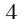
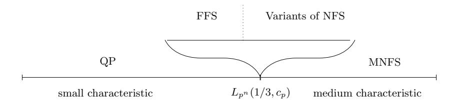
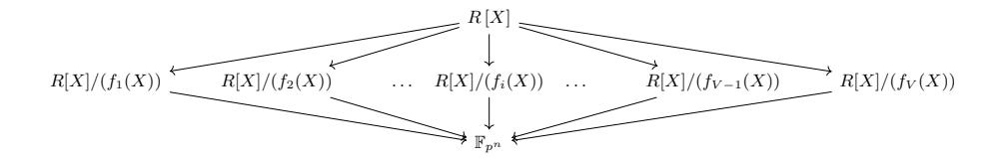
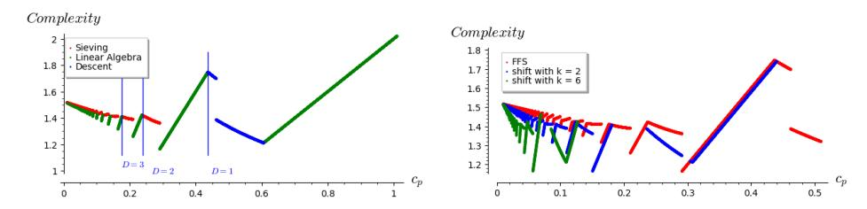
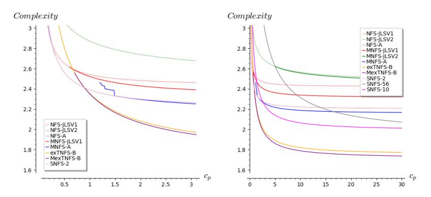
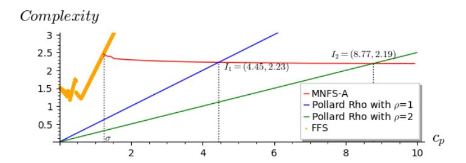
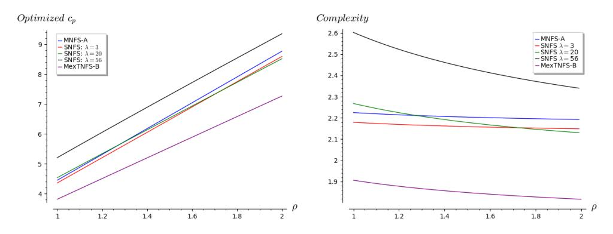
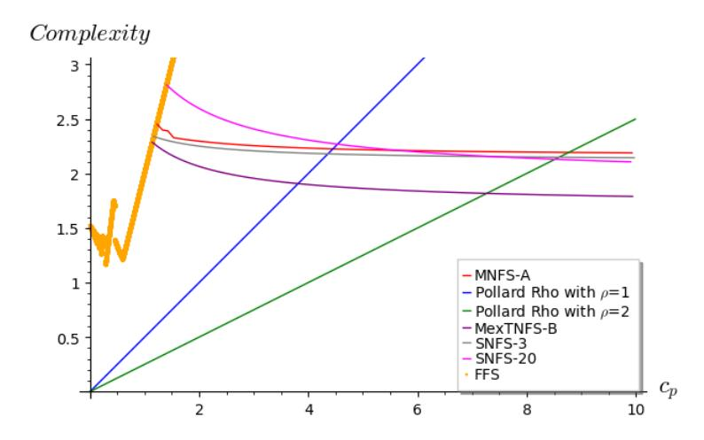

# Asymptotic complexities of discrete logarithm algorithms in pairing-relevant finite fields

Gabrielle De Micheli, Pierrick Gaudry, and C´ecile Pierrot Universit´e de Lorraine, CNRS, Inria, LORIA, Nancy, France

Abstract. We study the discrete logarithm problem at the boundary case between small and medium characteristic finite fields, which is precisely the area where finite fields used in pairing-based cryptosystems live. In order to evaluate the security of pairing-based protocols, we thoroughly analyze the complexity of all the algorithms that coexist at this boundary case: the Quasi-Polynomial algorithms, the Number Field Sieve and its many variants, and the Function Field Sieve. We adapt the latter to the particular case where the extension degree is composite, and show how to lower the complexity by working in a shifted function field. All this study finally allows us to give precise values for the characteristic asymptotically achieving the highest security level for pairings. Surprisingly enough, there exist special characteristics that are as secure as general ones.

## 1 Introduction

The discrete logarithm problem (DLP) is one of the few hard problems at the foundation of today's public key cryptography. Widely deployed cryptosystems such as the Diffie-Hellman key exchange protocol or El Gamal's signature protocol base their security on the computational hardness of DLP. In the early 2000s, pairing-based cryptography also introduced new schemes whose security is related to the computation of discrete logarithms. Indeed, for primitives such as identity-based encryption schemes [8], identity-based signature schemes [11] or short signature schemes [9], the security relies on pairing-related assumptions that become false if the DLP is broken.

In 1994, Shor introduced a polynomial-time quantum algorithm to compute discrete logarithms. This implies that no scheme relying on the hardness of DLP would be secure in the presence of quantum computers. However, as of today, quantum computers capable of doing large scale computations are non-existent, even though impressive progress has been made in the recent years (see [2] for a recent 53-qubit machine). Still, pairing-based cryptography is at the heart of numerous security products that will continue to be brought to market in the upcoming years, and research on efficient primitives using them is very active, in particular in the zero-knowledge area with the applications of zk-SNARKs to smart contracts. Hence, evaluating the classical security of those schemes remains fundamental regardless of their post-quantum weakness.

Concretely, the discrete logarithm problem is defined as follows: given a finite cyclic group G, a generator  $g \in G$ , and some element  $h \in G$ , find x such that  $g^x = h$ . In practice, the group G is chosen to be either the multiplicative group of a finite field  $\mathbb{F}_{p^n}$  or the group of points on an elliptic curve  $\mathcal{E}$  defined over a finite field. Pairing-based cryptography illustrates the need to consider both the discrete logarithm problems on finite fields and on elliptic curves. A cryptographic pairing is a bilinear and non-degenerate map  $e : \mathbb{G}_1 \times \mathbb{G}_2 \to \mathbb{G}_T$  where  $\mathbb{G}_1$  is a subgroup of  $\mathcal{E}(\mathbb{F}_p)$ , the group of points of an elliptic curve  $\mathcal{E}$  defined over the prime field  $\mathbb{F}_p$ ,  $\mathbb{G}_2$  is another subgroup of  $\mathcal{E}(\mathbb{F}_{p^n})$  where we consider an extension field and  $\mathbb{G}_T$  is a multiplicative subgroup of that same finite field  $\mathbb{F}_{p^n}$ . To construct a secure protocol based on a pairing, one must assume that the DLPs in the groups  $\mathbb{G}_1, \mathbb{G}_2, \mathbb{G}_T$  are hard.

Evaluating the security in  $\mathbb{G}_1$  and  $\mathbb{G}_2$  is straightforward, since very few attacks are known for DLP on elliptic curves. The most efficient known algorithm to solve the DLP in the elliptic curve setup is Pollard's rho algorithm which has an expected asymptotic running time equal to the square root of the size of the subgroup considered.

On the contrary, the hardness of the DLP over finite fields is much more complicated to determine. Indeed, there exist many competitive algorithms that solve DLP over finite fields and their complexities vary depending on the relation between the characteristic p and the extension degree n. When p is relatively small, quasi-polynomial time algorithms can be designed, but when p grows, the most efficient algorithms have complexity in  $L_{p^n}$  (1/3, c), where the  $L_{p^n}$ -notation is defined as

$$L_{p^n}(\alpha, c) = \exp((c + o(1))(\log(p^n))^{\alpha}(\log\log p^n)^{1-\alpha}),$$

for  $0 \le \alpha \le 1$  and some constant c > 0. We will avoid writing the constant c and simply write  $L_{p^n}(\alpha)$  when the latter is not relevant.

To construct a secure protocol based on a pairing, one must first consider a group  $\mathbb{G}_T$  in which quasi-polynomial time algorithms are not applicable. This implies, to the best of our knowledge, that the algorithms used to solve DLP on the finite field side have an  $L_{p^n}(1/3)$  complexity. Moreover, we want the complexities of the algorithms that solve DLP on both sides to be comparable. Indeed, if the latter were completely unbalanced, an attacker could solve DLP on both sides. A natural idea is then to equalize the complexity of DLP on both sides. This requires having  $\sqrt{p} = L_{p^n}(1/3)$ . Hence, the characteristic p is chosen of the form  $p = L_{p^n}(1/3, c_p)$  for some constant  $c_p > 0$ .

Yet, when the characteristic p is of this form, many algorithms coexist rendering the estimation of the hardness of DLP all the more difficult. A recent approach, followed in [19] is to derive concrete parameters for a given security level, based on what the Number Field Sieve algorithm (NFS) would cost on these instances. Our approach complements this: we analyze the security of pairings in the asymptotic setup, thus giving insight for what would become the best compromise for higher and higher security levels.

More generally, finite fields split into three main categories. When  $p = L_{p^n}(\alpha)$ , we talk of large characteristic if  $\alpha > 2/3$ , medium characteristic if

α ∈ (1/3, 2/3), and small characteristic if α < 1/3. The area we are interested in is thus the boundary case between small and medium characteristics.

For finite fields of medium characteristics, NFS and its variants remain as of today the most competitive algorithms to solve DLP. Originally introduced for factoring, the NFS algorithm was first adapted by Gordon in 1993 to the discrete logarithm context for prime fields [16]. A few years later, Schirokauer [39] extended it to finite fields with extension degrees n > 1. In [24], Joux, Lercier, Smart and Vercauteren finally showed that the NFS algorithm can be used for all finite fields. Since then, many variants of NFS have appeared, gradually improving on the complexity of NFS. The extension to the Multiple Number Field Sieve (MNFS) was originally invented for factorization [13] and was then adapted to the discrete logarithm setup [6, 32]. The Tower Number Field Sieve (TNFS) [5] was introduced in 2015. When n is composite, this variant has been extended to exTNFS in [29,30]. The use of primes of a special form gives rise to another variant called the Special Number Field Sieve (SNFS) [26]. Most of these variants can be combined with each other, giving rise to MexTNFS and S(ex)TNFS.

In the case of small characteristic, Coppersmith [12] gave a first L(1/3) algorithm in 1984. Introduced in 1994 by Adleman, the Function Field Sieve (FFS) [1] also tackles the DLP in finite fields with small characteristic. The algorithm follows a structure very similar to NFS, working with function fields rather than number fields. In 2006, Joux and Lercier [23] proposed a description of FFS which does not require the theory of function fields, and Joux further introduced in [20] a method, known as pinpointing, which lowers the complexity of the algorithm.

In 2013, after a first breakthrough complexity of Lp<sup>n</sup> (1/4+o(1)) by Joux [21], a heuristic quasi-polynomial time algorithm was designed [4] by Barbulescu, Gaudry, Joux and Thom´e. Variants were explored in the following years [17, 18, 25, 27] with two different goals: making the algorithm more practical, and making it more amenable to a proven complexity. We mention two key ingredients. First, the so-called zig-zag descent allows to reduce the problem to proving that it is possible to rewrite the discrete logarithm of any degree-2 element in terms of the discrete logarithms of linear factors, at least if a nice representation of the finite field can be found. The second key idea is to replace a classical polynomial representation of the target finite field by a representation coming from torsion points of elliptic curves. This led to a proven complexity in 2019 by Kleinjung and Wesolowski [31]. To sum it up, the quasi-polynomial (QP) algorithms outperform all previous algorithms both theoretically and in practice in the small characteristic case.

The study of the complexities of all these algorithms at the boundary case requires a significant amount of work in order to evaluate which algorithm is applicable and which one performs best. Figure 1 gives the general picture, without any of the particular cases that can be encountered.

#### Contributions:

– Thorough analysis of the complexity of FFS, NFS and its variants. We first give a precise methodology for the computation of the complexity of





Fig. 1: Best algorithms for DLP in small, medium characteristics and at the boundary case p = Lp<sup>n</sup> (1/3, cp).

NFS and its variants at the boundary case, which differs from the computations done in medium and large characteristics. We revisit some commonly accepted hypotheses and show that they should be considered with care. In addition, our analysis allowed us to notice some surprising facts. First of all, not all the variants of NFS maintain their Lp<sup>n</sup> (1/3) complexity at the boundary case. The variant STNFS, for example, has a much higher complexity in this area, and thus should not be used for a potential attack on pairings. For some special characteristics, SNFS is also not faster than MNFS, as one could expect. We also distinguish and correct errors in past papers, both in previous methodologies or computations.

FFS still remains a competitor for small values of cp. Our work then takes a closer look at its complexity, also fixing a mistake in the literature. Furthermore, in the case where the extension degree n is composite, we show how to lower the complexity of FFS by working in a shifted function field.

– Crossover points between all the algorithms. This complete analysis allows us to identify the best algorithm at the boundary case as a function of c<sup>p</sup> and give precise crossover points for these complexities. When c<sup>p</sup> is small enough, the FFS algorithm remains the most efficient algorithm outperforming NFS and all of its variants. When the extension degree n is prime, and the characteristic has no special form, the algorithm MNFS outperforms FFS when c<sup>p</sup> ≥ 1.23. When n is composite or p taken of a special form, variants such as exTNFS and SNFS give crossover points with lower values for cp, given in this work.

Moreover, we compare the complexity of FFS and the complexity of the quasi-polynomial algorithms. Since the crossover point occurs when p grows slightly slower than LQ(1/3), we introduce a new definition in order to determine the exact crossover point between the two algorithms.

– Security of pairings. All the work mentioned above allows us to answer the following question: asymptotically what finite field Fp<sup>n</sup> should be considered in order to achieve the highest level of security when constructing a pairing? To do so, we justify why equating the costs of the algorithms on both the elliptic curve side and the finite field side is correct and argue that in order for this assumption to make sense, the complete analysis given in this work was necessary. Finally, we give the optimal values of c<sup>p</sup> for the various forms of p and extension degree n, also taking into account the so-called ρ-value of the pairing construction. Surprising fact, we were also able to distinguish some special characteristics that are asymptotically as secure as characteristics of the same size but without any special form.

Asymptotic complexities versus practical estimates. The fact that STNFS is asymptotically no longer the best algorithm for optimally chosen pairing-friendly curves is not what could be expected from the study of [19], where fixed security levels up to 192 bits are considered. This could be interpreted as a hint that cryptanalists have not yet reached some steady state when working at a 192-bit security level. To sum it up, evaluating the right parameters for relevant cryptographic sizes (e.g. pairings at 256-bit of security level) is still hard: estimates for lower sizes and asymptotic analysis do not match, and there is no large scale experiment using TNFS or variants to provide more insight.

Organization. In Section 2, we give a general description of FFS, NFS and its variants. In Section 3, we summarize the analysis of the complexity of FFS, and we recall the pinpointing technique. Moreover, we present our improvement for the complexity of FFS using a shifted function field. In Section 4, we explain our general methodology to compute the complexity of NFS and its variants at the boundary case studied in this paper. In Section 5, we recall the various polynomial selections that exist and are used in the various algorithms. In Section 6, we illustrate our methodology by detailing the complexity analyses of three variants and give results for all of them. In Section 7, we compute the exact crossover points between the complexities of all algorithms considered in this paper. Finally in Section 8, we consider the security of pairing-based protocols.

#### 2 The general setting of FFS, NFS and its variants

#### 2.1 Overview of the algorithms

We introduce a general description, which covers all the variants of NFS and FFS. Consider a ring R that is either  $\mathbb{Z}$  in the most basic NFS, a number ring  $\mathbb{Z}[\iota]/(h(\iota))$  in the case of Tower NFS, or  $\mathbb{F}_p[\iota]$  in the case of FFS. This leads to the construction given in Figure 2, where one selects V distinct irreducible polynomials  $f_i(X)$  in R[X] in such a way that there exist maps from  $R[X]/(f_i(X))$  to the target finite field  $\mathbb{F}_{p^n}$  that make the diagram commutative. For instance, in the simple case where  $R = \mathbb{Z}$ , this means that all the  $f_i$ 's share a common irreducible factor of degree n modulo p.

Based on this construction, the discrete logarithm computation follows the same steps as any index calculus algorithm:

– Sieving: we collect relations built from polynomials  $\phi \in R[X]$  of degree t-1, and with bounded coefficients. If R is a ring of integers, we bound their norms, and if it is a ring of polynomials, we bound their degrees. A relation is obtained when two norms  $N_i$  and  $N_j$  of  $\phi$  mapped to  $R[X]/(f_i(X))$  and  $R[X]/(f_j(X))$  are B-smooth, for a smoothness bound B fixed during the



Fig. 2: General diagram for FFS, NFS and variants.

complexity analysis. We recall that an integer (resp. a polynomial) is Bsmooth if all its factors are lower than B (resp. of degree lower than B). Each relation is therefore given by a polynomial φ for which the diagram gives a linear equation between the (virtual) logarithms of ideals of small norms coming from two distinct number or function fields. We omit details about the notion of virtual logarithms and Schirokauer maps and refer readers to [38]. For FFS, similar technicalities can be dealt with.

- Linear algebra: The relations obtained in the previous step form a system of linear equations where the unknowns are logarithms of ideals. This system is sparse with at most O(log p <sup>n</sup>) non-zero entries per row, and can be solved in quasi-quadratic time using the block Wiedemann algorithm [14].
- Individual logarithms: The previous step outputs the logarithms of ideals with norms smaller than the smoothness bound B used during sieving. The goal of the algorithm is to compute the discrete logarithm of an arbitrary element in the target field. The commonly used approach for this step proceeds in two sub-steps. First, the target is subject to a smoothing procedure. The latter is randomized until after being lifted in one of the fields it becomes smooth (for a smoothness bound much larger than the bound B). Second, a special-q descent method is applied to each factor obtained after smoothing which is larger than the bound B. This allows to recursively rewrite their logarithms in terms of logarithms of smaller ideals. This is done until all the factors are below B, so that their logarithms are known. This forms what is called a descent tree where the root is an ideal coming from the smoothing step, and the nodes are ideals that get smaller and smaller as they go deeper. The leaves are the ideals just above B. We refer to [15, 24] for details.

#### 2.2 Description of the variants

Let us now describe the variants of NFS which we study in this paper, and see how they can be instantiated in our general setting.

Number Field Sieve. In this paper, we call NFS, the simplest variant, where the ring R is Z, there are only V = 2 number fields, and the polynomials f<sup>1</sup> and f<sup>2</sup> are constructed without using any specific form for p or the possible compositeness of n.

Multiple Number Field Sieve. The variant MNFS uses V number fields, where V grows to infinity with the size of the finite field. From two polynomials f<sup>1</sup> and f<sup>2</sup> constructed as in NFS, the V − 2 other polynomials are built as linear combinations of f<sup>1</sup> and f2: we set f<sup>i</sup> = αif1+βif2, for i ≥ 3, where the coefficients αi , β<sup>i</sup> are in O( √ V ). These polynomials have degree max(deg(f1), deg(f2)) and their coefficients are of size O( √ V max(coeff(f1), coeff(f2))).

There exist two variants of MNFS: an asymmetric one, coming from factoring [13], where the relations always involve the first number field, and a symmetric one [6], where a relation can involve any two number fields. The asymmetric variant is more natural when one of the polynomials has smaller degree or coefficients than the others. When all the polynomials have similar features, at first it could seem that the symmetric case is more advantageous, since the number of possible relations grows as V 2 instead of V . However, the search time is also increased, since for each candidate φ, we always have to test V norms for smoothness, while in the asymmetric setup when the first norm is not smooth we do not test the others. At the boundary case studied, we did not find any cases where the symmetric variant performed better. Hence, in the rest of the paper, when talking about MNFS, we refer to its asymmetric variant.

(Extended) Tower Number Field Sieve. The TNFS or exTNFS variants cover the cases where R = Z[ι]/h(ι), where h is a monic irreducible polynomial. In the TNFS case, the degree of h is taken to be exactly equal to n, while the exTNFS notation refers to the case where n = κη is composite and the degree of h is η. Both TNFS and exTNFS can use either two number fields or V 2 number fields. In the latter case, the prefix letter M is added refering to the MNFS variant. Details about (M)(ex)TNFS and their variants are given in [5,29,30,37].

Special Number Field Sieve. The SNFS variant [26] applies when the characteristic p is the evaluation of a polynomial of small degree with constant coefficients, which is a feature of several pairing construction families. Thus, the algorithm differs from NFS in the choice of the polynomials f<sup>1</sup> and f2. To date, there is no known way to combine this efficiently with the multiple variant of NFS. However, it can be applied in the (ex)TNFS setup, giving STNFS and SexTNFS.

Function Field Sieve. The FFS algorithm can be viewed in our general setting by choosing the polynomial ring R = Fp[ι]. The polynomials f<sup>1</sup> and f<sup>2</sup> are then bivariate, and therefore define plane curves. The algebraic structures replacing number fields are then function fields of these curves. FFS cannot be combined efficiently with a multiple variant. In fact, FFS itself is already quite similar to a special variant; this explains this difficulty to combine it with the multiple variant, and to design an even more special variant. The tower variant is relevant when n is composite, and it can be reduced to a change of base field. We discuss this further in Section 3.3.

In [23], Joux and Lercier proposed a slightly different setting. Although not faster than the classical FFS in small characteristic, it is much simpler, and furthermore, it gave rise to the pinpointing technique [20] which is highly relevant in our case where the characteristic is not so small. We recall their variant now, since this is the setting we will use in the rest of the paper. The algorithm starts by choosing two univariate polynomials g1, g<sup>2</sup> ∈ Fp[x] of degrees n1, n<sup>2</sup> respectively such that n1n<sup>2</sup> ≥ n and there exists a degree-n irreducible factor f of x − g2(g1(x)). Then, let us set y = g1(x). In the target finite field represented as Fp[x]/(f(x)), we therefore also have the relation x − g2(y). The factor basis F is defined as the set of all univariate, irreducible, monic polynomials of degree D for some constant D, in x and y. As usual, the sieving phase computes multiplicative relations amongst elements of the factor basis, that become linear relations between discrete logarithms. We sieve over bivariate polynomials T(x, y) of the form T(x, y) = A(x)y + B(x), where A, B have degrees d1, d<sup>2</sup> and A is monic. As an element of the finite field, this can be rewritten either as a univariate polynomial in x, namely Fx(x) = T(x, g1(x)), or as a univariate polynomial in y, namely Fy(y) = T(g2(y), y). We get a relation if both Fx(x) and Fy(y) are D-smooth. Once enough relations are collected, the linear algebra and descent steps are performed.

Several improvements to FFS exist when the finite field is a Kummer extension. This is not addressed in this work, since the situation does not arise naturally in the pairing context, and can be easily avoided by pairing designers.

## 3 The FFS algorithm at the boundary case

We consider a finite field of the form Fp<sup>n</sup> , where p is the characteristic and n the extension degree. From now on, we set Q = p <sup>n</sup>. Since our analysis is asymptotic, any factor that is ultimately hidden in the o(1) notation of the L<sup>Q</sup> expression is ignored. Furthermore, inequalities between quantities should be understood asymptotically, and up to negligible factors.

#### 3.1 Complexity analysis of FFS

Our description of the complexity analysis of FFS is based on [34]. However, we slightly deviate from their notations as theirs lead to wrong complexities (see Appendix A for details).

First, a parameter ∆ ≥ 1 is chosen which controls the balance between the degrees of the defining polynomials g<sup>1</sup> and g2. We select g<sup>1</sup> and g<sup>2</sup> of degree deg g<sup>1</sup> = n<sup>1</sup> = dn∆e and deg g<sup>2</sup> = n<sup>2</sup> = dn/∆e. Since we use the pinpointing technique, which we recall in Section 3.2, we also enforce g1(x) = x <sup>n</sup><sup>1</sup> or g2(y) = y n<sup>2</sup> , depending on which side we want to pinpoint with.

For the analysis, the smoothness bound D ≥ 1 is also fixed. Once cp, ∆ and D are fixed, we look at the complexity of the three steps of the algorithm. For the linear algebra, the cost Clinalg is quadratic in the size of the factor basis, and we get Clinalg = L<sup>Q</sup> (1/3, 2cpD). For the other steps, the complexity depends on bounds d<sup>1</sup> and d<sup>2</sup> on the degree of the polynomials A and B, used to find relations. Asymptotically, no improvement is achieved by taking d<sup>1</sup> 6= d2. Therefore, we set the following notation: d<sup>12</sup> = d<sup>1</sup> = d2. However, the value d<sup>12</sup> is not necessarily the same for the sieving and descent steps.

Analysis of the sieving step. Asymptotically, we have  $\deg F_x = n_1$  and  $\deg F_y = d_{12}n_2$ . Note that in truth  $\deg F_x = n_1 + d_{12}$  but  $d_{12}$  is a constant, hence can be ignored, since  $n_1$  goes to infinity. From these values and the smoothness bound D, we apply Flajolet, Gourdon and Panario's theorem [33] and deduce the following smoothness probabilities  $P_{F_x}$  and  $P_{F_y}$ :

$$P_{F_x} = L_Q\left(\frac{1}{3}, \frac{-\sqrt{\Delta}}{3D\sqrt{c_p}}\right), \quad \text{and} \quad P_{F_y} = L_Q\left(\frac{1}{3}, \frac{-d_{12}}{3D\sqrt{c_p\Delta}}\right).$$

The number of (A,B) pairs to explore before having enough relations is then  $P_{F_x}^{-1}P_{F_y}^{-1}$  times the size of the factor base, *i.e.*,  $p^D$ . This is feasible only if the degree  $d_{12}$  of A and B is large enough, and, recalling that A is monic, this leads to the following constraint:  $p^{2d_{12}+1} \geq P_{F_x}^{-1}P_{F_y}^{-1}p^D$ .

Furthermore, using the pinpointing technique allows to find relations faster than exploring them all. We simply state here that the cost per relation with pinpointing is  $\min(P_{F_x}^{-1}, P_{F_y}^{-1}) + p^{-1}P_{F_x}^{-1}P_{F_y}^{-1}$ . The total cost  $\mathcal{C}_{\text{siev}}$  for constructing the whole set of relations is then this quantity multiplied by  $p^D$  and we get

$$C_{\text{siev}} = p^{D-1} P_{F_x}^{-1} P_{F_y}^{-1} + p^D \min(P_{F_x}^{-1}, P_{F_y}^{-1}). \tag{1}$$

Analysis of the descent step. During the descent step, it can be shown that the bottleneck happens at the leaves of the descent tree, *i.e.*, when descending polynomials of degree D+1, just above the smoothness bound. The smoothness probabilities  $P_{F_x}$  and  $P_{F_y}$  take the same form as for the sieving step, but the feasibility constraint and the cost are different. Since we only keep the (A,B) pairs for which the degree D+1 polynomial to be descended divides the corresponding norm, we must subtract D+1 degrees of freedom in the search space, which becomes  $p^{2d_{12}-D}$ . The descent step will therefore succeed under the following constraint:  $p^{2d_{12}-D} \geq P_{F_x}^{-1} P_{F_y}^{-1}$ . Indeed, the cost of descending one element is  $P_{F_x}^{-1} P_{F_y}^{-1}$ , as only one relation is enough. Finally, the number of nodes in a descent tree is polynomial, and the total cost  $\mathcal{C}_{\text{desc}}$  of this step remains  $\mathcal{C}_{\text{desc}} = P_{F_x}^{-1} P_{F_y}^{-1}$ .

Overall complexity. To obtain the overall complexity for a given value of  $c_p$ , we proceed as follows: for each  $\Delta \geq 1$  and  $D \geq 1$ , we look for the smallest value of  $d_{12} \geq 1$  for which the feasibility constraint is satisfied for sieving and get the corresponding  $\mathcal{C}_{\text{siev}}$ ; then we look for the smallest value of  $d_{12} \geq 1$  such that the feasibility constraint is satisfied for the descent step and get the corresponding  $\mathcal{C}_{\text{desc}}$ . The maximum complexity amongst the three costs gives a complexity for these values of  $\Delta$  and D. We then vary  $\Delta$  and D and keep the lowest complexity. The result is shown on the left of Figure 3, where the colors indicate which step is the bottleneck for each range of  $c_p$  values.

#### 3.2 The pinpointing technique

In [20], Joux introduces a trick that allows to reduce the complexity of the sieving phase. We briefly recall the main idea in the particular case where we use



Fig. 3: On the left, the complexity of FFS at the boundary case and the dominant phase as a function of  $c_p$ , obtained after fixing the error in [34]. On the right, assuming n has appropriate factors, the lowered complexity of FFS for small values of  $c_p$  when considering shifts. In this plot, we consider  $\kappa = 2, 6$ . We only plot points of the curves  $\mathcal{C}_2$  and  $\mathcal{C}_6$  which are lower than the original FFS curve.

pinpointing on the x-side, and when  $d_{12}=1$ . The polynomial  $g_1$  is restricted to the particular form  $g_1(x)=x^{n_1}$ . For a pair of polynomials A(x)=x+a, B(x)=bx+c, the polynomial  $F_x(x)$  becomes  $F_x(x)=T(x,g_1(x))=x^{n_1+1}+ax^{n_1}+bx+c$ . One can then perform the change of variable  $x\mapsto tx$  for t in  $\mathbb{F}_p^*$ , and, making the expression monic, one gets the following polynomial  $G_t(x)=x^{n_1+1}+at^{-1}x^{n_1}+bt^{-n_1}x+ct^{-n_1-1}$ . If  $F_x(x)$  is D-smooth, so is  $G_t(x)$ , which corresponds to  $F_x(x)$  with the (A,B)-pair given by  $A(x)=x+at^{-1}$  and  $B(x)=(bt^{-n_1}x+ct^{-n_1-1})$ .

To evaluate  $C_{\text{siev}}$  using the pinpointing technique, we first need to consider the cost of finding the initial polynomial, *i.e.*, an (A, B)-pair such that  $F_x(x)$  is D-smooth. Then, varying  $t \in \mathbb{F}_p^*$  allows to produce p-1 pairs which, by construction, are also smooth on the x-side. We then need to check for each of them if  $F_y(y)$  is also smooth. The total cost is thus  $P_{F_x}^{-1} + p$ , and the number of relations obtained is  $pP_{F_y}$ . Finally the cost per relation is  $P_{F_y}^{-1} + (pP_{F_x}P_{F_y})^{-1}$ . By symmetry, the only difference when doing pinpointing on the y-side is the first term which is replaced by  $P_{F_x}^{-1}$ . Choosing the side that leads to the lowest complexity, and taking into account that we have to produce  $p^D$  relations leads to the overall complexity for the sieving step given in Equation (1) above.

#### 3.3 Improving the complexity of FFS in the composite case

We are able to lower the complexity of FFS when the extension degree n is composite. This case often happens in pairings for efficiency reasons.

Let  $n = \eta \kappa$ . This means we can rewrite our target field as  $\mathbb{F}_{p^n} = \mathbb{F}_{p^{\eta \kappa}} = \mathbb{F}_{p'^{\eta}}$ , where  $p' = p^{\kappa}$ . Note that this would not work in the NFS context because p' is no longer a prime. From  $p = L_Q(1/3, c_p)$ , we obtain  $p' = L_Q(1/3, \kappa c_p)$ . Thus looking at the complexity of FFS in  $\mathbb{F}_{p^n}$  for some  $c_p = \alpha$  is equivalent to looking at the complexity of FFS in  $\mathbb{F}_{p'^{\eta}}$  at some value  $c'_p = \kappa \alpha$ . This corresponds to a shift of the complexity by a factor of  $\kappa$ . More generally, assume n can be decomposed as a product of multiple factors. For each factor  $\kappa$  of n, one

can consider the target field  $\mathbb{F}_{p'^r}$ , where  $p' = p^{\kappa}$  and  $r = n/\kappa$ . This gives rise to a new complexity curve  $\mathcal{C}_{\kappa}$ , shifted from the original one by a factor of  $\kappa$ . One can then consider the final curve  $\mathcal{C} = \min_{\kappa \geq 1} \mathcal{C}_{\kappa}$ , that assumes that n has many small factors. This lowers the complexity of FFS for small values of  $c_p$  as can be seen in Figure 3. One of the most significant examples is when  $c_p = (1/6) \times (2/81)^{1/3} = 0.049$ . The FFS complexity is  $L_Q(1/3, 1.486)$  in this case, while if n is a multiple of 6, we can use  $p' = p^6$ , so that we end up at the point where FFS has the lowest complexity, and we reach  $L_Q(1/3, 1.165)$ .

More generally, even when the characteristic is small, if  $n = \eta \kappa$  is composite we can work with  $\mathbb{F}_{p^{\kappa}}$  as a base field, and if  $p^{\kappa}$  has the appropriate size we can have a complexity that is lower than the  $L_Q(1/3, (32/9)^{1/3})$  of the plain FFS in small characteristic. The optimal case is when  $\kappa = (2/81)^{1/3} n^{1/3} (\log_p n)^{2/3}$ . This strategy is very similar to the extended Tower NFS technique where we try to emulate the situation where the complexity of NFS is the best.

## 4 Tools for the analysis of NFS and its variants

The main difficulty when evaluating the complexity of NFS is the amount of parameters that influence in a non-trivial way the running time or even the termination of the algorithm. In this section we explain our methodology to find the set of parameters leading to the fastest running time. We do not consider the space complexity. Indeed, in all the variants of NFS under study, the memory requirement is dominated by the space required to store the matrix of relations, which is equal (up to logarithmic factors) to the square root of the running time to find a kernel vector in this matrix.

#### 4.1 General methodology

**Parameters and their constraints.** As often done in an asymptotic complexity analysis, even if parameters are assumed to be integers, they are considered as real numbers. This is a meaningful modelling as long as the numbers tend to infinity since the rounding to the nearest integer will have a negligible effect. In some of the variants, however, some integer parameters remain bounded. This is the case for instance of the (r, k) parameters in MNFS- $\mathcal{A}$ , detailed in Section 6. We call continuous parameters the former, and discrete parameters the latter.

The analysis will be repeated independently for all values of the discrete parameters, so that we now concentrate on how to optimize the continuous parameters for a given choice of discrete parameters. We call a set of parameters valid if the algorithm can be run and will finish with a high probability. Many parameters are naturally constrained within a range of possible values in  $\mathbb{R}$ . For instance, a smoothness bound must be positive. In addition, one must consider another general constraint to ensure the termination of the algorithm: the number of relations produced by the algorithm for a given choice of parameters must be larger than the size of the factor basis. We will refer to this constraint as the Main Constraint in the rest of the paper.

This inequality can be turned into an equality with the following argument (similarly as in Section 3, equality is up to asymptotically negligible factors). Assume a set of parameters gives a minimum running time, and for these parameters the number of relations is strictly larger than the size of the factor basis. Then, by reducing the bound on the coefficients of the polynomials φ used for sieving, one can reduce the cost of the sieving phase, while the costs of linear algebra and individual logarithm steps stay the same. Therefore, one can construct a new set of parameters with a smaller running time.

The costs of the three phases. Let Csiev, Clinalg and Cdesc be the costs of the three main phases of NFS. The overall cost of computing a discrete logarithm is then the sum of these three quantities. Up to a constant factor in the running time, the optimal cost can be deduced by minimizing the maximum of these three costs instead of their sum. Given the form of the formulas in terms of the parameters, this will be much easier to handle.

A natural question that arises is whether, at the optimum point, one cost "obviously" dominates the others or on the contrary is negligible. The two following statements were previously given without justification and we correct this issue here. First, the best running time is obtained for parameters where the linear algebra and the sieving steps take a similar time. We explain why there is no reason to believe this assumption is necessarily true. Secondly, the cost of the individual logarithm step is negligible. We justify this in this setting with a theoretical reason.

Equating the cost of sieving and linear algebra. In the most simple variant of NFS for solving the discrete logarithm in a prime field using two number fields, the best complexity is indeed obtained at a point where linear algebra and sieving have the same cost. However, we would like to emphasize that this is not the result of an "obvious" argument. Let us assume that the linear algebra is performed with an algorithm with complexity O(Nω), where ω is a constant. The matrix being sparse, the only lower bound we have on ω is 1, while the best known methods [14] give ω = 2. By re-analyzing the complexity of NFS for various values of ω, we observe that the optimal cost is obtained at a point where the linear algebra and the sieving have similar costs only when ω ≥ 2. Were there to be a faster algorithm for sparse linear algebra with a value of ω strictly less than 2, the complexity obtained with Csiev = Clinalg would not be optimal. Therefore, any "obvious" argument for equating those costs should take into account that the current best exponent for sparse linear algebra is 2.

Negligible cost of individual logarithm step. As explained previously, the individual logarithm phase consists of two steps: a smoothing step and a descent by special-q. We refer to [15, Appendix A] where a summary of several variants is given, together with the corresponding complexities. The smoothing part is somewhat independent and has a complexity in LQ(1/3, 1.23), that is lower than all the other complexities. Note however that [15] does not cover the case where a discrete logarithm in an extension field is sought. The adaptation can be found in [6, Appendix A] and the complexity remains the same. For the specialq descent step, the analysis of [15] does not need to be adapted, since all the computations take place at the level of number fields. Using sieving with large degree polynomials, it is shown that all the operations except for the ones at the leaves of the descent trees take a negligible time LQ(1/3, o(1)). Finally the operations executed at the leaves of the tree are very similar to the ones performed during sieving to find a single relation. Therefore they also take a negligible time compared to the entire sieving step that must collect an LQ(1/3) subexponential quantity of relations, while we only require a polynomial quantity for the descent. As a consequence, in the context of NFS and its variants, the individual logarithm phase takes a much smaller time than the sieving phase.

Overall strategy for optimizing the complexity. First we fix values for the discrete parameters. Since these values are bounded in our model, there are only finitely many choices. We then apply the following recursive strategy where all the local minima encountered are compared in the end and the smallest is returned. The strategy executes the following two steps. First, in the subvariety of valid parameters satisfying the Main Constraint, search for local minima of the cost assuming Csiev = Clinalg. Then, recurse on each plausible boundary of the subvariety of parameters.

In order for our analysis to remain as general as possible, we have also considered the case where the costs of sieving and linear algebra are not equal. We then look for local minima for Csiev and see if this results in a lower complexity. We do not detail this case since this situation has not occurred in our analyses, but we insist on the necessity to perform these checks.

We emphasize that we have indeed to first look for minima in the interior of the space of valid parameters and then recurse on its boundaries. This is imposed by the technique we use to find local minima. Indeed, we assume that all the quantities considered are regular enough to use Lagrange multipliers. However, this technique cannot be used to find a minimum that would lie on a boundary. This is the case for example of STNFS as explained in Section 6.3.

In general, only few cases are to be considered. For instance, except for a few polynomial selection methods, there are no discrete parameters. Also, boundary cases are often non-plausible, for example, when the factor base bound tends to zero or infinity. Some cases are also equivalent to other variants of NFS, for instance when the number of number fields in MNFS goes to zero, the boundary case is the plain NFS.

Notations. In the analysis of NFS and its variants, parameters that grow to infinity with the size Q of the finite field must be chosen with the appropriate form to guarantee an overall LQ(1/3) complexity. We summarize in Table 1 the notations used for these parameters, along with their asymptotic expressions. For convenience, in order to have all the notations at the same place, we include parameters that will be introduced later in the paper.

| Notation           | Notation Asympt. expression Definition                            |                                                                                         |  |  |  |  |
|--------------------|-------------------------------------------------------------------|-----------------------------------------------------------------------------------------|--|--|--|--|
| General parameters |                                                                   |                                                                                         |  |  |  |  |
| p                  | $L_Q\left(1/3,c_p\right)$                                         | Characteristic of finite field $\mathbb{F}_Q$ , where $Q = p^n$                         |  |  |  |  |
| n                  | $\frac{1}{c_p} \left( \frac{\log Q}{\log \log Q} \right)^{2/3}$   | Exponent of finite field $\mathbb{F}_Q$ , where $Q = p^n$                               |  |  |  |  |
| B                  | $L_Q\left(1/3,c_B\right)$                                         | Smoothness bound                                                                        |  |  |  |  |
| t                  | $\frac{c_t}{c_p} \left( \frac{\log Q}{\log \log Q} \right)^{1/3}$ | Degree of the sieving polynomials $\phi$                                                |  |  |  |  |
| A                  | $(\log Q)^{c_A c_p}$                                              | Bound on coefficients of $\phi$ . Note $A^t = L_Q(1/3, c_A c_t)$                        |  |  |  |  |
| P                  | $L_Q\left(1/3,p_r\right)$                                         | Probability that $\phi$ leads to a relation                                             |  |  |  |  |
| MNFS parameters    |                                                                   |                                                                                         |  |  |  |  |
| V                  | $L_Q\left(1/3,c_V\right)$                                         | Number of number fields in MNFS                                                         |  |  |  |  |
| B'                 | $L_Q\left(1/3, c_{B'}\right)$                                     | Second smoothness bound for asymmetric MNFS                                             |  |  |  |  |
| $P_1$              | $L_Q\left(1/3, p_{r1}\right)$                                     | Probability of smoothness in the first number field                                     |  |  |  |  |
| $P_2$              | $L_Q\left(1/3, p_{r2}\right)$                                     | Probability of smoothness in any other number field                                     |  |  |  |  |
| Othe               | Other parameters                                                  |                                                                                         |  |  |  |  |
| d                  | $\delta \left( \frac{\log Q}{\log \log Q} \right)^{2/3}$          | Degree of polynomial in the case of JLSV2                                               |  |  |  |  |
| η                  | $c_{\eta} \left( \frac{\log Q}{\log \log Q} \right)^{1/3}$        | Factor of $n$ in the case of (ex)TNFS; $\deg h = \eta$                                  |  |  |  |  |
| $\kappa$           | $c_{\kappa} \left( \frac{\log Q}{\log \log Q} \right)^{1/3}$      | Other factor of <i>n</i> in the case of (ex)TNFS; $c_{\kappa} = \frac{1}{c_p c_{\eta}}$ |  |  |  |  |

Table 1: Notations and expressions for most of the quantities involved in the analysis of NFS and its variants.

#### 4.2 Smoothness probability

During the sieving phase, we search for B-smooth norms. A key assumption in the analysis is that the probability of a norm being smooth is the same as that of a random integer of the same size. This allows us to apply the theorem by Canfield-Erdős-Pomerance [10]. We use the following specific version:

**Corollary 1.** Let  $(\alpha_1, \alpha_2, c_1, c_2)$  be four real numbers such that  $1 > \alpha_1 > \alpha_2 > 0$  and  $c_1, c_2 > 0$ . Then the probability that a random positive integer below  $L_Q(\alpha_1, c_1)$  splits into primes less than  $L_Q(\alpha_2, c_2)$  is given by

$$L_Q \left(\alpha_1 - \alpha_2, (\alpha_1 - \alpha_2)c_1c_2^{-1}\right)^{-1}$$
.

The norms are estimated based on their expressions as resultants. In the classical (non-tower) version of NFS, for a given candidate  $\phi$ , the norm  $N_i$  in the *i*-th number field given by  $f_i$  takes the form  $N_i = c \operatorname{Res}(f_i, \phi)$ , where c is a constant coming from the leading coefficient of  $f_i$  that can be considered smooth (possibly by including its large prime factors in the factor basis).

The definition of the resultant as the determinant of the Sylvester matrix gives a bound that follows from Hadamard's inequality (see [7]):

$$|\operatorname{Res}(f_i,\phi)| \le (d+1)^{(t-1)/2} t^{d/2} ||f_i||_{\infty}^{(t-1)} ||\phi||_{\infty}^d,$$

where  $d = \deg f$  and  $t = 1 + \deg h$ . Note that in our setting, d must be larger than n which is roughly in  $(\log Q)^{2/3}$ , while t is in  $(\log Q)^{1/3}$ , so that the factor  $(d+1)^{(t-1)/2}$  will be negligible but the factor  $t^{d/2}$  will not.

A note on Kalkbrener's corollary. Recent papers including [3, 26, 35, 36] have mentioned a result from Kalkbrener [28] to upper bound the value of the combinatoric term that appears in the resultant. In [28], Theorem 2 counts the number of monomials in the matrix. However, two permutations can give the same monomial, and thus the number of permutations is not bounded by the number of monomials. We emphasize that this result cannot be used this way; this error leads to wrong (and underestimated) complexities. Indeed combinatorial terms cannot be neglected at the boundary case.

When analyzing tower variants (see [29, Lemma 1] and [37, Equation 5]), the ring R is  $\mathbb{Z}[\iota]/h(\iota)$ , and in all cases, the optimal value for the degree of  $\phi(X)$  is 1 (i.e. t=2, in the general setting). A polynomial  $\phi$  is therefore of the form  $\phi(X)=a(\iota)+b(\iota)X$ , where a and b are univariate polynomials over  $\mathbb{Z}$  of degree less than  $\deg h$ , with coefficients bounded in absolute value by A. Up to a constant factor which can be assumed to be smooth without loss of generality, the norm  $N_i(\phi)$  in the field defined by  $f_i(X)$  is then given by  $\operatorname{Res}_{\iota}\left(\operatorname{Res}_{X}\left(a(\iota)+b(\iota)X,f_i(X)\right),h(\iota)\right)$ , and this can be bounded in absolute value by

$$|N_i(\phi)| \le A^{(\deg h)(\deg f_i)} ||f_i||_{\infty}^{\deg h} ||h||_{\infty}^{\deg f_i((\deg h)-1)} C(\deg h, \deg f_i),$$

the combinatorial contribution C being  $C(x,y)=(x+1)^{(3y+1)x/2}(y+1)^{3x/2}$ .

In the case of TNFS where n is prime, the degree of h is equal to n, thus both factors of the combinatorial contribution are non-negligible. On the other hand, when  $n = \eta \kappa$  is composite with appropriate factor sizes, one can use exTNFS and take  $\deg h = \eta$  and  $\deg f \geq \kappa$ , in such a way that only the first factor of C will contribute in a non-negligible way to the size of the norm.

#### 4.3 Methodology for the complexity analysis of NFS

During sieving, we explore  $A^t$  candidates, for which a smoothness test is performed. A single smoothness test with ECM has a cost that is non-polynomial, but since it is sub-exponential in the smoothness bound, it will be in  $L_Q(1/6)$  and therefore contribute only in the o(1) in the final complexity. We therefore count it as a unit cost in our analysis. In the plain NFS, the cost of sieving is therefore  $A^t$ . In the asymmetric MNFS, we should in principle add the cost of testing the smoothness of the V-1 remaining norms when the first one is smooth. With the notations of Table 1, the sieving cost is therefore  $A^t(1+P_1V)$ . In what follows, we will assume that  $P_1V \ll 1$ , i.e.  $p_{r1} + c_V < 0$  and check at the end that this hypothesis is valid. As for the linear algebra, the cost is quadratic in the size of the factor basis. According to the prime number theorem, the number of prime ideals of norm bounded by B is proportional to B up to a logarithmic factor. In the asymmetric MNFS setting, the cost is  $(B+VB')^2$ , and in general,

we balance the two terms and set B = VB'. Therefore, in the main case where we assume equality between sieving and linear algebra, for both the plain NFS and the asymmetric MNFS variant we get  $A^t = B^2$ .

The Main Constraint also requires to have as many relations as the size of the factor bases. This translates into the equation  $A^tP = B$ , where P is the probability of finding a relation, which is equal to  $P_1P_2V$  in the MNFS case. Combining this with the first constraint simplifies to BP = 1, or, in terms of exponents in the L-notation:

$$p_r + c_B = 0, (2)$$

where  $p_r = p_{r_1} + p_{r_2} + c_V$  in the case of MNFS.

From the characteristics of the polynomials outputted by the polynomial selection, one can use the formulae of Section 4.2 to express  $p_r$  in terms of the parameters  $c_B$ ,  $c_t$ , and also  $c_V$  in the MNFS case. Note that we use the equation  $A^t = B^2$  to rewrite  $c_A$  as  $c_A = 2c_B/c_t$ .

It remains to find a minimum for the cost of the algorithm under the constraint given by Equation (2). To do so, we use Lagrange multipliers. Let  $c = p_r + c_B$  be the constraint seen as a function of the continuous parameters. The Lagrangian function is given by  $\mathcal{L}(\text{parameters}, \lambda) = 2c_B + \lambda c$ , where  $\lambda$  is an additional non-zero variable. At a local minimum for the cost, all the partial derivatives of  $\mathcal{L}$  are zero, and this gives a system of equations with as many equations as indeterminates (not counting  $c_p$  which is seen as a fixed parameter). Since all the equations are polynomials, it is then possible to use Gröbner basis techniques to express the minimum complexity as a function of  $c_p$ .

More precisely, in the case of the asymmetric MNFS where the variables are  $c_B$ ,  $c_t$  and  $c_V$ , the system of equations is

$$\begin{cases} \frac{\partial \mathcal{L}}{\partial c_B} = 2 + \lambda \frac{\partial c}{\partial c_B} = 0\\ \frac{\partial \mathcal{L}}{\partial c_t} = \lambda \frac{\partial c}{\partial c_t} = 0\\ \frac{\partial \mathcal{L}}{\partial c_V} = \lambda \frac{\partial c}{\partial c_V} = 0\\ p_{r1} + p_{r2} + c_V + c_B = 0 \end{cases},$$

where the first equation plays no role in the resolution, but ensures that  $\lambda$  is non-zero, thus allowing to remove the  $\lambda$  in the second and third equation. This becomes an even simpler system in the case of the plain NFS, where the parameter  $c_V$  is no longer present, thus leading to the system

$$\begin{cases} \frac{\partial c}{\partial c_t} = 0\\ p_r + c_B = 0 \end{cases}.$$

In the case where the expressions depend on discrete parameters, we can keep them in the formulae (without computing partial derivatives with respect to them, which would not make sense) and compute a parametrized Gröbner basis. If this leads to a system for which the Gröbner basis computation is too hard, then we can instantiate some or all the discrete parameters and then solve the system for each choice.

The cases not covered by the above setting, including the cases where we do not assume equality between sieving and linear algebra are handled similarly.

### 5 Polynomial selections

The asymptotic complexity of all the algorithms presented in Section 2 depends on the characteristics of the polynomials outputted by the polynomial selection method considered. We briefly summarize in this section the various existing polynomial selection methods. We distinguish the cases when n is composite and when p is of a special form, which leads to considering different algorithms. The parameters for all the polynomial selections we are going to consider are summarized in Table 2.

#### 5.1 Polynomial selections for NFS and MNFS

We first list the methods where no particular considerations are made on the extension degree n or the characteristic p.

JLSV0. This is the simplest polynomial method there exists. We consider a polynomial f<sup>1</sup> of degree n irreducible mod p such that the coefficients of f<sup>1</sup> are in O(1). We construct f<sup>2</sup> = f<sup>1</sup> +p and thus coefficients of f<sup>2</sup> are in O(p) and the degree of f<sup>2</sup> is also n. Then trivially we have the condition that f2|f<sup>1</sup> mod p as required for the algorithms to work.

JLSV1. This method was introduced in [24] and we refer to the paper for details. We only note here that the degree of the polynomials outputted are the same as those of JLSV0. However, the size of coefficients are balanced as opposed to JLSV0. This difference does not affect the overall complexity of the algorithm.

JLSV2. This polynomial selection is presented in [24]. This method uses lattices to output the second polynomial, the idea being that in order to produce a polynomial with small coefficients, the latter are chosen to be the coefficients of a short vector in a reduced lattice basis.

GJL. The Generalized Joux-Lercier (GJL) method is an extension to the nonprime fields of the method presented in 2003 by Joux and Lercier in [22]. It was proposed by Barbulescu, Gaudry, Guillevic and Morain in [3, Paragraph 6.2], and uses lattice reduction to build polynomials with small coefficients.

Conjugation. In [3], the authors propose two new polynomial selection methods, one of which is Conjugation. It uses a continued fraction method like JLSV1 and the existence of some square roots in Fp.

Algorithm A. We recall Algorithm A as given in [36] in Appendix B and refer to [36] for more details about it. This algorithm also uses lattices to output the second polynomial and introduces two new parameters: d and r such that r ≥ n d := k. The parameters r and k are discrete in the complexity analysis. Note that the parameter d used in this polynomial selection is also discrete whereas the polynomial degree also denoted d used in JLSV2 and GJL is continuous.

#### 5.2 Polynomial selections for exTNFS and MexTNFS

We now look at polynomial selections with composite extension degree n = ηκ. The most general algorithms are the algorithms B, C and D presented in [35, 37] that extend algorithm  $\mathcal{A}$  to the composite case. Thus, the construction of the polynomials  $f_1$  and  $f_2$  follow very similar steps as the ones in algorithm  $\mathcal{A}$ . We merely point out the main differences with algorithm  $\mathcal{A}$ . These algorithms require the additional condition  $\gcd(\eta, \kappa) = 1$ . Similarly as for algorithm  $\mathcal{A}$ , they introduce two new parameters: d and r such that  $r \geq \kappa/d := k$ .

Algorithm  $\mathcal{B}$ . This algorithm is identical to algorithm  $\mathcal{A}$  adapted to the composite setup where  $n = \eta \kappa$ . Note that if  $\eta = 1$  and  $\kappa = n$ , we recover algorithm  $\mathcal{A}$ . For convenience, we recall it in Appendix B.

Algorithms  $\mathcal C$  and  $\mathcal D$ . The polynomial selection  $\mathcal C$  is another extension of  $\mathcal A$  to the setup of exTNFS. It introduces a new variable  $\lambda \in [1,\eta]$  that plays a crucial role in controlling the size of the coefficients of  $f_2$ . However, in our case, when analysing the complexity of M(ex)TNFS- $\mathcal C$  one realizes that the lowest complexity is achieved when  $\lambda=1$  which brings us back to the analysis of  $\mathcal B$ . As for algorithm  $\mathcal D$ , this is a variant that allows to replace the condition  $\gcd(\eta,\kappa)=1$  by the weaker condition  $\gcd(\eta,k)=1$ . Since the outputted polynomials share again the same properties as algorithm  $\mathcal B$ , the complexity analysis is identical. Therefore, we will not consider  $\mathcal C$  or  $\mathcal D$  in the rest of the paper.

#### 5.3 Polynomial selections for SNFS and STNFS

For SNFS and STNFS, the prime p is given as the evaluation of a polynomial P of some degree  $\lambda$  and with small coefficients. In particular, we can write p = P(u), for  $u \approx p^{1/\lambda}$ . Note that the degree  $\lambda$  is a fixed parameter which does not depend on p. We summarize the construction of the polynomials  $f_1$  and  $f_2$  given in [26]. The first polynomial  $f_1$  is defined as an irreducible polynomial over  $\mathbb{F}_p$  of degree n and can be written as  $f_1(X) = X^n + R(X) - u$ , where R is a polynomial of small degree and coefficients taken in the set  $\{-1,0,1\}$ . The polynomial R does not depend on P so  $||f_1||_{\infty} = u$ , and from p = P(u) we get  $||f_1||_{\infty} = p^{1/\lambda}$ . The polynomial  $f_2$  is chosen to be  $f_2(X) = P(f_1(X) + u)$ . This implies  $f_2(X)$  (mod  $f_1(X)$ ) = p, and thus  $f_2(X)$  is a multiple of  $f_1(X)$  modulo p.

## 6 Complexity analyses of (M)(ex)(T)NFS

Following the method explained in Section 4, we have computed the complexities of the algorithms presented in Section 2 with the polynomial selections given in Section 5. We report the norms and the complexities in Table 3. Since each norm has the form  $L_Q(2/3, c)$ , and each complexity has the form  $L_Q(1/3, c)$ , we only report the values of c. We illustrate our methodology by giving details of the computation of the complexity analysis of the best performing variants.

#### 6.1 (M)NFS

In the case of (M)NFS, the best complexity is achieved by the MNFS variant using the polynomial selection  $\mathcal{A}$  and when equating the cost of sieving and of

| Polynomial    | NFS        |            |                    |                    | MNFS       |            |                    |                           |
|---------------|------------|------------|--------------------|--------------------|------------|------------|--------------------|---------------------------|
| selection     | $\deg f_1$ | $\deg f_2$ | $  f_1  _{\infty}$ | $  f_2  _{\infty}$ | $\deg f_1$ | $\deg f_2$ | $  f_1  _{\infty}$ | $  f_2  _{\infty}$        |
| JLSV0         | n          | n          | O(1)               | O(p)               | -          | _          | _                  | _                         |
| JLSV1         | n          | n          | $O(\sqrt{p})$      | $O(\sqrt{p})$      | n          | n          | $O(\sqrt{p})$      | $O(\sqrt{V}\sqrt{p})$     |
| JLSV2         | n          | d > n      | $O(p^{n/(d+1)})$   | $O(p^{n/(d+1)})$   | n          | d > n      | $O(p^{n/(d+1)})$   | $O(\sqrt{V}p^{n/(d+1)})$  |
| GJL           | d+1>n      | d          | O(1)               | $O(p^{n/(d+1)})$   | d+1>n      | d          | O(1)               | $O(\sqrt{V}p^{n/(d+1)})$  |
| Conjugation   | 2n         | n          | $O(\log p)$        | $O(\sqrt{p})$      | 2n         | n          | $O(\log p)$        | $O(\sqrt{V}\sqrt{p})$     |
| $\mathcal{A}$ | d(r+1)     | dr         | $O(\log p)$        | $O(p^{n/d(r+1)})$  | d(r+1)     | dr         | $O(\log p)$        | $O(\sqrt{V}p^{n/d(r+1)})$ |

| Polynomial   | exTNFS   |              |             | MexTNFS               |        |            |                    |                               |
|--------------|----------|--------------|-------------|-----------------------|--------|------------|--------------------|-------------------------------|
| selection    |          | $\deg f_2$   |             | $  f_2  _{\infty}$    |        | $\deg f_2$ | $  f_1  _{\infty}$ | $  f_2  _{\infty}$            |
| JLSV2        | $\kappa$ | $d > \kappa$ |             | $O(p^{\kappa/(d+1)})$ |        |            |                    | $O(\sqrt{V}p^{\kappa/(d+1)})$ |
| $\mathcal B$ | d(r+1)   | dr           | $O(\log p)$ | $O(p^{k/(r+1)})$      | d(r+1) | dr         | $O(\log p)$        | $O(\sqrt{V}p^{k/(r+1)})$      |

| Polynomial selection | $\deg f_1$ | $\deg f_2$      | $  f_1  _{\infty}$ | $  f_2  _{\infty}$                      |
|----------------------|------------|-----------------|--------------------|-----------------------------------------|
| SNFS                 | n          | $n\lambda$      | $p^{1/\lambda}$    | $O((\log n)^{\lambda})$                 |
| STNFS                | $\kappa$   | $\kappa\lambda$ | $p^{1/\lambda}$    | $O\left((\log \kappa)^{\lambda}\right)$ |

Table 2: Parameters of the polynomials  $f_1$ ,  $f_2$  outputted by various polynomial selection methods for (M)NFS in the first table, (M)exTNFS in the second table and S(T)NFS in the third table.

linear algebra. The continuous parameters to consider in this case are B, A, t, V, and the discrete parameters are r and k.

The norms of the polynomials outputted by the polynomial selection  $\mathcal{A}$  are bounded by  $t^{d(r+1)/2}(d(r+1))^t(\log p)^tA^{d(r+1)}$  and  $t^{dr/2}(dr)^tQ^{t/d(r+1)}\sqrt{V}^tA^{dr}$ . Using Corollary 1, we compute the probabilities of smoothness for both norms. The constants in the  $L_Q$  notation for these probabilities are given by  $p_{r1}=\frac{-1}{3c_B}\left(\frac{r+1}{6kc_p}+\frac{(r+1)c_A}{k}\right)$ , and  $p_{r2}=\frac{-1}{3(c_B-c_V)}\left(\frac{r}{6kc_p}+\frac{rc_A}{k}+\frac{kc_t}{r+1}+\frac{c_tc_V}{2c_p}\right)$ . Using the condition P=1/B allows us to obtain a non-linear equation in the various parameters considered. In order to minimize  $2c_B$  under this non-linear constraint, we use Lagangre multipliers and solve the system exhibited in Section 4 with Gröbner basis. This allows us to obtain an equation of degree 15 in  $c_B$ , degree 9 in  $c_p$ , and degrees 10 and 8 in r and k. The equation is given in Appendix C. Recall that r and k are discrete values. One can loop over the possible values of r, k and keep the values which give the smallest complexity. When  $c_p \geq 1.5$ , the optimal set of parameters is given by (r,k)=(1,1). When  $1.2 \leq c_p \leq 1.4$ , the values of (r,k) need to be increased to find a valid complexity. For  $c_p \leq 1.1$ , no values of (r,k) allow us to find a positive root for  $c_V$ , thus there is no valid complexity with this method.

The last step of our strategy consists in recursing on each plausible boundary of the subvariety of parameters. This case is already covered by the previous steps. Indeed, the only parameter where it makes sense to consider the boundary is V, and when the latter goes to zero, this means we are considering NFS again.

An attempt at lowering the complexity of MNFS. Some polynomial selections such as A and JLSV2 output two polynomials f<sup>1</sup> and f<sup>2</sup> where f<sup>2</sup> is taken to be the polynomial which coefficients are the coefficients of the shortest vector in an LLL-reduced lattice of some dimension D. The remaining V − 2 number fields are defined by polynomials which are linear combinations of f<sup>1</sup> and f2. From the properties of LLL, we assume the vectors in the LLL-reduced basis have similar norms. Instead of building f<sup>i</sup> as αif<sup>1</sup> + βif<sup>2</sup> where α<sup>i</sup> , β<sup>i</sup> ≈ √ V , one can take a linear combination of more short vectors, and thus have f<sup>i</sup> = αi,1f1+αi,2f2+· · ·+αi,Df<sup>D</sup> and αi,j ≈ V <sup>1</sup>/2D. However, this does not affect the asymptotic complexity. When c<sup>p</sup> → ∞, the coefficient term becomes negligible. On the other hand, when c<sup>p</sup> is small, the norms become smaller and this results in a slighlty lower complexity. However the gain is very small, nearly negligible.

When looking at TNFS. We consider a linear polynomial g and a polynomial f of degree d where both polynomials have coefficients of size O p <sup>1</sup>/(d+1) . This corresponds to the naive base-m polynomial selection. The TNFS setup requires a polynomial h of degree n with coefficients of size O(1). As usual, to compute the complexity, we are interested in the size of the norms. This is given in Section 4.2 and when evaluating the term C(n, d), which is not negligible due to the size of n as opposed to the large characteristic case presented in [5], we note that the overall complexity of TNFS at this boundary case is greater than the usual L<sup>Q</sup> (1/3). Indeed, we have

$$\log C(n,d) = \frac{\delta}{c_p} (\log Q)^{4/3} (\log \log Q)^{-1/3} + \frac{4}{3c_p} (\log Q)^{2/3} (\log \log Q)^{1/3}.$$

Since (log Q) 4/3 (log log Q) <sup>−</sup>1/<sup>3</sup> > (log Q) 2/3 (log log Q) 1/3 for large enough value of Q, we have C(n, d) > LQ(2/3, x) for any constant x > 0. Thus this algorithm is not applicable in this case. Moreover, if we write p = L<sup>Q</sup> (α, c), this argument is valid as soon as α ≤ 2/3.

#### 6.2 (M)exTNFS

When the extension degree n = ηκ is composite, using the extended TNFS algorithm and its multiple field variant allows to lower the overall complexity.

Before starting the complexity analysis, we want to underline a main difference with other analyses seen previously. So far, the degree t of the sieving polynomials has always been taken to be a function of log Q, i.e., we usually set t = ct cp log Q log log Q <sup>1</sup>/<sup>3</sup> . In the following analysis, the value of t is a discrete value. Indeed, if one chooses to analyze the complexity using t as a function of log Q, we get the following value in the product of the norms: Q(t−1)/(d(r+1)) = L<sup>Q</sup> (1, kctcη/(r + 1)). This implies that the norms become too big to give a final complexity in L<sup>Q</sup> (1/3).

We now concentrate on the analysis of exTNFS, using Algorithm B. Continuous parameters are B, A, η and the discrete values are r, k, t. For simplicity we report only the case t=2. The product of the norms is given by

$$N_1 N_2 = A^{\eta d(2r+1)} p^{k\eta/(r+1)} C(\eta, dr) C(\eta, d(r+1)).$$

The two combinatorial terms are not negligible at this boundary case. The probability of getting relations is given by

$$P = L_Q \left( \frac{1}{3}, \frac{-1}{3c_B} \left( \frac{(2r+1)c_A}{k} + \frac{kc_\eta c_p}{r+1} + \frac{2r+1}{2kc_p} \right) \right),$$

and using the condition P=1/B allows us to obtain a non-linear equation in the various parameters considered. In order to minimize  $2c_B$  under this non-linear constraint, we use Lagrange multipliers and solve the system exhibited in Section 4 with a Gröbner basis approach. This allows us to obtain an equation of degree 4 in  $c_B$  and r and degree 2 in  $c_p$  and k. The equation is given in Appendix C. Since r, k are discrete values, one can then loop through their possible values and pick the ones which give the smallest complexity.

A note on the JLSV2 polynomial selection. When considering the JLSV2 polynomial selection for exTNFS (same for MexTNFS), the norms are bounded by

$$|N_1| < A^{\eta \kappa} ||f||_{\infty}^{\eta} C(\eta, \kappa) = A^{\eta \kappa} p^{\kappa \eta/(d+1)} C(\eta, \kappa), |N_2| < A^{\eta d} ||g||_{\infty}^{\eta} C(\eta, d) = A^{\eta d} p^{\kappa \eta/(d+1)} C(\eta, d).$$

The terms  $C(\eta, \kappa)$  and  $C(\eta, d)$  are not negligible in this case, and  $C(\eta, \kappa) = L_Q(2/3, c_{\eta}c_{\kappa}/2)$ . Similarly, we have  $C(\eta, d) = L_Q(2/3, \delta c_{\eta}/2)$ . By looking at the first term of  $N_2$ , that is  $A^{\eta d}$ , and the value of  $C(\eta, d)$ , one notes that the norm is minimized when  $\eta = 1$ . This means that n is not composite. Thus, no improvement to JLSV2 can be obtained by considering a composite n.

#### 6.3 S(T)NFS

We give as an example the complexity analysis of SNFS and then explain why STNFS is not applicable at this boundary case.

SNFS. From the characteristics of the polynomials outputted by the polynomial selection used for SNFS given in Table 2, we compute the product of the norms which is given by  $N_1N_2=n^{2t}\lambda^tt^{n(\lambda+1)}p^{1/\lambda}A^{n(\lambda+1)}(\log(n))^{\lambda t}$ . The probability that both norms are smooth is given by  $\mathcal{P}=L_Q\left(\frac{1}{3},\frac{-1}{3c_B}\left(\frac{\lambda+1}{3c_P}+(\lambda+1)c_A+\frac{c_t}{\lambda}\right)\right)$ . We consider the usual constraint given by the NFS analysis,  $c_B+p=0$ . By deriving this constraint with respect to  $c_t$  and using a Gröbner basis approach, we obtain the following equation of  $c_B$  as a function of  $c_p$ :

$$81c_B^4 c_p^2 \lambda^2 - 18c_B^2 c_p \lambda^3 - 18c_B^2 c_p \lambda^2 - 72c_B c_p^2 \lambda^2 - 72c_B c_p^2 \lambda + \lambda^4 + 2\lambda^3 + \lambda^2 = 0.$$

When  $c_p \to \infty$ , the complexity is given by  $2c_B = (64(\lambda+1)/(9\lambda))^{1/3}$ . When  $\lambda = 1$ , this value is equal to  $(128/9)^{1/3}$ . When  $\lambda \geq 2$ , the complexity becomes better than  $(128/9)^{1/3}$ . If  $\lambda$  is chosen to be a function of  $\log Q$ , for example if  $\lambda = n$ , then the norms become too big, and the resulting complexity is much higher. The complexity of SNFS for various values of  $\lambda$  is given in Figure 4.

STNFS. We look at the composite case where  $n=\eta\kappa$  and consider the exTNFS algorithm with the special variant. From Table 2, we have the following norms:  $N_1 = A^n p^{\eta/\lambda} C(\eta, \kappa)$  and  $N_2 = A^{n\lambda} (\log \kappa)^{\eta\lambda} C(\eta, \kappa\lambda)$ .

First, the term  $(\log \kappa)^{\eta\lambda}$  is negligible due to the size of  $\kappa$  and  $\eta$ . Among the remaining terms, for a fixed  $\lambda$  value, one can see that the size of the norms is minimized when  $\eta=1$ , thus when n is not composite. Hence, applying the special variant to the exTNFS algorithm will not output any valid complexity. The STNFS algorithm can be used in medium characteristics as shown in [29]. In this case, the value of  $\lambda$  is chosen to be a function of  $\log Q$ , and allows to obtain a minimal value for the complexity where the value of  $\eta$  is not necessarily equal to 1. In particular, the product  $n\lambda$  can be chosen such as to keep the norm in  $L_Q(2/3)$  since n is not fixed as opposed to the boundary case.

| Algorithm       | $N_1$                                                          | $N_2$                                                                               |           |             | mplexity $2c_B$                                                        |
|-----------------|----------------------------------------------------------------|-------------------------------------------------------------------------------------|-----------|-------------|------------------------------------------------------------------------|
|                 |                                                                |                                                                                     | $c_p = 1$ | $ c_p = 5 $ |                                                                        |
| NFS-JLSV0       | $\frac{1}{6c_p} + \frac{c_t}{2} + c_A$                         | $\frac{1}{6c_p} + \frac{c_t}{2} + c_A$                                              | 2.54      | 2.45        | $\left(\frac{128}{9}\right)^{1/3} \approx 2.4$                         |
| NFS-JLSV1       | $\frac{1}{6c_p} + \frac{c_t}{2} + c_A$                         | $\frac{1}{6c_p} + \frac{c_t}{2} + c_A$                                              | 2.54      | 2.45        | $\left(\frac{128}{9}\right)^{1/3} \approx 2.4$                         |
| NFS-JLSV2       | $\frac{1}{6c_p} + \frac{c_t}{\delta c_p} + c_A$                | $\frac{\delta}{6} + \frac{c_t}{\delta c_p} + \delta c_A c_p$                        | 2.87      | 2.62        | $\left(\frac{128}{9}\right)^{1/3} \approx 2.4$                         |
| NFS-A           | $\frac{r+1}{6kc_p} + \frac{(r+1)c_A}{k}$                       | $\frac{r}{6kc_p} + \frac{rc_A}{k} + \frac{kc_t}{r+1}$                               | 2.39      | 2.24        | $\left(\frac{96}{9}\right)^{1/3} \approx 2.2$                          |
| MNFS-JLSV1      | $\frac{1}{6c_p} + \frac{c_t}{2} + c_A$                         | $\frac{1}{6c_p} + \frac{c_t}{2} + c_A + \frac{c_t c_V}{2c_p}$                       | 2.52      | 2.36        | $\frac{2\sqrt[3]{7+4\sqrt{3}}}{3^{2/3}} \approx 2.31$                  |
| MNFS-JLSV2      | $\frac{1}{6c_p} + \frac{c_t}{\delta c_p} + c_A$                | $\frac{\delta}{6} + \frac{c_t}{\delta c_p} + \delta c_p c_A + \frac{c_t c_V}{2c_p}$ | _         | 2.62        | $\frac{2}{3}\sqrt[3]{23 + \frac{13\sqrt{13}}{2}} \approx 2.396$        |
| MNFS-A          | $\frac{r+1}{6kc_p} + \frac{(r+1)c_A}{k}$                       | $\frac{r}{6kc_p} + \frac{rc_A}{k} + \frac{kc_t}{r+1} + \frac{c_tc_V}{2c_p}$         | -         | 2.22        | $2\sqrt[3]{\frac{3}{5} + \frac{4\sqrt{\frac{2}{3}}}{5}} \approx 2.156$ |
| exTNFS-B        | $\frac{(r+1)c_A}{k} + \frac{r+1}{2kc_p}$                       | $\frac{rc_A}{k} + \frac{kc_\eta c_p}{r+1} + \frac{r}{2kc_p}$                        | 2.35      | 1.89        | $\left(\frac{48}{9}\right)^{1/3} \approx 1.747$                        |
| MexTNFS-B       | $\frac{(r+1)c_A}{k} + \frac{r+1}{2kc_p}$                       | $\frac{rc_A}{k} + \frac{kc_\eta c_p}{r+1} + \frac{r}{2kc_p} + \frac{c_V c_\eta}{2}$ | 2.35      | 1.86        | $2\sqrt[3]{\frac{3}{10} + \frac{2\sqrt{\frac{2}{3}}}{5}} \approx 1.71$ |
| SNFS- $\lambda$ | $\frac{1}{6c_p} + \frac{c_t}{\lambda} + c_A$                   | $\frac{\lambda}{6c_p} + \lambda c_A$                                                | _         | -           | $\left(\frac{64(\lambda+1)}{9\lambda}\right)^{1/3}$                    |
| SNFS-2          | $\frac{1}{6c_p} + \frac{c_t}{2} + c_A$                         | $\frac{2}{6c_p} + 2c_A$                                                             | 2.39      | 2.24        | $\left(\frac{192}{18}\right)^{1/3} \approx 2.20$                       |
| SNFS-56         | $\frac{1}{6c_p} + \frac{c_t}{56} + c_A$                        | $\frac{56}{6c_p} + 56c_A$                                                           | 4.27      | 2.63        | $\left(\frac{3648}{504}\right)^{1/3} \approx 1.93$                     |
| STNFS           | $c_A + \frac{c_\eta c_p}{\lambda} + \frac{c_\eta c_\kappa}{2}$ | $\lambda c_A + \frac{c_\eta c_\kappa \lambda}{2}$                                   | _         | -           | _                                                                      |

Table 3: Norms and complexities for (M)(ex)(S)NFS algorithms.

# 7 Crossover points between NFS, FFS and the quasi-polynomial algorithms

#### 7.1 Quasi-polynomial algorithms

After half a decade of both practical and theoretical improvements led by several teams and authors, the following result was finally proven in 2019:



Fig. 4: Complexities of NFS and all its variants as a function of  $c_p$ .

**Theorem 1 (Theorem 1.1. [31]).** Given any prime number p and any positive integer n, the discrete logarithm problem in the group  $\mathbb{F}_{p^n}^{\times}$  can be solved in expected time  $C_{QP} = (pn)^{2\log_2(n) + O(1)}$ .

This complexity is quasi-polynomial only when p is fixed or slowly grows with Q. When p is in the whereabouts of  $L_Q(1/3)$  and n in  $(\log Q)^{2/3}$ , we obtain a complexity comparable to  $L_Q(1/3)$ . Therefore this algorithm must come into play in our study; we abbreviate it by QP, even if in our range of study its complexity is no longer quasi-polynomial.

#### 7.2 Crossover between FFS and QP

When  $p = L_Q(1/3, c_p)$ , the complexity of QP algorithms is a power of the term  $\exp\left(\log(Q)^{1/3}(\log\log Q)^{5/3}\right)$  larger than any  $L_Q(1/3)$  expression. The crossover point is therefore for a characteristic p growing slower than an  $L_Q(1/3)$  expression. In this area, the complexity of FFS is  $C_{\rm FFS} = L_Q(1/3, (32/9)^{1/3})$  or  $C_{\rm shifted\ FFS} = L_Q(1/3, (128/81)^{1/3})$  if n is composite and has a factor of exactly the right size so that the shifted FFS yields an optimal complexity.

The crossover point is when the expression of  $C_{\rm QP}$  takes the  $L_Q(1/3)$  form. More precisely, this occurs when p has the following expression

$$p = \exp\left(\gamma_p(\log Q)^{1/3}(\log\log Q)^{-1/3}\right) =: M_Q(1/3, \gamma_p),$$

where we define the notation  $M_Q(\alpha, \beta) = \exp(\beta(\log Q)^{\alpha}(\log \log Q)^{-\alpha})$ . This  $M_Q$  function fits as follows with the  $L_Q$  function: for any positive constants  $\alpha$ ,  $\beta$ ,  $\gamma$ , and  $\varepsilon$ , when Q grows to infinity we have the following inequalities  $L_Q(1/3 - \varepsilon, \beta) \ll M_Q(1/3, \gamma) \ll L_Q(1/3, \alpha)$ .

Writing Q = p <sup>n</sup> with p of this form, the formula for the extension n becomes n = 1 γ<sup>p</sup> (log Q) 2/3 (log log Q) 1/3 , so that the cost of the QP algorithm is

$$C_{\rm QP} = L_Q\left(\frac{1}{3}, \frac{4\gamma_p}{3\log 2}\right).$$

Equating this cost with the complexity of FFS, we obtain the crossover point. If only the non-shifted FFS is available, for instance because n is prime, then the crossover is when p = MQ(1/3,( 3 2 ) 1/3 log 2). Otherwise, if n has a factor of an appropriate size for the shifted FFS, the crossover is at p = MQ(1/3,( 2 3 ) 1/3 log 2).

#### 7.3 Crossover between NFS and FFS

We compare the performance of FFS with the best variants of NFS. All complexities are expressed as L<sup>Q</sup> (1/3, c), where c is a function of cp. Thus, it is enough to compare the values of c for each algorithm. Let cFFS be this value in the case of FFS and cNFS for NFS and all its variants.

We look for the value of c<sup>p</sup> for which cFFS = cNFS, where the best variant of NFS depends on the considerations made on n and p. Indeed, when no special considerations are made on either n or p, the best algorithm among the variants of NFS is MNFS-A as seen in Section 6. When n is composite, the algorithm that performs best when c<sup>p</sup> is small is (M)exTNFS-B depending on cp. Finally, when p is taken to have a special form, the SNFS algorithm gives a complexity when c<sup>p</sup> is small and MNFS does not. For each of these algorithms, we know cNFS as a function of cp. Moreover, when looking at the FFS algorithm, we note that the crossover value is located in the area where the linear algebra phase is the dominant and that in this area the value of D is 1. Thus cFFS = 2cp. Hence, we are able to compute exact values of these crossover points which we report in Table 4. The complexity of SNFS depends on the value of λ. We report in Table 4 the smallest value for c<sup>p</sup> for the crossover point with FFS, which corresponds to λ = 3. Note also that for the range of c<sup>p</sup> for which the NFS variants intersect FFS, the variant MexTNFS performs very similarly than exTNFS, and thus we only report the crossover point with MexTNFS.

|             | normal p                          | special p, λ = 3               |
|-------------|-----------------------------------|--------------------------------|
| n prime     | cp<br>= 1.23, c = 2.46, MNFS-A    | cp<br>= 1.17, c = 2.34, SNFS-3 |
| n composite | cp<br>= 1.14, c = 2.28, MexTNFS-B | –                              |

Table 4: Values of c<sup>p</sup> for crossover points between FFS and variants of NFS, together with their relative complexities LQ(1/3, c).

#### 8 Considering pairings

When constructing a pairing  $e: \mathcal{E} \times \mathcal{E} \to \mathbb{F}_{p^n}$  for some elliptic curve  $\mathcal{E}$  over the finite field  $\mathbb{F}_p$ , one must take into account the hardness of DLP in both a subgroup of  $\mathcal{E}$  and in  $\mathbb{F}_{p^n} = \mathbb{F}_Q$ . A natural question arises.

**Question** Asymptotically what finite field  $\mathbb{F}_{p^n}$  should be considered in order to achieve the highest level of security when constructing a pairing?

The goal is to find the optimal p and n that answers the above question. Note that pairings always come with a given parameter that indicates whether the prime-order subgroup of  $\mathcal{E}$  is large. More precisely, this parameter  $\rho$  is defined as  $\rho = \log p/\log r$  where r is the size of the relevant prime-order subgroup of  $\mathcal{E}$  over  $\mathbb{F}_p$ . In all the known constructions, we have  $\rho \in [1, 2]$ .

### 8.1 Landing at $p = L_Q(1/3)$ is not as natural as it seems

The fastest known algorithm to solve the DLP on elliptic curves is Pollard rho with a running-time of  $O(\sqrt{r})$ , which means  $O(p^{1/2\rho})$ . In order to optimize the security of the scheme that uses such a pairing, a naive and common approach is to balance the two asymptotic complexities, namely  $p^{1/2\rho}$  and  $L_Q(1/3)$ . This would result in  $p = L_Q(1/3)$ . This equality is not as simple to justify. In the FFS algorithm, the cost of sieving and linear algebra are not taken to be equal, which is a common hypothesis made in the complexity analyses of NFS for example. Assuming this equality would potentially lead to worse complexities. For the same reason, equalizing the cost of the DLPs on the elliptic curve and on the finite field may miss other better options. Interestingly enough, we need the full comprehension of asymptotic complexities at this boundary case to understand why we consider finite fields of this size.

In order to avoid quasi-polynomial algorithms, it is clear that one must choose  $p \ge M_Q(1/3, (2/3)^{1/3} \log 2)$ . Since FFS and all the variants of NFS have a complexity in  $L_Q(1/3, c)$ , we then look for finite fields for which the algorithms give the largest c. We distinguish five different areas:

- 1. Small characteristic when  $p \ge M_Q(1/3, (2/3)^{1/3} \log 2)$ . FFS reaches a complexity with  $c = (32/9)^{1/3} \approx 1.53$ , or lower if n is composite.
- 2. Boundary case studied in this article. Various algorithms coexist. When considering the complexity of the optimal algorithms, c roughly varies from 1.16 to 2.46. Note that 2.46 is the best complexity reached at the crossover point between FFS and MNFS- $\mathcal{A}$  when nothing is known about p and n.
- 3. **Medium characteristic**. The best complexity in the general case is reached by MNFS- $\mathcal{A}$ , giving  $c \approx 2.15$ .
- 4. Boundary case between medium and large characteristics. The lowest complexities in the general case are reached by MNFS- $\mathcal{A}$  or MTNFS. In all cases,  $1.70 \le c \le 2.15$ .
- 5. Large characteristic. The lowest complexity in the general case is reached again by MNFS- $\mathcal{A}$ , giving here  $c \approx 1.90$ .

Thus, we see that the best choice is indeed p = LQ(1/3) so one can expect to reach the highest complexities for DLPs, in particular higher than LQ(1/3, 2.15).

## 8.2 Fine tuning of c<sup>p</sup> to get the highest security

Let us now find c<sup>p</sup> that optimizes the security. Let C<sup>E</sup> (resp. C<sup>F</sup><sup>Q</sup> ) be the cost of the discrete logarithm computation on the subgroup of the elliptic curve E (resp. the finite field FQ). On one hand, we have C<sup>E</sup> = p 1/2ρ . This can be rewritten as C<sup>E</sup> = L<sup>Q</sup> (1/3, cp/2ρ). For ρ fixed, C<sup>E</sup> is an increasing function of cp.

On the other hand, the best algorithm to compute discrete logarithms in a finite field depends on three parameters: the size of the characteristic p, the form of p and whether the extension degree n is composite.

General case. Assuming nothing about n and p, the best variant of NFS at this boundary case is MNFS-A. Thus, we have

$$\mathcal{C}_{\mathbb{F}_{Q}} = \begin{cases} L_{Q}\left(1/3, c_{\text{FFS}}(c_{p})\right), & \text{when } c_{p} \leq \sigma \\ L_{Q}\left(1/3, c_{\text{MNFS-}\mathcal{A}}(c_{p})\right), & \text{when } c_{p} \geq \sigma \end{cases}$$

where calgo(cp) is the constant in the L<sup>Q</sup> expression of the complexity of the algorithm "algo", and σ is the crossover value of c<sup>p</sup> between FFS and MNFS-A.

We then want to find the value of c<sup>p</sup> that maximizes min(C<sup>E</sup> , C<sup>F</sup><sup>Q</sup> ). Figure 5 shows how the relevant algorithms varies with respect to cp. Note that the crossover point between C<sup>E</sup> and C<sup>F</sup><sup>Q</sup> is not with FFS: we just need to compare C<sup>E</sup> with the complexity of MNFS-A. The latter being a decreasing function with respect to cp, whereas C<sup>E</sup> is an increasing function, we conclude that the highest complexities are given at the crossover points between these curves.

For ρ = 1, the optimal choice is p = LQ(1/3, 4.45), which results in an asymptotic complexity in LQ(1/3, 2.23). For ρ = 2, the optimal choice is p = LQ(1/3, 8.77) resulting in a complexity in LQ(1/3, 2.19). Increasing ρ from 1 to 2 increases the optimal value of cp, and thus the asymptotic complexity decreases.

If the extension degree n is composite. The best option as an adversary is to use MexTNFS-B. Its complexity is a decreasing function below the complexity of MNFS-A (see Appendix D, Figure 7). Thus, the strategy remains the same. With ρ = 1 and c<sup>p</sup> = 3.81 we obtain an asymptotic complexity in LQ(1/3, 1.91). With ρ = 2 and c<sup>p</sup> = 7.27 we have a complexity in LQ(1/3, 1.82).

Special sparse characteristics can be used! When p is given by the evaluation of a polynomial of low degree λ, SNFS is applicable. Yet Figure 4 shows that SNFS is not always a faster option than MNFS-A. The behavior of SNFS with regards to MNFS-A depends on λ:

– If λ = 2 or λ ≥ 29, then MNFS-A if faster than the related SNFS for all ρ.



Fig. 5: Comparing the complexities of FFS, MNFS-A and Pollard rho for ρ = 1 and ρ = 2. I<sup>1</sup> and I<sup>2</sup> are the crossover points of C<sup>E</sup> and C<sup>F</sup><sup>Q</sup> .

- If 3 ≤ λ ≤ 16, the related SNFS if faster than MNFS-A for all ρ.
- If 17 ≤ λ ≤ 28, the best choice depends on ρ. For instance, if λ = 20 MNFS-A is faster if ρ ≤ 1.3 but SNFS becomes faster if 1.3 ≤ ρ, see Figure 6.

Surprisingly enough, this means that we can construct a pairing with a special sparse characteristic without asymptotically decreasing the security of the pairing. For instance, with λ = 20, ρ = 1, the best option is to take c<sup>p</sup> = 4.45. This gives a complexity in LQ(1/3, 2.23), which is the one obtained with a normal p of the same size. But for λ = 20 and ρ = 2 the security gets weaker than in the normal case: taking c<sup>p</sup> = 8.51 allows to decrease the complexity from LQ(1/3, 2.19) (for a normal p) to LQ(1/3, 2.13) (for this special p).

Combining special p and composite n. We saw in Section 6.3 that combining SNFS and exTNFS-B is not possible at this boundary case. Since (M)exTNFS-B is always lower than SNFS for the values of c<sup>p</sup> considered, with both n composite and p special, the best option is to ignore the form of p, and apply MexTNFS-B.

#### 8.3 Conclusion

We studied all possible cases regarding p and n in order to extract the optimized values of cp, leading to the highest asymptotic security of the related pairing. Table 5 summarizes these complexities depending on what is known about p and n. We give our results for the ρ = 1 particular case to get bounds on complexities. Indeed, decreasing ρ decreases the complexities as well, so the values in Table 5 are upperbounds on the asymptotic complexities of all currently known pairing constructions. Moreover, ρ = 1 is achieved with some well-known efficient pairing friendly curves such as MNT or BN curves. Yet we emphasize that these families are not asymptotic and, to the best of our knowledge, designing an efficient asymptotic family of pairings reaching ρ = 1 is still an open question.

|             | normal p                           | special p<br>λ = 20       | special p<br>λ = 3              |
|-------------|------------------------------------|---------------------------|---------------------------------|
| n prime     | cp                                 | = 4.45, cMNFS-A<br>= 2.23 | cp<br>= 4.36, cSNFS-3<br>= 2.18 |
| n composite | cp<br>= 3.81, cMexTNFS-B<br>= 1.91 |                           |                                 |

Table 5: Optimal choices for pairing constructions, depending on the form of p and n. Each cell gives the value c<sup>p</sup> determining p as p = LQ(1/3, cp), together with calgo, which gives the best asymptotic complexity LQ(1/3, calgo) reached by the algorithm algo for the related case.

The best asymptotic security is given by ρ = 1, n prime, and p = LQ(1/3, 4.45), with p either normal or the evaluation of a degree d polynomial, with d ≥ 29 or d = 2. The asymptotic complexities of all relevant attacks are in LQ(1/3, 2.23).



Fig. 6: Increasing ρ makes the security decrease. The first figure gives optimized values of c<sup>p</sup> as a function of ρ, and the second figure shows the second constant in the complexities, as a function of ρ, depending on the algorithm.

## References

- 1. Adleman, L.M.: The function field sieve. In: Adleman, L.M., Huang, M.D. (eds.) ANTS-I. pp. 108–121. LNCS, Springer (1994)
- 2. Arute, F., Arya, K., Babbush, R., et al.: Quantum supremacy using a programmable superconducting processor. Nature 574, 505–510 (2019)
- 3. Barbulescu, R., Gaudry, P., Guillevic, A., Morain, F.: Improving NFS for the discrete logarithm problem in non-prime finite fields. In: Oswald, E., Fischlin, M. (eds.) EUROCRYPT 2015, Part I. LNCS, vol. 9056, pp. 129–155. Springer, Heidelberg (Apr 2015).

- 4. Barbulescu, R., Gaudry, P., Joux, A., Thom´e, E.: A heuristic quasi-polynomial algorithm for discrete logarithm in finite fields of small characteristic. In: Nguyen, P.Q., Oswald, E. (eds.) EUROCRYPT 2014. LNCS, vol. 8441, pp. 1–16. Springer, Heidelberg (May 2014).
- 5. Barbulescu, R., Gaudry, P., Kleinjung, T.: The tower number field sieve. In: Iwata, T., Cheon, J.H. (eds.) ASIACRYPT 2015, Part II. LNCS, vol. 9453, pp. 31–55. Springer, Heidelberg (Nov / Dec 2015).
- 6. Barbulescu, R., Pierrot, C.: The multiple number field sieve for medium and high characteristic finite fields. LMS Journal of Computation and Mathematics 17, 230– 246 (2014)
- 7. Bistritz, Y., Lifshitz, A.: Bounds for resultants of univariate and bivariate polynomials. Linear Algebra and its Applications 432, 1995–2005 (2010)
- 8. Boneh, D., Franklin, M.K.: Identity-based encryption from the Weil pairing. In: Kilian, J. (ed.) CRYPTO 2001. LNCS, vol. 2139, pp. 213–229. Springer, Heidelberg (Aug 2001).
- 9. Boneh, D., Lynn, B., Shacham, H.: Short signatures from the Weil pairing. In: Boyd, C. (ed.) ASIACRYPT 2001. LNCS, vol. 2248, pp. 514–532. Springer, Heidelberg (Dec 2001).
- 10. Canfield, E.R., Erd˝os, P., Pomerance, C.: On a problem of Oppenheim concerning "factorisatio numerorum". Journal of number theory 17, 1–28 (1983)
- 11. Cha, J.C., Cheon, J.H.: An identity-based signature from gap Diffie-Hellman groups. In: Desmedt, Y. (ed.) PKC 2003. LNCS, vol. 2567, pp. 18–30. Springer, Heidelberg (Jan 2003).
- 12. Coppersmith, D.: Fast evaluation of logarithms in fields of characteristic two. IEEE Trans. Information Theory 30, 587–594 (1984)
- 13. Coppersmith, D.: Modifications to the number field sieve. Journal of Cryptology 6(3), 169–180 (Mar 1993).
- 14. Coppersmith, D.: Solving homogeneous linear equations over GF(2) via block Wiedemann algorithm. Mathematics of Computation 62, 333–350 (1994)
- 15. Fried, J., Gaudry, P., Heninger, N., Thom´e, E.: A kilobit hidden SNFS discrete logarithm computation. In: Coron, J., Nielsen, J.B. (eds.) EUROCRYPT 2017, Part I. LNCS, vol. 10210, pp. 202–231. Springer, Heidelberg (Apr / May 2017).
- 16. Gordon, D.: Discrete logarithms in GF(P) using the number field sieve. SIAM Journal on Discrete Mathematics 6, 124–138 (1993).
- 17. Granger, R., Kleinjung, T., Zumbr¨agel, J.: Breaking '128-bit secure' supersingular binary curves - (or how to solve discrete logarithms in F24·<sup>1223</sup> and F212·<sup>367</sup> ). In: Garay, J.A., Gennaro, R. (eds.) CRYPTO 2014, Part II. LNCS, vol. 8617, pp. 126–145. Springer, Heidelberg (Aug 2014).
- 18. Granger, R., Kleinjung, T., Zumbr¨agel, J.: Indiscreet logarithms in finite fields of small characteristic. Advances in Mathematics of Communications 12, 263–286 (2018)
- 19. Guillevic, A.: A short-list of pairing-friendly curves resistant to special TNFS at the 128-bit security level. In: PKC 2020, Part II. pp. 535–564. LNCS, Springer, Heidelberg (2020).
- 20. Joux, A.: Faster index calculus for the medium prime case application to 1175 bit and 1425-bit finite fields. In: Johansson, T., Nguyen, P.Q. (eds.) EURO-CRYPT 2013. LNCS, vol. 7881, pp. 177–193. Springer, Heidelberg (May 2013).
- 21. Joux, A.: A new index calculus algorithm with complexity L(1/4 + o(1)) in small characteristic. In: Lange, T., Lauter, K., Lisonek, P. (eds.) SAC 2013. LNCS, vol. 8282, pp. 355–379. Springer, Heidelberg (Aug 2014).

- 22. Joux, A., Lercier, R.: Improvements to the general number field sieve for discrete logarithms in prime fields. a comparison with the gaussian integer method. Mathematics of Computation 72, 953–967 (2003)
- 23. Joux, A., Lercier, R.: The function field sieve in the medium prime case. In: Vaudenay, S. (ed.) EUROCRYPT 2006. LNCS, vol. 4004, pp. 254–270. Springer, Heidelberg (May / Jun 2006).
- 24. Joux, A., Lercier, R., Smart, N., Vercauteren, F.: The number field sieve in the medium prime case. In: Dwork, C. (ed.) CRYPTO 2006. LNCS, vol. 4117, pp. 326–344. Springer, Heidelberg (Aug 2006).
- 25. Joux, A., Pierrot, C.: Improving the polynomial time precomputation of frobenius representation discrete logarithm algorithms - simplified setting for small characteristic finite fields. In: Sarkar, P., Iwata, T. (eds.) ASIACRYPT 2014, Part I. LNCS, vol. 8873, pp. 378–397. Springer, Heidelberg (Dec 2014).
- 26. Joux, A., Pierrot, C.: The special number field sieve in Fp<sup>n</sup> application to pairing-friendly constructions. In: Cao, Z., Zhang, F. (eds.) PAIRING 2013. LNCS, vol. 8365, pp. 45–61. Springer, Heidelberg (Nov 2014).
- 27. Joux, A., Pierrot, C.: Algorithmic aspects of elliptic bases in finite field discrete logarithm algorithms. Cryptology ePrint Archive, Report 2019/782 (2019), https://eprint.iacr.org/2019/782
- 28. Kalkbrener, M.: An upper bound on the number of monomials in determinants of sparse matrices with symbolic entries. Mathematica Pannonica 8, 73–82 (1997)
- 29. Kim, T., Barbulescu, R.: Extended tower number field sieve: A new complexity for the medium prime case. In: Robshaw, M., Katz, J. (eds.) CRYPTO 2016, Part I. LNCS, vol. 9814, pp. 543–571. Springer, Heidelberg (Aug 2016).
- 30. Kim, T., Jeong, J.: Extended tower number field sieve with application to finite fields of arbitrary composite extension degree. In: Fehr, S. (ed.) PKC 2017, Part I. LNCS, vol. 10174, pp. 388–408. Springer, Heidelberg (Mar 2017).
- 31. Kleinjung, T., Wesolowski, B.: Discrete logarithms in quasi-polynomial time in finite fields of fixed characteristic. Cryptology ePrint Archive, Report 2019/751 (2019), https://eprint.iacr.org/2019/751
- 32. Matyukhin, D.V.: On asymptotic complexity of computing discrete logarithms over GF(p). Discrete Mathematics and Applications 13, 27–50 (2003)
- 33. Panario, D., Gourdon, X., Flajolet, P.: An analytic approach to smooth polynomials over finite fields. In: Buhler, J.P. (ed.) ANTS-III. pp. 226–236. LNCS, Springer (1998)
- 34. Sarkar, P., Singh, S.: Fine tuning the function field sieve algorithm for the medium prime case. IEEE Transactions on Information Theory 62, 2233–2253 (2016)
- 35. Sarkar, P., Singh, S.: A general polynomial selection method and new asymptotic complexities for the tower number field sieve algorithm. In: Cheon, J.H., Takagi, T. (eds.) ASIACRYPT 2016, Part I. LNCS, vol. 10031, pp. 37–62. Springer, Heidelberg (Dec 2016).
- 36. Sarkar, P., Singh, S.: New complexity trade-offs for the (multiple) number field sieve algorithm in non-prime fields. In: Fischlin, M., Coron, J.S. (eds.) EURO-CRYPT 2016, Part I. LNCS, vol. 9665, pp. 429–458. Springer, Heidelberg (May 2016).
- 37. Sarkar, P., Singh, S.: A unified polynomial selection method for the (tower) number field sieve algorithm. Advances in Mathematics of Communications 13, 435–455 (2019)
- 38. Schirokauer, O.: Virtual logarithms. Journal of Algorithms 57, 140–147 (2005)
- 39. Schirokauer, O.: Using number fields to compute logarithms in finite fields. Mathematics of Computation 69, 1267–1283 (2000)

## A Fixing a rounding bug in the FFS analysis of [34]

Section VIII of [34] contains an asymptotic analysis of FFS in the boundary case. Their analysis contains a problem leading to slightly wrong complexities. This has now been corrected by the authors in the last eprint version of their article, as we discussed this issue with them. The source of the mistake is the fact that  $d_1$  and  $d_2$ , the bound of the degrees of the polynomials A(x) and B(x) that are used to define the sieving polynomial T(x,y) = A(x)y + B(x), must be integers. Since in a whole range of values for  $c_p$  these degrees can be as small as a few units (and sometimes their optimal value is actually 1), forgetting to round the values to integers can lead to significant differences.

More precisely, in the proof of Proposition 3 of page 2248, the optimal value of  $e^*$  is rounded to an integer. But then,  $\Delta^*$  which is the new name of  $d_1$  and  $d_2$  in this portion of the paper is taken to be  $\Delta^* = (e^* - 1)/2$  which is an integer only if  $e^*$  is odd, and there is no reason for this to be true.

The same problem occurs on page 2249, where a study similar to the one of Proposition 3 is performed.

One possibility would be to take  $d_2 = d_1 + 1$  when the parity of  $e^*$  is not the good one. But then the degree of the  $F_y(y)$  polynomials is no longer  $n_2d_1+1$ , but  $\max(n_2d_1+1,n_2d_2)$ , so that asymptotically, this degree can be approximated by  $\max(d_1,d_2)n_2$ . Therefore, unbalancing the degrees of  $d_1$  and  $d_2$  does not solve the issues.

To give a better illustration of the problem, we follow the analysis of [34] for the value  $c_p = (1/6)^{1/3}$  which, according to this paper, yields the best overall complexity.

For this value of  $c_p$ , the formulae leading to the lowest cost are the ones of Section VIII.B on page 2249, with the parameter D = 1. The equations (37), (38), (39) lead to the following values:

$$e_{(1,\text{des})}^* = 2; \ \Delta_{(1,\text{des})}^* = 3/2; \ e_{(1,\text{rel})}^* = 3; \ \Delta_{(1,\text{rel})}^* = 1;$$
  
$$\delta_1 = \max(0.9172..., 1.1006..., 1.1006...) = 1.1006...$$

We see here clearly that the value of  $\Delta_{(1,\text{des})}^*$  is not an integer, which contradicts the convention taken on page 2247: Then  $\Delta_{rel}$  (resp.  $\Delta_{des}$ ) gives the degrees of A(x) and B(x) for relation collection (resp. descent).

Therefore, for  $c_p = (1/6)^{1/3}$  we have to take  $\Delta^*_{(1,des)} = 2$  instead of 3/2, which increases the overall cost of the descent to 1.27.

With our new analysis as presented in Section 3, the value of  $c_p$  for which we obtain the best overall complexity is now  $c_p = (2/81)^{1/3}$ , where the cost is  $L_Q(1/3, 4(2/81)^{1/3}) \approx L_Q(1/3, 1.16)$ .

## B Polynomial selections ${\mathcal A}$ and ${\mathcal B}$

We reproduce the algorithms  $\mathcal{A}$  and  $\mathcal{B}$  as described by Sarkar and Singh in [35, 36], as these two variants lead to the best complexities at the boundary case.

#### Algorithm 1 Algorithm A

Input: p, n, d, a factor of n and r ≥ n/d

Output: f(x), g(x) and φ(x)

Let k = n/d.

#### 1: repeat

Randomly choose a monic irreducible polynomial A1(x) with the following properties: deg A1(x) = r + 1, A1(x) is irreducible over the integers, A1(x) has coefficients of size O(log(p)) and modulo p, A1(x) has an irreducible factor A2(x) of degree k.

Randomly choose monic polynomials C0(x) and C1(x) with small coefficients such that deg C0(x) = d and deg C1(x) < d.

Define . Notations are as in [36]

$$f(x) = \operatorname{Res}_{y}(A_{1}(y), C_{0}(x) + yC_{1}(x))$$

$$\phi(x) = \operatorname{Res}_{y}(A_{2}(y), C_{0}(x) + yC_{1}(x)) \pmod{p}$$

$$\psi(x) = \operatorname{LLL}(M_{A_{2},r})$$

$$g(x) = \operatorname{Res}_{y}(\psi(y), C_{0}(x) + yC_{1}(x))$$

2: until f(x) and g(x) are irreducible over Z and φ(x) is irreducible over F<sup>p</sup> return f(x), g(x) and φ(x).

#### Algorithm 2 Algorithm B

Input: p, n = κη, d, a factor of κ and r ≥ κ/d

Output: f(x), g(x) and φ(x)

Let k = κ/d.

#### 1: repeat

Randomly choose a monic irreducible polynomial A1(x) with the following properties: deg A1(x) = r + 1, A1(x) is irreducible over the integers, A1(x) has coefficients of size O(log(p)) and modulo p, A1(x) has an irreducible factor A2(x) of degree k.

Randomly choose monic polynomials C0(x) and C1(x) with small coefficients such that deg C0(x) = d and deg C1(x) < d.

Define . Notations are as in [36]

$$f(x) = \operatorname{Res}_{y}(A_{1}(y), C_{0}(x) + yC_{1}(x))$$

$$\phi(x) = \operatorname{Res}_{y}(A_{2}(y), C_{0}(x) + yC_{1}(x)) \pmod{p}$$

$$\psi(x) = \operatorname{LLL}(M_{A_{2},r})$$

$$g(x) = \operatorname{Res}_{y}(\psi(y), C_{0}(x) + yC_{1}(x))$$

2: until f(x) and g(x) are irreducible over Z and φ(x) is irreducible over F<sup>p</sup> return f(x), g(x) and φ(x).

# C Equations between parameters at the optimum complexity

**MNFS-A:** (the parameters r and k are discrete)

```
90699264c_B^{15}c_r^7r^6k^6 - 362797056c_B^{13}c_p^9r^4k^8 + 423263232c_B^{15}c_r^7r^5k^6 - 967458816c_B^{13}c_p^9r^3k^8 + 786060288c_B^{15}c_r^7r^4k^6 - 846526464c_B^{13}c_p^9r^2k^8 - 43670016c_B^{13}c_p^6r^7k^5 + 725594112c_B^{15}c_r^7r^3k^6 - 184757760c_B^{12}c_r^7r^6k^6 + 114213888c_B^{11}c_p^8r^5k^7 - 241864704c_B^{13}c_p^9r^kk^8 + 618098688c_B^{10}c_p^9r^4k^8 - 230107392c_B^{13}c_p^6r^6k^5 + 332563968c_B^{15}c_p^7r^2k^6 - 765904896c_B^{12}c_r^7r^5k^6 + 369515520c_B^{11}c_p^8r^4k^7 + 2606262012^{11}c_p^{13}c_p^{13}c_p^{13}c_p^{13}c_p^{13}c_p^{13}c_p^{13}c_p^{13}c_p^{13}c_p^{13}c_p^{13}c_p^{13}c_p^{13}c_p^{13}c_p^{13}c_p^{13}c_p^{13}c_p^{13}c_p^{13}c_p^{13}c_p^{13}c_p^{13}c_p^{13}c_p^{13}c_p^{13}c_p^{13}c_p^{13}c_p^{13}c_p^{13}c_p^{13}c_p^{13}c_p^{13}c_p^{13}c_p^{13}c_p^{13}c_p^{13}c_p^{13}c_p^{13}c_p^{13}c_p^{13}c_p^{13}c_p^{13}c_p^{13}c_p^{13}c_p^{13}c_p^{13}c_p^{13}c_p^{13}c_p^{13}c_p^{13}c_p^{13}c_p^{13}c_p^{13}c_p^{13}c_p^{13}c_p^{13}c_p^{13}c_p^{13}c_p^{13}c_p^{13}c_p^{13}c_p^{13}c_p^{13}c_p^{13}c_p^{13}c_p^{13}c_p^{13}c_p^{13}c_p^{13}c_p^{13}c_p^{13}c_p^{13}c_p^{13}c_p^{13}c_p^{13}c_p^{13}c_p^{13}c_p^{13}c_p^{13}c_p^{13}c_p^{13}c_p^{13}c_p^{13}c_p^{13}c_p^{13}c_p^{13}c_p^{13}c_p^{13}c_p^{13}c_p^{13}c_p^{13}c_p^{13}c_p^{13}c_p^{13}c_p^{13}c_p^{13}c_p^{13}c_p^{13}c_p^{13}c_p^{13}c_p^{13}c_p^{13}c_p^{13}c_p^{13}c_p^{13}c_p^{13}c_p^{13}c_p^{13}c_p^{13}c_p^{13}c_p^{13}c_p^{13}c_p^{13}c_p^{13}c_p^{13}c_p^{13}c_p^{13}c_p^{13}c_p^{13}c_p^{13}c_p^{13}c_p^{13}c_p^{13}c_p^{13}c_p^{13}c_p^{13}c_p^{13}c_p^{13}c_p^{13}c_p^{13}c_p^{13}c_p^{13}c_p^{13}c_p^{13}c_p^{13}c_p^{13}c_p^{13}c_p^{13}c_p^{13}c_p^{13}c_p^{13}c_p^{13}c_p^{13}c_p^{13}c_p^{13}c_p^{13}c_p^{13}c_p^{13}c_p^{13}c_p^{13}c_p^{13}c_p^{13}c_p^{13}c_p^{13}c_p^{13}c_p^{13}c_p^{13}c_p^{13}c_p^{13}c_p^{13}c_p^{13}c_p^{13}c_p^{13}c_p^{13}c_p^{13}c_p^{13}c_p^{13}c_p^{13}c_p^{13}c_p^{13}c_p^{13}c_p^{13}c_p^{13}c_p^{13}c_p^{13}c_p^{13}c_p^{13}c_p^{13}c_p^{13}c_p^{13}c_p^{13}c_p^{13}c_p^{13}c_p^{13}c_p^{13}c_p^{13}c_p^{13}c_p^{13}c_p^{13}c_p^{13}c_p^{13}c_p^{13
      \begin{array}{l} 2301073226g^{1}_{cp}r^{5}k^{5} + 302303066g^{1}_{cp}r^{5}k^{5} + 60466176c^{1}_{B}c^{5}_{p}r^{k}^{6} - 1242915840c^{1}_{B}c^{7}_{p}r^{4}k^{6} + 429981696c^{1}_{B}c^{8}_{p}r^{3}k^{7} + 846526464c^{1}_{B}c^{9}_{p}r^{2}k^{8} + 1337408c^{1}_{B}c^{5}_{p}r^{8}k^{4} - 566030592c^{1}_{B}c^{6}_{p}r^{4}k^{5} + 30233088c^{1}_{B}c^{6}_{p}r^{7}k^{5} - 977536512c^{1}_{B}c^{7}_{p}r^{3}k^{6} + 16236288c^{9}_{B}c^{7}_{p}r^{6}k^{6} + 201553920c^{1}_{B}c^{8}_{p}r^{2}k^{7} + 3023766666666666666666666666666666666666
         7838208c_{B}^{8}c_{p}^{8}r^{5}k^{7} + 147806208c_{B}^{10}c_{p}^{9}rk^{8} + 10077696c_{B}^{7}c_{p}^{9}r^{4}k^{8} + 63452160c_{B}^{11}c_{p}^{5}r^{7}k^{4} - 349360128c_{B}^{13}c_{p}^{6}r^{3}k^{5} + 140714496c_{B}^{10}c_{p}^{6}r^{6}k^{5} - 362797056c_{B}^{12}c_{p}^{7}r^{2}k^{6} + 66624768c_{B}^{9}c_{p}^{7}r^{5}k^{6} + 366624768c_{B}^{9}c_{p}^{7}r^{5}k^{6} + 3666624768c_{B}^{9}c_{p}^{7}r^{5}k^{6} + 3666624768c_{B}^{9}c_{p}^{7}r^{5}k^{6} + 3666624768c_{B}^{9}c_{p}^{7}r^{5}k^{6} + 3666624768c_{B}^{9}c_{p}^{7}r^{5}k^{6} + 3666624768c_{B}^{9}c_{p}^{7}r^{5}k^{6} + 3666624768c_{B}^{9}c_{p}^{7}r^{5}k^{6} + 3666624768c_{B}^{9}c_{p}^{7}r^{5}k^{6} + 3666624768c_{B}^{9}c_{p}^{7}r^{5}k^{6} + 3666624768c_{B}^{9}c_{p}^{7}r^{5}k^{6} + 3666624768c_{B}^{9}c_{p}^{7}r^{5}k^{6} + 3666624768c_{B}^{9}c_{p}^{7}r^{5}k^{6} + 3666624768c_{B}^{9}c_{p}^{7}r^{5}k^{6} + 3666624768c_{B}^{9}c_{p}^{7}r^{5}k^{6} + 3666624768c_{B}^{9}c_{p}^{7}r^{5}k^{6} + 3666624768c_{B}^{9}c_{p}^{7}r^{5}k^{6} + 3666624768c_{B}^{9}c_{p}^{7}r^{5}k^{6} + 3666624768c_{B}^{9}c_{p}^{7}r^{5}k^{6} + 3666624768c_{B}^{9}c_{p}^{7}r^{5}k^{6} + 3666624768c_{B}^{9}c_{p}^{7}r^{5}k^{6} + 36666624768c_{B}^{9}c_{p}^{7}r^{5}k^{6} + 36666624768c_{B}^{9}c_{p}^{7}r^{5}k^{6} + 36666666666666666666666666666666666
            20155392c_B^{11}c_p^8\dot{r}k^7 + 41430528c_B^8c_p^8r^4\dot{k}^7 - 13436928c_B^{10}c_p^9k^8 + 40310784c_B^7c_p^9r^3k^8 + 40310784c_B^7c_p^9r^3k^8 + 40310784c_B^7c_p^9r^3k^8 + 40310784c_B^7c_p^9r^3k^8 + 40310784c_B^7c_p^9r^3k^8 + 40310784c_B^7c_p^9r^3k^8 + 40310784c_B^7c_p^9r^3k^8 + 40310784c_B^7c_p^9r^3k^8 + 40310784c_B^7c_p^9r^3k^8 + 40310784c_B^7c_p^9r^3k^8 + 40310784c_B^7c_p^9r^3k^8 + 40310784c_B^7c_p^9r^3k^8 + 40310784c_B^7c_p^9r^3k^8 + 40310784c_B^7c_p^9r^3k^8 + 40310784c_B^7c_p^9r^3k^8 + 40310784c_B^7c_p^9r^3k^8 + 40310784c_B^7c_p^9r^3k^8 + 40310784c_B^7c_p^9r^3k^8 + 40310784c_B^7c_p^9r^3k^8 + 40310784c_B^7c_p^9r^3k^8 + 40310784c_B^7c_p^9r^3k^8 + 40310784c_B^7c_p^9r^3k^8 + 40310784c_B^7c_p^9r^3k^8 + 40310784c_B^7c_p^9r^3k^8 + 40310784c_B^7c_p^9r^3k^8 + 40310784c_B^7c_p^9r^3k^8 + 40310784c_B^7c_p^9r^3k^8 + 40310784c_B^7c_p^9r^3k^8 + 40310784c_B^7c_p^9r^3k^8 + 40310784c_B^7c_p^9r^3k^8 + 40310784c_B^7c_p^9r^3k^8 + 40310784c_B^7c_p^9r^3k^8 + 40310784c_B^7c_p^9r^3k^8 + 40310784c_B^7c_p^9r^3k^8 + 40310784c_B^7c_p^9r^3k^8 + 40310784c_B^7c_p^9r^3k^8 + 40310784c_B^7c_p^9r^3k^8 + 40310784c_B^7c_p^9r^3k^8 + 40310784c_B^7c_p^8r^3k^8 + 40310784c_B^7c_p^8r^3k^8 + 40310784c_B^7c_p^8r^3k^8 + 40310784c_B^7c_p^8r^3k^8 + 40310784c_B^7c_p^8r^3k^8 + 40310784c_B^7c_p^8r^3k^8 + 40310784c_B^7c_p^8r^3k^8 + 40310784c_B^7c_p^8r^3k^8 + 40310784c_B^7c_p^8r^3k^8 + 40310784c_B^7c_p^8r^3k^8 + 40310784c_B^7c_p^8r^3k^8 + 40310784c_B^7c_p^8r^3k^8 + 40310784c_B^7c_p^8r^3k^8 + 40310784c_B^7c_p^8r^3k^8 + 40310784c_B^7c_p^8r^3k^8 + 40310764c_B^7c_p^8r^3k^8 + 40310764c_B^7c_p^8r^3k^8 + 40310764c_B^7c_p^8r^3k^8 + 40310764c_B^7c_p^8r^3k^8 + 40310764c_B^7c_p^8r^3k^8 + 40310764c_B^7c_p^8r^3k^8 + 40310764c_B^7c_p^8r^3k^8 + 40310764c_B^7c_p^8r^3k^8 + 40310764c_B^7c_p^8r^3k^8 + 40310764c_B^7c_p^8r^3k^8 + 40310764c_B^7c_B^7c_B^7c_B^7c_B^7c_B^7c_B^7c_B^7
20155392c_{B}^{B}c_{p}^{b}rk^{\ell} + 41430528c_{B}^{g}c_{p}^{g}r^{4}k^{\ell} - 13436928c_{B}^{B}c_{p}^{g}p^{k} + 40310784c_{B}^{\ell}c_{p}^{g}r^{3}k^{8} + 148599360c_{B}^{B}c_{p}^{b}r^{6}k^{4} - 105815808c_{B}^{B}c_{p}^{e}r^{2}k^{5} + 261180288c_{B}^{B}c_{p}^{e}r^{5}k^{5} - 43670016c_{B}^{B}c_{p}^{g}r^{2}k^{6} + 103389696c_{B}^{g}c_{p}^{c}r^{4}k^{6} - 6718464c_{B}^{B}c_{p}^{g}k^{7} + 85100544c_{B}^{g}c_{p}^{g}r^{3}k^{7} + 60466176c_{B}^{g}c_{p}^{g}r^{2}k^{8} + 82944c_{B}^{g}c_{p}^{4}r^{9}k^{3} + 186577344c_{B}^{11}c_{p}^{5}r^{5}k^{4} + 492480c_{B}^{g}c_{p}^{5}r^{8}k^{4} - 8398080c_{B}^{13}c_{p}^{6}r^{k}^{5} + 237852288c_{B}^{10}c_{p}^{6}r^{4}k^{5} + 720576c_{B}^{g}c_{p}^{6}r^{7}k^{5} + 335923c_{B}^{2}c_{p}^{7}k^{6} + 71290368c_{B}^{g}c_{p}^{7}r^{3}k^{6} + 311040c_{B}^{6}c_{p}^{7}r^{6}k^{6} + 85100544c_{B}^{g}c_{p}^{8}r^{2}k^{7} + 40310784c_{B}^{g}c_{p}^{9}r^{8}k^{8} + 870912c_{B}^{g}c_{p}^{4}r^{8}k^{3} + 132013152c_{B}^{11}c_{p}^{5}r^{4}k^{4} + 3955392c_{B}^{g}c_{p}^{5}r^{7}k^{4} + 1679616c_{B}^{13}c_{p}^{6}k^{5} + 97417728c_{B}^{10}c_{p}^{6}r^{3}k^{5} + 4950720c_{B}^{7}c_{p}^{6}r^{6}k^{5} + 15863040c_{B}^{g}c_{p}^{7}r^{2}k^{6} + 1897344c_{B}^{6}c_{p}^{7}r^{5}k^{6} + 41430528c_{B}^{g}c_{p}^{8}r^{k}^{7} + 10077696c_{B}^{2}c_{p}^{6}k^{8} + 3710448c_{B}^{g}c_{p}^{4}r^{7}k^{3} + 48335616c_{B}^{11}c_{p}^{5}r^{3}k^{4} + 13618368c_{B}^{g}c_{p}^{5}r^{4}k^{6} + 119744c_{B}^{10}c_{p}^{6}r^{2}k^{5} + 14530752c_{B}^{7}c_{p}^{6}r^{5}k^{5} - 4292352c_{B}^{g}c_{p}^{7}r^{k}^{6} + 4821120c_{B}^{g}c_{p}^{7}r^{4}k^{6} + 7838208c_{B}^{g}c_{p}^{8}r^{7} + 342c_{B}^{7}c_{p}^{7}r^{10}k^{2} + 8715600c_{B}^{g}c_{p}^{4}c_{p}^{6}c_{p}^{5}r^{5} + 23602752c_{B}^{7}c_{p}^{6}r^{4}k^{5} + 23602752c_{B}^{7}c_{p}^{6}r^{4}k^{5} + 23602752c_{B}^{7}c_{p}^{6}r^{4}k^{5} + 23602752c_{B}^{7}c_{p}^{6}r^{4}k^{5} + 23602752c_{B}^{7}c_{p}^{6}r^{4}k^{5} + 23602752c_{B}^{7}c_{p}^{6}r^{4}k^{5} + 23602752c_{B}^{7}c_{p}^{6}r^{4}k^{5} + 23602752c_{B}^{7}c_{p}^{6}r^{4}k^{5} + 23602752c_{B}^{7}c_{p}^{6}r^{4}k^{5} + 23602752c_{B}^{7}c_{p}^{6}r^{4}k^{5} + 23602752c_{B}^{7
            26326944c_B^8c_p^5r^5k^4 + 648c_B^5c_p^5r^8k^4 - 11850624c_B^{10}c_p^6rk^5 + 23602752c_B^7c_p^6r^4k^5 + 23602752c_B^7c_p^6r^4k^5 + 23602752c_B^7c_p^6r^4k^5 + 23602752c_B^7c_p^6r^4k^5 + 23602752c_B^7c_p^6r^4k^5 + 23602752c_B^7c_p^6r^4k^5 + 23602752c_B^7c_p^6r^4k^5 + 23602752c_B^7c_p^6r^4k^5 + 23602752c_B^7c_p^6r^4k^5 + 23602752c_B^7c_p^6r^4k^5 + 23602752c_B^7c_p^6r^4k^5 + 23602752c_B^7c_p^6r^4k^5 + 23602752c_B^7c_p^6r^4k^5 + 23602752c_B^7c_p^6r^4k^5 + 23602752c_B^7c_p^6r^4k^5 + 23602752c_B^7c_p^6r^4k^5 + 23602752c_B^7c_p^6r^4k^5 + 23602752c_B^7c_p^6r^4k^5 + 23602752c_B^7c_p^6r^4k^5 + 23602752c_B^7c_p^6r^4k^5 + 23602752c_B^7c_p^6r^4k^5 + 23602752c_B^7c_p^6r^4k^5 + 23602752c_B^7c_p^6r^4k^5 + 23602752c_B^7c_p^6r^4k^5 + 23602752c_B^7c_p^6r^4k^5 + 23602752c_B^7c_p^6r^4k^5 + 23602752c_B^7c_p^6r^4k^5 + 23602752c_B^7c_p^6r^4k^5 + 23602752c_B^7c_p^6r^4k^5 + 23602752c_B^7c_p^6r^4k^5 + 23602752c_B^7c_p^6r^4k^5 + 23602752c_B^7c_p^6r^4k^5 + 23602752c_B^7c_p^6r^4k^5 + 23602752c_B^7c_p^6r^4k^5 + 23602752c_B^7c_p^6r^4k^5 + 23602752c_B^7c_p^6r^4k^5 + 23602752c_B^7c_p^6r^4k^5 + 23602752c_B^7c_p^6r^4k^5 + 23602752c_B^7c_p^6r^5r^6r^6r^6r^6r^6r^6r^6r^6r^6r^6r^6r^6r^6r
         288c_B^4c_p^6r^7\bar{k}^5 - 1866240c_B^9c_p^7\bar{k}^6 + 6531840c_B^6c_p^7r^3\bar{k}^6 + 3204c_B^7c_p^7r^9k^2 +
            12650256c_B^9c_p^4r^5k^3 + 8352c_B^6c_p^4r^8k^3 - 2192832c_B^{11}c_p^5rk^4 + 31313952c_B^8c_p^5r^4k^4 +
         \frac{120925B_cp^{-7}}{6192c_B^5c_p^5r^7k^4} - 2706048c_B^{10}c_p^6k^5 + 22897728c_B^7c_p^5r^3k^5 + 2016c_B^4c_p^6r^6k^5 + 4976640c_B^6c_p^7r^2k^6 + 14112c_B^7c_{p_p^7}^3k^5 + 11875248c_B^9c_p^4r^4k^3 + 35928c_B^6c_p^4r^7k^3 - 2356640c_B^6c_p^4r^2k^3 + 2366640c_B^6c_p^4r^2k^3 + 2366640c_B^6c_p^4r^2k^3 + 2366640c_B^6c_p^4r^2k^3 + 2366640c_B^6c_p^4r^3k^3 + 2366640c_B^6c_p^4r^3k^3 + 2366640c_B^6c_p^4r^3k^3 + 2366640c_B^6c_p^4r^3k^3 + 2366640c_B^6c_p^4r^3k^3 + 2366640c_B^6c_p^4r^3k^3 + 2366640c_B^6c_p^4r^3k^3 + 2366640c_B^6c_p^4r^3k^3 + 2366640c_B^6c_p^4r^3k^3 + 2366640c_B^6c_p^4r^3k^3 + 2366640c_B^6c_p^4r^3k^3 + 2366640c_B^6c_p^4r^3k^3 + 2366640c_B^6c_p^4r^3k^3 + 2366640c_B^6c_p^4r^3k^3 + 2366640c_B^6c_p^4r^3k^3 + 2366640c_B^6c_p^4r^3k^3 + 2366640c_B^6c_p^4r^3k^3 + 2366640c_B^6c_p^4r^3k^3 + 2366640c_B^6c_p^4r^3k^3 + 2366640c_B^6c_p^4r^3k^3 + 2366640c_B^6c_p^4r^3k^3 + 2366640c_B^6c_p^4r^3k^3 + 2366640c_B^6c_p^4r^3k^3 + 2366640c_B^6c_p^4r^3k^3 + 2366640c_B^6c_p^4r^3k^3 + 2366640c_B^6c_p^4r^3k^3 + 2366640c_B^6c_p^4r^3k^3 + 23666640c_B^6c_p^4r^3k^3 + 23666640c_B^6c_p^4r^3k^3 + 236666666666666666666666666666666666
            536544c_B^{11}c_p^5k^4 + 23493888c_B^8c_p^5r^3k^4 + 25128c_B^5c_p^5r^6k^4 + 13255488c_B^7c_p^6r^2k^5 + 6048c_B^4c_p^6r^5k^5 + 2021760c_B^6c_p^7rk^6 + 2c_B^5c_p^2r^{11}k + 37980c_B^7c_p^3r^7k^2 + 10c_B^4c_p^3r^{10}k^2 + 2c_B^5c_p^2r^{11}k + 37980c_B^7c_p^3r^7k^2 + 10c_B^4c_p^3r^{10}k^2 + 2c_B^5c_p^3r^{11}k + 37980c_B^3c_p^3r^7k^2 + 2026c_B^3c_p^3r^{10}k^2 + 2026c_B^3c_p^3r^{10}k^2 + 2026c_B^3c_p^3r^{10}k^2 + 2026c_B^3c_p^3r^{10}k^2 + 2026c_B^3c_p^3r^{10}k^2 + 2026c_B^3c_p^3r^{10}k^2 + 2026c_B^3c_p^3r^{10}k^2 + 2026c_B^3c_p^3r^{10}k^2 + 2026c_B^3c_p^3r^{10}k^2 + 2026c_B^3c_p^3r^{10}k^2 + 2026c_B^3c_p^3r^{10}k^2 + 2026c_B^3c_p^3r^{10}k^2 + 2026c_B^3c_p^3r^{10}k^2 + 2026c_B^3c_p^3r^{10}k^2 + 2026c_B^3c_p^3r^{10}k^2 + 2026c_B^3c_p^3r^{10}k^2 + 2026c_B^3c_p^3r^{10}k^2 + 2026c_B^3c_p^3r^{10}k^2 + 2026c_B^3c_p^3r^{10}k^2 + 2026c_B^3c_p^3r^{10}k^2 + 2026c_B^3c_p^3r^{10}k^2 + 2026c_B^3c_p^3r^{10}k^2 + 2026c_B^3c_p^3r^{10}k^2 + 2026c_B^3c_p^3r^{10}k^2 + 2026c_B^3c_p^3r^{10}k^2 + 2026c_B^3c_p^3r^{10}k^2 + 2026c_B^3c_p^3r^{10}k^2 + 2026c_B^3c_p^3r^{10}k^2 + 2026c_B^3c_p^3r^{10}k^2 + 2026c_B^3c_p^3r^{10}k^2 + 2026c_B^3c_p^3r^{10}k^2 + 2026c_B^3c_p^3r^{10}k^2 + 2026c_B^3c_p^3r^{10}k^2 + 2026c_B^3c_p^3r^{10}k^2 + 2026c_B^3c_p^3r^{10}k^2 + 2026c_B^3c_p^3r^{10}k^2 + 2026c_B^3c_p^3r^{10}k^2 + 2026c_B^3c_p^3r^{10}k^2 + 2026c_B^3c_p^3r^{10}k^2 + 2026c_B^3c_p^3r^{10}k^2 + 2026c_B^3c_p^3r^{10}k^2 + 2026c_B^3c_p^3r^{10}k^2 + 2026c_B^3c_p^3r^{10}k^2 + 2026c_B^3c_p^3r^{10}k^2 + 2026c_B^3c_p^3r^{10}k^2 + 2026c_B^3c_p^3r^{10}k^2 + 2026c_B^3c_p^3r^{10}k^2 + 2026c_B^3c_p^3r^{10}k^2 + 2026c_B^3c_p^3r^{10}k^2 + 2026c_B^3c_p^3r^{10}k^2 + 2026c_B^3c_p^3r^{10}k^2 + 2026c_B^3c_p^3r^{10}k^2 + 2026c_B^3c_p^3r^{10}k^2 + 2026c_B^3c_p^3r^{10}k^2 + 2026c_B^3c_p^3r^{10}k^2 + 2026c_B^3c_p^3r^{10}k^2 + 2026c_B^3c_p^3r^{10}k^2 + 2026c_B^3c_p^3r^{10}k^2 + 2026c_B^3c_p^3r^{10}k^2 + 2026c_B^3c_p^3r^{10}k^2 + 2026c_B^3c_p^3r^{10}k^2 + 2026c_B^3c_p^3r^{10}k^2 + 2026c_B^3c_p^3r^{10}k^2 + 2026c_B^3c_p^3c_p^3r^{10}k^2 + 2026c_B^3c_p^3c_p^3c_p^3c_p^3c_p^3c_p^3c_p
            7248528c_B^9c_p^4r^3k^3 + 89928\overline{c}_B^6\overline{c}_p^4r^6k^3 + \overline{8}\overline{c}_B^3\overline{c}_p^4r^9k^3 + 10865664c_B^8\overline{c}_p^5r^2k^4 + \overline{8}\overline{c}_B^3\overline{c}_p^4r^3k^3 + \overline{8}\overline{c}_B^3\overline{c}_p^4r^3k^3 + \overline{8}\overline{c}_B^3\overline{c}_p^4r^3k^3 + \overline{8}\overline{c}_B^3\overline{c}_p^4r^3k^3 + \overline{8}\overline{c}_B^3\overline{c}_p^4r^3k^3 + \overline{8}\overline{c}_B^3\overline{c}_p^4r^3k^3 + \overline{8}\overline{c}_B^3\overline{c}_p^4r^3k^3 + \overline{8}\overline{c}_B^3\overline{c}_p^4r^3k^3 + \overline{8}\overline{c}_B^3\overline{c}_p^4r^3k^3 + \overline{8}\overline{c}_B^3\overline{c}_p^4r^3k^3 + \overline{8}\overline{c}_B^3\overline{c}_p^4r^3k^3 + \overline{8}\overline{c}_B^3\overline{c}_p^4r^3k^3 + \overline{8}\overline{c}_B^3\overline{c}_p^4r^3k^3 + \overline{8}\overline{c}_B^3\overline{c}_p^4r^3k^3 + \overline{8}\overline{c}_B^3\overline{c}_p^4r^3k^3 + \overline{8}\overline{c}_B^3\overline{c}_p^4r^3k^3 + \overline{8}\overline{c}_B^3\overline{c}_p^4r^3k^3 + \overline{8}\overline{c}_B^3\overline{c}_p^4r^3k^3 + \overline{8}\overline{c}_B^3\overline{c}_p^4r^3k^3 + \overline{8}\overline{c}_B^3\overline{c}_p^4r^3k^3 + \overline{8}\overline{c}_B^3\overline{c}_p^4r^3k^3 + \overline{8}\overline{c}_B^3\overline{c}_p^4r^3k^3 + \overline{8}\overline{c}_B^3\overline{c}_p^4r^3k^3 + \overline{8}\overline{c}_B^3\overline{c}_p^4r^3k^3 + \overline{8}\overline{c}_B^3\overline{c}_p^4r^3k^3 + \overline{8}\overline{c}_B^3\overline{c}_p^4r^3k^3 + \overline{8}\overline{c}_B^3\overline{c}_p^4r^3k^3 + \overline{8}\overline{c}_B^3\overline{c}_p^4r^3k^3 + \overline{8}\overline{c}_B^3\overline{c}_p^4r^3k^3 + \overline{8}\overline{c}_B^3\overline{c}_p^4r^3k^3 + \overline{8}\overline{c}_B^3\overline{c}_p^4r^3k^3 + \overline{8}\overline{c}_B^3\overline{c}_p^4r^3k^3 + \overline{8}\overline{c}_B^3\overline{c}_p^4r^3k^3 + \overline{8}\overline{c}_B^3\overline{c}_p^4r^3k^3 + \overline{8}\overline{c}_B^3\overline{c}_p^4r^3k^3 + \overline{8}\overline{c}_B^3\overline{c}_p^4r^3k^3 + \overline{8}\overline{c}_B^3\overline{c}_p^4r^3k^3 + \overline{8}\overline{c}_B^3\overline{c}_p^4r^3k^3 + \overline{8}\overline{c}_B^3\overline{c}_p^4r^3k^3 + \overline{8}\overline{c}_B^3\overline{c}_p^4r^3k^3 + \overline{8}\overline{c}_B^3\overline{c}_p^4r^3k^3 + \overline{8}\overline{c}_B^3\overline{c}_p^4r^3k^3 + \overline{8}\overline{c}_B^3\overline{c}_p^4r^3k^3 + \overline{8}\overline{c}_B^3\overline{c}_p^4r^3k^3 + \overline{8}\overline{c}_B^3\overline{c}_p^4r^3k^3 + \overline{8}\overline{c}_B^3\overline{c}_p^4r^3k^3 + \overline{8}\overline{c}_B^3\overline{c}_p^4r^3k^3 + \overline{8}\overline{c}_B^3\overline{c}_p^4r^3k^3 + \overline{8}\overline{c}_B^3\overline{c}_p^4r^3k^3 + \overline{8}\overline{c}_B^3\overline{c}_p^4r^3k^3 + \overline{8}\overline{c}_B^3\overline{c}_p^4r^3k^3 + \overline{8}\overline{c}_B^3\overline{c}_p^4r^3k^3 + \overline{8}\overline{c}_B^3\overline{c}_p^4r^3k^3 + \overline{8}\overline{c}_B^3\overline{c}_p^4r^3k^3 + \overline{8}\overline{c}_B^3\overline{c}_p^4r^3k^3 + \overline{8}\overline{c}_B^3\overline{c}_p^4r^3k^3 + \overline{8}\overline{c}_B^3\overline{c}_p^4r^3k^3 + \overline{8}\overline{c}_B^3\overline{c}_p^4r^3k^3 + \overline{8}\overline{c}_B^3\overline{c}_p^4r^3k^3 + \overline{8}\overline{c}_B^3\overline{c}_p^4r^3k^3 + \overline{8}\overline{c}_B^3\overline{c}_p^4r^3k^3 + \overline{8}\overline{c}_B^3\overline{c}_p^4r^3k^3\overline{c}_p^4r^3k^3\overline{c}_p^4r^3k^3\overline{c}_p^4r^3k^3\overline{c}_p^4r^3k^3\overline{c}_p^4r^3k^3\overline{c}_p^4r^3k^3\overline{c}_p^4r^3k^3\overline{c}_p^4r^3k^3\overline{c}_p^4r^3k^3\overline{c}_p^4
         57024c_{B}^{5}c_{p}^{5}r^{5}k^{4} + 4235328c_{B}^{7}c_{p}^{6}rk^{5} + 10080c_{B}^{4}c_{p}^{6}r^{7}k^{5} + 342144c_{B}^{6}c_{p}^{7}k^{6} + 25c_{B}^{5}c_{p}^{2}r^{10}k + 68184c_{B}^{7}c_{p}^{7}r^{6}k^{2} + 100c_{B}^{4}c_{p}^{7}r^{9}k^{2} + 2782512c_{B}^{9}c_{p}^{4}r^{2}k^{3} + 143928c_{B}^{6}c_{p}^{4}r^{5}k^{3} + 72c_{B}^{3}c_{p}^{4}r^{8}k^{3} + 478256c_{B}^{2}c_{p}^{4}r^{2}k^{3} + 16828c_{B}^{4}c_{p}^{4}r^{2}k^{3} + 16828c_{B}^{4}c_{p}^{4}r^{2}k^{3} + 16828c_{B}^{4}c_{p}^{4}r^{2}k^{3} + 16828c_{B}^{4}c_{p}^{4}r^{2}k^{3} + 16828c_{B}^{4}c_{p}^{4}r^{2}k^{3} + 16828c_{B}^{4}c_{p}^{4}r^{2}k^{3} + 16828c_{B}^{4}c_{p}^{4}r^{2}k^{3} + 16828c_{B}^{4}c_{p}^{4}r^{2}k^{3} + 16828c_{B}^{4}c_{p}^{4}r^{2}k^{3} + 16828c_{B}^{4}c_{p}^{4}r^{2}k^{3} + 16828c_{B}^{4}c_{p}^{4}r^{2}k^{3} + 16828c_{B}^{4}c_{p}^{4}r^{2}k^{3} + 16828c_{B}^{4}c_{p}^{4}r^{2}k^{3} + 16828c_{B}^{4}c_{p}^{4}r^{2}k^{3} + 16828c_{B}^{4}c_{p}^{4}r^{2}k^{3} + 16828c_{B}^{4}c_{p}^{4}r^{2}k^{3} + 16828c_{B}^{4}c_{p}^{4}r^{2}k^{3} + 16828c_{B}^{4}c_{p}^{4}r^{2}k^{3} + 16828c_{B}^{4}c_{p}^{4}r^{2}k^{3} + 16828c_{B}^{4}c_{p}^{4}r^{2}k^{3} + 16828c_{B}^{4}c_{p}^{4}r^{2}k^{3} + 16828c_{B}^{4}c_{p}^{4}r^{2}k^{3} + 16828c_{B}^{4}c_{p}^{4}r^{2}k^{3} + 16828c_{B}^{4}c_{p}^{4}r^{2}k^{3} + 16828c_{B}^{4}c_{p}^{4}r^{2}k^{3} + 16828c_{B}^{4}c_{p}^{4}r^{2}k^{3} + 16828c_{B}^{4}c_{p}^{4}r^{2}k^{3} + 16828c_{B}^{4}c_{p}^{4}r^{2}k^{3} + 16828c_{B}^{4}c_{p}^{4}r^{2}k^{3} + 16828c_{B}^{4}c_{p}^{4}r^{2}k^{3} + 16828c_{B}^{4}c_{p}^{4}r^{2}k^{3} + 16828c_{B}^{4}c_{p}^{4}r^{2}k^{3} + 16828c_{B}^{4}c_{p}^{4}r^{2}k^{3} + 16828c_{B}^{4}c_{p}^{4}r^{2}k^{3} + 16828c_{B}^{4}c_{p}^{4}r^{2}k^{3} + 16828c_{B}^{4}c_{p}^{4}r^{2}k^{3} + 16828c_{B}^{4}c_{p}^{4}r^{2}k^{3} + 16828c_{B}^{4}c_{p}^{4}r^{2}k^{3} + 16828c_{B}^{4}c_{p}^{4}r^{2}k^{3} + 16828c_{B}^{4}c_{p}^{4}r^{2}k^{3} + 16828c_{B}^{4}c_{p}^{4}r^{2}k^{3} + 16828c_{B}^{4}c_{p}^{4}r^{2}k^{3} + 16828c_{B}^{4}c_{p}^{4}r^{2}k^{4}k^{4} + 16828c_{B}^{4}c_{p}^{4}r^{2}k^{4}k^{4} + 16828c_{B}^{4}c_{p}^{4}r^{4}k^{4}k^{4} + 16828c_{B}^{4}c_{p}^{4}r^{
         2833056c_B^5c_p^5rk^4 + 79560c_B^5c_p^5r^4k^4 + 575424c_B^7c_p^6k^5 + 10080c_B^4c_p^6r^3k^5 + 136c_B^5c_p^2r^9k + 84276c_B^7c_p^3r^5k^2 + 448c_B^4c_p^3r^8k^2 + 610416c_B^9c_p^4rk^3 + 152424c_B^6c_p^4r^4k^3 + 288c_B^3c_p^4r^7k^3 + 186c_B^5c_p^3r^5k^2 + 186c_B^3c_p^3r^5k^3 + 186c_B^3c_p^3r^5k^3 + 186c_B^3c_p^3r^5k^3 + 186c_B^3c_p^3r^5k^3 + 186c_B^3c_p^3r^5k^3 + 186c_B^3c_p^3r^5k^3 + 186c_B^3c_p^3r^5k^3 + 186c_B^3c_p^3r^5k^3 + 186c_B^3c_p^3r^5k^3 + 186c_B^3c_p^3r^5k^3 + 186c_B^3c_p^3r^5k^3 + 186c_B^3c_p^3r^5k^3 + 186c_B^3c_p^3r^5k^3 + 186c_B^3c_p^3r^5k^3 + 186c_B^3c_p^3r^5k^3 + 186c_B^3c_p^3r^5k^3 + 186c_B^3c_p^3r^5k^3 + 186c_B^3c_p^3r^5k^3 + 186c_B^3c_p^3r^5k^3 + 186c_B^3c_p^3r^5k^3 + 186c_B^3c_p^3r^5k^3 + 186c_B^3c_p^3r^5k^3 + 186c_B^3c_p^3r^5k^3 + 186c_B^3c_p^3r^5k^3 + 186c_B^3c_p^3r^5k^3 + 186c_B^3c_p^3r^5k^3 + 186c_B^3c_p^3r^5k^3 + 186c_B^3c_p^3r^5k^3 + 186c_B^3c_p^3r^5k^3 + 186c_B^3c_p^3r^5k^3 + 186c_B^3c_p^3r^5k^3 + 186c_B^3c_p^3r^5k^3 + 186c_B^3c_p^3r^5k^3 + 186c_B^3c_p^3r^5k^3 + 186c_B^3c_p^3r^5k^3 + 186c_B^3c_p^3r^5k^3 + 186c_B^3c_p^3r^5k^3 + 186c_B^3c_p^3r^5k^3 + 186c_B^3c_p^3r^5k^3 + 186c_B^3c_p^3r^5k^3 + 186c_B^3c_p^3r^3k^3 + 186c_B^3c_p^3r^3k^3 + 186c_B^3c_p^3r^3k^3 + 186c_B^3c_p^3r^3k^3 + 186c_B^3c_p^3r^3k^3 + 186c_B^3c_p^3r^3k^3 + 186c_B^3c_p^3r^3k^3 + 186c_B^3c_p^3r^3k^3 + 186c_B^3c_p^3r^3k^3 + 186c_B^3c_p^3r^3k^3 + 186c_B^3c_p^3r^3k^3 + 186c_B^3c_p^3r^3k^3 + 186c_B^3c_p^3r^3k^3 + 186c_B^3c_p^3r^3k^3 + 186c_B^3c_p^3r^3k^3 + 186c_B^3c_p^3r^3k^3 + 186c_B^3c_p^3r^3k^3 + 186c_B^3c_p^3r^3k^3 + 186c_B^3c_p^3r^3k^3 + 186c_B^3c_p^3r^3k^3 + 186c_B^3c_p^3r^3k^3 + 186c_B^3c_p^3r^3k^3 + 186c_B^3c_p^3r^3k^3 + 186c_B^3c_p^3r^3k^3 + 186c_B^3c_p^3r^3k^3 + 186c_B^3c_p^3r^3k^3 + 186c_B^3c_p^3r^3k^3 + 186c_B^3c_p^3r^3k^3 + 186c_B^3c_p^3r^3k^3 + 186c_B^3c_p^3r^3k^3 + 186c_B^3c_p^3r^3k^3 + 186c_B^3c_p^3r^3k^3 + 186c_B^3c_p^3r^3k^3 + 186c_B^3c_p^3r^3k^3 + 186c_B^3c_p^3r^3k^3 + 186c_B^3c_p^3r^3k^3k^3 + 186c_B^3c_p^3r^3k^3k^3k^3k^3k^3k^3k^3k^3k^3k^3k^3k^3k^
         318816c_B^8\dot{c}_p^5k^4 + 70128c_B^5\dot{c}_p^5r^3k^4 + 6048c_B^4c_p^6\dot{r}^2k^5 + 430c_B^5c_p^2r^8\dot{k} + 71964c_B^7c_p^3\dot{r}^4k^2 +
            \frac{1184c_B^4c_p^3r^7k^2 + 58320c_B^9c_p^4k^3 + 106632c_B^6c_p^4r^3k^3 + 672c_B^3c_p^4r^6k^3 + 38232c_B^5c_p^5r^2k^4 + 2016c_B^4c_p^6rk^5 + 884c_B^5c_p^2r^7k + 41652c_B^7c_p^3r^3k^2 + 2044c_B^4c_p^3r^6k^2 + 47448c_B^6c_p^4r^2k^3 + 47448c_B^4c_p^4r^3k^3 + 47448c_B^4c_p^4r^3k^3 + 47448c_B^4c_p^4r^3k^3 + 47448c_B^4c_p^4r^3k^3 + 47448c_B^4c_p^4r^3k^3 + 47448c_B^4c_p^4r^3k^3 + 47448c_B^4c_p^4r^3k^3 + 47448c_B^4c_p^4r^3k^3 + 47448c_B^4c_p^4r^3k^3 + 47448c_B^4c_p^4r^3k^3 + 47448c_B^4c_p^4r^3k^3 + 47448c_B^4c_p^4r^3k^3 + 47448c_B^4c_p^4r^3k^3 + 47448c_B^4c_p^4r^3k^3 + 47448c_B^4c_p^4r^3k^3 + 47448c_B^4c_p^4r^3k^3 + 47448c_B^4c_p^4r^3k^3 + 47448c_B^4c_p^4r^3k^3 + 47448c_B^4c_p^4r^3k^3 + 47448c_B^4c_p^4r^3k^3 + 47448c_B^4c_p^4r^3k^3 + 47448c_B^4c_p^4r^3k^3 + 47448c_B^4c_p^4r^3k^3 + 47448c_B^4c_p^4r^3k^3 + 47448c_B^4c_p^4r^3k^3 + 47448c_B^4c_p^4r^3k^3 + 47448c_B^4c_p^4r^3k^3 + 47448c_B^4c_p^4r^3k^3 + 47448c_B^4c_p^4r^3k^3 + 47448c_B^4c_p^4r^3k^3 + 47448c_B^4c_p^4r^3k^3 + 47448c_B^4c_p^4r^3k^3 + 47448c_B^4c_p^4r^3k^3 + 47448c_B^4c_p^4r^3k^3 + 47448c_B^4c_p^4r^3k^3 + 47448c_B^4c_p^4r^3k^3 + 47448c_B^4c_p^4r^3k^3 + 47448c_B^4c_p^4r^3k^3 + 47448c_B^4c_p^4r^3k^3 + 47448c_B^4c_p^4r^3k^3 + 47448c_B^4c_p^4r^3k^3 + 47448c_B^4c_p^4r^3k^3 + 47448c_B^4c_p^4r^3k^3 + 47448c_B^4c_p^4r^3k^3 + 47448c_B^4c_p^4r^3k^3 + 47448c_B^4c_p^4r^3k^3 + 47448c_B^4c_p^4r^3k^3 + 47448c_B^4c_p^4r^3k^3 + 47448c_B^4c_p^4r^3k^3 + 47448c_B^4c_p^4r^3k^3 + 47448c_B^4c_p^4r^3k^3 + 47448c_B^4c_p^4r^3k^3 + 47448c_B^4c_p^4r^3k^3 + 47448c_B^4c_p^4r^3k^3 + 47448c_B^4c_p^4r^3k^3 + 47448c_B^4c_p^4r^3k^3 + 47448c_B^4c_p^4r^3k^3 + 47448c_B^4c_p^4r^3k^3 + 47448c_B^4c_p^4r^3k^3 + 47448c_B^4c_p^4r^3k^3 + 47448c_B^4c_p^4r^3k^3 + 47448c_B^4c_p^4r^3k^3 + 47448c_B^4c_p^4r^3k^3 + 47448c_B^4c_p^4r^3k^3 + 47448c_B^4c_p^4r^3k^3 + 47448c_B^4c_p^4r^3k^3 + 47448c_B^4c_p^4r^3k^3 + 47448c_B^4c_p^4r^3k^3 + 47448c_B^4c_p^4r^3k^3 + 47448c_B^4c_p^4r^3k^3 + 47448c_B^4c_p^4r^3k^3 + 47448c_B^4c_p^4r^3k^3 + 47448c_B^4c_p^4r^3k^3k^3 + 474448c_B^4c_p^4r^3k^3k^3 + 474448c_B^4c_p^4r^3k^3k^3k^3k^3k
         \frac{1008c_B^3c_p^4r^5k^3+11808c_B^5c_p^5rk^4+288c_B^4c_p^6k^5+1246c_B^5c_p^2r^6k+15570c_B^2c_p^3r^2k^2+2408c_B^4c_p^3r^5k^2+12168c_B^6c_p^4rk^3+1008c_B^3c_p^4r^4k^3+1584c_B^5c_p^5k^4+1232c_B^5c_p^2r^5k+3384c_B^2c_p^3r^k^2+1960c_B^4c_p^3r^4k^2+1368c_B^6c_p^4k^3+672c_B^3c_p^4r^3k^3+856c_B^5c_p^2r^4k+123c_B^3c_p^3r^4k^2+1368c_B^3c_p^4r^3k^3+672c_B^3c_p^4r^3k^3+856c_B^5c_p^2r^4k+123c_B^3c_p^3r^3k^3+856c_B^3c_p^3r^3k^3+856c_B^3c_p^3r^3k^3+856c_B^3c_p^3r^3k^3+856c_B^3c_p^3r^3k^3+856c_B^3c_p^3r^3k^3+856c_B^3c_p^3r^3k^3+856c_B^3c_p^3r^3k^3+856c_B^3c_p^3r^3k^3+856c_B^3c_p^3r^3k^3+856c_B^3c_p^3r^3k^3+856c_B^3c_p^3r^3k^3+856c_B^3c_p^3r^3k^3+856c_B^3c_p^3r^3k^3+856c_B^3c_p^3r^3k^3+856c_B^3c_p^3r^3k^3+856c_B^3c_p^3r^3k^3+856c_B^3c_p^3r^3k^3+856c_B^3c_p^3r^3k^3+856c_B^3c_p^3r^3k^3+856c_B^3c_p^3r^3k^3+856c_B^3c_p^3r^3k^3+856c_B^3c_p^3r^3k^3+856c_B^3c_p^3r^3k^3+856c_B^3c_p^3r^3k^3+856c_B^3c_p^3r^3k^3+856c_B^3c_p^3r^3k^3+856c_B^3c_p^3r^3k^3+856c_B^3c_p^3r^3k^3k^3+856c_B^3c_p^3r^3k^3k^3+856c_B^3c_p^3r^3k^3k^3+856c_B^3c_p^3r^3k^3k^3+856c_B^3c_p^3r^3k^3k^3+856c_B^3c_p^3r^3k^3k^3k^3k^3k^3k^3k^3k^3k^3k^3k^3k^3k^
         324c_B^7c_p^3k^2 + 1088c_B^4c_p^3r^5k^2 + 288c_B^3c_p^4r^2k^3 + 410c_B^5c_p^2r^3k + 394c_B^4c_p^3r^5k^2 + 72c_B^3c_p^4rk^3 + 129c_B^5c_p^2r^2k + 84c_B^4c_p^3rk^2 + 8c_B^3c_p^4k^3 + 24c_B^5c_p^2rk + 8c_B^4c_p^3k^2 + 2c_B^5c_p^2k = 0
```

exTNFS-B: (the parameters r, k are discrete)

```
\frac{36c_p^2c_B^4r^2k^2+72c_p^2c_B^4rk^2+36c_p^2c_B^4k^2-24c_pc_B^2r^3k-32c_p^2c_Br^2k^2-60c_pc_B^2r^2k-48c_p^2c_Brk^2-48c_pc_B^2rk-16c_p^2c_Bk^2+4r^4-12c_pc_B^2k+12r^3+13r^2+6r+1=0
```

## D Optimal c<sup>p</sup> for pairings with more algorithms



Fig. 7: Comparing the complexities of FFS, MNFS-A, MexTNFS-B, SNFS-3, SNFS-20 and Pollard rho for ρ = 1 and ρ = 2. The complexity of MexTNFS-B is always below MNFS-A which means that a composite n leads to faster algorithms. Yet the complexity of SNFS depends on the value of λ, which is not always below MNFS-A. This means that having a special p does not always decrease the security of the related pairing scheme.