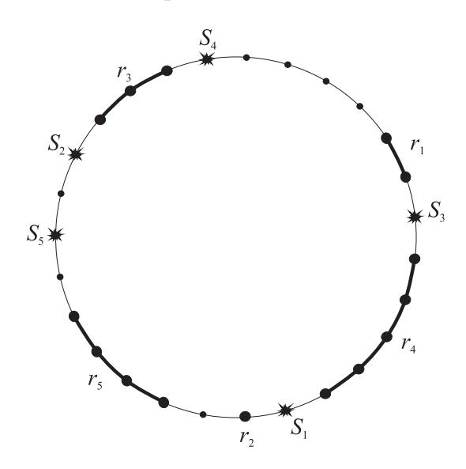

# The CTR mode with encrypted nonces and its extension to AE

#### Sergey Agievich

Research Institute for Applied Problems of Mathematics and Informatics Belarusian State University <agievich@{bsu.by,gmail.com}>

#### Abstract

In the modified CTR (CounTeR) mode known as CTR2, nonces are encrypted before constructing sequences of counters from them. This way we have only probabilistic guarantees for non-overlapping of the sequences. We show that these guarantees, and therefore the security guarantees of CTR2, are strong enough in two standard scenarios: random nonces and non-repeating nonces. We also show how to extend CTR2 to an authenticated encryption mode which we call CHE (Counter-Hash-Encrypt). To extend, we use one invocation of polynomial hashing and one additional block encryption.

# 1 Preliminaries

Let E be a block cipher with block size n and key space K. It is a multiset consisting of permutations EK ∈ Perm(n) which are indexed by secret keys K ∈ K. Here Perm(n) is the set of all permutations over {0, 1} n . Elements of {0, 1} n are called blocks. Let N = 2n denote their number.

We also denote by {0, 1} ∗ the set of all binary words of finite length. For a word u ∈ {0, 1} ∗ , let |u| denote its length. If u, v are words of the same length, then u⊕v is their bitwise modulo 2 sum (XOR). For a permutation π ∈ Perm(n), let π i be its ith compositional power (π 0 is the identity permutation). Denote by m[i] the ith factorial power of a positive integer m: m[i] = m(m − 1). . .(m − i + 1).

To extend the action of E from {0, 1} n to {0, 1} ∗ , encryption modes are used. One of the most popular is CTR. In this mode, a unique nonce S ∈ {0, 1} n is repeatedly transformed by a public permutation next. The resulting sequence

$$C_1 = S, \ C_2 = \mathtt{next}(C_1), \ C_3 = \mathtt{next}(C_2), \dots$$

is encrypted using EK ∈ E to get the blocks

$$\Gamma_1 = E_K(C_1), \ \Gamma_2 = E_K(C_2), \dots$$

To encrypt a plaintext X ∈ {0, 1} ∗ , the first d|X|/ne blocks are used. They are concatenated and then truncated to |X| bits. The resulting word Γ ∈ {0, 1} |X| is XORed with X to produce the ciphertext

$$Y = X \oplus \Gamma$$
.

In the Soviet standard GOST 28147 [\[7\]](#page-12-0), the word Γ is called a gamma. That is why the notation. The blocks C1, C2, . . . are usually called counters. That is why CTR (CounTeR).

Suppose that in two encryption sessions gammas Γ and Γ0 overlap. Then an adversary who has intercepted a plaintext-ciphertext pair (X, Y ) in one session can restore Γ = X ⊕ Y and then partially reconstruct X0 from Y 0 = X0⊕Γ 0 in the parallel session. Thereby, a gamma overlapping is considered a compromise of the CTR encryption.

To avoid overlapping, a permutation next is chosen to have long disjoint cycles in its cycle decomposition. The nonces S of different sessions are picked from different cycles or a new nonce continues the cycle (actually, the sequence of counters) from the previous session. This approach, implemented in the standards [\[6,](#page-12-1) [8,](#page-12-2) [9\]](#page-12-3), ensures that all counters in all sessions are unique. In other words, there are no collisions between counters and gamma overlapping is certainly impossible.

Unfortunately, such strict guarantees of no collisions / non-overlapping force the nonce management to be rather complicated. One has to use a safe monotonous timer to generate nonces or a rewritable memory to store them between sessions. Both options may be difficult to implement in certain cryptographic devices. The third option, random generation of nonces, does not match the approach, at least it is not allowed in the mentioned standards.

Another approach, probabilistic guarantees of gamma non-overlapping, was proposed in GOST 28147 and repeated in [\[15\]](#page-13-0), where a nonce S is first encrypted and then transformed by next:

$$C_1 = \text{next}(E_K(S)),$$

not C1 = S. (To be completely accurate, GOST's next is not a permutation: it acts bijectively on only a 2n/2 (2n/2 − 1)-element subset of {0, 1} n , n = 64.) The similar scheme

$$C_1 = E_K(S)$$

was considered later by P. Rogaway in [\[14\]](#page-13-1), where the corresponding encryption mode is called CTR2. We extend this name to the GOST case. It is natural because the main point there is nonce encryption, the optional invocation of next is not essential.

Nonce encryption has obvious drawbacks. First, it slightly decreases the overall effectiveness of the mode. Second, it throws C1 at an unpredictable point of next's cycle that may cause a collision with other counters.

On the other hand, the probability of collisions is controllably small under reasonable restrictions on the amount of data processed with a single key. We confirm this fact in Section [2](#page-2-0) in terms of a game called "Battleship on a circle".

A control over collisions allows us to prove the security of CTR2 in the CPA (Chosen Plaintext Attack) settings. This is done in Section [3.](#page-4-0) In a nutshell, we embed well-known or easily derived combinatorial estimates within the context of Provable Security. Surprisingly, despite the long history of CTR2, it seems that we provide the first explicit proof of its security. We examine two techniques for nonce generation: random nonces and non-repeating nonces. Note that we do not require that the nonce management deterministically ensures uniqueness of all counters in all sessions and thus allow it to be more flexible.

An additional argument in favor of nonce encryption is that it provides an easy extension of the conventional CTR encryption to authenticated encryption (AE). In Section [4,](#page-8-0) we show how to build such an extension using polynomial hashing and one additional invocation of EK. We call the resulting scheme CHE, meaning the Counter-Hash-Encrypt cascade. It is actually one of the two AE schemes briefly described in [\[1\]](#page-12-4). There the security of only authentication, not encryption, is considered. In this paper, we fill the gap. We also provide a detailed description of CHE.

Usually, in AE schemes based on polynomial hashing (perhaps the most famous of them is GCM [\[10\]](#page-12-5)), a data-driven polynomial is evaluated at a secret point which depends only on K. In some cases (including GCM), this point can be recovered with the subsequent compromise of all encryption sessions as soon as a nonce S is used twice. A distinctive feature of CHE is that the secret point depends on S. Due to this fact, a repetition of nonces in multiple encryption sessions compromises only these sessions without affecting others. Thus, CHE provides reasonable security guarantees against nonce-misusing. To the best of our knowledge, stronger guarantees, the so-called full nonce-misuse resistance where only completely identical sessions compromise each other, are only achieved through two passes over data what is difficult to maintain in many scenarios.

Further we assume that next is a full cycle or almost full cycle permutation. In other words, if M is the maximum cycle length of next, then M ≈ N. Usually, M = N which is achieved by interpreting blocks of {0, 1} n as integers modulo N and incrementing these integers in next. Another option for next is to interpret {0, 1} n as the binary field F of N elements. Let a be a primitive element of F and b be an arbitrary element. Then the permutation

$$\mathtt{next} \colon \lambda \mapsto a\lambda + b$$

decomposes into a cycle of length M = N − 1 and a loop at b/(1 − a). We use this next in Section [4.](#page-8-0)

Finally, it should be mentioned that encrypting a nonce S we make the counters C1, C2, . . . secret. An adversary is not able to reconstruct any input-output pair of EK even after intercepting all the session data (S, X, Y ). Blocking direct access to EK complicates attacks to recover K, especially statistical and algebraic attacks which usually strongly depend on the complexity of the simplest accessible cryptographic component.

# 2 Battleship on a circle

"Battleship on a circle" is played by Navy and an adversary. A game field is a circle on which M points numbered from 0 to M − 1 are placed. Navy deploys ships on the circle concealing their locations. A ship of displacement ri (a positive integer) occupies ri consecutive points. In total, q ships of overall displacement r (q ≤ r ≤ M) are deployed. The adversary makes q shots on the ships.

Detailed rules of the game (see Figure [1](#page-3-0) for example):

- 1. The adversary splits r into a sum r1 + r2 + . . . + rq of positive integers and reports r1, r2, . . . , rq to Navy.
- 2. Navy deploys ships at random points on the circle. The bow of the ith ship is placed at point Ci,1 and the whole ship occupies the segment Ci,1, Ci,1 + 1, . . . , Ci,1 + ri − 1 (additive operations are modulo M). Collisions of the ships, that is, intersections of their segments may occur. In the case of a collision, Navy loses and capitulates. Let the event D1 mean no collisions.
- 3. If Navy has not capitulated, then the adversary makes q shots at different points S1, . . . , Sq on the circle. If at least one shot hits a ship, then the adversary wins. If all the shots miss, which is captured by the event D2, then Navy wins.

Further we consider two variants of the game: G1 and G2.

In  $G_1$  the ship bows  $C_{i,1}$  are chosen uniformly at random independently of each other. The shot points  $S_i$  are also chosen uniformly at random with the only restriction that they must be different. In other words,  $(S_1, \ldots, S_q)$  is a random q-permutation of M numbers. There are  $M^{[q]}$  ways to choose it.

In  $G_2$  the bows also form a random q-permutation. Shot points are arbitrary distinct.

Let us immediately explain that the games  $G_1$  and  $G_2$  simulate attacks on CTR2 with random and non-repeating nonces respectively. Ships correspond to sequences of counters. The lengths of the sequences can be chosen by an adversary who needs only to keep the total length, that is, the total amount of plaintext-ciphertext data. A collision of ships trivially means a gamma overlapping. Shots are more subtle. A hit means that a nonce coincides with one of the internal counters. We will explain further details in the next section.

Figure 1: Battleship on a circle (Navy wins)

We are interested in the probability that Navy wins:  $\mathbf{P} \{ \mathcal{D}_1 \mathcal{D}_2 \} = \mathbf{P} \{ \mathcal{D}_2 \mid \mathcal{D}_1 \} \mathbf{P} \{ \mathcal{D}_1 \}.$ 

**Lemma 1.** In the games  $G_1$  and  $G_2$ ,

$$\mathbf{P} \{ \mathcal{D}_1 \mathcal{D}_2 \} \ge 1 - \frac{4qr - q^2 - 2r + q}{M}.$$

*Proof.* Let us start with  $G_1$ . Given  $(r_1, \ldots, r_q)$ , there are  $M^q$  ways to deploy the fleet and exactly  $M(q-1)!\binom{M-r+q-1}{q-1}$  of these deployments avoid collisions. Indeed, each such deployment can be unambiguously reproduced as follows:

- 1) put the bow of the first ship at any of M point on the circle;
- 2) permute remaining ships in one of (q-1)! ways;
- 3) choose q non-negative intervals between successive ships starting from the first one. The tuple of intervals is a weak q-composition of M-r and, therefore, can be chosen in  $\binom{M-r+q-1}{q-1}$  ways.

We repeat here the arguments of V. Nosov reported in [\[2\]](#page-12-6). The arguments yield:

$$\mathbf{P}\left\{\mathcal{D}_{1}\right\} = \frac{M(q-1)!\binom{M-r+q-1}{q-1}}{M^{q}} = \frac{(M-r+q-1)^{[q-1]}}{M^{q-1}} =$$

$$= \prod_{i=r-q+1}^{r-1} \left(1 - \frac{i}{M}\right) \ge 1 - \sum_{i=r-q+1}^{r-1} \frac{i}{M} = 1 - \frac{(2r-q)(q-1)}{2M}.$$

Let D¯ 2,i be the event that the shot Si is successful. We have

$$\mathbf{P}\left\{\bar{\mathfrak{D}}_{2,i}\mid \mathfrak{D}_1\right\} = \frac{r}{M}$$

and, therefore,

$$\mathbf{P}\left\{\mathcal{D}_{2} \mid \mathcal{D}_{1}\right\} = 1 - \mathbf{P}\left\{\bar{\mathcal{D}}_{2,1} \cup \ldots \cup \bar{\mathcal{D}}_{2,q} \mid \mathcal{D}_{1}\right\} \geq 1 - \sum_{i=1}^{q} \mathbf{P}\left\{\bar{\mathcal{D}}_{2,i} \mid \mathcal{D}_{1}\right\} = 1 - \frac{qr}{M}.$$

In result,

$$\mathbf{P} \{\mathcal{D}_1\} \, \mathbf{P} \{\mathcal{D}_2 \mid \mathcal{D}_1\} \ge \left(1 - \frac{(2r - q)(q - 1)}{2M}\right) \left(1 - \frac{qr}{M}\right) \ge 1 - \frac{4qr - q^2 - 2r + q}{2M},$$

which was to be proven.

When passing from G1 to G2, the probability P {D1} does not decrease and we can use the just derived bound on this probability. The bound on P {D2 | D1} also remains valid and we get the same resulting bound as for G1.

An interesting question is what is the best strategy for an adversary in G2. The partial answer is that with qr M the bound of Lemma [1](#page-3-1) is almost reached when the adversary chooses r1 = r − q + 1, r2 = . . . = rq = 1 and shoots the circle with step r1 starting from a random point. This tactic leads to the fact that to satisfy D1D2 the bow of the first ship must not occupy a continious segment of length r1q. The second ship must avoid r1 + q points, the third ship must avoid r1 + q + 1 points and so on. In result,

$$\mathbf{P}\left\{\mathcal{D}_{1}\mathcal{D}_{2}\right\} = \left(1 - \frac{r_{1}q}{M}\right)\prod_{i=1}^{q-1}\left(1 - \frac{r_{1}+q+i-1}{M-i}\right) \approx 1 - \frac{r_{1}q}{M} - \sum_{i=1}^{q-1}\frac{r_{1}+q+i-1}{M}.$$

The right part coincides with the bound of the lemma. Approximately the same probability will be achieved, if the adversary chooses r1 = . . . = rq−1 = br/qc and shoots again with step r1.

# 3 Security of CTR2

To approve the security of CTR2, we use the standard notions sketched below (see [\[13\]](#page-13-2) for further details and references).

1. An adversary (probabilistic algorithm) A gains access to an encryption oracle O. The adversary interacts with O using the following interface. It chooses a plaintext X ∈ {0, 1} ∗ and a nonce S ∈ {0, 1} n , sends the oracle the pair (X, S) and receives a ciphertext Y ∈ {0, 1} |X| . The adversary must use the interface following one of the two contracts: the nonces S are either chosen uniformly independently at random (the random nonces contract) or they are arbitrary distinct (the non-repeating nonces contract). Empty plaintexts are not allowed in both contracts.

- 2. The oracle O can be implemented in two ways. In the first (real) implementation, the oracle actually performs the CTR2 encryption using a permutation  $E_K$  chosen at random from E. This implementation is denoted by  $\text{CTR2}[E_K]$ . In the second (ideal) implementation, the oracle, given a new query (X, S), picks Y uniformly at random from  $\{0, 1\}^{|X|}$ . This implementation is denoted by  $\rho$ .
- 3. The adversary sends the oracle O arbitrary queries, receives and analyzes corresponding answers. Its task is to distinguish the real implementation from ideal. The adversary returns 1 (real) or 0 (ideal). Let  $A^O$  be the output of A.
- 4. The distinguishing capabilities of A are characterized by the advantage

$$\mathbf{Adv}^{\mathtt{ind-cpa}}_{\mathrm{CTR2}[E]}(A) = \left|\mathbf{P}\left\{A^{\mathrm{CTR2}[E_K]} = 1\right\} - \mathbf{P}\left\{A^{\rho} = 1\right\}\right|.$$

The probabilities here are over the random tapes of A and  $\rho$  and over the random choice of K. If  $\mathbf{Adv}^{\mathrm{ind-cpa}}_{\mathrm{CTR2}[E]}(A)$  is small, then the two implementations are hard to distingush, which means the security of CTR2 based on E relative to A. The used abbreviation ind-cpa covers the notion of indistinguishability and CPA settings: the adversary has access to the encryption oracle, but not the decryption one.

Let us make a standard simplification replacing  $E_K$ , a random representative of E, with  $\pi$ , a random representative of Perm(n). This replacement turns  $\mathbf{Adv}^{\mathtt{ind-cpa}}_{\mathtt{CTR2}[E]}(A)$  into the advantage

$$\mathbf{Adv}^{\mathtt{ind-cpa}}_{\mathrm{CTR2[Perm}(n)]}(A) = \left| \mathbf{P} \left\{ A^{\mathrm{CTR2}[\pi]} = 1 \right\} - \mathbf{P} \left\{ A^{\rho} = 1 \right\} \right|.$$

The replacement is motivated by the general assumption that permutations of a secure E are hard to distinguish from random ones. The replacement is accompanied by a penalty (another advantage) which characterizes indistinguishability between random representativies of E and Perm(n). This penalty is formal in nature (it is never estimated in practical cases), we do not specify it here for simplicity.

For given non-negative integers q and  $r, q \leq r$ , we are interested in estimating

$$\max_{A} \mathbf{Adv}^{\mathtt{ind-cpa}}_{\mathtt{CTR2}[\mathtt{Perm}(n)]}(A),$$

where the maximum is taken over all adversaries that make q queries to the oracle O and the total length of plaintexts X in these queries is equal to r. The length is specified in blocks, the last of which may be incomplete. Incomplete blocks of different plaintexts are counted separately.

The advantage of a reasonable A does not increase if some full block is cut to incomplete. Therefore, we may assume without loss of the maximum advantage that all plaintexts and ciphertexts consist of full blocks.

Let us write again how CTR2 works, that is, how plaintexts  $X_1, \ldots, X_q$  and nonces  $S_1, \ldots, S_q$  are transformed into ciphertexts

$$Y_i = \text{CTR2}[\pi](X_i, S_i), \quad i = 1, \dots, q.$$

Let  $X_i$  consist of blocks  $X_{i,1}, \ldots, X_{i,r_i}$ ,  $i = 1, \ldots, q$ , where  $r_i > 0$  and  $r_1 + \ldots + r_q = r$ . The corresponding blocks of the ciphertext  $Y_i$  are

$$Y_{i,j} = X_{i,j} \oplus \pi(C_{i,j}),$$

where

$$C_{i,1} = \mathtt{next}^c(\pi(S_i)), \quad C_{i,2} = \mathtt{next}(C_{i,1}), \quad \dots, \quad C_{i,r_i} = \mathtt{next}(C_{i,r_i-1}).$$

Here c is an integer parameter of the mode. It equals 0 (the original CTR2) or 1 (GOST). In this section, the choice of c is inessential. However, in the next section we use c = 1.

Lemma 2. Let N be a positive integer and q, r be non-negative integers such that q +r ≤ N. Then

$$\frac{1}{(N-q)^{[r]}} \ge \frac{1}{N^r} \left( 1 + \frac{r(2q+r-1)}{2N} \right).$$

Proof. Consider three fractions: 1/(N + 2q + r − 1), 1/(N − q − i) and 1/(N − q − r + 1 + i), 0 ≤ i ≤ r − 1. The sum of their denominators is 3N. Therefore, the product of the denominators does not exceed N3 , the product of the fractions is not less than 1/N3 , and

$$\frac{1}{N-q-i} \cdot \frac{1}{N-q-r+1+i} \ge \frac{N+2q+r-1}{N^3} = \frac{1}{N^2} \left( 1 + \frac{2q+r-1}{N} \right).$$

Hence,

$$\left(\frac{1}{(N-q)^{[r]}}\right)^2 = \prod_{i=0}^{r-1} \left(\frac{1}{N-q-i} \cdot \frac{1}{N-q-r+1+i}\right) \geq \frac{1}{N^{2r}} \left(1 + \frac{2q+r-1}{N}\right)^r,$$

from which the result follows.

Theorem 1. Let A, an adversary against the n-bit block CTR2, make at most q queries (X, S) with nonempty X and either random or non-repeating S. Let r be the total number of X's blocks in these queries. Let CTR2 be used with a permutation next whose largest cycle covers all blocks except possibly one. Then

$$\mathbf{Adv}^{\mathtt{ind-cpa}}_{\mathtt{CTR2[Perm}(n)]}(A) \leq \frac{r(r-1)}{2N} + \varepsilon,$$

where N = 2n and

$$\varepsilon = \max\left(0, \frac{2qr - r + 3q + 2}{2N} - \frac{(r - q)^2}{2N} + \frac{r(r + 2q - 1)(6qr - q^2 - 2r + 3q + 2)}{4N^2}\right)$$

.

Proof. The bound easily holds for q + r > N (in this case r > N/2). Further we assume that q + r ≤ N, so that Lemma [2](#page-6-0) can be applied. We also note that M, the maximum cycle length of next, is at least N − 1.

Consider arbitrary nonempty plaintexts X1, . . . , Xq, r full blocks in total, random or arbitrary non-repeating S1, . . . , Sq, and random π, Y1, . . . , Yq. When we say random, we mean that implied objects are chosen uniformly at random from prescribed domains, each object independently of others.

Let the event B means that all r blocks Γi,j = Xi,j ⊕ Yi,j are distinct. For the complementary event B¯ , it holds that

$$\mathbf{P}\left\{\bar{\mathcal{B}}\right\} \le \frac{r(r-1)}{2N}.$$

Let us introduce the probability

$$p = \mathbf{P} \{ \text{CTR2}[\pi](X_i, S_i) = Y_i : i = 1, \dots, q \mid \mathcal{B} \}$$

and apply Patarin's "coefficients H" technique (see [\[12\]](#page-13-3) and also [\[4,](#page-12-7) [5,](#page-12-8) [11\]](#page-12-9)). According to this technique, if the inequality p ≥ (1−ε)/Nr with some ε ≥ 0 holds, then the desired advantage is upper bounded by the sum P B¯ + ε. It remains to prove that ε from the statement of the theorem indeed satisfies the inequality.

Consider the following events, each new one provided that previous events occur.

The event C: all blocks π(Si) fall into the largest cycle of next. The probability pC = P {C | B} is obviously 1 if M = N. For M = N − 1 it equals either Mq/Nq in the case of random nonces or M[q]/N[q] in the case of non-repeating nonces. In both cases,

$$p_C \ge \frac{M}{N} \left( 1 - \frac{q}{N} \right).$$

Indeed,

$$\frac{M^q}{N^q} \geq \frac{M^{[q]}}{N^{[q]}} = \frac{M}{N} \cdot \frac{(M-1)^{[q-1]}}{(N-1)^{[q-1]}} = \frac{M}{N} \cdot \frac{M-q+1}{N-1} \geq \frac{M}{N} \cdot \frac{N-q}{N-1} \geq \frac{M}{N} \left(1 - \frac{q}{N}\right).$$

The event D: all counters Ci,j (they are all on the largest cycle according to C) differ from each other and from nonces Sk. The probability of this event is already estimated in Lemma [1](#page-3-1) of the previous section:

$$p_D = \mathbf{P} \{ \mathcal{D} \mid \mathcal{BC} \} \ge 1 - \frac{4qr - q^2 - 2r + q}{2M}.$$

We indeed satisfy the rules of the game described there, if we imagine that the initial counters Ci,1 are placed on the cycle randomly and after that, in the case of no collisions, the random permutation π either "generates" random distinct Si = π −1 (next−c (Ci,1)) or implicitly transfers the given distinct Si into next−c (Ci,1). It may be that some Si lies outside the cycle. In this case, the probability pD only increases with respect to the probability treated in Lemma [1](#page-3-1) and the bound of the lemma remains valid.

Consider the probability pCD = P {CD | B} = pCpD. Dealing with the case M = N − 1, we get

$$p_{CD} \ge \left(1 - \frac{q}{N}\right) \left(\frac{M}{N} - \frac{4qr - q^2 - 2r + q}{2N}\right) \ge 1 - \frac{4qr - q^2 - 2r + 3q + 2}{2N}.$$

Obviously, this bound also holds for M = N.

The event E: no collisions Γi,j = π(Sk) occur. There are qr possible collisions, each occurs with probability 1/N and, therefore,

$$p_E = \mathbf{P}\left\{\mathcal{E} \mid \mathfrak{BCD}\right\} \ge 1 - \frac{qr}{N}.$$

The event F: π maps Ci,j to Γi,j . The previous events means that all Γi,j are distinct, all Ci,j are distinct, all Si are distinct, Ci,j differ from Sk, q images of π at points Sk are already known and they differ from Γi,j . So there are (N − q)! ways to determine remaining images of π and exactly (N − q − r)! of them are in favor of F. Therefore,

$$p_F = \mathbf{P}\left\{\mathcal{F} \mid \mathcal{BCDE}\right\} = \frac{1}{(N-q)^{[r]}} \ge \frac{1}{N^r} \left(1 + \frac{r(r+2q-1)}{2N}\right).$$

Here we use Lemma [2.](#page-6-0)

In result,

$$\begin{split} p &\geq \mathbf{P} \left\{ \mathfrak{CDEF} \mid \mathcal{B} \right\} = p_{CD}p_{E}p_{F} \\ &\geq \frac{1}{N^{r}} \left( 1 - \frac{4qr - q^{2} - 2r + 3q + 2}{2N} \right) \left( 1 - \frac{qr}{N} \right) \left( 1 + \frac{r(r + 2q - 1)}{2N} \right) \\ &\geq \frac{1}{N^{r}} \left( 1 - \frac{6qr - q^{2} - 2r + 3q + 2}{2N} \right) \left( 1 + \frac{r(r + 2q - 1)}{2N} \right) \end{split}$$

from which the expression for  $\varepsilon$  follows.

It is easy to verify that  $\varepsilon$  increases as a function of q for  $q \le r$ . Replacing q with r in  $\varepsilon$ , we obtain the following bound, uniform in q:

$$\mathbf{Adv}^{\mathtt{ind-cpa}}_{\mathtt{CTR2[Perm}(n)]}(A) \leq \frac{3r^2 + r + 2}{2N} + \frac{r(3r - 1)(5r^2 + r + 2)}{4N^2}.$$

For comparison, a similar advantage for the CTR mode is upper bounded by  $r^2/(2N)$  (see [13]). Informally, in the region  $r^2 \ll N$ , which is used in practice, the transition from CTR to CTR2 is accompanied by a penalty, the main contribution to which is made by the term  $r^2/N$ .

In the just considered case q=r, the average length  $\mu$  of plaintexts in blocks equals 1. This case is the most inefficient, it requires 2 invocations of block encryption per block of processed data. If we increase  $\mu$ , we will not only speed up encryption but also improve our bound on advantage in terms of r. For example, with  $\mu=2$  the main term in the bound is  $7r^2/(8N)$  and with  $\mu=3$  it is  $11r^2/(18N)$ . The main term takes the form  $r^2/(2N)$ , that is, we achieve the CTR bound as soon as  $\mu$  becomes larger than  $2+\sqrt{3}\approx 3.73$ .

# 4 CHE and its security

In this section, we extend CTR2 to the authentication encryption mode called CHE (Counter+Hash+Encrypt). The extended functionality of CHE is data authentication. CHE follows the Encrypt-then-MAC paradigm (first encrypt, then authenticate) which seems to be better than the MAC-then-Encrypt alternative (see [3]). Not only encrypted data is authenticated, but also associated data that is transmitted in the plain form. Thus, CHE belongs to the AEAD (Authenticated Encryption with Associated Data) class of the AE schemes.

Let us interpret blocks of  $\{0,1\}^n$  as elements of the finite field  $\mathbb{F}$  of order N. Suppose that the usual correspondence between  $\mathbb{F}$  and  $\{0,1\}^n$  is used, when the addition in  $\mathbb{F}$  is  $\oplus$ . Let

$$\mathtt{next}(\lambda) = a * \lambda \oplus b,$$

where a is a primitive element of  $\mathbb{F}$ , b is a nonzero element. Hereinafter we make the multiplication sign explicit. As we have already noted, the maximum cycle length of **next** is N-1. Moreover, the powers  $\mathtt{next}^i$ ,  $i=1,2,\ldots,N-2$ , considered as polynomials over  $\mathbb{F}$  all have nonzero constant terms.

The CHE mode is determined by the algorithms WRAP (encrypt and generate the authentication tag) and UNWRAP (verify the tag and decrypt) defined in Figure 2. The inputs and outputs of the algorithms are: a plaintext  $X \in \{0,1\}^*$ , associated data  $I \in \{0,1\}^*$ , a key  $K \in \mathcal{K}$ , a nonce  $S \in \{0,1\}^n$ , a ciphertext  $Y \in \{0,1\}^{|X|}$ , an authentication tag  $T \in \{0,1\}^n$ .

An arbitrary nonzero T0 ∈ {0, 1} n is used. The operation n← means splitting a binary word into n-bit blocks preceded by padding to the block size. The reverse operation ←m means assembling a word from several blocks followed by truncation to m bits.

| Wrap                                       | Unwrap                                                              |  |
|--------------------------------------------|---------------------------------------------------------------------|--|
| Algorithm                                  | Algorithm                                                           |  |
| Input: X, I, K, S.             | Input: Y , I, K, S, T.                            |  |
| Output: Y , T.                    | Output: X or ⊥ (authentication error).                  |  |
| Steps:                                     | Steps:                                                              |  |
| 1.                                         | 0 ←                                                                 |  |
| H                                          | 1.                                                                  |  |
| ←                                          | H                                                                   |  |
| EK(S),                                     | ←                                                                   |  |
| C                                          | EK(S),                                                              |  |
| ←                                          | C                                                                   |  |
| H,                                         | ←                                                                   |  |
| T                                          | H,                                                                  |  |
| ←                                          | T                                                                   |  |
| T0.                                        | T0.                                                                 |  |
| n←                                         | n←                                                                  |  |
| 2.                                         | 2.                                                                  |  |
| (I1, , Ir                                  | (I1, , Ir                                                           |  |
| 0)                                         | 0)                                                                  |  |
| I.                                         | I.                                                                  |  |
| 2, , r0                                    | 2, , r0                                                             |  |
| 3.                                         | 3.                                                                  |  |
| For                                        | For                                                                 |  |
| i                                          | i                                                                   |  |
| = 1,                                       | = 1,                                                                |  |
| :                                          | :                                                                   |  |
| (a)                                        | 0 ←                                                                 |  |
| T                                          | 0 ⊕                                                                 |  |
| ←                                          | (a)                                                                 |  |
| (T                                         | T                                                                   |  |
| ⊕                                          | (T                                                                  |  |
| Ii)                                        | Ii)                                                                 |  |
| ∗                                          | ∗                                                                   |  |
| H.                                         | H.                                                                  |  |
| n← 4. (X1, , Xr) X.               | n← 4. (Y1, , Yr) Y                                         |  |
| 5.                                         | 5.                                                                  |  |
| For                                        | For                                                                 |  |
| i                                          | i                                                                   |  |
| = 1,                                       | = 1,                                                                |  |
| 2, , r:                                    | 2, , r:                                                             |  |
| ← (a) C next(C);                  | 0 ← 0 ⊕ ∗ (a) T (T Yi) H;                      |  |
| (b) Yi ← Xi ⊕ EK(C);        | (b) C ← next(C);                                           |  |
| (c) T ← (T ⊕ Yi) ∗ H. | (c) Xi ← Yi ⊕ EK(C).                                 |  |
| ←                                          | ←                                                                   |  |
| 6.                                         | 6.                                                                  |  |
| Y                                          | X                                                                   |  |
| (Y1, , Yr).                                | (X1, , Xr).                                                         |  |
| X                                          | Y                                                                   |  |
| n                                          | n                                                                   |  |
| I                                          | I                                                                   |  |
| X                                          | X                                                                   |  |
| ∈ {0,                                      | ∈ {0,                                                               |  |
| 1}                                         | 1}                                                                  |  |
| 7.                                         | 7.                                                                  |  |
| Encode                                     | Encode                                                              |  |
| and                                        | and                                                                 |  |
| by                                         | by                                                                  |  |
| W                                          | W                                                                   |  |
|                                            |                                                                     |  |
| 8.                                         | 0 ←                                                                 |  |
| T                                          | 0 ⊕                                                                 |  |
| ←                                          | 8.                                                                  |  |
| (T                                         | T                                                                   |  |
| ⊕                                          | (T                                                                  |  |
| W)                                         | W)                                                                  |  |
| ∗                                          | ∗                                                                   |  |
| H.                                         | H.                                                                  |  |
| 9. T ← EK(T).                     | 0 ← 0 9. T EK(T ).                                   |  |
| 10. Return (Y, T).                      | 0 and ⊥ 10. Return X if T = T otherwise. |  |

Figure 2: The CHE mode (next(C) = a ∗ C ⊕ b)

It is assumed that in Step 7 of both algorithms, different pairs (|I|, |X|) give different words W, and W is zero if and only if |I| = |X| = 0.

The algorithm Wrap can be explained in the following way.

- C. First, the CTR2 encryption is performed: Y ← CTR2[EK](X, S). The encrypted nonce H = EK(S) is used to build internal counters nexti (H), i = 1, 2, . . ..
- H. Second, a polynomial f(Y,I)(λ) ∈ F[λ] is implicitly constructed from the pair (Y, I). This polynomial has a positive degree, its constant term equals 0, different pairs give different polynomials. The polynomial is evaluated at the point H, the result Z = f(Y,I)(H) becomes a hash value of (Y, I).
- E. Third, the hash value Z is encrypted and returned as T along with Y .

Suppose that deg f(Y,I) ≤ d. In other words, at most d−1 blocks of I and Y are processed during a single invocation of polynomial hashing. Suppose further that d < N − 1. The restrictions on structure and degree of the polynomials f(Y,I) and the form of next lead to the following estimates (see [\[1\]](#page-12-4) for details):

$$\begin{split} \mathbf{P} \left\{ f_{(Y,I)}(H) &= f_{(Y',I')}(H') \right\} \\ \mathbf{P} \left\{ f_{(Y,I)}(H) &= f_{(Y',I')}(H') \mid H \neq H' \right\} \\ \mathbf{P} \left\{ f_{(Y,I)}(H) &= h \right\} \\ \mathbf{P} \left\{ f_{(Y,I)}(H) &= \mathrm{next}^i(H) \right\} \\ \mathbf{P} \left\{ f_{(Y,I)}(H) &= \mathrm{next}^i(H') \mid H \neq H' \right\} \end{split} \right\} \leq \frac{d}{N}.$$

Here 1 ≤ i ≤ d, h is a fixed element of F, the probabilities are taken over independent random H, H0 ∈ F. These estimates form the basis for justifying the security of CHE.

Dealing with the security, we keep the model introduced in the previous section. An adversary interacts with an oracle O: (X, I, S) 7→ (Y, T) which either implements the Wrap algorithm with a randomly chosen K (the real implementation, CHE[EK]) or generates Y ∈ {0, 1} |X| and T ∈ {0, 1} n at random for each new query (the ideal implementation, ρ). The adversary again follows one of the two contracts: random nonces or non-repeating nonces. Each of the words X and I can be empty.

An advantage of the adversary is defined in the standard way. We only change the abbreviation ind-cpa to priv (privacy). This corresponds to the tradition when moving from conventional encryption to AEAD.

We again idealize E and replace its representative EK with a permutation π chosen uniformly at random from Perm(n).

Theorem 2. Let A, an adversary against the n-bit block CHE, make at most q queries (X, I, S) with either random or non-repeating S. Let r be the total number of X's blocks in these queries. Let the total number of blocks in each pair (X, I) be less then d. Then

$$\mathbf{Adv}^{\mathtt{priv}}_{\mathtt{CHE}[\mathtt{Perm}(n)]}(A) \leq \frac{(r+q)(r+q-1)}{2N} + \alpha - \beta + \alpha\beta,$$

where N = 2n and

$$\alpha = \frac{1}{2N} \Big( (2d+6)qr + (3d+5)q^2 - 2r - (d-3)q + 2 \Big), \quad \beta = \frac{1}{2N} (r+q)(r+3q-1).$$

Proof. We adapt the proof of Theorem [1](#page-6-1) preserving notations and following the general line. Additional notations: Ii — associated data in the ith query, Ti — a tag in the ith answer, Hi = π(Si), Zi = f(Yi,Ii)(Hi). Recall that we allow plaintexts Xi to be empty. Let q1 be the total number of queries with nonempty plaintexts.

If d ≥ N − 1 or r + 2q > N, then the bound of the theorem is easily satisfied. Further we assume that d < N − 1 and r + 2q ≤ N.

We preserve the probabilistic model of Theorem [1](#page-6-1) assuming additionally that Ti are chosen uniformly independently at random. Now the event B additionally means that Ti are distinct and different from Γj,k. We have

$$\mathbf{P}\left\{\bar{\mathcal{B}}\right\} \leq \frac{(r+q)(r+q-1)}{2N}.$$

For the probability

$$p = \mathbf{P} \{ \text{CHE}[\pi](X_i, I_i, S_i) = (Y_i, T_i) : i = 1, ..., q \mid \mathcal{B} \},$$

it is necessary to construct the inequality p ≥ (1 − ε)/Nr+q with ε = α − β + αβ. To do this, we deal again with the events C, D, E and F.

The semantics of  $\mathcal{C}$  and  $\mathcal{D}$  are not changed. We require that the sequences of counters lie on the largest cycle of next, that the sequences do not intersect (hence the corresponding nonces do not collide), and that the sequences do not cover nonces. We treat  $q_1$  sequences and nonces that correspond to nonempty plaintexts and have

$$p_{CD} \ge 1 - \frac{4q_1r - q_1^2 - 2r + 3q_1 + 2}{2N}.$$

In  $\mathcal E$  we block the following collisions:

| collisions           | quantity | probability |
|----------------------|----------|-------------|
| $Z_i = Z_j$          | q(q-1)/2 | $\leq d/N$  |
| $Z_i = S_j$          | $q^2$    | $\leq d/N$  |
| $Z_i = C_{j,k}$      | qr       | $\leq d/N$  |
| $H_i = \Gamma_{j,k}$ | qr       | 1/N         |
| $H_i = T_j$          | $q^2$    | 1/N         |

In addition, we require that  $q - q_1$  nonces  $S_i$  that correspond to empty plaintexts are pairwise distinct and differ from each of the remaining  $q_1$  nonces and each of the counters. Thus, we block  $(q - q_1)(q - q_1 - 1)/2 + (q - q_1)q_1$  collisions of the form  $S_i = S_j$  (note that they are automatically blocked if nonces are not repeated) and  $(q - q_1)r$  collisions of the form  $S_i = C_{j,k}$ . Collisions occur with probabilities  $\leq 1/N$ .

With this,

$$p_E \ge 1 - \frac{(2d+2)qr + (3d+2)q^2 - dq + 2(q-q_1)r + (q-q_1)(q-q_1-1) + 2(q-q_1)q_1}{2N}$$

and  $p_{CD}p_E \geq 1 - \alpha_0$ , where

$$\alpha_0 = \frac{1}{2N} \left( (2d+4)qr + (3d+3)q^2 - 2r - (d+1)q + (2r+4)q_1 - 2q_1^2 + 2 \right).$$

The quantity  $\alpha_0$  as a function of  $q_1 \in [0, q]$  attains its maximum at either  $q_1 = r/2 + 1$  or  $q_1 = q$ . The maximum is

$$\frac{1}{2N} \begin{cases} (2d+4)qr + (3d+3)q^2 - 2r - (d+1)q + 2 + 2(r/2+1)^2, & r/2+1 \le q, \\ (2d+6)qr + (3d+1)q^2 - 2r - (d-3)q + 2, & r/2+1 > q. \end{cases}$$

In either case, the maximum is not greater than  $\alpha$ .

In  $\mathcal{F}$  we require that  $\pi$  not only maps  $C_{i,j}$  to  $\Gamma_{i,j}$ , but also maps  $Z_i$  to  $T_i$ . The previous events mean that all preimages here are pairwise distinct, all images are pairwise distinct, q images of  $\pi$  at points  $S_i$  that differ from  $C_{j,k}$  and  $Z_j$  are already known and these images differ from  $\Gamma_{j,k}$  and  $T_j$ . The total number of preimages is r+q. Therefore,

$$p_F \ge \frac{1}{(N-q)^{[r+q]}} \ge \frac{1}{N^{r+q}} (1+\beta).$$

In result,

$$p \ge p_{CD}p_E p_F \ge \frac{1}{N^{r+q}} (1 - \alpha + \beta - \alpha \beta),$$

which was to be proven.

From the perspective of the theorem, to provide security guarantees, CHE must be used with r and dq much smaller than √ N. With such quotas the main contribution to the bound on the adversary's advantage is made by the terms

$$\frac{1}{2N} ((2d+4)qr + (3d+3)q^2).$$

Acknowledgements. The author thanks the anonymous referees of CTCRYPT 2019 and MVK for their valuable feedback.

#### References

- [1] S. Agievich. EHE: nonce misuse-resistant message authentication. Prikl. Discr. Mat. 39 (2018), pp. 33–41. url: <https://eprint.iacr.org/2017/231>.
- [2] A. V. Babash and G. P. Shankin. Cryptography. Russian. In Russian. Moscow: Solon-Press, 2007.
- [3] M. Bellare and C. Namprempre. Authenticated encryption: Relations among notions and analysis of the generic composition paradigm. J. of Cryptology 21 (4) (2008), pp. 469–491.
- [4] D. Bernstein. A short proof of the unpredictability of cipher block chaining. 2005. url: <http://cr.yp.to/papers.html#easycbc>.
- [5] S. Chen and J. Steinberger. Tight security bounds for key-alternating ciphers. In: Advances in Cryptology — EUROCRYPT 2014. Ed. by P. Q. Nguyen and E. Oswald. Vol. 8441. Lecture Notes in Computer Science. Berlin, Heidelberg: Springer, 2014, pp. 327–350.
- [6] M. Dworkin. Recommendation for Block Cipher Modes of Operation: Galois-Counter Mode (GCM) for Confidentiality and Authentication. NIST Special Publication 800- 38A. National Institute of Standards and Technology (NIST) of the U.S., 2001. url: [http://nvlpubs.nist.gov/nistpubs/Legacy/SP/nistspecialpublication800-](http://nvlpubs.nist.gov/nistpubs/Legacy/SP/nistspecialpublication800-38a.pdf) [38a.pdf](http://nvlpubs.nist.gov/nistpubs/Legacy/SP/nistspecialpublication800-38a.pdf).
- [7] GOST 28147-89. Cryptographic Protection for Information Processing Systems. Russian. Government Standard of the USSR. In Russian. Moscow: Government Committee of the USSR for Standards, 1989.
- [8] GOST 34.13-2015. Information technology. Cryptographic data security. Block ciphers operation modes. Russian. Government Standard of the Russian Federation. In Russian. Moscow: Standardinform, 2015.
- [9] ISO/IEC 10116:2006. Information technology — Security techniques — Modes of operation of an n-bit cipher. International Standard. Third edition. 2006.
- [10] D. A. McGrew and J. Viega. The security and performance of the Galois/Counter Mode (GCM) of operation. In: Progress in Cryptology – INDOCRYPT 2004. Ed. by A. Canteaut and K. Viswanathan. Vol. 3348. Lecture Notes in Computer Science. Berlin, Heidelberg: Springer, 2005, pp. 343–355.
- [11] M. Nandi. Improved security analysis for OMAC as a pseudorandom function. J. Math. Cryptol. 3 (2009), pp. 133–148.

- [12] J. Patarin. Etude des G`en`erateurs de Permutations Bas`es sur le Sch'ema du D.E.S. French. Phd Th`esis de Doctorat. de l'Universit`e de Paris 6, 1991.
- [13] P. Rogaway. Evaluation of Some Blockcipher Modes of Operation. Evaluation carried out for the Cryptography Research and Evaluation Committees (CRYPTREC) for the Government of Japan. University of California, Davis, 2011. url: [http://www.cs.](http://www.cs.ucdavis.edu/~rogaway/papers/modes.pdf) [ucdavis.edu/~rogaway/papers/modes.pdf](http://www.cs.ucdavis.edu/~rogaway/papers/modes.pdf).
- [14] P. Rogaway. Nonce-based symmetric encryption. In: Fast Software Encryption — FSE 2004. Ed. by B. Roy and W. Meier. Vol. 3017. Lecture Notes in Computer Science. Berlin, Heidelberg: Springer, 2004, pp. 348–358.
- [15] STB 34.101.31-2011. Information Technology and Security. Data Encryption and Integrity Algorithms. Russian. Standard of Belarus. In Russian. Minsk: Gosstandard of Belarus, 2011. url: <http://apmi.bsu.by/assets/files/std/belt-spec27.pdf>.

# A Appendix

#### A.1 CTR2 with M = N

Theorem 3. Let A, an adversary against the n-bit block CTR2, make at most q queries (X, S) with nonempty X and either random or non-repeating S. Let r be the total number of X's blocks in these queries. Let CTR2 be used with a full cycle permutation next. Then

$$\mathbf{Adv}^{\mathtt{ind-cpa}}_{\mathtt{CTR2[Perm}(n)]}(A) \leq \frac{r(r-1)}{2N} + \varepsilon,$$

where N = 2n and

$$\varepsilon = \max\left(0, \frac{2qr - r + q}{2N} - \frac{(r - q)^2}{2N} + \frac{r(r + 2q - 1)(6qr - q^2 - 2r + q)}{4N^2}\right).$$

Proof. We slightly modify the proof of Theorem [1.](#page-6-1) Since M = N, pC = 1 and

$$p_{CD} = p_D \ge 1 - \frac{4qr - q^2 - 2r + q}{2N}.$$

The bounds on the probabilities pE, pF remain the same and

$$\begin{split} p &\geq \mathbf{P} \left\{ \mathcal{CDEF} \mid \mathcal{B} \right\} = p_{CD}p_{E}p_{F} \\ &\geq \frac{1}{N^{r}} \left( 1 - \frac{4qr - q^{2} - 2r + q}{2N} \right) \left( 1 - \frac{qr}{N} \right) \left( 1 + \frac{r(r + 2q - 1)}{2N} \right) \\ &\geq \frac{1}{N^{r}} \left( 1 - \frac{6qr - q^{2} - 2r + q}{2N} \right) \left( 1 + \frac{r(r + 2q - 1)}{2N} \right), \end{split}$$

from which the result follows.

The uniform bound (independent of q):

$$\mathbf{Adv}^{\text{ind-cpa}}_{\text{CTR2[Perm}(n)]}(A) \le \frac{r(3r-1)}{2N} + \frac{r^2(3r-1)(5r-1)}{4N^2}.$$

#### A.2 The DWP mode

When designing CHE, we chose next in such way that if C = H is taken at random, then the collision

$$f_{(Y,I)}(H) = \mathtt{next}^i(C)$$

occurs with a controllably small probability. We used the fact that f(Y,I)(λ) is a polynomial with zero constant term, nexti (λ) is a polynomial with nonzero constant term, the degrees of both polynomials do not exceed d and, therefore, the probability of the collision does not exceed d/N.

In CHE, the permutation next uses arithmetic in F although in conventional CTR/CTR2 modes next usually uses integer arithmetic incrementing an n-bit counter as an integer modulo 2n . For this incrementing permutation, nexti is again described by a polynomial but now we cannot control its degree and, therefore, the probability of the collision.

To establish the control, we can change the CHE scheme breaking the equality C = H. For example, we can calculate f(Y,I) at the point H = E 2 K(S) and nexti at the point C = EK(S). Idealizing E, that is, replacing EK with a random permutation π from Perm(n), we get

$$\mathbf{P}\left\{ f_{(Y,I)}(H) = \mathtt{next}^i(C) \right\} = \mathbf{P}\left\{ f_{(Y,I)}(H) = \mathtt{next}^i(\pi^{-1}(H)) \right\} = \frac{1}{N}.$$

The described approach was implemented in the DWP mode (from DataWraP) standardized in [\[15\]](#page-13-0) along with the block cipher Belt. The DWP mode is defined in Figure [3.](#page-14-0)

| Wrap                                                             | Unwrap                                                              |
|------------------------------------------------------------------|---------------------------------------------------------------------|
| Algorithm                                                        | Algorithm                                                           |
| Input: X, I, K, S.                                   | Input: Y , I, K, S, T.                            |
| Output: Y , T.                                          | ⊥ Output: X or (authentication error).                  |
| Steps:                                                           | Steps:                                                              |
| 1. C ← EK(S), H ← EK(C), T ← T0.      | 0 ← 1. C ← EK(S), H ← EK(C), T T0.       |
| n← 2. (I1, , Ir 0) I.                                | n← 2. (I1, , Ir 0) I.                                   |
| 2, , r0 3. For i = 1, :                           | 2, , r0 3. For i = 1, :                              |
| (a) T ← (T ⊕ Ii) ∗ H.                       | 0 ← 0 ⊕ (a) T (T Ii) ∗ H.                      |
| n← 4. (X1, , Xr) X.                                     | n← 4. (Y1, , Yr) Y                                         |
| 5. For i = 1, 2, , r:                                | 5. For i = 1, 2, , r:                                   |
| (a) C ← next(C);                                        | 0 ← 0 ⊕ (a) T (T Yi) ∗ H;                      |
| ← ⊕ (b) Yi Xi EK(C);                              | ← (b) C next(C);                                           |
| (c) T ← (T ⊕ Yi) ∗ H.                       | (c) Xi ← Yi ⊕ EK(C).                                 |
| ← 6. Y (Y1, , Yr).  X                                | ← 6. X (X1, , Xr).  Y                                   |
| n  I   X  ∈ {0, 1} 7. Encode and by W | n  I   X  ∈ {0, 1} 7. Encode and by W    |
| ← ⊕ ∗ 8. T (T W) H.                         | 0 ← 0 ⊕ ∗ 8. T (T W) H.                        |
| 9. T ← EK(T).                                           | 0 ← 0 9. T EK(T ).                                   |
| 10. Return (Y, T).                                            | 0 and 10. Return X if T = T ⊥ otherwise. |

Figure 3: The DWP mode (next is full-cycle)

We see that DWP differs from CHE only in Step 1 of the Wrap and Unwrap algorithms. In DWP this step is heavier because it uses two invocations of EK instead of one in CHE. Thus, DWP is less effective than CHE. On the other hand, DWP can be used with the standard incrementing permutation next that simplify integration with common CTR/CTR2 instantiations.

The next theorem captures the security of DWP.

Theorem 4. Let A, an adversary against the n-bit block DWP, make at most q queries (X, I, S) with either random or non-repeating S. Let r be the total number of X's blocks in these queries. Let the total number of blocks in each pair (X, I) be less then d. Then

$$\mathbf{Adv}^{\mathtt{priv}}_{\mathrm{DWP}[\mathrm{Perm}(n)]}(A) \leq \frac{(r+q)(r+q-1)}{2N} + \alpha - \beta + \alpha\beta,$$

where N = 2n and

$$\alpha = \frac{1}{2N} \Big( (2d+8)qr + (5d+7)q^2 - 2r - (d+1)q \Big), \quad \beta = \frac{1}{2N} (r+q)(r+5q-1).$$

Proof. We modify the proof of Theorem [2.](#page-10-0) We denote Ci = π(Si) and keep the previous notations with the only difference that Hi = π(Ci) = π 2 (Si), not Hi = π(Si). We assume that d < N − 1 and r + 3q ≤ N. Otherwise, the theorem is easily satisfied.

Since next is full-cycle, pC = 1. In D we additionally block the collisions Ci = Sj and Ci = Ci,k. We repeat the arguments of Theorem [1](#page-6-1) considering Ci the prefix of the sequence Ci,1, Ci,2, . . .. The total length of sequences increases from r to r + q1. As a result,

$$p_{CD} \ge 1 - \frac{4q_1(r+q_1) - q_1^2 - 2(r+q_1) + q_1}{2N} = 1 - \frac{4q_1r + 3q_1^2 - 2r - q_1}{2N}.$$

In E we additionally block the following collisions:

| collisions    | quantity | probability |
|---------------|----------|-------------|
| Zi = Cj | 2 q   | ≤ d/N    |
| Ci = Γj,k  | qr       | 1/N         |
| Ci = Tj | 2 q   | 1/N         |

With this,

$$p_E \ge 1 - \frac{(2d+4)qr + (5d+4)q^2 - dq + 2(q-q_1)r + (q-q_1)(q-q_1-1) + 2(q-q_1)q_1}{2N}$$

and pCDpE ≥ 1 − α0, where

$$\alpha_0 = \frac{1}{2N} \left( (2d+6)qr + (5d+5)q^2 - 2r - (d+1)q + 2q_1(q_1+r) \right).$$

The quantity α0 as a function of q1 ∈ [0, q] attains its maximum at q1 = q. This maximum is α.

The previous events mean that all preimages here are pairwise distinct, all images are pairwise distinct, 2q images of π at points Si and Ci that differ from Cj,k and Zj are already known and these images differ from Γj,k and Tj . The total number of preimages is r + q. Therefore,

$$p_F \ge \frac{1}{(N-2q)^{[r+q]}} \ge \frac{1}{N^{r+q}} (1+\beta), \quad \beta = \frac{1}{2N} (r+q)(r+5q-1),$$

from which the result follows.

If r and dq are much smaller than √ N, then the main contribution to the bound on the adversary's advantage is made by the terms

$$\frac{1}{2N} ((2d+4)qr + (5d+3)q^2).$$

#### A.3 Issuing intermediate tags

In the CHE and DWP modes, the authenticity of (X, I) is verified at the very end of processing (Y, T) = Wrap(X, I, K, S). This situation may be unacceptable when it comes to processing large data, for example, video streams.

A possible solution here is to use intermediate authentication tags. They are calculated during the execution of Wrap as parts of X are processed. More precisely, if X0 is a prefix of X, then the corresponding intermediate ciphertext and tag are (Y 0 , T0 ) = Wrap(X0 , I, K, S). The pair (Y 0 , T0 ) is verified using the algorithm Unwrap. If the verification succeeds, X0 is determined. This part of X can be used immediately (for example, be displayed in the case of video) without waiting for all data to be received. After determining X0 , the next intermediate tag T 00 is verified, the next prefix X00 extending X0 is determined, and so on until we obtain the entire X or detect a violation of authenticity.

When allowing intermediate tags, the security model introduced in Section [4](#page-8-0) has to be corrected. Now the adversary, in addition to regular queries (X, I, S), can make embedded queries (X0 , I, S) in which X0 is a prefix of X. Another query can be embedded in (X0 , I, S) or (X0 , I, S) can be embedded in a query (X00, I, S) in turn embedded in (X, I, S).

The oracle's ideal implementation ρ is tuned to account for embedded queries: If the answer (Y 0 , T0 ) = ρ(X0 , I, S) is given before the answer (Y, T) = ρ(X, I, S), then Y 0 , T 0 , T are chosen at random and Y extends Y 0 with random bits; otherwise, if the answer (Y, T) comes first, then Y , T, T 0 are chosen at random and Y 0 is a truncation of Y .

The oracle recognizes embeddings and does not perform unnecessary calculations by reusing the results of processing one query while processing another. In particular, embedded queries do not increase r, the total number of X's blocks, that appears in Theorems [2](#page-10-0) and [4.](#page-15-0) However, embedded queries are accounted in q, the total number of queries.

Theorem 5. The bounds of Theorems [2](#page-10-0) and [4](#page-15-0) remain valid if the adversary along with regular queries (X, I, S) makes embedded queries (X0 , I, S) with issuing intermediate tags T 0 .

Proof. The proofs of the theorems are slightly corrected.

In the context of the proofs, an embedded query (X0 , I, S) can be interpreted as a query with the empty plaintext. Indeed, X0 can be encrypted indirectly: the resulting ciphertext Y 0 is the prefix of the ciphertext Y from the regular query (X, I, S). However, the intermediate tag T 0 needs to be calculated explicitly. The tag is defined as T 0 = π(Z 0 ), where Z 0 is the result of polynomial hashing:

$$Z' = f_{(Y',I)}(H).$$

Here H = π(S) (in the CHE mode) or H = π 2 (S) (in DWP). If Y 00 is another prefix of Y and Z 00 = f(Y 00,I)(H), then

$$\mathbf{P}\left\{Z' = Z''\right\} = \mathbf{P}\left\{ (f_{(Y',I)} - f_{(Y'',I)})(H) \right\} \le \frac{d}{N}.$$

Therefore, the upper bound on the probability of collisions Zi = Zj is preserved. The bounds on the probabilities of all other collisions, of all events, and, therefore, the desired bounds on the advantages are preserved too.