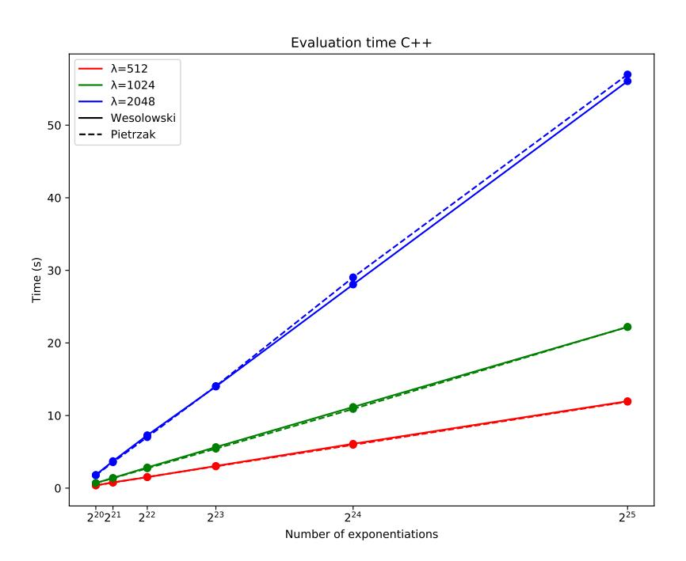
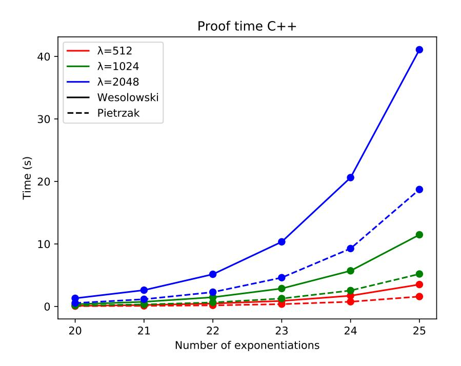
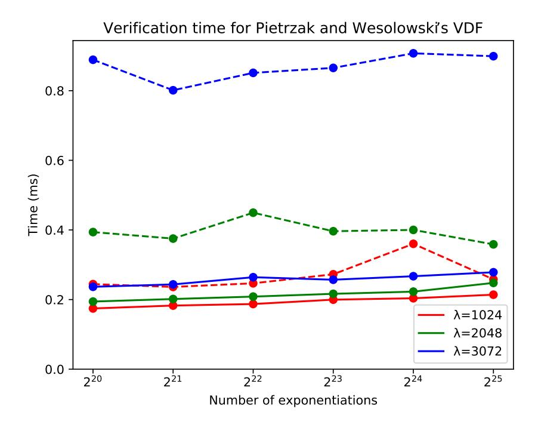
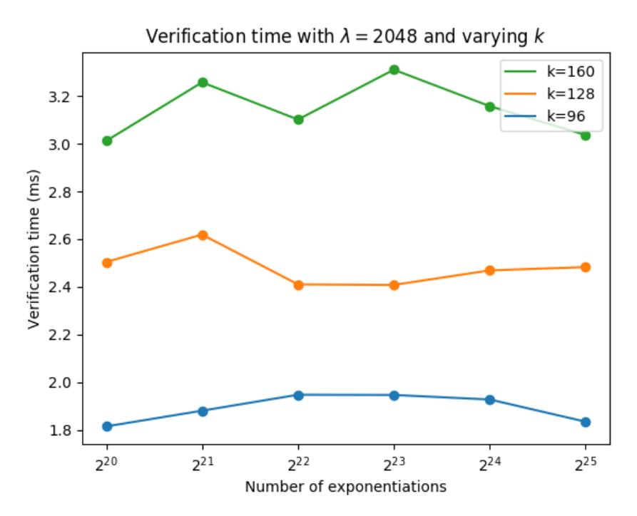
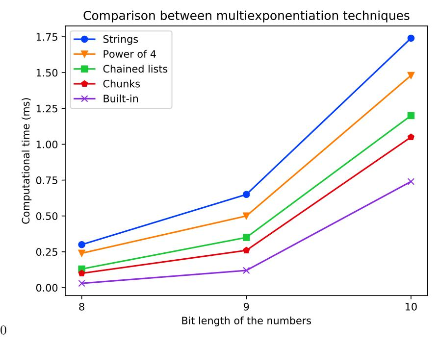

# **Implementation Study of Two Verifiable Delay Functions**

**Vidal Attias**


IOTA Foundation, Germany [vidal.attias@iota.org](mailto:vidal.attias@iota.org)

# **Luigi Vigneri**

IOTA Foundation, Germany [luigi.vigneri@iota.org](mailto:luigi.vigneri@iota.org)

### **Vassil Dimitrov**

IOTA Foundation, Germany [vassil@iota.org](mailto:vassil@iota.org)

#### **Abstract**

Proof of Work is a prevalent mechanism to prove investment of time in blockchain projects. However, the use of massive parallelism and specialized hardware gives an unfair advantage to a small portion of nodes and raises environmental and economical concerns. In this paper, we provide an implementation study of two Verifiable Delay Functions, a new cryptographic primitive achieving Proof of Work goals in an unparallelizable way. We provide simulation results and an optimization based on a multiexponentiation algorithm.

**2012 ACM Subject Classification** Computing methodologies → Simulation evaluation

**Keywords and phrases** Blockchain Distributed Ledger Verifiable Delay Function Cryptography Simulation RSA.

**Digital Object Identifier** [10.4230/OASIcs.Tokenomics.2020.6](https://doi.org/10.4230/OASIcs.Tokenomics.2020.6)

# <span id="page-0-0"></span>**1 Introduction**

In Distributed Ledger Technology (DLT) project, the protocol can ask participants to invest scarce resources to guarantee their stakes in the good development of the network. These scarce resources can be time, money, hard drive storage, etc. The most famous mechanism of proving investment is Proof of Work (PoW) [\[2\]](#page-13-0) where a user tries to find a correct input of a hashing function such that the output begins with a certain amount of zeros in its binary representation. This method originally intended to prove the investment of the user's time. However, its parallelizable nature has led to the so-called "mining races", presenting now serious environmental and economical concerns. In some alternative protocols, such as IOTA [\[22\]](#page-14-0), the network does not make any distinction between miners and users. Hence, an *explicit* rate control mechanism becomes necessary to limit user's transactions and to prevent synchronicity losses between nodes. The basic idea is to impose on every user the computation of certain work to cap their throughput. If this work is performed through PoW, specialized hardware could solve it much faster than low power devices, leading to unfair advantages and potentially leading to a denial of service attacks. Conversely, our suggestion is to use an anti-spam mechanism based on Verifiable Delay Functions (VDFs).

A VDF is a function defined formally by Boneh et al. [\[7\]](#page-13-1) that runs in a minimum amount of time which cannot be parallelized, but is exponentially easier to verify. One can set a certain difficulty and a certain amount of time of computing as parameters of the VDF. The VDF solution is unique and sound, which means an adversary has negligible chances to find the correct solution by randomly guessing. VDFs have been largely investigated on their theoretical aspect, however, there are no academic results on implementation metrics to

© IOTA Foundation;

licensed under Creative Commons License CC-BY

2nd International Conference on Blockchain Economics, Security and Protocols (Tokenomics 2020). Editors: Emmanuelle Anceaume, Christophe Bisière, Matthieu Bouvard, Quentin Bramas, and Catherine Casamatta; Article No. 6; pp. 6:1–6[:15](#page-14-1)

#### **6:2 Implementation Study of Two Verifiable Delay Functions**

our knowledge although some competitions gave some results on FPGA. In this paper, we make the following contributions: (i) we study two constructions proposed by Pietrzak and Wesolowski, (ii) compare their behavior in the experimental aspect, and (iii) we provide an optimization using a multiexponentiation algorithm.

A VDF is composed of three algorithms.

- The *setup* which initializes the environment in which the VDF will be evaluated, for example, RSA group or elliptic curves and setups an input space X and an output space Y.
- The *evaluation* which takes as an input an element *x* ∈ X and a certain difficulty *τ* ∈ N and outputs an element *y* ∈ Y and eventually a proof *π* which can speed up the verification.
- The *verification* where a veryfier takes as an input (*x, τ, y, π*) and outputs > if *y* is indeed the right output otherwise it returns ⊥.

VDFs also have applications in random number generation [\[7,](#page-13-1) [18\]](#page-14-2), RSA accumulators (primitives to produce timestamping and membership testing in a space-efficient way) or Proof of Replication [\[3,](#page-13-2) [15\]](#page-13-3), which is an optimized version of Proof of Space [\[14\]](#page-13-4).

The rest of the paper is organized as follows: in Section [2](#page-1-0) we will present the previous work on VDFs and a multiexponentiation method; in Section [3,](#page-6-0) we will show how these VDFs behave when implemented, and in [4](#page-7-0) we will present two VDF optimizations; in Section [5,](#page-10-0) we will discuss the aforementioned results and how to choose the RSA modulus choice, and we will conclude our paper in Section [6.](#page-12-0)

# <span id="page-1-0"></span>**2 Related work**

A simple way to impose a rate control mechanism in DLT protocols is to ask users to compute some work which takes a roughly predictable time as proposed in [\[2\]](#page-13-0). However, this proposal suggests the usage of PoW. Its parallelizable nature leads to very different solution time between specialized and non-specialized hardware. In this section, we present other functions that take a long time to compute but are simple to verify.

Rivest et al. [\[24\]](#page-14-3) have first defined in 1978 *time-lock* puzzles based on squaring in an RSA group and are tasks inherently sequential with a difficulty easy to set. Bitansky et al. [\[4\]](#page-13-5) then provided a formal framework for *time-lock* puzzles. Nonetheless, a verifier needs to know a private key to verify the puzzle solution, which prevents from building a universally verifiable mechanism.

Later, Boneh et al. [\[7\]](#page-13-1) have formalized VDFs providing a high-level framework: in this context, two constructions were proposed by Pietrzak [\[21\]](#page-14-4) and Wesolowski [\[26\]](#page-14-5) both using RSA groups, in a similar but new way than *time-lock* puzzles, and differing in their proofs. VDFs in their most general definition, are universally verifiable functions taking a sequential time to compute. De Feo [\[12\]](#page-13-6) proposed a third construction based on elliptic curves. However, this construction allows only one difficulty per *setup* which is a critical flaw when we need a dynamic challenge.

In the next subsections, we introduce some definitions (Section [2.1\)](#page-2-0), we present the details of Wesolowski and Pietrzak's constructions (Section [2.2](#page-2-1) and [2.3](#page-3-0) respectively), and we provide optimization for the evaluation of the Wesolowski VDF based on multiexponentiation (Section [2.4\)](#page-5-0).

#### <span id="page-2-0"></span>2.1 RSA environments

The RSA setup [24] is one of the oldest public key ciphering cryptosystems and yet still massively used. The idea is to generate a big number  $N=p\cdot q$  with p and q two prime numbers of the same order and N a  $\lambda$ -bits number. Typically we use  $\lambda=2048$  for high security. We then define  $\phi(N)=(p-1)\cdot (q-1)$  the Euler's totient function. Then the group  $\frac{\mathbb{Z}}{n\mathbb{Z}}=\{0,1,\ldots,N-1\}$  is called an RSA group.

#### <span id="page-2-1"></span>2.2 Efficient VDF - Wesolowski

### 2.2.1 Setup

The Wesolowski's VDF setup requires  $\lambda$ , and a security parameter k (typically between 128 and 256) as an input. It generates an RSA public modulus N of bit length  $\lambda$  and a cryptographic hashing function  $H:\{0,1\}^* \mapsto \{0,1\}^{2k}$ . We then define, for any  $m \in \{0,1\}^*$ ,  $H_{prime}(m) = \texttt{next\_prime}(H(m))$  returning the closest prime numbers larger or equal to H(m).

### 2.2.2 Evaluation

The evaluation takes as input  $\tau \in \mathbb{N}$  and  $m \in \{0,1\}^*$ , and then computes x = H(m) and solves the challenge  $y = x^{2^{\tau}} \mod N$ . It is important to know that if the evaluator knows  $\phi(N)$ , it can cut this computation because  $x^{2^{\tau}} \mod N = x^{2^{\tau} \mod \phi(N)} \mod N$  which reduces considerably the exponentiation cost.

#### 2.2.3 **Proof**

The proof begins by computing  $l=H_{prime}(x+y)$  and then  $\pi=x^{\lfloor 2^{\tau}/l\rfloor} \mod N$ . This can be parallelized and for s cores it takes a  $\frac{2\tau}{s\log(\tau)}$  time. At the end of this phase, the evaluator can publicly use the pair  $(l,\pi)$  as a proof of computation. In Algorithm 1 we present a pseudo code of evaluation and proof phases.

Algorithm 1 Evaluation and proof of the Wesolowski construction

```
\begin{array}{l} \textbf{input} \quad : m \in \{0,1\}^*, \ \tau \in \mathbb{N} \\ \textbf{output} : \pi \in [0,N-1], \ l \ \text{prime} \in [0,2^{2k}-1] \\ x \leftarrow H(m) \\ y \leftarrow x \\ \textbf{for} \ k \leftarrow 1 \ to \ \tau \ \textbf{do} \\ \mid \ y \leftarrow y^2 \ \text{mod} \ N \\ \textbf{end} \\ l \leftarrow H_{prime}(x+y) \\ \pi = x^{\lfloor 2^{\tau}/l \rfloor} \ \text{mod} \ N \\ \textbf{return} \ (\pi,l) \end{array}
```

#### <span id="page-2-2"></span>2.2.4 Verification

A verifier takes as an input  $(m, \tau, l, \pi)$  and computes x = H(x) and  $r = 2^{\tau} \mod l$  and then  $y' = \pi^l \cdot x^r \mod N$  and finally checks whether  $H_{prime}(x + y') = l$ . This operation takes a time  $\lambda^4$  and is thus independent of T. In Algorithm 2 we present a pseudo code for this phase.

#### Algorithm 2 Verification of the Wesolowski VDF

```
\begin{array}{l} \textbf{input} \quad : x, \tau, \pi, l \\ \textbf{output} : \top \text{ or } \bot \\ x \leftarrow H(m) \\ r \leftarrow 2^{\tau} \mod l \\ y \leftarrow \pi^l \cdot x^r \mod N \\ \textbf{if } l = H_{prime}(x+y) \textbf{ then } \\ \mid \textbf{ return } \top \\ \textbf{else} \\ \mid \textbf{ return } \bot \\ \textbf{end} \end{array}
```

### <span id="page-3-1"></span>2.2.5 Overhead on the network

The output size of a VDF can be a critical matter in network considerations. Fortunately, Wesolowski's VDF has a tiny footprint. An evaluation output is composed of elements of the RSA group  $\pi$  which is at most  $\lambda$  bits long and a prime number of size at most  $2 \cdot k$ .

### <span id="page-3-0"></span>2.3 Simple VDF - Pietrzak

### 2.3.1 **Setup**

The setup part of the Pietrzak's VDF is the same the Wesolowski's one.

#### 2.3.2 Evaluation

The evaluation part is also similar, i.e., computing  $y = x^{2^{\tau}} \mod N$ .

#### 2.3.3 **Proof**

We assume  $\tau = 2^t$  for the sake of simplicity. Computing the proof uses some variables defined as following. We set  $(x_1, y_1) := (x, y)$  and for  $i \in [1, t]$ ,

$$\mu_i \coloneqq x_i^{2^{\tau/2^i}} \mod N$$

$$r_i \coloneqq H(x_i + y_i + \mu_i)$$

$$x_{i+1} \coloneqq x_i^{r_i} \cdot \mu_i \mod N$$

$$y_{i+1} \coloneqq \mu_i^{r_i} \cdot y_i \mod N$$

The proof is thus  $\pi = \{\mu_i\}_{i \in [1,t]}$ . One can see it is heavier than the Wesolowski's VDF as there are  $\log(T)$  numbers of size  $\lambda$  to transmit, which can be about 40KB in usual conditions. This step has a complexity of  $\frac{2\tau}{s\sqrt(\tau)}$  with s being the amount of processors. In Algorithm 1 we show pseudocode to compute the verification and proof of the Pietrzak's VDF.

#### Algorithm 3 Evaluation and proof of the Pietrzak construction

```
\begin{array}{l} \textbf{input} \quad : m \in \{0,1\}^*, \, \tau \in \mathbb{N} \\ \textbf{output} : \pi \in [0,N-1]^t \\ t \leftarrow \lfloor \log_2(\tau) \rfloor \\ x \leftarrow H(m) \\ y \leftarrow h \\ \textbf{for } k \leftarrow 1 \,\, to \,\, \tau \,\, \textbf{do} \\ \mid \, y \leftarrow y^2 \,\, \text{mod} \,\, N \\ \textbf{end} \\ (x_1,y_1) \leftarrow (x,y) \\ \textbf{for } i \leftarrow 1 \,\, to \,\, t \,\, \textbf{do} \\ \mid \, \mu_i \leftarrow x_i^{2^{\tau/2^i}} \\ \mid \, r_i \leftarrow H(x_i + y_i + \mu_i) \\ \mid \, x_{i+1} \leftarrow x_i^{r_i} \cdot \mu_i \,\, \text{mod} \,\, N \\ \mid \, y_{i+1} \leftarrow \mu_{i}^{r_i} \cdot y_i \,\, \text{mod} \,\, N \\ \textbf{end} \\ \textbf{return} \,\, \pi \leftarrow \{\mu_i\}_{i \in [1,t]} \end{array}
```

#### 2.3.4 Verification

In the verification part, the verifier will parse  $\pi$  and check that each element is in the SA group  $\frac{\mathbb{Z}}{N\mathbb{Z}}$ . If so, it will recompose  $x_{t+1}$  and  $y_{t+1}$  in the same way as the prove part by computing

$$r_i := H(x_i + y_i + \mu_i)$$

$$x_{i+1} := x_i^{r_i} \cdot \mu_i \mod N$$

$$y_{i+1} := \mu_i^{r_i} \cdot y_i \mod N$$

and then check that

$$y_{t+1} \stackrel{?}{=} x_{t+1}^2 \mod N$$
 (1)

and output  $\top$  if it holds or  $\bot$  otherwise.

This step can be achieved with a complexity of log(T). In the Algorithm 4 we present a pseudocode computing this verification.

#### Algorithm 4 Verification of the Pietrzak construction.

```
\begin{array}{l} \operatorname{input} \ : x, \tau, \pi \\ \operatorname{output} \colon \top \text{ or } \bot \\ \operatorname{for } \mu \ in \ \pi \ \operatorname{do} \\ \middle| \ \text{ if } \mu >= N \ \operatorname{then} \\ \middle| \ \ \operatorname{return } \bot \\ \operatorname{end} \\ (x_1, y_1) \leftarrow (x, y) \\ \operatorname{for } i \leftarrow 1 \ to \ \operatorname{tdo} \\ \middle| \ \ x_i \leftarrow H(x_i + y_i + \mu_i) \\ \middle| \ \ x_{i+1} \leftarrow x_i^{r_i} \cdot \mu_i \ \operatorname{mod} \ N \\ \middle| \ \ y_{i+1} \leftarrow \mu_i^{r_i} \cdot y_i \ \operatorname{mod} \ N \\ \\ \operatorname{end} \\ \operatorname{if } \ y_{t+1} = x_{t+1}^2 \ \operatorname{then} \\ \middle| \ \ \operatorname{return } \bot \\ \operatorname{else} \\ \middle| \ \ \operatorname{return } \bot \\ \operatorname{end} \\ \end{array}
```

#### <span id="page-5-1"></span><span id="page-5-0"></span>2.4 Dimitrov's multiexponentiation

The Wesolowski's construction operates double exponentiation in the verification phase when computing  $\pi^l \cdot x^r \mod N$ . The use of a modular multiexponentiation algorithm is then profitable. A multiexponentiation is computing  $x^a \cdot y^b \mod n$ . However, computing  $x^a \mod y^b \mod n$ , and then their product, even with the optimal algorithms available, is not the optimal way to do so [13]. Thus, Dimitrov et al. [13] proposed two algorithms to compute multiexponentiations with better average performances. It presents two versions, a first one performing similarly to the binary exponentiation method [17] and a second one very lookalike but using recoding to reduce the number of multiplications. The first algorithm can be found in Algorithm 5. Computing the two separate exponentiations should require in average  $2\log 2(\max(a,b))$  multiplications while the Dimitrov's algorithms claims to require in average  $\frac{7}{4}\log 2(\max(a,b))$  multiplications.

#### **Algorithm 5** Dimitrov multiexponentiation algorithm.

```
For n ∈ N, we have {ni}i∈N such as n =
                                         P∞
                                           i=0 ni2
                                                  i and
 ni = 0 ∀ i > blog2
                   (n)c
input : x, y, a, b, N
output : x
          a
            · y
              b mod N
h := max(blog2 ac + 1, blog2
                           bc + 1)
z = 1
q = x · y mod N
for i = h − 1 down to 0 do
   z := z ∗ z mod N
   if ai = 1 and bi = 0 then
       z := z ∗ x mod N
   else if ai = 0 and bi = 1 then
       z := z ∗ y mod N
   else if ai = 1 and bi = 1 then
       z := z ∗ q mod N
end
return z
```

# <span id="page-6-1"></span><span id="page-6-0"></span>**3 Simulation results**

We present now the implementation results of the Wesolowski and Pietrzak VDFs to get reallife estimations. We run the simulations for values of *τ* between 2 <sup>16</sup> and 2 <sup>20</sup> which requires an evaluation time in the order of seconds or minutes. We have also studied the influence of the RSA modulus bit length *λ* on the performances and used values in {512*,* 1024*,* 2048}. All the *x*-axes are in log<sup>2</sup> -scale if not specified otherwise.

### **3.1 Evaluation time analysis**

In Figure [1,](#page-7-1) we present the evaluation time for Pietrzak and Wesolowski VDFs with the *x*-axis in linear scale. We have identical values for Pietrzak and Wesolowski VDFs. We can see a clear linear growth allowing an easy tuning of the difficulty. It is important to see the clear impact of the RSA group's size as it yields a great variation.

### **3.2 Proof time analysis**

In Figure [2,](#page-8-0) we show the proving time for Pietrzak and Wesolowski VDFs. They are of the same order of the evaluation which is a serious drawback, forcing users to spend more time after having evaluated the VDF. Reducing the proof computation time is one of the important goals of both constructions. As predicted in the theoretical part, Pietrzak VDF achieves better timing.

### **3.3 Verification time analysis**

In Figure [3,](#page-9-0) we display the verification time for both constructions. We can see that the Pietrzak construction achieves timing under 1 ms even with 2048 bits RSA groups. However, it is more complicated for the Wesolowski VDF which achieves good timing only for RSA

<span id="page-7-1"></span>

■ Figure 1 Evaluation time for Pietrzak and Wesolowski VDFs in C++

groups with a bitlength under 1024. We can also see the dependence on  $\tau$  for the Pietrzak verification time grows in  $O(\log \tau)$  where the Wesolowski one is independent of  $\tau$ .

It is here interesting to see the impact of the security parameter k in the verification time. We run for a 2048 bits RSA group different values of k in  $\{96, 128, 160\}$  for the Wesolowski VDF, and observed the effect. We can see that choosing the right value for k plays a great role in the verification time. The plot can be found in the Figure 4.

# <span id="page-7-0"></span>4 VDF optimizations

In the Wesolowski construction, there is a need for the evaluator and the verifier to compute a multiexponentiation,  $\pi^l x^r \mod N$ . Using the Dimitrov's multiexponentiation could speed up this part. We can split the computing time of this algorithm into two main parts. On the one hand, the actual modular multiplication which is uncompressible and we rely on the arbitrary precision library, NTL [25] to be as fast as possible on these operations. On the other hand, we have the whole bit scanning process which determines which multiplication to make and which can be optimized. We have tried several implementations to attempt optimizing performances and address the fact that we evaluate the most significant bits first when multiplying and it is not trivial to find them efficiently.

#### 4.1 Techniques used

#### 4.1.1 Using strings

The original Dimitrov's algorithm [13] requires to find the binary representation g of a and b in the Pekmestzi's "binary-like" complex representation [20] which is actually interlacing a

<span id="page-8-0"></span>

Figure 2 Proof time for Pietrzak and Wesolowski VDFs in C++

and b's binary representations such as  $g_{2k+1}g_{2k} = a_kb_k \forall \in \mathbb{N}$  (these are not numbers products but strings concatenations). The algorithms will scan g by packets of 2 bits in order to make multiplications.

We propose a slight improvement here which bypasses the computation of g but directly tests the value of  $a_i$  and  $b_i$  without using g. This is what we wrote in Algorithm 5.

#### 4.1.2 Using powers of 4

As the std::string C++ structure is quite low when compared to numbers manipulation, we suggest to make use of numbers and consider g as a number such as  $g = \sum_{k \in \mathbb{N}} g_k 4^k$  with  $g_k = a_k + 2b_k$ . It is easy to see that this form covers exactly the four cases encountered when multiplying. Thus we only need to make divisions by  $4^i$  and a modulus 4 to get the values  $g_i$  for  $i \in \mathbb{N}$ . Then we multiply accordingly to the value of  $q_i$ .

#### 4.1.3 Using chunked numbers

The problem with the latter improvement is that with big exponents, g can become huge, and then we are forced to consider it as a NTL arbitrary precision number and it slows down the execution and the multiple divisions by  $4^i$  require an increasing time as the exponent grows. So we tried to split g in multiple chunks of a fixed size (typically some unsigned int or unsigned char) and store them. However, as we wanted to have an algorithm working with exponents of unknown size, we need to use a dynamically growing container such as the std::vector.

<span id="page-9-0"></span>

Figure 3 Verification time for Pietrzak and Wesolowski VDFs in C++

# 4.1.4 Using chained lists

In our last improvement, we tried to optimize even more this process by using chained lists to get rid of the std::vector. We believed this would have better performances because we get rid of the std::vector overhead and starting from the most significant bit is not a problem anymore because the current pointer points to the most significant chunk.

#### 4.2 Multiexponentiation performances

We have run the various optimizations proposed for multiexponentiation and compared them with the naive separate exponentiations using NTL. As expected, we can see that the strings method is the slowest, followed by the power of 4 one. However, using chained lists is slower than chunks contrary to our expectations. This can be explained by the use of memory allocations for each new element of the chained list. We could improve this by allocating multiple elements at the same time to reduce the overhead. However, despite all our efforts, we were unable to compete with the built-in separate exponentiations. This can be explained by the thin theoretical improvement of Dimitrov's multiexponentiation which is only  $\frac{8}{7}$  times as fast. Furthermore, the NTL library is optimized to the bones so competing with it requires more advanced programming skills.

#### 4.3 Exponentiation with constant radix in Pietrzak VDF

In this construction, almost every exponentiation which is computed in actually an exponentiation in radix x, the input value. Pietrzak [21] provides an example of how to leverage this property to improve performances but we extend this idea. This optimization is merely identical in the evaluation and the verification parts. We use a logarithmic notation meaning

<span id="page-10-1"></span>

**Figure 4** Verification time Wesolowski VDF when varying *k* with *λ* = 2048

that for a number *z*, we define *x <sup>z</sup>* = *z*. Then we have the recursive definition for the following values

$$\overline{\mu_i} = 2^{\frac{T_i}{2}} \cdot \overline{x_i}$$

$$\overline{x_{i+1}} = r_i \cdot \overline{x_i} + \overline{\mu_i}$$

$$\overline{y_{i+1}} = r_i \cdot \overline{\mu_i} + \overline{y_i}$$

It is then straightforward to show that the values *µ* 0 *i* , *µ<sup>i</sup>* and *x<sup>i</sup>* are exponentiations of *x*. Then keeping a trace of these values allows quick exponentiation when using precomputations however one should be aware that without precomputations it does not bring any improvement. Besides, this technique has a low memory consumption as we do not need to store the different values *x<sup>i</sup>* and *y<sup>i</sup>* because of the iterative aspect of the calculation. We have not implemented this technique yet and it would be interesting to see if we have a sensible performance improvement.

# <span id="page-10-0"></span>**5 Discussion**

### **5.1 Comparison between Pietrzak and Wesolowski VDFs**

The simulations of Pietrzak and Wesolowski's constructions give a clear advantage for Pietrzak's one in terms of the performance of the verification step. However, we have to take into account the overhead induced in the network. As Pietrzak's proof consists of log(*τ* ) elements of the RSA group, the verifier should transmit log(*t*) + 1 elements of 2*k* bits which can represent an overhead of 40KB only for the rate control protocol. This is not viable for DLT protocols, where transaction size must be small to optimize network throughput.



**Figure 5** Multiexponentiation improvements comparison

Conversely, the Wesolowski's proof is a single element of the RSA group and a small prime number thus the overhead represents only a few KB.

### **5.2 The RSA modulus**

The RSA modulus is a fundamental parameter in the Pietrzak and Wesolowski's constructions, and keeping its factorization is the heart of their security. Indeed, someone knowing its factors *p* and *q* can easily compute the Euler totient function *φ*(*N*) = (*p*−1)·(*q* −1) and then compute the evaluation in a quasi-instant time because *x* 2 *τ* mod *N* = *x* 2 *<sup>τ</sup>* mod *<sup>φ</sup>*(*N*) mod *N*.

<span id="page-11-0"></span>The factorization hardness of an RSA modulus is directly related to its bit length. In Table [1,](#page-11-0) we present the equivalency between RSA key length and its bit-level security. A *k* bit-level security means that it takes around 2 *<sup>k</sup>* operations to break it. It is estimated that 112-bits security is sufficient until 2030 [\[10\]](#page-13-8) but for further uses a 128 bit-level security should be chosen. We then suggest using a 2048 bit long RSA modulus for VDF use.

| RSA key length | Bit-level security |
|----------------|--------------------|
| 1024           | 80                 |
| 2048           | 112                |
| 3072           | 128                |
| 7,168          | 192                |
| 15,360         | 256                |

**Table 1** Equivalency between RSA keys length and bit-level security [\[19\]](#page-14-9)

Finally, a crucial point of using VDFs for DLT applications, especially for permissionless technologies, is how to generate such a modulus in a decentralized way and guarantee that

<span id="page-12-2"></span>

|          | PoW                     | VDF                         |
|----------|-------------------------|-----------------------------|
| Hardware | Hash/s (speedup factor) | Squaring/s (speedup factor) |
| CPU      | 104<br>(×1)             | 106<br>(×1)                 |
| FPGA     | 1010<br>(×106<br>)      | 3 · 107<br>(×30)            |
| ASIC     | 1012<br>(×108<br>)      | n/a                         |

<span id="page-12-3"></span>**Table 2** Performance comparison between PoW and VDF.

| Hardware | PoW      | VDF      |
|----------|----------|----------|
| CPU      | 1.4 kbps | 1.9 kbps |
| FPGA     | 1.3 Gbps | 58 kbps  |
| ASIC     | 120 Gbps | n/a      |

**Table 3** Spamming potential comparison between PoW and VDF.

no one can retrieve the factorization, even the nodes having participated in its generation. The distributed generation of RSA keys has first been studied by Boneh and Franklin [\[8\]](#page-13-9), and its security and performances have been then improved by [\[1,](#page-12-1) [11,](#page-13-10) [23,](#page-14-10) [9,](#page-13-11) [6\]](#page-13-12). The most recent algorithm designed by Frederiksen et al. guarantees a (*n* − 1) security (i.e., at least one of the participants is honest and follows the rules) with very fast performances [\[16\]](#page-13-13).

# **5.3 Comparison with Proof of Work**

As mentioned in Section [1,](#page-0-0) VDFs can be used as a non-parallelizable PoW. Therefore, it is interesting to see the VDF performance when using highly specialized hardware such as FPGAs or ASICs which normally speed the PoW computation up to several orders of magnitude. In Table [2,](#page-12-2) we have collected the potential performance increase between PoW and VDF for different hardware [\[5\]](#page-13-14). In Table [3,](#page-12-3) we have estimated the potential bandwidth occupation when hardware generates IOTA transactions [\[22\]](#page-14-0) which are encoded in 1.6KB. The difference between PoW and VDF is clear: the intrinsically not parallelizable nature of VDFs allows us to keep a very low throughput for a node even with an FPGA hardware. Currently, no ASICs are available for the computation of VDFs.

# <span id="page-12-0"></span>**6 Conclusion**

In this paper, we have presented an analysis of two VDFs, Wesolowski and Pietrzak's constructions, both based on exponentiations in RSA groups. Our work focused on simulating the computation of such VDFs to study the viability of their use in rate control for DLTs. We have seen that, although the Pietrzak's construction has better performances, its overhead on the network makes it not viable in certain contexts. Hence, the Wesolowski's one makes a better candidate, although its verification times is larger. Besides, we have suggested using multiexponentiation algorithms to compute faster Wesolowski's verification.

### **References**

<span id="page-12-1"></span>**1** Joy Algesheimer, Jan Camenisch, and Victor Shoup. Efficient computation modulo a shared secret with application to the generation of shared safe-prime products. In *Lecture Notes in Computer Science (including subseries Lecture Notes in Artificial Intelligence and Lecture Notes in Bioinformatics)*, volume 2442, pages 417–432, 2002. URL: [https://eprint.iacr.](https://eprint.iacr.org/2002/029.pdf) [org/2002/029.pdf](https://eprint.iacr.org/2002/029.pdf).

- <span id="page-13-0"></span>**2** Adam Back. Hashcash - A Denial of Service Counter-Measure. Technical Report August, Hashcash, 2002.
- <span id="page-13-2"></span>**3** Juan Benet, David Dalrymple, and Nicola Greco. Proof of Replication. Technical report, Stanford University, 2017. URL: <https://filecoin.io/proof-of-replication.pdf>, [doi:](http://dx.doi.org/10.1007/s00221-007-1153-3) [10.1007/s00221-007-1153-3](http://dx.doi.org/10.1007/s00221-007-1153-3).
- <span id="page-13-5"></span>**4** Nir Bitansky, Shafi Goldwasser, Abhishek Jain, Omer Paneth, and Vinod Vaikuntanathan. Time-lock puzzles from randomized encodings. In *ITCS 2016 - Proceedings of the 2016 ACM Conference on Innovations in Theoretical Computer Science*, pages 345–356, 2016. URL: <https://eprint.iacr.org/2015/514.pdf>, [doi:10.1145/2840728.2840745](http://dx.doi.org/10.1145/2840728.2840745).
- <span id="page-13-14"></span>**5** Bitcoin Wiki. Mining hardware comparison - Bitcoin Wiki. URL: [https://en.bitcoin.it/](https://en.bitcoin.it/wiki/Mining_hardware_comparison) [wiki/Mining\\_hardware\\_comparison](https://en.bitcoin.it/wiki/Mining_hardware_comparison).
- <span id="page-13-12"></span>**6** Simon R. Blackburn, Mike Burmester, StevenD. Galbraith, and Simon Blake-Wilson. Weaknesses in Shared RSA Key Generation Protocols. In *Lecture Notes in Computer Science (including subseries Lecture Notes in Artificial Intelligence and Lecture Notes in Bioinformatics)*, volume 1746, pages 300–306. Springer, Berlin, Heidelberg, dec 1999. URL: [http://link.springer.com/10.1007/3-540-46665-7\\_34](http://link.springer.com/10.1007/3-540-46665-7_34).
- <span id="page-13-1"></span>**7** Dan Boneh, Joseph Bonneau, Benedikt Bünz, and Ben Fisch. Verifiable delay functions. In *Lecture Notes in Computer Science (including subseries Lecture Notes in Artificial Intelligence and Lecture Notes in Bioinformatics)*, volume 10991 LNCS, pages 757–788, 2018. URL: <https://eprint.iacr.org/2018/601.pdf>.
- <span id="page-13-9"></span>**8** Dan Boneh and Matthew Franklin. Efficient generation of shared RSA Keys. *Lecture Notes in Computer Science (including subseries Lecture Notes in Artificial Intelligence and Lecture Notes in Bioinformatics)*, 1294(4):425–439, jul 1997. URL: [http://portal.acm.org/citation.cfm?](http://portal.acm.org/citation.cfm?doid=502090.502094) [doid=502090.502094](http://portal.acm.org/citation.cfm?doid=502090.502094), [doi:10.1007/BFb0052253](http://dx.doi.org/10.1007/BFb0052253).
- <span id="page-13-11"></span>**9** Clifford Cocks. Split knowledge generation of RSA parameters. In *Lecture Notes in Computer Science (including subseries Lecture Notes in Artificial Intelligence and Lecture Notes in Bioinformatics)*, volume 1355, pages 89–95, 1997. URL: [https://link.springer.com/content/](https://link.springer.com/content/pdf/10.1007/BFb0024452.pdf) [pdf/10.1007/BFb0024452.pdf](https://link.springer.com/content/pdf/10.1007/BFb0024452.pdf), [doi:10.1007/bfb0024452](http://dx.doi.org/10.1007/bfb0024452).
- <span id="page-13-8"></span>**10** Cybernetica. Cryptographic Algorithms Lifecycle Report 2016. Technical report, Cybernetica, 2016. URL: [https://www.ria.ee/sites/default/files/content-editors/](https://www.ria.ee/sites/default/files/content-editors/publikatsioonid/cryptographic_algorithms_lifecycle_report_2016.pdf) [publikatsioonid/cryptographic\\_algorithms\\_lifecycle\\_report\\_2016.pdf](https://www.ria.ee/sites/default/files/content-editors/publikatsioonid/cryptographic_algorithms_lifecycle_report_2016.pdf).
- <span id="page-13-10"></span>**11** Ivan Damgård and Gert Læssøe Mikkelsen. Efficient, robust and constant-round distributed RSA key generation. *Lecture Notes in Computer Science (including subseries Lecture Notes in Artificial Intelligence and Lecture Notes in Bioinformatics)*, 5978 LNCS:183–200, 2010.
- <span id="page-13-6"></span>**12** Luca De Feo, Simon Masson, Christophe Petit, and Antonio Sanso. Verifiable delay functions from supersingular isogenies and pairings. In *Lecture Notes in Computer Science (including subseries Lecture Notes in Artificial Intelligence and Lecture Notes in Bioinformatics)*, volume 11921 LNCS, pages 248–277, 2019. URL: <https://defeo.lu/>.
- <span id="page-13-7"></span>**13** Vassil S. Dimitrov, Graham A. Jullien, and William C. Miller. Complexity and fast algorithms for multiexponentiations. *IEEE Transactions on Computers*, 49(2):141–147, 2000. URL: <http://ieeexplore.ieee.org/document/833110/>, [doi:10.1109/12.833110](http://dx.doi.org/10.1109/12.833110).
- <span id="page-13-4"></span>**14** Stefan Dziembowski, Sebastian Faust, Vladimir Kolmogorov, and Krzysztof Pietrzak. Proofs of space. In *Lecture Notes in Computer Science (including subseries Lecture Notes in Artificial Intelligence and Lecture Notes in Bioinformatics)*, volume 9216, pages 585–605, 2015. URL: <https://eprint.iacr.org/2013/796.pdf>.
- <span id="page-13-3"></span>**15** Ben Fisch, Joseph Bonneau, Nicola Greco, and Juan Benet. Scaling Proof-of-Replication for Filecoin Mining. Technical report, Stanford University, 2018. URL: [https://web.stanford.](https://web.stanford.edu/{~}bfisch/porep_short.pdf) [edu/{~}bfisch/porep\\_short.pdf](https://web.stanford.edu/{~}bfisch/porep_short.pdf).
- <span id="page-13-13"></span>**16** Tore Kasper Frederiksen, Yehuda Lindell, Valery Osheter, and Benny Pinkas. Fast distributed rsa key generation for semi-honest and malicious adversaries. In *Lecture Notes in Computer Science (including subseries Lecture Notes in Artificial Intelligence and Lecture Notes in Bioinformatics)*, volume 10992 LNCS, pages 331–361. Springer Verlag, 2018.

<span id="page-14-6"></span><span id="page-14-1"></span>**17** C. K. Koc. High-speed RSA implementation. Technical report, RSA Laboratories, 1994. URL: <ftp://ftp.rsasecurity.com/pub/pdfs/tr201.pdf>.

- <span id="page-14-2"></span>**18** Arjen K. Lenstra and Benjamin Wesolowski. Trustworthy public randomness with sloth, unicorn, and trx. *International Journal of Applied Cryptography*, 3(4):330–343, jan 2017. [doi:10.1504/IJACT.2017.089354](http://dx.doi.org/10.1504/IJACT.2017.089354).
- <span id="page-14-9"></span>**19** NIST. Recommendation for Key Management - Part 1: General. *NIST Special Publication 800-57*, Revision 3(July):1–147, jan 2012. URL: [https://nvlpubs.nist.gov/nistpubs/](https://nvlpubs.nist.gov/nistpubs/SpecialPublications/NIST.SP.800-57pt1r4.pdf) [SpecialPublications/NIST.SP.800-57pt1r4.pdf](https://nvlpubs.nist.gov/nistpubs/SpecialPublications/NIST.SP.800-57pt1r4.pdf), [doi:10.6028/NIST.SP.800-57pt1r4](http://dx.doi.org/10.6028/NIST.SP.800-57pt1r4).
- <span id="page-14-8"></span>**20** K. Z. Pekmestzi. Complex number multipliers. *IEE Proceedings E: Computers and Digital Techniques*, 136(1):70–75, 1989. URL: [https://digital-library.theiet.org/content/](https://digital-library.theiet.org/content/journals/10.1049/ip-e.1989.0010) [journals/10.1049/ip-e.1989.0010](https://digital-library.theiet.org/content/journals/10.1049/ip-e.1989.0010), [doi:10.1049/ip-e.1989.0010](http://dx.doi.org/10.1049/ip-e.1989.0010).
- <span id="page-14-4"></span>**21** Krzysztof Pietrzak. Simple verifiable delay functions. In *Leibniz International Proceedings in Informatics, LIPIcs*, volume 124, 2019. URL: <https://eprint.iacr.org/2018/627.pdf>, [doi:10.4230/LIPIcs.ITCS.2019.60](http://dx.doi.org/10.4230/LIPIcs.ITCS.2019.60).
- <span id="page-14-0"></span>**22** Serguei Popov. The Tangle. Technical report, IOTA Foundation, 2018. URL: [https://assets.ctfassets.net/r1dr6vzfxhev/2t4uxvsIqk0EUau6g2sw0g/](https://assets.ctfassets.net/r1dr6vzfxhev/2t4uxvsIqk0EUau6g2sw0g/45eae33637ca92f85dd9f4a3a218e1ec/iota1_4_3.pdf) [45eae33637ca92f85dd9f4a3a218e1ec/iota1\\_4\\_3.pdf](https://assets.ctfassets.net/r1dr6vzfxhev/2t4uxvsIqk0EUau6g2sw0g/45eae33637ca92f85dd9f4a3a218e1ec/iota1_4_3.pdf).
- <span id="page-14-10"></span>**23** Michael O. Rabin. Probabilistic algorithm for testing primality. *Journal of Number Theory*, 12(1):128–138, 1980. [doi:10.1016/0022-314X\(80\)90084-0](http://dx.doi.org/10.1016/0022-314X(80)90084-0).
- <span id="page-14-3"></span>**24** R. L. Rivest, A. Shamir, and L. Adleman. A Method for Obtaining Digital Signatures and Public-Key Cryptosystems. *Communications of the ACM*, 21(2):120–126, 1978. [doi:](http://dx.doi.org/10.1145/359340.359342) [10.1145/359340.359342](http://dx.doi.org/10.1145/359340.359342).
- <span id="page-14-7"></span>**25** Victor Shoup. NTL - A Library for doing Number Theory, 2019. URL: [https://www.shoup.](https://www.shoup.net/ntl/) [net/ntl/](https://www.shoup.net/ntl/).
- <span id="page-14-5"></span>**26** Benjamin Wesolowski. Efficient verifiable delay functions. In *Lecture Notes in Computer Science (including subseries Lecture Notes in Artificial Intelligence and Lecture Notes in Bioinformatics)*, volume 11478 LNCS, pages 379–407, 2019. URL: [https://eprint.iacr.org/](https://eprint.iacr.org/2018/623.pdf) [2018/623.pdf](https://eprint.iacr.org/2018/623.pdf).