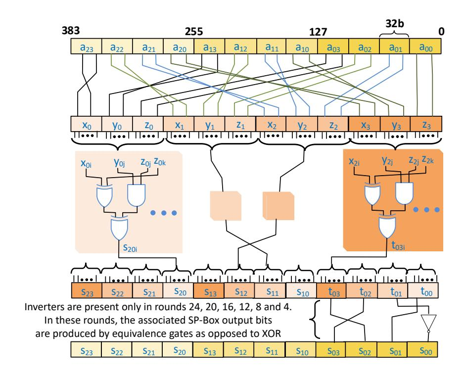

# Gimli Encryption in 715.9 psec

Santosh Ghosh, Michael Kounavis and Sergej Deutsch

Security and Privacy Research, Intel Labs Intel Corporation 2111 NE 25th Ave, Hillsboro, OR 97124 {santosh.ghosh, michael.e.kounavis, sergej.deutsch}@intel.com

Keywords: Lightweight Cryptography · Permutation · Block cipher · Gimli · AES · PRINCE · NIST · Encryption · Datapath design

Abstract. We study the encryption latency of the Gimli cipher, which has recently been submitted to NIST's lightweight cryptography competition. We develop two optimized hardware engines for the 24 round Gimli permutation, characterized by a total latency of 3 and 4 cycles, respectively, supporting a range of frequencies up to 4.5 GHz. Specifically, we use Intel's <sup>R</sup> 10 nm FinFET process to synthesize a critical path of 15 logic levels, supporting a depth-3 Gimli pipeline capable of computing the result of the Gimli permutation in frequencies up to 3.9 GHz. On the same process technology, a depth-4 pipeline employs a critical path of 12 logic levels and can compute the Gimli permutation in frequencies up to 4.5 GHz. Gimli demonstrates a total unrolled data path latency of 715.9 psec.

Compared to our AES implementation, our fastest pipelined Gimli engine demonstrates 3.39 times smaller latency. When compared to the latency of the PRINCE lightweight block cipher, the pipelined Gimli latency is 1.7 times smaller. The paper suggests that the Gimli cipher, and our proposed optimized implementations have the potential to provide breakthrough performance for latency critical applications, in domains such as data storage, networking, IoT and gaming.

## 1 Introduction

The paper studies the performance of Gimli [1]. Gimli is a lightweight cipher based on a 384 bit permutation, proposed by Bernstein et al. in reference [1]. A unique property of Gimli is its cross platform performance. In general, lightweight ciphers like Gimli are required for protecting resource constrained systems such as IoT devices. Without cryptography, such devices could be easily abused, as they are typically the weakest entry point in larger scale systems. In the last decade, multiple lightweight encryption techniques have been proposed. They are broadly classified in two categories: (a) block ciphers such as Present [7], Prince [8], Simon [9], Speck [9], Simeck [19], Gift [6], Skinny [10], Cham [11], [12] and Pyjamask [13], and (b) permutation based ciphers, such as Gimli [1], Subterranean [14], Xoodoo [15] and Ascon [16], [17], [18]. Gimli, the cipher we study in this paper, is in the second category.

#### 1.1 About permutation based ciphers and Gimli

In the past few years, permutation based ciphers have gained increasing acceptance. There is an attractive property of permutation based ciphers. Such ciphers are particularly useful to applications that employ key streams to conceal their data. In most networking applications, for instance, data transfers are performed by employing authenticated encryption, using techniques such as AES GCM and Poly ChaCha. In both techniques, a keystream is being generated beforehand and added to the data, so that the data can be concealed. In the paper, we argue that the key stream generation process can significantly benefit from a cipher like Gimli, and by our proposed implementations. According to the numbers reported in this paper, key stream generation, if using the Gimli permutation, demonstrates latency that ranges between 715.9 psec and 887.2 psec.

#### 1.2 Related work

Our performance results are not the only ones in the space. Many permutations demonstrate good performance in hardware and software for generating keystreams. Keccak [24] the permutation used in SHA3, Salsa20 [22], ChaCha [23] and Chaskey [25] are examples of efficient permutation functions that can run in general purpose CPUs and microcontrollers as well. Existing implementation results for Gimli demonstrate good performance on reference platforms like FPGAs, ASICs, 8 bit microcontrollers, 32 bit high end embedded microcontrollers, 32 bit smart phone CPUs and 64 bit server platforms [1]. Additionally, reference [2] shows that Gimli is three orders of magnitude faster than Keccak on an 8 bit TRS-80 Micro Computer System [4] completing one Gimli permutation in 74,000 clock periods.

Existing Gimli implementations are optimized for area footprint. Their main building block is the Gimli permutation round. These implementations incur some latency cost in order to execute a single 24 round Gimli permutation. In the paper, we argue we can provide significant improvement in performance, if the implementation primitive becomes the entire Gimli permutation, as opposed to the round. There are ample latency and throughput critical applications, such as TLS encryption, that would benefit from a faster Gimli, as mentioned above. To improve the performance of Gimli for such applications, we designed and implemented a family of novel realizations optimized for latency and throughput. Their primitive is a staged implementation of the complete Gimli permutation.

#### 1.3 Contributions of this paper

Our results demonstrate that for both short and long messages, Gimli stands out as a much faster encryption technique, when compared to other known algorithms including AES and PRINCE. Our contributions can be summarized as follows: Two optimized hardware engines for the 24 round Gimli permutation have been built, characterized by a total latency or 3 and 4 cycles, respectively, in frequencies up to 4.5 GHz. Specifically, a critical path of 15 logic levels can support a depth-3 Gimli pipeline, capable of computing the result of the Gimli permutation in frequencies up to 3.9 GHz. Such data path can be realized using Intel's <sup>R</sup> 10 nm FinFET process technology. On the same process technology, a depth-4 pipeline employs a critical path of 12 logic levels and can compute the Gimli permutation in frequencies up to 4.5 GHz. The total unrolled critical path latency is 715.9 psec. In the paper, we describe our Gimli hardware designs in Section 2, our implementation results in Section 3, and provide some concluding remarks in Section 4.

```
Algorithm 1. The Gimli permutation 
Require: , , 0 ≤  ≤ 2  0 ≤  ≤ 3
Ensure: () = , , 0 ≤  ≤ 2  0 ≤  ≤ 3
   from 24 downto 1 inclusive 
    f  from 0 to 3 inclusive  \\ SP − box
    x  0, ≪≪ 24
        y  1, ≪≪ 9
        z  2,
        2,  x ⊕ (z ≪ 1) ⊕ (y ∧ z) ≪ 2
        1,  y ⊕ x ⊕ (x ∨ z) ≪ 1
        0,  z ⊕ y ⊕ (x ∧ y) ≪ 3

                                         \\ Linear layer
      mod 4 = 0 
        0,0, 0,1, 0,2, 0,3  0,1, 0,0, 0,3, 0,2
       mod 4 = 2 
        0,0, 0,1, 0,2, 0,3  0,2, 0,3, 0,0, 0,1

                                     \\ Add constant
      mod 4 = 0 
        0,0  0,0 ⊕ 0x9e377900 ⊕ 

  (, )

              <<<
              <<< 9
```

Fig. 1. Pseudocode description of the Gimli permutation

## 2 Description of the Gimli implementations

The Gimli permutation has 24 rounds which operate on a 384 bit state. The Gimli state is represented as a 3 × 4 matrix, where each element of the matrix is 32 bit long. Each column s<sup>j</sup> , j ∈ [0, 3] is a sequence of 96 bits such that s<sup>j</sup> = {s0,j ; s1,j ; s2,j}. Similarly, each row s<sup>i</sup> , i ∈ [0, 2] is a sequence of 128 bits such that  $s_i = \{s_{i,0} ; s_{i,1} ; s_{i,2} ; s_{i,3}\}$ . Gimli's round function is described by Algorithm 1, shown in Figure 1. This is a sequence of three operations: (1) a non-linear layer, specifically a 96 bit SP-box applied to each column; (2) a linear mixing layer applied in every second round; and (3) an add constant operation applied in every fourth round.



Fig. 2. Optimized single round Gimli datapath

#### 2.1 The round datapath

Figure 2 shows of our proposed data path implementing one round of Gimli. This is part of a bigger hardware block that implements the permutation. First, three operations, which are rotations and reassignments, associated with the SP-box are implemented through routing, without any logic gate cost. This is shown in the top part of the diagram. A next set of three operations of the SP-box are implemented in parallel, employing two logic levels as shown in the middle part of the diagram. The shift left operation does not require any logic gates as well. It is implemented through routing. At the bottom part of the diagram some logic inversions are performed.

As we are focusing on implementing a high performance hardware engine, we unroll all 24 rounds and implement them in hardware. Each round data path in our design is further optimized for its specific round index. This allows us to avoid any multiplexers that would otherwise need to switch between values in linear layers. We implement round specific small and big swaps in the linear layers through routing without any additional logic gate cost. Additionally, such round specific design helps us to optimize the add constant step. This is realized via the inversions of the bottom part of our diagram. For example, if r = 24, then the add constant step performs the steps shown in Figure 3.

### 2.2 The 24 round Gimli pipelined designs

We have developed two Gimli pipelines with depths of three and four, based on 24 round unrolled data paths. For the depth-3 pipeline, combinatorial logic associated with eight round data paths is employed. The data paths are connected back-to-back and form three combinatorial logic blocks. We place pipeline registers in between them to support encryption in frequencies up to 3.9 GHz. Each pipeline stage has no more than 16 logic levels. There are 8 rounds with 2 logic levels each.

```
0,0  0,0 ⊕ 0x9e377900 ⊕ 000000018
    0,0 ⊕ 0x9e377918
    {~0,0[31], 0,0[30], 0,0[29], ~0,0[28], ~0,0[27], ~0,0[26],
       ~0,0[25], 0,0[24], 0,0[23], 0,0[22], ~0,0[21], ~0,0[20], 0,0[19],
       ~0,0[18], ~0,0[17], ~0,0[16], 0,0[15], ~0,0[14], ~0,0[13],
       ~0,0[12], ~0,0[11], 0,0[10], 0,0[9], ~0,0[8], 0,0[7], 0,0[6],
       0,0[5], ~0,0[4], ~0,0[3], 0,0[2], 0,0[1], 0,0[0] }
                                             or, equivalently 
                            or, equivalently
```

Fig. 3. The add constant step when r = 24

Similarly, for the depth-4 pipeline, combinatorial logic associated with six round data paths is employed. The data paths are connected back-to-back as forming four combinatorial logic blocks. The depth-4 pipeline stages have no more than 12 logic levels. There are 6 rounds with 2 logic levels each. We also place pipeline registers between the stages to support encryption in frequencies up to 4.5 GHz.

## 3 Performance analysis

The performance characteristics of our Gimli pipelined implementations are shown in the table of Figure 4. As shown in the table, there are two engines employing stages of 12 and 15 levels respectively. The critical path latency is 221.8 and 255.3 psec for the stages of each of the two engines. The engines have 4 and 3 stages, corresponding to total critical path latencies of 887.2 and 765.9

|                       | library: Intel's ® 10nm FinFET |               |             |      |        |          |
|-----------------------|--------------------------------|---------------|-------------|------|--------|----------|
| Gimli engines         | logic                          | critical path | cell counts |      | area   | latency  |
|                       | levels                         | (psec)        | comb.       | seq. | (μm2 ) | (cycles) |
| Depth-4 pipeline      | 12                             | 221.8         | 23320       | 1920 | 6958.3 | 4        |
| Depth-3 pipeline      | 15                             | 255.3         | 20201       | 1536 | 6994.4 | 3        |
| Fully unrolled design | 47                             | 715.9         | 20452       | 768  | 7100.4 | 1        |

Fig. 4. Performance characteristics of our Gimli pipelined implementations

psec. The area footprints of the engines are 6958.3 m<sup>2</sup> and 6994.4 m<sup>2</sup> . The fully unrolled design employs 47 levels, demonstrates a total critical path latency of 715.9 psec and an area footprint of 7100.4 m<sup>2</sup> . All results have been produced using Intel's <sup>R</sup> 10 nm FinFET process technology.

Next, we compare the performance of our Gimli engines with that of AES. For this purpose, we used optimized hardware realizations of the AES data path reported in reference [26]. These realizations use optimized SBox logic associated with 9 logic levels and 1218 NAND cells per SBox. We built pipelined implementations that perform encryptions in the frequency range between 1.1 GHz and 2.5 GHz. These implementations employ a number of stages that vary between 3 and 8. The area footprint varies between 15,030 m<sup>2</sup> and 16,342 m<sup>2</sup> . The best critical path latency of these implementation is 2.6 nsec. As such, our best AES realization is 3.39 times slower than the fastest pipelined Gimli realization. Moreover, the Gimli permutation footprint is 2.16 times smaller than AES in the best case.

Finally, we compare Gimli with optimized PRINCE pipelined logic we have also built. We found that pipelined Gimli is 1.7 times faster even though the area footprint of PRINCE is 8.7 times smaller. This should be expected as PRINCE produces encrypted outputs of significantly smaller length, specifically of 64 bits. In contrast, the Gimpli permutation produces outputs of 384 bits. Both the AES and PRINCE engines were synthesized using Intel's <sup>R</sup> 10 nm FinFET library.

## 4 Concluding Remarks

We studied the encryption latency of the Gimli cipher. The most significant contribution of this work is that it demonstrates that hardware encryption in the order of psec is possible. Furthermore the result is achieved using a lightweight cipher which is a submission to the second round of NIST's ongoing lightweight cryptography competition.

The work also demonstrates that permutation based cipher implementations optimized for latency have the potential to significantly outperform other ciphers and implementations that are not permutation based. As future work we plan to implement other permutation based candidates submitted to the competition and compare their performance characteristics with Gimli.

#### References

- 1. Daniel J. Bernstein, Stefan Kölbl, Stefan Lucks, Pedro Maat Costa Massolino, Florian Mendel, Kashif Nawaz, Tobias Schneider, Peter Schwabe, François-Xavier Standaert, Yosuke Todo and Benoît Viguier, *Gimli: a cross-platform permutation*, CHES, 2017.
- 2. Mike Hamburg, Cryptanalysis of  $22\frac{1}{2}$  rounds of Gimli, IACR ePrint 743, 2017.
- 3. Jean-Marie Chauvet, Gimli, Lord of the Glittering TRS-80, IACR ePrint 792, 2017.
- 4. David Lien, TRS-80 Micro Computer System, Radio Shack, 1978.
- 5. Christoph Dobraunig, Maria Eichlseder, Florian Mendel and Martin Schläffer, Asconv1.2. Submission to the NIST LWC competition, 2019.
- Subhadeep Banik, Sumit Kumar Pandey, Thomas Peyrin, Yu Sasaki, Siang Meng Sim and Yosuke Todo, GIFT: A small present - towards reaching the limit of lightweight encryption, In Cryptographic Hardware and Embedded Systems - CHES 2017 - 19th International Conference, Taipei, Taiwan, September 25-28, 2017, Proceedings, pages 321–345, 2017.
- 7. Andrey Bogdanov, Lars R. Knudsen, Gregor Leander, Christof Paar, Axel Poschmann, Matthew J. B. Robshaw, Yannick Seurin and C. Vikkelsoe, *PRESENT:* An Ultra-Lightweight Block Cipher, In CHES 2007, pages 450–466, 2007.
- 8. Julia Borghoff, Anne Canteaut, Tim Güneysu, Elif Bilge Kavun, Miroslav Knezevic, Lars R. Knudsen, Gregor Leander, Ventzislav Nikov, Christof Paar, Christian Rechberger, Peter Rombouts, Søren S. Thomsen and Tolga Yalçin. *PRINCE A Low-Latency Block Cipher for Pervasive Computing Applications*, ASIACRYPT 2012: Advances in Cryptology, pp 208-225, 2012.
- 9. Ray Beaulieu, Douglas Shors, Jason Smith, Stefan Treatman-Clark, Bryan Weeks and Louis Wingers, *The SIMON and SPECK Families of Lightweight Block Ciphers*, Cryptology ePrint Archive, Report 2013/404, 2013.
- 10. Christof Beierle, Jérémy Jean, Stefan Kölbl, Gregor Leander, Amir Moradi, Thomas Peyrin, Yu Sasaki, Pascal Sasdrich and Siang Meng Sim, The SKINNY Family of Block Ciphers and its Low-Latency Variant MANTIS, Cryptology ePrint Archive, Report 2016/660, 2016.
- 11. Bonwook Koo, Dongyoung Roh, Hyeonjin Kim, Younghoon Jung, Dong-Geon Lee and Daesung Kwon, CHAM: A Family of Lightweight Block Ciphers for Resource-Constrained Devices, Information Security and Cryptology ICISC 2017 pp 3-25, 2017.
- 12. Dongyoung Roh, Bonwook Koo, Younghoon Jung, Il Woong Jeong, Dong-Geon Lee, Daesung Kwon and Woo-Hwan Kim, *Revised Version of Block Cipher CHAM*, Information Security and Cryptology ICISC 2019 pp 1-19, 2019.
- Dahmun Goudarzi, Jérémy Jean, Stefan Kölbl, Thomas Peyrin, Matthieu Rivain, Yu Sasaki and Siang Meng Sim, Pyjamask v1.0. Submission to the NIST LWC competition, 2019.
- Luc J. M. Claesen, Joan Daemen, Mark Genoe and G. Peeters, Subterranean: A 600 mbit/sec cryptographic VLSI chip, Proceedings 1993 International Conference on Computer Design: VLSI in Computers and Processors, ICCD '93, Cambridge, MA, USA, October 3-6, 1993, IEEE Computer Society, 1993, pp. 610–613.
- 15. Joan Daemen, Cipher and hash function design strategies based on linear and differential cryptanalysis, PhD thesis, K.U.Leuven, 1995.
- Joan Daemen, Bart Mennink and Gilles Van Assche, Full-state keyed duplex with built-in multi-user support, Advances in Cryptology - ASIACRYPT 2017, Proceedings, Part II (T. Takagi and T. Peyrin, eds.), Lecture Notes in Computer Science, vol. 10625, Springer, 2017, pp. 606–637.

- 17. Joan Daemen, Seth Hoffert, Micha¨el Peeters, Gilles Van Assche and Ronny Van Keer, Xoodoo cookbook, Cryptology ePrint Archive, Report 2018/767, 2018.
- 18. Joan Daemen, Seth Hoffert, Gilles Van Assche and Ronny Van Keer, The design of xoodoo and xoofff, IACR Transactions on Symmetric Cryptology 2018 (2018), no. 4, 1–38.
- 19. Gangqiang Yang, Bo Zhu, Valentin Suder, Mark Aagaard and Guang Gong, The simeck family of lightweight block ciphers, CHES 2015, Springer, pp. 307–329, 2015.
- 20. Jian Guo, Thomas Peyrin and Axel Poschmann, The PHOTON Family of Lightweight Hash Functions, Cryptology ePrint Archive, Report 2011/609, 2011.
- 21. Martin Agren, Martin Hell, Thomas Johansson and Willi Meier, Grain-128a: A New Version of Grain-128 with Optional Authentication, International Journal of Wireless and Mobile Computing, 2011.
- 22. Daniel J. Bernstein, The Salsa20 family of stream ciphers, In Matthew J. B. Robshaw and Olivier Billet, editors, New Stream Cipher Designs - The eSTREAM Final-ists, volume 4986 of LNCS, pages 84–97. Springer, 2008.
- 23. Daniel J. Bernstein, ChaCha, a variant of Salsa20, SASC 2008: The State of the Art of Stream Ciphers, 2008. https://cr.yp.to/chacha/chacha-20080128.pdf.
- 24. Guido Bertoni, Joan Daemen, Micha¨el Peeters and Gilles Van Assche, Keccak, In Advances in Cryptology – EUROCRYPT 2013, pages 313–314, 2013.
- 25. Nicky Mouha, Bart Mennink, Anthony Van Herrewege, Dai Watanabe, Bart Preneel and Ingrid Verbauwhede, Chaskey: An efficient MAC algorithm for 32-bit micro-controllers, volume 8781 of LNCS, pages 306–323. Springer, 2014.
- 26. Michael Kounavis, Ultra-low Latency Advanced Encryption Standard, US Patent Application, No. 20190229889, 2019.