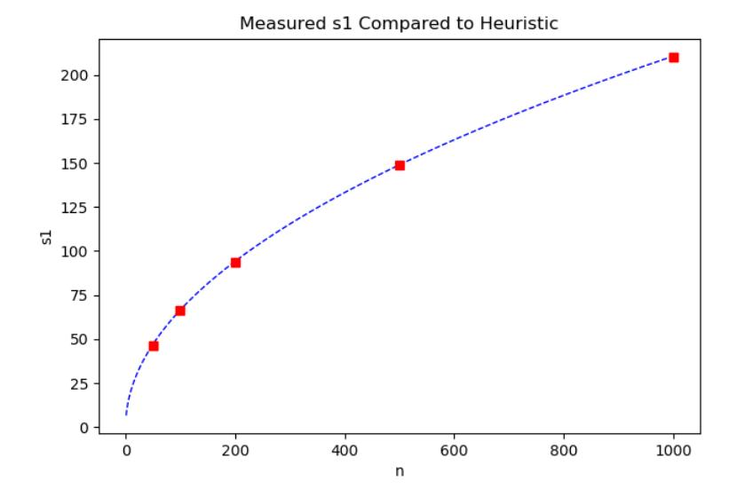

# Improved Discrete Gaussian and Subgaussian Analysis for Lattice Cryptography

Nicholas Genise∗ Daniele Micciancio† Chris Peikert‡ Michael Walter§ March 18, 2020

#### Abstract

Discrete Gaussian distributions over lattices are central to lattice-based cryptography, and to the computational and mathematical aspects of lattices more broadly. The literature contains a wealth of useful theorems about the behavior of discrete Gaussians under convolutions and related operations. Yet despite their structural similarities, most of these theorems are formally incomparable, and their proofs tend to be monolithic and written nearly "from scratch," making them unnecessarily hard to verify, understand, and extend.

In this work we present a modular framework for analyzing linear operations on discrete Gaussian distributions. The framework abstracts away the particulars of Gaussians, and usually reduces proofs to the choice of appropriate linear transformations and elementary linear algebra. To showcase the approach, we establish several general properties of discrete Gaussians, and show how to obtain all prior convolution theorems (along with some new ones) as straightforward corollaries. As another application, we describe a self-reduction for Learning With Errors (LWE) that uses a fixed number of samples to generate an unlimited number of additional ones (having somewhat larger error). The distinguishing features of our reduction are its simple analysis in our framework, and its exclusive use of discrete Gaussians without any loss in parameters relative to a prior mixed discrete-and-continuous approach.

As a contribution of independent interest, for subgaussian random matrices we prove a singular value concentration bound with explicitly stated constants, and we give tighter heuristics for specific distributions that are commonly used for generating lattice trapdoors. These bounds yield improvements in the concrete bit-security estimates for trapdoor lattice cryptosystems.

∗Rutgers University. Supported by National Science Foundation grant SaTC-1815562. Part of this work was done at UCSD supported in part by the DARPA SafeWare program.

†University of California, San Diego, supported by NSF Award 1936703.

‡University of Michigan. This research is based upon work supported in part by the Office of the Director of National Intelligence (ODNI), Intelligence Advanced Research Projects Activity (IARPA), via 2019-1902070008. The views and conclusions contained herein are those of the authors and should not be interpreted as necessarily representing the official policies, either expressed or implied, of ODNI, IARPA, or the U.S. Government. The U.S. Government is authorized to reproduce and distribute reprints for governmental purposes notwithstanding any copyright annotation therein.

IST Austria, supported by the European Research Council, ERC consolidator grant (682815 - TOCNeT).

### 1 Introduction

The rapid development of lattice-based cryptography in recent years has moved the topic from a theoretical corner of cryptography to a leading candidate for post-quantum cryptography[1](#page-1-0) , while also providing advanced cryptographic functionalities like fully homomorphic encryption [\[Gen09\]](#page-27-0). Further appealing aspects of lattice-based cryptography are its innate parallelism and that its two foundational hardness assumptions, Short Integer Solution (SIS) and Learning With Errors (LWE), are supported by worst-case to average-case reductions (e.g., [\[Ajt96,](#page-26-0) [Reg05\]](#page-28-0)).

A very important object in lattice cryptography, and the computational and mathematical aspects of lattices more broadly, is a *discrete Gaussian* probability distribution, which (informally) is a Gaussian distribution restricted to a particular lattice (or coset thereof). For example, the strongest worst-case to average-case reductions [\[MR04,](#page-27-1) [GPV08,](#page-27-2) [Reg05\]](#page-28-0) all rely centrally on discrete Gaussians and their nice properties. In addition, much of the development of latticebased signature schemes, identity-based encryption, and other cryptosystems has centered around efficiently sampling from discrete Gaussians (see, e.g., [\[GPV08,](#page-27-2) [Pei10,](#page-27-3) [MP12,](#page-27-4) [DDLL13,](#page-27-5) [DLP14,](#page-27-6) [MW17\]](#page-27-7)), as well as the analysis of various kinds of combinations of discrete Gaussians [\[Pei10,](#page-27-3) [BF11,](#page-26-1) [MP13,](#page-27-8) [AGHS13,](#page-26-2) [AR16,](#page-26-3) [BPMW16,](#page-26-4) [GM18,](#page-27-9) [CGM19,](#page-26-5) [DGPY19\]](#page-27-10).

By now, the literature contains a plethora of theorems about the behavior of discrete Gaussians in a variety of contexts, e.g., "convolution theorems" about sums of independent or dependent discrete Gaussians. Despite the close similarities between the proof approaches and techniques employed, these theorems are frequently incomparable and are almost always proved monolithically and nearly "from scratch." This state of affairs makes it unnecessarily difficult to understand the existing proofs, and to devise and prove new theorems when the known ones are inadequate. Because of the structural similarities among so many of the existing theorems and their proofs, a natural question is whether there is some "master theorem" for which many others are corollaries. That is what we aim to provide in this work.

### 1.1 Our Contributions

We present a modular framework for analyzing linear operations on discrete Gaussians over lattices, and show several applications. Our main theorem, which is the heart of the framework, is a simple, general statement about linear transformations of discrete Gaussians. We establish several natural consequences of this theorem, e.g., for joint distributions of correlated discrete Gaussians. Then we show how to combine these tools in a modular way to obtain all previous discrete Gaussian convolution theorems (and some new ones) as corollaries. Notably—and in contrast to prior works all the consequences of our main theorem follow mostly by elementary linear algebra, and do not use any additional properties (or even the definition) of the discrete Gaussian. In other words, our framework abstracts away the particulars of discrete Gaussians, and makes it easier to prove and verify many useful theorems about them.

As a novel application of our framework, we describe and tightly analyze an LWE self-reduction that, given a fixed number of LWE samples, directly generates (up to negligible statistical distance)

1<https://csrc.nist.gov/Projects/Post-Quantum-Cryptography>

an unlimited number of additional LWE samples with *discrete* Gaussian error (of a somewhat larger width than the original error). The ability to generate fresh, properly distributed LWE samples is often used in cryptosystems and security proofs (see [GPV08, ACPS09] for two early examples), so the tightness and simplicity of the procedure is important. The high-level idea behind prior LWE self-reductions, first outlined in [GPV08], is that a core procedure of [Reg05] can be used to generate fresh LWE samples with *continuous* Gaussian error. If desired, these samples can then be randomly rounded to have discrete Gaussian error [Pei10], but this increases the error width somewhat, and using continuous error to generate discrete samples seems unnecessarily cumbersome. We instead describe a *fully discrete* procedure, and use our framework to prove that it works for exactly the same parameters as the continuous one.

As a secondary contribution, motivated by the concrete security of "trapdoor" lattice cryptosystems, we analyze the singular values of the subgaussian matrices often used as such trapdoors [AP09, MP12]. Our analysis precisely tracks the exact constants in traditional concentration bounds for the singular values of a random matrix with independent, subgaussian rows [Ver12]. We also give a tighter heuristic bound on matrices chosen with independent subgaussian entries, supported by experimental evidence. Since the trapdoor's maximum singular value directly influences the hardness of the underlying SIS/LWE problems in trapdoor cryptosystems, our heuristic yields up to 10 more bits of security in a common parameter regime, where the trapdoor's entries are chosen independently from  $\{0,\pm1\}$  (with one-half probability on 0, and one-quarter probability on each of  $\pm1$ ).2

#### 1.2 Technical Overview

**Linear transformations of discrete Gaussians.** It is well known that any linear transformation of a (continuous, multivariate) Gaussian is another Gaussian. The heart of our work is a similar theorem for *discrete* Gaussians (Theorem 3.1). Note that we cannot hope to say anything about this in full generality, because a linear transformation of a lattice  $\Lambda$  may not even be a lattice. However, it is one if the kernel K of the transformation is a  $\Lambda$ -subspace, i.e., the lattice  $\Lambda \cap K$  spans K (equivalently, K is spanned by vectors in  $\Lambda$ ), so we restrict our attention to this case.

For a positive definite matrix  $\Sigma$  and a lattice coset  $\Lambda + \mathbf{c}$ , the discrete Gaussian distribution  $\mathcal{D}_{\Lambda+\mathbf{c},\sqrt{\Sigma}}$  assigns to each  $\mathbf{x}$  in its support  $\Lambda+\mathbf{c}$  a probability proportional to  $\exp(-\pi\cdot\mathbf{x}^t\Sigma^{-1}\mathbf{x})$ . We show that for an arbitrary linear transformation  $\mathbf{T}$ , if the lattice  $\Lambda\cap\ker(\mathbf{T})$  spans  $\ker(\mathbf{T})$  and has smoothing parameter bounded by  $\sqrt{\Sigma}$ , then  $\mathbf{T}$  applied to  $\mathcal{D}_{\Lambda+\mathbf{c},\sqrt{\Sigma}}$  behaves essentially as one might expect from continuous Gaussians:

$$\mathbf{T}\mathcal{D}_{\Lambda+\mathbf{c},\sqrt{\Sigma}}\approx\mathcal{D}_{\mathbf{T}(\Lambda+\mathbf{c}),\mathbf{T}\sqrt{\Sigma}}.$$

The key observation for the proof is that for any point in the support of these two distributions, its probabilities under  $T\mathcal{D}_{\Lambda+\mathbf{c},\sqrt{\Sigma}}$  and  $\mathcal{D}_{\mathbf{T}(\Lambda+\mathbf{c}),\mathbf{T}\sqrt{\Sigma}}$  differ only by a factor proportional to the Gaussian mass of some coset of  $\Lambda\cap K$ . But because this sublattice is "smooth" by assumption, all such cosets have essentially the same mass.

&lt;sup>2Our security analysis is a simple BKZ estimate, which is *not* a state-of-the-art concrete security analysis. However, we are only interested in the change in concrete security when changing from previous bounds to our new ones. Our point is that the underlying SIS problem is slightly harder in this trapdoor lattice regime than previously thought.

**Convolutions.** It is well known that the sum of two independent *continuous* Gaussians having covariances  $\Sigma_1, \Sigma_2$  is another Gaussian of covariance  $\Sigma$ . We use our above-described Theorem 3.1 to prove similar statements for convolutions of *discrete* Gaussians. A typical such convolution is the statistical experiment where one samples

$$\mathbf{x}_1 \leftarrow \mathcal{D}_{\Lambda_1 + \mathbf{c}_1, \sqrt{\Sigma_1}}, \ \mathbf{x}_2 \leftarrow \mathbf{x}_1 + \mathcal{D}_{\Lambda_2 + \mathbf{c}_2 - \mathbf{x}_1, \sqrt{\Sigma_2}}.$$

Based on the behavior of continuous Gaussians, one might expect the distribution of  $\mathbf{x}_2$  to be close to  $\mathcal{D}_{\Lambda_2+\mathbf{c}_2,\sqrt{\Sigma}}$ , where  $\Sigma=\Sigma_1+\Sigma_2$ . This turns out to be the case, under certain smoothness conditions on the lattices  $\Lambda_1,\Lambda_2$  relative to the Gaussian parameters  $\sqrt{\Sigma_1},\sqrt{\Sigma_2}$ . This was previously shown in [Pei10, Theorem 3.1], using a specialized analysis of the particular experiment in question.

We show how to obtain the same theorem in a higher-level and modular way, via Theorem 3.1. First, we show that the joint distribution of  $(\mathbf{x}_1,\mathbf{x}_2)$  is close to a discrete Gaussian over  $(\Lambda_1+\mathbf{c}_1)\times (\Lambda_2+\mathbf{c}_2)$ , then we analyze the marginal distribution of  $\mathbf{x}_2$  by applying the linear transformation  $(\mathbf{x}_1,\mathbf{x}_2)\mapsto \mathbf{x}_2$  and analyzing the intersection of  $\Lambda_1\times\Lambda_2$  with the kernel of the transformation. Interestingly, our analysis arrives upon exactly the same hypotheses on the parameters as [Pei10, Theorem 3.1], so nothing is lost by proceeding via this generic route.

We further demonstrate the power of this approach—i.e., viewing convolutions as linear transformations of a joint distribution—by showing that it yields *all* prior discrete Gaussian convolution theorems from the literature. Indeed, we give a very general theorem on integer combinations of independent discrete Gaussians (Theorem 4.6), then show that several prior convolution theorems follow as immediate corollaries.

**LWE self-reduction.** Recall the LWE distribution  $(\mathbf{A}, \mathbf{b}^t = \mathbf{s}^t \mathbf{A} + \mathbf{e}^t \mod q)$  where the secret  $\mathbf{s} \leftarrow \mathbb{Z}_q^n$  and  $\mathbf{A} \leftarrow \mathbb{Z}_q^{n \times m}$  are uniform and independent, and the entries of  $\mathbf{e}$  are chosen independently from some error distribution, usually a discrete one over  $\mathbb{Z}$ . As described in [GPV08, ACPS09] (based on a core technique from [Reg05]), when  $m \approx n \log q$  or more we can generate unlimited additional LWE samples (up to small statistical distance) with the same secret  $\mathbf{s}$  and *continuous* Gaussian error, as

$$(\mathbf{a} = \mathbf{A}\mathbf{x} \in \mathbb{Z}_q^n, b = \mathbf{b}^t\mathbf{x} + \tilde{e} = \mathbf{s}^t\mathbf{a} + (\mathbf{e}^t\mathbf{x} + \tilde{e}) \bmod q)$$

for discrete Gaussian  $\mathbf{x} \leftarrow \mathcal{D}_{\mathbb{Z}^m,r}$  and continuous Gaussian "smoothing error"  $\tilde{e} \leftarrow \mathcal{D}_{\tilde{r}}$ , for suitable parameters  $r, \tilde{r}$ . More specifically, the error term  $\mathbf{e}^t \mathbf{x} + \tilde{e}$  is close to a continuous Gaussian  $\mathcal{D}_t$ , where  $t^2 = (r \|\mathbf{e}\|)^2 + \tilde{r}^2$ .

We emphasize that the above procedure yields samples with continuous Gaussian error. If discrete error is desired, one can then "round off" b, either naïvely (yielding somewhat unnatural "rounded Gaussian" error), or using more sophisticated randomized rounding (yielding a true discrete Gaussian [Pei10]). However, this indirect route to discrete error via a continuous intermediate step seems cumbersome and also somewhat loose, due to the extra round-off error.

An obvious alternative approach is to directly generate samples with discrete error, by choosing the "smoothing" term  $\tilde{e} \leftarrow \mathcal{D}_{\mathbb{Z},\tilde{r}}$  from a discrete Gaussian. However, directly and tightly analyzing this alternative is surprisingly non-trivial, and to our knowledge it has never been proven that the

resulting error is (close to) a discrete Gaussian, without incurring some loss relative to what is known for the continuous case.3 Using the techniques developed in this paper, we give a modular proof that this alternative approach does indeed work, for the very same parameters as in the continuous case. As the reader may guess, we again express the overall error distribution as a linear transformation on some joint discrete Gaussian distribution. More specifically, the joint distribution is that of  $(\mathbf{x}, \tilde{e})$  where  $\mathbf{x}$  is conditioned on  $\mathbf{a} = \mathbf{A}\mathbf{x}$ , and the linear transformation is given by  $[\mathbf{e}^t \mid 1]$  (where  $\mathbf{e}^t$  is the original LWE error vector). The result then follows from our general theorem on linear transformations of discrete Gaussians (Theorem 3.1).

Analysis of subgaussian matrices. A distribution over  $\mathbb R$  is subgaussian with parameter s>0 if its tails are dominated by those of a Gaussian distribution of parameter s. More generally, a distribution  $\mathcal X$  over  $\mathbb R^n$  is subgaussian (with parameter s) if its marginals  $\langle \mathcal X, \mathbf u \rangle$  are subgaussian (with the same parameter s) for every unit vector  $\mathbf u \in \mathbb R^n$ . We give precise concentration bounds on the singular values of random matrices whose columns, rows, or individual entries are independent subgaussians. We follow a standard proof strategy based on a union bound over an  $\varepsilon$ -net (see, e.g., [Ver12]), but we precisely track all the constant factors. For example, let  $\mathbf R \in \mathbb R^{m \times n}$  be a matrix with independent subgaussian rows. First, we reduce the analysis of  $\mathbf R$ 's singular values to measuring how close  $\mathbf R$  is to an isometry, specifically the norm  $\|\mathbf R^t\mathbf R - \mathbf I_n\| = \sup_{\mathbf u} \|(\mathbf R^t\mathbf R - \mathbf I_n)\mathbf u\|$  where the supremum is taken over all unit vectors  $\mathbf u$ . Next, we approximate all unit vectors by an  $\varepsilon$ -net of the unit-sphere and bound the probability that  $\|\mathbf R\mathbf u\|_2^2$  is too large by expressing  $\|\mathbf R\mathbf u\|_2^2$  as a sum of independent terms (namely,  $\|\mathbf R\mathbf u\|_2^2 = \sum_i \langle \mathbf r_i, \mathbf u \rangle^2$  where  $\mathbf r_i$  is a row of  $\mathbf R$ ). Finally, we take a union bound over the net to get a concentration bound. Lastly, we give a tighter heuristic for subgaussian matrices with independent entries from commonly used distributions in lattice-based cryptography.

### 1.3 Organization

The rest of the paper is organized as follows. Section 2 reviews the relevant mathematical background. Section 3 gives our general theorem on linear transformations of discrete Gaussians. Section 4 is devoted to convolutions of discrete Gaussians: we first analyze joint distributions and linear transforms of such convolutions, then show how all prior convolution theorems follow as corollaries. Section 5 gives our improved, purely discrete LWE self-reduction. Finally, Section 6 gives our provable and heuristic subgaussian matrix analysis; the proof of the main subgaussianity theorem appears in Appendix A.

### 2 Preliminaries

In this section we review some basic notions and mathematical notation used throughout the paper. Column vectors are denoted by lower-case bold letters (a, b, etc.) and matrices by upper-case bold

&lt;sup>3Of course, one can view the discrete Gaussian as a randomly rounded continuous one, but this is equivalent to the indirect, loose approach described above.

letters (A, B, etc.). In addition, positive semidefinite matrices are sometimes denoted by upper-case Greek letters like  $\Sigma$ . The integers and reals are respectively denoted by  $\mathbb{Z}$  and  $\mathbb{R}$ . All logarithms are base two unless specified otherwise.

**Probability.** We use calligraphic letters like  $\mathcal{X}, \mathcal{Y}$  for probability distributions, and sometimes for random variables having such distributions. We make informal use of probability theory, without setting up formal probability spaces. We use set-like notation to describe probability distributions: for any distribution  $\mathcal{X}$  over a set X, predicate P on X, and function  $f \colon X \to Y$ , we write  $[f(x) \mid x \leftarrow \mathcal{X}, P(x)]$  for the probability distribution over Y obtained by sampling x according to  $\mathcal{X}$ , conditioning on P(x) being satisfied, and outputting  $f(x) \in Y$ . Similarly, we write  $\{P(x) \mid x \leftarrow \mathcal{X}\}$  to denote the event that P(x) is satisfied when x is selected according to  $\mathcal{X}$ , and use  $\Pr\{z \leftarrow \mathcal{X}\}$  as an abbreviation for  $\mathcal{X}(z) = \Pr\{x = z \mid x \leftarrow \mathcal{X}\}$ . We write  $f(\mathcal{X}) = [f(x) \mid x \leftarrow \mathcal{X}]$  for the result of applying a function to a probability distribution. We let  $\mathcal{U}(X)$  denote the uniform distribution over a set X of finite measure.

The *statistical distance* between any two probability distributions  $\mathcal{X}, \mathcal{Y}$  over the same set is  $\Delta(\mathcal{X}, \mathcal{Y}) := \sup_A |\Pr{\mathcal{X} \in A}| - \Pr{\mathcal{Y} \in A}|$ , where A ranges over all measurable sets. Similarly, for distributions  $\mathcal{X}, \mathcal{Y}$  with the same support, their *max-log* distance [MW18] is defined as

$$\Delta_{\text{ML}}(\mathcal{X}, \mathcal{Y}) := \sup_{A} |\log \Pr{\{\mathcal{X} \in A\}} - \log \Pr{\{\mathcal{Y} \in A\}}|,$$

or, equivalently,  $\Delta_{\text{ML}}(\mathcal{X}, \mathcal{Y}) = \sup_{a} |\log \Pr{\mathcal{X} = a} - \log \Pr{\mathcal{Y} = a}|.$ 

**Distance notation.** For any two real numbers x, y, and  $\varepsilon \geq 0$ , we say that x approximates y within relative error  $\varepsilon$  (written  $x \approx_{\varepsilon} y$ ) if  $x \in [1 - \varepsilon, 1 + \varepsilon] \cdot y$ . We also write  $x \approx y$  as an abbreviation for the symmetric relation  $(x \approx_{\varepsilon} y) \wedge (y \approx_{\varepsilon} x)$ , or, equivalently,  $|\log x - \log y| \leq \log(1 + \varepsilon) \leq \varepsilon$ .

For two probability distributions  $\mathcal{X}, \mathcal{Y}$  over the same set, we write  $\mathcal{X} \approx_{\varepsilon} \mathcal{Y}$  if  $\mathcal{X}(z) \approx_{\varepsilon} \mathcal{Y}(z)$  for every z. Similarly, we write  $\mathcal{X} \stackrel{\varepsilon}{\approx} \mathcal{Y}$  if  $\mathcal{X} \approx_{\varepsilon} \mathcal{Y}$  and  $\mathcal{Y} \approx_{\varepsilon} \mathcal{X}$ . The following facts are easily verified:

- 1. If  $\mathcal{X} \approx_{\varepsilon} \mathcal{Y}$ , then  $\mathcal{Y} \approx_{\bar{\varepsilon}} \mathcal{X}$  (and therefore,  $\mathcal{X} \stackrel{\bar{\varepsilon}}{\approx} \mathcal{Y}$ ) for  $\bar{\varepsilon} = \varepsilon/(1-\varepsilon)$ .
- 2. If  $\mathcal{X} \approx_{\varepsilon} \mathcal{Y}$  and  $\mathcal{Y} \approx_{\delta} \mathcal{Z}$  then  $\mathcal{X} \approx_{\varepsilon + \delta + \varepsilon \delta} \mathcal{Z}$ , and similarly for  $\stackrel{\varepsilon}{\approx}$ .
- 3. For any (possibly randomized) function f,  $\Delta(f(\mathcal{X}), f(\mathcal{Y})) \leq \Delta(\mathcal{X}, \mathcal{Y})$ , and  $\mathcal{X} \approx_{\varepsilon} \mathcal{Y}$  implies  $f(\mathcal{X}) \approx_{\varepsilon} f(\mathcal{Y})$ .
- 4. If  $\mathcal{X} \approx_{\varepsilon} \mathcal{Y}$  then  $\Delta(\mathcal{X}, \mathcal{Y}) \leq \varepsilon/2$ .
- 5.  $\mathcal{X} \stackrel{\varepsilon}{\approx} \mathcal{Y}$  if and only if  $\Delta_{\text{ML}}(\mathcal{X}, \mathcal{Y}) \leq \log(1 + \varepsilon)$ .

**Linear algebra.** For any set of vectors  $S \subseteq \mathbb{R}^n$ , we write  $\mathrm{span}(S)$  for the linear span of S, i.e., the smallest linear subspace of  $\mathbb{R}^n$  that contains S. For any matrix  $\mathbf{T} \in \mathbb{R}^{n \times k}$ , we write  $\mathrm{span}(\mathbf{T})$  for the linear span of the columns of  $\mathbf{T}$ , or, equivalently, the image of  $\mathbf{T}$  as a linear transformation. Moreover, we often identify  $\mathbf{T}$  with this linear transformation, treating them interchangeably. A matrix has *full column rank* if its columns are linearly independent.

We write  $\langle \mathbf{x}, \mathbf{y} \rangle = \sum_i x_i \cdot y_i$  for the standard inner product of two vectors in  $\mathbb{R}^n$ . For any vector  $\mathbf{x} \in \mathbb{R}^n$  and a (possibly empty) set  $S \subseteq \mathbb{R}^n$ , we write  $\mathbf{x}_{\perp S}$  for the component of  $\mathbf{x}$  orthogonal to S, i.e., the unique vector  $\mathbf{x}_{\perp S} \in \mathbf{x} + \operatorname{span}(S)$  such that  $\langle \mathbf{x}_{\perp S}, \mathbf{s} \rangle = 0$  for every  $\mathbf{s} \in S$ .

The *singular values* of a matrix  $\mathbf{A} \in \mathbb{R}^{m \times n}$  are the square roots of the first  $d = \min(m, n)$  eigenvalues of its Gram matrix  $\mathbf{A}^t \mathbf{A}$ . We list singular values in non-increasing order, as  $s_1(\mathbf{A}) \geq s_2(\mathbf{A}) \geq \cdots \geq s_d(\mathbf{A}) \geq 0$ . The *spectral norm* is  $\|\mathbf{A}\| := \sup_{\mathbf{x} \neq \mathbf{0}} \|\mathbf{A}\mathbf{x}\|_2 / \|\mathbf{x}\|_2$ , which equals its largest singular value  $s_1(\mathbf{A})$ .

The (Moore-Penrose) *pseudoinverse* of a matrix  $\mathbf{A} \in \mathbb{R}^{n \times k}$  of full column rank4 is  $\mathbf{A}^+ = (\mathbf{A}^t \mathbf{A})^{-1} \mathbf{A}^t$ , and it is the unique matrix  $\mathbf{A}^+ \in \mathbb{R}^{k \times n}$  such that  $\mathbf{A}^+ \mathbf{A} = \mathbf{I}$  and  $\mathrm{span}((\mathbf{A}^+)^t) = \mathrm{span}(\mathbf{A})$ . (If  $\mathbf{A}$  is square, its pseudoinverse is just its inverse  $\mathbf{A}^+ = \mathbf{A}^{-1}$ .) For any  $\mathbf{v} \in \mathrm{span}(\mathbf{A})$  we have  $\mathbf{A}\mathbf{A}^+\mathbf{v} = \mathbf{v}$ , because  $\mathbf{v} = \mathbf{A}\mathbf{c}$  for some vector  $\mathbf{c}$ .

The *tensor product* (or *Kronecker product*) of any two matrices  $\mathbf{A} = (a_{i,j})$  and  $\mathbf{B}$  is the matrix obtained by replacing each entry  $a_{i,j}$  of  $\mathbf{A}$  with the block  $a_{i,j}\mathbf{B}$ . It obeys the *mixed-product* property  $(\mathbf{A} \otimes \mathbf{B})(\mathbf{C} \otimes \mathbf{D}) = (\mathbf{AC}) \otimes (\mathbf{BD})$  for any matrices  $\mathbf{A}, \mathbf{B}, \mathbf{C}, \mathbf{D}$  with compatible dimensions.

**Positive (semi)definite matrices.** A symmetric matrix  $\Sigma = \Sigma^t$  is *positive semidefinite*, written  $\Sigma \succeq 0$ , if  $\mathbf{x}^t \Sigma \mathbf{x} \geq 0$  for all vectors  $\mathbf{x}$ . It is *positive definite*, written  $\Sigma \succ 0$ , if  $\mathbf{x}^t \Sigma \mathbf{x} > 0$  for all nonzero  $\mathbf{x}$ . Positive (semi)definiteness defines a partial ordering on symmetric matrices: we write  $\Sigma \succeq \Sigma'$  (and  $\Sigma' \preceq \Sigma$ ) if  $\Sigma - \Sigma' \succeq 0$  is positive semidefinite, and similarly for  $\Sigma \succ \Sigma'$ . For any two (not necessarily positive semidefinite) matrices  $\mathbf{S}, \mathbf{T} \in \mathbb{R}^{n \times k}$ , we write  $\mathbf{S} \leq \mathbf{T}$  if  $\mathbf{S}\mathbf{S}^t \preceq \mathbf{T}\mathbf{T}^t$ .

For any matrix  $\mathbf{A}$ , its Gram matrix  $\mathbf{A}^t\mathbf{A}$  is positive semidefinite. Conversely, a matrix  $\Sigma$  is positive semidefinite if and only if it can be written as  $\Sigma = \mathbf{S}\mathbf{S}^t$  for some matrix  $\mathbf{S}$ ; we write  $\mathbf{S} = \sqrt{\Sigma}$ , and say that  $\mathbf{S}$  is a *square root* of  $\Sigma$ . Note that such a square root is not unique, because, e.g.,  $-\mathbf{S} = \sqrt{\Sigma}$  as well. We often just write  $\sqrt{\Sigma}$  to refer to some arbitrary but *fixed* square root of  $\Sigma$ . For positive *definite*  $\Sigma \succ 0$ , observe that  $\mathbf{S} = \sqrt{\Sigma}$  if and only if  $\Sigma^{-1} = (\mathbf{S}\mathbf{S}^t)^{-1} = \mathbf{S}^{-t}\mathbf{S}^{-1}$ , so  $\mathbf{S}^{-t} = \sqrt{\Sigma^{-1}}$ , i.e.,  $\sqrt{\Sigma}^{-t}$  is equivalent to  $\sqrt{\Sigma^{-1}}$ , and hence  $\sqrt{\Sigma}^{-1}$  is equivalent to  $\sqrt{\Sigma^{-1}}^t$ .

**Lattices.** An n-dimensional  $lattice\ \Lambda$  is a discrete subgroup of  $\mathbb{R}^n$ , or, equivalently, the set  $\Lambda = \mathcal{L}(\mathbf{B}) = \{\mathbf{B}\mathbf{x} \colon \mathbf{x} \in \mathbb{Z}^k\}$  of all integer linear combinations of the columns of a full-column-rank basis matrix  $\mathbf{B} \in \mathbb{R}^{n \times k}$ . The dimension k is the rank of  $\Lambda$ , and the lattice is  $full\ rank$  if k = n. The basis  $\mathbf{B}$  is not unique; any  $\mathbf{B}' = \mathbf{B}\mathbf{U}$  for  $\mathbf{U} \in \mathbb{Z}^{k \times k}$  with  $\det(\mathbf{U}) = \pm 1$  is also a basis of the same lattice.

A coset of a lattice  $\Lambda \subset \mathbb{R}^n$  is a set of the form  $A = \Lambda + \mathbf{a} = \{\mathbf{v} + \mathbf{a} : \mathbf{v} \in \Lambda\}$  for some  $\mathbf{a} \in \mathbb{R}^n$ . The dual lattice of  $\Lambda$  is the lattice  $\Lambda^\vee = \{\mathbf{x} \in \operatorname{span}(\Lambda) : \langle \mathbf{x}, \Lambda \rangle \subseteq \mathbb{Z}\}$ . If  $\mathbf{B}$  is a basis for  $\Lambda$ , then  $\mathbf{B}^{+t}$  is a basis for  $\Lambda^\vee$ . A  $\Lambda$ -subspace, also called a lattice subspace when  $\Lambda$  is clear from context, is the linear span of some set of lattice points, i.e., a subspace S for which  $S = \operatorname{span}(\Lambda \cap S)$ . A fundamental property of lattices is that if  $\mathbf{T}$  is a linear transformation for which  $\ker(\mathbf{T})$  is a  $\Lambda$ -subspace, then  $\mathbf{T}\Lambda$  is also a lattice. The proof of this fact relies on the following classical lemma.

&lt;sup>4The pseudoinverse can also be defined for arbitrary matrices, but the definition is more complex, and we will not need this level of generality.

&lt;sup>5Notice that it is possible for  $\Sigma \succeq \Sigma'$  and  $\Sigma \neq \Sigma'$ , and still  $\Sigma \not\succ \Sigma'$ .

#### Lemma 2.1. *Let P be a* Λ*-subspace. Then any basis for* P ∩ Λ *can be extended to a basis for* Λ*.*

The proof of this lemma is not obvious, but it is used to show the lattice basis theorem (i.e. that every lattice has a basis). We sketch the proof for completeness, for full details see [\[Bas10\]](#page-26-8).

*Proof sketch.* We sketch the proof for dim(P) = k − 1, where k is the rank of Λ. The full proof then follows from induction. Let Bk−1 be a basis for P ∩ Λ and v ∈ Λ \ P such that it minimizes the distance to P.

Note that such a point must exist: consider the fundamental parallelepiped associated to Bk−1 and consider a ball around it that contains at least one point in Λ \ P. Clearly, this ball contains finitely many lattice points and thus it contains one point v 0 that is in Λ\P and closest to P. Assume that there was another point in Λ \ P outside of this ball that was closer to P. Using the basis Bk−1 this point can be shifted into the ball without changing its distance to P. This shifted point would still be in Λ \ P and closer to P: a contradiction. So v 0 is such a point.

We now claim that B = [Bk−1 | v] is a basis of Λ. To see this, consider the coordinates of a point w ∈ Λ in the basis B. If the last coordinate αk is not an integer, subtract bαkcv from it, which is a point in Λ \ P and clearly closer to P than v: a contradiction. Thus, αk must be an integer. Since w − αkv ∈ P ∩ Λ it follows that the remaining coordinates are also integral.

Corollary 2.2. *For any matrix* T *and lattice* Λ*, if* ker(T) *is a* Λ*-subspace then* TΛ *is a lattice.*

*Proof.* Let Bk be a basis for ker(T) ∩ Λ and extend it to a basis B for Λ. Consider B0 = TB. Clearly, the first k columns of B0 are 0, where k = dim(ker(T)). By the rank-nullity theorem the remaining vectors are linearly independent and by linearity form a basis for the set TΛ as a Z-module.

The *Gram-Schmidt orthogonalization* (GSO) of a lattice basis B = {bi} is the set B˜ = {b˜ i} of vectors defined iteratively as b˜ i = (bi)⊥{b1,...,bi−1}, i.e., the component of bi orthogonal to the previous basis vectors. (Notice that the GSO is sensitive to the ordering of the basis vectors.) We define the *minimum GSO length* of a lattice as ˜bl(Λ) := minB maxi kb˜ ik2, where the minimum is taken over all bases B of Λ.

For any two lattices Λ1,Λ2, their *tensor product* Λ1 ⊗ Λ2 is the set of all sums of vectors of the form v1 ⊗ v2 where v1 ∈ Λ1 and v2 ∈ Λ2. If B1, B2 are respectively bases of Λ1,Λ2, then B1 ⊗ B2 is a basis of Λ1 ⊗ Λ2.

Gaussians. Let D be the Gaussian probability measure on R k (for any k ≥ 1) having density function defined by ρ(x) = e −πkxk 2 , the Gaussian function with total measure R x∈Rk ρ(x) dx = 1. For any (possibly non-full-rank) matrix S ∈ R n×k , we define the (possibly non-spherical) Gaussian distribution

$$\mathcal{D}_{\mathbf{S}} := \mathbf{S} \cdot \mathcal{D} = \llbracket \mathbf{S} \mathbf{x} \mid \mathbf{x} \leftarrow \mathcal{D} \rrbracket$$

as the image of D under S; this distribution has covariance Σ/(2π) where Σ = SSt is positive semidefinite. Notice that DS depends only on Σ, and not on any specific choice of the square

root S.6 So, we often write  $\mathcal{D}_{\sqrt{\Sigma}}$  instead of  $\mathcal{D}_{S}$ . When  $\Sigma = s^{2}\mathbf{I}$  is a scalar matrix, we often write  $\mathcal{D}_{s}$  (observe that  $\mathcal{D} = \mathcal{D}_{1}$ ).

For any Gaussian distribution  $\mathcal{D}_{\mathbf{S}}$  and set  $A \subseteq \operatorname{span}(\mathbf{S})$ , we define  $\mathcal{D}_{A,\mathbf{S}}$  as the conditional distribution (where  $\mathbf{S}^{-1}(A) = \{\mathbf{x} : \mathbf{S}\mathbf{x} \in A\}$ )

$$\mathcal{D}_{A,\mathbf{S}} := [\mathcal{D}_{\mathbf{S}}]_A = [\![\mathbf{y} \mid \mathbf{y} \leftarrow \mathcal{D}_{\mathbf{S}}, \mathbf{y} \in A]\!] = [\![\mathbf{S}\mathbf{x} \mid \mathbf{x} \leftarrow \mathcal{D}, \mathbf{S}\mathbf{x} \in A]\!] = \mathbf{S} \cdot [\mathcal{D}]_{\mathbf{S}^{-1}(A)}$$

whenever this distribution is well-defined.7 Examples for which this is the case include all sets A with positive measure  $\int_{\mathbf{x}\in A} d\mathbf{x} > 0$ , and all sets of the form  $A = L + \Lambda + \mathbf{c}$ , where  $L \subseteq \mathbb{R}^n$  is a linear subspace and  $\Lambda + \mathbf{c} \subset \mathbb{R}^n$  is a lattice coset.

For any lattice coset  $A = \Lambda + \mathbf{c}$  (and taking  $\mathbf{S} = \mathbf{I}$  for simplicity), the distribution  $\mathcal{D}_{\Lambda + \mathbf{c}}$  is exactly the (origin-centered) discrete Gaussian distribution given by  $\Pr\{\mathbf{x} \leftarrow \mathcal{D}_A\} := \rho(\mathbf{x}) / \sum_{\mathbf{y} \in A} \rho(\mathbf{y})$ , as usually defined in lattice cryptography. It also follows immediately from the definition that  $\mathbf{c} + \mathcal{D}_{\Lambda - \mathbf{c}}$  is the "c-centered" discrete Gaussian  $\mathcal{D}_{\Lambda,\mathbf{c}}$  that is defined and used in some works. Because of this, there is no loss of generality in dealing solely with origin-centered Gaussians, as we do in this work.

**Lemma 2.3.** For any  $A \subseteq \mathbb{R}^n$  and matrices S, T representing linear functions where T is injective on A, we have

$$\mathbf{T} \cdot \mathcal{D}_{A,\mathbf{S}} = \mathcal{D}_{\mathbf{T}A,\mathbf{TS}}.\tag{2.1}$$

*Proof.* By definition of the conditioned Gaussian and the fact that  $A = \mathbf{T}^{-1}(\mathbf{T}A)$ , we have

$$\mathbf{T} \cdot \mathcal{D}_{A,\mathbf{S}} = \mathbf{TS} \cdot [\mathcal{D}]_{\mathbf{S}^{-1}(A)} = \mathbf{TS} \cdot [\mathcal{D}]_{(\mathbf{TS})^{-1}(\mathbf{T}A)} = \mathcal{D}_{\mathbf{T}A,\mathbf{TS}}.$$

We now recall the notion of the *smoothing parameter* [MR04] and its generalization to non-spherical Gaussians [Pei10].

**Definition 2.4.** For a lattice  $\Lambda$  and  $\varepsilon \geq 0$ , we say  $\eta_{\varepsilon}(\Lambda) \leq 1$  if  $\rho(\Lambda^{\vee}) \leq 1 + \varepsilon$ .

More generally, for any matrix S of full column rank, we write  $\eta_{\varepsilon}(\Lambda) \leq S$  if  $\Lambda \subset \operatorname{span}(S)$  and  $\eta_{\varepsilon}(S^{+}\Lambda) \leq 1$ , where  $S^{+}$  is the pseudoinverse of S. When S = sI is a scalar matrix, we may simply write  $\eta_{\varepsilon}(\Lambda) \leq s$ .

Observe that for a fixed lattice  $\Lambda$ , whether  $\eta_{\varepsilon}(\Lambda) \leq \mathbf{S}$  depends only on  $\Sigma = \mathbf{S}\mathbf{S}^t$ , and not the specific choice of square root  $\mathbf{S} = \sqrt{\Sigma}$ . This is because the dual lattice  $(\mathbf{S}^+\Lambda)^\vee = \mathbf{S}^t\Lambda^\vee$ , so for any dual vector  $\mathbf{w} = \mathbf{S}^t\mathbf{v}$  where  $\mathbf{v} \in \Lambda^\vee$ ,  $\rho(\mathbf{w}) = \exp(-\pi \|\mathbf{w}\|^2) = \exp(-\pi \mathbf{v}^t\mathbf{S}\mathbf{S}^t\mathbf{v}) = \exp(-\pi \mathbf{v}^t\Sigma\mathbf{v})$  is invariant under the choice of  $\mathbf{S}$ . From this analysis it is also immediate that Definition 2.4 is consistent with our partial ordering of matrices (i.e.,  $\mathbf{S} \leq \mathbf{T}$  when  $\mathbf{S}\mathbf{S}^t \preceq \mathbf{T}\mathbf{T}^t$ ), and with the original definition [MR04] of the smoothing parameter of  $\Lambda$  as the smallest positive real s > 0 such that  $\rho(s\Lambda^\vee) \leq 1 + \varepsilon$ . The following lemma also follows immediately from the definition.

&lt;sup>6To see this, notice that the probability under  $\mathbf{S}(\mathcal{D})$  of any vector  $\Sigma \mathbf{x} \in \operatorname{span}(\mathbf{S}\mathbf{S}^t) = \operatorname{span}(\mathbf{S})$  in its support is  $\rho(\{\mathbf{z} : \mathbf{S}\mathbf{z} = \Sigma \mathbf{x}\}) = \rho(\mathbf{T}^t\mathbf{x} + \ker(\mathbf{S})) = \rho(\mathbf{S}^t\mathbf{x}) \cdot \rho(\ker(\mathbf{T}))$  because  $\mathbf{S}^t\mathbf{x}$  is orthogonal to  $\ker(\mathbf{S}) = \{\mathbf{z} : \mathbf{S}\mathbf{z} = \mathbf{0}\}$ . Moreover,  $\rho(\ker(\mathbf{S})) = 1$  and  $\rho(\mathbf{S}^t\mathbf{x}) = \rho(\|\mathbf{S}^t\mathbf{x}\|) = \rho(\sqrt{\mathbf{x}^t\Sigma\mathbf{x}})$  depends only on  $\Sigma$ .

&lt;sup>7For any nonempty set A with zero measure, one can first define  $A_{\varepsilon} = A + \{\mathbf{x} \colon \|\mathbf{x}\| < \varepsilon\}$ , which has nonzero measure for any  $\varepsilon > 0$ . Then,  $[\mathcal{D}_{\mathbf{S}}]_A$  is defined as the limit of  $[\mathcal{D}_{\mathbf{S}}]_{A_{\varepsilon}}$  as  $\varepsilon \to 0$ , if this limit exists.

**Lemma 2.5.** For any lattice  $\Lambda$ ,  $\varepsilon \geq 0$ , and matrices S, T of full column rank, we have  $\eta_{\varepsilon}(\Lambda) \leq S$  if and only if  $\eta_{\varepsilon}(T\Lambda) \leq TS$ .

The name "smoothing parameter" comes from the following fundamental property proved in [MR04, Reg05].

**Lemma 2.6.** For any lattice  $\Lambda$  and  $\varepsilon \geq 0$  where  $\eta_{\varepsilon}(\Lambda) \leq 1$ , we have  $\rho(\Lambda + \mathbf{c}) \approx_{\varepsilon} 1/\det(\Lambda)$  for any  $\mathbf{c} \in \operatorname{span}(\Lambda)$ ; equivalently,  $(\mathcal{D} \bmod \Lambda) \approx_{\varepsilon} \mathcal{U} := \mathcal{U}(\operatorname{span}(\Lambda)/\Lambda)$ .

In particular,  $\Delta(\mathcal{D} \bmod \Lambda, \mathcal{U}) \leq \varepsilon/2$  and  $\Delta_{ML}(\mathcal{D} \bmod \Lambda, \mathcal{U}) \leq -\log(1-\varepsilon)$ .

The lemma is easily generalized to arbitrary vectors  $\mathbf{c}$  not necessarily in span( $\Lambda$ ).

**Corollary 2.7.** For any lattice  $\Lambda$  and  $\varepsilon \geq 0$  where  $\eta_{\varepsilon}(\Lambda) \leq 1$ , and any vector  $\mathbf{c}$ , we have

$$\rho(\Lambda + \mathbf{c}) \approx_{\varepsilon} \frac{\rho(\mathbf{c}_{\perp \Lambda})}{\det(\Lambda)}.$$

*Proof.* Because  $\mathbf{c}_{\perp\Lambda}$  is orthogonal to  $\mathrm{span}(\Lambda)$  and  $\mathbf{c}' = \mathbf{c} - (\mathbf{c}_{\perp\Lambda}) \in \mathrm{span}(\Lambda)$ , we have

$$\rho(\Lambda + \mathbf{c}) = \rho(\Lambda + \mathbf{c}' + (\mathbf{c}_{\perp \Lambda})) = \rho(\mathbf{c}_{\perp \Lambda}) \cdot \rho(\Lambda + \mathbf{c}') \approx_{\varepsilon} \frac{\rho(\mathbf{c}_{\perp \Lambda})}{\det(\Lambda)},$$

where  $\rho(\Lambda + \mathbf{c}') \approx_{\varepsilon} \det(\Lambda)^{-1}$  by Lemma 2.6.

Finally, we recall the following bounds on the smoothing parameter.

**Lemma 2.8 ([GPV08, Lemma 3.1]).** For any rank-n lattice  $\Lambda$  and  $\varepsilon > 0$ , we have  $\eta_{\varepsilon}(\Lambda) \leq \tilde{bl}(\Lambda) \cdot \sqrt{\ln(2n(1+1/\varepsilon))/\pi}$ .

**Lemma 2.9** ([MP13, Corollary 2.7]). For any lattices  $\Lambda_1$ ,  $\Lambda_2$ , we have

$$\eta_{\varepsilon'}(\Lambda_1 \otimes \Lambda_2) \leq \tilde{bl}(\Lambda_1) \cdot \eta_{\varepsilon}(\Lambda_2),$$

where  $1 + \varepsilon' = (1 + \varepsilon)^n$  and n is the rank of  $\Lambda_1$ . (Note that  $\varepsilon' \approx n\varepsilon$  for sufficiently small  $\varepsilon$ .)

Quotients and groups. Lattice cryptography typically involves integer lattices  $\Lambda$  that are periodic modulo some integer q, i.e.,  $q\mathbb{Z}^m\subseteq \Lambda\subseteq \mathbb{Z}^m$ . These "q-ary lattices" lattices can be equivalently viewed as subgroups of  $\mathbb{Z}_q^m=\mathbb{Z}^m/q\mathbb{Z}^m$ . Let  $\mathbf{A}\in \mathbb{Z}_q^{n\times m}$  for some  $n\geq 1$  and define the lattice  $\Lambda_q^\perp(\mathbf{A}):=\{\mathbf{x}\in \mathbb{Z}^m\colon \mathbf{A}\mathbf{x}=\mathbf{0} \bmod q\}$ . We say that  $\mathbf{A}$  is *primitive* if  $\mathbf{A}\cdot \mathbb{Z}^m=\mathbb{Z}_q^n$ .

All the results in this paper apply not only to lattices, but also to arbitrary (topologically closed) subgroups of  $\mathbb{R}^n$ . These are groups of the form  $G=\Lambda+L$  where  $\Lambda$  is a lattice and L is a linear subspace. When considering such groups, one can always assume, without loss of generality, that  $\Lambda$  and L are mutually orthogonal because  $\Lambda+L=(\Lambda_{\perp L})+L$ . Intuitively, one can think of groups  $\Lambda+L$  as lattices of the form  $\Lambda+\delta\Lambda_L$  where  $\mathrm{span}(\Lambda_L)=L$  and  $\delta\approx 0$ . Notice that  $\lim_{\delta\to 0}\eta_\varepsilon(\Lambda+\delta\Lambda_L)=\eta_\varepsilon(\Lambda_{\perp L})$ . For simplicity, we will focus the presentation on lattices, and leave the generalization to arbitrary groups to the reader. Results for the continuous Gaussian distribution  $\mathcal D$  are obtained as a special case by taking the limit, for  $\delta\to 0$ , of  $\delta\Lambda$ , where  $\Lambda$  is an arbitrary lattice spanning the support of  $\mathcal D$ .

**Subgaussian distributions.** *Subgaussian* distributions are those on  $\mathbb{R}$  which have tails dominated by Gaussians [Ver12]. An equivalent formulation is through a distribution's moment-generating function, and the definition below is commonly used throughout lattice-based cryptography [MP12, LPR13].

**Definition 2.10.** A real random variable X is *subgaussian* with parameter s > 0 if for all  $t \in \mathbb{R}$ ,

$$\mathbb{E}[e^{2\pi tX}] \le e^{\pi s^2 t^2}.$$

From this we can derive a standard Gaussian concentration bound.

**Lemma 2.11.** A subgaussian random variable X with parameter s > 0 satisfies, for all t > 0,

$$\Pr\{|X| \ge t\} \le 2\exp(-\pi t^2/s^2).$$

*Proof.* Let  $\delta \in \mathbb{R}$  be arbitrary. Then,

$$\Pr\{X \ge t\} = \Pr\{\exp(2\pi\delta X) \ge \exp(2\pi\delta t)\} \le \exp(-2\pi\delta t) \cdot \mathbb{E}[\exp(2\pi\delta X)]$$
  
 
$$\le \exp(-2\pi\delta t + \pi\delta^2 s^2).$$

This is minimized at  $\delta = t/s^2$ , so we have

$$\Pr\{X \ge t\} \le \exp(-\pi t^2/s^2).$$

The symmetric case  $X \leq -t$  is analogous, and the proof is completed by a union bound.  $\Box$ 

A random *vector*  $\mathbf{x}$  over  $\mathbb{R}^n$  is subgaussian with parameter  $\alpha$  if  $\langle \mathbf{x}, \mathbf{u} \rangle$  is subgaussian with parameter  $\alpha$  for all unit vectors  $\mathbf{u}$ . If each coordinate of a random vector is subgaussian (with a common parameter) conditioned any values of the previous coordinates, then the vector itself is subgaussian (with the same parameter). See [LPR13, Claim 2.1] for a proof.

# 3 Lattice Projections

We emphasize that the proof of Lemma 2.3 makes essential use of the injectivity of  $\mathbf{T}$ , and the lemma does not hold when  $\mathbf{T}$  is not injective. There are two reasons for this. Consider, for simplicity, the special case where  $A = \Lambda$  is a lattice and  $\mathbf{S} = \mathbf{I}$ . First, the set  $\mathbf{T}\Lambda$  is not necessarily a lattice, and the conditional distribution  $\mathcal{D}_{\mathbf{T}\Lambda,\mathbf{T}}$  may not be well defined. We resolve this issue by restricting  $\mathbf{T}$  to be a linear transformation whose kernel is a *lattice subspace*  $P = \mathrm{span}(P \cap \Lambda)$ . Second, even when  $\mathbf{T} \cdot \mathcal{D}_{\Lambda}$  is well defined, in general it does not equal the discrete Gaussian  $\mathcal{D}_{\mathbf{T}\Lambda,\mathbf{T}}$ . We address this issue by showing that these distributions are *statistically close*, assuming that the sublattice  $\Lambda \cap P$  has small enough smoothing parameter.

&lt;sup>8For example, if  $\Lambda$  is the lattice generated by the vectors (1,0) and  $(\sqrt{2},1)$ , and  $\mathbf{T}(x,y)=x$  is the projection on the first coordinate, then  $\mathbf{T}\Lambda=\mathbb{Z}+\sqrt{2}\mathbb{Z}$  is a countable but dense subset of  $\mathbb{R}$ . In particular,  $\sum_{x\in\mathbf{T}\Lambda}\rho(x)=\infty$  and so the conditional distribution  $\mathcal{D}_{\mathbf{T}\Lambda,\mathbf{T}}$  is not well defined.

**Theorem 3.1.** For any  $\varepsilon \in [0,1)$  defining  $\bar{\varepsilon} = 2\varepsilon/(1-\varepsilon)$ , matrix  ${\bf S}$  of full column rank, lattice coset  $A = \Lambda + {\bf a} \subset {\rm span}({\bf S})$ , and matrix  ${\bf T}$  such that  ${\rm ker}({\bf T})$  is a  $\Lambda$ -subspace and  $\eta_{\varepsilon}(\Lambda \cap {\rm ker}({\bf T})) \leq {\bf S}$ , we have

$$\mathbf{T}\cdot\mathcal{D}_{A,\mathbf{S}}\stackrel{\bar{\varepsilon}}{\approx}\mathcal{D}_{\mathbf{T}A,\mathbf{TS}}.$$

The proof of Theorem 3.1 (given below) relies primarily on the following specialization to linear transformations that are *orthogonal projections*  $\mathbf{x} \mapsto \mathbf{x}_{\perp P}$ .

**Lemma 3.2.** For any  $\varepsilon \in [0,1)$ , lattice coset  $A = \Lambda + \mathbf{a}$ , and lattice subspace  $P = \operatorname{span}(\Lambda \cap P)$  such that  $\eta_{\varepsilon}(\Lambda \cap P) \leq 1$ , we have

$$\Delta_{\mathrm{ML}}(\left(\mathcal{D}_{A}\right)_{\perp P},\,\mathcal{D}_{A_{\perp P}}) \leq \log \frac{1+\varepsilon}{1-\varepsilon},$$

or equivalently,  $(\mathcal{D}_A)_{\perp P} \stackrel{\bar{\varepsilon}}{\approx} \mathcal{D}_{A_{\perp P}}$  where  $\bar{\varepsilon} = 2\varepsilon/(1-\varepsilon)$ .

*Proof.* It is immediate that both  $(\mathcal{D}_A)_{\perp P}$  and  $\mathcal{D}_{A_{\perp P}}$  are both well-defined distributions over  $A_{\perp P}$ , which is a lattice coset. For any  $\mathbf{v} \in A_{\perp P}$ , let  $p_{\mathbf{v}} = \Pr\{\mathbf{v} \leftarrow (\mathcal{D}_A)_{\perp P}\}$  and  $q_{\mathbf{v}} = \Pr\{\mathbf{v} \leftarrow \mathcal{D}_{A_{\perp P}}\}$ . By definition,  $q_{\mathbf{v}} = \rho(\mathbf{v})/\rho(A_{\perp P})$ . In order to analyze  $p_{\mathbf{v}}$ , let  $\Lambda_P = \Lambda \cap P$ , and select any  $\mathbf{w} \in A$  such that  $\mathbf{w}_{\perp P} = \mathbf{v}$ . Then

$$p_{\mathbf{v}} = \frac{\rho(\{\mathbf{x} \in A : \mathbf{x}_{\perp P} = \mathbf{v}\})}{\rho(A)} = \frac{\rho(\mathbf{w} + \Lambda_P)}{\rho(A)} \approx_{\varepsilon} \frac{\rho(\mathbf{w}_{\perp \Lambda_P})}{\rho(A) \det(\Lambda_P)},$$

where the last step follows by Corollary 2.7. By assumption,  $\operatorname{span}(\Lambda_P) = P$ , so  $\mathbf{w}_{\perp \Lambda_P} = \mathbf{w}_{\perp P} = \mathbf{v}$  and hence

$$p_{\mathbf{v}} \approx_{\varepsilon} \frac{\rho(\mathbf{v})}{\rho(A) \det(\Lambda_P)} = C \cdot q_{\mathbf{v}}$$

for some constant  $C = \rho(A_{\perp P})/(\rho(A)\det(\Lambda_P))$ . Summing over all  $\mathbf{v} \in A_{A_{\perp P}}$  gives  $1 \approx_{\varepsilon} C$ , or, equivalently,  $C \in [1/(1+\varepsilon), 1/(1-\varepsilon)]$ . It follows that

$$\frac{1-\varepsilon}{1+\varepsilon}q_{\mathbf{v}} \le p_{\mathbf{v}} \le \frac{1+\varepsilon}{1-\varepsilon} \cdot q_{\mathbf{v}},$$

and therefore  $\Delta_{\mathrm{ML}}((\mathcal{D}_A)_{\perp P}, \mathcal{D}_{A_{\perp P}}) \leq \log \frac{1+\varepsilon}{1-\varepsilon}$ .

We now prove the main theorem.

*Proof of Theorem 3.1.* The main idea is to express  $\Lambda$  as  $S\Lambda'$  for a lattice  $\Lambda'$ , then use the injectivity of TS on the subspace orthogonal to  $\ker(TS)$ , which contains  $\Lambda'_{\perp\ker(TS)}$ .

Notice that  $\mathbf{a} \in A \subset \operatorname{span}(\mathbf{S})$  and  $\Lambda = A - \mathbf{a} \subset \operatorname{span}(\mathbf{S})$ . Therefore, we can write  $A = \mathbf{S}A'$  for some lattice coset  $A' = \Lambda' + \mathbf{a}'$  with  $\mathbf{S}\Lambda' = \Lambda$  and  $\mathbf{S}\mathbf{a}' = \mathbf{a}$ . Since  $\mathbf{S}$  is injective, by Lemma 2.3 we have

$$\mathbf{T} \cdot \mathcal{D}_{A,\mathbf{S}} = \mathbf{T} \cdot \mathcal{D}_{\mathbf{S}A',\mathbf{S}} = \mathbf{T}\mathbf{S} \cdot \mathcal{D}_{A'}.$$
 (3.1)

Now let P = ker(TS), so that SP = span(S) ∩ ker(T). In particular, using Λ ⊂ span(S) and the injectivity of S, we get

$$\Lambda \cap \ker(\mathbf{T}) = \Lambda \cap \operatorname{span}(\mathbf{S}) \cap \ker(\mathbf{T}) = \Lambda \cap \mathbf{S}P = \mathbf{S}\Lambda' \cap \mathbf{S}P = \mathbf{S}(\Lambda' \cap P).$$

Using the assumption ker(T) = span(Λ ∩ ker(T)) we also get

$$\mathbf{S}P = \operatorname{span}(\mathbf{S}) \cap \ker(\mathbf{T}) = \operatorname{span}(\mathbf{S}) \cap \operatorname{span}(\Lambda \cap \ker(\mathbf{T})) = \operatorname{span}(\Lambda \cap \ker(\mathbf{T})).$$

It follows that SP = span(S(Λ0 ∩ P)), and, since S is injective, P = span(Λ0 ∩ P). We also have

$$\eta_{\varepsilon}(\mathbf{S}(\Lambda' \cap P)) = \eta_{\varepsilon}(\Lambda \cap \ker(\mathbf{T})) \leq \mathbf{S},$$

which, by definition, gives ηε(Λ0 ∩ P) ≤ 1. So, the hypotheses of [Lemma 3.2](#page-11-0) are satisfied, and

$$\Delta_{\mathrm{ML}}((\mathcal{D}_{A'})_{\perp P}, \, \mathcal{D}_{A'_{\perp P}}) \leq \log \frac{1+\varepsilon}{1-\varepsilon}.$$

Applying TS to both distributions we get that

$$\Delta_{\text{ML}}(\mathbf{TS} \cdot (\mathcal{D}_{A'})_{\perp P}, \, \mathbf{TS} \cdot \mathcal{D}_{A'_{\perp P}}) \leq \log \frac{1+\varepsilon}{1-\varepsilon}.$$

It remains to show that these are the distributions in the theorem statement. To this end, observe that TSx = TS(x⊥P ) for any vector x. Therefore, the first distribution equals

$$\mathbf{TS} \cdot (\mathcal{D}_{A'})_{\perp P} = \mathbf{TS} \cdot \mathcal{D}_{A'} = \mathbf{T} \cdot \mathcal{D}_{\mathbf{S}A',\mathbf{S}} = \mathbf{T} \cdot \mathcal{D}_{A,\mathbf{S}}.$$

Finally, since TS is injective on A0 ⊥P , we can apply [Lemma 2.3](#page-8-3) and see that the second distribution is

$$\mathbf{TS} \cdot \mathcal{D}_{A'_{\perp P}} = \mathcal{D}_{\mathbf{TS}A', \mathbf{TS}} = \mathcal{D}_{\mathbf{T}A, \mathbf{TS}}.$$

[Corollary 3.3](#page-12-1) below, recently stated in [\[DGPY19\]](#page-27-10), is a special case of [Theorem 3.1.](#page-10-0) The difference is that while [Corollary 3.3](#page-12-1) assumes that T is a primitive integer matrix and A = Λ = Z m is the integer lattice, [Theorem 3.1](#page-10-0) applies to arbitrary linear transformations T and lattice cosets A = Λ + a ⊂ R m.

Corollary 3.3 ([\[DGPY19,](#page-27-10) Lemma 3]). *For any* ε ∈ (0, 1/2) *and* T ∈ Z n×m *such that* TZ m = Z n *and* ηε(Z m ∩ ker(T)) ≤ r*, we have*

$$\Delta_{\mathrm{ML}}(\mathbf{T} \cdot \mathcal{D}_{\mathbb{Z}^m,r} \,,\, \mathcal{D}_{\mathbb{Z}^n,r\mathbf{T}}) \leq 4\varepsilon.$$

# 4 Convolutions

This section focuses on convolutions of discrete Gaussians. The literature on lattice-based cryptography has a multitude of convolution theorems and lemmas for discrete Gaussians (e.g., [\[Reg05,](#page-28-0) [Pei10,](#page-27-3) [BF11,](#page-26-1) [MP13\]](#page-27-8)), most of which are formally incomparable despite the close similarity of their statements and proofs. In this section we show all of them can be obtained and generalized solely via [Theorem 3.1](#page-10-0) and elementary linear algebra.

First, in [Section 4.1](#page-13-0) we analyze the joint distribution of a convolution. Then in [Section 4.2](#page-15-0) we show how to obtain (and in some cases generalize) all prior discrete Gaussian convolution theorems, by viewing each convolution as a linear transformation on its joint distribution.

#### 4.1 Joint Distributions

Here we prove several general theorems on the joint distributions of discrete Gaussian convolutions.

**Theorem 4.1.** For any  $\varepsilon \in [0,1)$ , cosets  $A_1, A_2$  of lattices  $\Lambda_1, \Lambda_2$  (respectively), and matrix  $\mathbf{T}$  such that  $\operatorname{span}(\mathbf{T}) \subseteq \operatorname{span}(\Lambda_2)$  and  $\eta_{\varepsilon}(\Lambda_2) \leq 1$ , we have

$$\llbracket (\mathbf{x}_1, \mathbf{x}_2) \mid \mathbf{x}_1 \leftarrow \mathcal{D}_{A_1}, \ \mathbf{x}_2 \leftarrow \mathcal{D}_{A_2 + \mathbf{T} \mathbf{x}_1} \rrbracket \stackrel{\bar{\varepsilon}}{\approx} \mathcal{D}_A,$$

where 
$$A = ({\bf I}_{{\bf T}|{\bf I}}) \cdot (A_1 \times A_2)$$
 and  $\bar{\varepsilon} = 2\varepsilon/(1-\varepsilon)$ .

*Proof.* Let  $\mathbf{P}(\mathbf{x}_1, \mathbf{x}_2) = (\mathbf{x}_1, (\mathbf{x}_2)_{\perp \Lambda_2})$  be the orthogonal projection on the first  $n_1$  coordinates and the subspace orthogonal to  $\Lambda_2$ , and observe that  $(A_2)_{\perp \Lambda_2} = \{\mathbf{a}\}$  is a singleton set for some  $\mathbf{a}$ . For any fixed  $\mathbf{x}_1 \in A_1$ , it is straightforward to verify that

$$\llbracket (\mathbf{x}_1, \mathbf{x}_2) \mid \mathbf{x}_2 \leftarrow \mathcal{D}_{A_2 + \mathbf{T} \mathbf{x}_1} \rrbracket = \llbracket \mathbf{x} \mid \mathbf{x} \leftarrow \mathcal{D}_A, \mathbf{P}(\mathbf{x}) = (\mathbf{x}_1, \mathbf{a}) \rrbracket$$

Therefore, it is enough to show that  $(\mathcal{D}_{A_1}, \mathbf{a}) \stackrel{\bar{\varepsilon}}{\approx} \mathbf{P}(\mathcal{D}_A)$ . Define  $\Lambda = (\begin{smallmatrix} \mathbf{I} \\ \mathbf{T} \end{smallmatrix} \mathbf{I}) \cdot (\Lambda_1 \times \Lambda_2)$  and  $\Lambda_P = \Lambda \cap \ker(\mathbf{P}) = \{\mathbf{0}\} \oplus \Lambda_2$ . Notice that  $\ker(\mathbf{P}) = \{\mathbf{0}\} \oplus \operatorname{span}(\Lambda_2) = \operatorname{span}(\Lambda_P)$  (i.e.,  $\ker(\mathbf{P})$  is a  $\Lambda$ -subspace), and  $\eta_{\varepsilon}(\Lambda_P) = \eta_{\varepsilon}(\Lambda_2) \leq 1$ . Therefore, by Theorem 3.1,

$$\mathbf{P}(\mathcal{D}_A)\stackrel{\bar{\varepsilon}}{\approx}\mathcal{D}_{\mathbf{P}(A)}=\mathcal{D}_{A_1\times \{\mathbf{a}\}}=(\mathcal{D}_{A_1},\mathbf{a}).$$

As a corollary, we get the following more symmetric statement, which says essentially that if the lattices of  $A_1$  and  $A_2$  are sufficiently smooth, then a pair of  $\bar{\delta}$ -correlated Gaussian samples over  $A_1$  and  $A_2$  can be produced in two different ways, depending on which component is sampled first.

**Corollary 4.2.** For any  $\varepsilon \in [0,1)$  and  $\delta \in (0,1]$  with  $\delta' = \sqrt{1-\delta^2}$ , and any cosets  $A_1, A_2$  of full-rank lattices  $\Lambda_1, \Lambda_2 \subset \mathbb{R}^n$  (respectively) where  $\eta_{\varepsilon}(\Lambda_1), \eta_{\varepsilon}(\Lambda_2) \leq \delta$ , define the distributions

$$\mathcal{X}_1 = [\![ (\mathbf{x}_1, \mathbf{x}_2) \mid \mathbf{x}_1 \leftarrow \mathcal{D}_{A_1}, \, \mathbf{x}_2 \leftarrow \delta' \mathbf{x}_1 + \mathcal{D}_{A_2 - \delta' \mathbf{x}_1, \delta} ]\!]$$

$$\mathcal{X}_2 = [\![ (\mathbf{x}_1, \mathbf{x}_2) \mid \mathbf{x}_2 \leftarrow \mathcal{D}_{A_2}, \, \mathbf{x}_1 \leftarrow \delta' \mathbf{x}_2 + \mathcal{D}_{A_1 - \delta' \mathbf{x}_2, \delta} ]\!]$$

Then 
$$\mathcal{X}_1 \stackrel{\bar{\varepsilon}}{\approx} \mathcal{D}_{A,\sqrt{\Sigma}} \stackrel{\bar{\varepsilon}}{\approx} \mathcal{X}_2$$
, where  $A = A_1 \times A_2$ ,  $\bar{\varepsilon} = 2\varepsilon/(1-\varepsilon)$ , and  $\Sigma = \begin{pmatrix} \mathbf{I} & \delta' \mathbf{I} \\ \delta' \mathbf{I} & \mathbf{I} \end{pmatrix}$ .

*Proof.* By Lemma 2.3, the conditional distribution of  $\mathbf{x}_2$  given  $\mathbf{x}_1$  in  $\mathcal{X}_1$  is  $\delta' \mathbf{x}_1 + \delta \mathcal{D}_{(A_2/\delta) - (\delta'/\delta)\mathbf{x}_1}$ . So,  $\mathcal{X}_1$  can be equivalently expressed as

$$\mathbf{S} \cdot [\![ (\mathbf{x}_1^{\mathbf{x}_1}) \mid \mathbf{x}_1 \leftarrow \mathcal{D}_{A_1}, \mathbf{x}_2 \leftarrow \mathcal{D}_{(A_2/\delta) - (\delta'/\delta)\mathbf{x}_1} ]\!], \ \mathbf{S} = (\mathbf{x}_{\mathbf{I} \ \delta \mathbf{I}}^{\mathbf{I}}).$$

Since  $\eta_{\varepsilon}(\Lambda_2/\delta) = \eta_{\varepsilon}(\Lambda_2)/\delta \leq 1$ , we can apply Theorem 4.1 with  $\mathbf{T} = -(\delta'/\delta)\mathbf{I}$ , and get that the first distribution satisfies  $\mathcal{X}_1 \stackrel{\bar{\varepsilon}}{\approx} \mathbf{S} \cdot \mathcal{D}_{A'}$ , where  $A' = (\mathbf{I}_{\mathbf{T} \mathbf{I}})(A_1 \times (A_2/\delta))$ . Since  $\mathbf{S}$  is injective, by Lemma 2.3 we have

$$\mathcal{X}_1 \stackrel{\bar{\varepsilon}}{\approx} \mathbf{S} \cdot \mathcal{D}_{A'} = \mathcal{D}_{\mathbf{S}A',\mathbf{S}} = \mathcal{D}_{A,\sqrt{\Sigma}}$$

where  $\Sigma = \mathbf{S}\mathbf{S}^t = \begin{pmatrix} \mathbf{I} & \delta' \mathbf{I} \\ \delta' \mathbf{I} & \mathbf{I} \end{pmatrix}$ . By symmetry,  $\mathcal{X}_2 \stackrel{\bar{\varepsilon}}{\approx} \mathcal{D}_{A,\sqrt{\Sigma}}$  as well.

Corollary 4.2 also generalizes straightforwardly to the non-spherical case, as follows.

**Corollary 4.3.** For any  $\varepsilon \in [0,1)$ , cosets  $A_1, A_2$  of lattices  $\Lambda_1, \Lambda_2$  (respectively), and matrices  $\mathbf{R}, \mathbf{S}_1, \mathbf{S}_2$  of full column rank where  $A_1 \subset \operatorname{span}(\mathbf{S}_1)$ ,  $\operatorname{span}(\mathbf{R}\mathbf{S}_1) \subseteq \operatorname{span}(\Lambda_2)$ , and  $\eta_{\varepsilon}(\Lambda_2) \leq \mathbf{S}_2$ , we have

$$\mathcal{X} := \llbracket (\mathbf{x}_1, \mathbf{x}_2) \mid \mathbf{x}_1 \leftarrow \mathcal{D}_{A_1, \mathbf{S}_1}, \ \mathbf{x}_2 \leftarrow \mathbf{R} \mathbf{x}_1 + \mathcal{D}_{A_2 - \mathbf{R} \mathbf{x}_1, \mathbf{S}_2} \rbrace \stackrel{\bar{\varepsilon}}{\approx} \mathcal{D}_{A, \mathbf{S}},$$

where  $A=A_1\times A_2$ ,  $\bar{\varepsilon}=2\varepsilon/(1-\varepsilon)$ , and  $\mathbf{S}=\left($ 

*Proof.* We proceed similarly to the proof of Corollary 4.2. For simplicity, substitute  $\mathbf{x}_1$  with  $\mathbf{S}_1\mathbf{x}_1$  where  $\mathbf{x}_1 \leftarrow \mathcal{D}_{\mathbf{S}_1^+A_1}$ . Then by Lemma 2.3, the vector  $\mathbf{x}_2$  in  $\mathcal{X}$ , conditioned on any value of  $\mathbf{x}_1$ , has distribution

$$\mathbf{RS}_1\mathbf{x}_1 + \mathbf{S}_2 \cdot \mathcal{D}_{\mathbf{S}_2^+(A_2 - \mathbf{RS}_1\mathbf{x}_1)}.$$

So, we can express  $\mathcal{X}$  equivalently as

$$\mathbf{S} \cdot [\![ ( \begin{smallmatrix} \mathbf{x}_1 \\ \mathbf{x}_2 \end{smallmatrix} ) \mid \mathbf{x}_1 \leftarrow \mathcal{D}_{\mathbf{S}_1^+ A_1}, \; \mathbf{x}_2 \leftarrow \mathcal{D}_{\mathbf{S}_2^+ (A_2 - \mathbf{RS}_1 \mathbf{x}_1)} ]\!],$$

and since  $\eta_{\varepsilon}(\mathbf{S}_{2}^{+}\cdot\Lambda_{2})\leq 1$ , we can apply Theorem 4.1 with lattice cosets  $A_{1}'=\mathbf{S}_{1}^{+}A_{1}, A_{2}'=\mathbf{S}_{2}^{+}A_{2}$  and  $\mathbf{T}=-\mathbf{S}_{2}^{+}\mathbf{R}\mathbf{S}_{1}$ . This yields  $\mathcal{X}\stackrel{\bar{\varepsilon}}{\approx}\mathbf{S}\cdot\mathcal{D}_{A'}=\mathcal{D}_{\mathbf{S}A',\mathbf{S}}$  where

$$A' = (\mathbf{I} \mathbf{I})(A_1' \times A_2')$$

and hence SA' = A, as needed.

The following corollary, which may be useful in cryptography, involves Gaussian distributions over lattices and uniform distributions over their (finite) quotient groups.

**Corollary 4.4.** Let  $\Lambda$ ,  $\Lambda_1$ ,  $\Lambda_2$  be full-rank lattices where  $\Lambda \subseteq \Lambda_1 \cap \Lambda_2$  and  $\eta_{\varepsilon}(\Lambda_1)$ ,  $\eta_{\varepsilon}(\Lambda_2) \leq 1$  for some  $\varepsilon > 0$ , and define the distributions

$$\begin{split} \mathcal{X}_1 &= [\![ (\mathbf{x}_1, \mathbf{x}_2) \mid \mathbf{x}_1 \leftarrow \mathcal{U}(\Lambda_1/\Lambda) \,,\, \mathbf{x}_2 \leftarrow \mathbf{x}_1 + \mathcal{D}_{\Lambda_2 - \mathbf{x}_1} \bmod \Lambda]\!], \\ \mathcal{X}_2 &= [\![ (\mathbf{x}_1, \mathbf{x}_2) \mid \mathbf{x}_2 \leftarrow \mathcal{U}(\Lambda_2/\Lambda) \,,\, \mathbf{x}_1 \leftarrow \mathbf{x}_2 + \mathcal{D}_{\Lambda_1 - \mathbf{x}_2} \bmod \Lambda]\!]. \end{split}$$

Then  $\mathcal{X}_1 \stackrel{\bar{\varepsilon}}{\approx} \mathcal{X}_2$  where  $\bar{\varepsilon} = 4\varepsilon/(1-\varepsilon)^2$ .

*Proof.* We assume the strict inequality  $\eta_{\varepsilon}(\Lambda_1) < 1$ ; the claim then follows in the limit. Let  $\delta' \in (\eta_{\varepsilon}(\Lambda_1), 1), \ \delta = \sqrt{1 - \delta'^2}$ , and apply Corollary 4.2 to  $A_1 = (\delta/\delta')\Lambda_1$  and  $A_2 = \delta\Lambda_2$ . Notice that the hypotheses of Corollary 4.2 are satisfied because  $\eta_{\varepsilon}(A_1) = \delta\eta_{\varepsilon}(\Lambda_1)/\delta' < \delta$  and  $\eta_{\varepsilon}(A_2) = \delta\eta_{\varepsilon}(\Lambda_2) \le \delta$ . So, the distributions

$$\mathcal{X}_{1}' = [ [(\mathbf{x}_{1}, \mathbf{x}_{2}) \mid \mathbf{x}_{1} \leftarrow \mathcal{D}_{A_{1}}, \mathbf{x}_{2} \leftarrow \delta' \mathbf{x}_{1} + \mathcal{D}_{A_{2} - \delta' \mathbf{x}_{1}, \delta} ] ]$$

$$\mathcal{X}_{2}' = [ [(\mathbf{x}_{1}, \mathbf{x}_{2}) \mid \mathbf{x}_{2} \leftarrow \mathcal{D}_{A_{2}}, \mathbf{x}_{1} \leftarrow \delta' \mathbf{x}_{2} + \mathcal{D}_{A_{1} - \delta' \mathbf{x}_{2}, \delta} ] ]$$

satisfy  $\mathcal{X}_1' \stackrel{\bar{\varepsilon}}{\approx} \mathcal{X}_2'$ . Let  $f: A_1 \times A_2 \to (\Lambda_1/\Lambda, \Lambda_2/\Lambda)$  be the function

$$f(\mathbf{x}_1, \mathbf{x}_2) = ((\delta'/\delta)\mathbf{x}_1 \bmod \Lambda, \mathbf{x}_2/\delta \bmod \Lambda).$$

It is easy to check, using Lemma 2.3, that

$$f(\mathcal{X}_1') = [\![ (\mathbf{x}_1, \mathbf{x}_2) \mid \mathbf{x}_1 \leftarrow \mathcal{D}_{\Lambda_1, \delta'/\delta} \bmod \Lambda, \mathbf{x}_2 \leftarrow \mathbf{x}_1 + \mathcal{D}_{\Lambda_2 - \mathbf{x}_1} \bmod \Lambda]\!]$$
  
$$f(\mathcal{X}_2') = [\![ (\mathbf{x}_1, \mathbf{x}_2) \mid \mathbf{x}_2 \leftarrow \mathcal{D}_{\Lambda_2, 1/\delta} \bmod \Lambda, \mathbf{x}_1 \leftarrow \delta'^2 \mathbf{x}_2 + \mathcal{D}_{\Lambda_1 - \delta'^2 \mathbf{x}_2, \delta'} \bmod \Lambda]\!]$$

and  $\mathcal{X}_i = \lim_{\delta' \to 1} \mathcal{X}_i'$  for i = 1, 2. Since  $\mathcal{X}_1' \stackrel{\bar{\varepsilon}}{\approx} \mathcal{X}_2'$  for all  $\delta'$ , we have  $\mathcal{X}_1 \stackrel{\bar{\varepsilon}}{\approx} \mathcal{X}_2$ .

### 4.2 Convolutions via Linear Transformations

In this subsection we show how the preceding results can be used to easily derive all convolution theorems from previous works, for both discrete and continuous Gaussians. The main idea throughout is very simple: first express the statistical experiment as a linear transformation on some joint distribution, then apply Theorem 3.1. The only nontrivial step is to bound the smoothing parameter of the intersection of the relevant lattice and the kernel of the transformation, which is done using elementary linear algebra. The main results of the section are Theorem 4.5 and Theorem 4.6; following them, we show how they imply prior convolution theorems.

The following theorem is essentially equivalent to [Pei10, Theorem 3.1], modulo the notion of distance between distributions. (The theorem statement from [Pei10] uses statistical distance, but the proof actually establishes a bound on the max-log distance, as we do here.) The main difference is in the modularity of our proof, which proceeds solely via our general tools and linear algebra.

**Theorem 4.5.** Let  $\varepsilon \in (0,1)$  define  $\bar{\varepsilon} = 2\varepsilon/(1-\varepsilon)$  and  $\varepsilon' = 4\varepsilon/(1-\varepsilon)^2$ , let  $A_1, A_2$  be cosets of full-rank lattices  $\Lambda_1, \Lambda_2$  (respectively), let  $\Sigma_1, \Sigma_2 \succ 0$  be positive definite matrices where  $\eta_{\varepsilon}(\Lambda_2) \leq \sqrt{\Sigma_2}$ , and let

$$\mathcal{X} = [\![(\mathbf{x}_1, \mathbf{x}_2) \mid \mathbf{x}_1 \leftarrow \mathcal{D}_{A_1, \sqrt{\Sigma_1}}, \ \mathbf{x}_2 \leftarrow \mathbf{x}_1 + \mathcal{D}_{A_2 - \mathbf{x}_1, \sqrt{\Sigma_2}}]\!].$$

If  $\eta_{\varepsilon}(\Lambda_1) \leq \sqrt{\Sigma_3}$  where  $\Sigma_3^{-1} = \Sigma_1^{-1} + \Sigma_2^{-1} \succ 0$ , then the marginal distribution  $\mathcal{X}_2$  of  $\mathbf{x}_2$  in  $\mathcal{X}$  satisfies

$$\mathcal{X}_2 \stackrel{\varepsilon'}{\approx} \mathcal{D}_{A_2,\sqrt{\Sigma_1+\Sigma_2}}.$$

In any case (regardless of  $\eta_{\varepsilon}(\Lambda_1)$ ), the distribution  $\mathcal{X}_1^{\mathbf{x}_2}$  of  $\mathbf{x}_1$  conditioned on any  $\mathbf{x}_2 \in A_2$  satisfies  $\mathcal{X}_1^{\mathbf{x}_2} \stackrel{\bar{\varepsilon}}{\approx} \mathbf{x}_2' + \mathcal{D}_{A_1 - \mathbf{x}_2', \sqrt{\Sigma_3}}$  where  $\mathbf{x}_2' = \Sigma_1(\Sigma_1 + \Sigma_2)^{-1}\mathbf{x}_2 = \Sigma_3\Sigma_2^{-1}\mathbf{x}_2$ .

*Proof.* Clearly,  $\mathcal{X}_2 = \mathbf{P} \cdot \mathcal{X}$ , where  $\mathbf{P} = \begin{pmatrix} \mathbf{0} & \mathbf{I} \end{pmatrix}$ . Because  $\eta_{\varepsilon}(\Lambda_2) \leq \sqrt{\Sigma_2}$ , Corollary 4.3 implies

$$\mathcal{X} \overset{\bar{\varepsilon}}{\approx} \mathcal{D}_{A,\sqrt{\Sigma}} \quad \text{and hence} \quad \mathbf{P} \cdot \mathcal{X} \overset{\bar{\varepsilon}}{\approx} \mathbf{P} \cdot \mathcal{D}_{A,\sqrt{\Sigma}},$$

where  $A = A_1 \times A_2$  and  $\sqrt{\Sigma} = \begin{pmatrix} \sqrt{\Sigma_1} \\ \sqrt{\Sigma_1} \end{pmatrix}$ . Then, Theorem 3.1 (whose hypotheses we verify below) implies that

$$\mathbf{P}\cdot\mathcal{D}_{A,\sqrt{\Sigma}}\overset{\bar{\varepsilon}}{\approx}\mathcal{D}_{\mathbf{P}A,\mathbf{P}\sqrt{\Sigma}}=\mathcal{D}_{A_2,\sqrt{\Sigma_1+\Sigma_2}},$$

where the equality follows from the fact that  $\mathcal{D}$  is insensitive to the choice of square root, and  $\mathbf{R} = \mathbf{P}\sqrt{\Sigma} = \begin{pmatrix} \sqrt{\Sigma_1} & \sqrt{\Sigma_2} \end{pmatrix}$  is a square root of  $\mathbf{R}\mathbf{R}^t = \Sigma_1 + \Sigma_2$ . This proves the claim about  $\mathcal{X}_2$ .

To apply Theorem 3.1, for  $\Lambda = \Lambda_1 \times \Lambda_2$  we require that  $\ker(\mathbf{P})$  is a  $\Lambda$ -subspace, and that  $\eta_{\varepsilon}(\Lambda \cap \ker(\mathbf{P})) = \eta_{\varepsilon}(\Lambda_1 \times \{\mathbf{0}\}) \leq \sqrt{\Sigma}$ . For the former, because  $\Lambda_1$  is full rank we have

$$\ker(\mathbf{P}) = \operatorname{span}(\Lambda_1) \times \{\mathbf{0}\} = \operatorname{span}(\Lambda_1 \times \{\mathbf{0}\}) = \operatorname{span}(\ker(\mathbf{P}) \cap \Lambda).$$

For the latter, by definition we need to show that  $\eta_{\varepsilon}(\Lambda') \leq 1$  where  $\Lambda' = \sqrt{\Sigma}^{-1} \cdot (\Lambda_1 \times \{0\})$ . Because

$$\sqrt{\Sigma}^{-1} = \begin{pmatrix} \sqrt{\Sigma_1}^{-1} & \\ -\sqrt{\Sigma_2}^{-1} & \sqrt{\Sigma_2}^{-1} \end{pmatrix}, \text{ we have } \Lambda' = \mathbf{S} \cdot \Lambda_1 \text{ where } \mathbf{S} = \begin{pmatrix} \sqrt{\Sigma_1}^{-1} \\ -\sqrt{\Sigma_2}^{-1} \end{pmatrix}.$$

Now  $\mathbf{S}^t\mathbf{S} = \Sigma_1^{-1} + \Sigma_2^{-1} = \Sigma_3^{-1}$ , so  $\|\mathbf{S}\mathbf{v}\|^2 = \mathbf{v}^t\mathbf{S}^t\mathbf{S}\mathbf{v} = \|\sqrt{\Sigma_3}^{-1}\mathbf{v}\|^2$  for every  $\mathbf{v}$ . Therefore,  $\Lambda' = \mathbf{S} \cdot \Lambda_1$  is isometric to (i.e., a rotation of)  $\sqrt{\Sigma_3}^{-1} \cdot \Lambda_1$ , so  $\eta_{\varepsilon}(\Lambda') \leq 1$  is equivalent to  $\eta_{\varepsilon}(\sqrt{\Sigma_3}^{-1}\cdot\Lambda_1)\leq 1$ , which by definition is equivalent to the hypothesis  $\eta_{\varepsilon}(\Lambda_1)\leq \sqrt{\Sigma_3}$ . To prove the claim about  $\mathcal{X}_1^{\mathbf{x}_2}$  for an arbitrary  $\mathbf{x}_2\in A_2$ , we work with  $\mathcal{D}_{A,\sqrt{\Sigma}}$  using a different

choice of the square root of  $\Sigma = \begin{pmatrix} \Sigma_1 & \Sigma_1 \\ \Sigma_1 & \Sigma_1 + \Sigma_2 \end{pmatrix}$ , namely,

$$\sqrt{\Sigma} = \begin{pmatrix} \sqrt{\Sigma_3} & \Sigma_1 \sqrt{\Sigma_1 + \Sigma_2}^{-t} \\ & \sqrt{\Sigma_1 + \Sigma_2} \end{pmatrix} \quad \text{where} \quad \sqrt{\Sigma}^{-1} = \begin{pmatrix} \sqrt{\Sigma_3}^{-1} & \mathbf{X} \\ & \sqrt{\Sigma_1 + \Sigma_2}^{-1} \end{pmatrix}$$

for  $\sqrt{\Sigma_3}\mathbf{X}=-\Sigma_1(\Sigma_1+\Sigma_2)^{-1}=-\Sigma_3\Sigma_2^{-1}$ ; this  $\sqrt{\Sigma}$  is valid because

$$\begin{split} \Sigma_3 + \Sigma_1 (\Sigma_1 + \Sigma_2)^{-1} \Sigma_1 &= (\Sigma_1^{-1} + \Sigma_2^{-1})^{-1} + \Sigma_1 - \Sigma_2 (\Sigma_1 + \Sigma_2)^{-1} \Sigma_1 \\ &= \Sigma_1 + (\Sigma_1^{-1} + \Sigma_2^{-1})^{-1} - (\Sigma_1^{-1} (\Sigma_1 + \Sigma_2) \Sigma_2^{-1})^{-1} \\ &= \Sigma_1, \end{split}$$

and  $\Sigma_1(\Sigma_1 + \Sigma_2)^{-1} = \Sigma_3\Sigma_2^{-1}$  by a similar manipulation. Now, the distribution  $\mathcal{D}_{A,\sqrt{\Sigma}}$  conditioned on any  $\mathbf{x}_2 \in A_2$  is

$$\mathcal{D}_{A_1 \times \{\mathbf{x}_2\}, \sqrt{\Sigma}} = \sqrt{\Sigma} \cdot \mathcal{D}_{\sqrt{\Sigma}^{-1}(A_1 \times \{\mathbf{x}_2\})} = \sqrt{\Sigma} \cdot (\mathcal{D}_{\sqrt{\Sigma_3}^{-1}A_1 + \mathbf{X}\mathbf{x}_2}, \sqrt{\Sigma_1 + \Sigma_2}^{-1}\mathbf{x}_2),$$

where the last equality follows from the fact that the second component of  $\sqrt{\Sigma}^{-1}(A_1 \times \{\mathbf{x}_2\})$  is fixed because  $\sqrt{\Sigma}^{-1}$  is block upper-triangular. So, the conditional distribution of  $\mathbf{x}_1$ , which is the first component of the above distribution, is

$$\Sigma_1(\Sigma_1 + \Sigma_2)^{-1}\mathbf{x}_2 + \mathcal{D}_{A_1 + \sqrt{\Sigma_3}\mathbf{X}\mathbf{x}_2, \sqrt{\Sigma_3}} = \mathbf{x}_2' + \mathcal{D}_{A_1 - \mathbf{x}_2', \sqrt{\Sigma_3}}.$$

Finally, because  $\mathcal{X} \stackrel{\varepsilon}{\approx} \mathcal{D}_{A,\sqrt{\Sigma}}$ , the claim on the conditional distribution  $\mathcal{X}_1^{\mathbf{x}_2}$  is established. 

There are a number of convolution theorems in the literature that pertain to linear combinations of Gaussian samples. We now present a theorem that, as shown below, subsumes all of them. The proof generalizes part of the proof of [MP13, Theorem 3.3] (stated below as Corollary 4.7).

**Theorem 4.6.** Let  $\varepsilon \in (0,1)$ , let  $\mathbf{z} \in \mathbb{Z}^m \setminus \{\mathbf{0}\}$ , and for  $i=1,\ldots,m$  let  $A_i = \Lambda_i + \mathbf{a}_i \subset \mathbb{R}^n$  be a lattice coset and  $\mathbf{S}_i \in \mathbb{R}^{n \times n}$  be such that  $\Lambda_{\cap} = \bigcap_i \Lambda_i$  is full rank. If  $\eta_{\varepsilon}(\ker(\mathbf{z}^t \otimes \mathbf{I}_n) \cap \Lambda) \leq \mathbf{S}$  where  $\Lambda = \Lambda_1 \times \cdots \times \Lambda_m$  and  $\mathbf{S} = \operatorname{diag}(\mathbf{S}_1, \ldots, \mathbf{S}_m)$ , then

$$\Delta_{\mathrm{ML}}(\sum_{i=1}^{m} z_i \mathcal{D}_{A_i, \mathbf{S}_i}, \, \mathcal{D}_{A', \mathbf{S}'}) \leq \log \frac{1+\varepsilon}{1-\varepsilon},$$

where  $A' = \sum_{i=1}^{m} z_i A_i$  and  $\mathbf{S}' = \sqrt{\sum_{i=1}^{m} z_i^2 \mathbf{S}_i \mathbf{S}_i^t}$ .

In particular, let each  $\mathbf{S}_i = s_i \mathbf{I}_n$  for some  $s_i > 0$  where  $\tilde{bl}(\operatorname{diag}(\mathbf{s})^{-1}(\ker(\mathbf{z}^t) \cap \mathbb{Z}^m))^{-1} \ge \eta_{\varepsilon}(\Lambda_{\cap})$ , which is implied by  $((z_{i^*}/s_{i^*})^2 + \max_{i \ne i^*} (z_i/s_i)^2)^{-1/2} \ge \eta_{\varepsilon}(\Lambda_{\cap})$  where  $i^*$  minimizes  $|z_{i^*}/s_{i^*}| \ne 0$ . Then

$$\Delta_{\mathrm{ML}}(\sum_{i=1}^{m} z_i \mathcal{D}_{A_i, s_i}, \, \mathcal{D}_{A', s'}) \leq \log \frac{1+\varepsilon'}{1-\varepsilon'},$$

where  $s' = \sqrt{\sum_{i=1}^{m} (z_i s_i)^2}$  and  $1 + \varepsilon' = (1 + \varepsilon)^m$ .

*Proof.* Let  $\mathbf{Z} = \mathbf{z}^t \otimes \mathbf{I}_n$  and  $A = A_1 \times \cdots \times A_m$ , which is a coset of  $\Lambda$ , and observe that

$$\sum_{i=1}^{m} z_i \mathcal{D}_{A_i, \mathbf{S}_i} = \mathbf{Z} \cdot \mathcal{D}_{A, \mathbf{S}}.$$

Also notice that  $\mathbf{Z}A = A'$ , and  $\mathbf{R} = \mathbf{Z}\mathbf{S}$  is a square root of  $\mathbf{R}\mathbf{R}^t = \sum_{i=1}^m z_i^2 \mathbf{S}_i \mathbf{S}_i^t$ . So, the first claim follows immediately by Theorem 3.1, as long as  $\ker(\mathbf{Z})$  is a  $\Lambda$ -subspace.

To see that this is so, first observe that the lattice  $Z = \ker(\mathbf{z}^t) \cap \mathbb{Z}^m$  has rank m-1. Then the lattice  $Z \otimes \Lambda_{\cap}$  has rank (m-1)n and is contained in  $\ker(\mathbf{Z}) \cap \Lambda$ , because for any  $\mathbf{v} \in Z \subseteq \mathbb{Z}^m$  and  $\mathbf{w} \in \Lambda_{\cap}$  we have  $\mathbf{Z}(\mathbf{v} \otimes \mathbf{w}) = (\mathbf{z}^t \mathbf{v}) \otimes \mathbf{w} = \mathbf{0}$  and  $(\mathbf{v} \otimes \mathbf{w}) \in \Lambda_{\cap}^m \subseteq \Lambda$ . So, because  $\ker(\mathbf{Z})$  has dimension (m-1)n we have  $\ker(\mathbf{Z}) = \operatorname{span}(Z \otimes \Lambda_{\cap}) = \operatorname{span}(\ker(\mathbf{Z}) \cap \Lambda)$ , as desired.

For the second claim (with the first hypothesis), we need to show that  $\eta_{\varepsilon'}(\ker(\mathbf{Z}) \cap \Lambda) \leq \mathbf{S} = \operatorname{diag}(\mathbf{s}) \otimes \mathbf{I}_n$ . Because  $Z \otimes \Lambda_{\cap}$  is a sublattice of  $\ker(\mathbf{Z}) \cap \Lambda$  of the same rank, by Lemma 2.9 and hypothesis, we have

$$\eta_{\varepsilon'}(\mathbf{S}^{-1}(\ker(\mathbf{Z})\cap\Lambda)) \leq \eta_{\varepsilon'}((\operatorname{diag}(\mathbf{s})^{-1}\otimes\mathbf{I}_n)\cdot(Z\otimes\Lambda_{\cap})) \\
\leq \eta_{\varepsilon'}((\operatorname{diag}(\mathbf{s})^{-1}Z)\otimes\Lambda_{\cap}) \\
\leq \tilde{bl}(\operatorname{diag}(\mathbf{s})^{-1}Z)\cdot\eta_{\varepsilon}(\Lambda_{\cap})\leq 1.$$

Finally, to see that the first hypothesis is implied by the second one, assume without loss of generality that  $i^* = 1$ , and observe that the vectors

$$(-\frac{z_2}{s_2}, \frac{z_1}{s_1}, 0, \dots, 0)^t, (-\frac{z_3}{s_3}, 0, \frac{z_1}{s_1}, 0, \dots, 0)^t, \dots, (-\frac{z_m}{s_m}, 0, \dots, 0, \frac{z_1}{s_1})^t$$

form a full-rank subset of diag(s)-1Z, and have norms at most  $r = \sqrt{(z_{i^*}/s_{i^*})^2 + \max_{i \neq i^*}(z_i/s_i)^2}$ . Therefore, by [MG02, Lemma 7.1] we have  $\tilde{bl}(\operatorname{diag}(\mathbf{s})^{-1}Z)^{-1} \geq 1/r \geq \eta_{\varepsilon}(\Lambda_{\cap})$ , as required.  $\square$ 

Corollary 4.7 ([MP13, Theorem 3.3]). Let  $\mathbf{z} \in \mathbb{Z}^m \setminus \{\mathbf{0}\}$ , and for  $i = 1, \ldots, m = \text{poly}(n)$  let  $\Lambda + \mathbf{c}_i$  be cosets of a full-rank n-dimensional lattice  $\Lambda$  and  $s_i \geq \sqrt{2} \|\mathbf{z}\|_{\infty} \cdot \eta_{\varepsilon}(\Lambda)$  for some  $\varepsilon = \text{negl}(n)$ . Then  $\sum_{i=1}^m z_i \mathcal{D}_{\Lambda + \mathbf{c}_i, s_i}$  is within negl(n) statistical distance of  $\mathcal{D}_{Y,s}$ , where  $Y = \gcd(\mathbf{z})\Lambda + \sum_i z_i \mathbf{c}_i$  and  $s = \sqrt{\sum_i (z_i s_i)^2}$ . In particular, if  $\gcd(\mathbf{z}) = 1$  and  $\sum_i z_i \mathbf{c}_i \in \Lambda$ , then  $\sum z_i \mathcal{D}_{\Lambda + \mathbf{c}_i, s_i}$  is within  $\operatorname{negl}(n)$  statistical distance of  $\mathcal{D}_{\Lambda,s}$ .

*Proof.* Apply the second part of Theorem 4.6 with the second hypothesis, and use the fact that  $(1 + \text{negl}(n))^{\text{poly}(n)}$  is 1 + negl(n).

Theorem 4.13 from [BF11] is identical to Corollary 4.7, except it assumes that all the  $s_i$  equal some  $s \ge \|\mathbf{z}\| \cdot \eta_{\varepsilon}(\Lambda)$ . This also implies the second hypothesis from the second part of Theorem 4.6, because  $\|\mathbf{z}\| \ge \sqrt{z_{i^*}^2 + \max_{i \ne i^*} z_i^2}$ .

**Corollary 4.8 ([BF11, Lemma 4.12]).** Let  $\Lambda_1 + \mathbf{t}_1$ ,  $\Lambda_2 + \mathbf{t}_2$  be cosets of full-rank integer lattices, and let  $s_1, s_2 > 0$  be such that  $(s_1^{-2} + s_2^{-2})^{-1/2} \ge \eta_{\varepsilon}(\Lambda_1 \cap \Lambda_2)$  for some  $\varepsilon = \operatorname{negl}(n)$ . Then  $\mathcal{D}_{\Lambda_1 + \mathbf{t}_1, s_1} + \mathcal{D}_{\Lambda_2 + \mathbf{t}_2, s_2}$  is within  $\operatorname{negl}(n)$  statistical distance of  $\mathcal{D}_{\Lambda + \mathbf{t}, s}$ , where  $\Lambda = \Lambda_1 + \Lambda_2$ ,  $\mathbf{t} = \mathbf{t}_1 + \mathbf{t}_2$ , and  $s^2 = s_1^2 + s_2^2$ .

*Proof.* The intersection of full-rank integer lattices always has full rank. So, apply the second part of Theorem 4.6 with the second hypothesis, for m = 2 and  $\mathbf{z} = (1, 1)^t$ .

Corollary 4.9 ([Reg05, Claim 3.9]). Let  $\varepsilon \in (0, 1/2)$ , let  $\Lambda + \mathbf{u} \subset \mathbb{R}^n$  be a coset of a full-rank lattice, and let r, s > 0 be such that  $(r^{-2} + s^{-2})^{-1/2} \ge \eta_{\varepsilon}(\Lambda)$ . Then  $\mathcal{D}_{\Lambda + \mathbf{u}, r} + \mathcal{D}_s$  is within statistical distance  $4\varepsilon$  of  $\mathcal{D}_{\sqrt{r^2 + s^2}}$ .

*Proof.* The proof of Corollary 4.8 also works for any full-rank lattices  $\Lambda_1 \subseteq \Lambda_2$ . The corollary follows by taking  $\Lambda_1 = \Lambda$  and  $\Lambda_2 = \lim_{d \to \infty} d^{-1}\Lambda = \mathbb{R}^n$ .

### 5 LWE Self-Reduction

The LWE problem [Reg05] is one of the foundations of lattice-based cryptography.

**Definition 5.1 (LWE distribution).** Fix some parameters  $n, q \in \mathbb{Z}^+$  and a distribution  $\chi$  over  $\mathbb{Z}$ . The LWE distribution for a secret  $\mathbf{s} \in \mathbb{Z}_q^n$  is  $\mathcal{L}_{\mathbf{s}} = [\![ (\mathbf{a}, \mathbf{s}^t \mathbf{a} + e \bmod q) \mid \mathbf{a} \leftarrow \mathcal{U}(\mathbb{Z}_q^n), e \leftarrow \mathcal{X} ]\!]$ .

Given m samples  $(\mathbf{a}_i, b_i = \mathbf{s}^t \mathbf{a}_i + e_i \mod q)$  from  $\mathcal{L}_{\mathbf{s}}$ , we often group them as  $(\mathbf{A}, \mathbf{b}^t = \mathbf{s}^t \mathbf{A} + \mathbf{e}^t)$ , where the  $\mathbf{a}_i$  are the columns of  $\mathbf{A} \in \mathbb{Z}_q^{n \times m}$  and the  $b_i, e_i$  are respectively the corresponding entries of  $\mathbf{b} \in \mathbb{Z}_q^m$ ,  $\mathbf{e} \in \mathbb{Z}^m$ .

While LWE was originally also defined for *continuous* error distributions (in particular, the Gaussian distribution  $\mathcal{D}_s$ ), we restrict the definition to *discrete* distributions (over  $\mathbb{Z}$ ), since discrete distributions are the focus of this work, and are much more widely used in cryptography. We refer to continuous error distributions only in informal discussion.

**Definition 5.2 (LWE Problem).** The search problem S-LWE $n,q,\chi,m$  is to recover s given m independent samples drawn from  $\mathcal{L}_{\mathbf{s}}$ , where  $\mathbf{s} \leftarrow \mathcal{U}(\mathbb{Z}_q^n)$ . The decision problem D-LWE $n,q,\chi,m$  is to distinguish m independent samples drawn from  $\mathcal{L}_{\mathbf{s}}$ , where  $\mathbf{s} \leftarrow \mathcal{U}(\mathbb{Z}_q^n)$ , from m independent and uniformly random samples from  $\mathcal{U}(\mathbb{Z}_q^{n+1})$ .

For appropriate parameters, very similar hardness results are known for search and decision LWEn,q,\chi,m with  $\chi \in \{\mathcal{D}_s, \lfloor \mathcal{D}_s \rceil, \mathcal{D}_{\mathbb{Z},s} \}$ , i.e., continuous, rounded, or discrete Gaussian error. Notably, the theoretical and empirical hardness of the problem depends mainly on  $n \log q$  and the "error rate"  $\alpha = s/q$ , and less on m. This weak dependence on m is consistent with the fact that there is a *self-reduction* that, given just  $m = O(n \log q)$  LWE samples from  $\mathcal{L}_s$  with (continuous, rounded, or discrete) Gaussian error of parameter s, generates any polynomial number of samples from a distribution statistically close to  $\mathcal{L}_s$  with (continuous, rounded, or discrete) Gaussian error of parameter  $O(s\sqrt{m}) \cdot \eta_{\varepsilon}(\mathbb{Z})$ , for arbitrary negligible  $\varepsilon$ . Such self-reductions were described in [GPV08, ACPS09, Pei10] (the latter for discrete Gaussian error), based on the observation that they are just special cases of Regev's core reduction [Reg05] from Bounded Distance Decoding (BDD) to LWE, and that LWE is an average-case BDD variant.

The prior LWE self-reduction for *discrete Gaussian* error, however, contains an unnatural layer of indirection: it first generates new LWE samples having *continuous* error, then randomly rounds, which by a convolution theorem yields discrete Gaussian error (up to negligible statistical distance). Below we instead give a *direct* reduction to LWE with discrete Gaussian error, which is more natural and slightly tighter, since it avoids the additional rounding that increases the error width somewhat.

**Theorem 5.3.** Let  $\mathbf{A} \in \mathbb{Z}_q^{n \times m}$  be primitive, let  $\mathbf{b}^t = \mathbf{s}^t \mathbf{A} + \mathbf{e}^t \mod q$  for some  $\mathbf{e} \in \mathbb{Z}^m$ , and let  $r, \tilde{r} > 0$  be such that  $\eta_{\varepsilon}(\Lambda_q^{\perp}(\mathbf{A})) \leq ((1/r)^2 + (\|\mathbf{e}\|/\tilde{r})^2)^{-1/2} \leq r$  for some negligible  $\varepsilon$ . Then the distribution

$$[\![(\mathbf{a} = \mathbf{A}\mathbf{x}, b = \mathbf{b}^t \mathbf{x} + \tilde{e}) \mid \mathbf{x} \leftarrow \mathcal{D}_{\mathbb{Z}^m, r}, \, \tilde{e} \leftarrow \mathcal{D}_{\mathbb{Z}, \tilde{r}}]\!]$$

is within negligible statistical distance of  $\mathcal{L}_{\mathbf{s}}$  with error  $\chi = \mathcal{D}_{\mathbb{Z},t}$  where  $t^2 = (r \|\mathbf{e}\|)^2 + \tilde{r}^2$ .

Theorem 5.3 is the core of the self-reduction. A full reduction between proper LWE problems follows from the fact that a uniformly random matrix  $\mathbf{A} \in \mathbb{Z}_q^{n \times m}$  is primitive with overwhelming probability for sufficiently large  $m \gg n$ , and by choosing r and  $\tilde{r}$  appropriately. More specifically, it is known [GPV08, MP12] that for appropriate parameters, the smoothing parameter of  $\Lambda_q^\perp(\mathbf{A})$  is small with very high probability over the choice of  $\mathbf{A}$ . For example, [MP12, Lemma 2.4] implies that when  $m \geq C n \log q$  for any constant C > 1 and  $\varepsilon \approx \varepsilon'$ , we have  $\eta_\varepsilon(\Lambda_q^\perp(\mathbf{A})) \leq 2\eta_{\varepsilon'}(\mathbb{Z}) \leq 2\sqrt{\ln(2(1+1/\varepsilon'))/\pi}$  except with negligible probability. So, we may choose  $r = O(\sqrt{\log(1/\varepsilon')})$  for some negligible  $\varepsilon'$  and  $\tilde{r} = r \|\mathbf{e}\|$  to satisfy the conditions of Theorem 5.3 with high probability, and the resulting error distribution has parameter  $t = \sqrt{2}r \|\mathbf{e}\|$ , which can be bounded with high probability for any typical LWE error distribution. Finally, there is the subtlety that in the actual LWE problem, the error distribution should be *fixed* and *known*, which is not quite the case here since  $\|\mathbf{e}\|$  is secret but bounded from above. This can be handled as in [Reg05] by adding different geometrically increasing amounts of extra error. We omit the details, which are standard.

*Proof of Theorem 5.3.* Because **A** is primitive, for any  $\mathbf{a} \in \mathbb{Z}_q^n$  there exists an  $\mathbf{x}^* \in \mathbb{Z}^m$  such that  $\mathbf{A}\mathbf{x}^* = \mathbf{a}$ , and the probability that  $\mathbf{A}\mathbf{x} = \mathbf{a}$  is proportional to  $\rho_r(\mathbf{x}^* + \Lambda_q^{\perp}(\mathbf{A}))$ . Because

 $\eta_{\varepsilon}(\Lambda_q^{\perp}(\mathbf{A})) \leq r$ , for each a this probability is the same (up to  $\approx_{\varepsilon}$ ) by Lemma 2.6, and thus the distribution of  $\mathbf{A}\mathbf{x}$  is within negligible statistical distance of uniform over  $\mathbb{Z}_q^n$ .

Next, conditioning on the event  $\mathbf{A}\mathbf{x}=\mathbf{a}$ , the conditional distribution of  $\mathbf{x}$  is the discrete Gaussian  $\mathcal{D}_{\mathbf{x}^*+\Lambda_q^\perp(\mathbf{A}),r}$ . Because  $b=(\mathbf{s}^t\mathbf{A}+\mathbf{e}^t)\mathbf{x}+\tilde{e}=\mathbf{s}^t\mathbf{a}+(\mathbf{e}^t\mathbf{x}+\tilde{e})$ , it just remains to analyze the distribution of  $\mathbf{e}^t\mathbf{x}+\tilde{e}$ . By Lemma 5.4 below with  $\Lambda=\Lambda_q^\perp(\mathbf{A})$  and  $\Lambda_1=\mathbb{Z}$ , the distribution  $\langle \mathbf{e},\mathcal{D}_{\mathbf{x}^*+\Lambda_q^\perp(\mathbf{A}),r}\rangle+\mathcal{D}_{\tilde{r}}$  is within negligible statistical distance of  $\mathcal{D}_{\mathbb{Z},t}$ , as desired.

We now prove (a more general version of) the core statistical lemma needed by Theorem 5.3, using Theorem 3.1. A similar lemma in which  $\Lambda_1$  is taken to be  $\mathbb{R} = \lim_{d \to \infty} d^{-1}\mathbb{Z}$  can be proven using Corollary 4.9; this yields an LWE self-reduction for continuous Gaussian error (as claimed in prior works).

**Lemma 5.4.** Let  $\mathbf{e} \in \mathbb{R}^m$ ,  $\Lambda + \mathbf{x} \subset \mathbb{R}^m$  be a coset of a full-rank lattice, and  $\Lambda_1 \subset \mathbb{R}$  be a lattice such that  $\langle \mathbf{e}, \Lambda \rangle \subseteq \Lambda_1$ . Also let  $r, \tilde{r}, \varepsilon > 0$  be such that  $\eta_{\varepsilon}(\Lambda) \leq s := ((1/r)^2 + (\|\mathbf{e}\|/\tilde{r})^2)^{-1/2}$ . Then

$$\Delta_{\mathrm{ML}}(\langle \mathbf{e}, \mathcal{D}_{\Lambda + \mathbf{x}, r} \rangle + \mathcal{D}_{\Lambda_{1}, \tilde{r}}, \ \mathcal{D}_{\Lambda_{1} + \langle \mathbf{e}, \mathbf{x} \rangle, t}) \leq \log \frac{1 + \varepsilon}{1 - \varepsilon},$$

where  $t^2 = (r||\mathbf{e}||)^2 + \tilde{r}^2$ .

Proof. First observe that

$$\langle \mathbf{e}, \mathcal{D}_{\Lambda + \mathbf{x}, r} \rangle + \mathcal{D}_{\Lambda_1, \tilde{r}} = [\mathbf{e}^t \mid 1] \cdot \mathcal{D}_{\Lambda \times \Lambda_1 + (\mathbf{x}, 0), \mathbf{S}}$$

where  $\mathbf{S} = \begin{pmatrix} r\mathbf{I}_m \\ \tilde{r} \end{pmatrix}$ . So, by applying Theorem 3.1 (whose hypotheses we verify below), we get that the above distribution is within the desired ML-distance of  $\mathcal{D}_{\Lambda_1 + \langle \mathbf{e}, \mathbf{x} \rangle, [r\mathbf{e}^t | \tilde{r}]}$ , where  $\mathbf{r}^t = [r\mathbf{e}^t | \tilde{r}]$  is a square root of  $\mathbf{r}^t \mathbf{r} = (r \|\mathbf{e}\|)^2 + \tilde{r}^2 = t^2$ , as desired.

To apply Theorem 3.1, we first need to show that

$$K = \ker([\mathbf{e}^t \mid 1]) = \{(\mathbf{v}, -\langle \mathbf{e}, \mathbf{v} \rangle) \mid \mathbf{v} \in \mathbb{R}^m\}$$

is a  $(\Lambda \times \Lambda_1)$ -subspace. Observe that  $\Lambda' = K \cap (\Lambda \times \Lambda_1)$  is exactly the set of vectors  $(\mathbf{v}, v)$  where  $\mathbf{v} \in \Lambda$  and  $v = -\langle \mathbf{e}, \mathbf{v} \rangle \in \Lambda_1$ , i.e., the image  $\Lambda$  under the injective linear transformation  $\mathbf{T}(\mathbf{v}) = (\mathbf{v}, -\langle \mathbf{e}, \mathbf{v} \rangle)$ . So, because  $\Lambda$  is full rank,  $\operatorname{span}(\Lambda') = K$ , as needed.

Finally, we show that  $s\mathbf{T} \leq \mathbf{S}$ , which by hypothesis and Lemma 2.5 implies that  $\eta_{\varepsilon}(\mathbf{T} \cdot \Lambda) \leq s\mathbf{T} \leq \mathbf{S}$ , as desired. Equivalently, we need to show that the matrix

$$\mathbf{R} = \mathbf{S}\mathbf{S}^t - s^2 \mathbf{T}\mathbf{T}^t = \begin{pmatrix} (r^2 - s^2)\mathbf{I}_m & s^2 \mathbf{e} \\ s^2 \mathbf{e}^t & \tilde{r}^2 - s^2 e^2 \end{pmatrix}$$

is positive semidefinite, where  $e = \|\mathbf{e}\|$ . If  $r^2 = s^2$  then  $\mathbf{e} = \mathbf{0}$  and  $\mathbf{R}$  is positive semidefinite by inspection, so from now on assume that  $r^2 > s^2$ . Sylvester's criterion says that a symmetric matrix is positive semidefinite if (and only if) all its principal minors are nonnegative. First,

&lt;sup>9A principal minor of a matrix is the determinant of a square submatrix obtained by removing the rows and columns having the same index set.

every principal minor of  $\mathbf{R}$  obtained by removing the last row and column (and possibly others) is  $\det((r^2 - s^2)\mathbf{I}_k) > 0$  for some k. Now consider a square submatrix of  $\mathbf{R}$  wherein the last row and column have not been removed; such a matrix has the form

$$\overline{\mathbf{R}} = \begin{pmatrix} (r^2 - s^2)\mathbf{I}_k & s^2 \overline{\mathbf{e}} \\ s^2 \overline{\mathbf{e}}^t & \tilde{r}^2 - s^2 e^2 \end{pmatrix},$$

where  $\overline{\mathbf{e}}$  is some subvector of  $\mathbf{e}$ , hence  $\|\overline{\mathbf{e}}\|^2 \leq e^2$ . Multiplying the last column by  $r^2 - s^2 > 0$  and then subtracting from the last column the product of the first k columns with  $s^2 \cdot \overline{\mathbf{e}}$ , we obtain a lower-triangular matrix whose first k diagonal entries are  $r^2 - s^2 > 0$ , and whose last diagonal entry is

$$(\tilde{r}^2 - s^2 e^2)(r^2 - s^2) - s^4 \|\bar{\mathbf{e}}\|^2 \ge \tilde{r}^2 r^2 - \tilde{r}^2 s^2 - e^2 r^2 s^2 = 0,$$

where the equality follows from clearing denominators in the hypothesis  $(1/s)^2 = (1/r)^2 + (e/\tilde{r})^2$ . So, every principal minor of  ${\bf R}$  is nonnegative, as desired.

# 6 Subgaussian Matrices

The concrete parameters for optimized SIS- and LWE-based trapdoor cryptosystems following [MP12] (MP12) depend on the largest singular value of a subgaussian random matrix with independent rows, columns, or entries, which serves as the trapdoor. The cryptosystem designer will typically need to rely on a singular value concentration bound to determine Gaussian parameters, set norm thresholds for signatures, estimate concrete security, etc. The current literature does not provide sufficiently precise concentration bounds for this purpose. For example, commonly cited bounds contain non-explicit hidden constant factors, e.g., [Ver12, Theorem 5.39] and [Ver18, Theorems 4.4.5 and 4.6.1].

In Theorem 6.1 (whose proof is in Appendix A) we present a singular value concentration bound with explicit constants, for random matrices having independent subgaussian rows. We also report on experiments to determine the singular values for commonly used distributions in lattice cryptography. Throughout this section, we use  $\sigma$  to denote a distribution's standard deviation and m>n>0 for the dimensions of a random matrix  $\mathbf{R}\in\mathbb{R}^{m\times n}$  following some particular distribution. We call a random vector  $\mathbf{x}\in\mathbb{R}^n$   $\sigma$ -isotropic if  $\mathbb{E}[\mathbf{x}\mathbf{x}^t]=\sigma^2\mathbf{I}_n$ .

**Theorem 6.1.** Let  $\mathbf{R} \in \mathbb{R}^{m \times n}$  be a random matrix whose rows  $\mathbf{r}_i$  are independent, identically distributed, zero-mean,  $\sigma$ -isotropic, and subgaussian with parameter s > 0. Then for any  $t \geq 0$ , with probability at least  $1 - 2e^{-t^2}$  we have

$$\sigma(\sqrt{m} - C(s^2/\sigma^2)(\sqrt{n} + t)) \le s_n(\mathbf{R}) \le s_1(\mathbf{R}) \le \sigma(\sqrt{m} + C(s^2/\sigma^2)(\sqrt{n} + t)),$$
  
where  $C = 8e^{1+2/e}\sqrt{\ln 9}/\sqrt{\pi} < 38.$ 

**Comparison.** There are two commonly cited concentration bounds for the singular values of subgaussian matrices. The first is for a random matrix with independent entries.

| $\mathcal{X}$                          | $\bar{s}_1$       | $\sigma(\sqrt{m} + C_{\mathcal{X}}(s/\sigma)^2 \sqrt{n})$               | observed $C_{\mathcal{X}}$            | Sample Var      |
|----------------------------------------|-------------------|-------------------------------------------------------------------------|---------------------------------------|-----------------|
| $\mathcal{P}$                          | 71.26             | 71.43                                                                   | $.99/4\pi$                            | .04             |
| $\mathcal{U}\{-1,1\}$                  | 100.74            | 101.01                                                                  | $.99/2\pi$                            | .05             |
| $\mathcal{D}_{\sqrt{2\pi}}$            | 100.71            | 101.01                                                                  | $.99/2\pi$                            | .043            |
| $\mathcal{D}_{\mathbb{Z},\sqrt{2\pi}}$ | 100.77            | 101.01                                                                  | $.99/2\pi$                            | .06             |
|                                        |                   |                                                                         |                                       |                 |
| $\mathcal{X}$                          | $\bar{s}_n$       | $\sigma(\sqrt{m} - C_{\mathcal{X}}(s/\sigma)^2 \sqrt{n})$               | observed $C_{\mathcal{X}}$            | Sample Var      |
| $\frac{\mathcal{X}}{\mathcal{P}}$      | $\bar{s}_n$ 39.60 | $\frac{\sigma(\sqrt{m} - C_{\mathcal{X}}(s/\sigma)^2 \sqrt{n})}{39.43}$ | observed $C_{\mathcal{X}}$ $.99/4\pi$ | Sample Var .017 |
|                                        |                   |                                                                         |                                       |                 |
| $\overline{\mathcal{P}}$               | 39.60             | 39.43                                                                   | $.99/4\pi$                            | .017            |

Figure 1: Data from fifty random matrices of dimension  $6144 \times 512$  for each distribution  $\mathcal{X}$ . The average largest and smallest singular values are respectively denoted  $\bar{s}_1$  and  $\bar{s}_n$ , and we recorded the sample variance for each distribution's singular values. The third column is the expected singular value using each distribution's calculated  $C_{\mathcal{X}}$ :  $1/2\pi$ ,  $1/2\pi$ , and  $1/4\pi$  for discrete/continuous gaussians,  $\mathcal{U}\{-1,1\}$ , and  $\mathcal{P}$  respectively.

**Theorem 6.2** ([Ver18, Theorem 4.4.5]). Let  $\mathbf{R} \in \mathbb{R}^{m \times n}$  be a random matrix with entries drawn independently from a subgaussian distribution with parameter s > 0. Then, there exists some universal constant C > 0 such that for any  $t \geq 0$ , with probability at least  $1 - 2e^{-t^2}$  we have

$$s_1(\mathbf{R}) \le C \cdot s(\sqrt{m} + \sqrt{n} + t).$$

The second theorem is for a random matrix with independent subgaussian and isotropic rows.

**Theorem 6.3** ([Ver18, Theorem 4.6.1]). Let  $\mathbf{R} \in \mathbb{R}^{m \times n}$  be a random matrix whose rows  $\mathbf{r}_i$  are independent, identically distributed, zero-mean, 1-isotropic, and subgaussian with parameter s > 0. Then there is a universal constant C > 0 such that for any  $t \geq 0$ , with probability at least  $1 - 2e^{-t^2}$  we have

$$\sqrt{m} - Cs^2(\sqrt{n} + t) \le s_n(\mathbf{R}) \le s_1(\mathbf{R}) \le \sqrt{m} + Cs^2(\sqrt{n} + t).$$

We note that the above theorem is normalized to  $\sigma=1$ . Our Theorem 6.1 is a more explicit version of this theorem for arbitrary  $\sigma$ , which scales in the appropriate way in  $\sigma$ , since scaling a subgaussian distribution simply scales its parameter.

### 6.1 Experiments

Here we present two experiments10 on the singular values of random matrices with *independent* entries drawn from commonly used distributions in lattice cryptography. In the first experiment, we compare random matrices drawn from the discrete Gaussian over  $\mathbb{Z}$ , the uniform distribution over  $\{-1,1\}$  (denoted as  $\mathcal{U}\{-1,1\}$ ), the distribution given by choosing 0 with probability  $1/2,\pm 1$ 

10 Whose code is at https://github.com/ngenise/Subgauss\_exp.

each with probability 1/4, which we denote  $\mathcal{P}$ , and, as a baseline, the continuous Gaussian. In the second experiment, we sample random matrices with independent entries drawn from  $\mathcal{U}\{-1,1\}$  and vary the dimension. Both experiments were done in Sage11.

From these experiments, we conclude the largest and smallest singular values of random matrices with independent entries from the above distributions are tightly concentrated around  $\sigma(\sqrt{m}\pm\sqrt{n})$ , where m>n are the matrix dimensions and  $\sigma$  is the distribution's standard deviation. In other words, the largest and smallest singular values of matrices with independent entries from these distributions behave like the continuous Gaussian since a random matrix with independent, Gaussian entries,  $\mathbf{R} \leftarrow (\mathcal{D}_{\sigma\sqrt{2\pi}})^{m\times n}$ , satisfies

$$\sigma(\sqrt{m} - \sqrt{n}) \le \mathbb{E}[s_n(\mathbf{R})] \le \mathbb{E}[s_1(\mathbf{R})] \le \sigma(\sqrt{m} + \sqrt{n})$$

by Gordon's Theorem [Ver12, Theorem 5.32].

**First experiment.** For each distribution, we sampled fifty m-by-n (where m=6144 by n=512) random matrices and measured their singular values, and assumed the singular values were approximately

$$s_1 \approx \sigma(\sqrt{m} + C_{\mathcal{X}}(s/\sigma)^2 \sqrt{n})$$
  
 $s_n \approx \sigma(\sqrt{m} - C_{\mathcal{X}}(s/\sigma)^2 \sqrt{n})$ 

where  $C_{\mathcal{X}}$  is a small constant dependent on the distribution  $\mathcal{X}$ . The results are given in Figure 1. We observed that  $C_{\mathcal{X}}(s/\sigma)^2 \approx 1$  for each distribution, as detailed next.

Continuous and discrete gaussians. The continuous Gaussian  $\mathcal{D}_s$  is subgaussian with parameter s, since  $\mathbb{E}[e^{2\pi t\mathcal{X}}]=e^{\pi t^2s^2}$  where  $\mathcal{X}\sim\mathcal{D}_s$ . Further, the discrete Gaussian  $\mathcal{D}_{\mathbb{Z},s}$  is also subgaussian with parameter s [MP12, Lemma 2.8]. When s exceeds the smoothing parameter  $\eta_{\varepsilon}(\mathbb{Z})$  for small  $\varepsilon$ , the standard deviation of  $\mathcal{D}_{\mathbb{Z},s}$  is very close to the standard deviation  $s/\sqrt{2\pi}$  of the corresponding continuous Gaussian  $\mathcal{D}_s$ . Under this approximation of the standard deviation for the discrete Gaussian, we observed  $C_{\text{Gaussian}}=1/(2\pi)$ .

Uniform over  $\{-1,1\}$ . Here  $\sigma=1$  and  $\mathbb{E}[e^{2\pi tX}]=\cosh 2\pi t \leq e^{2\pi^2 t^2}$ , i.e., the subgaussian parameter is at most  $\sqrt{2\pi}$ . We observed that  $C_{\mathcal{U}\{-1,1\}}=1/2\pi$  in our experiment.

The distribution  $\mathcal{P}$ . By nearly the same analysis,  $\mathcal{P}$  is subgaussian with parameter  $s=\sqrt{2\pi}$  and has standard deviation  $\sigma=1/\sqrt{2}$ . We observed that  $C_{\mathcal{P}}=1/4\pi$ .

**Second experiment.** As a second experiment, we sampled 32n-by-n matrices with independent entries from  $\mathcal{U}\{-1,1\}$ , and measured the average and variance of the maximum singular value. Figure 2 shows the results, along with the expected largest singular value according to our heuristic. We saw the same general behavior for all four distributions.

Figure 2: The empirical mean of the largest singular value (red squares), along with the expectation under our heuristic (dashed blue line), for N=50 random 32n-by-n matrices with entries drawn independently from the distribution  $\mathcal{X}=\mathcal{U}\{-1,1\}$ . For n=50,100,200,500,1000, the measured sample variances were respectively 0.099,0.064,0.050,0.048,0.031, and the measured constants  $C_{\mathcal{X}}$  were  $0.92/2\pi,0.96/2\pi,0.97/2\pi,0.99/2\pi,0.99/2\pi$ . (Observe that they approached  $1/(2\pi)$  from below as n increased.)

### 6.2 Applications

Here we compare the concrete security of MP12's underlying SIS problem using two different bounds on the trapdoor's singular values when the trapdoor has independent entries drawn from  $\mathcal{P}$ . These two bounds are Theorem 6.2 under the observed constant for discrete Gaussian entries,  $C \leq 1/\sqrt{2\pi}$  [MP12, Lemma 2.9]12, misapplied to  $\mathcal{P}$  versus the heuristic in the last subsection:

$$s_1(\mathbf{R}) \approx \sigma(\sqrt{m'} + \sqrt{n'})$$

where  $\mathbf{R} \in \{0, \pm 1\}^{m' \times n'}$  is the trapdoor matrix. These two bounds only differ by a factor of  $1/\sqrt{2}$ , but we show this  $1/\sqrt{2}$ -factor difference results in a 7-bit difference in bit security, or a factor of 128 in adversary's time complexity, for the parameters chosen in [MP12, Figure 2].

**Background on MP12 trapdoors.** An SIS trapdoor scheme samples a discrete Gaussian over a q-ary lattice's coset,  $\mathcal{D}_{\Lambda_{\mathbf{u}}^{\perp}(\mathbf{A}),s}$  where  $\Lambda_{\mathbf{u}}^{\perp}(\mathbf{A}) = \{\mathbf{x} \in \mathbb{Z}^m : \mathbf{A}\mathbf{x} = \mathbf{u} \in \mathbb{Z}_q^m\}$ . Clearly, the main hardness parameter for a fixed  $\mathbf{A}$  is the discrete Gaussian width s > 0. In MP12, the SIS matrix is

11https://www.sagemath.org/

 $^{12}$ Note that Theorem 6.2 with this constant for Gaussians matches our heuristic from the previous subsection since the standard deviation of  $\mathcal{D}_{\mathbb{Z},s}$  is approximately  $s/\sqrt{2\pi}$ .

| Parameters     | Theorem 6.2 with $C = 1/\sqrt{2\pi}$ applied to $\mathcal{P}$ | Heuristic in Section 6.1 |
|----------------|---------------------------------------------------------------|--------------------------|
| $\overline{n}$ | 512                                                           | 512                      |
| q              | $2^{24}$                                                      | $2^{24}$                 |
| s              | 2241                                                          | 1585                     |
| m              | 24804                                                         | 24804                    |
| Bit Sec.       | 89                                                            | 96                       |
| $\delta$       | 1.0048                                                        | 1.0045                   |
| k              | 304                                                           | 330                      |

Figure 3: The change in concrete security of the underlying SIS problem when the trapdoor is drawn from  $\mathcal{P}^{(m-n\log q)\times n\log q}$ . We give the smallest BKZ block size k achieving the  $\delta$  needed to find a vector of length  $s\sqrt{m}$  in (a subspace of) the lattice  $\Lambda_q^{\perp}(\mathbf{A})$ .

 $\mathbf{A} = [\bar{\mathbf{A}}|\mathbf{G} - \bar{\mathbf{A}}\mathbf{R}] \in \mathbb{Z}_q^{n \times m} \text{ where } \bar{\mathbf{A}} \in \mathbb{Z}_q^{n \times m - n \log q} \text{ is uniformly random, } \mathbf{R} \leftarrow \mathcal{P}^{(m - n \log q) \times n \log q} \text{ is a random matrix with entries drawn independently from } \mathcal{P} \text{ serving as the trapdoor, and } \mathbf{G} = \mathbf{I}_n \otimes (1, 2, 4, \dots, 2^{\log q - 1})^t =: \mathbf{I}_n \otimes \mathbf{g}^t \text{ is the so-called "gadget" matrix for a power-of-two modulus } q.$ Let  $s = \sqrt{s_1^2(\mathbf{R}) + 1} \cdot \sigma_g > 0$ , with  $\sigma_g = \eta_\varepsilon(\Lambda_q^\perp(\mathbf{g}^t)) \leq \sqrt{5}\eta_\varepsilon(\mathbb{Z}^{\log q})$  for some  $\varepsilon > 0$ , be the width of the discrete Gaussian. In the estimates below, we used  $\varepsilon = 2^{-90}$  and  $q = 2^{24}$ . This results in  $s = 4.5 \cdot \sqrt{5(s_1^2(\mathbf{R}) + 1)}$  by setting  $\sigma_q$  to the bound in Lemma 2.8.

**Security estimate.** Here we estimate the time complexity of BKZ when it is used to find a vector of length  $s\sqrt{m}$  in  $\Lambda_q^\perp(\mathbf{A})$ . Recall, BKZ [SE94] is a family of basis reduction algorithms which reduces to an SVP oracle of dimension k < r, where r is the input lattice's rank. We call k the BKZ block size. BKZ with block size k is expected to return a basis with shortest vector length  $\delta_k^r \det(\Lambda)^{1/r}$  where  $\delta_k$  is the root Hermite factor. An estimate for the root Hermite factor is, asymptotically, the following function of the block size [Che13]

$$\delta_k \approx \left(\frac{k}{2\pi e} (\pi k)^{1/k}\right)^{\frac{1}{2(k-1)}}.$$

We used the core SVP hardness model (lower bound) [ADPS16] for BKZ. Here, we assume BKZ only needs one SVP oracle call. Further, we use [BDGL16] for the best known heuristic SVP time complexities,  $2^{.292k(1+o(1))}$  operations on a classical computer. Then, we did the following for each  $n \le d \le m$ :

- 1. Let  $\mathbf{A}' \in \mathbb{Z}_q^{n \times d}$  represent the first d columns of  $\mathbf{A}$ . We estimated the shortest vector length of  $\Lambda_q^\perp(\mathbf{A}')$  with  $\mathbf{A}' \sim \mathcal{U}(\mathbb{Z}_q^{n \times d})$  as  $\approx \sqrt{d/(2\pi e)}q^{n/d}$  [MR09, Section 3] and check that it is shorter than  $s\sqrt{m}$ .
- 2. If so, we record the smallest block size for BKZ applied to  $\Lambda_q^{\perp}(\mathbf{A}')$  which results in a vector of length at most  $s\sqrt{m}$ .

We took the minimum block size over all  $n \le d \le m$ . If  $k_{min}$  is the resulting block size, then the scheme has at least  $.292k_{min}$  bits of security. The results are in Figure 3.

### Acknowledgments

The first author thanks Anant Dhayal for helpful discussions about [Lemma A.6](#page-30-0) and Sankeerth Rao for [Claim A.2'](#page-29-0)s simple proof. We thank the anonymous PKC reviwers for their helpful comments.

# References

- [ACPS09] B. Applebaum, D. Cash, C. Peikert, and A. Sahai. Fast cryptographic primitives and circular-secure encryption based on hard learning problems. In *CRYPTO*, pages 595–618. 2009.
- [ADPS16] E. Alkim, L. Ducas, T. Poppelmann, and P. Schwabe. Post-quantum key exchange - A ¨ new hope. In *USENIX Security Symposium*, pages 327–343. USENIX Association, 2016.
- [AGHS13] S. Agrawal, C. Gentry, S. Halevi, and A. Sahai. Discrete Gaussian leftover hash lemma over infinite domains. In *ASIACRYPT (1)*, pages 97–116. 2013.
- [Ajt96] M. Ajtai. Generating hard instances of lattice problems. *Quaderni di Matematica*, 13:1–32, 2004. Preliminary version in STOC 1996.
- [AP09] J. Alwen and C. Peikert. Generating shorter bases for hard random lattices. In *STACS*, pages 75–86. 2009.
- [AR16] D. Aggarwal and O. Regev. A note on discrete Gaussian combinations of lattice vectors. *Chicago J. Theor. Comput. Sci.*, 2016, 2016.
- [Bas10] A. Basu. Rfg on applications of convex geometry – lectures on modern approaches to cutting planes, 2010. Available at [http://www.ams.jhu.edu/˜abasu9/](http://www.ams.jhu.edu/~abasu9/RFG/lecture_notes.pdf) [RFG/lecture\\_notes.pdf](http://www.ams.jhu.edu/~abasu9/RFG/lecture_notes.pdf).
- [BDGL16] A. Becker, L. Ducas, N. Gama, and T. Laarhoven. New directions in nearest neighbor searching with applications to lattice sieving. In *SODA*, pages 10–24. 2016.
- [BF11] D. Boneh and D. M. Freeman. Linearly homomorphic signatures over binary fields and new tools for lattice-based signatures. In *Public Key Cryptography*, pages 1–16. 2011.
- [BPMW16] F. Bourse, R. D. Pino, M. Minelli, and H. Wee. FHE circuit privacy almost for free. In *CRYPTO (2)*, pages 62–89. 2016.
- [CGM19] Y. Chen, N. Genise, and P. Mukherjee. Approximate trapdoors for lattices and smaller hash-and-sign signatures. In *ASIACRYPT (3)*, pages 3–32. 2019.
- [Che13] Y. Chen. *Reduction de r ´ eseau et s ´ ecurit ´ e concr ´ ete du chiffrement compl ´ etement ´ homomorphe*. Ph.D. thesis, Paris 7, 2013.

- [DDLL13] L. Ducas, A. Durmus, T. Lepoint, and V. Lyubashevsky. Lattice signatures and bimodal Gaussians. In *CRYPTO (1)*, pages 40–56. 2013.
- [DGPY19] L. Ducas, S. Galbraith, T. Prest, and Y. Yu. Integral matrix Gram root and lattice Gaussian sampling without floats. Cryptology ePrint Archive, Report 2019/320, 2019. <https://eprint.iacr.org/2019/320>.
- [DLP14] L. Ducas, V. Lyubashevsky, and T. Prest. Efficient identity-based encryption over NTRU lattices. In *ASIACRYPT (2)*, pages 22–41. 2014.
- [Gen09] C. Gentry. Fully homomorphic encryption using ideal lattices. In *STOC*, pages 169–178. 2009.
- [GM18] N. Genise and D. Micciancio. Faster Gaussian sampling for trapdoor lattices with arbitrary modulus. In *EUROCRYPT (1)*, pages 174–203. 2018.
- [GPV08] C. Gentry, C. Peikert, and V. Vaikuntanathan. Trapdoors for hard lattices and new cryptographic constructions. In *STOC*, pages 197–206. 2008.
- [LPR13] V. Lyubashevsky, C. Peikert, and O. Regev. A toolkit for Ring-LWE cryptography. In *EUROCRYPT*, pages 35–54. 2013.
- [MG02] D. Micciancio and S. Goldwasser. *Complexity of lattice problems - a cryptograhic perspective*, volume 671 of *The Kluwer international series in engineering and computer science*. Springer, 2002.
- [MP12] D. Micciancio and C. Peikert. Trapdoors for lattices: Simpler, tighter, faster, smaller. In *EUROCRYPT*, pages 700–718. 2012.
- [MP13] D. Micciancio and C. Peikert. Hardness of SIS and LWE with small parameters. In *CRYPTO (1)*, pages 21–39. 2013.
- [MR04] D. Micciancio and O. Regev. Worst-case to average-case reductions based on Gaussian measures. *SIAM J. Comput.*, 37(1):267–302, 2007. Preliminary version in FOCS 2004.
- [MR09] D. Micciancio and O. Regev. *Lattice-based Cryptography*, pages 147–191. Springer Berlin Heidelberg, Berlin, Heidelberg, 2009. ISBN 978-3-540-88702-7. doi:10.1007/ 978-3-540-88702-7 5.
- [MW17] D. Micciancio and M. Walter. Gaussian sampling over the integers: Efficient, generic, constant-time. In *CRYPTO (2)*, pages 455–485. 2017.
- [MW18] D. Micciancio and M. Walter. On the bit security of cryptographic primitives. In *EUROCRYPT (1)*, pages 3–28. 2018.
- [Pei10] C. Peikert. An efficient and parallel Gaussian sampler for lattices. In *CRYPTO*, pages 80–97. 2010.

- [Reg05] O. Regev. On lattices, learning with errors, random linear codes, and cryptography. *J. ACM*, 56(6), 2009. Preliminary version in STOC 2005.
- [Rig15] P. Rigollet. 18.S997 High-Dimensional Statistics. License: Creative Commons BY-NC-SA, Spring 2015. Massachusetts Institute of Technology: MIT OpenCourseWare, https://ocw.mit.edu.
- [SE94] C. Schnorr and M. Euchner. Lattice basis reduction: Improved practical algorithms and solving subset sum problems. *Math. Program.*, 66:181–199, 1994.
- [Ver12] R. Vershynin. Introduction to the non-asymptotic analysis of random matrices. In *Compressed Sensing*, pages 210–268. Cambridge University Press, 2012.
- [Ver18] R. Vershynin. *High-Dimensional Probability: An Introduction with Applications in Data Science*. Cambridge Series in Statistical and Probabilistic Mathematics. Cambridge University Press, 2018.

# **A Precise Subgaussian Matrix Concentration**

In this section we prove Theorem 6.1. We remark that the proof is nearly identical to [Ver12, Theorem 5.39], except here we carefully track the constants.

#### A.1 Useful Lemmas

We will need the following lemma.

**Lemma A.1.** Let X be a subgaussian random variable with parameter s > 0, then

$$\mathbb{E}[|X|^k]^{1/k} \le \frac{s\sqrt{k}}{e^{-1/e}\sqrt{2\pi}} = s \cdot O(\sqrt{k})$$

for all k > 0.

*Proof.* Since |X| is a non-negative random variable, we have

$$\mathbb{E}[|X|^k] = \int_0^\infty \Pr\{|X|^k > t\} dt \le 2 \int_0^\infty \exp(-\pi t^{2/k}/s^2) dt.$$

The inequality is by Lemma 2.11. Next, we perform a change of variables. Let  $u := \pi t^{2/k}/s^2$  so we have the following:

$$\mathbb{E}[|X|^k] \le \left(\frac{s}{\sqrt{\pi}}\right)^k k \int_0^\infty \exp(-u) u^{k/2-1} du = \left(\frac{s}{\sqrt{\pi}}\right)^k k \cdot \Gamma(k/2)^{1/k}.$$

Now the bounds  $\Gamma(k/2) \le (k/2)^{k/2}$  (from Stirling's approximation) and  $k^{1/k} \le e^{1/e}$  (calculus) for all k>0 give us

$$\mathbb{E}[|X|^k]^{1/k} \le \frac{s}{\sqrt{2\pi}} e^{1/e} \sqrt{k}.$$

**Claim A.2.** Let X be a non-negative random variable. Then, for all  $i, j \in \mathbb{Z}^+$ , we have  $cov(X^i, X^j) = \mathbb{E}[X^{i+j}] - \mathbb{E}[X^i]\mathbb{E}[X^j] \geq 0$ .

*Proof.* Recall Jensen's inequality:  $\varphi(\mathbb{E}[Y]) \leq \mathbb{E}[\varphi(Y)]$  for all random variables Y and all convex functions  $\varphi$ . This gives us

$$\mathbb{E}[X^i]^{(i+j)/i} \le \mathbb{E}[X^{i+j}], \ \mathbb{E}[X^j]^{(i+j)/j} \le \mathbb{E}[X^{i+j}].$$

Let us raise the first inequality to the i/(i+j)-th power and the second by j/(i+j)-th power. This gives us

$$\mathbb{E}[X^i] \le \mathbb{E}[X^{i+j}]^{i/(i+j)}$$

$$\mathbb{E}[X^j] \le \mathbb{E}[X^{i+j}]^{j/(i+j)}$$

and we multiply the two inequalities to get the result.

 $\varepsilon$ -Nets An  $\varepsilon$ -net on the n-dimensional unit sphere,  $S^{n-1} := \{ \mathbf{x} \in \mathbb{R}^n : \|\mathbf{x}\|_2 = 1 \}$ , is a finite set  $N_{\varepsilon} \subset S^{n-1}$  such that for all  $\mathbf{y} \in S^{n-1}$ , there is a vector  $\mathbf{x}$  in the net within a Euclidean distance  $\varepsilon > 0$  of  $\mathbf{y}$ ,  $\|\mathbf{x} - \mathbf{y}\| \le \varepsilon$ . We have the following fact on the size of an  $\varepsilon$ -net on the unit sphere [Ver12, Lemma 5.2].

**Lemma A.3.** For all  $\varepsilon > 0$ , there exists an  $\varepsilon$ -net  $N_{\varepsilon}$  on the unit sphere  $S^{n-1}$  such that

$$|N_{\varepsilon}| \le \left(\frac{2}{\varepsilon} + 1\right)^n.$$

When  $\mathbf{R} \in \mathbb{R}^{n \times n}$  is symmetric, we can estimate its norm from a net by the following lemma [Ver12, Lemma 5.4].

**Lemma A.4.** Let  $\mathbf{R} \in \mathbb{R}^{n \times n}$  be a symmetric matrix,  $N_{\varepsilon} \subset S^{n-1}$  be an  $\varepsilon$ -net on the n-dimensional unit sphere for some  $\varepsilon \in (0,1)$ . Then,

$$\|\mathbf{R}\| = \sup_{\mathbf{y} \in S^{n-1}} |\langle \mathbf{R}\mathbf{y}, \mathbf{y} \rangle| \le \frac{1}{1 - 2\varepsilon} \max_{\mathbf{x} \in N_{\varepsilon}} |\langle \mathbf{R}\mathbf{x}, \mathbf{x} \rangle|.$$

**Approximate isometries and isotropy** A random vector over  $\mathbb{R}^n$  is  $\sigma$ -isotropic if  $\mathbb{E}[\mathbf{x}\mathbf{x}^t] = \sigma^2\mathbf{I}_n$ . When  $\sigma = 1$ , we simply say the random vector is isotropic. Let  $\mathbf{x}$  be isotropic and  $\mathbf{y} \in \mathbb{R}^n$  be arbitrary, then  $\mathbb{E}[\langle \mathbf{x}, \mathbf{y} \rangle^2] = \mathbf{y}^t \mathbb{E}[\mathbf{x}\mathbf{x}^t]\mathbf{y} = \|\mathbf{y}\|_2^2$ .

Below is a lemma giving a condition which implies a matrix  $\mathbf{R} \in \mathbb{R}^{m \times n}$  is an approximate isometry from  $\mathbb{R}^n$  to  $\mathbb{R}^m$ , measured by a small  $\delta > 0$  [Ver12, Lemma 5.36].

**Lemma A.5.** Let  $\mathbf{R} \in \mathbb{R}^{m \times n}$ ,  $\delta > 0$ , and  $\|\mathbf{R}^t \mathbf{R} - \mathbf{I}_n\| \leq \max(\delta, \delta^2)$ . Then,

$$1 - \delta \le s_n(\mathbf{R}) \le s_1(\mathbf{R}) \le 1 + \delta.$$

#### A.2 A Berstein-type Bound

Here we prove two lemmas: a bound on  $(X^2 - \mathbb{E}[X^2])$ 's moment-generating function for a subgaussian X, and a Berstein-type concentration lemma needed for the main theorem [Rig15, Lemma 1.12].

**Lemma A.6.** Let X be a subgaussian random variable with parameter s > 0. Then, the random variable  $Z := X^2 - \mathbb{E}[X^2]$  satisfies

$$\mathbb{E}[e^{2\pi tZ}] \le e^{C_B \cdot \pi t^2 s^4}$$

for all  $|t| \le 1/(8e^{2/e+1}s^2)$  and  $C_B = 32e^{4/e+2}/\pi$ .

*Proof.* We start with simply expanding the moment generating function and applying Jensen's inequality,  $\varphi(\mathbb{E}[X]) \leq \mathbb{E}[\varphi(X)]$  for any convex function  $\varphi(\cdot)$ .

$$\mathbb{E}[\exp(2\pi t Z)] = 1 + \sum_{k \ge 2} \frac{(2\pi t)^k \mathbb{E}[(X^2 - \mathbb{E}[X^2])^k]}{k!}$$
$$\le 1 + \sum_{k \ge 2} \frac{2^{k-1} (2\pi t)^k \cdot 2 \cdot \mathbb{E}[X^{2k}]}{k!}.$$

The first inequality is given by pairing  $2^{k-1}$  terms of the form  $\mathbb{E}[X^{2i}X^{2j}] \pm \mathbb{E}[X^{2i}]\mathbb{E}[X^{2j}]$ , where i+j=k, and each term  $\mathbb{E}[X^{2i}X^{2j}] \pm \mathbb{E}[X^{2i}]\mathbb{E}[X^{2j}]$  is less than  $2\mathbb{E}[X^{2k}]$  by Claim A.2. Now, we can use Lemma A.1 to simplify.

$$= 1 + \sum_{k \ge 2} \frac{(4\pi t)^k \mathbb{E}[X^{2k}]}{k!}$$

$$\le 1 + \sum_{k \ge 2} \frac{(4\pi t)^k (se^{1/e} \sqrt{2k} / \sqrt{2\pi})^{2k}}{k!}$$

$$= 1 + \sum_{k \ge 2} \frac{(4ts^2 e^{2/e} k)^k}{k!}.$$

Next, we use the bound  $k! \ge (k/e)^k$  to get

$$\mathbb{E}[\exp(2\pi t Z)] \le 1 + \sum_{k \ge 2} (4ts^2 e^{1+2/e})^k$$
$$= 1 + (4ts^2 e^{1+2/e})^2 \sum_{k > 0} (4ts^2 e^{1+2/e})^k.$$

And finally, we restrict  $t \in (0, \frac{1}{8s^2e^{1+2/e}})$  to get

$$\mathbb{E}[\exp(2\pi t Z)] \le 1 + 2(4ts^2 e^{1+2/e})^2$$

$$\le \exp(C_B \cdot \pi t^2 s^4)$$

for  $C_B := 32e^{2+4/e}/\pi$  (the last inequality uses  $1 + x \le e^x$  for  $x \ge 0$ ).

**Lemma A.7.** Let  $\{X_i\}_1^n$  be iid subgaussian random variables with parameter s > 0, and let

$$\bar{X} := \frac{1}{n} \sum_{i} (X_i^2 - \mathbb{E}[X_i^2]),$$

then for all t > 0, we have

$$\Pr\{|\bar{X}| > t\} \le 2 \cdot \exp\left(-\frac{n}{C_B} \cdot \min\left\{\frac{t^2}{s^4}, \frac{t}{s^2}\right\}\right)$$

for  $C_B := \frac{32e^{2+4/e}}{\pi}$ .

*Proof.* We proceed with the usual exponential Markov inequality. Fix  $C_B = 32e^{4/e+2}/\pi$  as in the previous lemma. Let  $\delta \in (0, 1/(8e^{2/e+1}s^2)]$  be arbitrary,  $Z_i := X_i^2 - \mathbb{E}[X_i^2]$ , and  $S = n\bar{X} = \sum_i Z_i$ .

$$\Pr\{S > nt\} = \Pr\{\exp(2\pi\delta S) > \exp(2\pi\delta nt)\}$$

$$\leq \exp(-2\pi\delta nt) \cdot \mathbb{E}[\exp(2\pi\delta S)]$$

$$= \exp(-2\pi\delta nt) \cdot \prod_{i} \mathbb{E}[\exp(2\pi\delta Z_{i})]$$

$$\leq \exp(-2\pi\delta nt + nC_{B}\pi\delta^{2}s^{4}).$$

The first inequality is Markov's, and the last inequality is from Lemma A.6. Now we minimize the exponent as a function of  $\delta$ . This yields  $\delta = \frac{t}{C_B s^4}$  and in the case  $\frac{t}{C_B s^4} \leq \frac{1}{8e^{1+2/e}s^2}$ , we have

$$\Pr{\{\bar{X} > t\}} \le \exp\left(-\frac{n}{C_B} \frac{t^2}{s^4}\right)$$

by substitution. If  $\frac{t}{C_B s^4} > \frac{1}{8e^{1+2/e}s^2}$  (equivalently,  $t > \frac{4e^{1+2/e}s^2}{\pi}$ ),

$$\Pr\{\bar{X} > t\} \le \exp\left(-n\left[\frac{\pi t}{4e^{1+2/e}s^2} - \frac{1}{2}\right]\right)$$

by substitution with  $\delta=\frac{1}{8e^{1+2/e}s^2}$ . The further restriction on t ( $t>\frac{4e^{1+2/e}s^2}{\pi}$  or equivalently  $\frac{t\pi}{8e^{1+2/e}s^2}>1/2$ ) gives us  $\frac{\pi t}{4e^{1+2/e}s^2}-\frac{1}{2}$  is always at least  $\frac{\pi t}{8e^{1+2/e}s^2}$ , which in-turn is always at least  $\frac{t}{C_Bs^2}$ . This proves the lemma.

#### A.3 Proof of Theorem 6.1

*Proof.* First, we will use a net on the unit sphere to approximate a fixed **R**'s singular values, then we will use the Bernstein-like lemma from the previous subsection, Lemma A.7, for a concentration bound on **R**'s distribution. And finally, we will use a union bound over the entire net. We define some constants: Let

• 
$$C_B:=\frac{32e^{2+4/e}}{\pi}$$
 as in Lemma A.7,

- $C := 2\sqrt{\ln(9) \cdot C_B} = 8e^{1+2/e}\sqrt{\ln 9}/\sqrt{\pi}$ ,
- $\delta := \left(\frac{s}{\sigma}\right)^2 C(\sqrt{n/m} + t/\sqrt{m}),$
- and  $\varepsilon := \max(\delta, \delta^2)$ .

Notice that Lemma A.1's proof gives us  $\sigma < s$ , or  $s/\sigma > 1$ . When **A** is symmetric we also have  $\|\mathbf{A}\| = \sup_{\mathbf{x} \neq \mathbf{0}} |\langle \mathbf{A}\mathbf{x}, \mathbf{x} \rangle| / \|\mathbf{x}\|^2$ , because  $s_1(\mathbf{A})$  is the maximum, in absolute value, of the eigenvalues of **A**.

**Step 1: approximation.** Here we will use a net along with Lemma A.5, which allows us to reduce the proof to showing  $\|\mathbf{R}'^t\mathbf{R}' - \mathbf{I}_n\| \le \max(\delta, \delta^2)$  where  $\mathbf{R}' := \frac{1}{\sigma \cdot \sqrt{m}}\mathbf{R}$ . Let  $N \subset S^{n-1}$  be a 1/4-net on the n-dimensional unit sphere. Lemma A.4 tells us

$$\left\| \frac{1}{m\sigma^2} \mathbf{R}^t \mathbf{R} - \mathbf{I}_n \right\| \leq 2 \max_{\mathbf{x} \in N} \left| \left\langle \left( \frac{1}{m\sigma^2} \mathbf{R}^t \mathbf{R} - \mathbf{I}_n \right) \mathbf{x}, \mathbf{x} \right\rangle \right| = 2 \max_{\mathbf{x} \in N} \left| \frac{1}{m\sigma^2} \| \mathbf{R} \mathbf{x} \|_2^2 - 1 \right|.$$

Next, we show with high probability (over R's rows), we have

$$\max_{\mathbf{x} \in N} \left| \frac{1}{m\sigma^2} \| \mathbf{R} \mathbf{x} \|_2^2 - 1 \right| \le \varepsilon/2.$$

**Step 2: concentration.** Here we use the Bernstein-type lemma, Lemma A.7, to get a concentration bound on  $\left|\frac{1}{m\sigma^2}\|\mathbf{R}\mathbf{x}\|_2^2 - 1\right|$  for a fixed  $\mathbf{x}$  in the net. Express  $\|\mathbf{R}\mathbf{x}\|_2^2$  as a sum indexed by  $\mathbf{R}$ 's rows:

$$\|\mathbf{R}\mathbf{x}\|_2^2 = \sum_{i=1}^m \langle \mathbf{r}_i, \mathbf{x} \rangle^2.$$

Now we are concerned with the probability  $\Pr\left\{\left|\frac{1}{m}\sum(\langle\mathbf{r}_i,\mathbf{x}\rangle^2-\sigma^2)\right|\leq\sigma^2\varepsilon/2\right\}$ , and we can use Lemma A.7 since  $\mathbb{E}[\langle\mathbf{r}_i,\mathbf{x}\rangle^2]=\sigma^2$  by the definition of isotropic. This matrix,  $\mathbf{R}$ , has independent, centered, subgaussian rows with parameter s. Then, we have

$$\begin{split} \Pr\left\{\left|\frac{1}{m}\sum(\langle\mathbf{r}_{i},\mathbf{x}\rangle^{2}-\sigma^{2})\right| &\leq \sigma^{2}\varepsilon/2\right\} &\leq 2\exp\left(-\frac{m}{C_{B}}\min\left\{\frac{\sigma^{2}\varepsilon}{2s^{2}},\frac{\sigma^{4}\varepsilon^{2}}{s^{4}4}\right\}\right) \\ &\leq 2\exp\left(-\frac{m\sigma^{4}}{4C_{B}s^{4}}\min\left\{\max(\delta,\delta^{2}),\max(\delta^{2},\delta^{4})\right\}\right) \\ &\leq 2\exp\left(-\frac{m\sigma^{4}}{4C_{B}s^{4}}\delta^{2}\right) \end{split}$$

from Lemma A.713. (The min-max argument results in  $\delta^2$  in both cases  $\delta < 1$  and  $\delta \ge 1$ .) Using the inequality  $(a+b)^2 \ge a^2 + b^2$  for non-negative a,b gives us

$$\Pr\left\{ \left| \frac{1}{m} \sum_{i} (\langle \mathbf{r}_i, \mathbf{x} \rangle^2 - \sigma^2) \right| \le \sigma^2 \varepsilon / 2 \right\} \le 2 \exp(-\ln(9)n - t^2)$$

since  $C_0 = 2\sqrt{\ln 9 \cdot C_B}$ .

&lt;sup>13We consider  $\delta \ge 1$  and  $\delta < 1$  by using Lemma A.7 in this step of the proof.

Step 3: union bound. Finally, we take a union bound over all x ∈ N and from [Lemma A.3](#page-29-3) we have that |N| ≤ 9 n . This gives us

$$\Pr\left\{\exists \mathbf{x} \in N : \frac{1}{m} \sum \langle \mathbf{r}_i, \mathbf{x} \rangle^2 - \sigma^2 > \sigma^2 \varepsilon / 2\right\} \le 9^n \cdot 2 \exp(-\ln(9)n - t^2)$$
$$= 2 \exp(-t^2).$$

The proof is complete by [Lemma A.5.](#page-29-1)