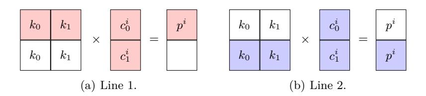
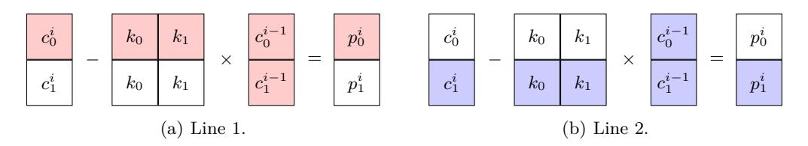

# **Cracking Matrix Modes of Operation with Goodness-of-Fit Statistics**

George Teşeleanu1*,*<sup>2</sup>

<sup>1</sup> Advanced Technologies Institute 10 Dinu Vintilă, Bucharest, Romania tgeorge@dcti.ro

<sup>2</sup> Simion Stoilow Institute of Mathematics of the Romanian Academy 21 Calea Grivitei, Bucharest, Romania

**Abstract.** The Hill cipher is a classical poly-alphabetical cipher based on matrices. Although known plaintext attacks for the Hill cipher have been known for almost a century, feasible ciphertext only attacks have been developed only about ten years ago and for small matrix dimensions. In this paper we extend the ciphertext only attacks for the Hill cipher in two ways. First, we present two attacks for the affine version of the Hill cipher. Secondly, we show that the presented attacks can be extended to several modes of operations. We also provide the reader with several experimental results and show how the message's language can influence the presented attacks.

# **1 Introduction**

Two classical ciphers based on linear algebra are the Hill cipher [\[11](#page-17-0)] and its affine version [[12\]](#page-17-1). Both use invertible matrices over integers modulo *a* to encipher messages, where *a* is the size of the language alphabet *A*. The first step of the encryption process is the encoding of each plaintext letter into a numerical equivalent. The simplest encoding is "a" = 0, "b" = 1 and so on. After encoding, the plaintext is divided into blocks of size *k* and, then, each block is multiplied with an invertible matrix of size *k*. In the affine case, a second matrix is added to the result. After each block is transformed, the result is converted back into letters. To decipher messages, one must perform the above steps in reverse.

Although both ciphers are vulnerable to known plaintext attacks[3](#page-0-0) , efficient ciphertext only attacks have been developed only a decade ago [[6\]](#page-17-2) and only for the Hill cipher[4](#page-0-1) with small *k*s. Note that as *k* increases simple brute force attacks fail. For example, in the case of the Hill cipher with *a* = 26, we have around 2 <sup>17</sup> keys for *k* = 2, 2 <sup>40</sup> keys for *k* = 3 and 2 <sup>73</sup> keys for *k* = 4 [\[6](#page-17-2)]. According to [[7,](#page-17-3) [19](#page-17-4)], given *a* and *k* the exact number of invertible matrices can be computed. Note that in the case of the affine Hill cipher the computational effort made to brute force the Hill cipher is multiplied with *a k* .

In 2007, Bauer and Millward [[6\]](#page-17-2) introduced a ciphertext only attack for the Hill cipher[5](#page-0-2) , that was later improved in [\[15](#page-17-5), [17,](#page-17-6) [23](#page-17-7)]. The attack was independently published by Khazaei and Ahmadi [[13\]](#page-17-8). The main idea of these attacks is to do a brute force attack on the key rows, instead of the whole matrix, and then recover the decryption matrix.

In [\[14](#page-17-9)], Kiele suggests the usage of block-chaining procedures to complicate the algebraic cryptanalytic techniques developed for the Hill cipher. We will show in this paper how to adapt the attacks described in [[6,](#page-17-2) [13,](#page-17-8) [23](#page-17-7)] to different modes of operation (not only the block-chaining one) for both the Hill cipher and its affine version. Note that some modes do not require the key to be invertible, thus the attack presented in[[15\]](#page-17-5) does not work for all Hill based modes. For uniformity, we will only extend Yum and Lee's attack and leave as future work the extension of [\[15](#page-17-5)] to modes requiring invertible matrices. We stress that out of the three attacks [[6,](#page-17-2) [13,](#page-17-8) [23\]](#page-17-7) Yum and Lee's attack has the best performance to message recovery ratio.

<span id="page-0-0"></span><sup>3</sup> *i.e.* after a number of known messages are encrypted, one can easily recover the encryption key(s) if he has access to the corresponding ciphertexts.

<span id="page-0-1"></span><sup>4</sup> To the authors' knowledge no attack against the affine Hill cipher has been published.

<span id="page-0-2"></span><sup>5</sup> Bauer and Millward's attack for *k* = 3 was previously and independently described online by Wutka [\[22](#page-17-10)].

Another paper that motivated this study is [5]. The authors of [5] conjecture that the fourth cryptogram of the Kryptos sculpture [3] is either encrypted using the affine Hill cipher or some other sort of cipher mode of operation. We provide the reader with a preliminary study of these conjectures. To prove or disprove these conjectures, one has to find a way to adapt all the presented ciphertext attacks to the secret encoding versions of the (affine) Hill cipher and their corresponding modes of operation. Various partial answers for the secret encoding Hill cipher are provided in [23].

Structure of the paper. Notations and definitions are presented in Section 2. The core of the paper consists of two parts, Sections 3 and 4, that contain several key ranking functions and ciphertext only attacks. Experimental results are provided in Section 5. We conclude in Section 6. The letter frequencies and the Vigenère attack used in Section 5 are given in Appendices A and B.

## <span id="page-1-0"></span>2 Preliminaries

Notations. Throughout the paper, k will denote a security parameter. We use the notation  $x \stackrel{\$}{\leftarrow} X$  when selecting a random element x from a sample space X. We also denote by  $x \leftarrow y$  the assignment of value y to variable x. The subset  $\{0,\ldots,q-1\}\in\mathbb{N}$  will be referred to as [0,q]. The set of matrices with  $\alpha$  rows,  $\beta$  columns and entries from  $\mathbb{G}$  is denoted by  $M(\alpha,\beta,\mathbb{G})$ , the set of invertible matrices by  $GL(\alpha,\mathbb{G})$  and the transpose of matrix A by  $A^T$ . The number of letters in a string m is represented by |m| and the set of all strings by  $\mathcal{A}^{\times}$ .

In this paper we use some C++ language operators (i.e. == for equality testing, +=, \*= as compound assignment operators, ++ for incrementing a variable and & as reference to a variable) as well as some native function (i.e. size()) for returning the size of the object, substring(pos, npos) for returning a substring starting from pos and containing npos characters,  $push\_back(val)$  to add val at the end of a vector and sort to sort a vector in descending order). For initializing all the entries of a vector vec with a value val we use the notation  $vec \leftarrow \{val\}$ . When presenting algorithms we consider only lower case messages represented by ASCII codes (i.e. "c" - "a" = 99 - 97 = 2).

Conventions. To minimize repetitions, we employ the following system. When reading the attacks against the Hill based modes of operation we invite the reader to ignore red colored text, while in the case of the affine Hill based modes ignore the blue text. Also, when describing algorithms we prefer using verbose names for variables, while for mathematical descriptions we prefer notations. The last convention used is to store constants in look-up tables when their size is small (e.g. letter frequencies) and in maps, otherwise (e.g. quadgraph frequencies).

#### 2.1 Ciphers

A cipher consists of three probabilistic polynomial-time algorithms: Setup, Encrypt and Decrypt. The first one takes as input a security parameter and outputs the secret key. The secret key together with the Encrypt algorithm are used to encrypt a message m. The last algorithm decrypts any message encrypted using the known secret key.

 $Hill\ cipher.$  The Hill cipher is a poly-alphabetical cipher based on linear algebra introduced by Lester S. Hill in [11]. We briefly provide the algorithms for the Hill cipher. Note that before encrypting/decrypting a text, the corresponding letters are encoded/decoded as follows: "a" to/from 0, "b" to/from 1 and so on.

Setup( $\lambda$ ): Set an integer  $k \geq \lambda$  and choose  $K_1 \stackrel{\$}{\leftarrow} GL(k, \mathbb{Z}_a)$ . Output the secret key  $sk = K_1$ . Encrypt(sk, m): Pad message m until  $|m| \equiv 0 \mod k^6$ . Divide m into blocks  $m = m_1 \| \dots \| m_\ell$ , where  $|m_i| = k$ . Compute  $c_i^T \leftarrow K_1 \cdot m_i^T$ . Output the ciphertext  $c = c_1 \| \dots \| c_\ell$ .

<span id="page-1-1"></span> $<sup>\</sup>overline{}^{6}$  Usually a rarely used letter, such as "x", is appended to m until we get the desired length.

Decrypt(sk,c): Divide c into  $\ell$  blocks  $c=c_1\|\ldots\|c_\ell$  and compute  $m_i^T\leftarrow K_1^{-1}\cdot c_i^T$ . Recover m by removing the padding

Example 1. For clarity, we further provide the reader with an example from [6]. The message "matrixencryptioniseasy" is mapped into

12, 0, 19, 17, 8, 23, 4, 13, 2, 17, 24, 15, 19, 8, 14, 13, 8, 18, 4, 0, 18, 24.

If  $K_1 \leftarrow \begin{pmatrix} 1 & 3 \\ 4 & 11 \end{pmatrix}$ , then the first block is encrypted into  $\begin{pmatrix} 1 & 3 \\ 4 & 11 \end{pmatrix} \cdot \begin{pmatrix} 12 \\ 0 \end{pmatrix} = \begin{pmatrix} 12 \\ 22 \end{pmatrix}$ . Therefore, we obtain the ciphertext "mwsdzzrdbnrbribrkwegmy"

Affine Hill cipher. An affine variation of the Hill cipher was introduced in [12]. We shortly provide the algorithms for the affine Hill cipher.

 $Setup(\lambda)$ : Set an integer  $k \geq \lambda$  and choose  $K_1 \stackrel{\$}{\leftarrow} GL(k, \mathbb{Z}_a)$  and  $K_2 \stackrel{\$}{\leftarrow} M(k, 1, \mathbb{Z}_a)$ . Output the secret key  $sk = (K_1, K_2).$ 

Encrypt(sk,m): Pad message m until  $|m| \equiv 0 \mod k$ . Divide m into blocks  $m = m_1 \parallel \ldots \parallel m_\ell$ , where  $|m_i| = k$ .

Compute  $c_i^T \leftarrow K_1 \cdot m_i^T + K_2$ . Output the ciphertext  $c = c_1 \| \dots \| c_\ell$ . Decrypt(sk, c): Divide c into  $\ell$  blocks  $c = c_1 \| \dots \| c_\ell$  and compute  $m_i^T \leftarrow K_1^{-1} \cdot (c_i^T - K_2)$ . Recover m by removing the padding.

Other affine variations of the Hill cipher. In Table 1 we present all the possible affine variations of the Hill cipher. Note that  $K_3 \stackrel{\$}{\leftarrow} M(k,1,\mathbb{Z}_a)$ . After performing some computations, we can see that for all variations we can recover  $m_i^T$  using  $f(c_i) = K_1' \cdot c_i^T + K_2'$ . Since we are interested only in recovering the encrypted messages and not the initial secret keys, all the presented attacks try to recover  $K_1'$  and  $K_2'$ . Thus, for the affine Hill cipher we only consider f for recovering  $m_i^T$ .

| Encrypt                                          | Decrypt                                               | $K_1'$     | $K_2'$             |
|--------------------------------------------------|-------------------------------------------------------|------------|--------------------|
| $c_i^T \leftarrow K_1 \cdot m_i^T + K_2$         | $m_i^T \leftarrow K_1^{-1} \cdot (c_i^T - K_2)$       | $K_1^{-1}$ | $-K_1^{-1}K_2$     |
| $c_i^T \leftarrow K_1 \cdot (m_i^T + K_2)$       | $m_i^T \leftarrow K_1^{-1} \cdot c_i^T - K_2$         | $K_1^{-1}$ | $-K_2$             |
| $c_i^T \leftarrow K_1 \cdot (m_i^T + K_2) + K_3$ | $m_i^T \leftarrow K_1^{-1} \cdot (c_i^T - K_3) - K_2$ | $K_1^{-1}$ | $-K_1^{-1}K_3-K_2$ |

<span id="page-2-0"></span>Table 1. Affine variations of the Hill cipher.

#### Cipher Modes of Operation

When we encrypt messages block by block<sup>7</sup>, identical blocks are mapped into identical ciphertexts. Thus, block patterns are preserved. This is an information leakage that can lead to security breaches. To address this issue several modes of operation where introduced in [8], such as: CBC, CTR, CFB and OFB.

In [4], the authors introduce a generalization of the CBC-MAC construction<sup>8</sup>. Based on Alagic et al.'s generalization, we present a possible adaptation of the CBC, CTR and CFB modes of operation to the (affine) Hill cipher.

Let  $E_k, D_k : M(k, k, \mathbb{Z}_a) \to M(k, k, \mathbb{Z}_a)$  be the matrix transformations of the (affine) Hill cipher's encryption and decryption. We further describe the encryption and decryption algorithms for CBC and CFB.

Encrypt(sk, m): Choose  $iv \stackrel{\$}{\leftarrow} M(1, k, \mathbb{Z}_a)$  and pad message m until  $|m| \equiv 0 \mod k$ . Divide m into blocks  $m = m_1 \| \dots \| m_\ell$ , where  $|m_i| = k$ . Let  $m_0 \leftarrow iv$ . For CBC compute  $c_i \leftarrow E_k(c_{i-1} + m_i)$ , while for CFB compute  $c_i \leftarrow E_k(c_{i-1}) + m_i$ . Let  $c = c_1 \| \dots \| c_\ell$ . The output is ciphertext (iv, c).

<span id="page-2-1"></span><sup>&</sup>lt;sup>7</sup> usually called the ECB mode of operation

<span id="page-2-2"></span><sup>&</sup>lt;sup>8</sup> the XOR operation is replaced with a generic group operation

Decrypt(sk, iv, c): Divide c into  $\ell$  blocks  $c = c_1 \| \dots \| c_\ell$ . For CBC compute  $m_i \leftarrow D_k(c_i) - c_{i-1}$  and for CFB compute  $m_i \leftarrow c_i - E_k(c_{i-1})$ . Recover m by removing the padding.

In the case of CTR, the sender and the receiver each keep a state ctr. The initial value is chosen at random  $ctr \stackrel{\$}{\leftarrow} M(1, k, \mathbb{Z}_a)$ . Before each encryption ctr is updated as follows:

```
Update(ctr): Let ctr = (\alpha_0, \dots, \alpha_{k-1}) and i \leftarrow k-1. Compute the following 1. \alpha_i \leftarrow (\alpha_i + 1) \mod a, 2. If \alpha_i = 0, then i \leftarrow (i-1) \mod k and go to step 1.
```

Now, the encryption and decryption algorithm for this mode of operation are:

```
Encrypt(sk, m): Pad message m until |m| \equiv 0 \mod k. Divide m into blocks m = m_1 \parallel \ldots \parallel m_\ell, where |m_i| = k. Compute ctr \leftarrow Update(ctr) and c_i \leftarrow E_k(ctr) + m_i. The output is ciphertext c = c_1 \parallel \ldots \parallel c_\ell. Decrypt(sk, iv, c): Divide c into \ell blocks c = c_1 \parallel \ldots \parallel c_\ell. Compute ctr \leftarrow Update(ctr) and m_i \leftarrow c_i - E_k(ctr). Recover m by removing the padding.
```

Example 2. For clarity, we provide the reader with some examples for the Update function. Let a=26 and k=2. Then Update((1,2))=(1,3), Update((1,25))=(2,0) and Update((25,25))=(0,1).

Although our attacks do not apply to the OFB mode, for completeness we provide its description.

```
Encrypt(sk, m): Choose iv \stackrel{\$}{\leftarrow} M(1, k, \mathbb{Z}_a) and pad message m until |m| \equiv 0 \mod k. Divide m into blocks m = m_1 \| \dots \| m_\ell, where |m_i| = k. Let x_0 \leftarrow iv. Compute x_i \leftarrow E_k(x_{i-1}) and c_i \leftarrow m_i + x_i. Let c = c_1 \| \dots \| c_\ell. The output is ciphertext (iv, c). Decrypt(sk, iv, c): Divide c into \ell blocks c = c_1 \| \dots \| c_\ell. Let x_0 \leftarrow iv. Compute x_i \leftarrow E_k(x_{i-1}) and m_i \leftarrow c_i - x_i. Recover m by removing the padding.
```

Remark 1. Note that the CFB, CTR and OFB modes do not require  $K_1$  to be invertible.

#### 2.3 Statistical Models

When brute forcing rows, we cannot tell immediately if the decrypted text is correct or not. But we can statistically analyze the letters of the resulting text and check if they are reasonable enough. Using the frequencies of the recovered letters and the frequencies of the characters in original language, we can rank the rows according to their relevance to the ciphertext.

In order to rank<sup>9</sup> all possible rows for the decryption key, Yum and Lee [23] introduce a goodness-of-fit score function. Compared to the score functions presented in [6,13], Yum and Lee's function describes the exact probability of the recovered plaintext. We briefly describe the goodness-of-fit score function in Algorithm 1.

Let  $E_K$  and  $D_K$  be the encryption and, respectively, decryption function of a cipher. Also, let  $c \leftarrow E_K(m)$  be the given cryptogram and K' the key we want to rank. The goodness-of-fit function takes as input the letter frequency table  $letter\_freq$  associated with the language m is written in (see Appendix A for some examples) and the letter frequency table occurrence observed in  $D_{K'}(c)$ .

To automatically separate meaningful messages from random texts, we use an approach similar with the ones described in [10, 16]. When testing a list of strings for meaning, we first score each of them using Algorithm 2 and then output the highest scoring message.

The first and second inputs of the score function are a string in and the block frequency map (in our case either a digraph  $di\_freq$  or a quadgraph  $quad\_freq$  frequency map) associated with the language we are interested in. The fourth variable  $num\_of\_letters$  controls if we are observing digraphs (i.e.  $num\_of\_letters = 2$ ) or quadgraph (i.e.  $num\_of\_letters = 4$ ). When computing block frequency maps, some blocks may be missing entirely from the training corpus. To avoid assigning a likelihood of zero to these blocks, we use the  $ad\ hoc$  method found in  $[16]^{10}$ .

<span id="page-3-0"></span> $<sup>^{9}</sup>$  according to their relevance to a given cryptogram

<span id="page-3-1"></span>i.e.  $block\_default \leftarrow \log_{10}(0.01/num\_of\_blocks)$ , where the total number of blocks found in the training corpus is denoted by  $num\_of\_blocks$ 

#### **Algorithm 1.** The goodness-of-fit score function.

```
Input: A vector of letter occurrences occurrence.
  Output: The vector's goodness-of-fit score score.
1 Function goodness_of_f it(letter_freq, occurrence):
2 score ← 1;
3 for i ∈ [0, alphabet_size] do
4 score ∗= letter_freq[i]
                               occurrence[i]
                                         / occurrence[i]!
5 end
6 return score;
```

#### <span id="page-4-1"></span>**Algorithm 2.** The score function.

```
Input: A string in, the bound number_of_rows.
  Output: The string's score score.
1 Function score_function(in, block_freq, block_freq, num_of_letters):
2 score ← 0;
3 for i ∈ [0, in. size() − num_of_letters] do
4 temp ← in.substr(i, num_of_letters);
5 if temp ∈ block_freq then
 6 score += block_freq[temp];
7 end
8 else
 9 score += block_default;
10 end
11 end
12 return score;
```

<span id="page-4-2"></span>*Remark 2.* To ease description, all frequency tables/maps will be implicit when presenting algorithms, unless otherwise specified.

### <span id="page-4-0"></span>**3 Ranking Functions**

The first step in attacking the (affine) Hill cipher and the associated modes of operation is to rank all possible rows according to their relevance to a given cryptogram. In this section we describe the ranking functions latter used in the attacks presented in Section [4](#page-6-0).

### <span id="page-4-3"></span>**3.1 (Affine) ECB**

In [\[23](#page-17-7)], the authors describe a ranking algorithm for the Hill cipher. We choose to present it in this section (Algorithm [3](#page-6-1), red text) because it is tightly linked with the affine version that we introduce (Algorithm [3,](#page-6-1) blue text).

Let *matrix*\_*size* = *k* = 2 and let *enc* = *c* be a Hill cipher cryptogram. We illustrate the influence of a given row on the decrypted plaintext *p* in Figure [1](#page-5-0). We observe that if the first and second rows are equal we obtain the same letter *p <sup>i</sup>* after decryption. Thus, is enough to decrypt the ciphertext using only the first row (*hill*\_*line*\_*decrypt*). Since we do not have duplicates, the resulting text *msg* is *k* times shorter than *c*. After decryption we compute the letter frequency observed in *msg* and use the *goodness*\_*of*\_*f it* function to obtain the row's score. After all the rows have been ranked, we sort them in descending order according to their score. In the case of the affine Hill cipher the ranking algorithm is similar. The main difference is that instead of having to brute force *k*<sup>0</sup> and *k*1, we also have to do an exhaustive search on *k*<sup>2</sup> (Figure [2](#page-5-1)). The algorithm for the generic case is given in Algorithm [3](#page-6-1).

In some cases storing a vector of size *a <sup>k</sup>*[11](#page-5-2) might be troublesome. Thus, we further consider that *f it.size*() = *B*, where *B* is dependent on the available memory. Note that in this case *f it* must be sorted and when an element is inserted we first check if its score is higher than the lowest score from *f it* and if it is, the element replaces the lowest scoring element from *f it*.

We usually work with small values of *alphabet*\_*size* and the *msg.size*() and thus we consider the complexity of the *goodness*\_*of*\_*f it* and of multiplication as *O*(1). Hence, the Hill version of Algorithm [3](#page-6-1) performs *O*(*a k* ) *hill*\_*line*\_*decryption*s and sorts a vector of size *B*. So, it has a complexity of *O*(*ka<sup>k</sup>* +*B* log *B*). In the case of the affine Hill cipher, the only change is that we perform *O*(*a <sup>k</sup>*+1) *aff ine*\_*hill*\_*line*\_*decryption*s. So, the complexity becomes *O*(*kak*+1 + *B* log *B*).



<span id="page-5-0"></span>**Fig. 1.** Line propagation in ECB.

$$\begin{array}{|c|c|c|c|c|c|c|c|c|c|c|c|c|c|c|c|c|c|c$$

<span id="page-5-1"></span>**Fig. 2.** Line propagation in affine ECB.

#### **3.2 (Affine) CBC, CTR, CFB**

Again, let *matrix*\_*size* = 2 and let *enc* be a Hill cipher cryptogram. The effect of a given row on the decrypted plaintext is shown in Figure [3](#page-6-2) for CBC, in Figure [4](#page-6-3) for CTR and in Figure [5](#page-7-0) for CFB. Compared to ECB, we can easily see that if the first and second row are identical the resulting letters are different. Thus, we need the full decryption of the Hill cipher to rank rows. After decryption, we break the resulting *msg* in two parts *msg*<sup>0</sup> and *msg*<sup>1</sup> . The first part contains the letters in even positions and the second one the letters in odd positions. After we score each part, we store them in *f it*[0] and, respectively, *f it*[1]. The last step is to sort the two vectors in descending order by score. The case of the affine Hill cipher is similar.

For the Hill modes attack, we perform *O*(*a k* ) decryptions, while for the affine version the number of decryptions is *O*(*a <sup>k</sup>*+1). Both algorithms sort *k* vectors of size *B*. Thus, the complexities are *O*(*k* 2*a <sup>k</sup>* + *kB* log *B*) and *O*(*k* 2*a <sup>k</sup>*+1 + *kB* log *B*) for the Hill attack and, respectively, for the affine attack.

<span id="page-5-2"></span><sup>11</sup> *a <sup>k</sup>*+1 for the affine version

#### **Algorithm 3.** The algorithm for ranking all possible rows for (affine) ECB.

```
Input: The ciphertext enc.
  Output: A vector f it containing all possible rows sorted by the goodness-of-fit score.
1 Function aff ine_ hill_line_decrypt(conv, key1
                                           , key2):
2 msg_int[enc.size()/ matrix_size] ← {0};
3 for i ∈ [0, conv.size()/ matrix_size] do
 4 for j ∈ [0, matrix_size] do
 5 msg_int[i] ← (msg_int[i] + key1
                                        [j] · conv[i · matrix_size +j]) mod alphabet_size;
 6 end
 7 msg_int[i] ← (msg_int[i] + key2
                                     [i mod matrix_size]) mod alphabet_size;
8 end
9 return msg_int;
10 Function aff ine_ ecb_rank(enc):
11 for key1
             [0], . . . , key1
                       [matrix_size −1] ∈ [0, alphabet_size] do
12 for key2 ∈ [0, alphabet_size] do
13 occurrence[alphabet_size] ← {0};
14 conv ← encode(enc);
15 msg_int ← hill_line_decrypt(enc, key1
16 msg_int ← aff ine_hill_line_decrypt(enc, key1
                                                     , key2
                                                          );
17 msg ← decode(msg_int)
18 for i ∈ [0, msg.size()] do
19 occurrence[msg[i] − "a"]++;
20 end
21 occurrence.sort(); \\only for Algorithm 6;
22 score ← goodness_of_f it(letter_freq, occurrence);
23 f it.push_back((key1
                             , score));
24 f it.push_back((key1
                             , key2
                                  , score));
25 end
26 end
27 f it.sort();
28 return f it;
```

<span id="page-6-1"></span>
$$\begin{array}{|c|c|c|c|c|c|c|c|c|c|c|c|c|c|c|c|c|c|c$$

<span id="page-6-2"></span>**Fig. 3.** Line propagation in CBC.

<span id="page-6-0"></span>
$$\begin{array}{c|c} \hline c_0^i \\ \hline c_1^i \\ \hline \end{array} \begin{array}{c|c} \hline k_0 & k_1 \\ \hline k_0 & k_1 \\ \hline \end{array} \times \begin{array}{c|c} \hline n_0 \\ \hline n_1 \\ \hline \end{array} = \begin{array}{c|c} \hline p_0^i \\ \hline p_1^i \\ \hline \end{array} \begin{array}{c|c} \hline c_0^i \\ \hline c_1^i \\ \hline \end{array} \begin{array}{c|c} \hline k_0 & k_1 \\ \hline k_0 & k_1 \\ \hline \end{array} \times \begin{array}{c|c} \hline n_0 \\ \hline n_1 \\ \hline \end{array} = \begin{array}{c|c} \hline p_0^i \\ \hline p_1^i \\ \hline \end{array}$$

$$\text{(a) Line 1.}$$

<span id="page-6-3"></span>**Fig. 4.** Line propagation in CTR.



<span id="page-7-0"></span>**Fig. 5.** Line propagation in CFB.

### **Algorithm 4.** The algorithm for ranking all possible rows for (affine) CBC, CTR, CFB.

**Input:** The ciphertext *enc* and the initialization vector *iv*. **Output:** A family of vectors *f it* containing all possible rows sorted by the goodness-of-fit score.

```
1 Function aff ine_ mode_rank(enc, iv):
2 for a[0], . . . , a[matrix_size −1] ∈ [0, alphabet_size] do
3 for b ∈ [0, alphabet_size] do
4 occurrence[matrix_size][alphabet_size] ← {0};
5 for i ∈ [0, matrix_size] do
6 for j ∈ [0, matrix_size] do
 7 key1
                   [i][j] ← a[j];
8 end
9 key2
                [i] ← b;
10 end
11 conv ← encode(enc);
12 msg_int ← mode_decrypt(enc, iv, key1
                                       );
13 msg_int ← aff ine_mode_decrypt(enc, iv, key1
                                              , key2
                                                  );
14 msg ← decode(msg_int)
15 for i ∈ [0, msg.size()/ matrix_size] do
16 for j ∈ [0, matrix_size] do
17 occurrence[j][msg[i · matrix_size +j] − "a"]++;
18 end
19 end
20 for i ∈ [0, matrix_size] do
21 occurrence[i]. sort(); \\only for Algorithm 8;
22 score ← goodness_of_f it(letter_freq, occurrence[i]);
23 f it[i]. push_back((a, score));
24 f it[i]. push_back((a, b, score));
25 end
26 end
27 end
28 for i ∈ [0, matrix_size] do
29 f it[i]. sort();
30 end
31 return f it;
```

### <span id="page-7-1"></span>**4 Message Recovering Attacks**

After the ranking step is over, we can proceed to the recovering step. When searching for the original message a lot of random text is produced. To filter random messages from ones with meaning we use the *score*\_*function* to score each message and we always output the highest scoring one.

### 4.1 (Affine) ECB

The authors of [6,23] describe the message recovering algorithm for the Hill cipher, but they do not provide an automatic detection method for the original message. On the other hand, the authors of [13] trade-off success probability for an unique output. The gap is filled in [15]. We present the algorithm in this section (Algorithm 5, red text), instead of Section 2, because of its link to the affine version we introduce (Algorithm 5, blue text). Due to better results in practice, in Algorithm 5 we use a different scoring function<sup>12</sup> than the one from [15]<sup>13</sup>. Also, compared to [15], we only output the highest scoring message without lowering the success probability.

After ranking all possible rows, we need to find the decryption key's rows ( $check\_variants$ ) and their order ( $check\_variant$ ). Hence, Algorithm 5 checks all possible row combinations with index less than  $number\_of\_rows = B$ . Note that the success probability is dependent on  $number\_of\_rows^{14}$ . After selecting k rows from fit, we test all possible row permutations<sup>15</sup>, decrypt enc and rank the result. If one of the decrypted texts has a higher score than the stored message  $global\_msg$ , we overwrite  $global\_msg$  and update  $global\_score$ . The main differences between the Hill cipher attack and the affine Hill cipher attack are: the call to the affine ranking algorithm, the creation of  $k_2$  and the call to the affine decryption algorithm.

For the same reasons as in Section 3.1, we further consider the complexity of the  $score\_function$  as  $\mathcal{O}(1)$ . After the row ranking step, both message recovering algorithms perform  $\mathcal{O}(B!/(B-k)!)$  decryptions. Thus, the complexities for the Hill attack and for the affine attack are  $\mathcal{O}(ka^k + B \log B + k^2 B!/(B-k)!)$  and, respectively,  $\mathcal{O}(ka^{k+1} + B \log B + k^2 B!/(B-k)!)$ .

### 4.2 Affine ECB (Second Approach)

In [23], the authors propose a ranking method for the Hill cipher with unknown encoding and decoding functions. The basic idea is that encoding functions act as substitution ciphers and thus leave letter distributions intact. According to their method, to score a row one needs to sort in ascending order both *letter\_freq* and *occurrence* and then use Algorithm 1 to obtain the row's score. Note that Yum and Lee do not provide a message recovering algorithm.

The affine Hill cipher can be seen as the composition of a Hill cipher and a Vigenère cipher. Thus, we use Yum and Lee's ranking method to find  $K'_1$ 's rows  $(ecb\_rank)$ , decrypt the cryptogram using the trial  $K'_1$   $(hill\_decrypt)$  and then use a Vigenère message recovery algorithm  $(break\_vigenere)$  to find  $K'_2$ . This method is formally described in Algorithm 6. Note that  $break\_vigenere^{16}$  returns the score of the  $trial\_msg$ . Unfortunately, we can not use only this score to filter messages. For example, when k=2 the texts easy and aeys have the same  $trial\_score$ . Hence, we use a second scoring system based on quadgrams to differentiate between trial messages with the same score. Note that the only difference between  $check\_variants\_2$  and  $check\_variants$  is that the latter is using the  $check\_variant\_2$  function.

We consider the complexity of break\_vigenere as being  $\mathcal{O}(1)$ , since it is linear in the cryptogram's size. Then, the complexity of the second algorithm is  $\mathcal{O}(ka^k + B \log B + k^2 B!/(B - k)!)$ .

#### 4.3 (Affine) CBC, CTR, CFB

The main difference between ECB and the other the modes is that after the ranking step is over, in the former case we know the exact position of the key rows. Thus, in Algorithm 7 we iterate over all rows (check\_variants\_mode), decrypt the cryptogram and then score the result (check\_variant\_mode).

The  $check\_variants\_mode$  function performs  $\mathcal{O}(B^k)$  decryptions. Thus, Algorithm 7's complexity for the Hill based modes attack and for the affine versions is  $\mathcal{O}(k^2a^k + kB\log B + k^2B^k)$  and, respectively,  $\mathcal{O}(k^2a^{k+1} + kB\log B + k^2B^k)$ .

<span id="page-8-0"></span><sup>&</sup>lt;sup>12</sup> based on quadgraphs

<span id="page-8-1"></span><sup>&</sup>lt;sup>13</sup> based on the index of coincidence

<span id="page-8-2"></span><sup>&</sup>lt;sup>14</sup> see Section 5 for the experimental results

<span id="page-8-3"></span> $<sup>^{15}</sup>$   $\sigma_i$  denotes the *i*th permutation of length  $mat\_size$ 

<span id="page-8-4"></span><sup>&</sup>lt;sup>16</sup> see Appendix B for a concrete algorithm

#### **Algorithm 5.** The algorithm for breaking (affine) ECB.

```
Input: The ciphertext enc, the bound number_of_rows.
  Output: The best possible message global_msg and its associated score global_score.
1 Function check_variant(enc, rows, & global_score, & global_msg):
2 best_score ← −∞;
3 for i ∈ [0, matrix_size!] do
 4 for s ∈ [0, matrix_size] do
 5 for t ∈ [0, matrix_size] do
 6 key1
                  [s][t] ← rows[σi[s]]. key1
                                     [t];
 7 end
 8 key2
               [s] ← rows[σi[s]]. key2
 9 end
10 trial_msg ← hill_decrypt(enc, key1
11 trial_msg ← aff ine_hill_decrypt(enc, key1
                                            , key2
                                                 );
12 trial_score ← score_function(trial_msg, quad_freq, quad_default, 4);
13 if trial_score > best_score then
14 best_score ← trial_score;
15 best_msg ← trial_msg;
16 end
17 end
18 if best_score > global_score then
19 global_score ← best_score;
20 global_msg ← best_msg;
21 end
22 Function check_variants(enc, f it, number_of_rows):
23 global_score ← −∞;
24 global_msg ← "";
25 for i0 ∈ [0, number_of_rows] do
26 for i1 ∈ [i0 + 1, number_of_rows] do
27 · · ·
28 for imatrix_size −1 ∈ [imatrix_size −2 + 1, number_of_rows] do
29 trial_rows ← ∅;
30 for j ∈ [0, matrix_size] do
31 trial_rows.push_back(f it[ij ]);
32 end
33 check_variant(enc, trial_rows, global_score, global_msg);
34 end
35 end
36 end
37 return (global_score, global_msg);
38 Function aff ine_ ecb_attack(enc, number_of_rows):
39 f it ← aff ine_ ecb_rank(enc);
40 return check_variants(enc, f it, number_of_rows);
```

#### <span id="page-9-0"></span>**4.4 Affine CBC, CTR, CFB (Second Approach)**

As in the case of the affine Hill cipher, attacking a affine based mode can be interpreted as attacking a Hill-Vigenère cipher mode of operation. We present this complementary attack in Algorithm [8.](#page-12-0) Note that the only difference between *check*\_*variants*\_*mode* and *check*\_*variants*\_*mode*\_2 is that the former uses the *check*\_*variant*\_*mode*\_2 function. The time complexity of Algorithm [8](#page-12-0) is *O*(*k a <sup>k</sup>* + *kB* log *B* + *k B<sup>k</sup>* ).

#### **Algorithm 6.** The algorithm for breaking affine ECB (second approach).

```
Input: The ciphertext enc, the bound number_of_rows.
  Output: The best possible message global_msg and its associated score global_score.
1 Function check_variant _2(enc, rows, & global_score, & global_msg):
2 best_score ← −∞;
3 for i ∈ [0, matrix_size!] do
 4 for s ∈ [0, matrix_size] do
 5 for t ∈ [0, matrix_size] do
 6 key1
                  [s][t] ← rows[σi[s]]. key1
                                     [t];
 7 end
 8 end
 9 hill_msg ← hill_decrypt(enc, key1
                                    );
10 (trial_score, trial_msg) ← break_vigenere(hill_msg);
11 if trial_score > best_score then
12 best_score ← trial_score;
13 best_msg ← trial_msg;
14 end
15 if trial_score == best_score then
16 f irst_quad_score ← score_function(best_msg, quad_freq, quad_default, 4);
17 second_quad_score ← score_function(trial_msg, quad_freq, quad_default, 4);
18 if second_quad_score > f irst_quad_score then
19 best_msg ← trial_msg;
20 end
21 end
22 end
23 if best_score > global_score then
24 global_score ← best_score;
25 global_msg ← best_msg;
26 end
27 Function aff ine_ecb_attack_2(enc, number_of_rows):
28 f it ← ecb_rank(enc);
29 return check_variants_2(enc, f it, number_of_rows);
```

### <span id="page-10-1"></span><span id="page-10-0"></span>**5 Experimental Results**

We implemented Algorithms [5](#page-9-0) to [8](#page-12-0) in order to see the relation between *B* and the algorithms' success probability[17](#page-10-2). To see the influence of the message's native language on the attack algorithms' recovery rate, we tested this type of relation for eight languages: Danish (DN), English (EN), Finnish (FN), French (FR), German (GE), Polish (PL), Spanish (SP) and Swedish (SW). We also computed the running time of Algorithms [5](#page-9-0) to [8](#page-12-0) for the English language and *k* = 2 (Section [5.5\)](#page-15-0). Besides providing the reader with some benchmarks, we also wanted to have a precise comparison[18](#page-10-3) between the two affine attack approaches.

In our implementations, frequency tables have *a* = 26 values and are derived from the frequencies provided in [[16\]](#page-17-16). For completeness, we describe the tables in Appendix [A.](#page-18-0) The quadgrams for the English language are downloaded from [\[16](#page-17-16)], while the digraph[19](#page-10-4) frequencies are computed from the quadgraph map. The algorithm for breaking Vigenère is given in Appendix [B.](#page-20-0)

For computing the success probability we used 100 texts with 100 letters (without diacritical marks) for each language. Each text was encrypted with a different key(s)/initialization vector/counter. The texts are taken from news items found in the Leipzig Corpora Collection [\[9](#page-17-17)]. The keys, initialization vectors and

<span id="page-10-2"></span>We refer the reader to Sections [5.2](#page-12-1) to [5.4](#page-14-0) for the results.

<span id="page-10-3"></span>that takes into account the hidden constants found in asymptotic notations

<span id="page-10-4"></span>If *abcd* is a quadgraph, we consider *ac* as a digraph.

**Algorithm 7.** The algorithm for breaking (affine) CBC, CTR, CFB.

```
Input: The ciphertext enc, the initialization vector iv, the bound number_of_rows.
  Output: The best possible message global_msg and its associated score global_score.
1 Function check_variant_mode(enc, iv, rows, & global_score, & global_msg):
2 for s ∈ [0, matrix_size] do
 3 for t ∈ [0, matrix_size] do
 4 key1
               [s][t] ← rows[s].a[t];
 5 end
 6 key2
            [s] ← rows[s].b;
7 end
8 trial_msg ← mode_decrypt(enc, iv, key1
                                       );
9 trial_msg ← aff ine_mode_decrypt(enc, iv, key1
                                               , key2
                                                   );
10 trial_score ← score_function(trial_msg, quad_freq, quad_default, 4);
11 if trial_score > global_score then
12 global_score ← trial_score;
13 global_msg ← trial_msg;
14 end
15 Function check_variants_mode(enc, f it, number_of_rows):
16 global_score ← −∞;
17 global_msg ← "";
18 for i0 ∈ [0, number_of_rows] do
19 for i1 ∈ [0, number_of_rows] do
20 · · ·
21 for imatrix_size −1 ∈ [0, number_of_rows] do
22 trial_rows ← ∅;
23 for j ∈ [0, matrix_size] do
24 trial_rows.push_back(f it[j][ij ]);
25 end
26 check_variant_mode(enc, iv, trial_rows, global_score, global_msg);
27 end
28 end
29 end
30 return (global_score, global_msg);
31 Function aff ine_ mode_attack(enc, number_of_rows):
32 f it ← aff ine_ mode_rank(enc, iv);
33 return check_variants_mode(enc, iv, f it, number_of_rows);
```

<span id="page-11-0"></span>counters are generated using the default generator found in the GMP library [\[2](#page-17-18)]. When invertible keys were needed, we computed the inverse using the Armadillo library [\[20](#page-17-19)] and tested if the determinant is coprime with 26.

#### **5.1 Unicity Distance of a Cipher**

When analyzing the experimental results, the reader will observe different message recovery rates for different languages. These differences arise from distinct unicity distances[20](#page-11-1) for distinct languages. The exact formula for the unicity distance when *a* = 26 is log<sup>2</sup> 26*<sup>k</sup>/*(log<sup>2</sup> 26 *− H*), where *H* is the language's entropy. Note that in our case the unicity distance is computed for one key row and we estimated the entropy from the frequency tables provided in Appendix [A.](#page-18-0) The results for the unicity distance are provided in Table [2.](#page-12-2) We can see that in the case of the Polish language we need more letters per row than for the Finnish language. This gap will be more pronounced when determining the message recovery rates.

<span id="page-11-1"></span>The minimum ciphertext length required to determine the secret key almost uniquely.

#### **Algorithm 8.** The algorithm for breaking affine CBC, CTR, CFB (second approach).

```
Input: The ciphertext enc, the initialization vector iv, the bound number_of_rows.
  Output: The best possible message global_msg and its associated score global_score.
1 Function check_variant_mode_2(enc, iv, rows, & global_score, & global_msg):
 2 for s ∈ [0, matrix_size] do
 3 for t ∈ [0, matrix_size] do
 4 key1
                [s][t] ← rows[s].a[t];
 5 end
 6 end
 7 hill_msg ← mode_decrypt(enc, iv, key1
                                         );
 8 (trial_score, trial_msg) ← break_vigenere(hill_msg);
 9 if trial_score > global_score then
10 global_score ← trial_score;
11 global_msg ← trial_msg;
12 end
13 Function aff ine_mode_attack_2(enc, number_of_rows):
14 f it ← mode_rank(enc, iv);
15 return check_variants_mode_2(enc, iv, f it, number_of_rows);
```

<span id="page-12-0"></span>

| Language | k = 2   | k = 3   | k = 4   |
|----------|---------|---------|---------|
| Danish   | 15.4323 | 23.1485 | 30.8647 |
| English  | 18.2180 | 27.3270 | 36.4359 |
| Finnish  | 12.0307 | 18.0460 | 24.0614 |
| French   | 13.3713 | 20.0569 | 26.7425 |
| German   | 15.6257 | 23.4386 | 31.2515 |
| Polish   | 22.3918 | 33.5878 | 44.7837 |
| Spanish  | 13.7891 | 20.6836 | 27.5781 |
| Swedish  | 16.4837 | 24.7256 | 32.9674 |

<span id="page-12-2"></span>**Table 2.** Unicity distance.

### <span id="page-12-1"></span>**5.2 Hill Modes of Operation Message Recovery Rates**

|     | B | DN  | EN  | FN  | FR  | GE  | PL | SP  | SW  |
|-----|---|-----|-----|-----|-----|-----|----|-----|-----|
|     | 2 | 94  | 93  | 100 | 96  | 95  | 84 | 96  | 95  |
| ECB | 4 | 99  | 100 | 100 | 98  | 100 | 91 | 100 | 100 |
|     | 1 | 95  | 95  | 100 | 99  | 97  | 84 | 99  | 99  |
| CBC | 2 | 99  | 99  | 100 | 100 | 100 | 90 | 100 | 100 |
|     | 1 | 96  | 93  | 100 | 96  | 98  | 87 | 100 | 98  |
| CTR | 2 | 99  | 98  | 100 | 99  | 100 | 90 | 100 | 100 |
|     | 1 | 97  | 92  | 99  | 96  | 95  | 87 | 98  | 98  |
| CFB | 2 | 100 | 99  | 100 | 100 | 99  | 91 | 100 | 100 |

**Table 3.** Number of recovered messages for the Hill modes of operation when *k* = 2.

|     | B  | DN | EN | FN  | FR | GE | PL | SP | SW |
|-----|----|----|----|-----|----|----|----|----|----|
|     | 8  | 88 | 59 | 97  | 90 | 71 | 22 | 87 | 80 |
| ECB | 16 | 95 | 77 | 100 | 95 | 86 | 45 | 96 | 94 |
|     | 32 | 97 | 87 | 100 | 98 | 94 | 68 | 99 | 99 |
|     | 4  | 86 | 57 | 99  | 92 | 71 | 18 | 91 | 78 |
| CBC | 8  | 93 | 68 | 99  | 96 | 80 | 34 | 96 | 86 |
|     | 16 | 96 | 80 | 100 | 96 | 89 | 55 | 97 | 96 |
|     | 4  | 64 | 40 | 84  | 65 | 46 | 11 | 68 | 45 |
| CTR | 8  | 80 | 59 | 94  | 87 | 67 | 19 | 83 | 66 |
|     | 16 | 91 | 75 | 97  | 93 | 80 | 48 | 92 | 77 |
| CFB | 4  | 85 | 53 | 99  | 90 | 73 | 12 | 89 | 78 |
|     | 8  | 93 | 66 | 99  | 94 | 81 | 36 | 94 | 87 |
|     | 16 | 96 | 79 | 100 | 97 | 91 | 52 | 96 | 96 |

**Table 4.** Number of recovered messages for the Hill modes of operation when *k* = 3.

|     | B    | DN | EN | FN  | FR | GE | PL | SP | SW |
|-----|------|----|----|-----|----|----|----|----|----|
|     | 512  | 78 | 48 | 97  | 89 | 72 | 10 | 85 | 74 |
| ECB | 1024 | 88 | 65 | 98  | 91 | 89 | 19 | 94 | 86 |
|     | 2048 | 95 | 80 | 99  | 95 | 94 | 39 | 95 | 93 |
|     | 32   | 78 | 50 | 97  | 89 | 69 | 13 | 88 | 72 |
| CBC | 64   | 87 | 67 | 99  | 91 | 86 | 21 | 93 | 84 |
|     | 128  | 93 | 78 | 99  | 95 | 94 | 45 | 95 | 93 |
|     | 32   | 71 | 37 | 91  | 77 | 55 | 6  | 80 | 64 |
| CTR | 64   | 87 | 58 | 97  | 90 | 79 | 21 | 90 | 83 |
|     | 128  | 93 | 75 | 100 | 95 | 94 | 40 | 99 | 88 |
| CFB | 32   | 78 | 48 | 97  | 88 | 69 | 14 | 86 | 73 |
|     | 64   | 87 | 65 | 98  | 91 | 85 | 18 | 92 | 85 |
|     | 128  | 93 | 75 | 99  | 95 | 95 | 45 | 94 | 95 |

**Table 5.** Number of recovered messages for the Hill modes of operation when *k* = 4.

### **5.3 Affine Hill Modes of Operation Message Recovery Rates (First Approach)**

|     | B | DN | EN | FN  | FR | GE | PL | SP  | SW  |
|-----|---|----|----|-----|----|----|----|-----|-----|
|     | 2 | 89 | 80 | 100 | 90 | 88 | 54 | 93  | 92  |
| ECB | 4 | 97 | 94 | 100 | 98 | 99 | 79 | 98  | 99  |
|     | 8 | 99 | 99 | 100 | 99 | 99 | 87 | 99  | 100 |
|     | 1 | 93 | 85 | 100 | 99 | 85 | 57 | 96  | 93  |
| CBC | 2 | 97 | 88 | 100 | 99 | 93 | 68 | 98  | 100 |
|     | 4 | 99 | 95 | 100 | 99 | 99 | 78 | 100 | 100 |
|     | 1 | 92 | 72 | 100 | 93 | 90 | 48 | 96  | 95  |
| CTR | 2 | 97 | 88 | 100 | 96 | 98 | 68 | 99  | 99  |
|     | 4 | 98 | 97 | 100 | 99 | 99 | 78 | 100 | 100 |
| CFB | 1 | 89 | 80 | 100 | 95 | 91 | 54 | 98  | 93  |
|     | 2 | 97 | 92 | 100 | 98 | 97 | 69 | 100 | 99  |
|     | 4 | 99 | 97 | 100 | 99 | 99 | 83 | 100 | 100 |

**Table 6.** Number of recovered messages for the affine Hill modes of operation when *k* = 2.

|     | B   | DN | EN | FN | FR | GE | PL | SP | SW |
|-----|-----|----|----|----|----|----|----|----|----|
|     | 32  | 70 | 43 | 97 | 86 | 49 | 3  | 85 | 63 |
| ECB | 64  | 84 | 50 | 99 | 91 | 62 | 11 | 87 | 75 |
|     | 128 | 93 | 65 | 99 | 93 | 79 | 21 | 94 | 88 |
|     | 32  | 71 | 40 | 98 | 86 | 47 | 5  | 83 | 61 |
| CBC | 64  | 82 | 50 | 99 | 93 | 65 | 11 | 90 | 74 |
|     | 128 | 90 | 65 | 99 | 93 | 78 | 25 | 95 | 97 |
|     | 32  | 35 | 13 | 56 | 40 | 19 | 3  | 37 | 18 |
| CTR | 64  | 58 | 28 | 85 | 63 | 36 | 6  | 60 | 45 |
|     | 128 | 81 | 49 | 98 | 82 | 59 | 13 | 83 | 77 |
| CFB | 32  | 70 | 38 | 97 | 87 | 50 | 3  | 83 | 74 |
|     | 64  | 84 | 49 | 99 | 93 | 64 | 8  | 89 | 86 |
|     | 128 | 91 | 63 | 99 | 93 | 77 | 23 | 94 | 96 |

**Table 7.** Number of recovered messages for the affine Hill modes of operation when *k* = 3.

|     | B     | DN | EN | FN  | FR | GE | PL | SP | SW |
|-----|-------|----|----|-----|----|----|----|----|----|
|     | 16384 | 82 | 53 | 98  | 90 | 79 | 14 | 89 | 79 |
| ECB | 32768 | 92 | 69 | 99  | 93 | 93 | 26 | 94 | 88 |
|     | 65536 | 96 | 83 | 100 | 95 | 95 | 54 | 96 | 94 |
|     | 16384 | 80 | 53 | 98  | 89 | 76 | 14 | 88 | 78 |
| CBC | 32768 | 89 | 69 | 99  | 93 | 92 | 27 | 94 | 87 |
|     | 65536 | 96 | 80 | 100 | 95 | 95 | 61 | 96 | 93 |
|     | 16384 | 77 | 46 | 95  | 86 | 63 | 11 | 86 | 74 |
| CTR | 32768 | 87 | 66 | 98  | 92 | 89 | 26 | 92 | 85 |
|     | 65536 | 95 | 79 | 100 | 97 | 95 | 53 | 96 | 92 |
| CFB | 16384 | 81 | 53 | 98  | 89 | 76 | 15 | 88 | 77 |
|     | 32768 | 90 | 68 | 99  | 93 | 92 | 27 | 94 | 87 |
|     | 65536 | 96 | 81 | 100 | 95 | 95 | 59 | 96 | 93 |

**Table 8.** Number of recovered messages for the affine Hill modes of operation when *k* = 4.

### <span id="page-14-0"></span>**5.4 Affine Hill Modes of Operation Message Recovery Rates (Second Approach)**

|     | B   | DN  | EN | FN  | FR  | GE | PL  | SP  | SW  |
|-----|-----|-----|----|-----|-----|----|-----|-----|-----|
|     | 128 | 73  | 59 | 59  | 40  | 70 | 7   | 28  | 72  |
| ECB | 256 | 92  | 83 | 98  | 97  | 90 | 32  | 98  | 89  |
|     | 512 | 100 | 98 | 100 | 100 | 99 | 100 | 100 | 100 |
|     | 16  | 84  | 35 | 99  | 96  | 82 | 2   | 97  | 63  |
| CBC | 32  | 95  | 57 | 100 | 97  | 92 | 4   | 100 | 87  |
|     | 64  | 98  | 84 | 100 | 98  | 96 | 10  | 100 | 95  |
|     | 16  | 65  | 33 | 94  | 96  | 68 | 1   | 96  | 49  |
| CTR | 32  | 92  | 58 | 100 | 97  | 87 | 5   | 100 | 82  |
|     | 64  | 99  | 80 | 100 | 98  | 96 | 12  | 100 | 95  |
| CFB | 16  | 79  | 39 | 99  | 95  | 80 | 2   | 97  | 63  |
|     | 32  | 94  | 60 | 100 | 98  | 91 | 6   | 100 | 86  |
|     | 64  | 98  | 80 | 100 | 98  | 95 | 9   | 100 | 95  |

**Table 9.** Number of recovered messages for the secret coding affine Hill modes of operation when *k* = 2.

|     | B     | DN  | EN | FN  | FR  | GE | PL | SP  | SW  |
|-----|-------|-----|----|-----|-----|----|----|-----|-----|
|     | 4096  | 24  | 25 | 63  | 71  | 44 | 0  | 71  | 32  |
| ECB | 8192  | 53  | 54 | 97  | 98  | 71 | 4  | 94  | 64  |
|     | 16384 | 99  | 93 | 100 | 100 | 98 | 89 | 100 | 97  |
|     | 4096  | 34  | 34 | 96  | 91  | 55 | 0  | 92  | 45  |
| CBC | 8192  | 68  | 62 | 100 | 99  | 79 | 3  | 100 | 76  |
|     | 16384 | 100 | 96 | 100 | 100 | 98 | 47 | 100 | 96  |
|     | 4096  | 30  | 36 | 88  | 88  | 54 | 0  | 91  | 44  |
| CTR | 8192  | 68  | 60 | 100 | 99  | 81 | 3  | 100 | 77  |
|     | 16384 | 100 | 96 | 100 | 100 | 98 | 41 | 100 | 100 |
| CFB | 4096  | 34  | 35 | 96  | 92  | 56 | 0  | 92  | 47  |
|     | 8192  | 65  | 62 | 100 | 99  | 82 | 3  | 100 | 74  |
|     | 16384 | 100 | 95 | 100 | 100 | 98 | 47 | 100 | 100 |

**Table 10.** Number of recovered messages for the secret coding affine Hill modes of operation when *k* = 3.

|     | B      | DN | EN | FN  | FR  | GE | PL | SP  | SW |
|-----|--------|----|----|-----|-----|----|----|-----|----|
|     | 200000 | 46 | 32 | 86  | 76  | 30 | 0  | 82  | 53 |
| ECB | 300000 | 73 | 64 | 96  | 98  | 71 | 2  | 95  | 78 |
|     | 400000 | 93 | 86 | 100 | 100 | 91 | 16 | 100 | 94 |
|     | 200000 | 54 | 38 | 89  | 83  | 37 | 0  | 91  | 56 |
| CBC | 300000 | 76 | 67 | 97  | 99  | 76 | 1  | 98  | 82 |
|     | 400000 | 93 | 87 | 100 | 100 | 91 | 5  | 100 | 94 |
|     | 200000 | 54 | 41 | 90  | 84  | 38 | 0  | 85  | 56 |
| CTR | 300000 | 76 | 67 | 96  | 95  | 73 | 2  | 98  | 82 |
|     | 400000 | 95 | 86 | 100 | 100 | 94 | 4  | 100 | 95 |
|     | 200000 | 54 | 38 | 90  | 83  | 38 | 0  | 91  | 54 |
| CFB | 300000 | 76 | 66 | 97  | 99  | 76 | 1  | 97  | 81 |
|     | 400000 | 94 | 87 | 100 | 100 | 91 | 6  | 100 | 94 |

**Table 11.** Number of recovered messages for the secret coding affine Hill modes of operation when *k* = 4.

### <span id="page-15-0"></span>**5.5 Running time**

In this section we provide some benchmarks for Algorithms [5](#page-9-0) to [8.](#page-12-0) The algorithms were run on a CPU Intel i7-4790 4.00 GHz and compiled with GCC with the O3 flag activated and the *omp\_get\_wtime()* function [\[1](#page-17-20)] was used to compute the running times. Due to resource constrains, we stopped the experiments at *k* = 3 for the Hill attacks and at *k* = 2 for the affine attacks. To obtain a fair comparison, when computing the running times, we used higher *B* values than the one presented in Sections [5.2](#page-12-1) to [5.4](#page-14-0). We present the exact margins in Table [12.](#page-15-1)

<span id="page-15-1"></span>

|      | Hill     | Afine Hill (1) | Afine Hill (2) | Hill      |
|------|----------|----------------|----------------|-----------|
| Mode | (k = 2)  | (k = 2)        | (k = 2)        | (k = 3)   |
| ECB  | 4 (100%) | 8 (99%)        | 512 (98%)      | 128 (97%) |
| CBC  | 2 (99%)  | 4 (95%)        | 256 (96%)      | 128 (95%) |
| CTR  | 2 (98%)  | 4 (97%)        | 256 (98%)      | 128 (96%) |
| CFB  | 2 (99%)  | 4 (97%)        | 256 (98%)      | 128 (96%) |

**Table 12.** The threshold *B* and the corresponding success probability for the English language.

In Table [13](#page-16-1), the second and third columns contain the total time necessary to recover 100 independent texts, the fourth and fifth columns the total time necessary to recover 8 texts. It is clear from the presented results that the first approach (Affine Hill (1)) has significantly lower running times than the second approach (Affine Hill (2)). Note that in the case of the second approach the difference between the ECB attack and the rest of the attacks is due to the extra *score*\_*function* calls made when the *trial*\_*score* is equal to the *best*\_*score*.

| Mode | Hill    | Afine Hill (1) | Afine Hill (2) | Hill    |
|------|---------|----------------|----------------|---------|
|      | (k = 2) | (k = 2)        | (k = 2)        | (k = 3) |
| ECB  | 0.94057 | 23.1658        | 1805.98        | 1415.60 |
| CBC  | 1.75324 | 45.4769        | 379.762        | 1502.20 |
| CTR  | 1.75827 | 45.9883        | 374.439        | 1423.39 |
| CFB  | 1.75271 | 48.5864        | 360.428        | 1509.62 |

<span id="page-16-1"></span>**Table 13.** Running times of Algorithms [5](#page-9-0) to [8](#page-12-0).

Let *k* = 2. To see if the chosen bounds have the same success rate for other texts, we encrypted 1000 independent texts[21](#page-16-2) and then we run Algorithms [5](#page-9-0) and [7.](#page-11-0) The number of plaintexts recovered is presented in Table [14.](#page-16-3) We can see that for the Hill based modes the success probabilities are almost the same, while for the affine versions the probabilities are a little lower than the initial estimations.

<span id="page-16-3"></span>

| Cipher         | ECB | CBC | CTR | CFB |
|----------------|-----|-----|-----|-----|
| Hill           | 995 | 987 | 982 | 982 |
| Afine Hill (1) | 970 | 956 | 945 | 953 |

**Table 14.** Success rates for Algorithms [5](#page-9-0) and [7](#page-11-0) when *k* = 2.

### <span id="page-16-0"></span>**6 Conclusions**

In this paper we adapted Yum and Lee's attack to the affine Hill cipher. Also, we introduced new ranking and message recovery algorithms for the CBC, CTR and CFB modes of operation. We also conducted a series of experiments to determine and test the success rates of these algorithms.

*Future Work.* The row ranking algorithms perform the same instructions for disjoint rows. Thus, an interesting implementation direction is to parallelize Algorithms [3](#page-6-1) and [4](#page-7-1). The recovering algorithms also perform the same instructions, but for independent keys. Hence, Algorithms [5](#page-9-0) and [7](#page-11-0) can also be parallelized.

Another possible speed-up is to parallelize the algorithm presented [[15\]](#page-17-5) for the Hill cipher. Note that this speed-up can also be applied to the Hill CBC mode. From a theoretical point of view, it would be interesting to see if the Leap *et.al.*'s algorithm can be tweaked to work for the affine Hill cipher. If it can be tweaked we might obtain faster decryption times for the affine Hill and the corresponding CBC mode.

A time-memory trade-off attack for the Hill cipher is presented in [\[17](#page-17-6)]. Thus, it might be interesting to see if this attack can be adapted to the affine version and to the (affine) modes of operation versions. From an implementation point of view, it might worth seeing if McDevitt *et.al.*'s attack can be parallelized.

In [[23\]](#page-17-7), the authors provide a ranking algorithm when the the encoding and decoding functions are unknown, but they do not describe a message recovery algorithm. This cipher can be seen as a composition of a substitution cipher, a Hill cipher and a second substitution cipher. Note that the two substitution

<span id="page-16-2"></span><sup>21</sup> different from the 100 texts used for computing the bounds

ciphers do not necessarily have the same key. A generic version of the secret coding cipher can be obtained by combining a generic Vigenère cipher[22](#page-17-21), a Hill cipher and a second generic Vigenère cipher. Note that in this case Yum and Lee's ranking algorithm still works. Hence, another possible research direction is to find message recovery algorithms[23](#page-17-22) for this generic cipher.

In [[12\]](#page-17-1), Hill introduces a variation of the affine Hill cipher in which the elements of the key matrix are matrices. Thus, an interesting problem is to study the impact of the message recovering algorithms on the version presented in [[12\]](#page-17-1).

# **References**

- <span id="page-17-20"></span>1. OpenMP. <https://www.openmp.org/>
- <span id="page-17-18"></span>2. The GNU Multiple Precision Arithmetic Library. <https://gmplib.org/>
- <span id="page-17-12"></span>3. Kryptos. <https://en.wikipedia.org/wiki/Kryptos> (accessed 3 February 2018)
- <span id="page-17-14"></span>4. Alagic, G., Russell, A.: Quantum-Secure Symmetric-Key Cryptography Based on Hidden Shifts. In: EURO-CRYPT 2018. Lecture Notes in Computer Science, vol. 10212, pp. 65–93. Springer (2017)
- <span id="page-17-11"></span>5. Bauer, C., Link, G., Molle, D.: James Sanborn's Kryptos and the Matrix Encryption Conjecture. Cryptologia **40**(6), 541–552 (2016)
- <span id="page-17-2"></span>6. Bauer, C., Millward, K.: Cracking Matrix Encryption Row by Row. Cryptologia **31**(1), 76–83 (2007)
- <span id="page-17-3"></span>7. Bauer, F.L.: Decrypted Secrets: Methods and Maxims of Cryptology. Springer (2002)
- <span id="page-17-13"></span>8. Dworkin, M.: Recommendation for Block Cipher Modes of Operation. Methods and Techniques. Tech. rep., NIST (2001)
- <span id="page-17-17"></span>9. Goldhahn, D., Eckart, T., Quasthoff, U.: Building Large Monolingual Dictionaries at the Leipzig Corpora Collection: From 100 to 200 Languages. In: LREC 2012. vol. 29, pp. 31–43. European Language Resources Association (ELRA) (2012)
- <span id="page-17-15"></span>10. Hasinoff, S.: Solving Substitution Ciphers. [https://people.csail.mit.edu/hasinoff/pubs/](https://people.csail.mit.edu/hasinoff/pubs/hasinoff-quipster-2003.pdf) [hasinoff-quipster-2003.pdf](https://people.csail.mit.edu/hasinoff/pubs/hasinoff-quipster-2003.pdf) (accessed 3 February 2018)
- <span id="page-17-0"></span>11. Hill, L.S.: Cryptography in an Algebraic Alphabet. The American Mathematical Monthly **36**(6), 306–312 (1929)
- <span id="page-17-1"></span>12. Hill, L.S.: Concerning Certain Linear Transformation Apparatus of Cryptography. The American Mathematical Monthly **38**(3), 135–154 (1931)
- <span id="page-17-8"></span>13. Khazaei, S., Ahmadi, S.: Ciphertext-Only Attack on *d × d* Hill in *O*(*d*13*<sup>d</sup>* ). Information Processing Letters **118**, 25–29 (2017)
- <span id="page-17-9"></span>14. Kiele, W.A.: A Tensor-Theoretic Enhancement to the Hill Cipher System. Cryptologia **14**(3), 225–233 (1990)
- <span id="page-17-5"></span>15. Leap, T., McDevitt, T., Novak, K., Siermine, N.: Further Improvements to the Bauer-Millward Attack on the Hill Cipher. Cryptologia **40**(5), 452–468 (2016)
- <span id="page-17-16"></span>16. Lyons, J.: Practical Cryptography, <http://practicalcryptography.com/> (accessed 3 February 2018)
- <span id="page-17-6"></span>17. McDevitt, T., Lehr, J., Gu, T.: A Parallel Time-memory Tradeoff Attack on the Hill Cipher. Cryptologia **42**(5), 1–19 (2018)
- 18. Menezes, A.J., Van Oorschot, P.C., Vanstone, S.A.: Handbook of Applied Cryptography. CRC press (1996)
- <span id="page-17-4"></span>19. Overbey, J., Traves, W., Wojdylo, J.: On the Keyspace of the Hill Cipher. Cryptologia **29**(1), 59–72 (2005)
- <span id="page-17-19"></span>20. Sanderson, C., Curtin, R.: Armadillo: A Template-Based C++ Library for Linear Algebra. Journal of Open Source Software **1**(2), 26 (2016)
- <span id="page-17-23"></span>21. Stinson, D.R.: Cryptography: Theory and Practice. CRC press (2005)
- <span id="page-17-10"></span>22. Wutka, M.: The Crypto Forum, <http://s13.zetaboards.com/Crypto/topic/123721/1/> (accessed 3 February 2018)
- <span id="page-17-7"></span>23. Yum, D.H., Lee, P.J.: Cracking Hill Ciphers with Goodness-of-Fit Statistics. Cryptologia **33**(4), 335–342 (2009)

<span id="page-17-21"></span><sup>22</sup> By a generic Vigenère cipher we understand a Vigenère cipher with random alphabets.

<span id="page-17-22"></span><sup>23</sup> that might use Yum and Lee's ranking algorithm

# <span id="page-18-0"></span>**A Letter Frequencies**

To have uniform letter frequency tables, we added the probability of letters with diacritical marks to the probability of their base letter. For example, in Danish, the letter O has a 0*.*0464 occurrence probability and the letter Ø one of 0*.*0094. We added the two and we recorded O's probability as 0*.*0558. Note that the frequency tables we used for computing our tables are from [\[16](#page-17-16)].

| A, Å, Æ | 0.0809 | H | 0.0162 | O, Ø | 0.0558 | V | 0.0233 |
|---------|--------|---|--------|------|--------|---|--------|
| B       | 0.0200 | I | 0.0600 | P    | 0.0176 | W | 0.0007 |
| C       | 0.0056 | J | 0.0073 | Q    | 0.0001 | X | 0.0003 |
| D       | 0.0586 | K | 0.0339 | R    | 0.0896 | Y | 0.0070 |
| E       | 0.1545 | L | 0.0523 | S    | 0.0581 | Z | 0.0003 |
| F       | 0.0241 | M | 0.0324 | T    | 0.0686 |   |        |
| G       | 0.0408 | N | 0.0724 | U    | 0.0198 |   |        |

**Table 15.** Relative frequencies of Danish letters.

| A | 0.0855 | H | 0.0496 | O | 0.0747 | V | 0.0106 |
|---|--------|---|--------|---|--------|---|--------|
| B | 0.0160 | I | 0.0733 | P | 0.0207 | W | 0.0183 |
| C | 0.0316 | J | 0.0022 | Q | 0.0010 | X | 0.0019 |
| D | 0.0387 | K | 0.0081 | R | 0.0633 | Y | 0.0172 |
| E | 0.1210 | L | 0.0421 | S | 0.0673 | Z | 0.0011 |
| F | 0.0218 | M | 0.0253 | T | 0.0894 |   |        |
| G | 0.0209 | N | 0.0717 | U | 0.0268 |   |        |

**Table 16.** Relative frequencies of English letters.

| A, Ä | 0.1580 | H | 0.0185 | O, Ö | 0.0605 | V | 0.0225 |
|------|--------|---|--------|------|--------|---|--------|
| B    | 0.0028 | I | 0.1082 | P    | 0.0184 | W | 0.0009 |
| C    | 0.0028 | J | 0.0204 | Q    | 0.0001 | X | 0.0003 |
| D    | 0.0104 | K | 0.0497 | R    | 0.0287 | Y | 0.0174 |
| E    | 0.0797 | L | 0.0576 | S    | 0.0786 | Z | 0.0005 |
| F    | 0.0019 | M | 0.0320 | T    | 0.0875 |   |        |
| G    | 0.0039 | N | 0.0883 | U    | 0.0501 |   |        |

**Table 17.** Relative frequencies of Finnish letters.

| A, À,     | 0.0808 | H       | 0.0093 | O, Ô, Œ    | 0.0546 | V | 0.0129 |
|------------|--------|---------|--------|------------|--------|---|--------|
| B          | 0.0096 | I, Î, Ï | 0.0726 | P          | 0.0298 | W | 0.0008 |
| C, Ç       | 0.0344 | J       | 0.0030 | Q          | 0.0085 | X | 0.0043 |
| D          | 0.0408 | K       | 0.0016 | R          | 0.0686 | Y | 0.0034 |
| E, È, É, Ê | 0.1745 | L       | 0.0586 | S          | 0.0798 | Z | 0.0010 |
| F          | 0.0112 | M       | 0.0278 | T          | 0.0711 |   |        |
| G          | 0.0118 | N       | 0.0732 | U, Ù, Û, Ü | 0.0559 |   |        |

**Table 18.** Relative frequencies of French letters.

| A, Ä | 0.0688 | H | 0.0411 | O, Ö | 0.0299 | V | 0.0094 |
|------|--------|---|--------|------|--------|---|--------|
| B    | 0.0221 | I | 0.0760 | P    | 0.0106 | W | 0.0140 |
| C    | 0.0271 | J | 0.0027 | Q    | 0.0004 | X | 0.0007 |
| D    | 0.0492 | K | 0.0150 | R    | 0.0771 | Y | 0.0013 |
| E    | 0.1599 | L | 0.0372 | S, ß | 0.0656 | Z | 0.0122 |
| F    | 0.0180 | M | 0.0275 | T    | 0.0643 |   |        |
| G    | 0.0302 | N | 0.0959 | U, Ü | 0.0376 |   |        |

**Table 19.** Relative frequencies of German letters.

| A, Ą | 0.0997 | H    | 0.0125 | O, Ó | 0.0879 | V       | 0.0000 |
|------|--------|------|--------|------|--------|---------|--------|
| B    | 0.0139 | I    | 0.0809 | P    | 0.0292 | W       | 0.0478 |
| C, Ć | 0.0422 | J    | 0.0226 | Q    | 0.0000 | X       | 0.0000 |
| D    | 0.0323 | K    | 0.0354 | R    | 0.0506 | Y       | 0.0370 |
| E, Ę | 0.0849 | L, Ł | 0.0418 | S, Ś | 0.0504 | Z, Ź, Ż | 0.0590 |
| F    | 0.0041 | M    | 0.0273 | T    | 0.0394 |         |        |
| G    | 0.0154 | N, Ń | 0.0602 | U    | 0.0259 |         |        |

**Table 20.** Relative frequencies of Polish letters.

| A | 0.1250 | H    | 0.0081 | O | 0.0898 | V | 0.0098 |
|---|--------|------|--------|---|--------|---|--------|
| B | 0.0127 | I    | 0.0691 | P | 0.0275 | W | 0.0003 |
| C | 0.0443 | J    | 0.0045 | Q | 0.0083 | X | 0.0019 |
| D | 0.0514 | K    | 0.0008 | R | 0.0662 | Y | 0.0079 |
| E | 0.1324 | L    | 0.0584 | S | 0.0744 | Z | 0.0042 |
| F | 0.0079 | M    | 0.0261 | T | 0.0442 |   |        |
| G | 0.0117 | N, Ñ | 0.0731 | U | 0.0400 |   |        |

**Table 21.** Relative frequencies of Spanish letters.

| A, Ä, Å | 0.1252 | H | 0.0209 | O, Ö | 0.0579 | V | 0.0242 |
|---------|--------|---|--------|------|--------|---|--------|
| B       | 0.0154 | I | 0.0582 | P    | 0.0184 | W | 0.0014 |
| C       | 0.0149 | J | 0.0061 | Q    | 0.0002 | X | 0.0016 |
| D       | 0.0470 | K | 0.0314 | R    | 0.0843 | Y | 0.0071 |
| E       | 0.1015 | L | 0.0528 | S    | 0.0659 | Z | 0.0007 |
| F       | 0.0203 | M | 0.0347 | T    | 0.0769 |   |        |
| G       | 0.0286 | N | 0.0854 | U    | 0.0192 |   |        |

**Table 22.** Relative frequencies of Swedish letters.

### <span id="page-20-0"></span>**B Vigenère Cryptanalysis**

In [\[21](#page-17-23)], the author describes an algorithm for breaking the Vigenère cipher. Because of better results in practice, we changed the scoring function from [\[21](#page-17-23)] with a scoring function based on digraphs. The result is presented in Algorithm [9](#page-20-1).

**Algorithm 9.** The algorithm for breaking the Vigenère cipher with key length *matrix*\_*size*.

```
Input: The ciphertext enc.
  Output: The best possible message best_msg and its associated score best_score.
1 Function decrypt_vigenere(enc, key):
2 fragment[matrix_size] ← {""};
3 for i ∈ [0, enc.size()/ matrix_size] do
 4 for j ∈ [0, matrix_size] do
 5 fragment[j] += (enc[i · matrix_size +j] − "a" + key) mod alphabet_size +"a";
 6 end
7 end
8 return fragment;
9 Function compute_score(best_fragment_score):
10 best_score ← 0;
11 for i ∈ [0, matrix_size] do
12 best_score += best_fragment_score[i];
13 end
14 return best_score;
15 Function recompose_msg(best_fragment):
16 best_msg ← "";
17 for i ∈ [0, enc_size / matrix_size] do
18 for j ∈ [0, matrix_size] do
19 best_msg += best_fragment[j][i];
20 end
21 end
22 return best_msg;
23 Function break_vigenere(enc):
24 best_fragment_score[matrix_size] ← {−∞};
25 for key ∈ [0, alphabet_size] do
26 fragment ← decrypt_vigenere(enc, key);
27 for i ∈ [0, matrix_size] do
28 fragment_score[i] ← score_function(fragment[i], digraph_freq, digraph_default, 2);
29 if fragment_score[i] > best_fragment_score[i] then
30 best_fragment_score[i] ← fragment_score[i];
31 best_fragment[i] ← fragment[i];
32 end
33 end
34 best_score ← compute_score(best_fragment_score);
35 best_msg ← recompose_msg(best_fragment);
36 end
37 return (best_score, best_msg);
```