## FASTER COMPUTATION OF ISOGENIES OF LARGE PRIME DEGREE

DANIEL J. BERNSTEIN, LUCA DE FEO, ANTONIN LEROUX, AND BENJAMIN SMITH

Dedicated to the memory of Peter Lawrence Montgomery

ABSTRACT. Let  $\mathcal{E}/\mathbb{F}_q$  be an elliptic curve, and P a point in  $\mathcal{E}(\mathbb{F}_q)$  of prime order  $\ell$ . Vélu's formulæ let us compute a quotient curve  $\mathcal{E}'=\mathcal{E}/\langle P\rangle$  and rational maps defining a quotient isogeny  $\phi:\mathcal{E}\to\mathcal{E}'$  in  $\widetilde{O}(\ell)$   $\mathbb{F}_q$ -operations, where the  $\widetilde{O}$  is uniform in q. This article shows how to compute  $\mathcal{E}'$ , and  $\phi(Q)$  for Q in  $\mathcal{E}(\mathbb{F}_q)$ , using only  $\widetilde{O}(\sqrt{\ell})$   $\mathbb{F}_q$ -operations, where the  $\widetilde{O}$  is again uniform in q. As an application, this article speeds up some computations used in the isogeny-based cryptosystems CSIDH and CSURF.

#### 1. Introduction

<span id="page-0-0"></span>Let  $\mathcal{E}$  be an elliptic curve over a finite field  $\mathbb{F}_q$  of odd characteristic, and let P be a point in  $\mathcal{E}(\mathbb{F}_q)$  of order n. The point P generates a cyclic subgroup  $\mathcal{G} \subseteq \mathcal{E}(\mathbb{F}_q)$ , and there exists an elliptic curve  $\mathcal{E}'$  over  $\mathbb{F}_q$  and a separable degree-n quotient isogeny

$$\phi: \mathcal{E} \longrightarrow \mathcal{E}'$$
 with  $\ker \phi = \mathcal{G} = \langle P \rangle$ ;

the isogeny  $\phi$  is also defined over  $\mathbb{F}_q$ . We want to compute  $\phi(Q)$  for a point Q in  $\mathcal{E}(\mathbb{F}_q)$  as efficiently as possible.

If n is composite, then we can decompose  $\phi$  into a series of isogenies of prime degree. Computationally, this assumes that we can factor n, but finding a prime factor  $\ell$  of n is not a bottleneck compared to the computation of an  $\ell$ -isogeny by the techniques considered here. We thus reduce to the case where  $n = \ell$  is prime.

Vélu introduced formulæ for  $\phi$  and  $\mathcal{E}'$  (see [53] and [36, §2.4]): for  $\mathcal{E}$  defined by  $y^2 = x^3 + a_2x^2 + a_4x + a_6$  and  $\ell \geq 3$ , we have

$$\phi: (X,Y) \longmapsto \left(\frac{\Phi_{\mathcal{G}}(X)}{\Psi_{\mathcal{G}}(X)^2}, \frac{Y\Omega_{\mathcal{G}}(X)}{\Psi_{\mathcal{G}}(X)^3}\right)$$

where

$$\begin{split} \Psi_{\mathcal{G}}(X) &= \prod_{s=1}^{(\ell-1)/2} \left( X - x([s]P) \right), \\ \Phi_{\mathcal{G}}(X) &= 4(X^3 + a_2 X^2 + a_4 X + a_6) (\Psi_{\mathcal{G}}'(X)^2 - \Psi_{\mathcal{G}}''(X) \Psi_{\mathcal{G}}(X)) \\ &\quad - 2(3X^2 + 2a_2 X + a_4) \Psi_{\mathcal{G}}'(X) \Psi(X) + (\ell X - \sum_{s=1}^{\ell-1} x([s]P)) \Psi_{\mathcal{G}}(X)^2, \\ \Omega_{\mathcal{G}}(X) &= \Phi_{\mathcal{G}}'(X) \Psi_{\mathcal{G}}(X) - 2\Phi_{\mathcal{G}}(X) \Psi_{\mathcal{G}}'(X). \end{split}$$

Date: 2020.03.23.

Author list in alphabetical order; see <a href="https://www.ams.org/profession/leaders/culture/CultureStatement04.pdf">https://www.ams.org/profession/leaders/culture/CultureStatement04.pdf</a>. Part of this work was carried out while the first author was visiting the Simons Institute for the Theory of Computing. This work was supported by the Cisco University Research Program, by DFG Cluster of Excellence 2092 "CASA: Cyber Security in the Age of Large-Scale Adversaries", and by the U.S. National Science Foundation under grant 1913167. "Any opinions, findings, and conclusions or recommendations expressed in this material are those of the author(s) and do not necessarily reflect the views of the National Science Foundation" (or other funding agencies). Permanent ID of this document: 44d5ade1c1778d86a5b035ad20f880c08031a1dc.

The obvious way to compute  $\phi(Q)$  is to compute the rational functions shown above, i.e., to compute the coefficients of the polynomials  $\Psi_G, \Phi_G, \Omega_G$ ; and then evaluate those polynomials. This takes  $\widetilde{O}(\ell)$  operations. (If we need the defining equation of  $\mathcal{E}'$ , then we can obtain it by evaluating  $\phi(Q)$  for a few Q outside  $\mathcal{G}$ , possibly after extending  $\mathbb{F}_q$ , and then interpolating a curve equation through the resulting points. Alternatively, Vélu gives further formulas for the defining equation.) We emphasize, however, that the goal is not to compute the coefficients of these functions; the goal is to evaluate the functions at a specified point.

The core algorithmic problem falls naturally into a more general framework: the efficient evaluation of polynomials and rational functions over  $\mathbb{F}_q$  whose roots are values of a function from a cyclic group to  $\mathbb{F}_q$ .

Fix a cyclic group  $\mathcal{G}$  (which we will write additively), a generator P of  $\mathcal{G}$ , and a function  $f: \mathcal{G} \to \mathbb{F}_q$ . For each finite subset S of  $\mathbb{Z}$ , we define a polynomial

$$h_S(X) = \prod_{s \in S} (X - f([s]P)),$$

where [s]P denotes the sum of s copies of P. The kernel polynomial  $\Psi_{\mathcal{G}}(x)$  above is an example of this, with f=x and  $S=\{1,\ldots,(\ell-1)/2\}$ . Another example is the cyclotomic polynomial  $\Phi_n$ , where f embeds  $\mathbb{Z}/n\mathbb{Z}$  in the roots of unity of  $\mathbb{F}_q$ , and  $\Phi_n(X)=h_S(X)$  where  $S=\{i\mid 0\leq i< n,\gcd(i,n)=1\}$ . More generally, if f maps  $i\mapsto \zeta^i$  for some  $\zeta$ , then  $h_S(X)$  is a polynomial whose roots are various powers of  $\zeta$ ; similarly, if f maps  $i\mapsto i\beta$  for some  $\beta$ , then  $h_S(X)$  is a polynomial whose roots are various integer multiples of  $\beta$ .

Given f and S, then, we want to compute  $h_S(\alpha)$  for any  $\alpha$  in  $\mathbb{F}_q$ . We can always do this directly in O(#S)  $\mathbb{F}_q$ -operations. But if S has enough additive structure, and if f is sufficiently compatible with the group structure on  $\mathcal{G}$ , then we can do this in  $\widetilde{O}(\sqrt{\#S})$   $\mathbb{F}_q$ -operations, as we will see in §2, §3, and §4. Our main theoretical result is Theorem 4.11, which shows how to achieve this quasi-square-root complexity for a large class of S when f is the x-coordinate on an elliptic curve. We apply this to the special case of efficient  $\ell$ -isogeny computation in §5. We discuss applications in isogeny-based cryptography in §6.

Most of this paper focuses on asymptotic exponents, in particular improving  $\ell$ -isogeny evaluation from cost  $\widetilde{O}(\ell)$  to cost  $\widetilde{O}(\sqrt{\ell})$ . However, this analysis hides polylogarithmic factors that can swamp the exponent improvement for small  $\ell$ . In Appendix A we instead analyze costs for concrete values of  $\ell$ , and ask how large  $\ell$  needs to be for the  $\widetilde{O}(\sqrt{\ell})$  algorithms to outperform conventional algorithms.

# 1.1. **Model of computation.** We state our framework for $\mathbb{F}_q$ for concreteness. All time complexities are in $\mathbb{F}_q$ -operations, with the O and $\widetilde{O}$ uniform over q.

The ideas are more general. The algorithms here are algebraic algorithms in the sense of [14], and can further be lifted to algorithms defined over  $\mathbb{Z}[1/2]$  and in some cases over  $\mathbb{Z}$ . In other words, the algorithms are agnostic to the choice of q in  $\mathbb{F}_q$ , except for sometimes requiring q to be odd; and the algorithms can also be applied to more general rings, as long as all necessary divisions can be carried out.

Restricting to algebraic algorithms can damage performance. For example, for most input sizes, the fastest known algorithms to multiply polynomials over  $\mathbb{F}_q$  are faster than the fastest known algebraic algorithms for the same task. This speedup is only polylogarithmic and hence is not visible at the level of detail of our analysis (before Appendix A), but implementors should be aware that simply performing a sequence of separate  $\mathbb{F}_q$  operations is not always the best approach.

#### 2. Strassen's deterministic factorization algorithm

<span id="page-2-0"></span>As a warmup, we review a deterministic algorithm that provably factors n into primes in time  $\widetilde{O}(n^{1/4})$ . There are several such algorithms in the literature using fast polynomial arithmetic, including [50], [10], [21], and [32]; there is also a separate series of lattice-based algorithms surveyed in, e.g., [4]. Strassen's algorithm from [50] has the virtue of being particularly simple, and is essentially the algorithm presented in this section.

The state of the art in integer factorization has advanced far beyond  $\widetilde{O}(n^{1/4})$ . For example, ECM [37], Lenstra's elliptic-curve method of factorization, is plausibly conjectured to take time  $n^{o(1)}$ . We present Strassen's algorithm because Strassen's main subroutine is the simplest example of a much broader speedup that we use.

2.1. Factorization via modular factorials. Computing  $\gcd(n,\ell! \bmod n)$  reveals whether n has a prime factor  $\leq \ell$ . Binary search through all  $\ell \leq \sqrt{n}$  then finds the smallest prime factor of n. Repeating this process completely factors n into primes.

The rest of this section focuses on the problem of computing  $\ell! \mod n$ , given positive integers  $\ell$  and n. The algorithm of §2.3 uses  $\widetilde{O}(\sqrt{\ell})$  additions, subtractions, and multiplications in  $\mathbb{Z}/n\mathbb{Z}$ , plus negligible overhead. For comparison, a straightforward computation would use  $\ell-1$  multiplications modulo n. The  $\widetilde{O}$  here is uniform over n.

- 2.2. Modular factorials as an example of the main problem. Define  $\mathcal{G}$  as the additive group  $\mathbb{Z}$ , define P=1, define  $f:\mathcal{G}\to\mathbb{Z}/n\mathbb{Z}$  as  $s\mapsto s$ , and define  $h_S(X)=\prod_{s\in S}(X-f([s]P))\in(\mathbb{Z}/n\mathbb{Z})[X]$ . Then, in particular,  $h_S(X)=(X-1)\cdots(X-\ell)$  for  $S=\{1,\ldots,\ell\}$ , and one can compute  $\ell!$  mod n by computing  $h_S(\ell+1)$  or, alternatively, by computing  $(-1)^\ell h_S(0)$ . This fits the modular-factorials problem, in the special case that n is a prime number q, into the framework of §1.
- <span id="page-2-2"></span>2.3. An algorithm for modular factorials. Compute  $b = \lfloor \sqrt{\ell} \rfloor$ , and define  $I = \{0, 1, 2, \dots, b-1\}$ . Use a product tree to compute the polynomial  $h_I(X) = X(X-1)(X-2)\cdots(X-(b-1)) \in (\mathbb{Z}/n\mathbb{Z})[X]$ .

Define  $J = \{b, 2b, 3b, \dots, b^2\}$ . Compute  $h_J(X)$ , and then compute the resultant of  $h_J(X)$  and  $h_I(X)$ . This resultant is  $h_I(b)h_I(2b)h_I(3b)\cdots h_I(b^2)$ , i.e.,  $(b^2)!$  mod n. One can compute the resultant of two polynomials via continued fractions; see, e.g., [51]. An alternative here, since  $h_J$  is given as a product of linear polynomials, is to use a remainder tree to compute  $h_I(b), h_I(2b), \dots, h_I(b^2) \in \mathbb{Z}/n\mathbb{Z}$ , and then multiply. Either approach uses  $\widetilde{O}(\sqrt{\ell})$  operations.

Finally, multiply by  $(b^2 + 1)(b^2 + 2) \cdots \ell \mod n$ , obtaining  $\ell! \mod n$ .

#### 3. Evaluation of Polynomials whose roots are powers

<span id="page-2-1"></span>Pollard [46] introduced a deterministic algorithm that provably factors n into primes in time  $O(n^{1/4+\epsilon})$ . Strassen's algorithm from [50] was a streamlined version of Pollard's algorithm, replacing  $O(n^{1/4+\epsilon})$  with  $\widetilde{O}(n^{1/4})$ .

This section reviews Pollard's main subroutine, a fast method to evaluate a polynomial whose roots (with multiplicity) form a geometric progression. For comparison, Strassen's main subroutine is a fast method to evaluate a polynomial whose roots form an arithmetic progression. See §2.3 above.

3.1. A multiplicative version of modular factorials. Fix  $\zeta \in (\mathbb{Z}/n\mathbb{Z})^*$ . Define  $\mathcal{G} = \mathbb{Z}$ , define P = 1, define  $f : \mathcal{G} \to (\mathbb{Z}/n\mathbb{Z})^*$  as  $s \mapsto \zeta^s$ , and define  $h_S(X) = \prod_{s \in S} (X - f([s]P)) = \prod_{s \in S} (X - \zeta^s) \in (\mathbb{Z}/n\mathbb{Z})[X]$ . (For comparison, in §2, f was  $s \mapsto s$ , and  $h_S(X)$  was  $\prod_{s \in S} (X - s)$ .)

In particular,  $h_S(X) = \prod_{s=1}^\ell (X - \zeta^s)$  for  $S = \{1, 2, 3, \dots, \ell\}$ . Given  $\alpha \in \mathbb{Z}/n\mathbb{Z}$ , one can straightforwardly evaluate  $h_S(\alpha)$  for this S using  $O(\ell)$  algebraic operations in  $\mathbb{Z}/n\mathbb{Z}$ . The method in §3.2 accomplishes the same result using only  $\widetilde{O}(\sqrt{\ell})$  operations. The O and  $\widetilde{O}$  are uniform in n, and all of the algorithms here can take  $\zeta$  as an input rather than fixing it. There are some divisions by powers of  $\zeta$ , but divisions are included in the definition of algebraic operations.

Pollard uses the special case  $h_S(1) = \prod_{s=1}^{\ell} (1-\zeta^s)$ . This is  $(1-\zeta)^{\ell}$  times the quantity  $(1+\zeta)(1+\zeta+\zeta^2)\cdots(1+\zeta+\cdots+\zeta^{\ell-1})$ . It would be standard to call the latter quantity a "q-factorial" if the letter "q" were used in place of " $\zeta$ "; beware, however, that it is not standard to call this quantity a " $\zeta$ -factorial". For a vast generalization of Pollard's algorithm to q-holonomic sequences, see [9]; in §4, we will generalize it in a different direction.

<span id="page-3-0"></span>3.2. An algorithm for the multiplicative version of modular factorials. Compute  $b = \lfloor \sqrt{\ell} \rfloor$ , and define  $I = \{1, 2, 3, ..., b\}$ . Use a product tree to compute the polynomial  $h_I(X) = \prod_{i=1}^b (X - \zeta^i)$ .

Define  $J = \{0, b, 2b, \ldots, (b-1)b\}$ , and use a remainder tree to compute  $h_I(\alpha/\zeta^j)$  for all  $j \in J$ . Pollard uses the chirp-z transform [47] (Bluestein's trick) instead of a remainder tree, saving a logarithmic factor in the number of operations, and it is also easy to save a logarithmic factor in computing  $h_I(X)$ , but these speedups are not visible at the level of detail of the analysis in this section.

Multiply  $\zeta^{jb}$  by  $h_I(\alpha/\zeta^j)$  to obtain  $\prod_{i=1}^b (\alpha-\zeta^{i+j})$  for each j, and then multiply across  $j \in J$  to obtain  $\prod_{s=1}^{b^2} (\alpha-\zeta^s)$ . Finally, multiply by  $\prod_{s=b^2+1}^{\ell} (\alpha-\zeta^s)$  to obtain the desired  $h_S(\alpha)$ .

One can view the product  $\prod_{s=1}^{b^2} (\alpha - \zeta^s)$  here, like the product  $(b^2)!$  in §2, as the resultant of two degree-b polynomials. Specifically,  $\prod_j h_I(\alpha/\zeta^j)$  is the resultant of  $\prod_j (X - \alpha/\zeta^j)$  and  $h_I$ ; and  $\prod_j \zeta^{jb} h_I(\alpha/\zeta^j)$  is the resultant of  $\prod_j (\zeta^j X - \alpha)$  and  $h_I$ . One can, if desired, use continued-fraction resultant algorithms rather than multipoint evaluation via a remainder tree.

3.3. Structures in S and f. We highlight two structures exploited in the above computation of  $\prod_{s=1}^{\ell} (\alpha - \zeta^s)$ . First, the set  $S = \{1, 2, \dots, \ell\}$  has enough additive structure to allow most of it to be decomposed as I + J, where I and J are much smaller sets. Second, the map  $s \mapsto \zeta^s$  is a group homomorphism, allowing each  $\zeta^{i+j}$  to be computed as the product of  $\zeta^i$  and  $\zeta^j$ ; we will return to this point in §4.1.

We now formalize the statement regarding additive structure, focusing on the  $\mathbb{F}_q$  case that we will need later in the paper. First, some terminology: we say that sets of integers I and J have no common differences if  $i_1 - i_2 \neq j_1 - j_2$  for all  $i_1 \neq i_2$  in I and all  $j_1 \neq j_2$  in J. If I and J have no common differences, then the map  $I \times J \to I + J$  sending (i,j) to i+j is a bijection.

<span id="page-3-1"></span>**Lemma 3.4.** Let q be a prime power. Let  $\zeta$  be an element of  $\mathbb{F}_q^*$ . Define  $h_S(X) = \prod_{s \in S} (X - \zeta^s) \in \mathbb{F}_q[X]$  for each finite subset S of  $\mathbb{Z}$ . Let I and J be finite subsets of  $\mathbb{Z}$  with no common differences. Then

$$h_{I+J}(X) = \operatorname{Res}_{Z}(h_{I}(Z), H_{J}(X, Z))$$

where  $\operatorname{Res}_{Z}(\cdot,\cdot)$  is the bivariate resultant, and

$$H_J(X,Z) := \prod_{j \in J} (X - \zeta^j Z).$$

Proof. Res<sub>Z</sub>( $h_I(Z), H_J(X, Z)$ ) =  $\prod_{i \in I} \prod_{j \in J} (X - \zeta^i \zeta^j) = \prod_{(i,j) \in I \times J} (X - \zeta^{i+j}) = h_{I+J}(X)$  since the map  $I \times J \to I + J$  sending (i,j) to i+j is bijective.

Algorithm 1 is an algebraic algorithm that outputs  $h_S(\alpha)$  given  $\alpha$ . The algorithm is parameterized by  $\zeta$  and the set S, and also by finite subsets  $I, J \subset \mathbb{Z}$ with no common differences such that  $I + J \subseteq S$ . The algorithm and the proof of Proposition 3.5 are stated using generic resultant computation (via continued fractions), but, as in  $\S 2.3$  and  $\S 3.2$ , one can alternatively use multipoint evaluation.

```
Algorithm 1: Computing h_S(\alpha) = \prod_{s \in S} (\alpha - \zeta^s)
Parameters: a prime power q; \zeta \in \mathbb{F}_q^*; finite subsets I, J, K \subseteq \mathbb{Z} such that
                            I and J have no common differences and (I+J) \cap K = \{\}
```

**Input:**  $\alpha$  in  $\mathbb{F}_a$ 

**Output:**  $h_S(\alpha)$  where  $h_S(X) = \prod_{s \in S} (X - \zeta^s)$  and  $S = (I + J) \cup K$ 

- <span id="page-4-2"></span> $1 h_I \leftarrow \prod_{i \in I} (Z - \zeta^i) \in \mathbb{F}_q[Z]$
- <span id="page-4-3"></span> $\mathbf{2} \ H_J \leftarrow \prod_{j \in J} (\alpha - \zeta^j Z) \in \mathbb{F}_q[Z]$
- <span id="page-4-4"></span> $\mathbf{3} \ h_{I+J} \leftarrow \mathrm{Res}_Z(h_I, H_J) \in \mathbb{F}_q$
- <span id="page-4-5"></span>4  $h_K \leftarrow \prod_{k \in K} (\alpha - \zeta^k) \in \mathbb{F}_q$
- 5 return  $h_{I+J} \cdot h_K$

<span id="page-4-1"></span>**Proposition 3.5.** Let q be a prime power. Let  $\zeta$  be an element of  $\mathbb{F}_q^*$ . Let I, Jbe finite subsets of  $\mathbb{Z}$  with no common differences. Let K be a finite subset of  $\mathbb{Z}$  disjoint from I+J. Given  $\alpha$  in  $\mathbb{F}_q$ , Algorithm 1 outputs  $\prod_{s\in S}(\alpha-\zeta^s)$  using  $\widetilde{O}(\max(\#I, \#J, \#K))$   $\mathbb{F}_q$ -operations, where  $S = (I+J) \cup K$ .

The  $\widetilde{O}$  is uniform in q. The algorithm can also take  $\zeta$  as an input, at the cost of computing  $\zeta^i$  for  $i \in I$ ,  $\zeta^j$  for  $j \in J$ , and  $\zeta^k$  for  $k \in K$ . This preserves the time bound if the elements of I, J, K have  $O(\max(\#I, \#J, \#K))$  bits.

*Proof.* Since  $S \setminus K = I + J$ , we have  $h_S(\alpha) = h_{I+J}(\alpha) \cdot h_K(\alpha)$ , and Lemma 3.4 shows that  $h_{I+J}(\alpha) = \operatorname{Res}_Z(h_I(Z), H_J(\alpha, Z))$ . Line 1 computes  $h_I(Z)$  in  $\widetilde{O}(\#I)$  $\mathbb{F}_q$ -operations; Line 2 computes  $H_J(\alpha, Z)$  in O(#J)  $\mathbb{F}_q$ -operations; Line 3 computes  $h_{I+J}(\alpha)$  in  $\widetilde{O}(\max(\#I,\#J))$   $\mathbb{F}_q$ -operations; and Line 4 computes  $h_K(\alpha)$  in  $\widetilde{O}(\#K)$  $\mathbb{F}_q$ -operations. The total is  $O(\max(\#I, \#J, \#K))$   $\mathbb{F}_q$ -operations.

3.6. Optimization. The best conceivable case for the time bound in Proposition 3.5, as a function of #S, is  $\widetilde{O}(\sqrt{\#S})$ . Indeed,  $\#S = \#I \cdot \#J + \#K$ , so  $\max(\#I, \#J, \#K) \ge \sqrt{\#S + 1/4} - 1/2.$ 

To reach  $\widetilde{O}(\sqrt{\#S})$  for a given set of exponents S, we need sets I and J with no common differences such that  $I+J\subseteq S$  with #I, #J, and  $\#(S\setminus (I+J))$  in  $O(\sqrt{\#S})$ . Such I and J exist for many useful sets S. Example 3.7 shows a simple form for I and J when S is an arithmetic progression.

<span id="page-4-6"></span>**Example 3.7.** Suppose S is an arithmetic progression of length n: that is,

$$S = \{m, m+r, m+2r, \dots, m+(n-1)r\}$$

for some m and some nonzero r. Let  $b = |\sqrt{n}|$ , and set

$$I := \{ir \mid 0 \le i < b\}$$
 and  $J := \{m + jbr \mid 0 \le j < b\};$ 

then I and J have no common differences, and  $I + J = \{m + kr \mid 0 \le k \le b^2\}$ , so

$$I + J = S \setminus K$$
 where  $K = \{m + kr \mid b^2 \le k < n\}$ .

Now #I = #J = b, and  $\#K = n - b^2 \le 2b$ , so we can use these sets to compute  $h_S(\alpha)$  in  $\widetilde{O}(b) = \widetilde{O}(\sqrt{n})$   $\mathbb{F}_q$ -operations, following Proposition 3.5. (In the case r=1, we recognise the index sets driving Shanks' baby-step giant-step algorithm.)

### 4. Elliptic resultants

<span id="page-5-0"></span>The technique in §[3](#page-2-1) for evaluating polynomials whose roots are powers is well known. Our main theoretical contribution is to adapt this to polynomials whose roots are functions of more interesting groups: in particular, functions of ellipticcurve torsion points. The most important such function is the x-coordinate. The main complication here is that, unlike in §[3,](#page-2-1) the function x is not a homomorphism.

<span id="page-5-1"></span>4.1. The elliptic setting. Let E/F<sup>q</sup> be an elliptic curve, let P ∈ E(Fq), and define G = hPi. Let S be a finite subset of Z. We want to evaluate

$$h_S(X) = \prod_{s \in S} (X - f([s]P)), \quad \text{where} \quad f: Q \longmapsto \begin{cases} 0 & \text{if } Q = 0, \\ x(Q) & \text{if } Q \neq 0, \end{cases}$$

at some α in Fq. Here x : E → E/h±1i ∼= P 1 is the usual map to the x-line.

Adapting Algorithm [1](#page-4-0) to this setting is not a simple matter of replacing the multiplicative group with an elliptic curve. Indeed, Algorithm [1](#page-4-0) explicitly uses the homomorphic nature of f : s 7→ ζ s to represent the roots ζ <sup>s</sup> as ζ i ζ <sup>j</sup> where s = i + j. This presents an obstacle when moving to elliptic curves: x([i + j]P) is not a rational function of x([i]P) and x([j]P), so we cannot apply the same trick of decomposing most of S as I + J before taking a resultant of polynomials encoding f(I) and f(J).

This obstacle does not matter in the factorization context. For example, in §[3,](#page-2-1) a straightforward resultant Q i,j (α/ζ<sup>j</sup> − ζ i ) detects collisions between α/ζ<sup>j</sup> and ζ i ; our rescaling to Q i,j (α − ζ i+j ) was unnecessary. Similarly, Montgomery's FFT extension [\[41\]](#page-12-7) to ECM computes a straightforward resultant Q i,j (x([i]P)−x([j]P)), detecting any collisions between x([i]P) and x([j]P); this factorization method does not compute, and does not need to compute, a product of functions of x([i + j]P). The isogenies context is different: we need a product of functions of x([i + j]P).

Fortunately, even if the x-map is not homomorphic, there is an algebraic relation between x(P), x(Q), x(P + Q), and x(P − Q), which we will review in §[4.2.](#page-5-2) The introduction of the difference x(P − Q) as well as the sum x(P + Q) requires us to replace the decomposition of most of S as I + J with a decomposition involving I + J and I − J, which we will formalize in §[4.5.](#page-6-0) We define the resultant required to tie all this together and compute hI±<sup>J</sup> (α) in §[4.8.](#page-6-1)

<span id="page-5-2"></span>4.2. Biquadratic relations on x-coordinates. Lemma [4.3](#page-5-3) recalls the general relationship between x(P), x(Q), x(P + Q), and x(P − Q). Example [4.4](#page-5-4) gives explicit formulæ for the case that is most useful in our applications.

<span id="page-5-3"></span>Lemma 4.3. Let q be a prime power. Let E/F<sup>q</sup> be an elliptic curve. There exist biquadratic polynomials F0, F1, and F<sup>2</sup> in Fq[X1, X2] such that

$$(X - x(P + Q))(X - x(P - Q)) = X^{2} + \frac{F_{1}(x(P), x(Q))}{F_{0}(x(P), x(Q))}X + \frac{F_{2}(x(P), x(Q))}{F_{0}(x(P), x(Q))}X + \frac{F_{2}(x(P), x(Q))}{F_{0}(x(P), x(Q))}X + \frac{F_{2}(x(P), x(Q))}{F_{0}(x(P), x(Q))}X + \frac{F_{2}(x(P), x(Q))}{F_{0}(x(P), x(Q))}X + \frac{F_{2}(x(P), x(Q))}{F_{0}(x(P), x(Q))}X + \frac{F_{2}(x(P), x(Q))}{F_{0}(x(P), x(Q))}X + \frac{F_{2}(x(P), x(Q))}{F_{0}(x(P), x(Q))}X + \frac{F_{2}(x(P), x(Q))}{F_{0}(x(P), x(Q))}X + \frac{F_{2}(x(P), x(Q))}{F_{0}(x(P), x(Q))}X + \frac{F_{2}(x(P), x(Q))}{F_{0}(x(P), x(Q))}X + \frac{F_{2}(x(P), x(Q))}{F_{0}(x(P), x(Q))}X + \frac{F_{2}(x(P), x(Q))}{F_{0}(x(P), x(Q))}X + \frac{F_{2}(x(P), x(Q))}{F_{0}(x(P), x(Q))}X + \frac{F_{2}(x(P), x(Q))}{F_{0}(x(P), x(Q))}X + \frac{F_{2}(x(P), x(Q))}{F_{0}(x(P), x(Q))}X + \frac{F_{2}(x(P), x(Q))}{F_{0}(x(P), x(Q))}X + \frac{F_{2}(x(P), x(Q))}{F_{0}(x(P), x(Q))}X + \frac{F_{2}(x(P), x(Q))}{F_{0}(x(P), x(Q))}X + \frac{F_{2}(x(P), x(Q))}{F_{0}(x(P), x(Q))}X + \frac{F_{2}(x(P), x(Q))}{F_{0}(x(P), x(Q))}X + \frac{F_{2}(x(P), x(Q))}{F_{0}(x(P), x(Q))}X + \frac{F_{2}(x(P), x(Q))}{F_{0}(x(P), x(Q))}X + \frac{F_{2}(x(P), x(Q))}{F_{0}(x(P), x(Q))}X + \frac{F_{2}(x(P), x(Q))}{F_{2}(x(P), x(Q))}X + \frac{F_{2}(x(P), x(Q))}{F_{2}(x(P), x(Q))}X + \frac{F_{2}(x(P), x(Q))}{F_{2}(x(P), x(Q))}X + \frac{F_{2}(x(P), x(Q))}{F_{2}(x(P), x(Q))}X + \frac{F_{2}(x(P), x(Q))}{F_{2}(x(P), x(Q))}X + \frac{F_{2}(x(P), x(Q))}{F_{2}(x(P), x(Q))}X + \frac{F_{2}(x(P), x(Q))}{F_{2}(x(P), x(Q))}X + \frac{F_{2}(x(P), x(Q))}{F_{2}(x(P), x(Q))}X + \frac{F_{2}(x(P), x(Q))}{F_{2}(x(P), x(Q))}X + \frac{F_{2}(x(P), x(Q))}{F_{2}(x(P), x(Q))}X + \frac{F_{2}(x(P), x(Q))}{F_{2}(x(P), x(Q))}X + \frac{F_{2}(x(P), x(Q))}{F_{2}(x(P), x(Q))}X + \frac{F_{2}(x(P), x(Q))}{F_{2}(x(P), x(Q))}X + \frac{F_{2}(x(P), x(Q))}{F_{2}(x(P), x(Q))}X + \frac{F_{2}(x(P), x(Q))}{F_{2}(x(P), x(Q))}X + \frac{F_{2}(x(P), x(Q))}{F_{2}(x(P), x(Q))}X + \frac{F_{2}(x(P), x(Q))}{F_{2}(x(P), x(Q))}X + \frac{F_{2}(x(P), x(Q))}{F_{2}(x(P), x(Q))}X + \frac{F_{2}(x(P), x(Q))}{F_{2}(x(P), x(Q))}X + \frac{F_{2}(x(P), x(Q))}{F_{2}(x(P), x(Q))}X + \frac{F_{2}(x(P), x(Q))}{F_{2}(x(P), x(Q))}X + \frac{F_{2}(x(P), x(Q))}{F_{2}(x(P), x(Q))}X + \frac{F_{2}(x(P), x(Q))}{F_{2}($$

for all P and Q in E such that 0 ∈ { / P, Q, P + Q, P − Q}.

<span id="page-5-4"></span>Proof. The existence of F0, F1, and F<sup>2</sup> is classical (see e.g. [\[15,](#page-11-5) p. 132] for the F<sup>i</sup> for Weierstrass models); indeed, the existence of such biquadratic systems is a general phenomenon for theta functions of level 2 on abelian varieties (see e.g. [\[44,](#page-12-8) §3]). **Example 4.4** (Biquadratics for Montgomery models). If  $\mathcal{E}$  is defined by an affine equation  $By^2 = x(x^2 + Ax + 1)$ , then the polynomials of Lemma 4.3 are

$$F_0(X_1, X_2) = (X_1 - X_2)^2,$$
  

$$F_1(X_1, X_2) = -2((X_1 X_2 + 1)(X_1 + X_2) + 2AX_1X_2),$$
  

$$F_2(X_1, X_2) = (X_1 X_2 - 1)^2.$$

The symmetric triquadratic polynomial  $(X_0X_1-1)^2+(X_0X_2-1)^2+(X_1X_2-1)^2-2X_0X_1X_2(X_0+X_1+X_2+2A)-2$  is  $X_0^2F_0(X_1,X_2)+X_0F_1(X_1,X_2)+F_2(X_1,X_2)$ .

<span id="page-6-0"></span>4.5. **Index systems.** In §3, we represented most of S as I+J; requiring I and J to have no common differences ensured this representation had no redundancy. Now we will represent most elements of S as elements of  $(I+J) \cup (I-J)$ , so we need a stronger restriction on I and J to avoid redundancy.

**Definition 4.6.** Let I and J be finite sets of integers.

- (1) We say that (I, J) is an *index system* if the maps  $I \times J \to \mathbb{Z}$  defined by  $(i, j) \mapsto i + j$  and  $(i, j) \mapsto i j$  are both injective and have disjoint images.
- (2) If S is a finite subset of  $\mathbb{Z}$ , then we say that an index system (I, J) is an index system for S if I + J and I J are both contained in S.

If (I, J) is an index system, then the sets I + J and I - J are both in bijection with  $I \times J$ . We write  $I \pm J$  for the union of I + J and I - J.

<span id="page-6-3"></span>**Example 4.7.** Let m be an odd positive integer, and consider the set

$$S = \{1, 3, 5, \dots, m\}$$

in arithmetic progession. Let

$$I := \{2b(2i+1) \mid 0 \le i < b'\}$$
 and  $J := \{2j+1 \mid 0 \le j < b\}$ 

where  $b = \lfloor \sqrt{m+1}/2 \rfloor$ ;  $b' = \lfloor (m+1)/4b \rfloor$  if b > 0; and b' = 0 if b = 0. Then (I, J) is an index system for S, and  $S \setminus (I \pm J) = K$  where  $K = \{4bb' + 1, \dots, m-2, m\}$ . If b > 0 then #I = b' < b + 2, #J = b, and #K < 2b - 1.

<span id="page-6-1"></span>4.8. Elliptic resultants. We are now ready to adapt the results of §3 to the setting of §4.1. Our main tool is Lemma 4.9, which expresses  $h_{I\pm J}$  as a resultant of smaller polynomials.

<span id="page-6-2"></span>**Lemma 4.9.** Let q be a prime power. Let  $\mathcal{E}/\mathbb{F}_q$  be an elliptic curve. Let P be an element of  $\mathcal{E}(\mathbb{F}_q)$ . Let n be the order of P. Let (I,J) be an index system such that I, J, I+J, and I-J do not contain any elements of  $n\mathbb{Z}$ . Then

$$h_{I\pm J}(X) = \frac{1}{\Delta_{I,J}} \cdot \operatorname{Res}_Z(h_I(Z), E_J(X, Z))$$

where

$$E_J(X,Z) := \prod_{j \in J} \left( F_0(Z, x([j]P)) X^2 + F_1(Z, x([j]P)) X + F_2(Z, x([j]P)) \right)$$

and 
$$\Delta_{I,J} := \operatorname{Res}_Z(h_I(Z), D_J(Z))$$
 where  $D_J(Z) := \prod_{j \in J} F_0(Z, x([j]P))$ .

*Proof.* Since (I, J) is an index system, I + J and I - J are disjoint, and therefore we have  $h_{I\pm J}(X) = h_{I+J}(X) \cdot h_{I-J}(X)$ . Expanding and regrouping terms, we get

$$h_{I\pm J}(X) = \prod_{(i,j)\in I\times J} (X - x([i+j]P)) (X - x([i-j]P))$$

$$= \prod_{i\in I} \prod_{j\in J} \left( X^2 + \frac{F_1(x([i]P), x([j]P))}{F_0(x([i]P), x([j]P))} X + \frac{F_2(x([i]P), x([j]P))}{F_0(x([i]P), x([j]P))} \right)$$

by Lemma 4.3. Factoring out the denominator, we find

$$h_{I\pm J}(X) = \frac{\prod_{i\in I} E_J(X, x([i]P))}{\prod_{i\in I} \prod_{j\in J} F_0(x([i]P), x([j]P))} = \frac{\prod_{i\in I} E_J(X, x([i]P))}{\prod_{i\in I} D_J(x([i]P))};$$

and finally  $\prod_{i \in I} E_J(X, x([i]P)) = \operatorname{Res}_Z(h_I(Z), E_J(X, Z))$  and  $\prod_{i \in I} D_J(x([i]P)) = \operatorname{Res}_Z(h_I(Z), D_J(Z)) = \Delta_{I,J}$ , which yields the result.

4.10. Elliptic polynomial evaluation. Algorithm 2 is an algebraic algorithm for computing  $h_S(\alpha)$ ; it is the elliptic analogue of Algorithm 1. Theorem 4.11 proves its correctness and runtime.

```
Algorithm 2: Computing h_S(\alpha) = \prod_{s \in S} (\alpha - x([s]P)) for P \in \mathcal{E}(\mathbb{F}_q)
```

<span id="page-7-1"></span>**Parameters:** a prime power q; an elliptic curve  $\mathcal{E}/\mathbb{F}_q$ ;  $P \in \mathcal{E}(\mathbb{F}_q)$ ; a finite subset  $S \subset \mathbb{Z}$ ; an index system (I,J) for S such that  $S \cap n\mathbb{Z} = I \cap n\mathbb{Z} = J \cap n\mathbb{Z} = \{\}$ , where n is the order of P

Input:  $\alpha$  in  $\mathbb{F}_q$ 

**Output:**  $h_S(\alpha)$  where  $h_S(X) = \prod_{s \in S} (X - x([s]P))$ 

- <span id="page-7-2"></span>1  $h_I \leftarrow \prod_{i \in I} (Z - x([i]P)) \in \mathbb{F}_q[Z]$
- <span id="page-7-3"></span> $\mathbf{2} \ D_J \leftarrow \prod_{j \in J} F_0(Z, x([j]P)) \in \mathbb{F}_q[Z]$
- <span id="page-7-4"></span>3  $\Delta_{I,J} \leftarrow \operatorname{Res}_Z(h_I, D_J) \in \mathbb{F}_q$
- <span id="page-7-5"></span>4  $E_J \leftarrow \prod_{j \in J} \left( F_0(Z, x([j]P)) \alpha^2 + F_1(Z, x([j]P)) \alpha + F_2(Z, x([j]P)) \right) \in \mathbb{F}_q[Z]$
- <span id="page-7-6"></span> $s \ R \leftarrow \operatorname{Res}_{Z}(h_{I}, E_{J}) \in \mathbb{F}_{q}$
- <span id="page-7-7"></span>6  $h_K \leftarrow \prod_{k \in S \setminus (I \pm J)} (\alpha - x([k]P)) \in \mathbb{F}_q$
- <span id="page-7-8"></span>7 return  $h_K \cdot R/\Delta_{I,J}$

<span id="page-7-0"></span>**Theorem 4.11.** Let q be a prime power. Let  $\mathcal{E}/\mathbb{F}_q$  be an elliptic curve. Let P be an element of  $\mathcal{E}(\mathbb{F}_q)$ . Let n be the order of P. Let (I,J) be an index system for a finite set  $S \subset \mathbb{Z}$ . Assume that I, J, and S contain no elements of  $n\mathbb{Z}$ . Given  $\alpha$  in  $\mathbb{F}_q$ , Algorithm 2 computes

$$h_S(\alpha) = \prod_{s \in S} (\alpha - x([s]P))$$

in  $\widetilde{O}(\max(\#I, \#J, \#K))$   $\mathbb{F}_q$ -operations, where  $K = S \setminus (I \pm J)$ .

In particular, if #I, #J, and #K are in  $\widetilde{O}(\sqrt{\#S})$ , then Algorithm 2 computes  $h_S(\alpha)$  in  $\widetilde{O}(\sqrt{\#S})$   $\mathbb{F}_q$ -operations. The  $\widetilde{O}$  is uniform in q. Algorithm 2 can also take the coordinates of P as input, at the cost of computing the relevant multiples of P.

Proof. The proof follows that of Proposition 3.5. Since  $S \setminus K = I \pm J$ , we have  $h_S(\alpha) = h_{I\pm J}(\alpha) \cdot h_K(\alpha)$ . Using the notation of Lemma 4.9: Line 1 computes  $h_I(Z)$  in  $\widetilde{O}(\#I)$   $\mathbb{F}_q$ -operations; Line 2 computes  $D_J(Z)$  in  $\widetilde{O}(\#J)$   $\mathbb{F}_q$ -operations; Line 3 computes  $\Delta_{I,J}$  in  $\widetilde{O}(\max(\#I,\#J))$   $\mathbb{F}_q$ -operations; Line 4 computes  $E_J(\alpha,Z)$  in  $\widetilde{O}(\#J)$   $\mathbb{F}_q$ -operations; Line 5 computes  $\operatorname{Res}_Z(h_I(Z), E_J(\alpha,Z))$ , which is the same as  $\Delta_{I,J}h_{I\pm J}(\alpha)$  by Lemma 4.9, in  $\widetilde{O}(\max(\#I,\#J))$   $\mathbb{F}_q$ -operations; Line 6 computes  $h_K(\alpha)$  in  $\widetilde{O}(\#K)$   $\mathbb{F}_q$ -operations; and Line 7 returns  $h_S(\alpha) = h_K(\alpha) \cdot h_{I\pm J}(\alpha)$ . The total number of  $\mathbb{F}_q$ -operations is in  $\widetilde{O}(\max(\#I,\#J,\#K))$ .

<span id="page-7-9"></span>**Example 4.12** (Evaluating kernel polynomials). We now address a problem from the introduction: evaluating  $\Psi_{\mathcal{G}}$ , the radical of the denominators of the rational functions defining the  $\ell$ -isogeny  $\phi: \mathcal{E} \to \mathcal{E}'$  with kernel  $\mathcal{G} = \langle P \rangle$ , for  $\ell$  odd. Here

$$\Psi_{\mathcal{G}}(X) = h_S(X) = \prod_{s \in S} (X - x([s]P))$$
 where  $S = \{1, 3, \dots, \ell - 2\}$ 

(the set S may be replaced by any set of representatives of  $((\mathbb{Z}/\ell\mathbb{Z})\setminus\{0\})/(\pm 1\rangle)$ . Following Example 4.7, let  $I=\{2b(2i+1)\mid 0\leq i< b'\}$  and  $J=\{1,3,\ldots,2b-1\}$  with  $b=\lfloor \sqrt{\ell-1}/2\rfloor$  and (for b>0)  $b'=\lfloor (\ell-1)/4b\rfloor$ ; then (I,J) is an index system for S, and Algorithm 2 computes  $h_S(\alpha)=\Psi_{\mathcal{G}}(\alpha)$  for any  $\alpha$  in  $\mathbb{F}_q$  in  $\widetilde{O}(\sqrt{\ell})$   $\mathbb{F}_q$ -operations.

<span id="page-8-0"></span>**Example 4.13** (Evaluating derivatives of polynomials). Algorithm 2 can evaluate  $h_S$  at points in any  $\mathbb{F}_q$ -algebra, at the cost of a slowdown that depends on how large the algebra is. These algebras need not be fields. For example, we can evaluate  $h_S(\alpha + \epsilon)$  in the algebra  $\mathbb{F}_q[\epsilon]/\epsilon^2$  of 1-jets, obtaining  $h_S(\alpha) + \epsilon h_S'(\alpha)$ . We can thus evaluate derivatives, sums over roots, etc. The algebra of 1-jets was used the same way in, e.g., [43, 38, 5]; [2] also notes Zagier's suggested terminology "jet plane".

<span id="page-8-1"></span>4.14. **Irrational generators.** The point P in Lemma 4.9, Algorithm 2, and Theorem 4.11 need not be in  $\mathcal{E}(\mathbb{F}_q)$ : everything is defined over  $\mathbb{F}_q$  if x(P) is in  $\mathbb{F}_q$ . More generally, take P in  $\mathcal{E}(\mathbb{F}_{q^e})$  with x(P) in  $\mathbb{F}_{q^e}$  for some minimal  $e \geq 1$ . The q-power Frobenius  $\pi$  on  $\mathcal{E}$  maps P to  $\pi(P) = [\lambda]P$  for some eigenvalue  $\lambda$  in  $\mathbb{Z}/n\mathbb{Z}$  of order e in  $(\mathbb{Z}/n\mathbb{Z})^*$ . Let  $L = \{\lambda^a \mid 0 \leq a < e\}$ . For  $h_S(X)$  to be in  $\mathbb{F}_q[X]$ , we need S = LS' for some  $S' \subseteq \mathbb{Z}$  (modulo n): that is,  $S = \{\lambda^a s' \mid 0 \leq a < e, s' \in S'\}$ . Then

$$h_S(X) = \prod_{s' \in S'} \prod_{a=0}^{e-1} (X - x([\lambda^a s']P)) = \prod_{s' \in S'} g_{s'}(X)$$

where the polynomial

$$g_{s'}(X) = \prod_{a=0}^{e-1} (X - x([\lambda^a s']P)) = \prod_{a=0}^{e-1} (X - x(\pi^a([s']P))) = \prod_{a=0}^{e-1} (X - x([s']P)^{q^a})$$

is in  $\mathbb{F}_q[X]$ , and can be easily computed from x([s]P).

To write  $h_I$ ,  $D_J$ , and  $E_J$  as products of polynomials over  $\mathbb{F}_q$ , we need the index system (I,J) for S to satisfy (I,J)=(LI',LJ') for some index system (I',J') for S'. While this does not affect the asymptotic complexity of the resulting evaluation algorithms at our level of analysis, it should be noted that the requirement that (I,J)=(LI',LJ') is quite strong: typically e is in  $O(\ell)$ , so #L is not in  $\widetilde{O}(\sqrt{\#S})$ , and a suitable index system (I,J) with #I and #J in  $\widetilde{O}(\sqrt{\#S})$  does not exist.

- 4.15. Other functions on  $\mathcal{E}$ . We can replace x with more general functions on  $\mathcal{E}$ , though for completely general f there may be no useful analogue of Lemma 4.3, or at least not one that allows a Lemma 4.9 with conveniently small index system. However, everything above adapts easily to the case where x is composed with an automorphism of  $\mathbb{P}^1$  (that is, f = (ax + b)/(cx + d) with a, b, c, d in  $\mathbb{F}_q$  such that  $ad \neq bc$ ). Less trivially, we can take  $f = \psi_x$  for any isogeny  $\psi : \mathcal{E} \to \mathcal{E}''$ . In this case, the  $F_0$ ,  $F_1$ , and  $F_2$  of Lemma 4.3 are derived from the curve  $\mathcal{E}''$ , not  $\mathcal{E}$ .
- 4.16. Abelian varieties. It is tempting to extend our results to higher-dimensional principally polarized abelian varieties (PPAVs), replacing  $\mathcal{E}$  with a PPAV  $\mathcal{A}/\mathbb{F}_q$ , and x with some coordinate on  $\mathcal{A}$ , but evaluating the resulting  $h_S$  using our methods is more complicated. The main issue is the analogue of Lemma 4.3. If we choose any even coordinate x on  $\mathcal{A}$ , then the classical theory of theta functions yields quadratic relations between x(P+Q), x(P-Q), and the coordinates of P and Q, but not only x(P) and x(Q): they also require the other even coordinates of P and Q. (The simplest example of this is seen in the differential addition formulæ for Kummer surfaces: see [20, §6], [29, §3.2], and [16, §4.4].) This means that an analogue of Algorithm 2 for PPAVs would require multivariate polynomials and resultants; an investigation of this is well beyond the scope of this article.

#### 5. Computing elliptic isogenies

<span id="page-9-0"></span>We now apply the techniques of §4 to the problem of efficient isogeny computation. The task is divided in two parts: evaluating isogenies on points (§5.1), and computing codomain curves (§5.2). Our cryptographic applications use isogenies between Montgomery models of elliptic curves, and we concentrate exclusively on this case here; but our methods adapt easily to Weierstrass and other models.

<span id="page-9-1"></span>5.1. **Evaluating isogenies.** Let  $\mathcal{E}/\mathbb{F}_q: y^2 = x(x^2 + Ax + 1)$  be an elliptic curve in Montgomery form, and let P be a point of prime order  $\ell \neq 2$  in  $\mathcal{E}(\mathbb{F}_q)$ . Costello and Hisil give explicit formulæ in [23] for a quotient isogeny  $\phi: \mathcal{E} \to \mathcal{E}'$  with kernel  $\mathcal{G} = \langle P \rangle$  such that  $\mathcal{E}'/\mathbb{F}_q: y^2 = x(x^2 + A'x + 1)$  is a Montgomery curve:

<span id="page-9-3"></span>
$$\phi: (X,Y) \longmapsto (\phi_x(X), c_0 Y \phi_x'(X))$$

where  $c_0 = \prod_{0 < s < \ell/2} x([s]P)$  and

(1) 
$$\phi_x(X) = X \prod_{0 \le s \le \ell} \frac{x([s]P)X - 1}{X - x([s]P)}.$$

See [48] for generalizations and a different proof, and see the earlier paper [42] for analogous Edwards-coordinate formulas.

Our main goal is to evaluate  $\phi$  on the level of x-coordinates: that is, to compute  $\phi_x(\alpha)$  given  $\alpha = x(Q)$  for Q in  $\mathcal{E}(\mathbb{F}_q)$ . This is sufficient for our cryptographic applications. Applications that also need the y-coordinate of  $\phi(Q)$ , namely  $c_0y(Q)\phi_x'(\alpha)$ , can compute  $c_0$  as  $(-1)^{(\ell-1)/2}h_S(0)$ , and can compute  $\phi_x'(\alpha)$  together with  $\phi_x(\alpha)$  by the technique of Example 4.13. To compute  $\phi_x(\alpha)$ , we rewrite Eq. (1) as

$$\phi_x(X) = \frac{X^{\ell} \cdot h_S(1/X)^2}{h_S(X)^2}$$
 where  $S = \{1, 3, \dots, \ell - 2\}$ .

Computing  $\phi_x(\alpha)$  thus reduces to two applications of Algorithm 4.11, using (for example) the index system (I, J) for S in Example 4.7. The constant  $\Delta_{I,J}$  appears with the same multiplicity in the numerator and denominator, so we need not compute it. All divisions in the computation are by nonzero field elements except in the following cases, which can be handled separately: if Q = 0 then  $\phi(Q) = 0$ ; if  $Q \neq 0$  but  $h_S(\alpha) = 0$  for  $\alpha = x(Q)$  then  $\phi(Q) = 0$ ; if Q = (0,0) then  $\phi(Q) = (0,0)$ .

<span id="page-9-2"></span>5.2. Computing codomain curves. Our other main task is to determine the coefficient A' in the defining equation of  $\mathcal{E}'$ .

One approach is as follows. We can now efficiently compute  $\phi(Q)$  for any Q in  $\mathcal{E}(\mathbb{F}_q)$ . Changing the base ring from  $\mathbb{F}_q$  to  $R = \mathbb{F}_q[\alpha]/(\alpha^2 + A\alpha + 1)$  (losing a small constant factor in the cost of evaluation) gives us  $\phi(Q)$  for any Q in  $\mathcal{E}(R)$ . In particular,  $Q = (\alpha, 0)$  is a point in  $\mathcal{E}[2](R)$ , and computing  $\phi(Q) = (\alpha', 0)$  reveals  $A' = -(\alpha' + 1/\alpha')$ . An alternative—at the expense of taking a square root, which is no longer a q-independent algebraic computation—is to find a point  $(\alpha, 0)$  in  $\mathcal{E}(\mathbb{F}_{q^2})$  with  $\alpha \neq 0$ . Sometimes  $\alpha$  is in  $\mathbb{F}_q$ , and then extending to  $\mathbb{F}_{q^2}$  is unnecessary.

Another approach is to use explicit formulas for A'. The formulas from [23] give  $A' = c_0^2(A - 3\sigma)$  where  $c_0^2 = \prod_{0 < s < \ell} x([s]P)$  and  $\sigma = \sum_{0 < s < \ell} (x([s]P) - 1/x([s]P))$ . As pointed out in [40] in the context of CSIDH, one can instead transform to twisted Edwards form and use the formulas from [42], obtaining A' = 2(1+d)/(1-d) where

$$d = \left(\frac{A-2}{A+2}\right)^{\ell} \left(\prod_{s \in S} \frac{x([s]P)-1}{x([s]P)+1}\right)^8 = \left(\frac{A-2}{A+2}\right)^{\ell} \left(\frac{h_S(1)}{h_S(-1)}\right)^8.$$

We can thus compute A' using  $\widetilde{O}(\sqrt{\ell})$  operations: every task we need can be performed by some evaluations of  $h_S$  and some (asymptotically negligible) operations.

#### 6. Applications in isogeny-based cryptography

<span id="page-10-0"></span>With the notable exception of SIDH/SIKE [34, 25, 1], most isogeny-based cryptographic protocols need to evaluate large-degree isogenies. Specifically, CRS [49, 24], CSIDH [18], CSURF [17], etc. use large-degree isogenies, since not enough keys are fast compositions of isogenies of a few small prime degrees. The largest isogeny degree, with standard optimizations, grows quasi-linearly in the pre-quantum security level. For the same post-quantum security level, known quantum attacks require an asymptotically larger base field but do not affect the largest isogeny degree; see [18, Remark 11].

Concretely, targeting 128 bits of pre-quantum security, CSIDH-512 fixes

$$p = 4 \cdot \underbrace{(3 \cdot 5 \cdots 373)}_{73 \text{ first odd primes}} \cdot 587 - 1$$

and uses isogenies of all odd prime degrees  $\ell \mid p+1$ . Similarly, CSURF-512 fixes

$$p = 8 \cdot 9 \cdot \underbrace{(5 \cdot 7 \cdots 337)}_{66 \text{ consecutive primes}} \cdot 349 \cdot 353 \cdot \underbrace{(367 \cdots 389)}_{6 \text{ consecutive primes}} -1$$

and uses isogenies of all prime degrees  $\ell \mid p+1$ , including  $\ell=2$ .

The CSIDH and CSURF algorithms repeatedly sample a random point of order dividing p+1 in  $\mathcal{E}/\mathbb{F}_p$ , multiply it by an appropriate cofactor to get P, and then apply Vélu's formulas for each of the primes  $\ell \mid \operatorname{ord}(P)$  to obtain  $\mathcal{E}' = \mathcal{E}/\langle P \rangle$ . Our algorithm seamlessly replaces Vélu's formulas in both systems. Computing  $\mathcal{E}'$  is easy in CSURF: all curves involved have rational 2-torsion, and can thus be represented by a root of  $\alpha^2 + A\alpha - 1$  in  $\mathbb{F}_p$ . For CSIDH, we can apply the techniques of §5.2; alternatively, we can walk to the surface and represent curves as in CSURF.

B-SIDH [22] is an SIDH variant using smaller prime fields, at the cost of much larger prime isogeny degrees. One participant uses isogenies of degree  $\ell \mid p+1$ , and the other uses  $\ell \mid p-1$ . Since primes p such that p-1 and p+1 both have many small prime factors are rare, some of the  $\ell$  involved in B-SIDH tend to be even larger than in CSIDH and CSURF. The B-SIDH algorithm starts from a single point P and computes  $\mathcal{E}/\langle P \rangle$  together with the evaluation of  $\phi: \mathcal{E} \to \mathcal{E}/\langle P \rangle$  at three points. Unlike CSIDH and CSURF, there is no repeated random sampling of points: a single  $\ell$ -isogeny evaluation for each prime  $\ell \mid p \pm 1$  is needed.

Our asymptotic speedup in isogeny evaluation implies asymptotic speedups for CRS, CSIDH, CSURF, and B-SIDH as the security level increases. This does not imply, however, that there is a speedup for (e.g.) pre-quantum security  $2^{128}$ . Appendix A addresses the question of how large  $\ell$  needs to be before our algorithms become faster than the conventional algorithms.

Cryptographic protocols that exploit the KLPT algorithm [35] for isogeny path renormalization, such as the signature scheme [28] and the encryption scheme SÉTA [26], need to work with irrational torsion points. They may thus benefit from the technique of  $\S4.14$ . We did not investigate these protocols further.

#### References

- <span id="page-10-2"></span>[1] Reza Azarderakhsh, Brian Koziel, Matt Campagna, Brian LaMacchia, Craig Costello, Patrick Longa, Luca De Feo, Michael Naehrig, Basil Hess, Joost Renes, Amir Jalali, Vladimir Soukharev, David Jao, and David Urbanik. Supersingular isogeny key encapsulation, 2017. https://sike.org.
- <span id="page-10-1"></span>[2] Karim Belabas, Hendrik W. Lenstra, Jr., and Don B. Zagier. Explicit methods in number theory, 2011. Oberwolfach report 35/2011. https://publications.mfo.de/handle/mfo/3250.
- <span id="page-10-3"></span>[3] Daniel J. Bernstein. Scaled remainder trees, 2004. https://cr.yp.to/papers.html#scaledmod.

- <span id="page-11-3"></span>[4] Daniel J. Bernstein. Reducing lattice bases to find small-height values of univariate polynomials. In Joe Buhler and Peter Stevenhagen, editors, Algorithmic number theory: lattices, number fields, curves and cryptography, pages 421–446. Cambridge University Press, 2008. <https://cr.yp.to/papers.html#smallheight>.
- <span id="page-11-6"></span>[5] Daniel J. Bernstein. Jet list decoding, 2011. [https://cr.yp.to/talks/2011.11.24/slides.](https://cr.yp.to/talks/2011.11.24/slides.pdf) [pdf](https://cr.yp.to/talks/2011.11.24/slides.pdf).
- <span id="page-11-16"></span>[6] Daniel J. Bernstein, Tanja Lange, Chloe Martindale, and Lorenz Panny. Quantum circuits for the CSIDH: optimizing quantum evaluation of isogenies. In Yuval Ishai and Vincent Rijmen, editors, EUROCRYPT, volume 11477 of Lecture Notes in Computer Science, pages 409–441, 2019. <https://ia.cr/2018/1059>.
- <span id="page-11-18"></span>[7] Jeff Bezanson, Alan Edelman, Stefan Karpinski, and Viral B. Shah. Julia: A fresh approach to numerical computing. SIAM Review, 59(1):65–98, 2017. <https://arxiv.org/abs/1411.1607>.
- <span id="page-11-17"></span>[8] Wieb Bosma, John Cannon, and Catherine Playoust. The Magma algebra system. I. The user language. J. Symbolic Comput., 24(3-4):235–265, 1997. Computational algebra and number theory (London, 1993). <https://www.math.ru.nl/~bosma/pubs/JSC1997Magma.pdf>.
- <span id="page-11-4"></span>[9] Alin Bostan. Computing the N-th term of a q-holonomic sequence. Preprint, 2020. [https:](https://specfun.inria.fr/bostan/NthQhol-s.pdf) [//specfun.inria.fr/bostan/NthQhol-s.pdf](https://specfun.inria.fr/bostan/NthQhol-s.pdf).
- <span id="page-11-1"></span>[10] Alin Bostan, Pierrick Gaudry, and Eric Schost. Linear recurrences with polynomial coeffi- ´ cients and application to integer factorization and Cartier–Manin operator. SIAM Journal on Computing, 36(6):1777–1806, 2007. <https://hal.inria.fr/inria-00514132>.
- <span id="page-11-23"></span>[11] Alin Bostan, Gr´egoire Lecerf, Bruno Salvy, Eric Schost, and Bernd Wiebelt. Complexity issues ´ in bivariate polynomial factorization. ISSAC 2004, pages 42–49. Association for Computing Machinery, 2004. <https://specfun.inria.fr/bostan/publications/BoLeSaScWi04.pdf>.
- <span id="page-11-22"></span>[12] Alin Bostan, Gr´egoire Lecerf, and Eric Schost. Tellegen's principle into practice. ISSAC ´ 2003, pages 37–44. Association for Computing Machinery, 2003. [https://specfun.inria.](https://specfun.inria.fr/bostan/publications/BoLeSc03.pdf) [fr/bostan/publications/BoLeSc03.pdf](https://specfun.inria.fr/bostan/publications/BoLeSc03.pdf).
- <span id="page-11-20"></span>[13] Richard P. Brent and H. T. Kung. The area-time complexity of binary multiplication. Journal of the ACM, 28:521–534, 1981. [https://maths-people.anu.edu.au/~brent/pub/pub055.](https://maths-people.anu.edu.au/~brent/pub/pub055.html) [html](https://maths-people.anu.edu.au/~brent/pub/pub055.html).
- <span id="page-11-0"></span>[14] Peter B¨urgisser, Michael Clausen, and Mohammad Amin Shokrollahi. Algebraic complexity theory, volume 315 of Grundlehren der mathematischen Wissenschaften. Springer, 1997.
- <span id="page-11-5"></span>[15] J. W. S. Cassels. Lectures on Elliptic Curves, volume 24 of London Mathematical Society Student Texts. Cambridge University Press, 1991.
- <span id="page-11-8"></span>[16] J. W. S. Cassels and E. V. Flynn. Prolegomena to a middlebrow arithmetic of curves of genus 2, volume 230 of London Mathematical Society Lecture Note Series. Cambridge University Press, 1996.
- <span id="page-11-13"></span>[17] Wouter Castryck and Thomas Decru. CSIDH on the surface. 2019. <https://ia.cr/2019/1404>.
- <span id="page-11-12"></span>[18] Wouter Castryck, Tanja Lange, Chloe Martindale, Lorenz Panny, and Joost Renes. CSIDH: an efficient post-quantum commutative group action. In ASIACRYPT (3), volume 11274 of Lecture Notes in Computer Science, pages 395–427, 2018. <https://ia.cr/2018/383>.
- <span id="page-11-21"></span>[19] Daniel Cervantes-V´azquez, Mathilde Chenu, Jes´us-Javier Chi-Dom´ınguez, Luca De Feo, Francisco Rodr´ıguez-Henr´ıquez, and Benjamin Smith. Stronger and faster side-channel protections for CSIDH. In Progress in Cryptology – LATINCRYPT 2019, pages 173–193, 2019. <https://ia.cr/2019/837>.
- <span id="page-11-7"></span>[20] David V. Chudnovsky and Gregory V. Chudnovsky. Sequences of numbers generated by addition in formal groups and new primality and factorization tests. Advances in Applied Mathematics, 7(4):385–434, 1986. <https://core.ac.uk/download/pdf/82012348.pdf>.
- <span id="page-11-2"></span>[21] Edgar Costa and David Harvey. Faster deterministic integer factorization. Mathematics of Computation, 83(285):339–345, 2014. <https://arxiv.org/abs/1201.2116>.
- <span id="page-11-14"></span>[22] Craig Costello. B-SIDH: supersingular isogeny Diffie-Hellman using twisted torsion, 2019. <https://ia.cr/2019/1145>.
- <span id="page-11-9"></span>[23] Craig Costello and H¨useyin Hisil. A simple and compact algorithm for SIDH with arbitrary degree isogenies. In ASIACRYPT (2), volume 10625 of Lecture Notes in Computer Science, pages 303–329, 2017. <https://eprint.iacr.org/2017/504>.
- <span id="page-11-11"></span>[24] Jean-Marc Couveignes. Hard homogeneous spaces, 2006. <https://ia.cr/2006/291>.
- <span id="page-11-10"></span>[25] Luca De Feo, David Jao, and J´erˆome Plˆut. Towards quantum-resistant cryptosystems from supersingular elliptic curve isogenies. Journal of Mathematical Cryptology, 8(3):209–247, 2014. <https://ia.cr/2011/506>.
- <span id="page-11-15"></span>[26] Cyprien Delpech de Saint Guilhem, P´eter Kutas, Christophe Petit, and Javier Silva. SETA: ´ supersingular encryption from torsion attacks, 2019. <https://ia.cr/2019/1291>.
- <span id="page-11-19"></span>[27] Claus Fieker, William Hart, Tommy Hofmann, and Fredrik Johansson. Nemo/Hecke: Computer algebra and number theory packages for the Julia programming language. ISSAC 2017, pages 157–164, New York, NY, USA, 2017. ACM. <https://arxiv.org/abs/1705.06134v1>.

- <span id="page-12-18"></span>[28] Steven D. Galbraith, Christophe Petit, and Javier Silva. Identification protocols and signature schemes based on supersingular isogeny problems. In ASIACRYPT, 2017. [https://ia.cr/](https://ia.cr/2016/1154) [2016/1154](https://ia.cr/2016/1154).
- <span id="page-12-11"></span>[29] Pierrick Gaudry. Fast genus 2 arithmetic based on Theta functions. J. Mathematical Cryptology, 1(3):243–265, 2007. <https://ia.cr/2005/314>.
- <span id="page-12-19"></span>[30] William B. Hart, Fredrik Johansson, and Sebastian Pancratz. FLINT: Fast Library for Number Theory, 2020. Development version, <http://flintlib.org>.
- <span id="page-12-24"></span>[31] David Harvey. Faster algorithms for the square root and reciprocal of power series. Mathematics of Computation, 80(273):387–394, 2011. <https://arxiv.org/abs/0910.1926>.
- <span id="page-12-2"></span>[32] Markus Hittmeir. A babystep-giantstep method for faster deterministic integer factorization. Mathematics of Computation, 87(314):2915–2935, 2018. [https://arxiv.org/abs/1608.](https://arxiv.org/abs/1608.08766v1) [08766v1](https://arxiv.org/abs/1608.08766v1).
- <span id="page-12-23"></span>[33] Aaron Hutchinson, Jason LeGrow, Brian Koziel, and Reza Azarderakhsh. Further optimizations of CSIDH: A systematic approach to efficient strategies, permutations, and bound vectors, 2019. <https://ia.cr/2019/1121>.
- <span id="page-12-15"></span>[34] David Jao and Luca De Feo. Towards quantum-resistant cryptosystems from supersingular elliptic curve isogenies. In PQCrypto 2011, pages 19–34, 2011. <https://ia.cr/2011/506>.
- <span id="page-12-17"></span>[35] David Kohel, Kristin E. Lauter, Christophe Petit, and Jean-Pierre Tignol. On the quaternion `-isogeny path problem. <https://ia.cr/2014/505>.
- <span id="page-12-0"></span>[36] David R. Kohel. Endomorphism rings of elliptic curves over finite fields. PhD thesis, University of California at Berkeley, 1996. <http://iml.univ-mrs.fr/~kohel/pub/thesis.pdf>.
- <span id="page-12-3"></span>[37] Hendrik W. Lenstra, Jr. Factoring integers with elliptic curves. Annals of mathematics, pages 649–673, 1987. <https://www.math.leidenuniv.nl/~hwl/PUBLICATIONS/1987c/art.pdf>.
- <span id="page-12-10"></span>[38] Gregorio Malajovich and Jorge P. Zubelli. Tangent Graeffe iteration. Numerische Mathematik, 89(4):749–782, 2001. <https://arxiv.org/abs/math/9908150>.
- <span id="page-12-21"></span>[39] Michael Meyer, Fabio Campos, and Steffen Reith. On lions and elligators: An efficient constant-time implementation of CSIDH. In Jintai Ding and Rainer Steinwandt, editors, PQCrypto 2019, pages 307–325, 2019. <https://ia.cr/2018/1198>.
- <span id="page-12-14"></span>[40] Michael Meyer and Steffen Reith. A faster way to the CSIDH. In INDOCRYPT, volume 11356 of Lecture Notes in Computer Science, pages 137–152. Springer, 2018. [https://ia.](https://ia.cr/2018/782) [cr/2018/782](https://ia.cr/2018/782).
- <span id="page-12-7"></span>[41] Peter Lawrence Montgomery. An FFT extension of the elliptic curve method of factorization. PhD thesis, UCLA, 1992. <https://cr.yp.to/bib/1992/montgomery.pdf>.
- <span id="page-12-13"></span>[42] Dustin Moody and Daniel Shumow. Analogues of V´elu's formulas for isogenies on alternate models of elliptic curves. Mathematics of Computation, 85(300):1929–1951, 2016. [https:](https://ia.cr/2011/430) [//ia.cr/2011/430](https://ia.cr/2011/430).
- <span id="page-12-9"></span>[43] Jacques Morgenstern. Algorithmes lin´eaires tangents et complexit´e. Comptes Rendus Hebdomadaires des S´eances de l'Acad´emie des Sciences, S´erie A, 277:367–369, septembre 1973. <https://gallica.bnf.fr/ark:/12148/cb34416987n/date>.
- <span id="page-12-8"></span>[44] David B. Mumford. On the equations defining abelian varieties. I. Inventiones Mathematicae, 1(4):287–354, 1966. <https://dash.harvard.edu/handle/1/3597241>.
- <span id="page-12-22"></span>[45] Hiroshi Onuki, Yusuke Aikawa, Tsutomu Yamazaki, and Tsuyoshi Takagi. (Short Paper) A faster constant-time algorithm of CSIDH keeping two points. In Nuttapong Attrapadung and Takeshi Yagi, editors, Advances in Information and Computer Security, pages 23–33, 2019. <https://ia.cr/2019/353>.
- <span id="page-12-5"></span>[46] John M. Pollard. Theorems on factorization and primality testing. Mathematical Proceedings of the Cambridge Philosophical Society, 76(3):521–528, 1974. [https://doi.org/10.1017/](https://doi.org/10.1017/S0305004100049252) [S0305004100049252](https://doi.org/10.1017/S0305004100049252).
- <span id="page-12-6"></span>[47] Lawrence R. Rabiner, R. W. Schafer, and Charles M. Rader. The chirp-z transform algorithm. IEEE Transactions on Audio and Electroacoustics, 17:86–92, 1969. [https://www.ece.ucsb.](https://www.ece.ucsb.edu/Faculty/Rabiner/ece259/Reprints/015_czt.pdf) [edu/Faculty/Rabiner/ece259/Reprints/015\\_czt.pdf](https://www.ece.ucsb.edu/Faculty/Rabiner/ece259/Reprints/015_czt.pdf).
- <span id="page-12-12"></span>[48] Joost Renes. Computing isogenies between Montgomery curves using the action of (0, 0). PQCrypto 2018, pages 229–247, 2018. <https://ia.cr/2017/1198>.
- <span id="page-12-16"></span>[49] Alexander Rostovtsev and Anton Stolbunov. Public-key cryptosystem based on isogenies, 2006. <https://ia.cr/2006/145>.
- <span id="page-12-1"></span>[50] Volker Strassen. Einige Resultate ¨uber Berechnungskomplexit¨at. Jahresbericht der Deutschen Mathematiker-Vereinigung, 78:1–8, 1976.
- <span id="page-12-4"></span>[51] Volker Strassen. The computational complexity of continued fractions. SIAM Journal on Computing, 12:1–27, 1983.
- <span id="page-12-20"></span>[52] The Sage Developers. SageMath, the Sage Mathematics Software System (Version 9.0), 2020. <https://www.sagemath.org>.

<span id="page-13-0"></span>[53] Jacques Vélu. Isogénies entre courbes elliptiques. Comptes Rendus Hebdomadaires des Séances de l'Académie des Sciences, Série A, 273:238-241, juillet 1971. https://gallica. bnf.fr/ark:/12148/cb34416987n/date.

#### APPENDIX A. CONCRETE COSTS AND CROSS-OVERS

<span id="page-13-1"></span>Conventional algorithms use  $\Theta(\ell)$  operations to evaluate an  $\ell$ -isogeny. Any  $\widetilde{O}(\sqrt{\ell})$  algorithm is better than  $\Theta(\ell)$  for all sufficiently large  $\ell$ , but this does not answer the question of how large "sufficiently large" is. A more precise asymptotic comparison, such as  $\sqrt{\ell}(\log \ell)^{2+o(1)}$  vs.  $\Theta(\ell)$ , also does not answer the question.

This appendix looks more closely at performance and quantifies the cross-over point. In each of the metrics considered here, the cross-over point is within the range of primes used in CSIDH-512. The new  $\ell$ -isogeny algorithm sets new speed records for CSIDH-512 and CSIDH-1024 by small but measurable percentages, and has more effect on protocols that use larger  $\ell$ -isogenies. Our code is available from https://velusqrt.isogeny.org.

A.1. Choice of function to compute. This appendix highlights the following subroutine: evaluate an  $\ell$ -isogeny on a point, and at the same time compute the target curve. The inputs are an odd prime  $\ell$ , a coefficient A for a Montgomery curve  $By^2 = x(x^2 + Ax + 1)$ , a coordinate x(P) for a curve point P of order  $\ell$ , and a coordinate x(Q) for a curve point Q outside  $\langle P \rangle$ . The outputs are A' and  $x(\phi(Q))$ , where  $\phi$  is a separable  $\ell$ -isogeny with kernel  $\langle P \rangle$  from the curve to a Montgomery curve  $B'y^2 = x(x^2 + A'x + 1)$ . The inputs and outputs are represented as fractions. The base field is a parameter, and sometimes software makes a specific choice of this parameter, such as the CSIDH-512 prime field.

This subroutine is the sole use of isogenies in, e.g., the CSIDH software from [18] and [40]. This does not mean that speeding up this subroutine produces the same speedup (averaged appropriately over  $\ell$ ) in this software: the software also spends some time on other operations. Furthermore, it might be useful to push more points through the same isogeny, as in [25], or fewer; see generally [6, Section 8].

Beyond measuring the costs of  $\ell$ -isogenies, we put these costs into context by measuring various implementations of the following protocols: CSIDH-512 and CSIDH-1024 using the primes from [18]; CSURF-512 using the prime from [17]; and B-SIDH using a new prime defined here.

The search for B-SIDH-friendly p is a hard task; it is not currently known how large the degrees  $\ell$  could be, though we expect them to be considerably larger than those used in CSIDH and CSURF. A 256-bit B-SIDH-friendly prime would have a security level comparable to that of SIKE p434, but [22] does not give any 256-bit p. We use our own 256-bit prime (found by accident), which is the p such that

```
\begin{split} p+1 &= 2^{32} \cdot 5^{21} \cdot 7 \cdot 11 \cdot 163 \cdot 1181 \cdot 2389 \cdot 5233 \cdot 8353 \cdot 10139 \cdot 11939 \\ & \cdot 22003 \cdot 25391 \cdot 41843 \cdot 3726787 \cdot 6548911 \,, \\ p-1 &= 2 \cdot 3^{56} \cdot 31 \cdot 43 \cdot 59 \cdot 271 \cdot 311 \cdot 353 \cdot 461 \cdot 593 \cdot 607 \cdot 647 \cdot 691 \\ & \cdot 743 \cdot 769 \cdot 877 \cdot 1549 \cdot 4721 \cdot 12433 \cdot 26449 \,. \end{split}
```

For B-SIDH with this p, one participant needs to evaluate isogenies of degree as large as  $\approx 2^{23}$ , while the other one only handles isogenies of degree less than  $2^{14}$ .

#### A.2. Choices of cost metric. This appendix uses several different metrics:

• Time for software in the Magma [8] computer-algebra system. We use this metric for comparison to [17], which provides software in this system for CSIDH and CSURF.

- Time for Julia software, using Nemo for the underlying arithmetic. Julia [\[7\]](#page-11-18) is a just-in-time-compiled programming language designed for a "combination of productivity and performance", and Nemo [\[27\]](#page-11-19) is a computer-algebra package for this language.
- Time for C software using FLINT [\[30\]](#page-12-19), specifically the modules fmpz mod and fmpz mod poly for arithmetic on elements of F<sup>p</sup> and Fp[X] respectively.
- Time for arbitrary machine-language software. We use this metric for comparison to the CSIDH-512 implementation from [\[40\]](#page-12-14); that implementation, in turn, is an improved version of the CSIDH-512 implementation from [\[18\]](#page-11-12), and reuses the assembly-language field operations from [\[18\]](#page-11-12).
- Number of multiplications in an algebraic algorithm using only additions, subtractions, and multiplications. There are no divisions here: recall that inputs and outputs are represented projectively.

The last metric is a traditional object of study in algebraic complexity theory, and has the virtue of a simple and clear definition. However, this metric is perhaps too simple: it ignores potentially massive overheads for additions, subtractions, and non-algebraic overhead, while it ignores the possibility of speedups from divisions, non-algebraic polynomial-multiplication algorithms, etc.

The other metrics have the virtue of being physical time measurements that include all overheads, but these metrics have the complication of depending upon the choice of CPU. We used one core of a 3.40GHz Intel Core i7-6700 (Skylake) with Turbo Boost disabled.

The first three metrics have the further complications of depending upon the details of large software libraries. We used Magma v2.21-6, Julia 1.3.1, Nemo 0.16.2, the FLINT development branch (commit dd1021a), and GMP 6.2.0 tuned using the provided tune program. Improvements in these libraries would change the metrics, perhaps increasing or decreasing the ` cross-over points. Data points in these metrics are nevertheless useful examples of tradeoffs between CPU time and programmer time.

Internally, Nemo uses FLINT for polynomial arithmetic and field arithmetic; FLINT uses GMP for integer arithmetic; and GMP is "carefully designed to be as fast as possible, both for small operands and for huge operands". Unfortunately, the external and internal library APIs create various overheads. For example, for random integers modulo the CSIDH-512 prime p, GMP's mpz mul takes about 127 Skylake cycles for squaring and about 173 cycles for general multiplication, and GMP's mpz mod takes about 517 cycles to reduce the product modulo p, so straightforward modular multiplication takes between 600 and 700 cycles. GMP's mpz powm modular-exponentiation function is much faster than this, taking only about 302n cycles to compute a 2nth power for large n, because internally it uses much faster Montgomery reduction. The fp mul modular-multiplication function from [\[18\]](#page-11-12) also uses Montgomery reduction, avoids the overhead of allowing variablesize inputs, and takes only about 200 cycles.

There are other metrics of interest. Parallel performance metrics would show a disadvantage of a continued-fraction computation of resultants, namely that it has depth <sup>O</sup>e( √ `); but, as noted in [\[41,](#page-12-7) Section 4.2], remainder trees avoid this disadvantage and seem to use somewhat fewer operations in any case. As another example, realistic hardware-performance metrics such as the area-time metric in [\[13\]](#page-11-20) would increase our cost from <sup>O</sup>e( √ `) to <sup>O</sup>e(` 3/4 ).

A.3. Results for `-isogenies. We wrote four implementations of our `-isogeny algorithm to show upper bounds on costs in each of the first four metrics above. Costs here are for our highlighted subroutine, namely evaluating an `-isogeny on one point and computing the new curve coefficient; see Appendix A.4 for timings of applications. The base field here is the CSIDH-512 prime field, except as noted below.

We display the results graphically in Fig. 1, Fig. 2, and Fig. 3 as follows:

- The horizontal axis is  $\ell$ . We limit these graphs to the range of degrees  $\ell$  used in CSIDH-512, except as noted below.
- The vertical axis is cost divided by  $\ell+2$ . (The conventional algorithm has a main loop of length  $(\ell-1)/2$ , but also has operations outside the main loop. Dividing by  $\ell+2$  does a better job of reflecting these costs than dividing by  $\ell-1$ .)
- Blue plus indicates the cost of the conventional  $\ell$ -isogeny algorithm, and red cross indicates the cost of the new  $\ell$ -isogeny algorithm.
- Large cross and large plus indicate medians across 15 experiments. Small plus and small cross indicate quartiles. (The quartiles are often so close to medians as to be invisible in the graphs.)
- Each axis has a logarithmic scale, with a factor 2 horizontally occupying the same visual distance as a factor  $\sqrt{2}$  vertically. (This choice means that a  $\widetilde{\Theta}(\sqrt{\ell})$  speedup is a 45-degree line asymptotically.)

The implementations are as follows. First, velusqrt-magma implements the new  $\ell$ -isogeny algorithm in Magma. Fig. 1 shows the resulting cycle counts. The graph shows that the new algorithm is better than the old algorithm for  $\ell \geq 113$ .

Second, velusqrt-julia implements the new  $\ell$ -isogeny algorithm in Julia, on top of the field arithmetic and polynomial arithmetic provided by Nemo. Fig. 2 shows the resulting cycle counts. This graph goes beyond the range of  $\ell$  used in CSIDH-512, and uses a smaller base field: each  $\ell$  is measured with prime  $p=8\cdot\ell\cdot f-1$ , where f is the smallest cofactor producing a 256-bit prime.

Third, velusqrt-flint implements  $\ell$ -isogenies in C on top of the field arithmetic and polynomial arithmetic provided by FLINT. The sets I and J are constructed as in Example 4.12, with the parameter b manually tuned. This software was compiled using gcc-7.5.0 -03 -march=native -Wall -Wextra -pedantic -std=c99. The top graph in Figure 3 shows the resulting cycle counts: e.g.,  $2026744 \approx 3440.992(\ell+2)$  cycles for  $\ell=587$  for the new algorithm, about 45% faster than the old one.

Fourth, velusqrt-asm implements polynomial arithmetic in C on top of the CSIDH-512 assembly-language field-arithmetic subroutines from [18], and implements  $\ell$ -isogenies (with automatic tuning of #I and #J) on top of that. We compiled the C portion of this software using clang-6.0 -03 -0s -march=native-mtune=native -Wall -Wextra -std=gnu99 -pedantic. The middle graph in Figure 3 shows the resulting cycle counts: e.g.,  $745862 \approx 1266.319(\ell+2)$  cycles for  $\ell=587$  for the new software, about 22% faster than the software from [40]. (For small  $\ell$ , the automatic tuning chooses #I=0 and #J=0, falling back to the conventional algorithm, so the red curve overlaps the blue curve.)

The velusqrt-asm software includes an internal multiplication counter, and we used this to show an upper bound on cost in the fifth metric. The bottom graph in Figure 3 shows the resulting multiplication counts (with #I and #J automatically re-tuned for this metric): e.g.,  $2296 \approx 3.898(\ell+2)$  multiplications for  $\ell=587$  for the new algorithm, about 55% faster than the  $3550 \approx 6.027(\ell+2)$  multiplications for the conventional algorithm.

We also implemented the  $\ell$ -isogeny algorithm in SageMath [52], but this was only to double-check the correctness of the algorithm output, not to evaluate performance in any particular metric.

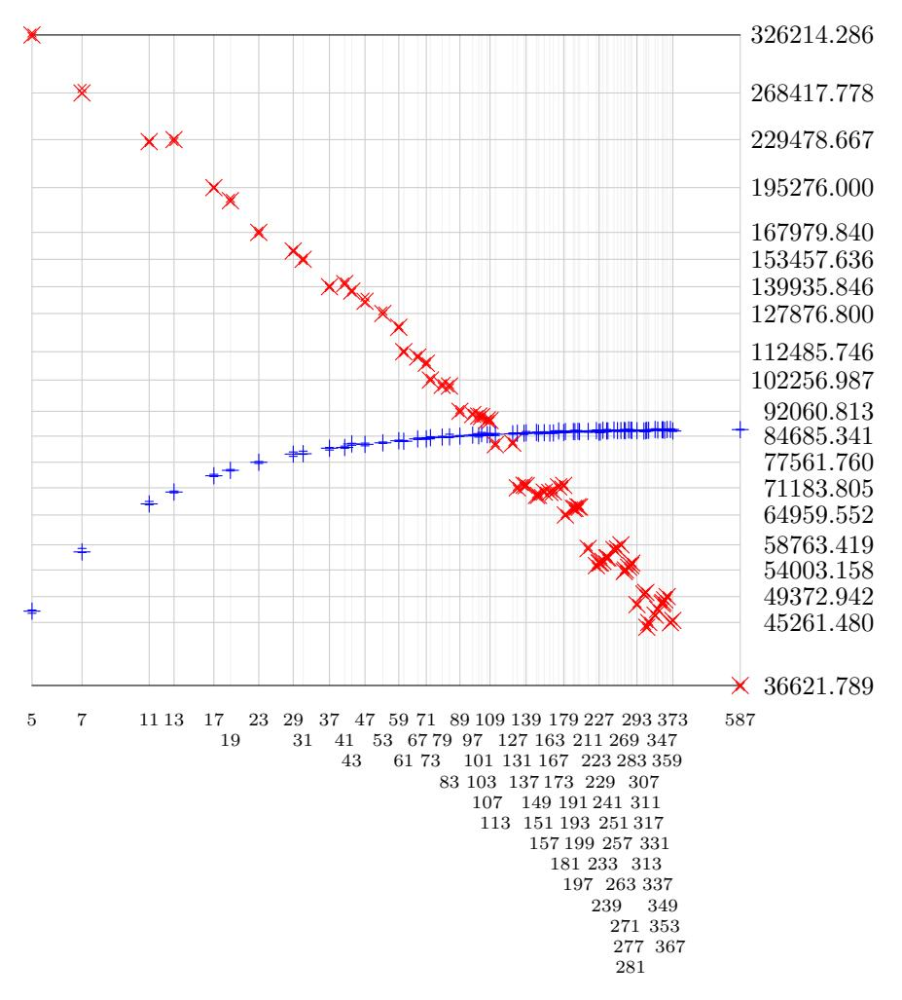

<span id="page-16-1"></span>Figure 1. Cost to evaluate an `-isogeny on one CSIDH-512 point and compute the new curve coefficient. Graph shows Skylake cycles for velusqrt-magma divided by ` + 2.

<span id="page-16-0"></span>A.4. Results for protocols. We integrated our `-isogeny implementations into the CSIDH-512 and CSURF-512 code from [\[17\]](#page-11-13) ([https://github.com/TDecru/](https://github.com/TDecru/CSURF) [CSURF](https://github.com/TDecru/CSURF)), and into the CSIDH-512 code from [\[40\]](#page-12-14). We also wrote Julia/Nemo code for CSIDH-512, CSURF-512, and B-SIDH, and C/FLINT code for CSIDH-512 and CSURF-512. We also adapted the [\[18\]](#page-11-12) assembly-language field arithmetic from CSIDH-512 to CSIDH-1024, saving about a factor 3 compared to the C code provided in [\[18\]](#page-11-12) for CSIDH-1024. The Magma implementation switches over to the old `-isogeny algorithm for ` < 113, and the FLINT implementation switches over to the old `-isogeny algorithm for ` < 150. These implementations of CSIDH, CSURF, and B-SIDH are included in velusqrt-magma, velusqrt-julia, velusqrt-flint, and velusqrt-asm.

Beware that none of these protocol implementations are constant-time. Constanttime implementations of CSIDH [\[39,](#page-12-21) [45,](#page-12-22) [19,](#page-11-21) [33\]](#page-12-23) are an active area of research, and it is too early to guess what the final performance of constant-time CSIDH, CSURF, and B-SIDH will be on top of our `-isogeny algorithm.

We display CSIDH and CSURF performance in a series of graphs. Each graph has horizontal lines showing 25% quartile, median, and 75% quartile. Each graph

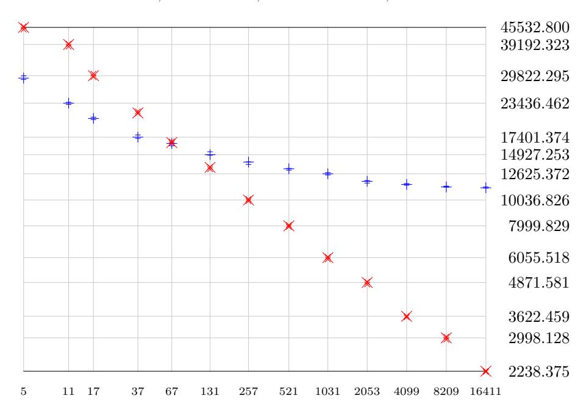

<span id="page-17-0"></span>Figure 2. Cost to evaluate an `-isogeny on one point and compute the new curve coefficient. Graph shows Skylake cycles for velusqrt-julia divided by ` + 2.

shows EK cost measurements, namely E evaluations for each of K keys. Keys are sorted horizontally in increasing order of median cost. Within each key, evaluations are sorted horizontally in increasing order of cost. Blue plus indicates the cost of an action using the conventional `-isogeny algorithm, while red cross indicates the cost of an action that switches over to the new `-isogeny algorithm for sufficiently large `. Within each graph, the blue and red curves use the same sample of keys.

The specific graphs are as follows:

- CSIDH-512 and CSURF-512 cycles using velusqrt-magma: Fig. [4](#page-19-0) and Fig. [5](#page-19-1) respectively, with E = 7 and K = 63.
- CSIDH-512 and CSURF-512 cycles using velusqrt-flint: Fig. [6](#page-19-2) and Fig. [7](#page-19-3) respectively, with E = 15 and K = 65. The new `-isogeny algorithm speeds up CSIDH-512 by approximately 5%, and CSURF-512 by approximately 3%.
- CSIDH-512 and CSIDH-1024 cycles using velusqrt-asm: Fig. [8](#page-20-0) and Fig. [9](#page-20-1) respectively, with E = 15 and K = 65. The new `-isogeny algorithm speeds up CSIDH-512 by approximately 1%, and CSIDH-1024 by approximately 8% (on top of the assembly-language speedup mentioned above).
- CSIDH-512 and CSIDH-1024 multiplication counts using velusqrt-asm: Fig. [10](#page-20-2) and Fig. [11](#page-20-3) respectively, with E = 7 and K = 65. The new ` isogeny algorithm saves approximately 8% and 16% respectively.

Finally, we evaluated the performance of the velusqrt-julia implementation of B-SIDH using the prime above. We only measured the time needed for computing the isogeny defined by a random point of order p + 1 or p − 1, and to evaluate it at three random points. This simulates the workload of the first stage of B-SIDH; the second stage does not need to evaluate the isogeny at any point, and is thus considerably cheaper. We estimate that the other costs occurring in B-SIDH, such as the double-point Montgomery ladder, are negligible compared to these.

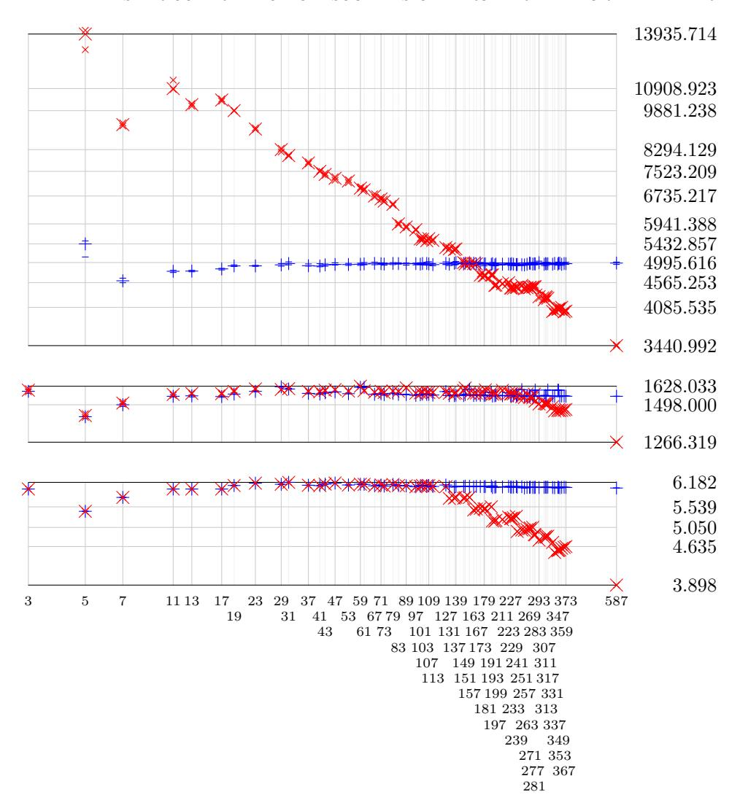

<span id="page-18-0"></span>Figure 3. Cost to evaluate an `-isogeny on one CSIDH-512 point and compute the new curve coefficient. Top graph: Skylake cycles for velusqrt-flint divided by `+2. Middle graph: Skylake cycles for velusqrt-asm divided by `+2. Bottom graph: Multiplications inside velusqrt-asm divided by ` + 2.

Using our algorithm, an isogeny of degree p − 1 is evaluated in about 0.56 seconds, whereas it takes approximately 2 seconds to evaluate it using the conventional algorithms. More remarkably, we can evaluate an isogeny of degree p + 1 in approximately 10 seconds, whereas the naive approach (in one experiment) takes 6.5 minutes.

A.5. Techniques to save time inside the `-isogeny algorithm. Here is a brief survey, based on a more detailed analysis of the results above, of ways to reduce the cost of evaluating an `-isogeny and computing the new curve coefficient:

• Instead of computing the coefficients of the quadratic polynomial Q(α) = F0(α, x([j]P))Z + F1(α, x([j]P))Z + F2(α, x([j]P)) separately for each α, merge the four computations of Q(α), Q(1/α), Q(1), Q(−1) across the four computations of hS(α), hS(1/α), hS(1), hS(−1).

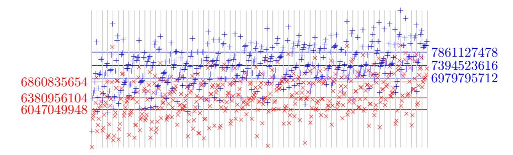

<span id="page-19-0"></span>FIGURE 4. Skylake cycles for the CSIDH-512 action using velusqrt-magma.

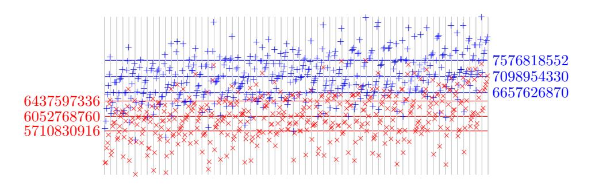

<span id="page-19-1"></span>FIGURE 5. Skylake cycles for the CSURF-512 action using velusqrt-magma.

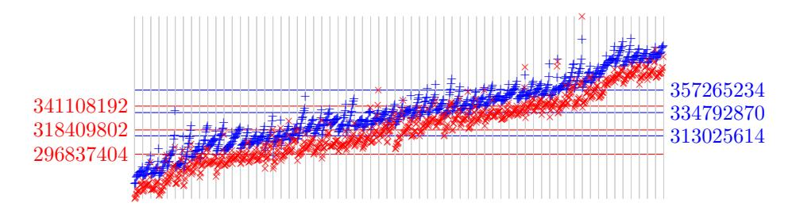

<span id="page-19-2"></span>FIGURE 6. Skylake cycles for the CSIDH-512 action using velusqrt-flint.

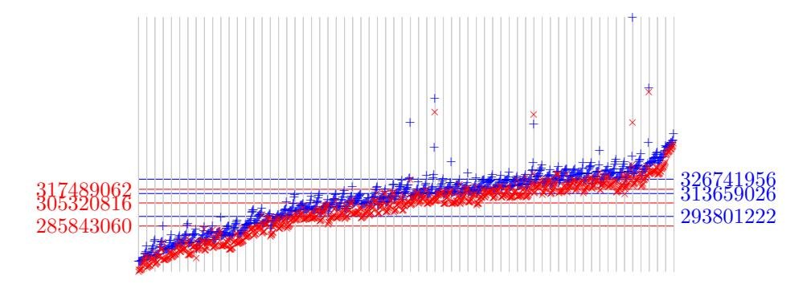

FIGURE 7. Skylake cycles for the CSURF-512 action using velusqrt-flint.

<span id="page-19-3"></span>• Observe that Q(1) and Q(-1) are self-reciprocal quadratics. Speed up multiplication of self-reciprocal polynomials, exploiting the similarity of this problem to the problem of multiplying half-size polynomials.

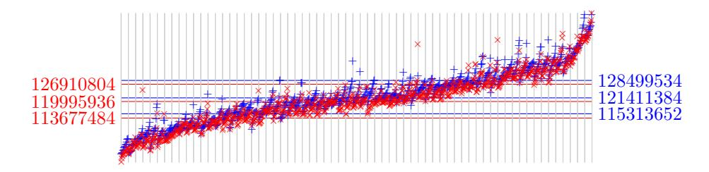

<span id="page-20-0"></span>FIGURE 8. Skylake cycles for the CSIDH-512 action using velusqrt-asm.

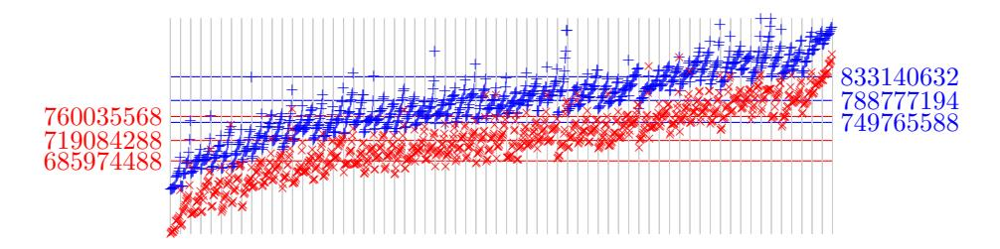

<span id="page-20-1"></span>FIGURE 9. Skylake cycles for the CSIDH-1024 action using velusqrt-asm.

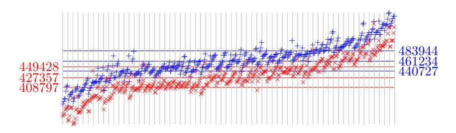

FIGURE 10. Multiplication counts for the CSIDH-512 action using velusqrt-asm.

<span id="page-20-2"></span>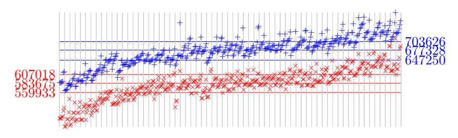

<span id="page-20-3"></span>FIGURE 11. Multiplication counts for the CSIDH-1024 action using velusqrt-asm.

- Use scaled remainder trees (see [12], [11], and [3]) whenever those are faster than traditional unscaled remainder trees. Precompute the product trees used inside these remainder trees.
- Speed up polynomial divisions, especially by precomputing reciprocals of tree nodes. See [31] for various techniques to save time in reciprocals; most of these techniques are not incorporated into our current software.
- Speed up polynomial multiplications, including polynomial multiplications that produce only a stretch of output coefficients. Divisions use "low" and "high" products, and scaled remainder trees use "middle" products.

• Merge reductions across field multiplications: e.g., compute ab+cd by first adding the unreduced products ab and cd and then reducing the sum. This needs a more complicated field API; our current software does not do this.

It is well known that multiplying two n-coefficient polynomials costs just 2n − 1 field multiplications (in large characteristic), since one can interpolate the product from its values at 0, 1, . . . , 2n − 2. Divisions by various positive integers inside this interpolation can be replaced by multiplications by various positive integers, and thus by additions, since isogeny outputs are represented projectively. However, more work is required to optimize polynomial multiplication in metrics that go beyond multiplications. There is an extensive literature on this topic, including many techniques not used in our current software.

At a lower level, reducing the cycles for field operations is helpful in any cyclecounting metric. At a higher level, using one or more field divisions could be helpful if divisions are fast enough compared to the size of `. Furthermore, #I and #J should be chosen in light of the costs of all of these operations. Presumably the optimal #I/#J converges to a constant as ` → ∞, but it is not at all obvious what this constant is for any particular metric.

Department of Computer Science, University of Illinois at Chicago, USA

Horst Gortz Institute for IT Security, Ruhr University Bochum, Germany ¨ Email address: djb@cr.yp.to

IBM Research Zurich, Switzerland ¨ Email address: Luca.De.Feo@zurich.ibm.com

DGA, Inria and Ecole Polytechnique, Institut Polytechnique de Paris, Palaiseau, ´ France

Email address: antonin.leroux@polytechnique.org

Inria and Ecole Polytechnique, Institut Polytechnique de Paris, Palaiseau, France ´ Email address: smith@lix.polytechnique.fr