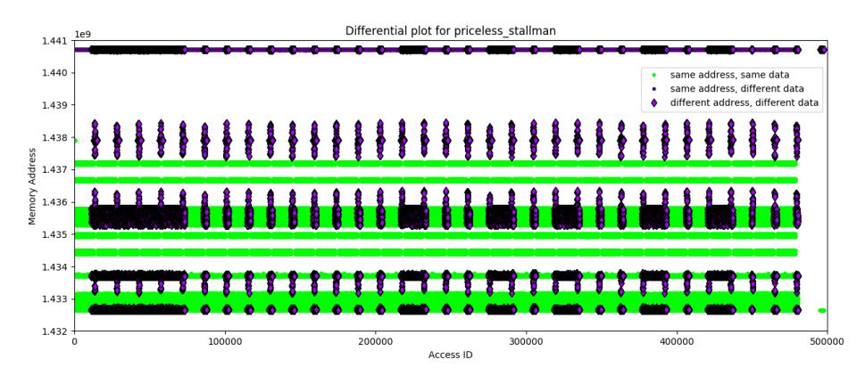
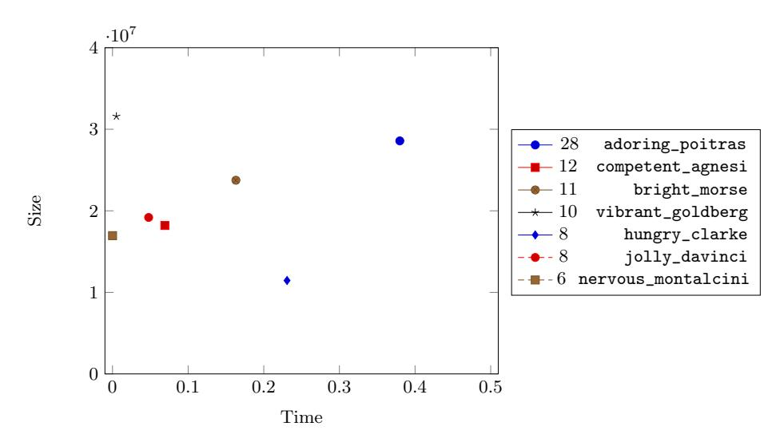

# Security Assessment of White-Box Design Submissions of the CHES 2017 CTF Challenge

Estuardo Alpirez Bock<sup>1</sup> and Alexander Treff<sup>2</sup>

<sup>1</sup> Aalto University estuardo.alpirezbock@aalto.fi <sup>2</sup> University of Lübeck alexander.treff@student.uni-luebeck.de

Abstract. In 2017, the first CHES Capture the Flag Challenge was organized in an effort to promote good design candidates for white-box cryptography. In particular, the challenge assessed the security of the designs with regard to key extraction attacks. A total of 94 candidate programs were submitted, and all of them were broken eventually. Even though most candidates were broken within a few hours, some candidates remained robust against key extraction attacks for several days, and even weeks. In this paper, we perform a qualitative analysis on all candidates submitted to the CHES 2017 Capture the Flag Challenge. We test the robustness of each challenge against different types of attacks, such as automated attacks, extensions thereof and reverse engineering attacks. We are able to classify each challenge depending on their robustness against these attacks, highlighting how challenges vulnerable to automated attacks can be broken in a very short amount of time, while more robust challenges demand for big reverse engineering efforts and therefore for more time from the adversaries. Besides classifying the robustness of each challenge, we also give data regarding their size and efficiency and explain how some of the more robust challenges could actually provide acceptable levels of security for some real-life applications.

Keywords: White-box cryptography · Capture the flag · Differential computation analysis · Differential fault analysis

# 1 Introduction

White-box cryptography was introduced by Chow, Eisen, Johnson and van Oorschot (CEJO [\[16,](#page-20-0)[17\]](#page-21-0)) as a method for implementing cryptographic software running in insecure environments. In the white-box attack model, an adversary is assumed to be in full control of the execution environment of an implementation and to have complete access to the implementation code. White-box cryptography aims to implement cryptographic programs in such way that they remain secure in such attack scenarios.

This paper will appear in the proceedings of COSADE 2020 <https://cosade.org>. Both versions of the paper are identical.

The original use case of white-box cryptography concerned digital rights management (DRM) applications. In recent years, white-box cryptography regained popularity with the introduction of host card emulation (HCE) in Android 4.4. HCE introduces the possibility to handle near field communication (NFC) traffic via software programs, running in the CPU in a mobile phone. In this context, applications using NFC protocols can be implemented in software only, which provides advantages in terms of cost, efficiency and upgrading of the programs. In this line, NFC protocols running on HCE have been embraced by the payment industry and white-box cryptography has been suggested as a software countermeasure technique for protecting cryptographic keys in mobile payment applications (see e.g.[\[24,](#page-21-1)[43\]](#page-22-0)).

In the meantime, a branch of academic research has been dedicated to constructing secure white-box implementations. Initial steps have been taken on formally defining security notions for white-box cryptography, i.e. on defining which security goals should be achieved by a white-box cryptographic scheme [\[21](#page-21-2)[,25\]](#page-21-3). An important and necessary security goal for white-box cryptography is the property of security against key extraction (or unbreakability as defined in [\[21\]](#page-21-2)). Namely, given that in the white-box attack model an adversary is assumed to have complete access to an implementation code, it is important that the adversary is still unable to extract the value of the embedded secret key of that implementation. To approach this goal, many design frameworks follow the initial proposal from CEJO, where the authors suggest to implement a cipher as a network of pre calculated look-up tables. The look-up tables correspond to calculation steps of the cipher and these steps are dependent on the value of the secret key. To stop an adversary from easily deriving the value of the secret key from the look-up tables, the entries of the look-up tables are usually encoded via a combination of wide linear encodings and narrow non-linear encodings (see [\[36\]](#page-22-1) for a detailed description of this design framework for AES implementations). Following this line, white-box constructions for DES [\[17](#page-21-0)[,35\]](#page-22-2) and AES [\[16,](#page-20-0)[15,](#page-20-1)[45,](#page-22-3)[30](#page-21-4)[,5\]](#page-20-2) have been proposed, but subsequently broken by [\[29](#page-21-5)[,26,](#page-21-6)[44\]](#page-22-4) and [\[8](#page-20-3)[,38,](#page-22-5)[37,](#page-22-6)[34](#page-22-7)[,22\]](#page-21-7), respectively. As it turns out, many proposed constructions were shown to be vulnerable against key extraction attacks, performed via algebraic or differential cryptanalysis.

In recent years, a new branch of grey-box attacks on white-box cryptographic implementations was introduced, putting forward the differential computation and differential fault analysis attacks [\[3\]](#page-20-4). The differential computation analysis (DCA) corresponds to the software counterpart of the differential power analysis (DPA) attack performed on hardware cryptographic implementations [\[32\]](#page-21-8). Similarly, the differential fault analysis (DFA) on white-box programs is performed in the same way as fault injection attacks are performed on hardware implementations [\[13](#page-20-5)[,7\]](#page-20-6). The introduction of the DCA and DFA attacks lead to a new branch of automated attacks on white-box implementations. The most attractive advantage of such automated attacks is that they allow an adversary to extract the secret key from numerous white-box implementations, with little to no need of reverse engineering efforts. The adversary thereby does not need to know internal details of the implementations under attack, and can simply run a script on the whitebox program, collecting data which is later analysed via statistical methods and reveals key dependencies. Extensions and generalizations of the DCA attack have been presented in [\[12](#page-20-7)[,40,](#page-22-8)[3\]](#page-20-4). As these works show (and as we confirm in this paper), popular design frameworks for implementing white-box cryptography are specially vulnerable to such automated attacks.

# 1.1 CHES 2017 Capture the Flag Challenge

In an effort to promote good design candidates for white-box cryptography, the ECRYPT-CSA consortium organized the white-box competition CHES 2017 Capture the Flag Challenge [\[23\]](#page-21-9), and a second edition was later organized by Cybercrypt in 2019 [\[20\]](#page-21-10). In the 2017 competition, designers were invited to submit white-box implementations of AES-128, which should thereby remain robust against key extraction attacks. The source code of the submitted programs should be no bigger than 50MB in size, with the executable being no bigger than 20MB. Finally, submitted programs should need no longer than 1 second per each execution, i.e. for performing an encryption. On the other side, attackers were invited to try to break submitted candidate implementations by extracting their embedded secret keys. Note that attackers would have access to the source code of the implementations. In this competition, a program would be ranked according to the amount of time it remained unbroken: the longest a program would remain unbroken, the higher rank it became. A total of 94 candidate programs were submitted and all candidates were broken eventually. Most candidates remained unbroken for less than a day after their submission. Interestingly however, a number of candidates remained unbroken for several days, with the winning candidate resisting key extraction attacks for a total of 28 days. It is fair to assume that candidate implementation which were broken within hours were vulnerable to automated attacks, while longer lived candidates initially provided resistance against such attacks, and demanded bigger reverse-engineering efforts from the attackers.

The table below summarizes the results obtained for the 5 highest ranked challenges, with challenge 777 being ranked the highest as it remained robust for a total of 28 days. Besides remaining robust for several days, some of these candidates also provide interesting numbers with regard to their size and efficiency. For instance the second ranked challenge, challenge 815, remained robust for 12 days and had thereby a size of 18MB and an execution time of 0.07 seconds. This challenge is 10 MB smaller and notably faster than the winning challenge. Similarly, challenge 854, 5th ranked, remained robust for 8 days had a size of 11MB and an execution time of 0.23 seconds.

|   | Rank Challenge ID Size |            |                | Speed Days unbroken |
|---|------------------------|------------|----------------|---------------------|
| 1 | 777                    | 28MB 0.37s |                | 28                  |
| 2 | 815                    | 18MB 0.07s |                | 12                  |
| 3 | 753                    | 23MB 0.16s |                | 11                  |
| 4 | 877                    |            | 32MB 0.004s 10 |                     |
| 5 | 845                    | 11MB 0.23s |                | 8                   |

#### 4 E. Alpirez Bock, A. Treff

The results shown in the white-box competition regarding the highest ranked candidates invite for some optimism in the research field of white-box cryptography.[3](#page-3-0) While studies of white-box cryptography aim to construct programs which remain secure against a polynomial time adversary, a reasonable level of security for some real-life applications could be achieved via white-box programs which remain robust for at least several days. Namely, since we are considering cryptographic programs implemented completely in software, one could take advantage of a software renewal characteristic and update the white-box programs on a regular basis. In this case, we could consider an adversary who invests several days on reverse engineering a white-box implementation running on an application. However before the adversary manages to extract the secret key from the implementation, the application could be updated with a new white-box program using a new secret key. This would cancel out the efforts performed by an attacker up to that point, and force him to start all over again. Note however that for this approach to work as expected, each updated white-box implementation needs to be compiled according to different and independent design frameworks, such that what the adversary learns while analyzing the first design does not help him in any way when analyzing future versions of the program. Moreover, white-box designs could already be updated as soon as any design mistakes or vulnerabilities are spotted, or after a security breach is discovered. In case that a breach is discovered and an attacker manages to break one implementation, we can aim to quickly update all designs with a new version of the program. Here, even if the attacker managed to break one program, he still does not gain so much from it as we manage to update and protect all other programs.

## 1.2 Our Contribution

In this paper, we take a closer look at each candidate implementation submitted to the CHES 2017 Capture the Flag Challenge. As all candidates were eventually broken during the competition, we know that they are not completely resistant against key extraction attacks. In this paper however, we want to understand how each challenge can be broken and we analyze each implementation by performing a selected line of attacks on them. This way we perform a study regarding the size, speed and robustness of each candidate implementation. We test their vulnerability against automated attacks such as the traditional DCA and DFA. For performing automated attacks, we use the frameworks provided by the Side-Channel Marvels[4](#page-3-1) and Jlsca[5](#page-3-2) , which we describe as part of this work. Via our analysis, we are able to classify the challenges in the following four groups: (1) challenges which are vulnerable to DCA attacks, (2) challenges which are vulnerable to DFA attacks, (3) challenges which are vulnerable to extended versions of DCA attacks, such as second order DCA and finally (4) challenges which are resistant to automated attacks and demand bigger reverse engineering

<span id="page-3-0"></span><sup>3</sup> In fact during the 2019 edition, a total of 3 candidates remained unbroken.

<span id="page-3-1"></span><sup>4</sup> <https://github.com/SideChannelMarvels>

<span id="page-3-2"></span><sup>5</sup> <https://github.com/Riscure/Jlsca>

efforts from the adversaries. This classification gives insights on the amount of time needed for extracting the key from each implementation. Namely, running a traditional automated attack usually demands only some minutes, while extended versions of the automated attacks demand several hours and reverse engineering attacks demand for days and in some cases even multiple weeks.

We explain how some of these challenges are initially resistant to these attacks, but are then easily modified such that automated attacks against them are bearable. We also show how we extend a traditional DCA attack to a second order DCA attack in order to extract the key from a masked implementation. Finally, we give insights to the challenges that were not vulnerable to such attacks and which provided higher layers of security. Our success performing the attacks on the challenges stands in line with the robustness many challenges showed during the competition. Namely as we show, automated attacks were successful on a large group of challenges, which were the lowest ranked challenges in the competition. Similarly, the highest ranked challenges demanded bigger efforts from the adversaries and could not be simply broken via automated attacks. Finally, we give a short overview on the results of the 2019 edition of the competition. We leave a detailed analysis of the designs submitted to the 2019 edition as future work.

Successively to our survey, we describe how robust white-box implementations might be useful for some real-life applications as long as we are able to upgrade them on a regular basis. We explain how the property of scalability and a considerable gap between the compilation time of a program and the time an attacker needs for breaking it need to be considered.

The rest of this paper is structured as follows. In Section [2](#page-4-0) we describe the tools used for performing our analyses on the design candidates. More precisely, we describe the scripts we use for running DCA, DFA and variations of those attacks. In Section [3](#page-7-0) we describe the results we obtain from our security assessment, where we classify the design candidates according to the attacks they are vulnerable to and we discuss interesting aspects of the most robust candidates. We conclude the paper in Section [4](#page-18-0) with a discussion on how robust white-box candidates can provide a reasonable level of security for real life applications.

# <span id="page-4-0"></span>2 Tooling

In this section, we describe the attack tools used for analyzing the design candidates of the competition. Each candidate was first analyzed via DCA. If no successful key recovery was performed, we would follow to attack via DFA. In case none of these two attacks was successful, we would turn back to reverse engineering part of the implementation code of the design under attack to try to adjust it such that our tooling worked on the design.

#### 2.1 Preprocessing the source code

In the competition, designers were required to hand in the source code of their candidate implementations. Attackers could therefore also analyze the source code in order to perform key extraction attacks. For this reason, robust candidate implementations obfuscated not only the control flow of the cryptographic operations, but also the source code of the implementation. Some candidates managed to prevent commonly used text editors from parsing the file by using very long lines. Some candidates also included specific sequences of bytes that only a subset of editors and compilers would handle correctly. For example, relaxed\_brown contains a line consisting of 31 588 characters (see Figure [1\)](#page-5-0). Moreover, the code hides a function definition between two huge arrays, presumably by using specific control characters such that the function is visible to the compiler, but is hidden when analyzed in the editor.

```
void AES_128 ( char *ct , char *pt)
{
  /*
     h
     a
     c
     k
     e
     d
  */
  return ;
}
                                           void AES_128 ( char *ct , char *pt)
                                          {
                                             strcpyn (ct ,pt ,1 < <24);
                                             memcpy (ct ,pt ,16);
                                             return ;
                                          }
```

Fig. 1: Fragments of the source code of relaxed\_brown. The left side shows the code visible when opening it on a text editor. It looks as if the code consists only of a comment. However, the comment line containing the 'k' expands to the right and consists of 31 588 characters hiding two function calls and almost all other characters are white spaces. The right side shows the code after preprocessing it with clang-format (the function strcpyn contains the actual AES code).

A second example is the winning challenge adoring\_poitras which can be successfully compiled using gcc, but cannot be compiled using clang. We use clang-format to parse source files in an automated way to generate a modified, yet functionally equivalent source file that does not contain any of these tricks and is easier to understand.

### 2.2 Tooling for DCA

We perform the DCA attack as described in Section 3 of [\[3\]](#page-20-4). We use a custom Intel PIN[6](#page-5-1) plugin specifically adapted to the competition rules. That is, our plugin is hooked to the call AES\_128\_encrypt to acquire computation traces that exactly resemble the actual encryption function. These traces are then converted

<span id="page-5-1"></span><sup>6</sup> [https://software.intel.com/en-us/articles/pin-a-dynamic-binary](https://software.intel.com/en-us/articles/pin-a-dynamic-binary-instrumentation-tool)[instrumentation-tool](https://software.intel.com/en-us/articles/pin-a-dynamic-binary-instrumentation-tool)

to a Riscure Inspector Trace set files (TRS) via a python library trsfile[7](#page-6-0) such that they can be analyzed using Jlsca[8](#page-6-1) . We annotate the computation trace with both the program input and output to be able to launch the attack from either the input or output values.

Jlsca. Jlsca is an open-source side-channel toolbox written in Julia by Cees-Bart Breunesse that allows to perform highly optimized differential computation analysis on software execution traces. It supports different leakage models, e.g. the Klemsa model where we also consider 240 AES dual ciphers as described in [\[6\]](#page-20-8). Dual ciphers of AES use different SBoxes throughout the computation but yield the same result as a standard AES at the end of the computations. More specifically, they can be seen as isomorphisms of AES, which are not based on the Rijndael Sboxes. Instead, the dual ciphers implement alternative Sboxes and additional computations are later performed on intermediate values, such that the dual ciphers are functional equivalent to a standard AES cipher. We refer to the Diploma thesis of Jakub Klemsa [\[31\]](#page-21-11) for a more detailed explanation and analysis of dual ciphers. Some submitted challenges were implementing dual ciphers of AES. For such implementations, the SideChannelMarvels' Daredevil does not reveal the correct key. Namely, Daredevil is configured such that it targets standard Rijndael Sboxes, so the predicted Sbox outputs do not match when attacking dual cipher implementations. Jlsca on the other hand predicts the intermediate values for all possible Sboxes and hence reveals the correct key for challenges implementing dual ciphers as well.

Jlsca also implements optimization techniques such as Duplicate Column Removal (DCR) and Conditional Sample Reduction (CSR). Such techniques enable us to check these 240 dual ciphers in the same amount of time (or even less) than Daredevil needs for running the analysis. For a more detailed discussion on the above mentioned reduction techniques, we refer to the paper by Breunesse, Kizhvatov, Muijrers and Spruyt [\[14\]](#page-20-9).

Analyzing a single computation trace. Some implementations generated very long traces, e.g. determined\_goldwasser or friendly\_wing. In some cases, we were still able to launch the attack after some (very) limited manual effort in locating the first (or last) round. We configured our tracing tool to allow tracing just a specific region of interest by giving lower and upper bounds of sample indices, thus speeding up the trace acquisition process. Sometimes, we were not able to launch an automated DCA attack because the traces were too long and we weren't successful in locating a usable subset of samples of manageable size. In cases this was not working, this was mostly caused by the design artificially extending the execution time, for example by using a virtualization technique (see [\[42\]](#page-22-9) for insights on the virtualization technique and a generic approach on how to recover a devirtualized code from a virtualized one). Specifically Tigress[9](#page-6-2)

<span id="page-6-0"></span><sup>7</sup> <https://github.com/Riscure/python-trsfile>

<span id="page-6-1"></span><sup>8</sup> <https://github.com/Riscure/Jlsca>

<span id="page-6-2"></span><sup>9</sup> <http://tigress.cs.arizona.edu/>

was used in favour of code obfuscation throughout the competition (see e.g. relaxed\_allen). Our experience shows that automated DFA might be more feasible in these cases as one usually will find a fault-sensitive look-up table using the corresponding DFA scripts in a reasonable amount of time.

### 2.3 Tooling for DFA

We perform the DFA attack as described in Section 7 of [\[3\]](#page-20-4). We use the JeanGrey tool from the (open source) SideChannelMarvels repository. This tool induces faults by randomly flipping bits of different regions of the binary. In some cases, we perform the DFA manually. That is, we inspect the source code and induce faults by flipping bits in specific lines of code. As an example: state[0] ˆ= 1; is used to flip one bit of a byte belonging to some state array.

# <span id="page-7-0"></span>3 Security Assessment and Classification

We evaluate the robustness of the design candidates by testing automated attacks (DCA and DFA) on them, as well as modifications of such attacks. Our aim is to find out how many candidates can actually be broken via automated attacks and without big reverse engineering efforts. We classify the candidates in two main groups: one group for automated vulnerable and one group for automated resistant. These groups should reflect the difficulty an adversary might have when attempting to break each white-box and the time we can expect each white-box to remain unbroken. This also holds for recovery from a successful attack: if an attacker succeeds at breaking an implementation using an automated attack, a new implementation based on the same design can be broken by the same automated attack. If on the other hand reverse engineering efforts are needed, even a slightly different design already requires adaptations to the attack. In the end of this section, we focus on the automated resistant candidates and classify them according to their size and speed. Some candidates achieve robustness but demand high numbers in terms of size and execution time. Other candidates, on the other hand, reflect more useful designs as they provide a good trade-off between efficiency and security.

In the following, we describe our assessment process. Given a candidate implementation, we first assess its security via DCA. If we are able to extract the key from that implementation via DCA, we classify the given candidate under automated vulnerable, and in a subgroup thereof which we call DCA vulnerable. If no successful DCA attack can be performed, we run a DFA attack on the implementation and in case of success, we classify the candidate under DFA vulnerable. Note that in some cases, a white-box design might resist a traditional DCA attack by implementing masking countermeasures. In this case a higher order DCA might be a successful way of attacking [\[12,](#page-20-7)[10\]](#page-20-10). Therefore, if neither first order DCA or DFA succeeds, we perform a second order DCA. Note that the second order DCA can also be implemented in an automated way as we explain later in this section.

A total of 94 challenges were submitted. One of these challenges, thirsty\_aryabhata, was not a valid submission as it didn't implement any AES operation. For this reason, our studies consider a total of 93 challenges.

#### 3.1 DCA Vulnerable Designs

A total of 50 design candidates were vulnerable to a traditional DCA attack, which we could perform in a completely automated way. That is, we were able to extract the key from all 50 designs by simply running the DCA script, with no need of adapting it for any implementation. All of these designs were broken within minutes during the competition. In fact, a large number of these submissions were not even white-box designs. 37 designs were reference AES implementations (or similar) which did not implement any white-box countermeasures. 19 of these 37 designs were submitted by chaes and were all implemented using a total of six lookup tables each consisting of 256 entries from which the key can be retrieved directly by looking at the right offset. The remaining 13 candidates did implement white-box countermeasures, such as code obfuscation or they were table based implementations (e.g. following the approach proposed by CEJO [\[16\]](#page-20-0)).

Table [1](#page-9-0) lists the design candidates vulnerable to the DCA attack which showed at least minimal effort of implementing countermeasures – reference implementations were omitted to improve readability. In the table we rank the candidates according to the time they remained unbroken during the competition, where the candidate implementation on the top remained unbroken for the longest and the candidate at the bottom remained unbroken for the shortest period of time. We use the same ranking approach for the other tables shown in this paper. Note however that this ranking does not necessarily reflect the robustness of an implementation in comparison to other implementations listed in the same table. Namely in some cases, candidate designs remained unbroken for certain amounts of time due to the competition setup, and not due to the robustness of their implementations (see Section [3.2\)](#page-10-0). In the table, the entry size gives the size of the source code of the implementation in megabytes. Runtime gives the time in milliseconds needed for one execution of the program, i.e. for performing one encryption. Time unbroken indicates the time (hours) the implementation remained unbroken during the competition time.

Besides the 50 candidates mentioned above, 5 further candidates could be broken via DCA after manually performing some simple modifications on the source code of the programs. These candidates implemented countermeasures against the DCA attack such as dummy operations which led to a misalignment of the software traces, or implementation of the round functions in a non constant way. That is, the sequence of the operations was performed differently depending on the input message to be encrypted. However, in most of these cases, the code was not heavily obfuscated on source level, and particularly the algorithmic part was usually of magnitudes smaller than the data part of the code (tables, etc.). Therefore, it was simple to identify the specific non-constant logic or dummy operations by hand. For some challenges, the difference plots were used to estimate

<span id="page-9-0"></span>

| rank | name                      | id | size       |      | runtime time unbroken |
|------|---------------------------|----|------------|------|-----------------------|
| 1    | focused_gary              |    | 20 17.044  | 0.24 | 08:01                 |
| 2    | cranky_mccarthy           |    | 27 17.912  | 5.35 | 05:19                 |
| 3    | famous_stonebraker        | 55 | 1.336      | 0.02 | 04:29                 |
| 4    | youthful_hawking          |    | 150 18.509 | 0.34 | 03:23                 |
| 5    | elastic_brahmagupta       |    | 146 12.415 | 0.02 | 00:51                 |
| 6    | hopeful_liskov            | 3  | 4.702      | ε    | 00:47                 |
| 7    | thirsty_fermat            | 57 | 8.404      | 2.21 | 00:44                 |
| 8    | happy_yalow               | 60 | 5.002      | 0.07 | 00:28                 |
| 9    | nostalgic_noether         | 61 | 4.97       | 0.07 | 00:26                 |
| 10   | lucid_roentgen            | 24 | 4.777      | 1.17 | 00:22                 |
| 11   | modest_clarke             | 30 | 7.559      | 1.26 | 00:18                 |
| 12   | zealous_ardinghelli       | 31 | 7.572      | 1.23 | 00:12                 |
| 13   | stupefied_varahamihira 16 |    | 4.704      | ε    | 00:11                 |

Table 1: DCA vulnerable designs. ε corresponds to a runtime of less than 0.01ms.

the position where the non-constant code is being placed (i.e., it occurs on all rounds vs. only on the last round).

We then modified the codes in a way that they would have a constant runtime, which enabled us to perform a DCA attack. As an example, we show in Figure [2](#page-9-1) fragments of the candidate pensive\_shaw, which included instructions for increasing the number of operations in order to artificially enlarge trace files and slow down the attacking process.

```
switch (*(( int *) _obf_3_MOD_AES_encrypt_$pc [0])) {
case 47:
    // cT () is computationally expensive
    // but always computes the same value
    *(( unsigned long *)( _obf_3_MOD_AES_encrypt_$locals + 856)) = cT ();
    break ;
// several more cases , all similar to the one above
}
// we replace the computation with its result
u32 cT () { return 1262335309; }
```

Fig. 2: Source code of pensive\_shaw. The code contains a computationally expensive function cT(), yielding always the same result. We dump the value and replace the function by its result. This reduces runtime and trace size to a minimum, making DCA feasible again.

Table [2](#page-10-1) lists the five challenges we could attack via DCA after small modifications. Some design candidates implemented virtualization, but it was simple to de-virtualize the code and make it run without the virtualization layer.

<span id="page-10-1"></span>

| rank | name                     | id  | size      |        | runtime time unbroken | notes                        |
|------|--------------------------|-----|-----------|--------|-----------------------|------------------------------|
| 1    | dreamy_fermi             |     | 754 1.328 | 0.33   | 17:24                 | dummy code removal           |
| 2    | relaxed_brown 852 18.461 |     |           | 121.93 | 05:32                 | devirtualization             |
| 3    | reverent_beaver 48       |     | 6.187     | 1.12   | 01:51                 | variable to constant rewrite |
| 4    | cool_cori                | 791 | 1.61      | 37.16  | 00:15                 | dummy code removal           |
| 5    | pensive_shaw             |     | 778 1.518 | 82.34  | 00:12                 | dummy code removal           |

Table 2: DCA vulnerable designs after minimal modifications

### <span id="page-10-0"></span>3.2 DFA Vulnerable Designs

DFA was only applied for analyzing candidate designs resistant against the DCA attack. Namely, some designs implemented virtualization layers, where the encryption program uses a virtual machine to execute part of the code [\[41\]](#page-22-10). In this context, virtualization made it difficult to implement a traditional DCA attack as it artificially blew up the number of samples per trace. Instead of a single atomic operation, a large sequence of operations emulating this atomic operation is being traced when virtualization is implemented. However in some cases, virtualization did not represent a countermeasure against DFA, since DFA works by inducing faults at the right spot of computation. Instead of inducing a fault (e.g., flipping a single bit) on the aforementioned atomic operation, the fault is induced at some point of the corresponding (large) sequence of operations. The fault is propagated throughout the computation, yielding the desired effect on the output. The following 14 designs could be broken using the JeanGrey tool from the SideChannelMarvels repository. We could break each design by simply running the script for (at most) one hour.

<span id="page-10-2"></span>

| rank | name                               | id  | size       |        | runtime time unbroken | notes       |
|------|------------------------------------|-----|------------|--------|-----------------------|-------------|
| 1    | compassionate_albattani 816 26.135 |     |            | 174.66 | 05:46                 | virtualized |
| 2    | xenodochial_northcutt              |     | 106 21.969 | 5.16   | 04:09                 |             |
| 3    | smart_ardinghelli                  |     | 846 3.016  | 367.99 | 03:09                 | virtualized |
| 4    | musing_lalande                     |     | 813 2.562  | 147.38 | 02:42                 | virtualized |
| 5    | frosty_hypatia                     |     | 812 2.575  | 206.28 | 02:11                 | virtualized |
| 6    | dazzling_panini                    |     | 46 38.911  | 4.67   | 01:17                 |             |
| 7    | angry_jones                        | 880 | 2.97       | 337.37 | 00:55                 | virtualized |
| 8    | determined_goldwasser              |     | 34 19.987  | 3.607  | 00:50                 |             |
| 9    | relaxed_allen                      |     | 755 13.274 | 16.13  | 00:32                 | virtualized |
| 10   | smart_lamarr                       |     | 749 13.159 | 11.79  | 00:22                 | virtualized |
| 11   | friendly_lewin                     |     | 811 2.605  | 0.216  | 00:21                 | virtualized |
| 12   | friendly_edison                    |     | 35 21.902  | 3.12   | 00:17                 |             |
| 13   | quirky_mayer                       |     | 142 8.305  | 0.87   | 00:16                 |             |
| 14   | dazzling_neumann                   |     | 143 8.302  | 0.99   | 00:03                 |             |

Table 3: Automated DFA vulnerable designs

Note that half of the designs in Table [3](#page-10-2) were broken within minutes after they were submitted to the competition. Interestingly the first 3 designs remained unbroken for over three hours, with the first challenge remaining unbroken for 5:46 hours. The reason why some of these challenges remained unbroken for several hours during the competition might have more to do with the setting of the competition, and less with the robustness of the challenges themselves. Namely during the competition, some attackers used automated scripts for constantly checking if new challenges were submitted. The scripts would immediately download the challenges upon their submission and attack them via DFA or DCA in an automated way. This way, some attackers were able to break many challenges within minutes. However the submission server implemented challengeresponse tests such as Captchas in order to stop the scripts from working in such a fully automated way (see Philippe Teuwen's talk during the WhibOx 2019 Workshop for notes on his experience attacking the challenges during the 2017 competition [\[39\]](#page-22-11)). One might assume that the attackers were not always able to react quickly to such challenge-response tests. This could explain why some challenges in Table [3](#page-10-2) remained unbroken for several hours, while we were able to break them within an hour during our studies. Additionally, there might have been cases where a large number of challenges were submitted at the same time, thus delaying the automated assessment of some challenges.

Manual DFA. Some submissions implemented classic DFA countermeasures, such as redundant computations (see e.g. [\[28](#page-21-12)[,1\]](#page-19-0)). Given such countermeasures, it was not possible to run the DFA script from the SideChannelMarvels repository in a fully automated way. However for some challenges, it was easy to deactivate such countermeasures manually as their implementations were not highly obfuscated. An example can be seen in Figure [3,](#page-12-0) where we show part of the source code of silly\_feynman. The program implements countermeasures checking for faulty computations, but it is easy to locate the lines of the code which implement these countermeasures. Table [4](#page-13-0) lists 7 challenges which we successfully attacked via a manual DFA. For these challenges, we either removed lines of the code such that our DFA script would run successfully, or we added specific lines of code which would help us identify the correct spots for injecting faults. We explain the second approach below.

For some design candidates, running the DFA script did not work accordingly due to the static nature of how JeanGrey works. JeanGrey modifies the binary file prior to attempting to perform the DFA attack. The script XORs regions of the binary file using a type of binary search to iteratively find the correct spot to induce a fault by reacting to the outcome of the modification. This approach works well when manipulating actual data such as lookup tables or when just a simple adjustment of control flow is needed to induce useful faulty outputs. However, this approach often does not yield a useful result when a more complicated control flow change is needed.To deal with these shortcomings, we opted for a slightly more complicated, yet non-automated approach for locating the correct spot for inducing faults, which we refer to as conditional fault injection.

```
/* dummy round */
SubByte_aes2 (dumst , AES2_Sprime [ tindex ] , permu1 , permu2 );
// S- box
ShiftRows (dumst , 1);
MixColumns (dumst , aes2_mixcolprod [ tindex ]); /* transformed mixcolprod table */
AddRoundKey_aes2 (dumst , dumclef , permu1 , permu2 );
/* real round */
SubByte_aes2 (st , AES2_Sprime [ tindex ] , permu1 , permu2 );
// S- box
ShiftRows (st , 1);
MixColumns (st , aes2_mixcolprod [ tindex ]); /* transformed mixcolprod table */
AddRoundKey_aes2 (st , clef , permu1 , permu2 );
/* fault check round */
SubByte_aes2 (fltst , AES2_Sprime [ tindex ] , permu0 , permu0 );
// S- box
ShiftRows (fltst , 1);
MixColumns (fltst , aes2_mixcolprod [ tindex ]); /* transformed mixcolprod table */
AddRoundKey_aes2 (fltst , clef , permu0 , permu0 );
```

Fig. 3: Source code of silly\_feynman. The code included comments explaining the purpose of the functions defined. This made it very easy to locate functions implementing DFA countermeasures, such as redundant computation.

Conditional fault injection consisted on altering the source code in such way that we would keep track of some internal variable (e.g. a counter), and we would inject a fault only after the value of that variable would reach some threshold. The idea here is that the repeated execution of some lines of code usually corresponds to the execution of some round function and the value of the variable could help us recognize the round that is being executed. For instance, one can observe an internal loop counter which starts, say, at value 0 and reaches a value of 60 000 after all AES rounds have been computed. This internal loop counter might already belong to the implementation itself or we can add it manually. The first 45 000 iterations will most probably not yield any useful fault injection, as we usually target the eighth or ninth round for injecting faults. On the other hand, one may assume that targeting one of the remaining 15 000 iterations might yield a useful fault injection which can then be done in an automated way using the internal counter as a trigger.

We implemented the approach mentioned above by adding a few lines to the corresponding implementations, specifically crafted to the specific implementation, as outlined in Figure [4.](#page-13-1) One important aspect to consider is that these modifications do not need to work for any specific input. It suffices to obtain correctly faulted outputs for one specific plaintext-ciphertext pair chosen beforehand to compute the last round key. In those cases, we took advantage of the fact that we had access to the corresponding source code of the design candidates. Namely in some cases a relatively simple inspection of the source code helped us locate the precise spots for injecting faults and performing a successful DFA attack.

Note that all challenges listed in Table [4](#page-13-0) remained unbroken during the competition for at least one hour. This suggests that attackers also needed to

```
void AES_128_encrypt ( char * ciphertext , char * plaintext )
{
  int COUNTER = atoi ( ARGV [1]); // injected code
  for ( int i = 0; i < 60000; i++) {
    if ( COUNTER == i) { // injected code
      continue ;
    }
    func (a,b,c,d); // original WB code
  }
}
```

Fig. 4: Example for conditional fault injection. We add code to skip a specific loop iteration. The exact iteration is given as a parameter to enable automated search of useful values by repeated execution.

<span id="page-13-0"></span>

| rank | name                       | id | size       |       | runtime time unbroken | notes/                      |
|------|----------------------------|----|------------|-------|-----------------------|-----------------------------|
|      |                            |    |            |       |                       |                             |
| 1    | festive_jennings           |    | 11 23.716  | 0.09  | 24:01                 | brute-forced last 4 bytes   |
| 2    | eloquent_indiana 52 14.897 |    |            | 23.80 | 24:00                 | attacked loop structure     |
| 3    | nifty_heisenberg           |    | 48 14.650  | 3.48  | 18:23                 | removed DFA protection      |
| 4    | vigilant_wescoff           | 12 | 3.465      | 92.74 | 10:59                 | faulted 32-byte state array |
| 5    | friendly_wing              |    | 132 22.606 | 18.19 | 02:05                 | attacked loop structure     |
| 6    | silly_feynman              |    | 742 0.072  | 0.10  | 01:09                 | removed DFA protection      |
| 7    | agitated_wilson            |    | 141 11.599 | 43.43 | 01:01                 |                             |

Table 4: Manual DFA vulnerable designs. The top challenge festive\_jennings earned one strawberry point during the competition.

first inspect the code and implement some changes before actually attacking them or extracting their secrets. This assumption is more evident when focusing on the top four challenges, which remained unbroken for 11 to 24 hours. The top challenge festive\_jennings even managed to gain one strawberry point during the competition, which was awarded if the challenge managed to remain unbroken for at least 24 hours.

## 3.3 Second Order DCA

We were unable to recover the key of design candidate priceless\_stallman via DCA or DFA attacks. In particular, it achieved resistance against DCA via a masking scheme, where intermediate values were masked with different shares for each input plaintext. We were able, however, to successfully attack this design candidate via second order DCA [\[12\]](#page-20-7). As it is known for higherorder DCA, the number of samples used for performing an analysis increases quadratically compared to a first order DCA attack. This is due to the nature that all possible combinations of samples are evaluated, which results in a total number of n(n − 1)/2 samples for second-order analysis compared to n samples for first-order analysis. Using optimization techniques such as DCR and CSR [\[14\]](#page-20-9),

this number can be heavily reduced and higher-order attacks become feasible. Figure [5](#page-14-0) shows a difference plot for the given challenge, showing periods of execution where the data is heavily changed. Locating such regions helped us identify the correct spot for recording software execution traces and perform a second order DCA. We ran our analysis for about 8 hours in order to extract the first 8 key bytes in parallel. Afterwards, the analysis for the other 8 key bytes ran for another 8 hours resulting in a total runtime of about 16 hours using Jlsca. Table [5](#page-14-1) summarizes some details of the implementation.

<span id="page-14-0"></span>

Fig. 5: Difference plot for priceless\_stallman. Accumulation of dark spots indicates a change of data and control flow whereas green regions resemble constant parts of the implementation. We successfully recovered the key using a second-order analysis of the first quarter of the heavily changing region in the beginning (approx. 20 000 samples).

<span id="page-14-1"></span>

| rank | name                         | id | size |      | runtime time unbroken | notes              |
|------|------------------------------|----|------|------|-----------------------|--------------------|
| 1    | priceless_stallman 738 5.386 |    |      | 0.29 | 01:18                 | implements masking |

Table 5: Second order DCA vulnerable design

Interestingly, this challenge only remained unbroken for a bit more than one hour during the competition. We assume that a more efficient attack path can be taken to obtain the secret key, such as possibly a variation of a DFA attack. Namely, such masking countermeasures, where the shares are determined by the input message, do not imply robustness against DFA since some input plaintext m will always use the same masking. Thus in theory, one could perform a DFA, since one always uses the same input message and injects different faults. We refer to [\[10\]](#page-20-10) for alternative attack strategies on masked white-box implementations.

#### 3.4 Automated Resistant Challenges

A total of 16 challenges remained resistant to our attempts using DCA and DFA attacks. 12 of these challenges earned strawberry points during the competition time. These challenges implemented notably stronger layers of obfuscation, such that we were not able to remove the virtualization or masking techniques as described in the previous sections. Table [6](#page-15-0) lists the candidate challenges that we were not able to break. The first part of the table shows the candidates which earned points during the competition, i.e. which remained unbroken for at least 24 hours. The bottom part of the table consists of candidates which did not earn any points. Note however that the candidates in the bottom part of the table also remained unbroken for a considerable amount of time, possibly confirming that those candidates also provide some robustness against automated attacks.

<span id="page-15-0"></span>

| rank | name                         | id | size       |        | runtime time unbroken | notes               |
|------|------------------------------|----|------------|--------|-----------------------|---------------------|
| 1    | adoring_poitras              |    | 777 27.252 | 379.83 | 685:42                | winning challenge   |
| 2    | competent_agnesi             |    | 815 17.359 | 6.923  | 290:15                |                     |
| 3    | bright_morse                 |    | 753 22.649 | 163.14 | 283:50                |                     |
| 4    | vibrant_goldberg             |    | 877 30.126 | 5.15   | 254:59                |                     |
| 5    | hungry_clarke                |    | 845 10.925 | 230.76 | 196:44                |                     |
| 6    | jolly_davinci                |    | 751 18.299 | 47.77  | 190:09                |                     |
| 7    | nervous_montalcini 644 16.17 |    |            | 0.07   | 139:19                | fastest challenge   |
| 8    | sad_goldstine                |    | 786 10.401 | 143.83 | 61:09                 | smallest challenge* |
| 9    | mystifying_galileo           |    | 84 19.236  | 114.59 | 32:33                 |                     |
| 10   | elastic_bell                 |    | 49 20.709  | 261.05 | 27:11                 |                     |
| 11   | practical_franklin           |    | 49 15.527  | 2.58   | 24:01                 |                     |
| 12   | agitated_ritchie             |    | 44 22.946  | 20.33  | 24:00                 |                     |
| 13   | clever_hoover                |    | 32 18.319  | 0.97   | 20:14                 |                     |
| 14   | gallant_ramanujan 153 0.898  |    |            | 0.04   | 15:15                 |                     |
| 15   | peaceful_williams            |    | 47 11.950  | 2.29   | 11:47                 |                     |
| 16   | eager_golick                 |    | 572 38.146 | 83.53  | 06:22                 |                     |

Table 6: Unbroken candidates. The first part of the table consists of challenges which earned points during the competition phase. sad\_goldstine was the smallest challenge from those which earned any points.

Given that most of these challenges remained unbroken for a considerable time during the competition phase, it is fair to assume that attackers were forced to invest considerable reverse engineering efforts for breaking them. Consider for instance the winning candidate adoring\_poitras, which remained unbroken for 28 days. This challenge was submitted by the CryptoLux[10](#page-15-1) team consisting of Biryukov and Udovenko and was subsequently broken by the CryptoExperts[11](#page-15-2) team consisting of Goubin, Paillier, Rivain and Wang. In [\[27\]](#page-21-13) the CryptoExperts

<span id="page-15-1"></span><sup>10</sup> https://www.cryptolux.org/index.php/Home

<span id="page-15-2"></span><sup>11</sup> https://www.cryptoexperts.com/technologies/white-box/

team provides a step-by-step guide on their approach applied for breaking the challenge. Their main techniques were based on reverse engineering and algebraic attacks. The authors explain that the code uses different obfuscation techniques such as name obfuscation (giving each function and variable random, unrelated names) and virtualization. Additionally, the source code consists of many functions which are never used (up to 80%). This was probably implemented with the goal of making it difficult for an attacker to deobfuscate the code. In fact, the process of deobfuscating and cleaning the code such that it consists only of functions which are actually used demands large efforts as it can only be done manually. Once this is done, more generalized methodologies can be followed in order to break such obscure implementations (the authors list further steps such as single static analysis, transformation of the circuit, circuit minimization, data dependency analysis, etc.).

The high levels of obfuscation applied to adoring\_poitras certainly implied high costs in terms of size and efficiency of the design. While adoring\_poitras was the strongest design in terms of robustness, other designs presented better numbers in terms of size and efficiency, while also achieving a notable level of robustness. For instance the 7th ranked challenge nervous\_montalcini was notably faster than all other designs listed in Table [6.](#page-15-0) Thereby, nervous\_montalcini remained unbroken for 5 days. In terms of size, the 5th and 8th ranked challenges were notably smaller than the rest, with sizes of 10.9 and 10.4 MB respectively. Note that the 5th ranked challenge, hungry\_clarke remained unbroken for more than 8 days. Figure [6](#page-17-0) plots the top 7 ranked implementations of Table [6](#page-15-0) according to their size and execution time. The legend displays the corresponding challenge names with the number of days they remained unbroken during the competition. These 7 challenges remained unbroken for at least 5 days, which was significantly longer than for the rest of the challenges.

As we observe in this plot, the winning challenge adoring\_poitras largely demands a longer execution time than the rest. In terms of size, only vibrant\_goldberg is slightly larger than adoring\_poitras. Out of these 7 designs, challenge 7, nervous\_montalcini is the fastest one and challenge 5, hungry\_clarke, is by far the smallest one. These two challenges however remained unbroken for only 8 and 6 days respectively. On the other hand, the second ranked candidate, competent\_agnesi, remained unbroken for up to 12 days while providing relatively good numbers in terms of size and efficiency, specially when comparing it with the winning challenge.

A design such as competent\_agnesi provides very useful steps towards whitebox implementations for real life applications due to its positive numbers in terms of size and efficiency. Namely in some scenarios, it might be useful for a white-box design to remain unbroken for 12 days, as long as one can update it regularly. As mentioned before, if one chooses this avenue for achieving security, further attention should be placed on how the updated versions are compiled. Namely, if the recompiled version of the white-box program is similar to the first one, an adversary might need much less time to attack the recompiled version. This is because while analyzing the first program, the adversary learns a lot about

<span id="page-17-0"></span>

Fig. 6: Overview of the most robust candidates with regard to their size and execution time

the structure, countermeasures and obfuscation techniques implemented by the program. If the recompiled program applies the same techniques, the adversary already has an advantage as he knows how the recompiled white-box can be analyzed. The CryptoExperts team also makes this observation when saying that breaking a re-compiled version of adoring\_poitras (i.e. a program generated with the same compiler, but using a different key and different randomness) would certainly demand less time. The authors point out that a lot of the time needed for breaking the challenge was spent trying out different reverse-engineering techniques and attack strategies which turned out to be ineffective. Therefore when analyzing a re-compiled version of adoring\_poitras, the authors would at least already know which attack strategies do not work for that class of implementations. Moreover, part of their analyses could even be automated, which would reduce the attacking time even more.

## 3.5 2019 Edition of the White-Box Competition

In 2019 Cybercrypt organized a second edition of the white-box capture the flag challenge [\[20\]](#page-21-10). Here, designers were again invited to submit candidate implementations and attackers were challenged with breaking them by extracting their embedded secret keys. Additionally, candidate designs were also assessed with regard to their one-wayness property (see [\[21\]](#page-21-2)). That is, the white-box encryption programs should not allow one to decrypt. This property was assessed in the competition by asking the attackers to find a pre-image for certain target ciphertexts. In this competition, the efficiency of the programs was also assessed. Namely, the more efficient a program was, the most points it would obtain when remaining robust over time. Efficiency was measured with regard to the running time, code size and memory consumption of the programs.

A total of 27 challenges were submitted. 22 of these challenges resisted key extraction attacks for at least one day, where some of those challenges were submitted in the early stages of the competition. Impressively, 3 challenges submitted by the CryptoLux team remained unbroken during the competition time: hopeful\_kirch, goofy\_lichterman and elegant\_turing. Later after the competition ended, all three challenges were broken by the CryptoExperts team (hopeful\_kirch) and by the whiteCryption[12](#page-18-1) team (goofy\_lichterman and elegant\_turing) [\[19\]](#page-21-14). However, they could only be broken 30, 50 and 51 days after their publication. In comparison to the 2017 edition, the 2019 edition of the white-box competition showed big improvements in terms of the security levels achieved by the submitted candidates.

# <span id="page-18-0"></span>4 Real-life usefulness of white-box cryptography

In light of the state-of-the-art of academic research on white-box cryptography for AES presented in this paper, the practical usefulness of white-box cryptography is not immediate. In this section, we explore relevant parameters for the usefulness of white-box cryptography in practice.

Mitigating attacks. There is a substantial difference between white-box implementations that can be attacked by automated attacks and those that require substantial amounts of human reverse-engineering. As discussed in the last section, white-box designs vulnerable to automated attacks could be broken within minutes. However if one has a design paradigm that reliably generates whitebox implementations that require substantial reverse-engineering, then one can achieve a meaningful level of security. Here, we can expect an adversary to need a large amount of time for breaking the white-box design, and we can opt to regularly updating the design implementation. As one only needs to update software, renewability cycles can be short and thus avoid reverse-engineering attacks.

A second important consideration for attack mitigation is the scalability of an attack, as we have mentioned before. That is, reverse-engineering one instance of a white-box implementation of generation X should not allow the attacker to implement an automated attack that, with limited modifications, can attack all instances of generation X. That is, for each new instance, the attacker should again spend a considerable amount of reverse-engineering effort.

White-box implementations robust against code-lifting attacks. The designs submitted to the CHES 2017 CTF Challenge aim to achieve robustness against key extraction attacks. However in practice, white-box designs also implement countermeasures against code-lifting attacks, where an adversary simply copies

<span id="page-18-1"></span><sup>12</sup> https://www.intertrust.com/products/application-shielding/

a white-box design and runs it on an device of their choice. In the literature (and in practice) properties achieved by white-box designs as means to counter code-lifting attacks include the following: (1) incompressibility [\[21,](#page-21-2)[25\]](#page-21-3), where a program is implemented such that it cannot be compressed and it only remains functional on its complete form. The idea is that if the program is implemented in a very large size, then transmitting it over the network should be difficult, making it thus difficult for an adversary to copy it and run it on a device of its choice. (2) Hardware-binding [\[4,](#page-20-11)[2\]](#page-20-12), where a program is configured such that it is only functional on a precise hardware device. And (3) application-binding [\[18,](#page-21-15)[2\]](#page-20-12), where a program should only be functional within a precise application. Here, robustness against code-lifting can be aimed if the application implements, for instance, authentication operations.

If the white-box under attack effectively implements one of these countermeasures, an adversary might need a significantly larger amount of time to attack it. Namely in many cases, an adversary executes and analyzes the white-box on a device of his choice. This is specially relevant when performing DCA or DFA attacks where the adversary collects data over several executions of the code. However the binding countermeasure would stop him from conducting such analyses so easily and would to the least force the adversary to first reverse engineer the program such that it can run on the device of the adversary.

Side-stepping attacks. Another way to side-step the powerful key extraction attacks on white-box implementations is to use non-standard ciphers, as an alternative to AES or DES (see e.g. [\[9,](#page-20-13)[11](#page-20-14)[,33\]](#page-21-16)). We are not aware of this avenue being widely followed in practical applications.

Protection techniques not specific to white-box cryptography. Further anti-reverse engineering techniques, such as binary packers or self-modifying code would certainly increase the robustness of a white-box program, specially regarding to its binary file. We note however that these techniques could not be considered within the white-box competition. Namely, designers were required to upload the source code of their design candidates, written in plain C without any further includes, linked libraries or application of binary packers.

Acknowledgments. The analyses presented in this work were carried out while Alexander Treff was an intern at Riscure B.V., where he was advised by Albert Spruyt and Kevin Valk, which he hereby acknowledges. The authors are grateful to Cees-Bart Breunesse and Ilya Kizhvatov, who provided additional support during the internship. The authors would like to thank Chris Brzuska and Wil Michiels for their helpful feedback during the preparation of this paper.

# References

<span id="page-19-0"></span>1. A. Aghaie, A. Moradi, S. Rasoolzadeh, A. R. Shahmirzadi, F. Schellenberg, and T. Schneider. Impeccable circuits. Cryptology ePrint Archive, Report 2018/203, 2018. <https://eprint.iacr.org/2018/203>.

- <span id="page-20-12"></span>2. E. Alpirez Bock, A. Amadori, C. Brzuska, and W. Michiels. On the security goals of white-box cryptography. Cryptology ePrint Archive, Report 2020/104, 2020. <https://eprint.iacr.org/2020/104>.
- <span id="page-20-4"></span>3. E. Alpirez Bock, J. W. Bos, C. Brzuska, C. Hubain, W. Michiels, C. Mune, E. Sanfelix Gonzalez, P. Teuwen, and A. Treff. White-box cryptography: Don't forget about grey-box attacks. Journal of Cryptology, 32(4):1095–1143, Oct 2019.
- <span id="page-20-11"></span>4. E. Alpirez Bock, C. Brzuska, M. Fischlin, C. Janson, and W. Michiels. Security reductions for white-box key-storage in mobile payments. Cryptology ePrint Archive, Report 2019/1014, 2019. <https://eprint.iacr.org/2019/1014>.
- <span id="page-20-2"></span>5. C. H. Baek, J. H. Cheon, and H. Hong. White-box aes implementation revisited. Journal of Communications and Networks, 18(3):273–287, June 2016.
- <span id="page-20-8"></span>6. E. Barkan and E. Biham. In how many ways can you write Rijndael? In Y. Zheng, editor, ASIACRYPT 2002, volume 2501 of LNCS, pages 160–175. Springer, Heidelberg, Dec. 2002.
- <span id="page-20-6"></span>7. E. Biham and A. Shamir. Differential fault analysis of secret key cryptosystems. In B. S. Kaliski Jr., editor, CRYPTO'97, volume 1294 of LNCS, pages 513–525. Springer, Heidelberg, Aug. 1997.
- <span id="page-20-3"></span>8. O. Billet, H. Gilbert, and C. Ech-Chatbi. Cryptanalysis of a white box AES implementation. In H. Handschuh and A. Hasan, editors, SAC 2004, volume 3357 of LNCS, pages 227–240. Springer, Heidelberg, Aug. 2004.
- <span id="page-20-13"></span>9. A. Biryukov, C. Bouillaguet, and D. Khovratovich. Cryptographic schemes based on the ASASA structure: Black-box, white-box, and public-key (extended abstract). In P. Sarkar and T. Iwata, editors, ASIACRYPT 2014, Part I, volume 8873 of LNCS, pages 63–84. Springer, Heidelberg, Dec. 2014.
- <span id="page-20-10"></span>10. A. Biryukov and A. Udovenko. Attacks and countermeasures for white-box designs. In T. Peyrin and S. D. Galbraith, editors, Advances in Cryptology - ASIACRYPT 2018 - 24th International Conference on the Theory and Application of Cryptology and Information Security, Brisbane, QLD, Australia, December 2-6, 2018, Proceedings, Part II, volume 11273 of Lecture Notes in Computer Science, pages 373–402. Springer, 2018.
- <span id="page-20-14"></span>11. A. Bogdanov, T. Isobe, and E. Tischhauser. Towards practical whitebox cryptography: Optimizing efficiency and space hardness. In J. H. Cheon and T. Takagi, editors, ASIACRYPT 2016, Part I, volume 10031 of LNCS, pages 126–158. Springer, Heidelberg, Dec. 2016.
- <span id="page-20-7"></span>12. A. Bogdanov, M. Rivain, P. S. Vejre, and J. Wang. Higher-order DCA against standard side-channel countermeasures. In Constructive Side-Channel Analysis and Secure Design - 10th International Workshop, COSADE 2019, Darmstadt, Germany, April 3-5, 2019, Proceedings, pages 118–141, 2019.
- <span id="page-20-5"></span>13. D. Boneh, R. A. DeMillo, and R. J. Lipton. On the importance of checking cryptographic protocols for faults (extended abstract). In W. Fumy, editor, EU-ROCRYPT'97, volume 1233 of LNCS, pages 37–51. Springer, Heidelberg, May 1997.
- <span id="page-20-9"></span>14. C.-B. Breunesse, I. Kizhvatov, R. Muijrers, and A. Spruyt. Towards fully automated analysis of whiteboxes: Perfect dimensionality reduction for perfect leakage. Cryptology ePrint Archive, Report 2018/095, 2018. <https://eprint.iacr.org/2018/095>.
- <span id="page-20-1"></span>15. J. Bringer, H. Chabanne, and E. Dottax. White box cryptography: Another attempt. Cryptology ePrint Archive, Report 2006/468, 2006. [http://eprint.iacr.](http://eprint.iacr.org/2006/468) [org/2006/468](http://eprint.iacr.org/2006/468).
- <span id="page-20-0"></span>16. S. Chow, P. A. Eisen, H. Johnson, and P. C. van Oorschot. White-box cryptography and an AES implementation. In K. Nyberg and H. M. Heys, editors, SAC 2002, volume 2595 of LNCS, pages 250–270. Springer, Heidelberg, Aug. 2003.

- <span id="page-21-0"></span>17. S. Chow, P. A. Eisen, H. Johnson, and P. C. van Oorschot. A white-box DES implementation for DRM applications. In J. Feigenbaum, editor, Security and Privacy in Digital Rights Management, ACM CCS-9 Workshop, DRM 2002, volume 2696 of LNCS, pages 1–15. Springer, 2003.
- <span id="page-21-15"></span>18. T. Cooijmans, J. de Ruiter, and E. Poll. Analysis of secure key storage solutions on android. In Proceedings of the 4th ACM Workshop on Security and Privacy in Smartphones & Mobile Devices, SPSM '14, pages 11–20. ACM, 2014.
- <span id="page-21-14"></span>19. CryptoLux. White-box cryptography. [https://www.cryptolux.org/index.php/](https://www.cryptolux.org/index.php/Whitebox_cryptography) [Whitebox\\_cryptography](https://www.cryptolux.org/index.php/Whitebox_cryptography).
- <span id="page-21-10"></span>20. cybercrypt. Ches 2019 capture the flag challenge - the whibox contest - edition 2, 2019. <https://www.cyber-crypt.com/whibox-contest/>.
- <span id="page-21-2"></span>21. C. Delerablée, T. Lepoint, P. Paillier, and M. Rivain. White-box security notions for symmetric encryption schemes. In T. Lange, K. Lauter, and P. Lisonek, editors, SAC 2013, volume 8282 of LNCS, pages 247–264. Springer, Heidelberg, Aug. 2014.
- <span id="page-21-7"></span>22. P. Derbez, P.-A. Fouque, B. Lambin, and B. Minaud. On recovering affine encodings in white-box implementations. IACR Transactions on Cryptographic Hardware and Embedded Systems, 2018(3):121–149, Aug. 2018.
- <span id="page-21-9"></span>23. ECRYPT. Ches 2017 capture the flag challenge - the whibox contest, 2017. [https:](https://whibox.cr.yp.to/) [//whibox.cr.yp.to/](https://whibox.cr.yp.to/).
- <span id="page-21-1"></span>24. EMV Mobile Payment. Software-based mobile payment security requirements v1.2, 2019. [https://www.emvco.com/wp-content/uploads/documents/EMVCo-SBMP-16-](https://www.emvco.com/wp-content/uploads/documents/EMVCo-SBMP-16-G01-V1.2_SBMP_Security_Requirements.pdf) [G01-V1.2\\_SBMP\\_Security\\_Requirements.pdf](https://www.emvco.com/wp-content/uploads/documents/EMVCo-SBMP-16-G01-V1.2_SBMP_Security_Requirements.pdf).
- <span id="page-21-3"></span>25. P.-A. Fouque, P. Karpman, P. Kirchner, and B. Minaud. Efficient and provable white-box primitives. In J. H. Cheon and T. Takagi, editors, ASIACRYPT 2016, Part I, volume 10031 of LNCS, pages 159–188. Springer, Heidelberg, Dec. 2016.
- <span id="page-21-6"></span>26. L. Goubin, J.-M. Masereel, and M. Quisquater. Cryptanalysis of white box DES implementations. In C. M. Adams, A. Miri, and M. J. Wiener, editors, SAC 2007, volume 4876 of LNCS, pages 278–295. Springer, Heidelberg, Aug. 2007.
- <span id="page-21-13"></span>27. L. Goubin, P. Paillier, M. Rivain, and J. Wang. How to reveal the secrets of an obscure white-box implementation. Journal of Cryptographic Engineering, Apr 2019.
- <span id="page-21-12"></span>28. X. Guo and R. Karri. Invariance-based concurrent error detection for advanced encryption standard. In Proceedings of the 49th Annual Design Automation Conference, DAC '12, pages 573–578, New York, NY, USA, 2012. ACM.
- <span id="page-21-5"></span>29. M. Jacob, D. Boneh, and E. W. Felten. Attacking an obfuscated cipher by injecting faults. In J. Feigenbaum, editor, Security and Privacy in Digital Rights Management, ACM CCS-9 Workshop, DRM 2002, Washington, DC, USA, November 18, 2002, Revised Papers, volume 2696 of LNCS, pages 16–31. Springer, 2003.
- <span id="page-21-4"></span>30. M. Karroumi. Protecting white-box AES with dual ciphers. In K. H. Rhee and D. Nyang, editors, ICISC 10, volume 6829 of LNCS, pages 278–291. Springer, Heidelberg, Dec. 2011.
- <span id="page-21-11"></span>31. J. Klemsa. Side-channel attack analysis of AES white-box schemes. Master's thesis, Czech Technical University in Prague, 2016. [https://github.com/fakub/](https://github.com/fakub/DiplomaThesis) [DiplomaThesis](https://github.com/fakub/DiplomaThesis).
- <span id="page-21-8"></span>32. P. C. Kocher, J. Jaffe, and B. Jun. Differential power analysis. In M. J. Wiener, editor, CRYPTO'99, volume 1666 of LNCS, pages 388–397. Springer, Heidelberg, Aug. 1999.
- <span id="page-21-16"></span>33. J. Kwon, B. Lee, J. Lee, and D. Moon. FPL: white-box secure block cipher using parallel table look-ups. In S. Jarecki, editor, Topics in Cryptology - CT-RSA 2020 - The Cryptographers' Track at the RSA Conference 2020, San Francisco, CA, USA,

- February 24-28, 2020, Proceedings, volume 12006 of Lecture Notes in Computer Science, pages 106–128. Springer, 2020.
- <span id="page-22-7"></span>34. T. Lepoint, M. Rivain, Y. D. Mulder, P. Roelse, and B. Preneel. Two attacks on a white-box AES implementation. In T. Lange, K. Lauter, and P. Lisonek, editors, SAC 2013, volume 8282 of LNCS, pages 265–285. Springer, Heidelberg, Aug. 2014.
- <span id="page-22-2"></span>35. H. E. Link and W. D. Neumann. Clarifying obfuscation: Improving the security of white-box encoding. Cryptology ePrint Archive, Report 2004/025, 2004. [http:](http://eprint.iacr.org/2004/025) [//eprint.iacr.org/2004/025](http://eprint.iacr.org/2004/025).
- <span id="page-22-1"></span>36. J. A. Muir. A tutorial on white-box AES. Cryptology ePrint Archive, Report 2013/104, 2013. <http://eprint.iacr.org/2013/104>.
- <span id="page-22-6"></span>37. Y. D. Mulder, P. Roelse, and B. Preneel. Cryptanalysis of the Xiao-Lai white-box AES implementation. In L. R. Knudsen and H. Wu, editors, SAC 2012, volume 7707 of LNCS, pages 34–49. Springer, Heidelberg, Aug. 2013.
- <span id="page-22-5"></span>38. Y. D. Mulder, B. Wyseur, and B. Preneel. Cryptanalysis of a perturbated white-box AES implementation. In G. Gong and K. C. Gupta, editors, INDOCRYPT 2010, volume 6498 of LNCS, pages 292–310. Springer, Heidelberg, Dec. 2010.
- <span id="page-22-11"></span>39. Philippe Teuwen. Grey-box attacks, four years later. 2019 WhibOx Workshop, Darmstadt, Germany. [https://www.cryptoexperts.com/whibox2019/](https://www.cryptoexperts.com/whibox2019/slides-whibox2019/Philippe_Teuwen.pdf) [slides-whibox2019/Philippe\\_Teuwen.pdf](https://www.cryptoexperts.com/whibox2019/slides-whibox2019/Philippe_Teuwen.pdf).
- <span id="page-22-8"></span>40. M. Rivain and J. Wang. Analysis and improvement of differential computation attacks against internally-encoded white-box implementations. IACR Transactions on Cryptographic Hardware and Embedded Systems, 2019(2):225–255, Feb. 2019.
- <span id="page-22-10"></span>41. R. Rolles. Unpacking virtualization obfuscators. In Proceedings of the 3rd USENIX Conference on Offensive Technologies, WOOT'09, pages 1–1, Berkeley, CA, USA, 2009. USENIX Association.
- <span id="page-22-9"></span>42. J. Salwan, S. Bardin, and M.-L. Potet. Symbolic deobfuscation: From virtualized code back to the original. In C. Giuffrida, S. Bardin, and G. Blanc, editors, Detection of Intrusions and Malware, and Vulnerability Assessment, pages 372–392, Cham, 2018. Springer International Publishing.
- <span id="page-22-0"></span>43. Smart Card Alliance Mobile and NFC Council. Host card emulation 101. white paper, 2014. [https://www.securetechalliance.org/wp-content/uploads/HCE-](https://www.securetechalliance.org/wp-content/uploads/HCE-101-WP-FINAL-081114-clean.pdf)[101-WP-FINAL-081114-clean.pdf](https://www.securetechalliance.org/wp-content/uploads/HCE-101-WP-FINAL-081114-clean.pdf).
- <span id="page-22-4"></span>44. B. Wyseur, W. Michiels, P. Gorissen, and B. Preneel. Cryptanalysis of whitebox DES implementations with arbitrary external encodings. In C. M. Adams, A. Miri, and M. J. Wiener, editors, SAC 2007, volume 4876 of LNCS, pages 264–277. Springer, Heidelberg, Aug. 2007.
- <span id="page-22-3"></span>45. Y. Xiao and X. Lai. A secure implementation of white-box AES. In 2009 2nd International Conference on Computer Science and its Applications, pages 1–6. IEEE Computer Society, 2009.