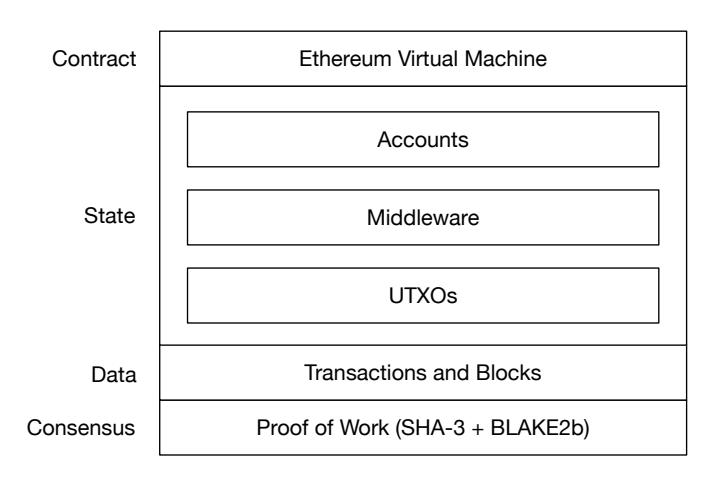
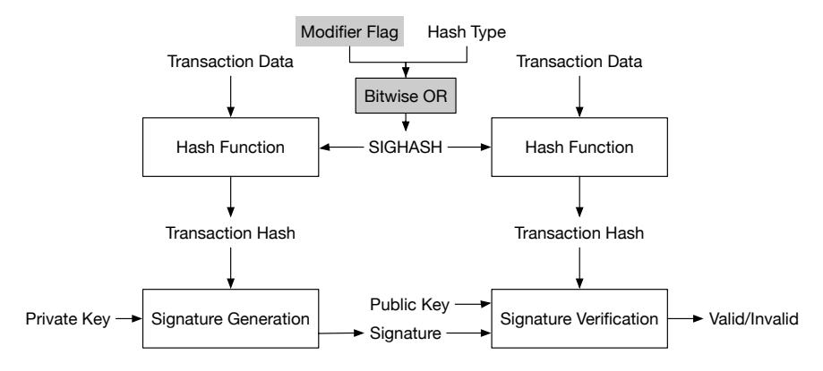
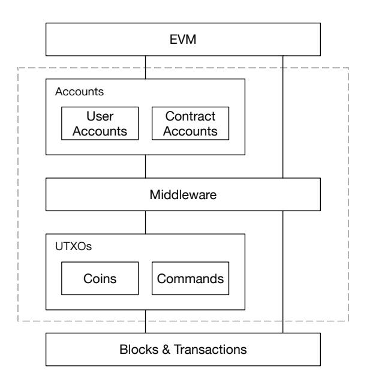
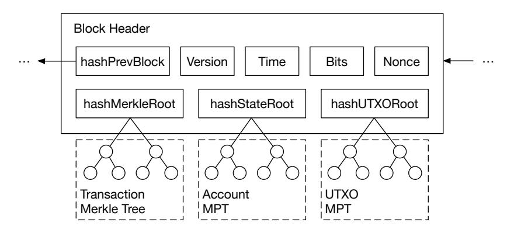
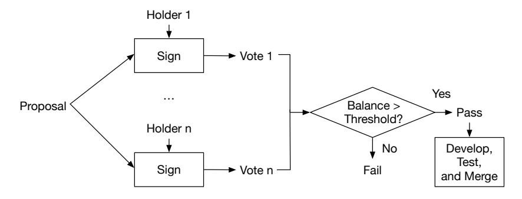

# BSC: A Bitcoin Smart Contract Implementation

Hiro Midas

<https://bsc.net/> hiro@bsc.net

March 24, 2020

Abstract. We propose BSC, a Bitcoin Smart Contract implementation. It integrates the functionality of smart contracts into the Bitcoin system, giving developers the ability to build decentralized applications on Bitcoin. BSC will require a new hard fork, on which Bitcoin holders can use their existing funds directly. BSC combines the unlimited creative space of smart contracts and the vast network effect of Bitcoin, which will bring even more possibilities to the cryptocurrency world.

### 1 Introduction

Bitcoin [\[1\]](#page-9-0) has the highest market value, the largest number of users, and the most influential network effect among all cryptocurrencies. In February 2020, the price of Bitcoin once again reached above \$10,000. There is a huge market behind Bitcoin that supports this price. The market includes not only individuals such as developers, speculators, and miners, but also institutions and enterprises such as exchanges, mining pools, and mining machines. These roles participate together and play against each other, bringing the overall market value of 180 billion U.S. dollars to the Bitcoin market and 115 EH/s computing power on the blockchain. Bitcoin occupies a dominant position in the blockchain area and has the largest ecosystem as well.

As the earliest blockchain solution, Bitcoin has some technical shortcomings, such as low TPS (Transactions Per Second) and weak privacy. However, the most important shortcoming is that the script of Bitcoin is not Turing complete; as a result, smart contracts cannot be implemented. Bitcoin scripts cannot realize complex control flows, such as loops and recursions. Satoshi's conservative minimalist design for scripts prevents them from being used to build logic bombs such as infinite loops, or other DDoS attacks on the Bitcoin network. However, because of these deliberate restrictions on the script, decentralized applications are difficult to run on Bitcoin. If the Bitcoin network could support smart contracts, it would greatly broaden the application scenarios for Bitcoin.

#### 1.1 Related Work

The shortcomings of Bitcoin have caused research and improvement conducted by many developers. Some improvements are directly adopted on Bitcoin. Others are utilized in new blockchain systems. This progress has caused frequent updates of blockchain technology and the rapid growth of cryptocurrencies, but we consider the improvements to Bitcoin are too conservative in terms of innovation. Updates to Bitcoin are too constrained by theoretical provability and completeness, and thus ignore the requirements and expectations of users.

Several different approaches have been tried to improve Bitcoin. The first type of improvement to Bitcoin was a hard fork with some consensus parameters tweaked. In this way, the history of blocks and transactions of Bitcoin was retained, while new blocks and transactions operated according to the changed consensus protocol. This kind of hard fork can very well inherit Bitcoin's users and their funds, and make full use of the network effect of Bitcoin. But these kinds of hard fork improvements, such as BCH [\[2\]](#page-9-1) and BSV [\[3\]](#page-9-2), are more of a conceptual competition. No matter the block size is limited to 1MB or 1GB, Bitcoin is still essentially used as a distributed ledger, which cannot create more advanced application scenarios. Although these hard forks solved some of the existing problems of Bitcoin, they did not provide a substantial breakthrough in terms of application.

There is also a second type of improvement that inherits Bitcoin's infrastructure and extends it from the perspective of functionality and performance. Unlike the first, this type of improvement usually makes substantial changes to the system and even redesigns the underlying data structure. As a result, it is difficult for them to take effect through a hard fork. Instead, they choose to discard the Bitcoin history and launch a brand new blockchain. Existing inheritances, such as LTC [\[4\]](#page-9-3) and Zcash [\[5\]](#page-9-4), have respectively shortened transaction confirmation time and increased transaction privacy. However, since they leave the user ecosystem of Bitcoin, they are unable to take advantage of Bitcoin's network effect and cannot be compared with Bitcoin in terms of market value or user adoption. Moreover, because these successors retain the Bitcoin's UTXO (Unspent Transaction Output) model, they have difficulties in being compatible with smart contracts, which are based on the account model.

The third type of improvement is to completely refactor Bitcoin to support smart contracts, for example, Ethereum [\[6\]](#page-9-5). This type changes the UTXO model into the account model, so that virtual machines for smart contracts, such as EVM, can run on the blockchain. Unlike scripts that can only perform limited functions in Bitcoin, Turing-complete smart contracts can run complex logic on the blockchain. Therefore, the blockchain is no longer only a distributed ledger, but also a "world computer" and platform for various decentralized applications. The introduction of smart contracts has broadened the application scenarios of the blockchain to a large scale. On the other hand, it has also spawned new decentralized application models such as decentralized exchanges, games, and auctions. However, Ethereum is not compatible with the historical data of Bitcoin, and its network effect is far less than that of Bitcoin. If we can bring Ethereum's smart contract technology to Bitcoin users, we believe that it would have an incredible product-market fit and excellent opportunity to realize the full promise of blockchain.

### 1.2 Our Contribution

In this paper, we propose an important improvement to Bitcoin, BSC (Bitcoin Smart Contract). It integrates the functionality of smart contracts to the Bitcoin system, giving developers the ability to build decentralized applications on Bitcoin. BSC will be implemented through a hard fork, and Bitcoin holders can use their existing funds directly on the new fork. The fork will take place at the height of the next Bitcoin halving, i.e., 630,000. To reduce the risk of 51% attack on the fork, BSC will use a new SHA-3 + BLAKE2b hash algorithm for PoW (Proof of Work).

BSC will combine the unlimited creative space of smart contracts and the vast network effect of Bitcoin, which will be a very meaningful combination and exploration. This means that developers can deploy and run smart-contractbased decentralized applications on Bitcoin, which brings the whole application ecosystem of Ethereum to Bitcoin users. These decentralized applications include, but are not limited to, games (CryptoKitties), assets (ERC-20), DEX (Uniswap), Stablecoin (Dai), Layer-2 (cross-chain), and Privacy (AZTEC). The substantial increase in user volume may trigger these decentralized applications to change from quantitative to qualitative.

BSC brings more opportunities and possibilities to the blockchain area and also brings the most favorable enhancement to the Bitcoin ecosystem. BSC will adopt a relatively aggressive development approach to become a brandnew testbed/sandbox for Bitcoin. In the end, it will surpass existing forks and successors of Bitcoin in terms of deployed technology and platform capability.

### 2 System



<span id="page-2-0"></span>Fig. 1. System Architecture

The system of BSC can be divided into 4 layers, as shown in Fig. 1. The consensus layer still uses PoW, but the block hashing algorithm is changed to SHA-3 + BLAKE2b to reduce the risk of 51% attack. The data layer keeps using the same data structure as Bitcoin for compatibility, but some changes have been made to the signature to prevent replay attacks. Through a newly introduced middleware, the state layer converts UTXOs into accounts and interacts with the contract layer. The contract layer uses the EVM running Solidity bytecode, which links directly with the huge decentralized application ecosystem of Ethereum.

#### 2.1 Data

BSC will be fully compatible with Bitcoin in addresses, transactions, and blocks, so it will retain and support the historical data of Bitcoin. For Bitcoin holders, the identical amount of BSC can be obtained by simply importing the private keys of addresses from Bitcoin into the BSC wallet, or even importing the entire Bitcoin wallet (the wallet.dat file) into the BSC wallet. In this way, Bitcoin users can quickly start to use BSC, which fully takes advantage of the network effect of Bitcoin.

The method for transaction signing is consistent with Bitcoin as ECDSA, but parameters need to be modified to ensure the signature of BSC is incompatible with Bitcoin, thereby preventing replay attacks. As shown in Fig. 2, we add a modifier flag to SIGHASH to change its value under each hash type. In this way, for the same transaction data and hash type, the generated transaction hash is different. The signature is signing a different message (transaction hash), guaranteeing the signatures of BSC and Bitcoin cannot be verified by each other. It is similar to the method adopted in BCH [7]. But in BSC, the method is mandatory after the hard fork, which means Bitcoin-compatible signatures are no longer supported afterward.



<span id="page-3-0"></span>Fig. 2. Signature Generation and Verification

For the shortcoming of low TPS in Bitcoin, we believe that expanding the block size is valuable. So, we increase the maximum for the block size from 1 MB to 2 MB to include more transactions in a block. Also, the block size can be modified later on-chain through a smart contract, which will be explained in detail at a later time.

#### 2.2 State

Bitcoin uses the UTXO model, in which the balance of an address is composed of one or more UTXOs. Whereas smart contracts are typically based on the account model; that is, the state holds the balance and other attributes for each address, which facilitates the reading and updating of smart contracts. To integrate smart contracts into Bitcoin, in the state layer, we introduce a middleware that converts UTXOs into accounts to enable interactions between the data layer and the contract layer, as shown in Fig. [3.](#page-4-0)



<span id="page-4-0"></span>Fig. 3. Design of the State Layer

UTXOs UTXO is a data structure used to represent funds in Bitcoin. It has two parameters, value and scriptPubKey. value stands for the amount of coin included in the UTXO, and scriptPubKey (also called the locking script) is a piece of script which determines the conditions required to spend the UTXO. If someone can provide an unlocking script that meets the conditions of scriptPubKey, then the UTXO can be spent by another transaction with the unlocking script as an input.

Although there are many types of scripts in Bitcoin, only some are supported by the mainnet, called standard types. BSC extends the standard types and adds two new ones to further support the interaction between UTXOs and EVM: TX\_CREATE and TX\_CALL. They are respectively responsible for creating new smart contracts and calling functions in existing contracts. All these types are recorded in a txnouttype enum, as shown in Listing. [1.](#page-5-0)

```
enum txnouttype
{
    TX_NONSTANDARD ,
    // standard types from Bitcoin :
    TX_PUBKEY ,
    TX_PUBKEYHASH ,
    TX_SCRIPTHASH ,
    TX_MULTISIG ,
    TX_NULL_DATA , // ! < unspendable OP_RETURN script that
        carries data
    TX_WITNESS_V0_SCRIPTHASH ,
    TX_WITNESS_V0_KEYHASH ,
    TX_WITNESS_UNKNOWN ,
    // types added by BSC :
    TX_CREATE ,
    TX_CALL
};
```

Listing 1. The txnouttype enum

Except for TX\_NULL\_DATA, all standard types from Bitcoin are spendable, so we name these types of UTXOs as Coin. Coins are used for storage and transfer of funds, so they demand value > 0. The two new types, TX\_CREATE and TX\_CALL, are called Command since they contain the bytecodes running on the EVM. The restrictions on parameters of Commands are as follows.

```
// For TX_CREATE
value == 0
// and scriptPubKey is of the form
< Version > < Gas Limit > < Gas Price > < Data > OP_CREATE
// For TX_CALL
value >= 0
// and scriptPubKey is of the form
< Version > < Gas Limit > < Gas Price > < Data > < Public Key Hash >
    OP_CALL
```

Listing 2. Restrictions on Parameters of Commands

Accounts Account is a data structure that keeps an up-to-date state for each address and provides interfaces for reading and updating the state. The state for a User address only contains the balance and nonce, while the state for a Contract address additionally contains the code and storage. The balance is obtained by the middleware summing the value of UTXOs corresponding to the address, and the nonce is increased by 1 for every transaction sent from the address.

All accounts are saved in a data structure called MPT (Merkle Patricia Trie) [\[8\]](#page-9-7), which helps smart contracts to efficiently retrieve the state of each address. Also, MPT generates a hash for all the data it stores, which can be used to compare two MPTs to determine if they have the same data. We also save the UTXOs of each address in another MPT to facilitate the calculation of the state. Finally, hashes of the two MPTs, hashStateRoot and hashUTXORoot, will be recorded in the block header, which can be used by blockchain nodes to verify the correctness of the data in their MPTs, as shown in Fig. [4.](#page-6-0)



<span id="page-6-0"></span>Fig. 4. Block Header

Middleware The middleware connects to four modules: EVM, Accounts, UTXOs, Blocks & Transactions, providing interactive functions between these modules. These interactive functions are explained as follows. We can see that the main responsibility of the middleware is to update MPTs, handle requests to EVM, and create new transactions and UTXOs according to code execution in the EVM.

- Update UTXOs. The middleware continually monitors for new UTXOs from the data layer and adding them to the UTXO MPT.
- Update Accounts. If a newly received UTXO belongs to the type of Coin, then use it to update the account MPT directly.
- Request EVM. If the type is Command, use it to request the EVM.

- Create Contract. For TX\_CREATE, the middleware asks EVM to create a new contract based on the bytecode in the Data field and store the contract into the account MPT.
- Call Contract. For TX\_CALL, the middleware asks EVM to call an existing contract with parameters in the Data field and save the state changes to the account MPT.
  - ∗ Deposit Funds. If the TX\_CALL sends funds to the contract (value > 0), the middleware will create a transaction that merges it with the contract's existing UTXO into a new UTXO.
  - ∗ Withdraw Funds. If the TX\_CALL withdraws funds from the contract (calls address.transfer() or address.send() in Solidity), the middleware will create a transaction that transfers funds out of the contract.
- Process Gas. Finally EVM will return the gas cost of the Command. Then the middleware will add a new UTXO to the coinbase transaction to refund unused gas.

#### 2.3 Initialization

We hope the concept of BSC will be supported by a threshold number of Bitcoin holders and regard this as a precondition for launching the mainnet, to ensure our work is recognized by the market and users. As a result, if you, like us, want to see more interesting explorations in the Bitcoin ecosystem, you can support this project on the official website [\[9\]](#page-9-8) with signatures from addresses that hold Bitcoin. Only when the total balance of all signed addresses reaches 50,000 BTC will BSC make plans to launch its mainnet.

The launch of the mainnet would take place at the height of the next Bitcoin halving, i.e., 630,000, and generate a new hard fork. As a Bitcoin holder, if you manage the private keys yourself, you can import the private keys or the entire wallet (e.g., the wallet.dat file) into the BSC wallet to obtain the same amount of BSC coins. If your Bitcoin is kept in an exchange, you can ask the exchange for the corresponding BSC.

### 2.4 Consensus

After the BSC mainnet is launched, the new fork may face the risk of 51% attack due to a relatively low computing power on it. To reduce this risk, we selected SHA-3 + BLAKE2b as the PoW block hashing algorithm for BSC instead of the double iterated SHA-256 used in Bitcoin. This will also make the existing Bitcoin ASIC miners unable to be directly applied to BSC, reducing the possibility of being attacked. A pseudocode of the block hashing algorithm is shown in Listing. [3.](#page-8-0) The paddings in the pseudocode are arbitrary bit strings that act as salt to the hash function, which makes the resulting output more unpredictable. If the block hashing result is less than a target difficulty, the block is deemed valid.

```
function hash ( block_header ) {
    left = blake2b ( block_header ) ;
    right = sha3 ( block_header + padding_8 ) ;
    return blake2b ( left . substr (32 , 32) + left . substr (0 , 32) +
          padding_32 + right ) ;
}
```

Listing 3. Block Hashing Algorithm

Mining rewards, block intervals, difficulty adjustment algorithms, and other details related to the consensus, will be consistent with Bitcoin to ensure compatibility with Bitcoin.

#### 2.5 Governance

The upgrade scheme for BSC will be similar to BIP (Bitcoin Improvement Proposal) [\[10\]](#page-9-9) with some modifications. Anyone can initiate a BSC improvement proposal, and the proposal will then be peer-reviewed. Only after the majority reaches a consensus on the proposal, can development, testing, and merging be undertaken. However, we will change the way of reaching consensuses to ensure that higher priority is given to the satisfaction of user requirements and the improvement of user experience, rather than the preference of research and development, as shown in Fig. [5.](#page-8-1) During the peer-review period, BSC holders can vote on the proposal. When the period ends, if the total balance of voting addresses exceeds a certain threshold, the proposal takes effect. This guarantees the improvement direction is consistent with the intention of holders.



<span id="page-8-1"></span>Fig. 5. Improvement Proposal Voting

The modification of some system parameters, such as max block size and min gas price, will be managed on-chain through smart contracts. When a parameter needs to be modified, a proposal is first initiated through a smart contract. Then community members can then vote on the proposal through smart contracts to express their approval or opposition. When the proposal is agreed upon by the majority, it takes effect directly in the system. This way of on-chain governance is more transparent and efficient, and can effectively reduce the need for blockchain hard forks for system upgrades.

## 3 Conclusion

We propose BSC, a Bitcoin Smart Contract implementation. It is a hard-fork upgrade to Bitcoin, which will integrate smart contracts into Bitcoin and is compatible with the history of Bitcoin blocks and transactions. It takes full advantage of the Bitcoin network effect while enabling the ability to build decentralized applications on Bitcoin. BSC will become a brand new test and creative development platform for Bitcoin.

### References

- <span id="page-9-0"></span>1. Satoshi Nakamoto. Bitcoin: A Peer-to-Peer Electronic Cash System. [https://](https://bitcoin.org/bitcoin.pdf) [bitcoin.org/bitcoin.pdf](https://bitcoin.org/bitcoin.pdf).
- <span id="page-9-1"></span>2. Bitcoin Cash - Peer-to-Peer Electronic Cash. <https://www.bitcoincash.org/>.
- <span id="page-9-2"></span>3. BitcoinSV - Satoshi's Vision for Bitcoin. <https://bitcoinsv.io/>.
- <span id="page-9-3"></span>4. Litecoin - Open source P2P digital currency. <https://litecoin.org/>.
- <span id="page-9-4"></span>5. Zcash: Privacy-protecting digital currency. <https://z.cash/>.
- <span id="page-9-5"></span>6. Ethereum: A next-generation smart contract and decentralized application platform. <https://github.com/ethereum/wiki/wiki/White-Paper>.
- <span id="page-9-6"></span>7. BUIP-HF Digest for replay protected signature verification across hard forks. [https://github.com/bitcoincashorg/bitcoincash.org/blob/master/](https://github.com/bitcoincashorg/bitcoincash.org/blob/master/spec/replay-protected-sighash.md) [spec/replay-protected-sighash.md](https://github.com/bitcoincashorg/bitcoincash.org/blob/master/spec/replay-protected-sighash.md).
- <span id="page-9-7"></span>8. Patricia Tree. <https://github.com/ethereum/wiki/wiki/Patricia-Tree>.
- <span id="page-9-8"></span>9. BSC official website. <https://bsc.net/>.
- <span id="page-9-9"></span>10. Bitcoin Improvement Proposals. <https://github.com/bitcoin/bips>.