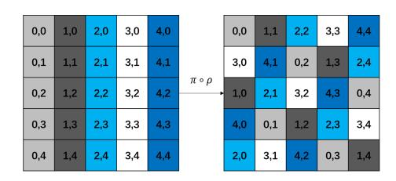
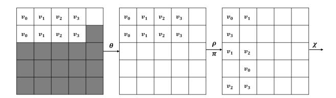
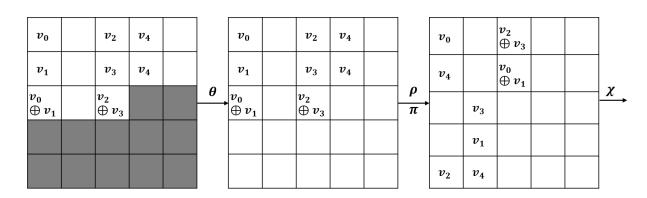
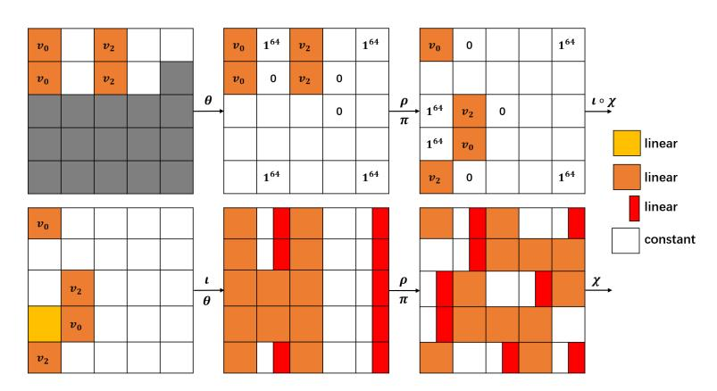
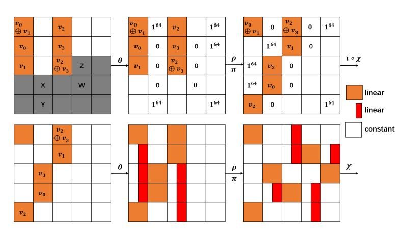
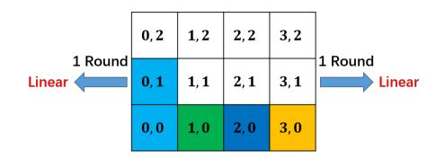

# Algebraic Attacks on Round-Reduced Keccak/Xoodoo

Fukang Liu1,<sup>3</sup> , Takanori Isobe2,<sup>3</sup> , Willi Meier<sup>4</sup> , Zhonghao Yang<sup>1</sup>

<sup>1</sup> Shanghai Key Laboratory of Trustworthy Computing, East China Normal University, Shanghai, China liufukangs@163.com,ashzhonghao@gmail.com <sup>2</sup> National Institute of Information and Communications Technology, Japan <sup>3</sup> University of Hyogo, Hyogo, Japan takanori.isobe@ai.u-hyogo.ac.jp <sup>4</sup> FHNW, Windisch, Switzerland willimeier48@gmail.com

Abstract. Since Keccak was selected as the SHA-3 standard, both its hash mode and keyed mode have attracted lots of third-party cryptanalysis. Especially in recent years, there is progress in analyzing the collision resistance and preimage resistance of round-reduced Keccak. However, for the preimage attacks on round-reduced Keccak-384/512, we found that the linear relations leaked by the hash value are not well exploited when utilizing the current linear structures. To make full use of the 320 + 64 × 2 = 448 and 320 linear relations leaked by the hash value of Keccak-512 and Keccak-384, respectively, we propose a dedicated algebraic attack by expressing the output as a quadratic Boolean equation system in terms of the input. Such a quadratic Boolean equation system can be efficiently solved with linearization techniques. Consequently, we successfully improved the preimage attacks on 2/3/4 rounds of Keccak-384 and 2/3 rounds of Keccak-512. Since similar θ and χ operations exist in the round function of Xoodoo, we make a study of the permutation and construct a practical zero-sum distinguisher for 12-round Xoodoo. Although 12-round Xoodoo is the underlying permutation used in Xoodyak, which has been selected by NIST for the second round in the Lightweight Cryptography Standardization process, such a distinguisher will not lead to an attack on Xoodyak.

Keywords: hash function, Keccak, Xoodoo, algebraic attack, zero-sum

## 1 Introduction

Due to the breakthrough in the cryptanalysis of MD5 [\[25\]](#page-20-0) and SHA-1 [\[24\]](#page-20-1), NIST started a public competition to select the SHA-3 standard in 2007 and Keccak [\[4\]](#page-18-0) was selected as the winner in 2012. In recent years, there is progress in the cryptanalysis of Keccak for both its hash mode and keyed mode. Specifically, by increasing the one-round connector [\[8\]](#page-18-1) to two rounds [\[19\]](#page-19-0) and three rounds [\[23\]](#page-20-2) with state-of-the-art algebraic methods, practical collision attacks on 5 rounds of SHA3-224 [\[23\]](#page-20-2) and SHA3-256 [\[10\]](#page-19-1) have been achieved. For preimage attacks, there is a major progress in FSE 2013 where preimage attacks can reach up to 4 rounds with the rotational cryptanalysis [\[18\]](#page-19-2). In ASIACRYPT 2016, the so-called linear structures of Keccak were proposed and several practical preimage attacks on reduced Keccak were identified [\[11\]](#page-19-3). Since then, several improved preimage attacks based on linear structures on reduced Keccak have been proposed [\[15](#page-19-4)[,14,](#page-19-5)[20\]](#page-19-6). For the keyed mode of Keccak, since the cube-attacklike cryptanalysis [\[9\]](#page-18-2) was proposed in EUROCRYPT 2015, several cube-based attacks on Keccak-like primitives have been developed [\[12,](#page-19-7)[16,](#page-19-8)[17,](#page-19-9)[22,](#page-19-10)[21,](#page-19-11)[5,](#page-18-3)[26\]](#page-20-3).

As can be seen from the preimage attacks based on linear structures on reduced Keccak, the aim is to construct a linear equation system in order to ensure that n bits of the hash value can be connected, thus obtaining an advantage of 2<sup>n</sup> over brute force. Such a strategy works well when the length of hash value is small and the rate part is large since there are sufficient degrees of freedom to help achieve linearization. However, for Keccak-384/512 where the length of hash value is large and the rate part is small, such a strategy works inefficiently. This is because linear structures become inefficient due to the decrease of degrees of freedom and only a few bits of the hash value can be connected.

Moreover, it seems that the time to solve a large linear equation system is neglected in all the preimage attacks based on linear structures. While it causes no problems for already practical attacks, it may underestimate the time complexity of the theoretical attacks. As will be shown, the improved preimage attack on 4-round Keccak-384 in [\[20\]](#page-19-6) is actually not faster than brute force if taking into account the time to solve a linear equation system of size 192. Thus, we insist that a careful re-evaluation of the complexity[5](#page-1-0) is necessary, especially for a fair comparison with the preimage attacks based on rotational cryptanalysis that only requires simple calls to the round-reduced Keccak permutation.

Since similar θ and χ operations exist in the round function of Xoodoo [\[6\]](#page-18-4) and 12-round Xoodoo is the underlying permutation used in Xoodyak [\[7\]](#page-18-5), which has been selected by NIST for the second round in the Lightweight Cryptography Standardization process [\[1\]](#page-18-6), it would be interesting to make a study of 12-round Xoodoo.

Our Contributions. To make full use of the linear relations leaked by the hash value of Keccak-384 and Keccak-512, we carefully control and trace the propagations of the variables in order to construct a quadratic Boolean equation system that can be efficiently solved with linearization techniques. In this way, the preimage attacks on 2 and 3 rounds of Keccak-384/512 are significantly improved. Moreover, we shed some light on the relations between the preimage

<span id="page-1-0"></span><sup>5</sup> Note that the Keccak round function works on 64-bit words. In our implementation of Gauss elimination, we first encode the Boolean coefficient matrix by treating every consecutive 64 bits as a 64-bit word in each row. Then, we perform the Gauss elimination on the encoded coefficient matrix. Such a way will not add extra cost to enumerate the solutions to the equation system after Gauss elimination.

attacks based on linear structures [\[11\]](#page-19-3) and the conditional cube attacks [\[12\]](#page-19-7). As a result, we update the record for the preimage attack on 4-round Keccak-384 obtained in FSE 2013 [\[18\]](#page-19-2) and improve it by a factor of 2<sup>3</sup> . Since our attacks are based on solving a large linear equation system, such a cost cannot be neglected. For a fair comparison, we simulate the gap between the time to solve a linear equation system and to perform the underlying round-reduced permutation of Keccak, as displayed in [Table 1.](#page-2-0)

For the underlying 12-round Xoodoo permutation used in the second round candidate Xoodyak [\[7\]](#page-18-5) in NIST's Lightweight Cryptography Standardization process, we use an MILP-based method to achieve the linearization for 1-round Xoodoo in both forward and backward directions, thus allowing us to construct a practical zero-sum distinguisher for 12-round Xoodoo with time complexity .

All the attacks have been implemented in C++. The source code and some discussions of the experiments can be found in Appendix [B.](#page-20-4)

<span id="page-2-0"></span>Table 1: Summarizing the preimage attacks on reduced Keccak. The previous preimage attacks based on linear structures treated the "Guessing Times" as the final time complexity. The corresponding size of the constructed linear equation system is listed in the "Size" column. The ratio of the time to solve the equation system to the time to perform the underlying round-reduced permutation is listed in the "Solving Time" column. The "Final Time" column represents the time complexity when taking the solving time into account.

| Rounds Variant Memory Guessing Size Solving Final |     |         |          |     |         |          |                |  |
|---------------------------------------------------|-----|---------|----------|-----|---------|----------|----------------|--|
|                                                   |     |         |          |     |         |          | Ref.           |  |
|                                                   |     |         | Times    |     | Time    | Time     |                |  |
|                                                   |     | -       | 129<br>2 | 256 | 10<br>2 | 139<br>2 | [11]           |  |
| 2                                                 | 384 | 87<br>2 | 89<br>2  | 0   | 1       | 89<br>2  | [13]           |  |
|                                                   |     | -       | 113<br>2 | 320 | 11<br>2 | 124<br>2 | [20]           |  |
|                                                   |     | -       | 93<br>2  | 384 | 11<br>2 | 104<br>2 | subsection 3.2 |  |
|                                                   |     | -       | 384<br>2 | 128 | 8<br>2  | 392<br>2 | [11]           |  |
| 2                                                 | 512 | -       | 321<br>2 | 192 | 9<br>2  | 330<br>2 | [20]           |  |
|                                                   |     | -       | 258<br>2 | 448 | 12<br>2 | 270<br>2 | subsection 3.1 |  |
|                                                   |     | -       | 322<br>2 | 255 | 10<br>2 | 332<br>2 | [11]           |  |
| 3                                                 | 384 | -       | 321<br>2 | 256 | 10<br>2 | 331<br>2 | [20]           |  |
|                                                   |     | -       | 271<br>2 | 461 | 12<br>2 | 283<br>2 | subsection 4.2 |  |
|                                                   |     | -       | 482<br>2 | 128 | 8<br>2  | 490<br>2 | [11]           |  |
| 3                                                 | 512 | -       | 475<br>2 | 128 | 8<br>2  | 483<br>2 | [20]           |  |
|                                                   |     | -       | 440<br>2 | 502 | 12<br>2 | 452<br>2 | subsection 4.1 |  |
|                                                   |     | -       | 378<br>2 | 0   | 1       | 378<br>2 | [18]           |  |
| 4                                                 | 384 | -       | 375<br>2 | 192 | 9<br>2  | 384<br>2 | [20]           |  |
|                                                   |     | -       | 366<br>2 | 175 | 9<br>2  | 375<br>2 | section 5      |  |

## 2 Preliminaries

To help understand this paper, we introduce some notations as well as the specifications of Keccak and Xoodoo in this section.

#### 2.1 Notation

- 1. ≪, ≫, ⊕, ∨, ∧ represent the logic operations rotate left, rotate right, exclusive or, or, and, respectively.
- 2. Z[i] represents the i-th bit of the 64-bit word Z, where the least significant bit is Z[0].
- 3. 1 <sup>64</sup> represents 0xffffffffffffffff.

## 2.2 Description of Keccak

Keccak is a family of hash functions. Since our targets are Keccak-512 and Keccak-384, we introduce the Keccak internal permutation f<sup>k</sup> which works on a 1600-bit state A and iterates an identical round function R<sup>k</sup> for 24 times. The state A can be viewed as a three-dimensional array of bits, namely A[5][5][64]. The expression A[x][y][z] represents the bit with (x, y, z) coordinate. At lane level, A[x][y] represents the 64-bit word located at the x th column and the y th row. For the description of Keccak in this paper, the coordinates are considered within modulo 5 for x and y and within modulo 64 for z. The round function R<sup>k</sup> consists of five operations R<sup>k</sup> = ι ◦ χ ◦ π ◦ ρ ◦ θ as follows. The influence of the π ◦ ρ operation is illustrated in [Figure 1](#page-3-0) for a better understanding.

$$\begin{split} \theta: A[x][y] &= A[x][y] \oplus (\sum_{y'=0}^4 A[x-1][y']) \oplus (\sum_{y'=0}^4 (A[x+1][y'] \lll 1)). \\ \rho: A[x][y] &= A[x][y] \lll r[x,y]. \\ \pi: A[y][2x+3y] &= A[x][y]. \\ \chi: A[x][y] &= A[x][y] \oplus (\overline{A[x+1][y]} \wedge A[x+2][y]). \\ \iota: A[x][y] &= A[x][y] \oplus RC. \end{split}$$

<span id="page-3-0"></span>

Fig. 1: The influence of π ◦ ρ operation

For simplicity, we denote the output state of the (i + 1)-st round by Ai+1 (0 ≤ i ≤ 23) and the initial input by A<sup>0</sup> . Moreover, we define A<sup>i</sup> θ , A<sup>i</sup> ρ , A<sup>i</sup> <sup>π</sup> and Ai <sup>χ</sup> as follows:

$$A^i \stackrel{\theta}{\longrightarrow} A^i_\theta \stackrel{\rho}{\longrightarrow} A^i_\rho \stackrel{\pi}{\longrightarrow} A^i_\pi \stackrel{\chi}{\longrightarrow} A^i_\chi \stackrel{\iota}{\longrightarrow} A^{i+1}.$$

## 2.3 Description of Xoodoo

The Xoodoo state can be viewed as a two-dimensional array S = (S[i][j]) (0 ≤ i ≤ 3, 0 ≤ j ≤ 2) as shown in [Figure 2,](#page-4-0) where S[i][j] ∈ F 32 2 . The round function R<sup>d</sup> of Xoodoo is composed of five consecutive operations R<sup>d</sup> = ρeast ◦ χ<sup>d</sup> ◦ ι<sup>d</sup> ◦ ρwest ◦ θd, as specified below. The permutation Xoodoo consists of 12 rounds of Rd.

$$\theta_d: \ S[i][j] = S[i][j] \oplus (\sum_{k=0}^2 S[(i-1)_{mod\ 4}][k]) \lll 5 \oplus (\sum_{k=0}^2 S[(i-1)_{mod\ 4}][k]) \lll 14.$$

ρwest : S[i][1] = S[(i − 1)mod <sup>4</sup>][1], S[i][2] = S[i][2] ≪ 11.

ι<sup>d</sup> : S[i][0] = S[i][0] ⊕ RC

χ<sup>d</sup> : S[i][j] = S[i][j] ⊕ S[i][(j + 1)mod <sup>3</sup>]S[i][(j + 2)mod <sup>3</sup>]

<span id="page-4-0"></span>ρeast : S[i][1] = S[i][1] ≪ 1, S[i][2] = S[(i − 2)mod <sup>4</sup>][2] ≪ 8.

| 0, 2 | 1, 2 | 2, 2 | 3, 2 |
|------|------|------|------|
| 0, 1 | 1, 1 | 2, 1 | 3, 1 |
| 0, 0 | 1, 0 | 2,0  | 3,0  |

Fig. 2: Illustration of the Xoodoo state

For simplicity, the inverse of the round function is denoted by R −1 d . Similarly, we denote the output state of the (i + 1)-st round by S <sup>i</sup>+1 (0 ≤ i ≤ 11) and the initial input by S 0 . Moreover, we define S i θ , S i ι , S i ρ , S i <sup>χ</sup> as follows:

$$S^i \xrightarrow{\theta_d} S^i_\theta \xrightarrow{\rho_{west}} S^i_\rho \xrightarrow{\iota_d} S^i_\iota \xrightarrow{\chi_d} S^i_\chi \xrightarrow{\rho_{east}} S^{i+1}.$$

#### 2.4 The Keccak Hash Functions Keccak-512 and Keccak-384

The Keccak hash functions follow the sponge construction [\[3\]](#page-18-7). For Keccak-l (l = {224, 256, 384, 512}), the message is first padded to be a message of the form M10∗1, whose length is a multiple of (1600 − 2l). Specifically, the original message M is first padded with a single bit "1" and then with a smallest nonnegative number of "0" and finally with a single bit "1". Then, the message can be divided into several (1600−2l)-bit message blocks. Starting with a predefined 1600-bit initial state, which is zero for Keccak-l, the first (1600 − 2l) bits of the initial state is XORed with the message block, followd by the permutation fk. Such a step is repeated until all message blocks are processed. Then, the first l bits of the state is exacted as the hash value. We refer the readers to [\[4\]](#page-18-0) for more details.

## 2.5 Leaked Linear Relations

For a better understanding, we re-introduce some properties of the χ operation in [\[11\]](#page-19-3). Denote a 5-bit input by (a[0], a[1], a[2], a[3], a[4]) ∈ F 5 2 . After χ operation, the 5-bit output is denoted by (b[0], b[1], b[2], b[3], b[4]) ∈ F 5 2 . Specifically, we have the following relation:

$$b[i] = a[i] \oplus \overline{a[i+1]} \wedge a[i+2],$$

where the index are considered within modulo 5.

Since χ is bijective, (a[0], a[1], a[2], a[3], a[4]) will be uniquely determined when (b[0], b[1], b[2], b[3], b[4]) are fully known. To help understand the attacks in this paper, we introduce some properties identified in [\[11\]](#page-19-3).

<span id="page-5-0"></span>Property 1 [\[11\]](#page-19-3) When (b[i], b[i+ 1], b[i+ 2]) are known, 2 linearly independent relations can be derived in terms of (a[0], a[1], a[2], a[3], a[4]).

For a better understanding, we give a slightly detailed explanation for [Property 1.](#page-5-0) Observe the expressions to compute (b[i], b[i + 1], b[i + 2]):

$$\begin{split} b[i] &= a[i] \oplus \overline{a[i+1]} \wedge a[i+2], \\ b[i+1] &= a[i+1] \oplus \overline{a[i+2]} \wedge a[i+3], \\ b[i+2] &= a[i+2] \oplus \overline{a[i+3]} \wedge a[i+4]. \end{split}$$

Therefore, we have

$$\begin{split} b[i+1] \wedge a[i+2] &= a[i+1] \wedge a[i+2], \\ b[i] &= a[i] \oplus \overline{a[i+1]} \wedge a[i+2] = a[i] \oplus b[i+1] \wedge a[i+2] \oplus a[i+2], \\ b[i+2] \wedge a[i+3] &= a[i+2] \wedge a[i+3], \\ b[i+1] &= a[i+1] \oplus \overline{a[i+2]} \wedge a[i+3] = a[i+1] \oplus b[i+2] \wedge a[i+3] \oplus a[i+3]. \end{split}$$

In other words, the following two linearly independent relations in terms of (a[0], a[1], a[2], a[3], a[4]) are leaked:

$$\begin{split} b[i] &= a[i] \oplus b[i+1] \wedge a[i+2] \oplus a[i+2], \\ b[i+1] &= a[i+1] \oplus b[i+2] \wedge a[i+3] \oplus a[i+3]. \end{split}$$

<span id="page-5-1"></span>Property 2 [\[11\]](#page-19-3) a[i] = b[i] holds with probability 0.75 ≈ 2 −0.42 .

The [Property 2](#page-5-1) is also obvious since the probability that a[i + 1] ∧ a[i + 2] = 0 is 0.75.

Leaked linear relations of Keccak-384. The hash value of Keccak-384 is composed of the following 6 state words

$$(A^r[0][0],A^r[1][0],A^r[2][0],A^r[3][0],A^r[4][0],A^r[0][1]) \\$$

when  $f_k$  consists of r rounds of  $R_k$ . Therefore, according to the hash value,  $(A_{\pi}^{r-1}[0][0], A_{\pi}^{r-1}[1][0], A_{\pi}^{r-1}[2][0], A_{\pi}^{r-1}[3][0], A_{\pi}^{r-1}[4][0])$  can be uniquely determined. In addition, based on Property 2,  $A_{\pi}^{r-1}[0][1][z] = A^{r}[0][1][z]$  holds with probability  $2^{-0.42}$  for  $0 \le z \le 63$ .

In conclusion,  $5 \times 64 = 320$  linearly independent relations in terms of  $A^{r-1}$  are leaked by the hash value. In addition, there are also 64 probabilistic linear relations in terms of  $A^{r-1}$  leaked by the hash value, each of which holds with probability  $2^{-0.42}$ .

Leaked linear relations of Keccak-512. The hash value of Keccak-512 is composed of the following 8 state words

$$(A^r[0][0], A^r[1][0], A^r[2][0], A^r[3][0], A^r[4][0], A^r[0][1], A^r[1][1], A^r[2][1]).$$

Thus, according to the hash value, we can uniquely determine

$$(A_\pi^{r-1}[0][0],A_\pi^{r-1}[1][0],A_\pi^{r-1}[2][0],A_\pi^{r-1}[3][0],A_\pi^{r-1}[4][0]).$$

In addition, based on Property 1, it also leaks  $64 \times 2 = 128$  linearly independent relations in terms of

$$(A_\pi^{r-1}[0][1],A_\pi^{r-1}[1][1],A_\pi^{r-1}[2][1],A_\pi^{r-1}[3][1],A_\pi^{r-1}[4][1]).$$

In conclusion, there are  $5 \times 64 + 128 = 448$  linearly independent relations in terms of  $A^{r-1}$  leaked by the hash value.

#### 2.6 Overview

We briefly introduce the basic idea of our attacks using an algebraic method. For the preimage attack, assuming that the length of the hash value is l, if the attacker can exhaust a space of size  $2^l$  in  $2^{l_0}$  time ( $l_0 \leq l$ ), we say an advantage of  $2^{l-l_0}$  over brute force is obtained on the whole. To achieve it with the algebraic method, we can first choose  $l-l_0$  undetermined variables. Then, we guess  $2^{l-l_0}$  different values for the variables which do not belong to the set formed by the chosen undetermined variables. For each different guess, a linear equation system can be constructed to uniquely determine the undetermined  $l-l_0$  variables. If taking into account the time T to solve such an equation system, the time complexity to exhaust a space of size  $2^l$  is then estimated as  $T \times 2^{l_0}$ . In fact, our method can be viewed as an efficient exhaustive search based on guess-and-determine techniques. The technical part is to identify which bits should be guessed in order to gain more advantages over the brute force, which is obviously non-trivial. To achieve this, we carefully trace and control the propagations of the variables.

#### 3 Preimage Attacks on 2-Round Keccak-384/512

In this section, we present the preimage attacks on 2-round Keccak-384/512. The basic idea is to make full use of the leaked linear relations from the hash value and then to construct a quadratic Boolean equation system which can be efficiently solved with linearization techniques.

## <span id="page-7-0"></span>3.1 Preimage Attack on 2-Round Keccak-512

The preimage attack on 2-round Keccak-512 is illustrated in Figure 3. Specifically, we introduce  $64\times 4=256$  variables  $v_0=\{v_0^1,v_0^2,\cdots,v_0^{64}\},\ v_1=\{v_1^1,v_1^2,\cdots,v_1^{64}\},\ v_2=\{v_2^1,v_2^2,\cdots,v_2^{64}\}$  and  $v_3=\{v_3^1,v_3^2,\cdots,v_3^{64}\}$ . Moreover, these variables are placed in this way:  $A^0[0][0]=v_0,A^0[0][1]=v_0\oplus C_0',\ A^0[1][0]=v_1,A^0[1][1]=v_1\oplus C_1',\ A^0[2][0]=v_2,A^0[2][1]=v_2\oplus C_2',\ A^0[3][0]=v_3$  and  $A^0[3][1]=v_3\oplus C_3'$ , where  $C_i'\in F_2^{64}\ (0\leq i\leq 3)$ .

<span id="page-7-1"></span>

Fig. 3: Preimage attack on 2-round Keccak-512

By tracing the propagations of the variables through the linear layer in the first round, as shown in Figure 3, we can know that there will be  $64 \times 3 = 192$  possible quadratic terms formed by the 256 variables  $(v_0, v_1, v_2, v_3)$  after  $\chi$  operation in the first round. By introducing 192 new variables  $v_4 = \{v_4^1, v_4^2, \cdots, v_4^{192}\}$  to replace all the quadratic terms, the first round Keccak permutation can be viewed as linear in the 256 + 192 = 448 variables  $(v_0, v_1, v_2, v_3, v_4)$ . Since the hash value of Keccak-512 can leak  $320 + 64 \times 2 = 448$  linearly independent relations in terms of  $A_{\pi}^1$  and  $A_{\pi}^1$  is linear in  $(v_0, v_1, v_2, v_3, v_4)$ , a linear Boolean equation system of size 448 in terms of the 448 variables can be constructed. Such an equation system is expected to have one solution. Once the solution is generated, the corresponding value of the message is known and we can compute the corresponding hash value and compare it with the target one.

Complexity evaluation. To match the hash value, it is expected to generate  $2^{256}$  different values of  $(C'_0, C'_1, C'_2, C'_3, A^0[4][0])$ . For each value of  $(C'_0, C'_1, C'_2, C'_3, A^0[4][0])$ , we are required to exhaust all the  $2^{256}$  values of the 256 variables. However, by constructing an equation system, we can traverse the  $2^{256}$  values in only 1 time for each value of  $(C'_0, C'_1, C'_2, C'_3, A^0[4][0])$ . Taking the padding rule into account,  $2^{256+2} = 2^{258}$  different values of  $(C'_0, C'_1, C'_2, C'_3, A^0[4][0])$  should be

tried. Therefore, the time complexity of the preimage attack on 2-round Keccak-512 is  $2^{258}$ , which is equivalent to  $2^{270}$  calls to the 2-round Keccak permutation when taking the time to solve the equation system into account.

## <span id="page-8-0"></span>3.2 Preimage Attack on 2-Round Keccak-384

An illustration of the preimage attack on 2-round Keccak-384 is given in Figure 4. First of all, we introduce 128+128+64=320 variables  $v_0=\{v_0^1,v_0^2,\cdots,v_0^{64}\},$   $v_1=\{v_1^1,v_1^2,\cdots,v_1^{64}\},$   $v_2=\{v_2^1,v_2^2,\cdots,v_2^{64}\},$   $v_3=\{v_3^1,v_3^2,\cdots,v_3^{64}\}$  and  $v_4=\{v_4^1,v_4^2,\cdots,v_4^{64}\}$ . Then, let  $A^0[0][0]=v_0,A^0[0][1]=v_1,A^0[0][2]=v_0\oplus v_1\oplus C_4',$   $A^0[2][0]=v_2,A^0[2][1]=v_3,A^0[2][2]=v_2\oplus v_3\oplus C_5',$   $A^0[3][0]=v_4$  and  $A^0[3][1]=v_4\oplus C_6'$ , where  $C_i'\in F_2^{64}$   $(4\leq i\leq 6)$ .

<span id="page-8-1"></span>

Fig. 4: Preimage attack on 2-round Keccak-384

According to the propagations of the variables in the linear layer of the first round in Figure 4, it can be observed that there will be at most 64 quadratic terms formed by  $(v_2, v_4)$  in  $A^1$ . Thus, we introduce extra 64 new variables  $v_5 = \{v_5^1, v_5^2, \cdots, v_5^{63}\}$  to replace all the quadratic terms. Note that we can extract from the hash value 320 linearly independent relations and 64 probabilistic linearly independent relations in terms of  $A_\pi^1$  and  $A_\pi^1$  is now linear in  $(v_0, v_1, v_2, v_3, v_4, v_5)$ . In other words, we can construct a linear Boolean equation system of size 320 + 64 = 384 in terms of 320 + 64 = 384 variables. Therefore, we can expect one solution for such an equation system.

Complexity evaluation. Note that 64 probabilistic linear relations are utilized in our equation system, each of which holds with probability  $0.75\approx 2^{-0.42}$ . Therefore, apart from matching the 384-bit hash value, the probabilistic linear relations have to be fulfilled. Consequently, it is expected to try  $2^{384+0.42\times64}=2^{411}$  possible different messages. To achieve it, we can randomly choose  $2^{411-320}=2^{91}$  values for  $(A^0[1][0],A^0[1][1],A^0[1][2],A^0[4][0],A^0[4][1],C'_4,C'_5,C'_6)$ . Then, traverse the  $2^{320}$  values of  $(v_0,v_1,v_2,v_3,v_4)$  by solving an equation system. Such an equation system is expected to have only 1 solution. Thus, we can exhaust  $2^{411}$  messages with time complexity  $2^{91}$  and the time complexity of the preimage attack on 2-round Keccak-384 becomes  $2^{93}$  by taking the padding rule into consideration. Taking the time to solve the equation system into account, the time complexity is equivalent to  $2^{104}$  calls to the 2-round Keccak permutation.

## 4 Preimage Attack on 3-Round Keccak-384/512

The improved preimage attacks on 2-round Keccak-384/512 have been described. The basic ideas are simple since one can easily observe the number of quadratic terms. However, as can be seen from our preimage attacks on 3-round Keccak-384/512, it is not so intuitive and requires a dedicated (nontrivial) analysis of the propagation of variables. Moreover, instead of replacing a quadratic term formed by the variables, we will replace a whole quadratic expression with a new variable.

## <span id="page-9-0"></span>4.1 Preimage Attack on 3-Round Keccak-512

The preimage attack on 3-round Keccak-512 is illustrated in Figure 5. Specifically, choose 128 variables  $v_0 = \{v_0^1, v_0^2, \cdots, v_0^{64}\}$  and  $v_2 = \{v_2^1, v_2^2, \cdots, v_2^{64}\}$ . Then, let  $A^0[0][0] = v_0, A^0[0][1] = v_0 \oplus C_0$ ,  $A^0[2][0] = v_2$  and  $A^0[2][1] = v_2 \oplus C_1$ , where  $C_0 \in F_2^{64}$  and  $C_1 \in F_2^{64}$ .

<span id="page-9-1"></span>

Fig. 5: Preimage attack on 3-round Keccak-512

As can be seen from Figure 5, there are several conditions on  $A_{\theta}^{0}$ , as shown below.

$$\begin{split} A_{\theta}^{0}[1][0] &= 1^{64}, A_{\theta}^{0}[1][1] = 0, A_{\theta}^{0}[1][4] = 1^{64}, \\ A_{\theta}^{0}[3][1] &= 0, A_{\theta}^{0}[3][2] = 0, \\ A_{\theta}^{0}[4][0] &= 1^{64}, A_{\theta}^{0}[4][4] = 1^{64}. \end{split}$$

The above conditions can be converted into those on  $A^0$ , as specified below:

$$B_0 = A^0[0][2] \oplus A^0[0][3] \oplus A^0[0][4], \tag{1}$$

$$B_2 = A^0[2][2] \oplus A^0[2][3] \oplus A^0[2][4], \tag{2}$$

$$B_3 = A^0[3][2] \oplus A^0[3][3] \oplus A^0[3][4], \tag{3}$$

$$A^{0}[1][0] \oplus (B_{0} \oplus C_{0}) \oplus (B_{2} \oplus C_{1}) \ll 1 = 1^{64}, \tag{4}$$

$$A^{0}[1][1] \oplus (B_{0} \oplus C_{0}) \oplus (B_{2} \oplus C_{1}) \ll 1 = 0,$$
 (5)

$$A^{0}[1][4] \oplus (B_{0} \oplus C_{0}) \oplus (B_{2} \oplus C_{1}) \ll 1 = 1^{64},$$
 (6)

$$A^{0}[3][1] \oplus (B_{2} \oplus C_{1}) \oplus (B_{4} \oplus A^{0}[4][0]) \lll 1 = 0, \tag{7}$$

$$A^{0}[3][2] \oplus (B_{2} \oplus C_{1}) \oplus (B_{4} \oplus A^{0}[4][0]) \ll 1 = 0,$$
 (8)

$$A^{0}[4][0] \oplus (A^{0}[3][0] \oplus A^{0}[3][1] \oplus B_{3}) \oplus (B_{0} \oplus C_{0}) \lll 1 = 1^{64},$$
 (9)

$$A^{0}[4][4] \oplus (A^{0}[3][0] \oplus A^{0}[3][1] \oplus B_{3}) \oplus (B_{0} \oplus C_{0}) \lll 1 = 1^{64}.$$
 (10)

In our preimage attack on 3-round Keccak-512, two message blocks will be used. For the first message block, it will be randomly chosen. For each random value of the first message block,  $(B_0, B_2, B_3, A^0[1][4], A^0[4][4], A^0[3][2])$  will become fixed in the above equation system. As for the remaining variables marked in red, they can be computed step by step as follows:

$$\begin{split} A^{0}[4][0] &= A^{0}[4][4], \\ A^{0}[3][1] &= A^{0}[3][2], \\ C_{1} &= A^{0}[3][2] \oplus (B_{4} \oplus A^{0}[4][0]) \lll 1 \oplus B_{2}. \\ A^{0}[1][0] &= A^{0}[1][4], \\ A^{0}[1][1] &= A^{0}[1][4] \oplus 1^{64}, \\ C_{0} &= A^{0}[1][4] \oplus (B_{2} \oplus C_{1}) \lll 1 \oplus B_{0} \oplus 1^{64}. \\ A^{0}[3][0] &= A^{0}[4][4] \oplus (B_{0} \oplus C_{0}) \lll 1 \oplus (A^{0}[3][1] \oplus B_{3}) \oplus 1^{64}. \end{split}$$

In other words, whatever the value of the first message block is, the 7 conditions on  $A^0_{\theta}$  can always be satisfied by carefully choosing the value of second message block

After the conditions on  $A_{\theta}^0$  are satisfied, at most five 64-bit words of  $A^1$  will contain variables, as shown in Figure 5. Note that except  $A^1[0][3]$ , each bit of  $(A^1[0][0], A^1[0][4], A^1[1][2], A^1[1][3])$  must contain variables. As for  $A^1[0][3]$ , which bit of  $A^1[0][3]$  contains variables is uncertain and it depends on the value of  $A_{\pi}^0[2][3]$ .

To control the diffusion of the variables in the first column of  $A^1$ , we choose a random value  $c_0 \in F_2^t$  and set up the following t  $(1 \le t \le 64)$  Boolean equations

$$\sum_{j=0}^{4} A^{1}[0][j][z] = c_{0}[z]$$

where  $0 \le z \le t - 1$ . It can be easily observed that the t Boolean equations are independent since each equation contains a different variable of  $v_2$ . In other words, by exhausting the  $2^t$  possible values of  $c_0$ , we can traverse  $2^t$  different values of  $(v_0, v_2)$ .

Then, the propagation of  $(v_0, v_2)$  in the linear layer of the second round can be traced as shown in Figure 5. According to the positions which contain variables, we can know that  $(A_{\chi}^1[1][1], A_{\chi}^1[2][1], A_{\chi}^1[0][3], A_{\chi}^1[1][3])$  must contain

newly-generated quadratic terms and the total number of the quadratic terms is  $64 \times 4 = 256$ . Moreover, among the expressions of the following states:

$$\begin{split} &A_{\chi}^{1}[0][0],A_{\chi}^{1}[3][0],A_{\chi}^{1}[4][0],\\ &A_{\chi}^{1}[0][1],\\ &A_{\chi}^{1}[2][2],A_{\chi}^{1}[3][2],A_{\chi}^{1}[4][2],\\ &A_{\chi}^{1}[4][3],\\ &A_{\chi}^{1}[1][4],A_{\chi}^{1}[2][4],A_{\chi}^{1}[3][4], \end{split}$$

there will be additional  $11 \times (64 - t)$  newly-generated quadratic terms<sup>6</sup>. In a word, there will be in total  $256 + 11 \times (64 - t) = 960 - 11t$  newly generated quadratic terms.

Then, introduce 960 - 11t new intermediate variables  $v_4 = \{v_4^1, \dots, v_4^{960-11t}\}$  to replace all the newly-generated quadratic terms. In this way, the two-round Keccak permutation can be viewed as linear in the 128 + 960 - 11t = 1088 - 11t variables  $(v_0, v_2, v_4)$ .

Since the output of Keccak-512 will leak  $64 \times 7 = 448$  linearly independent equations in terms of  $A_{\pi}^2$  and  $A_{\pi}^2$  is now linear in  $(v_0, v_2, v_4)$ , extra 448 linear equations in terms of  $(v_0, v_2, v_4)$  can be set up. Note that we have previously set up t linear equations in terms of  $(v_0, v_2)$  in order to control the diffusion of variables in the first column of  $A^1$ . Therefore, in total 448 + t linear equations in terms of the 1088 - 11t variables  $(v_0, v_2, v_4)$  are set up. To ensure that the equation system can be efficiently solved with Gauss elimination, we add the following constraint:

$$1088 - 11t < 448 + t$$
.

We choose the minimum value t=54. In this way, a linear Boolean equation system of size 502 in terms of 494 variables can be constructed. Thus, it is expected that there is at most one solution for each guess of  $c_0$ . In other words, by exhausting  $2^{54}$  possible values of  $c_0$  and solving the final equation system, we can equivalently traverse all  $2^{128}$  possible values of  $(v_0, v_2)$  with  $2^{54}$  times of solving a Boolean equation system of size 502.

Complexity evaluation. For a given value of the first message block, the second message block can take at most  $2^{128}$  possible values in order to construct a preferred equation system. To satisfy the padding rule, we need to generate  $2^{512-128+2}=2^{386}$  random values of the first message block. For each value of the first message block, the naive exhaustive search of the  $2^{128}$  values of the second message block will require  $2^{128}$  time. However, by constructing an equation system of size 502, the  $2^{128}$  values can be traversed in only  $2^{54}$  time. Therefore, the time complexity of the preimage attack on 3-round Keccak-512 is  $2^{386+54}=2^{440}$ , which is equivalent to  $2^{452}$  calls to the 3-round Keccak permutation.

<span id="page-11-0"></span><sup>&</sup>lt;sup>6</sup> The quadratic expression  $(x_0 \oplus x_1)x_2$  will be treated as one quadratic term rather than two different quadratic terms  $(x_0x_2, x_0x_1)$ 

#### <span id="page-12-0"></span>4.2 Preimage Attack on 3-Round Keccak-384

The preimage attack on 3-round Keccak-384 is illustrated in Figure 6. Specifically, choose 256 variables  $v_0 = \{v_0^1, v_0^2, \cdots, v_0^{64}\}$ ,  $v_1 = \{v_1^1, v_1^2, \cdots, v_1^{64}\}$ ,  $v_2 = \{v_2^1, v_2^2, \cdots, v_2^{64}\}$  and  $v_3 = \{v_3^1, v_3^2, \cdots, v_3^{64}\}$ . Then, let  $A^0[0][0] = v_0 \oplus v_1 \oplus C_2$ ,  $A^0[0][1] = v_0$ ,  $A^0[0][2] = v_1$ ,  $A^0[2][0] = v_2$ ,  $A^0[2][1] = v_3$  and  $A^0[2][2] = v_2 \oplus v_3 \oplus C_3$ , where  $C_2 \in F_2^{64}$  and  $C_3 \in F_2^{64}$ .

<span id="page-12-1"></span>

Fig. 6: Preimage attack on 3-round Keccak-384

Similarly, some conditions on  $A^0_\theta$  are added to slow down the diffusion of the variables, as specified below:

$$\begin{split} A_{\theta}^{0}[1][0] &= 1^{64}, A_{\theta}^{0}[1][1] = 0, A_{\theta}^{0}[1][2] = 0, A_{\theta}^{0}[1][3] = 0, A_{\theta}^{0}[1][4] = 1^{64}, \\ A_{\theta}^{0}[3][1] &= 0, A_{\theta}^{0}[3][2] = 0, A_{\theta}^{0}[3][3] = 0, \\ A_{\theta}^{0}[4][0] &= 1^{64}, A_{\theta}^{0}[4][1] = 1^{64}, A_{\theta}^{0}[4][4] = 1^{64}. \end{split}$$

Similar to the preimage attack on 3-round Keccak-512, these conditions can be converted into those on  $A^0$  as follows:

$$B_0' = A^0[0][3] \oplus A^0[0][4], \tag{11}$$

$$B_2' = A^0[2][3] \oplus A^0[2][4], \tag{12}$$

$$B_4' = A^0[4][2] \oplus A^0[4][3] \oplus A^0[4][4], \tag{13}$$

$$X = A^0[1][3], (14)$$

$$Y = A^{0}[1][4], (15)$$

$$Z = A^{0}[3][2], (16)$$

$$W = A^0[3][3], (17)$$

$$A^{0}[1][0] \oplus (B'_{0} \oplus C_{2}) \oplus (B'_{2} \oplus C_{3}) \ll 1 = 1^{64},$$
 (18)

$$A^{0}[1][1] \oplus (B'_{0} \oplus C_{2}) \oplus (B'_{2} \oplus C_{3}) \lll 1 = 0, \tag{19}$$

$$A^{0}[1][2] \oplus (B'_{0} \oplus C_{2}) \oplus (B'_{2} \oplus C_{3}) \ll 1 = 0,$$

$$X \oplus (B'_{0} \oplus C_{2}) \oplus (B'_{2} \oplus C_{3}) \ll 1 = 0,$$
(20)

$$Y \oplus (B_0' \oplus C_2) \oplus (B_2' \oplus C_3) \ll 1 = 1^{64},$$
 (22)

$$A^{0}[3][1] \oplus (B'_{2} \oplus C_{3}) \oplus (B'_{4} \oplus A^{0}[4][0] \oplus A^{0}[4][1]) \lll 1 = 0, \tag{23}$$

$$Z \oplus (B_2' \oplus C_3) \oplus (B_4' \oplus A^0[4][0] \oplus A^0[4][1]) \lll 1 = 0,$$
 (24)

$$W \oplus (B_2' \oplus C_3) \oplus (B_4' \oplus A^0[4][0] \oplus A^0[4][1]) \ll 1 = 0, \tag{25}$$

$$A^{0}[4][0] \oplus (B'_{3} \oplus A^{0}[3][0] \oplus A^{0}[3][1]) \oplus (B'_{0} \oplus C_{2}) \lll 1 = 1^{64},$$
 (26)

$$A^{0}[4][1] \oplus (B'_{3} \oplus A^{0}[3][0] \oplus A^{0}[3][1]) \oplus (B'_{0} \oplus C_{2}) \lll 1 = 1^{64},$$
 (27)

$$A^{0}[4][4] \oplus (B'_{3} \oplus A^{0}[3][0] \oplus A^{0}[3][1]) \oplus (B'_{0} \oplus C_{2}) \lll 1 = 1^{64}.$$
 (28)

In our preimage attack on 3-round Keccak-384, two message blocks will be utilized. For a random value of the first message block,  $(B'_0, B'_2, B'_4, X, Y, Z, W, A^0[4][4])$  in the above equation system become fixed. To make the above equation system solvable, the following conditions on (X, Y) and (Z, W) have to be fulfilled:

$$X \oplus Y = 1^{64},$$
$$Z \oplus W = 0.$$

Obviously, the two conditions hold with probability  $2^{-128}$  for a random first message block. Consequently, we can expect a preferred tuple (X, Y, Z, W) after trying  $2^{128}$  random values of the first message block.

Now, let us assume that the 128 bit conditions on (X,Y) and (Z,W) have been fulfilled. Then, the remaining variables marked in red in the above equation system can be computed step by step as follows:

```
\begin{split} A^0[4][0] &= A^0[4][4], \\ A^0[4][1] &= A^0[4][4], \\ C_3 &= Z \oplus (B_4' \oplus A^0[4][0] \oplus A^0[4][1]) \lll 1 \oplus B_2', \\ A^0[3][1] &= (B_2' \oplus C_3) \oplus (B_4' \oplus A^0[4][0] \oplus A^0[4][1]) \lll 1, \\ C_2 &= X \oplus B_0' \oplus (B_2' \oplus C_3) \lll 1, \\ A^0[3][0] &= A^0[4][4] \oplus (B_3' \oplus A^0[3][1]) \oplus (B_0' \oplus C_2) \lll 1 \oplus 1^{64}, \\ A^0[1][0] &= Y, \\ A^0[1][1] &= X, \\ A^0[1][2] &= X. \end{split}
```

In other words, if a preferred capacity part is generated, i.e. the conditions on (X, Y, Z, W) are satisfied, we can always properly choose the value of the second message block to make the conditions on  $A_{\theta}^{0}$  hold.

To slow down the diffusion of the variables in the first and third column of  $A^1$ , guess the values of  $\sum_{j=0}^4 A^1[0][j]$  and  $\sum_{j=0}^4 A^1[2][j]$ . In other words, choose a random value  $(c_1,c_2)$  where  $c_1\in F_2^{64}$  and  $c_2\in F_2^{64}$  and set up the following

128 linear equations.

$$\sum_{j=0}^{4} A^{1}[0][j][z] = c_{1}[z],$$

$$\sum_{j=0}^{4} A^{1}[2][j][z] = c_{2}[z],$$

where  $0 \le z \le 63$ . Moreover, choose a random value  $c_3 \in F_2^t$   $(1 \le t \le 64)$  and set up the following linear Boolean equations

$$\sum_{j=0}^{4} A^{1}[1][j][z] = c_{3}[z],$$

where  $0 \le z \le t - 1$ . In other words, we will also guess t bits of the sum of the second column  $\sum_{j=0}^{4} A^{1}[1][j]$  and treat the remaining (64 - t) bits as variables.

In this way, the propagation of the variables through the linear layer in the second round can be traced. As shown in Figure 6, the newly-generated quadratic terms will appear at  $(A_{\chi}^{1}[1][1], A_{\chi}^{1}[2][1], A_{\chi}^{1}[0][3], A_{\chi}^{1}[1][3])$ , the number of which is  $4 \times (64 - t) = 256 - 4t$ .

Finally, introduce 256-4t new variables  $v_4 = \{v_4^1, v_4^2, \dots, v_4^{256-4t}\}$  to replace all the possible quadratic terms. In this way, the first two rounds of Keccak permutation can be viewed as linear in the 256+256-4t=512-4t variables  $(v_0, v_1, v_2, v_3, v_4)$ .

Since the hash value can leak 320 linear relations in terms of  $A_{\pi}^2$  and  $A_{\pi}^2$  is now linear in  $(v_0, v_1, v_2, v_3, v_4)$ , extra 320 linear equations in terms of the  $(v_0, v_1, v_2, v_3, v_4)$  can be set up. Note that we have previously set up 128 + t linear equations in terms of  $(v_0, v_1, v_2, v_3)$  to slow down the propagation of the variables in the first/second/third column of  $A^1$ . Therefore, 320+128+t=448+t linear equations have been set up. To ensure that the equation system can be efficiently solved with Gauss elimination, we add a constraint on t as below:

$$512 - 4t < 448 + t$$
.

We choose the minimum value t=13. In this way, there will 461 linear equations in terms of 460 variables. Therefore, we can expect at most one solution of  $(v_0, v_1, v_2, v_3)$  for each guess of  $(c_1, c_2, c_3)$ . In other words, by exhausting all the  $2^{128+13} = 2^{141}$  possible values of  $(c_1, c_2, c_3)$ , we can traverse all the  $2^{256}$  possible values of  $(v_0, v_1, v_2, v_3)$  by solving a Boolean equation system of size 461.

Complexity evaluation. For a given valid value of the first message block, the second message block can take at most  $2^{256}$  possible values in order to construct a preferred equation system. In addition, we could only expect one valid value of the first message block among  $2^{128}$  random values since there are 128 bit conditions on (X,Y) and (Z,W). To satisfy the padding rule, it is expected to try  $2^{384-256+128+2}=2^{258}$  possible values of the first message block. Then, it

is expected that there will be  $2^{130}$  valid values of the first message block. For each valid value, the exhaustive search will require  $2^{256}$  time to traverse all the  $2^{256}$  values of the second message block. However, by constructing an equation system, the  $2^{256}$  values can be traversed in only  $2^{141}$  time. Therefore, the time complexity of the preimage attack on 3-round Keccak-384 is  $2^{130+141} + 2^{258} = 2^{271}$ , which is equivalent to  $2^{283}$  calls to the 3-round Keccak permutation.

Utilizing probabilistic linear relations. In our preimage attack on 2-round Keccak-384, we introduced 64 probabilistic linear equations, each of which holds with probability  $0.75 \approx 2^{-0.42}$ . It is natural to ask whether such an idea can be applied to the 3-round preimage attack. Suppose we choose n ( $0 \le n \le 64$ ) probabilistic linear relations. Then, the time complexity of the attack becomes

$$2^{258+0.42n} + 2^{130+0.42n+128+t} = 2^{258+0.42n} + 2^{258+t+0.42n}$$

Moreover, the constraint on t is changed as follows:

$$512 - 4t \le 448 + t + n \Rightarrow 5t + n \ge 64 \Rightarrow t + 0.2n \ge 12.8 \Rightarrow t + 0.42n \ge 0.22n + 12.8$$
.

To ensure 0.22n + 12.8 < 13, n < 1 must hold. Since n is an integer, it means n = 0 and we should not utilize the probabilistic linear relations.

## <span id="page-15-0"></span>5 Preimage Attack on 4-round Keccak-384

It can be easily observed that the above preimage attacks are mainly based on the careful manual analysis of the propagation of variables. For the preimage attack on 4-round Keccak-384, we cannot find any similar structure which can bring advantages over the best known result. Therefore, we turn to the conditional cube tester [12], which shares a similar idea to slow down the propagation of variables by adding conditions.

To establish the conditional cube tester for 7-round Keccak-384 [12], the authors used an MILP-based method and have found 17 variables in  $A^0$  as well as the corresponding conditions which can make  $A^2$  linear in these 17 variables. While the aim in [12] is to find only 17 such variables to construct the 7-round distinguisher, our aim is to find as many such variables as possible. Thus, we implemented the MILP model in [12] and set the objective function as maximizing the number of variables. According to the results returned by the Gurobi solver [2], there are 18 such variables  $v_0 = \{v_0^1, v_0^2, \dots, v_0^{18}\}$ , as shown in Table 3 in Appendix.

Similar to the preimage attacks on 3-round Keccak-512 and 3-round Keccak-384, two message blocks for the preimage attack on 4-round Keccak-384 will be utilized. The main reason is that  $A_{\theta}^{0}[4][2][57] = 0$  and  $A_{\theta}^{0}[4][4][57] = 1$  (see Table 3) cannot hold simultaneously if only one message block is utilized. This is because  $A^{0}[4][2] = A^{0}[4][3] = A^{0}[4][4] = 0$  holds in the initial value of the capacity part. Moreover, note that there are in total 71 independent bit conditions after  $A_{\theta}^{0}[4][4][57] = A_{\theta}^{0}[4][2][57] \oplus 1$  can be fulfilled with the first

message block. On the other hand, there are in total  $64 \times 13 = 832$  free bits in the rate part of Keccak-384. Since 35 positions are set as variables, the number of the remaining free bits is 832 - 35 = 797. Moreover, the padding rule can always be satisfied by a proper choice of the value for the second block.

Since  $A^2$  is linear in the 18 variables in Table 3, there will be at most 153 quadratic terms formed by the 18 variables in the expressions of  $A^3$ . By introducing 153 new variables  $v_1 = \{v_1^1, v_1^2, \cdots, v_1^{153}\}$  to replace the 153 quadratic terms,  $A^3$  will become linear in  $(v_0, v_1)$ . Based on the hash value of Keccak-384,  $(A_{\pi}^3[0][0], A_{\pi}^3[1][0], A_{\pi}^3[2][0], A_{\pi}^3[3][0], A_{\pi}^3[4][0])$  can be derived. Consequently, we can set up  $5 \times 35 = 175$  linear Boolean equations in terms of  $(v_0, v_1)$  by considering 175 leaked bits  $(A_{\pi}^3[0][0][i], A_{\pi}^3[1][0][i], A_{\pi}^3[2][0][i], A_{\pi}^3[3][0][i], A_{\pi}^3[4][0][i])$   $(0 \le i \le 34)$ . Since there are only 153 + 18 = 171 variables, it is expected that there is at most one solution to such an equation system.

Based on the above analysis, the attack procedure to find the preimage for 4-round Keccak-384 can be described as follows:

- Step 1: Randomly choose a value for the first message block and check whether  $A_{\theta}^{0}[4][4][57] = A_{\theta}^{0}[4][2][57] \oplus 1$  holds. It is expected to try only 2 random values.
- Step 2: Properly choose a value for two bits of the second message block to make the padding rule hold. Set up the equation system  $SY_0$  formed by the 71 independent conditions displayed in Table 3.
- Step 3: Enumerate the solution of the equation system  $SY_0$ . For each solution, construct the equation system  $SY_1$  of size 175 in terms of  $(v_0, v_1)$  and solve it, which is expected to have only one solution. After obtaining the solution to  $SY_1$ , the value of the second message block is fully known and we can check whether it is the preimage by compressing it with the 4-round Keccak permutation. If the preimage is found, exit. Otherwise, try another solution to  $SY_0$ .

Complexity evaluation. In the above attack procedure, Step 1 is expected to be carried out twice. Step 2 is carried out only once. At Step 3, it is expected to enumerate  $2^{366}$  solutions to  $SY_0$  since the hash is a 384-bit value and there are in total 18 variables. For each solution, the linear Boolean equation system  $SY_1$  of size 175 will be solved. The time to solve  $SY_1$  is dominated by the Gauss elimination. According to our estimation, solving  $SY_1$  is equivalent to  $2^9$  calls to the 4-round Keccak permutation. Thus, the time complexity of the preimage attack on 4-round Keccak is  $2^{366+9} = 3^{375}$ .

# 6 Practical Zero-Sum Distinguisher for 12-Round Xoodoo

Different from the Keccak round function  $R_k$ , the algebraic degree of the inverse of  $R_d$  (denoted by  $R_d^{-1}$ ) is 2 rather than 3, which has been mentioned in [6]. To

have a better understanding, it is better to look into the nonlinear operation  $\chi_d$  in  $R_d$ . From the bit level,  $\chi_d$  can be expressed as follows:

$$\begin{split} S_{\chi}^{i}[x][0][z] &= S_{\iota}^{i}[x][0][z] \oplus \overline{S_{\iota}^{i}[x][1][z]} S_{\iota}^{i}[x][2][z], \\ S_{\chi}^{i}[x][1][z] &= S_{\iota}^{i}[x][1][z] \oplus \overline{S_{\iota}^{i}[x][2][z]} S_{\iota}^{i}[x][0][z], \\ S_{\chi}^{i}[x][2][z] &= S_{\iota}^{i}[x][2][z] \oplus \overline{S_{\iota}^{i}[x][0][z]} S_{\iota}^{i}[x][1][z]. \end{split}$$

Therefore, we also have

$$\begin{split} S^i_\iota[x][0][z] &= S^i_\chi[x][0][z] \oplus \overline{S^i_\chi[x][1][z]} S^i_\chi[x][2][z], \\ S^i_\iota[x][1][z] &= S^i_\chi[x][1][z] \oplus \overline{S^i_\chi[x][2][z]} S^i_\chi[x][0][z], \\ S^i_\iota[x][2][z] &= S^i_\chi[x][2][z] \oplus \overline{S^i_\chi[x][0][z]} S^i_\chi[x][1][z]. \end{split}$$

In other words, the degree of  $\chi_d^{-1}$  is also 2. Based on this fact, a trivial zerosum distinguisher for 12-round Xoodoo can be derived with time complexity  $2^{65}$ . Specifically, the attacker randomly chooses a subspace of size  $2^{65}$  for  $S^6$ . Then, compute in both forward and backward directions to collect  $(S^0, S^{12})$  for each value of  $S^6$ . In this way, the following property must hold:

<span id="page-17-1"></span>
$$\sum S^0 = 0, \ \sum S^{12} = 0. \tag{29}$$

<span id="page-17-0"></span>

Fig. 7: Illustration of the zero-sum distinguisher for full Xoodoo

To reduce the time complexity of the zero-sum distinguisher for 12-round Xoodoo, a possible way is to linearize the one-round permutation simultaneously in both forward and backward directions. In other words, we can set such 33 variables  $v_0 = \{v_0^1, v_0^2, \cdots, v_0^{33}\}$  in  $S^6$  that  $S^5$  and  $S^7$  are linear in these 33 variables when computing backward and forward, as shown in Figure 7. In this way, Equation 29 still holds, thus improving the time complexity of the zero-sum distinguisher from  $2^{65}$  to  $2^{33}$ .

To achieve this goal, a similar MILP-based method as in [12,16] will be used. As discussed in Appendix A, if the variables are only set at  $S^6[i][0]$  ( $0 \le i \le 3$ ),  $S^5$  will be always linear in these variables. However, whether  $S^7$  is linear in these variables in unknown. According to the result returned by the Gurobi solver, if the variables can only be chosen from S[i][0] ( $0 \le i \le 3$ ), no such 33 variables exist. Thus, we turn to choose variables from

$$S^6[0][0], S^6[1][0], S^6[2][0], S^6[3][0], S^6[0][1]. \\$$

In this way, such 33 variables v<sup>0</sup> = {v 1 0 , v<sup>2</sup> 0 , · ··, v<sup>33</sup> <sup>0</sup> } can be found, as displayed in [Table 2.](#page-21-0) Thus, the zero-sum distinguisher for 12-round Xoodoo can be achieved with time complexity 2<sup>33</sup> .

## 7 Conclusion

To make full use of the linear relations leaked by the hash value of Keccak-384 and Keccak-512, we carefully control and trace the propagations of the variables in order to construct a suitable quadratic Boolean equation system which can be efficiently solved with linearization techniques. As a result, significantly improved preimage attacks on 2/3-round Keccak-512 and 3-round Keccak-384 are achieved. In addition, combining the ideas used in the conditional cube tester, the best preimage attack on 4-round Keccak-384 is improved by a factor of 2<sup>3</sup> as well. For the 12-round Xoodoo permutation used in the second round candidate Xoodyak in NIST's Lightweight Cryptography Standardization process, by linearizing the one-round permutation in both forward and backward directions simultaneously, a zero-sum distinguisher for 12-round Xoodoo can be constructed with practical time complexity 233. However, we also have to emphasize that such a distinguisher will not threaten the security of Xoodyak.

## References

- <span id="page-18-6"></span>1. [https://csrc.nist.gov/projects/lightweight-cryptography/](https://csrc.nist.gov/projects/lightweight-cryptography/round-2-candidates) [round-2-candidates](https://csrc.nist.gov/projects/lightweight-cryptography/round-2-candidates).
- <span id="page-18-8"></span>2. <https://www.gurobi.com>.
- <span id="page-18-7"></span>3. G. Bertoni, J. Daemen, M. Peeters, and G. V. Assche. On the indifferentiability of the sponge construction. In Advances in Cryptology - EUROCRYPT 2008, 27th Annual International Conference on the Theory and Applications of Cryptographic Techniques, Istanbul, Turkey, April 13-17, 2008. Proceedings, pages 181–197, 2008.
- <span id="page-18-0"></span>4. G. Bertoni, J. Daemen, M. Peeters, and G. V. Assche. The Keccak reference, 2011. <http://keccak.noekeon.org>.
- <span id="page-18-3"></span>5. W. Bi, X. Dong, Z. Li, R. Zong, and X. Wang. Milp-aided cube-attack-like cryptanalysis on keccak keyed modes. Des. Codes Cryptogr., 87(6):1271–1296, 2019.
- <span id="page-18-4"></span>6. J. Daemen, S. Hoffert, G. V. Assche, and R. V. Keer. The design of xoodoo and xoofff. IACR Trans. Symmetric Cryptol., 2018(4):1–38, 2018.
- <span id="page-18-5"></span>7. J. Daemen, S. Hoffert, M. Peeters, G. Van Assche, and R. Van Keer. Xoodyak, a lightweight cryptographic scheme. IACR Transactions on Symmetric Cryptology, 2020(S1):60–87, Jun. 2020.
- <span id="page-18-1"></span>8. I. Dinur, O. Dunkelman, and A. Shamir. New attacks on Keccak-224 and Keccak-256. In Fast Software Encryption - 19th International Workshop, FSE 2012, Washington, DC, USA, March 19-21, 2012. Revised Selected Papers, pages 442– 461, 2012.
- <span id="page-18-2"></span>9. I. Dinur, P. Morawiecki, J. Pieprzyk, M. Srebrny, and M. Straus. Cube attacks and cube-attack-like cryptanalysis on the round-reduced Keccak sponge function. In Advances in Cryptology - EUROCRYPT 2015 - 34th Annual International Conference on the Theory and Applications of Cryptographic Techniques, Sofia, Bulgaria, April 26-30, 2015, Proceedings, Part I, pages 733–761, 2015.

- <span id="page-19-1"></span>10. J. Guo, G. Liao, G. Liu, M. Liu, K. Qiao, and L. Song. Practical collision attacks against round-reduced SHA-3. IACR Cryptology ePrint Archive, 2019:147, 2019.
- <span id="page-19-3"></span>11. J. Guo, M. Liu, and L. Song. Linear structures: Applications to cryptanalysis of round-reduced keccak. In Advances in Cryptology - ASIACRYPT 2016 - 22nd International Conference on the Theory and Application of Cryptology and Information Security, Hanoi, Vietnam, December 4-8, 2016, Proceedings, Part I, pages 249–274, 2016.
- <span id="page-19-7"></span>12. S. Huang, X. Wang, G. Xu, M. Wang, and J. Zhao. Conditional cube attack on reduced-round keccak sponge function. In Advances in Cryptology - EUROCRYPT 2017 - 36th Annual International Conference on the Theory and Applications of Cryptographic Techniques, Paris, France, April 30 - May 4, 2017, Proceedings, Part II, pages 259–288, 2017.
- <span id="page-19-12"></span>13. R. Kumar, N. Mittal, and S. Singh. Cryptanalysis of 2 round keccak-384. In Progress in Cryptology - INDOCRYPT 2018 - 19th International Conference on Cryptology in India, New Delhi, India, December 9-12, 2018, Proceedings, pages 120–133, 2018.
- <span id="page-19-5"></span>14. T. Li and Y. Sun. Preimage attacks on round-reduced keccak-224/256 via an allocating approach. In Advances in Cryptology - EUROCRYPT 2019 - 38th Annual International Conference on the Theory and Applications of Cryptographic Techniques, Darmstadt, Germany, May 19-23, 2019, Proceedings, Part III, pages 556–584, 2019.
- <span id="page-19-4"></span>15. T. Li, Y. Sun, M. Liao, and D. Wang. Preimage attacks on the round-reduced keccak with cross-linear structures. IACR Trans. Symmetric Cryptol., 2017(4):39– 57, 2017.
- <span id="page-19-8"></span>16. Z. Li, W. Bi, X. Dong, and X. Wang. Improved conditional cube attacks on keccak keyed modes with MILP method. In Advances in Cryptology - ASIACRYPT 2017 - 23rd International Conference on the Theory and Applications of Cryptology and Information Security, Hong Kong, China, December 3-7, 2017, Proceedings, Part I, pages 99–127, 2017.
- <span id="page-19-9"></span>17. Z. Li, X. Dong, W. Bi, K. Jia, X. Wang, and W. Meier. New conditional cube attack on keccak keyed modes. IACR Trans. Symmetric Cryptol., 2019(2):94–124, 2019.
- <span id="page-19-2"></span>18. P. Morawiecki, J. Pieprzyk, and M. Srebrny. Rotational cryptanalysis of roundreduced keccak. In Fast Software Encryption - 20th International Workshop, FSE 2013, Singapore, March 11-13, 2013. Revised Selected Papers, pages 241–262, 2013.
- <span id="page-19-0"></span>19. K. Qiao, L. Song, M. Liu, and J. Guo. New collision attacks on roundreduced keccak. In Advances in Cryptology - EUROCRYPT 2017 - 36th Annual International Conference on the Theory and Applications of Cryptographic Techniques, Paris, France, April 30 - May 4, 2017, Proceedings, Part III, pages 216–243, 2017.
- <span id="page-19-6"></span>20. M. S. Rajasree. Cryptanalysis of round-reduced keccak using non-linear structures. Cryptology ePrint Archive, Report 2019/884, 2019. [https://eprint.iacr.](https://eprint.iacr.org/2019/884) [org/2019/884](https://eprint.iacr.org/2019/884).
- <span id="page-19-11"></span>21. L. Song and J. Guo. Cube-attack-like cryptanalysis of round-reduced keccak using MILP. IACR Trans. Symmetric Cryptol., 2018(3):182–214, 2018.
- <span id="page-19-10"></span>22. L. Song, J. Guo, D. Shi, and S. Ling. New MILP modeling: Improved conditional cube attacks on keccak-based constructions. In Advances in Cryptology - ASIACRYPT 2018 - 24th International Conference on the Theory and Application of Cryptology and Information Security, Brisbane, QLD, Australia, December 2-6, 2018, Proceedings, Part II, pages 65–95, 2018.

- <span id="page-20-2"></span>23. L. Song, G. Liao, and J. Guo. Non-full sbox linearization: Applications to collision attacks on round-reduced keccak. In Advances in Cryptology - CRYPTO 2017 - 37th Annual International Cryptology Conference, Santa Barbara, CA, USA, August 20-24, 2017, Proceedings, Part II, pages 428-451, 2017.
- <span id="page-20-1"></span>24. X. Wang, Y. L. Yin, and H. Yu. Finding collisions in the full SHA-1. In Advances in Cryptology - CRYPTO 2005: 25th Annual International Cryptology Conference, Santa Barbara, California, USA, August 14-18, 2005, Proceedings, pages 17–36, 2005.
- <span id="page-20-0"></span> X. Wang and H. Yu. How to break MD5 and other hash functions. In Advances in Cryptology - EUROCRYPT 2005, 24th Annual International Conference on the Theory and Applications of Cryptographic Techniques, Aarhus, Denmark, May 22-26, 2005, Proceedings, pages 19–35, 2005.
- <span id="page-20-3"></span>26. H. Zhou, Z. Li, X. Dong, K. Jia, and W. Meier. Practical key-recovery attacks on round-reduced ketje jr, xoodoo-ae and xoodyak. *IACR Cryptology ePrint Archive*, 2019:447, 2019.

# <span id="page-20-5"></span>A A Property of $R_d^{-1}$

We present a property of  $R_d^{-1}$  as follows.

Property 3 When

$$(S^{i+1}[0][j_0], S^{i+1}[1][j_0], S^{i+1}[2][j_0], S^{i+1}[3][j_0]),$$
  
 $(S^{i+1}[0][j_1], S^{i+1}[1][j_1], S^{i+1}[2][j_1], S^{i+1}[3][j_1])$ 

are constants,  $S^i$  will be linear in  $(S^{i+1}[0][j_2], S^{i+1}[1][j_2], S^{i+1}[2][j_2], S^{i+1}[3][j_2])$ , where  $(j_0, j_1, j_2) \in \{(0, 1, 2), (0, 2, 1), (1, 2, 0)\}$ .

Proof. Once

$$(S^{i+1}[0][j_0], S^{i+1}[1][j_0], S^{i+1}[2][j_0], S^{i+1}[3][j_0]),$$
  
 $(S^{i+1}[0][j_1], S^{i+1}[1][j_1], S^{i+1}[2][j_1], S^{i+1}[3][j_1])$ 

are constants, after the inverse of  $\rho_{east}$ ,

$$(S_{\chi}^{i}[0][j_{0}], S_{\chi}^{i}[1][j_{0}], S_{\chi}^{i}[2][j_{0}], S_{\chi}^{i}[3][j_{0}]), (S_{\chi}^{i}[0][j_{1}], S_{\chi}^{i}[1][j_{1}], S_{\chi}^{i}[2][j_{1}], S_{\chi}^{i}[3][j_{1}])$$

are still constants. Then, according to the expression of the inverse of  $\chi_d$ , it can be easily observed that  $S^i_\iota$  is linear in  $(S^{i+1}[0][j_2], S^{i+1}[1][j_2], S^{i+1}[2][j_2], S^{i+1}[3][j_2])$ , thus resulting  $S^i$  is linear in  $(S^{i+1}[0][j_2], S^{i+1}[1][j_2], S^{i+1}[2][j_2], S^{i+1}[3][j_2])$ .

## <span id="page-20-4"></span>**B** Experiments

We have implemented all the attacks in this paper. For the preimage attacks on round-reduced Keccak, our target is to construct en equations in terms of vn variables with  $en \geq vn$ . If all the equations are independent, we can expect at

most one solution for each such equation system. Experiments show that the rank of the coefficient matrix varies for different assignments of the constant value and hash value. However, this does not affect the time complexity evaluation. The reason is explained below.

Note that each solution to the equation system has to be further verified by making a call to the round-reduced Keccak permutation. Once there is no solution to the equation system, the time to make such one more call is saved. Since the coefficient matrix is not a non-singular matrix and the equation system is over-defined  $(en \geq vn)$ , there is a high probability that the equation system is inconsistent, thus saving the time of re-checking. Once the equation system is consistent, all the solutions have to be checked by making extra calls to the round-reduced Keccak permutation. Thus, on average, it is equivalent to that there is one solution to the equation system.

The source code can be found at https://github.com/LFKOKAMI/KeccakXoodoo.git.

#### C Some Tables

<span id="page-21-0"></span>Table 2: Parameters for the zero-sum distinguisher for 12-round Xoodoo

```
 \begin{array}{c} S^{6}[0][0][1] = S^{6}[0][1][1] = v_{0}^{1}, \, S^{6}[0][0][4] = S^{6}[0][1][4] = v_{0}^{2}, \\ S^{6}[0][0][8] = S^{6}[0][1][8] = v_{0}^{3}, \, S^{6}[0][0][10] = S^{6}[0][1][10] = v_{0}^{4}, \\ S^{6}[0][0][13] = S^{6}[0][1][13] = v_{0}^{5}, \, S^{6}[0][0][15] = S^{6}[0][1][15] = v_{0}^{6}, \\ S^{6}[0][0][17] = S^{6}[0][1][17] = v_{0}^{7}, \, S^{6}[0][0][19] = S^{6}[0][1][19] = v_{0}^{8}, \\ S^{6}[0][0][22] = S^{6}[0][1][22] = v_{0}^{9}, \, S^{6}[0][0][24] = S^{6}[0][1][24] = v_{0}^{10}, \\ S^{6}[0][0][27] = S^{6}[0][1][27] = v_{0}^{11}, \, S^{6}[0][0][31] = S^{6}[0][1][31] = v_{0}^{12}, \\ S^{6}[0][0][34] = S^{6}[0][1][34] = v_{0}^{13}, \, S^{6}[0][0][35] = S^{6}[0][1][35] = v_{0}^{14}, \\ S^{6}[0][0][38] = S^{6}[0][1][38] = v_{0}^{15}, \, S^{6}[0][0][39] = S^{6}[0][1][39] = v_{0}^{16}, \\ S^{6}[0][0][43] = S^{6}[0][1][43] = v_{0}^{17}, \, S^{6}[0][0][44] = S^{6}[0][1][44] = v_{0}^{18}, \\ S^{6}[0][0][48] = S^{6}[0][1][48] = v_{0}^{19}, \, S^{6}[0][0][52] = S^{6}[0][1][52] = v_{0}^{20}, \\ S^{6}[0][0][53] = S^{6}[0][1][53] = v_{0}^{21}, \, S^{6}[0][0][57] = S^{6}[0][1][57] = v_{0}^{22}, \\ S^{6}[0][0][61] = S^{6}[0][1][61] = v_{0}^{23}, \, S^{6}[0][0][62] = S^{6}[0][1][62] = v_{0}^{24}, \\ S^{6}[1][0][32] = v_{0}^{25}, \, S^{6}[1][0][36] = v_{0}^{26}, \, S^{6}[1][0][45] = v_{0}^{30}, \\ S^{6}[1][0][46] = v_{0}^{31}, \, S^{6}[1][0][50] = v_{0}^{32}, \, S^{6}[1][0][51] = v_{0}^{33} \end{array}
```

```
Table 3: Parameters for the preimage attack on 4-round Keccak-384
                          A^{0}[0][0][7] = A^{0}[0][2][7] = v_{0}^{1},
                          A^{0}[0][0][32] = v_{0}^{2}, A^{0}[0][1][32] = v_{0}^{3}, A^{0}[0][2][32] = v_{0}^{2} \oplus v_{0}^{3},
                          A^{0}[0][0][58] = A^{0}[0][2][58] = v_{0}^{4}, A^{0}[0][0][60] = A^{0}[0][1][60] = v_{0}^{5},
                          A^{0}[0][1][35] = A^{0}[0][2][35] = v_{0}^{6}, A^{0}[0][1][45] = A^{0}[0][2][45] = v_{0}^{7},
                         \begin{array}{l} A \text{ [0][1][35]} = A \text{ [0][2][35]} = v_0, \ A \text{ [0][1][45]} = A^{\text{5}} \text{ [0][2][45]} = v_0, \\ A^{\text{6}}[1][0][0] = A^{\text{6}}[1][2][0] = v_0^{\text{8}}, \ A^{\text{6}}[1][0][10] = A^{\text{6}}[1][2][10] = v_0^{\text{9}}, \\ A^{\text{6}}[1][0][38] = A^{\text{6}}[1][2][38] = v_0^{\text{10}}, \ A^{\text{6}}[1][0][57] = A^{\text{6}}[1][2][57] = v_0^{\text{11}}, \\ A^{\text{6}}[2][0][26] = A^{\text{6}}[2][1][26] = v_0^{12}, \ A^{\text{6}}[2][0][31] = A^{\text{6}}[2][2][31] = v_0^{13}, \\ A^{\text{6}}[2][0][41] = A^{\text{6}}[2][2][41] = v_0^{14}, \ A^{\text{6}}[3][0][41] = A^{\text{6}}[3][1][41] = v_0^{15}, \\ A^{\text{6}}[4][0][12] = A^{\text{6}}[4][1][12] = v_0^{16}, \ A^{\text{6}}[4][0][48] = A^{\text{6}}[4][1][48] = v_0^{17}, \\ A^{\text{6}}[4][0][61] = A^{\text{6}}[4][1][61] = v_0^{18}. \end{array} 
 Variables
                          A_{\theta}^{0}[0][1][3] = 0, A_{\theta}^{0}[0][1][12] = 1, A_{\theta}^{0}[0][1][31] = 1, A_{\theta}^{0}[0][1][38] = 1,
                          A_{\theta}^{0}[0][1][39] = 0, A_{\theta}^{0}[0][1][48] = 1, A_{\theta}^{0}[0][1][52] = 0, A_{\theta}^{0}[0][2][1] = 0,
                          A_{\theta}^{0}[0][2][14] = 0, A_{\theta}^{0}[0][2][29] = 0,
                          A_{\theta}^{0}[0][4][21] = 1, A_{\theta}^{0}[0][4][40] = 1, A_{\theta}^{0}[0][4][47] = 1, A_{\theta}^{0}[0][4][57] = 1,
                          A_{\theta}^{0}[1][0][31] = 1, A_{\theta}^{0}[1][1][14] = 0, A_{\theta}^{0}[1][1][16] = 0, A_{\theta}^{0}[1][1][27] = 0,
                          A_{\theta}^{0}[1][1][30] = 1, A_{\theta}^{0}[1][1][40] = 1, A_{\theta}^{0}[1][1][52] = 0, A_{\theta}^{0}[1][2][7] = 0,
                          A_{\theta}^{0}[1][2][22] = 0, A_{\theta}^{0}[1][2][58] = 0, A_{\theta}^{0}[1][2][61] = 0,
                          A_{\theta}^{0}[1][3][3] = 0, A_{\theta}^{0}[1][3][16] = 0, A_{\theta}^{0}[1][3][29] = 0, A_{\theta}^{0}[1][3][54] = 0,
                          A_{\theta}^{0}[1][3][57] = 0, A_{\theta}^{0}[1][4][22] = 1, A_{\theta}^{0}[1][4][27] = 1, A_{\theta}^{0}[1][4][37] = 1,
                          A_{\theta}^{0}[1][4][40] = 1,
                          A_{\theta}^{0}[2][0][34] = 1, A_{\theta}^{0}[2][1][5] = 0, A_{\theta}^{0}[2][1][33] = 0, A_{\theta}^{0}[2][1][52] = 0,
                          A_{\theta}^{0}[2][1][59] = 0,
Conditions A_{\theta}^{0}[2][3][5] = 0, A_{\theta}^{0}[2][3][33] = 0, A_{\theta}^{0}[2][3][52] = 0, A_{\theta}^{0}[2][3][59] = 0,
                          A_{\theta}^{0}[2][4][8] = 1,
                          A_{\theta}^{0}[3][0][4] = 1, A_{\theta}^{0}[3][0][40] = 1, A_{\theta}^{0}[3][0][53] = 1, A_{\theta}^{0}[3][1][33] = 0,
                          A_{\theta}^{0}[3][1][38] = 0, A_{\theta}^{0}[3][1][48] = 0, A_{\theta}^{0}[3][1][51] = 0,
                          A_{\theta}^{0}[3][2][7] = 0, A_{\theta}^{0}[3][3][53] = 0, A_{\theta}^{0}[3][3][63] = 0, A_{\theta}^{0}[3][4][19] = 1,
                          A_{\theta}^{0}[3][4][32] = 1, A_{\theta}^{0}[3][4][47] = 1,
                          A_{\theta}^{0}[4][0][5] = 1, A_{\theta}^{0}[4][0][41] = 1, A_{\theta}^{0}[4][0][44] = 1, A_{\theta}^{0}[4][0][54] = 1,
                          \begin{array}{l} A_{\theta}^{0}[4][1][15] = 1, \ A_{\theta}^{0}[4][1][18] = 1, \ A_{\theta}^{0}[4][1][28] = 1, \ A_{\theta}^{0}[4][1][41] = 1, \\ A_{\theta}^{0}[4][1][49] = 0, \ A_{\theta}^{0}[4][1][54] = 1, \end{array}
                          A_{\theta}^{0}[4][2][57] = 0, A_{\theta}^{0}[4][4][18] = 1, A_{\theta}^{0}[4][4][44] = 1, A_{\theta}^{0}[4][4][46] = 1,
                           A_{\theta}^{0}[4][4][57] = 1.
```