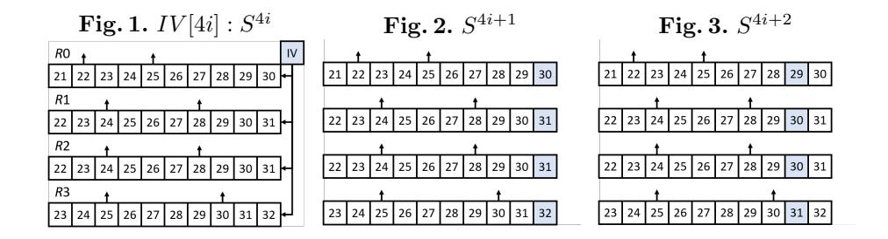
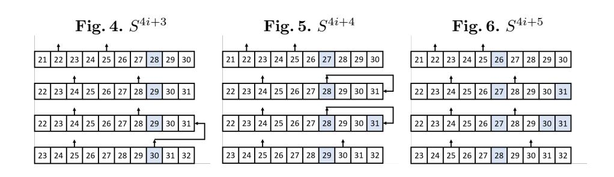
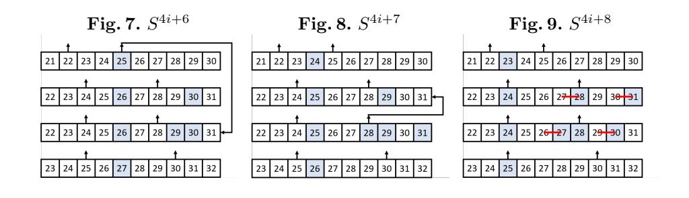
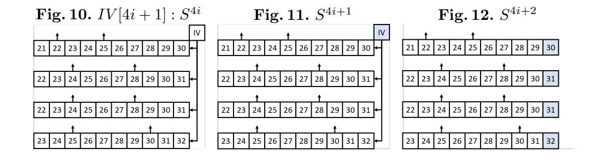
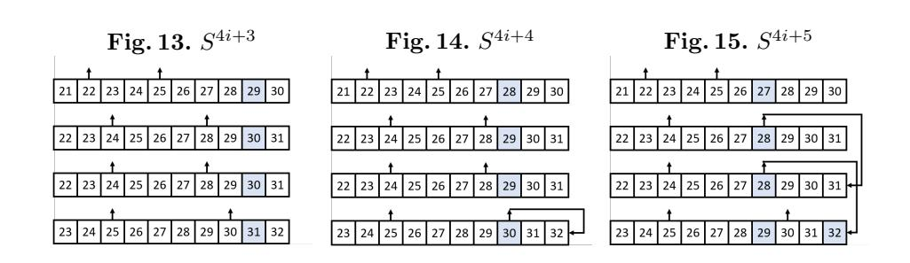
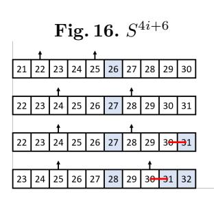
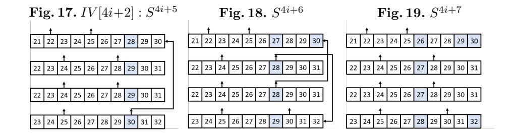
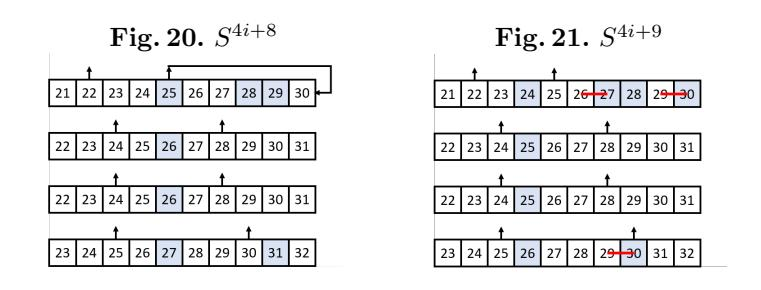
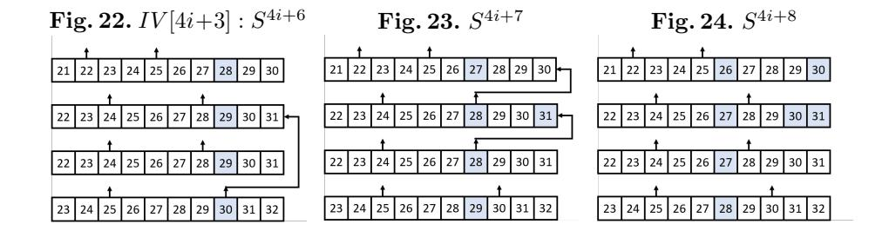
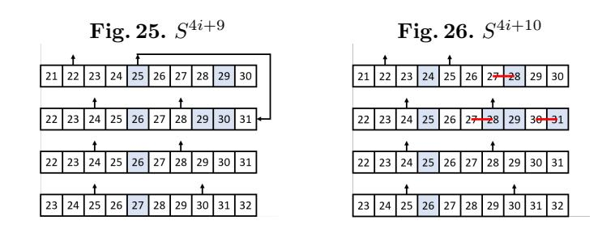

# Differential Power Analysis on (Non-)Linear Feedback Shift Registers

Siang Meng Sim

DSO National Laboratories, Singapore crypto.s.m.sim@gmail.com

Abstract. Differential power analysis (DPA) is a statistical analysis of the power traces of cryptographic computations. DPA has many applications including key-recovery on linear feedback shift register based stream ciphers. In 2017, Dobraunig et. al. [\[1\]](#page-20-0) presented a DPA on Keymill to uncover the bit relations of neighbouring bits in the shift registers, effectively reduces the internal state guessing space to 4-bit. In this work, we generalise the analysis methodology to uncover more bit relations on both linear feedback shift registers (LFSRs) and non-linear feedback shift registers (NLFSRs) and with application to fresh re-keying scheme — LR-Keymill. In addition, we improve the DPA on Keymill [\[1\]](#page-20-0) by halving the data resources needed for the attack.

Key words: SCA, DPA, LFSR, NLFSR, Fresh re-keying scheme, Keymill, LR-Keymill

# 1 Introduction

There are two major families of cryptanalysis on cryptographic primitives mathematical attack and side-channel analysis (SCA). Mathematical attacks study the structure of a primitive to find exploitable mathematical structures and utilise them to recover sensitive information from the primitive, for example the differential cryptanalysis [\[2\]](#page-20-1) and linear cryptanalysis [\[3\]](#page-20-2). Side-channel analysis, on the other hand, tackles a primitive through other physical means, for example observing the timing of the algorithm computation [\[4\]](#page-20-3), the power consumption [\[5\]](#page-20-4) and injecting faults to the implementation [\[6\]](#page-20-5).

The Internet of Things (IoT) is the ever-increasing collection of devices, including small and constrained devices, such as Radio-Frequency IDentification (RFID) tags and wireless sensors nodes, inter-connected with each other through the Internet. These resource-constrained or low-cost devices could be operating in hostile environments and are especially susceptible to SCA, in particular, the differential power analysis [\[5\]](#page-20-4) (DPA).

In a nutshell, DPA involves statistical analysis of the power traces of cryptographic computations obtained using devices like oscilloscopes. It could be used to target cryptographic algorithms that handles sensitive information [\[7](#page-20-6)[,8,](#page-20-7)[9,](#page-20-8)[10,](#page-20-9)[11](#page-21-0)[,1\]](#page-20-0)

and had proven to be practical and high success rate. Thus posting a serious threat to embedded implementation of cryptographic primitives.

Most of the DPA on linear feedback shift register (LFSR) based stream ciphers [\[9](#page-20-8)[,8\]](#page-20-7) involves power modelling and key hypothesis, in 2017, Dobraunig et. al. [\[1\]](#page-20-0) presented how DPA can be used on shift registers to uncover the bit relations of neighbouring bits, allowing attacker to significantly reduce the internal state guessing space. Inspired by their work, we generalised their analysis to reveal more bit relations from a shift register through DPA and also taking into account the linear or non-linear feedback function. In other words, we studied the DPA on (non-)linear feedback shift registers.

Contribution. We extend analysis by Dobraunig et. al. [\[1\]](#page-20-0) and propose a generic DPA on (N)LFSRs. With this new analysis methodology, we present a DPA on LR-Keymill, an improved version of Keymill designed to resist the DPA by [\[1\]](#page-20-0), breaking their 67.9-bit side-channel security claim with DPA resulting in 4-bit key guessing. In addition, our new analysis methodology improves the previous attack on Keymill by halving the amount of data resources needed to perform the same attack.

Structure of this paper. We start off with the generic analysis on (N)LFSRs in Section [2,](#page-1-0) followed by some toy examples for illustration in Section [3.](#page-5-0) Next, we give the specification of Keymill and LR-Keymill in Section [4](#page-7-0) and finally the DPA on LR-Keymill and LR-Keymill in Section [5.](#page-10-0)

# <span id="page-1-0"></span>2 Dynamic Power Consumption of (N)LFSRs

Power consumption of D flip-flop. In [\[12\]](#page-21-1), Zadeh and Heys presented that at the rising edge of a clock, a D flip-flop consumes more power when there is a state change, either 0 −→ 1 or 1 −→ 0. In a nutshell, they analysed D flip-flop that is constructed from 6 NAND gates and showed that 3 of the gates changes when the D flip-flop changes its state, as compared to 1 gate change when there is no change its state.

Power consumption of a shift register. By the nature of a shift register, say left-shift, the state of a register bit (current bit value) will be updated to the state in the register bit on its right (succeeding bit value) in the next clock cycle. In other words, the power consumption of the register bits in a shift register is correlated to the value of the current and succeeding bit values. More precisely, if the succeeding bit is the same as the current bit value, the register bit consumes lesser power compared to the case when the bits are different and it has to change its state.

From power consumption differences to bit relations. As there are many other activities happening concurrently with the updating of a register bit at the rising edge of a clock, it is difficult to identify the relation between the current and succeeding bit values from a single power trace. However, if we can introduce a bit difference to that particular target register bit while all other computations remain constant, we can gain information about some bit relations by comparing the power consumption differences between two power traces, where one is the original computation and the other is the instance with a bit difference.

### <span id="page-2-0"></span>2.1 Power Consumption Differences and Bit Relations

Shift registers are often part of a linear feedback shift register (LFSR) or nonlinear feedback shift register (NLFSR). We will address the feedback function in Section [2.3.](#page-4-0) For the moment, let us focus only on the shift registers.

Let [x]y denote a register bit of interest in the square parenthesis with bit value x, and y is the succeeding bit value. A bar symbol x denote having a difference, in the case of bits, it is simply flipping of value. If a register bit consumes more power when there is some difference, we denote it as +1, −1 if it is consumes lesser power, and 0 if there is no difference in the power consumption. In practice, the power trace is the summation of the power consumption of all the register bits. Hence, we can apply simple arithmetic to compute the combined power consumption difference.

Power consumption difference of a register bit. For a register bit, we only need to consider the current (x) and succeeding bit value (y), denoted as [x]y. There are 3 possible differential patterns:

- Case 1.1: [x]y vs [x]y. If x = y, then the register bit does not have to change its state. On the other hand, the second instance has x 6= y and more power is consumed to change its state. Therefore, the latter instance consumes more power (+1). Inversely, if x =6 y, then the power consumption for [x]y is lower than [x]y (−1). To summarise:
  - x = y, rise in power consumption difference +1.
  - x 6= y, drop power consumption difference −1.

Case 1.2: [x]y vs [x]y. Pretty much the same observation as Case 1.1:

- x = y, rise power consumption difference +1.
- x 6= y, drop power consumption difference −1.
- Case 1.3: [x]y vs [x]y. If x = y, we have x = y and thus for both instances the register bit remains the same state. On the other hand, if x 6= y, then so does x 6= y and both instances will consume more power to change its state. As a result, both instances have the same power consumption trace (0) regardless of the relation between x and y.
  - For both x = y and x 6= y, no change in power consumption difference 0.

Power consumption difference of multiple register bits. Using Case 1 as the building blocks, we look at the combined power consumption of multiple register bits.

Case 2.1: [x][y]z vs [x][y]z. The left register bit, [x]y vs [x]y, is Case 1.1 and the right register bit, [y]z vs [y]z is Case 1.2. There are 4 possible combinations of bit relations and 3 possible power consumption difference:

- x = y, y = z, rise in power consumption difference +2.
- x = y, y 6= z or x 6= y, y = z, no change in power consumption difference 0.
- x 6= y, y 6= z, drop in power consumption difference −2.

Observation 2.1: The change in power consumption in Case 2.1 is always a multiple of 2, {−2, 0, 2}.

Observation 2.2: Observing power level +2 or −2 gives a clear indication of the relations of (x, y) and (y, z). There is an ambiguity when the observed power level is 0, but knowing one of the relations trivially reveals the relation of the other to be the opposite.

Case 2.2: [x][y]z vs [x][y]z. Here we have left and right register bits as Case 1.1 and 1.3 respectively. Since Case 1.3 has static power consumption invariant of the relation of (y, z). This simply has the same observation as Case 1.1 to deduce the relation of (x, y).

- x = y, rise in power consumption difference +1.
- x 6= y, drop in power consumption difference −1.

Case 3: [x0][x1] . . . [xi−1][x<sup>i</sup> ]xi+1 vs [x0][x1] . . . [xi−1][x<sup>i</sup> ]xi+1. This is a general case where all intermediate values have differences. The intermediate register bits ([x<sup>j</sup> ]xj+1 and [x<sup>j</sup> ]xj+1, where j ∈ {1, . . . , i − 1}) are of Case 1.3. Thus, these intermediate bit values have power consumption difference 0 and the analysis can be reduced to the first and last register bits ([x0]x<sup>1</sup> vs [x0]x<sup>1</sup> and [x<sup>i</sup> ]xi+1 vs [x<sup>i</sup> ]xi+1) which belong to Case 1.1 and 1.2 respectively. Similar to Case 2.1, there are 4 possible combinations of bit relations and 3 possible power consumption difference.

- x<sup>0</sup> = x1, x<sup>i</sup> = xi+1, rise in power consumption difference +2.
- x<sup>0</sup> = x1, x<sup>i</sup> 6= xi+1 or x<sup>0</sup> 6= x1, x<sup>i</sup> = xi+1, no change in power consumption difference 0.
- x<sup>0</sup> 6= x1, x<sup>i</sup> 6= xi+1, drop in power consumption difference −2.

Practical observation of the power consumption differences. A natural question is whether such power consumption differences {−2, −1, 0, +1, +2} (socalled 5-class difference) can be observed in practice. The observation of the power consumption difference had been done by the authors of [\[13\]](#page-21-2) before, where they did some experiments and showed that it is possible to observe 5-class and even 9-class differences.

#### 2.2 Rule of Thumb for Power Consumption Differences and Bit Relations

We denote a power consumption difference the subtraction of the original power trace from the power trace with some differences.

If an incoming bit, so-called new bit, to a shift register has a difference (respectively no difference) while the register bit in question, so-called current bit, has no difference (respectively a difference), a rise in power consumption difference indicates that the current and new bit value are equal, while a drop in power consumption difference indicates that they are of different values.

If both the new and current bits have no difference or both with a difference, we expect no change in the power consumption difference regardless of the bit relation of these 2 bits.

Note that a bit relation does not reveal the actual value of the related bits, but it reduces the guessing space by 1 bit because guessing the value for 1 bit determines the value of the related bit too.

# <span id="page-4-0"></span>2.3 On (non-)linear feedback function

When targeting (N)LFSRs, we need to consider the actual specification of the feedback function to determine how the differential propagates. We consider the 6 basic binary operations — AND (∧), NAND (∧), OR (∨), NOR (∨), XOR (⊕) and NXOR (⊕). The truth table and differential table of these operations are listed in Table [1.](#page-4-1)

| x           | y                  | x ∧ y | x∧y | x ∨ y | x∨y | x ⊕ y | x⊕y |  |  |
|-------------|--------------------|-------|-----|-------|-----|-------|-----|--|--|
| Truth table |                    |       |     |       |     |       |     |  |  |
| 0           | 0                  | 0     | 1   | 0     | 1   | 0     | 1   |  |  |
| 0           | 1                  | 0     | 1   | 1     | 0   | 1     | 0   |  |  |
| 1           | 0                  | 0     | 1   | 1     | 0   | 1     | 0   |  |  |
| 1           | 1                  | 1     | 0   | 1     | 0   | 0     | 1   |  |  |
|             | Differential table |       |     |       |     |       |     |  |  |
| ∆           | -                  | 0.5   | 0.5 | 0.5   | 0.5 | 1     | 1   |  |  |
| -           | ∆                  | 0.5   | 0.5 | 0.5   | 0.5 | 1     | 1   |  |  |
| ∆           | ∆                  | 0.5   | 0.5 | 0.5   | 0.5 | 0     | 0   |  |  |

<span id="page-4-1"></span>Table 1. Truth table and differential table of various binary operations. The entries in the differential table indicates the probability of having a difference.

The linear operations (XOR and NXOR) are rather simple, we can trace the differential trail trivially and know that it holds with probability 1. For the non-linear operations (AND, NAND, OR and NOR), the differential propagation holds with probability 0.5. Despite that, using power analysis we are able to know the differential propagation which leads to knowing some information of the internal state.

Let y be the incoming uncertain bit to the register bit [x], as seen in Case 1's from Section [2.1,](#page-2-0) if the current bit x has no difference, then we expect a rise or drop in power consumption difference if y has a difference. Thus if there is no change in the power consumption, we know that y has no difference. On the other hand, if x has difference, then observing no change in the power consumption indicates that y has a difference too. Otherwise, we will observe a rise or drop in power consumption difference and we know y has no difference.

In addition to knowing if y has a difference, it could also reveal some information of the value of other bits. For example, let y = (x<sup>0</sup> ∧ x2) ⊕ x<sup>2</sup> and we know x<sup>2</sup> has a difference, because of the non-linear operation AND, we are not sure if y has difference. If through the power analysis that we deduce that y has a difference too, is necessary and sufficient that x<sup>0</sup> = 0.

# <span id="page-5-0"></span>3 Analysis on Toy Examples

For the moment, let us omit the details of the feedback function and assume that the attacker knows when a difference is introduced into the shift register as the new bit.

### 3.1 Toy Shift Register

We use a simple toy example to illustrate how we can recover the bit relations. Suppose we have a 6-bit shift register containing values c<sup>i</sup> , and x<sup>j</sup> the incoming bits in the next 5 clock cycles, denoted as

Clock cycle 
$$0: [c_0][c_1][c_2][c_3][c_4][c_5]x_0x_1x_2x_3x_4$$
,

and suppose the values are [0][0][1][1][0][1]10011.

In another instance, there are bit differences in the incoming bits x0, x<sup>1</sup> and x3.

Clock cycle 
$$0:[c_0][c_1][c_2][c_3][c_4][c_5]\overline{x_0x_1}x_2\overline{x_3}x_4$$

and the corresponding values are [0][0][1][1][0][1]01001.

After executing both computations and collecting their power traces, we can compare the power trace and deduce 4 bit relations as seen in Table [2.](#page-6-0)

Suppose attacker's goal is to recover the internal state at any clock cycle, the values of c<sup>i</sup> and x<sup>j</sup> are unknown to the attacker but he knows the differential positions in x<sup>j</sup> . From there, he is able to deduce the following relations c<sup>5</sup> = x0, x<sup>1</sup> = x<sup>2</sup> =6 x<sup>3</sup> = x4, and guess the shift register state at clock cycle 5 as one of the following:

```
[c5][x0][x1][x2][x3][x4] ∈ {[0][0][0][0][1][1],
                       [0][0][1][1][0][0],
                       [1][1][0][0][1][1],
                       [1][1][1][1][0][0]}
```

| Clock | Ori. shift          | $\Delta$ shift      | Ori.  | Δ     | Power | Rise/ | Relation       |
|-------|---------------------|---------------------|-------|-------|-------|-------|----------------|
| cycle | register            | register            | dist. | dist. | diff. | Drop  | obtained       |
| 0     |                     | [0][0][1][1][0][1]0 |       | -     | -     | -     | -              |
| 1     |                     | [0][1][1][0][1][0]1 |       | 4     | +1    | Rise  | $c_5 = x_0$    |
|       |                     | [1][1][0][1][0][1]0 | ı     | 5     | +1    | -     | -              |
| 3     | [1][0][1][1][0][0]1 | [1][0][1][0][1][0]0 | 3     | 5     | +2    | Rise  | $x_1 = x_2$    |
| 4     |                     | [0][1][0][1][0][0]1 | 4     | 5     | +1    | Drop  | $x_2 \neq x_3$ |
| 5     | [1][1][0][0][1][1]  | [1][0][1][0][0][1]  | 3     | 5     | +2    | Rise  | $x_3 = x_4$    |

<span id="page-6-0"></span>Table 2. Toy shift register example: Power consumption difference and bit relations obtained. Second and third columns are the register state of the original and with some difference, "Ori. dist." and " $\Delta$  dist." indicates the Hamming distance between the previous and current state, "Power diff." indicates the numerical power consumption differences, "Rise/Drop" is the observation of the power consumption difference at the rising edge of the clock, and last column is the bit relation obtained.

To summarise, if the attacker is able to obtain noiseless measurement for these 2 computation instances, he is able to reduce the guessing complexity from the naive  $2^6=64$  to just 4 guesses.

### 3.2 Toy Non-linear Feedback Shift Register

We use another toy example to illustrate how an analysis can be performed on NLFSR. Suppose we have a 4-bit maximum period NLFSR (taken from [14]) defined as follows:

<span id="page-6-2"></span>
$$[x_0^{i+1}][x_1^{i+1}][x_2^{i+1}][x_3^{i+1}] \leftarrow [x_1^i][x_2^i][x_3^i][x_0^i \oplus x_1^i \oplus x_2^i \oplus x_1^i x_2^i], \tag{1}$$

where  $X^0 = x_0^0 ||x_1^0|| x_2^0 ||x_3^0|$  is the initial state and  $x_1^i x_2^i = x_1^i \wedge x_2^i$ , for brevity we omit the AND notation when there is no ambiguity.

Let the initial values be [0][0][1][0] and another instance had a bit difference at  $x_3^0$ , i.e. [0][0][1][1]. After executing both computations and collecting their power traces, we can compare the power trace and deduce 4 bit relations as seen in Table 3.

Starting from a difference  $X^0 = (0,0,0,\Delta)$ , we know the difference in the next cycle is  $X^1 = (0,0,\Delta,0)$ . Here, we observed a big drop<sup>1</sup> in the power consumption difference. As seen in Case 2.1 of Section 2.1, it indicates that the differential bit is different from both its neighbours, thus we have  $x_1^1 \neq x_2^1$  and  $x_2^1 \neq x_2^1$ .

is different from both its neighbours, thus we have  $x_1^1 \neq x_2^1$  and  $x_2^1 \neq x_3^1$ . For the next update, it could be  $X^2 = (0, \Delta, 0, 0)$  or  $X^2 = (0, \Delta, 0, \Delta)$ . Since we observe no change in the power consumption difference, we know that the new bit  $x_3^2$  has no difference. In addition, from Equation 1, we have

<span id="page-6-1"></span><sup>&</sup>lt;sup>1</sup> This drop in power consumption difference that was due to two register bits difference is relatively "big" compared to a drop caused by a single register bit.

| ſ | Clock | Ori.          | $\Delta$      | Ori.  | Δ     | Power | Rise/    | Information                          |
|---|-------|---------------|---------------|-------|-------|-------|----------|--------------------------------------|
| İ | cycle | NLFSR         | NLFSR         | dist. | dist. | diff. | Drop     | obtained                             |
| ſ | 0     | [0][0][1][0]1 | [0][0][1][1]1 | -     | -     | -     | -        | -                                    |
| ſ | 1     | [0][1][0][1]1 | [0][1][1][1]1 | 3     | 1     | -2    | big drop | $x_1^1 \neq x_2^1, x_2^1 \neq x_3^1$ |
| Ī | 2     | [1][0][1][1]0 | [1][1][1]0    | 3     | 1     | -2    | -        | $x_3^2 \neq \Delta, x_1^1 = 1$       |
| Ī | 3     | [0][1][1][0]  | [1][1][0]     | 3     | 1     | -2    | -        | $x_4^2 \neq \Delta, x_2^2 = 1$       |

<span id="page-7-1"></span>Table 3. Toy NLFSR example: Power consumption difference and bit relations obtained. Second and third columns are the register state of the original and with some difference, "Ori. dist." and " $\Delta$  dist." indicates the Hamming distance between the previous and current state, "Power diff." indicates the numerical power consumption differences, "Rise/Drop" is the observation of the power consumption difference at the rising edge of the clock, and last column is the information obtained.

$$\begin{array}{c} x_0^1 \oplus x_1^1 \oplus x_2^1 \oplus x_1^1 x_2^1 = x_0^1 \oplus x_1^1 \oplus \overline{x_2^1} \oplus x_1^1 \overline{x_2^1} \\ \Rightarrow \qquad x_1^1 (x_2^1 \oplus \overline{x_2^1}) = x_2^1 \oplus \overline{x_2^1} \end{array}$$

which implies that  $x_1^1 = 1$ .

From  $X^2 = (0, \hat{\Delta}, 0, 0)$ , it could propagate to  $X^3 = (\Delta, 0, 0, 0)$  or  $X^3 = (\Delta, 0, 0, \Delta)$ . Since we again observe no change in power consumption difference, we know that  $x_3^3$  has no difference and deduce that  $x_2^2 = 1$ .

Combining all these information, we reduced the possible state of  $X^2$  from  $2^4 = 16$  to just 2 states as shown in the following:

$$[x_0^2][x_1^2][x_2^2][x_3^2] \in \{\, \texttt{[1][0][1][0]}\,,$$
 
$$\, \texttt{[1][0][1][1]}\, \}$$

In fact, with information obtained up to clock cycle 2, it is sufficient to arrive at the same conclusion.

#### <span id="page-7-0"></span>4 Fresh Re-keying Schemes — Keymill and LR-Keymill

#### 4.1 Fresh re-keying scheme

Although there are countermeasures [15,16,17,18] like masking and threshold implementation to protect against DPA, they are generally costly to implement on the encryption algorithms, unless they are designed to be side-channel protection efficient, for example Pyjamask [19] and CRAFT [20].

Fresh re-keying scheme was proposed by Medwed et. al. [21] as a counter-measure against side-channel analysis for low-cost devices. Low-cost devices like RFID tags have very constrained hardware area to implement the cryptographic algorithms, there may not be sufficient resources to implement effective side-channel protections like masking or threshold implementation. Instead, the idea of fresh re-keying scheme is to have a lightweight function g that derives

session keys SK from given secret master key MK and nonce IV , denoted as g(IV, MK) = SKIV , and use these fresh session keys for block cipher encryption E.

Under the nonce-respecting scenario, a fresh re-keying scheme helps to protect the block cipher against DPA since each encryption uses a different encryption key. However, the question now is whether the re-keying scheme is resilient against SCA. One can perceive a re-keying scheme as an encryption cipher, encrypting difference nonces (plaintexts) using the same master key, and become a target of SCA. While a re-keying scheme does not need very strong mathematical properties like block ciphers, it should have the following 6 properties given by [\[21\]](#page-21-10):

- 1. Good diffusion of the master key MK.
- 2. No synchronization between parties. Hence, g should be stateless.
- 3. No need for additional key material.
- 4. Little hardware overhead. Total costs lower than protecting E alone.
- 5. Easy protection against side-channel attacks.
- 6. Regularity.

Keymill [\[22\]](#page-21-11) is NLFSR-based re-keying scheme designed by Taha et. al. to be side-channel resilient at algorithmic level and not depending on the side-channel countermeasure at the implementation level. However, Doraunig et. al. [\[1\]](#page-20-0) found a DPA using the Case 1.1 analysis (Section [2.1\)](#page-2-0), breaking the scheme with 4-bit key guessing and 128 chosen nonces[2](#page-8-0) .

LR-Keymill [\[23\]](#page-22-0) [3](#page-8-1) is an improved version of Keymill by the same designers, the idea was to update all the NLFSRs simultaneously with the same IV bits, making it non-trivial for the attacker to deduce which NLFSRs incur higher or lower power consumption, thus increasing the search space and security bound. Based on this argument, the designers claimed 67.9-bit security against DPA. In this paper, however, we show that by exploiting the feedback functions of LR-Keymill, we can still break the scheme with just 4-bit key guessing. In addition, we show that we can half the amount of nonces (hence, power traces) needed to attack Keymill.

In the following section, we first give the specification of LR-Keymill and Keymill (as remarks), followed by the DPA on LR-Keymill, and finally the improved attack on Keymill.

## 4.2 Specification of Keymill and LR-Keymill

Overview. The internal state S of LR-Keymill and Keymill consists of 4 NLFSRs — with shift registers R0, R1, R2 and R3 of length 31, 32, 32, 33 bits and feedback functions F0, F1, F2 and F3 respectively.

<span id="page-8-0"></span><sup>2</sup> Assuming noiseless measurements. Otherwise, the attacker could vary the last few bits of the nonce to collect more power traces. More details in Section 3.4 of [\[1\]](#page-20-0).

<span id="page-8-1"></span><sup>3</sup> Nominated best paper [\[24\]](#page-22-1).

At the initialisation phase, an 128-bit master key MK will be loaded into these registers. Next, an 128-bit initialisation vector IV is introduced to update the internal state. After some preprocessing phase, it will start to release keystream bits to form the session keys.

Internal state update. The bits in the registers are indexed in ascending order Rx = s0s<sup>1</sup> . . . s|Rx|−1. We denote Rx<sup>c</sup> [i] as the i + 1-th leftmost bit in register Rx at clock cycle c, where c = 0 denote the initial state right after loading the master key.

During an update, the feedback function F x draws the information from Rx and feedback to Ry, where y = x + c mod 4. Each registers does a left-shift, drops the leftmost bit s<sup>0</sup> and takes in the new bit into the rightmost position of the register.

The feedback functions are defined as follow:

$$F0(R0) = s_0 \oplus s_2 \oplus s_5 \oplus s_6 \oplus s_{15} \oplus s_{17} \oplus s_{18} \oplus s_{20} \oplus s_{25} \oplus s_8 s_{18} \\ \oplus s_8 s_{20} \oplus s_{12} s_{21} \oplus s_{14} s_{19} \oplus s_{17} s_{21} \oplus s_{20} s_{22} \oplus s_4 s_{12} s_{22} \\ \oplus s_4 s_{19} s_{22} \oplus s_7 s_{20} s_{21} \oplus s_8 s_{18} s_{22} \oplus s_8 s_{20} s_{22} \oplus s_{12} s_{19} s_{22} \\ \oplus s_{20} s_{21} s_{22} \oplus s_4 s_7 s_{12} s_{21} \oplus s_4 s_7 s_{19} s_{21} \oplus s_4 s_{12} s_{21} s_{22} \\ \oplus s_4 s_{19} s_{21} s_{22} \oplus s_7 s_8 s_{18} s_{21} \oplus s_7 s_8 s_{20} s_{21} \oplus s_7 s_{12} s_{19} s_{21} \\ \oplus s_8 s_{18} s_{21} s_{22} \oplus s_8 s_{20} s_{21} s_{22} \oplus s_{12} s_{19} s_{21} s_{22}$$

$$F1(R1) = F2(R2) = s_0 \oplus s_3 \oplus s_{17} \oplus s_{22} \oplus s_{28} \oplus s_2 s_{13} \oplus s_5 s_{19} \oplus s_7 s_{19}$$

$$\oplus s_8 s_{12} \oplus s_8 s_{13} \oplus s_{13} s_{15} \oplus s_2 s_{12} s_{13} \oplus s_7 s_8 s_{12} \oplus s_7 s_8 s_{14}$$

$$\oplus s_8 s_{12} s_{13} \oplus s_2 s_7 s_{12} s_{13} \oplus s_2 s_7 s_{13} s_{14} \oplus s_4 s_{11} s_{12} s_{24}$$

$$\oplus s_7 s_8 s_{12} s_{13} \oplus s_7 s_8 s_{13} s_{14} \oplus s_4 s_7 s_{11} s_{12} s_{24} \oplus s_4 s_7 s_{11} s_{14} s_{24}$$

$$F3(R3) = s_0 \oplus s_2 \oplus s_7 \oplus s_9 \oplus s_{10} \oplus s_{15} \oplus s_{23} \oplus s_{25} \oplus s_{30} \oplus s_8s_{15} \oplus s_{12}s_{16} \oplus s_{13}s_{15} \oplus s_{13}s_{25} \oplus s_1s_8s_{14} \oplus s_1s_8s_{18} \oplus s_8s_{12}s_{16} \oplus s_8s_{14}s_{18} \oplus s_8s_{15}s_{16} \oplus s_8s_{15}s_{17} \oplus s_{15}s_{17}s_{24} \oplus s_1s_8s_{14}s_{17} \oplus s_1s_8s_{17}s_{18} \oplus s_1s_{14}s_{17}s_{24} \oplus s_1s_{17}s_{18}s_{24} \oplus s_8s_{12}s_{16}s_{17} \oplus s_8s_{14}s_{17}s_{18} \oplus s_8s_{15}s_{16}s_{17} \oplus s_{12}s_{16}s_{17}s_{24} \oplus s_{14}s_{17}s_{18}s_{24} \oplus s_{15}s_{16}s_{17}s_{24} \oplus s_{15}s_{16}s_{17}s_{24} \oplus s_{15}s_{16}s_{17}s_{24} \oplus s_{15}s_{16}s_{17}s_{24}$$

LR-Keymill. For the first 128 updates, all 4 registers are updated with a nonce bit IV [c].

$$Ry^{c+1} = Ry^{c}[1] \parallel Ry^{c}[2] \parallel \cdots \parallel Ry^{c}[|Ry|-1] \parallel Fx(Rx^{c}) \oplus IV[c]$$

where y = x + c mod 4 and c ∈ {0, . . . , 127}.

After the IV is completely absorbed, it is clocked for another 33 updates.

$$Ry^{c+1} = Ry^{c}[1] \parallel Ry^{c}[2] \parallel \cdots \parallel Ry^{c}[|Ry| - 1] \parallel Fx(Rx^{c})$$

where  $y = x + c \mod 4$  and  $c \in \{128, \dots, 160\}$ . So far, no keystream bit is being outputted.

Lastly, in each clock cycle, the leftmost bit from each register is XORed to form the output keystream bits KS.

$$Ry^{c+1} = Ry^{c}[1] \parallel Ry^{c}[2] \parallel \cdots \parallel Ry^{c}[|Ry| - 1] \parallel Fx(Rx^{c})$$
  
 $KS[i] = R0^{c}[0] \oplus R1^{c}[0] \oplus R2^{c}[0] \oplus R3^{c}[0]$ 

where  $y = x + c \mod 4, i = c - 161$  and  $c \ge 161$ .

Keymill. For the first 32 updates, each register is updated with a nonce bit IV[4c+x].

$$Ry^{c+1} = Ry^{c}[1] \parallel Ry^{c}[2] \parallel \cdots \parallel Ry^{c}[|Ry|-1] \parallel Fx(Rx^{c}) \oplus IV[4c+x]$$

where  $y = x + c \mod 4$  and  $c \in \{0, ..., 31\}$ .

After the IV is completely absorbed, it is clocked for another 33 updates.

$$Ry^{c+1} = Ry^{c}[1] \parallel Ry^{c}[2] \parallel \cdots \parallel Ry^{c}[|Ry| - 1] \parallel Fx(Rx^{c})$$

where  $y = x + c \mod 4$  and  $c \in \{32, \dots, 64\}$ . So far, no keystream bit is being outputted.

Lastly, in each clock cycle, the leftmost bit from each register is outputted as keystream bits KS (4 keystream bits per cycle).

$$Ry^{c+1} = Ry^{c}[1] \parallel Ry^{c}[2] \parallel \cdots \parallel Ry^{c}[|Ry| - 1] \parallel Fx(Rx^{c})$$
  
$$KS[4i] \parallel \dots \parallel KS[4i + 3] = R0^{c}[0] \parallel R1^{c}[0] \parallel R2^{c}[0] \parallel R3^{c}[0]$$

where  $y = x + c \mod 4$ , i = c - 65 and  $c \ge 65$ .

### <span id="page-10-0"></span>5 DPA on LR-Keymill and Keymill

#### 5.1 DPA on LR-Keymill

In a nutshell, we analyse how a differential propagates through the internal state and extract sufficient information for us to reduce the key guessing complexity to the minimum of 4 bits.

When there is a difference in IV[c-1], it is introduced to the rightmost position of all 4 NLFSRs, namely  $R0^c[30]$ ,  $R1^c[31]$ ,  $R2^c[31]$ ,  $R3^c[32]$ . Here, we obtain a combined bit relations of all the 4 NLFSRs and not able to distinguish them. But we can gain more information if we observe the power trace for the next few clock cycles. After 2 clock cycles, we see that these differences are now at  $R0^{c+2}[28]$ ,  $R1^{c+2}[29]$ ,  $R2^{c+2}[29]$ ,  $R3^{c+2}[30]$ , and  $R3^{c+2}[30]$  is the first and only difference to get fed back to the feedback function. In addition, in F3 the variable  $s_{30}$  is a monomial term, this difference will propagate to some NLFSR with probability 1, updating only a single NLFSR. Exploiting this fact allow us to

obtain a definitive bit relation. By letting the difference propagates further and choose different bit difference in the nonce, we are able to obtain sufficient bit relations to deduce the relations of all the neighbouring bits in the internal state.

Since LR-Keymill has a rotational cycle of period 4, we consider the nonce differences in 4 different positions, 4i, 4i + 1, 4i + 2 and 4i + 3.

Difference introduced at IV[4i]. Let the only difference in the nonce to be at bit position 4i, the differential propagation can be seen in Figure 1-9.

**Figure 1.** The difference from IV is introduced to all the NLFSRs. As shown by [23], the relation between neighbouring bits in the 4 NLFSRs are collectively observed.

*Figure 2.* In the coming update, the rightmost register bit of each NLFSRs has the same differential pattern as Case 2.1. By Observation 2.2, we are able to obtain a collective bit relations of the next neighbouring bit.

Figure 3. Here, we expect no change in the power consumption difference.

Figure 4. This is where things start to get interesting. Notice that the difference is fed back to R2, introducing with a new difference, which is like Case 1.1. By observing the rise or drop of the power consumption difference, we can determine the bit relation of  $R2^{4i+4}[30]$  and  $R2^{4i+4}[31]$ , denoted as  $R2^{4i+4}[(30,31)]$ , deterministically.

Figure 5. Another 2 differences are fed back, namely to R1 and R2. For R2, the update is the same as Case 2.2, thus this does not result in any rise or drop in the power consumption difference. For R1, we can determine the bit relation  $R1^{4i+5}[(30,31)]$ .

Figure 6. No new difference will be introduced to the internal state in the coming update. The rightmost register bit of R1 and R2 are the same as Case 1.2, but the observable power consumption difference is the combined result of  $R1^{4i+6}[(30,31)]$  and  $R2^{4i+6}[(30,31)]$ . If we are lucky and observed a rise or drop in the power consumption difference, we know the bit relation for both registers. Otherwise, we know exactly one relation is equal while the other is not equal, but not the order. Nevertheless, this information is still useful to us when we consider a nonce difference to be at 4i + 1 (see analysis of Figure 15).

**Figure 7.** From this update, we can determine the bit relation of  $R2^{4i+7}[(30,31)]$ .

Figure 8. Lastly, the most involved relation to unravel. Like in Figure 6, we have a Case 1.1 and 1.2 at R1 and R2 respectively. While this gives us a combined result of the relation  $R1^{4i+8}[(30,31)]$  and  $R2^{4i+8}[(30,31)]$ , we could still deduce the relation deterministically through another power trace. When we consider

another instance and introduce a difference at IV[4(i+1)], as seen in Figure 4, we can recover the bit relation  $R2^{4(i+1)+4}[(30,31)]$ , which is the latter relation of the combined bit relations. Therefore, we can determine the relation  $R1^{4i+8}[(30,31)]$  too.

**Figure 9 (Summary).** By introducing a single difference at IV[4i] and IV[4(i+1)] on 2 separate nonces, we can learn 4 new relations over the course of 8 cycles:  $R2^{4i+8}[(26,27)]$ ,  $R1^{4i+8}[(27,28)]$ ,  $R2^{4i+8}[(29,30)]$  and  $R1^{4i+8}[(30,31)]$ . In addition, we know a combined relation  $R1^{4i+6}[(30,31)]$  and  $R2^{4i+6}[(30,31)]$ .

Difference introduced at IV[4i+1]. We repeat the analysis with difference in IV[4i+1] and observe how the differential pattern propagates. See Figure 10-16.

Figure 10. No difference is introduced yet since the difference is at IV[4i+1].

Figure 11-13. The same differential pattern as seen in Figure 1-3.

**Figure 14.** Here, we see that the feedback difference is sent to R3 as defined by the cycle period of the LR-Keymill. As before, we can determine the relation  $R3^{4i+5}[(31,32)]$ .

**Figure 15.** Similar analysis as Figure 5, we can determine the relation of  $R2^{4i+6}[(30,31)]$ . Recall in the analysis of Figure 6, we have the combined result of  $R1^{4i+6}[(30,31)]$  and  $R2^{4i+6}[(30,31)]$ , hence, we can also determine the bit relation  $R1^{4i+6}[(30,31)]$ .

**Figure 16** (Summary). By introducing a single difference at IV[4i+1], we can learn 2 new relations over the course of 6 cycles:  $R3^{4i+6}[(30,31)]$  and  $R2^{4i+6}[(30,31)]$ , plus an additional relation  $R1^{4i+6}[(30,31)]$  when combined with another power trace analysis.

Difference introduced at IV[4i+2] and IV[4i+3]. The analysis is pretty much the same, thus for brevity we present the differential propagations (see Figure 17-21 and Figure 22-26) and the summary of the analysis.

Figure 21 (Summary). By introducing a single difference at IV[4i+2], we can learn 3 new relations over the course of 9 cycles:  $R0^{4i+9}[(26,27)]$ ,  $R3^{4i+9}[(29,30)]$  and  $R0^{4i+9}[(29,30)]$ .

Figure 26 (Summary). By introducing a single difference at IV[4i+3], we can learn 3 new relations over the course of 10 cycles:  $R1^{4i+10}[(27,28)], R0^{4i+10}[(27,28)]$  and  $R1^{4i+10}[(30,31)]$ .

<span id="page-13-0"></span>Table 4. Bit relations learnt from introducing differences at IV [4i + j] where j = {0, . . . , 4}. The first column denotes the indices of each shift registers. (j) denotes where the relation is obtained, (!), (?) and (\*) denote derived relation from multiple sources. The "Combined" column denotes the difference position in the IV to obtain the 4 combined bit relations.

| Clock cycle c = 4i + 10   |     |      |      |           |             |  |  |
|---------------------------|-----|------|------|-----------|-------------|--|--|
| c<br>R<br>[(x, x + 1)] R3 |     | c R2 | c R1 | c R0<br>c | Combined    |  |  |
| (25,24,24,23)             |     | (0)  |      |           | IV [4i + 3] |  |  |
| (26,25,25,24)             | (1) |      | (0)  |           | IV [4i + 4] |  |  |
| (27,26,26,25)             | (*) | (1)  | (!)  | (2)       | IV [4i + 5] |  |  |
| (28,27,27,26)             | (2) | (0)  | (3)  | (*)       | IV [4i + 6] |  |  |
| (29,28,28,27)             |     |      | (?)  | (3)       | IV [4i + 7] |  |  |
| (30,29,29,28)             |     |      |      | (2)       | IV [4i + 8] |  |  |
| (31,30,30,29)             |     |      | (3)  |           | IV [4i + 9] |  |  |

#### 5.2 Key-recovery on LR-Keymill

Recall that besides the aforementioned new bit relations, we can obtain the combined relations for all 4 NLFSRs. Thus if we know 3 of the 4 relations, we can fully determine all the bit relations.

In Table [4,](#page-13-0) (!) denotes the bit relation obtained from the effort of IV [4i] and IV [4i + 1], (?) denotes comes from IV [4i] and IV [4(i + 1)], and (\*) denotes the derived information after knowing 3 out of 4 bit relations. One can see that we can already determine the relations of both the neighbouring bits of R0 <sup>4</sup>i+10[26], R1 <sup>4</sup>i+10[27], R2 <sup>4</sup>i+10[27] and R3 <sup>4</sup>i+10[28].

When we extend the analysis for another period of 4 cycles, we can determine the bit relation of 5 consecutive bits in all 4 NLFSRs, see Table [5.](#page-14-0)

When we perform the analysis for j = {0, . . . , 35} and fixed i ∈ {0, . . . , 22} [4](#page-13-1) , it is sufficient for us to obtain 33 consecutive sets of bit relations for all 4 NLFSRs. This gives us all the bit relations within each shift register in the internal state. All that is left is to guess 1 key bits from each shift registers and we can either roll back the updates to recover the master key.

In summary, we need noiseless measurement of 36 chosen nonces and and 4-bit key guessing to recover the master key.

### 5.3 Remark on filtering the noise

From a practical perspective, we expect there to be some noise during the computation and power measurement. To overcome the noise, one could vary the latter bits of the nonce to collect and average out the traces. This is because internal state of LR-Keymill only depends on the nonce bits that are already absorbed. Let i = 0, we only need to the first 47 nonce bits to be fixed[5](#page-13-2) , there are

<span id="page-13-1"></span><sup>4</sup> We bound the choice of i so that 4i + j + 3 ≤ 128, the length of the nonce.

<span id="page-13-2"></span><sup>5</sup> First 36 bits for introducing differences in the nonce and next 11 bits to be constant to avoid affecting the differential trails.

<span id="page-14-0"></span>Table 5. Bit relations learnt from introducing differences at IV [4i + j] where j = {0, . . . , 7}. The first column denotes the indices of each shift registers. (j) denotes where the relation is obtained, (!), (?) and (\*) denote derived relation from multiple sources. The "Combined" column denotes the difference position in the IV to obtain the 4 combined bit relations.

| Clock cycle c = 4i + 14   |     |      |      |           |              |  |  |
|---------------------------|-----|------|------|-----------|--------------|--|--|
| c<br>R<br>[(x, x + 1)] R3 |     | c R2 | c R1 | c R0<br>c | Combined     |  |  |
| (21,20,20,19)             |     | (0)  |      |           | IV [4i + 3]  |  |  |
| (22,21,21,20)             | (1) |      | (0)  |           | IV [4i + 4]  |  |  |
| (23,22,22,21)             | (*) | (1)  | (!)  | (2)       | IV [4i + 5]  |  |  |
| (24,23,23,22)             | (2) | (0)  | (3)  | (*)       | IV [4i + 6]  |  |  |
| (25,24,24,23)             | (*) | (4)  | (?)  | (3)       | IV [4i + 7]  |  |  |
| (26,25,25,24)             | (5) | (*)  | (4)  | (2)       | IV [4i + 8]  |  |  |
| (27,26,26,25)             | (*) | (5)  | (3)  | (6)       | IV [4i + 9]  |  |  |
| (28,27,27,26)             | (6) | (4)  | (7)  | (*)       | IV [4i + 10] |  |  |
| (29,28,28,27)             |     |      |      | (7)       | IV [4i + 11] |  |  |
| (30,29,29,28)             |     |      |      | (6)       | IV [4i + 12] |  |  |
| (31,30,30,29)             |     |      | (7)  |           | IV [4i + 13] |  |  |

still 81 bits of freedom to generate different nonces giving similar power traces to filter the noise.

### 5.4 Improved attack on Keymill

In [\[1\]](#page-20-0), the authors recovers 1 bit relation (x, y) per chosen nonce and only using the information gained from Case 1.1. In fact, as seen in Case 2.1, if one observe the power consumption difference in the next cycle, one could deduce another bit relation (y, z) because (x, y) is already known. Thus, every chosen nonce with a single bit input can actually recover 2 bit relations, effectively halves the number of nonces (and corresponding power traces) needed to launch the attack.

Further analysis on the differential propagation can further reduce the number of nonces needed. But we do not go further into improvement on the attack as the attack complexity is already very low.

# 6 Conclusion and Future work

We presented the general DPA strategy to extract bit relation information from shift registers through the power consumption difference. This methodology can be applied to both LFSRs and NLFSRs. We applied the analysis technique to break LR-Keymill security claim with 4-bit key guessing and halved the resources to perform DPA on Keymill.

The main issue with LR-Keymill security claim is that it is an upper bound assuming the NLFSRs as black boxes. It would be interesting to find a framework to analyse and find the lower bound to Keymill-like structures, taking the NLFSRs into account. A possible tweak to LR-Keymill to resist our DPA is to change all the NLFSRs to a same NLFR. But this makes the structure too symmetrical and potentially leads to other mathematical attacks. It would also be interesting to see if we can enhance LR-Keymill to improve its security lower bound.

# Acknowledgements

The author would like to thank Shivam Bhasin and Mostafa Taha for the meaningful discussion and comment.

<span id="page-16-3"></span><span id="page-16-2"></span><span id="page-16-0"></span>

<span id="page-16-6"></span><span id="page-16-5"></span><span id="page-16-4"></span>

<span id="page-16-8"></span><span id="page-16-7"></span><span id="page-16-1"></span>

<span id="page-17-3"></span><span id="page-17-1"></span>

<span id="page-17-4"></span>

<span id="page-17-5"></span><span id="page-17-2"></span><span id="page-17-0"></span>

<span id="page-18-0"></span>

<span id="page-18-1"></span>

<span id="page-19-0"></span>

<span id="page-19-1"></span>

# References

- <span id="page-20-0"></span>1. Christoph Dobraunig, Maria Eichlseder, Thomas Korak, and Florian Mendel. Sidechannel analysis of keymill. In Sylvain Guilley, editor, Constructive Side-Channel Analysis and Secure Design - 8th International Workshop, COSADE 2017, Paris, France, April 13-14, 2017, Revised Selected Papers, volume 10348 of Lecture Notes in Computer Science, pages 138–152. Springer, 2017.
- <span id="page-20-1"></span>2. Eli Biham and Adi Shamir. Differential cryptanalysis of des-like cryptosystems. In Alfred Menezes and Scott A. Vanstone, editors, Advances in Cryptology - CRYPTO '90, 10th Annual International Cryptology Conference, Santa Barbara, California, USA, August 11-15, 1990, Proceedings, volume 537 of Lecture Notes in Computer Science, pages 2–21. Springer, 1990.
- <span id="page-20-2"></span>3. Mitsuru Matsui. Linear cryptanalysis method for DES cipher. In Tor Helleseth, editor, Advances in Cryptology - EUROCRYPT '93, Workshop on the Theory and Application of of Cryptographic Techniques, Lofthus, Norway, May 23-27, 1993, Proceedings, volume 765 of Lecture Notes in Computer Science, pages 386–397. Springer, 1993.
- <span id="page-20-3"></span>4. Paul C. Kocher. Timing attacks on implementations of diffie-hellman, rsa, dss, and other systems. In Neal Koblitz, editor, Advances in Cryptology - CRYPTO '96, 16th Annual International Cryptology Conference, Santa Barbara, California, USA, August 18-22, 1996, Proceedings, volume 1109 of Lecture Notes in Computer Science, pages 104–113. Springer, 1996.
- <span id="page-20-4"></span>5. Paul C. Kocher, Joshua Jaffe, and Benjamin Jun. Differential power analysis. In Michael J. Wiener, editor, Advances in Cryptology - CRYPTO '99, 19th Annual International Cryptology Conference, Santa Barbara, California, USA, August 15- 19, 1999, Proceedings, volume 1666 of Lecture Notes in Computer Science, pages 388–397. Springer, 1999.
- <span id="page-20-5"></span>6. Eli Biham and Adi Shamir. Differential fault analysis of secret key cryptosystems. In Burton S. Kaliski Jr., editor, Advances in Cryptology - CRYPTO '97, 17th Annual International Cryptology Conference, Santa Barbara, California, USA, August 17- 21, 1997, Proceedings, volume 1294 of Lecture Notes in Computer Science, pages 513–525. Springer, 1997.
- <span id="page-20-6"></span>7. Hee Bong Choi, Hyoon Jae Lee, Choon Su Kim, Byung Hwa Chang, and Dongho Won. On differential power analysis attack on the addition modular 2n operation of smart cards. In Hamid R. Arabnia and Youngsong Mun, editors, Proceedings of the International Conference on Security and Management, SAM '03, June 23 - 26, 2003, Las Vegas, Nevada, USA, Volume 1, pages 260–266. CSREA Press, 2003.
- <span id="page-20-7"></span>8. Wieland Fischer, Berndt M. Gammel, O. Kniffler, and Joachim Velten. Differential power analysis of stream ciphers. In Masayuki Abe, editor, Topics in Cryptology - CT-RSA 2007, The Cryptographers' Track at the RSA Conference 2007, San Francisco, CA, USA, February 5-9, 2007, Proceedings, volume 4377 of Lecture Notes in Computer Science, pages 257–270. Springer, 2007.
- <span id="page-20-8"></span>9. Bo Qu, Dawu Gu, Zheng Guo, and Junrong Liu. Differential power analysis of stream ciphers with lfsrs. Comput. Math. Appl., 65(9):1291–1299, 2013.
- <span id="page-20-9"></span>10. Sonia Bela¨ıd, Luk Bettale, Emmanuelle Dottax, Laurie Genelle, and Franck Rondepierre. Differential power analysis of HMAC SHA-2 in the hamming weight model. In Pierangela Samarati, editor, SECRYPT 2013 - Proceedings of the 10th International Conference on Security and Cryptography, Reykjav´ık, Iceland, 29-31 July, 2013, pages 230–241. SciTePress, 2013.

- <span id="page-21-0"></span>11. Dillibabu Shanmugam, Ravikumar Selvam, and Suganya Annadurai. Differential power analysis attack on SIMON and LED block ciphers. In Rajat Subhra Chakraborty, Vashek Matyas, and Patrick Schaumont, editors, Security, Privacy, and Applied Cryptography Engineering - 4th International Conference, SPACE 2014, Pune, India, October 18-22, 2014. Proceedings, volume 8804 of Lecture Notes in Computer Science, pages 110–125. Springer, 2014.
- <span id="page-21-1"></span>12. Abdulah Abdulah Zadeh and Howard M. Heys. Simple power analysis applied to nonlinear feedback shift registers. IET Information Security, 8(3):188–198, 2014.
- <span id="page-21-2"></span>13. Sayandeep Saha, Dirmanto Jap, Jakub Breier, Shivam Bhasin, Debdeep Mukhopadhyay, and Pallab Dasgupta. Breaking redundancy-based countermeasures with random faults and power side channel. In 2018 Workshop on Fault Diagnosis and Tolerance in Cryptography, FDTC 2018, Amsterdam, The Netherlands, September 13, 2018, pages 15–22. IEEE Computer Society, 2018.
- <span id="page-21-3"></span>14. Elena Dubrova. A list of maximum period nlfsrs. IACR Cryptology ePrint Archive, 2012:166, 2012.
- <span id="page-21-4"></span>15. Marco Bucci, Raimondo Luzzi, Michele Guglielmo, and Alessandro Trifiletti. A countermeasure against differential power analysis based on random delay insertion. In International Symposium on Circuits and Systems (ISCAS 2005), 23-26 May 2005, Kobe, Japan, pages 3547–3550. IEEE, 2005.
- <span id="page-21-5"></span>16. Pasquale Corsonello, Stefania Perri, and Martin Margala. An integrated countermeasure against differential power analysis for secure smart-cards. In International Symposium on Circuits and Systems (ISCAS 2006), 21-24 May 2006, Island of Kos, Greece. IEEE, 2006.
- <span id="page-21-6"></span>17. Svetla Nikova, Christian Rechberger, and Vincent Rijmen. Threshold implementations against side-channel attacks and glitches. In Peng Ning, Sihan Qing, and Ninghui Li, editors, Information and Communications Security, 8th International Conference, ICICS 2006, Raleigh, NC, USA, December 4-7, 2006, Proceedings, volume 4307 of Lecture Notes in Computer Science, pages 529–545. Springer, 2006.
- <span id="page-21-7"></span>18. Emmanuel Prouff and Thomas Roche. Higher-order glitches free implementation of the AES using secure multi-party computation protocols. In Bart Preneel and Tsuyoshi Takagi, editors, Cryptographic Hardware and Embedded Systems - CHES 2011 - 13th International Workshop, Nara, Japan, September 28 - October 1, 2011. Proceedings, volume 6917 of Lecture Notes in Computer Science, pages 63–78. Springer, 2011.
- <span id="page-21-8"></span>19. Dahmun Goudarzi1, J´er´emy Jean, Stefan K¨olbl, Thomas Peyrin, Matthieu Rivain, Yu Sasaki, and Siang Meng Sim. Pyjamask, https://csrc.nist.gov/csrc/media/projects/lightweightcryptography/documents/round-2/spec-doc-rnd2/pyjamask-spec-round2.pdf.
- <span id="page-21-9"></span>20. Christof Beierle, Gregor Leander, Amir Moradi, and Shahram Rasoolzadeh. CRAFT: lightweight tweakable block cipher with efficient protection against DFA attacks. IACR Trans. Symmetric Cryptol., 2019(1):5–45, 2019.
- <span id="page-21-10"></span>21. Marcel Medwed, Fran¸cois-Xavier Standaert, Johann Großsch¨adl, and Francesco Regazzoni. Fresh re-keying: Security against side-channel and fault attacks for low-cost devices. In Daniel J. Bernstein and Tanja Lange, editors, Progress in Cryptology - AFRICACRYPT 2010, Third International Conference on Cryptology in Africa, Stellenbosch, South Africa, May 3-6, 2010. Proceedings, volume 6055 of Lecture Notes in Computer Science, pages 279–296. Springer, 2010.
- <span id="page-21-11"></span>22. Mostafa M. I. Taha, Arash Reyhani-Masoleh, and Patrick Schaumont. Keymill: Side-channel resilient key generator, A new concept for sca-security by design - A new concept for sca-security by design. In Roberto Avanzi and Howard M. Heys,

- editors, Selected Areas in Cryptography SAC 2016 23rd International Conference, St. John's, NL, Canada, August 10-12, 2016, Revised Selected Papers, volume 10532 of Lecture Notes in Computer Science, pages 217–230. Springer, 2016.
- <span id="page-22-0"></span>23. Mostafa M. I. Taha, Arash Reyhani-Masoleh, and Patrick Schaumont. Stateless leakage resiliency from nlfsrs. In 2017 IEEE International Symposium on Hardware Oriented Security and Trust, HOST 2017, McLean, VA, USA, May 1-5, 2017, pages 56–61. IEEE Computer Society, 2017.
- <span id="page-22-1"></span>24. Mostafa Taha. Publications - Mostafa Taha, https://sites.google.com/a/vt.edu/mtaha/publications.