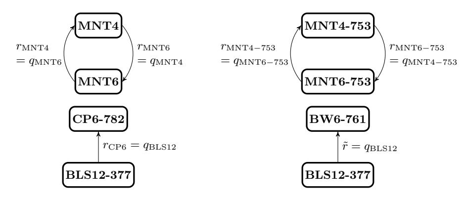

## Optimized and secure pairing-friendly elliptic curves suitable for one layer proof composition

Youssef El Housni1,2,3[0000−0003−2873−3479] and Aurore Guillevic4[0000−0002−0824−7273]

<sup>1</sup> EY Blockchain, Paris, France <sup>2</sup> LIX, CNRS, Ecole Polytechnique, Institut Polytechnique de Paris ´ 3 INRIA

youssef.el.housni@fr.ey.com <sup>4</sup> Universit´e de Lorraine, CNRS, Inria, LORIA, Nancy, France aurore.guillevic@inria.fr

Abstract. A zero-knowledge proof is a method by which one can prove knowledge of general non-deterministic polynomial (NP) statements. SNARKs are in addition non-interactive, short and cheap to verify. This property makes them suitable for recursive proof composition, that is proofs attesting to the validity of other proofs. To achieve this, one moves the arithmetic operations to the exponents. Recursive proof composition has been empirically demonstrated for pairing-based SNARKs via tailored constructions of expensive pairing-friendly elliptic curves namely a pair of 753-bit MNT curves, so that one curve's order is the other curve's base field order and vice-versa. The ZEXE construction restricts to one layer proof composition and uses a pair of curves, BLS12-377 and CP6-782, which improve significantly the arithmetic on the first curve. In this work we construct a new pairing-friendly elliptic curve to be used with BLS12- 377, which is STNFS-secure and fully optimized for one layer composition. We propose to name the new curve BW6-761. This work shows that it is at least five times faster to verify a composed SNARK proof on this curve compared to the previous state-of-the-art, and proposes an optimized Rust implementation that is almost thirty times faster than the one available in ZEXE library.

#### 1 Introduction

Proofs of knowledge are a powerful tool introduced in [\[19\]](#page-19-0) and studied both in theoretical and applied cryptography. Since then, cryptographers designed and improved short, non-interactive and cheap to verify proofs, resulting in Succinct Non-interactive ARguments of Knowledge (SNARKs). Zero-knowledge (zk) SNARKs allow a prover to convince a verifier that they know a witness to an instance, which is a member of a language in NP, whilst revealing no information about this witness. The verification of the proof should be fast. The discrete logarithm problem: given a finite cyclic group G, a generator g, and h ∈ G, find x = log<sup>g</sup> h such that h = g x , is at the heart of many proofs of knowledge. Making a scheme non-interactive leads to a signature scheme, such as Schnorr protocol and signature.

A cryptographic bilinear pairing is a map  $e \colon \mathbb{G}_1 \times \mathbb{G}_2 \to \mathbb{G}_T$  where  $\mathbb{G}_1$  and  $\mathbb{G}_2$  are distinct subgroups of an elliptic curve defined over a finite field  $\mathbb{F}_q$ , and  $\mathbb{G}_T$  is an extension field  $\mathbb{F}_{q^k}$ . Pairings allow to multiply hidden values in the exponents: with a multiplicative notation for the three groups, and generators  $g_1, g_2$  for  $\mathbb{G}_1, \mathbb{G}_2$ , one has  $e(g_1^a, g_2^b) = e(g_1, g_2)^{ab}$ : a pairing can multiply two discrete logarithms without revealing them. As of 2020, the most efficient proof-of-knowledge scheme due to Groth [20] is a pre-processing zk-SNARK made of bilinear pairings. Hence, constructions of pairing-friendly elliptic curves are required.

Besides efficiency, SNARKs' succinctness makes them good candidates for recursive proof composition. Such proofs could themselves verify the correctness of (a batch of) other proofs. This would allow a single proof to inductively attest to the correctness of many former proofs. However, once a first proof is generated, it is highly impractical to use the same elliptic curve to generate a second proof verifying the first one. A practical approach requires two different curves that are closely tied together. Therefore, we need tailored pairing-friendly curves that are usually expensive to construct and to use.

#### 1.1 Previous work

Ben-Sasson et al. [4] presented the first practical setting of recursive proof composition with a cycle of two MNT pairing-friendly elliptic curves [16, Sec. 5]. Proofs generated from one curve can feasibly reason about proofs generated from the other curve. To achieve this, one curve's order is the other curve's base field order and vice-versa. But, both are quite expensive at the 128-bit security level. The two curves have low embedding degrees (4 and 6) resulting in large base fields to achieve a standard security level. For example, the Coda protocol [26] implements curves of 753 bits. Moreover, Chiesa et al. [12] established some limitations on finding other suitable cycles of curves.

On the other hand, Bowe et al. proposed the Zexe system [7]. They use a relatively relaxed approach to find a suitable pair of curves that forms a chain rather than a cycle. The authors constructed a BLS12 curve to generate the inner proofs while allowing the construction of a second curve via the Cocks-Pinch method [16, Sec. 4.1] to generate the outer proof. It is to note that while the inner curve is efficient at 128-bit security level, the outer curve is quite expensive.

#### 1.2 Our contributions

We present a new secure and optimized pairing-friendly elliptic curve suitable for one-layer proof composition and much faster than the previous state-of-the-art. To achieve this, we moved from the Cocks-Pinch to the Brezing-Weng method to generate curves. Our curve can substitute for Zexe's outer curve while enjoying a very efficient implementation. The curve is defined over a 761-bit prime field instead of 782 bits, saving one machine-word of 64 bits. The curve has CM

discriminant -D = -3, allowing fast GLV scalar multiplication on  $\mathbb{G}_1$  and  $\mathbb{G}_2$ . The curve has embedding degree 6 and a twist of degree 6, and  $\mathbb{G}_2$  has coordinates in the same prime field as  $\mathbb{G}_1$  (factor 6 compression). The curve also has fast subgroup checking and fast cofactor multiplication. Finally, we obtain a very efficient optimal ate pairing on this curve.

In particular, we show it is at least five times faster to verify a Groth proof, compared to Zexe. We provide an optimized Rust implementation that achieves a speedup factor of almost 30.

#### 1.3 Applications

We briefly mention some applications from the blockchain community projects that can benefit from this work:

**Zexe** The authors introduced the notion of Decentralized Private Computation (DPC) that uses one layer proof composition [7]. As an application, they described user-defined assets, decentralized exchanges and policy-enforcing stablecoins in [7, § V].

**Celo** The project aims to develop a mobile-first oriented blockchain platform. Celo verifies BLS signatures by generating a single SNARK proof that verifies many signatures [9].

EY Blockchain The firm released its Nightfall tool [14] into the public domain, a smart-contract based solution leveraging zkSNARKs for private transactions of fungible and non-fungible tokens on the Ethereum blockchain. Recently, EY unveiled its latest Nightfall upgrade allowing for transaction batching. This work can be used to aggregate many Nightfall proofs into one, thus reducing the overall gas cost.

Filecoin The protocol [27] describes a decentralized storage blockchain. Protocol Labs introduced Proof-of-Replication that can be used to prove that some data has been replicated to its own uniquely dedicated physical storage. This proof is then compressed using a SNARK proof but this results in a massive arithmetic circuit. Filecoin is considering splitting the circuit into 20 smaller ones and generating small proofs that can be aggregated into one using one layer proof composition.

Organization of the paper. In Section 2, we provide preliminaries on pairing-friendly elliptic curves and recursive proof composition. In Section 3, we introduce our curve, discuss the optimizations and compare it to Zexe's outer curve. We estimate in Section 4 the security of Zexe's inner curve and our curve, taking into account the Special Tower NFS algorithm, and Cheon's attack. We conclude in Section 5.

#### <span id="page-2-0"></span>2 Preliminaries

We present the background on pairing-friendly elliptic curves and recursive composition of zk-SNARKs proofs that is needed to understand our curve's construction.

#### 2.1 Pairing-friendly elliptic curves

**Background on pairings.** We briefly recall elementary definitions on pairings and present the computation of two pairings used in practice, the Tate and ate pairings. All elliptic curves discussed below are *ordinary* (i.e. non-supersingular).

Let E be an elliptic curve defined over a field  $\mathbb{F}_q$ , where q is a prime power. Let  $\pi_q$  be the Frobenius endomorphism:  $(x,y)\mapsto (x^q,y^q)$ . Its minimal polynomial is  $X^2-tX+q$  where t is called the trace. Let r be a prime divisor of the curve order  $\#E(\mathbb{F}_q)=q+1-t$ . The r-torsion subgroup of E is denoted  $E[r]\coloneqq\{P\in E(\overline{\mathbb{F}_q}),[r]P=\mathcal{O}\}$  and has two subgroups of order r (eigenspaces of  $\phi_q$  in E[r]) that are useful for pairing applications. We define the two groups  $\mathbb{G}_1=E[r]\cap\ker(\pi_q-[1])$  with a generator denoted by  $G_1$ , and  $\mathbb{G}_2=E[r]\cap\ker(\pi_q-[q])$  with a generator  $G_2$ . The group  $\mathbb{G}_2$  is defined over  $\mathbb{F}_{q^k}$ , where the embedding degree k is the smallest integer  $k\in\mathbb{N}^*$  such that  $r\mid q^k-1$ .

We recall the Tate and ate pairing definitions, based on the same two steps: evaluating a function  $f_{s,Q}$  at a point P, the Miller loop step, and then raising it to the power  $(q^k - 1)/r$ , the final exponentiation step. The function  $f_{s,Q}$  has divisor  $div(f_{s,Q}) = s(Q) - ([s]Q) - (s-1)(\mathcal{O})$  and satisfies, for integers i and j,

$$f_{i+j,Q} = f_{i,Q} f_{j,Q} \frac{\ell_{[i]Q,[j]Q}}{v_{[i+j]Q}},$$

where  $\ell_{[i]Q,[j]Q}$  and  $v_{[i+j]Q}$  are the two lines needed to compute [i+j]Q from [i]Q and [j]Q ( $\ell$  intersecting the two points and v the vertical). We compute  $f_{s,Q}(P)$  with the Miller loop presented in Algorithm 1.

```
Algorithm 1: MillerLoop(s, P, Q)
    Output: m = f_{s,Q}(P)
 1 m \leftarrow 1; S \leftarrow Q;
 2 for b from the second most significant bit of s to the least do
         \ell \leftarrow \ell_{S,S}(P); S \leftarrow [2]S;
                                                                                                           DoubleLine
         v \leftarrow v_{[2]S}(P);

m \leftarrow m^2 \cdot \ell/v;
                                                                                                        VERTICALLINE
                                                                                                                UPDATE1
         if b = 1 then
              \ell \leftarrow \ell_{S,Q}(P); S \leftarrow S + Q ; 
v \leftarrow v_{S+Q}(P) ;
                                                                                                                AddLine
                                                                                                        VERTICALLINE
 8
              m \leftarrow m \cdot \ell/v;
                                                                                                                UPDATE2
10 return m;
```

<span id="page-3-0"></span>The Tate and ate pairings are defined by

Tate
$$(P, Q) := f_{r,P}(Q)^{(q^k - 1)/r}$$
  
ate $(P, Q) := f_{t-1,Q}(P)^{(q^k - 1)/r}$ 

```
Algorithm 2: Cocks-Pinch method
Input: A positive integer k and a positive square-free integer D
Output: E/Fq with an order-r subgroup and embedding degree k
1 Fix k and D and choose a prime r such that k divides r − 1 and −D is a square modulo r;
2 Compute t = 1 + x<sup>(r-1)/k</sup> for x a generator of (Z/rZ)<sup>×</sup>;
3 Compute y = (t - 2)/√-D mod r;
4 Lift t and y in Z;
5 Compute q = (t² + Dy²)/4 in Q;
6 if q is a prime integer then
7 | Use CM method (D < 10¹²) to construct E/Fq with order-r subgroup;</li>
8 else
9 | Go back to 1;
10 return E/Fq with an order-r subgroup and embedding degree k
```

<span id="page-4-0"></span>where  $P \in \mathbb{G}_1 \subset E[r](\mathbb{F}_q)$  and  $Q \in \mathbb{G}_2 \subset E[r](\mathbb{F}_{q^k})$ . The values  $\mathrm{Tate}(P,Q)$  and  $\mathrm{ate}(P,Q)$  are in the *target* group  $\mathbb{G}_T$  of r-th roots of unity in  $\mathbb{F}_{q^k}$ . In this paper, when abstraction is needed, we denote a pairing as follows  $e : \mathbb{G}_1 \times \mathbb{G}_2 \to \mathbb{G}_T$ .

It is also important to recall some results with respect to the complex multiplication (CM) discriminant -D. When D=3 (resp. D=4), the curve has CM by  $\mathbb{Q}(\sqrt{-3})$  (resp.  $\mathbb{Q}(\sqrt{-1})$ ) so that twists of degrees 3 and 6 exist (resp. 4). When E has d-th order twists for some  $d \mid k$ , then  $\mathbb{G}_2$  is isomorphic to  $E'[r](\mathbb{F}_{q^k/d})$  for some twist E'. Otherwise, in the general case, E admits a single twist (up to isomorphism) and it is of degree 2.

Some pairing-friendly constructions. Here, we recall some methods from the literature for constructing pairing-friendly ordinary elliptic curves that will be of interest in the following sections. We focus on the Cocks-Pinch [16, Sec. 4.1], Barreto-Lynn-Scott [16, Sec. 6.1] and Brezing-Weng [16, Sec. 6.1] methods, but also mention the Miyaji-Nakabayashi-Takano (MNT) curves [16, Sec. 5.1].

Cocks–Pinch is the most flexible of the above methods and can be used to construct curves with arbitrary embedding degrees but with ratio  $\rho = \log_2 q/\log_2 r \approx 2$ . It works by fixing the subgroup order r and the CM discriminant D and then computing the trace t and the prime q such that the CM equation  $4q = t^2 + Dy^2$  (for some  $y \in \mathbb{Z}$ ) is satisfied (cf. Alg. 2).

Brezing and Weng [16, Sec. 6.1], and independently, Barreto, Lynn and Scott [16, Sec. 6.1] generalized the Cocks–Pinch method by parametrizing t,r and q as polynomials. This led to curves with ratio  $\rho < 2$ . Below, we sketch the idea of the algorithm in its generality for both BLS and BW constructions (cf. Alg. 3). A particular choice of polynomials for k=12 yields a family of curves with a good security/performance tradeoff, denoted BLS12. The parameters are given in Table 1. MNT curves, however, have a fixed embedding degree  $k \in \{3,4,6\}$  and variable discriminant D. For k=6, one has  $p_6(x)=4x^2+1$ ,  $r_6(x)=4x^2-2x+1$ , and for k=4,  $p_4(x)=x^2+x+1$ ,  $r_4(x)=x^2+1$ . One has  $p_6(x)=r_4(-2x)$  and

Algorithm 3: Idea of BLS and BW methods

**Input:** A positive integer k and a positive square-free integer D

**Output:**  $E/\mathbb{F}_{q(x)}$  with an order-r(x) subgroup and embedding degree k

- 1 Fix k and D and choose an irreducible polynomial  $r(x) \in \mathbb{Z}[x]$  with positive leading coefficient such that  $\sqrt{-D}$  and the primitive k-th root of unity  $\zeta_k$  are in  $K = \mathbb{Q}[x]/(r(x))$ ;
- 2 Choose  $t(x) \in \mathbb{Q}[x]$  be a polynomial representing  $\zeta_k + 1$  in K;
- 3 Set  $y(x) \in \mathbb{Q}[x]$  be a polynomial mapping to  $(\zeta_k 1)/\sqrt{-D}$  in K;
- 4 Compute  $q(x) = (t^2(x) + Dy^2(x))/4$  in  $\mathbb{Q}[x]$ ;
- 5 return  $E/\mathbb{F}_{q(x)}$  with an order-r(x) subgroup and embedding degree k

<sup>1</sup>so that r(x) satisfies Bunyakovsky conjecture, which states that such a polynomial produces infinitely many primes for infinitely many integers.

<span id="page-5-0"></span>BLS12, 
$$k = 12$$
,  $D = 3$ ,  $x = 1 \mod 3$   
 $q_{\text{BLS12}}(x) = (x^6 - 2x^5 + 2x^3 + x + 1)/3$ ,  $x = 1 \mod 3$   
 $r_{\text{BLS12}}(x) = x^4 - x^2 + 1$   
 $t_{\text{BLS12}}(x) = x + 1$ 

<span id="page-5-1"></span>Table 1. Polynomial parameters of BLS12 curve family.

 $r_6(x) = p_4(-2x)$ . If  $p_6, r_6, p_4, r_4$  are prime, this makes a cycle of pairing-friendly curves.

Pairing-friendly chains and cycles. Two elliptic curves defined over finite fields form a chain if the characteristic of the field of definition of one curve equals the number of points on the next. If this property is cyclic, then it is called a cycle. These concepts are generalized to m curves by the following definitions.

**Definition 1.** An m-chain of elliptic curves is a list of distinct curves

$$E_1/\mathbb{F}_{q_1},\ldots,E_m/\mathbb{F}_{q_m}$$

where  $q_1, \ldots, q_m$  are large primes and

$$#E_2(\mathbb{F}_{q_2}) = q_1, \dots, #E_i(\mathbb{F}_{q_i}) = q_{i-1}, \dots, #E_m(\mathbb{F}_{q_m}) = q_{m-1} .$$
 (1)

**Definition 2.** An m-cycle of elliptic curves is an m-chain, with

$$#E_1(\mathbb{F}_{q_1}) = q_m . (2)$$

In the literature, a 2-cycle of ordinary curves is called an *amicable pair*. Following the same logic, we call a 2-chain of pairing-friendly ordinary elliptic curves pairing-friendly amicable chain. In this paper, we are interested in constructing a pairing-friendly amicable chain of curves with efficient arithmetic.

#### 2.2 Recursive proof composition

To date the most efficient zkSNARK is due to Groth [20]. Here, we briefly sketch its construction and refer the reader to the original paper. The construction consists of a trapdoored setup and a proof made of 3 group elements. The verification is one equation of a pairing product (Eq. 3), for a pairing  $e: \mathbb{G}_1 \times \mathbb{G}_2 \to \mathbb{G}_T$  where  $\mathbb{G}_1, \mathbb{G}_2, \mathbb{G}_T$  are groups of prime order r defined over a field  $\mathbb{F}_q$ . Given an instance  $\Phi = (a_0, \ldots, a_l) \in \mathbb{F}_r^l$ , a proof  $\pi = (A, C, B) \in \mathbb{G}_1^2 \times \mathbb{G}_2$  and a verification key  $vk = (vk_{\alpha,\beta}, \{vk_{\pi_i}\}_{i=0}^l, vk_{\gamma}, vk_{\delta}) \in \mathbb{G}_T \times \mathbb{G}_1^{l+1} \times \mathbb{G}_2^2$ , the verifier must check that

<span id="page-6-0"></span>
$$e(A,B) = vk_{\alpha,\beta} \cdot e(vk_x, vk_\gamma) \cdot e(C, vk_\delta), \tag{3}$$

where  $vk_x = \sum_{i=0}^{l} [a_i]vk_{\pi_i}$  depends only on the instance  $\Phi$  and  $vk_{\alpha,\beta} = e(vk_{\alpha}, vk_{\beta})$  can be precomputed in the trusted setup for  $(vk_{\alpha}, vk_{\beta}) \in \mathbb{G}_1 \times \mathbb{G}_2$ .

Note that, for an efficient implementation, the subgroup order r is chosen to allow efficient FFT-based polynomial multiplications, as proposed in [3]. To achieve this, we require  $high\ 2$ -adicity: r-1 should be divisible by a large enough power of 2.

To allow recursive proof composition, one needs to write the verification equation (3) as an instance in the prover language. In pairing-based SNARKs such as [20], the verification arithmetic (computing the scalar multiplications and the pairings of (3)) is in an extension of  $\mathbb{F}_q$  up to a degree k while the proving arithmetic is in  $\mathbb{F}_r$ . That means we need another pairing  $e' : \mathbb{G}'_1 \times \mathbb{G}'_2 \to \mathbb{G}'_T$  where the groups  $\mathbb{G}'_i$  are of prime order q (instead of r) to prove the arithmetic operations over  $\mathbb{F}_q$ . Since a pairing-friendly curve with q = r doesn't exist<sup>2</sup>, one would need to simulate  $\mathbb{F}_q$  operations via  $\mathbb{F}_r$  operations which results in a computational blowup of order  $\log q$  compared to native arithmetic.

A practical alternative was suggested in [4] using a pairing-friendly amicable pair. The authors proposed a cycle of two MNT curves [16, Sec.5],  $E_4$  and  $E_6$ , with embedding degrees 4 and 6 and primes q and r of 298 bits. One has  $\#E_4(\mathbb{F}_r) = q$  and  $\#E_6(\mathbb{F}_q) = r$ . While this solves our problem, the security level of the curves is low. To remediate this, the Coda protocol [26] uses a larger MNT-based amicable pair proposed by [4] that targets 128-bit security with primes q, r of 753 bits, but at the cost of expensive computations (cf. Fig. 1).

While an amicable pair allows an infinite recursion loop, an amicable chain allows a bounded recursion. In some applications, such as those we mentioned, a one-layer composition is sufficient. To this end, Zexe's authors proposed an amicable chain consisting of an inner BLS12 curve called BLS12-377 and an outer Cocks—Pinch curve called CP6-782 (for Cocks—Pinch method, embedding degree 6 and field size of 782 bits). BLS12-377 was constructed to have both r-1 and q-1 highly 2-adic while enjoying all the efficient implementation properties of the BLS12 family. With the inner curve constructed, the authors looked for a pairing-friendly curve with pre-determined subgroup order r equal to the field size q of BLS12-377. The only construction from the literature to allow such flexibility is Cocks—Pinch, but it unfortunately results in a curve on

<span id="page-6-1"></span><sup>&</sup>lt;sup>2</sup> r needs to divide  $q^k - 1$  for  $k \in \mathbb{N}^*$  [1, 20], thus r = 1 is the only solution.

which operations are at least two times more costly (in time and space) than BLS12-377. Furthermore, this outer curve CP6-782 doesn't allow efficient pairing computation and efficient scalar multiplication via endomorphisms.

In the following sections, we refer to BLS12-377 as  $E_{\text{BLS12}}(\mathbb{F}_{q_{\text{BLS12}}})$  with a subgroup of order  $r_{\text{BLS12}}$ , CP6-782 as  $E_{\text{CP6}}(\mathbb{F}_{q_{\text{CP6}}})$  with a subgroup of order  $r_{\text{CP6}}$  and our curve as  $\tilde{E}(\mathbb{F}_{\tilde{q}})$  with a subgroup of order  $\tilde{r}$  (cf. Fig. 1).



<span id="page-7-1"></span>**Fig. 1.** Examples of pairing-friendly amicable cycles and chains. The arrow signifies that the field arithmetic of the starting curve can be expressed natively *in the exponents* on the second curve.

#### <span id="page-7-0"></span>3 The proposed elliptic curve: BW6-761

The parameters of the two curves proposed in [7] for one-layer proof-composition, BLS12-377 and CP6-782, are given in Table 2. Note that because the Cocks—Pinch method has a ratio  $\rho \approx 2$ , the CP6-782 curve characteristic  $q_{\rm CP6}$  is 782-bit long (832 bits in the Montgomery domain). Since  $q_{\rm CP6}$  is already very large, an embedding degree k=6 is sufficient for the security of  $\mathbb{F}^k_{q_{\rm CP6}}$ . Moreover, because  $D=339,\ E_{\rm CP6}$  has only a quadratic twist E' and thus  $\mathbb{G}_2\subset E(\mathbb{F}_{q_{\rm CP6}^6})[r_{\rm CP6}]$  is isomorphic to  $E'(\mathbb{F}_{q_{\rm CP6}^3})[r_{\rm CP6}]$ , and  $\mathbb{G}_2$  elements can be compressed to only  $3\times832=2496$  bits.

Since we are stuck with  $\rho \approx 2$ , we searched for a Cocks–Pinch curve  $\tilde{E}$  with k=6 and the smallest suitable  $\tilde{q}$  less or equal to 768 bits. We restricted our search to curves with CM discriminant D=3 to allow optimal  $\mathbb{G}_2$  compression (a sextic twist  $\tilde{E}'/\mathbb{F}_{\tilde{q}}$  of  $\tilde{E}$  such that  $\mathbb{G}_2$  is isomorphic to  $\tilde{E}'(\mathbb{F}_{\tilde{q}})[r]$  of 768 bits) and GLV fast scalar multiplication [18] on  $\mathbb{G}_1$  and  $\mathbb{G}_2$ . Then, following the work of [21], we computed the polynomial form of  $\tilde{q}$ , which allowed us to compute the coefficients of an optimal lattice-based final exponentiation as in [17] and perform faster subgroup checks. Finally, the constructed curve has a 2-torsion point allowing fast and secure Elligator 2 hashing-to-point [5]. We also investigate Wahby and Boneh's work [30] as an alternative hashing method.

| nomo               | aumro treno                                        | rye type k D r a |     | compre                        | ssed            | co                     | mpressed |              |                      |
|--------------------|----------------------------------------------------|------------------|-----|-------------------------------|-----------------|------------------------|----------|--------------|----------------------|
| name               | curve type                                         | κ                | D   | 7                             | q               | $\mathbb{G}_1$ in bits |          | $\mathbb{G}$ | <sub>2</sub> in bits |
| $E_{\rm BLS12}$    | BLS12                                              | 12               | 3   | $r_{\rm BLS12}$               | $q_{\rm BLS12}$ | 384                    | 768      |              |                      |
| $E_{\rm CP6}$      | short Weierstrass                                  | 6                | 339 | $r_{\rm CP6} = q_{\rm BLS12}$ | $q_{\rm CP6}$   | 832                    | 2        |              | 2496                 |
| - wires            | 1                                                  |                  |     |                               |                 |                        |          | 9            | 2-adicity            |
| prime              | value $x$ in                                       |                  |     |                               |                 |                        |          |              | of $x-1$             |
| $r_{\rm BLS12}$    | 0x12ab655e9a2ca55660b44d1e5c37b00159aa76fed0000001 |                  |     |                               |                 |                        |          | 3            | 47                   |
|                    | 0a1180000000001                                    |                  |     |                               |                 |                        |          |              |                      |
| $q_{\rm BLS12}$    | 0x1ae3a4617c510eac63b05c06ca1493b1a22d9f300f5138f1 |                  |     |                               |                 |                        |          | 7            | 46                   |
| $= r_{\rm CP6}$    | ef3622fba094800170b5d44300000008508c00000000001    |                  |     |                               |                 |                        |          |              |                      |
| $q_{\mathrm{CP6}}$ | 0x3848c4d2263babf8941fe959283d8f526663bc5d176b746a |                  |     |                               |                 |                        |          | 2            | 3                    |
|                    | f0266a7223ee72023d07830c728d80f9d78bab3596c8617c57 |                  |     |                               |                 |                        |          |              |                      |
|                    | 9252a3fb77c79c13201ad533049cfe6a399c2f764a12c4024b |                  |     |                               |                 |                        |          |              |                      |
|                    | ee135c065f4d26b7545d85c16dfd424adace79b57b942ae9   |                  |     |                               |                 |                        |          |              |                      |

<span id="page-8-0"></span>Table 2. Parameters of BLS12-377 and CP6-782 curves

| name            | curve type                                           | k                                                                   | D        | r        | q | compre $\mathbb{G}_1$ in |       |    | mpressed 2 in bits |
|-----------------|------------------------------------------------------|---------------------------------------------------------------------|----------|----------|---|--------------------------|-------|----|--------------------|
| $\tilde{E}$     | short Weierstrass                                    | short Weierstrass 6 3 $\tilde{r} = q_{\text{BLS12}}  \tilde{q}$ 768 |          |          |   |                          | 3 768 |    | 768                |
| prime           | prime value x                                        |                                                                     |          |          |   |                          | size  |    | 2-adicity          |
| prinic          | varue x                                              |                                                                     |          |          |   |                          | in bi | ts | of $x-1$           |
| $\tilde{r} =$   | 0x1ae3a4617c51                                       | 0x1ae3a4617c510eac63b05c06ca1493b1a22d9f300f5138f1ef                |          |          |   |                          |       | 7  | 46                 |
| $q_{\rm BLS12}$ | 3622fba0948001                                       | 3622fba094800170b5d44300000008508c000000000001                      |          |          |   |                          |       |    |                    |
| $\tilde{q}$     | 0x122e824fb83c                                       | 0x122e824fb83ce0ad187c94004faff3eb926186a81d14688528                |          |          |   |                          |       | L  | 1                  |
|                 | 275ef8087be417                                       | 275ef8087be41707ba638e584e91903cebaff25b423048689c8                 |          |          |   |                          |       |    |                    |
|                 | d12f9fd9071dcd3dc73ebff2e98a116c25667a8f8160cf8aeeat |                                                                     |          |          |   |                          |       |    |                    |
|                 | 0a437e6913e687                                       | 00000821                                                            | f49d0000 | оооооовъ |   |                          |       |    |                    |

<span id="page-8-1"></span>Table 3. Parameters of our curve

The short Weierstrass forms of the curve  $\tilde{E}$  and its sextic twist  $\tilde{E}'$  are

<span id="page-8-3"></span>
$$\tilde{E}/\mathbb{F}_{\tilde{q}} \colon y^2 = x^3 - 1 \tag{4}$$

$$\tilde{E}'/\mathbb{F}_{\tilde{a}} \colon y^2 = x^3 + 4 \tag{5}$$

and the parameters are given in Table 3.

Given that  $q_{\text{BLS}12}$  is parameterized by a polynomial q(u) with

<span id="page-8-2"></span>
$$u = 0x8508c0000000001,$$
 (6)

we can apply the Brezing–Weng method (cf. Alg. 3) with  $k=6,\,D=3$  and  $\tilde{r}(x)=(x^6-2x^5+2x^3+x+1)/3$ . There are two primitive 6-th roots of unity in  $\mathbb{Q}[x]/\tilde{r}(x)$ , and two sets of solutions

$$\begin{cases} \tilde{t}_0(x) = x^5 - 3x^4 + 3x^3 - x + 3\\ \tilde{y}_0(x) = (x^5 - 3x^4 + 3x^3 - x + 3)/3 \end{cases} \text{ or } \begin{cases} \tilde{t}_1(x) = -x^5 + 3x^4 - 3x^3 + x\\ \tilde{y}_1(x) = (x^5 - 3x^4 + 3x^3 - x)/3 \end{cases}$$

Unfortunately neither  $(\tilde{t}_0(x) + 3\tilde{y}_0(x))/4$  nor  $(\tilde{t}_1(x) + 3\tilde{y}_1(x))/4$  are irreducible polynomials, and we cannot construct a polynomial family of amicable 2-chain

elliptic curves. But following [21], with well-chosen lifting cofactors  $h_t$  and  $h_y$ , we can obtain valid parameters  $\tilde{t} = \tilde{r} \times h_t + \tilde{t}_i(u)$  and respectively  $\tilde{y} = \tilde{r} \times h_y + \tilde{y}_i(u)$  for  $i \in \{0,1\}$ . We found these parameters to be  $i=0, h_t=13, h_y=9$ . The polynomial form of the parameters are summarized in Table 4. We propose to name our curve BW6-761 as it is a Brezing-Weng curve of embedding degree 6 over a 761-bit prime field.

```
BW6-761, k = 6, D = 3, \tilde{r} = q_{\text{BLS}12}

\tilde{r}(x) = (x^6 - 2x^5 + 2x^3 + x + 1)/3

\tilde{t}(x) = x^5 - 3x^4 + 3x^3 - x + 3 + h_t \tilde{r}(x)

\tilde{y}(x) = (x^5 - 3x^4 + 3x^3 - x + 3)/3 + h_y \tilde{r}(x)

\tilde{q}(x) = (\tilde{t}^2 + 3\tilde{y}^2)/4

\tilde{q}_{h_t=13,h_y=9}(x) = (103x^{12} - 379x^{11} + 250x^{10} + 691x^9 - 911x^8 - 79x^7 + 623x^6 - 640x^5 + 274x^4 + 763x^3 + 73x^2 + 254x + 229)/9
```

<span id="page-9-0"></span>Table 4. Polynomial parameters of BW6-761.

#### <span id="page-9-2"></span>3.1 Optimizations in $\mathbb{G}_1$

We present some optimizations for widely used operations in cryptography: scalar multiplication, hashing-to-point and subgroup check in  $\mathbb{G}_1$ .

GLV scalar multiplication. We have  $\tilde{q} \equiv 1 \pmod{3}$  and  $\tilde{E}(\mathbb{F}_{\tilde{q}})$  has j-invariant 0. Let  $\omega$  be an element of order 3 in  $\mathbb{F}_{\tilde{q}}$ . Then the endomorphism  $\phi: \tilde{E} \to \tilde{E}$  defined by  $(x,y) \mapsto (\omega x,y)$  (and  $\mathcal{O} \mapsto \mathcal{O}$ ) acts on a point  $P \in \tilde{E}(\mathbb{F}_{\tilde{q}})[\tilde{r}]$  as  $\phi(P) = [\lambda]P$  where  $\lambda$  is an integer satisfying  $\lambda^2 + \lambda + 1 \equiv 0 \mod \tilde{r}$ . Since we expressed  $\tilde{q}$  and  $\tilde{r}$  as polynomials, we find  $\omega(x)$  and  $\lambda(x)$  such that

$$\omega(x)^2 + \omega(x) + 1 \equiv 0 \pmod{\tilde{q}(x)} \text{ (cube root of unity)}$$
$$\lambda(x)^2 + \lambda(x) + 1 \equiv 0 \pmod{\tilde{r}(x)}$$

where  $\lambda_1(x) = x^5 - 3x^4 + 3x^3 - x + 1$ ,  $\lambda_2(x) = -\lambda_1 - 1$ ,  $\omega_1(x) = (103x^{11} - 482x^{10} + 732x^9 + 62x^8 - 1249x^7 + 1041x^6 + 214x^5 - 761x^4 + 576x^3 + 11x^2 - 265x + 66)/21$ ,  $\omega_2(x) = -\omega_1(x) - 1$ . Evaluating the polynomials at u (6), we find that for  $P(x,y) \in \tilde{E}(\mathbb{F}_{\tilde{\theta}})$  of order  $\tilde{r}$ ,

<span id="page-9-1"></span>
$$[\lambda_1]P = (\omega_1 x, y)$$
,  $[-\lambda_1 - 1]P = ((-\omega_1 - 1)x, y)$ , where (7)

 $\lambda_1 = 0 \\ \text{x9b3af05dd14f6ec619aaf7d34594aabc5ed1347970dec00452217cc9000} \\ 00008508 \\ \text{c000000000001}$ 

 $\omega_1 = 0x531 dc16c6 ecd27 aa846c61024 e4cca6c1f31 e53 bd9603c2d17 be416c5 e4426 ee4a737 f73 b6f952 ab5 e57926 fa701848 e0a235 a0a398300 c65759 fc451831512 f082 d4dcb5 e37 cb6290012 d96f8819 c547 ba8a4000002 f962140000000002 a$ 

#### Algorithm 4: Elligator 2

Input:  $\Theta$  an octet string to be hashed, A=3, B=3 coefficients of the curve  $\tilde{M}$  and N a constant non-square in  $\mathbb{F}_{\tilde{q}}$ Output: A point (x,y) in  $\tilde{M}(\mathbb{F}_{\tilde{q}})$ 

```
1 Define g(x) = x(x^2 + Ax + B);

2 u = \text{hash2base}(\Theta);

3 v = -A/(1 + Nu^2);

4 e = \text{Legendre}(g(v), \tilde{q});

5 if u \neq 0 then

6 \begin{vmatrix} x = ev - (1 - e)A/2; \\ y = -e\sqrt{g(x)}; \end{vmatrix}

8 else

9 \begin{vmatrix} x = 0 \text{ and } y = 0;

10 return (x, y);
```

<span id="page-10-0"></span>Hashing-to-point. Elligator 2 [5] is an injective map to any elliptic curve of the form  $y^2 = x^3 + Ax^2 + Bx$  with  $AB(A^2 - 4B) \neq 0$  over any finite field of odd characteristic. Since the point  $(1,0) \in \tilde{E}(\mathbb{F}_{\tilde{q}})$  is of order 2, we can map  $\tilde{E}$  to a curve of Montgomery form, precisely  $\tilde{M}(\mathbb{F}_{\tilde{q}}): y^2 = x^3 + 3x^2 + 3x$  (cf. Alg. 4). In Algorithm 4, hash2base(.) is a cryptographic hash function to  $\mathbb{F}_{\tilde{q}}$ , and Legendre $(a,\tilde{q})$  is the Legendre symbol of an integer a modulo  $\tilde{q}$  which is of value 1,-1,0 for when the input is a quadratic residue, non-quadratic-residue, or zero respectively. Elligator 2 is parametrized by a non-square N, for which finding a candidate is an easy computation in general since about half of the elements of  $\mathbb{F}_{\tilde{q}}$  are non-squares. For efficiency it is desirable to choose N to be small, or otherwise in a way to speed up multiplications by N. In our case, we can choose N = -1 because  $\tilde{q} \equiv 3 \pmod{4}$ .

Wahby and Boneh introduced in [30] an *indirect* map for the BLS12-381 curve [6] based on the simplified SWU map [8], which works by mapping to an isogenous curve with nonzero j-invariant, then evaluating the isogeny map. We hence check if  $\tilde{E}$  has a low-degree rational isogeny. Since  $2 \times 11$  divides  $\tilde{y}$  (CM equation  $4\tilde{q} = \tilde{t}^2 + D\tilde{y}^2$ ), there should be isogenies of degree 2 and 11. Observing that the point (1,0) is a 2-torsion point, we obtain the rational 2-isogeny  $(x,y) \mapsto ((x^2-x+3)/(x-1),y(x^2-2x-2)/(x-1)^2)$  to the curve  $y^2 = x^3 - 15x - 22$  of j-invariant 54000. A 2-torsion point on this curve is (-2,0) and the dual isogeny to work with Wahby–Boneh hash function is  $(x',y') \mapsto ((x'^2+2x'-3)/(x'+2),y(x'^2+4x'+7)/(x'^2+2)^2)$ .

Clearing cofactor. Another important step is clearing the cofactor. Our curve has a large 384-bit long cofactor due to the Cocks-Pinch method. The cofactor has a polynomial form in the seed u like the other parameters,  $\tilde{c}(x) = (103x^6 - 173x^5 - 96x^4 + 293x^3 + 21x^2 + 52x + 172)/3$  and  $\tilde{c}(x)\tilde{r}(x) = \tilde{q}(x) + 1 - \tilde{t}(x)$ . Because the curve has j-invariant 0, it has a fast endomorphism  $\phi: (x,y) \mapsto (\omega_1 x,y)$  such that  $\phi^2 + \phi + 1$  is the identity map. We apply the same technique as in [17]. First we compute the eigenvalue  $\lambda(x)$  of the endomorphism modulo the cofactor. We

obtain  $\lambda(x) = (-385941x^5 + 1285183x^4 - 1641034x^3 - 121163x^2 + 1392389x - 1692082)/1250420 \mod \tilde{c}(x)$ . Then we reduce with LLL the lattice spanned by the rows of the matrix M and obtain a reduced matrix B:

$$M = \begin{bmatrix} \tilde{c}(x) & 0 \\ \lambda(x) \bmod \tilde{c}(x) & 1 \end{bmatrix}, \ B = \frac{1}{103} \begin{bmatrix} 103x^3 - 83x^2 - 40x + 136 & 7x^2 + 89x + 130 \\ -7x^2 - 89x - 130 & 103x^3 - 90x^2 - 129x + 6 \end{bmatrix} \ .$$

We check that  $b_{i0}(x) + \lambda(x)b_{i1}(x) = 0 \mod \tilde{c}(x)$  and  $\gcd(b_{i0}(x) + \lambda(x)b_{i1}(x), \tilde{r}(x)) = 1$ . Now x = u and for clearing the cofactor, we first precompute  $uP, u^2P, u^3P$  which costs three scalar multiplications by u (6), then we compute  $R = 103(u^3P) - 83(u^2P) - 40(uP) + 136P + \phi(7(u^2P) + 89(uP) + 130P)$ , and R has order  $\tilde{r}$ . This formula is compatible with  $\omega_1$  to compute  $\phi$ .

Subgroup check. The subgroup check can benefit from the same technique. We need to check if a point  $P \in \tilde{E}(\mathbb{F}_{\tilde{q}})$  has order  $\tilde{r}$ , that is,  $\tilde{r}P = \mathcal{O}$ . Instead of multiplying by  $\tilde{r}$  of 377 bits, we can use the endomorphism  $\phi$  as above. This time we need  $\lambda_1(x) = x^5 - 3x^4 + 3x^3 - x + 1$  modulo  $\tilde{r}(x)$ . We reduce the matrix M and obtain a short basis B and check that  $(x+1) + \lambda_1(x)(x^3 - x^2 + 1) = 0$  mod  $\tilde{r}(x)$ .

$$M = \begin{bmatrix} \tilde{r}(x) & 0 \\ -\lambda_1(x) \mod \tilde{r}(x) & 1 \end{bmatrix} \quad B = \begin{bmatrix} x+1 & x^3 - x^2 + 1 \\ x^3 - x^2 - x & -x - 1 \end{bmatrix}$$

For a faster subgroup check of a point P, one can precompute  $uP, u^2P, u^3P$  with three scalar multiplications by u, and check that  $uP + P + \phi(u^3P - u^2P + P)$  is the point at infinity.

#### 3.2 Optimizations in $\mathbb{G}_2$

We present some optimizations for widely used operations on curves: scalar multiplication, hashing-to-point and subgroup check in  $\mathbb{G}_2$ .

Compression of  $\mathbb{G}_2$  elements. Since the CM discriminant of  $\tilde{E}/\mathbb{F}_{\tilde{q}}$  is D=3, the curve has a twist of degree d=6. Additionally, because the embedding degree is k=6, the  $\tilde{r}$ -torsion of  $\mathbb{G}_2\subset \tilde{E}[\tilde{r}](\mathbb{F}_{\tilde{q}^6})$  is isomorphic to  $\tilde{E}'[\tilde{r}](\mathbb{F}_{\tilde{q}^{k/d}})=\tilde{E}'[\tilde{r}](\mathbb{F}_{\tilde{q}})$ . Thus, elements in  $\mathbb{G}_2$  can be compressed from 4608 bits to 768 bits. We choose the irreducible polynomial  $x^6+4$  in  $\mathbb{F}_{\tilde{q}}[x]$  and construct the M-twist curve  $\tilde{E}'/\mathbb{F}_{\tilde{q}}\colon y^2=x^3+4$ . To map a point  $Q(x,y)\in \tilde{E}(\mathbb{F}_{\tilde{q}^6})$  to a point on the M-twist curve we use  $\xi\colon (x,y)\mapsto (x/\nu^2,y/\nu^3)$  where  $\nu^6=-4$ .

GLV scalar multiplication. Since the group  $\mathbb{G}_2$  is isomorphic to the  $\tilde{r}$ -torsion in  $\tilde{E}'(\mathbb{F}_{\tilde{q}})$  (Eq. (5)), we can apply almost the same GLV decomposition as in equation (7). Given that the order of E' is  $\tilde{q} + 1 - (3\tilde{y} + t)/2$ , we find that  $[\lambda_1]P = (\omega_2 x, y)$  and  $[\lambda_2]P = (\omega_1 x, y)$  for any  $P(x, y) \in E'[\tilde{r}]$ .

Hashing-to-point. The curve  $\tilde{E}'(\mathbb{F}_{\tilde{q}}): y^2 = x^3 + 4$  doesn't have a point of order 2 so Elligator 2 doesn't apply. Furthermore, we didn't find a low-degree rational isogeny and thus Wahby–Boneh method is not efficiently applicable. However, we can apply the more generic Shallue–Woestijn algorithm [28] that works for any elliptic curve over a finite field  $\mathbb{F}_q$  of odd characteristic with  $\#\mathbb{F}_q > 5$ . It runs deterministically in time  $O(\log^4 q)$  or in time  $O(\log^3 q)$  if  $q \equiv 3 \mod 4$  (a square root costs an exponentiation). Fouque and Tibouchi [15] adapted this algorithm to BN curves (j=0) assuming that  $q \equiv 7 \mod 12$  and that the point  $(1,y) \neq (1,0)$  lies on the curve. Noting that  $\tilde{E}': y^2 = f(x) = x^3 + 4$  satisfies these assumptions, we propose using Fouque–Tibouchi map for BW6-761:

$$\begin{split} g: \mathbb{F}_{\tilde{q}}^* &\to \tilde{E}'(\mathbb{F}_{\tilde{q}}) \\ z &\mapsto \left(x_i(z), \texttt{Legendre}(z, \tilde{q}) \times \sqrt{f(x_i(z))}\right)_{i \in \{1, 2, 3\}} \end{split}$$

where

$$x_1(z) = \frac{-1+\sqrt{-3}}{2} - \frac{\sqrt{-3} \cdot z^2}{5+z^2} \; ; \; x_2(z) = \frac{-1-\sqrt{-3}}{2} + \frac{\sqrt{-3} \cdot z^2}{5+z^2} \; ; \; x_3(z) = 1 - \frac{(5+z^2)^2}{3z^2}$$

Because of the Skalba identity  $y^2 = f(x_1) \cdot f(x_2) \cdot f(x_3)$ , at least one of the  $x_i$  above is an abscissa of a point on  $\tilde{E}'$  — we choose the smallest index i such that  $f(x_i)$  is a square in  $\mathbb{F}_{\tilde{q}}$ .

Clearing cofactor. Given a point  $P' \in \tilde{E}'(\mathbb{F}_{\tilde{q}})$ , we precompute  $uP', u^2P'$  and  $u^3P'$  with three scalar multiplications, then the point R' has order  $\tilde{r}$ , with

$$R' = (103u^3P' - 83u^2P' - 143uP' + 27P') + \phi(7u^2P' - 117uP' - 109P').$$

<span id="page-12-0"></span>Subgroup check. The formula compatible with  $\omega_1$  for  $\phi$  is

$$-uP' - P' + \phi(u^3P' - u^2P' - uP') = 0 \iff \tilde{r}P' = \mathcal{O}.$$

#### 3.3 Pairing computation

The verification equation of proof composition (3) requires three pairing computations. When an even-degree twist is available, the denominators  $v_{[2]S}(P)$ ,  $v_{S+Q}(P)$  in Algorithm 1 are in a proper subgroup of  $\mathbb{F}_{q^k}$  and can be removed as they resolve to one after the final exponentiation. This is the case for BLS12, CP6-782 and BW6-761. We estimate, in terms of multiplications in the base fields  $\mathbb{F}_{q_{\text{BLS12}}}$ ,  $\mathbb{F}_{q_{\text{CP6}}}$  and  $\mathbb{F}_{\tilde{q}}$ , a pairing on the curves BLS12-377 and CP6-782 (see Appendix A), and an optimal ate pairing on BW6-761. We follow the estimate in [21]. We model the cost of arithmetic in a degree 6, resp. degree 12 extension in the usual way, where multiplications and squarings in quadratic and cubic extensions are obtained recursively with Karatsuba and Chung–Hasan formulas, summarized in Table 5. We denote by  $\mathbf{m}_k$ ,  $\mathbf{s}_k$ ,  $\mathbf{i}_k$  and  $\mathbf{f}_k$  the costs of multiplication, squaring, inversion, and q-th power Frobenius in an extension  $\mathbb{F}_{q^k}$ , and by  $\mathbf{m} = \mathbf{m}_1$  the multiplication in a base field  $\mathbb{F}_q$ . We neglect additions

| k                                                           | 1              | 2              | 3              | 6              | 12              |
|-------------------------------------------------------------|----------------|----------------|----------------|----------------|-----------------|
| $\mathbf{m}_k$                                              | m              | $3\mathbf{m}$  | 6 <b>m</b>     | $18\mathbf{m}$ | $54\mathbf{m}$  |
| $\mathbf{s}_k$                                              | m              | $2\mathbf{m}$  | 5 <b>m</b>     | $12\mathbf{m}$ | $36\mathbf{m}$  |
| $\mathbf{f}_k$                                              | 0              | 0              | 2 <b>m</b>     | 4 <b>m</b>     | $10\mathbf{m}$  |
| $\mathbf{s}_k^{\text{cyclo}}$                               |                |                |                | 6 <b>m</b>     | $18\mathbf{m}$  |
| $\mathbf{i}_k - \mathbf{i}_1$                               | 0              | $4\mathbf{m}$  | $12\mathbf{m}$ | $34\mathbf{m}$ | $94\mathbf{m}$  |
| $ \mathbf{i}_k, \text{ with } \mathbf{i}_1 = 25\mathbf{m} $ | $25\mathbf{m}$ | $29\mathbf{m}$ | 37 <b>m</b>    | $59\mathbf{m}$ | $119\mathbf{m}$ |

**Table 5.** Cost from [21, Table 6] of  $\mathbf{m}_k$ ,  $\mathbf{s}_k$  and  $\mathbf{i}_k$  for finite field extensions involved.

<span id="page-13-0"></span>

| k          | D  | curve                           |                                                                                                                         | UPDATE1 and UPDATE2                                            |           |
|------------|----|---------------------------------|-------------------------------------------------------------------------------------------------------------------------|----------------------------------------------------------------|-----------|
| $6 \mid k$ |    |                                 | $10111_{k/6} + 23_{k/6} + (n/3)111$                                                                                     |                                                                |           |
| 6   k      | -3 | $y^2 = x^3 + b$<br>sextic twist | $3\mathbf{m}_{k/6} + 6\mathbf{s}_{k/6} + (k/3)\mathbf{m}$<br>$11\mathbf{m}_{k/6} + 2\mathbf{s}_{k/6} + (k/3)\mathbf{m}$ | $\frac{\mathbf{s}_k + 13\mathbf{m}_{k/6}}{13\mathbf{m}_{k/6}}$ | [1, §4,6] |

<span id="page-13-1"></span>Table 6. Miller loop cost in Weierstrass model from [13,1], homogeneous coordinates.

and multiplications by small constants. Below, we compute the formulae of an ate pairing and an optimized final exponentiation for BW6-761. We also provide timings of these formulae based on a Rust implementation and compare them to CP6-782 timings.

Miller loop for BW6-761. For BW6-761, the Tate pairing has Miller loop length  $\tilde{r}(x) = (x^6 - 2x^5 + 2x^3 + x + 1)/3$ , and the ate pairing has Miller loop length  $\tilde{t}(x) - 1 = (13x^6 - 23x^5 - 9x^4 + 35x^3 + 10x + 19)/3$ , hence the ate pairing will be slightly slower. Recall that thanks to a degree 6 twist, the two points  $P \in \mathbb{G}_1$  and  $Q \in \mathbb{G}_2$  have coordinates in  $\mathbb{F}_{\tilde{q}}$ , hence swapping the two points for the ate pairing does not slow down the Miller loop in itself. We now apply Vercauteren's method [29] to obtain an optimal ate pairing of minimal Miller loop. Define the lattice spanned by the rows of the matrix M, and reduce it with LLL. One obtains the short basis B made of linear combinations of M:

$$M = \begin{bmatrix} \tilde{r}(x) & 0 \\ -\tilde{q}(x) \bmod \tilde{r}(x) & 1 \end{bmatrix} \quad B = \begin{bmatrix} x+1 & x^3 - x^2 - x \\ x^3 - x^2 + 1 & -x - 1 \end{bmatrix} .$$

One can check that  $(x+1)+(x^3-x^2-x)\tilde{q}(x)\equiv 0 \mod \tilde{r}(x)$ . The optimal ate pairing on our curve is

$$ate_{opt}(P,Q) = (f_{u+1,Q}(P)f_{u^3-u^2-u,Q}^{\tilde{q}}(P)\ell_{[u^3-u^2-u]\pi(Q),[u+1]Q}(P))^{(\tilde{q}^6-1)/\tilde{r}}$$

and since  $(u+1)+\tilde{q}(u^3-u^2-u)=0$  mod  $\tilde{r}$ , we have  $[u+1]Q+\pi_{\tilde{q}}([u^3-u^2-u]Q)=\mathcal{O}$ . The line  $\ell_{[u^3-u^2-u]\pi(Q),[u+1]Q}$  is vertical and can be removed. Finally,

$$ate_{opt}(P,Q) = (f_{u+1,Q}(P)f_{u^3-u^2-u,Q}^{\tilde{q}}(P))^{(\tilde{q}^6-1)/\tilde{r}}.$$
 (8)

Now we share the computation of  $f_{u,Q}(P)$  to optimize further the Miller loop, noting that  $f_{u+1,Q}(P)$  equals  $f_{u,Q}(P) \cdot \ell_{[u]Q,Q}(P)$ . We can re-use  $f_{u,Q}(P)$  to

#### Algorithm 5: Miller Loop for BW6-761 $1 \ m \leftarrow 1 : S \leftarrow Q :$ 2 for b from the second most significant bit of u to the least do $\ell \leftarrow \ell_{S,S}(P); S \leftarrow [2]S;$ DoubleLine $m \leftarrow m^2 \cdot \ell$ ; UPDATE1 if b = 1 then 5 $\ell \leftarrow \ell_{S,Q}(P); S \leftarrow S + Q;$ AddLine $m \leftarrow m \cdot \ell$ ; UPDATE2 8 $Q_u \leftarrow \text{AffineCoordinates}(S)$ ; Homogeneous $(\mathcal{H}): \mathbf{i} + 2\mathbf{m}$ ; Jacobian $(\mathcal{J}): \mathbf{i} + \mathbf{s} + 3\mathbf{m}$ 9 $m_{-u} \leftarrow 1/m_u$ ; $S \leftarrow Q_u$ ; $m_u \leftarrow m$ ; $\mathbf{i}_6$ 10 $\ell \leftarrow \ell_{Q_{u},Q}(P); Q_{u+1} \leftarrow Q_{u} + Q;$ AddLine 11 $m_{u+1} \leftarrow m_u \cdot \ell$ ; UPDATE2 12 **for** b from the second most significant bit of $(u^2 - u - 1)$ to the least **do** $\ell \leftarrow \ell_{S,S}(P); S \leftarrow [2]S;$ DOUBLELINE $m \leftarrow m^2 \cdot \ell$ ; UPDATE1 14 if b = 1 then 15 $\ell \leftarrow \ell_{S,Q_u}(P); S \leftarrow S + Q_u;$ ADDLINE 16 17 $m \leftarrow m \cdot m_u \cdot \ell$ ; $m_6 + UPDATE2$ else if b = -1 then 18 $\ell \leftarrow \ell_{S,-Q_u}(P); S \leftarrow S - Q_u;$ ADDLINE 19

compute the second part  $f_{u(u^2-u-1),Q}$  since  $f_{uv,Q} = f_{u,Q}^v f_{v,[u]Q}$ . This results in Algorithm 5. We write  $u^2 - u - 1$  in 2-non-adjacent-form (2-NAF) to minimize the addition steps in the Miller loop, and replace Q by -Q in the algorithm when the bit  $b_i$  is -1. The scalar  $u^2 - u - 1$  is 127-bit long and has  $HW_{2-NAF} = 19$ .

 $\mathbf{m}_6 + \text{Update2}$ 

 $f_6 + m_6$ 

 $m \leftarrow m \cdot m_{-u} \cdot \ell$ ;

<span id="page-14-0"></span>21 **return**  $m_{u+1} \cdot m^{\tilde{q}}$ ;

20

```
\begin{aligned} & \operatorname{Cost}_{\operatorname{MILLERLOOP}} = (\operatorname{nbits}(u) - 1) \operatorname{Cost}_{\operatorname{DOUBLELINE}} + (\operatorname{nbits}(u) - 2) \operatorname{Cost}_{\operatorname{UPDATE1}} \\ & + (\operatorname{HW}(u) - 1) (\operatorname{Cost}_{\operatorname{ADDLINE}} + \operatorname{Cost}_{\operatorname{UPDATE2}}) \\ & + (\operatorname{nbits}(u^2 - u - 1) - 1) (\operatorname{Cost}_{\operatorname{DOUBLELINE}} + \operatorname{Cost}_{\operatorname{UPDATE1}}) \\ & + (\operatorname{HW}_{2\text{-NAF}}(u^2 - u - 1) - 1) (\operatorname{Cost}_{\operatorname{ADDLINE}} + \operatorname{Cost}_{\operatorname{UPDATE2}} + \mathbf{m}_6) \\ & + \mathbf{i} + 2\mathbf{m} + \mathbf{i}_6 + \mathbf{f}_6 + \mathbf{m}_6 \end{aligned}
```

We plug in the values of our curve and obtain  $(64-1)(3\mathbf{m}+6\mathbf{s}+2\mathbf{m})+(64-2)(\mathbf{s}_6+13\mathbf{m})+(7-1)(11\mathbf{m}+2\mathbf{s}+2\mathbf{m}+13\mathbf{m})+(127-1)(3\mathbf{m}+6\mathbf{s}+2\mathbf{m}+13\mathbf{m}+\mathbf{s}_6)+(19-1)(11\mathbf{m}+2\mathbf{s}+2\mathbf{m}+13\mathbf{m}+\mathbf{m}_6)+\mathbf{i}+2\mathbf{m}+\mathbf{i}_6+13\mathbf{m}+\mathbf{f}_6+\mathbf{m}_6=7861\mathbf{m}+2\mathbf{i}\approx 7911\mathbf{m}$  with  $\mathbf{m}=\mathbf{s}$  and  $\mathbf{i}\approx 25\mathbf{m}$ . We note that since  $\tilde{q}(x)\equiv \tilde{t}(x)-1\equiv \lambda(x)+1$  mod  $\tilde{r}(x)$ , the formulas are similar as for the subgroup check in  $\mathbb{G}_1$  in §3.1, where we found that  $(x+1)+\lambda(x)(x^3-x^2+1)=0$  mod  $\tilde{r}(x)$ .

Final exponentiation for BW6-761. Given that  $\tilde{q}$  has a polynomial form, we can compute the coefficients of a fast final exponentiation as in [17]. As for the CP6-782 curve, the easy part is raising to  $(\tilde{q}^3 - 1)(\tilde{q} + 1)$  and costs 99**m** (see Appendix A). For the hard part  $\sigma = (\tilde{q}^2 - \tilde{q} + 1)/\tilde{r}$ , we raise to a multiple  $\sigma'(u)$ 

of  $\sigma$  with  $\tilde{r} \nmid \sigma$ . Following [17], we find that  $\sigma'(x) = R_0(x) + \tilde{q} \times R_1(x)$  with

$$R_0(x) = -103x^7 + 70x^6 + 269x^5 - 197x^4 - 314x^3 - 73x^2 - 263x - 220$$
  

$$R_1(x) = 103x^9 - 276x^8 + 77x^7 + 492x^6 - 445x^5 - 65x^4 + 452x^3 - 181x^2 + 34x + 229$$

and a polynomial cofactor  $3(x^3-x^2+1)$  to  $\sigma(x)$ . The exponentiation is dominated by exponentiations to  $u, u^2, \ldots, u^9$ . With the same analysis as for BLS12-377 in Appendix A (this is the same u), raising to u costs  $\exp_u = 4(\operatorname{nbits}(u) - 1)\mathbf{m} + (6\operatorname{HW}(u) - 3)\mathbf{m} + (\operatorname{HW}(u) - 1)\mathbf{m}_6 + 3(\operatorname{HW}(u) - 1)\mathbf{s} + \mathbf{i} = 4 \cdot 63\mathbf{m} + 39\mathbf{m} + 6\mathbf{m}_6 + 18\mathbf{s} + \mathbf{i} = 417 + \mathbf{i} = 442\mathbf{m}$ ; and nine such u-powers cost 3978 $\mathbf{m}$ . Eight Frobenius powers  $\mathbf{f}_6 = 4\mathbf{m}$  occur, as do some exponentiations to the small coefficients of  $R_0, R_1$ . They do not seem suited for the short addition chain so we designed a multi-exponentiation in 2-NAF in Algorithm 6 (Appendix B) which costs  $9\mathbf{s}_6^{\text{cyclo}} + 51\mathbf{m}_6 = 972\mathbf{m}$ . The total count is  $(99 + 3978 + 32 + 972)\mathbf{m} = 5081\mathbf{m}$ .

| Curve     | Prime                      | Pairing  | Miller loop             | Exponentiation          | Total                   |
|-----------|----------------------------|----------|-------------------------|-------------------------|-------------------------|
| BLS12-377 | $377$ -bit $q_{\rm BLS12}$ | ate      | $6705\mathbf{m}_{384}$  | $7063\mathbf{m}_{384}$  | $13768\mathbf{m}_{384}$ |
|           |                            | Tate     | $21510\mathbf{m}_{832}$ |                         | $32031\mathbf{m}_{832}$ |
| CP6-782   | 782-bit $q_{\rm CP6}$      | ate      | $47298\mathbf{m}_{832}$ | $10521\mathbf{m}_{832}$ | $57819\mathbf{m}_{832}$ |
|           |                            | opt. ate | $21074\mathbf{m}_{832}$ | $10521\mathbf{m}_{832}$ | $31595\mathbf{m}_{832}$ |
| BW6-761   | 761-bit $\tilde{q}$        | opt. ate | $7911\mathbf{m}_{768}$  | $5081\mathbf{m}_{768}$  | $12992\mathbf{m}_{768}$ |

<span id="page-15-0"></span>**Table 7.** Pairing cost estimation in terms of base field multiplications  $\mathbf{m}_b$ , where b is the bitsize in Montgomery domain on a 64-bit platform.

Finally, according to Table 7, BW6-761 is much faster than CP6-782. We obtain a pairing whose cost in terms of base field multiplications is two times cheaper compared to the Tate pairing on CP6-782 and four times cheaper than the ate pairing available in Zexe Rust implementation [24], and moreover the multiplications take place in a smaller field by one 64-bit machine word. Particularly, it is at least five times cheaper to compute on BW6-761 the product of pairings needed to verify a Groth proof (Eq. (3)). The verification would be even cheaper if we included the GLV-based multi-scalar multiplication in  $\mathbb{G}_1$  needed for  $vk_x$  and subgroup checks in  $\mathbb{G}_1$  and  $\mathbb{G}_2$  needed for the proof and the verification keys. Finally, We note that proof generation is also faster on the new curve but we chose to base the comparison on the verification equation for two reasons: The cost of proof generation depends on the NP-statement being proven while the verification cost is constant for a given curve, and in blockchain applications, only the verification is performed on the blockchain, costing execution fees.

Implementation. We provide a Sagemath script and a Magma script to check the formulas and algorithms of this section. The source code is available under MIT license at https://gitlab.inria.fr/zk-curves/bw6-761. We also provide, based on libzexe [24], a Rust implementation of the curve arithmetic for  $\tilde{E}$ 

and  $\tilde{E}'$ , along with the optimal ate pairing described in Alg. 5 and Alg. 6. The source code was merged into libzexe [24] in the pull request 210 and is available under dual MIT/Apache public license at: https://github.com/scipr-lab/zexe/pull/210.

For benchmarking, we choose to compare the timings of a pairing computation, and an evaluation of Eq. (3) whose costs are dominated by 3 Miller loops and 1 final exponentiation (cf. Tab. 8). It is of note that the ZEXE CP6-782 code implements an ate pairing with affine coordinates as those should lead, in the case of that curve, to a faster Miller loop than with projective coordinates, as suggested in [25]. The Rust implementation was tested on a 2.2 GHz Intel Core i7 x86\_64 processor with 16 Go 2400 MHz DDR4 memory running macOS Mojave 10.14.6 and compiled with Cargo 1.43.0.

<span id="page-16-1"></span>

| Curve   | 0            | 1                 | Exponentiation | Total              | Eq. 3               |
|---------|--------------|-------------------|----------------|--------------------|---------------------|
| CP6-782 | ate (affine) | 76.1ms            | 8.1ms          | $84.2 \mathrm{ms}$ | $309.4 \mathrm{ms}$ |
| BW6-761 | opt. ate     | $2.5 \mathrm{ms}$ | 3ms            | $5.5 \mathrm{ms}$  | $10.5 \mathrm{ms}$  |

**Table 8.** Rust implementation timings of ate pairing computation on CP6-782 and optimal ate pairing on BW6-761.

We conclude that using this work, a pairing computation is 15.3 times faster and the verification of a Groth16 proof is 29.5 times faster, compared to the CP6-782 ZEXE implementation. This huge gap between theory and practice is mainly due to the choice of affine coordinates in the Miller loop without implementing optimized inversion in  $\mathbb{F}_{q^3}$  as advised in [25]. Finally, one should also include the cost to check that the proof and the verification key elements are in the right subgroups  $\mathbb{G}_1$  and  $\mathbb{G}_2$ , which should also be faster on BW6-761 as described in §3.1, §3.2.

#### <span id="page-16-0"></span>4 Security estimate of the curves

We estimate the security in  $\mathbb{G}_T$  against a discrete logarithm computation for BLS12-377, CP6-782, and BW6-761. BLS12-377 has a security of about  $2^{125}$  in  $\mathbb{F}_{q_{\mathrm{BLS}}^{12}}$ , CP6-782 has security about  $2^{138}$  in  $\mathbb{F}_{q_{\mathrm{CP6}}^{6}}$  and BW6-761 has a security of about  $2^{126}$  in  $\mathbb{F}_{\tilde{q}^{6}}$ , taking the Special Tower NFS algorithm into account and the model of estimation in [22]. For CP6-782, the characteristic  $q_{\mathrm{CP6}}$  does not have a special form and we consider the TNFS algorithm with the same set of parameters as for a MNT curve of embedding degree 6. The security on the curve BLS12-377 ( $\mathbb{G}_1$  and  $\mathbb{G}_2$ ) is 126 bits because  $r_{\mathrm{BLS12}}$  is 253-bit long. The security in  $\mathbb{G}_1$  and  $\mathbb{G}_2$  for CP6-782 and BW6-761 is 188 bits as  $r_{\mathrm{CP6}} = \tilde{r}$  is 377-bit long.

The curve parameters are given in Tables 1 and 2 for BLS12-377 and CP6-782, and 4, 3 for BW6-761. The parameters for this estimation are given in Tables 10 and 11 in appendix C. In [22, Table 5], the BLS12-381 curve has a security in  $\mathbb{G}_T$  estimated about  $2^{126}$ . We obtain a very similar result for BLS12-377:  $2^{125}$ , indeed

the curves are almost the same size. Very luckily, we also obtained a security of  $2^{126}$  in  $\mathbb{F}_{\tilde{\sigma}^6}$ .

#### 4.1 A note on Cheon's attack

Cheon [11] showed that given  $G, [\tau]G$  and  $[\tau^{\mathrm{T}}]G$ , with G a point in a subgroup  $\mathbb G$  of order r with  $\mathrm{T}|r-1$ , it is possible to recover  $\tau$  in  $2(\lceil\sqrt{(r-1)/\mathrm{T}}\rceil+\lceil\sqrt{\mathrm{T}}\rceil)\times(\mathrm{Exp}_{\mathbb G}(r)+\log r\times\mathrm{Comp}_{\mathbb G})$  where  $\mathrm{Exp}_{\mathbb G}(r)$  stands for the cost of one exponentiation in  $\mathbb G$  by a positive integer less than r and  $\mathrm{Comp}_{\mathbb G}$  for the cost to determine if two elements are equal in  $\mathbb G$ . According to [11, Theorem 2], if  $\mathrm{T}\leq r^{1/3}$ , then the complexity of the attack is about  $O(\sqrt{r/\mathrm{T}})$  exponentiation by using  $O(\sqrt{r/\mathrm{T}})$  storage.

In zkSNARK settings such as in [20], the preprocessing phase includes elements  $[\tau^i]_{i=0}^T G_1 \in \mathbb{G}_1$  and  $[\tau^i]_{i=0}^T G_2 \in \mathbb{G}_2$ , where  $T \in \mathbb{N}^*$  is the size of the arithmetic circuit related to the NP-statement being proven, and  $\tau$  is a secret trapdoor. The property  $T \mid r-1$  also holds since we need r to be highly 2-adic (we have  $2^{47} \mid r-1$  and  $2^{46} \mid \tilde{r}-1$ ). So, given these auxiliary inputs, an attacker could recover the secret using Cheon's algorithm in time  $O(\sqrt{r/T})$ , hence breaking the zkSNARK soundness. We estimate the security of the curves BLS12-377 and BW6-761 with the applications we mentioned, precisely the Nightfall fungible tokens transfer circuit  $(T_{\mathbb{G}_1} = 2^{22} - 1, T_{\mathbb{G}_2} = 2^{21})$  and the Filecoin circuit  $(T_{\mathbb{G}_1} = 2^{28} - 1, T_{\mathbb{G}_2} = 2^{27})$ , which is the biggest circuit of public interest in the blockchain community.

We recall that our curve is designed for proof composition and that the verifier circuit of a Groth's proof can be expressed in  $\tilde{T}=40000$  constraints. Hence, the complexity of Cheon's attack on BW6-761, in the case of composing Groth's proofs, would be  $O\left(\sqrt{\tilde{r}/\tilde{T}}\right)\approx 2^{181}$ . However, for completeness, we state that the curve still has at least 126 bits of security as previously stated, for circuits of size up to  $2^{124}$  which is, to the authors' knowledge, "large enough" for all the published applications.

For the BLS12-377 curve, because the subgroup order is 253-bit long, the estimated security for Nightfall setup is about 116 bits in  $\mathbb{G}_1$  and for Filecoin, about 113 bits in  $\mathbb{G}_1$ . While this curve has a standard security of 128 bits under generic attacks (without auxiliary inputs), one should use it with small SNARK circuits or look for alternative inner curves, which we set as a future work.

#### <span id="page-17-0"></span>5 Conclusion

In this work, we construct a new pairing-friendly elliptic curve on top of Zexe's inner curve which is suitable for one layer proof composition. We discuss its security and the optimizations it allows. We conclude that it is at least five times faster for verifying Groth's proof compared to the previous state-of-theart, and validate our results with an open-source Rust implementation. We mentioned several projects in the blockchain community that need one layer

proof composition and therefore can benefit from this work. Applications such as Zexe, EY Nightfall, Celo or Filecoin can consequently reduce their operations cost.

### References

- <span id="page-18-9"></span>1. Aranha, D.F., Karabina, K., Longa, P., Gebotys, C.H., L´opez-Hern´andez, J.C.: Faster explicit formulas for computing pairings over ordinary curves. In: Paterson, K.G. (ed.) EUROCRYPT 2011. LNCS, vol. 6632, pp. 48–68. Springer, Heidelberg (May 2011). doi:[10.1007/978-3-642-20465-4\\_5](http://doi.org/10.1007/978-3-642-20465-4_5)
- <span id="page-18-11"></span>2. Ar`ene, C., Lange, T., Naehrig, M., Ritzenthaler, C.: Faster computation of the tate pairing. Journal of Number Theory 131(5, Elliptic Curve Cryptography), 842– 857 (2011). doi:[10.1016/j.jnt.2010.05.013](http://doi.org/10.1016/j.jnt.2010.05.013), [http://cryptojedi.org/papers/](http://cryptojedi.org/papers/#edpair) [#edpair](http://cryptojedi.org/papers/#edpair)
- <span id="page-18-4"></span>3. Ben-Sasson, E., Chiesa, A., Genkin, D., Tromer, E., Virza, M.: SNARKs for C: Verifying program executions succinctly and in zero knowledge. In: Canetti, R., Garay, J.A. (eds.) CRYPTO 2013, Part II. LNCS, vol. 8043, pp. 90–108. Springer, Heidelberg (Aug 2013). doi:[10.1007/978-3-642-40084-1\\_6](http://doi.org/10.1007/978-3-642-40084-1_6)
- <span id="page-18-0"></span>4. Ben-Sasson, E., Chiesa, A., Tromer, E., Virza, M.: Scalable zero knowledge via cycles of elliptic curves. In: Garay, J.A., Gennaro, R. (eds.) CRYPTO 2014, Part II. LNCS, vol. 8617, pp. 276–294. Springer, Heidelberg (Aug 2014). doi:[10.1007/978-3-662-44381-1\\_16](http://doi.org/10.1007/978-3-662-44381-1_16)
- <span id="page-18-5"></span>5. Bernstein, D.J., Hamburg, M., Krasnova, A., Lange, T.: Elligator: elliptic-curve points indistinguishable from uniform random strings. In: Sadeghi, A.R., Gligor, V.D., Yung, M. (eds.) ACM CCS 2013. pp. 967–980. ACM Press (Nov 2013). doi:[10.1145/2508859.2516734](http://doi.org/10.1145/2508859.2516734)
- <span id="page-18-6"></span>6. Bowe, S.: BLS12-381: New zk-SNARK elliptic curve construction (2017), [https:](https://electriccoin.co/blog/new-snark-curve/) [//electriccoin.co/blog/new-snark-curve/](https://electriccoin.co/blog/new-snark-curve/)
- <span id="page-18-2"></span>7. Bowe, S., Chiesa, A., Green, M., Miers, I., Mishra, P., Wu, H.: Zexe: Enabling decentralized private computation. In: 2020 IEEE Symposium on Security and Privacy (SP). pp. 1059–1076. IEEE Computer Society, Los Alamitos, CA, USA (may 2020), [https://www.computer.org/csdl/proceedings-article/](https://www.computer.org/csdl/proceedings-article/sp/2020/349700b059/1i0rIqoBYD6) [sp/2020/349700b059/1i0rIqoBYD6](https://www.computer.org/csdl/proceedings-article/sp/2020/349700b059/1i0rIqoBYD6)
- <span id="page-18-7"></span>8. Brier, E., Coron, J.S., Icart, T., Madore, D., Randriam, H., Tibouchi, M.: Efficient indifferentiable hashing into ordinary elliptic curves. In: Rabin, T. (ed.) CRYPTO 2010. LNCS, vol. 6223, pp. 237–254. Springer, Heidelberg (Aug 2010). doi:[10.1007/978-3-642-14623-7\\_13](http://doi.org/10.1007/978-3-642-14623-7_13)
- <span id="page-18-3"></span>9. Celo: BLS-ZEXE: BLS signatures verification inside a SNARK proof. (2019), <https://github.com/celo-org/bls-zexe>
- <span id="page-18-12"></span>10. Chatterjee, S., Sarkar, P., Barua, R.: Efficient computation of Tate pairing in projective coordinate over general characteristic fields. In: Park, C., Chee, S. (eds.) ICISC 04. LNCS, vol. 3506, pp. 168–181. Springer, Heidelberg (Dec 2005)
- <span id="page-18-10"></span>11. Cheon, J.H.: Discrete logarithm problems with auxiliary inputs. Journal of Cryptology 23(3), 457–476 (Jul 2010). doi:[10.1007/s00145-009-9047-0](http://doi.org/10.1007/s00145-009-9047-0)
- <span id="page-18-1"></span>12. Chiesa, A., Chua, L., Weidner, M.: On cycles of pairing-friendly elliptic curves. SIAM Journal on Applied Algebra and Geometry 3(2), 175–192 (2019). doi:[10.1137/18M1173708](http://doi.org/10.1137/18M1173708)
- <span id="page-18-8"></span>13. Costello, C., Lange, T., Naehrig, M.: Faster pairing computations on curves with high-degree twists. In: Nguyen, P.Q., Pointcheval, D. (eds.)

- PKC 2010. LNCS, vol. 6056, pp. 224–242. Springer, Heidelberg (May 2010). doi:[10.1007/978-3-642-13013-7\\_14](http://doi.org/10.1007/978-3-642-13013-7_14)
- <span id="page-19-4"></span>14. EY-Blockchain: Nightfall: An open source suite of tools designed to enable private token transactions over the public ethereum blockchain. (2019), [https://github.](https://github.com/EYBlockchain/nightfall) [com/EYBlockchain/nightfall](https://github.com/EYBlockchain/nightfall)
- <span id="page-19-11"></span>15. Fouque, P.A., Tibouchi, M.: Indifferentiable hashing to Barreto-Naehrig curves. In: Hevia, A., Neven, G. (eds.) LATINCRYPT 2012. LNCS, vol. 7533, pp. 1–17. Springer, Heidelberg (Oct 2012)
- <span id="page-19-2"></span>16. Freeman, D., Scott, M., Teske, E.: A taxonomy of pairing-friendly elliptic curves. Journal of Cryptology 23(2), 224–280 (Apr 2010). doi:[10.1007/s00145-009-9048-z](http://doi.org/10.1007/s00145-009-9048-z)
- <span id="page-19-8"></span>17. Fuentes-Casta˜neda, L., Knapp, E., Rodr´ıguez-Henr´ıquez, F.: Faster hashing to G2. In: Miri, A., Vaudenay, S. (eds.) SAC 2011. LNCS, vol. 7118, pp. 412–430. Springer, Heidelberg (Aug 2012). doi:[10.1007/978-3-642-28496-0\\_25](http://doi.org/10.1007/978-3-642-28496-0_25)
- <span id="page-19-6"></span>18. Gallant, R.P., Lambert, R.J., Vanstone, S.A.: Faster point multiplication on elliptic curves with efficient endomorphisms. In: Kilian, J. (ed.) CRYPTO 2001. LNCS, vol. 2139, pp. 190–200. Springer, Heidelberg (Aug 2001). doi:[10.1007/3-540-44647-8\\_11](http://doi.org/10.1007/3-540-44647-8_11)
- <span id="page-19-0"></span>19. Goldwasser, S., Micali, S., Rackoff, C.: The knowledge complexity of interactive proof systems. SIAM J. Comput. 18(1), 186–208 (1989). doi:[10.1137/0218012](http://doi.org/10.1137/0218012)
- <span id="page-19-1"></span>20. Groth, J.: On the size of pairing-based non-interactive arguments. In: Fischlin, M., Coron, J.S. (eds.) EUROCRYPT 2016, Part II. LNCS, vol. 9666, pp. 305–326. Springer, Heidelberg (May 2016). doi:[10.1007/978-3-662-49896-5\\_11](http://doi.org/10.1007/978-3-662-49896-5_11)
- <span id="page-19-7"></span>21. Guillevic, A., Masson, S., Thom´e, E.: Cocks–Pinch curves of embedding degrees five to eight and optimal ate pairing computation. Des. Codes Cryptogr. 88, 1047–1081 (March 2020). doi:[10.1007/s10623-020-00727-w](http://doi.org/10.1007/s10623-020-00727-w)
- <span id="page-19-15"></span>22. Guillevic, A., Singh, S.: On the alpha value of polynomials in the tower number field sieve algorithm. Cryptology ePrint Archive, Report 2019/885 (2019), [https:](https://eprint.iacr.org/2019/885) [//eprint.iacr.org/2019/885](https://eprint.iacr.org/2019/885)
- <span id="page-19-16"></span>23. Karabina, K.: Squaring in cyclotomic subgroups. Math. Comput. 82(281), 555–579 (2013). doi:[10.1090/S0025-5718-2012-02625-1](http://doi.org/10.1090/S0025-5718-2012-02625-1)
- <span id="page-19-13"></span>24. scipr lab: ZEXE rust implementation. (2018), [https://github.com/scipr-lab/](https://github.com/scipr-lab/zexe) [zexe](https://github.com/scipr-lab/zexe)
- <span id="page-19-14"></span>25. Lauter, K., Montgomery, P.L., Naehrig, M.: An analysis of affine coordinates for pairing computation. In: Joye, M., Miyaji, A., Otsuka, A. (eds.) PAIRING 2010. LNCS, vol. 6487, pp. 1–20. Springer, Heidelberg (Dec 2010). doi:[10.1007/978-3-642-17455-1\\_1](http://doi.org/10.1007/978-3-642-17455-1_1)
- <span id="page-19-3"></span>26. Meckler, I., Shapiro, E.: Coda: Decentralized cryptocurrency at scale. O(1) Labs whitepaper (2018), [https://cdn.codaprotocol.com/v2/static/](https://cdn.codaprotocol.com/v2/static/coda-whitepaper-05-10-2018-0.pdf) [coda-whitepaper-05-10-2018-0.pdf](https://cdn.codaprotocol.com/v2/static/coda-whitepaper-05-10-2018-0.pdf)
- <span id="page-19-5"></span>27. ProtocolLabs: Filecoin: A decentralized storage network. (2017), [https://filecoin.](https://filecoin.io/filecoin.pdf) [io/filecoin.pdf](https://filecoin.io/filecoin.pdf)
- <span id="page-19-10"></span>28. Shallue, A., van de Woestijne, C.E.: Construction of rational points on elliptic curves over finite fields. In: Hess, F., Pauli, S., Pohst, M. (eds.) ANTS VII. LNCS, vol. 4076, pp. 510–524. Springer (2006). doi:[10.1007/11792086\\_36](http://doi.org/10.1007/11792086_36)
- <span id="page-19-12"></span>29. Vercauteren, F.: Optimal pairings. IEEE Transactions on Information Theory 56(1), 455–461 (Jan 2010). doi:[10.1109/TIT.2009.2034881](http://doi.org/10.1109/TIT.2009.2034881)
- <span id="page-19-9"></span>30. Wahby, R.S., Boneh, D.: Fast and simple constant-time hashing to the BLS12-381 elliptic curve. IACR TCHES 2019(4), 154–179 (2019). doi:[10.13154/tches.v2019.i4.154-179](http://doi.org/10.13154/tches.v2019.i4.154-179), [https://tches.iacr.org/index.php/](https://tches.iacr.org/index.php/TCHES/article/view/8348) [TCHES/article/view/8348](https://tches.iacr.org/index.php/TCHES/article/view/8348)

# <span id="page-20-0"></span>A Pairing computation for BLS12-377 and CP6-782 curves

We report here the cost of computing a pairing on BLS12-377 and CP6-782 curves from Zexe. We estimate the cost of Miller loop and final exponentiation for both ate and Tate pairing in the case of CP6-782 and ate pairing in the case of BLS12-377.

Miller loop for BLS12-377. For BLS12-377, the ate pairing is  $ate(P,Q) = (f_{u,Q}(P))^{(q_{\text{BLS}12}^k-1)/r_{\text{BLS}12}}$  and it is optimal in the sense of Vercauteren [29], the Miller loop is the shortest thanks to the trace  $t_{\text{BLS}12} - 1 = u$ . The cost of Miller loop is given by Eq. (10), where nbits is the bitlength and HW is the Hamming weight, and the costs of main steps are given in Table 6.

<span id="page-20-3"></span><span id="page-20-2"></span>
$$Cost_{MILLERLOOP} = (nbits(u) - 1)Cost_{DOUBLELINE} + (nbits(u) - 2)Cost_{UPDATE1}$$
(9)  
+ (HW(u) - 1)(Cost\_{ADDLINE} + Cost\_{UPDATE2}) (10)

The Hamming weight of  $u=2^{63}+2^{58}+2^{56}+2^{51}+2^{47}+2^{46}+1$  is  $\mathrm{HW}(u)=7$  and its length is  $\mathrm{nbits}(u)=64$ . We obtain  $\mathrm{Cost}_{\mathrm{MILLERLOOP}}=63(3\mathbf{m}_2+6\mathbf{s}_2+4\mathbf{m})+62(\mathbf{s}_{12}+13\mathbf{m}_2)+6(11\mathbf{m}_2+2\mathbf{s}_2+4\mathbf{m}+13\mathbf{m}_2)$ . With  $\mathbf{m}_2=3\mathbf{m}$ ,  $\mathbf{s}_2=2\mathbf{m}$ ,  $\mathbf{s}_{12}=36\mathbf{m}$  (applying recursively Karatsuba and Chung–Hasan formulas for multiplication and squaring in quadratic and cubic extensions), we obtain  $\mathrm{Cost}_{\mathrm{MILLERLOOP}}=6705\mathbf{m}$ . The count is reported in Table 7.

<span id="page-20-1"></span>Final exponentiation for BLS12-377. The final exponentiation for BLS12 curves is decomposed in  $(q_{\rm BLS}^{12}-1)/r_{\rm BLS}=(q_{\rm BLS}^{12}-1)/\varPhi_{12}(q_{\rm BLS})\times \varPhi_{12}(q_{\rm BLS})/r_{\rm BLS}$ , where the first ratio simplifies to  $(q_{\rm BLS}^6-1)(q_{\rm BLS}^2+1)$ , and the second ratio is a polynomial of degree 20 that can be decomposed in basis  $q_{\rm BLS12}$ , because Frobenius powers are much faster. One can use cyclotomic squarings where  $\mathbf{s}_{12}^{\rm cyclo}=18\mathbf{m}$ , or compressed cyclotomic squarings (method of Karabina [23]) where  $\mathbf{s}_{12}^{\rm comp}$  has a cost dominated by  $4\mathbf{s}_2$ . Applying [23, Corollary 4.1], the cost of raising to the power u costs  $\exp_u=4({\rm nbits}(u)-1)\mathbf{m}_2+(6\,{\rm HW}(u)-3)\mathbf{m}_2+({\rm HW}(u)-1)\mathbf{m}_{12}+3({\rm HW}(u)-1)\mathbf{s}_2+\mathbf{i}_2$ . The final count is  $\mathbf{i}_{12}+2\mathbf{s}_{12}^{\rm cyclo}+12\mathbf{m}_{12}+4\mathbf{f}_{12}+5\exp_u$ . Reusing the script provided with [21], we obtain a final count of 7063 $\mathbf{m}$ , reported in Table 7.

Miller loop for CP6-782 curve. We consider the ate and the Tate pairing on the curve CP6-782. The Miller loop of the ate pairing iterates over  $T=t_{\rm CP6}-1$  which is 388-bit long,

$$\begin{aligned} \text{Cost}_{\text{MILLERLOOP ATE}} = & (\text{nbits}(T) - 1) \text{Cost}_{\text{DoubleLine}} + (\text{nbits}(T) - 2) \text{Cost}_{\text{Update1}} \\ & + (\text{HW}_{2\text{-NAF}}(T) - 1) (\text{Cost}_{\text{AddLine}} + \text{Cost}_{\text{Update2}}) \end{aligned}$$

where the costs of line and update are given in Table 9, indeed  $a_{\rm CP6}=5$  and a quadratic twist is available. With  ${\rm nbits}(T)=388$ ,  ${\rm HW_{2-NAF}}(T)=107$ , we obtain  $(388-1)(5{\bf m}_3+6{\bf s}_3+6{\bf m})+(388-2)({\bf m}_6+{\bf s}_6)+(107-1)(10{\bf m}_3+3{\bf s}_3+6{\bf m}+{\bf m}_6)=47298{\bf m}$ . The Miller loop of the Tate pairing is over  $r_{\rm CP6}$  which is 377-bit long

and  $\mathrm{HW}_{2\text{-NAF}}(r_{\mathrm{CP6}}) = 98$ . The costs of line computation are slightly changed: the point operations are now in the base field, and one can save one multiplication  $\mathbf{m}$  when evaluating the line at Q. We obtain  $(377-1)(6\mathbf{m}+6\mathbf{s}+6\mathbf{m})+(377-2)(\mathbf{m}_6+\mathbf{s}_6)+(98-1)(9\mathbf{m}+3\mathbf{s}+6\mathbf{m}+\mathbf{m}_6)=21510\mathbf{m}$ . There are other formulas in Jacobian coordinates with other trade-off of  $\mathbf{m}$  and  $\mathbf{s}$ , however, if we assume  $\mathbf{s} \approx \mathbf{m}$ , the costs stay the same. From [2], on Weierstrass curves a doubling an line evaluation costs  $\mathbf{m}+11\mathbf{s}+k\mathbf{m}$ , if a=-3 this is  $6\mathbf{m}+5\mathbf{s}+k\mathbf{m}$ , and if a=0, this is  $3\mathbf{m}+8\mathbf{s}+k\mathbf{m}$ . Mixed addition and line evaluation costs  $6\mathbf{m}+6\mathbf{s}+k\mathbf{m}$ .

| k          | D   | curve with quadratic twist | Tate DOUBLELINE ADDLINE                                                                                            | ADDLINE                                                                                                              | UPDATE1<br>UPDATE2                                                        | ref  |
|------------|-----|----------------------------|--------------------------------------------------------------------------------------------------------------------|----------------------------------------------------------------------------------------------------------------------|---------------------------------------------------------------------------|------|
| $2 \mid k$ | any | $y^2 = x^3 + ax + b$       | $\begin{vmatrix} 6\mathbf{m} + 6\mathbf{s} + k\mathbf{m} \\ 9\mathbf{m} + 3\mathbf{s} + k\mathbf{m} \end{vmatrix}$ | $5\mathbf{m}_{k/2} + 6\mathbf{s}_{k/2} + k\mathbf{m}$<br>$10\mathbf{m}_{k/2} + 3\mathbf{s}_{k/2} + k/2\mathbf{m}$    | $\begin{array}{c} \mathbf{m}_k + \mathbf{s}_k \ \mathbf{m}_k \end{array}$ | [10] |
| $2 \mid k$ | any | $y^2 = x^3 - 3x + b$       | $7\mathbf{m} + 4\mathbf{s} + k\mathbf{m}$ $9\mathbf{m} + 3\mathbf{s} + k\mathbf{m}$                                | $\frac{6\mathbf{m}_{k/2} + 4\mathbf{s}_{k/2} + k\mathbf{m}}{10\mathbf{m}_{k/2} + 3\mathbf{s}_{k/2} + k/2\mathbf{m}}$ | $\mathbf{m}_k + \mathbf{s}_k \ \mathbf{m}_k$                              | [10] |

<span id="page-21-0"></span>Table 9. Miller loop cost in Weierstrass model from [10] in Jacobian coordinates.

Optimal ate Miller loop for CP6-782 curve. Like for our curve, an optimal ate pairing is available for CP6-782. We have  $(x^3 - x^2 - x) + q_{\text{CP6}}(x+1) = 0 \mod r_{\text{CP6}}(x)$  and  $\pi_{q_{\text{CP6}}}(Q) = [q|Q]$  for all  $Q \in \mathbb{G}_2$ . An optimal ate pairing is

$$ate_{opt}(P,Q) = (f_{u^3 - u^2 - u,Q}(P)f_{u+1,Q}^{q_{CP6}}(P))^{(q_{CP6}^6 - 1)/r_{CP6}}.$$
 (11)

The same trick as in Algorithm 5 applies to further optimize the computation of  $f_{u^3-u^2-u,Q}(P) = f_{u(u^2-u-1),Q}(P)$ . We apply the formula of estimated cost (9) and obtain  $(64+127-2)(5\mathbf{m}_3+6\mathbf{s}_3+6\mathbf{m})+(64+127-3)(\mathbf{m}_6+\mathbf{s}_6)+(7+19-1)(10\mathbf{m}_3+3\mathbf{s}_3+3\mathbf{m}+\mathbf{m}_6+\mathbf{m}_6)+\mathbf{i}_6+\mathbf{f}_6+\mathbf{m}_6+\mathbf{i}+\mathbf{s}+3\mathbf{m}=21024\mathbf{m}+2\mathbf{i}\approx 21074\mathbf{m}$  with  $\mathbf{m}=\mathbf{s}$  and  $\mathbf{i}\approx 25\mathbf{m}$ . The difference between Tate and optimal ate Miller loop for CP6-782 is  $\approx 2\%$ ; this is within the error margin. Indeed the number of base-field multiplications  $\mathbf{m}$  does not capture 100% of the total cost of a pairing computation. Since a Tate pairing is actually easier to implement as it does not involve curve arithmetic in  $\mathbb{G}_2$ , it could turn out to be faster than the optimal ate pairing.

Final exponentiation for CP6-782 curve. The final exponentiation raises the Miller loop result to the power  $(q_{\text{CP6}}^6-1)/r$ . The easy part is raising to  $(q_{\text{CP6}}^3-1)(q_{\text{CP6}}+1)$  with one Frobenius  $q_{\text{CP6}}$ , one Frobenius  $q_{\text{CP6}}^3$  which is a conjugation, one inversion and two multiplications, costing  $\mathbf{f}_6 + \mathbf{i}_6 + 2\mathbf{m}_6 = 4\mathbf{m} + 34\mathbf{m} + \mathbf{i} + 36\mathbf{m} = 74\mathbf{m} + \mathbf{i} \approx 99\mathbf{m}$ . The hard part  $e = (q_{\text{CP6}}^2 - q_{\text{CP6}} + 1)/r$  is decomposed in basis  $q_{\text{CP6}}$  so that  $-W_0 + W_1 q_{\text{CP6}} = e$ , where  $W_0$  is 721-bit long and  $W_1$  is 406-bit long. At this stage, inversions are free as  $f^{-1} = f^{q_{\text{CP6}}^3}$ , and cyclotomic squarings  $\mathbf{s}_6^{\text{cyclo}} = 6\mathbf{m}$  are available. A multi-exponentiation would cost at least  $720\mathbf{s}_6^{\text{cyclo}} + 478\mathbf{m}_6 = 12924\mathbf{m}$ .

Writing  $W_0$ ,  $W_1$  in  $HW_{2\text{-NAF}}$  form, this is reduced to  $720\mathbf{s}_6^{\text{cyclo}} + 339\mathbf{m}_6 = 10422\mathbf{m}$ , for a total count of  $10521\mathbf{m}$ .

#### <span id="page-22-1"></span>B BW6-761: Optimized hard part of final exponentiation

We designed Algorithm 6 to optimize the hard part in the final exponentiation for BW6-761.

```
Algorithm 6: Optimized hard part of final exponentiation
       Input: f in \mathbb{F}_{\tilde{q}^6}
      Output: f \leftarrow f^{\sigma'(u)} in \mathbb{F}_{\tilde{q}^6}
  1 f_0 \leftarrow f; f_{0p} \leftarrow f_0^{\tilde{q}};
2 for (i=1, i \leq 7, i=i+1) do

\begin{array}{c|c}
2 & \text{Iof } (i-1, i-1), \\
3 & f_i \leftarrow f_{i-1}^u; f_{pi} \leftarrow f_i^{\tilde{q}}; \\
4 & f_{8p} \leftarrow f_{7p}^u; f_{9p} \leftarrow f_{8p}^u;
\end{array}

  5 f \leftarrow f_{3p} * f_{6p} * (f_{5p})^{\tilde{q}^3}
  6 f \leftarrow f^2; f_{4,2p} \leftarrow f_4 * f_{2p}; f \leftarrow f * f_5 * f_{0p} * (f_0 * f_1 * f_3 * f_{4,2p} * f_{8p})^{\tilde{q}^3};
  7 f \leftarrow f^2; f \leftarrow f * f_{9p} * (f_7)^{\tilde{q}^3};
8 f \leftarrow f^2; f_{2,4p} \leftarrow f_2 * f_{4p}; f_{4,2p,5p} \leftarrow f_{4,2p} * f_{5p};
         f \leftarrow f * f_{4,2p,5p} * f_6 * f_{7p} * (f_{2,4p} * f_3 * f_{3p})^{\tilde{q}^3};
  9 f \leftarrow f^2; f \leftarrow f * f_0 * f_7 * f_{1p} * (f_{0p} * f_{9p})^{\tilde{q}^3};
10 f \leftarrow f^2; f_{6p,8p} \leftarrow f_{6p} * f_{8p}; f_{5,7p} \leftarrow f_5 * f_{7p}; f \leftarrow f * f_{5,7p} * f_{2p} * (f_{6p,8p})^{\tilde{q}^3};
11 f \leftarrow f^2; f_{3,6} \leftarrow f_3 * f_6; f_{1,7} \leftarrow f_1 * f_7; f \leftarrow f * f_{3,6} * f_{9p} * (f_{1,7} * f_2)^{\tilde{q}^3};
12 f \leftarrow f^2; f \leftarrow f * f_0 * f_{0p} * f_{3p} * f_{5p} * (f_{4,2p} * f_{5,7p} * f_{6p,8p})^{\tilde{q}^3};
13 f \leftarrow f^2; f \leftarrow f * f_{1p} * (f_{3,6})^{\tilde{q}^3};
14 f \leftarrow f^2; f \leftarrow f * f_{1,7} * f_{5,7p} * f_{0p} * (f_{2,4p} * f_{4,2p,5p} * f_{9p})^{\tilde{q}^3};
15 return f
```

#### <span id="page-22-2"></span>C STNFS simulation

Tables 10 and 11 summarize the numerical data obtained when running the simulator of [22]. It gives an estimate on the expected cost of running the STNFS algorithm.

| curve                     | BLS12-377     | CP6-782       | Our curve     |
|---------------------------|---------------|---------------|---------------|
| q (bits)                  | 377           | 782           | 761           |
| r (bits)                  | 253           | 377           | 377           |
| k<br>p<br>(bits)          | 4521          | 4691          | 4562          |
| u (bits)                  | 64            | 64            | 64            |
| polynomials               | STNFS         | TNFS-Conj     | STNFS         |
| deg h                     | 6             | 2             | 6             |
| deg fy                    | 12            | 6             | 12            |
| deg gy                    | 2             | 3             | 1             |
| kfyk∞                     | 2             | 7             | 911           |
| kgyk∞ (≈ u for STNFS)     | 63.06<br>2    | 391<br>≈ 2    | 63.06<br>2    |
| 1/ζKh<br>(2)              | 0.9648        | 0.8608        | 0.9399        |
| α(fy, h, 103<br>)         | 2.5374        | 0.5611        | 0.9921        |
| α(gy, h, 103<br>)         | 1.7625        | 0.1522        | 1.8305        |
| A                         | 648           | 13530839279   | 648           |
| B                         | 64.804<br>2   | 71.149<br>2   | 65.016<br>2   |
| average Nf (bits)         | 731           | 401           | 774           |
| average Ng (bits)         | 493           | 978           | 436           |
| average NfNg (bits)       | 1224          | 1380          | 1210          |
| av. B-smooth proba        | −62.5755<br>2 | −69.9728<br>2 | −62.2275<br>2 |
| relation collection space | 123.092<br>2  | 137.622<br>2  | 123.092<br>2  |
| factor base size          | 60.3480<br>2  | 66.5555<br>2  | 60.5555<br>2  |
| relations obtained        | 60.4645<br>2  | 67.4331<br>2  | 60.7747<br>2  |
| total cost                | 125<br>2      | 138<br>2      | 126<br>2      |
|                           |               |               |               |

<span id="page-23-0"></span>Table 10. Summary of parameters and estimated data for the simulation of STNFS ([\[22,](#page-19-15) Alg. 6.1], average over 10<sup>5</sup> samples) for BLS12-377 curve, k = 12 and D = 3, CP6-782 curve k = 6, D = 339 and our Cocks–Pinch curve, k = 6 and D = 3.

| curve         | seed u = 0x8508c00000000001, polynomials                                                         |
|---------------|--------------------------------------------------------------------------------------------------|
| BLS12         | 6 −<br>4 +<br>3 + 2Y<br>2 −<br>h = Y<br>2Y<br>Y<br>1                                             |
| 377           | 12 −<br>2yX10 + 2y<br>3X<br>6 +<br>5X<br>2 + 2y<br>4 −<br>3 −<br>2 + 1<br>fy = X<br>y<br>y<br>2y |
| STNFS         | 2 −<br>2 −<br>gy = X<br>uy = X<br>9586122913090633729y                                           |
| CP6-782 h = Y | 2 +<br>Y − 1                                                                                     |
| 782           | 6 +<br>5 −<br>4 −<br>3 + 7x<br>2 + 5x<br>fy = x<br>x<br>3x<br>x<br>+ 1                           |
| TNFS          | gy = dX3 −<br>cX2 −<br>2 +<br>(c + 3d)X − d, c/d root of s<br>s + 2 mod qCP6                     |
| Our           | 6 +<br>3 −<br>2 + 2Y<br>h = Y<br>Y<br>2Y<br>− 1                                                  |
| curve         | 12 −<br>11 + 250X<br>10 + 691X<br>9 −<br>8 −<br>7<br>fy = 103X<br>379X<br>911X<br>79X            |
| 761           | 6 −<br>5 + 274X<br>4 + 763X<br>3 + 73X<br>2 + 254X<br>+623X<br>640X<br>+ 229                     |
| STNFS         | gy = X − u = X − 9586122913090633729                                                             |

<span id="page-23-1"></span>Table 11. Polynomials h, fy, g<sup>y</sup> chosen to minimize the total estimated cost of STNFS. The simulation of STNFS of [\[22,](#page-19-15) Alg. 6.1] with 10<sup>5</sup> samples produced the data of Table [10.](#page-23-0)