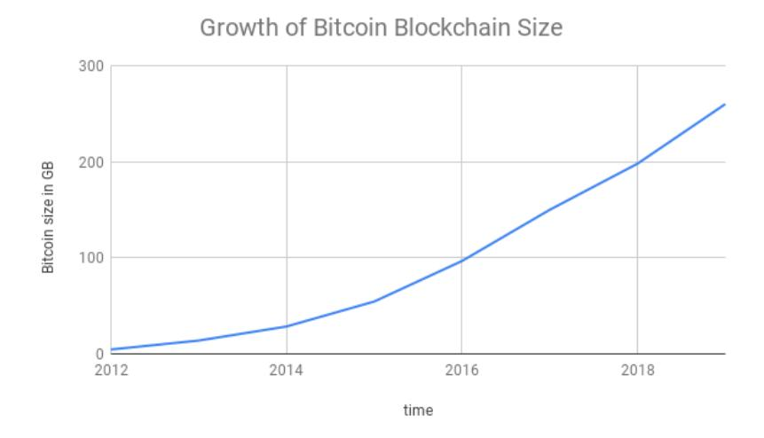
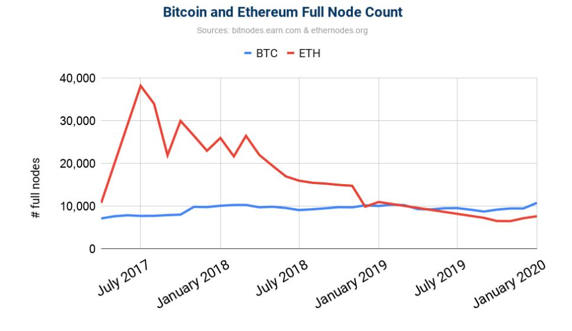
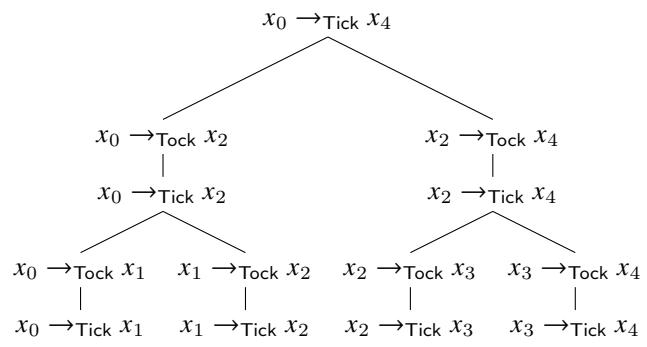
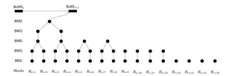
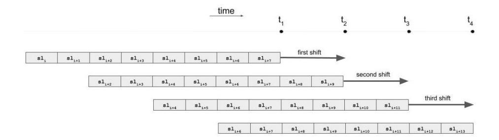
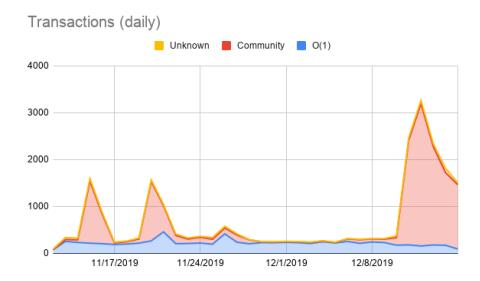
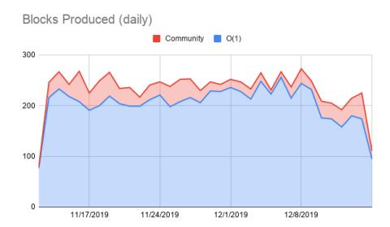
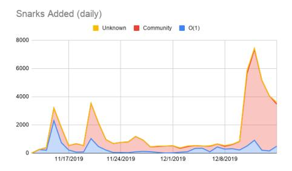

# Coda: Decentralized Cryptocurrency at Scale

Joseph Bonneau<sup>1</sup> , Izaak Meckler<sup>2</sup> , Vanishree Rao<sup>2</sup> , and Evan Shapiro<sup>2</sup>

> <sup>1</sup>New York University <sup>2</sup>O(1) Labs

#### Abstract

We introduce the notion of a succinct blockchain, a replicated state machine in which each state transition (block) can be efficiently verified in constant time regardless of the number of prior transitions in the system. Traditional blockchains require verification time linear in the number of transitions. We show how to construct a succinct blockchain using recursively composed succinct non-interactive arguments of knowledge (SNARKs). Finally, we instantiate this construction to implement Coda, a payment system (cryptocurrency) using a succinct blockchain. Coda offers payment functionality similar to Bitcoin, with a dramatically faster verification time of 200ms making it practical for lightweight clients and mobile devices to perform full verification of the system's history.

# 1 Introduction

Bitcoin and other distributed payment systems (also called cryptocurrencies or simply blockchains) aim to provide a decentralized system for making and verifying payments. However, for traditional cryptocurrencies, including Bitcoin, decentralization comes at the cost of scalability as each node needs to process the entire system history upon joining the network. Asymptotically, verifying a blockchain containing 𝑡 transactions requires 𝛺(𝑡) time (usually more than linear in 𝑡 as bookkeeping is required to resolve transaction references during verification). At the time of this writing, Bitcoin's blockchain is over 250 GB and contains over 500 M transactions (see Figure [1\)](#page-1-0). Downloading and verifying this history takes days on a typical laptop.

These resource requirements deter most users from running a full node that stores and verifies the blockchain. As seen in Figure [2,](#page-1-1) the number of full nodes in Bitcoin is not growing despite its increasing popularity over time. Instead most users run a light node, verifying only block headers but not transactions, or an ultralight node verifying nothing and relying on trusted advice from a trusted server. This undermines decentralization as most clients rely on trust rather than independent verification. It also undermines performance: block size (and therefore transaction throughput) is artificially capped in part to mitigate the burden of verification.



<span id="page-1-0"></span>Figure 1: Growth of the Bitcoin blockchain over time, in GB. Source: [www.](www.blockchain.com) [blockchain.com](www.blockchain.com).



<span id="page-1-1"></span>Figure 2: Estimated number of full nodes participating in the Bitcoin and Ethereum networks over time. Source: <www.bitnodes.earn.com> and [www.](www.Ethernodes.org) [Ethernodes.org](www.Ethernodes.org).

In this work, our goal is to design a decentralized payment system that offers efficient verification of system history from genesis without relying on any external advice. Specifically, we aim to provide verification time constant (𝑂(1)) in the number of transactions; we call such a blockchain, a succinct blockchain.

We achieve this goal by including succinct proofs of state validity in each block. Generically, it is possible to compute a succinct non-interactive argument of knowledge (a SNARK) of any NP statement, including for example that the system stated committed to by the current block in a blockchain can be reached from a the genesis state by a series of valid transactions in the system. This (large) list of transactions is a witness that the current block is valid. However, computing a new proof of validity of the entire system history for each block would be prohibitively expensive. Instead, we employ techniques from incrementally computable SNARKs to ensure that the cost of computing a proof for each block is proportional only to the number of transactions added since the previous block.

We instantiate the notion of a succinct blockchain and introduce the Coda protocol. Coda is a payment-oriented blockchain offering similar functionality to Bitcoin, although with different transaction semantics. In particular, Coda uses an account-based model (as in Ethereum [\[25\]](#page-45-0)) (instead of the UTXO model as in Bitcoin[\[19\]](#page-45-1) and others [\[20\]](#page-45-2)), wherein the current state of the blockchain is a list of all account balances rather than a list of unspent coins (UTXOs).

Each block contains a commitment to this state (in a Merkle tree) and not the entire state. Therefore a full node need not store the entire state, but can verify account balances efficiently given only the state commitment in the latest block header. However, a prover in our system (roughly equivalent to a miner in Bitcoin) does needs to store the full state since it is part of the witness when proving the validity of new blocks.

For the consensus protocol of Coda, we present the first provably-secure proof-of-stake (PoS) consensus protocol for succinct blockchains called Ouroboros Samasika. Note that an off-the-shelf consensus mechanism is not necessarily compatible with a succinct blockchain framework, since the way consensus is achieved when there are multiple contending chains could relying on arbitrary transaction history, forcing nodes to store the entire transaction history. In fact, this is a natural approach for consensus mechanisms, since the information needed to tell apart an honest chain from a dishonest one is likely to involve details at the point of the fork; since it is possible for a party to learn about a fork long after it occurred, it may need to store the entire history to assist in the chain selection process. This is indeed the case in the known PoS consensus mechanisms [\[17,](#page-45-3) [13,](#page-45-4) [4\]](#page-44-0). Furthermore, other PoS consensus mechanisms rely on a trusted external advice for bootstrapping [\[12\]](#page-44-1).

Concretely, in our current implementation, a state proof size is just and it takes around 200ms to verify it. Thus, any device that can support this level of computation, such as the current smartphones, can verify the current state of the system with no trusted advice.

Beyond incrementally computable SNARKs, we employ multiple optimiza-

tions, the most significant of which is *parallel scan state*. At a high level, this improves transaction throughput beyond the limits of sequentially computed proofs. Roughly, the idea is to enqueue all the blocks that still need to be absorbed into a proof and distribute their proving across parallel provers. We also introduce a special queue of recent transactions to reduce transaction confirmation latency below the limits imposed by minimum proving times. Furthermore, we introduce a special incentive structure to maximizing prover participation in the network.

### 1.1 Our Contributions

In summary, our contributions are:

- We formalize the notion of a *succinct blockchain*. This notion may be of independent interest for alternative constructions of succinct blockchains.
- We present an approach to constructing a succinct blockchain for generic functionalities modeled as replicated state machines using incrementallycomputable SNARKs.
- We present a concrete implementation of our approach for the specific functionality of a payments system called Coda.
- We present Ouroboros Samasika, a provably-secure PoS consensus protocol that is adaptively secure and offers bootstrapping from genesis.
- We introduce the notion of a parallel scan state to improve transaction confirmation time beyond the limits otherwise imposed by the proof construction.
- We present a performance evaluation report of executing the protocol involving a public community.

### 2 Succinct Blockchains

In this section, we introduce the notion of succinct blockchains.

Underlying concepts of a blockchain. We begin by recalling definitions of certain underlying concepts of a blockchain [13]. This will assist in defining succinct blockchains.

**Definition 2.1** (State, Block Proof, Block Producer, Block, Blockchain, Genesis Block). A state is a string st  $\in \{0,1\}^{\lambda}$ . A block proof is a value (or a set of values)  $\pi_i^B$  containing information to verify whether the block is valid. Each block is associated with a unique party called its block producer. A block  $B_i = (\operatorname{sn}_i, \operatorname{st}_i, \pi_i^B, d_i, \operatorname{b-pk}_i, b\operatorname{-sig}_i)$  generated with a serial number  $\operatorname{sn}_i \in \mathbb{N}$  contains the current state  $\operatorname{st}_i$ , a block proof  $\pi_i^B$ , data  $d_i \in \{0,1\}^*$ , the block producer's public key  $\operatorname{b-pk}_i$  and a signature  $\operatorname{b-sig}_i$  on  $(\operatorname{sn}_i, \operatorname{st}_i, \pi_i^B, d_i)$  with respect to  $\operatorname{b-pk}_i$ .

A blockchain is a sequence of blocks  $C = (B_1, ..., B_n)$  associated with a strictly increasing sequence of serial numbers. The first block  $B_1$  is called the genesis block. The length len(C) = n of a blockchain is the number of blocks in it.

Succinct blockchains. We are now ready to introduce the definition of a succinct blockchain protocol. The definition will also introduce the notion of a blockchain summary, which, at a high level, is some summary of a blockchain such that the summary is valid if and only if the blockchain is valid. The concept of a blockchain underlying a blockchain summary will not be evident from the definition of a succinct blockchain protocol itself. However, it will be captured via the notion of chain extractability in Definition 2.4.

**Definition 2.2** (Succinct Blockchain Protocol). A succinct blockchain protocol  $\Pi$  is characterized by a tuple of five PPT algorithms (VerifyConsensus, UpdateConsensus, VerifyBlock, UpdateChain, VerifyChain) syntactically defined as follows.

- VerifyConsensus(consensusState, consensusProof)  $\to \top/\bot$ : This algorithm takes as input a consensusState and a consensusProof, verifies according to some notion of correctness and outputs  $\top$  or  $\bot$ , respectively.
- UpdateConsensus(consensusState, consensusProof) → nextConsensusState : This algorithm also takes as input a consensusState and a consensusProof and outputs an updated consensus state.
- VerifyChainSummary( $S_i$ )  $\to \top/\bot$ : This algorithms verifies whether a given blockchain summary  $S_i$  is valid or not.
- VerifyBlock $(S_{i-1}, B_i) \to \top/\bot$ : This algorithms verifies whether a given block  $B_i$  is valid with respect to a given blockchain summary  $S_{i-1}$ . As a part of the verification, it checks that VerifyConsensus(consensusState<sub>i-1</sub>, consensusProof<sub>i</sub>  $\to \top$ , where,  $S_{i-1}$  contains consensusState<sub>i-1</sub> and  $\pi_i^B$  contains consensusProof<sub>i</sub>, where,  $B_i = (\cdot, \cdot, \pi_i^B, \cdot, \cdot, \cdot)$ .
- UpdateChainSummary  $(S_{i-1}, B_i) \to S_i$ : This algorithm takes a blockchain summary  $S_{i-1}$  and a new block  $B_i$  and outputs an updated blockchain summary  $S_i$ .

The protocol satisfies the following succinctness property.

**Succinctness.** Each of the algorithms VerifyBlock, VerifyChainSummary, and VerifyConsensus runs in time  $poly(\lambda)$ . Furthermore, the size of the blockchain summary  $S_i$  at any time  $t_i$  is of size  $poly(\lambda)$  (i.e., constant in the number of chain summary updates).

**Remark 2.1** (Consensus mechanism). The algorithm pair (VerifyConsensus, UpdateConsensus) is said to constitute a consensus mechanism. The following

are some examples of how the notion can be instantiated. For proof-of-work protocols (e.g. Bitcoin), the consensus state would contain several previous difficulty targets and block times (from which to compute the current difficulty target) and a consensus proof would contain the proof-of-work itself along with a new time to update the state with. For an Ouroboros Praos-style [\[13\]](#page-45-4) proof-ofstake mechanism, the consensus state would contain the current random seed, the (Merkle root of) the current epoch's stakes, and some information about the previous blocks and block times. A consensus proof would contain a public-key and a verifiable random function (VRF) evaluation proof meeting the threshold target corresponding to that public-key and the stakes indicated in the consensus state.

Types of Roles. Per the above definition, there are three kinds of roles in a succinct blockchain. (There can be additional roles depending on the instantiation.)

- 1. Full node: In this role, a party keeps track of the blockchain summary and verifies it.
- 2. Block producer: In this role, a party produces a block.
- 3. Blockchain summary producer: In this role, a party generates blockchain summaries.

Note that the significant advantage of a succinct blockchain is that any party with reasonable resources can be a full node, due to the succinctness property. That is, a succinct blockchain does not require the role of light clients to cope with growing blockchain sizes.

# Relationship between blockchain summary and underlying blockchain.

Having defined a succinct blockchain in terms of blockchain summaries, we will now show how the summaries are related to the underlying blockchains. Roughly speaking, we would like that the blockchain summaries inherit validity of underlying blockchains. That is, a summary is valid if and only if the underlying blockchain is valid.

Furthermore, given a blockchain summary, we arrive at its underlying blockchain through the notion of extractability. Specifically, we define extraction recursively; that is, given a blockchain summary with serial number 𝑖, an extractor (using some additional information) extracts a blockchain summary with serial number 𝑖 − 1 and a block 𝐵<sup>𝑖</sup> , wherein all the components satisfy the necessary verification tests. The additional information the extractor uses is the execution transcript which we call the execution trace formally defined below.

Definition 2.3 (Execution Trace, Blockchain Summary in an Execution Trace). For an (adaptive) adversary A and an environment Z, an execution trace E of a blockchain protocol 𝛱 by a set of parties U with security parameter 𝜆 is a transcript including the inputs provided by Z, the random coins of the parties and the random coins of the adversary. This data determines the entire dynamics of the protocol: messages sent and delivered, the internal states of the parties at each step and the set of corrupt parties at each step. We denote the trace by  $\mathcal{E} \leftarrow \Pi(1^{\lambda}, \mathcal{U})$  or simply  $\mathcal{E} \leftarrow \Pi(\mathcal{U})$ .

For every blockchain protocol  $\Pi$ , there exists an algorithm CurrChain, such that for every set of PPT parties  $\mathcal{U}, \mathcal{E} \leftarrow \Pi(\mathcal{U})$ , time t, honest party  $P \in \mathcal{U}$ , we have that CurrChain outputs a valid blockchain summary; i.e., CurrChain( $\mathcal{E}, P, t$ )  $\rightarrow \mathcal{S}$  and VerifyChainSummary( $\mathcal{S}$ )  $\rightarrow \top$ .  $\mathcal{S}$  is said to be the blockchain summary in P's view of  $\mathcal{E}$  at time t. A blockchain summary in an execution trace  $\mathcal{E}$  is a blockchain summary C in any honest party's view at any time t; we denote this by  $\mathcal{S} \in \mathcal{E}$ .

We will now define the notion of chain extractability. This definition utilizes a notion of 'serial number of a blockchain summary'. Intuitively, it is just a natural number j that represents the number of blocks in the underlying blockchain. It is indicated in the subscript as  $S_j$ .

<span id="page-6-0"></span>**Definition 2.4** (Chain Extractability). A succinct blockchain protocol  $\Pi$  = (VerifyConsensus, UpdateConsensus, VerifyBlock, UpdateChain, VerifyChain) is said to satisfy chain extractability if the following probability  $\mathsf{Adv}_{\Pi,\mathcal{U}}(1^{\lambda})$  is negligibly close to 1 for every  $\mathcal{U} = \{\mathcal{A}_i\}_i$ , a set of PPT algorithms. For every  $\mathcal{A}_i$ , there exists a PPT algorithm  $\mathsf{Ext}_{\mathcal{A}_i}$ , called an extractor, and  $\mathsf{Adv}_{\Pi,\mathcal{U}}$  is defined as follows.

$$\mathsf{Adv}_{\Pi,\mathcal{U}}(1^{\lambda}) := \Pr \begin{bmatrix} \mathsf{VerifyChainSummary}(\mathcal{S}_{j-1}) = \top \\ \land \\ \mathsf{VerifyBlock}(\mathcal{S}_{j-1}, B_j) = \top \\ \land \\ & \land \\ & \mathsf{B}_1 \text{ is a Genesis block} \\ \land \\ & \land \\ & \mathsf{S}_0 \text{ is an empty string} \end{bmatrix} = \top \\ & \mathcal{E} \leftarrow \Pi(\mathcal{U}) \\ & : \forall \mathcal{S}_j \in \mathcal{E}, \exists \mathcal{A}_i \in \mathcal{U} \\ & (\mathcal{S}_{j-1}, B_j) \leftarrow \mathsf{Ext}_{\mathcal{A}_i}(\mathcal{E}, \mathcal{S}_j, r) \\ & \land \\ & \mathcal{S}_0 \text{ is an empty string} \end{bmatrix}$$

where, r is the random coins of  $\mathcal{A}_i$ .

**Definition 2.5** (Blockchain underlying a Blockchain Summary). Let  $\Pi$  be a blockchain protocol which satisfies chain extractability. Let  $\mathcal{E}$  be an execution of the protocol by a set of parties  $\mathcal{U}$ . Let  $P \in \mathcal{U}$  be an honest party that has been active since the beginning of the protocol. Let  $\mathcal{S}_{\ell}$  be the blockchain in  $\mathcal{E}'$ . For every  $1 \leq i \leq \ell$ , let  $B_i$  be a block guaranteed by the property of chain extractability. The sequence  $(B_1, \ldots, B_{\ell})$  is called the blockchain underlying  $\mathcal{S}_{\ell}$ .

#### 2.1 Security Properties of a Succinct Blockchain

We will now enlist the security properties of a succinct blockchain. Rather than the blockchain summaries, the properties pertain to the underlying blockchain guaranteed by the chain extractability property.

Consider a blockchain protocol  $\Pi$  and an execution  $\mathcal{E}$ . Let  $\mathcal{C}$  be the underlying blockchain of the blockchain summary  $\mathcal{S}$  in  $\mathcal{E}$ . We recall the following

properties that were first rigorously formulated in [15]. We will assume that time is divided into predefined slots.

- Common Prefix (CP); with parameters  $k \in \mathbb{N}$ . The blockchains  $C_1, C_2$  corresponding to two alert parties at the onset of the slots  $\mathsf{sl}_1 \leq \mathsf{sl}_2$  are such that  $C_1^{\lceil k} \preccurlyeq C_2$ , where  $C_1^{\lceil k}$  denotes the blockchain obtained by removing the last k blocks from  $C_1$  and  $\preccurlyeq$  denotes the prefix relation.
- Chain Growth (CG); with parameters  $\tau \in (0,1]$  and  $s \in \mathbb{N}$ . Consider C, a blockchain possessed by an alert party at the onset of a slot sl. Let  $\mathsf{sl}_1$  and  $\mathsf{sl}_2$  be two previous slots for which  $\mathsf{sl}_1 + s \le \mathsf{sl}_2 \le \mathsf{sl}$ , so  $\mathsf{sl}_1$  is at least s slots prior to  $\mathsf{sl}_2$ . Then  $|C[\mathsf{sl}_1,\mathsf{sl}_2]| \ge \tau \cdot s$ . We call  $\tau$  the speed coefficient.
- Chain Quality (CQ); with parameters  $\mu \in (0, 1]$  and  $k \in \mathbb{N}$ . Consider any portion of length at least k of the blockchain corresponding by an alert party at the onset of a slot; the ratio of blocks originating from alert parties in this portion is at least  $\mu$ , called the chain quality coefficient.

### <span id="page-7-0"></span>3 Preliminaries

In this section we provide several requisite definitions of SNARK systems which we use to construct a succinct blockchain.

**Notations.** We use the abbreviation PPT to stand for probabilistic polynomial time. We use  $\lambda$  to denote the security parameter.

**Definition 3.1** (SNARKs). Let  $R = \{(\phi, w)\}$  be a polynomial relation of statements  $\phi$  and witnesses w. A Succinct Non-interactive Argument of Knowledge for R is a quadruple of algorithms (sSetup, sProve, sVerify, sSim), which is complete, succinct and knowledge sound (defined below) and works as follows:

- $(srs, \tau) \leftarrow sSetup(R)$ : The setup algorithm generates the structured random string srs and a trapdoor  $\tau$ .
- $\pi \leftarrow \mathsf{sProve}(\mathsf{srs}, \phi, w)$ : the prover algorithm generates a proof  $\pi$ .
- $\top/\bot \leftarrow \mathsf{sVerify}(\mathsf{srs}, \phi, \pi)$ : the verifier algorithm verifies a given proof.
- $\pi \leftarrow \mathsf{sSim}(\mathsf{srs}, \phi, \tau)$ : the PPT simulator simulates a proof without the witness but by using the trapdoor.

**Completeness.** It simply states that given a true statement, a prover with a witness can convince the verifier. That is, for every  $(srs, \tau) \leftarrow \mathsf{sSetup}(R)$  and  $\pi \leftarrow \mathsf{sProve}(srs, \phi, w)$ , we have that  $\top \leftarrow \mathsf{sVerify}(srs, \phi, \pi)$ .

**Succinctness.** It states that the proof size  $|\pi|$  is  $poly(\lambda)$ .

**Knowledge soundness.** It states that whenever somebody produces a valid argument it is possible to extract a valid witness from their internal data. Formally, for every PPT adversary  $\mathcal{A}$ , there exists a PPT extractor  $\chi_{\mathcal{A}}$ , such that the following probability is negligible in  $\lambda$ :

$$\Pr\begin{bmatrix} (\operatorname{srs}, \tau) \leftarrow \mathsf{sSetup}(R) & (\phi, w) \notin R \\ (\phi, \pi) \leftarrow \mathcal{A}(\operatorname{srs}) & : & \land \\ w \leftarrow \chi_{\mathcal{A}}(\operatorname{trans}_{\mathcal{A}}) & \mathsf{sVerify}(\operatorname{srs}, \phi, \pi) \to \top \end{bmatrix}$$

**Simulation-extractable SNARKs.** A simulation-extractable SNARK is a SNARK that achieves a higher level of security, namely, simulation extractability. The notion of simulation extractability is similar to the notion of knowledge soundness except that an adversary gets to see also simulated proofs.

Signatures of Knowledge (SoK). An SoK is a generalization of digital signatures by replacing a public key with an instance in an NP language. For a formal definition, see [16]. The notion of SoKs is related to the notion of simulation-extractable non-interactive zero-knowledge arguments, such as, SNARKs. In fact, [16] showed that the former can be constructed based on the latter. In this work, we rely on SoKs constructed using SNARKs, thereby being able to exploit succinctness of such SoKs.

# 4 Coda: A Succinct Blockchain based on Recursive SNARKs

In this section, we introduce a succinct blockchain construction called **Coda** based on SNARKs. At a high-level, validity of a blockchain's sequence of transitions is proved using a SNARK. Then, the blockchain proof consists of this SNARK and omits the detailed list of blocks, since verifying the SNARK verifies the embedded blocks. Succinctness of SNARK ensures succinctness of the blockchain.

Note that a blockchain is dynamic and new blocks keep getting added to it. However, we would like to ensure succinctness at any given point in time. Therefore, as the blockchain "grows", we compute a new SNARK proof that not only validates the new blocks, but also the existing SNARK proof itself. The notion of a SNARK proof that attests to the verifiability of another SNARK proof is the notion of "incrementally-computable SNARK" [24, 8, 6].

We will first specify the SNARK construction and then demonstrate how it can be employed to achieve a succinct blockchain.

#### 4.1 Incrementally-computable SNARKs

We now recall the notion of incrementally-computable SNARKs described variously in [24], [8] and [6]. Instead of phrasing the construction in the language

of incrementally verifiable computation as in [24] or in the language of PCD (proof-carrying data) systems as in [8] and [6], we opt to describe it in terms of state-transition systems as it maps more clearly onto the application of producing a succinct blockchain.

We will first recall the definition of a state transition system.

**Definition 4.1** (State transition system). A state transition system is a tuple  $(\Sigma, T, \text{Update})$ , where  $\Sigma$  is the set of states, T is the set of transitions and Update is a (non-deterministic) poly-time computable function Update:  $T \times \Sigma \to \Sigma$ . Update may also "throw an exception" (i.e., fail to produce a new state for certain inputs). Moreover, elements in  $\Sigma$  and T need to be representable by bit-strings of length  $\mathsf{poly}(\lambda)$ .

We now define SNARKs for state transition systems. At a high level, we would like  $\operatorname{poly}(\lambda)$ -size proofs (which are verifiable in  $\operatorname{poly}(\lambda)$  time) which attest to statements of the form "there exist a state  $\sigma_1$  and a sequence of transitions  $t_1,\ldots,t_k\in T$  such that  $\operatorname{Update}(t_k,\operatorname{Update}(t_{k-1},\ldots,\operatorname{Update}(t_1,\sigma_1)))=\sigma_2$ ". In other words, we would like succinct certificates of the existence of state-transition sequences joining two states. The application to blockchains is the following: we will take our state to be the database of accounts (along with some metadata needed for correctly validating new blocks) and transitions to be blocks.

**Definition 4.2** (Incrementally-computable SNARKs). An incrementally-computable SNARK for a state transition system  $(\Sigma, T, Update)$  is a tuple of algorithms (sSetup, sProve, sVerify, sSim) such that the following holds. Suppressing parameter generation and passing the parameters to sProve and sVerify,

1. (sSetup, sProve, sVerify, sSim) is a SNARK. (sSetup, sProve, sVerify, sSim) is a SNARK for the relation  $R = \{(\sigma_{i+k}), \sigma_i, t_{i+1}, \dots, t_{i+k})\}$ , where,  $\sigma_{i+k} = \text{Update}(t_{i+k}, \text{Update}(t_{i+k-1}, \dots, \text{Update}(t_{i+1}, \sigma_i)))$  for any k.

<span id="page-9-0"></span>2. (sSetup, sProve, sVerify, sSim) is succinct.

Every honestly generated proof has size  $poly(\lambda)$  and for any  $\pi$ ,  $\sigma$ , we have that  $sVerify(\sigma, \pi)$  runs in time  $poly(\lambda)$ .

# <span id="page-9-1"></span>4.1.1 Incrementally-computable SNARKs using Recursive Proof Composition

Naïve recursive composition is theoretically viable, since, for a SNARK, proof verification is asymptotically cheaper than merely verifying the corresponding NP statement. However, it is extremely expensive. Although SNARK verifiers execution is quite fast – in the order of just a few milliseconds on a desktop computer, generating a SNARK proof to attest to an accepting verifier circuit is expensive. This is because, executing the verifiers still takes millions of steps

in computation, proving which is impractical even for a single layer of recursion, as explained in [\[6\]](#page-44-3).

To address this, we employ the "cycle of elliptic curves" technique (as described in [\[6\]](#page-44-3)) in which two SNARK constructions – classically called Tick and Tock – are designed such that each can efficiently verify proofs from the other. Then, to exploit the parallelism mentioned in Remark ??, we define the Tick and Tock SNARKs to result in a "binary tree of proofs" as follows. A Tick SNARK is used to certify state transitions at the "base" of the tree. Then, to enable efficient merging of those proofs, each of them is "wrapped" using a Tock SNARK. Then, two Tock proofs are merged using a Tick SNARK.

Therefore, note that, we will need two Tick SNARKs - one for proving state transitions and another for merging two Tock proofs. And we will need one Tock SNARK to wrap a Tick proof into a Tock proof. More formally:

1. The base SNARK. A Tick-based SNARK for certifying single state transitions, which we will call the "base" SNARK.

Statement: (σ1, σ2) ∈ 𝛴 2 .

Witness: 𝑡 ∈ T.

Computation: There exists 𝑡 ∈ T such that Update(𝑡, σ1) = σ2.

We will denote the proof by σ<sup>1</sup> →Tick σ2.

2. The merge SNARK. A Tick-based SNARK for merging two Tock proofs, which we will call the "merge" SNARK.

Statement: (σ1, σ3) ∈ 𝛴 2 .

Witness: σ<sup>2</sup> ∈ 𝛴 and Tock-proofs 𝜋1, 𝜋2.

Computation: There exist σ<sup>2</sup> ∈ 𝛴 and Tock-proofs 𝜋1, 𝜋<sup>2</sup> such that VerifyTock ( (σ1, σ2), 𝜋1) and VerifyTock ( (σ2, σ3), 𝜋2)

We will denote the proof by σ<sup>1</sup> →Tick σ3. σ<sup>1</sup> to σ<sup>2</sup> and a SNARK proof certifying the existence of transitions from σ<sup>2</sup> to σ3.

3. The wrap SNARK. A Tock-based SNARK for wrapping a Tick proof, which we will call the "wrap" SNARK.

Statement: (σ1, σ2) ∈ 𝛴 2 .

Witness: A Tick proof 𝜋.

Computation: There exists a Tick proof 𝜋 such that VerifyTick ( (σ1, σ2), 𝜋).

We will denote the proof by σ<sup>1</sup> →Tock σ2.This SNARK merely wraps a Tick SNARK into a Tock SNARK so that another Tick SNARK can verify it efficiently.

#### <span id="page-10-0"></span>4.1.2 An example transition system

To illustrate this, we'll show how it can be applied to prove statements in a very simple transition system where each state is simply the hash H of the previous state. Assume the current state is  $x' = \underbrace{\mathsf{H}(\mathsf{H}(\ldots\mathsf{H}(x)\ldots))}_{k}$  for some k, starting

from an initial state x. We apply the above technique with our state  $\Sigma$  being the union of domain and range of H, T being a singleton set containing an empty string, and the update function being Update(t,x) = H(x).

This gives us a SNARK for proving that there exists a sequence of transitions  $(t_1, \ldots, t_k)$  such that  $\operatorname{Update}(t_k, \operatorname{Update}(t_{k-1}, \ldots, \operatorname{Update}(t_1, x), \ldots)) = x'$ , which since  $\operatorname{Update}(t, y) = \operatorname{H}(y)$  gives us exactly what we want. For strings  $x_0, x_4$  with  $\operatorname{H}(\operatorname{H}(\operatorname{H}(x_0))) = x_4$ , the tree of SNARK proofs appears as follows:



## 4.2 CODA: A Succinct Blockchain Using Incrementallycomputable SNARKs

In this section, we present the Coda protocol, a succinct blockchain based on incrementally-computable SNARKs. Intuitively, blockchain updates can be seen as a state transition system, and thus incrementally-computable SNARKs (which are simply SNARKs for state transition systems) can enable the construction of succinct blockchains.

#### 4.2.1 Our Construction

In this section, we present the Coda protocol. Specifically, we discuss the details for generic Turing-complete functionalities that transform a database. Then, in Section 5, we will instantiate the protocol with the payments functionality.

At a high level, we will treat a blockchain as a state transition function. Consider, for example, a UTXO (Unpaid Transaction Output) model wherein every party has an 'account' with some 'balance', like in Bitcoin. The state of the blockchain is a database (such as a Merkle tree) of all the account balances. A transition is transfer of some part of the balance from one account to another account. While this is just an example, our protocol is generic and considers any state set  $\Sigma'$  and a Turing-complete transition function Update' with some transition set T'; that is, we begin with  $(\Sigma', T', Update')$ .

Then, the Coda protocol for  $(\Sigma', T', Update')$  is constructed as follows. We employ our consensus protocol, namely Ouroboros Samasika, that we present in Section 7. We will combine  $(\Sigma', T', Update')$  and the consensus protocol

to construct a new state transition system  $(\Sigma, T, Update)$ , mainly to subsume consensus verification in the update function. An incrementally-computable SNARK for  $(\Sigma, T, Update)$  is employed and the proofs attest to the current state being computed correctly. The blockchain summary simply consists of the state in  $\Sigma$  and the proof. A blockchain summary producer will just be a prover and a full node will only need to perform proof verification to verify the blockchain correctness.

Having described the protocol at an intuitive level, we will now discuss the details. Given  $(\Sigma', T', Update')$  and a collision-resistant hash function H, the protocol components are as follows.

#### The Coda Protocol

The Coda protocol has the following components.

- Consensus mechanism (UpdateConsensus, VerifyConsensus): The consensus mechanism is the Ouroboros Samasika protocol that we present in Section 7. In Ouroboros Samasika VerifyConsensus runs in time  $poly(\lambda)$ , as required.
- Blocks: Consider a transition  $t_i' \in Tau'$  that acts on a state  $\sigma_{i-1}'$ . The corresponding block  $B_i = (\operatorname{sn}_i, \operatorname{st}_i, \pi_i^B, d_i, \operatorname{b-pk}_i, b\operatorname{-sig}_i)$  is constructed with  $\operatorname{st}_i = \sigma_{i-1}'$ ,  $\pi_i^B = \operatorname{consensusProof}_i$  and  $d_i = t_i'$ .
- State transition system for SNARK: Consider the state transition system  $(\mathcal{L}, T, Update)$  defined as follows:  $\mathcal{L} = \{H(\sigma'), consensusState\}_{\sigma' \in \mathcal{L}', consensusState}$ . A transition is a block. The function  $Update(B_i, \sigma_{i-1})$  verifies if  $H(st_i) = \sigma_{i-1}$ , the signature verifies in the block verifies and that  $VerifyConsensus(consensusState_{i-1}, consensusProof_i)$ , where  $consensusState_{i-1}$  is part of  $\sigma_{i-1}$  and  $\pi_i^B$  contains  $consensusProof_i$ .
- Blockchain summary: The blockchain summary consists of a state in  $\Sigma$  and a proof snark<sub>i</sub>.
- VerifyChainSummary( $S_{i-1} = (\sigma_i, \operatorname{snark}_i)$ ): As mentioned earlier, this algorithm simply verifies the proof  $\operatorname{snark}_i$  against the statement  $\sigma_i$ .
- VerifyBlock( $S_{i_1}, B_i$ ): This algorithm, simply checks the consistencies, namely, verifying consensus, verifying signature and verifying that the state in  $S_{i_1}$  is the hash of the state in the block.
- UpdateChainSummary( $S_{i-1}, B_i$ ): Let  $S_{i-1} = (\sigma_{i-1}, \operatorname{snark}_{i-1})$ . This algorithm runs the Update function as Update( $B_i, \sigma_{i-1}$ ) to obtain  $\sigma_i$ . Then, it verifies the proof  $\operatorname{snark}_{i-1}$ . Finally, it runs the prover to obtain the new proof  $\operatorname{snark}_i$ .

Figure 3: The Coda protocol.

<span id="page-13-2"></span>**Remark 4.1.** We assume that the length of the blockchain does not affect chain extractability, because no evidence suggests otherwise for the constructions of SNARKs that we use, as also noted in [7].

# <span id="page-13-0"></span>5 The Coda Protocol for Payments

In this section, we will focus on the payments application, where each party has an account with some balance and a transaction moves a part of its balance to a different party's account.

In the following, we will first specify the payments application framework followed by the underlying SNARK construction and then present the Coda protocol for payments.

#### <span id="page-13-1"></span>5.0.1 Coda's Framework for Payments

Let  $\mathcal U$  be a set of parties. The framework consists of the following notions.

- Accounts. Every party is said to have an account characterized by (pk, balance, nonce), with pk the party's public key for authorizing payments,  $balance \in \mathbb{N}$ , and  $nonce \in \mathbb{I}$  which functions to prevent transaction replay.
- $\bullet$  Ledger. We define a ledger as the list of all the accounts. We will refer to a party's account by L(pk) and the fields of the account, such as balance, by L(pk).balance.
- Transaction. A transaction is a transfer of value amt from a Sender's account  $L(pk_s)$ .balance to a Receiver's account  $L(pk_r)$ .balance. It is represented as  $txn = (pk_s, pk_r, amt, nonce_s, sig_s)$ , where  $pk_s, pk_r$  are the Sender's and the Receiver's public keys, respectively, nonce\_s is the nonce in the Sender's account and  $sig_s$  is a signature on  $(pk_r, amt, nonce_s)$  by the Sender.
- Transaction verification. Given a transaction txn and a ledger L, the following algorithm verifies validity of the transaction.

```
\begin{aligned} & \text{VerifyTransaction}(\text{txn} = (\text{pk}_s, \text{pk}_r, \text{amt}, \text{nonce}_s, \text{sig}_s), \textbf{L}); \\ & \text{assert} \quad (\textbf{L}(\text{pk}_s).\text{balance} \geq \text{amt}); \\ & \text{assert} \quad (\textbf{L}(\text{pk}_s).\text{nonce} = \text{nonce}_s); \\ & \text{assert} \quad (\text{VerifySig}(\text{pk}_s, (\text{pk}_r, \text{amt}, \text{nonce}_s), \text{sig}_s) = \top); \\ & \text{return} \ \top \end{aligned}
```

• Ledger update. Given a ledger L and a set of transactions  $\{txn = (pk_s, pk_r, amt, nonce_s, sig_s)\}$ , the following algorithm processes the set by updating the ledger.

```
\begin{split} & \overline{\text{UpdateLedger}(\mathsf{L}, \{\text{txn}\}):} \\ & \forall \text{txn} \in \{\text{txn}\} \\ & - \mathsf{L}(\mathsf{pk}_s).\text{balance} \leftarrow \mathsf{L}(\mathsf{pk}_s).\text{balance} - \text{amt};} \\ & - \mathsf{L}(\mathsf{pk}_r).\text{balance} \leftarrow \mathsf{L}(\mathsf{pk}_r).\text{balance} + \text{amt};} \\ & - \mathsf{L}(\mathsf{pk}_s).\text{nonce} \leftarrow \mathsf{L}(\mathsf{pk}_s).\text{nonce} + 1;} \\ & \text{return } \mathsf{L} \end{split}
```

#### 5.0.2 The SNARK

We will now describe the incrementally-computable SNARK  $\mathcal{S}$  used for constructing our succinct blockchain. Recall that a state transition system characterizes an incrementally-computable SNARK (cf. Definition 4.2).  $\mathcal{S}$  is specified in Figure 4.

#### SNARK S

Let H be a collision-resistant hash function. S is defined as an incrementally-computable SNARK for the following state transition system ( $\Sigma$ , T, Update):

- $\Sigma$  is the set  $\{\sigma\}_i$  of pairs of ledger hash values and consensus states  $\{(\text{ledgerHash}_i, \text{consensusState}_i)\}.$
- T is the set of blocks  $B_i$  is of the form  $(i, \mathsf{L}_{i-1}, \operatorname{consensusProof}_i, \{\operatorname{txn}_j\}_j, \operatorname{b-pk}_i, b-\operatorname{sig}_i)$ ,  $\{\operatorname{txn}_j\}_j$  is a set of transactions and  $\operatorname{b-pk}_i$  is a public key for verifying the signature  $b-\operatorname{sig}_i$ .
- The function Update $(t_i, \sigma_{i-1}) \to \sigma_i$  is defined as follows: Update $(t_i, \sigma_{i-1}) \to \sigma_i$ :

```
assert (VerifyTransaction(txn<sub>j</sub>, L<sub>i-1</sub>) = \top), \foralltxn<sub>j</sub>; assert (ledgerHash<sub>i-1</sub> = \mathsf{H}(\mathsf{L}_{i-1})); assert (VerifyConsensus(consensusState<sub>i-1</sub>, consensusProof<sub>i</sub>) = \top); assert (VerifySig(b-pk<sub>i</sub>, m, b-sig<sub>i</sub>) = \top), where m = (i, \mathsf{L}_{i-1}, \text{consensusProof}_i, \{\text{txn}_j\}_j); \mathsf{L}_i \leftarrow \mathsf{UpdateLedger}(\mathsf{L}_{i-1}, \{\text{txn}_j\}_j); ledgerHash<sub>i</sub> \leftarrow \mathsf{H}(\mathsf{L}_i); consensusState<sub>i</sub> \leftarrow \mathsf{UpdateConsensus}( consensusState<sub>i-1</sub>, consensusProof<sub>i</sub>); return \sigma_i \leftarrow (\text{ledgerHash}_i, \text{consensusState}_i)
```

<span id="page-14-0"></span>Figure 4: The underlying SNARK S.

#### 5.0.3 Our Construction

Let (Verify Consensus, Update Consensus) be the Ouroboros Samasika consensus mechanism. Let  ${\sf H}$  be a collision-resistant hash function. The Coda protocol is defined as follows.

### The Coda Protocol for Payments

The Coda protocol for payments, defined in the framework from Section 5.0.1, is based on the SNARK in Figure 4. It has the following components.

• A blockchain  $C_{i-1}$ . A blockchain consists of the hash of the current ledger, the current consensus state and a SNARK proof. That is,

```
C_{i-1} = (\mathrm{ledgerHash}_{i-1}, \mathrm{consensusState}_{i-1}, \mathrm{snark}_{i-1})
```

.

• **A block**  $B_i$ . Recall that a block in general is of the form  $B_i = (\operatorname{sn}_i, \operatorname{st}_i, \pi_i^B, d_i, \operatorname{b-pk}_i, b-\operatorname{sig}_i)$ , where  $\operatorname{sn}_i, \operatorname{b-pk}_i, b-\operatorname{sig}_i$  are serial number, block proposer's public key and a signature on  $(\operatorname{sn}_i, \operatorname{st}_i, \pi_i^B, d_i)$  by the block proposer, respectively.  $\operatorname{st}_i, \pi_i^B, d_i$  are specified as follows.

```
- \operatorname{st}_i = \mathsf{L}_{i-1};

- \pi_i^B = \operatorname{consensusProof}_i;

- d_i = \{ \operatorname{txn}_i \}_i.
```

The algorithms Verify Block, Update Chain, Verify Chain are defined as follows.

• VerifyBlock $(S_{i-1}, B_i) \to \top/\bot$ :

```
\begin{split} & \text{assert } (\mathsf{H}(\mathsf{L}_{i-1}) = \mathsf{ledgerHash}_{i-1}); \\ & \text{assert } (\mathsf{VerifyConsensus}(\mathsf{consensusState}_{i-1}, \\ & \mathsf{consensusProof}_i) = \top); \\ & \forall j \mathsf{assert } (\mathsf{VerifyTransaction}(\mathsf{txn}_j, \mathsf{L}_{i-1}) = \top); \\ & \text{assert } (\mathsf{VerifySig}(\mathsf{b\text{-}pk}_i, m, \mathsf{sig}_i) = \top), \\ & \quad \mathsf{where } m = (\mathsf{sn}_i, \mathsf{L}_{i-1}, \mathsf{consensusProof}_i, \{\mathsf{txn}_j\}_j) \\ & \mathsf{return} \ \top \end{split}
```

```
• UpdateChainSummary(S𝑖−1, 𝐵𝑖) → C𝑖
                                         :
            assign σ𝑖−1 ← (ledgerHash𝑖−1
                                          , consensusState𝑖−1);
            σ𝑖 ← Update(𝐵𝑖
                             , σ𝑖−1);
            snark𝑖 ← sProve(σ𝑖
                                , (σ𝑖−1, 𝑡𝑖));
            assign S𝑖 ← (σ𝑖
                            ,snark𝑖);
            return S𝑖
• VerifyChainSummary(S𝑖) → >/⊥:
               assign σ𝑖 ← (ledgerHash𝑖
                                         , consensusState𝑖);
               return sVerify(σ𝑖
                                ,snark𝑖)
```

Figure 5: The Coda protocol for payments.

# 6 Snark Workers

In this section, we will introduce two optimization techniques, namely, 'parallel scan state' and 'prover incentives'. They both target the following issue.

The issue. Observe from Figure [3](#page-13-2) that to compute S𝑖 , we need S𝑖−1. Thus, there is a sequential dependency for SNARK proof computation. As a result, a na¨ıve implementation suffers from a block time that is at least the time required to compute the proof. Furthermore, it suffers from high memory requirements for block proposers due to high transaction latency (where, transaction latency is the time required for a transaction to be summarized in a SNARK proof).

The solution. The goal is to design techniques that maximize the throughput. Specifically, our goal is to maximize the rate at which transactions can be processed and validated in the Coda protocol network. This enables more simultaneous users on the network.

### <span id="page-16-0"></span>6.1 Parallel Scan State

Recall that a raw chain of blocks is inherently sequential (i.e., cannot be parallelized in general). However, thanks to incremental computability of the SNARK, the SNARK work can be parallelized. This is the key observation that leads to the notion of a 'parallel scan state', where we decouple producing a block from computing SNARK proofs.

We maintain a special queue, called the work queue, where we enqueue new blocks as they are proposed. In other words, it is a queue of the 'SNARK work' to be performed by the network.

The network then computes the SNARK proofs in parallel; a tree of proofs is computed where the leaves correspond to the proofs proving validity of single blocks and the other proofs simply attest to the correctness of their children proofs. Finally, the root proof attests to correctness of all the blocks corresponding to the leaves of the tree. Consider, for example, a sequence of blocks 𝐵𝑖 , 𝐵𝑖+1, . . . , 𝐵<sup>𝑗</sup> in the work queue. The root proof attests to the validity of each of the blocks. This root proof can be combined with the SNARK proof for the validity of S𝑖−<sup>1</sup> to result in a SNARK proof that attests to the validity of S𝑗 . This is illustrated in Figure [6.](#page-17-0) Note that this tree, under the hood, works similarly to the example transition system described in Section [4.1.2.](#page-10-0)

<span id="page-17-0"></span>

Figure 6: A snapshot of a parallel scan state.

Observe that, by careful design of parallelism, we can ensure that the throughput completely keeps up with the rate transactions are added, which is optimal. While the transaction latency in the na¨ıve approach was 𝑂(𝑅), where 𝑅 is the rate at which blocks are produced, in the proposed approach, the transaction latency is 𝑂(log(𝑅)). With a careful designing of data structure, the storage requirement can be reduced from 𝑂(𝑅) in the na¨ıve approach to 2𝑅 − 1 + 𝑂(1) in the proposed approach; we will omit the details of the data structure [\[2\]](#page-44-5).

### 6.2 Incentivizing the Provers

A party that generates SNARK proofs is called a snarker. We will describe prover incentives with the goal of achieving lowest possible transaction latency (i.e., to minimize the time gap between when a block is produced and when it is absorbed in the blockchain's SNARK proof).

The proposed incentive structure is the following. Every block producer that pushes a block to the work queue is required to pop a block by generating a proof validating the block. It posts a fee request together with the SNARK proof it generates. It also includes a transaction in the same block that pays the fee to the prover that will compute the snark for that block. Typically, the fees are paid out from the transaction fees the block producer would otherwise receive.

In essence, there is a lowest-price auction for each piece of SNARK work. Block producers would like to pay snarkers as little as possible for their proofs and snarkers would like to receive as high a fee as possible for their proofs. Therefore, enforcing a block producer to also be a prover but for a different block enforces stability in the system.

Note that this notion is similar to the aforementioned na¨ıve approach in that a block producer also computes a SNARK proof, but with the difference that the block producer computes proof for the block in the head of the queue.

Remark 6.1. Given a proof and an associated fee request, we require that an adversary cannot maul the fee request. Otherwise, an attacker could pass-off a different party's proof as their own (by replacing the public key) or modify someone's fee request.

Signatures of knowledge are a cryptographic primitive that allows us to accomplish exactly this, as recalled in Section [3.](#page-7-0) In Coda, we use a construction based on the Bowe–Gabizon simulation-extractable SNARK [\[9\]](#page-44-6).

# <span id="page-18-0"></span>7 Ouroboros Samasika – PoS Consensus for Succinct Blockchains

One of the main technical contributions of this paper is the first provably-secure proof-of-stake consensus protocol for a succinct blockchain. Existing protocols are either not adaptively secure or rely on a centralized trusted third party for checkpointing advice to nodes trying to bootstrap or rely on arbitrary information in the history of the protocol for chain selection, immediately rendering the protocol incompatible for succinct settings [\[17,](#page-45-3) [13,](#page-45-4) [4,](#page-44-0) [12\]](#page-44-1).

We construct a consensus protocol that is secure against adaptive corruption and does not require a trusted checkpointing service for bootsrapping, is adaptively secure and, most importantly, succicnt. That is, it requires only succinct information to tell apart honest chains from dishonest ones, immaterial of how far in history they had forked. Our starting point is the Ouroboros Genesis [\[4\]](#page-44-0) (sometimes referred to as Genesis in this paper) PoS consensus protocol.

Ouroboros Genesis already enjoys adaptive security and offers boostrapping from Genesis. However, the chain selection rules require information about an arbitrary distance in a chain's history; this is natural, since, an adversary might modify arbitrary aspects of the blockchain to create a fork and the timing of the fork might be learned by parties long after it has occurred. For this reason, Ouroboros Genesis by itself is not usable in the succinct setting. The challenge is to somehow craft a constant-sized summary of the history that suffices in correctly choosing one chain from multiple candidates.

In this section, we present Ouroboros Samasika wherein we resolve the above challenge. Specifically, we demonstrate an approach to succinctly summarize the information necessary to correctly arbitrate chains with long-range forks.

### 7.1 Intuitive Description

In this part of the section, we will particularly focus on the core of a consensus protocol, namely, the chain selection rules. The entire consensus protocol appears in detail, along with the proofs of security, in Section [7.3.](#page-23-0)

We will begin by recalling the rules of Ouroboros Genesis.

The chain selection rules of Ouroboros Genesis. There are two chain selection rules in Ouroboros Genesis. One is when the fork is a short-range one; in this case, the rule is to simply to choose the longest chain. The other is when the fork is a long-range one; in this case, one may not simply choose the longest chain, since an adversary could have posed various attacks over time to perhaps skew the leader selection distribution and managed to create a longer chain. Therefore, for long-range forks, the rule is to limit the comparison of chains to just a few slots immediately following the fork.

Note that the rule for long-range forks requires information at arbitrary times in the history. Clearly, it is not trivial to summarize the information succinctly.

We now present the chain selection rules of Ouroboros Samasika.

The chain selection rules of Ouroboros Samasika. Similar to Genesis, Ouroboros Samasika also has two consensus rules applicable depending on how far in history the fork has occurred.

Short-range fork rule. Roughly speaking, this rule is triggered whenever the fork is in such a way that the adversary has not yet been able to modify the block density distribution and the rule is to simply choose the longest chain. While the action of the rule is the same as in Ouroboros Genesis, the predicate for deciding whether a given fork is a short-range one or not is slightly different. Since the main contribution is the long-range fork rule, we defer the exact description of the predicate to Appendix [7.7.](#page-39-0)

Long-range fork rule. This rule is applied for forks that occurred more than 𝑘 blocks ago. Before we describe the rule itself, following is the intuition. Firstly, recall the reason why simply the longest chain rule might not choose the right chain in this case; after an adversary creates a fork, over time, it might skew the leader selection distribution leading to a longer adversarial chain. Due to this, we can only rely on the density difference in the first few slots following the fork (which is indeed what Ouroboros Genesis utilizes). The challenge is to somehow "carry forward" the summary of that density difference, even when the fork position – and hence the slot range in question – is not known ahead of time.

The idea. The idea is to consider a moving window of slots and only store the minimum of all the densities observed so far in that window. Observe that this idea almost resolves the challenge: for a dishonest chain, even if the adversary manages to increase the chain density, the minimum density value points to the window following the fork, providing the required summary. On the other hand, for the honest chain, there is not a huge fluctuation in the densities and, due to majority stake on the chain, the minimum density value across the chain is likely to be higher than that for the dishonest chain.

While this almost completely resolves the challenge, there is one other part to the challenge we still need to address. Namely, how long the window should be and how it should slide. This is critical, as it is constrained by two conflicting requirements: (1) The max-length of the window, since post a certain point after the fork, no guarantees can be made on the block densities in the adversarial chain and (2) The min-length of the window, since some minimum number of samples are required to tell apart the given two distributions. Let us call the window of the critical length following the fork, that satisfies both the constrains as the "critical window". So the challenge is to design the window length and its movement so that no matter where the fork is positioned, the moving window will capture the entire critical window in one shot. The idea is to have the window length slightly greater than the critical window length. As far as moving of the window is considered, firstly note that a naïve shifting window (where the next shift moves the beginning of the window to after its current end) may not capture the entire critical window in any given position, since a fork can occur at arbitrary slots. The idea is to have the window shift by a fraction of its size. We call the resulting window as the "v-shifting  $\omega$ -window", where  $\omega$  is the window length and  $\nu$  is the length by which it shifts (cf. Definition 1). With careful calibration of  $\nu$  and  $\omega$ , we can ensure that the window captures the critical window.

This intuition is formally proven later in Theorem 2.

Below, we formally describe the chain selection rules. Our new chain selection rule, formally specified as algorithm  $\mathsf{maxvalid\text{-}sc}(\cdot)$  (see Figure 7), surgically adapts the chain selection rule of Ouroboros Genesis, namely  $\mathsf{maxvalid\text{-}bg}(\cdot)$  (see Figure 20), but by replacing the long-range fork rule with a new one. We will continue all the discussions by referring to the underlying blockchains of chain summaries. We will note that the only information about the underlying blockchains needed in any part of the consensus mechanism is a fixed number of blocks in the immediate history. Therefore, the consensus verification is succinct.

Here,  $C_{loc}$  is the local chain,  $\mathcal{N} = \{C_1, \ldots, C_M\}$  is the list of chains to choose from. The function isShortRange(C, C') outputs whether or not the chains fork in the "short range" or not. The function getMinDen(C) outputs the minimum of all the window densities observed thus far in C; it is formally defined in Figure 16.

```
Algorithm maxvalid-sc(Cloc, N = {C1, . . . , C𝑀 }, 𝑘)
  // Compare Cloc with each candidate chain in N
 1. Set Cmax ← Cloc
 2. for 𝑖 = 1, . . . , 𝑀 do
        if isShortRange(C𝑖
                          , Cmax) then // Short-range fork
           if |C𝑖
                | > |Cmax | then
              Set Cmax ← C𝑖
           end if
        else //Long-range fork
           if getMinDen(C𝑖) > getMinDen(Cmax) then
              Set Cmax ← C𝑖
           end if
        end if
     end for
 3. return Cmax
```

Figure 7: The new chain selection rule.

### <span id="page-21-0"></span>7.2 Background

We introduce many relevant concepts from Ouroboros Genesis which remain the same in our setting too. We begin by recalling a summary of the Ouroboros family of protocols.

The Ouroboros family of consensus protocols. Kiayias et al. proposed the first proof-of-stake (PoS) protocol Ouroboros [\[17\]](#page-45-3) with rigorous security guarantees. However, the adversarial model only considered synchronous networks. Here, the protocol execution is divided into time units called slots and groups of slots form epochs.

The adversarial model was strengthened in the follow-up work Ouroboros Praos [\[13\]](#page-45-4) by considering the semi-synchronous setting (where, the protocol execution is still divided into slots and epochs, but the network could experience a maximum delay of 𝛥 slots in delivering messages.) This work introduced the notion of "empty slots" as an artificial way to provide short periods of silence for parties to catch up in the cases of message delivery delays. An important point to note about the Ouroboros Praos is its chain selection rule. Whenever there are two chains that have forked 'recently' (i.e., when there is a so-called 'short-range fork'), it chooses the longer chain. On the other hand, i.e., if the fork is far back in history (or when there is a so-called 'long-range fork'), then it simply relies on a trusted external service (called the checkpointing service) to provide the advice on the honest chain. Clearly, this introduces a strong element of centralization which is tackled in the follow up project.

Finally, Ouroboros Genesis overcame the Ouroboros Praos's drawback of relying on an external service for resolving long-range forks by providing an additional chain selection rule [\[4\]](#page-44-0). Specifically, the rule considers a short range 𝑠 of slots soon after the long-range fork and chooses the chain with higher density in those 𝑠 slots.

Modeling time: Slots, epochs and empty slots. The protocol execution time is divided into epochs which are further divided into slots. There are 𝑅 slots in an epoch. Like in Ouroboros Praos and Ouroboros Genesis, some slots can be "empty" (i.e., without any block associated with them). Specifically, a consensus parameter, 𝑓 , denotes the probability that any given slot has a block producer assigned to it. If no block producer is assigned to a slot, then the slot is empty (i.e., without a block).

Types of parties. We categorize parties in a way that models various real-life scenarios, such as, newly joining parties and parties with temporary connectivity/availability issues, as detailed fully in [\[4\]](#page-44-0). The model defines three kinds of parties as follows. Alert parties are parties that have access to all the required resources, and are also synchronized. These parties enjoy full security guarantees and we will require a lower bound on their stake (see below) to ensure security. Potentially active parties (or active, for short) are all parties that, broadly speaking, might potentially act in the current time slot of the protocol execution. This includes honest parties that have access to all the required resources as well as adversarial parties. Inactive parties are all other parties, such as honest parties that cannot access some of the necessary resources to engage with the protocol, e.g., their network connection.

Stake distributions. The protocol is assumed to maintain the following ratios:

- 𝛼 ≥ 1/2 is the ratio of the alert stake to the active stake.
- 𝛽 is the ratio of the active stake to the entire stake.

Epoch randomness and leader selection distributions. Stake distribution considered in an epoch ep is actually the stake distribution at the last slot of ep − 2. Besides stake distribution, the notion of epoch randomness influences leader selection distribution in any epoch. Specifically, epoch randomness is derived as a function of certain blocks information from the first two-thirds of ep − 1.

An important remark which we will use in our proofs is the following fact: Consider a fork at sl<sup>∗</sup> , where a dishonest chain forks from an honest chain. For

𝑅/3 slots following sl<sup>∗</sup> , the epoch randomness and leader selection distributions are guaranteed to be unskewed. However, in the slots following the 𝑅/3 slots, no such guarantee can be placed on the distribution in the dishonest chain.

Notations. For a chain C and an interval of slots 𝐼 4 = [sl𝑖 ,sl𝑗] = {sl<sup>𝑖</sup> , . . . ,sl<sup>𝑗</sup> }, we denote by C[𝐼] = C[sl<sup>𝑖</sup> ,sl𝑗] the sequence of blocks in C such that their slot numbers fall into the interval 𝐼. We replace the brackets in this notation with parentheses to denote intervals that do not include endpoints; e.g., (sl𝑖 ,sl𝑗] = {sl𝑖+1, . . . ,sl<sup>𝑗</sup> }. Finally, we denote by |C[𝐼] | the number of blocks in C[𝐼]. We typically denote a party by 𝑃.

## <span id="page-23-0"></span>7.3 The New Chain Selection Rules

In this section, we describe the proposed chain selection rule for the succinct setting. The description is structured so as to clearly highlight (in blue) the differences from the corresponding Ouroboros Genesis protocols and algorithms. Algorithms/protocols that are completely novel to Ouroboros Samasika have only their names highlighted; the description is not highlighted for readability. Moreover, in protocol descriptions, the details that are common to Ouroboros Samasika and Ouroboros Genesis are mentioned but not delved deep into, so as to (a) stay focused on the main contribution and (b) maintain a pseudocode level of description. We defer the reader to [\[4\]](#page-44-0) for the details common to Ouroboros Samasika and Ouroboros Genesis. The formal chain selection algorithm maxvalid-sc was presented in Figure [7.](#page-21-0)

#### 7.3.1 The short-range chain selection rule

Recall that a fork is a short-range one when it can be guaranteed that an adversary has not yet modified the block density distribution. maxvalid-sc calls the predicate isShortRange that outputs whether a given range is short-range one or not in this sense. The predicate is described as follows.

#### **Algorithm** is Short Range $(C_1, C_2)$

- 1. Let  $\mathsf{prevLock}_1^\mathsf{cp}$  and  $\mathsf{prevLock}_2^\mathsf{cp}$  be the  $\mathsf{prevLock}^\mathsf{cp}$  components in the last blocks of  $\mathcal{C}_1, \mathcal{C}_2$ , respectively.
- 2. if  $prevLock_1^{cp} = prevLock_2^{cp}$  then
- 3. return ⊤
- 4. else
- 5. return  $\perp$

Figure 8: The algorithm to determine when a given fork is a short-range one or not.

Below in Figure 12 is the protocol executed to select a new chain, denoted as  $\mathsf{SelectChain}$ .

```
Protocol SelectChain(P, sid, C<sub>loc</sub>, N = {C<sub>1</sub>,..., C<sub>M</sub>}, k)
// Step 1: Discard invalid chains
1. Initialize N<sub>valid</sub> ← Ø
2. for i = 1,..., M do

Invoke Protocol IsValidChain(P, sid, C<sub>loc</sub>, C<sub>i</sub>, k); if it returns ⊤ then update N<sub>valid</sub> ← N<sub>valid</sub> ∪ {C<sub>i</sub>}
\nend for

// Step 2: Apply chain selection rule on valid chains
3. Execute Algorithm maxvalid-sc(C<sub>loc</sub>, N<sub>valid</sub>, k). Denote the output chain by C<sub>max</sub>.
4. Set C<sub>loc</sub> ← C<sub>max</sub>. Output C<sub>loc</sub>.
Output: Output C<sub>loc</sub>.
```

Figure 9: The protocol for parties to select a chain when there is more than one.

#### 7.4 The Window Min-density

The core concept in the new chain selection rule is that of the window mindensity. As mentioned earlier in this section, the idea is to consider a shifting

window and to always maintain a minimum of densities in all the windows so far.

More formally, we employ a 𝜈-shifting ω-window (see Definition [1\)](#page-25-0), wherein a ω-long window shifts at a time by 𝜈 slots.

<span id="page-25-0"></span>Definition 1 (𝜈-shifting ω-window). For 𝜈, ω ∈ N and 0 < 𝜈 < ω, a 𝜈-shifting ω-window over a sequence of slots sl1,sl2, . . . is characterized by an algorithm shiftWindow that takes as input a variable (or a set of variables) which is a function of slots in the interval [sl𝑖+1,sl𝑖+ω] and assigns/updates it with a function of the slots [sl𝑖+1+𝜈,sl𝑖+ω+𝜈]. We call 𝜈 the shift parameter and ω the window-length parameter.

The shift parameter 𝜈 and the window-length parameter ω are set as follows. Let 𝑠CG be the chain growth parameter ensured by the short-range chain selection rule (which is equivalent to the chain selection rule of Ouroboros Genesis) (cf. Theorem 2 in [\[4\]](#page-44-0)).

The starting point for Ouroboros Samasika is Ouroboros Genesis. In Ouroboros Genesis, a (non-shifting) window of size of the order 𝑠CG was considered immediately after the fork. In Ouroboros Samasika, due to succinctness, we consider the window positioning independent of the fork position. However, we do need to consider a window almost close to the fork. For this reason, we consider a window of size slightly larger than 𝑠CG (see [\(1\)](#page-25-1)) and shift it slightly by 𝜈 slots as time progresses (see [\(2\)](#page-25-2)) to capture a window close to the fork. For implementation purposes, one can imagine 𝑛<sup>𝑠</sup> sub-windows, each of length 𝜈 slots, making up a window (see [\(3\)](#page-25-3)).

<span id="page-25-1"></span>
$$\omega = (1 + \epsilon_s) s_{\mathsf{CG}},\tag{1}$$

<span id="page-25-3"></span><span id="page-25-2"></span>
$$v = \epsilon_s s_{\mathsf{CG}},\tag{2}$$

$$n_s = (1/\epsilon_s) + 1, (3)$$

while ensuring that 𝜈 and 1/𝜖<sup>𝑠</sup> are whole numbers and that 𝜖<sup>𝑠</sup> > 0. For intuition, here is an example: Let 𝑠CG = 6 slots. Let 𝜖<sup>𝑠</sup> = 1/3. Then, the window is of size ω = 8 slots, with the shift being 𝜈 = 2 slots long (See Figure [10\)](#page-26-0).



<span id="page-26-0"></span>Figure 10: An example of the shifting window with  $s_{\mathsf{CG}} = 6$  slots and  $\epsilon_s = 1/3$ . Therefore, the window size  $\omega = 8$  slots and the shift size  $\nu = 2$  slots. The first shift occurs when the current time is  $t_2$ , the second at  $t_3$ , and so on.

We present an example implementation algorithm in Figures 11 and 13. We denote the window min-density by minDen. As mentioned earlier, we maintain  $n_s$  sub-windows, each of size  $\nu$  slots; namely,  $\mathsf{pDen}_1, \ldots, \mathsf{pDen}_{n_s}$ . We also maintain an additional sub-window  $\mathsf{pDen}_{\mathsf{curr}}$  also of size  $\nu$  slots, to keep track of the density in the ongoing sub-window before there is a shift. The sequence of all these parameters is denoted by  $\overrightarrow{\mathsf{Den}} = (\mathsf{pDen}_1, \ldots, \mathsf{pDen}_{n_s}, \mathsf{pDen}_{\mathsf{curr}}, \mathsf{minDen})$ .

```
Algorithm isWindowStop(sl, ν)

1. if (sl % ν) = 0

2. return Τ

3. else

4. return Δ
```

<span id="page-26-1"></span>Figure 11: The algorithm to check if the end of the window is reached.

```
Protocol SelectChain(P, sid, C_{loc}, \mathcal{N} = \{C_1, \dots, C_M\}, k)

// Step 1: Discard invalid chains

1. Initialize \mathcal{N}_{valid} \leftarrow \emptyset

2. for i = 1, \dots, M do

Invoke Protocol IsValidChain(P, sid, C_{loc}, C_i, k); if it returns \top then update \mathcal{N}_{valid} \leftarrow \mathcal{N}_{valid} \cup \{C_i\}\nend for
```

```
// Step 2: Apply chain selection rule on valid chains
  3. Execute Algorithm maxvalid-sc(Cloc, Nvalid, 𝑘). Denote the output
     chain by Cmax.
  4. Set Cloc ← Cmax. Output Cloc.
Output: Output Cloc.
```

<span id="page-27-0"></span>Figure 12: The protocol that chooses a chain using maxvalid-sc.

```
Algorithm shiftWindow(
                           −−→Den)
Let
    −−→Den = (pDen1
                  , . . . , pDen𝑛𝑠
                              , pDencurr, minDen).
  1. Set minDen ← min(minDen, minDen − pDen1 + pDencurr)
  2. for 𝑖 = 1 to 𝑛𝑠 − 1
  3. Set pDen𝑖 ← pDen𝑖+1
  4. end for
  5. Set pDen𝑛𝑠 ← pDencurr and pDencurr ← 0
  6. return (pDen1
                     , . . . , pDen𝑛𝑠
                                  , pDencurr, minDen)
```

Figure 13: The algorithm to shift the window.

<span id="page-27-1"></span>Remark 7.1 (Divisibility of window length by the shift). The requirement of the shift length 𝜈 completely dividing the window length ω is only to have clean algorithm descriptions. All the arguments hold even if it is not the case.

### 7.5 Adopting the New Chain Selection Rule

We now discuss how the modifications introduced in the maxvalid-sc algorithm of Ouroboros Genesis percolates to the other consensus sub-protocols.

The −−→Den <sup>=</sup> (pDen<sup>1</sup> , . . . , pDen𝑛<sup>𝑠</sup> , pDencurr, minDen) parameters are first set when the Genesis block is generated by running the Initialization-Genesis protocol. A party that has been registered with all its resources becomes operational by invoking this protocol.

### **Algorithm** Initialization-Genesis(P, sid, R, $n_s$ , $\omega$ )

- 1. Send (KeyGen, sid, P) to  $\mathcal{F}_{VRF}$  and  $\mathcal{F}_{KES}$ ; receiving (VerificationKey, sid,  $v_p^{\text{vrf}}$ ) and (VerificationKey, sid,  $v_p^{\text{kes}}$ ), respectively.
- 2. if  $\tau = 0$  then
- 3. Send (ver\_keys, sid, P,  $v_p^{\text{vrf}}$ ,  $v_p^{\text{kes}}$ ) to  $\mathcal{F}_{\mathsf{INIT}}$  to claim stake from the genesis block.
- 4. Invoke FinishRound(P) and invoke UpdateTime(P) to update  $\tau, \mathsf{ep}, \mathsf{sl}.$
- 5. while  $\tau = 0$  do
- 6. Call UpdateTime(P) to update  $\tau, ep$ , and sl and give up the activation
- 7. end while
- 8. **end if** // The following is executed if this is a non-genesis round.
- 9. if  $\tau > 0$  then
- 10. Set each of the variables  $\{pDen_1, \ldots, pDen_{n_s}, pDen_{curr}\}$  to  $\emptyset$ . Also, set minDen  $\leftarrow \omega$ .
- 11. Set  $\overrightarrow{\mathsf{Den}} = (\mathsf{pDen}_1, \dots, \mathsf{pDen}_{n_s}, \mathsf{pDen}_{\mathsf{curr}}, \mathsf{minDen}).$
- 12. **if**  $\mathcal{F}_{\mathsf{INIT}}$  signals an error **then**
- 13. Halt the execution.
- 14. **end if**
- 15. Send (genblock\_req, sid, P) to  $\mathcal{F}_{\mathsf{INIT}}$ .
- 16. Receive from  $\mathcal{F}_{\mathsf{INIT}}$  the response (genblock, sid,  $\mathbf{G}' = (\mathbb{S}_1, \eta_1, \overrightarrow{\mathsf{Den}})$ ), where

$$\mathbb{S}_1 = ((U_1, v_1^{\text{vrf}}, v_1^{\text{kes}}, s_1), \dots, (U_n, v_n^{\text{vrf}}, v_n^{\text{kes}}, s_n)).$$

- 17. Set  $CP = (\mathsf{prevLock^{cp}}, \mathsf{currStart^{cp}}, \mathsf{currStart^{cp}})$ , where,  $\mathsf{prevLock^{cp}} \leftarrow \varnothing$ ,  $\mathsf{currStart^{cp}} \leftarrow \mathbf{G}'$ ,  $\mathsf{currStart^{cp}} \leftarrow \mathbf{G}'$ . Also set  $\mathbf{G} \leftarrow (\mathbf{G}'||CP)$ .
- 18. Set  $C_{\mathsf{loc}} \leftarrow \mathbf{G}$ . Also, Set  $T_p^{\mathsf{ep}} \leftarrow 2^{\ell_{\mathsf{VRF}}} \phi_f(\alpha_p^{\mathsf{ep}})$  the threshold for stakeholder P for epoch  $\mathsf{ep}$ , where  $\alpha_p^{\mathsf{ep}}$  is the relative stake of stakeholder P in  $\mathbb{S}_{\mathsf{ep}}$  and  $\ell_{\mathsf{VRF}}$  denotes the output length of  $\mathcal{F}_{\mathsf{VRF}}$ . Finally, send (HELLO, sid, P,  $v_p^{\mathsf{vrf}}$ ,  $v_p^{\mathsf{kes}}$ ) to  $\mathcal{F}_{\mathsf{N-MC}}^{\mathsf{new}}$ .
- 19. **end if**

20. Set is Init  $\leftarrow \top, t_{\sf on} \leftarrow \tau,$  and  $t_{\sf work} \leftarrow 0.$  GLOBAL VARIABLES: The protocol stores the list of variables  $v_p^{\sf vrf}, v_p^{\sf kes}, \tau, \sf ep, \sf sl, } C_{\sf loc}, T_p^{\sf ep}, \sf isInit,$  and  $t_{\sf on}$  to make each of them accessible by all protocol parts.

Figure 14: The initialization protocol of Ouroboros Samasika (run only the first time a party joins).

### **Protocol** StakingProcedure(P, sid, k, ep, sl, buffer, $C_{loc}$ )

The following steps are executed in an (MAINTAIN-LEDGER, sid, minerID)-interruptible manner:

- 1. Send (EvalProve, sid, nonce j ||s|||NONCE) to  $\mathcal{F}_{VRF}$ , denote the response from  $\mathcal{F}_{VRF}$  by (Evaluated, sid,  $y_{\rho}$ ,  $\pi_{\rho}$ ). Also, send (EvalProve, sid, nonce j ||s|||TEST)) to  $\mathcal{F}_{VRF}$ , denote the response from  $\mathcal{F}_{VRF}$  by (Evaluated, sid,  $y, \pi$ ).
- 2. if  $y < T_p^{ep}$  then // Generate a new block
- 3. Set buffer'  $\leftarrow$  buffer,  $\vec{N} \leftarrow \tan p^{\mathsf{base-tx}}$  and  $\mathsf{st} \leftarrow \mathsf{blockify}_{\mathsf{OG}}(\vec{N})$
- 4. repeat
- 5. Parse buffer' as sequence (txn1, ..., txnn)
- 6. **for** i = 1 to n **do**
- 7. **if**  $ValidTx_{OG}(txni, \vec{st}||st) = 1$  **then**
- 8. Set  $\vec{N} \leftarrow \vec{N} || \text{txn}i$ , remove txni from buffer' and set st  $\leftarrow$  blockify<sub>OG</sub>( $\vec{N}$ )
- 9. end if
- 10. end for
- 11. **until**  $\vec{N}$  does not increase anymore
- 12. Set  $\operatorname{crt} = (P, y, \pi), \ \rho = (y_{\rho}, \pi_{\rho}) \text{ and } h \leftarrow \mathsf{H}(\mathsf{head}(C_{\mathsf{loc}})) \text{ and } \mathsf{send} \ (\mathsf{USign}, \operatorname{sid}, P, (h, \operatorname{st}, \operatorname{sl}, \operatorname{crt}, \rho), \operatorname{sl}) \text{ to } \mathcal{F}_{\mathsf{KES}}; \text{ denote the response by (Signature, sid, } (h, \operatorname{st}, \operatorname{sl}, \operatorname{crt}, \rho), \operatorname{sl}, \sigma).$
- 13. Update min-density variables as follows:
  - Execute  $\overrightarrow{\mathsf{Den}} \leftarrow \mathsf{get} \overrightarrow{\mathsf{Den}} (C_\mathsf{loc})$ , where  $\overrightarrow{\mathsf{Den}} = (\mathsf{pDen}_1, \dots, \mathsf{pDen}_{n_s}, \mathsf{pDen}_\mathsf{curr}, \mathsf{minDen})$ .
  - $pDen_{curr} \leftarrow pDen_{curr} + 1$

- if isWindowStop(sl,  $\nu$ ) then
- $\bullet \qquad \overrightarrow{\mathsf{Den}} \leftarrow \mathsf{shiftWindow}(\overrightarrow{\mathsf{Den}})$
- end if
- 14. Set  $B' \leftarrow (h, \text{st}, \text{sl}, \text{crt}, \rho, \sigma, \overrightarrow{\text{Den}})$
- 15. Update the checkpoints CP as follows:
- 16. **if** slot sl = 1, i.e., the first one in the current epoch **then** 
  - Set currStart<sup>cp</sup>  $\leftarrow B$
  - Set prevLock<sup>cp</sup> ← currStart<sup>cp</sup>
  - Set currStart<sup>cp</sup>  $\leftarrow B$
- 17. else if  $1 < sl \le \frac{2}{3} * R$  then
- 18.  $\mathsf{currStart^{cp}} \leftarrow B$
- 19. **end if**
- 20. Set  $B \leftarrow (B'||\text{CP})$  and update  $C_{\mathsf{loc}} \leftarrow C_{\mathsf{loc}} ||B|$ . Multicast the extended chain and wait.
- 21. Send (MULTICAST, sid,  $C_{loc}$ ) to  $\mathcal{F}_{N-MC}^{bc}$  and proceed from here upon next activation of this procedure.
- 22. **else**
- 23. Evolve the KES signing key by sending (USign, sid, P, 0, sl) to  $\mathcal{F}_{\mathsf{KES}}$  and set the anchor at end of procedure to resume on next maintenance activation.
- <span id="page-31-0"></span>24. **end if**

Figure 15: The Ouroboros Samasika staking procedure.

In Figure 7.5, we demonstrate where in the protocol architecture to maintain and update the window min-density  $\overrightarrow{Den}$  parameters. Specifically, we will have every block hold the current values of these parameters. For any block, the parameters are generated by the slot leader. Specifically, the slot leader begins by retrieving  $\overrightarrow{Den}$  for the last block in the chain the party is about to extend. Then, the party updates the parameters (using algorithms shiftWindow(·) and isWindowStop(·,·)).

#### **Algorithm** getMinDen(C)

- Let  $B_{\mathsf{last}}$  be the last block in C. 1. **if**  $B_{\mathsf{last}} = \mathbf{G}$  **then** // i.e., if  $B_{\mathsf{last}}$  is the genesis block 2. **return** 0

  - Parse  $B_{last}$  to obtain the parameter minDen.
  - 5. return minDen

<span id="page-32-0"></span>Figure 16: The protocol to obtain the current window min-density of a given chain.

#### **Proofs of Security** 7.6

In this section, we prove security of the Ouroboros Samasika protocol. We begin with some preliminaries which will be useful in the proofs.

#### <span id="page-32-1"></span>7.6.1Preliminaries

In various parts of the proofs, we need to estimate the expected number of blocks for a given characteristic string. Below, we define and design various tools that will facilitate the estimations.

Many of the arguments employ the Azuma's inequality (cf. [18], Section 4) stated below.

**Lemma 1** (Azuma's inequality (Azuma; Hoeffding)). Let  $X_0, \ldots, X_n$  be a sequence of real-valued random variables so that, for all t,  $|X_{t+1} - X_t| \le c$  for some constant c. If  $\mathbb{E}[X_{t+1} \mid X_0, \dots, X_t] \leq X_t$  for all t then for every  $\Lambda \geq 0$ 

$$\Pr[X_n - X_0 \ge \Lambda] \le \exp\left(-\frac{\Lambda^2}{2nc^2}\right).$$

Alternatively, if  $\mathbb{E}[X_{t+1} \mid X_0, \dots, X_t] \geq X_t$  for all t then for every  $\Lambda \geq 0$ 

$$\Pr[X_n - X_0 \le -\Lambda] \le \exp\left(-\frac{\Lambda^2}{2nc^2}\right).$$

Another large deviation bound that we use in our probabilistic arguments is the Chernoff bound, recalled below.

**Theorem 1** (Chernoff bound.). Let  $X_1, \ldots, X_n$  be independent random variables with  $\mathbb{E}[X_i] = p_i$  and  $X_i \in [0,1]$ . Let  $X = \sum_{i=1}^n X_i$  and  $\mu = \sum_{i=1}^n p_i = \mathbb{E}[X]$ . Then, for all 𝛬 ≥ 0,

$$Pr[X \ge (1+\Lambda)\mu] \le e^{-\frac{\Lambda^2}{2+\Lambda}\mu}$$
$$Pr[X \ge (1+\Lambda)\mu] \le e^{-\frac{\Lambda^2}{2+\Lambda}\mu}$$

Definition 2 (The super-binomial martingale conditions). Consider a family of random variables 𝑋1, . . . , 𝑋<sup>𝑛</sup> taking values in {0, 1} 𝑛 . We say that they satisfy the 𝛾-super-binomial martingale conditions (or, simply, the 𝛾-martingale conditions) if

$$\Pr[X_k = 0 \mid X_1, \dots, X_{k-1}] \ge \gamma$$
, and hence  $\Pr[X_k = 1 \mid X_1, \dots, X_{k-1}] \le 1 - \gamma$ .

We may naturally apply the same terminology to infinite sequences of variables taking values in {0, 1}.

<span id="page-33-1"></span>Corollary 1 (Corollary of the Azuma's inequality (cf. Lemma 7 in [\[4\]](#page-44-0))). Let 𝑋1, . . . , 𝑋<sup>𝑛</sup> satisfy the 𝛾-super-binomial martingale conditions with 𝛾 ≥ 1/2. Then, for any 𝛿 > 0,

$$\Pr[\#_0(X) \le (1-\delta)\gamma n] \le \exp(-\delta^2 n/2)$$

and

$$\Pr[\#_1(X) \ge (1+\delta)(1-\gamma)n] \le \exp(-\delta^2 n/2)$$

where, 
$$\#_0(X) = |\{i \mid X_i = 0\}|$$
 and  $\#_1(X) = |\{i \mid X_i = 1\}|$ .

#### 7.6.2 The Proofs

Like in Ouroboros Praos and Ouroboros Genesis, much of the analysis on characteristic strings is done by transforming them to their synchronous versions and analyzing the latter. The resulting distribution is called the 'induced distribution', denoted by 𝜌𝛥(·). In Lemma 6 of Genesis, it is shown that the induced distribution is a prefix of a distribution that satisfies 𝛾(1− 𝑓 ) 𝛥+1 -martingale conditions (cf. Definition [3\)](#page-33-0). In the following, we prove certain useful properties about the distribution which is employed in the crux of our main proof.

<span id="page-33-0"></span>Definition 3 (The super-binomial martingale conditions). Consider a family of random variables 𝑋1, . . . , 𝑋<sup>𝑛</sup> taking values in {0, 1} 𝑛 . We say that they satisfy the 𝛾-super-binomial martingale conditions (or, simply, the 𝛾-martingale conditions) if

$$\Pr[X_k = 0 \mid X_1, \dots, X_{k-1}] \ge \gamma$$
, and hence  $\Pr[X_k = 1 \mid X_1, \dots, X_{k-1}] \le 1 - \gamma$ .

We may naturally apply the same terminology to infinite sequences of variables taking values in {0, 1}.

**Lemma 2** (Structure of the induced distribution). Let  $W = W_1, \ldots, W_n$  be a sequence of random variables, each taking values in  $\{0, 1, \bot\}$ , which satisfy the  $(f; \gamma)$ -characteristic conditions and let

$$X = X_1, \ldots, X_{\ell} = \rho_{\Delta}(W_1, \ldots, W_n)$$

be the synchronous equivalent random variables obtained by applying the  $\Delta$ reduction mapping to W. Also, let  $\Pr[W_i = \bot \mid W_1, ..., W_{i-1}] \leq (1-a)$ . If  $\gamma(1-f)^{d+1} \geq (1+\epsilon)/2$  for some  $\epsilon \geq 0$  then, the following hold.

1. For any  $\delta_{\ell}$ ,  $\delta_0 > 0$ ,

$$\epsilon_{\#_0}(a,n) \stackrel{\triangle}{=} \Pr[\#_0(X) < (1-\delta_0)\frac{(1+\epsilon)}{2}((1-\delta_\ell)an) - \Delta]$$

$$\leq \exp\left(-\frac{\delta_\ell^2 a^2 n}{2(1-a)^2}\right) + \exp\left(-\frac{\delta_0^2((1-\delta_\ell)an)}{2}\right) \tag{4}$$

2. For any  $\delta_1 > 0$ ,

<span id="page-34-1"></span><span id="page-34-0"></span>
$$\epsilon_{\#_1}(a,n) \stackrel{\triangle}{=} \Pr[\#_1(X) > (1+\delta_1) \frac{(1-\epsilon)}{2} an - \Delta]$$

$$\leq = \exp\left(-\frac{\delta_1^2 an}{2}\right) \tag{5}$$

*Proof.* We establish the bounds by employing Corollary 1. Recall that Corollary 1 provides bounds on the number of ones and zeros in a sequence of *binary* random variables that satisfy the martingale conditions. However, W might contain  $\bot$  also. Therefore, we consider the  $\Delta$ -reduced mapping of W: namely,  $X = X_1, \ldots, X_\ell = \rho_\Delta(W_1, \ldots, W_n)$  and apply the Lemma on the mapped distribution.

From Lemma 8 (i) and (ii) in Ouroboros Genesis, we have that  $X_1, \ldots, X_{\ell-\Delta}$  is a prefix to a sequence of random variables  $Z_1, Z_2, \ldots$  that satisfy the  $\gamma(1-f)^{\Delta+1}$ -martingale conditions (for definition, see Appendix 7.6.1). Therefore, we can apply Lemma 1 on  $X_1, \ldots, X_{\ell-\Delta}$ .

**Proof of (i).** The proof of (i) is structured as follows. We will first establish a lower bound on  $\ell$  by applying the Azuma's inequality. Then, for this lower bound, we will apply Lemma 1 on  $X_1, \ldots, X_{\ell-1}$  to obtain a lower bound on the number of zeroes.

Consider the random variables

$$A_i \stackrel{\triangle}{=} \begin{cases} 0, & \text{if } W_i = \perp \\ 1, & \text{if } W_i \neq \perp \end{cases}$$

and let  $\ell = \sum_{i=1}^n A_i$ . Then,  $\Pr[A_i = 1 \mid A_1, \dots, A_{i-1}] \ge a$ . By applying Azuma's inequality to the random variables  $B_t \triangleq \sum_{i=1}^t (A_i - a)$ , we obtain

$$\Pr[\ell < (1 - \delta_{\ell})an] \le \exp\left(-\frac{\delta_{\ell}^2 a^2 n}{2(1 - a)^2}\right) \le \exp\left(-\frac{\delta_{\ell}^2 a^2 n}{2}\right) \tag{6}$$

With this length bound established, we must have  $\#_0(X) \ge \#_0(Z_1, \ldots, Z_\ell) - \Delta$ . Applying Lemma 1 to  $Z_i$ , we conclude that

$$\Pr[\#_0(Z_1, \dots, Z_\ell) \le (1 - \delta_0) \frac{(1 + \epsilon)}{2} \ell] \le \exp\left(-\frac{\delta_0^2 \ell}{2}\right)$$
 (7)

Taking the union bound over these two bad events yields Equation (4).

**Proof of (ii).** By assuming the worst case of  $\ell = an$  and applying Lemma 1 to the prefix of  $Z_i$ s, we immediately obtain (5).

<span id="page-35-0"></span>**Theorem 2.** Consider the protocol Ouroboros-Samasika using maxvalid-sc as described in Figure 7, executed in the  $\mathcal{F}_{\mathsf{N-MC}}$ -registration. Let f be the active-slot coefficient, let  $\Delta$  be the upper bound on the network delay. Let  $\alpha, \beta \in [0,1]$  denote a lower bound on the alert ratio and participating ratio throughout the whole execution, respectively. Let R and L denote the epoch length and the total lifetime of the system (in slots). If for some  $\epsilon_w \in (0,1)$  we have  $\alpha \cdot (1-f)^{d+1} \geq (1+\epsilon_w)/2$  and if the maxvalid-sc parameters,  $\epsilon_w, s_{\mathsf{CG}}, s_{\mathsf{BCQ}}$  and the network parameter  $\Delta$  satisfy

$$288\Delta/(\epsilon\beta) < k$$
,  $2(1+\epsilon_w)s_{CG} + \Delta \le R/3$  and  $s_{CG} + s_{\exists CQ} \le R/3$ ,

then the following guarantees for common prefix, chain growth, chain quality, and existential chain quality hold except for an additional error probability

$$\begin{split} &\exp(\ln L - \mathcal{Q}(k)) + \epsilon_{\#_0}(\beta f, \omega) + \epsilon_{\#_1}(\beta f, \omega) \\ &\epsilon_{\mathsf{CG}}(\beta f / 16, s_{\mathsf{CG}}) + \epsilon_{\mathsf{BCQ}}(s_{\mathsf{BCQ}}) + \epsilon_{\mathsf{CP}}(s_{\mathsf{CG}}) \end{split}$$

• Common prefix. The probability that the protocol violates the common prefix property with parameter k is no more than

$$\epsilon_{\mathsf{CP}}(k) \stackrel{\triangle}{=} \frac{19L}{\epsilon^4} \exp(\varDelta - \epsilon^4 k/18) + \epsilon_{\mathsf{lift}};$$

• Chain growth. The probability that the protocol violates the chain growth property with parameters  $s \geq s_{\mathsf{CG}} \triangleq 48 \varDelta/(\epsilon \beta f)$  and  $\tau_{\mathsf{CG}} = \beta f/16$  is no more than

$$\epsilon_{\mathsf{CG}}(\tau_{\mathsf{CG}}, s) \stackrel{\triangle}{=} \frac{sL^2}{2} \exp(-(\epsilon \beta f)^2 s/256) + \epsilon_{\mathsf{lift}};$$

• Existential chain quality. The probability that the protocol violates the existential chain quality property with parameter  $s \geq s_{\exists CQ} \stackrel{\triangle}{=} 12\Delta/(\epsilon \beta f)$  is no more than

$$\epsilon_{\exists CQ}(s) \stackrel{\triangle}{=} (s+1)L^2 \exp(-(\epsilon \beta f)^2 s/64) + \epsilon_{\text{lift}};$$

where  $\epsilon_{\mathsf{lift}}$  is a shorthand for the quantity

$$\epsilon_{\mathsf{lift}} \stackrel{\triangle}{=} QL \cdot \left[ R^3 \exp\left( -\frac{(\epsilon \beta f)^2 R}{768} \right) + \frac{38R}{\epsilon^4} \exp\left( \varDelta - \frac{\epsilon^4 \beta f R R}{864} \right) \right]$$

Proof. We begin with a high-level description of the proof. Recall that our goal is to show that when we replace maxvalid-bg with maxvalid-sc, the overall execution of the protocol remains the same. To see this, consider a run of the protocol with maxvalid-bg and consider the first  $sl_{curr}$  an honest party discovers a long-range fork. Let  $C_{loc}$  be the local chain and  $C_{cand}$  be the candidate chain. We will show that maxvalid-sc will output the same chain recommendation as maxvalid-bg with all but negligible probability. (Note that, until  $sl_{curr}$ , the whole execution would proceed identically if parties were using maxvalid-sc instead, as in both the cases they would always prefer the longer of the compared chains using the short-range fork rule.) This will then imply the full statement, as the reasoning can be applied inductively to each of the slots where maxvalid-bg encounters a long-range fork, throughout the whole execution.

The proof is structured as follows:

- 1. In Lemma 3, we will show that the  $\omega$ -window with lowest density in  $C_{loc}$  has at least  $t_{high}$  number of blocks.
- 2. In Lemma 4 and 5, we will consider a specific  $\omega$ -window and establish an upper bound on the number of blocks in  $C_{\sf cand}$  in that window.

We will see that  $t_{high} > t_{low}$  thereby establishing the theorem.

<span id="page-36-0"></span>**Lemma 3.** There exists  $t_{high}$  such that  $getMinDen(C_{loc}) \ge t_{high}$  except with probability  $\epsilon_{\#_0}(\beta f, \omega)$ .

*Proof.* Let  $\mathsf{w}^{\mathsf{min}}_{\mathsf{loc}}$  denote the window in  $C_{\mathsf{loc}}$  with the lowest density (i.e.,  $\mathsf{getMinDen}(C_{\mathsf{loc}}) = |C_{\mathsf{loc}}[\mathsf{w}^{\mathsf{min}}_{\mathsf{loc}}]|$ ). Let W denote the characteristic string induced by this protocol execution within  $\mathsf{w}^{\mathsf{min}}_{\mathsf{loc}}$ .

by this protocol execution within  $w_{loc}^{min}$ . Note that the number of blocks in  $w_{loc}^{min}$  is at least  $\#_0(W)$ , since  $W_i = 0$  means that the corresponding slot has a uniquely alert slot leader. Therefore, it suffices to lower bound  $\#_0(W)$ .

From Lemma 2, by setting  $a = \beta f$ , we get that, for any  $0 < \delta_{\ell}, \delta_{loc} < 1$ ,

$$\Pr[\#_0(W) \leq (1 - \delta_{\mathsf{loc}}) \frac{(1 + \epsilon)}{2} ((1 - \delta_{\ell}) \beta f \omega) - \Delta] \leq \epsilon_{\#_0}(\beta f, \omega)$$

Hence, we have that  $\mathsf{t}_{\mathsf{high}} = (1 - \delta_{\mathsf{loc}}) \frac{(1 + \epsilon)}{2} ((1 - \delta_{\ell}) \beta f \omega) - \Delta$  and  $\mathsf{getMinDen}(C_{\mathsf{loc}}) \geq \mathsf{t}_{\mathsf{high}}$  except with probability  $\epsilon_{\#_0}(\beta f, \omega)$ .

Towards establishing an upper bound on the window density for  $C_{\mathsf{cand}}$ , we will first need to establish a helper lemma (Lemma 4) that states that no honest party holds the chain  $C_{\mathsf{cand}}$  at any slot  $> \mathsf{sl}_{\mathsf{fork}} + s_{\mathsf{CG}} + \Delta$ .

<span id="page-37-0"></span>**Lemma 4.** No honest party extends  $C_{\sf cand}$  at any slot later than  $\sf sl_{\sf fork} + s_{\sf CG} + \Delta$  except with probability  $\epsilon_{\sf CG}(\beta f/16, s_{\sf CG}) + \epsilon_{\sf BCQ}(s_{\sf BCQ}) + \epsilon_{\sf CP}(s_{\sf CG}, \beta f/16)$ .

*Proof.* At a high level, the proof is structured as follows. We will consider two consecutive intervals of slots  $I_{\text{growth}} = [\mathsf{sl}_{\mathsf{fork}} + 1, \mathsf{sl}_{\mathsf{fork}} + s_{\mathsf{CG}}]$  and  $I_{\mathsf{stabilize}} = [\mathsf{sl}_{\mathsf{fork}} + s_{\mathsf{CG}} + 1, \mathsf{sl}_{\mathsf{fork}} + s_{\mathsf{CG}} + s_{\mathsf{BCQ}}]$ . Firstly, we will show that  $C_{\mathsf{loc}}$  has a large number of blocks in  $I_{\mathsf{growth}}$  by employing the chain growth property; secondly, we will show that it has at least one honest block in  $I_{\mathsf{stabilize}}$  by employing the existential chain quality property; finally, in the crux of the proof, we show that if an honest party holds  $C_{\mathsf{cand}}$  at a slot later than  $\mathsf{sl}_{\mathsf{fork}} + s_{\mathsf{CG}} + \Delta$ , then it contradicts the chain prefix property.

In the rest of the proof, we will assume that and

- (CP) there is no  $s_{CG}\beta f/16$ -CP violation,
- $(\exists \mathbf{CQ})$  there is no  $s_{\exists \mathsf{CQ}}$ - $\exists \mathsf{CQ}$  violation, and
- (CG) there is no  $(\beta f/16, s_{CG})$ -CG violation.

We observe that  $C_{loc}$  exhibits significant growth over the interval  $I_{growth}$ : specifically, by the chain growth property established in Theorem 1 of [4],

<span id="page-37-1"></span>
$$|C_{\text{loc}}[I_{\text{growth}}]| \ge s_{\text{CG}}\beta f/16$$
 (8)

Furthermore, observe that  $C_{\mathsf{loc}}$  possesses at least one honestly-generated block over the interval  $I_{\mathsf{stabilize}}$ : specifically, since  $|I_{\mathsf{stabilize}}| = s_{\exists \mathsf{CQ}}$  and by the existential chain quality property established in Theorem 1 of [4], there must exist a slot  $\mathsf{sl}^*_{\mathsf{loc}} \in I_{\mathsf{stabilize}}$  for which the block  $C_{\mathsf{loc}}[\mathsf{sl}^*_{\mathsf{loc}}]$  was honestly generated.

In order to establish the lemma, we observe that an honest party extending  $C_{\mathsf{cand}}$  after the slot  $\mathsf{sl}_{\mathsf{fork}} + s_{\mathsf{CG}} + \Delta$  would yield a violation of common prefix. Assume for contradiction that there exists an honestly generated block in  $C_{\mathsf{cand}}$  after  $\mathsf{sl}_{\mathsf{fork}} + s_{\mathsf{CG}} + \Delta$  slots. Let that slot be denoted by  $\mathsf{sl}_{\mathsf{cand}}^*$ .

Let  $A = |C_{loc}[I_{growth}]|$  and let  $B = |C_{cand}[I_{growth}]|$ . Also, consider the tines  $t_{loc} = C_{loc}[1, sl_{loc}^*]$  and  $t_{cand} = C_{cand}[1, sl_{cand}^*]$ .

Now, we will consider the following two cases.

Case 1:  $B \ge A$ : Recall that there is an honest block in  $C_{loc}$  at  $\mathsf{sl}^*_{loc}$  and in  $C_{\mathsf{cand}}$  at  $\mathsf{sl}^*_{\mathsf{cand}}$ . Therefore,  $t_{loc}$  and  $t_{\mathsf{cand}}$  are viable tines. This gives rise to a divergence of  $\mathrm{div}(t_{loc}, t_{\mathsf{cand}}) \ge A$ . In other words, there is a divergence violation (or CP violation) with parameter  $A \ge s_{\mathsf{CG}}\beta f/16$  (from (8)).

Case 2: A > B: Recall that there exists an honestly-generated block at  $C_{\mathsf{cand}}[\mathsf{sl}^*_{\mathsf{cand}}]$ . Also, recall that  $\mathsf{sl}^*_{\mathsf{cand}} > \mathsf{sl}_{\mathsf{fork}} + s_{\mathsf{CG}} + \Delta$ . Given that the delay of  $\Delta$  has passed, the honest party that generated  $C_{\mathsf{cand}}[\mathsf{sl}^*_{\mathsf{cand}}]$  has completely learned  $C_{\mathsf{loc}}[1,\mathsf{sl}_{\mathsf{fork}} + s_{\mathsf{CG}}]$ . Since the honest party still extended  $C_{\mathsf{cand}}$  instead of  $C_{\mathsf{loc}}$ , we have that  $\hat{B} \stackrel{\triangle}{=} |C_{\mathsf{cand}}[\mathsf{sl}^*_{\mathsf{fork}} + 1, \mathsf{sl}^*_{\mathsf{cand}}]| \geq A$ . Similar to the above case, this results in divergence violation with parameter  $A \geq s_{\mathsf{CG}}\beta f/16$ .

Recall that getMinDen(C) outputs the minimum density of blocks over windows of length w slots. Consider the window corresponding to which getMinDen output the density. Let the slot right before the window begins be denoted by  $sl_{min}$ . Consider the interval  $I_{growth} = (sl_{min}, sl_{min} + \omega]$ . By the chain growth property established in Theorem 1 of [4] and by the assumption w = 1.1

Towards establishing Lemma 5 and Lemma 3, we will employ the chain growth and the existential chain quality properties; specifically, we will consider two disjoint consecutive intervals of length  $s_{CG}$  and  $s_{\exists CQ}$  between  $s|_{fork}$  and  $s|_{curr}$ . For this, we need to first show that there are at least  $s_{CG} + s_{\exists CQ}$  slots between  $s|_{fork}$  and  $s|_{curr}$  so that we can apply the properties.

<span id="page-38-0"></span>**Lemma 5.** getMinDen( $C_{cand}$ )  $\leq t_{low}$  except with probability  $\epsilon_{\#_1}(\beta f, \omega)$ .

*Proof.* In order to establish an upper bound on the min-density for  $C_{\mathsf{cand}}$ , we will consider a specific window close to the fork and establish an upper bound of its density. It follows that the min-density of the chain is at most the upper bound.

We will now specify the window we will focus on. Consider the *first* window that begins after the slot  $\mathsf{sl}_\mathsf{fork} + s_\mathsf{CG} + \Delta$ . Denote this window by  $\mathsf{w}^*_\mathsf{cand}$ .

We will show that  $|w_{cand}^*| \le t_{low}$ .

From Lemma 4, we have that there are no honestly-generated blocks in  $C_{\mathsf{cand}}$  after the slot  $\mathsf{sl}_{\mathsf{fork}} + s_{\mathsf{CG}} + \varDelta$  except with probability  $\epsilon_{\mathsf{CG}}(\beta f/16, s_{\mathsf{CG}}) + \epsilon_{\mathsf{\exists CQ}}(s_{\mathsf{\exists CQ}}) + \epsilon_{\mathsf{CP}}(s_{\mathsf{CG}}, \beta f/16)$ . Therefore, all the blocks in  $C_{\mathsf{cand}}$  after  $\mathsf{sl}_{\mathsf{fork}} + s_{\mathsf{CG}} + \varDelta$  are adversarially generated. In other words,  $|\mathsf{w}^*_{\mathsf{cand}}| = \#_1(\hat{W})$ , where  $\hat{W}$  denotes the characteristic string induced by this protocol execution within  $\mathsf{w}^*_{\mathsf{cand}}$ .

We can now employ Lemma 2, by setting  $a = \beta f$ , we get that, for any  $0 < \delta_1 < 1$ ,

$$\Pr[\#_1(W) > (1+\delta_1)\frac{(1-\epsilon)}{2}\beta f - \varDelta] \leq \epsilon_{\#_1}(\beta f, \omega)$$

Hence, we have that  $\mathsf{t}_{\mathsf{low}} = (1 + \delta_1) \frac{(1 - \epsilon)}{2} \beta f - \Delta$  and  $\mathsf{getMinDen}(C_{\mathsf{cand}}) \leq \mathsf{t}_{\mathsf{low}}$  except with probability  $\epsilon_{\#_1}(\beta f, \omega)$ .

Consistent distribution. We have considered various ranges of slots in Lemma 3, 4 and 5. It is required that all those ranges have the same the same stake distribution and randomness to determine slot leaders throughout the ranges.

This is ensured by the following two constraints:

$$s_{\text{CG}} + \Delta + \nu + \omega \le R/3$$
  
 $s_{\text{CG}} + s_{\exists \text{CQ}} \le R/3$ 

These constraints correspond to those in the theorem statement, since we have assigned  $\omega = (1 + \epsilon_w) s_{\mathsf{CG}}$  and  $\nu = \epsilon_w s_{\mathsf{CG}}$ .

To ensure slot ranges are within  $sl_{fork}$  and  $sl_{curr}$ . Observe that we have considered various ranges of slot positions in the above proof. It remains to ensure that they all lie between  $sl_{fork}$  and  $sl_{curr}$ . Towards this, we will first establish a lower bound on  $sl_{curr} - sl_{fork}$ . Then we will illustrate example assignments to various parameters with which the slot ranges lie within the limits.

Recall that  $\mathsf{sl}_\mathsf{fork}$  is the slot associated with the last common block of  $C_\mathsf{loc}$  and  $C_\mathsf{cand}$ . Recall that by the design of the protocol (independently of the underlying maxvalid rule), for every slot  $\mathsf{sl}_i$  there is an event  $E_i$  such that, if  $E_i$  occurs, then no valid block can be created for the slot  $\mathsf{sl}_i$ . Moreover, the events  $E_1, E_2, \ldots$  are independent and  $\Pr[E_i] = 1 - f$ . Therefore, using a Chernoff bound (cf. Appendix 7.6.1) and a union bound over the running time L of the system, and by using the fact that there are k blocks between  $\mathsf{sl}_\mathsf{fork}$  and  $\mathsf{sl}_\mathsf{curr}$ , we can lower-bound the number of slots between  $\mathsf{sl}_\mathsf{fork}$  and  $\mathsf{sl}_\mathsf{curr} - \mathsf{sl}_\mathsf{fork} \ge k/2f$ , except with error probability  $\exp(\ln L - \mathcal{Q}(k))$ . For the remainder of the proof, we will assume that the execution satisfies  $\mathsf{sl}_\mathsf{curr}$ :  $\mathsf{sl}_\mathsf{curr} - \mathsf{sl}_\mathsf{fork} \ge k/2f$  for all pairs of slots bounding at least k blocks on an honestly held chain).

The following is a potential assignment that ensures that the ranges fit within the limits.  $s_{\mathsf{CG}}$ ,  $s_{\mathsf{3CQ}} = k/(6f)$ . Typically,  $\Delta \ll k/(6f)$ . And by setting  $\epsilon_w = 1$ , we get that  $2(1+\epsilon_w)s_{\mathsf{CG}} + \Delta \leq k/(2f)$ . Further, by setting  $s_{\mathsf{3CQ}} = k/(6f)$ , we get  $s_{\mathsf{CG}} + s_{\mathsf{3CQ}} \leq k/(2f)$ . In these assignments, we needed to assume  $48\Delta/(\epsilon\beta) < k/6$  which conforms with the theorem statement.

# <span id="page-39-0"></span>7.7 An Efficient Implementation of the Short-range Fork Rule

Recall that the short-range fork rule is simply to choose the longest chain, like in Ouroboros Genesis. Recall that a fork is a short-range one if it is less than k blocks ago in history. A naïve implementation of this rule is to always store the last k blocks. However, this is not efficient. In the following, we propose an approach where only information about just two block needs to be stored at any given point in time.

The idea is to maintain two checkpoints in every epoch, that can provide an estimate on how long ago a fork has occurred. One, a 'start checkpoint', which is at the beginning of each epoch, and the other, a 'lock checkpoint', which is at the last block in the first two-thirds of an epoch. That is, in the current epoch, as time progresses away from the first slot, the lock checkpoint is the last block so far until we reach the last block in the first two-thirds of the epoch, when the lock checkpoint "freezes" at that block. These checkpoints are compared

for candidate chains to determine when the fork has occurred. To estimate the fork position, we consider the following two cases.

Fork in the current epoch: We categorize this as a short-range fork. This is because the leader selection distribution for the current epoch was already determined by the end of the first two-thirds of the previous epoch. Therefore, we can safely assume that the adversary has not skewed the distribution for the current epoch and the simple longest chain rule suffices in this case.

Fork in the previous epoch with the same lock checkpoint: Since the lock checkpoints for the previous epoch are the same for the candidate chains, as noted in the previous case, the leader selection distribution is well distributed even after the fork. Hence, again, the simple longest chain rule suffices.

# 8 Experimental Results

We have implemented the Coda protocol and launched the testnet with participation from across the world. In this section, we report the results from a representative duration between November 12, 2019, 10 AM Pacific Time Zone and December 15, 2019, 10 AM Pacific Time Zone.

### 8.1 The Implementation Details

The implementation is written in OCaml. The SNARK themselves are written in a special intuitive OCaml-based language called Snarky, with a backend based on libsnark [\[5\]](#page-44-7). The underlying gossip protocol is based on libp2p [\[1\]](#page-44-8).

The incrementally-computable SNARK. Recall that the Coda protocol is based on an incrementally-computable SNARK. The SNARK implementation employs the parallel scan state technique from Section [6.1,](#page-16-0) where for a queue of blocks, a tree of SNARK proofs are generated and the root proof is combined with the proof for the blockchain prior the queue, to obtain a new proof for the updated blockchain. The SNARK proof attesting validity of a blockchain is called a blockchain proof and all the other proofs in the trees are called block proofs. Recall from Section [4.1.1](#page-9-1) that, under the hood, there are three different types of proofs, namely the base proofs, the wrap proofs and the merge proofs. In effect, we have blockchain-base proofs, blockchain-wrap proofs, blockbase proofs, block-wrap proofs and block-merge proofs. (Note that we do not have blockchain-merge proofs, since the blockchain proofs are only computed sequentially and therefore, multiple blockchain proofs are never merged.)

The consensus parameters. The Coda protocol is instantiated with the Ouroboros Samasika consensus mechanism. We set the main consensus param-

| Type of SNARK proof   | Number of constraints |
|-----------------------|-----------------------|
| block-base proof      | 42700                 |
| block-wrap proof      | 34954                 |
| block-merge proof     | 206388                |
| blockchain-base proof | 248006                |
| blockchain-wrap proof | 28313                 |

Table 1: Number of constraints in the different proofs used for the Coda protocol.

eters at 𝑘 = 10 (the number of slots before guaranteed finality), slot duration 𝑅=240 s, and 𝑓 = 0.5 (the average fraction of filled slots in an epoch).

Community members across the world participated in the testnet. Besides, a few nodes were also run by us.

Recall that, in the Coda protocol, every node is a full node, since verifying the entire blockchain is as simple as verifying just a short, constant-sized proof. However, every full node can have one or more of the following roles: a prover and a block producer.

In total, the testnet had 85 unique participants. Among them, there were 49 block producers (where, 44 of the nodes were run by the community and 5 by us) and 8 unique provers .

The block producer nodes run by us used the following instance size: 'c5.2xlarge'. The prover nodes run by us used the following instance size: 'c5.9xlarge'. The community members ran their nodes on Linux, OS X, or Windows through WSL (Windows Subsystem for Linux).

### 8.2 The Results

Filled vs. unfilled slots. Observe that the total number of slots in the duration of interest is 15839. Among them, 7926 slots were filled. Recall that 𝑓 = 0.5 implied that the expect fraction of filled slots is 0.5. In the experiment, 0.5004 fraction of slots were filled.

Transactions and SNARK proofs. A total of 24826 transactions were sent, 17256 of which were from the community members. There were 78 unique senders and 183 unique receivers. In total, 53120 block SNARK proofs were generated.

The figures [17,](#page-42-0) [18](#page-42-1) and [19](#page-42-2) report the number of daily transactions, number of daily blocks produced and number of daily SNARKs produced.



Figure 17: Transactions produced from November 12, 2019, 10 AM to December 15, 2019, 10 AM, Pacific Time Zone

<span id="page-42-0"></span>

Figure 18: Blocks produced from November 12, 2019, 10 AM to December 15, 2019, 10 AM, Pacific Time Zone

<span id="page-42-2"></span><span id="page-42-1"></span>

Figure 19: SNARKs produced from November 12, 2019, 10 AM to December 15, 2019, 10 AM, Pacific Time Zone

# 9 Future Work

While the presented description of the Coda protocol is for the payments sytem, the notion can be easily extended to any Turing-complete functionalities. For example, the framework can be extended to support user-defined tokens and multisignature accounts. Also, our roadmap includes upgrading the underlying SNARKs to the recent advances in the SNARK line of research, such as, those with universal setup [\[10,](#page-44-9) [11\]](#page-44-10).

# 10 Related Work

Coda is, of course, not the only project working on solutions to the tradeoff between scaling and decentralization. Indeed, this tradeoff has been a key challenge since the very beginning of blockchains. The very first reply to the original post of the bitcoin whitepaper raised this issue [\[14\]](#page-45-9).

Since then, many solutions have been suggested, all with various tradeoffs [\[3\]](#page-44-11). These solutions can be categorized into those that leverage existing chains, and those, like Coda, that propose novel architectures.

## 10.1 Existing Chain Solutions

The Lightning and Plasma networks move transactions off the main chain to side channels. However, chain operations still require downloading the entire blockchain and suffer from unsolved routing challenges [\[23\]](#page-45-10). There have also been critical attacks on Lightning that limit its usefulness [\[22\]](#page-45-11).

Light nodes have been suggested as a possible solution to enable wider access to cryptocurrencies. They work by downloading block headers in order to determine the Merkle root of the database state that has the strongest protocol state.

Sharding has also been suggested as a way to increase capacity. Nodes however have full certainty only over shards they possess the full data for. In the case of shards that nodes do not have the full data for, those nodes essentially have to trust the consensus nodes, and in so doing are operating as light nodes. Furthermore, this technique suffers from the high cost of having to download a new shard in every validator rotation [\[21\]](#page-45-12).

Another proposed solution to blockchain access is reliance on third-party nodes. Instead of connecting to the blockchain trustlessly, a third-party operates a full node which is relied upon for state updates. Inherently, this approach requires trusting the third party. Such access precludes both censorship resistance and guaranteed liveness.

# Acknowledgement

We thank Amit Sahai for his valuable comments.

# References

- <span id="page-44-8"></span>[1] libp2p: Modular peer-to-peer networking stack. [Online; accessed February 15, 2020].
- <span id="page-44-5"></span>[2] The coda protocol. <https://github.com/CodaProtocol/coda>, 2018.
- <span id="page-44-11"></span>[3] Vitalik Buterin talks scalability: 'Ethereum blockchain is almost full', 2019 (accessed October, 2019). <https://cointelegraph.com/news>.
- <span id="page-44-0"></span>[4] Christian Badertscher, Peter Gazi, Aggelos Kiayias, Alexander Russell, and Vassilis Zikas. Ouroboros genesis: Composable proof-of-stake blockchains with dynamic availability. Cryptology ePrint Archive, Report 2018/378, 2018. "<https://eprint.iacr.org/2018/378>".
- <span id="page-44-7"></span>[5] Eli Ben-Sasson, Alessandro Chiesa, Daniel Genkin, Shaul Kfir, Eran Tromer, Madars Virza, and Howard Wu. libsnark. [https://github.com/](https://github.com/scipr-lab/libsnark) [scipr-lab/libsnark](https://github.com/scipr-lab/libsnark), 2017.
- <span id="page-44-3"></span>[6] Eli Ben-Sasson, Alessandro Chiesa, Eran Tromer, and Madars Virza. Scalable zero knowledge via cycles of elliptic curves. In CRYPTO (2), volume 8617 of Lecture Notes in Computer Science, pages 276–294. Springer, 2014.
- <span id="page-44-4"></span>[7] Eli Ben-Sasson, Alessandro Chiesa, Eran Tromer, and Madars Virza. Scalable zero knowledge via cycles of elliptic curves. Algorithmica, 79(4):1102– 1160, Dec 2017.
- <span id="page-44-2"></span>[8] Nir Bitansky, Ran Canetti, Alessandro Chiesa, and Eran Tromer. Recursive composition and bootstrapping for SNARKS and proof-carrying data. In STOC, pages 111–120. ACM, 2013.
- <span id="page-44-6"></span>[9] Sean Bowe and Ariel Gabizon. Making groth's zk-snark simulation extractable in the random oracle model. Cryptology ePrint Archive, Report 2018/187, 2018. <https://eprint.iacr.org/2018/187>.
- <span id="page-44-9"></span>[10] Sean Bowe, Jack Grigg, and Daira Hopwood. Halo: Recursive proof composition without a trusted setup. IACR Cryptology ePrint Archive, 2019:1021, 2019.
- <span id="page-44-10"></span>[11] Alessandro Chiesa, Yuncong Hu, Mary Maller, Pratyush Mishra, Noah Vesely, and Nicholas P. Ward. Marlin: Preprocessing zksnarks with universal and updatable SRS. IACR Cryptology ePrint Archive, 2019:1047, 2019.
- <span id="page-44-1"></span>[12] Phil Daian, Rafael Pass, and Elaine Shi. Snow white: Robustly reconfigurable consensus and applications to provably secure proof of stake. In Financial Cryptography, volume 11598 of Lecture Notes in Computer Science, pages 23–41. Springer, 2019.

- <span id="page-45-4"></span>[13] Bernardo David, Peter Gaˇzi, Aggelos Kiayias, and Alexander Russell. Ouroboros praos: An adaptively-secure, semi-synchronous proof-of-stake protocol. Cryptology ePrint Archive, Report 2017/573, 2017. [http:](http://eprint.iacr.org/2017/573) [//eprint.iacr.org/2017/573](http://eprint.iacr.org/2017/573).
- <span id="page-45-9"></span>[14] James A. Donald. Bitcoin P2P e-cash paper, 2008 (accessed October, 2019).
- <span id="page-45-5"></span>[15] Juan A. Garay, Aggelos Kiayias, and Nikos Leonardos. The bitcoin backbone protocol: Analysis and applications. In EUROCRYPT (2), volume 9057 of Lecture Notes in Computer Science, pages 281–310. Springer, 2015.
- <span id="page-45-6"></span>[16] Jens Groth and Mary Maller. Snarky signatures: Minimal signatures of knowledge from simulation-extractable snarks. In CRYPTO (2), volume 10402 of Lecture Notes in Computer Science, pages 581–612. Springer, 2017.
- <span id="page-45-3"></span>[17] Aggelos Kiayias, Alexander Russell, Bernardo David, and Roman Oliynykov. Ouroboros: A provably secure proof-of-stake blockchain protocol. In CRYPTO (1), volume 10401 of Lecture Notes in Computer Science, pages 357–388. Springer, 2017.
- <span id="page-45-8"></span>[18] Rajeev Motwani and Prabhakar Raghavan. Randomized Algorithms. Cambridge University Press, New York, NY, USA, 1995.
- <span id="page-45-1"></span>[19] Satoshi Nakamoto. Bitcoin: A peer-to-peer electronic cash system," http://bitcoin.org/bitcoin.pdf, 2008.
- <span id="page-45-2"></span>[20] Eli Ben Sasson, Alessandro Chiesa, Christina Garman, Matthew Green, Ian Miers, Eran Tromer, and Madars Virza. Zerocash: Decentralized anonymous payments from bitcoin. In 2014 IEEE Symposium on Security and Privacy, pages 459–474. IEEE, 2014.
- <span id="page-45-12"></span>[21] Alexander Skidanov. Unsolved Problems in Blockchain Sharding, 2018 (accessed October, 2019). <https://medium.com/nearprotocol>.
- <span id="page-45-11"></span>[22] Saar Tochner, Stefan Schmid, and Aviv Zohar. Hijacking routes in payment channel networks: A predictability tradeoff. CoRR, abs/1909.06890, 2019.
- <span id="page-45-10"></span>[23] Trustnodes. Lightning Network Has Many Routing Problems Says Lead Dev at Lightning Labs, 2019 (accessed October, 2019). [https://www.](https://www.trustnodes.com) [trustnodes.com](https://www.trustnodes.com).
- <span id="page-45-7"></span>[24] Paul Valiant. Incrementally verifiable computation or proofs of knowledge imply time/space efficiency. In TCC, volume 4948 of Lecture Notes in Computer Science, pages 1–18. Springer, 2008.
- <span id="page-45-0"></span>[25] Gavin Wood et al. Ethereum: A secure decentralised generalised transaction ledger. Ethereum project yellow paper, 151(2014):1–32, 2014.

# Appendix A Chain Selection in Ouroboros Genesis

Here, we recall the chain selection rule of Ouroboros Genesis. The protocol SelectChain is the same as in Ouroboros Samasika, except for calling the algorithm maxvalid-bg instead of maxvalid-sc. The algorithm maxvalid-bg is recalled below.

```
Algorithm maxvalid-bg(Cloc, N = {C1, . . . , C𝑀 }, 𝑘, 𝑠)
  // Compare Cloc with each candidate chain in N
 1. Set Cmax ← Cloc
 2. for 𝑖 = 1, . . . , 𝑀 do
        if (C𝑖 forks from Cmax at most 𝑘 blocks ago) then // The case of
     a short-range fork
           if |C𝑖
                | > |Cmax | then
              Set Cmax ← C𝑖
           end if
        else // The case of a long-range fork
           Let 𝑗 ← max{ 𝑗
                           0 ≥ 0 | Cmax and C𝑖 have the same block in sl𝑗
                                                                          0}
             if getLocalForkDen(C𝑖
                                    , 𝑗 + 𝑠) > getLocalForkDen(Cmax, 𝑗 + 𝑠)
     then
              Set Cmax ← C𝑖
           end if
        end if end for
 3. Return Cmax
```

Figure 20: The chain selection rule of Ouroboros Genesis.

```
Algorithm getLocalForkDen(C, 𝑛)
return |C[sl1,sl𝑛] |, the number of blocks in the first 𝑛 slots of C.
```

Figure 21: The algorithm for parties to obtain chain density until a slot local to the fork.