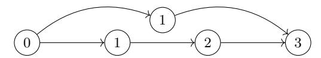

# Permissionless Consensus in the Resource Model

### Benjamin Terner

UC Irvine bterner@uci.edu

Abstract. In the permissionless regime of distributed computing, participants may join and leave an internet-scale protocol execution at will. The permissionless regime poses challenges to the classical techniques used for consensus protocols, in which participants attempt to agree on a function of their inputs. For example, classical consensus techniques require bounding the numbers of honest and corrupt participants, and for honest participants to remain online throughout. Bitcoin's introduction of Proof of Work enabled dynamic participation by shifting focus from the number of parties to the number of hash puzzles that parties collectively solve, and in turn, enforcing constraints on the blocks sent by honest parties. Other Bitcoin-inspired works have developed Proof of X (PoX) variants to remediate the shortcomings of Proof of Work.

We propose a new abstraction called resources and argue that in practice, several PoX variants appear to implement resources. For every resource that a party obtains, it is permitted to send a special protocol message. We show that given few additional assumptions, resources are sufficient to achieve consensus in the permissionless regime, even in the presence of a full-information adversary that can choose which parties get resources and when they get them. In particular, it is not necessary to know a bound on the network delay, participants do not need clocks, and participants can join and leave the execution arbitrarily, even after sending only a single message. We require only a known upperbound on the rate at which resources enter the system, relative to the maximum network delay (without needing to know the network delay), and that over the long term, a majority of resources are acquired by honest participants.

Our protocol for consensus in the permissionless model follows from a protocol for graph consensus, which we define as a generalization of blockchains. Our graph consensus works even when resources enter the system at high rates, but the required honest majority increases with the rate. We show how to modify the protocol slightly to achieve one-bit consensus. Finally, we show that for every graph consensus protocol that outputs a majority of honest vertices there exists a one-bit consensus protocol.

Keywords: Consensus, Blockchain, Permissionless, Full Information Model

# 1 Introduction

### 1.1 Permissionless Consensus and PoX

The distributed system problem of consensus has been studied for decades since the seminal works of [43, 33]. In the general form of a consensus protocol, participants in the protocol communicate over a network in an attempt to agree on a single bit or an append-only log based on their inputs. In the classical regime of consensus protocols, the participants are determined before a protocol execution begins. Crucially, most classical techniques for practical consensus protocols involve the use of quorum or threshold systems, for example [17, 11, 13, 32]. Famously, consensus on even a single bit in the classical regime is impossible unless more than two thirds of participants are honest [43, 33, 19, 11].

The advent of Bitcoin [39] ushered in renewed interest in consensus protocols by introducing the permissionless regime, in which a protocol execution is open to all those who want to participate. This models internet-scale protocols in which participation is dynamic, meaning participants can join and leave an execution arbitrarily, the number of active participants may be in constant flux, the identities of the participants at any point in time are unknowable, and the adversary may control arbitrarily many parties. The permissionless regime therefore presents challenges to the techniques employed by classical protocols.

The Physical Resource Model and PoX Despite the challenges, consensus protocols for the permissionless regime have proliferated since Bitcoin [6, 25]. The area has become a promising new direction in cryptography as we have come to understand that techniques introduced by Bitcoin provide advantages over the classical regime. In Eurocrypt 2020, Garay et al [24] formalized a randomized resource-restricted model and showed that by restricting the ability of parties to send messages, it is possible to bypass known bounds for both Byzantine Agreement and MPC. Recent work [40, 9, 15, 24] also shows consensus is possible when parties are able to maintain a simple majority of the available physical resources, which circumvents the classical requirement that more than two thirds of all participants are honest [43, 33, 19, 11].

The resource-restricted model changes the basis of security from the proportion of honest participants in a system to the physical resources that they control. Bitcoin famously requires participants to solve Proof of Work to participate [20, 3, 39]. In response to Proof of Work's wasteful computation, many Proof of X (PoX) variants have been proposed (see [6] for an overview), the most popular being Proof of Stake [10, 28, 4] (PoS).

PoX serves multiple roles in taming the permissionless regime for consensus. First, PoX systems constrain the power of the adversary to influence a computation by inextricably tying the ability to send messages to the amount of physical resources a party controls. Therefore, although it is impossible to bound the proportion of honest parties (and Sybil attacks [18] are free), sending messages is not free, and the proportion of messages sent by the adversary can be constrained. Second, the fact that participants can join and leave arbitrarily poses fatal issues for traditional protocols which may wait for a participant that has gone offline to send the next message. PoX systems require each participant to solve a puzzle in order to send a message, thus implementing a self-selecting lottery to choose the next speaker from among those who are online.

Resources: A Unifying Abstraction for a New Model It appears that PoX tames the challenges of the permissionless regime for consensus while enabling us to bypass classical bounds. However, current permissionless consensus protocols depend on non-black box properties of the underlying PoX used to enforce physical restrictions. To better understand the permissionless regime and the power of PoX, we ask:

Is there a unifying abstraction for PoX?

If so, under what assumptions does such a primitive imply consensus in the permissionless regime?

In this work, we model a unifying abstraction of PoX which we simply call resources, an allusion to the fact that PoX systems tie participation to physical resources. We use resources as a way to cast permissionless protocols into a new model in which a subset of messages are given special elite status, and the supply of these messages are constrained.

Our new model differs in several substantial ways from the current practice. To date, all other works we know fo the permissionless model also assume some synchronization assumption, either knowledge of the network delay [9, 10, 21] or (weakly synchronized) clocks [28, 15, 4, 5], plus some assumption about the number of active participants. In our new model, parties have no way to synchronize, they may join and leave an execution arbitrarily, and there is no bound on the number of parties in an execution.

In this model, we introduce a framework for protocols which use resources as a black box. The framework allows us to separate the proofs of blockchain protocols from the implementations of their PoX. We hope that this inspires new design paradigms for the permissionless model, and allows designers to separate their implementations of PoX from the chain protocols which they support.

### 1.2 Modeling Resources

To answer our questions, we model the properties of resources and show how to constrain an execution based on resources.

The Properties of Resources Resources model a protocol paradigm in which some parties are selected to send messages with special "elite" status in the protocol. One could consider resources to be implemented in a variety of ways; for example, before a protocol execution, some setup may select specified parties to be designated as "leaders" at specific points in the execution. (For example, an execution could be divided into epochs, and during each epoch a small set of leaders may be chosen.) During the execution, those parties are informed that they are leaders and permitted to send a single message to all other parties, along with a certificate that they have been selected leader at that moment. (Looking ahead, we will show that this leader selection can even be determined adaptively by the adversary, subject to constraints defined below.)

In PoX schemes, this leader selection this is implemented by lottery requiring parties to continuously attempt to solve cryptographic puzzles that are tied to physical resources. In our model, rather than requiring participants to solve a PoX puzzle, we say that participants are allocated resources from the environment. Our model includes formal properties of resource that mimic the constraints of PoX-style leader election:

- 1. Unforgeability No participant can fake the fact that it has a resource. In practice, PoX schemes enforce this requirement by requiring PoX solutions are verifiable by other participants. This enforces the fact that a party must solve a cryptographic puzzle in order to speak.
- 2. Use-Once Each resource can be associated with one and only one string, which allows the resource to carry semantics. The string must be chosen at the moment that the resource is generated. Similarly, in PoX schemes the input must be chosen at the same time the PoX puzzle is solved. (In some implementations, this message includes a public key that boostraps special status to future messages signed with that key.)

Constraining the Supply of Resources As we have explained, PoX schemes implement virtual lotteries based to select the next speaker among those that are active at the time of the lottery. We model how the lottery mechanism constrains the number of speakers in an execution over time using only two constraints on the supply of resources.

1. Long Term Honest Majority We model a regime in which over any sufficiently long period of time, honest parties receive a majority of resources, although corrupt parties may receive a majority over the short term. Specifically, in any period of time in which n resources are allocated, we require that αn − ε are allocated to honest participants and at most βn + ε are allocated to corrupt participants. α is our long-term proportion of honest resources and β = 1 − α is the long-term proportion of corrupt resources. When α > β, we say that honest participants receive a long term majority of resources. The parameter ε represents a short-term corrupt advantage, which allows us to model the fact that an adversary may attempt to pool its physical resources in order to achieve a short "burst" of resources. However, if the corrupt participants perform a burst, then they deplete their capacity to receive more resources for some time after.

2. Rate Limit We let ρ upperbound the rate at which resources may be generated. Specifically, ρ is the maximum number of resources that may be generated per ∆ time, where ∆ is the unknown maximum network delay.

Remark 1 (On the Modeling Approach). Early attempts to model the permissionless regime start with a derivative of the standard UC framework [12], and assign to each physical party one "virtual" party for each unit of computational power controlled by that party (for example [26, 40] in the PoW model). The paradigm then must quantify over the probability that, given some proportion of computational (or other constrained) resources, the honest parties obtain a certain proportion of puzzle solutions (akin to our "resources").

In contrast, our approach directly models the number of resources obtained by honest parties, without regard to the process which they use to obtain the resources. We then analyze what the parties can achieve when provided with their resources. Our approach is similar to a paradigm famously employed by coding theory. Consider that many encoding schemes offer guarantees of the style "as long as fewer than n bits of a codeword are mauled, the plaintext can be recovered." Our constraints to provide thresholds on adversarial behavior under which we prove security. To implement resources, one would have to show that their chosen scheme (such as PoX, PoS, etc) induces the appropriate proportion of resources being allocated to honest participants.

The Permissionless Regime To show the power of resources, we model a regime that is strongly adversarial. The maximum network delay ∆ is unknown and participants do not have clocks. The number of participants is unknown to the participants and may be unbounded. Moreover, the adversary is computationally unbounded; it has full information about the states of all honest parties; it can corrupt parties adaptively; and it chooses which parties receive resources and when they receive them. Participation is not only dynamic (meaning parties can join and leave the execution arbitrarily), but also completely controlled by the adversary; this means that in every round, the adversary controls which parties send and receive messages, and which are completely inactive. Despite all of these obstacles, we show the power of resources for achieving consensus.

### 1.3 Main Results

One-Bit Consensus We show that resources do imply consensus in our new model, assuming only knowledge of ρ, which upperbounds the rate at which resources are allocated relative to the (unknown) maximum network delay, and that honest parties receive a majority of resources in the long term. We also show that these requirements are necessary.

Theorem 1 (Informal). Let c = O(ρ+ε). For all α > ρc(1−α), there exists a one-bit consensus protocol in the permissionless regime with resources.

Graph Consensus The technique that we use to build one-bit consensus from resources is reminiscent of so-called blockchains. We define a problem called graph consensus in which honest participants maintain local graphs and propose vertices to be included in each other's graphs. The security goals of a graph consensus protocol are generalizations of those proposed by [26, 40, 8]. Specifically, a graph consensus protocol should achieve two properties. First, consistency requires that for any two graphs output by honest participants, one participant's output must be a subgraph of the other. Second, liveness requires that honest participants may not trivially output empty graphs, but that their outputs grow over time.

Theorem 2 (Informal). Let c = O(ρ + ε). For all α > ρc(1 − α), there exists a graph consensus protocol in the permissionless regime with resources.

Notably, we show that it is possible to achieve graph consensus when ρ > 1, i.e. more than 1 resource may allocated per ∆ time. However, interestingly, our protocol requires that α grow with O(ρ 2 (1 − α)) in order to maintain security (recall that c is on the order of ρ + ε).

Necessity of Assumptions For completeness, we additionally show the necessity of our assumptions.

Theorem 3 (Informal). There is no consensus protocol in the permissionless model that does not require both a long-term majority of resources and a constraint on the network delay.

The necessity of these assumptions follows from standard techniques, and the discussion is deferred to Section 7.

The Parameter Regime Although the protocols we present are secure, the parameter regimes for which they are secure are not competitive with existing designs. We stress that our results should be considered feasibility results for a very strong definition of consensus in a regime that is highly adversarial. For example, the protocols are secure for α = 0.865, = 1, ρ = 1, or α = 0.954, = 2, ρ = 2, but these are not comparable to the best parameters for protocols which make stronger assumptions. We admit that our regime is overly restrictive, as we comment below that no longestchain protocol can be proven secure for nontrivial rates (ρ > 1). However, the fact that consensus is achievable even in such a difficult regime is a stronger statement to the power of resources.

# 1.4 Technical Overview

Challenges At first glance, consensus in our regime seems may seem intractable. All classical techniques for consensus are inapplicable in our regime because we cannot synchronize parties or threshold the proportion of online honest participants. One might think to use resources in order to perform committee election to elect a set of parties who can then run a classical protocol (as in [28, 41, 30]). However, any protocol in our model must achieve consensus even when every honest participant sends at most one message before it leaves the execution, and even when every honest participant is only active for a (very) short period of time from the moment it joins to the moment it leaves. (In the extreme, this is just long enough to receive the state of the system and send a single message.) Specifically, any protocol in our model must be player-replaceable; committee election requires that the members stay online long enough to participate in the secondary protocol, which is not guaranteed.

Moreover, Pass and Shi [9, 42] prove that for protocols which require mining, if the maximum network delay is unknown then the number of participants must be known within a factor of 2, even when participants are synchronous and have clocks. Intuitively, this is because an adversary can always split the execution into two groups, and deliver messages within each group quickly but between groups slowly. If the maximum network delay is longer than it takes each group to produce output independently, then no protocol can achieve consensus. However, we show that an upperbound on the resource rate, relative to the network delay (without knowing the network delay) is sufficient to bypass this impossibility.

Building Consensus from Resources Our technique to build consensus builds directly on our graph consensus protocol. We show that given a long-term majority of resources and a bound on the rate, honest participants can use the properties of resources to build a directed acyclic graph (DAG) which captures the (partial) ordering in which they receive their resources. Importantly, every vertex in the global DAG is associated with a resource (much like every vertex in a blockchain is associated with a PoX). The unforgeability and use-once properties of resources enforce that corrupt participants cannot manipulate the graph structure or create fake vertices. The honest participants embed structure into the graph that can be used to infer when corrupt parties attempt to cheat by "withholding" their resources, i.e. not immediately multicasting a vertex they have added to the graph.

In our graph protocol, we use the long term honest advantage in resources similarly to many longest-chain blockchains. However, rather than measure the length of a chain in the DAG, we define the depth of a DAG to be the length of the longest path from the root to a leaf vertex (where the DAG grows from a root with no indegree to the leaves with no outdegree). We then require that the honest participants can build deeper branches on the DAG than the corrupt participants.

The structure that honest participants build into the global DAG is reachability. Every honest vertex which is added to the global DAG is guaranteed to gain an honest successor, and to always be a predecessor of one of the deepest vertices in the global DAG. However, corrupt vertices are not guaranteed to become a predecessor of any honest vertices. If honest participants can build longer paths in the global DAG over time than corrupt participants, then if corrupt participants withhold their vertices for too long, their withheld branches will eventually fall behind the depth of the global DAG. Honest participants extract their outputs by selecting vertices in their local views of the global DAG which are predecessors of the deepest vertices in their views, excising all corrupt vertices on branches which have fallen short.

One-bit consensus follows from any graph consensus protocol which guarantees that for any sufficiently large output graph, a majority of the vertices must be associated with resources allocated to honest participants.

Why Chain Protocols Fail: Pathological Chain Structures In our model, no longest-chain or heaviest-chain protocol can be proven secure at non-trivial resource rates (ρ > 1). Consider an execution of a chain protocol in which a fork develops at the root and is never resolved. Our definition of graph consistency (Definition 10) requires that if any two participants output graphs G<sup>1</sup> and G2, respectively, at any points in time, then G<sup>1</sup> ⊆ G<sup>2</sup> or G<sup>2</sup> ⊆ G1. In such an execution, no party could ever output either branch of the fork. Our definition of liveness (Definition 11) lowerbounds the size of a graph output by an honest party by a function of the number of vertices in its local graph. In this execution, despite the fact that the honest parties' local graphs grow, liveness fails because they can never output any vertices. Note that this may happen even if the corrupt participants receive no resources. In a random model, forks are likely to be resolved eventually, which allows participants to eventually output one branch of the fork. The perpetual fork attack is also discussed in [29]. Although we do not discuss it here, pathological structure attacks can be generalized to DAG-based protocols.

# 1.5 Considerations of Our Results

On Knowing the Rate Limit It is easy to show via partitioning attack (Section 7) that some constraint on the network is necessary in order to achieve consensus. However, knowing a bound on the resource rate relative to the network delay is a weaker assumption than knowing the network delay. Given knowledge of the network delay, participants can execute synchronous protocols that proceed in rounds. This is possible because the adversary cannot manipulate honest participants' timekeeping abilities. However, a bound on just the resource rate does not directly yield synchronization, since the adversary may induce a large difference in two honest processors' views at the same moment in time by selectively delivering corrupt resources to one honest participant but not to another.

It remains to answer why it suffices to constrain the rate at which resourced enter a system relative to the maximum network delay, even if the parties do not actually know either bound. In their seminal work, DLS [19] showed that consensus is possible in partially synchronous environments in which there exists any relationship between processor synchronization, which roughly translates to the rate at which parties compute, and the maximum network delay. Our work considers the rate at which resources are allocated to measure aggregate processor activity. Even when parties are constantly joining and leaving an execution, it is possible to aggregate the amount of computational work they do over time. We show that the relationship between the aggregate processor work and the maximum network delay is sufficient for consensus.

In practice, it has been reasonable to assume knowing the rate of resource allocations relative to the network delay despite the fact that the true network delay is unknown. For example, a PoW system is parameterized by estimating the time required to propagate a block through the network (as by [16]) and then tuning a hardness parameter to bound the rate of puzzle solutions per estimated network delay. PoS systems also tune their parameters to achieve a certain number of PoS solutions per round.

Network with Multicast We imagine a network overlay that is sufficiently connected that between every two honest participants, there is at least one path through the network consisting of only honest participants. This guarantees that every message multicast by an honest node is eventually propagated to every other honest node. However, because the diameter of the network and the delay between nodes is unknown, the maximum network delay ∆ for a multicast is unknown. Corrupt participants can selectively send messages to only some honest participants by corrupting the appropriate edge nodes.

We note that some form of multicast or broadcast functionality is necessary for any permissionless protocol. In [5], this is achieved through a network functionality that registers and unregisters participants as they enter and leave an execution and delivers messages to registered participants. Our approach resembles that of [40, 9], in which there exists known a network delay ∆, except that in our model, ∆ is unknown to the participants.

The Need for a Recovery Protocol We assume that when a participant comes online, it immediately receives all messages which have been multicast or sent directly to it more than ∆ time in the past. This assumption models the expectation that when participants come online, they execute some recovery protocol to receive the most recent state of the system (up to the communication delay) before participating in the protocol. An analogous recovery protocol in any blockchain requires a participant to download the blockchain up to the most recent blocks before it begins mining; this is what permits blockchains to be player-replaceable. The need for such a recovery protocol is highlighted by [5], who showed that in Bitcoin, if participants can come online and generate blocks before they recover the state of the blockchain (up to messages pending over the network), it is impossible to prove anything. Intuitively, honest participants can be manipulated to generate blocks that are shallow relative to the length of the longest chain, which constitutes a (unwitting) deviation from the honest protocol.

Without modeling the many ways in which a participant may be online but desynchronized, we consider a participant to be honest at the moment it receives a resource if it is executing the honest protocol and it has received the state of the execution up to the messages which were sent within the last ∆ time, and corrupt otherwise.

Determinism and Nondeterminism Our work is the first we know that attempts to model PoX in a deterministic model that gives the adversary the ability to determine which parties get resources and when resources are allocated. This is significant for more than just the power of the adversary. FLP [23] and Ben-Or [7] showed a separation between the feasibility of (classical) consensus protocols in deterministic and randomizes fully asynchronous models. In comparison, our work is the first to show deterministic consensus in the permissionless model, and although our network is not completely asynchronous, we prove in Section 7 that some assumption on the network is necessary for consensus in the permissionless model.

Moreover, although our protocols are deterministic, our model is still capable of capturing nondeterministic lottery-style protocols. In most PoW and PoS protocols, the sources of nondeterminism in the execution are the lottery selection and message delivery over the network. In our model, these responsibilities are handled by the environment, which serves as the adversary and is responsible for both allocating resources and delivering messages, and may do so arbitrarily within constraints we define. Therefore, the class of protocols that we capture in our model is large enough to consider current designs.

### 1.6 Related Work

Comprehensive overviews of the blockchain literature can be found in the systemizations of knowledge by [25] and [6]. Here we describe only works we know about that solve similar problems or use similar techniques.

As far as we know, no other works present the common qualities of PoX via a single abstraction. However, Miller et al [36] model Proof of Work as scratch-off-puzzles, showing a number of desirable properties for Proof of Work objects. Alwen and Tackman [1] model desirable properties for moderately hard puzzles. Garay et al. [27] model the sufficient properties of PoW to yield consensus. Garay et al. [24] further abstract the properties of PoW to a randomized resource-restricted model.

Other works have studied one-bit consensus using PoW and blockchains. Among them, Miller and Laviola [37] show how to achieve anonymous consensus from moderately hard puzzles when the network delay is known. GKL [26] show how to achieve byzantine agreement in synchronous networks using the "Bitcoin backbone" protocol. EFL [21] construct broadcast and consensus from Proof of Work but require clocks and knowledge of the network delay.

A number of other works model permissionless blockchains with proof of work or proof of stake, most notably GKL [26], PSs [40] (followed by Pass and Shi [9]) and their respective successors. BMTZ [5] model the Bitcoin protocol in the UC model with dynamic player sets. Ouroboros Praos [15] models a Proof of Stake blockchain with semi-synchronous communication, and Ouroboros Genesis [4] presents their version of dynamic availability. The Ouroboros protocols (weakly) synchronize their participants via a global clock functionality. Among all the works studying PoX consensus protocols, we are the only one that we know in a deterministic model in which the adversary controls allocation.

There are many works that implement agreement on DAGs, specifically in attempts to scale the throughput of blockchain protocols "on the chain." The structure of the DAG built in our protocol bears some resemblance to SPECTRE [46] and PHANTOM [47], but our definitions, assumptions, and analyses are very different, due to the power of our adversary. The same is true for Meshcash [8], who adopt the model of [40]. The Avalanche protocol [44] also employs agreement on a DAG for high throughput of consensus instances for synchronous participants in a permissioned network.

# 1.7 Paper Organization

Section 2 overviews how several popular forms of PoX implement resources. In Section 3 we build a formal execution model based on a syntactic framework for resources. In Section 4 we define graph consensus in our model. In Section 5 we present our main protocol, our main theorem, and an overview of the proof. In Section 6 we define one-bit consensus in our model. Section 7 shows honest majority and some bound on the network are necessary for consensus in the permissionless regime. Section 8 shows how to reduce one bit consensus to graph consensus, and provides a protocol for one-bit consensus in our model. Appendices A and B present the full proofs of our graph consensus protocol and one-bit consensus protocol, respectively.

# 2 How PoX Implement Resources, and How To Use Them

In this section, we illustrate how a few of the most popular forms of PoX implement resources. We briefly discuss the separation between protocols that implement PoX and the graph protocols that use PoX as primitives.

What Makes a Pox? In each case below, PoX implement the self-selecting lottery that determines which parties may send special messages in a protocol. PoX are made hard to obtain by the fact that physical resources in the system are constrained, and cryptographic puzzles enforce that each PoX is semantically bound to a single string. Protocols then base their security guarantees on the constraint that a majority of the special messages must be generated by honest participants.

To formally show that any PoX scheme implements resources, one would proceed through the intermediate step of defining a "fair allocation" of resources, then prove that the PoX implementation achieves fair allocation. Proving a fair allocation should require with overwhelming probability that honest parties receive a sufficient majority over every long-enough period of time, and that the rate of allocations can be upper-bounded. Because full formal proofs of PoX schemes require careful analysis in each scheme's syntactic model, such proofs are out of scope of this work. Protocol designers should design resource schemes under assumptions that they believe reasonable and prove their security properties.

Modularizing Blockchains The below-mentioned blockchains couple the implementations of their PoX with the chain or ledger protocols they implement, often depending non-black-box properties in order to achieve consistency on their graphs. Our approach is to separate the analysis of PoX from the graph protocols that they support. Graph protocols may be proven secure in the permissionless model using resources as a black box, independent of all other parameters of an execution. We believe that only the analysis of PoX should depend on the physical resources on which they rely; the modularization we propose enforces this separation. This approach has the benefit of taking a graph protocol and "pluging in" an implementation of resources based on assumptions that the protocol designer believes are reasonable.

### 2.1 Proof of Work

In a Proof of Work (PoW) scheme, parties attempt to find solutions to a hash puzzle for a cryptographic hash function H. A "solution" to a hash puzzle is a string x for which H(x) < D, where D is a difficulty parameter. In most PoW schemes, the input x is composed of a nonce, a payload, and a pointer to a previous puzzle solution. When a puzzle solution is found, we consider the input x to be the string that is bound to the resource. Note that to strictly implement resources, it is not necessary that an input to a hash puzzle include a pointer to a previous hash puzzle; however, this property is used by many Proof-of-Work protocols to enforce a graph structure.

Unforgeability of a resource in a PoW scheme follows from the hardness and verifiability of the hash function. Honest parties can easily verify that a string x is a valid solution to the hash puzzle H(·) < D. Use-Once of a resource follows from the collision resistance of the hash function. Given a resource bound to string x, in order to claim the resource has been bound to another string, a corrupt party must find an x 0 such that H(x 0 ) = H(x). (See [36] for a discussion.) Honest majority of PoW schemes follows from the assumption that honest parties maintain a majority of active computational power at all times.

Rate limiting of PoW schemes is enforced in practice by regularly retargeting the difficulty parameter. The difficulty parameter is set based on the total hash power of the network (measured as the number of hash function evaluations per second, this is an estimate of physical computing resources) in order to target a particular rate of puzzle solutions. For Bitcoin, the difficulty parameter is set such that a puzzle solution is found about every 10 minutes [39]; in Ethereum the difficulty parameter is set such that a puzzle solution is found about every 13 seconds [22]. In order to show that a proof-of-work scheme implements resources, one would have to identify realistic assumptions from which to show that difficulty calibration of the hash puzzle effectively upperbounds the rate at which hash puzzles are found.

### 2.2 Proof of Stake

Proof of Stake (PoS) schemes implement resources as binding lottery tickets. During each time step, each participant evaluates some number of virtual lottery tickets to determine if it is the leader in the protocol at that time step. The number of lottery tickets each party can evaluate at any time step is proportional to its stake in the system at that time. Specifically, in every case of PoS, a lottery ticket evaluates some function F(x, pk), where pk is a public key associated with some stake in the system, and x encodes a time slot and a nonce, where the nonce encodes some state which should contain entropy. For a "winning ticket," the message bound to the corresponding resource is therefore (x, pk); this effectively ties the public key pk to the global state of the system in which it becomes the next leader.

Rate-limiting is imposed by parameterizing each Proof of Stake protocol to upperbound the number of winning lottery tickets that are evaluated per time step. (This is analogous to parameterizing the number of proof of work solutions per network delay, or upperbounding the number of resources that are allocated per span of time.) We remark that each of the schemes that we overview relies on either knowing the maximum communication delay of the network or on loosely synchronized clocks in order to synchronize the rounds of the lottery.

Lottery by VRF In the PoS schemes of both Ouroboros [15] and Algorand [28], lottery tickets are implemented using a verifiable random function (VRF) [34, 15]. A participant evaluates a lottery ticket by computing vrf.provesk(x) → π, where sk is the secret key associated with a stake in the system that the participant owns a particular time, x is the state of the system, and π is the output of the vrf. (We elide details about Algorand's cryptographic sortition.) A lottery ticket is considered to be a "winner" if π < D, for some tunable parameter D. To verify the role of a claimed leader, other participants must verify the VRF via vrf.vfypk(x, π), where pk is the public key associated with sk.

Use-once follows from the unpredictability of the VRF. Given one solution, it should be hard to find another input to the VRF that evaluates to the same proof. Unforgeability follows from the verifiability of the VRF, because one cannot fake that a puzzle solution has been found.

Lottery by Hash Function The Proof of Stake mechanism by Snow White [10] differs from Ouroboros and Algorand in that it does not use a VRF. Instead, it uses a cryptographic hash function that is seeded by a stateful nonce that depends on the previous hash puzzle solutions. Specifically, the a proof of stake is evaluated as H(r, pk, t) < D, where r is a stateful nonce, pk is a public key for a digital signature scheme, and t is a timestamp. If the output of the hash function is less than the difficulty parameter D, then the participant with public key pk becomes a leader. Use-once follows from collision resistance of the hash function, and unforgeability follows from the verifiability of the hash function.

Enforcing Honest Majority: Preventing Grinding In order to show that PoS implements resources for which honest parties can maintain an honest majority, one must argue that no corrupt participant can increase its share of PoS solutions to be more than roughly its proportion of stake in the system, and that parties cannot efficiently "predict" keys which will be leaders in any particular time slot. Existing PoS constructions specifically depend on the fact that the state encoded in the input x, which is bound to the resource, contains enough entropy that the adversary cannot launch pre-computation attacks, and that "grinding" attacks are computationally infeasible. For a full treatment, refer to the discussions located in each of the PoS implementations we have referenced. Specifically, in Ouroboros refer to the discussion on VRF Unpredictability under Malicious Key Generation ([15] Section 3.2). In Algorand refer to the discussions on choosing the VRF seed in each round and setting secret keys well before each round ([28] Sections 5.1, 5.2). In Snow White, refer to the discussion on security under adversarially biased hashes ([10] Sections 2 and G).

### 2.3 Non-Cryptographic PoX

There have been many additional cryptographic PoX variants proposed, for example Proof of Spacetime [38] and Proof of Retrievability [35]. We do not analyze them all here. However, we do remark that PoX need not necessarily be implemented using cryptography. For example, Proof of Elapsed Time [45, 14] elects leaders in a consensus protocol via verifiable timer. Additionally, resources could be implemented in low-power environments in which participants seldom have enough energy to send a message. In this case, every message would be associated with a resource, as the resource represents physical energy. Future research could study ways to move resource allocation to the environment (e.g. by random lottery based on external factors), rather than by solving hash puzzles.

# 3 Formal Model

We denote by N the natural numbers and by R≥<sup>0</sup> the set of non-negative real numbers. Fix an alphabet Σ. Let M = Σ<sup>∗</sup> be the set of strings (we also call them messages) over the alphabet. We let ID denote the set of identities, and let multicast be a special symbol not in ID. We denote by Ψ the set of resources.

We use || to denote concatenation. We denote by the empty string. For a set S, we use the notation S<sup>∅</sup> to denote S ∪ {∅}. We let P(S) denote the powerset of S. We let |S| denote the cardinality of S.

# 3.1 Model of Computation

We adopt a model of computation over Interactive Turing Machines that is standard in the cryptographic literature [12], and supplement it to capture our notion of resources. We refer to each ITM as a party. Each party sends messages to other party according to a protocol which defines a transition function δ for each party.

To capture the permissionless regime, protocols in our model are defined for an unbounded number of parties. Let ID be a (potentially unbounded) set of identifiers. A protocol for identities ID maps every id ∈ ID to a transition function δ that specifies how it changes states and what messages it sends when it transitions states. In the protocols we present, all parties execute the same transition function; therefore, rather than providing the mapping, we simply describe every party's transition function. Note that in the permissionless regime where ID may be unbounded, not every party corresponding to an identity in ID may participate in a particular execution; we therefore refer to an ITM that sends or receives messages in an execution of a protocol as a participant. When discussing a particular party, we write pid; when discussing an arbitrary party, or when the identity is implied by context, we write p and omit the subscript.

### 3.2 Execution of a Protocol with Resources

Resources We first introduce special black-box objects called resources. We will define resources as unforgeable objects created by an external entity, which then allocates them to participants. Resources alone are not useful because they do not convey semantics, so to enable protocols to use them in meaningful ways, we let resources be bound to messages. One can think of binding a resource to a message as a way for a protocol to assign special elite status to the message. As we will describe later, a resource can be bound only once. After being bound to a message, a resource cannot be bound to another message. This models the property that PoX are use-once objects; in practice, once a PoX is associated with a single string, finding another string that yields the same proof of work is computationally hard.

Fix a set of resources Ψ, and let M = Σ<sup>∗</sup> be the set of strings over an alphabet Σ. The set of bound resources Ψ<sup>M</sup> is Ψ × M. For some ψ ∈ Ψ and m ∈ M, we denote by ψ<sup>m</sup> the corresponding element of ΨM. The bound resource ψ<sup>m</sup> is encoded as ψ||m||ψ.

Time We adopt an abstract notion of global time to describe a protocol's execution. Time is a totally ordered set of points, T = ({t1, t2, t3, . . .}, <). We will use addition and subtraction operations defined over the set of points to discuss the elapse of time. Without loss of generality, we let T = R and we let 0 be the starting time of any execution. We emphasize that machines in our model do not have clocks and cannot measure the global time.

Environment Many nondeterminstic factors influence a real-world protocol execution. For example, participants' hardware do not all run at the same speed, and messages sent over a network are not delivered immediately. We model the nondeterminism of an execution using an environment. An environment E is an ITM that directs an execution of a protocol by:

- scheduling when participants transition between states and send messages,
- scheduling message deliveries,
- and importantly, allocating resources to participants.

The environment directs the execution of a protocol by, choosing for every t ∈ T , choosing a (possibly empty) set of parties to activate, and by delivering messages sent between parties. Whenever a party is activated at time t, the environment delivers a (possibly empty) set messages that have been previously sent to the party. (In our model, the environment may only deliver messages that have previously been sent to a party; this is without loss of generality, as we will see later that the environment can always corrupt parties if it wishes to inject messages.) When activated, a party may send a finite number of messages to other parties, as specified by its transition function. A party may multicast in order to send the same message to all other participants. The environment reads all messages sent by a party and is responsible for delivering them at some time t <sup>0</sup> > t, subject to constraints defined below.

When a party is activated, the environment can optionally allocate a resource to the party by providing the resource as input; this is the process by which participants acquire new resources. When a party is allocated a resource, the party's transition function δ must specify the string to which the resource is bound at that moment in time. (This enforces that a party cannot "hold on" to a resource and choose a string to bind to the resource later.)

If a party is activated at time t, we say the party is active at t.

Corruption In our model, the environment also serves as the adversary, and it has the ability to corrupt participants arbitrarily. To corrupt a participant, the environment replaces the participant's transition function with a transition of its choice. Once corrupted, a participant stays corrupted and may not be corrupted again. We model corruptions this way in order to capture identities implemented using key pairs. In a real-world scenario, if a participant's key pair is compromised (or lost), it must assume a new identity.

#### 3.3 Transcript

An execution of a protocol produces a transcript σ that records every activation and corruption in the execution. Activations are written as tuples containing a timestamp t, the identity id of the activated party, and the inputs to the state transition function:

1. Activation is (t, id, z, µ, ψ), where pid begins its state transitions in state z at t, µ is the finite, possibly empty set messages delivered to pid, and ψ ∈ Ψ is allocated to pid (if no resource is allocated, this element is ∅).

Corruptions appear the transcript as tuples containing the new transition function δ that the party begins to follow:

(2) Corruption is (t, id, δ), where δ is the transition function executed by pid starting at time t.

The contents of a transcript are partially ordered by their timestamps. (Notice that for most transcripts there exist many equivalent transcripts in which events are reordered; to avoid a lengthy treatment, we defer to Lamport [31].) Notice that a transcript is a complete record of a protocol execution from which one can infer the state of every party and all undelivered messages at every time in the execution.

We also define the view of a participant at some point in time. The view of a participant p at some time t in an execution is the set of messages and resources which p has received from the beginning of the execution until t. In particular, we will say that a resource ψ is in a participant p's view at time t if it has been provided as input to the party, or if the party has received the resource as party of a message before or at t.

# 3.4 Constraints

We now define constraints on an environment that take the form of assumptions when designing a protocol. Our theorem statements will hold for every environment, subject to the constraints defined in this section.

We first introduce a bit of notation to facilitate our definitions. In any transcript σ, let σ (t,t<sup>0</sup> ) be the subsequence of σ containing all of the events that happen between times t and t 0 , inclusive of t and t 0 .

Synchronization In our setting, participants operate asynchronously and communication is partially synchronous. We adapt the definitions of asynchronous computation from [23] and [17], and partially synchronous communication from [19].

Definition 1 (Φ-Synchronous Computation). For a constant Φ, participants in an execution described by transcript σ are Φ-synchronous if for every time t and every t <sup>0</sup> > t, if any participant is activated Φ times in σ (t,t<sup>0</sup> ) , then every other participant is activated at least once in σ (t,t<sup>0</sup> ) .

Participants in an execution are asynchronous if there does not exist a Φ that constrains σ. We model participants as asynchronous in order to capture the membership of permissionless internetscale protocols, which often exhibit heterogenous hardware joining, leaving, and returning to an execution.

Definition 2 (∆-Synchronous Communication). For a constant ∆, communication in an execution defined by transcript σ is ∆-synchronous if for any message m that is sent to participant p at time t, if p does not receive m before t + ∆, then p receives m at its first activation at or after t + ∆.

When computation is asynchronous but communication is synchronous, participants can go through long periods of no activation, then "wake up" and receive many messages. This property has recently been framed in the "sleepy" model [9], but had been analyzed as early as [2] and [17]. A crucial difference between our model and previous works with asynchronous computation is that in our model, participants do not "know" the communication delay, meaning it is not given as input and not hard-coded into their states and transition functions. This notion was originally introduced by [19], who called the assumption partially synchronous communication.

Resources We introduce constraints on an execution to capture the properties of resources. First we introduce a constraint that captures the use-once property of resources by requiring that each resource can be bound to only one message.

Definition 3 (Unique Resource Encoding). An execution described by transcript  $\sigma$  satisfies unique resource encoding if

- 1. every bound resource  $\psi_m$  is properly encoded as  $\psi||m||\psi$ , and
- 2. for any two bound resource encodings  $\psi||m||\psi$  and  $\psi'||m'||\psi'$ , if  $\psi=\psi'$  then m=m'.

Second, we capture the unforgeability of resources. Just as no participant can solve a PoX puzzle without evaluating some function, no participant may send a bound resource to another participant if the resource has not been allocated.

Definition 4 (Respecting Resource Allocation). We say a transcript  $\sigma$  respects resource allocation if no resource appears in  $\sigma$  before it is allocated.

An admissible execution satisfies the previous two constraints. In this work, we consider exclusively admissible executions.

**Definition 5 (Admissible Execution).** An execution described by transcript  $\sigma$  is admissible if it respects resource allocation and obeys unique resource encoding.

Resource Allocations and Corruption We introduce notation to constrain resource allocations by both the rate of allocation and by the proportion of honest allocations.

**Definition 6** ( $\rho$ -Rate-Limiting). Let  $\rho \in \mathbb{N}$  and let  $\Delta$  be the communication synchronization constant, or the network delay. An execution described by transcript  $\sigma$  with network delay  $\Delta$  is  $\rho$ -rate-limited if for all t, there are at most  $\rho$  resources allocations in  $\sigma^{(t,t+\Delta)}$ .

As discussed in Section 1.5, although we assume that  $\Delta$  is unknown to the participants, we assume that  $\rho$  is known.

We introduce the following notation to denote how many resources are allocated to honest and to corrupt participants over some span of time.

**Definition 7**  $(\Psi_{\sigma}^{(t,t')},\Psi_{\mathsf{hon},\sigma}^{(t,t')},\Psi_{\mathsf{cor},\sigma}^{(t,t')})$ . Let  $\sigma$  be the transcript of an execution. We denote the sets of resources allocated by the environment to all participants, honest participants, and corrupt participants between times t and t' in  $\sigma$  as follows:

- $\begin{array}{l} -\ \Psi_{\sigma}^{(t,t')} \ is \ the \ set \ of \ all \ resources \ allocated \ in \ \sigma^{(t,t')}. \\ -\ \Psi_{\mathsf{hon},\sigma}^{(t,t')} \ is \ the \ set \ of \ resources \ allocated \ to \ honest \ participants \ in \ \sigma^{(t,t')}. \end{array}$



Fig. 1. An example graph in which each vertex is labeled with its depth. The root vertex has depth 0 by definition, and every other vertex's depth is defined by the longest path from the root to the vertex.

 $-\Psi_{\mathsf{cor},\sigma}^{(t,t')}$  is the set of resources allocated to corrupt participants in  $\sigma^{(t,t')}$ .

Because the execution is always implied or clear from context when we use this notation, we suppress the subscript  $\sigma$  from these variables. Finally, we introduce the following notation to denote the proportions of resources allocated to honest and corrupt parties in an execution:

**Definition 8** ( $(\alpha, \varepsilon)$ -honest resource allocation,  $(\beta, \varepsilon)$ -corrupt resource allocation ). Let  $\alpha \in [0,1]$  and let  $\varepsilon \in \mathbb{N}$ . An execution satisfies  $(\alpha, \varepsilon)$ -honest resource allocation if for all times t,t' > t:  $|\Psi_{\mathsf{hon}}^{(t,t')}| \ge \alpha |\Psi^{(t,t')}| - \varepsilon$ . Equivalently, let  $\beta = 1 - \alpha$ . An execution satisfies  $(\beta, \varepsilon)$ -corrupt resource allocation if for all times t,t' > t:  $|\Psi_{\mathsf{cor}}^{(t,t')}| \le \beta |\Psi^{(t,t')}| + \varepsilon$ .

Intuitively,  $\alpha$  and  $\beta$  capture the long-term ratios of honest and corrupt resource allocations, respectively, and  $\varepsilon$  represents a small amount of "slack" in the ratios.  $\varepsilon$  also captures the short term advantage that corrupt participants may obtain in receiving resources. Note that for any t and t' for which  $|\Psi^{(t,t')}| < \frac{\varepsilon}{\alpha}$ , all of the resources allocations may be to corrupt parties.

# 4 Graph Consensus Problem

### 4.1 Preliminaries for Graphs

A graph G = (V, E) is a set of vertices and a set of edges between vertices. For a graph G, we denote the set of its vertices as G.V and its edges as G.E. In this work we consider only directed acyclic graphs (DAGs); we therefore use term graph to refer to a DAG. A *root vertex* in a graph is a vertex with in-degree 0. In this work, every graph which we consider has exactly one root vertex, which in cryptocurrencies is also called a genesis vertex.

We define depth of a vertex and depth of a graph in a non-standard way:

**Definition 9 (Depth of a Vertex, Depth of a Graph).** Let root be the root vertex of a graph G. The depth of a vertex v in G is defined as the length of the longest path from root to v. The depth of G is defined as the depth of its deepest vertex.

We use  $\mathsf{D}(G)$  to denote the depth of a graph G, and use  $\mathsf{D}_G(v)$  to denote the depth of a vertex v in G. When the graph is implied from context, we simply write  $\mathsf{D}(v)$ . The depth of a root vertex is always 0. We use  $G|_d$  to denote the subgraph of G including only vertices with depth  $\leq d$ . Figure 1 illustrates the depths of vertices in a simple graph. We denote a path from vertices v to u as  $v \to u$ . A path  $v \to u$  spans d depth if  $\mathsf{D}(u) - \mathsf{D}(v) = d$ . We say  $u \in G.V$  is reachable from  $v \in G.V$  if there is a path  $v \to u$ . For a vertex  $v \in G.V$ , the predecessor graph of v is the subgraph of v containing v and every vertex and edge on every path from root to v. We use  $v \to v$  to denote graph union and  $v \to v$  denote a subgraph. We let  $v \to v$  denote the indegree of a vertex  $v \to v$  and  $v \to v$  denote its outdegree.

#### 4.2 Graph Consensus Protocol

In an execution of a graph consensus protocol, participants have no input. Each participant p maintains a local graph  $G_p$  based on the messages it has received so far and the protocol specification. A graph consensus protocol specifies how participants generate new vertices, and how to propose that other participants include the new vertices in their local graphs. It also specifies how a participant determines whether a new vertex, which it receives in a proposal from another participant, should be included in its local graph. For a participant p active at time t, we denote by  $G_p^{(t)}$  its local graph after all vertices are added at t. Each participant p additionally maintains an output graph  $G_p^*$ , which it outputs whenever it is active. The protocol must specify a deterministic way for each p to compute  $G_p^*$  as a function of its local graph  $G_p$ . We denote by  $G_p^{*(t)}$  the output of p at time t.

An execution of graph consensus may continue indefinitely. The goal of a protocol is for the participants' outputs to obey consistency and liveness properties across time. Graph consistency requires that if participants p active at t and q active at t', output  $G_p^{*(t)}$  and  $G_q^{*(t')}$ , then one output graph must be a subgraph of the other.

**Definition 10 (Graph Consistency).** An execution satisfies graph consistency if for all times t and t', and for all honest p and q active at t and t', respectively:  $G_p^{*(t)} \nsubseteq G_q^{*(t')} \Longrightarrow G_q^{*(t')} \subseteq G_p^{*(t)}$ .

A protocol can trivially satisfy graph consistency if participants always output the empty graph. We therefore define liveness to require that each participant p's output  $G_p^*$  grows as a function of the size of its local graph  $G_p$ , as follows:

**Definition 11** (f-Liveness). Let  $f: \mathbb{N} \times (0,1] \times \mathbb{R}_{\geq 0} \times \mathbb{N} \mapsto \mathbb{N}$ . An execution satisfies f-liveness if for every time t and honest participant p active at  $t: |G_p^{*(t)}.V| \geq f(|G_p^{(t)}.V|, \alpha, \varepsilon, \rho)$ , where  $\alpha, \varepsilon$ , and  $\rho$  are parameters of the execution.

In some applications, it is desirable to show that some proportion of the vertices in an honest participant's output must be generated by honest participants. If a vertex is generated by an honest participant, we call it an honest vertex; otherwise, we call it a corrupt vertex. We let  $\mathsf{hon}(G.V)$  denote the honest vertices in G. We define h-liveness to quantify the guaranteed proportion of honest vertices in a participant's output graph.

**Definition 12** (h-Liveness). Let  $h: \mathbb{N} \times (0,1] \times \mathbb{R}_{\geq 0} \times \mathbb{N} \to \mathbb{N}$ . An execution satisfies h-liveness if for every time t and honest participant p active at  $t: |\mathsf{hon}(G_p^{*(t)}.V)| \geq h(|G_p^{(t)}.V|, \alpha, \varepsilon, \rho)$  where  $\alpha, \varepsilon$ , and  $\rho$  are parameters of the execution.

### 5 Main Protocol

#### 5.1 Protocol Description

Protocol  $\Pi^G$ , presented in Figure 2, is a graph consensus protocol. It is parameterized by  $\alpha$  and  $\varepsilon$ , which describe the proportion of honest resources which are allocated (Def 8), and the maximum rate of resource allocation  $\rho$  (Def 6).

Each participant p maintains a local DAG  $G_p$  in which every vertex except the root is a resource. The graph  $G_p$  is initialized to ( $\{\text{root}\},\emptyset$ ), and grows from the root toward high depths throughout the execution as participants are allocated resources and receive messages. Whenever p is allocated a

resource, it adds the resource to its graph and then immediately multicasts its local graph including the new vertex to all honest participants. When an honest participant receives a message containing a graph, it updates its local graph to include new vertices and edges not previously in its local graph. We must show how a participant p chooses the predecessors of each vertex that it adds to its graph, and p computes its output G<sup>∗</sup> p from its local graph Gp.

We describe resources as vertices as follows. When any participant is allocated resource ψ, we let v<sup>ψ</sup> denote the vertex corresponding to ψ. When describing an arbitrary vertex, we denote it as v or u, eliding its respective resource.

When any honest participant p adds a new vertex to its graph, it adds the vertex to its graph as the new deepest vertex. Specifically, when p is allocated a resource ψ and adds vertex v<sup>ψ</sup> to its local graph Gp, p adds an inbound edge to v<sup>ψ</sup> from every vertex u in G<sup>p</sup> which (a) has no outbound edges in Gp, and (b) is close in depth to Gp. When p is allocated ψ, it must also choose vψ's edges immediately, as p must bind the inbound edges of v<sup>ψ</sup> to ψ. Because each vertex's inbound edges are bound to the vertex's respective resource, it may not gain additional predecessors.

Over time, some vertices will gain successors and some vertices may be "orphaned" and stop gaining successors. Each participant computes its output G<sup>∗</sup> <sup>p</sup> as a subgraph of its G<sup>p</sup> consisting of vertices which are both far from the end of its graph (measured in the difference in depth between the vertex and the graph) and are still gaining successors.

Encoding a Graph Using Resources Recall that we model a resource as a black box object which is bound to a string that conveys its semantics. When a resource is allocated, the string is bound to the resource immediately and cannot be changed afterwards (by unique encoding, Definition 3). In ΠG, the string bound to each resources encodes the direct predecessors of its respective vertex; when a participant is allocated a resource ψ, it binds to ψ the encoding of each vertex which has an outbound edge to vψ. If no edges are bound to ψ, then v<sup>ψ</sup> is defined to have an edge from root. In this way, each vertex is uniquely committed to its predecessors at the moment it is allocated. A participant multicasts its local graph by sending all of the bound resources which encode the vertices and edges in its local graph.

Event Responses We now detail how participants respond when they are allocated resources and when they receive messages, and we explain how participants compute their outputs from their local graphs.

On Resource Allocation When an honest participant p is allocated a resource ψ, we say that it generates a vertex v<sup>ψ</sup> that it adds to its local graph Gp. Participant p chooses the inbound edges of v<sup>ψ</sup> based on its current graph G<sup>p</sup> by adding an edge to v<sup>ψ</sup> from each vertex u in G<sup>p</sup> for which both outdegree(u) = 0 and D(Gp) − D(u) < c, where c is a constant computed from the protocol parameters and is the maximum depth spanned by an honestly chosen edge. Immediately after generating vψ, p multicasts its entire local graph containing v<sup>ψ</sup> and its inbound edges.

On Receipt of a Message Every message sent between participants is an encoding of a graph. (Any message that is not the encoding of a graph is ignored.) When a participant p receives a graph G<sup>0</sup> in a message, it verifies that G<sup>0</sup> is a valid graph. If G<sup>0</sup> is valid, then p updates its local graph as G<sup>p</sup> ← G<sup>p</sup> ∪ G<sup>0</sup> . If G<sup>0</sup> is not valid, then p ignores G<sup>0</sup> .

#### **Protocol 1** DAG Protocol for Graph Consensus $\Pi^G(\alpha, \varepsilon, \rho)$

 $\overline{Parameters: \alpha, \varepsilon}, \rho$ Derived Constants:

```
1. \beta = 1 - \alpha
                                                                                                                                                                                 4. \ell_1 = \gamma + \rho

5. \ell_2 = c(\varepsilon+1) + \rho + \frac{c\beta}{\frac{\alpha}{\rho} - c\beta} (c(\varepsilon+1) + (2+\beta)\rho + \frac{\varepsilon}{\alpha} + 2\frac{\varepsilon}{\rho} + 2)
2. \gamma = (1+\beta)\rho + \varepsilon + \frac{\varepsilon}{\rho} + 1
3. c = \gamma + \rho + \frac{\varepsilon}{\alpha}
```

Internal Variables:

```
1. G_p = (V_p, E_p) is a participant's local state. Initially, G_p = (\{\text{root}\}, \emptyset)
2. G_p^* = (V_p^*, E_p^*) is a participant's output graph. Initially, G_p^* = (\emptyset, \emptyset)
```

Event Responses:

```
1. On Receiving a Graph (G')
                                                                                                                     2. On Being Allocated a Resource \psi
          \begin{array}{l} - \ G_p \leftarrow G_p \cup \mathsf{validateGraph}(G') \\ - \ G_p^* \leftarrow \mathsf{extract}(G_p)|_{\mathsf{D}(G_p)-\ell^*} \end{array}
                                                                                                                               -G_p \leftarrow \mathsf{addVert}(G_p, \psi)
                                                                                                                              - multicast G_p
                                                                                                                              -G_p^* \leftarrow \operatorname{extract}(G_p)|_{\mathsf{D}(G_i)-\ell^*}
Internal Functions:
```

```
1. \mathsf{addVert}(G, \psi):
      -V' \leftarrow \{u \in G.V: \mathsf{D}(G) - \mathsf{D}(u) < c \text{ and outdegree}(u) = 0\}
      - return new graph G' such that
             • G'.V \leftarrow G.V \cup \{v_{\psi}\}
             • G'.E \leftarrow G.E \cup \{(u, v_{\psi}): u \in V'\}
2. extract(G):
      -S \leftarrow \{v \in G.V: \mathsf{D}(G) - \mathsf{D}(v) \le c + \rho\} // \text{ "starting vertices"}
      - return S \cup \{v \in G.V: \exists u \in S \text{ such that } u \text{ is reachable from } v\}
3. validateGraph(G'):

    if

          (a) \exists (u, v) \in G'.E such that D(u) - D(v) > c, or
          (b) \exists (u,v) \in G'.E such that u \notin G'.V
          then return (\emptyset, \emptyset)
      - return G'
```

Fig. 2. Protocol  $\Pi^G$  for graph consensus

G' may be invalid in two ways. First, G' may contain an edge (v,u) which spans more than cdepth. Second, G' may be "missing a vertex," meaning there is a vertex v in G'.V for which not all of v's predecessors are in G'.V. (This means the graph G is incomplete in the party's view.)

Computing Output An honest participant p computes its output  $G_p^*$  from its local graph  $G_p$  by first extracting a subgraph of  $G_p$  into an intermediate graph, and then outputting all but the deepest vertices in the intermediate graph. More precisely, p extracts a subgraph of  $G_p$  using the procedure extract $(G_p)$ , as follows. First, p selects a set of "starting vertices" as the set  $S = \{v \in$  $G_p: D(G_p) - D(v) < c + \rho$ . Next, p extracts every starting vertex and every vertex from which any starting vertex is reachable. Finally, p outputs  $G_p^* \leftarrow \mathsf{extract}(G_p)|_{\mathsf{D}(G_p)-\ell^*}$ , which contains all the vertices in its extracted subgraph with depth less than  $D(G_p) - \ell^*$ , where  $\ell^*$  is derived from the protocol parameters.

Remark 2 (Sending a Whole Graph). Whenever a participant generates a new vertex, it multicasts its entire graph. We admit it is unrealistic in practice to multicast an entire local graph. Our protocol should be considered only theoretical. It remains future work to show that participants need not multicast their entire graphs whenever they generate a new vertex.

#### 5.2 Theorem Statement

We now state our main theorem, which is that protocol  $\Pi^G$  satisfies graph consensus for appropriate parameters.

**Theorem 4.** For all N, all  $\rho$ , and all  $\varepsilon$ , and for all  $\alpha > \rho(1-\alpha)((3-\alpha)\rho + \frac{\varepsilon}{\alpha} + \frac{\varepsilon}{\rho} + \varepsilon + 1)$  every  $(\alpha, \varepsilon)$ -honest,  $\rho$ -rate-limited, admissible execution of  $\Pi^G(\alpha, \varepsilon, \rho)$  satisfies graph consistency and f, h-liveness for  $f(N, \alpha, \varepsilon, \rho) = h(N, \alpha, \varepsilon, \rho) = \alpha N - \varepsilon - \rho(\ell^* + 1)$ .

Recall that in  $\Pi^G$ , each participant computes its output by extracting a subgraph from its local graph and then chopping off the deepest vertices in the extracted subgraph, where the chop-off threshold is the derived constant  $\ell^*$ . Intuitively, liveness follows from the fact that as a participant's local graph increases in depth, the depth of the graph which it outputs also increases. The main objective of the proof is to show that the protocol achieves graph consistency.

The main desideratum of the proof of graph consistency follows:

**Proposition 1.** Let  $c=(3-\alpha)\rho+\frac{\varepsilon}{\alpha}+\frac{\varepsilon}{\rho}+\varepsilon+1$  (as in Protocol  $\Pi^G$ ). If  $\alpha>\rho\beta c$ , then for all k, times t and t', and honest participants p and q active at t and t', respectively, if  $\mathsf{D}(G_p^{(t)})>k+\ell^*$  and  $\mathsf{D}(G_q^{(t')})>k+\ell^*$ , then  $\mathsf{extract}(G_p^{(t)})|_k=\mathsf{extract}(G_q^{(t')})|_k$ .

where c and  $\ell^*$  are defined as in the protocol.

It is easy to see that graph consistency follows directly from assigning  $G_p^* \leftarrow \operatorname{extract}(G_p)|_{\mathsf{D}(G_p)-\ell^*}$ , since when two honest participants output graphs, then the less deep output graph must always be a subgraph of the deeper (if the output graphs have the same depth, then they must be the same graph).

#### 5.3 Proof Overview

We now overview the proof of Proposition 1. The full proofs of Proposition 1 and Theorem 4 are in Appendix A.

Building a Virtual Global Graph We consider that the participants collectively build a virtual global graph  $\mathbb G$  throughout an execution. When the execution begins,  $\mathbb G$  is initialized to a graph with only a root vertex. Whenever any participant is allocated a resource, the vertex that it generates is immediately added to  $\mathbb G$ . In particular, even if a corrupt participant generates a vertex and "withholds" the vertex by not sending it to any honest participant, the vertex is still added to  $\mathbb G$  at the moment that it is generated. We denote by  $\mathbb G^{(t)}$  the state of  $\mathbb G$  after all vertices are added at time t.

 $\mathbb{G}$  represents the global state of the execution. Consider that  $G_p^{(t)}$  is p's its local view of  $\mathbb{G}^{(t)}$ , and it is easy to see that  $G_p^{(t)}$  must be a subgraph of  $\mathbb{G}^{(t)}$ . Moreover, for every vertex  $v \in \mathbb{G}^{(t)}$ . V, if v is in  $G_p^{(t)}$ , then  $\mathsf{D}_{\mathbb{G}^{(t)}}(v) = \mathsf{D}_{G_p^{(t)}}(v)$ . Henceforth, when we refer to the depth of a vertex, we simply write  $\mathsf{D}(v)$  because its depth is uniquely defined.

Outputting Predecessors and Omitting Orphans Recall that an honest participant p active at time t outputs a vertex v from its local graph  $G_p^{(t)}$  if and only if  $v \in \mathsf{extract}(G_p^{(t)})|_{\mathsf{D}(G_p^{(t)})-\ell^*}$ . By applying  $\mathsf{extract}()$  and chopping off the deepest vertices, the protocol enforces two requirements in order to output a vertex. First v must be far from the end of a participant's graph  $(\mathsf{D}(G_p^{(t)}) > \mathsf{D}(v) + \ell^*)$ . Second, v must be a predecessor of one of the starting vertices in  $G_p^{(t)}$ .

Intuitively, one can consider that every participant p decides whether each vertex v in its view should be output or not. However, p "waits" before making a decision until v is sufficiently far from the end of its graph. At that point, p does not output v only if v has been "orphaned." A vertex is "orphaned" if it is more than  $\ell^*$  depth from the end of a graph but not a predecessor of one of the graph's starting vertices.

To achieve graph consistency, p must make the same decision on v as every other honest participant. We show that by the time the depth of  $G_p$  exceeds  $\ell^*$  more than the depth of v, v's status as an orphan or not an orphan has been determined in  $\mathbb{G}$  and will not change; moreover, v's orphan status in  $G_p$  must mirror its status in  $\mathbb{G}$ . If v is not a predecessor of one of the starting vertices in  $G_p$ , then v will never be a predecessor of a starting vertex in any honest participant's local graph which is deep enough to decide on v. However, if v is a predecessor of one of the starting vertices in  $G_p$ , then v will never be orphaned in any honest participant's local graph.

Consistency of Honest Vertices We first show consistency of the honest vertices which honest participants output. We do so by showing that *all* honest vertices are eventually output by honest participants, and intuitively, that no honest vertex is ever orphaned. Our high-level lemma towards this statement actually says something stronger. It says that every honest vertex in  $\mathbb{G}$  which is more than  $\ell_1 < \ell^*$  distance from the end of an honest participant's graph must be extracted from the graph when it computes its output from its local graph.

**Lemma 1 (Honest Vertex Extraction).** For every time t, honest participant p active at t, and honest vertex  $v \in \mathbb{G}^{(t)}$ :  $\mathsf{D}(G_p^{(t)}) - \mathsf{D}(v) > \ell_1 \implies v \in \mathsf{extract}(G_p^{(t)})$ .

To prove this lemma, we first show that by the time  $\mathsf{D}(G_p) > \mathsf{D}(v) + \ell_1$  for any honest participant's graph  $G_p$  and honest vertex v, enough time must have passed since v was originally multicast that v is in  $G_p$ . Second we show that every such honest vertex in an honest participant's graph must be a predecessor of a starting vertex in the graph.

Consistency of Honest Vertices in Honest Views For the first step, we show that if an honest participant's local graph  $G_p$  is deeper than an honest vertex v by more than a fixed distance  $\ell_1$ , then  $v \in G_p$ .

**Lemma 2 (Depth-Based Indicator for Honest Vertices).** For all t, honest p active at t, and honest vertex  $v \in \mathbb{G}^{(t)}$ :  $\mathsf{D}(G_p^{(t)}) - \mathsf{D}(v) > \ell_1 \implies v \in G_p^{(t)}$ .

Intuitively,  $\ell_1$  is derived as follows. Let  $t_v$  be the time that some honest vertex v is generated by honest participant q. Naively, one would like to claim that if  $\mathsf{D}(G_p^{(t)}) - \mathsf{D}(v) > \rho$ , then  $\rho$  vertices must have been generated after v, and it follows from the rate limit on resource allocations (Definition 6) that  $t > t_v + \Delta$ . However, the naive attempt makes the unfounded assumption that at  $t_v$ , v must be the deepest vertex in  $\mathbb{G}^{(t_v)}$ . Instead, we derive a constant  $\gamma$  that gives the maximum difference between  $\mathbb{G}^{(t)}$  and an honest view  $G_p^{(t)}$  at any time t. We then derive  $\ell_1 = \gamma + \rho$  and show that if

D(G (t) <sup>p</sup> )−D(v) > `1, then ∆ time must have elapsed since v was generated and multicast. It follows that v ∈ G (t) <sup>p</sup> .

Extracting Every Honest Vertex Recall that an honest participant extracts the starting vertices in its graph and all their predecessors, and then outputs only the vertices which are far from the end of its graph. We show that an honest participant always extracts every honest vertex in its graph.

Lemma 3 (Extracting All Honest Vertices in a Local Graph). For every time t, honest participant p active at t, and honest vertex v ∈ G(t) : v ∈ G (t) <sup>p</sup> =⇒ v ∈ extract(G (t) <sup>p</sup> ).

The lemma follows by showing that every honest vertex v eventually gains at least one honest successor which is not too far from v, measured in terms of depth. Intuitively, after an honest vertex v is generated, the first vertex generated by an honest participant with v in its view must be a successor of v. We use this to show that for every honest vertex v which is not a starting vertex in an honest participant's graph, there must be a path from v to a starting vertex in the graph. It also follows that no honest vertex is ever orphaned.

Lemma 1, consistency of honest vertices in participants' outputs, follows trivially from composition of Lemmas 2 and 3.

Consistency of Corrupt Vertices If every vertex is honestly generated and immediately multicast, then no vertex is ever orphaned. Only if a corrupt participant withholds a vertex can the vertex be orphaned. Moreover, because every honest vertex is guaranteed to indefinitely gain honest successors, a corrupt vertex with an honest successor is guaranteed the same. Therefore, only a corrupt vertex with no honest successor in G(t) can ever be orphaned. We complete the proof by showing that any corrupt vertex output by an honest participant p must have an honest successor in p's graph. Consistency of corrupt vertices follows from consistency of their honest successors (or lack thereof).

Withholding Vertices We show that after a corrupt vertex is generated, there is a limited time during which it must gain an honest successor or it will be orphaned. Imagine that starting at some time in an execution, corrupt participants use all of their resources to build a "withheld branch" B of G which includes no honest vertices, while honest participants continue to build G as per the protocol. Intuitively, if α ≈ β, then B can grow at the same pace as G or even grow to be deeper than the rest of G. However, if α > βρ (as we require), then the corrupt participants cannot keep pace with the honest participants, and eventually B will fall behind the depth of G. We can compute for how long a withheld branch B can remain close in depth to G We derive a constant `<sup>2</sup> for which any vertex which is `<sup>2</sup> depth from the end of an honest participant's local graph and is a predecessor of a starting vertex must have an honest successor.

Lemma 4 (Honest Reachability Requirement for Extraction). For all t, participant p active at t, and vertex v ∈ extract(G (t) <sup>p</sup> ): D(G (t) <sup>p</sup> ) − D(v) > `<sup>2</sup> implies there exists an honest vertex u reachable from v such that D(u) − D(v) ≤ `2.

Consistency of Corrupt Vertices Via Honest Successors Recall that an honest participant decides whether to output a vertex v only once v is ` <sup>∗</sup> = `<sup>1</sup> + `<sup>2</sup> depth from the end of its local graph. If v is a predecessor of a starting vertex, then it must have an honest successor which is more than `<sup>1</sup> depth from the end of the graph. This honest successor must be in every honest participant's local graph with depth sufficient to output v; therefore, because u must be extracted from every honest view in which it exists, every honest participant with local graph deep enough to output v must do so.

### 6 One-Bit Consensus Problem

Our one-bit consensus problem is very similar to classical consensus [17, 19]. Every participant has a bit  $b \in \{0,1\}$  as input, and they all attempt to *decide* on the same output bit. A participant *decides* by choosing an output bit which it may never change. At every moment that a participant is active, it produces an output in  $\{0,1,\bot\}$ , where  $\bot$  means "undecided." For a participant p active at time t, we let  $\mathsf{out}_p^{(t)} \in \{0,1,\bot\}$ , denote its output. If for participant p active at time t,  $\mathsf{out}_p^{(t)} \in \{0,1\}$ , then for all t' > t at which p is active,  $\mathsf{out}_p^{(t')} = \mathsf{out}_p^{(t)}$ .

Properties of an Execution As in the classical problem, the goal of a one-bit consensus protocol is to satisfy agreement, nontriviality, and termination. We say a protocol  $\Pi$  satisfies property P if every execution of  $\Pi$  satisfies P.

**Definition 13 (Agreement).** An execution satisfies agreement if for all times t, t' and honest participants p, q active at t and t', respectively,  $\mathsf{out}_p^{(t)} \neq \mathsf{out}_q^{(t')} \implies \bot \in \{\mathsf{out}_p^{(t)}, \mathsf{out}_q^{(t')}\}.$ 

**Definition 14 (Nontriviality).** A execution satisfies nontriviality if when all honest participants have the same input b, then for every time t and honest participant p active at t,  $\mathsf{out}_p^{(t)} \neq \bot \implies \mathsf{out}_p^{(t)} = b$ .

Our definition of termination differs slightly from classical definitions. Recall that a resource is in a participant's view if it is allocated to the participant or if it appears in a message that the participant receives. We require participants to terminate only if sufficiently many resources have entered their views. In comparison, classical definitions require participants to terminate after finitely many steps. Intuitively, because parties are asynchronous, do not have clocks, and do not know the network delay, they have no way to tell how many other parties are in an execution who haven't yet sent messages. The number of resources in their view is the only constraint by which we can reasonably enforce termination. (Recall that we argue in Section 1.5 that an upperbound on the resource rate is a weaker form of synchronization than knowing the network delay.)

**Definition 15 (Termination).** An execution satisfies termination if there exists a positive integer  $R^*$  such that for every honest participant p active at any time t with at least  $R^*$  resources in its view,  $\operatorname{out}_p^{(t)} \neq \bot$ .

### 7 Necessary Assumptions for Consensus in the Permissionless Model

In this section, we briefly show that both (a) a long term majority of honest resources, and (b) some constraint on the network delay, are necessary for consensus. (Recall that in our case, we bound relative to the resource rate, which we argue in Section 1.5 is weaker than directly bounding the network delay.)

Theorem 5. There is no consensus protocol in the permissionless regime that does not require a long-term honest majority of resources.

Proof. Assume there is a protocol Π that achieves consensus in the permissionless regime without an honest majority of resources. We proceed by describing several similar executions, and bring contradiction at the end.

In each execution, we divide the participants into two groups, A and B. In Execution 1, all participants in A are honest and have input b ∈ {0, 1}. All participants in B are corrupt, and act as if they were honest with input 1 − b. Group A collectively receives fewer resources than Group B, but a sufficient proportion of resources for Π to guarantee consensus. By nontriviality, all honest participants must output b.

In Execution 2, we divide the same participants in to the same groups, A and B. All participants in A are corrupt and act as if they are honest with input b. All participants in B are honest and have input 1 − b. The activation schedule, including the allocation of resources, in Execution 2 is identical to Execution 1. Again by nontriviality, all honest participants must output 1 − b.

Now consider a third execution, Execution 3. In Execution 3 we divide the same participants into the same groups, A and B. However, all parties are honest. In Group A all parties have input b, and in Group B all parties have input 1 − b. The activation schedule, including the allocation of resources, in Execution 3 is identical to Executions 1 and 2. Because the view of every participant in A is the same as in Execution 1, each participant in A must output b. Similarly, each participant in B must output 1 − b. This violates agreement.

Theorem 6. There is no consensus protocol in the permissionless regime that does not require a constraint on the network delay.

Proof. If there is no constraint on the network delay known to the honest parties, then the proof follows from a standard partitioning attack, similar to that of Pass and Shi [42]. For completeness, we present a full proof here.

Consider an execution in which all participants are honest, and an adversary that can partition the honest parties into two groups, A and B, such that all honest parties in group A have input b ∈ {0, 1} and all honest parties in group B have input 1 − b. By nontriviality and termination, there must be some execution in which A output b if no messages sent by parties in B are received by A, and similarly there must be some execution in which B output 1 − b if no messages sent by A are received by parties in B. If there is no constraint on the network delay, then an adversary can delay messages sent by parties in A until after the parties in B have output 1−b, and similarly the adversary can delay messages sent by parties in B until after the parties in A have output b. This violates agreement.

Note that the proof holds if the network is asynchronous by our definition of asynchrony, or if the network is partially synchronous but the parties do not know any constraint on ∆ (relative to any known parameter). Specifically, the protocol cannot depend on ∆, and therefore there must be values of ∆ for which groups A and B output their values before ∆ time has elapsed.

### 8 From Graph Consensus To One-Bit Consensus

### 8.1 A Generic Transformation

We now show that one-bit consensus is implied by any graph consensus protocol which guarantees a long-term majority of honest vertices are accepted by honest parties. Specifically, we show that for any protocol that satisfies (a) graph consistency and (b) h-liveness such that there exists some  $N^*$  for which for all  $N \geq N^*$ :  $h(N, \alpha, \varepsilon, \rho) > \frac{N}{2}$ , there must exist a one-bit consensus protocol secure under the same parameters.

**Theorem 7.** For any graph consensus protocol  $\Pi$  that satisfies both graph consistency and h-liveness for which there exists some  $N^*$  for which for all  $N \geq N^*$ :  $h(N, \alpha, \varepsilon, \rho) > \frac{N}{2}$ , there exists a one-bit consensus protocol that satisfies agreement, termination, and nontriviality under the same parameters.

*Proof.* The proof transforms  $\Pi$  into a one-bit consensus protocol. We let  $\Pi^b$  represent the transformed protocol. The transformation works as follows. Whenever a participant generates a vertex, it binds an additional one-bit label, which is the participant's input bit, to the vertex. The participants run  $\Pi^b$  without producing output until a majority of the vertices output by the underlying  $\Pi$  must be honest vertices, and then they compute a majority of the bit labels of the graph output by  $\Pi$ . Termination follows because any honest participant with enough vertices in its graph can output a bit. Nontriviality follows because a majority of the parties' extracted vertices must be honest vertices. Agreement follows because honest participants compute the majority bit of vertex labels in the same output graph.

Honest participants run  $\Pi^b$  until they can output from their local graphs the smallest graph containing at least  $\frac{N^*}{2}$  vertices. By h-liveness, there must be some point at which honest participants can output a graph with at least  $\frac{N^*}{2}$  vertices. If not, then there would not be there exists an  $N^*$  such that for any honest participant p's local graph  $G_p^{(t)}$  at time t for which  $|G_p^{(t)}.V| > N^*$ , that  $|\mathsf{hon}(G_p^{*(t)}.V)| \ge \frac{|G_p^{(t)}.V|}{2} \ge \frac{N^*}{2}$ .

We must argue that honest participants identify the *same* smallest graph containing at least  $\frac{N^*}{2}$  vertices. We argue that in every execution, each honest participant's output graph must be partially ordered, and that any two participants' graphs must obey the same partial ordering. Assume that in some execution there is no such a partial ordering of vertices of honest participants' output graphs. Then it may be the case that for two honest participants p and q active at t and t', it is possible that that  $G_p^{*(t)} \not\subseteq G_q^{*(t')}$  and that  $G_q^{*(t')} \not\subseteq G_p^{*(t)}$ . But this is a contradiction with the fact that  $\Pi$  satisfies graph consistency. However, it may be the case that some vertices in the participants' output graphs cannot be ordered relative to each other, (i.e. there are vertices u,v such that  $u \not\prec v$  and  $v \not\prec u$ ) so there may not be an output graph containing exactly  $\frac{N^*}{2}$  vertices. Therefore, honest participants identify the smallest graph containing at least  $\frac{N^*}{2}$  vertices by the partial ordering of their outputs.

#### 8.2 Our One-Bit Consensus Protocol

We now show how to achieve one-bit consensus by slightly modifying  $\Pi^G$ . Our protocol  $\Pi^{\text{bit}}$  differs slightly from the generic transformation provided in Section 8.1 for simplicity of presentation and proof.

We modify the graph consensus protocol as follows. Whenever a participant generates a vertex, it binds an additional one-bit label, which is simply the participant's input bit, to the vertex along with the vertex's edges. The participants run  $\Pi^G$  without producing output until their local graphs reach depth  $k^* + \ell^*$ , where  $\ell^*$  is the same as in  $\Pi^G$  and  $k^*$  is an additional constant derived from the protocol parameters. For any participant p active at time t for which  $\mathsf{D}(G_p^{(t)}) \geq k^* + \ell^*$ , the

participant outputs extract(G (t) <sup>p</sup> )|<sup>k</sup> <sup>∗</sup> from the graph consensus subprotocol. As its one-bit consensus output, p computes the one-bit label that is bound to a majority of extracted vertices. Even after a participant produces its output bit, it must continue to participate in the underlying execution of Π<sup>G</sup> indefinitely; we explain why in a remark below.

Figure 3 describes Πbit, our protocol for one-bit consensus. Πbit is parameterized by α, ε, and ρ, which describe the ratio of honest resources and the maximum rate of resource allocation.

# Protocol 2 DAG Protocol for One-Bit Consensus Πbit(α, ε, ρ)

Parameters α, ε, ρ Derived Constants

1. 
$$\beta = 1 - \alpha$$
 4.  $x = c\varepsilon + c + \rho + \frac{\varepsilon}{\rho} + 1$   
2.  $\gamma = (1 + \beta)\rho + \varepsilon + \frac{\varepsilon}{\rho} + 1$  5.  $\omega = \frac{\beta\rho}{\alpha}(x + \gamma + \frac{\varepsilon}{\rho} + 1) + \varepsilon$   
3.  $c = \gamma + \rho + \frac{\varepsilon}{\alpha}$  6.  $k^* = \frac{\omega + 2\varepsilon}{\alpha - \beta}$ 

Input

1. Each participant has a 1-bit input b

Internal Variable

1. G<sup>p</sup> = (Vp, Ep) is a participant's local state. Initially, G<sup>p</sup> = ({root}, ∅)

Protocol

- 1. Framework Run Protocol Π<sup>G</sup>
- 2. Labeling Vertices Whenever a participant is allocated a resource, it additionally binds a one-bit label to the vertex it generates, where the label is the participant's input b
- 3. Output If D(Gp) > k<sup>∗</sup> +` ∗ , output the majority bit in the labels of all vertices in extract(Gp)|k<sup>∗</sup> . Ties are broken by outputting 1.

Fig. 3. Protocol for one-bit consensus using graph consensus

Remark 3 (Indefinite Execution). Note that although honest participants may produce their outputs when their local graphs reach a fixed depth, it is important that honest participants continue to run the underlying graph consensus protocol indefinitely, until the execution ends. The reason is straightforward: if ever honest participants stop running the underlying graph protocol, then corrupt participants can, with enough time, run an execution on their own which builds a deeper graph, with the property that the labels bound to vertices in the second graph would induce a decision of the opposite bit. This could cause disagreement with any honest participant that "wakes up" long after honest participants stop building the original DAG, and is presented with the two competing graphs.

Theorem 8. For all ρ and all ε, and for all α > ρ(1 − α)((3 − α)ρ + ε <sup>α</sup> + ε <sup>ρ</sup> + ε + 1) every every (α, ε)-honest, ρ-rate-limited admissible execution of Πbit(α, ε, ρ) satisfies termination, agreement, and nontriviality.

The full proof of Theorem 8 is in Appendix B. We now present a proof overview.

**Proof Overview** The proof of Theorem 8 inherits heavily from the proof of Theorem 4. In fact, termination and agreement follow directly from the liveness and graph consistency of  $\Pi^G$ .

- Agreement: By Proposition 1, all honest participants output exactly the same graph. Therefore, to achieve one-bit agreement, the one-bit consensus output can be any fixed function of the labels that the participants output from the underlying graph protocol.
- Termination: By Lemma 5, honest participants' graphs grow as long as honest vertices are perpetually added. Therefore, if enough resources are allocated to honest participants, then honest participants' graphs grow to sufficient depth for them to output a bit, and \(\Pi^{\text{bit}}\) terminates.

To prove Theorem 8, only nontriviality remains. The intuition for the proof of nontriviality follows. We leverage the (assumed) property that honest participants have a long-term advantage in generating vertices over the corrupt participants, and run the graph consensus protocol until the graph is deep enough to guarantee that there must be substantially more honest vertices in  $\mathbb G$  than corrupt vertices. We also use the property that each participant extracts all of the honest vertices in its view to guarantee that the long-term advantage in generating honest vertices translates to the fact that a majority of vertices output from each honest participant's local graph are honest. Nontriviality follows from outputting the bit that comprises the majority of one-bit labels embedded in the extracted vertices. If all honest participants have the same input b, then b is guaranteed to be the label on a majority of the extracted vertices.

The only tricky part of the proof is due to the fact that honest participants stop adding vertices below depth  $k^*$  once their local graphs become deeper than  $k^*$ , but the corrupt participants may continue to add vertices at depth  $k^*$  even after the honest participants stop adding vertices at that depth. This gives the corrupt participants extra time to add vertices with depth  $k^*$ .

We use the following technique to overcome this difficulty. Intuitively, at some time  $t^*$ ,  $D(\mathbb{G}^{(t^*)})-k^*$  will be so large that no vertex added at any  $t > t^*$  with depth  $k^*$  will ever be extracted by any honest participant. Therefore, the extra time corrupt participants for corrupt participants to add extra vertices with depth  $k^*$  that will be output by honest participants, is limited to the range of time between  $t_{k^*}$ , defined as the moment when  $\mathbb{G}$  reaches  $k^*$  depth, and  $t^*$ . Therefore, in order to ensure that the majority of vertices extracted by honest participants up to depth  $k^*$  are honest, it suffices to bound the number of corrupt vertices that can be generated in the window of time between  $t_{k^*}$  and  $t^*$ .

The proof proceeds as follows. Fist, we show that there is a distance x such that if some (corrupt) vertex v is generated at  $t_v$  and  $\mathsf{D}(G_{\mathcal{H}}^{(t_v)}) - \mathsf{D}(v) > x$  then v can never be extracted from any honest participant's graph. Second, we upperbound how many corrupt vertices may be generated in any execution between the time that  $\mathbb{G}$  reaches an arbitrary depth k and  $G_{\mathcal{H}}$  reaches depth k+x, and let this number be  $\omega$ . Finally, we use the honest participants' known long-term advantage to set  $k^*$  to guarantee that from the beginning of the execution until the moment when  $\mathsf{D}(\mathbb{G}) = k^*$ , the difference between the number of honest vertices that have been generated and the number of corrupt vertices that have been generated exceeds  $\omega$ . This guarantees that when an honest participant eventually computes its output, a majority of the vertices up to depth  $k^*$  in its extracted subgraph must be honest.

### References

1. Joël Alwen and Björn Tackmann. Moderately hard functions: Definition, instantiations, and applications. In TCC (1), volume 10677 of Lecture Notes in Computer Science, pages 493–526. Springer, 2017.

- 2. Chagit Attiya, Danny Dolev, and Joseph Gil. Asynchronous byzantine consensus. In PODC, pages 119–133. ACM, 1984.
- 3. Adam Back et al. Hashcash-a denial of service counter-measure, 2002.
- 4. Christian Badertscher, Peter Gazi, Aggelos Kiayias, Alexander Russell, and Vassilis Zikas. Ouroboros genesis: Composable proof-of-stake blockchains with dynamic availability. In ACM Conference on Computer and Communications Security, pages 913–930. ACM, 2018.
- 5. Christian Badertscher, Ueli Maurer, Daniel Tschudi, and Vassilis Zikas. Bitcoin as a transaction ledger: A composable treatment. In CRYPTO (1), volume 10401 of Lecture Notes in Computer Science, pages 324–356. Springer, 2017.
- 6. Shehar Bano, Alberto Sonnino, Mustafa Al-Bassam, Sarah Azouvi, Patrick McCorry, Sarah Meiklejohn, and George Danezis. Consensus in the age of blockchains. CoRR, abs/1711.03936, 2017.
- 7. Michael Ben-Or. Another advantage of free choice (extended abstract): Completely asynchronous agreement protocols. In Proceedings of the second annual ACM symposium on Principles of distributed computing, pages 27–30. ACM, 1983.
- 8. Iddo Bentov, Pavel Hub´acek, Tal Moran, and Asaf Nadler. Tortoise and hares consensus: the meshcash framework for incentive-compatible, scalable cryptocurrencies. IACR Cryptology ePrint Archive, 2017:300, 2017.
- 9. Iddo Bentov, Rafael Pass, and Elaine Shi. The sleepy model of consensus. IACR Cryptology ePrint Archive, 2016:918, 2016.
- 10. Iddo Bentov, Rafael Pass, and Elaine Shi. Snow white: Provably secure proofs of stake. IACR Cryptology ePrint Archive, 2016:919, 2016.
- 11. Gabriel Bracha. Asynchronous byzantine agreement protocols. Inf. Comput., 75(2):130–143, 1987.
- 12. Ran Canetti. Universally composable security: A new paradigm for cryptographic protocols. IACR Cryptology ePrint Archive, 2000:67, 2000.
- 13. Miguel Castro, Barbara Liskov, et al. Practical byzantine fault tolerance. In OSDI, volume 99, pages 173–186, 1999.
- 14. Lin Chen, Lei Xu, Nolan Shah, Zhimin Gao, Yang Lu, and Weidong Shi. On security analysis of proof-of-elapsedtime. In International Symposium on Stabilization, Safety, and Security of Distributed Systems, pages 282–297. Springer, 2017.
- 15. Bernardo David, Peter Gazi, Aggelos Kiayias, and Alexander Russell. Ouroboros praos: An adaptively-secure, semi-synchronous proof-of-stake protocol. Technical report, Cryptology ePrint Archive, Report 2017/573, 2017. http://eprint. iacr. org/2017/573, 2017.
- 16. Christian Decker and Roger Wattenhofer. Information propagation in the bitcoin network. In P2P, pages 1–10. IEEE, 2013.
- 17. Danny Dolev, Cynthia Dwork, and Larry Stockmeyer. On the minimal synchronism needed for distributed consensus. Journal of the ACM (JACM), 34(1):77–97, 1987.
- 18. John R. Douceur. The sybil attack. In IPTPS, volume 2429 of Lecture Notes in Computer Science, pages 251–260. Springer, 2002.
- 19. Cynthia Dwork, Nancy Lynch, and Larry Stockmeyer. Consensus in the presence of partial synchrony. Journal of the ACM (JACM), 35(2):288–323, 1988.
- 20. Cynthia Dwork and Moni Naor. Pricing via processing or combatting junk mail. In CRYPTO, volume 740 of Lecture Notes in Computer Science, pages 139–147. Springer, 1992.
- 21. Lisa Eckey, Sebastian Faust, and Julian Loss. Efficient algorithms for broadcast and consensus based on proofs of work. IACR Cryptology ePrint Archive, 2017:915, 2017.
- 22. etherchain.org. The ethereum blockchain explorer, 2020.
- 23. Michael J Fischer, Nancy A Lynch, and Michael S Paterson. Impossibility of distributed consensus with one faulty process. Journal of the ACM (JACM), 32(2):374–382, 1985.
- 24. Juan Garay, Aggelos Kiayias, Rafail Ostrovsky, Giorgos Panagiotakos, and Vassilis Zikas. Resource-restricted cryptography: Revisiting mpc bounds in the proof-of-work era. Cryptology ePrint Archive, Report 2019/1264, 2019. https://eprint.iacr.org/2019/1264.
- 25. Juan A. Garay and Aggelos Kiayias. Sok: A consensus taxonomy in the blockchain era. IACR Cryptology ePrint Archive, 2018:754, 2018.
- 26. Juan A Garay, Aggelos Kiayias, and Nikos Leonardos. The bitcoin backbone protocol: Analysis and applications. In EUROCRYPT (2), pages 281–310, 2015.
- 27. Juan A. Garay, Aggelos Kiayias, and Giorgos Panagiotakos. Consensus from signatures of work. Cryptology ePrint Archive, Report 2017/775, 2017. https://eprint.iacr.org/2017/775.

- 28. Yossi Gilad, Rotem Hemo, Silvio Micali, Georgios Vlachos, and Nickolai Zeldovich. Algorand: Scaling byzantine agreements for cryptocurrencies. Cryptology ePrint Archive, Report 2017/454, 2017. https://eprint.iacr.org/2017/454.
- 29. Lucianna Kiffer, Rajmohan Rajaraman, and abhi shelat. A better method to analyze blockchain consistency. In Proceedings of the 2018 ACM SIGSAC Conference on Computer and Communications Security, CCS ?18, page 729?744, New York, NY, USA, 2018. Association for Computing Machinery.
- 30. Eleftherios Kokoris Kogias, Philipp Jovanovic, Nicolas Gailly, Ismail Khoffi, Linus Gasser, and Bryan Ford. Enhancing bitcoin security and performance with strong consistency via collective signing. In 25th USENIX Security Symposium (USENIX Security 16), pages 279–296, Austin, TX, August 2016. USENIX Association.
- 31. Leslie Lamport. Time, clocks, and the ordering of events in a distributed system. Communications of the ACM, 21(7):558–565, 1978.
- 32. Leslie Lamport et al. Paxos made simple. ACM Sigact News, 32(4):18–25, 2001.
- 33. Leslie Lamport, Robert Shostak, and Marshall Pease. The byzantine generals problem. ACM Transactions on Programming Languages and Systems (TOPLAS), 4(3):382–401, 1982.
- 34. Silvio Micali, Salil Vadhan, and Michael Rabin. Verifiable random functions. In Proceedings of the 40th Annual Symposium on Foundations of Computer Science, FOCS ?99, page 120, USA, 1999. IEEE Computer Society.
- 35. Andrew Miller, Ari Juels, Elaine Shi, Bryan Parno, and Jonathan Katz. Permacoin: Repurposing bitcoin work for data preservation. In Proceedings of the 2014 IEEE Symposium on Security and Privacy, SP ?14, page 475?490, USA, 2014. IEEE Computer Society.
- 36. Andrew Miller, Ahmed Kosba, Jonathan Katz, and Elaine Shi. Nonoutsourceable scratch-off puzzles to discourage bitcoin mining coalitions. In Proceedings of the 22nd ACM SIGSAC Conference on Computer and Communications Security, pages 680–691. ACM, 2015.
- 37. Andrew Miller and Joseph J LaViola Jr. Anonymous byzantine consensus from moderately-hard puzzles: A model for bitcoin. Available on line: http://nakamotoinstitute. org/research/anonymous-byzantine-consensus, 2014.
- 38. Tal Moran and Ilan Orlov. Simple proofs of space-time and rational proofs of storage. Cryptology ePrint Archive, Report 2016/035, 2016. https://eprint.iacr.org/2016/035.
- 39. Satoshi Nakamoto. Bitcoin: A peer-to-peer electronic cash system, 2008.
- 40. Rafael Pass, Lior Seeman, and abhi shelat. Analysis of the blockchain protocol in asynchronous networks. IACR Cryptology ePrint Archive, 2016:454, 2016.
- 41. Rafael Pass and Elaine Shi. Hybrid consensus: Efficient consensus in the permissionless model. In LIPIcs-Leibniz International Proceedings in Informatics, volume 91. Schloss Dagstuhl-Leibniz-Zentrum fuer Informatik, 2017.
- 42. Rafael Pass and Elaine Shi. Rethinking large-scale consensus. In Computer Security Foundations Symposium (CSF), 2017 IEEE 30th, pages 115–129. IEEE, 2017.
- 43. Marshall Pease, Robert Shostak, and Leslie Lamport. Reaching agreement in the presence of faults. Journal of the ACM (JACM), 27(2):228–234, 1980.
- 44. Team Rocket, Maofan Yin, Kevin Sekniqi, Robbert van Renesse, and Emin G¨un Sirer. Scalable and probabilistic leaderless BFT consensus through metastability. CoRR, abs/1906.08936, 2019.
- 45. sawtooth.hyperledger.org. Hyperledger sawtooth poet 1.0 specification, 2020.
- 46. Yonatan Sompolinsky, Yoad Lewenberg, and Aviv Zohar. Spectre: A fast and scalable cryptocurrency protocol. IACR Cryptology ePrint Archive, 2016:1159, 2016.
- 47. Yonatan Sompolinsky and Aviv Zohar. PHANTOM: A scalable blockdag protocol. IACR Cryptology ePrint Archive, 2018:104, 2018.

# A Proof of Graph Consensus Protocol Π<sup>G</sup>

We present the proof of Theorem 4, which proves graph consistency and liveness for our graph consensus protocol ΠG.

Theorem 4. For all N, all ρ, and all ε, and for all α > ρ(1 − α)((3 − α)ρ + ε <sup>α</sup> + ε <sup>ρ</sup> + ε + 1) every (α, ε)-honest, ρ-rate-limited, admissible execution of ΠG(α, ε, ρ) satisfies graph consistency and f, h-liveness for f(N, α, ε, ρ) = h(N, α, ε, ρ) = αN − ε − ρ(` <sup>∗</sup> + 1).

Most of our effort towards proving Theorem 4 is focused on the proof of Proposition 1, which we restate here.

**Proposition 1.** Let  $c=(3-\alpha)\rho+\frac{\varepsilon}{\alpha}+\frac{\varepsilon}{\rho}+\varepsilon+1$  (as in Protocol  $\Pi^G$ ). If  $\alpha>\rho\beta c$ , then for all k, times t and t', and honest participants p and q active at t and t', respectively, if  $\mathsf{D}(G_p^{(t)})>k+\ell^*$  and  $\mathsf{D}(G_q^{(t')})>k+\ell^*$ , then  $\mathsf{extract}(G_p^{(t)})|_k=\mathsf{extract}(G_q^{(t')})|_k$ .

Consistency will follow directly, and liveness will follow easily from the techniques we use for Proposition 1. We begin to prove Proposition 1 by showing consistency of the honest vertices that honest participants output. Recall for the duration of the proof that we require  $\alpha > \rho \beta c$ , where  $\beta$  and c are defined as in the protocol specification; particularly,  $\beta = 1 - \alpha$  is the long-term proportion of corrupt resources and c is a derived constant.

Recall that in Section 5.3, we presented an overview of the proof of Proposition 1. We reproduce these lemmas here and then present their proofs.

Lemma 1 proves that the honest vertices in honest participants' extracted graphs are consistent.

**Lemma 1 (Honest Vertex Extraction).** For every time t, honest participant p active at t, and honest vertex  $v \in \mathbb{G}^{(t)}$ :  $\mathsf{D}(G_p^{(t)}) - \mathsf{D}(v) > \ell_1 \implies v \in \mathsf{extract}(G_p^{(t)})$ .

We prove it by decomposition into Lemmas 2 and 3  $\,$ 

**Lemma 2 (Depth-Based Indicator for Honest Vertices).** For all t, honest p active at t, and honest vertex  $v \in \mathbb{G}^{(t)}$ :  $\mathsf{D}(G_p^{(t)}) - \mathsf{D}(v) > \ell_1 \implies v \in G_p^{(t)}$ .

Lemma 3 (Extracting All Honest Vertices in a Local Graph). For every time t, honest participant p active at t, and honest vertex  $v \in \mathbb{G}^{(t)}$ :  $v \in G_p^{(t)} \implies v \in \mathsf{extract}(G_p^{(t)})$ .

We then prove consistency of corrupt vertices by proving Lemma 4.

Lemma 4 (Honest Reachability Requirement for Extraction). For all t, participant p active at t, and vertex  $v \in \text{extract}(G_p^{(t)}) \colon \mathsf{D}(G_p^{(t)}) - \mathsf{D}(v) > \ell_2$  implies there exists an honest vertex u reachable from v such that  $\mathsf{D}(u) - \mathsf{D}(v) \le \ell_2$ .

In section A.2 we prove Lemma 2. In section A.3 we prove Lemma 3 and complete the proof of Lemma 1. In Section A.4 we prove Lemma 4. Finally, in Section A.5 we conclude the proofs of Proposition 1 and Theorem 4.

#### A.1 Properties of an Execution

Before presenting the proof, we first observe a number of useful properties of an execution.

Constrained Vertex Generation A participant can generate a vertex only when it is allocated a resource. It immediately follows that the set of all vertices that have been generated in an execution at some point in time is the set of resources that have been allocated in the execution up to that point in time. Furthermore, constraints on the rate at which vertices are generated and the proportion of honest vertices in an execution inherit directly from the respective constraints on resource allocation. Specifically,

- the rate at which vertices are generated in an execution is also upper bounded by  $\rho$  vertices per  $\Delta$  time (Definition 6), and
- the proportion of vertices generated by honest participants is the proportion of honest resources allocated in an  $\alpha$ ,  $\varepsilon$ -honest execution (Definition 8)

Consistency Properties of Local Graphs We say that a graph G is completely described if for every vertex v in G, every one of v's predecessors is also in G. The protocol specification enforces the invariant that every honest participant's local graph is always completely described. Recall that each participant's graph is initialized to a graph with only the root vertex, and that participants' local graphs grow when they generate vertices and when they receive messages. No participant's local graph can become incompletely described when it generates a vertex, and any message that might cause a graph to be incompletely described is discarded. Therefore, if v is in an honest participant's local graph, then all of v's predecessors must be in the graph as well.

Recall that each vertex that is generated is uniquely committed to its predecessors. Because of this and the fact that every honest participant's local graph is always completely described, it follows that if v is in both  $G_p^{(t)}$  and  $G_q^{(t')}$ , then v's predecessor graph is the same in both graphs. Moreover, it is immediate that  $\mathsf{D}_{G_p^{(t)}}(v) = \mathsf{D}_{G_q^{(t')}}(v)$ .

Temporal Ordering Consider that because participants cannot "make up" resources (Definition 4), at the moment when the inbound edges for a vertex v are chosen, v cannot have an inbound edge from any vertex u which has not yet been generated. Because each vertex is uniquely committed to its predecessors, it follows that the predecessor-successor relations among vertices in a participant's local graph obey the temporal order in which the vertices are generated. Specifically, for all vertices v and u in any participant's graph, if v is generated before u in the execution, then u cannot be a predecessor of v.

# A.2 Consistency of Views for Honest Participants

Towards proving Lemma 2, we begin our technical lemmas with a foundational statement that lowerbounds the growth rate of the depth of  $\mathbb{G}$  in an execution as a function of the number of vertices that are generated.

Intuitively, the depth of  $\mathbb{G}$  is driven up by honest participants which add vertices that increase the depths of their local graphs. As a tool to understand what vertices must be in a participant's local graph at any point in time, we define a virtual graph  $G_{\mathcal{H}}^{(t)}$ , which for time t answers "what is the smallest graph of an honest participant at time t?" One may consider that  $G_{\mathcal{H}}^{(t)}$  is guaranteed to contain  $at\ least$  all of the honest vertices that are generated before  $t-\Delta$ , since each honest vertex is immediately multicast when it is generated, and at most  $\Delta$  time may elapse before the multicast message is guaranteed to be delivered.

The following lemma lowerbounds the growth of  $G_{\mathcal{H}}$  between any t and t' > t as a function of the number of resources allocated between t and t'. The growth of  $G_{\mathcal{H}}$  is lowerbounded by the number of resources that are allocated to honest participants and by how many honest resources can be allocated concurrently.  $G_{\mathcal{H}}$  must grow by at least 1 depth for every  $\rho$  honest vertices that are generated. This is because at most  $\rho$  honest participants can concurrently generate vertices with the same depth before one of their vertices is guaranteed to be delivered, and increases the depth of all honest graphs that have not yet reached that depth.

Lemma 5 (Lowerbound Honest Growth). Define  $G_{\mathcal{H}}^{(t)}$  as:

$$G_{\mathcal{H}}^{(t)} = \bigcap_{t' > t, p \ active \ at \ t'} G_p^{(t')}$$

For all 
$$t$$
 and  $t' > t$ :  $\mathsf{D}(G_{\mathcal{H}}^{(t')}) \ge \mathsf{D}(G_{\mathcal{H}}^{(t)}) + \frac{\alpha|\Psi^{(t,t')}| - \varepsilon - \rho}{\rho}$ .

*Proof.* Assume towards contradiction that for some t and t' in an execution,  $\mathsf{D}(G_{\mathcal{H}}^{(t')}) - \mathsf{D}(G_{\mathcal{H}}^{(t)}) < \frac{\alpha|\Psi^{(t,t')}| - \varepsilon - \rho}{\rho}$ . The lemma follows from the following three claims.

Claim 1 Between times t and t' in any execution, at least  $\alpha |\Psi^{(t,t')}| - \varepsilon - \rho$  honest vertices generated between t and t' are in  $G_{\mathcal{H}}^{(t')}$ .

Proof. Consider an execution between times t and t'. By  $\alpha, \varepsilon$ -honest execution (Definition 8), at least  $\alpha|\Psi^{(t,t')}|-\varepsilon$  resources are allocated to honest participants between t and t'. Recall that by the protocol specification, whenever an honest participant receives a resource, it immediately generates and multicasts a new vertex. The only reason why an honest vertex may not be in  $G_p^{(t')}$  for any participant p active at t' is if the vertex is delayed over the network; therefore, only vertices generated after  $t' - \Delta$  may not be in  $G_{\mathcal{H}}^{(t')}$ . By  $\rho$ -rate-limiting (Definition 6), at most  $\rho$  resources may be allocated between  $t' - \Delta$  and t'. Therefore, at least  $\alpha|\Psi^{(t,t')}|-\varepsilon-\rho$  honest vertices generated between t' are in  $G_{\mathcal{H}}^{(t')}$ .

Claim 2 For any time t in an execution, every honest vertex generated after t has depth greater than  $D(G_{\mathcal{H}}^{(t)})$ .

Proof. Recall by the protocol specification, whenever an honest participant p generates a vertex v at time s>t, v is the unique deepest vertex in  $G_p^{(s)}$ . Thus  $\mathsf{D}(v)=\mathsf{D}(G_p^{(s)})$ . Additionally, observe that v cannot be in  $G_{\mathcal{H}}^{(t)}$  since it cannot be delivered to all honest participants by t if it is generated at s>t. Because  $G_{\mathcal{H}}^{(t)}\subseteq G_p^{(s)}$  by definition, v is the unique deepest vertex in  $G_p^{(s)}$ , and  $v\not\in G_{\mathcal{H}}^{(t)}$ , it follows immediately that  $\mathsf{D}(G_p^{(s)})\geq \mathsf{D}(G_{\mathcal{H}}^{(t)})+1$ , and therefore  $\mathsf{D}(v)>\mathsf{D}(G_{\mathcal{H}}^{(t)})$ .

Claim 3 For any time t in an execution, there may be at most  $\rho$  honest vertices in  $\mathbb{G}^{(t)}$  with the same depth.

*Proof.* Recall by the protocol specification, whenever an honest participant p generates a vertex, the generated vertex is the unique deepest vertex in p's graph. Therefore, if an honest participant generates a vertex of depth d, then before it generated the vertex, its graph had depth d-1. It follows that if more than  $\rho$  honest vertices with depth d are generated, then there must be more than  $\rho$  honest participants which, when allocated a resource, have graphs of depth d-1. Let  $p_1, \ldots, p_{\rho+1}$ , be the first participants, in order, which generate vertices when their local graphs have depth d-1. Let  $v_1, \ldots, v_{\rho+1}$  be the vertices that they generate, and let the vertices be generated at  $t_{v_1}, \ldots, t_{v_{\rho+1}}$ , respectively.

It must be that  $t_{v_{\rho+1}} > t_{v_1} + \Delta$  because of  $\rho$ -rate limiting (Definition 6). But this implies that  $v_1$  must be in  $G_{p_{\rho+1}}^{(t_{v_{\rho+1}})}$ , and therefore  $\mathsf{D}(G_{p_{\rho+1}}^{(t_{v_{\rho+1}})}) \geq d$ . This is a contradiction.

We now conclude the proof of the lemma. By Claim 1, at least  $\alpha |\Psi^{(t,t')}| - \varepsilon - \rho$  of the vertices which are allocated between t and t' are in  $G_{\mathcal{H}}^{(t')}$ . By Claim 2, all such vertices have depth greater than  $\mathsf{D}(G_{\mathcal{H}}^{(t)})$ . By the contradiction hypothesis,  $\mathsf{D}(G_{\mathcal{H}}^{(t')}) - \mathsf{D}(G_{\mathcal{H}}^{(t)}) < \frac{\alpha |\Psi^{(t,t')}| - \varepsilon - \rho}{\rho}$ . Therefore, there must be some depth  $d > \mathsf{D}(G_{\mathcal{H}}^{(t)})$  such that more than  $\rho$  honest vertices in  $\mathbb{G}^{(t')}$  have depth d. This is a contradiction with Claim 3.

Next, we present a lemma that bounds the difference between the depth of  $\mathbb{G}^{(t)}$  and the depth of  $G_p^{(t)}$  for any honest participant p active at any time t. Intuitively, this bounds how far behind  $\mathbb{G}$  that an honest participant's view can lag at any point in time.

**Lemma 6 (Bounding**  $\mathsf{D}(G_p^{(t)})$  **relative to**  $\mathsf{D}(\mathbb{G}^{(t)})$ **).** Let  $\gamma = (1+\beta)\rho + \varepsilon + \frac{\varepsilon}{\rho} + 1$ . If  $\frac{\alpha}{\rho} > \beta$ , then for all t and honest participant p active at t,  $\mathsf{D}(\mathbb{G}^{(t)}) - \mathsf{D}(G_p^{(t)}) \leq \gamma$ .

Sketch. The proof technique is to select an honest vertex  $v_c$  in reference to which the growth of both  $\mathbb{G}^{(t)}$  and  $G_p^{(t)}$  can be measured. We then upper bound the difference  $\mathsf{D}(\mathbb{G}^{(t)}) - \mathsf{D}(G_p^{(t)})$  by upper bounding  $\mathsf{D}(\mathbb{G}^{(t)}) - \mathsf{D}(v_c)$  and lower bounding  $\mathsf{D}(G_p^{(t)}) - \mathsf{D}(v_c)$ . The crux of the proof is to show that there must exist a vertex  $v_c$  with respect to which the growth of each graph can be measured. Given the existence of  $v_c$ , we can bound the differences  $\mathsf{D}(\mathbb{G}^{(t)}) - \mathsf{D}(v_c)$  and  $\mathsf{D}(G_p^{(t)}) - \mathsf{D}(v_c)$  in terms of the number of vertices that have been generated between the time when  $v_c$  is generated and t. We then use these bounds to show the desired statement.

*Proof.* Assume for the sake of reaching a contradiction that in some execution at time t and for some participant p active at t

$$\mathsf{D}(\mathbb{G}^{(t)}) - \mathsf{D}(G_p^{(t)}) > \gamma \tag{1}$$

Let  $v_d$  be the vertex in  $\mathsf{D}(\mathbb{G}^{(t)})$  with the greatest depth. (If there are multiple such vertices, choose any one as  $v_d$ .) Choose any longest path in  $\mathbb{G}^{(t)}$  from root to  $v_d$ , which is defined to be a path root  $\to v_d$  such that the depth spanned by every edge is 1. Note that such a path must exist, since the depth of each vertex is defined to be one more than its deepest predecessor, and it is therefore always possible to walk backwards from  $v_d$  to root via a path in which each edge spans depth 1. Let  $v_c$  be the honest vertex with the maximum depth on this path subject to the constraint that  $v_c$  is in  $G_{\mathcal{H}}^{(t)}$ ; in the worst case (if no honest vertices on the path are in  $G_{\mathcal{H}}^{(t)}$ ),  $v_c = \text{root}$ . We let  $t_{v_c}$  denote the time at which  $v_c$  is generated. (If  $v_c = \text{root}$ , then let  $t_{v_c} = 0$ .)

We upperbound  $D(\mathbb{G}^{(t)}) - D(G_p^{(t)})$ , using  $v_c$  as a reference point, by first decomposing it into parts

$$D(\mathbb{G}^{(t)}) - D(G_p^{(t)}) = [D(\mathbb{G}^{(t)}) - D(v_c)] - [D(G_p^{(t)}) - D(v_c)]$$
(2)

It will suffice to upperbound  $D(\mathbb{G}^{(t)}) - D(v_c)$  and to lowerbound  $D(G_p^{(t)}) - D(v_c)$ . We begin with an upperbound for  $D(\mathbb{G}^{(t)}) - D(v_c)$ :

#### Claim 4

$$\mathsf{D}(\mathbb{G}^{(t)}) - \mathsf{D}(v_c) \le \beta |\Psi^{(t_{v_c},t)}| + \varepsilon + \rho \tag{3}$$

*Proof.* Recall that because  $v_d$  is the deepest vertex in  $\mathbb{G}^{(t)}$ ,  $\mathsf{D}(v_d) = \mathsf{D}(\mathbb{G}^{(t)})$  by definition. We upperbound  $\mathsf{D}(\mathbb{G}^{(t)}) - \mathsf{D}(v_c)$  by upperbounding  $\mathsf{D}(v_d) - \mathsf{D}(v_c)$ . Recall also that there must be a path  $v_c \to v_d$  on which each edge of the path spans 1 depth. To upperbound  $\mathsf{D}(v_d) - \mathsf{D}(v_c)$ , it therefore suffices to upperbound the number of vertices on the path  $v_c \to v_d$ . We divide the analysis into two parts: first we upperbound the number of honest vertices on the path, and then we upperbound the number of corrupt vertices on the path.

We claim that there may be at most  $\rho$  honest vertices on the path  $v_c \to v_d$ . Recall that  $v_c$  is defined to be the deepest vertex on a longest path from root to  $v_d$  which is also in  $G_{\mathcal{H}}^{(t)}$ . All of the honest vertices on the path (which are successors of  $v_c$ ) must not be in  $G_{\mathcal{H}}^{(t)}$ . In order for an honest

vertex v to not be in  $G_{\mathcal{H}}^{(t)}$ , there must be some honest participant q activated at some  $t' \geq t$  for which v is not in  $G_q^{(t')}$ . This is only possible if v is delayed over the network to q at t'; therefore, any honest vertex which is on the path  $v_c \to v_d$  but is not in  $G_{\mathcal{H}}^{(t)}$  must have been generated after  $t - \Delta$  (by Definition 2). By the limit on the rate of resource allocations per  $\Delta$  time (Definition 6), there may be at most  $\rho$  such honest vertices. Therefore, there may be at most  $\rho$  honest vertices on the path  $v_c \to v_d$ .

We now upper bound the number of corrupt vertices on the path  $v_c \to v_d$ . Consider that all corrupt vertices on the path  $v_c \to v_d$  must be generated after  $t_{v_c}$  because each is a successor of  $v_c$ . By the definition of a  $\beta$ ,  $\varepsilon$ -corrupt execution (Definition 8), at most  $\beta |\Psi^{(t_{v_c},t)}| + \varepsilon$  corrupt resources may be generated between  $t_{v_c}$  and t. It follows that there are at most  $\beta |\Psi^{(t_{v_c},t)}| + \varepsilon$  corrupt vertices on the path  $v_c \to v_d$ .

Summing the upper bounds for honest and corrupt vertices on the path  $v_c \to v_d$ , it follows that

$$\mathsf{D}(\mathbb{G}^{(t)}) - \mathsf{D}(v_c) \le \beta |\Psi^{(t_{v_c},t)}| + \varepsilon + \rho$$

as claimed.

We next lowerbound  $\mathsf{D}(G_p^{(t)}) - \mathsf{D}(v_c)$ :

#### Claim 5

$$D(G_p^{(t)}) - D(v_c) \ge \frac{\alpha |\Psi^{(t_{v_c} + \Delta, t)}| - \varepsilon - \rho}{\rho}$$
(4)

Proof. Lowerbounding the difference  $D(G_p^{(t)}) - D(v_c)$  is challenging because we do not have enough information about  $v_c$  to directly upperbound its depth. However, we do know that  $D(G_{\mathcal{H}}^{(t_{v_c}+\Delta)}) \geq D(v)$ , since v must be in the view of every honest participant activated at or after  $t_{v_c} + \Delta$ , and by definition it must therefore be in  $G_{\mathcal{H}}^{(t_{v_c}+\Delta)}$ .

Given the upperbound of  $D(v_c)$  in terms of  $G_{\mathcal{H}}^{(t_{v_c}+\Delta)}$ , we complete the desired lowerbound of  $D(G_p^{(t)}) - D(v_c)$  by lowerbounding  $G_p^{(t)}$  in terms of  $G_{\mathcal{H}}^{(t)}$  and directly invoking Lemma 5. This is trivial, since we know  $G_{\mathcal{H}}^{(t)} \subseteq G_p^{(t)}$  by definition, and therefore  $D(G_p^{(t)}) \ge D(G_{\mathcal{H}}^{(t)})$ .

We conclude:

$$\begin{split} \mathsf{D}(G_p^{(t)}) - \mathsf{D}(v_c) &\geq \mathsf{D}(G_p^{(t)}) - \mathsf{D}(G_{\mathcal{H}}^{(t_{v_c} + \Delta)}) \\ &\geq \mathsf{D}(G_{\mathcal{H}}^{(t)}) - \mathsf{D}(G_{\mathcal{H}}^{(t_{v_c} + \Delta)}) \\ &\geq \frac{\alpha |\Psi^{(t_{v_c} + \Delta, t)}| - \varepsilon - \rho}{\rho} \end{split}$$

We now use the upper bound on  $\mathsf{D}(\mathbb{G}^{(t)}) - \mathsf{D}(v_c)$  and the lower bound on  $\mathsf{D}(G_p^{(t)}) - \mathsf{D}(v_c)$  to conclude the lemma. Recalling (in order) Inequality 1, Equation 2, Inequality 3 and Inequality 4, we conclude:

$$\begin{split} &\gamma < \mathsf{D}(\mathbb{G}^{(t)}) - \mathsf{D}(G_p^{(t)}) \\ &= [\mathsf{D}(\mathbb{G}^{(t)}) - \mathsf{D}(v_c)] - [\mathsf{D}(G_p^{(t)}) - \mathsf{D}(v_c)] \\ &\leq [\beta |\Psi^{(t_{v_c},t)}| + \varepsilon + \rho] - [\frac{\alpha |\Psi^{(t_{v_c}+\Delta,t)}| - \varepsilon - \rho}{\rho}] \\ &= \beta |\Psi^{(t_{v_c},t_{v_c}+\Delta)}| + \beta |\Psi^{(t_{v_c}+\Delta,t)}| + \varepsilon + \rho + \frac{\varepsilon}{\rho} + 1 - \frac{\alpha |\Psi^{(t_{v_c}+\Delta,t)}|}{\rho} \\ &\leq (\beta - \frac{\alpha}{\rho}) |\Psi^{(t_{v_c}+\Delta,t)}| + (1+\beta)\rho + \varepsilon + \frac{\varepsilon}{\rho} + 1 \end{split}$$

where the last inequality follows because  $\beta |\Psi^{(t_{v_c},t_{v_c}+\Delta)}| \leq \beta \rho$ , since at most  $\rho$  resources may be allocated between  $t_{v_c}$  and  $t_{v_c} + \Delta$  by the rate limit on resource allocations (Definition 6).

Therefore, it must be the case that

$$(\beta - \frac{\alpha}{\rho})|\Psi^{(t_{v_c} + \Delta, t)}| + (1 + \beta)\rho + \varepsilon + \frac{\varepsilon}{\rho} + 1 > \gamma$$
(5)

but when  $\frac{\alpha}{\rho} > \beta$ , this is true only when  $|\Psi^{(t_{v_c}+\Delta,t)}|$  is negative. This is a contradiction because there cannot be negative resource allocations.

We now complete the proof of Lemma 2, which we restate here. Intuitively, the lemma shows that if for some honest participant p active at time t, and some honest vertex v,  $\mathsf{D}(G_p^{(t)}) - \mathsf{D}(v) > \ell_1 = \rho + \gamma$ , then more than  $\Delta$  time has elapsed since v was generated and multicast. It will follow that  $v \in G_p^{(t)}$ .

**Lemma 2 (Depth-Based Indicator for Honest Vertices).** For all t, honest p active at t, and honest vertex  $v \in \mathbb{G}^{(t)}$ :  $\mathsf{D}(G_p^{(t)}) - \mathsf{D}(v) > \ell_1 \implies v \in G_p^{(t)}$ .

*Proof.* Assume that there is a vertex v generated by an honest participant q at time  $t_v$ , and there is another honest participant p active at time  $t > t_v$  such that  $v \notin G_p^{(t)}$ . We will show that it must be the case that  $\mathsf{D}(G_p^{(t)}) - \mathsf{D}(v) \leq \ell_1$ .

Consider that because  $G_p^{(t)} \subseteq \mathbb{G}^{(t)}$ , the difference  $\mathsf{D}(G_p^{(t)}) - \mathsf{D}(v)$  is trivially upperbounded by  $\mathsf{D}(\mathbb{G}^{(t)}) - \mathsf{D}(v)$ . The difference  $\mathsf{D}(\mathbb{G}^{(t)}) - \mathsf{D}(v)$  can be decomposed into the sum of two parts:  $\mathsf{D}(\mathbb{G}^{(t_v)}) - \mathsf{D}(v)$ , the difference in depth between v and  $\mathbb{G}$  at the moment when v is generated, and  $\mathsf{D}(\mathbb{G}^{(t)}) - \mathsf{D}(\mathbb{G}^{(t_v)})$ , or the amount that  $\mathbb{G}$  has grown since v was generated.

First, we observe that  $D(\mathbb{G}^{(t_v)}) - D(v) = D(\mathbb{G}^{(t_v)}) - D(G_q^{(t_v)})$ , since v is the deepest vertex in  $G_q^{(t_v)}$ . We directly apply Lemma 6 to bound  $D(\mathbb{G}^{(t_v)}) - D(G_q^{(t_v)}) \leq \gamma$ .

Second, we upperbound  $D(\mathbb{G}^{(t)}) - D(\mathbb{G}^{(t_v)})$  as follows. Recall that when an honest participant generates a vertex, it immediately multicasts the vertex. If v is not in  $G_p^{(t)}$ , then it must be delayed over the network; therefore, it must be that  $t < t_v + \Delta$ . We use the rate limit on resource allocations (Definition 6) to conclude that  $|\Psi^{(t_v,t)}| \le \rho$ . Because  $\mathbb{G}$  can increase in depth between  $t_v$  and t by at most the number of vertices which are generated between  $t_v$  and t, it follows that  $D(\mathbb{G}^{(t)}) - D(\mathbb{G}^{(t_v)}) \le |\Psi^{(t_v,t)}| \le \rho$ .

Therefore we conclude,

$$\begin{split} \mathsf{D}(G_p^{(t)}) - \mathsf{D}(v) &\leq \mathsf{D}(\mathbb{G}^{(t)}) - \mathsf{D}(v) \\ &= \mathsf{D}(\mathbb{G}^{(t)}) - \mathsf{D}(\mathbb{G}^{(t_v)}) + \mathsf{D}(\mathbb{G}^{(t_v)}) - \mathsf{D}(G_q^{(t_v)}) \\ &\leq |\Psi^{(t_v,t)}| + \gamma \\ &\leq \rho + \gamma \\ &= \ell_1 \end{split}$$

# A.3 Outputting Consistent Honest Vertices

We now re-state and prove Lemma 3, which states that an honest participant always extracts every honest vertex in its local graph.

Lemma 3 (Extracting All Honest Vertices in a Local Graph). For every time t, honest participant p active at t, and honest vertex  $v \in \mathbb{G}^{(t)}$ :  $v \in G_p^{(t)} \implies v \in \mathsf{extract}(G_p^{(t)})$ .

We show that every vertex in an honest participant's local graph must be either a starting vertex in the graph or a predecessor of a starting vertex in the graph. We prove this in two steps. First we show that every vertex v that is generated by an honest participant is guaranteed to gain an honest successor in  $\mathbb{G}$  which is at most c deeper than v. Second, we show that if an honest vertex v is more than  $c+\rho$  depth from the end of an honest participant's graph, then its guaranteed honest successor must also be in the graph. Recall that the starting vertices in a participant's graph are defined to be those with depth within  $c+\rho$  of the graph itself. It follows that from every honest vertex which is not a starting vertex in a participant's graph, there must be a path to an honest starting vertex in the graph.

Before we proceed, we first introduce a useful property of an execution that bounds how many consecutive corrupt vertices may be generated in a span of time in which no honest vertices are generated.

Fact 1. For all 
$$t,t'$$
 in an  $\alpha, \varepsilon$ -honest execution: if  $|\Psi_{\mathsf{hon}}^{(t,t')}| = 0$  then  $|\Psi^{(t,t')}| \leq \frac{\varepsilon}{\alpha}$ .

*Proof.* Direct from Definition 8.  $|\Psi_{\mathsf{hon}}^{(t,t')}|$  is lower bounded by  $\alpha |\Psi^{(t,t')}| - \varepsilon$ , which is greater than 0 for all t,t' for which  $|\Psi^{(t,t')}| > \frac{\varepsilon}{\alpha}$ .

Next we show that each honest vertex v is guaranteed to gain at least one honest vertex as a successor in  $\mathbb{G}$  before  $\mathbb{G}$  grows too far away from v. Specifically, we show that maximum the difference in depth between v and its guaranteed honest successor is c, and that at any time t after v is generated, if  $\mathsf{D}(\mathbb{G}^{(t)}) - \mathsf{D}(v) > c$  then v's honest successor is guaranteed to already exist in  $\mathbb{G}$ .

**Lemma 7.** Let  $c = \gamma + \rho + \frac{\varepsilon}{\alpha}$ . For every time t and honest vertex  $v \in \mathbb{G}^{(t)}$ ,  $\mathsf{D}(\mathbb{G}^{(t)}) - \mathsf{D}(v) > c$  implies there exists an honest vertex u in  $\mathbb{G}^{(t)}$  such that  $\mathsf{D}(u) - \mathsf{D}(v) \leq c$  and u is reachable from v.

Sketch. Let  $t_v$  be the time when v is generated. First, we show that if  $\mathsf{D}(\mathbb{G}^{(t)}) - \mathsf{D}(v) > c$ , then there must be some honest vertex generated after  $t_v + \Delta$ . Let  $v_1$  be the first honest vertex generated after  $t_v + \Delta$ . Second, we show that  $\mathsf{D}(v_1) - \mathsf{D}(v) \leq c$ , and that  $v_1$  is reachable from v.

*Proof.* For a vertex u, use the notation that  $t_u$  is the time at which u is generated. The proof follows from the following two claims.

Claim 6 If  $D(\mathbb{G}^{(t)}) - D(v) > c$ , then there must be an honest vertex generated after  $t_v + \Delta$ .

*Proof.* Assume that  $D(\mathbb{G}^{(t)}) - D(v) > c$  but there is no honest vertex generated after  $t_v + \Delta$ . Consider that

$$\mathsf{D}(\mathbb{G}^{(t)}) - \mathsf{D}(v) = \mathsf{D}(\mathbb{G}^{(t)}) - \mathsf{D}(\mathbb{G}^{(t_v)}) + \mathsf{D}(\mathbb{G}^{(t_v)}) - \mathsf{D}(v)$$

Lemma 6 immediately bounds  $\mathsf{D}(\mathbb{G}^{(t_v)}) - \mathsf{D}(v) \leq \gamma$ . If  $\mathsf{D}(\mathbb{G}^{(t)}) - \mathsf{D}(v) > c$  and  $\mathsf{D}(\mathbb{G}^{(t_v)}) - \mathsf{D}(v) \leq \gamma$ , then it must be the case that  $\mathsf{D}(\mathbb{G}^{(t)}) - \mathsf{D}(\mathbb{G}^{(t_v)}) > \rho + \frac{\varepsilon}{\alpha}$ . This immediately implies that  $|\Psi^{(t_v,t)}| > \rho + \frac{\varepsilon}{\alpha}$ , because  $\mathbb{G}$  cannot grow in depth between  $t_v$  and t more than the number of vertices which are generated in that time.

Let  $v_1, \ldots, v_{\rho + \frac{\varepsilon}{\alpha} + 1}$ , be in chronological order the first  $\rho + \frac{\varepsilon}{\alpha} + 1$  vertices generated between  $t_v$  and t. Consider that between  $t_v$  and  $t_v + \Delta$ , as most  $\rho$  vertices may have been generated because of the rate limit on vertex generation (Definition 6). It follows that  $v_{\rho+1}, \ldots, v_{\rho+\frac{\varepsilon}{\alpha}+1}$  must all be generated after  $t_v + \Delta$ . Moreover, by the contradiction hypothesis, they are all corrupt. But this means that more than  $\frac{\varepsilon}{\alpha}$  consecutive corrupt vertices are generated, which is a contradiction to Fact 1.

Next, using many of the same techniques, we bound the difference in depth between v and this honest vertex generated after  $t_v + \Delta$ , and show that it is reachable from v.

Claim 7 In any execution, consider any honest vertex v for which some honest vertex is generated after  $t_v + \Delta$ , and let  $v_1$  be the first vertex generated after  $t_v + \Delta$ . Then  $D(v_1) - D(v) \leq c$  and  $v_1$  is reachable from v.

*Proof.* First we show that  $D(v_1) - D(v) \le c$ . Assume that it  $D(v_1) - D(v) > c$ .

As in the previous claim, we observe that  $D(v_1) - D(v)$  is upperbounded by the difference in depth between v and  $\mathbb{G}$  at the moment that v is generated, plus the amount that  $\mathbb{G}$  grows between  $t_v$  and  $t_{v_1}$ . Specifically,

$$\begin{split} \mathsf{D}(v_1) - \mathsf{D}(v) &= \mathsf{D}(v_1) - \mathsf{D}(\mathbb{G}^{(t_v)}) + \mathsf{D}(\mathbb{G}^{(t_v)}) - \mathsf{D}(v) \\ &\leq \mathsf{D}(\mathbb{G}^{(t_{v_1})}) - \mathsf{D}(\mathbb{G}^{(t_v)}) + \mathsf{D}(\mathbb{G}^{(t_v)}) - \mathsf{D}(v) \end{split}$$

First, by an immediate application of Lemma 6,  $D(\mathbb{G}^{(t_v)}) - D(v) \leq \gamma$ . Second we bound how much  $\mathbb{G}$  can grow between  $t_v$  and  $t_{v_1}$ . Clearly,  $D(\mathbb{G}^{(t_{v_1})}) - D(\mathbb{G}^{(t)}) \leq |\Psi^{(t,t_{v_1})}|$ , since  $\mathbb{G}$  cannot grow by more vertices than the number of resources allocated in this span of time.

As in the previous claim, it must be the case that  $|\Psi^{(t,t_{v_1})}| > \rho + \frac{\varepsilon}{\alpha}$ . By an analogous argument to the previous claim, since only  $\rho$  vertices may be generated between t and  $t + \Delta$ , this implies that  $|\Psi^{(t_v + \Delta, t_{v_1})}| > \frac{\varepsilon}{\alpha}$ . But because  $v_1$  is the first honest vertex generated after  $t_v + \Delta$ , this leads to the conclusion that more than  $\frac{\varepsilon}{\alpha}$  consecutive corrupt vertices are generated between  $t_v + \Delta$  and  $t_{v_1}$ , which is a contradiction with Fact 1. We therefore conclude that  $\mathsf{D}(v_1) - \mathsf{D}(v) \leq c$ .

Next we show that  $v_1$  is reachable from v. Let r be the participant that generates  $v_1$ . We claim that v must be in  $G_r^{(t_{v_1})}$ . Recall that v is generated by an honest participant and immediately multicast at  $t_v$ . Therefore, v must be in the local graph of every honest participant activated after  $t_v + \Delta$ . Because  $t_{v_1} > t_v + \Delta$ , it is immediate that v is in  $G_r^{(t_{v_1})}$ .

Consider that if v has outdegree 0 in r's local graph before adding  $t_{v_1}$ , then because  $\mathsf{D}(v_1) - \mathsf{D}(v) \leq c$ , the protocol specification requires that r add an edge from v to  $v_1$ . If  $\mathsf{outdegree}(v) > 0$  in

r's local graph before adding  $t_{v_1}$ , then there must be some vertex u in r's local graph with an edge from v. If  $\mathsf{outdegree}(u) > 0$  in r's local graph, then recursively follow u's successors until reaching a vertex w that has outdegree 0 in r's view when r generates  $v_1$ . Notice that because w is a successor of v,  $\mathsf{D}(w) > \mathsf{D}(v)$ , and it follows that  $\mathsf{D}(w) - \mathsf{D}(v_1) < c$ . Therefore, by the protocol specification, r must add an edge from w to  $v_1$ , and there is a path from v to  $v_1$ .

The lemma follows immediately by composing the two claims. By Claim 6  $\mathsf{D}(\mathbb{G}^{(t)}) - \mathsf{D}(v) > c$  implies that there is an honest vertex generated after  $t_v + \Delta$ . By Claim 7, the first honest vertex  $v_1$  generated after  $t_v + \Delta$  must be reachable from v and  $\mathsf{D}(v_1) - \mathsf{D}(v) \leq c$ .

The previous lemma showed that each honest vertex v is guaranteed to gain an honest successor in  $\mathbb{G}$  before  $\mathbb{G}$  grows to be much deeper than v. However, although v's honest successor is guaranteed to exist in  $\mathbb{G}^{(t)}$  if  $\mathsf{D}(\mathbb{G}^{(t)}) - \mathsf{D}(v) > c$ , it is not necessarily true that the honest successor is in  $G_p^{(t)}$  if  $\mathsf{D}(G_p^{(t)}) - \mathsf{D}(v) > c$ . In the following lemma we show that instead, we can guarantee that if  $\mathsf{D}(G_p^{(t)}) - \mathsf{D}(v) > c + \rho$ , then v is guaranteed to have at least one honest successor in  $G_p^{(t)}$ . Intuitively, the extra  $\rho$  required to show the statement for honest participants' local graphs allows enough time for v's honest successor  $v_1$  to be delivered over the network to every honest participant.

**Lemma 8.** For every time t, honest participant p active at t, and honest vertex  $v \in G_p^{(t)}$ :  $\mathsf{D}(G_p^{(t)}) - \mathsf{D}(v) > c + \rho$  implies there exists an honest vertex  $u \in G_p^{(t)}$  which is reachable from which v.

*Proof.* Assume that  $\mathsf{D}(G_p^{(t)}) - \mathsf{D}(v) > c + \rho$  but there is no honest vertex  $u \in G_p^{(t)}$  which is reachable from v. Let  $t_v$  be the time at which v is generated, and let it be generated by q.

By Lemma 7, there must be a vertex u in  $\mathbb{G}^{(t)}$  which is reachable from v such that  $\mathsf{D}(u) \leq \mathsf{D}(\mathbb{G}^{(t)}) - c$ . It must therefore be the case that u is not in  $G_p^{(t)}$ .

Consider that when u is generated by an honest participant at time  $t_u$ , it is immediately multicast. The only way that u is not in  $G_p^{(t)}$  is if it is delayed over the network. Therefore, it must be the case that  $t \leq t_u + \Delta$ .

This implies:

$$\begin{split} \mathsf{D}(G_p^{(t)}) - \mathsf{D}(v) &\leq \mathsf{D}(\mathbb{G}^{(t)}) - \mathsf{D}(v) \\ &= \mathsf{D}(\mathbb{G}^{(t)}) - \mathsf{D}(G_q^{(t_v)}) \\ &= \mathsf{D}(\mathbb{G}^{(t)}) - \mathsf{D}(\mathbb{G}^{(t_u)}) + \mathsf{D}(\mathbb{G}^{(t_u)}) - \mathsf{D}(\mathbb{G}^{(t_v)}) + \mathsf{D}(\mathbb{G}^{(t_v)}) - \mathsf{D}(G_q^{(t_v)}) \\ &\leq |\Psi^{(t_u,t)}| + |\Psi^{(t_v,t_u)}| + \gamma \\ &\leq 2\rho + \frac{\varepsilon}{\alpha} + \gamma \\ &= c + \rho \end{split}$$

where  $\mathsf{D}(\mathbb{G}^{(t_v)}) - \mathsf{D}(G_q^{(t_v)}) \leq \gamma$  by Lemma 6,  $|\Psi^{(t_u,t)}| \leq \rho$  because  $t \leq t_u + \Delta$  and by Definition 6, and  $|\Psi^{(t_v,t_u)}| \leq \rho + \frac{\varepsilon}{\alpha}$  by an argument used in Lemma 7.

This is a contradiction with the premise of the lemma.

Armed with Lemma 8, Lemma 3 is straightforward. We re-state it and prove it.

Lemma 3 (Extracting All Honest Vertices in a Local Graph). For every time t, honest participant p active at t, and honest vertex  $v \in \mathbb{G}^{(t)}$ :  $v \in G_p^{(t)} \implies v \in \mathsf{extract}(G_p^{(t)})$ .

*Proof.* If  $\mathsf{D}(G_p^{(t)}) - \mathsf{D}(v) \leq c + \rho$ , this is trivial because v is a starting vertex. If  $\mathsf{D}(G_p^{(t)}) - \mathsf{D}(v) > c + \rho$  then it follows from Lemma 8 that v is reachable from a starting vertex as follows. Consider the honest vertex  $u \in G_p^{(t)}$  which is reachable from v by Lemma 8. If u is a starting vertex, then we are done. If not, then recursively apply Lemma 8 to u until a starting vertex is reached. The depth of the recursion is bounded by the fact that if u is reachable from v, then  $\mathsf{D}(u) > \mathsf{D}(v)$ .

We now also restate and conclude the proof of Lemma 1, as it is immediate by composing Lemmas 2 and 3.

**Lemma 1 (Honest Vertex Extraction).** For every time t, honest participant p active at t, and honest vertex  $v \in \mathbb{G}^{(t)}$ :  $\mathsf{D}(G_p^{(t)}) - \mathsf{D}(v) > \ell_1 \implies v \in \mathsf{extract}(G_p^{(t)})$ .

*Proof.* This is by Lemmas 2 and 3. By Lemma 2, if  $\mathsf{D}(G_p^{(t)}) - \mathsf{D}(v) > \ell_1$  then  $v \in G_p^{(t)}$ . By Lemma 3, if v is in  $G_p^{(t)}$  then  $v \in \mathsf{extract}(G_p^{(t)})$ .

# A.4 Extracting Consistent Corrupt Vertices

Thus far we have shown that for any two honest participants p and q, active at t and t' respectively, for which  $\mathsf{D}(G_p^{(t)}) > k + \ell_1$  and  $\mathsf{D}(G_q^{(t')}) > k + \ell_1$ , p and q extract the same honest vertices from their graphs up to depth k.

To complete the proof of Proposition 1, we now show an analogous consistency property of the corrupt vertices extracted by honest participants. We show that every corrupt vertex that is extracted from an honest participant's graph and is sufficiently far from the deepest vertices in the graph *must* be a predecessor of some honest vertex in the graph. We will show that consistency of extracted corrupt vertices will follow from the consistency of their honest successors. We proceed by re-stating and proving Lemma 4.

Lemma 4 (Honest Reachability Requirement for Extraction). For all t, participant p active at t, and vertex  $v \in \text{extract}(G_p^{(t)}) \colon \mathsf{D}(G_p^{(t)}) - \mathsf{D}(v) > \ell_2$  implies there exists an honest vertex u reachable from v such that  $\mathsf{D}(u) - \mathsf{D}(v) \le \ell_2$ .

Sketch. We show that if a vertex v is both extracted from  $G_p^{(t)}$  and is sufficiently far from the deepest vertices in  $G_p^{(t)}$ , then v must have an honest successor u whose depth is at most  $\ell_2$  more than D(v). Consider that if v is in  $\mathsf{extract}(G_p^{(t)})$ , then there must be some starting vertex z in  $G_p^{(t)}$  which is reachable from v. If there is no honest vertex u reachable from v whose depth is within  $\ell_2$  of v, then z must be reachable from v via a long sequence of corrupt vertices which starts with v and extends either all the way to v or to some honest vertex v between v and v. Let v be the deepest corrupt vertex on this corrupt-only sequence. Intuitively, if v has an outbound edge to an honest vertex, or if v is a starting vertex in the view of any honest participant after it is generated, then the depth of v must be "close" to the depth of v

The proof shows that contrary to the above intuition, w is actually far from the depth of  $\mathbb{G}^{(t_w)}$ . We show this as follows. Because w is quite far from v (by contradiction hypothesis), there are many corrupt vertices on the path between v and w. However, if many corrupt vertices are on the path between v and v, then between v and v, many more honest vertices than corrupt vertices are generated. Those honest vertices must extend the depth of  $\mathbb{G}$  so much that at v, v is very far (measured in depth) from the deepest vertices in  $\mathbb{G}^{(t_w)}$ . In fact, v is so far away from the deepest

vertices in  $\mathbb{G}^{(t_w)}$  that it could never be a starting vertex in the view of an honest participant, and it is not close enough to the deepest vertices in  $G_{\mathcal{H}}^{(t_w)}$  (which lowerbounds the depths of honest participants at  $t_w$ ) to ever gain an outbound edge to an honest vertex.

*Proof.* Assume for the sake of contradiction that there is a vertex v in  $\mathsf{extract}(G_p^{(t)})$  such that  $\mathsf{D}(G_p^{(t)}) - \mathsf{D}(v) > \ell_2$  but there is no honest vertex v' reachable from v such that  $\mathsf{D}(v') - \mathsf{D}(v) \le \ell_2$ . Because v is in  $\mathsf{extract}(G_p^{(t)})$  and  $\mathsf{D}(G_p^{(t)}) - \mathsf{D}(v) \gg c + \rho$ , there must be a starting vertex z in  $G_p^{(t)}$  which is reachable from v. Moreover, there must be a path  $v \to z$  in  $G_p^{(t)}$ .

Let w be the deepest corrupt vertex on the path  $v \to z$  which is reachable from v via a path consisting of only corrupt vertices, and let  $t_w$  be the time at which w is generated. We now show that w must be quite far from v, measured in depth.

There are two cases. If there is no honest vertex on the path  $v \to z$ , then w is a starting vertex in  $G_p^{(t)}$ . Otherwise, there is an honest vertex u with an edge from w on the path  $v \to z$ .

(A) In the case that w is a starting vertex, it must be the case that

$$\mathsf{D}(G_p^{(t)}) - \mathsf{D}(w) \le c + \rho \tag{6}$$

And we know by the premise of the lemma that  $\mathsf{D}(G_p^{(t)}) - \mathsf{D}(v) > \ell_2$ . We can therefore conclude that  $\mathsf{D}(w) - \mathsf{D}(v) > \ell_2 - (c + \rho)$ .

(B) In the case that there is an honest vertex u with an edge from w, there must be an honest participant q that generates u at some time  $t_u > t_w$  such that

$$\mathsf{D}(G_q^{(t_u)}) - \mathsf{D}(w) \le c \tag{7}$$

and in particular that  $D(u) - D(w) \le c$ .

Moreover, we know by the contradiction hypothesis that  $\mathsf{D}(u) - \mathsf{D}(v) > \ell_2$ . We can therefore conclude that  $\mathsf{D}(w) - \mathsf{D}(v) > \ell_2 - c$ .

In either case, it must be true that

$$\mathsf{D}(w) - \mathsf{D}(v) > \ell_2 - (c + \rho) \tag{8}$$

Henceforth we use this relationship between w and v.

We have shown that w is quite far from v. We next we lowerbound the total number of vertices that have been generated between  $t_v$  and  $t_w$ . Then we show that during any span of time in which this many corrupt vertices have been generated, so many more honest vertices must have been generated that  $\mathbb{G}$  must have grown to be much deeper than w.

#### Claim 8

$$|\Psi^{(t_v,t_w)}| > \frac{\frac{\ell_2 - (c+\rho)}{c} - \varepsilon}{\beta} \tag{9}$$

*Proof.* We show the claim in two steps. We first use the distance between w and v to lowerbound the number of corrupt resources that are allocated between  $t_v$  and  $t_w$ . Then we use the number of corrupt vertices in order to lowerbound the total number of vertices which must have been generated between  $t_v$  and  $t_w$ .

Recall that w is reachable from v via a path consisting of only corrupt vertices.  $\mathsf{D}(w) - \mathsf{D}(v)$  is therefore upperbounded by c times the number of vertices on the path  $v \to w$ , since by the protocol specification, no edge on the path may span more than c depth. Therefore,

$$c(\beta|\Psi^{(t_v,t_w)}|+\varepsilon) \ge \mathsf{D}(w) - \mathsf{D}(v) \tag{10}$$

The lowerbound on  $|\Psi^{(t_v,t_w)}|$  follows from applying Inequality 8 and Inequality 10 to show

$$c(\beta|\Psi^{(t_v,t_w)}|+\varepsilon) \ge \mathsf{D}(w) - \mathsf{D}(v) > \ell_2 - (c+\rho)$$

and with algebra we arrive at Inequality 9, completing our claim.

What remains is to show that between  $t_v$  and  $t_w$ , the depth of  $\mathbb{G}$  has grown so much that for any honest participant r active at any  $t' \geq t_w$ ,  $G_r^{(t')}$  must be too deep for w to be a starting vertex in  $G_r^{(t')}$  and too deep for r to add a vertex with an edge to w.

Claim 9 For every time  $t' \geq t_w$  and any honest participant r active at t',  $\mathsf{D}(G_r^{(t')}) - \mathsf{D}(w) > c + \rho$ .

*Proof.* First, we lowerbound the difference  $\mathsf{D}(G_r^{(t')}) - \mathsf{D}(w)$  in terms of  $|\Psi^{(t_v,t_w)}|$ . We then invoke the lowerbound on  $|\Psi^{(t_v,t_w)}|$  from Claim 8 to give a concrete bound.

We start by lowerbounding  $\mathsf{D}(G_r^{(t')})$  in terms of  $|\Psi^{(t_v,t_w)}|$  and of  $\mathsf{D}(v)$ .

$$\begin{split} \mathsf{D}(G_r^{(t')}) &\geq \mathsf{D}(G_{\mathcal{H}}^{(t')}) \\ &\geq \mathsf{D}(G_{\mathcal{H}}^{(t_w)}) \\ &= \mathsf{D}(G_{\mathcal{H}}^{(t_w)}) - \mathsf{D}(G_{\mathcal{H}}^{(t_v)}) + \mathsf{D}(G_{\mathcal{H}}^{(t_v)}) \\ &\geq \frac{\alpha |\Psi^{(t_v,t_w)}| - \varepsilon - \rho}{\rho} + \mathsf{D}(\mathbb{G}^{(t_v)}) - \gamma \\ &\geq \frac{\alpha |\Psi^{(t_v,t_w)}| - \varepsilon - \rho}{\rho} + \mathsf{D}(v) - \gamma \end{split}$$

where  $\mathsf{D}(G_{\mathcal{H}}^{(t_v)}) \geq \mathsf{D}(\mathbb{G}^{(t_v)}) - \gamma$  by a direct application of Lemma 6, and  $\mathsf{D}(\mathbb{G}^{(t_v)}) \geq \mathsf{D}(v)$  trivially because  $v \in \mathbb{G}^{(t_v)}$ .

Recall that by Inequality 10,  $\mathsf{D}(w) \leq c(\beta |\Psi^{(t_v,t_w)}| + \varepsilon) + \mathsf{D}(v)$ . We can therefore lower bound  $\mathsf{D}(G_r^{(t')}) - \mathsf{D}(w)$  as a function of  $|\Psi^{(t_v,t_w)}|$ 

$$\begin{split} \mathsf{D}(G_r^{(t')}) - \mathsf{D}(w) &\geq \frac{\alpha |\Psi^{(t_v,t_w)}| - \varepsilon - \rho}{\rho} + \mathsf{D}(v) - \gamma - (c(\beta |\Psi^{(t_v,t_w)}| + \varepsilon) + \mathsf{D}(v)) \\ &= (\frac{\alpha}{\rho} - c\beta) |\Psi^{(t_v,t_w)}| - \gamma - c\varepsilon - \varepsilon - \frac{\varepsilon}{\rho} - 1 \end{split}$$

When plugging in our lower bound for  $|\Psi^{(t_v,t_w)}|$  from Inequality 9, we find that  $\mathsf{D}(G_r^{(t')})-\mathsf{D}(w)>c+\rho$  as claimed.

This claim presents a contradiction with both cases above. In case (A), in which w is a starting vertex in  $G_p^{(t)}$ , this is a contradiction to Inequality 6. In case (B), in which w has an edge from some honest vertex u, this is a contradiction to Inequality 7.

# A.5 Consistency and Liveness of $\Pi^G$

We can now complete the proofs of Proposition 1 and Theorem 4.

**Proposition 1.** Let  $c=(3-\alpha)\rho+\frac{\varepsilon}{\alpha}+\frac{\varepsilon}{\rho}+\varepsilon+1$  (as in Protocol  $\Pi^G$ ). If  $\alpha>\rho\beta c$ , then for all k, times t and t', and honest participants p and q active at t and t', respectively, if  $\mathsf{D}(G_p^{(t)})>k+\ell^*$  and  $\mathsf{D}(G_q^{(t')})>k+\ell^*$ , then  $\mathsf{extract}(G_p^{(t)})|_k=\mathsf{extract}(G_q^{(t')})|_k$ .

*Proof.* Assume without loss of generality that there is a vertex v that is in  $\mathsf{extract}(G_p^{(t)})|_k$  but not in  $\mathsf{extract}(G_q^{(t')})|_k$ . It is trivial that  $\mathsf{D}(v) \leq k$  if  $v \in \mathsf{extract}(G_p^{(t)})|_k$ .

Assume that v is an honest vertex. By the protocol specification, v must be output by q at t' if v is extracted from  $G_q^{(t')}$  because  $\mathsf{D}(G_q^{(t')}) \geq \mathsf{D}(v) + \ell^*$ . Therefore, v must not be extracted from  $G_q^{(t')}$ . But this is a contradiction with Lemma 1, which says that v must be extracted from  $G_q^{(t')}$  since  $\mathsf{D}(G_q^{(t')}) - \mathsf{D}(v) > \ell_1$ .

Therefore, v must be a corrupt vertex. By Lemma 4, if v is in  $\mathsf{extract}(G_p^{(t)})|_k$ , then there must be an honest vertex u such that  $\mathsf{D}(u) \leq \mathsf{D}(v) + \ell_2$  such that u is reachable from v. By Lemma 1, u must be in  $\mathsf{extract}(G_q^{(t')})$  because  $\mathsf{D}(G_q^{(t')}) - \mathsf{D}(u) \geq k + \ell^* - (k + \ell_2) > \ell_1$ .

Because u is reachable from v, v must be in  $\mathsf{extract}(G_q^{(t')})$  by the protocol specification. And because  $\mathsf{D}(v) < k$  by assumption, v must be in  $\mathsf{extract}(G_q^{(t')})|_k$ . This is a contradiction.

Corollary 1 (Graph Consistency). Protocol  $\Pi^G$  achieves graph consistency.

Proof. In any execution, consider any two times t,t' and p,q active at t and t', respectively. Without loss of generality, assume that  $\mathsf{D}(G_p^{(t)}) \geq \mathsf{D}(G_q^{(t')})$ . By Proposition 1, it must be that  $\mathsf{extract}(G_p^{(t)})|_{\mathsf{D}(G_q^{(t')})-\ell^*} = \mathsf{extract}(G_q^{(t')})|_{\mathsf{D}(G_q^{(t')})-\ell^*}$ , and therefore  $\mathsf{extract}(G_q^{(t')})|_{\mathsf{D}(G_q^{(t')})-\ell^*} \subseteq \mathsf{extract}(G_g^{(t)})|_{\mathsf{D}(G_q^{(t')})-\ell^*}$ .

Liveness follows from the fact that an honest participant outputs every honest vertex in its local graph with depth more than  $\ell^*$  from the end of its graph.

**Lemma 9** (h-Liveness). Protocol  $\Pi^G$  achieves h-liveness, for  $h(N, \alpha, \varepsilon, \rho) = \alpha N - \varepsilon - \rho(\ell^* + 1)$ .

*Proof.* Recall that in order to compute its output, an honest participant extracts vertices from its view using the extract() function and then outputs the extracted vertices which are more than  $\ell^*$  depth from the end of its graph. Recall that Lemma 3 show an honest participant always extracts every honest vertex in its local graph. We lowerbound the number of honest vertices that an honest participant outputs at any point in time by lowerbounding how many of the vertices in its view must be honest, and then upperbounding how many honest extracted vertices may have depth too high to be output.

First we lower bound the number of vertices in an honest participant's graph which must be honest. By Claim 1, we know that at least  $\alpha |\Psi^{(0,t)}| - \varepsilon - \rho$  honest vertices which have been generated from the beginning of the execution until t must be in  $G_p^{(t)}$ . Consider also that the total number of vertices that have been generated up to any point in time upper bounds the number of vertices in a participant's view, or  $|\Psi^{(0,t)}| \ge |G_p^{(t)}.V|$ . It follows that

$$|\mathsf{hon}(G_p^{(t)}.V)| {\geq \alpha} |\Psi^{(0,t)}| - \varepsilon - \rho \geq \alpha |G_p^{(t)}.V| - \varepsilon - \rho$$

What remains is to upper bound the number of honest vertices in a participant's graph at any point in time which are not output. Recall that an honest participant outputs all of the vertices which it extracts from its local graph up to  $\ell^*$  depth from the end of its graph. By Claim 3, there may be at most  $\rho$  honest vertices in  $\mathbb{G}^{(t)}$  with the same depth, which implies that at each depth in  $G_p^{(t)}$ , there may be at most  $\rho$  honest vertices. Therefore, there may be at most  $\rho\ell^*$  honest vertices in  $G_p$  with depth more than  $\mathsf{D}(G_p) - \ell^*$ , which are therefore not output.

We conclude that  $|\mathsf{extract}(G_p^{(t)})|_{\mathsf{D}(G_p^{(t)})-\ell^*}| \geq \alpha |G_p^{(t)}.V| - \varepsilon - \rho - \rho \ell^*$ . The lemma follows.

Corollary 2 (f-Liveness). Protocol  $\Pi^G$  achieves f-liveness, for  $f(N, \alpha, \varepsilon, \rho) = \alpha N - \varepsilon - \rho(\ell^* + 1)$ .

*Proof.* Immediate from Lemma 9. f-liveness is lowerbounded by h-liveness. The lowerbound is tight because an honest participant could extract no corrupt vertices from its local graph.

# B One-Bit Consensus from Graph Consensus

We now present the proof of our one-bit consensus protocol. We restate Theorem 8.

**Theorem 8.** For all  $\rho$  and all  $\varepsilon$ , and for all  $\alpha > \rho(1-\alpha)((3-\alpha)\rho + \frac{\varepsilon}{\alpha} + \frac{\varepsilon}{\rho} + \varepsilon + 1)$  every every  $(\alpha, \varepsilon)$ -honest,  $\rho$ -rate-limited admissible execution of  $\Pi^{\text{bit}}(\alpha, \varepsilon, \rho)$  satisfies termination, agreement, and nontriviality.

The proof of Theorem 8 follows the outline in Section 8.2. Agreement and termination are trivial, and we provide three lemmas to show nontriviality. First, we show that for every depth k in an execution, there is a time after which no (corrupt) vertex of depth k can be added to  $\mathbb{G}$  which will ever be extracted by any honest participant. Second, we show the maximum number of corrupt vertices  $\omega$  that can be generated from the time that  $\mathbb{G}$  reaches depth k to the time when no (corrupt) vertex of depth k can ever be added and subsequently extracted by an honest participant. Finally, we show that by the time an honest participant's graph reaches depth  $k^*$ , there are more than  $\omega$  honest vertices in its graph up to  $k^*$  than corrupt vertices.

**Lemma 10.** Let  $x = c\varepsilon + c + \rho + \frac{\varepsilon}{\rho} + 1$ . For every vertex v generated at  $t_v$ : if  $\mathsf{D}(G_{\mathcal{H}}^{(t_v)}) > \mathsf{D}(v) + x$ , then there is no time  $t \geq t_v$  and honest participant p active at t for which  $v \in \mathsf{extract}(G_p^{(t)})$ .

Sketch. Recall that in order for v to be extracted from  $G_p^{(t)}$ , it must be either a starting vertex in  $G_p^{(t)}$  or a predecessor of a starting vertex in  $G_p^{(t)}$ . We show that  $D(G_H^{(t_v)})$  is already so much deeper than v that no honest participant which is activated in the future would ever have v as a starting vertex, and no honest participant which generates a vertex in the future would ever generate a vertex with an inbound edge from v or from any (corrupt) vertex which is reachable from v. To show this, we lowerbound the difference in depth between  $G_H$  and the deepest vertex reachable from v at any point in time v as a function of the number of vertices that are generated between v and v and v are shown that the difference is always greater than v and v are generated between v and v and honest participant, we can therefore conclude that v will never be a starting vertex in any honest participant's graph and no honest participant could ever add a vertex with an inbound edge from a (corrupt) successor of v.

*Proof.* Assume that at the time  $t_v$  when v is generated,  $\mathsf{D}(G_{\mathcal{H}}^{(t_v)}) \geq \mathsf{D}(v) + x$  and that there exists a time  $t > t_v$  and honest participant p for which  $v \in \mathsf{extract}(G_p^{(t)})$ .

First, we claim that v cannot be a starting vertex for any honest participant's extract() function at any time  $t' \ge t_v$ . For every time  $t' \ge t_v$  and every honest participant q active at t',

$$D(G_q^{(t')}) \ge D(G_H^{(t')}) \ge D(G_H^{(t_v)}) > D(v) + x > D(v) + \rho + c$$

Therefore, because  $v \in \mathsf{extract}(G_p^{(t)})$  and v is not a starting vertex in  $G_p^{(t)}$ , there must be a starting vertex  $z \in G_p^{(t)}$  reachable from v. Specifically, if z is a starting vertex, then by definition

$$\mathsf{D}(G_p^{(t)}) - \mathsf{D}(z) < \rho + c \tag{11}$$

We now separately consider the following two cases regarding the path  $v \to z$ . First, we consider the case that there are no honest vertices on the path  $v \to z$ . Second we consider the case that there is at least one honest vertex on the path  $v \to z$ .

Consider the case that there are no honest vertices on the path  $v \to z$ . Towards contradiction with Inequality 11, we lowerbound the difference  $\mathsf{D}(z) - \mathsf{D}(v)$  by upperbounding  $\mathsf{D}(z)$  with respect to  $\mathsf{D}(v)$  and  $|\Psi^{(t_v,t)}|$ , and lowerbounding  $\mathsf{D}(G_p^{(t)})$  with respect to  $\mathsf{D}(v)$  and  $|\Psi^{(t_v,t)}|$ .

First, we upperbound D(z). We claim that

$$\mathsf{D}(z) \le \mathsf{D}(v) + c(\beta |\Psi^{(t_v,t)}| + \varepsilon) \tag{12}$$

By assumption, there are only corrupt vertices on the path  $v \to z$ . Recall from the definition of a  $\beta, \varepsilon$ -corrupt execution (Definition 8) that at most  $\beta |\Psi^{(t_v,t)}| + \varepsilon$  corrupt vertices may be generated between  $t_v$  and t. By the protocol specification, if  $v \to z$  is in an honest participant's local graph, then each edge on the path may span no more than c depth. It follows that  $\mathsf{D}(z)$  is no more than  $\mathsf{D}(v)$  plus c depth for every corrupt vertex generated between  $t_v$  and t.

Second, we lowerbound  $\mathsf{D}(G_p^{(t)})$  using the premise of this lemma and a direct application of Lemma 5:

$$\begin{split} \mathsf{D}(G_p^{(t)}) &\geq \mathsf{D}(G_{\mathcal{H}}^{(t)}) \\ &= \mathsf{D}(G_{\mathcal{H}}^{(t)}) - \mathsf{D}(G_{\mathcal{H}}^{(t_v)}) + \mathsf{D}(G_{\mathcal{H}}^{(t_v)}) \\ &\geq \frac{\alpha |\Psi^{(t_v,t)}| - \varepsilon - \rho}{\rho} + \mathsf{D}(v) + x \end{split}$$

We can immediately lower bound the difference  $\mathsf{D}(G_p^{(t)}) - \mathsf{D}(z)$  using the upper bound and lower-bound just computed

$$\mathsf{D}(G_p^{(t)}) - \mathsf{D}(z) \ge \left(\frac{\alpha}{\rho} - c\beta\right) |\Psi^{(t_v, t)}| + x - c\varepsilon - \frac{\varepsilon}{\rho} - 1 \tag{13}$$

but when  $\frac{\alpha}{\rho} > c\beta$  this is a contradiction with Inequality 11 because  $|\Psi^{(t_v,t)}|$  must be non-negative.

Therefore, there must be an honest vertex on the path  $v \to z$ . Let w be the deepest corrupt vertex on the path  $v \to z$  such that there are no honest vertices on the subpath  $v \to w$ . Then there must be an honest vertex u with an inbound edge from w. Let q be the participant that generates u, and let  $t_u$  be the time at which q generates u.

Now, because there are no honest vertices on the path  $v \to w$ , we can invoke the same argument that we used for the above case in which there are no honest vertices on the path  $v \to z$ , replacing z with w, and replacing t with the time  $t_u$  at which q generates u.

The only difference in the proof is that the difference  $G_q^{(t_u)} - \mathsf{D}(w)$  is less than the difference  $G_p^{(t)} - \mathsf{D}(z)$  above. Specifically, it must be the case that

$$\mathsf{D}(G_q^{(t_u)}) - \mathsf{D}(w) \le c \tag{14}$$

The rest of the proof follows analogously.

**Lemma 11.** Let  $\omega = \frac{\beta \rho}{\alpha}(x + \gamma + \frac{\varepsilon}{\rho} + 1) + \varepsilon$ , and let the notation  $t_k$  denote the earliest time for which  $\mathsf{D}(\mathbb{G}^{(t_k)}) = k$ . For every time t, honest participant p active at t, and depth k: at most  $\omega$  corrupt vertices in  $\mathsf{extract}(G_p^{(t)})|_k$  were generated after  $t_k$ .

Sketch We show that if more than  $\omega$  corrupt vertices in  $\mathsf{extract}(G_p^{(t)})|_k$  were generated after  $t_k$ , then there must be some corrupt vertex u in  $\mathsf{extract}(G_p^{(t)})|_k$  which was generated when  $G_{\mathcal{H}}$  was already more than x depth deeper than u. This is a contradiction to Lemma 10.

*Proof.* Assume that there are more than  $\omega$  corrupt vertices generated between  $t_k$  and t that are in  $\mathsf{extract}(G_p^{(t)})|_k$ . Let u be the last such corrupt vertex that is generated, and let  $t_u$  be the time at which it is generated. Trivially, it must be the case that  $t > t_u$  (otherwise u could not be in  $G_p^{(t)}$ ).

We lowerbound  $|\Psi^{(t_k,t_u)}|$  as follows. By the contradiction hypothesis, more than  $\omega$  corrupt vertices have been generated between  $t_k$  and  $t_u$ . We can therefore lowerbound  $|\Psi^{(t_k,t_u)}|$  using Definition 8 and the number of corrupt vertices which have been generated between  $t_k$  and t. Specifically, recall that the number of corrupt vertices that are generated between  $t_k$  and  $t_u$  is upperbounded by  $\beta |\Psi^{(t_k,t_u)}|+\varepsilon$ . By assumption, we have that  $\beta |\Psi^{(t_k,t_u)}|+\varepsilon > \omega$ , which implies that  $|\Psi^{(t_k,t_u)}|>\frac{\omega-\varepsilon}{\beta}$ .

Towards contradiction, we now lowerbound  $D(G_{\mathcal{H}}^{(t_u)})$ . We do so by invoking Lemma 5 to lowerbound how much  $G_{\mathcal{H}}$  must grow as honest participants add vertices to  $\mathbb{G}$  between  $t_k$  and  $t_u$ . Specifically,

$$\begin{split} \mathsf{D}(G_{\mathcal{H}}^{(t_u)}) &= \mathsf{D}(G_{\mathcal{H}}^{(t_u)}) - \mathsf{D}(G_{\mathcal{H}}^{(t_k)}) + \mathsf{D}(G_{\mathcal{H}}^{(t_k)}) \\ &\geq \frac{\alpha |\Psi^{(t_k,t_u)}| - \varepsilon - \rho}{\rho} + \mathsf{D}(\mathbb{G}^{(t_k)}) - \gamma \\ &> \frac{\alpha \frac{\omega - \varepsilon}{\beta} - \varepsilon - \rho}{\rho} + \mathsf{D}(\mathbb{G}^{(t_k)}) - \gamma \\ &\geq \frac{\alpha}{\beta \rho} (\omega - \varepsilon) - \gamma - \frac{\varepsilon}{\rho} - 1 + k \\ &> k + x \end{split}$$

where it follows our definition of  $t_k$  that  $\mathsf{D}(\mathbb{G}^{(t_k)}) = k$ . Additionally, it follows from Lemma 6 and the definition of  $G_{\mathcal{H}}^{(t_k)} = \bigcap_{t' \geq t_k, q \text{ active at } t'} G_q^{(t')}$  that  $\mathsf{D}(G_{\mathcal{H}}^{(t_k)}) \geq \mathsf{D}(\mathbb{G}^{(t_k)}) - \gamma$ .

This is a contradiction with Lemma 10. Recall that  $\mathsf{D}(u) \leq k$  by assumption, and therefore

This is a contradiction with Lemma 10. Recall that  $\mathsf{D}(u) \leq k$  by assumption, and therefore  $\mathsf{D}(G^{(t_u)}_{\mathcal{H}}) > \mathsf{D}(u) + x$ . Lemma 10 says that if at the time  $t_u$  when u is generated,  $\mathsf{D}(G^{(t_u)}_{\mathcal{H}}) > \mathsf{D}(u) + x$ , then u may never be in  $\mathsf{extract}(G^{(t)}_p)$  for any p active at  $t > t_u$ .

Claim 10 For every time t and all k:  $D(\mathbb{G}^{(t)}) \geq k \implies |\Psi_{\mathsf{hon}}^{(0,t)}| - |\Psi_{\mathsf{cor}}^{(0,t)}| \geq (\alpha - \beta)k - 2\varepsilon$ 

*Proof.* As a direct consequence of Definition 8, between any t and t' > t,  $|\Psi_{\mathsf{hon}}^{(t,t')}| - |\Psi_{\mathsf{cor}}^{(t,t')}| \ge (\alpha - \beta)|\Psi^{(t,t')}| - 2\varepsilon$ .

Using this fact and the fact that  $|\Psi^{(0,t)}| \geq \mathsf{D}(\mathbb{G}^{(t)})$  (because  $\mathbb{G}^{(t)}$  can be no deeper than the number of vertices in  $\mathbb{G}^{(t)}$ ):

$$\begin{split} |\Psi_{\mathsf{hon}}^{(0,t)}| - |\Psi_{\mathsf{cor}}^{(0,t)}| &\geq (\alpha - \beta) |\Psi^{(0,t)}| - 2\varepsilon \\ &\geq (\alpha - \beta) \mathsf{D}(\mathbb{G}^{(t)}) - 2\varepsilon \\ &\geq (\alpha - \beta)k - 2\varepsilon \end{split}$$

**Lemma 12.** Let  $k^* = \frac{\omega + 2\varepsilon}{\alpha - \beta}$ . For every time t and honest participant p active at t, if  $\mathsf{D}(G_p^{(t)}) \geq k^* + \ell_1$ , then the majority of vertices in  $\mathsf{extract}(G_p^{(t)})|_{k^*}$  are honest.

Proof. Let  $t^*$  be the earliest time at which  $\mathsf{D}(\mathbb{G}^{(t^*)}) = k^*$ . We show that there are more honest vertices with depth less than  $k^*$  generated between the beginning of the execution and  $t^*$  than the sum of (a) the number of corrupt vertices generated between the beginning of the execution and  $t^*$  and (b) the total number of corrupt vertices with depth less than or equal to  $k^*$  which can be generated after  $t^*$  and still extracted from any honest participant's graph after  $t^*$ . Because all honest vertices that have been generated with depth up to  $k^*$  are guaranteed to be extracted from an honest graph with depth  $k^* + \ell_1$ , it follows that there must be more extracted honest vertices up to depth  $k^*$  than extracted corrupt vertices up to depth  $k^*$ .

The formal argument follows. By Claim 10, there are at least  $\omega$  more honest vertices in  $\mathbb{G}^{(t^*)}$  than corrupt vertices. By Lemma 2, if  $\mathsf{D}(G_p^{(t)}) > k^* + \ell_1$ , then all of the honest vertices generated before  $t^*$  are in  $G_p^{(t)}$ . By Lemma 11, there are at most  $\omega$  corrupt vertices in  $\mathsf{extract}(G_p^{(t)})|_{k^*}$  which were generated after  $t^*$ . Therefore, if  $\mathsf{D}(G_p^{(t)}) > k^* + \ell_1$ , a majority of vertices in  $\mathsf{extract}(G_p^{(t)})|_{k^*}$  are honest.

**Lemma 13 (Nontriviality of**  $\Pi^{bit}$ ). If all honest participants have input  $b \in \{0,1\}$ , then all honest participants that do not fail output b.

*Proof.* Lemma 12 shows that for all t and participants p active at t,  $\mathsf{D}(G_p^{(t)}) > k^* + \ell_1$  implies a majority of the vertices in  $\mathsf{extract}(G_p^{(t)})|_{k^*}$  are honest. Therefore, if all honest participants have input b, then for all t and p active at t such that  $\mathsf{D}(G_p^{(t)}) > k^* + \ell^*$ , a majority of the vertices in  $\mathsf{extract}(G_p^{(t)})|_{k^*}$  have label b. It is immediate that every honest participant outputs b.