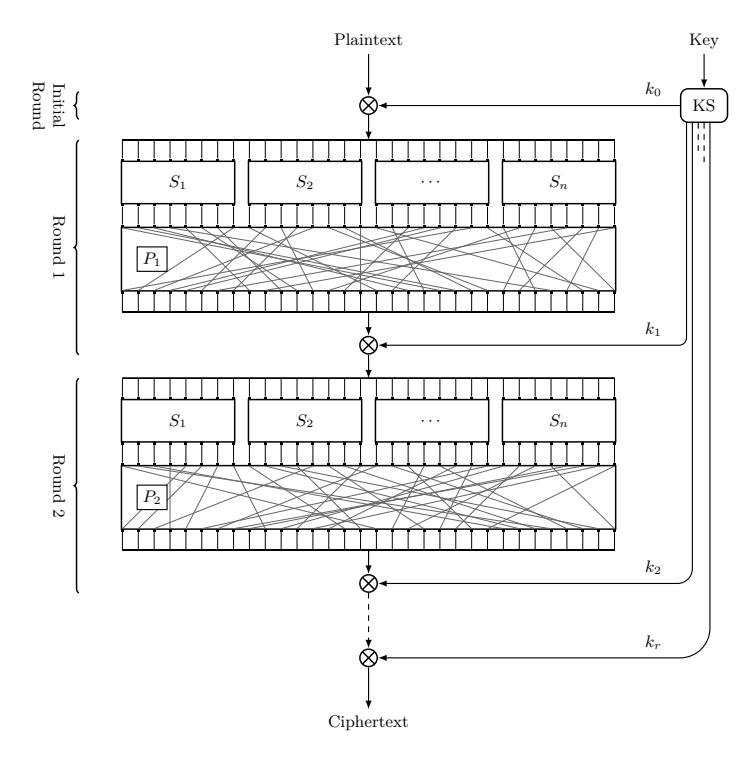
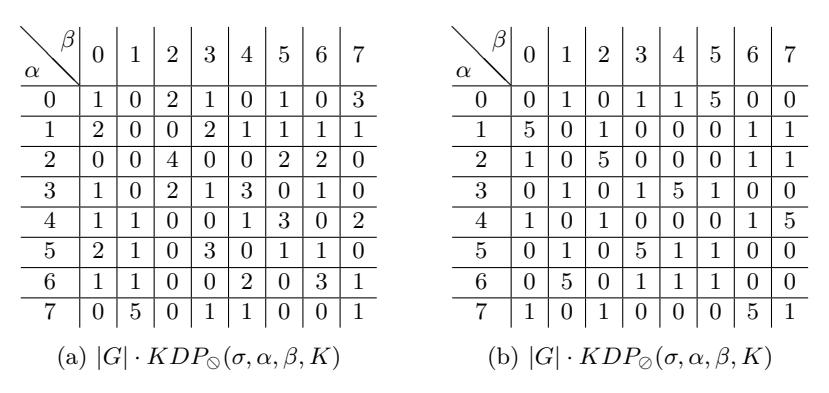

# **Quasigroups and Substitution Permutation Networks: A Failed Experiment**

George Teşeleanu1*,*2

1 Advanced Technologies Institute 10 Dinu Vintilă, Bucharest, Romania tgeorge@dcti.ro

2 Simion Stoilow Institute of Mathematics of the Romanian Academy 21 Calea Grivitei, Bucharest, Romania

**Abstract.** We introduce a generalization of substitution permutation networks using quasigroups. Then, we prove that for quasigroups isotopic with a group G, the complexity of mounting a differential attack against our generalization is the same as attacking a substitution permutation network based on G. Although the result is negative, we believe that the design can be instructional for teaching students that failure is a natural part of research. Also, we hope to prevent others from making the same mistake by showing where such a path leads.

# **1 Introduction**

In its most basic form, differential cryptanalysis [\[2](#page-13-0)] predicts how certain changes in the plaintext propagate through a cipher. When considering an ideally randomizing cipher, the probability of predicting these changes is 1*/*2 *n*, where *n* is the number of input bits. Thus, in the ideal case, it is infeasible for an attacker to use these predictions when *n* is, for example, 128. Unfortunately, designers use theoretical estimates based on certain assumptions that do not always hold in practice. Hence, differential cryptanalysis is often the most effective tool against symmetric key cryptographic algorithms [[17\]](#page-14-0).

Quasigroups are group-like structures that, unlike groups, are not required to be associative and to possess an identity element. The usage of quasigroups as building blocks for cryptographic primitives is not very common. Regardless of that, various such cryptosystems can be found in the literature [\[14](#page-13-1)[,8](#page-13-2),[7,](#page-13-3)[1,](#page-13-4)[5](#page-13-5)[,13](#page-13-6)].

In this paper we introduce a straightforward generalization of substitutionpermutation networks (SPN) and study its security. By replacing the group operation *⋆* between keys and (intermediary) plaintexts with a quasigroup operation *⊗* we aimed at extending the usage of quasigroups. Unfortunately, by means of differential cryptanalysis we prove that in the case of quasigroups isotopic with a group[3](#page-0-0) the problem of breaking an SPN using *⊗* reduces to breaking an SPN using *⋆* and a substitution box (s-box) different from the initial one. Thus, if we initialize the SPN with a random secret s-box, replacing *⋆* with *⊗* brings no

3 Note that this is the most popular method for generating quasigroups.

extra security[4](#page-1-0) . In the case of static s-boxes, changing *⋆* with *⊗* might even affect the SPN's security.

Although the design presented in this paper is not a successful one, we think that its usefulness is twofold. 1 Most scientific reports and papers published appear as sanitized accounts[5](#page-1-1) and this gives people a distorted view of scientific research [[16,](#page-14-1)[11](#page-13-7)[,23](#page-14-2)[,28](#page-14-3)]. This leads to a view that implies that failure, serendipity and unexpected results are not a normal part of science [\[11](#page-13-7)[,21](#page-14-4)]. Hence, this report provides students with an indication of the real processes of experimentation. 2 Negative results and false directions are rarely reported [\[11](#page-13-7)[,26](#page-14-5)] and, thus, people are bound to repeat the same mistakes. By presenting our results, we hope to provide an opportunity for others to learn where this path leads. Hence, preventing them to make the same mistakes[6](#page-1-2) .

*Structure of the paper.* We introduce notations and definitions in Section [2.](#page-1-3) An SPN generalization is introduced in Section [3](#page-3-0) and its security is studied in Section [4.](#page-5-0) We conclude in Section [5](#page-12-0).

# **2 Preliminaries**

*Notations.* Throughout the paper *|*G*|* will denote the cardinality of set G and *⊕* the bitwise xor operation. Also, by *x∥y* we understand the concatenation of the strings *x* and *y*. When defining a permutation *π* we further use the shorthand *π* = *{a*0*, a*1*, . . . , aℓ}* which translates into *π*(*i*) = *ai* for all *i* values. We also define the identity permutation *Id* = *{*0*, . . . , ℓ}*.

#### **2.1 Quasigroups**

In this section we introduce a few basic notions about quasigroups. We base our exposition on [\[22\]](#page-14-6).

**Definition 1.** *A quasigroup* (G*, ⊗*) *is a set* G *equipped with a binary operation ⊗* : G *×* G *→* G*, in which specification of any two of the values x, y, z in the equation x ⊗ y* = *z determines the third uniquely.*

**Definition 2.** *For a quasigroup* (G*, ⊗*) *we define the left division x ⊘z* = *y as the unique solution y to x ⊗ y* = *z. Similarly, we define the right division z ⊘ y* = *x as the unique solution x to x ⊗ y* = *z.*

**Lemma 1.** *The following identities hold*

$$y \otimes (y \otimes x) = x,$$
  $(x \otimes y) \otimes y = x,$   
 $y \otimes (y \otimes x) = x,$   $(x \otimes y) \otimes y = x.$ 

4 *i.e.* we simply obtain another instantiation of the SPN

5 Authors present their results as if they achieved them in a straightforward manner and not through a messy process.

6 In [\[24](#page-14-7)], the author advises people to write down their mistakes so that they avoid making them again in the future.

**Definition 3.** Let  $(\mathbb{G}, \otimes)$ ,  $(\mathbb{H}, \star)$  be two quasigroups. An ordered triple of bijections  $\pi$ ,  $\rho$ ,  $\omega$  of a set  $\mathbb{G}$  onto the set  $\mathbb{H}$  is called an isotopy of  $(\mathbb{G}, \otimes)$  to  $(\mathbb{H}, \star)$  if for any  $x, y \in \mathbb{G}$   $\pi(x) \star \rho(y) = \omega(x \otimes y)$ . If such an isotopy exists, then  $(\mathbb{G}, \otimes)$ ,  $(\mathbb{H}, \star)$  are called isotopic.

A popular method for constructing quasigroups [7,8,13,27] is the following. Choose a group  $(\mathbb{G},\star)$   $(e.g.\ (\mathbb{Z}_{2^n},\oplus)$  or  $(\mathbb{Z}_{2^n},+))$  and three random permutations  $\pi,\rho,\omega:\mathbb{G}\to\mathbb{G}$ . Then, define the quasigroup operation as  $x\otimes y=\omega^{-1}(\pi(x)\star\rho(y))$ . To see why this leads to a quasigroup, we note that x,y and z are mapped uniquely to  $\pi(x),\rho(y)$  and  $\omega(z)$  and, thus, any equation of the form  $\pi(x)\star\rho(y)=\omega(z)$  is in fact uniquely resolved in the base group  $\mathbb G$  given any of  $\pi(x),\rho(y)$  and  $\omega(z)$ .

Example 1. Let  $(\mathbb{G}, \star) = (\mathbb{Z}_4, \oplus)$ ,  $\omega^{-1} = \{2, 1, 0, 3\}$ ,  $\pi = \{2, 1, 3, 0\}$  and  $\rho = \{2, 0, 3, 1\}$ . The corresponding quasigroup operations for  $(\mathbb{Z}_4, \otimes)$  can be found in Table 1.

| $\begin{array}{c ccccccccccccccccccccccccccccccccccc$  | $\otimes$ | 0 | 1 | 2 | 3 |  | $\bigcirc$ | 0 | 1 | 2 | 3 |  |   |   | 1 |   |   |
|--------------------------------------------------------|-----------|---|---|---|---|--|------------|---|---|---|---|--|---|---|---|---|---|
| $\begin{array}{ c c c c c c c c c c c c c c c c c c c$ | 0         | 2 | 0 | 1 | 3 |  | 0          | 1 | 2 | 0 | 3 |  |   |   |   |   |   |
| 2 1 3 2 0 2 3 0 2 1 2 0 3 2 1                          | 1         | 3 | 1 | 0 | 2 |  | 1          | 2 | 1 | 3 | 0 |  | 1 | 2 | 1 | 0 | 3 |
|                                                        | 2         | 1 | 3 | 2 | 0 |  | 2          | 3 | 0 | 2 | 1 |  |   |   |   |   |   |
| 3 0 2 3 1 3 0 3 1 2 3 0                                | 3         | 0 | 2 | 3 | 1 |  | 3          | 0 | 3 | 1 | 2 |  | 3 | 1 | 2 | 3 | 0 |

Table 1: Quasigroup operations.

Example 2. Let  $(\mathbb{G}, \star) = (\mathbb{Z}_n, -)$ . Then  $\mathbb{G}$  is isotopic with  $(\mathbb{Z}_n, +)$ , where  $\omega, \pi = Id$  and  $\rho(i) = n - i \mod n$  [27].

#### 2.2 Group Differential Cryptanalysis

Differential cryptanalysis was initially introduced in [2] for  $(\mathbb{Z}_{2^n}, \oplus)$  and was extended to abelian groups in [15]. We further extend the notion to non-commutative groups.

**Definition 4.** Let  $\mathbb{G}$  be a set equipped with a binary operation  $\bullet : \mathbb{G} \times \mathbb{G} \to \mathbb{G}$ . The difference between two elements  $X, X' \in (\mathbb{G}, \bullet)$  is defined as  $\Delta_{\bullet}(X, X') = X \bullet X'$ .

**Definition 5.** Let  $(\mathbb{G}, \star)$  be a group. We define the group differential probabilities

$$LDP_{\star}(\sigma, \alpha, \beta) = \frac{1}{|\mathbb{G}|} \sum_{\substack{X, X' \in \mathbb{G} \\ \Delta_{\star}(X^{-1}, X') = \alpha}} [\Delta_{\star}(\sigma(X)^{-1}, \sigma(X')) = \beta]$$

$$RDP_{\star}(\sigma, \alpha, \beta) = \frac{1}{|\mathbb{G}|} \sum_{\substack{X, X' \in \mathbb{G} \\ \Delta_{\star}(X, X'^{-1}) = \alpha}} [\Delta_{\star}(\sigma(X), \sigma(X')^{-1}) = \beta].$$

*where σ* : G *→* G *is a permutation and α, β ∈* G*.*

Differential cryptanalysis exploits the high probability of certain occurrences of plaintext differences and differences into the last round of the cipher [\[10](#page-13-8)]. Thus, an attacker first computes the values of a round's *LDP*s (*RDP*s). Note that in the case of groups *LDP*s are dependent only on the round's non-linear layer. Hence, in the case of SPNs only the s-box's *LDP* values are needed. Once the *LDP*s are computed, the attacker examines likely differential characteristics. By a differential characteristic *χ* we understand a sequence of input and output differences such that the output difference of a round is the input difference of the next round. Using the most likely differential characteristic[7](#page-3-1) an attacker exploits information coming into the last round of the cipher to derive parts of the last layer's subkey. More precisely, he partially decrypts the last round for each pair of ciphertexts[8](#page-3-2) for all possible partial subkeys. When the difference for the input to the last round corresponds to the value expected from *χ* a counter incremented. The partial subkey value with the highest counter is assumed to be the correct partial subkey. For a concrete example of the whole process, we refer the reader to [\[10](#page-13-8)].

*Example 3.* Let (G*, ⋆*) = (Z8*, ⊕*) and *σ* = *{*5*,* 1*,* 0*,* 3*,* 4*,* 2*,* 6*,* 7*}*. The difference distribution table for the *⊕* operation and the *σ* s-box can be found in Table [2.](#page-3-3) For simplicity, we multiplied all the *LDP⊕*(*σ, α, β*) values by *|*G*|*. Note that in this case *LDP⊕* = *RDP⊕*.

| β ❅ α ❅❅ | 0 | 1 | 2 | 3 | 4 | 5 | 6 | 7 |
|----------------|---|---|---|---|---|---|---|---|
| 0              | 8 | 0 | 0 | 0 | 0 | 0 | 0 | 0 |
| 1              | 0 | 2 | 0 | 2 | 2 | 0 | 2 | 0 |
| 2              | 0 | 0 | 4 | 0 | 0 | 4 | 0 | 0 |
| 3              | 0 | 2 | 0 | 2 | 2 | 0 | 2 | 0 |
| 4              | 0 | 2 | 0 | 2 | 2 | 0 | 2 | 0 |
| 5              | 0 | 0 | 0 | 0 | 0 | 4 | 0 | 4 |
| 6              | 0 | 2 | 0 | 2 | 2 | 0 | 2 | 0 |
| 7              | 0 | 0 | 4 | 0 | 0 | 0 | 0 | 4 |

Table 2: Difference distribution table for *⊕* and *σ*.

# **3 Quasigroup Substitution Permutation Network**

Let *n* be a positive integer and (G*, ⊗*) a quasigroup. An SPN (see Figure [1](#page-4-0)) [9](#page-3-4) is an iterated structure that processes a plaintext for *r* rounds. Each round consist

7 When constructing differential trails we ignore the case *α, β* = *e*, where *e* is the identity element of G.

8 corresponding to the pairs of plaintexts used to generate *χ*

9 Figure [1](#page-4-0) is based on the TikZ found in [\[12](#page-13-9)].

Fig. 1: Quasigroup substitution permutation network

of a substitution layer  $(S_1, \ldots, S_n)$ , a permutation layer  $(P_i)$  and a key mixing operation. Also, the SPN has an initial round that consists only of a key mixing operation. Note that for each round i the key schedule algorithm (KS) derives the subkey  $k_i$  from the initial key.

Let  $p_i = p_i^1 \| \dots \| p_i^n$  and  $k_i = k_i^1 \| \dots \| k_i^n$  be the intermediary plaintext and, respectively, the subkey for round  $i^{10}$ . Then, a left quasigroup SPN has as a key mixing operation  $k_i \otimes p_i = k_i^1 \otimes p_i^1 \| \dots \| k_i^n \otimes p_i^n$ , while a right quasigroup SPN has  $p_i \otimes k_i = p_i^1 \otimes k_i^1 \| \dots \| p_i^n \otimes k_i^n$ .

Remark 1. Let  $S_i$  be randomly chosen for all i values. When  $(\mathbb{G}, \otimes) = (\mathbb{Z}_{2^n}, \oplus)$ , the distribution of LDP values is studied in [20,19]. These results are extended in [9], where the authors consider a generic abelian group  $(\mathbb{G}, \otimes)$ . When all the s-boxes are static11, the distribution of LDPs for  $(\mathbb{Z}_{2^n}, \oplus)$  is studied for example in [18,4,6].

Note that  $p_i^j, k_i^j \in \mathbb{G}$  for all j values.

1 i.e are fixed and public for all of the SPN's implementations

## 4 Quasigroup Differential Cryptanalysis

In this section we extend the notion of differential cryptanalysis to quasigroup SPNs. After showing that our generalisation is correct, we use it to study the security of SPNs based on quasigroups isotopic to a group.

**Definition 6.** Let K be a key,  $(\mathbb{G}, \otimes)$  a quasigroup and  $\bullet \in \{ \odot, \oslash \}$ . We define the quasigroup differential probabilities

$$DP_{\bullet}(\sigma, \alpha, \beta) = \frac{1}{|\mathbb{G}|} \sum_{\substack{X, X' \in \mathbb{G} \\ \Delta_{\bullet}(X, X') = \alpha}} [\Delta_{\bullet}(\sigma(X), \sigma(X')) = \beta],$$

$$KDP_{\otimes}(\sigma, \alpha, \beta, K) = \frac{1}{|\mathbb{G}|} \sum_{\substack{X, X' \in \mathbb{G} \\ \Delta_{\otimes}(X, X') = \alpha}} [\Delta_{\otimes}(\sigma(K \otimes X), \sigma(K \otimes X')) = \beta],$$

$$KDP_{\otimes}(\sigma, \alpha, \beta, K) = \frac{1}{|\mathbb{G}|} \sum_{\substack{X, X' \in \mathbb{G} \\ \Delta_{\otimes}(X, X') = \alpha}} [\Delta_{\otimes}(\sigma(X \otimes K), \sigma(X' \otimes K)) = \beta],$$

where  $\sigma: \mathbb{G} \to \mathbb{G}$  is a permutation and  $\alpha, \beta \in \mathbb{G}$ .

Example 4. Let  $\omega^{-1}=\{4,7,0,5,1,2,3,6\}$ ,  $\pi=\{6,1,5,2,3,0,4,7\}$  and  $\rho=\{5,1,2,6,4,0,7,3\}$ . Using Example 3 as a starting point, in Table 3 we present the difference distribution tables for  $\otimes$  and  $\sigma$ . To see that in general DP is

| $\alpha$ $\beta$                                  | 0 | 1 | 2 | 3 | 4 | 5 | 6 | 7 |  | $\alpha$ $\beta$                                    | 0 | 1 | 2 | 3 | 4 | 5 | 6 | 7 |
|---------------------------------------------------|---|---|---|---|---|---|---|---|--|-----------------------------------------------------|---|---|---|---|---|---|---|---|
| 0                                                 | 5 | 0 | 0 | 1 | 1 | 0 | 1 | 0 |  | 0                                                   | 3 | 2 | 1 | 0 | 0 | 0 | 1 | 1 |
| 1                                                 | 0 | 2 | 1 | 1 | 1 | 1 | 2 | 0 |  | 1                                                   | 1 | 3 | 0 | 0 | 1 | 2 | 1 | 0 |
| 2                                                 | 1 | 1 | 3 | 1 | 2 | 0 | 0 | 0 |  | 2                                                   | 0 | 0 | 3 | 1 | 1 | 2 | 1 | 0 |
| 3                                                 | 0 | 1 | 0 | 3 | 0 | 1 | 1 | 2 |  | 3                                                   | 0 | 1 | 2 | 3 | 0 | 0 | 1 | 1 |
| 4                                                 | 0 | 1 | 1 | 0 | 3 | 0 | 1 | 2 |  | 4                                                   | 1 | 0 | 0 | 1 | 3 | 0 | 2 | 1 |
| 5                                                 | 1 | 1 | 0 | 2 | 1 | 3 | 0 | 0 |  | 5                                                   | 2 | 0 | 0 | 2 | 0 | 4 | 0 | 0 |
| 6                                                 | 1 | 2 | 1 | 0 | 0 | 1 | 3 | 0 |  | 6                                                   | 1 | 1 | 1 | 1 | 2 | 0 | 2 | 0 |
| 7                                                 | 0 | 0 | 2 | 0 | 0 | 2 | 0 | 4 |  | 7                                                   | 0 | 1 | 1 | 0 | 1 | 0 | 0 | 5 |
| (a) $ G  \cdot DP_{\odot}(\sigma, \alpha, \beta)$ |   |   |   |   |   |   |   |   |  | (b) $ G  \cdot DP_{\otimes}(\sigma, \alpha, \beta)$ |   |   |   |   |   |   |   |   |

Table 3: Difference distribution tables for  $\otimes$  and  $\sigma$ .

different from KDP, we also computed the keyed distribution tables for K=0. The results are presented in Table 4.12

The code used to generate Tables 2 to 5 can be found at https://github.com/teseleanu/quasigroup\_differential\_4\_bit.

Table 4: Keyed difference distribution tables for *⊗* and *σ*.

When G is an associative quasigroup[13](#page-6-1), we managed to prove (Lemma [2\)](#page-6-2) that key bits *K* have no influence on the input difference value *∆•*, where *• ∈ { ⊘, ⊘}*, and, thus, can be ignored. In other words, a keyed s-box has the same difference distribution table as an unkeyed s-box (Corollary [1](#page-6-3)).

**Lemma 2.** *If ⊗ is associative, then the following identities hold*

$$\begin{split} &\Delta_{\odot}(K\otimes X, K\otimes X') = \Delta_{\odot}(X, X') \\ &\Delta_{\odot}(X\otimes K, X'\otimes K) = \Delta_{\odot}(X, X'). \end{split}$$

*Proof.* Using Lemma [1](#page-1-4) we obtain

$$X \otimes \Delta_{\otimes}(X, X') = X \otimes (X \otimes X') = X',$$

that leads to

$$\Delta_{\otimes}(K \otimes X, K \otimes X') = (K \otimes X) \otimes (K \otimes X')$$

$$= (K \otimes X) \otimes [K \otimes (X \otimes \Delta_{\otimes}(X, X'))]$$

$$= (K \otimes X) \otimes [(K \otimes X) \otimes \Delta_{\otimes}(X, X')]$$

$$= \Delta_{\otimes}(X, X').$$

Similarly we prove the second equation. *⊓⊔*

**Corollary 1.** *If ⊗ is associative, then the following identities hold*

$$\begin{split} KDP_{\otimes}(\sigma,\alpha,\beta,K) &= DP_{\otimes}(\sigma,\alpha,\beta), \\ KDP_{\otimes}(\sigma,\alpha,\beta,K) &= DP_{\otimes}(\sigma,\alpha,\beta). \end{split}$$

13 The need for associativity was pointed out to the author by one of the anonymous reviewers.

*Proof.* According to Definition 1, given X and K there exists an unique element Y such that  $X = K \otimes Y$ . Thus, we have

$$\begin{split} DP_{\odot}(\sigma,\alpha,\beta) &= \frac{1}{|\mathbb{G}|} \sum_{\substack{X,X' \in \mathbb{G} \\ \Delta_{\odot}(X,X') = \alpha}} [\Delta_{\odot}(\sigma(X),\sigma(X')) = \beta] \\ &= \frac{1}{|\mathbb{G}|} \sum_{\substack{K \otimes Y,K \otimes Y' \in \mathbb{G} \\ \Delta_{\odot}(K \otimes Y,K \otimes Y') = \alpha}} [\Delta_{\odot}(\sigma(K \otimes Y),\sigma(K \otimes Y')) = \beta] \\ &= \frac{1}{|\mathbb{G}|} \sum_{\substack{K \otimes Y,K \otimes Y' \in \mathbb{G} \\ \Delta_{\odot}(Y,Y') = \alpha}} [\Delta_{\odot}(\sigma(K \otimes Y),\sigma(K \otimes Y')) = \beta] \\ &= \frac{1}{|\mathbb{G}|} \sum_{\substack{Y,Y' \in \mathbb{G} \\ \Delta_{\odot}(Y,Y') = \alpha}} [\Delta_{\odot}(\sigma(K \otimes Y),\sigma(K \otimes Y')) = \beta] \\ &= KDP_{\odot}(\sigma,\alpha,\beta,K), \end{split}$$

where for the third equality we use Lemma 2. Similarly, we prove the second equation.  $\Box$ 

To see if our definition is a generalization for the group differential probability, we must recover LDP and RDP when  $(\mathbb{G}, \otimes)$  is a group. We prove this in Corollary 2. Note that any group is associative and, according to Corollary 1, equivalence to DP suffices.

**Lemma 3.** If  $(\mathbb{G}, \otimes)$  forms a group then the following identities hold

$$\Delta_{\otimes}(X, X') = \Delta_{\otimes}(X^{-1}, X'),$$
  
$$\Delta_{\otimes}(X, X') = \Delta_{\otimes}(X', X^{-1}).$$

Proof. Note that

$$\Delta_{\otimes}(X, X') = \alpha \Longleftrightarrow X \otimes \alpha = X'$$
$$\iff X^{-1} \otimes X' = \alpha \Longleftrightarrow \Delta_{\otimes}(X^{-1}, X') = \alpha.$$

Similarly, we prove the second equation.

**Corollary 2.** If  $(\mathbb{G}, \otimes)$  forms a group then  $DP_{\otimes}(\sigma, \alpha, \beta) = LDP_{\otimes}(\sigma, \alpha, \beta)$  and  $DP_{\otimes}(\sigma, \alpha, \beta) = RDP_{\otimes}(\sigma, \alpha, \beta)$ .

Proof. Note that

$$\begin{split} DP_{\otimes}(\sigma,\alpha,\beta) &= \frac{1}{|\mathbb{G}|} \sum_{\substack{X,X' \in \mathbb{G} \\ \Delta_{\otimes}(X,X') = \alpha}} [\Delta_{\otimes}(\sigma(X),\sigma(X')) = \beta] \\ &= \frac{1}{|\mathbb{G}|} \sum_{\substack{X,X' \in \mathbb{G} \\ \Delta_{\otimes}(X^{-1},X') = \alpha}} [\Delta_{\otimes}(\sigma(X)^{-1},\sigma(X')) = \beta] \\ &= LDP_{\otimes}(\sigma,\alpha,\beta). \end{split}$$

The action of deriving *⊗* from *⋆* gives rise to a natural question: what happens if we derive a new quasigroup operation *⊗*ˆ from *⊗*? Unfortunately, according to Lemma [4](#page-8-0) we end up with another isotopy of *⋆*. Thus, the problem of studying *KDP* for a chain of isotopies is reduced to studying *KDP* for an isotopy of the base operation *⋆*.

**Lemma 4.** *We define x ⊗*ˆ *y* = ˆ*ω −*1 (ˆ*π*(*x*) *⊗ ρ*ˆ(*y*))*. Then there exist ω ′ , π′ , ρ′ such that x ⊗*ˆ *y* = *ω ′−*1 (*π ′* (*x*) *⋆ ρ′* (*y*))*.*

*Proof.* Remark that

$$\begin{split} x \, \hat{\otimes} \, y &= \hat{\omega}^{-1}(\hat{\pi}(x) \otimes \hat{\rho}(y)) \\ &= \hat{\omega}^{-1}(\omega^{-1}(\pi(\hat{\pi}(x)) \star \rho(\hat{\rho}(y))) \\ &= \omega'^{-1}(\pi'(x) \star \rho'(y)), \end{split}$$

where *ω ′* = ˆ*ω ◦ ω*, *π ′* = ˆ*π ◦ π* and *ρ ′* = ˆ*ρ ◦ ρ*. *⊓⊔*

When the base group (G*, ⋆*) is commutative we observe (Lemma [5\)](#page-8-1) that taking into consideration both *⊘*and *⊘* for designing an SPN does not make sense.

**Lemma 5.** *We define x ⊗*¯ *y* = *ω −*1 (*ρ*(*x*) *⋆ π*(*y*)) = *z, x* ¯*⊘z* = *y and z ⊘*¯ *y* = *x. If ⋆ is commutative then the following identities hold*

$$\begin{split} KDP_{\odot}(\sigma,\alpha,\beta,K) &= KDP_{\bar{\odot}}(\sigma,\alpha,\beta,K), \\ KDP_{\odot}(\sigma,\alpha,\beta,K) &= KDP_{\bar{\odot}}(\sigma,\alpha,\beta,K). \end{split}$$

*Proof.* The lemma's hypothesis implies that

$$x \otimes y = \omega^{-1}(\pi(x) \star \rho(y))$$
$$= \omega^{-1}(\rho(x) \star \pi(y))$$
$$= y \bar{\otimes} x.$$

Thus, *∆ ⊘*(*x, y*) = *∆ ⊘*¯ (*y, x*) for any *x, y ∈* G. Hence, *KDP ⊘*(*σ, α, β, K*) = *KDP⊘*¯ (*σ, α, β, K*). The second statement is proven similarly. *⊓⊔*

**Corollary 3.** *If ⋆ is commutative and π* = *ρ then we have KDP ⊘*(*σ, α, β, K*) = *KDP⊘*(*σ, α, β, K*)*.*

We further study the impact of the *ω*, *π*, *ρ* permutations on *KDP*.

**Lemma 6.** *Let π ′* = *ω −*1 *◦ π, ρ ′* = *ω −*1 *◦ ρ, σ ′* = *ω −*1 *◦ σ ◦ ω. We define x ∗ y* = *π ′* (*x*) *⋆ ρ′* (*y*) = *z, x\z* = *y and z/y* = *x. Then the following identities hold*

$$\begin{split} KDP_{\otimes}(\sigma,\alpha,\beta,K) &= KDP_{\wedge}(\sigma',\omega(\alpha),\omega(\beta),\omega(K)),\\ KDP_{\otimes}(\sigma,\alpha,\beta,K) &= KDP_{/}(\sigma',\omega(\alpha),\omega(\beta),\omega(K)). \end{split}$$

*Proof.* First we rewrite

$$KDP_{\otimes}(\sigma, \alpha, \beta, K) = \frac{1}{|\mathbb{G}|} \sum_{\substack{X \in \mathbb{G} \\ \Delta_{\otimes}(X, \alpha) = X'}} [\Delta_{\otimes}(\sigma(K \otimes X), \beta) = \sigma(K \otimes X')].$$

Let  $\omega(X) = Y$ ,  $\omega(X') = Y'$  and  $\omega(\alpha) = A$ . Then

$$X \otimes \alpha = X' \Longleftrightarrow \pi(X) \star \rho(\alpha) = \omega(X')$$

$$\iff \pi'(\omega(X)) \star \rho'(\omega(\alpha)) = \omega(X')$$

$$\iff \pi'(Y) \star \rho'(A) = Y'$$

$$\iff Y * A = Y'.$$
(1)

Let  $\omega(K) = K'$ . Then we obtain

$$\sigma(K \otimes X) = \sigma(\omega^{-1}(\pi(K) \star \rho(X))$$

$$= \sigma(\omega^{-1}(\pi'(\omega(K)) \star \rho'(\omega(X))))$$

$$= \omega^{-1}(\sigma'(\pi'(K') \star \rho'(Y)))$$

$$= \omega^{-1}(\sigma'(K' \star Y))$$
(2)

and similarly

$$\sigma(K \otimes X') = \omega^{-1}(\sigma'(K' * Y')). \tag{3}$$

Let  $\omega(\beta) = B$ . Using Equations (2) and (3) we obtain

$$\sigma(K \otimes X) \otimes \beta = \sigma(K \otimes X') \iff \omega^{-1}(\sigma'(K' * Y)) \otimes \beta = \omega^{-1}(\sigma'(K' * Y'))$$

$$\iff \pi'(\sigma'(K' * Y)) \star \rho(\beta) = \sigma'(K' * Y')$$

$$\iff \pi'(\sigma'(K' * Y)) \star \rho'(\omega(\beta)) = \sigma'(K' * Y')$$

$$\iff \sigma'(K' * Y) * B = \sigma'(K' * Y'). \tag{4}$$

Using Equations (1) and (4) we obtain

$$KDP_{\odot}(\sigma, \alpha, \beta, K) = \frac{1}{|\mathbb{G}|} \sum_{\substack{X \in \mathbb{G} \\ \Delta_{\odot}(X, \alpha) = X'}} [\Delta_{\odot}(\sigma(K \otimes X), \beta) = \sigma(K \otimes X')]$$

$$= \frac{1}{|\mathbb{G}|} \sum_{\substack{Y \in \mathbb{G} \\ \Delta_{\ast}(Y, A) = Y'}} [\Delta_{\ast}(\sigma'(K' * Y), B) = \sigma'(K' * Y')]$$

$$= \frac{1}{|\mathbb{G}|} \sum_{\substack{Y, Y' \in \mathbb{G} \\ \Delta_{\backslash}(Y, Y') = A}} [\Delta_{\backslash}(\sigma'(K' * Y), \sigma'(K' * Y')) = B]$$

$$= KDP_{\backslash}(\sigma', A, B, K').$$

Similarly, we obtain  $KDP_{\emptyset}(\sigma, \alpha, \beta, K) = KDP_{I}(\sigma', A, B, K)$ .

Lemma [6](#page-8-2) tells us that it is irrelevant from a differential point of view[14](#page-10-0) if we define the quasigroup operation with *ω ̸*= *Id* or *ω* = *Id*. Thus, we further restrict our study[15](#page-10-1) to the quasigroup operation *x ⊗ y* = *π*(*x*) *⋆ ρ*(*y*).

**Lemma 7.** *Let π ′* = *ρ −*1 *◦π, σ ′* = *ρ −*1 *◦σ◦ρ. We define x∗*1 *y* = *ρ*(*π ′* (*x*)*⋆y*) = *z, x\*1*z* = *y and z/*1*y* = *x. Then the following identity holds*

$$KDP_{\odot}(\sigma,\alpha,\beta,K) = KDP_{\backslash_1}(\sigma',\rho(\alpha),\rho(\beta),\rho(K)).$$

*Proof.* Let *ρ*(*X*) = *Y* , *ρ*(*X′* ) = *Y ′* and *ρ*(*α*) = *A*. Then

$$X \otimes \alpha = X' \Longleftrightarrow \pi(X) \star \rho(\alpha) = X'$$

$$\iff \rho(\pi'(\rho(X)) \star A) = \rho(X')$$

$$\iff \rho(\pi'(Y) \star A) = Y'$$

$$\iff Y *_1 A = Y'.$$
(5)

Let *ρ*(*K*) = *K′* . Then we obtain

$$\sigma(K \otimes X) = \sigma(\pi(K) \star \rho(X))$$

$$= \sigma(\pi'(\rho(K)) \star Y)$$

$$= \rho^{-1}(\sigma'(\rho(\pi'(K') \star Y)))$$

$$= \rho^{-1}(\sigma'(K' \star_1 Y))$$
(6)

and similarly

$$\sigma(K \otimes X') = \rho^{-1}(\sigma'(K' *_1 Y')). \tag{7}$$

*⊓⊔*

Let *ω*(*β*) = *B*. Using Equations [\(6](#page-10-2)) and ([7\)](#page-10-3) we obtain

$$\sigma(K \otimes X) \otimes \beta = \sigma(K \otimes X') \iff \rho^{-1}(\sigma'(K' *_1 Y)) \otimes \beta = \rho^{-1}(\sigma'(K' *_1 Y'))$$

$$\iff \pi'(\sigma'(K' *_1 Y)) \star \rho(\beta) = \rho^{-1}(\sigma'(K' *_1 Y'))$$

$$\iff \rho(\pi'(\sigma'(K' *_1 Y)) \star B) = \sigma'(K' *_1 Y')$$

$$\iff \sigma'(K' *_1 Y) *_1 B = \sigma'(K' *_1 Y'). \tag{8}$$

Using Equations ([5\)](#page-10-4) and [\(8](#page-10-5)) we obtain

$$KDP_{\otimes}(\sigma, \alpha, \beta, K) = \frac{1}{|\mathbb{G}|} \sum_{\substack{X \in \mathbb{G} \\ \Delta_{\otimes}(X, \alpha) = X'}} [\Delta_{\otimes}(\sigma(K \otimes X), \beta) = \sigma(K \otimes X')]$$

$$= \frac{1}{|\mathbb{G}|} \sum_{\substack{Y \in \mathbb{G} \\ \Delta_{*_{1}}(Y, A) = Y'}} [\Delta_{*_{1}}(\sigma'(K' *_{1} Y), B) = \sigma'(K' *_{1} Y')]$$

$$= KDP_{\backslash_{1}}(\sigma', A, B, K').$$

14 *e.g.* we obtain the same differential probability *KDP*

15 without loss of generality

**Lemma 8.** Let  $\rho' = \pi^{-1} \circ \rho$ ,  $\sigma' = \pi^{-1} \circ \sigma \circ \pi$ . We define  $x *_2 y = \pi(x \star \rho'(y)) = z$ ,  $x \setminus_2 z = y$  and  $z /_2 y = x$ . Then the following identity holds

$$KDP_{\otimes}(\sigma, \alpha, \beta, K) = KDP_{/2}(\sigma', \pi(\alpha), \pi(\beta), \pi(K)).$$

Lemma 8 is proven similarly to Lemma 7 and, thus, its proof is omitted. Remark that our scope is to see how certain differences in the input affect the output of the non-linear layer. But our non-linear layer has either the form  $\sigma(\rho(\pi(x) \star y))$  or the form  $\sigma(\pi(x \star \rho(y)))$ . Thus, a simpler strategy would be to study directly  $\sigma_1 = \rho \circ \sigma$  and  $\sigma_2 \pi \circ \sigma$  instead of  $\sigma$ . Taking into account the previous remark, we further restrict our study to  $x \otimes_1 y = \pi(x) \star y$  and  $x \otimes_2 y = x \star \rho(y)$ .

*Example 5.* Using Examples 3 and 4 as starting points, in Table 5 we present the difference distribution tables for  $\otimes_1$  and  $\otimes_2$ .

| $\alpha$ $\beta$                                              | 0 | 1 | 2 | 3 | 4 | 5 | 6 | 7 |   | $\alpha$ $\beta$ | 0            | 1         | 2  | 3               | 4                    | 5               | 6    | 7 |
|---------------------------------------------------------------|---|---|---|---|---|---|---|---|---|------------------|--------------|-----------|----|-----------------|----------------------|-----------------|------|---|
| 0                                                             | 2 | 2 | 0 | 0 | 0 | 0 | 2 | 2 | - | 0                | 2            | 2         | 2  | 2               | 0                    | 0               | 0    | 0 |
| 1                                                             | 0 | 2 | 0 | 2 | 2 | 0 | 0 | 2 |   | 1                | 2            | 0         | 0  | 2               | 2                    | 0               | 0    | 2 |
| 2                                                             | 0 | 0 | 2 | 2 | 0 | 0 | 2 | 2 | - | 2                | 0            | 0         | 2  | 2               | 2                    | 0               | 2    | 0 |
| 3                                                             | 2 | 0 | 2 | 0 | 2 | 0 | 0 | 2 |   | 3                | 0            | 2         | 0  | 2               | 0                    | 0               | 2    | 2 |
| 4                                                             | 2 | 0 | 0 | 2 | 2 | 0 | 2 | 0 |   | 4                | 2            | 2         | 0  | 0               | 2                    | 0               | 2    | 0 |
| 5                                                             | 0 | 0 | 0 | 0 | 0 | 8 | 0 | 0 |   | 5                | 0            | 0         | 0  | 0               | 0                    | 8               | 0    | 0 |
| 6                                                             | 2 | 2 | 2 | 2 | 0 | 0 | 0 | 0 |   | 6                | 2            | 0         | 2  | 0               | 0                    | 0               | 2    | 2 |
| 7                                                             | 0 | 2 | 2 | 0 | 2 | 0 | 2 | 0 |   | 7                | 0            | 2         | 2  | 0               | 2                    | 0               | 0    | 2 |
| (a) $ G  \cdot KDP_{\mathcal{O}_1}(\sigma, \alpha, \beta, K)$ |   |   |   |   |   |   |   |   |   | (b)              | )   <i>G</i> | $ \cdot $ | KD | $P_{\oslash_2}$ | $(\sigma, \epsilon)$ | $\alpha, \beta$ | K, K | ) |

Table 5: Difference distribution tables for  $\otimes_1$  and  $\otimes_2$ .

Example 6. Let  $\mathbb{G} = \mathbb{Z}_{256}$ . To see how the maximum values for  $LDP_{\oplus}$ ,  $KDP_{\odot_1}$  and  $KDP_{\odot_2}$  are distributed, we run the following experiment 10000 times 16. We randomly generated  $\pi$ ,  $\rho$  and then we computed the maximum values of  $256 \cdot LDP_{\oplus}^{17}$ . Then we generated 1000 keys and for each  $\pi$  and  $\rho$  we computed the mean value of the maximum values of  $256 \cdot KDP_{\odot_1}$  and  $256 \cdot KDP_{\odot_2}$ . After gathering data from these experiments we computed the expected value E[x] and the median absolute deviation MAD for each differential probability. The results are presented in Table 6.

We can see from Examples 3 and 5 that the difference distribution tables for  $\oplus$ ,  $\otimes_1$  and  $\otimes_2$  have nothing in common. Also, Example 6 tells us that the

The associated code can be found at https://github.com/teseleanu/quasigroup\_differential\_8\_bit.

&lt;sup>17 In this case we excluded the value 256.

|      | LDP⊕     | KDP ⊘1   | KDP⊘2    |
|------|----------|----------|----------|
| E[x] | 11.3550  | 7.56167  | 7.56204  |
| MAD  | 1.067740 | 0.036824 | 0.036817 |

Table 6: Distribution of maximal differential probabilities.

average probability of success for a differential attack is lower in the case of *⊗*1 and *⊗*2 than in the case of *⊕*. Thus, it might seem that we discovered a new method for improving SPNs.

Unfortunately, this is not the case. Let's review what we want to do. We want to study how input differences affect the output differences of a keyed sbox *σK*. Since *K* and, for example, *π* are generated as a pair, for a differential attack to work we do not really need to know *K*. The value *π*(*K*) suffices. Thus, another way of studying the output differences of *SK* is by using *∆⋆*. According to Lemma [9](#page-12-2) the resulting differential probability is independent of *π*(*K*). Hence, the choice for the permutation that acts on the key is irrelevant. This leads to the fact that using an isotopy is identical[18](#page-12-3) to using the base operation.

**Lemma 9.** *The following identities hold*

$$\Delta_{\star}((\pi(K) \star X)^{-1}, \pi(K) \star X') = \Delta_{\star}(X^{-1}, X'),$$
  
$$\Delta_{\star}(X \star \pi(K), (X' \star \pi(K))^{-1}) = \Delta_{\star}(X, X'^{-1}).$$

*Proof.* We simply remark that

$$\Delta_{\star}((\pi(K) \star X)^{-1}, \pi(K) \star X') = X^{-1} \star \pi(K)^{-1} \star \pi(K) \star X'$$
$$= X^{-1} \star X' = \Delta_{\star}(X^{-1}, X').$$

Similarly we obtain the second equation. *⊓⊔*

To summarise all the lemmas and observations we provide the reader with Proposition [1](#page-12-4).

**Proposition 1.** *A quasigroup SPN derived from a group SPN using an isotopy has the same differential security as the same group SPN instantiated with a different s-box.*

## **5 Conclusions**

In this paper we studied the effect of using quasigroups isotopic to groups when designing SPNs. According to Lemmas [6](#page-8-2) to [9,](#page-12-2) the problem of studying an SPN based on an isotopic quasigroup reduces to studying an SPN based on the base group. When we consider SPNs with random secret s-boxes (*e.g.* [\[3](#page-13-13)[,25](#page-14-13)]) using an isotopic quasigroup does not pose a problem, since studying its security reduces

18 from a differential point of view

to studying the security of an SPN with a different s-box than the original one. Thus, in this case, the extension is secure, but, nevertheless, useless. When we consider static s-boxes we encounter a security problem. Since the resulting new s-box might not have the cryptographic properties of the initial s-box, using a quasigroup operation might lead to cryptographic weaknesses unforeseen by the designers of the static s-box.

Although this experiment failed from a cryptographic point of view, in our opinion it can still be useful as a teaching tool, as well as for preventing others from making the same mistake. Also, our analysis might serve as a stepping stone to a security analysis of generic quasigroup SPNs.

## **References**

- 1. Bakhtiari, S., Safavi-Naini, R., Pieprzyk, J.: A Message Authentication Code Based on Latin Squares. In: ACISP 1997. Lecture Notes in Computer Science, vol. 1270, pp. 194–203. Springer (1997)
- 2. Biham, E., Shamir, A.: Differential Cryptanalysis of DES-like Cryptosystems. In: CRYPTO 1990. Lecture Notes in Computer Science, vol. 537, pp. 2–21. Springer (1991)
- 3. Borghoff, J., Knudsen, L.R., Leander, G., Thomsen, S.S.: Cryptanalysis of PRESENT-Like Ciphers with Secret S-Boxes. In: FSE 2011. Lecture Notes in Computer Science, vol. 6733, pp. 270–289. Springer (2011)
- 4. Canteaut, A., Charpin, P., Dobbertin, H.: Weight Divisibility of Cyclic Codes, Highly Nonlinear Functions on F2m , and Crosscorrelation of Maximum-Length Sequences. SIAM J. Discrete Math. **13**(1), 105–138 (2000)
- 5. Dénes, J., Keedwell, A.D.: A New Authentication Scheme Based on Latin Squares. Discrete Mathematics **106**, 157–161 (1992)
- 6. Dobbertin, H.: One-to-One Highly Nonlinear Power Functions on GF(2n). Appl. Algebra Eng. Commun. Comput. **9**(2), 139–152 (1998)
- 7. Gligoroski, D., Markovski, S., Knapskog, S.J.: The Stream Cipher Edon80. In: New Stream Cipher Designs, Lecture Notes in Computer Science, vol. 4986, pp. 152–169. Springer (2008)
- 8. Gligoroski, D., Markovski, S., Kocarev, L.: Edon-R, An Infinite Family of Cryptographic Hash Functions. I.J. Network Security **8**(3), 293–300 (2009)
- 9. Hawkes, P., O'Connor, L.: XOR and Non-XOR Differential Probabilities. In: EU-ROCRYPT 1999. Lecture Notes in Computer Science, vol. 1592, pp. 272–285. Springer (1999)
- 10. Heys, H.M.: A Tutorial on Linear and Differential Cryptanalysis. Cryptologia **26**(3), 189–221 (2002)
- 11. Howitt, S.M., Wilson, A.N.: Revisiting "Is the Scientific Paper a Fraud?". EMBO Reports **15**(5), 481–484 (2014)
- 12. Jean, J.: TikZ for Cryptographers. <https://www.iacr.org/authors/tikz/> (2016)
- 13. Kościelny, C.: A Method of Constructing Quasigroup-Based Stream-Ciphers. Applied Mathematics and Computer Science **6**, 109–122 (1996)
- 14. Lai, X., Massey, J.L.: A Proposal for a New Block Encryption Standard. In: EURO-CRYPT 1990. Lecture Notes in Computer Science, vol. 473, pp. 389–404. Springer (1991)

- 15. Lai, X., Massey, J.L., Murphy, S.: Markov Ciphers and Differential Cryptanalysis. In: EUROCRYPT 1991. Lecture Notes in Computer Science, vol. 547, pp. 17–38. Springer (1991)
- 16. Medawar, P.: Is the Scientific Paper a Fraud? The Listener **70**(12), 377–378 (1963)
- 17. Mouha, N.: On Proving Security against Differential Cryptanalysis. In: CFAIL 2019 (2019)
- 18. Nyberg, K.: Perfect Nonlinear S-boxes. In: EUROCRYPT 1991. Lecture Notes in Computer Science, vol. 547, pp. 378–386. Springer (1991)
- 19. O'Connor, L.: On the Distribution of Characteristics in Bijective Mappings. Journal of Cryptology **8**(2), 67–86 (1995)
- 20. O'Connor, L.: On the Distribution of Characteristics in Bijective Mappings. In: EUROCRYPT 1993. Lecture Notes in Computer Science, vol. 765, pp. 360–370. Springer (1994)
- 21. Schwartz, M.A.: The Importance of Stupidity in Scientific Research. Journal of Cell Science **121**(11), 1771–1771 (2008)
- 22. Smith, J.D.: Four Lectures on Quasigroup Representations. Quasigroups Related Systems **15**, 109–140 (2007)
- 23. Tao, T.: Ask Yourself Dumb Questions - and Answer Them! [https://terrytao.wordpress.com/career-advice/](https://terrytao.wordpress.com/career-advice/ask-yourself-dumb-questions-and-answer-them/) [ask-yourself-dumb-questions-and-answer-them/](https://terrytao.wordpress.com/career-advice/ask-yourself-dumb-questions-and-answer-them/)
- 24. Tao, T.: Use The Wastebasket. [https://terrytao.wordpress.com/](https://terrytao.wordpress.com/career-advice/use-the-wastebasket/) [career-advice/use-the-wastebasket/](https://terrytao.wordpress.com/career-advice/use-the-wastebasket/)
- 25. Tiessen, T., Knudsen, L.R., Kölbl, S., Lauridsen, M.M.: Security of the AES with a Secret S-Box. In: FSE 2015. Lecture Notes in Computer Science, vol. 9054, pp. 175–189. Springer (2015)
- 26. Truran, P.: Practical Applications of the Philosophy of Science: Thinking About Research. Springer Science & Business Media (2013)
- 27. Vojvoda, M., Sỳs, M., Jókay, M.: A Note on Algebraic Properties of Quasigroups in Edon80. Tech. rep., eSTREAM report 2007/005 (2007)
- 28. Weidman, D.R.: Emotional Perils of Mathematics. Science **149**(3688), 1048–1048 (1965)