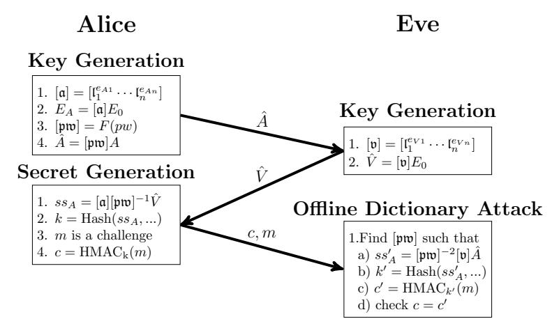

# How Not to Create an Isogeny-Based PAKE

Reza Azarderakhsh1 , David Jao2 , Brian Koziel1 , Jason T. LeGrow2,3 , Vladimir Soukharev4 , and Oleg Taraskin5

- 1 Department of Computer and Electrical Engineering and Computer Science, Florida Atlantic University
  - 2 Department of Combinatorics and Optimization, University of Waterloo 3 Institute for Quantum Computing, University of Waterloo
    - 4 Infosec Global
    - 5 Waves Platform

Abstract. Isogeny-based key establishment protocols are believed to be resistant to quantum cryptanalysis. Two such protocols—supersingular isogeny Diffie-Hellman (SIDH) and commutative supersingular isogeny Diffie-Hellman (CSIDH)—are of particular interest because of their extremely small public key sizes compared with other post-quantum candidates. Although SIDH and CSIDH allow us to achieve key establishment against passive adversaries and authenticated key establishment (using generic constructions), there has been little progress in the creation of provably-secure isogeny-based password-authenticated key establishment protocols (PAKEs). This is in stark contrast with the classical setting, where the Diffie-Hellman protocol can be tweaked in a number of straightforward ways to construct PAKEs, such as EKE, SPEKE, PAK (and variants), J-PAKE, and Dragonfly. Although SIDH and CSIDH superficially resemble Diffie-Hellman, it is often difficult or impossible to "translate" these Diffie-Hellman-based protocols to the SIDH or CSIDH setting; worse still, even when the construction can be "translated," the resultant protocol may be insecure, even if the Diffie-Hellman based protocol is secure. In particular, a recent paper of Terada and Yoneyama and ProvSec 2019 purports to instantiate encrypted key exchange (EKE) over SIDH and CSIDH; however, there is a subtle problem which leads to an offline dictionary attack on the protocol, rendering it insecure. In this work we present man-in-the-middle and offline dictionary attacks on isogeny-based PAKEs from the literature, and explain why other classical constructions do not "translate" securely to the isogeny-based setting.

Key Words: Isogeny-based cryptography, password-authenticated key exchange

# 1 Introduction

Shor's algorithm [46] makes the vast majority of today's digital communications susceptible to attacks from large-scale quantum computers. In particular, Shor's algorithm solves the factoring and discrete logarithm problems in polynomial time. These problems form the security foundation of RSA, Diffie-Hellman, and classical elliptic curve cryptography. Post-quantum cryptography (PQC) focuses on identifying and understanding new mathematical techniques upon which cryptography that is resistant to attacks performed by both classical and quantum computers can be built. So far, the vast majority of proposed postquantum cryptographic protocols can be partitioned into five categories: codebased, lattice-based, hash-based, multivariate, and isogeny-based cryptography.

In this paper, we focus on isogeny-based cryptography. In this setting, it is easy to compute an isogeny from one elliptic curve to another elliptic curve given a kernel or ideal, while it is believed to be difficult (even with access to a quantum computer), to find an isogeny between two given elliptic curves.

Two prominent key establishment protocols that have been proposed whose security is based on these problems: supersingular isogeny Diffie-Hellman (SIDH), proposed by De Feo, Jao, and Plût [20], and commutative supersingular isogeny Diffie-Hellman (CSIDH), proposed by Castryck, Lange, Martindale, Panny, and Renes [10]. Compared to other quantum-resistant schemes, these two isogeny candidates are the youngest, but offer much smaller public key sizes than other quantum-safe counterparts. As well, SIDH has been adapted to NIST's specified key encapsulation mechanism to form the supersingular isogeny key encapsulation (SIKE) scheme [31], which is the only isogeny-based scheme in NIST's PQC standardization process.

Of course, key establishment protocols lack authentication, and are thus susceptible to man-in-the-middle attacks. The typical solution to this problem is to use public-key infrastructure and construct authenticated key establishment protocols, which, as the name suggests, provide authentication and prevent manin-the-middle attacks. Another solution is to use password-authenticated key exchange (PAKE): protocols which provide authentication between users who share a low-entropy password. In order to be secure, a PAKE scheme must provide the following guarantees [26]:

- 1. Offline dictionary attack resistance: Leakage from a scheme cannot be used by an attacker to perform offline exhaustive search of the password.
- 2. Forward secrecy: Session keys are secure even if the password is later disclosed.
- 3. Known-session security: A disclosed session does not weaken the security of other established session keys.
- 4. Online dictionary attack resistance: An active attacker can only try one password per protocol execution. More generally, a model may allow a small, constant number of passwords to be tried per protocol execution (for instance, in SPEKE the best known security guarantee is that an adversary can test no more than two passwords per protocol execution [40]).

In the literature, there are few examples of post-quantum PAKE constructions. In particular, there are several lattice PAKE instantiations [33,21,51,6,38] and two isogeny-based instantiations [48,49]. For isogeny-based PAKEs, Taraskin, Soukharev, Jao, and LeGrow [48] construct their PAKE in the model of Bellare, Pointcheval, and Rogaway model [4] but do not provide a full security proof; the construction of Terada and Yoneyama is based on the encrypted key exchange (EKE) construction of [5]. As we will soon show, despite the security proof of [49], this second scheme is not secure when transferring the EKE construction to isogeny-based cryptosystems.

Our Contribution. In this work, we illustrate a man-in-the-middle and offline dictionary attack against the newly proposed (C)SIDH-EKE scheme from [49]. Since the problem with this construction stems from applying Diffie-Hellman-based PAKE constructions to SIDH/CSIDH, we demonstrate how other such constructions are actually insecure when applied to isogenies, focusing on EKE, SPEKE, Dragonfly, PAK/PPK, and J-PAKE. The goal of this work is to compile a list of "natural" but insecure isogeny-based PAKE constructions (with corresponding attacks) in the hope that these broken protocols will not be proposed again in the literature.

# 2 Preliminaries

Here, we provide a short review of the fundamentals of isogeny-based cryptography. We point the reader to [47] for a much more complete picture of the mathematics behind isogenies. Then, we provide details of the SIDH and CSIDH protocols in particular.

# 2.1 Isogeny-Based Cryptography

Foundations. Isogeny-based cryptography deals with hard problems over isogenies on elliptic curves. An elliptic curve E can be defined over a finite field  $\mathbb{F}_q$  as the collection of all points (x,y) and point at infinity that satisfy the short Weierstrass form:  $E/\mathbb{F}_q: y^2=x^3+ax+b$  where  $a,b,x,y\in\mathbb{F}_q$ . However, rather than make use of an elliptic curve's abelian group over point addition, isogeny-based cryptography makes use of isogenies between elliptic curves. An isogeny over  $\mathbb{F}_q$  as  $\phi: E \to E'$  as a non-constant rational map from  $E(\mathbb{F}_q)$  to  $E'(\mathbb{F}_q)$  that is also a group homomorphism. The isogeny's degree is its degree as an algebraic map. Since the complexity of computing an isogeny scales linearly with the degree, it is practical only to compute isogenies of a small base degree. Two elliptic curves are isogenous if there exists an isogeny between them. Furthermore, for every isogeny  $\phi: E \to E'$  of degree n, there exists another isogeny  $\phi: E' \to E$  such that  $\phi \circ \hat{\phi} = \hat{\phi} \circ \phi = [n]$ . In this scenario,  $\phi$  and  $\hat{\phi}$  are dual isogenies of each other. The endomorphism ring  $\operatorname{End}(E)$  is defined as the set of all isogenies from E to E, defined over the algebraic closure of  $\overline{\mathbb{F}}_q$  of  $\mathbb{F}_q$ .

History. Isogenies in cryptography were first proposed in independent works by Couveignes [19] and Rostovtsev and Stolbunov [45] in 2006 as an isogeny-based key exchange protected by the difficulty to compute isogenies between ordinary elliptic curves. Also in 2006, Charles, Goren, and Lauter [13] proposed a hash function based on the difficulty of computing isogenies between *supersingular* elliptic curves. In 2009, Childs, Jao, and Soukharev [14] proposed a quantum

algorithm to compute isogenies between ordinary elliptic curves in subexponential time. This attack centered on the commutative nature of an ordinary elliptic curve's endormorphism ring. Supersingular curves, on the other hand, feature a non-commutative endomorphism ring for which the CJS attack does not apply. In 2011, Jao and De Feo [32] proposed the supersingular isogeny Diffie-Hellman (SIDH) key exchange based on the difficulty to compute isogenies between supersingular elliptic curves. Roughly, this is equivalent to a path-finding problem in the isogeny graphs of supersingular elliptic curves [13][15]. Since then, cryptographic research into isogeny-based problems has accelerated, producing new constructions for digital signatures [50,25], security models [24,2], and a variety of performance optimizations [18,16,23,36,34,37,35,29,28]. The commutative supersingular isogeny Diffie-Hellman (CSIDH) key exchange was later proposed by Castryck, Lange, Martindale, Panny, and Renes [10]; this protocol has also seen a number of performance improvement results [42,41,43,12,29,9]. As we will describe below, both SIDH and CSIDH are implemented by Alice and Bob taking seemingly random walks on supersingular isogeny graphs, but the method and walk size to compute the isogeny is different between the two. Their secret isogeny walk is analogous to Diffie-Hellman's private exponent.

#### 2.2 SIDH

In the SIDH key exchange [20], Alice and Bob each agree on a prime p of the form  $\ell_A^{e_A}\ell_B^{e_B}\pm 1$ , where  $\ell_A$  and  $\ell_B$  are small primes and  $e_A$  and  $e_B$  are positive integers. Alice and Bob agree on a supersingular curve  $E_0(\mathbb{F}_{p^2})$  and find torsion bases  $\{P_A,Q_A\}$  and  $\{P_B,Q_B\}$  that generate  $E_0[\ell_A^{e_A}]$  and  $E_0[\ell_B^{e_B}]$ , respectively. Alice and Bob then choose private keys  $n_A \in \mathbb{Z}/\ell_A^{e_A}\mathbb{Z}$  and  $n_B \in \mathbb{Z}/\ell_B^{e_B}\mathbb{Z}$ , respectively. In the SIDH landscape, Alice and Bob perform their secret isogeny walk by generating a secret kernel over their torsion basis, E = P + [n]Q and computing a unique isogeny over that kernel  $\phi: E \to E/\langle R \rangle$ . In this isogeny computation, Alice chains together  $e_A$  isogenies of degree  $\ell_A$  and Bob chains together  $e_B$ isogenies of degree  $\ell_B$ . A public key is composed of the isogeny curve  $E/\langle R \rangle$  and projection of the other party's torsion points under this new isogenous curve. Thus, in the first round Alice computes  $\phi_A: E_0 \to E_A = E_0/\langle P_A + [n_A]Q_A \rangle$ and Bob computes  $\phi_B: E_0 \to E_B = E_0/\langle P_B + [n_B]Q_B \rangle$ . Alice's public key is  $\{E_A, \phi_A(P_B), \phi_A(Q_B)\}$  and Bob's public key is  $\{E_B, \phi_B(P_A), \phi_B(Q_A)\}$ . For the second round, Alice and Bob again perform the secret isogeny walk, but this time over the other party's public keys. Alice computes  $E_{AB} = E_B/\langle \phi_B(P_A) +$  $[n_A]\phi_B(Q_A)\rangle$  and Bob computes  $E_{BA}=E_A/\langle\phi_A(P_B)+[n_B]\phi_A(Q_B)\rangle$ . After these two rounds, Alice and Bob have each applied their secret isogeny walk to the starting curve  $E_0$  and the j-invariants of their final curves serves as a shared secret,  $j(E_{AB}) = j(E_{BA})$ .

Security. The security of SIDH is based on whichever secret isogeny walk is easier to compute. The fastest known attacks are based on instances of the claw problem [20]. If  $\ell_A^{e_A} \approx \ell_B^{e_B}$ , then the classical and quantum security of SIDH is approximately  $O(\sqrt[4]{p})$  and  $O(\sqrt[6]{p})$ , respectively. The adaptive attacks proposed

by Galbraith et al. [24,22] (which make use of the fact that there is no direct public key validation for SIDH), renders static-static and static-ephemeral SIDH insecure. There are also concerns that the images of the torsion points could lead to an attack—such as those proposed by Petit et al. [44] and Bottinelli et al. [7]—though no concrete attack of this sort has been exhibited for proposed SIDH parameter sets. A few of the hard problems underlying SIDH are shown below [20].

**SIDH Problem 1** (Computational Supersingular Isogeny (CSSI) Problem). Let  $\phi_A: E_0 \to E_A$  be an isogeny whose kernel is  $\langle P_A + [n_A]Q_A \rangle$ , where  $n_A$  is randomly selected in  $\mathbb{Z}/\ell_A^{e_A}\mathbb{Z}$ . Given  $E_A$  and the values  $\phi_A(P_B)$  and  $\phi_A(Q_B)$ , find a generator  $R_A$  of  $\langle P_A + [n_A]Q_A \rangle$ .

**SIDH Problem 2** (Supersingular Computational Diffie-Hellman (SSCDH) Problem). Let  $\phi_A: E_0 \to E_A$  be an isogeny whose kernel is  $\langle P_A + [n_A]Q_A \rangle$  and let  $\phi_B: E_0 \to E_B$  be an isogeny whose kernel is  $\langle P_B + [n_B]Q_B \rangle$ , where  $n_A, n_B$  are randomly selected in  $\mathbb{Z}/\ell_A^{e_A}\mathbb{Z}$  and  $\mathbb{Z}/\ell_B^{e_B}\mathbb{Z}$ , respectively. Given  $E_A, E_B, \phi_A(P_B)$ ,  $\phi_A(Q_B), \phi_B(P_A), \phi_B(Q_A)$ , find the *j*-invariant of  $E_0/\langle P_A + [n_A]Q_A, P_B + [n_B]Q_B \rangle$ .

### 2.3 CSIDH

In the CSIDH key exchange [10], Alice and Bob each agree on a prime p of the form  $4 \times \ell_1 \cdots \ell_n - 1$ , where  $\ell_i$  are small distinct odd primes. Alice and Bob agree on a supersingular curve  $E_0(\mathbb{F}_p)$  with endomorphism ring  $\mathcal{O} = \mathbb{F}[\pi]$ . Alice and Bob each choose private keys as a random n-tuple  $(e_1, \dots, e_n)$  in the range [-m, m] which corresponds to their ideal class  $[\mathfrak{a}] = [\mathfrak{l}_1^{e_{A1}} \cdots \mathfrak{l}_n^{e_{An}}]$  and  $[\mathfrak{b}] = [\mathfrak{l}_1^{e_{B1}} \cdots \mathfrak{l}_n^{e_{Bn}}]$ , respectively. Both  $[\mathfrak{a}], [\mathfrak{b}] \in \mathrm{cl}(\mathcal{O})$ , where  $\mathfrak{l}_i = (\ell_i, \pi - 1)$ . In this case, Alice and Bob apply their secret isogeny walk by performing a seemingly random number of small degree isogenies through the class group action. Alice computes her public key  $E_A = [\mathfrak{a}]E_0$  and Bob computes his public key  $E_B = [\mathfrak{b}]E_0$ . Alice and Bob's public keys are simply  $E_A$  and  $E_B$ , respectively. Alice and Bob then apply their secret group action to the other party's public key to arrive at the final curve, which is  $E_{AB} = [\mathfrak{a}]E_B$  for Alice and  $E_{BA} = [\mathfrak{b}]E_A$  for Bob. The shared secret is the curve coefficient of the final curve,  $E_{AB} = E_{BA}$ .

Security. The security of CSIDH is based on instances of the claw finding problem (similar to SIDH) as well as the abelian hidden-shift problem. Unfortunately, the abelian hidden-shift problem is solvable in subexponential time once a large enough quantum computer is available. Unlike SIDH, this scheme does support simple public key validation as one can check if a public key is supersingular over  $\mathbb{F}_p$ . Furthermore, images of torsion points are not sent in the public key. A simple note about ideal classes is that given  $[\mathfrak{a}]$ , it is simple to compute the inverse  $[\mathfrak{a}]^{-1}$ . A few of the hard problems underlying CSIDH are shown below [10].

**CSIDH Problem 1** (Computational Commutative Supersingular Isogeny (CC-SSI) Problem). Let  $E_A$ ,  $E_0$  be two supersingular curves defined over  $\mathbb{F}_p$  with the same  $\mathbb{F}_p$ -rational endomorphism ring  $\mathcal{O}$ , find an ideal  $[\mathfrak{a}]$  of  $\mathcal{O}$  such that  $E_A = [\mathfrak{a}]E_0$ .

CSIDH Problem 2 (Supersingular Computational Commutative Diffie-Hellman (SSCCDH) Problem). Let  $E_A = [\mathfrak{a}]E_0$  and  $E_B = [\mathfrak{b}]E_0$ , given  $E_0, E_A, E_B$  find the curve coefficient of the final curve  $E_{AB} = [\mathfrak{a}][\mathfrak{b}]E_0$ .

#### Attacks on (C)SIDH-EKE 3

Here, we review the SIDH-EKE and CSIDH-EKE PAKE schemes proposed by [49] and illustrate explicit breaks in the schemes. Notably, in order for SIDH-EKE and CSIDH-EKE schemes to be secure, their public keys must be indistinguishable from random bitstrings (but they are distinguishable).

#### 3.1 (C)SIDH-EKE

Encrypted key exchange (EKE) was proposed in [5] by Bellovin and Merritt in 1993 as a PAKE over DH key exchange. This is a two-round scheme similar to standard DH. Rather than send a normal public key, the public key is encrypted with the shared low-entropy password over an ideal cipher. The authors of [49] directly translate this model from the discrete logarithm hard problem to the supersingular isogeny hard problem. The protocols for SIDH-EKE and CSIDH-EKE are shown below. Here, we assume that (Enc,Enc-1) are symmetric key encryption schemes modelled as an ideal cipher with a key size  $\kappa$ .

SIDH-EKE [49]: Parties A and B having password  $pw = pw_{AB}$  execute a key exchange session as follows (public parameters defined in 2.2):

- 1. Party A chooses  $n_A \in \mathbb{Z}/\ell_A^{e_A}\mathbb{Z}$ , constructs the isogeny  $\phi_A: E_0 \to E_A =$  $E_0/\langle P_A + [n_A]Q_A\rangle$ , computes  $\phi_A(P_B)$  and  $\phi_A(Q_B)$  and sends party B the
- message  $\hat{A} = \mathbf{Enc}_{pw}(E_A, \phi_A(P_B), \phi_A(Q_B))$ . 2. Party B chooses  $n_B \in \mathbb{Z}/\ell_B^{e_B}\mathbb{Z}$ , constructs  $\phi_B : E_0 \to E_B = E_0/\langle P_B + E_0 \rangle$  $[n_B]Q_B\rangle$ , computes  $\phi_B(P_A)$  and  $\phi_B(Q_A)$  and sends party A the message  $B = \mathbf{Enc}_{pw}(E_B, \phi_B(P_A), \phi_B(Q_A)).$
- 3. Party A decrypts  $(E_B, \phi_B(P_A), \phi_B(Q_A)) = \mathbf{Enc}_{pw}^{-1}(\hat{B})$ . Party A then computes the shared secret  $j(E_B/\langle \phi_B(P_A) + [n_A]\phi_B(Q_A)\rangle)$ .
- 4. Party B decrypts  $(E_A, \phi_A(P_B), \phi_A(Q_B)) = \mathbf{Enc}_{pw}^{-1}(\hat{A})$ . Party B then computes the shared secret  $j(E_A/\langle \phi_A(P_B) + [n_B]\phi_A(Q_B)\rangle)$ .

CSIDH-EKE [49]: Parties A and B having password  $pw = pw_{AB}$  execute a key exchange session as follows (public parameters defined in 2.2):

- 1. Party A chooses  $[\mathfrak{a}] = [\mathfrak{l}_1^{e_{A_1}} \cdots \mathfrak{l}_n^{e_{A_n}}]$ , computes  $E_A = [\mathfrak{a}]E_0$  and sends party
- B the message  $\hat{A} = \mathbf{Enc}_{pw}(E_A)$ . 2. Party B chooses  $[\mathfrak{b}] = [\mathfrak{l}_1^{e_{B_1}} \cdots \mathfrak{l}_n^{e_{B_n}}]$ , computes  $E_B = [\mathfrak{b}]E_0$  and sends party A the message  $\hat{B} = \mathbf{Enc}_{pw}(E_B)$
- 3. Party A decrypts  $E_B = \mathbf{Enc}_{pw}^{-1}(\hat{B})$  and computes the shared secret  $[\mathfrak{a}]E_B$ .
- 4. Party B decrypts  $E_A = \mathbf{Enc}_{pw}^{-1}(\hat{A})$  and computes the shared secret  $[\mathfrak{b}]E_A$ .

#### torsion basis $P_A, Q_A$ over $E_0[\ell_A^{e_A}]$ torsion basis $P_B, Q_B$ over $E_0[\ell_B^{e_B}]$ Alice Bob **Key Generation Key Generation** 1. $n_A \in_R \mathbb{Z}/\ell_A^{e_A}\mathbb{Z}$ 1. $n_B \in_R \mathbb{Z}/\ell_R^{e_B}\mathbb{Z}$ $2. R_A = P_A + [n_A]Q_A$ 2. $R_B = P_B + [n_B]Q_B$ 3. $\phi_A: E_0 \rightarrow E_A = E_0/\langle R_A \rangle$ 3. $\phi_B: E_0 \rightarrow E_B = E_0/\langle R_B \rangle$ $4. \hat{A}$ 4. *B* $\mathbf{Enc}_{pw}(E_A, \phi_A(P_B), \phi_A(Q_B))$ $\mathbf{Enc}_{pw}(E_B, \phi_B(P_A), \phi_B(Q_A))$ Secret Generation Secret Generation 1. $(E'_B, \phi_B(P_A)', \phi_B(Q_A)') =$ 1. $(E'_A, \phi_A(P_B)', \phi_A(Q_B)') =$ $\mathbf{Enc}_{pw}^{-1}(\hat{A})$ $\mathbf{Enc}_{pw}^{-1}(\hat{B})$ 2. $\vec{R}_{AB} = \phi_B(P_A)' + [n_A]\phi_B(Q_A)$ 2. $\vec{R}_{BA} = \phi_A(P_B)' + [n_B]\phi_A(Q_B)$ 3. $\phi_{AB}$ : $E'_B \rightarrow E_{AB} =$ 3. $\phi_{BA}$ : $E'_A \rightarrow E_{BA} =$ $E_B/\langle R_{AB}\rangle$ $E_A/\langle R_{BA}\rangle$ Eve Offline Dictionary Attack 1. Eve observes $\hat{A}$ 2. Eve guesses pw' and finds $(E_A', \phi_A(P_B)', \phi_A(Q_B)') = \mathbf{Enc}_{pw'}^{-1}(\hat{A})$ 3. Eve checks the following a) $E'_A$ is supersingular b) $\phi_A(P_B)', \phi_A(Q_B)'$ lie on $E_A'$ c) $\phi_A(P_B)', \phi_A(Q_B)'$ have order $\ell_B^{e_B}$ d) $\phi_A(P_B)', \phi_A(Q_B)'$ weil pairing is maximal

SIDH-EKE Public Parameters

supersingular curve  $E_0/\mathbb{F}_{p^2}$  with order p+1

prime  $p=\ell_A^{e_A}\ell_B^{e_B}-1$ 

Fig. 1. The SIDH-EKE scheme is vulnerable to offline dictionary attacks as the public keys are distinguishable from random bitstrings.

In both of these schemes, the authors of [49] mention that (C)SIDH-EKE prevents offline dictionary attacks because the attacker cannot determine if a password guess is valid or not because it is modelled as an ideal cipher (IC). As we show in the follow subsections, a subtle problem renders this claim incorrect, and in fact offline dictionary attacks apply to both schemes. The public keys in these schemes are distinguishable from random bitstrings; we illustrate how the SIDH-EKE and CSIDH-EKE schemes are vulnerable to offline dictionary attacks in Figures 1 and 2, respectively.

# 3.2 Offline dictionary attacks on SIDH-EKE

In the SIDH setting, a public key is of the form  $\{E_A, \phi_A(P_B), \phi_A(Q_B)\}$ , where  $E_A$  is a supersingular elliptic curve and  $\{\phi_A(P_B), \phi_A(Q_B)\}$  is a torsion basis generating  $E_0[\ell_A^{e_A}]$ . Contrary to the claims of [49], it is simple to check if a

decryption of an encrypted public key is valid or not, forming the basis for an offline dictionary attack. A passive attacker Eve can observe Alice sending the public key  $\hat{A}$  and perform an offline dictionary attack by trying a password pw' to decrypt  $A' = (E'_A, \phi_A(P_B)', \phi_A(Q_B)') = \mathbf{Enc}_{pw'}^{-1}(\hat{A})$ . For each password, Eve checks if the following criteria are met:

- 1.  $E'_A$ ,  $\phi_A(P_B)'$ ,  $\phi_A(Q_B)' \in \mathbb{F}_{p^2}$
- 2. The elliptic curve  $E'_A$  is supersingular
- 3. Points  $\phi_A(P_B)'$  and  $\phi_A(Q_B)'$  lie on  $E'_A$
- 4. Points  $\phi_A(P_B)'$  and  $\phi_A(Q_B)'$  have order  $\ell_B^{e_B}$
- 5. The Weil pairing of  $e(\phi_A(P_B)', \phi_A(Q_B)')$  is the maximum possible order

For a random password, the probability that even two of these criteria are met is extremely low. By iterating password after password, Eve can check a large number of password candidates in her dictionary.

In practical implementations of SIDH and SIKE, the public parameters are generally compressed. For instance, rather than directly sending the elliptic curve, [18] proposes sending the x-coordinates  $\phi_A(P_B)$ ,  $\phi_A(Q_B)$ , and  $\phi_A(Q_B-P_B)$ . Furthermore, public key compression further reduces the size of public keys [3,17]. In each of these cases, enough information is sent to recover the elliptic curve  $E_A$  and torsion basis points  $\phi_A(P_B)$  and  $\phi_A(Q_B)$ , so the offline dictionary attack is still applicable here.

## 3.3 Offline dictionary attacks on CSIDH-EKE

In the CSIDH setting, a public key is just the supersingular elliptic curve  $E_A$ . Although no images of torsion points are provided in this construction, it is still simple to validate a decryption of an encrypted password. A passive attacker Eve can observe Alice sending the public key  $\hat{A}$  and perform an offline dictionary attack by trying a password pw' to decrypt  $A' = E'_A = \mathbf{Enc}_{pw'}^{-1}(\hat{A})$ . For each password, Eve checks if the following criteria are met (similar to public key validation proposed in [10]):

- 1. The curve coefficients of  $E'_A$  are in  $\mathbb{F}_p$ , and;
- 2. The elliptic curve  $E'_A$  is supersingular.

For a random password, the probability that these two criteria are met is extremely low. For instance, the chance that a randomly chosen elliptic curve is supersingular behaves like  $\tilde{O}(1/\sqrt{p})$ . By iterating through the dictionary and checking which passwords yield supersingular curves, Eve can (with high probability) eliminate many password candidates in an offline dictionary attack on a single session.

#### 3.4 Man-in-the-middle attack on modified CSIDH-EKE

In the (C)SIDH-EKE work, the authors of [49] model the symmetric cipher as a random permutation with a k-bit key and l-bit inputs and outputs. One thought

### CSIDH-EKE Public Parameters prime $p = 4 \times \ell_1 \cdots \ell_n - 1$ supersingular curve $E_0/\mathbb{F}_p$ with order p+1Alice Bob **Key Generation Key Generation** 1. $[\mathfrak{a}] = [\mathfrak{l}_1^{e_{A1}} \cdots \mathfrak{l}_n^{e_{An}}]$ 1. $[\mathfrak{b}] = [\mathfrak{l}_1^{e_{B1}} \cdots \mathfrak{l}_n^{e_{Bn}}]$ 2. $E_A = [\mathfrak{a}]E_0$ $2. E_B = [\mathfrak{b}]E_0$ 3. $\hat{A} = \mathbf{Enc}_{pw}(E_A)$ 3. $\hat{B} = \mathbf{Enc}_{pw}(E_B)$ Secret Generation Secret Generation $\begin{array}{l} 1. \ E_A' = \mathbf{Enc}_{pw}^{-1}(\hat{A}) \\ 2. \ E_{BA} = [\mathfrak{b}] E_A' \end{array}$ 1. $E'_B = \mathbf{Enc}_{pw}^{-1}(\hat{B})$ 2. $E_{AB} = [\mathfrak{a}] E_B^{r}$ Eve Offline Dictionary Attack 1. Eve observes $\hat{A}$ 2. Eve finds pw' such that $E'_A = \mathbf{Enc}_{pw'}^{-1}(\hat{A})$ is supersingular

Fig. 2. The CSIDH-EKE scheme is vulnerable to offline dictionary attacks as the public keys are distinguishable from random bitstrings.

for this is that the random permutation could operate in the domain of isogenous curves. For instance, rather than sending an AES-encrypted public key in SIDH, one can perform some encryption scheme where we move through a random isogeny determined by the password. In this scenario, offline dictionary attacks still apply as the password is of low-entropy.

Let us consider the CSIDH-EKE scheme where we use a non-standard encryption scheme. Let  $\mathbf{Enc} = \mathbf{Enc}(E,pw)$  be a seemingly random class group action that depends on the password. In this function, we first call some bijective function F(pw) that translates pw to the sequence  $[\mathfrak{pw}] = [\mathfrak{l}_1^{e_pw_1} \cdots \mathfrak{l}_n^{e_pw_n}]$ . The second step is simply computing the class group action  $E_{pw} = [\mathfrak{pw}]E$ . This scheme is vulnerable to an offline dictionary attack by employing a man-in-the-middle.

Let us say that Alice and Bob have agreed to use public parameters:  $E_0$  and hash function H as well as ID's: Alice\_ID and Bob\_ID. Alice and Bob both know the secret, low-entropy password pw.

Eve can attack this construction with the following procedure:

- 1. Alice generates her private key  $[\mathfrak{a}]$  and computes  $A = [\mathfrak{a}]E_0$ .
- 2. Alice encrypts her public key to  $\hat{A}$  and sends it to Bob.
  - (a) Computes group ideal values  $[\mathfrak{pw}] = F(pw)$
  - (b) Encrypts public key A,  $\hat{A} = [\mathfrak{pw}]A$
- 3. Eve (man-in-the-middle) upon intercepting  $\hat{A}$ , generates her encrypted public key as  $\hat{V} = [\mathfrak{v}]E_0$ , where  $[\mathfrak{v}]$  is Eve's private key, and sends  $\hat{V}$  to Alice.

# Modified CSIDH-EKE Public Parameters

prime 
$$p = 4 \times \ell_1 \cdots \ell_n - 1$$
  
supersingular curve  $E_0/\mathbb{F}_p$  with order  $p+1$ 

**Fig. 3.** The modified CSIDH-EKE scheme encrypts the public key by using some function F to produce a valid private key to apply an additional group action to the public key. In this man-in-the-middle attack, note that Bob is not shown as he never actually receives any public key.

- 4. Alice, upon receiving  $\hat{V}$ , thinking that this is Bob's public key, encrypted on  $[\mathfrak{pw}]$ , applies the class group action to decrypt it and calculates the shared secret:
  - (a) Alice calculates exponents  $[\mathfrak{pw}]^{-1}$  by applying a negative sign to  $[\mathfrak{pw}]$  and calculates the class group action  $([\mathfrak{pw}]^{-1})\hat{V}$ .
  - (b) Alice computes the shared secret  $ss_A = [\mathfrak{a}]([\mathfrak{pw}]^{-1})\hat{V} = [\mathfrak{a}][\mathfrak{v}][\mathfrak{pw}]^{-1}E_0$
- 5. Alice then computes her final session key by the following formula: session-Key = Hash(Alice\_ID, Bob\_ID,  $\hat{A}$ ,  $\hat{V}$ ,  $ss_A$ ).

In the real world, the next step of an authenticated key exchange is mutual symmetric authentication of parties (these steps are not described in [49]). One of the normal scenarios is where Alice and Bob exchange HMAC's and check them. Following the CSIDH-EKE protocol, Alice calculates an HMAC from some data and sends it to Eve (still acting as Bob) to check. In a normal run of the protocol, if Bob detects that the HMAC is invalid, Bob would stop the protocol. However, upon receiving the HMAC, Eve can disconnect from Alice and compute the password offline. Eve knows that Alice has computed the shared secret  $ss_A = [\mathfrak{a}][\mathfrak{v}][\mathfrak{pw}]^{-1}E_0$  and also has her encrypted public key  $\hat{A} = [\mathfrak{pw}]A = [\mathfrak{pw}][\mathfrak{a}]E_0$ . To find  $[\mathfrak{pw}]$ , Eve attempts an offline dictionary attack to find some  $[\mathfrak{pw}]$  such that the shared secret used in Alice's HMAC is the same as  $([\mathfrak{pw}]^{-1})^2[\mathfrak{v}]\hat{A} = ([\mathfrak{pw}]^{-1})^2[\mathfrak{v}][\mathfrak{pw}][\mathfrak{a}]E_0 = [\mathfrak{a}][\mathfrak{v}][\mathfrak{pw}]^{-1}E_0 = ss_A$ . If the HMAC

Table 1. Survey of Diffie-Hellman-based PAKEs schemes and their translation to isogeny-based problems

| DH PAKE                      | Safe for Isogenies? | Comment                                                     |
|------------------------------|------------------------|-------------------------------------------------------------|
| EKE [5]                      | ×                      | Public keys are distinguishable from random bitstrings      |
| SPEKE [30] Dragonfly [27] | ?                      | Hashing to a public key is difficult                        |
| PAK [8] J-PAKE [26]       | ×                      | Public keys are not commutative to achieve vanishing effect |

is verified with a password candidate, then this password candidate is correct with high probability. This attack scenario is shown in Figure 3.

# 3.5 On EKE Security

For the above attacks, we proposed offline dictionary attacks on isogeny variants of EKE. In the simple case, (C)SIDH-EKE schemes are vulnerable to offline dictionary attacks as isogeny-based public keys satisfy several criteria and are distinguishable from random bitstrings. In the original EKE scheme based on discrete logarithm, public keys are simply represented as extremely large numbers, so decryptions of randomly encrypted public keys would still look like a valid public key. When considering constructions such as EC-EKE, the elliptic curve EKE variant over elliptic curve discrete logarithm problem, this same scheme would be vulnerable to offline dictionary attacks. In this case, a public key would be a point on a curve with sufficient order. Offline dictionary attacks would not get rid of as many password candidates as (C)SIDH-EKE, but would still exist.

Next, applying a password directly as a private key for a Diffie-Hellman-like key exchange is not secure. In the Diffie-Hellman scenario, revealing the result of A = g pw is vulnerable to offline dictionary attacks. Since pw has low-entropy, an attacker can try many candidate passwords to find the correct pw to obtain public key A. In our modified CSIDH-EKE scheme (also applies to SIDH-EKE), we encrypted our public keys by performing a group operation directly on our public key. Through simple manipulation as a man-in-the-middle, Eve obtained two values such that she had a check if a password group operation was correct or not.

# 4 Other DH Variants

Here, we summarize the difficult problems encountered when translating a popular DH-based PAKE to isogenies. It is not completely clear that these schemes are dead in the water. Rather, it is clear that any translations from discrete logarithms to isogeny problems will require an updated security model. In Table 1, we survey several popular schemes. We go over each of these translation difficulties in the following sections. We only skip DH-EKE scheme as we have already illustrated offline attacks in Section 3.

# 4.1 DH-SPEKE and Dragonfly

DH-SPEKE was proposed by Jablon in 1996 [30], while Dragonfly was proposed by Dan Harkins in 2008 [27]. In these schemes, Alice and Bob start with a DH key exchange. However, rather than using prescribed public parameters, they generate the public keys based on some function that converts the shared secret to a suitable base, i.e. g=f(pw). Since discrete logarithm public keys are indistinguishable from random bitstrings, DH-SPEKE was constructed by simply hashing the public key to a valid generator. Dragonfly goes a step further to define "Hunting and Pecking" methods to find appropriate public parameters over elliptic curve and MODP groups.

When applying this construction to isogeny-based problems, computing a seemingly random base is a hard problem. For instance, simply hashing a password to a random elliptic curve class is insufficient. SIDH requires a supersingular curve with correct order and a proper torsion base. CSIDH requires a supersingular elliptic curve in the  $\mathbb{F}_p$ -rational isogeny graph. Worse yet, if a "weak" generator is found then the isogeny problem may not be hard. Finding public parameters from random bitstrings is not sufficient.

One recent work by Love and Boneh [39] attempts to safely generate a random curve where no one knows its endomorphism ring, but with negative results. In the CSIDH setting, Castryck, Panny, and Vercauteren [11] investigate a similar problem, also with negative results. Their analysis shows that even if we find a random curve by taking a walk from a starting curve, it is not difficult to discover this path. Hashing to public isogeny keys has been a hard problem and seems to stay that way for the foreseeable future, making any direct translation of this DH construct impossible.

**Open Problem 1** Given a low-entropy password pw and a fixed field  $\mathbb{F}_q$  (for SIDH or CSIDH), how to efficiently generate a safe elliptic curve over  $\mathbb{F}_q$  as a function of pw?

#### 4.2 DH-PAK and DH-JPAKE

DH-JPAKE was proposed by Hao and Ryan in 2010 [26] and proved secure in the BPR model [4] by Abdalla et al. in 2015 [1], while DH-PAK was proposed by Boyko, MacKenzie, and Patel in 2000 [8]. J-PAKE is standardized under RFC 8236. In the following description, we assume all arithmetic is modulo a large prime p. In J-PAKE, Alice and Bob each compute two independent ephemeral public keys  $(g_1 = g^{x_1}, g_2 = g^{x_2}$  for Alice and  $g_3 = g^{x_3}, g_4 = g^{x_4}$  for Bob) in the first round, and then compute a special "mixed" public key in the second round  $(A = (g_1g_3g_4)^{x_2 \times pw})$  for Alice and  $B = (g_1g_2g_3)^{x_4 \times pw}$ . Then, in the third and final round, Alice and Bob each "cancel" out the portion of the public key that was generated with the password and ephemeral private key. Here, Alice computes  $K_a = (B/(g_4^{x_2 \times pw}))^{x_2}$  and Bob computes  $K_b = (A/(g_2^{x_4 \times pw}))^{x_4}$ , so Alice and Bob have achieved an authenticated shared secret of  $K_a = K_b = g^{(x_1+x_3)\times x_2\times x_4\times pw}$ .

The magic of J-PAKE and the ECJPAKE scheme over elliptic curves is dependent on the commutative nature of the group structure. Alice and Bob each mix their public keys and achieve a vanishing effect on the final result by cancelling out known values. For isogeny-based computations, there is no way to combine public keys similar to  $(g_1g_3g_4)$  and then cancel it out later because there is no natural ring structure on (C)SIDH public keys.

# 5 Auxiliary Point Obfuscation for SIDH

So far we have only discussed the failure of straightforward translations of already-existing PAKE protocols to the isogeny-based setting. In [48], the authors propose an isogeny-based PAKE in which the password is used to obfuscate the auxiliary points in SIDH—this approach is a natural extension of the idea PAK/PPK (where a random group element derived from the password is used to obfuscate the public ephemeral key), although it is not precisely analogous to those schemes.

To be consistent with their notation, for a prime  $\ell$  and an integer e, we define

$$SL_2(\ell, e) = \{ \Psi \in (\mathbb{Z}/\ell^e \mathbb{Z})^{2 \times 2} : \det A \equiv 1 \pmod{\ell^e} \}$$
$$\Upsilon_2(\ell, e) = \{ \Psi \in SL_2(\ell, e) : A \text{ is upper triangular modulo } \ell \}$$

as the special linear (SL) and special reduced upper triangular groups ( $\Upsilon$ ) modulo  $\ell^e$ . As we have described in Section 2.2, SIDH uses a prime  $p = \ell_A^{e_A} \ell_B^{e_B} f \pm 1$  and supersingular elliptic curve E defined over  $\mathbb{F}_{p^2}$ . As is noted by [48],  $\Upsilon_2(\ell_A, e_A)$  acts on  $E[\ell_A^{e_A}]^2$  in a method similar to matrix-vector multiplication: if  $\Psi = \begin{bmatrix} \alpha & \beta \\ \gamma & \delta \end{bmatrix}$  then  $\Psi[X] = \begin{bmatrix} \alpha X + \beta Y \\ \gamma X + \delta Y \end{bmatrix}$ . The same property applies to  $\Upsilon_2(\ell_B, e_B)$  acting on  $E[\ell_B^{e_B}]^2$ .

The construction of [48] requires a pair of hash functions  $H_A, H_B$  which map to  $\Upsilon_2(\ell_A, e_A)$  and  $\Upsilon_2(\ell_B, e_B)$ , respectively. Party A's auxiliary points are obfuscated by computing  $\begin{bmatrix} X_A \\ Y_A \end{bmatrix} = \Psi_A \begin{bmatrix} \phi_A(P_B) \\ \phi_A(Q_B) \end{bmatrix}$  where  $\Psi_A \in \Upsilon_2(\ell_B, e_B)$  is derived from pw (and session-specific information) using  $H_B$ . Party A then sends  $(E_A, X_A, Y_A)$  to B rather than  $(E_A, \phi_A(P_B), \phi_A(Q_B))$ . Similarly, Party B will obfuscate his auxiliary points by computing  $\begin{bmatrix} X_B \\ Y_B \end{bmatrix} = \Psi_B \begin{bmatrix} \phi_B(P_A) \\ \phi_B(Q_A) \end{bmatrix}$  where  $\Psi_B \in \Upsilon_2(\ell_A, e_A)$  is derived from pw using  $H_A$ . Party B then sends  $(E_B, X_B, Y_B)$  to A as his public key.

We further analyze this obfuscation from Party A's perspective. This peculiar construction has the very convenient property that for any  $\hat{\Psi} \in \Upsilon_2(\ell_B, e_B)$ , if  $\begin{bmatrix} \hat{P}_B \\ \hat{Q}_B \end{bmatrix} = \hat{\Psi}^{-1} \begin{bmatrix} X_A \\ Y_A \end{bmatrix}$  then  $e(\hat{P}_B, \hat{Q}_B) = e(\phi_A(P_B), \phi_A(Q_B))$ ; (the Weil pairing is preserved). In particular, if  $\hat{\Psi}$  is derived from  $\widehat{pw}$  using  $H_B$  and the session-specific information, the "candidate" auxiliary points  $\hat{P}_B, \hat{Q}_B$  cannot be distinguished from the correct auxiliary points using the best known SIDH public-key validation technique: checking the pairing value. This prevents offline dictionary attacks.

This quality is not shared by more natural auxiliary point obfuscation methods; in particular, following the ideas of PPK and obfuscating by constructing  $M_1, M_2 \in E[\ell_B^{e_B}]$  uniformly at random (derived using a hash function applied to the password and session-specific information) and constructing  $X_A = \phi_A(P_B) + M_1$  and  $Y_A = \phi_A(Q_B) + M_2$ , and sending  $(E_A, X_A, Y_A)$  as before. Unfortunately, public-key validation using the pairing renders this insecure, as the pairing value is *not* preserved when adding these random obfuscating points.

Although the protocol of [48] is not known to be vulnerable to attacks using public-key validation, the authors were unable to present a full security proof; in particular, because the protocol messages information-theoretically reveal the password (in contrast with protocols like PAK/PPK, in which individual messages contain no password information), standard proof techniques do not apply in a straightforward fashion. Nevertheless, the protocol is interesting from a practical perspective (since it is the only proposed isogeny-based PAKE so far which is not known to be insecure), and because of its close relationship with the question of SIDH public-key validation, which has long been open.

# 6 Conclusion

In this work, we examined applying Diffie-Hellman-based PAKE schemes to isogeny-based problems. We examined the difficulty in translating security models in Terada and Yoneyama's ProvSec 2019 work and some popular PAKE schemes. As we have shown, carelessly applying Diffie-Hellman PAKE constructions can lead to various man-in-the-middle and offline dictionary attacks. Although the SIDH and CSIDH schemes appear extremely similar to DH, the underlying isogeny problem is constructed in a different way that allows for quantum security. Overall, PAKE construction over isogenies on supersingular elliptic curves is difficult as supersingular elliptic curves are sparse in the set of all elliptic curves, which leads to offline dictionary attacks when low-entropy password are used.

# 7 Acknowledgement

The authors would like to thank the reviewers for their helpful comments. This work is supported in parts by NSF CNS-1801341, NSF GRFP-1939266, NIST-60NANB17D184, and Florida Center for Cybersecurity (FC2). Also, parts of this research was undertaken by funding from the Canada First Research Excellence Fund, CryptoWorks21, NSERC, Public Works and Government Services Canada, and the Royal Bank of Canada.

# References

 M. Abdalla, F. Benhamouda, and P. MacKenzie. Security of the J-PAKE Password-Authenticated Key Exchange Protocol. In 2015 IEEE Symposium on Security and Privacy, pages 571–587, May 2015.

- 2. Gora Adj, Daniel Cervantes-Vázquez, Jesús-Javier Chi-Domínguez, Alfred Menezes, and Francisco Rodríguez-Henríquez. On the Cost of Computing Isogenies Between Supersingular Elliptic Curves. In Carlos Cid and Michael J. Jacobson Jr., editors, Selected Areas in Cryptography – SAC 2018, pages 322–343, Cham, 2019. Springer International Publishing.
- 3. Reza Azarderakhsh, David Jao, Kassem Kalach, Brian Koziel, and Christopher Leonardi. Key Compression for Isogeny-Based Cryptosystems. In Proceedings of the 3rd ACM International Workshop on ASIA Public-Key Cryptography, pages 1–10, 2016.
- 4. Mihir Bellare, David Pointcheval, and Phillip Rogaway. Authenticated Key Exchange Secure against Dictionary Attacks. In Bart Preneel, editor, Advances in Cryptology — EUROCRYPT 2000, pages 139–155, Berlin, Heidelberg, 2000. Springer Berlin Heidelberg.
- 5. Steven M. Bellovin and Michael Merritt. Augmented Encrypted Key Exchange: A Password-based Protocol Secure Against Dictionary Attacks and Password File Compromise. In Proceedings of the 1st ACM Conference on Computer and Communications Security, CCS '93, pages 244–250, New York, NY, USA, 1993. ACM.
- 6. Fabrice Benhamouda, Olivier Blazy, Léo Ducas, and Willy Quach. Hash Proof Systems over Lattices Revisited. In Michel Abdalla and Ricardo Dahab, editors, Public-Key Cryptography – PKC 2018, pages 644–674, Cham, 2018. Springer International Publishing.
- 7. Paul Bottinelli, Victoria de Quehen, Chris Leonardi, Anton Mosunov, Filip Pawlega, and Milap Sheth. The Dark SIDH of Isogenies. Cryptology ePrint Archive, Report 2019/1333, 2019. https://eprint.iacr.org/2019/1333.
- 8. Victor Boyko, Philip MacKenzie, and Sarvar Patel. Provably Secure Password-Authenticated Key Exchange Using Diffie-Hellman. In Bart Preneel, editor, Advances in Cryptology — EUROCRYPT 2000, pages 156–171, Berlin, Heidelberg, 2000. Springer Berlin Heidelberg.
- 9. Wouter Castryck and Thomas Decru. CSIDH on the surface. Cryptology ePrint Archive, Report 2019/1404, 2019. https://eprint.iacr.org/2019/1404.
- 10. Wouter Castryck, Tanja Lange, Chloe Martindale, Lorenz Panny, and Joost Renes. CSIDH: An Efficient Post-Quantum Commutative Group Action. Cryptology ePrint Archive, Report 2018/383, 2018.
- 11. Wouter Castryck, Lorenz Panny, and Frederik Vercauteren. Rational Isogenies from Irrational Endomorphisms. Cryptology ePrint Archive, Report 2019/1202, 2019. https://eprint.iacr.org/2019/1202.
- 12. Daniel Cervantes-Vázquez, Mathilde Chenu, Jesús-Javier Chi-Domínguez, Luca De Feo, Francisco Rodríguez-Henríquez, and Benjamin Smith. Stronger and Faster Side-Channel Protections for CSIDH. In Peter Schwabe and Nicolas Thériault, editors, Progress in Cryptology – LATINCRYPT 2019, pages 173–193, Cham, 2019. Springer International Publishing.
- 13. Denis Charles, Kristin Lauter, and Eyal Goren. Cryptographic Hash Functions from Expander Graphs. Journal of Cryptology, 22(1):93–113, Jan 2009.
- 14. Andrew M. Childs, David Jao, and Vladimir Soukharev. Constructing Elliptic Curve Isogenies in Quantum Subexponential Time. Journal of Mathematical Cryptology, 8(1):1–29, 2014.
- 15. Anamaria Costache, Brooke Feigon, Kristin Lauter, Maike Massierer, and Anna Puskás. Ramanujan Graphs in Cryptography. ArXiv e-prints, June 2018. https://arxiv.org/abs/1806.05709.

- 16. Craig Costello and Huseyin Hisil. A Simple and Compact Algorithm for SIDH with Arbitrary Degree Isogenies. In Advances in Cryptology – ASIACRYPT 2017 - 23rd International Conference on the Theory and Application of Cryptology and Information Security, pages 303–329, 2017.
- 17. Craig Costello, David Jao, Patrick Longa, Michael Naehrig, Joost Renes, and David Urbanik. Efficient Compression of SIDH Public Keys. In Advances in Cryptology – EUROCRYPT 2017: 36th Annual International Conference on the Theory and Applications of Cryptographic Techniques, pages 679–706, 2017.
- 18. Craig Costello, Patrick Longa, and Michael Naehrig. Efficient Algorithms for Supersingular Isogeny Diffie-Hellman. In Advances in Cryptology - CRYPTO 2016 - 36th Annual International Cryptology Conference, pages 572–601, 2016.
- 19. Jean-Marc Couveignes. Hard Homogeneous Spaces. Cryptology ePrint Archive, Report 2006/291, 2006.
- 20. Luca De Feo, David Jao, and Jérôme Plût. Towards Quantum-Resistant Cryptosystems from Supersingular Elliptic Curve Isogenies. Journal of Mathematical Cryptology, 8(3):209–247, Sep. 2014.
- 21. Jintai Ding, Saed Alsayigh, Jean Lancrenon, Saraswathy RV, and Michael Snook. Provably Secure Password Authenticated Key Exchange Based on RLWE for the Post-Quantum World. In Helena Handschuh, editor, Topics in Cryptology – CT-RSA 2017, pages 183–204, Cham, 2017. Springer International Publishing.
- 22. Samuel Dobson, Steven D. Galbraith, Jason LeGrow, Yan Bo Ti, and Lukas Zobernig. An Adaptive Attack on 2-SIDH. Cryptology ePrint Archive, Report 2019/890, 2019. https://eprint.iacr.org/2019/890.
- 23. Armando Faz-Hernaández, Julio López, Eduardo Ochoa-Jiménez, and Francisco Rodríquez-Henríquez. A Faster Software Implementation of the Supersingular Isogeny Diffie-Hellman Key Exchange Protocol. IEEE Transactions on Computers, 67(11):1622–1636, Nov 2018.
- 24. Steven D. Galbraith, Christophe Petit, Barak Shani, and Yan Bo Ti. On the Security of Supersingular Isogeny Cryptosystems. In Advances in Cryptology - ASIACRYPT 2016, pages 63–91, 2016.
- 25. Steven D. Galbraith, Christophe Petit, and Javier Silva. Identification Protocols and Signature Schemes Based on Supersingular Isogeny Problems. In Advances in Cryptology – ASIACRYPT 2017, pages 3–33, Cham, 2017.
- 26. Feng Hao and Peter Ryan. Transactions on computational science xi. chapter J-PAKE: Authenticated Key Exchange Without PKI, pages 192–206. Springer-Verlag, Berlin, Heidelberg, 2010.
- 27. Dan Harkins. Simultaneous Authentication of Equals: A Secure, Password-Based Key Exchange for Mesh Networks. In 2008 Second International Conference on Sensor Technologies and Applications (sensorcomm 2008), pages 839–844, 2008.
- 28. Aaron Hutchinson and Koray Karabina. Constructing Canonical Strategies for Parallel Implementation of Isogeny Based Cryptography. In 19th International Conference on Cryptology in India, New Delhi, India, December 9-12, 2018, Proceedings, pages 169–189. Springer, 12 2018.
- 29. Aaron Hutchinson, Jason LeGrow, Brian Koziel, and Reza Azarderakhsh. Further Optimizations of CSIDH: A Systematic Approach to Efficient Strategies, Permutations, and Bound Vectors. Cryptology ePrint Archive, Report 2019/1121, 2019. https://eprint.iacr.org/2019/1121.
- 30. David P. Jablon. Strong Password-only Authenticated Key Exchange. SIGCOMM Comput. Commun. Rev., 26(5):5–26, October 1996.

- 31. David Jao, Reza Azarderakhsh, Matthew Campagna, Craig Costello, Luca De Feo, Basil Hess, Amir Jalali, Brian Koziel, Brian LaMacchia, Patrick Longa, Michael Naehrig, Joost Renes, Vladimir Soukharev, and David Urbanik. Supersingular Isogeny Key Encapsulation. Submission to the NIST Post-Quantum Standardization Project, 2017.
- 32. David Jao and Luca De Feo. Towards Quantum-Resistant Cryptosystems from Supersingular Elliptic Curve Isogenies. In Post-Quantum Cryptography: 4th International Workshop, PQCrypto 2011, pages 19–34, 2011.
- 33. Jonathan Katz and Vinod Vaikuntanathan. Smooth Projective Hashing and Password-Based Authenticated Key Exchange from Lattices. In Mitsuru Matsui, editor, Advances in Cryptology – ASIACRYPT 2009, pages 636–652, Berlin, Heidelberg, 2009. Springer Berlin Heidelberg.
- 34. Brian Koziel, Reza Azarderakhsh, and Mehran Mozaffari-Kermani. Fast Hardware Architectures for Supersingular Isogeny Diffie-Hellman Key Exchange on FPGA. In Progress in Cryptology – INDOCRYPT 2016: 17th International Conference on Cryptology in India, pages 191–206, 2016.
- 35. Brian Koziel, Reza Azarderakhsh, and Mehran Mozaffari-Kermani. A High-Performance and Scalable Hardware Architecture for Isogeny-Based Cryptography. IEEE Transactions on Computers, 67(11):1594–1609, Nov 2018.
- 36. Brian Koziel, Reza Azarderakhsh, Mehran Mozaffari-Kermani, and David Jao. Post-Quantum Cryptography on FPGA Based on Isogenies on Elliptic Curves. IEEE Transactions on Circuits and Systems I: Regular Papers, 64(1):86–99, Jan 2017.
- 37. Brian Koziel, Amir Jalali, Reza Azarderakhsh, David Jao, and Mehran Mozaffari-Kermani. NEON-SIDH: Efficient Implementation of Supersingular Isogeny Diffie-Hellman Key Exchange Protocol on ARM. In Cryptology and Network Security: 15th International Conference, CANS 2016, pages 88–103, 2016.
- 38. Zengpeng Li and Ding Wang. Two-Round PAKE Protocol over Lattices Without NIZK. In Fuchun Guo, Xinyi Huang, and Moti Yung, editors, Information Security and Cryptology, pages 138–159, Cham, 2019. Springer International Publishing.
- 39. Jonathan Love and Dan Boneh. Supersingular Curves With Small Non-integer Endomorphisms, 2019. https://arxiv.org/abs/1910.03180.
- 40. Philip MacKenzie. On the Security of the SPEKE Password-Authenticated Key Exchange Protocol. Cryptology ePrint Archive, Report 2001/057, 2001. https://eprint.iacr.org/2001/057.
- 41. Michael Meyer, Fabio Campos, and Steffen Reith. On Lions and Elligators: An Efficient Constant-Time Implementation of CSIDH. In Jintai Ding and Rainer Steinwandt, editors, Post-Quantum Cryptography, pages 307–325, Cham, 2019. Springer International Publishing.
- 42. Michael Meyer and Steffen Reith. A Faster Way to the CSIDH. In Debrup Chakraborty and Tetsu Iwata, editors, Progress in Cryptology – INDOCRYPT 2018, pages 137–152, Cham, 2018. Springer International Publishing.
- 43. Hiroshi Onuki, Yusuke Aikawa, Tsutomu Yamazaki, and Tsuyoshi Takagi. (Short Paper) A Faster Constant-Time Algorithm of CSIDH Keeping Two Points. In Nuttapong Attrapadung and Takeshi Yagi, editors, Advances in Information and Computer Security, pages 23–33, Cham, 2019. Springer International Publishing.
- 44. Christophe Petit. Faster Algorithms for Isogeny Problems Using Torsion Point Images. In Advances in Cryptology - ASIACRYPT 2017 - 23rd International Conference on the Theory and Applications of Cryptology and Information Security, Hong Kong, China, December 3-7, 2017, Proceedings, Part II, pages 330–353, 2017.

- 45. Alexander Rostovtsev and Anton Stolbunov. Public-Key Cryptosystem Based on Isogenies. Cryptology ePrint Archive, Report 2006/145, 2006.
- 46. Peter W. Shor. Algorithms for Quantum Computation: Discrete Logarithms and Factoring. In 35th Annual Symposium on Foundations of Computer Science (FOCS 1994), pages 124–134, 1994.
- 47. Joseph H. Silverman. The Arithmetic of Elliptic Curves, volume 106 of GTM. Springer, New York, 1992.
- 48. Oleg Taraskin, Vladimir Soukharev, David Jao, and Jason LeGrow. An Isogeny-Based Password-Authenticated Key Establishment Protocol. Cryptology ePrint Archive, Report 2018/886, 2018. https://eprint.iacr.org/2018/886.
- 49. Shintaro Terada and Kazuki Yoneyama. Password-Based Authenticated Key Exchange from Standard Isogeny Assumptions. In Ron Steinfeld and Tsz Hon Yuen, editors, Provable Security, pages 41–56, Cham, 2019. Springer International Publishing.
- 50. Youngho Yoo, Reza Azarderakhsh, Amir Jalali, David Jao, and Vladimir Soukharev. A Post-quantum Digital Signature Scheme Based on Supersingular Isogenies. In Financial Cryptography and Data Security: 21st International Conference, FC 2017, pages 163–181, Cham, 2017. Springer International Publishing.
- 51. Jiang Zhang and Yu Yu. Two-Round PAKE from Approximate SPH and Instantiations from Lattices. In Tsuyoshi Takagi and Thomas Peyrin, editors, Advances in Cryptology – ASIACRYPT 2017, pages 37–67, Cham, 2017. Springer International Publishing.