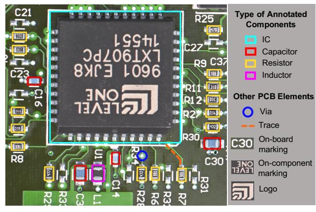
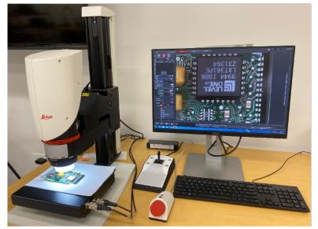
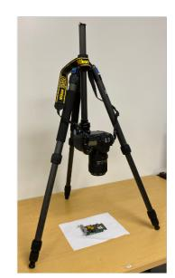
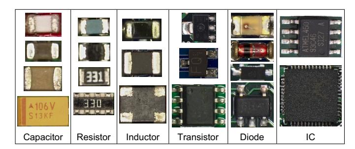
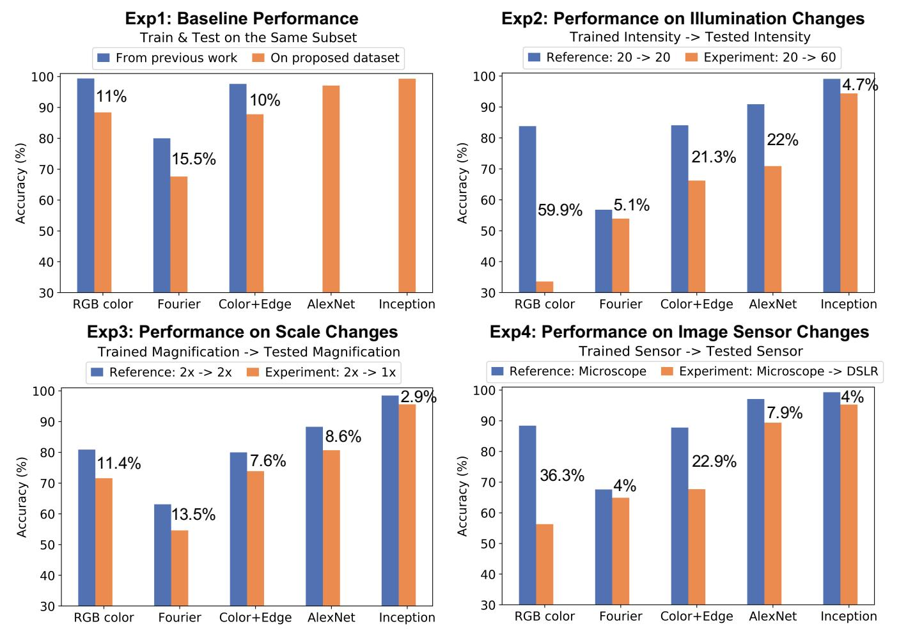

# FICS-PCB: A Multi-Modal Image Dataset for Automated Printed Circuit Board Visual Inspection

Hangwei Lu † , Dhwani Mehta, Olivia Paradis, Navid Asadizanjani, Mark Tehranipoor, and Damon L. Woodard Florida Institute for Cybersecurity (FICS) Research, Department of Electrical & Computer Engineering, University of Florida, Gainesville, 32611, FL, USA †qslvhw@ufl.edu

*Abstract*—Over the years, computer vision and machine learning disciplines have considerably advanced the field of automated visual inspection for Printed Circuit Board (PCB-AVI) assurance. However, in practice, the capabilities and limitations of these advancements remain unknown because there are few publicly accessible datasets for PCB visual inspection and even fewer that contain images that simulate realistic application scenarios. To address this need, we propose a publicly available dataset, "FICS-PCB"1 , to facilitate the development of robust methods for PCB-AVI. The proposed dataset includes challenging cases from three variable aspects: illumination, image scale, and image sensor. This dataset consists of 9,912 images of 31 PCB samples and contains 77,347 annotated components. This paper reviews the existing datasets and methodologies used for PCB-AVI, discusses challenges, describes the proposed dataset, and presents baseline performances using feature engineering and deep learning methods for PCB component classification.

*Index Terms*—PCB Dataset, Automated Visual Inspection, Computer Vision, Machine Learning

# I. INTRODUCTION

Printed Circuit Boards (PCBs) provide functional support to electronics such as laptops, biomedical devices, satellites, etc. by connecting electrical components, traces, and vias on the board (Figure 1). However, these connected circuits may contain defects or malicious implants, e.g., trace shortages, malicious component replacements, etc., that can impact the system's integrity or cause severe security breaches. Specific examples include but are not limited to: functional failure of the device (sensor failure in a self-driving car [1]), user data leakage [2], or partial/full system control taken by adversaries [3]. Therefore, it is critical to inspect PCBs before they are deployed.

Existing PCB inspection methods fall into two categories: electrical testing and automated visual inspection (PCB-AVI). Electrical testing involves checking design parameters at specified locations [4]. Hence, it cannot detect malicious implants that alter PCB functions outside the tested locations. This issue can be partially addressed by PCB-AVI, which involves the use of computer vision and machine learning algorithms to compare an image of a manufactured PCB with the design file or an image of a golden (trusted) PCB. Previous state-of-theart PCB-AVI methods have demonstrated high efficiency with focuses on trace and via defect detection, component defect

Fig. 1: Example of PCB image with annotated components and other PCB elements.

recognition, and component recognition [5]–[8]. However, many of these methods are evaluated only on private datasets, which makes performance comparison between methods difficult. Although a few large datasets [9]–[12] are publicly available, they lack variances that simulate real-world scenarios, e.g., illumination and scale variations, which are necessary for developing robust PCB-AVI approaches. Therefore, a large, publicly available dataset that better represents such non-ideal conditions is needed.

To this end, a dataset for evaluating and improving methods for PCB-AVI is proposed. This "FICS-PCB" dataset consists of PCB images featuring multiple types of components and various image conditions to facilitate performance evaluation in challenging scenarios that are likely to be encountered in practice. Preliminary experiments on PCB component classification were conducted to demonstrate the effect of these image variations on the performance of several PCB-AVI methods. The rest of the paper is organized as follows: Section II reviews the existing PCB datasets and methodologies for PCB-AVI and discusses challenges. Section III described the proposed dataset in detail. Section IV introduces the experiment methodologies, and the performances on PCB component classification are presented in Section V. Finally, the conclusion and future work are summarized in Section VI.

1The dataset is available for download at: https://www.trust-hub.org/data

#### II. RELATED WORK AND CHALLENGES

## *A. Previous Datasets*

As mentioned earlier, a few publicly available datasets have been proposed to provide benchmarks for PCB-AVI. A summary of these datasets is presented in Table I.

PCB-defect [10] and DeepPCB [9] are intended for trace and via defect detection. Both datasets provide images with synthesized PCB defects but have different reference images (defect-free) of bare PCBs. The images in PCB-defect are obtained from a digital microscope and keep RGB values, while the images in DeepPCB are collected from an industrial charge-coupled device (CCD) camera and are binarized.

PCB-DSLR [11] and PCB-Metal [12] are two datasets designed for PCB component inspection. Both datasets are collected from DSLR cameras under an illumination-controlled environment, and they provide variations in PCB orientation. PCB-DSLR records locations of integrated circuits (ICs) from 165 PCBs, and registers on-component markings for certain images. The smallest IC in this dataset is 15mm2 , and smaller components, such as resistors and capacitors, are not included due to resolution limitations. PCB-Metal consists of 984 images acquired from 123 PCBs. Since its DSLR camera has a higher resolution than the one used in PCB-DSLR, it records the locations of more component types, including ICs, capacitors, resistors, and inductors. The majority of PCBs in PCB-Metal have less than 20 ICs and capacitors.

To summarize, these publicly available datasets are large in size, however, they do not simulate the wide variability in real-world scenarios that could challenge the performance of PCB inspection.

# *B. Existing Methods*

Although limited PCB datasets were proposed, existing PCB-AVI methods have shown promising performance on private datasets and can be categorized into three classes: image matching (logic operators or correlation), feature engineering, and deep learning. These methods satisfy different visual inspection requirements, such as trace and via defect detection, component defect recognition, and component classification.

Detection of PCB trace and via defects is achieved by comparing images of manufactured PCBs with those of golden samples by applying logical operators, such as XOR or subtraction [5], [13], [14], or by using a trained classifier [15].

Substantial works proposed image matching methods to recognize component defects, including component absence, rotation, shifting, or substitution [16]–[21]. Among these studies, [17] reported a 90% accuracy on detecting missing capacitors and resistors using background subtraction, while [21] achieved the best 86% accuracy on detecting all defects by correlating wavelet-transformed images. In these works, the largest reported test set contained 100 PCB images taken with a digital microscope [17]. Engineered features, including 2D Fourier descriptors, RGB color values, and shape/color histogram, are also adopted in classifying component defects [22]–[24]. As opposed to image matching, which operates on entire PCB images, feature engineering is applied on Regions of Interest (ROIs), where components are suspected to exist. In these works, the largest reported private dataset consists of 651,000 images [23], [24].

Existing methods for component classification adopted feature engineering and deep learning methods. In [25], using reconstructed 3D shape could achieve 100% classification accuracy on a dataset of 4,840 components. In [26], combining HSI color histograms and Canny edges could achieve an average 97.6% classification accuracy on a dataset of 154 components. In addition, deep neural networks (DNN), including a convolutional neural network (CNN) and a Siamese network, were leveraged for recognizing components. The former was trained on 7,659 semantically-labeled components and achieved 90.8% accuracy on 4,822 component images [6], while the latter achieved 92.31% accuracy on verifying 572 ICs after training with 8,000 IC images collected online [27].

Promising performance for PCB-AVI has shown of using the above methods; however, the robustness and generality of these algorithms are unclear due to the limited information provided in the private datasets. First, the properties of PCB samples (e.g., the size and density of components) are unknown. The capability of such methods to apply on a wide variety of PCBs needs to be evaluated. Second, the quality of the obtained images may vary between lab environment and practical inspection, which could challenge the robustness of existing methods. To reduce performance degradation upon deployment, PCB-AVI methods should be tested on a dataset representative of the real-world scenario. Third, the comparison between different methods is difficult if they are evaluated on different datasets. Aspects, where high variation appears in practice, are elaborated on in the following section.

# *C. Challenges in Automated PCB Visual Inspection*

As stated above, the uniqueness and high variability of the PCB images present many challenges when developing robust and efficient PCB-AVI methods. Below, we discuss three aspects that greatly affect the content of the PCB images: PCB components, PCB boards, and imaging modality.

PCB components vary in color, texture, shape, orientation, and size, depending on their functions and materials. However, the appearance of a component is not perfectly correlated with its type. Examples can be seen in Figure 3. Two resistors may vary in color, while a black resistor may appear similar to a black inductor. In addition, advancements in transistor technologies have allowed PCBs to include smaller, more compact components. Tiny components that are represented by a few pixels lack discriminating features and may be overshadowed by larger components. Furthermore, the presence of multiple, densely-packed tiny components may be falsely detected as a single large component.

Similarly, the PCB board itself can also vary in color, material, size, and shape. For example, a black PCB board with black ICs and resistors presents challenges for component detection methods that incorporate color features. Meanwhile, due to the existence of traces, vias, and markings on the

TABLE I: Summary of Publicly Available PCB Datasets

| Datasets         | # Images | Inspected Object Object | # Objects | Sensor Type                    | Sensor Capability megapixels | px/cm              | Subset Characteristic                   |
|------------------|-------------|----------------------------|-----------|--------------------------------|---------------------------------|--------------------|--------------------------------------------|
| DeepPCB [9]      | 1,500       | Trace                      | -         | CCD                            | 25.6                            | 480                | -                                          |
| PCBA-defect [10] | 1,386       | Trace                      | -         | Dgital microscope              | 16.2                            | -                  | PCB rotation                               |
| PCB-DSLR [11]    | 748         | 1 component                | 9,313     | DSLR                           | 16.2                            | 87.4               | PCB rotation                               |
| PCB-Metal [12]   | 984         | 4 components               | 12,231    | DSLR                           | 30.4                            | -                  | PCB rotation                               |
| Proposed         | 9,912       | 6 components               | 77,347    | Digital microscope and DSLR | 10 and 45.7                  | 462-921 and 118 | Intensity variation and scale variation |

board, the PCB board has a higher complexity compared to the images used for developing most existing computer vision algorithms, e.g., road image segmentation and car detection. This may impact the performance of these algorithms.

As shown in Table I, PCB images can be collected by a variety of image modalities, where each captures different information. Moreover, specific imaging devices can have various adjustable parameters that further increase the variability in the PCB images. Furthermore, collection setups vary depending on the choice of imaging modality. For example, a digital microscope has a built-in lighting system, whereas a DSLR camera must use outsourced light. Lighting conditions can result in different image properties, such as image artifacts from reflective materials or shadowing from large components, which could also challenge PCB-AVI algorithms. To summarize, it is essential to incorporate instances of challenging cases to evaluate developed methods, which motivates the collection of the proposed dataset, "XXXX-PCB".

#### III. DESCRIPTION OF DATABASE

#### *A. Data Acquisition*

The "FICS-PCB" dataset is designed to support evaluation on different challenge cases. It is collected at the SeCurity and AssuraNce (SCAN) Lab at the University of Florida, and it is a part of an on-going multi-modality PCB data collection effort. The dataset currently consists of 9,912 images acquired from 31 PCBs that were purchased online or disassembled from various devices, including hard drive controllers, audio amplifiers, monitors, etc. Four board colors, green, red, blue, and black, are currently represented. The smallest board is 7.2cm2 , and the largest board is 523.2cm2 . So far, two imaging sensor types have been used for data collection: digital microscope and DSLR camera.

*1) Digital Microscope Subset:* Digital microscopy offers precise, quantitative control of illumination and scale and is widely used in PCB quality control and failure analysis [28]. This subset is collected using a Leica DVM6 model with FOV 43.75, which has a fixed lens and a movable stage (Figure 2 (a)). It takes a set of images within a 70mm × 50mm area (stage travel range area) to generate images in the pixel size of 1600 × 1200 with 10% overlap area in between. During image collection, if the size of the board exceeds the travel range, the PCB is manually moved for additional data collection until the entire board is imaged. To ensure the proposed dataset includes samples that represent variations

Fig. 2: Collection setups for digital microscope subset and DSLR subset.

in illumination, images are collected using three different intensities from the microscope's built-in ring light: 20, 40, and 60 [29], where 60 represents the brightest illumination. In addition, variations in scale are included by using three magnifications: 1×, 1.5×, and 2×, where 1× represents the largest FOV. Other parameters of the digital microscope are fixed as follows: 101ms exposure, 5 gain (amplification of image sensor), 20 saturation, and RGB color mode. Images that do not contain components are not included in the dataset, which finally results in a total of 9,861 "TIF" formatted images in the digital microscope subset.

- *2) DSLR Subset:* The setup for DSLR collection, shown in Figure 2 (b), incorporates a Nikon D850 camera, a 105mm macro lens, and a tripod to stabilize the camera with the lens facing down toward the PCB. Data collection is conducted in batches in a lab environment for consistent imaging. An exposure delay is set to reduce noise from camera vibrations due to manual handling. The distance between the camera and samples (image distance) is adjusted for each board such that most PCBs are captured in one image. For large PCBs, multiple images are taken to keep the smallest components in-focus. Images that do not contain components (backside of some boards) are not included in the dataset, which finally results in a total of 51 "TIF" formatted images, which are in the pixel size of 8256 × 5504, in the DSLR subset.
- *3) Annotation:* Component annotation is completed using the open-source VGG image annotator [30], [31]. The annotation files are stored in ".CSV" format with the *image name, component location, component type, text on component*, and *logo* recorded for each component. Each row of the annotation file contains information for one component, where the "*image*

Fig. 3: Examples of six types of annotated components.

*name*" is the filename of the annotated image containing the component, "*component location*" is the pixel coordinates in Cartesian plane to localize the component's bounding box, "*component type*" is the type belongs to IC, capacitor, resistor, inductor, transistor, or diode, "*text on component*" is the on-component marking, and the "*logo*" is a binary record of the presence of any on-component logos. For the digital microscope subset, which contains images of three intensities of the same board regions, images for only one intensity are annotated. An example of annotated image is shown in Figure 1 and examples of PCB components are in Figure 3. In addition, individual component images extracted from the PCB images and two Python scripts for database usage are provided. One script extracts component images using the annotation files. The other script randomly generates training, validation, and test sets from the extracted components.

### *B. Database Statistics*

In addition to the dataset information summarized in Table I, the number of annotated components is presented in Table II. In this dataset, the smallest component is 0.5mm2 , whereas the largest component is 256mm2 . Also, the component count per image is calculated for each subset, as shown in Table III. Among the PCB samples, 11 PCBs have more than 200 components, which indicates the image complexity and the number of components that need to be detected and classified correctly. For instance, a maximum of 478 components in one DSLR image of a large PCB board would require detection.

TABLE II: Number of Samples in Database

| Database  | IC    | Capacitor |        |       | Resistor Inductor Transistor Diode |       |
|-----------|-------|-----------|--------|-------|------------------------------------|-------|
| PCB-DSLR  | 9313  | -         | -      | -     | -                                  | -     |
| PCB-Metal | 5844  | 3175      | 2670   | 542   | -                                  | -     |
| Proposed  | 3,243 | 36,639    | 33,182 | 1,292 | 1,398                              | 1,593 |

TABLE III: Analysis of Component Count per Image in Subsets of FICS-PCB

| Modals     | Subsets | Mean | Max | Min |
|------------|---------|------|-----|-----|
| Microscope | 1x      | 13   | 101 | 1   |
|            | 1.5x    | 8    | 90  | 1   |
|            | 2x      | 6    | 49  | 1   |
| DSLR       | -       | 134  | 478 | 13  |

In summary, to help evaluate and improve automated visual inspection techniques, the proposed dataset, "FICS-PCB", includes variation in imaging modality, scale, and illumination. To demonstrate the effect of these variations on the performance of PCB-AVI methods, various tests were performed on the proposed dataset, which are presented in the next section.

### IV. EXPERIMENT METHODOLOGIES

In this work, experiments are conducted on the proposed dataset to evaluate the performance changes. They involve state-of-the-art feature engineering and deep learning methods for PCB component classification on the variable subsets. Note, image matching methods are not used in experiments because they are time costly and sensitive to image variations.

RGB color [23], [24], Fourier shape [22], and fusion of color and edge features [26] were implemented as the feature engineering methods. In [23], [24], RGB color features are fed into a Na¨ıve Bayes classifier, where the R, G, and B color channel values are extracted from a 10 × 10 pixel square in the center of the component body. The feature is defined as: x = (xR, xG, xB) T . The Fourier descriptor with watershed segmentation and Canny edge detection are implemented as they were used in Mello et al.'s work [22]. N contour signatures are extracted as complex expression cn = xn +jyn (n ∈ N). Then, the discrete complex Fourier transform is applied to obtain the Fourier coefficients, where the sixth coefficients are used to include sufficient shape details. These coefficients are then fed into a multi-layer perceptron (MLP). Feature fusion that concatenates color and shape feature vectors is used in [26]. The color feature is a binarized nbin histogram of the hue channel from the HSI color image, where the bin's value is set to either 0 or 1 depending on a preset threshold. Similarly, the shape features are two binarized m-bin histograms of Canny edges that projected on the x − y axes. Then, three features are concatenated and used to train a MLP for PCB component recognition.

In this work, two deep neural networks, AlexNet [32] and Inception-v3 [33], were implemented to explore the potential of using deep learning for PCB component classification. AlexNet is one of the earliest CNNs that successfully applied to the million-scale dataset, "ImageNet" [34]. It has a relatively simple network architecture compare to the latest networks, although it is not the best-performed network. In this work, it is used to compare the performance robustness between a simple deep neural network and conventional methods (refers to feature engineering) when variations exist in image data. Inception-v3 a later proposed network. Compare to other widely adopted deep neural networks such as VGG-19 or ResNet-101, it has fewer parameters with faster training time, yet maintains relatively high classification accuracy [35]. Both networks were implemented by Keras API with pre-trained weights [36].

## V. PRELIMINARY RESULTS

Four experiments were conducted on the proposed dataset, where three of them were designed to evaluate the perfor-

Fig. 4: Performance changes on four experiments. The numerical percentages are degraded performance of the experimental groups (orange) comparing to the reference groups (blue).

mance change of state-of-the-art methods on variations of illumination, image scale, and image sensor. In this work, only the binary classification accuracy on capacitors and resistors are presented because: 1) they are the most common components inspected in previous research, and 2) the observed performance degradation for the binary classification task has sufficiently demonstrated the need for a dataset representing the real-world scenario.

In all experiments, the ratio of training to testing samples is 4:1, and the presented accuracy was averaged from tenfold cross-validation. For brevity, the names of the digital microscope subsets are abbreviated as "scale value"-"intensity value" subset, e.g., 1.5x-40 subset.

## *A. Baseline Performance*

Experiment-1 is designed to establish baseline performance of the experimental methods on the proposed dataset, where training and testing are conducted on the same subset as in previous literature. To control for variations, nine digital microscope subsets that have the same intensity and scale, as well as the DSLR subset (fixed illumination and scale) are assessed. In Figure 4 Exp-1, the accuracy reported in previous work, if available, are presented along with the highest accuracy among all subsets. It highlights the performance degradation using all feature engineering methods on the proposed dataset with higher component variations and sample number. Both deep neural networks achieve an accuracy above 97%, outperforming the feature engineering methods.

#### *B. Illumination Variation*

Experiment-2 is designed to explore the effect of lighting variation, which is one of the most common factors in the real-scenario that could impact the robustness of a PCB-AVI method. The reference results were obtained by training and testing on the same 1.5x-20 subset, while the illuminationvaried results are obtained by training on the 1.5x-20 subset and testing on the 1.5x-60 subset. According to Figure 4 Exp-2, among feature engineering methods, illumination variation affects the RGB color feature the most, and the Fourier shape descriptor the least. The RGB color feature degradation is expected, as the existing method did not apply image preprocessing to address this variation. Meanwhile, although the shape feature has the least degradation, the accuracy of the reference group is very low (less than 60%). Among the two deep networks, Inception-v3 outperformed AlexNet in Experiment-2 with a slightly decreased classification accuracy.

#### *C. Scale Variation*

Experiment-3 is conducted on the digital microscope subset with a fixed intensity to depict the influence of scale variation on classification performance. The reference group was trained and tested on the same 2x-40 subset, while the scale-varied group was trained on the 2x-40 subset and tested on the 1x-40 subset. As shown in Figure 4 Exp-3, classification accuracy is dropped in the experimental groups. The Fourier descriptor has the most degradation, which implies the impact of scale changes on the shape features. Though all methods show an accuracy decrease when the scale is varied, the amount of decrease is generally not as drastic compared to the decrease when illumination was varied.

## *D. Image Sensor Variation*

Experiment-4 is designed to simulate application scenarios where PCB-AVI methods are developed using one image sensor, but the real-scenario requires the use of another. Accuracies from the baseline performance (Exp-1) are used as the reference since they are all from the digital microscope subsets, and the DSLR subset is used as the sensor-varied set. According to Figure 4 Exp-4, the RGB color feature and feature fusion are significantly impacted by changing the image sensor, while the Fourier shape feature is less sensitive. This trend is similar to the Exp-2, which may be caused by different intensity profiles of DSLR and digital microscope. Two deep networks methods outperformed the conventional methods in this experiment.

As the results shown in the above four experiments, variations in illumination, image scale, and the image sensor all significantly impact the component classification performance of existing approaches. Although the performance of two deep learning methods shows a promising research direction compared with using conventional feature engineering, they are affected by the variations, especially on illumination changes. Additionally, a mere 35% performance drop was observed when they trained for multi-class classification, which indicates room for future improvements. Therefore, a dataset that incorporates these variances is required by the research community to develop a robust PCB inspection system.

## VI. CONCLUSION

Although the high accurate performance of automated PCB visual inspection may be achieved with the adaptation of recently developed computer vision methods, the question remains on how to improve them with more reliability when using images exhibiting dissimilar characteristics. According to the experiment results, it can be concluded that the existing approaches for automated PCB visual inspection are not sufficiently addressing variations in PCB images that are likely to be encountered in real-scenarios, such as changes in illumination, image scale, and image sensor. It could result in the missed detection of security/hardware threats if such variability is not accounted for. To provide a more realistic representation of these challenges, the "FICS-PCB" dataset is proposed to provide researchers the opportunity to test and compare methods against a standard to better understand the benefits and limitations of existing and novel algorithms.

Future work will involve the continued expansion of the proposed dataset to keep up-to-date with developing PCB technologies. Also, the dataset will incorporate other modalities for the development of multi-modal methods. The currently proposed and expanded version of the dataset will prove invaluable to the hardware assurance research community in addressing the problem of automated PCB visual inspection.

## REFERENCES

- [1] T. FBI, "Florida man charged in federal counterfeit case for trafficking bogus automotive devices 'reverse engineered' in china," 2014.
- [2] M. Tehranipoor and F. Koushanfar, "A survey of hardware trojan taxonomy and detection," *IEEE design & test of computers*, vol. 27, no. 1, pp. 10–25, 2010.
- [3] Z. Guo, X. Xu, M. M. Tehranipoor, and D. Forte, "Eop: An encryptionobfuscation solution for protecting pcbs against tampering and reverse engineering," *arXiv preprint arXiv:1904.09516*, 2019.
- [4] M. Moganti and F. Ercal, "Automatic pcb inspection systems," *IEEE Potentials*, vol. 14, no. 3, pp. 6–10, 1995.
- [5] N. Dave, V. Tambade, B. Pandhare, and S. Saurav, "Pcb defect detection using image processing and embedded system," *International Research Journal of Engineering and Technology (IRJET)*, vol. 3, no. 5, pp. 1897– 1901, 2016.
- [6] D.-u. Lim, Y.-G. Kim, and T.-H. Park, "Smd classification for automated optical inspection machine using convolution neural network," in *2019 Third IEEE International Conference on Robotic Computing (IRC)*, pp. 395–398, IEEE, 2019.
- [7] X. Bai, Y. Fang, W. Lin, L. Wang, and B.-F. Ju, "Saliency-based defect detection in industrial images by using phase spectrum," *IEEE Transactions on Industrial Informatics*, vol. 10, no. 4, pp. 2135–2145, 2014.
- [8] C. Szymanski and M. R. Stemmer, "Automated pcb inspection in small series production based on sift algorithm," in *2015 IEEE 24th International Symposium on Industrial Electronics (ISIE)*, pp. 594–599, 2015.
- [9] S. Tang, F. He, X. Huang, and J. Yang, "Online pcb defect detector on a new pcb defect dataset," *arXiv preprint arXiv:1902.06197*, 2019.
- [10] W. Huang and P. Wei, "A pcb dataset for defects detection and classification," *arXiv preprint arXiv:1901.08204*, 2019.
- [11] C. Pramerdorfer and M. Kampel, "A dataset for computer-vision-based pcb analysis," in *2015 14th IAPR International Conference on Machine Vision Applications (MVA)*, pp. 378–381, May 2015.
- [12] G. Mahalingam, K. M. Gay, and K. Ricanek, "Pcb-metal: A pcb image dataset for advanced computer vision machine learning component analysis," in *2019 16th International Conference on Machine Vision Applications (MVA)*, pp. 1–5, 2019.
- [13] A. P. S. Chauhan and S. C. Bhardwaj, "Detection of bare pcb defects by image subtraction method using machine vision," in *Proceedings of the World Congress on Engineering*, vol. 2, pp. 6–8, 2011.
- [14] P. P. Londe and S. Chavan, "Automatic pcb defects detection and classification using matlab," *International Journal of Current Engineering and Technology*, vol. 4, no. 3, 2014.
- [15] C.-T. Liao, W.-H. Lee, and S.-H. Lai, "A flexible pcb inspection system based on statistical learning," *Journal of Signal Processing Systems*, vol. 67, no. 3, pp. 279–290, 2012.
- [16] W.-Y. Wu, M.-J. J. Wang, and C.-M. Liu, "Automated inspection of printed circuit boards through machine vision," *Computers in industry*, vol. 28, no. 2, pp. 103–111, 1996.
- [17] K. Sundaraj, "Pcb inspection for missing or misaligned components using background subtraction," *WSEAS transactions on information science and applications*, vol. 6, no. 5, pp. 778–787, 2009.

- [18] M. Borthakur, A. Latne, and P. Kulkarni, "A comparative study of automated pcb defect detection algorithms and to propose an optimal approach to improve the technique," *International Journal of Computer Applications*, vol. 114, no. 6, 2015.
- [19] F. Xie, A. Uitdenbogerd, and A. Song, "Detecting pcb component placement defects by genetic programming," in *2013 IEEE Congress on Evolutionary Computation*, pp. 1138–1145, 2013.
- [20] A. Crispin and V. Rankov, "Automated inspection of pcb components using a genetic algorithm template-matching approach," *The International Journal of Advanced Manufacturing Technology*, vol. 35, no. 3-4, pp. 293–300, 2007.
- [21] H.-J. Cho and T.-H. Park, "Wavelet transform based image template matching for automatic component inspection," *The International Journal of Advanced Manufacturing Technology*, vol. 50, no. 9-12, pp. 1033– 1039, 2010.
- [22] A. R. de Mello and M. R. Stemmer, "Inspecting surface mounted devices using k nearest neighbor and multilayer perceptron," in *2015 IEEE 24th International Symposium on Industrial Electronics (ISIE)*, pp. 950–955, 2015.
- [23] H. Wu, G. Feng, H. Li, and X. Zeng, "Automated visual inspection of surface mounted chip components," in *2010 IEEE International Conference on Mechatronics and Automation*, pp. 1789–1794, 2010.
- [24] H.-H. Wu, X.-M. Zhang, and S.-L. Hong, "A visual inspection system for surface mounted components based on color features," in *2009 International Conference on Information and Automation*, pp. 571–576, 2009.
- [25] E. Guerra and J. Villalobos, "A three-dimensional automated visual inspection system for smt assembly," *Computers & industrial engineering*, vol. 40, no. 1-2, pp. 175–190, 2001.
- [26] S. Youn, Y. Lee, and T. Park, "Automatic classification of smd packages using neural network," in *2014 IEEE/SICE International Symposium on System Integration*, pp. 790–795, 2014.
- [27] M. Reza, Z. Chen, and D. Crandall, "Deep neural network based detection and verification of microelectronic images," 07 2019.
- [28] L. Microsystems, "Digital microscope leica dvm6."
- [29] L. Microsystem, "Leica dvm6 user manual," 2019.
- [30] A. Dutta and A. Zisserman, "The VIA annotation software for images, audio and video," in *Proceedings of the 27th ACM International Conference on Multimedia*, 2019.
- [31] A. Dutta, A. Gupta, and A. Zissermann, "VGG image annotator (VIA)," 2016.
- [32] A. Krizhevsky, I. Sutskever, and G. E. Hinton, "Imagenet classification with deep convolutional neural networks," in *Advances in neural information processing systems*, pp. 1097–1105, 2012.
- [33] C. Szegedy, V. Vanhoucke, S. Ioffe, J. Shlens, and Z. Wojna, "Rethinking the inception architecture for computer vision," in *Proceedings of the IEEE conference on computer vision and pattern recognition*, pp. 2818– 2826, 2016.
- [34] J. Deng, W. Dong, R. Socher, L.-J. Li, K. Li, and L. Fei-Fei, "ImageNet: A Large-Scale Hierarchical Image Database," in *CVPR09*, 2009.
- [35] S. Bianco, R. Cadene, L. Celona, and P. Napoletano, "Benchmark analysis of representative deep neural network architectures," *IEEE Access*, vol. 6, pp. 64270–64277, 2018.
- [36] F. Chollet *et al.*, "Keras." https://keras.io, 2015.