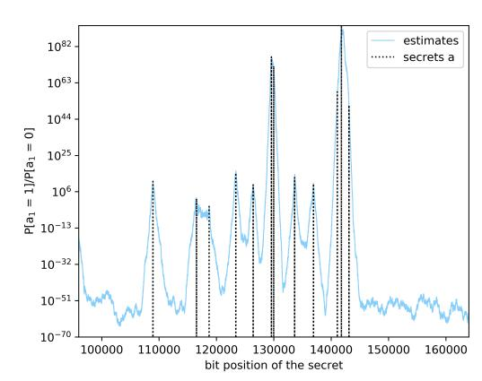
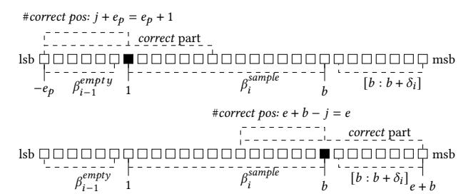
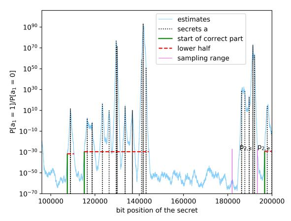
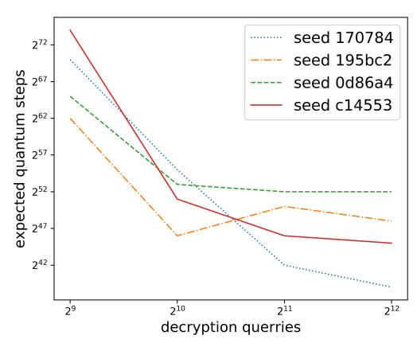
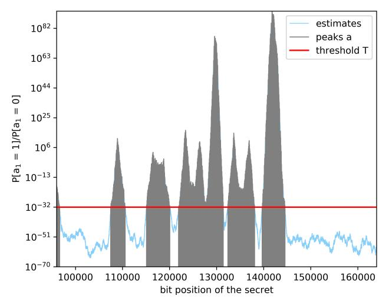

# Exploiting Decryption Failures in Mersenne Number Cryptosystems

Marcel Tiepelt marcel.tiepelt@kit.edu

KASTEL, Karlsruhe Institute of Technology Karlsruhe, Germany

# Jan-Pieter D'Anvers janpieter.danvers@esat.kuleuven.be imec-COSIC, KU Leuven Leuven-Heverlee, Belgium

## ABSTRACT

Mersenne number schemes are a new strain of potentially quantumsafe cryptosystems that use sparse integer arithmetic modulo a Mersenne prime to encrypt messages. Two Mersenne number based schemes were submitted to the NIST post-quantum standardization process: Ramstake and Mersenne-756839. Typically, these schemes admit a low but non-zero probability that ciphertexts fail to decrypt correctly. In this work we show that the information leaked from failing ciphertexts can be used to gain information about the secret key. We present an attack exploiting this information to break the IND-CCA security of Ramstake. First, we introduce an estimator for the bits of the secret key using decryption failures. Then, our estimates can be used to apply the Slice-and-Dice attack due to Beunardeau et al. at significantly reduced complexity to recover the full secret. We implemented our attack on a simplified version of the code submitted to the NIST competition. Our attack is able to extract a good estimate of the secrets using 2 <sup>12</sup> decryption failures, corresponding to 2 <sup>74</sup> failing ciphertexts in the original scheme. Subsequently the exact secrets can be extracted in 2 <sup>46</sup> quantum computational steps.

## CCS CONCEPTS

• Security and privacy → Cryptanalysis and other attacks.

## KEYWORDS

Mersenne number cryptosystems, decryption failures, IND-CCA, cryptanalysis, post-quantum

## 1 INTRODUCTION

The development of quantum computing poses a significant threat to the current public key infrastructure, as Shor's algorithm breaks cryptographic primitives such as RSA and ECC. To replace these primitives, there is an urgent need for cryptography that is secure against quantum computers, i.e. post-quantum cryptography. This need has been recognized by several standardization bodies such as ETSI and NIST, the latter of which organized the NIST post-quantum standardization process [\[2\]](#page-8-0) to select one or more post-quantum replacements for the current public key cryptographic primitives.

Two of the submissions to this process based their primitives on a relative new security assumption involving Mersenne numbers. Initially Aggarwal et al. [\[4\]](#page-8-1) introduced a single bit encryption scheme which was later picked up, refined and submitted to the NIST post-quantum standardization project independently by Aggarwal et al. [\[3\]](#page-8-2) and Szepieniec [\[24\]](#page-9-0) in 2017. The schemes compute

a shared noisy secret using sparse integers modulo a Mersenne prime and employ an error correcting code to remedy transmission noise. The proposals were not selected into the second round, partly because the underlying hard problem is relatively new and did not yet receive a lot of cryptanalysis. On the other hand, there is currently no indication that these schemes are insecure even in the event of large scale quantum computers.

Various proposals in the NIST post-quantum competition are prone to a small decryption failure probability, for which the two communicating parties fail to agree on a common message after the execution of the protocol. As these decryption failures also depend on the secret key, they contain information on the secret key. These failures occur in the Mersenne number schemes such as Ramstake (with failure probability 2 <sup>−</sup>64) or Mersenne-756839 (with failure probability 2 <sup>−</sup>239). Likewise many other NIST proposals admit such failures, as in the family of lattice based (e.g. FrodoKEM [\[23\]](#page-8-3) with 2 <sup>−</sup>252, Kyber [\[8\]](#page-8-4) with 2 <sup>−</sup>160, Saber [\[10\]](#page-8-5) with 2 <sup>−</sup>136) or code based schemes (e.g. HQC [\[22\]](#page-8-6) with 2 <sup>−</sup>128, LEDAcrypt [\[5\]](#page-8-7) with 2 <sup>−</sup>64, or Rollo [\[21\]](#page-8-8) with 2 <sup>−</sup>42).

For lattice based schemes, Jaulmes and Joux [\[20\]](#page-8-9) introduced a chosen ciphertext attack leveraging decryption failures, which was later refined and extended by Gamma, Nguyen and Howgrave-Graham [\[19\]](#page-8-10). These attacks are countered by schemes that obtain IND-CCA security using an appropriate transformation. D'Anvers et al. [\[9\]](#page-8-11) provided a technique to increase the failure probability and subsequently recover the secret key of IND-CCA secure LWE based schemes, a technique which was extended in subsequent works [\[12\]](#page-8-12)[\[17\]](#page-8-13)[\[11\]](#page-8-14). Guo, Johansson and Stankovski [\[16\]](#page-8-15) provided a similar attack on IND-CCA secure code based schemes.

Our Contribution. In this work we developed a new attack breaking the IND-CCA security of Mersenne number cryptosystems by exploiting decryption failures. We present a method that takes as input a set of failing ciphertexts and outputs a good estimation of the secret key. The estimates are sufficiently close to the secret vector such that one may employ a technique introduced by Beunardeau et al. [\[7\]](#page-8-16) to extract these secrets. Several notations and algorithms used throughout this work are introduced in Section [2.](#page-1-0) In Section [3](#page-3-0) we define heuristics that allow us to quantify the probability distribution of the secrets. Based on these heuristics we present our method on estimating the secret vectors. In the next section we show that our estimates allow to derive additional knowledge about the secret key and how that information can be used to speed up the attack by Beunardeau et al. significantly. In Section [5](#page-6-0) we describe our implementation of the attack on the Ramstake cryptosystem. The empirical results, which can be verified using our implementation  $^1$ , obtained good estimates of the secret using  $2^{12}$  decryption failures. These may be extracted from the original Ramstake scheme in about  $2^{74}$  decapsulations queries. The derived estimates allow to apply a reduced variant of the Slice-and-Dice attack that can recover the secret key using about  $2^{46}$  quantum computational steps.

## <span id="page-1-0"></span>2 PRELIMINARIES

#### 2.1 Notation

A Mersenne number is a number that can be written in the form  $p=2^n-1$ , with n an integer. Let  $\mathbb{Z}_p=\mathbb{Z}/p\mathbb{Z}$  denote the ring of integers modulo a Mersenne prime p. The integers in this ring will sometimes be expressed as a binary string, using the LSB representation of their representants in [0,p). Subsequently all binary representation of integers in the ring have bit length at most n. When computing modulo a Mersenne prime the multiplication by a power of two is equivalent to a rotational shift, i.e., performing  $2^ix \mod p$  is equivalent to rotating the binary representation of x by i positions. Another property is that the bitwise Hamming weight does not increase when performing a modular operation with a Mersenne prime.

For any integer  $x \in \mathbb{Z}_p$  the  $i^{\text{th}}$  bit of the binary representation will be expressed as x[i] or in shorthand  $x_i$ , and the bits in the range from i to, but not including j, will be written as x[i:j]. The bitwise Hamming weight of an integer  $x \in \mathbb{Z}_p$  will be denoted by  $\mathrm{HW}(x)$ , returning the number of ones in the binary representation of x. Likewise, the bytewise Hamming weight of a binary string x will be written as  $\mathrm{HW}^8(x)$ , which returns the number of nonzero bytes in x. Counting the Hamming weight of the substring x[i:j] will be abbreviated as  $\mathrm{HW}_{[i:j]}(x)$  and likewise  $\mathrm{HW}_{[i:j]}^8(x)$  for bytewise Hamming weights. Given two integers  $x,y\in\mathbb{Z}_p$  the xor operation  $\oplus$  will be defined so that  $z=x\oplus y$  if  $z[i]=(x[i]+y[i])\mod 2$  for all  $i\in[0,n)$ . Let |x| denote the length of a bit string x and split(x) denote splitting the input into two equally sized substrings, e.g.  $x=x_1|x_2$ .

The function  $\mathcal{U}(\{0,1\}^n)$  describes the process of drawing uniformly random values from the distribution  $\{0,1\}^n$ , while the function  $\mathcal{HW}_{\omega}(\mathbb{Z}_p;r)$  generates a uniformly random integer x in  $\mathbb{Z}_p$  that satisfies  $\mathrm{HW}(x) = \omega$ . When r is specified, the output is generated pseudorandomly from r.

## 2.2 Cryptographic definitions

A key encapsulation mechanism (KEM) is a triplet of PPT algorithms  $\mathsf{E} = (\mathsf{KeyGen}, \mathsf{Encaps}, \mathsf{Decaps}),$  where  $\mathsf{KeyGen}()$  takes as input the security parameter and outputs the public key pk and the secret key sk, where  $\mathsf{Encaps}(pk)$  takes as input the public key and outputs the key k and the ciphertext c and where  $\mathsf{Decaps}(sk,c)$  takes as input the ciphertext and the secret key and outputs either the key k or  $\bot$  in case of a decryption failure.

The security of a KEM is defined using the notion of indistinguishability under chosen ciphertext attacks (IND-CCA). The advantage of an adversary winning an IND-CCA security game can

be expressed using the following definition from Bellare, Hofheinz and Kiltz [6]:

$$Adv_{KEM}^{\mathsf{IND-CCA}}(A) := \tag{1}$$

$$\left| Pr \begin{bmatrix} (pk, sk) \leftarrow \mathsf{KeyGen}(1^{\lambda}); b \xleftarrow{\$} \{0, 1\} \\ b = b' : (k_0, c) \leftarrow \mathsf{Encaps}(pk); k_1 \xleftarrow{\$} \mathcal{K} \\ b' \leftarrow A^{\mathsf{Decaps}}(pk, c, k_b) \end{bmatrix} - \frac{1}{2} \right|$$
 (2)

A KEM is said to be secure if the advantage of the adversary A is negligible in the security parameter  $\lambda$ :

$$Adv_{KEM}^{\mathsf{IND-CCA}}(A) \le negl(\lambda)$$
. (3)

# 2.3 Mersenne prime schemes

In this section we will define a generalized Mersenne prime encryption scheme, which can be used to build an IND-CCA secure KEM. Afterwards, we go into detail on the specific design choices of Ramstake.

Choose p as a Mersenne prime and let  $gen_G()$  be a pseudorandom generator that expands  $sd_G$  into a uniformly random element in  $\mathbb{Z}/p\mathbb{Z}$ . Let G and H be hash functions modeling random oracles and let Encode and Decode be a pair of error correcting code functions that respectively encode a binary string m into an encoded binary string  $m_{ecc}$ , and decode a noisy version of the latter string back into the original such that up to t errors can be corrected. Given these functions, a generalized Mersenne prime scheme can be formalized as given in Algorithms 1 to 3. The scheme is secure if the Mersenne Low Hamming Combination (LHC) Assumption from [3] in Definition 2.1 holds.

<span id="page-1-2"></span>Definition 2.1 (Mersenne Low Hamming Combination (LHC) Assumption). Let  $2^n-1$  be a Mersenne prime and  $\omega$  an integer such that  $4\omega^2 < n \le 16\omega^2$ . The advantage of a PPT adversary to distinguish the two tuples

$$\left( \begin{bmatrix} G_1 \\ G_2 \end{bmatrix}, \begin{bmatrix} G_1 \\ G_2 \end{bmatrix} \cdot a + \begin{bmatrix} b_1 \\ b_2 \end{bmatrix} \right) or \left( \begin{bmatrix} G_1 \\ G_2 \end{bmatrix}, \begin{bmatrix} R_1 \\ R_2 \end{bmatrix} \right),$$

where  $G_1$ ,  $G_2$ ,  $R_1$  and  $R_2$  are chosen uniformly random in  $\mathbb{Z}/p\mathbb{Z}$  and a,  $b_1$  and  $b_2$  are random elements in  $\mathbb{Z}/p\mathbb{Z}$  with Hamming weight  $\omega$ , is at most  $O(2^{-\omega})$ .

FO-transformation. The IND-CPA secure encryption scheme can be compiled into an IND-CCA secure KEM using a post-quantum version (e.g., [18]) of the Fujisaki-Okamoto [14] transformation as given in Appendix A.

#### 2.4 Mersenne-756839

The Mersenne-756839 KEM implements a repetition code where each bit of the message m is repeated  $\chi=2048$  times. During the encryption an additional error term  $\hat{d}$  is added to the (shared) noisy secret resulting in an overall error of

$$(acG + ad) \oplus (acG + bc + \hat{d})$$
. (4)

A decryption failure occurs if more than  $\chi/2$  many bits of any single encoded bit are erroneous.

<span id="page-1-1"></span> $<sup>^1</sup>$ Our implementation is available at: https://github.com/mtiepelt/ramstake-failure-attack

```
Algorithm 1: KeyGen()

1 sd_G \leftarrow \mathcal{U}\left(\{0,1\}^{256}\right)

2 G \leftarrow gen_G(sd_G)

3 a,b \leftarrow \mathcal{HW}_{\omega}(\mathbb{Z}_p) \times \mathcal{HW}_{\omega}(\mathbb{Z}_p)

4 P_D \leftarrow aG + b \mod p

5 \mathbf{return}\left(pk := (sd_G, P_D), sk := (a, b, sd_G)\right)
```

```
Algorithm 2: Encrypt(
pk := (sd_G, P_D), r; h_r)
1 \quad r_1, r_2 \leftarrow split(h_r)
2 \quad c, d \leftarrow \mathcal{H}W_{\omega}(\mathbb{Z}_p; r_1) \times \mathcal{H}W_{\omega}(\mathbb{Z}_p; r_2)
3 \quad G \leftarrow gen_G(sd_G)
4 \quad P_E \leftarrow cG + d \mod p
5 \quad S \leftarrow cP_D \mod p
6 \quad r_{ecc}, h = \text{Encode}(r)
7 \quad enc_r = r_{ecc} \oplus S \left[0 : |r_{ecc}|\right]
8 \quad \text{return} \quad (ct := (enc_r, P_E, h))
```

```
Algorithm 3: Decrypt(
ct := (enc_r, P_E, h), sk := (a, b, sd_G))
1 G \leftarrow gen_G(sd_G)
2 S' \leftarrow aP_E \mod p
3 r'_{ecc} = enc_r \oplus S' [0 : |enc_r|]
4 r' = Decode(r'_{ecc}, h)
5 return r'
```

<span id="page-2-2"></span>Table 1: Parameter sets for the two security levels of Ramstake.

|                 | р      | ω   | ν | t   | P[F]           | security |
|-----------------|--------|-----|---|-----|----------------|----------|
| Ramstake-216091 | 216091 | 64  | 4 | 111 | $\leq 2^{-64}$ | 128      |
| Ramstake-756839 | 756839 | 128 | 6 | 111 | $\leq 2^{-64}$ | 256      |

#### <span id="page-2-5"></span>2.5 Ramstake

Ramstake employs an error correcting code based on repetitive Reed-Solomon encodings. The Reed-Solomon code maps a 256-bit message onto a 2040-bit (255 byte) codeword, which can correct up to t byte errors. We will denote the bit length of the codeword with  $l_c$ . This codeword is repeated v times. Furthermore, a hash of the message h is included in the ciphertext. During decoding, the Reed-Solomon codes are decrypted iteratively and then checked for correctness by comparing  $\mathcal{H}(r)$  with h. More information on the design of Ramstake can be found in [24], the parameters of the Ramstake instantiations can be found in Table 1. In this paper we will focus on the high security variant Ramstake-756839.

#### 2.6 Failures

Both Mersenne-756839 and Ramstake have a small probability of decryption failures, in which the keys are not transmitted correctly. A ciphertext is rejected if the number of errors introduced by the xor operations with consecutively  $S[0:|r_{ecc}|]$  and  $S'[0:|r_{ecc}|]$  cannot be corrected by the error correcting code.

In the case of Ramstake, a failure occurs when none of the  $\nu$  codewords could be decoded. The  $k^{\text{th}}$  codeword cannot be decoded if  $\mathrm{Hw}^8_{[kl_c:(k+1)l_c]}(e) > t$ , where  $e = S \oplus S' = ((acG+ad) \oplus (acG+bc))$ .

```
Algorithm 4: Ramstake.Encode(m)

1 e = \operatorname{enc}_{RS}(m)

2 m_{ecc} = 0

3 for i = 0 to v - 1 do

4 \left\lfloor m_{ecc} + = e \cdot 2^i \frac{l}{v} \right\rfloor

5 h = \mathcal{H}(m)

6 return m_{ecc}, h
```

```
Algorithm 5: Ramstake.Decode(m_{ecc}, h)

1 for i = 0 to v - 1 do

2 m = \deg_{RS} \left( m_{ecc} [i \frac{l}{v} : (i+1) \frac{l}{v} - 1] \right)

3 if h == \mathcal{H}(m) then

4 return m
```

#### <span id="page-2-4"></span>2.7 Slice-and-Dice attack

The Slice-and-Dice attack, introduced by Beunardeau et al. [7], is a method where the secret key is partitioned into random parts from which a lattice is constructed. If the partitioning fulfills a certain property, then the secrets can be found using the shortest vectors in the lattice. The bottleneck is guessing a partitioning which fulfills this property, and requires a number of guesses exponential in the Hamming weight of the secrets. The approach was later analyzed and refined by De Boer et al. [13].

The original procedure by Beunardeau et al. was applied to a single-bit encryption scheme. We assume as input the public key  $pk := (G, H = aG + b \mod p)$ . Consider the binary string representation of the sparse integer a. One can partition this string into multiple parts, each representing a substring starting at bit position  $p_i$ . Interpreting the  $i^{\text{th}}$  substring  $a[p_i:p_{i+1}]$  as an integer  $X_i$  gives a representation of the sparse integer as  $a = \sum_i 2^{p_i} X_i$ . Consider a balanced partition, i.e., all parts have similar bit length,  $P := \{p_1, p_2, ..., p_k\}, p_i < p_{i+1}, p_i \in [0, n)$  of a (respectively  $Q = \{q_1, q_2, ..., q_l\}$  of b). Then we consider the following lattice:

$$\mathcal{L}_{a,b,H} = \left\{ (X_1, ..., X_k, Y_1, ..., Y_l) \right|$$
 (5)

<span id="page-2-3"></span>
$$\sum_{i=1}^{k} 2^{p_i} X_i G - \sum_{j=1}^{l} 2^{q_j} Y_j \equiv H \mod p \right\}.$$
 (6)

The lattice defined in Equation (5) contains vectors representing the secrets. Furthermore it contains *malicious* vectors of the form  $(0,..,2^{p_{i+1}-p_i},-1,0,\hat{Y}_1,...,\hat{Y}_k,...,0)$ , such that  $\sum_j^k \hat{Y}_j = H$ . De Boer et al. show that these vectors have norm about  $2^{|P_i|},2^{|Q_i|}$  for parts  $P_i,Q_i$ . They use an heuristic due to Gamma and Nguyen [15] to show that the malicious vectors are not the shortest vector, if and only if the size of the parts is larger than  $n/d + \Theta(\log n)$ , where  $d \approx 2\omega$  is the rank of the lattice. Consider a balanced partition of size  $\omega$  where each part has bit length  $n/\omega$ . Since the malicious vector has length only  $n/2\omega + \theta(\log n)$ , the shortest vector represents the secrets only, if all ones in the binary expansion fall into the lower  $n/2\omega$  bits of each part. Therefore, an intuitive argument suggests, that sampling random partitions results in a successful attack if all ones of the secret fall into the lower half of each part. In the following we denote a part as *correct*, if it represents a subset of the

binary expansion of a secret and if all its ones are positioned in the lower half of the part. A partition is *correct*, if all parts are correct.

De Boer et. al gave a precise analysis and bound the fraction r of the part containing positions of ones that would allow to extract the secret using a lattice reduction. The exact value depends on the rank of the reduced lattice and is omitted here (see [13] for details). For the sake of simplicity assume this fraction to be  $r \approx n/2\omega$ . Let  $k = l = \omega$  be the number of parts, then the number of *correct* positions is kr/n for a and lr/n for b. For a randomly chosen partition the probability of being *correct* is about:

$$\left(\frac{kr}{n}\right)^{\omega} \cdot \left(\frac{lr}{n}\right)^{\omega} \approx \left(\frac{kl}{(2\omega)^2}\right)^{\omega} = \left(\frac{1}{2}\right)^{2\omega} . \tag{7}$$

It follows that the expected number of guesses to perform the attack is  $O(2^{2\omega})$ . The groverization of the Slice-an-Dice attack, as initially suggested by Beunardeau et al. [7] and later refined by Tiepelt and Szepieniec [25], may improve the number of required guesses by a square root to  $O(2^{\omega})$ .

Beunardeau et al. [7, Sec 2.2, Remark 1] generalized the approach to imbalanced partitions tolerating parts with larger norms and others with smaller norm. This can be achieved by scaling all parts relative to their size. Let  $K_{max} = max_i \ (|R_i|)$ ,  $R_i \in \{P_1,...,P_k,Q_1,...,Q_l\}$  denote the bit length of the largest part. Then the scaling parameter is defined as  $\kappa_{P_i} = K_{max} - |P_i|$  (respectively for  $Q_i$ ). A scaled vector in the lattice is of the form  $(\kappa_{P_1}X_1,...,\kappa_{P_k}X_k,\kappa_{Q_1}Y_1,...,\kappa_{Q_l}Y_l)$ . Consider the norm of a malicious vector resulting from a part of *small* bit length. The technique ensures that its norm is scaled to exceed the norm of vector resulting from a part with *large* bit length which has is ones only in the lower half.

In general, the attack in Algorithm 6 aims to find a partitioning for a,b such that the norm of the resulting vectors is small (e.g. Figure 1), in particular such that each one of the secret falls into the lower half of a part. For the analyzed variant of Ramstake this results in about  $2^{256}$  guesses to find a *correct* partition. We will show that our cryptanalytic approach is able to identify the positions of the secrets sufficiently good to construct a *correct* partitioning in about  $2^{92}$ ) classical guesses and thus about  $2^{46}$  quantum guesses.

```
Algorithm 6: SliceAndDice(pk, G, p)

1 while True do

2 P, Q \leftarrow \mathbb{Z}_n^{2\omega}

3 B \leftarrow construct basis for \mathcal{L}_{a,b,H} from P, Q

4 B^* \leftarrow LLL(B)

5 if \exists b_a^*, b_b^* \in B^* s.t. b_a^*G + b_b^* = pk then

6 return b_a^*, b_b^*
```

#### <span id="page-3-0"></span>3 FAILURE ATTACK

In the following section, we will focus our attention to Ramstake. We assume that the adversary has obtained N decryption failures and their corresponding integers  $(c^{(j)}, d^{(j)})$ ,  $1 \le j \le N$ , corresponding to a fixed secret key (a, b). A failure indicates that all v codewords in a ciphertext are decoded incorrectly. We will denote the number of errors in the k<sup>th</sup> codeword of the j<sup>th</sup> ciphertext with

<span id="page-3-2"></span>
$$\begin{array}{cccccccccccccccccccccccccccccccccccc$$

Figure 1: Partitioning of binary string resulting in either short or large vectors.

Table 2: Probabilities of values of  $\mathbf{HW}^8_{\lfloor kI_{c'}(k+1)I_{c-1}}(2^ib_ic)$ 

<span id="page-3-3"></span>

|                                                                    | $[\kappa\iota_{\mathcal{C}}.(\kappa\tau_1)\iota_{\mathcal{C}}]$ |        |       |       |       |  |
|--------------------------------------------------------------------|-----------------------------------------------------------------|--------|-------|-------|-------|--|
| $\overline{\mathrm{HW}_{\left[kl_c:(k+1)l_c\right]}^{8}(2^ib_ic)}$ | 0                                                               | 1      | 2     | 3     | 4     |  |
| probability                                                        | 70.67%                                                          | 24.67% | 4.16% | 0.44% | 0.04% |  |

 $F_{i,k}$ , where

$$F_{j,k} = \text{HW}^8_{\left[kl_c:(k+1)l_c\right]} \left( (ac^{(j)}G + ad^{(j)}) \oplus (ac^{(j)}G + bc^{(j)}) \right),$$

so that a codeword is incorrectly decoded if  $F_{j,k} > t$ .

In the following derivation, we will first show that  $\mathrm{HW}^8_{[kl_c:(k+1)l_c]}(2^ib_ic^{(j)})$  is a reasonable indicator for the value of  $F_{j,k}$  when one only has knowledge of  $c^{(j)}$ ,  $d^{(j)}$  and  $b_i$ . Then, we will use this to construct a maximum likelihood estimator to estimate the probability of the bits of a and b.

## 3.1 Properties of the error bits

We will assume that  $b_i = x$  and that we know  $c^{(j)}, d^{(j)}$ . We will split the value of  $F_{j,k}$  into a term that depends on  $b_i$  and a term with no dependency on  $b_i$ .

<span id="page-3-4"></span>HEURISTIC 3.1. The number of errors  $F_{j,k}$  for a uniform random  $G \leftarrow \mathcal{U}(\mathbb{Z}_p)$  and low Hamming weight  $(a,b,c,d) \leftarrow \mathcal{HW}_{\omega}(\mathbb{Z}_p)$  is approximately the same as the sum of errors for  $(0,2^ib_i,c,d)$  and  $(a,b-2^ib_i,c,d)$ , or:

$$\begin{split} F_{j,k} &= H w_{[kl_c:(k+1)l_c]}^8 \left( (acG + ad) \oplus (acG + bc) \right) \\ &\approx \begin{pmatrix} H w_{[kl_c:(k+1)l_c]}^8 (2^i b_i c) \\ &+ H w_{[kl_c:(k+1)l_c]}^8 \left( (acG + ad) \oplus (acG + (b-2^i b_i)c) \right) \end{pmatrix} \end{split}$$
(9)

We justify the heuristic as follows: one can easily see that for  $b_i=0$ , this heuristic is exact. For  $b_i=1$ , the heuristic is exact if none of the nonzero bytes in  $(2^ib_ic)$  coincides with the nonzero bytes of  $\left((acG+ad)\oplus(acG+(b-2^ib_i)c)\right)$  in the range  $[kl_c:(k+1)l_c]$ . In the following reasoning, we will estimate the distribution of  $HW^8$  for both terms, from which we will argue that overlaps are rare.

First, the number of nonzero bits of  $(2^i b_i c)$  is 128 out of 756,839 bits, which results in an average byte hamming weight of under 0.345 bytes per codeword. More precisely, the distribution of Hamming weights was determined experimentally as given in Table 2.

Secondly, we estimated the average byte Hamming weight of  $((acG+ad)\oplus(acG+(b-2^ib_i)c))$  empirically by generating 1024 samples and obtained an average Hamming weight of 80.68, meaning that on average 80.68 out of 255 bytes, or 31%, are erroneous.

The probability of one collision, and thus an error of one in our heuristic, can then be roughly approximated as the probability of having a certain number of bits in the first term, times the probability of a collision due to the second term, which can be made explicit as:

$$\sum_{i} 0.31 \cdot i \cdot P \left[ HW_{[kl_c:(k+1)l_c]}^{8} (2^i b_i c) = i \right]$$
 (10)

This gives roughly an error in 10% of the cases. However, the heuristic will only be off with a small number.

<span id="page-4-0"></span>HEURISTIC 3.2. For estimating  $F_{j,k}$  calculated using a uniform random  $G \leftarrow \mathcal{U}(\mathbb{Z}_p)$  and low Hamming weight  $(a,b,c,d) \leftarrow \mathcal{HW}_{\omega}(\mathbb{Z}_p)$ , knowledge of the tuple  $(0,2^ib_i,c,d)$  is as good as knowledge of the Hamming weight  $\mathrm{HW}^8_{[kl_c:(k+1)l_c]}(2^ib_ic)$ , or:

$$P\left[F_{j,k} \mid b_i = x, \{c^{(j)}, d^{(j)}\}_{j=1..N}\right]$$
 (11)

$$\approx P\left[F_{j,k} \mid HW_{[kl_c:(k+1)l_c]}^{8}(2^ixc)\right]$$
 (12)

Following Heuristic 3.1,  $F_{j,k}$  can be split in two parts:  $\operatorname{HW}^8_{[kl_c:(k+1)l_c]}(2^ib_ic)$  and  $\operatorname{HW}^8_{[kl_c:(k+1)l_c]}((acG+ad) \oplus (acG+(b-2^ib_i)c))$ . Information about the tuple  $(0,2^ib_i,c,d)$  can be used to fully determine the first part, while the latter part has an unknown term a or  $b-2^ib_i$  in each of its terms. We argue that for this reason the tuple  $(0,2^ib_i,c,d)$  does contain negligible information about the second term. From this assumption follows that knowledge of the tuple  $(0,2^ib_i,c,d)$  gives the same information as knowledge about the Hamming weight  $\operatorname{HW}^8_{[kl_c:(k+1)l_c]}(2^ib_ic)$ .

While these heuristics are clearly not exact, we will see that they are sufficiently close for our purposes.

#### 3.2 Maximum likelihood estimation

We will derive an estimator for the probability that the  $i^{th}$  bit of b equals x, which can be expressed as follows:

$$P\left[b_{i} = x \mid \{c^{(j)}, d^{(j)}\}_{j=1..N}, \{F_{j,k} > t\}_{j=1..N, k=1..\nu}\right].$$
 (13)

To obtain this estimator, we will first split the influence of the various error terms  $F_{j,k}$  using Bayes' theorem. Then we will derive an expression which can be used to estimate  $b_i$  using the value  $y=\mathrm{HW}^8_{\lfloor kl_c:(k+1)l_c\rfloor}(2^ixc^{(j)})$  for each decoding failure. Finally we use experimental measurements to calculate the required probability distributions.

The first step proceeds as follows:

$$P\left[b_{i} = x \mid \{c^{(j)}, d^{(j)}\}_{j=1..N}, \{F_{j,k} > t\}_{j=1..N,k=1..\nu}\right]$$

$$= P\left[b_{i} = x\right] \cdot \frac{P\left[\{F_{j,k} > t\}_{j=1..N,k=1..\nu} \mid b_{i} = x, \{c^{(j)}, d^{(j)}\}_{j=1..N}\right]}{P\left[\{F_{j,k} > t\}_{j=1..N,k=1..\nu} \mid \{c^{(j)}, d^{(j)}\}_{j=1..N}\right]}$$
(15)

$$=P[b_{i}=x]\prod_{j=1}^{N}\prod_{k=1}^{\nu}\frac{P[F_{j,k}>t\mid b_{i}=x,c^{(j)},d^{(j)}]}{P[F_{j,k}>t]}.$$
 (16)

In the last equation, we assume that individual failures are independent, and that knowledge of  $c^{(j)}$  and  $d^{(j)}$  without any knowledge of a or b does not help in determining the failure probability of a codeword.

<span id="page-4-1"></span>

Figure 2: Function mapping bit positions to the ratio  $Pr[b_i=1]/Pr[b_i=0]$ . In the second step we use Heuristic 3.2, which gives:

in the second step we use recuristic 3.2, which gives:

$$=P\left[b_{i}=x\right]\prod_{j=1}^{N}\prod_{k=1}^{\nu}\frac{P\left[F_{j,k}>t\mid HW_{\left[kl_{c}:\left(k+1\right)l_{c}\right]}^{8}(2^{i}xc^{(j)})=y\right]}{P\left[F_{j,k}>t\right]}$$
(17)

Looking at the last term, we can use Bayes' again to get the following:

<span id="page-4-2"></span>
$$=P\left[b_{i}=x\right]\prod_{j=1}^{N}\prod_{k=1}^{\nu}\frac{P\left[\mathrm{Hw}_{\left[kl_{c}:\left(k+1\right)l_{c}\right]}^{8}(2^{i}xc^{(j)})=y\mid F_{j,k}>t\right]}{P\left[\mathrm{Hw}_{\left[kl_{c}:\left(k+1\right)l_{c}\right]}^{8}(2^{i}xc^{(j)})=y\right]}\tag{18}$$

Both probabilities in the fraction can be estimated for each possible y by generating enough sample ciphertext with the right property and reconstructing the probability distribution experimentally.

A similar derivation can be made for estimating the bits of  $a_i$ , by replacing the b and  $c^{(j)}$  terms with a and  $d^{(j)}$  terms respectively and assuming that knowledge of  $a_i$  does not give any practical knowledge of acG.

#### 4 PARTITIONING

We will use the estimates  $P[b_i = x], x \in \{0, 1\}$  for all bit positions of each secret a, b to derive intervals that contain positions of a one with high probability. The intervals will be classified and serve as additional input for a reduced version of the Slice-and-Dice attack to significantly improve the complexity. Subsequently we analyze the success probability of the reduced attack.

Throughout this section we will denote bit ranges as  $\beta_i = [b_{s,i}:b_{e,i}]$ , where  $b_{s,i}$  denotes the least and  $b_{e,i}$  the most significant bit. The intervals are distinct and numbered in ascending order with respect to the starting positions. Each bit range will be labeled based on some properties, i.e.  $\beta_{\varphi,i}^{\zeta}$ , where  $\zeta \in \{correct, sample, empty\}$  represents a classification label. The subscript  $\varphi \in \{P,Q\}$  will denote the association with a partition P for secret a and Q for secret b. The set of intervals of a certain type will be denoted as  $B_{\varphi}^{\zeta}$ . The label  $\cdot$  may be used to as a placeholder associated with a generic set or bit range. Finally, we consider the value  $\delta_i := b_{s,i+1} - b_{e,i}$  as the empty space between the intervals  $\beta_i$  and  $\beta_{i+1}$ .

#### <span id="page-5-2"></span>4.1 Extraction of bit ranges

First, we identify bit ranges over the estimated probabilities using a heuristic procedure and merge bit ranges that are close to each other. Then we classify each range based on their width and label them accordingly. Each step is performed individually for the estimates of the secret a, b.

Identification. We consider a function that maps a bit position  $b_i$  to the fraction  $\varrho_i = \Pr[b_i=1]/\Pr[b_i=0]$ . Figure 2 shows an example of the output of such a function for a subset of bits overlaid with the positions of ones in the secret a. The positions where  $\varrho_i$  is large are close to a position of a one with high probability. We apply a heuristic procedure to extract bit ranges around these maxima: First, we segment the function image by identifying all peaks over a certain threshold. Then we join all peaks in the neighborhood of a local maxima to a single bit range. In order to reflect that the positions of ones are closer to higher peaks, all bit ranges are reduced in width relative to their height. As a result, bit ranges featuring higher peaks are more narrow, bit ranges of lower peaks are wider. The following steps describe the procedure in detail:

- (1) Threshold segmentation: Let T be the average of all probability ratios  $\varrho_i$ . We identify all positions i such that the ratio is larger than the threshold:  $\varrho_i \geq T$ . Applying this step to all estimates results in segmented peaks of the function as shown in Figure 8 of the Appendix.
- (2) Bit ranges: We join all peaks with an offset of at most  $n/(10\omega)$  to form a single interval  $\beta_i$ , beginning at the least and ending at the most significant peak. The value  $n/(10\omega)$  has been chosen due to the average size  $n/\omega$  of a balanced partition.
- (3) Width reduction: We reduce the width of all bit ranges relative to the height of their local maxima. Let  $T_i = \tau \cdot \sum_{j=b_{s,i}}^{b_{e,i}} \varrho_j/|\beta_i|$  be a local threshold for  $\beta_i$ . The bounds  $b_{s,i}, b_{e,i}$  of each bit range are shifted towards the local maxima until the respective  $\varrho_i \geq T_i$ . This step reduces the overall area covered by the bit ranges and gives more accurate intervals around the local maxima. We chose  $\tau = 1/32$  as a heuristic value. Smaller values may give better partitioning results but increase the risk of excluding a potential position of a one.

We note that if a position of a one in the secret is outside of the derived bit range, e.g. as a result of a incorrect estimation, the approximation of the parts and the following application of the reduced Slice-and-Dice attack will not be successful with high probability. However, our empirical results in Section 5.2 suggest that the heuristic values have been chosen conservatively enough to circumvent this possibility.

*Merging.* As an intermediate step to reduce the overall number of bit ranges, we merge two intervals  $\beta_i, \beta_{i+1}$  if the later is followed by a large empty space. Specifically, if the trailing space  $\delta_{i+1}$  is larger than the range covered by the combination of  $\beta_i, \delta_i$  and  $\beta_{i+1}$ , which corresponds to  $b_{e,i+1} - b_{s,i} \leq \delta_{i+1}$ , then both intervals are merged into a single bit range  $\beta_{new,i} = [b_{s,i}, b_{e,i+1}]$ . An example for this procedure is shown in Figure 3.

```
1sb \beta_i \beta_i \beta_{i+1} \delta_{i+1} msb \beta_i \beta_i \beta_i \beta_i \beta_i \beta_i \beta_i \beta_i \beta_i \beta_i \beta_i \beta_i \beta_i \beta_i \beta_i \beta_i \beta_i \beta_i \beta_i \beta_i \beta_i \beta_i \beta_i \beta_i \beta_i \beta_i \beta_i \beta_i \beta_i \beta_i \beta_i \beta_i \beta_i \beta_i \beta_i \beta_i \beta_i \beta_i \beta_i \beta_i \beta_i \beta_i \beta_i \beta_i \beta_i \beta_i \beta_i \beta_i \beta_i \beta_i \beta_i \beta_i \beta_i \beta_i \beta_i \beta_i \beta_i \beta_i \beta_i \beta_i \beta_i \beta_i \beta_i \beta_i \beta_i \beta_i \beta_i \beta_i \beta_i \beta_i \beta_i \beta_i \beta_i \beta_i \beta_i \beta_i \beta_i \beta_i \beta_i \beta_i \beta_i \beta_i \beta_i \beta_i \beta_i \beta_i \beta_i \beta_i \beta_i \beta_i \beta_i \beta_i \beta_i \beta_i \beta_i \beta_i \beta_i \beta_i \beta_i \beta_i \beta_i \beta_i \beta_i \beta_i \beta_i \beta_i \beta_i \beta_i \beta_i \beta_i \beta_i \beta_i \beta_i \beta_i \beta_i \beta_i \beta_i \beta_i \beta_i \beta_i \beta_i \beta_i \beta_i \beta_i \beta_i \beta_i \beta_i \beta_i \beta_i \beta_i \beta_i \beta_i \beta_i \beta_i \beta_i \beta_i \beta_i \beta_i \beta_i \beta_i \beta_i \beta_i \beta_i \beta_i \beta_i \beta_i \beta_i \beta_i \beta_i \beta_i \beta_i \beta_i \beta_i \beta_i \beta_i \beta_i \beta_i \beta_i \beta_i \beta_i \beta_i \beta_i \beta_i \beta_i \beta_i \beta_i \beta_i \beta_i \beta_i \beta_i \beta_i \beta_i \beta_i \beta_i \beta_i \beta_i \beta_i \beta_i \beta_i \beta_i \beta_i \beta_i \beta_i \beta_i \beta_i \beta_i \beta_i \beta_i \beta_i \beta_i \beta_i \beta_i \beta_i \beta_i \beta_i \beta_i \beta_i \beta_i \beta_i \beta_i \beta_i \beta_i \beta_i \beta_i \beta_i \beta_i \beta_i \beta_i \beta_i \beta_i \beta_i \beta_i \beta_i \beta_i \beta_i \beta_i \beta_i \beta_i \beta_i \beta_i \beta_i \beta_i \beta_i \beta_i \beta_i \beta_i \beta_i \beta_i \beta_i \beta_i \beta_i \beta_i \beta_i \beta_i \beta_i \beta_i \beta_i \beta_i \beta_i \beta_i \beta_i \beta_i \beta_i \beta_i \beta_i \beta_i \beta_i \beta_i \beta_i \beta_i \beta_i \beta_i \beta_i \beta_i \beta_i \beta_i \beta_i \beta_i \beta_i \beta_i \beta_i \beta_i \beta_i \beta_i \beta_i \beta_i \beta_i \beta_i \beta_i \beta_i \beta_i \beta_i \beta_i \beta_i \beta_i \beta_i \beta_i \beta_i \beta_i \beta_i \beta_i \beta_i \beta_i \beta_i \beta_i \beta_i \beta_i \beta_i \beta_i \beta_i \beta_i \beta_i \beta_i \beta_i \beta_i \beta_i \beta_i \beta_i \beta_i \beta_i \beta_i \beta_i \beta_i \beta_i \beta_i \beta_i \beta_i \beta_i \beta_i \beta_i \beta_i \beta_i \beta_i \beta_i \beta_i \beta_i \beta_i \beta_i \beta_i \beta_i \beta_i \beta_i \beta_i \beta_i \beta_i \beta_i \beta_i \beta_i \beta_i \beta_i \beta_i \beta_i \beta_i \beta_i
```

Figure 3: Merging process for bit ranges. White boxes denote positions that are zero and gray box mark ranges that enclose a one.

```
Algorithm 7: ReducedSnD(pk, G, p, B_P, B_Q)

1 B_P^{correct}, B_P^{sample}, B_P^{empty} \leftarrow B_P
2 B_Q^{correct}, B_Q^{sample}, B_Q^{empty} \leftarrow B_Q
3 P \leftarrow [p_{s,i} \text{ for } p \in B_P^{correct}]
4 Q \leftarrow [q_{s,i} \text{ for } q \in B_Q^{correct}]
5 while True do
6 P' \stackrel{\$}{\leftarrow} \{x \mid x \in (B_P^{empty} \cup B_P^{sample})\}^{k-k'}
7 Q' \stackrel{\$}{\leftarrow} \{x \mid x \in (B_Q^{empty} \cup B_Q^{sample})\}^{l-l'}
8 B \leftarrow \text{construct basis for } \mathcal{L}_{a,b,H} \text{ from } P \cup P', Q \cup Q'
9 B^* \leftarrow LLL(B)
10 if \exists b_a^*, b_b^* \in B^* \text{ s.t. } b_a^*G + b_b^* = pk \text{ then}
11 return b_a^*, b_b^*
```

Classification. The bit ranges are classified based on their width relative to the trailing empty space and labeled accordingly. Furthermore, we identify a set of intervals  $B^{empty}$ . Consider the bit ranges  $\beta_i, \beta_{i+1}$ . If  $|\beta_i| \leq \delta_i$ , then the interval  $[b_{s,i}:b_{e,i}+|\beta_i|]$  contains positions of ones only in its lower half. It is classified as *correct* and added to the set  $B^{correct}$ . The space proceeding the  $i^{th}$  and preceding the  $(i+1)^{th}$  interval,  $[b_{e,i}+|\beta_i|:b_{s,i+1}]$  does not contain any one with high probability and is added to set  $B^{empty}$ . If  $|\beta_i| > \delta_i$ , then we can not identify an interval that contains ones only in its lower half. Therefore, the bit range is added to the set  $B^{sample}$ . Its proceeding empty space is 0. This classification is performed for all intervals  $\beta_i$  for both secrets.

#### 4.2 Reduced Slice-and-Dice Attack

We consider a variant of the Slice-and-Dice attack that uses the additional knowledge from the sets  $B_{\varphi}^{correct}$ ,  $B_{\varphi}^{sample}$ ,  $B_{\varphi}^{empty}$ ,  $\varphi \in \{P,Q\}$  to derive partitions of size k,l for the secrets a,b. The first sets of intervals  $B_{\varphi}^{correct}$  resembles correct parts as introduced in Section 2.7. The second set of intervals  $B_{\varphi}^{sample}$  alongside the intervals  $B_{\varphi}^{empty}$  enclose an open space, e.g. contains ones in its upper and lower half and thus needs to be partitioned in the attack. Therefore, a partition is constructed from fixed correct parts, and from randomly sampling the remaining parts in the open space. The explicit algorithm for the reduced variant of the Slice-and-Dice attack is given in Algorithm 7.

We define a partition as follows: Assume  $|B_P^{correct}| = k'$ . Then  $B_P^{correct}$  defines a set of k' correct parts, i.e. the starting positions of the intervals  $\beta_i^{correct} \in B_P^{correct}$ , which contain positions of ones only in their lower half. The remaining k-k' parts are sampled uniformly random from the intervals  $B_P^{empty} \cup B_P^{sample}$ . Because the intervals enclose all secret positions this procedure guarantees the existence of a correct partition. Note that since the intervals are distinct and the parts derived from the correct intervals do not interfere with the

<span id="page-6-1"></span>

Figure 4: Number of correct positions for j=1 and j=b for a successful Slice-and-Dice attack.

others, every partition features at least k' correct parts. As in the original attack the partition is *correct* if the remaining k-k' parts are *correct* too. The same procedure can be applied to the intervals for partition O.

In general, the exact number k - k' (resp. l - l') of enclosed ones is unknown, thus one may start with sampling a low number of random parts, e.g.,  $|B_P^{sample}|$  (resp.  $|B_Q^{sample}|$ ) many, and gradually increase these until the secrets are recovered. A similar approach was suggested by De Boer et al. [13, Sec 5.3] in the original attack.

#### 4.3 Analysis

In the following we examine the success probability that a uniformly random partition is correct. To that end, we give a formula to count the expected number of correct starting positions for a generic sampling range and determine the optimal width for sampling in the *empty* interval. Finally, we instantiate our result to derive the overall success probability of the attack.

Number of correct positions. For the sake of simplicity consider an interval  $\beta_i^{sample} := [1:b]$  of width b and let  $\beta_{i-1}^{empty} := [-e_p:0]$  be the preceding empty interval of width  $e_P$ . Let  $p_i$  be a starting position and suppose j is the position of a one. Then j is in the lower half of the part if the offset to  $p_i$  is at most as large as the trailing space, hence if  $j-p_i \leq b-j+e$ . Since the maximal offset is  $j+e_p$  the number of correct positions can be bounded by  $min(j+e_p,b-j+e)$ .

Bounding  $e_p$ . Large values of e and  $e_p$  result in a larger number of correct positions  $min(j+e_p,e+b-j)$ . However, the trailing empty space is bounded as e < b where as  $e_p$  may be significantly larger. Therefore, we bound the maximal width of the preceding empty space to be sampled as  $e_p < 2b$ : Consider the number of correct positions  $p_i$  for all possible values j. This amount is maximal if j is located in the center of the interval  $[-e_p:b+e]$ , resulting in  $(b+e_p+e)/2$  correct positions. Vice versa, the value is minimal on the boundaries of the interval [1:b]. In example, for j=1 the correct starting positions are  $[-e_p:1]$ , their number is bounded as  $min(e_p+1,b+e+1) \leq min(e_p+1,2b)$ . For j=b a part is correct if it starts in the interval [b-e:b], resulting in  $min(e_p+b,e)=e$  correct starting positions. Therefore, the maximal number of preceding positions to be sampled can be bounded by  $e_P \leq 2b$ . The two minimal cases are shown in Figure 4.

Expected number of guesses. The expected number of correct positions for the  $i^{th}$  interval is  $E[\#correct\ positions|i] = 1/b\sum_{j=1}^{b} min(j+e_p,b-j+e)$ . The success probability to sample a

<span id="page-6-2"></span>#correct positions 
$$b/4$$
  $b/2$   $3b/4$   $7b/8$   $3b/4$   $b/2$ 

lsb

Figure 5: Distribution of correct positions for  $j \in [1:b]$  with e = b/2 and  $e_p = b/4$ .

correct partition follows as

$$\rho = \frac{\sum_{i} E[\#correct \text{ positions}|i]}{\sum_{i} (|\beta_{i}^{sample}| + |\beta_{i-1}^{empty}|)}.$$
 (19)

Finally, suppose  $\omega_a + \omega_b$  are the numbers of ones located in  $B_P^{sample} \cup B_O^{sample}$ . Then the expected number of guesses is  $1/\rho^{\omega_a + \omega_b}$ .

Instantiating. We examine the success probability for the average size of e and  $e_p$  that result from our empirical results in Section 5, with  $e \approx b/2$  and  $e_p \approx b/4$ . Such an interval has a sampling range of  $|\beta_{i+1}^{empty}| + |\beta_i^{sample}| = (5b)/4$  bits. The number of correct starting positions for j are distributed over the range [1:b] as b/4...3b/4...7b/8...3b/4...b/2, depicted in Figure 5. The probability for a uniformly random part to be *correct* follows as:

$$E\left[ \frac{correct}{\text{positions}} \middle| i \right] = \frac{1}{b} \left( \sum_{j=\frac{b}{4}}^{\frac{b}{2}-1} j + 2 \sum_{j=\frac{b}{2}}^{\frac{3b}{4}-1} j + 2 \sum_{j=\frac{6b}{8}}^{\frac{7b}{8}-1} j + \frac{7b}{8} \right)$$
(20)

$$=\frac{39b}{80}+\frac{3}{8}\tag{21}$$

$$\rho_i = \frac{39b/80 + 3/8}{5b/4} = \frac{39}{80} + \frac{3}{10b} \tag{22}$$

This results in an overall success probability of about  $(39/80)^{\omega_a + \omega_b}$ 

#### <span id="page-6-0"></span>5 ATTACK ON RAMSTAKE

We demonstrate the feasibility of our maximum likelihood estimation by applying our attack to the Ramstake-756839 KEM given in Section 2.5. The attack is split into a precomputation phase, collecting the decryption failures, estimating the secrets and evaluating the success probability of the reduced Slice-and-Dice attack. All phases can be computed in a few dozens of hours. However, our code was not optimized for speed and many parts can be parallelized

The implementation<sup>2</sup> utilizes the Ramstake code submitted to the first round of the NIST post-quantum competition [1]. We modified the error correcting code by reducing the number of codewords to v=1 to artificially increase the probability of a decryption failure. The increased failure probability is about  $2^{-13}$  for the simplified Ramstake KEM. This simplification does not, to the best of our knowledge, give any advantage to an adversary except for the *efficient* generation of failures. Finally, the implementation also generates diagrams visualizing the attack, of which we present a selection in this work.

#### 5.1 Implementation

The demonstrator takes as input the public key  $pk := (P_D, sd_G)$  and outputs an estimation of the secret key sk := (a, b) as well as the evaluation of the partitioning procedure. To collect failing ciphertexts the demonstrator has access to a decryption oracle in

<span id="page-6-3"></span> $<sup>^2 \</sup>mbox{Our implementation}$  is available at: https://github.com/mtiepelt/ramstake-failure-attack

<span id="page-7-2"></span>

Figure 6: Partitioning of  $B_P^{correct}$  parts as solid lines and sampling range to guess the remaining parts from  $B_P^{sample} \cup B_P^{empty}$ .

<span id="page-7-1"></span>Table 3: Empirical results for estimating secrets with 64 precomputation samples.

| decryp.<br>failures | $E[\#ones]$ in $B^{correct}$ | E[#parts] | E [Pr[success]] per sampled part | quantum<br>steps |
|---------------------|------------------------------|-----------|----------------------------------|------------------|
| 29                  | 131                          | 125       | 0.474                            | $\approx 2^{68}$ |
| $2^{10}$            | 161                          | 95        | 0.477                            | $\approx 2^{52}$ |
| $2^{11}$            | 167                          | 89        | 0.482                            | $\approx 2^{48}$ |
| $2^{12}$            | 169                          | 88        | 0.482                            | $\approx 2^{46}$ |

form of the modified Ramstake code that returns a  $\top$  in case of a successful key exchange and  $\bot$  in case of a decoding error or a re-encryption failure. The latter cases are indistinguishable.

*Precomputation.* First, we generate a set of random decryption failures and successes. The samples allow to estimate the probabilities that a given bit position in a, b causes more than t error bytes in the shared noisy secret S resulting from the encryption with c, d as described in Equation (18). This step results in a look-up table mapping bit positions in c, d to failure probabilities for each bit position in the secret. The precomputation can be performed without access to the decryption oracle and only needs to be computed once.

Collecting Decryption Failures. Next, we collect a set of decryption failures for the attacked secret key by querying the oracle with random ciphertexts and keep those that lead to a decryption failure.

Estimation of secret bits. This step takes the decryption failures and the table from the precomputation step as input and computes the probability that a certain bit position in a,b is zero or one. The computation is following Equation (18) for different pairs of values  $a,d^{(j)}$  and  $b,c^{(j)}$ . The result are the probabilities  $Pr[b_i=1]$  and  $Pr[b_i=0]$  for each bit position i.

Application of reduced Slice-and-Dice attack. The final step takes as input the estimates and follows the procedure in Section 4.1 to derive the sets of intervals  $B_{\varphi}^{correct}$ ,  $B_{\varphi}^{sample}$  and  $B_{\varphi}^{empty}$ . Our demonstrator does not perform the actual lattice reduction. Instead it takes the secret key a,b as an additional input to evaluate if the approximated intervals allow to derive a correct partitioning and computes the respective success probability.

<span id="page-7-3"></span>

Figure 7: Outline of expected quantum steps to extract the secrets from our estimates.

## <span id="page-7-0"></span>5.2 Empirical results

We applied our attack to multiple *secrets* generated pseudorandomly to allow deterministic verification. The precomputation phase has been performed using 64 samples generated from the seed *coffee*. An excerpt of our results is summarized in Table 3, showing the average number of positions located in the intervals  $B^{correct}$ , the expected number of parts to be sampled and the expected success probability for each part. Subsequently we give the number of quantum steps to recover the secret key. Table 4 in the Appendix gives a detailed overview.

Throughout our experiments all secret ones could be identified either in *correct* or *sample* intervals. An example of the partitioning is shown in Figure 6, where the *correct* parts are solid vertical lines with the lower half is marked as dashed horizontal lines. The sample range is enclosed by the numbered solid vertical lines. The positions of the ones in the secret are added as vertical dashed lines for verification purposes.

*Complexity.* The attack requires  $2^{64} \cdot 2^{12}/6 = 2^{74}$  decryption queries to collect the failing ciphertexts. The factor 1/6 for the number of decryption failures arises from the existence of 6 failed codewords in the original cipher while our estimates from the simplified implementation use only a single codeword for each failure.

The precomputation and estimation of the secret grows linear in the number of sample and decryption failures and can be neglected. Our estimates allow to capture an average of 168 secret positions in *correct* intervals, suggesting that at most 88 random parts have to be sampled. For the average value of the preceding empty space we have  $E[e_p] \approx B/4$ , for the trailing empty space  $E[e] \approx B/2$ , thus supporting our analysis. The success probability follows as  $\rho \approx 0.484$  resulting in an expected number of  $2^{92}$  classical guesses or  $2^{46}$  quantum computational steps to extract the secret. Figure 7 shows the relation between the number of collected failures and the quantum steps required to find the secret. In summary, we can break the IND-CCA security of Ramstake using  $2^{74}$  classical queries and  $2^{46}$  quantum computational steps.

It should be noted that this might be an infeasible number of queries, which is why for evaluation in the NIST process, the attacker is generally constrained to a maximum of 2 <sup>64</sup> queries. Techniques such as failure boosting [\[9\]](#page-8-11), which increase the failure probability of ciphertexts and which have been applied to encryption schemes based on the learning with errors problem, might reduce the number of required decryption queries. Moreover, recent results [\[11\]](#page-8-14) for these schemes show that information about previous failures can be used to bootstrap the search for new failures. We did not investigate if these techniques are applicable to Mersenne prime schemes.

Implications on Mersenne-756839. The scheme diverges by the error term <sup>ˆ</sup>, which introduces :<sup>=</sup> <sup>128</sup> additional error positions. We consider those insignificant compared to large number of about 2 <sup>2</sup> byte errors in each encoding. Therefore we assume that a similar heuristic can be constructed allowing efficient estimation of the secrets given access to decryption failures.

However, the error correcting code deployed by the Mersenne-756839 cryptosystem has a failure probability of 2 <sup>−</sup>239, thus making it significantly more difficult to find decryption failures. While the precomputation phase may be adapted with a smaller repetition value , the actual attack phase seems infeasible.

## 6 CONCLUSION

In this work we developed a new cryptanalytic approach of exploiting decryption failures of Mersenne number cryptosystems. In particular, we showed that failing ciphertexts can be used to estimate the bit positions of the ones in the secret. We presented an attack leveraging those failures and used our estimation to break the IND-CCA security of the Ramstake cryptosystem. The analysis is based on two heuristic arguments which were supported by empirical evaluations and allowed to derive a maximum likelihood estimator for the private key. Based on the estimator we derive information about the secret to perform a Slice-and-Dice attack with significantly reduced complexity. Our implementation demonstrates the feasibility of the attack and shows that we can reconstruct the secret key with approximately 2 <sup>74</sup> queries to the decryption oracle and about 2 <sup>46</sup> quantum computational steps.

## ACKNOWLEDGMENTS

The research of D'Anvers was supported by the European Commission through the Horizon 2020 research and innovation programme Cathedral ERC Advanced Grant 695305, by the CyberSecurity Research Flanders with reference number VR20192203 and by the Semiconductor Research Corporation (SRC), under task 2909.001. The work of Tiepelt was supported by the German Federal Ministry of Education and Research within the framework of the project KASTEL\_SKI in the Competence Center for Applied Security Technology (KASTEL).

# REFERENCES

- <span id="page-8-22"></span>[1] 2016. Submission Requirements and Evaluation Criteria for the Post-Quantum Cryptography Standardization Process.
- <span id="page-8-0"></span>[2] 2017. NIST Post-Quantum Cryptography Process, Round1. National Institute of Standards and Technology.

- <span id="page-8-2"></span>[3] Divesh Aggarwal, Antoine Joux, Anupam Prakash, and Mikos Santha. 2017. Mersenne-756839. Technical report, National Institute of Standards and Technology. available at [https://csrc.nist.gov/projects/post-quantum-cryptography/](https://csrc.nist.gov/projects/post-quantum-cryptography/round-1-submissions) [round-1-submissions.](https://csrc.nist.gov/projects/post-quantum-cryptography/round-1-submissions)
- <span id="page-8-1"></span>[4] Divesh Aggarwal, Antoine Joux, Anupam Prakash, and Miklos Santha. 2018. A New Public-Key Cryptosystem via Mersenne Numbers. In Advances in Cryptology – CRYPTO 2018, Hovav Shacham and Alexandra Boldyreva (Eds.). Springer International Publishing, Cham, 459–482.
- <span id="page-8-7"></span>[5] Marco Baldi, Alessandro Barenghi, Franco Chiaraluce, Gerardo Pelosi, and Paolo Santini. 2018. LEDAcrypt: Low-dEnsity parity-chck coDe-bAsed cryptographic systems. Technical report, National Institute of Standards and Technology. available at [https://csrc.nist.gov/projects/post-quantum-cryptography/round-2](https://csrc.nist.gov/projects/post-quantum-cryptography/round-2-submissions) [submissions.](https://csrc.nist.gov/projects/post-quantum-cryptography/round-2-submissions)
- <span id="page-8-17"></span>[6] Mihir Bellare, Dennis Hofheinz, and Eike Kiltz. 2015. Subtleties in the Definition of IND-CCA: When and How Should Challenge Decryption Be Disallowed? Journal of Cryptology 28, 1 (01 Jan 2015), 29–48. [https://doi.org/10.1007/s00145-](https://doi.org/10.1007/s00145-013-9167-4) [013-9167-4](https://doi.org/10.1007/s00145-013-9167-4)
- <span id="page-8-16"></span>[7] Marc Beunardeau, Aisling Connolly, Rémi Géraud, and David Naccache. 2017. On the Hardness of the Mersenne Low Hamming Ratio Assumption. IACR Cryptology ePrint Archive 2017 (2017), 522.
- <span id="page-8-4"></span>[8] Joppe Bos, Léo Ducas, Eike Kiltz, Tancrède Lepoint, Vadim Lyubashevsky, John M Schanck, Peter Schwabe, and Damien Stehlé. 2017. CRYSTALS – Kyber: a CCAsecure module-lattice-based KEM. Cryptology ePrint Archive, Report 2017/634.
- <span id="page-8-11"></span>[9] Jan-Pieter D'Anvers, Qian Guo, Thomas Johansson, Alexander Nilsson, Frederik Vercauteren, and Ingrid Verbauwhede. 2019. Decryption Failure Attacks on IND-CCA Secure Lattice-Based Schemes. In PKC 2019.
- <span id="page-8-5"></span>[10] Jan-Pieter D'Anvers, Angshuman Karmakar, Sujoy Sinha Roy, and Frederik Vercauteren. 2018. Saber: Module-LWR Based Key Exchange, CPA-Secure Encryption and CCA-Secure KEM. In AFRICACRYPT 2018. 282–305. [https:](https://doi.org/10.1007/978-3-319-89339-6{_}16) [//doi.org/10.1007/978-3-319-89339-6{\\_}16](https://doi.org/10.1007/978-3-319-89339-6{_}16)
- <span id="page-8-14"></span>[11] Jan-Pieter D'Anvers, Mélissa Rossi, and Fernando Virdia. 2019. (One) failure is not an option: Bootstrapping the search for failures in lattice-based encryption schemes. Cryptology ePrint Archive, Report 2019/1399. [https://eprint.iacr.org/](https://eprint.iacr.org/2019/1399) [2019/1399.](https://eprint.iacr.org/2019/1399)
- <span id="page-8-12"></span>[12] Jan-Pieter D'Anvers, Frederik Vercauteren, and Ingrid Verbauwhede. 2019. The Impact of Error Dependencies on Ring/Mod-LWE/LWR Based Schemes. In Post-Quantum Cryptography, Jintai Ding and Rainer Steinwandt (Eds.). Springer International Publishing, Cham, 103–115.
- <span id="page-8-20"></span>[13] Koen de Boer, Léo Ducas, Stacey Jeffery, and Ronald de Wolf. 2018. Attacks on the AJPS Mersenne-Based Cryptosystem. In PQCrypto (Lecture Notes in Computer Science, Vol. 10786). Springer, 101–120.
- <span id="page-8-19"></span>[14] Eiichiro Fujisaki and Tatsuaki Okamoto. 2013. Secure Integration of Asymmetric and Symmetric Encryption Schemes. Journal of Cryptology 26, 1 (1 2013), 80–101. <https://doi.org/10.1007/s00145-011-9114-1>
- <span id="page-8-21"></span>[15] Nicolas Gama and Phong Q. Nguyen. 2008. Predicting Lattice Reduction. In Proceedings of the Theory and Applications of Cryptographic Techniques 27th Annual International Conference on Advances in Cryptology (Istanbul, Turkey) (EUROCRYPT'08). Springer-Verlag, Berlin, Heidelberg, 31–51. [http://dl.acm.org/](http://dl.acm.org/citation.cfm?id=1788414.1788417) [citation.cfm?id=1788414.1788417](http://dl.acm.org/citation.cfm?id=1788414.1788417)
- <span id="page-8-15"></span>[16] Qian Guo, Thomas Johansson, and Paul Stankovski. 2016. A Key Recovery Attack on MDPC with CCA Security Using Decoding Errors. Cryptology ePrint Archive, Report 2016/858. [https://eprint.iacr.org/2016/858.](https://eprint.iacr.org/2016/858)
- <span id="page-8-13"></span>[17] Qian Guo, Thomas Johansson, and Jing Yang. 2019. A Novel CCA Attack using Decryption Errors against LAC. Cryptology ePrint Archive, Report 2019/1308.
- <span id="page-8-18"></span>[18] Dennis Hofheinz, Kathrin Hövelmanns, and Eike Kiltz. 2017. A Modular Analysis of the Fujisaki-Okamoto Transformation. (2017). [https://eprint.iacr.org/2017/](https://eprint.iacr.org/2017/604.pdf) [604.pdf](https://eprint.iacr.org/2017/604.pdf)
- <span id="page-8-10"></span>[19] Nick Howgrave-Graham, Phong Q. Nguyen, David Pointcheval, John Proos, Joseph H. Silverman, Ari Singer, and William Whyte. 2003. The Impact of Decryption Failures on the Security of NTRU Encryption. In Advances in Cryptology - CRYPTO 2003, Dan Boneh (Ed.). Springer Berlin Heidelberg, Berlin, Heidelberg, 226–246.
- <span id="page-8-9"></span>[20] Éliane Jaulmes and Antoine Joux. 2000. A Chosen-Ciphertext Attack against NTRU. In Advances in Cryptology — CRYPTO 2000, Mihir Bellare (Ed.). Springer Berlin Heidelberg, Berlin, Heidelberg, 20–35.
- <span id="page-8-8"></span>[21] Carlos Aguilar Melchor, Nicolas Aragon, Magali Bardet, Slim Bettaieb, Loic Bidoux, Olivier Blazy, Jean-Christophe Deneuville, Philippe Gaborit, Adrien Hauteville, Ayoub Otmani, Olivier Ruatta, Jean-Piere Tillich, and Gilles Zemor. 2019. ROLLO-Rank-Ouroboros, LAKE & LOCKER. Technical report, National Institute of Standards and Technology. available at [https://csrc.nist.gov/projects/](https://csrc.nist.gov/projects/post-quantum-cryptography/round-2-submissions) [post-quantum-cryptography/round-2-submissions.](https://csrc.nist.gov/projects/post-quantum-cryptography/round-2-submissions)
- <span id="page-8-6"></span>[22] Carlos Aguilar Melchor, Nicolas Aragon, Slim Bettaieb, Loïc Bidoux, Olivier Blazy, Jean-Christophe Deneuville, Philippe Gaborit, Edoardo Persichetti, and GillesZémor. 2018. Hamming Quasi-Cyclic (HQC). Technical report, National Institute of Standards and Technology. available at [https://csrc.nist.gov/projects/](https://csrc.nist.gov/projects/post-quantum-cryptography/round-2-submissions) [post-quantum-cryptography/round-2-submissions.](https://csrc.nist.gov/projects/post-quantum-cryptography/round-2-submissions)
- <span id="page-8-3"></span>[23] Michael Naehrig, Erdem Alkim, Joppe Bos, Leo Ducas, Karen Easterbrook, Brian LaMacchia, Patrick Longa, Ilya Mironov, Valeria Nikolaenko, Christopher Peikert,

<span id="page-9-3"></span>

Figure 8: Segmentation of function images based on a threshold.

Ananth Raghunathan, and Douglas Stebila. 2017. FrodoKEM. Technical report, National Institute of Standards and Technology. available at https://csrc.nist.gov/projects/post-quantum-cryptography/round-1-submissions.

- <span id="page-9-0"></span>[24] Alan Szepieniec. 2017. Ramstake. Technical report, National Institute of Standards and Technology. available at https://csrc.nist.gov/projects/post-quantum-cryptography/round-1-submissions.
- <span id="page-9-2"></span>[25] Marcel Tiepelt and Alan Szepieniec. 2019. Quantum LLL with an Application to Mersenne Number Cryptosystems. In Progress in Cryptology - LATINCRYPT 2019 - 6th International Conference on Cryptology and Information Security in Latin America, Santiago de Chile, Chile, October 2-4, 2019, Proceedings. 3–23. https://doi.org/10.1007/978-3-030-30530-7\_1

#### <span id="page-9-1"></span>A FO-TRANSFORMATION

Using a post-quantum version [18] of the Fujisaki-Okamoto [14] transformation, one can compile the IND-CPA secure encryption e.g. described in Algorithms 1 to 3, into a IND-CCA secure KEM. Let  $\mathcal{G}, \mathcal{H}'$  model random oracles, and let Encrypt $(pk, r; h_r)$  designate encrypting message r using the public key pk where  $h_r$  is used as a seed for all randomness, so that the Encryption function becomes deterministic. Then, the key generation step remains the same, while the Encapsulation and Decapsulation are described in Algorithms 8 and 9 respectively.

```
Algorithm 8: FOEncaps(pk)

1 r \leftarrow \mathcal{U}(\{0,1\}^{\lambda})
2 h_r \leftarrow \mathcal{G}(r)
3 c \leftarrow Encrypt(pk, r; h_r)
4 K \leftarrow \mathcal{H}'(r)
5 return (c, K)
```

```
Algorithm 9: FODecaps(sk, pk, c)

1 r' \leftarrow \mathsf{Decrypt}(sk, c)

2 h'_r \leftarrow \mathcal{G}(r')

3 if c == \mathsf{Encrypt}(pk, r'; h'_r) then

4 \mid K \leftarrow \mathcal{H}'(r')

5 return \bot
```

#### **B** RESULTS

Table 4 shows the complete list of empirical results of our attack for multiple secret keys. For a growing number of decryption failures the number of *correct* intervals decreases. However, the number of position of ones in these intervals increases. Moreover the width of the *empty* spaces increases, which improves the success probability of the attack. The size of the set  $B^{sample}$  is significantly lower than the number of enclosed positions of ones, suggesting that each range encloses multiple secret bit positions.

Table 4: Empirical results for estimating secrets with 64 precomputation samples.

<span id="page-10-0"></span>

| seed            | decryption<br>failures | $ B^{correct} $ | B <sup>sample</sup> | #secret ones<br>in <i>correct</i> | $E[ \beta_i ]$ | E[e] | $E[e_p]$ | E[Pr[success]]<br>per part | expected quantum<br>steps |
|-----------------|------------------------|-----------------|---------------------|-----------------------------------|----------------|------|----------|----------------------------|---------------------------|
| c14532          | 29                     | 144             | 54                  | 125                               | 5036           | 2240 | 959      | 0.458                      | $\approx 2^{74}$          |
| c14532          | $2^{10}$               | 112             | 35                  | 164                               | 5019           | 2315 | 1167     | 0.4654                     | $\approx 2^{51}$          |
| c14532          | $2^{11}$               | 92              | 28                  | 174                               | 5467           | 2743 | 1249     | 0.4655                     | $\approx 2^{46}$          |
| c14532          | $2^{12}$               | 89              | 29                  | 176                               | 5098           | 2542 | 1206     | 0.4622                     | $\approx 2^{45}$          |
| 195 <i>bc</i> 2 | 29                     | 131             | 47                  | 142                               | 5140           | 2408 | 1325     | 0.4689                     | $\approx 2^{62}$          |
| 195bc2          | $2^{10}$               | 111             | 33                  | 172                               | 5078           | 2405 | 1238     | 0.4679                     | $\approx 2^{46}$          |
| 195bc2          | $2^{11}$               | 98              | 33                  | 166                               | 5261           | 2487 | 1386     | 0.464                      | $\approx 2^{50}$          |
| 195bc2          | $2^{12}$               | 91              | 33                  | 168                               | 5182           | 2482 | 1422     | 0.4695                     | $\approx 2^{48}$          |
| 0d86a4          | 29                     | 144             | 53                  | 136                               | 4506           | 2256 | 1113     | 0.4729                     | $\approx 2^{65}$          |
| 0d86a4          | $2^{10}$               | 111             | 43                  | 155                               | 4620           | 2580 | 1137     | 0.4869                     | $\approx 2^{53}$          |
| 0d86a4          | $2^{11}$               | 90              | 42                  | 154                               | 4760           | 2924 | 1261     | 0.4942                     | $\approx 2^{52}$          |
| 0d86a4          | $2^{12}$               | 89              | 42                  | 154                               | 4650           | 2971 | 1118     | 0.4924                     | $\approx 2^{52}$          |
| 170784          | 29                     | 134             | 53                  | 120                               | 5140           | 2726 | 1268     | 0.4905                     | $\approx 2^{70}$          |
| 170784          | $2^{10}$               | 117             | 41                  | 151                               | 4884           | 2502 | 1346     | 0.4878                     | $\approx 2^{55}$          |
| 170784          | $2^{11}$               | 101             | 32                  | 171                               | 4962           | 2837 | 1584     | 0.5049                     | $\approx 2^{42}$          |
| 170784          | $2^{12}$               | 102             | 30                  | 177                               | 4835           | 2822 | 1676     | 0.5042                     | $\approx 2^{39}$          |