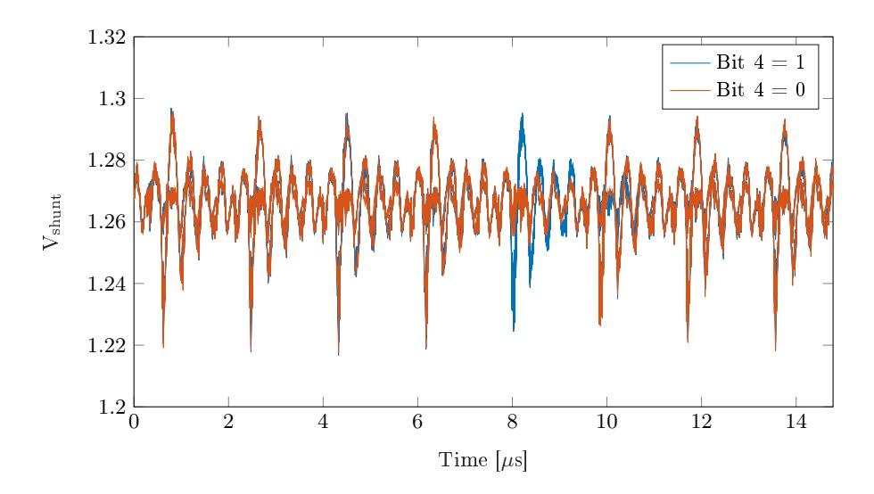
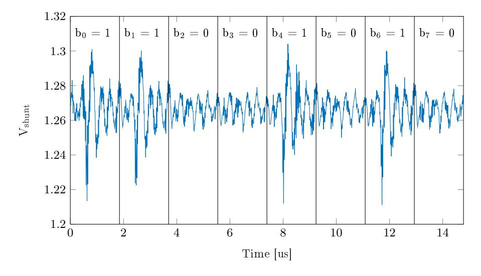
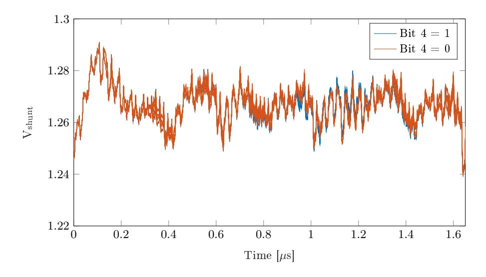
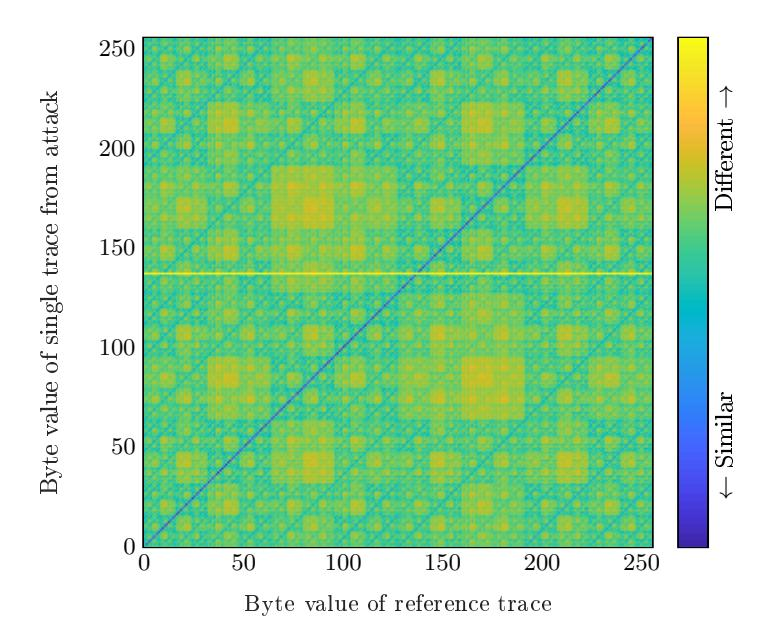

# Defeating NewHope with a Single Trace?

Dorian Amiet<sup>1</sup> , Andreas Curiger<sup>2</sup> , Lukas Leuenberger<sup>1</sup> , and Paul Zbinden<sup>1</sup>

1 IMES Institute for Microelectronics and Embedded Systems HSR Hochschule für Technik Rapperswil, Switzerland dorian.amiet@hsr.ch, lukas.leuenberger@hsr.ch, paul.zbinden@hsr.ch <sup>2</sup> Securosys SA, Zürich, Switzerland, curiger@securosys.ch

Abstract. The key encapsulation method NewHope allows two parties to agree on a secret key. The scheme includes a private and a public key. While the public key is used to encipher a random shared secret, the private key enables to decipher the ciphertext. NewHope is a candidate in the NIST post-quantum project, whose aim is to standardize cryptographic systems that are secure against attacks originating from both quantum and classical computers. While NewHope relies on the theory of quantum-resistant lattice problems, practical implementations have shown vulnerabilities against side-channel attacks targeting the extraction of the private key. In this paper, we demonstrate a new attack on the shared secret. The target consists of the C reference implementation as submitted to the NIST contest, being executed on a Cortex-M4 processor. Based on power measurement, the complete shared secret can be extracted from data of one single trace only. Further, we analyze the impact of dierent compiler directives. When the code is compiled with optimization turned o, the shared secret can be read from an oscilloscope display directly with the naked eye. When optimizations are enabled, the attack requires some more sophisticated techniques, but the attack still works on single power traces.

Keywords: Post-quantum cryptography · Side-channel attack · NewHope ·Message encoding

### 1 Introduction

A key encapsulation mechanism (KEM) is a scheme including public and private keys, where the public key is used to create a ciphertext (encapsulation) containing a randomly chosen symmetric key. The private key is used to decrypt the ciphertext. This allows two parties to share a secret key. Traditional KEMs such as RSA [\[1\]](#page-14-0) rely on the diculty of factoring large integer numbers. This problem is widely regarded to be infeasible for large numbers with classical computers. The factoring problem can be solved in polynomial time with quantum computers [\[2\]](#page-14-1). It is, however, not yet clear, whether quantum computer with

<sup>?</sup> This paper is published at PQCrypto 2020. The nal authenticated version is available online at [https://doi.org/10.1007/978-3-030-44223-1\\_11](https://doi.org/10.1007/978-3-030-44223-1_11)

enough computation power to break current cryptographic schemes may ever be built [\[3\]](#page-14-2). However, the sole risk that such a machine may eventually be built justies the eort in nding alternatives to today's cryptography [\[4\]](#page-14-3).

In 2017, the National Institute of Standards and Technology (NIST) started a standardization process [\[5\]](#page-14-4) for post-quantum algorithms, i.e. cryptographic algorithms able to withstand attacks that would benet from the processing power of quantum computers. Proposed algorithms in this process include digital signature schemes, key exchange mechanisms and asymmetric encryption. In 2019, 26 of the primary 69 candidates were selected to move to the second round [\[6\]](#page-15-0). A remaining KEM candidate is NewHope [\[7\]](#page-15-1), which was submitted by Thomas Pöppelmann et al. Compared to other key-establishment candidates in the NIST process, NewHope has competitive performance in terms of bandwidth (amount of bits needed to be transmitted between both parties) and clock cycles (time required for computing).

The NewHope submission to NIST is based on NewHope-Simple [\[8\]](#page-15-2), which is a variant of the prior work NewHope-Usenix [\[9\]](#page-15-3). All these NewHope schemes are based on the assumption that the ring-learning with errors (RLWE) problem is hard. RLWE rst came to prominence with the paper by Lyubashevsky et al. [\[10\]](#page-15-4). It is a speed-up of an earlier scheme, i.e. the learning with errors (LWE) problem, which allows for a security reduction from the shortest vector problem (SVP) on arbitrary lattices [\[11\]](#page-15-5). Cryptosystems based on LWE typically require key sizes in the order of n 2 . In contrast, RLWE-based cryptosystems have significantly smaller key sizes of almost linear size n [\[12\]](#page-15-6). Besides shrinking of the key size, the computation speeds up. For NewHope, the variables are polynomials of degree n. The parameters are chosen in such a way that computations can be performed in the domain of the number-theoretic transform (NTT). The price is being payed with a reduction in security, because RLWE adds some algebraic structures into the lattice that might be utilized by an attacker. However, it is reasonable to conjecture that lattice problems on such lattices are still hard. There is currently no known way to take advantage of that extra structure [\[12\]](#page-15-6).

Whenever an algorithm is executed on any sort of processor, the device will consume electrical power. Depending on the algorithm and input data, the consumed power will uctuate. This power variation might be used to attack the algorithm running on the device. To apply such an attack, a time-resolved measurement of the executed instructions is required. Information collected by such measurements are often referred to as side channels and may reect the timing of the processed instructions [\[13\]](#page-15-7), the power consumption [\[14\]](#page-15-8), the electromagnetic emission [\[15\]](#page-15-9), or any other measurement carrying information about the processed operations. One can then draw conclusions about this side channel. Usually this information includes private data, but it may also contain other information, for example how the algorithm is implemented. These kinds of attacks are often referred to as passive side-channel attacks.

There exist some publications addressing side-channel attacks related to NewHope. Some of them require only a single power trace measurement. Primas et al. introduced an attack on the NTT computation [\[16\]](#page-15-10), which relies on timing information. However, the NewHope reference implementation submitted to the NIST process (we call it refC in this paper) executes the NTT in constant time. Therefore, this attack will not work on refC. Another attack that requires only a single power trace is introduced by Aysu et al. [\[17\]](#page-15-11). The attack targets the polynomial multiplication implemented in schoolbook manner. The refC implementation speeds up the polynomial multiplication by making use of the NTT. Instead of n multiplications per value, only one multiplication per value remains during polynomial multiplication. This makes the attack, as described in [\[17\]](#page-15-11), infeasible for the refC implementation.

In this paper, we demonstrate that the refC implementation is vulnerable to a simple power attack. It might be the rst documented passive attack on refC which requires only one power trace to be performed. Another dierence to previous attacks is the target. Instead of identifying the private key, our attack addresses the message. In the case of KEM, the attack will leak the shared secret. The side channel is measured during message encoding, i.e. when the shared secret is translated from a bit string into its polynomial representation.

In the next Section, we recall the NewHope KEM and summarize existing attacks. [Section 3](#page-5-0) consists of the attack description and demonstration including power trace measurements. Finally, possible mitigations are discussed in [Section 4.](#page-11-0)

## 2 Background

The main idea behind RLWE is based on the idea of small and big polynomial rings of integers modulo q. In NewHope, the polynomials have n ∈ {512, 1204} dimensions, and the modulus is q = 12289. Small polynomials have coecients in the range −8 ≤ c ≤ 8 (mod q) in every dimension. Big polynomials can have equally distributed coecients between 0 and q − 1. The polynomials can be added, subtracted and multiplied. The eect of the polynomial ring on multiplication is as follows: After (schoolbook) polynomial multiplication, the coecients of all dimensions i ≥ n are added to the coecient in dimension i mod n. E.g. for n = 2, the product (ax+b)◦(cx+d) will result in (ad+bc mod q)x+(ac+bd mod q).

In the following demonstration of the RLWE principle, upper-case letters represent big polynomials and lower-case letters represent small polynomials. To generate a key pair, the server randomly samples A, s, and e. The server calculates

$$B = As + e. (1)$$

Both big polynomials A and B form the public key, and s is the private key. The client side randomly samples the message µ and the small polynomials t, e <sup>0</sup> and e <sup>00</sup>. The message µ is encoded into the big polynomial V . The client calculates

$$U = At + e' \tag{2}$$

and

$$V' = Bt + e'' + V. (3)$$

U and V' are then sent to the server. The final calculation on the server side is

$$V' - Us = Bt + e'' + V - Ats - e's \tag{4}$$

$$= Ats + et + e'' + V - Ats - e's \tag{5}$$

$$= et + e'' + V - e's. \tag{6}$$

Because V is the only remaining big polynomial, the server can decode  $\mu$ , as long as the other polynomials remain small enough.

#### 2.1 NEWHOPE-CPA

The passively secure NewHope version (CPA) implements RLWE as described above. Beside RLWE, an important concept in NewHope includes the NTT. It is somehow related to the FFT. The main advantage of the NTT is calculation speedup. A polynomial multiplication implemented in schoolbook manner requires  $n^2$  single coefficient multiplications. In the NTT domain, the polynomial multiplication requires n coefficient multiplications only. Further, the domain transformation requires  $n \log_2(n)$  coefficient multiplications. Even for a single polynomial multiplication, the way through the NTT domain results in a speedup. NEWHOPE forces all implementations to use the NTT, as parts of the public key and ciphertext are defined in the NTT domain only.

```
Server: Key Generation
Input: random data rand
z \leftarrow \text{SHAKE256(64, rand)}
publicseed \leftarrow z[0:31]
noise \leftarrow z[32:63]
\hat{A} \leftarrow \text{GenA}(publicseed)
                                                                     Client: Message Encryption
s \leftarrow \text{PolyBitRev}(\text{Sample}(noise, \, 0))
                                                                     Input: pk, message \mu, random data coin
\hat{s} \leftarrow \text{NTT}(s)
                                                                     (\hat{B}, publicseed) \leftarrow \text{DecodePk}(pk)
e \leftarrow \text{PolyBitRev}(\text{Sample}(noise, 1))
                                                                     \hat{A} \leftarrow \text{GenA}(publicseed)
\hat{e} \leftarrow \text{NTT}(e)
                                                                     s' \leftarrow \text{PolyBitRev}(\text{Sample}(coin, 0))
\hat{B} \leftarrow \hat{A} \circ \hat{s} + \hat{e}
                                                              pk \ e' \leftarrow \text{PolyBitRev}(\text{Sample}(coin, 1))
pk \leftarrow \text{EncodePK}(\hat{B}, publicseed)
                                                                  \rightarrow e'' \leftarrow \text{Sample}(coin, 2)
sk \leftarrow \text{EncodePolynomial}(\hat{s})
                                                                     \hat{t} \leftarrow \text{NTT}(s')
                                                                     \hat{U} \leftarrow \hat{A} \circ \hat{t} + \text{NTT}(e')
                                                                     V \leftarrow \operatorname{Encode}(\mu)
                                                              ct \quad V' \leftarrow \text{NTT}^{-1}(\hat{B} \circ \hat{t}) + e'' + V
 Server: Message Decryption
Input: ct, sk
                                                                     H \leftarrow \text{Compress}(V')
(\hat{U}, H) \leftarrow \text{DecodeC}(ct)
                                                                     ct \leftarrow \text{EncodeC}(\hat{U}, H)
 \hat{s} \leftarrow \text{DecodePolynomia}(sk)
V' \leftarrow \text{Decompress}(H)
\mu \leftarrow \text{Decode}(V' - \text{NTT}^{-1}(\hat{U} \circ \hat{s}))
```

<span id="page-3-0"></span>Fig. 1. Newhope-CPA message encapsulation.

Figure 1 shows the Newhope CPA message encapsulation. From an attacker perspective with access to a device and the possibility to measure power traces, the processing of several parts in the scheme are somehow affected by private data. The following parts are potential targets for a passive side-channel attack:

- Random data generation
- SHAKE256
- Generation of s and e (e.g. PolyBitRev(Sample(seed, 0)))
- Polynomial multiplication and addition (e.g.  $\hat{A} \circ \hat{s} + \hat{e}$ )
- Both NTT and NTT $^{-1}$
- Message encoding and decoding

#### 2.2 Known Attacks

Some of the potential targets have already been exploited and corresponding attacks were already published. Passive side-channel attacks that require only single measurements are the most interesting from a practical view, because such attacks work on ephemeral keys (a fresh Newhope key pair is generated for all key encapsulations) and masking does not prevent these attacks.

[17] introduces a horizontal attack on the polynomial multiplication  $a \circ s$  on NewHope-Usenix and Frodo [18]. The target in [17] is the polynomial multiplication implemented in a schoolbook manner: Each coefficient of s is multiplied n times. The attack extracts the coefficients of s out of these n multiplications. It is unclear, if the attack would work on refC with single measurement traces, because in the NTT domain, only one multiplication per coefficient remains.

Another publication describes an attack on the NTT transformation [16]. In this attack, an NTT implementation is exploited that does not execute in constant time. The NEWHOPE refC implementation, however, does not have such a timing leakage. Other related passive attacks on lattice-based key encapsulation schemes include [19–21]. However, we are not aware of any publication that directly targets the message encoding in any lattice-based scheme.

This fact reflects also in publications that cover countermeasures against passive attacks. [22] and [23] introduce masked decryption. The masked operations are NTT<sup>-1</sup>, polynomial arithmetic operations, and message decoding. Further masking includes also encryption on client side [24]. This scheme masks also message encoding. The message m is split into two shares  $m = m' \oplus m''$ , and the encoding function is executed on both shares m' and m''.

An active attack that might be applicable on all RLWE schemes in CPA mode uses several forged ciphertexts to reconstruct the private key [25–28]. Because Newhope-CPA is prone to these active attacks, the CPA version is only eligible for ephemeral keys. For all other applications, Newhope-CCA should be used. Newhope-CCA is a superset of Newhope-CPA. The main difference is an additional encryption step after the decryption on the server side. The server calculates the ciphertext by itself and compares it to the ciphertext received from the client side. A forged ciphertext from the client will then be detected. IND-CCA2 security is traded off with processing time (mainly on server side)

and a ciphertext whose size is slightly increased (by 3% or 1.4%, respectively, depending on n).

## <span id="page-5-0"></span>3 Attack Description

The attack is performed during message encoding. If an active secure Newhope-CCA instance is chosen, the attack works on both server and client side. Concerning the Newhope-CPA instances, message encoding is called on client side only.

The message encoding function translates a 256-bit message or an encapsulated key into its polynomial representation. This encoded polynomial V has a zero in every dimension i, if the corresponding message bit  $\mu_{i-k\cdot 256}$  is zero. Otherwise, if the message bit  $\mu_{i-k\cdot 256}$  is one, the corresponding polynomial coefficients are set to q/2=6144.

A straightforward implementation might use a for-loop over all message bits containing an if-condition which sets the polynomial coefficients to either 0 or q/2. Such an implementation would be susceptible to timing attacks. The refC implements the message encoding in a way that the code inside the for-loop always runs in constant time. Listing 1 shows the corresponding function from refC.

```
1 // Name:
                   poly_frommsg
2 // Description: Convert 32-byte message to polynomial
                   - poly *r: pointer to output polynomial
  // Arguments:
                   - const unsigned char *msg: input message
6 void poly_frommsg(poly *r, const unsigned char *msg)
    unsigned int i, j, mask;
    for (i=0; i<32; i++)
       for (j=0; j<8; j++)
        mask = -((msg[i] >> j)\&1);
1.3
        r \rightarrow coeffs[8*i+j+0] = mask & (NEWHOPE_Q/2);
        r \rightarrow coeffs[8*i+j+256] = mask \& (NEWHOPE Q/2);
  #if (NEWHOPE N = 1024)//If clause dissolved at compile time
        r \rightarrow coeffs [8*i+j+512] = mask & (NEWHOPE Q/2);
        r \to coeffs [8*i+j+768] = mask & (NEWHOPE Q/2);
19 #endif
      }
22 }
```

Listing 1. Message Encoding in refC

<span id="page-5-4"></span><span id="page-5-3"></span>A mask, containing 0 or -1 (= 0xFFFF...), replaces the if-condition. The mask calculation is shown in Listing 1 at line 13. The processed message bit is leaked neither in a branch, nor in an address-index look-up nor in differences

in execution time. However, power consumption might dier between processing a logical zero or logical one, especially because the mask either contains ones or zeroes only. Chances that processed values can be detected by analyzing the power consumption of the device are high.

A side-channel measurement can be used to dierentiate between processed ones and zeroes. If a single trace is sucient to do so, the attack would be applicable on ephemeral keys. In the case of CPA or message encryption, the attack does not require any public data (i.e. monitoring of the insecure channel is not required), as the attack directly leaks the shared secret.

Note that this type of attack not only works on message encoding of NewHope. A check of NIST submissions indicates several candidates, especially other latticebased KEMs. Crystals-Kyber [\[29\]](#page-16-8), for example, uses an almost identical approach to encode the message.

#### 3.1 Experimental Analysis

In this section, we demonstrate a successful attack based on current measurements on a Cortex M4 processor. We use the publicly available platform CW308- STM32F4 from NewAE Technology to execute all our attacks. A 40 Gsps WaveRunner 640Zi oscilloscope from LeCroy was used to record power traces. The processor core runs at 59 MHz.

The STM32CubeIDE together with an ST programmer from STMicroelectronics was used to compile and program the device. The underlying C compiler is gcc. When the message encoding function according to [Listing 1](#page-5-1) is compiled, the resulting assembler code and thus the program execution diers depending on compiler settings, in particular on the chosen optimization strategy. To cover various cases, we present results for the case when optimization is disabled (-O0), and when maximum optimization is applied (-O3). All measurements are recorded as follows:

- 1. A test message is generated in which byte 1 is set to a test value. All other bytes contain random data.
- 2. A loop, covering test values from 0 to 255, is executed. In this loop, the message encoding function is called and the voltage at the shunt resistor is recorded.

#### 3.2 No Optimization

Message encoding requires 109 clock cycles per bit [\(Listing 1,](#page-5-1) lines [13](#page-5-2) - [18\)](#page-5-3) when the code is compiled with optimization turned o. The resulting assembly code is shown in [Appendix 1.](#page-13-0)

As mentioned before, the power consumption should depend on the processed message bits. The question is, however, whether the dierences in power consumption are big enough to be exploited. To answer this question, all possible values for message byte 1 have been recorded and plotted on top of each other. To obtain a clear and sharp image, 100 traces per value have been averaged.



<span id="page-7-0"></span>Fig. 2. Measurement traces on top of each other. Every trace is 100 times averaged. Code compiled with optimization disabled.



<span id="page-7-1"></span>Fig. 3. A single trace measurement where message byte 1 is set to the value 83 (binary 0101 0011). Code compiled with optimization disabled.

The plot in [Figure 2](#page-7-0) shows the power traces during processing of message byte 1. The traces are color-separated by the two possible values of bit 4. The uctuation of the amplitude is signicantly higher when the value of the processed message bit is one. The dierence is so large that it is even possible to read the processed message bit directly from the oscilloscope's display. Hence, the attack can be classied as a simple power attack (SPA). [Figure 3](#page-7-1) shows a single power trace. The message byte 83 can directly be read out.

#### <span id="page-8-1"></span>3.3 Optimization Enabled

Message encoding requires 9 clock cycles per bit [\(Listing 1,](#page-5-1) lines [13](#page-5-2) - [18\)](#page-5-3) when the code is compiled with maximum optimization setting O3. The assembly code is provided in [Appendix 2.](#page-14-5)

We use the same approach as before to estimate the dierences in power consumption depending on individual message bits. [Figure 4](#page-8-0) shows traces of dierent test values on top of each other. The power traces still dier, but less obvious than before, when optimization was turned o. A direct read-out of the bit values might be hard to accomplish. Note that the traces plotted in [Figure 4](#page-8-0) are 1000 times averaged in order to reduce the noise. In a single-trace setting, the additional noise would make it even more dicult to read out the message bits directly.



<span id="page-8-0"></span>Fig. 4. All measurement traces on top of each other. Every trace is 1000 times averaged. Code compiled with optimization enabled (O3).

Because an SPA might not be applicable, a dierential-power attack (DPA) might work. The attack requires a two-stage process. Before the actual attack can start, reference traces are required. These traces are the same power measurements as within the attack, but with known message values. To obtain these traces, an attacker has two possibilities: If the device under attack works as server, the attack is only applicable to NewHope-CCA. The upside for the attacker is that he can perform the attack as client. The attacker creates valid ciphertexts for which he can choose the messages. When the device under attack performs the re-encryption step, the attacker obtains such reference traces. In the reversed case, where the device under attack is the client and the attacker is the server, the attacker is unable to choose the messages: The client executes message encoding with random messages. However, since the attacker performs as server, he knows the private key and can therefore calculate the messages in use. In the following, the attacker can repeat these steps until he has obtained enough reference traces.

For all 256 possible values that a message byte can take on, we record 1,000 reference traces and average them to reduce the impact of noise. After collecting the reference traces, the actual attack is ready to begin. Our treat model assumes that the message changes on every call. Therefore, we try to extract the message byte values from a single power trace only. When an attack trace is available, the trace is cut into 32 power traces, each containing the processing of one message byte. These sliced traces are then compared to all 256 reference traces. The known value of the reference trace which is most similar to the attack trace will then be taken as the corresponding value for the message byte.

One method to calculate the similarity S between a reference trace Vref and the attacked trace Vattack is the sum of squares

<span id="page-9-0"></span>
$$S = \sum_{i=0}^{n_{\text{samples}}-1} (V_{\text{ref}}[i] - V_{\text{attack}}[i])^2.$$
 (7)

Although the attack will work like this, the signal-to-noise ratio (SNR) may be increased when the noise is ltered out. A single measurement trace contains noise in all frequencies while the information about the processed value lies somewhere below the clock frequency. In our experiment, the SNR is better, if a bandpass lter is applied on both, Vref and Vattack, before S is calculated. We used a bandpass lter at 1.5 − 10 MHz (with the core clock running at 59 MHz). The frequencies were heuristically evaluated. Because the encoding of a single message bit takes 9 clock cycles, a passband around 59 MHz/9 = 6.56 MHz is reasonable.

Equation [7](#page-9-0) is calculated 256 times (once per reference trace) to get an S per possible message byte. The smallest S corresponds to the correct byte. To test if the attack works with all possible messages, the attack has been performed over all possible values. The result is illustrated in [Figure 5.](#page-10-0) The diagram can be read as follows: On the x-axis are the reference traces, whereas on the y-axis traces from the attack can be found. For instance, the horizontal line at y = 50 represents all similarities S from the attacked byte value 50 compared to the reference traces. Blue represents high similarity or a small S, respectively. Since S is the smallest at x = 50, the attack worked for this message value, because



<span id="page-10-0"></span>Fig. 5. Similarity between a single power trace compared to the reference traces.

the correct value could be identied. The diagonal blue line indicates that the attack works for (almost) all message values.

In [Figure 5,](#page-10-0) an outlier can be identied. The attacked message value 138 is the only one where the smallest S is not the correct guess. Generally, value 138 sticks out as indicated by the yellow horizontal line. The corresponding power trace, when inspected in the time domain, shows a disturbance pulse with an amplitude of ≈ 150 mV. The pulse has a duration of roughly 250 ns plus some reections during another 500 ns. The pulse disturbs side-channel information for approximately four message bits. All our measurements contain some of these pulses. They must be somehow related to our measurement setup, because the frequency of these pulses decreases with the time our system is turned on. At start-up, the pulse frequency is ≈ 50 kHz and falls down to ≈ 1 kHz within a second. The origin of the pulses is not fully clear. Due to the observations, we suspect the supply voltage regulator as the culprit.

#### 3.4 Success Rate

When all measurements containing disturbing pulses are excluded, the attack success rate gets very close to 100 % (we did not nd any measurement without outlier and false message bit guess).

When optimization is enabled, about 4 % of the attacked message encodings contain an outlier. Depending on timing, this results in one or two false message byte guesses. The minimum similarity S of a faulty key byte guess is more than 1,000 times higher than S of a correct key byte guesses. Therefore, outliers can easily be identied. In the case where a pulse provokes two false messagebyte guesses, the message value of the two suspected bytes can be determined by a brute-force attack. The requirement to execute the brute-force attack is knowledge of the public data, public key and ciphertext. The computational eort is 2 <sup>16</sup> = 65,536 message encryptions in the worst case. To sum up, the attack has a success rate of ≥ 96 % in our setup. When the public data is known, most of the remaining 4 % can be calculated with a brute-force attack. This results in an overall success rate of > 99 %.

In case of optimization turned o, about 47 % of the attacked message encodings contain at least one outlier pulse. However, the eect of these pulses is marginal. Even key guesses that contain such a pulse are mostly guessed correct. Without any post-processing (brute-force of potentially false bits), the overall success rate is 99.5%.

### <span id="page-11-0"></span>4 Countermeasures

An approach to make the attack more dicult is to decrease the number of bits that change their value during encryption. This can be achieved by removing the mask calculation. The coecient in the encoded message can be calculated by a multiplication of the message bit to q/2. Lines [13](#page-5-2) and [14](#page-5-4) from [Listing 1](#page-5-1) are replaced by [Listing 2.](#page-11-1)

```
13 tmp = (NEWHOPE_Q/ 2 ) * ( ( msg [ i ] >> j ) &1) ;
14 r−>c o e f f s [ 8 * i+j+ 0 ] = tmp ;
```

Listing 2. Message Encoding with multiplication

Compiled with optimization enabled, this results in assembly code (see [Ap](#page-14-6)[pendix 3\)](#page-14-6) in which only two bits are set at a time (in contrast to 32 bits in the reference code). Nevertheless, the single power trace DPA from [Section 3.3](#page-8-1) is still applicable, though the SNR is approximately cut in half. Therefore, this small change is not sucient to prevent the attack. Note that even if a way to hide the message bit to q/2 encoding was found, there would still be leakage from storing (lines [4](#page-14-7) to [7](#page-14-8) in [Appendix 2\)](#page-14-5).

Oder et al. [\[24\]](#page-16-5) introduced a masking scheme for encryption. Instead of using one message, two dierent messages µ <sup>0</sup> and µ <sup>00</sup> are encrypted. These messages are later xored, or rather summed together in the R<sup>q</sup> space, thus forming the nal message µ. However, this approach only makes the presented attack slightly more dicult, as the message encoding must be attacked twice.

A more promising countermeasure which is mentioned in [\[24\]](#page-16-5) is the use of the Fisher-Yates algorithm [\[30\]](#page-16-9). It generates a random list, dierent for every encryption, which contains all values between 0 and 255. This list then determines the order in which the individual bits of the message are encoded. The initial two for loops are further replaced with one for loop, counting from 0 to 255. In [Listing 3,](#page-12-0) the updated mask calculation (line [13](#page-5-2) from [Listing 1\)](#page-5-1) is shown.

```
mask = -((msg[fyList[i] >> 3] >> (fyList[i]&7))&1)

Listing 3. Message encoding with Fisher-Yates shuffle
```

The proposed attack can still be performed. However, as the bits are encoded in a random order, an attacker can only determine the total number of ones and zeroes in a message, but not which value would correspond to which bit. To accomplish this, both the message encoding as well as the shuffling must be attacked to recover the message. Combining the shuffling algorithm together with masking might provide adequate side-channel protection: An attacker would have to attack the message encoding on two shares and twice the shuffling algorithm to determine the message, all on a single side-channel trace.

In reference to existing side-channel attacks on lattice-based encryption schemes [31], not only message encoding, but all linear processed parts of NewHope that contain somehow sensitive data should be protected.

#### 5 Conclusion

The Newhope reference C implementation execution time does not depend on private data. However, our experiments show that constant time execution does not prevent power attacks. The complete shared secret can be extracted from data of one single trace only. Depending on the compiler directive, even simple-power attacks are possible. Prior work about passive side-channel attacks on lattice-based key encapsulations mechanisms usually have the private key as target. We demonstrated that an implementation, which protects all parts of the algorithm in which the private key is processed, is not secure. All parts in the Newhope algorithms that process somehow private data, including the message, must be protected in order to obtain a secured Newhope implementation.

#### Acknowledgment

We thank the anonymous reviewers for their accurate reviews and valuable comments. This work was supported by Innosuisse, the federal agency responsible for encouraging science-based innovation in Switzerland.

## <span id="page-13-0"></span>Appendix 1

```
_{1}; mask = -((msg[i] >> j)\&1):
            r2, [r7, #0]; r2 = memory[r7]
2 ldr
з ldr
            r3, [r7, #20]; r3 = memory[r7 + 20]
                          ; r3 = r2 + r3
 4 add
            r3, r2
5 ldrb
           r3, [r3, \#0]; r3 = memory[r3]
                           ; r2 = r3
           r2, r3
6 mov
           r3, [r7, #16]; r3 = memory[r3 + 16]
7 ldr
                        ; r3 = r2 >> r3: shift rigth r2 by r3
8 asr.w
            r3, r2, r3
9 and.w
           r3, r3, \#1
                          ; r3 = r3 \& 1
           r3, r3
                           r3 = (-1) * r3
10 negs
            r3, [r7, #12]; memory (r7 + #12) = r3;
11 str
; r \rightarrow coeffs[8*i+j+0] = mask & (NEWHOPE Q/2):
           r3, [r7, #12]; r3 = memory[r7 + 12)]
13 ldr
                           ; r3 = zero-extend r3[15:0] to 32 bits
14 uxth
           r3, r3
           r2, [r7, #20]; r2 = memory [r7 + 20]
15 ldr
16 lsls
           r1, r2, \#3 ; r1 = r2 << 3: shift left by 3 bits
           r2, [r7, #16]; r2 = memory[r7 + 16]
_{17} ldr
18 add
           r2, r1
                         ; r2 = r2 + r1
           r3, r3, \#6144; r3 = r3 \& 6144
19 and.w
           r1, r3
                      ; r1 = zero-extend r3[15:0] to 32 bits
20 uxth
            r3, [r7, #4]; r3 = memory[r7 + 4]
_{21} ldr
22 strh.w r1, [r3, r2, lsl \#1]; memory [r3 + 2 * r2] = r1
r > c \circ effs [8 * i + j + 256] = mask \& (NEWHOPE Q/2):
            r3, [r7, #12]; r3 = memory[r7 + 12]
24 ldr
                          ; r3 = zero-extend r3[15:0] to 32 bits
           r3, r3
25 uxth
           r2, [r7, #20]; r2 = memory[r7 + 20]
26 ldr
           r1\;,\;\;r2\;,\;\;\#3\qquad ;\;\;r1\;=\;r2\;<<\;3\colon\;\;s\,hift\;\;\;left\;\;by\;\;3\;\;b\,it\,s
27 lsls
           r2, [r7, #16]; r2 = memory[r7 + 16]
28 ldr
29 add
           r2, r1
                           ; r2 = r2 + r1
           r2, r2, \#256 ; r2 = r2 + 256
30 add.w
           r3, r3, \#6144; r3 = r3 \& 6144
31 and.w
                          ; r1 = zero-extend r3[15:0] to 32 bits
           r1, r3
32 uxth
           {\tt r} \, 3 \ , \quad [\, {\tt r} \, 7 \ , \quad \# \, 4 \, ] \quad \  ; \quad {\tt r} \, 3 \ = \ {\tt memory} \, [\, {\tt r} \, 7 \ + \ 4 \, ]
33 ldr
34 strh.w r1, [r3, r2, lsl #1]; memory[r3 + 2 * r2] = r1
_{35}; line 24-34 repeats twice (immediate value at line 30 is
       replaced by 512 and 768)
```

Listing 4. Assembly with optimization turned off (O0), original refC

## <span id="page-14-5"></span>Appendix 2

```
1 l d r b r2 , [ r3 , #0] ; r 2 = memory [ r 3 ]
2 s b f x r2 , r2 , #0, #1 ; r 2 = e x t r a c t b i t 0 ( 1 b i t ) o f r 2
      and si g n−ex tend i t t o 32 b i t s ( i f b i t 0 ( r 2 ) == 0 , then
      r 2 = 0 x 0 0 0 0 . . . , e l s e r 2 = 0 x f f f f . . . )
3 and.w r2 , r2 , #6144 ; r 2 = r 2 & 6144
4 s t r h r2 , [ r0 , #0] ; memory [ r 0 ] = r 2
5 s t r h. w r2 , [ r0 , #512] ; memory [ r 0 + 5 1 2] = r 2
6 s t r h. w r2 , [ r0 , #1024] ; memory [ r 0 + 1 0 2 4] = r 2
7 s t r h. w r2 , [ r0 , #1536] ; memory [ r 0 + 1 5 3 6] = r 2
```

<span id="page-14-8"></span>Listing 5. Assembly with maximal optimization O3, original refC

## <span id="page-14-6"></span>Appendix 3

```
1 l d r b r2 , [ r3 , #0] ; r 2 = memory [ r 3 ]
2 ub fx r4 , r2 , #0, #1 ; r 4 = e x t r a c t b i t 0 ( 1 b i t ) o f r 2
      and ze r o−ex tend i t t o 32 b i t s
3 l s l s r2 , r4 , #1 ; r 2 = r 4 << 1 : s h i f t l e f t by 1 b i t
4 add r2 , r 4 ; r 2 = r 2 + r 4
5 l s l s r2 , r2 , #11 ; r 2 = r 3 << 11 (now we have r 2 =
      6144 when b i t 0 was 1 , e l s e r 2 rem ain s 0 )
6 s t r h r2 , [ r0 , #0] ; memory [ r 0 ] = r 2
7 s t r h. w r2 , [ r0 , #512] ; memory [ r 0 + 5 1 2] = r 2
8 s t r h. w r2 , [ r0 , #1024] ; memory [ r 0 + 1 0 2 4] = r 2
9 s t r h. w r2 , [ r0 , #1536] ; memory [ r 0 + 1 5 3 6] = r 2
```

Listing 6. Assembly with maximal optimization O3, mask construction replaced by multiplication

## References

- <span id="page-14-0"></span>1. Rivest, R.L., Shamir, A., Adleman, L.M.: A Method for Obtaining Digital Signatures and Public-Key Cryptosystems. Commun. ACM 21(2), 120126 (1978). <https://doi.org/10.1145/359340.359342>
- <span id="page-14-1"></span>2. Shor, P.W.: Polynomial-Time Algorithms for Prime Factorization and Discrete Logarithms on a Quantum Computer. SIAM Journal on Computing 26(5), 1484 1509 (1997).<https://doi.org/10.1137/S0097539795293172>
- <span id="page-14-2"></span>3. Dyakonov, M.: The case against quantum computing. IEEE Spectrum 56(3), 2429 (March 2019)
- <span id="page-14-3"></span>4. Mosca, M.: Cybersecurity in an Era with Quantum Computers: Will We Be Ready? IEEE Security & Privacy 16(5), 3841 (2018). <https://doi.org/10.1109/MSP.2018.3761723>
- <span id="page-14-4"></span>5. National Institute of Standards and Technology: Submission Requirements and Evaluation Criteria for the Post-Quantum Cryptography Standardization Process (2016)

- <span id="page-15-0"></span>6. Alagic, G., Alperin-Sheri, J., Apon, D., Cooper, D., Dang, Q., Miller, C., Moody, D., Peralta, R., Perlner, R., Robinson, A., Smith-Tone, D.: Status Report on the First Round of the NIST Post-Quantum Cryptography Standardization Process. NISTIR 8240 (2019).<https://doi.org/10.6028/NIST.IR.8240>
- <span id="page-15-1"></span>7. Alkim, E., Avanzi, R., Bos, J., Ducas, L., de la Piedra, A., Pöppelmann, T., Schwabe, P., Stebila, D., Albrecht, M.R., Orsini, E., Osheter, V., Paterson, K.G., Peer, G., Smart, N.P.: Newhope - Algorithm Specications and Supporting Documentation (2019), version 1.02
- <span id="page-15-2"></span>8. Alkim, E., Ducas, L., Pöppelmann, T., Schwabe, P.: NewHope without reconciliation. IACR Cryptology ePrint Archive p. 1157 (2016), [http://eprint.iacr.org/](http://eprint.iacr.org/2016/1157) [2016/1157](http://eprint.iacr.org/2016/1157)
- <span id="page-15-3"></span>9. Alkim, E., Ducas, L., Pöppelmann, T., Schwabe, P.: Post-quantum Key Exchange - A New Hope. In: 25th USENIX Security Symposium, USENIX Security 16, Austin, TX, USA, August 10-12, 2016. pp. 327343 (2016)
- <span id="page-15-4"></span>10. Lyubashevsky, V., Peikert, C., Regev, O.: On Ideal Lattices and Learning with Errors over Rings. In: Advances in Cryptology - EUROCRYPT 2010, 29th Annual International Conference on the Theory and Applications of Cryptographic Techniques, Monaco / French Riviera, May 30 - June 3, 2010. Proceedings. pp. 123 (2010). [https://doi.org/10.1007/978-3-642-13190-5\\_1](https://doi.org/10.1007/978-3-642-13190-5_1)
- <span id="page-15-5"></span>11. Regev, O.: On Lattices, Learning with Errors, Random Linear Codes, and Cryptography. In: Proceedings of the 37th Annual ACM Symposium on Theory of Computing, Baltimore, MD, USA, May 22-24, 2005. pp. 8493 (2005). <https://doi.org/10.1145/1060590.1060603>
- <span id="page-15-6"></span>12. Regev, O.: The Learning with Errors Problem (Invited Survey). In: Proceedings of the 25th Annual IEEE Conference on Computational Complexity, CCC 2010, Cambridge, Massachusetts, USA, June 9-12, 2010. pp. 191204 (2010). <https://doi.org/10.1109/CCC.2010.26>
- <span id="page-15-7"></span>13. Kocher, P.C.: Timing Attacks on Implementations of Die-Hellman, RSA, DSS, and Other Systems. In: Advances in Cryptology - CRYPTO '96, 16th Annual International Cryptology Conference, Santa Barbara, California, USA, August 18- 22, 1996, Proceedings. pp. 104113 (1996). [https://doi.org/10.1007/3-540-68697-](https://doi.org/10.1007/3-540-68697-5_9) [5\\_9](https://doi.org/10.1007/3-540-68697-5_9)
- <span id="page-15-8"></span>14. Kocher, P.C., Jae, J., Jun, B.: Dierential Power Analysis. In: Advances in Cryptology - CRYPTO '99, 19th Annual International Cryptology Conference, Santa Barbara, California, USA, August 15-19, 1999, Proceedings. pp. 388397 (1999). [https://doi.org/10.1007/3-540-48405-1\\_25](https://doi.org/10.1007/3-540-48405-1_25)
- <span id="page-15-9"></span>15. Mulder, E.D., Buysschaert, P., Örs, S.B., Delmotte, P., Preneel, B., Vandenbosch, G., Verbauwhede, I.: Electromagnetic Analysis Attack on an FPGA Implementation of an Elliptic Curve Cryptosystem. In: EUROCON 2005 - The International Conference on "Computer as a Tool". vol. 2, pp. 18791882 (2005). <https://doi.org/10.1109/EURCON.2005.1630348>
- <span id="page-15-10"></span>16. Primas, R., Pessl, P., Mangard, S.: Single-Trace Side-Channel Attacks on Masked Lattice-Based Encryption. In: Cryptographic Hardware and Embedded Systems - CHES 2017 - 19th International Conference, Taipei, Taiwan, September 25-28, 2017, Proceedings. pp. 513533 (2017). [https://doi.org/10.1007/978-3-319-66787-](https://doi.org/10.1007/978-3-319-66787-4_25) [4\\_25](https://doi.org/10.1007/978-3-319-66787-4_25)
- <span id="page-15-11"></span>17. Aysu, A., Tobah, Y., Tiwari, M., Gerstlauer, A., Orshansky, M.: Horizontal Side-Channel Vulnerabilities of Post-Quantum Key Exchange Protocols. In: 2018 IEEE International Symposium on Hardware Oriented Security and Trust, HOST 2018, Washington, DC, USA, April 30 - May 4, 2018. pp. 8188 (2018). <https://doi.org/10.1109/HST.2018.8383894>

- <span id="page-16-0"></span>18. Bos, J.W., Costello, C., Ducas, L., Mironov, I., Naehrig, M., Nikolaenko, V., Raghunathan, A., Stebila, D.: Frodo: Take o the Ring! Practical, Quantum-Secure Key Exchange from LWE. In: Proceedings of the 2016 ACM SIGSAC Conference on Computer and Communications Security, Vienna, Austria, October 24-28, 2016. pp. 10061018 (2016).<https://doi.org/10.1145/2976749.2978425>
- <span id="page-16-1"></span>19. Park, A., Han, D.: Chosen ciphertext Simple Power Analysis on software 8-bit implementation of ring-LWE encryption. In: 2016 IEEE Asian Hardware-Oriented Security and Trust, AsianHOST 2016, Yilan, Taiwan, December 19-20, 2016. pp. 1 6 (2016).<https://doi.org/10.1109/AsianHOST.2016.7835555>
- 20. Huang, W., Chen, J., Yang, B.: Correlation Power Analysis on NTRU Prime and Related Countermeasures. IACR Cryptology ePrint Archive p. 100 (2019), [https:](https://eprint.iacr.org/2019/100) [//eprint.iacr.org/2019/100](https://eprint.iacr.org/2019/100)
- <span id="page-16-2"></span>21. Zheng, X., Wang, A., Wei, W.: First-order collision attack on protected NTRU cryptosystem. Microprocessors and Microsystems - Embedded Hardware Design 37(6-7), 601609 (2013).<https://doi.org/10.1016/j.micpro.2013.04.008>
- <span id="page-16-3"></span>22. Reparaz, O., Roy, S.S., de Clercq, R., Vercauteren, F., Verbauwhede, I.: Masking ring-LWE. J. Cryptographic Engineering 6(2), 139153 (2016). <https://doi.org/10.1007/s13389-016-0126-5>
- <span id="page-16-4"></span>23. Reparaz, O., de Clercq, R., Roy, S.S., Vercauteren, F., Verbauwhede, I.: Additively Homomorphic Ring-LWE Masking. In: Post-Quantum Cryptography - 7th International Workshop, PQCrypto 2016, Fukuoka, Japan, February 24-26, 2016, Proceedings. pp. 233244 (2016). [https://doi.org/10.1007/978-3-319-29360-8\\_15](https://doi.org/10.1007/978-3-319-29360-8_15)
- <span id="page-16-5"></span>24. Oder, T., Schneider, T., Pöppelmann, T., Güneysu, T.: Practical CCA2-Secure and Masked Ring-LWE Implementation. IACR Trans. Cryptogr. Hardw. Embed. Syst. pp. 142174 (2018).<https://doi.org/10.13154/tches.v2018.i1.142-174>
- <span id="page-16-6"></span>25. Fluhrer, S.R.: Cryptanalysis of ring-LWE based key exchange with key share reuse. IACR Cryptology ePrint Archive p. 85 (2016), [http://eprint.iacr.org/2016/](http://eprint.iacr.org/2016/085) [085](http://eprint.iacr.org/2016/085)
- 26. Ding, J., Alsayigh, S., Saraswathy, R.V., Fluhrer, S.R., Lin, X.: Leakage of Signal function with reused keys in RLWE key exchange. In: IEEE International Conference on Communications, ICC 2017, Paris, France, May 21-25, 2017. pp. 16 (2017).<https://doi.org/10.1109/ICC.2017.7996806>
- 27. Bauer, A., Gilbert, H., Renault, G., Rossi, M.: Assessment of the Key-Reuse Resilience of NewHope. In: Topics in Cryptology - CT-RSA 2019 - The Cryptographers' Track at the RSA Conference 2019, San Francisco, CA, USA, March 4-8, 2019, Proceedings. pp. 272292 (2019). [https://doi.org/10.1007/978-3-030-12612-](https://doi.org/10.1007/978-3-030-12612-4_14) [4\\_14](https://doi.org/10.1007/978-3-030-12612-4_14)
- <span id="page-16-7"></span>28. Qin, Y., Cheng, C., Ding, J.: A Complete and Optimized Key Mismatch Attack on NIST Candidate NewHope. In: Computer Security - ESORICS 2019 - 24th European Symposium on Research in Computer Security, 2019. pp. 504520 (2019). [https://doi.org/10.1007/978-3-030-29962-0\\_24](https://doi.org/10.1007/978-3-030-29962-0_24)
- <span id="page-16-8"></span>29. Avanzi, R., Bos, J., Ducas, L., Kiltz, E., Lepoint, T., Lyubashevsky, V., Schanck, J.M., Schwabe, P., Seiler, G., Stehlé, D.: Crystals-kyber algorithm specications and supporting documentation (2019), version 2.0
- <span id="page-16-9"></span>30. Fisher, R.A., Yates, F., et al.: Statistical Tables for Biological, Agricultural and Medical Research. (1963), <http://hdl.handle.net/2440/10701>
- <span id="page-16-10"></span>31. Khalid, A., Oder, T., Valencia, F., O'Neill, M., Güneysu, T., Regazzoni, F.: Physical Protection of Lattice-Based Cryptography: Challenges and Solutions. In: Proceedings of the 2018 on Great Lakes Symposium on VLSI, GLSVLSI 2018, Chicago, IL, USA, May 23-25, 2018. pp. 365370 (2018). <https://doi.org/10.1145/3194554.3194616>