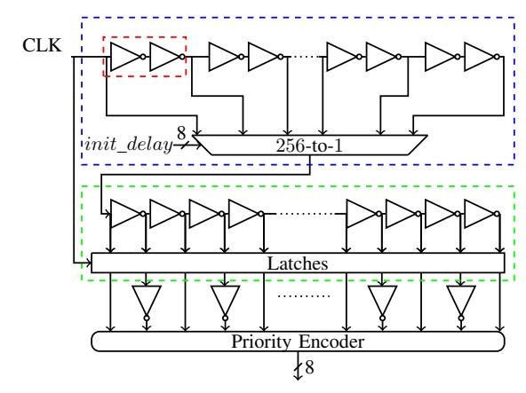
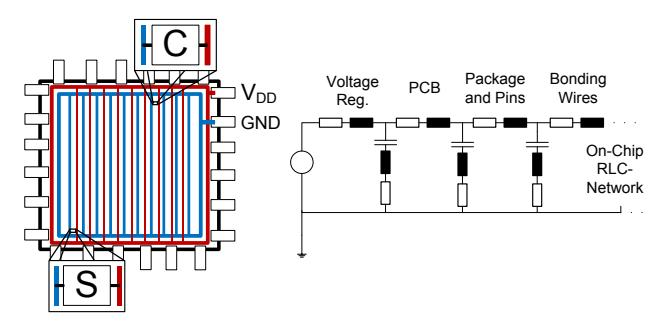
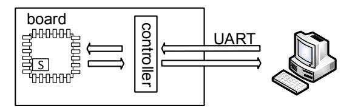
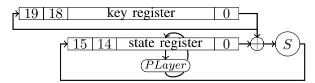
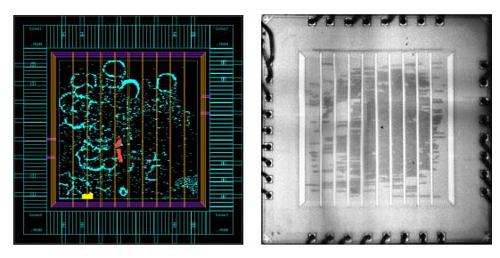
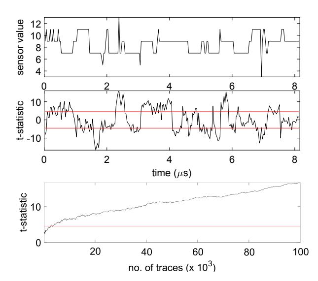
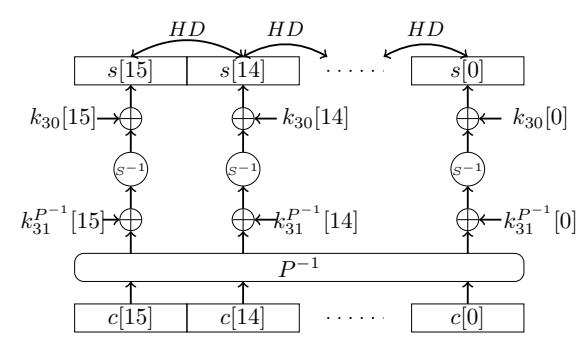
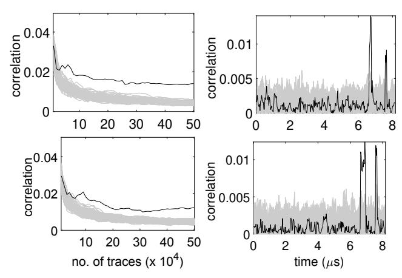
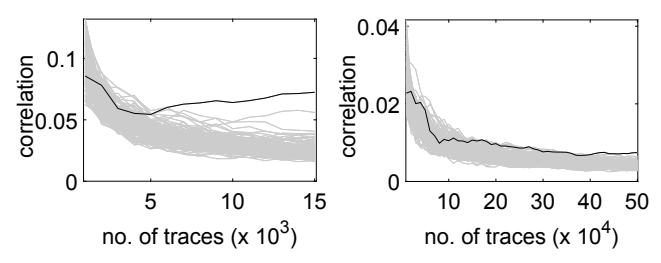

# The Risk of Outsourcing: Hidden SCA Trojans in Third-Party IP-Cores Threaten Cryptographic ICs

David Knichel *Ruhr University Bochum Horst Gortz Institute for IT Security ¨* Bochum, Germany david.knichel@rub.de

Thorben Moos *Ruhr University Bochum Horst Gortz Institute for IT Security ¨* Bochum, Germany thorben.moos@rub.de

Amir Moradi *Ruhr University Bochum Horst Gortz Institute for IT Security ¨* Bochum, Germany amir.moradi@rub.de

*Abstract*—Side-channel analysis (SCA) attacks – especially power analysis – are powerful ways to extract the secrets stored in and processed by cryptographic devices. In recent years, researchers have shown interest in utilizing on-chip measurement facilities to perform such SCA attacks remotely. It was shown that simple voltage-monitoring sensors can be constructed from digital elements and put on multi-tenant FPGAs to perform remote attacks on neighbouring cryptographic co-processors. A similar threat is the unsuspecting integration of third-party IP-Cores into an IC design. Even if the function of an acquired IP-Core is not security critical by itself, it may contain an onchip sensor as a Trojan that can eavesdrop on cryptographic operations across the whole device. In contrast to all FPGAbased investigations reported in the literature so far, we examine the efficiency of such on-chip sensors as a source of information leakage in an ASIC-based case study for the first time. To this end, in addition to a cryptographic core (lightweight block cipher PRESENT) we designed and implemented a voltage-monitoring sensor on an ASIC fabricated by a 40 nm commercial standard cell library. Despite the physical distance between the sensor and the PRESENT core, we show the possibility of fully recovering the secret key of the PRESENT core by processing the sensor's output. Our results imply that the hidden insertion of such a sensor – for example by a malicious third party IP-Core vendor – can endanger the security of embedded systems which deal with sensitive information, even if the device cannot be physically accessed by the adversary.

*Index Terms*—hardware Trojan, ASIC, side-channel analysis, time-to-digital converter

# I. INTRODUCTION

Over the last two decades, physical attacks have become a crucial and in-depth studied research topic. Within physical attacks, Side-Channel Analysis (SCA) is considered to be among the most powerful ones. The power consumption is a common and also extensively investigated side channel of a device. Until recently, SCA attacks were mostly considered to be local attack scenarios where an attacker needs physical access to the target. This is due to the requirement to measure a physical characteristic of the device which usually implies close proximity. In order to obtain a quantitative value proportional to the power consumption, either the voltage drop over a resistor is monitored (placed in the GND or Vdd path of the

The work described in this paper has been supported in part by the German Research Foundation (DFG) under Germany's Excellence Strategy - EXC 2092 CASA - 390781972, and through the projects 393207943 "Security for Internet of Things with Low Energy and Low Power Consumption (GreenSec)" and 271752544 "NaSCA: Nano-Scale Side-Channel Analysis".

device) or the Electro Magnetic (EM) emanation is measured by an EM-probe (placed close to the cryptographic core). In both cases, the signal is then sampled by a digital sampling oscilloscope.

Recent works – especially the ones from last year – have loosened the assumption of locality. Different solutions for sensors on Field Programmable Gate Arrays (FPGAs) were presented which enable remote measurement of quantities related to the power consumption of cryptographic cores. This is an interesting direction resulting in a variety of new attack scenarios. In [1] Schellenberg et al. showed that Time-to-Digital Converters (TDCs) can be used as sensors to measure the power consumption of FPGAs. The approach was then extended to a case where the sensor and the victim's module are placed on different FPGAs with a shared power supply [2]. Ring Oscillators (ROs) are utilized to build similar sensors in [3] and [4]. In [5] Gnad et al. examined the use of ADCnoise as a side-channel. This idea was then picked up by O'Flynn and Dewar in [6] for successfully recovering secret data processed in the secure world of ARM's TrustZone-M.

Due to the configurability of FPGAs, such sensors can easily be implemented as a Trojan to perform remote SCA attacks, even on devices that have never been in the hands of an adversary [1]. This is especially dangerous when the programmable fabric is shared between multiple tenants or when multiple devices share the same power supply in larger systems [2]. Since Application-Specific Integrated Circuits (ASICs) lack the configurability of FPGAs, it is an interesting question whether and how these sensors may also pose a threat to systems when maliciously inserted into an IC design.

To reduce costs and shorten production cycles, chip vendors purchase third party IP-Cores which can be hooked into larger designs as 'blackboxes' to gain a certain functionality. These cores range from communication interfaces such as UART controllers over memory blocks to Digital Signal Processors (DSPs). As IP-Core vendors have a strong interest in keeping their intellectual property secret, such implementations are often delivered as hard or firm cores, i.e., complete physical manifestations of the IP-design. Hence, as no RTL description is handed to the customer, verifying the integrity of complex cores is a difficult task and requires intense reverse engineering. Hiding a voltage monitoring sensor in a complex IP-Core may thus open the door for a malicious third-party vendor to successfully trojanize the design of an external party in order to perform remote SCA attacks. Following the idea of Schellenberg et al. [2], this threat is not only limited to the ASIC containing the malicious sensor, but may be applicable to other components sharing the same power supply in larger systems.

First research focusing on hardware Trojans and appropriate countermeasures has appeared more than a decade ago [7]. Since then, several works have been published in this field, and an overview can be found in [8]. Results on how to decrease a Trojan's detectability can be found in [9], while ideas on how to trigger the payload are presented in [10]. The first Trojans in context with SCA have been introduced in [11] and [12]. Years later, more sophisticated implementations based on a provably secure SCA countermeasure have been proposed [13]. Yet, in contrast to our approach, these Trojans need to be inserted during the design flow (or by a malicious foundry) into the security-critical part of the chip itself. In parallel to these advances, several countermeasures against hardware Trojans have been proposed. They range from detection techniques (e.g., [14]) over obfuscation techniques (e.g., [15]) to Runtime Monitoring (e.g., [16]).

*Contributions.* All previous works have studied sensors implemented on FPGAs. In this work, we analyze for the first time how a voltage-monitoring sensor hidden in the digital logic of an IP-Core can be used to perform remote SCA attacks when unsuspectingly integrated into an ASIC. For that purpose, we designed and implemented such a sensor on a digital 40 nm ASIC realized by a commercial standard cell library. On the same die – not particularly close to the sensor – we placed a cryptographic core (encryption function of the PRESENT cipher [17]). We show that – although the targeted encryption core has a very low power consumption – the secret key can be extracted by processing the sensor's output and conducting straightforward SCA attacks. Since no previous study has analyzed the effectiveness of such a sensor on an ASIC before, we are able to answer the crucial open questions of (i) whether the same implementation principles as on FPGAs can be applied, (ii) which quantization can be achieved in the measurements, and (iii) how small such a design can be implemented in state-of-the-art technology. Our work highlights the fact that security and privacy of users can be jeopardized if IP-Cores, even those that are not involved in security critical operations, are purchased from untrusted third-party vendors.

# II. PRELIMARIES

## *A. Sensor*

The design of the voltage-monitoring sensor is very close to the design of Schellenberg et. al. presented in [1], meaning it is designed as a TDC. This construction was originally introduced by Zick et al. in [18] and later used/modified by Gnad et al. in [19]. The idea of the underlying construction is based on the fact that logic gates switch slower if the supply voltage is reduced [20]. Obviously, the amount of

Fig. 1: Schematic overview of the fabricated sensor, (blue) initial delay chain, (green) tapped delay chain, (red) single delay element of the initial delay chain.

power consumption depends on the Integrated Circuit (IC)'s activity [21]. More frequent switching of transistors leads to higher supply current drawn from the source. This, in turn, implies a higher power consumption of the device leading to a voltage drop in supply voltage. This causes the switching speed of the gates to be slower. As a consequence, the propagation delay of a signal traveling through a logic circuit leaks information about the instantaneous power consumption.

The sensor consists of an initial delay chain and a tapped delay chain. The initial chain delays the clock signal by a configurable amount of time. The configuration of the delay is done by selecting the signal path with a multiplexer. Subsequently, the signal is applied to the tapped delay chain consisting of 256 concatenated inverter cells where the output is tapped by a latch after each inverter cell. The state of all 256 latches is then combined by a priority encoder which computes an 8-bit output value. A schematic overview of the circuit is depicted in Figure 1. As a result, the circuit following the initial delay chain aims to translate the delay into an 8-bit value proportional to the delay. Since the clock signal also controls the latches' enable port, the sensor measures how far the clock signal propagates through the circuit during half of a clock cycle.

In comparison to the design used by Schellenberg et al. [1], we used inverters instead of buffer elements. A buffer in ASIC libraries is often made by two consecutive inverters. In order to achieve the smallest delay in the tapped delay chain (and hence the highest possible quantization), we used single inverters. This necessitates to place additional inverters between the alternating latches and the priority encoder (see Figure 1).

Note that the multiplexer is also part of the initial delay chain. Since the clock signal has to propagate through the multiplexer architecture before reaching the tapped delay chain, the multiplexer adds a constant delay offset to the initial chain depending on the given init delay signal (see Figure 1).

Let Vdrop be the local (meaning the sensor's supply) voltage drop caused by the Power Distribution Network (PDN). There are different parameters determining the behavior of the sensor. Higher *clock frequency* means shorter period. This

Fig. 2: Schematic depiction of power mesh (left) and simplified electric circuit to describe PDN-effects (right, derived from [22]). As an example, a sensor (S) and a target core module (C) is depicted.

results in the signal having less time to propagate through the initial delay chain to the latches while they are still enabled. The shorter the *initial delay* chain, the smaller the delay of the signal arriving at the latches. Because of the multiplexer's logic, there is a delay even if the non-delayed clock signal is selected as input to the tapped delay chain. In all cases, the signal needs enough time to propagate through the multiplexer. Consequently, for a fixed Vdd there is a maximum frequency for which the clock signal will reach the input of the tapped delay chain before the latches are disabled. Generally, a higher *supply voltage* leads to a higher switching speed of the transistors on the IC. As higher supply voltage leads to higher supply current and thus to higher values of Vdrop, it is also expected to lead to a larger range of possible values for Vdrop captured by such a sensor.

The output rate of the sensor is one sample per clock cycle. This sample is always a representation of Vdrop during the complete half of the clock period while the latches are enabled. A crucial aspect of the sensor is to achieve a good resolution when measuring Vdrop. To illustrate how a good resolution is achieved with this sensor, we consider a measurement over a cryptographic module enc.

Let Vdrop(t) be the function of Vdrop over time and let Tenc be the time interval of the encryption. To achieve a high resolution, the clock signal has to arrive at the latches just before the latches are disabled for cases when Vdrop max = max Vdrop(t)|∀t ∈ Tenc , i.e. when the signal propagates slowly. Furthermore, the signal has to just arrive at the end of the tapped delay chain when Vdrop min = min Vdrop(t)|∀t ∈ Tenc , i.e. the signal propagates fast. This way, all possible elements of ∆Vdrop = Vdrop max − Vdrop min are most evenly mapped to the 256 possible output values of the sensor. Hence, for a fixed supply voltage the resolution can be configured by adjusting the clock frequency and the length of the initial delay chain.

# *B. Power Supply of an IC*

The PDN of a device is a wide-ranging network. It begins at the power supply, i.e. the Power Management Integrated Circuit (PMIC), and includes voltage regulator, PCB, package and pins, bonding wires and the on-chip RCL-network caused

Fig. 3: Overview of the measurement setup.

by the power mesh [23]. Each transistor on the die is supplied by a power mesh evenly spread over the device. This power mesh itself is connected to an outer ring of wires. These wires are then connected to the power supply I/O pins of the IC. By connecting the power supply I/O pins externally to Vdd and GND, these potentials are propagated over the whole chip. A schematic overview describing the power mesh is depicted in Figure 2. Hence, the propagation of voltage and current through the system to the sensor and core involves several parasitic effects. These effects are modeled by a lumped circuit depicted on the right-hand side of Figure 2. A higher activity of the core will result in higher supply current drawn from the source. The effect of this current is mainly driven by the inductive (L) and resistive (R) components of the circuit and leads to a voltage drop as Vdrop(t) = L × dI/dt + IR stabilized by the capacitances [24]. Because of the PDN, this voltage drop influences the supply voltage of the sensor as well, leading to a dependency between the power consumption of the core and the supply voltage of the sensor. Due to the power mesh, the dependency is observable even if the sensor and the core are placed in distance to each other. In addition, since the power supply is not ideal, when considering a linear power supply, the supply voltage drops linearly with the current drawn. If the voltage regulator is not fast enough, this also results in a voltage drop. We use these effects to get information about the power consumption of the core by processing the voltage-monitoring sensor's output.

# III. SETUP

#### *A. Measurement Setup*

As the voltage-monitoring sensor is placed directly on the ASIC, which plays the role of a digital oscilloscope in classical SCA attacks, the setup simply consists of the chip mounted on a PCB-board together with an FPGA-controller to configure and communicate with the IC. Furthermore, the communication between controller and PC is done via the UART-interface. As the sensor's output values are stored in an internal buffer (on the ASIC), the buffer is read out after each encryption and the values are transferred to the PC. A diagram of the setup is given in Figure 3. The buffer implemented on the ASIC is a shift register with 8-bit width able to save 256 successive sensor outputs.

#### *B. PRESENT Implementation*

In addition to the sensor, we implemented a tiny PRESENT encryption core with a key length of 80 bits on the ASIC. PRESENT is a lightweight block cipher with a block-length of 64 bits [17]. It consists of 31 rounds and a post key

Fig. 4: Overview of serialized implementation of PRESENT.

Fig. 5: Location of the placed sensor (marked in yellow) and the PRESENT core (marked in red) on the fabricated ASIC (die size: 1.92 mm x 1.92 mm).

whitening operation. Each round involves a key addition, a substitution layer (application of a 4-bit Sbox on all nibbles) and a permutation layer (*PLayer*). A detailed description of PRESENT can be found in [17]. An overview of a straightforward implementation is shown in Figure 4. It consists of an 80-bit round key register and a 64-bit state register, both as shift-register with 4-bit width. Except for the *PLayer*, each operation is performed nibble wise. The first nibble of the state is XORed with the corresponding key nibble before the result is mapped by the Sbox and fed back into the state shift-register. After this is done for all nibbles of the state, the permutation layer is performed on the whole state register. This results in one round of encryption requiring 17 clock cycles.

# C. Location of the Sensor and the Target Core

In Figure 5, the layout of the ASIC can be seen. On the left-hand side the location of the sensor and the PRESENT core are identified, whereas a photo of the fabricated chip is shown at the right. From the layout it can be observed that the sensor is not placed particularly close to the PRESENT core.

### IV. ANALYSIS

Since the targeted PRESENT core (Figure 4) is not equipped with any SCA countermeasure, we expect to observe first-order leakage. In order to examine this, we conducted two different analyses detailed below.

#### A. Leakage Assessment

In order to identify the existence of first-order leakage, we performed a non-specific t-test, i.e., the PRESENT core is supplied by randomly interleaving fixed or random plaintexts. A detailed explanation how to perform such a leakage assessment efficiently can be found in [25]. We determined experimentally for which configuration of the frequency and initial delay we obtain the most informative values from the sensor. This resulted in a clock frequency of 31 MHz and an initial delay of 124 elements when the device was supplied by  $V_{dd}=1.1\,\mathrm{V}$ .

Fig. 6: (top) a sample trace, (middle) result of non-specific t-test on all sample points using  $10^5$  traces, (bottom) max. absolute t-statistic over number of traces.

An exemplary collected trace is shown in Figure 6 which also depicts the t-test results for all sample points as well as over the number of collected traces. A detectable leakage can be observed after approximately 5 000 traces.

#### B. Attack

We also conducted power analysis attacks [26] to examine the feasibility of key recovery using the traces collected from the sensor's output. To this end, we considered Correlation Power Analysis (CPA) [27] which requires a hypothetical power model to predict the amount of device power consumption based on key-dependent intermediates. In order to use a divide-and-conquer method, the power model should only depend on a part of the key which is feasibly predictable (for example the first 8 bits of the key leading to  $2^8$  candidates). The actual power consumption of the device (X) and the result of the power model (Y) are compared by a stochastic process. In short, both can be seen as random variables X and Y. The assumption is that if the hypothetical power model is sufficiently accurate, the model Y for the correct key guess is statistically similar to the actual power consumption X. In CPA, the measure for this similarity is the correlation of X and Y estimated by the Pearson's correlation coefficient.

1) Power Model: As the sensor values are stored in a buffer with a size of 256 bytes, and the acquisition runs only during the encryption process, the result is always a trace capturing the voltage fluctuation of the last 256 clock cycles of the encryption. This means that we only receive information about the last part of the encryption. Therefore, the power model should be built based on the ciphertext. To this end, we have chosen the Hamming Distance (HD) between adjacent nibbles in the state register after round 30.

In Figure 7, the computation of the power model is graphically represented.  $k_{30}[i]$  denotes the *i*-th nibble of the 30-th

Fig. 7: Description of the power model.

round key.  $k_{31}^{P^{-1}}[i]$  denotes the i-th nibble of the 31st round key mapped by the inverse of the permutation layer PLayer. Note that this is done to simplify the description of the performed operations by the cipher. By this, we can simply guess one nibble of  $k_{31}^{P^{-1}}[i]$  instead of guessing individual bits of different nibbles in  $k_{31}$ . Using this power model, we need to guess  $k_{31}^{P^{-1}}[i]$ ,  $k_{31}^{P^{-1}}[i-1]$ , and  $t_{i,i-1} = k_{30}[i] \oplus k_{30}[i-1]$  to be able to predict HD(s[i], s[i-1]). It is sufficient to guess half of all possible values for  $t_{i,i-1}$ , because the absolute correlation coefficient will be the same for  $t_{i,i-1}$  and its complement  $\overline{t_{i,i-1}}$ . Thus, for each step in a divide-and-conquer scenario, 4+4+3=11 bits have to be guessed, resulting in 2048 candidates. Actually, this is only true for the first power model we use. Assuming that we first use the power model HD(s[1],s[0]) and that we are able to recover  $k_{31}^{P^{-1}}[1]$  and  $k_{31}^{P^{-1}}[0]$ , we only have to guess  $k_{31}^{P^{-1}}[2]$  and half of  $t_{2,1}$  in the next step when applying HD(s[2], s[1]), i.e., 128 candidates.

2) Results: To perform the attacks we made use of the traces belonging to the random plaintexts collected for the leakage assessment. Furthermore, we use the power model described above to derive the hypothetical power values. Figure 8 shows the corresponding attack results for two exemplary cases. The curves belonging to incorrect key candidates are plotted in gray, whereas that of the correct key candidate is marked in black. The correct key candidates are clearly distinguishable. To recover all nibbles of  $k_{31}^{P^{-1}}$ , we need between  $40\,000$  and  $250\,000$  traces depending on the targeted nibble. Since every round key (including  $k_{31}$ ) is 64 bits large, in order to recover the entire 80-bit main key, either the remaining 16 bits can be revealed through a brute-force attack if a plaintext-ciphertext pair is available or the CPA attack can be extended to the former round to recover  $k_{30}^{P^{-1}}$ .

# C. Discussions

In our work, we assume the IP-Core to be entirely realized in digital standard cells. To be able to hide the malicious circuit and thus decrease risk of detection, it is crucial to implement the sensor utilizing only digital standard cells as well. This requirement is met by our implementation. Generally, it is also desirable for a Trojan circuit to have a small size, making its logic harder to identify in a large circuit. The largest parts of our design are the buffer and the multiplexer. The multiplexer was only inserted for testing purposes. Considering a realistic

Fig. 8: Exemplary CPA results. (left) progress of correlation coefficient over number of traces, (right) on all sample points when using  $500\,000$  traces.

Trojan design, the length of the initial delay chain would be known and fixed. The attacker also does not need to insert a dedicated buffer, but may use a buffer which is already necessary for functionality of the IP-Core – for example in a UART module.

The actual Trojan overhead comes down to the fixed initial delay chain, the tapped delay chain and a small control logic for triggering and data extraction. As shown in Figure 6, the quantization of the sensor's output is not nearly exhausting the available 8-bit accuracy. This depends on the delay of the fastest cell in the underlying library of the fabricated ASIC. i.e., a single inverter (see Figure 1), as well as the maximum voltage drop caused by the target core's power consumption. If we take into account that the sensor measurements achieve a quantization of less than 8 values, i.e. less than 3-bit resolution, the tapped delay chain could be reduced from a length of  $2^8 = 256$  to a length of  $2^3 = 8$  without a loss of accuracy. When introducing these optimizations, the size of the Trojan circuit could be reduced from 1 343 GE (our prototype) to only 140 GE. 93 GE for the initial delay, 37 GE for the tapped delay chain and 10 GE for control logic. In comparison, the complete standard cell area of the ASIC corresponds to 1 122 221 Gate Equivalences (GE), while the targeted serialized PRESENT core occupies 2455 GE.

The targeted PRESENT encryption core is very small and consumes very little energy per clock cycle. As the sensor and the target core are placed on the same ASIC, a part of the measured  $V_{drop}$  is due to the parasitic effects of the onchip power mesh. This offers an advantage over the classical measurement setup used in SCA attacks. In such a setup, the PCB of the target device should be modified by placing a resistor (usually) in the  $V_{dd}$  path, which is sometimes challenging depending on the structure of the PCB. Moreover, PCB designers commonly place bypass capacitors in parallel to the device. Such capacitors have the purpose of decoupling the AC part of the power signal from the DC part to guarantee a smooth voltage supply of the device. Indeed, the AC part is exactly the feature which should be measured for SCA

Fig. 9: CPA results, measurement with oscilloscope, (left) without and (right) with decoupling capacitors.

attacks. Therefore, all such capacitors should be removed to let the oscilloscope capture the voltage fluctuations. However, removing the capacitors requires physical access.

As the information leakage captured by the sensor is mainly due to the chip-internal effects, no modification on the PCB (placing the resistor and removing the capacitors) is required. In order to give an overview about such effects, we collected power consumption traces of the same PRESENT core using a digital-sampling PicoScope 6403 at a sampling rate of  $625\,\mathrm{MS/s}$  when a  $1\,\Omega$  resistor is placed in the  $V_{dd}$  path. We collected the traces by monitoring the chip  $V_{dd}$  line (in AC coupling mode) in two cases: with and without the decoupling capacitors placed on the PCB. The result of the corresponding CPA attacks over the number of traces are shown in Figure 9. Both attacks use the same power model applied on the attack using the internal sensor whose result is shown in top of Figure 8. The necessity of removing decoupling capacitors in a classical SCA measurement setup can be clearly seen (less than 10000 required traces versus more than 500000). However, this does not affect the performance of the attacks which make use of the internal sensor as shown in Figure 8. Hence, the attacker does not need to have a physical access to the chip, even formerly to modify the PCB. This highlights the necessity of integrating countermeasures against SCA into crypto cores even if the device is not physically accessible during its application.

#### V. CONCLUSION

Voltage sensors stealthily embedded in third party IP-cores may open a backdoor for adversaries to perform remote onchip power analysis attacks on security-critical ICs. As a case study, in this work we presented a possible design construction to realize such a malicious voltage-monitoring sensor. It is based on the fact that an instantaneous current consumption causes a voltage drop over the whole chip due to parasitic elements in the Power Distribution Network and a non-ideal power supply. In addition to the sensor we instantiated a tiny cryptographic core on the 40 nm ASIC which we fabricated for this investigation. By the conducted analyses we have shown the feasibility of recovering the secret cryptographic key by means of processing the values captured by the sensor. Although the accuracy of such measurements tends to be lower than regular ones using a digital sampling oscilloscope, there is no requirement to modify the underlying PCB and they can be performed remotely.

As a consequence, our work serves as a proof of concept that on-chip voltage-monitoring sensors instantiated on ASICs can be used to reveal the users' secrets without their notice. This may jeopardize the security of the entire system and endanger the promises a security-related application may have.

#### REFERENCES

- F. Schellenberg, D. R. E. Gnad, A. Moradi, and M. B. Tahoori, "An inside job: Remote power analysis attacks on fpgas," in *DATE*, 2018, pp. 1111–1116.
- [2] \_\_\_\_\_, "Remote inter-chip power analysis side-channel attacks at board-level," in *ICCAD*, 2018, p. 114.
- [3] M. Zhao and G. E. Suh, "Fpga-based remote power side-channel attacks," in *S&P*, 2018, pp. 229–244.
- [4] C. Ramesh, S. B. Patil, S. N. Dhanuskodi, G. Provelengios, S. Pillement, D. Holcomb, and R. Tessier, "FPGA side channel attacks without physical access," in FCCM, 2018, pp. 45–52.
- [5] D. R. E. Gnad, J. Krautter, and M. B. Tahoori, "Leaky noise: New side-channel attack vectors in mixed-signal iot devices," *TCHES*, vol. 2019, no. 3, pp. 305–339, 2019.
- [6] C. O'Flynn and A. Dewar, "On-device power analysis across hardware security domains. stop hitting yourself," *TCHES*, vol. 2019, no. 4, pp. 126–153, 2019.
- [7] D. Agrawal, S. Baktir, D. Karakoyunlu, P. Rohatgi, and B. Sunar, "Trojan detection using IC fingerprinting," in S&P, 2007, pp. 296–310.
- [8] K. Xiao, D. Forte, Y. Jin, R. Karri, S. Bhunia, and M. M. Tehranipoor, "Hardware trojans: Lessons learned after one decade of research," ACM Trans. Design Autom. Electr. Syst., vol. 22, no. 1, pp. 6:1–6:23, 2016.
- [9] B. Cha and S. K. Gupta, "A resizing method to minimize effects of hardware trojans," in ATS, 2014, pp. 192–199.
- [10] X. Zhang, K. Xiao, M. Tehranipoor, J. Rajendran, and R. Karri, "A study on the effectiveness of trojan detection techniques using a red team blue team approach," in VTS, 2013, pp. 1–3.
- [11] L. Lin, W. Burleson, and C. Paar, "MOLES: malicious off-chip leakage enabled by side-channels," in *ICCAD*, 2009, pp. 117–122.
- [12] L. Lin, M. Kasper, T. Güneysu, C. Paar, and W. Burleson, "Trojan side-channels: Lightweight hardware trojans through side-channel engineering," in CHES, 2009, pp. 382–395.
- [13] M. Ender, S. Ghandali, A. Moradi, and C. Paar, "The first thorough side-channel hardware trojan," in ASIACRYPT, 2017, pp. 755–780.
- [14] F. Stellari, P. Song, A. J. Weger, J. Culp, A. Herbert, and D. Pfeiffer, "Verification of untrusted chips using trusted layout and emission measurements," in *HOST*, 2014, pp. 19–24.
- [15] J. A. Roy, F. Koushanfar, and I. L. Markov, "EPIC: ending piracy of integrated circuits," in *DATE*, 2008, pp. 1069–1074.
- [16] J. Dubeuf, D. Hély, and R. Karri, "Run-time detection of hardware trojans: The processor protection unit," in ETS, 2013, pp. 1–6.
- [17] A. Bogdanov, L. R. Knudsen, G. Leander, C. Paar, A. Poschmann, M. J. B. Robshaw, Y. Seurin, and C. Vikkelsoe, "PRESENT: an ultralightweight block cipher," in CHES, vol. 4727, 2007, pp. 450–466.
- [18] K. M. Zick, M. Srivastav, W. Zhang, and M. French, "Sensing nanosecond-scale voltage attacks and natural transients in fpgas," in FPGA, 2013, pp. 101–104.
- [19] D. R. E. Gnad, F. Oboril, S. Kiamehr, and M. B. Tahoori, "Analysis of transient voltage fluctuations in fpgas," in FPT, 2016, pp. 12–19.
- [20] J. P. Uyemura, CMOS logic circuit design. Springer Science & Business Media, 1999.
- [21] S. Mangard, E. Oswald, and T. Popp, *Power analysis attacks revealing*
- the secrets of smart cards. Springer, 2007.
  [22] F. Schellenberg, "Novel methods of passive and active side-channel
- attacks," Ph.D. dissertation, Ruhr University Bochum, Germany, 2018.

  [23] N. H. Weste and D. Harris, *CMOS VLSI design: a circuits and systems perspective*. Pearson Education India, 2015.
- [24] K. Arabi, R. A. Saleh, and X. Meng, "Power supply noise in socs: Metrics, management, and measurement," *IEEE Design & Test of Computers*, vol. 24, no. 3, pp. 236–244, 2007.
- [25] T. Schneider and A. Moradi, "Leakage assessment methodology extended version," J. Cryptog. Engin., vol. 6, no. 2, pp. 85–99, 2016.
- [26] P. C. Kocher, J. Jaffe, and B. Jun, "Differential power analysis," in CRYPTO, vol. 1666, 1999, pp. 388–397.
- [27] E. Brier, C. Clavier, and F. Olivier, "Correlation power analysis with a leakage model," in CHES, 2004, pp. 16–29.