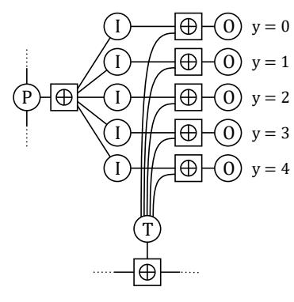
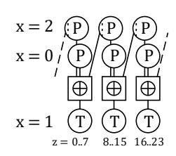
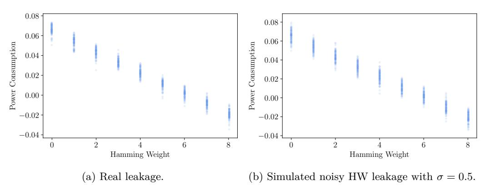
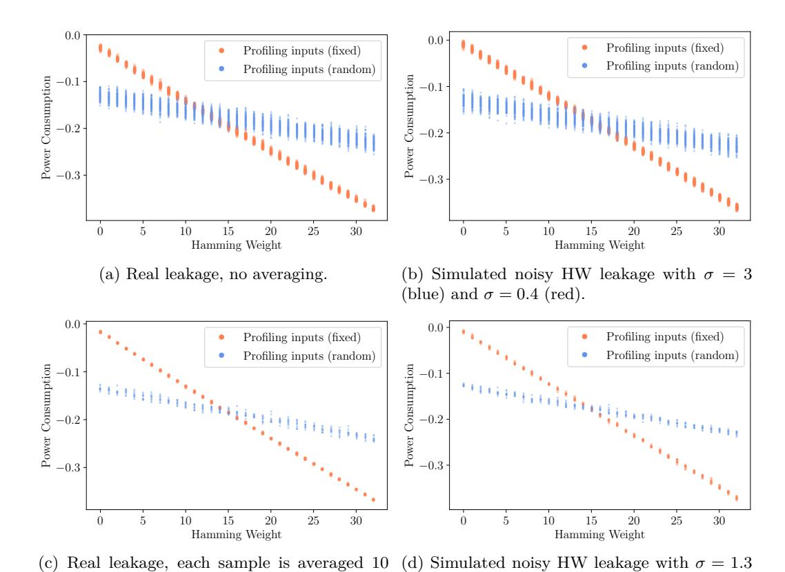
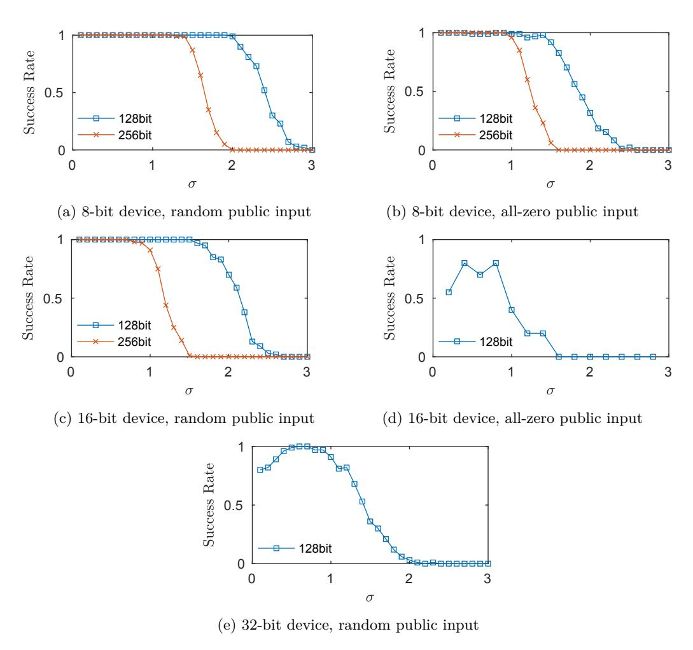
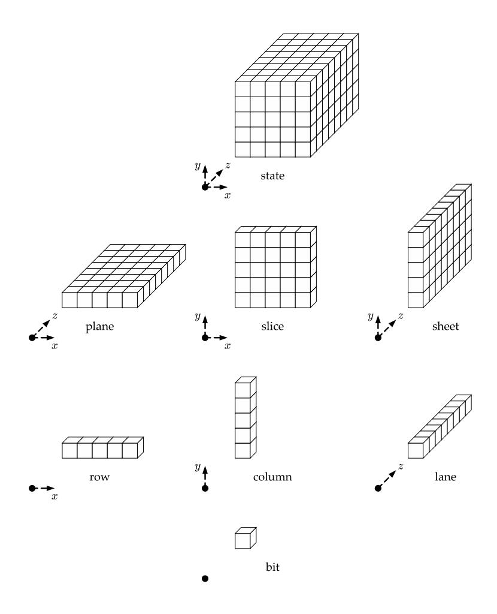
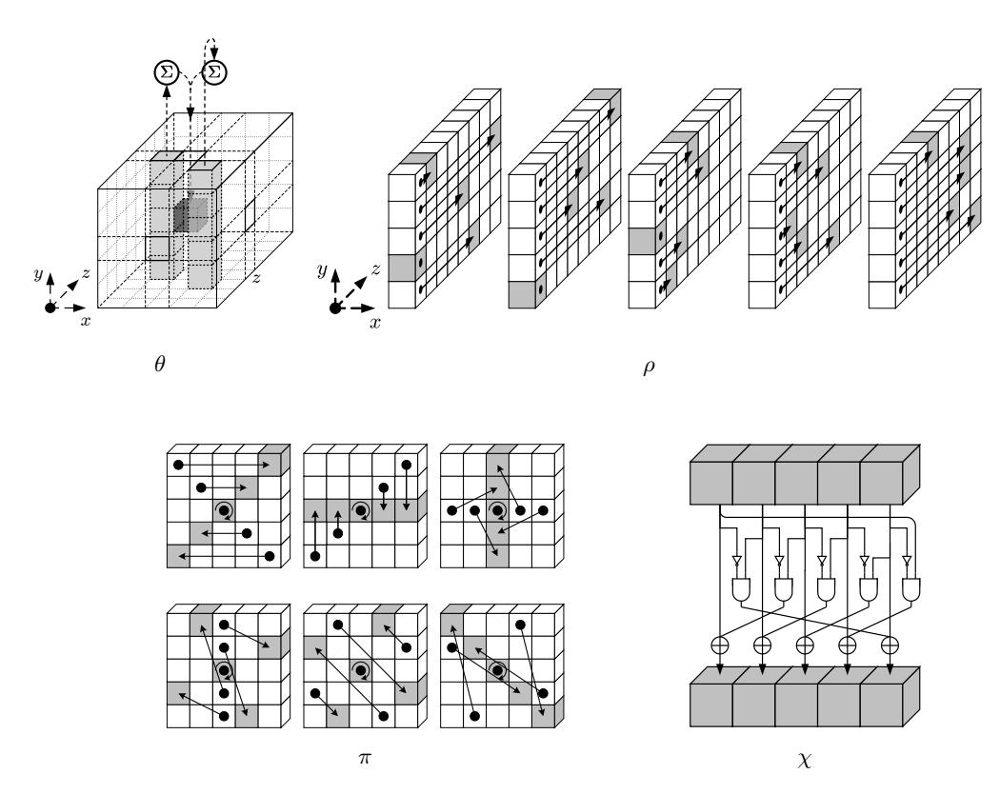

# Single-Trace Attacks on Keccak

Matthias J. Kannwischer1 and Peter Pessl2 and Robert Primas2

Radboud University, Nijmegen, The Netherlands matthias@kannwischer.eu,
Graz University of Technology, Austria peter@pessl.cc, rprimas@gmail.com

**Abstract.** Since its selection as the winner of the SHA-3 competition, KECCAK, with all its variants, has found a large number of applications. It is, for instance, a common building block in schemes submitted to NIST's post-quantum cryptography project. In many of these applications, KECCAK processes ephemeral secrets. In such a setting, side-channel adversaries are limited to a single observation, meaning that differential attacks are inherently prevented. If, however, such a single trace of KECCAK can already be sufficient for key recovery has so far been unknown.

In this paper, we change the above by presenting the first single-trace attack targeting Keccak. Our method is based on soft-analytical side-channel attacks and, thus, combines template matching with message passing in a graphical model of the attacked algorithm. As a straight-forward model of Keccak does not yield satisfactory results, we describe several optimizations for the modeling and the message-passing algorithm. Their combination allows attaining high attack performance in terms of both success rate as well as computational runtime.

We evaluate our attack assuming generic software (microcontroller) targets and thus use simulations in the generic noisy Hamming-weight leakage model. Hence, we assume relatively modest profiling capabilities of the adversary. Nonetheless, the attack can reliably recover secrets in a large number of evaluated scenarios at realistic noise levels. Consequently, we demonstrate the need for countermeasures even in settings where DPA is not a threat.

**Keywords:**  $keccak \cdot side$ -channel attacks  $\cdot$  power analysis  $\cdot$  single-trace attacks  $\cdot$  belief propagation  $\cdot$  post-quantum cryptography

#### 1 Introduction

In 2012, Keccak [BDPV11] was announced as the winner of the SHA-3 competition. Subsequently, NIST published FIPS202 [NIS15] which standardized the hash-function family SHA-3 and the extendable-output function (XOF) family SHAKE. Since then, SHA-3, SHAKE, and many other Keccak-based algorithms have found ample use, often as a building block in new constructions. For instance, a large number of submissions to the NIST post-quantum cryptography standardization process [NIS16b] make use of Keccak in one way or another. Similarly, some submissions to the NIST lightweight cryptography competition [NIS19] and the CAESAR competition for authenticated encryption [CAE] use small-state versions of Keccak as a building block or employ design strategies similar to that of Keccak.

In many of these newfound applications, Keccak processes some form of secret input. This extends far beyond the classic scenario of a keyed hash (as a MAC) and includes

\*Author list in alphabetical order; see https://www.ams.org/profession/leaders/culture/CultureStatement04.pdf.

many scenarios where Keccak is used as, e.g., a PRF or a (keyed) PRNG. All this makes studying Keccak in terms of side-channel vulnerabilities an important task. Previous work in this direction demonstrated the applicability of Differential Power Analysis (DPA) and proposed countermeasures against this type of attack [\[ZKSH12,](#page-23-0)[BDN](#page-20-2)+13,[TS13\]](#page-23-1).

Interestingly, however, Keccak is often used such that it only deals with ephemeral secrets, e.g., secret nonces and seeds for PRNGs. Their recovery would typically still constitute a complete break of security and can, in some settings such as nonces in Fiat-Shamir-type signature schemes [\[FS86\]](#page-21-0), even allow trivial reconstruction of a long-term secret. However, as this ephemeral setting limits adversaries to a single measurement per secret, the powerful class of differential side-channel attacks is completely ruled out. In some other applications of Keccak, the same key is used in multiple algorithm executions, but only ever mixed with unchanging public inputs (the data complexity is limited to 1). While recording multiple traces in this setting allows noise reduction using averaging, DPA is still not an option.

With this broad and powerful class of attacks not being applicable, it is tempting to spend fewer resources on side-channel countermeasures or even use unprotected implementations. However, single-trace attacks are still a potential threat under these conditions. If such attacks on Keccak are actually realistic is thus far unknown, as is consequently also the required protection effort.

**Our Contribution.** In this paper, we shed light on the above problem by presenting the first single-trace side-channel attack on Keccak. It allows the recovery of secret inputs in certain scenarios and can thus break security even in very restricted settings.

Before presenting the attack, we survey applications of Keccak and study its usage as a building block in various cryptographic schemes. We primarily focus this study on applications within submissions to NIST's post-quantum cryptography project. There, we point out several scenarios in which (ephemeral) secrets are passed to Keccak, but attacks are restricted to using a single trace.

Attacking such scenarios requires maximizing the information extracted from a trace. We make use of soft-analytical side-channel attacks (SASCA) [\[VGS14\]](#page-23-2), which can potentially exploit the leakage of all processed intermediate variables. In SASCA, one first performs side-channel template matching [\[CRR02\]](#page-20-3) on said intermediates. All leakage priors are then combined by modeling the attacked algorithm/implementation using a so-called factor graph and finally invoking the belief-propagation algorithm (BP). As it turns out, factor graphs allowing efficient attacks on Keccak differ significantly from those used for, e.g., AES in previous works [\[VGS14,](#page-23-2)[GS15\]](#page-21-1). We thus discuss all our design choices aimed at attaining high attack performance for generic software implementations of Keccak. We also present several optimizations to BP aimed at keeping the computational complexity of the attack practical.

We then identify several factors that influence the attack performance, such as the key length, the structure of the Keccak state prior to calling the permutation, and the wordsize of the attacked processor. We evaluate our attack in all these settings using simulations in the generic noisy Hamming-weight leakage model and show that single-trace attacks are indeed a considerable threat, at least for smaller devices. While the situation for larger (32-bit) devices is less clear, we argue that unprotected implementations are still not an option and that at least basic countermeasures, such as shuffling, are required.

**Availability of software.** We place all the Python code used for the attack simulation in the public domain. It is available at <https://github.com/keccaksasca/keccaksasca>.

**Outline.** In Section [2,](#page-2-0) we briefly recall our attack target Keccak as well as our primary attack tool SASCA. In Section [3,](#page-5-0) we survey many recent applications of Keccak and point out scenarios where single-trace attacks are of importance. We then describe our attack in detail and also discuss various optimizations that increase attack performance in Section [4.](#page-6-0) We present the outcome of our attack evaluation in Section [5.](#page-11-0) Finally, we conclude in Section [6](#page-17-0) with a discussion on future work and potential countermeasures.

# **2 Background**

In this section, we recall our attack target, namely Keccak, as well as Soft-Analytical Side-Channel Attacks, which are our primary attack tool.

### **2.1 Keccak**

Keccak is a sponge-based hash function that was selected as the winner of the SHA-3 competition. Following the sponge construction, Keccak operates on a *b*-bit state, which is split in two parts of sizes *r* (rate) and *c* (capacity), respectively. The capacity *c* acts as the security parameter, whereas the rate *r* = *b* − *c* determines the input block size. The state is initialized to zero, Keccak then proceeds in two phases. During the initial absorbing phase, input blocks of *r* bits are repeatedly XORed into the first *r* bits of the state. After each block, a *b*-bit permutation is applied to the state. Once all input blocks have been absorbed, one or multiple blocks can be extracted from the first *r* bits of the state to obtain the desired hash output (squeezing phase).

For the permutation, Keccak-*f* [*b*] is used. Keccak-*f* organizes the *b*-bit state into 5 × 5 lanes of 2 *`* bits, where *`* ranges from 0 to 6. Each bit can thus be addressed using three coordinates (*x, y, z*), with (*x, y*) defining the lane and *z* determining the position inside the lane. Apart from lanes, the Keccak authors defined names for several other pieces of the state. For instance, bits with constant *z* coordinate form a plane, constant (*y, z*) gives a row, and bits at constant (*x, z*) form a column. We defer the depiction of the described parts and the description of other pieces to Appendix [A.](#page-24-0) The 3D state needs to be serialized for absorbing/squeezing; this serialization is done by concatenating the lanes following the index given by *x* + 5*y*.

Keccak-*f* is an iterated permutation, the number of rounds is determined by the width of the permutation and set to 12 + 2*`*. [1](#page-2-1) In each round, the five operations *θ, ρ, π, χ, ι* are applied to the state in the presented order. For their detailed descriptions, we refer the reader to the specification of Keccak-*f* [\[BDPV11,](#page-20-0)[NIS15\]](#page-22-0) and the illustration of *θ, ρ, π,* and *χ* in Appendix [B.](#page-25-0) Therefore, we only briefly describe each operation in the following.

- *θ* first computes the XOR-parity of each column; the result is dubbed the *parity plane*. For each column, it then adds the parity of two neighboring columns ((*x*−1*, z*) and (*x* + 1*, z* − 1)) to obtain the so-called *θ*-effect. This *θ*-effect is then finally added to each bit of the respective column.
- *ρ* rotates each lane in the state by a different offset.
- *π* permutes the bit positions within each slice, i.e., reorders the lanes.
- *χ* is the only non-linear operation in Keccak-*f* . It is a 5-bit substitution box operating on rows of the state. As seen in Figure [6](#page-25-1) of Appendix [B,](#page-25-0) it is defined using bitwise operations and has a degree of 2.
- *ι* is the addition of a round constant into the first lane (*x* = 0*, y* = 0).

In FIPS202 [\[NIS15\]](#page-22-0), NIST standardized a subset of Keccak for use as SHA-3 and as the extendable-output functions (XOF) SHAKE. NIST SP800–185 [\[NIS16a\]](#page-22-3) describes

1 In the Keccak-*p* permutation, the number of rounds is a free parameter and not coupled to the state size. Keccak-*f* is thus a subset of Keccak-*p*.

further Keccak-based constructions, such as KMAC and the customizable XOF cSHAKE. NIST followed the suggestion of the Keccak authors and set the state size b to 1600 ( $\ell=6$ , i.e., 64-bit lanes) for all standardized instances. We thus solely focus on b=1600 in this paper, but also note that our attack implementation supports other state sizes as well. The other main Keccak parameter, namely the capacity c, differs between instances. For SHA-3, it is set to two times the output length, e.g., for the 256-bit hash function SHA3-256, one sets c=512 and r=1600-512=1088. The standardized SHAKE instances SHAKE128 and SHAKE256 use a capacity of 256 and 512, respectively.

Apart from the NIST-sanctioned instances, Keccak is also the basis of many other proposed schemes. The KangarooTwelve XOF [BDP $^+18$ ], for instance, combines a round-reduced Keccak-f permutation with tree hashing. Other examples are the authenticated encryption schemes Keyak [BDP $^+16b$ ] and Ketje [BDP $^+16a$ ]. Keccak has also been adapted to lightweight applications: Isap [DEM $^+19$ ] and Elefant [BCDM19] use it with smaller states.

### 2.2 Side Channels & Belief Propagation

In this work, we focus on attack scenarios where the adversary can only gather a very small number of side-channel observations, say only a single one, per secret.

While this setting rules out the use of, e.g., Differential Power Analysis [KJJ99], Template Attacks [CRR02] are still a viable option. There, the attacker first profiles the side-channel characteristics of the device and then matches these profiles (templates) against the attacked trace to retrieve information on certain intermediates. More concretely, for each targeted intermediate T, one obtains probabilities conditioned on the side-channel leakage  $\ell$ , i.e.,  $\Pr(T = t|\ell)$ .

In the single-trace setting, it is crucial to extract as much information per trace as possible. This can be achieved by performing a template matching on many or all processed intermediates. Then, one wants to find the most likely key given all obtained distributions. Finding the exact solution to the latter problem is infeasible, as it would essentially require enumerating all possible keys.

Soft-Analytical Side-Channel Attacks (SASCA), proposed by Veyrat-Charvillon et al. [VGS14], aim at solving this problem. They describe the attacked cryptographic algorithm, or, more correctly, its implementation, with a so-called factor graph. This probabilistic graphical model contains all processed intermediates, describes their relations as specified by the cryptographic algorithm, and allows adding side-channel information for any intermediate. Then, the belief-propagation (BP) algorithm is used to determine marginal probability distributions for subkeys. Finally, the key is recovered by reading off the most likely value for each subkey. Before describing BP in more depth, we first briefly discuss the graphical modeling.

**Factor graphs.** Factor graphs are always bipartite and contain two distinct set of nodes: variables and factors. In the context of SASCA, each processed intermediate variable (including algorithm input and output) is represented with a variable node. Factor nodes describe the interactions between variable nodes; edges are drawn to each variable node a factor depends on.

In SASCA, the set of factor nodes can be further subdivided in two. The first subset of factors describes the interactions of the variables as defined by the cryptographic algorithm. These factors are deterministic and have, with the example of a 2-input XOR, the following form:

$$f_{\oplus}(x, y, z) = \begin{cases} 1 & \text{if } x \oplus y = z \\ 0 & \text{otherwise.} \end{cases}$$

The second subset models the obtained leakage *`*. These factors are non-deterministic and usually of form *f`*(*x*) = Pr (*X* = *x*|*`*). Public algorithm inputs and outputs can also be modeled using such factors.

**Belief propagation.** After having constructed a factor graph, the belief-propagation algorithm (BP) is run on it. BP has a large number of use cases; a very prominent one is decoding of low-density parity-check (LDPC) codes. In SASCA, it is used to retrieve (approximate) marginal probability distributions of subkeys.

BP tackles this in general intractable problem by replacing global marginalization with easy-to-compute local marginalization in conjunction with message passing. Simply speaking, it computes marginal probability distributions of each variable given information from its adjacent nodes and then passes these marginals along edges of the factor graph. This process is repeated, i.e., marginal probabilities (beliefs) are computed with the now updated information and again propagated along the edges, until convergence is reached.

In BP, it is crucial to prevent circular reasoning. Thus, outgoing message updates sent over an edge *e* must not depend on the incoming message received via *e*; only messages received from other edges can be taken into account. This leads to the two following message-update rules, where we denote **x** = {*x*1*, . . . , xN* } as the set of all variables, **f** = {*f*1*, . . . , fM*} as the factor set, *u* as messages, and *n, m* as variable and factor indices, respectively.

**Messages from variable to factor:**

$$u_{x_n \to f_m}(x_n = v) = \prod_{m' \in \mathcal{M}(n) \setminus \{m\}} u_{f_{m'} \to x_n}(x_n = v), \tag{1}$$

where *v* is any value out of the domain of *xn* and M(*n*) denotes the indices of factors in which variable *xn* participates. In words, these message updates boil down to point-wise multiplication of the incoming probability vectors. For a variable node *x* with domain of size |*x*| connected to deg(*x*) factors, updating all outgoing messages in a simple manner has complexity of deg(*x*) 2 · |*x*|.

**Messages from factor to variable:**

$$u_{f_m \to x_n}(x_n = v) = \sum_{\mathbf{w}} \left( f_m(x_n = v, \mathbf{x}_{m \setminus n} = \mathbf{w}) \prod_{n' \in \mathcal{N}(m) \setminus m} u_{x_{n'} \to f_m}(x_{n'} = w_{n'}) \right), \quad (2)$$

where **x***m* denotes the variables that factor *fm* depends on, N (*m*) are the indices of these variables, and **x***m*\*n* denotes the set of variables in **x***m* without *xn*. The vector **w** runs through all possible value assignments of **x***m*\*n*. In words, given messages on **x***m*\*n*, the above performs marginalization of *xn* under the combination rules defined by *fm*. A message update for an entire factor can thus be performed by iterating over all possible value assignments for **x***m*. Assuming that all variables share the same domain, then updates computed via this simple method require |*x*| deg(*f*) operations. Note that for deterministic factors, it suffices to enumerate the assignments of the *input* variables, e.g., (*x, y*) for *f*⊕ given above.

The above two message-update rules are executed alternatingly until convergence is reached. Then, the marginal probability distributions of all variables, including subkeys, can be computed by multiplying all incoming messages, i.e., Pr (*xn* = *v*) = 1*/Z* · Q *m*0∈M(*n*) *ufm*0→*xn* (*xn* = *v*), where the normalization factor *Z* is set such that P *v* 0 Pr (*xn* = *v* 0 ) = 1.

**Loopy BP.** BP can solve the marginalization problem exactly, but only if the factor graph is acyclic. For factor graphs arising from many real-life use cases, including the modelling of cryptographic operations for side-channel attacks, this is not the case. There, the same update rules can still be used in what is then called loopy BP. This variant might not even converge, but when it does, it often gives sufficiently precise approximations to the true marginals. The actual performance of loopy BP, i.e., the quality of the approximations and convergence properties, is inversely proportional to the length of the loops. Put simply, loops in the factor graph introduce positive feedback, which can cause overconfidence in certain beliefs and, subsequently, even oscillations, especially when deterministic factors are involved [KF09].

Thus, factor graphs should ideally avoid at least very short loops. This is not always possible, potential alternatives include merging (clustering) of nodes, which can come with a hefty impact on the runtime, and specialized BP variants taking loops into account, such as generalized belief propagation [YFW00].

Another important factor influencing the performance of BP is the implemented message schedule. In a *synchronous* schedule, Eqs. 1 and 2 are alternatively evaluated on all respective nodes at once. This is often not ideal, an *asynchronous* schedule tailored to the specific factor graph often gives much better performance [KF09]. There, one does not update the entire graph at once, but instead propagates information in more informed patterns.

A third common optimization technique is message damping; it specifically aims at counteracting oscillations. There, messages sent over the edges are weighted averages of previous and new messages. When using  $\alpha \in (0,1]$  as the damping factor,  $u_{\text{new}}$  as the direct outcome of the above message update rules 1 and 2, and  $u_{\text{prev}}$  as the previous message, then the sent message  $u = \alpha \cdot u_{\text{new}} + (1 - \alpha) \cdot u_{\text{prev}}$ .

### 3 Keccak in Practice

To motivate the analysis of Keccak in terms of side-channel vulnerabilities, this section presents an overview of its usage within various cryptographic schemes. We especially focus on cases that involve secrets but inherently prevent differential side-channel attacks by, e.g., using the secret value only once. Scenarios susceptible to DPA are of lower interest, as their need for side-channel countermeasures is already evident.

As it turns out, many submissions to NISTs post-quantum project [NIS16b] fit the above criteria. They make frequent use of the functions standardized in FIPS202 [NIS15] and SP800–185 [NIS16a], i.e., SHA-3, SHAKE, and cSHAKE, in the following all denoted by  $\mathcal{H}$ . We identify three common cases:

**Keccak as a PRF.** Keccak is commonly used to construct a PRF, which uses some small key together with a known message as  $\mathcal{H}(k||m)$ .

One of the most straightforward constructions from a Keccak PRF is a message authentication code (MAC), such as KMAC standardized in SP800-185 [NIS16a]. However, as MACs are obviously susceptible to differential attacks, they are likely to be well protected in practice, making them less of an interesting target for single-trace attacks.

In the post-quantum context, Keccak-based PRFs are commonly found within the Fujisaki-Okamoto (FO) transformation [FO99] used to obtain a CCA-secure key-encapsulation mechanism (KEM) from a CPA-secure one. Both the computation of the pre-key from the public key and the secret random message as  $\hat{K} \leftarrow \mathcal{H}(m,pk)$  and the derivation of the shared secret from the pre-key and the ciphertext as  $K \leftarrow \mathcal{H}(\hat{K},ct)$  are interesting targets for a single-trace attack, as they allow to compute the shared secret. Note that these two PRF operations are required in encapsulation as well as decapsulation, thus making both the sending and the receiving side to possible targets. A Keccak-based FO transformation is used in, e.g., a wide-variety of lattice-based cryptographic schemes like FrodoKEM [NAB+19], Kyber [ABD+19], NewHope [PAA+19], and Saber [DKRV19].

**Keccak as a PRNG.** A very similar use case of Keccak is to use SHAKE for expanding a small secret seed to a long bit string. The seed can be combined with a counter, i.e., H(seed||counter), if multiple independent values are needed; this also facilitates vectorized execution of SHAKE. As the seed is combined with a public and changing input, differential attacks could already be an option. However, as the number of used counter values is usually small, and the input changes only at a few bits, classical DPA does not appear to be promising.

In post-quantum schemes, such Keccak-based PRNGs are widely used to reduce the need to sample and store truly random bits. Also, seed expansion is typically needed within the FO transformation, as the required re-encryption needs to use the same seed to generate all required randomness. As more concrete examples, all aforementioned lattice-based KEMs sample ephemeral secrets (noise polynomials) from a single seed. Recovery of the ephemeral secret key in these schemes allows to compute the shared secret. However, as encryption (or re-encryption) is attacked, no information about the long term secret is obtained.

Furthermore, Keccak is commonly used as a PRNG in Fiat-Shamir-type signatures like Dilithium [\[LDK](#page-22-8)+19] and qTesla [\[BAA](#page-20-9)+19]. These schemes use SHAKE to expand a small secret seed to the masking polynomial *y*, which is used to prevent signatures from leaking information about the secret key. The secret seed is either chosen at random (non-deterministic signing) or derived from the message and a part of the secret key (deterministic signing). Recovery of the masking polynomial allows the trivial recovery of the secret signing key from a single signature. Note that in Fiat-Shamir-type signatures, hashing is also required for deriving the challenge from the commitment. However, the inputs to this hash are public anyway.[2](#page-6-1)

Another interesting case where Keccak is used as a PRNG are hash-based signature schemes, e.g., XMSS [\[HBG](#page-21-5)+18] and SPHINCS+ [\[HBD](#page-21-6)+19]. The large number of one-time (or few-time) key pairs makes it imperative to generate the secret keys from a small seed. When recovering the seed of a secret key, an adversary is able to forge signatures for arbitrary messages. Kannwischer et al. [\[KGB](#page-22-9)+18] conclude that differential attacks are not very promising for attacking the PRNG in hash-based signatures.

**Hash-Based Signatures.** Apart from its use as a PRNG, the actual hashing in the one-time signatures and few-time signatures in stateful (XMSS [\[HBG](#page-21-5)+18]) and stateless (SPHINCS+ [\[HBD](#page-21-6)+19]) hash-based signatures present another target for single-trace attacks. Such schemes typically evaluate the hash function (Both XMSS and SPHINCS+ propose parameter sets using SHAKE) on a block of the secret key as a part of the W-OTS+ chains or FORS trees. Recovering these secret key blocks allows forging signatures as well. While adversaries can record multiple traces for each secret, the known inputs to the hash function are constant. This means that standard DPA is not possible and that adversaries are limited to averaging [\[KGB](#page-22-9)+18].

# **4 SASCA on Keccak**

The previous section established that there exist many interesting scenarios where sidechannel adversaries are limited to a single Keccak trace. We now present a side-channel attack allowing key recovery even in such a limited setting.

As stated earlier, our primary attack tool are soft-analytical side-channel attacks (SASCA). They require modeling the actual implementation of a cryptography primitive

2Due to the use of rejection sampling, this is strictly speaking not fully correct for lattice-based Fiat-Shamir type signatures. Still, due to the large size of the commitment and the need to recover the secret from many rejected commitments/challenges, attacking this hash does not appear to be promising.

with a factor graph. In this work, we opt for targeting software (microcontroller) implementations. These often use similar implementation techniques across a large set of concrete targets, which is why our attack is not tailored for one such implementation in particular and instead kept somewhat generic.

Hence, we now describe how we construct a factor-graph targeting such generic Keccak software implementations. That is, we detail the modeling of the five Keccak-f transformations as well as the incorporation of leakage into the graph. Due to the bitwise description of Keccak-f and the processing of large intermediates that are often not nicely aligned across functions, our factor graph differs significantly from those targeting Aes [VGS14, GS15]. For instance, we require a clustering of bits to allow effective propagation of side-channel information through the graph. This, in turn, leads to update rules with impractical running time, at least when implementing them in a straight-forward manner. For this reason, we also give optimized update methods based on different variants of fast convolution.

#### 4.1 Basic Construction

As seen in Section 2.1, Keccak is commonly described using bitwise operations. Thus, an intuitive first description could describe the entire b-bit state after each of the 5 round functions with b binary-valued variable nodes. A full Keccak factor graph would then consist of  $(1+24\cdot5)b$  variable nodes, not counting nodes required for describing intermediates within the functions.

These variable nodes are then linked with factor nodes describing the Keccak-f functions. For instance, the non-linear  $\chi$  permutation can be described using 1600/5 = 320 factors  $f_{\chi}$ . When denoting  $(x_0 \dots x_4)$  as the input row and  $(y_0 \dots y_4)$  as the respective output, then  $f_{\chi}$  is given as:

$$f_{\chi}(x_0 \dots x_4, y_0 \dots y_4) = \begin{cases} 1 & \text{if } \chi(x_0 \dots x_4) = (y_0 \dots y_4) \\ 0 & \text{otherwise.} \end{cases}$$

The  $\chi$  permutation is the only non-linear part of Keccak; all other parts can be modeled with bitwise rewiring and XOR factors given by:

$$f_{\oplus}(x_0 \dots x_n, y) = \begin{cases} 1 & \text{if } \bigoplus_{i=0}^n x_i = y \\ 0 & \text{otherwise.} \end{cases}$$

**Optimizations.** Even from this basic description, there is some immediate optimization potential. For instance, the functions  $\rho$  and  $\pi$  are essentially a bit permutation, or in other words, a rewiring of the state. As this does not change the probability distribution of the individual bits, we can model  $\rho$  and  $\pi$  by simply connecting the inputs of  $\chi$  to the corresponding outputs of the  $\theta$ -step. Thus, no dedicated factors and variable nodes are needed here.

The  $\iota$  step, where a round constant is added to the lane at position (x=0,y=0), can also be optimized. Concretely, we can merge  $\iota$  into  $f_{\chi}$ . For rows in the plane y=0 where the round constant takes the value 1, we instantiate a slightly modified  $f_{\chi}$  which takes the bit flip already into account. Combined with the optimization of  $\rho$  and  $\pi$ , we now only need to consider two full b-bit states per round, one at the output of both  $\theta$  and  $\chi$ .

**Drawbacks.** While a bitwise factor-graph description is relatively simple, it comes with a significant drawback. Namely, typical side-channel leakage is not directly on bits, but

&lt;sup>3AES operates on bytes; hence the input/output of all functions and all leakage priors are byte aligned. Also, previous works focused on byte-level leakage and did not consider larger wordsizes [VGS14, GS15].

instead on larger parts of the state. Software implementations typically process the state lane-wise, thus resulting in leakage on, e.g., 8 or 32-bit parts of lanes. Such information can, in principle, be easily incorporated into a bitwise factor graph; it suffices to connect all affected variable-nodes to the leakage factor. However, a bitwise factor graph only considers bitwise marginal distributions; all information on the joint distribution of bits is lost and not propagated through the graph. We found that this leads to poor attack performance.

As an illustration, consider that we know from side channels that a state byte has a Hamming weight of 1. Thus, each bit has a probability of 7*/*8 of being zero, which is the only information propagated in bitwise BP. The fact that one of the 8 bits needs to be one is not considered in any connected factors and, thus, lost.

### **4.2 Clustering**

To alleviate these shortcomings, we cluster multiple bits of the state into larger variable nodes. As we evaluate our attack software implementations, which typically process the state in lanes, each cluster consists of *c* consecutive bits in a lane. The factors also have to be adapted such that they work with clusters instead of single bits. We stress that these clusters do not necessarily coincide with the *w*-bit leaking intermediates computed by the processor. Setting *c* ≥ *w* allows ideal propagation of joint leakage information, but is prohibitively expensive in many cases.

The runtime of the variable-to-factor update rules given in Section [2.2](#page-3-0) scales linearly in the size of the variable domain and thus exponentially in *c* , i.e., 2 *c* . For the factorto-variable updates, we have runtimes in the order of 2 *c*·*d* , with *d* being the number of connected variable nodes. This makes large cluster sizes infeasible, so a trade-off between the accuracy of obtained marginals, on the one hand, and runtime, on the other hand, has to be found. We chose a default cluster size of *c* = 8 bits, which still has very acceptable runtimes while retaining high attack performance in attacks using 32-bit leakage. Our attack implementation also supports 16-bit clusters, but due to the drastic increase in the running time, we only use this option in selected scenarios.

#### **4.3 Modeling the Keccak-f Round Functions**

Above, we optimized away 3 out of the 5 Keccak-*f* round functions and introduced clustering. We now describe how the two remaining permutations, namely *θ* and *χ*, can be efficiently implemented in a clustered manner.

**Theta.** In the *θ* step, the parity of two adjacent columns is XORed to each bit of the state. Figure [1a](#page-9-0) depicts our factor-graph of this operation for a single column. We use circles and squares to depict variable and factor nodes, respectively. In the first step, the input variables, denoted with I, are XORed to give the column parity P. The parity is then routed to two neighboring columns, where it is XORed with a second parity to give the *θ*-effect T. This is finally XORed to all input variables in the column to give the output variables O.

Note that the computation of the parity P is done with a single factor instead of a series of 2-input XORs. The latter option would not only introduce many tight loops into the factor graph but would also lead to slow propagation due to many intermediates. A single factor, however, is a challenge when it comes to clustering. For a cluster size of *c* = 8, this single factor has 2 40 possible input combinations. While computing the belief update for this node via simple enumeration of possible inputs might not be infeasible, it is definitely impractical.

Fortunately, a classic technique from coding theory, which has seen previous use in the context of side-channel attacks [\[GS12\]](#page-21-7), allows a drastic speed-up. Consider we

(b) Effects of clustering on computing the *θ*-effect on 8-bit processors

(a) *θ* of a single column (*x, z*)

Figure 1: Factor graphs for *θ*. Circles denote variable nodes, factor-nodes are depicted as squares. Input and output variables are marked as I and O, respectively. Column parities are denoted as P, the *θ*-effect, which is computed by XORing the parity of two neighboring columns, is marked T. The (*x, y, z*) mark the positions of the bits in the state.

are given the probability distributions of two *c*-bit variables (clusters) *X, Y* , and want to compute the distribution of P *Z* = *X* ⊕ *Y* . We can then write Pr (*X* ⊕ *Y* = *z*) = *x* Pr (*X* = *x*) Pr (*Y* = *z* ⊕ *x*). This computation can be interpreted as a form of convolution which uses addition in GF(2) instead of over Z for index computations. Similar to fast convolutions using the FFT and point-wise multiplications, this XOR-convolution can be efficiently computed using the fast Walsh-Hadamard transform, which features a runtime of *n* log *n*, with *n* = 2*c* [\[AIL](#page-20-10)+15]. The entire distribution of *Z* can be obtained via two forward transforms of *X, Y* , a pointwise multiplication of their Walsh-spectra, and an inverse transform. This process can easily be adapted to more than two inputs; it suffices to extend the pointwise multiplication to multiple vectors. We use this convolution technique for all *f*⊕.

Apart from runtime, there is another aspect that needs to be considered when applying clustering to *θ*. The *θ*-effect is computed by XORing two lanes of the parity plane, where one of the lanes is rotated by one. This rotation inevitably breaks the alignment between clusters. As illustrated in Figure [1b,](#page-9-1) we need to compute the marginal distributions of both the MSB and the remaining *c* − 1 bits. and then send them to the appropriate *f*⊕.

Finally, we note that our factor graph is not able to compute the inverse of *θ*. This might limit information propagation from later rounds towards the input. However, since we found that inverting even a single bit of *θ* requires knowledge of half the output state, the information gain by separately modeling the inverse is very limited in a noisy setting.

**Chi.** The Keccak-*f* Sbox *χ* is defined using bitwise logic operations (cf. Section [2.1\)](#page-2-2). One option is thus to instantiate a factor node for each logic gate. However, with such a factor graph, *χ* cannot be inverted. This can already be derived from the fact that the inverse of *χ* has an algebraic degree larger than *χ* itself [\[BDPV11\]](#page-20-0). While this invertibility problem is also present for *θ*, the inversion of *χ* only requires five bits at a time and can thus contribute useful information. Additionally, modeling via simple gates leads to slow propagation. Observe, for instance, that in Figure [6](#page-25-1) of Appendix [B,](#page-25-0) each output bit of *χ* is only directly connected to three inputs and no other outputs. Thus, prior information from these non-connected nodes can only flow indirectly to the target output variable.

Due to these problems, we resort to a description using table-lookups on single-bit variables. That is, we extract the bitwise marginals from each cluster and then instantiate *fχ* as described in Section [4.1.](#page-7-1) Here, we do not implement clustering due to the prohibitive cost of 2 5*c* . While this comes with a loss of joint information, we do gain direct propagation between all inputs and outputs, as well as the capability of inverting *χ*.

### **4.4 Adding Leakage**

As mentioned in Section [2.2,](#page-3-0) a SASCA factor graph contains two distinct sets of factor nodes. The first set describes the operations in the attacked algorithm and its implementation; the second set adds prior probabilities. These priors either stem from known inputs or from leakage. Known inputs are trivial to add, which is why we now only describe leakage factors in more depth. Please note that we will discuss the concrete positions of leakages, i.e., which operations and variables we actually obtain leakage on, later in Section [5.2.](#page-13-0) For now, it suffices to know that software implementations of Keccak operate lane-wise, which is why leakage will be observed for individual processor words making up a lane.

When performing a value-based template matching on a *w*-bit microcontroller, the outcome at each targeted position is a probability vector of length 2 *w*. When using Hamming-weight templates, then one receives *w* + 1 Hamming-weight likelihoods instead. For *w* = 8-bit devices, both value- and Hamming-weight templates are possible. While the former is more powerful, the latter allows for easier profiling and higher portability between devices. In any case, if this *w* = 8-bit leakage is aligned with the *c* = 8-bit clusters, then propagation is trivial. The prior factor becomes a leaf and just sends its distribution to the connected node, thus resembling the standard use of Bayes' theorem in a template attack. Non-aligned leakage is connected to at least two clusters. There, the prior factor is not a leaf, and marginalization is required.

**32-bit devices.** For larger devices, such as *w* = 32-bit microcontrollers, several problems arise. First, value-based templates, albeit still thinkable, become prohibitively expensive. For this reason, we restrict ourselves to Hamming-weight templates. And second, with *c* = 8-bit clusters, no prior can be a leaf node. Simple propagation between the connected nodes would again require enumeration of all input combinations of the prior factor, which with a complexity of 2 32, is impractical.

We instead compute these factor updates as follows. For the sake of explanation, assume that the 32-bit prior is aligned with four 8-bit clusters (*A, B, C, D*) and that we want to compute the update targeting the fourth cluster *D*. Then, in the first step, for each cluster, we compute the Hamming-weight probability distribution. This is done by simply summing up the entries having identical weights. In the second step, we exploit that when concatenating two words *A*||*B*, Hamming weights add such that HW(*A*||*B*) = HW(*A*) + HW(*B*). Translated to the probabilistic setting, we have Pr (HW(*A*||*B*) = *x*) = P *a* Pr (HW(*A*) = *a*) Pr (*HW*(*B*) = *x* − *a*). This formula describes a (standard) convolution, which can be efficiently computed. So, we retrieve the Hammingweight probabilities of the first 24 bits by convolving the distributions of the first three 8-bit clusters. Finally, when denoting Pr (*W*|*`*) as our prior distribution, we can obtain the update Pr (*D* = *d*|*A, B, C, W*) = P *w* Pr (*W* = *w*) Pr (HW(*A*||*B*||*C*) = *w* − *d*).

### **4.5 Attack Implementation and Parameterization**

We implemented our attack, i.e., the construction of a factor graph representing a generic Keccak implementation and belief propagation on this graph, in Python. All source code is available at <https://github.com/keccaksasca/keccaksasca>.

Our implementation includes the optimizations listed in the previous sections. This includes clustering, damping, runtime improvements using convolutions, and a custom message schedule detailed below. By default, we set the damping factor *α* to 0*.*75. Our default clustersize *c* is set to 8 bits, which we found to give good attack performance while still retaining acceptable runtime. As an additional performance measure, we only attack

the first two rounds of Keccak-*f* . We found that the inclusion of later rounds has only a negligible impact on the success rate.

**Message schedule.** Our choice of the message schedule is due to the iterated structure of Keccak. The variable nodes representing one full *b*-bit Keccak state can be seen as the output of one set of deterministic factor nodes, and as the input to another set, thus giving the factor graph a layered structure. We perform message updates on a layer-after-layer basis; we first perform updates starting from the very first layer (the input layer) until we reach the Keccak output, and then reverse this process. We define one such forward-backward cycle to be one iteration of BP. This schedule allows information to propagate between all arbitrary node pairs in a single iteration, while limiting the effect of loops. A similar strategy was previously used in the SASCA attack on lattice-based cryptography by Pessl and Primas [\[PP19\]](#page-22-10).

**BP exit conditions.** The number of required BP iterations is not known beforehand. Thus we keep performing message updates until one of the following exit conditions is met.

Firstly, BP exits when the entropy in the entire graph reaches zero. That is, each variable node can be assigned a single value with probability 1. The true posterior of this value is likely smaller than one, but due to the positive feedback caused by loops, BP tends to latch onto this single value and boosts its probability to 1. Secondly, BP exits when marginals do not change anymore between two iterations. In this case, BP has converged, but the side-channel information is likely not sufficient to allow a successful attack.

Despite all of the above measures, such as damping, there are cases where BP does not fully converge and runs into oscillations. Thus, as the third exit condition, we limit the maximum number of iterations, per default to 50. Finally, the overconfidence caused by loops can cause BP to latch onto incorrect values. Then, two incoming messages at a variable node might have non-intersecting support, i.e., convey contradicting information. Here, we have to abort the attack and consider it to have failed.

**Attack runtime.** After applying all runtime optimizations, using *c* = 8, and limiting the attack to the first two rounds of Keccak-*f* [1600], the runtime of a single iteration ranges between 2 to 5 seconds on a single core of an Intel Xeon E5-4669 v4 running at 2*.*2 GHz. The exact time depends on the used configuration, e.g., the wordsize of the attacked processor. For 16-bit clusters, the runtime rises drastically. Each iteration then requires approximately one minute while using 44 processor cores. Interestingly, the runtime is dominated by Eq. [1](#page-4-0) due to the term deg(*x*) 2 . This could be reduced by storing partial products and thus using dynamic programming techniques, which we however did not pursue any further.

Many tests finish after just a few iterations. The vast majority of successful attacks does not require more than 20 iterations.

## **5 Attack Evaluation**

After having described the inner workings of our attack, we now evaluate its performance in various settings. First, we aim at identifying generic scenarios covering many typical usages of Keccak in cryptographic constructions. There, we also uncover possibly unexpected factors influencing the attack success rate. Then, we specify the leakage functions used for attack simulations and validate their similarity to leakage stemming from real measurements on an 8-bit and a 32-bit microprocessor. Finally, we show the results of attack simulations in the identified scenarios across noise levels.

### **5.1 Scenarios**

As discussed in Section [3,](#page-5-0) Keccak has found a large number of uses, many of which are restricted to the single-trace setting. To limit the number of required tests and also give more generic results, we do not run through all these use cases with their many sub-settings and large parameter spaces.

Instead, we evaluate a generic scenario where a secret value, such as an ephemeral key or seed, is found in the first *n* bits of the Keccak state. This is fulfilled when, e.g., the secret is the first input to SHA-3. After some preliminary tests, we believe that the actual position of the secret does not have a very big impact on the attack performance. Thus, we conjecture that, e.g., SHAKE with a long public output, where the first *r* bits of the state are thus known while the last *c* bits are not, is also covered.

**On the importance of the key length.** Unlike a standard DPA on a block cipher, the length of the secret is a major influence on the success rate of the attack. This is because in Keccak-based schemes, a smaller secret directly implies knowing a larger part of the input to the 1600-bit permutation. This larger number of known input bits also allows to exactly determine the value of more internal nodes, which in term increases the (relative to the key length) number of factors where public and secret information is mixed. Such factors allow a direct mapping of leakage information to secret-dependent data, which makes them especially useful.

To determine the exact impact on the success rate, we analyze our attack for two very common options, i.e., 128-bit and 256-bit secrets. This means that the secret is found in the first 2 and 4 lanes of the state, respectively.

**On the importance of the input state.** Apart from the bit-length of the secret, we observed a second major factor influencing the attack performance, namely the *input state* of the attacked Keccak-*f* permutation. While we assume that the first *n* bits of the state always contain a secret, the content of the remaining 1600 − *n* bits can vary greatly between scenarios.

When, e.g., using SHAKE as a simple seed expander, then only the first *n* bits of the input of the permutation, i.e., the secret bits, are nonzero. All known parts are zero, except for some padding bits and possibly a short domain separator. For the sake of simplicity, we ignore the latter parts in our simulations and also set them to zero. We dub the resulting setting *all-zero public input*.

On the other side of the spectrum are scenarios where at least one Keccak-*f* permutation is applied to the state before the secret is absorbed. Then, the entire state is uniformly random. An example of this behavior can be found in cSHAKE, where the (public) customization string *S* is padded to multiple of the rate *r* and absorbed before processing any input [\[NIS16a\]](#page-22-3). A variant of this scenario is SHAKE with public output covering at least one rate part. In this setting, recovering the capacity *c* after the first permutation allows to compute all inputs as well as further outputs. We dub these scenarios *random public input*.

As it turns out, attacks in the random public input scenario perform considerably better than those in the all-zero setting. This might seem unexpected at first but can be explained as follows. First, recall the factor graph of *θ* shown in Figure [1a.](#page-9-0) In the first round of Keccak-*f* , the input nodes I correspond to the input of the permutation. As we assume that secrets are located in the first *n* bits of the state, we have that I at *y* = 0 is (potentially) secret, whereas I at all other positions is known. When the known I take on random values, then message updates towards the *θ*-effect node T can be interpreted as a DPA targeting T using 4 traces. When, however, all known I are zero, then all of these 4 "traces" leak information on the exact same computation (XOR of T onto zero). Thus, the DPA deteriorates into an averaging scenario, where the multiple observations of

the same computation can only be used for noise reduction.[4](#page-13-1) Therefore, when using the Hamming-weight assumption, the adversary is limited to learning T's Hamming weight, which is typically a lot less informative than the outcome of a DPA on T.

The above, combined with the fact that in our scenarios, knowledge of the first-round *θ*-effect allows full input recovery,[5](#page-13-2) is the main reason behind the performance differences demonstrated in the next section. Finally, the common case that only the capacity bits of Keccak state are zero, which occurs when processing long input while having the secret in the first block, can be seen as a mix between the above scenarios. There, the performance will depend on the capacity *c*. With *c* = 256, only the node at *y* = 4 is possibly part of the capacity and thus constantly zero. As the attacker can still observe 4 different public inputs for each parity computation, the attack performance will likely follow the random-input scenario. For *c* = 512 or even larger, the number of different inputs to the parity computation decreases; the attack performance will follow suit.

### **5.2 Choices for our Leakage Functions**

Previously, we stated that SASCA requires incorporating leakage information into the factor graph. For evaluation, it is of course necessary to specify the exact form and location of said leakages. This depends on the specific target; we aim at software (microcontroller) implementations of Keccak, such as those found in the Extended Keccak Code Package [\[BDH](#page-20-11)+] (XKCP). Microcontrollers typically leak the Hamming weight (HW) of processed values, especially SRAM accesses (loads and stores) show this behavior. For this reason, we assume leakage on intermediates that are typically stored in RAM, i.e., not kept purely in registers. As *b* = 1600, the current state is always kept in RAM, usually in a lane-based fashion. We now give typical updates of the state.

First, we focus our attack purely on the Keccak-*f* permutation, meaning that we do not use leakage stemming from XORing (secret) input onto the state during absorbing. Then, during each Keccak-*f* round, the full state is typically accessed at input/output of *θ*, at the input/output of *χ*, and at the input/output of the typically merged *π* ◦ *ρ*. In addition, the parity plane computed during *θ* is also commonly stored in RAM. The round-constant addition *ι* only accesses a single lane; we do not make use of its leakage. Thus, when only focusing on store operations, we assume leakage on three full state stores and on the parity plane in each round.

**Simulations with noisy Hamming-weight leakage.** We evaluate our attack using leakage simulations. The choice of using simulated leakage is mainly motivated by: (1) improving the reproducibility of our experiments when using our published code base, and (2) allowing the analysis of a large parameter space, such as varying noise levels, device architectures, and input scenarios.

As we focus on software implementations, we use the well known noisy Hamming-weight leakage model for all our simulations. That is, simulated leakage *`* is obtained by adding a normally distributed error with zero mean and standard deviation *σ* to the Hamming weight of the processed value:

$$\ell = HW(a) + \mathcal{N}(0, \sigma),$$

The bit width of *a*, and hence its maximum Hamming weight, is assumed to be equal to the processor wordsize *w*. Keccak lanes are longer than the wordsize in all our scenarios

4This effect also occurs with, e.g., an all-one input or inputs that fill each lane with the same value. However, due to initial zero-initialization of the sponge state, the zero setting is by far the most likely one.

5With a secret of up to 256 bits, at least one lane of the parity plane can be computed from public input. The other lanes of the parity plane can be iteratively reconstructed by XORing a *θ*-effect lane with a known input lane. Each column contains at most one secret bit; thus knowledge of the parity allows easy recovery of this one bit.

(*l* = 64, *w* ∈ {8*,* 16*,* 32}). For this reason, we generate leakage for all *l/w* words in each lane independently.

For adversaries, the creation of (univariate) Hamming-weight templates is a relatively modest requirement, at least compared to other profiling methods. Especially for larger devices, e.g., 32-bit microcontrollers, profiling the power consumption for all 2 *w* possible values is prohibitively expensive. Also, compared to multivariate value templates, simpler univariate templates can be easier to port from a profiling device to the target device. It is also thinkable to create them directly on the target device, e.g., by evenly dividing the observed power-consumption range at the predetermined points of interest.

**Leakage validation.** To validate the above assumptions, and also to determine realistic ranges for the noise parameter *σ*, we profile the power consumption of two devices. More concretely, we estimate the leakage of memory-access instructions on an 8-bit AVR XMEGA and a 32-bit STM32F405 microprocessor using the ChipWhisperer CW308 UFO Side-Channel-Analysis board [\[New\]](#page-22-11). In our leakage assessment, we measured the power consumption[6](#page-14-0) of STR (store) instructions occurring in the assembler optimized implementation of Keccak-*f* from the Extended Keccak Code Package [\[BDH](#page-20-11)+] (XKCP). Based on these measurements, we then estimate the parameters of the noisy Hammingweight leakage model.

**Leakage Estimation for 8-bit XMEGA 128D4.** In the 8-bit scenario, we profile a STR instruction in the first round of XKCP's AVR-optimized Keccak-*f* implementation and choose the input of the permutation such that the target instruction stores values with HWs in the range from 0 to 8, while all other bytes of the state are randomized. We then collect 100 power traces for processing values with each HW and illustrate the results in Figure [2a.](#page-14-1) It clearly shows the dependency between the power consumption and the Hamming weight of the processed value. After scaling the value range of the real leakage to that of our model, we can estimate the noise term *σ* of our model to be about 0.5. The resulting simulated power consumption is displayed in Figure [2b.](#page-14-2) As can be seen, the simulated leakage with noise parameter *σ* = 0*.*5 matches the real measurements closely.

Figure 2: Real/simulated leakage of a STR instruction on an 8-bit XMEGA 128D4 microprocessor. The value range of the simulated leakage is scaled so that it coincides with the real measurements.

**Leakage Estimation for 32-bit STM32F405.** In the 32-bit scenario, we perform the same measurements as in the 8-bit scenario, with the main difference being the larger range

6Correctly speaking, we measured the voltage at the on-board measurement point. This voltage is proportional to the power consumption.

of HWs from 0 to 32. In contrast to the 8-bit scenario, XKCP's 32-bit ARMv7M-optimized implementations perform bit interleaving that has to be accounted for when choosing the inputs of the permutation. Furthermore, we observed significant differences in the observed leakage, depending on whether or not public state bytes can be fixed (e.g., to 0) or need to be randomized for each profiling trace.

Such effects can partially be explained by the fact that the power consumption of more capable processors is not instantaneous, but rather depends on the current and a few previous instructions. Fixed values, like IVs, zeros for padding, or the hash of the customization string in cSHAKE, frequently occur as input to Keccak-*f* . Additionally, many operations within the first one or two rounds only depend on this fixed input. This can be used during profiling, by using the same fixed public input for all profiling measurements, noise can partly be accounted for in the first rounds.

We stress that the above is not to be confused with the two cases presented in Section [5.1.](#page-12-0) There, we discerned two cases based on the structure of the public input used for the *attack trace*. Here, however, we ask the question if the adversary can record *profiling traces* with the same public input as used for the attack trace.

We present leakage estimations for both cases, thereby covering the best and worst case from a leakage perspective. For the fixed-input setting, the entire public state is set to zero, which we found to give the absolute best results. As illustrated in Figure [3a,](#page-16-0) the noise level between the two studied cases can vary significantly and results in a *σ* that can vary between 0.4 and 3.0 (see Figure [3b\)](#page-16-1). In most usage scenarios, we expect an average leakage with a *σ* well below 3 since the state is either for the most part or entirely initialized to fixed values in the first round of Keccak-*f* . We also studied the effects of averaging each power trace 10 times (see Figure [3c\)](#page-16-2), which is applicable in certain usage scenarios, and results in a lower *σ* in the range from about 0.2 to 1.3 (see Figure [3d\)](#page-16-3).

#### **5.3 Simulation Results**

To assess the performance of our attack, we now present the outcome of attack simulations using simulated noisy Hamming-weight leakage at various noise levels *σ*. We evaluated both previously discussed scenarios (random vs. zero public input) at different key lengths (128 and 256 bits). Also, we analyzed the impact of the processor wordsize by using the Hamming weight of 8, 16, or 32-bit chunks. For each combination, we performed 100 experiments at each considered noise level (unless noted otherwise) and then compute the success rate. We consider an experiment to be successful if belief propagation can correctly recover the entire secret. Here, we stress that in the single-trace scenario even a very low but non-zero success rate can be devastating. This is because adversaries can typically observe many invocations, each one using a different ephemeral secret, and repeat the attack for each recorded trace. Recovery of just a single one of these ephemeral keys is very likely sufficient for a break of security.

We show the outcome of scenarios leading to successful attacks in Figure [4.](#page-17-1) For brevity, settings that did not yield any successful experiments are omitted. As to be expected, the attack performs best on 8-bit platforms. The corresponding graphs are shown in Figure [4a](#page-17-2) and Figure [4b](#page-17-3) for the random public input and the all-zero public input scenario, respectively. In the best case, i.e., with a 128-bit secret and a random public input, the attack can deal with *σ* up to 2 while retaining a perfect success rate. Above that, the success rate steadily declines and reaches zero for *σ* = 3. As predicted above, both the key length as well as the structure of the public input state have a significant impact on the acceptable noise levels. Still, the attack can easily cope with the expected real-device leakage of *σ* ≈ 0*.*5 (cf. Section [5.2\)](#page-13-0) in all analyzed settings.

As seen in Figure [4c](#page-17-4) and Figure [4d,](#page-17-5) increasing the processor word size to 16 bits again decreases the attack performance. In the random public input setting (Figure [4c\)](#page-17-4), experiments using very low noise (*σ <* 0*.*5) often reported contradictions, i.e., they failed,

Figure 3: Real/simulated leakage of a STR instruction on a 32-bit STM32F405 when processing 32-bit words with a certain HW, while all other state bytes are set to fixed values (zeros) or randomly chosen. The value range of the simulated leakage is scaled so

times.

that it coincides with the real measurements.

(blue) and  $\sigma = 0.2$  (red).

when using the default cluster size of 8. This can be explained by the high leakage certainties combined with overconfidence due to loops in the factor graph. These issues can be fixed by increasing the cluster size to the processor wordsize, i.e., c=w=16. For the all-zero public input (Figure 4d), only with the use of 16-bit clusters successes occurred. Due to the high computational cost of this option, we decreased the number of data points as well as the number of experiments per  $\sigma$  (to 20 instead of 100). The success rate never reaches 1 for this scenario, even in low-noise settings. This, again, can be explained by overconfidence and the occurrence of contradictions at low noise settings. The combination of an all-zero public input and a 256-bit secret only lead to failed experiments, regardless of the clustersize.

The effects explained above are amplified when moving to w=32, where only experiments with a 128-bit secret and a random public input were successful (Figure 4e). The clustersize did not have a significant impact here, possibly because both supported options for c are below the wordsize. For this reason, the experiments used c=8 again. When considering the large span of leakage ranges reported in Section 5.2, the overall situation is less conclusive than that for smaller devices. If averaging is an option, then noise can be reduced to arbitrary low levels, meaning that attacks should be possible. Without averaging, the success probability likely depends on many factors (such as the structure of input and whether the input can be fixed for profiling). Thus, the attack might need to be reevaluated for different devices, subscenarios, and settings.

Figure 4: Success rate on simulated traces as function of noise level *σ*, for various scenarios (random public input state and all-zero public input), word sizes (8, 16, 32-bit devices), and key lengths (128 and 256 bit). Settings that did not yield any successful experiments are not shown.

# **6 Discussion and Conclusion**

The above results clearly show that the threat of single-trace attacks cannot be neglected. All evaluated subscenarios allowed successful attacks at realistic noise levels, at least on smaller devices such as 8-bit microcontrollers. For 32-bit devices, the situation is less conclusive, as the susceptibility depends on many factors.

However, recall that all our evaluations used a simple Hamming-weight leakage model. The use of more complex profiling methods, such as multivariate value templates or machine-learning techniques, likely increases performance and could thus allow attacks in more scenarios. Similar points can be made for the switch to other side channels, such as (localized) electromagnetic emanations, which might allow capturing even more information in each trace. We thus argue that unprotected implementations should always be avoided in applications sensitive to side-channel attacks, at least for software targets.

#### 6.1 Future Work

While this paper presents a first step towards understanding single-trace vulnerabilities of the  $\mbox{Keccak-}f$  permutation, there still exists a large body of questions that were out of scope of this paper.

Smaller Keccak-f instances. As NIST only standardized Keccak-f[1600], the results presented here were limited to this particular instance of Keccak-f. However, due to the large state size, Keccak-f[1600] is arguably unsuitable for lightweight cryptographic devices, which is why Keccak-based submissions to the NIST lightweight competition usually use smaller states. For example, Isap uses Keccak-f[400] [Dem+19], while Elephant uses the even smaller Keccak-f[200] [Bcdm19]. Our attack code supports different state sizes (i.e., lane lengths), but at first glance it seems like smaller Keccak instances are harder to attack due to the ratio between known/unknown inputs bits being smaller. Analogous to the arguments used in Section 5.1, this leads to fewer factors where public and secret information is mixed and thus to potentially worse performance.

**Few-trace attacks.** We found various cases where the attacker can observe multiple, but still only very few, calls to Keccak-f with the same key but different other inputs. This does allow differential attacks in some sense, but standard DPA attacks are still out of reach. SASCA can make use of such multiple measurements, as already shown by Veyrat-Charvillon et al. [VGS14]. This can be done by first constructing a factor graph for each call to the primitive and then merging the graphs at all nodes that do not depend on the changing parts of the input. Leakage at shared nodes is essentially averaged, whereas leakage on non-shared nodes stays independent.

As discussed in Section 3, some schemes use ephemeral seeds in conjunction with a counter. In such a configuration, only a very small part of the input to Keccak-f changes between invocations, meaning that a large number of nodes in the initial rounds will be shared and can only be used for averaging. For this reason, we expect that attacks in this setting will perform similarly to those where the input is unchanging but averaging is possible. However, a closer look is required for confirming this suspicion.

**Key enumeration.** One potential way to further improve the attack success rate is to employ key enumeration. That is, instead of only picking the most probable candidate for each subkey and thereby recovering the single most likely key, an attacker enumerates and tests the, e.g.,  $2^{32}$ , most likely keys [VGRS12, PSG16].

A prerequisite of key enumeration is that the obtained posterior distributions (subkey distributions conditioned on the leakage) are a reasonable approximation of the true posteriors. This is likely the case when BP converges. However, in our experiments we found that in case of convergence, the reported remaining entropy of the key is either zero or still quite high (e.g.,  $> 2^{40}$ ). These scenarios correspond to the first two exit (convergence) conditions described in Section 4.5. When hitting the first exit condition, i.e., entropy reaching zero, the key is always correctly recovered, thus there is no need for key enumeration. In the second case, the high remaining key entropy makes, at least on first glance, key enumeration not very promising.

Tests that would result in an intermediate remaining entropy would most benefit from key enumeration. However, exactly these cases appear to be highly prone to oscillations and were maybe for this reason not observed in the set of converging configurations. In non-converging cases, the reported posteriors are highly unreliable, thus ruling out enumeration. It might be possible to alleviate this problem by, e.g., restarting BP and then performing an early abort.7 As oscillations are sometimes only local whereas large

 $^7 \mathrm{Suggested}$  by an anonymous reviewer

parts of the graph still converge [\[KF09\]](#page-22-5), another fix might be to only use posteriors of graph sections that do converge and assume a uniform distribution for the remainder.

### **6.2 Countermeasures**

The attack presented in this paper requires only a single trace and can deal with relatively high noise levels, at least on smaller microcontrollers. It can be applied to various cryptographic schemes using Keccak as a building block and allows to recover secrets and compromise the security of those schemes. Therefore, it is apparent that implementations should be protected against these kind of attacks. We now discuss some potential ways to counteract the attack.

**Masking.** There already exist multiple approaches to protect Keccak using boolean masking [\[Dae17,](#page-21-8)[GSM17\]](#page-21-9). While the main goal of masking is to protect against (higherorder) differential attacks, it also hampers single-trace attacks. This is because the initial sharing of the input destroys all hard information going into the first Keccak-*f* round. This means that, e.g., the message updates towards the *θ*-effect T become more akin to an unknown-plaintext template attack [\[HTM09\]](#page-22-12) instead of a DPA (cf. Section [5.1\)](#page-12-0).

Note, however, that factor graphs can be adapted to masked implementations, thereby potentially re-enabling attacks. In fact, Grosso and Standaert demonstrated SASCA on masked AES implementations [\[GS18\]](#page-21-10), although they did not report successful attacks in the single-trace scenario. Other previous works showed the feasibility of single-trace SASCA on masked implementations of lattice-based encryption, albeit at greatly reduced noise levels when compared to unprotected implementations [\[PP19\]](#page-22-10). Hence, masking alone might not always offer a sufficient level of protection. Still, determining if masking can really be defeated in certain scenarios, such as 8-bit implementations using only two shares or masking schemes minimizing the amount of required randomness [\[GSD](#page-21-11)+19], requires further investigations.

**Hiding.** Hiding, and more specifically shuffling, is frequently suggested as a countermeasure against all sorts of algebraic side-channel attacks. By reordering the computations within the Keccak-*f* operations, mapping the leakage to the corresponding nodes in the factor graph becomes significantly more difficult. If enough randomness is introduced, the attack quickly becomes infeasible. While shuffling was already suggested as a countermeasure against SASCA in previous work [\[VGS14,](#page-23-2)[PPM17\]](#page-22-13), its effectiveness as well as the cost of fully or partially shuffling Keccak-*f* remains to be evaluated.

#### **Acknowledgements**

This work has been supported by the European Commission through the ERC Starting Grant 805031 (EPOQUE), and by the Austrian Research Promotion Agency (FFG) via the K-project DeSSnet, which is funded in the context of COMET - Competence Centers for Excellent Technologies by BMVIT, BMWFW, Styria and Carinthia, and via the project ESPRESSO, which is funded by the province of Styria and the Business Promotion Agencies of Styria and Carinthia.

# **References**

- [ABD+19] Roberto Avanzi, Joppe Bos, Láo Ducas, Eike Kiltz, Tancrède Lepoint, Vadim Lyubashevsky, John M. Schanck, Peter Schwabe, Gregor Seiler, and Damien Stehlé. CRYSTALS–Kyber: Algorithm specification and supporting documentation (version 2.0). Submission to the NIST Post-Quantum Cryptography Standardization Project [\[NIS16b\]](#page-22-1), 2019. <https://pq-crystals.org/kyber>.
- [AIL+15] Alexandr Andoni, Piotr Indyk, Thijs Laarhoven, Ilya P. Razenshteyn, and Ludwig Schmidt. Practical and optimal LSH for angular distance. In *NIPS*, pages 1225–1233, 2015.
- [BAA+19] Nina Bindel, Sedat Akleylek, Erdem Alkim, Paulo S. L. M. Barreto, Johannes Buchmann, Edward Eaton, Gus Gutoski, Juliane Kramer, Patrick Longa, Harun Polat, Jefferson E. Ricardini, and Gustavo Zanon. qTESLA. Submission to the NIST Post-Quantum Cryptography Standardization Project [\[NIS16b\]](#page-22-1), 2019. <https://qtesla.org/>.
- [BCDM19] Tim Beyne, Yu Long Chen, Christoph Dobraunig, and Bart Mennink. Elephant v1.1. Submission to the NIST Lightweight Crypto Competition [\[NIS19\]](#page-22-2), 2019. [https://csrc.nist.gov/CSRC/media/Projects/](https://csrc.nist.gov/CSRC/media/Projects/lightweight-cryptography/documents/round-2/spec-doc-rnd2/elephant-spec-round2.pdf) [lightweight-cryptography/documents/round-2/spec-doc-rnd2/](https://csrc.nist.gov/CSRC/media/Projects/lightweight-cryptography/documents/round-2/spec-doc-rnd2/elephant-spec-round2.pdf) [elephant-spec-round2.pdf](https://csrc.nist.gov/CSRC/media/Projects/lightweight-cryptography/documents/round-2/spec-doc-rnd2/elephant-spec-round2.pdf).
- [BDH+] Guido Bertoni, Joan Daemen, Seth Hoffert, Michael Peeters, Gilles Van Assche, and Ronny Van Keer. eXtended Keccak Code Package. [https:](https://github.com/XKCP/XKCP) [//github.com/XKCP/XKCP](https://github.com/XKCP/XKCP). [Online; accessed 11-July-2019].
- [BDN+13] Begül Bilgin, Joan Daemen, Ventzislav Nikov, Svetla Nikova, Vincent Rijmen, and Gilles Van Assche. Efficient and first-order DPA resistant implementations of keccak. In *CARDIS*, volume 8419 of *Lecture Notes in Computer Science*, pages 187–199. Springer, 2013.
- [BDP+16a] Guido Bertoni, Joan Daemen, Michaël Peeters, Gilles Van Assche, and Ronny Van Keer. Ketje v2. Submission to CAESAR [\[CAE\]](#page-20-1), 2016. [https://keccak.](https://keccak.team/files/Ketjev2-doc2.0.pdf) [team/files/Ketjev2-doc2.0.pdf](https://keccak.team/files/Ketjev2-doc2.0.pdf).
- [BDP+16b] Guido Bertoni, Joan Daemen, Michaël Peeters, Gilles Van Assche, and Ronny Van Keer. Keyak v2. Submission to CAESAR [\[CAE\]](#page-20-1), 2016. [https://keccak.](https://keccak.team/files/Keyakv2-doc2.2.pdf) [team/files/Keyakv2-doc2.2.pdf](https://keccak.team/files/Keyakv2-doc2.2.pdf).
- [BDP+18] Guido Bertoni, Joan Daemen, Michaël Peeters, Gilles Van Assche, Ronny Van Keer, and Benoît Viguier. Kangarootwelve: Fast hashing based on keccak-p. In *ACNS*, volume 10892 of *Lecture Notes in Computer Science*, pages 400–418. Springer, 2018.
- [BDPV11] Guido Bertoni, Joan Daemen, Michaël Peeters, and Gilles Van Assche. The KECCAK reference, 2011. [https://keccak.team/files/](https://keccak.team/files/Keccak-reference-3.0.pdf) [Keccak-reference-3.0.pdf](https://keccak.team/files/Keccak-reference-3.0.pdf).
- [CAE] CAESAR: Competition for authenticated encryption: Security, applicability, and robustness. <https://competitions.cr.yp.to/caesar.html>.
- [CRR02] Suresh Chari, Josyula R. Rao, and Pankaj Rohatgi. Template attacks. In *CHES*, volume 2523 of *Lecture Notes in Computer Science*, pages 13–28. Springer, 2002.

- [Dae17] Joan Daemen. Changing of the guards: A simple and efficient method for achieving uniformity in threshold sharing. In *CHES*, volume 10529 of *Lecture Notes in Computer Science*, pages 137–153. Springer, 2017.
- [DEM+19] Christoph Dobraunig, Maria Eichlseder, Stefan Mangard, Florian Mendel, Bart Mennink, Robert Primas, and Thomas Unterluggauer. ISAP v2.0. Submission to the NIST Lightweight Crypto Competition [\[NIS19\]](#page-22-2), 2019. [https:](https://csrc.nist.gov/CSRC/media/Projects/lightweight-cryptography/documents/round-2/spec-doc-rnd2/isap-spec-round2.pdf) [//csrc.nist.gov/CSRC/media/Projects/lightweight-cryptography/](https://csrc.nist.gov/CSRC/media/Projects/lightweight-cryptography/documents/round-2/spec-doc-rnd2/isap-spec-round2.pdf) [documents/round-2/spec-doc-rnd2/isap-spec-round2.pdf](https://csrc.nist.gov/CSRC/media/Projects/lightweight-cryptography/documents/round-2/spec-doc-rnd2/isap-spec-round2.pdf).
- [DKRV19] Jan-Pieter D'Anvers, Angshuman Karmakar, Sujoy Sinha Roy, and Frederik Vercauteren. SABER. Submission to the NIST Post-Quantum Cryptography Standardization Project [\[NIS16b\]](#page-22-1), 2019. [https://www.esat.kuleuven.be/](https://www.esat.kuleuven.be/cosic/pqcrypto/saber/) [cosic/pqcrypto/saber/](https://www.esat.kuleuven.be/cosic/pqcrypto/saber/).
- [FO99] Eiichiro Fujisaki and Tatsuaki Okamoto. Secure integration of asymmetric and symmetric encryption schemes. In *CRYPTO*, volume 1666 of *Lecture Notes in Computer Science*, pages 537–554. Springer, 1999.
- [FS86] Amos Fiat and Adi Shamir. How to prove yourself: Practical solutions to identification and signature problems. In *CRYPTO*, volume 263 of *Lecture Notes in Computer Science*, pages 186–194. Springer, 1986.
- [GS12] Benoît Gérard and François-Xavier Standaert. Unified and optimized linear collision attacks and their application in a non-profiled setting. In *CHES*, volume 7428 of *Lecture Notes in Computer Science*, pages 175–192. Springer, 2012.
- [GS15] Vincent Grosso and François-Xavier Standaert. ASCA, SASCA and DPA with enumeration: Which one beats the other and when? In *ASIACRYPT (2)*, volume 9453 of *Lecture Notes in Computer Science*, pages 291–312. Springer, 2015.
- [GS18] Vincent Grosso and François-Xavier Standaert. Masking proofs are tight and how to exploit it in security evaluations. In *EUROCRYPT (2)*, volume 10821 of *Lecture Notes in Computer Science*, pages 385–412. Springer, 2018.
- [GSD+19] Hannes Groß, Ko Stoffelen, Lauren De Meyer, Martin Krenn, and Stefan Mangard. First-order masking with only two random bits. In *TIS@CCS*, pages 10–23. ACM, 2019.
- [GSM17] Hannes Groß, David Schaffenrath, and Stefan Mangard. Higher-order sidechannel protected implementations of KECCAK. In *DSD*, pages 205–212. IEEE Computer Society, 2017.
- [HBD+19] Andreas Hulsing, Daniel J. Bernstein, Christoph Dobraunig, Maria Eichlseder, Scott Fluhrer, Stefan-Lukas Gazdag, Panos Kampanakis, Stefan Kolbl, Tanja Lange, Martin M Lauridsen, Florian Mendel, Ruben Niederhagen, Christian Rechberger, Joost Rijneveld, Peter Schwabe, and Jean-Philippe Aumasson. SPHINCS+. Submission to the NIST Post-Quantum Cryptography Standardization Project [\[NIS16b\]](#page-22-1), 2019. <http://sphincs.org/>.
- [HBG+18] Andreas Huelsing, Denis Butin, Stefan-Lukas Gazdag, Joost Rijneveld, and Aziz Mohaisen. XMSS: eXtended Merkle Signature Scheme. RFC 8391, May 2018.

- [HTM09] Neil Hanley, Michael Tunstall, and William P. Marnane. Unknown plaintext template attacks. In *WISA*, volume 5932 of *Lecture Notes in Computer Science*, pages 148–162. Springer, 2009.
- [KF09] Daphne Koller and Nir Friedmann. *Probabilistic Graphical Models: Principles and Techniques*. MIT Press, 2009.
- [KGB+18] Matthias J. Kannwischer, Aymeric Genêt, Denis Butin, Juliane Krämer, and Johannes Buchmann. Differential power analysis of XMSS and SPHINCS. In *COSADE*, volume 10815 of *Lecture Notes in Computer Science*, pages 168–188. Springer, 2018.
- [KJJ99] Paul C. Kocher, Joshua Jaffe, and Benjamin Jun. Differential power analysis. In *CRYPTO*, volume 1666 of *Lecture Notes in Computer Science*, pages 388–397. Springer, 1999.
- [LDK+19] Vadim Lyubashevsky, Léo Ducas, Eike Kiltz, Tancrède Lepoint, Peter Schwabe, Gregor Seiler, and Damien Stehlé. CRYSTALS-DILITHIUM. Submission to the NIST Post-Quantum Cryptography Standardization Project [\[NIS16b\]](#page-22-1), 2019. <https://pq-crystals.org/dilithium/>.
- [NAB+19] Michael Naehrig, Erdem Alkim, Joppe Bos, Léo Ducas, Karen Easterbrook, Brian LaMacchia, Patrick Longa, Ilya Mironov, Valeria Nikolaenko, Christopher Peikert, Ananth Raghunathan, and Douglas Stebila. FrodoKEM. Submission to the NIST Post-Quantum Cryptography Standardization Project [\[NIS16b\]](#page-22-1), 2019. <https://frodokem.org/>.
- [New] NewAE. CW308 UFO target. [https://wiki.newae.com/CW308\\_UFO\\_Target](https://wiki.newae.com/CW308_UFO_Target).
- [NIS15] NIST. FIPS PUB 202: SHA-3 Standard: Permutation-based hash and extendable-output functions. Federal Information Processing Standards Publication 202, U.S. Department of Commerce, 8 2015.
- [NIS16a] NIST. SP800-185 – SHA-3 derived functions: cSHAKE, KMAC, TupleHash and ParallelHash, 2016. [https://nvlpubs.nist.gov/nistpubs/](https://nvlpubs.nist.gov/nistpubs/SpecialPublications/NIST.SP.800-185.pdf) [SpecialPublications/NIST.SP.800-185.pdf](https://nvlpubs.nist.gov/nistpubs/SpecialPublications/NIST.SP.800-185.pdf).
- [NIS16b] NIST Computer Security Division. Post-Quantum Cryptography Standardization, 2016. [https://csrc.nist.gov/Projects/](https://csrc.nist.gov/Projects/Post-Quantum-Cryptography) [Post-Quantum-Cryptography](https://csrc.nist.gov/Projects/Post-Quantum-Cryptography).
- [NIS19] NIST Computer Security Division. Lightweight Cryptography, 2019. [https:](https://csrc.nist.gov/projects/lightweight-cryptography) [//csrc.nist.gov/projects/lightweight-cryptography](https://csrc.nist.gov/projects/lightweight-cryptography).
- [PAA+19] Thomas Pöppelmann, Erdem Alkim, Roberto Avanzi, Joppe Bos, Léo Ducas, Antonio de la Piedra, Peter Schwabe, Douglas Stebila, Martin R. Albrecht, Emmanuela Orsini, Valery Osheter, Kenneth G. Paterson, Guy Peer, and Nigel P. Smart. NewHope. Submission to the NIST Post-Quantum Cryptography Standardization Project [\[NIS16b\]](#page-22-1), 2019. <https://newhopecrypto.org/>.
- [PP19] Peter Pessl and Robert Primas. More practical single-trace attacks on the number theoretic transform. In *LATINCRYPT*, volume 11774 of *Lecture Notes in Computer Science*, pages 130–149. Springer, 2019.
- [PPM17] Robert Primas, Peter Pessl, and Stefan Mangard. Single-trace side-channel attacks on masked lattice-based encryption. In *CHES*, volume 10529 of *Lecture Notes in Computer Science*, pages 513–533. Springer, 2017.

- [PSG16] Romain Poussier, François-Xavier Standaert, and Vincent Grosso. Simple key enumeration (and rank estimation) using histograms: An integrated approach. In *CHES*, volume 9813 of *Lecture Notes in Computer Science*, pages 61–81. Springer, 2016.
- [TS13] Mostafa M. I. Taha and Patrick Schaumont. Side-channel analysis of mackeccak. In *HOST*, pages 125–130. IEEE Computer Society, 2013.
- [VGRS12] Nicolas Veyrat-Charvillon, Benoît Gérard, Mathieu Renauld, and François-Xavier Standaert. An optimal key enumeration algorithm and its application to side-channel attacks. In *Selected Areas in Cryptography*, volume 7707 of *Lecture Notes in Computer Science*, pages 390–406. Springer, 2012.
- [VGS14] Nicolas Veyrat-Charvillon, Benoît Gérard, and François-Xavier Standaert. Soft analytical side-channel attacks. In *ASIACRYPT (1)*, volume 8873 of *Lecture Notes in Computer Science*, pages 282–296. Springer, 2014.
- [YFW00] Jonathan S. Yedidia, William T. Freeman, and Yair Weiss. Generalized belief propagation. In *NIPS*, pages 689–695. MIT Press, 2000.
- [ZKSH12] Michael Zohner, Michael Kasper, Marc Stöttinger, and Sorin A. Huss. Side channel analysis of the SHA-3 finalists. In *DATE*, pages 1012–1017. IEEE, 2012.

### **A Keccak State Naming Convention**

Figure 5: The Keccak state (taken from [\[BDPV11\]](#page-20-0)).

## **B Keccak Permutation**

Figure 6: The Keccak permutation steps (taken from [\[BDPV11\]](#page-20-0)).