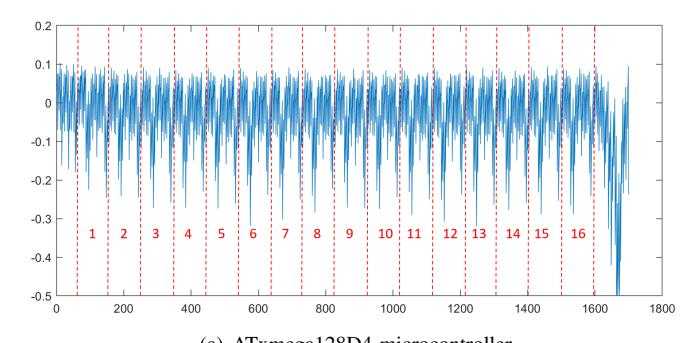
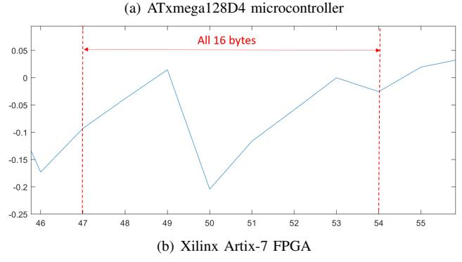
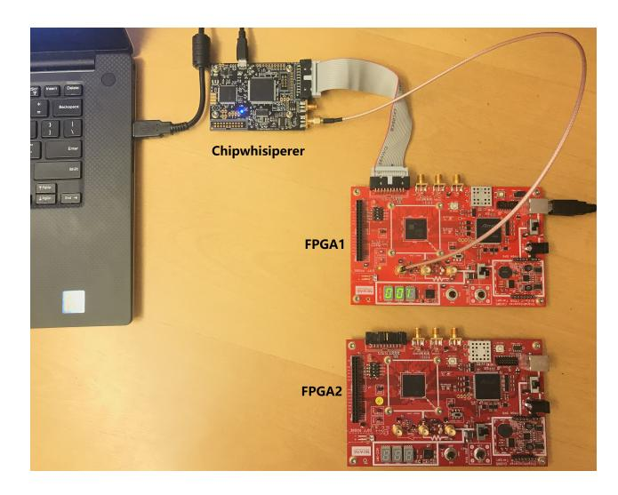
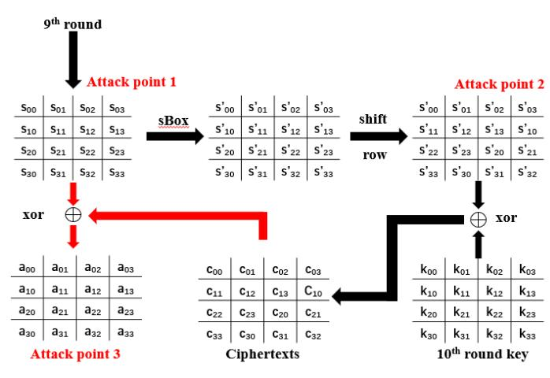
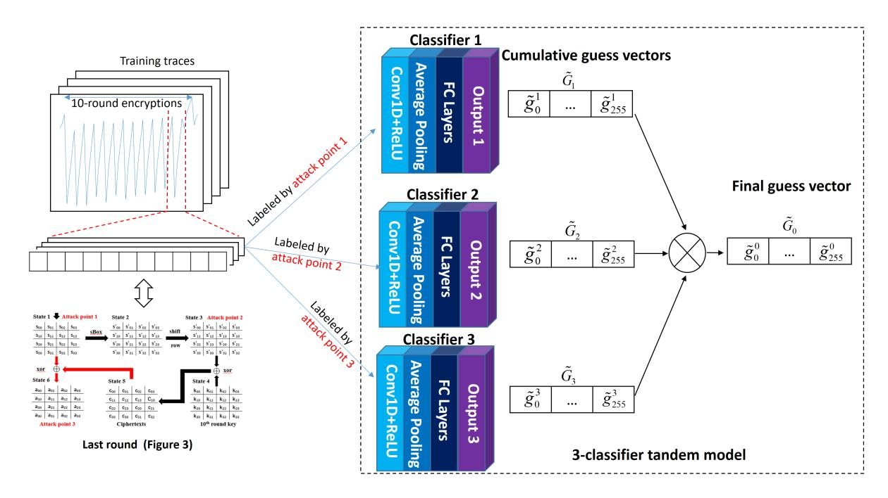
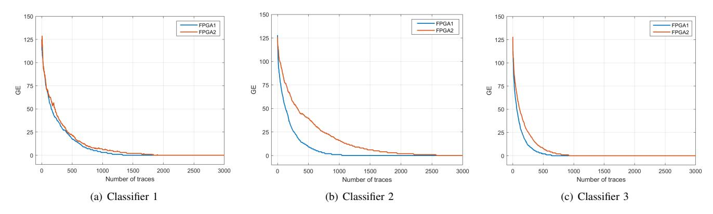
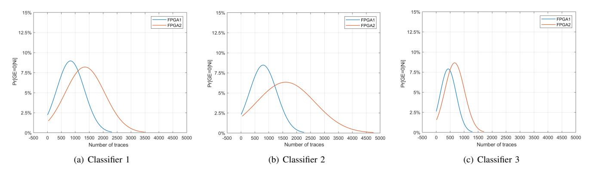
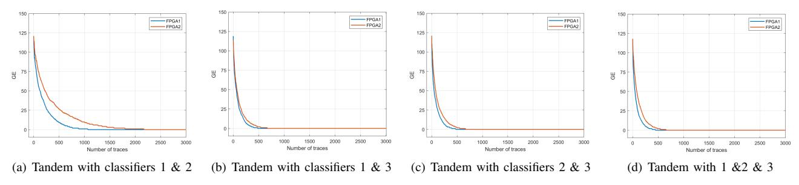
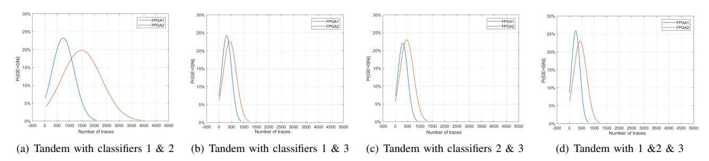

# Tandem Deep Learning Side-Channel Attack Against FPGA Implementation of AES

Huanyu Wang, Elena Dubrova School of EECS, KTH Royal Institute of Technology, Stockholm, Sweden Email: {huanyu, dubrova}@kth.se

*Abstract*—The majority of recently demonstrated deeplearning side-channel attacks use a single neural network classifier to recover the key. The potential benefits of combining multiple classifiers have not been explored yet in the side-channel attack's context. In this paper, we show that, by combining several CNN classifiers which use different attack points, it is possible to considerably reduce (more than 40% on average) the number of traces required to recover the key from an FPGA implementation of AES by power analysis. We also show that not all combinations of classifiers improve the attack efficiency.

*Index Terms*—side-channel attack, CNN, tandem model, FPGA, AES

#### I. INTRODUCTION

*Deep-learning Side-Channel Attacks* (DL-SCAs) become a realistic threat for hardware and software implementations of cryptographic algorithms. DL-SCAs utilize deep-learning models to bypass the theoretical strength of cryptographic algorithms. Many attacks against software implementations of *Advanced Encryption Standard* (AES) have been demonstrated recently. For example, [1] and [2] investigated hyper parameters of deep learning models for side-channel attacks. [3] demonstrated a monobit-model technique to improve the attack efficiency. [4] studied the extend to which a model trained for one device can lead to successful attacks against another device, [5] and [6] went steps further and explored how different *Printed Circuit Boards* (PCBs) affect the classification accuracy of models. To mitigate the effect caused by the board diversity, [7] and [8] proposed a cross-device technique, which trains models on traces captured from multiple devices.

Because instructions are computed sequentially, software implementations of AES are relatively easy to break by sidechannel analysis [9]. In hardware implementations, computations are performed in parallel. Therefore, deep-learning sidechannel analysis of hardware implementations is inherently more difficult, especially in advanced technologies. Power traces of two well-known public datasets, DPA contest V2 [10] and AES HD [11], are caputured from Xilinx Virtex-5 FPGA series. Many attacks are demonstrated based on these two datasets. In [11], *Random Forest* (RF) technique requires more than 5000 traces to recover a subkey. [12] studied the theoretical soundness of *Convolutional Neural Networks* (CNNs) in the context of side-channel, [13]–[15] demonstrated successful attacks on Virtex-5 FPGAs by using CNNs. On a lightweight implementation of AES on Artix-7 FPGA [16], non-profiled attack is able to recover the key with 3700 traces. Apart from FPGA, [17] investigated the effectiveness of CNN-based sidechannel attacks on an *Application-Specific Integrated Circuit* (ASIC) chip. Table I shows a summary of previous work on attacks against hardware implementations. To the best of authors' knowledge, previous works did not consider the potential of combining multiple deep-learning classifiers in SCAs. When traces are particularly noisy, it is difficult for a single model to achieve a satisfactory classification accuracy. Also, it is necessary to test models on devices manufactured using advanced technologies.

To address these limitations and to further improve the effectiveness of DL-SCAs, we propose a tandem deep-learning attack. It is inspired by a machine learning meta algorithm called *Adaptive Boosting* (AdaBoost) [18], which is a subset of ensemble learning [19], [20]. In AdaBoost, different classifiers (weak classifiers) are trained on the same training set. These weak classifiers are combined to form a boosted classifier (strong classifier). Unlike AdaBoost, the tandem model for SCA combines multiple deep-learning classifiers which are trained on different training sets. By combining three classifiers, our tandem model is able to use fewer traces to recover the key. We show that while our best CNN classifier requires 438 traces on average for a successful attack, the number for the tandem model is 257, which is a 41.3% reduction. In summary, our main contributions are as follows:

- 1) Designing tandem-model attacks which uses 41.3% fewer traces on average than single-model DL-SCAs to recover the key. To avoid the overestimation of classification accuracy, we train and test the tandem model on traces captured from different devices.
- 2) Demonstrating successful attacks against AES-128 implemented in Xilinx Artix-7 FPGAs. The Artix-7 FPGAs are manufactured using 28nm process technology, which makes the attack particularly difficult.
- 3) Investigating how different combinations of classifiers can affect the tandem model. We show that, compared to use multiple classifiers trained on the same attack point, utilizing different attack points makes the tandem model more efficient.

This paper is organized as follows. Section II reviews the background, including AES and CNN. Section III describes our hardware setup and how to build the tandem model for side-channel attacks. Section IV presents our experimental results and section V concludes this paper.

TABLE I SUMMARY OF DL-SCAS ON HARDWARE IMPLEMENTATIONS OF AES.

| SCAs | Hardware          | Process technology | Number of classifiers | Number of traces required to recover the key |
|------|-------------------|-----------------------|-----------------------|----------------------------------------------------|
| [17] | ASIC              | 180nm                 | Single                | $\approx 1300$                                     |
| [11] | Virtex-5 FPGA  | 65nm                  |                       | > 5000                                             |
| [13] |                   |                       |                       | $\approx 25000$                                    |
| [14] |                   |                       |                       | $\approx 200$                                      |
| [15] |                   |                       |                       | > 2000                                             |
| [16] | Artix-7 - FPGA | 28nm                  |                       | $\approx 3700$                                     |
| This |                   |                       |                       | ≈ 430                                              |
| work |                   |                       |                       | ~ 450                                              |
| This |                   |                       | Multiple              | ≈ 260                                              |
| work |                   |                       | wintiple              | ~ 200                                              |

#### II. BACKGROUND

In this section, we start by comparing hardware and software implementations of AES. Afterwards, we review deep-learning techniques and CNN.

# A. Hardware vs. software implementations of AES

AES-128 [21] is a symmetric encryption algorithm, which takes a 128-bit block of plaintext and a 128-bit key as inputs. AES-128 contains 10 rounds in total. Except for the last round, each round has 4 steps: SubBytes, ShiftRows, MixColumns and AddRoundKey. The last round does not mix columns. The SubBytes procedure is a byte-to-byte substitution by using a lookup table called *Substitution Box* (SBox).

AES can be implemented in both hardware and software. Software implementations are designed using programming languages to run AES on embedded microcontrollers or microprocessors. Typical hardware implementations, such as FPGAs and ASICs, are designed using hardware description languages. In general, hardware implementations of AES provide a higher security level in relation to their software equivalents. Because instructions are carried out one by one, leakage of a software implementation is very time-dependent and samples are less noisy [14]. This makes it relatively easy for deep-learning models to learn features from traces. On the other hand, hardware implementations of AES execute instructions in parallel. Therefore, traces captured from hardware implementations overlap features of all subkeys, which makes side-channel analysis inherently more difficult, especially in advanced technology. For example, Figure 1(a) shows a trace captured from an 8-bit ATxmega128D4 microcontroller during the execution of Sbox operations of the first round of AES and Figure 1(b) is captured from a Xilinx Artix-7 FPGA. The trace captured from microcontroller shows that 16 SBox computations are operated sequentially. To recover each key byte, an adversary trains deep-learning models on the specific part of traces. The trace captured from FPGA in Figure 1(b) shows that all 16-byte operations are performed in parallel. To recover a single key byte, deep-learning models need to handle more noise caused by the overlap.

Fig. 1. Power traces captured from software implementation (ATxmega128D4 microcontroller) and hardware implementation (Xilinx Artix-7 FPGA) of AES. The trace captured from microcontroller shows that 16 SBox operations of the first round are executed sequentially. The FPGA trace shows that all 16-byte operations are executed in parallel.

#### B. Deep learning and CNN

Deep learning is a subset of machine learning which uses neural networks to explore different levels of representative features of data for classification or prediction. Deep learning models start with simple features and by the layer-by-layer combination continuously explore more complex features. Given the training data and certain sets of parameter, deep-learning models are able to demonstrate a particular task such as classification.

In side-channel attack case, an adversary uses deep-learning models to classify a set of traces  $\mathbf{T} = \{ T_1, T_2, ..., T_m \}$  into a corresponding label  $l \in L$ , where m is the number of traces in the dataset and  $L = \{0, 1, \ldots, 255\}$  is the set of intermediate data processed at the attack point. The adversary can derive the subkey of the victim device from the obtained the intermediate data. Each trace  $T_i$  contains n samples  $T_i = \{t_{i,1}, t_{i,2}, ..., t_{i,n}\}$ . Thus the captured traces T can be represented by a matrix:

$$\mathbf{T} = \begin{bmatrix} t_{1,1} & t_{1,2} & \dots & t_{1,n} \\ t_{2,1} & t_{2,2} & \dots & t_{2,n} \\ \vdots & \vdots & & \vdots \\ t_{m,1} & t_{m,2} & \dots & t_{i,j} \end{bmatrix}, t_{i,j} \in \mathbb{R}$$
 (1)

At the profiling stage, the adversary first uses the profiling device to encrypt a large number of plaintexts by using known keys and captures traces. According to the data processed at attack points (see section III-B), each trace  $T_i$  is assigned to a

label  $l_{T_i}$ . The deep-learning model is trained on these labeled traces to learn the correlation between the trace and the key. This process can be described as building a projection function  $H: \mathbb{R}^n \to \mathbb{F}^{255}$ , with  $\mathbb{F} = \{z | 0 \le z \le 1, z \in \mathbb{R}\}$ . It maps each input trace  $T_i$  to a prediction vector  $P_i \in \mathbb{F}^{255}$ .

$$\mathbf{P} = \{P_1, \dots, P_m\} = \begin{bmatrix} p_{1,0} & \dots & p_{1,255} \\ \vdots & & \vdots \\ p_{m,0} & \dots & p_{m,255} \end{bmatrix} = H(\mathbf{T}) \quad (2)$$

 $P_i$  contains the posterior probability  $p_{i,v} \in [0,\ 1]$  of each possible label  $l_v \in L$ , where  $\sum\limits_{v=0}^{255} p_{i,v} = 1$ At the testing stage, the adversary uses the victim device

At the testing stage, the adversary uses the victim device to encrypt a small number of plaintexts and records traces. To recover the 16-byte secret key, the adversary needs to find out subkeys byte by byte.  $k \in K = \{0,1,...,255\}$  represents an 8-bit subkey, K is the set of all possible subkey values. We define a retrieve function  $R: L \to K$  that maps each label to the corresponding subkey.

$$k_u = R(l_v), \ k_u \in K \tag{3}$$

The retrieve function is a one-to-one mapping process, we can obtain a guess vector  $G_i$  from the corresponding prediction vector  $P_i$ .  $G_i$  contains the posterior probability  $g_{i,u} \in [0, 1]$  of each subkey candidate  $k_u$ , where  $\sum_{u=0}^{255} g_{i,u} = 1$ .

$$\mathbf{G} = \{G_1, \dots, G_m\} = \begin{bmatrix} g_{1,0} & \dots & g_{1,255} \\ \vdots & & \vdots \\ g_{m,0} & \dots & g_{m,255} \end{bmatrix}$$
(4)

Let  $\tilde{G}$  denote the cumulative guess vector, which multiplies all guess vectors in  $\mathbf{G}$ :

$$\tilde{G} = \prod_{i=1}^{m} G_i = \{\tilde{g}_0, \tilde{g}_1, \dots \tilde{g}_{255}\}$$
 (5)

The adversary finds  $k_{max}$  which has the largest probability in the obtained cumulative guess vector  $\tilde{G}$ . Once  $k_{max} = k^*$ ,  $k^*$  is the real subkey, the secret key is recovered successfully.

$$k_{max} = \underset{0 \le u \le 255}{\arg\max} \ \tilde{g}_u \tag{6}$$

Because instructions of hardware implementations of AES are executed in parallel, traces captured from FPGAs are particularly noisy. In this scenario, CNN-based side-channel attacks seem to be powerful to handle noisy traces. CNN was originally introduced for image, speech, time series processing [22] and document recognition [23]. The strength of a CNN network is that different network layers can learn features of the input data at different levels. A typical CNN network contains three types of layers: convolutional layers for filtering, pooling layers for down sampling and *Fully-Connected* (FC) layers for projection. CNNs have been successfully applied to bypass the trace misalignment and to overcome jitter-based

Fig. 2. Hardware setup. Two Xilinx Artix-7 FPGAs are programmed to the same version of AES-128 and connected to the ChipWisperer.

countermeasures [24]. CNNs were also used to break protected AES [25]–[27].

# III. TANDEM DEEP LEARNING SIDE-CHANNEL ATTACKS

In this section, we first describe our hardware setup. Next, we explain how to construct a tandem model and how it works.

# A. Hardware Setup

The strong impact caused by the inter-device variance in side-channel attacks has been explored by [7], [28], [29], which indicates that it is easy to overestimate if the testing traces are captured from the training device. Hence, we train and test our models on different devices. Figure 2 shows two Xilinx Artix-7 FPGAs manufactured using 28nm High-K Metal Gate (HKMG) process technology. In the sequel, we call these two boards FPGA1 and FPGA2 respectively. They are programmed to the same version of AES-128 algorithm in the Electronic Codebook (ECB) mode of operation. The measuring equipment for capturing power traces in our experiments is Chipwhisperer Lite (shown in Figure 2) [30] with a 40MHz sampling rate. Our CNN models are trained on traces captured from FPGA1 and FPGA2 respectively.

#### B. Attack point

An attack point is a selected intermediate data state which can be used to describe the power consumption during the execution of AES-128. To provide diversity for the tandem model, our CNN classifiers are trained on traces labeled by the data processed at different attack points. In hardware implementations, the conventional *Correlation Power Analysis* (CPA) [31] generally attacks the last round of AES. Since the last round does not contain the mix-column operation, the adversary can easily calculate the intermediate value from ciphertexts. Figure 3 illustrates the last round of AES-128 algorithm, it has 3 operations: non-linear substitution (SBox),

Fig. 3. The last round of AES-128. Three different data points are used as attack points to train CNN classifiers.

shift row, and round key addition. The 128-bit key of each round is derived from the original key. To build multiple CNN classifiers for constructing the tandem model, we use three different attack points  $x_1, x_2$  and  $x_3$ , defined as follows:

$$x_1 = SBox^{-1}(sft\_row^{-1}(k \oplus c))$$

$$x_2 = k \oplus c$$

$$x_3 = SBox^{-1}(sft\_row^{-1}(k \oplus c)) \oplus c$$
(7

where c represents a 8-bit subset of the ciphertext,  $sft \ row^{-1}()$  and  $SBox^{-1}()$  denote the inverse of SBox substitution and row shifting operation, respectively. In Figure 3,  $x_1$  is the input of the last round,  $x_2$  is the output of the shift row operation, and  $x_3$  is the XOR of the input and output of the last round. Note that the latter represents switching activity of the 9th and 10th round's state. The switching activity is known to be the dominant fraction of the total power consumed by a CMOS device. For hardware implementations, the Hamming distance (HD) is widely as a power model in CPA. The HD model assumes that the power consumption is proportional to the number of  $0 \rightarrow 1$ and  $1 \to 0$  transitions in the data processed at the point of the attack. Both transitions are assumed to contribute equally to the power consumption. According to the views of [1], [6], [17], we use the *identity* model as the power model. It assumes the power consumption during the execution of AES is proportional to the data processed at the attack point.

Other data points in the last round of AES are not suitable as attack points. In Figure 3, in addition to  $x_1$ ,  $x_2$  and  $x_3$ , there are three other data points: ciphertext, round key and the output of shift row operation. Since the data value has no difference between the output of row shifting operation and  $x_2$ , there is no need to train classifiers twice on traces with the same label. In addition, due to the key scheduling algorithm, it is difficult to use cross-round data points as attack points. In our case, we experimentally explored different CNN model

TABLE II ARCHITECTURE OF CNN CLASSIFIERS.

| Layer Type      | Output Shape   | Parameter # |  |
|-----------------|----------------|-------------|--|
| Input Layer     | (None, 11, 1)  | 0           |  |
| Conv1D          | (None, 11, 11) | 55          |  |
| Average Pooling | (None, 5, 11)  | 0           |  |
| Flatten         | (None, 55)     | 0           |  |
| Dense 1         | (None, 32)     | 1792        |  |
| Dense 2         | (None, 32)     | 1056        |  |
| Dense 3         | (None, 32)     | 1056        |  |
| Output (Dense)  | (None, 256)    | 8448        |  |

Total Parameters: 12,407

architectures according to the training method in [1]. Layer structures of our CNN classifiers are shown in Table II. The input size of each CNN classifier is set to 11, based on a large number of experiments. Since the data is a byte, the identity model leads to the set of 256 classes. Three CNN classifiers referred as classifier 1, 2 and 3 are trained on traces labeled by attack point  $x_1$ ,  $x_2$  and  $x_3$ , respectively.

#### C. Attack scenario

We consider an attack scenario in which the attacker can obtain a profiling device (FPGA1) similar to the victim device (FPGA2). We assume that the attacker has a full control of the profiling device in order to characterize the leakage, which means which means many training traces can be captured with known keys. In addition, the attacker has an access to the victim device with an unknown key to capture some traces during the execution of AES.

# D. Tandem deep learning model

Figure 4 shows an overview of our 3-classifier tandem model.

To achieve a more efficient side-channel attack, the tandem model combines the classification results of each sub-classifier. As shown in Figure 4, when profiling the leakage, three CNN classifiers are trained on the same traces, but labeled with different attack points. In order to retrieve subkeys from different attack points  $(x_1, x_2 \text{ and } x_3)$ , we define three different retrieve functions  $R_1$ ,  $R_2$  and  $R_3$ :

$$k = R_1(x_1) = str\_row(SBox(x_1)) \oplus c$$
  

$$k = R_2(x_2) = x_2 \oplus c$$
  

$$k = R_3(x_3) = str\_row(SBox(x_3 \oplus c)) \oplus c$$
(8)

Classifier 1, 2 and 3 are used individually to classify traces **T** and obtain three cumulative guess vectors  $\tilde{G}_1$ ,  $\tilde{G}_2$  and  $\tilde{G}_3$ , which represent the classification result of each sub-classifier.

$$\tilde{G}_{1} = \{\tilde{g}_{0}^{1}, \ \tilde{g}_{1}^{1}, \dots, \ \tilde{g}_{255}^{1}\} 
\tilde{G}_{2} = \{\tilde{g}_{0}^{2}, \ \tilde{g}_{1}^{2}, \dots, \ \tilde{g}_{255}^{2}\} 
\tilde{G}_{3} = \{\tilde{g}_{0}^{3}, \ \tilde{g}_{1}^{3}, \dots, \ \tilde{g}_{255}^{3}\}$$
(9)

Afterwards, the tandem model multiplies classification results of each sub-classifier and obtains a final result. We call it final

Fig. 4. An overview of the 3-classifier tandem model for side-channel attacks. When profiling the leakage, 3 CNN classifiers are trained on the same traces, but labeled by different attack points.

guess vector  $\tilde{G}_0 = \{\tilde{g}_0^0, \ \tilde{g}_1^0, \ \dots, \ \tilde{g}_{255}^0\}$ , which contains final probabilities of each subkey candidates.

$$\tilde{G}_{0} = \tilde{G}_{1} \times \tilde{G}_{2} \times \tilde{G}_{3}, 
= \{ \prod_{i=1}^{3} \tilde{g}_{0}^{i}, \prod_{i=1}^{3} \tilde{g}_{1}^{i}, \dots, \prod_{i=1}^{3} \tilde{g}_{255}^{i}, \}, 
= \{ \tilde{g}_{0}^{0}, \tilde{g}_{1}^{0}, \dots, \tilde{g}_{255}^{0} \}$$
(10)

The tandem model increases the number of classifiers to achieve a satisfactory classification result. If classifiers are carefully selected, this usually makes possible to reduce the number of traces required to recover the key.

#### E. Evaluation

To assess the performance of deep-learning side-channel attacks, an evaluation criterion called *Partial Guessing Entropy* (PGE) is usually used [11], [13]–[15], [32], [33]. PGE measures the number of subkey candidates which are required to be tested in order to recover the real subkey  $k^*$  from m traces.

$$PGE(\mathbf{T}) = |\{k_i \in K | \tilde{g}_{k_i}^0 > \tilde{g}_{k^*}^0 |, \ 0 \le k \le 255$$

Once  $PGE(\mathbf{T}) = 0$ , the attack is successful.

#### IV. EXPERIMENTAL RESULTS

In this section, we first evaluate the average number of traces required to recover the key by using single CNN classifier. Next, we test to which extend the 2-classifier and 3-classifier tandem models can improve the attack efficiency. Afterwards, for completeness, we investigate how the result changes if

tandem models are built by combining classifiers trained on the same attack point.

#### A. Single-classifier model

In this section, we check how many traces are required to recover the key by using single-classifier tandem models trained on traces labeled by different attack points. We refer our three CNN classifiers as classifier 1, 2 and 3 which are trained on traces labeled by attack point  $x_1$ ,  $x_2$  and  $x_3$ , respectively. 550K traces captured from FPGA1 are used for training, with 110K traces randomly set aside for validation. We have two different testing sets of the same size, the first one contains 50K traces captured from FPGA1 and another one is from FPGA2.

For a single test, 5K traces are randomly selected to calculate the PGE. We repeat 500 tests for each classifier to PGEt the average PGE. For the ith test ( $1 \le i \le 500$ ), we denote the least number of traces required to recover the key by  $N_i$ . We plot a histogram of values in N using 15 bins and fit a normal density function, to obtain the *Probability Density Function* (PDF)  $Pr[PGE = 0|N_i]$  of number of traces required for a successful attack.

Figure 5 shows the average PGE of classifier 1, 2 and 3 tested on traces captured from FPGA1 and FPGA2 respectively. Classifier 3 uses fewer traces to achieve PGE=0, which indicates that it is more efficient than other classifiers to break both FPGA1 and FPGA2. Figure 6 shows the probability distribution of the number of traces required to recover the key by using three classifiers. From Figure 6, the classifier 1 is able to recover the key by using 843 traces captured from FPGA1, and 1324 traces from FPGA2 on average. For classifier 2, the

Fig. 5. Average PGE of our three CNN classifiers tested on traces captured from FPGA1 and FPGA2. For each classifier, we run 500 tests to PGEt the average, and for each test we use 5000 traces which are randomly selected from 50K traces.

Fig. 6. Probability distribution of number of traces required to recover the key by using single-classifier tandem models.

result becomes to 781 and 1605 traces, respectively. classifier 3 is the best model which can recover the key by using 438 traces captured from FPGA1, and 670 traces from FPGA2. It is an expected result since the dominant factor of the power consumption is the switching activities, while classifier 3 is trained on x3 as shown in Figure 3.

In the following subsections, we combine these classifiers to build tandem models to achieve a more efficient attack.

# *B. 2-classifier tandem model*

The 2-classifier tandem model is built by combining 2 of 3 CNN classifiers. Thus, we have 3 different 2-classifier tandem models. Figure 7 shows the PGE results and Figure 8 presents the probability distributions of number of traces required to recover the key by using these 2-classifier tandem models. Table III concludes these results and shows the average number of traces used by models. We notice that, except the tandem model built by combining classifiers 1 & 2, every 2-classifier tandem model uses fewer traces than its subclassifiers. The tandem model with a combination of classifier 1 and 3 achieves the best result. Compared to our best single classifier (classifier 3), it uses 29.9% of fewer power traces to recover the key of FPGA1 and 32.2% for FPGA2. However, the tandem model which combines classifier 1 and 2 only reduces the number of traces by 10.0% for FPGA1. In the case of FPAG2, it requires 14.7% more traces, which is even worse. Our explanation is that attack point 1 and 2 do not provide enough diversity.

# *C. 3-classifier tandem model*

Our 3-classifier tandem model is built by combining classifier 1, 2 and 3. It utilizes all available attack points. Figure 7(d) shows the average PGE and Figure 8(d) is the probability distribution of number of traces required to recover the key. Compared to the results of 2-classifier models, adding one more classifier indeed achieves a more efficient attack. The 3 classifier model uses 257 traces to recover the key of FPGA1 and 434 traces for FPGA2, on average. Compared to our best single classifier, it uses 41.3% fewer traces to break FPGA1 and 48.5% fewer traces for FPGA2.

We can conclude that the tandem model provides a more efficient way for deep-learning side-channel attacks. Multiple different attack points could be responsible for the observed effects. If classifiers are carefully selected, the tandem model is able to use fewer traces to break FPGA implementation of AES.

# *D. Tandem model with the same attack point*

To verify that it is important to use different attack points to train classifiers for building a tandem model, we investigate how the result changes if the tandem model combines classifiers trained on the same attack point. From subsection

Fig. 7. Average PGE of three 2-classifier and 3-classifier tandem models tested on traces captured from FPGA1 and FPGA2.

Fig. 8. Probability distribution of number of traces required to recover the key by using 2-classifier tandem models and the 3-classifier model.

TABLE III THE AVERAGE NUMBER OF TRACES REQUIRED BY MODELS TO RECOVER THE TARGET KEY BYTE.

| Model                           | Attack point | Number of traces FPGA1 | Number of traces FPGA2 |  |
|---------------------------------|--------------|---------------------------|---------------------------|--|
| Classifier 1                    | 1            | 843                       | 1324                      |  |
| Classifier 2                    | 2            | 781                       | 1605                      |  |
| Classifier 3                    | 3            | 438                       | 670                       |  |
| Tandem with classifier 1 & 2    | 1 & 2        | 758                       | 1518                      |  |
| Tandem with classifier 1 & 3    | 1 & 3        | 307                       | 454                       |  |
| Tandem with classifier 2 & 3    | 2 & 3        | 306                       | 465                       |  |
| Tandem with classifier 1& 2 & 3 | 1& 2 & 3     | 257                       | 434                       |  |

TABLE IV THE AVERAGE NUMBER OF TRACES REQUIRED TO RECOVER THE KEY BY USING TANDEM WITH CLASSIFIERS TRAINED ON THE SAME ATTACK POINT.

| Model        | 1-classifier | 2-classifier | 3-classifier | 4-classifier | 5-classifier |
|--------------|--------------|--------------|--------------|--------------|--------------|
| FPGA1 result | 438          | 432          | 430          | 430          | 428          |
| FPGA2 result | 670          | 677          | 656          | 650          | 642          |

IV-A, we know that our best single classifier is trained on attack point 3. We further train 4 CNN classifiers on attack point 3 with different parameters and use them to build tandem models. Table IV shows the average number of traces required to recover the key by using these tandem models. From table IV, compared to the single-classifier model, the tandem models with multiple classifiers trained on the same attack point cannot achieve a more efficient attack. We can conclude that it is important to train deep-learning classifiers on different attack points to build tandem models for side-channel attacks.

## V. CONCLUSION

In this paper, we propose a tandem-model technique for deep-learning side-channel attacks. By combining multiple deep-learning classifiers trained on different attack points, the tandem model can achieve a more efficient attack. We show that, our 3-classifier tandem model is able to considerably reduce (41.3%) the number of traces required to recover the key from an FPGA implementation of AES compared to the conventional DL-SCAs which only use a single deep-learning classifier. We also show that it is important to use different attack points to build the tandem model. Otherwise, the tandem model may not achieve a satisfactory classification result.

One interesting open problem is that to which extent the tandem model can be improved by combining more deeplearning classifiers trained on different attack points.

## ACKNOWLEDGMENT

This work was supported in part by the research grant 2018- 04482 from the Swedish Research Council.

## REFERENCES

- [1] R. Benadjila, E. Prouff, R. Strullu, E. Cagli, and C. Dumas, "Study of deep learning techniques for side-channel analysis and introduction to ASCAD database," *ANSSI, France & CEA, LETI, MINATEC Campus, France. Online verfugbar unter https://eprint. iacr. org/2018/053. pdf, ¨ zuletzt gepruft am ¨* , vol. 22, p. 2018, 2018.
- [2] H. Maghrebi, "Deep learning based side channel attacks in practice," tech. rep., IACR Cryptology ePrint Archive 2019, 578, 2019.
- [3] L. Zhang, X. Xing, J. Fan, Z. Wang, and S. Wang, "Multi-label deep learning based side channel attack," in *2019 Asian Hardware Oriented Security and Trust Symposium (AsianHOST)*, pp. 1–6, IEEE, 2019.
- [4] M. Renauld, F.-X. Standaert, N. Veyrat-Charvillon, D. Kamel, and D. Flandre, "A formal study of power variability issues and side-channel attacks for nanoscale devices," in *Annual International Conference on the Theory and Applications of Cryptographic Techniques*, pp. 109–128, Springer, 2011.
- [5] H. Wang, M. Brisfors, S. Forsmark, and E. Dubrova, "How diversity affects deep-learning side-channel attacks," in *2019 IEEE Nordic Circuits and Systems Conference (NORCAS): NORCHIP and International Symposium of System-on-Chip (SoC)*, pp. 1–7, IEEE, 2019.
- [6] H. Wang, "Side-channel analysis of AES based on deep learning," Master's thesis, KTH, School of Electrical Engineering and Computer Science (EECS), 2019.
- [7] D. Das, A. Golder, J. Danial, S. Ghosh, A. Raychowdhury, and S. Sen, "X-DeepSCA: Cross-device deep learning side channel attack," in *Proceedings of the 56th Annual Design Automation Conference 2019*, p. 134, ACM, 2019.
- [8] A. Golder, D. Das, J. Danial, S. Ghosh, S. Sen, and A. Raychowdhury, "Practical approaches toward deep-learning-based cross-device power side-channel attack," *IEEE Transactions on Very Large Scale Integration (VLSI) Systems*, 2019.
- [9] N. Sklavos, K. Touliou, and C. Efstathiou, "Exploiting cryptographic architectures over hardware vs. software implementations: advantages and trade-offs," *Memory*, vol. 13, p. 18, 2006.
- [10] T. TELECOM ParisTech SEN research group, "DPA contest v2," in *http://www.dpacontest.org/v2/*, 2010.
- [11] S. Picek, A. Heuser, A. Jovic, S. Bhasin, and F. Regazzoni, "The curse of class imbalance and conflicting metrics with machine learning for sidechannel evaluations," *IACR Transactions on Cryptographic Hardware and Embedded Systems*, vol. 2019, no. 1, 2018.
- [12] L. Masure, C. Dumas, and E. Prouff, "A comprehensive study of deep learning for side-channel analysis," *IACR Transactions on Cryptographic Hardware and Embedded Systems*, pp. 348–375, 2020.
- [13] J. Kim, S. Picek, A. Heuser, S. Bhasin, and A. Hanjalic, "Make some noise. unleashing the power of convolutional neural networks for profiled side-channel analysis," *IACR Transactions on Cryptographic Hardware and Embedded Systems*, pp. 148–179, 2019.
- [14] H. Maghrebi, T. Portigliatti, and E. Prouff, "Breaking cryptographic implementations using deep learning techniques," in *International Conference on Security, Privacy, and Applied Cryptography Engineering*, pp. 3–26, Springer, 2016.
- [15] S. Picek, I. P. Samiotis, J. Kim, A. Heuser, S. Bhasin, and A. Legay, "On the performance of convolutional neural networks for side-channel analysis," in *International Conference on Security, Privacy, and Applied Cryptography Engineering*, pp. 157–176, Springer, 2018.

- [16] K. Ramezanpour, P. Ampadu, and W. Diehl, "SCAUL: Power side-channel analysis with unsupervised learning," *arXiv preprint arXiv:2001.05951*, 2020.
- [17] T. Kubota, K. Yoshida, M. Shiozaki, and T. Fujino, "Deep learning sidechannel attack against hardware implementations of AES," in *2019 22nd Euromicro Conference on Digital System Design (DSD)*, pp. 261–268, IEEE, 2019.
- [18] Y. Freund, R. Schapire, and N. Abe, "A short introduction to boosting," *Journal-Japanese Society For Artificial Intelligence*, vol. 14, no. 771- 780, p. 1612, 1999.
- [19] D. Opitz and R. Maclin, "Popular ensemble methods: An empirical study," *Journal of artificial intelligence research*, vol. 11, pp. 169–198, 1999.
- [20] R. Polikar, "Ensemble based systems in decision making," *IEEE Circuits and systems magazine*, vol. 6, no. 3, pp. 21–45, 2006.
- [21] J. Daemen and V. Rijmen, *The design of Rijndael: AES-the advanced encryption standard*. Springer Science & Business Media, 2013.
- [22] Y. LeCun, Y. Bengio, *et al.*, "Convolutional networks for images, speech, and time series," *The handbook of brain theory and neural networks*, vol. 3361, no. 10, p. 1995, 1995.
- [23] Y. LeCun, L. Bottou, Y. Bengio, P. Haffner, *et al.*, "Gradient-based learning applied to document recognition," *Proceedings of the IEEE*, vol. 86, no. 11, pp. 2278–2324, 1998.
- [24] E. Cagli, C. Dumas, and E. Prouff, "Convolutional neural networks with data augmentation against jitter-based countermeasures," in *International Conference on Cryptographic Hardware and Embedded Systems*, pp. 45– 68, Springer, 2017.
- [25] G. Perin, B. Ege, and J. van Woudenberg, "Lowering the bar: Deep learning for side channel analysis (white-paper)," in *Proc. BlackHat*, pp. 1–15, 2018.
- [26] R. Gilmore, N. Hanley, and M. O'Neill, "Neural network based attack on a masked implementation of AES," in *2015 IEEE International Symposium on Hardware Oriented Security and Trust (HOST)*, pp. 106– 111, IEEE, 2015.
- [27] Z. Martinasek, P. Dzurenda, and L. Malina, "Profiling power analysis attack based on MLP in DPA contest V4.2," in *2016 39th International Conference on Telecommunications and Signal Processing (TSP)*, pp. 223–226, IEEE, 2016.
- [28] M. O. Choudary and M. G. Kuhn, "Efficient, portable template attacks," *IEEE Transactions on Information Forensics and Security*, vol. 13, no. 2, pp. 490–501, 2017.
- [29] N. Hanley, M. O'Neill, M. Tunstall, and W. P. Marnane, "Empirical evaluation of multi-device profiling side-channel attacks," in *2014 IEEE Workshop on Signal Processing Systems (SiPS)*, pp. 1–6, IEEE, 2014.
- [30] C. O'Flynn and Z. D. Chen, "Chipwhisperer: An open-source platform for hardware embedded security research," in *International Workshop on Constructive Side-Channel Analysis and Secure Design*, pp. 243– 260, Springer, 2014.
- [31] E. Brier, C. Clavier, and F. Olivier, "Correlation power analysis with a leakage model," in *International Workshop on Cryptographic Hardware and Embedded Systems*, pp. 16–29, Springer, 2004.
- [32] F.-X. Standaert, T. G. Malkin, and M. Yung, "A unified framework for the analysis of side-channel key recovery attacks," in *Annual international conference on the theory and applications of cryptographic techniques*, pp. 443–461, Springer, 2009.
- [33] B. Kopf and D. Basin, "An information-theoretic model for adaptive ¨ side-channel attacks," in *Proceedings of the 14th ACM conference on Computer and communications security*, pp. 286–296, 2007.