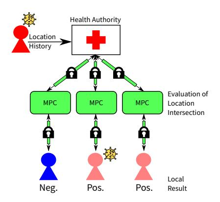
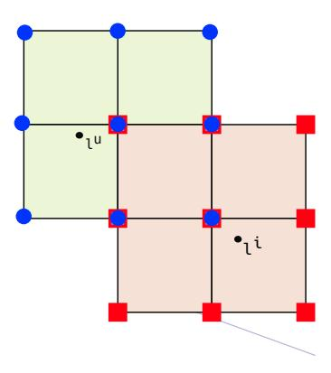

# Privacy-Preserving Contact Tracing of COVID-19 Patients

Leonie Reichert\*, Samuel Brack\*, Björn Scheuermann\*†

\*Humboldt University of Berlin, Department of Computer Science
{leonie.reichert, samuel.brack, scheuermann}@informatik.hu-berlin.de

†Alexander von Humboldt Institute for Internet and Society, Berlin
bjoern.scheuermann@hiig.de

Index Terms—Secure Multiparty Computation, Contact Tracing, Privacy Enhancing Technologies, Health Data

### I. Introduction

The current COVID-19 pandemic shows the necessity to automate contact tracing to quickly discover new infections and slow down the spreading. Contact tracing deals with finding unreported infected people by tracing back who could have possibly caught the disease from a verified case. Some countries like China, Singapore and Israel hastily developed systems [1] which do not take citizens' privacy into considerations, whereas others took longer to decide on a feasible solution [2]. Many approaches follow the Singapore design which exchanges Bluetooth data on contact [1]–[3]. In contrast to our proposal, this approach requires that every participant has their radio interface activated at all times. Another option is to use GPS data to recognize when paths cross1. This work proposes a solution on how to make centralized contact tracing based on GPS data more privacy-preserving for users.

Fig. 1. An infected person shares her location data with the health authority. Three untested individuals start separate MPC sessions with the HA. Note that not every positively evaluated contact is necessarily infected.

# II. SYSTEM DESIGN

# A. Secure multi-party computation

Secure multi-party computation (MPC) [4, Chapter 22] deals with creating protocols for joint computation on private,

1This is more error-prone but was applied for example by Israel [1].

distributed data. It studies mechanisms to allow a group of p independent participants to collectively evaluate a function  $y_1, \dots, y_n = f(x_1, \dots, x_p)$ . Each participant holds a secret  $x_i$ , which shall remain hidden. The participants only learn their final result  $y_i$ , but not the input data of others. Any function f that is solvable in polynomial time can be represented as an MPC protocol [4, Chapter 22.2]. For our application we only consider two parties.

One way realizing MPC protocols are *Yao's garbled circuits* [4]. Running a MPC protocol requires the one side to create a *circuit* from the function to be calculated and send it to the other party. The other side evaluates the circuit. Evaluation requires oblivious communication between both parties.

# B. Oblivious Random Access Memory

Data-dependent memory access is difficult to realize in MPC because the used index is leaked to attackers. To solve this issue, *oblivious random access memory* (ORAM) was invented [5]. It enables reading and writing data stored at a secret index i. The index is hidden by a set of random accesses to the ORAM. The oblivious database can either be located on a single server participating in the MPC execution or shared between all parties in the form of secret shares. State of the art ORAMs such as Floram [5] require only  $\mathcal{O}(\sqrt{n})$  in communication and  $\mathcal{O}(n)$  in local computation per access, where n is the number of elements stored.

# C. Contact Tracing with Secure Multiparty Computation

Our proposed system (see Figure 1) takes advantage of the existence of health authorities (HA) collecting location histories of infected users, as done in many countries hit by the epidemic [6]. We also assume that a vast majority of individuals use location-based services that store their history locally. For threat analysis participant of the protocol are modeled as semi-honest. Such a model can be reinforced to provide security in a malicious setting by accepting a performance penalty [7].

The HA can use the data points of infected patients (and the associated timestamps) to initiate MPC sessions with everyone who wants to trace themselves. The HA creates a circuit which it will send to all interested individuals. During the evaluation, each individual has to perform oblivious communication with the HA. Together, the parties determine where trajectories of

Fig. 2. Locations have multiple dimensions. A data point l is rounded to the closest position on the grid. Using this as center, the set L of adjacent grid locations is computed covering the region close to l. If a set  $L^u$  belonging to a user's position intersects with the set  $L^i$  of an infected individual, the user can have contracted the disease.

infected and non-infected people intersect. Contact tracing is done in private so that only the traced individual can learn their status. No information about past locations of infected people or users of the system is revealed to either side.

### D. Contact Tracing Algorithm

MPC allows inputs and outputs to remain hidden from other parties. Input locations l := (x, y, t) consist of geographical coordinates and a temporal component. The altitude of locations is ignored since it is too error-prone. Each user uhas m to-be-checked locations in their location history. The HA holds a number of n location data points from infected individuals. For a location l each component is rounded to a fixed granularity (e.g. 1 meter or 1 minute), so that it can be represented by one position on the grid. The selected granularity only depends on epidemiological factors. Then, a set of locations L are calculated for which the Euclidean distance to l is smaller than a fixed threshold. Due to the reduced granularity the number of elements in the set is small. Both the HA and the user compute L for all their respective data points. The HA stores the result in an ORAM. For each set of neighbouring grid positions  $L^u$  the user initiates a secure binary search on the ORAM. If an element from  $L^u$ is also found in the ORAM, then the region described by  $L^u$ intersects with the set  $L^i$  representing the area around the location of an infected user (see figure 2). This means the user has been in contact with an infected individual. The number of contacts can be used to derive a risk score. Only the user herself will learn the final result. This algorithm described above is guaranteed to not leak more information than the ideal functionality to either side.

# E. Performance Considerations

The binary search requires  $\mathcal{O}(m \cdot log_2(n))$  steps per user. For testing our system we used the binary search implementation in the ACK library [8]. Depending on the amount of data to be stored, the library is capable of choosing between four different types of ORAM. For the tested values, it defaulted

to Floram with CPRG [5]. Accounting for the runtime of Floram, the contact tracing algorithm takes  $\mathcal{O}(n \cdot m \cdot log_2(n))$  in computation and  $\mathcal{O}(n \cdot m)$  in communication. Assume we want to check for one location ( $|L^u|=30$ ) in the set of grid positions of one newly infected person consisting of 3000 elements and representing one day. Using Intel(R) Core(TM) i7-8565U CPU @ 1.80GHz and 16 GB RAM, the execution requires  $26.40 \pm 6.63$  seconds (standard deviation).

### F. Discussion

Our proposed system uses a central party (the HA) for contact tracing. Each person wishing to check their own history for contact points with infected people has to go through this central instance. Due to the security of MPC, no sensitive user data is leaked to other users or the HA. Additionally, this stops users from learning private data of confirmed cases through HA data. Theoretically, a malicious HA could induce a movement of panic by increasing its dataset through forging additional locations. Our model reveals the final result only to the user, since we believe that this measure increases the user's trust in the system, but it could also be disclosed to both parties.

Our main contribution lies in the application of MPC on the real-world problem of centralized contact tracing. Using MPC on the one hand results in significantly longer runtimes when compared to other centralized approaches. On the other hand it provides real semi-honest security, while a majority of centralized schemes rely on a trusted server and upload user data to the server for risk evaluation.

For future work, we will focus on further developing and tuning algorithms for private set intersection to facilitate centralized privacy-preserving contact tracing. A detailed client-side evaluation will also be necessary to validate our protocol, especially because most client computers are mobile phones with connectivity, power, and computation restrictions.

## ACKNOWLEDGMENTS

Special thanks go to Phillipp Schoppmann for his insightful comments and inputs.

# REFERENCES

- [1] I. A. Hamilton, "11 countries are now using people's phones to track the coronavirus pandemic, and it heralds a massive increase in surveillance," www.businessinsider.com/countries-tracking-citizens-phones-coronavirus-2020-3?r=DE\&IR=T, accessed: 26.03.2020.
- [2] Q. Tang, "Privacy-preserving contact tracing: current solutions and open questions," arXiv preprint arXiv:2004.06818, 2020.
- [3] N. Singer and C. Sang-Hun, "As Coronavirus Surveillance Escalates, Personal Privacy Plummets," www.nytimes.com/2020/03/23/technology/ coronavirus-surveillance-tracking-privacy.html, accessed: 26.03.2020.
- [4] N. P. Smart, Cryptography made simple. Springer, 2016, vol. 481.
- [5] J. Doerner and A. Shelat, "Scaling oram for secure computation," in Proceedings of the 2017 ACM SIGSAC Conference on Computer and Communications Security, 2017, pp. 523–535.
- [6] World Health Organization, "Operational Planning Guidelines to Support Country Preparedness and Response," www.who.int/docs/default-source/ coronaviruse/covid-19-sprp-unct-guidelines.pdf, accessed: 26.03.2020.
- [7] S. Micali, O. Goldreich, and A. Wigderson, "How to play any mental game," in *Proceedings of the Nineteenth ACM Symp. on Theory of Computing*, STOC, 1987, pp. 218–229.
- [8] Doerner, Jack, "The Absentminded Crypto Kit," www.bitbucket.org/jackdoerner/absentminded-crypto-kit, accessed: 05.04.2020.