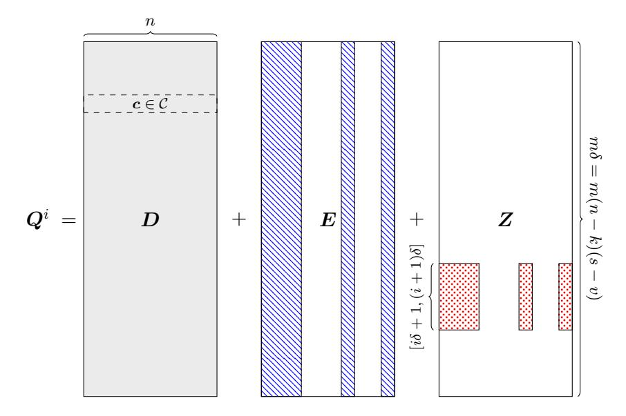

# On the privacy of a code-based single-server computational PIR scheme

Sarah Bordage∗ Julien Lavauzelle†

April 1, 2020

#### Abstract

We show that the single-server computational PIR protocol proposed by Holzbaur, Hollanti and Wachter-Zeh in [\[HHW20\]](#page-6-0) is not private, in the sense that the server can recover in polynomial time the index of the desired file with very high probability. The attack relies on the following observation. Removing rows of the query matrix corresponding to the desired file yields a large decrease of the dimension over Fq of the vector space spanned by the rows of this punctured matrix. Such a dimension loss only shows up with negligible probability when rows unrelated to the requested file are deleted.

# 1 Introduction

Private information retrieval (PIR) enables a user to retrieve an entry of a database without revealing to the storage system the identity of the requested entry. Two security models have been introduced for PIR schemes. First, the seminal work of Chor et al. [\[CGKS95\]](#page-6-1) proposes information-theoretical security, in the sense that absolutely no information leaks about the identity of the desired item. A trivial solution, commonly referred as the trivial PIR scheme, is to require the storage system to send the whole database to the user. As a matter of fact, the authors of [\[CGKS95\]](#page-6-1) also proved that, in the single-server information theoretic setting, one cannot expect to achieve communication complexity better than the trivial solution. The second security model circumvents this limit and allows the more practical use of a single server by relaxing the privacy requirement. In this model, the storage system is assumed to be computationally bounded: informally, recovering the identity of the desired item must require an attacker to invest unreachable computational effort. So-called computationally private information retrieval (cPIR) was firstly introduced in [\[CG97,](#page-6-2)[KO97\]](#page-6-3), and subsequent constructions [\[CMS99,](#page-6-4)[YKPB13,](#page-7-0) [GR05,](#page-6-5) [KLL](#page-6-6)+15, [LP17\]](#page-6-7) were then proposed. Aguilar et al. proved the potential practicality of cPIR [\[AMBFK16\]](#page-6-8), but the question of building efficient cPIR protocols remains widely open. Indeed, the computational complexity of existing cPIR schemes is the most important barriers to implementation.

In this paper we focus on the recent single-server cPIR protocol proposed by Holzbaur, Hollanti and Wachter-Zeh in [\[HHW20\]](#page-6-0), which relies on computational assumptions in coding theory. We prove that this scheme is not private: we present an algorithm which recovers the identity of the file in polynomial time and with very high probability, when given as input the query produced by the user. We implemented our attack, which runs in a few minutes on a standard

∗LIX, CNRS UMR 7161, Ecole Polytechnique, Institut Polytechnique de Paris & Inria, 91120 Palaiseau, France. sarah.bordage@lix.polytechnique.fr

†Univ. Rennes, CNRS, IRMAR – UMR 6625, F-35000 Rennes, France. julien.lavauzelle@univ-rennes1.fr

laptop. The attack requires the number of files stored in the database to be large enough, namely lower-bounded by some function of the scheme parameters. It turns out that this condition is fulfilled for meaningful parameters of the scheme. Indeed, we show that if this lower bound is not satisfied, then the communication complexity of the cPIR scheme gets very close to the one of the trivial PIR protocol.

The paper is organized as follows. In Section 2 we describe the scheme proposed in [HHW20]. The attack is presented and proved in Section 3 and followed by a short discussion.

# 2 Description of the cPIR scheme proposed in [HHW20]

In this section, we briefly describe the PIR scheme proposed in [HHW20].

#### 2.1 Notation and definitions

Let us denote  $[a,b] := \{a,a+1,\ldots,b\}$  and  $\mathbb{F}_q$  the finite field with q elements. The extension field  $\mathbb{F}_{q^s}$  is also a vector space of dimension s over  $\mathbb{F}_q$ . If  $\Gamma = \{\gamma_1,\ldots,\gamma_v\} \subset \mathbb{F}_{q^s}$  is a family of linearly independent vectors over  $\mathbb{F}_q$ , then we denote  $\langle \gamma_1,\ldots,\gamma_v\rangle_{\mathbb{F}_q} \subseteq \mathbb{F}_{q^s}$  the vector space of dimension v over  $\mathbb{F}_q$  which is generated by the elements in  $\Gamma$ . We also define  $\psi_{\Gamma}: \mathbb{F}_{q^s} \to \langle \gamma_1,\ldots,\gamma_v\rangle_{\mathbb{F}_q}$  the corresponding projection map.

For a vector  $\boldsymbol{x}=(x_1,\ldots,x_t)\in\mathbb{F}_{q^s}^t$  and an ordered subset  $\mathcal{J}\subset[1,n]$  of size t, we denote  $\phi_{\mathcal{J}}(\boldsymbol{x})\in\mathbb{F}_q^n$  the extension of the vector  $\boldsymbol{x}$  with zeroes at indices  $j\notin\mathcal{J}$ . For instance, if n=5 and  $\mathcal{J}=\{1,4\}$ , then  $\phi_{\{1,4\}}((x_1,x_2))=(x_1,0,0,x_2,0)$ . This map is extended to matrices by applying  $\phi_{\mathcal{J}}$  row-wise. Conversely, if  $\boldsymbol{x}=(x_1,\ldots,x_n)\in\mathbb{F}_{q^s}^n$ , the punctured vector  $\boldsymbol{x}_{\mathcal{J}}$  is  $\boldsymbol{x}_{\mathcal{J}}\coloneqq(x_{j_1},\ldots,x_{j_t})\in\mathbb{F}_{q^s}^t$ . For a subset  $\mathcal{A}\subset\mathbb{F}_{q^s}^n$ , one writes  $\mathcal{A}_{\mathcal{J}}\coloneqq\{\boldsymbol{a}_{\mathcal{J}}\mid \boldsymbol{a}\in\mathcal{A}\}$ .

Given a linear code  $C \subseteq \mathbb{F}_{q^s}^n$  of dimension k, an information set for C is a subset  $\mathcal{I} \subset [1,n]$  of size k such that  $C_{\mathcal{I}} = \mathbb{F}_{q^s}^k$ . Finally, given a matrix  $M \in \mathbb{F}_{q^s}^{r \times n}$ , we define the rank over  $\mathbb{F}_q$  of M, denoted  $\mathrm{rk}_{\mathbb{F}_q}(M)$ , as the dimension over  $\mathbb{F}_q$  of the vector space generated by the rows of M. Notice that  $\mathrm{rk}_{\mathbb{F}_q}(M) \leq \min\{ns, r\}$ .

#### 2.2 System model

In [HHW20], it is assumed that a single server stores m large files  $X^1, \ldots, X^m$  of the same size. In particular, for each  $i \in [1, m]$  the symbols of the i-th file are arranged in a matrix  $X^i \in \mathbb{F}_q^{L \times (s-v)(n-k)}$ , for some  $L \geq 1$ . For convenience, we denote  $\delta \coloneqq (s-v)(n-k)$ . Notice that integers m, s, v, n, k, q, L are known to both the user and the server.

#### 2.3 Queries

We here assume that the user wants to retrieve a specific file  $X^i$ , for a given  $i \in [1, m]$ . In order to generate a corresponding query  $Q^i$ , the user samples uniformly at random:

- a code  $\mathcal{C} \subseteq \mathbb{F}_{q^s}^n$  of dimension k,
- a information set  $\mathcal{I} \subset [1, n]$  for  $\mathcal{C}$ ,
- a basis  $\{\gamma_1, \ldots, \gamma_s\}$  of  $\mathbb{F}_{q^s}$  over  $\mathbb{F}_q$ , and sets  $V \coloneqq \langle \gamma_1, \ldots, \gamma_v \rangle_{\mathbb{F}_q}$  and  $W \coloneqq \langle \gamma_{v+1}, \ldots, \gamma_s \rangle_{\mathbb{F}_q}$ ,
- a matrix  $D \in \mathbb{F}_{q^s}^{m\delta \times n}$  such that each row of D is a codeword in C,

Figure 1: Illustration of query matrix  $Q^i$  for a random decomposition  $\mathbb{F}_{q^s} = V \oplus W$ . The region filled uniformly in grey represents elements in  $\mathbb{F}_{q^s}$ ; the blue hashed region refers to elements in V; the red dotted region contains elements in W.

- – a matrix  $E \in V^{m\delta \times n}$  such that the j-th column of E is zero if  $j \in \mathcal{I}$ , and lies in  $V^{m\delta}$  otherwise.
- a matrix  $\mathbf{Z}^i \in W^{m\delta \times n}$  such that the submatrix

$$\boldsymbol{Z}_{[i\delta+1,(i+1)\delta]\times\overline{\mathcal{I}}}^{i}\in W^{\delta\times(n-k)}$$

has rank  $\delta$  over  $\mathbb{F}_q$ , and such that all remaining entries of Z are zeroes.

Eventually, the user sends  $Q^i := D + E + Z^i \in \mathbb{F}_{q^s}^{m\delta \times n}$  to the server as a query. See Figure 1 for an illustration.

#### 2.4 Response

The server computes and sends back the result of the matrix product  $A^i = [X^1, \dots, X^m] \cdot Q^i \in \mathbb{F}_{a^s}^{L \times n}$  to the user.

#### 2.5 Decoding

Let us decompose the matrix  $Q^i \in \mathbb{F}_{q^s}^{m\delta \times n}$  as a stack of m submatrices  $Q^i_1, \dots, Q^i_m \in \mathbb{F}_{q^s}^{\delta \times n}$ . One can proceed similarly for D, E and  $Z^i$ . Then we have:

$$\boldsymbol{A}^i = \sum_{r=1}^m \boldsymbol{X}^r \cdot \boldsymbol{Q}_r^i = \sum_{r=1}^m \boldsymbol{X}^r \cdot \boldsymbol{D}_r + \sum_{r=1}^m \boldsymbol{X}^r \cdot (\boldsymbol{E}_r + \boldsymbol{Z}_r^i) \,.$$

The rows of matrix  $\sum_{r=1}^{m} \mathbf{X}^r \cdot \mathbf{D}_r$  all lie in  $\mathcal{C}$ . By inverting a linear system on the information set  $\mathcal{I}$ , the user can thus recover

$$\boldsymbol{Y} = \boldsymbol{A}^i - \sum_{r=1}^m \boldsymbol{X}^r \cdot \boldsymbol{D}_r = \sum_{r=1}^m \boldsymbol{X}^r \cdot \boldsymbol{E}_r + \boldsymbol{Z}_r^i) = \left(\sum_{r=1}^m \boldsymbol{X}^r \cdot \boldsymbol{E}_r\right) + \boldsymbol{X}^i \cdot \Delta$$

where  $\Delta \coloneqq \mathbf{Z}^i_{[i\delta+1,(i+1)\delta]\times[1,n]}$ .

It remains to notice that, for a given basis W of W, we have  $\psi_{W}(Y) = X^{i} \cdot \Delta$ . Since  $\operatorname{rk}_{\mathbb{F}_{q}}(\Delta) = \delta$ , the user can eventually retrieve  $X^{i}$  from  $X^{i} \cdot \Delta$ .

### 3 An efficient attack based on the $\mathbb{F}_q$ -rank of submatrices

#### 3.1 Presentation of the attack

Informally, the attack relies on the following observation: for a large enough number of files and with high probability, the  $\mathbb{F}_q$ -rank of  $\mathbf{D} + \mathbf{E}$  is much lower than the rank of  $\mathbf{Q}^i$ . Hence, if we denote  $\mathbf{Q}^i[j]$  the submatrix of  $\mathbf{Q}^i$  obtained after deletion of rows  $[j\delta + 1, (j+1)\delta]$ , then one can easily distinguish between the two following cases:

- 1.  $Q^{i}[i]$  (in which case the only non-zero component  $\Delta$  of  $Z^{i}$  has been removed), and
- 2.  $Q^{i}[j]$  for  $j \in [1, m] \setminus \{i\}$  (in which case the component  $\Delta$  still remains).

Let us first prove a first result concerning the structure of the matrix  $Q^i$  over  $\mathbb{F}_q$ .

**Proposition 3.1.** Let  $\mathbb{F}_{q^s} = V \oplus W$ ,  $\mathcal{C} \subseteq \mathbb{F}_{q^s}^n$  and  $\mathcal{I}$  be chosen as in Section 2. Then, we have the following decomposition of  $\mathbb{F}_{q^s}^n$  into  $\mathbb{F}_{q}$ -linear spaces:

$$\mathcal{C} \oplus \phi_{\overline{\mathcal{I}}}(V^{n-k}) \oplus \phi_{\overline{\mathcal{I}}}(W^{n-k}) = \mathbb{F}_{q^s}^n$$
.

Moreover, any query  $Q^i = D + E + Z^i$  satisfies:

$$\langle \boldsymbol{D} \rangle_{\mathbb{F}_q} \subseteq \mathcal{C}, \qquad \langle \boldsymbol{E} \rangle_{\mathbb{F}_q} \subseteq \phi_{\overline{\mathcal{I}}}(V^{n-k}), \qquad and \qquad \langle \boldsymbol{Z}^i \rangle_{\mathbb{F}_q} \subseteq \phi_{\overline{\mathcal{I}}}(W^{n-k}).$$

Proof. The set  $\mathcal{I} \subset [1, n]$  is an information set for  $\mathcal{C} \subseteq \mathbb{F}_{q^s}^n$ , hence it holds  $\mathcal{C} \oplus \phi_{\overline{\mathcal{I}}}(\mathbb{F}_q^{n-k}) = \mathbb{F}_{q^s}^n$  as  $\mathbb{F}_{q^s}$ -linear spaces. This equality holds a fortiori as  $\mathbb{F}_q$ -linear spaces. We also have  $V \oplus W = \mathbb{F}_{q^s}$ , and since  $\phi_{\overline{\mathcal{I}}}$  is  $\mathbb{F}_q$ -linear, it follows that  $\mathcal{C} \oplus \phi_{\overline{\mathcal{I}}}(V^{n-k}) \oplus \phi_{\overline{\mathcal{I}}}(W^{n-k}) = \mathbb{F}_{q^s}^n$ .

One can now notice that  $\mathbf{Z}^{i}[i] = \mathbf{0}$ , hence  $\mathbf{Q}^{i}[i] = \mathbf{D}[i] + \mathbf{E}[i]$ . As a corollary, observe that the rank of  $\mathbf{Q}^{i}[i]$  is remarkably low.

Corollary 3.2. Let us denote  $k_0 := ks + v(n-k) = sn - \delta$ . For every  $i \in [1, m]$ , we have  $\operatorname{rk}_{\mathbb{F}_q}(\mathbf{Q}^i[i]) \leq k_0$ .

*Proof.* This is a direct consequence of the fact that  $\dim_{\mathbb{F}_q}(\mathcal{C}) = ks$  and  $\dim_{\mathbb{F}_q}(V^{n-k}) = v(n-k)$ .

Let us now characterize the rank of  $Q^{i}[j]$  for  $j \in [1, m] \setminus \{i\}$ . Due to Proposition 3.1, we have

$$\operatorname{rk}_{\mathbb{F}_q}(\boldsymbol{Q}^i[j]) = \operatorname{rk}_{\mathbb{F}_q}(\boldsymbol{D}[j] + \boldsymbol{E}[j]) + \operatorname{rk}_{\mathbb{F}_q}(\boldsymbol{Z}^i[j]) = \operatorname{rk}_{\mathbb{F}_q}(\boldsymbol{D}[j] + \boldsymbol{E}[j]) + \delta$$

since matrix  $\Delta$  has rank  $\delta$  over  $\mathbb{F}_q$ , by construction.

Hence, it remains to compute the probability that  $\operatorname{rk}_{\mathbb{F}_q}(\boldsymbol{D}[j] + \boldsymbol{E}[j])$  does not shrink too much to enable an attacker to distinguish between  $\operatorname{rk}_{\mathbb{F}_q}(\boldsymbol{Q}^i[j])$  and  $\operatorname{rk}_{\mathbb{F}_q}(\boldsymbol{Q}^i[i])$ .

For  $a \leq b$ , let us denote

$$\begin{bmatrix} b \\ a \end{bmatrix}_q := \frac{(q^b - 1)(q^b - q) \cdots (q^b - q^{a-1})}{(q^a - 1)(q^a - q) \cdots (q^a - q^{a-1})}$$

the Gaussian, or q-binomial, coefficient which counts the number of  $\mathbb{F}_q$ -linear spaces of dimension a contained in a fixed b-dimensional linear space over  $\mathbb{F}_q$ .

**Proposition 3.3.** Let  $Q^i = D + E + Z^i$  be a query generated as in Section 2. Let also  $j \neq i$  and  $k_0 = sn - \delta$ . Then we have:

$$\Pr\left(\operatorname{rk}_{\mathbb{F}_q}(\boldsymbol{D}[j] + \boldsymbol{E}[j]) \le k_0 - \delta\right) \le \begin{bmatrix} k_0 \\ k_0 - \delta \end{bmatrix}_q \cdot q^{-\delta^2(m-1)},$$

where the probability is taken over the randomness of the query generation.

*Proof.* Let us denote  $\mathcal{U} := \mathcal{C} \oplus \phi_{\overline{I}}(V^{n-k})$  and recall that  $\mathcal{U}$  is a  $\mathbb{F}_q$ -linear space of dimension  $k_0$ . During the generation of the query  $\mathbf{Q}^i$ , each row of  $\mathbf{D} + \mathbf{E}$  is actually a vector from  $\mathcal{U}$  picked uniformly at random. Hence, the probability we aim at bounding is exactly

$$p \coloneqq \Pr\left(\exists \mathcal{A} \subset \mathcal{U}, \dim_{\mathbb{F}_q}(\mathcal{A}) = k_0 - \delta \mid \forall \boldsymbol{y} \in \mathsf{Rows}(\boldsymbol{D}[j] + \boldsymbol{E}[j]), \boldsymbol{y} \in \mathcal{A}\right),$$

where  $\mathsf{Rows}(\boldsymbol{D}[j] + \boldsymbol{E}[j])$  represents the set of rows of  $\boldsymbol{D}[j] + \boldsymbol{E}[j]$ , seen as vectors of length ns over  $\mathbb{F}_q$ . Let us denote  $\mathsf{Gr}_{\mathcal{U}}(k_0 - \delta)$  the set of subspaces of dimension  $k_0 - \delta$  included in  $\mathcal{U}$ . By union bound we get

$$p \leq \sum_{\mathcal{A} \in \operatorname{Gr}_{\mathcal{U}}(k_0 - \delta)} \operatorname{Pr} \left( \forall \boldsymbol{y} \in \operatorname{Rows}(\boldsymbol{D}[j] + \boldsymbol{E}[j]), \boldsymbol{y} \in \mathcal{A} \right).$$

Rows  $y \in \mathsf{Rows}(D[j] + E[j])$  are vectors picked uniformly and independently in  $\mathcal{U}$ . Thus, this yields

$$p \leq \sum_{\mathcal{A} \in \operatorname{Gr}_{\mathcal{U}}(k_0 - \delta)} \left( \prod_{t=1}^{(m-1)\delta} \Pr(\boldsymbol{y} \in \mathcal{A} \mid \boldsymbol{y} \leftarrow \mathcal{U}) \right)$$

Note that  $Gr_{\mathcal{U}}(k_0 - \delta)$  has cardinality  $\begin{bmatrix} k_0 \\ k_0 - \delta \end{bmatrix}_a$ . Hence,

$$p \le \begin{bmatrix} k_0 \\ k_0 - \delta \end{bmatrix}_q \cdot \prod_{t=1}^{(m-1)\delta} q^{-\delta} = \begin{bmatrix} k_0 \\ k_0 - \delta \end{bmatrix}_q \cdot q^{-\delta^2(m-1)}.$$

Notice that a rough upper bound for the Gaussian coefficient  $\begin{bmatrix} k_0 \\ k_0 - \delta \end{bmatrix}_q$  is  $q^{(\delta+1)(k_0 - \delta)}$ . Hence, the upper bound given in Proposition 3.3 is meaningful as soon as  $(\delta+1)(k_0-\delta) \leq \delta^2(m-1)$ . Thus, let us define

$$m_0 := 1 + \left\lceil \frac{(\delta+1)(k_0-\delta)}{\delta^2} \right\rceil = 1 + \left\lceil \left(1 + \frac{1}{\delta}\right) \left(\frac{sn}{\delta} - 2\right) \right\rceil.$$

We can now state the main result of the paper. The polynomial time algorithm we propose as an attack to the cPIR scheme is given as a proof of our main theorem.

**Theorem 3.4.** Let  $Q^i = D + E + Z^i \in \mathbb{F}_{q^s}^{m\delta \times n}$  be a query generated as in Section 2, and assume that  $m \geq m_0 = 1 + \lceil \frac{(\delta+1)(k_0-\delta)}{\delta^2} \rceil$ . There exists an algorithm running in  $\mathcal{O}(m^2(sn)^3)$  operations over  $\mathbb{F}_q$ , which recovers the index i when given as input  $Q^i$  with probability at least

$$1 - q^{-(m-m_0)\delta^2}$$

where the probability is taken over the randomness of the query generation.

Proof. The algorithm consists in the following. Given the query  $\mathbf{Q}^i$ , first compute the  $\mathbb{F}_q$ -rank of submatrices  $\mathbf{Q}^i[j] \in \mathbb{F}_{q^s}^{(m-1)\delta \times n}$  for every  $j \in [1,m]$ . Then, output the index  $j^* \in [1,m]$  (if unique) such that  $\mathrm{rk}_{\mathbb{F}_q}(\mathbf{Q}^i[j^*]) \leq k_0$ . Notice that the  $\mathbb{F}_q$ -rank of matrices can be computed with any basis of  $\mathbb{F}_{q^m}/\mathbb{F}_q$ , and thus, independently of the knowlede of the basis  $\{\gamma_1,\ldots,\gamma_s\}$  chosen by the user.

From Corollary 3.2, we indeed have  $\operatorname{rk}_{\mathbb{F}_q}(\mathbf{Q}^i[i]) \leq k_0$ . Moreover, from Proposition 3.3 and the discussion above, the probability that  $\operatorname{rk}_{\mathbb{F}_q}(\mathbf{Q}^i[j]) \leq k_0$  for some  $j \neq i$  is upper bounded by

$$\begin{bmatrix} k_0 \\ k_0 - \delta \end{bmatrix}_q \cdot q^{-\delta^2(m-1)} \le q^{-(m-m_0)\delta^2 + (\delta+1)(sn-2\delta) - (m_0-1)\delta^2} \le q^{-(m-m_0)\delta^2},$$

by definition of  $m_0$ .

The running time of the algorithm is in  $\mathcal{O}(m^2(sn)^3)$  since it consists in computing m times the  $\mathbb{F}_q$ -rank of a matrix of size  $(m-1)\delta \times n$  over  $\mathbb{F}_{q^s}$ , where  $\delta \leq sn$ .

#### 3.2 Discussion

In this paragraph, we discuss the necessary condition  $m \geq m_0$  for the attack to work. We show that this condition is fulfilled for any relevant parameter of the system. More specifically, Theorem 3.4 proposes an efficient attack against the cPIR system from [HHW20] if the number m of files stored by the server is at least  $m_0 = 1 + \lceil (1 + \frac{1}{\delta})(\frac{sn}{\delta} - 2) \rceil$ . In particular, this cPIR system cannot support an unbounded number of files.

Let us discuss the efficiency of the PIR scheme in the converse case. Recall that the PIR rate of a PIR system is the ratio between the bit size of the desired file and the total communication complexity. The PIR rate corresponding to the trivial PIR protocol is equal to 1/m. A common assumption for cPIR schemes is to treat the query size as negligible compared to the size of the stored files. For the considered cPIR scheme, this boils down to assuming that  $L \gg sn$ . The PIR rate may then be approximated as the ratio of the size of a file over the number of bits downloaded in the retrieval protocol. In any case, the bandwidth required for the download of the entire database gives an upper bound on the cost one is willing to afford in terms of communication. However, if  $m < m_0$ , it turns out that the PIR rate of that cPIR system drops close to the rate of the trivial PIR protocol, as we show next.

In [HHW20], the authors prove that for large files, i.e.  $L \gg \delta m$ , we have

$$R_{\rm PIR} \simeq \frac{\delta}{sn}$$
.

Hence, if  $m < m_0$ , we get:

$$m-1 \, \lesssim \, \left(1+\frac{1}{\delta}\right) \left(\frac{1}{R_{\rm PIR}}-2\right) \, ,$$

and it follows that

$$R_{\mathrm{PIR}} \lesssim \frac{1 + \frac{1}{\delta}}{m + 1 + \frac{2}{\delta}}.$$

Thus, for  $m < m_0$  the PIR rate is bounded by  $\frac{2}{m+3}$ . Moreover, for large values of  $\delta$ , one gets  $R_{\text{PIR}} = \mathcal{O}\left(\frac{1}{m}(1+\frac{1}{\delta})\right)$ , *i.e.* in this context the protocol is not significantly better than the trivial entire download of the database.

### Acknowledgments

The first author benefits from the support of the Chair "Blockchain & B2B Platforms", led by l'X – École Polytechnique and the Fondation de l'École Polytechnique, sponsored by Capgemini. The second author is funded by French Direction Générale l'Armement, through the Pôle d'excellence cyber.

## References

- [AMBFK16] Carlos Aguilar Melchor, Joris Barrier, Laurent Fousse, and Marc-Olivier Killijian. XPIR : Private information retrieval for everyone. PoPETs, 2016(2):155–174, 2016.
- [CG97] Benny Chor and Niv Gilboa. Computationally Private Information Retrieval. In Frank Thomson Leighton and Peter W. Shor, editors, Proceedings of the Twenty-Ninth Annual ACM Symposium on the Theory of Computing, El Paso, Texas, USA, May 4-6, 1997, pages 304–313. ACM, 1997.
- [CGKS95] Benny Chor, Oded Goldreich, Eyal Kushilevitz, and Madhu Sudan. Private Information Retrieval. In 36th Annual Symposium on Foundations of Computer Science, Milwaukee, Wisconsin, 23-25 October 1995, pages 41–50. IEEE Computer Society, 1995.
- [CMS99] Christian Cachin, Silvio Micali, and Markus Stadler. Computationally private information retrieval with polylogarithmic communication. In Jacques Stern, editor, Advances in Cryptology - EUROCRYPT '99, International Conference on the Theory and Application of Cryptographic Techniques, Prague, Czech Republic, May 2-6, 1999, Proceeding, volume 1592 of Lecture Notes in Computer Science, pages 402–414. Springer, 1999.
- [GR05] Craig Gentry and Zulfikar Ramzan. Single-database private information retrieval with constant communication rate. In Automata, Languages and Programming, 32nd International Colloquium, ICALP 2005, Lisbon, Portugal, July 11-15, 2005, Proceedings, pages 803–815, 2005.
- [HHW20] Lukas Holzbaur, Camilla Hollanti, and Antonia Wachter-Zeh. Computational codebased single-server private information retrieval. CoRR, abs/2001.07049, 2020. Accepted to ISIT 2020.
- [KLL+15] Aggelos Kiayias, Nikos Leonardos, Helger Lipmaa, Kateryna Pavlyk, and Qiang Tang. Optimal rate private information retrieval from homomorphic encryption. PoPETs, 2015(2):222–243, 2015.
- [KO97] Eyal Kushilevitz and Rafail Ostrovsky. Replication is NOT needed: SINGLE database, computationally-private information retrieval. In 38th Annual Symposium on Foundations of Computer Science, FOCS '97, Miami Beach, Florida, USA, October 19-22, 1997, pages 364–373. IEEE Computer Society, 1997.
- [LP17] Helger Lipmaa and Kateryna Pavlyk. A simpler rate-optimal CPIR protocol. In Aggelos Kiayias, editor, Financial Cryptography and Data Security - 21st International Conference, FC 2017, Sliema, Malta, April 3-7, 2017, Revised Selected Papers, volume 10322 of Lecture Notes in Computer Science, pages 621–638. Springer, 2017.

[YKPB13] Xun Yi, Md. Golam Kaosar, Russell Paulet, and Elisa Bertino. Single-database private information retrieval from fully homomorphic encryption. IEEE Trans. Knowl. Data Eng., 25(5):1125–1134, 2013.