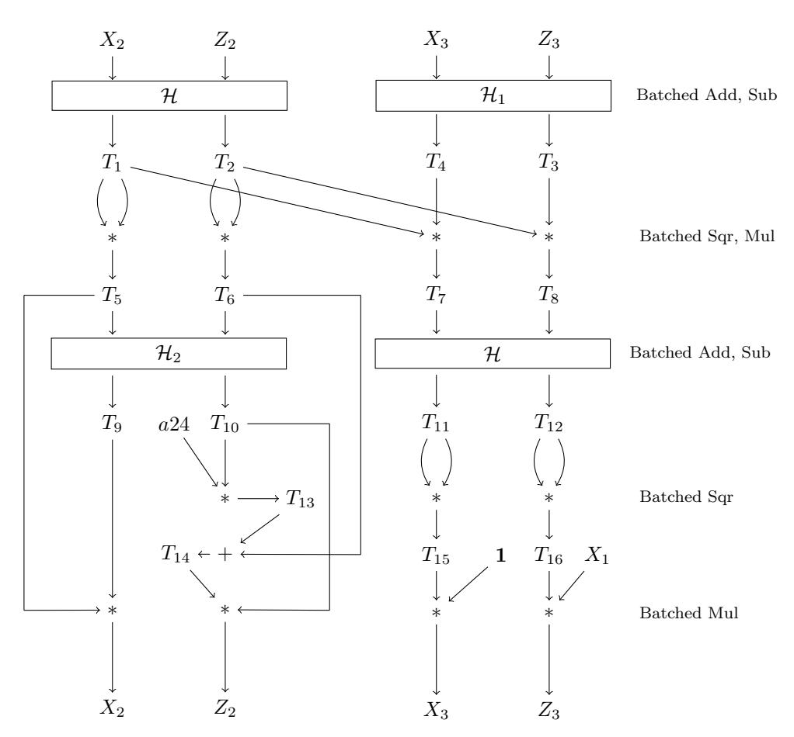
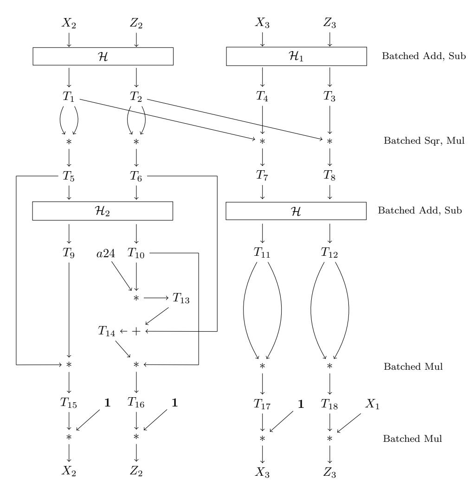

# Efficient 4-way Vectorizations of the Montgomery Ladder

Kaushik Nath and Palash Sarkar

Applied Statistics Unit Indian Statistical Institute 203, B. T. Road Kolkata - 700108 India {kaushikn r,palash}@isical.ac.in

Dedicated to the memory of Peter Lawrence Montgomery

#### Abstract

We propose two new algorithms for 4-way vectorization of the well known Montgomery ladder over elliptic curves of Montgomery form. The first algorithm is suitable for variable base scalar multiplication. In comparison to the previous work by Hisil et al. (2020), it eliminates a number of non-multiplication operations at the cost of a single multiplication by a curve constant. Implementation results show this trade-off to be advantageous. The second algorithm is suitable for fixed base scalar multiplication and provides clear speed improvement over a previous vectorization strategy due to Costigan and Schwabe (2009). The well known Montgomery curves Curve25519 and Curve448 are part of the TLS protocol, version 1.3. For these two curves, we provide constant time assembly implementations of the new algorithms. Additionally, for the algorithm of Hisil et al. (2020), we provide improved implementations for Curve25519 and new implementation for Curve448. Timings results on the Haswell and Skylake processors indicate that in practice the new algorithms are to be preferred over previous methods for scalar multiplication on these curves.

Keywords. Diffie-Hellman key agreement, Montgomery ladder, Curve25519, Curve448, ECDH, vectorization, SIMD.

### 1 Introduction

Diffie-Hellman (DH) key agreement [\[11\]](#page-18-0) is a cornerstone of modern cryptography. The protocol allows two parties to communicate over a public channel and agree upon a shared secret key. The DH key agreement protocol can be instantiated over a suitable cyclic group where the corresponding discrete logarithm problem is computationally hard. There are two phases to the DH protocol. The first phase, called the key generation phase, consists of two users generating their public keys from their secret keys and exchanging these public keys. The second phase, called the shared secret computation phase, consists of both the users using their secret keys and the public key of the other user to generate a common shared secret.

Elliptic Curve Cryptography (ECC) was introduced independently by Koblitz [\[20\]](#page-19-0) and Miller [\[22\]](#page-19-1). Cyclic groups arising from appropriately chosen elliptic curves can be used for implementing the DH key agreement protocol. Presently elliptic curve Diffie-Hellman (ECDH) key agreement protocol offers the fastest speed and the smallest key sizes.

Peter L. Montgomery proposed an elliptic curve form to speed up elliptic curve based factorization algorithm [\[23\]](#page-19-2). This form of curve came to be called the Montgomery form elliptic curve. It was later realized that the Montgomery form elliptic curve is especially suited for implementing ECDH key agreement. The most famous example of Montgomery curve for DH key agreement is Curve25519 which was proposed by Bernstein [\[2\]](#page-18-1). Since its proposal, there has been widespread deployment of Curve25519 and it has been incorporated into many important applications [\[10\]](#page-18-2).

RFC 7748 [\[21\]](#page-19-3) of the Transport Layer Security (TLS) protocol, version 1.3 included Curve25519 for ECDH key agreement at the 128-bit security level. For the higher 224-bit security level, RFC 7748 [\[21\]](#page-19-3) included another Montgomery curve called Curve448 which was originally proposed by Hamburg [\[16\]](#page-18-3). The scalar multiplication operations over Curve25519 and Curve448 have been called X25519 and X448 respectively. These operations are used to implement the DH key agreement over the corresponding curves.

Due to the practical importance of Curve25519 and also Curve448, the efficient implementations of X25519 and X448 are of major interest. The first efficient implementation of X25519 was provided by Bernstein himself in the paper which introduced the curve [\[2\]](#page-18-1). Since then, there has been a substantial amount of work on implementing X25519 on a variety of architectures [\[6,](#page-18-4) [7,](#page-18-5) [9,](#page-18-6) [12,](#page-18-7) [13,](#page-18-8) [14,](#page-18-9) [15,](#page-18-10) [17,](#page-18-11) [18,](#page-19-4) [24,](#page-19-5) [29\]](#page-19-6). Several works have also provided efficient implementations of X448 [\[29,](#page-19-6) [14\]](#page-18-9).

Modern processor architectures provide support for single instruction multiple data (SIMD) operations. This allows performing the same operation on a vector of inputs. Vectorization leads to efficiency gains. Arguments in favor of vectorization have been put forward by Bernstein[1](#page-1-0) .

Scalar multiplication on Montgomery form curves is performed using the so-called Montgomery ladder algorithm. This is an iterative algorithm where each iteration or ladder-step performs a combined double and differential addition of curve points. The ladder-step is the primary target for vectorization. The idea behind such vectorization is to form groups of independent multiplications so that the SIMD instructions can be applied to the groups. To the best of our knowledge, the first work which considered grouping together four independent multiplications was by Costigan and Schwabe [\[9\]](#page-18-6). Subsequent work by Bernstein and Schwabe [\[6\]](#page-18-4) and Chou [\[7\]](#page-18-5) considered grouping together two independent multiplications. A modification of the algorithm of Chou [\[7\]](#page-18-5), also grouping together two independent multiplications was proposed by Faz-Hern´andez and L´opez [\[13\]](#page-18-8). Even though the algorithm grouped together two independent multiplications, in [\[13\]](#page-18-8) it was implemented using the 4-way SIMD instructions. An improved implementation of the same algorithm has been reported in [\[14\]](#page-18-9). Recently, the work [\[17\]](#page-18-11) proposed a vectorization strategy which groups together four independent multiplication and provided its implementation using 4-way SIMD instructions.

## Our Contributions

Modern processors provide support for 4-way SIMD instructions. To fully exploit this feature, it is required to form groups of four independent multiplications. As mentioned above, the only previous works to consider this are [\[9,](#page-18-6) [17\]](#page-18-11). For variable base scalar multiplication, the vectorization strategy of [\[17\]](#page-18-11) is faster than that of [\[9\]](#page-18-6), while for fixed base scalar multiplication, the vectorization strategy of [\[9\]](#page-18-6) is faster than that of [\[17\]](#page-18-11).

In this work, we present new 4-way vectorizations of the Montgomery ladder-step. The first algorithm that we propose consists of two general multiplication rounds (one round consisting of two squarings and two multiplications and the other round consisting of three multiplications), one squaring round (consisting of two squarings) and a round which performs a multiplication by a curve constant. The second algorithm has two groups of four multiplications, one multiplication by the curve constant and one multiplication by the x-coordinate of the base point. In the case where the base point is fixed and its x-coordinate is small, the second strategy is faster than the first strategy.

For variable base scalar multiplication, a comparison of our first algorithm with [\[17\]](#page-18-11) shows a tradeoff. While [\[17\]](#page-18-11) does not require the round consisting of multiplication by a constant, it requires several extra non-multiplication operations. Concrete implementations that we make, show that the advantage of avoiding the multiplication-by-constant is outweighed by the overhead of the additional nonmultiplication operations. For fixed base scalar multiplication, our second algorithm is shown to be clearly faster than [\[9\]](#page-18-6).

We provide efficient constant time assembly implementations of both our vectorized algorithms for X25519 and X448. For X25519, an Intel intrinsics based implementation has been reported in [\[17\]](#page-18-11). We provide improved implementation of the vectorized algorithm of [\[17\]](#page-18-11) for X25519; the improvement comes in two parts – an assembly implementation and faster multiplication/squaring. For X448, we provide the first efficient assembly implementation of the vectorized algorithm of [\[17\]](#page-18-11). The source codes of all our implementations are publicly available at the following link.

#### <https://github.com/kn-cs/vec-ladder>.

Timing results on the Skylake and Haswell processors have been obtained for all the implementations that we have made. For comparison, we have measured the performances of previous codes [\[14,](#page-18-9) [17,](#page-18-11) [29\]](#page-19-6) on the same computers where we measured our code. For variable base scalar multiplication, the new algorithm proposed here shows a major improvement in speed over [\[14,](#page-18-9) [29\]](#page-19-6) and a modest, but, noticeable improvement in speed over [\[17\]](#page-18-11). These results indicate that for practical implementations of shared

<span id="page-1-0"></span><sup>1</sup>[https://groups.google.com/a/list.nist.gov/forum/#!searchin/pqc-forum/vectorization%7Csort:date/](https://groups.google.com/a/list.nist.gov/forum/#!searchin/pqc-forum/vectorization%7Csort:date/pqc-forum/mmsH4k3j_1g/JfzP1EBuBQAJ) [pqc-forum/mmsH4k3j\\_1g/JfzP1EBuBQAJ](https://groups.google.com/a/list.nist.gov/forum/#!searchin/pqc-forum/vectorization%7Csort:date/pqc-forum/mmsH4k3j_1g/JfzP1EBuBQAJ), accessed on March 10, 2020.

secret generation phase of ECDH protocol over Curve25519 and Curve448, the new vectorized algorithm proposed in this work is preferable over previous works.

For fixed base scalar multiplication, the second vectorized algorithm that we present significantly improves upon the speed of variable base scalar multiplication. If implementation of the key generation phase of the ECDH protocol is to be done over Montgomery curves, then this is the algorithm of choice.

## 2 Montgomery Curve and Montgomery Ladder

In this section, we provide a brief background on Montgomery curves and Montgomery ladder as required in this work. For more extensive discussions, we refer to [5, 8, 23].

Let  $p \neq 2, 3$  be a prime,  $\mathbb{F}_p$  be the finite field of size p and  $\overline{\mathbb{F}}_p$  be the algebraic closure of  $\mathbb{F}_p$ . Let  $A, B \in \mathbb{F}_p$  such that  $B(A^2 - 4) \neq 0$ . The Montgomery form elliptic curve  $E_{M,A,B}$  is the set of all  $(x,y) \in \overline{\mathbb{F}}_p \times \overline{\mathbb{F}}_p$  satisfying the equation  $By^2 = x(x^2 + Ax + 1)$  along with the point at infinity denoted as  $\infty$ . This is called the affine form of the curve. The set of all  $\mathbb{F}_p$ -rational points of  $E_{M,A,B}$ , denoted as  $E_{M,A,B}(\mathbb{F}_p)$  is the set of all  $(x,y) \in \mathbb{F}_p \times \mathbb{F}_p$  satisfying  $By^2 = x(x^2 + Ax + 1)$  along with  $\infty$ . Under a suitably defined addition operation,  $E_{M,A,B}(\mathbb{F}_p)$  is a group with  $\infty$  as the identity element. It is known that the order of this group is a multiple of 4. In fact, it is usually possible to obtain A and B such that the order of  $E_{M,A,B}$  is 4q for a prime q.

The most famous example of Montgomery curve is Curve25519 which was introduced by Bernstein [2]. For Curve25519,  $p=2^{255}-19$ , A=486662 and B=1. The other Montgomery curve which is part of TLS 1.3 is Curve448 which was introduced by Hamburg [16]. For Curve448,  $p=2^{448}-2^{224}-1$ , A=156326 and B=1. Apart from these two, other proposals of Montgomery curves can be found at [4] and some recent proposals of Montgomery curves have been made in [26, 27].

The projective form of the curve  $E_{M,A,B}$  is  $BY^2Z = X(X^2 + AXZ + Z^2)$ . Projective points are of the form (X:Y:Z). If  $Z \neq 0$ , then (X:Y:Z) corresponds to the affine point (X/Z,Y/Z). The only point on  $E_{M,A,B}$  with Z=0 is (0:1:0) and this is the identity element of the group.

Given a point P on  $E_{M,A,B}$  and a non-negative integer n, the point nP is the n-fold addition of P. The operation of computing nP is called scalar multiplication. We will be interested in the case, where P is an  $\mathbb{F}_p$ -rational point of  $E_{M,A,B}$ .

For a point P = (X : Y : Z) on  $E_{M,A,B}$ , the x-coordinate map  $\mathbf{x}$  is the following [8]:  $\mathbf{x}(P) = (X : Z)$  if  $Z \neq 0$  and  $\mathbf{x}(P) = (1 : 0)$  if P = (0 : 1 : 0). Bernstein [1, 2] introduced the map  $\mathbf{x}_0$  as follows:  $\mathbf{x}_0(X : Z) = XZ^{p-2}$  which is defined for all values of X and Z in  $\mathbb{F}_p$ .

Following Miller [22] and Bernstein [2], the Diffie-Hellman key agreement can be carried out on a Montgomery curve as follows. Let Q be a generator of a prime order subgroup of  $E_{M,A,B}(\mathbb{F}_p)$ . Alice chooses a secret key s and has public key  $\mathbf{x}_0(sQ)$ ; Bob chooses a secret key t and has public key  $\mathbf{x}_0(tQ)$ . The shared secret key of Alice and Bob is  $\mathbf{x}_0(stQ)$ . Using classical computers, the best known method of obtaining  $\mathbf{x}_0(stQ)$  from Q,  $\mathbf{x}_0(sQ)$  and  $\mathbf{x}_0(tQ)$  requires about  $O(p^{1/2})$  time. If  $\lceil \lg p \rceil = m$  and  $\#E_{M,A,B}(\mathbb{F}_p) = cq$ , where q is a prime and c is small, then the security level is said to be about m/2 bits. So, Curve25519 provides security at the 128-bit level and Curve448 provides security at the 224-bit security level.

The shared secret computation of both Alice and Bob is the following. Given  $(X_1:Z_1)$  corresponding to a point  $P=(X_1:Y_1:Z_1)$  and a non-negative integer n, obtain  $\mathbf{x}_0(nP)$ . Montgomery [23] introduced a variant of the usual double-and-add algorithm for the purpose of computing  $\mathbf{x}(P)=(X:Z)$ . Let  $P_2=(X_2:Y_2:Z_2)$  and  $P_3=(X_3:Y_3:Z_3)$  be such that  $P_3-P_2=P_1$ . Let  $2P_2=(X_2':Y_2':Z_2')$  and  $P_2+P_3=(X_3':Y_3':Z_3')$ . Doubling corresponds to obtaining  $(X_2',Z_2')$  from  $(X_2:Z_2)$  while differential addition corresponds to obtaining obtaining  $(X_3':Z_3')$  from  $(X_1:Z_1)$ ,  $(X_2:Z_2)$  and  $(X_3:Z_3)$ . Based on Theorems B.1 and B.2 of [2], Montgomery's formulas for combined double and differential addition can written as follows.

<span id="page-2-0"></span>
$$(X_3': Z_3') = \left( Z_1 \left( (X_2 - Z_2)(X_3 + Z_3) + (X_2 + Z_2)(X_3 - Z_3) \right)^2 \\ : X_1 \left( (X_2 - Z_2)(X_3 + Z_3) - (X_2 + Z_2)(X_3 - Z_3) \right)^2 \right) \\ (X_2': Z_2') = \left( (X_2 + Z_2)^2 (X_2 - Z_2)^2 : 4X_2 Z_2 \left( (X_2 - Z_2)^2 + \frac{A+2}{4} (4X_2 Z_2) \right) \right).$$

$$(1)$$

Note that the parameter B is not required in (1). Assume  $Z_1 = 1$ . The quantity  $4X_2Z_2$  in (1) is to be computed as  $4X_2Z_2 = (X_2 + Z_2)^2 - (X_2 - Z_2)^2$ . As a result, the formulas in (1) require 5 multiplications, 4 squarings and 1 multiplication by the field constant (A + 2)/4.

In [17], the computation of  $(X'_2: Z'_2)$  was done in a manner different from that shown in (1). Retracing

the computation of  $(X'_2: Z'_2)$  given in Figure 1 of [17] shows that the following formula was used.

<span id="page-3-0"></span>
$$(X_2': Z_2') = \left(2((X_2 + Z_2)^2 + (X_2 - Z_2)^2)^2 - (4X_2Z_2)^2 \\ : 2((X_2 + Z_2)^2 + (X_2 - Z_2)^2)4X_2Z_2 + A(4X_2Z_2)^2\right).$$
 (2)

Assuming that  $4X_2Z_2$  is computed as mentioned above, the computations of  $(X_3':Z_3')$  using (1) and of  $(X_2':Z_2')$  using (2) require 4 multiplications, 6 squarings and one multiplication by the curve constant A. The total number of multiplications and squaring is one more than that required for computation of (1). For a sequential computation this would be inefficient, but, for 4-way vectorization, the extra operation does not necessarily lead to a less efficient method. Note that  $2((X_2+Z_2)^2+(X_2-Z_2)^2)^2-(4X_2Z_2)^2$  can also be computed more simply as  $4(X_2+Z_2)^2(X_2-Z_2)^2$ . We have investigated this possibility and it turns out that the resulting 4-way vectorization is somewhat less efficient than the 4-way vectorization obtained using (2).

## <span id="page-3-2"></span>3 New 4-way Vectorizations of the Montgomery Ladder

In this section, we present two new vectorization strategies for the Montgomery ladder algorithm.

Before describing the new algorithms, we introduce some notation. By  $\mathbf{0}$  and  $\mathbf{1}$ , we will denote the additive and the multiplicative identities of  $\mathbb{F}_p$  respectively. The ladder algorithm uses the constant (A+2)/4. For practical curves like Curve25519 and Curve448, the value of this constant is small and the constant can be represented using a single 64-bit word. We denote the constant by a24.

<span id="page-3-1"></span>

Figure 1: A batching strategy for computing the formulas in (1)

The batching strategies for the Montgomery ladder-step proposed in this work are shown in Figures 1 and 2. It is not difficult to verify that the computations done in Figures 1 and 2 are essentially different ways of computing the formulas given in (1). So, the new algorithms provide different ways of computing the Montgomery ladder-step. The figures only show groupings of multiplications and other operations. To obtain vectorized algorithms, it is required to convert the algorithms using 4-way vector operations.

For this, we need to introduce some top-level vector operations. Later we discuss how these vector operations can be realized with the 4-way SIMD instructions.

For a, b ∈ Fp, define H(a, b) = (a + b, a − b), H1(a, b) = (a − b, a + b), H2(a, b) = (0 + b, a − b). The following vector operations will be used to provide top-level descriptions of the different vectorization strategies. The vector hA0, A1, A2, A3i represents 4 field elements A0, A1, A2, A3, where each A<sup>i</sup> is represented using κ limbs. Similar interpretation holds for the vectors hB0, B1, B2, B3i and hC0, C1, C2, C3i. The vector hc0, c1, c2, c3i represents the 4 single limb quantities c0, c1, c<sup>2</sup> and c3.

<span id="page-4-0"></span>

Figure 2: A batching strategy for computing the formulas in [\(1\)](#page-2-0)

- H-H(hA0, A1, A2, A3i) = hA<sup>0</sup> + A1, A<sup>0</sup> − A1, A<sup>2</sup> + A3, A<sup>2</sup> − A3i.
- H-H1(hA0, A1, A2, A3i) = hA<sup>0</sup> + A1, A<sup>0</sup> − A1, A<sup>2</sup> − A3, A<sup>2</sup> + A3i.
- H2-H(hA0, A1, A2, A3i) = hA1, A<sup>0</sup> − A1, A<sup>2</sup> + A3, A<sup>2</sup> − A3i.
- ADD(hA0, A1, A2, A3i,hB0, B1, B2, B3i) = hA<sup>0</sup> + B0, A<sup>1</sup> + B1, A<sup>2</sup> + B2, A<sup>3</sup> + B3i.
- SUB(hA0, A1, A2, A3i,hB0, B1, B2, B3i) = hA<sup>0</sup> − B0, A<sup>1</sup> − B1, A<sup>2</sup> − B2, A<sup>3</sup> − B3i.
- MUL(hA0, A1, A2, A3i,hB0, B1, B2, B3i) = hA<sup>0</sup> · B0, A<sup>1</sup> · B1, A<sup>2</sup> · B2, A<sup>3</sup> · B3i.
- SQR(hA0, A1, A2, A3i) = hA<sup>2</sup> 0 , A<sup>2</sup> 1 , A<sup>2</sup> 2 , A<sup>2</sup> 3 i.
- MULC(hA0, A1, A2, A3i,hc0, c1, c2, c3i) = hc<sup>0</sup> · A0, c<sup>1</sup> · A1, c<sup>2</sup> · A2, c<sup>3</sup> · A3i.
- DUP(hA0, A1, A2, A3i) = hA0, A1, A0, A1i.
- SHUFFLE(hA0, A1, A2, A3i) = hA1, A0, A3, A2i.

 BLEN D(hA0, A1, A2, A3i,hB0, B1, B2, B3i, b0b1b2b3) = hC0, C1, C2, C3i), where C<sup>i</sup> = A<sup>i</sup> if b<sup>i</sup> = 0 and C<sup>i</sup> = B<sup>i</sup> if b<sup>i</sup> = 1.

Vectorized descriptions of Figures [1](#page-3-1) and [2](#page-4-0) are provided in Algorithms [1](#page-5-0) and [2](#page-5-1) respectively. For the purpose of comparison, in Algorithms [3](#page-6-0) and [4](#page-6-1) we provide the 4-way vectorization strategies obtained from the descriptions given in [\[9\]](#page-18-6) and [\[17\]](#page-18-11) respectively. We note that Algorithms [1,](#page-5-0) [2](#page-5-1) and [3](#page-6-0) implement the formulas given by [\(1\)](#page-2-0), whereas Algorithm [4](#page-6-1) implements the formulas given by [\(1\)](#page-2-0) as modified in [\(2\)](#page-3-0).

## <span id="page-5-0"></span>Algorithm 1 4-way vectorization of Montgomery ladder-step corresponding to Figure [1.](#page-3-1)

```
1: function Vectorized-Ladder-Step(hX2, Z2, X3, Z3i,h0, 0, 1, X1i)
2: hT1, T2, T4, T3i ← H-H1(hX2, Z2, X3, Z3i)
3: hT1, T2, T1, T2i ← DUP(hT1, T2, T4, T3i)
4: hT5, T6, T7, T8i ← MUL(hT1, T2, T4, T3i,hT1, T2, T1, T2i)
5: hT9, T10, T11, T12i ← H2-H(hT5, T6, T7, T8i)
6: hT9, T10, 1, X1i ← BLEN D(h0, 0, 1, X1i,hT9, T10, T11, T12i, 1100)
7: h0, T13, 0, 0i ← MULC(hT9, T10, T11, T12i,h0
                                                  64, a24, 0
                                                          64
                                                            , 0
                                                              64ii
8: hT5, T14, T7, T8i ← ADD(h0, T13, 0, 0i,hT5, T6, T7, T8i)
9: h∗, ∗, T15, T16i ← SQR(hT9, T10, T11, T12i)
10: hT5, T14, T15, T16i ← BLEN D(hT5, T14, T7, T8i,h∗, ∗, T15, T16i, 0011)
11: hX2, Z2, X3, Z3i ← MUL(hT5, T14, T15, T16i,hT9, T10, 1, X1i)
12: return hX2, Z2, X3, Z3i
13: end function.
```

#### <span id="page-5-1"></span>Algorithm 2 4-way vectorization of Montgomery ladder-step corresponding to Figure [2.](#page-4-0)

```
1: function Vectorized-Ladder-Step(hX2, Z2, X3, Z3i,h1, 1, 1, X1i)
2: hT1, T2, T4, T3i ← H-H1(hX2, Z2, X3, Z3i)
3: hT1, T2, T1, T2i ← DUP(hT1, T2, T4, T3i)
4: hT5, T6, T7, T8i ← MUL(hT1, T2, T4, T3i,hT1, T2, T1, T2i)
5: hT9, T10, T11, T12i ← H2-H(hT5, T6, T7, T8i)
6: h0, T13, 0, 0i ← MULC(hT9, T10, T11, T12i,h0
                                                  64, a24, 0
                                                          64
                                                            , 0
                                                              64ii
7: hT5, T14, T7, T8i ← ADD(h0, T13, 0, 0i,hT5, T6, T7, T8i)
8: hT5, T14, T11, T12i ← BLEN D(hT9, T10, T11, T12i,hT5, T14, T7, T8i, 1100)
9: hT15, T16, T17, T18i ← MUL(hT5, T14, T11, T12i,hT9, T10, T11, T12i)
10: hX2, Z2, X3, Z3i ← MUL(hT15, T16, T17, T18i,h1, 1, 1, X1i)
11: return hX2, Z2, X3, Z3i
12: end function.
```

<span id="page-5-2"></span>

| Vector Operations | Algorithm 1 | Algorithm 2 | Algorithm 3 | Algorithm 4 |
|-------------------|-------------|-------------|-------------|-------------|
| MUL               | 2           | 3           | 3           | 2           |
| SQR               | 1           | -           | -           | 1           |
| MULC              | 1           | 1           | 1           | -           |
| HAD               | 2           | 2           | 3           | 2           |
| ADD               | 1           | 1           | -           | 2           |
| SUB               | -           | -           | -           | 1           |
| DUP               | 1           | 1           | 1           | 1           |
| BLEN D            | 2           | 1           | 3           | 4           |
| SHUFFLE           | -           | -           | 1           | 3           |

Table 1: Comparison of the vector operations required by different algorithms.

The numbers of various vector operations required by the Algorithms [1,](#page-5-0) [2,](#page-5-1) [3](#page-6-0) and [4](#page-6-1) are shown in

#### <span id="page-6-0"></span>Algorithm 3 4-way vectorization of Montgomery ladder-step obtained from [\[9\]](#page-18-6).

```
1: function Vectorized-Ladder-Step(hX2, Z2, X3, Z3i,h1, 1, 1, X1i)
2: hT1, T2, T4, T3i ← H-H1(hX2, Z2, X3, Z3i)
3: hT1, T2, T1, T2i ← DUP(hT1, T2, T4, T3i)
4: hT5, T6, T7, T8i ← MUL(hT1, T2, T4, T3i,hT1, T2, T1, T2i)
5: hT9, T10, 0, 0i ← MULC(hT5, T6, T7, T8i,ha24, a24 − 1, 0
                                                             64
                                                               , 0
                                                                 64i)
6: h∗, T11, T13, T14i ← H-H(hT5, T6, T7, T8i)
7: h∗, T12, ∗, ∗i ← H-H(hT9, T10, 0, 0i)
8: hT5, T11, T13, T14i ← BLEN D(hT5, T6, T7, T8i,h∗, T11, T13, T14i, 0111)
9: hT6, ∗, ∗, ∗i ← SHUFFLE(hT5, T6, T7, T8i)
10: hT6, T12, ∗, ∗i ← BLEN D(hT6, ∗, ∗, ∗i,h∗, T12, ∗, ∗i, 01dd)
11: hT6, T12, T13, T14i ← BLEN D(hT6, T12, ∗, ∗i,hT5, T11, T13, T14i, 0011)
12: hX2, Z2, X3, T15i ← MUL(hT5, T11, T13, T14i,hT6, T12, T13, T14i)
13: hX2, Z2, X3, Z3i ← MUL(hX2, Z2, X3, T15i,h1, 1, 1, X1i)
14: return hX2, Z2, X3, Z3i
15: end function.
```

## <span id="page-6-1"></span>Algorithm 4 4-way vectorization of Montgomery ladder-step obtained from Figure 1 in [\[17\]](#page-18-11).

```
1: function Vectorized-Ladder-Step(hX2, Z2, X3, Z3i,h0, A, 1, X1i)
2: hT1, T2, T3, T4i ← H-H(hX2, Z2, X3, Z3i)
3: hT1, T2, T2, T1i ← DUP(hT1, T2, T3, T4i)
4: hT5, T6, T7, T8i ← MUL(hT1, T2, T3, T4i,hT1, T2, T2, T1i)
5: hT9, T10, T11, T12i ← H-H(hT5, T6, T7, T8i)
6: hT10, T9, T12, T11i ← SHUFFLE(hT9, T10, T11, T12i)
7: hT10, A, 1, X1i ← BLEN D(h0, A, 1, X1i,hT10, T9, T12, T11i, 1000)
8: hT13, T14, T15, T16i ← SQR(hT9, T10, T11, T12i)
9: hT14, T13, T16, T15i ← SHUFFLE(hT13, T14, T15, T16i)
10: hX2, ∗, ∗, ∗i ← SUB(hT13, T14, T15, T16i,hT14, T13, T15, T16i)
11: hT9, T14, T15, T16i ← BLEN D(hT9, T10, T11, T12i,hT13, T14, T15, T16i, 0111)
12: hT17, T18, X3, Z3i ← MUL(hT10, A, 1, X1i,hT9, T14, T15, T16i)
13: hT19, ∗, ∗, ∗i ← ADD(hT17, T18, X3, Z3i,hT17, T18, X3, Z3i)
14: h∗, T19, ∗, ∗i ← SHUFFLE(hT19, ∗, ∗, ∗i)
15: h∗, Z2, ∗, ∗i ← ADD(hT17, T18, X3, Z3i,h∗, T19, ∗, ∗i)
16: hX2, Z2, ∗, ∗i ← BLEN D(hX2, ∗, ∗, ∗i,h∗, Z2, ∗, ∗i, 01 )
17: hX2, Z2, X3, Z3i ← BLEN D(hX2, Z2, ∗, ∗i,hT17, T18, X3, Z3i, 0011)
18: return hX2, Z2, X3, Z3i
19: end function.
```

Table [1.](#page-5-2) In the table, the numbers corresponding to HAD are the counts of H-H, H-H1, or H2-H operations.

While the vector multiplications are indeed the most time consuming operations, the other operations can also take a significant amount of time. Regarding these other operations, we note that Algorithm [4](#page-6-1) requires the maximum number of such operations and Algorithms [1](#page-5-0) and [2](#page-5-1) require the least. Among the non-multiplication operations, the HAD operations require the maximum amount of time. We note that three HAD operations are required by Algorithm [3](#page-6-0) while two HAD operations are required by the other algorithms.

Step [13](#page-6-0) of Algorithm [3](#page-6-0) and Step [11](#page-5-1) of Algorithm [2](#page-5-1) perform the product of hX2, Z2, X3, T15i and h1, 1, 1, X1i. In Table [1,](#page-5-2) this multiplication has been counted as a general field multiplication. On the other hand, if X<sup>1</sup> is a small constant, then this multiplication should be counted as multiplication by a small field constant. Based on this distinction, to compare between the algorithms based on the operation counts given in Table [1,](#page-5-2) we consider two situations.

Variable base scalar multiplication. In this case, the quantity  $X_1$  is a general element of the field. Clearly, from Table 1 we see that both Algorithms 2 and 3 will be slower than either of the Algorithms 1 or 4. So, for variable base scalar multiplication, the comparison is really between Algorithms 1 and 4. Both require 2  $\mathcal{MUL}+1$   $\mathcal{SQR}$ . The trade-off between the two algorithms is that Algorithm 1 requires 1  $\mathcal{MULC}$  whereas Algorithm 4 requires quite a few extra non-multiplication operations. So, from the operation count itself it is not immediately clear which of the two algorithms will be faster. The implementation results that we report later show that in practice Algorithm 1 turns out to be faster.

Fixed base scalar multiplication. In this case, the quantity  $X_1$  is small. In Algorithms 2 and 3, the product of  $\langle X_2, Z_2, X_3, T_{15} \rangle$  and  $\langle \mathbf{1}, \mathbf{1}, \mathbf{1}, X_1 \rangle$  is to be counted as  $\mathcal{MULC}$  instead of  $\mathcal{MUL}$ . In this case, the number of vector multiplications performed by Algorithms 2 and 3 will be 2  $\mathcal{MUL} + 2 \mathcal{MULC}$  operations. The resulting cost of Algorithms 2 and 3 will be lower than that of Algorithms 1 and 4. From Table 1, a comparison between Algorithms 2 and 3 shows that the number of non-multiplication steps required by Algorithm 2 is smaller than that of Algorithm 3. In particular, the number of  $\mathcal{HAD}$  operations is two for Algorithm 2 while it is three for Algorithm 3. So, for fixed base scalar multiplication, Algorithm 2 will be faster than Algorithm 3 and also faster than Algorithms 1 and 4.

### <span id="page-7-0"></span>4 Field Arithmetic

Implementation of elliptic curve operations require arithmetic in the underlying field  $\mathbb{F}_p$ . Suppose that elements of  $\mathbb{F}_p$  are represented using  $\kappa$  words (also called limbs). Two different representations are used. The ladder computation is performed using one particular representation, while the final inversion is performed using another representation. In the following, we focus on the representation required for performing the ladder computation.

The underlying primes for the curves Curve25519 and Curve448 are  $p_1 = 2^{255} - 19$  and  $p_2 = 2^{448} - 2^{224} - 1$  respectively. We consider two different representations for the elements of  $\mathbb{F}_{p_1}$ , one using 9 words and the other using 10 words, i.e., we consider values of  $\kappa$  as 9 and 10. The elements of  $\mathbb{F}_{p_2}$  are represented using 16 words, and here the value of  $\kappa$  is 16. Details of the representations are as follows.

• First representation of elements in  $\mathbb{F}_{p_1}$ : Following Bernstein [2], an element  $A \in \mathbb{F}_{p_1}$  satisfying  $\kappa = 10$  can be represented as

$$A = a_0 + 2^{26}a_1 + 2^{51}a_2 + 2^{77}a_3 + 2^{102}a_4 + 2^{128}a_5 + 2^{153}a_6 + 2^{179}a_7 + 2^{204}a_8 + 2^{230}a_9$$
 (3)

where  $0 \le a_0 \le 2^{26} - 19$ ,  $0 \le a_2, a_4, a_6, a_8 < 2^{26}$  and  $0 \le a_1, a_3, a_5, a_7, a_9 < 2^{25}$ . The above is compactly written as  $A = \sum_{i=0}^9 a_i 2^{\lceil 25.5i \rceil}$ . The prime  $p_1$  is represented as

$$\mathfrak{P}_{1} = \mathfrak{p}_{0} + 2^{26}\mathfrak{p}_{1} + 2^{51}\mathfrak{p}_{2} + 2^{77}\mathfrak{p}_{3} + 2^{102}\mathfrak{p}_{4} + 2^{128}\mathfrak{p}_{5} + 2^{153}\mathfrak{p}_{6} + 2^{179}\mathfrak{p}_{7} + 2^{204}\mathfrak{p}_{8} + 2^{230}\mathfrak{p}_{9}$$
 (4) where  $\mathfrak{p}_{0} = 2^{26} - 19$ ,  $\mathfrak{p}_{2} = \mathfrak{p}_{4} = \mathfrak{p}_{6} = \mathfrak{p}_{8} = 2^{26} - 1$  and  $\mathfrak{p}_{1} = \mathfrak{p}_{3} = \mathfrak{p}_{5} = \mathfrak{p}_{7} = \mathfrak{p}_{9} = 2^{25} - 1$ .

• Second representation of elements in  $\mathbb{F}_{p_1}$ : An element  $A \in \mathbb{F}_{p_1}$  satisfying  $\kappa = 9$  is represented as  $A = \sum_{i=0}^{9} a_i \theta^i$ , where  $\theta = 2^{29}$ ,  $0 \le a_0, a_1, \ldots, a_7 < 2^{29}$  and  $0 \le a_8 < 2^{23}$ . The prime  $p_2$  is represented as

$$\mathfrak{P}_1 = \sum_{i=0}^{9} \mathfrak{p}_i \theta^i, \text{ where } \mathfrak{p}_0, \mathfrak{p}_1, \dots, \mathfrak{p}_7 = 2^{29} - 1, \mathfrak{p}_8 = 2^{23} - 1.$$
 (5)

• Representation of elements in  $\mathbb{F}_{p_2}$ : An  $A \in \mathbb{F}_{p_2}$  is represented as  $A = \sum_{i=0}^{16} a_i \theta^i$ , where  $\theta = 2^{28}$ ,  $0 \le a_0, a_1, \ldots, a_7, a_9, a_{10}, \ldots, a_{15} < 2^{28}$  and  $0 \le a_8 < 2^{28} - 1$ . The prime  $p_2$  is represented as

$$\mathfrak{P}_{2} = \sum_{i=0}^{15} \mathfrak{p}_{i} \theta^{i}, \text{ where } \mathfrak{p}_{0}, \mathfrak{p}_{1}, \dots, \mathfrak{p}_{7}, \mathfrak{p}_{9}, \dots, \mathfrak{p}_{15} = 2^{28} - 1, \ \mathfrak{p}_{8} = 2^{28} - 2.$$
 (6)

Multiplication and squaring in  $\mathbb{F}_p$ . For  $p_1$  with  $\kappa = 10$ , the schoolbook method is used for multiplication and squaring; the algorithms are standard and we refer to [7] for the details. For  $p_1$  with  $\kappa = 9$ , we use a (5+4)-Karatsuba strategy for performing integer multiplication; for integer squaring we apply directly the schoolbook method. After integer multiplication/squaring we have a 17-limb quantity. Directly trying to reduce this 17-limb quantity to a 9-limb quantity results in overfull. Instead, we first expand the 17-limb quantity to an 18-limb quantity so that the sizes of the limbs get reduced. Then

the 18-limb quantity is reduced to a 9-limb quantity. This is essentially the multe algorithm in [19]. For  $p_2$ , Hamburg [16] had shown the usefulness of the Karatsuba method for multiplication and squaring; in Appendix A, we provide the details of the algorithms that have been used.

The multiplication and squaring operations in  $\mathbb{F}_p$  include a reduction operation. Instead of using the simple carry chain, we use the interleaved carry chain for reduction [7]. This provides a small efficiency gain in computation.

- For  $p_1$  with  $\kappa = 10$ , we interleave the chains  $c_0 \to c_1 \to \cdots \to c_4 \to c_5 \to c_6$  and  $c_5 \to c_6 \to \cdots \to c_9 \to c_0 \to c_1$ .
- For  $p_1$  with  $\kappa = 9$ , we interleave the chains  $c_0 \to c_1 \to \cdots \to c_4 \to c_5$  and  $c_4 \to c_5 \to \cdots \to c_8 \to c_0 \to c_1$ .
- For  $p_2$  with  $\kappa = 16$ , we interleave the chains  $c_0 \to c_1 \to \cdots \to c_7 \to c_8 \to c_9$  and  $c_8 \to c_9 \to \cdots \to c_{15} \to (c_0, c_8) \to (c_1, c_9)$ .

We term this reduction as  $reduce_1$ . The multiplication/squaring algorithms without applying reduction will be termed as mul/sqr.

**Remark:** In [17], a field element is represented as  $A = a_0 + a_1 2^{85} + a_2 2^{170}$ , such that each  $a_i$  is represented by 3 limbs of sizes 29, 28 and 28 bits. Multiplication and squaring have been done using a Karatsuba strategy based on a (3+3+3)-decomposition. For 9-limb representation, we have found that the (5+4)-Karatsuba strategy described above turns out to be more efficient than the method described in [17]. For Skylake, the cpu-cycles for field multiplication and squaring, using (5+4)-Karatsuba are 112 and 91, whereas, the cpu-cycles of field multiplication and squaring from [17] are 119 and 96 respectively.

Multiplication by a small constant in  $\mathbb{F}_p$ . Let  $A \in \mathbb{F}_p$  have a  $\kappa$ -limb representation  $(a_0, a_1, \ldots, a_{\kappa-1})$ . Let  $\mathfrak{c}$  be a small element in  $\mathbb{F}_p$ , which can be represented using a single limb. Then multiplication of A by  $\mathfrak{c}$  provides  $\kappa$  limbs of the form  $(c_0, c_1, \ldots, c_{\kappa-1}) = (a_0 \cdot \mathfrak{c}, a_1 \cdot \mathfrak{c}, \ldots, a_{\kappa-1} \cdot \mathfrak{c})$ . This needs to be reduced.

- For  $p_1$  with  $\kappa = 10$ , we interleave the chains  $c_0 \to c_1 \to \cdots \to c_4 \to c_5$  and  $c_5 \to c_6 \to \cdots \to c_9 \to c_0$ .
- For  $p_1$  with  $\kappa = 9$ , we interleave the chains  $c_0 \to c_1 \to \cdots \to c_3 \to c_4$  and  $c_4 \to c_5 \to \cdots \to c_8 \to c_0$ .
- For  $p_2$  with  $\kappa = 16$ , we interleave the chains  $c_0 \to c_1 \to \cdots \to c_7 \to c_8$  and  $c_8 \to c_9 \to \cdots \to c_{15} \to (c_0, c_8)$ .

We term this reduction as reduce<sub>2</sub>. Note that reduce<sub>2</sub> is slightly more efficient that reduce<sub>1</sub> because the lengths of the chains are one less. The algorithm to multiply with a small constant without applying reduction will be termed as mulc.

**Inversion in**  $\mathbb{F}_p$ . The output of the ladder algorithm is  $X^2 \cdot Z_2^{p-2}$ . For  $Z_2 \neq 0$ , the quantity  $Z_2^{p-2}$  is the inverse of  $Z_2$ . The computation of  $Z_2^{p-2}$  requires squaring and multiplication in  $\mathbb{F}_p$ . For  $p = p_1$ , the operation  $Z_2^{p_1-2}$  is performed using 254 squarings and 11 multiplications in  $\mathbb{F}_{p_1}$ .

For  $p = p_1$ , the operation  $Z_2^{p_1-2}$  is performed using 254 squarings and 11 multiplications in  $\mathbb{F}_{p_1}$ . For implementation on the Skylake processor, a 4-limb representation and for implementation on the Haswell processor, a 5-limb representation has been used. The corresponding field arithmetic has been implemented using the algorithms given in [25].

implemented using the algorithms given in [25]. For  $p=p_2$ , the operation  $Z_2^{p_2-2}$  is performed using 448 squarings and 13 multiplications in  $\mathbb{F}_{p_2}$ . For implementation on the Skylake processor, a 7-limb representation and the algorithms in [28] have been used. For implementation on the Haswell processor, a 8-limb representation has been used and the corresponding algorithms are provided in Appendix B.

#### 5 Vector Operations

SIMD instructions in modern processors allow parallelism where the same instruction can be applied to multiple data. To take advantage of SIMD instructions it is convenient to organize the data as vectors. The Intel instructions that we target apply to 256-bit registers which are considered to be 4 64-bit words (or, as 8 32-bit words). So, we consider vectors of length 4.

Notation: In the following sections, for uniformity of description, we use expressions of the form  $\sum_{i=\ell}^{h} f_i \theta^i$ . For  $p_1$ ,  $\theta^i$  should be considered as  $2^{\lceil 25.5i \rceil}$ , while for  $p_2$ ,  $\theta^i$  should be considered as  $2^{28i}$ .

Dense packing of field elements. Let  $A = \sum_{i=0}^{\kappa-1} a_i \theta^i$ . Consider that every limb  $a_i$  is less than  $2^{32}$  and is stored in a 64-bit word. Then it is possible to pack  $a_{\lfloor \kappa/2 \rfloor}$  with  $a_0, \ a_{\lfloor \kappa/2 \rfloor+1}$  with  $a_1, \ldots, a_{2\lfloor \kappa/2 \rfloor-1}$  with  $a_{\lfloor \kappa/2 \rfloor-1}$ , so that every pair can be represented using a 64-bit word without losing any information. If  $\kappa$  is odd then  $a_{\kappa-1}$  can be left alone. We denote this operation as dense packing of limbs. In general limb v is densely packed with limb v to produce the packed limb v using a left-shift and an or operation through v u | ( $v \ll 32$ ). The 32-bit values can be extracted by splitting a 64-bit limb v through the operations  $v \leftarrow v$  and v and v and v using dense packing of limbs we can think that a v-limb quantity is represented using v limbs. We define the dense packing operation as N2D(v) which returns v to a normally packed element we use the operation D2N(v), which returns v dense packing along v and v define the dense packing operation as N2D(v).

Vector representation of field elements. Define  $\mathbf{A} = \langle A_0, A_1, A_2, A_3 \rangle$  where  $A_k = \sum_{i=0}^{\kappa-1} a_{k,i} \theta^i \in \mathbb{F}_p$ . Hence,  $\mathbf{A}$  is a 4-element vector. Each  $a_{k,i}$  is stored in a 64-bit word, and conceptually one may think of  $\mathbf{A}$  to be given by a  $\kappa \times 4$  matrix of 64-bit words. If we consider  $\underline{A}_k$ , i.e., densely packed form of  $A_k$ , then we have  $\underline{\mathbf{A}} = \langle \underline{A}_0, \underline{A}_1, \underline{A}_2, \underline{A}_3 \rangle$  where  $\underline{A}_k = \sum_{i=0}^{\lceil \kappa/2 \rceil - 1} \underline{a}_{k,i} \theta^i$ . Then we can conceptually think of  $\underline{\mathbf{A}}$  as a  $\lceil \kappa/2 \rceil \times 8$  matrix of 32-bit words. This visualization helps to 2-way parallelize the vector Hadamard transformations and other linear operations within the ladder. We will observe this explicitly in the final algorithm.

We can also visualize  $\mathbf{A}$  and  $\underline{\mathbf{A}}$  by the following alternative representation. Let  $\mathbf{a}_i = \langle a_{0,i}, a_{1,i}, a_{2,i}, a_{3,i} \rangle$ . Define  $\mathbf{a}_i \theta^i = \langle a_{0,i} \theta^i, a_{1,i} \theta^i, a_{2,i} \theta^i, a_{3,i} \theta^i \rangle$ . Then, we can write  $\mathbf{A} = \sum_{i=0}^{\kappa-1} \mathbf{a}_i \theta^i$ . Each  $\mathbf{a}_i$  is stored as a 256-bit value. Similarly, let  $\underline{\mathbf{a}}_i = \langle a_{0,i}, \underline{a_{1,i}}, \underline{a_{2,i}}, \underline{a_{3,i}} \rangle$ . Define  $\underline{\mathbf{a}} \theta^i = \langle \underline{a_{0,i}} \theta^i, \underline{a_{1,i}} \theta^i, \underline{a_{2,i}} \theta^i, \underline{a_{3,i}} \theta^i \rangle$ . Then, we can write  $\underline{\mathbf{A}} = \sum_{i=0}^{\lceil \kappa/2 \rceil - 1} \underline{\mathbf{a}}_i \theta^i$ . Like  $\underline{\mathbf{a}}_i$ , each  $\underline{\mathbf{a}}_i$  is stored as a 256-bit value.

Dense packing of vector elements. Let  $\langle A_0, A_1, A_2, A_3 \rangle = \sum_{i=0}^{\kappa-1} \mathbf{a}_i \theta^i$ , where  $A_k = \sum_{i=0}^{\kappa-1} a_{k,i} \theta^i$ . The vectorized normal to dense packing operation Pack-N2D( $\langle A_0, A_1, A_2, A_3 \rangle$ ) returns the 4-tuple  $\langle \underline{A_0, A_1, A_2, A_3} \rangle = \sum_{i=0}^{\lceil \kappa/2 \rceil - 1} \underline{\mathbf{a}}_i \theta^i$ , where  $\underline{A_k} = \mathrm{N2D}(A_k)$ , such that  $\underline{A_k} = \sum_{i=0}^{\lceil \kappa/2 \rceil - 1} \underline{a_{k,i}} \theta^i$ . Let  $\langle \underline{A_0, A_1, A_2, A_3} \rangle = \sum_{i=0}^{\lceil \kappa/2 \rceil - 1} \underline{\mathbf{a}} \theta^i$ , where  $\underline{A_k} = \sum_{i=0}^{\lceil \kappa/2 \rceil - 1} \underline{a_{k,i}} \theta^i$ . The vectorized dense to normal

Let  $\langle \underline{A_0}, \underline{A_1}, \underline{A_2}, \underline{A_3} \rangle = \sum_{i=0}^{\lceil \kappa/2 \rceil - 1} \underline{\mathbf{a}} \theta^i$ , where  $\underline{A_k} = \sum_{i=0}^{\lceil \kappa/2 \rceil - 1} \underline{a_{k,i}} \theta^i$ . The vectorized dense to normal operation Pack-D2N( $\langle \underline{A_0}, \underline{A_1}, \underline{A_2}, \underline{A_3} \rangle$ ) returns the 4-tuple  $\langle A_0, A_1, A_2, A_3 \rangle = \sum_{i=0}^{\kappa-1} \mathbf{a}_i \theta^i$ , where  $A_k = D2N(\underline{A_k})$ , such that  $A_k = \sum_{i=0}^{\kappa-1} a_{k,i} \theta^i$ . A similar packing strategy called squeeze/unsqueeze has been used earlier in [3, 17].

**Vector reduction.** There are three type of vector reduction operations will be used, namely Reduce<sub>1</sub>, Reduce<sub>2</sub> and Reduce<sub>3</sub> out of which Reduce<sub>3</sub> will be used on densely packed limbs after the Hadamard transformations. We define them below.

- Reduce<sub>1</sub>( $\langle A_0, A_1, A_2, A_3 \rangle$ ): This is used in the vectorized field multiplication and squaring algorithms which returns  $\langle \text{reduce}_1(A_0), \text{reduce}_1(A_1), \text{reduce}_1(A_2), \text{reduce}_1(A_3) \rangle$ .
- Reduce<sub>2</sub>( $\langle A_0, A_1, A_2, A_3 \rangle$ ): This is used in the vectorized algorithm for multiplication by a field constant which returns  $\langle \text{reduce}_2(A_0), \text{reduce}_2(A_1), \text{reduce}_2(A_2), \text{reduce}_2(A_3) \rangle$ . The same reduction is also used after addition of two vector elements.
- Reduce<sub>3</sub>( $\langle \underline{A_0}, \underline{A_1}, \underline{A_2}, \underline{A_3} \rangle$ ): This is used in the vectorized algorithms for Hadamard transformations which returns  $\langle \text{reduce}_3(\underline{A_0}), \text{reduce}_3(\underline{A_1}), \text{reduce}_3(\underline{A_2}), \text{reduce}_3(\underline{A_3}) \rangle$ . Details of reduce<sub>3</sub> will be defined later in the context of vectorized Hadamard transformation.

**Vector multiplication and squaring.** Vector multiplication and squaring are done over normally packed field elements which are defined as below.

- Mul( $\langle A_0, A_1, A_2, A_3 \rangle$ ,  $\langle B_0, B_1, B_2, B_3 \rangle$ ): returns  $\mathbf{C} = \sum_{i=0}^{\kappa-1} \mathbf{c}_i \theta^i$  such that  $\mathbf{C} = \text{Reduce}_1(\langle C_0, C_1, C_2, C_3 \rangle)$ , where  $C_k = \text{mul}(A_k, B_k)$ .
- SQR( $\langle A_0, A_1, A_2, A_3 \rangle$ ): returns  $C = \sum_{i=0}^{\kappa-1} \mathbf{c}_i \theta^i$ , such that  $\mathbf{C} = \text{Reduce}_1(\langle C_0, C_1, C_2, C_3 \rangle)$ , where  $C_k = \text{sqr}(A_k)$ .

Vector multiplication by a field constant. Vector multiplication by a field constant is done with a normally packed field element. The function is defined as  $\mathrm{MULC}(\langle A_0, A_1, A_2, A_3 \rangle, \langle d_0, d_1, d_2, d_3 \rangle)$ , which returns  $\mathbf{C} = \sum_{i=0}^{\kappa-1} \mathbf{c}_i \theta^i$ , such that  $\mathbf{C} = \mathrm{Reduce}_2(\langle C_0, C_1, C_2, C_3 \rangle)$ . Here  $d_0, d_1, d_2, d_3 \in \mathbb{F}_p$  and  $C_k = \mathrm{mulc}(A_k, d_k)$ . The Mulc operation without reduction will be termed as Unreduced-Mulc.

**Vector addition.** The vectorized Montgomery ladder has a vector addition which is done over normally packed field elements. The operation is defined as  $Addet{DD}(\langle A_0, A_1, A_2, A_3 \rangle, \langle B_0, B_1, B_2, B_3 \rangle)$  which returns  $Reduce_2(\langle C_0, C_1, C_2, C_3 \rangle)$ , where

$$C_k = A_k + B_k = \sum_{i=0}^{\kappa-1} (a_i + b_i)\theta^i = \sum_{i=0}^{\kappa-1} c_i \theta^i.$$

Linear operations over densely packed elements. We define two different vector extensions of Hadamard operations using Hadamard and Hadamard, which compute two simultaneous Hadamard operations using 4-way SIMD instructions. Before describing the algorithms let us define the notion of addition, negation and subtraction over densely packed limbs. Let  $A = \sum_{i=0}^{\kappa-1} a_i \theta^i$ ,  $B = \sum_{i=0}^{\kappa-1} b_i \theta^i$  be two elements in  $\mathbb{F}_p$ . Using the operation N2D on A and B we obtain the densely packed elements  $\underline{A} \leftarrow \sum_{i=0}^{\lceil \kappa/2 \rceil - 1} \underline{a_i} \theta^i$  and  $\underline{B} \leftarrow \sum_{i=0}^{\lceil \kappa/2 \rceil - 1} \underline{b_i} \theta^i$  respectively.

Addition. The addition  $\underline{c_i} \leftarrow \underline{a_i} + \underline{b_i}$  computes the additions  $c_i \leftarrow a_i + b_i$  and  $c_{\lceil \kappa/2 \rceil + i} \leftarrow a_{\lceil \kappa/2 \rceil + i} + b_{\lceil \kappa/2 \rceil + i}$  simultaneously for  $i = 0, 1, \dots, \lceil \kappa/2 \rceil - 1$ . The quantity  $c_{\kappa-1} \leftarrow a_{\kappa-1} + b_{\kappa-1}$  can be computed as a single addition if  $\kappa$  is odd. With such an addition we can exploit 2-way parallelism to compute a field addition.

Negation. Here we wish to compute  $-A \mod p$ . Let n be the least integer such that all the coefficients of  $(2^n\mathfrak{P}-A)$  are non-negative. The negation of the element A is then defined by  $\mathsf{negate}(A) = 2^n\mathfrak{P} - A = C$  in unreduced form, while reducing C modulo p gives us the desired value in  $\mathbb{F}_p$ .

Let  $C = \sum_{i=0}^{\kappa-1} c_i \theta^i$  so that  $c_i = 2^n \mathfrak{p}_i - a_i \geq 0 \ \forall i$ . The  $c_i$ 's are computed using 2's complement subtraction. The result of a subtraction can be negative. By ensuring that the  $c_i$ 's are non-negative, this situation is avoided. Considering all values to be 32-bit quantities, the computation of  $c_i$  is done as

$$c_i = ((2^{32} - 1) - a_i) + (1 + 2^n \mathfrak{p}_i) \bmod 2^{32}.$$

The operation  $(2^{32}-1)-a_i$  is equivalent to taking the bitwise complement of  $a_i$ , which is equivalent to  $1^{32} \oplus a_i$ . This operation can be done over  $\underline{A} = \sum_{i=0}^{\lceil \kappa/2 \rceil - 1} \underline{a_i} \theta^i$  in parallel similar to addition. It is sufficient to consider n=1 for our computations.

Subtraction. Subtraction is done by first negating the subtrahend B and then adding to the minuend A. This operation can also be done over  $\underline{A}$  and  $\underline{B}$  simultaneously similar to addition.

Reduction. The bit-sizes of the output limbs are at most two more than the bit-sizes of the input limbs which can be further reduced if required. But, the reduction chain used after multiplication/squaring won't be used here. Rather, we take the benefit of reducing the elements in parallel through the reduction chain

$$(c_0, c_{\lceil (\kappa-1)/2 \rceil}) \to (c_1, c_{\lceil (\kappa-1)/2 \rceil + 1}) \to \cdots \to (c_{\lceil (\kappa-1)/2 \rceil - 1}, c_{2\lceil (\kappa-1)/2 \rceil - 1})$$

Here, the notation  $(c_i, c_j) \to (c_k, c_\ell)$  means performing the reductions  $c_i \to c_k$  and  $c_j \to c_\ell$  simultaneously.

For  $p_1$ , the reductions  $c_3 \to c_4$ ,  $c_7 \to c_8$ ,  $c_8 \to c_0$  when  $\kappa = 9$  and the reductions  $c_4 \to c_5$ ,  $c_9 \to c_0$  when  $\kappa = 10$  can be done sequentially if required. Similarly, for  $p_2$  the reductions  $c_7 \to c_8$ ,  $c_{15} \to (c_0, c_8)$  can also be done sequentially if required. We call this reduction operation reduce<sub>3</sub>.

Hadamard transformations. Let A, B be two elements in  $\mathbb{F}_p$  and  $\underline{A}$ ,  $\underline{B}$  be their dense representations. The Hadamard transform  $\mathcal{H}(\underline{A},\underline{B})$  outputs the pair  $\langle \underline{C},\underline{D}\rangle$  where

$$\underline{C} = \text{reduce}_3(\underline{A} + \underline{B}), \text{ and } \underline{D} = \text{reduce}_3(\underline{A} + \text{negate}(\underline{B})).$$

The Hadamard transform  $\mathcal{H}_1(\underline{A},\underline{B})$  outputs the pair  $\langle \underline{D},\underline{C}\rangle$ , where  $\underline{C}$ ,  $\underline{D}$  are defined as above. The transform  $\mathcal{H}_2(\underline{A},\underline{B})$  outputs the pair  $\langle \underline{C},\underline{D}\rangle$  where

$$\underline{C} = \mathsf{reduce}_3(\underline{B}), \text{ and } \underline{D} = \mathsf{reduce}_3(\underline{A} + \mathsf{negate}(\underline{B})).$$

We define the operation unreduced- $\mathcal{H}(\underline{A},\underline{B})$  which is the same as  $\mathcal{H}(\underline{A},\underline{B})$  except that the reduce<sub>3</sub> operation is dropped. Similarly, unreduced- $\mathcal{H}_1(\underline{A},\underline{B})$  and unreduced- $\mathcal{H}_2(\underline{A},\underline{B})$  are defined.

Algorithms for vector Hadamard operations. For a 256-bit quantity  $\underline{\mathbf{a}} = \langle \underline{a_0}, \underline{a_1}, \underline{a_2}, \underline{a_3} \rangle$  we define  $\mathsf{copy}_1(\underline{\mathbf{a}}) = \langle \underline{a_0}, \underline{a_0}, \underline{a_2}, \underline{a_2} \rangle$  and  $\mathsf{copy}_2(\underline{\mathbf{a}}) = \langle \underline{a_1}, \underline{a_1}, \underline{a_3}, \underline{a_3} \rangle$ . The operations  $\mathsf{copy}_1$  and  $\mathsf{copy}_2$  can be implemented using the assembly instruction  $\mathsf{vpshufd}$ . The instruction  $\mathsf{vpshufd}$  uses an additional parameter known as the shuffle mask, whose values for  $\mathsf{copy}_1(\cdot)$  is 68 and for  $\mathsf{copy}_2(\cdot)$  is 238. The vector Hadamard operation  $\mathsf{Dense-H-H}_1$  and  $\mathsf{Dense-H-H}_2$  are described in Algorithm 5 and Algorithm 6 respectively.  $\mathsf{Dense-H-H}_1$  implements the transformation  $\mathcal{H}\text{-}\mathcal{H}_1$  and  $\mathsf{Dense-H_2-H}$  implements  $\mathcal{H}_2\text{-}\mathcal{H}$ . Due to the extra Step 6 in Algorithm 6, the function  $\mathsf{Dense-H_2-H}$  is slightly more costly than  $\mathsf{Dense-H-H}_1$ .

## <span id="page-11-0"></span>Algorithm 5 Vector Hadamard transformation.

```
1: function Dense-H-H<sub>1</sub>(\langle \underline{A_0}, \underline{A_1}, \underline{A_2}, \underline{A_3} \rangle)
2: Input: \langle \underline{A_0}, \underline{A_1}, \underline{A_2}, \underline{A_3} \rangle = \sum_{i=0}^{\lceil \kappa/2 \rceil - 1} \underline{\mathbf{a}_i} \theta^i.
3: Output: \underline{\mathbf{C}} = \sum_{i=0}^{\lceil \kappa/2 \rceil - 1} \underline{\mathbf{c}_i} \theta^i representing \langle \underline{A_0} + \underline{A_1}, \underline{A_0} - \underline{A_1}, \underline{A_2} - \underline{A_3}, \underline{A_2} + \underline{A_3} \rangle, where each component
             is reduced modulo p_1 or p_2 depending on the chosen prime.
                        for i \leftarrow 0 to \lceil \kappa/2 \rceil - 1 do
   5:
                                     \mathbf{s} \leftarrow \mathsf{copy}_1(\mathbf{a}_i)
                                     \mathbf{t} \leftarrow \mathsf{copy}_2(\mathbf{a}_i)
   6.
                                     \begin{array}{l} \mathbf{t} \leftarrow \mathbf{t} \ominus \langle 0^{32}, 0^{32}, 1^{32}, 1^{32}, 1^{32}, 1^{32}, 0^{32}, 0^{32} \rangle \\ \mathbf{t} \leftarrow \mathbf{t} + \langle 0^{32}, 0^{32}, 2\mathfrak{p}_i + 1, 2\mathfrak{p}_{i+\lceil \kappa/2 \rceil} + 1, 2\mathfrak{p}_i + 1, 2\mathfrak{p}_{i+\lceil \kappa/2 \rceil} + 1, 0^{32}, 0^{32} \rangle \end{array}
   7:
   8:
   9:
                                     \mathbf{c}_i \leftarrow \mathbf{s} + \mathbf{t}
                        end for
10:
11:
                        return Reduce<sub>3</sub>(\mathbf{C})
12: end function.
```

#### <span id="page-11-1"></span>Algorithm 6 Vector Hadamard transformation.

```
1: function Dense-H<sub>2</sub>-H(\langle \underline{A}_0, \underline{A}_1, \underline{A}_2, \underline{A}_3 \rangle)
2: Input: \langle \underline{A}_0, \underline{A}_1, \underline{A}_2, \underline{A}_3 \rangle = \sum_{i=0}^{\lceil \kappa/2 \rceil - 1} \underline{\mathbf{a}_i} \theta^i.
3: Output: \underline{\mathbf{C}} = \sum_{i=0}^{\lceil \kappa/2 \rceil - 1} \underline{\mathbf{c}_i} \theta^i representing \langle \underline{A}_1, \underline{A}_0 - \underline{A}_1, \underline{A}_2 + \underline{A}_3, \underline{A}_2 - \underline{A}_3 \rangle, where each component is reduced modulo p_1 or p_2 depending on the chosen prime.
                                 for i \leftarrow 0 to \lceil \kappa/2 \rceil - 1 do
    4:
                                                 \begin{array}{l} \mathbf{s} \leftarrow \mathsf{copy}_1\langle \underline{\mathbf{a}_i} \rangle \\ \mathbf{s} \leftarrow \mathbf{s} \text{ and } \overline{\langle 0^{64}, 1^{64}, 1^{64}, 1^{64} \rangle} \end{array}
    5:
    6:
                                                \begin{array}{l} \mathbf{t} \leftarrow \mathsf{copy}_2(\underline{\mathbf{a}_i}) \\ \mathbf{t} \leftarrow \mathbf{t} \oplus \langle 0^{32}, 0^{32}, 1^{32}, 1^{32}, 0^{32}, 0^{32}, 1^{32}, 1^{32} \rangle \\ \mathbf{t} \leftarrow \mathbf{t} + \langle 0^{32}, 0^{32}, 2\mathfrak{p}_i + 1, 2\mathfrak{p}_{i+\lceil \kappa/2 \rceil} + 1, 0^{32}, 0^{32}, 2\mathfrak{p}_i + 1, 2\mathfrak{p}_{i+\lceil \kappa/2 \rceil} + 1 \rangle \end{array}
    7:
    8:
    g.
                                                  \mathbf{c}_i \leftarrow \mathbf{s} + \mathbf{t}
10:
                                 end for
11:
                                 return Reduce<sub>3</sub>(C)
13: end function.
```

**Vector duplication.** For the 256-bit quantity  $\underline{\mathbf{a}} = \langle \underline{a_0}, \underline{a_1}, \underline{a_2}, \underline{a_3} \rangle$  let us define the operation  $\mathsf{copy}_3(\underline{\mathbf{a}}) = \langle \underline{a_0}, \underline{a_1}, \underline{a_0}, \underline{a_1} \rangle$ , which can be implemented using the assembly instruction  $\mathsf{vpermq}$ . The instruction  $\mathsf{vpermq}$  uses an additional parameter known as the shuffle mask, whose value for  $\mathsf{copy}_3(\cdot)$  is 68. Let  $\underline{\mathbf{A}} = \sum_{i=0}^{\lceil \kappa/2 \rceil - 1} \underline{\mathbf{a}}_i \theta^i$ . Define the operation  $\mathsf{DENSE-DUP}(\underline{\mathbf{A}})$  to return  $\sum_{i=0}^{\lceil \kappa/2 \rceil - 1} \mathsf{copy}_3(\underline{\mathbf{a}}_i) \theta^i$ . If  $\underline{\mathbf{A}}$  represents  $\langle \underline{A_0}, \underline{A_1}, \underline{A_2}, \underline{A_3} \rangle$ , then  $\mathsf{DENSE-DUP}(\underline{\mathbf{A}}) = \langle \underline{A_0}, \underline{A_1}, \underline{A_0}, \underline{A_1} \rangle$ .

**Vector blending.** For the 256-bit quantities  $\mathbf{a} = \langle a_0, a_1, a_2, a_3 \rangle$  and  $\mathbf{b} = \langle b_0, b_1, b_2, b_3 \rangle$  define the operation  $\min(\mathbf{a}, \mathbf{b}, \mathfrak{b}_0 \mathfrak{b}_1 \mathfrak{b}_2 \mathfrak{b}_3) = \langle c_0, c_1, c_2, c_3 \rangle$  such that

$$c_k \leftarrow \begin{cases} a_k & \text{if } \mathfrak{b}_k = 0, \\ b_k & \text{if } \mathfrak{b}_k = 1. \end{cases}$$

 $\min(\mathbf{a}, \mathbf{b}, \mathfrak{b}_{\mathfrak{o}} \mathfrak{b}_{\mathfrak{o}} \mathfrak{b}_{\mathfrak{o}} \mathfrak{b}_{\mathfrak{o}} \mathfrak{b}_{\mathfrak{o}})$  can be implemented using the assembly instruction vpblendd. Let  $\mathbf{A} = \sum_{i=0}^{\kappa-1} \mathbf{a}_i \theta^i$ . Define the operation  $\text{BLEND}(\mathbf{A}, \mathbf{B}, \mathfrak{b}_0 \mathfrak{b}_1 \mathfrak{b}_2 \mathfrak{b}_3)$  to return  $\sum_{i=0}^{\kappa-1} \min(\mathbf{a}_i, \mathbf{b}_i, \mathfrak{b}_0 \mathfrak{b}_1 \mathfrak{b}_2 \mathfrak{b}_3) \theta^i$ . If  $\mathbf{A}$  represents  $\langle A_0, A_1, A_2, A_3 \rangle$ , then  $\text{BLEND}(\mathbf{A}, \mathbf{B}, \mathfrak{b}_0 \mathfrak{b}_1 \mathfrak{b}_2 \mathfrak{b}_3) = \langle C_0, C_1, C_2, C_3 \rangle$  such that

$$C_k \leftarrow \left\{ \begin{array}{ll} A_k & \text{if } \mathfrak{b}_k = 0, \\ B_k & \text{if } \mathfrak{b}_k = 1. \end{array} \right.$$

The blending function Blend can also be used over the densely packed operands  $\underline{\mathbf{A}}, \underline{\mathbf{B}}$ , and the working of the function does not change from the one defined above. We will call such a function as Dense-Blend.

**Vector swapping.** Let  $\underline{\mathbf{a}} = \langle a_0, a_1, a_2, a_3 \rangle$  and  $\mathfrak{b}$  be a bit. We define an operation  $\mathsf{swap}(\underline{\mathbf{a}}, \mathfrak{b})$  as

$$\mathsf{swap}(\underline{\mathbf{a}},\mathfrak{b}) \quad \leftarrow \quad \left\{ \begin{array}{l} \langle \underline{a_0},\underline{a_1},\underline{a_2},\underline{a_3} \rangle & \text{if } \mathfrak{b} = 0, \\ \langle \underline{a_2},\underline{a_3},\underline{a_0},\underline{a_1} \rangle & \text{if } \mathfrak{b} = 1. \end{array} \right.$$

The operation  $\operatorname{swap}(\underline{\mathbf{a}}, \mathfrak{b})$  is implemented using the assembly instruction  $\operatorname{vpermd}$ . Let  $\underline{\mathbf{A}} = \sum_{i=0}^{\lceil \kappa/2 \rceil - 1} \underline{\mathbf{a}}_i \theta^i$ . We define the operation Dense-Swap $(\underline{\mathbf{A}}, \mathfrak{b})$  to return  $\sum_{i=0}^{\lceil \kappa/2 \rceil - 1} \operatorname{swap}(\underline{\mathbf{a}}_i, \mathfrak{b}) \theta^i$ . If  $\underline{\mathbf{A}}$  represents the vector  $\langle A_0, A_1, A_2, A_3 \rangle$ , then

$$\text{Dense-Swap}(\underline{\mathbf{A}},\mathfrak{b}) \ \leftarrow \ \left\{ \begin{array}{l} \langle \underline{A}_0,\underline{A}_1,\underline{A}_2,\underline{A}_3\rangle & \text{if } \mathfrak{b}=0, \\ \langle \underline{A}_2,\underline{A}_3,\underline{A}_0,\underline{A}_1\rangle & \text{if } \mathfrak{b}=1. \end{array} \right.$$

The following summary classifies the different vector operations in terms of the type of packing of the operands.

- Mul, Sqr, Mulc, Add, Blend, Pack-N2D are applied to normally packed field elements.
- Dense-Swap, Dense-H-H<sub>1</sub>, Dense-H<sub>2</sub>-H, Dense-Dup, Dense-Blend, Pack-D2N are applied to densely packed field elements.

## 6 Vectorized Montgomery Ladder

Algorithm 7 describes the vectorized Montgomery ladder. For variable base scalar multiplication, Algorithm 8 describes a single step of the ladder. The x-coordinate  $X_1$  of the point P is represented as a  $\kappa$ -limb quantity (Recall that  $\kappa=9$  or 10 for  $p_1$  and  $\kappa=16$  for  $p_2$ ). The variables  $X_2$  and  $Z_3$  are initialized with the  $\kappa$ -limb representation of 1. The variable  $Z_2$  is initialized with the  $\kappa$ -limb representation of 0 and the variable  $X_3$  is initialized with the  $\kappa$ -limb representation of  $X_1$ . So, the vector  $\langle X_2, Z_2, X_3, Z_3 \rangle$  is represented by a  $\kappa \times 4$  matrix. We use the pre-calculated 4-tuple  $\langle \mathbf{0}, \mathbf{0}, \mathbf{1}, X_1 \rangle$  as a fixed value before the ladder-loop starts.

Algorithm 8 is an optimized version of Algorithm 1. The steps of Algorithm 8 can be easily related to the various steps of Algorithm 1. The operation Dense-H-H<sub>1</sub> of Step 2 realizes the Hadamard operation  $\mathcal{H}$ - $\mathcal{H}_1$  and Dense-H<sub>2</sub>-H of Step 8 realizes  $\mathcal{H}_2$ - $\mathcal{H}$ . The operation Dense-Dup of Step 4 realizes the operation  $\mathcal{D}\mathcal{U}\mathcal{P}$  and the operation Dense-Blend of Step 9 realizes the  $\mathcal{BLEND}$  operation of Step 6. All these operations are performed on densely packed operands. The Blend operation of Step 15 realizes the  $\mathcal{BLEND}$  of Step 10 with normally packed operand. The operations  $\mathcal{MUL}$ ,  $\mathcal{SQR}$ ,  $\mathcal{MULC}$  and  $\mathcal{ADD}$  of Algorithm 1, which are performed on normally packed operands are realized respectively by Steps 6,16,14,12,13 of Algorithm 8.

Below we mention a few important points regarding the implementations of Algorithm 8 for Curve 25519 and Curve 448.

- 1. For Curve25519 with  $\kappa=10$ , the outputs of the vector Hadamard transformations in Steps 2 and 8 of the Vectorized-Ladder-Step can be kept unreduced. This is so because, a size increment by at most 2 bits in the limbs does not produce any overfull in the integer multiplication/squaring algorithm for  $p_1$ .
- 2. For Curve25519 with  $\kappa=9$ , the outputs of the vector Hadamard transformations cannot be kept unreduced. In this case a size increment by at most 2 bits in the limbs produces overfull in the integer multiplication/squaring algorithm. We apply the reduction chain  $(c_0, c_4) \to (c_1, c_5) \to (c_2, c_6) \to (c_3, c_7)$  in parallel over densely packed field elements. The reductions  $c_3 \to c_4$ ,  $c_7 \to c_8$  and  $c_8 \to c_0$  are applied sequentially.
- 3. For Curve448 the outputs of the vector Hadamard transformations cannot be kept unreduced since in this case also, a size increment by at most 2 bits in the limbs produces overfull in the integer multiplication/squaring algorithm for  $p_2$ . On the other hand, it is sufficient to use only the reduction steps covered by the parallel reduction chain  $(c_0, c_8) \to (c_1, c_9) \to \cdots \to (c_7, c_{15})$ . Such a reduction keeps at most 3 extra bits in the limbs at index 7 and 15 of the field element and this does not lead to any overfull for the multiplication/squaring algorithm applied further. The sequential reduction steps  $c_7 \to c_8$ ,  $c_{15} \to (c_0, c_8)$  can be skipped and this provides some time saving in the computation.

#### <span id="page-13-0"></span>**Algorithm 7** Montgomery ladder with 4-way vectorization. In the algorithm $m = \lceil \lg p \rceil$ .

```
1: function Vectorized-Mont-Ladder(X_1, n)
 2: input: A point P = (X_1 : \cdot : 1) on E_{M,A,B}(\mathbb{F}_p) and an m-bit scalar n.
 3: output: \mathbf{x}_0(nP).
              X_2 = \mathbf{1}; Z_2 = \mathbf{0}; X_3 = X_1; Z_3 = \mathbf{1}
               prevbit \leftarrow 0
 5:
               \langle \underline{\mathbf{0}}, \underline{\mathbf{0}}, \underline{\mathbf{1}}, X_1 \rangle \leftarrow \text{Pack-N2D}(\langle \mathbf{0}, \mathbf{0}, \mathbf{1}, X_1 \rangle)
 6:
               \langle X_2, Z_2, \overline{X_3}, Z_3 \rangle \leftarrow \text{Pack-N2D}(\langle X_2, Z_2, X_3, Z_3 \rangle)
 7:
               for i \leftarrow m-1 down to 0 do
 8:
                      bit \leftarrow bit at index i of n
 9
                      \mathfrak{b} \leftarrow \mathsf{bit} \oplus \mathsf{prevbit}
10:
                      prevbit \leftarrow bit
11:
                      \langle X_2, Z_2, X_3, Z_3 \rangle \leftarrow \text{Dense-Swap}(\langle X_2, Z_2, X_3, Z_3 \rangle, \mathfrak{b})
12:
                      \langle \overline{X_2}, \overline{Z_2}, \overline{X_3}, \overline{Z_3} \rangle \leftarrow \text{Vectorised-Ladder-Step}(\langle X_2, Z_2, X_3, Z_3 \rangle, \langle \underline{\mathbf{0}}, \underline{\mathbf{0}}, \underline{\mathbf{1}}, X_1 \rangle)
13:
                      \langle X_2, Z_2, X_3, Z_3 \rangle \leftarrow \text{Pack-N2D}(\langle X_2, Z_2, X_3, Z_3 \rangle)
14:
              \overline{\text{end for}}
15:
               \langle X_2, Z_2, X_3, Z_3 \rangle \leftarrow \text{Pack-D2N}(\langle \underline{X_2}, \underline{Z_2}, \underline{X_3}, \underline{Z_3} \rangle)
16:
               \langle X_2, Z_2, X_3, Z_3 \rangle \leftarrow \text{Reduce}_2(\langle X_2, Z_2, X_3, \overline{Z_3} \rangle)
17:
              return X_2 \cdot Z_2^{p-2}
18:
19: end function.
```

#### <span id="page-13-1"></span>Algorithm 8 Vectorized algorithm of Montgomery ladder-step corresponding to Algorithm 1.

```
1: function Vectorized-Ladder-Step(\langle X_2, Z_2, X_3, Z_3 \rangle, \langle \underline{\mathbf{0}}, \underline{\mathbf{0}}, \underline{\mathbf{1}}, X_1 \rangle)
                  \langle \underline{T_1}, \underline{T_2}, \underline{T_4}, \underline{T_3} \rangle \leftarrow \text{Dense-H-H}_1(\langle X_2, Z_2, X_3, Z_3 \rangle)
  2:
                  \langle T_1, T_2, T_4, T_3 \rangle \leftarrow \text{Pack-D2N}(\langle T_1, T_2, T_4, T_3 \rangle)
  3:
                  \langle T_1, T_2, T_1, T_2 \rangle \leftarrow \text{Dense-Dup}(\langle T_1, T_2, T_4, T_3 \rangle)
  4:
                  \langle T_1, T_2, T_1, T_2 \rangle \leftarrow \text{Pack-D2N}(\langle \underline{T_1}, \underline{T_2}, \underline{T_1}, \underline{T_2} \rangle)
  5:
                  \langle T_5, T_6, T_7, T_8 \rangle \leftarrow \text{MUL}(\langle T_1, T_2, T_4, T_3 \rangle, \langle T_1, T_2, T_1, T_2 \rangle)
  6:
                  \langle T_5, T_6, T_7, T_8 \rangle \leftarrow \text{PACK-N2D}(\langle T_5, T_6, T_7, T_8 \rangle)
  7:
                  \langle \underline{T_9}, \underline{T_{10}}, \underline{T_{11}}, \underline{T_{12}} \rangle \leftarrow \text{Dense-H}_2\text{-H}(\langle \underline{T_5}, \underline{T_6}, \underline{T_7}, \underline{T_8} \rangle)
  8:
                  \langle T_9, T_{10}, \underline{\mathbf{1}}, \underline{X_1} \rangle \leftarrow \text{Dense-Blend}(\langle \underline{\mathbf{0}}, \underline{\mathbf{0}}, \underline{\mathbf{1}}, X_1 \rangle, \langle T_9, T_{10}, \underline{T_{11}}, T_{12} \rangle, 1100)
  9:
                  \langle T_9, T_{10}, \mathbf{1}, X_1 \rangle \leftarrow \text{Pack-D2N}(\langle T_9, T_{10}, \underline{\mathbf{1}}, X_1 \rangle)
10:
                  \langle T_9, T_{10}, T_{11}, T_{12} \rangle \leftarrow \text{Pack-D2N}(\langle T_9, T_{10}, T_{11}, T_{12} \rangle)
11:
                  \langle \mathbf{0}, T_{13}, \mathbf{0}, \mathbf{0} \rangle \leftarrow \text{Unreduced-Mulc}(\langle T_9, T_{10}, T_{11}, T_{12} \rangle, \langle 0^{64}, a24, 0^{64}, 0^{64} \rangle)
12:
                  \langle T_5, T_{14}, T_7, T_8 \rangle \leftarrow \text{Add}(\langle \mathbf{0}, T_{13}, \mathbf{0}, \mathbf{0} \rangle, \langle T_5, T_6, T_7, T_8 \rangle)
13:
                  \langle *, *, T_{15}, T_{16} \rangle \leftarrow \text{SQR}(\langle T_9, T_{10}, T_{11}, T_{12} \rangle)
14:
                  \langle T_5, T_{14}, T_{15}, T_{16} \rangle \leftarrow \text{Blend}(\langle T_5, T_{14}, T_7, T_8 \rangle, \langle *, *, T_{15}, T_{16} \rangle, 0011)
15:
                  \langle X_2, Z_2, X_3, Z_3 \rangle \leftarrow \text{MUL}(\langle T_5, T_{14}, T_{15}, T_{16} \rangle, \langle T_9, T_{10}, \mathbf{1}, X_1 \rangle)
16:
                 return \langle X_2, Z_2, X_3, Z_3 \rangle
18: end function.
```

- 4. The output of Mulc operation in Step 12 is kept unreduced.
- 5. The Pack-D2N operation can be implemented using the vpsrlq and vpand instructions. On the other hand, for the implementation of Algorithm 8 it is sufficient to use only the vpsrlq instruction, which helps to extract the lower  $\lceil \kappa/2 \rceil$  limbs of the field elements from the densely packed limbs. It is not necessary to mask off the upper 32-bits of the densely packed limbs because the vpmuludq instruction is not dependent on the values stored in the upper 32-bits. This makes the Pack-D2N operation less costly than Pack-N2D.
- 6. The Dense-Dup operation in Step 4 is applied to the densely packed elements  $\langle \underline{T}_1, \underline{T}_2, \underline{T}_4, \underline{T}_3 \rangle$  instead of  $\langle T_1, T_2, T_4, T_3 \rangle$ . This is done considering the latency of the vpermq instruction. Doing so, needs  $\lceil \kappa/2 \rceil$  vpermq and  $\lfloor \kappa/2 \rfloor$  vpsrlq instructions to produce the vector  $\langle T_1, T_2, T_1, T_2 \rangle$ . This is slightly advantageous compared to applying the Dup operation to  $\langle T_1, T_2, T_4, T_3 \rangle$ , which will need  $\kappa$  vpermq instructions.

Constant time conditional swap. The conditional swap is performed over densely packed vector elements  $\langle \underline{X}_2, \underline{Z}_2, \underline{X}_3, \underline{Z}_3 \rangle$ . To perform the swapping in constant time we make use of the vpermd assembly instruction. First, a swapping index is created using the value of the present bit of the scalar and stored in a 256-bit ymm register. This index is then used by vpermd to swap the limbs of  $\langle \underline{X}_2, \underline{Z}_2 \rangle$  and  $\langle \underline{X}_3, \underline{Z}_3 \rangle$ . The function Dense-Swap calls  $\lceil \kappa/2 \rceil$  vpermd instructions to swap the field elements represented by the pairs  $\langle X_2, Z_2 \rangle$  and  $\langle X_3, Z_3 \rangle$ .

Optimizing the squaring in ladder-step. The instruction  $\langle *, *, T_{15}, T_{16} \rangle \leftarrow \operatorname{SQR}(\langle T_9, T_{10}, T_{11}, T_{12} \rangle)$  in Step 14 of Algorithm 8 computes the four squarings  $T_9^2, T_{10}^2, T_{11}^2$  and  $T_{12}^2$  simultaneously. The squares  $T_9^2, T_{10}^2$  are not needed by the algorithm and hence has been denoted as \* in the vector  $\langle *, *, T_{15}, T_{16} \rangle$ . Some crucial optimization can be done on this squaring operation. Considering the input  $\langle T_9, T_{10}, T_{11}, T_{12} \rangle$  as a  $\kappa \times 4$  matrix, of 64-bit integers, it can be considered that the first two columns of the inputs are not required for computing the squares. This feature can be efficiently exploited while computing  $T_{11}^2$  and  $T_{12}^2$  via the last two columns of the input matrix while using the Karatsuba technique. The idea is to use the symmetry involved in the integer squarings of the subproblems while applying Karatsuba. We provide some details of the optimization technique that we have used for X448.

For convenience of notation, let us denote the vector  $\langle T_9, T_{10}, T_{11}, T_{12} \rangle$  as  $\mathbf{A} = \langle A_0, A_1, A_2, A_3 \rangle$ . So, we have  $A_2 = T_{11}$  and  $A_3 = T_{12}$ . As defined before, considering  $\mathbf{a}_i \theta^i = \langle a_{0,i} \theta^i, a_{1,i} \theta^i, a_{2,i} \theta^i, a_{3,i} \theta^i \rangle$ , we can then write  $\mathbf{A} = \sum_{i=0}^{15} \mathbf{a}_i \theta^i$ . In the  $16 \times 4$  matrix the values  $a_{2,i}$  and  $a_{3,i}$  are significant in the context and the values  $a_{0,i}$  and  $a_{1,i}$  can be ignored. According to (7) the limbs  $a_{2,8}, a_{2,9}, \ldots, a_{2,15}$  and  $a_{3,8}, a_{3,9}, \ldots, a_{3,15}$  constitute the upper sub-problems of the field elements  $A_2$  and  $A_3$  respectively. We can copy these upper sub-problems to the first two columns of the matrix using 8 vpermq and 8 vpblendd instructions. Upon doing so, the entire limb information of the field elements  $A_2$  and  $A_3$  can be kept in a  $8 \times 4$  matrix lying within  $\mathbf{A} = \sum_{i=0}^{7} \mathbf{a}_i \theta^i$ , where  $\mathbf{a}_i \theta^i = \langle a_{2,8+i} \theta^i, a_{3,8+i} \theta^i, a_{2,i} \theta^i, a_{3,i} \theta^i \rangle$ . Now, the integer squaring of the lower sub-problems and upper sub-problems of  $A_2$  and  $A_3$  can be done simultaneously using 36 vpmuludq instructions instead of 72. Along with this we also have a saving in reduced number of vpaddq instructions for accumulating the limb products.

We can also optimize the computation of the combined sub-problems using a similar technique. The combined sub-problems are denoted by the  $8\times 4$  matrix lying within  $\mathbf{A}=\sum_{i=0}^{7}\mathbf{a}_{i}\theta^{i}$ , where  $\mathbf{a}_{i}\theta^{i}=\langle (a_{0,i}+a_{0,8+i})\theta^{i},(a_{1,i}+a_{1,8+i})\theta^{i},(a_{2,i}+a_{2,8+i})\theta^{i},(a_{3,i}+a_{3,8+i})\theta^{i}\rangle$ . As before, the values  $(a_{2,i}+a_{2,8+i})$  and  $(a_{3,i}+a_{3,8+i})$  are of interest and the values  $(a_{0,i}+a_{0,8+i})$  and  $(a_{1,i}+a_{1,8+i})$  can be ignored. In this situation we copy the values of the combined sub-problem in the order from bottom to top to the unused slots in the first two columns of the  $8\times 4$  matrix to get  $\mathbf{A}=\sum_{i=0}^{7}\mathbf{a}_{i}\theta^{i}$ , where  $\mathbf{a}_{i}\theta^{i}=\langle (a_{2,7-i}+a_{2,15-i})\theta^{i},(a_{3,7-i}+a_{3,15-i})\theta^{i},(a_{2,i}+a_{2,8+i})\theta^{i},(a_{3,i}+a_{3,8+i})\theta^{i}\rangle$ . This is done again using 8 vpermq and 8 vpblendd instructions. With such a setup, we can compute the integer squaring of the combined sub-problem using 20 vpmuludq instructions instead of 36. Here also we have an additional saving in reduced number of vpaddq instructions for accumulating the limb-products.

So, the integer squaring of  $A_2$  and  $A_3$  can be done using 56 vpmuludq instructions instead of 108. It is to be noted that the values of the accumulated limb-products has to brought back to the last two columns from the first two columns of the matrix for both the above cases to perform the linear operations needed for reduction. This is done by a total (15+7)=22 vpermq instructions. So, the total number of vpermq instructions needed for achieving the speed-up due to the optimization is (16+22)=38, whereas, the total number of vpblendd instructions needed is 16.

The above optimization technique can also be applied to the 9-limb implementation of X25519, but, we did not find any benefit after applying it. The latency of the vpermq instruction plays a dominant role over here which neutralizes the benefit obtained due to the optimization. If the latency of vpermq gets minimized in future architectures, then applying the optimization strategy while computing the ladder-step for X25519 might produce some speed-up benefits.

Comparison of Algorithm 8 work with the vectorization strategy of [17]. The vectorization strategy given in Algorithm 4 has been derived from Figure 1 of [17] and the corresponding implementation. This algorithm can be converted to vectorized algorithm in the manner that Algorithm 1 has been converted to Algorithm 8. The trade-off between the two algorithms can be understood based on the following points.

Operation count: An operation level comparison between Algorithms 1 and 4 has been shown in Table 1. Both the algorithms require 2  $\mathcal{MUL}$  and 1  $\mathcal{SQR}$  operations. The trade-off in the operations counts is that Algorithm 4 does not require a  $\mathcal{MULC}$  operation, but, requires extra non-multiplication operations consisting of 1  $\mathcal{ADD}$ , 1  $\mathcal{SUB}$ , 2  $\mathcal{BLEND}$  and 3  $\mathcal{SHUFFLE}$  operations. The subtraction

 $\mathcal{SUB}$  is implemented by adding  $2\mathfrak{p}$  to the minuend and then subtracting the subtrahend from the sum.

Conversions: Due to the extra non-multiplication operations in Algorithm 4, the number of conversions between normal and dense packings also increases.

Unreduced Hadamard: The outputs of the Hadamard operations of Algorithm 4 need to be reduced for the 9-limb implementation of X25519 and 16-limb implementation of X448. For the 10-limb implementation of X25519, the outputs of the Hadamard operations of Algorithm 4 can be kept unreduced. But, to afford this, the output of the ladder-step has to be reduced, as otherwise, the output of the first Hadamard operation of Algorithm 4 cannot be kept unreduced. For the 10-limb implementation of X25519, this reduction comes out to be extra in Algorithm 4, in comparison to Algorithm 1.

Optimizing the squaring step: As explained above, in Algorithm 1 there is the possibility of utilizing the free lanes in the squaring step to speed up the squaring operation. This has been seen to be advantageous for X448. There is no scope of applying such an optimization to a vectorized algorithm based on Algorithm 4. This is because the squaring step in Algorithm 4 simultaneously squares four elements and there are no free lanes.

The above discussion suggests that for Algorithm 4, the advantage of not having a single  $\mathcal{MULC}$  operation is outweighed by the extra computations that need to be done. Timing results obtained from actual implementations support this observation.

**Fixed base scalar multiplication.** Algorithm 9 shows the vectorized ladder-step for fixed base scalar multiplication. It is an optimized version of Algorithm 2. As before, the steps of Algorithm 9 can also be easily related to the various steps of Algorithm 2. It is to be noted that Step 16 in Algorithm 9 is MULC instead of MUL because  $X_1$  is small. Hence the second parameter to MULC, which is  $\langle 1, 1, 1, X_1 \rangle$  is a vector constant of 4 64-bit words.

<span id="page-15-0"></span>Algorithm 9 Vectorized algorithm of Montgomery ladder-step corresponding to Algorithm 2.

```
1: function Vectorized-Ladder-Step-FB(\langle X_2, Z_2, X_3, Z_3 \rangle, \langle 1, 1, 1, X_1 \rangle)
                  \langle T_1, T_2, T_4, T_3 \rangle \leftarrow \text{Dense-H-H}_1(\langle X_2, Z_2, X_3, Z_3 \rangle)
  2:
                 \langle T_1, T_2, T_4, T_3 \rangle \leftarrow \text{Pack-D2N}(\langle \underline{T_1}, \underline{T_2}, \underline{T_4}, \underline{T_3} \rangle)
  3:
                 \langle \underline{T_1}, \underline{T_2}, \underline{T_1}, \underline{T_2} \rangle \leftarrow \text{Dense-Dup}(\langle \underline{T_1}, \underline{T_2}, \underline{T_4}, \underline{T_3} \rangle)
                 \langle \overline{T_1}, \overline{T_2}, \overline{T_1}, \overline{T_2} \rangle \leftarrow \text{Pack-D2N}(\langle \overline{T_1}, \overline{T_2}, \overline{T_1}, \overline{T_2} \rangle)
  5:
                 \langle T_5, T_6, T_7, T_8 \rangle \leftarrow \text{MUL}(\langle T_1, T_2, T_4, T_3 \rangle, \langle T_1, T_2, T_1, T_2 \rangle)
  6:
                 \langle T_5, T_6, T_7, T_8 \rangle \leftarrow \text{Pack-N2D}(\langle T_5, T_6, T_7, T_8 \rangle)
  7:
                 \langle T_9, T_{10}, T_{11}, T_{12} \rangle \leftarrow \text{Dense-H}_2\text{-H}(\langle T_5, T_6, T_7, T_8 \rangle)
  8:
                 \langle T_9, T_{10}, T_{11}, T_{12} \rangle \leftarrow \text{Pack-D2N}(\langle T_9, T_{10}, T_{11}, T_{12} \rangle)
  9:
                 \langle \mathbf{0}, T_{13}, \mathbf{0}, \mathbf{0} \rangle \leftarrow \text{Unreduced-Mulc}(\langle T_9, T_{10}, T_{11}, T_{12} \rangle, \langle 0^{64}, a24, 0^{64}, 0^{64} \rangle)
10:
                 \langle T_5, T_{14}, T_7, T_8 \rangle \leftarrow \text{Add}(\langle \mathbf{0}, T_{13}, \mathbf{0}, \mathbf{0} \rangle, \langle T_5, T_6, T_7, T_8 \rangle)
11:
                 \langle T_5, T_{14}, T_{11}, T_{12} \rangle \leftarrow \text{Blend}(\langle T_9, T_{10}, T_{11}, T_{12} \rangle, \langle T_5, T_{14}, T_7, T_8 \rangle, 1100)
12:
                 \langle T_{15}, T_{16}, T_{17}, T_{18} \rangle \leftarrow \text{Mul}(\langle T_5, T_{14}, T_{11}, T_{12} \rangle, \langle T_9, T_{10}, T_{11}, T_{12} \rangle)
13:
                 \langle X_2, Z_2, X_3, Z_3 \rangle \leftarrow \text{MULC}(\langle T_{15}, T_{16}, T_{17}, T_{18} \rangle, \langle 1, 1, 1, X_1 \rangle)
14:
                return \langle X_2, Z_2, X_3, Z_3 \rangle
15.
16: end function.
```

Possible optimization of the multiplications using 512-bit zmm registers. A similar kind of optimization discussed for squaring can be applied to the multiplications in Steps 6 and 16 of Vectorized-Ladder-Step. For the fields where we apply the Karatsuba technique for multiplication, the upper sub-problems can be copied to the upper half of the zmm registers using vpermq and vpblendmd instructions. Upon doing this, the integer multiplications for both the lower and upper sub-problems can be done simultaneously. Using the same technique, we can also avoid roughly 50% of the vpmuludq operations while computing the integer multiplication of the combined sub-problem. Also since there are a total of 32 registers of 512 bits, the present implementations can also be optimized for the load/store instructions to achieve higher speed.

### 7 Implementations and Timings

We have developed constant-time assembly implementations for the following targeting the modern Intel architectures.

Variable base scalar multiplication:

- 1. Implementations of Algorithm [8](#page-13-1) have been made for both X25519 and X448.
- 2. Implementations of the vectorization strategy from [\[17\]](#page-18-11) given in Algorithm [4](#page-6-1) have been made for both X25519 and X448.

For X25519, two implementations were done for both the above cases – one with 9-limb representation using (5+4)-Karatsuba for multiplication and schoolbook for squaring; the other one with 10-limb representation using schoolbook method. A 9-limb representation using (3+3+3)- Karatsuba for multiplication/squaring has been suggested in [\[17\]](#page-18-11). This strategy turns out to be slower than the (5+4) Karatsuba (we refer the reader to the remark in Section [4\)](#page-7-0). So, we did not make any implementation using the representation suggested in [\[17\]](#page-18-11).

Fixed base scalar multiplication: Implementations of Algorithm [9](#page-15-0) have been made for both X25519 and X448.

We present timing results for the above implementations on the following two platforms.

Haswell: Intel®CoreTM i7-4790 4-core CPU 3.60 Ghz. The OS was 64-bit Ubuntu 14.04 LTS and the source code was compiled using GCC version 7.3.0.

Skylake: Intel®CoreTM i7-6500U 2-core CPU @ 2.50GHz. The OS was 64-bit Ubuntu 14.04 LTS and the source code was compiled using GCC version 7.3.0.

The timing experiments were carried out on a single core of Haswell and Skylake processors. During measurement of the cpu-cycles, turbo-boost and hyper-threading features were turned off.

For comparison, we also obtained the numbers of cpu-cycles required by the implementations corresponding to previous works [\[14,](#page-18-9) [17,](#page-18-11) [29\]](#page-19-6). The work [\[14\]](#page-18-9) uses AVX2 instructions to implement a 2-way SIMD algorithm. The implementations corresponding to [\[29\]](#page-19-6) do not use SIMD instructions; they use 64-bit arithmetic based on the instructions mulx, adcx, adox for Skylake (which we collectively call maax), and the instructions mulx, add, adc for Haswell (which we collectively call mxaa). The implementations in [\[17\]](#page-18-11) implement a 4-way SIMD algorithm using AVX2 instructions. To make the comparison unambiguous, we have downloaded the codes corresponding to the implementations in [\[14,](#page-18-9) [17,](#page-18-11) [29\]](#page-19-6) and have measured all the codes on the same computers. We have found the timings of the 9-limb and 10-limb implementations of [\[17\]](#page-18-11) as 104519 and 124077 cpu-cycles respectively on a Skylake i7-6500U machine, which has been reported as 98484 and 116654 respectively in [\[17\]](#page-18-11) on a Skylake i9-7900X machine. The difference in the timings is due to the difference in the CPU architectures of the two Skylake machines. Similarly, we note that the timings reported in [\[14\]](#page-18-9) and [\[29\]](#page-19-6) are lower than those given in Table [2](#page-17-0) and these differences are also attributable to the differences in the actual processors.

The work [\[17\]](#page-18-11) mentions that in their implementations, the inversion code that is used is from [\[25\]](#page-19-10). This inversion code is for Skylake and does not run on Haswell. To obtain performance results for the code of [\[17\]](#page-18-11) on Haswell, we replaced the inversion code with the inversion code for Haswell which is also provided in [\[25\]](#page-19-10).

The numbers of cpu-cycles required by X25519 and X448 for the shared secret computation phase of the ECDH protocol are given in Table [2.](#page-17-0) The number given in the gray cells of the table are the best speeds for X25519 and X448.

The first point to note from Table [2](#page-17-0) is that as expected, 4-way vectorization using AVX2 provides faster speed than maax or 2-way vectorization using AVX2. So, the comparison is between the vectorization strategy in [\[17\]](#page-18-11) and the strategy proposed in the present work.

One may note the following points from Table [2.](#page-17-0)

- On Haswell, the best performance of X25519 is obtained using a 9-limb representation and (5+4)- Karatsuba for multiplication, schoolbook for squaring while on Skylake, the best performance is obtained using a 10-limb representation and schoolbook multiplication.
- On both Haswell and Skylake, the 10-limb implementation of X25519 using Algorithm [8](#page-13-1) is noticeably better than the implementation using the vectorization strategy in [\[17\]](#page-18-11). This is mainly due to the extra reduction needed at the end of the ladder-step of [\[17\]](#page-18-11), which can be avoided in Algorithm [8.](#page-13-1)

<span id="page-17-0"></span>

| Operation | Haswell | Skylake | κ  | Strategy                | Implementation | Implementation Type |
|-----------|---------|---------|----|-------------------------|----------------|---------------------|
| X25519    | 143956  | 118231  | 4  | 64-bit seq, [29]        | [29]           | mxaa,maax, assembly |
|           | 146363  | 128202  | 10 | 2-way SIMD, [14]        | [14]           | AVX2, intrinsics    |
|           | 140996  | 104519  | 9  | 4-way SIMD, [17]        | [17]           | AVX2, intrinsics    |
|           | 174129  | 124077  | 10 | 4-way SIMD, [17]        | [17]           | AVX2, intrinsics    |
|           | 121539  | 99898   | 9  | 4-way SIMD, [17]        | this work      | AVX2, assembly      |
|           | 126521  | 97590   | 10 | 4-way SIMD, [17]        | this work      | AVX2, assembly      |
|           | 120108  | 99194   | 9  | 4-way SIMD, Algorithm 8 | this work      | AVX2, assembly      |
|           | 123899  | 95437   | 10 | 4-way SIMD, Algorithm 8 | this work      | AVX2, assembly      |
| X448      | 720698  | 536362  | 7  | 64-bit seq, [29]        | [29]           | mxaa,maax, assembly |
|           | 518467  | 421211  | 16 | 2-way SIMD, [14]        | [14]           | AVX2, intrinsics    |
|           | 462277  | 373006  | 16 | 4-way SIMD, [17]        | this work      | AVX2, assembly      |
|           | 441715  | 357095  | 16 | 4-way, Algorithm 8      | this work      | AVX2, assembly      |

Table 2: CPU-cycle counts on Haswell and Skylake processors required by X25519 and X448 for variable base scalar multiplication.

- The implementation in [\[17\]](#page-18-11) is slower than our implementation of the vectorization in [\[17\]](#page-18-11). One reason for this is a change from intrinsic to assembly. For the implementation using 9-limb representation, a reason for the speed improvement is our use of (5+4)-Karatsuba in comparison to the (3+3+3)-Karatsuba used in [\[17\]](#page-18-11).
- On both Haswell and Skylake, the 16-limb implementation of X448 using Algorithm [8](#page-13-1) is noticeably better than the implementation using the vectorization strategy in [\[17\]](#page-18-11). This is mainly due to the benefit earned by optimizing the squaring operation of Algorithm [8,](#page-13-1) which is not possible while using the vectorization strategy of [\[17\]](#page-18-11).

Overall, from the timing information provided in Table [2](#page-17-0) we see that for both X25519 and X448, the vectorization given by Algorithm [8](#page-13-1) provides better performance compared to all previous works on both Haswell and Skylake. Compared to [\[14,](#page-18-9) [29\]](#page-19-6), major speed improvements are obtained by Algorithm [8.](#page-13-1) On the other hand, the performance differences of Algorithm [8](#page-13-1) to our optimized assembly implementation of the vectorization strategy of [\[17\]](#page-18-11) are modest but, nonetheless noticeable. Given that both X25519 and X448 are part of TLS version 1.3 and are likely to extensively used, a noticeable speed improvement is of practical interest. So, for practical deployment, in comparison to previous algorithms, it is preferable to use Algorithm [8](#page-13-1) for implementing variable base scalar multiplication on Curve25519 and Curve448.

For fixed base scalar multiplication, neither Algorithm [8](#page-13-1) nor the vectorization strategy in [\[17\]](#page-18-11) can take advantage of the fact that X<sup>1</sup> is small. The previous 4-way vectorized algorithm from [\[9\]](#page-18-6) can indeed take advantage of this point. As discussed in Section [3,](#page-3-2) Algorithm [2](#page-5-1) is faster than the algorithm in [\[9\]](#page-18-6). So, we did not implement the vectorized algorithm from [\[9\]](#page-18-6). Algorithm [9](#page-15-0) is the detailed vectorized algorithm corresponding to Algorithm [2.](#page-5-1) Timing results for Algorithm [9](#page-15-0) are given in Table [3.](#page-17-1) It may be noted that compared to the best timings for variable base scalar multiplication given in Table [2,](#page-17-0) there is a speed improvement of about 12% to 15% for both X25519 and X448.

<span id="page-17-1"></span>

| Operation | Haswell | Skylake | κ  | Strategy                | Implementation | Implementation Type |
|-----------|---------|---------|----|-------------------------|----------------|---------------------|
|           | 100127  | 86885   | 9  | 4-way SIMD, Algorithm 9 | this work      | AVX2, assembly      |
| X25519    | 106190  | 84047   | 10 | 4-way SIMD, Algorithm 9 | this work      | AVX2, assembly      |
| X448      | 381417  | 317778  | 16 | 4-way SIMD, Algorithm 9 | this work      | AVX2, assembly      |

Table 3: CPU-cycle counts on Haswell and Skylake processors required by X25519 and X448 for fixed base scalar multiplication.

# 8 Conclusion

We have described new and efficient vectorization strategies for implementing the Montgomery ladder for both variable base and fixed base scalar multiplications. Constant time assembly implementations have been made for Curve25519 and Curve448. For fixed base scalar multiplication, the new algorithm is shown to be clearly faster than previous work. Timing results on the Haswell and the Skylake processors show that for variable base scalar multiplication, the new vectorization strategy provides speed improvements over all previous implementations of the Montgomery ladder.

## References

- <span id="page-18-15"></span>[1] Daniel J. Bernstein. Can we avoid tests for zero in fast elliptic-curve arithmetic? [https://cr.yp.to/ecdh/](https://cr.yp.to/ecdh/curvezero-20060726.pdf) [curvezero-20060726.pdf](https://cr.yp.to/ecdh/curvezero-20060726.pdf), 2006. Accessed on March 10, 2020.
- <span id="page-18-1"></span>[2] Daniel J. Bernstein. Curve25519: New Diffie-Hellman Speed Records. In Moti Yung, Yevgeniy Dodis, Aggelos Kiayias, and Tal Malkin, editors, Public Key Cryptography - PKC 2006, 9th International Conference on Theory and Practice of Public-Key Cryptography, New York, NY, USA, April 24-26, 2006, Proceedings, volume 3958 of Lecture Notes in Computer Science, pages 207–228. Springer, 2006.
- <span id="page-18-16"></span>[3] Daniel J. Bernstein, Chitchanok Chuengsatiansup, Tanja Lange, and Peter Schwabe. Kummer strikes back: New DH speed records. In Palash Sarkar and Tetsu Iwata, editors, Advances in Cryptology - ASIACRYPT 2014 - 20th International Conference on the Theory and Application of Cryptology and Information Security, Kaoshiung, Taiwan, R.O.C., December 7-11, 2014. Proceedings, Part I, volume 8873 of Lecture Notes in Computer Science, pages 317–337. Springer, 2014.
- <span id="page-18-14"></span>[4] Daniel J. Bernstein and Tanja Lange. Safecurves: choosing safe curves for elliptic-curve cryptography. <https://safecurves.cr.yp.to/equation.html>, Accessed on March 10, 2020.
- <span id="page-18-12"></span>[5] Daniel J. Bernstein and Tanja Lange. Montgomery curves and the Montgomery ladder. In Joppe W. Bos and Arjen K. Lenstra, editors, Topics in Computational Number Theory inspired by Peter L. Montgomery, pages 82–115. Cambridge University Press, 2017.
- <span id="page-18-4"></span>[6] Daniel J. Bernstein and Peter Schwabe. NEON crypto. In Emmanuel Prouff and Patrick Schaumont, editors, Cryptographic Hardware and Embedded Systems - CHES 2012 - 14th International Workshop, Leuven, Belgium, September 9-12, 2012. Proceedings, volume 7428 of Lecture Notes in Computer Science, pages 320–339. Springer, 2012.
- <span id="page-18-5"></span>[7] Tung Chou. Sandy2x: New Curve25519 speed records. In Orr Dunkelman and Liam Keliher, editors, Selected Areas in Cryptography - SAC 2015 - 22nd International Conference, Sackville, NB, Canada, August 12-14, 2015, Revised Selected Papers, volume 9566 of Lecture Notes in Computer Science, pages 145–160. Springer, 2015.
- <span id="page-18-13"></span>[8] Craig Costello and Benjamin Smith. Montgomery curves and their arithmetic - the case of large characteristic fields. J. Cryptographic Engineering, 8(3):227–240, 2018.
- <span id="page-18-6"></span>[9] Neil Costigan and Peter Schwabe. Fast elliptic-curve cryptography on the cell broadband engine. In Bart Preneel, editor, Progress in Cryptology - AFRICACRYPT 2009, Second International Conference on Cryptology in Africa, Gammarth, Tunisia, June 21-25, 2009. Proceedings, volume 5580 of Lecture Notes in Computer Science, pages 368–385. Springer, 2009.
- <span id="page-18-2"></span>[10] Curve25519. Wikipedia page on Curve25519. <https://en.wikipedia.org/wiki/Curve25519>.
- <span id="page-18-0"></span>[11] Whitfield Diffie and Martin E. Hellman. New directions in cryptography. IEEE Transactions on Information Theory, 22(6):644–654, November 1976.
- <span id="page-18-7"></span>[12] Michael D¨ull, Bj¨orn Haase, Gesine Hinterw¨alder, Michael Hutter, Christof Paar, Ana Helena S´anchez, and Peter Schwabe. High-speed Curve25519 on 8-bit, 16-bit, and 32-bit microcontrollers. Des. Codes Cryptogr., 77(2-3):493–514, 2015.
- <span id="page-18-8"></span>[13] Armando Faz-Hern´andez and Julio L´opez. Fast implementation of Curve25519 using AVX2. In Kristin E. Lauter and Francisco Rodr´ıguez-Henr´ıquez, editors, Progress in Cryptology - LATINCRYPT 2015 - 4th International Conference on Cryptology and Information Security in Latin America, Guadalajara, Mexico, August 23-26, 2015, Proceedings, volume 9230 of Lecture Notes in Computer Science, pages 329–345. Springer, 2015.
- <span id="page-18-9"></span>[14] Armando Faz-Hern´andez, Julio L´opez, and Ricardo Dahab. High-performance implementation of elliptic curve cryptography using vector instructions. ACM Trans. Math. Softw., 45(3), July 2019.
- <span id="page-18-10"></span>[15] Hayato Fujii and Diego F. Aranha. Curve25519 for the Cortex-M4 and beyond. In Tanja Lange and Orr Dunkelman, editors, Progress in Cryptology - LATINCRYPT 2017 - 5th International Conference on Cryptology and Information Security in Latin America, Havana, Cuba, September 20-22, 2017, Revised Selected Papers, volume 11368 of Lecture Notes in Computer Science, pages 109–127. Springer, 2017.
- <span id="page-18-3"></span>[16] Mike Hamburg. Ed448-goldilocks, a new elliptic curve. IACR Cryptology ePrint Archive, 2015:625, 2015.
- <span id="page-18-11"></span>[17] H¨useyin Hisil, Berkan Egrice, and Mert Yassi. Fast 4 way vectorized ladder for the complete set of montgomery curves. IACR Cryptology ePrint Archive, 2020:388, 2020.

- <span id="page-19-4"></span>[18] Michael Hutter and Peter Schwabe. Nacl on 8-bit AVR microcontrollers. In Amr M. Youssef, Abderrahmane Nitaj, and Aboul Ella Hassanien, editors, Progress in Cryptology - AFRICACRYPT 2013, 6th International Conference on Cryptology in Africa, Cairo, Egypt, June 22-24, 2013. Proceedings, volume 7918 of Lecture Notes in Computer Science, pages 156–172. Springer, 2013.
- <span id="page-19-9"></span>[19] Sabyasachi Karati and Palash Sarkar. Kummer for genus one over prime-order fields. J. Cryptology, 33(1):92– 129, 2020.
- <span id="page-19-0"></span>[20] Neal Koblitz. Elliptic curve cryptosystems. Math. Comp., 48(177):203–209, 1987.
- <span id="page-19-3"></span>[21] Adam Langley and Mike Hamburg. Elliptic curves for security. Internet Research Task Force (IRTF), Request for Comments: 7748, <https://tools.ietf.org/html/rfc7748>, 2016. Accessed on March 10, 2020.
- <span id="page-19-1"></span>[22] Victor S. Miller. Use of elliptic curves in cryptography. In Advances in Cryptology - CRYPTO'85, Santa Barbara, California, USA, August 18-22, 1985, Proceedings, pages 417–426. Springer Berlin Heidelberg, 1985.
- <span id="page-19-2"></span>[23] Peter L. Montgomery. Speeding the Pollard and elliptic curve methods of factorization. Mathematics of Computation, 48(177):243–264, 1987.
- <span id="page-19-5"></span>[24] Andrew Moon. Implementations of a fast elliptic-curve diffie-hellman primitive, 2015. [https://github.](https://github.com/floodyberry/curve25519-donna/tree/2fe66b65ea1acb788024f40a3373b8b3e6f4bbb2) [com/floodyberry/curve25519-donna/tree/2fe66b65ea1acb788024f40a3373b8b3e6f4bbb2](https://github.com/floodyberry/curve25519-donna/tree/2fe66b65ea1acb788024f40a3373b8b3e6f4bbb2).
- <span id="page-19-10"></span>[25] Kaushik Nath and Palash Sarkar. Efficient Arithmetic in (Pseudo-)Mersenne Prime Order Fields. IACR Cryptology ePrint Archive, 2018:985, 2018.
- <span id="page-19-7"></span>[26] Kaushik Nath and Palash Sarkar. Efficient Elliptic Curve Diffie-Hellman Computation at the 256-bit Security Level. IACR Cryptology ePrint Archive, 2019:1361, 2019.
- <span id="page-19-8"></span>[27] Kaushik Nath and Palash Sarkar. "Nice" Curves. IACR Cryptology ePrint Archive, 2019:1259, 2019.
- <span id="page-19-11"></span>[28] Kaushik Nath and Palash Sarkar. Reduction modulo 2<sup>448</sup> − 2 <sup>224</sup> − 1. IACR Cryptology ePrint Archive, 2019:1304, 2019.
- <span id="page-19-6"></span>[29] Thomaz Oliveira, Julio L´opez, H¨useyin Hisil, Armando Faz-Hern´andez, and Francisco Rodr´ıguez-Henr´ıquez. How to (pre-)compute a ladder - improving the performance of X25519 and X448. In Carlisle Adams and Jan Camenisch, editors, Selected Areas in Cryptography - SAC 2017 - 24th International Conference, Ottawa, ON, Canada, August 16-18, 2017, Revised Selected Papers, volume 10719 of Lecture Notes in Computer Science, pages 172–191. Springer, 2017.

# <span id="page-20-0"></span>A Multiplication, Squaring and Reduction in $\mathbb{F}_{p_2}$ when $\kappa = 16$

Define  $\phi = \theta^8 = 2^{224}$  and write the field element A as

<span id="page-20-1"></span>
$$A = a_0 + a_1\theta + \dots + a_{15}\theta^{15}$$
  
=  $(a_0 + a_1\theta + \dots + a_7\theta^7) + (a_8 + a_9\theta + \dots + a_{15}\theta^7)\theta^8$   
=  $U + V\phi$  (7)

where  $U = a_0 + a_1\theta + \cdots + a_7\theta^7$  and  $V = a_8 + a_9\theta + \cdots + a_{15}\theta^7$ . Similarly, consider the field element  $B = W + Z\phi$ . Then the product of A and B can be written as

$$C = AB$$

$$= (U + V\phi)(W + Z\phi)$$

$$= UW + (UZ + VW)\phi + VZ\phi^{2}$$

$$\equiv (UW + VZ) + (UZ + VW + VZ)\phi \mod p_{2}$$

$$= (UW + VZ) + ((U + V)(W + Z) - UW))\phi.$$
(8)

We now compute the three products UW, VZ and (U+V)(W+Z) with the schoolbook method using  $3\times8\times8=192$  limb-multiplications and combine the results to find the product C. This gives us a saving of 64 limb-multiplications as compared to the schoolbook method when applied to the entire 16-limb polynomials A and B. We can find similar equation for squaring as

$$C = A^{2}$$

$$= (U^{2} + V^{2}) + ((U + V)^{2} - U^{2}))\phi.$$
(9)

The product UW is computed as the polynomial  $R = UW = \sum_{i=0}^{14} r_i \theta^i$ , where

$$r_j = \sum_{i=0}^{j} a_i b_{j-i}, \text{ for } j = 0, 1, \dots, 7;$$
 (10)

$$r_{j+7} = \sum_{i=j}^{7} a_i b_{7-i+j}, \text{ for } j = 1, 2, \dots, 7.$$
 (11)

Similarly, let the products VZ and (U+V)(W+Z) be denoted by  $S=\sum_{j=0}^{14}s_j\theta^j$  and  $T=\sum_{j=0}^{14}t_j\theta^j$  respectively. Then we can write

$$C = (R+S) + (T-R)\phi$$
  
=  $E + F\phi$ , (12)

where  $E = \sum_{j=0}^{14} e_j \theta^j$  and  $F = \sum_{j=0}^{14} f_j \theta^j$ , such that  $0 \le e_j, f_j < 2^{64}, j = 0, 1, \dots, 14$ . To perform the first phase of reduction on the product  $C = E + F\phi$ , we perform some carry-less

To perform the first phase of reduction on the product  $C = E + F\phi$ , we perform some carry-less additions with specific coefficients of the polynomial C to arrive to a certain polynomial on which the second phase of the reduction can be applied. These carry-less additions do not lead to any overfull conditions. We describe the method below.

<span id="page-20-2"></span>
$$C = E + F\phi$$

$$= \sum_{j=0}^{14} e_{j}\theta^{j} + \sum_{j=0}^{14} f_{j}\theta^{j+8}$$

$$= \sum_{j=0}^{7} e_{j}\theta^{j} + \sum_{j=8}^{14} (e_{j} + f_{j-8})\theta^{j} + \sum_{j=15}^{22} f_{j-8}\theta^{j}$$

$$= \sum_{j=0}^{7} (r_{j} + s_{j})\theta^{j} + \sum_{j=8}^{14} (r_{j} + s_{j} + t_{j-8} - r_{j-8})\theta^{j} + \sum_{j=15}^{22} (t_{j-8} - r_{j-8})\theta^{j}$$

$$= \sum_{j=0}^{22} g_{j}\theta^{j} \text{ (say)}. \tag{13}$$

From (13) we can further write

$$C \equiv \sum_{j=0}^{6} (g_j + g_{j+16})\theta^j + g_7\theta^7 + \sum_{j=8}^{14} (g_j + g_{j+8})\theta^j + g_{15}\theta^{15} \bmod p_2$$

$$= \sum_{j=0}^{6} (r_j + s_j + t_{j+8} - r_{j+8})\theta^j + (r_7 + s_7)\theta^7 +$$

$$\sum_{j=8}^{14} (s_j + t_{j-8} + t_j - r_{j-8})\theta^j + (t_7 - r_7)\theta^{15}$$

$$= \sum_{j=0}^{15} h_j\theta^j = H \text{ (say)}. \tag{14}$$

We now apply the second phase of reduction on the polynomial H. This is done through a simple carry chain on the coefficients of  $H(\theta)$  as

$$h_0 \to h_1 \to \cdots \to h_{15} \to (h_0, h_8) \to (h_1, h_9)$$

which performs a partial reduction on the coefficients of H, by keeping one bit extra in the second and ninth limb of the reduced polynomial. Here the notation  $(h_0, h_8) \to (h_1, h_9)$  means performing the reductions  $h_0 \to h_1$  and  $h_1 \to h_9$  sequentially. A single carry step  $h_{j \mod 16} \to h_{(j+1) \mod 16}$  perform the following operations.

- Logically right shift the 64-bit word in  $h_{j \mod 16}$  by 28 bits. Let this amount be  $\mathfrak{c}$ .
- Add  $\mathfrak{c}$  to  $h_{(j+1) \mod 16}$  except for the reduction step  $h_{15} \to (h_0, h_8)$  in which  $\mathfrak{c}$  needs to be added both to  $h_0$  and  $h_8$ .
- Mask out the most significant 36 bits of  $h_{i \mod 16}$ .

It has to be noted that an interleaved carry chain similar to  $p_1$  [7] can also be applied here as well. We have implemented this strategy and it leads to a small gain in efficiency.

# <span id="page-21-0"></span>B Multiplication, Squaring and Reduction in $\mathbb{F}_{p_2}$ when $\kappa = 8$

In this case a field element is represented as the polynomial in base  $\theta = 2^{56}$  as the 8-limb polynomial  $f(\theta) = \sum_{i=0}^{7} f_i \theta^i$ , where  $0 \le f_i < 2^{56}, i = 0, 1, \dots, 7$ . The product of two elements  $f(\theta)$  and  $g(\theta)$  is given by the polynomial  $h(\theta) = \sum_{i=0}^{7} h_i \theta^i$ , where

```
h_0 = f_0g_0 + f_1g_7 + f_2g_6 + f_3g_5 + f_4g_4 + f_5g_3 + f_6g_2 + f_7g_1 + f_5g_7 + f_6g_6 + f_7g_5,
```

$$h_1 = f_0g_1 + f_1g_0 + f_2g_7 + f_3g_8 + f_4g_5 + f_5g_4 + f_6g_3 + f_7g_2 + f_6g_7 + f_7g_6,$$

$$h_2 = f_0g_2 + f_1g_1 + f_2g_0 + f_3g_7 + f_4g_6 + f_5g_5 + f_6g_4 + f_7g_3 + f_7g_7,$$

$$h_3 = f_0g_3 + f_1g_2 + f_2g_1 + f_3g_0 + f_4g_7 + f_5g_6 + f_6g_5 + f_7g_4,$$

$$h_4 = f_0g_4 + f_1g_3 + f_2g_2 + f_3g_1 + f_4g_0 + f_1g_7 + f_2g_6 + f_3g_5 + f_4g_4 + f_5g_3 + f_6g_2 + f_7g_1 + 2f_5g_7 + 2f_6g_6 + 2f_7g_5$$

$$h_5 = f_0g_5 + f_1g_4 + f_2g_3 + f_3g_2 + f_4g_1 + f_5g_0 + f_2g_7 + f_3g_6 + f_4g_5 + f_5g_4 + f_6g_3 + f_7g_2 + 2f_6g_7 + 2f_7g_6$$

$$h_6 = f_0g_6 + f_1g_5 + f_2g_4 + f_3g_3 + f_4g_2 + f_5g_1 + f_6g_0 + f_3g_7 + f_4g_6 + f_5g_5 + f_6g_4 + f_7g_3 + 2f_7g_7$$

$$h_7 = f_0g_7 + f_1g_6 + f_2g_5 + f_3g_4 + f_4g_3 + f_5g_2 + f_6g_1 + f_7g_0 + f_4g_7 + f_5g_6 + f_6g_5 + f_7g_4,$$

and  $0 \le h_i < 2^{128}$ . The equations are found by multiplying the polynomials  $f(\theta)$  and  $g(\theta)$  and applying an immediate reduction using the congruence  $\theta^8 \equiv \theta^4 + 1 \mod p_2$ . If we set  $g_i \leftarrow f_i$  for  $i = 0, 1, \ldots, 7$  in the above equations then we get the corresponding equations for  $h(\theta) = f^2(\theta)$ .

The polynomial  $h(\theta)$  is reduced using function reduce448\_8L given in Algorithm 10. For the reduction algorithm, the input is considered to be a polynomial  $h^{(0)}(\theta)$ , and the output is  $h^{(2)}(\theta)$  or  $h^{(3)}(\theta)$ , such that

$$h^{(0)}(\theta) \equiv h^{(1)}(\theta) \equiv h^{(2)}(\theta) \equiv h^{(3)}(\theta) \mod p_2.$$

#### <span id="page-22-0"></span>**Algorithm 10** Reduction in $\mathbb{F}_{p_2}$ when $\kappa = 8$ .

```
1: function reducep448_8L(h^{(0)}(\theta))
   2: Input: h^{(0)}(\theta).
   3: Output: h^{(2)}(\theta) or h^{(3)}(\theta).
                          \begin{array}{c} h_0^{(1)} \leftarrow h_0^{(0)} \bmod 2^{56} \\ \textbf{for } i \leftarrow 1 \ \text{to } 7 \ \textbf{do} \\ h_i^{(1)} \leftarrow h_i^{(0)} \ \text{mod } 2^{56} + \lfloor h_{i-1}^{(0)}/2^{56} \rfloor \end{array}
   5:
   6:
                           end for h_0^{(1)} \leftarrow h_0^{(1)} + \lfloor h_7^{(0)}/2^{56} \rfloor; h_4^{(1)} \leftarrow h_4^{(1)} + \lfloor h_7^{(0)}/2^{56} \rfloor
   7:
                          \begin{array}{c} h_0^{(2)} \leftarrow h_0^{(1)} \ \mathrm{mod} \ 2^{56} \\ \mathbf{for} \ i \leftarrow 1 \ \mathrm{to} \ 7 \ \mathbf{do} \\ t \leftarrow h_i^{(1)} + \lfloor h_{i-1}^{(1)}/2^{56} \rfloor; \ h_i^{(2)} \leftarrow t \ \mathrm{mod} \ 2^{56} \end{array}
  9:
10:
                        end for h_0^{(2)} \leftarrow h_0^{(2)} + \lfloor h_7^{(1)}/2^{56} \rfloor; \ h_4^{(2)} \leftarrow h_4^{(2)} + \lfloor h_7^{(1)}/2^{56} \rfloor Partial Reduction: return h^{(2)}(\theta) = h_0^{(2)} + h_1^{(2)}\theta + \dots + h_7^{(2)}\theta^7 h_0^{(3)} \leftarrow h_0^{(2)} \mod 2^{56} for i \leftarrow 1 to 7 do t \leftarrow h_i^{(2)} + \lfloor h_{i-1}^{(2)}/2^{56} \rfloor; \ h_i^{(3)} \leftarrow t \mod 2^{56}
12:
13:
14:
15:
16:
17:
                          end for t \leftarrow h_0^{(3)} + \lfloor h_7^{(2)} \rfloor; h_0^{(3)} \leftarrow t \mod 2^{56}; h_1^{(3)} \leftarrow h_1^{(3)} + \lfloor t/2^{56} \rfloor t \leftarrow h_4^{(3)} + \lfloor h_7^{(2)} \rfloor; h_4^{(3)} \leftarrow t \mod 2^{56}; h_4^{(3)} \leftarrow h_4^{(3)} + \lfloor t/2^{56} \rfloor Full Reduction: return h^{(3)}(\theta) = h_0^{(3)} + h_1^{(3)}\theta + \dots + h_7^{(3)}\theta^7
22: end function.
```

Conceptually, the algorithm proceeds in stages where the *i*-th stage computes  $h^{(i)}(\theta)$  from  $h^{(i-1)}(\theta)$  for i = 1, 2, 3. The polynomial  $h^{(2)}(\theta)$  is reported as a partially reduced output, in which all the limbs are within the desired bounds except the first and the fifth limb, which might have one bit extra. For efficiency reasons we keep the input polynomials partially reduced in the inverse computation, and only reduce it fully as  $h^{(3)}(\theta)$ , in which all the limbs are within the desired bounds.

The following result states the correctness of reducep448-8L. The proof of correctness shows that  $h^{(i)}(\theta) \equiv h^{(i-1)}(\theta) \mod p_2$  and also provide precise bounds on the coefficients of  $h^{(i)}(\theta)$ .

**Theorem 1.** Let the elements in  $\mathbb{F}_{p_2}$  have 8-limb representation in base  $\theta=2^{56}$ . Suppose the input  $h^{(0)}(\theta)=h_0^{(0)}+h_1^{(0)}\theta+\cdots+h_7^{(0)}\theta^7$  to reduce 448\_8L is such that  $0\leq h_i^{(0)}<2^{128}$  for  $i=0,1,\ldots,7$ .

- 1. For partial reduction, the output of reducep448\_8L is  $h^{(2)}(\theta) = h_0^{(2)} + h_1^{(2)}\theta + \dots + h_7^{(2)}\theta^7$ , where  $0 \le h_0^{(2)}, h_4^{(2)} < 2^{57}, \ 0 \le h_1^{(2)}, h_2^{(2)}, h_3^{(2)}, h_5^{(2)}, h_6^{(2)}, h_7^{(2)} < 2^{56}$  satisfying  $h^{(2)}(\theta) \equiv h^{(0)}(\theta) \mod p_2$ .
- 2. For full reduction, the output of reducep448-8L is  $h^{(3)}(\theta) = h_0^{(3)} + h_1^{(3)}\theta + \dots + h_7^{(3)}\theta^7$ , where  $0 \le h_0^{(3)}, h_1^{(3)}, \dots, h_7^{(3)} < 2^{56}$  satisfying  $h^{(3)}(\theta) \equiv h^{(0)}(\theta) \bmod p_2$ .

Proof. Define

$$h_j^{(0)} = h_{j,0}^{(0)} + h_{j,1}^{(0)} 2^{56}$$
 where  $h_{j,0}^{(0)} = h_j^{(0)} \mod 2^{56}, \ h_{j,1}^{(0)} = \lfloor h_j^{(0)} / 2^{56} \rfloor, \ j = 0, 1, \dots, 7.$  (15)

As  $\eta = 56$ , we have the bounds  $0 \le h_{j,0}^{(0)} < 2^{56}$  and  $0 \le h_{j,1}^{(0)} < 2^{128-56} = 2^{72}$  for j = 0, 1, ..., 7. We can write  $h^{(0)}(\theta)$  as

<span id="page-22-1"></span>
$$h^{(0)}(\theta) = h_0^{(0)} + h_1^{(0)}\theta + \dots + h_7^{(0)}\theta^7$$

$$= (h_{0,0}^{(0)} + h_{0,1}^{(0)}\theta) + (h_{1,0}^{(0)} + h_{1,1}^{(0)}\theta)\theta + \dots + (h_{7,0}^{(0)} + h_{7,1}^{(0)}\theta)\theta^7$$

$$= h_{0,0}^{(0)} + (h_{0,1}^{(0)} + h_{1,0}^{(0)})\theta + \dots + (h_{6,1}^{(0)} + h_{7,0}^{(0)})\theta^7 + h_{7,1}^{(0)}\theta^8$$

$$\equiv h_{0,0}^{(0)} + (h_{0,1}^{(0)} + h_{1,0}^{(0)})\theta + \dots + (h_{6,1}^{(0)} + h_{7,0}^{(0)})\theta^7 + h_{7,1}^{(0)}(\theta^4 + 1) \text{ [using } \theta^8 \equiv \theta^4 + 1 \text{]}$$

$$= (h_{0,0}^{(0)} + h_{7,1}^{(0)}) + (h_{0,1}^{(0)} + h_{1,0}^{(0)})\theta + \dots + (h_{3,1}^{(0)} + h_{4,0}^{(0)} + h_{7,1}^{(0)})\theta^4 + \dots + (h_{6,1}^{(0)} + h_{7,0}^{(0)})\theta^7$$
(16)

Steps 4-8 of reducep448\_8L performs the additions in (16) and we have

<span id="page-23-0"></span>
$$h^{(0)}(\theta) \equiv h_0^{(1)} + h_1^{(1)}\theta + \dots + h_7^{(1)}\theta^7 = h^{(1)}(\theta), \tag{17}$$

where  $0 \le h_0^{(1)}, h_1^{(1)}, h_2^{(1)}, h_3^{(1)}, h_5^{(1)}, h_6^{(1)}, h_7^{(1)} < 2^{73}$  and  $0 \le h_4^{(1)} < 2^{74}$ . Define

$$h_j^{(1)} = h_{j,0}^{(1)} + h_{j,1}^{(1)} 2^{56}$$
 where  $h_{j,0}^{(1)} = h_j^{(1)} \mod 2^{56}$ ,  $h_{j,1}^{(1)} = \lfloor h_j^{(1)} / 2^{56} \rfloor$ ,  $j = 0, 1, \dots, 7$ . (18)

from which we have the bounds  $0 \le h_{j,1}^{(1)} < 2^{73-56} = 2^{17}$  for j = 0, 1, 2, 3, 5, 6, 7 and  $0 \le h_{4,1}^{(1)} < 2^{74-56} = 2^{18}$ . Using these bounds in Steps 9-13 which converts the polynomial  $h^{(1)}(\theta)$  to  $h^{(2)}(\theta)$  we have

<span id="page-23-1"></span>
$$h^{(1)}(\theta) \equiv h_0^{(2)} + h_1^{(2)}\theta + \dots + h_7^{(2)}\theta^7 = h^{(2)}(\theta),$$
 (19)

where  $0 \le h_1^{(2)}, h_2^{(2)}, h_3^{(2)}, h_5^{(2)}, h_6^{(2)}, h_7^{(2)} < 2^{56}$  and  $0 \le h_0^{(2)}, h_4^{(2)} < 2^{57}$ . Combining (17) and (19) we have  $h^2(\theta) \equiv h^0(\theta)$  mod  $p_2$  and this completes the proof for partial reduction.

Now, if there is a significant one-bit carry from the first and/or fourth limb of  $h^2(\theta)$ , it gets absorbed in the second and/or fifth limb of  $h^3(\theta)$  through Steps 15-20, otherwise the limbs of  $h^2(\theta)$  and  $h^3(\theta)$  are same. In both the cases the limbs of  $h^3(\theta)$  satisfy  $0 \le h_i^{(3)} < 2^{56}$ , i = 0, 1, ..., 7. Also, we have  $h^3(\theta) \equiv h^0(\theta) \mod p_2$  and this completes the proof for full reduction.